# Online Estimation of Dynamic Origin-Destination Matrices Using Reinforcement Learning with Link-Flow Propagation Guidance

Donggyu Min   
Seoul National University   
Seoul, 08826, South Korea   
dgmin@snu.ac.kr

Dong-Kyu Kim∗ Seoul National University Seoul, 08826, South Korea dongkyukim@snu.ac.kr

## Abstract

Online dynamic origin–destination (OD) matrix estimation (DODE) calibrates timedependent OD demand to reproduce observed link-flow trajectories. In online, OD demand should be estimated from current observations and propagated network states while subsequent observations and stochastic dynamic network loading (DNL) outcomes remain uncertain. Recently, reinforcement learning (RL) has emerged as a promising alternative, reducing computational burden by replacing iterative algorithms while being applicable to stochastic environments. However, because the policy is trained offline and deployed online, it must handle varying target link-flow trajectories; since each target trajectory defines the link-flow error used in the reward, the same OD demand vector can require different adjustments, making conventional scalar feedback ambiguous. To address this gap, this study proposes LFPG-RL, which integrates link-flow propagation guidance (LFPG) into proximal policy optimization (PPO). LFPG combines link-flow error sensitivities with the contribution of each OD-time demand component to simulated link flows, transforming aggregate mismatch into OD-specific advantage shaping for PPO actor updates. At deployment, the policy requires only a single forward pass. LFPG-RL is developed and evaluated on 250 weekday trajectories of 15-min link-flow data from a Melbourne arterial network modeled by a link transmission model with stochastic route choice. On held-out trajectories, LFPG-RL achieved an RMSE of 4.69, MAPE of 20.15%, and Pearson correlation of 0.995. These results support the contention that our method is a more efficient and accurate online OD demand calibration method compared to existing ones.

## 1 Introduction

Traffic simulations are useful for supporting operational decision-making when they remain consistent with observed field conditions. Since route guidance, signal control, and other management strategies are typically tested in simulation, calibration is essential for reliable evaluation [1, 2]. A key element of calibration is dynamic origin-destination (OD) matrix estimation (DODE), which derives timedependent OD demand inputs that reproduce observed link flows [3–5].

Dynamic OD matrix estimation is complicated by dynamic network loading (DNL), whose effects are nonlinear, time-delayed, and often stochastic [6–8]. Online DODE is even more demanding due to tight computational budgets and the inability to retroactively revise an OD matrix once committed for the current interval. These challenges have motivated a long line of computationally efficient methods [5, 8–12]. While these methods have substantially advanced online calibration, many still require repeated updates or evaluations during operation, limiting their applicability within short decision intervals.

Reinforcement learning (RL) offers an alternative. By formulating DODE as a sequential decision problem, a policy can be trained offline across many scenarios to map the current state—including observed link flows and the propagated network state—to the current OD demand vector. At deployment, this requires only a single forward pass through the learned policy. Recent work has explored this direction, suggesting that RL can be extended to online calibration [13].

Although this amortization reduces the online computational burden, it shifts the primary challenge to policy generalization: whether the pre-trained policy can adapt to various target link-flow trajectories during deployment. Conventional methods, such as sequential filtering and online optimization, can reapply their update or search procedures as new observations arrive for each realized trajectory. In contrast, the RL method must provide a generalized policy effective across different network conditions and target trajectories, rather than one tailored to a single scenario.

This generalization problem is compounded by scalar reward feedback. In each rollout, link-flow mismatch is aggregated into a scalar reward. Consequently, the same OD demand vector can produce different error patterns because the remaining target link-flow trajectory varies across days or network conditions. Conversely, similar scalar rewards may correspond to distinct error patterns. A standard policy-gradient update, therefore, only indicates whether the sampled OD vector improved the aggregate objective, failing to identify the specific OD components that cause downstream link-flow errors. Under DNL, where a single OD component can affect multiple links and subsequent intervals, such scalar feedback provides weak guidance for learning a generalized policy.

To address this limitation, this study proposes LFPG-RL, an RL framework that introduces link-flow propagation guidance (LFPG) for online DODE. The central idea is to use DNL rollouts not only to evaluate candidate OD demand but also as sources of propagation information. For each OD pair and departure interval, a completed rollout records how generated vehicles contribute to downstream link flows. By combining these propagated contributions with link-flow errors, LFPG translates aggregate link-flow mismatch into component-level guidance for the associated OD demand. Similar propagation structures have been exploited in modern gradient-based offline DODE formulations [14], but standard policy-gradient methods do not directly utilize them as learning signals [13].

LFPG-RL incorporates this information through advantage shaping within proximal policy optimization (PPO). Standard generalized advantage estimation (GAE) reduces variance and stabilizes temporal advantage estimation, but still produces a scalar advantage estimate for each decision step [15]. The proposed actor update retains the GAE-based global PPO term and adds a separate LFPG shaping term derived from realized link-flow propagation patterns and local reward sensitivities to downstream errors. This yields policy updates informed not only by aggregate future mismatch, but also by how that mismatch links to specific OD-time demand components through propagated link-flow contributions. The LFPG signal is used strictly during training and requires no additional DNL evaluations at deployment.

In summary, the contributions of this paper are as follows:

1. We develop an RL-based framework for online DODE, in which the current OD demand vector is estimated from currently available link-flow observations and the propagated network state.

2. We propose LFPG, which uses DNL rollout records to relate OD-time demand contributions to link-flow errors for different target trajectories.

3. We incorporate LFPG into PPO actor updates and evaluate LFPG-RL using field data against conventional online baselines.

## 2 Related Works

## 2.1 State-space and Filtering-based Online DODE

DODE has long been studied as a calibration problem inferring time-dependent OD demand from observed link flows through DNL. In offline DODE, the estimator uses a fixed target trajectory to perform iterative evaluations over the horizon. In contrast, online DODE requires the current OD demand vector to be determined from currently available information, including newly observed link flows and the network state carried over from previous transitions. Future observations are unavailable when the current decision is made, and estimation must be completed within a tight computational budget.

Early studies addressed online DODE through recursive, state-space formulations. Ashok and Ben-Akiva formulated real-time estimation and prediction of time-dependent OD flows as state-space models, where the state vector was defined in terms of deviations from historical OD patterns rather than the OD flows themselves [5]. Their later work incorporated the stochastic mapping from OD matrices to path and link flows into the estimation framework [16]. For efficiency, Bierlaire and Crittin introduced an LSQR algorithm [10], while Zhou and Mahmassani proposed a structural state-space model that decomposes OD demand into regular patterns, structural deviations, and random fluctuations [17].

To improve scalability, subsequent studies introduced principal component analysis (PCA) to represent dominant demand variation in a lower-dimensional space, leading to a reduced-space extended Kalman filter (EKF) for real-time dynamic traffic assignment (DTA) calibration [18, 19]. Furthermore, Castiglione et al. developed an assignment-matrix-free online framework combining PCA with the local ensemble transform Kalman filter (LETKF) [20], which Zhang et al. further improved for simulation-based DTA in large, congested networks [21].

## 2.2 Optimization-based Online DODE

Optimization-based DODE formulates OD estimation as a parameter estimation problem minimizing the discrepancy between simulated and observed link flows. While filtering-based methods update OD demand through recursive state-space equations as observations arrive, optimization-based methods repeatedly estimate OD demand and evaluate the outcomes through traffic assignments. This formulation is widely adopted because DTA and DNL models provide a realistic mapping from dynamic OD demand to path and link flows, enabling OD matrix calibration against observed patterns under congestion, route choice, and time-dependent propagation.

A major challenge is computational tractability. The OD-to-link-flow mapping is nonlinear and time-dependent, each evaluation is computationally expensive, and analytical gradients are often unavailable. Accordingly, studies have focused on improving efficiency by approximating gradients, reducing the dimensionality of the demand, simplifying assignment dependencies, or using surrogate metamodels. Although developed for offline tasks, these methods are relevant to online DODE under limited per-interval computational budgets.

Simultaneous perturbation stochastic approximation (SPSA)-based calibration is a representative gradient-approximation approach. Specifically, W-SPSA uses spatial and temporal correlation information to reduce noise in the gradient approximation for DTA model calibration [11], while c-SPSA performs perturbations at the level of homogeneous clusters rather than individual OD entries [22]. PC-SPSA combines SPSA with PCA-based dimensionality reduction to limit search noise and improve scalability in DTA calibration [23]. Beyond SPSA, metamodel-based optimization reduces the number of expensive evaluations needed for high-dimensional calibration in stochastic large-scale networks [8]. PCA-based demand estimation has been extended to cases where reliable historical estimates are weak or unavailable [24]. Additionally, assignment-free DODE reformulates the problem with fewer variables and avoids the classical bilevel assignment loop [12]. Bayesian optimization and hybrid macro-micro formulations have also been explored to enhance efficiency in specific network settings [25, 26].

Although these methods enhance tractability, optimization-based approaches still require iterative processes that remain challenging under limited computational budgets. Furthermore, surrogate-based methods may suffer from model-plant mismatch, adversely affecting calibration quality [27].

## 2.3 Reinforcement Learning for Online DODE

Reinforcement learning offers an alternative approach to online DODE by shifting part of the computational burden from online operation to pre-deployment training. This is motivated by recent work that formulated DODE as a Markov decision process (MDP) and applied RL to sequentially estimate OD matrices in a traffic simulation environment [13]. This prior study provides a basis for extending policy learning to online DODE, where the OD demand vector can be estimated through a policy forward pass.

However, extending this idea to online DODE makes target-trajectory generalization the central challenge. Filtering- and optimization-based methods can repeat their update or search procedures as observations become available for each realized target trajectory. In contrast, a learned policy is trained beforehand and then applied without additional calibration or search at each decision step. Therefore, the policy should learn a general estimation rule, rather than a trajectory-specific one.

This generalization problem is further compounded by scalar reward feedback. In a standard policygradient formulation, link-flow mismatch is summarized through scalar rewards and step-level advantage estimates [13]. While GAE stabilizes temporal advantage estimation, and PPO ensures a clipped policy update [15, 28], the resulting advantage evaluates the sampled OD demand vector as a whole. It neither preserves link-time residual patterns nor indicates how to attribute them to individual OD components. This limitation is critical because OD demand affects link flows through time-delayed DNL propagation, and similar rewards can arise from different target trajectories and network conditions. Thus, scalar reward feedback alone provides limited guidance for learning a general policy.

This limitation is particularly significant in light of propagation-aware DODE studies, which use dynamic assignment and demand-propagation information to relate earlier OD demand decisions to link flows later [14]. This underscores that completed DNL rollouts contain valuable structural information beyond aggregate link-flow mismatch. However, standard policy-gradient methods fail to leverage this structure during policy updates. These observations motivate LFPG-RL, a framework that incorporates LFPG into PPO advantage shaping. LFPG uses DNL demand-propagation records as OD component-level guidance to enhance target-trajectory generalization. The next section presents its construction and integration into the sequential decision framework.

## 3 Methods

## 3.1 Key Concept

This study formulates online DODE as a finite-horizon sequential decision-making problem. We consider a single operating period comprising T decision steps. At step t, the estimator observes the current network condition, including the link-flow observation available for that interval and the propagated network state generated by previously committed OD demand vectors, and then selects the OD demand vector for the current step. Once selected, this action is applied to the DNL model and cannot be revised retroactively. Future observations are not used for the current decision. The objective is to minimize the cumulative mismatch between simulated and observed link flows over the horizon. An RL-based approach reduces online computation by replacing repeated search with a policy forward pass, but the policy must generalize across varying target link-flow trajectories.

The proposed LFPG-RL framework addresses this policy-learning challenge by leveraging completed DNL rollouts as sources of guidance for link-flow propagation. Instead of relying solely on scalar reward feedback, LFPG combines realized-demand propagation with link-flow residuals to provide OD-specific information for advantage shaping. As shown in Fig. 1, the policy receives the current state and produces the OD demand vector, the DNL model propagates the selected demand and generates simulated link flows, and the completed rollout is then used during training to extract LFPG signals for PPO-based policy updates. At deployment, LFPG-RL estimates OD demand through the trained policy without additional online search or repeated simulator-based objective evaluations.

## 3.2 Problem Statement

## 3.2.1 Notations

Table 1 presents the notation utilized in this study.

## 3.2.2 Dynamic OD matrix estimation problem

For a target link-flow trajectory $\left\{ q _ { t } ^ { * } \right\} _ { t = 1 } ^ { T }$ . sampled from a training or deployment distribution, the estimator determines the OD demand vector $a _ { t } \in \mathcal A$ sequentially from the current state information at each step. Let π denote a sequential estimator or policy, that is, a rule that selects the current OD demand vector from the information available at the current step.

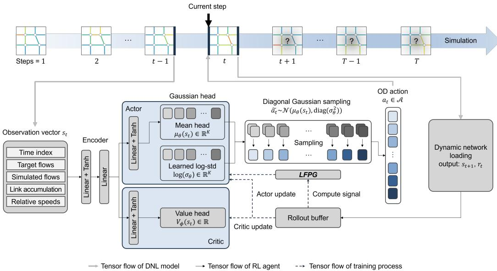  
Figure 1: Overall framework of LFPG-RL for online DODE.

After $a _ { t }$ is selected, the DNL model advances one step and returns the simulated network-link flow vector $e _ { t }$ . The simulated link-flow vector evaluated at the observed links is then given by $q _ { t } = H e _ { t }$ Because DNL is dynamic and time-delayed, $e _ { t }$ depends on the committed action history $a _ { 1 } , \ldots , a _ { t }$ not only on the current action $a _ { t }$ . The online DODE problem is written as

$$
\begin{array} { r } { J ( \pi ) = \mathbb { E } \left[ \displaystyle \sum _ { t = 1 } ^ { T } \frac { 1 } { L ^ { \mathrm { o b s } } } \left. \left( q _ { t } - q _ { t } ^ { * } \right) \oslash c ^ { \mathrm { o b s } } \right. _ { 2 } ^ { 2 } \right] , } \\ { \pi ^ { * } \in \underset { \pi \in \Pi } { \arg \operatorname* { m i n } } J ( \pi ) , } \end{array}\tag{1}
$$

where Π is the set of feasible sequential estimators. The expectation is taken over the simulator and route-choice randomness and, when the estimator is stochastic, over the action sampling induced by π. If the DNL model and the estimator are both deterministic, the expectation is omitted. The objective compares the observed link-flow vector $q _ { t } ^ { * }$ with its simulated counterpart $q _ { t } = H e _ { t }$

The estimated dynamic OD matrix is obtained by stacking the OD demand vectors selected over the horizon. Although the objective is cumulative over time, the problem remains online because each $a _ { t }$ is fixed when it is selected and cannot be revised later.

## 3.2.3 Markov decision process formulation

The sequential estimator π introduced above is interpreted as a policy in a finite-horizon Markov decision process. Specifically, the process is described by the tuple $( S , \bar { \mathcal { A } } , P , r , \rho _ { 0 } , T )$ , where S is the state space, A is the action space, $P$ is the state transition kernel induced by the DNL model, r is the reward function, $\rho _ { 0 }$ is the initial state, and $T$ is the number of decision steps in one episode. At the beginning of each episode, the target link flow trajectory $\left\{ q _ { t } ^ { * } \right\} _ { t = 1 } ^ { T }$ is selected from the dataset and fixed over the horizon, while the simulator is reset to its initial condition. This episode initialization induce $\rho _ { 0 } ;$ ; the transition kernel below is understood to be conditioned on the sampled target trajectory.

The state vector at step t is defined as

Table 1: Notations
<table><tr><td>Symbol</td><td>Description</td><td>Symbol</td><td>Description</td></tr><tr><td colspan="4">Indices and dimensions</td></tr><tr><td> $t = 1 , \dots , T$ </td><td>Decision-step index; T is the number of decision steps</td><td> $k = 1 , \ldots , K$ </td><td>OD-pair index; K is the number of OD pairs</td></tr><tr><td> $l = 1 , \ldots , L$ </td><td>Link index; L is the number of network links</td><td> $L ^ { \mathrm { o b s } }$ </td><td>Number of observed link-flow measurements</td></tr><tr><td colspan="4">Actions</td></tr><tr><td> $\boldsymbol { a } _ { t , k }$ </td><td>OD demand for OD pair k at step t</td><td> $a _ { t }$ </td><td>Clipped OD demand vector applied to the DNL model</td></tr><tr><td> $\widetilde { a } _ { t }$ </td><td>Raw Gaussian action sampled before clipping</td><td> $a ^ { \mathrm { m i n } } , a ^ { \mathrm { m a x } }$ </td><td>Lower and upper OD demand bounds</td></tr><tr><td> $\boldsymbol { A }$ </td><td>Feasible set of OD demand vectors</td><td></td><td></td></tr><tr><td colspan="4">Observed and simulated link-flow variables</td></tr><tr><td> $\begin{array} { l } { q _ { t } ^ { * } } \\ { H } \end{array}$ </td><td>Observed link-flow vector at step t Selection matrix for extracting observed</td><td> $\mathbf { \Psi } _ { q t } ^ { e t } = H \mathbf { e } _ { t }$ </td><td>Simulated link-flow vector over all network links Simulated link-flow vector at observed links</td></tr><tr><td></td><td>links</td><td></td><td></td></tr><tr><td> $c _ { l }$ </td><td>Capacity of link l</td><td> $c ^ { \mathrm { o b s } }$ </td><td>Capacity vector for observed link-flow measurements</td></tr><tr><td> $\oslash$ </td><td>Elementwise division</td><td></td><td></td></tr><tr><td colspan="4">Network-state variables</td></tr><tr><td> $n _ { t , l }$ </td><td>Link accumulation on link l after step t</td><td> $v _ { t , l }$ </td><td>Relative speed on link l after step t</td></tr><tr><td> $n _ { l } ^ { \mathrm { m a x } }$ </td><td>Maximum accumulation of link l</td><td>ns</td><td>Normalized time index at step t</td></tr><tr><td> $s _ { t }$ </td><td>State vector provided to the policy</td><td></td><td>State space</td></tr><tr><td colspan="4">Sequential estimator and policy objects</td></tr><tr><td>π</td><td>Sequential estimator, or policy</td><td>Ⅱ</td><td>Set of feasible sequential estimators</td></tr><tr><td colspan="4">Link-flow propagation guidance</td></tr><tr><td> $M _ { t , \tau , k , l }$ </td><td>Propagated volume on link l at step t generated by  $\boldsymbol { a } _ { \tau , k }$ </td><td> $\psi _ { t , l }$ </td><td>Reward sensitivity with respect to simulated flow</td></tr><tr><td> $g _ { \tau , k } ^ { \mathrm { L F P G } }$ </td><td>LFPG signal for OD pair k selected at step T</td><td></td><td></td></tr><tr><td colspan="4">LFPG normalization and shaping terms</td></tr><tr><td> $\mathcal { N } _ { K } ( \cdot )$ </td><td>OD-wise normalization across OD</td><td>€</td><td>Small positive numerical constant</td></tr><tr><td> $\alpha _ { A }$ </td><td>components LFPG advantage-shaping strength</td><td></td><td>Standardized sampled-action residual</td></tr><tr><td>κ</td><td>Clipping threshold for LFPG shaping</td><td> $\xi _ { t , k } \mathrm { ~ } _ { \mathrm { ~ \tiny ~ S _ { \mathrm { t } , k } ^ { L F P G } ~ } }$ </td><td>LFPG shaping component for OD pair k</td></tr><tr><td colspan="4">PPO and temporal-advantage terms</td></tr><tr><td></td><td>Temporal weighting factor</td><td>λ</td><td>GAE trace-decay parameter</td></tr><tr><td> $\frac { \gamma } { A _ { t } ^ { G } }$ </td><td>Normalized global advantage</td><td> $\widehat { R } _ { t }$ </td><td>Return target for critic training</td></tr><tr><td> ${ \rho } _ { t , k }$ </td><td>Component-wise PPO likelihood ratio</td><td>€PPO</td><td>PPO clipping parameter</td></tr></table>

$$
\begin{array} { r l } & { s _ { t } = \left[ \eta _ { t } , q _ { t } ^ { \ast } \oslash c ^ { \mathrm { o b s } } , e _ { t - 1 } \oslash c , n _ { t - 1 } \oslash n ^ { \mathrm { m a x } } , v _ { t - 1 } \right] , } \\ & { } \\ & { \eta _ { t } = \frac { t - 1 } { T - 1 } , } \end{array}\tag{2}
$$

where $c = ( c _ { 1 } , \dots , c _ { L } ) , c ^ { \mathrm { o b s } } = H c , n ^ { \mathrm { m a x } } = ( n _ { 1 } ^ { \mathrm { m a x } } , \dots , n _ { L } ^ { \mathrm { m a x } } ) .$

Here, $q _ { t } ^ { * }$ is the currently available target link-flow vector at the current decision step (future observations $q _ { t + 1 : T } ^ { * }$ are not used for this decision), whereas $e _ { t - 1 } , n _ { t - 1 }$ , and $v _ { t - 1 }$ summarize the network condition carried over from the previous step.

Because the current step has not yet been simulated when $a _ { t }$ is selected, the simulator-based part of the state is taken from the last snapshot of the step $t - 1$ . For the initial state, we set $e _ { 0 } = \mathbf { 0 } , n _ { 0 } = \mathbf { 0 }$ $v _ { 0 } = \mathbf { 1 }$

The action is the current OD demand vector $a _ { t } \in A .$ . After applying ${ \boldsymbol { a } } _ { t } ,$ the DNL model advances one step and produces the simulated network-link flow vector $e _ { t } ,$ , the link-accumulation vector $n _ { t }$

and the relative-speed vector $v _ { t }$ . The simulated link-flow vector evaluated at the observed links is $q _ { t } = H e _ { t }$ . For $t < T$ , the next state is then $s _ { t + 1 } = \left[ \eta _ { t + 1 } , q _ { t + 1 } ^ { * } \oslash c ^ { \mathrm { o b s } } , e _ { t } \oslash c , n _ { t } \oslash n ^ { \mathrm { m a x } } , v _ { t } \right]$

The state transition is induced by the DNL model together with any route-choice randomness:

$$
s _ { t + 1 } \sim P ( \cdot \mid s _ { t } , a _ { t } ) .\tag{3}
$$

The reward is defined as the negative normalized link-flow error,

$$
r ( s _ { t } , a _ { t } , s _ { t + 1 } ) = - \frac { 1 } { L ^ { \mathrm { o b s } } } \left. ( q _ { t } - q _ { t } ^ { * } ) \oslash c ^ { \mathrm { o b s } } \right. _ { 2 } ^ { 2 } .\tag{4}
$$

Therefore, maximizing cumulative reward is equivalent to minimizing the cumulative normalized mismatch between simulated and observed link flows over the horizon. The reward is evaluated in the observed link-flow space using $q _ { t } = H e _ { t }$ , whereas the propagated network state in $s _ { t }$ uses the full network-link variables $e _ { t } , n _ { t }$ , and $v _ { t }$

Let $\pi _ { \boldsymbol { \theta } } { \left( a _ { t } \mid s _ { t } \right) }$ denote a parameterized policy which is instantiated using PPO. The learning problem is

$$
\operatorname* { m a x } _ { \theta } \mathbb { E } _ { \rho _ { 0 } , P , \pi _ { \theta } } \left[ \sum _ { t = 1 } ^ { T } r ( s _ { t } , a _ { t } , s _ { t + 1 } ) \right] .\tag{5}
$$

Although Eq. (5) is written for the undiscounted DODE objective in Eq. (1), γ introduced below is used as a temporal weighting parameter in GAE and LFPG; setting $\gamma = 1$ recovers the undiscounted objective.

## 3.3 Policy Optimization with Link-Flow Propagation Guidance

## 3.3.1 Extraction of link-flow propagation information

The proposed method first extracts link-flow propagation information from each completed DNL rollout. The purpose of this extraction is to identify how each OD demand component propagates through the network and contributes to observed link flows in the current and subsequent steps. This information is later used to construct OD-specific learning signals for advantage shaping.

Let $\boldsymbol { a } _ { \tau , k }$ denote the OD demand for OD pair k selected at decision step $\tau .$ During the DNL rollout, the vehicles generated by $\boldsymbol { a } _ { \tau , k }$ are treated as an OD-time group indexed by $( \tau , k )$ . For each step $t \geq \tau$ and network link l, we record the amount of this OD-time group that contributes to the simulated network-link flow on link l at step t. This propagated volume is denoted by

$$
\begin{array} { l l } { { } } & { { M _ { t , \tau , k , l } \geq 0 , } } \\ { { } } & { { 1 \leq \tau \leq t \leq T , \quad k = 1 , \ldots , K , \quad l = 1 , \ldots , L . } } \end{array}\tag{6}
$$

For $t < \tau$ , we set $M _ { t , \tau , k , l } = 0$ , because the demand selected at step $\tau$ cannot contribute to link flow before it is generated. The resulting tensor

$$
M = \{ M _ { t , \tau , k , l } \} \in \mathbb { R } _ { + } ^ { T \times T \times K \times L }\tag{7}
$$

is the link-flow propagation tensor extracted from the rollout. Unlike a fixed static assignment matrix, M is rollout-specific: it reflects the realized congestion pattern, the previously selected OD demand vectors, and any stochastic route-choice outcomes during that simulation.

Fig. 2 illustrates the construction of $M _ { t , \tau , k , l }$ . A demand component $_ { a _ { \tau , k } }$ may contribute to different downstream network links at different future steps. Therefore, its effect is not represented by a single link or a single time step, but by a set of propagated volumes over the link-time plane.

The tensor M also gives an explicit decomposition of the simulated network-link flow. For each network link l and step t, the simulated network-link flow is written as the sum of all OD-time groups that reach link l at step t. The simulated observed link-flow vector is then obtained by applying the selection matrix H:

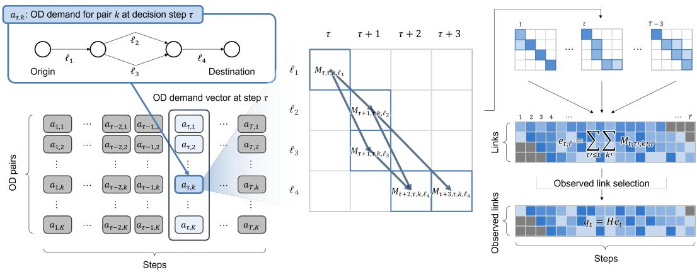  
Figure 2: Extraction of link-flow propagation information from an OD-time demand component.

$$
e _ { t , l } = \sum _ { \tau = 1 } ^ { t } \sum _ { k = 1 } ^ { K } M _ { t , \tau , k , l } , \quad l = 1 , \ldots , L , \quad q _ { t } = H e _ { t } .\tag{8}
$$

This decomposition is the key difference between scalar reward feedback and link-flow propagation guidance. The reward only evaluates the aggregate mismatch between $q _ { t }$ and $q _ { t } ^ { * }$ in the observed link-flow space, whereas M indicates which OD-time components contributed to the simulated network-link flow $e _ { t }$ before the observed-link selection $q _ { t } = H e _ { t }$

To convert these propagated-volume records into a learning signal, we combine M with the signed link flow error. From the reward function, the reward sensitivity is represented in the full network-link space by mapping the observed-link sensitivity back through $\cdot \boldsymbol { H } ^ { \top }$

$$
\psi _ { t , l } = \left[ H ^ { \top } \left( { \frac { 2 ( q _ { t } ^ { * } - q _ { t } ) } { L ^ { \mathrm { o b s } } } } \oslash ( c ^ { \mathrm { o b s } } ) ^ { 2 } \right) \right] _ { l } , l = 1 , \ldots , L .\tag{9}
$$

Here, $( c ^ { \mathrm { { o b s } } } ) ^ { 2 }$ denotes the component-wise square of $c ^ { \mathrm { { o b s } } }$ . Network links not selected by H receive zero sensitivity.

A positive $\psi _ { t , l }$ means that increasing the simulated flow on the corresponding selected network link would locally increase the reward, whereas a negative value means that the simulated flow is locally higher than the observed target on that selected measurement. Thus, $\psi _ { t , l }$ provides the direction of local reward improvement in the full network-link space.

For each OD-time component $( \tau , k )$ , the LFPG signal is defined as

$$
g _ { \tau , k } ^ { \mathrm { L F P G } } = \sum _ { u = \tau } ^ { T } \gamma ^ { u - \tau } \sum _ { l = 1 } ^ { L } M _ { u , \tau , k , l } \psi _ { u , l } ,\tag{10}
$$

where $\gamma \in ( 0 , 1 ]$ is the temporal weighting factor used in the policy update. This signal aggregates downstream reward sensitivities weighted by the propagated link-flow contributions of OD demand component $\boldsymbol { a } _ { \tau , k }$ . Its magnitude reflects how strongly the OD-time component is associated with future link-flow errors, and its sign indicates the local direction suggested by the observed mismatch under the realized link-flow propagation pattern. $g _ { \tau , k } ^ { \mathrm { L F P G } }$ is interpreted as a rollout-conditioned, volume-weighted guidance signal, not as a counterfactual derivative of the DNL model. Although the summation is taken over all network links, only network links with nonzero sensitivity through $H ^ { \top }$ contribute to $g _ { \tau , k } ^ { \mathrm { L F P G } }$

Fig. 3 summarizes this extraction process. The observed link-flow vector $q _ { t } ^ { * }$ is compared with the simulated observed link-flow vector $q _ { t } = H e _ { t }$ , while the simulated network-link flow $e _ { t }$ is decomposed into propagated volumes $M _ { t , \tau , k , l }$ . The downstream sensitivity-weighted aggregation then produces an OD-specific signal $g _ { \tau , k } ^ { \mathrm { L F P G } }$ . This signal is used as auxiliary guidance for advantage shaping during policy optimization.

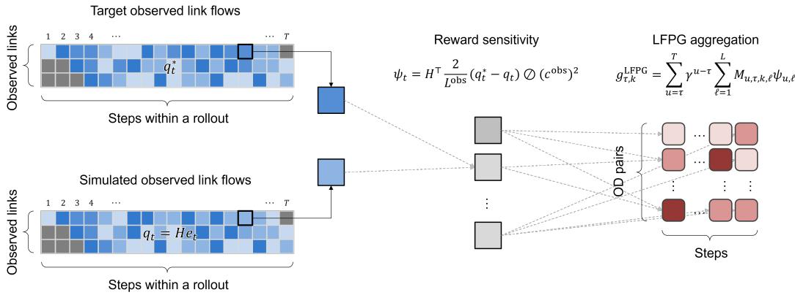  
Figure 3: Construction of LFPG from propagated volumes and link-flow mismatch.

The extraction is performed after each completed rollout and does not require additional DNL evaluations. It only requires recording the realized link-flow contribution for each OD-time group during the same simulation rollout. Therefore, the deployed policy still selects $a _ { t }$ only from the current state vector $s _ { t } ,$ while the link-flow propagation information is used during training to improve OD-specific policy updates across varying target trajectories.

## 3.3.2 Proximal policy optimization with LFPG

We use PPO as the base policy-gradient method because it provides a conservative clipped update while remaining simple to implement with high-dimensional continuous Gaussian policies [28]. This property is useful for DODE, where each action contains many OD components, and each rollout requires an expensive simulation [13]. The proposed LFPG-RL modifies PPO by injecting the link-flow propagation signal into the actor update through advantage shaping.

The policy is represented by a diagonal Gaussian actor. Given the state vector $s _ { t }$ , the actor produces a mean vector $\dot { \mu } _ { \theta } ( s _ { t } ) \in \mathbb { R } ^ { \mathbf { \check { K } } }$ and a learned diagonal standard deviation $\sigma _ { \theta } \in \mathbb { R } _ { + } ^ { K }$ . During rollout collection, a raw action is sampled from

$$
\widetilde { \boldsymbol { a } } _ { t } \sim \mathcal { N } \left( \mu _ { \boldsymbol { \theta } } ( \boldsymbol { s } _ { t } ) , \mathrm { d i a g } ( \sigma _ { \boldsymbol { \theta } } ^ { 2 } ) \right) ,\tag{11}
$$

the action applied to the DNL model is obtained by clipping $\widetilde { a } _ { t }$ to the feasible action range ${ \mathcal { A } } ,$ i.e., $a _ { t } = \mathrm { c l i p } ( \widetilde { a } _ { t } , a ^ { \mathrm { m i n } } , a ^ { \mathrm { m a x } } )$ . The likelihood terms in the PPO update are evaluated using the unclipped raw action, whereas the clipped action is applied to the DNL model. The critic estimates a scalar value $V _ { \phi } ( s _ { t } )$ .

The standard temporal learning signal is computed using GAE. Let

$$
\delta _ { t } = r ( s _ { t } , a _ { t } , s _ { t + 1 } ) + \gamma { \bf 1 } _ { \{ t < T \} } V _ { \phi } ( s _ { t + 1 } ) - V _ { \phi } ( s _ { t } ) ,\tag{12}
$$

where $\mathbf { 1 } _ { \left\{ t < T \right\} }$ is zero at the terminal step. The global advantage is

$$
\widehat { A } _ { t } ^ { G } = \sum _ { j = t } ^ { T } ( \gamma \lambda ) ^ { j - t } \delta _ { j } ,\tag{13}
$$

where λ is the GAE trace-decay parameter. The value target is $\widehat { R } _ { t } = \widehat { A } _ { t } ^ { G } + V _ { \phi } ( s _ { t } )$ . The global advantage is normalized over the rollout batch before the actor update.

The global advantage $\widehat { A } _ { t } ^ { G }$ is scalar at each step and therefore does not distinguish the K OD dimensions inside the action vector. To introduce OD-specific propagation guidance, we use the

LFPG signal $g _ { t , k } ^ { \mathrm { L F P G } }$ . Here, the departure-step index τ is written as t because the signal is used for the action selected at step t. Let $\mathcal { N } _ { K } ( \cdot )$ denote OD-wise normalization across the K components at each step. In the implementation, the LFPG signal is normalized by the mean absolute magnitude across OD components and clipped by $\kappa .$ The normalized LFPG direction is then combined with the standardized sampled-action residual $\xi _ { t , k }$ . The LFPG shaping component used in the actor update is

$$
\mathcal { N } _ { K } \left( g _ { t , k } ^ { \mathrm { L F P G } } \right) = \mathrm { c l i p } _ { \kappa } \left( \frac { g _ { t , k } ^ { \mathrm { L F P G } } } { \frac { 1 } { K } \sum _ { j = 1 } ^ { K } \left| g _ { t , j } ^ { \mathrm { L F P G } } \right| + \epsilon } \right) ,\tag{14}
$$

$$
\xi _ { t , k } = \mathrm { c l i p } _ { \kappa } \left( \frac { \widetilde { a } _ { t , k } - \mu _ { \theta _ { \mathrm { o l d } } , k } ( s _ { t } ) } { \sigma _ { \theta _ { \mathrm { o l d } } , k } } \right) ,\tag{15}
$$

$$
\begin{array} { r } { S _ { t , k } ^ { \mathrm { L F P G } } = \alpha _ { A } \mathrm { c l i p } _ { \kappa } \left( \mathcal { N } _ { K } \left( g _ { t , k } ^ { \mathrm { L F P G } } \right) \xi _ { t , k } \right) , } \end{array}\tag{16}
$$

where $\epsilon > 0$ is a small numerical constant, and $\alpha _ { A } \geq 0$ controls the strength of advantage shaping. The shaping component $S _ { t , k } ^ { \mathrm { L F P G } }$ adjusts each OD component according to both the downstream linkflow propagation direction and the sampled-action residual. The normalized global advantage $\overline { { A } } _ { t } ^ { G }$ is preserved separately in the actor objective, where it is combined with the LFPG shaping component through split PPO surrogate terms. Therefore, the LFPG term does not simply add $\check { \mathcal { N } _ { K } } ( g _ { t , k } ^ { \mathrm { L F P G } } )$ to the global advantage; it adds a directional shaping component based on $\mathcal { N } _ { K } ( g _ { t , k } ^ { \mathrm { L F P G } } ) \xi _ { t , k }$

Fig. 4 summarizes the resulting LFPG-RL policy update. The rollout data provide the sampled action, reward, old log probability, and old value estimate. The LFPG signal serves as an OD-specific shaping component for the actor update, while the normalized global advantage remains the global PPO-style learning signal, and the return target is used for the critic update. Under the diagonal Gaussian policy, we use a component-wise PPO surrogate, where the likelihood ratio is evaluated for each OD component. Let $\theta _ { \mathrm { o l d } }$ denote the policy parameters used during rollout collection. For OD pair k at step $t ,$ let $\pi _ { \boldsymbol { \theta } , k }$ denote the marginal Gaussian density of OD component $k ,$

$$
\rho _ { t , k } ( \theta ) = \frac { \pi _ { \theta , k } \left( \widetilde { a } _ { t , k } \mid s _ { t } \right) } { \pi _ { \theta _ { \mathrm { o l d } } , k } \left( \widetilde { a } _ { t , k } \mid s _ { t } \right) } .\tag{17}
$$

The LFPG-RL actor objective is then

$$
\begin{array} { r l } & { \mathcal { C } ( \rho , x ) = \operatorname* { m i n } \left[ \rho x , \mathrm { c l i p } \left( \rho , 1 - \epsilon _ { \mathrm { P P O } } , 1 + \epsilon _ { \mathrm { P P O } } \right) x \right] , } \\ & { \mathcal { L } _ { \pi } ^ { \mathrm { L F P G } } ( \theta ) = \cfrac { 1 } { T } \displaystyle \sum _ { t = 1 } ^ { T } \sum _ { k = 1 } ^ { K } \left[ \mathcal { C } \left( \rho _ { t , k } ( \theta ) , \overline { { A } } _ { t } ^ { G } \right) + \mathcal { C } \left( \rho _ { t , k } ( \theta ) , S _ { t , k } ^ { \mathrm { L F P G } } \right) \right] , } \end{array}\tag{18}
$$

where $\boldsymbol { \epsilon } _ { \mathrm { P P O } }$ is the PPO clipping parameter. The PPO clipping operator is applied separately to the normalized global advantage and the LFPG shaping component. The critic is trained by minimizing the squared error between $V _ { \phi } ( s _ { t } )$ and $\widehat { R } _ { t }$ , and the final training loss also includes the standard entropy regularization term.

## 3.4 Experimental Settings

## 3.4.1 Dynamic network loading model

The DNL model is implemented as a discrete-time link transmission model (LTM). Each link is characterized by its free-flow travel time, capacity, backward-wave travel time, and maximum accumulation. At each internal simulation step, link boundary flows are updated using sending and receiving functions, allowing the model to represent queue formation, spillback, and time-delayed propagation of OD demand [29–31]. The estimation interval is 15 minutes, while the DNL model runs at a 1-minute internal resolution and is aggregated accordingly. Route choice is represented by a stochastic logit model over candidate paths. For each OD pair, up to four candidate paths are generated, and path departures are sampled according to the realized logit shares. This setting makes the OD-to-link-flow mapping stochastic and time-dependent, consistent with the expectation term in Eq. (1).

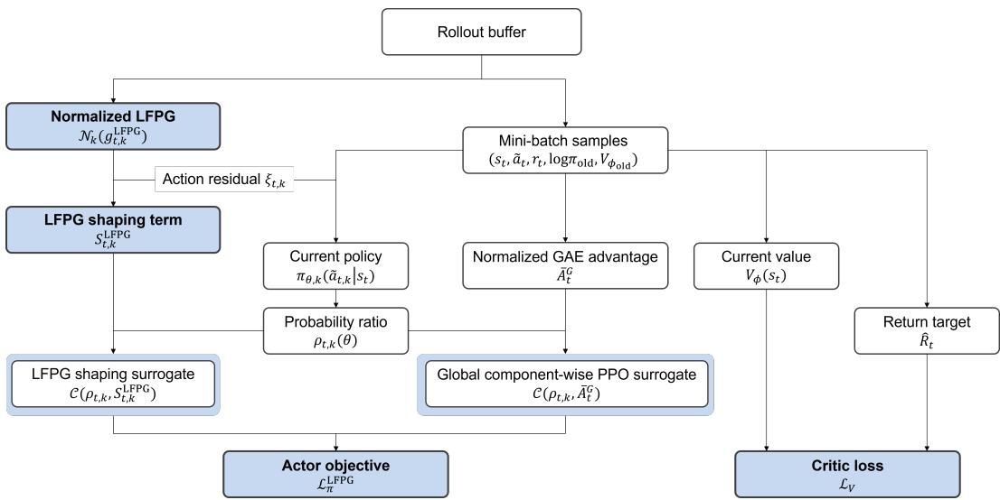  
Figure 4: LFPG-RL policy update with global PPO advantage and OD-specific LFPG shaping.

## 3.4.2 Target network and data

The case study uses a Melbourne arterial network constructed from primary arterial links and the SCATS detector dataset. As shown in Fig. 5, the road network is converted into a DNL model comprising 31 OD zone centroids and 78 directed links, yielding 930 OD components in each action vector. Detectors are mapped to the corresponding directed links. When multiple detectors are available for a single link, the most representative one is selected based on data completeness criteria, such as the absence of missing data. Link capacities and speed parameters are set using Victorian strategic transport modeling link-type values for urban arterials: 900 vehicles per hour per lane, a posted-speed factor of 0.75, and Akcelik J = 0.8 [32].

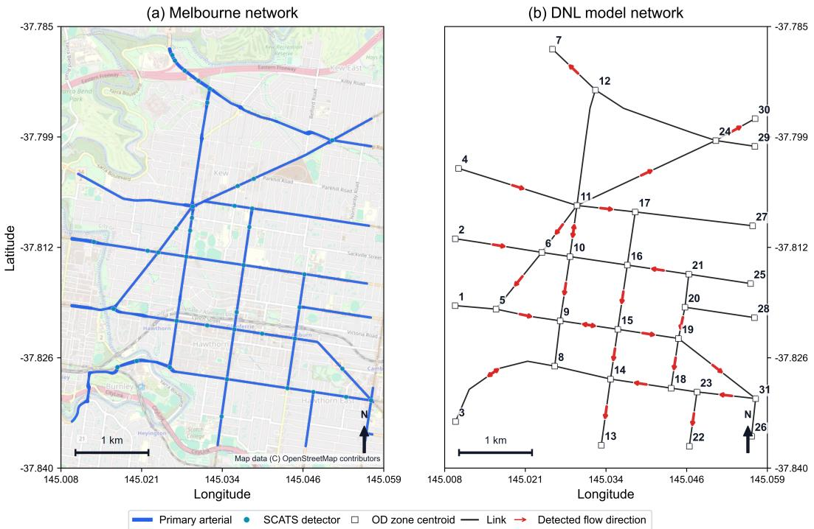  
Figure 5: (a) Melbourne arterial network and (b) corresponding DNL model network.

The dataset consists of 250 weekday daily trajectories retained from SCATS detector records spanning April 1, 2025, to April 25, 2026. The dataset was randomly divided into 220 training days and 30 held-out test days. One episode covers the 04:00–10:00 morning period and consists of 24 decision steps, each with a 15-minute interval.

The field dataset contains only link-flow observations. Ground-truth OD matrices are not available and are not used for training or evaluation. Accordingly, the primary empirical goal is to reproduce observed link-flow trajectories. This study does not evaluate true OD recovery or OD identifiability; the estimated OD matrices are interpreted as calibrated simulator inputs rather than uniquely identified travel demand.

## 3.4.3 Baselines and hyperparameters

The baselines are selected to address three concerns in evaluating LFPG-RL. First, the improvement may come from the policy architecture rather than LFPG. To isolate this effect, we compare LFPG-RL with PPO using the same architecture and settings, but without the advantage shaping. Second, LFPG can be useful regardless of the type of approach. To test this, we include a gradient descent method with LFPG (LFPG-GD), which uses the propagation tensor as a search direction. Third, an RL framework may be disadvantaged compared to conventional methods. We therefore include W-SPSA and ensemble Kalman filtering (EnKF) as representative online optimization and sequential filtering baselines.

All methods use the same action space, with each OD component bounded between 0 and 30 vehicles per 15-minute interval. LFPG-RL and PPO use two hidden layers of 256 units with Tanh activations and a diagonal Gaussian action head. PPO is trained with learning rate $3 \times 1 0 ^ { - 4 } , \gamma = 0 . 9 9 , \mathrm { G A E }$ parameter $\lambda = 0 . 9 5$ , clipping parameter 0.1, batch size 96, four epochs per update, entropy coefficient $2 \times 1 0 ^ { - 4 }$ , value-loss coefficient 0.5, and gradient-norm clipping at 0.5. The initial policy mean and standard deviation are 0 and 0.35, respectively. LFPG-RL uses $\alpha _ { A } = 1 . 3 5$ and $\kappa = 1 . 4$ . The test policy was selected based on the highest training reward averaged over the preceding 100 episodes.

For the online optimization baselines, LFPG-GD uses projected line search with an initial step size of 0.8 and a step-size range of 0.05–2.0. W-SPSA uses $a = 2 . 0 , c = 0 . 0 4 , A = 4 . 0 , \alpha = 0 . 6 0 2$ , and $\gamma = 0 . 1 0 1$ under the standard SPSA notation. For the sequential filtering baselines, the ensemble size is 12, with a covariance inflation of 1.02 and ridge regularization of 0.003. EnKF with LFPG (LFPG-EnKF) also evaluates candidates with a step size of 0.8. All methods are evaluated under the same per-step runtime budget. At deployment, LFPG-RL and PPO require only a single policy forward pass per decision step, whereas online optimization and filtering baselines require repeated DNL evaluations.

## 4 Results

This section evaluates whether LFPG-RL can reproduce link-flow trajectories for the online DODE problem. Each test trajectory consists of 24 decision steps, and each step contains 27 observed detector-link measurements. Across the 30 held-out test trajectories, this yields 19,440 points in total.

The first comparison isolates the effect of LFPG advantage shaping by comparing LFPG-RL with PPO. The two methods use the same policy architecture and training configuration, except that PPO does not include the LFPG shaping term. Therefore, the comparison directly evaluates whether the propagation-guided component provides a useful learning signal beyond standard scalar reward feedback.

As shown in Fig. 6, LFPG-RL steadily improves during training, whereas PPO remains in a lowperformance regime. The reward curve is reported as the negative mean step MSE, so an upward trend corresponds to a reduction in link-flow mismatch. LFPG-RL reaches substantially higher rewards than PPO and maintains stable improvement throughout training. This suggests that the agent learns a generalized estimation rule: as the target link-flow observation and propagated network state change across trajectories, the policy adjusts the current OD vector without trajectory-specific iterative search.

The test performance results show a clear separation between the two policy-learning methods. LFPG-RL achieves an RMSE of 4.69, MAPE of 20.15%, and Pearson $r = 0 . 9 9 5$ . In contrast, PPO yields an RMSE of 59.64, an MAPE of 562.66%, and a Pearson r of −0.041. Relative to PPO,

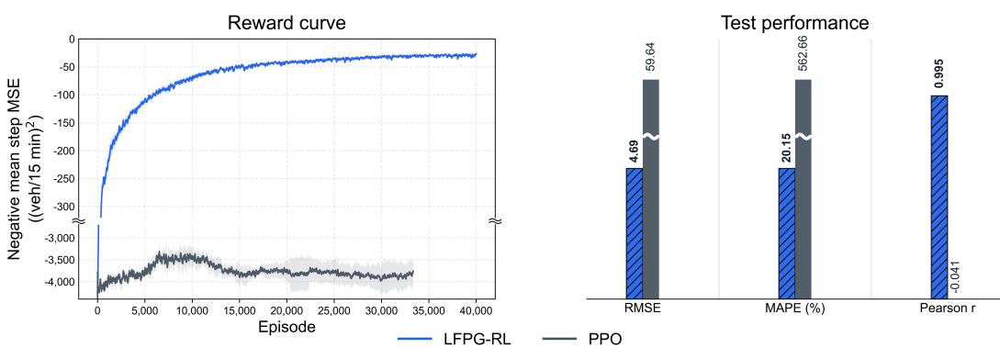  
Figure 6: (a) Reward curve and (b) test performance comparison between LFPG-RL and PPO. Each policy was trained for 20 hours on a PC equipped with an AMD Threadripper PRO 5975WX.

LFPG-RL reduces RMSE by 92.1% and MAPE by 96.4%. Since the two methods share the same actor-critic architecture, this improvement is attributed to the LFPG advantage-shaping signal rather than to the neural network structure itself.

The broader comparison across all methods is presented in Fig. 7. The scatter plots compare simulated and target link flows across all observations, and the diagonal line represents exact reproduction. The methods are grouped into policy learning, online optimization, and sequential filtering approaches. All methods are constrained by a 15-minute per-step computation time budget, matching the data update interval.

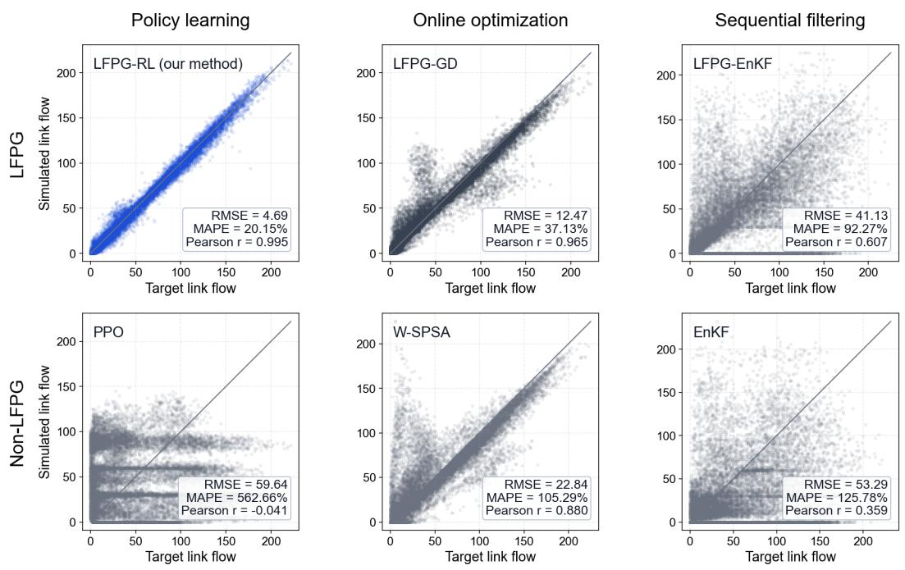  
Figure 7: Target versus simulated link-flow scatter plots by methods.

LFPG-RL produces the tightest concentration of points around the diagonal. The alignment is maintained over the observed range of target flows, indicating that the learned policy captures both the overall scale of traffic volumes and the variation across detector links and time steps. LFPG-GD is the strongest baseline, with RMSE 12.47, MAPE 37.13%, and Pearson r = 0.965. This confirms that the LFPG tensor is also useful as an online search direction. However, LFPG-RL still improves on LFPG-GD, reducing RMSE by 62.3% and MAPE by 45.7%.

The comparison with LFPG-GD clarifies the role of learning in LFPG-RL. LFPG-GD also uses the propagation tensor as a local search direction during online optimization. This can be limiting when link-flow errors observed at downstream links are affected by OD decisions made in earlier intervals and by stochastic route-choice realizations. LFPG-RL uses the propagation information differently. Through training over many rollouts, the policy learns how realized propagation patterns and downstream residuals are related to OD adjustments. Therefore, the improvement over LFPG-GD is not only due to the single policy forward pass at deployment. It also suggests that, in the tested DNL setting, a learned policy can use LFPG more effectively than local online updates.

The remaining baselines show substantially weaker link-flow reproduction. W-SPSA captures the trend in target flow, but its points are more widely dispersed around the diagonal, yielding RMSE 22.84, MAPE 105.29%, and Pearson r = 0.880. LFPG-EnKF improves on EnKF, reducing RMSE from 53.29 to 41.13, reducing MAPE from 125.78% to 92.27%, and increasing Pearson r from 0.359 to 0.607. Nevertheless, both sequential filtering methods remain far less accurate than LFPG-RL and LFPG-GD. PPO performs worst in terms of alignment, with many simulated flows concentrated away from the diagonal and a negative correlation. These results suggest that LFPG is beneficial across algorithmic families, but its strongest effect in this experiment is obtained when it is used to train a generalized policy.

Fig. 8 provides a stepwise view of performance. The boxplots summarize 720 stepwise values for each method, obtained from 30 held-out trajectories over 24 decision steps.

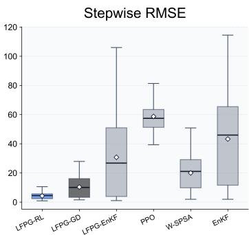

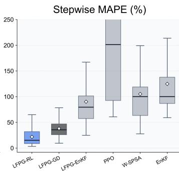

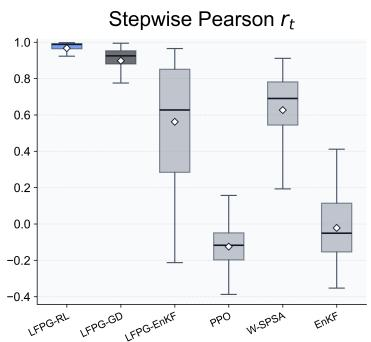  
Figure 8: Distribution of stepwise RMSE, MAPE, and Pearson $r _ { t }$ across methods.

The stepwise RMSE panel shows that LFPG-RL has the smallest and most compact error distribution. The mean and median stepwise RMSE are 4.25 and 4.45 vehicles per 15-minute interval, respectively, with an interquartile range from 2.33 to 5.64. LFPG-GD is the closest baseline, but its mean and median stepwise RMSE increase to 10.32 and 10.04, and its upper tail is wider. Although LFPG-GD achieves low errors in several steps, it is less consistent over the full horizon. LFPG-EnKF shows a much broader distribution, indicating that the LFPG correction improves some steps but does not stabilize the filtering process across all target trajectories. PPO, W-SPSA, and EnKF exhibit substantially larger stepwise errors.

The stepwise MAPE panel shows a similar ranking. LFPG-RL has the lowest mean stepwise MAPE (21.65%) and median (15.05%). LFPG-GD again performs best among the baselines, with a mean and median stepwise MAPE of 37.86% and 35.48%, respectively.

The Pearson $r _ { t }$ panel evaluates whether each method preserves the spatial pattern of observed link flows at each decision step. LFPG-RL maintains the strongest time-wise alignment, with median $r _ { t } = 0 . 9 8 8$ and an interquartile range from 0.964 to 0.992. LFPG-GD also performs well, with median $r _ { t } = 0 . 9 2 5$ , but its distribution is lower and more variable. LFPG-EnKF has a much wider distribution, indicating unstable spatial alignment across time. PPO, W-SPSA, and EnKF have weak or negative median $r _ { t } .$ , meaning that their simulated link-flow patterns often fail to match the observed spatial pattern at individual decision steps. Overall, Fig. 8 shows that LFPG-RL is not only accurate in aggregate metrics but also stable across decision steps.

Finally, Fig. 9 compares LFPG-RL with LFPG-GD using heatmaps of capacity-normalized mean absolute error. Each cell represents one observed detector link and one decision step, averaged over the held-out test trajectories. This visualization clarifies whether the aggregate performance difference comes from broad improvement across the link-time plane or from a small number of localized failures.

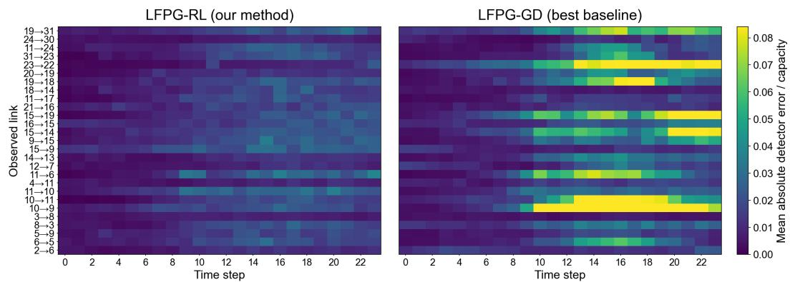  
Figure 9: Heatmaps of capacity-normalized mean absolute error for LFPG-RL and LFPG-GD.

LFPG-RL exhibits a relatively uniform low-error pattern. The average capacity-normalized absolute error across all link-time cells is 0.0131, and 0 of the 648 cells exceed 0.05. LFPG-GD has a higher average capacity-normalized absolute error of 0.0248 and shows stronger localized error bands, particularly in the later part of the horizon. In this case, 96 cells exceed 0.05.

## 5 Conclusion

This study proposed LFPG-RL, an RL framework for online DODE under time-delayed, nonlinear, and stochastic dynamic network loading. An RL approach can reduce the online computational burden by replacing iterative algorithms with a trained policy, but this shifts the main difficulty to policy generalization across target link-flow trajectories. Standard scalar reward feedback provides limited guidance for this task because it evaluates the sampled OD demand vector only through aggregate linkflow mismatch. LFPG-RL addresses this limitation by extracting link-flow propagation information from completed DNL rollouts and using it to shape PPO actor updates at the OD-component level.

This method was evaluated using field link-flow observations from a Melbourne arterial network represented by an LTM-based DNL model with stochastic route choice. In this case study, LFPG-RL achieved the best performance among all evaluated methods. Compared with PPO using the same actor-critic architecture, LFPG-RL reduced RMSE by 92.1% and MAPE by 96.4%, indicating that the performance gain comes from LFPG advantage shaping rather than from the policy architecture alone. Compared with the strongest baseline, LFPG-RL reduced RMSE by 62.3% and MAPE by 45.7%. The stepwise and spatiotemporal analyses further showed that LFPG-RL was not only accurate in aggregate metrics but also more stable across decision steps and less prone to localized errors.

These findings show that completed DNL rollouts provide useful structural information beyond scalar reward values. LFPG converts realized OD-to-link propagation and downstream residuals into OD-specific learning signals, enabling the policy to generalize across target link-flow trajectories. The comparison with LFPG-GD clarifies this role: using propagation information as a local online search direction is helpful, but training a stochastic RL policy from many rollout-conditioned propagation patterns can be more robust under time-delayed and stochastic DNL.

Several limitations remain. First, LFPG is a rollout-conditioned guidance signal rather than a counterfactual derivative of the DNL model; under severe congestion, route-choice shifts, queues, and spillback can make the recorded propagation tensor less representative of the local effect of changing an OD component. Future work could combine LFPG with sensitivities from differentiable DNL models to improve guidance in saturated regimes. Second, the current formulation uses only link-flow observations and does not incorporate OD matrix priors. When such priors are available, LFPG-RL can estimate residual corrections relative to a prior matrix or include a regularization term.

## Acknowledgments

The authors used GPT-5.5 to review the code and manuscript, and they assume full responsibility for the final edited content.

## Author Contributions

The authors confirm contribution to the paper as follows: conceptualization: Min and Kim; data curation: Min; formal analysis: Min; methodology: Min and Kim; writing—original draft: Min; writing—review and editing: Min and Kim; draft manuscript preparation: Min and Kim. All authors reviewed the results and approved the final version of the manuscript.

## Code Availability

The source code is available at https://github.com/dgmin-kr/dode-rl-online/.

## Declaration of Conflicting Interests

The authors declared no potential conflicts of interest with respect to the research, authorship, and/or publication of this article.

## Funding

This work was supported by the Korea Institute of Police Technology (No. 092021C28S02000) and the National Research Foundation of Korea (No. 00409860).

## References

[1] V. Papathanasopoulou, I. Markou, and C. Antoniou. Online Calibration for Microscopic Traffic Simulation and Dynamic Multi-Step Prediction of Traffic Speed. Transportation Research Part C: Emerging Technologies, 68:144–159, 2016.

[2] C. Zhang, C. Osorio, and G. Flötteröd. Efficient Calibration Techniques for Large-Scale Traffic Simulators. Transportation Research Part B: Methodological, 97:214–239, 2017.

[3] M. Cremer and H. Keller. A New Class of Dynamic Methods for the Identification of Origin–Destination Flows. Transportation Research Part B: Methodological, 21(2):117–132, 1987.

[4] E. Cascetta and S. Nguyen. A Unified Framework for Estimating or Updating Origin/Destination Matrices from Traffic Counts. Transportation Research Part B: Methodological, 22(6):437–455, 1988.

[5] K. Ashok and M. E. Ben-Akiva. Alternative Approaches for Real-Time Estimation and Prediction of Time-Dependent Origin–Destination Flows. Transportation Science, 34(1):21–36, 2000.

[6] S. Peeta and A. K. Ziliaskopoulos. Foundations of Dynamic Traffic Assignment: The Past, the Present and the Future. Networks and Spatial Economics, 1(3–4):233–265, 2001.

[7] T. Toledo and T. Kolechkina. Estimation of Dynamic Origin–Destination Matrices Using Linear Assignment Matrix Approximations. IEEE Transactions on Intelligent Transportation Systems, 14(2):618–626, 2013.

[8] C. Osorio. High-Dimensional Offline Origin–Destination (OD) Demand Calibration for Stochastic Traffic Simulators of Large-Scale Road Networks. Transportation Research Part B: Methodological, 124:18–43, 2019.

[9] C. Osorio. Dynamic Origin–Destination Matrix Calibration for Large-Scale Network Simulators. Transportation Research Part C: Emerging Technologies, 98:186–206, 2019.

[10] M. Bierlaire and F. Crittin. An Efficient Algorithm for Real-Time Estimation and Prediction of Dynamic OD Tables. Operations Research, 52(1):116–127, 2004.

[11] L. Lu, Y. Xu, C. Antoniou, and M. Ben-Akiva. An Enhanced SPSA Algorithm for the Calibration of Dynamic Traffic Assignment Models. Transportation Research Part C: Emerging Technologies, 51: 149–166, 2015.

[12] X. Ros-Roca, L. Montero, J. Barceló, K. Nökel, and G. Gentile. A Practical Approach to Assignment-Free Dynamic Origin–Destination Matrix Estimation Problem. Transportation Research Part C: Emerging Technologies, 134:103477, 2022.

[13] D. Min, S. Choi, and D.-K. Kim. Deep Reinforcement Learning for Dynamic Origin–Destination Matrix Estimation in Microscopic Traffic Simulations Considering Credit Assignment, 2025.

[14] W. Ma, X. Pi, and S. Qian. Estimating Multi-Class Dynamic Origin–Destination Demand Through a Forward–Backward Algorithm on Computational Graphs. Transportation Research Part C: Emerging Technologies, 119:102747, 2020.

[15] J. Schulman, P. Moritz, S. Levine, M. I. Jordan, and P. Abbeel. High-Dimensional Continuous Control Using Generalized Advantage Estimation, 2015.

[16] K. Ashok and M. E. Ben-Akiva. Estimation and Prediction of Time-Dependent Origin–Destination Flows with a Stochastic Mapping to Path Flows and Link Flows. Transportation Science, 36(2):184–198, 2002.

[17] X. Zhou and H. S. Mahmassani. A Structural State Space Model for Real-Time Traffic Origin–Destination Demand Estimation and Prediction in a Day-to-Day Learning Framework. Transportation Research Part B: Methodological, 41(8):823–840, 2007.

[18] A. A. Prakash, R. Seshadri, C. Antoniou, F. C. Pereira, and M. E. Ben-Akiva. Reducing the Dimension of Online Calibration in Dynamic Traffic Assignment Systems. Transportation Research Record, 2667(1): 96–107, 2017.

[19] A. A. Prakash, R. Seshadri, C. Antoniou, F. C. Pereira, and M. E. Ben-Akiva. Improving Scalability of Generic Online Calibration for Real-Time Dynamic Traffic Assignment Systems. Transportation Research Record, 2672(48):79–92, 2018.

[20] M. Castiglione, G. Cantelmo, M. Qurashi, M. Nigro, and C. Antoniou. Assignment Matrix Free Algorithms for On-Line Estimation of Dynamic Origin–Destination Matrices. Frontiers in Future Transportation, 2: 640570, 2021.

[21] H. Zhang, R. Seshadri, A. A. Prakash, C. Antoniou, F. C. Pereira, and M. E. Ben-Akiva. Improving the Accuracy and Efficiency of Online Calibration for Simulation-Based Dynamic Traffic Assignment. Transportation Research Part C: Emerging Technologies, 128:103195, 2021.

[22] A. Tympakianaki, H. N. Koutsopoulos, and E. Jenelius. C-SPSA: Cluster-Wise Simultaneous Perturbation Stochastic Approximation Algorithm and Its Application to Dynamic Origin–Destination Matrix Estimation. Transportation Research Part C: Emerging Technologies, 55:231–245, 2015.

[23] M. Qurashi, T. Ma, E. Chaniotakis, and C. Antoniou. PC-SPSA: Employing Dimensionality Reduction to Limit SPSA Search Noise in DTA Model Calibration. IEEE Transactions on Intelligent Transportation Systems, 21(4):1635–1645, 2020.

[24] M. Qurashi, Q. L. Lu, G. Cantelmo, and C. Antoniou. Dynamic Demand Estimation on Large Scale Networks Using Principal Component Analysis: The Case of Non-Existent or Irrelevant Historical Estimates. Transportation Research Part C: Emerging Technologies, 136:103504, 2022.

[25] J. Huo, C. Liu, J. Chen, Q. Meng, J. Wang, and Z. Liu. Simulation-Based Dynamic Origin–Destination Matrix Estimation on Freeways: A Bayesian Optimization Approach. Transportation Research Part E: Logistics and Transportation Review, 173:103108, 2023.

[26] S. Kumarage, M. Yildirimoglu, and Z. Zheng. A Hybrid Modelling Framework for the Estimation of Dynamic Origin–Destination Flows. Transportation Research Part B: Methodological, 176:102804, 2023.

[27] D. Min, H. Yun, D.-K. Kim, and S. W. Ham. Dynamic Origin–Destination Matrix Estimation Using Metamodel-Based Model Predictive Control for Real Time Application. Transportation Research Record, 2680(5):418–440, 2026.

[28] J. Schulman, F. Wolski, P. Dhariwal, A. Radford, and O. Klimov. Proximal Policy Optimization Algorithms, 2017.

[29] C. F. Daganzo. The Cell Transmission Model: A Dynamic Representation of Highway Traffic Consistent with the Hydrodynamic Theory. Transportation Research Part B: Methodological, 28(4):269–287, 1994.

[30] C. F. Daganzo. The Cell Transmission Model, Part II: Network Traffic. Transportation Research Part B: Methodological, 29(2):79–93, 1995.

[31] I. Yperman. The Link Transmission Modelfor Dynamic Network Loading. PhD thesis, Katholieke Univ. Leuven, Leuven, Belgium, 2007.

[32] AECOM Australia Pty Ltd. Transport Modelling and Economic Analysis for the Kilmore-Wallan Bypass Planning Study: Final Report. Final report, VicRoads, Melbourne, VIC, Australia, 2012.