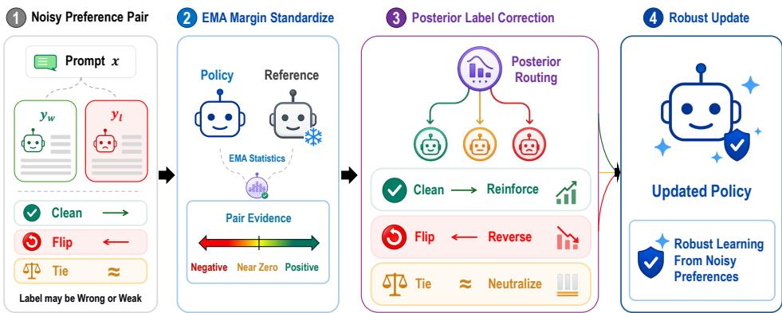
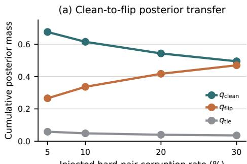
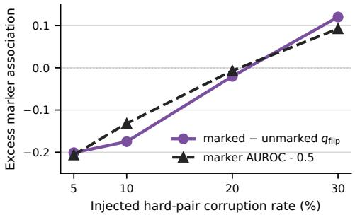
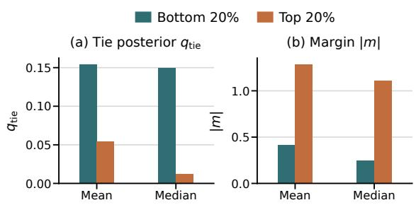
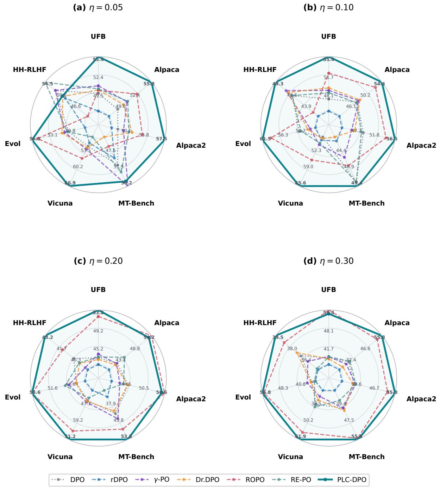
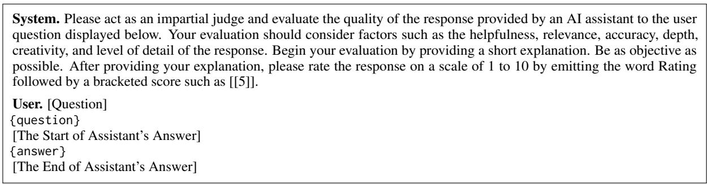
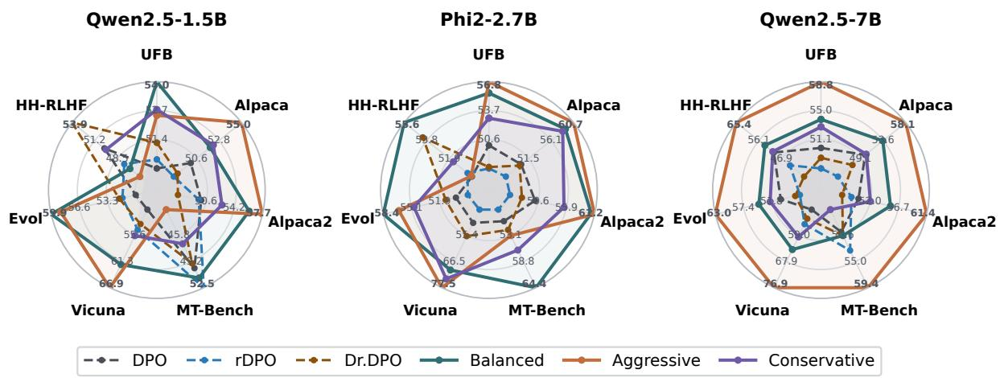

# PLC-DPO: Posterior Label Correction in Noisy and Ambiguous Preference Optimization

Boryeong Cho KAIST AI venntum@kaist.ac.kr

Sumyeong Ahn† KENTECH sumyeongahn@kentech.ac.kr

Se-Young Yun† KAIST AI yunseyoung@kaist.ac.kr

## Abstract

Direct Preference Optimization (DPO) simplifies alignment through pairwise comparisons but assumes all observed preferences are reliable. Real data often violates this assumption, leading to reversed, weak, or ambiguous labels that cause harmful policy updates. To address this, we propose Posterior Label Correction DPO (PLC-DPO) to robustly optimize preferences by routing each pair’s training signal as a clean, flip, or tie case. The key idea is to use the calibrated policy-reference margin as online evidence to take appropriate correction actions. This reframes noisy preference learning as actively correcting supervision direction and strength rather than merely filtering suspicious examples. Across 57 dataset–model– benchmark cells, PLC-DPO obtains the best mean win rate against DPO (60.5 vs. 55.5 for the next-best method). Injected-noise and tie stress tests, human disagreement analysis, and self-confirmation diagnostics further show that the routing remains stable and distinguishes flipped from weakly directional pairs.

## 1 Introduction

Direct Preference Optimization (DPO) (Rafailov et al., 2023) is now a standard objective for the offline alignment of large language models. While traditional reinforcement learning from human feedback (RLHF) requires training a separate reward model (Ouyang et al., 2022; Schulman et al., 2017), DPO eliminates this step. It fits a Bradley-Terry preference model directly using the policyreference log-ratio (Bradley and Terry, 1952). This closed-form pairwise loss is simple, scalable, and easily applied to large preference datasets.

This simplicity is also its vulnerability. DPO assumes every observed preference $y _ { w } \succ y _ { l }$ is a completely reliable target. In reality, preference labels suffer from annotator disagreement, model-judge biases, and superficial cues like length or confident wording (Zhang et al., 2025; Zheng et al., 2023; Wang et al., 2024). Furthermore, true preferences are not always strictly directional. Two responses might be similarly good, equally flawed, or too marginally different to provide a stable binary signal. By treating all labels as absolute ground truth, DPO actively reinforces incorrect optimization directions when faced with noisy or ambiguous data.

Recent studies address this uncertainty indirectly. Robust-loss variants typically assume a global noise rate and apply uniform corrections across all pairs (Ray Chowdhury et al., 2024; Wu et al., 2025). Data filtering and curriculum methods discard suspicious data entirely, which wastes useful signals that could be extracted by recalibrating flipped labels (Gao et al., 2025; Liang et al., 2025). Alternatively, latent-quality approaches estimate absolute response scores to infer pairwise preferences. Although effective, these pointwise methods operate indirectly, unlike the core objective of directly optimizing relative pairwise directions.

We propose Posterior Label Correction DPO (PLC-DPO)1, an online robust preference optimization objective that directly models the observed pair label as a latent clean, flip, or tie state. A clean state means the observed direction should be reinforced. A flip state means the direction should be reversed. A tie state means the pair should not induce a strong directional gradient. PLC-DPO estimates a posterior-like routing distribution over these states from the policy-reference preference margin, calibrates this signal with an exponential moving average, stops gradients through the routing weights, and uses them to mix forward DPO, reversed DPO, and tie-regularizing losses. A warmup schedule and routing-confidence gate keep the method close to DPO until the correction signal becomes informative.

Our contributions are as follows:

  
Figure 1: Overview of PLC-DPO. Preference pairs may be clean, flipped, or weakly directional. PLC-DPO uses the standardized policy-reference margin as evidence for posterior routing, then reinforces, reverses, or neutralizes each pair to enable robust learning from noisy preferences.

• We introduce PLC-DPO, an online robust preference optimization objective that models each observed pairwise preference label as a latent clean, flip, or tie state and estimates a posterior-like routing distribution from the calibrated policy-reference preference margin.

• We derive a routing-mixed objective that softly combines forward DPO, reversed DPO, and tie-regularizing losses. Unlike responselevel latent-quality routing or external rewardmodel filtering, PLC-DPO directly corrects the pair label consumed by DPO and requires no additional supervision.

• We propose a stable training recipe based on EMA calibration, routing, warm-up, and confidence-gated mixing, enabling label correction without early-training instability.

• We evaluate PLC-DPO across models, preference datasets, alignment benchmarks, labelnoise and tie stress tests, an independent human-disagreement evaluation set, routing diagnostics, and ablations. Across 57 dataset– model–benchmark cells, PLC-DPO achieves the highest mean win rate and the secondhighest worst-cell result among the robust baselines.

## 2 Related Work

Preference optimization. RLHF aligns a language model by training an explicit reward model on pairwise preferences and then optimizing the policy with PPO (Ouyang et al., 2022; Schulman et al., 2017). DPO reparameterizes the optimal policy through the policy-reference log-ratio and yields a closed-form pairwise loss (Rafailov et al., 2023). Subsequent methods modify the preference objective, supervision format, or reward parameterization. KTO optimizes from desirable and undesirable generations without requiring paired comparisons (Ethayarajh et al., 2024). SimPO uses a reference-free and length-normalized preference reward (Meng et al., 2024). RSO improves preference optimization through rejection sampling (Liu et al., 2024). These objective-level advances improve how preferences are optimized, but they typically keep the observed pair direction fixed once a preference pair is constructed. As a result, they do not directly address cases where the pair label itself should be reversed or treated as non-directional.

Robust preference optimization under noisy labels. Recent works explore preference optimization under noisy, weak, or biased labels. Label-smoothed and robust DPO losses reduce overconfidence or debias targets against random flips (Mitchell; Ray Chowdhury et al., 2024). Dr.DPO uses a distributionally robust framework to control pairwise reliability (Wu et al., 2025). ROPO combines a noise-aware loss with iterative filtering (Liang et al., 2025), while γ-PO adopts pair-specific dynamic margins (Sun et al., 2025). RE-PO applies an EM-style posterior to reweight observed and reversed directions across preference losses (Cao et al., 2026). Semi-supervised variants similarly estimate trustworthiness to downweight or smooth uncertain updates (Liu et al., 2026b). Most of these methods address noise through reliability weighting, smoothing, filtering, or dynamic margins. They leave less explicit the case where a pair is preference-uninformative rather than merely clean or flipped, and therefore should avoid inducing a strong directional gradient.

Algorithm 1 PLC-DPO Training Step   
1: Input Mini-Batch $\boldsymbol { B } = \{ ( x _ { i } , y _ { w , i } , y _ { l , i } ) \} _ { i = 1 } ^ { B } ,$ , policy $\pi _ { \theta } ,$ reference $\pi _ { \mathrm { r e f } }$ , EMA state $( \mu , v )$ , step t, total steps $T$   
2: Hyperparameters direction temperature $\tau _ { \mathrm { d i r } } ,$ tie temperature $\tau _ { \mathrm { t i e } } ,$ , maximum correction strength $\gamma _ { \mathrm { m a x } } ,$ confidence power κ   
3: Fixed settings DPO scale β, EMA decay $\alpha ,$ minimum std $\sigma _ { \mathrm { m i n } } .$ warm-up schedule, initial state prior $\pi ^ { 0 }$   
4: Compute policy and reference log-probabilities for $( y _ { w , i } , y _ { l , i } )$ ▷ forward pass   
5: $\begin{array} { r } { m _ { \mathrm { s e q } _ { i } } \gets \beta \Big [ \log \frac { \pi _ { \theta } ( y _ { w , i } | x _ { i } ) } { \pi _ { \mathrm { r e f } } ( y _ { w , i } | x _ { i } ) } - \log \frac { \pi _ { \theta } ( y _ { l , i } | x _ { i } ) } { \pi _ { \mathrm { r e f } } ( y _ { l , i } | x _ { i } ) } \Big ] , \quad \mathcal { L } _ { \mathrm { D P O } _ { i } } \gets - \log \sigma ( m _ { \mathrm { s e q } _ { i } } ) } \end{array}$ ▷ DPO backbone   
6: $\tilde { m } _ { i } \gets$ stopgrad $. ( m _ { \mathrm { { s e q } } _ { i } } )$ ▷ routing margin signal   
7: $\begin{array} { r } { \bar { m }  \frac { 1 } { B } \sum _ { i } \tilde { m } _ { i } , \quad s _ { m } ^ { 2 }  \frac { 1 } { B } \sum _ { i } ( \tilde { m } _ { i } - \bar { m } ) ^ { 2 } } \end{array}$ ▷ batch statistics   
8: $\begin{array} { r } { \mu  \alpha \mu + ( 1 - \alpha ) \bar { m } , \quad v  \alpha v + ( 1 - \alpha ) s _ { m } ^ { 2 } , \quad z _ { i }  \frac { \bar { m } _ { i } - \mu } { \operatorname* { m a x } ( \sqrt { v } , \sigma _ { \operatorname* { m i n } } ) } } \end{array}$ ▷ online calibration   
9: $\ell _ { i , \mathrm { c l e a n } } \gets \log \pi _ { \mathrm { c l e a n } } ^ { 0 } + z _ { i } / \tau _ { \mathrm { d i r } } , \quad \ell _ { i , \mathrm { f i p } } \gets \log \pi _ { \mathrm { f i p } } ^ { 0 } - z _ { i } / \tau _ { \mathrm { d i r } } ,$ ℓi,tie ← log $\pi _ { \mathrm { t i e } } ^ { 0 } - | z _ { i } | / \tau _ { \mathrm { t i e } } \gg$ data-dependent evidence   
10: (qclean , qflip , qtie ) ← stopgrad(softmax(ℓi,clean, $\ell _ { i , \mathrm { H i p } } , \ell _ { i , \mathrm { t i e } } ) )$ ▷ routing weights   
11: $\vec { \mathcal { L } } _ { \mathrm { c l e a n } i } \gets \gets \mathrm { \ " ~ } \mathrm { l o g } \sigma _ { ( } m _ { \mathrm { s e q } _ { i } ) } , \quad \vec { \mathcal { L } } _ { \mathrm { f i p } _ { i } } \gets - \log \sigma _ { ( } - m _ { \mathrm { s e q } _ { i } ) } , \quad \mathcal { L } _ { \mathrm { t i e } i } \gets \mathrm { \ - s o f t p l u s } ( | m _ { \mathrm { s e q } _ { i } } | )$ ▷ state losses   
12: $\mathcal { L } _ { \mathrm { P L C } i }  q _ { \mathrm { c l e a n } _ { i } } \mathcal { L } _ { \mathrm { c l e a n } i } + q _ { \mathrm { f i p } _ { i } } \mathcal { L } _ { \mathrm { f i p } _ { i } } + q _ { \mathrm { t i e } _ { i } } \mathcal { L } _ { \mathrm { t i e } _ { i } }$ ▷ routing-corrected loss   
13: $C _ { i } \gets g _ { \kappa } ( q _ { \mathrm { c l e a n } _ { i } } , q _ { \mathrm { f i p } _ { i } } , q _ { \mathrm { t i e } _ { i } } )$ ▷ pair-level routing confidence   
14: $\mathbf { i f } t < \rho _ { \mathrm { w a r m } } T$ then   
15: $\gamma _ { t } \gets 0$ ▷ warm-up   
16: else   
17: γt ← min(γmax, Schedule(t)) ▷ increase correction strength   
18: end if   
19: $w _ { i } \gets \gamma _ { t } C _ { i }$ ▷ actual correction weight   
20: $\begin{array} { r } { \mathcal { L } _ { i }  ( 1 - w _ { i } ) \mathcal { L } _ { \mathrm { D P O } i } + w _ { i } \mathcal { L } _ { \mathrm { P L C } i } , } \end{array}$ θ ← OptimizerStepθ, ∇θ 1 P Li ▷ policy update

## 3 Posterior Label Correction DPO

PLC-DPO treats noisy preference optimization as an online latent-label problem. The latent label is not the quality of either response in isolation, state of the pairwise direction that DPO consumes. This section defines the standard DPO margin, derives the calibrated clean/flip/tie routing distribution, and gives the final confidence-gated objective.

## 3.1 Problem Setup

Let x be a prompt and let $( y _ { w } , y _ { l } )$ denote the observed chosen and rejected responses. A trainable policy $\pi _ { \theta }$ is initialized from a supervised fine-tuned model, and $\pi _ { \mathrm { r e f } }$ is a frozen reference policy. Standard DPO optimizes a Bradley-Terry model with the sequence-level margin

$$
\begin{array} { r l } & { m _ { \mathrm { s e q } } ( x , y _ { w } , y _ { l } ) = \beta \bigg [ \log \frac { \pi _ { \theta } ( y _ { w } \mid x ) } { \pi _ { \mathrm { r e f } } ( y _ { w } \mid x ) } } \\ & { ~ - \log \frac { \pi _ { \theta } ( y _ { l } \mid x ) } { \pi _ { \mathrm { r e f } } ( y _ { l } \mid x ) } \bigg ] , } \end{array}\tag{1}
$$

where $\beta$ controls the reward scale. The standard DPO loss (Rafailov et al., 2023) is

$$
\begin{array} { r } { \mathcal { L } _ { \mathrm { D P O } } ( \theta ) = - \log \sigma ( m _ { \mathrm { s e q } } ) . } \end{array}\tag{2}
$$

DPO is effective when the observed direction is reliable. When the pair is flipped or non-directional, it turns that error into a direct gradient on the policy.

## 3.2 Pair Label as a Latent State

We introduce a latent state $s \in \{ \mathrm { c l e a n } , \mathrm { f i p } , \mathrm { t i e } \}$ for every observed pair. The clean state means the observed ordering $y _ { w } \succ y _ { l }$ should be reinforced. The flip state means the opposite ordering should be learned. The tie state means the pair should not induce a strong directional preference gradient. In this paper, tie denotes a pair where the observed direction is not sufficiently informative, either because both responses are similarly good, both are similarly bad, or the current policy-reference margin provides insufficient directional evidence.

This choice targets the variable used by DPO. Response-level latent-quality methods ask whether $y _ { w }$ and $y _ { l }$ are individually good or bad, then infer a pair action from those two estimates. PLC-DPO instead asks whether the observed pair direction is clean, flipped, or non-directional, then maps the answer directly to a loss.

## 3.3 Margin-Based Routing Distribution

The routing distribution is estimated from the same pairwise margin that DPO uses for optimization, but the margin is first detached and calibrated online. For each example i, let

$$
\tilde { m } _ { i } = \mathrm { s t o p g r a d } ( m _ { \mathrm { s e q } _ { i } } ) .\tag{3}
$$

The stop-gradient operation makes the routing weights an assignment signal for the current update rather than an additional path through which the policy can reduce the loss by changing its own label assignment.

Because the scale of $\tilde { m } _ { i }$ changes during training, PLC-DPO maintains an exponential moving average (EMA) of the batch mean and variance over the training. For a batch at step $t ,$ let $\bar { m } _ { t }$ and $s _ { t } ^ { 2 }$ denote the mean and variance of $\{ \tilde { m } _ { i } \} _ { i = 1 } ^ { B }$ . We update

$$
\mu _ { t } = \alpha \mu _ { t - 1 } + ( 1 - \alpha ) \bar { m } _ { t } ,\tag{4}
$$

$$
v _ { t } = \alpha v _ { t - 1 } + ( 1 - \alpha ) s _ { t } ^ { 2 } .\tag{5}
$$

The calibrated margin for pair i is

$$
z _ { i } = \frac { \tilde { m } _ { i } - \mu _ { t } } { \operatorname* { m a x } ( \sqrt { v _ { t } } , \sigma _ { \operatorname* { m i n } } ) } .\tag{6}
$$

Large positive $z _ { i }$ means that the current policyreference signal agrees with the observed label, large negative $z _ { i }$ means it contradicts the label, and values near zero provide weak directional evidence.

We convert the calibrated margin into three energy scores.

$$
\ell _ { \mathrm { c l e a n } } = \log \pi _ { \mathrm { c l e a n } } ^ { 0 } + z / \tau _ { \mathrm { d i r } } ,\tag{7}
$$

$$
\ell _ { \mathrm { H i p } } = \log \pi _ { \mathrm { f l i p } } ^ { 0 } - z / \tau _ { \mathrm { d i r } } ,\tag{8}
$$

$$
\ell _ { \mathrm { t i e } } = \log \pi _ { \mathrm { t i e } } ^ { 0 } - | z | / \tau _ { \mathrm { t i e } } .\tag{9}
$$

Here $\tau _ { \mathrm { d i r } }$ controls how sharply signed evidence separates clean from flip, while $\tau _ { \mathrm { t i e } }$ controls how quickly tie evidence decays away from zero. The constants $\pi _ { s } ^ { 0 }$ act as initial state preferences. They are not intended to define a normalized generative model for $z .$ . Instead, they provide an energybased, posterior-like routing score for choosing the training action supported by the current calibrated margin. We then normalize these scores with a softmax.

$$
q _ { s } = \frac { \exp ( \ell _ { s } ) } { \sum _ { s ^ { \prime } } \exp ( \ell _ { s ^ { \prime } } ) } .\tag{10}
$$

The resulting $( q _ { \mathrm { c l e a n } } , q _ { \mathrm { f f i p } } , q _ { \mathrm { t i e } } )$ are therefore interpreted as differentiable routing weights over clean, flip, and tie actions, not as calibrated probabilities from a fully specified data-generating model.

## 3.4 State-Conditional Losses

Given a loss margin m, the three state-conditional losses are

$$
\mathcal { L } _ { \mathrm { c l e a n } } = - \log \sigma ( m ) ,\tag{11}
$$

$$
\begin{array} { r } { \mathcal { L } _ { \mathrm { f l i p } } = - \log \sigma ( - m ) , } \end{array}\tag{12}
$$

$$
\mathcal { L } _ { \mathrm { t i e } } = \operatorname { s o f t p l u s } \left( | m | \right) .\tag{13}
$$

In our main objective, $m = m _ { \mathrm { s e q } } .$ , so the clean and flip losses operate on the same sequence-level margin as standard DPO. $\mathcal { L } _ { \mathrm { c l e a n } }$ reinforces the observed direction, $\mathcal { L } _ { \mathrm { { f l i p } } }$ reverses it, and $\mathcal { L } _ { \mathrm { t i e } }$ discourages large directional margins for pairs assigned to the tie state.

We stop gradients through the routing distribution.

$$
\begin{array} { r } { \bar { q } _ { s } = \mathrm { s t o p g r a d } ( q _ { s } ) . } \end{array}\tag{14}
$$

This prevents the policy from changing the state assignment and the state-conditional objective in the same update.

The routing-corrected loss is

$$
\mathcal { L } _ { \mathrm { P L C } } = \bar { q } _ { \mathrm { c l e a n } } \mathcal { L } _ { \mathrm { c l e a n } } + \bar { q } _ { \mathrm { f l i p } } \mathcal { L } _ { \mathrm { f l i p } } + \bar { q } _ { \mathrm { t i e } } \mathcal { L } _ { \mathrm { t i e } } .\tag{15}
$$

## 3.5 Warm-Up and Confidence-Gated Mixing

Routing distributions are initially unreliable at the beginning of training due to weak policy-reference margins and uncalibrated EMA. Therefore, PLC-DPO trains with standard DPO during warm-up fraction $\rho _ { \mathrm { w a r m } }$ of the total. Afterward, a schedule $\gamma _ { t }$ increases the correction strength to $\gamma _ { \mathrm { m a x } }$

We also gate each pair using detached routing weights to estimate routing confidence. We define a confidence functional $g _ { \kappa } : \Delta ^ { 2 }  [ 0 , 1 ]$ that is small for near-uniform distributions and large when a dominant latent state emerges. In our experiments, we use normalized maximum routing confidence

$$
C ( \bar { q } ) = g _ { \kappa } { ( \bar { q } ) } = \left( \frac { \operatorname* { m a x } _ { s } { \bar { q } } _ { s } - 1 / 3 } { 2 / 3 } \right) ^ { \kappa } ,\tag{16}
$$

where κ controls the deferral of low-confidence assignments. This correctly assigns zero confidence to a uniform distribution and unit confidence to a degenerate one. While entropy-based confidence is a natural alternative, it is overly conservative by penalizing the full distributional spread. Our maxweight gate instead ties confidence directly to the most likely correction action. The final loss is

$$
\mathcal { L } ( \theta ) = ( 1 - \gamma _ { t } C ( \bar { q } ) ) \mathcal { L } _ { \mathrm { D P O } } + \gamma _ { t } C ( \bar { q } ) \mathcal { L } _ { \mathrm { P L C } } .\tag{17}
$$

## 3.6 Training Step

Algorithmic summary. Algorithm 1 summarizes one mini-batch update. The algorithm follows the derivation above by computing the DPO margin, detaching and calibrating it to estimate the clean/flip/tie routing distribution, forming the state-conditional losses, and blending the routingcorrected objective with standard DPO through warm-up and confidence gating.

Table 1: Main win-rate results against the one-epoch DPO baseline trained on UltraFeedback Binarized. The SFT row shows the model initialization before preference optimization. PLC-DPO uses the default recipe, and all methods share the same one-epoch training budget. Abbreviations denote their respective evaluation sets, with UFB, Alpaca, and Alpaca2 corresponding to UltraFeedback, AlpacaEval, and AlpacaEval 2. Bold and underline denote the best and second-best results, respectively.
<table><tr><td>Model</td><td>Method</td><td>UFB↑</td><td>Alpaca ↑</td><td>Alpaca2 ↑</td><td>MT-Bench ↑</td><td>Vicuna ↑</td><td>Evol-Instruct ↑</td><td>HH-RLHF↑</td></tr><tr><td rowspan="8">Qwen2.5 1.5B</td><td>SFT cDPO</td><td>21.60</td><td>14.41</td><td>13.79</td><td>21.25</td><td>5.00</td><td>15.65</td><td>32.67</td></tr><tr><td></td><td>46.83</td><td>43.11</td><td>44.78</td><td>55.00</td><td>48.75</td><td>46.40</td><td>39.07</td></tr><tr><td>rDPO</td><td>50.42</td><td>48.32</td><td>49.69</td><td>52.50</td><td>54.37</td><td>51.55</td><td>47.64</td></tr><tr><td>KTO-Pair</td><td>47.52</td><td>50.50</td><td>48.57</td><td>48.12</td><td>48.75</td><td>53.29</td><td>45.90</td></tr><tr><td>RSO</td><td>50.88</td><td>50.43</td><td>50.31</td><td>50.00</td><td>51.25</td><td>54.72</td><td>54.29</td></tr><tr><td>γ-PO</td><td>48.88</td><td>49.63</td><td>51.37</td><td>53.12</td><td>52.50</td><td>49.88</td><td>52.80</td></tr><tr><td>Dr.DPO</td><td>51.20</td><td>48.70</td><td>47.08</td><td>49.38</td><td>53.12</td><td>51.93</td><td>53.85</td></tr><tr><td>ROPO RE-PO</td><td>49.45</td><td>53.29</td><td>52.55</td><td>45.00</td><td>58.75</td><td>56.02</td><td>44.04</td></tr><tr><td></td><td>49.55</td><td>52.61 55.03</td><td>51.61 57.70</td><td>50.62</td><td>61.25</td><td>53.23</td><td>54.84</td></tr><tr><td rowspan="10">Phi2</td><td>PLC-DPO</td><td>52.48</td><td></td><td></td><td>42.50</td><td>66.88</td><td>58.82</td><td>45.78</td></tr><tr><td>SFT</td><td>34.75</td><td>25.90</td><td>26.15</td><td>30.63</td><td>12.50</td><td></td><td></td></tr><tr><td>cDPO</td><td>49.18</td><td>48.63</td><td>45.40</td><td>38.75</td><td>43.12</td><td>30.93</td><td>45.34</td></tr><tr><td>rDPO</td><td>47.52</td><td>46.89</td><td>45.28</td><td>47.50</td><td>44.38</td><td>48.57 48.63</td><td>51.49</td></tr><tr><td>KTO-Pair</td><td>56.47</td><td>58.63</td><td>57.64</td><td>59.38</td><td>62.50</td><td>56.89</td><td>50.37</td></tr><tr><td>RSO</td><td>55.83</td><td>58.51</td><td>59.75</td><td>47.50</td><td>65.62</td><td>58.01</td><td>45.47</td></tr><tr><td>γ-PO</td><td>47.93</td><td>52.30</td><td>52.36</td><td>48.75</td><td>51.88</td><td></td><td>56.15</td></tr><tr><td>Dr.DPO</td><td>47.67</td><td>49.69</td><td>47.52</td><td>51.88</td><td>55.62</td><td>49.19</td><td>52.98</td></tr><tr><td>ROPO</td><td>55.95</td><td>59.44</td><td>60.75</td><td>61.25</td><td>73.75</td><td>51.18 59.13</td><td>54.10 49.75</td></tr><tr><td>RE-PO</td><td>49.90</td><td>49.13</td><td>48.82</td><td>55.00</td><td>53.12</td><td>50.93</td><td>51.93</td></tr><tr><td rowspan="10">Qwen2.5 7B</td><td>PLC-DPO</td><td>56.83</td><td>60.68</td><td>61.24</td><td>53.12</td><td>77.50</td><td>56.58</td><td>50.06</td></tr><tr><td>SFT</td><td>16.18</td><td>8.39</td><td></td><td></td><td></td><td></td><td></td></tr><tr><td>cDPO</td><td>48.62</td><td></td><td>9.57</td><td>19.38</td><td>4.38</td><td>9.75</td><td>11.68</td></tr><tr><td>rDPO</td><td>47.27</td><td>41.30</td><td>46.34</td><td>54.37</td><td>45.00</td><td>42.24</td><td>40.81</td></tr><tr><td>KTO-Pair</td><td>49.55</td><td>44.53</td><td>48.82</td><td>53.12</td><td>55.00</td><td>46.21</td><td>43.35</td></tr><tr><td>RSO</td><td></td><td>49.69</td><td>52.80</td><td>52.50</td><td>57.50</td><td>49.25</td><td>43.73</td></tr><tr><td></td><td>55.00</td><td>54.91</td><td>56.46</td><td>56.88</td><td>75.00</td><td>55.34</td><td>53.04</td></tr><tr><td>γ-PO Dr.DPO</td><td>50.88</td><td>48.45</td><td>51.43 47.27</td><td>52.50</td><td>51.25</td><td>50.50</td><td>46.02</td></tr><tr><td>ROPO</td><td>48.68 58.60</td><td>47.45 58.70</td><td>58.94</td><td>50.62 58.75</td><td>53.12 71.88</td><td>47.14</td><td>37.58</td></tr><tr><td>RE-PO</td><td>43.77</td><td>41.49</td><td>42.55 61.37</td><td>51.25 59.38</td><td>48.12</td><td>59.94 44.16</td><td>48.32 36.52</td></tr></table>

Implementation choices. The method introduces four objective-level controls. $\tau _ { \mathrm { d i r } }$ and $\tau _ { \mathrm { t i e } }$ determine how margin evidence is converted into routing mass, while $\gamma _ { \mathrm { m a x } }$ and κ determine how strongly confident corrections enter the final loss. The EMA decay α controls how quickly the streaming margin mean and variance follow the current training distribution. We keep calibration and scheduling settings fixed within each reported recipe, with values provided in Appendix D and component-level effects evaluated in Section 4.7.

## 4 Experiments

We evaluate PLC-DPO around six questions. Q1 asks whether direct pair-label correction improves standard alignment quality over DPO and competitive preference-optimization baselines. Q2 asks whether these gains transfer across base models and preference datasets. Q3 asks whether the method remains robust when preference labels are flipped.

Q4 asks whether the inferred routing states respond to controlled data pathologies as noise changes. Q5 asks whether the tie state responds to synthetic and human-annotated ambiguity. Q6 asks which components of the correction objective are necessary.

## 4.1 Experimental Setup

Models. We start from SFT models trained on UltraChat-200k (Ding et al., 2023): Qwen2.5-1.5B, Qwen2.5-7B (Qwen et al., 2025), and Phi-2-2.7B (Javaheripi et al., 2023). The generalization study additionally uses Llama-3-8B (Grattafiori et al., 2024) and Mistral-7B (Jiang et al., 2023). Full training details are provided in Appendix D.

Baselines. We compare with SFT, standard DPO (Rafailov et al., 2023), cDPO or labelsmoothed DPO (Mitchell), rDPO (Park et al., 2024), KTO-Pair (Ethayarajh et al., 2024), RSO (Liu et al., 2024), and recent noisy-preference baselines including Dr.DPO (Wu et al., 2025), ROPO (Liang et al., 2025), γ-PO (Sun et al., 2025), and RE-PO (Cao et al., 2026). Implementation details are in Appendix D.

Table 2: Commercial-model judge validation for Qwen2.5-7B. Claude Sonnet 4.6 scores each response independently and also judges pairwise comparisons against the corresponding DPO baseline.
<table><tr><td rowspan="2">Method</td><td colspan="2">AlpacaEval 2</td><td colspan="2">Vicuna</td></tr><tr><td>Single</td><td>WR</td><td>Single</td><td>WR</td></tr><tr><td>DPO</td><td>5.585</td><td>50.00</td><td>6.600</td><td>50.00</td></tr><tr><td>rDPO</td><td>5.620</td><td>51.00</td><td>6.588</td><td>48.75</td></tr><tr><td>γ-PO</td><td>5.635</td><td>51.25</td><td>6.713</td><td>52.50</td></tr><tr><td>ROPO</td><td>5.785</td><td>56.50</td><td>6.725</td><td>55.00</td></tr><tr><td>PLC-DPO</td><td>5.795</td><td>56.75</td><td>6.900</td><td>61.25</td></tr></table>

Evaluation. We report pairwise win rates against the corresponding DPO baseline across Ultra-Feedback (Cui et al., 2024), AlpacaEval, AlpacaEval 2 (Li et al., 2023), MT-Bench (Zheng et al., 2023), Vicuna (Chiang et al., 2023), Evol-Instruct (Xu et al., 2024), and HH-RLHF (Bai et al., 2022) evaluation sets. Unless otherwise specified, Skywork-Reward-V2-Llama-3.1-8B (Liu et al., 2026a) serves as the judge model. These experiments were conducted using single-run greedy decoding. For the main experiments, PLC-DPO uses the aggressive preset as its default recipe. Appendix B.4 compares this choice with other presets.

## 4.2 Main Alignment Results

Table 1 reports the main alignment results using a fixed default PLC-DPO recipe across all models and evaluation sets. PLC-DPO achieves the highest performance on most metrics for Qwen2.5- 7B, showing particularly large gains on AlpacaEval 2, Vicuna, Evol-Instruct, and HH-RLHF. For Qwen2.5-1.5B and Phi-2-2.7B, the gains remain strong on AlpacaEval, AlpacaEval 2, and Vicuna, although ROPO and RE-PO are competitive on other splits. Notably, PLC-DPO yields greater improvements on larger models. This suggests that stronger base models inherently provide more accurate margin measurements for reliable routing. Finally, Appendix B.4 presents ablations across different recipe configurations.

## 4.3 Generalization Across Models and Datasets

We train all six robust objectives and standard DPO from scratch using a single fixed recipe across every dataset–model pair, evaluating each method against the baseline DPO model. On clean Ultra-Feedback, PLC-DPO achieves a mean win rate of 60.7 across the 21 model–benchmark cells, followed by ROPO at 59.6, while all other methods score at or below 50.2. Across all 57 cells, PLC-DPO achieves the highest overall mean win rate (60.5), outperforming the next-best method, rDPO (55.5), by 5.0 points. Its worst-cell performance is 41.2, closely trailing γ-PO (42.5). This strong average with a competitive bound demonstrates that our correction recipe generalizes across both clean and noisy regimes rather than overfitting to a specific pattern. Appendix A provides per-dataset transfer, cross-dataset noise stress tests, and three-seed runs.

Commercial-model judge validation. Open reward models can introduce their own preference biases (Zheng et al., 2023; Wang et al., 2024). We therefore run a validation with a commercial-model judge on 200 AlpacaEval 2 samples and 80 Vicuna outputs from Qwen2.5-7B. This is intended as an external judging check rather than a replacement for the main evaluation matrix. Table 2 uses Claude Sonnet 4.6 (Anthropic, 2026) to report both average single-response quality scores and pairwise win rates against DPO for DPO, rDPO, γ-PO, ROPO, and PLC-DPO. Full judging prompts and additional details are provided in Appendix B.3.

## 4.4 Robustness to Injected Label Noise

We create controlled label noise by swapping chosen and rejected responses with probability $\eta \in$ {0.05, 0.10, 0.20, 0.30}. Each method is trained on the same corrupted split for each η.

Table 4 reports the Vicuna evaluation set for Qwen2.5-1.5B using the same fixed PLC-DPO recipe, with all values measured against the clean one-epoch DPO baseline. PLC-DPO is strongest at every injected flip rate, including the hardest $\eta = 0 . 3 0$ setting. ROPO is the closest baseline on this slice, but PLC-DPO keeps a consistent margin over it from $\eta ~ = ~ 0 . 0 5$ through $\eta ~ = ~ 0 . 3 0 .$ Appendix B.1 reports the corresponding crossbenchmark radar plots for all injected noise rates.

## 4.5 Routing Diagnostics

The routing distribution is useful only if its states respond to observable data pathologies. We therefore ask whether controlled hard-pair corruption changes the pair-level routing weights in the expected direction. For each pair, PLC-DPO recomputes $( q _ { \mathrm { c l e a n } } , q _ { \mathrm { f f i p } } , q _ { \mathrm { t i e } } )$ from the calibrated margin rather than assigning a dataset-level label, so this analysis should be read as a property of the online routing estimator rather than as a separate detector. Importantly, $q _ { \mathrm { f l i p } }$ is not an oracle flip label because the unmarked subset can contain natural annotation errors, ambiguous pairs, and length or style artifacts. Instead, we test a softer claim in which higher injected corruption should make PLC-DPO trust the observed direction less and allocate more mass to the flip-correction state.

Injected hard-pair corruption rate (%)  
Table 3: Generalization with a single fixed recipe. (a) Mean win rate across 7 benchmarks against same-data DPO after training on clean UltraFeedback across different base models. (b) Mean and worst win rate over all 57 dataset–model–benchmark cells from UltraFeedback, HH-Golden, Nectar-60k, and ORPO-mix-40k. Full cell-level results and per-dataset averages are reported in Appendix A.2.  
(a) Clean UltraFeedback across different base models  
(b) Aggregate over 57 cells
<table><tr><td>Model</td><td>rDPO</td><td>RE-PO</td><td>Dr.DPO</td><td> $\gamma { \mathrm { - P O } }$ </td><td>ROPO</td><td>PLC-DPO</td></tr><tr><td>Qwen2.5-7B</td><td>48.3</td><td>44.0</td><td>47.4</td><td>50.1</td><td>59.3</td><td>63.3</td></tr><tr><td>Llama-3-8B</td><td>43.8</td><td>51.2</td><td>54.0</td><td>49.7</td><td>60.4</td><td>59.8</td></tr><tr><td>Mistral-7B</td><td>44.1</td><td>48.9</td><td>49.3</td><td>49.1</td><td>59.1</td><td>59.2</td></tr></table>

<table><tr><td>Method</td><td>Mean ↑</td><td>Worst ↑</td></tr><tr><td>rDPO</td><td>55.5</td><td>36.9</td></tr><tr><td>RE-PO</td><td>49.2</td><td>36.5</td></tr><tr><td>Dr.DPO</td><td>50.3</td><td>37.6</td></tr><tr><td>γ-PO</td><td>49.7</td><td>42.5</td></tr><tr><td>ROPO</td><td>46.7</td><td>12.7</td></tr><tr><td>PLC-DPO</td><td>60.5</td><td>41.2</td></tr></table>

(b) Association with injected marker  
  
Figure 2: Routing response under hard-pair corruption. Increasing corruption shifts cumulative routing mass from qclean to $q _ { \mathrm { f l i p } } ,$ while $q _ { \mathrm { t i e } }$ remains small because this stress test targets directional reversals rather than low-margin ambiguity. The marker association is a soft routing diagnostic, not label-correction accuracy.

Figure 2 shows a clear dose response on Qwen2.5-7B. As η increases from 0.05 to 0.30, cumulative $q _ { \mathrm { c l e a n } }$ drops from 0.676 to 0.495, while cumulative $q _ { \mathrm { f l i p } }$ rises from 0.265 to 0.470. The same diagnostic also shows that $q _ { \mathrm { t i e } }$ stays low under this hard-pair corruption stress test, which is expected because the intervention creates directional reversals rather than weak-gap ambiguity. The marker AUROC increases with heavier corruption, indicating that the routing distribution becomes more aligned with the injected corruption marker without treating the marker as a clean ground-truth label. Full numeric diagnostics are in Appendix B.

## 4.6 Tie-State Selectivity

We introduce a lightweight selectivity diagnostic for the tie state to see if it targets pairs with weak preference signals. The UltraFeedback dataset (Cui et al., 2024) already includes the original response scores used to initially construct the chosen and rejected pairs. We use these pre-existing scores to calculate the absolute score gap and isolate the bottom and top 20% of held-out pairs. While not a perfect ambiguity oracle, this allows us to check if $q _ { \mathrm { t i e } }$ increases on pairs initially deemed weak. Table 5 independently verifies the tie loss necessity.

Figure 3 complements the previous corruption analysis. While injected noise shifts routing mass to $q _ { \mathrm { f l i p } }$ , we now examine the tie component on naturally weak-gap pairs. We report mean and median values for $q _ { \mathrm { t i e } }$ and margin magnitude $| m |$ to prevent distortion from outliers. The results demonstrate that $q _ { \mathrm { t i e } }$ is significantly higher for the Bottom 20% than the Top 20%, whereas $| m |$ follows the opposite trend. This confirms the tie state actively suppresses strong updates when the original dataset scores indicate a weak preference.

Direct tie-state validation. We further replace up to 30% of UltraFeedback preference pairs with exact equal-score pairs and retrain PLC-DPO, RE-PO, and DPO under these corruption settings. As the injected tie rate increases from 0% to 30%, the margin of PLC-DPO over same-data DPO increases from +8.3 to +18.5 points. At a 30% tie rate, PLC-DPO achieves 68.5, compared with 51.6 for RE-PO. On the independent MultiPref dataset (Zhang et al., 2025), the mean $q _ { \mathrm { t i e } }$ progressively increases from 0.0811 for unanimous pairs to 0.0904 for divergent pairs and 0.0997 for tie-majority pairs. These results provide evidence that PLC-DPO’s non-directional mechanism captures synthetic ties and human disagreement. Appendix A.4 provides the full counts, significance tests, and zero-shot per-pair results.

  
Figure 3: Tie-state selectivity on held-out UltraFeedback pairs for the clean PLC-DPO. Bottom 20% and Top 20% denote the weakest and strongest-gap pairs based on the native response scores.

Table 4: Injected-noise robustness on Vicuna with Qwen2.5-1.5B, measured by pairwise win rate on the label-flip rate η against the clean DPO baseline .
<table><tr><td>Method</td><td> $\eta = 0 . 0 5$ </td><td> $\eta = 0 . 1 0$ </td><td> $\eta = 0 . 2 0$ </td><td> $\eta = 0 . 3 0$ </td></tr><tr><td>rDPO</td><td>49.38</td><td>46.88</td><td>35.00</td><td>26.88</td></tr><tr><td>γ-PO</td><td>51.88</td><td>48.75</td><td>43.75</td><td>31.25</td></tr><tr><td>Dr.DPO</td><td>51.25</td><td>46.25</td><td>43.12</td><td>33.75</td></tr><tr><td>ROPO</td><td>55.62</td><td>55.00</td><td>65.00</td><td>56.88</td></tr><tr><td>RE-PO</td><td>46.88</td><td>48.12</td><td>40.62</td><td>38.75</td></tr><tr><td>PLC-DPO</td><td>66.88</td><td>65.62</td><td>71.25</td><td>61.88</td></tr></table>

## 4.7 Component Ablations

Table 5 isolates the impact of key correction actions and stabilization choices across representative evaluations. DPO-LN tests if gains stem solely from margin rescaling, while confidence reweighting checks if downweighting uncertain examples suffices without reverse or tie actions. Removing the flip or tie state restricts the routing action space, whereas removing EMA calibration or the warm-up gate destabilizes the margin signal. The largest performance drops occur when removing the flip state and warm-up gate, while the tie and EMA variants perform closer to the full method. Hyperparameter details and further diagnostics are provided in Appendices D and B.

## 5 Discussion

Why pair-label correction works. PLC-DPO acts on the same pairwise direction that DPO optimizes. This matters because the dominant failure modes of preference data are often directional. A pair can be reliable, reversed, or too ambiguous to support a strong update. The clean/flip/tie decomposition is the smallest latent structure that gives each of these cases a distinct gradient action.

Correction rather than selection. Filtering and data-selection methods protect the policy by removing suspicious pairs but often discard valuable signals (Gao et al., 2025; Liang et al., 2025). A flipped preference pair still contains useful information if the model recognizes the reversal. PLC-DPO explicitly leverages this distinction by deferring low-confidence examples via a confidence gate, applying a reverse DPO update to likely flipped pairs, and assigning a tie loss to ambiguous cases to discourage arbitrary directional margins.

Why the routing distribution needs stabilization. The policy-reference margin is a useful signal, but it is also model-dependent and nonstationary during training. EMA calibration converts the margin into a stream-relative signal. Stop-gradient routing prevents the model from changing the assignment and the objective in the same update. Warm-up and confidence gating keep early low-evidence routing weights from dominating optimization.

Self-confirmation and external agreement. Since routing depends on the current policy, early preference errors may reinforce self-confirmation. To mitigate this, we combine a frozen-reference anchor with detached routing weights, EMA calibration, warm-up, and confidence gating. Under 20% corruption, the final flip-marker AUROC is 0.731, while $q _ { \mathrm { f l i p } }$ predicts disagreement with an independent reward model at 0.779 AUROC on clean pairs. With a 30% warm start, the final flipmarker AUROC is 0.734. Appendix A.5 reports the corresponding controls and correction statistics.

The state weights are routing signals. The clean, flip, and tie weights should not be interpreted as a ground-truth audit of the dataset. A high $q _ { \mathrm { f l i p } }$ means that, under the current calibrated policyreference margin and energy scores, the reverse update is the most supported training action for that pair. A high $q _ { \mathrm { t i e } }$ means that the pair currently provides weak directional evidence for preference optimization. These quantities are useful because they explain how the objective routes gradients, not because they certify clean, flipped, or tied labels independently of the model.

Table 5: Component ablations for Qwen2.5-1.5B after one epoch of preference optimization. Values are pairwise win rates against the one-epoch DPO baseline. The full PLC-DPO row uses the same default recipe reported in Table 1. Ablation rows use the same recipe and remove or isolate one component while keeping the training surface fixed. We report the evaluation sets where the full method shows the clearest component-level trend.
<table><tr><td>Variant</td><td>Mechanism tested</td><td>UFB↑</td><td>Alpaca2 ↑</td><td>Vicuna ↑</td><td>Evol-Instruct ↑</td><td> $\operatorname { A v g . } \uparrow$ </td></tr><tr><td>DPO-LN only</td><td>margin rescaling only</td><td>49.48</td><td>50.56</td><td>51.25</td><td>53.35</td><td>51.16</td></tr><tr><td>Confidence reweight only</td><td>downweighting without correction</td><td>50.40</td><td>52.17</td><td>58.13</td><td>52.98</td><td>53.42</td></tr><tr><td>Remove flip state</td><td>no reverse action</td><td>50.12</td><td>47.33</td><td>55.62</td><td>53.42</td><td>51.62</td></tr><tr><td>Remove tie state</td><td>no neutralizing action</td><td>51.95</td><td>55.65</td><td>65.62</td><td>57.02</td><td>57.56</td></tr><tr><td>Remove EMA calibration</td><td>uncalibrated routing scale</td><td>53.05</td><td>54.97</td><td>65.00</td><td>57.08</td><td>57.52</td></tr><tr><td>Remove warm-up/gate</td><td>no correction deferral</td><td>44.57</td><td>46.15</td><td>51.88</td><td>53.11</td><td>48.93</td></tr><tr><td>PLC-DPO full</td><td>all correction actions</td><td>52.48</td><td>57.70</td><td>66.88</td><td>58.82</td><td>58.97</td></tr></table>

Relation to response-level latent quality. A natural alternative is to infer whether each response is good or bad, then route the pair to a responsequality regime. That view is more expressive in some settings, but it also requires an absolute quality signal that DPO does not directly observe. PLC-DPO makes a narrower choice. It only asks whether the observed pair direction should be reinforced, reversed, or neutralized. This narrower latent variable is easier to connect to DPO’s gradient and easier to diagnose with $q _ { \mathrm { c l e a n } } , q _ { \mathrm { f l i p } } ,$ and $q _ { \mathrm { t i e } }$

Role of the initial state weights. Initial state weights are understood as weak anchors for early routing estimates. Once EMA stabilizes and the margin becomes informative, the data-dependent energy scores should dominate these anchors. The recipe sensitivity results in Appendix B.4 therefore vary the correction strength and routing temperatures together, rather than claiming that any single prior is universally optimal.

When PLC-DPO reduces to DPO. If the dataset is extremely small, the model is severely undertrained, or the routing distribution maintains high entropy, the effective correction weight $\gamma _ { t } C ( q )$ remains low. In these scenarios, PLC-DPO safely reverts to standard DPO. This fallback is preferable to applying confident yet unsupported corrections. Consequently, PLC-DPO provides the largest gains when sufficient training signals allow the policyreference margin to become highly informative.

## 6 Conclusion

We introduced PLC-DPO, a robust DPO objective that treats each observed preference pair label as a latent clean, flip, or tie state. PLC-DPO estimates an online posterior-like routing distribution from the EMA-calibrated policy-reference margin, stops gradients through the routing weights, and uses them to mix forward DPO, reversed DPO, and tieregularizing losses. The final objective blends routing correction with standard DPO through warm-up and confidence gating. Across 57 dataset–model– benchmark cells, PLC-DPO achieves the highest mean win rate and the second-highest worst-cell result among the robust baselines. Injected flip and tie stress tests, independent human-disagreement data, and self-confirmation controls further show that the routing remains stable and assigns distinct actions to reversed and weakly directional pairs. These results support a view of robust preference optimization that corrects the pair label DPO.

## Limitations

PLC-DPO relies on the current policy–reference margin as evidence for the latent label state. Although EMA calibration and our self-confirmation controls mitigate early-stage bias, the margin may still be imperfect when the policy and frozen reference share systematic errors. Performance under distribution shift may therefore benefit from a longer warm-up or more adaptive calibration. Our results empirically demonstrate the effectiveness of the proposed routing mechanism across a range of noisy and ambiguous preference settings. A complementary direction for future work is to characterize further its theoretical properties, including routing error, EMA adaptation, and gating behavior under jointly evolving policy and routing dynamics. Establishing such guarantees would deepen understanding of the mechanism’s robustness.

## Acknowledgments

This work was supported by Institute for Information & communications Technology Planning & Evaluation(IITP)grant funded by the Korea government(MSIT) (RS-2019-II190075, Artificial Intelligence Graduate School Program(KAIST), 10%), the Institute of Information & communications Technology Planning & Evaluation (IITP) grant funded by the Korean government(MSIT) (No. RS-2024-00457882, National AI Research Lab Project, 40%), the Korea Institute of Energy Technology Evaluation and Planning (KETEP) (No. RS-2026- 25533837, 20%), the Institute of Information & Communications Technology Planning & Evaluation (IITP) grant funded by the Korea government (MSIT) (IITP-2026)-RS-2026-25614738, AI Star Fellowship Support Program (20%), and Institute of Information & communications Technology Planning & Evaluation (IITP) under the Artificial Intelligence Innovation Human Resources Development (IITP-2026-RS-2026-25548323) grant funded by the Korea government(MSIT) (10%).

## References

AIR-hl. 2025. Qwen2.5-1.5b-ultrachat200k. https://huggingface.co/AIR-hl/Qwen2.5-1. 5B-ultrachat200k.

Anthropic. 2026. Introducing claude sonnet 4.6.

Yuntao Bai, Andy Jones, Kamal Ndousse, Amanda Askell, Anna Chen, Nova DasSarma, Dawn Drain, Stanislav Fort, Deep Ganguli, Tom Henighan, Nicholas Joseph, Saurav Kadavath, Jackson Kernion, Tom Conerly, Sheer El-Showk, Nelson Elhage, Zac Hatfield-Dodds, Danny Hernandez, Tristan Hume, and 12 others. 2022. Training a helpful and harmless assistant with reinforcement learning from human feedback. Preprint, arXiv:2204.05862.

Ralph Allan Bradley and Milton E. Terry. 1952. Rank analysis of incomplete block designs: The method of paired comparisons. Biometrika, 39(3-4):324–345.

Tianchi Cai, Xierui Song, Jiyan Jiang, Fei Teng, Jinjie Gu, and Guannan Zhang. 2024. Ulma: Unified language model alignment with human demonstration and point-wise preference. Preprint, arXiv:2312.02554.

Xiaoyang Cao, Zelai Xu, Mo Guang, Kaiwen Long, Michiel A. Bakker, Yu Wang, and Chao Yu. 2026. RE-PO: Robust enhanced policy optimization as a general framework for LLM alignment. In The Fourteenth International Conference on Learning Representations.

Wei-Lin Chiang, Zhuohan Li, Ziqing Lin, Ying Sheng, Zhanghao Wu, Hao Zhang, Lianmin Zheng, Siyuan Zhuang, Yonghao Zhuang, Joseph E Gonzalez, and 1 others. 2023. Vicuna: An open-source chatbot impressing gpt-4 with 90%\* chatgpt quality. See https://vicuna. lmsys. org (accessed 14 April 2023), 2(3):6.

Ganqu Cui, Lifan Yuan, Ning Ding, Guanming Yao, Bingxiang He, Wei Zhu, Yuan Ni, Guotong Xie, Ruobing Xie, Yankai Lin, Zhiyuan Liu, and Maosong Sun. 2024. Ultrafeedback: boosting language models with scaled ai feedback. In Proceedings of the 41st International Conference on Machine Learning, ICML’24. JMLR.org.

Tri Dao. 2024. Flashattention-2: Faster attention with better parallelism and work partitioning. In The Twelfth International Conference on Learning Representations.

Tim Dettmers, Mike Lewis, Sam Shleifer, and Luke Zettlemoyer. 2022. 8-bit optimizers via block-wise quantization. In International Conference on Learning Representations.

Ning Ding, Yulin Chen, Bokai Xu, Yujia Qin, Shengding Hu, Zhiyuan Liu, Maosong Sun, and Bowen Zhou. 2023. Enhancing chat language models by scaling high-quality instructional conversations. In Proceedings of the 2023 Conference on Empirical Methods in Natural Language Processing, pages 3029–3051, Singapore. Association for Computational Linguistics.

Kawin Ethayarajh, Winnie Xu, Niklas Muennighoff, Dan Jurafsky, and Douwe Kiela. 2024. Model alignment as prospect theoretic optimization. In Proceedings ofthe 41st International Conference on Machine Learning, ICML’24. JMLR.org.

Chengqian Gao, Haonan Li, Liu Liu, Zeke Xie, Peilin Zhao, and zhiqiang xu. 2025. Principled data selection for alignment: The hidden risks of difficult examples. In Forty-second International Conference on Machine Learning.

Aaron Grattafiori, Abhimanyu Dubey, Abhinav Jauhri, Abhinav Pandey, Abhishek Kadian, Ahmad Al-Dahle, Aiesha Letman, Akhil Mathur, Alan Schelten, Alex Vaughan, Amy Yang, Angela Fan, Anirudh Goyal, Anthony Hartshorn, Aobo Yang, Archi Mitra, Archie Sravankumar, Artem Korenev, Arthur Hinsvark, and 542 others. 2024. The llama 3 herd of models. Preprint, arXiv:2407.21783.

Jiwoo Hong, Noah Lee, and James Thorne. 2024. ORPO: Monolithic preference optimization without reference model. In Proceedings ofthe 2024 Conference on Empirical Methods in Natural Language Processing, pages 11170–11189, Miami, Florida, USA. Association for Computational Linguistics.

Edward J Hu, yelong shen, Phillip Wallis, Zeyuan Allen-Zhu, Yuanzhi Li, Shean Wang, Lu Wang, and Weizhu Chen. 2022. LoRA: Low-rank adaptation of large

language models. In International Conference on Learning Representations.

HuggingFaceH4. 2023. ultrafeedback\_binarized. Hugging Face dataset repository.

Mojan Javaheripi, Sébastien Bubeck, Marah Abdin, Jyoti Aneja, Sebastien Bubeck, Caio César Teodoro Mendes, Weizhu Chen, Allie Del Giorno, Ronen Eldan, Sivakanth Gopi, and 1 others. 2023. Phi-2: The surprising power of small language models. Microsoft Research Blog, 1(3):3.

Albert Q. Jiang, Alexandre Sablayrolles, Arthur Mensch, Chris Bamford, Devendra Singh Chaplot, Diego de las Casas, Florian Bressand, Gianna Lengyel, Guillaume Lample, Lucile Saulnier, Lélio Renard Lavaud, Marie-Anne Lachaux, Pierre Stock, Teven Le Scao, Thibaut Lavril, Thomas Wang, Timothée Lacroix, and William El Sayed. 2023. Mistral 7b. Preprint, arXiv:2310.06825.

Xuechen Li, Tianyi Zhang, Yann Dubois, Rohan Taori, Ishaan Gulrajani, Carlos Guestrin, Percy Liang, and Tatsunori B. Hashimoto. 2023. Alpacaeval: An automatic evaluator of instruction-following models. https://github.com/tatsu-lab/alpaca\_eval.

Xize Liang, Chao Chen, Shuang Qiu, Jie Wang, Yue Wu, Zhihang Fu, Hanzhu Chen, Feng Wu, and Jieping Ye. 2025. ROPO: Robust preference optimization for large language models. In Proceedings of the 42nd International Conference on Machine Learning, volume 267 of Proceedings of Machine Learning Research, pages 37131–37161. PMLR.

Chris Yuhao Liu, Liang Zeng, Yuzhen Xiao, Jujie He, Jiacai Liu, Chaojie Wang, Rui Yan, Wei Shen, Fuxiang Zhang, Jiacheng Xu, and Yang Liu. 2026a. Skywork-reward-v2: Scaling preference data curation via human-AI synergy. In The Fourteenth International Conference on Learning Representations.

Tianqi Liu, Yao Zhao, Rishabh Joshi, Misha Khalman, Mohammad Saleh, Peter J Liu, and Jialu Liu. 2024. Statistical rejection sampling improves preference optimization. In The Twelfth International Conference on Learning Representations.

Xinxin Liu, Ming Li, Zonglin Lyu, Yuzhang Shang, and Chen Chen. 2026b. Learning from noisy preferences: A semi-supervised learning approach to direct preference optimization. In The Fourteenth International Conference on Learning Representations.

lole25. 2024. phi-2-sft-ultrachat-full. https://huggingface.co/lole25/ phi-2-sft-ultrachat-full.

Ilya Loshchilov and Frank Hutter. 2019. Decoupled weight decay regularization. Preprint, arXiv:1711.05101.

Yu Meng, Mengzhou Xia, and Danqi Chen. 2024. Simpo: simple preference optimization with a reference-free reward. In Proceedings of the 38th

International Conference on Neural Information Processing Systems, NIPS ’24, Red Hook, NY, USA. Curran Associates Inc.

Eric Mitchell. A note on dpo with noisy preferences and relationship to ipo, 2023. URL https://ericmitchell. ai/cdpo. pdf.

Long Ouyang, Jeff Wu, Xu Jiang, Diogo Almeida, Carroll L. Wainwright, Pamela Mishkin, Chong Zhang, Sandhini Agarwal, Katarina Slama, Alex Ray, John Schulman, Jacob Hilton, Fraser Kelton, Luke Miller, Maddie Simens, Amanda Askell, Peter Welinder, Paul Christiano, Jan Leike, and Ryan Lowe. 2022. Training language models to follow instructions with human feedback. In Proceedings ofthe 36th International Conference on Neural Information Processing Systems, NIPS ’22, Red Hook, NY, USA. Curran Associates Inc.

Ryan Park, Rafael Rafailov, Stefano Ermon, and Chelsea Finn. 2024. Disentangling length from quality in direct preference optimization. In Findings of the Associationfor Computational Linguistics: ACL 2024, pages 4998–5017, Bangkok, Thailand. Association for Computational Linguistics.

Adam Paszke, Sam Gross, Francisco Massa, Adam Lerer, James Bradbury, Gregory Chanan, Trevor Killeen, Zeming Lin, Natalia Gimelshein, Luca Antiga, Alban Desmaison, Andreas Köpf, Edward Yang, Zach DeVito, Martin Raison, Alykhan Tejani, Sasank Chilamkurthy, Benoit Steiner, Lu Fang, and 2 others. 2019. PyTorch: an imperative style, highperformance deep learning library. Curran Associates Inc., Red Hook, NY, USA.

Qwen, :, An Yang, Baosong Yang, Beichen Zhang, Binyuan Hui, Bo Zheng, Bowen Yu, Chengyuan Li, Dayiheng Liu, Fei Huang, Haoran Wei, Huan Lin, Jian Yang, Jianhong Tu, Jianwei Zhang, Jianxin Yang, Jiaxi Yang, Jingren Zhou, and 25 others. 2025. Qwen2.5 technical report. Preprint, arXiv:2412.15115.

Rafael Rafailov, Archit Sharma, Eric Mitchell, Stefano Ermon, Christopher D. Manning, and Chelsea Finn. 2023. Direct preference optimization: your language model is secretly a reward model. In Proceedings of the 37th International Conference on Neural Information Processing Systems, NIPS ’23, Red Hook, NY, USA. Curran Associates Inc.

Sayak Ray Chowdhury, Anush Kini, and Nagarajan Natarajan. 2024. Provably robust DPO: Aligning language models with noisy feedback. In Proceedings of the 41st International Conference on Machine Learning, volume 235 of Proceedings of Machine Learning Research, pages 42258–42274. PMLR.

John Schulman, Filip Wolski, Prafulla Dhariwal, Alec Radford, and Oleg Klimov. 2017. Proximal policy optimization algorithms. Preprint, arXiv:1707.06347.

Skywork. 2025. Skywork-reward-v2-llama-3.1-8b. Hugging Face model repository.

Jie Sun, Junkang Wu, Jiancan Wu, Zhibo Zhu, Xingyu Lu, Jun Zhou, Lintao Ma, and Xiang Wang. 2025. Robust preference optimization via dynamic target margins. In Findings ofthe Associationfor Compu tational Linguistics: ACL 2025, pages 5399–5416, Vienna, Austria. Association for Computational Linguistics.

Peiyi Wang, Lei Li, Liang Chen, Zefan Cai, Dawei Zhu, Binghuai Lin, Yunbo Cao, Lingpeng Kong, Qi Liu, Tianyu Liu, and Zhifang Sui. 2024. Large language models are not fair evaluators. In Proceedings of the 62nd Annual Meeting of the Association for Computational Linguistics (Volume 1: Long Papers), pages 9440–9450, Bangkok, Thailand. Association for Computational Linguistics.

Thomas Wolf, Lysandre Debut, Victor Sanh, Julien Chaumond, Clement Delangue, Anthony Moi, Pierric Cistac, Tim Rault, Remi Louf, Morgan Funtowicz, Joe Davison, Sam Shleifer, Patrick von Platen, Clara Ma, Yacine Jernite, Julien Plu, Canwen Xu, Teven Le Scao, Sylvain Gugger, and 3 others. 2020. Transformers: State-of-the-art natural language processing. In Proceedings ofthe 2020 Conference on Empirical Methods in Natural Language Processing: System Demonstrations, pages 38–45, Online. Association for Computational Linguistics.

Junkang Wu, Yuexiang Xie, Zhengyi Yang, Jiancan Wu, Jiawei Chen, Jinyang Gao, Bolin Ding, Xiang Wang, and Xiangnan He. 2025. Towards robust alignment of language models: Distributionally robustifying direct preference optimization. In The Thirteenth International Conference on Learning Representations.

Can Xu, Qingfeng Sun, Kai Zheng, Xiubo Geng, Pu Zhao, Jiazhan Feng, Chongyang Tao, Qingwei Lin, and Daxin Jiang. 2024. WizardLM: Empowering large pre-trained language models to follow complex instructions. In The Twelfth International Conference on Learning Representations.

Michael Jq Zhang, Zhilin Wang, Jena D. Hwang, Yi Dong, Olivier Delalleau, Yejin Choi, Eunsol Choi, Xiang Ren, and Valentina Pyatkin. 2025. Diverging preferences: When do annotators disagree and do models know? In Proceedings ofthe 42nd International Conference on Machine Learning, volume 267 of Proceedings ofMachine Learning Research, pages 76193–76212. PMLR.

Lianmin Zheng, Wei-Lin Chiang, Ying Sheng, Siyuan Zhuang, Zhanghao Wu, Yonghao Zhuang, Zi Lin, Zhuohan Li, Dacheng Li, Eric P. Xing, Hao Zhang, Joseph E. Gonzalez, and Ion Stoica. 2023. Judging llm-as-a-judge with mt-bench and chatbot arena. In Proceedings ofthe 37th International Conference on Neural Information Processing Systems, NIPS ’23, Red Hook, NY, USA. Curran Associates Inc.

Banghua Zhu, Evan Frick, Tianhao Wu, Hanlin Zhu, Karthik Ganesan, Wei-Lin Chiang, Jian Zhang, and

Jiantao Jiao. 2024. Starling-7b: Improving helpfulness and harmlessness with RLAIF. In First Conference on Language Modeling.

## Appendix Contents

The appendix presents further results first, followed by additional diagnostics, data construction, experimental and reproducibility details, and responsible research information. Appendix A reports the additional cross-model, cross-dataset, tie-state, selfconfirmation, sensitivity, and runtime results. Appendix B reports cross-benchmark injected-noise radar plots, commercial-model judge details, full routing diagnostic values, and recipe sensitivity. Appendix C describes the preference data, injectednoise protocol, and weak-gap slices. Appendix D lists training settings, PLC-DPO hyperparameter recipes, baseline settings, evaluation protocols, hardware, artifact licenses, and the software environment. Appendix E reports AI-assistant use and potential risks.

## A Further Generalization and Results

All results in this section follow the same method and dataset as in the main text. Unless otherwise specified, we report win rates against DPO trained on the same preference data, and we use no benchmark-specific configuration for each method.

## A.1 Dataset Transfer and Seed Stability

Table 6 reports the cross-dataset comparison on Qwen2.5-7B (Qwen et al., 2025). HH-Golden (Cai et al., 2024) and HH-RLHF (Bai et al., 2022) provide complementary evaluation settings. HH-Golden contains higher-quality preferred responses for HH prompts, while HH-RLHF exposes every method to naturally noisy, older responses. Nectar-60k (Zhu et al., 2024) and ORPO-mix-40k (Hong et al., 2024) test whether correction degrades performance when the preference data is already comparatively clean.

Table 6: Mean win rates against DPO trained on the corresponding preference datasets for Qwen2.5-7B.
<table><tr><td>Method</td><td></td><td>HH-Golden Nectar-60k</td><td>ORPO-mix-40k HH-RLHF</td><td></td></tr><tr><td>rDPO</td><td>78.5</td><td>46.7</td><td>48.0</td><td>52.0</td></tr><tr><td>RE-PO</td><td>54.1</td><td>48.5</td><td>48.8</td><td>46.7</td></tr><tr><td>ROPO</td><td>31.2</td><td>26.0</td><td>48.9</td><td>53.1</td></tr><tr><td>PLC-DPO</td><td>72.7</td><td>50.0</td><td>50.9</td><td>56.5</td></tr></table>

On HH-Golden, PLC-DPO improves over DPO by 22.7 points for Qwen2.5-7B, 23.1 for Llama-3- 8B (Grattafiori et al., 2024), and 30.4 for Mistral-7B (Jiang et al., 2023). For Mistral-7B, PLC-DPO reaches 80.4 compared with 78.7 for rDPO. On

HH-RLHF, we additionally evaluate intermediate checkpoints throughout training. All methods eventually degrade as training responses fall below the SFT policy’s quality, but PLC-DPO degrades substantially later. At roughly 45% of training, its in-domain win rate remains at 87.8, compared with 62.0–73.8 for the baselines, and PLC-DPO is the only method whose in-domain reward remains above the SFT starting point at its best checkpoint before degradation. Table 7 reports the corresponding three-seed stability results on clean UltraFeedback (Cui et al., 2024).

Table 7: Stability across three random seeds on clean UltraFeedback dataset. Models trained with seeds 42– 44 are evaluated against a fixed seed-42 DPO reference, and results are reported as mean ± standard deviation.
<table><tr><td>Method</td><td></td><td>AlpacaEval 2 UltraFeedback</td><td>Vicuna</td></tr><tr><td>DPO</td><td> $4 7 . 6 { \pm } 2 . 7 $ </td><td> $4 6 . 9 { \pm } 3 . 1 \ $ </td><td> $4 1 . 3 { \pm } 7 . 8 $ </td></tr><tr><td>ROPO</td><td> $5 8 . 1 { \pm } 0 . 9 \ \qquad $ </td><td> ${ \bf 5 5 . 8 \pm 0 . 5 }$ </td><td> $5 8 . 5 { \pm } 2 . 5 $ </td></tr><tr><td>PLC-DPO</td><td> ${ \bf 5 9 . 4 \pm 1 . 5 }$ </td><td> ${ \underline { { 5 4 . 8 \pm 1 . 6 } } }$ </td><td> ${ \bf 6 6 . 3 \pm 7 . 0 }$ </td></tr></table>

## A.2 Full 57-Cell Generalization Table

Tables 8–11 report the 57 cell-level results across UltraFeedback (Cui et al., 2024), HH-Golden (Cai et al., 2024), Nectar-60k (Zhu et al., 2024), and ORPO-mix-40k (Hong et al., 2024). Table 12 summarizes their per-dataset and overall means.

Across the 57 cells, PLC-DPO obtains the highest overall win rate at 60.5, followed by rDPO at 55.5. The per-dataset means also show that PLC-DPO is strongest on UltraFeedback, Nectar-60k, and ORPO-mix-40k, while rDPO is strongest on HH-Golden.

Table 8: Clean UltraFeedback cell-level results across three base models. Each entry is the final win rate against DPO trained on the same preference data. AE, AE2, Evol, HH, MT, and UF denote AlpacaEval, AlpacaEval 2, Evol-Instruct, HH-RLHF, MT-Bench, and UltraFeedback.
<table><tr><td>Model</td><td>Benchmark</td><td>rDPO</td><td>RE-PO</td><td>Dr.DPO</td><td>γ-PO</td><td>ROPO</td><td>PLC-DPO</td></tr><tr><td rowspan="7">Qwen2.5-7B</td><td>AE</td><td>44.5</td><td>41.5</td><td>47.5</td><td>48.5</td><td>58.7</td><td>58.1</td></tr><tr><td>AE2</td><td>48.8</td><td>42.5</td><td>47.3</td><td>51.4</td><td>58.9</td><td>61.4</td></tr><tr><td>Evol</td><td>46.2</td><td>44.2</td><td>47.1</td><td>50.5</td><td>59.9</td><td>63.0</td></tr><tr><td>HH</td><td>43.4</td><td>36.5</td><td>37.6</td><td>46.0</td><td>48.3</td><td>65.4</td></tr><tr><td>MT</td><td>53.1</td><td>51.2</td><td>50.6</td><td>52.5</td><td>58.8</td><td>59.4</td></tr><tr><td>UF</td><td>47.3</td><td>43.8</td><td>48.7</td><td>50.9</td><td>58.6</td><td>58.8</td></tr><tr><td>Vicuna</td><td>55.0</td><td>48.1</td><td>53.1</td><td>51.2</td><td>71.9</td><td>76.9</td></tr><tr><td rowspan="7">Llama-3-8B</td><td>AE</td><td>43.9</td><td>49.8</td><td>53.0</td><td>50.6</td><td>64.2</td><td>58.5</td></tr><tr><td>AE2</td><td>44.1</td><td>49.0</td><td>51.6</td><td>49.4</td><td>63.4</td><td>60.1</td></tr><tr><td>Evol</td><td>43.1</td><td>50.6</td><td>52.2</td><td>50.6</td><td>57.7</td><td>53.5</td></tr><tr><td>HH</td><td>48.3</td><td>56.1</td><td>54.9</td><td>54.4</td><td>56.5</td><td>63.3</td></tr><tr><td>MT</td><td>45.0</td><td>47.5</td><td>55.0</td><td>48.1</td><td>53.1</td><td>63.8</td></tr><tr><td>UF</td><td>45.0</td><td>53.0</td><td>50.8</td><td>49.2</td><td>56.6</td><td>56.8</td></tr><tr><td>Vicuna</td><td>36.9</td><td>52.5</td><td>60.6</td><td>45.6</td><td>71.2</td><td>62.5</td></tr><tr><td rowspan="7">Mistral-7B</td><td>AE</td><td>45.1</td><td>47.5</td><td>48.9</td><td>48.0</td><td>59.4</td><td></td></tr><tr><td>AE2</td><td>45.2</td><td>47.3</td><td></td><td></td><td>59.3</td><td>57.9</td></tr><tr><td>Evol</td><td>44.3</td><td></td><td>47.1</td><td>46.5</td><td></td><td>58.4</td></tr><tr><td></td><td>48.5</td><td>49.3</td><td>45.7</td><td>47.4</td><td>55.4</td><td>55.6</td></tr><tr><td>HH MT</td><td></td><td>52.4</td><td>50.6 56.2</td><td>52.5 48.1</td><td>57.0 54.4</td><td>64.2</td></tr><tr><td>UF</td><td>36.9 48.9</td><td>48.8 50.5</td><td>49.7</td><td>48.5</td><td>54.5</td><td>55.0</td></tr><tr><td>Vicuna</td><td>40.0</td><td>46.2</td><td>46.9</td><td>52.5</td><td>73.8</td><td>55.6 67.5</td></tr></table>

Table 9: HH-Golden cell-level results across the evaluated model–benchmark pairs.
<table><tr><td>Model</td><td>Benchmark</td><td>rDPO</td><td>RE-PO</td><td>Dr.DPO</td><td> $\gamma { \mathrm { - P O } }$ </td><td>ROPO</td><td>PLC-DPO</td></tr><tr><td rowspan="7">Qwen2.5-7B</td><td>AE</td><td>79.4</td><td>51.6</td><td>53.4</td><td>51.0</td><td>30.1</td><td>72.4</td></tr><tr><td>AE2</td><td>78.5</td><td>51.2</td><td>51.5</td><td>52.5</td><td>31.5</td><td>73.2</td></tr><tr><td>Evol</td><td>72.4</td><td>51.1</td><td>52.2</td><td>52.1</td><td>34.0</td><td>67.5</td></tr><tr><td>HH</td><td>88.9</td><td>62.3</td><td>65.2</td><td>66.4</td><td>35.2</td><td>71.0</td></tr><tr><td>MT</td><td>70.6</td><td>50.0</td><td>50.6</td><td>57.5</td><td>31.9</td><td>76.9</td></tr><tr><td>UF</td><td>76.0</td><td>50.5</td><td>50.0</td><td>49.5</td><td>32.0</td><td>71.5</td></tr><tr><td>Vicuna</td><td>83.8</td><td>61.9</td><td>56.9</td><td>48.1</td><td>23.8</td><td>67.5</td></tr><tr><td rowspan="4">Llama-3-8B</td><td>AE2</td><td>82.0</td><td>46.8</td><td>54.6</td><td>50.3</td><td>40.5</td><td>74.5</td></tr><tr><td>HH</td><td>67.6</td><td>43.4</td><td>50.4</td><td>42.5</td><td>56.1</td><td>61.2</td></tr><tr><td>UF</td><td>81.2</td><td>48.7</td><td>49.8</td><td>52.3</td><td>40.5</td><td>71.0</td></tr><tr><td>Vicuna</td><td>88.8</td><td>40.6</td><td>50.6</td><td>43.1</td><td>33.8</td><td>85.6</td></tr><tr><td rowspan="4">Mistral-7B</td><td>AE2</td><td>74.0</td><td>50.9</td><td>52.0</td><td>51.8</td><td>46.0</td><td>73.3</td></tr><tr><td>HH</td><td>98.9</td><td>48.8</td><td>50.0</td><td>49.7</td><td>52.0</td><td>99.4</td></tr><tr><td>UF</td><td>75.5</td><td>50.1</td><td>53.4</td><td>50.0</td><td>48.3</td><td>76.3</td></tr><tr><td>Vicuna</td><td>66.2</td><td>48.8</td><td>50.0</td><td>51.2</td><td>49.4</td><td>72.5</td></tr></table>

Table 10: Nectar-60k cell-level results across the evaluated model–benchmark pairs.
<table><tr><td>Model</td><td>Benchmark</td><td>rDPO</td><td>RE-PO</td><td>Dr.DPO</td><td> $\gamma { \mathrm { - P O } }$ </td><td>ROPO</td><td>PLC-DPO</td></tr><tr><td rowspan="7">Qwen2.5-7B</td><td>AE</td><td>43.9</td><td>49.6</td><td>48.8</td><td>48.6</td><td>25.1</td><td>48.9</td></tr><tr><td>AE2</td><td>46.1</td><td>47.8</td><td>49.2</td><td>50.5</td><td>25.1</td><td>50.2</td></tr><tr><td>Evol</td><td>47.0</td><td>48.9</td><td>49.9</td><td>49.9</td><td>43.9</td><td>51.4</td></tr><tr><td>HH</td><td>45.2</td><td>49.7</td><td>45.2</td><td>45.3</td><td>12.7</td><td>47.3</td></tr><tr><td>MT</td><td>45.6</td><td>53.8</td><td>51.2</td><td>50.6</td><td>22.5</td><td>41.2</td></tr><tr><td>UF</td><td>49.4</td><td>48.9</td><td>50.8</td><td>50.1</td><td>37.5</td><td>51.0</td></tr><tr><td>Vicuna</td><td>49.4</td><td>41.2</td><td>38.8</td><td>42.5</td><td>15.0</td><td>48.8</td></tr><tr><td rowspan="4">Llama-3-8B</td><td>AE2</td><td>50.1</td><td>48.5</td><td>49.4</td><td>48.7</td><td>49.1</td><td>50.6</td></tr><tr><td>HH</td><td>53.5</td><td>50.4</td><td>50.2</td><td>48.5</td><td>40.5</td><td>59.7</td></tr><tr><td>UF</td><td>50.1</td><td>51.0</td><td>49.8</td><td>49.9</td><td>53.1</td><td>51.0</td></tr><tr><td>Vicuna</td><td>64.4</td><td>61.2</td><td>56.2</td><td>50.6</td><td>50.6</td><td>51.2</td></tr><tr><td rowspan="3">Mistral-7B</td><td>AE2</td><td>52.0</td><td>48.0</td><td>49.6</td><td>48.4</td><td>45.3</td><td>50.8</td></tr><tr><td>HH</td><td>45.9</td><td>50.4</td><td>45.7</td><td>48.9</td><td>24.8</td><td>52.2</td></tr><tr><td>Vicuna</td><td>45.6</td><td>48.8</td><td>44.4</td><td>50.0</td><td>38.8</td><td>53.8</td></tr></table>

Table 11: ORPO-mix-40k cell-level results with Qwen2.5-7B.
<table><tr><td>Model</td><td>Benchmark</td><td>rDPO</td><td>RE-PO</td><td> $\mathrm { D r . D P O }$ </td><td> $\gamma { \mathrm { - P O } }$ </td><td>ROPO</td><td>PLC-DPO</td></tr><tr><td rowspan="7">Qwen2.5-7B</td><td>AE</td><td>45.6</td><td>51.2</td><td>50.2</td><td>49.0</td><td>50.1</td><td>49.5</td></tr><tr><td>AE2</td><td>49.8</td><td>49.8</td><td>51.1</td><td>48.5</td><td>50.4</td><td>50.4</td></tr><tr><td>Evol</td><td>46.7</td><td>49.4</td><td>50.1</td><td>50.0</td><td>53.2</td><td>51.1</td></tr><tr><td>HH</td><td>54.1</td><td>49.4</td><td>51.9</td><td>49.9</td><td>38.8</td><td>49.4</td></tr><tr><td>MT</td><td>40.0</td><td>43.8</td><td>40.0</td><td>44.4</td><td>49.4</td><td>48.8</td></tr><tr><td>UF</td><td>45.8</td><td>47.8</td><td>48.8</td><td>48.6</td><td>49.8</td><td>49.8</td></tr><tr><td>Vicuna</td><td>54.4</td><td>50.0</td><td>52.5</td><td>51.9</td><td>50.6</td><td>52.5</td></tr></table>

Table 12: Mean win rates across the 57 cells reported in Tables 8–11. Each dataset column is the mean over its cells, and the overall column gives equal weight to each of the 57 cells.
<table><tr><td>Method</td><td> $\mathrm { U l t r a F e e d b a c k }$   $( n = 2 1 )$ </td><td> $_ \mathrm { H H - G o l d e n }$   $( n = 1 5 )$ </td><td> $_ \mathrm { N e c t a r - 6 0 k }$   $( n = 1 4 )$ </td><td> $\mathrm { O R P O - m i x { - } 4 0 k }$   $( n = 7 )$ </td><td>Overall  $( n = 5 7 )$ </td></tr><tr><td>rDPO</td><td>45.4</td><td>78.9</td><td>49.2</td><td>48.1</td><td>55.5</td></tr><tr><td>RE-PO</td><td>48.0</td><td>50.4</td><td>49.9</td><td>48.8</td><td>49.2</td></tr><tr><td>Dr.DPO</td><td>50.2</td><td>52.7</td><td>48.5</td><td>49.2</td><td>50.3</td></tr><tr><td>γ-PO</td><td>49.6</td><td>51.2</td><td>48.7</td><td>48.9</td><td>49.7</td></tr><tr><td>ROPO</td><td>59.6</td><td>39.0</td><td>34.6</td><td>48.9</td><td>46.7</td></tr><tr><td>PLC-DPO</td><td>60.7</td><td>74.3</td><td>50.6</td><td>50.2</td><td>60.5</td></tr></table>

## A.3 Cross-Dataset Label-Noise Stress Tests

Table 13 shows that, on clean Nectar-60k and ORPO-mix-40k, PLC-DPO performs comparably to DPO. Its advantage becomes more pronounced as directional corruption increases, reaching 72.3 and 69.5 at 30% noise. This clean-to-noisy transition supports the intended adaptive behavior, with correction remaining limited when the observed direction is reliable and strengthening as that direction becomes less trustworthy.

Table 13: Three-benchmark mean win rate against samedata DPO on clean and label-flipped Nectar-60k and ORPO-mix-40k with Qwen2.5-7B.
<table><tr><td colspan="4">Nectar-60k</td><td colspan="3">ORPO-mix-40k</td></tr><tr><td>Method</td><td></td><td>Clean 20% noise 30% noise Clean 20% noise 30% noise</td><td></td><td></td><td></td><td></td></tr><tr><td>rDPO</td><td>48.3</td><td>44.4</td><td>48.1</td><td>50.0</td><td>40.2</td><td>41.5</td></tr><tr><td>Dr.DPO</td><td>46.2</td><td>51.8</td><td>54.3</td><td>50.8</td><td>50.6</td><td>51.9</td></tr><tr><td>RE-PO</td><td>46.0</td><td>49.4</td><td>55.1</td><td>49.2</td><td>49.4</td><td>49.8</td></tr><tr><td>ROPO</td><td>25.9</td><td>56.5</td><td>69.3</td><td>50.3</td><td>62.0</td><td>68.7</td></tr><tr><td>γ-PO</td><td>47.7</td><td>48.0</td><td>50.3</td><td>49.7</td><td>48.6</td><td>51.1</td></tr><tr><td>PLC-DPO</td><td>50.0</td><td>56.5</td><td>72.3</td><td>50.9</td><td>60.5</td><td>69.5</td></tr></table>

## A.4 Direct Tie-State Validation

Table 14: Injected-tie stress test. Values are the mean over AlpacaEval 2, UltraFeedback, and Vicuna against DPO trained on the same corrupted data.
<table><tr><td>Tie rate</td><td>RE-PO</td><td>PLC-DPO</td><td>PLC-DPO margin over DPO</td></tr><tr><td>0%</td><td>46.8</td><td>58.3</td><td>+8.3</td></tr><tr><td>5%</td><td>45.1</td><td>60.7</td><td>+10.7</td></tr><tr><td>10%</td><td>44.9</td><td>59.7</td><td>+9.7</td></tr><tr><td>20%</td><td>51.3</td><td>64.4</td><td>+14.4</td></tr><tr><td>30%</td><td>51.6</td><td>68.5</td><td>+18.5</td></tr></table>

Table 14 shows that, although the absolute performance of PLC-DPO is not monotonic across all injection rates, its margin over DPO increases consistently from +8.3 to +18.5 points. At 5% tie injection, routing reduces the effective directional signal, measured by $q _ { \mathrm { c l e a n } } - q _ { \mathrm { f l i p } } ,$ on injected pairs by a factor of 4.5. This behavior distinguishes the three-state objective from two-state posterior correction, which must assign each equal-score pair to one of the two preference directions.

Table 15: Zero-shot per-pair routing on the 30% exacttie set using the clean UltraFeedback checkpoint. All Mann–Whitney tests satisfy $p < 1 0 ^ { - 1 5 }$
<table><tr><td>Routing score</td><td>Injected</td><td>Clean</td><td>AUROC</td></tr><tr><td>qflip</td><td>0.194</td><td>0.127</td><td>0.659</td></tr><tr><td>Qtie</td><td>0.094</td><td>0.084</td><td>0.619</td></tr><tr><td>Qclean</td><td>0.711</td><td>0.789</td><td>0.659</td></tr></table>

Table 16: Zero-shot tie routing on MultiPref humanagreement groups. Both non-unanimous comparisons satisfy $p < 1 0 ^ { - 1 5 }$
<table><tr><td>Group</td><td>n</td><td>Mean  $q _ { \mathrm { t i e } }$ </td><td>vs. unanimous</td></tr><tr><td>Unanimous</td><td>4,413</td><td>0.0811</td><td></td></tr><tr><td>Divergent</td><td>4,774</td><td>0.0904</td><td> $+ 1 1 . 6 \%$ </td></tr><tr><td>Tie-majority</td><td>1,274</td><td>0.0997</td><td>+23.1%</td></tr></table>

As shown in Tables 15 and 16, the tie channel generalizes beyond the weak-gap proxy considered in the main paper and transfers to human disagreement in MultiPref (Zhang et al., 2025). Its behavior is graded rather than binary, with $q _ { \mathrm { t i e } }$ highest when human annotators favor a tie, intermediate under split preferences, and lowest under unanimous preferences.

## A.5 Self-Confirmation Controls

Under 20% label-flip corruption, the final cumulative flip-marker AUROC reaches 0.731. The mean $q _ { \mathrm { f l i p } }$ is 0.473 on injected flips and 0.197 on unmodified pairs, indicating that the routing signal assigns substantially higher flip probability to corrupted examples. On 8,000 held-out clean UltraFeedback pairs, $q _ { \mathrm { f l i p } }$ also predicts disagreement between the dataset label and an independent reward model (Liu et al., 2026a) with an AUROC of 0.779 and a reported range of [0.766, 0.791]. The reward model disagrees with the dataset label on 22.9% of pairs, and the strength of this disagreement correlates with $q _ { \mathrm { f l i p } }$ at a Spearman coefficient of 0.561.

We further extend the warm-up for PLC-DPO and DPO from 7% to 30% on the 20%-corrupted data. The resulting cumulative flip-marker AU-ROC remains comparable at 0.734 versus 0.731, while the three-benchmark mean improves from 71.0 to 73.6. Correction is also limited during early training. The first 20% of training accounts for only 1.9% of the total correction weight, with a mean correction weight of 0.026 during this period compared with 0.286 over the full run. The noisy setting exhibits the same 1.9% early-training share.

## A.6 One-Dimensional Sensitivity Sweeps

Table 17 shows that all 24 configurations outperform the DPO reference of 50.0, with an overall mean of 59.3 and a range of 52.9–64.4. The fixed default configuration achieves 58.3, indicating that a single favorable setting does not drive the improvement. Among the six hyperparameters, τdir and $\gamma _ { \mathrm { m a x } }$ produce the largest variation in performance.

Table 17: One-dimensional retraining sweeps on Qwen2.5-7B. Performance is the three-benchmark mean over UltraFeedback, AlpacaEval 2, and Vicuna against DPO.
<table><tr><td>Hyperparameter</td><td>Grid</td><td>Win rate at each grid point</td><td>Range</td></tr><tr><td>Tdir</td><td>0.35 / 0.75 / 1.0 / 1.5</td><td>60.1 / 55.7 / 52.9 / 56.5</td><td>[52.9,60.1]</td></tr><tr><td> $\tau _ { \mathrm { t i e } }$ </td><td>0.85 / 1.0 / 1.3 / 1.5</td><td>60.6 / 59.1 / 60.9 / 62.9</td><td>[59.1, 62.9]</td></tr><tr><td>κ</td><td>0.5 / 1.0 / 1.5 / 2.0</td><td>60.3 / 58.2 / 60.3 / 60.8</td><td>[58.2, 60.8]</td></tr><tr><td>γmax</td><td>0.25 / 0.5 / 0.7 / 0.95</td><td>55.0 / 55.5 / 55.3 / 62.4</td><td>[55.0, 62.4]</td></tr><tr><td>ρwarm</td><td>0.0 / 0.03 / 0.15 / 0.30</td><td>57.9 / 61.6 / 64.4 / 59.1</td><td>[57.9, 64.4]</td></tr><tr><td>α (EMA)</td><td>0.90 / 0.95 / 0.99 / 0.995</td><td>58.7 / 61.8 / 61.9 / 60.2</td><td>[58.7, 61.9]</td></tr></table>

## A.7 Computational Overhead

Table 18: Runtime comparison under identical training configurations on eight NVIDIA B200 GPUs. Total wall-clock time is measured over a 110-step run, while median seconds per step are computed over three repeated 500-step windows. Brackets denote the range across the three windows.
<table><tr><td>Method</td><td>110-step total</td><td>Median s/step</td><td>Overhead</td></tr><tr><td>DPO</td><td>378 s</td><td>1.362 [1.312, 1.430]</td><td></td></tr><tr><td>PLC-DPO</td><td>377 s</td><td>1.110 [1.068, 1.190]</td><td>≈0</td></tr></table>

Table 18 shows that PLC-DPO reuses the policy and reference log probabilities already computed for the DPO loss, requiring no additional forward or backward passes and no additional model copies. It therefore has the same model-memory requirements as DPO, adding only O(batch) scalar routing operations and an EMA update at each step. Under identical configurations on eight NVIDIA B200 GPUs, the measured wall-clock time is comparable to DPO. Although the per-step medians are lower for PLC-DPO, this difference may reflect variability in the shared dataloader and logging pipeline rather than a systematic speedup. We therefore conclude only that PLC-DPO is not slower than DPO in our measurements.

## B Additional Diagnostics and Sensitivity Checks

## B.1 Cross-Benchmark Injected-Noise Radar

Figure 4 expands Table 4 from the selected Vicuna view to all evaluation sets for Qwen2.5-1.5B. For PLC-DPO, each point uses the fixed default recipe rather than selecting the best recipe per noise rate or evaluation set.

  
Figure 4: Cross-benchmark injected-noise robustness for Qwen2.5-1.5B after one epoch of preference optimization, measured as pairwise win rate against the clean one-epoch DPO baseline. Each radar axis corresponds to an evaluation set, and each panel corresponds to a label-flip rate. Axis-specific rings are linearly scaled from the smallest to the largest plotted method value for that dataset and noise rate, with the outer-ring value shown in bold. PLC-DPO uses the fixed default recipe for all axes.

Table 19: Routing response under hard-pair label corruption for Qwen2.5-7B with the aggressive PLC-DPO recipe. The marker AUROC ranks injected hard-pair flips using $q _ { \mathrm { f l i p } }$ . It is a soft routing diagnostic, not oracle label-correction accuracy.
<table><tr><td>η</td><td>Qclean</td><td> $q _ { \mathrm { f i n } }$ </td><td> $q _ { \mathrm { t i e } }$ </td><td>Argmax flip</td><td>Marked  $q _ { \mathrm { f i n } }$ </td><td>Unmarked  $q _ { \mathrm { f i n } } _ { \mathrm { i p } }$ </td><td>Marker AUROC</td></tr><tr><td>0.05</td><td>0.676</td><td>0.265</td><td>0.059</td><td>0.264</td><td>0.074</td><td>0.275</td><td>0.293</td></tr><tr><td>0.10</td><td>0.615</td><td>0.336</td><td>0.049</td><td>0.353</td><td>0.179</td><td>0.354</td><td>0.368</td></tr><tr><td>0.20</td><td>0.543</td><td>0.417</td><td>0.040</td><td>0.442</td><td>0.401</td><td>0.421</td><td>0.493</td></tr><tr><td>0.30</td><td>0.495</td><td>0.470</td><td>0.036</td><td>0.498</td><td>0.554</td><td>0.434</td><td>0.592</td></tr></table>

## B.2 Full Routing Diagnostic Values

Table 19 gives the numeric values behind Figure 2. The table is included here because the main figure emphasizes the qualitative routing trend, while the numeric view makes the movement of $q _ { \mathrm { c l e a n } } ,$ qflip, and $q _ { \mathrm { t i e } }$ across noise rates explicit. The marker AU-ROC ranks injected hard-pair flips using $q _ { \mathrm { f i n j } }$ and is interpreted only as a soft routing diagnostic. It is not an estimate of oracle label-correction accuracy because unmarked pairs can still contain natural annotation errors, ambiguous directions, or stylistic artifacts.

## B.3 Commercial-Model Judge Validation Details

For the compact main-table validation in Table 2, we use a commercial-model judge on AlpacaEval 2 and Vicuna outputs from Qwen2.5-7B. The goal is to test whether the main trend survives a different judge source, not to duplicate every open reward-model comparison. We use the same generated responses as in Table 1, score each response independently with Claude Sonnet 4.6 (Anthropic, 2026), and additionally run pairwise comparisons against the corresponding one-epoch DPO baseline. For pairwise judging, we randomize response order before judging and map ties to half wins. The full judge prompt, model version, decoding settings, and per-dataset sample ids are kept fixed across methods.

For single-answer quality diagnostics, the script stores one augmented JSONL record per response and a companion id-to-score JSON file, so these scalar scores can be averaged, filtered by method, or inspected at the prompt level without converting them into pairwise wins. Figure 5 records the exact single-answer prompt used for this scalar-score audit.

## B.4 PLC-DPO Recipe Sensitivity

Figure 6 compares the one-epoch PLC-DPO recipe variants with DPO, rDPO, and Dr.DPO across evaluation sets. Balanced denotes the unqualified plc-dpo row in the result CSVs, while aggressive and conservative denote the corresponding recipespecific rows. DPO is fixed at 50 because all win rates are measured against the corresponding oneepoch DPO baseline. This figure explains why the main text uses a fixed aggressive recipe instead of selecting a recipe separately for each model and evaluation set.

  
Figure 5: Single-answer LLM-as-a-judge (Zheng et al., 2023) grading prompt used for the AlpacaEval2 (Li et al., 2023) response-quality scores. The judge is asked to provide a short rationale and then emit a bracketed 1–10 rating, which is parsed into per-id scalar scores.

  
Figure 6: PLC-DPO recipe sensitivity and baseline comparison after one epoch of preference optimization. Each radar axis is one evaluation set, each panel reports one base model, and each axis is scaled so that the largest selected method value reaches the outer ring.

## C Data Construction Details

## C.1 Source Dataset

The main experiments use the train set from HuggingFaceH4/ultrafeedback\_binarized (Cui et al., 2024). Each example contains a prompt, an observed chosen response, and an observed rejected response derived from UltraFeedback ratings. We use the provided labels and do not perform offline relabeling.

For the generalization experiments, we additionally train on HH-Golden (Cai et al., 2024), Nectar-60k (Zhu et al., 2024), ORPO-mix-40k (Hong et al., 2024), and the original HH-RLHF (Bai et al., 2022). Nectar-60k is a fixed 60,000-pair sample of Nectar, ORPO-mix-40k is the fixed community preference mixture used in our experiments, and HH-Golden replaces the preferred responses of the corresponding HH-RLHF prompts with higher-quality generations. Every objective receives the same processed split within a dataset-model comparison.

## C.2 Synthetic Label-Noise Injection

For a noise rate η, we sample each training pair independently with probability η and swap the chosen and rejected responses. The rates are $\eta \in \{ 0 , 0 . 0 5 , 0 . 1 0 , 0 . 2 0 , 0 . 3 0 \}$ . The random seed is shared across methods so that every method sees the same corrupted dataset at a given noise rate.

## C.3 Weak-Gap Preference Dataset

For the tie-state selectivity diagnostic, we use heldout preference pairs and rank them by the absolute score gap between the dataset-provided chosen and rejected responses. The low-gap and high-gap slices are the bottom and top 20% of this ranking, respectively. These slices are used solely to analyze routing-allocation and policy-reference margins for existing preference pairs.

## C.4 Exact-Tie Injection Dataset

For exact-tie stress tests, we replace 5–30% of UltraFeedback training pairs with equal-score response pairs in a randomly chosen/rejected orientation. The corruption sets are nested across rates, and we train DPO, RE-PO, and PLC-DPO from scratch on the same split at each rate. The 30% set contains 12,012 analysis pairs: 3,567 injected ties and 8,445 unmodified pairs.

Table 20: Common training hyperparameters used across preference-optimization methods unless otherwise stated.
<table><tr><td>Category</td><td>Setting</td></tr><tr><td>Base checkpoints</td><td>Qwen2.5-1.5B SFT (AIR-hl, 2025), Phi-2-2.7B SFT (lole25, 2024), andQwen2.5-7B, Llama-3-8B, and Mistral-7B SFT models (Qwen et al., 2025; Grattafiori et al., 2024; Jiang</td></tr><tr><td>Main preference data</td><td>et al., 2023; Ding et al., 2023) HuggingFaceH4/ ultrafeedback_binarized train set (Cui et al., 2024; Hug-</td></tr><tr><td>Transfer preference</td><td>gingFaceH4, 2023) HH-Golden, Nectar-60k, ORPO-</td></tr><tr><td>data Training epochs</td><td>mix-40k, and HH-RLHF 1</td></tr><tr><td>Optimizer</td><td>AdamW (Loshchilov and Hutter, 2019)</td></tr><tr><td>Learning rate Scheduler Preference scale</td><td> $1 \times \mathrm { { 1 0 ^ { - 5 } } }$  Cosine decay with 10% warm-up  $\beta = 0 . 0 1$ </td></tr><tr><td>LoRA rank (Hu 16</td><td></td></tr><tr><td>et al., 2022)</td><td></td></tr><tr><td>LoRA alpha</td><td>16</td></tr><tr><td>Effective batch size 64</td><td></td></tr></table>

## C.5 MultiPref Human-Disagreement Dataset

For the human-disagreement evaluation, we use the 10,461 preference pairs in MultiPref (Zhang et al., 2025) as an independent evaluation set, score them without further training, and preserve their multiannotator labels. We partition the evaluation pairs into unanimous, divergent, and tie-majority groups according to whether annotators fully agree, express a minority disagreement, or most frequently select an explicit tie.

## D Experimental and Reproducibility Details

## D.1 Training Details

All methods share the same training surface unless a baseline requires an objective-specific hyperparameter. We use a single epoch of preference optimization for each model and keep the optimizer, scheduler, adapter rank, and effective batch size fixed across objectives. This controlled setup isolates the preference objective’s effect from changes in training budget or adaptation capacity. We report values that differ across model sizes, such as perdevice batch sizes or gradient accumulation steps, separately when applicable.

For the 1.5B and 2.7B models, we obtain the same effective batch size by adjusting only the perdevice batch size and gradient accumulation to fit device memory. For the 7B model, we keep the objective-level settings unchanged and modify only memory-dependent implementation choices, such as gradient accumulation and attention backend. All reported methods use the same decoding and evaluation settings after training.

Table 21: PLC-DPO hyperparameter recipes. The aggressive recipe is used for the main results unless otherwise stated.
<table><tr><td>Hyperparameter</td><td>Conservative</td><td>Balanced</td><td>Aggressive</td></tr><tr><td>α</td><td>0.995</td><td>0.99</td><td>0.98</td></tr><tr><td>Tdir</td><td>1.00</td><td>0.75</td><td>0.55</td></tr><tr><td> $\tau _ { \mathrm { t i e } }$ </td><td>0.85</td><td>1.00</td><td>1.15</td></tr><tr><td>ρwarm</td><td>0.15</td><td>0.10</td><td>0.07</td></tr><tr><td> $\gamma _ { \mathrm { m a x } }$ </td><td>0.50</td><td>0.70</td><td>0.85</td></tr><tr><td>κ</td><td>1.5</td><td>1.0</td><td>0.8</td></tr></table>

## D.2 PLC-DPO Recipes

The main text treats τdir, τtie, γmax, and κ as objective-level controls, while α and $\rho _ { \mathrm { w a r m } }$ are calibration and scheduling settings. Here, α is the EMA decay used to update the streaming mean and variance of the detached DPO margin. Larger values make calibration change more slowly, while smaller values make it follow the current training stream more quickly. To avoid benchmark-specific tuning in the main comparisons, we define three preset recipes and use the main-experiment default recipe unless otherwise stated. The initial state prior and numerical standard-deviation floor are fixed implementation constants, so we omit them from the recipe table.

## D.3 Baseline Settings

All baseline runs use the same SFT checkpoint, preference data, optimizer, scheduler, adapter rank, epoch budget, and effective batch size unless the objective itself requires a different reward scale. We follow the official papers, public documentation, and available code for each baseline’s objectivespecific settings (Wu et al., 2025; Liang et al., 2025; Sun et al., 2025; Cao et al., 2026; Ethayarajh et al., 2024), while matching the shared hyperparameter setup used for PLC-DPO.

Noisy-preference baselines. We run Dr.DPO, ROPO, γ-PO, and RE-PO according to their official method descriptions under the same shared training setup described above. KTO-Pair is the only baseline that changes the supervision format. Each preference pair $( y _ { w } , y _ { l } )$ is converted into pointwise feedback by treating $y _ { w }$ as desirable and $y _ { l }$ as undesirable.

This setup keeps data, model, optimizer, adapter capacity, and training budget matched across methods while preserving each baseline’s methodspecific objective.

## D.4 Evaluation Protocol

For all benchmarks, we keep decoding parameters and judge configurations strictly identical across all evaluated methods to ensure a fair comparison.

AlpacaEval & AlpacaEval 2. We evaluate our models on both AlpacaEval and AlpacaEval 2 (Li et al., 2023), each consisting of 805 test samples. To manage inference costs when using commercial LLM-as-a-judge models (e.g., GPT-4), we use a fixed subset of the first 200 samples, selected by their chronological IDs. We follow the official evaluation protocol and report both the lengthcontrolled win rate and the raw win rate where available.

UltraFeedback. We evaluate on the full test split of the UltraFeedback dataset (Cui et al., 2024), comprising all 2,000 samples.

Vicuna. We evaluate on the standard Vicuna benchmark (Chiang et al., 2023), which consists of 80 test prompts.

HH-RLHF. For the HH-RLHF benchmark (Bai et al., 2022), we construct a test subset of 805 instances by extracting the samples with the earliest IDs from the original test split.

MT-Bench. We use the standard 80-prompt, twoturn MT-Bench evaluation protocol (Zheng et al., 2023) and maintain the same judge configuration across all methods.

## D.5 Hardware and Runtime

Unless otherwise noted, the main training experiments were conducted using two NVIDIA RTX A6000 GPUs. The computational-overhead experiment in Table 18 was conducted using eight NVIDIA B200 GPUs. Within every direct comparison, all compared methods use the same device type, hardware allocation, parallelism strategy, and evaluation environment. Under the two-A6000 configuration, fine-tuning a 7B parameter model with LoRA on the UltraFeedback dataset (comprising approximately 64k examples) required about 8 hours of total runtime.

## D.6 Models & Datasets Licenses

To comply with guidelines for using scientific models and datasets, we detail the licenses of the pretrained models used in our study. All models are publicly accessible and permit use for academic research. The licenses for the specific models used are as follows:

• Skywork-Reward-V2-Llama-3.1-8B is distributed under the Llama 3.1 Community License (Skywork, 2025).

• AIR-hl/Qwen2.5-1.5B-ultrachat200k is distributed under the Apache License 2.0 (AIR-hl, 2025).

• lole25/phi-2-sft-ultrachat-full is distributed under the MIT License (lole25, 2024).

• HuggingFaceH4/ultrafeedback\_ binarized is distributed under the MIT License (HuggingFaceH4, 2023).

The remaining software packages used in our experiments are governed by their respective repository licenses; we report exact package versions below for reproducibility.

## D.7 Software Environment

To ensure reproducibility, we detail the software environment and library versions used in our study. We conducted all experiments in a virtual environment running Python 3.11.15 and an independent installation of CUDA Toolkit 12.8. The core deep learning framework was PyTorch (v2.10.0+cu128) (Paszke et al., 2019).

For the loading, fine-tuning, and evaluation of large language models, we extensively relied on the Hugging Face ecosystem, specifically utilizing transformers (v5.2.0) (Wolf et al., 2020), peft (v0.18.1), trl (v0.24.0), accelerate (v1.13.0), and datasets (v4.3.0).

To optimize computational efficiency and memory footprints during training, we integrated bitsandbytes (v0.49.2) for quantization (Dettmers et al., 2022), alongside deepspeed (v0.18.8), xformers (v0.0.35), and FlashAttention-2 (flash-attn v2.8.3) (Dao, 2024). To accelerate LoRA fine-tuning (Hu et al., 2022), we used the unsloth and unsloth\_zoo libraries, compiled directly from their latest source repositories. Finally, experiment tracking and model management were handled using Weights & Biases (wandb) and huggingface-hub (v1.7.1).

## E Responsible Research Information

## E.1 Use of AI Assistants

In accordance with the ACL Rolling Review and EMNLP 2026 policies on AI assistant use, we transparently disclose our use of large language models (LLMs) throughout this project.

Specifically, we used AI assistants (such as Chat-GPT) during the research and development phase to help write, debug, and optimize the codebase for our computational experiments. In the manuscript preparation stage, AI tools were used to facilitate data visualization by generating scripts for matplotlib to construct paper tables and figures, structure specific content elements, and perform comprehensive grammar checks, proofreading, and editorial reviews to enhance the overall clarity and readability of the text.

We explicitly note that all core scientific ideas, experimental designs, interpretations of the results, and final text revisions remain entirely the original work of the authors, who maintain full accountability for the contents of this publication.

## E.2 Potential Risks

As we advance the fine-tuning of large language models (LLMs), we acknowledge several inherent ethical and societal risks. Like most current autoregressive LLMs, our models are prone to hallucinations. They may generate fluent but factually incorrect outputs, making them unsuitable for high-stakes domains without rigorous human oversight. Furthermore, because they are trained on public datasets such as UltraFeedback, they may inherit and reproduce implicit societal biases, stereotypes, or toxic language that are naturally present in human-generated data. Finally, the open accessibility of these models and tuning methods carries a dual-use risk of malicious exploitation, such as the automated generation of misinformation or spam. We strongly urge robust safety guardrails and continuous human evaluation before any real-world deployment.