# Practice: From Experience to Expertise in Self-Evolving Embodied Agents

Ziyi Bai1∗, Siqi Li2,3∗, Tinglei Huang2, Börje F. Karlsson1†

1Beijing Academy of Artificial Intelligence (BAAI) 2Institute of Software, Chinese Academy of Sciences 3University of Chinese Academy of Sciences

## Abstract

Recent studies have shown that multimodal large language models (MLLMs) can serve as embodied agents, translating language instructions and visual observations into executable plans. However, building agents that can continually improve through interaction and rapidly adapt to their environments remains challenging. Summing up experience from past inter- action trajectories provides a promising solution, but existing experience-based methods often rely on manually designed prompting workflows to extract and update skills. Such fixed procedures may struggle to learn updated skills from new and diverse experiences. We introduce Practice, which trains a skill learner to discover and maintain a persistent skill li- brary from past interaction trajectories while keeping the task executor frozen. Given the historical accumulated skills and incoming trajectories, the skill learner produces structured batch-edits that add, refine, merge, or remove skills, and then hierarchical consolidate all collected edits into a consistent updated skill library. We train the learner with a two-stage curriculum. First, it learns basic skill generation and library maintenance from oracle trajectories. Then, by contrasting successful and failed trajectories from heterogeneous executors on the same tasks, it learn to identify invalid action pat- terns and recovery strategies. Finally, we apply online skill- edit distillation to align the skill learner with a stronger teacher on its current edit distribution to further improves the policy. Experiments demonstrate that a compact skill learner deliv- ers consistent performance improvements across successive library-update rounds for multiple frozen executors. On EB- ALFRED and EB-Habitat, Practice further outperforms the strongest experience-based baselines by 9.7 and 2.6 percent- age points respectively. Project resources are publicly avail-able at: https://baai-agents.github.io/PRACTICE.

## 1 Introduction

Embodied task planning has emerged as an important testbed for general-purpose agents, requiring them to interpret hu-man instructions, decompose complex goals into executable steps, and accomplish those goals through interaction with the environment (Yang et al. 2025; Liu et al. 2025; Xu, Zheng, and Mu 2026). Recent MLLMs have demonstrated strong instruction understanding, visual perception, and plan- ning capabilities in such environments (Ahn et al. 2022; Yao et al. 2023; Song et al. 2023; Yuan et al. 2025). To further improve their reliability, a growing body of work directly post-trains the executor using expert or model-generated tra- jectories, environment-grounded supervision, and task-level interaction rewards, typically through supervised fine-tuning, imitation learning, or reinforcement learning (Zhai et al. 2024; Wang et al. 2025; Chen et al. 2025; Wu et al. 2026; Xu, Zheng, and Mu 2026). These methods enable the model to internalize task- and environment-specific experience in its parameters. Nevertheless, challenging instructions and long-horizon interactions continue to expose failures. In such cases, efective adaptation requires more than generating a plan: the agent must reflect on its execution outcomes and preserve useful experience for future decisions.

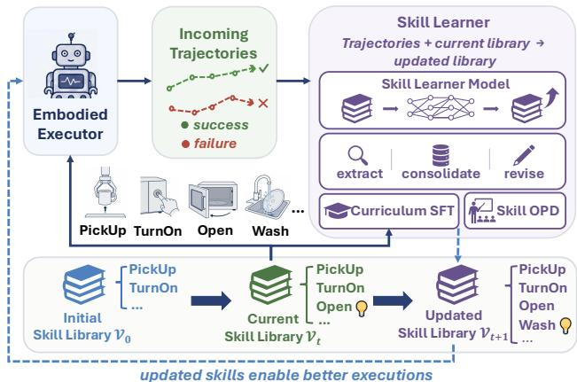  
Figure 1: Overview of our skill learning framework. A trainable skill learner extracts, consolidates, and revises reusable skills from successful and failed execution trajectories, progressively updating an external skill library. The updated skills guide the embodied executor toward improved task execution.

Therefore, a line of experience-augmented methods exter- nalizes such experience as persistent memories or reusable skills. Memory-based methods extract and retrieve episodic or semantic records (Zhang et al. 2025; Chhikara et al. 2025; Zhang, Fu, and Yan 2026), whereas skill-based methods distill trajectories into action procedures, lessons, or executable rules (Ni et al. 2026; Jiang et al. 2026; Yang et al. 2026; Ju et al. 2026; Ding et al. 2026). However, most of the current experience-augmented works rely on fixed, prompt-engineered workflows to generate, refine, merge, or remove skill entries. Consequently, although the library con- tent evolves, its update policy does not learn from accumu- lated experience or downstream execution outcomes, limiting its adaptability across tasks and environments. We therefore ask: Can an embodied agent learn not only new skills, but also how to grow and refine those skills?

To address this, we propose Practice, which treats the skill library as continuously evolving procedural knowledge and the skill learner as a learnable update policy. As shown in the Figure 1, the learner and the library are improved iteratively. The current library first guides task execution and shapes the collected trajectories, which are then used to improve the learner’s skill-refinement policy. The updated learner, in turn, extracts reusable experience from these tra- jectories and produces refined skills. The updated library guides the next round of execution and provides new experi- ence for further learning. In this way, the policy for refining skills and the procedural knowledge being refined improve together.

We instantiate this progression through three training stages. Stage 0 uses successful oracle trajectories to cold-start skill generation and library maintenance. Stage 1 con- trasts successful and failed trajectories from heterogeneous executors on the same tasks, teaching the learner to identify invalid condition for skill application and derive strategies for failure recovery. Finally, Stage 2 introduces online skill- refinement policy distillation (Skill OPD), where the learner generates edits from incoming trajectories and aligns its behavior with a stronger teacher on its own edit distribution. Each stage inherits the learner and skill library from the pre- ceding stage, progressively improving both the update policy and the procedural knowledge available to the executor.

We evaluate Practice on two high-level embodied task- planning benchmarks, EB-ALFRED and EB-Habitat, from EmbodiedBench (Yang et al. 2025). Across heterogeneous executors, Practice consistently improves task performance and outperforms the strongest experience-augmented base- lines by 9.7 and 2.6 percentage points, respectively. These findings suggest that sustained agent improvement depends not merely on evolving what an agent knows, but on learning how its procedural knowledge should evolve through experi- ence. Our main contributions are:

• We formulate skill evolution as a coupled learning problem and introduce a new framework that treats the skill library as evolving procedural knowledge and the skill learner as a learnable update policy.

• We propose a two-stage training framework combining curriculum supervised fine-tuning with online skill-edit distillation, enabling failure-aware skill maintenance and iterative refinement.

• We outperform the strongest experience-based baselines on EB-ALFRED and EB-Habitat while consistently im- proving multiple frozen executors.

## 2 Related Works

## 2.1 Embodied Task Planning

Embodied task planning requires agents to translate lan- guage instructions and visual observations into coherent ac- tion sequences. Recent work primarily improves this capabil- ity by post-training MLLM/VLM executors. RL4VLM ap- plies reinforcement learning to VLM decision policies (Zhai et al. 2024), while REBP and RoboGPT-R1 combine su-pervised initialization with reinforcement learning for struc- tured reasoning, task completion, and action consistency (Wu et al. 2025; Liu et al. 2025). VAGEN reinforces state estimation and transition modeling under partial observabil- ity (Wang et al. 2025). More recent methods exploit richer task supervision: ERA combines embodied priors with on- line RL (Chen et al. 2025), ORBIT performs on-policy finetuning with ofline rewards (Wu et al. 2026), and RoboA-gent trains coordinated vision-language capabilities through behavior cloning, trajectory aggregation, and reinforcement learning (Xu, Zheng, and Mu 2026). These approaches im-prove planning by internalizing task knowledge and interac- tion policies into the executor’s parameters.

## 2.2 Experience-Augmented Agents

Because executor post-training typically requires task- specific trajectories, another line of work externalizes expe-rience as reusable skills or memories. Prompt-based meth- ods summarize trajectories and maintain external knowl-edge through predefined operations: Trace2Skill consoli- dates trajectory-level lessons (Ni et al. 2026), AutoSkill maintains skill artifacts through addition, merging, and re- moval (Yan et al. 2026). Memor -based methods or anize experience into diferent memory structures (Zhang et al. 2025; Zhang, Fu, and Yan 2026; Ding et al. 2026), while ELITE and EmbodiSkill use reflective updates to refine reusable strategies or procedural skills (Wei et al. 2026; Ju et al. 2026). However, their maintenance logic is primarily prescribed through prompts and heuristics. Therefore, re- searches like MemCtrl trains a memory gate to retain or discard observations (Dorbala and Manocha 2026), SkillOS learns a curator for an external skill repository (Ouyang et al. 2026). In contrast, Practice progressively trains a dedicated learner to grow and refine a persistent skill library.

## 3 Methodology

## 3.1 Problem Formulation

Our agent system consists of an embodied task executor, a persistent skill library, and a learnable skill learner: the library guides task execution, while the learner converts the resulting trajectories into library updates, forming a closed loop of skill-level self-evolution.

Embodied task executor. We consider an embodied task executor that interacts with a physically grounded environ- ment E under natural-language instructions. Each task is modeled as a partially observable decision process. Given an instruction $I ,$ the executor receives an observation $o _ { t }$ at each time step t and selects an action $a _ { t }$ from the action space

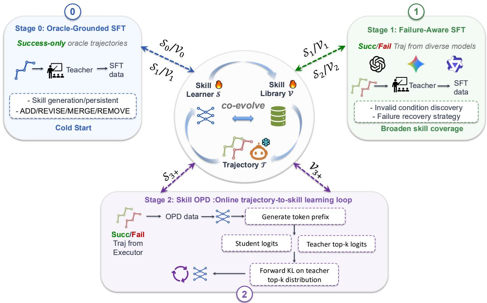  
Figure 2: Training pipeline of Practice. Stages 0–1 use oracle-grounded and failure-aware SFT to initialize skill learning while Stage 2 applies Skill OPD to match a teacher’s token distributions on student-generated prefixes via forward KL.

A. We denote the executor policy by $\pi _ { \mathrm { e x e c } }$ . An execution tra- jectory is represented as

$$
\tau = \left( I , o _ { 1 } , a _ { 1 } , \dots , o _ { T } , a _ { T } , y \right) ,\tag{1}
$$

where $T$ is the trajectory length and $y \in \{ 0 , 1 \}$ denotes the final task-success outcome. Throughout our framework, the parameters of $\pi _ { \mathrm { e x e c } }$ remain frozen.

Skill Library. The skill library V stores reusable procedural knowledge available to the executor for embodied task execution. The skill library is a collection of skill cards:

$$
\begin{array} { r } { \mathcal { V } = \{ v _ { j } \} _ { j = 1 } ^ { | \mathcal { V } | } . } \end{array}\tag{2}
$$

We define a skill card as a parameterized procedural unit. Each skill card $v _ { j }$ consists of an action pattern sequence $p _ { j }$ and a structured usage specification $u _ { j }$

$$
v _ { j } = ( p _ { j } , u _ { j } ) , \qquad p _ { j } = [ ( a _ { 1 } , \phi _ { 1 } ) , \dots , ( a _ { L } , \phi _ { L } ) ] ,\tag{3}
$$

where $a _ { l } \in \mathcal { A }$ is a primitive action and ϕ denotes its arguments, such as an object category or a target state. For example, the pattern (pick\_up, object\_target) could describe a reusable “picking-up” skill. The usage specifi- cation $u _ { j }$ describes the semantic scope and execution con- straints of the skill, such as when the skill is applicable and how the executor should recover from failure.

Skill-guided execution. The task executor is augmented with the current skill library V. The library provides pro-cedural guidance for action planning, including applicable action patterns, execution preconditions, expected efects, and recovery strategies. Let $h _ { t }$ denotes the interaction his- tory available at step t. The executor selects its next action according to

$$
a _ { t } \sim \pi _ { \mathrm { e x e c } } \left( \cdot \mid I , h _ { t } , \mathcal { V } \right) .\tag{4}
$$

Although the parameters of $\pi _ { \mathrm { e x e c } }$ remain unchanged, dif- ferent versions of the skill library induce diferent action distributions and therefore diferent trajectory distributions.

Skill learner. We introduce the skill learner $s$ as a param- eterized library-update policy. It interprets execution trajectories, extract reusable procedural experience, and determine how the persistent skill library should grow and be refined over time. At update round i, the current library $\nu _ { i }$ is provided to the task executor to collect a new trajectory set $\mathcal { T } _ { i } .$ Then the skill learner predicts a set of structured edits to grow the skill library like:

$$
\Delta = { \cal S } \left( \mathcal { V } , \mathcal { T } \right) .\tag{5}
$$

Here, $\Delta$ may contain operations that ADD, REVISE, MERGE, or REMOVE skill cards. The predicted edits are applied to produce the next skill library:

$$
\mathcal { V } = \mathrm { A p p l y } \left( \mathcal { V } , \Delta \right) .\tag{6}
$$

The skill learner and skill library thus form a coupled evolution process. An improved skill learner produces more reliable library edits, while the updated library changes the executor’s future trajectory distribution and provides new on-policy evidence for learning subsequent update policies.

## 3.2 Practice Overview

As illustrated in Figure 2, instead of relying on a fixed, prompt-engineered procedure for constructing and maintain- ing a skill library, Practice establishes a coupled update cycle between a learnable skill learner and a persistent skill library.

(1) Learner update $( S _ { i } \xrightarrow { ( \mathscr { V } _ { i } , \mathscr { T } _ { i } ) } \ S _ { i + 1 } )$ . At round $i ,$ the current library $\nu _ { i }$ guides the executor and induces trajectories $\mathcal { T } _ { i } ,$ which provide supervision for improving the skill learner.

(2) Library update $( \mathcal { V } _ { i } \xrightarrow { S _ { i + 1 } } \mathcal { V } _ { i + 1 } )$ . The updated learner interprets $\mathcal { T } _ { i }$ in the context of $\nu _ { i }$ and produces structured edits to construct $\nu _ { i + 1 }$

The updated library subsequently changes the executor’s trajectory distribution and provides new interaction evidence for the next round:

$$
\mathcal { V } _ { i } \to \mathcal { T } _ { i } \to S _ { i + 1 } \to \mathcal { V } _ { i + 1 } \to \mathcal { T } _ { i + 1 } .\tag{7}
$$

We instantiate this coupled progression through three stages: oracle-grounded SFT, failure-aware SFT, and online skill- refinement policy distillation (Skill OPD). Each stage inherits the learner and library from the preceding stage, pro- gressively improving both the skill-refinement policy and the procedural knowledge. We introduce each stage below.

Initial Skill Library Construction We construct the initial library through action-pattern discovery inspired by byte- pair encoding (BPE) (Sennrich, Haddow, and Birch 2016). We first collect successful trajectories from the executor with-out skill augmentation and convert them into sequences of primitive actions. Frequent adjacent action subsequences are then iteratively merged to discover recurring multi-step pat- terns. Finally, the initial skill learner $\scriptstyle { S _ { 0 } } .$ , initialized from a pretrained base model, consolidates these patterns into struc- tured skill cards, forming the initial library $\mathcal { V } _ { 0 }$

## 3.3 Curriculum Training of the Skill Learner

Following curriculum learning, which organizes training ex- amples in a meaningful progression from simpler to more dificult concepts (Bengio et al. 2009), we cold-start the skill learner through two stages. Stage 0 uses successful oracle tra- jectories to establish fundamental skill generation, editing, and consolidation capabilities. Stage 1 subsequently intro- duces heterogeneous executor rollouts containing both suc- cesses and failures, enabling the learner to perform failure- aware skill attribution and revision.

Structured skill-editing supervision. At stage $i ,$ the learner receives the current library $\nu _ { i }$ and a trajectory batch $B _ { i } \subseteq { \mathcal { T } } _ { i }$ . A strong teacher model generates a structured target edit set:

$$
\Delta _ { i } ^ { * } = \mathcal { G } \left( \mathcal { V } _ { i } , B _ { i } \right) ,\tag{8}
$$

where $\mathcal { G }$ denotes the teacher-based data generation process. Depending on the trajectory evidence and current library state, $\Delta _ { i } ^ { * }$ may contain ADD, REVISE, MERGE, and REMOVE operations. Given the resulting curriculum dataset $\mathcal { D } _ { k }$ , the skill learner is optimized with the autoregressive SFT objective:

$$
\mathcal { L } _ { \mathrm { S F T } } ^ { ( i ) } = - \mathbb { E } _ { ( x , y ) \sim \mathcal { D } _ { i } } \left[ \sum _ { t = 1 } ^ { \lfloor y \rfloor } \log p s _ { i + 1 } \left( y _ { t } \mid x , y _ { < t } \right) \right] ,\tag{9}
$$

where x contains the current library and trajectory evidence, and $y$ denotes the teacher-generated editing output.

Stage 0: Oracle-Grounded Skill Editing Stage 0 uses only successful oracle trajectories. This controlled setting allows the learner to acquire basic skill-editing capabilities before it must reason about noisy and potentially ambiguous failures.

To simulate the streaming arrival of executor experience, we randomly sample N oracle trajectories to form each trajectory batch:

$$
B _ { 0 , b } \subseteq { \mathcal { T } } ^ { \mathrm { o r a c l e } } , \qquad | B _ { 0 , b } | = N ,\tag{10}
$$

where b denotes the batch index. We construct three complementary types of Stage-0 supervision.

Skill generation from an empty library. The first type removes all existing skill context and asks the teacher to construct reusable skill cards directly from a trajectory batch:

$$
\Delta _ { 0 , b } ^ { \mathrm { g e n } } = \mathcal { G } \left( \emptyset , B _ { 0 , b } \right) .\tag{11}
$$

These examples teach the learner to identify reusable proce- dural abstractions without relying on pre-existing skill cards.

Editing the initialized library. The second type provides the BPE-initialized library $\mathcal { V } _ { 0 }$ together with the same trajectory evidence:

$$
\begin{array} { r } { \Delta _ { 0 , b } ^ { \mathrm { e d i t } } = \mathcal { G } \left( \mathcal { V } _ { 0 } , B _ { 0 , b } \right) . } \end{array}\tag{12}
$$

The teacher determines whether the evidence supports adding a missing skill, revising an incomplete skill, merging overlapping cards, removing an unsupported card, or preserv- ing the existing library. These examples train the learner to make localized edits rather than regenerate the whole library.

Cross-batch library consolidation. Edits obtained from individual batches may describe the same procedure at dif- ferent granularities or introduce partially conflicting applica- bility conditions. We therefore construct an additional con- solidation task over M independently sampled batches:

$$
\begin{array} { r } { \mathcal { C } _ { 0 } = \mathcal { G } _ { \mathrm { m e r g e } } \left( \mathcal { V } _ { 0 } , \left\{ \Delta _ { 0 , b } ^ { \mathrm { e d i t } } \right\} _ { b = 1 } ^ { M } \right) , } \end{array}\tag{13}
$$

where $\mathcal { C } _ { 0 }$ is a globally consolidated editing target. The con- solidation process removes semantic duplicates, merges com- patible action patterns, reconciles overlapping trigger condi- tions, and preserves distinct skills when their preconditions or efects difer. This task teaches the learner to maintain library-level consistency beyond a single local update.

The complete Stage-0 dataset is

$$
\begin{array} { r } { \mathcal { D } _ { 0 } = \mathcal { D } _ { 0 } ^ { \mathrm { g e n } } \cup \mathcal { D } _ { 0 } ^ { \mathrm { e d i t } } \cup \mathcal { D } _ { 0 } ^ { \mathrm { c o n } } , } \end{array}\tag{14}
$$

where the three subsets correspond to skill generation, library-conditioned editing, and cross-batch consolidation. Training on $\mathcal { D } _ { 0 }$ updates the initial learner $ { \boldsymbol { S } } _ { 0 }$ into $S _ { 1 }$ . The trained learner then evolves the initial library:

$$
\Delta _ { 0 } = { \cal S } _ { 1 } \left( \mathcal { V } _ { 0 } , \mathcal { T } _ { 0 } \right) , \qquad \mathcal { V } _ { 1 } = \mathrm { A p p l y } \left( \mathcal { V } _ { 0 } , \Delta _ { 0 } \right) .\tag{15}
$$

Stage 1: Failure-Aware Learning Stage 0 exposes the learner only to successful oracle behavior. However, an on- line skill learner must also determine whether a failed ex- ecution reveals a missing action, an incorrect action or an invalid environmental condition. Stage 1 introduces trajecto-ries generated by a heterogeneous pool of executor models, covering both successful and failed task executions.

Instead of randomly mixing trajectories from unrelated tasks, we construct each batch from multiple executors at- tempting the same task. For task $q ,$ the corresponding com- parison batch is

$$
B _ { 1 , q } = \left\{ \tau _ { q , m } \mid m \in \mathcal { M } \right\} ,\tag{16}
$$

where M denotes the executor pool. Since all trajectories share the same instruction and success criterion, their behav- ioral diferences provide controlled evidence for identifying generalizable skill content.

For each same-task batch, the teacher jointly analyzes all trajectories and produces a failure-aware editing target:

$$
{ \Delta } _ { 1 , q } ^ { * } = \mathcal { G } \left( \mathcal { V } _ { 1 } , B _ { 1 , q } \right) .\tag{17}
$$

These examples constitute the Stage-1 dataset $\mathcal { D } _ { 1 }$ . Fine- tuning on $\mathcal { D } _ { 1 }$ updates $S _ { 1 }$ into the failure-aware learner $S _ { 2 }$ which subsequently produces the next library:

$$
{ \Delta } _ { 1 } = { S } _ { 2 } \left( { \mathcal V } _ { 1 } , { \mathcal T } _ { 1 } \right) , \qquad { \mathcal V } _ { 2 } = \mathrm { A p p l y } \left( { \mathcal V } _ { 1 } , { \Delta } _ { 1 } \right) .\tag{18}
$$

In summary, Stage 0 teaches the learner to perform struc- tured library edits, while Stage 1 teaches it to identify invalid conditions and recovery strategies by contrasting successful and failed trajectories.

## 3.4 Skill OPD

Although curriculum SFT provides a strong initialization, its supervision is constructed from a fixed output distribu- tion. We therefore introduce Skill OPD, adapting knowledge distillation (Hinton, Vinyals, and Dean 2015) and on-policy sequence distillation (Agarwal et al. 2024; Sheng et al. 2025; Li et al. 2026) to skill-library editing. Unlike ofline SFT, Skill OPD trains the learner on contexts induced by its own generated outputs, reducing the train–inference distribution mismatch in autoregressive skill editing.

At OPD iteration i, we group incoming executor trajectories into editing batches. Conditioned on the current skill library $\nu _ { i }$ and a trajectory batch, the current learner $\boldsymbol { S } _ { i }$ sam-ples multi-turn editing rollouts from its own output distribu- tion. Each rollout contains proposed edit operations together with the intermediate library states induced by applying and merging those operations.

A frozen stronger teacher computes token distributions on the same student-generated prefixes. Skill OPD does not use task rewards or policy-gradient updates; instead, it di- rectly minimizes a top-K approximation to the forward KL divergence from the teacher to the student. Let $c _ { \ell }$ denote a student-visited skill-editing context at token position $\ell , p _ { \mathrm { T } } ^ { ( K ) }$ the teacher distribution restricted and renormalized over its top-K support, and $p _ { S _ { i } }$ the student distribution. The OPD objective is

$$
\begin{array} { r } { \mathcal { L } _ { \mathrm { O P D } } ^ { ( i ) } = \mathbb { E } _ { c _ { \ell } } \left[ D _ { \mathrm { K L } } \left( p _ { \mathrm { T } } ^ { ( K ) } ( \cdot \mid c _ { \ell } ) \parallel p _ { S _ { i } } ( \cdot \mid c _ { \ell } ) \right) \right] . } \end{array}\tag{19}
$$

The expectation is taken over token contexts visited by the student’s own editing rollouts. Minimizing this objective updates the learner from $s _ { i }$ to $S _ { i + 1 }$ . The improved learner is then used to regenerate the edits and produce the next skill library.

The updated library guides the executor in the next it- eration, producing a new trajectory distribution for further skill-learner optimization. Skill OPD therefore forms a re- cursive loop in which the learner improves the library, and the evolving library continually supplies new on-policy ex- perience for improving the learner.

## 4 Experiments

## 4.1 Experimental Setup

Benchmarks. We evaluate on 2 high-level embodied task planning benchmarks from EmbodiedBench (Yang et al. 2025): EB-ALFRED and EB-Habitat. Both of them contain 6 splits that assess distinct capability dimensions: basic ca- pabilities (Base), commonsense reasoning (Com.), complexinstruction following (Comp.), visual recognition (Vis.), spatial reasoning (Spat.), and long-horizon planning (Long).

Implementation Details. We use Qwen3-VL-8B-Instruct (Bai et al. 2025) as the base model and Qwen3.7- Max (Alibaba Cloud 2026b) to construct supervision. Skill edits are generated from batches of 10 trajectories, and each consolidation step merges 15 candidate edits. SFT is performed for three epochs with a learning rate of $5 \times 1 0 ^ { - 7 }$ For Skill OPD, we use Qwen3-VL-32B-Instruct (Bai et al. 2025) as the teacher and train for 20 epochs with a global batch size of 8 and one rollout per prompt. We apply top-K forward-KL distillation with K = 32 and no auxiliary policy-gradient loss.

Baselines. We select baselines to distinguish three sources of performance improvement: backbone capability (No Skill), direct executor post-training (Training-based MLLMs), and the use of knowledge derived from experience (Experience-Augmented MLLMs).

## 4.2 Main Results

As shown in Table 1, Practice achieves the best overall per- formance among experience-augmented methods under the same Qwen3-VL-32B-Instruct executor. It obtains average success rates of 49.7% on EB-ALFRED and 58.3% on EB- Habitat, exceeding the strongest prior experience-augmented baseline. Among the reported split-level results, Practice performs best on five EB-ALFRED splits and four EB- Habitat splits. The improvements are especially pronounced on Complex and Long in EB-ALFRED and on Complex and Visual in EB-Habitat, showing the benefit of converting experience into reusable guidance for complex instruction following and task breakdown. Practice trails the strongest baselines on Base and Long in EB-Habitat, where highly variable target locations are less amenable to fixed action patterns, suggesting room for more adaptive search skills.

Some training-based methods, such as ELITE (Wei et al. 2026), achieve higher performance by post-training the ex-ecutor on substantial task-specific data and interactions. In contrast, Practice trains a separate skill learner while keep- ing the executor unchanged. It can substantially improve the task performances by continually converting new trajectories into refined skills without repeatedly updating the executor’s parameters.

<table><tr><td rowspan="2">Model / Method</td><td colspan="7">EB-ALFRED</td><td colspan="7">EB-Habitat</td></tr><tr><td>Avg. Base Common Complex Visual Spatial Long</td><td></td><td></td><td></td><td></td><td></td><td>Avg.</td><td></td><td>Base Common Complex Visual Spatial Long</td><td></td><td></td><td></td><td></td></tr><tr><td colspan="10">No skill</td><td></td><td></td><td></td><td></td><td></td></tr><tr><td>GPT-5.4</td><td>65.3</td><td>76</td><td>72</td><td>76</td><td>54</td><td>58</td><td>56</td><td>65.7</td><td></td><td></td><td>62</td><td>62</td><td>40</td><td>80</td></tr><tr><td>Gemini-3-Flash</td><td>59.0</td><td>70</td><td>56</td><td>60</td><td>68</td><td>56</td><td>44</td><td>51.0</td><td>86</td><td>52</td><td>46</td><td>62</td><td>30</td><td>30</td></tr><tr><td>Qwen3.5-Flash</td><td>47.7</td><td>54</td><td>50</td><td>62</td><td>32</td><td>44</td><td>44</td><td>38.0</td><td>70</td><td>22</td><td>28</td><td>50</td><td>36</td><td>22</td></tr><tr><td>Qwen3-VL-32B-Instruct</td><td>24.3</td><td>30</td><td>38</td><td>34</td><td>28</td><td>16</td><td>0</td><td>37.3</td><td>70</td><td>34</td><td>38</td><td>32</td><td>32</td><td>18</td></tr><tr><td colspan="10">Training-based MLLMs</td><td colspan="7"></td></tr><tr><td>REBP (Wu et al. 2025)</td><td>35.6</td><td>54</td><td>42</td><td>46</td><td>28</td><td>38</td><td>6</td><td>20.0*</td><td>56</td><td>8</td><td>18</td><td>16</td><td>14</td><td>8</td></tr><tr><td>ORBIT† (Wu et al. 2026)</td><td>72.4†</td><td>86</td><td>62</td><td>82</td><td>72</td><td>60</td><td>一</td><td>22.4*</td><td>56</td><td>8</td><td>18</td><td>16</td><td>14</td><td>一</td></tr><tr><td>RoboGPT-R1 (Liu et al. 2025)</td><td>55.3</td><td>62</td><td>56</td><td>64</td><td>50</td><td>50</td><td>50</td><td>22.0*</td><td>64</td><td>8</td><td>18</td><td>20</td><td>12</td><td>10</td></tr><tr><td>RoboAgent (Xu et al. 2026)</td><td>67.0</td><td>72</td><td>48</td><td>64</td><td>78</td><td>60</td><td>80</td><td>22.3*</td><td>一</td><td>一</td><td>一</td><td>一</td><td>一</td><td>一</td></tr><tr><td>ESCA (Huang et al. 2025)</td><td>38.0</td><td>46</td><td>一</td><td>一</td><td>一</td><td>一</td><td>30</td><td>60.0</td><td>86</td><td></td><td>一</td><td></td><td></td><td>34</td></tr><tr><td>ELITE (Wei et al. 2026)</td><td>70.8</td><td>78</td><td>78</td><td>68</td><td>68</td><td>62</td><td></td><td>67.0</td><td>90</td><td></td><td></td><td></td><td></td><td>44</td></tr><tr><td colspan="10">Experience-Augmented MLLMs (Executor: Qwen3-VL-32B)</td><td colspan="7"></td></tr><tr><td>G-Mem (Zhang et al. 2025)</td><td>25.3</td><td>34</td><td>36</td><td>38</td><td>24</td><td>14</td><td>6</td><td>44.0</td><td>88</td><td>24</td><td>36</td><td>50</td><td>32</td><td>34</td></tr><tr><td>Mem0 (Chhikara et al. 2025)</td><td>30.3</td><td>40</td><td>42</td><td>40</td><td>26</td><td>26</td><td>8</td><td>38.3</td><td>84</td><td>24</td><td>26</td><td>42</td><td>34</td><td>20</td></tr><tr><td>A-Mem (Xu et al. 2025)</td><td>32.3</td><td>46</td><td>50</td><td>34</td><td>30</td><td>30</td><td>4</td><td>36.7</td><td>86</td><td>12</td><td>38</td><td>24</td><td>36</td><td>24</td></tr><tr><td>LangMem (LangChain 2025)</td><td>31.3</td><td>38</td><td>44</td><td>44</td><td>28</td><td>26</td><td>8</td><td>38.3</td><td>86</td><td>26</td><td>28</td><td>40</td><td>32</td><td>18</td></tr><tr><td>MemGen (Zhang et al. 2026)</td><td>14.2</td><td>22</td><td>18</td><td>16</td><td>6</td><td>20</td><td>4</td><td>25.7</td><td>50</td><td>14</td><td>22</td><td>36</td><td>22</td><td>10</td></tr><tr><td>EmbodiedSkill (Ju et al. 2026)</td><td></td><td>一</td><td>1</td><td>一</td><td>一</td><td>1</td><td>1</td><td>52.3</td><td>96</td><td>44</td><td>52</td><td>62</td><td>36</td><td>24</td></tr><tr><td>MemCompiler (Ding et al. 2026)</td><td>40.0</td><td>52</td><td>54</td><td>48</td><td>38</td><td>38</td><td>10</td><td>55.7</td><td>90</td><td>58</td><td>44</td><td>64</td><td>40</td><td>38</td></tr><tr><td>PRACTICE (Ours)</td><td>49.7</td><td>66</td><td>50</td><td>70</td><td>42</td><td>46</td><td>24</td><td>58.3</td><td>82</td><td>68</td><td>60</td><td>76</td><td>42</td><td>22</td></tr><tr><td>PRACTICE-GPT 5.4 (Ours)</td><td>67.7</td><td>74</td><td>74</td><td>72</td><td>60</td><td>60</td><td>66</td><td>72.0</td><td>96</td><td>76</td><td>54</td><td>92</td><td>54</td><td>60</td></tr></table>

Table 1: Success rate (%) on EB-ALFRED and EB-Habitat. † indicates that the average is computed over the five reported splits, excluding the Long split. ∗ denotes unseen/OOD evaluation. “–” denotes results that are not reported. The best results are shown in bold, and the second-best results are underlined. Practice results with GPT-5.4 executor (O enAI 2026) are italic for distinction.

Notably, Practice-augmented Qwen3-VL-32B-Instruct surpasses the strong proprietary Qwen3.5-Flash, while Prac-tice-augmented GPT-5.4 achieves new state-of-the-art per- formance on EB-habitat benchmarks among all methods. These results show that our learner–library co-evolution pipeline can strengthen heterogeneous executors, narrowing the gap to stronger foundation models with a compact skill learner.

## 4.3 Ablation

Generalization across task executors. We additional conduct a cross-executor generalization study. Following the multi-executor evaluation protocol of MemCompiler (Ding et al. 2026), we instantiate the task executor with GPT-5.2, Gemini-3-Flash (Google 2025) (Gemini for shot), and Qwen3-VL-32B-Instruct (Qwen), covering both proprietary and open-weight models. For each executor, we compare skill-augmented performance against its matched unaug- mented baseline under the same evaluation protocol.

As shown in Table 2, Practice consistently improves all three executors. It increases the average success rate of GPT- 5.4, GPT-5.2, Gemini and Qwen of 2.4, 30.3, 15.3, and 25.4 percentage points, respectively. Among the experience- augmented methods shown with the same executor, Practice yields the largest reported matched improvement on GPT-5.2 and Qwen. These results demonstrate the potential of im-proving diverse base executors through an evolving external skill library and support our claim that Practice provides a general mechanism for sustained capability improvement without separately post-training each executor.

<table><tr><td>Method</td><td>Executor</td><td>No Aug.</td><td>With Aug.</td><td>∆</td></tr><tr><td>BrainMem</td><td>Claude-3.5-Sonnet</td><td>64.0</td><td>74.7</td><td>+10.7</td></tr><tr><td>MemCtrl‡</td><td>Gemma-3-12B</td><td>25.6</td><td>27.8</td><td>+2.2</td></tr><tr><td>MemCompiler</td><td>Qwen3-VL-32B</td><td>19.0</td><td>40.0</td><td>+21.0</td></tr><tr><td rowspan="3">LangMem</td><td>GPT-5.2</td><td>32.0</td><td>46.7</td><td>+14.7</td></tr><tr><td>Gemini-3-Flash</td><td>59.0</td><td>78.0</td><td>+19.0</td></tr><tr><td>Qwen3-VL-32B</td><td>19.0</td><td>31.3</td><td>+12.3</td></tr><tr><td rowspan="4">PRACTICE (Ours)</td><td>GPT-5.4</td><td>65.3</td><td>67.7</td><td>+2.4</td></tr><tr><td>GPT-5.2</td><td>32.0</td><td>62.3</td><td>+30.3</td></tr><tr><td>Gemini-3-Flash</td><td>59.0</td><td>74.3</td><td>+15.3</td></tr><tr><td>Qwen3-VL-32B</td><td>24.3</td><td>49.7</td><td>+25.4</td></tr></table>

Table 2: Average success rate on EB-ALFRED. ∆ denotes the absolute improvement from the experience augmentation. ‡ indicates that the average is computed over the five reported splits, excluding the Visual split.

Efect of progressive skill-learner training. Table 3 presents a stage-wise ablation of Practice’s training pipeline. The average success rate improves consistently across all subsequent training stages. Stage 0 increases the average from 40.7% to 42.3% by teaching the learner ba- sic skill generation and consolidation from successful or- acle trajectories. Introducing failure-aware skill editing in Stage 1 further raises performance to 45.3%, with a particu- larly clear improvement on the Long split from 6% to 14%. Finally, Stage 2 achieves the largest incremental gain among the learned stages, improving the average success rate by 4.4 points. At the same time, the number of skill cards in this stage also grows to the greatest one with 29 cards. These results indicate that during Skill OPD stage, skill learner ef- fectively learn to extract more new and efective skills by aligning with the stronger teacher on the skill-edit distribu- tion, reducing the discrepancy between ofline supervision and the edits encountered during iterative library evolution.

Task Instruction: Wash the red cloth and put it in a cabinet.
<table><tr><td>Setting</td><td>#Cards</td><td>|Base</td><td>Com.</td><td>Comp.</td><td>Vis.</td><td>Spat.</td><td>Long</td><td>Avg.</td></tr><tr><td>No Skill</td><td>0</td><td>30</td><td>38</td><td>34</td><td>28</td><td>16</td><td>0</td><td>24.3</td></tr><tr><td>Initial Skill (BPE)</td><td>17</td><td>60</td><td>36</td><td>50</td><td>46</td><td>42</td><td>10</td><td>40.7</td></tr><tr><td>Stage 0 (SFT)</td><td>21</td><td>62</td><td>48</td><td>58</td><td>36</td><td>44</td><td>6</td><td>42.3</td></tr><tr><td>Stage 1 (SFT)</td><td>17</td><td>66</td><td>46</td><td>60</td><td>40</td><td>46</td><td>14</td><td>45.3</td></tr><tr><td>Stage 2 (OPD)</td><td>29</td><td>66</td><td>50</td><td>70</td><td>42</td><td>46</td><td>24</td><td>49.7</td></tr></table>

Table 3: Ablation of Practice’s progressive training pipeline on EB-ALFRED. We report task success rate (SR, %) across three training stages: curriculum SFT (Stages 0–1) and online skill-edit distillation (Stage 2). Executor: Qwen3-VL-32B-Instruct; Student: Qwen3-VL-8B-Instruct. The best result in each column is shown in bold.

Efect of failure-aware skill learning. To isolate the contribution of failure-aware supervision, we compare two vari- ants of Stage 1. The full variant (Failure-Aware) uses both successful and failed trajectories, requiring the skill learner to contrast their action sequences and environment feedback to identify invalid conditions and derive corresponding recov- ery strategies. These findings are recorded in the respective fields of each skill card. As a control, Stage 1 (Succ-Only) uses only successful trajectories and removes supervision for these two failure-related fields while retaining the rest of the skill-learning procedure.

As shown in Table 4, simply adding more successful tra- jectories provides only a marginal improvement, increasing the average success rate from 42.3% to 42.7%. In contrast, failure-aware skill learning raises the average to 45.3%, out- performing the success-only variant by 2.6 percentage points and Stage 0 by 3.0 points. The largest improvement appears on the Long split, where success increases from 8% to 14%. Failure-aware learning also improves Base and Complex by 4 points and Spatial by 2 points over the success-only control. These results indicate that failed trajectories provide supervi-sion that cannot be obtained merely by collecting additional successful examples: they expose invalid action patterns, vi- olated preconditions, and corrective behaviors that help the executor recover during complex and long-horizon tasks.

Figure 3 illustrates how failure-aware skills recovery from execution errors. After the initial pickup fails, the executor matches the environment feedback to an invalid condition recorded in the skill card and invokes the corresponding recovery action. This example demonstrates that learned re- covery strategies make skill-guided execution more robust to unexpected environment states.

<table><tr><td>Variant</td><td>Base</td><td>Com.</td><td>Comp.</td><td></td><td>Vis. Spat. Long Avg.</td><td></td><td></td></tr><tr><td>Stage 0</td><td>62</td><td>48</td><td>58</td><td>36</td><td>44</td><td>6</td><td>42.3</td></tr><tr><td>Stage 1 (Succ-Only)</td><td>62</td><td>46</td><td>56</td><td>40</td><td>44</td><td>8</td><td>42.7</td></tr><tr><td>Stage 1 (Failure-Aware)</td><td>66</td><td>46</td><td>60</td><td>40</td><td>46</td><td>14</td><td>45.3</td></tr><tr><td>∆</td><td>+4</td><td>+0</td><td>+4</td><td>+0</td><td>+2</td><td>+6</td><td>+2.6</td></tr></table>

Table 4: Ablation study of failure-aware recovery learning on EB-ALFRED. All results are SR, %. ∆ denotes the improvement of Stage 1 (Failure-Aware) over Stage 1 (Succ-Only).

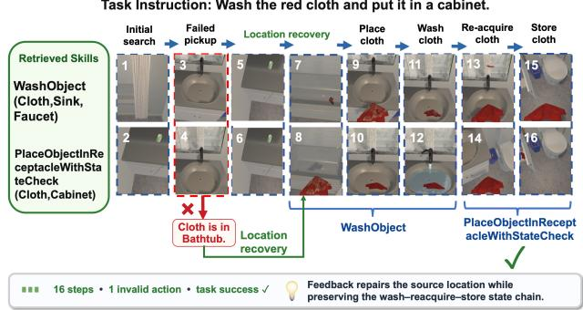  
Figure 3: A representative failure-recovery trajectory. The PickUp failure triggered “object not found” strategy redi-rects the search to an alternative location. The executor then resumes the task and completes it using WashObject and PlaceObjectReceptacle in 16 steps.

## 5 Conclusion

This work reframes sustained im rovement in embodied task planning as a problem of learning how interaction experience should be transformed into persistent procedural knowledge. Practice shows that reusable action patterns become sub- stantially more efective when paired with explicit applicabil- ity conditions and failure-recovery strategies: together, they help executors decompose complex instructions, avoid re- peated failure modes, and recover when execution deviates from the expected procedure. Rather than relying on a fixed, prompt-engineered maintenance workflow, Practice learns this transformation through a co-evolution of learner–library but with a frozen executor: the updated skill library shapes future trajectories, while those trajectories improve both the skill refinement policy and the knowledge retained in the next library. The consistent gains across training stages and heterogeneous executors validate the efectiveness and gen- erality of this cycle. More broadly, our results suggest that learning to maintain an evolving procedural layer ofers an efective path complementary to post-training the executor it- self. Sustained capability growth can therefore arise not only from improving how an agent acts, but also from improving how it turns past experiences into reusable knowledge for future decisions.

## References

Agarwal, R.; Vieillard, N.; Zhou, Y.; Stanczyk, P.; Ramos Garea, S.; Geist, M.; and Bachem, O. 2024. On- Policy Distillation of Language Models: Learning from Self- Generated Mistakes. In International Conference on Learning Representations (ICLR).

Ahn, M.; Brohan, A.; Brown, N.; Chebotar, Y.; Cortes, O.; David, B.; Finn, C.; Fu, C.; Gopalakrishnan, K.; Hausman, K.; Herzog, A.; Ho, D.; Hsu, J.; Ibarz, J.; Ichter, B.; Irpan, A.; Jang, E.; Ruano, R. J.; Jefrey, K.; Jesmonth, S.; Joshi, N. J.; Julian, R.; Kalashnikov, D.; Kuang, Y.; Lee, K.-H.; Levine, S.; Lu, Y.; Luu, L.; Parada, C.; Pastor, P.; Quiambao, J.; Rao, K.; Rettinghouse, J.; Reyes, D.; Sermanet, P.; Sievers, N.; Tan, C.; Toshev, A.; Vanhoucke, V.; Xia, F.; Xiao, T.; Xu, P.; Xu, S.; Yan, M.; and Zeng, A. 2022. Do As I Can, Not As I Say: Grounding Language in Robotic Afordances. arXiv preprint arXiv:2204.01691.

Alibaba Cloud. 2026a. Qwen3.5-Flash. https://www. alibabacloud.com/help/en/model-studio/vision-model/. Model snapshot qwen3.5-flash-2026-02-23; accessed July 30, 2026.

Alibaba Cloud. 2026b. Qwen3.7-Max. https: //www.alibabacloud.com/help/en/model-studio/text- generation-model/. Alibaba Cloud Model Studio documen- tation. Accessed: 2026-07-29.

Bai, S.; Cai, Y.; Chen, R.; Chen, K.; Chen, X.; Cheng, Z.; Deng, L.; Ding, W.; Gao, C.; Ge, C.; et al. 2025. Qwen3-VL Technical Report. arXiv preprint arXiv:2511.21631.

Bengio, Y.; Louradour, J.; Collobert, R.; and Weston, J. 2009. Curriculum Learning. In Proceedings of the 26th Annual International Conference on Machine Learning, 41–48.

Chen, H.; Zhao, M.; Yang, R.; Ma, Q.; Yang, K.; Yao, J.; Wang, K.; Bai, H.; Wang, Z.; Pan, R.; Zhang, M.; Barreiros, J.; Onol, A.; Zhai, C.; Ji, H.; Li, M.; Zhang, H.; and Zhang, T. 2025. ERA: Transforming VLMs into Embodied Agents via Embodied Prior Learning and Online Reinforcement Learn- ing. arXiv:2510.12693.

Chhikara, P.; Khant, D.; Aryan, S.; Singh, T.; and Ya- dav, D. 2025. Mem0: Building Production-Ready AI Agents with Scalable Long-Term Memory. arXiv preprint arXiv:2504.19413.

Comanici, G.; Bieber, E.; Schaekermann, M.; et al. 2025. Gemini 2.5: Pushing the Frontier with Advanced Reasoning, Multimodality, Long Context, and Next Generation Agentic Capabilities. arXiv preprint arXiv:2507.06261.

Ding, X.; Wang, X.; Yang, Y.; Wu, H.; Jiang, S.; Zhang, Q.; Mi, L.; Zhu, H.; Li, K.; Liu, Y.; et al. 2026. MemCom- piler: Compile, Don’t Inject–State-Conditioned Memory for Embodied Agents. arXiv preprint arXiv:2605.07594.

Dorbala, V. S.; and Manocha, D. 2026. MemCtrl: Us- ing MLLMs as Active Memory Controllers on Embodied Agents. arXiv preprint arXiv:2601.20831.

Google. 2025. Gemini 3 Flash Preview. https://ai.google.dev/ gemini-api/docs/models/gemini-3-flash-preview. Accessed: 2026-07-29.

Google DeepMind. 2025. Gemini 3 Flash Model Card. https://deepmind.google/models/model-cards/gemini-3- flash/. Published December 17, 2025.

Google DeepMind. 2026a. Gemini 3.1 Pro Model Card. https://deepmind.google/models/model-cards/gemini-3-1- pro/. Published February 19, 2026.

Google DeepMind. 2026b. Gemini 3.5 Flash Model Card. https://deepmind.google/models/model-cards/gemini-3-5- flash/. Published May 19, 2026.

Hinton, G.; Vinyals, O.; and Dean, J. 2015. Distill- ing the Knowledge in a Neural Network. arXiv preprint arXiv:1503.02531.

Huang, J.; Sethi, A.; Kuo, M.; Keoliya, M.; Velingker, N.; Jung, J.; Lim, S. N.; Li, Z.; and Naik, M. 2025. ESCA: Contextualizing Embodied Agents via Scene-Graph Genera- tion. In Advances in Neural Information Processing Systems (NeurIPS), volume 38, 2828–2870.

Jiang, G.; Su, Z.; Qu, X.; and Fung, Y. R. 2026. XSkill: Continual Learning from Experience and Skills in Multimodal Agents. In Proceedings ofthe 43rd International Conference on Machine Learning (ICML).

Ju, R.; Wang, X.; Ding, X.; Yang, Y.; Wu, H.; Jiang, S.; Zhang, Q.; Wen, H.; Li, X.; Wang, W.; et al. 2026. EmbodiSkill: Skill-Aware Reflection for Self-Evolving Embod- ied Agents. arXiv preprint arXiv:2605.10332.

LangChain. 2025. LangMem. https://github.com/langchain- ai/langmem. Accessed: 2026-05-04.

Li, Y.; Zuo, Y.; He, B.; Zhang, J.; Xiao, C.; Qian, C.; Yu, T.; Gao, H.-a.; Yang, W.; Liu, Z.; and Ding, N. 2026. Re- thinking On-Policy Distillation of Large Language Models: Phenomenology, Mechanism, and Recipe. arXiv preprint arXiv:2604.13016.

Liu, J.; Nie, B.; Li, B.; Chen, Y.; Wang, Y.; He, S.; and Li, H. 2025. RoboGPT-R1: Enhancing Robot Task Planning with Reinforcement Learning. arXiv preprint arXiv:2510.14828.

Ni, J.; Liu, Y.; Liu, X.; Sun, Y.; Zhou, M.; Cheng, P.; Wang, D.; Zhao, E.; Jiang, X.; and Jiang, G. 2026. Trace2Skill: Dis- till Trajectory-Local Lessons into Transferable Agent Skills. arXiv:2603.25158.

OpenAI. 2026. Introducing GPT-5.4. https://openai.com/ index/introducing-gpt-5-4/. Published March 5, 2026.

Ouyang, S.; Yan, J.; Chen, Y.; Han, R.; Wang, Z.; Mishra, B. D.; Meng, R.; Li, C.-L.; Jiao, Y.; Zha, K.; et al. 2026. Skil- lOS: Learning skill curation for self-evolving agents. arXiv preprint arXiv:2605.06614.

Sennrich, R.; Haddow, B.; and Birch, A. 2016. Neural Ma- chine Translation of Rare Words with Subword Units. In Proceedings of the 54th Annual Meeting of the Association for Computational Linguistics, 1715–1725.

Sheng, G.; Zhang, C.; Ye, Z.; Wu, X.; Zhang, W.; Zhang, R.; Peng, Y.; Lin, H.; and Wu, C. 2025. HybridFlow: A Flexible and Eficient RLHF Framework. In Proceedings of the Twentieth European Conference on Computer Systems (EuroSys), 1279–1297. ACM.

Song, C. H.; Wu, J.; Washington, C.; Sadler, B. M.; Chao, W.-L.; and Su, Y. 2023. LLM-Planner: Few-Shot Grounded

Planning for Embodied Agents with Large Language Models. In Proceedings of the IEEE/CVF International Conference on Computer Vision, 2998–3009.

Wang, K.; Zhang, P.; Wang, Z.; Gao, Y.; Li, L.; Wang, Q.; Chen, H.; Lu, Y.; Yang, Z.; Wang, L.; Krishna, R.; Wu, J.; Li, F.-F.; Choi, Y.; and Li, M. 2025. VAGEN: Reinforcing World Model Reasoning for Multi-Turn VLM Agents. In Advances in Neural Information Processing Systems (NeurIPS), volume 38.

Wei, B.; Xia, Z.; Liu, D.; Zhou, X.; Lin, Z.; and Wang, Y. 2026. ELITE: Experiential Learning and Intent-Aware Transfer for Self-improving Embodied Agents. arXiv preprint arXiv:2603.24018.

Wu, D.; Fan, J.; Gu, C.; Wang, G.; Yin, W.; Li, W.; and Jin, B. 2026. On-Policy Reinforcement Fine-Tuning with Ofline Reward for Multi-Step Embodied Planning. In Proceedings ofthe 64th Annual Meeting ofthe Associationfor Computational Linguistics (ACL), 39277–39307. San Diego, Califor-nia, United States: Association for Computational Linguis- tics.

Wu, D.; Fan, J.; Zang, J.; Wang, G.; Yin, W.; Li, W.; and Jin, B. 2025. Reinforced Reasoning for Embodied Planning. arXiv preprint arXiv:2505.22050.

Xu, P.; Zheng, J.; and Mu, Y. 2026. RoboAgent: Chaining Basic Capabilities for Embodied Task Planning. In Proceedings of the IEEE/CVF Conference on Computer Vision and Pattern Recognition (CVPR), 15276–15290.

Xu, W.; Liang, Z.; Mei, K.; Gao, H.; Tan, J.; and Zhang, Y. 2025. A-MEM: Agentic Memory for LLM Agents. In Advances in Neural Information Processing Systems (NeurIPS), volume 38.

Yang, R.; Chen, H.; Zhang, J.; Zhao, M.; Qian, C.; Wang, K.; Wang, Q.; Koripella, T. V.; Movahedi, M.; Li, M.; Ji, H.; Zhang, H.; and Zhang, T. 2025. EmbodiedBench: Compre- hensive Benchmarking Multi-modal Large Language Mod- els for Vision-Driven Embodied Agents. In Proceedings of the 42nd International Conference on Machine Learning (ICML), volume 267, 70576–70631. PMLR.

Yang, Y.; Li, J.; Pan, Q.; Zhan, B.; Cai, Y.; Du, L.; Zhou, J.; Chen, K.; Chen, Q.; Li, X.; Zhang, B.; and He, L. 2026. AutoSkill: Experience-Driven Lifelong Learning via Skill Self-Evolution. arXiv:2603.01145.

Yao, S.; Zhao, J.; Yu, D.; Du, N.; Shafran, I.; Narasimhan, K.; and Cao, Y. 2023. ReAct: Synergizing Reasoning and Acting in Language Models. In International Conference on Learning Representations.

Yuan, H.; Bai, Y.; Fu, Y.; Zhou, B.; Feng, Y.; Xu, X.; Zhan, Y.; Karlsson, B. F.; and Lu, Z. 2025. Being-0: A Humanoid Robotic Agent with Vision-Language Models and Modular Skills. arXiv preprint arXiv:2503.12533.

Zhai, Y.; Bai, H.; Lin, Z.; Pan, J.; Tong, S.; Zhou, Y.; Suhr, A.; Xie, S.; LeCun, Y.; Ma, Y.; and Levine, S. 2024. Fine- Tuning Large Vision-Language Models as Decision-Making Agents via Reinforcement Learning. In Advances in Neural Information Processing Systems (NeurIPS), volume 37, 110935–110971.

<table><tr><td>Benchmark</td><td>Stage</td><td>Succ.</td><td>Fail. # Gen/Edit # Conso. Total</td><td></td><td></td></tr><tr><td rowspan="4"></td><td>EB-ALFRED Stage 0A</td><td>300</td><td>0</td><td>1,000</td><td>4001,400</td></tr><tr><td>Stage 0B</td><td>300</td><td>0</td><td>400</td><td>0 400</td></tr><tr><td>Stage 1</td><td>1,285</td><td>51,123</td><td>300</td><td>150 450</td></tr><tr><td>Subtotal</td><td>1 1,885 1,123</td><td></td><td>1,700</td><td>550 2,250</td></tr><tr><td rowspan="4">EB-Habitat</td><td>Stage 0A</td><td>300</td><td>0</td><td>1,000</td><td>4001,400</td></tr><tr><td>Stage 0B</td><td>150</td><td>0</td><td>300</td><td>100 400</td></tr><tr><td>Stage 1</td><td>1,3161,084</td><td></td><td>300</td><td>150 450</td></tr><tr><td>Subtotal 1,766 1,084</td><td></td><td></td><td>1,700</td><td>550 2,250</td></tr></table>

Table 5: Statistics of the final curriculum SFT datasets. Succ. and Fail. count source trajectories before batching, whereas Edit, Consolidation (Conso.), and Total count the resulting SFT samples.

Zhang, G.; Fu, M.; Wang, K.; Wan, F.; Yu, M.; and Yan, S. 2025. G-Memory: Tracing Hierarchical Memory for Multi- Agent Systems. In Advances in Neural Information Processing Systems (NeurIPS), volume 38.

Zhang, G.; Fu, M.; and Yan, S. 2026. MemGen: Weaving Generative Latent Memory for Self-Evolving Agents. In International Conference on Learning Representations (ICLR).

## A Additional Method Details

## A.1 Training Data Construction

Our curriculum supervised fine-tuning (SFT) consists of two stages. Stage 0 uses only successful oracle trajectories to establish the learner’s basic skill-generation, skill-edit and skill-consolidate capabilities. For generation (Stage 0A), the current\_skill\_pool is set to an empty list. We randomly sample N = 10 trajectories as a batch from 300 oracle trajectories in both EB-ALFRED and EB-Habitat to construct supervision from Qwen-3.7-max (Bai et al. 2025). Therefore we get several generated skill candidates for each batch, after that, we randomly sample M = 15 candidates to construct skill-consolidate data. For editing (Stage 0B), the current\_skill\_pool is the initial skill library V . Similarly as Stage 0A, we generate skill editing data from randomly trajectories batches from oracle.

Stage 1 groups trajectories produced by 8 heterogeneous executors according to the task: Gemini-2.5- Flash (Comanici et al. 2025), Gemini-3-Flash (Google DeepMind 2025), Gemini-3.1-Pro (Google DeepMind 2026a), Gemini-3.5-Flash (Google DeepMind 2026b), GPT-5.4 (OpenAI 2026), Qwen3.5-Flash (Alibaba Cloud 2026a), and Qwen3-VL-8B/32B-Instruct (Bai et al. 2025). By contrasting successful and failed executions of the same task, the learner generates failure-aware edits that capture additional invalid\_conditions and recovery\_strategies. Then from each group, we collect the corresponding skill editing with the skill pool of V , and consolidation data after that.

In Table 5, skill-generation and local library-editing exam- ples are jointly counted as edit samples, while cross-batch consolidation examples are counted as merge samples.

Algorithm 1: Progressive Learner–Library Co-Evolution in   
Practice.   
Require: Frozen task executor $\pi _ { \mathrm { e x e c } } ;$ initial skill learner $s _ { 0 } ;$   
oracle trajectories $\mathcal { T } ^ { \mathrm { o r a . } }$ ; heterogeneous executors $\Pi _ { \mathrm { h e t } } ;$   
SFT supervision teacher $P _ { \mathrm { s u p } } ;$ OPD teacher $P _ { \mathrm { T } } ;$ OPD   
rounds R   
Ensure: Trained skill learner $\boldsymbol { S } _ { R + 1 }$ and evolved skill library   
$\nu _ { R + 1 }$   
1: // Initial skill-library construction   
2: $\mathcal { P } _ { 0 }  \mathrm { B P E } .$ -PatternDiscovery $( \mathcal { T } ^ { \mathrm { o r a } } )$   
3: $\mathcal { V } _ { 0 }$ ← InitializeSkillLibrary $( \dot { S } _ { 0 } , \mathcal { P } _ { 0 } , \mathcal { T } ^ { \mathrm { o r a } } )$   
4: // Stage 0: Oracle-Grounded SFT   
5: $\mathcal { D } _ { 0 }$ ← ConstructOracleSupervi-   
sion $\mathrm { \Delta } _ { \mathrm { l } } ( P _ { \mathrm { s u p } } , \mathcal { V } _ { 0 } , \mathcal { T } ^ { \mathrm { o r a } } )$   
6: $s _ { 1 } \gets s$ upervisedFineTune ${ \bf \nabla } _ { \left[ S _ { 0 } , D _ { 0 } \right) }$ {Learner update}   
7: $\mathcal { T } _ { 0 }  \mathrm { R o . t a o u r } ( \pi _ { \mathrm { e x e c } } , \mathcal { V } _ { 0 } )$   
8: $\mathcal { V } _ { 1 }  \mathrm { U p D A T E L I B R A R Y } ( S _ { 1 } , \mathcal { V } _ { 0 } , \mathcal { T } _ { 0 } )$ {Library update}   
9: // Stage 1: Failure-Aware SFT   
10: T ← CollectSameTaskRollouts $( \Pi _ { \mathrm { h e t } } , \mathcal { V } _ { 1 } )$   
11: $B _ { 1 }  \mathrm { G R o u p B y T A s K } ( T _ { 1 } )$   
12: $\mathcal { D } _ { 1 }$ ← ConstructFailureAwareSupervi-   
sion $(  { P _ { \mathrm { s u p } } } ,  { \mathcal { V } } _ { 1 } ,  { B _ { 1 } } )$   
13: $\ S _ { 2 } $ SupervisedFin $\smash { \Im \mathrm { T r o n g } ( S _ { 1 } , \mathcal { D } _ { 1 } ) }$ {Learner update}   
14: $\nu _ { 2 } \gets$ UpdateLibrary $( S _ { 2 } , \dot { \mathcal { V } _ { 1 } } , \mathcal { T } _ { 1 } )$ {Library update}   
15: // Stage 2: On-Policy Distillation   
16: for $i \overset { \vartriangle } { = } 2 , \ldots , R$ do   
17: $\mathcal { T } _ { i }  \mathrm { R o . L o u r } ( \pi _ { \mathrm { e x e c } } , \mathcal { V } _ { i } )$   
18: $\mathrm { \Delta } \dot { \mathcal { D } } _ { i } ^ { \mathrm { { O P D } } } \gets \mathrm { { C } }$ onstructOPDPrompts $( \nu _ { i } , \tau _ { i } )$   
19: $S _ { i + 1 } \quad $ OnPolicyDistillation $( S _ { i } , \dot { P _ { \mathrm { T } } } , { \cal D } _ { i } ^ { \mathrm { O P D } } )$   
{Algorithm 2}   
20: $\mathscr { V } _ { i + 1 } \gets \mathrm { U }$ pdateLibrary $( S _ { i + 1 } , \mathcal { V } _ { i } , \mathcal { T } _ { i } )$ {Library up  
date}   
21: end for   
22: return $S _ { R + 1 } , \mathcal { V } _ { R + 1 }$   
23: // Subroutine: UpdateLibrary $( \mathcal { S } , \mathcal { V } , \mathcal { T } )$   
24: Partition trajectories into batches $\lbrace B _ { m } \rbrace _ { m = 1 } ^ { M }$   
25: for $m = 1 , \ldots , M$ do   
26: $\Delta _ { m }  \bar { S } ( \gamma , B _ { m } )$   
27: $\Delta _ { m } \in \{ \mathtt { A D D }$ , REVISE, MERGE, REMOVE}   
28: end for   
29: $\widetilde { \mathcal { V } } \gets \mathrm { A P P L Y E D I T S } ( \mathcal { V } , \bigcup _ { m = 1 } ^ { M } \Delta _ { m } )$   
30: $\mathcal { V } ^ { \prime } $ HierarchicalConsolidation $( \widetilde { \mathcal { V } } )$   
31: return $\mathcal { V } ^ { \prime }$

## A.2 Training Algorithm

Algorithm 1 presents the pseudocode for the overall Prac- tice framework. Specifically, we implement the Stage 2 train- ing using the on-policy distillation (OPD) pipeline in verl. The training data are prompt-only: given a trajectory prompt, the current student first generates a skill update from its own policy. A frozen teacher then evaluates the student-generated sequence and provides its Top-K token distribution at each response position. We directly optimize the student using a Top-K approximation of the forward KL divergence. No task reward or policy-gradient objective is used.

Let π denote the student skill learner and $\pi _ { T }$ the frozen

teacher. For a prompt x, the student first samples

$$
y \sim \pi _ { \theta } ( \cdot \mid x ) ,\tag{20}
$$

where $y = ( y _ { 1 } , \dots , y _ { T } )$ is the student-generated skill update. At each response position t, the teacher is evaluated on the student-induced context $\boldsymbol { s } _ { t } = \left( x , y _ { < t } \right)$ and returns its Top-K token set

$$
\begin{array} { r } { \mathcal { K } _ { t } = \mathrm { T o p K } _ { K } \left( \pi _ { T } ( \cdot \mid s _ { t } ) \right) . } \end{array}\tag{21}
$$

We minimize the truncated forward-KL objective

$$
\begin{array} { r l } { \ell _ { t } = \displaystyle \sum _ { v \in \mathcal { K } _ { t } } \pi _ { T } ( v \mid s _ { t } ) } & { } \\ & { \times \left[ \log \pi _ { T } ( v \mid s _ { t } ) - \log \pi _ { \theta } ( v \mid s _ { t } ) \right] . } \end{array}\tag{22}
$$

The loss is aggregated only over valid student-response to- kens:

$$
\mathcal { L } _ { \mathrm { { O P D } } } = \frac { \sum _ { t = 1 } ^ { T } m _ { t } \ell _ { t } } { \sum _ { t = 1 } ^ { T } m _ { t } } ,\tag{23}
$$

where m is the response-token mask. In our implementation, $K = 3 2$ . The student is updated by direct backpropagation through $\mathcal { L } _ { \mathrm { O P D } }$ , while the teacher remains frozen.

Unlike policy-gradient OPD, our configuration directly backpropagates the distribution-matching objective through the student probabilities. Task rewards and PPO/GRPO policy-gradient losses are disabled; hence the total optimiza- tion objective is simply

$$
\mathcal { L } _ { \mathrm { t o t a l } } = \mathcal { L } _ { \mathrm { O P D } } .\tag{24}
$$

Because each new response is sampled from the latest student before teacher scoring, the distillation states evolve together with the student policy, rather than remaining fixed to an ofline teacher-generated dataset.

## B Implementation Details

We first train Qwen3-VL-8B-Instruct with curriculum SFT using supervision constructed by Qwen3.7-Max. The re-sulting SFT checkpoint initializes Skill OPD, in which a fixed Qwen3-VL-32B-Instruct teacher provides token-level soft targets for the editing rollouts generated by the current student policy. We use pure Top-K forward-KL distillation without auxiliary reward or policy-gradient objectives. The complete data-generation, optimization, batching, sequence- length, and system configurations are reported in Table 6. The training time for SFT stages are about 7 GPU hours in total and 64 GPU hours for OPD. So overall, the method is computationally lightweight.

## C Skill Analysis

## C.1 What We Learned

We analyze the action-sequence lengths of the skill libraries produced by the skill learner after all three training stages on both EB-ALFRED and EB-Habitat. As shown in Figure 4-5, we visualize the ten longest skills for each benchmark. On EB-ALFRED, the learned library contains 29 skills, com- prising 13 single-action skills and 16 composite skills. On EB-Habitat, it contains 15 skills, including 5 single-action skills and 10 composite skills.

Algorithm 2: On-Policy Distillation for the Skill Learner   
Require: Prompt-only dataset D; student π ; frozen teacher   
π ; Top-K size $\dot { K } ;$ chunk size C   
Ensure: Distilled student π   
1: for each training step do   
2: Sample prompt batch $\boldsymbol { B } = \{ x _ { i } \} _ { i = 1 } ^ { B }$ from D   
3: // On-policy student rollout   
4: for each $x _ { i } \in B$ do   
5: Sample $y _ { i } \sim \pi _ { \theta } ( \cdot \mid x _ { i } )$   
6: Form sequence $z _ { i } = [ x _ { i } ; y _ { i } ]$   
7: Construct response mask $m _ { i }$   
8: end for   
9: // Frozen-teacher supervision   
10: for each student-generated sequence $z _ { i }$ do   
11: Evaluate frozen πT on $z _ { i }$   
12: for each response position t do   
13: Set context $s _ { i , t } = ( x _ { i } , y _ { i , < t } )$   
14: Obtain teacher Top-K set $\boldsymbol { \mathcal { K } } _ { i , t }$   
15: Store log $\pi _ { T } ( v \mid s _ { i , t } )$ for $v \in \mathcal { K } _ { i , t }$   
16: end for   
17: end for   
18: // Student distribution matching   
19: Forward $\pi _ { \theta }$ on $\{ z _ { i } \} _ { i = 1 } ^ { B }$   
20: for response positions in chunks of size C do   
21: Com ute student lo -normalizers   
22: Gather logits at teacher Top-K indices   
23: Obtain log $\pi _ { \boldsymbol { \theta } } ( v \mid s _ { i , t } )$ for $v \in \mathcal { K } _ { i , t }$   
24: end for   
25: Clip teacher and student log-probabilities from below   
at −10   
26: // Top-K forward-KL distillation   
27: for each valid response position (i, t) do   
28: Compute $\ell _ { i , t }$ using Eq. (22)   
29: Clip $\bar { \ell } _ { i , t }$ to [0, 10]   
30: end for   
31: Aggregate token losses using Eq. (23)   
32: Set $\mathcal { L } _ { \mathrm { t o t a l } } = \mathcal { L } _ { \mathrm { O P D } }$   
33: Update $\theta \gets \theta - \eta \nabla _ { \theta } \mathcal { L } _ { \mathrm { t o t a l } }$   
34: Synchronize student weights to the rollout engine   
35: end for

The learner discovers reusable procedures at sub- stantially diferent levels of complexity. On EB- ALFRED, HeatAndStoreFoodItem expands into 15 actions, integrating object retrieval, appliance op-eration, heating, and final storage. On EB-Habitat, MultiObjectSearchAndTransfer contains 8 actions and captures repeated object search, retrieval, and delivery. These examples demonstrate that Practice can abstract com- plete long-horizon procedures. Such long macros can sim- plify planning, especially those compex long-horizon tasks.

As shown in the Figure 6, both libraries exhibit a clear hier- archy between primitive control and procedural abstraction. In EB-ALFRED, 11 of the 16 composite skills contain 4 to 7 actions. In EB-Habitat, 9 of the 10 composite skills contain 2 to 4 actions, with only one extending to 8 actions. This diference indicates that Practice adapts skill granularity to the procedural structure of each environment: EB-ALFRED requires longer manipulation routines, whereas EB-Habitat primarily benefits from compact search-and-transfer abstrac- tions.

Hyperparameter Value   
Curriculum SFT   
Student model Qwen3-VL-8B-Instruct   
Supervision mode Qwen3.7-Max   
Training epochs 3   
Optimizer AdamW   
Learning rate $5 \times 1 0 ^ { - 7 }$   
Learning-rate schedule Cosine   
Weight decay 0.01   
Gradient clipping 1.0   
Maximum sequence length 8,192   
Training precision bfloat16   
Stage 0 Training time ∼ 4 GPU hours   
Stage 1 Training time ∼ 3 GPU hours   
Skill OPD   
Student model Stage 1 SFT checkpoint   
Teacher model Qwen3-VL-32B-Instruct   
Teacher update Frozen   
Distillation objective Top-K forward KL   
Teacher Top-K 32   
Top-K chunk size 8   
Distillation loss coeficien 1.0   
Maximum loss clipping 10   
Minimum log-prob. clipping −10   
Training epochs 6   
Training time ∼ 64 GPU hours   
Global rollout batch size 8   
Rollouts per prompt N 1   
Optimization mini-batch size 8   
Optimization epochs per rollout 1   
batch   
Polic u dates er rollout batch 1   
Per-GPU micro-batch size 1   
Optimizer AdamW   
Learning rate $5 \times 1 0 ^ { - 7 }$   
Learning-rate schedule Constant   
Weight decay 0.01   
Gradient clipping 1.0   
Per-GPU token budget 12,289   
Student training resources FSDP on 8× A100-40GB   
Student rollout vLLM Colocated, TP = 2   
Teacher serving resources vLLM on 8× A100-40GB,   
TP = 8   
Rollout precision bfloat16   
vLLM memory utilization 0.6  
Table 6: Training hyperparameters and system configurations for curriculum SFT and Skill OPD.

## C.2 Skill Execution Analysis

We analyze how the same executor behaves with and without the learned skill library. Figure 7 summarizes all 300 EB-

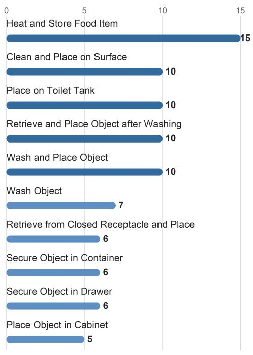  
Figure 4: The 10 skills with the longest default action se- quences in the EB-ALFRED skill library.

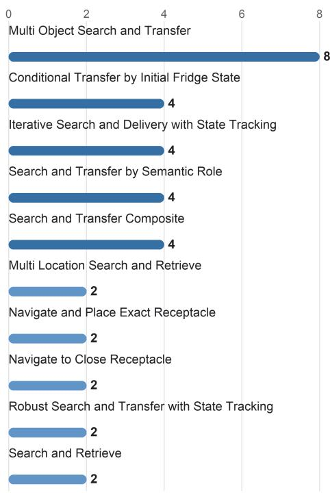  
Figure 5: The 10 skills with the longest default action se- quences in the EB-Habitat skill library.

ALFRED episodes. First, learned skills enable more failure- free execution. The number of episodes without any rejected action increases from 40/300 (13.3%) to 77/300 (25.7%), while successful failure-free episodes increase from 38/300 (12.7%) to 73/300 (24.3%). This indicates that the learned skills help the executor generate more executable plans that satisfy action preconditions.

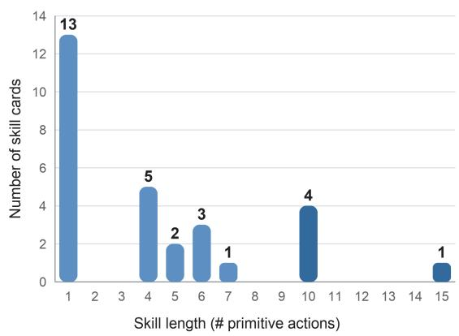

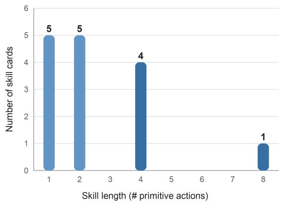  
Figure 6: Distribution of default skill-expansion lengths in the learned skill libraries for (a) EB-ALFRED and (b) EB-Habitat. Skill length is measured by the number of primitive actions in the default expansion pattern.

Second, learned skills substantially improve outcomes even when rejected actions still occur. Although the number of episodes containing a rejected action decreases from 260 to 223, successful episodes within this branch increase from 35/300 (11.7%) to 76/300 (25.3%). The lower populationlevel percentages for diferent follow-up actions and imme- diate local recovery mainly reflect that fewer episodes enter the failure branch; they should not be interpreted as condi- tional recovery rates.

Overall, the improvement is jointly explained by proactive failure avoidance and post-failure recovery. These results show that Practice improves embodied task execution not only by producing more valid plans, but also by helping the executor preserve progress and ultimately complete the task after execution failures.

We further analyze the execution situation of each skills. The Figure 8 illustrates the relationship between skill usage frequency and task-level benefit. The x-axis shows the num- ber of skill invocations, while the y-axis reports the paired success-rate improvement over the no-skill 0-shot baseline on the same episodes. Bubble size represents task coverage, and error bars indicate 95% bootstrap confidence intervals. Compared with success rates conditioned only on skill in- vocation, this paired comparison better controls for episode dificulty and reduces selection bias.

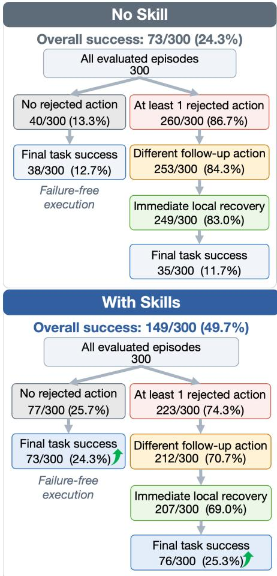  
Figure 7: Execution outcomes with and without learned skills over 300 EB-ALFRED episodes.

Overall, the Practice method improves the task suc- cess rate from 24.3% to 40.0%. TurnOff, Close, TurnOn, Open, PutDown, Find, and PickUp all show consistent positive improvements. In particular, Find, PickUp, and PutDown combine high invocation fre-quency with broad task coverage, demonstrating strong generalizability. TurnOff, Close, and TurnOn achieve larger gains, suggesting that skill cards efectively stabi- lize interaction procedures that are otherwise error-prone. MoveObjectToReceptacle and WashObject also show large improvements, although their limited coverage requires further validation.

The four quadrants represent distinct types of skills. The upper-right quadrant contains frequent, broadly applicable, and efective skills, which form the core strength of the learned skill library. The upper-left quadrant contains promising specialized skills with insuficient coverage and therefore calls for additional evaluation data. The lower-right quadrant represents frequently used but harmful skills; this region is nearly empty, indicating that high-frequency skills do not introduce systematic negative efects. The lower-left quadrant mainly contains low-frequency skills such as Drop and HoldObjectWhileTurningOnLight, whose negative estimates remain uncertain because of limited sam- ples. Skills such as PlaceObjectInContainer, PlaceObjectOnNonContainerSurface,

TurnOffLight, and SliceWithTool do not show robust improvements and should be prioritized for expansion or routing refinement.

Overall, the learned skill library improves success while concentrating model usage on broadly reusable skills with stable positive returns. These results demonstrate that the proposed method can extract transferable behavioral patterns from trajectories and improve execution reliability across diverse tasks.

## C.3 Skill Usage in Diferent Splits

We compare the Practice with the No-Skill baseline through paired evaluation through six diferent splits. Each episode is categorized as both agents succeeding, only the Prac- tice succeeding, only the No-Skill agent succeeding, or both agents failing.

As shown in Figure 9-10, the Practice provides consistent gains on both benchmarks. On EB-ALFRED, skills recover 91 episodes that the No-Skill baseline fails, while introducing regressions on only 15 episodes, resulting in a net improve- ment of ∆SR = +25.3 percentage points. The largest gains appear on base and complex-instruction tasks (+36 points), followed by spatial tasks (+30 points). On long-horizon tasks, the Practice solves 12 episodes while the baseline solves none. These results indicate that reusable skills ef- fectively translate diverse instructions into stable multi-step action sequences.

On EB-Habitat, skills recover 58 failed episodes while causing 32 regressions, producing an overall improvement of ∆SR = +8.7 points. The largest gain occurs on visual-appearance tasks (+20 points), followed by complexinstruction (+12 points) and base tasks (+10 points). The smaller improvement on EB-Habitat reflects its stronger de- pendence on scene exploration and object localization: navigation is restricted to receptacles, so successful execution often requires locating an object indirectly before applying a reusable manipulation pattern. Spatial tasks show no net improvement, while long-horizon tasks improve by only 4 points, suggesting that spatial grounding and extended state tracking remain dificult to encode through fixed skill struc- tures alone.

Overall, skills provide a substantial paired advantage on both benchmarks. Their primary benefit is reducing the plan- ning complexity of recurring multi-step behaviors and im- proving execution consistency. Remaining failures are con- centrated in tasks requiring visual grounding, indirect ob- ject search, spatial reasoning, and long-horizon coordination, highlighting the need for stronger adaptive skill selection and state-aware composition.

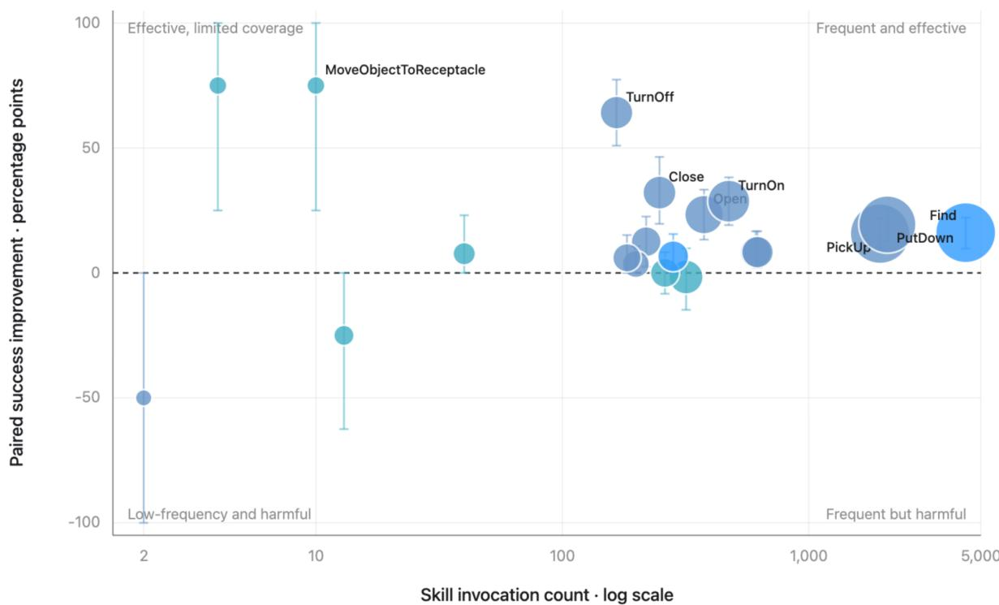  
Figure 8: Skill-level benefit–risk analysis. Invocation frequency is plotted against paired success-rate improvement over the no-skill baseline; bubble size indicates task coverage, color denotes skill family, and error bars show 95% bootstrap confidence intervals.

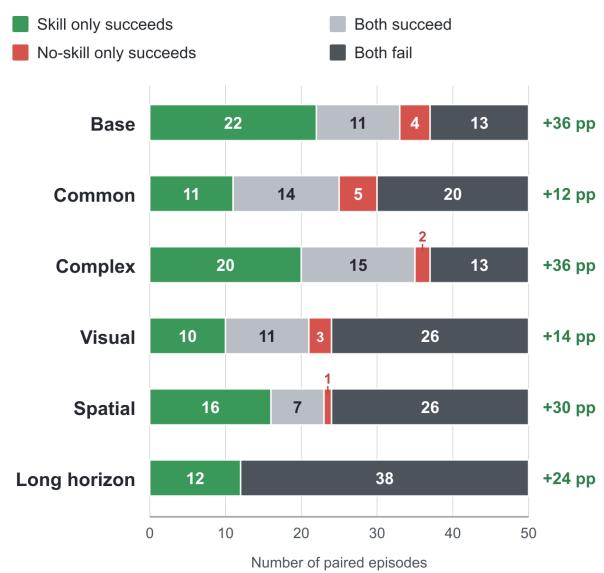  
Figure 9: Paired episode outcomes between the no-skill base- line and Practice across six EB-ALFRED splits. Each bar shows the four paired outcome categories, with the corre- sponding change in success rate (∆SR) reported on the right.

Table 7: Skill execution and recovery statistics on EB- ALFRED. Inv.: skill invoked; Exp.: valid expansion; Acc.: primitive-action acceptance; Fail: episodes with rejected actions; Rec.: locally recovered episodes; Succ.: task success. Each split contains 50 episodes.
<table><tr><td>Split</td><td>Inv.</td><td>Exp.</td><td>Acc.</td><td>Fail</td><td>Rec.</td><td>Succ.</td></tr><tr><td>Base</td><td>50/50</td><td>47/50</td><td>82.6%</td><td>31/50</td><td>30/50</td><td>66.0%</td></tr><tr><td>CS</td><td>49/50</td><td>42/50</td><td>81.2%</td><td>36/50</td><td>32/50</td><td>50.0%</td></tr><tr><td>CI</td><td>49/50</td><td>48/50</td><td>85.8%</td><td>31/50</td><td>29/50</td><td>70.0%</td></tr><tr><td>VA</td><td>49/50</td><td>41/50 44/50</td><td>74.6%</td><td>40/50</td><td>34/50</td><td>42.0%</td></tr><tr><td>SR LH</td><td>50/50 50/50</td><td>48/50</td><td>76.5% 80.5%</td><td>40/50 45/50</td><td>37/50 45/50</td><td>46.0% 24.0%</td></tr><tr><td></td><td></td><td></td><td>80.2%</td><td>223/300</td><td></td><td></td></tr><tr><td>All</td><td colspan="4">297/300 270/300</td><td>207/300</td><td>49.7%</td></tr></table>

Table 7 analyzes skill invocation, action expansion, ex- ecution validity, and failure recovery across diferent splits on EB-ALFRED. The best results occur on Complex In- struction and Base, which achieve the highest task success rates (70.0% and 66.0%) together with reliable skill expan-sion and action acceptance. This suggests that reusable skills efectively convert diverse language instructions into stable action structures. Common Sense remains moderately suc- cessful, while Visual Appearance and Spatial Relationship are more dificult because correct execution depends heavily on visual instance identification and spatial grounding. Long Horizon exhibits high expansion validity and recovers from every local failure, yet reaches only 24.0% task success. This indicates that local recovery is efective, but cannot fully pre- vent error accumulation or maintain state consistency over extended skill compositions. Overall, the results highlight the method’s strong execution and recovery capabilities while identifying visual grounding and long-horizon coordination as the main remaining bottlenecks.

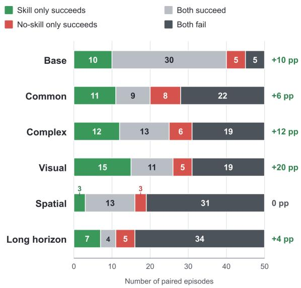  
Figure 10: Paired episode outcomes between the no-skill baseline and Practice across six EB-Habitat splits. Each bar shows the four paired outcome categories, with the cor- responding change in success rate (∆SR) reported on the right.

## D Qualitative Analysis

We qualitatively examine representative successful and failed trajectories to understand how the learned skill library sup-ports execution and where its limitations arise. We focus on whether reusable skills reduce planning complexity, how the executor responds to rejected actions, and whether failures originate from the skill abstraction or from online grounding and execution.

## D.1 Case Study in EB-ALFRED

Successful cases: light-assisted inspection. Lightassisted inspection requires the agent to coordinate object localization, illumination, and manipulation. Figure 11 shows two representative examples. In Common Sense-49, the agent grounds the indirect expressions “keys” and “one fixture on the table” to KeyChain and DeskLamp. It first invokes TurnOn to establish the required lighting condition and then uses Find and PickUp to inspect the keys. After one rejected pickup, the executor re-localizes the keychain and completes the task without restarting the plan. In Complex-30, the composite skill PlaceObjec- tOnNonContainerSurface grounds the remote control and armchair as a reusable placement subtask, while the executor additionally activates the floor lamp. Together, these examples demonstrate that the method can combine explicit composite skills with feedback-aware primitive execution to eficiently solve semantically diverse inspection tasks.

Successful cases: observable long-horizon transformations. Figure 12 presents two long-horizon tasks involving object transformation and relocation. Long-27 retrieves reusable FindObject cards for the knife, lettuce, and refrig- erator, and composes them with slicing, cooling, and final placement actions. Long-45 similarly uses object-location skills as anchors for slicing a tomato, heating it in the mi- crowave, and placing it in the sink. These trajectories do not rely on a single monolithic task program. Instead, the executor composes reusable skills with state-changing prim- itive actions and continues after several rejected actions. This modular structure allows it to preserve completed subgoals and recover locally rather than restarting the entire sequence.

Failure cases: containment and holding state. Tasks requiring one object to be placed inside another are particularly sensitive to holding-state consistency. In Base-07, the agent must insert a butter knife into a cup and then move the cup to the sink. It alternates between the two objects, repeatedly attempts pickup while holding another object, and loses the required containment relation. Complex-35 retrieves PlaceObjectOnNonContainerSurface for plac- ing an apple in a pan. This skill is insuficient because the task additionally requires transporting the filled pan into the refrigerator. The executor consequently alternates between the apple and pan without establishing a stable nested state. These cases expose both incomplete skill coverage for nested transport and insuficient executor-side tracking of the object in hand.

Overall, the learned skills compress recurring multi-step behaviors into stable execution structures and enable recov- ery from isolated local errors. The remaining limitations largely lie outside basic skill expansion: dynamic ground- ing, persistent object identity, holding-state management, and long-term consistency across multiple skill calls.

## D.2 Case Study in EB-Habitat

Successful cases: feedback-guided search. Unlike EB-ALFRED, EB-Habitat permits navigation only to recepta- cles. Object retrieval therefore requires the agent to infer a source receptacle before executing a pickup. Figure 14 shows how SearchAndRetrieve structures this process. In Base-36, the agent first searches the sofa for a toy airplane. After pickup fails, it moves to another candidate receptacle, successfully retrieves the airplane from a table, and deliv- ers it to the left counter. Spatial-35 exhibits a longer search for a wrench: the executor visits several cabinets and coun- ters, but preserves the same object and destination argu-ments until pickup succeeds. The composite skill provides a stable navigation–pickup–navigation–placement skeleton, while feedback is used to revise the uncertain source location.

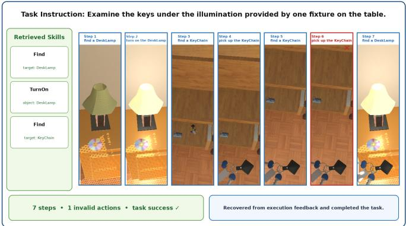

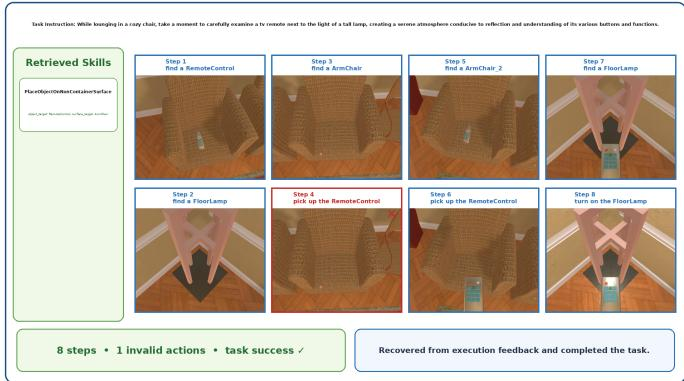  
Figure 11: Successful light-assisted inspection in EB-ALFRED. Common Sense-49 (left) establishes illumination and recovers from a rejected keychain pickup, while Complex-30 (right) combines reusable object placement with lamp activation.

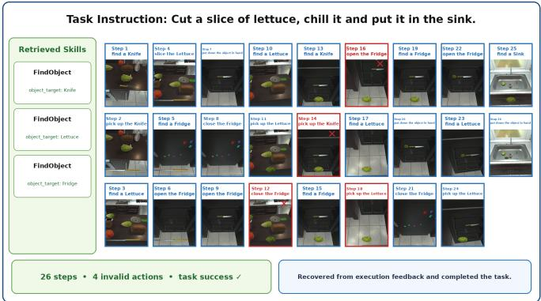

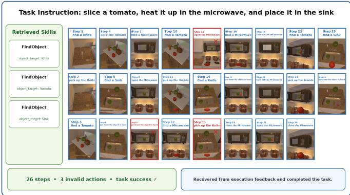  
Figure 12: Successful long-horizon transformations in EB-ALFRED. The agent composes reusable object-location skills with slicing, cooling or heating, and final placement.

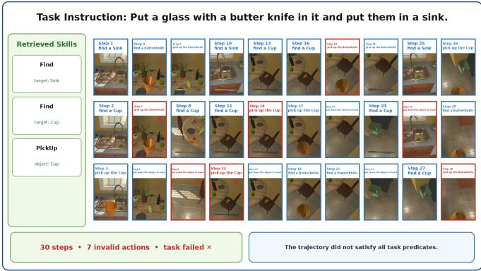

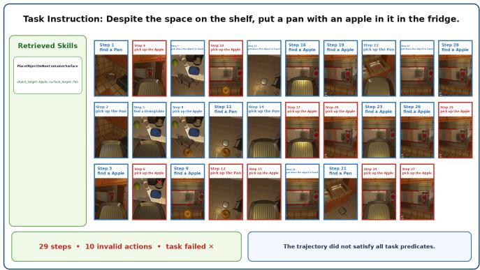  
Figure 13: Containment and holding-state failures in EB-ALFRED. The executor fails to preserve the required cup–knife (left) and pan–apple (right) relations.

Successful cases: repeated multi-object transport. The same abstraction also supports tasks containing several in- dependent relocations. In Figure 15, Long-14 sequentially moves a cleanser, sponge, and screwdriver to their respective destinations. Lon -36 searches several rece tacles and trans- ports all orange instances to the brown table. Rather than gen- erating a separate plan template for every object, the policy repeatedly instantiates SearchAndRetrieve with diferent object, source, and destination arguments. This reuse reduces planning complexity while still allowing each failed pickup to trigger local search.

Failure cases: incorrect source-receptacle hypotheses. The same factor that makes SearchAndRetrieve useful also creates a Habitat-specific failure mode. In Figure 16, Base-01 begins with an incorrect source hypothesis for the pear. Although the executor visits several receptacles, it re- peatedly attempts pickup at locations where the object is not reachable and eventually explores unrelated containers. Base-26 similarly searches tables, counters, cabinets, and drawers for an orange, but lacks a coverage-aware strategy for deciding which receptacle to inspect next. The skill schema correctly represents object transport, but its source argu-ment is uncertain; the eventual failure is primarily caused by executor-side exploration and recovery rather than by the navigation–pickup–placement pattern itself.

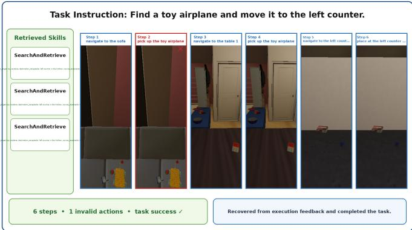

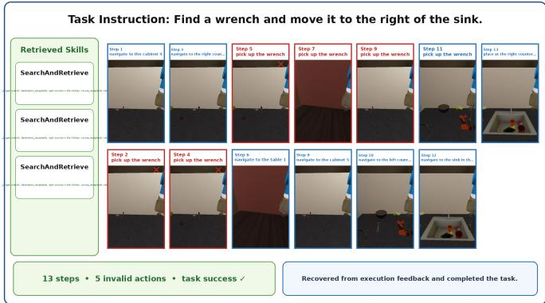  
Figure 14: Feedback-guided object search in EB-Habitat. SearchAndRetrieve maintains the task structure while the executor switches candidate source receptacles.

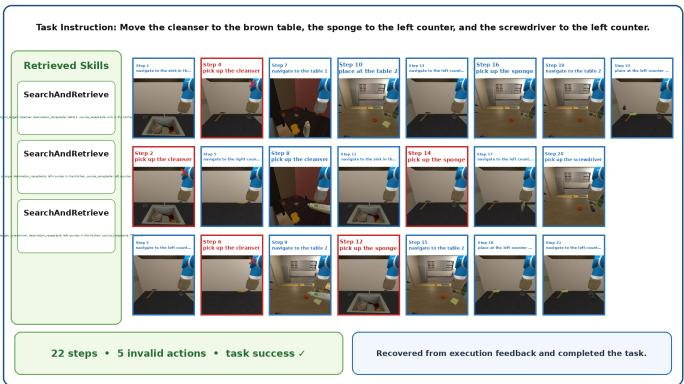

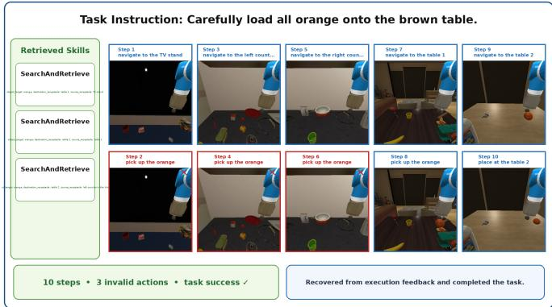  
Fi ure 15: Successful multi-object trans ort in EB-Habitat. A shared SearchAndRetrieve structure is re eatedl instantiated for diferent objects and destinations.

Shared and environment-specific observations. Both en-vironments exhibit failures from semantic grounding, re- peated invalid-action loops, multi-object identity tracking, and error accumulation over long trajectories. Their domi-nant bottlenecks, however, difer. EB-Habitat restricts nav- igation to receptacles, making object retrieval dependent on source-receptacle inference, indirect exploration, and the mapping of expressions such as “right of the sink” to simu- lator receptacles. Its long-horizon tasks mainly accumulate search costs across several relocations. EB-ALFRED per- mits more direct object search but places greater pressure on manipulation state, including holding constraints, object containment, and transformations such as slicing, washing, heating, and cooling.

ing repeated object search and transport, whereas their main limitation is not the transport pattern itself but uncertain source-receptacle inference and inefective exploration after failure. In contrast, EB-ALFRED is more strongly limited by nested manipulation, holding-state consistency, and long- horizon object-state transitions. Across both benchmarks, the learned library provides reusable planning structure, while robust grounding and state-aware execution remain essential for realizing its full benefit.

Overall, skills in EB-Habitat are most valuable for structur-

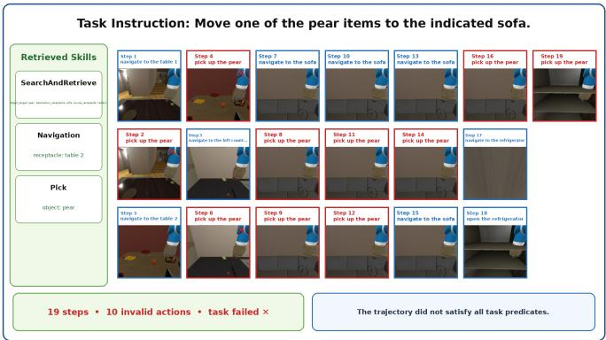

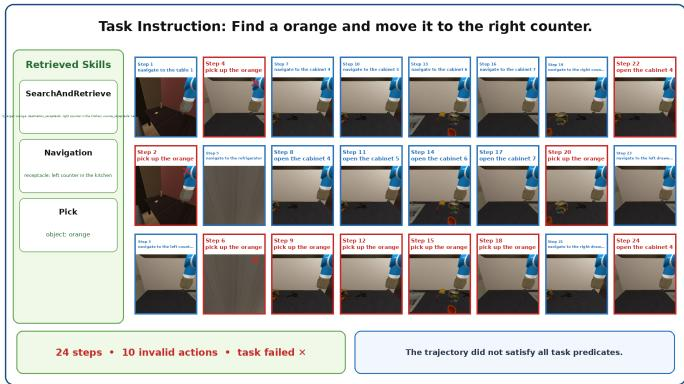  
Figure 16: Source-receptacle failures in EB-Habitat. Incorrect initial hypotheses lead to repeated pickup attempts and unstruc tured exploration.