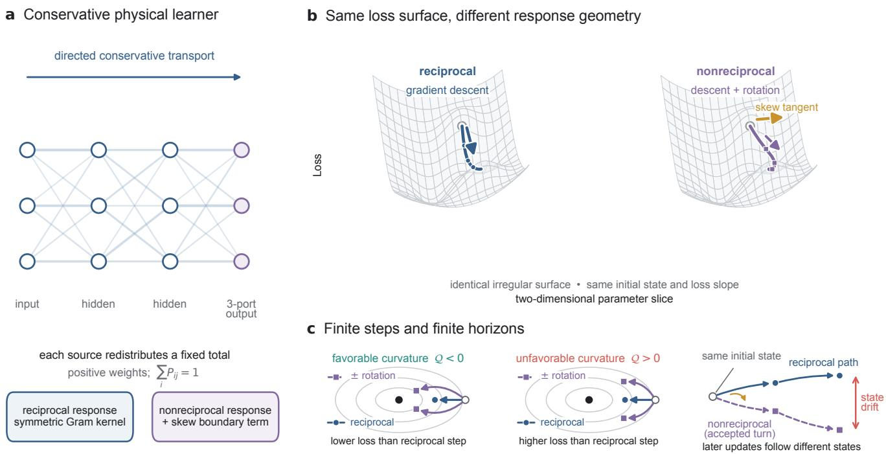
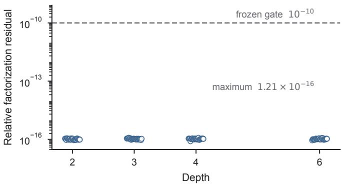
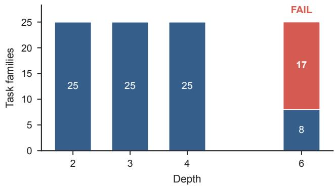
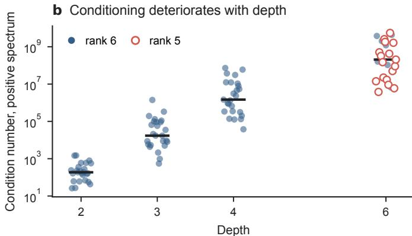
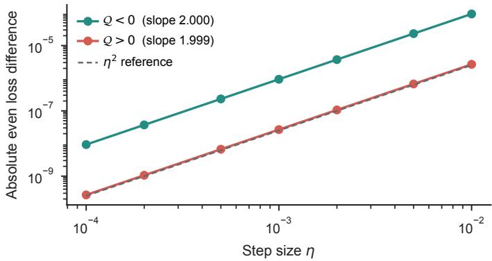
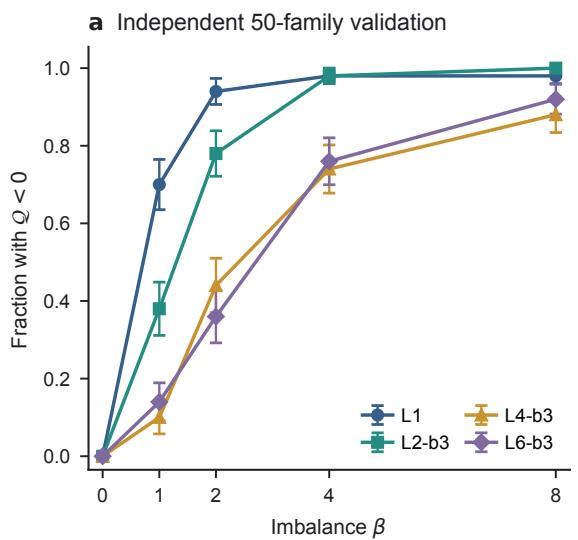
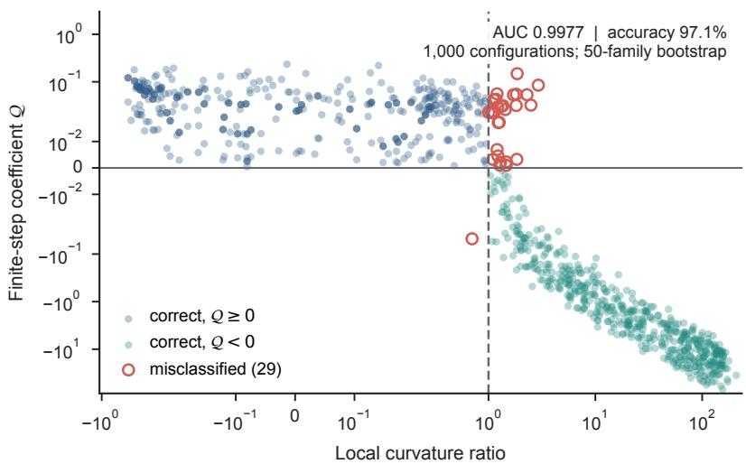
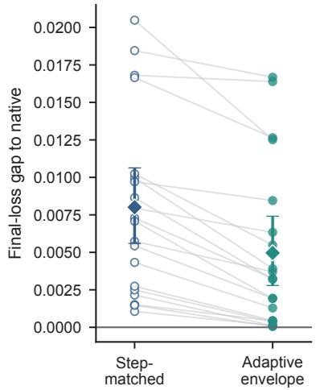
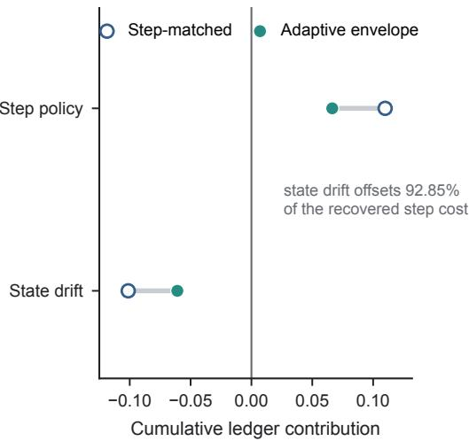
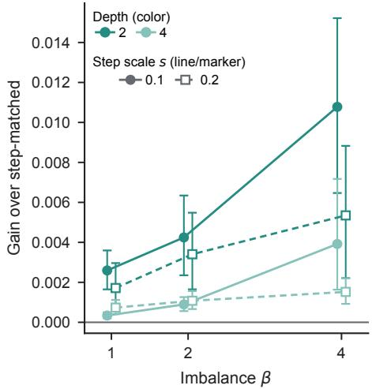

# Reciprocity Separates Gradient Flow from Rotation in Conservative Physical Learning

Ruiwu Niu,1, ∗ Xiaowen Bi,2, † and Micha¨el Antonie van Wyk3

1Department of Data Science and Digital Innovation, Hong Kong Shue Yan University

2Faculty of Science and Technology, Beijing Normal-Hong Kong Baptist University

3School of Electrical and Information Engineering,

University of the Witwatersrand, Johannesburg, South Africa

(Dated: August 30, 2026)

Physical learning lets a trainable material or network use its own physical response to carry error signals, reducing the need for a separately programmed backward computation. We ask what determines whether such a system follows conventional gradient descent or evolves along a genuinely diferent learning trajectory. Our canonical model is a directed layered transport network in which every node redistributes a fixed amount of flow, so learning preserves positivity and total mass In this model, conservation constrains only the allowable learning directions. Within the matched response class studied here, adjoint matching gives the physical output response a symmetric form. Non-negative mode-wise feedback then produces a reciprocal closed-loop response and a reweighted gradient flow. Adding an antisymmetric boundary component makes the closed-loop response rotational: the learning path can turn while the error driving that update still decreases at that moment. Turning is not automatically beneficial. Its finite-step efect is set by local curvature, and its accumulated efect also depends on step selection and on the new states visited along the path. Numerical consistency checks reproduce the exact response structure, predict the sign of the local efect across new network families, and show how trajectory drift can negate a local advantage. These results separate the roles of conservation, reciprocity, and nonreciprocity in physical learning.

## I. INTRODUCTION

In physical learning, the response of the trainable medium itself performs part of the training computation. Equilibrium propagation and coupled learning use this idea to turn global task information into local parameter updates [1–3]. Related schemes use chemical feedback, analytical circuit solvers, or local evolution rules to avoid an explicitly assembled digital backward pass [4–6]. Experi ments and simulations have also resolved physical traces of learned functions and the loss of previously learned tasks during sequential training [7–10]. These developments raise a structural question within the matched response class considered here: when can a physical update be understood as gradient descent in a state-dependent geometry, and must reciprocity be broken for learning to acquire a genuinely new direction of motion?

Consider a trainable network that routes a normalized flow from input to output. Each node may redistribute the incoming flow but may neither create nor destroy it, and learning modifies these routing fractions in response to an output error. Conservation therefore determines where the parameters are allowed to move. It does not determine how they move within that constrained space. The same mass-preserving state space can support downhill, rotational, or mixed dynamics. Replicator dynamics, natural gradient, mirror descent, and exponentiated-gradient updates provide a geometric language for describing this constrained motion [11–13], but locality and normalization alone do not determine which dynamics arises.

A useful distinction within the matched response class considered here is between the physical response and the closed-loop learning response. The former maps an applied boundary potential to an output change, while the boundary law maps the current error to that potential. Their composition determines whether the error-to-output dynamics are reciprocal. With adjoint matching and nonnegative spectral feedback, this composition can change the metric and conditioning of gradient descent but cannot provide an independent circulation. This restricted connection is consistent with generalized gradient structures in nonequilibrium thermodynamics [14] and with recent circuit analyses of gradient-based physical rules and higher-order coupled-learning corrections [15, 16].

An antisymmetric component in the closed-loop response introduces a transverse direction. Directed and active interactions are known to generate oscillatory modes and new collective dynamics [17–19], while non-gradient rotational components can either help or hinder learning depending on their structure [20]. Here, the antisymmetric component is placed in the closed-loop learning response, not merely in the material being trained. Contrastive learning can train metamaterials with nonreciprocal target responses [21]; our question is instead what happens when the error-to-output learning dynamics acquire an antisymmetric component.

Our argument proceeds in four steps. First, conservation defines the admissible parameter manifold but does not make the learning field a gradient. Second, adjoint matching gives the physical response a Gram form at any network depth, while non-negative spectral feedback yields a reciprocal closed-loop response and preconditioned gradient flow. Third, a minimal three-output boundary controller provides a rotational closed-loop response while preserving output mass and instantaneous dissipation of the selected-sample error. Fourth, a finitestep curvature coeficient characterizes the local efect, while registered finite-horizon accounting decomposes the observed final loss gap. Together, these steps provide two response results, a finite-step expansion, and an accounting identity for comparing registered finite trajectories.

The numerical tests follow the same sequence. They verify the matched-response factorization and rotational modes, test a fixed curvature-based sign criterion on disjoint network families, and account for the final loss gap along paired reciprocal and nonreciprocal trajectories. Figure 1 is a conceptual roadmap rather than a data figure. Read from left to right, panel (a) separates conservation from reciprocity at the network level, panel (b) shows that nonreciprocity introduces a transverse direction to local descent, and panel (c) shows why the value of that direction depends first on finite-step curvature and then on the states visited later.

## II. CONSERVATIVE LAYERED NETWORKS

## A. Product-simplex parameters

We use a directed layered network as a canonical conservative learner. Each column of a layer matrix contains the fractions of flow sent from one source to the nodes in the next layer. Non-negativity prevents negative flow, while a unit column sum prevents its creation or loss. Training therefore changes redistribution fractions rather than the total amount of flow. The trainable state consists of the positive probability vectors that form the column-stochastic layer matrices,

$$
\theta = ( p ^ { 1 } , \ldots , p ^ { m } ) , \qquad p ^ { a } \in \Delta _ { d _ { a } } ^ { \circ } ,\tag{1}
$$

where $\Delta _ { d } ^ { \circ } = \{ p \in \mathbb { R } _ { > 0 } ^ { d } : \mathbf { 1 } ^ { \mathsf { T } } p = 1 \}$ is the interior of a probability simplex. The full parameter space is a product of these simplices: one for every source column. For any column $p ,$ define

$$
Q ( p ) = \mathrm { d i a g } ( p ) - p p ^ { \mathsf { T } } .\tag{2}
$$

$Q ( p )$ is positive semidefinite, annihilates 1, and maps an arbitrary local score, interpreted as a preference for changing the routing fractions, to a velocity tangent to the simplex. Let $s ^ { a } \in \mathbb { R } ^ { d _ { a } }$ denote the local score vector for block ${ a ; }$ its components rank the preference for increasing the corresponding routing fractions. A block-local law can therefore be written as

$$
\dot { p } ^ { a } = Q ( p ^ { a } ) s ^ { a } , \qquad { \bf 1 ^ { \top } } \dot { p } ^ { a } = 0 .\tag{3}
$$

For one block, write the components as $p _ { i }$ and $s _ { i } .$ Given a step size $\eta > 0$ , the normalized exponential step

$$
p _ { i } ^ { + } ( \eta ) = \frac { p _ { i } \exp ( \eta s _ { i } ) } { \sum _ { j } p _ { j } \exp ( \eta s _ { j } ) }\tag{4}
$$

preserves positivity and column mass. It is an entropic mirror step for a prescribed score. Thus $Q ( p )$ and the normalized step determine where learning is allowed to move; the score field determines whether that motion is downhill, rotational, or a combination of the two.

Let $F ( \theta )$ stack the outputs for all samples, and let $Y$ stack the corresponding targets. Define

$$
e = Y - F ( \theta ) , \qquad \mathcal { L } ( \theta ) = \frac { 1 } { 2 } \| e \| ^ { 2 } , \qquad J = D _ { \theta } F .\tag{5}
$$

Here, $D _ { \theta } F$ denotes the derivative of F with respect to the full parameter vector $\theta ,$ so J is the Jacobian that maps parameter perturbations to output changes. For every sample s, the inputs and targets are non-negative and have unit mass: $\mathbf { \bar { 1 } } ^ { \mathsf { T } } x _ { s } = \mathbf { 1 } ^ { \mathsf { T } } y _ { s } = 1$ . Column-stochastic propagation preserves this normalization, so every sample residual belongs to the zero-sum output subspace. Consequently, three outputs leave two independent error coordinates and can support the rotation shown in Fig. 1b.

We collect the local mobility operators in

$$
M ( \theta ) = { \mathrm { b l k d i a g } } _ { a } { \big ( } \rho _ { a } Q ( p ^ { a } ) { \big ) } , \qquad \rho _ { a } > 0 .\tag{6}
$$

The coeficient $\rho _ { a }$ is the positive mobility assigned to block $a .$ It sets the block’s relative response rate without changing its conservation constraint. For a boundary potential v, the canonical matched update transports the boundary signal back through the adjoint Jacobian:

$$
\dot { \theta } = M J ^ { \mathsf { T } } v , \qquad \dot { F } = J \dot { \theta } = : K v .\tag{7}
$$

Here, K is the physical output response: it maps an applied boundary potential v to the instantaneous change in all predictions. If a boundary controller sets $v = B e$ ， the error induces the closed-loop learning response $\mathcal { R } _ { B } : =$ $K B ,$ so that $\dot { F } = \mathcal { R } _ { B } e$ and $\dot { e } = - \mathcal { R } _ { B } e$ . We distinguish symmetry of the physical response K from symmetry of the closed-loop response $\mathcal { R } _ { B }$ . Below, reciprocal learning refers to symmetry of the latter on the identifiable output subspace. The model assumption in Eq. (7) is matched adjoint transport; its Gram consequence is derived in Sec. IV. Neither symmetry requires the forward transport edges to be bidirectional. A device realization would additionally have to implement the matched forward and adjoint transport.

## III. CONSERVATION AND INTEGRABILITY

Conservation provides a geometric baseline. It confines each velocity to the tangent space of a simplex, but it does not by itself impose a scalar potential. A gradient structure additionally requires the local score diferences to satisfy an integrability condition.

The following geometric representation makes this distinction explicit. Consider a smooth vector field $V$ satisfying $\mathbf { 1 } ^ { \mathsf { T } } \bar { V } ^ { a } = 0$ on each simplex block. In the interior, any such tangent field can be written blockwise as

$$
V ^ { a } = Q ( p ^ { a } ) s ^ { a } , \qquad s _ { i } ^ { a } = V _ { i } ^ { a } / p _ { i } ^ { a } ,\tag{8}
$$

  
FIG. 1. Conceptual geometry of conservative physical learning. (a) A positive directed layered network redistributes a fixed total flow. Reciprocity refers to the closed-loop learning response, not to the direction of the forward transport edges. Adjoint matching produces a symmetric Gram physical response; non-negative spectral feedback keeps the closed loop symmetric, while a skew boundary term adds an antisymmetric component. (b) On a schematic two-dimensional parameter slice, an irregular selected-sample loss landscape is shown in two identical copies for legibility. The reciprocal trajectory follows the loca gradient, whereas the nonreciprocal trajectory descends while turning around landscape features. At their common initial state, the skew component is tangent to the selected-sample level set and therefore leaves its first-order loss slope unchanged; the foreground blue and gold arrows mark the local descent and skew directions, respectively. The turning freedom is not itself a performance advantage. (c) For a finite normalized update, averaging the two rotation orientations can either lower or raise the post-step loss, depending on local curvature. The right schematic compares a reciprocal trajectory, shown as a blue solid line with circles, with a nonreciprocal trajectory after an accepted turn, shown as a purple dashed line with squares; both begin from the same state. Across repeated updates, the resulting separation of visited states produces a drift term that can ofset a local gain. The diagram summarizes the theory and contains no experimental data.

where $s ^ { a }$ is defined up to an additive multiple of 1. Thus every smooth conservative tangent field has a blockreplicator representation. This representation enforces the constraint, but it does not by itself imply a loss function or a gradient structure.

To test whether the score field is integrable on the simplex, remove one redundant coordinate from each block and form the reduced score one-form

$$
\omega _ { s } = \sum _ { a } \sum _ { i < d _ { a } } \left( s _ { i } ^ { a } - s _ { d _ { a } } ^ { a } \right) \mathrm { d } p _ { i } ^ { a } .\tag{9}
$$

Here dpa denotes an infinitesimal change in the independent simplex coordinate $p _ { i } ^ { a }$ . The eliminated coordinate is fixed by conservation, so $\begin{array} { r } { \dot { \mathrm { d } } p _ { d _ { a } } ^ { a } = - \sum _ { i < d _ { a } } \mathrm { d } p _ { i } ^ { a } } \end{array}$ . The score diference $s _ { i } ^ { a } - s _ { d _ { a } } ^ { a }$ compares the local drive on coordinate i with that on the reference coordinate $d _ { a }$ . Because $Q ( p ^ { a } ) \mathbf { 1 } = 0$ , adding the same constant to every component of $s ^ { a }$ leaves the physical velocity $V ^ { a }$ unchanged. Only score diferences are therefore identifiable, and Eq. (9)

takes $s _ { d _ { a } } ^ { a }$ as the reference score. On a simply connected interior domain, V is a Shahshahani natural-gradient field if and only if the associated one-form is closed:

$$
\mathrm { d } \omega _ { s } = 0 .\tag{10}
$$

Equivalently, the reduced score diferences are integrable and derive from a single scalar potential. Thus integrability imposes a condition beyond conservation. For example, the rock–paper–scissors replicator field obeys Eq. (3) exactly but has periodic interior orbits, so it cannot be a gradient flow of a single-valued potential. Related potential–harmonic decompositions appear in finite games [22]. Conservation therefore fixes the feasible motion while leaving circulation possible. This observation separates the two geometric conditions used below. The next section adds response assumptions that exclude such circulation within the matched class.

## IV. ADJOINT-MATCHED RESPONSE AND SPECTRAL FEEDBACK

We now restrict attention to the adjoint-matched response model. In this class, the physical response $K$ has a symmetric positive-semidefinite Gram form. Whether the closed-loop response $\mathcal { R } _ { B }$ is gradient-like also depends on the boundary controller.

Consider a depth-L linear network with positive columnstochastic layer matrices,

$$
\boldsymbol { x } _ { s } ^ { ( \ell + 1 ) } = P ^ { ( \ell ) } \boldsymbol { x } _ { s } ^ { ( \ell ) } , \qquad \mathbf { 1 } ^ { \top } P ^ { ( \ell ) } = \mathbf { 1 } ^ { \top } .\tag{11}
$$

Let $p _ { i } ^ { ( \ell ) }$ be column i of layer $\ell ,$ and let $\begin{array} { r l } { R ^ { ( \ell ) } } & { { } = } \end{array}$ $P ^ { ( L - 1 ) } \cdot \cdot \cdot P ^ { ( \ell + 1 ) }$ denote the downstream map from layer $\ell + 1$ to the output. The Jacobian block for sample s, layer $\ell ,$ and column i is proportional to $x _ { s , i } ^ { ( \ell ) } R ^ { ( \ell ) }$

Under the adjoint-matched update in Eq. (7), the physical response is a symmetric positive-semidefinite Gram operator at every depth. Direct block multiplication gives the layer-resolved response

$$
K _ { L } = J _ { L } M _ { L } J _ { L } ^ { \mathsf { T } } = K _ { L } ^ { \mathsf { T } } \succeq 0 ,\tag{12}
$$

$$
K _ { r s } ^ { ( L ) } = \sum _ { \ell = 0 } ^ { L - 1 } \rho _ { \ell } \sum _ { i } x _ { r , i } ^ { ( \ell ) } x _ { s , i } ^ { ( \ell ) } R ^ { ( \ell ) } Q \left( p _ { i } ^ { ( \ell ) } \right) R ^ { ( \ell ) \mathsf { T } } .\tag{13}
$$

Equation (13) resolves the Gram operator into contributions from individual layers and source columns, including cross-sample coupling through the of-diagonal blocks $K _ { r s } ^ { ( L ) }$ . Depth changes the spectrum, rank, and conditioning of the response while preserving this Gram structure.

Suppose now that the boundary potential is generated spectrally from the physical response,

$$
v = r ( K ) e , \qquad r ( \lambda ) \geq 0 \quad \mathrm { f o r } \ \lambda \in \sigma ( K ) .\tag{14}
$$

Here $r ( \cdot )$ is a non-negative scalar function applied to the eigenvalues of $K ,$ and λ denotes one such eigenvalue. The notation $\sigma ( \cdot )$ is the spectrum operator, so $\sigma ( K )$ is the set of all eigenvalues of K. Equivalently, if $\begin{array} { r } { { \cal K } = \sum _ { \lambda \in \sigma ( K ) } \lambda P _ { \lambda } } \end{array}$ , where $P _ { \lambda }$ is the orthogonal projector onto the corresponding eigenspace, then $r ( K ) =$ $\sum _ { \lambda \in \sigma ( K ) } r ( \lambda ) P _ { \lambda }$ . Thus r sets the feedback strength along each response mode. This family contains direct feedback, Moore–Penrose repair, and leakage-regularized feedback.

Proposition 1 (Spectral feedback) For the boundary law in $E q .$ (14), the closed-loop response $\mathcal { R } _ { \mathrm { R } } = K r ( K )$ is symmetric and positive semidefinite. The loss is nonincreasing, and on the identifiable parameter subspace the induced parameter dynamics are a positive-semidefinite preconditioned gradient flow.

Because K and $r ( K )$ share an orthogonal eigenbasis,

$$
\dot { \mathcal { L } } = - e ^ { \mathsf { T } } K r ( K ) e = - \sum _ { \lambda \in \sigma ( K ) } \lambda r ( \lambda ) \| P _ { \lambda } e \| ^ { 2 } \leq 0 .\tag{15}
$$

Define $\psi ( 0 ) = 0 , \psi ( \lambda ) = r ( \lambda ) / \lambda$ for $\lambda > 0$ , and

$$
H = M J ^ { \mathsf { T } } \psi ( K ) J M .\tag{16}
$$

Then $H = H ^ { \mathsf { T } } \succeq 0$ and, on the identifiable parameter subspace consisting of the directions that change the outputs, we have

$$
\dot { \theta } = - H \nabla _ { \theta } \mathcal { L } .\tag{17}
$$

The symmetry of $\mathcal { R } _ { \mathrm { R } }$ excludes an antisymmetric circulation, while its positive semidefiniteness makes erroraligned feedback dissipative. Changing the spectral function r can alter the metric and conditioning of descent, but it cannot create an independent rotational mode within this feedback family. A regularized inverse $v = ( K + \mu I ) ^ { - 1 } e .$ , for example, gives a metric damped Gauss–Newton direction. The proposition classifies the geometry of the learning rule; implementation costs such as time, communication, precision, and energy are separate design questions.

## V. MINIMAL NONRECIPROCAL ESCAPE

To leave the gradient class, the closed-loop response needs room to turn. A single two-output residual has only one independent mass-conserving direction, so it can move only forward or backward along a line. Three outputs produce a two-dimensional zero-sum plane, the smallest single-sample space in which a genuine rotation can occur. With a batch, sample mixing can supply the additional dimension even when each sample has two outputs.

For the three-output construction define

$$
{ \cal P } = I - \frac { 1 } { 3 } { \bf 1 1 ^ { \top } } , \qquad { \cal C } ^ { \top } = - { \cal C } , \qquad { \cal C } ^ { 2 } = - { \cal P } ,\tag{18}
$$

and the boundary mixer

$$
T _ { \alpha , \Omega } = \alpha P + \Omega C , \qquad \alpha > 0 .\tag{19}
$$

$P$ projects onto the zero-sum error plane, while $C$ acts as a quarter-turn on that plane. The coeficient α controls inward relaxation and Ω controls rotation.

For a selected three-output sample ⋆, write $J _ { \star } = D _ { \theta } F _ { \star }$ $e _ { \star } = y _ { \star } - F _ { \star } , K _ { \star } = J _ { \star } M J _ { \star } ^ { \mathsf { T } }$ , and $\mathcal { L } _ { \star } = \| e _ { \star } \| ^ { 2 } / 2$ . Assume that range $( K _ { \star } ) = \mathbf { 1 } ^ { \perp }$ . For this construction, Eq. (7) is applied to the selected map: $\dot { \theta } = M J _ { \star } ^ { \mathsf { T } }$ v and $\dot { F } _ { \star } = K _ { \star } v .$ Choose the boundary controller

$$
\begin{array} { r } { B _ { \alpha , \Omega } = K _ { \star } ^ { \dagger } T _ { \alpha , \Omega } , } \\ { v = B _ { \alpha , \Omega } e _ { \star } , } \end{array}\tag{20}
$$

which induces the closed-loop response

$$
\begin{array} { r l r } & { \mathcal { R } _ { \alpha , \Omega } = K _ { \star } \mathcal { B } _ { \alpha , \Omega } = T _ { \alpha , \Omega } , } & \\ & { \quad \dot { e } _ { \star } = - \mathcal { R } _ { \alpha , \Omega } e _ { \star } , \qquad \dot { \mathcal { L } } _ { \star } = - \alpha \| e _ { \star } \| ^ { 2 } . } & \end{array}\tag{21}
$$

## Proposition 2 (Three-port rotational witness)

The closed-loop response in $E q .$ . (21) preserves output mass and decreases the instantaneous selected-sample squared error. When $\Omega \neq 0 .$ , the residual linearization has the identifiable eigenvalues $- \alpha \pm i \Omega$ and therefore cannot coincide, in a neighborhood containing the stationary point, on the identifiable two-dimensional quotient, with a smooth positive-definite Riemannian gradient flow. Two outputs cannot support such a single-sample linear rotation.

The physical response K⋆ remains symmetric, while the boundary controller makes $\mathcal { R } _ { \alpha , \Omega }$ nonreciprocal through its skew part ΩC. The symmetric component pulls the error inward and the skew component turns it sideways, producing the descending spiral in Fig. 1b. Its complex pair supplies the local gradient-flow obstruction. This explicit closed-loop construction uses efective active boundary feedback; a topology-local realization remains open, as discussed in Sec. VIII.

## VI. FINITE STEPS AND FINITE HORIZONS

Leaving the gradient class does not by itself improve learning. A continuous trajectory may reduce loss at every instant, while a finite normalized update also samples the curvature of the constrained parameter-to-output map. The relevant question is whether a rotational displacement lands above or below the corresponding reciprocal step.

At the same pre-step state, the three-port controller produces the block scores

$$
\begin{array} { r } { s ^ { 0 , a } = \rho _ { a } \big [ J _ { \star } ^ { \mathsf { T } } K _ { \star } ^ { \dagger } \alpha P e _ { \star } \big ] ^ { a } , \quad s ^ { 1 , a } = \rho _ { a } \big [ J _ { \star } ^ { \mathsf { T } } K _ { \star } ^ { \dagger } C e _ { \star } \big ] ^ { a } . } \end{array}
$$

Thus $s ^ { 0 }$ is the reciprocal score and $s ^ { 1 }$ is the unit-coeficient rotational score. Their tangent vectors are

$$
U = \left( Q ( p ^ { a } ) s ^ { 0 , a } \right) _ { a } , \qquad V = \left( Q ( p ^ { a } ) s ^ { 1 , a } \right) _ { a } .\tag{22}
$$

Apply Eq. (4) with score $s ^ { 0 } + \sigma \Omega s ^ { 1 }$ , where $\sigma \in \{ - 1 , + 1 \}$ Define $G = J V$ and

$$
H _ { V } = J B + D ^ { 2 } F ( \theta ) [ V , V ] ,\tag{23}
$$

where B is the second derivative of the exponential retraction along V. Here J and e remain the full-dataset Jacobian and residual, so the expansion measures the dataset-loss efect of a score generated by the selected sample.

Proposition 3 (Finite-step expansion) At an interior state, fix the reciprocal and rotational scores during the step and assume that F is three times continuously diferentiable. Averaging the two rotation orientations cancels terms that are odd in the orientation. The secondorder orientation-even term relative to the reciprocal step is $\eta ^ { 2 } \Omega ^ { 2 } \mathcal { Q }$ , where $\mathcal { Q }$ can be positive or negative.

For the mean loss $\bar { \mathcal { L } } = \mathcal { L } / N$ , we have

$$
\frac { \bar { \mathcal { L } } _ { + } ( \eta ) + \bar { \mathcal { L } } _ { - } ( \eta ) } { 2 } - \bar { \mathcal { L } } _ { 0 } ( \eta ) = \eta ^ { 2 } \Omega ^ { 2 } \mathcal { Q } + O ( \eta ^ { 3 } ) ,\tag{24}
$$

with

$$
\mathcal { Q } = \frac { 1 } { 2 N } \left( \| G \| ^ { 2 } - e ^ { \top } H _ { V } \right) .\tag{25}
$$

The displacement term is non-negative, whereas the residual-aligned path curvature can dominate it with either sign. A negative Q means that the mean of the clockwise and counterclockwise steps has lower post-step loss than the reciprocal update; a positive $\mathcal { Q }$ means that it has higher loss. Two distinct strictly interior one-layer configurations give $\mathcal { Q } = - 0 . 9 2 7 1 8 7 5$ and $\mathcal { Q } = 0 . 0 2 6 6 6 6$ respectively. These opposite signs confirm that the finitestep efect can be locally favorable or unfavorable. Thus nonreciprocity provides an additional degree of freedom whose finite-step value is determined by local geometry, as depicted in Fig. 1c.

A favorable local sign does not guarantee a cumulative advantage. Once a rotational update changes the state, subsequent updates are evaluated at diferent locations. We therefore use a registered coupling between a nonreciprocal trajectory $\theta _ { t } ^ { \mathrm { { N R } } }$ and a native reciprocal trajectory $\theta _ { t } ^ { \mathrm { { \bar { R } } } }$ . The pair shares its initial state, data order, sample schedule, orientation schedule, and declared step-control rule.

a. Registered finite-horizon accounting. For this coupling and the reference increments defined in Appendix $\mathrm { C } ,$ adding and subtracting the orientation average, the stepmatched reciprocal increment, and the native reciprocal increment gives the exact identity

$$
\mathcal { L } ( \theta _ { T } ^ { \mathrm { N R } } ) - \mathcal { L } ( \theta _ { T } ^ { \mathrm { R } } ) = \sum _ { t = 0 } ^ { T - 1 } \left( \mathsf { E } _ { t } + \mathsf { H } _ { t } + \mathsf { S } _ { t } + \mathsf { D } _ { t } \right) .\tag{26}
$$

Here, $\mathsf { E } _ { t }$ is the mean efect of the two rotation orientations, ${ \sf H } _ { t }$ is the additional efect of the realized clockwise or counterclockwise choice, $\mathsf { S } _ { t }$ records the diference in step policy, and $\mathsf { D } _ { t }$ records the diference between native reciprocal progress evaluated at the two current states. These quantities are defined relative to the registered reference policy. The equality is an exact accounting identity, not a unique causal decomposition. Fair random handedness can cancel ${ \sf H } _ { t }$ conditionally when orientation is chosen after the gate and step are fixed. The remaining terms record the local orientation-even efect, the step-policy diference, and the separation of the visited states under this coupling.

## VII. NUMERICAL TESTS AND REPRODUCIBILITY

The numerical tests follow the four-part sequence rather than treating final accuracy as a single verdict. We first test the structural identities and their conditioning, then the local curvature sign rule on new task families, and finally the registered finite-horizon accounting along coupled trajectories. Throughout this section, network depth $L$ refers to the number of trainable propagation matrices $P ^ { ( 0 ) } , \ldots , P ^ { ( L - 1 ) }$ between input and output. All plotted networks have three outputs and hidden layers of width three, so the depth comparisons change the number of successive redistribution stages rather than the width of each stage.

Numerical protocol. All checks use deterministic seeds and the normalized exponential update, which preserves positive column mass. Layer-product derivatives are compared with complex-step or centered finite diferences. Reciprocal and nonreciprocal trajectories share their initial state, data, sample order, orientation schedule, and declared step-control rule. Trials, rather than individual updates, are the independent experimental units. Independent verification programs check the stored primitives and identities. Proofs, algorithms, full-precision values, and the experimental ledger are provided in the Supplemental Material.

## A. Structural identities, conditioning, and local scaling

The joint response K acts on the predictions of all samples considered together. Its numerical rank counts the response eigenmodes that remain above the registered $1 0 ^ { - 1 0 }$ tolerance, and therefore measures how many independent joint output directions can be distinguished at finite precision. In the registered three-source, threeoutput linear family, the full connected rank is six because each of the three source columns has two independent mass-conserving output directions. The condition number of the positive spectrum is the ratio between the strongest and weakest retained response modes. A large condition number indicates that some directions respond far more weakly than others, making inversion and numerical identification fragile.

The structural experiment uses 25 task families at depths 2, 3, 4, and $6 ,$ giving 100 connected joint response operators, 400 rotation-response checks, and 900 eightstep trajectory comparisons. The maximum factorization residual is $1 . 2 \dot { 1 } \times 1 0 ^ { - 1 6 }$ , the maximum trajectory discrepancy is $2 . 2 2 \times 1 0 ^ { - 1 6 }$ , and the maximum complex-mode residual is $3 . 9 3 \times 1 0 ^ { - 1 5 }$ . It also reproduces instantaneous dissipation and both signs of Eq. (25); the fitted log–log slopes are 2.000 and 1.999 for the negative- and positive-Q examples.

Figure 2 asks two separate questions: whether the matched physical-response factorization is algebraically correct, and whether all of its response modes remain numerically usable. Panel $\mathrm { ( a ) }$ compares the explicit layer formula with $K = J M J ^ { \dagger } ;$ ; residuals near $1 \bar { 0 } ^ { - 1 6 }$ show agreement at machine precision for every depth. Panel (b) shows that the same operators become progressively ill-conditioned, with the weakest positive mode approaching the finite-precision floor. Panel (c) counts the consequence. Every operator at depths 2, 3, and 4 retains all six modes, but 17 of 25 depth-6 operators retain only five. In those cases, one expected joint output mode is too weak to distinguish under the registered tolerance. The FAIL label therefore rejects the preregistered claim of full numerical rank for every tested operator. It does not reject the Gram factorization, symmetry, or positive semidefiniteness, all of which still pass in the same depth-6 cases. Practically, it warns that deep matched physical responses may require regularization because inverse feedback can amplify roundof or noise along weak modes. Panel (d) addresses a separate local prediction and confirms that examples with either sign of Q follow the predicted $\eta ^ { 2 }$ finite-step scaling.

## B. Predicting the local sign in unseen network families

Equation (25) compares the squared first-order output displacement with residual-aligned curvature. The frozen predictor measures this competition on the selected sample s through

$$
\chi _ { s } = \frac { e _ { s } ^ { \mathsf { T } } H _ { V , s } } { \| G _ { s } \| ^ { 2 } } , \qquad \chi _ { s } > 1 \implies \mathrm { p r e d i c t } ~ \mathcal { Q } < 0 .\tag{27}
$$

The threshold of one means that curvature is predicted to dominate displacement. For this test, $\mathcal { Q } < 0$ means that the mean of the two opposite rotational steps has lower one-step loss than the reciprocal step from the same state. It is a local comparison and does not by itself predict the final training loss. The validation uses 50 new task families, four architectures, and five routing imbalance values. In Fig. 3, the labels L1 and $\mathrm { L } d \mathrm { - } \mathrm { b 3 }$ denote one layer and a depth-d network with width-three hidden layers, respectively. The imbalance parameter $\beta$ scales column logits before normalization: $\beta = 0$ gives uniform routing, while larger values concentrate flow onto fewer routes.

Figure 3 asks whether one selected-sample measurement predicts the sign of the full-dataset coeficient in 1000 previously unused configurations. Panel (a) plots the fraction of task families with $\mathcal { Q } < 0 .$ . It shows that locally favorable rotational steps become more common as routing becomes more imbalanced across all four architectures. The favorable fraction rises from zero at $\beta = 0$ to 94.5% at $\beta = 8$ (95% task-family interval [91.0%, 97.5%]). Panel (b) shows a sharp separation around the fixed threshold of one: points with $\chi _ { s } > 1$ are predicted to lie below $\mathcal { Q } = 0$ while points with $\chi _ { s } \leq 1$ are predicted to lie on or above it. The predictor reaches an AUC of 0.998 with inter val [0.996, 0.999] and an accuracy of 97.1% with interval [96.2%, 98.0%]. The 29 marked errors show that the local diagnostic is highly informative but is not identical to the full-dataset coeficient. Analytic and finite-step signs agree in all configurations.

a Gram factorization closes at machine precision  

c The registered rank gate fails only at depth 6  

d Both curvature signs scale as $\eta ^ { 2 }$  
  
FIG. 2. Structural tests separate exact response geometry from finite-precision identifiability. Depth is the number of trainable propagation matrices. Numerical rank counts response modes above the registered tolerance; rank six is full rank for the connected three-source, three-output family. (a) Relative diference between the explicit layer formula and $K = J M J ^ { \mathsf { T } }$ for 25 task families at each depth; the dashed line is the preregistered $1 0 ^ { - 1 0 }$ tolerance. (b) Ratio of the strongest to weakest retained response mode. Horizontal marks show depth-wise medians, and filled/open symbols distinguish numerical rank six/five (c) Counts of rank-six and rank-five operators. Seventeen of 25 depth-6 operators lose one numerically identifiable direction, so the universal rank gate remains FAIL even though the factorization in (a) still closes. (d) Orientation-averaged loss diference for explicit examples with $\mathcal { Q } < 0$ and $\mathcal { Q } > 0$ . Both follow the predicted quadratic dependence on step size; reference lines show slope two. The rank failure concerns finite-precision identifiability, whereas panel (d) tests the local curvature expansion.

## C. Why a favorable local turn may disappear over time

The finite-horizon experiment compares three policies. The native reciprocal control uses the full admissible step for the reciprocal score. The step-matched nonreciprocal policy reserves step capacity for a possible rotational component, including updates for which the curvature gate is inactive. The adaptive policy restores the native reciprocal step envelope when rotation is switched of and reserves capacity only when a turn is accepted. The plotted step scale $s \in \{ 0 . 1 , 0 . 2 \}$ is the numerator of the normalized envelope $\eta = s /$ max{1, maxi $u _ { i } - \operatorname* { m i n } _ { i } u _ { i } \big \}$ where u is the applied score vector.

The cumulative step-policy term records the loss difference associated with the two admissible steps when both updates are evaluated at the same state. The statedrift term records the diference in subsequent reciprocal progress after the policies have reached diferent states. Under the registered decomposition, these terms separate step allocation from diferences associated with the visited

states.

The fixed design contains 20 trials, 12 depth–imbalance– step conditions, two handedness replicates, and 30 epochs, giving 960 trajectories and 172800 updates. Figure 4 asks whether locally accepted turns reduce the final loss. Panel (a) compares each nonreciprocal policy with the native reciprocal learner; positive values mean that the nonreciprocal policy finishes with higher loss. The adaptive envelope narrows the mean final-loss gap from $8 . 0 1 \times 1 0 ^ { - 3 }$ to $4 . 9 \bar { 6 } \times 1 0 ^ { - 3 }$ ; the corresponding 95% trial-cluster intervals are $[ 5 . 5 9 , 1 0 . 6 3 ] \times \mathrm { { \bar { 1 } } 0 ^ { - 3 } }$ and $[ 2 . 7 9 , 7 . 4 1 ] \times 1 0 ^ { - 3 }$ Both gaps remain positive in this experiment. Panel (b) reports the dominant terms in the registered decomposition. Adaptive stepping recovers $4 . 3 5 \times 1 0 ^ { - 2 }$ of avoidable step-policy cost, but the accompanying change in state drift ofsets 92.9% of that gain. Panel (c) confirms that the adaptive policy improves on the step-matched policy in every tested condition; it does not compare either policy directly with the native control. The registered accounting identity closes within $1 . 2 8 \times 1 0 ^ { - 1 5 }$

b The frozen local rule separates the two signs  
  
FIG. 3. Disjoint validation of the local curvature sign rule. Here $\mathcal { Q } < 0$ means a locally lower orientation-averaged one-step loss than the reciprocal update, not a guaranteed cumulative advantage. (a) Fraction of 50 new task families with $\mathcal { Q } < 0$ for one-layer and width-three networks of depths 2, 4, and 6. The routing concentration $\beta$ ranges from uniform columns at zero to strongly concentrated columns at eight; error bars show binomial standard errors over task families. (b) Exac full-dataset coeficient versus the selected-sample curvature ratio $\chi _ { s } .$ The frozen decision threshold is one. Filled colors show the true sign of $\mathcal { Q } .$ , and open red circles mark the 29 misclassified configurations. AUC and accuracy intervals resample the 50 task families rather than the 1000 correlated configuration rows.

a Adaptive steps narrow the final gap b Step improvement is offset by state drift  

c Adaptive gain over step-matched  
  
FIG. 4. Registered finite-horizon accounting separates local gain and state drift. (a) Trial-level final-loss gaps relative to the native reciprocal learner. Thin lines connect the step-matched and adaptive nonreciprocal policies within each trial after averaging the 12 conditions and two handedness replicates; diamonds and bars show the mean and 95% cluster-bootstrap interval across 20 trials. Positive values mean higher final loss than the native reciprocal control. (b) The two dominant terms under the registered decomposition. Restoring the native step envelope reduces the loss gap associated with step allocation, while the state-drift term records the changed future progress after the policies visit diferent states. The latter ofsets most of the recovered step cost. (c) Adaptive gain relative to the step-matched policy for every fixed depth, imbalance, and step-scale condition. Colors denote depth, marker shapes denote the normalized-envelope numerator $s \in \{ 0 . 1 , 0 . 2 \}$ , and bars show 95% trial-bootstrap intervals. Positive values in this panel favor adaptive over step-matched and do not imply superiority to the native reciprocal learner.

## VIII. DISCUSSION

The main result is a hierarchy of constraints on physical learning. Conservation determines the feasible parameter motion. Adjoint matching gives the physical response a Gram form, while non-negative spectral feedback keeps the closed-loop response within preconditioned gradient descent. Antisymmetric boundary feedback instead supplies an independent tangential direction while the selected-sample error decreases instantaneously. This distinction explains why local, normalized, and physically mediated updates need not share the same optimization geometry.

This additional freedom can be beneficial only when it is coordinated with the landscape. In the tested linear transport family, the selected-sample curvature ratio predicts the sign of the finite-step efect with high accuracy. The cumulative experiment then exposes a diferent bottleneck: accepting a turn changes the states at which all later updates are evaluated. Adaptive step control recovers most of the avoidable step-policy cost, but state drift ofsets most of that recovery. The design problem is therefore not to maximize rotation. It is to introduce rotation where the local geometry supports it and to control the stability of the trajectory created afterward.

This hierarchy also determines fair baselines. A reciprocal physical rule that is algebraically equivalent to natural gradient or damped Gauss–Newton should be compared with a matched metric-gradient control; its distinct physical value must then be measured through implementation quantities such as solution time, communication, energy, precision, robustness, or locality. A nonreciprocal rule requires the same comparison plus a sign mechanism for deciding when the rotational component should be used.

The formal results apply to positive linear columnstochastic networks with fixed support and matched adjoint response. The three-port mixer is modeled as an efective active boundary element, so a topology-local hardware realization remains open. Nonlinear conservative units, changing support, signed flows, and noisy response solves provide concrete tests of how far the mechanism extends.

## IX. CONCLUSION

Conservative physical learning has two distinct geometric ingredients. Conservation determines where parameters may move. Within the matched response class studied here, non-negative spectral feedback keeps the closed-loop dynamics gradient-like, while an antisymmetric boundary component supplies a minimal rotational degree of freedom. Whether this freedom helps learning depends on curvature over one step and on state drift over many steps. By connecting exact response structure, local sign prediction, and finite-horizon accounting, the framework turns nonreciprocal learning into a testable design principle: introduce rotation where the landscape supports it, and control how each turn changes the states visited next.

## Appendix A: Proofs of the response-kernel results

For $p \in \Delta _ { d } ^ { \circ }$ and a tangent vector V with $\mathbf { 1 } ^ { \mathsf { T } } V = 0$ choose $s _ { i } = V _ { i } / p _ { i }$ . Equation (2) then gives

$$
Q ( p ) s = V - p \sum _ { i } V _ { i } = V .\tag{A1}
$$

Adding a constant to s leaves this vector unchanged. In reduced simplex coordinates, the diferences $s _ { i } - s _ { d }$ are the components of the covector dual to V under the Shahshahani metric. The Poincar´e lemma therefore gives a scalar potential precisely when the one-form in Eq. (9) is closed.

For the layered network, a perturbation of column $p _ { i } ^ { ( \ell ) }$ changes sample s by

$$
\delta F _ { s } = x _ { s , i } ^ { ( \ell ) } R ^ { ( \ell ) } \delta p _ { i } ^ { ( \ell ) } .\tag{A2}
$$

Contracting two such Jacobian blocks with the local conductance $\rho _ { \ell } Q ( p _ { i } ^ { ( \ell ) } )$ and summing over layers and columns gives Eq. (13). Symmetry and positive semidefiniteness follow immediately from $K _ { L } = J _ { L } M _ { L } J _ { L } ^ { \mathsf { T } }$ and $M _ { L } \succeq 0$

For spectral feedback, write $K = \sum _ { \lambda } \lambda P _ { \lambda }$ and use the same eigenprojectors for $r ( K )$ . This gives Eq. (15). Moreover, H in Eq. (16) is symmetric positive semidefinite and

$$
\begin{array} { l } { { - H \nabla _ { \boldsymbol { \theta } } \mathcal { L } = M J ^ { \mathsf { T } } \psi ( K ) J M J ^ { \mathsf { T } } e } } \\ { { \phantom { - } = M J ^ { \mathsf { T } } \psi ( K ) K e = M J ^ { \mathsf { T } } r ( K ) e = \dot { \theta } , } } \end{array}\tag{A3}
$$

where the zero-eigenvalue contribution vanishes because $M J ^ { \mathsf { T } } P _ { \mathrm { k e r } K } = 0$

For the skew construction, P is the identity and $C ^ { 2 } = - I$ on $\mathbf { 1 ^ { \perp } }$ . Under range $\mathbf { \bar { \Psi } } _ { K _ { \star } } ) = \mathbf { 1 } ^ { \perp } , K _ { \star } K _ { \star } ^ { \dagger } = P$ and $P T _ { \alpha , \Omega } = T _ { \alpha , \Omega }$ . This gives Eq. (21). A Riemannian gradient linearization at a stationary point has the form ${ \overset { \sim } { \operatorname { - G } } } ^ { - 1 } A$ , with G positive definite and A symmetric. It is similar to the real symmetric matrix $- G ^ { - \mathrm { { 1 } } / \mathrm { { 2 } } } A G ^ { - 1 / 2 }$ and has a real spectrum. The pair $- \alpha \pm i \Omega$ therefore establishes the obstruction on the locally identifiable quotient.

## Appendix B: Orientation-averaged finite-step expansion

For one probability column, let $\bar { s } = p ^ { \mathsf { T } } s$ and $\quad \operatorname { v a r } _ { p } ( s ) =$ $\begin{array} { r } { \sum _ { i } p _ { i } ( s _ { i } - \bar { \bar { s } } ) ^ { 2 } } \end{array}$ . The first two derivatives of the exponential path in $\operatorname { E q } .$ . (4) are

$$
A _ { p } ( s ) _ { i } = p _ { i } ( s _ { i } - \bar { s } ) ,\tag{B1}
$$

$$
B _ { p } ( s ) _ { i } = p _ { i } \left[ ( s _ { i } - { \bar { s } } ) ^ { 2 } - \mathrm { v a r } _ { p } ( s ) \right] .\tag{B2}
$$

For $s ^ { 0 } + \sigma \Omega s ^ { 1 }$ , the first derivative is $U { + } \sigma \Omega V$ . Orientation averaging cancels terms odd in σ. Relative to the $s ^ { 0 }$ path, the even second derivative of the prediction is $\Omega ^ { 2 } H _ { V }$ while the squared first prediction derivative gains $\Omega ^ { 2 } \| G \| ^ { 2 }$ Diferentiating the mean squared loss twice and applying Taylor’s theorem yields

$$
\frac { \bar { \mathcal { L } } _ { + } ( \eta ) + \bar { \mathcal { L } } _ { - } ( \eta ) } { 2 } - \bar { \mathcal { L } } _ { 0 } ( \eta ) = \frac { \eta ^ { 2 } \Omega ^ { 2 } } { 2 N } \left( \lVert G \rVert ^ { 2 } - e ^ { \top } H _ { V } \right) + O ( \eta ^ { 3 } ) ,\tag{B3}
$$

which is Eqs. (24) and (25).

## Appendix C: Definitions for the registered finite-horizon accounting identity

Let $U _ { t , a } ( \theta ; \eta )$ be the exponential update at time t with score $b _ { t } ( { \boldsymbol { \theta } } ) + a r _ { t } ( { \boldsymbol { \theta } } )$ , and define its dataset-loss increment by

$$
\delta _ { t , a } ( \theta ; \eta ) = \mathcal L \big ( U _ { t , a } ( \theta ; \eta ) \big ) - \mathcal L ( \theta ) .\tag{C1}
$$

For $X \in \{ \mathrm { N R , R } \}$ , introduce the trajectory-specific shorthand

$$
\delta _ { t , a } ^ { X } ( \eta ) : = \delta _ { t , a } ( \theta _ { t } ^ { X } ; \eta ) , \qquad h _ { t } ^ { X } : = h _ { t } ( \theta _ { t } ^ { X } ) .\tag{C2}
$$

The coupled trajectories satisfy $\theta _ { t + 1 } ^ { \mathrm { N R } } = U _ { t , \sigma _ { t } \gamma _ { t } } ( \theta _ { t } ^ { \mathrm { N R } } ; \nu _ { t } )$ and $\theta _ { t + 1 } ^ { \mathrm { R } } = U _ { t , 0 } ( \theta _ { t } ^ { \mathrm { R } } ; h _ { t } ^ { \mathrm { R } } )$ , with $\theta _ { 0 } ^ { \mathrm { N R } } = \theta _ { 0 } ^ { \mathrm { R } }$ . Here, $\sigma _ { t } \in$ $\{ - 1 , + \mathrm { i } \}$ , $\gamma _ { t } ~ \geq ~ 0$ , and $\nu _ { t }$ are the realized orientation,

[1] B. Scellier and Y. Bengio, Equilibrium propagation: Bridging the gap between energy-based models and backpropagation, Frontiers in Computational Neuroscience 11, 24 (2017).

[2] M. Stern, D. Hexner, J. W. Rocks, and A. J. Liu, Supervised learning in physical networks: From machine learning to learning machines, Physical Review X 11, 021045 (2021).

[3] S. Dillavou, M. Stern, A. J. Liu, and D. J. Durian, Demonstration of decentralized physics-driven learning, Physical Review Applied 18, 014040 (2022).

[4] V. R. Anisetti, B. Scellier, and J. M. Schwarz, Learning by noninterfering feedback chemical signaling in physical networks, Physical Review Research 5, 023024 (2023).

[5] R. Ezraty, M. Stern, and S. M. Rubinstein, Harnessing intuitive local evolution rules for physical learning, Physical Review E 113, 025304 (2026).

[6] J. Lin, A. Desai, F. Barrows, and F. Caravelli, How to train your resistive network: Generalized equilibrium propagation and analytical learning (2026), arXiv:2602.03546 [cond-mat.dis-nn].

[7] M. Stern, A. J. Liu, and V. Balasubramanian, Physical efects of learning, Physical Review E 109, 024311 (2024).

[8] M. Stern, M. Guzman, F. Martins, A. J. Liu, and V. Balasubramanian, Physical networks become what they learn, Physical Review Letters 134, 147402 (2025).

rotation magnitude, and nonreciprocal step. Define

$$
\mathsf { E } _ { t } = \frac { 1 } { 2 } \left( \delta _ { t , + \gamma _ { t } } ^ { \mathrm { N R } } ( \nu _ { t } ) + \delta _ { t , - \gamma _ { t } } ^ { \mathrm { N R } } ( \nu _ { t } ) \right) - \delta _ { t , 0 } ^ { \mathrm { N R } } ( \nu _ { t } ) ,\tag{C3}
$$

$$
\mathsf { H } _ { t } = \delta _ { t , \sigma _ { t } \gamma _ { t } } ^ { \mathrm { N R } } ( \nu _ { t } ) - \frac { 1 } { 2 } \left( \delta _ { t , + \gamma _ { t } } ^ { \mathrm { N R } } ( \nu _ { t } ) + \delta _ { t , - \gamma _ { t } } ^ { \mathrm { N R } } ( \nu _ { t } ) \right) ,\tag{C4}
$$

$$
\mathsf { S } _ { t } = \delta _ { t , 0 } ^ { \mathrm { N R } } ( \nu _ { t } ) - \delta _ { t , 0 } ^ { \mathrm { N R } } ( h _ { t } ^ { \mathrm { N R } } ) ,\tag{C5}
$$

$$
\begin{array} { r } { \mathsf { D } _ { t } = \delta _ { t , 0 } ^ { \mathrm { N R } } ( h _ { t } ^ { \mathrm { N R } } ) - \delta _ { t , 0 } ^ { \mathrm { R } } ( h _ { t } ^ { \mathrm { R } } ) . } \end{array}\tag{C6}
$$

The first three terms are evaluated at the nonreciprocal state, whereas $\mathsf { D } _ { t }$ compares native reciprocal progress from the two current states. Adding the four diferences gives

$$
\begin{array} { r l } & { \mathsf { E } _ { t } + \mathsf { H } _ { t } + \mathsf { S } _ { t } + \mathsf { D } _ { t } } \\ & { = \delta _ { t , \sigma _ { t } \gamma _ { t } } ^ { \mathrm { N R } } ( \nu _ { t } ) - \delta _ { t , 0 } ^ { \mathrm { R } } ( h _ { t } ^ { \mathrm { R } } ) } \\ & { = \left[ \mathcal { L } ( \theta _ { t + 1 } ^ { \mathrm { N R } } ) - \mathcal { L } ( \theta _ { t } ^ { \mathrm { N R } } ) \right] - \left[ \mathcal { L } ( \theta _ { t + 1 } ^ { \mathrm { R } } ) - \mathcal { L } ( \theta _ { t } ^ { \mathrm { R } } ) \right] . } \end{array}\tag{C7}
$$

Because the trajectories share their initial state, summing over t telescopes to Eq. (26).

## DATA AVAILABILITY

The data tables and source code used to generate the results and figures are contained in the reproducibility archive accompanying this manuscript. A public repository identifier will be added before submission.

[9] M. Guzman, F. Martins, M. Stern, and A. J. Liu, Microscopic imprints of learned solutions in tunable networks, Physical Review X 15, 031056 (2025).

[10] M. Ibrahim, Sequential learning and catastrophic forgetting in diferentiable resistor networks, Physical Review E 113, 065303 (2026).

[11] S. Shahshahani, A New Mathematical Framework for the Study of Linkage and Selection, Memoirs of the American Mathematical Society, Vol. 17 (American Mathematical Society, 1979).

[12] S.-i. Amari, Natural gradient works eficiently in learning, Neural Computation 10, 251 (1998).

[13] G. Raskutti and S. Mukherjee, The information geometry of mirror descent, IEEE Transactions on Information Theory 61, 1451 (2015).

[14] A. Mielke, D. R. M. Renger, and M. A. Peletier, A generalization of onsager’s reciprocity relations to gradient flows with nonlinear mobility, Journal of Non-Equilibrium Thermodynamics 41, 141 (2016).

[15] J. A. McGinnis, X. Li, and Y. Mori, Coercivity and local convergence of physical learning in linear circuits (2026), arXiv:2606.15443 [math.OC].

[16] J. A. McGinnis, A. G. Kline, and Y. Mori, A conservation law for equilibrium propagation and coupled learning (2026), arXiv:2606.15444 [math.OC].

[17] M. Fruchart, R. Hanai, P. B. Littlewood, and V. Vitelli, Non-reciprocal phase transitions, Nature 592, 363 (2021).

[18] T. Suchanek, K. Kroy, and S. A. M. Loos, Entropy production in the nonreciprocal Cahn–Hilliard model, Physical Review E 108, 064610 (2023).

[19] J. Beuria and V. H. Chembrolu, Topological flux on a context manifold generates nonreciprocal collective dynamics, Physical Review E 113, 065401 (2026).

[20] H. Ninou, J. Kadmon, and N. A. Cayco-Gajic, Curl descent: Non-gradient learning dynamics with sign-diverse

plasticity, in Advances in Neural Information Processing Systems, Vol. 38 (2025).

[21] Y. Du, R. van Mastrigt, J. Veenstra, et al., Metamaterials that learn to change shape, Nature Physics 22, 784 (2026).

[22] O. Candogan, I. Menache, A. Ozdaglar, and P. A. Parrilo, Flows and decompositions of games: Harmonic and potential games, Mathematics of Operations Research 36, 474 (2011).