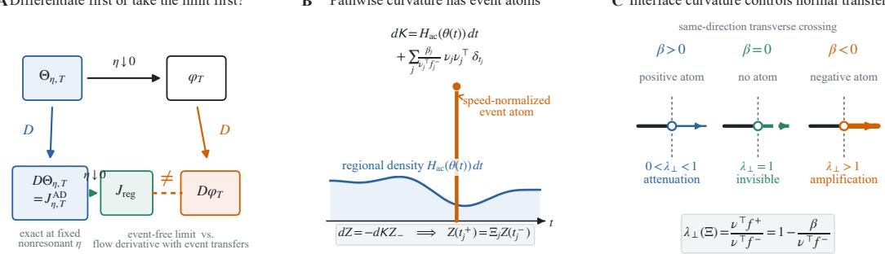
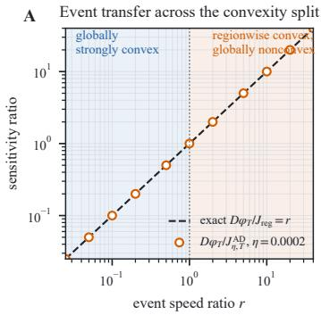
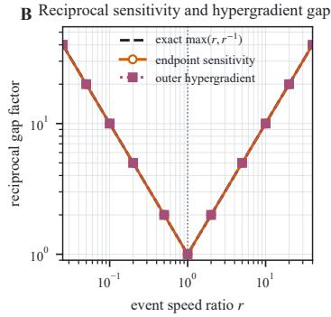
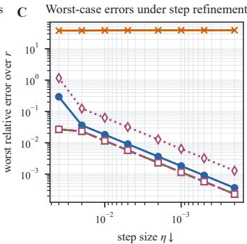
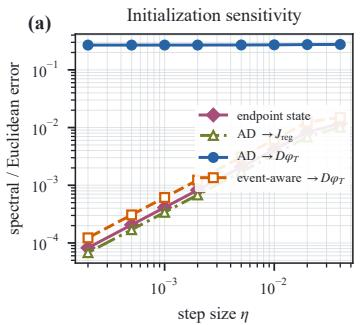
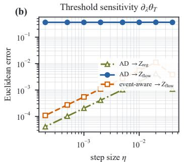
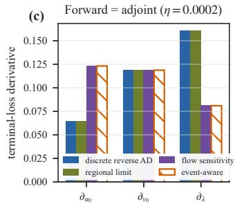
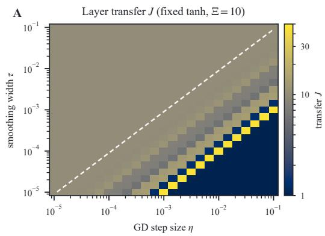
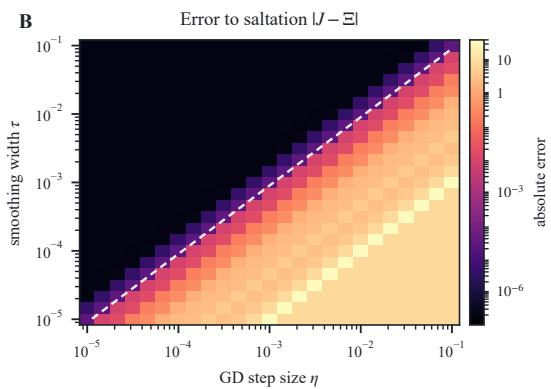

# SINGULAR CURVATURE IN RELU TRAINING: DIFFERENTIATION AND THE GRADIENT-FLOW LIMIT NEED NOT COMMUTE

Xiaoyang Li Runni Zhou

College of Medicine and Biological Information Engineering

Northeastern University, Shenyang, China

20246389@stu.neu.edu.cn ORCID: 0009-0002-4863-5761

20246378@stu.neu.edu.cn ORCID: 0009-0006-8365-4852

## ABSTRACT

Gradient descent (GD) is explicit Euler for gradient flow, but a state-accurate continuous-time surrogate need not remain accurate after differentiation. At every fixed nonresonant step size, ordinary automatic differentiation exactly differentiates the executed hard-ReLU GD program. We prove that, over a fixed finite horizon, the GD states converge and these exact discrete derivatives approach an event-free regional propagator, whereas the derivative of the limiting flow also contains speednormalized activation-event transfers. A prepoint Stieltjes representation separates the absolutely continuous regional Hessian from atomic interface curvature; one nonzero gradient jump produces an exactly rank-one endpoint discrepancy, and global convexity prevents complete multi-event cancellation whenever an event is strict. Nevertheless, a standard family of globally 1-strongly convex residual-ReLU squared-loss risks realizes arbitrarily large reciprocal sensitivity ratios on open initialization sets, with a uniform transversality margin. The same discrete-versusflow decomposition extends to parameters and reverse-mode adjoints; resolved smoothing in the scalar or autonomous-normal regime and consistent event localization recover the flow sensitivity. The results concern deterministic full-batch, finite-horizon dynamics with a stable finite itinerary of separated same-direction transverse events; they are consistency theorems, not prevalence claims for largescale training.

## 1 INTRODUCTION

Small-step gradient descent (GD) is often replaced by gradient flow, then differentiated to study initialization dependence, meta-parameters, data weights, differentiable optimization, or reversemode sensitivity. This second step needs more than state accuracy. If $\Theta _ { \eta , T }$ is the GD endpoint map at fixed continuum time T and $\varphi _ { T }$ is the flow map, the required commuting relation is

$$
\begin{array} { r } { \Theta _ { \eta , T } ( \theta _ { 0 } ) \to \varphi _ { T } ( \theta _ { 0 } ) \quad \stackrel { ? } { \implies } \quad D \Theta _ { \eta , T } ( \theta _ { 0 } ) \to D \varphi _ { T } ( \theta _ { 0 } ) . } \end{array}
$$

For a stable hard-ReLU event itinerary, it need not hold:

$$
\boxed { \begin{array} { r l } { \Theta _ { \eta , T } ( \theta _ { 0 } ) \longrightarrow \varphi _ { T } ( \theta _ { 0 } ) , } & { } \\ { D \Theta _ { \eta , T } ( \theta _ { 0 } ) = J _ { \eta , T } ^ { \mathrm { A D } } \longrightarrow J _ { \mathrm { r e g } } = \Phi _ { m } \cdot \cdot \cdot \Phi _ { 0 } , } & { } \\ { D \varphi _ { T } ( \theta _ { 0 } ) = \Phi _ { m } \Xi _ { m } \Phi _ { m - 1 } \cdot \cdot \cdot \Xi _ { 1 } \Phi _ { 0 } . } & { } \end{array} }\tag{1}
$$

At every fixed nonresonant step size, AD exactly differentiates the executed discrete program. What fails is exchanging differentiation with the vanishing-step limit.

The missing term is event timing. Nearby initializations reach an activation boundary at slightly different times and therefore spend different durations under the two regional vector fields. This residence-time change produces the classical saltation transfer $\Xi _ { j } .$ . A hard-branch numerical step has only an $I + O ( \eta )$ branchwise Jacobian, so no finite event transfer survives in its derivative limit. The states converge. Their tangent dynamics need not approach the same object.

We express this mechanism through a speed-normalized pathwise curvature measure. Its continuous density is the regional Hessian; each activation event contributes an atom. The corresponding prepoint Stieltjes system gives the saltation-interleaved flow derivative, whereas deleting the atoms gives $J _ { \mathrm { r e g } } .$ One nonzero event jump produces an exact rank-one gap whose norm and outer-gradient visibility are explicit. For multiple events, transported products give the exact cancellation criterion and quantitative volume and interaction bounds.

Convexity determines the sign of the event. For a globally convex loss, every event weakly attenuates its direct normal mode; consequently, one strict event rules out complete cancellation over a finite same-direction itinerary. Strong convexity does not by itself guarantee commutation: the standard residual-ReLU risk

$$
\begin{array} { r } { \frac 1 2 ( \theta - m ) ^ { 2 } + \frac 1 2 ( \mathrm { R e L U } ( \theta ) - c ) ^ { 2 } } \end{array}
$$

has a globally 1-strongly convex family for which $D \varphi _ { T } = J _ { \mathrm { r e g } } / R$ for any fixed $R > 1$ , on an open initialization set and with a transverse-speed margin independent of R. This is an arbitrary multiplicative reciprocal ratio, not an unbounded additive claim.

The same limit applies when a parameter enters the vector field, initialization, or activation surface: the flow derivative has a classical affine event jump that the event-free discrete limit omits. Reverse mode uses $\Xi _ { i } ^ { \top }$ and, for a moving surface, an event accumulator. This does not say that discrete hypergradients are wrong; it limits when a differentiated flow surrogate represents increasingly fine discrete training.

Saltation, discontinuous-ODE sensitivity errors, parameter and adjoint jumps, and singular Hessian measures are prior art (Hiskens & Pai, 2000; Tolsma & Barton, 2002; Stewart & Anitescu, 2010; Corner et al., 2020; Kong et al., 2024). The learning-specific object here is the T/η-deep sequence of exact hard-ReLU GD derivatives and its comparison with the limiting training-flow derivative. Section 7 draws the claim-by-claim boundary.

Our results concern deterministic full-batch dynamics over a fixed finite horizon, with finitely many separated stable same-direction transverse events. They exclude grazing, sliding, simultaneous events, chattering, and Zeno behavior, and do not establish prevalence in modern large networks.

Our contributions are:

1. a learning-limit decomposition, expressed through speed-normalized atomic pathwise curvature, separating exact nonresonant program derivatives from the full flow derivative;

2. exact one- and multi-event geometry, including low-rank error, log-volume, event-budget, and transported-cancellation formulas;

3. no-cancellation under global convexity, a globally strongly convex residual-ReLU arbitrary reciprocal-ratio family, and a residual/downstream ReLU event law; and

4. parameter and reverse-mode extensions, verified on a controlled two-parameter residual-ReLU training map.

Figure 1 summarizes the framework.

## 2 SETUP AND THE NONCOMMUTING LIMIT

Let $\{ \mathcal { R } _ { \alpha } \}$ be the activation regions met near a reference trajectory. The continuous loss $\mathcal { L } : \mathbb { R } ^ { d } $ R has a $C ^ { 2 }$ extension ${ \mathcal { L } } _ { \alpha }$ on each region, with

$$
f _ { \alpha } = - \nabla { \mathcal { L } } _ { \alpha } , \qquad A _ { \alpha } = D f _ { \alpha } = - H _ { \alpha } .
$$

The solution $\theta ( t ) = \varphi _ { t } ( \theta _ { 0 } )$ meets interfaces $\Sigma _ { j } = \{ g _ { j } = 0 \}$ at $0 < t _ { 1 } < \cdot \cdot \cdot < t _ { m } < T$ . Write $n _ { j } = \nabla g _ { j } ( z _ { j } ) , \nu _ { j } = n _ { j } / \| n _ { j } |$ , and orient $g _ { j }$ from the incoming to the outgoing region. We assume a stable, separated itinerary and same-direction transversality,

$$
n _ { j } ^ { \top } f _ { j } ^ { - } ( z _ { j } ) \geq c _ { 0 } , \qquad n _ { j } ^ { \top } f _ { j } ^ { + } ( z _ { j } ) \geq c _ { 0 } .\tag{2}
$$

  
Figure 1: The discrete derivative limit omits atomic event curvature. (a) Fixed-step AD exactly differentiates each nonresonant GD program considered here; its limit is $J _ { \mathrm { r e g } } ,$ while the flow derivative also contains event transfers. (b) Pathwise curvature consists of a regional density and speednormalized event atoms. (c) Under same-direction transversality, positive, zero, and negative atomic curvature respectively attenuate, preserve, and amplify the direct normal mode.

This orientation is local to each event; it does not require all units to activate. Grazing, sliding, simultaneous hits, chattering, Zeno behavior, and terminal-time events are excluded. Appendix A gives the complete assumptions.

For $T = N \eta$ , hard-branch GD and its branchwise derivative are

$$
\theta _ { k + 1 } ^ { \eta } = \theta _ { k } ^ { \eta } + \eta f _ { \alpha _ { k } } ( \theta _ { k } ^ { \eta } ) ,\tag{3}
$$

$$
J _ { k + 1 } ^ { \mathrm { A D } , \eta } = \left( I + \eta A _ { \alpha _ { k } } ( \theta _ { k } ^ { \eta } ) \right) J _ { k } ^ { \mathrm { A D } , \eta } , \qquad J _ { 0 } ^ { \mathrm { A D } , \eta } = I .\tag{4}
$$

Let $\Theta _ { \eta , T } ( \theta _ { 0 } ) = \theta _ { N } ^ { \eta }$ and let $\Theta _ { \eta } ( t ; \theta _ { 0 } )$ be the piecewise-linear interpolation of the iterates. Set $J _ { \eta , T } ^ { \mathrm { A D } } = J _ { N } ^ { \mathrm { A D } , \eta }$ . If no evaluated iterate lies on an interface, its branch sequence is locally fixed and

$$
J _ { \eta , T } ^ { \mathrm { A D } } = D \Theta _ { \eta , T } ( \theta _ { 0 } ) .\tag{5}
$$

At an exact hit, software returns a selected product although the endpoint map need not be classically differentiable.

Let $\Phi _ { j }$ propagate $\dot { Z } = A _ { \alpha _ { i } } ( \theta ( t ) ) Z$ between $t _ { j } ^ { + }$ and $t _ { j + 1 } ^ { - }$ , with $t _ { 0 } = 0 , t _ { m + 1 } = T$ , and define

$$
J _ { \mathrm { r e g } } = \Phi _ { m } \Phi _ { m - 1 } \cdot \cdot \cdot \Phi _ { 0 } .\tag{6}
$$

Theorem 1 (Noncommuting hard-ReLU learning limit). Under the assumptions above, for all sufficiently small nonresonant step sizes,

$$
\operatorname* { s u p } _ { 0 \leq t \leq T } \| \Theta _ { \eta } ( t ; \theta _ { 0 } ) - \varphi _ { t } ( \theta _ { 0 } ) \| \leq C \eta ,\tag{7}
$$

and, along such step sizes,

$$
D \Theta _ { \eta , T } = J _ { \eta , T } ^ { \mathrm { A D } } \longrightarrow J _ { \mathrm { r e g } } .\tag{8}
$$

The limiting flow derivative is

$$
D \varphi _ { T } = \Phi _ { m } \Xi _ { m } \Phi _ { m - 1 } \cdot \cdot \cdot \Phi _ { 1 } \Xi _ { 1 } \Phi _ { 0 } , \qquad \Xi _ { j } = I + \frac { ( f _ { j } ^ { + } - f _ { j } ^ { - } ) n _ { j } ^ { \top } } { n _ { j } ^ { \top } f _ { j } ^ { - } } .\tag{9}
$$

Hence state convergence alone does not guarantee derivative convergence.

Smooth Euler estimates apply between isolated event tubes. Transversality localizes each crossing to ${ \cal { O } } ( \eta ) ;$ ; finitely many straddling factors remain $I + O ( \eta )$ , while perturbing the flow event time produces $\Xi _ { j } .$ . Appendix F proves the estimates. In particular, $\| J _ { \eta , T } ^ { \mathrm { A D } ^ { \bullet } } - J _ { \mathrm { r e g } } \| = o ( 1 )$ , and it is ${ \cal { O } } ( \eta )$ for locally Lipschitz regional Hessians; the distinct gap $\lVert J _ { \mathrm { r e g } } - \dot { D } \varphi _ { T } \rVert$ may remain $O ( 1 )$

Proposition 2 (Transported cancellation, volume, and event budget). For any submultiplicative matrix norm normalized by $\| I \| = 1 , s e t Q _ { j } = \Phi _ { j - 1 } \cdot \cdot \cdot \Phi _ { 0 } , \widetilde { \Xi } _ { j } = Q _ { j } ^ { - 1 } \Xi _ { j } Q _ { j } , \widetilde { S } _ { j } = \widetilde { \Xi } _ { j } - I ,$ and

$\begin{array} { r } { E _ { T } = \sum _ { j } \| \widetilde { S } _ { j } \| } \end{array}$ . Then

$$
J _ { \mathrm { r e g } } ^ { - 1 } D \varphi _ { T } = \widetilde { \Xi } _ { m } \cdot \cdot \cdot \widetilde { \Xi } _ { 1 } ,\tag{10}
$$

$$
D \varphi _ { T } = J _ { \mathrm { r e g } } \Longleftrightarrow \tilde { \Xi } _ { m } \cdot \cdot \cdot \tilde { \Xi } _ { 1 } = I ,\tag{11}
$$

$$
\log | \operatorname* { d e t } D \varphi _ { T } | - \log | \operatorname* { d e t } J _ { \mathrm { r e g } } | = \sum _ { j } \log r _ { j } , \qquad r _ { j } = \frac { \nu _ { j } ^ { \top } f _ { j } ^ { + } } { \nu _ { j } ^ { \top } f _ { j } ^ { - } } ,\tag{12}
$$

$$
\begin{array} { r } { \| J _ { \mathrm { r e g } } ^ { - 1 } D \varphi _ { T } - I \| \leq e ^ { E _ { T } } - 1 , } \end{array}\tag{13}
$$

$$
J _ { \mathrm { r e g } } ^ { - 1 } D \varphi _ { T } = I + \sum _ { j } \widetilde { S } _ { j } + R _ { 2 } , \qquad \| R _ { 2 } \| \le e ^ { E _ { T } } - 1 - E _ { T } .\tag{14}
$$

Thus $\textstyle \prod _ { j } r _ { j } \neq 1$ is sufficient for mismatch, but $\textstyle \prod _ { j } r _ { j } = 1$ is not sufficient for equality.

Appendix G proves the ordered factorization. Within the verified one-step class of Appendix $\mathrm { K } ,$ the derivative-limit defect persists for event-blind schemes regardless of regional order. The result does not cover unverified or event-localizing schemes.

## 3 ATOMIC CURVATURE AND EXACT EVENT GEOMETRY

## 3.1 FROM EVENT TIME TO ATOMIC CURVATURE

Consider one transverse crossing at time $t _ { * }$ . If $\zeta ^ { - }$ is an incoming perturbation evaluated at the nominal clock, then the perturbed trajectory reaches the interface at $t _ { * } + \delta t _ { * }$ , where

$$
\delta t _ { * } = - \frac { n ^ { \top } \zeta ^ { - } } { n ^ { \top } f ^ { - } } .\tag{15}
$$

The two trajectories therefore spend different amounts of time under the incoming and outgoing vector fields. Returning both perturbations to the same clock gives the classical saltation update

$$
\zeta ^ { + } = \Xi \zeta ^ { - } , \qquad \Xi = I + \frac { ( f ^ { + } - f ^ { - } ) n ^ { \top } } { n ^ { \top } f ^ { - } } .\tag{16}
$$

For a continuous piecewise-smooth loss, tangential derivatives agree across the interface. With $\nu = n / \| n \|$ , there is a scalar $\beta$ such that

$$
[ \nabla { \mathcal { L } } ] = \beta \nu , \qquad \Xi = I - { \frac { \beta \nu \nu ^ { \top } } { \nu ^ { \top } f ^ { - } } } , \qquad \lambda _ { \perp } ( \Xi ) = { \frac { \nu ^ { \top } f ^ { + } } { \nu ^ { \top } f ^ { - } } } .\tag{17}
$$

Thus the direct event update is a rank-at-most-one perturbation of the identity (rank one when $\beta \neq 0 )$ and acts only in the event-normal mode.

The spatial distributional Hessian is

$$
\begin{array} { r } { D ^ { 2 } \mathcal { L } = H _ { \mathrm { a c } } \mathrm { d } \theta + \beta \nu \nu ^ { \top } \mathcal { H } ^ { d - 1 } \scriptscriptstyle \frac { 1 } { \ l _ { - } } \sum . } \end{array}\tag{18}
$$

The first term is regional curvature; the second is curvature concentrated on the activation interface.   
The correct pathwise object must also encode how quickly the trajectory reaches that interface.

Proposition 3 (Speed-normalized pathwise curvature). Along the reference itinerary, define the finite matrix-valued measure

$$
\mathrm { d } K _ { \theta } ( t ) = H _ { \alpha ( t ) } ( \theta ( t ) ) \mathrm { d } t + \sum _ { j = 1 } ^ { m } \frac { \beta _ { j } } { \nu _ { j } ^ { \top } f _ { j } ^ { - } } \nu _ { j } \nu _ { j } ^ { \top } \delta _ { t _ { j } } ( \mathrm { d } t ) .\tag{19}
$$

Under the left/prepoint convention

$$
Z ( t ) = I - \int _ { ( 0 , t ] } \mathrm { d } K _ { \theta } ( s ) Z ( s ^ { - } ) ,\tag{20}
$$

the unique right-continuous solution satisfies

$$
Z ( t _ { j } ^ { + } ) = \Xi _ { j } Z ( t _ { j } ^ { - } ) , \qquad Z ( T ) = D \varphi _ { T } .\tag{21}
$$

Deleting the atoms from $K _ { \theta }$ gives the terminal value $J _ { \mathrm { r e g } } ,$ which is the limit ofbranchwise discrete AD in Theorem 1.

The prepoint convention is essential. Equation (19) is an event-time-induced, speed-normalized pathwise measure, not a convention-free pullback of the spatial Radon measure in (18). Nor does one obtain $\Xi _ { j }$ by exponentiating the bare interface mass. The atom acts as the linear jump prescribed in (20). The spatial BV decomposition and saltation formula are classical (Demengel, 1984; Ambrosio et al., 2000; Hiskens & Pai, 2000; Kong et al., 2024); the learning-limit content is that the discrete derivative sequence retains only the absolutely continuous part. The complete proof is in Appendix E.

## 3.2 ONE EVENT: EXACT LOW-RANK DISCREPANCY

Proposition 4 (One-event rank-one geometry). For one transverse event, let $\Delta _ { T } = D \varphi _ { T } - J _ { \mathrm { r e g } } $ Then

$$
\Delta _ { T } = - \frac { \beta } { \nu ^ { \top } f ^ { - } } ( \Phi _ { 1 } \nu ) ( \nu ^ { \top } \Phi _ { 0 } ) .\tag{22}
$$

$H \beta \neq 0 ,$ , then rank $\left( \Delta _ { T } \right) = 1$ and

$$
\| \Delta _ { T } \| _ { 2 } = \| \Delta _ { T } \| _ { F } = \frac { | \beta | } { | \nu ^ { \top } f ^ { - } | } \| \Phi _ { 1 } \nu \| _ { 2 } \| \Phi _ { 0 } ^ { \top } \nu \| _ { 2 } .\tag{23}
$$

Its kernel is $( \Phi _ { 0 } ^ { \top } \nu ) ^ { \perp }$ , and its image is span $( \Phi _ { 1 } \nu )$ . For a scalar outer objective with $g _ { T } =$ $\nabla q ( \varphi _ { T } ( \theta _ { 0 } ) )$

$$
\Delta _ { T } ^ { \top } g _ { T } = - \frac { \beta } { \nu ^ { \top } f ^ { - } } ( \nu ^ { \top } \Phi _ { 1 } ^ { \top } g _ { T } ) \Phi _ { 0 } ^ { \top } \nu .\tag{24}
$$

Hence the outer-gradient discrepancy vanishes exactly when $\beta = 0 o r g _ { T } \perp \Phi _ { 1 } \nu .$ . If V is uniform on the unit sphere in $\mathbb { R } ^ { d }$ , then

$$
\mathbb { E } \| \Delta _ { T } V \| _ { 2 } ^ { 2 } = \| \Delta _ { T } \| _ { F } ^ { 2 } / d .\tag{25}
$$

The result separates event strength, inverse crossing speed, incoming alignment, and outgoing transport. It does not claim that random network trajectories typically realize a large value. Appendix E gives the rank-one and expectation calculations.

## 4 CONVEXITY AND RELU EVENT STRUCTURE

## 4.1 CONVEXITY FIXES THE DIRECTION OF TRANSFER

Theorem 5 (Convex attenuation and no complete cancellation). Suppose, in addition to Theorem 1, that L is globally convex. At every traversed interface,

$$
[ \nabla \mathcal { L } ] _ { j } = \beta _ { j } \nu _ { j } \Longrightarrow \beta _ { j } \geq 0 , \qquad r _ { j } = 1 - \frac { \beta _ { j } } { \nu _ { j } ^ { \top } f _ { j } ^ { - } } \in ( 0 , 1 ] .\tag{26}
$$

Thus a convex interface only attenuates its direct normalfirst variation and is nontrivial exactly when $\beta _ { j } > 0$ . Moreover,

$$
{ \frac { \operatorname * { d e t } D \varphi _ { T } } { \operatorname * { d e t } J _ { \mathrm { r e g } } } } = \prod _ { j = 1 } ^ { m } r _ { j } .\tag{27}
$$

If any event is strict, this product is below one, so transported events cannot cancel completely.

This conclusion is volumetric, not directionwise, and uses same-direction transversality. Conversely, $\beta < 0$ gives $r > 1$ : negative singular interface curvature is incompatible with global convexity and amplifies the normal mode. Hence the local phases are positive-curvature attenuation $( \beta > 0 )$ , invisibility $( \beta = 0 )$ , and nonconvex amplification $( \beta < 0 )$ ). Appendix E proves the theorem.

## 4.2 A RELU EVENT LAW

Suppose one preactivation $s ( \theta )$ switches for one sample and unit while all other masks remain fixed. Let $q = \nabla _ { \theta } s \neq 0$ , write $F _ { \mathrm { a c t } } - F _ { \mathrm { i n a c t } } = a s + o (  { \left| \left| \theta \right. { } - z \right| } )$ , let $g _ { y }$ be the loss gradient at the common boundary output, and set $\chi = \langle g _ { y } , a \rangle$

Corollary 6 (Residual/downstream ReLU event law). With empirical averaging factor γ and oriented normal $n = \sigma q ,$ , where $\sigma = 1$ for activation and −1for deactivation,

$$
[ \nabla _ { \theta } \mathcal { L } ] = \gamma \chi n , \qquad \beta = \gamma \chi \lVert q \rVert .\tag{28}
$$

For inactive-to-active crossing with $q ^ { \top } f ^ { - } > 0 ,$

$$
\lambda _ { \perp } ( \Xi ) = 1 - \frac { \gamma \chi \| q \| ^ { 2 } } { q ^ { \top } f ^ { - } } .\tag{29}
$$

Under same-direction transversality, $\chi > 0 , \chi = 0 , \chi < 0$ give attenuation, invisibility, and amplification. For squared loss, $\chi$ is the residual projected onto the switching unit’s downstream output direction.

This is a single-simple-event statement; simultaneous switches and a genericity claim are excluded.   
Appendix E proves it by differentiating the adjacent network graphs.

## 4.3 A STANDARD RESIDUAL-RELU FAMILY

For one constant input, use the standard residual-ReLU graph and half-squared risk

$$
\begin{array} { r } { F _ { \theta } ( 1 ) = \left[ \underset { \mathrm { R e L U } ( \theta ) } { \theta } \right] , \qquad \mathcal { L } _ { m , c } ( \theta ) = \frac { 1 } { 2 } \| F _ { \theta } ( 1 ) - ( m , c ) \| _ { 2 } ^ { 2 } . } \end{array}\tag{30}
$$

Theorem 7 (Residual-ReLU phase theorem and uniform ratios). Fix $m > 0 , c > - m , T > 0$ . For every $\theta _ { 0 } \in U _ { T } = ( m ( 1 - e ^ { T } ) , 0 )$ , the flow crosses zero once at

$$
t _ { * } = \log \frac { m - \theta _ { 0 } } { m } \in ( 0 , T ) , \quad ( f ^ { - } , f ^ { + } , H ^ { - } , H ^ { + } , \beta , r ) = \left( m , m + c , 1 , 2 , - c , \frac { m + c } { m } \right) ,\tag{31}
$$

and

$$
J _ { \mathrm { r e g } } = e ^ { - t _ { * } } e ^ { - 2 ( T - t _ { * } ) } , \qquad D \varphi _ { T } = r J _ { \mathrm { r e g } } , \qquad D \Theta _ { \eta , T } = J _ { \eta , T } ^ { \mathrm { A D } } \to J _ { \mathrm { r e g } }\tag{32}
$$

along every nonresonant mesh sequence. For $c \leq 0 ,$ , the objective is globally 1-strongly convex with unique minimizer $( m + c ) / 2$ . Thus $- m < c < 0$ gives $0 < r < 1 , c = 0 g i \nu e s r = 1$ , and $c > 0$ gives $r > 1$ , where the objective is globally nonconvex owing to the interface.

For prescribed $a > 0 , t _ { * } \in ( 0 , T ) , r > 0$ , choose

$$
( m , c ) = \left\{ \begin{array} { l l } { ( a / r , ( r - 1 ) a / r ) , } & { 0 < r \leq 1 , } \\ { ( a , ( r - 1 ) a ) , } & { r \geq 1 , } \end{array} \right. \quad \quad \theta _ { 0 } = m ( 1 - e ^ { t _ { * } } ) .\tag{33}
$$

Then the event time isfixed and min $\{ f ^ { - } ( 0 ) , f ^ { + } ( 0 ) \} = a .$ . In particular, for every $R > 1$ , the globally 1-strongly convex choice $m = R a , c = - ( R - 1 )$ a satisfies

$$
D \varphi _ { T } = R ^ { - 1 } J _ { \mathrm { r e g } } , \qquad { \frac { | J _ { \mathrm { r e g } } | } { | D \varphi _ { T } | } } = R ,\tag{34}
$$

with a transverse-speed lower bound independent ofR.

This multiplicative reciprocal ratio holds on the open set $U _ { T } ;$ it is not an unbounded additive claim. The limit is for each fixed R, then $\eta \downarrow 0 .$ , not a uniform joint limit. Appendix M proves global strong convexity, the recurrence, the uniform margin, and the countable exact-hit set.

Corollary 8 (Outer-gradient consequence). Under Theorem 7, along any nonresonant mesh sequence, let $q \in \dot { C ^ { 1 } } ( \mathbb { R } )$ satisfy $q ^ { \prime } ( \varphi _ { T } ( \theta _ { 0 } ) ) \ne 0 ,$ , let $G _ { \eta } = q \circ \Theta _ { \eta , T } , G = q \circ \varphi _ { T }$ . Then

$$
D G _ { \eta } \to q ^ { \prime } ( \varphi _ { T } ) J _ { \mathrm { r e g } } , \qquad D G = r q ^ { \prime } ( \varphi _ { T } ) J _ { \mathrm { r e g } } .\tag{35}
$$

## 5 HYPERPARAMETERS, REVERSE MODE, AND RESOLUTION

## 5.1 PARAMETERS INSIDE TRAINING

Let $\lambda \in \mathbb { R } ^ { p }$ enter regional fields $f _ { \alpha } ( \theta , \lambda )$ , surfaces $g _ { j } ( \theta , \lambda ) = 0$ , or the initialization $\theta ( 0 ; \lambda ) = h ( \lambda )$ Set $Z = D _ { \lambda } \theta , A = { \overline { { D _ { \theta } f } } }$ , and $B = D _ { \lambda } \dot { f }$

Theorem 9 (Parameter derivatives and the vanishing-step limit). Assume (A1)–(A5), joint regional smoothness, and persistence of the stable, separated same-direction itinerary on a parameter neighborhood. Regionally,

$$
\dot { Z } = A _ { \alpha } Z + B _ { \alpha } , \qquad Z ( 0 ) = D h ( \lambda ) .\tag{36}
$$

At event j, with $g _ { \lambda , j } = \nabla _ { \lambda } g _ { j }$ ,

$$
Z _ { j } ^ { + } = \Xi _ { j } Z _ { j } ^ { - } + C _ { j } , \qquad C _ { j } = \frac { ( f _ { j } ^ { + } - f _ { j } ^ { - } ) g _ { \lambda , j } ^ { \top } } { n _ { j } ^ { \top } f _ { j } ^ { - } } .\tag{37}
$$

At each fixed nonresonant step size, AD exactly differentiates the discrete program. As $\eta \downarrow 0$ along such nonresonant step sizes, those derivatives converge to (36) continued without event jumps, whereas the limiting flow derivative obeys (37).

An initialization-only parameter has $B = g _ { \lambda } = 0 ;$ a vector-field parameter adds regional forcing; a moving surface adds $\bar { C } _ { j }$ . These effects can coexist. The step size is not differentiated. Appendix J proves the theorem by augmenting the state with λ.

## 5.2 REVERSE MODE

Corollary 10 (Event-aware adjoint). For terminal scalar objective $q ( \theta ( T ) , \lambda )$ , let $p ( T ) = \nabla _ { \theta } q$ and solve $- \dot { p } = A _ { \alpha } ^ { \top } p$ regionally. The fixed-clock event update and parameter gradient are

$$
p _ { j } ^ { - } = \Xi _ { j } ^ { \top } p _ { j } ^ { + } ,\tag{38}
$$

$$
\nabla _ { \lambda } q = q _ { \lambda } + D h ^ { \top } p ( 0 ) + \int _ { 0 } ^ { T } B ^ { \top } p \mathrm { d } t + \sum _ { j = 1 } ^ { m } g _ { \lambda , j } \frac { ( f _ { j } ^ { + } - f _ { j } ^ { - } ) ^ { \top } p _ { j } ^ { + } } { n _ { j } ^ { \top } f _ { j } ^ { - } } .\tag{39}
$$

A regional adjoint that omits eventjumps and accumulators returns the event-free sensitivity limit, which need not equal the limitingflow derivative.

The transpose follows from the fixed-clock pairing $p ^ { + ^ { \top } \Xi Z ^ { - } } = ( \Xi ^ { \top } p ^ { + } ) ^ { \top } Z ^ { - }$ , not an inverse transpose. Reverse-mode AD through each fixed nonresonant discrete program remains exact.

## 5.3 RESTORATION AND SMOOTHING

An event-aware sensitivity that localizes the stable itinerary and inserts consistent one-sided transfers satisfies

$$
J _ { \eta , T } ^ { \mathrm { S C } } = \widehat { \Phi } _ { m } \widehat { \Xi } _ { m } \cdot \cdot \cdot \widehat { \Xi } _ { 1 } \widehat { \Phi } _ { 0 } \longrightarrow D \varphi _ { T } .\tag{40}
$$

This is a consistency construction, not a scalable training algorithm: explicit tracking requires one-sided data for every detected switch.

Smoothing is guaranteed to restore the same transfer when its shrinking curvature layer is resolved. For the scalar/autonomous normal layer $f _ { \tau } ( x ) = F ( x / \tau ) , \rho = \eta / \tau$ , Appendix N proves

$$
\begin{array} { r } { \left| \log J _ { \rho , R } - \log \frac { a _ { + } } { a _ { - } } \right| \leq C _ { F } \rho + \delta _ { F } ( R ) \quad \mathrm { i f } \quad \rho \| F ^ { \prime } \| _ { \infty } \leq \frac { 1 } { 2 } . } \end{array}\tag{41}
$$

Thus $\rho \to 0 , R \to \infty , \tau R \to 0$ recovers saltation. The condition is sufficient, not necessary; the sharp-first limit is directed through nonresonant step sizes and retains profile, phase, and tail dependence. No general curved-interface smoothing theorem is claimed.

## 6 CONTROLLED NUMERICAL VERIFICATION

These deterministic studies verify proved formulas, not prevalence in larger networks. Plotted values come from preserved CSV/JSON/NPZ output; PyTorch and finite differences independently check the executed programs.

  
state JAD → Jreg JSC → DφT event-aware outer gradient JAD vs. DφT

  
Figure 2: Convexity controls the residual-ReLU event transfer. (a) The endpoint-sensitivity ratio follows r across globally strongly convex attenuation, the $C ^ { 1 }$ interface, and nonconvex amplification, with fixed speed margin. (b) Endpoint- and outer-gradient reciprocal sensitivity ratios equal max $\{ r , r ^ { - 1 } \}$ in the continuum limit. (c) State, regional-AD, and event-aware errors vanish under refinement, while ordinary AD remains separated from the flow derivative for $r \neq 1 .$ . Lines connect deterministic values.

Residual-ReLU phases. For the graph $F _ { \theta } ( 1 ) = ( \theta , \mathrm { R e L U } ( \theta ) )$ , set

$$
m = \frac { 1 } { \operatorname* { m i n } \{ 1 , r \} } , \quad c = ( r - 1 ) m , \quad \theta _ { 0 } = m ( 1 - e ^ { 0 . 3 } ) , \quad T = 0 . 8 .
$$

The event occurs at 0.3, its minimum one-sided speed is one for every $r ,$ and $D \varphi _ { T } = r J _ { \mathrm { r e g } }$ . We use $r \in \{ 1 / 4 0 , 1 / 2 0 , 1 / 1 0 , 1 / 5 , 1 / 2 , 1 , 2 , 5 , 1 0 , 2 \hat { 0 } , 4 0 \}$ and eight nonresonant step sizes. All 88 runs have one crossing. Figure 2 confirms attenuation, invisibility, and amplification, including the globally strongly convex $r < 1$ family. $\Delta { \sf t } \eta = 2 \times 1 0 ^ { - 4 }$ , the worst relative sensitivity-ratio and outer-gradient-ratio errors are $2 . 3 1 \times \mathrm { i } 0 ^ { - 4 }$ and $1 . 2 9 \times 1 0 ^ { - 3 }$ . PyTorch AD agrees with the analytic branch product within $3 . 8 2 \times 1 0 ^ { - 1 4 }$ ; finite-difference errors are at most $3 . 3 7 \times 1 0 ^ { - 8 }$

Two parameters and a moving threshold. We next use

$$
F _ { ( u , v ) , \lambda } ( 1 ) = ( u , v , \operatorname { R e L U } ( u - \lambda ) + 0 . 5 v ) , \quad y = ( 1 , 0 . 2 , 1 ) ,
$$

with $T = 0 . 8 , \lambda = 0 , ( u _ { 0 } , v _ { 0 } ) = ( 1 - e ^ { 0 . 3 } , 0 )$ . The prescribed trajectory has one verified event, with normal speeds 1 and 1.91244, and $\beta = - 0 . 9 1 2 4 4 1$ $\mathrm { A t } \ \eta = 2 \times 1 0 ^ { - 4 }$ , the state error is $8 . 2 4 \times 1 0 ^ { - 5 }$ $\lVert J _ { \eta , T } ^ { \mathrm { A D } } - \dot { J } _ { \mathrm { r e g } } \rVert _ { 2 } = 6 . 7 9 \times 1 0 ^ { - 5 }$ while $\lVert J _ { \eta , T } ^ { \mathrm { A D } } - D \varphi _ { T } \rVert _ { 2 } ^ { 2 } = 0 . 2 6 8 6 5$ , and event correction reduces the latter to $1 . 2 3 \times 1 0 ^ { - 4 }$ . The analogous moving-threshold errors are $4 . 0 9 \times 1 0 ^ { - 5 }$ , 0.36260, and $1 . 1 0 \times 1 0 ^ { - 4 }$ . All independent forward/adjoint, PyTorch, and finite-difference checks satisfy the reported tolerances; Appendix O gives every value and tolerance.

Two-parameter residual-ReLU ERM: state convergence with persistent derivative gaps

  
Figure 3: Matrix and parameter limits omit the same event. States approach the flow endpoints, while branchwise derivatives approach regional limits and remain separated from the flow derivatives; event-aware forward and adjoint calculations restore both.

## 7 RELATED WORK AND NOVELTY BOUNDARY

Hybrid and fixed-program sensitivity. Event-time derivatives, saltation, hybrid adjoints, and switch-aware schemes are classical (Hiskens & Pai, 2000; Tolsma & Barton, 2002; Taringoo & Caines, 2009; Corner et al., 2020; Stewart, 1990; Dieci & Lopez, 2012). Closest here, Stewart & Anitescu (2010) prove persistent mesh-refinement gradient errors for discontinuous ODE simulations. Conservative-field and generalized-derivative theories instead characterize selections for nonsmooth functions or fixed programs (Bolte & Pauwels, 2020; Bolte et al., 2022; Park et al., 2024). In our setting, $J _ { \eta , T } ^ { \mathrm { A D } }$ and $D \varphi _ { T }$ are classical derivatives of a nonresonant program and a stable-itinerary flow map; we identify neither with a particular generalized selection. Program depth grows as $T / \eta$

Learning boundary. GD–flow state comparison and ReLU boundary curvature are established prior art (Elkabetz & Cohen, 2021; Duersch et al., 2024). At the reference point, our pair is $\mathrm { l i m } _ { \eta \downarrow 0 } ,$ η nonresonant $D \Theta _ { \eta , T } ( \theta _ { 0 } ) = J _ { \mathrm { r e g } }$ versus $D \varphi _ { T } ( \theta _ { 0 } ) = \Phi _ { m } \Xi _ { m } \cdot \cdot \cdot \Xi _ { 1 } \Phi _ { 0 }$ . We characterize when they differ, including transported cancellation, no-cancellation under global convexity, and an arbitrary reciprocal ratio in a globally strongly convex residual-ReLU risk. Appendix L gives an object-byobject comparison.

## 8 LIMITATIONS AND CONCLUSION

Limitations. We study deterministic full-batch, finite-horizon dynamics with continuous piecewise-$C ^ { 2 }$ objectives and a stable finite itinerary of separated same-direction transverse events. This excludes grazing, sliding, simultaneous or created events, chattering, and Zeno behavior. The complete smoothing theorem is scalar or assumes an autonomous normal reduction. Our controlled systems do not establish prevalence in large networks, and explicit event tracking is a diagnostic rather than a scalable training method.

Conclusion. At every fixed nonresonant step size, automatic differentiation can exactly differentiate the executed hard-ReLU GD program. Yet differentiation and the vanishing-step flow limit need not commute: the discrete derivative limit is event-free, whereas the flow derivative contains finite, speed-normalized event transfers. One nonzero event jump gives a rank-one discrepancy. For a globally convex loss, any strict event prevents complete cancellation. A family of globally 1- strongly convex residual-ReLU risks nevertheless realizes arbitrarily large reciprocal sensitivity ratios at a fixed transverse margin; the same ratio reaches the corresponding initialization outer gradient. More generally, the event calculus extends to parameter sensitivities and adjoints. Under the stated scalar/autonomous-normal and localization conditions, resolved smoothing or event-aware differentiation restores the flow sensitivity. Open questions include stochastic updates, changing itineraries, cancellation statistics, and scalable aggregate estimation of event contributions.

## REPRODUCIBILITY STATEMENT

The appendix states every assumption used by the theorems, gives complete proofs, and records the numerical definitions. Numerical marks are read from preserved JSON or NPZ arrays; analytic curves and schematics are regenerated from the stated formulas. No plotted value is digitized from a raster image.

## REFERENCES

Mark Ainsworth and Yeonjong Shin. Plateau phenomenon in gradient descent training of ReLU networks: Explanation, quantification, and avoidance. SIAM Journal on Scientific Computing, 43(5):A3438–A3468, 2021. doi: 10.1137/20M1353010. URL https://epubs.siam.org/ doi/10.1137/20M1353010.

Luigi Ambrosio, Nicola Fusco, and Diego Pallara. Functions of Bounded Variation and Free Discontinuity Problems. Oxford Mathematical Monographs. Oxford University Press, Oxford, 2000. doi: 10.1093/oso/9780198502456.001.0001. URL https://academic.oup.com/ book/53762.

Jer´ ome Bolte and Edouard Pauwels. A mathematical model for automatic differentiation in machineˆ learning. In Advances in Neural Information Processing Systems, volume 33, pp. 10809–10819. Curran Associates, Inc., 2020. URL https://arxiv.org/abs/2006.02080.

Jer´ ome Bolte, Edouard Pauwels, and Samuel Vaiter. Automatic differentiation of non-ˆ smooth iterative algorithms. In Advances in Neural Information Processing Systems, volume 35, pp. 26404–26417, 2022. doi: 10.52202/068431-1915. URL https://proceedings.neurips.cc/paper\_files/paper/2022/hash/ a9077da44185792cb63599cc9e0357bc-Abstract-Conference.html.

Samuel A. Burden, S. Shankar Sastry, Daniel E. Koditschek, and Shai Revzen. Event-selected vector field discontinuities yield piecewise-differentiable flows. SIAM Journal on Applied Dynamical Systems, 15(2):1227–1267, 2016. doi: 10.1137/15M1016588. URL https://epubs.siam. org/doi/10.1137/15M1016588.

Ricky T. Q. Chen, Brandon Amos, and Maximilian Nickel. Learning neural event functions for ordinary differential equations. In The Ninth International Conference on Learning Representations, 2021. URL https://openreview.net/forum?id=kW\_zpEmMLdP.

Sebastien Corner, Adrian Sandu, and Corina Sandu. Adjoint sensitivity analysis of hybrid multibody dynamical systems. Multibody System Dynamics, 49:395–420, 2020. doi: 10. 1007/s11044-020-09726-0. URL https://link.springer.com/article/10.1007/ s11044-020-09726-0.

Franc¸oise Demengel. Fonctions a hessien born\` e.´ Annales de l’Institut Fourier, 34(2):155–190, 1984. doi: 10.5802/aif.969. URL https://www.numdam.org/item/AIF\_1984\_\_34\_ 2\_155\_0/.

Mario di Bernardo, Christopher J. Budd, Alan R. Champneys, and Piotr Kowalczyk. Piecewisesmooth Dynamical Systems: Theory and Applications, volume 163 of Applied Mathematical Sciences. Springer London, 2008. doi: 10.1007/978-1-84628-708-4. URL https://link. springer.com/book/10.1007/978-1-84628-708-4.

Luca Dieci and Luciano Lopez. A survey of numerical methods for IVPs of ODEs with discontinuous right-hand side. Journal ofComputational and Applied Mathematics, 236(16):3967–3991, 2012. doi: 10.1016/j.cam.2012.02.011. URL https://www.sciencedirect.com/science/ article/pii/S0377042712000684.

Jed A. Duersch, Tommie A. Catanach, Alexander Safonov, and Jeremy Wendt. Curvature in the looking-glass: Optimal methods to exploit curvature of expectation in the loss landscape, 2024. URL https://arxiv.org/abs/2411.16914. arXiv preprint, v1.

Omer Elkabetz and Nadav Cohen. Continuous vs. discrete optimization of deep neural networks. In Advances in Neural Information Processing Systems, volume 34, pp. 4947–4960, 2021. URL https://papers.nips.cc/paper/2021/hash/ 274ad4786c3abca69fa097b85867d9a4-Abstract.html.

A. F. Filippov. Differential Equations with Discontinuous Righthand Sides, volume 18 of Mathematics and Its Applications. Kluwer Academic Publishers, Dordrecht, 1988. doi: 10.1007/978-94-015-7793-9. URL https://link.springer.com/book/10.1007/ 978-94-015-7793-9.

Santos Galan, William F. Feehery, and Paul I. Barton. Parametric sensitivity functions for hy-´ brid discrete/continuous systems. Applied Numerical Mathematics, 31(1):17–47, 1999. doi: 10.1016/S0168-9274(98)00125-1. URL https://doi.org/10.1016/S0168-9274(98) 00125-1.

William W. Hager. Runge–kutta methods in optimal control and the transformed adjoint system. Numerische Mathematik, 87:247–282, 2000. doi: 10.1007/s002110000178. URL https:// link.springer.com/article/10.1007/s002110000178.

Ian A. Hiskens and M. A. Pai. Trajectory sensitivity analysis of hybrid systems. IEEE Transactions on Circuits and Systems I: Fundamental Theory and Applications, 47(2):204–220, 2000. doi: 10.1109/81.828574. URL https://ieeexplore.ieee.org/document/828574.

Arnulf Jentzen and Adrian Riekert. Convergence analysis for gradient flows in the training of artificial neural networks with ReLU activation. Journal ofMathematical Analysis and Applications, 517 (2):126601, 2023. doi: 10.1016/j.jmaa.2022.126601. URL https://www.sciencedirect. com/science/article/pii/S0022247X22006151.

Sham M. Kakade and Jason D. Lee. Provably correct automatic sub-differentiation for qualified programs. In Advances in Neural Information Processing Systems, volume 31, pp. 7125–7135. Curran Associates, Inc., 2018. URL https://arxiv.org/abs/1809.08530.

Nathan J. Kong, J. Joe Payne, James Zhu, and Aaron M. Johnson. Saltation matrices: The essential tool for linearizing hybrid dynamical systems. Proceedings of the IEEE, 112(6):585– 608, 2024. doi: 10.1109/JPROC.2024.3440211. URL https://ieeexplore.ieee.org/ document/10638633.

Wonyeol Lee, Hangyeol Yu, Xavier Rival, and Hongseok Yang. On correctness of automatic differentiation for non-differentiable functions. In Advances in Neural Information Processing Systems, volume 33, pp. 6719–6730. Curran Associates, Inc., 2020. URL https://arxiv. org/abs/2006.06903.

Yingbo Ma, Vaibhav Dixit, Michael J. Innes, Xingjian Guo, and Christopher Rackauckas. A comparison of automatic differentiation and continuous sensitivity analysis for derivatives of differential equation solutions. In 2021 IEEE High Performance Extreme Computing Conference (HPEC), pp. 1–9. IEEE, 2021. doi: 10.1109/HPEC49654.2021.9622796. URL https:// ieeexplore.ieee.org/document/9622796.

Armin Nurkanovic, Mario Sperl, Sebastian Albrecht, and Moritz Diehl. Finite elements with switch´ detection for direct optimal control of nonsmooth systems. Numerische Mathematik, 156(3):1115– 1162, 2024. doi: 10.1007/s00211-024-01412-z. URL https://link.springer.com/ article/10.1007/s00211-024-01412-z.

Sejun Park, Sanghyuk Chun, and Wonyeol Lee. What does automatic differentiation compute for neural networks? In The Twelfth International Conference on Learning Representations, pp. 52559– 52585, 2024. URL https://proceedings.iclr.cc/paper\_files/paper/2024/ hash/e8711daef520be07cb9852390c673de8-Abstract-Conference.html.

J. M. Sanz-Serna. Symplectic runge–kutta schemes for adjoint equations, automatic differentiation, optimal control, and more. SIAM Review, 58(1):3–33, 2016. doi: 10.1137/151002769. URL https://epubs.siam.org/doi/10.1137/151002769.

Radu Serban and Antonio Recuero. Sensitivity analysis for hybrid systems and systems with memory. Journal ofComputational and Nonlinear Dynamics, 14(9):091006, 2019. doi: 10.1115/1.4044028. URL https://doi.org/10.1115/1.4044028.

David Stewart. A high accuracy method for solving ODEs with discontinuous right-hand side. Numerische Mathematik, 58:299–328, 1990. doi: 10.1007/BF01385627. URL https://link. springer.com/article/10.1007/BF01385627.

David E. Stewart and Mihai Anitescu. Optimal control of systems with discontinuous differential equations. Numerische Mathematik, 114(4):653–695, 2010. doi: 10.1007/s00211-009-0262-2. URL https://link.springer.com/article/10.1007/s00211-009-0262-2.

Farzin Taringoo and Peter E. Caines. The sensitivity of hybrid systems optimal cost functions with respect to switching manifold parameters. In Hybrid Systems: Computation and Control, pp. 475–479. Springer, 2009. doi: 10.1007/978-3-642-00602-9 38. URL https://doi.org/10. 1007/978-3-642-00602-9\_38.

John E. Tolsma and Paul I. Barton. Hidden discontinuities and parametric sensitivity calculations. SIAM Journal on Scientific Computing, 23(6):1861–1874, 2002. doi: 10.1137/S106482750037281X. URL https://epubs.siam.org/doi/10.1137/ S106482750037281X.

Hong Zhang, Shrirang Abhyankar, Emil M. Constantinescu, and Mihai Anitescu. Discrete adjoint sensitivity analysis of hybrid dynamical systems with switching. IEEE Transactions on Circuits and Systems I: Regular Papers, 64(5):1247–1259, 2017. doi: 10.1109/TCSI.2017.2651683. URL https://doi.org/10.1109/TCSI.2017.2651683.

## A ASSUMPTIONS AND NOTATION

Let $\theta \in \mathbb { R } ^ { d }$ . In a neighborhood of a compact tube $K$ around the reference trajectory, a finite family of open regions $\{ \mathcal { R } _ { \alpha } \} _ { \alpha }$ forms a piecewise-smooth partition. On $\mathcal { R } _ { \alpha }$ , write

$$
{ \mathcal { L } } ( \theta ) = { \mathcal { L } } _ { \alpha } ( \theta ) , \qquad f _ { \alpha } ( \theta ) = - \nabla { \mathcal { L } } _ { \alpha } ( \theta ) , \qquad A _ { \alpha } ( \theta ) = D f _ { \alpha } ( \theta ) = - H _ { \alpha } ( \theta ) .
$$

The following are the common base assumptions for the sharp-interface results; individual theorems state any additions.

(A1) Each ${ \mathcal { L } } _ { \alpha }$ has a $C ^ { 2 }$ extension to a neighborhood of $\overline { { \mathcal { R } _ { \alpha } } } \cap K$ . The one-sided traces agree on common interfaces, so $\mathcal { L }$ is continuous although its gradient may jump.

(A2) Every interface met by the reference trajectory is locally a regular $C ^ { 2 }$ hypersurface $\Sigma _ { j } =$ $\{ g _ { j } ~ = ~ 0 \}$ , with $n _ { j } ( \theta ) : = \nabla g _ { j } ( \theta ) \neq 0$ The defining function is oriented so that the trajectory moves from $g _ { j } < 0$ to $g _ { j } > 0$ . At the event state $z _ { j }$ , the associated unit normal is $\nu _ { j } = n _ { j } ( z _ { j } ) / \| n _ { j } ( z _ { j } ) \|$ . We use $n _ { j }$ in formulas invariant to rescaling of $g _ { j }$ , and $\nu _ { j }$ whenever a coefficient or spectral statement requires a unit normal.

(A3) The patched Caratheodory solution´ $\theta ( t ) = \varphi _ { t } ( \theta _ { 0 } )$ exists on $[ 0 , T ]$ , remains in $K ,$ , and has exactly $m < \infty$ events

$$
0 < t _ { 1 } < \cdot \cdot \cdot < t _ { m } < T , \qquad z _ { j } = \theta ( t _ { j } ) .
$$

Consecutive events and the endpoints of the time interval are separated by at least $\Delta _ { t } > 0$ Each event has an isolating neighborhood containing no other interface met by the trajectory. On a neighborhood of $\theta _ { 0 }$ , this event count, order, separation, and itinerary persist.

(A4) The crossings are uniformly same-direction transverse. For some $c _ { 0 } > 0$ , after shrinking the isolating neighborhoods if necessary,

$$
n _ { j } ( { \boldsymbol { \theta } } ) ^ { \top } f _ { j } ^ { - } ( { \boldsymbol { \theta } } ) \geq c _ { 0 } , \qquad n _ { j } ( { \boldsymbol { \theta } } ) ^ { \top } f _ { j } ^ { + } ( { \boldsymbol { \theta } } ) \geq c _ { 0 }
$$

on the respective one-sided neighborhoods.

Here “same-direction” is local to the oriented event: the normal points from the incoming region to the outgoing region. It does not require all ReLU units to switch in one common global direction; it excludes grazing, sliding, and opposing one-sided normal velocities at that crossing.

(A5) There is no grazing, sliding, chattering, simultaneous multi-surface hit, event creation, Zeno accumulation, or event at the terminal time T.

These assumptions give a unique piecewise-classical trajectory and a locally stable event order. At an exact discrete boundary landing, the state update selects one of the adjacent one-sided fields whose oriented normal component remains at least $c _ { 0 }$ . This condition is needed for the state estimate. Whenever ordinary AD is identified with a classical derivative of the discrete endpoint map, we additionally require that no iterate land exactly on an interface. At an exact hit, software AD still returns a selected branch product, but that product need not be a classical derivative.

For $T = N \eta .$ , let $\theta _ { k } ^ { \eta }$ denote the GD iterates and define the endpoint map and its piecewise-linear interpolation by

$$
\begin{array} { r } { \Theta _ { \eta , T } ( \theta _ { 0 } ) : = \theta _ { N } ^ { \eta } , \qquad \Theta _ { \eta } ( t ; \theta _ { 0 } ) : = \mathrm { t h e ~ i n t e r p o l a t i o n ~ o f ~ } \{ \theta _ { k } ^ { \eta } \} _ { k = 0 } ^ { N } . } \end{array}
$$

We use $J _ { \eta , T } ^ { \mathrm { A D } }$ for ordinary executed-branch autodiff, $J _ { \mathrm { r e g } }$ for the event-free regional continuum product, $D \varphi _ { T }$ for the true flow derivative, and $J _ { \eta , T } ^ { \mathrm { S C } }$ for the event-aware corrected sensitivity. The matrix $\Phi _ { j }$ propagates the regional variational equation between $t _ { j } ^ { + }$ and $t _ { j + 1 } ^ { - }$ , with $t _ { 0 } = 0$ and $t _ { m + 1 } = T$

Rate assumption. Under $( \mathbf { A } 1 )$ , the regional Hessians are uniformly continuous on the relevant compact sets. We write

$$
\omega _ { H } ( r ) = \operatorname* { m a x } _ { \alpha } \operatorname* { s u p } \left\{ \| H _ { \alpha } ( x ) - H _ { \alpha } ( y ) \| : x , y \in K \cap \overline { { \mathcal { R } _ { \alpha } } } , \| x - y \| \leq r \right\} .
$$

Thus $\omega _ { H } ( \boldsymbol r ) \to 0$ as $r \downarrow 0$ . An ${ \cal { O } } ( \eta )$ sensitivity rate additionally requires locally Lipschitz regional Hessians $( \dot { \mathcal { L } } _ { \alpha } \in C ^ { 2 , 1 } )$ and first-order event localization.

## B PIECEWISE-SMOOTH RELU OBJECTIVES

Proposition 11 (Finite-sample ReLU objectives). Consider afinite ReLU network on afinite data set, with a loss smooth in the network outputs. On everyfixed activation-pattern cell, the empirical risk is smooth (and polynomialfor squared loss). The risk is continuous across activation boundaries. At a point where exactly one preactivation vanishes and its parameter gradient is nonzero, the boundary is locally a regular hypersurface and the one-sided parameter gradients have well-defined traces.

Proof. Fixing every ReLU mask replaces each activation by either zero or its preactivation. The network output is then a finite composition of affine and multilinear operations in the parameters. It is polynomial on that mask cell, and so is a squared empirical risk. ReLU itself is continuous, hence the network and risk traces agree across a mask boundary. If a single preactivation $s ( \theta )$ vanishes with $\nabla s \neq 0$ , the implicit-function theorem makes $\{ s = 0 \}$ a regular hypersurface. Smooth regional formulas provide the gradient traces. □

The output is generally not piecewise affine in all network parameters. For a two-layer unit a $\mathrm { R e L U } \bar { ( } w ^ { \top } x \bar { + } b )$ , it is bilinear on an active cell, and the squared risk may have degree four. Only piecewise smoothness is used here. For a shallow squared-loss sample, orient $s ( \theta ) \stackrel { \textstyle - } { = } q ^ { \top } \theta + b$ from inactive to active. $\mathbf { A } { \mathfrak { t } } s = 0$ , with output coefficient c and residual $r = F _ { \theta } ( x ) - y$ , direct differentiation gives

$$
[ \nabla \mathcal { L } ] = r c q
$$

up to the empirical averaging factor. The jump is normal to the activation surface. A simultaneous change of several samples or units is outside the single-interface result.

## C EVENT-TIME DERIVATIVE AND SALTATION

For one event, let z be the nominal impact at time $t _ { * } ,$ , let $n = \nabla g ( z )$ , and let $\zeta ^ { - }$ be the incoming perturbation evaluated at the nominal time. The perturbed event time $t _ { * } + \delta t$ obeys

$$
0 = n ^ { \top } ( \zeta ^ { - } + f ^ { - } \delta t ) , \qquad \delta t = - \frac { n ^ { \top } \zeta ^ { - } } { n ^ { \top } f ^ { - } } .
$$

The perturbed impact point changes by $\zeta ^ { - } + f ^ { - } \delta t$ , while the outgoing segment loses time $\delta t$ Returning to the nominal clock gives

$$
\zeta ^ { + } = \zeta ^ { - } + ( f ^ { - } - f ^ { + } ) \delta t = \left( I + \frac { ( f ^ { + } - f ^ { - } ) n ^ { \top } } { n ^ { \top } f ^ { - } } \right) \zeta ^ { - } .
$$

This is the saltation matrix without a state reset. The event time is $C ^ { 1 }$ by the implicit-function theorem because $n ^ { \top } f ^ { - } \neq 0$ . Iterating this calculation over the stable itinerary gives the hybrid product in Theorem 13.

## D DISTRIBUTIONAL HESSIAN AND SINGULAR INTERFACE CURVATURE

Proposition 12 (Distributional Hessian). Let a $C ^ { 2 }$ hypersurface Σ split a neighborhood into minus and plus regions. Suppose L is continuous and has $\dot { C } ^ { \dot { 2 } }$ extensions $\mathcal { L } ^ { \pm }$ with one-sided gradients. For the unit normal ν from minus to plus, there is a scalar trace $\beta$ such that

$$
[ \nabla \mathcal { L } ] = \beta \nu ,
$$

and, as a matrix-valued distribution,

$$
D ^ { 2 } \mathcal { L } = H ^ { - } \mathbf { 1 } _ { - } \mathrm { d } x + H ^ { + } \mathbf { 1 } _ { + } \mathrm { d } x + \beta \nu \nu ^ { \top } \mathcal { H } ^ { d - 1 } \mathfrak { f } _ { \Sigma } \ .
$$

Proof. The traces of $\mathcal { L } ^ { + }$ and $\mathcal { L } ^ { - }$ agree on $\Sigma$ . Their tangential derivatives therefore agree, so their gradient difference is normal: $[ \boldsymbol { \nabla } \bar { \mathcal { L } } ] = \beta \boldsymbol { \nu }$ . Integrating each component of $\nabla \mathcal { L }$ by parts on the two regions gives the regional Hessians as volume terms. The outward normal of the minus region is $\nu ,$ while that of the plus region is $- \nu ;$ the boundary terms combine as $[ \nabla \mathcal { L } ] \otimes \boldsymbol { \nu } = \beta \boldsymbol { \nu } \boldsymbol { \nu } ^ { \intercal }$ , which is the stated measure. □

The decomposition is standard BV calculus. Its role here is to locate the curvature omitted by regional Hessian products. Pulling the interface term through a transverse trajectory must account for the changing normal speed. In the resolved layer of Appendix N, the scalar identity d log $Z = \mathrm { d }$ log f converts the concentrated curvature into $\int f ^ { + } / f ^ { - }$ , exactly the normal saltation factor. A naive exponential of the bare hypersurface mass would be incorrect.

## E ATOMIC CURVATURE AND EVENT GEOMETRY

This section proves the pathwise-curvature, one-event, convexity, and ReLU-event statements used in Sections 3 and 4. The Stieltjes convention below is part of the definition; it is important because the vector field itself jumps at an event.

## E.1 PREPOINT STIELTJES FORMULATION

Along the reference trajectory, write

$$
H ( t ) = H _ { \alpha ( t ) } ( \theta ( t ) ) , \qquad a _ { j } = \frac { \beta _ { j } } { \nu _ { j } ^ { \top } f _ { j } ^ { - } } ,
$$

and define the finite matrix-valued measure

$$
K _ { \theta } ( B ) = \int _ { B } H ( t ) \mathrm { d } t + \sum _ { j : t _ { j } \in B } a _ { j } \nu _ { j } \nu _ { j } ^ { \top } .\tag{42}
$$

Here and below, event data are evaluated at the nominal event state. A right-continuous matrix function Z, with left limits, solves the prepoint Stieltjes system when

$$
Z ( t ) = I - \int _ { ( 0 , t ] } \mathrm { d } K _ { \theta } ( s ) Z ( s ^ { - } ) .\tag{43}
$$

Thus an atom acts linearly on the left limit. Equation (43) is not an exponential convention for matrix atoms.

Proof of Proposition 3. Off the event times, the absolutely continuous part of (43) gives

$$
\dot { Z } ( t ) = - H ( t ) Z ( t ) = A _ { \alpha ( t ) } ( \theta ( t ) ) Z ( t ) .
$$

At $t _ { j }$ , subtracting the left limit from the right value gives

$$
\begin{array} { r l } & { \boldsymbol { Z } ( t _ { j } ^ { + } ) - \boldsymbol { Z } ( t _ { j } ^ { - } ) = - \boldsymbol { K } _ { \boldsymbol { \theta } } ( \{ t _ { j } \} ) \boldsymbol { Z } ( t _ { j } ^ { - } ) } \\ & { \qquad = - \frac { \beta _ { j } } { \nu _ { j } ^ { \top } f _ { j } ^ { - } } \nu _ { j } \nu _ { j } ^ { \top } \boldsymbol { Z } ( t _ { j } ^ { - } ) . } \end{array}
$$

Hence

$$
Z ( t _ { j } ^ { + } ) = \left( I - \frac { \beta _ { j } \nu _ { j } \nu _ { j } ^ { \top } } { \nu _ { j } ^ { \top } f _ { j } ^ { - } } \right) Z ( t _ { j } ^ { - } ) = \Xi _ { j } Z ( t _ { j } ^ { - } ) .
$$

Solving the regional linear equations and applying these finitely many jumps in chronological order yields

$$
Z ( T ) = \Phi _ { m } \Xi _ { m } \Phi _ { m - 1 } \cdot \cdot \cdot \Phi _ { 1 } \Xi _ { 1 } \Phi _ { 0 } = D \varphi _ { T } .
$$

Existence and uniqueness follow from the same finite construction. If the atoms are removed from $K _ { \theta }$ the solution remains continuous at each event and its terminal value is $\Phi _ { m } \cdot \cdot \cdot \Phi _ { 0 } = J _ { \mathrm { r e g } }$ . Theorem 1 identifies this atom-free solution with the vanishing-step branchwise-AD limit. □

The spatial measure in Proposition 12 and the pathwise measure in (42) are related but not identical objects. Since the trajectory velocity has two one-sided values at the interface, a bare distributional pullback does not select a crossing speed. The incoming-speed normalization and the prepoint convention in (43) encode the fixed-clock event derivative. In particular, $\exp ( - a _ { j } \nu _ { j } \nu _ { j } ^ { \top } )$ is generally different from $I - a _ { j } \nu _ { j } \nu _ { j } ^ { \top } = \Xi _ { j }$

## E.2 ONE-EVENT RANK-ONE GEOMETRY

Proof of Proposition 4. For one event, Theorem 1 and (17) give

$$
\begin{array} { l } { \Delta _ { T } : = D \varphi _ { T } - J _ { \mathrm { r e g } } = \Phi _ { 1 } ( \Xi - I ) \Phi _ { 0 } } \\ { \displaystyle = - \frac { \beta } { \nu ^ { \top } f ^ { - } } ( \Phi _ { 1 } \nu ) ( \nu ^ { \top } \Phi _ { 0 } ) . } \end{array}\tag{44}
$$

Both regional fundamental matrices are invertible, so $\Phi _ { 1 } \nu \neq 0$ and $\Phi _ { 0 } ^ { \top } \nu \neq 0$ . If $\beta \neq 0 .$ , (44) is therefore a nonzero outer product and has rank one. A rank-one matrix uv⊤ has one nonzero singular value $\| u \| _ { 2 } \| v \| _ { 2 }$ . This proves

$$
\| \Delta _ { T } \| _ { 2 } = \| \Delta _ { T } \| _ { F } = \frac { | \beta | } { | \nu ^ { \top } f ^ { - } | } \| \Phi _ { 1 } \nu \| _ { 2 } \| \Phi _ { 0 } ^ { \top } \nu \| _ { 2 } .
$$

The same outer-product formula gives

$$
\ker \Delta _ { T } = ( \Phi _ { 0 } ^ { \top } \nu ) ^ { \bot } , \qquad \mathrm { i m } \Delta _ { T } = \mathrm { s p a n } ( \Phi _ { 1 } \nu ) ,
$$

and, for $g _ { T } = \nabla q ( \varphi _ { T } ( \theta _ { 0 } ) )$ ),

$$
\Delta _ { T } ^ { \top } g _ { T } = - \frac { \beta } { \nu ^ { \top } f ^ { - } } ( \nu ^ { \top } \Phi _ { 1 } ^ { \top } g _ { T } ) \Phi _ { 0 } ^ { \top } \nu .
$$

Since the last vector factor is nonzero, the hypergradient discrepancy vanishes exactly when $\beta = 0$ or $g _ { T } \perp \Phi _ { 1 } \nu$

Finally, if V is uniform on the unit sphere in $\mathbb { R } ^ { d }$ , then $\mathbb { E } [ V V ^ { \top } ] = I / d ,$ , and hence

$$
\mathbb { E } \| \Delta _ { T } V \| _ { 2 } ^ { 2 } = \mathrm { t r } \big ( \Delta _ { T } ^ { \top } \Delta _ { T } \mathbb { E } [ V V ^ { \top } ] \big ) = \frac { \| \Delta _ { T } \| _ { F } ^ { 2 } } { d } .
$$

This is a directional statement at a fixed event, not a prevalence claim for network trajectories.

## E.3 CONVEXITY AND THE SIGN OF AN EVENT

Proof of Theorem 5. Let z be an event point and let ν point from the minus to the plus region. For sufficiently small $\varepsilon > 0 .$ , the points $x _ { \varepsilon } = z - \varepsilon \nu$ and $y _ { \varepsilon } = z + \varepsilon \nu$ lie in the adjacent smooth regions. Monotonicity of the gradient of a differentiable convex function gives

$$
\begin{array} { r } { \left( \nabla \mathcal { L } ( y _ { \varepsilon } ) - \nabla \mathcal { L } ( x _ { \varepsilon } ) \right) ^ { \top } ( y _ { \varepsilon } - x _ { \varepsilon } ) \ge 0 . } \end{array}
$$

Divide by 2ε and pass to the one-sided traces. Since $[ \nabla \mathcal { L } ] = \beta \nu .$ the limit is $\beta \geq 0$

Gradient structure gives

$$
\nu ^ { \top } f ^ { + } = \nu ^ { \top } f ^ { - } - \beta .
$$

Same-direction transversality makes both sides positive. Therefore

$$
r = \frac { \nu ^ { \top } f ^ { + } } { \nu ^ { \top } f ^ { - } } = 1 - \frac { \beta } { \nu ^ { \top } f ^ { - } } \in ( 0 , 1 ] ,
$$

with $r < 1$ exactly when $\beta > 0$ . This attenuates the direct normal mode; tangential modes remain eigenvectors with eigenvalue one.

Every regional fundamental matrix is invertible and has positive determinant by Liouville’s formula. The matrix determinant lemma gives det $\Xi _ { j } = r _ { j }$ . Taking determinants in the saltation-interleaved product and in $J _ { \mathrm { r e g } }$ yields

$$
\frac { \operatorname * { d e t } D \varphi _ { T } } { \operatorname * { d e t } J _ { \mathrm { r e g } } } = \prod _ { j = 1 } ^ { m } r _ { j } , \qquad \log \left| \operatorname * { d e t } D \varphi _ { T } \right| - \log \left| \operatorname * { d e t } J _ { \mathrm { r e g } } \right| = \sum _ { j = 1 } ^ { m } \log r _ { j } .\tag{45}
$$

If any convex event is strict, one $r _ { j } < 1$ while all other factors are at most one and positive. The product is then less than one, so $\dot { D _ { \varphi _ { T } } } \neq J _ { \mathrm { r e g } } ;$ ; exact transported cancellation is impossible.

I $\mathrm { f } \ \beta < 0$ , the same speed identity gives $r > 1$ under a same-direction crossing. The trace monotonicity argument above also shows that such a downward normal-gradient jump is incompatible with global convexity. This is negative singular interface curvature. The converse statement is deliberately local: $\beta > 0$ fixes the sign of the atomic part but does not, without convex regional Hessians, prove global convexity. □

## E.4 A RELU EVENT IN RESIDUAL/DOWNSTREAM COORDINATES

Proof of Corollary 6. Let $s ( \theta )$ be the changing preactivation and $q = \nabla _ { \theta } s ( z ) \neq 0$ . With every other mask fixed, write the active and inactive network outputs near z as

$$
F _ { \mathrm { a c t } } ( \theta ) - F _ { \mathrm { i n a c t } } ( \theta ) = a s ( \theta ) + o ( \lVert \theta - z \rVert ) .
$$

The two outputs agree at $z ,$ while differentiation gives

$$
D F _ { \mathrm { a c t } } ( z ) - D F _ { \mathrm { i n a c t } } ( z ) = a q ^ { \top } .\tag{46}
$$

Let $g _ { y }$ be the loss gradient at the common output and let $\gamma$ be the empirical averaging factor. The parameter-gradient jump from inactive to active is

$$
\begin{array} { r } { \gamma \big ( D F _ { \mathrm { a c t } } - D F _ { \mathrm { i n a c t } } \big ) ^ { \top } g _ { y } = \gamma \langle g _ { y } , a \rangle q . } \end{array}
$$

Set $\chi = \langle g _ { y } , a \rangle$ . For activation, the oriented normal is $n = q$ . For deactivation, incoming and outgoing sides are exchanged and the oriented normal is $n = - q ;$ both the gradient jump and n change sign. Thus, in either orientation,

$$
[ \nabla _ { \theta } \mathcal { L } ] = \gamma \chi n , \qquad \beta = \gamma \chi \lVert q \rVert .
$$

For an inactive-to-active event, $n = q$ , and substitution into (17) yields

$$
\lambda _ { \perp } ( \Xi ) = 1 - \frac { \gamma \chi \| q \| ^ { 2 } } { q ^ { \top } f ^ { - } } .
$$

Under same-direction transversality, the signs of $\chi$ and $\beta$ therefore give attenuation, invisibility, and amplification as stated. For squared loss, $g _ { y }$ is the residual, so $\chi$ is its inner product with the downstream output direction a. □

## F GENERAL STATE AND FIRST-VARIATION THEOREM

For clarity, first take $T = N \eta ;$ a final partial step changes none of the conclusions. The executedbranch Euler/GD recursion is

$$
\begin{array} { r } { \theta _ { k + 1 } ^ { \eta } = \theta _ { k } ^ { \eta } + \eta f _ { \alpha _ { k } } ( \theta _ { k } ^ { \eta } ) = \theta _ { k } ^ { \eta } - \eta \nabla \mathcal { L } _ { \alpha _ { k } } ( \theta _ { k } ^ { \eta } ) , \qquad \theta _ { 0 } ^ { \eta } = \theta _ { 0 } , } \end{array}\tag{47}
$$

where $\alpha _ { k }$ is the executed region and exact hits follow the convention in Appendix A. Ordinary executed-branch AD satisfies

$$
J _ { \eta , 0 } ^ { \mathrm { A D } } = I , \qquad J _ { \eta , ( k + 1 ) \eta } ^ { \mathrm { A D } } = \bigl ( I + \eta A _ { \alpha _ { k } } ( \theta _ { k } ^ { \eta } ) \bigr ) J _ { \eta , k \eta } ^ { \mathrm { A D } } .\tag{48}
$$

On the jth smooth segment, let $\Phi _ { j } ( t , s )$ solve

$$
\partial _ { t } \Phi _ { j } ( t , s ) = A _ { \alpha _ { j } } ( \theta ( t ) ) \Phi _ { j } ( t , s ) , \qquad \Phi _ { j } ( s , s ) = I ,\tag{49}
$$

and abbreviate $\Phi _ { j } = \Phi _ { j } ( t _ { j + 1 } ^ { - } , t _ { j } ^ { + } )$ , with $t _ { 0 } = 0$ and $t _ { m + 1 } = T$

Theorem 13 (State consistency and first-variation limits). Under (A1)–(A5), there are constants $C < \infty$ and $\eta _ { 0 } > 0$ such that, for $0 < \eta < \eta _ { 0 }$

$$
\operatorname* { s u p } _ { 0 \leq t \leq T } \| \Theta _ { \eta } ( t ; \theta _ { 0 } ) - \varphi _ { t } ( \theta _ { 0 } ) \| \leq C \eta .\tag{50}
$$

Moreover,

$$
J _ { \eta , T } ^ { \mathrm { A D } } \longrightarrow J _ { \mathrm { r e g } } : = \Phi _ { m } \Phi _ { m - 1 } \cdot \cdot \cdot \Phi _ { 0 } ,\tag{51}
$$

with the quantitative estimate

$$
\begin{array} { r } { \| J _ { \eta , T } ^ { \mathrm { A D } } - J _ { \mathrm { r e g } } \| \le C \big ( \eta + \omega _ { H } ( C \eta ) \big ) = o ( 1 ) . } \end{array}\tag{52}
$$

Under the rate assumption in Appendix A, the right-hand side is ${ \cal { O } } ( \eta )$

The terminal flow map φT is $C ^ { 1 }$ on a neighborhood of $\cdot \theta _ { 0 }$ with the same event itinerary, and

$$
D \varphi _ { T } ( \theta _ { 0 } ) = \Phi _ { m } \Xi _ { m } \Phi _ { m - 1 } \Xi _ { m - 1 } \cdot \cdot \cdot \Phi _ { 1 } \Xi _ { 1 } \Phi _ { 0 } , \qquad \Xi _ { j } = I + \frac { ( f _ { j } ^ { + } - f _ { j } ^ { - } ) n _ { j } ^ { \intercal } } { n _ { j } ^ { \intercal } f _ { j } ^ { - } } ,\tag{53}
$$

where all event data are evaluated at $z _ { j }$ and $n _ { j } = \nabla g _ { j } ( z _ { j } ) . \boldsymbol { I f } [ \nabla \mathcal { L } ] _ { j } = \beta _ { j } \nu _ { j }$ for the unit normal $\nu _ { j }$ then

$$
\Xi _ { j } = I - \frac { \beta _ { j } \nu _ { j } \nu _ { j } ^ { \top } } { \nu _ { j } ^ { \top } f _ { j } ^ { - } } , \qquad r _ { j } = \frac { \nu _ { j } ^ { \top } f _ { j } ^ { + } } { \nu _ { j } ^ { \top } f _ { j } ^ { - } } .\tag{54}
$$

Thus $\Xi _ { j } - I$ is symmetric with rank at most one, tangent directions have eigenvalue one, and the normal eigenvalue is $r _ { j }$ . For d $\geq 2 ,$

$$
\| \Xi _ { j } \| _ { 2 } = \operatorname* { m a x } \{ 1 , | r _ { j } | \} ;\tag{55}
$$

$$
f o r d = 1 , \| \Xi _ { j } \| _ { 2 } = | r _ { j } | .
$$

For fixed $\eta ,$ if no iterate lies on an interface, the endpoint map is $C ^ { 1 }$ near $\theta _ { 0 }$ and

$$
D _ { \theta _ { 0 } } \Theta _ { \eta , T } ( \theta _ { 0 } ) = J _ { \eta , T } ^ { \mathrm { A D } } .\tag{56}
$$

At an exact hit, $J _ { \eta , T } ^ { \mathrm { A D } }$ remains a selected branch product but need not be a classical derivative.

Proof. On a compact regional subset, $D f _ { \alpha }$ and $f _ { \alpha }$ are bounded. Before the first event tube, the usual smooth Euler recursion gives

$$
e _ { k + 1 } \leq ( 1 + C \eta ) e _ { k } + C \eta ^ { 2 } , \qquad e _ { k } = \| \theta _ { k } ^ { \eta } - \theta ( k \eta ) \| .\tag{57}
$$

Near event $j ,$ , Taylor expansion of the defining function yields

$$
g _ { j } \big ( x + \eta f _ { \alpha } ( x ) \big ) = g _ { j } ( x ) + \eta \nabla g _ { j } ( x ) ^ { \top } f _ { \alpha } ( x ) + O ( \eta ^ { 2 } ) .\tag{58}
$$

The transversality bound and the exact-hit convention make this increment at least $\eta c _ { 0 } / 2$ for sufficiently small $\eta .$ Smooth Euler accuracy up to entry into the isolating tube places the numerical and exact entries within ${ \cal { O } } ( \eta )$ . Monotone progress of $g _ { j }$ then gives one numerical crossing within ${ \cal { O } } ( \eta )$ of $t _ { j } . \mathrm { ~ A ~ }$ straddling step may have ${ \cal { O } } ( \eta )$ , rather than $O ( \eta ^ { 2 } )$ , local error, but only a uniformly bounded number of steps lies in the ${ \cal { O } } ( \eta )$ timing-mismatch window. Restart the smooth recursion on the outgoing side. Induction over the finite, $\Delta _ { t }$ -separated itinerary and discrete Gronwall prove¨ (50).

For the matrix limit, let $A ^ { \eta } ( t )$ be the step function equal to $A _ { \alpha _ { k } } ( \theta _ { k } ^ { \eta } )$ on $[ k \eta , ( k + 1 ) \eta )$ . Outside event windows of total length $O ( m \eta )$ , the numerical and exact paths use the same branch, and the state estimate gives

$$
\| A ^ { \eta } ( t ) - A ( t ) \| \leq \omega _ { H } ( C \eta ) .\tag{59}
$$

The matrices are uniformly bounded inside the event windows. Hence

$$
\| A ^ { \eta } - A \| _ { L ^ { 1 } ( 0 , T ) } \leq C \big ( \eta + \omega _ { H } ( C \eta ) \big ) .\tag{60}
$$

Continuous dependence of fundamental matrices on their coefficients in $L ^ { 1 }$ , followed by the standard ${ \cal { O } } ( \eta )$ comparison of $I + \eta A _ { k }$ with $\exp ( \eta A _ { k } )$ , proves (52).

Appendix C proves the single-event saltation update. The isolating neighborhoods, event separation, and transversality permit its implicit-function argument to be iterated over the stable itinerary, yielding (53). Proposition 12 gives $[ \nabla \mathcal { L } ] _ { j } = \beta _ { j } \nu _ { j } ;$ substitution proves (54). Tangent vectors are fixed $\boldsymbol { \mathrm { b y } } \boldsymbol { \Xi } _ { j }$ , while direct application to $\nu _ { j }$ gives the eigenvalue $r _ { j }$ . Symmetry then yields (55) and its one-dimensional variant.

Finally, if every iterate has a strict regional sign, those signs persist on a neighborhood of $\theta _ { 0 }$ . The endpoint is then a composition of $C ^ { \breve { 1 } }$ regional Euler maps, and the chain rule gives (56). Exact landing removes this argument and can make the endpoint map nondifferentiable. □

## G MULTI-EVENT CANCELLATION CRITERION

Several nontrivial saltation matrices do not by themselves imply a matrix mismatch: transported event effects may cancel.

Proposition 14 (Transported saltation criterion). $F o r j = 1 , \dots , m ,$ define

$$
Q _ { j } = \Phi _ { j - 1 } \Phi _ { j - 2 } \cdot \cdot \cdot \Phi _ { 0 } , \qquad \widetilde { \Xi } _ { j } = Q _ { j } ^ { - 1 } \Xi _ { j } Q _ { j } .\tag{61}
$$

Then

$$
J _ { \mathrm { r e g } } ^ { - 1 } D \varphi _ { T } = \widetilde { \Xi } _ { m } \widetilde { \Xi } _ { m - 1 } \cdot \cdot \cdot \widetilde { \Xi } _ { 1 } .\tag{62}
$$

Consequently,

$$
D \varphi _ { T } = J _ { \mathrm { r e g } } \quad \Longleftrightarrow \quad \tilde { \Xi } _ { m } \cdot \cdot \cdot \widetilde { \Xi } _ { 1 } = I .\tag{63}
$$

A sufficient, but not necessary, condition for mismatch is

$$
\prod _ { j = 1 } ^ { m } \frac { \nu _ { j } ^ { \top } f _ { j } ^ { + } } { \nu _ { j } ^ { \top } f _ { j } ^ { - } } \neq 1 .\tag{64}
$$

Equality ofthe scalar product to one only makes the determinant ofthe transported matrix product equal to one; it does not imply that the matrix product is I. Regional propagation can rotate and couple the affected directions before subsequent events. For any submultiplicative matrix norm normalized by $\| I \| = 1 .$ , set

$$
S _ { j } = \Xi _ { j } - I , \qquad \widetilde { S } _ { j } = Q _ { j } ^ { - 1 } S _ { j } Q _ { j } , \qquad E _ { T } = \sum _ { j = 1 } ^ { m } \| \widetilde { S } _ { j } \| .\tag{65}
$$

Then the exact log-volume correction is

$$
\log | \operatorname* { d e t } { D \varphi _ { T } } | - \log | \operatorname* { d e t } { J _ { \mathrm { r e g } } } | = \sum _ { j = 1 } ^ { m } \log { r _ { j } } , \qquad r _ { j } = \frac { \nu _ { j } ^ { \top } f _ { j } ^ { + } } { \nu _ { j } ^ { \top } f _ { j } ^ { - } } > 0 ,\tag{66}
$$

and

$$
\| J _ { \mathrm { r e g } } ^ { - 1 } D \varphi _ { T } - I \| \leq \prod _ { j = 1 } ^ { m } ( 1 + \| \widetilde { S } _ { j } \| ) - 1 \leq e ^ { E _ { T } } - 1 ,\tag{67}
$$

$$
J _ { \mathrm { r e g } } ^ { - 1 } D \varphi _ { T } = I + \sum _ { j = 1 } ^ { m } \widetilde { S } _ { j } + R _ { 2 } ,\tag{68}
$$

$$
\begin{array} { r } { \| R _ { 2 } \| \leq e ^ { E _ { T } } - 1 - E _ { T } \leq \frac { 1 } { 2 } e ^ { E _ { T } } E _ { T } ^ { 2 } . } \end{array}\tag{69}
$$

The first-order sum contains the transported event contributions; $R _ { 2 }$ contains their ordered interactions. These are upper bounds only. No lower bound follows from $E _ { T }$ , because transported factors may cancel. For one event,

$$
D \varphi _ { T } - J _ { \mathrm { r e g } } = \Phi _ { 1 } ( \Xi _ { 1 } - I ) \Phi _ { 0 } ,\tag{70}
$$

so equality holds if and only $i f \Xi _ { 1 } = I .$ . In the continuous-loss gradient setting this is equivalent to equality of the one-sided gradients. A single genuine gradient jump therefore forces a matrix mismatch, although perturbation directions satisfying $\nu _ { 1 } ^ { \top } \tilde { \Phi _ { 0 } } v = 0$ are unaffected by that event.

Proof. Every regional fundamental matrix is invertible. Expanding $J _ { \mathrm { r e g } } ^ { - 1 } D \varphi _ { T }$ and cancelling regional factors from the outside inward gives

$$
J _ { \mathrm { r e g } } ^ { - 1 } D \varphi _ { T } = ( Q _ { m } ^ { - 1 } \Xi _ { m } Q _ { m } ) \cdot \cdot \cdot ( Q _ { 1 } ^ { - 1 } \Xi _ { 1 } Q _ { 1 } ) ,
$$

which proves the factorization and exact cancellation criterion. Moreover,

$$
\operatorname* { d e t } \Xi _ { j } = 1 + \frac { \nu _ { j } ^ { \top } ( f _ { j } ^ { + } - f _ { j } ^ { - } ) } { \nu _ { j } ^ { \top } f _ { j } ^ { - } } = \frac { \nu _ { j } ^ { \top } f _ { j } ^ { + } } { \nu _ { j } ^ { \top } f _ { j } ^ { - } } ,
$$

so the determinant condition follows. Under (A4), every ratio is positive; taking logarithms proves (66).

Expanding the ordered product in (62) gives

$$
( I + \widetilde { S } _ { m } ) \cdots ( I + \widetilde { S } _ { 1 } ) = I + \sum _ { j } \widetilde { S } _ { j } + \sum _ { k = 2 } ^ { m } \sum _ { j _ { k } > \cdots > j _ { 1 } } \widetilde { S } _ { j _ { k } } \cdots \widetilde { S } _ { j _ { 1 } } .
$$

Submultiplicativity therefore yields

$$
\begin{array} { c } { \displaystyle { \left\| \big ( I + \widetilde { S } _ { m } \big ) \cdots \big ( I + \widetilde { S } _ { 1 } \big ) - I \right\| \le \prod _ { j } ( 1 + \| \widetilde { S } _ { j } \| ) - 1 , } } \\ { \displaystyle { \| R _ { 2 } \| \le \prod _ { j } ( 1 + \| \widetilde { S } _ { j } \| ) - 1 - \sum _ { j } \| \widetilde { S } _ { j } \| } . } \end{array}
$$

Using $1 + x \leq e ^ { x }$ proves (67) and the first inequality in (69). The final inequality follows from $\begin{array} { r } { e ^ { x } - \overline { { 1 } } - x \le \overline { { \frac { 1 } { 2 } } } e ^ { x } x ^ { \overline { { 2 } } } } \end{array}$ for $x \geq 0$

For one event, invertibility of $\Phi _ { 0 }$ and $\Phi _ { 1 }$ makes (70) zero exactly when $\Xi _ { 1 } - I = 0$ . Since the denominator is nonzero, the latter is equivalent to $f _ { 1 } ^ { + } = f _ { 1 } ^ { - } , \mathrm { o r } \beta _ { 1 } \stackrel { . } { = } 0$ □

## H EVENT-AWARE FIRST-VARIATION CONSISTENCY

Let $\widehat { t } _ { j } ^ { \eta }$ and $\widehat { z } _ { j } ^ { \eta }$ be numerical event times and states with the correct event count and order, and suppose

$$
\operatorname* { m a x } _ { j } \big ( | { \widehat { t } } _ { j } ^ { \eta } - t _ { j } | + \| { \widehat { z } } _ { j } ^ { \eta } - z _ { j } \| \big ) \leq \varepsilon _ { \eta } .\tag{71}
$$

Evaluate one-sided data at the localized event and define

$$
\widehat { \Xi } _ { j } ^ { \eta } = I + \frac { ( \widehat { f } _ { j } ^ { + } - \widehat { f } _ { j } ^ { - } ) ( \widehat { n } _ { j } ) ^ { \top } } { \widehat { n } _ { j } ^ { \top } \widehat { f } _ { j } ^ { - } } .\tag{72}
$$

Let $\delta _ { \eta }$ bound additional errors in these fields or normals. Split each straddling step, or otherwise allocate its pre- and post-event portions consistently, and let $\widehat { \Phi } _ { j } ^ { \eta }$ denote the resulting regional AD product. Define

$$
J _ { \eta , T } ^ { \mathrm { S C } } = \widehat { \Phi } _ { m } ^ { \eta } \widehat { \Xi } _ { m } ^ { \eta } \widehat { \Phi } _ { m - 1 } ^ { \eta } \widehat { \Xi } _ { m - 1 } ^ { \eta } \cdot \cdot \cdot \widehat { \Phi } _ { 1 } ^ { \eta } \widehat { \Xi } _ { 1 } ^ { \eta } \widehat { \Phi } _ { 0 } ^ { \eta } .\tag{73}
$$

Theorem 15 (Consistency of the event-aware first variation). Under (A1)–(A5), if the procedure detects the correct stable itinerary, $\varepsilon _ { \eta } \to 0 ,$ , and $\delta _ { \eta }  0 ,$ , then

$$
J _ { \eta , T } ^ { \mathrm { S C } } \longrightarrow D \varphi _ { T } ( \theta _ { 0 } ) .\tag{74}
$$

More quantitatively,

$$
\begin{array} { r } { \| J _ { \eta , T } ^ { \mathrm { S C } } - D \varphi _ { T } ( \theta _ { 0 } ) \| \le C \left[ \eta + \omega _ { H } ( C \eta ) + \varepsilon _ { \eta } + \delta _ { \eta } \right] . } \end{array}\tag{75}
$$

Under the regional Hessian rate assumption and $\varepsilon _ { \eta } + \delta _ { \eta } = { \cal O } ( \eta )$ , the error is ${ \cal { O } } ( \eta )$ . The corrected matrix is not, in general, the derivative of unmodified hard-branch GD. It is the derivative of an event-aware solver only when that solver differentiates the localized event time and split steps.

Proof. The transversality margin keeps the denominator in (72) bounded below for small η. Regional $C ^ { 1 }$ regularity of $f _ { j } ^ { \pm }$ and of the normal field gives

$$
\begin{array} { r } { \| \widehat { \Xi } _ { j } ^ { \eta } - \Xi _ { j } \| \leq C ( \varepsilon _ { \eta } + \delta _ { \eta } ) . } \end{array}\tag{76}
$$

The proof of Theorem 13, applied to consistently split regional intervals, gives

$$
\| \widehat { \Phi } _ { j } ^ { \eta } - \Phi _ { j } \| \le C \big ( \eta + \omega _ { H } ( C \eta ) + \varepsilon _ { \eta } \big ) .\tag{77}
$$

All exact and numerical factors are uniformly bounded, and their number is fixed. A telescoping perturbation bound for the finite product, together with (53), proves (75) and the stated conclusions.

## I ARBITRARY-GAP CONSTRUCTION

Corollary 16 (Arbitrarily large discrete-to-flow derivative gap). Let $0 < a _ { - } < a _ { + }$ and, for $\theta =$ $( x , y ) \in \hat { \mathbb { R } } \times \mathbb { R } ^ { d - 1 }$ 1, define

$$
\mathcal { L } _ { a _ { - } , a _ { + } } ( x , y ) = \frac { 1 } { 2 } \| y \| ^ { 2 } + \left\{ \begin{array} { l l } { \frac { 1 } { 2 } ( x - a _ { - } ) ^ { 2 } , } & { x \leq 0 , } \\ { \frac { 1 } { 2 } ( x - a _ { + } ) ^ { 2 } + \frac { 1 } { 2 } ( a _ { - } ^ { 2 } - a _ { + } ^ { 2 } ) , } & { x \geq 0 . } \end{array} \right.\tag{78}
$$

For every $T > 0 ,$ , the open strip

$$
U _ { T } = \big \{ ( x _ { 0 } , y _ { 0 } ) : a _ { - } ( 1 - e ^ { T } ) < x _ { 0 } < 0 \big \}\tag{79}
$$

has a stable one-event itinerary before time $T .$ . On $U _ { T } ,$ , both regional Hessians equal $I _ { d } ,$ , and

$$
J _ { \mathrm { r e g } } = e ^ { - T } I _ { d } ,\tag{80}
$$

$$
D \varphi _ { T } = e ^ { - T } \mathrm { d i a g } \left( \frac { a _ { + } } { a _ { - } } , I _ { d - 1 } \right) .\tag{81}
$$

Consequently,

$$
\| D \varphi _ { T } - J _ { \mathrm { r e g } } \| _ { 2 } = e ^ { - T } \left( \frac { a _ { + } } { a _ { - } } - 1 \right) ,\tag{82}
$$

$$
{ \frac { \| D \varphi _ { T } \| _ { 2 } } { \| J _ { \mathrm { r e g } } \| _ { 2 } } } = { \frac { a _ { + } } { a _ { - } } } .\tag{83}
$$

Thus any multiplicative gap $R > 1$ is obtained by taking $a _ { + } / a _ { - } = R ,$ , and any additive gap $G > 0$ by taking $\stackrel { \cdot } { a } _ { + } / a _ { - } = 1 + \stackrel { \cdot } { G e ^ { T } } . \mathrm { ~ } I f a _ { + } / a _ { - } > e ^ { T }$ , the trueflow is expansive although ordinary branchwise $A D$ converges to the strict contraction $e ^ { - T } I _ { d }$

For $\eta = T / N$ and any step size with no exact interface landing,

$$
D \Theta _ { \eta , T } = J _ { \eta , T } ^ { \mathrm { A D } } = ( 1 - \eta ) ^ { N } I _ { d } \longrightarrow e ^ { - T } I _ { d } .\tag{84}
$$

Inserting the exact event matrix once gives

$$
J _ { \eta , T } ^ { \mathrm { S C } } = ( 1 - \eta ) ^ { N } \mathrm { d i a g } \left( \frac { a _ { + } } { a _ { - } } , I _ { d - 1 } \right) = D \varphi _ { T } + O ( \eta ) .\tag{85}
$$

Here the inserted saltation matrix is exact. Since $T = N \eta , ( 1 - \eta ) ^ { N } = e ^ { - T } + O ( \eta )$ , so the entire ${ \cal { O } } ( \eta )$ difference in (85) is the ordinary Euler error of the regional dynamics. There is no eventlocalization or one-sided-data error in this construction; those additional errors are represented by $\varepsilon _ { \eta }$ and $\delta _ { \eta }$ in Theorem 15. The loss is regionwise strongly convex but not globally convex.

Proof. The additive constant makes the two traces agree at $x = 0$ . On the left, ${ \dot { x } } = a _ { - } - x .$ , so a point with $x _ { 0 } < 0$ reaches the interface at

$$
t _ { * } ( x _ { 0 } ) = \log \frac { a _ { - } - x _ { 0 } } { a _ { - } } .\tag{86}
$$

The strict strip inequalities are exactly $0 < t _ { * } ( x _ { 0 } ) < T$ . Both one-sided speeds at impact are positive, namely $a _ { - }$ and $a _ { + } .$ , so the crossing is stable and same-direction transverse. The regional fundamental matrices are scalar contractions whose total duration is T, while

$$
\Xi = \mathrm { d i a g } \left( { \frac { a _ { + } } { a _ { - } } } , I _ { d - 1 } \right) .
$$

This proves the regional and true derivatives and both gap formulas. Since both regional Hessians are $I _ { d } ,$ , every executed Euler Jacobian is $( 1 - \eta ) I _ { d }$ , irrespective of the branch count. The regional factors commute with Ξ, proving the corrected formula. Finally, the normal derivative of L jumps downward from $- a \mathrm { ~ \tiny ~ t o ~ } - a _ { + }$ , so the continuous loss has negative singular interface curvature and is not globally convex. □

## J HYPERPARAMETER SENSITIVITY AND REVERSE MODE

This section proves Theorem 9 and Corollary 10. The formulas are classical hybrid sensitivity identities; their role here is to compare the derivative of a hard-ReLU training flow with the limit of exact derivatives of its nonresonant discrete programs.

## J.1 PARAMETER-DEPENDENT ASSUMPTIONS

Let $\lambda \in \mathbb { R } ^ { p }$ . In addition to $( \mathbf { A } 1 ) – ( \mathbf { A } 5 )$ , suppose that each regional field $f _ { \alpha } ( \theta , \lambda )$ is $C ^ { 1 }$ jointly in state and parameter on the relevant compact tube. Write

$$
A _ { \alpha } = D _ { \theta } f _ { \alpha } \in \mathbb { R } ^ { d \times d } , \qquad B _ { \alpha } = D _ { \lambda } f _ { \alpha } \in \mathbb { R } ^ { d \times p } .
$$

The matrices $A _ { \alpha }$ and $B _ { \alpha }$ are uniformly continuous on that tube. Each event function $g _ { j } ( \theta , \lambda )$ is $C ^ { 2 }$ and the initialization is $h ( \lambda )$ with $h \in C ^ { 1 }$ . The event count, order, separation, and same-direction transversality persist on a parameter neighborhood of the reference value. The mesh, horizon, state dimension, and program depth are held fixed while differentiating with respect to λ.

Let

$$
\begin{array} { r } { Z ( t ) = D _ { \lambda } \theta ( t ; \lambda ) \in \mathbb R ^ { d \times p } , \quad n _ { j } = \nabla _ { \theta } g _ { j } \in \mathbb R ^ { d } , \quad g _ { \lambda , j } = \nabla _ { \lambda } g _ { j } \in \mathbb R ^ { p } . } \end{array}
$$

## J.2 FORWARD JUMP AND THE DISCRETE LEARNING LIMIT

Proof of Theorem 9. Inside a smooth region, ordinary differentiation gives

$$
\dot { Z } = A _ { \alpha } Z + B _ { \alpha } , \qquad Z ( 0 ) = D h ( \lambda ) .\tag{87}
$$

At event j, perturb the parameter by δλ and denote the resulting event-time change by $\delta t _ { j }$ . Differentiating $g _ { j } ( \theta ( t _ { j } + \delta t _ { j } ; \lambda + \delta \lambda ) , \lambda + \delta \lambda ) = 0$ on the incoming side gives

$$
\delta t _ { j } = - \frac { ( n _ { j } ^ { \top } Z _ { j } ^ { - } + g _ { \lambda , j } ^ { \top } ) \delta \lambda } { n _ { j } ^ { \top } f _ { j } ^ { - } } .
$$

Returning the outgoing perturbation to the nominal clock yields

$$
\begin{array} { r l } & { Z _ { j } ^ { + } \delta \lambda = Z _ { j } ^ { - } \delta \lambda + ( f _ { j } ^ { - } - f _ { j } ^ { + } ) \delta t _ { j } } \\ & { \quad \quad \quad = \left( I + \frac { ( f _ { j } ^ { + } - f _ { j } ^ { - } ) n _ { j } ^ { \top } } { n _ { j } ^ { \top } f _ { j } ^ { - } } \right) Z _ { j } ^ { - } \delta \lambda + \frac { ( f _ { j } ^ { + } - f _ { j } ^ { - } ) g _ { \lambda , j } ^ { \top } } { n _ { j } ^ { \top } f _ { j } ^ { - } } \delta \lambda . } \end{array}
$$

Since this holds for every parameter perturbation,

$$
Z _ { j } ^ { + } = \Xi _ { j } Z _ { j } ^ { - } + C _ { j } , \qquad C _ { j } = \frac { ( f _ { j } ^ { + } - f _ { j } ^ { - } ) g _ { \lambda , j } ^ { \top } } { n _ { j } ^ { \top } f _ { j } ^ { - } } .\tag{88}
$$

The dimensions are $Z _ { j } ^ { \pm } , C _ { j } \in \mathbb { R } ^ { d \times p }$

Equivalently, augment the state by the constant parameter:

$$
\begin{array} { r } { y = ( \theta , \lambda ) , \qquad \dot { y } = ( f _ { \alpha } ( \theta , \lambda ) , 0 ) , \qquad G _ { j } ( y ) = g _ { j } ( \theta , \lambda ) . } \end{array}
$$

The ordinary saltation matrix of the augmented system is

$$
\begin{array} { r } { S _ { j } = \left[ \boldsymbol { \Xi } _ { j } \quad C _ { j } \right] , } \\ { \boldsymbol { \cal { 0 } } \quad { \cal { I } } _ { p } ^ { } \in \left[ \begin{array} { l l } { \Xi _ { j } } & { C _ { j } ^ { } } \\ { 0 } & { { \cal { I } } _ { p } ^ { } } \end{array} \right] , } \end{array}\tag{89}
$$

which gives a second derivation of both the sign and the block dimensions.

At a fixed nonresonant Euler/GD program, local branch constancy gives the exact derivative recursion

$$
\begin{array} { r } { Z _ { k + 1 } ^ { \eta } = \left( I + \eta A _ { \alpha _ { k } } ( \theta _ { k } ^ { \eta } , \lambda ) \right) Z _ { k } ^ { \eta } + \eta B _ { \alpha _ { k } } ( \theta _ { k } ^ { \eta } , \lambda ) , \qquad Z _ { 0 } ^ { \eta } = D h ( \lambda ) . } \end{array}\tag{90}
$$

Introduce the augmented regional coefficient and sensitivity

$$
\begin{array} { r } { A ( t ) = \left[ \begin{array} { c c } { A ( t ) } & { B ( t ) } \\ { 0 } & { 0 } \end{array} \right] , \qquad W ( t ) = \left[ \begin{array} { c } { Z ( t ) } \\ { I _ { p } } \end{array} \right] . } \end{array}
$$

The discrete factor corresponding to (90) is

$$
I + \eta A _ { k } = \left[ { I + \eta A _ { k } \quad \eta B _ { k } } \right] .
$$

Outside event windows, the state estimate and uniform continuity imply that both $A _ { k }$ and $B _ { k }$ approach their reference regional coefficients. Inside event windows their norms are bounded and the total window length is ${ \cal { O } } ( \eta )$ . Consequently,

$$
\| \mathcal { A } ^ { \eta } - \mathcal { A } \| _ { L ^ { 1 } ( 0 , T ) } \leq C \big [ \eta + \omega _ { A } ( C \eta ) + \omega _ { B } ( C \eta ) \big ] .
$$

The same fundamental-matrix comparison used in Theorem 13 gives

$$
\begin{array} { r } { \Vert Z _ { \eta , T } ^ { \mathrm { A D } } - Z _ { \mathrm { r e g } } ( T ) \Vert \leq C \big [ \eta + \omega _ { A } ( C \eta ) + \omega _ { B } ( C \eta ) \big ] , } \end{array}\tag{91}
$$

where $Z _ { \mathrm { r e g } }$ solves (87) and is continued without a jump at each nominal event time. If $A _ { \alpha } , B _ { \alpha }$ are locally Lipschitz, the right-hand side is ${ \cal { O } } ( \eta )$

The true flow derivative instead obeys (88). For one event, subtracting the event-free continuation and propagating to $T$ gives the useful identity

$$
Z _ { \mathrm { f l o w } } ( T ) - Z _ { \mathrm { r e g } } ( T ) = \Phi _ { 1 } \frac { ( f ^ { + } - f ^ { - } ) ( n ^ { \top } Z ^ { - } + g _ { \lambda } ^ { \top } ) } { n ^ { \top } f ^ { - } } .\tag{92}
$$

If $f ^ { + } \neq f ^ { - } ,$ , a parameter direction has zero event-induced gap exactly when its first-order event-time change vanishes. If $f ^ { + } = f ^ { - }$ , the gap vanishes identically. □

The formula separates three cases. If a parameter enters only the initialization, then $B = 0 , g _ { \lambda } = 0 .$ and events act through $\Xi Z ^ { - }$ . If it enters the vector field but not the interface, then regional forcing B is accumulated and subsequently transferred by $\Xi ,$ , while $C = 0$ . If it enters the interface explicitly, the affine term $C$ is present. These effects coexist when a parameter enters all three objects.

## J.3 REVERSE MODE

Proof of Corollary 10. For a terminal scalar objective $q ( \theta ( T ) , \lambda )$ , set

$$
\begin{array} { r } { p ( T ) = \nabla _ { \theta } q ( \theta ( T ) , \lambda ) , \qquad - \dot { p } = A _ { \alpha } ^ { \top } p } \end{array}
$$

on each regional segment. The fixed-clock forward event map in (88) pulls covectors back by

$$
p _ { j } ^ { - } = \Xi _ { j } ^ { \top } p _ { j } ^ { + } .\tag{93}
$$

Indeed,

$$
\begin{array} { c } { { ( p _ { j } ^ { + } ) ^ { \top } Z _ { j } ^ { + } = ( p _ { j } ^ { + } ) ^ { \top } ( \Xi _ { j } Z _ { j } ^ { - } + C _ { j } ) } } \\ { { = ( \Xi _ { j } ^ { \top } p _ { j } ^ { + } ) ^ { \top } Z _ { j } ^ { - } + ( p _ { j } ^ { + } ) ^ { \top } C _ { j } . } } \end{array}
$$

This proves that the transpose, rather than the inverse transpose, is the correct jump for the fixed-clock derivative map.

Between events,

$$
\frac { \mathrm { d } } { \mathrm { d } t } ( Z ^ { \top } \boldsymbol { p } ) = B ^ { \top } \boldsymbol { p } .
$$

At an event, (93) gives

$$
( Z _ { j } ^ { + } ) ^ { \top } p _ { j } ^ { + } - ( Z _ { j } ^ { - } ) ^ { \top } p _ { j } ^ { - } = C _ { j } ^ { \top } p _ { j } ^ { + } .
$$

Integrating segment by segment and adding the jumps yields

$$
\nabla _ { \lambda } q = q _ { \lambda } + D h ( \boldsymbol { \lambda } ) ^ { \top } p ( 0 ) + \int _ { 0 } ^ { T } B ( t ) ^ { \top } p ( t ) \mathrm { d } t + \sum _ { j = 1 } ^ { m } C _ { j } ^ { \top } p _ { j } ^ { + } ,\tag{94}
$$

where

$$
C _ { j } ^ { \top } p _ { j } ^ { + } = g _ { \lambda , j } \frac { ( f _ { j } ^ { + } - f _ { j } ^ { - } ) ^ { \top } p _ { j } ^ { + } } { n _ { j } ^ { \top } f _ { j } ^ { - } } .\tag{95}
$$

If $g _ { \lambda , j } = 0$ , the direct event accumulator vanishes, but the event can still change the gradient through the jump $p _ { j } ^ { - } = \Xi _ { j } ^ { \top } p _ { j } ^ { + }$ . Omitting all event terms gives the regional continuous adjoint and hence the transpose of the event-free sensitivity limit. Reverse-mode AD through every fixed nonresonant discrete program remains its exact classical derivative. □

## K A RESTRICTED EVENT-BLIND ONE-STEP EXTENSION

The Euler calculation is not the only way to obtain the event-free derivative limit. Regional consistency alone, however, is insufficient: it places no restriction on the derivative of a step that samples more than one region. The following result states the additional hypotheses needed for a safe extension.

Theorem 17 (Event-blind one-step derivative limit). Assume $( A I ) – ( A S )$ . Consider afixed-step method whose executed update is a piecewise- $. C ^ { 1 }$ map $\boldsymbol { x } _ { k + 1 } = \Psi _ { \eta , \sigma _ { k } } ( \boldsymbol { x } _ { k } )$ , where $\sigma _ { k }$ records a locallyfixed finite pattern of regional evaluations. Suppose the following bounds hold uniformly on the relevant compact tube.

1. On a step whose evaluations remain in one region $\alpha ,$

$$
\Psi _ { \eta , \alpha } ( x ) = x + \eta f _ { \alpha } ( x ) + O ( \eta ^ { 2 } ) ,\tag{96}
$$

$$
D \Psi _ { \eta , \alpha } ( x ) = I + \eta A _ { \alpha } ( x ) + O ( \eta ^ { 2 } ) .\tag{97}
$$

2. Every mixed step in an isolating event tube satisfies

$$
\begin{array} { r } { \| \Psi _ { \eta , \sigma } ( { \boldsymbol x } ) - { \boldsymbol x } \| \leq C \eta , \qquad \| D \Psi _ { \eta , \sigma } ( { \boldsymbol x } ) - I \| \leq C \eta . } \end{array}\tag{98}
$$

3. The method makes oriented interface progress at least cη in each event tube and executes at most M mixed steps per event, with $c > 0$ and $M < \infty$ independent ofη.

4. No evaluation used by the executed program lies exactly on an interface.

Then the numerical state converges uniformly on [0, T], and the exact Jacobian of the executed program satisfies

$$
D \Theta _ { \eta , T } ^ { \Psi } \longrightarrow J _ { \mathrm { r e g } } .\tag{99}
$$

The derivative ofthe limitingflow remains the saltation-interleaved product in Theorem 1. Thus the two derivatives differ whenever the transported event product is nonidentity.

Proof. On pure regional steps, (96) gives the standard first-order consistency and stability recursion. In each isolated event tube, positive progress and the mixed-step bound imply an ${ \cal { O } } ( \eta )$ timing error and only $O ( 1 )$ local defects of size ${ \cal { O } } ( \eta )$ . Restarting the regional recursion after every separated event gives uniform state convergence by the same finite induction as Theorem 13.

For the derivative, pure regional factors have the expansion $I + \eta A _ { \alpha } + O ( \eta ^ { 2 } )$ . Their ordered products converge to the corresponding regional fundamental matrices. Every mixed factor is $I + \bar { O ( \eta ) }$ , and only finitely many such factors occur, so their combined product converges to I, not to a nonidentity saltation matrix. A finite product perturbation argument across the separated itinerary proves (99). Strict branch evaluations make this product the classical derivative of the executed finite program.

The theorem includes Euler/GD. It also includes any event-blind regional one-step construction that satisfies the mixed-step hypotheses, irrespective of its higher regional order. It does not cover an event-localizing method, whose mixed-step derivative is designed to retain the event-time transfer, or an adaptive, implicit, or stage-switching scheme unless those hypotheses are verified separately. Smooth preconditioned Euler is covered relative to its own limiting field $f = - P ( \theta ) \nabla \mathcal { L } ( \theta )$ , provided the same event and regularity assumptions hold; this is not a statement about the unpreconditioned gradient flow. Fixed-coefficient momentum and heavy-ball limits are not covered.

## L DETAILED PRIOR-ART COMPARISON

Table 1 compares limiting objects rather than claiming that the cited sources exhaust their fields. The phrase learning consequence refers to no-cancellation under global convexity and residual-ReLU results proved here, not to saltation itself.

The classical-flow row is anchored by Filippov (1988); di Bernardo et al. (2008); Burden et al. (2016); Hiskens & Pai (2000); Tolsma & Barton (2002); Galan et al.´ (1999); Taringoo & Caines (2009); Corner et al. (2020); Kong et al. (2024); Zhang et al. (2017); Serban & Recuero (2019). The numerical and event-localization rows use Stewart & Anitescu (2010); Stewart (1990); Dieci & Lopez (2012); Nurkanovic et al.´ (2024); Ma et al. (2021); Chen et al. (2021). Fixed-program nonsmooth differentiation is represented by Kakade & Lee (2018); Lee et al. (2020); Bolte & Pauwels (2020); Bolte et al. (2022); Park et al. (2024); smooth discretize–differentiate comparators include Hager (2000); Sanz-Serna (2016). The learning-state and ReLU-curvature context uses Elkabetz & Cohen (2021); Ainsworth & Shin (2021); Jentzen & Riekert (2023); Duersch et al. (2024); Demengel (1984); Ambrosio et al. (2000).

Table 1: Closest objects and limits.
<table><tr><td>Line of work</td><td>limiting object</td><td>event sensitivity</td><td>relation to this paper</td></tr><tr><td>sensitivity</td><td>Classical hybrid piecewise-smooth flow map</td><td>parameter, and adjoint culus jumps</td><td>event time, saltation, supplies the flow-side cal-</td></tr><tr><td>merical sensitivity finement</td><td></td><td>Dirac layers, and multi- tecedent; not specialized to ple schemes</td><td>Discontinuous nu- fixed-horizon mesh re- persistent gradient error, closest numerical an- hard-ReLU GD or the con-</td></tr><tr><td>schemes</td><td>Event-localizing refined switch-aware retain event time and re- supplies the principle be- discretization</td><td>cover sensitivity conver- hind the diagnostic correc- gence</td><td>vex learning consequences tion</td></tr><tr><td>Nonsmooth AD</td><td>iteration-to-fixed- point limits</td><td>fixed programs or program-dependent or characterizes generalized derivative dependent selections</td><td>program- selections; here classical correctness follows from local branch smoothness, while the T/η-deep limit differs</td></tr><tr><td>ent flow</td><td>tory</td><td>mation</td><td>GD versus gradi- fixed-time state trajec- primarily state approxi- motivates the stronger derivative-consistency question</td></tr><tr><td>This work</td><td>GD depth  $T / \eta \to \infty$ </td><td>tives versus the limiting decomposition, training-flow derivative</td><td>fixed T, hard-ReLU exact program deriva- adds the learning-limit no- cancellation under global convexity, and the globally strongly convex residual- ReLU reciprocal-ratio</td></tr></table>

## M FINITE-SAMPLE RELU EMPIRICAL-RISK REALIZATION

Proposition 18 (Exact residual-ReLU flow and discrete derivatives). Fix $m > 0 , c > - m$ , and $T > 0 ,$ , and consider

$$
\begin{array} { r } { \mathcal { L } _ { m , c } ( \theta ) = \frac { 1 } { 2 } ( \theta - m ) ^ { 2 } + \frac { 1 } { 2 } ( \mathrm { R e L U } ( \theta ) - c ) ^ { 2 } . } \end{array}\tag{100}
$$

For $\theta _ { 0 } \in ( m ( 1 - e ^ { T } ) , 0 )$ , let $t _ { * } = \log [ ( m - \theta _ { 0 } ) / m ]$ and $r = ( m + c ) / m > 0$ . Theflow has exactly one stable transverse crossing before T, and

$$
J _ { \mathrm { r e g } } = e ^ { - t _ { * } } e ^ { - 2 ( T - t _ { * } ) } , \qquad D \varphi _ { T } = r J _ { \mathrm { r e g } } .
$$

The regional Hessians are $H ^ { - } = 1$ and $H ^ { + } = 2 ,$ , while the interface coefficient is $\beta = - c .$ . If $c \leq 0 ,$ , the objective is globally 1-strongly convex; in the crossing range its unique minimizer is $( m + c ) / 2 > 0 .$

For $\eta = T / N < 1 / 2$ , define

$$
\kappa _ { \eta } = \frac { t _ { * } } { - \log ( 1 - \eta ) } .
$$

$I f \kappa _ { \eta } \notin \mathbb { N } ,$ , the step size is nonresonant, the first positive iterate is $K _ { \eta } = \lceil \kappa _ { \eta } \rceil$ , and

$$
D \Theta _ { \eta , T } = J _ { \eta , T } ^ { \mathrm { A D } } = ( 1 - \eta ) ^ { K _ { \eta } } ( 1 - 2 \eta ) ^ { N - K _ { \eta } } \longrightarrow J _ { \mathrm { r e g } } .\tag{101}
$$

Moreover, the piecewise-linear GD interpolation converges uniformly to the flow at ${ \cal { O } } ( \eta )$ for each fixed pair $( m , c )$

Proof. For the constant input $x = 1$ , define the standard two-output residual-ReLU network and target

$$
z _ { \theta } ( 1 ) = \theta , \qquad F _ { \theta } ( 1 ) = \left[ { \tt R e L U } ( \theta ) \right] , \qquad y = { \binom { m } { c } } .
$$

Then $\begin{array} { r l r } { \frac { 1 } { 2 } \| F _ { \theta } ( 1 ) - y \| _ { 2 } ^ { 2 } } \end{array}$ is exactly (100). Its regional vector fields and Hessians are

$$
f ^ { - } ( \theta ) = m - \theta , \quad H ^ { - } = 1 , \qquad f ^ { + } ( \theta ) = m + c - 2 \theta , \quad H ^ { + } = 2 .
$$

Before the event, $\theta ( t ) = m + ( \theta _ { 0 } - m ) e ^ { - t }$ , which reaches zero at $t _ { * }$ . The initialization interval is exactly the condition $0 < t _ { * } < T$ . The one-sided speeds at zero are m and $m + c ,$ , so the crossing is stable, same-direction transverse, and has saltation factor $r = ( m + c ) / m$ . After the event,

$$
\theta ( t ) = \frac { m + c } { 2 } \big ( 1 - e ^ { - 2 ( t - t _ { * } ) } \big ) > 0 ,
$$

so there is no recrossing. Multiplication of the regional propagators and the event factor gives the stated formulas for $J _ { \mathrm { r e g } }$ and $D \varphi _ { T }$

The normal derivative jumps from $- m \  t \mathbf { o } \ - ( m + c )$ , hence $\beta ~ = ~ - c . ~ { \mathrm { ~ H ~ } } c ~ \leq ~ 0$ , the function $h ( \theta ) = \textstyle { \frac { 1 } { 2 } } ( \operatorname { R e L U } ( \theta ) - { \overline { { c } } } ) ^ { 2 }$ is convex: its left derivative at zero is 0, its right derivative has trace $- c \geq 0$ , and the latter then increases with slope one. Since ${ \scriptstyle { \frac { 1 } { 2 } } } ( \theta - m ) ^ { 2 }$ is 1-strongly convex, their sum is globally 1-strongly convex. For $c > - m .$ , its positive-region critical point $( \bar { m } + c ) / 2$ is positive and is therefore the unique minimizer. For $c > 0$ , the downward derivative jump $- c < 0$ instead proves global nonconvexity.

For the discrete dynamics, while $\theta _ { k } ^ { \eta } \le 0 ,$

$$
\theta _ { k } ^ { \eta } = m + ( \theta _ { 0 } - m ) ( 1 - \eta ) ^ { k } .
$$

Thus an exact landing occurs precisely when $\kappa _ { \eta }$ is an integer, and otherwise the first positive iterate is $K _ { \eta } = \lceil \kappa _ { \eta } \rceil$ . The incoming update gives $0 \dot { < } \theta _ { K _ { \eta } } ^ { \eta } < \bar { \eta } m$ . Since $0 < 1 - 2 \eta < 1$ , the outgoing recurrence

$$
\theta _ { k } ^ { \eta } = \frac { m + c } { 2 } + \left( \theta _ { K _ { \eta } } ^ { \eta } - \frac { m + c } { 2 } \right) ( 1 - 2 \eta ) ^ { k - K _ { \eta } }
$$

is a convex combination of positive quantities at each step and therefore stays positive. Hence the discrete itinerary also has one crossing. Its branch sequence is locally fixed at nonresonant sizes, and differentiating the two affine recurrences gives (101). Because $- \log ( 1 - \eta ) = \eta + O ( \eta ^ { 2 } )$ $K _ { \eta } \eta = t _ { * } + O ( \bar { \eta } )$ . Taking logarithms in $( 1 0 \bar { 1 } )$ therefore gives the claimed Jacobian limit. The standard uniform comparisons $( 1 - \eta ) ^ { k } = e ^ { - k \eta } [ 1 + { \cal { O } } ( \eta ) ]$ and $( 1 - 2 \eta ) ^ { k } = e ^ { - 2 k \eta } [ 1 + O ( \eta ) ]$ together with the ${ \cal { O } } ( \eta )$ crossing-time and overshoot errors, prove the uniform state bound. Its constant may depend on $( m , c )$ □

Corollary 19 (Uniform-margin amplification and convex attenuation). Fix $a > 0 , t _ { * } \in ( 0 , T )$ , and a prescribed event ratio $r > 0$ . Choose

$$
( m , c ) = \left\{ \begin{array} { l l } { ( a / r , ( r - 1 ) a / r ) , } & { 0 < r \leq 1 , } \\ { ( a , ( r - 1 ) a ) , } & { r \geq 1 , } \end{array} \right. \quad \quad \theta _ { 0 } = m ( 1 - e ^ { t _ { * } } ) .
$$

Then the event occurs at $t _ { * } ,$ , min $\{ f ^ { - } ( 0 ) , f ^ { + } ( 0 ) \} = a ,$ and $D \varphi _ { T } = r J _ { \mathrm { r e g } \cdot } I f r \leq 1$ , the objective is globally 1-strongly convex. In particular,for $R > 1$ , the choice $m = R a , c = - ( R - 1 ) a$ gives

$$
D \varphi _ { T } = R ^ { - 1 } J _ { \mathrm { r e g } } , \qquad { \frac { | J _ { \mathrm { r e g } } | } { | D \varphi _ { T } | } } = R ,\tag{102}
$$

while a common interface tube $| \theta | < a / 4$ has normal-speed lower bound a/2for every $R .$ The limit is taken for each fixed R and then $\eta \downarrow 0 ;$ the Euler state-error constant is not asserted to be uniform in R.

Proof. The parameter choice gives $m + c = r m$ and makes the smaller of m and $m + c$ equal to a. The event-time formula and Proposition 18 prove the ratio. When $r \leq 1 , c \leq 0$ , so global 1-strong convexity follows from that proposition. In the reciprocal family, the incoming speed is Ra. On the incoming side of $| \theta | < a / 4$ it is at least $R a ,$ , while on the outgoing side the speed is $a - 2 \theta \geq a / 2$ This proves the uniform transversality claim. □

Proposition 20 (Exact-hit set for the residual-ReLU family). For the pre-event recurrence in Proposition $^ { l \delta , }$ the positive step sizes that place an evaluated iterate exactly at the interface are

$$
\eta _ { k } = 1 - e ^ { - t _ { * } / k } , \qquad k \in \mathbb { N } .\tag{103}
$$

This set is countable, has Lebesgue measure zero, and accumulates at zero. Requiring $T = N \eta$ selects only its intersection with the meshfamily $\lbrace T / N : N \in \mathbb { N } \rbrace$ .

Proof. An exact hit at iterate k means $( 1 - \eta ) ^ { k } = e ^ { - t _ { * } }$ , which is equivalent to (103). The set is countable and $1 - e ^ { - t _ { * } / k } \sim t _ { * } / k$ , proving accumulation at zero. The final claim is set intersection and makes no assertion that the intersection itself accumulates. □

Proof of Corollary 8. At every nonresonant step size, the ordinary chain rule gives

$$
D G _ { \eta } ( \theta _ { 0 } ) = q ^ { \prime } ( \Theta _ { \eta , T } ( \theta _ { 0 } ) ) D \Theta _ { \eta , T } ( \theta _ { 0 } ) .
$$

Proposition 18, continuity of $q ^ { \prime } .$ and state convergence therefore yield $D G _ { \eta } ( \theta _ { 0 } )  q ^ { \prime } ( \varphi _ { T } ( \theta _ { 0 } ) ) J _ { \mathrm { r e g } }$ The stable-itinerary flow map is classically differentiable, so

$$
D G ( \theta _ { 0 } ) = q ^ { \prime } ( \varphi _ { T } ( \theta _ { 0 } ) ) D \varphi _ { T } ( \theta _ { 0 } ) = r q ^ { \prime } ( \varphi _ { T } ( \theta _ { 0 } ) ) J _ { \mathrm { r e g } } .
$$

Both limits are nonzero because $q ^ { \prime } ( \varphi _ { T } ( \theta _ { 0 } ) ) \neq 0$ and $J _ { \mathrm { r e g } } > 0$ . This proves the stated factor-r relation.

At resonance, an evaluated iterate equals zero. If another step remains, the incoming and outgoing updates from that state differ by ηc, which is propagated through the remaining outgoing recurrence. The endpoint map therefore need not have a classical derivative; software AD returns a selected branch product. The state estimate still holds under the admissible positive-speed selection. This is why every derivative statement above, including Theorem 7 and Corollary 8, follows a nonresonant sequence.

## N SMOOTHING AND DISCRETIZATION THEORY

This section gives a self-contained scalar result that separates three effects: truncating a smoothing profile, discretizing its inner dynamics, and taking the sharp-interface limit. It also records the phase qualification needed for the sharp-first limit. Throughout, the update is written with a plus sign because the vector field already includes the negative gradient.

## N.1 LAYER ASSUMPTIONS, RESCALING, AND ENTRY–EXIT CONVENTION

Let $F \colon  { \mathbb { R } } \to  { \mathbb { R } }$ satisfy the following standing assumptions:

(S1) $F \in C ^ { 2 } ( \mathbb { R } )$ and there are constants $0 < m \le M < \infty$ such that $m \leq F ( u ) \leq M$ for every u;

(S2) the positive traces

$$
a _ { - } : = \operatorname* { l i m } _ { u \to - \infty } F ( u ) , \qquad a _ { + } : = \operatorname* { l i m } _ { u \to + \infty } F ( u )
$$

exist;

(S3) $L _ { F } : = \| F ^ { \prime } \| _ { \infty } < \infty$ and $F ^ { \prime \prime } \in L ^ { 1 } ( \mathbb { R } )$

For the sharp-first result we additionally assume

$$
| u F ^ { \prime } ( u ) | \longrightarrow 0 \quad \mathrm { a s } u \longrightarrow \pm \infty .\tag{104}
$$

Assumption (S1) is the scalar same-direction transversality condition. In particular, neither grazing nor reversal of the continuous trajectory occurs inside the layer. The scalar saltation factor is

$$
\Xi : = \frac { a _ { + } } { a _ { - } } > 0 .\tag{105}
$$

For a smoothing width $\tau > 0$ , define

$$
f _ { \tau } ( x ) : = F ( x / \tau ) , \qquad x _ { k + 1 } = x _ { k } + \eta f _ { \tau } ( x _ { k } ) .\tag{106}
$$

The inner variables

$$
u _ { k } : = x _ { k } / \tau , \qquad \rho : = \eta / \tau\tag{107}
$$

give the exact map and fixed-itinerary cocycle

$$
u _ { k + 1 } = u _ { k } + \rho F ( u _ { k } ) , \qquad \delta u _ { k + 1 } = \bigl ( 1 + \rho F ^ { \prime } ( u _ { k } ) \bigr ) \delta u _ { k } .\tag{108}
$$

We use the following entry–exit convention for the canonical layer. Given a normalized half-window $R > 0 .$ , set $u _ { 0 } = - R$ and

$$
N _ { \rho , R } : = \operatorname* { m i n } \{ n \geq 1 : u _ { n } \geq R \} , \qquad J _ { \rho , R } : = \prod _ { k = 0 } ^ { N _ { \rho , R } - 1 } \big ( 1 + \rho F ^ { \prime } ( u _ { k } ) \big ) .\tag{109}
$$

The index is finite because every increment is at least $\rho m$ . The product in (109) is the derivative of the $N _ { \rho , R }$ -fold iterate on a phase cell on which $N _ { \rho , R }$ is locally constant. At a phase where the stopping index changes, the stopped map need not be differentiable; no derivative across such a phase boundary is claimed. The physical tube is $[ - \tau R , \tau R ]$ . A localized interface limit requires both $R \to \infty$ and $\tau R  0$

## N.2 EXACT FLOW TRANSFER AND RESOLVED EULER TRANSFER

Lemma 21 (Exact scalar flow transfer). For the inner flow and its variational equation,

$$
\dot { u } = F ( u ) , \qquad \dot { v } = F ^ { \prime } ( u ) v ,
$$

the transfer from $u = - R$ to $u = R$ is

$$
J _ { R } ^ { \mathrm { f l o w } } = \frac { F ( R ) } { F ( - R ) } .\tag{110}
$$

Consequently, $J _ { R } ^ { \mathrm { f l o w } } \to \Xi a s R \to \infty$

Proof. Along the trajectory,

$$
{ \frac { d } { d t } } \log v = F ^ { \prime } ( u ) = { \frac { d } { d t } } \log F ( u ) .
$$

Integrating between the entry and exit points proves (110). The trace limit follows from (S2).

Define the logarithmic tail truncation

$$
\delta _ { F } ( R ) : = \left| \log \frac { F ( R ) } { a _ { + } } \right| + \left| \log \frac { F ( - R ) } { a _ { - } } \right| .\tag{111}
$$

Theorem 22 (Resolved discrete layer). Under (S1)–(S3), suppose that

$$
\rho L _ { F } \leq \frac { 1 } { 2 } .\tag{112}
$$

Then

$$
| \log J _ { \rho , R } - \log \Xi | \leq C _ { F } \rho + \delta _ { F } ( R ) ,\tag{113}
$$

where one admissible constant is

$$
C _ { F } : = \frac { \| F ^ { \prime \prime } \| _ { L ^ { 1 } } } { \operatorname* { m i n } \{ 1 / 2 , m / M \} } + \frac { M L _ { F } } { m } .\tag{114}
$$

In particular, $i f \rho _ { j } \to 0$ and $R _ { j } \to \infty ,$ , then $J _ { \rho _ { j } , R _ { j } }  \Xi .$

Proof. Write $N = N _ { \rho , R }$ and, for $0 \leq k < N$ , set

$$
A _ { k } : = 1 + \rho F ^ { \prime } ( u _ { k } ) , \qquad B _ { k } : = \frac { F ( u _ { k + 1 } ) } { F ( u _ { k } ) } .
$$

Because $u _ { k + 1 } - u _ { k } = \rho F ( u _ { k } )$ , Taylor’s formula with integral remainder gives

$$
\begin{array} { l } { \displaystyle | B _ { k } - A _ { k } | \le \frac { 1 } { F ( u _ { k } ) } \int _ { u _ { k } } ^ { u _ { k + 1 } } ( u _ { k + 1 } - s ) | F ^ { \prime \prime } ( s ) | d s } \\ { \displaystyle \le \rho \int _ { u _ { k } } ^ { u _ { k + 1 } } | F ^ { \prime \prime } ( s ) | d s . } \end{array}
$$

Condition (112) gives $A _ { k } \geq 1 / 2$ , whereas (S1) gives $B _ { k } \geq m / M$ . With $c : = \operatorname* { m i n } \{ 1 / 2 , m / M \}$ , the mean-value theorem for the logarithm yields

$$
| \log A _ { k } - \log B _ { k } | \leq c ^ { - 1 } | A _ { k } - B _ { k } | .
$$

The intervals $[ u _ { k } , u _ { k + 1 } ]$ are disjoint. Summing and using the telescoping product of the $B _ { k }$ therefore gives

$$
\left| \log J _ { \rho , R } - \log \frac { F ( u _ { N } ) } { F ( - R ) } \right| \leq \frac { \rho \| F ^ { \prime \prime } \| _ { L ^ { 1 } } } { c } .\tag{115}
$$

The exit overshoot obeys

$$
0 \le u _ { N } - R \le \rho M .
$$

Since |(log $F ) ^ { \prime } | \leq L _ { F } / m$

$$
| \log F ( u _ { N } ) - \log F ( R ) | \leq \frac { M L _ { F } } { m } \rho .\tag{116}
$$

Combining (115), (116), and (111) proves the claim.

Remark 23 (Rate, entry phase, and physical localization). If $E _ { \rho , R } : = C _ { F } \rho + \delta _ { F } ( R )$ , then

$$
| J _ { \rho , R } - \Xi | \leq \Xi e ^ { E _ { \rho , R } } E _ { \rho , R } .
$$

An entry displacement $| u _ { 0 } + R | = O ( \rho )$ adds only another $O ( \rho )$ endpoint term to the proof. If $\delta _ { F } ( R ) \dot { \leq } C \dot { e } ^ { - \gamma R }$ , the choice $R ( \rho ) \geq \gamma ^ { - 1 }$ log(1/ρ) gives an $O ( \rho )$ bound, provided an embedded interface also satisfies $\tau R ( \rho ) \to 0$ . For fixed R, however, the resolved limit is $F ( R ) / F ( - R )$ , not exactly Ξ; a fixed-window error must not be reported as Euler discretization error.

## N.3 THE TWO ORDERS OF LIMITS

Iterated limits are meaningful only after fixing a common state map. Fix $x _ { 0 } < 0$ and $T > - x _ { 0 } / a _ { - }$ take $\eta = T / n$ , and define

$$
x _ { k + 1 } ^ { \eta , \tau } = x _ { k } ^ { \eta , \tau } + \eta F ( x _ { k } ^ { \eta , \tau } / \tau ) , \qquad x _ { 0 } ^ { \eta , \tau } = x _ { 0 } ,\tag{117}
$$

$$
J _ { \eta , \tau } = \prod _ { k = 0 } ^ { n - 1 } \left( 1 + \frac { \eta } { \tau } F ^ { \prime } ( x _ { k } ^ { \eta , \tau } / \tau ) \right) .\tag{118}
$$

The horizon assumption places the limiting sharp trajectory strictly on the positive side at time T. Theorem 24 (Smooth-first iterated limit). Under (S1)–(S3),

$$
\operatorname* { l i m } _ { \tau \downarrow 0 } \Big [ \operatorname* { l i m } _ { n  \infty } J _ { T / n , \tau } \Big ] = \frac { a _ { + } } { a _ { - } } = \Xi .\tag{119}
$$

Proof. For fixed $\tau ,$ the vector field $f _ { \tau }$ is smooth and globally Lipschitz. Standard Euler convergence applied jointly to the state and variational equations gives

$$
\operatorname* { l i m } _ { n  \infty } J _ { T / n , \tau } = D \varphi _ { T } ^ { \tau } ( x _ { 0 } ) ,
$$

where $\varphi _ { t } ^ { \tau }$ is the flow of ${ \dot { x } } = F ( x / \tau )$ . The scalar autonomous identity from Lemma 21 gives

$$
D \varphi _ { T } ^ { \tau } ( x _ { 0 } ) = \frac { F ( \varphi _ { T } ^ { \tau } ( x _ { 0 } ) / \tau ) } { F ( x _ { 0 } / \tau ) } .\tag{120}
$$

For any reached point x, elapsed time is characterized by

$$
t = \int _ { x _ { 0 } } ^ { x } { \frac { d z } { F ( z / \tau ) } } .
$$

The integrand is bounded by $1 / m$ and converges pointwise away from zero to $a _ { - } ^ { - 1 }$ on the negative side and $a _ { + } ^ { - 1 }$ on the positive side. Dominated convergence, followed by monotonic inversion of the time-of-flight map, shows that $\varphi _ { T } ^ { \tau } ( x _ { 0 } )$ converges to the sharp trajectory endpoint

$$
a _ { + } \left( T + \frac { x _ { 0 } } { a _ { - } } \right) > 0 .
$$

Thus the denominator and numerator in (120) converge to $a _ { - }$ and $a _ { + }$ , respectively.

For the opposite order, define the sharp Euler orbit

$$
y _ { k + 1 } = y _ { k } + \eta f _ { 0 } ( y _ { k } ) , \qquad f _ { 0 } ( y ) = { \left\{ \begin{array} { l l } { a _ { - } , } & { y < 0 , } \\ { a _ { + } , } & { y > 0 , } \end{array} \right. } \qquad y _ { 0 } = x _ { 0 } .\tag{121}
$$

The value of $f _ { 0 } ( 0 )$ is irrelevant when the orbit is nonresonant.

Theorem 25 (Nonresonant sharp-first limit). Assume (S1)–(S3) and (104). Fix $\eta = T _ { \mathit { i } }$ /n and suppose that

$$
y _ { k } \neq 0 , \qquad 0 \leq k \leq n - 1 .\tag{122}
$$

Then

$$
\operatorname* { l i m } _ { \tau \downarrow 0 } J _ { \eta , \tau } = 1 .\tag{123}
$$

Consequently, for the set ${ \mathcal E } _ { \mathrm { n r } }$ of step sizes satisfying (122),

$$
\operatorname* { l i m } _ { \eta \downarrow 0 \atop \eta \in { \mathscr E } _ { \mathrm { n r } } } \left[ \operatorname* { l i m } _ { \tau \downarrow 0 } J _ { \eta , \tau } \right] = 1 .\tag{124}
$$

Before thefirst crossing, condition (122) is equivalent $t o - x _ { 0 } / ( \eta a _ { - } ) \notin \mathbb { N } .$

Proof. For fixed $\eta ,$ the sharp orbit has finitely many states and

$$
d _ { \eta } : = \operatorname* { m i n } _ { 0 \leq k < n } | y _ { k } | > 0 .
$$

Induction in $( 1 1 7 ) .$ , using the trace convergence in (S2) at each state away from zero, gives $x _ { k } ^ { \eta , \tau } \to y _ { k }$ for every $k .$ Hence $| x _ { k } ^ { \eta , \overline { { \tau } } } | \geq d _ { \eta } / 2$ for all sufficiently small $\tau .$ For each of the finitely many Jacobian factors,

$$
\begin{array} { r } { \left| \frac { \eta } { \tau } F ^ { \prime } ( x _ { k } ^ { \eta , \tau } / \tau ) \right| = \frac { \eta } { \left| x _ { k } ^ { \eta , \tau } \right| } \left| \frac { x _ { k } ^ { \eta , \tau } } { \tau } F ^ { \prime } ( x _ { k } ^ { \eta , \tau } / \tau ) \right| } \\ { \longrightarrow 0 \ } \end{array}
$$

by (104). Their product therefore converges to one. The outer limit in (124) is then the limit of the constant inner-limit value one over nonresonant step sizes. □

Remark 26 (Why the phase qualification is necessary). For the tanh profile below, $F ^ { \prime } ( 0 ) \neq 0$ and the tails are exponential. If a sharp iterate satisfies $y _ { j } = 0$ , all preceding smooth-versus-sharp state errors are exponentially small in $\mathrm { i } \tilde { / \tau } , \mathrm { s o } x _ { j } ^ { \eta , \tau } / \tau  \tilde { 0 }$ . The corresponding factor behaves as

$$
1 + \frac { \eta } { \tau } F ^ { \prime } ( 0 ) ,
$$

whose magnitude diverges. Resonant step sizes can accumulate at zero. Thus an unrestricted statement $\begin{array} { r } { \operatorname* { l i m } _ { \eta \to 0 } \operatorname* { l i m } _ { \tau \to 0 } J _ { \eta , \tau } = 1 } \end{array}$ is generally false. The proved replacement is the directed nonresonant limit (124).

## N.4 FINITE-RATIO TRANSFER DEPENDS ON PHASE AND PROFILE

At fixed $\rho ,$ equation (108), rather than the trace ratio alone, is the limiting inner problem.

Proposition 27 (Phase and profile are genuine data). At finite $\rho ,$ the fixed-itinerary cocycle need not be determined by $( a _ { - } , a _ { + } , \rho )$

Proof. Phase dependence follows already from the explicit tanh calculations in Subsection N.5: the same profile and $\rho$ give transfers near 46 and 1 for two different incoming phases.

For profile dependence, fix a finite itinerary $u _ { 0 } , \ldots , u _ { N }$ away from a stopping-index boundary. Choose a smooth bump h supported in a small neighborhood of $u _ { 0 }$ , disjoint from all later sampled states, such that $h ( u _ { 0 } ) = 0$ and $h ^ { \prime } ( u _ { 0 } ) \neq 0$ . For sufficiently small $\varepsilon ,$ the function $\widetilde { F } = F + \varepsilon h$ remains positive and has the same traces. Every sampled state is unchanged because $\widetilde { F } ( u _ { k } ) = F ( u _ { k } )$ but the first cocycle factor changes because $\widetilde { F } ^ { \prime } ( u _ { 0 } ) \neq F ^ { \prime } ( u _ { 0 } )$ . Hence the transfer changes while the traces do not. □

## N.5 TANH-PROFILE CONSTRUCTIONS

Consider

$$
F ( u ) = a _ { - } + ( a _ { + } - a _ { - } ) \frac { 1 + \operatorname { t a n h } ( u / 2 ) } { 2 } , \qquad F ^ { \prime } ( u ) = \frac { a _ { + } - a _ { - } } { 4 } \operatorname { s e c h } ^ { 2 } ( u / 2 ) .\tag{125}
$$

This profile satisfies all assumptions above. In the expanding example $a _ { - } = 0 . 2$ and $a _ { + } = 2 ,$ , so $\Xi = 1 0$ and $\| \boldsymbol { F } ^ { \prime } \| _ { \infty } = 0 . 4 5$

Skip. With $u _ { 0 } = - 2 0$ , exit threshold 20, and $\rho = 2 0 5$

$$
u _ { 1 } = - 2 0 + 2 0 5 F ( - 2 0 ) = 2 1 . 0 0 0 0 0 0 7 6 0 5 6 5 6 9 > 2 0 .
$$

There is one factor and

$$
J = 1 + 2 0 5 F ^ { \prime } ( - 2 0 ) = 1 . 0 0 0 0 0 0 7 6 0 5 6 5 6 8 3 5 .\tag{126}
$$

This is a constructive skip phase, not a universal large-ρ limit.

Tuned hit. Choose

$$
\rho _ { * } : = \frac { 2 0 } { F ( - 2 0 ) } = 9 9 . 9 9 9 9 9 8 1 4 4 9 6 1 7 6 .\tag{127}
$$

Then $u _ { 1 } = 0 { \mathrm { ~ a n d ~ } } u _ { 2 } = \rho _ { * } F ( 0 ) = 1 0 9 . 9 9 9 9 9 7 9 5 9 4 6 > 2 0$ . Thus

$$
J = \left( 1 + \rho _ { * } F ^ { \prime } ( - 2 0 ) \right) \left( 1 + \rho _ { * } F ^ { \prime } ( 0 ) \right) = 4 6 . 0 0 0 0 1 6 2 3 1 5 8 4 1 .\tag{128}
$$

More generally, taking $u _ { 0 } = - R$ and $\rho _ { R } = R / F ( - R )$ lands exactly at the maximizer $u = 0$ . For the increasing profile the following step exits +R for all sufficiently large $R ,$ and

$$
J _ { \rho _ { R } , R } \sim \rho _ { R } F ^ { \prime } ( 0 ) \longrightarrow \infty .
$$

The phase is retuned with R (and hence with $\rho _ { R } ) ;$ ; this is not a fixed-phase divergence statement.

Same ratio, different phases. $\mathbf { A t } \rho = 1 0 0$ with exit threshold 20, direct iteration gives

$$
u _ { 0 } = - 2 0 : \quad J = 4 6 . 0 0 0 0 1 7 0 6 6 3 5 , \qquad u _ { 0 } = - 1 0 : \quad J = 1 . 0 1 6 3 4 2 2 2 4 8 .\tag{129}
$$

This supplies the phase comparison used in Proposition 27.

Orientation reversal of the discrete cocycle. For the contracting twin $a _ { - } = 2 , a _ { + } = 0 . 2$ , take $u _ { 0 } = - 2 0 , R = 2 0$ , and $\rho = 5$ . The orbit contains

$$
u _ { 1 } = - 1 0 . 0 0 0 0 0 0 1 8 5 5 , \qquad u _ { 2 } = - 0 . 0 0 0 4 0 8 5 9 9 3 6 , \qquad u _ { 3 } = 5 . 5 0 0 5 1 0 7 4 9 1 9 .
$$

At the near-central sample,

$$
1 + 5 F ^ { \prime } ( u _ { 2 } ) = - 1 . 2 4 9 9 9 9 9 0 6 0 9 < 0 .\tag{130}
$$

The two preceding factors are positive. For $u \geq u _ { 3 }$ , the magnitude of the negative derivative in (125) decreases, and all remaining factors are at least 0.9635. Therefore exactly one sampled factor is negative and

$$
J = - 1 . 1 7 9 4 1 9 7 5 8 2 7 .\tag{131}
$$

The continuous same-direction saltation factor is $a _ { + } / a _ { - } = 0 . 1 > 0 ;$ the sign reversal is a finite-step critical-regime effect. The inequality $\rho \operatorname* { m a x } ( - F ^ { \prime } ) > 1$ merely makes a negative factor possible. It does not force a given phase to sample that factor, nor does it determine the parity of all negative factors in a longer itinerary.

## N.6 EFFECTIVE RESOLUTION AND SCOPE BEYOND THE SCALAR FLAT LAYER

The local dimensionless stiffness is

$$
\rho _ { \mathrm { e f f } } : = \eta \| f _ { \tau } ^ { \prime } \| _ { \infty } = \rho \| F ^ { \prime } \| _ { \infty } .\tag{132}
$$

For (125) with traces 0.2 and $2 , \rho _ { \mathrm { e f f } } = 0 . 4 5 \rho$ . The condition $\rho _ { \mathrm { e f f } } \le 1 / 2$ is a sufficient condition for Theorem 22; it is not a necessary condition for an accidental finite-ρ value to lie near Ξ. Across a family of profiles, $\rho _ { \mathrm { e f f } }$ also does not replace the tail error, positivity bounds, or $\| F ^ { \prime \prime } \| _ { L ^ { 1 } }$ appearing in (113). The contrast quantity $\rho | a _ { + } - a _ { - } | / a _ { - }$ − measures net trace gain, not local spike resolution.

The preceding proofs are scalar. They extend without new ideas only when a multidimensional system genuinely reduces to an autonomous normal coordinate, for example at a flat interface with fixed normal, a rank-one normal jump, and separately controlled tangential dynamics. In that setting the scalar normal factor is embedded in the usual matrix

$$
I + \frac { ( f ^ { + } - f ^ { - } ) \nu ^ { \top } } { \nu ^ { \top } f ^ { - } } .
$$

The scalar proof does not establish a general matrix theorem: matrix cocycles do not telescope through a scalar speed ratio, normal–tangential blocks need not commute, and tangential drift can change both interface location and incoming phase. For a curved interface, flattening changes the normal across the physical tube of radius $\varepsilon = \tau R$ and introduces curvature terms. Any claimed $O ( \varepsilon ) + O ( \eta / \tau )$ bound therefore requires a separate geometric argument with bounded curvature, transverse speed, tangential regularity, and $\varepsilon  0 .$ . Grazing, sliding, chattering, and simultaneous interface hits are outside the scope of this section.

Logical scope. The results above do not assert an unrestricted sharp-first iterated limit, an exact saltation value at fixed R, an $O ( \rho )$ error without a tail term, or universality of $\eta / \tau$ over arbitrary smoothing families. They also do not assert that every unresolved phase skips the layer, that the tuned-hit divergence holds at fixed phase, or that $\rho \operatorname* { m a x } ( { - F ^ { \prime } } ) > 1$ forces orientation reversal. Finally, the scalar argument does not by itself prove a curved-interface or general multidimensional extension.

## O NUMERICAL METHODS AND REPRODUCIBILITY

All numerical plots use deterministic resolution sweeps. Analytic curves are recomputed from the parameters below, and plotted numerical values are read from preserved JSON or NPZ arrays rather than digitized from raster figures.

Residual-ReLU curvature-phase sweep. The main scalar study uses the standard one-sample graph

$$
\begin{array} { r } { F _ { \theta } ( 1 ) = ( \theta , \mathrm { R e L U } ( \theta ) ) , \qquad y = ( m , c ) , \qquad \mathcal { L } = \frac { 1 } { 2 } \| F _ { \theta } ( 1 ) - y \| _ { 2 } ^ { 2 } . } \end{array}
$$

For each

$$
r \in \{ 1 / 4 0 , 1 / 2 0 , 1 / 1 0 , 1 / 5 , 1 / 2 , 1 , 2 , 5 , 1 0 , 2 0 , 4 0 \} ,
$$

we choose $m = 1 / \operatorname* { m i n } \{ 1 , r \} , c = ( r - 1 ) m$ , and $\theta _ { 0 } = m ( 1 - e ^ { 0 . 3 } )$ , with $T = 0 . 8$ . Hence the event time is 0.3, the minimum one-sided speed is exactly one, and $D \varphi _ { T } = r J _ { \mathrm { r e g } }$ . The eight step sizes are 0.04, 0.02, 0.01, 0.005, 0.002, 0.001, 0.0005, 0.0002. All 88 rows are nonresonant and have one crossing. The outer objective is $q ( z ) = z ^ { 2 } / 2$ , and the diagnostic event-aware derivative inserts the exact scalar event factor into the discrete regional product.

$$
\rho _ { \mathrm { e f f } } = 1 / 2
$$

  
Figure 4: A fixed-profile smoothing resolution study. For the tanh profile and normalized window stated above, (a) shows the discrete tangent transfer and (b) its error to the saltation factor. The lightly marked contour is only the sufficient fixed-profile condition $\rho _ { \mathrm { e f f } } = 1 / 2$ , not a necessary threshold. The theorem retains tail truncation and entry-phase dependence and makes no universality claim across smoothing families.

The script stores the branch-stability radius and exact-hit distance for every row. The minimum normal speed is one, the minimum resonance distance is 0.150005 of a step, and the minimum branch-stability radius is $4 . 0 5 \times 1 0 ^ { - 5 }$ . Maximum discrepancies are $3 . 8 2 \stackrel { . } { \times } 1 0 ^ { - 1 4 }$ for $\mathrm { P y }$ Torch endpoint AD, $\mathbf { \dot { 4 } . 1 1 \times 1 0 ^ { - 1 3 } }$ for its outer derivative, $3 . 6 6 \times 1 0 ^ { - 9 }$ for the centered finite-difference endpoint derivative, and $3 . 3 7 \times 1 0 ^ { - 8 }$ for the finite-difference outer derivative.

Two-parameter residual-ReLU problem. The second study uses

$$
F _ { ( u , v ) , \lambda } ( 1 ) = \bigl ( u , v , \operatorname { R e L U } ( u - \lambda ) + 0 . 5 v \bigr ) , \qquad y = ( 1 , 0 . 2 , 1 ) ,
$$

with $T = 0 . 8 , \lambda = 0 .$ , and $( u _ { 0 } , v _ { 0 } ) = ( 1 - e ^ { 0 . 3 } , 0 )$ . This analytically prescribed trajectory has one verified event. The exact event time is 0.3, the event state is (0, 0.1751180039), the one-sided normal speeds are 1 and 1.9124409981, and $\beta = - 0 . 9 1 2 4 4 0 9 9 8 1$ . We use the same eight nonresonant step sizes as above. Each row stores the state, initialization Jacobian, moving-threshold sensitivity, eventaware counterparts, PyTorch reverse derivatives, centered finite differences, and forward–adjoint pairings. All independent checks meet the reported tolerances; the largest PyTorch discrepancy is $4 . 8 \mathsf { \breve { 7 } } \times 1 0 ^ { - 1 4 }$ , the largest discrete finite-difference discrepancy is $2 . 5 \mathsf { \bar { 9 } } \times 1 \mathsf { \bar { 0 } } ^ { - 8 }$ , and the largest flow finite-difference discrepancy is $1 . 6 2 \times 1 0 ^ { - 9 }$ . Continuous forward–adjoint agreement is within $1 . 3 9 \times 1 0 ^ { - 1 7 }$ , while the independently implemented discrete event-aware reverse recurrence agrees with its forward counterpart within $1 . { \overset { \cdot } { 4 } } 3 \times { \overset { \cdot } { 1 } } 0 ^ { - 1 4 }$

Identity-Hessian control. The two-bowl construction of Appendix I is retained as a mechanismisolating control: $H ^ { - } = H ^ { + } = I$ , so all persistent discrepancy comes from the interface transfer rather than regional curvature. This exact construction is not used as the main learning realization.

Smoothing grid. The profile is $F ( u ) = 0 . 2 + 1 . 8 [ 1 + \operatorname { t a n h } ( u / 2 ) ] / 2 .$ , with normalized window $[ - 2 0 , 2 0 ]$ . Both η and τ use 25 logarithmically spaced values from $\mathrm { 1 0 ^ { - 5 } ~ t o ~ 1 0 ^ { - 1 } }$ , giving 625 finite float64 cells and $\dot { \rho } \in [ 1 0 ^ { - 4 } , 1 0 ^ { 4 } ]$ . Transfer is the product in (109), and error is $\left| J - 1 0 \right|$ . The $R = 2 0$ truncation floor is approximately $2 . 0 4 \times 1 0 ^ { - 7 }$ . Figure 4 is the fixed-profile heatmap associated with this scalar theorem. It illustrates the sufficient resolution condition; it does not define a universal phase boundary.

Artifact structure. The two main experiment directories contain complete CSV/JSON/NPZ arrays, configuration, seed, software versions, validation summary, editable SVG, and vector PDF. Their generating scripts copy the validated vector exports into the manuscript figure directory. No numerical value is recovered from a raster image.

## P ADDITIONAL SCOPE AND EXCLUDED REGIMES

Multidimensional scope. The sharp-interface results are fully multidimensional. Tangential modes pass through an interface of a continuous piecewise-smooth loss unchanged, while the normal mode is multiplied by $( \nu ^ { \top } f ^ { + } ) / ( \nu ^ { \top } f ^ { - } )$ . Regional dynamics before and after an event may rotate and couple these modes, which is why the exact multiple-event criterion uses transported factors. The smoothing theorem is narrower: it extends directly only when the system admits an autonomous scalar normal coordinate with separately controlled tangential propagation. A general curved layer introduces tangential drift, a varying normal, noncommuting matrix cocycles, and flattening-curvature terms. No general curved-interface ${ \cal { O } } ( \eta / \tau )$ theorem is claimed.

Excluded regimes and rate qualifications. The sharp-interface and smoothing results retain the following restrictions.

1. Piecewise $C ^ { 2 }$ regularity gives the modulus estimate for ordinary AD; an ${ \cal { O } } ( \eta )$ sensitivity rate needs Lipschitz regional Hessians or an equivalent time-regularity assumption.

2. At an exact discrete interface landing, $D \Theta _ { \eta , T }$ may not exist even though software AD returns a selected branch product.

3. Constants are nonuniform near grazing because event-time and saltation formulas contain $( n ^ { \top } f ^ { - } ) ^ { - 1 }$

4. Opposite-sign normal speeds can produce sliding or nonunique patched solutions. Simultaneous hits require a separate multi-surface analysis and cannot be assigned an arbitrary ordered saltation product.

5. Infinite or nonseparated event sequences invalidate the finite induction and finite-product perturbation arguments.

6. If T is an event time, the fixed-time derivative may be one-sided or convention-dependent.

7. Multiple nonidentity event factors can cancel after transport; a switch count alone is not a mismatch criterion.

8. The identity $\| \Xi \| _ { 2 } = \operatorname* { m a x } \{ 1 , | r | \}$ requires d $\geq 2 ;$ in one dimension the norm is |r|.

9. Positive-definite regional Hessians do not imply global convexity of a continuous nonsmooth loss.

10. The resolved smoothing theorem includes a tail term and does not make $\eta / \tau$ universal across profile families. Its sharp-first identity limit is directed through nonresonant step sizes.