# SMOTE-VAR: An Uncertainty-Aware Oversampling Method for Predicting Depression Remission in University Students

Dang Nguyen1∗, Arun Kumar A V1, Taylor A. Braund2, Wu Yi Zheng2, Debopriyo Bal2, Leonard Hoon1, Jill Newby2, Helen Christensen2, Svetha Venkatesh1, Alexis Whitton2, Sunil Gupta1 1Applied Artificial Intelligence Initiative (A2I2), Deakin University, Geelong, VIC, Australia 2Black Dog Institute, University of New South Wales, Sydney, NSW, Australia

September 1, 2026

## Abstract

University students experience disproportionately high rates of common mental health conditions, such as depression, which can impair learning, social functioning, and overall well-being. Although lifestyle interventions such as mindfulness and physical activity can reduce the symptoms, many do not achieve symptomatic remission. Developing new approaches to identify students with poor outcomes could enable earlier and more targeted intervention.

Machine learning (ML) methods have increasingly been used to predict remission in depressive patients. However, these ML models often sufer from class imbalance, where there may be an unequal proportion of people in the remitted group relative to the non-remitted group. This imbalance can reduce model accuracy and bias predictions. To address this, studies commonly employ the popular oversampling strategy SMOTE. However, SMOTE has a notable limitation: it may generate invalid synthetic minority samples. In a clinical context, these false positives can lead to incorrect risk stratification, potentially delaying necessary escalated care for patients unlikely to remit.

In this paper, we introduce a novel and efective oversampling method that addresses this shortcoming. Our approach leverages the variance function of a Gaussian process to estimate the uncertainty of generated minority samples to reduce false positives. We validate our method on a depression dataset collected from university students and demonstrate that it is better than existing oversampling approaches in predicting remission (i.e., treatment outcome). By improving the reliable identification of non-responders, our method provides a robust computational tool to help clinicians rapidly pivot to adjunctive therapies, thereby personalizing and optimizing mental health care pathways.

## 1 Introduction

University students experience high rates of depression [37, 40]. Although evidence supports the efectiveness of various treatments, the presence of prominent symptoms like amotivation (loss of motivational drive) and anhedonia (reduced capacity to experience pleasure) is often linked to poorer treatment responses and worse long-term prognoses [43]. Lifestyle interventions, such as physical activity and mindfulness, can serve as primary or adjunctive care to reduce symptoms but even with the delivery of treatment, non-remission rates remain problematically high, ranging from 40% to 52% [6,12,22]. Because of this high rate of unsuccessful treatment, the early identification of patients unlikely to achieve remission has become a critical priority in both clinical practice and psychiatric research [5, 8, 9, 32, 42, 48].

Machine learning (ML) methods have achieved significant successes across many healthcare domains, including mental health [1,14,26,40]. Prior works have utilized popular ML methods such as k-nearest neighbors (kNN), decision tree (DT), support vector machine (SVM), and random forest (RF) to predict remission outcomes in depression treatment [5,8,9,48]. These predictive models typically rely on depression datasets encompassing demographics, survey responses, psychiatric history, and treatment types. However, accurately predicting remission remains a challenging task because these training datasets are inherently imbalanced. Specifically, the proportion of patients experiencing non-remission relative to those achieving remission tends to be unequal, with literature indicating minority group rates of only 30% to 40% [5,32,35,48].

To rebalance training sets, recent studies [8, 11, 19, 39] have increasingly leveraged a popular oversampling technique called SMOTE (Synthetic Minority Over-sampling Technique) [10]. SMOTE addresses class imbalance by generating synthetic minority samples through the linear combination of two real minority samples. It has proven to be comparable or superior to other traditional methods (e.g., AdaSyn [16]) and deep learning approaches (e.g., CTGAN [46] and TVAE [7,46]). However, SMOTE possesses a significant methodological weakness. Because SMOTE randomly interpolates a real minority sample with one of its nearest neighbors, the newly generated minority sample may inadvertently fall within the feature space of the majority class if the selected neighbor is distant [13]. This issue arises because SMOTE assumes the minority class region is convex, whereas in reality, it may be non-convex. Consequently, SMOTE frequently sufers from a high false-positive rate, generating invalid or incorrect minority samples [10].

To address this limitation, we propose a novel method based on Gaussian process (GP) [28, 33] to reduce the falsepositive rate of SMOTE. Unlike standard SMOTE and its existing variants [10,15,30,36], our approach assigns a variance score for each synthetic minority sample using the variance function of a GP. This score efectively estimates the confidence levels (or uncertainty) of the newly generated samples. We then filter out synthetic samples with high variance scores (i.e., those exceeding a pre-specified threshold). By doing so, we selectively retain only the synthetic minority samples that are close to the true minority distribution, thereby significantly reducing the generation of false positives. We refer to our method as SMOTE-VAR.

We evaluate SMOTE-VAR using a clinical depression dataset comprising 784 university students across Australia [17, 26]. The dataset includes Depression, Anxiety, and Stress Scales-21 (DASS-21) data and assigned treatment types. Each participant was assigned to one of four treatment arms: digital mindfulness, digital sleep hygiene, digital physica activity, or digital mood monitoring control treatment. Furthermore, inspired by recent studies demonstrating the utility of Global Positioning System (GPS) data for predicting mental health statuses (such as stress [40], schizophrenia [18], and depression [25]), we extract mobility patterns as additional predictive features. Given the dataset’s class imbalance–64% “in remission” versus 36% “non-remission”–we employ SMOTE-VAR to rebalance the training data prior to training the predictive models.

In summary, our primary contributions are two-fold:

1. SMOTE-VAR – an efective oversampling method: We propose a novel GP-based oversampling approach that mitigates the generation of false positives by filtering out highly uncertain synthetic minority samples.

2. Real-world clinical application: We apply SMOTE-VAR alongside five standard ML classifiers (kNN, DT, SVM, RF, and XGBoost) to predict treatment remission in a real-world cohort of Australian university students. Notably, the SVM classifier trained with SMOTE-VAR achieves a Balanced Accuracy (bACC) of 0.73 (±0.02), yielding a 22% improvement over a baseline SVM classifier trained without oversampling.

The remainder of this paper is organized as follows. Section 2 summarizes literature on ML-based remission prediction and current oversampling techniques, including traditional and deep learning approaches. Section 3 details our primary methodological contribution, SMOTE-VAR. Section 4 describes the clinical dataset and provides a comprehensive analysis of the experimental results. Finally, Sections 5 and 6 conclude the study, explain its limitations, and outline future research directions.

## 2 Related Works

## 2.1 Remission Prediction with ML

The application of machine learning (ML) to predict treatment remission in patients with depression has gained significant traction, generally falling into two methodological categories: non-oversampling and oversampling. Non-oversampling approaches train predictive models directly on imbalanced datasets without applying any rebalancing techniques [5, 32, 42, 48]. While methodologically straightforward, this approach often yields suboptimal predictive performance, typically achieving a bACC of approximately 0.66–0.68. Conversely, oversampling strategies attempt to mitigate class imbalance prior to model training, frequently utilizing the Synthetic Minority Oversampling Technique (SMOTE) to rebalance the training set [8, 11, 19, 39]. By augmenting the training data with synthetic minority samples, these models demonstrate improved performance [8]. Despite this improvement, standard SMOTE exhibits a critical vulnerability: the frequent generation of invalid or incorrect synthetic minority samples (false positives). To address this inherent limitation, our work introduces a novel oversampling framework.

## 2.2 Imbalanced Classification

Imbalanced classification challenges arise when the frequency of one class vastly outnumbers the others within a training set. Oversampling has emerged as a robust programmatic solution to this issue. While there have been several methods proposed, such as ROSE [23] and AdaSyn [16], the majority of existing oversampling techniques are fundamental extensions of SMOTE [10], which generates synthetic minority instances by linearly interpolating between two existing real minority samples. To combat SMOTE’s susceptibility to noise and outlier generation, several variants have been proposed over the years [3, 4, 15, 30]. Alternative approaches leverage deep generative modeling, such as the Conditional Tabular Generative Adversarial Network (CTGAN) [46] and Tabular Variational Autoencoders (TVAE) [7, 46], which utilize generator or encoder networks to learn the distribution of real minority samples. More recently, the capabilities of Large Language Models (LLMs) have been adapted to address tabular data oversampling [27, 47].

However, within the mental health domain, deep learning-based oversampling methods often underperform due to the characteristically small sample sizes of clinical datasets. Simultaneously, traditional SMOTE-based methods consistently fail to adequately regulate the generation of false positives. Consequently, this paper presents a novel SMOTE-based oversampling technique explicitly engineered to overcome this widespread weakness.

## 3 Framework

This section outlines the mathematical framework of our study. We first formalize the problem of imbalanced classification and the objective of oversampling. Subsequently, we detail our proposed methodology, SMOTE-VAR, which is designed to overcome the limitations of standard interpolation techniques.

## 3.1 Oversampling for Imbalanced Classification

Let $\mathcal { D } _ { t r a i n } = \{ x _ { i } , y _ { i } \} _ { i = 1 } ^ { N }$ represent an imbalanced tabular dataset. Each instance comprises a feature vector $x _ { i }$ with M predictor variables $\{ X _ { 1 } , . . . , X _ { M } \}$ and a corresponding target label y . We formulate the remission prediction as a binary classification task, where $y _ { i } \in \{ 0 , 1 \}$ . We designate the class $Y = 0$ as the majority (negative) class and $Y = 1$ as the minority (positive) class. The subsets of majority and minority samples are denoted as $\mathcal { D } _ { m a j o r }$ and $\mathcal { D } _ { m i n o r } .$ , respectively such that $\mathcal { D } _ { t r a i n } = \mathcal { D } _ { m a j o r } \cup \mathcal { D } _ { m i n o r }$ and $| \mathcal { D } _ { m i n o r } | \ll | \mathcal { D } _ { m a j o r } |$

The primary objective of an oversampling method is to learn a data synthesizer from $\mathcal { D } _ { t r a i n }$ capable of generating a set of synthetic minority samples, denoted as $\hat { \mathcal { D } } _ { m i n o r }$ , such that the classes are balanced $( | \hat { \mathcal { D } } _ { m i n o r } | = | \mathcal { D } _ { m a j o r } | )$ . These synthetic samples are then aggregated to construct a rebalanced training dataset, $\hat { \mathcal { D } } _ { t r a i n } = \mathcal { D } _ { m a j o r } \cup \hat { \mathcal { D } } _ { m i n o r }$ . Ultimately, the eficacy of the oversampling method is evaluated by training ML classifiers on $\hat { \mathcal { D } } _ { t r a i n }$ and measuring their Balanced Accuracy (bACC) on a held-out test set $\mathcal { D } _ { t e s t }$ . A higher bACC indicates a more efective oversampling strategy. Figure 1 illustrates the training and evaluation phases for an oversampling method.

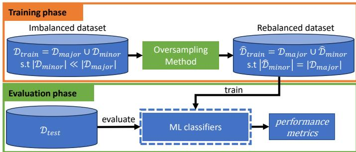  
Figure 1: Training and evaluation phases of an oversampling method. Training: the oversampling method learns from the imbalanced dataset $\mathcal { D } _ { t r a i n }$ to generate synthetic minority samples $\hat { \mathcal { D } } _ { m i n o r }$ to construct the rebalanced dataset $\hat { \mathscr { D } } _ { t r a i n } .$ Evaluation: $\hat { \mathcal { D } } _ { t r a i n }$ is used to train ML classifiers, and the classifiers are evaluated on a held-out test set $\mathcal { D } _ { t e s t }$ to compute performance metrics $( \mathrm { e . g . , b A C C ) }$ . A higher score implies a better oversampling method.

## 3.2 The Proposed Method: SMOTE-VAR

To address the limitations of existing techniques, we propose a novel SMOTE-based oversampling framework, termed SMOTE-VAR.

## 3.2.1 A probabilistic approach to reduce false positives

Given a real minority sample $x _ { i } ,$ the standard SMOTE algorithm [10] generates a synthetic minority sample ${ \hat { x } } _ { i }$ via linear interpolation:

$$
{ \hat { x } } _ { i } = x _ { i } + \lambda \times ( x _ { j } - x _ { i } ) ,\tag{1}
$$

where $x _ { j }$ is a randomly selected neighbor from the k-nearest neighbors from the minority class and $\lambda \in ( 0 , 1 )$ is a random uniform variable.

While computationally eficient, SMOTE is highly susceptible to generating false positive samples. As shown in Figure 2, SMOTE may generate an erroneous synthetic minority sample when the line connecting two real minority samples inadvertently crosses the region of majority samples. This geometric vulnerability occurs because SMOTE implicitly assumes the minority class region is a convex set [13], whereas real-world clinical data distributions are frequently nonconvex.

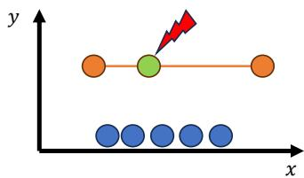  
Figure 2: SMOTE may generate an incorrect synthetic minority sample (green dot) when the connecting line between two real minority samples (orange dots) crosses the region of real majority samples (blue dots).

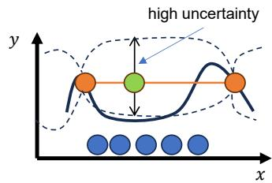  
Figure 3: Our SMOTE-VAR. We generate a synthetic minority sample (green dot) by linearly combining two real minority samples (orange dots). This sample may be incorrect as it lies into the region of real majority samples (blue dots). We compute a variance score for this sample via a GP variance function. Because its variance score is high (high uncertainty), the sample is rejected.

Previous methodologies have attempted to mitigate this by identifying and excluding “distant” neighbors from the interpolation process [15,30]. However, this exclusionary strategy inevitably generates an over-density of synthetic samples immediately surrounding $x _ { i }$ while completely neglecting the latent feature space near the distant neighbor $x _ { j }$

We propose a novel probabilistic strategy, termed SMOTE-VAR, which retains “distant” neighbors during interpolation but rigorously evaluates the validity of the resulting synthetic samples. Standard SMOTE uniformly assigns a hard minority label $( \hat { y } _ { i } = 1 )$ to all generated samples $\hat { x } _ { i } \in \hat { \mathcal { D } } _ { m i n o r }$ without any measure of predictive confidence. We hypothesize 3that by calculating a confidence measure for each assignment, we can systematically reject synthetic samples exhibiting high uncertainty.

To estimate this uncertainty, we leverage the predictive variance of a Gaussian Process (GP) [28,29,33,38] constructed over the spatial manifold of the true minority samples. Because we are solely interested in measuring how well a newly generated sample is supported by the surrounding true minority observations, we do not require the GP to predict class labels. Instead, we compute the posterior variance score ${ v } _ { \hat { x } }$ for every synthetic minority sample $\hat { x } \in \hat { \mathcal { D } } _ { m i n o r } \colon$

$$
v _ { \hat { x } } = \sigma ^ { 2 } ( \hat { x } ) = k ( \hat { x } , \hat { x } ) - \mathbf { k } ^ { \mathrm { T } } \mathbf { K } ^ { - 1 } \mathbf { k } ,\tag{2}
$$

where $\sigma ^ { 2 } ( { \hat { x } } )$ denotes the GP variance function and $k ( \cdot , \cdot )$ is a kernel function. In this framework, we utilize the Radial Basis Function (RBF) kernel [33,38], defined as $k ( x _ { i } , x _ { j } ) = \exp ( - \| x _ { i } - x _ { j } \| ^ { 2 } / 2 \ell ^ { 2 } )$ , where ℓ is the length-scale parameter. The RBF kernel is suited for this task because it assumes spatial smoothness, causing the covariance between points to decay exponentially with their distance. k is a vector with its i-th element defined as $k ( x _ { i } , \hat { x } )$ , and ${ \bf K } \in \mathbb { R } ^ { | \mathcal { D } _ { m i n o r } | \times | \mathcal { D } _ { m i n o r } | }$ represents the covariance matrix of the true minority data, where its $( i , j ) \ – \mathrm { t h }$ element is defined as $k ( x _ { i } , x _ { j } )$

Because the predictive variance $\sigma ^ { 2 } ( { \hat { x } } )$ is derived from the covariance between data points, it serves as an efective proxy for the uncertainty of the SMOTE assignment at xˆ. Uncertainty naturally increases as xˆ moves further away from the $\mathrm { G P ^ { \circ } s }$ training data (the true minority samples). Consequently, we establish a variance threshold ν. If $v _ { \hat { x } } \leq \nu ,$ the synthetic sample is deemed well-supported and retained. If $v _ { \hat { x } } > \nu ,$ the sample resides in a high-uncertainty, unsupported region of the feature space and is discarded because it is likely to be invalid. In practice, ν is set to a small value (e.g., $\nu \in [ 0 . 0 0 1 , 0 . 0 1 ] )$ to aggressively filter false positives while preserving a suficient volume of valid training samples. The sensitivity of the model to ν is empirically evaluated in Section 4.4.3.

The GP is introduced solely as an uncertainty estimator during oversampling. Once the filtered synthetic dataset is constructed, any downstream classifier can be employed, preserving the classifier-agnostic nature of SMOTE-VAR. Its conceptual mechanism is illustrated in Figure 3, and it step-by-step implementation is presented in Algorithm 1.

## 3.2.2 Discussion

Unlike prior distance-based filtering techniques [15, 30], SMOTE-VAR does not aggressively exclude distant neighbors, thereby preventing the generation of over-dense, localized clusters of synthetic data. By probabilistically evaluating the correctness of a synthetic sample based on GP uncertainty, our method successfully spans the interpolation space, generating valid samples near both $x _ { i }$ and $x _ { j }$ . SMOTE-VAR only selectively rejects synthetic instances that land in high-variance, sparsely populated regions far from any true minority data, as shown in Figure 3.

Input: real minority samples $\mathcal { D } _ { m i n o r }$   
Input: synthetic minority samples $\hat { \mathcal { D } } _ { m i n o r }$   
Input: variance threshold ν   
Output: filtered synthetic minority samples $\hat { \mathcal { D } } _ { m i n o r } ^ { * }$   
1 begin   
2 $\hat { \mathcal { D } } _ { m i n o r } ^ { * } = \varnothing$   
3 fit a GP using real minority samples $x _ { i } \in \mathcal { D } _ { m i n o r }$   
4 for each $\hat { x } _ { i } \in \hat { \mathcal { D } } _ { m i n o r }$ do   
5 compute its variance score $\boldsymbol { v } _ { \hat { \boldsymbol { x } } _ { i } }$ with Eq. (2)   
6 if $v _ { \hat { x } _ { i } } \leq \nu$ then   
7 $\hat { \mathcal { D } } _ { m i n o r } ^ { * } = \hat { \mathcal { D } } _ { m i n o r } ^ { * } \cup \{ \hat { x } _ { i } \}$   
8 end   
9 end   
10 end   
Algorithm 1: Our SMOTE-VAR algorithm.

A critical advantage of utilizing GP variance over simple heuristic distance metrics (e.g., Euclidean distance) is its capacity to act as a globally aware, non-parametric uncertainty estimator. Traditional distance-based filtering evaluates synthetic samples in isolation, relying solely on pairwise proximity while fundamentally ignoring the structural topology of the feature space. In contrast, the GP variance score dynamically incorporates local sample density, kernel smoothness, and the complex spatial correlations among all true minority samples. Because the inverse covariance matrix ${ \bf K } ^ { - 1 }$ captures the collective spatial distribution of the minority class, the resulting variance calculation intrinsically maps the underlying non-linear manifold. Consequently, a synthetic sample generated in a sparse, unsupported region will correctly register a critically high variance, whereas a sample generated at the exact same Euclidean distance but within a densely populated, highly correlated region will be validated. This structural awareness ensures that the filtering mechanism adapts to the local geometry of the clinical data, making GP variance a more robust validation measure than rigid, localized distance thresholds.

## 4 Experiments

This section details the empirical evaluation of SMOTE-VAR. We outline the clinical dataset, the preprocessing pipeline, and the experimental configurations, followed by a comprehensive analysis of the predictive performance and ablation studies.

## 4.1 Dataset and Feature Engineering

## 4.1.1 Clinical cohort and pre-processing

The dataset was derived from the Vibe-Up study [17, 26], a clinical trial encompassing university students exhibiting elevated symptoms of psychological distress. Data were collected in the context of an adaptive clinical trial involving 12 sequential mini trials, all run between 2021-2023. From an initial cohort of 1,282 participants, 784 individuals provided concurrent GPS mobility data. Based on [21], scores that fall below the thresholds of 9 for Depression, 7 for Anxiety, and 15 for Stress indicate that an individual is “in remission”. For illustrative purposes, we present some fake examples of the depression dataset and corresponding GPS logs in Table 1.

To ensure spatial data integrity, we applied the following strict filtering protocols [31, 34]: excluding inaccurate GPS coordinates with an accuracy radius exceeding 35 meters, and removing duplicate spatial logs defined by a Haversine distance of less than 500 meters. Participants with fewer than two days of recorded mobility data were also excluded, resulting in a refined analytical cohort of 482 students. The final dataset exhibits a pronounced class imbalance, with 308 students (64%) achieving treatment remission and 174 students (36%) classified as non-remission. Figure 4 displays the distributions of remission labels in our refined dataset.

## 4.1.2 Feature extraction and imputation

The predictive feature space was derived from clinical survey responses, intervention assignments, and continuous GPS mobility logs. To establish robust, aggregate measures of psychological distress, we computed the sum of the 21 individual Depression, Anxiety, and Stress Scales (DASS) items to derive a total baseline score (denoted as DASS\_bl\_total) and a total pre-treatment score (denoted as $D A S S \_ p r e \_ t o t a l )$ . Furthermore, to capture digital behavioral phenotypes, we extracted two daily spatial features from the GPS logs [2, 25, 34]: the number of daily locations visited $\left( n _ { l o c a t i o n } \right)$ and the average daily distance traveled $( d i s t _ { t r a v e l } )$ . For example, as detailed in Table 1(b), student “abcxyz12” registered $n _ { l o c a t i o n } = 2$ and $d i s t _ { t r a v e l } = 4 . 0 1$ on $1 5 / 1 1 / 2 0 2 1$

Table 1: Some illustrative examples of our dataset. Table (a) shows two students along with their DASS scores, treatment types, and treatment outcomes $( \mathrm { i . e . , }$ , labels). Each student has a unique ID. Table (b) shows their visited locations (in terms of latitude and longitude). Each location is associated with a timestamp.  
(a) Students with DASS scores, treatment types, and labels. “DASS\_bl” and “DASS\_ $\mathrm { \ p r e } ^ { \prime \prime }$ stand for DASS baseline and DASS pre-treatment.
<table><tr><td rowspan=1 colspan=1>Student</td><td rowspan=1 colspan=1>DASS bl1</td><td rowspan=1 colspan=1> $\cdots$ </td><td rowspan=1 colspan=1>DASSbl21</td><td rowspan=1 colspan=1>DASS pre1</td><td rowspan=1 colspan=1> $\cdots$ </td><td rowspan=1 colspan=1>DASS pre21</td><td rowspan=1 colspan=1>Treatment</td><td rowspan=1 colspan=1>Outcome</td></tr><tr><td rowspan=1 colspan=1>abcxyz12</td><td rowspan=1 colspan=1>1</td><td rowspan=1 colspan=1>…</td><td rowspan=1 colspan=1>0</td><td rowspan=1 colspan=1>2</td><td rowspan=1 colspan=1>…</td><td rowspan=1 colspan=1>3</td><td rowspan=1 colspan=1>mindfulness</td><td rowspan=1 colspan=1>remission</td></tr><tr><td rowspan=1 colspan=1>12abc456</td><td rowspan=1 colspan=1>2</td><td rowspan=1 colspan=1>…</td><td rowspan=1 colspan=1>1</td><td rowspan=1 colspan=1>3</td><td rowspan=1 colspan=1>…</td><td rowspan=1 colspan=1>1</td><td rowspan=1 colspan=1>physical activity</td><td rowspan=1 colspan=1>non-remission</td></tr></table>

(b) Students with GPS locations.
<table><tr><td rowspan=1 colspan=1>Student</td><td rowspan=1 colspan=1>Timestamp</td><td rowspan=1 colspan=1>Latitude</td><td rowspan=1 colspan=1>Longitude</td></tr><tr><td rowspan=1 colspan=1>abcxyz12</td><td rowspan=1 colspan=1>15/11/202107:35:00</td><td rowspan=1 colspan=1>-30.8036</td><td rowspan=1 colspan=1>118.5869</td></tr><tr><td rowspan=1 colspan=1>abcxyz12</td><td rowspan=1 colspan=1>15/11/2021 07:55:05</td><td rowspan=1 colspan=1>-30.8879</td><td rowspan=1 colspan=1>118.5271</td></tr><tr><td rowspan=1 colspan=1>abcxyz12</td><td rowspan=1 colspan=1>16/11/2021 08:36:39</td><td rowspan=1 colspan=1>-30.9712</td><td rowspan=1 colspan=1>118.6020</td></tr><tr><td rowspan=1 colspan=1>12abc456</td><td rowspan=1 colspan=1>19/11/2021 16:11:31</td><td rowspan=1 colspan=1>-17.4219</td><td rowspan=1 colspan=1>142.9478</td></tr></table>

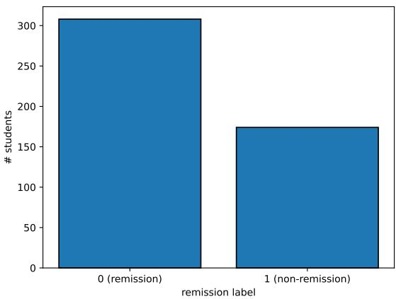  
Figure 4: Class distribution of the refined dataset. Among 482 students, 64% of them are “in remission” and 36% are “non-remission”.

Because the temporal length of mobility data varied significantly across participants–as visualized in the divergent mobility patterns of two students in Figure 5–we applied linear imputation [20] to standardize the spatial feature trajec tories to a uniform 15-day observation window, ensuring consistent mathematical dimensionality across all samples for subsequent model training.

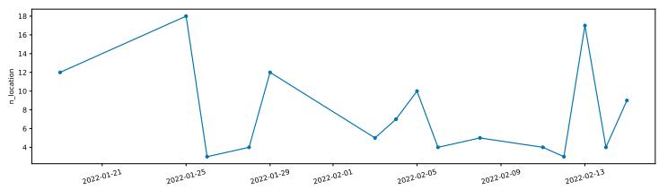  
(a)

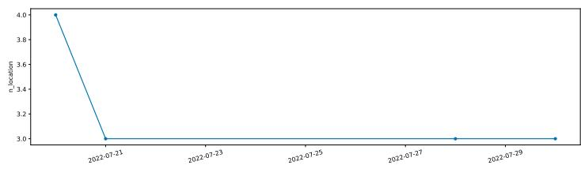  
(b)  
Figure 5: For an illustrative purpose, we show illustrative mobility patterns of two students. The x-axis shows the date while the y-axis shows the number of visited locations in one day.

## 4.2 Experimental Settings

## 4.2.1 Baselines and model configurations

We benchmarked SMOTE-VAR against a robust suite of 10 methodologies: standard non-oversampling (Imbalance), traditional interpolation methods (SMOTE [10], SMOTE-NC [13], AdaSyn [16], and several SMOTE variants [3,4,15,30]), deep generative models (CTGAN [46] and TVAE [7, 46]), and Large Language Model-based generation (ImbLLM [27]). For our proposed SMOTE-VAR framework, the variance threshold was established at ν = 0.001.

## 4.2.2 Classifiers and validation strategy

Following previous works [5, 8, 9, 42, 48], the rebalanced datasets were utilized to train five standard machine learning classifiers: k-Nearest Neighbors (kNN), Support Vector Machine (SVM), Decision Tree (DT), Random Forest (RF), and XGBoost (XGB). We tuned their hyper-parameters (detailed in Table 2) using five-fold cross-validation on the training sets. To rigorously evaluate generalization, the dataset was subjected to a randomized 90/10 train-test split, repeated across ten independent random seeds. Model performance is reported as the average Balanced Accuracy (bACC) alongside its standard deviation. Balanced Accuracy (bACC) is defined as: $\begin{array} { r } { \mathrm { b A C C } = \frac { \mathrm { S e n s i t i v i t y } + \mathrm { S p e c i f i c i t y } } { 2 } } \end{array}$ , where bACC ∈ [0, 1] and higher score is better. We also report other performance metrics such as F1-score, Area Under the Curve (AUC) score, Sensitivity, Specificity, and Receiver Operating Characteristic (ROC) curve.

Table 2: Hyper-parameters of ML classifiers to predict treatment remission.
<table><tr><td rowspan=1 colspan=1>Classifier</td><td rowspan=1 colspan=1>Hyper-parameters</td></tr><tr><td rowspan=1 colspan=1>kNN</td><td rowspan=1 colspan=1>n_neighbors: {1, 2, ..., 10}</td></tr><tr><td rowspan=1 colspan=1>SVM</td><td rowspan=1 colspan=1>kernel: {linear, rbf}gamma: {0.1, 0.5, 1.0}C: {0.1, 0.5, 1.0, 10.0}</td></tr><tr><td rowspan=1 colspan=1>DT</td><td rowspan=1 colspan=1>max_ depth: {1, 2, .., 12}</td></tr><tr><td rowspan=1 colspan=1>RF</td><td rowspan=1 colspan=1>n_ estimators: {1, 10, 50, 100}max_ depth: {1, 2, ..., 12}max_features: {sqrt, log2, None}</td></tr><tr><td rowspan=1 colspan=1>XGB</td><td rowspan=1 colspan=1>n_ estimators: {1, 10, 50, 100}max_ depth: {1, 2, ..., 12}max_features: {sqrt, log2, None}</td></tr></table>

## 4.3 Results and Discussions

Table 3 reports bACC of each oversampling method combined with five ML classifiers.

Table 3: bACC ± (standard deviation) of each oversampling method combined with five popular ML classifiers. Bold and underline indicate the best and second-best methods.
<table><tr><td>bACC</td><td>Imbalance</td><td>AdaSyn</td><td>SMOTE</td><td>SMOTE-NC</td><td>CTGAN</td><td>TVAE</td><td>ImbLLM</td><td>SMOTE-VAR</td></tr><tr><td>kNN</td><td>0.66 (0.02)</td><td>0.65 (0.02)</td><td>0.68 (0.02)</td><td>0.68 (0.01)</td><td>0.66 (0.02)</td><td>0.67 (0.02)</td><td>0.66 (0.02)</td><td>0.67 (0.01)</td></tr><tr><td>SVM</td><td>0.51 (0.00)</td><td>0.73 (0.02)</td><td>0.72 (0.02)</td><td>0.73 (0.02)</td><td>0.66 (0.02)</td><td>0.73 (0.02)</td><td>0.73 (0.02)</td><td>0.73 (0.02)</td></tr><tr><td>DT</td><td>0.62 (0.02)</td><td>0.59 (0.03)</td><td>0.62 (0.02)</td><td>0.61 (0.03)</td><td>0.59 (0.01)</td><td>0.62 (0.02)</td><td>0.64 (0.02)</td><td>0.65 (0.02)</td></tr><tr><td>RF</td><td>0.61 (0.02)</td><td>0.60 (0.03)</td><td>0.61 (0.02)</td><td>0.60 (0.03)</td><td>0.60 (0.01)</td><td>0.63 (0.02)</td><td>0.63 (0.02)</td><td>0.65 (0.02)</td></tr><tr><td>XGB</td><td>0.59 (0.01)</td><td>0.58 (0.03)</td><td>0.62 (0.01)</td><td>0.59 (0.02)</td><td>0.59 (0.01)</td><td>0.63 (0.02)</td><td>0.60 (0.02)</td><td>0.65 (0.02)</td></tr><tr><td>Average</td><td>0.60</td><td>0.63</td><td>0.65</td><td>0.64</td><td>0.62</td><td>0.66</td><td>0.65</td><td>0.67</td></tr></table>

Our method SMOTE-VAR consistently achieved the highest average balanced accuracy. Across five ML classifiers, it was best performing with four classifiers and second-best with another classifier. Its average improvement over TVAE (the runner-up method) was 1% and SMOTE (the most popular baseline) was 2%. More importantly, it yielded a substantial 7% improvement over Imbalance (the method without oversampling). Although SMOTE-VAR achieved the highest average balanced accuracy across the evaluated classifiers, paired Wilcoxon statistical tests against the strongest baselines (TVAE and SMOTE) did not reveal statistically significant diferences $( p > 0 . 0 5 )$ . This is likely attributable to the relatively small performance gap (approximately 1-2%) and the limited number of repeated random splits.

All oversampling methods were much better than Imbalance. Interestingly, traditional interpolation methods (e.g., AdaSyn, SMOTE, and SMOTE-NC) demonstrated superior eficacy compared to the highly complex CTGAN model TVAE and ImbLLM served as the closest competitors, while SMOTE-VAR achieved the highest average balanced accuracy. Notably, the SVM classifier paired with SMOTE-VAR achieved a bACC of 0.73, representing a 22% improvement over standard classifiers trained on imbalanced data. In summary, our method SMOTE-VAR achieved the highest average performance, maintaining consistency across multiple ML classifiers. Because SVM was the most efective classifier, it is the default classifier for our following experiments.

Comparison with SMOTE variants. Because our method is based on SMOTE, we also compared it with SMOTE variants, including SMOTE-BL [15], SMOTE-ENN [4], SMOTE-SVM [30], and SMOTE-Tomek [3]. Figure 6 shows that SMOTE-VAR maintained the highest overall predictive performance while SMOTE-NC was the second-best method. Other SMOTE-based methods, except SMOTE-ENN, behaved similarly.

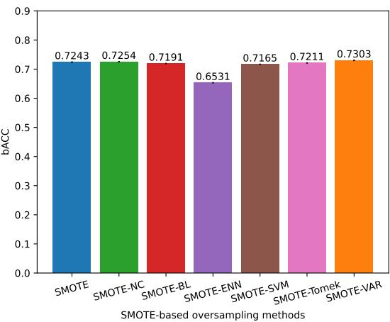  
Figure 6: bACC of our method SMOTE-VAR and other SMOTE variants.

## 4.4 Ablation studies

To unpack the mechanics of SMOTE-VAR, we conducted targeted ablation studies analyzing temporal robustness, variance threshold sensitivity, and feature importance.

## 4.4.1 Temporal robustness

As presented in Figure 7, variations in the imputed observation window (ranging from 2 to 30 days) yielded negligible fluctuations in predictive accuracy, with bACC scores remaining robustly above 0.72.

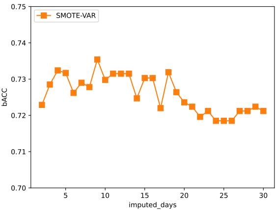  
Figure 7: bACC vs. the number of imputed days.

## 4.4.2 Imputation method

Table 4 shows our performance with diferent imputation methods, highlighting that “linear” and “s-linear” functions achieved the highest eficacy. Other imputation methods also performed well.

Table 4: bACC vs. imputation methods.
<table><tr><td rowspan=1 colspan=1>Imputation method</td><td rowspan=1 colspan=1>bACC</td></tr><tr><td rowspan=1 colspan=1>linear</td><td rowspan=1 colspan=1>0.7303 (0.02)</td></tr><tr><td rowspan=1 colspan=1>nearest</td><td rowspan=1 colspan=1>0.7231 (0.02)</td></tr><tr><td rowspan=1 colspan=1>nearest-up</td><td rowspan=1 colspan=1>0.7204 (0.02)</td></tr><tr><td rowspan=1 colspan=1>zero</td><td rowspan=1 colspan=1>0.7266(0.02)</td></tr><tr><td rowspan=1 colspan=1>s-linear</td><td rowspan=1 colspan=1>0.7303 (0.02)</td></tr><tr><td rowspan=1 colspan=1>previous</td><td rowspan=1 colspan=1>0.7266 (0.02)</td></tr><tr><td rowspan=1 colspan=1>next</td><td rowspan=1 colspan=1>0.7215 (0.02)</td></tr></table>

## 4.4.3 Impact of variance threshold

Modulating the variance threshold ν highlighted the critical balance between sample retention and false-positive rejection. We present our bACC scores across diferent thresholds ν in Figure 8. Optimal performance was observed within the tight threshold bounds of $\nu \in [ 0 . 0 0 1 , 0 . 0 1 ]$ . Thresholds exceeding 0.05 diminished bACC scores by permitting the inclusion of false positives, while overly restrictive thresholds $( \nu < 0 . 0 0 0 5 )$ indiscriminately discarded valid synthetic samples, resulting in insuficient training volume.

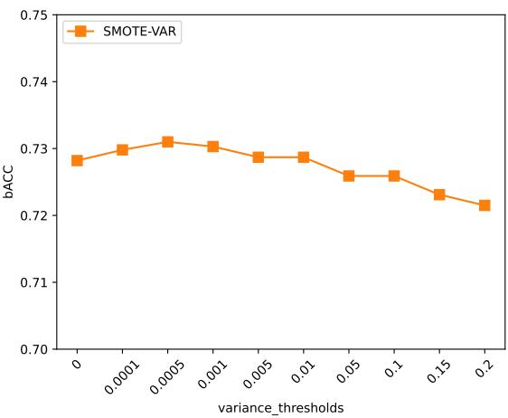  
Figure 8: bACC vs. variance threshold $\nu .$

## 4.4.4 Feature importance

To determine predictive drivers, we documented the bACC drops when systematically removing features in Figure 9. The results indicated that subjective clinical assessments–specifically DASS pre-treatment and baseline scores–are the primary drivers of model accuracy. The systematic removal of these feature domains precipitated bACC reductions of approximately 5% to 6%. Conversely, the exclusion of GPS mobility features resulted in a marginal 2% decline in the overall bACC score. This suggests that while digital phenotyping via spatial behavior provides supplementary predictive value, direct clinical symptomatology remains paramount for forecasting depression remission.

Following [24], we further present the calculated importance score of each individual feature. We expect that removing an important feature should have a significant change in the classifier predictions whereas the absence of an unimportant feature should have little efect. Given a test set $\bar { \mathcal { D } _ { t e s t } } = \{ x _ { j } \} _ { j = 1 } ^ { N ^ { \prime } }$ , let $f ( x _ { j } )$ and $f _ { i } ( x _ { j } )$ be the predictions of the original classifier (i.e., using all features) and the modified classifier (i.e., removing one feature $X _ { i } )$

The importance score of a feature $X _ { i }$ is computed as:

$$
s _ { X _ { i } } = \frac { \frac { 1 } { N ^ { \prime } } \sum _ { j = 1 } ^ { N ^ { \prime } } \mid f ( x _ { j } ) - f _ { i } ( x _ { j } ) \mid } { \frac { 1 } { N ^ { \prime } } \sum _ { j = 1 } ^ { N ^ { \prime } } \mid f ( x _ { j } ) - \mu _ { f } \mid } ,\tag{3}
$$

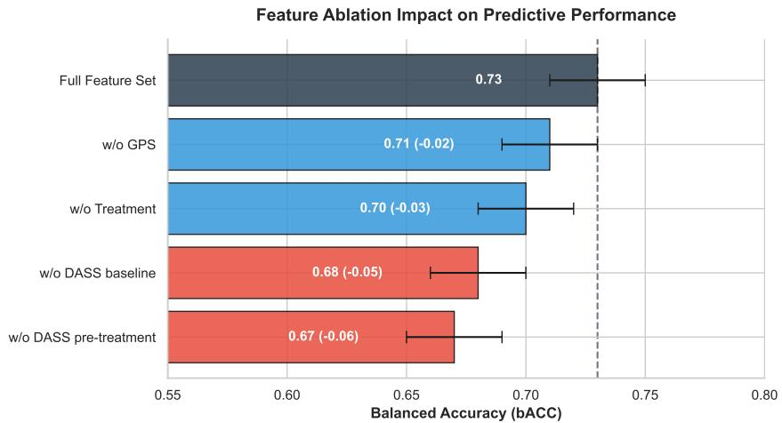  
Figure 9: bACC vs. features.

where $N ^ { \prime }$ is the number of samples in the test set $\mathcal { D } _ { t e s t }$ and $\begin{array} { r } { \mu _ { f } = \frac { 1 } { N ^ { \prime } } \sum _ { j = 1 } ^ { N ^ { \prime } } f ( x _ { j } ) } \end{array}$ is the mean value of the predictions of the original classifier. Since the importance score indicates the deviation from the original predictions, a higher value for $s _ { X _ { i } }$ means the feature $X _ { i }$ is more important.

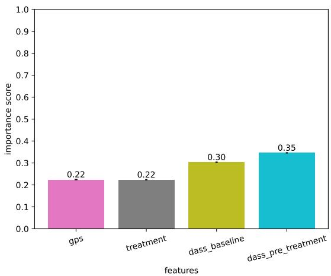  
Figure 10: Feature importance. A higher score indicates a more important feature.

From Figure 10, DASS pre-treatment has the highest score, indicating it is the most important feature, following by DASS baseline. These results also agree with the results in Figure 9.

## 4.4.5 Other performance metrics

To provide a comprehensive evaluation of the predictive stability and clinical utility of SMOTE-VAR, we further present its performance across multiple metrics in Figures 11 and 12.

As detailed in Figure 11, the SVM classifier paired with SMOTE-VAR achieved a mean AUC of 0.74 and a mean F1-score of 0.66 across the 10 independent test runs. Most notably, the model demonstrated a mean Specificity of 0.82 and a mean Sensitivity of 0.64. In the context of this study, where non-remission is designated as the positive minority class, this high specificity indicates that the model is highly reliable at correctly identifying patients who will successfully achieve remission (true negatives). Simultaneously, the sensitivity of 64% demonstrates a robust ability to flag the harder to-predict non-remitters. From a clinical informatics perspective, this balance is highly practical: it minimizes false alarms for patients on track to recover, while successfully catching the majority of at-risk students who may require rapid escalation to adjunctive therapies.

Figure 12 visualizes the Receiver Operating Characteristic (ROC) curves for each individual run, alongside the aggregated mean ROC curve. The tight clustering of the individual curves around the mean–reflected by the narrow standard deviation of the AUC (0.74±0.04)–highlights the stability and generalization capability of the SMOTE-VAR framework. This consistency across random data splits further validates our hypothesis: by probabilistically filtering out high-variance synthetic samples, SMOTE-VAR efectively stabilizes the decision boundary and prevents the classifier from overfitting to the noisy interpolation artifacts common in standard oversampling techniques.

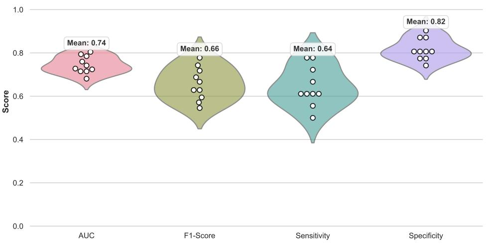  
Figure 11: AUC, F1-score, Sensitivity, and Specificity of SMOTE-VAR across 10 runs.

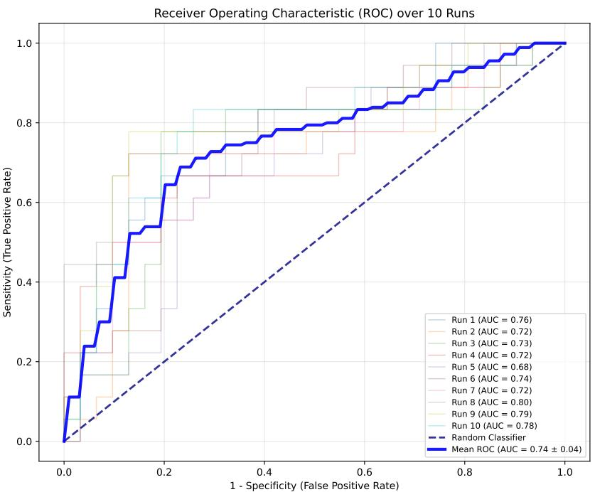  
Figure 12: Receiver Operating Characteristic (ROC) of SMOTE-VAR over 10 runs.

## 5 Conclusion

In this study, we demonstrate that the integration of clinical survey data and GPS location patterns can efectively predict treatment remission in depressive students. This predictive capability ofers valuable insights for the development of targeted, early-stage mental health interventions. Departing from previous approaches, we introduce a novel and efective oversampling technique to rebalance imbalanced training datasets in machine learning-based remission prediction. Our method incorporates a crucial probabilistic component into standard SMOTE, assigning an uncertainty score to each synthetic minority sample to systematically reduce false positives. We verify the efectiveness of our approach on a realworld depression dataset collected from Australian students, where it consistently achieved the highest average predictive performance among the evaluated oversampling methods.

## 6 Limitations and Future Directions

While this study demonstrates the eficacy of SMOTE-VAR in predicting treatment remission, several methodological and clinical limitations should be noted to guide future research.

First, from a methodological perspective, scaling the SMOTE-VAR framework to highly complex datasets presents computational challenges. Standard Gaussian Process covariance functions are susceptible to the curse of dimensionality, losing discriminatory power when applied to highly dimensional data. Furthermore, exact GP inference scales at $O ( N ^ { 3 } )$ , which can introduce computational bottlenecks when the minority class is exceptionally large. Future iterations of this framework should integrate Deep Kernel Learning (DKL) [44] to project high-dimensional inputs into a lower-dimensional latent space, and substitute exact GPs with Sparse Gaussian Processes [41] utilizing pseudo-inputs to reduce computational complexity to $O ( N M ^ { 2 } )$ . Additionally, incorporating Automatic Relevance Determination (ARD) [45] will better equip the model to handle the heterogeneous mix of continuous and categorical variables native to clinical data.

Second, regarding the clinical study design, the primary outcome of remission was assessed straight after a brief, 2- week digital mental health intervention. In standard psychiatric literature, the full clinical benefits of lifestyle interventions, such as physical activity and mindfulness, typically manifest over a longer duration, often between 12 to 16 weeks. Evaluating outcomes after a 2-week intervention may primarily capture early remitters rather than long-term remission, potentially contributing to the high prevalence of the non-remission class in our dataset. Future studies should evaluate the predictive performance of SMOTE-VAR over extended longitudinal follow-ups to capture a more complete picture of treatment eficacy.

Finally, regarding data processing, our feature importance analysis revealed that GPS mobility data contributed marginally to the model’s predictive power, resulting in only a 2% decrease in the balanced accuracy (bACC) score when removed. This may be partially attributed to the method used for handling missing time-series data. We utilized linear imputation to estimate missing values for the number of visited locations and distance traveled. Because depression often presents with sudden behavioral anomalies–such as abrupt social withdrawal or periods of prolonged immobility–linear imputation may have inadvertently smoothed out these critical, non-linear behavioral spikes. Future research utilizing digital phenotyping should explore non-linear or behaviorally-aware imputation techniques to better preserve the natural variance and anomalies inherent in psychiatric mobility data

## 7 Declarations

## Ethical Approval

This study was approved by the University of New South Wales Human Research Ethics Committee (Approval No: HC200466). “Informed consent” was obtained from all the participants and all methods were carried out in accordance with relevant guidelines and regulations.

## Funding

This work was funded in part by a grant from the UK Wellcome Trust (grant number: 303030/Z/23/Z).

## Availability of data and materials

To request access to de-identified data, please contact Professor Jill Newby, via j.newby@unsw.edu.au.

## Acknowledgment

The Vibe Up Trial, from which the data analysed in this study were obtained, was funded by the Medical Research Future Fund [MRFAI000028]. The current research was partially supported by the Wellcome Trust [303030/Z/23/Z]. AW was funded by a National Health and Medical Research Council Investigator Grant [2017521].

## References

[1] Abdullah Alanazi. Using machine learning for healthcare challenges and opportunities. Informatics in Medicine Unlocked, 30:100924, 2022.

[2] Ian Barnett, John Torous, Patrick Staples, Luis Sandoval, Matcheri Keshavan, and Jukka-Pekka Onnela. Relapse prediction in schizophrenia through digital phenotyping: a pilot study. Neuropsychopharmacology, 43(8):1660–1666, 2018.

[3] Gustavo Batista, Ana Bazzan, Maria Carolina Monard, et al. Balancing training data for automated annotation of keywords: a case study. WoB, 3:10–8, 2003.

[4] Gustavo Batista, Ronaldo Prati, and Maria Carolina Monard. A study of the behavior of several methods for balancing machine learning training data. ACM SIGKDD Explorations Newsletter, 6(1):20–29, 2004.

[5] James Benoit, Serdar Dursun, Russell Greiner, Bo Cao, Matthew Brown, Raymond Lam, and Andrew Greenshaw. Using machine learning to predict remission in patients with major depressive disorder treated with desvenlafaxine. The Canadian Journal of Psychiatry, 67(1):39–47, 2022.

[6] James Blumenthal, Michael Babyak, Kathleen Moore, Edward Craighead, Steve Herman, Parinda Khatri, Robert Waugh, Melissa Napolitano, Leslie Forman, Mark Appelbaum, et al. Efects of exercise training on older patients with major depression. JAMA Internal Medicine, 159(19):2349–2356, 1999.

[7] Vadim Borisov, Tobias Leemann, Kathrin Seßler, Johannes Haug, Martin Pawelczyk, and Gjergji Kasneci. Deep neural networks and tabular data: A survey. IEEE Transactions on Neural Networks and Learning Systems, 35(6):7499–7519, 2022.

[8] Adam Calderon, Nur Hani Zainal, Chenyang Lu, Ellen Fitzsimmons-Craft, Denise Wilfley, Daniel Eisenberg, Barr Taylor, and Michelle Newman. Baseline machine learning prediction of 2-year remission from anxiety, depression, and eating disorders among college students after population-based guided self-help: A secondary analysis of a randomized controlled trial. OSF.

[9] Ewan Carr, Marcella Rietschel, Ole Mors, Neven Henigsberg, Katherine Aitchison, Wolfgang Maier, Rudolf Uher, Anne Farmer, Peter Mcgufin, and Raquel Iniesta. Optimizing the prediction of depression remission: a longitudina machine learning approach. American Journal of Medical Genetics Part B: Neuropsychiatric Genetics, 198(3):e33014, 2025.

[10] Nitesh Chawla, Kevin Bowyer, Lawrence Hall, and Philip Kegelmeyer. SMOTE: synthetic minority over-sampling technique. Journal of Artificial Intelligence Research, 16:321–357, 2002.

[11] Joshua Curtiss, Jordan Smoller, and Paola Pedrelli. Optimizing precision medicine for second-step depression treatment: A machine learning approach. Psychological Medicine, 54(10):2361–2368, 2024.

[12] Stuart Eisendrath, Erin Gillung, Kevin Delucchi, Zindel Segal, Craig Nelson, Alison McInnes, Daniel Mathalon, and Mitchell Feldman. A randomized controlled trial of mindfulness-based cognitive therapy for treatment-resistant depression. Psychotherapy and Psychosomatics, 85(2):99–110, 2016.

[13] Alberto Fernández, Salvador Garcia, Francisco Herrera, and Nitesh Chawla. SMOTE for learning from imbalanced data: progress and challenges, marking the 15-year anniversary. Journal of Artificial Intelligence Research, 61:863– 905, 2018.

[14] Hafsa Habehh and Suril Gohel. Machine learning in healthcare. Current Genomics, 22(4):291–300, 2021.

[15] Hui Han, Wen-Yuan Wang, and Bing-Huan Mao. Borderline-SMOTE: a new over-sampling method in imbalanced data sets learning. In International Conference on Intelligent Computing, pages 878–887. Springer, 2005.

[16] Haibo He, Yang Bai, Edwardo Garcia, and Shutao Li. ADASYN: Adaptive synthetic sampling approach for imbalanced learning. In IEEE International Joint Conference on Neural Networks (IJCNN), pages 1322–1328. IEEE, 2008.

[17] Kit Huckvale, Leonard Hoon, Eileen Stech, Jill Newby, Wu Yi Zheng, Jin Han, Rajesh Vasa, Sunil Gupta, Scott Barnett, Manisha Senadeera, et al. Protocol for a bandit-based response adaptive trial to evaluate the efectiveness of brief self-guided digital interventions for reducing psychological distress in university students: the Vibe Up study. BMJ Open, 13(4):e066249, 2023.

[18] Niels Jongs, Raj Jagesar, Neeltje van Haren, Brenda Penninx, Lianne Reus, Pieter Visser, Nic van der Wee, Ina Koning, Celso Arango, Iris Sommer, et al. A framework for assessing neuropsychiatric phenotypes by using smartphonebased location data. Translational Psychiatry, 10(1):211, 2020.

[19] Alexander Kautzky, Hans-Juergen Möller, Markus Dold, Lucie Bartova, Florian Seemüller, Gerd Laux, Michael Riedel, Wolfgang Gaebel, and Siegfried Kasper. Combining machine learning algorithms for prediction of antidepressant treatment response. Acta Psychiatrica Scandinavica, 143(1):36–49, 2021.

[20] Maksims Kazijevs and Manar Samad. Deep imputation of missing values in time series health data: A review with benchmarking. Journal of Biomedical Informatics, 144:104440, 2023.

[21] Sydney Lovibond. Manual for the depression anxiety stress scales. Sydney Psychology Foundation, 1995.

[22] Sam Manger. Lifestyle interventions for mental health. Australian Journal of General Practice, 48(10):670–673, 2019.

[23] Giovanna Menardi and Nicola Torelli. Training and assessing classification rules with imbalanced data. Data Mining and Knowledge Discovery, 28(1):92–122, 2014.

[24] Benjamin Misiuk, Yan Liang Tan, Michael Li, Thomas Trappenberg, Ahmadreza Alleosfour, Ian Church, Vicki Ferrini, and Craig Brown. Multivariate mapping of seabed grain size parameters in the Bay of Fundy using convolutional neural networks. Marine Geology, 472:107299, 2024.

[25] Sandrine Müller, Xi Chen, Heinrich Peters, Augustin Chaintreau, and Sandra Matz. Depression predictions from GPSbased mobility do not generalize well to large demographically heterogeneous samples. Scientific Reports, 11(1):14007, 2021.

[26] Jill Newby, Sunil Gupta, Leonard Hoon, WuYi Zheng, Alexis Whitton, Kit Huckvale, Eileen Stech, Andrew Mackin non, Manisha Senadeera, Artur Shvetcov, et al. Brief Digital Interventions for Psychological Distress: An AI-Enhanced Response-Adaptive Randomized Clinical Trial. JAMA Network Open, 8(10):e2540502–e2540502, 2025.

[27] Dang Nguyen, Sunil Gupta, Kien Do, Thin Nguyen, Taylor Braund, Alexis Whitton, and Svetha Venkatesh. Large language models for imbalanced classification: Diversity makes the diference. arXiv preprint arXiv:2510.09783, 2025.

[28] Dang Nguyen, Sunil Gupta, Santu Rana, Alistair Shilton, and Svetha Venkatesh. Bayesian optimization for categorical and category-specific continuous inputs. In AAAI Conference on Artificial Intelligence (AAAI), volume 34, pages 5256–5263, 2020.

[29] Dang Nguyen, Sunil Gupta, Santu Rana, Alistair Shilton, and Svetha Venkatesh. Fairness Improvement for Black-box Classifiers with Gaussian Process. Information Sciences, 576:542–556, 2021.

[30] Hien Nguyen, Eric Cooper, and Katsuari Kamei. Borderline over-sampling for imbalanced data classification. International Journal of Knowledge Engineering and Soft Data Paradigms, 3(1):4–21, 2011.

[31] Niclas Palmius, Athanasios Tsanas, Kate EA Saunders, Amy C Bilderbeck, John R Geddes, Guy M Goodwin, and Maarten De Vos. Detecting bipolar depression from geographic location data. IEEE Transactions on Biomedical Engineering, 64(8):1761–1771, 2016.

[32] Jin-Hyun Park, Hee-Ju Kang, Ji Hyeon Jeon, Sung-Gil Kang, Ju-Wan Kim, Jae-Min Kim, and Hwamin Lee. Prediction of 12-week remission in patients with depressive disorder using reasoning-based large language models: Model development and validation study. JMIR Mental Health, 13(1):e83352, 2026.

[33] Carl Rasmussen. Gaussian processes in machine learning. In Summer School on Machine Learning, pages 63–71, 2003.

[34] Ian Raugh, Sydney James, Cristina Gonzalez, Hannah Chapman, Alex Cohen, Brian Kirkpatrick, and Gregory Strauss. Geolocation as a digital phenotyping measure of negative symptoms and functional outcome. Schizophrenia Bulletin, 46(6):1596–1607, 2020.

[35] John Rush, Madhukar Trivedi, Stephen Wisniewski, Andrew Nierenberg, Jonathan Stewart, Diane Warden, George Niederehe, Michael Thase, Philip Lavori, Barry Lebowitz, et al. Acute and longer-term outcomes in depressed outpatients requiring one or several treatment steps: a STAR\* D report. American Journal of Psychiatry, 163(11):1905– 1917, 2006.

[36] Fatih Sağlam and Mehmet Ali Cengiz. A novel SMOTE-based resampling technique trough noise detection and the boosting procedure. Expert Systems with Applications, 200:117023, 2022.

[37] Anna Schwan. Perceptions of student motivation and amotivation. The Clearing House: A Journal of Educational Strategies, Issues and Ideas, 94(2):76–82, 2021.

[38] Bobak Shahriari, Kevin Swersky, Ziyu Wang, Ryan Adams, and Nando Freitas. Taking the human out of the loop: A review of bayesian optimization. Proceedings of the IEEE, 104(1):148–175, 2016.

[39] Md Shamshuzzoha, Tazkia Tasnim Bahar Audry, Md Jahangir Alam, Zaheed Ahmed Bhuiyan, Md Motaharul Islam, and Mohammad Mehedi Hassan. A novel framework for seasonal afective disorder detection: Comprehensive machine learning analysis using multimodal social media data and SMOTE. Acta Psychologica, 256:105005, 2025.

[40] Artur Shvetcov, Joost Funke Kupper, Wu-Yi Zheng, Aimy Slade, Jin Han, Alexis Whitton, Michael Spoelma, Leonard Hoon, Kon Mouzakis, Rajesh Vasa, et al. Passive sensing data predicts stress in university students: a supervised machine learning method for digital phenotyping. Frontiers in Psychiatry, 15:1422027, 2024.

[41] Edward Snelson and Zoubin Ghahramani. Sparse Gaussian processes using pseudo-inputs. In NeurIPS, volume 18, 2005.

[42] Junying Wang, David Wu, Christine DeLorenzo, and Jie Yang. Examining factors related to low performance of predicting remission in participants with major depressive disorder using neuroimaging data and other clinical features. Plos One, 19(3):e0299625, 2024.

[43] Alexis Whitton, Poornima Kumar, Michael Treadway, Ashleigh Rutherford, Manon Ironside, Dan Foti, Garrett Fitzmaurice, Fei Du, and Diego Pizzagalli. Distinct profiles of anhedonia and reward processing and their prospective associations with quality of life among individuals with mood disorders. Molecular Psychiatry, 28(12):5272–5281, 2023.

[44] Andrew Gordon Wilson, Zhiting Hu, Ruslan Salakhutdinov, and Eric Xing. Deep kernel learning. In AISTAT, pages 370–378, 2016.

[45] David Wipf and Srikantan Nagarajan. A new view of automatic relevance determination. In NeurIPS, volume 20, 2007.

[46] Lei Xu, Maria Skoularidou, Alfredo Cuesta-Infante, and Kalyan Veeramachaneni. Modeling tabular data using Conditional GAN. In Advances in Neural Information Processing Systems (NeurIPS), volume 32, 2019.

[47] June Yong Yang, Geondo Park, Joowon Kim, Hyeongwon Jang, and Eunho Yang. Language-interfaced tabular oversampling via progressive imputation and self-authentication. In ICLR, 2024.

[48] Shuzhe Zhou, Qinhong Ma, Yiwei Lou, Xiaozhen Lv, Hongjun Tian, Jing Wei, Kerang Zhang, Gang Zhu, Qiaoling Chen, Tianmei Si, et al. Machine learning to predict clinical remission in depressed patients after acute phase selective serotonin reuptake inhibitor treatment. Journal of Afective Disorders, 287:372–379, 2021.