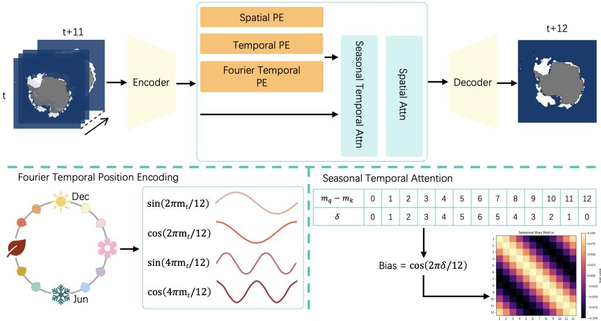
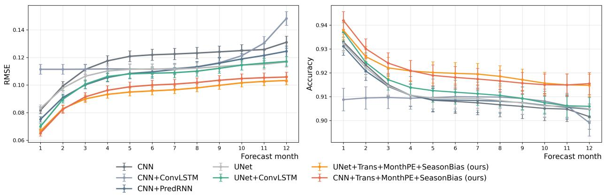
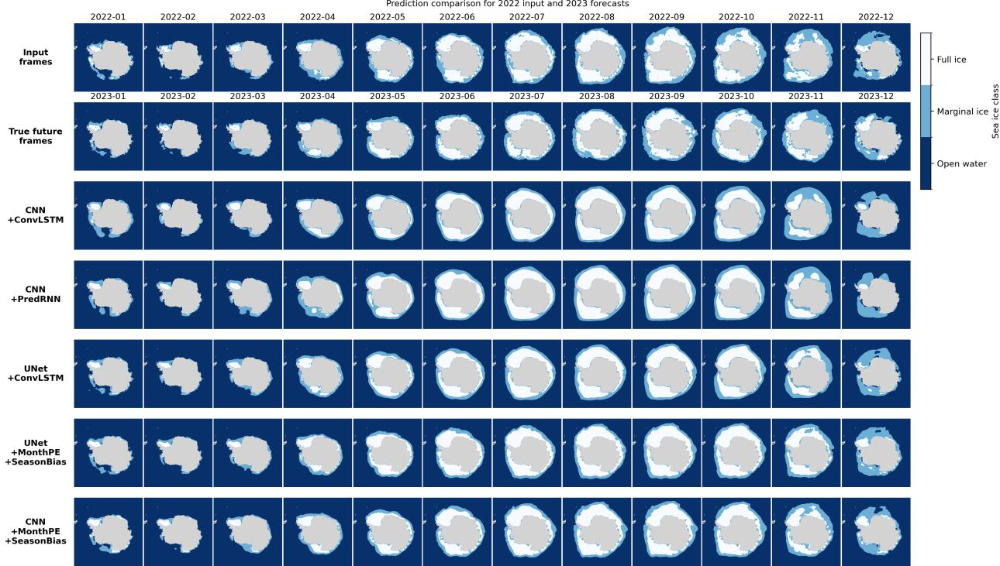
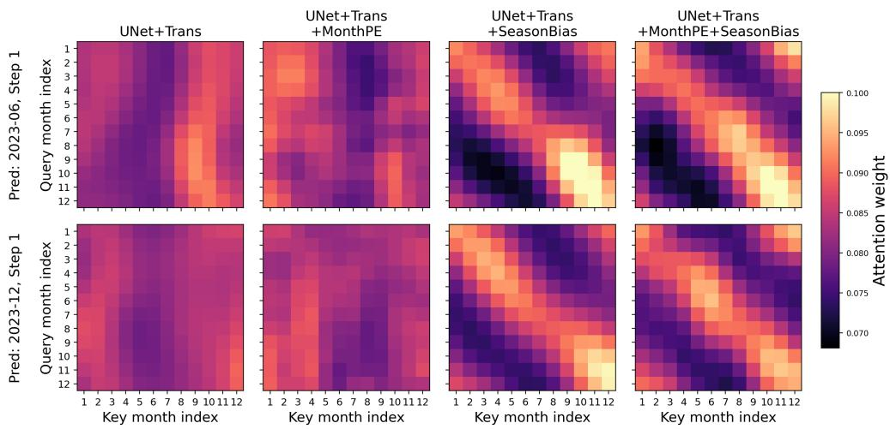
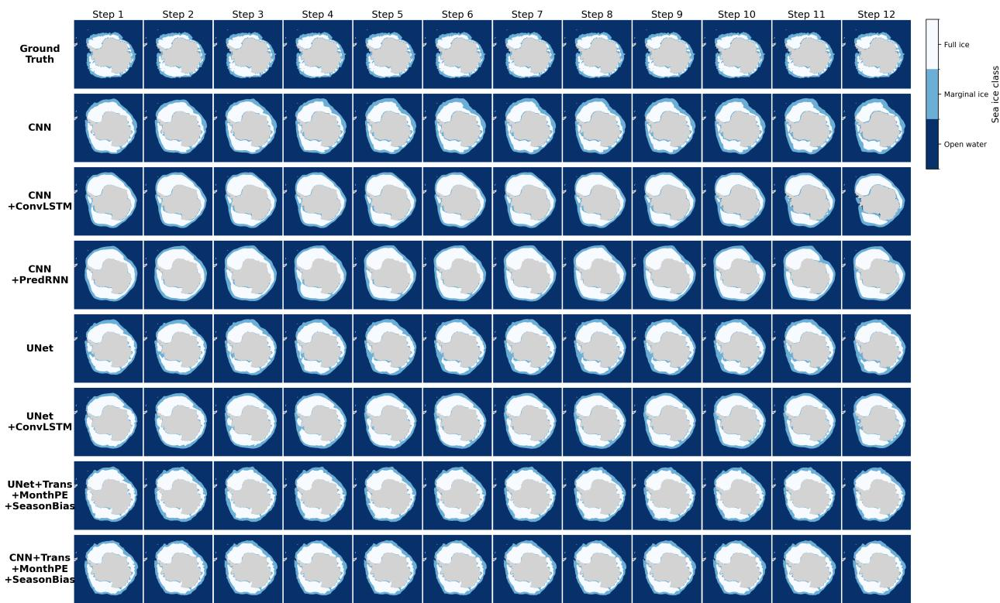
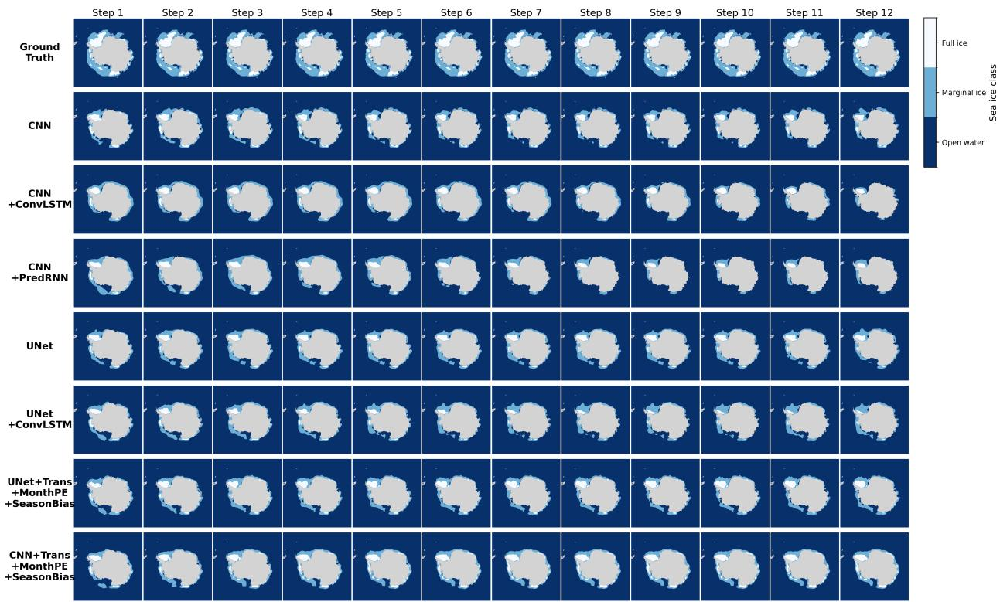

# Season-Aware Hybrid Convolutional-Transformer for Antarctic Sea Ice Concentration Forecasting

Danyang Li1 John Taylor1,∗ Thang Bui1 Quanling Deng1,2,∗

1School of Computer Science, Australian National University, Canberra, ACT 2601, Australia 2Yau Mathematical Sciences Center, Tsinghua University, Beijing, China

danyang.li@anu.edu.au, john.taylor@anu.edu.au,

thang.bui@anu.edu.au, quanling.deng@anu.edu.au, quanling.deng@anu.edu.au ∗Corresponding authors

## Abstract

Antarctic sea ice concentration (SIC) forecasting is an important yet challenging task due to the coexistence of complex spatial structure, long-range temporal dependencies, and strong seasonal variability. Conventional convolution-based models are efective at capturing local spatial patterns, but often have limited ability to model long-term temporal evolution. To address these challenges, we build on a hybrid Convolutional-Transformer forecasting framework for monthly Antarctic SIC forecasting. This framework combines convolutional encoding for spatial feature extraction with factorised self-attention for spatio-temporal dependency modelling. We further introduce two seasonal prior mechanisms: a month-aware positional encoding that injects calendar-month information into the token representation, and a seasonal temporal bias that encourages attention to periodically related historical states. Experimental results show that the proposed framework achieves better performance than convolutional and recurrent baselines across both classification and regression metrics. Ablation studies further indicate that the seasonal prior mechanisms provide consistent additional gains in both short- and long-horizon prediction. These results demonstrate the value of combining convolutional structures, attention mechanisms, and periodic prior information for Antarctic SIC forecasting.

## 1 Introduction

Antarctic sea ice is a critical component of the Earth’s climate system, modulating global energy balance, ocean circulation, and polar ecosystems [28, 20]. Unlike the Arctic, Antarctic sea ice exhibits pronounced interannual variability and strong regional heterogeneity, with record lows and partial recoveries observed in recent decades [21, 12]. Reliable prediction of Antarctic sea ice concentration (SIC) on seasonal (multi-month) timescales is therefore important for climate monitoring and downstream applications such as polar logistics and marine operations. Yet Antarctic SIC forecasting remains challenging due to coupled thermodynamic processes, sharp gradients at the ice edge, and a strong but non-stationary seasonal cycle [10], making it a dificult spatio-temporal sequence-to-sequence learning problem.

Sea ice forecasting has traditionally relied on coupled numerical models that explicitly simulate thermodynamic and dynamic processes, including ocean-ice interactions, wind forcing, and heat exchange [18, 5, 31]. Representative systems such as Global Sea Ice 6.0, a CICE-based sea-ice model configuration developed for the Met Ofice Global Coupled model, form the backbone of many operational forecasting frameworks [22]. While these physics-based approaches provide physically consistent predictions, they are computationally expensive and often require substantial efort for calibration and data assimilation, which limit their flexibility for rapid or high-frequency forecasting.

As computationally eficient alternatives, statistical and empirical methods have also been explored for sea-ice prediction based on historical observations and climate predictors, these approaches typically exploit temporal correlations and large-scale climate indices [7, 11, 33, 15, 23]. However, despite their computational eficiency, many traditional statistical models rely on simplified linear or probabilistic assumptions, which may limit their ability to represent complex nonlinear interactions within the sea-ice system, particularly under extreme or rapidly changing conditions [35].

Recent advances in machine learning have introduced data-driven alternatives for sea ice prediction. Convolutional neural networks (CNNs) and their variants have demonstrated promising skill by learning spatial features directly from gridded SIC fields [24, 1, 16]. Notably, IceNet [1] showed that deep CNN architectures can leverage multi-source climate inputs to achieve competitive seasonal forecasting performance. However, CNN-based approaches primarily operate as spatial pattern recognisers and lack explicit mechanisms to model long-range temporal dependencies, which are critical for multi-month prediction. To incorporate temporal dynamics, other models with spatiotemporal recurrent architectures such as Convolutional Long Short-Term Memory (ConvLSTM) and Predictive Recurrent Neural Networks (PredRNN) introduce temporal memory [26, 27, 14, 30]. By embedding convolutional operations within recurrent units, these models preserve spatial structure while evolving temporal states. Nevertheless, their reliance on local convolutional kernels may limit their ability to capture spatial interactions across the polar domain, and training can become increasingly challenging for longer forecasting horizons.

More recently, attention-based models and Transformers have emerged as a promising alternative for modelling long-range dependencies in spatio-temporal systems [29, 6]. Self-attention mechanisms enable global information exchange across both space and time, which is particularly advantageous for capturing large-scale climate teleconnections [9, 19]. However, directly applying Transformer architectures to high-resolution geophysical fields remains computationally challenging due to the quadratic complexity of self-attention with respect to the number of spatial tokens. Notably, works such as TimeSformer [4] demonstrated that factorizing global self-attention into separate spatial and temporal operations drastically reduces computational complexity while maintaining state-of-the-art performance. Similar divided space-time attention paradigms have since been widely adopted across video vision transformers [2, 17]. However, directly applying these generic video architectures to high-resolution geophysical fields remains computationally challenging and physically agnostic, necessitating domain-specific adaptations to manage the spatial token scale and respect the seasonal cycles.

To address these challenges, we propose a Convolutional-Transformer framework for Antarctic SIC forecasting that combines convolutional spatial feature extraction with Transformer-based spatio-temporal dependency modeling. Our main contributions are as following:

1. Convolutional-Transformer architecture with bottleneck attention: We develop a Convolutional encoder-decoder for high-resolution spatial reconstruction, and insert a Transformer bottleneck that performs global spatio-temporal mixing only at a compressed resolution, enabling multi-month forecasting at feasible GPU cost.

2. Month-aware Positional Encoding (MonthPE): To avoid an intractable 3D positional lookup table, we factorize physical priors into three distinct embeddings. This includes a standard spatial encoding, standard temporal encoding, and a Fourier-based seasonal encoding that encodes the strong seasonal periodicity of monthly sea ice.

3. Periodicity-Aware Temporal Attention Bias (SeasonBias): We implement a divided space-time attention scheme to manage computational complexity. We augment the temporal attention logits with a learnable seasonal bias based on the circular distance of the annual cycle, directly modulating query-key interactions to respect seasonal states.

## 2 Problem Statement and Data

We frame Antarctic SIC forecasting as a deterministic spatio-temporal sequence-to-sequence prediction problem, where the model produces point forecasts of future monthly SIC fields. Let the polar environment at a given time step t be represented by a 3D spatial grid $\bar { X _ { t } } \in \mathbb { R } ^ { C _ { \mathrm { i n } } \times H \times W }$ denote the monthly SIC input field, where $C _ { \mathrm { i n } }$ is the input channel, in this study $C _ { \mathrm { i n } } = 1$ because only SIC is used as input, H and $W$ denote the spatial height and width. Given a historical observation window of $T$ contiguous time steps, $\mathcal { X } = \{ X _ { t - T + 1 } , X _ { t - T + 2 } , \ldots , X _ { t } \} \in \mathbb { R } ^ { T \times C _ { \mathrm { i n } } \times H \times W }$ , the objective is to learn a mapping function $\mathcal { F } _ { \theta }$ , parameterized by a neural network, to predict the future states over the next K forecast time steps:

$$
\hat { \mathcal { V } } = \{ \hat { Y } _ { t + 1 } , \hat { Y } _ { t + 2 } , \hdots , \hat { Y } _ { t + K } \} = \mathcal { F } _ { \theta } ( \mathcal { X } )\tag{1}
$$

Unlike standard video prediction tasks, Earth system modeling is strictly bounded by static geographical topologies. Consequently, the prediction space is constrained by a binary land mask $\bar { M } \in \bar { \{ 0 , 1 \} } ^ { H \times \bar { W } }$ , requiring the model to learn SIC state changes exclusively within valid ocean pixels $( M _ { i , j } = 1 )$

To train and evaluate our framework, we utilize the authoritative Sea Ice Index, Version 3 dataset provided by the National Snow and Ice Data Center (NSIDC)[8]. This dataset is derived from a continuous, multi-decadal satellite record of passive microwave observations (including SMMR, SSM/I, and SSMIS sensors), providing a highly consistent benchmark for climatological machine learning. The dataset provides monthly observations mapped to a polar stereographic projection at a spatial resolution of $2 5 \times 2 5 \mathrm { k m ^ { 2 } }$ per pixel. For our network architecture, the raw Antarctic gridded data is uniformly cropped and padded to yield a native spatial tensor of $H = 3 5 2$ and $W = 3 5 2$ The dataset is divided into training, validation, and testing periods in chronological order. We use data from 1978 to 2011 for training, data from 2012 to 2018 for validation, and data from 2019 to 2024 for testing. All input-output windows are also constructed chronologically, and target months from the validation and test periods are excluded from training.

In this study, we formulate Antarctic sea-ice forecasting as a dual-output prediction problem. For each step $k \in \{ 1 , \ldots , K \}$ , the model predicts both a continuous SIC field and a discrete sea-ice state map:

$$
\hat { Y } _ { t + k } = \left( \hat { Y } _ { t + k } ^ { \mathrm { r e g } } , \hat { Y } _ { t + k } ^ { \mathrm { c l s } } \right) ,\tag{2}
$$

where

1. Regression Target $\hat { Y } _ { t + k } ^ { \mathrm { r e g } } \in \mathbb { R } ^ { H \times W }$ : The raw SIC values (normalized to a scale of $[ 0 , 1 ] )$ is the continuous prediction. It is used to evaluate concentration forecasting skill and to support autoregressive rollout, where the predicted SIC field is fed back into the model for next forecast step.

2. Classification Target $\hat { Y } _ { t + k } ^ { \mathrm { c l s } } \in \mathbb { R } ^ { 3 \times H \times W }$ : We derive the same SIC field by assigning each valid pixel to one of three physical states: Open Water $\left( \mathrm { S I C } < 1 5 \% \right)$ ), Marginal Ice $\left( 1 5 \% \leq \mathrm { S I C } \leq 8 0 \% \right)$ and Full Ice $\mathrm { ( S I C ~ > ~ 8 0 \% ) }$ [1, 3, 34]. This discrete formulation provides a complementary supervision signal that reduces sensitivity to small uncertainties in the continuous SIC values, particularly near the ice-water border and within the marginal ice zone.

  
Figure 1: Overall structure.

Our models are trained using a historical input window of $T = 1 2$ monthly Antarctic SIC maps to autoregressively predict up to $K = 1 2$ future months. During evaluation, we additionally compute a binary ice-extent metric by merging the Marginal Ice and Full Ice classes and applying the conventional 15% threshold [3, 34].

## 3 Transformer and Overall Framework

To address the compounding errors and spatial blurring inherent in long-horizon polar forecasting, we propose a hybrid spatio-temporal architecture that combines convolutional feature extraction with a factorized self-attention bottleneck. The convolutional encoder-decoder learns local spatial representations of SIC fields, while the temporal and spatial attention modules capture long-range dependencies and seasonally varying evolution patterns. The model further uses dual prediction heads to jointly produce continuous SIC forecasts for autoregressive rollout and discrete sea-ice state predictions for classification-based evaluation.

## 3.1 Spatio-Temporal Tokenization

Let $X \in \mathbb { R } ^ { B \times T \times C _ { \mathrm { i n } } \times H \times W }$ denote a batch of historical SIC sequences, where B is the batch size. We first apply a frame-wise CNN encoder, denoted as $E ( \cdot )$ , with a downsampling depth 3 to extract local morphological features and obtain a compact bottleneck representation. The encoder is applied independently to each monthly frame with shared weights:

$$
F _ { b , t } = E ( X _ { b , t } ) , \qquad F _ { b , t } \in \mathbb { R } ^ { C ^ { \prime } \times H ^ { \prime } \times W ^ { \prime } } .\tag{3}
$$

where $C ^ { \prime }$ is the bottleneck channel dimension, $H ^ { \prime } , W ^ { \prime }$ are bottleneck spatial resolution. We flatten the spatial dimensions of F into $S = H ^ { \prime } W ^ { \prime }$ tokens:

$$
U = { \mathrm { r e s h a p e } } ( F ) \in \mathbb { R } ^ { B \times T \times C ^ { \prime } \times S } .\tag{4}
$$

This convolutional tokenization reduces the full spatio-temporal token length from THW at the image resolution to $T S$ at the bottleneck resolution, where $S \ll H W$ . The resulting token sequence

enables eficient factorized spatio-temporal attention, while the convolutional encoder-decoder retains local spatial structure for dense sea-ice prediction.

## 3.2 Month-Aware Positional Encoding

Monthly sea ice exhibits strong seasonal periodicity; months with the same calendar index across diferent years share similar large-scale seasonal conditions. To inject strict geographic, relative temporal, and calendar-seasonal information into the token sequence without relying on an intractable 3D positional lookup table, we introduce a factorized spatio-temporal positional encoding:

$$
Z _ { b , t , n } = U _ { b , t , n } + \mathbf { p } _ { n } ^ { s } + \mathbf { p } _ { t } ^ { t } + \mathbf { p } _ { m _ { t } } ^ { m } , \qquad Z _ { b , t , n } \in \mathbb { R } ^ { C } ,\tag{5}
$$

where $b , t ,$ and n index the batch element, input timestep, and spatial token, respectively; $m _ { t } \in$ $\{ 0 , \ldots , 1 1 \}$ denotes the calendar month associated with timestep $t ;$ and $Z _ { b , t , n }$ is the positionaugmented token passed to the Transformer.

Rather than a generic sequence identifier, this factorization separates physical priors into three distinct embeddings: (i) Let $\mathbf { P } ^ { s } \in \mathbb { R } ^ { S \times C }$ represent the full spatial embedding table, and ${ \bf p } _ { n } ^ { s } = { \bf P } ^ { s } [ n ] \in \mathbb { R } ^ { C }$ is the embedding for spatial token n. The spatial positional encoding is implemented as a learnable tensor which is added to the bottleneck feature map and shared across all time steps. (ii) $\mathbf { P } ^ { t } \in \mathbb { R } ^ { T \times C }$ denotes the fixed sinusoidal temporal positional encoding, and $\mathbf { p } _ { t } ^ { t } = \mathbf { P } ^ { t } [ t ] \in \mathbb { R } ^ { C }$ . (iii) $\mathbf { p } _ { m _ { t } } ^ { m } \in \mathbb { R } ^ { C }$ denotes the Fourier-based calendar-month embedding, referred to MonthPE in the following. For each month index $m \in { 0 , \ldots , 1 1 }$ , we define a fixed Fourier basis:

$$
\Phi ( m ) = \left[ \sin \left( \frac { 2 \pi m } { 1 2 } \right) , \cos \left( \frac { 2 \pi m } { 1 2 } \right) , \ldots , \sin \left( \frac { 2 \pi K _ { f } m } { 1 2 } \right) , \cos \left( \frac { 2 \pi K _ { f } m } { 1 2 } \right) \right] ^ { \top } \in \mathbb { R } ^ { 2 K _ { f } } ,\tag{6}
$$

where $K _ { f }$ denotes the number of Fourier modes. In our implementation, we set $K _ { f } = 4$ , which allows the month encoding to retain the annual, semiannual, and several higher-order seasonal harmonics. This choice provides a balance between expressiveness and simplicity: it is suficiently rich to represent non-sinusoidal seasonal patterns in monthly sea-ice evolution, while avoiding unnecessarily high-frequency components for a 12-month calendar. The Fourier basis is then mapped into the token space by a learnable projection $W _ { m }$

$$
\mathbf { p } _ { m _ { t } } ^ { m } = W _ { m } \Phi ( m _ { t } ) , \qquad W _ { m } \in \mathbb { R } ^ { C \times 2 K _ { f } } .\tag{7}
$$

The resulting MonthPE is added to every spatial token at time step t, allowing the model to use an explicit 12-month periodic prior while learning how to mix diferent seasonal harmonics.

## 3.3 Separable Spatio-Temporal Attention

Computing global self-attention over the full spatio-temporal token sequence of length T S incurs a computational cost of $\mathcal { O } ( ( T S ) ^ { 2 } C ^ { \prime } )$ , which becomes prohibitive for high-resolution inputs and long temporal contexts. Following [4], we therefore adopt a divided space-time attention scheme, where attention is factorized into a temporal operator and a spatial operator applied sequentially. Specifically, temporal attention is performed independently for each spatial token, and spatial attention is then performed independently for each time step. This mechanism reduces the attention complexity to $\mathcal { O } ( T ^ { 2 } S C ^ { \prime } + S ^ { 2 } T C ^ { \prime } )$ , where the first term corresponds to temporal attention and the second to spatial attention.

On top of this factorized attention, we introduce a seasonal bias in the temporal attention logits to encode month-level periodic structure. Let $m _ { q } , m _ { k } \in \{ 0 , \ldots , 1 1 \}$ denote the indices associated with query timestep q and key timestep k. We define their circular distance on the annual cycle as

$$
\delta _ { q k } = \operatorname* { m i n } \left( | m _ { q } - m _ { k } | , 1 2 - | m _ { q } - m _ { k } | \right) , \qquad \delta _ { q k } \in \{ 0 , \ldots , 6 \} .\tag{8}
$$

Using this distance, we construct a pairwise bias

$$
b _ { q k } = \alpha \cos \left( \frac { 2 \pi \delta _ { q k } } { 1 2 } \right) , \qquad \alpha \in \mathbb { R } ,\tag{9}
$$

where α is a learnable scalar controlling the strength of the seasonal attention bias, it is learned separately for each temporal attention layer. Positive values of α encourage attention between seasonally aligned months, whereas negative values allow the model to reverse this preference if supported by the data. The resulting $b \in \mathbb { R } ^ { T \times T }$ is layer-specific across batch elements, spatial tokens, and attention heads.

Temporal attention is applied independently for each spatial token n. For each batch element, layer, and attention head, the temporal query, key, and value matrices satisfy $Q _ { b , n } ^ { t } , K _ { b , n } ^ { t } , V _ { b , n } ^ { t } \in \mathbb { R } ^ { T \times d _ { h } }$ where $d _ { h }$ is the per-head feature dimension. The attention is then computed as

$$
\mathrm { A t t n } ^ { t } ( Q ^ { t } , K ^ { t } , V ^ { t } ) = \mathrm { S o f t m a x } \left( { \frac { Q ^ { t } K ^ { t \top } } { \sqrt { d _ { h } } } } + b \right) V ^ { t } ,\tag{10}
$$

This bias acts as an additive prior over pairwise temporal interactions: timesteps from seasonally aligned months receive larger logits, whereas seasonally opposite months are relatively suppressed. Unlike positional encodings, which are injected into token representations, the proposed seasonal bias directly modulates the attention scores, thereby shaping the temporal dependency structure at the level of query-key interactions. The cosine form provides a simple and smooth periodic prior over the annual cycle, making it a natural choice for monthly geophysical data with strong seasonality. Since α is learned jointly with the rest of the network, the model can adaptively determine how strongly this seasonal prior should influence attention.

For spatial attention, each timestep is processed independently across the S spatial tokens: $Q _ { b , t } ^ { s } , K _ { b , t } ^ { s } , V _ { b , t } ^ { s } \in \mathbb { R } ^ { S \times d _ { h } }$ , and use standard scaled dot-product attention

$$
{ \mathrm { A t t n } } ^ { s } ( Q ^ { s } , K ^ { s } , V ^ { s } ) = { \mathrm { S o f t m a x } } \left( { \frac { Q ^ { s } K ^ { s \top } } { \sqrt { d _ { h } } } } \right) V ^ { s } .\tag{11}
$$

This allows the model to globally route information and capture long-range spatial dynamic dependencies across the grid, complementing the local patterns captured by the convolutional encoder.

## 3.4 Decoder and Autoregressive Forecasting

To project the spatio-temporal tokens back into the physical domain, we apply a convolutional decoder, denoted as $D ( \cdot )$ . Following the attention bottleneck, the latent sequence is reshaped from T S back to the spatial grid $\mathbb { R } ^ { \breve { B } \times T \times C ^ { \prime } \times H ^ { \prime } \times W ^ { \prime } }$ . We utilize both U-Net and CNN backbone to get next-step prediction. For the UNet-based variant, skip connections from the encoder are used to inject high-resolution spatial features into the decoder. For the CNN-based variant, the decoder reconstructs the output directly from the bottleneck representation without multi-scale skip connections.

The one-step model can be written as

$$
\left( \hat { Y } _ { t + 1 } ^ { \mathrm { r e g } } , \hat { Y } _ { t + 1 } ^ { \mathrm { c l s } } \right) = \mathcal { F } _ { \boldsymbol { \theta } } \left( X _ { t - T + 1 : t } \right) .\tag{12}
$$

To achieve long-horizon polar forecasting, we employ an autoregressive loop. For forecast month $\ell = 1 , \ldots , K$ , the model is rolled out autoregressively as

$$
\left( \hat { Y } _ { t + \ell } ^ { \mathrm { r e g } } , \hat { Y } _ { t + \ell } ^ { \mathrm { c l s } } \right) = \mathcal { F } _ { \boldsymbol { \theta } } \left( \tilde { X } _ { t + \ell - T : t + \ell - 1 } \right) ,\tag{13}
$$

where

$$
\begin{array}{c} \tilde { X } _ { \tau } = \left\{ X _ { \tau } , \quad \tau \leq t ,  \\ { \hat { Y } _ { \tau } ^ { \mathrm { r e g } } , \quad \tau > t . } \end{array} , \right. \qquad \tau \in [ t - T + 1 , t + K - 1 ]\tag{14}
$$

To mitigate the compounding errors inherent in autoregressive generation, we optimize the model using a multi-step forecasting loss. During training, we unroll the autoregressive loop for $K _ { \mathrm { t r a i n } } = 2$ steps. During evaluation, the model is rolled out autoregressively for up to $K _ { \mathrm { e v a l } } = 1 2$ months.

## 4 Experiments

We evaluate the proposed hybrid framework through ablation studies and comparisons with several baseline models, including CNN, UNet, ConvLSTM, PredRNN and Transformer-based variants [25, 26, 30, 4]. The experimental setup and key hyperparameters are summarized in Table 5. For training, the classification branch uses Focal Loss to address class imbalance, with class weights set to [0.2, 0.3, 0.5] for open water, marginal ice, and full ice, respectively. The regression branch is optimized using mean squared error (MSE) loss. The two losses are combined with weights of 0.1 and 0.9 for the classification and regression objectives. Performance is evaluated from both classification and regression perspectives using Accuracy, F1 score, mean F1 (mF1), and RMSE. Both the loss computation and the evaluation metrics are masked using a land-ocean mask, such that only valid ocean grid cells are included while land regions are excluded. All experiments are conducted on machines with single NVIDIA V100 GPUs.

## 4.1 Overall Performance Comparison

We first compare the proposed model with several representative baseline methods to assess its overal forecasting performance. Figure 2 presents the multi-horizon forecasting performance of diferent models over a 12-month autoregressive prediction horizon. For continuous SIC prediction, the RMSE generally increases as the forecast horizon extends, reflecting the accumulation of uncertainty and error propagation during autoregressive rollout. Nevertheless, the Transformer-based hybrid models with seasonal priors achieve lower RMSE than the conventional convolutional and recurrent baselines across most forecast months. In particular, the proposed CNN+Trans+MonthPE+SeasonBias mode maintains the lowest or near-lowest RMSE over the full prediction horizon, indicating improved long-range regression stability. For categorical SIC prediction, classification accuracy also decreases gradually with increasing forecast lead time. This trend is expected because later predictions rel increasingly on previously predicted states rather than ground-truth inputs. Despite this degradation, the proposed Convolutional-Transformer models with seasonal prior remain competitive across the 12-month horizon and generally outperform the baselines. These results suggest that combining convolutional spatial encoding with Transformer-based temporal modelling and explicit seasona prior information is beneficial for both continuous and categorical Antarctic SIC forecasting.

  
Figure 2: Comparison of multi-horizon forecasting performance across baseline and Transformerbased models over a 12-month autoregressive prediction horizon. The left panel shows the RMSE for continuous SIC prediction, while the right panel shows the classification accuracy for categorical SIC prediction. Markers denote the mean over repeated runs, and error bars represent the standard error.

To further examine the spatial characteristics of the forecasts, Figure 3 provides a qualitative comparison of SIC classification maps for the 2023 prediction period. All models capture the dominant seasonal expansion and retreat of Antarctic sea ice, but visible diferences appear near the marginal ice zone, where classification is more dificult due to stronger spatial variability. The recurrent and convolutional baselines tend to produce smoother or less accurate ice-edge structures, whereas the Transformer-based models with MonthPE and SeasonBias better preserve the seasonal evolution of the ice boundary. This visual comparison is consistent with the quantitative results in Figure 2, showing that explicit seasonal priors improve the model’s ability to represent both the timing and spatial structure of SIC evolution.

## 4.2 Ablation at Short- and Long-Horizon Forecast Steps

Table 1: Step-1 test performance of diferent methods.
<table><tr><td>Backbone</td><td>Add on</td><td>Cls3 Acc</td><td>Cls3 mF1</td><td>Cls2 Acc</td><td>Cls2 F1</td><td>Reg RMSE</td></tr><tr><td>CNN+Trans</td><td></td><td>0.9371±0.0039</td><td>0.8166±0.0060</td><td>0.9727±0.0012</td><td>0.9148±0.0081</td><td>0.0679±0.0020</td></tr><tr><td></td><td>+MonthPE</td><td>0.9392±0.0041</td><td>0.8216±0.0062</td><td>0.9745±0.0012</td><td>0.9209±0.0071</td><td>0.0658±0.0022</td></tr><tr><td></td><td>+SeasonBias</td><td>0.9378±0.0040</td><td>0.8182±0.0062</td><td>0.9738±0.0011</td><td>0.9173±0.0078</td><td>0.0672±0.0022</td></tr><tr><td></td><td>+MonthPE+SeasonBias</td><td>0.9420±0.0037</td><td>0.8280±0.0063</td><td>0.9751±0.0012</td><td>0.9234±0.0069</td><td>0.0653±0.0022</td></tr><tr><td>UNet+Trans</td><td></td><td>0.9353±0.0036</td><td>0.8087±0.0066</td><td>0.9703±0.0013</td><td>0.9046±0.0094</td><td>0.0714±0.0021</td></tr><tr><td></td><td>+MonthPE</td><td>0.9256±0.0044</td><td>0.7827±0.0086</td><td>0.9682±0.0017</td><td>0.9011±0.0109</td><td>0.0724±0.0024</td></tr><tr><td></td><td>+SeasonBias</td><td>0.9340±0.0038</td><td>0.8035±0.0067</td><td>0.9712±0.0013</td><td>0.9073±0.0092</td><td>0.0710±0.0021</td></tr><tr><td></td><td>+MonthPE+SeasonBias</td><td>0.9379±0.0039</td><td>0.8119±0.0067</td><td>0.9739±0.0013</td><td>0.9190±0.0073</td><td>0.0666±0.0021</td></tr></table>

To further examine the efect of MonthPE and SeasonBias, we compare model performance at both the first and the last autoregressive prediction steps, as reported in Tables 1 and 2. This comparison allows us to assess the contribution of the proposed seasonal priors in both short-range prediction and long-horizon autoregressive forecasting.

At step 1, the combined use of MonthPE and SeasonBias achieves the best performance for both CNN+Trans and UNet+Trans across all reported metrics. For CNN+Trans, adding MonthPE alone improves all metrics over the baseline, while SeasonBias also brings moderate gains. Their combination further improves the results, reducing the regression RMSE from 0.0679 to 0.0653 and increasing the Cls3 accuracy from 0.9371 to 0.9420. A similar trend is observed for UNet+Trans where the combined setting achieves the best classification and regression performance, with the RMSE reduced from 0.0714 to 0.0666. These results suggest that the two seasonal components provide complementary short-range benefits by injecting calendar-month information into the token representation and guiding temporal attention toward seasonally related historical states.

  
Figure 3: Qualitative comparison of SIC classification forecasts for 2023. The first row shows the 12-month input sequence from 2022, and the second row shows the corresponding ground-truth SIC classes for 2023. The remaining rows compare the predicted SIC class maps generated by diferent forecasting models. Grey regions indicate masked land or invalid areas.

At step 12, the benefit of explicit seasonal priors becomes more evident under long-horizon autoregressive rollout. For CNN+Trans, the combination of MonthPE and SeasonBias consistently achieves the best performance across all metrics, improving Cls3 accuracy from 0.9036 to 0.9155 and reducing RMSE from 0.1169 to 0.1058. This indicates that the proposed seasonal priors help stabilize long-range prediction when forecast errors accumulate over multiple autoregressive steps. For UNet+Trans, the combined setting achieves the best Cls3 accuracy, Cls2 accuracy, and Cls2 F1, while MonthPE alone gives slightly better Cls3 mF1 and RMSE. Therefore, unlike the CNN-based backbone where the full combination is consistently optimal, the UNet-based backbone shows a more metric-dependent response at the final rollout step. This may be because the UNet backbone already provides stronger multi-scale spatial representations through skip connections, making the additional seasonal constraints less uniformly beneficial for all metrics. Nevertheless, both MonthPE and SeasonBias generally improve long-horizon performance over the baseline, demonstrating the usefulness of seasonal prior information for monthly Antarctic SIC forecasting.

Table 2: Step-12 test performance of diferent methods.
<table><tr><td>Backbone</td><td>Add on</td><td>Cls3 Acc</td><td>Cls3 mF1</td><td>Cls2 Acc</td><td>Cls2 F1</td><td>Reg RMSE</td></tr><tr><td>CNN+Trans</td><td></td><td> $0 . 9 0 3 6 { \pm } 0 . 0 0 4 7$ </td><td>0.6995±0.0123</td><td>0.9486±0.0020</td><td>0.8159±0.0192</td><td> $0 . 1 1 6 9 { \pm } 0 . 0 0 3 5$ </td></tr><tr><td></td><td>+MonthPE</td><td> $0 . 9 0 6 7 { \scriptstyle \pm 0 . 0 0 5 2 }$ </td><td> $0 . 7 2 3 9 { \pm } 0 . 0 0 8 9$ </td><td>0.9522±0.0019</td><td> $0 . 8 3 9 5 { \pm } 0 . 0 1 5 1$ </td><td> $0 . 1 1 2 5 { \pm } 0 . 0 0 3 4$ </td></tr><tr><td></td><td>+SeasonBias</td><td> $0 . 9 0 9 8 { \scriptstyle \pm 0 . 0 0 4 6 }$ </td><td> $0 . 7 1 1 9 { \pm } 0 . 0 1 1 2$ </td><td>0.9511±0.0019</td><td> $0 . 8 0 6 3 { \scriptstyle \pm 0 . 0 2 0 6 }$ </td><td>0.1194±0.0046</td></tr><tr><td></td><td>+MonthPE+SeasonBias</td><td> $\mathbf { 0 . 9 1 5 5 { \scriptstyle \pm 0 . 0 0 4 6 } }$ </td><td>0.7490±0.0086</td><td>0.9561±0.0019</td><td> $\mathbf { 0 . 8 5 8 3 { \scriptstyle \pm 0 . 0 1 2 9 } }$ </td><td>0.1058±0.0034</td></tr><tr><td>UNet+Trans</td><td></td><td>0.9080±0.0049</td><td>0.7223±0.0101</td><td> $0 . 9 5 3 1 { \pm } 0 . 0 0 2 0$ </td><td> $0 . 8 4 8 6 { \pm } 0 . 0 1 3 5$ </td><td>0.1114±0.0038</td></tr><tr><td></td><td>+MonthPE</td><td> $0 . 9 1 2 3 { \scriptstyle \pm 0 . 0 0 4 3 }$ </td><td>0.7510±0.0077</td><td> $0 . 9 5 5 1 { \scriptstyle \pm 0 . 0 0 1 5 }$ </td><td> $0 . 8 5 7 1 { \scriptstyle \pm 0 . 0 1 4 1 }$ </td><td>0.1026±0.0028</td></tr><tr><td></td><td>+SeasonBias</td><td>0.9089±0.0048</td><td> $0 . 7 2 8 8 { \pm } 0 . 0 0 9 6$ </td><td> $0 . 9 5 3 8 { \pm } 0 . 0 0 1 8$ </td><td> $0 . 8 5 4 3 { \pm } 0 . 0 1 2 8$ </td><td>0.1063±0.0036</td></tr><tr><td></td><td>+MonthPE+SeasonBias</td><td>0.9147±0.0047</td><td>0.7476±0.0077</td><td>0.9576±0.0017</td><td>0.8615±0.0127</td><td>0.1033±0.0031</td></tr></table>

  
Figure 4: Temporal attention heatmaps of UNet+Trans variants for representative forecast cases. Columns correspond to the baseline model, the model with MonthPE, the model with SeasonBias, and the model with both MonthPE and SeasonBias. Rows show predictions for June and December 2023 at the first autoregressive step.

## 4.3 Temporal Attention

To better understand how MonthPE and SeasonBias afect the temporal behaviour of the Transformer bottleneck, we visualise the temporal attention maps of diferent UNet+Trans variants in Figure 4. The baseline UNet+Trans model produces relatively difuse attention patterns, with only weak preference for particular key months. Adding MonthPE changes the attention distribution and introduces clearer month-dependent variation, suggesting that explicit calendar-month information afects how the model organises temporal memory. However, the attention remains comparatively smooth and does not impose a strong structural preference. In contrast, the models with SeasonBias show much clearer diagonal and banded structures. This indicates that the temporal attention is no longer distributed uniformly over the input sequence, but is guided towards seasonally related query-key pairs. The combined MonthPE+SeasonBias model preserves this periodic structure while also allowing the attention weights to vary with the target month. This behaviour is consistent with the design of SeasonBias, which directly modulates the temporal attention logits according to the circular distance between calendar months.

Overall, these visualisations provide qualitative evidence that the proposed seasonal prior mechanisms afect the internal temporal routing of the Transformer bottleneck. MonthPE injects calendar information into the token representation, whereas SeasonBias more directly reshapes the query-key attention pattern. Together, they encourage more seasonally structured temporal dependencies, which is consistent with the improved forecasting performance observed in the quantitative results.

## 5 Conclusions

In this paper, we presented a hybrid Convolutional-Transformer framework for Antarctic SIC forecasting. The proposed model combines convolutional spatial representation learning with Transformer-based spatio-temporal dependency modeling, and further incorporates seasonal information through Fourier-based positional encoding and seasonal temporal bias attention. Experimental results showed that the architecture achieves competitive forecasting performance across both classification and regression metrics. The ablation study further indicated that Fourier-based positiona encoding and seasonal bias provides consistent benefits in both short- and long-range prediction. Overall, these results demonstrate the potential of hybrid convolutional and attention-based models for Antarctic SIC forecasting, especially when seasonal information is incorporated appropriately. Our work has certain limitations. The current framework is primarily data-driven and does not explicitly use physical knowledge of the Earth system, such as thermodynamic constraints, sea-ice dynamics, or coupled ocean-atmosphere information. Prior studies suggest that incorporat ing physical constraints or scientific knowledge into learning-based models can improve physical consistency and robustness [13, 32]. Such information may help improve the prediction of fine-scale regions, including sharp ice-edge structures and local heterogeneous patterns. In addition, since the experiments are conducted on historical Antarctic SIC data, the robustness of the model under rare extreme events and future climate regimes remains uncertain. Future work will investigate physics-guided extensions and evaluate the proposed design across broader geophysical prediction settings.

Beyond this scenario, the proposed design may also be applicable to a broader range of Earth science prediction problems with strong seasonal or cyclic behavior, and more generally to time-series forecasting tasks with known periodic patterns. Another direction is to develop more systematic interpretability analyses for attention-based SIC forecasting models. While the attention maps in this work provide a qualitative view of the learned temporal and spatial dependencies, future studies could compare these patterns across seasons, regions, and forecast horizons to assess whether the model consistently relies on physically meaningful information. Such analyses may help identify when the model captures stable seasonal relationships and when it relies on spurious correlations.

## References

[1] Tom R Andersson, J Scott Hosking, Mar´ıa P´erez-Ortiz, Brooks Paige, Andrew Elliott, Chris Russell, Stephen Law, Daniel C Jones, Jeremy Wilkinson, Tony Phillips, et al. Seasonal Arctic sea ice forecasting with probabilistic deep learning. Nature communications, 12(1):5124, 2021.

[2] Anurag Arnab, Mostafa Dehghani, Georg Heigold, Chen Sun, Mario Luˇci´c, and Cordelia Schmid. ViViT: A Video Vision Transformer. In Proceedings of the IEEE/CVF International Conference on Computer Vision, pages 6836–6846, 2021.

[3] Lauriane Batt´e, Ilona V¨alisuo, Matthieu Chevallier, Juan C Acosta Navarro, Pablo Ortega, and Doug Smith. Summer predictions of Arctic sea ice edge in multi-model seasonal re-forecasts. Climate Dynamics, 54(11):5013–5029, 2020.

[4] Gedas Bertasius, Heng Wang, and Lorenzo Torresani. Is Space-Time Attention All You Need for Video Understanding? In Proceedings of the International Conference on Machine Learning (ICML), July 2021.

[5] E Blanchard-Wrigglesworth, RI Cullather, W Wang, J Zhang, and CM Bitz. Model forecast skill and sensitivity to initial conditions in the seasonal Sea Ice Outlook. Geophysical Research Letters, 42(19):8042–8048, 2015.

[6] Alexey Dosovitskiy, Lucas Beyer, Alexander Kolesnikov, Dirk Weissenborn, Xiaohua Zhai, Thomas Unterthiner, Mostafa Dehghani, Matthias Minderer, Georg Heigold, Sylvain Gelly, Jakob Uszkoreit, and Neil Houlsby. An Image is Worth 16x16 Words: Transformers for Image Recognition at Scale. In International Conference on Learning Representations, 2021.

[7] Sheldon D Drobot, James A Maslanik, and Charles Fowler. A long-range forecast of Arctic summer sea-ice minimum extent. Geophysical Research Letters, 33(10), 2006.

[8] F Fetterer, K Knowles, W N Meier, M Savoie, and A K Windnagel. Sea Ice Index, Version 3, 2017.

[9] Zhihan Gao, Xingjian Shi, Hao Wang, Yi Zhu, Yuyang Bernie Wang, Mu Li, and Dit-Yan Yeung. Earthformer: Exploring space-time transformers for earth system forecasting. Advances in Neural Information Processing Systems, 35:25390–25403, 2022.

[10] William R Hobbs, Rob Massom, Sharon Stammerjohn, Phillip Reid, Guy Williams, and Walter Meier. A review of recent changes in Southern Ocean sea ice, their drivers and forcings. Global and Planetary Change, 143:228–250, 2016.

[11] Sean Horvath, Julienne Stroeve, Balaji Rajagopalan, and William Kleiber. A Bayesian logistic regression for probabilistic forecasts of the minimum September Arctic sea ice cover. Earth and Space Science, 7(10):e2020EA001176, 2020.

[12] Simon A Josey, Andrew JS Meijers, Adam T Blaker, Jeremy P Grist, Jenny Mecking, and Holly C Ayres. Record-low Antarctic sea ice in 2023 increased ocean heat loss and storms. Nature, 636(8043):635–639, 2024.

[13] George Em Karniadakis, Ioannis G Kevrekidis, Lu Lu, Paris Perdikaris, Sifan Wang, and Liu Yang. Physics-informed machine learning. Nature Reviews Physics, 3(6):422–440, 2021.

[14] Zhihui Lin, Maomao Li, Zhuobin Zheng, Yangyang Cheng, and Chun Yuan. Self-attention ConvLSTM for Spatiotemporal Prediction. In Proceedings of the AAAI conference on artificial intelligence, volume 34, pages 11531–11538, 2020.

[15] RW Lindsay, Jinlun Zhang, AJ Schweiger, and MA Steele. Seasonal predictions of ice extent in the Arctic Ocean. Journal of Geophysical Research: Oceans, 113(C2), 2008.

[16] Yang Liu, Laurens Bogaardt, Jisk Attema, and Wilco Hazeleger. Extended-range arctic sea ice forecast with convolutional long short-term memory networks. Monthly Weather Review, 149(6):1673–1693, 2021.

[17] Ze Liu, Jia Ning, Yue Cao, Yixuan Wei, Zheng Zhang, Stephen Lin, and Han Hu. Video swin transformer. In Proceedings of the IEEE/CVF Conference on Computer Vision and Pattern Recognition, pages 3202–3211, 2022.

[18] George L Mellor and Lakshmi Kantha. An Ice-Ocean Coupled Model. Journal of Geophysical Research: Oceans, 94(C8):10937–10954, 1989.

[19] Tung Nguyen, Johannes Brandstetter, Ashish Kapoor, Jayesh K Gupta, and Aditya Grover. ClimaX: A Foundation Model for Weather and Climate. In 1st Workshop on the Synergy of Scientific and Machine Learning Modeling @ ICML2023, 2023.

[20] Claire L Parkinson. A 40-y record reveals gradual Antarctic sea ice increases followed by decreases at rates far exceeding the rates seen in the Arctic. Proceedings of the National Academy of Sciences, 116(29):14414–14423, 2019.

[21] Ariaan Purich and Edward W Doddridge. Record low Antarctic sea ice coverage indicates a new sea ice state. Communications Earth & Environment, 4(1):314, 2023.

[22] JGL Rae, HT Hewitt, AB Keen, JK Ridley, AE West, CM Harris, Elizabeth Clare Hunke, and DN Walters. Development of the global sea ice 6.0 CICE configuration for the Met Ofice global coupled model. Geoscientific Model Development, 8(7):2221–2230, 2015.

[23] Pierre Rampal, J´erˆome Weiss, and David Marsan. Positive trend in the mean speed and deformation rate of Arctic sea ice, 1979–2007. Journal of Geophysical Research: Oceans, 114(C5), 2009.

[24] Yibin Ren, Xiaofeng Li, and Wenhao Zhang. A data-driven deep learning model for weekly sea ice concentration prediction of the pan-arctic during the melting season. IEEE Transactions on Geoscience and Remote Sensing, 60:1–19, 2022.

[25] Olaf Ronneberger, Philipp Fischer, and Thomas Brox. U-net: Convolutional networks for biomedical image segmentation. In International Conference on Medical image computing and computer-assisted intervention, pages 234–241. Springer, 2015.

[26] Xingjian Shi, Zhourong Chen, Hao Wang, Dit-Yan Yeung, Wai-Kin Wong, and Wang-chun Woo. Convolutional LSTM network: A machine learning approach for precipitation nowcasting. Advances in neural information processing systems, 28, 2015.

[27] John Taylor and Ming Feng. A deep learning model for forecasting global monthly mean sea surface temperature anomalies. Frontiers in Climate, 4:932932, 2022.

[28] John Turner, J Scott Hosking, Thomas J Bracegirdle, Gareth J Marshall, and Tony Phillips. Recent changes in Antarctic sea ice. Philosophical Transactions of the Royal Society A: Mathematical, Physical and Engineering Sciences, 373(2045), 2015.

[29] Ashish Vaswani, Noam Shazeer, Niki Parmar, Jakob Uszkoreit, Llion Jones, Aidan N Gomez, Lukasz Kaiser, and Illia Polosukhin. Attention is all you need. Advances in neural information processing systems, 30, 2017.

[30] Yunbo Wang, Haixu Wu, Jianjin Zhang, Zhifeng Gao, Jianmin Wang, Philip S Yu, and Mingsheng Long. Predrnn: A recurrent neural network for spatiotemporal predictive learning. IEEE Transactions on Pattern Analysis and Machine Intelligence, 45(2):2208–2225, 2022.

[31] NE Wayand, CM Bitz, and E Blanchard-Wrigglesworth. A Year-Round Subseasonal-to-Seasonal Sea Ice Prediction Portal. Geophysical Research Letters, 46(6):3298–3307, 2019.

[32] Jared Willard, Xiaowei Jia, Shaoming Xu, Michael Steinbach, and Vipin Kumar. Integrating scientific knowledge with machine learning for engineering and environmental systems. ACM Computing Surveys, 55(4):1–37, 2022.

[33] Xiaojun Yuan, Dake Chen, Cuihua Li, Lei Wang, and Wanqiu Wang. Arctic sea ice seasonal prediction by a linear Markov model. Journal of Climate, 29(22):8151–8173, 2016.

[34] Lorenzo Zampieri, Helge F Goessling, and Thomas Jung. Bright prospects for Arctic sea ice prediction on subseasonal time scales. Geophysical Research Letters, 45(18):9731–9738, 2018.

[35] Yilin Zhu, Mengjiao Qin, Panxi Dai, Sensen Wu, Zhiyi Fu, Zhende Chen, Laifu Zhang, Yuanyuan Wang, and Zhenhong Du. Deep learning-based seasonal forecast of sea ice considering atmospheric conditions. Journal of Geophysical Research: Atmospheres, 128(24):e2023JD039521, 2023.

## Appendix

## Network Structure and Parameters

Additional implementation details of the network architectures are provided as follows. The main text focuses on the proposed seasonal prior components, while this appendix summarizes the corresponding backbone structures, bottleneck designs, and parameter counts for reproducibility. All models use the same input-output setting and are evaluated under the same training and testing protocol unless otherwise stated.

Table 3 and 4 summarize the detailed structure of the proposed Convolutional-Transformer model. The convolutional encoder first extracts local spatial features and reduces the spatial resolution before the Transformer bottleneck is applied. At the bottleneck, the feature maps are converted into spatio-temporal tokens, where positional encodings and factorized self-attention are used to model temporal and spatial dependencies. The decoder then upsamples the features back to the original spatial resolution and produces both regression and classification outputs.

Table 5 summarizes the main forecasting, model, seasonal-prior, training, and loss settings. All compared models use the same input resolution, historical input window, forecast horizon, loss functions, and training protocol unless otherwise specified. Table 6 further compares the bottleneck modules used in diferent baselines. The pure CNN and UNet baselines rely on convolutional bottlenecks without a temporal modelling module. The ConvLSTM and PredRNN variants introduce recurrent temporal modelling at the bottleneck feature level. The Transformer-based variants reshape the bottleneck feature maps into spatio-temporal tokens and apply factorized temporal and spatial self-attention. The main architectural diference among all models lies in the bottleneck module, while other settings and training strategy are kept consistent. Since the attention modules are applied only after spatial downsampling at the bottleneck resolution, all experiments can be run on a single NVIDIA V100 GPU with gradient checkpointing, without requiring model parallelism.

Table 3: Detailed architecture of the proposed UNet-Transformer model with MonthPE and SeasonBias. Here $T = 1 2$ $H = W = 3 5 2$ ， $S = 4 4 \times 4 4$ , and $C _ { i n } = 2 5 6$ . The batch dimension is omitted for readability.
<table><tr><td rowspan=1 colspan=1>Block</td><td rowspan=1 colspan=1>Layer</td><td rowspan=1 colspan=1>Resolution</td><td rowspan=1 colspan=1>Channels</td></tr><tr><td rowspan=1 colspan=1>Input</td><td rowspan=1 colspan=1></td><td rowspan=1 colspan=1>352 × 352</td><td rowspan=1 colspan=1>1</td></tr><tr><td rowspan=1 colspan=1>Encoder Stem</td><td rowspan=1 colspan=1>Conv 3 × 3ReLUConv 3 × 3ReLU</td><td rowspan=1 colspan=1>352 × 352352 × 352352 × 352352 × 352</td><td rowspan=1 colspan=1>1 → 32323232</td></tr><tr><td rowspan=1 colspan=1>Encoder Down 1</td><td rowspan=1 colspan=1>MaxPool 2 × 2Conv 3 × 3ReLUConv 3 × 3ReLU</td><td rowspan=1 colspan=1>352 × 352 → 176 × 176176 × 176176 × 176176 × 176176 × 176</td><td rowspan=1 colspan=1>3232 → 64646464</td></tr><tr><td rowspan=1 colspan=1>Encoder Down 2</td><td rowspan=1 colspan=1>MaxPool 2 × 2Conv 3 × 3ReLUConv 3 × 3ReLU</td><td rowspan=1 colspan=1>176 × 176 → 88 × 8888 × 8888 × 8888 × 8888 × 88</td><td rowspan=1 colspan=1>6464 → 128128128128</td></tr><tr><td rowspan=1 colspan=1>Encoder Down 3</td><td rowspan=1 colspan=1>MaxPool 2 × 2Conv 3 × 3ReLUConv 3 × 3ReLU</td><td rowspan=1 colspan=1>88 × 88 → 44 × 4444 × 4444 × 4444 × 4444× 44</td><td rowspan=1 colspan=1>128128 → 256256256256</td></tr><tr><td rowspan=1 colspan=1>Bottleneck Embedding</td><td rowspan=1 colspan=1>Learnable spatial PEFlatten to tokensRelative time PEMonthPE</td><td rowspan=1 colspan=1>44 × 4444 × 44 → S = 1936T × ST × S</td><td rowspan=1 colspan=1>256256256256</td></tr><tr><td rowspan=1 colspan=1>Transformer Block ×2</td><td rowspan=1 colspan=1>Temporal reshapeLayerNormTemporal MHAResidualSpatial reshapeLayerNormSpatial MHAResidualFFNResidual</td><td rowspan=1 colspan=1>T × S → S × TS × TS × TS × TS × T → T × ST × ST × ST × ST × ST × S</td><td rowspan=1 colspan=1>256256256256256256256256256 → 1024 → 256256</td></tr><tr><td rowspan=1 colspan=1>Decoder Up 1</td><td rowspan=1 colspan=1>ConvTranspose 2 × 2Concat skipConv 3 × 3ReLUConv 3 × 3ReLU</td><td rowspan=1 colspan=1>44 × 44 → 88 × 8888 × 8888 × 8888 × 8888 × 8888 × 88</td><td rowspan=1 colspan=1>256 → 128128 + 128 = 256256 → 128128128128</td></tr><tr><td rowspan=1 colspan=1>Decoder Up 2</td><td rowspan=1 colspan=1>ConvTranspose 2 × 2Concat skipConv 3 × 3ReLUConv 3 × 3ReLU</td><td rowspan=1 colspan=1>88 × 88 → 176 × 176176 × 176176 × 176176 × 176176 × 176176 × 176</td><td rowspan=1 colspan=1>128 → 6464 + 64 = 128128 → 64646464</td></tr><tr><td rowspan=1 colspan=1>Decoder Up 3</td><td rowspan=1 colspan=1>ConvTranspose 2 × 2Concat skipConv 3 × 3ReLUConv 3 × 3ReLU</td><td rowspan=1 colspan=1>176 × 176 → 352 × 352352 × 352352 × 352352 × 352352 × 352352 × 352</td><td rowspan=1 colspan=1>64 → 3232 + 32 = 6464 → 32323232</td></tr><tr><td rowspan=1 colspan=1>Output Heads</td><td rowspan=1 colspan=1>Classification head (1 × 1 Conv)Regression head (1 × 1 Conv)Classification temporal weightingRegression temporal weighting + Sigmoid</td><td rowspan=1 colspan=1>352 × 352352 × 352352 × 352352 × 352</td><td rowspan=1 colspan=1>32 → Ccls32 → 1Ccls1</td></tr></table>

Table 4: Detailed architecture of the proposed CNN-Transformer model with MonthPE and SeasonBias. Here T = 12, $H = W = 3 5 2$ , $S = 4 4 \times 4 4$ , and $C _ { i n } = 2 5 6$ . The batch dimension is omitted for readability.
<table><tr><td rowspan=1 colspan=1>Block</td><td rowspan=1 colspan=1>Layer</td><td rowspan=1 colspan=1>Resolution</td><td rowspan=1 colspan=1>Channels</td></tr><tr><td rowspan=1 colspan=1>Input</td><td rowspan=1 colspan=1></td><td rowspan=1 colspan=1>352× 352</td><td rowspan=1 colspan=1>1</td></tr><tr><td rowspan=1 colspan=1>Encoder Stem</td><td rowspan=1 colspan=1>Conv 3 × 3ReLUConv 3 × 3ReLU</td><td rowspan=1 colspan=1>352 × 352352× 352352 × 352352× 352</td><td rowspan=1 colspan=1>1 → 32323232</td></tr><tr><td rowspan=1 colspan=1>Encoder Down 1</td><td rowspan=1 colspan=1>MaxPool 2 × 2Conv 3 × 3ReLUConv 3 × 3ReLU</td><td rowspan=1 colspan=1>352 × 352 → 176 × 176176 × 176176 × 176176 × 176176 × 176</td><td rowspan=1 colspan=1>3232 → 64646464</td></tr><tr><td rowspan=1 colspan=1>Encoder Down 2</td><td rowspan=1 colspan=1>MaxPool 2 × 2Conv 3 × 3ReLUConv 3 × 3ReLU</td><td rowspan=1 colspan=1>176 × 176 → 88 × 8888 × 8888 × 8888 × 8888 × 88</td><td rowspan=1 colspan=1>6464 → 128128128128</td></tr><tr><td rowspan=1 colspan=1>Encoder Down 3</td><td rowspan=1 colspan=1>MaxPool 2 × 2Conv 3 × 3ReLUConv 3 × 3ReLU</td><td rowspan=1 colspan=1>88 × 88 → 44 × 4444 × 4444 × 4444 × 4444×44</td><td rowspan=1 colspan=1>128128 → 256256256256</td></tr><tr><td rowspan=1 colspan=1>Bottleneck Embedding</td><td rowspan=1 colspan=1>Learnable spatial PEFlatten to tokensRelative time PEMonthPE</td><td rowspan=1 colspan=1>44 × 4444 × 44 → S = 1936T × ST × S</td><td rowspan=1 colspan=1>256256256256</td></tr><tr><td rowspan=1 colspan=1>Transformer Block ×2</td><td rowspan=1 colspan=1>Temporal reshapeLayerNormTemporal MHA + SeasonBiasResidualSpatial reshapeLayerNormSpatial MHAResidualFFNResidual</td><td rowspan=1 colspan=1>T × S → S × TS × TS × TS × TS × T → T × ST × ST × ST × ST × ST × S</td><td rowspan=1 colspan=1>256256256256256256256256256 → 1024 → 256256</td></tr><tr><td rowspan=1 colspan=1>CNN Decoder Up 1</td><td rowspan=1 colspan=1>ConvTranspose 2 × 2Conv 3 × 3ReLUConv 3 × 3ReLU</td><td rowspan=1 colspan=1>44 × 44 → 88 × 8888 × 8888 × 8888 × 8888 × 88</td><td rowspan=1 colspan=1>256 → 128128 → 128128128128</td></tr><tr><td rowspan=1 colspan=1>CNN Decoder Up 2</td><td rowspan=1 colspan=1>ConvTranspose 2 × 2Conv 3 × 3ReLUConv 3 × 3ReLU</td><td rowspan=1 colspan=1>88 × 88 → 176 × 176176 × 176176 × 176176 × 176176 × 176</td><td rowspan=1 colspan=1>128 → 6464 → 64646464</td></tr><tr><td rowspan=1 colspan=1>CNN Decoder Up 3</td><td rowspan=1 colspan=1>ConvTranspose 2 × 2Conv 3 × 3ReLUConv 3 × 3ReLU</td><td rowspan=1 colspan=1>176 × 176 → 352 × 352352 × 352352 × 352352 × 352352 × 352</td><td rowspan=1 colspan=1>64 → 3232 → 32323232</td></tr><tr><td rowspan=1 colspan=1>Output Heads</td><td rowspan=1 colspan=1>Classification head (1 × 1 Conv)Regression head (1 × 1 Conv)Classification temporal weightingRegression temporal weighting + Sigmoid</td><td rowspan=1 colspan=1>352 × 352352 × 352352× 352352× 352</td><td rowspan=1 colspan=1>32 → Ccls32 → 1Ccls1</td></tr></table>

Table 5: Hyperparameters and experimental setup.
<table><tr><td>Category</td><td>Hyperparameter</td><td>Value</td></tr><tr><td rowspan="4">Forecasting</td><td>Input resolution</td><td> $3 5 2 \times 3 5 2$ </td></tr><tr><td>Historical input window (T)</td><td>12 months</td></tr><tr><td>Forecast horizon (K)</td><td>12 months</td></tr><tr><td>Output classes</td><td>3(Cls) and 1(Reg)</td></tr><tr><td rowspan="4">Model</td><td>Spatial depth (d)</td><td>3</td></tr><tr><td>Temperal Transformer layers</td><td>2</td></tr><tr><td>Spacial Transformer layers</td><td>2</td></tr><tr><td>Attention heads (h)</td><td>8</td></tr><tr><td rowspan="3">Seasonal Priors</td><td>MLP ratio</td><td>4</td></tr><tr><td>MonthPE Fourier modes  $( K _ { f } )$  SeasonBias initialization</td><td>4</td></tr><tr><td> $\left( \alpha _ { 0 } \right)$  Attention dropout</td><td>0.1 0.0</td></tr><tr><td rowspan="4">Training</td><td>Optimizer</td><td> $\operatorname { A d a m }$ </td></tr><tr><td>Learning rate</td><td> $1 \times 1 0 ^ { - 5 }$ </td></tr><tr><td>Batch size</td><td></td></tr><tr><td>Training epochs</td><td>1 200</td></tr><tr><td rowspan="3">Loss</td><td></td><td></td></tr><tr><td>Classification loss Regression loss</td><td>Focal loss MSE loss</td></tr><tr><td>Loss weights [Cls, Reg]</td><td>[0.1, 0.9]</td></tr></table>

Table 6: Implementation details of the bottleneck modules used in the compared models. Here T = 12, S = 44 × 44 = 1936, and $C = 2 5 6 . \mathrm { ~ \vec { ~ } { ~ } { ~ } { ~ } ~ }$ indicates that no explicit temporal bottleneck module
<table><tr><td rowspan=1 colspan=1>Model</td><td rowspan=1 colspan=1>Bottleneck input</td><td rowspan=1 colspan=1>Bottleneck module</td><td rowspan=1 colspan=1>Implementation details</td></tr><tr><td rowspan=1 colspan=1>CNN</td><td rowspan=1 colspan=1> $T \times C \times 4 4 \times 4 4$ </td><td rowspan=1 colspan=1></td><td rowspan=1 colspan=1>standard convolutional bottleneck</td></tr><tr><td rowspan=1 colspan=1>UNet</td><td rowspan=1 colspan=1> $T \times C \times 4 4 \times 4 4$ </td><td rowspan=1 colspan=1></td><td rowspan=1 colspan=1>standard UNet bottleneck with skip connections</td></tr><tr><td rowspan=1 colspan=1>CNN+ConvLSTM</td><td rowspan=1 colspan=1> $T \times C \times 4 4 \times 4 4$ </td><td rowspan=1 colspan=1>ConvLSTM</td><td rowspan=1 colspan=1>ConvLSTM down/up bottleneckhidden channels = 256kernel size = 3 × 3</td></tr><tr><td rowspan=1 colspan=1>UNet+ConvLSTM</td><td rowspan=1 colspan=1> $T \times C \times 4 4 \times 4 4$ </td><td rowspan=1 colspan=1>ConvLSTM</td><td rowspan=1 colspan=1>ConvLSTM down/up bottleneckhidden channels = 256kernel size = 3 × 3</td></tr><tr><td rowspan=1 colspan=1>CNN+PredRNN</td><td rowspan=1 colspan=1> $T \times C \times 4 4 \times 4 4$ </td><td rowspan=1 colspan=1>PredRNN</td><td rowspan=1 colspan=1>PredRNN bottleneckhidden channels = 256</td></tr><tr><td rowspan=1 colspan=1>CNN+Trans+MonthPE+SeasonBias</td><td rowspan=1 colspan=1> $T \times S \times C$ </td><td rowspan=1 colspan=1>Factorized Transformer</td><td rowspan=1 colspan=1>Position Encodertemporal MHA, heads = 8spatial MHA, heads = 8</td></tr><tr><td rowspan=1 colspan=1>UNet+Trans+MonthPE+SeasonBias</td><td rowspan=1 colspan=1> $T \times S \times C$ </td><td rowspan=1 colspan=1>Factorized Transformer</td><td rowspan=1 colspan=1>Position Encodertemporal MHA, heads = 8spatial MHA, heads = 8</td></tr></table>

## Additional ablation

Table 7: Step 12 forecasting performance under diferent SeasonBias strengths (mean $\pm \ \mathrm { S E }$ over 48 test samples) on UNet+Trans backbone with MonthPE.
<table><tr><td>SeasonBias</td><td>Cls3 Acc</td><td>Cls3 mF1</td><td>Cls2 Acc</td><td>Cls2 F1</td><td>Reg RMSE</td></tr><tr><td> $\alpha = 0 . 0 4$ </td><td> $0 . 9 0 6 8 { \pm } 0 . 0 0 5 0$ </td><td> $0 . 7 1 7 8 { \scriptstyle \pm 0 . 0 0 9 0 }$ </td><td> $0 . 9 5 1 8 { \pm } 0 . 0 0 1 8$ </td><td> $0 . 8 4 2 0 { \scriptstyle \pm 0 . 0 1 3 6 }$ </td><td> $0 . 1 1 6 0 { \pm } 0 . 0 0 3 8$ </td></tr><tr><td> $\alpha = 0 . 0 8$ </td><td> $0 . 9 0 6 6 { \scriptstyle \pm 0 . 0 0 5 2 }$ </td><td> $0 . 7 0 9 1 { \scriptstyle \pm 0 . 0 1 0 4 }$ </td><td> $0 . 9 5 3 6 { \pm } 0 . 0 0 2 0$ </td><td> $0 . 8 4 9 4 { \pm } 0 . 0 1 3 6$ </td><td> $0 . 1 0 9 3 { \pm } 0 . 0 0 3 3$ </td></tr><tr><td> $\alpha = 0 . 1 2$ </td><td> $\mathbf { 0 . 9 1 1 7 { \scriptstyle \pm 0 . 0 0 4 7 } }$ </td><td> $\mathbf { 0 . 7 4 0 2 { \scriptstyle \pm 0 . 0 0 8 2 } }$ </td><td> $\mathbf { 0 . 9 5 3 8 { \scriptstyle \pm 0 . 0 0 2 0 } }$ </td><td> $\mathbf { 0 . 8 5 3 8 { \scriptstyle \pm 0 . 0 1 2 7 } }$ </td><td> $\mathbf { 0 . 1 0 7 5 { \scriptstyle \pm 0 . 0 0 3 2 } }$ </td></tr><tr><td> $\alpha = 0 . 1 6$ </td><td> $0 . 9 0 9 3 { \scriptstyle \pm 0 . 0 0 4 8 }$ </td><td> $0 . 7 1 3 3 { \pm } 0 . 0 1 0 2$ </td><td> $0 . 9 5 2 7 { \scriptstyle \pm 0 . 0 0 1 9 }$ </td><td> $0 . 8 3 6 5 { \scriptstyle \pm 0 . 0 1 5 4 }$ </td><td> $0 . 1 1 8 4 { \pm } 0 . 0 0 3 9$ </td></tr><tr><td> $\alpha = 0 . 2 0$ </td><td> $0 . 9 0 9 8 { \pm } 0 . 0 0 4 8$ </td><td> $0 . 7 0 8 2 { \scriptstyle \pm 0 . 0 1 2 2 }$ </td><td> $0 . 9 5 4 2 { \scriptstyle \pm 0 . 0 0 2 0 }$ </td><td> $0 . 8 5 1 4 { \pm } 0 . 0 1 3 5$ </td><td> $0 . 1 1 0 8 { \pm } 0 . 0 0 3 2$ </td></tr></table>

Additional ablation on SeasonBias strength. Table 7 reports the step-12 forecasting performance of the UNet+Trans backbone with MonthPE under diferent initial SeasonBias strengths. The results show that the model is relatively robust to the choice of α, with only moderate variations across the tested range. Among the tested settings, $\alpha = 0 . 1 2$ achieves the best overall performance, obtaining the highest Cls3 Acc, Cls3 mF1, Cls2 Acc, Cls2 F1, and the lowest Reg RMSE. This suggests that a moderate seasonal bias provides the most efective prior for long-range forecasting, while a too weak or too strong bias may slightly reduce either classification or regression performance.

Table 8: Forecast performance at step 1 and step 12 using 24 input months.
<table><tr><td>Step</td><td>Cls3 Acc</td><td>Cls3 mF1</td><td>Cls2 Acc</td><td>Cls2 F1</td><td>Reg RMSE</td></tr><tr><td>1</td><td> $0 . 9 3 5 5 \pm 0 . 0 0 9 4$ </td><td> $0 . 8 0 8 0 \pm 0 . 0 1 2 8$ </td><td> $0 . 9 7 2 6 \pm 0 . 0 0 3 2$ </td><td> $0 . 9 1 3 1 \pm 0 . 0 1 6 7$ </td><td> $0 . 0 6 6 1 \pm 0 . 0 0 4 6$ </td></tr><tr><td>12</td><td> $0 . 9 1 4 6 \pm 0 . 0 1 0 5$ </td><td> $0 . 7 5 2 7 \pm 0 . 0 1 8 8$ </td><td> $0 . 9 5 6 9 \pm 0 . 0 0 4 3$ </td><td> $0 . 8 6 9 1 \pm 0 . 0 2 4 4$ </td><td> $0 . 0 9 8 8 \pm 0 . 0 0 7 5$ </td></tr></table>

Forecasting with a longer input window. Table 8 evaluates the efect of increasing the input window from 12 to 24 months. Although the model maintains reasonable forecasting performance at both step 1 and step 12, the longer input window does not provide a clear overall improvement over the 12-month input setting. This suggests that simply extending the historical context is not necessarily beneficial for SIC forecasting, and that the model may require more efective mechanisms to select or weight useful temporal information from longer sequences.

## Additional experiments results

Figure 5 and 6 provides a qualitative comparison of the multi-step classification forecasts initialized in June and December 2023. All method reproduce the major large-scale sea ice distribution. The visual diferences are most apparent near the ice edge, where small spatial shifts or excessive smoothing can change the predicted class.

Classification Forecast Comparison (202306)  
  
Figure 5: Qualitative comparison of multi-step sea ice classification forecasts initialized in June 2023. Each column represents a forecast lead time from step 1 to step 12, and each row corresponds to the ground truth or one forecasting method. The three classes denote open water, marginal ice, and full ice.

Classification Forecast Comparison (202312)  
  
Figure 6: Qualitative comparison of multi-step sea ice classification forecasts initialized in December 2023. Each column represents a forecast lead time from step 1 to step 12, and each row corresponds to the ground truth or one forecasting method. The three classes denote open water, marginal ice, and full ice.