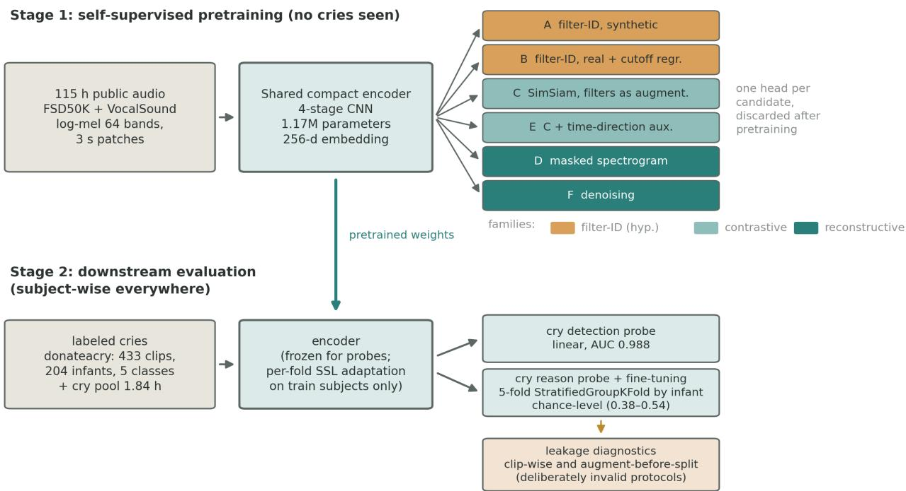
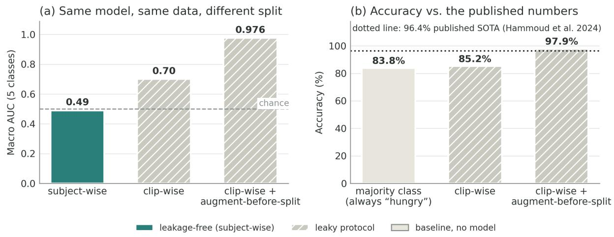

# Self-Supervised Pretext Tasks for Infant Cry Analysis: A Controlled Comparison and a Cautionary Result on Donateacry

Luigi Simeone Independent researcher

August 2026

## Abstract

We compare six self-supervised pretext tasks for infant cry analysis under a fixed budget, meaning the same compact encoder of 1.17M parameters, the same 115 hours of license-verified public pretraining audio, and the same evaluation protocol for every candidate. On cry detection the reconstructive objectives dominate, and a linear probe over a masked-spectrogram encoder reaches 0.988 AUC with subject-wise splits even though the encoder never observed a cry during pretraining. On cry-reason classification over donateacry, the de facto public benchmark for cry reasons, every encoder performs at chance (0.38 to 0.54 macro AUC over 5 classes), and neither domain adaptation on 1.8 hours of real cries nor end-to-end fine-tuning moves the result. Since a frozen HuBERT-base with 80 times more parameters shows the same pattern, the bottleneck must sit in the labels and not in model capacity. We then reproduce the 90%+ accuracies of the donateacry literature on our own system by changing nothing but the evaluation protocol: clip-wise splits raise accuracy to 85.2% (barely above the 83.8% majority-class baseline), and applying augmentation before splitting raises it to 97.9%, matching the reported state of the art, from the same model that measures 0.49 macro AUC under subject-wise splits. Under leakage-free splits, a twentyfold augmentation of the labeled set (vocoder speaker perturbation and noise mixing, 21 hours) leaves cross-subject AUC unchanged: for this task the efective sample size is the number of infants. We release code, seeds and per-clip license manifests.1

## 1 Introduction

Infant cry analysis has two natural tasks: detection asks whether a sound is an infant crying, and reason classification asks why. The strongest published result on reason classification comes from Gorin et al. [6], who reach 74.5 macro AUC on three cry triggers with self-supervised pretraining, cry-domain adaptation and an 80M-parameter CNN14, on a private clinical corpus of about 1,150 recordings with trigger labels assigned by medical and research staf. Around that result sits a larger body of work reporting 90%+ accuracy on donateacry, a public corpus of 457 parent-labeled clips. The two numbers are not even the same metric (macro AUC against unbalanced accuracy), and the gap between a hard-won 74.5 AUC on clinical data and near-perfect accuracy on a small volunteer corpus deserves suspicion. This paper supplies the explanation with measurements.

We ask three questions. First, do the conclusions of [6] survive a move to public data and a compact encoder sized for edge deployment? Second, which pretext task earns its keep at that scale? SSL work on cries has so far committed to a single objective per paper; we compare six under identical conditions, including two variants of a hypothesis about teaching frequency-band structure explicitly, designed so that the failure modes we predicted in advance would show up as numbers instead of remaining a matter of opinion. Third, what do donateacry’s labels actually support once evaluation respects subject identity everywhere, including inside the SSL stages?

Contributions: (i) a controlled six-task pretext comparison at fixed budget, with reconstructive objectives clearly ahead for cry detection; (ii) a negative result on donateacry reason classification that survives a model-capacity control, together with an end-to-end reproduction of the literature’s 90%+ accuracies obtained purely by adopting its evaluation protocol; (iii) a leakage-free protocol for evaluating SSL domain adaptation, with adaptation re-run per fold on training subjects only; (iv) evidence from an augmentation ablation that labeled subjects, not labeled clips, are the binding resource; (v) an ear-verified hard-negative set, including adult cries mislabeled as infant cries in FSD50K ground truth.

## 2 Related work

Infant cry analysis. The field predates deep learning by decades: spectrographic studies in the 1960s already cataloged cry types and their acoustic correlates [1], and later clinical reviews treated caregiver perception of cries as a perceptual process to be studied in its own right, alongside acoustic analysis [2], rather than as ground truth, a distinction our results land on hard. The machine-learning line runs through pathology detection on the small Baby Chillanto corpus [3] to the Ubenwa group’s work on cry-based screening of perinatal asphyxia with transfer learning [4], the CryCeleb verification benchmark [8], and the SSL study we take as our reference [6]: CNN14 [7] pretrained with SimCLR-style contrastive learning [12], adapted on 11 hours of unlabeled cries, fine-tuned on staf-assigned trigger labels, evaluated with per-patient splits. CryCeleb matters to us for a second reason: it demonstrates that infant identity is readily decodable from cry acoustics, which is exactly the signal a clip-level split hands to a classifier for free.

Reason classification on donateacry. A separate body of work trains reason classifiers directly on donateacry and reports accuracies in the mid-90s. The strongest recent example [9] reaches 96.4% with MFCC features and a random forest, improving on a scalogram-based system it cites at 95.2%; its split is described only as 80/20, with no mention of subject identity. We are not aware of any donateacry result that reports subject-wise evaluation, which is the gap this paper fills.

Evaluation leakage in clinical machine learning. The failure mode is well documented outside audio: Saeb et al. [10] showed that record-wise cross-validation on clinical sensor data inflates accuracy relative to subject-wise evaluation, and argued that a split should approximate the use case, because a deployed model meets new patients and never new records of patients it already knows. Kapoor and Narayanan [11] survey leakage across ML-based science and identify it as a leading cause of irreproducible results. Our contribution to this literature is a domain-specific, fully controlled instance: same model, same data, three protocols, with the invalid ones reproducing the published numbers.

Self-supervised audio representations. The pretext tasks we compare are compact instances of the field’s main families: contrastive and distillation-style joint embedding [12, 14], with BYOL-A [15] the closest precedent for small-encoder audio SSL; masked reconstruction, from masked autoencoders in vision [16] to Audio-MAE [17]; and masked prediction of latent targets, the family of wav2vec 2.0 [18] and HuBERT [19], which enters our study only as a frozen capacity control. FSD50K [20] and VocalSound [21] supply the pretraining pool. What our comparison adds to this literature is a controlled ranking at a scale, about one million parameters, that the benchmark papers rarely visit.

  
Figure 1: Study design. Stage 1: one compact encoder is pretrained six times, once per pretext task, on 115 hours of public audio that contains no infant cries; the task heads are discarded. Colors group the tasks into three families. Stage 2: the pretrained encoder is evaluated on labeled cries with subject-wise splits everywhere, including inside the per-fold SSL adaptation; the deliberately invalid protocols at the bottom exist only to measure leakage.

## 3 Data

All corpora are public and were filtered clip by clip for permissive licenses, with the admitted list and attributions generated by the pipeline itself: FSD50K (43,379 clips, 90.1 h, CC0/CC BY, with 7,818 CC-BY-NC clips excluded), VocalSound (20,985 clips, 24.4 h, CC BY-SA), the cleaned release of donateacry [5] (447 clips, 0.9 h, ODbL/DbCL), and 204 clips (2.1 h) retrieved from Freesound by direct query and deduplicated against FSD50K. Audio is cached as memory-mapped float16 log-mel with 64 bands at 16 kHz (25 ms window, 10 ms hop).

Labels received a human pass. A PANNs Cnn14 tagger [7] triaged the pool; 127 borderline cases, selected by stratified value of information, were then labeled by ear, with a second pass separating infant cries from adult cries and animal sounds. Two outcomes matter downstream. About half of the FSD50K clips tagged Baby cry, infant cry that survived triage are adults crying; they enter the evaluation as hard negatives. And 11 of the 15 lowest-scoring donateacry “cries” are not cries, so 14 spurious clips were excluded from all supervised experiments, leaving 433 clips from 204 infants.

## 4 Method

Figure 1 gives the overview of the design, in which a single encoder feeds six interchangeable pretext heads during pretraining and one shared evaluation harness downstream; the rest of this section describes each piece in turn.

Encoder. A four-stage CNN (two 3×3 convolutions per stage, BatchNorm, stride-2 downsampling), global average pooling and a 256-d embedding: 1.17M parameters. Every candidate shares this encoder and difers only in a head that is discarded after pretraining. Inputs are 3-second patches (300 frames × 64 bands), normalized per clip.

Pretext tasks. (A) Filter-ID on synthetic signals: classify which of four band filters (low-pass, high-pass, band-pass, band-stop) was applied to synthetic harmonic spectra with F0 drawn from the infant range and slow amplitude modulation. (B) Filter-ID on real audio: the same four-way classification on real patches, plus continuous regression of the cutof bands. (C) SimSiam with the band filters demoted to augmentations, alongside noise mixing with other batch samples, gain jitter, small pitch and time shifts, and time masking. (D) Masked spectrogram modeling, reconstructing masked time-frequency blocks through a light transposed-convolution decoder, trained from scratch. (E) Candidate C plus an auxiliary time-direction classifier. (F) Denoising: reconstruct the clean log-mel from a mix with another sample plus gain jitter.

Why these six. The set was assembled so that adjacent candidates difer by a single ingredient, which turns the final ranking into a series of controlled answers where a survey of popular objectives would only have produced a leaderboard. The starting point is a domain hypothesis we chose to test head-on: infant cries carry their information in a known frequency structure (fundamental at 250 to 700 Hz, harmonics above), so a pretext that forces the encoder to identify band filters should teach frequency awareness cheaply, with labels that cost nothing. Candidates A and B are that hypothesis in its pure and strengthened forms, and three weaknesses were written down before training: the task can be solved from band-energy statistics alone, the way rotation prediction collapsed in vision; it is static, so it never rewards temporal sensitivity, while the class-relevant structure of cries (rhythm, melodic contour) is temporal; and synthetic stationary signals lack the natural statistics SSL feeds on.

Each remaining comparison isolates one question. Moving the same task from synthetic to real audio (A against B) asks whether natural statistics recover the transfer that synthesis loses. Demoting the identical filters from labels to distortions inside SimSiam (B against C) asks what role hand-designed acoustic knowledge should play in the objective at all, and C is in that sense the built-in counter-hypothesis. Attaching an auxiliary time-direction task (C against E) asks whether forced temporal sensitivity contributes anything an invariance objective misses, while swapping masked blocks for realistic noise (D against F) asks whether the corruption type matters inside the reconstructive family. The widest question, reconstruction against invariance, falls out of comparing the D/F pair with C/E at a scale of 1.17M parameters and batch 256, where the literature ofers little guidance because most SSL results are reported far larger. The bake-of puts numbers on every one of these edges at once.

The filter-ID objectives, formally. To our knowledge, band-filter identification has not previously been used as a pretext task in audio SSL; band manipulation appears in the literature only as an augmentation, most prominently the frequency masking of SpecAugment [13], and candidate

C is exactly that usage. Since A and B are new, we state them precisely. Let $x \in \mathbb { R } ^ { T \times M }$ be a per-clip-normalized log-mel patch with T=300 frames and M=64 bands. The filter acts additively in the log domain,

$$
( { \cal T } _ { t , a , b , \gamma } x ) _ { \tau m } = x _ { \tau m } - \gamma S _ { t } ( m ; a , b ) ,\tag{1}
$$

where $\gamma \sim \mathcal { U } ( 3 , 6 )$ is the attenuation depth and $S _ { t } ( \cdot ) \in \{ 0 , 1 \}$ marks the stop region of filter type $t \in \{ \mathrm { L P }$ , HP, BP, BS}: bands above a, below a, outside [a, b], or inside $[ a , b ]$ respectively. Candidate A draws its inputs from a synthetic generator instead of the corpus: a harmonic template with fundamental $f _ { 0 } \sim \mathcal { U } ( 2 5 0 , 7 0 0 )$ Hz placed at the mel positions of $k f _ { 0 }$ with partial amplitudes decaying as $k ^ { - 1 / 2 }$ , a constant noise floor, and a slow sinusoidal amplitude modulation at $f _ { \mathrm { a m } } \sim \mathcal { U } ( 1 , 8 )$ Hz, so that the signal carries the gross spectral layout of a cry while carrying none of its natural statistics. Its loss is cross-entropy on the filter type,

$$
{ \mathcal { L } } _ { A } = \mathrm { C E } { \big ( } h _ { A } ( g ( { \mathcal { T } } x ) ) , t { \big ) } ,\tag{2}
$$

with g the shared encoder and $h _ { A }$ a linear head. Candidate B applies T to real patches and adds continuous recovery of the cutofs,

$$
\begin{array} { r } { \mathcal { L } _ { B } \ = \ \mathrm { C E } \big ( h _ { \mathrm { t y p e } } ( g ( \mathcal { T } x ) ) , t \big ) \ + \ \Big \| \sigma \big ( h _ { \mathrm { c u t } } ( g ( \mathcal { T } x ) ) \big ) - \frac { 1 } { M - 1 } ( a , b ) \Big \| _ { 2 } ^ { 2 } , } \end{array}\tag{3}
$$

which removes the four-way shortcut and forces a finer reading of the spectrum than type classification alone. The remaining objectives are standard and we only fix their instantiation: the symmetric negative cosine of SimSiam for C and E [14], with E adding a binary cross-entropy on time direction weighted at 0.2, and mean squared error in input space, on masked cells for D and on the full clean target for F.

Budget. Each candidate trains for 8,000 steps at batch 256 (AdamW, cosine schedule, mixed precision) on FSD50K+VocalSound only. Donateacry and the Freesound cries are held out of pretraining entirely so that downstream probes stay uncontaminated. One run takes under an hour on a laptop RTX 4060.

Evaluation. All splits are by subject: the contributor prefix for donateacry, the uploader for Freesound. StratifiedGroupKFold with 5 folds; macro one-vs-rest AUC, balanced accuracy, ECE. The rule extends to the SSL stages: when we adapt an encoder on cry audio, adaptation is re-run for every fold using only that fold’s training subjects. The reason is concrete: an encoder adapted on a given infant’s audio embeds that infant’s voice characteristics, so probing it afterwards on the same infant partly measures recognition of a voice it has already seen, which is leakage at the representation level even though no label was ever touched. The cost of doing this properly is five adaptations per candidate instead of one, and at this scale that means minutes per fold. A clip-wise split is computed once, deliberately, as a diagnostic of what leakage buys.

Augmentation ablation. Each donateacry clip is expanded with PSOLA vocoder variants (F0 shifts of 0.5 to 3 semitones, formant scaling 0.88 to 1.12, timing preserved) and with mixes against domestic noise from the license-clean FSD50K pool at 3 to 20 dB SNR, 21 hours in total, class-balanced. Synthetic variants inherit the source infant’s identity for splitting; evaluation uses real audio only.

Table 1: Cry/non-cry linear probe, subject-wise 5-fold (541 verified positives, 428 negatives of which 30 hard).
<table><tr><td>Pretext</td><td>AUC</td></tr><tr><td>D masked spectrogram</td><td> $0 . 9 8 8 \pm 0 . 0 0 4$ </td></tr><tr><td>F denoising</td><td> $0 . 9 8 2 \pm 0 . 0 0 6$ </td></tr><tr><td>C SimSiam + filter augmentation</td><td> $0 . 9 7 2 \pm 0 . 0 1 5$ </td></tr><tr><td>E C + temporal auxiliary</td><td> $0 . 9 6 7 \pm 0 . 0 2 0$ </td></tr><tr><td>B filter-ID (real)</td><td> $0 . 8 8 0 \pm 0 . 0 2 4$ </td></tr><tr><td>A filter-ID (synthetic)</td><td> $0 . 7 9 3 \pm 0 . 0 4 0$ </td></tr></table>

Table 2: Cry-reason classification on donateacry (5 classes, 433 clips, 204 infants, subject-wise unless stated).
<table><tr><td>Setting Macro AUC</td></tr><tr><td>Other pretexts, linear probe 0.38-0.47 After per-fold SSL adaptation (1.84 h of cries) 0.33-0.45 Frozen HuBERT-base, 94M params (control) 0.42 Same embeddings, clip-wise split (diagnostic) 0.58–0.61 End-to-end fine-tuning, best of 4 augmentation arms  $0 . 4 9 \pm 0 . 1 1$ </td></tr><tr><td>Deliberately leaky, replicating the 90%+ literature: End-to-end, clip-wise split 0.70 (85.2% acc.) End-to-end, clip-wise + augment-before-split 0.976 (97.9% acc.)</td></tr><tr><td>Majority-class baseline (“always hungry&quot;) 83.8% acc. Gorin et al. [6], clinical labels, 3 classes 74.5</td></tr></table>

## 5 Results

Detection. Table 1 settles the pretext question at this scale. Reconstructive objectives transfer best, the contrastive pair follows closely, and the filter-ID line trails by a wide margin, with the synthetic variant worst. Two of the three predicted weaknesses are visible right here: real audio beats synthetic by 8.7 points (B over A), and the same filters that fail as labels help as augmentations (C). The third, the static task never rewarding temporal sensitivity, surfaces in the reason probe below, where the only candidate above chance is the one trained with a temporal auxiliary.

Our reading of the reconstructive advantage is that it is a scale efect: reconstruction supervises every output cell densely, which suits a small encoder and a small decoder, while contrastive objectives lean on batch size and on carefully tuned augmentation families, resources that thin out at 1.17M parameters and batch 256. We ofer this as an interpretation the numbers are consistent with, since the bake-of itself cannot prove it; at larger scale the gap may well close, and published results with large transformers suggest it does.

Reason. The subject-wise block of Table 2 is flat at chance. The temporal-auxiliary candidate E is the only one above 0.5, a weak but suggestive signal that whatever reason information exists lives in temporal dynamics that mean-pooled embeddings mostly discard. Adaptation on real cries, which contributes 6 to 9 points in [6], contributes nothing here. The HuBERT control removes the capacity explanation: a model 80 times larger, pretrained on orders of magnitude more audio, lands on the same floor and shows the same leaky-split jump. What remains is the labels: in-the-moment parent guesses, 84% of clips in one class, minority classes of 8 to 25 clips.

  
Figure 2: The leakage ladder on donateacry. Left: one model, one dataset, three split protocols; only the subject-wise protocol (solid) is valid. Right: the leaky protocols land on the accuracy range published as state of the art, and the majority-class baseline shows how little unbalanced accuracy means on this corpus.

Leakage, measured end to end. Four measurements on identical data and models, summarized in Figure 2, close the argument. First, switching frozen embeddings from subject-wise to clipwise splits lifts the masked-spectrogram encoder from 0.38 to 0.61 AUC and HuBERT from 0.42 to 0.61, while candidate E, already at 0.54, moves only to 0.58: subject identity alone hands a fixed representation up to 0.2 AUC, and compresses very diferent encoders onto the same leaky ceiling. Second, always predicting the majority class already yields 83.8% accuracy on this corpus, so unbalanced accuracy is close to meaningless here. Third, our end-to-end fine-tuning under a clip-wise split, with no other change, reaches 85.2% accuracy (0.70 AUC): the network now tunes its features to individual infants. Fourth, applying augmentation before splitting, so that synthetic variants of test clips sit in the training set, reaches 97.9% accuracy (0.976 AUC), matching the 96.4% reported as state of the art on donateacry by Hammoud et al. [9], whose split is described only as “80% training and 20% testing” with no mention of subject identity. The same model, under subject-wise evaluation, measures 0.49 macro AUC. We conclude that donateacry supports cry detection research while lending no support to reason classification claims, and that reviewers in this domain should expect three things as a matter of routine: splits by subject, a majority-class baseline printed next to any accuracy figure, and augmentation applied only after splitting.

Augmentation. The four fine-tuning arms (real only, +noise, +vocoder, +both) score 0.47, 0.46, 0.43 and 0.49 macro AUC, statistically indistinguishable at these fold variances. Twenty times more labeled audio from the same 204 infants adds no cross-subject signal. Data collection plans in this domain should be sized in subjects.

## 6 Reproducibility

Everything ran on one consumer laptop (NVIDIA RTX 4060 Laptop, 8 GB VRAM; 16 GB system RAM, with feature caches read via memory mapping). Each pretext pretraining takes under an hour; per-fold adaptation takes minutes per fold; the complete study fits in a few evenings. Seeds are fixed in the configuration files, every number in this paper is written to a CSV by the script that produced it, and the per-clip license manifest doubles as the exact data inventory. The pipeline is twelve numbered scripts, from corpus download with checksums through the leakage diagnostics; the repository in the abstract footnote contains all of it, and rebuilds the study from the original public sources since no audio is redistributed.

## 7 Limitations

The negative result is a statement about donateacry’s labels, not about the task: [6] demonstrates that with clinical labels the reason task is learnable. Our encoders are small by design, and mean pooling over 3-second patches erases sequence structure; a latent-predictive temporal objective in the JEPA family is the natural next candidate once better-labeled data exists. Detection is reported as ranking quality; an operating point in false alarms per night, and a systematic multi-SNR evaluation, remain to be run. Finally, the human labeling pass was performed by a single listener.

## 8 Conclusion

With one compact encoder, a fixed budget and a leakage-free protocol, six pretext tasks sorted cleanly and informatively on cry detection: reconstruction came first at 0.988 AUC from a linear probe with no cries in pretraining, the contrastive pair followed closely, explicit filter identification trailed, and every gap in the ranking traces back to a single design ingredient. On cry reason the picture inverted, since every candidate collapsed to chance, the collapse survived both a 94M-parameter capacity control and 1.8 hours of domain adaptation, and adopting the literature’s own clip-wise, augment-first protocol was enough to resurrect the published 96%+ accuracy from the very model that had just measured 0.49 macro AUC.

Three inexpensive practices follow for anyone working on this problem: splitting by subject everywhere, including the self-supervised stages; printing the majority-class baseline next to any accuracy figure, which on donateacry stands at 83.8% before a single parameter is trained; and augmenting only after splitting. Under those rules donateacry remains a legitimate resource for cry detection and a misleading one for cry reason, and data collection plans in this domain should be sized by the number of infants they reach before the number of hours they record.

What would move the reason task forward is equally concrete. On the data side it means labels tied to observed outcomes, whether clinical annotation as in [6] or retrospective resolution recorded by caregivers, gathered across enough infants for subject-wise evaluation to have statistical teeth. On the modeling side, the one above-chance cell in our results points at temporal structure, so objectives that predict latent trajectories over time are the natural next candidates for this harness, which we release with the rest of the code. Until such data exists, we hope the leakage ladder of Figure 2 serves as the reference point it was built to be: the measured floor of this benchmark, and the price of ignoring it.

## References

[1] O. Wasz-H¨ockert, J. Lind, V. Vuorenkoski, T. Partanen, E. Valanne, The Infant Cry: A Spectrographic and Auditory Analysis, Clinics in Developmental Medicine 29, 1968.

[2] L. L. LaGasse, A. R. Neal, B. M. Lester, “Assessment of infant cry: acoustic cry analysis and parental perception,” Mental Retardation and Developmental Disabilities Research Reviews, 11(1), 2005.

[3] O. F. Reyes-Galaviz, C. A. Reyes-Garc´ıa, “A system for the processing of infant cry to recognize pathologies in recently born babies with neural networks,” SPECOM, 2004.

[4] C. C. Onu, J. Lebensold, W. L. Hamilton, D. Precup, “Neural transfer learning for cry-based diagnosis of perinatal asphyxia,” Interspeech 2019, arXiv:1906.10199.

[5] G. Veres, donateacry-corpus, GitHub repository, https://github.com/gveres/ donateacry-corpus.

[6] A. Gorin, C. Subakan, S. Abdoli, J. Wang, S. Latremouille, C. Onu, “Self-supervised learning for infant cry analysis,” ICASSP 2023 Workshops (SASB), arXiv:2305.01578.

[7] Q. Kong et al., “PANNs: Large-scale pretrained audio neural networks for audio pattern recognition,” IEEE/ACM TASLP, 2020, arXiv:1912.10211.

[8] D. Budaghyan et al., “CryCeleb: a speaker verification dataset based on infant cry sounds,” 2023, arXiv:2305.00969.

[9] M. Hammoud, M. N. Getahun, A. Baldycheva, A. Somov, “Machine learning-based infant crying interpretation,” Frontiers in Artificial Intelligence, 2024, doi:10.3389/frai.2024.1337356.

[10] S. Saeb, L. Lonini, A. Jayaraman, D. C. Mohr, K. P. K¨ording, “The need to approximate the use-case in clinical machine learning,” GigaScience, 6(5), 2017.

[11] S. Kapoor, A. Narayanan, “Leakage and the reproducibility crisis in machine-learning-based science,” Patterns, 4(9), 2023, arXiv:2207.07048.

[12] T. Chen, S. Kornblith, M. Norouzi, G. Hinton, “A simple framework for contrastive learning of visual representations,” ICML 2020, arXiv:2002.05709.

[13] D. S. Park, W. Chan, Y. Zhang, C.-C. Chiu, B. Zoph, E. D. Cubuk, Q. V. Le, “SpecAugment: a simple data augmentation method for automatic speech recognition,” Interspeech 2019, arXiv:1904.08779.

[14] X. Chen, K. He, “Exploring simple Siamese representation learning,” CVPR 2021, arXiv:2011.10566.

[15] D. Niizumi, D. Takeuchi, Y. Ohishi, N. Harada, K. Kashino, “BYOL for Audio: self-supervised learning for general-purpose audio representation,” IJCNN 2021, arXiv:2103.06695.

[16] K. He, X. Chen, S. Xie, Y. Li, P. Doll´ar, R. Girshick, “Masked autoencoders are scalable vision learners,” CVPR 2022, arXiv:2111.06377.

[17] P.-Y. Huang et al., “Masked autoencoders that listen,” NeurIPS 2022, arXiv:2207.06405.

[18] A. Baevski, H. Zhou, A. Mohamed, M. Auli, “wav2vec 2.0: a framework for self-supervised learning of speech representations,” NeurIPS 2020, arXiv:2006.11477.

[19] W.-N. Hsu et al., “HuBERT: self-supervised speech representation learning by masked prediction of hidden units,” IEEE/ACM TASLP, 2021, arXiv:2106.07447.

[20] E. Fonseca et al., “FSD50K: an open dataset of human-labeled sound events,” IEEE/ACM TASLP, 2022, arXiv:2010.00475.

[21] Y. Gong, J. Yu, J. Glass, “VocalSound: a dataset for improved human vocal sounds recognition,” ICASSP 2022, arXiv:2205.03433.