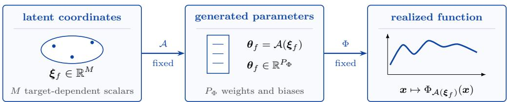
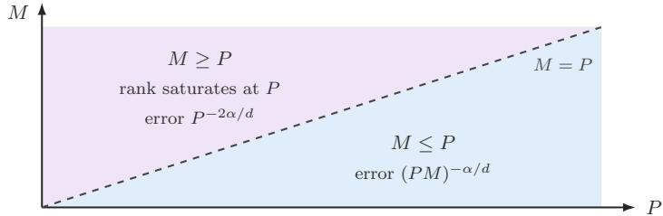
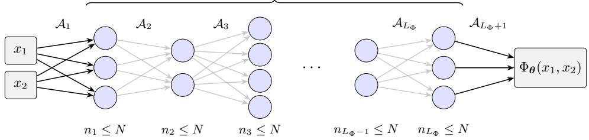
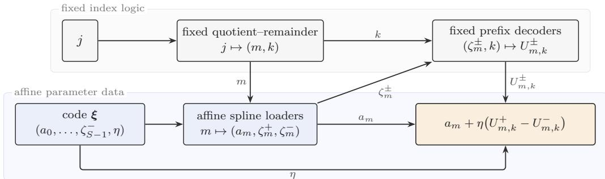
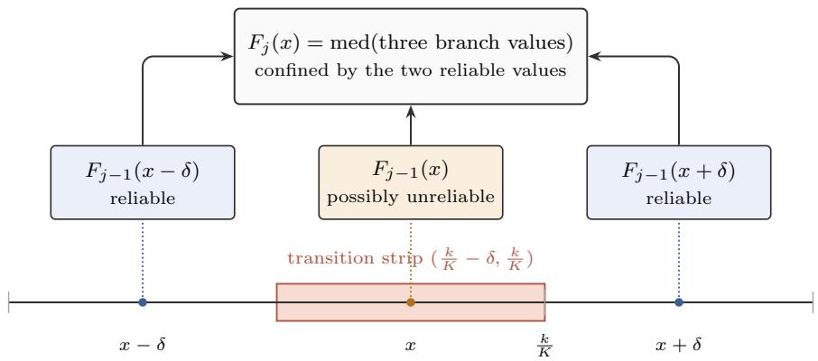
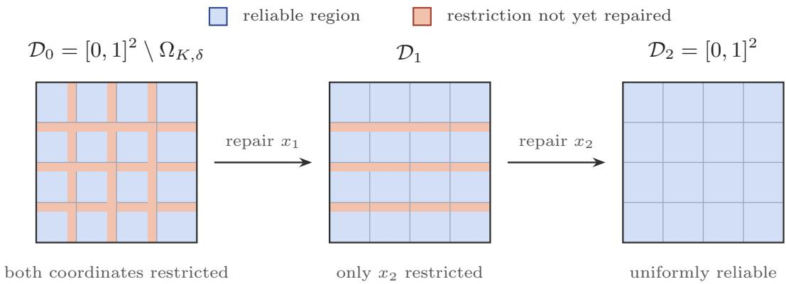
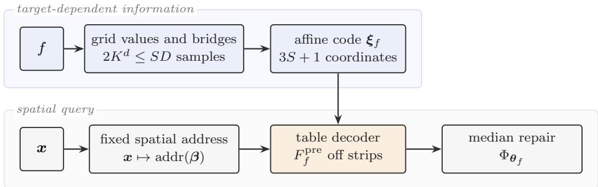
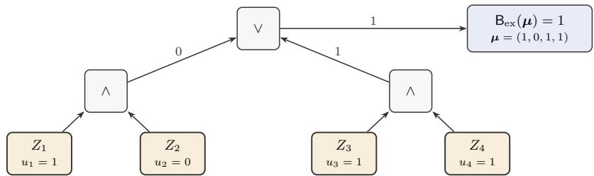
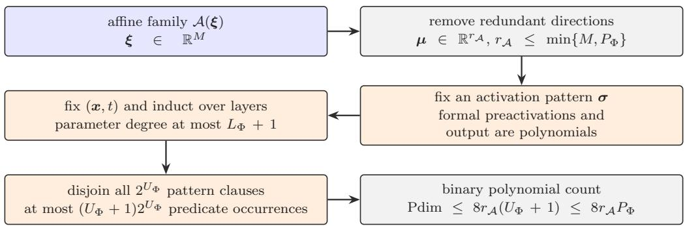

# Sharp Approximation Rates for Neural Networks with Afine Latent Parameterizations

Shijun Zhang

shijun.zhang@polyu.edu.hk

Department of Applied Mathematics

Hong Kong Polytechnic University

## Abstract

Many parameter-eficient methods generate the parameters of a large neural network from a low-dimensional latent representation. Given an architecture Φ with $P _ { \Phi }$ parameter slots, we write $\theta _ { f } = \mathcal { G } ( \xi _ { f } )$ , where $\mathcal { G } \colon \mathbb { R } ^ { M } \to \mathbb { R } ^ { P _ { \Phi } }$ is a parameter generator and $\pmb { \xi } _ { f } \in \mathbb { R } ^ { M }$ is a latent representation of the target function $f .$ The architecture Φ and the generator are shared across the entire target class, while each target $f$ is represented by its own latent vector $\xi _ { f }$ , with $\Phi _ { \mathcal { G } ( \pmb { \xi } _ { f } ) }$ approximating f. This framework encompasses hypernetworks, low-dimensional parameterizations, parameter-eficient adaptation, and model compression. Understanding the tradeof between the latent dimension M and the network budget P is therefore fundamental to characterizing the expressive eficiency of these methods. We study this tradeof for afine generators and fully connected ReLU architectures. More precisely, optimizing jointly over architectures Φ satisfying $P _ { \Phi } \leq P$ and afine generators $\mathcal { G } : \mathbb { R } ^ { M } \to \mathbf { \bar { \mathbb { R } } } ^ { P _ { \Phi } }$ , we prove that the optimal worst-case uniform approximation error over the unit ball of α-H¨older functions on $[ 0 , 1 ] ^ { d }$ , where $0 ~ < ~ \alpha ~ \leq ~ 1$ , has the sharp order $\left( P \operatorname* { m i n } \{ M , P \} \right) ^ { - \alpha / d }$ . In particular, our result shows that even a fixed-dimensional latent space sufices to achieve vanishing approximation error as the network budget increases.

Keywords: afine latent parameterization, parameter-eficient model, ReLU network approximation, sharp minimax rate, pseudo-dimension

## 1 Introduction

Modern neural networks are often heavily overparameterized: the number of weights used at inference can far exceed the number of degrees of freedom needed to select a useful model for a particular task. If the full parameter vector can be generated from a much smaller latent vector, one can reduce the storage required for each task and the dimension of the optimization problem without shrinking the deployed architecture. This separation is especially natural when a single generator and network architecture are reused across many targets, tasks, or environments.

A substantial body of empirical work indicates that this mechanism can be efective. Particularly direct examples include training in a fixed parameter subspace and reconstructing a full parameter vector from a seeded linear expansion (Li et al., 2018; Nooralinejad et al., 2023). Related methods based on weight tying, structured transforms, hypernetworks, and low-rank updates are reviewed in Section 2. Collectively, these studies suggest that the relevant complexity is not described by a single parameter count: one must distinguish the amount of target-dependent information from the size and complexity of the fixed mechanism that decodes that information.

To formalize this separation, consider an architecture Φ with $P _ { \Phi }$ weight and bias slots and a parameter generator $\mathcal { G } : \mathbb { R } ^ { M } \to \mathbb { R } ^ { P _ { \Phi } }$ . The architecture and generator are fixed for an entire target class. For each target f, only a latent vector $\pmb { \xi } _ { f } \in \mathbb { R } ^ { M }$ is selected, and the resulting function is produced by

$$
\pmb { \xi } _ { f } \in \mathbb { R } ^ { M } \longmapsto \pmb { \mathcal { G } } _ { f } = \mathcal { G } ( \pmb { \xi } _ { f } ) \in \mathbb { R } ^ { P _ { \Phi } } \longmapsto \left[ \pmb { x } \mapsto \Phi _ { \pmb { \theta } _ { f } } ( \pmb { x } ) \right] .
$$

Here $\Phi _ { \theta _ { f } }$ denotes the function realized by Φ with complete parameter vector $\theta _ { f }$ , and x denotes its input. We call $\mathbb { R } ^ { M }$ the latent parameter space and $\xi _ { f }$ the target-dependent latent vector. Because $\xi _ { f }$ is the only quantity chosen separately for each target, it is also the only targetdependent trainable vector in the model. Its M coordinates carry information about the target, whereas the $P _ { \Phi }$ slots determine the size of the deployed decoder. Counting only M ignores the decoding mechanism, while counting only $P _ { \Phi }$ treats all deployed parameters as if they varied independently with the target. A meaningful approximation theory must therefore account for both resources and keep their quantifiers separate.

This accounting of two resources is meaningful only if the generator is restricted. If is arbitrary and its complexity is not charged, then the latent dimension M alone imposes essentially no expressive constraint. Indeed, because R and $\mathbb { R } ^ { P _ { \Phi } }$ have the same cardinality, an unrestricted generator with $M = 1$ can be chosen to map onto the full parameter space. Its generated family then coincides with the family obtained by varying all $P _ { \Phi }$ network parameters independently. Continuity alone does not remove this degeneracy. A continuous surjection from R onto $\mathbb { R } ^ { P _ { \Phi } }$ can be formed, for example, by joining closed Peano curves whose images cover successively larger parameter cubes. When $P _ { \Phi } > 1$ , no such space-filling map can be locally Lipschitz, because the image of a locally Lipschitz map from R has Hausdorf dimension at most one. For a finite target collection, even smoothness is insuficient: coordinatewise Lagrange interpolation produces a polynomial curve through any prescribed finite set of realizing parameter vectors. Thus neither continuity for a generator shared across a class nor smoothness for a finite task collection makes the latent dimension alone a meaningful complexity measure. A theory of nonlinear generators must also control, for example, the description or parameter complexity of ${ \mathcal { G } } _ { : }$ , its computational size, regularity, stability, and the precision of the latent code.

We therefore study the simplest structured specialization of this framework: an afine generator,

$$
\mathcal { G } = \mathcal { A } , \qquad \mathcal { A } ( \pmb { \xi } ) = \pmb { A \xi } + \pmb { a } .\tag{1}
$$

Here $\pmb { A } \in \mathbb { R } ^ { P _ { \Phi } \times M }$ and $\textbf { \em a } \in \mathbb { R } ^ { P _ { \Phi } }$ are fixed across the target class. After the homogeneous lifting $\widehat { \pmb { \xi } } : = ( \pmb { \xi } , 1 ) \in \mathbb { R } ^ { M + 1 }$ , the map is linear in ${ \widehat { \xi } } ,$ since $\begin{array} { r } { \boldsymbol { \mathcal { A } } ( \boldsymbol { \xi } ) = [ \boldsymbol { A } , \boldsymbol { a } ] \boldsymbol { \widehat { \xi } } } \end{array}$ . This model includes training in a fixed subspace, fixed weight sharing, and afine expansions based on seeds or fixed transforms. Although hypernetworks, Mapping Networks, and many low-rank adaptation schemes are nonlinear in their latent variables, they motivate the same question concerning both budgets. The afine case is already nontrivial and imposes a transparent geometric restriction: all generated parameter vectors lie in a single afine subspace of dimension at most min $\{ M , P _ { \Phi } \}$ Any expressivity beyond this afine dimension must therefore be supplied by the fixed ReLU decoder. Throughout the paper, an afine latent parameterization means precisely the shared map in (1), which takes a latent vector to the complete parameter vector of the realized network. Figure 1 illustrates this setup.

  
Figure 1: An afine latent parameterization. Only the M-dimensional latent vector $\xi _ { f }$ changes with the target. The shared afine map generates all $P _ { \Phi }$ network parameters, and the shared architecture Φ realizes the approximation.

The closest predecessors in approximation theory treat the two endpoints of our resource model separately. Approximation results for very deep networks control the complete network size but allow every parameter to depend on the target (Shen et al., 2022d; Yarotsky, 2018).

At the opposite endpoint, intrinsic parameter approximation controls the number of scalars that depend on the target while allowing the fixed decoder to grow without an independent parameter budget; repeated composition of a shared ReLU block provides a complementary fixed-dimensional parameter-sharing construction (Shen et al., 2022b; Zhang et al., 2023). Neither endpoint simultaneously restricts the latent dimension and the number of generated parameter slots. Our goal is to connect these resource models and determine the sharp joint dependence on the two budgets. This leads to the central question:

For a single afine latent parameterization shared by a whole function class, how does the optimal worst-case approximation error depend jointly on the latent dimension M and the budget P for all generated weight and bias slots?

Our main result gives a sharp answer in both resources, uniformly over the target class. We fix the pair $( \Phi , A )$ before the target is selected, count every dense weight and bias slot of the generated network, and allow only the latent vector $\xi _ { f }$ to depend on $f .$ For the unit ball of α-H¨older functions on $[ 0 , 1 ] ^ { d }$ , where $0 < \alpha \leq 1$ , once P exceeds the explicit dimension-dependent threshold in Theorem 3.1 and min $\{ M , P \} \ge 4$ , the optimal worst-case error is, up to constants depending only on d and α,

$$
[ P \operatorname * { m i n } \{ M , P \} ] ^ { - \alpha / d } .
$$

Thus, when $M \leq P .$ , the two resources multiply and the rate is $( P M ) ^ { - \alpha / d }$ . When $M \geq P .$ the afine image is limited by the ambient parameter dimension, and the rate saturates at $P ^ { - 2 \alpha / d }$ The upper bound is achieved by fully connected ReLU networks whose width depends only on d and whose depth grows at most linearly with P. The matching lower bound holds for every admissible fully connected ReLU architecture with at most $P$ parameter slots, without any further restriction on width or depth. Thus the result characterizes the best use of one afine latent space shared across the target class, rather than the performance of a particular construction. Figure 2 summarizes the two regimes.

  
Figure 2: The sharp joint law in P and M in the nondegenerate regime of Theorem 3.1. For $M \leq P ,$ the efective scale is $P M ;$ in particular, each fixed $M \geq 4$ yields the rate $P ^ { - \alpha / d }$ . For $M \geq P$ , the afine image is limited by the ambient parameter dimension, and the rate saturates at $P ^ { - 2 \alpha / d }$

The regime of fixed latent dimension is especially noteworthy. If $M = M _ { 0 } \geq 4$ is independent of $P$ , then, whenever the hypotheses of Theorem 3.1 hold and $P \geq M _ { 0 }$

$$
[ P \operatorname * { m i n } \{ M _ { 0 } , P \} ] ^ { - \alpha / d } = M _ { 0 } ^ { - \alpha / d } P ^ { - \alpha / d } .
$$

Consequently, a constant number of target-dependent coordinates is suficient for the worst-case error to converge algebraically to zero as the shared decoder grows. This decay is driven entirely by growth of the decoder budget, which is shared across targets, rather than by growth of the trainable dimension. Although this rate is slower than the saturated rate $P ^ { - 2 \alpha / d }$ available when $M \geq P$ , it shows that a genuinely low-dimensional afine latent space can support substantial and provably optimal approximation power.

The main contributions can be summarized as follows.

(i) We introduce a minimax formulation uniform over the target class in which the architecture and afine latent map are fixed before the target is selected, and the latent dimension M and the parameter budget P for the generated slots are accounted for separately. This formulation isolates target-dependent information from shared decoding complexity.

(ii) We construct fully connected ReLU networks of fixed width depending only on the dimension. Under the stated nondegenerate conditions, these networks attain the rate $[ P \operatorname* { m i n } \{ M , P \} ] ^ { - \alpha / d }$ . The construction tracks the depth, every dense parameter slot, and all dimension-dependent constants. More generally, it yields a modulus-of-continuity estimate for arbitrary continuous targets and remains efective even when M is fixed.

(iii) We prove a matching lower bound over all fully connected architectures with input dimension $d$ and at most P dense parameter slots, without any additional width or depth restriction. The main ingredient is a pseudo-dimension estimate for ReLU networks with afine parameter tying, derived from afine rank reduction and polynomial sign pattern counting; a H¨older bump packing argument then converts this capacity bound into the matching approximation lower bound.

The upper and lower bounds rely on complementary ingredients. The upper bound combines a serialized afine spline loader, fixed binary prefix extraction, a spatial address network, and median boundary repair. For the converse, substituting $\pmb \theta = \pmb A ( \pmb \xi )$ reduces the efective number of variables to the rank of A, which is at most min $\{ M , P _ { \Phi } \}$ . A layerwise semialgebraic argument then bounds the pseudo-dimension, and localized H¨older bumps convert this capacity bound into the matching approximation lower bound. The constructive uniform upper bound also implies the same estimate in $L ^ { p } ( [ 0 , 1 ] ^ { d } )$ for every $1 \leq p < \infty$ . The matching lower bound proved here is for the uniform norm. The stated rate relies on exact real arithmetic: a latent coordinate may contain a long binary stream, and the selection $f \mapsto \xi _ { f }$ is discontinuous. The theorem therefore concerns representation power rather than numerical stability or optimization; Section 2.6 discusses this scope in detail.

The remainder of the paper is organized as follows. Section 2 reviews empirical evidence for afine and nonlinear latent parameterizations, relates the problem to existing approximation and capacity theory, and explains the interpretation and limitations of the joint law in P and M. Section 3 introduces the network model, the parameter budget classes, and the main upper and lower bounds. Section 4 gives the constructive proof of the upper bound for continuous functions, from the fixed-width modules through the final choice of the integer budgets. Section 5 proves the matching H¨older lower bound through pseudo-dimension and bump packing arguments. Finally, Section 6 summarizes the conclusions and discusses directions for further work.

## 2 Related work, interpretation, and scope

This section reviews the most closely related empirical and theoretical work, then interprets the joint law in $P$ and M and clarifies its scope. Sections 2.1 and 2.2 distinguish afine parameterizations from their nonlinear relatives. Section 2.3 places the result within approximation and capacity theory, while Sections 2.4 through 2.6 discuss resource accounting, optimization geometry, and the assumptions on exact real arithmetic. None of this background is used as an assumption in the proofs.

## 2.1 Afine latent parameterizations: parameter prediction, weight tying, and subspace training

The examples in this subsection fall into three broad categories: parameter prediction and weight tying, training in a fixed linear subspace, and training in a subspace learned jointly for a single task. For our theorem, the relevant distinction is whether the same afine map is fixed before the target function is selected.

## Parameter prediction and weight tying

An early parameter-prediction study learned a small subset of the weights and reconstructed the remainder from linear predictors; in its best reported case, more than 95% of the weights were predicted without loss of accuracy (Denil et al., 2013). This finding supports substantial redundancy in trained weight tensors, but the predictors and selected coordinates are taskdependent, and the work gives no uniform approximation guarantee over a function class.

HashedNets impose a more rigid form of sharing: a signed hash maps many virtual connections to a smaller collection of trainable scalars (Chen et al., 2015). Once the virtual weights are enumerated, this construction is exactly a sparse afine map, each of whose rows contains one signed nonzero entry. Existing theory addresses approximation by random linear sketches on well-conditioned low-dimensional input manifolds and local recovery for a one-layer hashed model (Lin et al., 2019); it does not give the H¨older-class joint minimax rate considered here. Frequency-sensitive hashing first transforms convolutional filters and then shares their spectral coeficients (Chen et al., 2016). Thus it is close to the present afine viewpoint, but its objective is empirical compression of specific convolutional models rather than a worst-case rate for a prescribed function class.

Beyond direct prediction and tying, structured expansions can reduce both storage and multiplication cost. Fastfood supplies a fixed structured random transform built from diagonal matrices, permutations, and Hadamard transforms (Le et al., 2013). Adaptive Deep Fried layers instead learn products of several diagonal factors and are generally nonlinear jointly in those factors (Yang et al., 2015). Discrete cosine transform (DCT) layers with sparse corrections add a fixed dense transform to a very sparse trainable component and retain useful accuracy even at extreme trainable sparsities (Price and Tanner, 2021). FourierFT reconstructs a dense update from selected Fourier coeficients (Gao et al., 2024). Once the transform and coeficient locations are fixed, the latter two constructions are afine parameter maps. Their transforms, sparsity patterns, and statistical tasks are prescribed diferently, however, and none proves a joint minimax law in the number of adjustable coeficients and the number of realized network slots.

## Fixed and learned subspaces

Training in fixed random subspaces optimizes $\pmb { \theta } = \pmb { W } _ { \mathrm { s u b } } \pmb { \xi } + b _ { \mathrm { s u b } }$ and defines the empirical intrinsic dimension as the smallest code dimension that attains a chosen fraction of the performance of the full model (Li et al., 2018). Experiments show that networks with hundreds of thousands of weights can sometimes be optimized through only hundreds or thousands of coordinates. Subsequent experiments demonstrate that a single reused random basis can impair optimization, while redrawing the basis at every step and using separate projections for diferent modules can improve both accuracy and speed (Gressmann et al., 2020). Because the basis changes during training, this method does not use a single fixed map and therefore lies outside our minimax model. Structured Fastfood projections for fine-tuning language models also reveal small intrinsic dimensions specific to each task and suggest that larger pretrained models can require fewer efective coordinates (Aghajanyan et al., 2021).

PRANC uses the exact linear expansion $\begin{array} { r } { \pmb { \theta } = \sum _ { m = 1 } ^ { M } \xi _ { m } \pmb { \theta } _ { m } } \end{array}$ , with basis vectors regenerated from pseudorandom seeds (Nooralinejad et al., 2023). It is therefore one of the closest empirical instances of the present algebraic model. Balanced multicomponent and multilayer networks reduce the number of trainable parameters through a structured component decomposition (Zhang et al., 2025). Their Fourier variant represents each component as a trainable linear combination of fixed random sine bases within a low-rank architecture (Zhang et al., 2026). These models further illustrate that the degrees of freedom depending on the target can be much fewer than the parameters in the realized network, but they do not establish a minimax law over an entire function class in the two budgets (M, P).

Other coordinate-restricted approaches include FreezeNet and training restricted to Batch-Norm parameters (Frankle et al., 2021; Wimmer et al., 2020); these methods correspond to coordinate projections rather than designed dense afine maps. Sparsity inducing training with $\ell _ { 1 }$ regularization for convolutional networks addresses another form of parameter reduction (He et al., 2020). In that setting, however, the active sparse structure is learned for the task rather than generated by one afine map fixed across a target class.

A complementary line of expressivity theory shows that training only normalization scales and biases in a suficiently large random host can reconstruct smaller target networks, with extensions to convolutional and residual architectures (Burkholz, 2024; Giannou et al., 2023). Those theorems exploit the special normalization architecture and address target-network reconstruction rather than uniform approximation of a H¨older ball by one prescribed afine map.

Learned solution subspaces provide a further comparison. Lines, curves, and simplices of highly accurate solutions show that useful low-dimensional regions can be optimized jointly with a target network (Wortsman et al., 2021). In that setting, however, the endpoints defining the subspace are themselves trainable objects specific to the task, whereas our afine image is fixed before any target in the H¨older ball is selected. Taken together, these works address task performance, optimization, or reconstruction of prescribed target networks; they do not characterize the worst-case approximation error jointly in (M, P).

## 2.2 Nonlinear generators and parameter-eficient adaptation

We now turn from afine maps to generators that are typically nonlinear. The general mechanism remains

$$
\mathcal { G } : \mathbb { R } ^ { M } \to \mathbb { R } ^ { P _ { \Phi } } , \qquad \theta = \mathcal { G } ( \xi ) ,
$$

but $\mathcal { G }$ need not be afine. Hypernetworks, Mapping Networks, and most low-rank adaptation methods therefore motivate the question of how approximation depends on both budgets, although they do not belong to the afine class studied here. As explained in the Introduction, a sharp minimax theory for such models would require a separate complexity or regularity budget for $\mathcal { G } ;$ otherwise M alone does not control the generated family.

Hypernetworks generate the weights of a primary network from conditioning information or a compact code and have been applied to recurrent and image models (Ha et al., 2017). Theoretical work compares their parameter complexity with that of direct embedding models and identifies settings in which modular weight generation is advantageous (Galanti and Wolf, 2020). Infinite-width analysis shows that widening only the generator does not automatically produce benign kernel dynamics, whereas a joint infinite-width limit yields an explicit hyperkernel (Littwin et al., 2020). Hypernetworks conditioned on graphs can predict millions of weights for architectures unseen during training in a single forward pass (Knyazev et al., 2021). These works study learned nonlinear generators, conditional families, or optimization dynamics. The generator may be frozen after training, but its map $\mathcal { G }$ remains nonlinear and is learned for a particular task.

Mapping Networks provide a particularly direct recent example of a nonlinear parameter generator (Sen and Mukherjee, 2026). A compact trainable latent vector modulates nontrainable, orthogonally initialized base matrices inside the mapping machinery. Composing these modulated layers produces a nonlinear map from the latent vector to all parameters of a target model. The reported experiments cover image classification, detection of manipulated faces, semantic segmentation, recurrent forecasting, and adaptation of $\mathrm { a }$ pretrained model. For one reported classifier, full training uses 537,994 parameters, while latent variants use only a few thousand coordinates and obtain competitive or improved accuracy. In the reported Cityscapes experiment, a target model with 1,734,803 parameters is driven by roughly eight thousand latent coordinates: pixel accuracy increases from 93.21% to 97.92%, while mean intersection-over-union changes from 0.4957 to 0.4623 (and to 0.4823 for the layerwise variant) (Sen and Mukherjee, 2026). These results directly motivate the question involving both budgets, but their generator is nonlinear. The existence theorem based on manifolds, the local solvability result, and the experiments do not establish a worst-case approximation rate over a function class in $( M , P )$ . A closely related nonlinear compression model uses a frozen random generator to constrain the complete parameter vector to a prescribed low-dimensional nonlinear manifold (Thrash et al., 2025). Its experiments support the broader $\mathcal G ( \pmb { \xi } )$ framework, but its generator is nonlinear and random, and its analysis does not establish the class-wide afine minimax law considered here.

Low-rank adaptation provides another important class of nonlinear parameterizations. LoRA represents an update as a product of two thin matrices (Hu et al., 2022). VeRA, NOLA, and RandLoRA further reuse fixed random matrices or random bases and train scaling or combination coeficients (Albert et al., 2025; Koohpayegani et al., 2024; Kopiczko et al., 2024). Ordinary two-factor LoRA is nonlinear jointly in its two trainable factors. Even when each NOLA factor is a linear combination of fixed bases, multiplying the two factors again makes the complete update nonlinear in the combined code. A variant in which one factor is fixed, or a direct linear expansion of the complete update in a fixed basis, would instead define an afine map from $\mathbb { R } ^ { M } \mathrm { \ t o \ } \mathbb { R } ^ { P _ { \Phi } }$ . Kernel analyses explain why low-dimensional update subspaces can preserve fine-tuning dynamics in suitable regimes (Malladi et al., 2023). Separately, theoretical work characterizes reconstruction of target networks by low-rank updates and studies the landscape in neural tangent and local Polyak– Lojasiewicz regimes (Jang et al., 2024; Liu et al., 2025; Zeng and Lee, 2024). These results depend on pretrained weights, low-rank factorization, or local optimization assumptions; they do not yield the global function class rate proved below.

Gradient low-rank projection provides a useful contrast: it compresses gradients and optimizer state while retaining full-rank trainable weights (Zhao et al., 2024). It is therefore an optimizationmemory method rather than a low-dimensional parameter map $\mathcal { G } : \mathbb { R } ^ { M } \to \mathbb { R } ^ { P _ { \Phi } }$

## 2.3 Approximation theory, coding, and capacity

Three theoretical viewpoints organize the comparison: exact codes with an unbudgeted decoder, networks whose complete parameter vector may depend on the target, and capacity bounds based on polynomial sign patterns. Our theorem draws on all three while budgeting both the code and the decoder.

Classical universal approximation theorems establish density on compact sets (Cybenko, 1989; Hornik, 1991; Hornik et al., 1989), while quantitative approximation theory relates the error to width, depth, smoothness, and the total number of network parameters (Yarotsky, 2017, 2018). Related developments include sparse-network and Sobolev-norm estimates (B¨olcskei et al., 2019; Chui et al., 2018; G¨uhring et al., 2020; Petersen and Voigtlaender, 2018), approximation rates for broad classes of activation functions (Siegel and Xu, 2020), and high-order rates for shallow networks (Siegel and Xu, 2022). Recent work gives nearly optimal rates for shallow $\operatorname { R e L U } ^ { k }$ networks on Sobolev spaces through Radon-transform techniques (Mao et al., 2026). Approximation spaces generated by deep networks are characterized in (Gribonval et al., 2022), and further quantitative constructions appear in (Lu et al., 2021; Shen et al., 2019, 2020, 2022d).

A closely related approximation result separates parameters that depend on the target from parameters fixed for an entire function class (Shen et al., 2022b, Theorem 2.2 and the discussion immediately following it). For a target on $[ 0 , 1 ] ^ { d }$ with Lipschitz constant $\lambda ,$ it constructs a ReLU network with $n + 2$ intrinsic parameters and uniform error at most $5 \lambda \sqrt { d } 2 ^ { - n }$ , and it extends the construction to general continuous functions. The decoder size is allowed to grow as required and is not independently budgeted. The present problem asks how that exponential dependence on the code length changes once the decoder is also subject to the budget $P _ { - }$ . Repeated composition of a single ReLU block of fixed size gives a complementary form of parameter sharing (Zhang et al., 2023). After the composition is unrolled, reuse of the same block parameters becomes an afine tying map from a fixed number of independent coeficients to a number of network slots proportional to the number of repetitions. The resulting $O ( r ^ { - 1 / d } )$ error for Lipschitz targets is consistent with the fixed M regime here, but that work does not determine the joint dependence on arbitrary (M, P) or prove a matching lower bound.

At the opposite endpoint, approximation theory for very deep networks with joint width and depth budgets controls the entire network size while allowing every parameter to depend on the target (Lu et al., 2021; Shen et al., 2020, 2022d; Yarotsky, 2018; Yarotsky and Zhevnerchuk, 2020). The joint law in this paper interpolates between these two resource models. Qualitative bounded-width universality also shows that width can be bounded solely in terms of the input dimension when depth is allowed to grow (Lu et al., 2017). Such a theorem neither requires the parameter vector to lie in one fixed afine image nor quantifies the joint code and slot budgets; those are the constraints responsible for the rate studied here. Other constructions of fixed width use depth as a progressive refinement mechanism. Multigrade ReLU networks successively reduce the residual (Zhang et al., 2026b), while shared architectures with intermediate readouts achieve geometrically finer layerwise approximation scales (Zhang et al., 2026a). These results clarify the approximation role of depth, but they do not impose the afine latent budget studied here. Another line interprets deep architectures through dynamical systems and derives approximation results from flows, interpolation, and controllability (Cheng et al., 2025; Cheng et al., 2026; E, 2017; Li et al., 2023). This viewpoint has also been developed for invariant target classes (Li et al., 2022).

A complementary computability result constructs a single fixed narrow recurrent ReLU network that receives an encoding of a computable target function as part of its input and approximates it after a controlled number of recurrent iterations (Bournez et al., 2025). That result emphasizes a universal decoder and relates its iteration count to computational complexity. Here, by contrast, the code does not enter as an ordinary network input: it afinely generates the weights and biases of a finite feedforward architecture, and both the code dimension M and the resulting dense parameter count P are optimized explicitly.

Random feature approximation provides another relevant afine special case: the features are fixed and only the output coeficients vary. Quantitative results are available for random ReLU features, random neural networks and reservoirs, and networks with sampled weights (Bolager et al., 2023; Gonon et al., 2023; Hsu et al., 2021). The essential diferences are that those results typically average over a random draw, use $L ^ { 2 }$ target classes or classes of Barron type, and do not exploit a decoder of length proportional to P to obtain a joint PM law. Lottery ticket results instead encode the target through a discrete pruning mask (Malach et al., 2020; Pensia et al., 2020); their information model is combinatorial rather than based on an afine code in exact real arithmetic. More broadly, Barron spaces and function spaces induced by flows, together with population risk estimates for networks with two layers, provide a related function space perspective (E and Wojtowytsch, 2022; E et al., 2019; E et al., 2022).

The theory of nonlinear widths distinguishes arbitrary, continuous, and stable maps from targets to parameters (Cohen et al., 2022; Daubechies et al., 2022; DeVore, 1998; DeVore et al., 1989). Very deep ReLU networks can exceed stable nonlinear width rates by using discontinuous encodings of high precision (Shen et al., 2022d; Yarotsky, 2018; Yarotsky and Zhevnerchuk, 2020). For shallow neural-network variation spaces, sharp approximation rates, metric entropy bounds, and n-width estimates provide a complementary complexity-theoretic perspective (Siegel and Xu, 2024). The upper construction below lies in this exact real regime. For the lower bound, classical counting of polynomial sign patterns for real parameters, together with later nearly tight bounds for piecewise linear networks, provides the relevant capacity tools (Anthony and Bartlett, 1999; Bartlett et al., 1998, 2019; Goldberg and Jerrum, 1995; Warren, 1968). We adapt these arguments to afine parameter tying, so the efective variable count is rank(A) rather than the ambient number $P _ { \Phi }$ of parameter slots.

## 2.4 Resource accounting and endpoint regimes

Having situated the theorem relative to the most closely related models and theoretical results, we now interpret its two resource budgets. In the nondegenerate regime covered by the main theorem, with $4 \leq M \leq P$ and P suficiently large, the sharp H¨older rate is $( P M ) ^ { - \alpha / d }$ . The construction explains this product directly: a constant fraction of the M latent coordinates store independent streams of quantized function increments, while a fixed decoder of depth proportional to $P$ reads a number of digits proportional to $P$ from each stream. Consequently, it reconstructs a number of grid values proportional to $P M$

The result also connects two established endpoint theories. When M is comparable to $P ,$ the rate is $P ^ { - 2 \alpha / d }$ , matching the optimal rate for very deep networks of fixed width established in (Yarotsky, 2018, Theorems $1 ( \mathrm { a } )$ and $2 ( \mathrm { b } ) )$ and (Shen et al., 2022d, Theorem 1.1). When $M \geq 4$ is fixed and P is suficiently large, the rate becomes $P ^ { - \alpha / d }$ and quantifies how a latent vector of fixed dimension over the real numbers can be decoded by a shared decoder of increasing depth, in the spirit of (Shen et al., 2022b). Once $M \geq P$ , the afine rank is bounded by the ambient parameter dimension, which explains the saturation encoded by min $\{ M , P \}$

The coeficients of the afine map are shared across the target class rather than selected separately for each target. In the absence of additional structure, A and a contain $P _ { \Phi } M + P _ { \Phi }$ fixed scalar entries. These entries are not charged to the target-dependent trainable parameter count M, so the theorem does not automatically imply compression of total storage. Charging them, imposing sparsity or fast transforms, or regenerating them from short random seeds would define diferent resource models, as in several empirical constructions discussed above. A recent preprint studies a seeded deployment model with finite bit precision in which the stored artifact consists of a short integer seed and a quantized latent vector; the seed regenerates the fixed basis and initialization center (Dhayalkar, 2026). Its resource accounting and experiments complement the minimax theorem over exact real parameters here, but it does not provide a matching approximation law over a function class. Within the deployed network, however, every weight and bias slot, including slots fixed at zero, is counted in $P _ { \Phi }$

## 2.5 Optimization geometry and conditioning

Beyond resource accounting, the afine map also induces a particular optimization geometry. The approximation problem itself does not prescribe an algorithm for finding $\xi _ { f }$ , but the afine parameterization makes this geometry explicit. Let

$$
\begin{array} { r } { \pmb { \mathcal { A } } ( \pmb { \xi } ) = \pmb { A } \pmb { \xi } + \pmb { a } \quad \mathrm { a n d } \quad \widetilde { \pmb { \mathcal { L } } } ( \pmb { \xi } ) : = \pmb { \mathcal { L } } \big ( \pmb { \mathcal { A } } ( \pmb { \xi } ) \big ) , } \end{array}
$$

where $\mathcal { L } ( \pmb \theta )$ is a twice continuously diferentiable loss in the full parameter space and $\top$ denotes transpose. The chain rule gives

$$
\nabla _ { \xi } \widetilde { \mathcal { L } } ( \pmb { \xi } ) = \pmb { A } ^ { \top } \nabla _ { \pmb { \theta } } \mathcal { L } \big ( \pmb { A } ( \pmb { \xi } ) \big ) , \qquad \nabla _ { \pmb { \xi } } ^ { 2 } \widetilde { \mathcal { L } } ( \pmb { \xi } ) = \pmb { A } ^ { \top } \nabla _ { \pmb { \theta } } ^ { 2 } \mathcal { L } \big ( \pmb { A } ( \pmb { \xi } ) \big ) \pmb { A } .
$$

The pullback Hessian is singular whenever $r _ { \mathcal { A } } : = \mathrm { r a n k } ( A ) < M ;$ ; hence its ordinary condition number is not meaningful until redundant latent directions are removed. If $r _ { A } = 0$ , the afine family contains one parameter vector and there is no latent condition number. Otherwise, choose an orthonormal basis for $\ker ( A ) ^ { \perp }$ and place its vectors in the columns of $V _ { \mathcal { A } } \in \mathbb { R } ^ { M \times r _ { \mathcal { A } } }$ . Define the nonredundant coordinates $\pmb { \xi } _ { A } ^ { \mathrm { e f f } } : = \pmb { V } _ { A } ^ { \top } \pmb { \xi }$ and the efective matrix $A _ { \mathcal { A } } ^ { \mathrm { e f f } } : = A V _ { \mathcal { A } }$ . Because $\pmb { \xi } - \pmb { V _ { A } } \pmb { V } _ { A } ^ { \top } \pmb { \xi } \in \ker ( A )$ , one has $\pmb { A } \pmb { \xi } = \pmb { A } _ { \mathcal { A } } ^ { \mathrm { e f f } } \pmb { \xi } _ { \mathcal { A } } ^ { \mathrm { e f f } }$ . Thus $\pmb { \theta } = \pmb { A } _ { \mathcal { A } } ^ { \mathrm { e f f } } \pmb { \xi } _ { \mathcal { A } } ^ { \mathrm { e f f } } + \pmb { a }$ , and the Euclidean metric on $\pmb { \xi } _ { \mathcal { A } } ^ { \mathrm { e f f } }$ is inherited from the nonredundant directions of the original latent vector. For a local quadratic model with Hessian H, define

$$
\begin{array} { r } { H _ { \mathcal { A } } ^ { \mathrm { e f f } } : = ( A _ { \mathcal { A } } ^ { \mathrm { e f f } } ) ^ { \top } H A _ { \mathcal { A } } ^ { \mathrm { e f f } } . } \end{array}
$$

When this matrix is positive definite, the local condition number in these efective coordinates is

$$
\mathrm { c o n d } _ { 2 } ( H _ { \mathcal { A } } ^ { \mathrm { e f f } } ) : = \frac { \lambda _ { \operatorname* { m a x } } ( H _ { \mathcal { A } } ^ { \mathrm { e f f } } ) } { \lambda _ { \operatorname* { m i n } } ( H _ { \mathcal { A } } ^ { \mathrm { e f f } } ) } .
$$

Because a nonorthogonal change of coordinates within the same afine image can alter this condition number, the coordinate system must be specified. Thus dimensional reduction alone neither guarantees nor precludes better conditioning. This conclusion is consistent with empirical comparisons of random bases, general analyses of reparameterization, and studies of low-rank optimization landscapes (Gressmann et al., 2020; Kristiadi et al., 2023; Liu et al., 2025). The reparameterization result in (Kristiadi et al., 2023) concerns invertible coordinate changes; by contrast, a rank-deficient also restricts the model to a proper afine subspace. Constructing an afine map that is simultaneously optimal for approximation and well conditioned for a prescribed loss is a separate problem.

## 2.6 Exact real arithmetic, discontinuity, and scope

We next turn to a separate limitation of the upper bound: its use of exact real arithmetic. The construction stores finite but increasingly long binary streams in exact real coordinates. Their useful bit length grows with the depth and hence with P. For a stream of D decoded bits, the fixed prefix gate used later contains a coeficient of size $2 ^ { D + 1 }$ , so the dynamic range of some decoder weights shared across targets also grows exponentially with the number of decoded bits. The selection map $f \mapsto \xi _ { f }$ uses quantization and is discontinuous. These features are standard in the exact real regime with superconvergent approximation rates (Shen et al., 2020, $\mathrm { 2 0 2 1 a , b , 2 0 2 2 b , d }$ ; Wang et al., 2025; Yarotsky, 2018; Zhang et al., 2023, 2026). If every latent coordinate were restricted to b bits, only $2 ^ { M b }$ codes would be available, and a standard H¨older packing or entropy argument would impose an additional information obstruction of order $( M b ) ^ { - \alpha / d }$ . A recent bit-complexity framework likewise emphasizes that parameter count and finite-precision information complexity are distinct resource measures (Mao and Xu, 2026). The main theorem therefore concerns expressivity over real parameters, not bit complexity, stability under perturbations or noise, or the behavior of gradient descent. Weight constraints define another complementary resource model: upper and lower approximation bounds are known for norm-constrained ReLU networks on smooth function classes (Jiao et al., 2023b). Here we count all weight and bias slots but impose no uniform bound on their magnitudes. These comparisons are not used in any proof below.

A second scope restriction is architectural: we consider only fully connected ReLU networks. Both the architectural class and the activation are substantive restrictions. Approximation and universality for convolutional architectures have their own corresponding theories (Bao et al., 2023; Lin et al., 2022; Zhou, 2020). The role of the activation is also reflected in general activation-dependent approximation rates (Siegel and Xu, 2020), activation-dependent spectral bias (Cao et al., 2021; Hong et al., 2022), and constructions combining ReLU, sine, and exponential activations on H¨older classes (Jiao et al., 2023a). Richer nested ReLU architectures can obey diferent laws relating the parameter count to the error (Shen et al., 2022c). With specially designed continuous activations, even networks of fixed size can be universal (Shen et al., 2022a), while transfer results extend many ReLU approximation constructions to broad activation families (Zhang et al., 2024). None of these results gives the joint afine minimax law studied here.

Finally, the constructive theorem uses width depending only on the dimension, while its depth grows with P and supplies sequential decoding time. The lower bound allows every fully connected architecture with at most $P$ dense parameter slots under the convention of Section 3.1. No theorem is claimed for upper bounds at fixed depth, convolutional architectures, or nonlinear generators. The upper construction applies to every continuous function on the cube, while matching optimality is proved for the normalized H¨older class in the uniform norm. The afine map is also chosen constructively; the result does not assert that a random afine subspace attains the same worst-case rate.

In summary, the literature reviewed above motivates the general parameter map ${ \mathcal { G } } _ { : }$ while the remainder of the paper isolates a precise setting: one afine latent parameterization shared across the target class, latent vectors over exact real numbers, and two independently charged budgets $( M , P )$ . The minimax class imposes no explicit width bound, whereas the optimal upper construction has width depending only on $d .$

## 3 Problem formulation and main results

With the setting and scope now fixed, we formulate the precise minimax problem. Section 3.1 introduces the notation, architecture classes, afine latent families, and target class; Section 3.2 states the matching upper and lower bounds.

## 3.1 Notation and model

Let R and $\mathbb { N } ^ { + }$ denote the sets of real numbers and positive integers, respectively. For any set $X$ , the notation $\mathbb { R } ^ { X }$ denotes the set of functions from $X$ to $\mathbb { R } .$ . If $m \in \mathbb { N } ^ { + }$ and $X \subseteq \mathbb { R } ^ { m }$ has the subspace topology inherited from $\mathbb { R } ^ { m }$ , then $C ( X )$ denotes the space of real-valued continuous functions on $X$

Bold lowercase and uppercase letters denote column vectors and matrices, respectively, and $\top$ denotes transpose. Thus $( a _ { 1 } , \ldots , a _ { q } )$ is a column vector, whereas $[ a _ { 1 } , \dotsc , a _ { q } ]$ is a row vector. The symbol 0 denotes a zero vector or matrix, with its dimension inferred from context. For $q \in \mathbb { N } ^ { + } , I _ { q }$ is the $q \times q$ identity matrix, and $e _ { j }$ is the jth coordinate vector whenever its ambient dimension is clear. We use $\ker ( A )$ , Range $( A )$ , and $\operatorname { r a n k } ( A )$ for the kernel, range, and rank of a matrix. The expression diag $( A _ { 1 } , \dotsc , A _ { J } )$ denotes the corresponding block diagonal matrix, and vec denotes vectorization in the fixed order specified below.

Throughout the paper, $\varrho ( t ) : = \operatorname* { m a x } \{ t , 0 \}$ denotes the ReLU activation and is applied componentwise to vectors. For $t \in \mathbb { R }$ , set

$$
t _ { + } : = \operatorname* { m a x } \{ t , 0 \} = \varrho ( t ) , \qquad t _ { - } : = \operatorname* { m a x } \{ - t , 0 \} = \varrho ( - t ) , \qquad t = t _ { + } - t _ { - } .
$$

For $z = ( z _ { 1 } , \dots , z _ { m } ) \in \mathbb { R } ^ { m }$ , the symbols $\| z \| _ { 2 }$ and $\| z \| _ { \infty } : = \operatorname* { m a x } _ { 1 \leq j \leq m } | z _ { j } |$ denote the Euclidean and maximum norms, respectively. For $1 \leq p < \infty$ and $f : [ 0 , 1 ] ^ { d } \to \mathbb { R }$ , write

$$
\| f \| _ { L ^ { p } ( [ 0 , 1 ] ^ { d } ) } : = \biggl ( \int _ { [ 0 , 1 ] ^ { d } } | f ( \pmb { x } ) | ^ { p } \mathrm { d } \pmb { x } \biggr ) ^ { 1 / p } , \qquad \| f \| _ { L ^ { \infty } ( [ 0 , 1 ] ^ { d } ) } : = \operatorname* { s u p } _ { \pmb { x } \in [ 0 , 1 ] ^ { d } } | f ( \pmb { x } ) | .
$$

The notation $| S |$ denotes the cardinality of a finite set $\mathcal { S } .$ We use 1 generically for indicators: $\mathbb { 1 } _ { \{ E \} }$ is the indicator of a statement E, whereas $\Im _ { S }$ is the indicator function of a set ${ \mathcal { S } } .$ The notation med ${ \mathfrak { l } } ( a , b , c )$ denotes the median of $a , b , c \in \mathbb { R }$ . We write $\lfloor t \rfloor$ for the floor of $t ;$ log and ln denote natural logarithms, $\log _ { 2 }$ denotes the logarithm to base two, and e is Euler’s number. For positive quantities a and $b ,$ we write $a \asymp _ { \Lambda }$ b if there are constants $c _ { \Lambda } , C _ { \Lambda } > 0$ , depending only on the listed parameters Λ, such that $c _ { \Lambda } b \le a \le C _ { \Lambda } b$

For a binary function class ${ \mathcal { C } } , { \mathrm { V C d i m } } ( { \mathcal { C } } )$ denotes its VC dimension. For a real-valued class $\mathcal { F } , \mathrm { P d i m } ( \mathcal { F } )$ denotes its pseudo-dimension, while VCdim( ) denotes the VC dimension of the class obtained by thresholding $\mathcal { F }$ at zero. Formal definitions are given in Section 5.1.

For $f \in C ( [ 0 , 1 ] ^ { d } )$ , its modulus of continuity is

$$
\omega _ { f } ( r ) : = \operatorname* { s u p } \Big \{ | f ( \pmb { x } ) - f ( \pmb { y } ) | : \pmb { x } , \pmb { y } \in [ 0 , 1 ] ^ { d } , \ \| \pmb { x } - \pmb { y } \| _ { 2 } \le r \Big \} , \qquad r \ge 0 .\tag{2}
$$

In particular, $\omega _ { f }$ is nondecreasing, $\omega _ { f } ( 0 ) = 0$ , and $\omega _ { f } ( \boldsymbol r ) \to 0$ as $r \downarrow 0$ . It also satisfies $\omega _ { f } ( K r ) \le K \omega _ { f } ( r )$ for every $r \geq 0$ and $K \in \mathbb { N } ^ { + }$ : subdivide the line segment joining any two admissible points into K equal pieces and use the triangle inequality.

## Network architectures

A fully connected ReLU architecture is denoted by Φ. Its input dimension $d _ { \Phi }$ is determined by the target function, and its output dimension is one throughout this paper; both dimensions are therefore suppressed in the notation for architecture classes. Thus, when these classes are used for targets on $[ 0 , 1 ] ^ { d }$ , the input dimension is understood to be d. Let $L _ { \Phi } \in \mathbb { N } ^ { + }$ be the number of hidden layers and let ${ n } _ { 1 } , \dots , { n } _ { L _ { \Phi } } \in \mathbb { N } ^ { + }$ be their widths. Set $n _ { 0 } = d _ { \Phi }$ and $n _ { L _ { \Phi } + 1 } = 1$ , and define

$$
\mathrm { d e p t h } ( \Phi ) : = L _ { \Phi } , \qquad \mathrm { w i d t h } ( \Phi ) : = \operatorname* { m a x } _ { 1 \le \ell \le L _ { \Phi } } n _ { \ell } .
$$

Thus every architecture admitted by our convention has at least one hidden ReLU unit. An afine network with no hidden layer could be added as a degenerate case. Doing so would not weaken the lower bound, but excluding it keeps the layer notation uniform throughout the constructive proof. Indeed, after rank reduction, its subgraph predicate is one polynomial inequality of degree one in the efective coordinates, so Proposition 5.5 gives the same capacity estimate under the parameter budget. For $N , L \in \mathbb { N } ^ { + }$ , let

$$
\operatorname { A r c h } ( N , L ) : = \left\{ \Phi : \operatorname { w i d t h } ( \Phi ) \leq N , \ \operatorname { d e p t h } ( \Phi ) \leq L \right\} .
$$

$$
\mathrm { F o r } \ \ell = 1 , \ldots , L _ { \Phi } + 1 , \mathrm { l e t }
$$

$$
\mathcal { A } _ { \ell } ( z ) : = W _ { \ell } z + b _ { \ell }
$$

denote the afine map associated with layer ℓ. Vectorizing and concatenating all weight matrices and bias vectors in their natural order yields

$$
\begin{array} { r } { \pmb { \theta } : = \mathrm { v e c } \big ( { W } _ { 1 } , { b } _ { 1 } , \ldots , { W } _ { { L } _ { \Phi } + 1 } , { b } _ { { L } _ { \Phi } + 1 } \big ) \in \mathbb { R } ^ { P _ { \Phi } } . } \end{array}
$$

The function realized by Φ with parameters θ is

$$
\begin{array} { r } { \Phi _ { \theta } : = \mathcal { A } _ { L _ { \Phi } + 1 } \circ \varrho \circ \mathcal { A } _ { L _ { \Phi } } \circ \cdot \cdot \cdot \circ \varrho \circ \mathcal { A } _ { 1 } \in C ( \mathbb { R } ^ { d _ { \Phi } } ) . } \end{array}
$$

The hidden-unit index set and the number of hidden units are

$$
\mathcal { U } _ { \Phi } : = \left\{ ( \ell , j ) : 1 \le \ell \le L _ { \Phi } , 1 \le j \le n _ { \ell } \right\} , \qquad U _ { \Phi } : = | \mathcal { U } _ { \Phi } | = \sum _ { \ell = 1 } ^ { L _ { \Phi } } n _ { \ell } .\tag{3}
$$

The total number of scalar weight and bias entries is

$$
P _ { \Phi } : = \sum _ { \ell = 1 } ^ { L _ { \Phi } + 1 } n _ { \ell } ( n _ { \ell - 1 } + 1 ) .\tag{4}
$$

After fixing an ordering of these entries, a parameter assignment is identified with $\pmb { \theta } \in \mathbb { R } ^ { P _ { \Phi } }$ . All dense weight and bias entries are counted, including those assigned a fixed value, possibly zero. For $P \in \mathbb { N } ^ { + }$ , define

$$
\operatorname { A r c h } _ { \operatorname { p a r } } ( P ) : = \left\{ \Phi : P _ { \Phi } \leq P \right\} .
$$

No separate width or depth restriction is imposed in $\operatorname { A r c h } _ { \operatorname { p a r } } ( P )$ . Figure 3 summarizes these architectural conventions.

  
Figure 3: An architecture $\Phi \in \operatorname { A r c h } ( N , L )$ . The widths of hidden layers may be smaller than $N _ { ; }$ and all dense weight and bias entries are counted in $P _ { \Phi }$

## Afine latent parameterizations

For M, $Q \in \mathbb { N } ^ { + }$ , let

$$
\mathsf { A f f } ( M , Q ) : = \left\{ A : \mathbb { R } ^ { M } \to \mathbb { R } ^ { Q } : { \mathcal { A } } ( \xi ) = A \xi + a , \ A \in \mathbb { R } ^ { Q \times M } , \ a \in \mathbb { R } ^ { Q } \right\} .
$$

The convention $M \in \mathbb { N } ^ { + }$ excludes the degenerate zero-dimensional latent space, whose afine image would consist of a single parameter vector. For an architecture Φ and a map $\mathcal { A } \in$ $\mathsf { A f f } ( M , P _ { \Phi } )$ , the network parameters are generated by

$$
\pmb \theta = \pmb { \mathcal { A } } ( \pmb \xi ) = \pmb { A } \pmb \xi + \pmb { a } , \qquad \pmb \xi \in \mathbb { R } ^ { M } .
$$

Here $\mathbb { R } ^ { M }$ is the latent parameter space, while A and a are fixed over the target class. The corresponding realized family is

$$
\mathcal { F } _ { \Phi , \mathcal { A } } : = \left\{ \Phi _ { \mathcal { A } ( \pmb { \xi } ) } : \pmb { \xi } \in \mathbb { R } ^ { M } \right\} = \left\{ \Phi _ { \pmb { \theta } } : \pmb { \theta } \in \mathcal { A } ( \mathbb { R } ^ { M } ) \right\} \subseteq C \big ( \mathbb { R } ^ { d _ { \Phi } } \big ) .\tag{5}
$$

Its efective afine dimension is

$$
r _ { \cal A } : = \mathrm { r a n k } ( { \cal A } ) \leq \mathrm { m i n } \{ M , P _ { \Phi } \} .\tag{6}
$$

The pair $( \Phi , A )$ is chosen independently of the target; only the latent vector $\boldsymbol { \xi }$ may depend on the target function.

## Target class and minimax error

For $0 < \alpha \leq 1$ , define the unit H¨older ball

$$
\begin{array} { r } { \mathcal { H } _ { d } ^ { \alpha } : = \Big \{ f \in C ( [ 0 , 1 ] ^ { d } ) : \| f \| _ { L ^ { \infty } ( [ 0 , 1 ] ^ { d } ) } \leq 1 , \ | f ( x ) - f ( y ) | \leq \| x - y \| _ { 2 } ^ { \alpha } \mathrm { ~ f o r ~ a l l ~ } x , y \in [ 0 , 1 ] ^ { d } \Big \} . } \end{array}
$$

We use the following dimension-dependent constants throughout:

$$
N _ { d } : = 3 ^ { d } \big ( \mathrm { { m a x } \{ 2 0 d , 9 6 \} + 4 \big ) , }\tag{7}
$$

$$
B _ { d } : = ( 4 8 + 2 d ) N _ { d } ( N _ { d } + 1 ) + N _ { d } ( d + 2 ) + 1 ,\tag{8}
$$

$$
P _ { d } ^ { \star } : = 2 ^ { 2 d + 2 } B _ { d } ,\tag{9}
$$

$$
C _ { d } : = 4 \cdot 8 ^ { 1 / d } \sqrt { d } B _ { d } ^ { 2 / d } .\tag{10}
$$

All four constants depend only on d. For $P \in \mathbb { N } ^ { + }$ , we also use the depth budget

$$
L _ { d , P } : = 1 8 \lfloor P / B _ { d } \rfloor + 3 0 + 2 d .
$$

With this notation in place, for an admissible pair $( \Phi , A )$ with $d _ { \Phi } = d .$ , define

$$
\mathcal { R } _ { \alpha , d } ( \Phi , \mathcal { A } ) : = \operatorname* { s u p } _ { f \in \mathcal { H } _ { d } ^ { \alpha } } \operatorname* { i n f } _ { \xi \in \mathbb { R } ^ { M } } \left\| f - \Phi _ { \mathcal { A } ( \xi ) } \right\| _ { L ^ { \infty } ( [ 0 , 1 ] ^ { d } ) } .\tag{11}
$$

The afine latent minimax error under a parameter budget $P$ is

$$
\mathcal { E } _ { \alpha , d } ( M , P ) : = \operatorname* { i n f } _ { \Phi \in \operatorname { A r c h } _ { \operatorname { p a r } } ( P ) } \operatorname* { i n f } _ { \boldsymbol A \in \mathsf { A f f } ( M , P _ { \Phi } ) } \mathcal { R } _ { \alpha , d } ( \Phi , \boldsymbol A ) .\tag{12}
$$

Thus the architecture and afine map are chosen before the target, whereas the latent vector is chosen after the target is given. In (12), the infimum is restricted to architectures with input dimension d and scalar output, as it is whenever an architecture class is used for targets on $[ 0 , 1 ] ^ { d }$ . This convention keeps the input dimension determined by the target domain out of the architecture notation while making every diference $f - \Phi _ { \theta }$ well defined. As usual, inf $\emptyset : = + \infty$

## 3.2 Main results

With the minimax problem now defined, we state the three main results. Theorem 3.1 gives a modulus-of-continuity bound for every continuous target, Corollary 3.2 specializes it to the H¨older class, and Theorem 3.3 proves the matching lower bound. Consequently,

$$
\mathcal { E } _ { \alpha , d } ( M , P ) \asymp _ { \alpha , d } \left\{ { \begin{array} { l l } { ( P M ) ^ { - \alpha / d } , } & { M \leq P , } \\ { P ^ { - 2 \alpha / d } , } & { M \geq P , } \end{array} } \right.
$$

whenever $P \geq P _ { d } ^ { \star }$ and min $\{ M , P \} \ge 4$ . The regime $M \leq P$ is particularly relevant to parametereficient approximation: M may remain fixed while the error still decreases algebraically as $P$ grows.

Recall the named constants $N _ { d } , B _ { d } , P _ { d } ^ { \star } , C _ { d }$ in $( 7 ) , ( 8 ) , ( 9 )$ , and (10), together with the depth budget ${ \cal L } _ { d , P }$ defined in Section 3.1. They are conservative by design so that every dense parameter slot and every estimate involving a floor can be checked without asymptotic notation. We do not optimize their numerical values.

Theorem 3.1 (Upper bound for continuous functions). Let d, M, $P \in \mathbb { N } ^ { + }$ satisfy min $\{ M , P \} \ge 4$ and $P \geq P _ { d } ^ { \star }$ . There exist an architecture $\Phi \in \operatorname { A r c h } _ { \operatorname { p a r } } ( P ) \cap \operatorname { A r c h } ( N _ { d } , L _ { d , P } )$ with input dimension d and an afine map $\mathcal { A } \in \mathsf { A f f } ( M , P _ { \Phi } )$ , both depending only on $( d , M , P )$ and not on the target, with the following property. For every $f \in C ( [ 0 , 1 ] ^ { d } )$ , there is a target-dependent latent vector $\pmb { \xi } _ { f } \in \mathbb { R } ^ { M }$ such that, with $\pmb \theta _ { f } : = \mathcal { A } ( \pmb \xi _ { f } )$ ，

$$
\begin{array} { r } { \left\| f - \Phi _ { \theta _ { f } } \right\| _ { L ^ { \infty } ( [ 0 , 1 ] ^ { d } ) } \le ( d + 2 ) \omega _ { f } \big ( C _ { d } [ P \operatorname* { m i n } \{ M , P \} ] ^ { - 1 / d } \big ) . } \end{array}\tag{13}
$$

Equivalently, every entry of every layer matrix $W _ { \ell }$ and bias vector $b _ { \ell }$ is an afine function of $\xi _ { f }$ Every dense weight and bias entry is counted in $P _ { \Phi }$ , including entries assigned the value zero.

Theorem 3.1 is proved in Section 4. That section develops the fixed width modules, assembles the construction under integer resources, and then selects these resources in terms of $( M , P )$ Applying the theorem to H¨older functions gives the following consequence.

Corollary 3.2 (Upper bound for H¨older functions). Let d, M, $P \in \mathbb { N } ^ { + }$ satisfy the assumptions of Theorem $3 . 1 ,$ and let $( \Phi , A )$ be the single pair supplied by that theorem. Let $0 < \alpha \leq 1$ and $\lambda \geq 0 . \ I f \ f \in C ( [ 0 , 1 ] ^ { d } )$ satisfies $| f ( \pmb { x } ) - f ( \pmb { y } ) | \leq \lambda \| \pmb { x } - \pmb { y } \| _ { 2 } ^ { \alpha }$ for all x, $\pmb { y } \in [ 0 , 1 ] ^ { d }$ , then

$$
\operatorname* { i n f } _ { \theta \in \mathcal A ( \mathbb R ^ { M } ) } \| f - \Phi _ { \theta } \| _ { L ^ { \infty } ( [ 0 , 1 ] ^ { d } ) } \leq \overline { C } _ { \alpha , d } \lambda [ P \operatorname* { m i n } \{ M , P \} ] ^ { - \alpha / d } ,
$$

where $\overline { { C } } _ { \alpha , d } : = ( d + 2 ) C _ { d } ^ { \alpha }$ . In particular,

$$
\mathcal { E } _ { \alpha , d } ( M , P ) \leq \overline { { C } } _ { \alpha , d } [ P \operatorname* { m i n } \{ M , P \} ] ^ { - \alpha / d } .\tag{14}
$$

The same approximants also satisfy this bound in $L ^ { p } ( [ 0 , 1 ] ^ { d } )$ for every $1 \leq p < \infty$

Proof. The H¨older condition gives $\omega _ { f } ( r ) \leq \lambda r ^ { \alpha }$ . Substitution into (13) yields

$$
\begin{array} { r } { \mathopen { } \mathclose \bgroup \left\| \boldsymbol { f } - \Phi _ { \pmb { \theta } _ { f } } \aftergroup \egroup \right\| _ { L ^ { \infty } ( [ 0 , 1 ] ^ { d } ) } \leq \overline { { C } } _ { \alpha , d } \lambda [ P \operatorname* { m i n } \{ M , P \} ] ^ { - \alpha / d } . } \end{array}
$$

Since $\pmb \theta _ { f } = \mathcal { A } ( \pmb \xi _ { f } )$ , it is admissible for the infimum over $\mathcal { A } ( \mathbb { R } ^ { M } )$ . For $f \in \mathcal { H } _ { d } ^ { \alpha }$ , the estimate applies with $\lambda = 1$ . Taking the supremum over $\mathcal { H } _ { d } ^ { \alpha }$ and then the two outer infima in the definition of $\mathcal { E } _ { \alpha , d } ( M , P )$ proves (14). Finally, since $[ 0 , \bar { 1 } ] ^ { d }$ has measure one, g $L ^ { { p } } ( [ 0 , 1 ] ^ { { d } } ) \leq \| g \| _ { L ^ { \infty } ( [ 0 , 1 ] ^ { { d } } ) }$ for every bounded measurable $g .$ □

The upper bound is formulated for every continuous target because the construction naturally adapts to the modulus of continuity of the individual function. To determine whether its dependence on $( M , P )$ can be improved, we consider the normalized H¨older class α. The following lower bound applies uniformly over all admissible architectures and afine parameterizations.

Theorem 3.3 (Lower bound for H¨older functions). Let d $\mathbb { \chi } \in \mathbb { N } ^ { + }$ and $0 < \alpha \leq 1$ . There exists a constant $\underline { { c } } _ { \alpha , d } > 0$ such that, for every M, $P \in \mathbb { N } ^ { + }$ 2

$$
\mathcal { E } _ { \alpha , d } ( M , P ) \geq \underline { { c } } _ { \alpha , d } [ P \operatorname* { m i n } \{ M , P \} ] ^ { - \alpha / d } .\tag{15}
$$

The constant is independent of M, $P ,$ the network depth, the architecture, and the afine map.

Theorem 3.3 is proved in Section 5. The proof first controls the pseudo-dimension of a network family generated by an afine map in terms of its afine rank and the number of ReLU units. It then combines this capacity estimate with a packing of localized H¨older functions.

Combining (14) and (15) gives, whenever $P \geq P _ { d } ^ { \star }$ and min $\{ M , P \} \ge 4$

$$
\mathcal { E } _ { \alpha , d } ( M , P ) \asymp _ { \alpha , d } [ P \operatorname* { m i n } \{ M , P \} ] ^ { - \alpha / d } .
$$

Thus the upper and lower bounds match up to constants depending only on $( \alpha , d )$

Remark 3.4 (A constant number of latent coordinates). Fix an integer $M _ { 0 } \geq 4$ independently of $P .$ . For $P \ge \operatorname* { m a x } \{ M _ { 0 } , P _ { d } ^ { \star } \}$ , the sharp estimate reduces to

$$
\mathcal { E } _ { \alpha , d } ( M _ { 0 } , P ) \asymp _ { \alpha , d } ( M _ { 0 } P ) ^ { - \alpha / d } = M _ { 0 } ^ { - \alpha / d } P ^ { - \alpha / d } .
$$

Thus the number of target-dependent latent coordinates need not increase with the network budget for the worst-case error to converge to zero. A fixed collection of exact real coordinates, together with an increasingly large decoder shared across the target class, already achieves the algebraic rate $P ^ { - \alpha / d }$ $\mathrm { B y }$ contrast, when $M \geq P$ , the rate saturates at $P ^ { - 2 \alpha / \dot { d } }$ . The regime with fixed M is therefore genuinely diferent from the regime in which all $P$ parameter slots can vary independently with the target. When only the dependence on $P$ is displayed, the implied constants may depend on the fixed value $M _ { 0 }$

## 4 Constructive proof of the upper bound

This section gives a constructive proof of Theorem 3.1. The proof is assembled from elementary fixed-width modules. Details are included because two bookkeeping questions are central: which coeficients may depend on the latent vector, and how signed quantities are transported through a standard fully connected ReLU network without skip connections. Every sparse module below is embedded into a fully connected layer by assigning zero to unused entries. These entries are still included in the dense parameter count $P _ { \Phi }$

References below to a “vector-valued module” are shorthand for several channels retained within a single network with scalar output; they do not introduce a separate architecture class. Intermediate afine readouts are either omitted, leaving the relevant coordinates in the hidden state, or merged with an adjacent afine layer only when one side is fixed, as in Lemma 4.3. Every width and depth ledger refers to this single final architecture, and every zero used to embed a sparse state transition is counted as a dense parameter slot.

The seven subsections follow the data flow of the construction. Section 4.1 develops serialized hinge sums and safe composition; Sections 4.2 and 4.3 construct the afine loader and fixed decoder; and Section 4.4 combines them into a discrete fitting module. Section 4.5 then supplies spatial addressing, bridge sequences, and boundary repair. Section 4.6 assembles all modules under integer resource budgets, and Section 4.7 converts those resources into the prescribed budgets (M, P).

## 4.1 Serialized hinge sums and safe composition

A continuous piecewise linear scalar function can be written as a sum of hinges. The next lemma serializes those hinges so that width is independent of their number.

Lemma 4.1 (Serialized hinges). Let $J \in \mathbb { N } ^ { + }$ , let $\kappa _ { 1 } < \cdots < \kappa _ { J } ,$ and let $a , b , c _ { 1 } , \dotsc , c _ { J } \in \mathbb { R }$ . The function

$$
\varphi ( x ) : = a + b x + \sum _ { j = 1 } ^ { J } c _ { j } \varrho ( x - \kappa _ { j } )
$$

is realized by an architecture $\Phi \in \mathrm { A r c h } ( 5 , 2 J + 2 )$ . More $g e n e r a l l y , ~ i f ~ a , b , c _ { 1 } , \dotsc , c _ { J }$ are afine functions of a common vector $\pmb { \xi } \in \mathbb { R } ^ { M _ { \mathrm { c o d e } } }$ for some $M _ { \mathrm { c o d e } } \in \mathbb { N } ^ { + }$ , then Φ can be chosen independently of ξ, and all slot assignments jointly define one $a f f i n e$ map $\mathcal { A } \in \mathsf { A f f } ( M _ { \mathrm { c o d e } } , P _ { \Phi } )$ . A target-dependent slot uses only the coordinates that occur in one of the displayed coeficients.

Proof. We carry both the input and a running signed sum by their positive and negative parts. For each hinge, one layer computes the hinge and a second layer adds its weighted contribution to the running sum. This organization keeps the width fixed while the depth grows linearly with the number of hinges.

The elementary identity

$$
\varrho ( v ) - \varrho ( - v ) = v , \qquad v \in \mathbb { R } ,
$$

will be used repeatedly. Write

$$
x _ { + } : = \varrho ( x ) , \qquad x _ { - } : = \varrho ( - x ) , \qquad x = x _ { + } - x _ { - } .
$$

The first hidden layer produces $x _ { + } , x _ { - }$ and $a _ { + } : = \varrho ( a ) , a _ { - } : = \varrho ( - a )$ . Here $a _ { + }$ is obtained using zero input weight and bias a, while $a _ { - }$ uses zero input weight and bias a. The next hidden layer forms

$$
H _ { 0 } ^ { + } : = \varrho \big ( a _ { + } - a _ { - } + b ( x _ { + } - x _ { - } ) \big ) , \qquad H _ { 0 } ^ { - } : = \varrho \big ( - a _ { + } + a _ { - } - b ( x _ { + } - x _ { - } ) \big ) .
$$

Hence $H _ { 0 } ^ { + } - H _ { 0 } ^ { - } = a + b x$ . Suppose that after the $( j - 1 ) \mathrm { s t }$ update the state contains

$$
x _ { + } , \ x _ { - } , \ H _ { j - 1 } ^ { + } , \ H _ { j - 1 } ^ { - } , \qquad H _ { j - 1 } ^ { + } - H _ { j - 1 } ^ { - } = a + b x + \sum _ { i = 1 } ^ { j - 1 } c _ { i } \varrho ( x - \kappa _ { i } ) .
$$

One additional hidden layer computes

$$
h _ { j } : = \varrho ( x _ { + } - x _ { - } - \kappa _ { j } ) = \varrho ( x - \kappa _ { j } )
$$

while copying the four nonnegative state coordinates. The next layer computes

$$
\begin{array} { r l } & { H _ { j } ^ { + } : = \varrho \big ( H _ { j - 1 } ^ { + } - H _ { j - 1 } ^ { - } + c _ { j } h _ { j } \big ) , } \\ & { H _ { j } ^ { - } : = \varrho \big ( - H _ { j - 1 } ^ { + } + H _ { j - 1 } ^ { - } - c _ { j } h _ { j } \big ) , } \end{array}
$$

again copying $x _ { + }$ and $x _ { - }$ . Therefore

$$
\begin{array} { r } { H _ { j } ^ { + } - H _ { j } ^ { - } = H _ { j - 1 } ^ { + } - H _ { j - 1 } ^ { - } + c _ { j } h _ { j } . } \end{array}
$$

This proves the induction. The afine output $H _ { J } ^ { + } - H _ { J } ^ { - }$ equals $\varphi ( x )$ . At most five channels are present: $x _ { + } , x _ { - } , H _ { j - 1 } ^ { + } , H _ { j - 1 } ^ { - } , h _ { j }$ . Every copied coordinate is nonnegative, so an identity weight and zero bias pass it unchanged through ReLU. There are two initialization layers and two layers for each of the J hinges, so the hidden depth is at most $2 J + 2$

Only the biases $\pm a$ and the weights $\pm b , \pm c _ { j }$ vary with the coeficients. They enter individual network slots without being multiplied by another varying parameter slot. A varying weight such as $c _ { j }$ is allowed to multiply the activation $h _ { j }$ during the forward pass; the requirement is only that the value assigned to each parameter slot be afine in the latent vector. Consequently, afine dependence of the coeficients on that vector implies afine dependence of every parameter slot. Listing the fixed and varying assignments in the global slot order gives the single afine map asserted in the statement. □

The preceding lemma applies to every continuous piecewise linear scalar function with finitely many breakpoints, because its slope changes are exactly the hinge coeficients. We record this elementary fact to ensure that the later staircase constructions do not rely on an unstated representation theorem.

Lemma 4.2 (Slope-jump representation). Let $\varphi : \mathbb { R }  \mathbb { R }$ be continuous and piecewise linear with breakpoints $\kappa _ { 1 } < \dots < \kappa _ { J }$ . Suppose its slope is m0 to the left of $\kappa _ { 1 }$ , is $m _ { j }$ between $\kappa _ { j }$ and $\kappa _ { j + 1 } ~ f o r ~ j = 1 , \ldots , J - 1$ , and is $m _ { J }$ to the right of $\kappa _ { J }$ . Then

$$
\varphi ( x ) = \varphi ( \kappa _ { 1 } ) + m _ { 0 } ( x - \kappa _ { 1 } ) + \sum _ { j = 1 } ^ { J } ( m _ { j } - m _ { j - 1 } ) \varrho ( x - \kappa _ { j } ) .\tag{16}
$$

Consequently, $\varphi$ is realized by an architecture in $\mathrm { A r c h } ( 5 , 2 J + 2 ) . ~ J f \varphi ( \kappa _ { 1 } )$ and all its slopes are afine functions of a latent vector, the realization can be chosen so that every parameter slot is afine in that vector.

Proof. Call the right-hand side of $( 1 6 ) ~ \psi ( x )$ . When $x < \kappa _ { 1 }$ , every hinge vanishes, so $\psi$ has slope $m _ { 0 }$ . When $\kappa _ { k } < x < \kappa _ { k + 1 }$ , exactly the first k hinges are active, and the slope telescopes:

$$
m _ { 0 } + \sum _ { j = 1 } ^ { k } ( m _ { j } - m _ { j - 1 } ) = m _ { k } .
$$

The same calculation gives slope $m _ { J }$ for $x > \kappa { } _ { J }$ . Moreover, $\psi ( \kappa _ { 1 } ) = \varphi ( \kappa _ { 1 } )$ . Starting with the interval containing $\kappa _ { 1 }$ and moving across the breakpoints, continuity and equality of the slopes show successively that $\psi = \varphi$ on every linearity interval. This proves the formula. Lemma 4.1 gives the network realization. Its coeficients are fixed linear combinations of $\varphi ( \kappa _ { 1 } ) , m _ { 0 } , \ldots , m _ { J } $ which proves the final afine-dependence statement. □

The preceding lemmas provide the scalar building blocks. To assemble them into a single network while preserving afine dependence on the code, we next record the required transport and composition rules.

Lemma 4.3 (Signed transport and one-side-fixed composition). The following operations preserve afine dependence of network parameters on a common code vector.

(i) A signed scalar u may be transported through any number of hidden layers as the nonnegative pair $( u _ { + } , u _ { - } ) = ( \varrho ( u ) , \varrho ( - u ) )$ , with the fixed identity update $( u _ { + } , u _ { - } ) \mapsto$ $( u _ { + } , u _ { - } )$ and recovery $u = u _ { + } - u _ { - }$

(ii) Finitely many networks may be copied or run in parallel. Their widths add. A qdimensional state is transported coordinatewise by 2q nonnegative channels, so shorter branches can be extended to a common depth by fixed signed transport. If a branch already terminates in a nonnegative state or a signed pair, its existing depth gap is filled by fixed identity layers. If only a signed scalar afine readout $u = w ( \pmb { \xi } ) ^ { \top } \pmb { h } + b ( \pmb { \xi } )$ is available, compose that readout with the fixed split map $u \mapsto ( u , - u )$ , whose matrix is $[ 1 , - 1 ] ^ { \top }$ , and merge the two adjacent afine maps. The resulting hidden layer produces $( \varrho ( u ) , \varrho ( - u ) )$ ; its two afine rows are sign copies of $( { \pmb w } ( { \pmb \xi } ) , b ( { \pmb \xi } ) )$ , so afine code dependence is preserved. This split layer must be included in the interface depth ledger.

(iii) Two adjacent afine layers with no intervening activation may be merged without losing afine code dependence whenever at least one of the two layers is fixed.

(iv) Repeating an afine slot assignment in copied branches and padding unused slots by fixed zeros preserve afine code dependence. Zero padding changes the dense parameter count but not the realized function.

By contrast, merging two code-dependent afine layers need not preserve afine dependence.

Proof. The proof is a coeficientwise calculation. The transport and routing coeficients in parts (i) and (ii) are fixed at 0, 1, or 1. Splitting a code-dependent readout merely copies its coeficient row with both signs, so afine dependence is preserved. For (iii), we expand the merged coeficients and identify exactly where a product of two code-dependent entries could occur.

For (i), define

$$
\pmb { u } ^ { \pm } : = \big ( \varrho ( u ) , \varrho ( - u ) \big ) .
$$

Every coordinate of $\mathbf { \boldsymbol { u } } ^ { \pm }$ is nonnegative, and hence each additional hidden layer may copy it by

$$
u ^ { \pm } \longmapsto \varrho ( I _ { 2 } u ^ { \pm } ) = u ^ { \pm } .
$$

The fixed output row [1, 1] gives $[ 1 , - 1 ] \pmb { u } ^ { \pm } = \ b { u }$ . For a vector $\pmb { u } = ( u _ { 1 } , \dots , u _ { q } )$ , apply this construction separately to each coordinate. The transported state is

$$
( u _ { 1 , + } , u _ { 1 , - } , \ldots , u _ { q , + } , u _ { q , - } ) \in \mathbb { R } ^ { 2 q } ,
$$

and a fixed block row recovers u. This is the vector-valued padding used in part (ii).

For (ii), suppose J modules at a common layer have matrices $\pmb { W } ^ { ( 1 ) } , \dots , \pmb { W } ^ { ( J ) }$ and biases $\pmb { b } ^ { ( 1 ) } , \dots , \hat { \pmb { b } } ^ { ( J ) }$ . If they receive diferent state vectors, their parallel layer is

$$
\begin{array} { r } { \pmb { W } ^ { | | } : = \mathrm { d i a g } \big ( \pmb { W } ^ { ( 1 ) } , \ldots , \pmb { W } ^ { ( J ) } \big ) , \qquad \pmb { b } ^ { \| } : = \big ( \pmb { b } ^ { ( 1 ) } , \ldots , \pmb { b } ^ { ( J ) } \big ) . } \end{array}
$$

Every of-diagonal routing block is fixed at zero; the diagonal blocks may be code dependent. If the matrices and biases of the original modules are afine in ξ, then so are all entries of $( W ^ { \parallel } , b ^ { \parallel } )$ . A shorter module whose retained state is already nonnegative is padded by the fixed signed-transport update from (i), so unequal depths introduce no new code-dependent coeficient. If its terminal value is available only as a signed afine readout, write $u = w ( \pmb { \xi } ) ^ { \top } h \dag + b ( \pmb { \xi } )$ . Merging this readout with the fixed split gives the two afine rows $( { \pmb w } ( { \pmb \xi } ) , b ( { \pmb \xi } ) )$ and $( - { \pmb w } ( { \pmb \xi } ) , - b ( { \pmb \xi } ) )$ . After ReLU they produce $( \varrho ( u ) , \varrho ( - u ) )$ ; subsequent layers copy this pair by fixed identities. The split costs one hidden layer and may duplicate code-dependent slots, but every duplicated slot remains afine and no product of varying coeficients is formed. The final recovery row is fixed.

If all branches receive the same input, their first-layer matrices are stacked vertically rather than placed diagonally. In both cases, the widths add. The padded depth is the common target depth when the signed pair is already present; otherwise the one split layer is counted explicitly at the relevant interface.

For (iii), let adjacent afine maps be ${ \pmb u } \mapsto { \pmb W } _ { 1 } ( { \pmb \xi } ) { \pmb u } + { \pmb b } _ { 1 } ( { \pmb \xi } )$ and ${ \pmb v } \mapsto { \pmb W } _ { 2 } ( { \pmb \xi } ) { \pmb v } + { \pmb b } _ { 2 } ( { \pmb \xi } )$ . With no activation between them, their composition is

$$
W _ { 2 } ( \xi ) W _ { 1 } ( \xi ) { \pmb u } + W _ { 2 } ( \xi ) { \pmb b } _ { 1 } ( \xi ) + b _ { 2 } ( \xi ) .
$$

If $( \pmb { W } _ { 1 } , \pmb { b } _ { 1 } ) = ( \pmb { W } _ { 1 } ^ { 0 } , \pmb { b } _ { 1 } ^ { 0 } )$ is fixed and

$$
W _ { 2 } ( \pmb { \xi } ) = W _ { 2 } ^ { 0 } + \sum _ { m = 1 } ^ { M } \xi _ { m } W _ { 2 } ^ { m } , \qquad b _ { 2 } ( \pmb { \xi } ) = \pmb { b } _ { 2 } ^ { 0 } + \sum _ { m = 1 } ^ { M } \xi _ { m } \pmb { b } _ { 2 } ^ { m } ,
$$

then the merged matrix and bias are

$$
W _ { 2 } ^ { 0 } W _ { 1 } ^ { 0 } + \sum _ { m = 1 } ^ { M } \xi _ { m } W _ { 2 } ^ { m } W _ { 1 } ^ { 0 } , \qquad W _ { 2 } ^ { 0 } b _ { 1 } ^ { 0 } + b _ { 2 } ^ { 0 } + \sum _ { m = 1 } ^ { M } \xi _ { m } ( W _ { 2 } ^ { m } b _ { 1 } ^ { 0 } + b _ { 2 } ^ { m } ) ,
$$

which are afine in $\xi .$ If instead $( W _ { 2 } , b _ { 2 } ) = ( W _ { 2 } ^ { 0 } , b _ { 2 } ^ { 0 } )$ is fixed, the merged matrix and bias are

$$
{ \cal W } _ { 2 } ^ { 0 } { \cal W } _ { 1 } ( \xi ) , \qquad { \cal W } _ { 2 } ^ { 0 } b _ { 1 } ( \xi ) + b _ { 2 } ^ { 0 } ,
$$

which are again afine in $\xi .$ If both layers vary, the product can contain $\xi _ { m } \xi _ { m ^ { \prime } } ;$ for example, the scalar composition of the weights $w _ { 1 } ( \xi ) = w _ { 2 } ( \xi ) = \xi$ has weight $\xi ^ { 2 }$

For (iv), copying a module repeats the same afine coordinate function in additional entries of the complete parameter vector. Assigning zero to a new slot gives a constant, hence afine, coordinate function. Neither operation changes an already constructed branch value. Every interface used below has a fixed side: fixed routing precedes an afine loader, and a fixed decoder or median module follows an afine loader. □

The preceding operations will often be described at the level of retained hidden states rather than by writing a new dense matrix at every interface. The following closure statement makes that shorthand precise and will be used throughout the remainder of the upper construction.

Corollary 4.4 (Assembly through retained states and fixed interfaces). Consider finitely many ReLU modules whose parameter slots are afine functions of one common code vector. Form a computation by repeatedly applying the following operations: run modules in parallel; retain a terminal hidden state instead of applying its scalar afine readout; route or split retained states through fixed afine/ReLU layers; merge consecutive afine maps when at least one is fixed; and align depths by fixed signed transport. Then the resulting computation is realized by one fully connected scalar-output ReLU architecture, and every slot of that architecture is afine in the same code vector.

If a hidden layer of the resulting architecture is enlarged by adding channels that are identically zero, the enlarged architecture realizes the same function. More precisely, if the original pair is $( \Psi , A )$ with $\mathsf { A } \in \mathsf { A f f } ( M , P _ { \Psi } )$ and the enlarged architecture is $\Psi ^ { \mathrm { p a d } }$ , inserting fixed zeros into the new slots defines

$$
\mathcal { A } ^ { \mathrm { p a d } } \in \mathsf { A f f } ( M , P _ { \Psi ^ { \mathrm { p a d } } } )
$$

such that $\Psi _ { \mathcal { A } ^ { \mathrm { p a d } } ( \pmb { \xi } ) } ^ { \mathrm { p a d } } = \Psi _ { \mathcal { A } ( \pmb { \xi } ) }$ for every $\pmb { \xi } \in \mathbb { R } ^ { M }$

Proof. Parallelization stacks first-layer matrices when the branches share an input and uses block-diagonal matrices at later layers. Retaining a terminal state simply omits a scalar afine row. Every subsequent substitution of an omitted readout is a composition of two adjacent afine maps, with at least one side fixed by assumption, and is therefore afine in the code by Lemma 4.3(iii). Fixed routing, splitting, and signed transport use only constant coeficients, while copied branches repeat existing afine coordinate functions. Induction over the finite sequence of operations produces a single dense architecture after all unused connections are assigned zero. This proves the first assertion.

For padding, keep every old slot assignment in its corresponding position and assign zero to each new incoming weight, outgoing weight, and bias associated with an added channel. This is a fixed afine injection from $\mathbb { R } ^ { P _ { \Psi } }$ into $\mathbb { R } ^ { \bar { P _ { \Psi } } \mathrm { p a d } }$ . Its composition with  is the displayed map $A ^ { \mathrm { p a d } }$ 2 and all added channels remain zero after ReLU. Hence the realized function is unchanged and the codomain agrees with the enlarged architecture. □

This closure rule separates architectural bookkeeping from the numerical purpose of each module. From now on, saying that a module “returns” several quantities means that they occur in its terminal hidden state as nonnegative channels or signed pairs. Intermediate scalar readouts are attached only conceptually and are eliminated at the next fixed-side interface. We may therefore construct the loader, decoder, and routing modules separately and then combine them without leaving the class of ordinary scalar-output fully connected networks.

## 4.2 Afine spline loading with serialized hinges

We first use the serialized hinge construction to turn S latent coordinates into interpolation data for a one-dimensional spline while keeping the width independent of S.

Lemma 4.5 (Afine spline loader). Let $S \in \mathbb { N } ^ { + }$ and $\pmb { y } = ( y _ { 0 } , \dots , y _ { S - 1 } ) \in \mathbb { R } ^ { S }$ . There exist an architecture $\Phi ^ { \mathrm { s p l } } \in \mathrm { A r c h } ( 5 , 2 S + 2 )$ and an afine map $\mathcal { A } ^ { \mathrm { s p l } } \in \mathsf { A f f } ( S , P _ { \Phi ^ { \mathrm { s p l } } } )$ , both independent of $^ { y , }$ such that, after setting

$$
\pmb \theta : = \mathcal { A } ^ { \mathrm { s p l } } ( \pmb y ) ,
$$

one has

$$
\Phi _ { \pmb \theta } ^ { \mathrm { s p l } } ( m ) = y _ { m } , \qquad m = 0 , \dots , S - 1 .
$$

Every target-dependent slot depends on at most three consecutive entries of $\mathbf { \nabla } _ { \mathbf { \pmb { y } } } .$

Proof. We express the linear interpolant through the points $( m , y _ { m } )$ in the hinge basis $1 , x , \varrho ( x -$ $m )$ . Its coeficients are first and second diferences of the data and are therefore linear functions of $\mathbf { \pmb { y } } .$ Lemma 4.1 then adds the hinges one at a time while carrying x and a signed running sum through a constant number of channels.

For $S = 1$ , let the first hidden layer use zero input weights and the two code-dependent biases $y _ { 0 } , - y _ { 0 }$ to produce $( \varrho ( y _ { 0 } ) , \varrho ( - y _ { 0 } ) )$ . Three fixed identity layers transport this pair, and the fixed scalar readout $[ 1 , - 1 ]$ returns y0. If that readout is omitted, the terminal hidden state still contains the same signed pair, exactly as required by the later loader interface. Fixed zero channels give width at most 5 and hidden depth $4 = 2 S + 2$ . The only varying slots are linear in y.

We now assume $S \geq 2$ . The continuous piecewise linear interpolant, extended constantly outside $[ 0 , S - 1 ]$ , is

$$
\begin{array} { l } { { \displaystyle { \varphi } _ { y } ( x ) = y _ { 0 } + ( y _ { 1 } - y _ { 0 } ) \varrho ( x ) } } \\ { ~ } \\ { { \displaystyle ~ + \sum _ { m = 1 } ^ { S - 2 } ( y _ { m + 1 } - 2 y _ { m } + y _ { m - 1 } ) \varrho ( x - m ) } } \\ { ~ } \\ { { \displaystyle ~ - ( y _ { S - 1 } - y _ { S - 2 } ) \varrho ( x - ( S - 1 ) ) . } } \end{array}\tag{17}
$$

To verify the interpolation, first note that $\varphi _ { \pmb { y } } ( 0 ) = y _ { 0 }$ . On the open interval $( j , j + 1 ) , j =$ $0 , \ldots , S - 2$ , the slope is

$$
( y _ { 1 } - y _ { 0 } ) + \sum _ { m = 1 } ^ { j } ( y _ { m + 1 } - 2 y _ { m } + y _ { m - 1 } ) = y _ { j + 1 } - y _ { j } ;
$$

the sum telescopes. Hence $\varphi _ { y } ( j + 1 ) - \varphi _ { y } ( j ) = y _ { j + 1 } - y _ { j }$ , and induction gives $\varphi _ { \pmb { y } } ( j ) = y _ { j }$ for every required integer. The final hinge at $S - 1$ cancels the last slope, so the right extension is constant. The formula is also valid when $S = 2$ , in which case the middle sum is empty.

The representation (17) contains exactly S hinges, at $0 , 1 , \ldots , S - 1$ . Lemma 4.1 therefore gives width at most 5 and hidden depth at most $2 S + 2 $ . Its initial value and every hinge coeficient are linear combinations of at most three consecutive entries of $\mathbf { \pmb { y } } .$ The vector of all such coeficients is therefore a fixed linear transformation of $\mathbf { \nabla } _ { \mathbf { \pmb { y } } } .$ Placing those coeficients into the corresponding network slots defines the fixed afine map $\mathcal { A } ^ { \mathrm { s p l } }$ and proves the claimed support bound. □

We will later use three copies of this loader in parallel. Their combined width is at most 15, their depth is unchanged, and each target-dependent slot still involves at most three consecutive coordinates from its data block.

## 4.3 Fixed binary prefix decoder

The complementary decoding module is entirely fixed. It reads a prefix of a finite binary string encoded in one real input. The integer D determines the sequential reading time, while only the binary fraction supplied as input changes with the encoded string.

For a bit vector $\pmb { \nu } = ( \nu _ { 1 } , \dots , \nu _ { D } ) \in \{ 0 , 1 \} ^ { D }$ , use the finite binary-fraction notation

$$
\displaystyle \operatorname { b i n } 0 . \nu _ { 1 } \cdot \cdot \cdot \nu _ { D } : = \sum _ { i = 1 } ^ { D } \nu _ { i } 2 ^ { - i } .
$$

For fixed D, this encoding is injective on $\{ 0 , 1 \} ^ { D }$ ; the familiar ambiguity of infinite binary expansions does not arise.

Lemma 4.6 (Binary prefix extraction). For every $D \in \mathbb { N } ^ { + }$ , there exist a two-input architecture $\Psi _ { D } \in \mathrm { A r c h } ( 2 0 , 4 D + 2 )$ and a fixed parameter vector $\pmb { \theta } _ { D } \in \mathbb { R } ^ { P _ { \Psi _ { D } } }$ . Denote the resulting function by

$$
E _ { D } : = ( \Psi _ { D } ) _ { \pmb { \theta } _ { D } } : \mathbb { R } ^ { 2 }  \mathbb { R } .
$$

Then, for every ${ \pmb { \nu } } \in \{ 0 , 1 \} ^ { D }$

$$
E _ { D } \big ( \mathrm { b i n } 0 . \nu _ { 1 } \cdot \cdot \cdot \nu _ { D } , k \big ) = \sum _ { i = 1 } ^ { k } \nu _ { i } , \qquad k = 0 , 1 , \ldots , D ,
$$

where the sum is understood to be zero when $k = 0$ . The vector $\pmb { \theta } _ { D }$ depends on D, but none of its entries depends on ν.

Proof. At stage $i ,$ a fixed piecewise linear gate extracts the leading bit of the current binary remainder. We double the remainder, subtract the extracted bit, and add that bit to the accumulator exactly when $i \leq k$ . Repeating this fixed-width block D times produces the required prefix sum. The details below also verify that no decoder parameter depends on the bit string.

The identities proved below are required only on the following finite collection of legal inputs:

$$
\left\{ ( \tan 0 . \nu _ { 1 } \cdot \cdot \cdot \nu _ { D } , k ) : \pmb { \nu } \in \{ 0 , 1 \} ^ { D } , \ k \in \{ 0 , \dots , D \} \right\} .
$$

The constructed ReLU network is defined on all of $\mathbb { R } ^ { 2 }$ , but the lemma makes no assertion away from these inputs. This distinction is useful because some intermediate afine expressions are known to be nonnegative only at the legal inputs.

Set $\delta _ { D } : = 2 ^ { - ( D + 1 ) }$ and define the fixed gate

$$
g _ { D } ( t ) : = \frac { \varrho ( t - 1 + \delta _ { D } ) - \varrho ( t - 1 ) } { \delta _ { D } } .\tag{18}
$$

The three ranges can be checked separately. If $t \le 1 - \delta _ { D }$ , both ReLU terms vanish. If $1 - \delta _ { D } \leq t \leq 1$ , only the first is active and

$$
g _ { D } ( t ) = \frac { t - 1 + \delta _ { D } } { \delta _ { D } } .
$$

If $t \geq 1$ , their diference is $( t - 1 + \delta _ { D } ) - ( t - 1 ) = \delta _ { D }$ . Hence

$$
g _ { D } ( t ) = 0 \quad ( t \leq 1 - \delta _ { D } ) , \qquad g _ { D } ( t ) = 1 \quad ( t \geq 1 ) ,
$$

with the displayed linear interpolation between the two plateaus.

Let $r _ { 0 } = \mathrm { b i n } 0 . \nu _ { 1 } \cdot \cdot \cdot \nu _ { D }$ . Recursively define

$$
e _ { i } = g _ { D } ( 2 r _ { i - 1 } ) , \qquad r _ { i } = 2 r _ { i - 1 } - e _ { i } , \qquad i = 1 , \ldots , D .\tag{19}
$$

We first prove the complete remainder invariant

$$
r _ { i } = \sum _ { j = i + 1 } ^ { D } \nu _ { j } 2 ^ { - ( j - i ) } , \qquad i = 0 , \ldots , D ,\tag{20}
$$

where the sum is empty and therefore equal to zero when $i = D$ . For $i = 0$ , (20) is exactly the definition of $r _ { 0 }$ . Assume it holds at index i 1. Then

$$
r _ { i - 1 } = \sum _ { j = i } ^ { D } \nu _ { j } 2 ^ { - ( j - i + 1 ) } .
$$

If $\nu _ { i } = 0$ , then

$$
2 r _ { i - 1 } = \sum _ { j = i + 1 } ^ { D } \nu _ { j } 2 ^ { - ( j - i ) } \le 1 - 2 ^ { - ( D - i ) } \le 1 - 2 ^ { - ( D - 1 ) } = 1 - 4 \delta _ { D } < 1 - \delta _ { D } ,
$$

where the empty sum for $i = D$ is zero. The second inequality uses $D - i \leq D - 1$ , and the equality uses $\delta _ { D } = 2 ^ { - ( D + 1 ) }$ . Hence $e _ { i } = 0 = \nu _ { i }$ . If $\nu _ { i } = 1$ , then $2 r _ { i - 1 } \geq 1$ , so $e _ { i } = 1 = \nu _ { i }$ Substitution in (19) gives

$$
r _ { i } = \sum _ { j = i + 1 } ^ { D } \nu _ { j } 2 ^ { - ( j - i ) } .
$$

This is the invariant at index i. Induction therefore proves both

$$
e _ { i } = \nu _ { i } , \qquad r _ { i } = \sum _ { j = i + 1 } ^ { D } \nu _ { j } 2 ^ { - ( j - i ) } , \qquad i = 1 , \dots , D .\tag{21}
$$

In particular, every $r _ { i }$ lies in [0, 1) at a legal input.

For the integer input $k ,$ the quantity

$$
\tau _ { i } ( k ) : = \varrho ( k - i + 1 ) - \varrho ( k - i )
$$

equals 1 if $k \geq i$ and 0 if $k < i$ . Since $e _ { i } , \tau _ { i } ( k ) \in \{ 0 , 1 \}$ at the required inputs,

$$
e _ { i } \tau _ { i } ( k ) = \varrho ( e _ { i } + \tau _ { i } ( k ) - 1 ) .
$$

Thus a running accumulator adds $e _ { i }$ exactly when $i \leq k$ . More formally, define

$$
u _ { i } : = \varrho ( e _ { i } + \tau _ { i } ( k ) - 1 ) , \quad \quad A _ { 0 } : = 0 , \quad \quad A _ { i } : = A _ { i - 1 } + u _ { i } .
$$

The second induction invariant is

$$
A _ { i } = \sum _ { j = 1 } ^ { i } \nu _ { j } \mathbb { 1 } _ { \{ j \leq k \} } = \sum _ { j = 1 } ^ { \operatorname* { m i n } \{ i , k \} } \nu _ { j } , \qquad i = 0 , \ldots , D .\tag{22}
$$

Here the last sum is understood to be zero when min $\{ i , k \} = 0$ . It holds for $i = 0$ because both sides vanish. If it holds for $i - 1$ , then (21) and the definition of $\tau _ { i }$ give

$$
u _ { i } = e _ { i } \tau _ { i } ( k ) = \nu _ { i } \mathbb { 1 } _ { \{ i \leq k \} } .
$$

Adding this term to $A _ { i - 1 }$ proves (22) at index i. At the end of the $D$ stages,

$$
A _ { D } = \sum _ { j = 1 } ^ { k } \nu _ { j } ,
$$

which is the desired output.

It remains to realize these recurrences by a ReLU network and verify the resource bounds. One four-layer block can be organized as follows. Its input is the nonnegative state $( r _ { i - 1 } , k , A _ { i - 1 } )$ 2 whose values are described by (20) and (22):

(1) compute the two hinges in (18) and the two hinges defining $\tau _ { i } ( k )$ , while copying $r _ { i - 1 } , k , A _ { i - 1 }$

(2) form the nonnegative values $e _ { i } , \tau _ { i } ( k )$ , and $r _ { i } = 2 r _ { i - 1 } - e _ { i }$ , while copying $k , A _ { i - 1 } ;$

(3) form $u _ { i } = \varrho ( e _ { i } + \tau _ { i } ( k ) - 1 )$ and copy $r _ { i } , k , A _ { i - 1 } ;$

(4) set $A _ { i } = A _ { i - 1 } + u _ { i }$ and copy $r _ { i } , k .$

The four operations above yield the following state and channel ledger. The middle column lists the nonnegative coordinates retained after each layer.

<table><tr><td></td><td>layer of block i state retained after the layer</td><td>channels</td></tr><tr><td>1</td><td>copied state:  $( r _ { i - 1 } , k , A _ { i - 1 } ) .$  hinges:  $\varrho ( 2 r _ { i - 1 } - 1 + \delta _ { D } ) , \varrho ( 2 r _ { i - 1 } - 1 ) \nonumber$ </td><td>7</td></tr><tr><td></td><td> $\varrho ( k - i + 1 ) , \varrho ( k - i )$ </td><td></td></tr><tr><td>2 3</td><td> $( r _ { i } , k , A _ { i - 1 } , e _ { i } , \tau _ { i } ( k ) )$ </td><td>5 4</td></tr><tr><td></td><td> $( r _ { i } , k , A _ { i - 1 } , u _ { i } )$ </td><td></td></tr><tr><td>4</td><td> $( r _ { i } , k , A _ { i } )$ </td><td>3</td></tr></table>

The only point requiring care is layer 2. It computes $e _ { i } , \tau _ { i } ( k )$ , and $r _ { i }$ from the hinge channels produced by layer 1, together with the copied value $r _ { i - 1 }$ . In particular, the computation of $r _ { i }$ does not use the layer 2 postactivation $e _ { i }$ . All coordinates listed in the state column are nonnegative at the required inputs, so copied coordinates pass unchanged through ReLU. One initial hidden layer creates $( r _ { 0 } , k , A _ { 0 } )$ with $A _ { 0 } = 0 ;$ after the D blocks, the scalar output layer reads $A _ { D }$ . Thus the hidden depth is at most

$$
1 + 4 D \leq 4 D + 2 ,
$$

and the maximum displayed width is $7 \leq 2 0$ . Assigning zero to unused entries of the actual dense layers gives a fully connected realization of width at most 20. All constants depend on D through $\delta _ { D }$ but not on the particular bit string, so the parameter vector is fixed. □

This construction is the one-dimensional, single-stream specialization of the bit-extraction schemes underlying (Bartlett et al., 1998, Theorem 2) and (Shen et al., 2022d, Lemma 4.5). Since the full recurrence is verified above, neither cited result is invoked as a black box.

## 4.4 Point fitting with an afine code

The two preceding modules play complementary roles. The spline loader uses $S$ latent entries to select data for each block, and its parameter slots depend afinely on those entries. The fixed prefix decoder uses depth proportional to D to read the data stored in the selected block. We now combine the two modules into a one-dimensional construction that fits up to SD consecutive samples. Here and below, “afine” refers to the parameter map ${ \pmb \xi } \mapsto { \pmb \theta }$ ; the target-dependent selection of $\boldsymbol { \xi }$ from the samples need not be afine.

Lemma 4.7 (Point fitting with an afine code). Let $1 \le S \le D , 1 \le J \le S D$ , and $\eta \geq 0$ Suppose $y _ { 0 } , \dots , y _ { J - 1 } \in \mathbb { R }$ satisfy

$$
| y _ { j } - y _ { j - 1 } | \leq \eta , \qquad j = 1 , \ldots , J - 1 .
$$

Write $\pmb { y } : = ( y _ { 0 } , \dots , y _ { J - 1 } )$ . There exist a one-input architecture $\Phi ^ { \mathrm { f i t } } \in \mathrm { A r c h } ( 9 6 , 1 0 D + 2 4 )$ and an afine map $\mathcal { A } ^ { \mathrm { f i t } } \in \mathsf { A f f } ( 3 S + 1 , P _ { \Phi ^ { \mathrm { f i t } } } )$ , both depending only on $( S , D )$ , such that one can choose $\pmb { \xi } \in \mathbb { R } ^ { 3 S + 1 }$ and set

$$
\pmb \theta : = \mathcal { A } ^ { \mathrm { f i t } } ( \pmb \xi )
$$

so that

$$
\left| \Phi _ { \pmb \theta } ^ { \mathrm { f i t } } ( j ) - y _ { j } \right| \leq \eta , \qquad j = 0 , \ldots , J - 1 .\tag{23}
$$

Neither the architecture nor the afine map depends on the samples or on η.

Proof. The construction has four stages. First, we pad the sequence and write each index as $j = m D + k$ . Second, within each block, quantization at scale η turns every successive change into 1, 0, or 1; we store the block baseline directly and encode the positive and negative changes in two binary fractions. Third, three afine spline loaders select these blockwise quantities, and two fixed prefix decoders reconstruct the cumulative changes. Finally, the scale η enters through the generated output-layer weights η, so no network parameter is a product of two target-dependent quantities. Figure 4 summarizes this data flow.

For $\eta > 0$ , the central reconstruction identity, with notation introduced below, is $a _ { m } +$ $\eta ( U _ { m , k } ^ { + } - U _ { m , k } ^ { - } ) = \eta z _ { m , k }$ . The loaders select the baseline and the two bit streams, while the fixed decoders supply only their prefix counts. Multiplication by η occurs only during the forward pass through output weights whose slot values are $\pm \eta ;$ no parameter slot contains a product of two latent-dependent coordinates.

Define a padded sequence $\bar { y } _ { 0 } , \ldots , \bar { y } _ { S D - 1 }$ by

$$
\begin{array} { r } { \bar { y } _ { j } : = \left\{ \begin{array} { l l } { y _ { j } , } & { 0 \leq j \leq J - 1 , } \\ { y _ { J - 1 } , } & { J \leq j \leq S D - 1 . } \end{array} \right. } \end{array}
$$

The original samples are unchanged, and the padding preserves the increment bound because all appended diferences vanish:

$$
| \bar { y } _ { j } - \bar { y } _ { j - 1 } | \leq \eta , \qquad j = 1 , \ldots , S D - 1 .\tag{24}
$$

Every $j \in \{ 0 , \ldots , S D - 1 \}$ has a unique representation

$$
j = m D + k , \qquad 0 \leq m \leq S - 1 , \quad 0 \leq k \leq D - 1 .
$$

Assume first that $\eta > 0$ and put

$$
z _ { m , k } : = \left\lfloor \bar { y } _ { m D + k } / \eta \right\rfloor .
$$

For $m = 0 , \ldots , S - 1$ and $k = 1 , \ldots , D - 1$ , (24) implies $z _ { m , k } - z _ { m , k - 1 } \in \{ - 1 , 0 , 1 \}$ . Indeed, put $u = \bar { y } _ { m D + k } / \eta$ and $v = \bar { y } _ { m D + k - 1 } / \eta$ . Then $| u - v | \leq 1 . { \mathrm { ~ I f ~ } } [ u ] \geq \lfloor v \rfloor + 2 .$ then $u \geq \lfloor v \rfloor + 2 > v + 1$ a contradiction; the opposite inequality is excluded in the same way. Define the two increment bits

$$
u _ { m , k } ^ { + } : = \operatorname* { m a x } \{ z _ { m , k } - z _ { m , k - 1 } , 0 \} , \qquad u _ { m , k } ^ { - } : = \operatorname* { m a x } \{ z _ { m , k - 1 } - z _ { m , k } , 0 \}
$$

for $k = 1 , \ldots , D - 1$ , and append $u _ { m , D } ^ { + } = u _ { m , D } ^ { - } = 0$ . These are bits, and telescoping gives

$$
z _ { m , k } = z _ { m , 0 } + \sum _ { i = 1 } ^ { k } u _ { m , i } ^ { + } - \sum _ { i = 1 } ^ { k } u _ { m , i } ^ { - } .\tag{25}
$$

For each block, store the three real numbers

$$
a _ { m } : = \eta z _ { m , 0 } , \qquad \zeta _ { m } ^ { \pm } : = \mathrm { b i n } 0 . u _ { m , 1 } ^ { \pm } \cdot \cdot \cdot u _ { m , D } ^ { \pm } .
$$

Together with the single scale η, these entries form the latent vector (or code)

$$
\pmb { \xi } : = ( a _ { 0 } , \textnormal { -- } , a _ { S - 1 } , \zeta _ { 0 } ^ { + } , \textnormal { -- } , \zeta _ { S - 1 } ^ { + } , \zeta _ { 0 } ^ { - } , \textnormal { -- } , \zeta _ { S - 1 } ^ { - } , \eta ) \in \mathbb { R } ^ { 3 S + 1 } .\tag{26}
$$

Although $a _ { m } = \eta z _ { m , 0 }$ in the target-dependent choice of the code, $a _ { m }$ is stored as a separate latent coordinate. Hence the fixed afine parameter map never needs to form this product.

We next construct a fixed routing module that recovers the block index m and the withinblock index k from the input index j. Define a continuous piecewise linear function $Q _ { S , D }$ that equals m on

$$
[ m D , ( m + 1 ) D - 1 ] , \qquad m = 0 , \ldots , S - 1 ,
$$

and interpolates linearly from m to m + 1 on $[ ( m + 1 ) D - 1 , ( m + 1 ) D ]$ for $m = 0 , \ldots , S - 2$ Extend it constantly to $( - \infty , 0 ]$ and $[ S D - 1 , \infty )$ . Thus $Q _ { S , D } : \mathbb { R }  \mathbb { R }$ is globally continuous and, at every required integer $j = m D + k$ , one has

$$
Q _ { S , D } ( j ) = m , \qquad k = j - D Q _ { S , D } ( j ) .
$$

The function has at most $2 ( S - 1 )$ breakpoints when $S \geq 2 ,$ , since each of the $S - 1$ transition intervals contributes at most its left and right endpoint. Its only slopes are 0 on the constant pieces and 1 on the transition pieces, and all breakpoints and slopes depend only on $( S , D )$ Lemma 4.2 therefore writes $Q _ { S , D }$ as a fixed hinge sum and realizes it with width at most 5 and depth at most

$$
4 ( S - 1 ) + 2 = 4 S - 2 .
$$

For $S = 1$ , set $Q _ { 1 , D } = 0$ and use one fixed hidden layer with terminal state

$$
( j _ { + } , j _ { - } , Q _ { + } , Q _ { - } ) : = ( \varrho ( j ) , \varrho ( - j ) , 0 , 0 ) .
$$

The fixed scalar readout $Q _ { + } - Q _ { - }$ is zero. After omitting this readout, the same routing layer used below gives

$$
m = \varrho ( Q _ { + } - Q _ { - } ) = 0 , \qquad k = \varrho \big ( j _ { + } - j _ { - } - D ( Q _ { + } - Q _ { - } ) \big ) = j
$$

at every required integer $j = 0 , \ldots , D - 1$ . Thus the exceptional case has exactly the same terminal-state interface as the case $S \geq 2$ , and its two hidden layers, including the routing layer, lie within the bound $4 S + 2$

For $S \geq 2$ , apply the construction from Lemma 4.1 to $Q _ { S , D }$ and omit only its final scalar readout. Its terminal hidden state before that readout contains the transported input pair and the running-sum pair. Together with the explicit construction above for $S = 1$ , we may therefore in every case retain a terminal state containing the signed pairs

$$
( j _ { + } , j _ { - } ) \quad \mathrm { a n d } \quad ( Q _ { + } , Q _ { - } ) : = \left( \varrho ( Q _ { S , D } ( j ) ) , \varrho ( - Q _ { S , D } ( j ) ) \right) .
$$

One fixed routing layer forms

$$
m = \varrho ( Q _ { + } - Q _ { - } ) , \qquad k = \varrho \big ( j _ { + } - j _ { - } - D ( Q _ { + } - Q _ { - } ) \big ) .
$$

At a required integer $j = m D + k ,$ both displayed preactivations are nonnegative and equal the desired quotient and remainder. Keeping the signed input is necessary because the architecture has no skip connections. The serialized state together with this routing layer uses at most twelve channels and hidden depth at most $4 S + 2$

With the quotient and remainder available, we now load the three blockwise code values. To make their common afine domain explicit, let

$$
\pi _ { a } , \pi _ { + } , \pi _ { - } : \mathbb { R } ^ { 3 S + 1 } \to \mathbb { R } ^ { S } , \qquad \pi _ { \eta } : \mathbb { R } ^ { 3 S + 1 } \to \mathbb { R }
$$

be the fixed coordinate projections for which

$$
\pi _ { a } ( \pmb { \xi } ) = ( a _ { m } ) _ { m = 0 } ^ { S - 1 } , \qquad \pi _ { + } ( \pmb { \xi } ) = ( \zeta _ { m } ^ { + } ) _ { m = 0 } ^ { S - 1 } , \qquad \pi _ { - } ( \pmb { \xi } ) = ( \zeta _ { m } ^ { - } ) _ { m = 0 } ^ { S - 1 } , \qquad \pi _ { \eta } ( \pmb { \xi } ) = \eta .
$$

Apply Lemma 4.5 in parallel with parameter maps $\mathcal { A } ^ { \mathrm { s p l } } \circ \pi _ { a } , \mathcal { A } ^ { \mathrm { s p l } } \circ \pi _ { + }$ , and $\mathcal { A } ^ { \mathrm { s p l } } \circ \pi _ { - } . ~ \mathrm { A t }$ the integer input $m ,$ , the outputs are $a _ { m } , \zeta _ { m } ^ { + } , \zeta _ { m } ^ { - }$ . Every generated spline coeficient is therefore a fixed linear combination of at most three coordinates of (26). The nonnegative remainder $k \in \{ 0 , \ldots , D - 1 \}$ is copied by fixed identity channels through all loader layers. The three five-channel loaders, together with the transported remainder, use at most sixteen channels.

At the interface to the decoders, omit the three scalar output layers and merge their afine readouts with a following ReLU interface layer whose pre-merge coeficients are fixed. That interface converts the possibly signed baseline to

$$
a _ { m , + } : = \varrho ( a _ { m } ) , \qquad a _ { m , - } : = \varrho ( - a _ { m } ) ,
$$

while the two nonnegative binary fractions and k are copied. Thus the state entering the next module can be taken to be

$$
( a _ { m , + } , a _ { m , - } , \zeta _ { m } ^ { + } , \zeta _ { m } ^ { - } , k ) .
$$

The omitted loader readouts are also fixed when $S = 1$ , because of the signed-pair implementation in Lemma 4.5. Hence their merger with the fixed interface never multiplies two target-dependent coeficients.

Next apply two parallel copies of the fixed decoder from Lemma 4.6, one to $( \zeta _ { m } ^ { + } , k )$ and the other to $( \zeta _ { m } ^ { - } , k )$ . They return

$$
U _ { m , k } ^ { + } : = \sum _ { i = 1 } ^ { k } u _ { m , i } ^ { + } , \qquad U _ { m , k } ^ { - } : = \sum _ { i = 1 } ^ { k } u _ { m , i } ^ { - } .
$$

While the fixed decoders run, $( a _ { m , + } , a _ { m , - } )$ is transported through identity channels. Two width-20 decoders together with these two baseline channels use width at most $^ { 4 2 ; }$ we retain the looser bound 44 in the ledger below. At the terminal decoder layer, retain the two accumulator coordinates $U _ { m , k } ^ { + }$ and $U _ { m , k } ^ { - }$ and omit the decoders’ fixed scalar readouts. The scalar output layer of the complete network is

$$
( a _ { m , + } - a _ { m , - } ) + \eta U _ { m , k } ^ { + } - \eta U _ { m , k } ^ { - } .\tag{27}
$$

The multiplication by η is not part of a nonlinear parameter map: the two varying output-layer weights are $\pi _ { \eta } ( \pmb { \xi } )$ and $- \pi _ { \eta } ( \pmb { \xi } )$ . They are therefore afine in the latent vector. By (25), the readout in (27) equals $\eta z _ { m , k }$ . The defining property of the floor function gives

$$
0 \leq \bar { y } _ { m D + k } - \eta z _ { m , k } < \eta .
$$

For every original index $j < J$ , one has ${ \bar { y } } _ { j } = y _ { j }$ , so this proves (23).

If $\eta = 0 ;$ , (24) makes the padded sequence constant. Set every baseline $a _ { m }$ equal to $\bar { y } _ { 0 }$ , set both binary streams to zero, and set the scale coordinate to zero. The same architecture then returns $\bar { y } _ { 0 }$ at every required integer and hence reproduces the original data exactly. The baseline coordinates are stored directly in the latent vector, so the afine map never forms a product of $\eta$ with another latent coordinate.

It remains to verify the architecture budget and the afine nature of the complete assignment. At the required integer inputs, the stagewise quantities evolve as

$$
\begin{array} { r l } & { ( m , k ) \longrightarrow ( a _ { m } , \zeta _ { m } ^ { + } , \zeta _ { m } ^ { - } , k ) } \\ & { \longrightarrow ( a _ { m , + } , a _ { m , - } , \zeta _ { m } ^ { + } , \zeta _ { m } ^ { - } , k ) } \\ & { \longrightarrow ( a _ { m , + } , a _ { m , - } , U _ { m , k } ^ { + } , U _ { m , k } ^ { - } ) } \\ & { \longrightarrow ( a _ { m , + } - a _ { m , - } ) + \eta U _ { m , k } ^ { + } - \eta U _ { m , k } ^ { - } . } \end{array}
$$

The first arrow is implemented by the three parallel loaders while k is copied. Their scalar afine readouts are merged into the fixed split/copy interface layer implementing the second arrow.   
The third arrow is implemented by two fixed prefix decoders while the baseline pair is copied;   
their fixed scalar readouts are omitted and their terminal nonnegative accumulators are retained.   
The last arrow is the single scalar output layer with weights $1 , - 1 , \eta , - \eta$ and zero bias.

The corresponding resource ledger is given below. The width budget is the maximum of the modulewise width bounds, whereas the hidden-depth contributions are added sequentially. The target-dependent slots are identified immediately after the table.
<table><tr><td>Module</td><td>State at the module output</td><td>Width</td><td>Hidden depth</td></tr><tr><td>Quotient and remainder routing</td><td> $( m , k )$ </td><td> $\leq 1 2$ </td><td> $\leq 4 S + 2$ </td></tr><tr><td>Three spline loaders and transported k</td><td>terminal states of the three loaders and k</td><td> $\leq 1 6$ </td><td> $\leq 2 S + 2$ </td></tr><tr><td>Loader readout and split/copy interface</td><td> $( a _ { m , + } , a _ { m , - } ) ,$   $\left( \zeta _ { m } ^ { + } , \zeta _ { m } ^ { - } , k \right)$ </td><td> $\leq 5$ </td><td>1</td></tr><tr><td>Two prefix decoders and transported baseline pair</td><td> $( a _ { m , + } , a _ { m , - } ) ,$   $( U _ { m , k } ^ { + } , U _ { m , k } ^ { - } )$ </td><td>≤ 44</td><td> $\leq 4 D + 2$ </td></tr><tr><td>Final affine readout</td><td>one scalar</td><td>1</td><td>0</td></tr></table>

The first module is completely fixed. In the loader module, the three maps $\mathcal { A } ^ { \mathrm { s p l } } \circ \pi _ { a } , \mathcal { A } ^ { \mathrm { s p l } } \circ \pi _ { + }$ and $\mathcal { A } ^ { \mathrm { s p l } } \circ \pi _ { - }$ place every varying hinge coeficient into its designated block of network slots; fixed zeros occupy the of-block connections. Hence each afected slot is afine in the common vector ξ. The two prefix decoders and all transport connections are fixed. In the last row, the two varying output weights are $\pi _ { \eta } ( \pmb { \xi } )$ and $\cdot \pi _ { \eta } ( \pmb { \xi } )$ , while the coeficients of $a _ { m , + } - a _ { m , - }$ are fixed. Concatenating these blockwise assignments in the fixed global slot order defines a single afine map from $\mathbb { R } ^ { 3 S + 1 }$ into the complete parameter space. Thus every varying slot has been identified explicitly.

The width bounds include every signed transport channel. The quotient and remainder routing layer is already included in the first row; the loader readout and split/copy interface is displayed separately; alignment inside a parallel block uses fixed identity/zero padding up to the common block depth and contributes no additional depth beyond the module bounds already listed; and the final afine readout is the network’s scalar output layer, not a hidden layer. The sequential hidden depths therefore add to at most

$$
( 4 S + 2 ) + ( 2 S + 2 ) + 1 + ( 4 D + 2 ) = 6 S + 4 D + 7 \leq 1 0 D + 7 \leq 1 0 D + 2 4 .
$$

The maximum used width is $4 4 \leq 9 6$ , and all unused dense slots are fixed at zero. The slot-by-slot description following the table, together with Lemma 4.3, shows that every parameter assignment is afine in the code and that no product of two target-dependent coeficients is created. Every loader row uses at most three latent coordinates. This defines $\mathcal { A } ^ { \mathrm { f i t } }$ and completes the proof.

  
Figure 4: Data flow in afine-coded point fitting. Orange nodes contain the latent vector or values loaded afinely from it; quotient computation, prefix extraction, and routing are fixed.

## 4.5 Spatial addressing, bridge sequences, and boundary repair

Lemma 4.7 fits a slowly varying table indexed by integers. To transfer this construction to a function on $[ 0 , 1 ] ^ { d }$ , we must map each spatial point to a table address, arrange the stored values so that adjacent addresses vary slowly, and repair the thin regions in which a continuous address map transitions between integer values. The next three lemmas carry out these tasks in order. The first is a fixed-width specialization of the step construction in (Shen et al., 2022d, Proposition 3.1).

Lemma 4.8 (One-dimensional address map). Let $q \in \mathbb { N } ^ { + } , K = q ^ { 2 }$ , and $0 < \delta \le 1 / ( 3 K )$ . There exist a one-input architecture $\Psi \in \mathrm { A r c h } ( 2 0 , 8 q + 4 )$ and a fixed parameter vector $\pmb { \theta } \in \mathbb { R } ^ { P _ { \Psi } }$ such that

$$
\begin{array} { r l } { \Psi _ { \pmb \theta } ( x ) = k } & { { } f o r ~ x \in \big [ \frac k K , \frac { k + 1 } K - \delta \mathbb { 1 } _ { \{ k \leq K - 2 \} } \big ] , \quad k = 0 , \dots , K - 1 . } \end{array}\tag{28}
$$

All parameters depend only on $( K , \delta )$ . Moreover, in the realization constructed below, the terminal hidden state contains nonnegative channels from which the address is obtained by a fixed afine readout. Consequently, this readout may be omitted and merged into a following fixed afine layer.

Proof. Write the desired address as $k = m q + \ell .$ The first continuous staircase recovers the coarse index $m .$ After subtracting $m / q$ from the input, a second staircase recovers the fine index ℓ. Both staircases interpolate continuously across gaps of width δ and are serialized at fixed width; the final output is $q m + \ell .$

If $q = 1$ , then $K = 1$ . Use one fixed hidden layer whose state contains

$$
( \varrho ( { x } ) , \varrho ( - { x } ) , 0 , 0 ) ,
$$

and use the fixed scalar readout that subtracts the fourth coordinate from the third. This realizes the required constant address, belongs to $\mathrm { A r c h } ( 2 0 , 8 q + 4 )$ , and, after the readout is omitted, leaves an explicit terminal address pair for the later composition. Hence assume $q \geq 2$ for the staircase construction.

Construct a continuous piecewise linear function $\varphi _ { 1 }$ that equals m on

$$
\begin{array} { r } { \left[ \frac { m } { q } , \frac { m + 1 } { q } - \delta \right] , \qquad m = 0 , \dots , q - 2 , } \end{array}
$$

and equals $q - 1$ on the last coarse interval $[ ( q - 1 ) / q , 1 ]$ . On each omitted gap interpolate linearly, and extend $\varphi _ { 1 }$ constantly to $( - \infty , 0 ]$ and $[ 1 , \infty )$ . Construct $\varphi _ { 2 }$ on $[ 0 , 1 / q ]$ in the same way so that it equals ℓ on

$$
\begin{array} { r } { \big [ \frac { \ell } { q ^ { 2 } } , \frac { \ell + 1 } { q ^ { 2 } } - \delta \mathbb { 1 } _ { \{ \ell \leq q - 2 \} } \big ] , \qquad \ell = 0 , \dots , q - 1 . } \end{array}
$$

Thus the last plateau extends to the endpoint $1 / q$ . Extend $\varphi _ { 2 }$ constantly to $( - \infty , 0 ]$ and $[ 1 / q , \infty )$ Both functions are now continuous piecewise linear functions on all of R. Their breakpoints, values, and slopes depend only on $( q , \delta )$ , so Lemma 4.2 gives fixed hinge-sum representations for both staircases. The resulting address function is

$$
\begin{array} { r } { \iota _ { K , \delta } ( x ) = q \varphi _ { 1 } ( x ) + \varphi _ { 2 } \bigl ( x - \frac { \varphi _ { 1 } ( x ) } { q } \bigr ) . } \end{array}
$$

Let $x$ belong to the interval in (28) and write $k = m q + \ell ,$ with $0 \leq m , \ell \leq q - 1$ . We first verify explicitly that x lies on the mth coarse plateau.

If $m \leq q - 2$ and $\ell \leq q - 2$ , then

$$
\frac { k + 1 } { K } - \delta = \frac { m } { q } + \frac { \ell + 1 } { q ^ { 2 } } - \delta \leq \frac { m + 1 } { q } - \delta .
$$

If $m \le q - 2$ and $\ell = q - 1$ , then the right endpoint of the fine interval is exactly $( m + 1 ) / q - \delta$ Thus in both subcases the full fine interval lies inside

$$
\textstyle \left[ { \frac { m } { q } } , { \frac { m + 1 } { q } } - \delta \right] .
$$

If $m = q - 1$ , every fine interval lies inside the last coarse interval $[ ( q - 1 ) / q , 1 ]$ . We have therefore proved in all cases that $\varphi _ { 1 } ( x ) = m$

Subtracting m/q gives

$$
\begin{array} { r } { x - \frac { m } { q } \in \left[ \frac { \ell } { q ^ { 2 } } , \frac { \ell + 1 } { q ^ { 2 } } - \delta \Im \right] . } \end{array}
$$

If $\ell \leq q - 2$ , then necessarily $k \leq K - 2$ , and this is exactly the ℓth plateau interval of $\varphi _ { 2 }$ . If $\ell = q - 1$ and $m \leq q - 2$ , the right endpoint is $1 / q - \delta$ , which lies in the last plateau. Finally, if $m = \ell = q - 1$ , then $k = K - 1$ and the right endpoint is $1 / q ;$ the last plateau was defined to include that endpoint. Hence

$$
\begin{array} { r } { \varphi _ { 2 } \big ( x - \frac { m } { q } \big ) = \ell , } \end{array}
$$

and consequently $\iota _ { K , \delta } ( x ) = q m + \ell = k$

Each staircase has $2 ( q - 1 )$ breakpoints: the two endpoints of each of its $q - 1$ transition gaps. By Lemma 4.2, each staircase is a hinge sum with $2 ( q - 1 )$ hinges, so Lemma 4.1 realizes it with width 5 and depth at most

$$
4 ( q - 1 ) + 2 = 4 q - 2 .
$$

We next make the carried states explicit. At the end of the first serialized staircase, retain

$$
\begin{array} { r } { \left( x _ { + } , x _ { - } \right) \quad \mathrm { a n d } \quad \left( H _ { 1 , + } , H _ { 1 , - } \right) : = \left( \varrho ( \varphi _ { 1 } ( x ) ) , \varrho ( - \varphi _ { 1 } ( x ) ) \right) . } \end{array}
$$

One fixed interface layer forms the signed remainder

$$
\begin{array} { r l } & { r _ { + } : = \varrho \big ( x _ { + } - x _ { - } - \frac { H _ { 1 , + } - H _ { 1 , - } } { q } \big ) , } \\ & { r _ { - } : = \varrho \big ( { - } x _ { + } + x _ { - } + \frac { H _ { 1 , + } - H _ { 1 , - } } { q } \big ) . } \end{array}
$$

Therefore

$$
r _ { + } - r _ { - } = x - \frac { \varphi _ { 1 } ( x ) } { q } .
$$

The pair $( H _ { 1 , + } , H _ { 1 , - } )$ is copied by fixed identity channels while the second serialized staircase is evaluated at the signed input $( r _ { + } , r _ { - } )$ . A serialized hinge sum uses at most five channels; retaining the two channels for $\varphi _ { 1 }$ raises this to at most seven. The interface state itself has only four channels. Hence width 7 already sufices for the described states, and the stated width 20 provides conservative uniform padding.

To justify the reuse of a signed input explicitly, every hinge $\varrho ( r - \kappa )$ in the scalar serialization is replaced by

$$
\varrho ( r _ { + } - r _ { - } - \kappa ) .
$$

The channels $( r _ { + } , r _ { - } )$ are copied by the same fixed identity updates used in Lemma 4.1; its running signed sum is unchanged. Thus the second serializer implements the same hinge formula at $r = r _ { + } - r .$ , without any multiplication or additional target-dependent parameter slot.

The displayed interface is one fixed hidden layer. The first initialization layer of the second serializer accepts $( r _ { + } , r _ { - } )$ directly (rather than recomputing them from a scalar input), forms its own fixed initial value channels, and copies $( H _ { 1 , + } , H _ { 1 , - } )$ . All subsequent layers copy the retained pair produced by the first staircase using fixed identities. Consequently, no additional alignment layer is needed, and the total hidden depth is at most

$$
( 4 q - 2 ) + 1 + ( 4 q - 2 ) = 8 q - 3 \leq 8 q + 4 .
$$

At the terminal hidden state, write the second staircase value as the signed pair $( H _ { 2 , + } , H _ { 2 , - } )$ The fixed afine output row computes

$$
q ( H _ { 1 , + } - H _ { 1 , - } ) + ( H _ { 2 , + } - H _ { 2 , - } ) = q \varphi _ { 1 } + \varphi _ { 2 } .
$$

All coeficients are fixed functions of $( q , \delta )$ , and the final afine row is fixed as well. This produces $\Psi _ { \pmb { \theta } }$ and proves the lemma without invoking an external network construction for step functions. □

To combine the coordinate addresses into a single table index while reserving room for bridge values, define, for $\beta = ( \beta _ { 1 } , \dots , \beta _ { d } ) \in \{ 0 , \dots , K - 1 \} ^ { d }$

$$
\operatorname { r o w } ( \beta ) : = \sum _ { \ell = 1 } ^ { d - 1 } \beta _ { \ell } K ^ { d - 1 - \ell } , \qquad \operatorname { a d d r } ( \beta ) : = 2 K \operatorname { r o w } ( \beta ) + \beta _ { d } .\tag{29}
$$

The empty sum is zero when $d = 1$ . The factor $2 K$ reserves K unused addresses after each row for bridge values.

Lemma 4.9 (Slow bridge sequence). Let $f \in C ( [ 0 , 1 ] ^ { d } )$ and $K \in \mathbb { N } ^ { + }$ . There exist $2 K ^ { d }$ samples $y _ { 0 } , \dots , y _ { 2 K ^ { d } - 1 }$ such that

$$
y _ { \mathrm { a d d r } ( \beta ) } = f ( \beta / K ) , \qquad \beta \in \{ 0 , \ldots , K - 1 \} ^ { d } ,\tag{30}
$$

and

$$
\begin{array} { r } { | y _ { j } - y _ { j - 1 } | \leq \omega _ { f } \big ( \frac { \sqrt { d } } { K } \big ) , \qquad j = 1 , \ldots , 2 K ^ { d } - 1 . } \end{array}\tag{31}
$$

Proof. In each row, the first K addresses store grid values, while the next K addresses form a linear bridge from the last value in the current row to the first value in the next row. Each bridge increment is the endpoint diference divided by K, and the integer scaling property of the modulus bounds it at the desired scale $\sqrt { d } / K$ . We now define the sequence explicitly.

For every $i \in \{ 0 , \ldots , K ^ { d - 1 } - 1 \}$ , let $\beta ^ { \prime } ( i ) \in \{ 0 , \dots , K - 1 \} ^ { d - 1 }$ be the unique prefix multi-index with lexicographic number i. Concretely, if $\beta ^ { \prime } ( i ) = ( \beta _ { 1 } , \dots , \beta _ { d - 1 } )$ , then its base-K digits satisfy

$$
i = \sum _ { \ell = 1 } ^ { d - 1 } \beta _ { \ell } K ^ { d - 1 - \ell } .
$$

Consequently, adjoining the last digit k gives addr $\left( ( \beta ^ { \prime } ( i ) , k ) \right) = 2 K i + k$ . When $d = 1 , \beta ^ { \prime } ( i )$ is the empty vector and there is only one row. Define

$$
\begin{array} { r } { v _ { i , k } : = f \big ( \frac { 1 } { K } ( \beta ^ { \prime } ( i ) , k ) \big ) , \qquad k = 0 , \ldots , K - 1 , } \end{array}
$$

and assign the actual grid values by

$$
y _ { 2 K i + k } : = v _ { i , k } , \qquad k = 0 , \ldots , K - 1 .
$$

This is exactly (30). Two consecutive actual values $v _ { i , k - 1 }$ and $v _ { i , k }$ are sampled at points whose Euclidean distance is $1 / K$ , and hence their diference is at most $\begin{array} { r } { \omega _ { f } ( 1 / K ) \le \omega _ { f } \big ( \frac { \sqrt { d } } { K } \big ) } \end{array}$

For $i < K ^ { d - 1 } - 1$ , set, for $u = 1 , \ldots , K$

$$
\begin{array} { r } { y _ { 2 K i + K - 1 + u } : = \big ( 1 - \frac { u } { K } \big ) v _ { i , K - 1 } + \frac { u } { K } v _ { i + 1 , 0 } . } \end{array}
$$

These are the K bridge addresses $2 K i + K , \ldots , 2 K ( i + 1 ) - 1$ . Every consecutive bridge increment, including the first increment from $v _ { i , K - 1 }$ , has magnitude

$$
\frac { 1 } { K } | v _ { i + 1 , 0 } - v _ { i , K - 1 } | \leq \frac { 1 } { K } \omega _ { f } ( \sqrt { d } ) \leq \omega _ { f } \big ( \frac { \sqrt { d } } { K } \big ) .
$$

The first inequality uses the diameter $\sqrt { d }$ of the cube; the second is exactly the integer scaling property recorded after (2), namely

$$
\begin{array} { r } { \omega _ { f } ( \sqrt { d } ) = \omega _ { f } \big ( K \frac { \sqrt { d } } { K } \big ) \leq K \omega _ { f } \big ( \frac { \sqrt { d } } { K } \big ) . } \end{array}
$$

At $u = K$ , the bridge value equals $v _ { i + 1 , 0 }$ , so the following transition to the first actual value of row $i + 1$ has size zero.

Let $i _ { * } : = K ^ { d - 1 } - 1$ . For the last row, set

$$
y _ { 2 K i _ { * } + K - 1 + u } : = v _ { i _ { * } , K - 1 } , \qquad u = 1 , \ldots , K .
$$

These are precisely the remaining indices $2 K i _ { * } + K , \ldots , 2 K ^ { d } - 1$ , and their increments are zero. The preceding cases exhaust all pairs of adjacent addresses: consecutive actual samples within one row, the last actual sample to the first bridge sample, consecutive bridge samples, the final bridge sample to the first actual sample of the next row, and the constant tail after the final row. When $K = 1$ , the within-row and nonconstant-bridge cases are empty, and the same assignments still give the two required samples. Hence these cases prove (31). □

The address map is constant and correct away from thin transition strips. The boundaryrepair argument below adapts the horizontal shift and median construction in (Lu et al., 2021, Theorem 2.1 and Lemmas 3.2–3.4). We include the proof to verify that, in the present afine latent setting, the repair preserves afine dependence on the code while retaining explicit width and depth bounds. To keep the afine map universal, δ must be fixed independently of $f .$

For positive integers $d , K$ and $0 < \delta \le 1 / ( 3 K )$ , define the transition set

$$
\Omega _ { K , \delta } : = \bigcup _ { j = 1 } ^ { d } \bigcup _ { k = 1 } ^ { K - 1 } \left\{ \pmb { x } \in [ 0 , 1 ] ^ { d } : x _ { j } \in ( k / K - \delta , k / K ) \right\} .
$$

Thus $\Omega _ { K , \delta }$ is the union of the one-sided strips on which at least one coordinate address may be changing.

Figure 5 illustrates the one-dimensional geometry behind the repair.

  
Figure 5: A representative one-dimensional transition. If x lies in a transition strip, the shifts $x - \delta$ and $x + \delta$ lie on its two sides. More generally, among the three translated branches at least two are reliable, so the median remains between the two reliable values, regardless of the remaining branch.

Lemma 4.10 (Boundary repair). Let $d , K , M , N , L \in \mathbb { N } ^ { + }$ and $0 < \delta \le 1 / ( 3 K )$ . Let $\widetilde { \Phi }$ be a d-input architecture in $\mathrm { A r c h } ( N , L )$ and $\tilde { \mathcal { A } } \in \mathsf { A f f } ( M , P _ { \widetilde { \Phi } } )$ be given. There are $\Phi \in \mathrm { A r c h } ( 3 ^ { d } ( N +$ $4 ) , L + 2 d )$ and $\mathsf { \mathcal { A } } \in \mathsf { A f f } ( M , P _ { \Phi } )$ e, constructed solely from $( \widetilde { \Phi } , \widetilde { A } , K , \delta )$ , with the following property. For every $f \in C ( [ 0 , 1 ] ^ { d } ) , \varepsilon \geq 0 \mathrm { { } }$ , and $\pmb { \xi } _ { f } \in \mathbb { R } ^ { M }$ , set $\widetilde { \pmb { \theta } } _ { f } : = \widetilde { \mathcal { A } } ( \pmb { \xi } _ { f } ) . \ I f$

$$
| f ( \pmb { x } ) - \widetilde { \Phi } _ { \widetilde { \pmb { \theta } } _ { f } } ( \pmb { x } ) | \leq \varepsilon , \qquad \pmb { x } \in [ 0 , 1 ] ^ { d } \setminus \Omega _ { K , \delta } ,
$$

then, with $\pmb \theta _ { f } : = \mathcal { A } ( \pmb \xi _ { f } )$

$$
| f ( \pmb { x } ) - \Phi _ { \pmb { \theta } _ { f } } ( \pmb { x } ) | \leq \varepsilon + d \omega _ { f } ( \delta ) , \qquad \pmb { x } \in [ 0 , 1 ] ^ { d } .
$$

Proof. We repair one coordinate at a time. For the coordinate currently under consideration, at least two of the three shifted points corresponding to $- \delta , 0 ,$ and +δ remain in the cube and avoid the transition strips in that coordinate. The later coordinates already satisfy the induction-domain restrictions, so these two points belong to the preceding reliable set. Their network values are therefore close to the target at the unshifted point. Taking the median prevents the third, possibly unreliable, value from leaving the interval determined by the two reliable ones. Repeating this argument over all d coordinates adds one modulus term per coordinate.

Step 1: Realize the median by two explicit ReLU layers.

For real $a , b , c ,$ set

$$
h _ { a , b } : = \varrho ( a - b ) , \qquad u : = \varrho ( b + h _ { a , b } - c ) , \qquad v : = \varrho ( c - a + h _ { a , b } ) ,
$$

and let $t : = a + b - c .$ Thus $\boldsymbol { t } _ { + } = \varrho ( a + b - c )$ and $t _ { - } = \varrho ( - a - b + c )$ under the positive and negative part convention fixed in Section 3.1. Since $b + h _ { a , b } = \operatorname* { m a x } \{ a , b \}$ and $a - h _ { a , b } = \operatorname* { m i n } \{ a , b \}$ 2

$$
\mathrm { m e d } ( a , b , c ) = t _ { + } - t _ { - } - u + v .
$$

Indeed, let $a _ { \mathrm { m a x } } : = \operatorname* { m a x } \{ a , b \}$ and $a _ { \operatorname* { m i n } } : = \operatorname* { m i n } \{ a , b \}$ . Then

$$
\begin{array} { r l } & { t _ { + } - t _ { - } - u + v = a _ { \operatorname* { m a x } } + a _ { \operatorname* { m i n } } - c - ( a _ { \operatorname* { m a x } } - c ) _ { + } + ( c - a _ { \operatorname* { m i n } } ) _ { + } } \\ & { \qquad = \operatorname* { m i n } \{ a _ { \operatorname* { m a x } } , c \} + ( a _ { \operatorname* { m i n } } - c ) _ { + } } \\ & { \qquad = \operatorname* { m e d } ( a , b , c ) . } \end{array}
$$

The last identity covers simultaneously the three alternatives $c \leq a _ { \mathrm { m i n } } , a _ { \mathrm { m i n } } \leq c \leq a _ { \mathrm { m a x } }$ , and $c \geq a _ { \mathrm { m a x } }$ . We shall also use the following elementary interval consequence. If $I \subseteq \mathbb { R }$ is an interval, $r \leq s .$ , and $r , s \in I$ , while w is arbitrary, then med $\left[ r , s , w \right) \in \left[ r , s \right] \subseteq I$ : the median is $r _ { \mathrm { { ; } } }$ w, or s according as $w \leq r , r \leq w \leq s$ , or $w \geq s$ . The first hidden layer computes $a _ { + } : = \varrho ( a )$ $a _ { - } : = \varrho ( - a )$ , and analogously $b _ { \pm } , c _ { \pm }$ , together with $h _ { a , b }$ , using seven channels. The second computes $( t _ { + } , t _ { - } , u , v )$ using four channels, and the final afine row is $[ 1 , - 1 , - 1 , 1 ]$ with respect to the displayed ordering. Thus the median block adds two hidden layers and has width at most seven.

## Step 2: Set up the induction domains.

For $j = 0 , \ldots , d ,$ let

$$
\mathscr { D } _ { j } : = \left\{ \pmb { x } \in [ 0 , 1 ] ^ { d } : x _ { j + 1 } , \ldots , x _ { d } \mathrm { ~ a v o i d ~ a l l ~ t r a n s i t i o n ~ s t r i p s } \right\}
$$

There is no restriction when $j = d , \mathrm { { s o } } \mathcal { D } _ { d } = { [ 0 , 1 ] ^ { d } }$ , whereas $\mathcal { D } _ { 0 } = [ 0 , 1 ] ^ { d } \setminus \Omega _ { K , \delta }$

For $d = 2$ , Figure 6 shows how these reliable domains expand as the two coordinates are repaired.

  
Figure 6: Coordinatewise boundary repair in two dimensions. Initially the approximation is reliable outside the vertical and horizontal transition strips. Repairing the first coordinate removes the vertical restrictions, and repairing the second coordinate yields a uniform estimate on the whole square.

We first construct the architecture and afine map independently of the code selected for $f .$ Set $( \Phi _ { 0 } , \mathcal { A } _ { 0 } ) : = ( \widetilde { \Phi } , \widetilde { \mathcal { A } } )$ . Recursively, after $( \Phi _ { j - 1 } , \mathcal { A } _ { j - 1 } )$ has been constructed, form $\Phi _ { j }$ from three translated copies of $\Phi _ { j - 1 }$ followed by the fixed two-hidden-layer median block from Step 1. For an arbitrary code $\xi ,$ define $A _ { j } ( \pmb { \xi } )$ by copying the three afine slot assignments of $\boldsymbol { \mathcal { A } } _ { j - 1 } ( \boldsymbol { \xi } )$ In the branches evaluated at $\pmb { x } - \delta \pmb { e } _ { j }$ , x, and $\pmb { x } + \delta \pmb { e } _ { j }$ , respectively, replace each first-layer bias ${ \pmb b } ( { \pmb \xi } )$ by

$$
b ( \pmb { \xi } ) - \delta W ( \pmb { \xi } ) e _ { j } , \qquad b ( \pmb { \xi } ) , \qquad b ( \pmb { \xi } ) + \delta W ( \pmb { \xi } ) e _ { j } .
$$

The three scalar branch readouts are merged into the first fixed median layer, and the remaining median parameters are fixed. Every resulting slot is afine in $\xi \colon$ the translated biases are afine because δ is fixed, and the readout merge has a fixed side. Thus $( \Phi _ { j } , A _ { j } )$ depends only on $( \widetilde { \Phi } , \widetilde { A } , K , \delta )$ and not on $f .$

Having fixed these target-independent pairs, for the selected code $\xi _ { f }$ , put

$$
F _ { j } ( \pmb { x } ) : = ( \Phi _ { j } ) _ { \mathcal { A } _ { j } ( \pmb { \xi } _ { f } ) } ( \pmb { x } ) , \qquad j = 0 , \ldots , d .
$$

Then $F _ { 0 } = \widetilde { \Phi } _ { \widetilde { \pmb { \theta } } _ { f } }$ , and the preceding recursion yields

$$
F _ { j } ( { \pmb x } ) = \mathrm { m e d } \left( F _ { j - 1 } ( { \pmb x } - \delta e _ { j } ) , F _ { j - 1 } ( { \pmb x } ) , F _ { j - 1 } ( { \pmb x } + \delta e _ { j } ) \right) .
$$

Assume inductively that

$$
| F _ { j - 1 } ( { \pmb x } ) - f ( { \pmb x } ) | \leq \varepsilon + ( j - 1 ) \omega _ { f } ( \delta ) , \qquad { \pmb x } \in \mathcal { D } _ { j - 1 } .\tag{32}
$$

Here $e _ { j }$ is the jth coordinate vector. A neural network is defined on all of $\mathbb { R } ^ { d }$ , so a branch shifted outside the cube still has a numerical value; that branch will be treated as unreliable.

## Step 3: Show that two of the three branches are reliable.

Fix $\mathbf { \boldsymbol { x } } \in \mathcal { D } _ { j }$ . If $K = 1$ , there are no transition strips and $\delta \leq 1 / 3$ . If $x _ { j } < \delta ,$ the shifts $x _ { j }$ and $x _ { j } + \delta$ lie in [0, 1]; if $x _ { j } > 1 - \delta _ { \operatorname { \ O } }$ , the shifts $x _ { j } - \delta$ and $x _ { j }$ lie in [0, 1]; and if $\delta \leq x _ { j } \leq 1 - \delta$ , all three shifts do. Since there are no strips, at least two shifted points belong to $\bar { \mathcal { D } } _ { j - 1 } = [ 0 , 1 ] ^ { d }$ which proves the required reliability in this case. Assume henceforth that $K \geq 2$ . We first isolate the strip geometry. At least two of the three shifted coordinates lie in [0, 1] and outside the jth transition strips. To see this, if $x _ { j } < \delta$ , then $x _ { j }$ and $x _ { j } + \delta$ are both admissible and lie before the first strip; indeed, $x _ { j } + \delta < 2 \delta \leq 1 / K - \delta$ because $3 \delta \le 1 / K$ . If $x _ { j } > 1 - \delta$ , the two admissible values are $x _ { j } - \delta$ and $\boldsymbol { x } _ { j } ;$ both lie beyond the last strip because $\displaystyle { \dot { x } } _ { j } - \delta > 1 - 2 \delta > ( K - 1 ) / K$ In the remaining case $\delta \leq x _ { j } \leq 1 - \delta .$ , all three shifts lie in [0, 1]. One open strip of width δ cannot contain two of the δ-separated shifts. Moreover, points in two distinct open strips are separated by more than $1 / K - \delta \geq 2 \delta$ , while the three shifts span only 2δ. Hence two diferent strips cannot contain two of the shifts either. The fact that the strips are open matters only at equality: a shifted coordinate lying exactly on a strip endpoint is reliable. Hence at most one shift is unreliable in every case.

For each reliable shift $\mathbf { { x } ^ { \prime } }$ , its jth coordinate avoids every strip, and its coordinates $j + 1 , \ldots , d$ equal those of $\mathbf { \boldsymbol { x } } \in \mathcal { D } _ { j }$ . Hence $\pmb { x } ^ { \prime } \in \mathcal { D } _ { j - 1 }$ , so the induction hypothesis applies. Together with (2), the induction hypothesis gives

$$
| F _ { j - 1 } ( { \pmb x } ^ { \prime } ) - f ( { \pmb x } ) | \leq \varepsilon + ( j - 1 ) \omega _ { f } ( \delta ) + | f ( { \pmb x } ^ { \prime } ) - f ( { \pmb x } ) | \leq \varepsilon + j \omega _ { f } ( \delta ) .
$$

Both reliable values lie in the interval centered at $f ( { \pmb x } )$ with radius $\varepsilon + j \omega _ { f } ( \delta )$ . The median of three real numbers lies between the two reliable values by the interval fact proved in Step 1, regardless of the third branch. Thus (32) holds with j in place of $j - 1$ . Induction from $\mathcal { D } _ { 0 }$ to $\mathcal { D } _ { d } = [ 0 , 1 ] ^ { d }$ proves the error estimate.

## Step 4: Verify architecture size and afine dependence.

Define width bounds recursively by

$$
w _ { 0 } : = N , \qquad w _ { j } : = \operatorname* { m a x } \{ 3 w _ { j - 1 } , 7 \} , \quad j = 1 , \ldots , d .
$$

The three copies of the previous network run in parallel, while the following median block uses width at most seven. Hence $\mathrm { w i d t h } ( \Phi _ { j } ) \le w _ { j }$ for every j. Since $w _ { j } \leq 3 w _ { j - 1 } + 7$ , solving the recurrence gives

$$
w _ { d } \leq 3 ^ { d } N + \frac 7 2 ( 3 ^ { d } - 1 ) < 3 ^ { d } ( N + 4 ) .
$$

Each repair adds two hidden layers, so the final depth is at most $L + 2 d .$

The recursion for $( \Phi _ { j } , A _ { j } )$ in Step 2 already specifies every afine slot assignment: translated first-layer biases are afine, copied branches repeat the same coordinate functions, each merge of a branch readout into the median block has one fixed side, and all remaining median parameters are fixed. Lemma 4.3 therefore applies at every interface. Taking $( \Phi , { \mathcal { A } } ) : = ( \Phi _ { d } , { \mathcal { A } } _ { d } )$ gives the asserted target-independent pair, and $F _ { d } = \Phi _ { A ( \pmb { \xi } _ { f } ) }$ has the error proved in Step 3. □

Remark 4.11 (Exact real arithmetic). The construction is formulated over exact real arithmetic. The latent vector $\xi _ { f }$ contains binary fractions whose number of relevant digits increases with P. Moreover, the fixed decoder uses coeficients of size $\delta _ { D } ^ { - 1 } = 2 ^ { D + 1 }$ in its bit gate. Accordingly, Theorem 3.1 neither bounds the bit length of the latent scalars nor controls the dynamic range of the fixed decoder weights; it also provides no numerical stability guarantee. If every latent scalar is restricted to b bits, the model is additionally constrained by the total latent information $M b .$ As discussed in Section 2.6, we keep these finite-precision efects separate from the main theorem over exact real parameters.

## 4.6 Construction under integer budgets

All analytic and network-theoretic ingredients are now available. It remains to assemble them and coordinate their integer resources: S counts latent code blocks, D is the number of decoder stages, and q determines the spatial mesh. We first introduce the three abbreviations used below. For $d , S , D \in \mathbb { N } ^ { + }$ , set

$$
\begin{array} { r } { q : = \big \lfloor ( S D / 2 ) ^ { 1 / ( 2 d ) } \big \rfloor , \qquad K : = q ^ { 2 } , \qquad \widehat { L } _ { d , D } : = 1 8 D + 3 0 + 2 d . } \end{array}\tag{33}
$$

When $S D = 1$ , this formula gives $q = K = 0$ and therefore does not yield a usable spatial mesh. The proposition below assumes $q \geq 1$ , while Theorem 3.1 invokes it only with $q \geq 2$ . It packages the complete construction. For reference, its resource ledger is

$$
\pmb { \xi } _ { f } \in \mathbb { R } ^ { 3 S + 1 } , \qquad \mathbf { \varPsi } _ { \Phi } \leq B _ { d } \boldsymbol { D } , \qquad \boldsymbol { K } = \big \lfloor ( S \boldsymbol { D } / 2 ) ^ { 1 / ( 2 d ) } \big \rfloor ^ { 2 } .
$$

Thus the product of the number of code blocks and the decoder length determines the approximation scale. The final subsection converts this exact integer form into the prescribed budgets $( M , P )$

Proposition 4.12 (Universal construction in the regime $q \ \geq \ 1 )$ . Let $d , S , D \in \mathbb { N } ^ { + }$ with $S \le D$ , and let $q , K , \widehat { L } _ { d , D }$ be the quantities in (33). Assume $q \geq 1$ . There exist an architecture $\Phi \in \operatorname { A r c h } ( N _ { d } , \widehat { L } _ { d , D } )$ with input dimension d and an afine map

$$
\mathcal { A } _ { 0 } \in \mathsf { A f f } ( 3 S + 1 , P _ { \Phi } ) ,
$$

both independent of $f .$ For every $f \in C ( [ 0 , 1 ] ^ { d } )$ , there exists $\pmb { \xi } _ { f } ~ \in ~ \mathbb { R } ^ { 3 S + 1 }$ such that, with $\pmb \theta _ { f } : = \mathcal { A } _ { 0 } ( \pmb \xi _ { f } )$ , one has

$$
\begin{array} { r } { \left. f - \Phi _ { \pmb { \theta } _ { f } } \right. _ { L ^ { \infty } ( [ 0 , 1 ] ^ { d } ) } \leq ( d + 2 ) \omega _ { f } ( \frac { \sqrt { d } } { K } ) . } \end{array}\tag{34}
$$

Moreover,

$$
P _ { \Phi } \leq B _ { d } D .\tag{35}
$$

Proof. We now combine the preceding modules. Put $\delta : = 1 / ( 3 K )$ and $\eta : = \omega _ { f } \big ( \frac { \sqrt { d } } { K } \big )$ . The grid has K cells per coordinate, and the definition of q ensures that its $2 K ^ { d }$ target and bridge samples fit into S blocks of length D. A fixed address network maps points outside the transition strips to grid indices, and Lemma 4.7 decodes the corresponding samples with error $\omega _ { f } \big ( \frac { \sqrt { d } } { K } \big )$ . Spatial discretization contributes one more copy of this modulus, while Lemma 4.10 contributes at most d additional copies at the smaller scale δ. The point-fitting code uses exactly 3S + 1 coordinates. After composing the modules, we use uniform upper bounds on their actual widths and depths to count all dense slots, including unused connections assigned zero.

Figure 7 summarizes the construction. The five steps below implement its arrows and track the associated constants.

## Step 1: Choose the grid and a transition width fixed across targets.

The choice $\delta = 1 / ( 3 K )$ depends only on $( d , S , D )$ through K and is therefore independent of $f .$ Since $K = { q } ^ { 2 }$ and q is defined by (33),

$$
2 K ^ { d } = 2 q ^ { 2 d } \leq S D .\tag{36}
$$

If $q = 1$ , then $K = 1$ ; the constant address module in Lemma 4.8, the bridge construction, and all later estimates remain valid. Thus this edge case requires no separate architecture.

  
Error budget: spatial sampling +η, table decoding +η, median repair +d ωf (δ)

Figure 7: Proof architecture for the constructive upper bound. The target determines only the sampled values and latent vector. The spatial address network, decoder architecture, and afine loading rule are fixed, while the generated decoder parameters vary afinely with the latent vector. The capacity condition $2 K ^ { d } \le S D$ couples the number $S$ of code blocks with the decoder length $D .$

## Step 2: Construct the spatial address.

Apply Lemma 4.8 to each coordinate in parallel. Outside $\Omega _ { K , \delta }$ , the retained address channels represent

$$
\begin{array} { r } { \beta = ( \beta _ { 1 } , \dots , \beta _ { d } ) , \quad \mathrm { w h e r e } \quad x _ { j } \in \left[ \frac { \beta _ { j } } { K } , \frac { \beta _ { j } + 1 } { K } - \delta \mathbb { 1 } _ { \left\{ \beta _ { j } \leq K - 2 \right\} } \right] . } \end{array}
$$

The d copies run in parallel: their rows in the first layer are stacked vertically, and connections between distinct copies are fixed at zero. Their total width is at most 20d and their depth is at most $8 q + 4$ . The scalar address addr(β) in (29) is a fixed afine function of $\beta ,$ so forming it requires no hidden layer. This parallel construction can still be incorporated into a scalar-output architecture. We omit the d fixed scalar readout rows of the coordinate copies, retain their terminal hidden states, and substitute those readouts into the fixed afine formula for addr(β). That fixed scalar readout is in turn merged into the first fixed afine layer of the quotient and remainder block of $\Phi ^ { \mathrm { f i t } }$ . Both sides of this interface are fixed, so the merger adds neither a hidden layer nor a code-dependent slot. Outside $\Omega _ { K , \delta }$ , the scalar supplied to the table module is exactly addr(β).

## Step 3: Load and decode the function values.

Use Lemma 4.9 to construct $2 K ^ { d }$ samples. The quantity $\begin{array} { r } { \eta = \omega _ { f } \left( \frac { \sqrt { d } } { K } \right) } \end{array}$ bounds every adjacent increment. Since (36) holds, Lemma 4.7 applies with $J = 2 K ^ { d }$ and gives a latent vector $\pmb { \xi } _ { f } \in \mathbb { R } ^ { 3 S + 1 }$ . Set

$$
\pmb { \theta } _ { f } ^ { \mathrm { f i t } } : = \mathcal { A } ^ { \mathrm { f i t } } ( \pmb { \xi } _ { f } ) , \qquad F _ { f } ^ { \mathrm { t a b } } : = \Phi _ { \pmb { \theta } _ { f } ^ { \mathrm { f i t } } } ^ { \mathrm { f i t } } .
$$

Thus $F _ { f } ^ { \mathrm { t a b } }$ is the function produced by the point fitting module, and

$$
| F _ { f } ^ { \mathrm { t a b } } ( j ) - y _ { j } | \le \eta , \qquad j = 0 , \dotsc , 2 K ^ { d } - 1 .\tag{37}
$$

The degenerate case $\eta = 0$ requires no change in the universal pair. Indeed, $f$ is then constant on the connected cube: any two points can be joined by finitely many segments of length at most ${ \sqrt { d } } / K$ . We keep the same pair $( \Phi ^ { \mathrm { f i t } } , A ^ { \mathrm { f i t } } )$ and use the $\eta = 0$ code from Lemma $4 . 7 ,$ namely constant baselines, zero binary fractions, and zero scale. Thus no target-dependent replacement of the architecture or afine map is made.

Compose the fixed address module with the universal table pair $( \Phi ^ { \mathrm { f i t } } , A ^ { \mathrm { f i t } } )$ using the addressto-table merger described in Step 2. The address readout and the quotient part of the point fitting network are both fixed, so Lemma 4.3 preserves afine dependence on the latent vector without an additional interface layer. Denote the resulting target-independent pair by $( \widetilde { \Phi } , \widetilde { A } )$ For the selected code, set

$$
\pmb { \theta } _ { f } ^ { \mathrm { p r e } } : = \widetilde { \mathcal { A } } ( \pmb { \xi } _ { f } ) , \qquad F _ { f } ^ { \mathrm { p r e } } : = \widetilde { \Phi } _ { \pmb { \theta } _ { f } ^ { \mathrm { p r e } } } .
$$

If x $\notin \Omega _ { K , \delta }$ and its cell index is $\beta _ { i }$ , (30) and (37) imply

$$
\begin{array} { r l } & { | f ( { \pmb x } ) - F _ { f } ^ { \mathrm { p r e } } ( { \pmb x } ) | \leq | f ( { \pmb x } ) - f ( \beta / K ) | + | f ( \beta / K ) - F _ { f } ^ { \mathrm { t a b } } ( \mathrm { a d d r } ( \beta ) ) | } \\ & { \qquad \leq \omega _ { f } \big ( \frac { \sqrt { d } } { K } \big ) + \eta = 2 \eta . } \end{array}
$$

## Step 4: Repair all transition strips.

Apply Lemma 4.10 to the preliminary pair $( \widetilde { \Phi } , \widetilde { A } )$ with latent-vector dimension $3 S + 1$ . It produces the architecture Φ and afine map $\mathcal { A } _ { 0 }$ in the proposition. Since

$$
\delta = \frac { 1 } { 3 K } \leq \frac { \sqrt { d } } { K } ,
$$

monotonicity of the modulus gives $\omega _ { f } ( \delta ) \leq \eta$ . The repaired realized function, with $\pmb \theta _ { f } : = \mathcal { A } _ { 0 } ( \pmb \xi _ { f } )$ therefore satisfies

$$
\begin{array} { r } { \left. f - \Phi _ { \pmb { \theta } _ { f } } \right. _ { L ^ { \infty } ( [ 0 , 1 ] ^ { d } ) } \le 2 \eta + d \omega _ { f } ( \delta ) \le ( d + 2 ) \eta , } \end{array}
$$

which is (34).

Step 5: Verify width, depth, afine dependence, and total parameter count.

The d coordinate address copies run in parallel, so their widths add to at most 20d while their common depth remains at most $8 q + 4$ . The resulting address module is then composed sequentially with the point fitting module of width 96. Sequential modules take the maximum of their widths and add their depths. Therefore, before boundary repair, the combined module has width at most max 20d, 96 and depth at most

$$
( 8 q + 4 ) + ( 1 0 D + 2 4 ) .
$$

Because $S \le D$ , one has

$$
q \le ( D ^ { 2 } / 2 ) ^ { 1 / ( 2 d ) } \le D .
$$

Hence the preliminary depth is at most $1 8 D + 2 8$ . Boundary repair increases the width to at most

$$
3 ^ { d } \big ( \mathrm { m a x } \{ 2 0 d , 9 6 \} + 4 \big ) = N _ { d }
$$

and the depth to at most $1 8 D + 2 8 + 2 d \leq \widehat { L } _ { d , D }$ . Thus the constructed architecture is fully connected and belongs to $\mathrm { A r c h } ( N _ { d } , \widehat { L } _ { d , D } )$ . Because no further enlargement to the upper bounds $N _ { d }$ and $\widehat { L } _ { d , D }$ is needed, the architecture and the codomain of its afine parameter map remain unchanged. All fixed-zero embeddings within the dense layers are included in the parameter count.

For afine dependence, Lemma 4.7 uses $3 S { \pm 1 }$ target-dependent coordinates, while the address, spatial routing, and transition width are fixed. Every interface has at least one fixed side, as checked in Step 3 and formalized in Corollary 4.4. Thus no product of two target-dependent coeficients is introduced. Under the ordering in (4), these afine assignments of all dense weights and biases define a single universal map $\mathcal { A } _ { 0 } \in \mathsf { A f f } ( 3 S + 1 , P _ { \Phi } )$ . In particular, its codomain is the parameter space of the same architecture Φ appearing in the proposition.

Finally, write $N : = N _ { d }$ and use (4). Replacing each actual hidden width and the actual depth by their upper bounds can only increase the count, and $\widehat { L } _ { d , D } = 1 8 D + 3 0 + 2 d$ . Since $D \geq 1$ , the first hidden layer contributes at most $N ( d + 1 )$ slots, the remaining $\widehat { L } _ { d , D } - 1 = 1 8 D + 2 9 + 2 d$ hidden-to-hidden layers contribute at most $( 1 8 D + 2 9 + 2 d ) N ( N + 1 )$ slots, and the scalar output layer contributes $N + 1$ . To bound this expression by a constant multiple of $D _ { ; }$ use $D \geq 1$ to obtain

$$
1 8 D + 2 9 + 2 d \leq ( 4 7 + 2 d ) D ,
$$

and

$$
N ( d + 1 ) + ( N + 1 ) = N ( d + 2 ) + 1 \leq \left[ N ( d + 2 ) + 1 \right] D .
$$

Consequently,

$$
\begin{array} { r l } & { P _ { \Phi } \leq N ( d + 1 ) + ( 1 8 D + 2 9 + 2 d ) N ( N + 1 ) + ( N + 1 ) } \\ & { \qquad \leq \big [ ( 4 7 + 2 d ) N ( N + 1 ) + N ( d + 2 ) + 1 \big ] D } \\ & { \qquad \leq B _ { d } D . } \end{array}
$$

This proves (35) and completes the proof.

## 4.7 Matching the prescribed budgets

Proposition 4.12 is stated in terms of the internal integers (S, D). No further network construction is needed. We now choose these integers from $( M , P )$ , verify the latent-coordinate and parameterslot budgets separately, and translate the product SD into the final mesh scale. The choices and the resulting capacity relation are

$$
D = \lfloor P / B _ { d } \rfloor , \qquad 3 S + 1 \leq \operatorname* { m i n } \{ M , P \} , \qquad S D \geq \frac { P \operatorname* { m i n } \{ M , P \} } { 4 B _ { d } ^ { 2 } } .
$$

Thus the choice of D is governed by the parameter-slot budget, the choice of S by the latentcoordinate budget, and their product determines the spatial resolution.

Proof of Theorem 3.1. Let $\widetilde { M } : = \operatorname* { m i n } \{ M , P \}$ be the efective latent coordinate budget. We allocate $3 S + 1 \leq { \widetilde { M } }$ coordinates to $S$ code blocks and choose the decoder length D proportional to P. The explicit threshold $P _ { d } ^ { \star }$ ensures that the grid integer $q$ is at least two. The floor estimates below yield $S D \geq P \widetilde { M } / ( 4 B _ { d } ^ { 2 } )$ and therefore bound the mesh size by $C _ { d } ( P \widetilde { M } ) ^ { - 1 / d }$ Proposition 4.12 then gives the required architecture, while precomposition with a coordinate projection extends its afine map from $\mathbb { R } ^ { 3 S + 1 }$ to the prescribed domain $\mathbb { R } ^ { M }$

Set

$$
D : = \lfloor P / B _ { d } \rfloor , \qquad S : = \operatorname* { m i n } \{ \lfloor ( \widetilde { M } - 1 ) / 3 \rfloor , D \} .
$$

The assumptions give $\widetilde { M } \geq 4$ and $P \ge P _ { d } ^ { \star } = 2 ^ { 2 d + 2 } B _ { d }$ . We will repeatedly use the elementary estimate

$$
z \geq 2 \quad \implies \quad \left\lfloor z \right\rfloor \geq z - 1 \geq z / 2 .
$$

Applying this estimate to $P / B _ { d } \geq 2 ^ { 2 d + 2 } \geq 2 ^ { 2 }$ gives

$$
D \geq \frac { P } { 2 B _ { d } } \geq 2 ^ { 2 d + 1 } .\tag{38}
$$

Also $1 \leq S \leq D$ and $3 S + 1 \le \widetilde { M } \le M$

We next derive a lower bound for S. Since $\widetilde { M } \geq 4$

$$
\lfloor ( { \widetilde { M } } - 1 ) / 3 \rfloor \geq { \frac { \widetilde { M } } { 6 } } .
$$

For $\widetilde { M } = 4 , 5 , 6 , 7$ , this inequality is checked directly; for ${ \widetilde { M } } \geq 8 .$ it follows from $\lfloor \left( \widetilde { M } - \right)$ $1 ) / 3 ] \geq ( \widetilde { M } - 4 ) / 3 \geq \widetilde { M } / 6$ . Moreover, $D \ge P / ( 2 B _ { d } ) \ge \widetilde { M } / ( 2 B _ { d } )$ . Since $N _ { d } \ge 1 , ( 8 )$ yields $B _ { d } \geq ( 4 8 + 2 d ) N _ { d } ( N _ { d } + 1 ) \geq 1 0 0 > 3$ . Thus the two arguments in the minimum defining S satisfy, respectively,

$$
\lfloor ( \widetilde M - 1 ) / 3 \rfloor \ge \frac { \widetilde M } { 6 } \ge \frac { \widetilde M } { 2 B _ { d } } ,
$$

and

$$
D \geq \frac { \widetilde { M } } { 2 B _ { d } } .
$$

Therefore

$$
S \geq \frac { \widetilde { M } } { 2 B _ { d } } .\tag{39}
$$

Combining (38) and (39) gives

$$
{ S D \geq \frac { P \widetilde { M } } { 4 B _ { d } ^ { 2 } } } .
$$

Moreover, since $S \geq 1$ , (38) gives $S D \ge D \ge 2 ^ { 2 d + 1 }$ . Therefore

$$
x : = ( S D / 2 ) ^ { 1 / ( 2 d ) } \geq 2 ,
$$

so $q = \lfloor x \rfloor \geq 2$ and, by the same floor estimate, $q \geq x / 2$ . With $K = { q } ^ { 2 }$

$$
\begin{array} { l } { { \displaystyle { \frac { \sqrt { d } } { K } } \leq 4 \sqrt { d } \big ( \frac { 2 } { S D } \big ) ^ { 1 / d } } } \\ { { \leq 4 \cdot 8 ^ { 1 / d } \sqrt { d } B _ { d } ^ { 2 / d } ( P \widetilde { M } ) ^ { - 1 / d } } } \\ { { = C _ { d } ( P \widetilde { M } ) ^ { - 1 / d } . } } \end{array}\tag{40}
$$

We may now apply Proposition 4.12, which supplies $\Phi \in \operatorname { A r c h } ( N _ { d } , \widehat { L } _ { d , D } )$ with

$$
P _ { \Phi } \leq B _ { d } D \leq P
$$

and error at most $\begin{array} { r } { ( d + 2 ) \omega _ { f } \big ( \frac { \sqrt { d } } { K } \big ) } \end{array}$ . Since $D = \lfloor P / B _ { d } \rfloor$ , the two depth bounds coincide:

$$
\widehat { L } _ { d , D } = L _ { d , P } . 
$$

To obtain an afine map with domain exactly $\mathbb { R } ^ { M }$ , define the fixed coordinate projection

$$
\pi _ { S , M } : \mathbb { R } ^ { M } \to \mathbb { R } ^ { 3 S + 1 } , \qquad \pi _ { S , M } ( \pmb { \xi } ) : = ( \xi _ { 1 } , \dots , \xi _ { 3 S + 1 } ) ,
$$

and set

$$
\begin{array} { r } { \mathcal { A } : = \mathcal { A } _ { 0 } \circ \pi _ { S , M } \in \mathsf { A f f } ( M , P _ { \Phi } ) . } \end{array}
$$

If the latent vector supplied by Proposition 4.12 is $\pmb { \xi } _ { f } ^ { \mathrm { c o r e } } \in \mathbb { R } ^ { 3 S + 1 }$ , take $\pmb { \xi } _ { f } = ( \pmb { \xi } _ { f } ^ { \mathrm { c o r e } } , \mathbf { 0 } ) \in \mathbb { R } ^ { M }$ where the appended zero vector has length $M - ( 3 S \dot { + } 1 )$ and may therefore have length zero. Then $\pi _ { S , M } ( \pmb { \xi } _ { f } ) = \pmb { \xi } _ { f } ^ { \mathrm { c o r e } }$ . Set $\pmb \theta _ { f } : = \mathcal { A } ( \pmb \xi _ { f } )$ . Finally, Proposition 4.12, monotonicity of $\omega _ { f } .$ , and (40) give

$$
\begin{array} { r } { \| f - \Phi _ { \theta _ { f } } \| _ { L ^ { \infty } ( [ 0 , 1 ] ^ { d } ) } \le ( d + 2 ) \omega _ { f } \big ( \frac { \sqrt { d } } { K } \big ) \le ( d + 2 ) \omega _ { f } \big ( C _ { d } ( \widetilde { P M } ) ^ { - 1 / d } \big ) . } \end{array}
$$

Since $\widetilde { M } = \operatorname* { m i n } \{ M , P \}$ , this is (13). The afine assertion follows from Proposition 4.12 and the fixed projection. □

## 5 Proof of the H¨older lower bound

The lower-bound proof combines a capacity estimate with a packing construction. For every admissible pair $( \Phi , A )$ with input dimension d and $P _ { \Phi } \leq P$ , recall $U _ { \Phi }$ from (3) and put

$$
\widetilde { c } _ { \alpha } : = 4 ^ { - ( \alpha + 1 ) } 2 ^ { - \alpha } .
$$

The first step removes all redundant afine latent coordinate directions:

$$
r _ { \cal A } = \mathrm { r a n k } ( { \cal A } ) \leq \mathrm { m i n } \{ M , P _ { \Phi } \} .
$$

Counting binary polynomial patterns then gives the capacity estimate

$$
\mathrm { P d i m } ( { \mathcal F } _ { \Phi , \mathcal { A } } ) \le 8 r _ { \mathcal { A } } ( U _ { \Phi } + 1 ) \le 8 P \operatorname* { m i n } \{ M , P \} .
$$

Finally, binary choices of positive and negative H¨older bumps convert this capacity upper bound into approximation error. With $V _ { 0 } : = 8 P$ min $\{ M , P \} \ge 1$ , the packing lemma gives

$$
\operatorname* { s u p } _ { f \in \mathcal { H } _ { d } ^ { \alpha } } \operatorname* { i n f } _ { g \in \mathcal { F } _ { \Phi , A } } \| f - g \| _ { L ^ { \infty } ( [ 0 , 1 ] ^ { d } ) } \geq \widetilde { c } _ { \alpha } V _ { 0 } ^ { - \alpha / d } .
$$

The remainder of the section proves these steps in order. Section 5.1 develops the required VC-dimension, pseudo-dimension, and polynomial-pattern tools. Section 5.2 removes redundant latent directions, and Section 5.3 applies the resulting coordinates to the network family. Section 5.4 converts the capacity estimate into a uniform approximation lower bound, and Section 5.5 completes the minimax argument. Throughout the capacity argument, $r$ is the number of efective parameter variables, s bounds the number of Boolean-atom occurrences, $d _ { \mathrm { p o l } }$ bounds their polynomial degree, and m is the number of lifted input and threshold pairs under consideration. The symbol $p _ { j }$ is reserved for an atom polynomial, while $p _ { i , j }$ denotes that same atom after the ith lifted instance has been fixed.

## 5.1 VC dimension, pseudo-dimension, and polynomial predicates

To prove the capacity estimate announced above, we first isolate the general combinatorial tools from the network-specific argument. We begin with VC dimension and pseudo-dimension, then develop the Boolean-formula and polynomial sign-pattern bounds used later to analyze $\mathcal { F } _ { \Phi , A }$

## VC dimension and pseudo-dimension

The capacity argument concerns binary labelings, although the original function class is realvalued. The required passage has two steps. First, each real-valued function is converted into a binary function on a lifted input $( x , t )$ . Second, ordinary VC dimension is applied to the resulting binary class. Pseudo-dimension is exactly the quantity obtained in this way.

Let X be a nonempty set, and let ${ \mathcal { C } } \subseteq \{ 0 , 1 \} ^ { X }$ be a binary function class. For a finite set $T \subseteq X$ , its trace is

$$
{ \mathcal { C } } | _ { T } : = \{ c | _ { T } : c \in { \mathcal { C } } \} .
$$

Here $c | _ { T }$ is the restriction of c to $T ,$ while $\{ 0 , 1 \} ^ { T }$ denotes the set of all functions from $T$ to $\{ 0 , 1 \}$ In particular, $\mathrm { i f } \ | T | = m$ , then $\{ 0 , 1 \} ^ { T }$ contains exactly $2 ^ { m }$ labelings. The set $T$ is shattered by when every binary labeling of T is realized, that is,

$$
{ \mathcal { C } } | _ { T } = \{ 0 , 1 \} ^ { T } .
$$

Throughout this section, we use v for binary label vectors. Thus, equivalently, if $T = \{ x _ { 1 } , \dots , x _ { m } \}$ is enumerated without repetition, then for every label vector $\pmb { v } = ( v _ { 1 } , \dots , v _ { m } ) \in \{ 0 , 1 \} ^ { m }$ there exists $c _ { v } \in \mathcal { C }$ such that

$$
c _ { \pmb { v } } ( x _ { i } ) = v _ { i } , \qquad i = 1 , \dots , m .
$$

Let Shat( ) denote the family of finite subsets of X that are shattered by . The VC dimension is therefore the following quantity:

$$
\operatorname { V C d i m } ( { \mathcal { C } } ) : = \operatorname* { s u p } \left( \{ 0 \} \cup \{ | T | : T \in \operatorname { S h a t } ( { \mathcal { C } } ) \} \right) .
$$

Thus VCdim( ) is the largest number of points that can be shattered, or $+ \infty$ if arbitrarily large finite sets can be shattered. The extra set 0 makes the value equal to zero when no nonempty set is shattered.

Now let $\mathcal { F } \subseteq \mathbb { R } ^ { X }$ be a real-valued class. Its subgraph class is the binary class

$$
\operatorname { S u b } ( { \mathcal { F } } ) : = \{ ( x , t ) \mapsto \mathbb { 1 } _ { \{ g ( x ) > t \} } : g \in { \mathcal { F } } \}
$$

on $X \times \mathbb { R } ;$ in symbols,

$$
\operatorname { S u b } ( { \mathcal { F } } ) \subseteq \{ 0 , 1 \} ^ { X \times \mathbb { R } } .
$$

Thus the class to which VC dimension is applied is $\operatorname { S u b } ( { \mathcal { F } } )$ , not the original real-valued class ${ \mathcal F } .$ Geometrically, for a fixed $^ { g , }$ the lifted point $( x , t )$ receives label one exactly when its height t lies strictly below the graph height $g ( x )$ . Define

$$
\operatorname { P d i m } ( { \mathcal { F } } ) : = \operatorname { V C d i m } \left( \operatorname { S u b } ( { \mathcal { F } } ) \right) .\tag{41}
$$

More explicitly, for $m \in \mathbb { N } ^ { + }$ , the inequality $m \leq \operatorname { P d i m } ( { \mathcal { F } } )$ holds precisely when there are m distinct lifted points

$$
( x _ { 1 } , t _ { 1 } ) , \ldots , ( x _ { m } , t _ { m } ) \in X \times \mathbb { R }
$$

such that, for every label vector $\pmb { v } = ( v _ { 1 } , \dots , v _ { m } ) \in \{ 0 , 1 \} ^ { m }$ , there is a function $g _ { v } \in \mathcal { F }$ satisfying

$$
\mathbb { 1 } _ { \{ g _ { v } ( x _ { i } ) > t _ { i } \} } = v _ { i } , \qquad i = 1 , \dots , m .\tag{42}
$$

The base inputs $x _ { i }$ must also be pairwise distinct. Otherwise, if $x _ { i } = x _ { j }$ and $t _ { i } < t _ { j }$ , the requested label pair $( v _ { i } , v _ { j } ) = ( 0 , 1 )$ would require both $g ( x _ { i } ) \leq t _ { i }$ and $g ( x _ { i } ) > t _ { j } .$ , which is impossible. The case $t _ { j } < t _ { i }$ is symmetric, while equality would contradict the distinctness of the lifted points. The quantifier order is essential. One first fixes the pairwise distinct lifted instances $( x _ { i } , t _ { i } )$ then, for every prescribed label vector ${ \pmb v } \in \{ 0 , 1 \} ^ { m }$ , one may choose a function $g _ { v } \in \mathcal { F }$ satisfying (42). In particular, the thresholds $t _ { i }$ cannot depend on the desired label vector.

For comparison, the zero-threshold class is

$$
\operatorname { T h r } _ { 0 } ( { \mathcal { F } } ) : = \left\{ x \mapsto \mathbb { 1 } _ { \{ g ( x ) > 0 \} } : g \in { \mathcal { F } } \right\}
$$

and is obtained by restricting the subgraph class to the slice $X \times \{ 0 \}$ . For a real-valued class, we use the harmless overload

$$
\begin{array} { r } { \mathrm { V C d i m } ( \mathcal { F } ) : = \mathrm { V C d i m } \left( \mathrm { T h r } _ { 0 } ( \mathcal { F } ) \right) , } \end{array}\tag{43}
$$

where the right-hand side is the ordinary VC dimension of the displayed binary class. Consequently,

$$
\operatorname { V C d i m } ( { \mathcal { F } } ) \leq \operatorname { P d i m } ( { \mathcal { F } } ) .\tag{44}
$$

Indeed, if $\operatorname { T h r } _ { 0 } ( { \mathcal { F } } )$ shatters $x _ { 1 } , \ldots , x _ { m }$ , then the lifted points $( x _ { 1 } , 0 ) , \dots , ( x _ { m } , 0 )$ are shattered by Sub( ). Restricting the allowed lifted points therefore cannot increase VC dimension.

The next definition combines two ingredients. A polynomial atom asks one binary question of the form $p > 0$ and produces one bit; a fixed Boolean rule combines finitely many such bits. We formalize the resulting description in two stages. First, a fixed formula tree is identified with its Boolean map. Definition 5.1 then combines that map with polynomial atoms whose parameter degree is controlled after $( { \pmb x } , t )$ is fixed. The Boolean formula itself need not be a polynomial.

## Boolean formulas and polynomial predicates

Let $s _ { 0 } \in \mathbb { N } ^ { + }$ . A Boolean formula tree $\mathfrak { B } ( Z _ { 1 } , \dots , Z _ { s _ { 0 } } )$ is a finite rooted ordered syntax tree with exactly $s _ { 0 }$ leaf occurrences. Choose once and for all a bijection between those occurrences and $\{ 1 , \ldots , s _ { 0 } \}$ , and label the occurrence indexed by j with $Z _ { j }$ . Each internal node is one of the fixed operations $\mathrm { \ddot { \Omega } n o t { \vec { \Omega } } \Omega ( \mathrm { \neg } ) } , \mathrm { \ddot { \Omega } a n d \mathrm { \vec { \Omega } } \Omega ( \mathrm { \wedge } ) }$ , or $^ { 6 6 } \mathrm { o r } ^ { 9 3 } \ \mathrm { ( V ) }$ . If the same polynomial question is used twice in the written formula, its two uses are assigned to two diferent leaf occurrences and are counted twice. Thus $s _ { 0 }$ counts positions in the syntax tree, not algebraically distinct polynomials. Whenever a finite $\Lambda$ or $\vee$ is used below, we fix an ordering of its index set and a binary bracketing. This expands the displayed notation into a formula tree of the preceding kind without changing its truth value or its number of leaf occurrences.

We now define the map computed by this tree, rather than leaving the phrase “evaluate the formula” implicit. Let $\pmb { u } = ( u _ { 1 } , \dots , u _ { s _ { 0 } } ) \in \{ 0 , 1 \} ^ { s _ { 0 } }$ . For every subtree $\psi ,$ define its value $\mathsf { B } _ { \psi } ( { \boldsymbol { \mathbf { \mathit { u } } } } )$ recursively by

$$
\mathsf { B } _ { Z _ { j } } ( \pmb { u } ) : = u _ { j } , \qquad \mathsf { B } _ { \lnot \psi } ( \pmb { u } ) : = 1 - \mathsf { B } _ { \psi } ( \pmb { u } ) .
$$

For two subtrees $\psi _ { 1 }$ and $\psi _ { 2 }$ , define

$$
\mathsf { B } _ { \psi _ { 1 } \wedge \psi _ { 2 } } ( \pmb { u } ) : = \mathsf { B } _ { \psi _ { 1 } } ( \pmb { u } ) \mathsf { B } _ { \psi _ { 2 } } ( \pmb { u } ) .
$$

Also define

$$
\mathsf { B } _ { \psi _ { 1 } \vee \psi _ { 2 } } ( \pmb { u } ) : = \operatorname* { m a x } \{ \mathsf { B } _ { \psi _ { 1 } } ( \pmb { u } ) , \mathsf { B } _ { \psi _ { 2 } } ( \pmb { u } ) \} .
$$

Because all subtree values are bits, these equations are exactly the usual truth tables. Applying the recursion at the root defines one map

$$
\mathsf { B } : = \mathsf { B } _ { \mathfrak { B } } : \{ 0 , 1 \} ^ { s _ { 0 } } \to \{ 0 , 1 \} .
$$

For example, consider the fixed four-leaf formula

$$
\mathfrak { B } _ { \mathrm { e x } } : = ( Z _ { 1 } \wedge Z _ { 2 } ) \vee ( Z _ { 3 } \wedge Z _ { 4 } ) .\tag{45}
$$

Its associated map is

$$
\mathsf { B } _ { \mathrm { e x } } ( u _ { 1 } , u _ { 2 } , u _ { 3 } , u _ { 4 } ) : = ( u _ { 1 } \wedge u _ { 2 } ) \vee ( u _ { 3 } \wedge u _ { 4 } ) .
$$

At $\pmb { u } = ( 1 , 0 , 1 , 1 )$ , the recursion $\mathrm { g i }$ ves

$$
\mathsf { B } _ { \mathrm { e x } } ( 1 , 0 , 1 , 1 ) = ( 1 \wedge 0 ) \vee ( 1 \wedge 1 ) = 1 .
$$

Figure 8 shows the same calculation. Only the four leaf values vary. The connectives, their wiring, and the assignment of the jth input bit to the leaf $Z _ { j }$ remain fixed.

  
Figure 8: Evaluation of the fixed formula in (45). The orange boxes supply the changing input bits. The two  gates, the  gate, and every edge of the tree are fixed before the bits are known.

Thus, saying that the Boolean map is fixed means that the formula tree, its connectives, wiring, and leaf labels are all fixed in advance. Once these choices have been made, the recursion above determines B uniquely, and only the $s _ { 0 }$ leaf bits may vary with $( { \pmb x } , t , { \pmb \mu } )$

Definition 5.1 (Boolean-polynomial description). Let $d , r , s , d _ { \mathrm { p o l } } \in \mathbb { N } ^ { + }$ , let $X \subseteq \mathbb { R } ^ { d }$ , and let

$$
{ \mathcal { F } } : = \{ g _ { \pmb { \mu } } : X  \mathbb { R } : \pmb { \mu } \in \mathbb { R } ^ { r } \} .
$$

Its joint truth set is

$$
S : = \left\{ ( \pmb { x } , t , \pmb { \mu } ) \in X \times \mathbb { R } \times \mathbb { R } ^ { r } : g _ { \pmb { \mu } } ( \pmb { x } ) > t \right\} .\tag{46}
$$

Choose a number of leaf occurrences $s _ { 0 }$ with $1 \leq s _ { 0 } \leq s$ . For each occurrence $j = 1 , \ldots , s _ { 0 }$ J， choose a polynomial

$$
p _ { j } \in \mathbb { R } [ x _ { 1 } , \ldots , x _ { d } , t , \mu _ { 1 } , \ldots , \mu _ { r } ]
$$

. We use the standard convention that the zero polynomial has degree $- \infty ;$ thus identically zero atoms are covered by every nonnegative degree bound below. The jth atom produces the bit

$$
A _ { j } ( \pmb { x } , t , \pmb { \mu } ) : = \mathbb { 1 } _ { \{ p _ { j } ( \pmb { x } , t , \pmb { \mu } ) > 0 \} } .\tag{47}
$$

Finally, choose one Boolean formula tree $\mathfrak { B } ( Z _ { 1 } , \dots , Z _ { s _ { 0 } } )$ as described above, and let $\mathsf { B } : \{ 0 , 1 \} ^ { s _ { 0 } } \to$ 0, 1 be the map obtained from its recursive evaluation. We say that $s$ has an $( s , d _ { \mathrm { p o l } } )$ Booleanpolynomial description in the parameter $\pmb { \mu }$ when, for every $( { \pmb x } , t , { \pmb \mu } )$ ，

$$
\begin{array} { r } { \mathbb { 1 } _ { \mathcal { S } } ( \pmb { x } , t , \pmb { \mu } ) = \mathbb { B } \big ( A _ { 1 } ( \pmb { x } , t , \pmb { \mu } ) , \dots , A _ { s _ { 0 } } ( \pmb { x } , t , \pmb { \mu } ) \big ) , } \end{array}\tag{48}
$$

and, for each fixed $( { \pmb x } , t )$

$$
\deg _ { \mu } p _ { j } ( { \pmb x } , t , \cdot ) \leq d _ { \mathrm { p o l } } , \qquad j = 1 , \ldots , s _ { 0 } .
$$

The integer $s$ is only an upper bound; $s _ { 0 }$ is the number of leaf occurrences actually used after all comparisons have been written in the strict-positivity form of (47).

Every object defining the rule $( s _ { 0 }$ , the polynomials $p _ { j }$ , the formula tree B, its map B, and the assignment of atoms to leaves) is chosen before $( { \pmb x } , t , { \pmb \mu } )$ is given. Only the atom bits in (47), and hence the final output bit, vary with the arguments. If the same polynomial comparison is written twice, its two appearances occupy two diferent leaf slots and count as two atom occurrences. They may produce identical bits, but the formula still has two syntactic leaves.

Restricting atoms to strict positivity loses no Boolean expressive power. For any real polynomial $p ,$ the other standard comparisons are represented by

$$
\mathbb { 1 } _ { \{ p < 0 \} } = \mathbb { 1 } _ { \{ - p > 0 \} } , \qquad \mathbb { 1 } _ { \{ p \leq 0 \} } = 1 - \mathbb { 1 } _ { \{ p > 0 \} } .
$$

Similarly,

$$
\mathbb { 1 } _ { \{ p \geq 0 \} } = 1 - \mathbb { 1 } _ { \{ - p > 0 \} } , \qquad \mathbb { 1 } _ { \{ p = 0 \} } = \left( 1 - \mathbb { 1 } _ { \{ p > 0 \} } \right) \left( 1 - \mathbb { 1 } _ { \{ - p > 0 \} } \right) .
$$

These are identities for every real value of $p ,$ including $p = 0$ . Accordingly, an equality may create two strict-positivity leaf occurrences; the atom count is always taken after this normalization.

For example, the predicate

$$
\left[ \neg ( - p > 0 ) \wedge ( q > 0 ) \right] \vee ( - p > 0 )
$$

has three leaf occurrences after normalization, even though only the two polynomials $- p$ and q occur. The strict-positivity question for $^ - p$ is used twice and is therefore counted twice. This distinction is why the definition counts syntax-tree occurrences rather than distinct polynomial expressions.

Here is a concrete instance that also previews the network application. Let

$$
g _ { \mu } ( x ) : = a ( \pmb \mu ) \varrho \big ( w ( \pmb \mu ) x + b ( \pmb \mu ) \big ) + c ( \pmb \mu ) , \qquad z ( x , \pmb \mu ) : = w ( \pmb \mu ) x + b ( \pmb \mu ) ,
$$

where $a , w , b , c$ are afine functions of $\pmb { \mu } .$ . The inequality $g _ { \mu } ( x ) > t$ is equivalent to

$$
\left[ \neg ( - z > 0 ) \wedge ( a z + c - t > 0 ) \right] \vee \left[ ( - z > 0 ) \wedge ( c - t > 0 ) \right] ,\tag{49}
$$

where the arguments have been suppressed inside the formula. Thus its four leaf occurrences may be substituted for $Z _ { 1 } , \ldots , Z _ { 4 } \colon$ : the question $- z > 0$ occupies both $Z _ { 1 }$ and $Z _ { 3 }$ , while the two output comparisons occupy $Z _ { 2 }$ and $Z _ { 4 }$ . The Boolean map is

$$
\mathsf { B } ( u _ { 1 } , u _ { 2 } , u _ { 3 } , u _ { 4 } ) : = \left[ ( \neg u _ { 1 } ) \wedge u _ { 2 } \right] \vee ( u _ { 3 } \wedge u _ { 4 } ) .
$$

It is fixed for every $( x , t , \mu )$ ; only the four supplied bits change. Because $\neg ( - z > 0 )$ is exactly $z \geq 0$ , the formula assigns the boundary $z = 0$ to the active branch, where $\varrho ( 0 ) = 0$ . For fixed $( x , t )$ , each of the four polynomial-atom occurrences in (49) has degree at most two in $\mu ,$ so this is a (4, 2) Boolean-polynomial description. The network proof below will use exactly this active-branch/inactive-branch idea for every hidden unit.

## Polynomial sign-pattern bounds

We now state the only external algebraic result used in the capacity part of the lower-bound proof. We use a convenient weakened form of Warren’s standard strict-sign theorem (Warren, 1968, Theorem 3); see also (Goldberg and Jerrum, 1995, Theorem 2.1). The classical estimate $2 ( 2 e d _ { \mathrm { p o l } } n / r ) ^ { r }$ implies the slightly looser bound below because $r \geq 1$

Theorem 5.2 (Warren’s strict-sign theorem). Let $r , n , d _ { \mathrm { p o l } } \in \mathbb { N } ^ { + }$ with $n \geq r ,$ and let $q _ { 1 } , \ldots , q _ { n }$ be n distinct nonzero real polynomials in r variables, each of total degree at most $d _ { \mathrm { p o l } } . \ A$ vector $\pmb { \sigma } = ( \sigma _ { 1 } , \dots , \sigma _ { n } ) \in \{ - 1 , 1 \} ^ { n }$ is a consistent nonzero sign assignment if there exists $\pmb { \mu } \in \mathbb { R } ^ { r }$ such that $\sigma _ { j } q _ { j } ( \pmb { \mu } ) > 0$ for every j. The number of such assignments satisfies

$\vert \{ \sigma \in \{ - 1 , 1 \} ^ { n }$ : there exists $\pmb { \mu } \in \mathbb { R } ^ { r }$ such that $\sigma _ { j } q _ { j } ( \pmb { \mu } ) > 0 \ f o r \ e v e r y \ j \} \bigg | \leq \bigg ( \frac { 4 e d _ { \mathrm { p o l } } n } { r } \bigg ) ^ { r }$

(50)

The strict inequalities in (50) exclude all points at which one of the polynomial values vanishes. The form needed later is the following indexed consequence, which also permits repeated polynomials.

Corollary 5.3 (Indexed Warren bound for strict-positivity patterns). Let $r , n , d _ { \mathrm { p o l } } \in \mathbb { N } ^ { + }$ with $n \geq r$ , and let $q _ { 1 } , \ldots , q _ { r }$ be nonzero real polynomials in r variables, each of total degree at most $d _ { \mathrm { p o l } }$ . The number of binary patterns realized at points where none of the evaluated polynomials vanishes satisfies

$$
\left| \left\{ \left( \mathbb { 1 } _ { \{ q _ { 1 } ( \mu ) > 0 \} } , \dots , \mathbb { 1 } _ { \{ q _ { n } ( \mu ) > 0 \} } \right) : \mu \in \mathbb { R } ^ { r } , \ q _ { j } ( \mu ) \neq 0 \ f o r \ e v e r y \ j \right\} \right| \leq \left( { \frac { 4 e d _ { \mathrm { p o l } } n } { r } } \right) ^ { r } .\tag{51}
$$

Proof. At the parameter points counted in (51), every polynomial value is either positive or negative. The indicator records the positive case by 1 and the negative case by 0. Thus these are precisely the positive/negative sign patterns counted by Warren’s theorem. A polynomial may vanish at other points, and the indexed list need not consist of algebraically distinct polynomials.

The displayed statement is formulated for an indexed family and therefore allows algebraic repetitions. To recover it from a version stated for a set of distinct polynomials, retain one representative of each distinct polynomial and let $N \leq n$ be the number retained. The full indexed vector is determined by the resulting N-vector. If $N \geq r$ , Theorem 5.2 for the distinct family gives

$$
\left( \frac { 4 e d _ { \mathrm { p o l } } N } { r } \right) ^ { r } \leq \left( \frac { 4 e d _ { \mathrm { p o l } } n } { r } \right) ^ { r } .
$$

If $N < r$ , the trivial bound gives

$$
2 ^ { N } \leq 2 ^ { r } \leq \left( \frac { 4 e d _ { \mathrm { p o l } } n } { r } \right) ^ { r } ,
$$

because $d _ { \mathrm { p o l } } \geq 1$ and $n \geq r$ . Thus the indexed version follows from Theorem 5.2; the argument also covers repeated polynomials and the endpoint $n = r$ □

Closely related binary-threshold formulations appear in (Bartlett et al., 1998, Lemma 1), (Anthony and Bartlett, 1999, Theorem 8.3), and (Bartlett et al., 2019, Lemma 17). The version needed here permits zero values and groups them with the nonpositive outcome.

For geometric intuition, each equation $p _ { j } ( \pmb { \mu } ) = 0$ describes an algebraic zero set in parameter space. On every connected component of the complement of their union, the binary positivity vector is constant, but diferent components may carry the same vector. (51) bounds the number of distinct realized positivity vectors, not the number of connected regions. This geometric picture is not used in the proof. The argument below uses Corollary 5.3, which follows from Theorem 5.2, and does not rely on a count of connected regions.

The following lemma establishes this version by choosing a single perturbation size that works simultaneously for every realized binary pattern.

Lemma 5.4 (Binary polynomial positivity patterns). Let $r , n , d _ { \mathrm { p o l } } \in \mathbb { N } ^ { + }$ with $n \geq r$ . Let $p _ { 1 } , \ldots , p _ { n }$ be arbitrary real polynomials in r variables, each of total degree at most $d _ { \mathrm { p o l } }$ . Then

$$
\left| \left\{ \left( \mathbb { 1 } _ { \{ p _ { 1 } ( \mu ) > 0 \} } , \dots , \mathbb { 1 } _ { \{ p _ { n } ( \mu ) > 0 \} } \right) : \mu \in \mathbb { R } ^ { r } \right\} \right| \leq \left( { \frac { 4 e d _ { \mathrm { p o l } } n } { r } } \right) ^ { r } .\tag{52}
$$

The list may contain repeated polynomials or the zero polynomial.

Proof. The idea is to move every polynomial downward by the same small number. At one carefully selected witness for each realized bit vector, positive values remain positive, while zero and negative values become strictly negative. Corollary 5.3, and hence Theorem 5.2, can then count these strict binary patterns.

## Step 1: Choose one witness for each realized binary pattern.

Let  denote the set on the left side of (52). It is finite because $B \subseteq \{ 0 , 1 \} ^ { n }$ . For every ${ \pmb v } = ( v _ { 1 } , \dots , v _ { n } ) \in \mathcal { B }$ , choose one representative $\pmb { \mu } ^ { v } \in \mathbb { R } ^ { r }$ such that

$$
\mathbb { 1 } _ { \{ p _ { j } ( \pmb { \mu } ^ { v } ) > 0 \} } = v _ { j } , \qquad j = 1 , \ldots , n .
$$

## Step 2: Choose one perturbation size that works for every witness.

Consider the finite collection of positive witness values

$$
\begin{array} { r } { \mathcal { V } _ { + } : = \left\{ p _ { j } ( \pmb { \mu } ^ { v } ) : \pmb { v } \in \mathcal { B } , ~ 1 \le j \le n , ~ p _ { j } ( \pmb { \mu } ^ { v } ) > 0 \right\} . } \end{array}
$$

If $\nu _ { + }$ is empty, every realized binary pattern is the all-zero vector. Hence $| B | = 1$ , which is no larger than the right side of (52); the proof is complete in this case.

Assume that $\nu _ { + }$ is nonempty. Being a finite set of positive real numbers, it has a positive minimum. Set

$$
a _ { * } : = \operatorname* { m i n } \mathcal { V } _ { + } > 0 , \qquad \delta : = \frac { a _ { * } } { 2 } .
$$

## Step 3: Shift every polynomial downward and preserve all witness bits.

For $j = 1 , \ldots , n ,$ define

$$
q _ { j } : = p _ { j } - \delta .
$$

Each $q _ { j }$ has degree at most $d _ { \mathrm { p o l } }$ . We first check that it is not the zero polynomial. If $q _ { j }$ were identically zero, then $p _ { j } \equiv \delta > 0$ . The value δ would then belong to $\nu _ { + }$ , so $a _ { * } \le \delta = a _ { * } / 2$ , a contradiction.

Fix $\pmb { v } \in \mathcal Ḋ B Ḍ$ and $j \in \{ 1 , \ldots , n \}$ . If $v _ { j } = 1$ , then $p _ { j } ( \pmb { \mu ^ { v } } ) \in \mathcal { V } _ { + }$ and hence

$$
p _ { j } ( \pmb { \mu } ^ { v } ) \geq a _ { * } = 2 \delta .
$$

Therefore $q _ { j } ( \mu ^ { v } ) \geq \delta > 0$ . If $v _ { j } = 0$ , then $p _ { j } ( \mu ^ { v } ) \leq 0$ , so $q _ { j } ( \pmb { \mu } ^ { v } ) \leq - \delta < 0$ . In both cases,

$$
\begin{array} { r } { \mathbb { 1 } _ { \{ q _ { j } ( \pmb { \mu } ^ { v } ) > 0 \} } = v _ { j } , \qquad q _ { j } ( \pmb { \mu } ^ { v } ) \neq 0 . } \end{array}
$$

Thus the original bit vector v is reproduced exactly by the shifted polynomials at its selected witness.

## Step 4: Apply the indexed consequence of Warren’s theorem.

The preceding identity shows that distinct vectors in  give distinct strict-positivity patterns of $q _ { 1 } , \ldots , q _ { n }$ at parameter points where all $q _ { j }$ are nonzero. Consequently, injects into the set counted in (51). The hypotheses of Corollary 5.3 hold: $n \geq r$ , every $q _ { j }$ is nonzero by Step 3, and its degree is at most $d _ { \mathrm { p o l } }$ . Therefore,

$$
| B | \leq \left( \frac { 4 e d _ { \mathrm { p o l } } n } { r } \right) ^ { r } .
$$

This is (52). Repetitions in the original list and identically zero original polynomials cause no problem: the argument treats the list by indexed occurrences, and the common downward shift makes every $q _ { j }$ a nonzero polynomial. □

## From polynomial predicates to pseudo-dimension

The following proposition adapts the counting argument underlying (Goldberg and Jerrum, 1995, Theorem 2.2) to subgraph classes instead of invoking that theorem directly. Goldberg and Jerrum formulate an ordinary VC-dimension result, count distinct atomic predicates, and use three-way sign assignments, leading to the constant 8e. Here atoms are normalized to binary strict-positivity tests, syntactic leaf occurrences are counted, and Lemma 5.4 groups zero with the nonpositive outcome. This gives the constant 4e below. The network result in (Bartlett et al., 2019, Theorem 7 and Lemma 17) is not invoked.

Proposition 5.5 (Polynomial-predicate pseudo-dimension bound). Let $\mathcal { F } = \{ g _ { \pmb { \mu } } : X  \mathbb { R } : \pmb { \mu } \in$ $\mathbb { R } ^ { r } \}$ , where $X \subseteq \mathbb { R } ^ { d }$ and $d , r \in \mathbb { N } ^ { + }$ . If its joint truth set admits an $( s , d _ { \mathrm { p o l } } )$ Boolean-polynomial description in the sense of Definition 5.1, then

$$
\operatorname { P d i m } ( { \mathcal { F } } ) \leq 2 r \log _ { 2 } \left( 4 e d _ { \mathrm { p o l } } s \right) .\tag{53}
$$

Proof. Fix one $( s , d _ { \mathrm { p o l } } )$ Boolean-polynomial description of the joint truth set. Retain the notation $s _ { 0 } , p _ { j } , \mathfrak { B } _ { \mathrm { ~ \scriptsize ~ . ~ } }$ , and B from Definition 5.1. In particular, $s _ { 0 }$ is the actual number of leaf occurrences and s0 $\leq s$

Fix $m \in \mathbb { N } ^ { + }$ for which the explicit labeling property in (42) holds. We prove that m satisfies (53). The functions $g _ { \pmb { \mu } }$ themselves need not be global polynomials in $\pmb { \mu } .$ . Only the binary predicate $g _ { \pmb { \mu } } ( \pmb { x } ) > t$ must have the stated Boolean-polynomial description. Once the lifted instances $( \boldsymbol { x } _ { i } , t _ { i } )$ have been fixed, every relevant polynomial depends only on the parameter variable $\pmb { \mu }$

When $m s _ { 0 } \geq r _ { : }$ , the counting argument reduces to the chain

$$
\underbrace { 2 ^ { m } } _ { \mathrm { a l l ~ r e q u e s t e d ~ l a b e l s } } \le \underbrace { | \mathrm { r e a l i z e d ~ p o l y n o m i a l ~ b i t ~ p a t t e r n s } | } _ { \mathrm { i n f o r m a t i o n ~ a v a i l a b l e ~ f r o m ~ t h e ~ a t o m s } } \le \underbrace { \left( \frac { 4 e d _ { \mathrm { p o l } } m s } { r } \right) ^ { r } } _ { \mathrm { b i n a r y ~ W a r r e n ~ b o u n d } } .\tag{54}
$$

Steps 1 through 4 justify this chain, and Step 5 solves the remaining scalar inequality for $m$ The easier case $m s _ { 0 } < r$ is handled at the beginning of Step 4.

## Step 1: Fix the lifted instances and take parameter-space sections.

The purpose of this step is to turn (42) into a numerical requirement: varying the parameter must produce all $2 ^ { m }$ binary membership vectors. The joint set $\boldsymbol { \mathcal { S } }$ records every triple for which $g _ { \pmb { \mu } } ( \pmb { x } ) > t$ is true, while a section fixes $( { \pmb x } , t )$ and keeps only the parameters giving that answer.

By the defining property of the selected $m ,$ there are fixed lifted instances

$$
( \pmb { x } _ { 1 } , t _ { 1 } ) , \dots , ( \pmb { x } _ { m } , t _ { m } ) \in X \times \mathbb { R }
$$

on which all $2 ^ { m }$ label vectors are realized. For an arbitrary lifted instance $( { \pmb x } , t )$ , define the corresponding parameter section of the joint truth set by

$$
S _ { \mathbf { \boldsymbol { x } } , t } : = \{ \pmb { \mu } \in \mathbb { R } ^ { r } : ( \mathbf { \boldsymbol { x } } , t , \pmb { \mu } ) \in \mathcal { S } \} .
$$

By (46), this section is

$$
S _ { \mathbf { \mathscr { x } } , t } = \{ \pmb { \mu } \in \mathbb { R } ^ { r } : g _ { \pmb { \mu } } ( \pmb { x } ) > t \} .
$$

It is a semialgebraic subset of $\mathbb { R } ^ { r }$ , because (48) describes it using finitely many polynomial comparisons in $\pmb { \mu } .$ Here “semialgebraic” means a finite Boolean combination of sets defined by polynomial equalities and inequalities. For the fixed lifted instances, write

$$
S _ { i } : = S _ { x _ { i } , t _ { i } } , \qquad i = 1 , \ldots , m .
$$

Define the label map

$$
\mathrm { L a b } : \mathbb { R } ^ { r }  \{ 0 , 1 \} ^ { m }
$$

by

$$
\operatorname { L a b } ( \pmb \mu ) : = \left( \mathbb { 1 } _ { S _ { 1 } } ( \pmb \mu ) , \dots , \mathbb { 1 } _ { S _ { m } } ( \pmb \mu ) \right) .
$$

Equivalently, its ith coordinate is

$$
\operatorname { L a b } _ { i } ( \pmb { \mu } ) = \mathbb { 1 } _ { \{ g _ { \pmb { \mu } } ( \pmb { x } _ { i } ) > t _ { i } \} } .
$$

For every ${ \pmb v } \in \{ 0 , 1 \} ^ { m }$ , (42) supplies a parameter $\mu _ { v } \in \mathbb { R } ^ { r }$ for which

$$
\operatorname { L a b } ( \mu _ { v } ) = v .
$$

Consequently, the set of realized label vectors is

$$
\mathcal { Y } : = \mathrm { L a b } ( \mathbb { R } ^ { r } ) = \{ 0 , 1 \} ^ { m } , \qquad | \mathcal { Y } | = 2 ^ { m } .\tag{55}
$$

## Step 2: Collect the parameter polynomials.

We now freeze the lifted instances. This removes the input and threshold from the list of variables, leaving a finite family of ordinary polynomials in $\pmb { \mu }$ to which a binary pattern theorem can later be applied.

For each lifted instance and each atom occurrence, define

$$
p _ { i , j } ( \pmb { \mu } ) : = p _ { j } ( \pmb { x } _ { i } , t _ { i } , \pmb { \mu } ) , \qquad i = 1 , \ldots , m , \quad j = 1 , \ldots , s _ { 0 } .
$$

Every $p _ { i , j }$ is a polynomial in the $r$ coordinates of $\pmb { \mu } ,$ , and

$$
\deg _ { \mu } p _ { i , j } \leq d _ { \mathrm { p o l } } .
$$

The natural occurrence index set is

$$
\mathcal { T } : = \{ 1 , \ldots , m \} \times \{ 1 , \ldots , s _ { 0 } \} .
$$

Its cardinality satisfies

$$
| { \mathcal { I } } | = m s _ { 0 } \leq m s .
$$

There are $s _ { 0 }$ atom occurrences for each of the m fixed lifted instances; hence the indexed list contains $m s _ { 0 }$ polynomials. Two members of this list may coincide, and some may be identically zero. This causes no problem: Lemma 5.4 was stated for an indexed list and explicitly allows both possibilities.

## Step 3: Show that polynomial bits determine every label.

This step proves that the labels contain no more combinatorial information than the simultaneous strict-positivity bits of the collected polynomials.

Define the simultaneous bit map

$$
\mathrm { B i t } _ { \mathcal { T } } : \mathbb { R } ^ { r }  \{ 0 , 1 \} ^ { \mathcal { T } }
$$

by

$$
{ \mathrm { B i t } } _ { \mathcal { T } } ( \mu ) : = \Big ( \mathbb { 1 } _ { \{ p _ { i , j } ( \mu ) > 0 \} } \Big ) _ { ( i , j ) \in \mathcal { T } } .
$$

Let

$$
B : = \mathrm { B i t } _ { \mathcal { T } } ( \mathbb { R } ^ { r } )
$$

be the set of realizable bit patterns. It contains only patterns attained by some parameter and need not equal the full cube $\{ 0 , 1 \} ^ {  { \mathcal { T } } }$ . A fiber of $\mathrm { B i t } _ { \mathcal { I } }$ may be disconnected; the proof counts bit patterns, not connected components.

We now define, rather than merely assert, the map from atom bits to labels. For $x =$ $\left( \chi _ { i , j } \right) _ { \left( i , j \right) \in \mathcal { I } } \in \{ 0 , 1 \} ^ { \mathcal { I } }$ , set

$$
\mathsf { H } _ { i } ( \chi ) : = \mathsf { B } \left( \chi _ { i , 1 } , \hdots , \chi _ { i , s _ { 0 } } \right) , \qquad i = 1 , \hdots , m ,
$$

and then set

$$
\mathsf { H } ( \chi ) : = \left( \mathsf { H } _ { 1 } ( \chi ) , \ldots , \mathsf { H } _ { m } ( \chi ) \right) .
$$

For every parameter $\pmb { \mu } .$ , (48) gives the exact factorization

$$
\mathrm { L a b } = \mathsf { H o B i t } _ { \mathcal { T } } .
$$

In words, the information flows as

$$
\pmb { \mu } \longmapsto \left( \mathbb { 1 } _ { \{ p _ { i , j } ( \pmb { \mu } ) > 0 \} } \right) _ { ( i , j ) \in \mathbb { Z } } \longmapsto \operatorname { L a b } ( \pmb { \mu } ) .
$$

Thus each realized bit pattern determines exactly one label vector, although diferent bit patterns may determine the same label vector. Therefore

$$
| { \mathcal { V } } | \leq | B | .\tag{56}
$$

Combining (55) and (56) gives

$$
2 ^ { m } \leq | { \boldsymbol { B } } | .\tag{57}
$$

## Step 4: Apply the binary polynomial-pattern estimate.

We first remove the only small-count case. If $m s _ { 0 } < r ,$ then $s _ { 0 } \geq 1$ implies $m < r$ . Since $d _ { \mathrm { p o l } } , s \geq 1$ , we have

$$
m < r < 2 r \log _ { 2 } ( 4 e d _ { \mathrm { p o l } } s ) ,
$$

so the desired estimate already holds.

Assume from now on that $m s _ { 0 } \geq r$ . Apply Lemma 5.4 directly to the indexed list $( p _ { i , j } ) _ { ( i , j ) \in \mathbb { Z } } .$ The list has $m s _ { 0 }$ members, each of degree at most $d _ { \mathrm { p o l } }$ , and the lemma allows repeated polynomials as well as polynomials that are identically zero. We obtain

$$
| \mathcal { B } | \le \left( \frac { 4 e d _ { \mathrm { p o l } } m s _ { 0 } } { r } \right) ^ { r } \le \left( \frac { 4 e d _ { \mathrm { p o l } } m s } { r } \right) ^ { r } .\tag{58}
$$

The first inequality is precisely where polynomial geometry enters. Lemma 5.4 preserves Warren’s constant 4 because a single downward shift groups zero and negative values into the same binary outcome. (57) and (58) imply

$$
2 ^ { m } \leq \left( \frac { 4 e d _ { \mathrm { p o l } } m s } { r } \right) ^ { r } .\tag{59}
$$

Thus (54) has been justified. The sole external algebraic input was Theorem $5 . 2 ;$ the all-points binary lemma used here was derived from it above.

## Step 5: Solve the resulting scalar inequality.

The unknown m still appears on the right side of the counting inequality. We now remove it by an elementary one-variable estimate.

Set

$$
u : = \frac { m } { r } .
$$

Also put

$$
a : = 4 e d _ { \mathrm { p o l } } s .
$$

Taking base-two logarithms on both sides of (59) and dividing by r gives

$$
m \leq r \log _ { 2 } \left( \frac { 4 e d _ { \mathrm { p o l } } m s } { r } \right) .
$$

Substituting $m = r u$ and $a = 4 e d _ { \mathrm { p o l } } s$ turns this into

$$
u \leq \log _ { 2 } a + \log _ { 2 } u .\tag{60}
$$

Notice that $a \geq 4 e > 4$

If $u \leq a ,$ then $\log _ { 2 } u \leq \log _ { 2 } a .$ , and (60) implies

$$
u \leq 2 \log _ { 2 } a .
$$

If $u > a$ , then $\log _ { 2 } a < \log _ { 2 } u$ , so (60) would imply

$$
u < 2 \log _ { 2 } u .
$$

However, $u > a > 4$ and the elementary inequality $2 \log _ { 2 } u \leq u$ holds for every $u \geq 4$ . For completeness, define

$$
\psi ( u ) : = u - 2 \log _ { 2 } u .
$$

Then $\psi ( 4 ) = 0$ , and for $u \geq 4$

$$
\psi ^ { \prime } ( u ) = 1 - \frac { 2 } { u \ln 2 } \geq 1 - \frac { 1 } { 2 \ln 2 } > 0 .
$$

Hence $\psi ( u ) \geq 0 \mathrm { o n } \left[ 4 , \infty \right)$ , proving the claimed elementary inequality and contradicting $u \textless$ $2 \log _ { 2 } u .$ . Thus in all cases

$$
m \leq 2 r \log _ { 2 } \left( 4 e d _ { \mathrm { p o l } } s \right) .
$$

Together with the small-count case handled at the start of Step 4, this bounds every integer m satisfying the explicit labeling property in (42). Taking the supremum in (41) proves (53), without assuming in advance that the pseudo-dimension is finite. □

## 5.2 Efective latent coordinates

Proposition 5.5 measures complexity in terms of the variables that genuinely afect the predicate. In the present model, using the nominal latent dimension M would fail to capture the saturation at $M = P$ , since directions in the kernel of A do not afect the generated parameters. Before analyzing the network computation, we therefore parameterize $\mathcal { A } ( \mathbb { R } ^ { M } ) = \operatorname { R a n g e } ( A ) + a$ using $r _ { \mathcal { A } } = \mathrm { r a n k } ( A )$ efective coordinates.

Lemma 5.6 (Rank reduction for an afine latent parameterization). Let $\Phi$ be an architecture and let $\mathcal { A } \in \mathsf { A f f } ( M , P _ { \Phi } )$ be given by

$$
\mathcal { A } ( \pmb { \xi } ) = \pmb { A \xi } + \pmb { a } .
$$

Put $r _ { \cal A } : = \mathrm { r a n k } ( { \cal A } ) . \ I f r _ { \cal A } \geq 1$ , there is a full-column-rank matrix $\pmb { R } \in \mathbb { R } ^ { P _ { \Phi } \times r _ { A } }$ such that

$$
\mathcal { A } ( \mathbb { R } ^ { M } ) = \left\{ R \mu + \pmb { a } : \pmb { \mu } \in \mathbb { R } ^ { r _ { A } } \right\} .\tag{61}
$$

Define the complete parameter vector in efective coordinates by

$$
\pmb \theta ( \mu ) : = R \pmb \mu + \pmb \alpha .
$$

Consequently,

$$
\mathcal { F } _ { \Phi , A } = \left\{ \Phi _ { \pmb { \theta } ( \pmb { \mu } ) } : \pmb { \mu } \in \mathbb { R } ^ { r _ { A } } \right\} .
$$

$I f r _ { A } = 0$ , the family contains exactly one realized function.

Proof. The purpose of the reduction is to replace the nominal latent vector by coordinates on the range of A. We use only an elementary rank factorization and verify surjectivity explicitly, so no matrix-decomposition theorem is needed.

Assume first that $r _ { A } \ge 1$ . Choose $r _ { A }$ linearly independent columns of A that form a basis of $\mathrm { R a n g e } ( A )$ , and place them in

$$
\pmb { R } \in \mathbb { R } ^ { P _ { \Phi } \times r _ { A } } .
$$

This matrix has full column rank. Every column of A has a unique coordinate vector in the chosen basis. Placing these coordinate vectors side by side produces a matrix

$$
C \in \mathbb { R } ^ { r _ { A } \times M }
$$

such that

$$
A = R C .
$$

The matrix C has rank $r _ { A }$ . Indeed, $r _ { \mathcal { A } } = \mathrm { r a n k } ( A ) \le \mathrm { r a n k } ( C ) \le r _ { \mathcal { A } }$ . Consequently, C contains an invertible $r _ { \mathcal { A } } \times r _ { \mathcal { A } }$ submatrix: Gaussian elimination produces $r _ { A }$ pivot columns because C has full row rank. Given any $\pmb { \mu } \in \mathbb { R } ^ { r _ { A } }$ , solve the corresponding square system for those $r _ { A }$ coordinates of $\boldsymbol { \xi }$ and set all remaining coordinates to zero. This gives $C \xi = \mu$ . Hence the map

$$
{ \pmb { \xi } } \mapsto C { \pmb { \xi } }
$$

is onto $\mathbb { R } ^ { r _ { \mathcal { A } } }$

To verify the image identity, we prove the two inclusions separately. If $\pmb { \xi } \in \mathbb { R } ^ { M }$ , then $\pmb { A } \pmb { \xi } + \pmb { a } = \pmb { R } ( \pmb { C } \pmb { \xi } ) + \pmb { a } ,$ , so the left-hand image is contained in the right-hand image. Conversely, if $\pmb { \mu } \in \mathbb { R } ^ { r _ { A } }$ , surjectivity supplies $\pmb { \xi } \in \mathbb { R } ^ { M }$ with $C \xi = \mu$ , and hence $\pmb { R \mu } + \pmb { a } = \pmb { A } \pmb { \xi } + \pmb { a }$ . Therefore

$$
\left\{ A \pmb \xi + \pmb a : \xi \in \mathbb { R } ^ { M } \right\} = \left\{ \pmb { R \mu } + \pmb a : \pmb \mu \in \mathbb { R } ^ { r _ { A } } \right\} ,
$$

which is (61). Substitution into (5) gives the identity of realized function families.

If $r _ { A } = 0$ , then every column of A is zero, so $\mathbf A = \mathbf 0$ and $\pmb { \mathscr { A } } ( \pmb { \xi } ) = \pmb { a }$ for every $\pmb { \xi } \in \mathbb { R } ^ { M }$ . Hence $\mathcal { F } _ { \Phi , A } = \{ \Phi _ { a } \}$ is a singleton. □

## 5.3 Pseudo-dimension under afine parameter tying

The rank reduction identifies the correct parameter space. We next bound the binary complexity generated by the fixed ReLU architecture as the efective coordinates vary. For each activation pattern, the network output is polynomial in those coordinates; we then combine all patterns into a single Boolean formula for the subgraph predicate. Throughout the next lemma, the architecture Φ and the afine map remain fixed. In the positive-rank case, we also choose once and for all one basis matrix R supplied by Lemma 5.6. This choice is made before the input, threshold, efective parameter vector, or desired labeling is specified. Consequently, the entries of R and a are fixed coeficients; only $\pmb { \mu } \in \mathbb { R } ^ { r _ { A } }$ varies.

Lemma 5.7 (Pseudo-dimension after afine parameter tying). Let Φ be a fully connected d-input ReLU architecture with at least one hidden unit, let $P _ { \Phi }$ be its number of scalar weight and bias entries, and let $\mathcal { A } \in \mathsf { A f f } ( M , P _ { \Phi } )$ . If $U _ { \Phi }$ is the total number of hidden ReLU units, then

$$
\begin{array} { r } { \mathrm { V C d i m } ( \mathcal { F } _ { \Phi , A } ) \le \mathrm { P d i m } ( \mathcal { F } _ { \Phi , A } ) \le 8 r _ { \mathcal { A } } ( U _ { \Phi } + 1 ) \le 8 r _ { \mathcal { A } } P _ { \Phi } . } \end{array}\tag{62}
$$

In particular, if $P _ { \Phi } \leq P$ , then

$$
\mathrm { P d i m } ( { \mathcal { F } } _ { \Phi , A } ) \leq 8 P \operatorname* { m i n } \{ M , P \} .\tag{63}
$$

Proof. The proof has five components. We first pass from the nominal latent vector to $r _ { A }$ efective variables. For each fixed global activation pattern, we then define a formal forward pass consisting entirely of polynomials. A layerwise induction controls their degree in the efective parameters after the lifted instance (x, t) is fixed. A second induction verifies an exact, boundary-aware Boolean formula for the subgraph predicate $\Phi _ { \pmb { \theta } } ( \pmb { x } ) > t .$ Finally, Proposition 5.5 converts the number and degree of the polynomial predicates into the claimed pseudo-dimension bound. Figure 9 records this logical chain.

  
Figure 9: From afine parameter tying to the pseudo-dimension bound. Redundant latent-coordinate directions are removed before the network is represented, pattern by pattern, by polynomial predicates in only $r _ { A }$ efective variables. The exponential number of activation patterns appears inside a logarithm in Proposition 5.5.

## Step 1: Reduce to efective afine coordinates.

The purpose of this step is to ensure that the number of variables entering the polynomialpattern theorem is the true afine rank, rather than the possibly redundant latent-vector length M.

If $r _ { A } = 0$ , Lemma 5.6 shows that $\mathcal { F } _ { \Phi , A }$ is a singleton. For any fixed pair $( { \pmb x } , t )$ , a singleton realizes only one of the two labels, so the one-point condition in (42) fails. Its pseudo-dimension is zero, and the inequalities are immediate.

Assume henceforth that $r _ { A } \ge 1$ . By Lemma 5.6, every parameter vector in the afine image has the form

$$
\pmb \theta ( \pmb \mu ) = R \pmb \mu + \pmb a , \qquad \pmb \mu \in \mathbb { R } ^ { r _ { A } } .
$$

From this point onward, R denotes the fixed choice made before the proof. Although a basis of Range(A) need not be unique, no later choice of R may depend on $( { \pmb x } , t , { \pmb \mu } )$ or on a labeling to be realized. Every scalar layer weight and bias is consequently an afine polynomial in $\pmb { \mu } .$ . Using the fixed ordering of the $P _ { \Phi }$ dense parameter entries, denote these coordinate functions by

$$
w _ { \ell , j , k } ( \pmb { \mu } ) \quad \mathrm { a n d } \quad b _ { \ell , j } ( \pmb { \mu } ) , \qquad \ell = 1 , \ldots , L _ { \Phi } + 1 .
$$

Each has total degree at most one in $\pmb { \mu } .$

The one-unit calculation in (49) already exhibits the two ideas needed below: fix a branch, on which the ReLU becomes polynomial, and then join the branch clauses by one Boolean formula. We now carry out those two operations simultaneously for every hidden unit of the network.

## Step 2: Define a formal polynomial forward pass for every activation pattern.

The purpose of fixing a pattern is to replace every nonlinear ReLU branch by one polynomial expression. We will later use Boolean logic to combine the finitely many patterns.

Let $n _ { 1 } , \ldots , n _ { L _ { \Phi } }$ be the hidden widths, recall that $n _ { 0 } = d ,$ and recall $U _ { \Phi } = | \mathcal { U } _ { \Phi } |$ from (3). A global activation pattern is a binary array

$$
\pmb { \sigma } = ( \sigma _ { \ell , j } ) \in \{ 0 , 1 \} ^ { U _ { \Phi } } , \qquad 1 \leq \ell \leq L _ { \Phi } , \quad 1 \leq j \leq n _ { \ell } .
$$

The entry $\sigma _ { \ell , j } = 1$ will represent an active unit, and $\sigma _ { \ell , j } = 0$ an inactive unit.

Fix one pattern $\sigma .$ . We define candidate preactivations and activations recursively without applying the nonlinear ReLU function. At the input, set

$$
h _ { 0 , k } ^ { \sigma } ( \pmb { x } , \pmb { \mu } ) : = x _ { k } , \qquad k = 1 , \ldots , d .
$$

For a hidden unit (ℓ, j), define

$$
z _ { \ell , j } ^ { \sigma } ( \boldsymbol { x } , \mu ) : = \sum _ { k = 1 } ^ { n _ { \ell - 1 } } w _ { \ell , j , k } ( \mu ) h _ { \ell - 1 , k } ^ { \sigma } ( \boldsymbol { x } , \mu ) + b _ { \ell , j } ( \mu ) .
$$

Its formal postactivation is

$$
h _ { \ell , j } ^ { \sigma } ( x , \mu ) : = \sigma _ { \ell , j } z _ { \ell , j } ^ { \sigma } ( x , \mu ) .
$$

Thus an active formal gate transmits its candidate preactivation, while an inactive formal gate returns the zero polynomial. After the last hidden layer, define the formal scalar output

$$
o _ { \sigma } ( \pmb { x } , \pmb { \mu } ) : = \sum _ { k = 1 } ^ { n _ { L _ { \Phi } } } w _ { L _ { \Phi } + 1 , 1 , k } ( \pmb { \mu } ) h _ { L _ { \Phi } , k } ^ { \sigma } ( \pmb { x } , \pmb { \mu } ) + b _ { L _ { \Phi } + 1 , 1 } ( \pmb { \mu } ) .
$$

For a fixed pattern, every displayed object is now an ordinary polynomial in $( { \pmb x } , { \pmb \mu } )$

## Step 3: Fix the lifted instance and prove the parameter-degree bound.

We now verify the degree condition in Definition 5.1. Once the lifted instance $( { \pmb x } , t )$ is fixed, $x _ { 1 } , \ldots , x _ { d } , t$ are constants, and only the efective parameter vector $\pmb { \mu }$ remains variable. Therefore

$$
\begin{array} { r } { \deg _ { \pmb { \mu } } h _ { 0 , k } ^ { \pmb { \sigma } } \le 0 , \qquad \deg _ { \pmb { \mu } } w _ { \ell , j , k } , \deg _ { \pmb { \mu } } b _ { \ell , j } \le 1 . } \end{array}
$$

It follows immediately that

$$
\begin{array} { r } { \deg _ { \pmb { \mu } } z _ { 1 , j } ^ { \pmb { \sigma } } , \deg _ { \pmb { \mu } } h _ { 1 , j } ^ { \pmb { \sigma } } \leq 1 . } \end{array}
$$

Suppose for some $\ell \geq 2$ that

$$
\deg _ { \mu } h _ { \ell - 1 , k } ^ { \sigma } \leq \ell - 1 \qquad ( k = 1 , \ldots , n _ { \ell - 1 } ) .
$$

Then every product in the layer satisfies

$$
\begin{array} { r } { \deg _ { \pmb { \mu } } \big ( w _ { \ell , j , k } ( \pmb { \mu } ) h _ { \ell - 1 , k } ^ { \pmb { \sigma } } ( \pmb { x } , \pmb { \mu } ) \big ) \leq 1 + ( \ell - 1 ) = \ell . } \end{array}
$$

Taking finite sums and adding the afine bias gives

$$
\deg _ { \mu } z _ { \ell , j } ^ { \sigma } , \deg _ { \mu } h _ { \ell , j } ^ { \sigma } \leq \ell .
$$

The last inequality uses only that $h _ { \ell , j } ^ { \pmb { \sigma } } = \sigma _ { \ell , j } z _ { \ell , j } ^ { \pmb { \sigma } }$ and $\sigma _ { \ell , j } \in \{ 0 , 1 \}$ is fixed. At the output layer, one further multiplication by an afine weight gives

$$
\deg _ { \mu } o _ { \sigma } \leq L _ { \Phi } + 1 .
$$

Since t is fixed, subtracting it does not increase the parameter degree:

$$
\deg _ { \mu } ( o _ { \pmb { \sigma } } - t ) \leq L _ { \Phi } + 1 .
$$

Collecting the preceding bounds, for every fixed lifted instance $( { \pmb x } , t )$ and activation pattern $\sigma .$ the relevant polynomials satisfy

<table><tr><td>polynomial in  $\pmb { \mu }$ </td><td>degree bound</td></tr><tr><td>h0,k = xk</td><td>≤ 0</td></tr><tr><td>we,j,k(µ), be,j(µ)</td><td>≤ 1</td></tr><tr><td>z,j, hi,j</td><td>≤l</td></tr><tr><td>0σ − t</td><td>≤ LΦ + 1</td></tr></table>

## Step 4: Encode the exact forward-pass pattern, including zero preactivations.

This step combines the separate polynomial pieces into one exact Boolean description and checks the boundary case of a zero preactivation.

We use the deterministic convention

active if the preactivation is nonnegative, inactive if it is negative.

The nonnegative/strict-negative convention assigns every preactivation to a unique branch. Since $\varrho ( 0 ) = 0$ , treating a zero preactivation as active does not alter the numerical network output.

For a bit $a \in \{ 0 , 1 \}$ and a Boolean statement $E ,$ define the literal

$$
\Lambda _ { a } ( E ) : = { \left\{ \begin{array} { l l } { E , } & { a = 0 , } \\ { \neg E , } & { a = 1 . } \end{array} \right. }
$$

For a fixed pattern $\sigma _ { : }$ , use the strict-positivity statement

$$
- z _ { \ell , j } ^ { \sigma } ( \pmb { x } , \pmb { \mu } ) > 0
$$

at each hidden unit. This statement is true exactly when the formal preactivation is negative. Define the consistency formula

$$
\mathsf { C } _ { \sigma } ( \boldsymbol { \mathscr { x } } , \mu ) : = \bigwedge _ { ( \ell , j ) \in \mathcal { U } _ { \Phi } } \Lambda _ { \sigma _ { \ell , j } } \big ( - z _ { \ell , j } ^ { \sigma } ( \boldsymbol { \mathscr { x } } , \mu ) > 0 \big ) .\tag{64}
$$

Indeed, when $\sigma _ { \ell , j } = 0$ , the corresponding literal says $z _ { \ell , j } ^ { \sigma } < 0$ . When $\sigma _ { \ell , j } = 1$ , its negation says $z _ { \ell , j } ^ { \sigma } \geq 0$ . Thus every consistency leaf is of the required strict-positivity form; weak nonnegativity is supplied by Boolean negation.

We verify carefully that this formula is equivalent to $\sigma$ being the actual activation pattern. First suppose that $\mathsf C _ { \pmb { \sigma } } ( \pmb { x } , \pmb { \mu } )$ holds. At the first hidden layer, $z _ { 1 , j } ^ { \sigma }$ is exactly the actual preactivation because both are computed from the same input and generated first-layer parameters. If $\sigma _ { 1 , j } = 1$ , consistency gives $z _ { 1 , j } ^ { \sigma } \geq 0$ , and hence

$$
\varrho ( z _ { 1 , j } ^ { \pmb { \sigma } } ) = z _ { 1 , j } ^ { \pmb { \sigma } } = h _ { 1 , j } ^ { \pmb { \sigma } } .
$$

If $\sigma _ { 1 , j } = 0$ , consistency gives $z _ { 1 , j } ^ { \sigma } < 0$ , and hence

$$
\varrho ( z _ { 1 , j } ^ { \pmb { \sigma } } ) = 0 = h _ { 1 , j } ^ { \pmb { \sigma } } .
$$

Thus the formal and actual first-layer states agree. If they agree through layer $\ell - 1$ , their layer-ℓ afine preactivations also agree. The same two-case argument then shows that their postactivations agree in layer ℓ. Induction proves agreement through the last hidden layer, and the formal output $O _ { \pmb { \sigma } }$ is therefore the actual scalar network output.

Conversely, start from the actual forward pass for a fixed $( { \pmb x } , { \pmb \mu } )$ and define $\sigma _ { \ell , j } = 1$ exactly when its actual preactivation is nonnegative. The same induction shows that the associated formal preactivations equal the actual ones. They consequently satisfy the appropriate weak or strict inequalities in (64). Hence the actual forward pass produces exactly one consistent pattern.

For every pattern, combine consistency and the output comparison into the clause

$$
\mathsf { D } _ { \sigma } ( \boldsymbol { x } , t , \mu ) : = \mathsf { C } _ { \sigma } ( \boldsymbol { x } , \mu ) \wedge \big ( o _ { \sigma } ( \boldsymbol { x } , \mu ) - t > 0 \big ) .
$$

For an arbitrary threshold $t \in \mathbb { R }$ , the exact subgraph predicate is

$$
\Phi _ { \theta ( \mu ) } ( { \pmb x } ) > t \quad \Longleftrightarrow \quad \bigvee _ { { \pmb \sigma } \in \{ 0 , 1 \} ^ { U _ { \Phi } } } \mathsf { D } _ { { \pmb \sigma } } ( { \pmb x } , t , \mu ) .
$$

To connect this predicate explicitly to Definition 5.1, introduce one propositional variable $Z _ { \sigma , \ell , j }$ for the consistency atom associated with $( \pmb { \sigma } , \pmb { \ell } , j )$ , and one variable $Z _ { \sigma , \mathrm { o u t } }$ for its output atom. For a propositional variable $Z .$ , use the same literal notation

$$
\Lambda _ { a } ( Z ) : = { \left\{ \begin{array} { l l } { Z , } & { a = 0 , } \\ { \neg Z , } & { a = 1 . } \end{array} \right. }
$$

First define the formula for one pattern by

$$
\mathfrak { c } _ { \pmb { \sigma } } : = \binom { \bigwedge } { ( \ell , j ) \in \mathcal { U } _ { \Phi } } \Lambda _ { \sigma _ { \ell , j } } ( Z _ { \pmb { \sigma } , \ell , j } ) \bigg ) \wedge Z _ { \pmb { \sigma } , \mathrm { o u t } } .
$$

The single fixed formula for the whole network is then

$$
\mathfrak { B } _ { \Phi } : = \bigvee _ { \pmb { \sigma } \in \{ 0 , 1 \} ^ { U _ { \Phi } } } \mathfrak { c } _ { \pmb { \sigma } } .
$$

Fix lexicographic orderings of the pattern set and of $\mathcal { U } _ { \Phi }$ , together with the binary bracketings stipulated above. Enumerate the leaf occurrences of $\mathfrak { B } _ { \Phi }$ in that fixed order as $1 , \ldots , s _ { \Phi }$ , where

$$
s _ { \Phi } : = ( U _ { \Phi } + 1 ) 2 ^ { U _ { \Phi } } .
$$

Associate with each consistency-leaf occurrence its joint polynomial $- z _ { \ell , j } ^ { \pmb { \sigma } } ( \pmb { x } , \pmb { \mu } )$ and with each output-leaf occurrence its joint polynomial $o _ { \pmb { \sigma } } ( \pmb { x } , \pmb { \mu } ) - t .$ . Because $( \Phi , A , R )$ and all orderings have already been fixed, this produces one indexed list

$$
p _ { 1 } , \ldots , p _ { s _ { \Phi } }
$$

before $( { \pmb x } , t , { \pmb \mu } )$ is given. Algebraically identical polynomials arising at diferent leaf occurrences remain separately indexed. At a triple $( { \pmb x } , t , { \pmb \mu } )$ , substitute the truth value

$$
\mathbb { 1 } _ { \{ - z _ { \ell , j } ^ { \pmb { \sigma } } ( \pmb { x } , \pmb { \mu } ) > 0 \} }
$$

for $Z _ { \sigma , \ell , j }$ . Substitute

$$
\mathbb { 1 } _ { \left\{ o _ { \sigma } ( x , \mu ) - t > 0 \right\} }
$$

for $Z _ { \sigma , \mathrm { o u t } }$ . The preceding equivalence now says exactly that the indicator of the subgraph predicate equals the evaluation of ${ \mathfrak { P } } _ { \Phi }$ at these atom truth values.

At every fixed triple $( { \pmb x } , t , { \pmb \mu } )$ , exactly one consistency formula is true: its pattern declares a zero preactivation active and every negative preactivation inactive. Thus exactly one pattern clause can survive the consistency tests, and the disjunction compares the output polynomial from that unique formal branch with t. This also verifies exactness on activation boundaries, not merely at points where all preactivations are nonzero.

The Boolean map associated with this fixed formula is

$$
\mathsf { B } _ { \Phi } : = \mathsf { B } _ { \mathfrak { B } _ { \Phi } } : \{ 0 , 1 \} ^ { s _ { \Phi } } \to \{ 0 , 1 \} ,
$$

where $s _ { \Phi }$ is the number of leaf occurrences introduced above and counted explicitly in Step 5. After the truth values of all the Z-variables are supplied, $\mathsf { B } _ { \Phi }$ returns 1 exactly when at least one complete pattern clause is true. The formula and its map depend only on the fixed finite index set of the architecture. The atom polynomials also depend on the fixed afine map, but neither the formula nor the polynomial list is selected after seeing $( { \pmb x } , t , { \pmb \mu } )$

Equivalently, define the network truth set

$$
S _ { \Phi , {  \mathcal A } } : = \left\{ ( x , t , \pmb \mu ) \in { \mathbb R } ^ { d } \times { \mathbb R } \times { \mathbb R } ^ { r _ { \mathscr A } } : \Phi _ { \theta ( \mu ) } ( { \pmb x } ) > t \right\} .
$$

For each fixed lifted instance $( { \pmb x } , t )$ , its parameter section is

$$
( S _ { \Phi , A } ) _ { \pmb { x } , t } = \left\{ \pmb { \mu } \in \mathbb { R } ^ { r _ { A } } : \Phi _ { \pmb { \theta } ( \pmb { \mu } ) } ( \pmb { x } ) > t \right\} .
$$

The displayed disjunction gives a finite semialgebraic description of this section. The network output need not be one global polynomial in $\mu \mathrm { : }$ each activation pattern contributes a polynomial piece, and the fixed disjunction combines all pieces into one exact description of membership in $S _ { \Phi , A }$ . The formula is fixed once $( \Phi , A )$ is fixed; it is not chosen after seeing $( { \pmb x } , t )$ or $\pmb { \mu } .$

## Step 5: Count predicates and apply Proposition 5.5.

It remains to identify the two syntactic quantities required by Definition 5.1: the number of atom occurrences and their maximum degree in $\pmb { \mu } .$

The pattern set has cardinality

$$
\left| \{ 0 , 1 \} ^ { U _ { \Phi } } \right| = 2 ^ { U _ { \Phi } } .
$$

Each pattern contributes $U _ { \Phi }$ consistency-atom occurrences and one output comparison. Hence the complete formula has exactly

$$
s _ { \Phi } = ( U _ { \Phi } + 1 ) 2 ^ { U _ { \Phi } }
$$

leaf occurrences, as introduced in Step 4. Set

$$
d _ { \mathrm { n e t } } : = L _ { \Phi } + 1 .
$$

By Step 3, every atom has degree at most $d _ { \mathrm { n e t } }$ in $\pmb { \mu } .$ Since every hidden layer is nonempty,

$$
1 \leq L _ { \Phi } \leq U _ { \Phi } .
$$

It follows that

$$
d _ { \mathrm { n e t } } \leq U _ { \Phi } + 1 .
$$

The occurrence count is syntactic: if the same preactivation polynomial appears in two diferent pattern clauses, both appearances are counted, as required by Definition 5.1. Applying Proposition 5.5 with $r = r _ { A }$ yields

$$
\mathrm { P d i m } ( \mathcal { F } _ { \Phi , A } ) \leq 2 r _ { A } \log _ { 2 } \left( 4 e d _ { \mathrm { n e t } } s _ { \Phi } \right) .
$$

Substituting the two preceding bounds gives

$$
\mathrm { P d i m } ( { \mathcal F } _ { \Phi , A } ) \le 2 r _ { \mathcal { A } } \log _ { 2 } \left( 4 e ( U _ { \Phi } + 1 ) ^ { 2 } 2 ^ { U _ { \Phi } } \right) .
$$

Expanding this logarithm yields

$$
\mathrm { P d i m } ( \mathcal { F } _ { \Phi , A } ) \leq 2 r _ { A } \left[ U _ { \Phi } + \log _ { 2 } ( 4 e ) + 2 \log _ { 2 } ( U _ { \Phi } + 1 ) \right] .
$$

Because the architecture has at least one hidden unit, $U _ { \Phi } \geq 1$ . For $U _ { \Phi } \geq 1$

$$
\begin{array} { r } { \log _ { 2 } ( 4 e ) < 4 , \qquad \log _ { 2 } ( U _ { \Phi } + 1 ) \le U _ { \Phi } . } \end{array}
$$

The bracket is therefore bounded by

$$
3 U _ { \Phi } + 4 \le 4 ( U _ { \Phi } + 1 ) .
$$

Consequently,

$$
\mathrm { P d i m } ( { \mathcal F } _ { \Phi , A } ) \le 8 r _ { \mathcal { A } } ( U _ { \Phi } + 1 ) .
$$

Together with (44), this proves the first two inequalities in (62).

It remains to express the result using the parameter-slot budget. By the fully connected architecture convention, every hidden unit has its own bias slot. These account for $U _ { \Phi }$ distinct slots, and the scalar output layer has one further bias slot. All of these slots are counted in $P _ { \Phi }$ even when their assigned values are fixed or zero. Therefore

$$
U _ { \Phi } + 1 \le P _ { \Phi } ,
$$

and the last inequality in (62) follows.

Finally, (6) and $P _ { \Phi } \leq P$ give

$$
r _ { \mathcal { A } } \leq \mathrm { m i n } \{ M , P _ { \Phi } \} \leq \mathrm { m i n } \{ M , P \} ,
$$

and hence

$$
8 r _ { A } P _ { \Phi } \leq 8 P \operatorname* { m i n } \{ M , P \} .
$$

This is (63).

The preceding proof also explains the form of the result. The factor $r _ { A }$ is the number of independent real directions in which the generated parameter vector can move. The factor $U _ { \Phi } + 1$ and hence the coarser factor $P _ { \Phi }$ , measures the amount of piecewise-polynomial computation performed by the fixed deployed network. Although there are $2 ^ { U _ { \Phi } }$ possible activation patterns, this quantity occurs inside the logarithm in Proposition $5 . 5 ,$ since $\log _ { 2 } ( 2 ^ { U _ { \Phi } } ) = U _ { \Phi }$ . Thus the enumeration of activation patterns does not produce an exponential pseudo-dimension bound.

Remark 5.8 (Piecewise-polynomial activations). For context, although this paper uses the ReLU activation $\varrho$ throughout, the same binary-predicate argument extends to any fixed activation $\rho$ with finitely many polynomial pieces. More precisely, suppose that $J _ { \rho } \in \mathbb { N } ^ { + }$ intervals partition R, with every breakpoint assigned to exactly one adjacent interval, and that on each interval $\rho$ agrees with a polynomial of degree at most an integer $q _ { \rho } \geq 0$

Consider an architecture with L hidden layers, U hidden units, and positive efective afine parameter dimension $r \geq 1$ . Define

$$
D _ { \rho , 0 } : = 0 , \qquad D _ { \rho , \ell } : = q _ { \rho } \bigl ( D _ { \rho , \ell - 1 } + 1 \bigr ) , \quad \ell = 1 , \ldots , L , \qquad D _ { \rho , * } : = D _ { \rho , L } + 1 .
$$

For a fixed global piece pattern, induction over the layers shows that a formal postactivation in layer ℓ has parameter degree at most $D _ { \rho , \ell } \colon$ forming its afine preactivation raises the degree bound from $D _ { \rho , \ell - 1 }$ to at most $D _ { \rho , \ell - 1 } + 1$ , and substitution into a polynomial piece of degree at most $q _ { \rho }$ gives the displayed recursion. The interval-consistency atoms use the preactivations, while the final output atom has degree at most $D _ { \rho , L } + 1$ . Hence all atom degrees are bounded by $D _ { \rho , \ast }$ . When $q _ { \rho } \geq 1$ , the recursion gives $D _ { \rho , \ell } \geq D _ { \rho , \ell - 1 } + 1$ , so $D _ { \rho , \ast }$ dominates every preactivation degree from every layer. When $q _ { \rho } = 0$ , every formal postactivation is constant on its selected piece and every preactivation atom has degree at most one, which is again covered by $D _ { \rho , * } = 1$

There are at most $J _ { \rho } ^ { U }$ global piece patterns. For each unit, membership of its preactivation in the selected interval requires at most two strict-positivity atom occurrences, and the output comparison requires one additional occurrence. Consequently, the same argument gives

$$
\operatorname { P d i m } ( { \mathcal { F } } _ { \Phi , A } ) \leq 2 r \log _ { 2 } \bigl ( 4 e D _ { \rho , * } ( 2 U + 1 ) J _ { \rho } ^ { U } \bigr ) .
$$

The fixed breakpoint convention keeps the Boolean branch description exact even when a preactivation equals a breakpoint. A formal proof would repeat Steps 2 through 5 above and is omitted because no theorem in this paper uses a non-ReLU activation. For ReLU, the specialized argument above gives the simpler and sharper estimate. If the efective afine dimension is zero, the realized family is a singleton and has pseudo-dimension zero, as in Step 1.

## 5.4 From pseudo-dimension to a uniform lower bound

This completes the capacity part of the lower bound. We now show that any real-valued function class with this capacity bound must fail to approximate at least one member of the H¨older ball. The mechanism is a family of disjoint tents whose signs can be chosen independently: uniformly accurate approximation of every such choice would force the zero-threshold class to realize too many binary labelings. The construction below yields an explicit constant. A related VC-dimension argument appears in (Shen et al., 2022d, Theorem 2.4); the proof given here is self-contained and does not invoke that result.

Lemma 5.9 (H¨older bump packing). Let $d \in \mathbb { N } ^ { + }$ and $0 < \alpha \leq 1$ , and let ${ \mathcal { F } } \subseteq C ( \mathbb { R } ^ { d } )$ be a real-valued function class. Let $V \in [ 1 , \infty )$ satisfy

$$
\mathrm { V C d i m } ( { \mathcal { F } } ) \leq V .
$$

Then

$$
\operatorname* { s u p } _ { f \in \mathcal { H } _ { d } ^ { \alpha } } \operatorname* { i n f } _ { g \in \mathcal { F } } \lVert f - g \rVert _ { L ^ { \infty } ( [ 0 , 1 ] ^ { d } ) } \geq \widetilde { c } _ { \alpha } V ^ { - \alpha / d } .\tag{65}
$$

Here, as above, $\widetilde { c } _ { \alpha } : = 4 ^ { - ( \alpha + 1 ) } 2 ^ { - \alpha }$

Proof. We place disjoint H¨older tents on a regular grid and choose one binary label at each center. The label determines whether the corresponding tent is positive or negative. Every resulting sum remains in the unit H¨older ball. If every such target admitted an approximation with error less than half its absolute value at the centers, the zero-threshold class would realize every binary labeling of those centers. Choosing more centers than V then gives a contradiction.

If  is empty, the inner infimum in (65) is + , so the result is immediate. Assume henceforth that $\mathcal { F }$ is nonempty. As specified in Section 3.1, the displayed $L ^ { \infty } ( [ 0 , 1 ] ^ { d } )$ norm is the pointwise uniform norm, and the error bound may therefore be evaluated at every grid center.

## Step 1: Choose more centers than the VC dimension at threshold zero.

$$
R : = \lfloor V ^ { 1 / d } \rfloor + 1 , \qquad h : = \frac 1 { 4 R } .
$$

Since $V \geq 1$ , we have $R \geq 2$ . Moreover, $R = \lfloor V ^ { 1 / d } \rfloor + 1 > V ^ { 1 / d } ;$ , so

$$
R ^ { d } > V \geq \operatorname { V C d i m } ( \mathcal { F } ) .
$$

Introduce the center index set

$$
\mathcal { I } : = \{ 1 , \ldots , R \} ^ { d } , \qquad | \mathcal { I } | = R ^ { d } .
$$

For every multi-index $\pmb { i } = ( i _ { 1 } , \dots , i _ { d } ) \in \mathcal { I }$ , define

$$
\pmb { x } _ { i } : = \bigg ( \frac { 2 i _ { 1 } - 1 } { 2 R } , \ldots , \frac { 2 i _ { d } - 1 } { 2 R } \bigg ) .
$$

There are exactly $| { \mathcal { I } } | = R ^ { d }$ centers. Each center has distance at least $1 / ( 2 R ) = 2 h$ from the boundary of the cube in the maximum norm. Two distinct centers have distance at least $1 / R = 4 h$ in that norm. It follows that the closed balls of radius h in the maximum norm around the centers lie inside $[ 0 , 1 ] ^ { d }$ and that any two such balls are separated by distance at least 2h in the maximum norm. Since $\| z \| _ { 2 } \geq \| z \| _ { \infty }$ , their Euclidean separation is also at least 2h.

## Step 2: Define one tent at each center and verify its H¨older estimate.

For each $\pmb { i } \in \mathcal { I }$ , define $\psi _ { i } : [ 0 , 1 ] ^ { d } \to \mathbb { R }$ by

$$
\psi _ { i } ( \pmb { x } ) : = \frac { 1 } { 2 } \left( h - \| \pmb { x } - \pmb { x } _ { i } \| _ { \infty } \right) _ { + } ^ { \alpha } .
$$

The set on which $\psi _ { i }$ is nonzero lies in the open ball in the maximum norm of radius h centered at ${ \bf { x } } _ { i } .$ , and its closed support lies in the corresponding closed ball. The supports are therefore contained in the cube and are pairwise separated.

For $0 < \alpha \leq 1$ and $u , v \in \mathbb { R }$ , one has

$$
| u _ { + } ^ { \alpha } - v _ { + } ^ { \alpha } | \leq | u - v | ^ { \alpha } .\tag{66}
$$

To see this, first suppose that u $\geq v \geq 0$ . The subadditivity of $t \mapsto t ^ { \alpha }$ gives

$$
u ^ { \alpha } = [ v + ( u - v ) ] ^ { \alpha } \leq v ^ { \alpha } + ( u - v ) ^ { \alpha } .
$$

For completeness, this subadditivity is elementary. If $a , b \geq 0$ and $a + b > 0$ , put $\lambda : = a / ( a + b )$ Since $0 < \alpha \leq 1$ and $0 \leq \lambda \leq 1$ , one has $\lambda ^ { \alpha } \geq \lambda$ and $( 1 - \lambda ) ^ { \alpha } \geq 1 - \lambda$ . Multiplication by $( a + b ) ^ { \alpha }$ yields

$$
a ^ { \alpha } + b ^ { \alpha } = ( a + b ) ^ { \alpha } \left( \lambda ^ { \alpha } + ( 1 - \lambda ) ^ { \alpha } \right) \geq ( a + b ) ^ { \alpha } .
$$

The case $a = b = 0$ is immediate. The case $v \geq u \geq 0$ is symmetric. If both numbers are nonpositive, both positive parts vanish. If exactly one is nonpositive, the positive part of the other is at most $\left| u - v \right|$ , which proves the remaining cases.

The reverse triangle inequality for the maximum norm follows by applying the ordinary triangle inequality in both directions, and gives

$$
| \| { \pmb x } - { \pmb x } _ { i } \| _ { \infty } - \| { \pmb y } - { \pmb x } _ { i } \| _ { \infty } | \leq \| { \pmb x } - { \pmb y } \| _ { \infty } \leq \| { \pmb x } - { \pmb y } \| _ { 2 } .
$$

Combining this estimate with (66) yields

$$
| \psi _ { i } ( { \pmb x } ) - \psi _ { i } ( { \pmb y } ) | \leq \frac { 1 } { 2 } \| { \pmb x } - { \pmb y } \| _ { 2 } ^ { \alpha } .
$$

## Step 3: Verify that every binary choice produces a target in the H¨older ball.

For each binary vector indexed by the centers,

$$
\pmb { v } = ( v _ { i } ) _ { i \in \mathcal { I } } \in \{ 0 , 1 \} ^ { \mathcal { I } } ,
$$

define $f _ { v } : [ 0 , 1 ] ^ { d } \to \mathbb { R }$ by

$$
f _ { v } ( { \pmb x } ) : = \sum _ { i \in \mathcal { I } } ( 2 v _ { i } - 1 ) \psi _ { i } ( { \pmb x } ) .
$$

The set of binary choices has cardinality

$$
\left| \{ 0 , 1 \} ^ { \mathcal { I } } \right| = 2 ^ { | \mathcal { I } | } = 2 ^ { R ^ { d } } .
$$

At any point of the cube, at most one tent is nonzero. We verify the global H¨older estimate by considering the following mutually exclusive possibilities for x and $\textbf {  { y } }$

(i) If no tent is nonzero at either point, then $f _ { v } ( { \pmb x } ) = f _ { v } ( { \pmb y } ) = 0$

(ii) If the same tent is nonzero at both points, or if exactly one of the two points has any nonzero tent value, then the signed sum at both points reduces to the same signed tent, with value zero at the inactive point in the latter case. The estimate from Step 2 therefore gives

$$
| f _ { v } ( { \pmb x } ) - f _ { v } ( { \pmb y } ) | \leq \frac { 1 } { 2 } \| { \pmb x } - { \pmb y } \| _ { 2 } ^ { \alpha } .
$$

(iii) If two diferent tents are nonzero at the two points, then

$$
| f _ { v } ( x ) - f _ { v } ( y ) | \leq { \frac { 1 } { 2 } } h ^ { \alpha } + { \frac { 1 } { 2 } } h ^ { \alpha } = h ^ { \alpha } .
$$

Their Euclidean distance is at least 2h, and hence

$$
h ^ { \alpha } \leq ( 2 h ) ^ { \alpha } \leq \| \pmb { x } - \pmb { y } \| _ { 2 } ^ { \alpha } .
$$

This estimate from the triangle inequality also covers the case in which the two active tents carry opposite signs.

Thus every $f _ { v }$ is a function on $[ 0 , 1 ] ^ { d }$ with H¨older constant at most one. Moreover,

$$
\| f _ { v } \| _ { L ^ { \infty } ( [ 0 , 1 ] ^ { d } ) } \leq \frac { 1 } { 2 } h ^ { \alpha } \leq 1 .
$$

Therefore

$$
f _ { \pmb { v } } \in \mathcal { H } _ { d } ^ { \alpha } \qquad \mathrm { f o r ~ e v e r y ~ } \pmb { v } \in \{ 0 , 1 \} ^ { \mathcal { I } } .
$$

## Step 4: Show that accurate approximation realizes every binary labeling.

At every center, all tents except one vanish and the remaining tent attains its maximum. Hence

$$
f _ { v } ( x _ { i } ) = { \frac { 1 } { 2 } } h ^ { \alpha } ( 2 v _ { i } - 1 ) .
$$

Write

$$
E : = \operatorname* { s u p } _ { f \in \mathscr { H } _ { d } ^ { \alpha } } \operatorname* { i n f } _ { g \in \mathscr { F } } \| f - g \| _ { L ^ { \infty } ( [ 0 , 1 ] ^ { d } ) } .
$$

Suppose, for contradiction, that $E < h ^ { \alpha } / 4$ . For every binary vector v, the definition of the infimum gives a function $g _ { v } \in \mathcal { F }$ satisfying

$$
\| f _ { v } - g _ { v } \| _ { L ^ { \infty } ( [ 0 , 1 ] ^ { d } ) } < \frac { 1 } { 4 } h ^ { \alpha } .
$$

No attainment assumption is used: the strict inequality in $\mathrm { f } _ { g \in \mathscr { F } } \| f _ { v } - g \| _ { L ^ { \infty } ( [ 0 , 1 ] ^ { d } ) } < h ^ { \alpha } / 4$ is enough to select such a $g _ { v }$

If $v _ { i } = 1$ , then

$$
g _ { v } ( x _ { i } ) > { \frac { 1 } { 2 } } h ^ { \alpha } - { \frac { 1 } { 4 } } h ^ { \alpha } = { \frac { 1 } { 4 } } h ^ { \alpha } > 0 .
$$

If $v _ { i } = 0$ , then

$$
g _ { v } ( x _ { i } ) < - \frac { 1 } { 2 } h ^ { \alpha } + \frac { 1 } { 4 } h ^ { \alpha } = - \frac { 1 } { 4 } h ^ { \alpha } < 0 .
$$

Thus the approximation margin is strict on both sides of the fixed threshold 0, and

$$
1 1 _ { \{ g _ { v } ( { \pmb x } _ { i } ) > 0 \} } = v _ { i }
$$

for every $\ i \in \mathcal { I } .$ . As v ranges over $\{ 0 , 1 \} ^ { \mathcal { I } }$ , every binary labeling of the $R ^ { d }$ centers is realized by $\operatorname { T h r } _ { 0 } ( { \mathcal { F } } )$ . Hence those centers are shattered by the zero-threshold class. By (43), this would give $R ^ { d } \leq \mathrm { V C d i m } ( \mathcal { F } )$ , contradicting $R ^ { d } > V \geq \operatorname { V C d i m } ( \mathcal { F } )$

We conclude that

$$
E \geq { \frac { 1 } { 4 } } h ^ { \alpha } .
$$

Step 5: Express the tent height in terms of $V$

By the definition of $R ,$

$$
R \leq V ^ { 1 / d } + 1 \leq 2 V ^ { 1 / d } ,
$$

where the last inequality uses $V \geq 1$ . Since $h = 1 / ( 4 R )$ 2

$$
\begin{array} { c } { { E \geq \displaystyle \frac { 1 } { 4 } h ^ { \alpha } = 4 ^ { - ( \alpha + 1 ) } R ^ { - \alpha } } } \\ { { \geq 4 ^ { - ( \alpha + 1 ) } 2 ^ { - \alpha } V ^ { - \alpha / d } . } } \end{array}
$$

This is (65) with the stated value of $\widetilde { c } _ { \alpha }$

## 5.5 Completion of the minimax lower bound

Proof of Theorem 3.3. We now combine the two independent parts of the argument. The pseudodimension estimate controls the binary capacity of each fixed pair $( \Phi , A )$ , while the bump lemma turns that capacity restriction into a quantitative approximation obstruction. The resulting constant is uniform over all admissible pairs, so the estimate survives the two outer infima in (12).

The outer infimum in (12) is taken only over architectures whose input dimension is d. Under the convention of Section 3.1, such an architecture has at least one hidden unit and hence at least $( d + 1 ) + 2 = d + 3$ parameter slots. Thus the admissible set is empty when $P < d + 3 .$ More generally, if

$$
\{ \Phi \in \operatorname { A r c h } _ { \operatorname { p a r } } ( P ) : d _ { \Phi } = d \} = \emptyset ,
$$

then the convention inf $\mathcal { D } = + \infty$ makes the theorem immediate. We may therefore assume that this d-input admissible set is nonempty.

Fix an arbitrary architecture

$$
\Phi \in \operatorname { A r c h } _ { \operatorname { p a r } } ( P ) \qquad { \mathrm { w i t h } } \qquad d _ { \Phi } = d ,
$$

and an arbitrary map $\mathcal { A } \in \mathsf { A f f } ( M , P _ { \Phi } )$ . The image $\mathcal { A } ( \mathbb { R } ^ { M } )$ , and hence the realized family $\mathcal { F } _ { \Phi , A } .$ is nonempty. Under the architectural convention fixed in Section 3.1, $L _ { \Phi } \in \mathbb { N } ^ { + }$ and every hidden width is positive. Thus Φ has at least one hidden unit, and Lemma 5.7 applies. The family

$$
\mathcal { F } _ { \Phi , A } = \left\{ \Phi _ { \pmb { \theta } } : \pmb { \theta } \in \mathcal { A } ( \mathbb { R } ^ { M } ) \right\}
$$

consists of continuous functions on $\mathbb { R } ^ { d }$ . Set

$$
V _ { 0 } : = 8 P \operatorname* { m i n } \{ M , P \} .
$$

Because M, $P \in \mathbb { N } ^ { + }$ , we have $V _ { 0 } \geq 1$ . Combining (44) and (63) gives

$$
\mathrm { V C d i m } ( \mathcal { F } _ { \Phi , \mathcal { A } } ) \leq \mathrm { P d i m } ( \mathcal { F } _ { \Phi , \mathcal { A } } ) \leq V _ { 0 } .
$$

Thus Lemma 5.9 applies with $V = V _ { 0 } ;$ the actual VC or pseudo-dimension need not be positive. By (5), minimizing over functions in $\mathcal { F } _ { \Phi , A }$ is equivalent to minimizing over complete parameters $\pmb { \theta } \in \mathcal { A } ( \mathbb { R } ^ { M } )$ or, equivalently, over latent vectors $\pmb { \xi } \in \mathbb { R } ^ { M }$ . Thus the pairwise error in (11) satisfies

$$
\mathcal { R } _ { \alpha , d } ( \Phi , \mathcal { A } ) = \operatorname* { s u p } _ { f \in \mathcal { H } _ { d } ^ { \alpha } } \operatorname* { i n f } _ { g \in \mathcal { F } _ { \Phi , \mathcal { A } } } \| f - g \| _ { L ^ { \infty } ( [ 0 , 1 ] ^ { d } ) } .
$$

Lemma 5.9 therefore gives

$$
\mathcal { R } _ { \alpha , d } ( \Phi , \mathcal { A } ) \geq \widetilde { c } _ { \alpha } V _ { 0 } ^ { - \alpha / d } = \widetilde { c } _ { \alpha } 8 ^ { - \alpha / d } [ P \operatorname* { m i n } \{ M , P \} ] ^ { - \alpha / d } .
$$

Thus the arbitrary pair (Φ, ) satisfies

$$
\mathcal { R } _ { \alpha , d } ( \Phi , \mathcal { A } ) \geq \underline { { c } } _ { \alpha , d } [ P \operatorname* { m i n } \{ M , P \} ] ^ { - \alpha / d } ,
$$

where one may take

$$
\underline { { c } } _ { \alpha , d } : = 4 ^ { - ( \alpha + 1 ) } 2 ^ { - \alpha } 8 ^ { - \alpha / d } .
$$

Since $( \Phi , A )$ was arbitrary, the preceding estimate holds for every $\Phi \in \operatorname { A r c h } _ { \operatorname { p a r } } ( P )$ with $d _ { \Phi } = d$ and every $\mathsf { \mathcal { A } } \in \mathsf { A f f } ( M , P _ { \Phi } )$ . Hence, for each such Φ,

$$
\operatorname* { i n f } _ { \boldsymbol { A } \in \mathsf { A f f } ( \boldsymbol { M } , \boldsymbol { P } _ { \Phi } ) } \mathcal { R } _ { \alpha , d } ( \Phi , \boldsymbol { A } ) \ge \underline { { c } } _ { \alpha , d } [ P \operatorname* { m i n } \{ \boldsymbol { M } , \boldsymbol { P } \} ] ^ { - \alpha / d } .
$$

Taking the infimum over $\{ \Phi \in \operatorname { A r c h } _ { \operatorname { p a r } } ( P ) : d _ { \Phi } = d \}$ and using (12) proves (15).

## 6 Conclusion

The matching upper and lower bounds determine the sharp approximation rate of fully connected ReLU networks with afine latent parameterizations. Although the minimax problem ranges over all architectures with input dimension d in $\operatorname { A r c h } _ { \operatorname { p a r } } ( P )$ , the upper bound is already attained by

networks whose width depends only on d. More precisely, under the assumptions of Theorem 3.1, one fixed pair $( \Phi , A )$ satisfies

$$
\begin{array} { r } { \left\| f - \Phi _ { \mathcal { A } ( \pmb { \xi } _ { f } ) } \right\| _ { L ^ { \infty } ( [ 0 , 1 ] ^ { d } ) } \le ( d + 2 ) \omega _ { f } \big ( C _ { d } [ P \operatorname* { m i n } \{ M , P \} ] ^ { - 1 / d } \big ) , } \end{array}
$$

for every $f \in C ( [ 0 , 1 ] ^ { d } )$ , with a suitable target-dependent latent vector $\xi _ { f }$ . For the unit H¨older ball, combining this construction with the matching lower bound gives

$$
\mathcal { E } _ { \alpha , d } ( M , P ) \asymp _ { \alpha , d } [ P \operatorname* { m i n } \{ M , P \} ] ^ { - \alpha / d } .
$$

In particular, for fixed $M _ { 0 } \geq 4$ , the sharp rate is $P ^ { - \alpha / d }$ once $P \ge \operatorname* { m a x } \{ M _ { 0 } , P _ { d } ^ { \star } \}$ . Thus a latent space of constant dimension can already yield a vanishing worst-case error, while the fully saturated regime $M \geq P$ yields the faster rate $P ^ { - 2 \alpha / d }$

This rate captures a tradeof between latent information and decoding capacity. The M coordinates of $\xi _ { f }$ carry target-dependent information, while the fixed architecture uses its $P _ { \Phi } \leq P$ parameter slots and budget-dependent depth to decode and route that information. The construction relies on exact real arithmetic for the latent coordinates, a discontinuous targetto-latent encoding, and a decoder whose size grows with the budget but remains independent of the target. Finite-precision coding, stability, and eficient optimization lie outside the scope of this expressivity result. Establishing sharp rates under finite-precision or bounded-weight restrictions, or under explicit stability and optimization requirements, is a natural direction for future work. A second direction is to extend the joint analysis to nonlinear generators under explicit complexity and regularity budgets.

## References

Armen Aghajanyan, Sonal Gupta, and Luke Zettlemoyer. Intrinsic dimensionality explains the efectiveness of language model fine-tuning. In Proceedings of the 59th Annual Meeting of the Association for Computational Linguistics and the 11th International Joint Conference on Natural Language Processing, pages 7319–7328. Association for Computational Linguistics, 2021. DOI: 10.18653/v1/2021.acl-long.568.

Paul Albert, Frederic Z. Zhang, Hemanth Saratchandran, Cristian Rodriguez-Opazo, Anton van den Hengel, and Ehsan Abbasnejad. RandLoRA: Full-rank parameter-eficient fine-tuning of large models. In International Conference on Learning Representations, 2025. URL: https://openreview.net/for um?id=Hn5eoTunHN.

Martin Anthony and Peter L. Bartlett. Neural Network Learning: Theoretical Foundations. Cambridge University Press, 1999. DOI: 10.1017/CBO9780511624216.

Chenglong Bao, Qianxiao Li, Zuowei Shen, Cheng Tai, Lei Wu, and Xueshuang Xiang. Approximation analysis of convolutional neural networks. East Asian Journal on Applied Mathematics, 13(3):524–549, 2023. ISSN 2079–7370. DOI: 10.4208/eajam.2022-270.070123.

Peter Bartlett, Vitaly Maiorov, and Ron Meir. Almost linear VC-dimension bounds for piecewise polynomial networks. Neural Computation, 10(8):2159–2173, 1998. DOI: 10.1162/089976698300017016.

Peter L. Bartlett, Nick Harvey, Christopher Liaw, and Abbas Mehrabian. Nearly-tight VC-dimension and pseudodimension bounds for piecewise linear neural networks. Journal of Machine Learning Research, 20(63):1–17, 2019. URL: http://jmlr.org/papers/v20/17-612.html.

Erik Lien Bolager, Iryna Burak, Chinmay Datar, Qing Sun, and Felix Dietrich. Sampling weights of deep neural networks. In Advances in Neural Information Processing Systems, volume 36, 2023. URL: https://proceedings.neurips.cc/paper\_files/paper/2023/hash/c7201deff8d507a8fe2e86d34 094e154-Abstract-Conference.html.

Helmut B¨olcskei, Philipp Grohs, Gitta Kutyniok, and Philipp Petersen. Optimal approximation with sparsely connected deep neural networks. SIAM Journal on Mathematics of Data Science, 1(1):8–45, 2019. ISSN 2577-0187. DOI: 10.1137/18m118709x.

Olivier Bournez, Johanne Cohen, and Adrian Wurm. A universal uniform approximation theorem for neural networks. In 50th International Symposium on Mathematical Foundations of Computer Science, volume 345 of Leibniz International Proceedings in Informatics, pages 29:1–29:20. Schloss Dagstuhl – Leibniz-Zentrum f¨ur Informatik, 2025. DOI: 10.4230/LIPIcs.MFCS.2025.29.

Rebekka Burkholz. Batch normalization is suficient for universal function approximation in CNNs. In International Conference on Learning Representations, 2024. URL: https://proceedings.iclr.cc/pa per\_files/paper/2024/hash/17f21a0a111c9e3a4cd96708d30064f2-Abstract-Conference.html.

Yuan Cao, Zhiying Fang, Yue Wu, Ding-Xuan Zhou, and Quanquan Gu. Towards understanding the spectral bias of deep learning. In Zhi-Hua Zhou, editor, Proceedings of the Thirtieth International Joint Conference on Artificial Intelligence, IJCAI-21, pages 2205–2211. International Joint Conferences on Artificial Intelligence Organization, 8 2021. DOI: 10.24963/ijcai.2021/304. Main Track.

Wenlin Chen, James T. Wilson, Stephen Tyree, Kilian Q. Weinberger, and Yixin Chen. Compressing neural networks with the hashing trick. In Proceedings of the 32nd International Conference on Machine Learning, volume 37 of Proceedings of Machine Learning Research, pages 2285–2294. PMLR, 2015. URL: https://proceedings.mlr.press/v37/chenc15.html.

Wenlin Chen, James T. Wilson, Stephen Tyree, Kilian Q. Weinberger, and Yixin Chen. Compressing convolutional neural networks in the frequency domain. In Proceedings of the 22nd ACM SIGKDD International Conference on Knowledge Discovery and Data Mining, pages 1475–1484. ACM, 2016. DOI: 10.1145/2939672.2939839.

Jingpu Cheng, Qianxiao Li, Ting Lin, and Zuowei Shen. Interpolation, approximation, and controllability of deep neural networks. SIAM Journal on Control and Optimization, 63(1):625–649, 2025. DOI: 10.1137/23M1599744.

Jingpu Cheng, Qianxiao Li, Ting Lin, and Zuowei Shen. Deep learning and the rate of approximation by flows. arXiv e-prints, art. arXiv:2603.15363, March 2026. DOI: 10.48550/arXiv.2603.15363.

Charles K. Chui, Shao-Bo Lin, and Ding-Xuan Zhou. Construction of neural networks for realization of localized deep learning. Frontiers in Applied Mathematics and Statistics, 4:14, 2018. ISSN 2297-4687. DOI: 10.3389/fams.2018.00014.

Albert Cohen, Ronald DeVore, Guergana Petrova, and Przemys law Wojtaszczyk. Optimal stable nonlinear approximation. Foundations of Computational Mathematics, 22:607–648, 2022. DOI: 10.1007/s10208- 021-09494-z.

George Cybenko. Approximation by superpositions of a sigmoidal function. Mathematics of Control, Signals, and Systems, 2:303–314, 1989. DOI: 10.1007/BF02551274.

Ingrid Daubechies, Ronald DeVore, Simon Foucart, Boris Hanin, and Guergana Petrova. Nonlinear approximation and (deep) ReLU networks. Constructive Approximation, 55:127–172, 2022. DOI: 10.1007/s00365-021-09548-z.

Misha Denil, Babak Shakibi, Laurent Dinh, Marc’Aurelio Ranzato, and Nando de Freitas. Predicting parameters in deep learning. In Advances in Neural Information Processing Systems, volume 26, pages 2148–2156. Curran Associates, Inc., 2013. URL: https://proceedings.neurips.cc/paper\_files/p aper/2013/hash/7fec306d1e665bc9c748b5d2b99a6e97-Abstract.html.

Ronald A. DeVore. Nonlinear approximation. Acta Numerica, 7:51–150, 1998. DOI: 10.1017/S0962492900002816.

Ronald A. DeVore, Ralph Howard, and Charles Micchelli. Optimal nonlinear approximation. Manuscripta Mathematica, 63:469–478, 1989. DOI: 10.1007/BF01171759.

Sahil Rajesh Dhayalkar. Kilobyte models: Neural networks as a seed and a quantized latent. arXiv preprint arXiv:2608.00860, 2026. URL: https://arxiv.org/abs/2608.00860.

Weinan E. A proposal on machine learning via dynamical systems. Communications in Mathematics and Statistics, 5:1–11, 2017. DOI: 10.1007/s40304-017-0103-z.

Weinan E and Stephan Wojtowytsch. Representation formulas and pointwise properties for Barron functions. Calculus of Variations and Partial Diferential Equations, 61:article 46, 2022. ISSN 0944-2669. DOI: 10.1007/s00526-021-02156-6.

Weinan E, Chao Ma, and Lei Wu. A priori estimates of the population risk for two-layer neural networks.

Communications in Mathematical Sciences, 17(5):1407–1425, 2019. DOI: 10.4310/CMS.2019.v17.n5.a11.

Weinan E, Chao Ma, and Lei Wu. The Barron space and the flow-induced function spaces for neural network models. Constructive Approximation, 55:369–406, 2022. DOI: 10.1007/s00365-021-09549-y.

Jonathan Frankle, David J. Schwab, and Ari S. Morcos. Training BatchNorm and only BatchNorm: On the expressive power of random features in CNNs. In International Conference on Learning Representations, 2021. URL: https://openreview.net/forum?id=vYeQQ29Tbvx.

Tomer Galanti and Lior Wolf. On the modularity of hypernetworks. In Advances in Neural Information Processing Systems, volume 33, pages 10409–10419, 2020. URL: https://proceedings.neurips.cc /paper/2020/hash/75c58d36157505a600e0695ed0b3a22d-Abstract.html.

Ziqi Gao, Qichao Wang, Aochuan Chen, Zijing Liu, Bingzhe Wu, Liang Chen, and Jia Li. Parametereficient fine-tuning with discrete Fourier transform. In Proceedings of the 41st International Conference on Machine Learning, volume 235 of Proceedings of Machine Learning Research, pages 14884–14901. PMLR, 2024. URL: https://proceedings.mlr.press/v235/gao24o.html.

Angeliki Giannou, Shashank Rajput, and Dimitris Papailiopoulos. The expressive power of tuning only the normalization layers. In Proceedings of the Thirty-Sixth Conference on Learning Theory, volume 195 of Proceedings of Machine Learning Research, pages 4130–4131. PMLR, 2023. URL: https://proceedings.mlr.press/v195/giannou23a.html.

Paul W. Goldberg and Mark R. Jerrum. Bounding the Vapnik–Chervonenkis dimension of concept classes parameterized by real numbers. Machine Learning, 18(2–3):131–148, 1995. DOI: 10.1007/BF00993408.

Lukas Gonon, Lyudmila Grigoryeva, and Juan-Pablo Ortega. Approximation bounds for random neural networks and reservoir systems. The Annals of Applied Probability, 33(1):28–69, 2023. DOI: 10.1214/22- AAP1806.

Frithjof Gressmann, Zach Eaton-Rosen, and Carlo Luschi. Improving neural network training in low dimensional random bases. In Advances in Neural Information Processing Systems, volume 33, pages 12140–12150, 2020. URL: https://proceedings.neurips.cc/paper/2020/hash/8dcf2420e78a643 33a59674678fb283b-Abstract.html.

R´emi Gribonval, Gitta Kutyniok, Morten Nielsen, and Felix Voigtlaender. Approximation spaces of deep neural networks. Constructive Approximation, 55:259–367, 2022. DOI: 10.1007/s00365-021-09543-4.

Ingo G¨uhring, Gitta Kutyniok, and Philipp Petersen. Error bounds for approximations with deep ReLU neural networks in Ws,p norms. Analysis and Applications, 18(5):803–859, 2020. DOI: 10.1142/S0219530519410021.

David Ha, Andrew M. Dai, and Quoc V. Le. HyperNetworks. In International Conference on Learning Representations, 2017. URL: https://openreview.net/forum?id=rkpACe1lx.

Juncai He, Xiaodong Jia, Jinchao Xu, Lian Zhang, and Liang Zhao. Make ℓ regularization efective in training sparse CNN. Computational Optimization and Applications, 77(1):163–182, 2020. DOI: 10.1007/s10589-020-00202-1.

Qingguo Hong, Jonathan W. Siegel, Qinyang Tan, and Jinchao Xu. On the activation function dependence of the spectral bias of neural networks. arXiv e-prints, art. arXiv:2208.04924, August 2022. DOI: 10.48550/arXiv.2208.04924.

Kurt Hornik. Approximation capabilities of multilayer feedforward networks. Neural Networks, 4(2): 251–257, 1991. ISSN 0893-6080. DOI: 10.1016/0893-6080(91)90009-T.

Kurt Hornik, Maxwell Stinchcombe, and Halbert White. Multilayer feedforward networks are universal approximators. Neural Networks, 2(5):359–366, 1989. ISSN 0893-6080. DOI: 10.1016/0893-6080(89)90020- 8.

Daniel Hsu, Clayton H. Sanford, Rocco A. Servedio, and Emmanouil Vasileios Vlatakis-Gkaragkounis. On the approximation power of two-layer networks of random ReLUs. In Proceedings of the 34th Conference on Learning Theory, volume 134 of Proceedings of Machine Learning Research, pages 2423–2461. PMLR, 2021. URL: https://proceedings.mlr.press/v134/hsu21a.html.

Edward J. Hu, Yelong Shen, Phillip Wallis, Zeyuan Allen-Zhu, Yuanzhi Li, Shean Wang, Lu Wang, and Weizhu Chen. LoRA: Low-rank adaptation of large language models. In International Conference on Learning Representations, 2022. URL: https://openreview.net/forum?id=nZeVKeeFYf9.

Uijeong Jang, Jason D. Lee, and Ernest K. Ryu. LoRA training in the NTK regime has no spurious local minima. In Proceedings of the 41st International Conference on Machine Learning, volume 235 of Proceedings of Machine Learning Research, pages 21306–21328. PMLR, 2024. URL: https: //proceedings.mlr.press/v235/jang24d.html.

Yuling Jiao, Yanming Lai, Xiliang Lu, Fengru Wang, Jerry Zhijian Yang, and Yuanyuan Yang. Deep neural networks with ReLU-Sine-Exponential activations break curse of dimensionality in approximation on H¨older class. SIAM Journal on Mathematical Analysis, 55(4):3635–3649, 2023a. DOI: 10.1137/21M144431X.

Yuling Jiao, Yang Wang, and Yunfei Yang. Approximation bounds for norm constrained neural networks with applications to regression and GANs. Applied and Computational Harmonic Analysis, 65:249–278, 2023b. ISSN 1063-5203. DOI: 10.1016/j.acha.2023.03.004.

Boris Knyazev, Micha l Dro˙zd˙zal, Graham W. Taylor, and Adriana Romero-Soriano. Parameter prediction for unseen deep architectures. In Advances in Neural Information Processing Systems, volume 34, 2021. URL: https://proceedings.neurips.cc/paper/2021/hash/f6185f0ef02dcaec414a3171cd01c69 7-Abstract.html.

Soroush Abbasi Koohpayegani, K. L. Navaneet, Parsa Nooralinejad, Soheil Kolouri, and Hamed Pirsiavash. NOLA: Compressing LoRA using linear combination of random basis. In International Conference on Learning Representations, 2024. URL: https://proceedings.iclr.cc/paper\_files/paper/2024/h ash/66b99dbf9ed172abac5cb5ccfc82d1e2-Abstract-Conference.html.

Dawid Jan Kopiczko, Tijmen Blankevoort, and Yuki M. Asano. VeRA: Vector-based random matrix adaptation. In International Conference on Learning Representations, 2024. URL: https://proceedi ngs.iclr.cc/paper\_files/paper/2024/hash/1b53ad08de383a049e9668a9d0b6a053-Abstract-C onference.html.

Agustinus Kristiadi, Felix Dangel, and Philipp Hennig. The geometry of neural nets’ parameter spaces under reparametrization. In Advances in Neural Information Processing Systems, volume 36, 2023. URL: https://proceedings.neurips.cc/paper\_files/paper/2023/hash/395371f778ebd4854b8 8521100af30ad-Abstract-Conference.html.

Quoc Le, Tam´as Sarl´os, and Alexander Smola. Fastfood: Computing Hilbert space expansions in loglinear time. In Proceedings of the 30th International Conference on Machine Learning, volume 28 of Proceedings of Machine Learning Research, pages 244–252. PMLR, 2013. URL: https://proceeding s.mlr.press/v28/le13.html.

Chunyuan Li, Heerad Farkhoor, Rosanne Liu, and Jason Yosinski. Measuring the intrinsic dimension of objective landscapes. In International Conference on Learning Representations, 2018. URL: https://openreview.net/forum?id=ryup8-WCW.

Qianxiao Li, Ting Lin, and Zuowei Shen. Deep neural network approximation of invariant functions through dynamical systems. arXiv e-prints, art. arXiv:2208.08707, August 2022. URL: https: //arxiv.org/abs/2208.08707.

Qianxiao Li, Ting Lin, and Zuowei Shen. Deep learning via dynamical systems: An approximation perspective. Journal of the European Mathematical Society, 25(5):1671–1709, 2023. DOI: 10.4171/JEMS/1221.

Ting Lin, Zuowei Shen, and Qianxiao Li. On the universal approximation property of deep fully convolutional neural networks. arXiv e-prints, art. arXiv:2211.14047, November 2022. URL: https: //arxiv.org/abs/2211.14047.

Yibo Lin, Zhao Song, and Lin F. Yang. Towards a theoretical understanding of hashing-based neural nets. In Proceedings of the Twenty-Second International Conference on Artificial Intelligence and Statistics, volume 89 of Proceedings of Machine Learning Research, pages 127–137. PMLR, 2019. URL: https://proceedings.mlr.press/v89/lin19a.html.

Etai Littwin, Tomer Galanti, Lior Wolf, and Greg Yang. On infinite-width hypernetworks. In Advances in Neural Information Processing Systems, volume 33, 2020. URL: https://proceedings.neurips. cc/paper/2020/hash/999df4ce78b966de17aee1dc87111044-Abstract.html.

Xu-Hui Liu, Yali Du, Jun Wang, and Yang Yu. On the optimization landscape of low rank adaptation methods for large language models. In International Conference on Learning Representations, 2025. URL: https://proceedings.iclr.cc/paper\_files/paper/2025/file/c34262c35aa5f8c1a09182

2cbb2020c2-Paper-Conference.pdf.

Jianfeng Lu, Zuowei Shen, Haizhao Yang, and Shijun Zhang. Deep network approximation for smooth functions. SIAM Journal on Mathematical Analysis, 53(5):5465–5506, 2021. DOI: 10.1137/20M134695X.

Zhou Lu, Hongming Pu, Feicheng Wang, Zhiqiang Hu, and Liwei Wang. The expressive power of neural networks: A view from the width. In I. Guyon, U. V. Luxburg, S. Bengio, H. Wallach, R. Fergus, S. Vishwanathan, and R. Garnett, editors, Advances in Neural Information Processing Systems 30, pages 6231–6239. Curran Associates, Inc., 2017. URL: http://papers.nips.cc/paper/7203-the-e xpressive-power-of-neural-networks-a-view-from-the-width.pdf.

Eran Malach, Gilad Yehudai, Shai Shalev-Shwartz, and Ohad Shamir. Proving the lottery ticket hypothesis: Pruning is all you need. In Proceedings of the 37th International Conference on Machine Learning, volume 119 of Proceedings of Machine Learning Research, pages 6682–6691. PMLR, 2020. URL: https://proceedings.mlr.press/v119/malach20a.html.

Sadhika Malladi, Alexander Wettig, Dingli Yu, Danqi Chen, and Sanjeev Arora. A kernel-based view of language model fine-tuning. In Proceedings of the 40th International Conference on Machine Learning, volume 202 of Proceedings of Machine Learning Research, pages 23610–23641. PMLR, 2023. URL: https://proceedings.mlr.press/v202/malladi23a.html.

Tong Mao and Jinchao Xu. Do neural networks really beat the curse of dimensionality? A bit-complexity view. arXiv e-prints, art. arXiv:2608.01357, August 2026. DOI: 10.48550/arXiv.2608.01357.

Tong Mao, Jonathan W. Siegel, and Jinchao Xu. Approximation rates for shallow ReLUk neural networks on Sobolev spaces via the Radon transform. SIAM Journal on Mathematical Analysis, 58(2):1171–1186, 2026. DOI: 10.1137/24M1686693.

Parsa Nooralinejad, Ali Abbasi, Soroush Abbasi Koohpayegani, Kossar Pourahmadi Meibodi, Rana Muhammad Shahroz Khan, Soheil Kolouri, and Hamed Pirsiavash. PRANC: Pseudo RAndom networks for compacting deep models. In Proceedings of the IEEE/CVF International Conference on Computer Vision, pages 17021–17031, 2023. URL: https://openaccess.thecvf.com/content/ICCV2023/htm l/Nooralinejad\_PRANC\_Pseudo\_RAndom\_Networks\_for\_Compacting\_Deep\_Models\_ICCV\_2023\_pap er.html.

Ankit Pensia, Shashank Rajput, Alliot Nagle, Harit Vishwakarma, and Dimitris Papailiopoulos. Optimal lottery tickets via SUBSETSUM: Logarithmic over-parameterization is suficient. In Advances in Neural Information Processing Systems, volume 33, pages 2599–2610, 2020. URL: https://proceedings.ne urips.cc/paper/2020/hash/1b742ae215adf18b75449c6e272fd92d-Abstract.html.

Philipp Petersen and Felix Voigtlaender. Optimal approximation of piecewise smooth functions using deep ReLU neural networks. Neural Networks, 108:296–330, 2018. ISSN 0893-6080. DOI: 10.1016/j.neunet.2018.08.019.

Ilan Price and Jared Tanner. Dense for the price of sparse: Improved performance of sparsely initialized networks via a subspace ofset. In Proceedings of the 38th International Conference on Machine Learning, volume 139 of Proceedings of Machine Learning Research, pages 8620–8629. PMLR, 2021. URL: https://proceedings.mlr.press/v139/price21a.html.

Lord Sen and Shyamapada Mukherjee. Mapping networks. In Proceedings of the IEEE/CVF Conference on Computer Vision and Pattern Recognition, pages 36215–36223, 2026. URL: https://openaccess .thecvf.com/content/CVPR2026/html/Sen\_Mapping\_Networks\_CVPR\_2026\_paper.html.

Zuowei Shen, Haizhao Yang, and Shijun Zhang. Nonlinear approximation via compositions. Neural Networks, 119:74–84, 2019. ISSN 0893-6080. DOI: 10.1016/j.neunet.2019.07.011.

Zuowei Shen, Haizhao Yang, and Shijun Zhang. Deep network approximation characterized by number of neurons. Communications in Computational Physics, 28(5):1768–1811, 2020. ISSN 1991-7120. DOI: 10.4208/cicp.OA-2020-0149.

Zuowei Shen, Haizhao Yang, and Shijun Zhang. Deep network with approximation error being reciprocal of width to power of square root of depth. Neural Computation, 33(4):1005–1036, 2021a. ISSN 0899-7667. DOI: 10.1162/neco a 01364.

Zuowei Shen, Haizhao Yang, and Shijun Zhang. Neural network approximation: Three hidden layers are enough. Neural Networks, 141:160–173, 2021b. ISSN 0893-6080. DOI: 10.1016/j.neunet.2021.04.011.

Zuowei Shen, Haizhao Yang, and Shijun Zhang. Deep network approximation: Achieving arbitrary accuracy with fixed number of neurons. Journal of Machine Learning Research, 23(276):1–60, 2022a. URL: http://jmlr.org/papers/v23/21-1404.html.

Zuowei Shen, Haizhao Yang, and Shijun Zhang. Deep network approximation in terms of intrinsic parameters. In Kamalika Chaudhuri, Stefanie Jegelka, Le Song, Csaba Szepesv´ari, Gang Niu, and Sivan Sabato, editors, Proceedings of the 39th International Conference on Machine Learning, volume 162 of Proceedings of Machine Learning Research, pages 19909–19934. PMLR, 17–23 Jul 2022b. URL: https://proceedings.mlr.press/v162/shen22g.html.

Zuowei Shen, Haizhao Yang, and Shijun Zhang. Neural network architecture beyond width and depth. In S. Koyejo, S. Mohamed, A. Agarwal, D. Belgrave, K. Cho, and A. Oh, editors, Advances in Neural Information Processing Systems, volume 35, pages 5669–5681. Curran Associates, Inc., 2022c. URL: https://proceedings.neurips.cc/paper\_files/paper/2022/hash/257be12f31dfa7cc158dda998 22c6fd1-Abstract-Conference.html.

Zuowei Shen, Haizhao Yang, and Shijun Zhang. Optimal approximation rate of ReLU networks in terms of width and depth. Journal de Math´ematiques Pures et Appliqu´ees, 157:101–135, 2022d. ISSN 0021-7824. DOI: 10.1016/j.matpur.2021.07.009.

Jonathan W. Siegel and Jinchao Xu. Approximation rates for neural networks with general activation functions. Neural Networks, 128:313–321, 2020. ISSN 0893-6080. DOI: 10.1016/j.neunet.2020.05.019.

Jonathan W. Siegel and Jinchao Xu. High-order approximation rates for shallow neural networks with cosine and ReLUk activation functions. Applied and Computational Harmonic Analysis, 58:1–26, 2022. ISSN 1063-5203. DOI: 10.1016/j.acha.2021.12.005.

Jonathan W. Siegel and Jinchao Xu. Sharp bounds on the approximation rates, metric entropy, and n-widths of shallow neural networks. Foundations of Computational Mathematics, 24(2):481–537, 2024. DOI: 10.1007/s10208-022-09595-3.

Chayne Thrash, Reed Andreas, Ali Abbasi, Parsa Nooralinejad, Soroush Abbasi Koohpayegani, Hamed Pirsiavash, and Soheil Kolouri. MCNC: Manifold-constrained reparameterization for neural compression. In International Conference on Learning Representations, 2025. URL: https://proceedings.iclr .cc/paper\_files/paper/2025/hash/2f63d2963526bdd9ff1b8bcc2dc9905a-Abstract-Conferenc e.html.

Qianchao Wang, Shijun Zhang, Dong Zeng, Zhaoheng Xie, Hengtao Guo, Tieyong Zeng, and Feng-Lei Fan. Don’t fear peculiar activation functions: EUAF and beyond. Neural Networks, 186:107258, 2025. ISSN 0893-6080. DOI: 10.1016/j.neunet.2025.107258.

Hugh E. Warren. Lower bounds for approximation by nonlinear manifolds. Transactions of the American Mathematical Society, 133(1):167–178, 1968. DOI: 10.1090/S0002-9947-1968-0226281-1.

Paul Wimmer, Jens Mehnert, and Alexandru Paul Condurache. FreezeNet: Full performance by reduced storage costs. In Computer Vision – ACCV 2020, volume 12627 of Lecture Notes in Computer Science, pages 685–701. Springer, 2020. DOI: 10.1007/978-3-030-69544-6 41.

Mitchell Wortsman, Maxwell C. Horton, Carlos Guestrin, Ali Farhadi, and Mohammad Rastegari. Learning neural network subspaces. In Proceedings of the 38th International Conference on Machine Learning, volume 139 of Proceedings of Machine Learning Research, pages 11217–11227. PMLR, 2021. URL: https://proceedings.mlr.press/v139/wortsman21a.html.

Zichao Yang, Marcin Moczulski, Misha Denil, Nando de Freitas, Alex Smola, Le Song, and Ziyu Wang. Deep fried ConvNets. In Proceedings of the IEEE International Conference on Computer Vision, pages 1476–1483, 2015. DOI: 10.1109/ICCV.2015.173.

Dmitry Yarotsky. Error bounds for approximations with deep ReLU networks. Neural Networks, 94: 103–114, 2017. ISSN 0893-6080. DOI: 10.1016/j.neunet.2017.07.002.

Dmitry Yarotsky. Optimal approximation of continuous functions by very deep ReLU networks. In S´ebastien Bubeck, Vianney Perchet, and Philippe Rigollet, editors, Proceedings of the 31st Conference on Learning Theory, volume 75 of Proceedings of Machine Learning Research, pages 639–649. PMLR, 06–09 Jul 2018. URL: http://proceedings.mlr.press/v75/yarotsky18a.html.

Dmitry Yarotsky and Anton Zhevnerchuk. The phase diagram of approximation rates for deep neural networks. In H. Larochelle, M. Ranzato, R. Hadsell, M. F. Balcan, and H. Lin, editors, Advances in

Neural Information Processing Systems, volume 33, pages 13005–13015. Curran Associates, Inc., 2020. URL: https://proceedings.neurips.cc/paper/2020/file/979a3f14bae523dc5101c52120c535e 9-Paper.pdf.

Yuchen Zeng and Kangwook Lee. The expressive power of low-rank adaptation. In International Conference on Learning Representations, 2024. URL: https://proceedings.iclr.cc/paper\_files/ paper/2024/hash/154926e0b66e2b2a8c1120852f31a12d-Abstract-Conference.html.

Shijun Zhang, Jianfeng Lu, and Hongkai Zhao. On enhancing expressive power via compositions of single fixed-size ReLU network. In Andreas Krause, Emma Brunskill, Kyunghyun Cho, Barbara Engelhardt, Sivan Sabato, and Jonathan Scarlett, editors, Proceedings of the 40th International Conference on Machine Learning, volume 202 of Proceedings of Machine Learning Research, pages 41452–41487. PMLR, 23–29 Jul 2023. URL: https://proceedings.mlr.press/v202/zhang23ad.html.

Shijun Zhang, Jianfeng Lu, and Hongkai Zhao. Deep network approximation: Beyond ReLU to diverse activation functions. Journal of Machine Learning Research, 25(35):1–39, 2024. URL: http://jmlr.o rg/papers/v25/23-0912.html.

Shijun Zhang, Hongkai Zhao, Yimin Zhong, and Haomin Zhou. Structured and balanced multicomponent and multilayer neural networks. SIAM Journal on Scientific Computing, 47(5):C1059–C1090, 2025. DOI: 10.1137/24M1675990.

Shijun Zhang, Zuowei Shen, and Yuesheng Xu. Geometric layer-wise approximation rates for deep networks. arXiv e-prints, art. arXiv:2604.20219, April 2026a. DOI: 10.48550/arXiv.2604.20219.

Shijun Zhang, Zuowei Shen, and Yuesheng Xu. Multigrade neural network approximation. arXiv e-prints, art. arXiv:2601.16884, January 2026b. DOI: 10.48550/arXiv.2601.16884.

Shijun Zhang, Hongkai Zhao, Yimin Zhong, and Haomin Zhou. Fourier multi-component and multi-layer neural networks: Unlocking high-frequency potential. Neural Networks, 204:109268, 2026. ISSN 0893-6080. DOI: 10.1016/j.neunet.2026.109268.

Jiawei Zhao, Zhenyu Zhang, Beidi Chen, Zhangyang Wang, Anima Anandkumar, and Yuandong Tian. GaLore: Memory-eficient LLM training by gradient low-rank projection. In Proceedings of the 41st International Conference on Machine Learning, volume 235 of Proceedings of Machine Learning Research, pages 61121–61143. PMLR, 2024. URL: https://proceedings.mlr.press/v235/zhao24s.html.

Ding-Xuan Zhou. Universality of deep convolutional neural networks. Applied and Computational Harmonic Analysis, 48(2):787–794, 2020. ISSN 1063-5203. DOI: 10.1016/j.acha.2019.06.004.