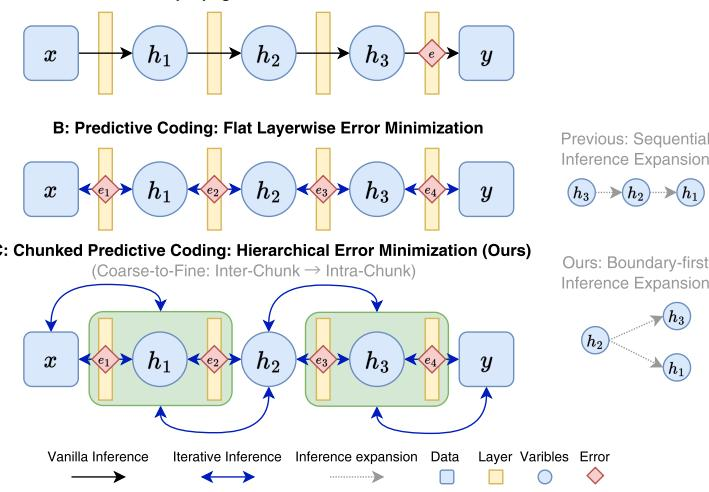
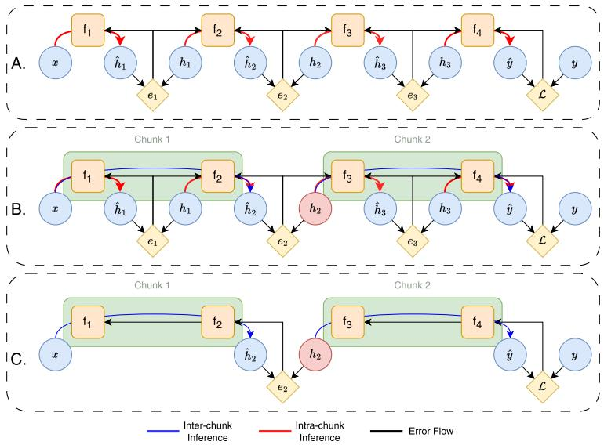
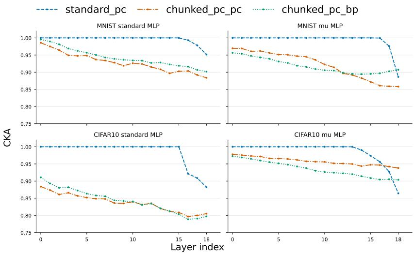
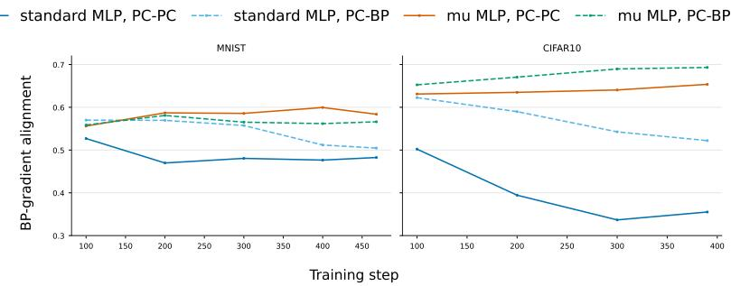
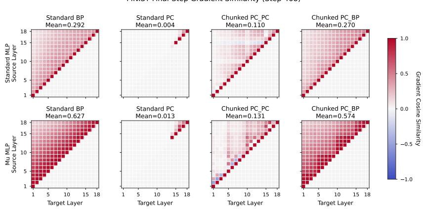
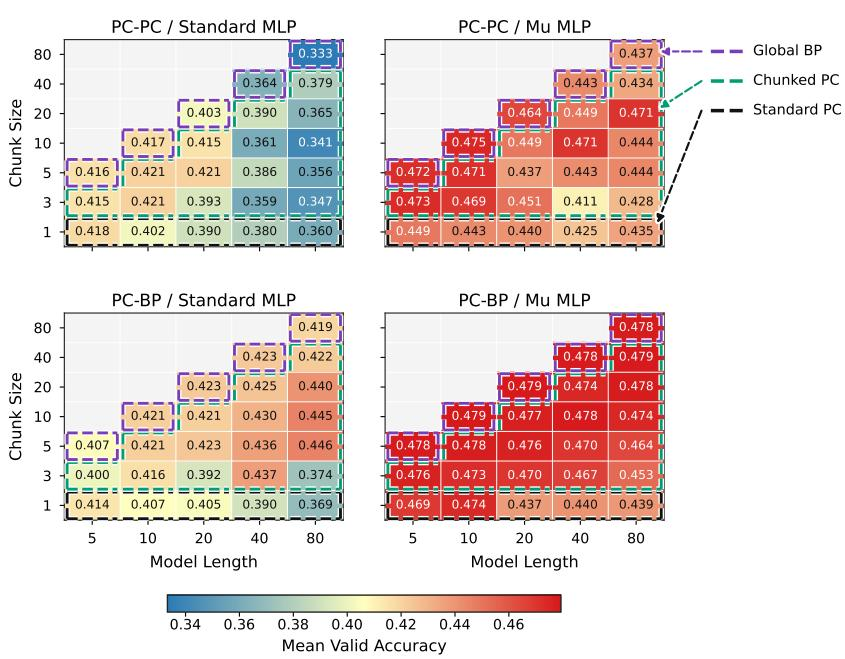
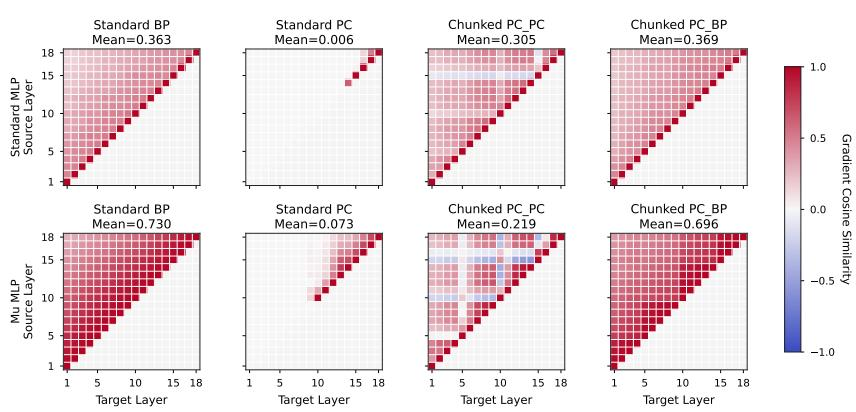

# A Study of Hidden-State Optimization Order in Predictive Coding Networks

Xueyuan Li Danilo Vasconcellos Vargas

## Abstract

Local learning methods offer an alternative to end-to-end backpropagation, but their unstructured local objectives can produce weak feature learning in deep networks. We study whether the order of hidden-state optimization can address this limitation. We propose a boundary-first inference schedule that partitions a model into chunks, first coordinates hidden states at chunk boundaries, and then refines representations within each chunk. We instantiate this schedule in predictive coding networks (PCNs), a local-learning framework in which hidden activities and prediction errors are explicitly exposed during inference. On CIFAR-10, the resulting boundary-first predictive-coding instantiation improves accuracy over standard predictive coding by 9.77% under a standard parametrization and by 5.51% under a µ-parametrization. Diagnostic analyses further show more non-trivial early-layer updates, lower initial-to-final CKA, and more diverse layerwise gradients, consistent with stronger feature learning. These results support boundary-first, chunk-based inference as a practical design principle for predictive-coding training and motivate its study in broader local-learning systems.

Keywords: local learning, predictive coding, optimization schedule, feature earning

## Introduction

Deep networks learn useful representations when error signals produce infornative updates throughout the model. End-to-end backpropagation achieves this by propagating a global supervised objective through all layers, while many alternative learning systems try to replace this global dependency with local bjectives and local state updates. Their properties, including biological plausibility, modular computation, cortical-like inference, and local error minimizaion, are attracting the attention of both neuroscientists and machine learning researchers [1–6].

The same locality can also become a bottleneck. When learning signals are transmitted only through adjacent objectives, early and intermediate layers may receive weak or degenerate updates. Predictive Coding Networks (PCNs) provide a clear example of this failure mode (Fig. 5). Although PCNs can be trained by minimizing local prediction errors, recent work has reported imbalanced error propagation, weak early-layer updates, and unstable inference dynamics [7-11]. Stabilization methods such as residual connections, layerwise normalization, and Maximal Update Parametrization improve optimization in deep PCNs [12, 13];

A: Global Backpropagation: Global Loss Minimization  
  
Figure 1: Illustration of global backpropagation, standard predictive coding, and boundary-first predictive coding with feedforward initialization. (A) Global backpropagation computes a supervised loss at the output and propagates gradients through the full network. (B) Standard predictive coding minimizes local prediction errors between adjacent layers, with the inferred activity set expanding from $\{ h _ { 3 } \}$ to $\{ h _ { 2 } , h _ { 3 } \}$ and then to $\{ h _ { 1 } , h _ { 2 } , h _ { 3 } \}$ . (C) Boundary-first predictive coding uses inter-chunk inference to coordinate boundary states before intra-chunk inference refines activities within each chunk; the inferred activity set expands from $\{ h _ { 2 } \}$ to $\{ h _ { 1 } , h _ { 2 } , h _ { 3 } \}$

however, how local objectives should be organized to encourage feature learning remains an open question.

Our work studies a different route: changing the order in which hidden activities are optimized rather than only changing the objective parametrization. We propose a boundary-first inference schedule that first coordinates hidden states at chunk boundaries and then refines the remaining states within each chunk. Chunking defines the boundary and interior variable sets that make this optimization order operational (Fig. 1).

We instantiate this schedule in predictive coding because PCNs already maintain hidden activities and prediction errors during inference. The instantiation first performs inter-chunk inference to align boundary activities, then performs intra-chunk inference to refine local representations. We refer to the fully predictive-coding version as PC-PC. We also evaluate PC-BP as a hybrid control, where chunk boundaries are coordinated by predictive-coding inference but intra-chunk learning uses backpropagation. This control tests whether the gains of the boundary-first, chunk-based schedule persist when the within-chunk learning rule changes.

Our contributions center on inference expansion order in local learning systems:

• We formulate a boundary-first hidden-state optimization schedule for localerror training systems. We instantiate this schedule in predictive coding by using chunks to define boundary and interior states, first aligning the boundary states through inter-chunk inference and then refining the remaining activities through intra-chunk inference.

• We show that the boundary-first predictive-coding instantiation enables all layers (20/20) to receive non-trivial updates, whereas standard PC updates only 4/20 layers in a standard Multilayer Perceptron (MLP) and 5/20 layers in a µMLP. The same schedule improves standard PC on CIFAR-10 by 9.77% under a standard parametrization and by 5.51% under a µ-parametrization.

• We analyze representation learning with initial-to-final CKA and feature diversity with layerwise gradient similarity. The results show that PC-PC and PC-BP reduce CKA relative to standard PC and produce lower gradient similarity than global backpropagation in the measured settings.

We study this optimization schedule in predictive coding networks. Extending boundary-first inference to other local-learning frameworks is left for future work.

## 2 Related Work

Predictive Coding Networks. Predictive coding networks train deep models by minimizing prediction errors between adjacent layers. Early work showed that local Hebbian-style plasticity in PCNs can approximate error backpropagation [1, 2], and recent studies developed PCNs as a broader learning framework [14–16]. The main obstacle for deep PCNs is not only whether local learning is possible, but also whether the local objectives produce informative updates across depth. Maximal Update Parameterised PCNs (µPCNs) address part of this issue by stabilizing the initialization of predictive-coding inference [12, 13]. Our work is complementary to these approaches: we ask how the order of hiddenstate optimization affects predictive-coding training across depth.

Chunking and modular training. Chunking groups low-level elements into higher-level units. In cognition, chunking explains how structured units can expand effective working-memory capacity [17]. In machine learning, related ideas appear in feedforward training, including blockwise learning, modular training, and greedy layerwise optimization. Greedy layerwise learning showed that auxiliary local subproblems can train deep networks, and that multi-layer blocks can scale better than single-layer objectives [5]. These results motivate chunking as a way to define groups of variables. Our work uses these groups to impose a boundary-first optimization order during iterative inference in local learning systems.

Feature learning and kernel learning. Prior work distinguishes feature learning from kernel-like regimes in which the effective neural tangent kernel changes little during training [18, 19]. The learning dynamics can be written as

$$
f _ { t + 1 } ( \xi ) = f _ { t } ( \xi ) - \eta K _ { t } ( \xi , \xi _ { t } ) \mathcal { L } ^ { \prime } ( f _ { t } ( \xi _ { t } ) , y _ { t } )\tag{1}
$$

where $f _ { t }$ is the model at training step t, $( \xi _ { t } , y _ { t } )$ is a training sample pair, $\eta$ is the learning rate, $\mathcal { L } ^ { \prime } ( \cdot )$ is the loss derivative, and $K _ { t } ( \xi , \xi _ { t } )$ is the neural tangent kernel

$$
K _ { t } ( \xi , \xi _ { t } ) = \big \langle \nabla _ { \theta } f _ { t } ( \xi ) , \nabla _ { \theta } f _ { t } ( \xi _ { t } ) \big \rangle .\tag{2}
$$

If $K _ { t }$ remains close to $K _ { 0 }$ , learning behaves like kernel learning with a nearly fixed representation. If $K _ { t }$ changes during training, the model is regarded as learning features. We use Centered Kernel Alignment (CKA) to measure the similarity between initial and final representations |20]:

$$
\mathrm { C K A } ( H _ { 0 } , H _ { t } ) = \frac { \left. H _ { 0 } ^ { \top } H _ { t } \right. _ { F } ^ { 2 } } { \left. H _ { 0 } ^ { \top } H _ { 0 } \right. _ { F } \left. H _ { t } ^ { \top } H _ { t } \right. _ { F } }\tag{3}
$$

where $H _ { 0 }$ and $H _ { t }$ are representations at initialization and at training step t.   
Lower CKA indicates greater representation change.

Feature diversity. Feature diversity also depends on whether layers receive distinct update directions. Previous work has noted that gradient diversity can support feature diversity [21]. If adjacent layers have similar backward gradients and similar forward activations, their parameter updates can become redundant. We measure layerwise update diversity using the cosine similarity between weight gradients:

$$
\mathcal { G } _ { S } ( i , j ) = \frac { \langle g _ { i } , g _ { j } \rangle } { \lvert \lvert g _ { i } \rvert \rvert \lvert g _ { j } \rvert \rvert }\tag{4}
$$

where $g _ { i }$ and $g _ { j }$ are the gradients of layers i and $j$ Lower similarity indicates more diverse layerwise updates.

## 3 Methodology

## 3.1 Standard Predictive Coding Training

Predictive coding is a natural testbed for hidden-state optimization order because it represents hidden activities explicitly and updates them through local prediction errors. Consider an N-layer network with activities $\{ h _ { i } \} _ { i = 0 } ^ { N }$ , where $h _ { 0 } = x$ is the input and $h _ { N }$ is the output. For each layer $i \in \{ 1 , \ldots , N \}$ , define the forward mapping

$$
\hat { h } _ { i } = f _ { i } ( h _ { i - 1 } ; W _ { i } ) ~ : = ~ \sigma _ { i } ( W _ { i } h _ { i - 1 } + b _ { i } ) ,\tag{5}
$$

where $W _ { i }$ are weights, $b _ { i }$ are biases, and $\sigma _ { i } ( \cdot )$ is a nonlinearity. The value $\hat { h } _ { i }$ is the prediction of the i-th layer activity.

A discriminative PCN minimizes local prediction errors together with a supervised output loss during inference:

$$
\mathrm { I n f e r e n c e ~ S t e p : } \operatorname* { m i n } _ { \left\{ h _ { i } \right\} _ { i = 1 } ^ { N - 1 } } \sum _ { i = 1 } ^ { N - 1 } e _ { i } ( h _ { i } , \hat { h } _ { i } ) + \mathcal { L } ( \hat { h } _ { N } , y ) ,\tag{6}
$$

where $e _ { i } ( \cdot , \cdot )$ measures the mismatch between activity $h _ { i }$ and prediction $\hat { h } _ { i }$ . A common choice is $\begin{array} { r } { e _ { i } ( h _ { i } , \hat { h } _ { i } ) = \frac 1 2 \| h _ { i } - \hat { h } _ { i } \| _ { 2 } ^ { 2 } } \end{array}$ . With weights fixed, hidden activities are updated by gradient descent on Eq. (6). Each activity update depends on neighboring layers through local error terms.

After inference, PCN training updates weights using the inferred activities:

Learning Step

$$
\begin{array} { r } { \cdot W _ { i }  \{ \begin{array} { l l } { W _ { i } - \eta \nabla _ { W _ { i } } ( e _ { i } ( h _ { i } , \hat { h } _ { i } ) + e _ { i + 1 } ( h _ { i + 1 } , \hat { h } _ { i + 1 } ) ) , } & { i < N - 1 , } \\ { W _ { i } - \eta \nabla _ { W _ { i } } ( e _ { i } ( h _ { i } , \hat { h } _ { i } ) + \mathcal { L } ( \hat { h } _ { N } , y ) ) , } & { i = N - 1 . } \end{array}  } \end{array}\tag{7}
$$

Here $\eta$ is the learning rate and $\nabla _ { W _ { i } }$ denotes the gradient with respect to $W _ { i }$ . Before inference begins, activities are initialized with a feedforward pass, following common PCN practice [22–26].

## 3.2 Chunk-Based Boundary-First Predictive-Coding Inference

Instead of standard PC inference that optimizes all hidden activities sequentially under a single flat set of adjacent-layer errors, the proposed schedule changes their optimization order by splitting the network into consecutive chunks. Chunking defines two sets of variables: boundary states and non-boundary states. The procedure then has two stages. First, inter-chunk inference coordinates boundary states between chunks. Second, intra-chunk inference refines the remaining hidden activities inside each chunk (Fig. 2).

Let B denote the set of boundary states between chunks $\left( { B = \{ h _ { 2 } \} } \right)$ in Fig. 2). The boundary states are updated by solving

Inter-chunk Inference:

$$
\operatorname* { m i n } _ { \{ h _ { j } | h _ { j } \in \mathcal { B } \} } \sum _ { j } e _ { j } ( h _ { j } , \hat { h } _ { j } ) + \mathcal { L } ( \hat { h } _ { J } , y )\tag{8}
$$

where $\hat { h } _ { j }$ is the prediction of the boundary state $h _ { j }$ from the adjacent chunk. $\hat { h } _ { J }$ is the prediction of the last boundary state, and it is also the prediction of the PCN. This stage implements the boundary-first part of the schedule by asking the chunks to agree on their boundaries before all internal activities are refined.

For the fully predictive-coding instantiation, intra-chunk refinement updates non-boundary activities $\{ h _ { k } \mid h _ { k } \not \in { \cal B } \} \ ( h _ { 1 }$ and $h _ { 3 }$ in Fig. 2) by

Intra-chunk PC Inference

$$
\operatorname* { m i n } _ { \{ h _ { k } | h _ { k } \notin \mathcal { B } \} } \sum _ { k } e _ { k } \bigl ( h _ { k } , \hat { h } _ { k } \bigr ) + \mathcal { L } ( \hat { h } _ { K } , y )\tag{9}
$$

  
Figure 2: Inference organization in standard predictive coding and boundary-first predictive coding. Panel A shows standard predictive coding, where all layers are updated together using adjacent prediction errors. Panel B shows PC-PC, where boundary states are first coordinated by inter-chunk prediction errors and hidden activities are then refined within chunks. Panel C shows PC-BP, a hybrid control in which boundary coordination is retained while learning inside each chunk uses backpropagation.

where $\hat { h } _ { k }$ is the prediction of the non-boundary state $h _ { k }$ from the adjacent layer in the same chunk. $\hat { h } _ { K }$ is the prediction of the last non-boundary state, and it is also the prediction of the PCN. This stage refines all internal activities after the boundary states have been aligned. The weights are then updated as in Eq. (7). We call this fully local instantiation PC-PC.

We also evaluate a hybrid control in which the boundary alignment stage is unchanged, but the weights inside each chunk are updated by backpropagation:

Intra-chunk BP Learning

$$
\begin{array} { r } { \left\{ \begin{array} { l l } { W _ { i } - \eta \nabla _ { W _ { i } } \left( e _ { i } ( \hat { h } _ { i - 1 } , \hat { h } _ { i } ) \right) , } & { i < N - 1 , } \\ { W _ { I } - \eta \nabla _ { W _ { I } } \left( \mathcal { L } ( \hat { h } _ { I } , y ) \right) , } & { i = I . } \end{array} \right. } \end{array}\tag{10}
$$

where i indexes the chunk that contains layer i. We call this hybrid control PC-BP. Its role is to test whether the boundary-first schedule is useful even when intra-chunk learning is not purely predictive coding.

## 4 Experiments

Following prior PCN evaluations using fully connected architectures [12, 27, 28] we perform experiments on MNIST and CIFAR-10 using MLP parameterizations. We train standard MLPs and µMLPs with four training dynamics: endto-end global backpropagation, standard predictive coding, PC-PC, and the PC-BP hybrid control. Experiments are run on MNIST and CIFAR-10.

The main experiments are conducted using 20-layer MLPs with 500 hidden units per layer. For PC-PC and PC-BP, the 20 layers are divided into four chunks with five layers per chunk. All predictive-coding methods use 30 inference steps. For PC-PC, these steps are split into 15 inter-chunk inference steps and 15 intrachunk inference steps. For each training dynamic, we tune the learning rate and the inference rate with 30 trials by using Optuna [29]. Models are trained for 5 epochs with batch size 128. The learning rate is tuned separately for each method, and all experiments are repeated with five random seeds.

We evaluate three aspects of learning. First, we measure test accuracy to assess predictive performance. Second, we record CKA between initial and final representations to estimate the extent of feature learning. Third, we compute gradient similarity between layers to quantify feature diversity. We also vary total depth and chunk size to test whether the effect depends on a particular chunk partition.

## 5 Results

We first report predictive performance and representation change, then analyze whether the resulting updates resemble backpropagation. We finally examine feature diversity and study how total depth and chunk size affect the performance.

## 5.1 Boundary-First Inference Improves Feature Learning and Performance

Table 1 reports test accuracy for standard predictive coding, PC-PC, and PC-BP on MNIST and CIFAR-10. The gains on MNIST are small, consistent with the linear separability of the task. On CIFAR-10, the boundary-first schedule improves standard predictive-coding training. PC-PC improves the standard MLP setting from 41.67% to 51.44% by 9.77%, while PC-BP improves the µMLP setting from 48.77% to 54.28% by 5.51%.

Table 1: Test accuracy of standard predictive coding, boundary-first PC-PC, and the PC-BP hybrid control on MNIST and CIFAR-10.
<table><tr><td>Dataset</td><td>Model</td><td>Standard BP</td><td>Standard PC</td><td>Fixed PC-PC (Ours)</td><td>Fixed PC-BP (Ours)</td></tr><tr><td>MNIST</td><td>standard MLP</td><td>0.9765</td><td>0.9686</td><td>0.9723</td><td>0.9810</td></tr><tr><td>MNIST</td><td>µMLP</td><td>0.9772</td><td>0.9765</td><td>0.9776</td><td>0.9788</td></tr><tr><td>CIFAR-10</td><td>standard MLP</td><td>0.5101</td><td>0.4167</td><td>0.5144</td><td>0.5076</td></tr><tr><td>CIFAR-10</td><td>µMLP</td><td>0.5390</td><td>0.4877</td><td>0.5366</td><td>0.5428</td></tr></table>

We next measure feature learning using initial-to-final CKA, as defined in Eq. (3). The results in Fig. 3 show that PC-PC and PC-BP reduce CKA relative to standard predictive coding training dynamics on both datasets. Lower CKA indicates greater representation change, so these results suggest that the proposed schedule mitigates the near-kernel behavior observed in standard PC.

  
Figure 3: CKA similarity between initial and final representations for standard predictive coding, PC-PC, and PC-BP on MNIST and CIFAR-10. Lower CKA indicates greater representation change.

## 5.2 Boundary-First Predictive Coding Does Not Simply Imitate Backpropagation

The performance gains could arise because the boundary-first schedule makes predictive-coding updates more similar to backpropagation. To test this hypothesis, we measure gradient alignment between predictive-coding updates and global backpropagation updates during one epoch of training. The results are shown in Fig. 4. The $\mu \mathrm { M L P }$ has higher alignment than the standard MLP, and PC-BP has higher alignment than PC-PC. Nevertheless, all predictive-coding variants remain below 0.7 alignment with global backpropagation. This indicates that the boundary-first methods improve training dynamics without simply reproducing global BP updates.

## 5.3 Boundary-First Inference Produces More Diverse Layerwise Updates

We then examine whether the boundary-first schedule changes how different layers learn. Figure 5 reports gradient similarity between layers on MNIST, using the metric in Eq. (4). All predictive coding dynamics yield lower gradient similarity than global backpropagation in the measured settings. This supports the interpretation that the boundary-first schedule does more than increase update magnitude: it also encourages different layers to move in more distinct directions. The CIFAR-10 analysis in the Appendix shows the same qualitative trend (Figure 7).

  
Figure 4: Gradient alignment of predictive-coding updates relative to global backpropagation.

The more important pattern is that in standard predictive coding, early-layer gradients are close to zero for both standard MLPs and µMLPs. These layers largely transmit the input rather than learning distinct features. PC-PC and PC-BP activate these early layers and reduce the similarity between layerwise updates.

  
Figure 5: Gradient similarity across layers during training on MNIST. Lower similarity indicates more diverse layer-wise updates. Standard predictive coding (PC) leaves several early layers with weak gradients, whereas boundary-first PCs activate more layers while maintaining a pattern of low gradient similarity.

## 5.4 Effects of Total Depth and Chunk Size

Finally, we vary the model depth and chunk size on CIFAR-10 for one epoch across five random seeds. Figure 6 summarizes the results for standard and µ MLPs trained with PC-PC and PC-BP. A chunk size of 1 corresponds to standard PC, while a chunk size equal to the total number of layers corresponds to global backpropagation. These endpoints place standard predictive coding and global backpropagation within a single chunk-based framework as special cases.

The boundary-first schedule improves upon standard predictive coding across most measured network depths and chunk sizes. The main exception is the 5- layer setting, where the benefit of boundary-first inference is limited because the network is too shallow. This pattern suggests that the schedule is most useful when the network is deep enough to learn diverse features. The results also indicate that PC-PC is more effective in smaller networks than in deeper ones, which suggests that signal propagation remains a challenge even under boundary-first optimization.

CIFAR10 Length-Size Valid Accuracy  
  
Figure 6: Comparison of different model depths and chunk sizes on CIFAR-10. A chunk size of 1 corresponds to standard predictive coding, whereas a chunk size equal to the network depth corresponds to global backpropagation. The boundary-first schedule improves over standard predictive coding across most measured depths, with the main exception of the 5-layer setting.

## 6 Conclusion

This study examines hidden-state optimization order through a boundary-first, chunk-based inference schedule in local learning systems. The schedule partitions a network into chunks, first aligns hidden states at chunk boundaries, and then refines activities within each chunk. We instantiated this schedule in predictive coding networks, where hidden activities and local prediction errors make the optimization order operational. Across MNIST and CIFAR-10 experiments, the boundary-first schedule improved standard predictive coding, increased earlylayer update activity, reduced initial-to-final CKA, and produced more diverse layerwise gradients. These findings support boundary-first inference as a useful schedule for predictive-coding training. The evidence is empirical and specific to the PCN instantiations studied here. Extending the same optimization schedule to other local-learning frameworks, such as equilibrium propagation, architectures such as CNNs and Transformers, and other tasks remains an important direction for future work.

## References

[1] Rajesh PN Rao and Dana H Ballard. Predictive coding in the visual cortex: a functional interpretation of some extra-classical receptive-field effects. Nature neuroscience, 2(1):79–87, 1999. 1, 3

[2] James CR Whittington and Rafal Bogacz. An approximation of the error backpropagation algorithm in a predictive coding network with local hebbian synaptic plasticity. Neural computation, 29(5):1229–1262, 2017. 1, 3

[3] Benjamin Scellier and Yoshua Bengio. Equilibrium propagation: Bridging the gap between energy-based models and backpropagation. Frontiers in computational neuroscience, 11:24, 2017. 1

[4] Yoshua Bengio. How auto-encoders could provide credit assignment in deep networks via target propagation. arXiv preprint arXiv:1407.7906, 2014. 1

[5] Eugene Belilovsky, Michael Eickenberg, and Edouard Oyallon. Greedy layerwise learning can scale to imagenet. In International conference on machine learning, pages 583–593. PMLR, 2019. 1, 3

[6] Yuwen Xiong, Mengye Ren, and Raquel Urtasun. Loco: Local contrastive representation learning. Advances in neural information processing systems, 33:11142–11153, 2020. 1

[7] Myoung Hoon Ha, Hyunjun Kim, Yoondo Sung, Youngha Jo, Min S Kang, and Sang Wan Lee. Stable and scalable deep predictive coding networks with meta-prediction errors. In The Fourteenth International Conference on Learning Representations, 2026. 1

[8] Luca Pinchetti, Chang Qi, Oleh Lokshyn, Cornelius Emde, Amine M'Charrak, Mufeng Tang, Simon Frieder, Bayar Menzat, Gaspard Oliviers, Rafal Bogacz, et al. Benchmarking predictive coding networks-made simple. In The Thirteenth International Conference on Learning Representations, 2025. 1

[9] Nicholas Alonso, Jeffrey Krichmar, and Emre Neftci. Understanding and improving optimization in predictive coding networks. In Proceedings of the AAAI Conference on Artificial Intelligence, volume 38, pages 10812–10820, 2024. 1

[10] Tommaso Salvatori, Yuhang Song, Yordan Yordanov, Beren Millidge, Lei Sha, Cornelius Emde, Zhenghua Xu, Rafal Bogacz, and Thomas Lukasiewicz. A stable, fast, and fully automatic learning algorithm for predictive coding networks. In International Conference on Learning Representations, volume 2024, pages 19607–19631, 2024. 1

[11| Simon Frieder and Thomas Lukasiewicz. (non-) convergence results for predictive coding networks. In International Conference on Machine Learning, pages 6793–6810. PMLR, 2022. 1

[12] Francesco Innocenti, El Mehdi Achour, and Christopher L Buckley. upc: Scaling predictive coding to 100+ layer networks. arXiv preprint arXiv:2505.13124, 2025. 1, 3, 6

[13] Greg Yang and Edward J Hu. Feature learning in infinite-width neural networks. arXiv preprint arXiv:2011.14522, 2020. 1, 3

[14] Tommaso Salvatori, Yuhang Song, Yujian Hong, Lei Sha, Simon Frieder, Zhenghua Xu, Rafal Bogacz, and Thomas Lukasiewicz. Associative memories via predictive coding. Advances in neural information processing systems, 34:3874–3886, 2021. 3

[15] Nick Alonso, Beren Millidge, Jeffrey Krichmar, and Emre O Neftci. A theoretical framework for inference learning. Advances in Neural Information Processing Systems, 35:37335–37348, 2022. 3

[16] Jeffrey Seely. Sheaf cohomology of linear predictive coding networks. In NeurIPS 2025 Workshop on Symmetry and Geometry in Neural Representations, 2025. 3

[17] George A Miller. The magical number seven, plus or minus two: Some limits on our capacity for processing information. Psychological review, 63(2):81, 1956. 3

[18] Greg Yang and Edward J Hu. Tensor programs iv: Feature learning in infinite-width neural networks. In International Conference on Machine Learning, pages 11727–11737. PMLR, 2021. 4

[19] Etai Littwin and Greg Yang. Adaptive optimization in the infinity-width limit. In The Eleventh International Conference on Learning Representations, 2023. 4

[20] Simon Kornblith, Mohammad Norouzi, Honglak Lee, and Geoffrey Hinton. Similarity of neural network representations revisited. In International conference on machine learning, pages 3519–3529. PMlR, 2019. 4

[21] Greg Yang, Dingli Yu, Chen Zhu, and Soufiane Hayou. Tensor programs vi: Feature learning in infinite depth neural networks. In International Conference on Learning Representations, volume 2024, pages 55099–55150, 2024. 4

[22] Eli Sennesh, Hao Wu, and Tommaso Salvatori. Divide-and-conquer predictive coding: a structured bayesian inference algorithm. Advances in Neural Information Processing Systems, 37:48599–48627, 2024. 5

[23] Alexander Tscshantz, Beren Millidge, Anil K Seth, and Christopher L Buckley. Hybrid predictive coding: Inferring, fast and slow. PLoS computational biology, 19(8):e1011280, 2023. 5

[24] Tommaso Salvatori, Luca Pinchetti, Amine M'Charrak, Beren Millidge, and Thomas Lukasiewicz. Predictive coding beyond correlations. In Proceedings of the 41st International Conference on Machine Learning, pages 43142- 43179, 2024. 5

[25] Bjorn Zwol. Predictive coding graphs are a superset of feedforward neural networks. In The First Workshop on NeuroAI @ NeurIPS2024, 2024. 5

[26] Beren Millidge, Mufeng Tang, Mahyar Osanlouy, Nicol S Harper, and Rafal Bogacz. Predictive coding networks for temporal prediction. PLOS Computational Biology, 20(4):e1011183, 2024. 5

[27] Yuhang Song, Thomas Lukasiewicz, Zhenghua Xu, and Rafal Bogacz. Can the brain do backpropagation?—exact implementation of backpropagation in predictive coding networks. Advances in neural information processing systems, 33:22566–22579, 2020. 6

[28] Alexander Tschantz, Magnus Koudahl, Hampus Linander, Lancelot Da Costa, Conor Heins, Jeff Beck, and Christopher Buckley. Bayesian predictive coding. arXiv preprint arXiv:2503.24016, 2025. 6

[29] Takuya Akiba, Shotaro Sano, Toshihiko Yanase, Takeru Ohta, and Masanori Koyama. Optuna: A next-generation hyperparameter optimization framework. In The 25th ACM SIGKDD International Conference on Knowledge Discovery& Data Mining, pages 2623–2631, 2019. 7

## A Standard Deviations of Accuracies in Table 1

The standard deviations of the test accuracies in Table 1 are shown in Table 2.

Table 2: Standard deviations of the test accuracies in Table 1.
<table><tr><td>Dataset</td><td>Model</td><td>Standard BP</td><td>Standard PC</td><td>Fixed PC-PC (Ours)</td><td>Fixed PC-BP (Ours)</td></tr><tr><td>MNIST</td><td>standard MLP</td><td>0.0041</td><td>0.0020</td><td>0.0006</td><td>0.0008</td></tr><tr><td>MNIST</td><td>µMLP</td><td>0.0029</td><td>0.0013</td><td>0.0007</td><td>0.0011</td></tr><tr><td>CIFAR-10</td><td>standard MLP</td><td>0.0049</td><td>0.0346</td><td>0.0058</td><td>0.0074</td></tr><tr><td>CIFAR-10</td><td>µMLP</td><td>0.0058</td><td>0.0197</td><td>0.0050</td><td>0.0016</td></tr></table>

## B Feature Diversity under Boundary-First Predictive Coding on CIFAR-10

Figure 7 shows gradient similarity between layers during training on CIFAR-10. The pattern is consistent with the MNIST results. Standard predictive coding leaves several early layers with weak gradients, while PC-PC and PC-BP activate more layers and reduce update similarity. The CIFAR-10 setting also shows that stronger input nonlinearity can increase feature learning under standard PC, but the boundary-first schedule still produces more broadly distributed layerwise updates.

  
Figure 7: Gradient similarity between different layers during training on CIFAR-10. Lower similarity indicates more diverse layerwise updates.