# BANDITS IN PROD: HYPERPARAMETER OPTIMIZATION AT INFERENCE TIME

Louis Abraham Tiime Paris, France louis.abraham@tiime.fr

Tuan-Anh Nguyen Tiime Paris, France tuan-anh.nguyen@tiime.fr

Nicolas Devatine Tiime Paris, France nicolas.devatine@tiime.fr

## ABSTRACT

Many production systems can assess a configuration only by using it on live requests and observing noisy feedback. Modern agentic systems are a prominent example, with inference-time choices such as model selection, retrieval depth, prompting strategy, and decoding temperature, yet often with no representative validation data. We formalize this setting as Online Hyperparameter Optimization (OHPO) and cast it as an infinitely many-armed bandit over mixed and conditional search spaces. We introduce IMABO, a general framework that combines any bandit policy for choosing among already sampled configurations with any oracle for proposing new ones. We instantiate it with IMOSS, a restart-free anytime policy whose active set grows as $\bar { t ^ { \beta } }$ , and prove an expected cumulative quantile-regret bound of $O ( p _ { \rho } ^ { - 1 / \beta } + T ^ { ( 1 + \beta ) / 2 } )$ , where $\beta \in ( 0 , 1 )$ controls active-set growth and $p _ { \rho }$ lower-bounds the probability that a proposed configuration falls in the top-ρ fraction of the search space. We combine IMOSS with three practical oracles: a Tree-structured Parzen Estimator, an incumbent-mutation oracle driven by a per-coordinate bandit, and a pretrained tabular foundation model, all three improving over the uniform random oracle baseline. IMABO obtains the lowest cumulative regret across diverse OHPO settings, from tuning classical machine-learning models to configuring LLM-based agents.

## 1 Introduction

Hyperparameter optimization (HPO) is usually performed offline by evaluating configurations on a fixed dataset and keeping the best one, with methods such as grid search, random search, or Bayesian optimization [1, 2, 3]. A growing class of systems cannot be tuned this way. Applications built around large language models served by external provider expose only inference-time settings, such as the choice of model, the decoding temperature, or the prompting strategy. Without a dataset that reflects real usage, a configuration can be evaluated only by serving it and observing how it performs. We call this problem online hyperparameter optimization (OHPO). Because every evaluation is a served request, exploration is never free: what matters is the reward accumulated over the whole request stream, not the quality of a final recommendation, and the horizon of that stream is not known in advance. OHPO has received little attention, falling between (offline) HPO, which evaluates configurations before deployment, and online learning, which rarely exploits the structure of a hyperparameter space.

This problem has the structure of a multi-armed bandit (MAB), where each configuration is an arm, and each served request is a pull of the chosen arm. But a hyperparameter space is typically continuous or mixed, combining real-valued, integer, and categorical settings, so the possible configurations far outnumber the requests the system will ever serve. Bandit problems in which the arms outnumber the available pulls are known as infinitely many-armed bandits (IMAB). Existing approaches either assume a metric under which nearby configurations earn similar rewards, an assumption that is meaningless for categorical parameters such as the choice of model, or draw new configurations at random, learning nothing from past rewards.

We address this problem with IMABO (Infinitely Many-Armed Bandit with Oracle), a framework that pairs a bandit policy over a growing active set of configurations with an oracle that proposes which configuration to admit next. Our contributions are as follows.

• We introduce and formalize the OHPO problem, cast it as an infinitely many-armed bandit, and propose IMABO, a framework that combines any bandit policy with any oracle, requiring only that a configuration can be scored from live feedback and making no further assumptions about the search space.

• We introduce IMOSS, an anytime bandit policy for online hyperparameter optimization, prove a sublinear cumulative quantile-regret bound, and instantiate it with several arm-creation oracles: IMOSS-Random, IMOSS-TPE, IMOSS-TabPFN, and IMOSS-mutate-KL×PE. These variants natively support continuous, integer, and categorical hyperparameters while remaining computationally efficient for production. Our implementation is publicly available.1

• We validate our method on both continuous and discrete HPOBench tasks, and on a real LLM-based questionanswering system over a mixed search space of retrieval, prompting, and model choices.

## 2 Related Work

Our work lies at the intersection of HPO and MAB theory, and relates most closely to recent methods that bring bandit ideas into production.

Hyperparameter optimization. Most HPO methods run offline, optimizing a fixed objective over a budget. Grid and random search remain strong baselines on problems of low effective dimension [1]. Model-based methods fit a surrogate to choose where to sample, through Gaussian-process Bayesian optimization [2, 4], random forests for conditional and categorical spaces [5], or the Tree-structured Parzen Estimator (TPE) [6], which needs no metric and handles both continuous and categorical parameters, and whose density ratio has since been recast as a classification problem [7, 8]. Mixed continuous-categorical spaces have also been addressed by Gaussian-process optimization restricted to trust regions [9], which still assumes a kernel over the space. A recent class of surrogates avoids this per-task fitting by using a tabular foundation model, a transformer pretrained once on synthetic data that predicts how a configuration will perform in a single forward pass, with no retraining during the search. Such surrogates have been used both to forecast the final accuracy of a partially trained model [10] and to predict the objective directly in high-dimensional problems [11].

Multi-, continuum-, and infinite-armed bandits. In the stochastic K-armed bandit setting, index policies such as UCB1 [12] and the minimax-optimal MOSS [13] pull the arm with the highest upper confidence bound. The anytime MOSS index [14] keeps the minimax guarantee without knowing the horizon T in advance. When the number of arms far exceeds the horizon, sublinear regret against the global optimum requires an additional assumption [15]. One class of methods assumes that nearby arms are similar, either via an explicit metric (continuum-armed [16]) or via metric-free optimistic partitioning [17, 18, 19, 20], several of which we use as baselines. Such a metric is natural for a continuous parameter but not for a categorical choice. A second class draws each arm from a fixed distribution over configurations (a reservoir) and measures regret relative to it [21]. Roy Chaudhuri and Kalyanakrishnan [22] take the target to be a quantile of the mean reward induced by the reservoir, their QRM1 and QRM2 running MOSS on a growing pool but staying anytime by restarting on a doubling schedule, while UCB-AIR [23] grows its arm set without restarts. No existing method is at once restart-free, anytime, and able to bound cumulative quantile regret over a growing arm set. A parallel line, contextual bandits, replaces per-arm means by a reward model shared across arms, linear [24], neural [25], tree-based [26], or, concurrently with this work, a prior-data fitted network [27]; all score a fixed enumerated action set and bound regret against its best arm, whereas our oracle uses such a surrogate to propose arms not yet in the active set, a step Tan et al. [27] leave open for large action spaces.

Bandits & HPO. Bandit ideas first entered HPO in the offline training setting, where Successive Halving [28], Hyperband [3], and BOHB [29] allocate a limited training budget across configurations by casting the choice as best-arm identification, and where CoCaBO [30] runs a bandit over the categorical coordinates alongside Gaussianprocess optimization over the continuous ones. Shang et al. [31] extend this best-arm view to a fixed reservoir of configurations with D-TTTS, but evaluate on offline validation data and target simple regret. Bandits have long been proposed as a successor to A/B testing [32, 33]. A recent line of work tunes hyperparameters online, bounding dynamic regret over continuous coordinates under a Lipschitz assumption [34, 35] or running EXP3 over mixed actions that must be enumerated in advance and scored on a validation split [36]. Population-based training [37] and its bandit variants [38, 39] instead tune during a training run by inheriting weights across parallel workers, which a single serving stream against a fixed provider-side model cannot supply. A separate line couples bandit selection with mutation of the best solution found so far: bandit-based random mutation hill-climbing [40] mutates it one component at a time, using a set of per-coordinate bandits to decide which component to change, and Mutant-UCB [41] injects evolutionary mutation operators into a UCB best-arm-identification bandit for model selection.

Inference-time tuning of LLM systems. LLM systems have made our setting widespread, and the closest prior work tunes them online with bandits. Only two of these methods take a configuration as an arm. AutoRAG-HP [42] tunes a RAG pipeline from live rewards alone with a hierarchy of per-hyperparameter bandits, so cost scales with the sum rather than the product of the axis sizes, but every axis must be discretized in advance, and no regret guarantee is given. Each trial changes one hyperparameter and leaves the others so the search is a random walk on a pre-declared grid that credits each observed reward to the single coordinate it just moved; we include it in our benchmark. BanditSpec [43] does bound a stopping-time regret over speculative-decoding configurations, but its rounds are token steps inside a single generation and its objective is decoding latency rather than answer quality. In the rest of this literature, as in routing benchmarks [44], an arm is a bare model identity drawn from an enumerated pool, with no structure to interpolate and nothing to propose outside it. Within this group, Xia et al. [45] commit to a model before observing one reward, with a logarithmic bound, but over a handful of candidates and under an increasing-then-converging reward trend. The others either relax the protocol, by cascading several models per request [46, 47] or choosing after seeing the query [48], or depend on offline artifacts we do without, such as preference data, per-model quality and cost predictors, or acceptance thresholds. Across all of these, the candidate set is declared in advance, and most optimize cost or latency rather than reward quality.

## 3 Online Hyperparameter Optimization

Let X be a hyperparameter search space mixing continuous, integer, and categorical coordinates (a temperature, a retrieval depth, a choice of model). It may be tree-structured, with some parameters becoming active only once others are fixed, as when a chosen model determines which hyperparameters apply [6]. The horizon is unknown. At each round $t = 1 , 2 , \dots ,$ a learner commits a configuration $\mathbf { \boldsymbol { x } } _ { t } \in \mathcal { X }$ to serve the next request, then observes a reward $r _ { t } \in [ 0 , 1 ]$ (a task success, a click, or a graded answer) drawn independently from an unknown distribution $\mathcal { P } _ { { \pmb x } _ { t } }$ with mean $\mu _ { { \pmb x } _ { t } }$ . This reward is the only feedback: there is no validation set to query on the side, and past rounds cannot be replayed under a different configuration.

Competing with the global optimum $\mu ^ { \star } = \operatorname* { s u p } _ { x \in \mathcal { X } } \mu _ { x }$ is not possible in this setting, as $\mathcal { X }$ contains far more configurations than the system will ever try. We therefore measure performance against a quantile of the mean reward, defined relative to a baseline sampling distribution $P _ { 0 }$ over $\mathcal { X } .$ Such a baseline is easy to construct even on a tree-structured space, by drawing each decision uniformly, or log-uniformly when a parameter is specified on a logarithmic scale. For $\rho \in \dot { ( 0 , 1 ) }$ , let $\mu _ { \rho }$ be the $\mathrm { t o p } { - \rho }$ quantile of the mean reward $\mu _ { x }$ when x is drawn from $P _ { 0 }$ , and let $\mathrm { T O P } _ { \rho } = \{ { \pmb x } \in { \pmb X } \mid \mu _ { { \pmb x } } \geq \mu _ { \rho } \}$ be the corresponding set of good configurations. A draw from $P _ { 0 }$ lands in $\mathrm { T O P } _ { \rho }$ with probability at least $\rho ,$ so about $1 / \rho$ draws are enough to find a good configuration. We evaluate a learner by its cumulative ρ-regret $\begin{array} { r } { \mathcal { R } _ { T } ^ { \rho , + } = \sum _ { t = 1 } ^ { T } \left( \mu _ { \rho } - \mu _ { { \pmb x } _ { t } } \right) _ { + } } \end{array}$ , with $a _ { + } = \operatorname* { m a x } ( a , 0 )$ . It accumulates the reward lost on every request served by a configuration below the target. We also define the simple ρ-regret $\mathcal { R } _ { ( T ) } ^ { \rho , + } = \left( \mu _ { \rho } - \mu _ { { \pmb x } _ { ( T ) } } \right) _ { + }$ , which measures the quality of the configuration $\pmb { x } _ { ( T ) }$ returned after $T$ rounds. Optimizing a running system in this setting is the problem we call online hyperparameter optimization (OHPO).

## 4 Infinitely Many-Armed Bandit with Oracle

In our formulation of OHPO, each configuration is an arm and each served request is a pull. A hyperparameter space $\mathcal { X }$ is often continuous or mixed, giving infinitely many arms, or at least far more than the system can ever try, which places the problem in the infinitely many-armed bandit (IMAB) setting studied by Berry et al. [15] and Wang et al. [23].2

An IMAB algorithm maintains an active set $\mathcal { M } _ { t } \subseteq \mathcal { X }$ of the arms seen so far, starting from the empty set and adding one arm at a time. At each round it makes a binary choice. It either pulls an arm already in $\mathcal { M } _ { t }$ , selected by whatever bandit rule it runs over the active set, or admits a new arm drawn from $x ,$ , adds it to $\mathcal { M } _ { t }$ , and pulls it. The standard formulation draws each new arm from a fixed reservoir distribution over $x ,$ so the arm admitted at any round is statistically independent of every reward seen before it.

IMABO changes only the expansion step. When a new arm enters $\mathcal { M } _ { t } .$ it is supplied not by a fixed reservoir distribution but by an oracle O, a mapping from the history of past pulls and their rewards to a configuration in $\mathcal { X } .$ . Setting $\mathcal { O }$ to draw from the baseline $P _ { 0 }$ regardless of the history recovers the standard IMAB algorithm with reservoir $P _ { 0 } ,$ whereas an oracle that reads the history can steer new arms toward the regions of X that past rewards suggest are promising. We place no further restriction on O, which could be a density estimator over X, or even a large language model prompted with past configurations and their rewards. Algorithm 1 gives IMABO for an arbitrary oracle O and bandit policy A, and a concrete algorithm is obtained by choosing these two components. Selecting which arm of $\mathcal { M } _ { t }$ to serve is itself a standard bandit problem with its own exploration–exploitation trade-off. A policy that restarts its statistics at intervals may either reset the oracle along with its own statistics or let the oracle keep the full history, a choice left to the instantiation.

Algorithm 1 IMABO (A, O)   
1: Input: space X, oracle O, bandit policy A   
2: $M \gets \emptyset$   
3: for $t = 1 , 2 , 3 , \ldots$ do   
4: if A.EXPAND() then   
5: x ← O.SUGGEST() {draw a new arm}   
6: M ← M ∪ {x}   
7: else   
8: x ← A.SELECT() {pull a known arm}   
9: end if   
10: Serve x on the next request, observe reward r, update its statistics   
11: end for

## 4.1 The IMOSS Family

In this paper, we use IMOSS as the bandit policy. IMOSS is an anytime bandit policy adapted from MOSS [13]; pairing it with four different oracles yields the four concrete algorithms we study. IMOSS-Random draws new configurations from the baseline $P _ { 0 } ,$ , while the other three use past rewards to target promising regions of X. IMOSS-TPE proposes from a density ratio fitted on the whole active set; IMOSS-mutate-KL×PE instead improves the best arm found so far one coordinate at a time, using a one-dimensional Parzen estimator on the selected coordinate to propose local mutations; and IMOSS-TabPFN ranks its candidates with a tabular foundation model. Appendix C compares the four and asks which to use on which problem.

## 4.1.1 IMOSS

We adapt MOSS [13, 14] to the IMAB setting. Standard MOSS scores each arm from its observed rewards and serves the highest scorer, attaining the minimax-optimal cumulative regret $O ( \sqrt { K T } )$ for a K-armed bandit, but its score requires the horizon T and a fixed arm count K, and neither is available here. IMOSS therefore uses the anytime MOSS index [14], which substitutes the current round t for T; IMOSS recomputes this index at every round with the current active-set size $K _ { t } = | \mathcal { M } _ { t } |$ in place of K. It serves the arm of highest index

$$
\mathcal { B } _ { t } ( \pmb { x } ) = \hat { \mu } _ { \pmb { x } } + \sqrt { \frac { 1 + \alpha } { 2 } \cdot \frac { \operatorname* { m a x } \left( 0 , \log \left( \frac { t } { K _ { t } n _ { \alpha } } \right) \right) } { n _ { \alpha } } }\tag{1}
$$

where $\hat { \mu } _ { x }$ is the empirical mean reward of arm ${ \mathbf { } } x , n _ { \mathbf { } }$ is the number of times it has been served, and $\alpha > 0$ is a confidence parameter carried over from the anytime MOSS index [14]. The square-root term is an exploration bonus that shrinks as $n _ { \pmb { x } }$ grows, and also shrinks as $K _ { t }$ grows: admitting a new arm spreads the same budget over more candidates, so it lowers the bonus of every arm already in $\mathcal { M } _ { t } .$ . The parameter α scales this bonus through the factor $( 1 + \alpha ) / 2$ , a larger value pushing the policy toward exploration. In the experiments, we set $\alpha = 0 . 1$ as suggested by Degenne and Perchet [14].

Growth of the active set follows a power law similar to UCB-AIR [23]. Specifically, a new arm is requested from the oracle whenever $| \mathcal { M } _ { t } | < t ^ { \beta }$ , with $\beta \in ( 0 , 1 )$ fixed, yielding an active-set size of $\lfloor t ^ { \beta } \rfloor$ . The exponent trades off discovery against estimation, as a set that grows too slowly delays finding a good region of X, while one that grows too fast leaves each arm too few observations to be ranked reliably, and Theorem 1 quantifies this balance as a regret bound. In our experiments, we set $\beta = 0 . 5$ , so that the active set grows as ${ \sqrt { t } } .$ , which we found empirically to strike this balance. A brief warm-up precedes the first round, drawing $N _ { s } = 1 0$ configurations from $P _ { 0 }$ by default and serving each once before the index takes over. Algorithm 2 states the resulting policy.

Algorithm 2 IMOSS $( \beta , \alpha , N _ { s } ,$ proposal distribution $P _ { \mathcal { O } } )$   
1: Input: active set $\mathcal { M } _ { t } ,$ , round t, exponent $\beta \in ( 0 , 1 )$ , confidence $\alpha > 0 ,$ , warm-up size $N _ { s }$   
2: if $\left\lceil \mathcal { M } _ { t } \right\rceil < N _ { s }$ then   
3: draw x $\sim P _ { 0 }$ {warm-up}   
4: $\mathcal { M } _ { t }  \mathcal { M } _ { t } \cup \{ \pmb { x } \}$   
5: return x   
6: else if $| \mathcal { M } _ { t } | < t ^ { \beta }$ then   
7: draw x ∼ $P _ { \mathcal { O } }$ {admit a new arm}   
8: $\mathcal { M } _ { t }  \mathcal { M } _ { t } \cup \{ \pmb { x } \}$   
9: return x   
10: else   
11: return arg max $B _ { t } ( { \pmb x } )$ {serve a known arm}   
x∈Mt   
12: end if

## 4.1.2 Theoretical Analysis

We bound the cumulative ρ-regret of IMOSS under a single top-ρ coverage condition on the oracle: whenever a new arm is requested, the oracle proposes, given the history so far, a top-ρ configuration with probability at least $p _ { \rho } .$ The analysis places no other restriction on the oracle, which enters the bound only through $p _ { \rho } ;$ since $\mathrm { T O P } _ { \rho }$ is defined relative to the baseline $P _ { 0 } ,$ so is $p _ { \rho }$ . The oracle of IMOSS-Random samples from that same baseline, hence satisfies the condition with $p _ { \rho } = \rho$ by construction, and a more sophisticated oracle is meant to raise this discovery probability. To bring such an oracle within the scope of the analysis, it suffices to mix it with the baseline in the spirit of ε-greedy: drawing the new arm from $P _ { 0 }$ with probability ε and querying the oracle otherwise guarantees $p _ { \rho } \geq \varepsilon \rho .$

Theorem 1. Let $\rho \in ( 0 , 1 )$ . We assume that rewards are supported on [0, 1] and that each proposed configuration lies in $\mathrm { T O P } _ { \rho }$ with conditional probability at least $p _ { \rho } > 0 .$

$$
\forall t \geq 1 , \mathbb { P } _ { P _ { \mathcal { O } } } ( \mathbf { x } _ { t } \in \mathrm { T O P } _ { \rho } \mid \mathcal { F } _ { t - 1 } ) \geq p _ { \rho } .
$$

Then the expected cumulative ρ-regret of IMOSS satisfies

$$
\mathbb { E } \left[ \mathcal { R } _ { T } ^ { \rho , + } \right] = O \left( p _ { \rho } ^ { - 1 / \beta } + T ^ { ( 1 + \beta ) / 2 } \right) .
$$

We provide detailed proofs for the regret bound in Theorem 1 and analyze the memory and running time of IMOSS, along with the per-call complexity of each oracle, in Appendices A and B, respectively.

## 4.1.3 IMOSS-TPE

As a first oracle, we propose the Tree-structured Parzen Estimator (TPE) [6], which splits the arms of $\mathcal { M } _ { t }$ at a score quantile γ into a good group and a complementary bad group. It fits a Parzen density to each (ℓ and $^ { g , }$ one kernel per parameter), and selects as the proposal, from a pool sampled from $\ell ,$ the candidate with the highest ratio $\ell ( { \pmb x } ) / g ( { \pmb x } )$ a proxy for expected improvement. TPE requires no metric on X and handles continuous, integer, and categorical parameters natively, which suits our search spaces. Standard TPE is defined for offline HPO, where each configuration is evaluated once and the split acts directly on the observed function values. In our setting, an arm instead accumulates noisy rewards over repeated pulls, so the split requires a per-arm score, and we order arms by the MOSS index $B _ { t }$ of Equation (1) rather than by the empirical mean $\hat { \mu } _ { x } ,$ , since an arm that appears strong after only a few pulls should not yet be classified as reliably good, and the index folds this uncertainty into the classification. This follows the optimistic principle used by index policies and by tree searches such as HOO [17]. In our implementation, we set the good fraction to $\gamma = 0 . 3$ , so the good group contains the top 30% of arms, and each call draws 24 candidates from $\ell ,$ matching Optuna’s default TPE configuration. The same oracle applies unchanged when X is finite but too large to enumerate.3

## 4.1.4 IMOSS-mutate-KL×PE

TPE fits its density over a whole configuration, with one kernel per parameter, so it samples every coordinate independently and can combine values from different good arms into a proposal that matches no single one of them. Our second oracle works the other way: it is local and uses no global surrogate model. It takes the best arm found so far xˆ and changes exactly one of its parameters, in the spirit of bandit-driven local search [40, 41]. We split each such proposal into three steps:

• (a) Which arm to change: the arm of $\mathcal { M } _ { t }$ with the highest empirical mean, $\hat { \mathbf { x } } = \arg \operatorname* { m a x } _ { \mathbf { x } \in \mathcal { M } _ { t } } \hat { \mu } _ { x }$ . This is deliberately not the arm the allocation rule is pulling right now: MOSS ranks arms by their mean plus an exploration bonus, and mutating that optimistic pick instead of the best arm measurably hurts the oracle.

• (b) Which parameter to change: a KL-UCB bandit [49] over the d coordinates. Choosing coordinate i means “mutate parameter $i ^ { \prime \prime }$ , and its reward is the empirical mean of the arm that mutation produced. Each proposed arm contributes one such reward, and that reward is updated as later pulls refine the arm’s mean rather than added again. We use the KL index instead of a Hoeffding bonus because the rewards this bandit sees sit near the top of [0, 1]: there a Hoeffding confidence width is several times wider than the gaps it needs to tell apart, and the bandit would fall back to trying every parameter in turn.

• (c) Which value to give it: a one-dimensional Parzen estimator (PE) on that coordinate alone. We split $\mathcal { M } _ { t }$ into a good and a bad group exactly as in Section 4.1.3 and fit the univariate pair $\ell / g$ to the i-th coordinate values of the arms in each group. The oracle then draws 24 candidate values from ℓ and keeps the one with the highest ratio $\ell / g$ that differs from the current value of ${ \hat { \mathbf { x } } } ,$ so the mutation always changes something.

Until 10 arms have each returned at least one reward, the oracle samples from $P _ { 0 }$ instead, since fitting a density and forming a good/bad split needs a populated active set. On a finite space a mutation often lands on an arm already in $\mathcal { M } _ { t }$ ; that arm is then pulled again. The oracle fits a single one-dimensional density per call and trains no surrogate model, so its per-call cost is negligible next to the model-based oracle below.

## 4.1.5 IMOSS-TabPFN

We instantiate the oracle with TabPFN-3 [50], a tabular foundation model pretrained to predict a target from a table of examples with no further training required. We use the regression variant of the publicly released model.4 At each expansion step, the oracle builds a table from the arms tried so far, with parameters as columns and mean rewards as the label,5 and provides it to TabPFN as in-context examples. The pool of 100 candidates is built mostly around the best arm sofar xˆ rather than sampled from $P _ { 0 }$ . 90 of the candidates are mutations of that arm: one of its parameters is picked at random and given a new value, drawn by a Gaussian step whose width is 0.1 of that parameter’s range (taken in log space for log-scaled parameters, and clamped to stay in range); for a categorical parameter the new value is instead one of its other categories, chosen uniformly. The remaining 10 candidates are drawn from $P _ { 0 } ,$ , so the pool always keeps some reach into unexplored regions. Drawing the whole pool from $P _ { 0 }$ instead puts no candidate near a good arm and measurably weakens the oracle.

Before scoring, we clean up the pool: identical candidates are merged, and any candidate that is already an open arm is dropped. This matters because the pool is meant to pick the next new arm to admit. On a finite space, without this step, TabPFN would often score an already-open neighbor of xˆ above every new candidate; the oracle would then keep re-proposing arms it already has, and the active set would stop growing and fall behind its $t ^ { \beta }$ schedule.

Each surviving candidate is then scored by TabPFN. For a candidate x, we read the $q = 0 . 9 7 5$ quantile $\hat { F } _ { x } ^ { - 1 } ( q )$ of the predictive distribution TabPFN returns, and propose the candidate with the largest such quantile. This is an upper-confidence-bound rule in quantile form [11]: if the predictive distribution were Gaussian, ranking by this quantile would be the same as ranking by $\hat { \mu } ( { \pmb x } ) + \kappa \hat { \sigma } ( { \pmb x } )$ with $\kappa = \Phi ^ { - 1 } ( q ) \approx 1 . 9 6$ . Using the quantile directly is safer than the $\hat { \mu } + \kappa \hat { \sigma }$ form, because TabPFN’s predictive distribution is a skewed, heavy-tailed histogram: the quantile always lands on a value the model actually considers possible, whereas adding $\kappa \hat { \sigma }$ can overstate the exploration bonus when the distribution is far from Gaussian.

The predictive distribution comes from an ensemble of four estimators, each conditioned on the same table under a different ordering and preprocessing of the features. The table is refit and every candidate is rescored at each expansion step. Until 10 arms have returned a reward, there are too few points to fit TabPFN, so the oracle samples from $P _ { 0 }$ instead.

## 5 Experiments

We evaluate IMABO across discrete, continuous, and mixed HPO search spaces using synthetic, machine-learning benchmarks and an online question-answering task.

## 5.1 Toy Problems

We consider four synthetic benchmark functions, listed in Table 1 and illustrated in two dimensions in Figure 1. Sin1, Garland and Rastrigin are additively separable: each is a sum of d copies of the same one-dimensional profile, and the three differ only in how oscillatory that profile is. The Gaussian function is not separable: it places two modes on the main diagonal, a local one at $x _ { \ell } \mathbf { 1 }$ and a better global one at $x _ { g } \mathbf { 1 }$ , where 1 is the all-ones vector.

Table 1: Toy functions
<table><tr><td>Function</td><td>Formula</td><td>Domain</td></tr><tr><td>Sin1</td><td> $\sum _ { i = 1 } ^ { d } { \frac { \sin ( 1 3 x _ { i } ) \sin ( 2 7 x _ { i } ) + 1 } { 2 } }$ </td><td> $[ 0 , 1 ] ^ { d }$ </td></tr><tr><td>Garland</td><td> $\sum _ { i = 1 } ^ { d } 4 x _ { i } ( 1 - x _ { i } ) \left( 0 . 7 5 + 0 . 2 5 \left( 1 - \sqrt { | \sin ( 6 0 x _ { i } ) | } \right) \right)$ </td><td> $[ 0 , 1 ] ^ { d }$ </td></tr><tr><td>Rastrigin</td><td> $d + \frac { 1 } { 4 0 } \sum _ { i = 1 } ^ { d } \left[ 1 0 \left( \cos ( 2 \pi x _ { i } ) - 1 \right) - x _ { i } ^ { 2 } \right]$ </td><td> $[ - 5 . 1 2 , 5 . 1 2 ] ^ { d }$ </td></tr><tr><td>Gaussian</td><td> $0 . 9 \exp \Bigl ( - \frac { \sum _ { i = 1 } ^ { d } ( x _ { i } - x _ { g } ) ^ { 2 } } { 2 \sigma _ { d } ^ { 2 } } \Bigr ) + 0 . 6 \exp \Bigl ( - \frac { \sum _ { i = 1 } ^ { d } ( x _ { i } - x _ { \ell } ) ^ { 2 } } { 2 \sigma _ { d } ^ { 2 } } \Bigr )$ </td><td> $[ 0 , 1 ] ^ { d }$ </td></tr><tr><td colspan="3">For Gaussian:  $\sigma _ { d } = 0 . 3 5 \left( x _ { g } - x _ { \ell } \right) \sqrt { d / 2 } ,$  with  $\begin{array} { r } { x _ { \ell } = \frac { 1 } { 2 \pi } } \end{array}$  and  $\begin{array} { r } { x _ { g } = 1 - \frac { 1 } { 2 \pi } } \end{array}$ </td></tr></table>

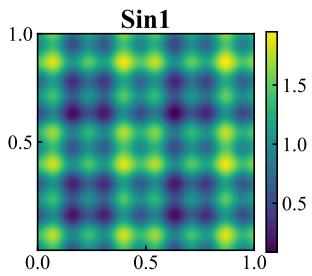

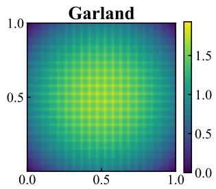

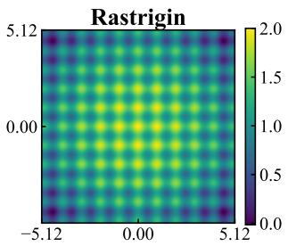

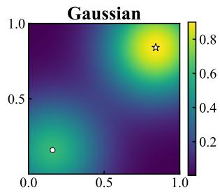  
Figure 1: Illustration of the toy functions of Table 1 in two dimensions, over their native domains. The lattice structure of ${ \bf \bar { \theta } } _ { S i n l , \theta }$ , Garland and Rastrigin reflects their separability. The Gaussian instead has two modes on the diagonal, the local one marked ◦ and the global one $^ { \star , }$ and is separable in neither coordinate.

Since $S i n l ,$ Garland and Rastrigin are sums of d one-dimensional components, the scale of $f ( { \pmb x } )$ grows linearly with $d ,$ so we work throughout with the normalized objective

$$
g ( { \pmb x } ) = \frac { f ( { \pmb x } ) } { d } \quad \mathrm { f o r } ~ S i n I , G a r l a n d , R a s t r i g i n , \qquad g ( { \pmb x } ) = f ( { \pmb x } ) \quad \mathrm { f o r } ~ G a u s s i a n ,\tag{2}
$$

since the Gaussian function already takes values in $[ 0 , 1 ]$ . At each evaluation, the algorithm observes a noisy value of $g .$ For the three separable functions the noise is additive

$$
r ( { \pmb x } ) = g ( { \pmb x } ) + \varepsilon , \qquad \varepsilon \sim \mathcal { N } ( 0 , \sigma ^ { 2 } ) ,\tag{3}
$$

whereas for the Gaussian function $g ( { \pmb x } )$ is a success probability and a pull returns a single binary observation, $r ( \pmb { x } ) \sim \mathrm { B e r n o u l l i } ( g ( \pmb { x } ) )$ , matching the observation model used in this paper. The algorithms use only the noisy observations $r ( { \pmb x } )$ . When reporting results, we compute regret on the noiseless normalized objective. The cumulative regret is defined as

$$
\mathcal { R } _ { T } = \sum _ { t = 1 } ^ { T } \left( g ^ { * } - g ( \pmb { x } _ { t } ) \right)
$$

where $g ^ { * } = \operatorname* { m a x } _ { x } g ( \pmb { x } )$ and $\mathbf { \Delta } _ { \mathbf { \mathcal { X } } _ { t } }$ is the configuration evaluated at step t. For the separable functions, $g ^ { * }$ is the optimum of a single one-dimensional component, so this normalization makes regret values comparable across dimensions.

## 5.2 Comparison Against Baseline Algorithms

We next compare IMOSS-TPE with three hierarchical optimistic optimization baselines, StoSOO [19], HOO-T [17], and StroquOOL [20], and with the factored baseline Hier-MAB [42], which requires finite axes and runs on a grid of 11 evenly spaced values per coordinate of the native domain (Hier-MAB-11). We consider the four-dimensional versions of all four functions of Table 1. For each method, we use evaluation budgets $T \in \{ 1 0 0 0 , 3 0 0 0 , 5 0 0 0$ , 10000} and repeat every experiment with 20 independent random seeds. Observations follow the model of Equation (3): additive Gaussian noise for Sin1, Garland and Rastrigin, and a single Bernoulli draw for the Gaussian. Regrets are computed using the corresponding noiseless objective.

The tree-based baselines construct their hierarchical partitions over the unit hypercube $[ 0 , 1 ] ^ { d } .$ , whereas the toy functions are defined on their native domains: $[ 0 , 1 ] ^ { d }$ for Sin1, Garland and the Gaussian, and $[ - 5 . 1 2 , 5 . 1 2 ] ^ { d }$ for Rastrigin. To ensure that all methods optimize over the same domain, each suggestion $z \in [ 0 , 1 ] ^ { d }$ produced by a tree-based method is mapped back to the native search space before evaluation,

$$
x _ { i } = \ell _ { i } + ( u _ { i } - \ell _ { i } ) z _ { i } ,\tag{4}
$$

where $[ \ell _ { i } , u _ { i } ]$ denotes the native range of coordinate i. The observed reward is then fed back to the tree-based method as the reward of the corresponding normalized point z. This affine transformation preserves the hierarchical partition on $[ 0 , 1 ] ^ { d }$ while ensuring that objective values and regrets are evaluated over the same search space as IMOSS-TPE.

Once each budget is exhausted, every method returns a single recommendation $\pmb { x } _ { ( T ) }$ , but the recommendation rules differ. IMOSS-TPE returns the evaluated configuration with the largest empirical mean in its active set. Hier-MAB returns its per-axis best values, the combination of the empirical-mean-maximizing value on each axis. StoSOO returns the empirical-mean maximizer at the maximum depth at which a cell has been expanded. HOO-T instead returns the visited node with the largest cached optimistic B-value at round $T ,$ , using the same optimism-under-uncertainty criterion that guides its search. StroquOOL separates candidate generation from final validation: it constructs a shortlist by selecting the empirical-mean maximizer among nodes satisfying progressively larger sampling thresholds, evaluates each shortlisted candidate on a fresh independent batch, and returns the candidate with the largest validation mean. Recommendations produced in normalized tree coordinates are mapped back to the native search space before computing simple regret. Consequently, the reported simple regret reflects each algorithm’s native recommendation rule, rather than a common post-processing rule applied to all methods.

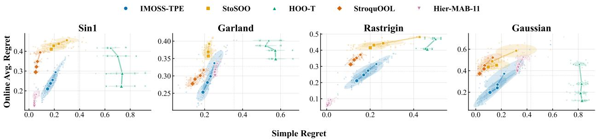  
Figure 2: Trade-off between simple regret and online average regret $\overline { { \mathcal { R } } } _ { T }$ (terminal value of the running average at budget T) on Sin1, Garland, Rastrigin and Gaussian in 4D. We report four evaluation budgets $T \in$ {1000, 3000, 5000, 10000}, with larger markers corresponding to larger budgets. Small dots show individual runs, and ellipses represent the empirical covariance across 20 repetitions.

Figure 2 reports the joint behavior of simple regret and online average regret $\overline { { \mathcal { R } } } _ { T }$ . Each large marker represents the mean performance at one evaluation budget, with marker size increasing with T. Small dots show individual runs, and the ellipses show one-standard-deviation contours of the empirical covariance across the 20 repetitions. The lower-left region is preferable, corresponding to both an accurate final recommendation and a low average regret.

Against the three tree-based baselines, IMOSS-TPE achieves the most balanced trade-off. On Sin1 it maintain substantially lower average regret than all three while reaching competitive simple regret, and on Garland it keeps a smaller but consistent advantage on average regret. StroquOOL often produces a better final recommendation, but at a higher average regret, whereas HOO-T exhibits persistently high simple regret. The same pattern holds on Rastrigin: at T = 10000, IMOSS-TPE obtains better online average regret than StroquOOL at comparable simple regret, and StoSOO and HOO-T are worse on both criteria.

Hier-MAB-11 behaves exactly as its structural assumption predicts. The first three functions are additively separable across coordinates, the ideal regime for coordinate-wise credit assignment, and on Sin1 and Rastrigin it attains both the best recommendation and the lowest average regret of all methods. On Garland, whose per-coordinate profile oscillates rapidly, its 11-point grid cannot resolve the axis optima and its recommendation falls behind every method except HOO-T. On the non-separable Gaussian, Hier-MAB-11 falls behind IMOSS-TPE on both criteria at every budget, and here the grid is not the obstacle, since it does contain a point close to the global mode: its per-axis best values settle on the grid point nearest the local mode, which no single-coordinate move can leave.

These differences are consistent with the algorithms’ recommendation rules. StroquOOL explicitly revalidates shortlisted candidates and therefore favors simple regret, while HOO-T selects its recommendation by its optimistic B-value. IMOSS-TPE recommends the empirical-mean maximizer and uses MOSS to control the cost incurred throughout optimization. Overall, IMOSS-TPE is the only method that occupies the favorable region of the empirical Pareto frontier on all four functions. Hier-MAB-11 beats it where its factorization is exactly well-specified and its grid is fine enough, but degrades sharply on Garland and on the non-separable Gaussian, while the tree-based baselines never combine competitive recommendations with low online regret.

## 5.3 Impact of the IMOSS bandit policy

We investigate the effect of the IMOSS allocation by comparing IMOSS-TPE with fixed-replication TPE variants implemented using Optuna [51]. For these baselines, denoted TPE-k, each configuration suggested by TPE is evaluated exactly k times before a new configuration is requested. Optuna observes the empirical mean

$$
\widehat { \mu } ( { \pmb x } ) = \frac { 1 } { k } \sum _ { j = 1 } ^ { k } r _ { j } ( { \pmb x } )
$$

Under an evaluation budget T, TPE-k therefore explores approximately $T / k$ distinct configurations. In contrast, IMOSS-TPE maintains an active set of $\Theta ( T ^ { \beta } )$ configurations and adaptively chooses between admitting a new configuration through TPE and re-evaluating an existing one through MOSS. The two methods therefore allocate the same budget differently: TPE-k controls the number of distinct configurations through $k ,$ whereas IMOSS-TPE trades configurationspace coverage against the accuracy with which existing configurations are evaluated. The two methods evaluate numbers of distinct configurations of the same order when

$$
{ \frac { T } { k } } \simeq T ^ { \beta } , \qquad \mathrm { o r e q u i v a l e n t l y } \qquad k \simeq T ^ { 1 - \beta } .
$$

In our experiments, we use $T = 5 0 0 0$ evaluations on the four-dimensional versions of these functions and $\beta = 0 . 5 .$ giving a crossover near $k = 7 1$ . Thus, TPE-50 evaluates more distinct configurations than IMOSS-TPE, TPE-70 evaluates approximately the same number, and the larger-k baselines evaluate fewer.

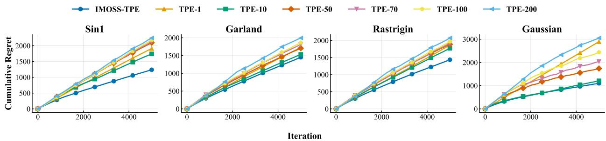  
Figure 3: Cumulative regret over 5000 evaluations on the four-dimensional Sin1, Garland, Rastrigin and Gaussian functions. IMOSS-TPE is compared with fixed-replication TPE-k baselines for $k \in \{ 1 , 1 0 , 5 0 , 7 \tilde { 0 } , 1 0 0 , 2 0 0 \}$ . The observation noise follows Equation (3) with $\sigma = 0 . 7$ for Sin1, Garland and Rastrigin, and is a single Bernoulli draw for the Gaussian.

Figure 3 shows that IMOSS-TPE achieves lower cumulative regret than every TPE-k baseline on all four functions. Importantly, this advantage persists for TPE-50 and TPE-70, whose surrogates are fitted using at least as many distinct configurations as the IMOSS-TPE surrogate. The cumulative-regret improvement therefore cannot be explained solely by the number of configurations available to TPE. Rather, it reflects the benefit of adaptive evaluation allocation: TPE-k commits k evaluations to every suggestion, including configurations that appear unpromising after only a few observations, whereas IMOSS reallocates subsequent evaluations according to both observed performance and uncertainty.

## 5.4 HPOBench

HPOBench [52] collects HPO benchmarks built from precomputed model evaluations, reporting validation performance for predefined configurations and evaluation budgets. Configurations can therefore be served repeatedly online without retraining the underlying models, and the known validation results allow exact regret computation.

## 5.4.1 HPO on Discrete Parameters

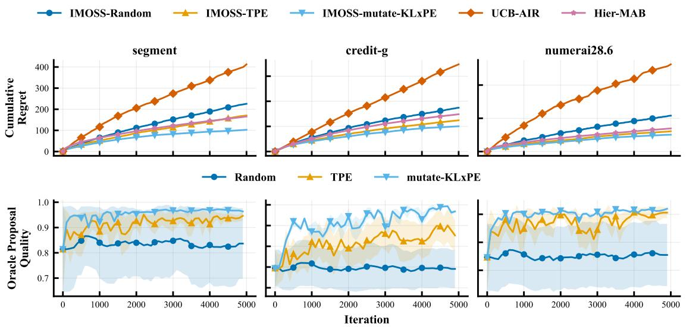  
Figure 4: Cumulative regret (upper row, lower is better) and true mean reward of the arms each oracle proposes (lower row, higher is better) on the three discrete OpenML HPO problems, averaged over 30 paired runs. UCB-AIR and Hier-MAB have no oracle and appear only in the upper row.

We use the random forest benchmarks provided by HPOBench for three OpenML classification tasks, segment, credit-g, and numerai28.6. An arm x is a random-forest configuration defined by max\_depth, max\_features, min\_samples\_leaf, and min\_samples\_split; discretizing these into evenly spaced values yields $K = 2 2 5 0$ arms per task. Every configuration uses 512 trees and the full training set (subsample fraction 1), the largest evaluation budget available in the benchmark, and an arm’s mean reward $p _ { { \pmb x } }$ is its validation accuracy averaged over five training seeds. We turn this offline benchmark into an online one by binarization: pulling $\mathbf { \Delta } _ { \mathbf { \mathcal { X } } _ { t } }$ at round t returns $r _ { t } \sim \mathrm { B e r n o u l l i } ( p _ { { \mathbf { x } } _ { t } } )$ so the optimizer observes a noisy binary outcome rather than the true mean. Since all means are known, we set $p ^ { \star } = \operatorname* { m a x } _ { \pmb { x } \in \mathcal { X } } p _ { \pmb { x } }$ and compute cumulative regret $\mathcal { R } _ { T }$ exactly. We compare IMOSS-Random, IMOSS-TPE and IMOSS-mutate-KL×PE, which share the same active-set schedule and MOSS allocation rule with $\beta = 0 . 5$ and differ only in their oracle. UCB-AIR serves as a restart-free infinitely many-armed baseline, and Hier-MAB, the two-level hierarchical bandit of AutoRAG-HP [42], as a factored one: a high-level UCB1 bandit picks which hyperparameter to perturb and one low-level UCB1 bandit per hyperparameter picks its value, while every other coordinate keeps its per-axis best value: the value with the highest mean reward on that axis alone. Crediting the reward to the perturbed coordinate therefore presumes near-separable rewards. For every task and method, we perform thirty paired runs with T = 5000 pulls.

Figure 4 compares cumulative regret and oracle proposal quality across the three discrete HPO tasks. Every IMABO variant accumulates less regret than UCB-AIR, including IMOSS-Random, indicating that the active-set schedule and MOSS allocation rule already help before any learned oracle is added. The two learned oracles are strongest overall and IMOSS-mutate-KL×PE attains the lowest regret on all tasks: segment, credit-g, and numerai28.6. The lower row, measured on a copy of the optimizer state so these diagnostic proposals never alter the trajectory, explains much of this. Random proposals stay at constant quality by construction, whereas both learned oracles quickly begin proposing arms of substantially higher true mean reward. On credi $\tt t - g ,$ mutate-KL×PE sustains a high, stable proposal quality whereas TPE is lower and markedly more variable, consistent with a sparse optimum depending on two hyperparameters at once. On segment and numerai28.6, whose rewards vary mainly with max\_depth, both learned oracles reach high proposal quality without difficulty; on numerai28.6 many arms additionally share near-identical means, so the residual gap between the oracles translates into only mild differences in accumulated regret.

## 5.4.2 HPO on Continuous Parameters

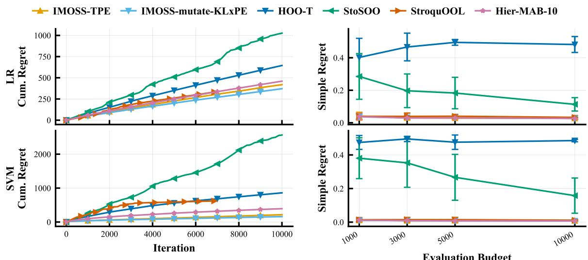  
Figure 5: Cumulative regret (left) and simple regret of the recommended configuration (right) on the two continuous OpenML HPO problems, Logistic Regression (LR) and Support Vector Machine (SVM). Lower is better. StroquOOL’s curve ends after 6866 evaluations because its schedule is built to spend at most $T = 1 0 0 0 0$ evaluations, and it stops once that schedule is complete.

We evaluate IMOSS-TPE and IMOSS-mutate-KL×PE on the Logistic Regression and Support Vector Machine benchmarks associated with the kr-vs-kp dataset (OpenML task $1 6 7 1 4 9 ) . ^ { 6 }$ Both define two-dimensional continuous search spaces with logarithmic scaling: the SGD regularization parameter α and the initial learning rate $\eta _ { 0 }$ over $[ 1 0 ^ { - 5 } , 1 ]$ for Logistic Regression, and $C$ and γ over $[ 2 ^ { - 1 0 } , 2 ^ { \breve { 1 } 0 } ]$ for Support Vector Machine, both with default benchmark settings. For each evaluation budget $T ,$ we perform 20 independent runs. We compare both IMABO variants, with $\beta = 0 . 5$ against StoSOO [19], StroquOOL [20], and HOO-T [17]. None of these three baselines is anytime, so we give each of them the horizon $T$ in advance, information that the IMABO family does not need. We use the horizon-aware variant HOO-T because the per-round cost of the anytime original grows quadratically with $T ,$ which is impractical at our budgets. We also run Hier-MAB, which requires every hyperparameter to range over an explicit finite set, with both axes discretized on geometrically spaced grids of 10 values per axis (Hier-MAB-10). For the tree-based methods, each logarithmic search space is normalized to the unit square $[ 0 , 1 ] ^ { 2 }$ and suggested points are mapped back to the original ranges before evaluation.

Figure 5 compares cumulative regret during optimization (left) and simple regret of the final recommendation (right). The two IMABO variants, IMOSS-TPE and IMOSS-mutate-KL×PE, obtain the lowest cumulative regret on both tasks without a pre-declared discretization of the axes, and both reach near-zero simple regret. On simple regret, they are matched by StroquOOL and Hier-MAB-10, which also converge to near-zero final regret, so the methods separate mainly through cumulative regret rather than through the quality of the final recommendation. We compare against HOO-T, the only baseline explicitly designed to control cumulative regret, and StroquOOL, whose simple-regret guarantees are state of the art under unknown smoothness and noise. On Logistic Regression, the IMABO variants and StroquOOL are essentially tied for the lowest cumulative regret, whereas on Support Vector Machine the IMABO variants are clearly ahead, with StroquOOL accumulating far more regret while sweeping its schedule. StoSOO incurs the highest cumulative regret on both tasks, and its simple regret, although it does decrease with the budget, remains far above that of the IMABO variants; HOO-T is the weakest on simple regret, which stays high on both tasks and does not improve with the budget. On Logistic Regression, StroquOOL ends below HOO-T on cumulative regret even though only HOO-T targets that metric. Hier-MAB-10 is competitive on Logistic Regression but stays clearly behind IMABO on Support Vector Machine.

## 5.5 LLM Question Answering on HotpotQA

HotpotQA [53] is an open-domain question-answering benchmark built from Wikipedia, in which each example pairs a question and its answer with supporting facts drawn from several articles, so answering requires combining information across documents. We use the retrieval version distributed through BEIR [54]. Each question is answered by a retrieval-augmented generation pipeline: a retriever selects the top\_k Wikipedia passages by cosine similarity, and a large language model generates the answer from a prompt containing the question and those passages. At round t, the optimizer selects the complete pipeline configuration $\mathbf { \Delta } _ { \mathbf { \mathcal { X } } _ { t } }$ before observing question $q _ { t } ,$ , so it must find a configuration that performs well across the stream rather than adapt to each question.

Retrieval uses all-MiniLM-L6-v2 embeddings [55], precomputed for all Wikipedia documents and normalized to unit $\ell _ { 2 }$ norm, as are the encoded questions. A configuration includes the generation model, the prompt template, the retrieval depth top\_k from 1 to 10, and the generation temperature in [0, 1]. Prompt templates are few\_shot with fixed examples, zero\_shot with instructions but no examples, and naive with only the question and retrieved documents. The full model list, prompt templates, and generation details are given in Section D.1.

For each question $q ,$ answer quality $a _ { q } ( { \pmb x } )$ is the normalized token-overlap F1 between the generated and gold answers, and retrieval quality $r _ { q } ( { \pmb x } )$ is the title-level F1 between the retrieved and gold supporting documents. The reward combines both as $w \cdot a _ { q } ( { \pmb x } ) + ( 1 - w ) \cdot r _ { q } ( { \pmb x } )$ with $w = 0 . 8 ,$ , and we report online average regret $\overline { { \mathcal { R } } } _ { T } = \mathcal { R } _ { T } / T$ . After the stream, each method returns its best configuration, which we evaluate on a disjoint set of unseen questions and report as average per-question simple regret. For each of five seeds, we randomly permute the test questions and use 5000 for the online stream and a disjoint 500 for final evaluation, giving all methods the same split and question order. We compare IMOSS-TPE, IMOSS-mutate-KL×PE and IMOSS-TabPFN with Random and Hier-MAB. Random selects configurations uniformly without using previous observations, and Hier-MAB requires explicit finite axes, so its temperature, the only continuous axis, is discretized to eleven evenly spaced values.

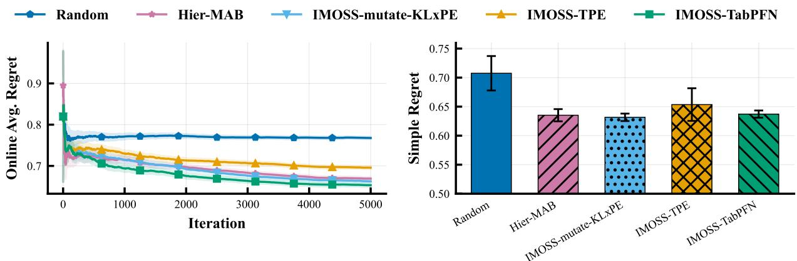  
Figure 6: Online average regret and simple regret on HotpotQA, averaged over 5 seeds; shaded bands and error bars show standard deviations across seeds. Lower is better.

In Figure 6, both xˆ-mutation variants, IMOSS-mutate-KL×PE and IMOSS-TabPFN, improve on Random on both metrics and on Hier-MAB online, and their online advantage widens as more questions are observed, consistent with the learned oracles making greater use of the accumulated observations. IMOSS-TPE, by contrast, trails Hier-MAB on both metrics. HotpotQA is a near-separable space, the regime in which coordinate-local search is strongest: the mutation oracles refine the best configuration one coordinate at a time and Hier-MAB holds every axis except one at its per-axis best, so both keep the active set concentrated around the strongest configuration. IMOSS-TPE instead admits arms from across the whole good region; although each proposal is individually reasonable, the active set is more dispersed, so more pulls land away from the best accumulated configuration, raising online regret while the best neighborhood is refined less and leaving the final recommendation behind as well. IMOSS-TabPFN attains the lowest online average regret, with IMOSS-mutate-KL×PE and Hier-MAB close behind. On simple regret the two xˆ-mutation variants and Hier-MAB are statistically indistinguishable and all clearly below Random, so Hier-MAB matches them on the quality of the final recommendation while trailing them online. Overall, the methods that keep the active set concentrated around the strongest configuration, the two mutation oracles and Hier-MAB, dominate on both metrics, while IMOSS-TPE, the only method that proposes across the whole good region, trails even Hier-MAB; online average regret separates more sharply than simple regret does.

## 6 Practical Usage

We propose extensions of IMABO that address specific problems encountered when running it in production.

## 6.1 Delayed and censored feedback

In many applications the reward is not available the moment a configuration is tried. For instance, it may depend on user feedback that follows the interaction, and this feedback may arrive after an unknown delay or fail to arrive at all. The policy must keep selecting configurations without waiting for these rewards, so at any round it faces a mixture of pulls that have already returned a reward and pulls that are still pending. Write $n _ { x } ^ { \mathrm { r e w } }$ and $n _ { x } ^ { \mathrm { p e n d } }$ for the completed and pending pulls of arm $^ { x , }$ and $N ^ { \mathrm { r e w } }$ and $N ^ { \mathrm { p e n d } }$ for their totals over all arms. Let $p \in ( 0 , 1 ]$ be the fraction of pulls that eventually return a reward, estimated from the logs. IMABO counts each pending pull as a fraction p of a reward, which lets both the expansion rule and the index run on the rewards that the pending pulls will produce in expectation,

$$
\tilde { N } _ { t } = N ^ { \mathrm { r e w } } + p N ^ { \mathrm { p e n d } } , \qquad \widetilde { \mathcal { B } } _ { t } ( \pmb { x } ) = \hat { \mu } _ { x } + \sqrt { \frac { 1 + \alpha } { 2 } \cdot \frac { \operatorname* { m a x } \bigl ( 0 , \log \bigl ( \tilde { N } _ { t } / ( \tilde { N } _ { t } ^ { \beta } \tilde { n } _ { x } ) \bigr ) \bigr ) } { \tilde { n } _ { x } } } ,\tag{5}
$$

where $\tilde { n } _ { \mathbf { x } } = n _ { \mathbf { x } } ^ { \mathrm { r e w } } + p n _ { \mathbf { x } } ^ { \mathrm { p e n d } } + 1$ and $\hat { \mu } _ { x }$ averages the completed rewards of the arm. A new arm enters whenever $| \mathcal { M } _ { t } | < \tilde { N } _ { t } ^ { \beta }$ . With $p = 1$ and $N ^ { \mathrm { p e n d } } = 0$ every pull has already returned its reward and the rule reduces to (1). A pull that remains pending beyond a fixed window is dropped from the count.

## 6.2 Experimental evaluation

We evaluate the delay-aware switching rule above against a delay-oblivious variant and a no-delay skyline on LCBench, accessed through the YAHPO-Gym surrogate, which models AutoPyTorch multilayer-perceptron training on OpenML tabular tasks [56]. We use three instances: higgs (167200), APSFailure (168868), and Fashion-MNIST (189908). Each defines the seven-dimensional search space of Table 2. The surrogate returns a validation accuracy in [0, 100], rescaled to a success probability $p \in [ 0 , 1 ] ;$ ; the reward for each pull is a Bernoulli(p) random variable. As the maximum achievable accuracy $p ^ { \star }$ has no closed form on a continuous space, we estimate it once per instance from a dense random sample of 100,000 configurations.

Table 2: LCBench search space (seven hyperparameters, mixed continuous and finite). Bounds and log-scale flags are read from the surrogate’s configuration space.
<table><tr><td>Hyperparameter</td><td>Type</td><td>Range</td></tr><tr><td>num_layers</td><td>Categorical</td><td> $\{ 1 , \ldots , 5 \}$ </td></tr><tr><td>batch_size</td><td>Integer (log-scaled)</td><td>[16, 512]</td></tr><tr><td>max_units</td><td>Integer (log-scaled)</td><td>[64, 1024]</td></tr><tr><td>learning_rate</td><td>Continuous (log-scaled)</td><td> $[ 1 0 ^ { - 4 } , 1 0 ^ { - 1 } ]$ </td></tr><tr><td>momentum</td><td>Continuous</td><td> $[ 0 . 1 , 0 . 9 9 ]$ </td></tr><tr><td>weight_decay</td><td>Continuous</td><td> $[ 1 0 ^ { - 5 } , 1 0 ^ { \dot { - } 1 } ]$ </td></tr><tr><td>max_dropout</td><td>Continuous</td><td> $[ 0 . 0 , 1 . 0 ]$ </td></tr></table>

Each configuration’s feedback delay is set by its own predicted training time, returned in seconds alongside the accuracy by the surrogate. To express this runtime in simulator steps, we divide it by a fixed per-instance constant τ ,

$$
\mathsf { s t e p s } ( \pmb { x } ) = \frac { \mathsf { r u n t i m e \_ s e c o n d s } ( \pmb { x } ) } { \tau } , \qquad \tau = \frac { \tilde { t } } { 6 } ,
$$

where $\tilde { t }$ is the median predicted runtime over the 100,000-configuration sample. Choosing $\tau = \tilde { t } / 6$ fixes the step scale by anchoring it to the median configuration, whose runtime is t˜by definition. A stochastic delay is then obtained by scaling steps(x) with a multiplicative log-normal jitter that represents queueing noise (a job with predicted runtime t does not always take exactly t),

$$
{ \tt d e l a y } ( x ) = { \tt d e l a y \mathrm { _ - s c a l e } } \times \tt s t e p s ( { x } ) \times \xi , \qquad \xi \sim \mathrm { L o g N o r m a l } ( 0 , \sigma ^ { 2 } ) ,
$$

with $\sigma = 0 . 5$ (median jitter 1) and delay\_scal $\Theta = 1$ . Feedback is then lost in two independent ways: a configurationindependent Bernoulli filter admits a pull only with probability feedback $\mathbf { \underline { { { f r e q } } } = 0 . 2 }$ (crashed or never-submitted jobs, 80% dropped outright), and a patience window drops any admitted pull whose delay exceeds the $q = 0 . 9 5$ quantile

of that instance’s delay distribution (32, 33, and 19 steps for higgs, APSFailure, and Fashion-MNIST). A pull is therefore never observed with probability

$$
\mathbb { P } ( \mathtt { n e v e r \ o b s e r v e d } ) = ( 1 - \mathtt { f e e d b a c k \_ f r e q } ) + \mathtt { f e e d b a c k \_ f r e q } \cdot \mathbb { P } ( \mathtt { d e l a y } > \mathtt { p a t i e n c e } ) .
$$

We consider three variants of IMOSS-TPE: IMOSS-TPE Delayed is the delay-aware switching rule above, run under delayed and censored feedback; IMOSS-TPE Naive is the identical optimizer exposed to the same delayed and censored environment but ignoring pending pulls, isolating the cost of delay-blindness; IMOSS-TPE is that same optimizer under instant feedback, the no-delay skyline. UCB-AIR is an infinitely many-armed bandit reference, also run under instant feedback. All four methods use $\beta = 0 . 5$

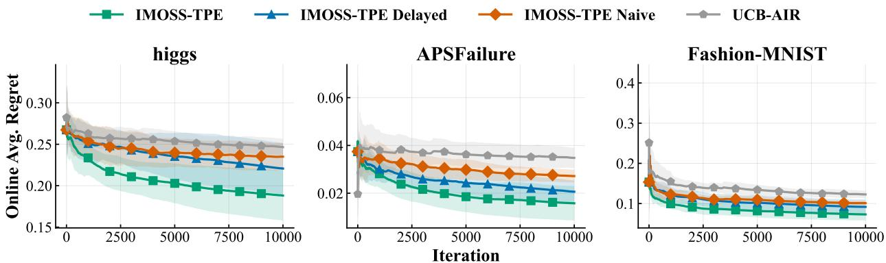  
Figure 7: Delayed and censored feedback on three LCBench instances (higgs, APSFailure, Fashion-MNIST). Each panel plots online average regret $\overline { { \mathcal { R } } } _ { T } ;$ ; lower is better. Curves are means over 10 seeds and shaded bands are ±1 standard deviation. Feedback is delayed by each configuration’s predicted training time (median 6 steps, log-normal jitter $\sigma = 0 . 5 )$ and censored by a Bernoulli filter (feedback\_freq = 0.2) plus a per-instance $q = 0 . 9 5$ patience window (32, 33, 19 steps), so only about 19% of pulls ever return a reward. IMOSS-TPE (green) is the no-delay skyline and UCB-AIR (grey) is a no-delay reference baseline; IMOSS-TPE Delayed (blue) and IMOSS-TPE Naive (orange) run the same optimizer under delayed feedback, with and without the delay-aware switching rule.

Figure 7 reports online average regret over $T = 1 0 0 0 0$ iterations with 10 seeds. The ordering is consistent across all three instances: the delay-aware rule sits between the delay-blind Naive variant and the no-delay skyline, closing most of the gap to the skyline. The two delayed methods share the environment and receive the same censored stream — only about 19% of pulls ever return a reward — so the gap between them is caused by the switching rule alone.

The mechanism is made explicit in Figure 8. The Naive rule admits a new arm whenever $| \mathcal { M } _ { t } | < t ^ { \beta }$ , using the raw step count, so at the horizon it holds the full $t ^ { \beta } = { \sqrt { T } }$ ≈ 100 arms even though most of those steps never returned a reward. The delay-aware rule instead throttles admission by the effective count $\tilde { N } _ { t }$ of (5): because roughly 80% of pulls never arrive, $\tilde { N } _ { t } \ll t$ and the active set settles at about 60 arms. Both delayed methods observe the same ≈ 1,900 rewards, so spreading them over fewer arms substantially raises the observations per arm for the delay-aware rule over the Naive one, though both stay well below the skyline, which observes every pull. More observations per arm means tighter arm-mean estimates, which is what lets the delay-aware rule rank candidates reliably and recover most of the distance to the skyline, while the Naive rule pays for exploring arms it cannot resolve. Despite discarding roughly 80% of feedback, the delay-aware optimizer still finishes below UCB-AIR, which sees instant feedback.

Restart on an evolving search space. A search that runs for a long time will usually see its space of configurations grow, whether because a provider ships a new model or because an existing parameter is allowed a new value. We would like IMABO to give those late additions as much attention as it gave the first configurations it ever saw. It does not do so by default, because it explores the most at the beginning of a run. The condition $| \mathcal { M } _ { t } | < t ^ { \beta }$ is easy to meet when t is small and hard to meet once t is large, so newly added configurations, arriving when t is already large, would be picked up only rarely. We correct this by restarting the schedule at the round $t _ { 0 }$ at which the space changed. With $\boldsymbol { N _ { 0 } } ^ { \star } = \vert \boldsymbol { \mathcal { M } } _ { t _ { 0 } } \vert$ arms already in place, a new arm enters when

$$
| \mathcal { M } _ { t } | - N _ { 0 } < ( t - t _ { 0 } ) ^ { \beta } .
$$

Only the schedule is reset, and all past rewards are preserved, so when the oracle proposes configurations from the larger space it still uses everything learned so far, unlike a true restart, which would discard that knowledge.

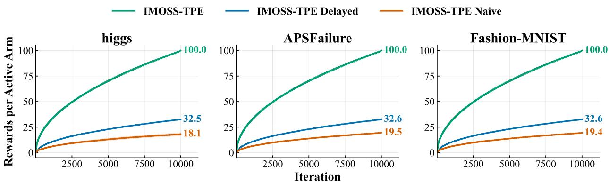  
Figure 8: Observed rewards per active arm on the three LCBench instances: the cumulative number of rewards delivered so far divided by the number of active arms $\lvert \mathcal { M } _ { t } \rvert ,$ , against iteration. Under identical delayed and censored feedback, the two delayed methods observe the same total number of rewards (≈ 1,900), so this ratio measures how concentrated that feedback is across the active set. The delay-aware rule (IMOSS-TPE Delayed, blue) throttles arm admission by the effective count $\tilde { N } _ { t }$ and holds ≈ 60 active arms, giving ≈ 33 rewards per arm; the delay-blind IMOSS-TPE Naive (orange) expands to the full ≈100 arms and reaches only ≈18. The no-delay skyline (IMOSS-TPE, green) observes every pull, giving 100 rewards per arm. Curves are means over 10 seeds.

## 7 Conclusion

We addressed OHPO by framing it as an infinitely many-armed bandit over a mixed and possibly conditional search space. We introduced IMABO, a framework that combines a bandit policy for allocating pulls with an oracle for suggesting new configurations, and IMOSS, an anytime and restart-free policy with a cumulative quantile-regret bound. When instantiated with a Random, a TPE, a mutate-KL×PE, or a TabPFN oracle, IMABO outperformed its baselines on both classical machine-learning models and a language-model agent while being computationally efficient for online optimization.

Several features set IMABO apart among online tuners. It operates directly on mixed, conditional, tree-structured spaces without discretizing any coordinate, and it comes with a cumulative quantile-regret guarantee. Because its active set grows only as $t ^ { \beta }$ , it requests fewer distinct configurations than rounds, an advantage when adopting a configuration carries a training or warm-up cost. Its heuristic extension to delayed and censored feedback also performs well under production conditions.

A central challenge is the imbalance induced by adaptive sampling: promising configurations receive many observations, whereas most remain weakly estimated. This process can also introduce survivorship bias, since configurations favored by unusually strong early rewards are more likely to remain active and accumulate further evidence, making their true performance difficult to estimate. Developing uncertainty-aware or debiased estimators tailored to this adaptive data collection process is therefore a promising direction.

The modularity of IMABO opens several further directions. When request context is available before selection, the allocation policy could be replaced by a contextual bandit without changing the proposal mechanism. Constrained or multi-objective settings, such as maximizing quality subject to a cost or latency budget, are a natural extension. More broadly, jointly learning when to expand, what to propose, and which active configuration to serve could further improve the balance between discovery and exploitation.

## References

[1] James Bergstra and Yoshua Bengio. Random search for hyper-parameter optimization. Journal of Machine Learning Research, 13:281–305, 2012.

[2] Jasper Snoek, Hugo Larochelle, and Ryan P. Adams. Practical Bayesian optimization of machine learning algorithms. In Advances in Neural Information Processing Systems (NeurIPS), pages 2951–2959, 2012.

[3] Lisha Li, Kevin Jamieson, Giulia DeSalvo, Afshin Rostamizadeh, and Ameet Talwalkar. Hyperband: A novel bandit-based approach to hyperparameter optimization. Journal ofMachine Learning Research, 18(185):1–52, 2017.

[4] Bobak Shahriari, Kevin Swersky, Ziyu Wang, Ryan P. Adams, and Nando de Freitas. Taking the human out of the loop: A review of Bayesian optimization. Proceedings ofthe IEEE, 104(1):148–175, 2016.

[5] Frank Hutter, Holger H. Hoos, and Kevin Leyton-Brown. Sequential model-based optimization for genera algorithm configuration. In Learning and Intelligent Optimization (LION), pages 507–523. Springer, 2011.

[6] James Bergstra, Rémi Bardenet, Yoshua Bengio, and Balázs Kégl. Algorithms for hyper-parameter optimization. In Advances in Neural Information Processing Systems (NeurIPS), pages 2546–2554, 2011.

[7] Louis C. Tiao, Aaron Klein, Matthias Seeger, Edwin V. Bonilla, Cedric Archambeau, and Fabio Ramos. BORE: Bayesian optimization by density-ratio estimation, 2021.

[8] Jiaming Song, Lantao Yu, Willie Neiswanger, and Stefano Ermon. A general recipe for likelihood-free Bayesian optimization. In Proceedings of the 39th International Conference on Machine Learning (ICML), 2022. arXiv:2206.13035.

[9] Xingchen Wan, Vu Nguyen, Huong Ha, Binxin Ru, Cong Lu, and Michael A. Osborne. Think global and act local: Bayesian optimisation over high-dimensional categorical and mixed search spaces. In Proceedings ofthe 38th International Conference on Machine Learning (ICML), 2021. arXiv:2102.07188.

[10] Herilalaina Rakotoarison, Steven Adriaensen, Neeratyoy Mallik, Samir Garibov, Edward Bergman, and Frank Hutter. In-context freeze-thaw bayesian optimization for hyperparameter optimization. In AutoML Conference 2024 (Workshop Track), 2024. URL https://openreview.net/forum?id=TPwrOQhyRj.

[11] Rosen Ting-Ying Yu, Cyril Picard, and Faez Ahmed. GIT-BO: High-dimensional bayesian optimization with tabular foundation models. In 1st ICML Workshop on Foundation Models for Structured Data, 2025. URL https://openreview.net/forum?id=oJEAh2Jdgp.

[12] Peter Auer, Nicolò Cesa-Bianchi, and Paul Fischer. Finite-time analysis of the multiarmed bandit problem. Machine Learning, 47(2–3):235–256, 2002.

[13] Jean-Yves Audibert and Sébastien Bubeck. Minimax policies for adversarial and stochastic bandits. In Proceedings of the 22nd Annual Conference on Learning Theory (COLT 2009), pages 217–226, 2009. URL https://www.microsoft.com/en-us/research/publication/ minimax-policies-adversarial-stochastic-bandits/.

[14] Rémy Degenne and Vianney Perchet. Anytime optimal algorithms in stochastic multi-armed bandits. In Proceedings ofthe 33rd International Conference on Machine Learning (ICML 2016), volume 48, pages 1587– 1595. PMLR, 2016. URL https://proceedings.mlr.press/v48/degenne16.html.

[15] Donald A. Berry, Robert W. Chen, Alan Zame, David C. Heath, and Larry A. Shepp. Bandit problems with infinitely many arms. The Annals ofStatistics, 25(5):2103 – 2116, 1997. doi: 10.1214/aos/1069362389. URL https://doi.org/10.1214/aos/1069362389.

[16] Robert Kleinberg. Nearly tight bounds for the continuum-armed bandit problem. In Advances in Neural Information Processing Systems (NeurIPS), 2004.

[17] Sébastien Bubeck, Rémi Munos, Gilles Stoltz, and Csaba Szepesvári. X-armed bandits. Journal of Machine Learning Research, 12, 2011.

[18] Remi Munos. Optimistic optimization of a deterministic function without the knowledge of its smoothness. In Advances in Neural Information Processing Systems (NeurIPS), pages 783–791, 2011.

[19] Michal Valko, Alexandra Carpentier, and Remi Munos. Stochastic simultaneous optimistic optimization. In Proceedings of the 30th International Conference on Machine Learning (ICML), pages 19–27. PMLR, 2013.

[20] Peter L. Bartlett, Victor Gabillon, and Michal Valko. A simple parameter-free and adaptive approach to optimization under a minimal local smoothness assumption. In Proceedings of the 30th International Conference on Algorithmic Learning Theory (ALT), pages 1–23. PMLR, 2019.

[21] Alexandra Carpentier and Michal Valko. Simple regret for infinitely many-armed bandits. In Proceedings ofthe 32nd International Conference on Machine Learning (ICML). PMLR, 2015.

[22] Arghya Roy Chaudhuri and Shivaram Kalyanakrishnan. Quantile-regret minimisation in infinitely many-armed bandits. In Proceedings of the 2018 Conference on Uncertainty in Artificial Intelligence (UAI 2018), pages 425–434. AUAI Press, 2018.

[23] Yizao Wang, Jean-Yves Audibert, and Rémi Munos. Algorithms for infinitely many-armed bandits. In Proceedings ofthe 22nd International Conference on Neural Information Processing Systems, NIPS’08, page 1729–1736, Red Hook, NY, USA, 2008. Curran Associates Inc. ISBN 9781605609492.

[24] Lihong Li, Wei Chu, John Langford, and Robert E. Schapire. A contextual-bandit approach to personalized news article recommendation. In Proceedings of the 19th International Conference on World Wide Web (WWW), pages 661–670, 2010. doi: 10.1145/1772690.1772758.

[25] Dongruo Zhou, Lihong Li, and Quanquan Gu. Neural contextual bandits with UCB-based exploration. In Proceedings ofthe 37th International Conference on Machine Learning (ICML), volume 119 of Proceedings of Machine Learning Research, pages 11492–11502. PMLR, 2020.

[26] Hannes Nilsson, Rikard Johansson, Niklas Åkerblom, and Morteza Haghir Chehreghani. Tree ensembles for contextual bandits. Transactions on Machine Learning Research (TMLR), 2024. URL https://openreview. net/forum?id=59DCkSGw8S.

[27] Yan Shuo Tan, Kenyon Ng, Ruizhe Deng, Sumetha Loganathan, Qiong Zhang, and Bibhas Chakraborty. PFN-TS: Thompson sampling for contextual bandits via prior-data fitted networks, 2026. Preprint.

[28] Kevin Jamieson and Ameet Talwalkar. Non-stochastic best arm identification and hyperparameter optimization. In Proceedings ofthe 19th International Conference on Artificial Intelligence and Statistics (AISTATS). PMLR, 2016.

[29] Stefan Falkner, Aaron Klein, and Frank Hutter. Bohb: Robust and efficient hyperparameter optimization at scale. In Proceedings of the 35th International Conference on Machine Learning (ICML). PMLR, 2018.

[30] Binxin Ru, Ahsan S. Alvi, Vu Nguyen, Michael A. Osborne, and Stephen J. Roberts. Bayesian optimisation over multiple continuous and categorical inputs, 2019.

[31] Xuedong Shang, Emilie Kaufmann, and Michal Valko. A simple dynamic bandit algorithm for hyper-parameter tuning. In 6th Workshop on Automated Machine Learning at the International Conference on Machine Learning (AutoML@ICML), Long Beach, CA, USA, 2019.

[32] Steven L. Scott. A modern Bayesian look at the multi-armed bandit. Applied Stochastic Models in Business and Industry, 26(6):639–658, 2010.

[33] Olivier Chapelle and Lihong Li. An empirical evaluation of Thompson sampling. In Advances in Neural Information Processing Systems (NeurIPS), pages 2249–2257, 2011.

[34] Shiyin Lu, Yu-Hang Zhou, Jing-Cheng Shi, Wenya Zhu, Qingtao Yu, Qing-Guo Chen, Qing Da, and Lijun Zhang. Non-stationary continuum-armed bandits for online hyperparameter optimization. In Proceedings ofthe Fifteenth ACM International Conference on Web Search and Data Mining (WSDM), pages 618–627. ACM, 2022. doi: 10.1145/3488560.3498396.

[35] Yue Kang, Cho-Jui Hsieh, and Thomas Chun Man Lee. Online continuous hyperparameter optimization for generalized linear contextual bandits. Transactions on Machine Learning Research, 2024. URL https:// openreview.net/forum?id=lQE2AcbYge.

[36] Yaoyao Liu, Yingying Li, Bernt Schiele, and Qianru Sun. Online hyperparameter optimization for classincremental learning. In Proceedings of the AAAI Conference on Artificial Intelligence, volume 37, pages 8906–8913, 2023. doi: 10.1609/aaai.v37i7.26070.

[37] Max Jaderberg, Valentin Dalibard, Simon Osindero, Wojciech M. Czarnecki, Jeff Donahue, Ali Razavi, Oriol Vinyals, Tim Green, Iain Dunning, Karen Simonyan, Chrisantha Fernando, and Koray Kavukcuoglu. Population based training of neural networks, 2017.

[38] Jack Parker-Holder, Vu Nguyen, Shaan Desai, and Stephen J. Roberts. Tuning mixed input hyperparameters on the fly for efficient population based autorl. In Advances in Neural Information Processing Systems, volume 34, 2021.

[39] Xingchen Wan, Cong Lu, Jack Parker-Holder, Philip J. Ball, Vu Nguyen, Binxin Ru, and Michael Osborne. Bayesian generational population-based training. In Proceedings of the First International Conference on Automated Machine Learning, volume 188 of Proceedings ofMachine Learning Research, pages 14/1–27. PMLR, 2022.

[40] Jialin Liu, Diego Pérez-Liébana, and Simon M. Lucas. Bandit-based random mutation hill-climbing. In 2017 IEEE Congress on Evolutionary Computation (CEC), pages 2145–2151. IEEE, 2017. arXiv:1606.06041.

[41] Margaux Brégère and Julie Keisler. A bandit approach with evolutionary operators for model selection, 2024.

[42] Jia Fu, Xiaoting Qin, Fangkai Yang, Lu Wang, Jue Zhang, Qingwei Lin, Yubo Chen, Dongmei Zhang, Saravan Rajmohan, and Qi Zhang. AutoRAG-HP: Automatic online hyper-parameter tuning for retrieval-augmented generation. In Findings of the Association for Computational Linguistics: EMNLP 2024, pages 3875–3891. Association for Computational Linguistics, 2024. doi: 10.18653/v1/2024.findings-emnlp.223.

[43] Yunlong Hou, Fengzhuo Zhang, Cunxiao Du, Xuan Zhang, Jiachun Pan, Tianyu Pang, Chao Du, Vincent Y. F. Tan, and Zhuoran Yang. BanditSpec: Adaptive speculative decoding via bandit algorithms. In Proceedings ofthe 42nd International Conference on Machine Learning (ICML), volume 267 of Proceedings of Machine Learning Research, pages 24045–24079. PMLR, 2025.

[44] Qitian Jason Hu, Jacob Bieker, Xiuyu Li, Nan Jiang, Benjamin Keigwin, Gaurav Ranganath, Kurt Keutzer, and Shriyash Kaustubh Upadhyay. RouterBench: A benchmark for multi-LLM routing system. arXiv preprint arXiv:2403.12031, 2024.

[45] Yu Xia, Fang Kong, Tong Yu, Liya Guo, Ryan A. Rossi, Sungchul Kim, and Shuai Li. Which LLM to play? convergence-aware online model selection with time-increasing bandits. In Proceedings of the ACM Web Conference (WWW), 2024.

[46] Lingjiao Chen, Matei Zaharia, and James Zou. FrugalGPT: How to use large language models while reducing cost and improving performance. arXiv preprint arXiv:2305.05176, 2023.

[47] Pranjal Aggarwal, Aman Madaan, Ankit Anand, Srividya Pranavi Potharaju, Swaroop Mishra, Pei Zhou, Aditya Gupta, Dheeraj Rajagopal, Karthik Kappaganthu, Yiming Yang, Shyam Upadhyay, Manaal Faruqui, and Mausam. AutoMix: Automatically mixing language models. In Advances in Neural Information Processing Systems (NeurIPS), 2024.

[48] Isaac Ong, Amjad Almahairi, Vincent Wu, Wei-Lin Chiang, Tianhao Wu, Joseph E. Gonzalez, M. Waleed Kadous, and Ion Stoica. RouteLLM: Learning to route LLMs from preference data. In The Thirteenth International Conference on Learning Representations (ICLR), 2025.

[49] Aurélien Garivier and Olivier Cappé. The kl-ucb algorithm for bounded stochastic bandits and beyond. In Proceedings ofthe 24th Annual Conference on Learning Theory (COLT), pages 359–376. JMLR Workshop and Conference Proceedings, 2011.

[50] Noah Hollmann, Samuel Müller, Lennart Purucker, Arjun Krishnakumar, Max Körfer, Shi Bin Hoo, Robin Tibor Schirrmeister, and Frank Hutter. Accurate predictions on small data with a tabular foundation model. Nature, 637 (8045):319–326, 2025. doi: 10.1038/s41586-024-08328-6.

[51] Takuya Akiba, Shotaro Sano, Toshihiko Yanase, Takeru Ohta, and Masanori Koyama. Optuna: A next-generation hyperparameter optimization framework. In Proceedings ofthe 25th ACM SIGKDD International Conference on Knowledge Discovery and Data Mining (KDD ’19), pages 2623–2631. ACM, 2019. doi: 10.1145/3292500. 3330701. URL https://doi.org/10.1145/3292500.3330701.

[52] Katharina Eggensperger, Philipp Müller, Neeratyoy Mallik, Matthias Feurer, Rene Sass, Aaron Klein, Noor Awad, Marius Lindauer, and Frank Hutter. HPOBench: A collection of reproducible multi-fidelity benchmark problems for HPO. In Thirty-fifth Conference on Neural Information Processing Systems Datasets and Benchmarks Track (Round 2), 2021. URL https://openreview.net/forum?id=1k4rJYEwda-.

[53] Zhilin Yang, Peng Qi, Saizheng Zhang, Yoshua Bengio, William W. Cohen, Ruslan Salakhutdinov, and Christopher D. Manning. HotpotQA: A dataset for diverse, explainable multi-hop question answering. In Conference on Empirical Methods in Natural Language Processing (EMNLP), 2018.

[54] Nandan Thakur, Nils Reimers, Johannes Daxenberger, and Iryna Gurevych. BEIR: A heterogeneous benchmark for zero-shot evaluation of information retrieval models. In Thirty-fifth Conference on Neural Information Processing Systems Datasets and Benchmarks Track, 2021. URL https://openreview.net/forum?id=wCu6T5xFjeJ.

[55] Nils Reimers and Iryna Gurevych. Sentence-BERT: Sentence embeddings using siamese BERT-networks. In Proceedings of the 2019 Conference on Empirical Methods in Natural Language Processing and the 9th International Joint Conference on Natural Language Processing (EMNLP-IJCNLP), pages 3982–3992, 2019.

[56] Lucas Zimmer, Marius Lindauer, and Frank Hutter. Auto-pytorch: Multi-fidelity metalearning for efficient and robust autodl. IEEE Transactions on Pattern Analysis and Machine Intelligence, 43(9):3079–3090, 2021.

## APPENDIX

## A Theoretical Analysis

In this section, we prove the main theoretical result in two stages. First, we establish Lemma 1, which extends the usual MOSS allocation bound to a growing active set. The regular growth condition

$$
\frac { t } { K _ { t } } \leq \lambda \frac { T } { K _ { T } }
$$

allows us to sandwich the time-varying MOSS confidence radius between two fixed- $K _ { T }$ radii. We can then use the standard MOSS underestimation/overestimation decomposition and peeling argument to obtain a gap-dependent bound, which is converted into the distribution-free guarantee $\bar { O } ( \sqrt { K _ { T } T } )$ ). Importantly, the lemma holds relative to a reference arm $\scriptstyle { \mathbf { { \pmb x } } _ { g } }$ that is admitted at a possibly random time τ and remains active thereafter.

We then apply this lemma to prove Theorem 1. Let $\tau _ { \rho }$ be the first time a top-ρ configuration enters the active set, and take the first such configuration as the reference arm $\scriptstyle { \pmb { x } } _ { g }$ . We split the ρ-regret as

$$
\mathcal { R } _ { T } ^ { \rho , + } \leq \mathcal { R } _ { T } ^ { \mathrm { d i s c } } + \mathcal { R } _ { T } ^ { \mathrm { e x p a n d } } + \mathcal { R } _ { T } ^ { \mathrm { M O S S } } ,
$$

corresponding to three terms: the cost accumulated before $\tau _ { \rho } ,$ the cost of expansion rounds after $\tau _ { \rho } ,$ , and the cost of MOSS exploitation rounds after $\tau _ { \rho } .$ . We bound each in turn. The discovery term is controlled by the conditional coverage assumption, which bounds the tail probability of $\tau _ { \rho }$ and gives $O ( p _ { \rho } ^ { - 1 / \beta } )$ . The expansion term counts rounds that admit a new arm: each such round pulls a single arm, incurring cost at most 1, and there are at most $K _ { T }$ such rounds, so this term is $O ( K _ { T } ) = O ( T ^ { \beta } )$ . The exploitation term is where the lemma enters: $\scriptstyle { \pmb { x } } _ { g }$ remains active and satisfies $\begin{array} { r } { \mu _ { \pmb { x } _ { g } } \geq \mu _ { \rho } , } \end{array}$ so the regret relative to $\mu _ { \rho }$ is bounded by the regret relative to $\scriptstyle { \mathbf { { \mathit { x } } } } _ { g } ,$ and Lemma 1 gives $O ( \sqrt { K _ { T } T } ) = O ( T ^ { ( \bar { 1 } + \beta ) / 2 } )$ Finally, since $\beta < 1$ , the expansion term $T ^ { \beta }$ is dominated by the exploitation term $T ^ { ( 1 + \beta ) / 2 }$ , yielding the claimed rate. Let each configuration $\mathbf { \boldsymbol { x } } \in \mathcal { X }$ have an unknown reward distribution supported on [0, 1] with mean $\mu _ { x }$ . For $\rho \in ( 0 , 1 )$ let $\mu _ { \rho }$ denote the top-ρ threshold and define

$$
\mathrm { T O P } _ { \rho } : = \left\{ { \pmb x } \in { \pmb X } : \mu _ { \pmb x } \geq \mu _ { \rho } \right\} .
$$

We consider the ρ-regret defined as:

$$
\mathcal { R } _ { T } ^ { \rho , + } : = \sum _ { t = 1 } ^ { T } \left( \mu _ { \rho } - \mu _ { { \pmb x } _ { t } } \right) _ { + } , \qquad ( { \boldsymbol a } ) _ { + } : = \operatorname* { m a x } \left\{ { \boldsymbol a } , { \boldsymbol 0 } \right\} .
$$

Let $\mathcal { M } _ { t }$ be the active set after round $t ,$ and let $K _ { t } = | \mathcal { M } _ { t } |$ . The expansion schedule satisfies $K _ { t } = \Theta ( t ^ { \beta } )$ with $\beta \in ( 0 , 1 )$ ; we use $K _ { t } = O ( t ^ { \beta } )$ and $K _ { t } = \Omega ( t ^ { \beta } )$ wherever the corresponding constant is needed. At each round, IMOSS either admits a new arm (an expansion round) or serves an arm already in $\mathcal { M } _ { t }$ through the MOSS index (an exploitation round). We write $\mathcal { T } _ { \mathrm { e x p a n d } }$ for the set of expansion rounds and $\mathcal { T } _ { \mathrm { M O S S } }$ for the set of exploitation rounds, so that every round t belongs to exactly one of the two.

Lemma 1 (Allocation regret of growing-active-set MOSS). Let $( \mathcal { F } _ { t } ) _ { t \geq 0 }$ be thefiltration generated by the rounds up to and including round t, and let $( \bar { \mathcal { M } } _ { t } ) _ { t \leq T }$ be a possibly random, nondecreasing sequence ofactive sets, with $K _ { t } = | \bar { \mathcal { M } } _ { t } |$ and $K = K _ { T }$ . Assume that the arm admitted or pulled at round t is $\mathcal { F } _ { t - 1 }$ -measurable, and that, conditionally on $\mathcal { F } _ { t - 1 }$ each new observationfrom arm x is independent, supported on $[ 0 , 1 ]$ , and has mean $\mu _ { x } .$

Assume that the active-set schedule satisfies,for some constant $\lambda \geq 1$

$$
{ \frac { t } { K _ { t } } } \leq \lambda { \frac { T } { K } } \qquad \forall t \leq T
$$

Assume that, at exploitation rounds, an arm can be selected by the allocation policy only after it has received at least one observation. At an exploitation round t, the policy selects

$$
\pmb { x } _ { t } \in \arg \operatorname* { m a x } _ { \pmb { x } \in \mathcal { M } _ { t } } \left\{ \widehat { \mu } _ { \pmb { x } } ( n _ { \pmb { x } } ( t ) ) + \sqrt { \frac { 1 + \alpha } { 2 } \frac { \operatorname* { m a x } \left\{ 0 , \log \left( t / \left( K _ { t } n _ { \pmb { x } } ( t ) \right) \right) \right\} } { n _ { \pmb { x } } ( t ) } } \right\}
$$

Let $\tau \leq T$ be an $( \mathcal { F } _ { t } )$ )-stopping time and let $\scriptstyle { \pmb { x } } _ { g }$ be an $\mathcal { F } _ { \tau - 1 }$ -measurable arm, $i . e . ,$ , chosen using only information available up to round $\tau - 1 .$ . Assume that $\scriptstyle { \pmb { x } } _ { g }$ is active from time τ onward, and define

$$
\Delta _ { \pmb { x } } ^ { \pmb { x } _ { g } } : = ( \mu _ { \pmb { x } _ { g } } - \mu _ { \pmb { x } } ) _ { + } .
$$

Then there exists a constant $C _ { \alpha , \lambda } > 0$ , depending only on α and $\lambda ,$ such that

$$
\mathbb { E } \left[ \sum _ { t = \tau } ^ { T } \Delta _ { x _ { t } } ^ { x _ { g } } \mathbf { 1 } \left\{ t \in \mathcal { T } _ { \mathrm { M O S S } } \right\} \right] \leq C _ { \alpha , \lambda } \sqrt { K T }\tag{6}
$$

Proof. The argument below is conditional on $\mathcal { F } _ { \tau - 1 }$ , which fixes the comparator $\mu _ { x _ { g } }$ and hence the gaps $\Delta _ { x }$ and their ordering. Conditionally on $\mathcal { F } _ { \tau - 1 }$ the per-arm reward streams from time τ onward remain independent with means $\mu _ { x }$ by assumption, so the concentration bounds below apply. Since the resulting bound is uniform in $\mathcal { F } _ { \tau - 1 }$ , taking expectations at the end gives the stated unconditional bound.

Let $K : = K _ { T }$ . Since the reference arm $\scriptstyle { \pmb { x } } _ { g }$ is fixed throughout the proof, we drop the superscript and abbreviate the gap of arm x relative to $\scriptstyle { \pmb { x } } _ { g }$ as

$$
\begin{array} { r } { \Delta _ { x } : = \Delta _ { x } ^ { x _ { g } } = ( \mu _ { x _ { g } } - \mu _ { x } ) _ { + } . } \end{array}
$$

For each arm x satisfying $\mu _ { x } \geq \mu _ { x _ { g } }$ , we have $\Delta _ { x } = 0$ and it does not contribute to the regret. Order the arms in $\mathcal { M } _ { T }$ by increasing gap,

$$
0 = \Delta _ { 1 } \leq \Delta _ { 2 } \leq \cdot \cdot \cdot \leq \Delta _ { K } ,
$$

where the reference arm $\scriptstyle { \pmb { x } } _ { g }$ is one of the zero-gap arms. We identify each arm with its rank k in this ordering, so that $\Delta _ { k } , \mu _ { k } , z _ { k }$ , and $N _ { k } ( T )$ all refer to the k-th arm. Throughout the proof, we write

$$
\overline { { \log } } ( u ) : = \operatorname* { m a x } \left\{ 1 , \log u \right\}
$$

and define the regret under study as

$$
\mathcal { R } _ { { \pmb x } _ { g } } ( T ) : = \sum _ { t = \tau } ^ { T } \Delta _ { { \pmb x } _ { t } } { \bf 1 } \left\{ t \in \mathcal { T } _ { \mathrm { M O S S } } \right\} .
$$

Step 1: confidence-radius sandwich. For $s \geq 1$ , define the MOSS bonus

$$
b _ { t } ( s ) : = \sqrt { \frac { 1 + \alpha } { 2 } \frac { \operatorname* { m a x } \left\{ 0 , \log \left( t / \left( K _ { t } s \right) \right) \right\} } { s } }
$$

so that the MOSS index of (1) evaluated at arm x (the index $B _ { t } ( { \pmb x } )$ of Algorithm 2) reads

$$
B _ { t } ( { \pmb x } ) : = \widehat { \mu } _ { \pmb x } ( n _ { \pmb x } ( t ) ) + b _ { t } ( n _ { \pmb x } ( t ) ) ,
$$

where $n _ { x } ( t )$ is the number of times x has been pulled before round t. We write $\widehat { \mu } _ { { \pmb x } , s }$ for the empirical mean over the first s pulls of x, so that $\widehat { \mu } _ { \pmb { x } } ( n _ { \pmb { x } } ( t ) ) = \widehat { \mu } _ { \pmb { x } , n _ { \pmb { x } } ( t ) }$ . Define two fixed-K envelope bonuses:

$$
b _ { t } ^ { - } ( s ) : = \sqrt { \frac { 1 + \alpha } { 2 } } \frac { \operatorname* { m a x } \left\{ 0 , \log \left( t / \left( K s \right) \right) \right\} } { s }
$$

and

$$
b _ { T } ^ { + } ( s ) : = \sqrt { \frac { 1 + \alpha } { 2 } \frac { \operatorname* { m a x } \left\{ 0 , \log \left( \lambda T / K s \right) \right\} } { s } }
$$

Since $K _ { t } \le K _ { T } = K$ , we have $t / ( K _ { t } s ) \geq t / ( K s )$ , which implies $b _ { t } ( s ) \geq b _ { t } ^ { - } ( s )$ . Moreover, the regular growth condition gives $t / ( K _ { t } s ) \le \lambda T / ( K s )$ , and therefore $b _ { t } ( s ) \leq b _ { T } ^ { + } ( s )$ . Thus, for all $t \leq T$ and all $s \geq 1$

$$
b _ { t } ^ { - } ( s ) \leq b _ { t } ( s ) \leq b _ { T } ^ { + } ( s ) .
$$

Step 2: reduction to arms with non-negligible gaps. Fix $k _ { 0 } \in \{ 1 , \ldots , K - 1 \}$ . We split the regret into pulls of arms with gap at most $\Delta _ { k _ { 0 } }$ and pulls of arms with larger gap. Since every pull of an arm with gap at most $\Delta _ { k _ { 0 } }$ contributes at most $\Delta _ { k _ { 0 } }$ , we decompose the regret as:

$$
\mathcal { R } _ { { \bf x } _ { g } } ( T ) = \sum _ { t = \tau } ^ { T } \Delta _ { x _ { t } } { \bf 1 } \left\{ t \in \mathcal { T } _ { \mathrm { M O S S } } \right\} { \bf 1 } \left\{ \Delta _ { x _ { t } } \leq \Delta _ { k _ { 0 } } \right\} + \sum _ { t = \tau } ^ { T } \Delta _ { x _ { t } } { \bf 1 } \left\{ t \in \mathcal { T } _ { \mathrm { M O S S } } \right\} { \bf 1 } \left\{ \Delta _ { x _ { t } } > \Delta _ { k _ { 0 } } \right\}
$$

For an arm with gap $\Delta _ { k } \geq \Delta _ { k _ { 0 } }$ , we split its per-pull cost into a baseline part $\Delta _ { k _ { 0 } }$ and an excess part $\Delta _ { k } - \Delta _ { k _ { 0 } }$ . The baseline part is paid at most once per round, so its total over the horizon is at most $T \Delta _ { k _ { 0 } }$ , which yields

$$
\mathcal { R } _ { { \pmb x } _ { g } } ( T ) \le T \Delta _ { k _ { 0 } } + \sum _ { k > k _ { 0 } } ( \Delta _ { k } - \Delta _ { k _ { 0 } } ) N _ { k } ( T ) ,
$$

where $N _ { k } ( T )$ is the number of exploitation pulls of arm $k$ between τ and $T .$ . It remains to bound the expectation of the second term, $\begin{array} { r } { \mathbb { E } [ \sum _ { k > k _ { 0 } } ( \Delta _ { k } - \dot { \Delta _ { k _ { 0 } } } ) N _ { k } ( T ) ] } \end{array}$

Step 3: decomposition into underestimation and overestimation events. For $k > k _ { 0 }$ , define the intermediate threshold

$$
z _ { k } : = \mu _ { x _ { g } } - \frac { \Delta _ { k } } { 2 } = \frac { \mu _ { x _ { g } } + \mu _ { k } } { 2 }
$$

and let $z _ { k _ { 0 } } = + \infty$ . Thus $z _ { k }$ lies halfway between the mean of the reference arm $\scriptstyle { \pmb { x } } _ { g }$ and the mean of arm $k .$ At any exploitation round $t \geq \tau$ , the reference arm $\scriptstyle { \mathbf { { \pmb x } } _ { g } }$ is active and has been observed, hence eligible for selection in the argmax. If the policy instead selects a suboptimal arm $k > k _ { 0 }$ , its index must be at least that of $\mathbf { \boldsymbol { x } } _ { g } \mathbf { \boldsymbol { : } }$

$$
B _ { t } ( k ) \geq B _ { t } ( \pmb { x } _ { g } ) .
$$

Such a pull can be charged to one of two events:

$$
( \mathrm { A } ) \mathrm { t h e ~ r e f e r e n c e ~ a r m } x _ { g } \mathrm { ~ i s ~ u n d e r e s t i m a t e d ~ } \mathrm { ~ i . e . , ~ } B _ { t } ( { \pmb x } _ { g } ) \leq z _ { k }
$$

or

(B) the selected arm k is overestimated i.e., $B _ { t } ( k ) \geq z _ { k }$

Indeed, if (A) fails, then $B _ { t } ( \pmb { x } _ { g } ) \geq z _ { k }$ , and hence $B _ { t } ( k ) \geq B _ { t } ( \pmb { x } _ { g } ) \geq z _ { k } , \operatorname { s o } \left( B \right)$ holds; thus one of the two events always occurs. We now adapt this decomposition to the growing-active-set index. Let the lower-envelope index of the reference arm be defined as

$$
B _ { t } ^ { - } ( { \pmb x } _ { g } ) : = \widehat { \mu } _ { { \pmb x } _ { g } } ( n _ { { \pmb x } _ { g } } ( t ) ) + b _ { t } ^ { - } ( n _ { { \pmb x } _ { g } } ( t ) )
$$

Since $b _ { t } ^ { - } \le b _ { t } , \operatorname { i f } \left( A \right)$ holds, then

$$
B _ { t } ^ { - } ( { \pmb x } _ { g } ) \leq B _ { t } ( { \pmb x } _ { g } ) \leq z _ { k }
$$

Thus underestimation of $\scriptstyle { \pmb { x } } _ { g }$ can be controlled through the lower-envelope event. Similarly, let the upper-envelope index of arm k be defined as

$$
B _ { t } ^ { + } ( k ) : = \widehat { \mu } _ { k } ( n _ { k } ( t ) ) + b _ { T } ^ { + } ( n _ { k } ( t ) )
$$

Since $b _ { t } \leq b _ { T } ^ { + }$ , if (B) holds, then

$$
B _ { t } ^ { + } ( k ) \geq B _ { t } ( k ) \geq z _ { k }
$$

Thus, overestimation of arm k can be controlled through the upper-envelope event.

To bound the regret, we use the usual peeling over gap thresholds. Suppose arm $i > k _ { 0 }$ is selected. Its excess regret above the baseline $\Delta _ { k _ { 0 } }$ is

$$
\Delta _ { i } - \Delta _ { k _ { 0 } } = \sum _ { k = k _ { 0 } + 1 } ^ { i } ( \Delta _ { k } - \Delta _ { k - 1 } )
$$

Hence a pull of arm i is charged across the thresholds $k = k _ { 0 } + 1 , \ldots , i .$ . For a fixed threshold $k \leq i ,$ , suppose that $B _ { t } ^ { - } ( { \pmb x } _ { g } ) < z _ { k } , \mathrm { i . e . }$ , that the lower-envelope index of the reference arm $\scriptstyle { \pmb { x } } _ { g }$ is below the threshold $z _ { k }$ . We charge the threshold increment $\Delta _ { k } - \Delta _ { k - 1 }$ to an underestimation event of $\scriptstyle { \pmb { x } } _ { g } .$ . Otherwise, if $B _ { t } ^ { - } ( { \pmb x } _ { g } ) \geq z _ { k }$ , then since the algorithm selected arm i we hav $B _ { t } ( i ) \geq B _ { t } ( \pmb { x } _ { g } )$ , and it follows that

$$
B _ { t } ( i ) \geq B _ { t } ( \pmb { x } _ { g } ) \geq B _ { t } ^ { - } ( \pmb { x } _ { g } ) \geq z _ { k }
$$

Since $i \geq k$ and the gaps are in nondecreasing order, we have $\Delta _ { i } \geq \Delta _ { k }$ , and the corresponding midpoint thresholds satisfy the reverse inequality:

$$
z _ { i } = \mu _ { x _ { g } } - \frac { \Delta _ { i } } { 2 } \leq \mu _ { x _ { g } } - \frac { \Delta _ { k } } { 2 } = z _ { k }
$$

Hence

$$
B _ { t } ( i ) \geq z _ { k } \geq z _ { i }
$$

Since the upper-envelope index dominates the actual index of arm i, i.e., $B _ { t } ( i ) \leq B _ { t } ^ { + } ( i )$ , we have

$$
B _ { t } ^ { + } ( i ) \geq B _ { t } ( i ) \geq z _ { i }
$$

Thus, for every threshold $k \leq i ,$ the corresponding charge $\Delta _ { k } - \Delta _ { k - 1 }$ is accounted for in one of two ways: either the lower-envelope index of $\scriptstyle { \mathbf { { \pmb x } } _ { g } }$ falls below $z _ { k }$ , or the selected arm i has upper-envelope index above its own midpoint $z _ { i }$ Therefore all charges from selecting arm i are covered by the underestimation events of $\scriptstyle { \pmb { x } } _ { g }$ and the overestimation events of selected suboptimal arms.

For $r \geq 0$ and $k > k _ { 0 }$ , define the underestimation event

$$
A _ { r } ^ { \pmb { x } _ { g } } ( k ) : = \left( \exists s \geq 1 : \widehat { \mu } _ { \pmb { x } _ { g } , s } + b _ { r + s } ^ { - } ( s ) < z _ { k } \right) .\tag{7}
$$

Here r counts the pulls of large-gap arms (gap larger than $\Delta _ { k _ { 0 } } )$ that have occurred so far, and s counts the pulls of the reference arm. After r such pulls and s pulls of $\scriptstyle { \mathbf { { \vec { x } } } } _ { g } ,$ the calendar time is at least $r + s .$ Since the bonus $b _ { t } ^ { - } ( s )$ is nondecreasing in t, evaluating it at the lower bound $r + s$ can only shrink it, so the event above contains the true underestimation event at the current time; bounding $A _ { r } ^ { \pmb { x } _ { g } } ( k )$ therefore suffices.

For $r \geq 1$ and $i > k _ { 0 }$ , define the overestimation event

$$
C _ { r } ^ { i } : = \left( \widehat { \mu } _ { i , r } + b _ { T } ^ { + } ( r ) \geq z _ { i } \right)\tag{8}
$$

where $r$ is the number of times arm i has been pulled. By the charging argument, we have

$$
\mathbb { E } \left[ \mathcal { R } _ { { \pmb x } _ { g } } ( T ) \right] \le T \Delta _ { k _ { 0 } } + U + V
$$

where

$$
U : = \sum _ { k = k _ { 0 } + 1 } ^ { K } ( \Delta _ { k } - \Delta _ { k - 1 } ) \sum _ { r \geq 0 } \mathbb { P } ( A _ { r } ^ { \pmb { x } _ { g } } ( k ) )
$$

and

$$
V : = \sum _ { i = k _ { 0 } + 1 } ^ { K } \Delta _ { i } \sum _ { r \geq 1 } \mathbb { P } ( C _ { r } ^ { i } )
$$

The term $U$ controls the threshold contributions charged to underestimation of the reference arm $\scriptstyle { \mathbf { { \mathit { x } } } } _ { g } ,$ , while $V$ controls the pulls charged to overestimation of suboptimal arms. In V we charge the full gap $\Delta _ { i }$ to each overestimation pull rather than the per-threshold increment; this only inflates the bound, since the increments over $k _ { 0 } < k \leq i$ sum to at most $\Delta _ { i }$ , and it keeps the overestimation term simpler.

Claim 1 (Lemma 4, [14]). Let $\widetilde { r } _ { k } : = \lceil K / ( 2 \Delta _ { k } ^ { 2 } ) \rceil$ . There exists a constant $c _ { \alpha } > 0 ,$ , depending only on $\alpha ,$ such that, $f o r$ every $k > k _ { 0 } ,$

$$
\sum _ { r > \widetilde { r } _ { k } } \mathbb { P } ( A _ { r } ^ { \pmb { x } _ { g } } ( k ) ) \leq c _ { \alpha } \frac { K } { \Delta _ { k } ^ { 2 } } \left[ \overline { { \log } } \left( \frac { 2 e T \Delta _ { k } ^ { 2 } } { K } \right) + 1 \right]\tag{9}
$$

In our setting, $b _ { t } ^ { - }$ coincides with the fixed-K anytime MOSS confidence radius with $K = K _ { T }$ , so the claim applies to the lower-envelope underestimation events $A _ { r } ^ { \pmb { x } _ { g } } ( k )$ verbatim.

Step 4: peeling of the two probability sums. Recall $\widetilde { r } _ { k } : = \lceil K / ( 2 \Delta _ { k } ^ { 2 } ) \rceil$ from Claim 1, and for every $k > k _ { 0 }$ define

$$
\widetilde { r } _ { k } ^ { \prime } : = \left\lceil \frac { c _ { \alpha } ^ { \prime } \overline { { \log } } \left( \frac { 2 \lambda T \Delta _ { k } ^ { 2 } } { K } \right) } { \Delta _ { k } ^ { 2 } } \right\rceil
$$

where $c _ { \alpha } ^ { \prime } > 0$ is a sufficiently large constant depending only on α. We bound $U + V$ by $A + B + C + D$ , where

$$
A : = \sum _ { k = k _ { 0 } + 1 } ^ { K } \left( \Delta _ { k } - \Delta _ { k - 1 } \right) \widetilde { r } _ { k } , \qquad B : = \sum _ { k = k _ { 0 } + 1 } ^ { K } \left( \Delta _ { k } - \Delta _ { k - 1 } \right) \sum _ { r > \widetilde { r } _ { k } } \mathbb { P } ( A _ { r } ^ { x } \ : ( k ) ) ,
$$

$$
C : = \sum _ { k = k _ { 0 } + 1 } ^ { K } \Delta _ { k } \widetilde { r } _ { k } ^ { \prime } ,
$$

$$
D : = \sum _ { k = k _ { 0 } + 1 } ^ { K } \Delta _ { k } \sum _ { r > \widetilde { r } _ { k } ^ { \prime } } \mathbb { P } ( C _ { r } ^ { k } ) .
$$

We now bound these four terms.

Bound on A. Since $\widetilde { r } _ { k } \le K / ( 2 \Delta _ { k } ^ { 2 } ) + 1$ , we have

$$
A \leq \sum _ { k = k _ { 0 } + 1 } ^ { K } ( \Delta _ { k } - \Delta _ { k - 1 } ) \left( \frac { K } { 2 \Delta _ { k } ^ { 2 } } + 1 \right) .
$$

By monotonicity of the gaps and a sum-integral comparison, $\begin{array} { r } { \sum _ { k > k _ { 0 } } ( \Delta _ { k } - \Delta _ { k - 1 } ) / \Delta _ { k } ^ { 2 } \leq 2 / \Delta _ { k _ { 0 } + 1 } } \end{array}$ , while $\sum _ { k > k _ { 0 } } ( \Delta _ { k } -$ $\Delta _ { k - 1 } ) \leq \Delta _ { K } \leq 1$ because rewards are supported on [0, 1]. Therefore $A \le K / \Delta _ { k _ { 0 } + 1 } + 1$

Bound on B. The term B is the underestimation term for the reference arm $\scriptstyle { \pmb { x } } _ { g } .$ . Since $b _ { t } ^ { - }$ is exactly the fixed-K MOSS confidence radius with $K = K _ { T }$ , Claim 1 bounds $\begin{array} { r } { \sum _ { r > \widetilde { r } _ { k } } \mathbb { P } ( A _ { r } ^ { \pmb { x } _ { g } } ( k ) ) } \end{array}$ by $c _ { \alpha } ( K / \Delta _ { k } ^ { 2 } ) [ \overline { { \log } } ( 2 e T \Delta _ { k } ^ { 2 } / K ) + 1 ]$ , and since $\lambda \geq 1$ we may replace $2 e T \Delta _ { k } ^ { 2 } / K$ by $2 e \lambda T \Delta _ { k } ^ { 2 } / K$ inside the logarithm. Hence

$$
B \leq c _ { \alpha } K \sum _ { k = k _ { 0 } + 1 } ^ { K } ( \Delta _ { k } - \Delta _ { k - 1 } ) \frac { \overline { { \log } } \left( \frac { 2 e \lambda T \Delta _ { k } ^ { 2 } } { K } \right) + 1 } { \Delta _ { k } ^ { 2 } } .
$$

A sum-integral comparison bounds the sum by $c [ \overline { { \log } } ( 2 e \lambda T \Delta _ { k _ { 0 } + 1 } ^ { 2 } / K ) + 1 ] / \Delta _ { k _ { 0 } + 1 }$ 1 for a universal constant $c > 0$ whence

$$
B \leq c _ { \alpha } \frac { K } { \Delta _ { k _ { 0 } + 1 } } \left[ \overline { { \log } } \left( \frac { 2 e \lambda T \Delta _ { k _ { 0 } + 1 } ^ { 2 } } { K } \right) + 1 \right] .
$$

Bound on C. By definition of $\widetilde { r } _ { k } ^ { \prime }$ , and splitting off the +1,

$$
C \leq c _ { \alpha } ^ { \prime } \sum _ { k = k _ { 0 } + 1 } ^ { K } \frac { \overline { { \log } } \left( \frac { 2 \lambda T \Delta _ { k } ^ { 2 } } { K } \right) } { \Delta _ { k } } + \sum _ { k = k _ { 0 } + 1 } ^ { K } \Delta _ { k } .
$$

Since each $\Delta _ { k } \leq 1$ and the sum has at most K terms, the second sum is at most $K .$ . For the first, write $\delta : = \Delta _ { k _ { 0 } + 1 }$ and $r = \Delta _ { k } / \delta \geq 1$ ; by the inequality $\begin{array} { r } { \operatorname* { s u p } _ { r \geq 1 } \overline { { \log } } ( A r ^ { 2 } ) / r \leq c ( \overline { { \log } } ( A ) + 1 ) } \end{array}$ (valid for a universal constant c and al $A > 0 )$ applied with $A = 2 \lambda T \delta ^ { 2 } / K$ , each summand is at most $( c _ { \lambda } / \delta ) [ \overline { { \log } } ( 2 \lambda T \delta ^ { 2 } / K ) + 1 ]$ for a constant $c _ { \lambda }$ depending only on $\lambda .$ Therefore,

$$
C \leq c _ { \alpha , \lambda } \frac { K } { \Delta _ { k _ { 0 } + 1 } } \left[ \overline { { \log } } \left( \frac { 2 \lambda T \Delta _ { k _ { 0 } + 1 } ^ { 2 } } { K } \right) + 1 \right] + K .
$$

Bound on $D .$ . The term D is the overestimation tail for suboptimal arms. By the definition of $\widetilde { r } _ { k } ^ { \prime } ,$ for all $r > \widetilde { r } _ { k } ^ { \prime }$ we have $b _ { T } ^ { + } ( r ) \leq \Delta _ { k } / 4$ , so on the event $C _ { r } ^ { k }$ the inequality $\widehat { \mu } _ { k , r } + b _ { T } ^ { + } ( r ) \geq z _ { k } = \mu _ { k } + \Delta _ { k } / 2$ forces $\widehat { \mu } _ { k , r } - \mu _ { k } \geq \Delta _ { k } / 4$ Since rewards are supported on [0, 1], Hoeffding’s inequality gives $\mathbb { P } ( C _ { r } ^ { k } ) \le \exp ( - r \Delta _ { k } ^ { 2 } / 8 )$ . Consequently,

$$
\sum _ { r > \tilde { r } _ { k } ^ { \prime } } \mathbb { P } ( C _ { r } ^ { k } ) \leq \sum _ { r \geq 1 } \exp \left( - \frac { r \Delta _ { k } ^ { 2 } } { 8 } \right) \leq \frac { c } { \Delta _ { k } ^ { 2 } }
$$

for a universal constant $c > 0$ , and therefore $\begin{array} { r } { D \leq c \sum _ { k > k _ { 0 } } 1 / { \Delta _ { k } } \leq c K / { \Delta _ { k _ { 0 } + 1 } } } \end{array}$ . Combining the bounds on $A , B , C , D$ we obtain

$$
\mathbb { E } \left[ \mathcal { R } _ { { \pmb x } _ { g } } ( T ) \right] \le T \Delta _ { { \pmb k } _ { 0 } } + C _ { \alpha , \lambda } \frac { K } { \Delta _ { k _ { 0 } + 1 } } \left[ \overline { { \mathrm { l o g } } } \left( \frac { 2 e \lambda T \Delta _ { k _ { 0 } + 1 } ^ { 2 } } { K } \right) + 1 \right] + K
$$

where $C _ { \alpha , \lambda }$ depends on α and λ.

Step 5: distribution-free conversion. We now convert the gap-dependent bound into a distribution-free bound, with the gaps ordered as $0 = \Delta _ { 1 } \leq \cdot \cdot \cdot \leq \Delta _ { K }$ . If $K > T$ , the trivial bound $\begin{array} { r } { \mathcal { R } _ { { \pmb x } _ { q } } ( T ) \leq T \leq \sqrt { K T } } \end{array}$ already suffices, so we assume $K \leq T$ and set $\varepsilon : = \sqrt { K / T } \leq 1$ . We distinguish two cases.

Case 1: all gaps are small. If $\Delta _ { k } \le \varepsilon$ for all $k ,$ then every exploitation round has regret at most ε, so $\mathcal { R } _ { { \pmb x } _ { g } } ( T ) \leq T \varepsilon =$ $\sqrt { K T }$

Case 2: at least one gap is larger than ε. Since $( \Delta _ { k } )$ is nondecreasing with $\Delta _ { 1 } = 0 \le \varepsilon$ and some gap exceeds $\varepsilon ,$ there is a last index with gap at most ε; set $k _ { 0 } : = \operatorname* { i n a x } \{ k : \Delta _ { k } \leq \varepsilon \}$ , so that $1 \leq k _ { 0 } < K$ and $\Delta _ { k _ { 0 } } \leq \varepsilon < \Delta _ { k _ { 0 } + 1 }$ . The baseline term then satisfies $T \Delta _ { k 0 } \leq T \varepsilon = \sqrt { K T }$ . Writing $r : = \Delta _ { k _ { 0 } + 1 } / \varepsilon > 1$ , so that $\Delta _ { k _ { 0 } + 1 } = r \sqrt { K / T }$ , we get $K / \Delta _ { k _ { 0 } + 1 } = \sqrt { K T } / r$ and $2 e \lambda T \Delta _ { k _ { 0 } + 1 } ^ { 2 } / K = 2 e \lambda r ^ { 2 }$ , hence

$$
\frac { K } { \Delta _ { k _ { 0 } + 1 } } \left[ \overline { { \log } } \left( \frac { 2 e \lambda T \Delta _ { k _ { 0 } + 1 } ^ { 2 } } { K } \right) + 1 \right] = \sqrt { K T } \frac { \overline { { \log } } ( 2 e \lambda r ^ { 2 } ) + 1 } { r } \leq H _ { \lambda } \sqrt { K T } ,
$$

where $\begin{array} { r } { H _ { \lambda } : = \operatorname* { s u p } _ { r > 1 } [ \overline { { \log } } ( 2 e \lambda r ^ { 2 } ) + 1 ] / r } \end{array}$ is finite (the numerator grows logarithmically in $r ,$ the denominator linearly). Plugging this $k _ { 0 }$ into the gap-dependent bound gives $\mathbb { E } [ \mathcal { R } _ { { \pmb x } _ { q } } ( T ) ] \leq C _ { \alpha , \lambda } \sqrt { K T } + K$ , and since $K \leq T$ implies $K \le \sqrt { K T }$ , we obtain $\begin{array} { r } { \mathbb { E } [ \mathcal { R } _ { \pmb { x } _ { g } } ( T ) ] \leq C _ { \alpha , \lambda } ^ { \prime } \sqrt { K T } } \end{array}$ . Recalling $K = K _ { T }$ , we obtain

$$
\mathbb { E } \left[ \sum _ { t = \tau } ^ { T } \Delta _ { x _ { t } } ^ { x _ { g } } \mathbf { 1 } \left\{ t \in \mathcal { T } _ { \mathrm { M O S S } } \right\} \right] \leq C _ { \alpha , \lambda } ^ { \prime } \sqrt { K _ { T } T } .
$$

Theorem 2 (Restatement of Theorem 1). Let $\rho \in ( 0 , 1 )$ . We assume that rewards are supported on [0, 1] and that each proposed configuration lies in $\mathrm { T O P } _ { \rho }$ with conditional probability at least $p _ { \rho } > 0$ 0:

$$
\forall t \geq 1 , \mathbb { P } _ { P _ { \mathcal { O } } } ( \mathbf { x } _ { t } \in \mathrm { T O P } _ { \rho } \mid \mathcal { F } _ { t - 1 } ) \geq p _ { \rho } .
$$

Then the expected cumulative ρ-regret ofIMOSS satisfies

$$
\mathbb { E } \left[ \mathcal { R } _ { T } ^ { \rho , + } \right] = O \left( p _ { \rho } ^ { - 1 / \beta } + T ^ { ( 1 + \beta ) / 2 } \right) .
$$

Proof. Let $E _ { t }$ be the event that no top-ρ configuration has entered the active set by the end of round t:

$$
E _ { t } : = \{ \mathcal { M } _ { t } \cap \mathrm { T O P } _ { \rho } = \emptyset \}
$$

and let

$$
\tau _ { \rho } : = \operatorname* { i n f } \left\{ t : \mathcal { M } _ { t } \cap \mathrm { T O P } _ { \rho } \neq \emptyset \right\}
$$

be the first round at which a top-ρ configuration is active. We decompose the clipped ρ-regret into three parts:

$$
\mathcal { R } _ { T } ^ { \rho , + } \leq \mathcal { R } _ { T } ^ { \mathrm { d i s c } } + \mathcal { R } _ { T } ^ { \mathrm { e x p a n d } } + \mathcal { R } _ { T } ^ { \mathrm { M O S S } }
$$

where $\mathcal { R } _ { T } ^ { \mathrm { d i s c } }$ accounts for rounds before a top-ρ arm has been discovered, $\mathcal { R } _ { T } ^ { \mathrm { e x p a n d } }$ accounts for expansion pulls after discovery, and $R _ { T } ^ { \mathrm { M O S S } }$ accounts for exploitation pulls once a top-ρ arm is active.

Discovery cost. Before discovery every served configuration has mean below $\mu _ { \rho }$ , so each round contributes at most 1 and

$$
\mathcal { R } _ { T } ^ { \mathrm { d i s c } } : = \sum _ { t = 1 } ^ { T } \left( \mu _ { \rho } - \mu _ { x _ { t } } \right) _ { + } \mathbf { 1 } \left\{ t < \tau _ { \rho } \right\} \leq \sum _ { t = 1 } ^ { T } \mathbf { 1 } \left\{ t < \tau _ { \rho } \right\} = \sum _ { t = 1 } ^ { T } \mathbf { 1 } ( E _ { t } ) ,
$$

since $\{ t < \tau _ { \rho } \} = \{ \mathcal { M } _ { t } \cap \mathrm { T O P } _ { \rho } = \emptyset \} = E _ { t }$ . By the coverage assumption, each of the $K _ { t }$ arms admitted up to round t lies in $\mathrm { T O P } _ { \rho } ^ { \cdot }$ with conditional probability at least $p _ { \rho }$ given the history before its admission. Iterating this over the $K _ { t }$ admissions,

$$
\mathbb { P } ( E _ { t } ) \le ( 1 - p _ { \rho } ) ^ { K _ { t } } \le \exp ( - p _ { \rho } K _ { t } ) ,
$$

where the last step uses $1 - x \leq e ^ { - x }$ for all $x \geq 0$ . Since $K _ { t } = \Omega ( t ^ { \beta } )$ , there is a constant $c _ { 0 } > 0$ with $K _ { t } \geq c _ { 0 } t ^ { \beta }$ for all $t \geq 1$ , hence $\mathbb { P } ( E _ { t } ) \le \exp ( - p _ { \rho } c _ { 0 } t ^ { \beta } )$ ). Taking expectations in the display above,

$$
\mathbb { E } \left[ \mathcal { R } _ { T } ^ { \mathrm { d i s c } } \right] \leq \sum _ { t = 1 } ^ { T } \mathbb { P } ( E _ { t } ) \leq \sum _ { t = 1 } ^ { \infty } \exp ( - p _ { \rho } c _ { 0 } t ^ { \beta } ) .
$$

The sum is bounded by an integral:

$$
\sum _ { t = 1 } ^ { \infty } e ^ { - p _ { \rho } c _ { 0 } t ^ { \beta } } \leq 1 + \int _ { 0 } ^ { \infty } e ^ { - p _ { \rho } c _ { 0 } x ^ { \beta } } d x
$$

With the change of variables $u = p _ { \rho } c _ { 0 } x ^ { \beta }$ , we have

$$
\int _ { 0 } ^ { \infty } e ^ { - p _ { \rho } c _ { 0 } x ^ { \beta } } d x = { \frac { \Gamma ( 1 / \beta ) } { \beta } } \left( p _ { \rho } c _ { 0 } \right) ^ { - 1 / \beta } = O \left( p _ { \rho } ^ { - 1 / \beta } \right)
$$

Therefore,

$$
\mathbb { E } \left[ \mathcal { R } _ { T } ^ { \mathrm { d i s c } } \right] \leq 1 + \frac { \Gamma ( 1 / \beta ) } { \beta } ( p _ { \rho } c _ { 0 } ) ^ { - 1 / \beta } = O ( p _ { \rho } ^ { - 1 / \beta } )
$$

Expansion cost after discovery. Recall that $\tau _ { \mathrm { e x p a n d } }$ is the set of expansion rounds, and define

$$
\mathcal { R } _ { T } ^ { \mathrm { e x p a n d } } : = \sum _ { t = \tau _ { \rho } } ^ { T } \left( \mu _ { \rho } - \mu _ { x _ { t } } \right) _ { + } \mathbf { 1 } \left\{ t \in \mathcal { T } _ { \mathrm { e x p a n d } } \right\} .
$$

At every expansion round, the newly admitted configuration is pulled once and may incur regret at most 1. The number of expansion rounds by time $T$ is at most $K _ { T } { \mathrm { . } }$ , and $\bar { K } _ { T } = O ( \bar { T ^ { \beta } } )$ ). Therefore,

$$
\mathbb { E } \left[ \mathcal { R } _ { T } ^ { \mathrm { e x p a n d } } \right] \leq K _ { T } = O ( T ^ { \beta } ) .
$$

Exploitation cost after discovery. $\operatorname { I f } \tau _ { \rho } > T$ , no top-ρ arm is discovered within the horizon; the sum defining $\mathcal { R } _ { T } ^ { \mathrm { M O S S } }$ below is then empty and $\mathcal { R } _ { T } ^ { \mathrm { M O S S } } = 0$ , so we may assume $\tau _ { \rho } \leq T$ . Let $\scriptstyle { \pmb { x } } _ { g }$ be the first $\mathrm { t o p } { - \rho }$ arm admitted to the active set, i.e., the arm admitted at round $\tau _ { \rho }$ . Then $\mu _ { \mathbf { x } _ { g } } \geq \mu _ { \rho }$ , so for every t,

$$
\left( \mu _ { \rho } - \mu _ { { \pmb x } _ { t } } \right) _ { + } \leq \left( \mu _ { { \pmb x } _ { g } } - \mu _ { { \pmb x } _ { t } } \right) _ { + } = \Delta _ { { \pmb x } _ { t } } ^ { { \pmb x } _ { g } } .
$$

Summing over exploitation rounds after discovery,

$$
\mathcal { R } _ { T } ^ { \mathrm { M O S S } } : = \sum _ { t = \tau _ { \rho } } ^ { T } \left( \mu _ { \rho } - \mu _ { x _ { t } } \right) _ { + } \mathbf { 1 } \left\{ t \in \mathcal { T } _ { \mathrm { M O S S } } \right\} \leq \sum _ { t = \tau _ { \rho } } ^ { T } \Delta _ { x _ { t } } ^ { x _ { g } } \mathbf { 1 } \left\{ t \in \mathcal { T } _ { \mathrm { M O S S } } \right\} .
$$

Since $\mathcal { M } _ { t }$ and $\mathrm { T O P } _ { \rho }$ are determined by the admissions and the fixed means, $\tau _ { \rho }$ is an $( \mathcal { F } _ { t } )$ -stopping time, and $\scriptstyle { \pmb { x } } _ { g }$ is the arm admitted at round $\tau _ { \rho } ,$ hence $\mathcal { F } _ { \tau _ { \rho } - 1 }$ -measurable and active for all $t \geq \tau _ { \rho } \mathrm { ~ . ~ }$ . We may now invoke Lemma 1 with reference arm $\scriptstyle { \pmb { x } } _ { g }$ and stopping time $\tau = \tau _ { \rho } .$ : the schedule $K _ { t } = \Theta ( t ^ { \beta } )$ satisfies the regular growth condition. Indeed, using $K _ { t } = \Omega ( t ^ { \beta } )$ to upper-bound $t / K _ { t }$ and $K _ { T } = O ( T ^ { \beta } )$ to lower-bound $T / K _ { T }$

$$
{ \frac { t } { K _ { t } } } = O \left( t ^ { 1 - \beta } \right) = O \left( T ^ { 1 - \beta } \right) = O \left( { \frac { T } { K _ { T } } } \right) \qquad \forall t \leq T ,
$$

where we used that $t ^ { 1 - \beta }$ is nondecreasing in t for $\beta < 1$ . Hence $t / K _ { t } \le \lambda T / K _ { T }$ for a constant $\lambda \geq 1$ depending only on the schedule. Lemma 1 therefore gives

$$
\mathbb { E } \left[ \mathcal { R } _ { T } ^ { \mathrm { M O S S } } \right] \leq \mathbb { E } \left[ \sum _ { t = \tau _ { \rho } } ^ { T } \Delta _ { x _ { t } } ^ { x _ { g } } \mathbf { 1 } \left\{ t \in \mathcal { T } _ { \mathrm { M O S S } } \right\} \right] \leq O \left( \sqrt { K _ { T } T } \right) .
$$

Using $K _ { T } = O \left( T ^ { \beta } \right)$ , we have

$$
\mathbb { E } \left[ \mathcal { R } _ { T } ^ { \mathrm { M O S S } } \right] = O \left( T ^ { ( 1 + \beta ) / 2 } \right)
$$

Therefore, combining the three parts, we have

$$
\begin{array} { r } { \mathbb { E } \left[ \mathcal { R } _ { T } ^ { \rho , + } \right] \leq O \left( p _ { \rho } ^ { - 1 / \beta } \right) + O ( T ^ { \beta } ) + O \left( T ^ { ( 1 + \beta ) / 2 } \right) } \end{array}
$$

Since $\beta \in ( 0 , 1 )$ , we have $T ^ { \beta } \leq T ^ { ( 1 + \beta ) / 2 }$ . Therefore,

$$
\mathbb { E } \left[ \mathcal { R } _ { T } ^ { \rho , + } \right] \leq O \left( p _ { \rho } ^ { - 1 / \beta } \right) + O \left( T ^ { ( 1 + \beta ) / 2 } \right)
$$

## B Complexity Analysis

We separate the complexity of the IMOSS policy, which treats the oracle as a black box, from the complexity of a single oracle call, which depends on the instantiation. Throughout, $K _ { t } = | \mathcal { M } _ { t } |$ denotes the size of the active set, d the number of parameters of X, and c the size of the candidate pool drawn by the oracle.

IMOSS. After T rounds the active set holds $K _ { T } = O ( T ^ { \beta } )$ arms, each stored as its configuration together with a running mean and two counters, so memory grows as $O ( d T ^ { \beta } )$ , sublinear in the horizon. At each round, deciding whether to expand the active set amounts to comparing $K _ { t }$ with $\dot { \boldsymbol { t } } ^ { \beta }$ , which takes constant time. An exploitation round runs Algorithm 2, which evaluates the index (1) of every arm and returns the maximizer; since the statistics entering the index are maintained incrementally, each evaluation is $O ( 1 )$ and the full pass costs $O ( K _ { t } ) = O ( T ^ { \beta } )$ . An expansion round replaces this pass with a single oracle call, and since the oracle is queried only when an arm is admitted, at most $\dot { K _ { T } } = \dot { O } ( T ^ { \beta } )$ calls occur over the whole horizon. Writing $C _ { O } ( K )$ for the cost of one oracle call given an active set of $K$ arms, the total running time after $T$ rounds is

$$
O \left( T ^ { 1 + \beta } + T ^ { \beta } C \wp ( T ^ { \beta } ) \right) ,
$$

where the first term accounts for the index passes and the second for the oracle calls. For IMOSS-Random, one call draws a single configuration in $C _ { \mathcal { O } } ( K ) = \dot { O } ( d )$ , so the total is $O ( T ^ { 1 + \beta } )$ .

TPE oracle. One call to the TPE oracle sorts the active set by the index (1) in $O ( K$ log $K )$ , fits the Parzen densities ℓ and g with one kernel per arm and per parameter in $O ( d K )$ , samples c candidates from ℓ in $O ( c d )$ , and scores each candidate by the ratio $\ell ( { \pmb x } ) / g ( { \pmb x } )$ , each density evaluation summing over $O ( K )$ kernels per parameter, for $O ( c d K )$ in total. Hence

$$
C _ { \mathrm { T P E } } ( K ) = O \left( K \left( \log K + c d \right) \right) ,
$$

and the oracle contributes $O \left( T ^ { 2 \beta } ( \log T + c d ) \right)$ to the total running time. Since $2 \beta < 1 + \beta$ for $\beta \in ( 0 , 1 )$ , this is asymptotically dominated by the index passes, and IMOSS-TPE runs in $O ( T ^ { 1 + \beta } )$ total time for fixed c and d.

Mutate-KL×PE oracle. One call selects the best arm so far xˆ and refreshes the coordinate bandit in $O ( K )$ , evaluates the d KL-UCB indices in $O ( d )$ with a constant number of bisection steps each, and sorts the active set by the index (1) in O(K log K). It then fits and scores the Parzen pair for the selected coordinate only: $O ( K )$ kernels to fit, c candidate draws, and $O ( K )$ kernel evaluations per candidate, for $O ( c K )$ . Hence

$$
C _ { \mathrm { K L } \times \mathrm { P E } } ( K ) = O \left( K \left( \log K + c \right) + d \right) ,
$$

a factor d cheaper in the density work than the TPE oracle, which fits and evaluates one kernel per parameter. The oracle contributes $O \left( T ^ { 2 \beta } ( \log \dot { T } + c ) \right)$ to the total running time and, like the TPE oracle, is asymptotically dominated by the index passes.

TabPFN oracle. One call to the TabPFN oracle assembles a context table of the K arms and their mean rewards in $O ( d K )$ , then runs an ensemble of $E$ forward passes $( E = 4$ in our implementation) of the pretrained transformer over the table extended with the c candidate rows. With self-attention across the rows of the table, one forward pass costs $O \left( ( K + c ) ^ { 2 } \right)$ , treating the width and depth of the network as constants, so

$$
C _ { \mathrm { T a b P F N } } ( K ) = O \left( E \left( K + c \right) ^ { 2 } \right) .
$$

Once K exceeds the pool size $c ,$ the oracle contributes $O ( E T ^ { 3 \beta } )$ to the total running time. For $\beta < 1 / 2$ this remains dominated by the $O ( T ^ { 1 + \beta } )$ index passes; at $\beta = 1 / 2 ,$ , the value used in our experiments, both terms are $\overset { \cdot } { O } ( T ^ { 3 / 2 } )$ , up to model-dependent constants; for larger $\beta$ the oracle calls dominate. In practice the wall-clock cost of a call is governed by the constant factors of the pretrained network rather than by the cost’s asymptotic growth in $K ,$ , since each call is a single batched forward pass.

## C Oracle ablation: which oracle, and when?

We have already introduced three learned admission oracles. A natural question to ask is which oracle should be used on which problem. We compare them, together with the uniform baseline, under the same active-set schedule and MOSS allocation rule, with $\beta = 0 . 5$ and $T = 5 0 0 0$ , over 10 seeds, so that every difference is attributable to the proposal mechanism alone.

We arrange the four oracles so that two of the comparisons are controlled, each isolating a single design choice. IMOSS-TPE (Section 4.1.3) and IMOSS-mutate-KL×PE (Section 4.1.4) rank candidates with the same machinery, a Parzen density ratio $\ell / g$ fitted on the same MOSS-scored good/bad split, and differ only in where the proposal is drawn: globally, from a density fitted on all good arms, or locally, by changing one coordinate of the best arm so far. Comparing the two therefore isolates the effect of locality. IMOSS-mutate-KL×PE and IMOSS-TabPFN (Section 4.1.5) are both local, each scoring a pool of single-coordinate mutations of the same best arm so far ${ \hat { \mathbf { x } } } ,$ and differ only in what ranks those candidates: a univariate density ratio for the former, a pretrained reward surrogate for the latter. Comparing the two therefore isolates the effect of the surrogate. IMOSS-Random, which neither localizes nor learns, is the floor against which they are compared.

We run all four on the three discrete random-forest grids of Section 5.4.1 and on three LCBench instances defined in Section 6.2. Together the two families give six reward landscapes that differ widely in structure.

## C.1 Landscape structure and surrogate accuracy

Two properties govern how much an oracle can help on a given task: how the reward is spread over the search space, and, for the model-based oracle, how well that reward can be predicted from the arms tried so far. We measure both on the random-forest grids before turning to the comparison itself.

What makes the three grids differ. The three random-forest grids are the clearest case, since their reward landscapes can be inspected directly.

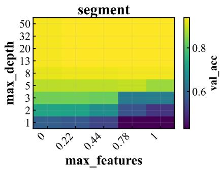

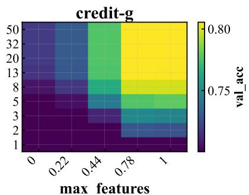

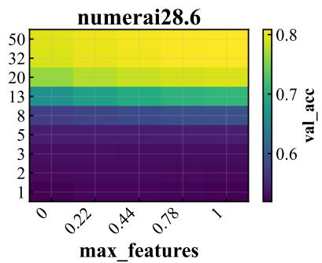  
Figure 9: Mean validation accuracy of the three RF tabular benchmarks as a function of max\_depth and max\_features, averaged over min\_samples\_leaf and min\_samples\_split.

Figure 9 shows that segment and numerai28.6 behave alike: reward climbs steadily with max\_depth and barely responds to max\_features, so a single hyperparameter essentially decides how good an arm is. credit-g is the exception: its high-reward arms sit in a vertical band at large max\_features that only emerges once max\_depth is also large, so finding a good arm there means getting two hyperparameters right at once rather than one. In short, on segment and numerai28.6 the quality of an arm is driven almost entirely by max\_depth, while on credit-g it depends on max\_depth and max\_features together, with neither one enough on its own.

Figure 10 makes the resulting difference in optimum sparsity explicit. The three empirical CDFs of arm reward differ markedly in shape. For credit-g (orange), the CDF rises steeply from $x = 0 \colon$ arms are concentrated at low reward and only a thin slice near x = 1 is competitive, indicating a sparse optimum. segment (blue) exhibits the opposite behavior, with the CDF remaining flat across most of the range and rising only near $x = 1$ ; the majority of arms therefore attain near-optimal reward, indicating a broad optimum. numerai28.6 (green) lies between these two regimes: its CDF rises faster than segment’s at low reward but far more slowly than credit-g’s. This intermediate profile is consistent with the heatmap: the optimum of numerai28.6 is as easy to locate as that of segment, since both are governed primarily by max\_depth, but reward is less uniformly high within the good region, making the arms there harder to rank.

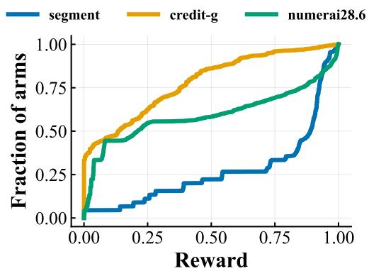  
Figure 10: Empirical CDF of arm reward, normalized within each task.

Together, Figures 9 and 10 give the landscape taxonomy we use below to interpret the oracle comparison: segment is a near-one-dimensional, broad-optimum landscape, whereas credit-g has a sparse, interaction-dependent optimum. The location of numerai28.6’s optimum is determined by a single hyperparameter, but rewards are less concentrated within that region.

How well the surrogate models them. The surrogate axis of the ablation rests on TabPFN ranking candidates better than a univariate density ratio does, which it can only do if its predicted rewards are accurate on these landscapes. We therefore probe its predictions directly, on the same three grids.

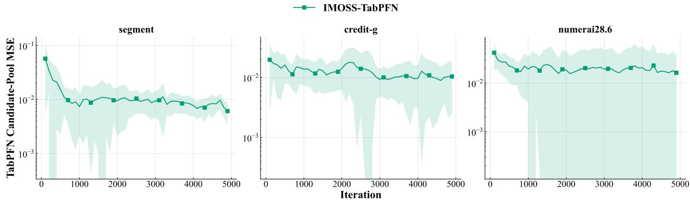  
Figure 11: Mean squared error of the TabPFN oracle’s reward predictions over its whole candidate pool on the three RF tabular benchmarks (log scale). At every probed exploration step, the oracle scores a pool of 100 candidate configurations; each point reports the MSE between the predicted and true mean rewards of all candidates in that pool, not only the proposed configuration. Curves show means over 30 paired runs, and shaded bands show one standard deviation across runs.

Figure 11 reports how accurately the TabPFN oracle predicts rewards across its entire candidate pool as the run progresses. On segment and credit-g, the pool-wide MSE drops by roughly an order of magnitude over the first 2000 iterations as evaluated arms accumulate in the in-context table, showing that the oracle’s reward model improves over the whole candidate space and not merely on the configurations it proposes. On numerai28.6, the error stays flat at a low level: most arms have nearly indistinguishable mean rewards, so the pool-wide error is dominated by the residual spread among near-tied arms rather than by ranking improvements, consistent with the landscape analysis above.

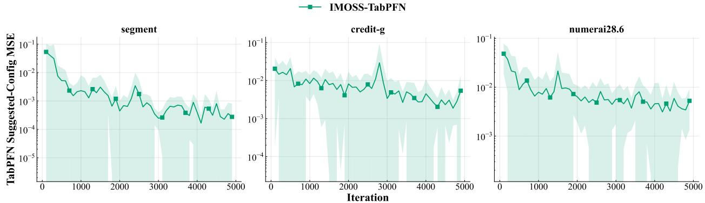  
Figure 12: Mean squared error of the TabPFN oracle’s reward prediction on the configuration it proposes, on the three RF tabular benchmarks (log scale). At every probed exploration step, each point reports the squared error between the predicted mean reward of the proposed configuration and its true mean reward. Curves show means over 30 paired runs, and shaded bands show one standard deviation across runs.

Figure 12 complements the pool-wide view by measuring accuracy exactly where the oracle acts, on the configuration it proposes. This error falls by one to two orders of magnitude on all three tasks and ends well below the pool-wide MSE, since proposals concentrate in high-reward regions that are densely represented in the in-context table. Notably, it keeps decreasing on numerai28.6 even though the pool-wide error stays flat there: the oracle becomes increasingly accurate on the arms it exploits, while the pool-wide error remains dominated by the residual spread of the near-tied bulk.

## C.2 Comparing the oracles

A decomposition of oracle quality. Let $\mathcal { M } _ { T }$ be the set of arms admitted up to round $T , n _ { x }$ the number of pulls arm x receives, so that $\begin{array} { r } { \sum _ { \pmb { x } \in \mathcal { M } _ { T } } { n _ { \pmb { x } } } = T } \end{array}$ . Recall that $\begin{array} { r } { \mathcal { R } _ { T } = \sum _ { \pmb { x } \in \mathcal { M } _ { T } } n _ { \pmb { x } } ( p ^ { \star } - \mu _ { \pmb { x } } ) } \end{array}$ , and that $p ^ { \star } - \mu _ { x } = ( p ^ { \star } - \mu _ { \mathsf { b e s t } } ) + ( \mu _ { \mathsf { b e s t } } -$ $\mu _ { \pmb { x } } )$ where $\mu _ { \mathrm { b e s t } } = \operatorname* { m a x } _ { \substack { \mathbf { x } \in \mathcal { M } _ { T } } } \mu _ { \mathbf { x } }$ is the best true mean the oracle admitted. The online average regret is decomposed as

$$
\frac { \mathcal { R } _ { T } } { T } = \underbrace { \left( p ^ { \star } - \mu _ { \mathrm { b e s t } } \right) } _ { \mathrm { b e s t - a r m g a p } } + \underbrace { \frac { 1 } { T } \sum _ { x \in \mathcal { M } _ { T } } n _ { x } \left( \mu _ { \mathrm { b e s t } } - \mu _ { x } \right) } _ { \mathrm { c o s t o f t h e o t h e r a r m s } } .\tag{10}
$$

The first term depends only on the oracle: it asks whether the set contains a good configuration at all, and no allocation rule can reduce it. The second asks how much is lost on everything else in the set, and is what the policy pays for every pull it spends away from the best arm it has. An oracle can therefore lower regret in two ways: by admitting a better best arm, or by making the rest of the set cheaper to pull. The two controlled comparisons above separate them.

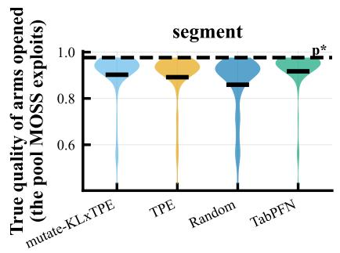

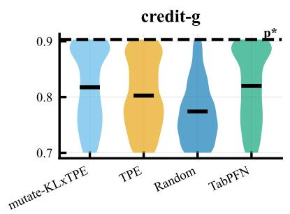

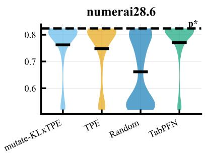

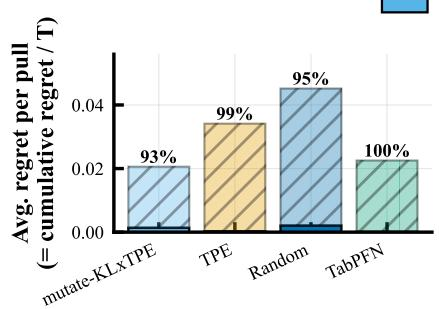

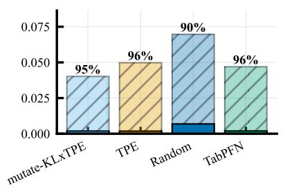

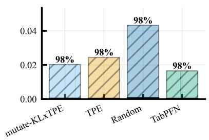  
Figure 13: Oracle ablation on the three discrete random-forest grids (Section 5.4.1). Top: distribution of the true mean rewards of the arms each oracle admits, pooled over 10 seeds (horizontal bar: mean; dashed line: $p ^ { \star } )$ ; this is the pool the allocation rule must exploit. Bottom: average per-pull regret split as in Equation (10) into the best-arm gap (solid) and the cost of the other arms (hatched); the annotation gives the share of the second. On the grids every oracle finds a configuration close to the optimum, so the best-arm gap is negligible and nearly all the regret is what the policy spends on the rest of the set.

What the comparison shows. All three learned oracles accumulate less regret than uniform admission, on every task. On four of the six tasks almost all the regret is the cost of the other arms: the set nearly always holds a configuration close to the optimum, and what is expensive is everything else the policy pulls along the way. On Fashion-MNIST the two terms are of comparable size, and only on higgs is it the other way round, with no oracle finding a configuration near the optimum.

The two local oracles behave similarly: both lower the cost of the other arms below what the global TPE proposal incurs. Neither improves the best-arm gap, and mutate-KL×PE makes it slightly worse. The two are statistically indistinguishable except on APSFailure, where mutate-KL×PE wins.

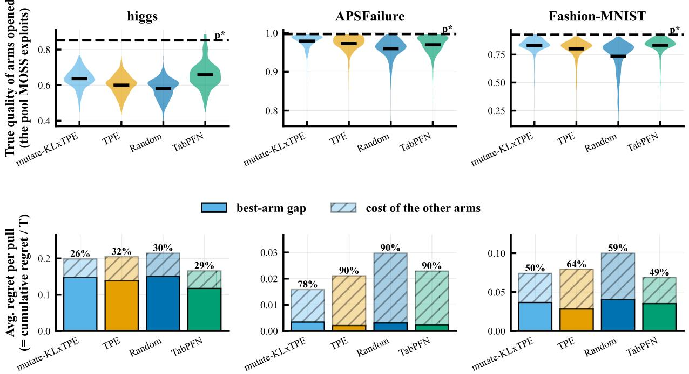  
Figure 14: Oracle ablation on the three mixed continuous–discrete LCBench instances (Table 2). Unlike on the grids, the split between the two terms varies widely across instances. On APSFailure, the cost of the other arms again accounts for nearly all the regret, whereas higgs is the one task where the best-arm gap dominates: no oracle reaches the optimum, and only the surrogate narrows that gap.

Table 3: Cumulative regret $\mathcal { R } _ { T }$ at $T = 5 0 0 0$ , mean ± std over 10 seeds; lower is better. Bold marks the lowest mean per row, which need not be a significant advantage: the difference between the two local oracles, KL×PE and TabPFN, is significant only on APSFailure, in favor of KL×PE. Significance is discussed per comparison in the text.
<table><tr><td>Task</td><td>Uniform</td><td>TPE</td><td> $\mathbf { K L } { \times } \mathbf { P E }$ </td><td>TabPFN</td></tr><tr><td colspan="5">Discrete grids (random forest)</td></tr><tr><td>segment</td><td> $2 2 6 \pm 2 1$ </td><td> $1 7 1 \pm 1 6$ </td><td> ${ \bf 1 0 3 \pm 3 7 }$ </td><td> $1 1 3 \pm 2 6$ </td></tr><tr><td>credit-g</td><td> $3 4 8 \pm 7 1$ </td><td> $2 4 9 \pm 2 4$ </td><td> ${ \bf 2 0 1 \pm 5 6 }$ </td><td> $2 3 5 \pm 1 1 2$ </td></tr><tr><td>numerai28.6</td><td> $2 1 6 \pm 3 1$ </td><td> $1 2 2 \pm 2 1$ </td><td> $1 0 1 \pm 3 2$ </td><td> ${ \bf 8 3 \pm 2 0 }$ </td></tr><tr><td colspan="5">Mixed spaces (LCBench)</td></tr><tr><td>higgs</td><td> $1 0 7 3 \pm 1 2 4$ </td><td> $1 0 2 3 \pm 1 2 3$ </td><td> $9 9 3 \pm 1 5 9$ </td><td> ${ \bf 8 2 9 \pm 3 0 6 }$ </td></tr><tr><td>APSFailure</td><td> $1 4 9 \pm 1 3$ </td><td> $1 0 5 \pm 2 0$ </td><td> ${ \bf 7 9 \pm 2 5 }$ </td><td> $1 1 4 \pm 1 7$ </td></tr><tr><td>Fashion-MNIST</td><td> $5 0 0 \pm 4 5$ </td><td> $3 9 6 \pm 4 3$ </td><td> $3 7 1 \pm 1 5 3$ </td><td> $\mathbf { 3 4 3 \pm 1 1 3 }$ </td></tr></table>

Why proposing locally helps. The cost of the other arms factors into two quantities: how often a pull lands somewhere other than the best arm admitted so far, and how much it costs when it does (Table 4). The first quantity is close to one on almost every benchmark, so the policy almost never stays on the best arm, and this is more pronounced for the local oracles, whose sets are packed with arms of nearly equal value that MOSS cannot tell apart within the budget. The separation between oracles is therefore carried by the second quantity.

Every arm a local oracle adds is one parameter away from a good configuration found so far, so the policy wanders among arms that are all nearly as good as the best one, and the cost of wandering is small. A global proposal keeps adding arms from all over the space, where the same wandering is expensive. The local oracle does not make the policy a better chooser, but it makes the choice matter less.

The same property also reveals the downside of locality: a one-parameter change cannot take the search far from where it already is. On five of the six tasks, this rarely matters, because good configurations are common and one is always close by. On higgs it does: the good region needs several parameters set correctly at once, so one-at-a-time steps never arrive and the best-arm gap stays large however cheap the other arms become. That is the one task where TabPFN, which ranks candidates with a model of the whole reward surface, admits the best arm of the four oracles.

Table 4: Where the cost of the other arms comes from. For each task and oracle, the fraction of pulls that do not land on the best arm admitted so far, and the mean amount by which such a pull falls short of it. The policy is off the best arm for the great majority of pulls under every oracle, and most of all under the two local ones, which lose the least when it happens.
<table><tr><td></td><td colspan="4">Pulls not on the best arm</td><td colspan="4">Mean loss per such pull</td></tr><tr><td>Task</td><td>Unif.</td><td>TPE</td><td>KL×PE</td><td>TabPFN</td><td>Unif.</td><td>TPE</td><td>KL×PE</td><td>TabPFN</td></tr><tr><td colspan="9">Discrete grids (random forest)</td></tr><tr><td>segment</td><td>0.91</td><td>0.93</td><td>0.98</td><td>0.96</td><td>0.048</td><td>0.036</td><td>0.020</td><td>0.023</td></tr><tr><td>credit-g</td><td>0.71</td><td>0.90</td><td>0.93</td><td>0.97</td><td>0.097</td><td>0.057</td><td>0.042</td><td>0.046</td></tr><tr><td>numerai28.6</td><td>0.91</td><td>0.97</td><td>0.97</td><td>0.96</td><td>0.048</td><td>0.025</td><td>0.020</td><td>0.017</td></tr><tr><td colspan="9">Mixed spaces (LCBench)</td></tr><tr><td>higgs</td><td>0.79</td><td>0.84</td><td>0.99</td><td>0.99</td><td>0.088</td><td>0.081</td><td>0.052</td><td>0.052</td></tr><tr><td>APSFailure</td><td>0.97</td><td>0.98</td><td>0.98</td><td>0.98</td><td>0.027</td><td>0.019</td><td>0.013</td><td>0.021</td></tr><tr><td>Fashion-MNIST</td><td>0.88</td><td>0.90</td><td>0.98</td><td>0.99</td><td>0.069</td><td>0.057</td><td>0.039</td><td>0.034</td></tr></table>

Practical guidance. We recommend mutating the current best configuration, and resorting to a surrogate only when the optimum is expected to be difficult to reach. On most of our tasks the model-free local oracle matches the transformer-based one while fitting a single one-dimensional density per proposal rather than performing a forward pass through a pretrained network. The surrogate justifies its cost only where good configurations are rare and require several parameters to be set correctly at once. The global TPE proposal needs no metric on the space. It models only the density ratio between promising and unpromising configurations rather than the full reward surface, and proposes over a continuum without a pre-declared grid. Mutating the current best arm instead lowers cumulative regret on every task in Table 3, so the global proposal is best read as the metric-free baseline that the mutation oracle improves on.

## D Additional Experimental Details

## D.1 HotpotQA: Search Space and Generation Settings

The hyperparameter search space, including OpenRouter model identifiers, is summarized in Table 5. Retrieval uses dense embedding search with all-MiniLM-L6-v2 over the full corpus. We use three system prompt templates, shown side by side below. few\_shot adds examples to the rules; zero\_shot keeps the rules but drops the examples; and naive keeps only a one-line instruction.

At inference time, the selected template is sent as the system message. The user message combines the top-k retrieved passages and the HotpotQA query with the prefixes Context: and Question:, respectively. Each API call specifies model and temperature; all other generation parameters (max\_tokens, top\_p, seed, stop) are left unset and default to the provider’s own settings. No provider is pinned on OpenRouter, so requests are served according to OpenRouter’s default routing and fallback policy for the selected model. Failed calls are retried up to 20 times with random exponential backoff (base 2 s, capped at 300 s) for rate-limit, provider-overload, and service-unavailable errors; calls failing with any other error type are not retried, and the error propagates as a failure. Results for repeated (question, configuration) pairs are served from a local cache, so re-running or resuming an experiment does not re-issue identical API calls.

Table 5: Hyperparameter search space for the HotpotQA RAG pipeline. Generation models are accessed through OpenRouter.
<table><tr><td>Parameter</td><td>Type</td><td>Domain</td><td>OpenRouter ID</td></tr><tr><td>top_k</td><td>Integer</td><td>{1, . . . , 10}</td><td></td></tr><tr><td>temperature</td><td>Continuous</td><td>[0, 1]</td><td></td></tr><tr><td>prompt_template</td><td>Categorical</td><td>few_shot</td><td></td></tr><tr><td></td><td></td><td>zero_shot naive</td><td></td></tr><tr><td></td><td></td><td>Qwen 3.5 Flash</td><td>qwen/qwen3.5-flash-02-23</td></tr><tr><td></td><td></td><td>Ling 2.6 Flash</td><td>inclusionai/1ing-2.6-flash</td></tr><tr><td>model</td><td>Categorical</td><td>DeepSeek V4 Flash</td><td>deepseek/deepseek-v4-flash</td></tr><tr><td></td><td></td><td></td><td></td></tr><tr><td></td><td></td><td>Granite 4.1 8B</td><td>ibm-granite/granite-4.1-8b</td></tr><tr><td></td><td></td><td>HY3 Preview</td><td>tencent/hy3-preview</td></tr><tr><td></td><td></td><td>Llama 3.2 1B Instruct</td><td>meta-1llama/1lama-3.2-1b-instruct</td></tr></table>

## few\_shot

You are a precise question   
answering assistant. Answer using only the provided context:   
Rules:   
- Answer in as few words as   
possible.   
- Never explain or add context - just the answer.   
- For yes/no questions answer with only "yes" or "no".   
- If the context does not contain the answer, output "unknown".   
Examples:   
Q: What is the capital of France? Context: The capital of France is Paris.   
A: Paris   
Q: What year was the Eiffel Tower built?   
Context: The Eiffel Tower was built in 1889.   
A: 1889   
Q: Is Berlin the capital of   
Germany?   
Context: The capital of Germany is Berlin.   
A: yes

## zero\_shot

You are a precise question answering assistant. Answer using only the provided context:

Rules:   
- Answer in as few words as   
possible.   
- Never explain or add context - just the answer.   
- For yes/no questions answer with only "yes" or "no".   
- If the context does not contain the answer, output "unknown".

## naive

Answer the question using the provided context.