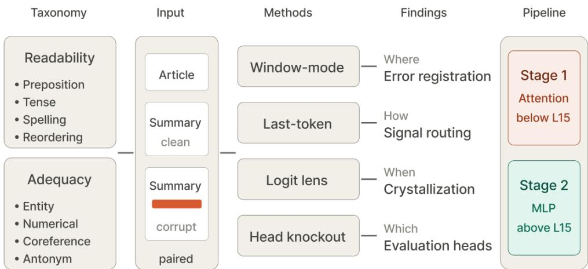
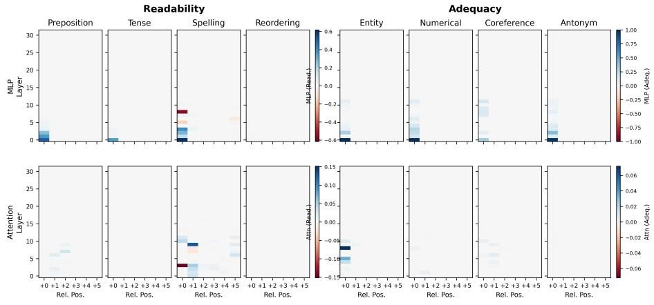
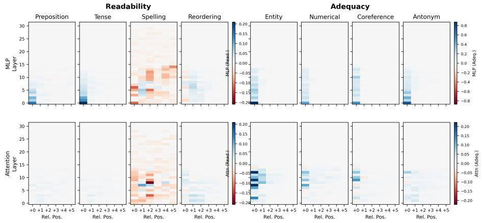
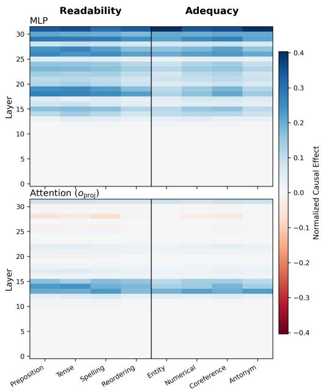
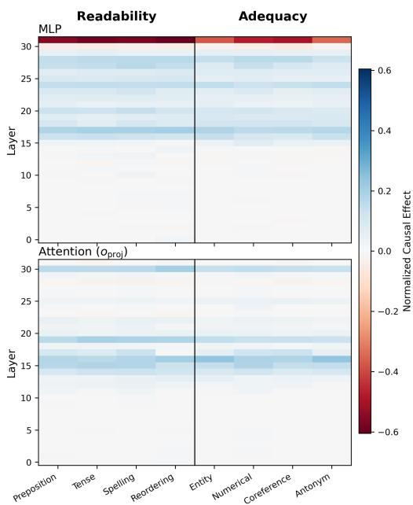
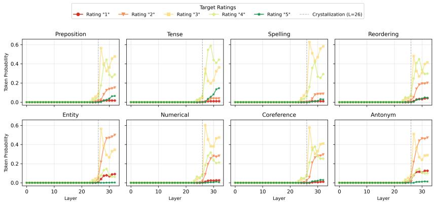
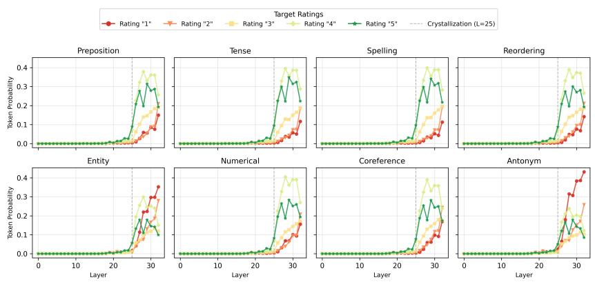
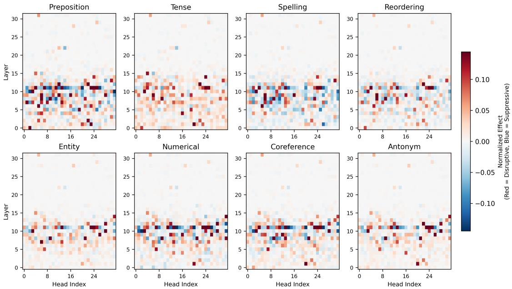
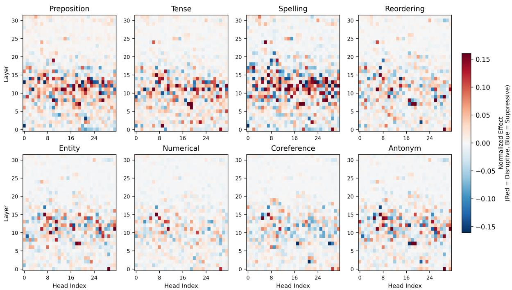

# Beyond Scores: Understanding LLM-as-a-Judge Mechanisms in Summarization Evaluation

Himil Vasava, Ming Jiang University of Wisconsin-Madison {vasava, ming.jiang}@wisc.edu

## Abstract

LLM-based evaluators of natural language generation (NLG) quality are widely deployed as scoring tools and as automated training signals, yet the internal procedure by which they assign a rating remains poorly understood. We investi gate this procedure mechanistically through an eight-attack perturbation taxonomy across the Readability and Adequacy dimensions of NLG quality, a generation pipeline that produces paired clean and corrupt summaries with con trolled error intensity and explicit token-level modification maps, and a four-experiment bat tery of causal tracing, logit-lens vocabulary projection, and attention-head knockout applied to Themis (Llama-3-8B) and Prometheus (Mistral-7B). Both evaluators implement a structured, coherent evaluation pipeline operating in two stages: below layer 15, attention performs lo cal error comparison and routes the result to the final input position; above it, the MLP cascade integrates the signal and writes the rating, with the decision crystallizing in the residual stream at a sharp late layer (L = 26 on Themis, L = 25 on Prometheus). Furthermore, a basemodel control at the same scale (Llama-3-8B) reproduces the routing architecture and crystal lization but not the stage separation, isolating the two mechanisms that fine-tuning specifi cally installs, suppression of below-L15 MLP contribution at the last position and a two-layer advance of the crystallization depth, indicating that fine-tuning sculpts an existing substrate rather than building the pipeline from scratch. We release the source code and data at https: //github.com/himil-v/judge-mech.

## 1 Introduction

Automatic evaluation using large language models (LLMs) has become widely adopted in natural language generation (NLG): dedicated evaluator models such as Themis (Hu et al., 2024b) and Prometheus (Kim et al., 2024), alongside prompting-based approaches including G-Eval (Liu et al., 2023) and MT-Bench (Zheng et al., 2023), are now routinely applied to tasks ranging from summarization faithfulness to dialogue coherence assessment and increasingly serve as automated signals for preference labeling and reward modeling. Existing examination of these LLM-as-a-judge systems has focused largely on behavioral analysis: measuring agreement with human ratings (Fabbri et al., 2021; Liu et al., 2023), cataloging failure modes such as criterion confusion (Hu et al., 2024a), and quantifying positional and length biases (Zheng et al., 2023). This paradigm characterizes what LLM-judges score but leaves how the rating is computed inside the model largely unexamined, limiting both evaluator reliability and our ability to anticipate failure cases.

We address this gap through a mechanistic study, asking: Does the model identify the specific quality defect, or does it produce a rating consistent with training-distribution patterns without engaging the underlying error? We focus on text summarization as a case study because it is one of the most extensively studied NLG evaluation tasks, providing mature perturbation methods and wellestablished benchmark datasets. Moreover, its structured article-summary format naturally facilitates localized perturbation interventions.

One key challenge in directly applying causal tracing to LLM-judges is that these methods require paired clean and corrupted inputs with precisely tracked token-level modifications and corresponding rating shifts. However, existing adversarial summarization benchmarks typically introduce errors at the sentence or document level, making it difficult to isolate and trace their effects at the token level. To address this limitation, we develop a new perturbation taxonomy consisting of eight localized attack types that span the Readability and Adequacy criteria of NLG quality, along with a generation pipeline that produces paired clean/corrupt summaries with controlled error intensity and explicit token-level modification maps. Using this framework, we investigate the internal mechanisms of two state-of-the-art NLG LLM judges, each finetuned from a different model family, to uncover how they internally process and assign scores for summary quality. Our key findings include:

  
Figure 1: Overview of our analysis. We design an eight-attack perturbation taxonomy across the Readability and Adequacy dimensions of NLG quality, and generate paired clean/corrupt summaries of an article with controlled error intensity and explicit token-level modification maps. Four mechanistic methods - window-mode and lasttoken causal tracing, logit lens, and attention-head knockout, each reveal a different aspect of how the rating is computed: where errors are registered, how the signal routes to the output position, when the decision crystallizes in the residual stream, and which heads implement the verdict.

1. LLM-based evaluator models exhibit structured, coherent information propagation during evaluation, rather than an ad hoc mapping from surface features to rating tokens. Specifically, the attention module in the lower layers (< 15 layer) primarily performs error identification and signal routing, while the upperlayer MLP integrates these routed signals to produce the final rating, with the decision crystallizing in the residual stream at a sharp late layer (∼ 25 − 26 layer).

2. The process of error identification in attention varies systematically across error types: readability-related errors spread across adjacent syntactic context, while adequacy attacks remain concentrated on the perturbed tokens. This indicates that LLM-judges deploy distinct attention strategies depending on the criterion, suggesting that criterion-specific attention supervision could improve evaluator robustness.

3. The way the final rating is written into the residual stream differs between the two evaluators studied: Themis commits to its rating in a single dominant step at the top layer, while Prometheus spreads this write across mid-tolate layers and applies an opposite-direction correction at the final layer.

4. Comparing the fine-tuned evaluators to their base architecture (Llama-3-8B) reveals that fine-tuning does not build the evaluation pipeline from scratch: the base model already exhibits the routing architecture and sharp late-layer crystallization property (at L = 28), and its above L15 MLP magnitude matches Themis’s. Judge fine-tuning installs two specific modifications on this general substrate, suppression of below L15 MLP contribution at the last position (producing the stage-1/stage-2 separation) and a two-layer advance of the crystallization depth (from L = 28 to L= 26).

To the best of our knowledge, this is the first study to systematically uncover the internal mechanisms underlying LLM-based NLG evaluation, with an emphasis on text summarization. The resulting insights hope to benefit the design of more robust and interpretable LLM-based evaluators.

## 2 Related Work

LLM-based NLG evaluation. Dedicated evaluator models (Hu et al., 2024b; Kim et al., 2024) and prompting-based scoring frameworks (Liu et al., 2023; Zheng et al., 2023) have become standard tools for assessing NLG quality, and prior work has examined evaluator failure modes including criterion confusion and prompt sensitivity (Hu et al., 2024a; Zheng et al., 2023). Established factualconsistency and faithfulness benchmarks (Fabbri et al., 2021; Krysci´ nski et al.´ , 2020; Pagnoni et al., 2021; Honovich et al., 2022; Dziri et al., 2022) provide the empirical foundation for evaluator development but remain behavioral in scope, characterizing what LLM-judges score rather than how they arrive at those scores. The present work complements this literature by examining the evaluator’s internal procedure: rather than measuring agreement with human judgments, we analyze how the rating is computed inside the model.

<table><tr><td>Final Node</td><td>Source Perturbations</td></tr><tr><td>Readability</td><td></td></tr><tr><td>Preposition Mismatch</td><td>grammatical error (Pagnoni et al., 2021),</td></tr><tr><td>Tense Mismatch</td><td>subject-verb disagreement (Ribeiro et al., 2020) incorrect verb form (Pagnoni et al., 2021),</td></tr><tr><td>Spelling</td><td>grammatical error (Pagnoni et al., 2021) character-level noise (Belinkov and Bisk, 2017)</td></tr><tr><td>Sequential Reordering</td><td>jumbling word order (Ribeiro et al., 2020), sentence exchange (Kryściński et al., 2020)</td></tr><tr><td>Adequacy</td><td></td></tr><tr><td>Entity Swap</td><td>entity swap (Kryściński et al., 2020), entity error (Pagnoni et al., 2021), perturb names/nouns (Ribeiro et al., 2020)</td></tr><tr><td>Numerical/Date Swap</td><td>number swap (Kryściński et al., 2020), change numbers (Ribeiro et al., 2020)</td></tr><tr><td>Coreference Mismatch</td><td>coreference error (Pagnoni et al., 2021),</td></tr><tr><td>Antonym &amp; Negation</td><td>pronoun swap (Kryściński et al., 2020) sentence negation (Kryściński et al., 2020), negation/antonyms (Ribeiro et al., 2020)</td></tr></table>

Table 1: Consolidation mapping showing how perturbation types from prior NLG-evaluation benchmarks are unified into the eight nodes of our taxonomy across the Readability and Adequacy dimensions.

Mechanistic interpretability of transformer language models. A growing body of work localizes computation inside transformer models through activation patching and causal mediation analysis (Vig et al., 2020; Meng et al., 2022), vocabulary-space projection of intermediate residual streams (nostalgebraist, 2020), and circuit-level identification of attention-head structure (Wang et al., 2023). These methods have been applied to factual recall (Meng et al., 2022), indirectobject identification (Wang et al., 2023), and other narrowly-scoped behaviors, but to our knowledge LLM-based NLG evaluation has not previously been the subject of mechanistic analysis. We extend these methods to the evaluator setting, applying them in combination across two evaluator models drawn from distinct base-model families.

Perturbation-based evaluation of NLG systems. Adversarial perturbation has long been used for diagnostic evaluation of NLG and natural-language inference systems, ranging from character-level noise (Belinkov and Bisk, 2017) and behavioral testing (Ribeiro et al., 2020) to factuality-focused perturbations of generated summaries (Krysci´ nski´ et al., 2020; Pagnoni et al., 2021; Li et al., 2023; Min et al., 2023). These resources have established that perturbations can isolate specific failure modes, but they are designed for behavioral benchmarking and do not preserve the position-level metadata required for mechanistic analysis. Our perturbation taxonomy and generation pipeline build on this prior methodology while introducing the additional controls necessary for mechanistic study.

## 3 Data Perturbation

Existing adversarial datasets for NLG evaluation primarily focus on behavioral benchmarking and typically introduce errors at the sentence or document level. Such coarse-grained perturbations are insufficient for mechanistic analysis, which requires paired clean and corrupted inputs with explicit token-level modification maps. To enable such analysis, we design a perturbation framework with two key controls: controlled intensity, which fixes the number of perturbed tokens in each sample through a parameter k, and spatial localization, which records the positional indices of all perturbed tokens, allowing causal tracing to anchor its analysis to known perturbation sites.

Selection criteria. Three considerations narrow the space of possible perturbations to the eight error types we adopt. First, grounding in prior work: every node consolidates categories established in published NLG-evaluation benchmarks (Table 1), not invented for this study. Second, method compatibility: causal tracing requires a token-localizable perturbed span and a single, isolable failure mode, which excludes stylistic alterations (multi-token, semantically entangled) and coarse noise injections that obscure intermediate representations. Third, criterion coverage: we retain four attacks per quality axis (Readability and Adequacy, following (Fabbri et al., 2021; Honovich et al., 2022; Liu et al., 2023)) so that criterion-level effects can be compared across balanced categories.

Perturbation Taxonomy. Starting from an initial set of over 35 error types drawn from prior perturbation benchmarks (Krysci´ nski et al.´ , 2020; Pagnoni et al., 2021; Ribeiro et al., 2020), we merge categories targeting the same underlying failure mode (e.g., entity swap, entity error, and perturb names/nouns → Entity Swap; Table 1) and exclude categories incompatible with the selection criteria above. The result is eight perturbation types. Readability Attacks degrade fluency while preserving factual content: Preposition Mismatch, Tense Mismatch, and Spelling Mistakes induce localized syntactic or orthographic disruptions (Ribeiro et al., 2020; Belinkov and Bisk, 2017; Hu et al., 2024a), and Sequential Reordering disrupts clause- and sentence-level coherence (Zheng et al., 2023). Adequacy Attacks target factual grounding: Entity Swap and Numerical/Date Swap corrupt atomic factual units (Krysci´ nski et al.´ , 2020; Li et al., 2023; Min et al., 2023), Coreference Mismatch alters referential dependencies (Dziri et al., 2022), and Antonym & Negation injects logical contradictions (Bowman et al., 2015; Williams et al., 2018; Krysci´ nski et al.´ , 2020)

  
(a) Themis (Llama-3-8B)

  
(b) Prometheus (Mistral-7B)  
Figure 2: Window-mode causal tracing across all eight attacks on both evaluators: (a) Themis, (b) Prometheus. Top row of each panel: MLP causal effects. Bottom row: attention $o _ { \mathrm { p r o j } }$ causal effects. Effects are normalized so that 1.0 recovers clean expected-rating behavior and 0.0 matches the unmodified corrupt baseline; per-cell aggregates use a 20% trimmed mean over 3 seeds × 200 samples per attack. Four independent color scales per panel preserve within-criterion visibility because effect magnitudes differ by roughly an order of magnitude between Readability and Adequacy.

Automated Perturbation Generation. We operationalize the taxonomy at scale via an automated generation pipeline. Clean summaries are drawn from CNN/DailyMail (Hermann et al., 2015), the same pipeline is applied to XSum (Narayan et al., 2018) to produce the cross-domain corpus used in the generalization test. For each perturbation category and intensity k, GPT-4o is prompted with category-specific few-shot exemplars and instructed to inject exactly k instances of the targeted error. To eliminate the need for post-hoc text alignment, the generator returns not only the perturbed text but also explicit original\_tokens and new\_tokens arrays, providing a token-level map of the attack. Outputs are constrained to a predefined

JSON schema via API-level response formatting. Data quality is verified by a per run manual inspection protocol (Appendix B.1): approximately 20 clean/corrupt pairs per attack are checked against three criteria, that a perturbation was actually injected, that the returned token maps identify the changed span correctly, and that the perturbation matches its declared type, with typically 19 to 20 of 20 passing.

A filter retains only samples suitable for causaltracing analysis: those that fail JSON decoding or violate the requested intensity bounds are dropped structurally, and samples where the evaluator’s expected rating shifts by less than a threshold between clean and perturbed inputs are excluded from the main analysis because the normalized causal effect is numerically ill-conditioned in that regime.

## 4 LLM-judge Interpretation

Activation Patching. We localize where in the network a perturbation’s effect is processed by substituting clean activations into a corrupt forward pass at specific (layer, position) sites and measuring how much of the clean rating behavior is recovered (Vig et al., 2020; Meng et al., 2022). We trace both MLP sublayers and attention output projections $( o _ { \mathrm { p r o j } } )$ , and quantify each intervention with a normalized causal effect

$$
{ \mathrm { e f f e c t } } = { \frac { X _ { \mathrm { p a t c h e d } } - X _ { \mathrm { c o r r u p t } } } { X _ { \mathrm { c l e a n } } - X _ { \mathrm { c o r r u p t } } } } ,\tag{1}
$$

where X is an output statistic at the final position, scaled so that 1.0 recovers clean rating behavior and 0.0 matches the unmodified corrupt baseline. We use the standard logit difference $z [ t _ { \mathrm { c l e a n } } ] - z [ t _ { \mathrm { c o r r u p t } } ]$ for last-token-mode tracing and head knockout; for window-mode tracing, where per-token BPE alignment reduces per-sample yield, we use the expected rating $\begin{array} { r } { X = \sum _ { r = 1 } ^ { 5 } r \cdot P ( r ) } \end{array}$ over the renormalized rating-token distribution (Liu et al., 2023). Window-mode tracing restores activations in a six-token window starting at the perturbed token (relative positions +0 through +5), localizing where in the input the perturbation is processed; filtering, alignment, and aggregation details are in Appendix B. Last-token-mode tracing restores activations only at the final input position at each layer, localizing the depth at which the rating decision is assembled.

Logit Lens. To trace at what depth the model’s decision forms, we apply the logit lens (nostalgebraist, 2020) to the residual stream at the final input position: at each layer ℓ, we project the residual through the final layer norm and unembedding to obtain a layer-ℓ distribution over the five rating tokens $\{ t _ { 1 } , \ldots , t _ { 5 } \}$ . Sweeping ℓ across all layers produces a depth-resolved trajectory for each rating, from which we read both the crystallization depth and the rating ultimately committed to.

Attention Head Knockout. Attention head knockout identifies which individual heads implement the rating decision (Wang et al., 2023). For each of the $3 2 \times 3 2 = 1 0 2 4$ heads in each model, we zero out that head’s output during the forward pass on corrupt inputs and compute the resulting normalized causal effect (Equation 1) at the final position. Positive (red) effects identify disruptive heads that drive the corrupt rating - ablation releases the clean signal, while negative (blue) effects identify suppressive heads that defend the clean rating. We report per-attack heatmaps and inspect criterion-level patterns by comparing the four panels within each criterion group.

## 5 Experiments

## 5.1 Experimental Setup

We study two open-source LLM-judges from different base-model families: Themis (Hu et al., 2024b), built on Llama-3-8B, and Prometheus-7Bv2.0 (Kim et al., 2024), built on Mistral-7B. Both have 32 transformer layers and 32 attention heads per layer. For each of the eight perturbations from §3, we draw 200 clean/corrupt summary pairs from our CNN/DailyMail-derived corpus and score both texts with the target evaluator using a 1-5 NLGevaluation prompt (Appendix A); Prometheus additionally uses a few-shot variant to place the rating token at the first generation position. Following the behavioral filter (§3), we retain only pairs whose rating changes after perturbation. All results are averaged over three seeds and 200 samples per attack.

## 5.2 Results and Analysis

Errors register at early MLPs and route through mid-layer attention to the final position Early MLP layers locally register the perturbation at the perturbed-token position uniformly across attacks and across both evaluators. On Themis (Figure 2a, top) and Prometheus (Figure 2b, top), window-mode MLP causal effects concentrate at relative position +0 in layers 0-5 and are near zero elsewhere, with magnitudes strongest for the most token-localized attacks (Entity, Numerical, Antonym). The perturbed token’s MLP output thus locally encodes the corrupted content irrespective of evaluation criterion.

  
Figure 3: Last Token mode causal tracing on Themis across all eight attacks. Top row: MLP causal effects; bottom row: Attention $o _ { \mathrm { p r o j } }$ causal effects.

  
Figure 4: Last Token mode causal tracing on Prometheus across all eight attacks. Top row: MLP causal effects; bottom row: Attention $o _ { \mathrm { p r o j } }$ causal effects.

Window-mode attention diverges in attackspecific ways that mirror what each comparison requires, with three patterns visible in both models (Figure 2, bottom rows). Preposition spreads from +0 through +2-3 across L0-L10 (checking adjacent syntactic context); Entity and Numerical concentrate sharply at +0 in mid layers with no horizontal spread (retrieving from elsewhere in the article); and Coreference, Antonym, Tense, and Reordering produce weak window-mode attention overall, with their comparison happening through last-position attention to distant tokens outside our six-token window.

At the final position, all attacks share the same routing-and-integration architecture on Themis (Figure 3): last-position attention $o _ { \mathrm { p r o j } }$ effects concentrate in a single band at L13-L15 where perturbation information is routed into the last token, after which the MLP effect rises in a stepped cascade with bands at L17-L18, L25-L27, and a peak at L31 that acts as the final write into the ratingtoken direction. Prometheus shares the same routing band but diverges at the top of the cascade (Figure 4): its last-position attention spans more depths (L14-L17, L19-L21, L29-L30), and its L31 MLP effect is strongly negative where Themis’s is strongly positive. Themis thus commits the rating in one dominant top-layer step; Prometheus distributes the commit across mid-to-late layers and uses L31 for an opposite-direction correction.

The rating decision crystallizes at a sharp late layer (L25–L26) The rating decision crystallizes at a sharp, late layer that is shared across all attacks. On Themis (Figure 5a), the logit-lens probability mass on all five rating tokens is essentially zero through $L \sim 2 2$ and then rises steeply over a narrow band, with every attack transitioning at the same depth; we refer to $L = 2 6$ as the crystallization layer. Prometheus shows the same qualitative shape one layer earlier at $L = 2 5$ (Figure 5b), indicating that depth-aligned late commitment is a property of both base architectures. Bootstrapping the max-slope depth across seeds yields a 95% CI of [26, 26] on Themis and [25, 25] on Prometheus.

Post-crystallization, the model commits to different ratings for different attacks, revealing an implicit severity hierarchy. On Themis, Entity and Antonym crystallize to Rating 2 (harshest), Tense to Rating 4 (mildest), and the remaining attacks cluster at Rating 3. Prometheus reproduces this ordering more punitively (Entity and Antonym at Rating 1, most others at Rating 4) but with markedly less confident trajectories: where Themis’s corruptrating probability climbs monotonically toward ∼ 1.0 by the final layer, Prometheus’s peaks at $\sim 0 . 5$ around $L = 3 0$ and then declines, with a sustained Rating-5 prior visible pre-crystallization that is never fully suppressed. The same crystallization depth therefore underlies very different commitment trajectories, consistent with the divergent top-of-cascade MLP dynamics shown in Figures 3 and 4.

Logit Lens - 5-Rating Trajectories per Attack (rows: Readability / Adequacy)  
  
(a) Themis (Llama-3-8B), crystallization at $L = 2 6$

Logit Lens - 5-Rating Trajectories per Attack (rows: Readability / Adequacy)  
  
(b) Prometheus (Mistral-7B), crystallization at $L = 2 5$  
Figure 5: Logit-lens trajectories for each of the five rating tokens, per attack, on (a) Themis and (b) Prometheus. Top row of each panel: Readability attacks; bottom row: Adequacy attacks. Crystallization (dashed line) occurs at $L = 2 6$ on Themis and L=25 on Prometheus.

A narrow band of attention heads at L10–L11 implements the rating verdict On Themis (Figure 6), every individual attack panel shows a horizontal band at L10-L11 containing both disruptive (red) and suppressive (blue) heads in an alternating pattern, with negligible individual-head effects elsewhere. For each attack, we define an ablationactive head as one whose knockout produces a normalized causal effect exceeding a threshold at the last input position, and quantify concentration as the fraction of such heads falling within a specified layer range. L10-L11 contains 30.2% ± 0.9% of

Themis’s ablation-active heads (4.8× enrichment over the uniform expectation from 32 layers), and L10-L15 contains $3 9 . 9 \% \pm 0 . 5 \%$ of Prometheus’s. This alternating sign shows that the L10-L11 heads split into two functional roles, heads that push the rating toward the corrupt output, and heads that defend the clean rating and the final rating emerges from their interaction rather than from any single dominant head. This pattern holds regardless of attack type, indicating that a small, dedicated group of interacting heads implements the rating decision across error categories.

Within this shared band, the two criteria differ in upstream-head recruitment: the Readability panels (Figure 6, top row) show additional head activity at L7-L9 contributing nearly as strongly as the L10-L11 band itself, while the Adequacy panels (bottom row) remain markedly sparser between L5 and L9. This matches the window-mode finding of Figure 2: Readability’s broader early-layer recruitment aligns with its local-attention spreading, while Adequacy’s tighter L10-L11 profile aligns with the mid-layer concentration of Entity- and Numerical-type attention.

  
Figure 6: Per-attack attention-head knockout heatmaps on Themis. Top row: Readability attacks (Preposition, Tense, Spelling, Reordering). Bottom row: Adequacy attacks (Entity, Numerical, Coreference, Antonym). The L10-L11 evaluation band appears in every individual attack panel, with both disruptive (red) and suppressive (blue) heads in an alternating pattern; Readability attacks additionally recruit heads at L7-L9, while Adequacy attacks remain sparse between L5 and L9.

Prometheus exhibits the same evaluation-band concept but distributed more broadly across L10- L15, with the per-criterion sparsity pattern inverted relative to Themis (Readability denser, Adequacy sparser; Appendix Figure 9). Both models show essentially no individual-head effects above L15, consistent with the division of labor identified across our experiments: attention does the comparison and routing work below L15, after which the upperlayer MLP cascade integrates the routed signal and writes the rating, with no individual head playing a critical role.

An End-to-End Two-Stage Evaluation Pipeline. These findings synthesize into a two-stage pipeline shared across both evaluators: below layer 15, attention performs comparison and routing (early MLPs encode the corrupted content at the perturbed token, an L10-L11 band of heads implements the rating verdict, and L13-L15 attention routes the verdict to the final input position); above it, the MLP cascade integrates the routed signal and writes the rating, with the decision crystallizing at a sharp late layer (L = 26 on Themis, L = 25 on

Prometheus). Prometheus shares this scaffold but diverges at the top of the cascade, using L31 for an opposite-direction correction where Themis writes in one dominant top-layer step. We show these two mechanisms on the Llama-3-8B substrate; whether Mistral-7B fine-tuning installs analogous or different mechanisms requires a matched base-model control on that architecture, which we leave to future work.

Finding generalization across data domains. To test whether the two-stage pipeline reflects a dataset-specific artifact of CNN/DM or a domaingeneral property of the evaluators, we further replicate the full causal-tracing and logit-lens sweep on a different dataset XSum (Narayan et al., 2018),a benchmark of BBC news articles paired with single-sentence, highly abstractive summaries. XSum’s shorter, more abstractive style contrasts with CNN/DM’s largely-extractive multi-sentence bullets, making it a materially different distribution for testing domain transfer (three seeds, all eight attacks; see Table 3). The crystallization depth is preserved exactly across both models, Themis at L = 26 (95% bootstrap CI [26, 26], N = 2, 242 pooled samples) and Prometheus at L = 25 ([25, 25], N = 2, 829), with concentration ranging from 89% to 100% of samples within ±1 layer of the median. The two-stage MLP separation replicates on Themis with the same qualitative structure (mean ratio 21.9× across 7 attacks with defined ratios; below-L15 = 0.007, above-$\mathrm { L 1 5 } = \ 0 . 1 5 3 )$ . On Prometheus, the below-L15 MLP contribution becomes slightly negative across all attacks $\left( - 0 . 0 0 5 \ \mathrm { t o } \ - 0 . 0 0 1 \right)$ while the above L15 magnitude is preserved (≈ 0.09), indicating that the more abstractive summaries in XSum compared to CNN/DM sharpen rather than weaken stage separation in this model. The routing band replicates on Themis with attention peaks at L13 across all attacks, while Prometheus’s attention peak shifts one layer up to L16, broadening the routing band to L13-L16 on this model. The L31 divergence between the two evaluators is preserved: Themis writes positively (+0.26 to +0.50 across attacks), Prometheus writes negatively (-0.07 to -0.15). The pipeline structure - routing followed by upper-cascade MLP integration with sharp late crystallization, is therefore preserved across a substantially more abstractive domain, though specific quantitative anchors (Prometheus’s routing peak) shift slightly with the domain.

What fine-tuning installs: a base-model control. To isolate the specific effects of judge fine-tuning, we run the full causal-tracing sweep on the unfine-tuned base model (Llama-3-8B) from which Themis is derived, using the same eight-attack taxonomy, single-instruction prompt, and CNN/DM samples (three seeds; see Table 4). The base model reproduces the routing architecture, the L13 attention band and the L15 MLP peak, and its above L15 MLP magnitude matches Themis’s (0.131 vs. 0.125, mean across attacks × 3 seeds), indicating that the scale of rating-writing in the upper cascade is set by the architecture rather than by fine-tuning. Two mechanisms differ sharply. First, the twostage separation is much weaker on the base model: below-L15 MLP effect is 0.056 versus Themis’s 0.010, a ∼5.5× gap that fine-tuning closes by suppressing below-L15 contribution at the last position. Second, the crystallization depth advances by two layers, from L = 28 (95% bootstrap CI [28, 28], N=1,927 samples over 3 seeds) to Themis’s L=26. Together, these two effects identify what judge finetuning installs on this substrate: below-L15 MLP suppression (producing the stage-1/stage-2 separation) and a two-layer compression of the rating cascade. Base-model behavioral sensitivity is also lower (about 39% of pairs produce a rating change under single-instruction prompting, pooled across attacks, versus much higher for Themis).

## 6 Conclusion

Across four mechanistic experiments on two LLM-based evaluators - Themis (Llama-3-8B) and Prometheus (Mistral-7B), we find that NLG judges implement a structured, coherent evaluation pipeline rather than an ad-hoc rating-generation shortcut: attention performs local error comparison and routes the result to the final position below L15, after which the upper-layer MLP cascade integrates the routed signal and writes the rating, with the decision crystallizing in the residual stream at a sharp late layer (L = 26 on Themis, L = 25 on Prometheus). This pipeline structure and the associated crystallization depths consistently emerge across data domains, suggesting that these mechanisms capture a general computational strategy underlying LLM-based summarization evaluation. A base-model control at the same scale reproduces the routing architecture and the sharp crystallization property but not the stage separation, showing that judge fine-tuning installs two specific, localizable mechanisms, suppression of below-L15 MLP contribution and a two-layer advance of the crystallization depth, on top of a general transformer substrate rather than assembling the evaluation pipeline from scratch. This decomposition suggests that targeted interventions at these two loci may reproduce judge behavior without full task-specific fine-tuning. We release the eight-attack taxonomy, generation pipeline, and behaviorally verified clean/corrupt corpus as public resources to support further interpretability research on NLG evaluators and downstream applications such as contrastive evaluator training and localized-evaluator distillation.

## 7 Limitations

Model and task scope. Our circuit-level findings are based on two open-source evaluators (Themis built on Llama-3-8B; Prometheus built on Mistral-7B) applied to English-language summaries drawn from a single source distribution (CNN/DailyMail), using a fixed evaluation prompt per evaluator (Appendix A). While our taxonomy is designed to be task-agnostic and the two base architectures are drawn from distinct model families, we have not directly verified the identified circuit on dedicated evaluators of dialogue response generation, story generation, or factuality assessment outside summarization, nor on larger or multilingual evaluator models. Generalization of the two-stage circuit structure to these settings, and its stability under prompt variation, remains an empirical question.

Behavioral-filter selection. As described in §3, our analysis is restricted to samples whose evaluator rating demonstrably changes under perturbation. This focuses our circuit characterization on cases where the evaluation procedure successfully detects the perturbation; samples on which the evaluator misses the perturbation entirely fall outside our analysis. Such failure-mode samples carry interpretable signal about evaluator robustness that the present work does not address.

Single intensity and single-attack samples. Single intensity and single-attack samples. All experiments use single-attack samples at intensity k = 1. Behavior under higher intensities or under mixed-attack samples (two or more perturbation categories co-occurring) is not characterized here; we flag this as a follow-up direction.

Cross-family claims rest on two evaluators. Cross-family claims rest on two evaluators. Patterns described as ’shared’ or ’family-specific’ are supported by n = 2 evaluators, one per architecture. These should be read as evidence from two independent data points rather than as generalizations across full model families or the broader space of LLM-based NLG evaluators.

Logit-lens approximation. Our depth-resolved decoding of rating commitments uses the logit lens, which approximates intermediate beliefs by projecting the residual stream through the final unembedding. Where the residual stream is rotated or scaled relative to its final-layer geometry, the logit lens can under-report probability mass on the eventual rating; tuned-lens variants address this but introduce per-layer training that is not directly comparable across base-model families. We chose the logit lens for cross-architecture consistency and treat absolute pre-crystallization probabilities as qualitative rather than calibrated.

Generator-model dependence. Generatormodel dependence. Perturbations are produced by GPT-4o. Any systematic stylistic bias could correlate with evaluator response patterns in ways this work does not fully isolate. We mitigate through behaviorally-verified pairs and explicit position tracking, but a generator-independent characterization is outside the present scope.

## 8 Ethics Statement

All experiments used publicly available datasets (CNN/DailyMail, Hermann et al., 2015) and publicly released evaluator models (Themis, Hu et al., 2024b; Prometheus, Kim et al., 2024). No personally identifiable information was collected, and no human subjects were involved beyond the datasets’ original construction. Perturbation generation uses GPT-4o via standard API access; generated perturbations are limited to controlled syntactic and semantic alterations of public news summaries.

We release the perturbation taxonomy, generation pipeline, and behaviorally-verified corpus as public resources for further mechanistic study of NLG evaluators. These artifacts could in principle be repurposed for adversarial attacks, but we view this risk as limited: the perturbation categories we study are well-established in the prior NLG-evaluation literature, and our findings do not by themselves provide novel attack vectors against deployed LLM-judges. We assess the net contribution as positive: better evaluator development through mechanistic understanding of how current evaluators operate.

Use of AI Assistants. We used AI assistants (Claude and ChatGPT) during the preparation of this work for two purposes: (i) supporting code implementation and debugging of our causal tracing and attention-head-knockout infrastructure, and (ii) language polishing, proofreading, and improving the stylistic clarity of the manuscript. AI assistants were not used to generate research questions, design experiments, or interpret results. All research design, experimental decisions, scientific interpretations, and final text were developed and verified by the human authors, who hold full responsibility for the integrity and accuracy of this work.

## 9 Acknowledgments

We sincerely appreciate the valuable feedback provided by our reviewers, which greatly helped to improve the manuscript. This research is partially supported by the National Science Foundation (IIS-2604291). The content is solely the responsibility of the authors and does not necessarily represent the official views of the National Science Foundation.

## References

Yonatan Belinkov and Yonatan Bisk. 2017. Synthetic and natural noise both break neural machine translation. arXiv preprint arXiv:1711.02173.

Samuel Bowman, Gabor Angeli, Christopher Potts, and Christopher D Manning. 2015. A large annotated corpus for learning natural language inference. In Proceedings of the 2015 conference on empirical methods in natural language processing, pages 632– 642.

Nouha Dziri, Ehsan Kamalloo, Sivan Milton, Osmar R Zaïane, Mo Yu, Edoardo M Ponti, and Siva Reddy. 2022. Faithdial: A faithful benchmark for information-seeking dialogue. Transactions of the Associationfor Computational Linguistics, 10:1473– 1490.

Alexander R Fabbri, Wojciech Krysci´ nski, Bryan Mc-´ Cann, Caiming Xiong, Richard Socher, and Dragomir Radev. 2021. Summeval: Re-evaluating summarization evaluation. Transactions of the Association for Computational Linguistics, 9:391–409.

Karl Moritz Hermann, Tomas Kocisky, Edward Grefenstette, Lasse Espeholt, Will Kay, Mustafa Suleyman, and Phil Blunsom. 2015. Teaching machines to read and comprehend. Advances in neural information processing systems, 28.

Or Honovich, Roee Aharoni, Jonathan Herzig, Hagai Taitelbaum, Doron Kukliansy, Vered Cohen, Thomas Scialom, Idan Szpektor, Avinatan Hassidim, and Yossi Matias. 2022. True: Re-evaluating factual consistency evaluation. In Proceedings ofthe 2022 Conference of the North American Chapter of the Associationfor Computational Linguistics: Human Language Technologies, pages 3905–3920.

Xinyu Hu, Mingqi Gao, Sen Hu, Yang Zhang, Yicheng Chen, Teng Xu, and Xiaojun Wan. 2024a. Are llmbased evaluators confusing nlg quality criteria? In Proceedings of the 62nd Annual Meeting of the Association for Computational Linguistics (Volume 1: Long Papers), pages 9530–9570.

Xinyu Hu, Li Lin, Mingqi Gao, Xunjian Yin, and Xiaojun Wan. 2024b. Themis: A reference-free NLG evaluation language model with flexibility and interpretability. In Proceedings ofthe 2024 Conference on Empirical Methods in Natural Language Processing, pages 15924–15951, Miami, Florida, USA. Association for Computational Linguistics.

Seungone Kim, Juyoung Suk, Shayne Longpre, Bill Yuchen Lin, Jamin Shin, Sean Welleck, Graham Neubig, Moontae Lee, Kyungjae Lee, and Minjoon Seo. 2024. Prometheus 2: An open source language model specialized in evaluating other language models. In Proceedings of the 2024 Conference on Empirical Methods in Natural Language Processing, pages 4334–4353, Miami, Florida, USA. Association for Computational Linguistics.

Wojciech Krysci´ nski, Bryan McCann, Caiming Xiong,´ and Richard Socher. 2020. Evaluating the factual consistency of abstractive text summarization. In Proceedings of the 2020 conference on empirical methods in natural language processing (EMNLP), pages 9332–9346.

Junyi Li, Xiaoxue Cheng, Wayne Xin Zhao, Jian-Yun Nie, and Ji-Rong Wen. 2023. Halueval: A largescale hallucination evaluation benchmark for large language models. In Proceedings of the 2023 conference on empirical methods in natural language processing, pages 6449–6464.

Yang Liu, Dan Iter, Yichong Xu, Shuohang Wang, Ruochen Xu, and Chenguang Zhu. 2023. G-eval: Nlg evaluation using gpt-4 with better human alignment. In Proceedings of the 2023 conference on empirical methods in natural language processing, pages 2511–2522.

Kevin Meng, David Bau, Alex Andonian, and Yonatan Belinkov. 2022. Locating and editing factual associations in GPT. In Advances in Neural Information Processing Systems, volume 35.

Sewon Min, Kalpesh Krishna, Xinxi Lyu, Mike Lewis, Wen-tau Yih, Pang Koh, Mohit Iyyer, Luke Zettlemoyer, and Hannaneh Hajishirzi. 2023. Factscore: Fine-grained atomic evaluation of factual precision in long form text generation. In Proceedings ofthe 2023 Conference on Empirical Methods in Natural Language Processing, pages 12076–12100.

Shashi Narayan, Shay B. Cohen, and Mirella Lapata. 2018. Don’t give me the details, just the summary! topic-aware convolutional neural networks for extreme summarization. In Proceedings of the 2018 Conference on Empirical Methods in Natural Language Processing, pages 1797–1807, Brussels, Belgium. Association for Computational Linguistics.

nostalgebraist. 2020. interpreting GPT: the logit lens. LessWrong.

Artidoro Pagnoni, Vidhisha Balachandran, and Yulia Tsvetkov. 2021. Understanding factuality in abstractive summarization with frank: A benchmark for factuality metrics. In Proceedings ofthe 2021 Conference ofthe North American Chapter ofthe Associationfor Computational Linguistics: Human Language Technologies, pages 4812–4829.

Marco Tulio Ribeiro, Tongshuang Wu, Carlos Guestrin, and Sameer Singh. 2020. Beyond accuracy: Behavioral testing of nlp models with checklist. In Proceedings ofthe 58th annual meeting ofthe associationfor computational linguistics, pages 4902–4912.

Jesse Vig, Sebastian Gehrmann, Yonatan Belinkov, Sharon Qian, Daniel Nevo, Yaron Singer, and Stuart Shieber. 2020. Investigating gender bias in language models using causal mediation analysis. In Advances in Neural Information Processing Systems, volume 33.

Kevin Wang, Alexandre Variengien, Arthur Conmy, Buck Shlegeris, and Jacob Steinhardt. 2023. Interpretability in the wild: a circuit for indirect object identification in GPT-2 small. In The Eleventh International Conference on Learning Representations (ICLR).

Adina Williams, Nikita Nangia, and Samuel Bowman. 2018. A broad-coverage challenge corpus for sentence understanding through inference. In Proceedings ofthe 2018 Conference ofthe North American Chapter of the Association for Computational Linguistics: Human Language Technologies, Volume 1 (Long Papers), pages 1112–1122.

Lianmin Zheng, Wei-Lin Chiang, Ying Sheng, Siyuan Zhuang, Zhanghao Wu, Yonghao Zhuang, Zi Lin, Zhuohan Li, Dacheng Li, Eric Xing, and 1 others. 2023. Judging llm-as-a-judge with mt-bench and chatbot arena. Advances in neural information processing systems, 36:46595–46623.

## A Evaluation Prompts

## A.1 Themis Prompt

The Themis evaluator uses the single-instruction prompt shown in Figure 7.

## A.2 Prometheus Prompt

Prometheus requires a few-shot variant of the prompt to reliably emit the rating token at the first generation position. The prompt template is shown in Figure 8. The {examples\_block} placeholder is filled with the five article/summary/rubric/rating exemplars listed below, which span the full 1–5 rating range. All five share the same scoring rubric: “Evaluate the overall quality of the summary based on how accurately and completely it captures the main facts of the article. Rate from 1 (highly inaccurate or off-topic) to 5 (fully accurate and comprehensive).”

This appendix lists the full prompt templates used to elicit ratings from each evaluator. Braced fields ({article}, {summary}, {prompt\_criteria}, {examples\_block}) are Python format-string placeholders substituted at runtime.

Example 1 (Rating 4). Article: The Federal Reserve announced a 0.25 percentage point interest rate cut today, the third such reduction this year, citing concerns about slowing economic growth and persistent global trade tensions affecting U.S. manufacturing output. Summary: The Fed cut interest rates by 0.25 points today due to economic growth concerns.

Example 2 (Rating 2). Article: The European Union announced a new trade agreement with Vietnam yesterday, eliminating tariffs on 99 percent of goods traded between the two regions over the next seven years and establishing new standards for labor and environmental protections. Summary: Vietnam and the EU had a meeting about trade and economic cooperation last week.

Example 3 (Rating 5). Article: Scientists at Stanford University have developed a new lithiummetal battery technology that can charge a smartphone in 30 seconds and last three times longer than current lithium-ion batteries, with potential applications in electric vehicles and grid storage. Summary: Stanford researchers developed a lithiummetal battery that charges phones in 30 seconds and lasts three times longer than lithium-ion, with potential uses in electric vehicles and grid storage.

Example 4 (Rating 1). Article: NASA’s Perseverance rover has identified organic compounds in rock samples from Mars’s Jezero crater, providing the strongest evidence yet of conditions that could have supported ancient microbial life on the planet, according to a study published in Nature. Summary: Astronauts from China landed on the moon last week to collect lunar samples for future research.

Example 5 (Rating 3). Article: A magnitude 6.2 earthquake struck off the coast of northeastern Japan early Tuesday morning, causing minor structural damage to buildings in three coastal cities and triggering brief tsunami advisories that were lifted within two hours. No casualties have been reported. Summary: An earthquake hit Japan and caused some damage. There were no injuries.

## B Window-Mode Causal Tracing: Methodology Details

This appendix documents the filtering, alignment, and aggregation procedures used for window-mode causal tracing (§5). Last-token-mode tracing and head knockout follow the standard logit-difference formulation and do not require these additional controls, as their per-sample yield is not constrained by per-token alignment.

Sample-level filters. Three filters are applied before per-cell aggregation. (i) Non-rating output filter: samples whose clean forward pass does not assign substantial probability mass to the rating-token set are discarded; this is rare but catches degenerate prompts. (ii) Score-difference filter: we require $| E _ { \mathrm { c l e a n } } - E _ { \mathrm { c o r r u p t } } | \geq 0 . 0 5$ , corresponding to approximately 5% probability mass shifting between adjacent integer ratings. Samples below this threshold yield uninterpretable patching effects because the denominator of Equation 1 approaches zero. Pass rates under this filter are roughly 25–40% for Readability attacks and 50–70% for Adequacy attacks, themselves an indicator of evaluator sensitivity per attack. (iii) Anchor-validity filter: per-token edit operations between clean and corrupt sequences are identified using difflib sequence-matching opcodes (replace, insert, delete, equal), and cross-referenced against the perturbation pipeline’s recorded modification positions to confirm the anchor is at the intended site. For Reordering, where the pipeline’s recorded swap can be inaccurate relative to the emitted text, we use difflib directly.

```markdown
###Instruction###
Please act as an impartial and helpful evaluator for natural language generation (NLG).
Your task is to evaluate the quality of the Summarization strictly based on the
given evaluation criterion.
You MUST keep to the strict boundaries of the evaluation criterion.
**Scoring Rules:**
1. Use a Likert scale from 1 to 5.
2. 5 is the highest quality, 1 is the lowest.
3. Output ONLY the number.
###Evaluation Criterion###
{prompt_criteria}
###Task###
Article:
{article}
Summary:
{summary}
###Rating###
The rating is
```

Figure 7: Themis prompt template. Braced fields are Python format-string placeholders substituted at runtime.  
###Task Description:   
You are an impartial evaluator. Read the article, the response, and the score rubric.   
Output ONLY a single integer between 1 and 5 representing your rating.   
Do not write any feedback, explanation, or any other text, just the digit.   
The examples below illustrate the expected output format.   
{examples\_block}   
###Now evaluate this:   
###Article:   
{article}   
###Response to evaluate:   
{summary}   
###Score Rubric:   
{prompt\_criteria}  
Figure 8: Prometheus prompt template. Braced fields are Python format-string placeholders substituted at runtime.

Token-length mismatch handling. Several perturbation categories (notably Spelling, Numerical, and Reordering) produce corrupt sequences of different length than clean: BPE tokenizers split misspellings and numerical substrings inconsistently. Naïvely indexing the clean cache at the corruptside position is therefore incorrect. We compute a per-token clean-source-position mapping from the difflib opcodes: equal opcodes yield a oneto-one mapping (clean\_pos = corrupt\_pos + offset); replace opcodes are clamped to the last valid clean position within the replaced span; and insert opcodes have no clean correspondence and are recorded as NaN. When patching at (layer, target position) in the corrupt run, we read the source activation from (layer, mapped clean-source position) in the clean run; cells with no valid alignment remain NaN and are excluded from the per-cell aggregate.

<table><tr><td>Attack</td><td>Below-L15  $( \mathrm { m e a n } \pm \mathrm { S E M } )$ </td><td>Above-L15  $( \mathrm { m e a n } \pm \mathrm { S E M } )$ </td><td>Ratio</td><td>Cryst. depth (95% CI)</td></tr><tr><td colspan="5">Adequacy attacks</td></tr><tr><td>Entity</td><td> $0 . 0 1 0 \pm 0 . 0 0 1$ </td><td> $0 . 1 2 5 \pm 0 . 0 1 0$ </td><td>12.77×</td><td>L26 [26, 26]</td></tr><tr><td>Numerical</td><td> $0 . 0 1 2 \pm 0 . 0 0 2$ </td><td> $0 . 1 4 3 \pm 0 . 0 1 4$ </td><td>12.41×</td><td>L26 [26, 26]</td></tr><tr><td>Coreference</td><td> $0 . 0 1 0 \pm 0 . 0 0 1$ </td><td> $0 . 1 5 8 \pm 0 . 0 0 8$ </td><td>16.16×</td><td>L26 [26, 26]</td></tr><tr><td>Polarity</td><td> $0 . 0 0 8 \pm 0 . 0 0 1$ </td><td> $0 . 1 2 7 \pm 0 . 0 1 0$ </td><td>15.10×</td><td>L26 [26, 26]</td></tr><tr><td colspan="5">Readability attacks</td></tr><tr><td>Preposition</td><td> $0 . 0 0 8 \pm 0 . 0 0 3$ </td><td> $0 . 1 7 6 \pm 0 . 0 0 6$ </td><td>20.98×</td><td>L26 [26, 26]</td></tr><tr><td>Tense</td><td> $0 . 0 1 3 \pm 0 . 0 0 4$ </td><td> $0 . 1 7 7 \pm 0 . 0 0 8$ </td><td>14.19×</td><td>L26 [26, 26]</td></tr><tr><td>Spelling</td><td> $0 . 0 1 0 \pm 0 . 0 0 2$ </td><td> $0 . 1 6 5 \pm 0 . 0 0 4$ </td><td>15.76×</td><td>L26 [26, 26]</td></tr><tr><td>Reordering</td><td> $0 . 0 0 7 \pm 0 . 0 0 0$ </td><td> $0 . 1 3 7 \pm 0 . 0 0 8$ </td><td>20.13×</td><td>L26 [26, 26]</td></tr><tr><td>Mean</td><td>0.010</td><td>0.151</td><td>15.56×</td><td>L26 [26, 26]</td></tr></table>

Table 2: Themis (Llama-3-8B) causal tracing under single-instruction prompting, three seeds {17, 23, 42}, on CNN/DM. Two-stage split reports the mean last-position MLP causal effect below L15 and at/above L15 (pooled across attacks × 3 seeds), with the above/below ratio. Crystallization depth is the max-slope layer from logit-lens 5-rating probability trajectories, pooled across seeds. Mean row aggregates all 8 attacks × 3 seeds $( N = 1 3 6 1$ pooled).

Per-cell aggregation. For each (layer, relativeposition) cell, we accumulate effect values from all samples retained after filtering, pooled across three random seeds (23, 42, 17) each sampling a different 200-sample subset of the source corpus. The number of contributing samples varies per cell and per attack: well-behaved attacks have $N \approx 4 0 0 – 5 0 0$ per cell after seed pooling, while attacks with BPEunstable perturbations retain as few as ∼ 20 per cell (notably Themis on Spelling, where the Llama-3 tokenizer splits misspellings inconsistently). We aggregate per cell with a 20% trimmed mean: dropping the smallest and largest 10% of contributions and averaging the rest. This is the standard robuststatistic choice; plain mean is outlier-dominated at small N, while the median over-collapses the heavy-tailed distributions we observe (the median sits in a near-zero bulk and discards genuine signal). Cells with $N < 1 0$ are additionally masked as NaN and render in light gray.

Color scaling. Effect magnitudes differ by roughly an order of magnitude between Readability and Adequacy attacks (and between MLP and attention rows). To preserve within-criterion visibility while keeping the cross-criterion magnitude difference itself legible, each figure uses four independent color scales (one per row × criterion combination), displayed via four colorbars: two between the criterion groups and two on the right edge. The colormap is symmetric (RdBu) around zero.

## B.1 Verification Protocol for Injected Perturbations

At every generation run we manually inspect 20 clean/corrupt pairs per attack against three criteria: (i) that a perturbation was actually injected, GPT-4o occasionally returns the summary unmodified when a short summary offers no valid target (e.g., no swappable preposition); (ii) that the returned original\_tokens/new\_tokens maps correctly identify the changed span, verified against the clean and perturbed summaries. This is the critical check because the token map anchors every causal intervention, and an incorrect anchor would invalidate the trace; (iii) that the perturbation matches its declared type e.g., a Spelling attack introduces an orthographic error rather than a preposition or tense change.

Typically 19 to 20 of 20 pairs pass all three criteria. Failures are overwhelmingly of type (i) and are removed automatically by a structural filter (empty new\_tokens) before analysis. We additionally read summaries for naturalness: the corrupted outputs read as fluent, plausible model output rather than artificially mangled text.

Cross-attack severity. Equal severity across attack types is not a property our design targets. Prior work whose aspect-targeted attacks are the closest antecedent to our taxonomy shows that different attack types produce systematically different effects on evaluator judgments (Hu et al., 2024a). This is expected: a human evaluator would not penalize a spelling error as heavily as an entity swap that makes the summary factually wrong. Our eight attacks span two quality axes to observe how the evaluator’s internal computation differs as a function of error type and quality criterion, not to build a severity-matched stimulus set. Every attack is matched on the dimension our method requires, perturbation intensity (k = 1), which makes the causal traces comparable across attacks; severity is the variable under study. A formal human annotation of severity is left to future work.

  
Figure 9: Per-attack attention-head knockout heatmaps on Prometheus. Top row: Readability attacks; bottom row: Adequacy attacks. The broader L10-L15 evaluation band is present in individual attack panels, with the Readability panels showing denser head activity than the Adequacy panels, the inverse of the per-criterion sparsity pattern observed on Themis (Figure 6).

## C Model Size, Computational Budget, and Infrastructure

Model parameters. Our analysis targets two open-source NLG evaluator models: Themis (Hu et al., 2024b), built on Llama-3-8B with approximately 8 billion parameters, and Prometheus-7Bv2.0 (Kim et al., 2024), built on Mistral-7B with approximately 7 billion parameters. Both models share a comparable transformer architecture: 32 layers, 32 attention heads per layer, and a hidden dimension of 4096. Perturbation generation uses GPT-4o via the OpenAI API; its parameter count is not publicly disclosed by the provider.

Computing infrastructure. The majority of mechanistic-analysis experiments (approximately

80% of GPU-hours) were conducted on a cluster of 16× NVIDIA GeForce RTX 2080 Ti GPUs (11 GB VRAM each), with the remaining 20% run on a single NVIDIA H100 (80 GB) GPU. Models were loaded in bfloat16 for inference and activation patching, with model-parallel sharding across the eight 2080 Ti devices to accommodate the 7– 8 B parameter evaluators. Implementation used PyTorch and the HuggingFace transformers library.

Computational budget. The full experimental battery used approximately 800 GPU-hours, distributed as follows:

• Perturbation generation (GPT-4o API): approximately 5000 API calls across 8 attacks × 200 samples × 3 seeds, at an approximate cost of \$100.

• Window-mode and last-token-mode causal tracing: 250 GPU-hours, dominated by perlayer/per-position activation patching across 32 layers × both MLP and attention sublayers.

• Logit-lens analysis: 150 GPU-hours.

• Attention-head knockout $( 3 2 \times 3 2 = 1 0 2 4$ heads per model, both evaluators): 400 GPUhours.

<table><tr><td rowspan="2">Attack</td><td colspan="3">Themis (Llama-3-8B)</td><td colspan="3">Prometheus (Mistral-7B)</td></tr><tr><td>Below-L15</td><td>Above-L15</td><td>Cryst.</td><td>Below-L15</td><td>Above-L15</td><td>Cryst.</td></tr><tr><td colspan="7">Adequacy attacks</td></tr><tr><td>Entity</td><td>0.008</td><td>0.111</td><td>L26</td><td>-0.003</td><td>0.083</td><td>L25</td></tr><tr><td>Numerical</td><td>0.007</td><td>0.161</td><td>L26</td><td>-0.001</td><td>0.085</td><td>L25</td></tr><tr><td>Coreference</td><td>0.006</td><td>0.189</td><td>L26</td><td>-0.003</td><td>0.089</td><td>L25</td></tr><tr><td>Polarity</td><td>0.006</td><td>0.131</td><td>L26</td><td>-0.002</td><td>0.076</td><td>L25</td></tr><tr><td colspan="7">Readability attacks</td></tr><tr><td>Preposition</td><td>0.008</td><td>0.155</td><td>L26</td><td>-0.004</td><td>0.095</td><td>L25</td></tr><tr><td>Tense</td><td>0.008</td><td>0.184</td><td>L26</td><td>-0.005</td><td>0.091</td><td>L25</td></tr><tr><td>Spelling</td><td>-0.005</td><td>0.143</td><td>L26</td><td>-0.003</td><td>0.091</td><td>L25</td></tr><tr><td>Reordering</td><td>0.006</td><td>0.141</td><td>L26</td><td>-0.005</td><td>0.093</td><td>L25</td></tr><tr><td>Mean</td><td>0.007†</td><td>0.153†</td><td>L26 [26, 26]</td><td>-0.003</td><td>0.088</td><td>L25 [25, 25]</td></tr></table>

Table 3: XSum causal tracing and crystallization for both evaluators (three seeds {17, 23, 42}; single-instruction prompting for Themis, few-shot for Prometheus). Two-stage split reports mean last-position MLP causal effect below and at/above L15. Crystallization depth is the max-slope layer from logit-lens 5-rating probability trajectories, with 95% bootstrap CI over pooled seeds shown for the mean row. On Themis the below/above ratio is ∼ 22×; on Prometheus the below-L15 contribution is slightly negative, indicating pure stage-2 rating writing. Total pooled samples: N = 2,242 for Themis, N = 2,829 for Prometheus. <sup>†</sup>Themis mean excludes Spelling (below-L15 is slightly negative, ratio undefined); above-L15 mean is over all 8 attacks.

We estimate the full experimental battery is reproducible with approximately 800 GPU-hours on equivalent consumer-grade hardware.

<table><tr><td>Attack</td><td>Below-L15  $( \mathrm { m e a n } \pm \mathrm { S E M } )$ </td><td>Above-L15  $( \mathrm { m e a n } \pm \mathrm { S E M } )$ </td><td>Ratio</td><td>Cryst. depth (95% CI)</td></tr><tr><td>Adequacy attacks</td><td></td><td></td><td></td><td></td></tr><tr><td>Entity</td><td> $0 . 0 5 3 \pm 0 . 0 2 1$ </td><td> $0 . 1 3 1 \pm 0 . 0 0 4$ </td><td>2.48×</td><td>L28 [28, 28]</td></tr><tr><td>Numerical</td><td> $0 . 0 5 2 \pm 0 . 0 1 4$ </td><td> $0 . 1 2 6 \pm 0 . 0 0 5$ </td><td>2.42×</td><td>L28 [28, 28]</td></tr><tr><td>Coreference</td><td> $0 . 0 4 5 \pm 0 . 0 0 6$ </td><td> $0 . 1 2 1 \pm 0 . 0 0 4$ </td><td>2.69×</td><td>L28 [28, 28]</td></tr><tr><td>Polarity</td><td> $0 . 0 4 6 \pm 0 . 0 1 4$ </td><td> $0 . 1 2 9 \pm 0 . 0 0 3$ </td><td>2.84×</td><td>L28 [28, 28]</td></tr><tr><td>Readability attacks</td><td></td><td></td><td></td><td></td></tr><tr><td>Preposition</td><td> $0 . 0 6 4 \pm 0 . 0 1 7$ </td><td> $0 . 1 3 6 \pm 0 . 0 0 6$ </td><td>2.13×</td><td>L28 [28, 28]</td></tr><tr><td>Tense</td><td> $0 . 0 6 5 \pm 0 . 0 2 0$ </td><td> $0 . 1 3 7 \pm 0 . 0 0 8$ </td><td>2.12×</td><td>L28 [28, 28]</td></tr><tr><td>Reordering</td><td> $0 . 0 6 8 \pm 0 . 0 2 7$ </td><td> $0 . 1 3 8 \pm 0 . 0 0 4$ </td><td>2.02×</td><td>L28 [28, 28]</td></tr><tr><td>Spelling</td><td colspan="2">— see footnote† —</td><td></td><td>L28 [28, 28]</td></tr><tr><td>Mean</td><td>0.056</td><td>0.131</td><td>2.34×</td><td>L28 [28, 28]</td></tr><tr><td>Themis (reference)</td><td>0.010</td><td>0.125</td><td>12.8×</td><td>L26 [26, 26]</td></tr></table>

Table 4: Base-model (Llama-3-8B) causal tracing under single-instruction (completion) prompting. Two-stage separation is weak (mean 2.34×) and above-L15 MLP magnitude matches Themis, while below-L15 MLP sup pression is absent; fine-tuning drives below-L15 from 0.056 to 0.010 ( 5.5× reduction) while preserving the above L15 cascade magnitude. Crystallization depth is L28 across all attacks (N=1,927 pooled samples), two layers above Themis’s L26. <sup>†</sup>Spelling causal tracing yielded no valid samples after the anchor-validity filter due to BPE tokenizer instability on misspelled tokens; the same limitation is documented for Themis Spelling on CNN/DM in Appendix B.