# CAN LLMS DISCOVER SCIENTIFIC LAWS IN REAL AND PARALLEL WORLDS?

Yiming Huang<sup>1,∗</sup> Ziche Liu<sup>1,∗</sup> Zhuohang Wu<sup>2</sup> Yiqian Wang<sup>3</sup> Junxia Cui<sup>1</sup> Xinkai Zou<sup>1</sup> Lingjun Mao<sup>1</sup> Nan Huang<sup>1</sup> Naicheng Yu<sup>1</sup> Kaijie Zhu<sup>4</sup> Yue Ma<sup>1</sup> Kun Zhou<sup>1</sup> Letian Peng<sup>1,†</sup> Jingbo Shang<sup>1,†</sup> <sup>1</sup>University of California San Diego <sup>2</sup>University of California, Irvine <sup>3</sup>Cushing Academy <sup>4</sup>University of California, Santa Barbara {yih112,zil199,jshang,lepeng}@ucsd.edu

## ABSTRACT

Scientific equation discovery has long been central to scientific progress, proceeding through iterative cycles of hypothesis generation, observational testing, and refinement under scientific constraints. As LLM capabilities advance and their role in AI for Science expands, it remains an open problem whether they can genuinely discover scientific laws and how this ability should be evaluated. Existing evaluations, however, often either simplify discovery through synthetic settings or reuse published targets that may already be familiar to LLMs. We therefore introduce SCILAWS-BENCH, a benchmark for scientific law discovery built from published research and real scientific data. It comprises 118 problems drawn from 381 scientific papers, covering 291 candidate laws and roughly 8M real data points across six scientific disciplines. Each problem is instantiated in two complementary settings: (1) SCILAWS-REAL asks models to propose laws from fixed real observations and evaluates held-out predictive fit and scientific validity derived from the source literature, and (2) SCILAWS-PARALLEL asks models to actively query residual-calibrated worlds and recover synthesized hidden laws derived from published forms. This two-setting task design preserves each problem’s scientific context while separately evaluating fixed-record law discovery and active recovery of a newly synthesized hidden law. We find that predictive fit can diverge from scientific validity, memorization shapes whether models reproduce or move beyond published formulas, and our best-of-N study reveals a selection bottleneck. Our work provides a paper-grounded benchmark and new empirical perspectives for evaluating AI for scientific discovery. Project page: https://yiyihum.github.io/SciLaws-Bench.

## 1 INTRODUCTION

From Kepler’s planetary laws to Hubble’s law, scientific laws have provided compact mathematical descriptions of imperfect measurements. Equation discovery, often formalized as symbolic regression, seeks interpretable mathematical expressions that explain the observed data (Langley, 1987; Schmidt & Lipson, 2009). Scientific law discovery requires more than goodness of fit or syntactic simplicity. Proposed laws must also respect physical constraints, remain well behaved in the relevant regime, and retain scientific meaning in context. As LLMs increasingly become active components in equation discovery and broader scientific-discovery workflows (Shojaee et al., 2025a; Lu et al., 2024), evaluating whether they can meet these requirements becomes increasingly important.

Existing evaluations face a fundamental tension between scientific grounding and resistance to memorization. Benchmarks like AI Feynman (Udrescu & Tegmark, 2020) evaluate the recovery of canonical textbook equations (e.g., E = ℏω and $\theta _ { 1 } = \arcsin ( n \sin \theta _ { 2 } ) ;$ ). Consequently, they risk evaluating mere parametric recall of training data rather than genuine empirical induction from observations. To mitigate this memorization, other efforts rely heavily on artificial constructs—such as the counterfactual targets (e.g., replacing $F = G m _ { 1 } m _ { 2 } / r ^ { 2 }$ with $F = G ^ { \prime } m _ { 1 } m _ { 2 } / r ^ { 1 . 5 } )$ in NewtonBench (Zheng et al., 2026) or the simulated environments (e.g., inferring logical nutrient rules for alien plants) in DiscoveryWorld (Jansen et al., 2024). While these controlled settings, alongside broader hypothesis and code-generation benchmarks (Majumder et al., 2025; Chen et al., 2025), test essential reasoning skills, they remain removed from the noisy, heterogeneous measurements encountered in real scientific problems. It therefore remains unclear how well LLMs can perform open-ended empirical law discovery on real-world problems where memorized canonical targets provide limited guidance.

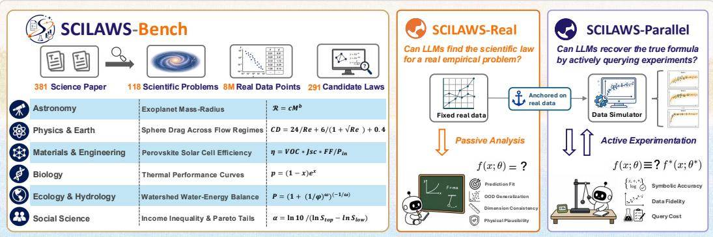  
Figure 1: Overview of SCILAWS-BENCH.

To study this question, we collect 118 scientific law discovery problems in SCILAWS-BENCH from active yet less popularized scientific literature rather than canonical textbooks, including 291 candidate laws, 381 scientific papers, and roughly 8M real data points. A cold-recall audit suggests that these problems are less memorized than canonical textbook equations (Section 2.2).

As illustrated in Figure 1, each curated problem is instantiated in two complementary evaluation settings: SCILAWS-REAL for open-ended empirical discovery and SCILAWS-PARALLEL for verifiable structural discovery. SCILAWS-REAL asks models to discover a closed-form law from fixed real observations, reflecting scientific settings in which the available evidence has already been collected (Section 2.3). Published formulas serve as reference baselines rather than recovery targets, and proposals are evaluated separately for held-out predictive fit and source-grounded scientific validity. SCILAWS-PARALLEL turns the same problem into an active, queryable world while preserving its scientific context (Section 2.4). Its generating mechanism is a newly synthesized structural variant of a published formula, with coefficients and residual noise calibrated to the corresponding real records (e.g., adding the distance-dependent anelastic attenuation term to a published ground-motion law). Starting without observations, models choose measurements and infer a fixed hidden law absent from the source literature, enabling controlled evaluation of whether models can recover novel structure rather than reproduce published formulas.

On SCILAWS-BENCH, we evaluate nine frontier LLMs spanning leading proprietary and open-weight families, including GPT-5.5, Claude Opus 4.8, Gemini 3.5 Flash, and DeepSeek-V4 Pro. All models are evaluated under the same ReAct-style agent framework, with access to a Python sandbox and, in SCILAWS-PARALLEL, a fixed-budget experimentation interface, for up to 30 interaction turns per trial. Our analysis reveals three central findings, with additional results reported in Section 3.

1. Models struggle to balance predictive fit and scientific validity. For example, a model’s best-fitting formula on a nuclear-physics task introduces a nonexistent resonance peak. It therefore fails our validity checks.

2. Models use memory to reproduce known laws, but struggle to discover novel structure. When recall is weak, models explore beyond published formulas, but successful novel-structure recovery remains rare.

3. Models generate better laws than they can reliably select. Best-of-N search exposes increasingly strong candidates, but self-selection captures only a small fraction of the available gains.

Overall, current LLMs show evidence of scientific-law discovery capability, but this capability remains far from reliable.

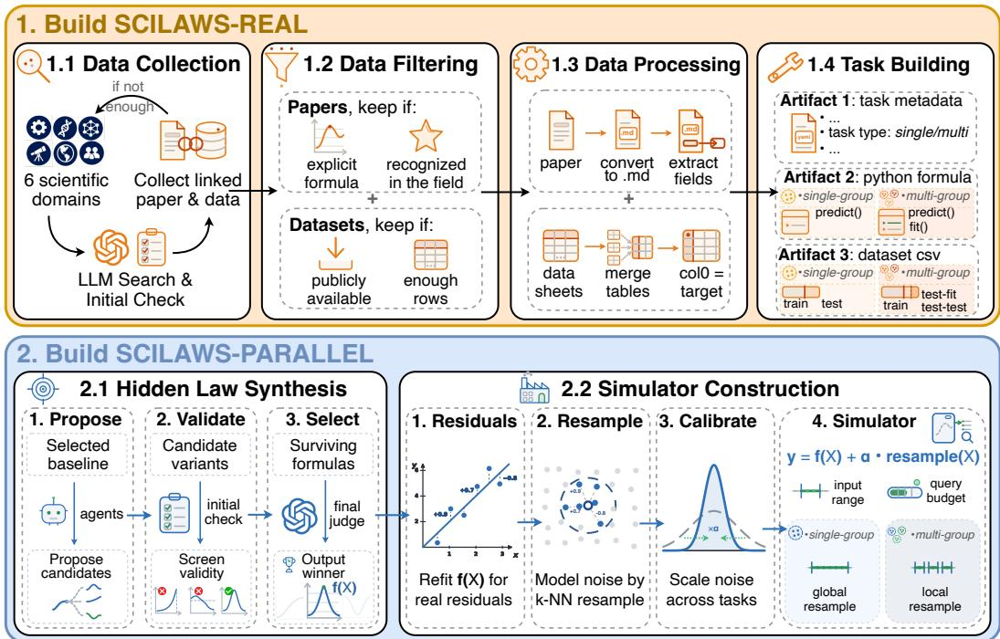  
Figure 2: The SCILAWS-BENCH construction pipeline.

## 2 SCILAWS-BENCH

## 2.1 BENCHMARK OVERVIEW

As illustrated in Figure 2, we curate linked paper-datasets to construct fixed-data SCILAWS-REAL tasks, then build corresponding SCILAWS-PARALLEL worlds using synthesized hidden laws derived from published forms. SCILAWS-BENCH comprises 118 problems across six disciplines, 291 candidate laws, 381 scientific papers, and roughly 8M real data points.

To better reflect real-world scientific law discovery, SCILAWS-BENCH inlcudes both single-group and multi-group problems. Single-group problems use one global law and parameter set per task, whereas multi-group problems share the same functional form across groups while allowing some parameter values to vary. The latter design requires models to discover a generalizable law that transfers across groups. Together with active querying in SCILAWS-PARALLEL, the single-/multi-group design allows SCILAWS-BENCH to span a broader range of scientific discovery settings. Table 1 summarizes the differences from prior benchmarks.

Table 1: Comparison of benchmark settings and primary evaluation targets.
<table><tr><td>Benchmark</td><td>Task grounding</td><td>Real-data grounding</td><td>Active querying</td><td>Multi- group laws Evaluation</td><td></td></tr><tr><td>AI Feynman (Udrescu &amp; Tegmark, 2020)</td><td>textbook equations</td><td></td><td></td><td></td><td>recovery</td></tr><tr><td>SRBench (La Cava et al., 2021)</td><td>mixed regression data</td><td>partial</td><td></td><td></td><td>fit + subset recovery</td></tr><tr><td>SRSD (Matsubara et al., 2022)</td><td>textbook equations</td><td></td><td></td><td></td><td>fit + recovery</td></tr><tr><td>LLM-SRBench (Shojaee et al., 2025b)</td><td>transformed equations</td><td></td><td></td><td></td><td>recovery</td></tr><tr><td>EmpiricalBench (Cranmer, 2023)</td><td>historical laws</td><td>partial</td><td></td><td></td><td>recovery</td></tr><tr><td>PHYSGYM (Chen et al., 2026)</td><td>physics simulations</td><td></td><td>V</td><td></td><td>hypothesis accuracy + fidelity</td></tr><tr><td>Gravity-Bench (Koblischke et al., 2025)</td><td>gravity simulation</td><td></td><td>√</td><td></td><td>fit</td></tr><tr><td>NewtonBench (Zheng et al., 2026)</td><td>counterfactual simulations</td><td></td><td>√</td><td></td><td>fit + recovery</td></tr><tr><td>SCILAWS-REAL (ours)</td><td>scientific papers</td><td>√</td><td></td><td>√</td><td>fit + scientific validity</td></tr><tr><td>SCILAWS-PARALLEL (ours)</td><td>scientific papers</td><td>L</td><td>√</td><td>√</td><td>structural recovery</td></tr></table>

## 2.2 SCIENTIFIC PROBLEM CURATION

We collect linked paper–dataset pairs across six scientific domains with LLM-assisted search and initial screening, followed by human verification of critical eligibility decisions (Figure 2). We focus on scientifically active, data-driven problems in collaboration with domain experts, prioritizing topics where published laws leave room for improvement. Each retained problem must satisfy three criteria: (1) the paper presents an established closed-form law with enough validity constraints; (2) the dataset is publicly available and contains sufficient observations for reliable evaluation; and (3) jointly, we exclude target leakage and require at least one published formula to outperform a naive baseline. After filtering, papers are converted to Markdown and relevant task fields are extracted, while associated data tables are merged and standardized for task construction.

During task building, we classify each retained problem based on the grouping structure described in the source literature and data. Single-group problems are retained when the source supports one global parameterization for the problem, whereas multi-group problems require related groups governed by a common functional form with some parameters varying by group. This yields 66 single-group and 52 multi-group problems.

As a validity check of the curation, we perform a matched eight-model cold-recall test and find substantially lower recall of SCILAWS-REAL target forms than AI-Feynman formulas (Udrescu & Tegmark, 2020) (Figure 3), indicating that the selected tasks are less readily addressed through direct formula recall. The comparison uses the eight OpenAI models common to both corpora, whereas the detailed memorization analysis in Section 3.3 and Appendix E reports the full nine-model results, same panel as the main Table 2.

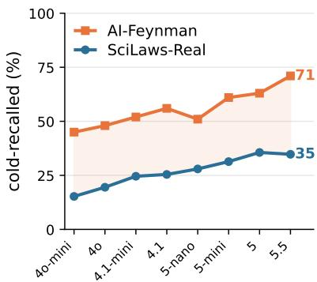  
Figure 3: Memorization comparison.

## 2.3 SCILAWS-REAL

Empirical law discovery often proceeds from observational records that have already been collected. SCILAWS-REAL evaluates whether an LLM-guided system use the fixed observations and scientific context to propose closed-form laws that surpass published references.

Task construction. From curated papers and datasets, we build task metadata, executable reference formulas in Python, cleaned data splits, and a frozen source-grounded validity rubric. Human reviewers verify critical variable mappings, formula implementations, split rationales, and rubric items against the cited sources.

Held-out splits. Grounded in the source literature, single-group tasks use task-specific splits for interpolation, input-range extrapolation, temporal transfer, or cross-condition generalization. Multigroup tasks hold out entire groups and divide each test group into a calibration subset to fit per-group parameters and a disjoint evaluation subset to evaluate the shared law. For example, the multi-group optical-dispersion task trains on 11 crystal materials and holds out three unseen materials: CdSe, $\mathrm { T i O _ { 2 } }$ and $\mathrm { Z n W O _ { 4 } }$ . For each held-out material, short-wavelength measurements calibrate the per-group parameters and long-wavelength measurements evaluate the shared law. Task scores are averaged equally across test groups.

Evaluation. For a task t, SCILAWS-REAL reports numeric fit $S _ { N } ( t )$ and scientific validity $S _ { V } ( t )$ whose task-set averages are $S _ { N }$ and $S _ { V }$ . We report them separately because a law can fit held-out records while violating paper-grounded scientific requirements.

Each task uses one primary metric from {rmse, smape, log\_mae} (lower is better) $_ { \mathrm { o r } \tt \perp 2 }$ (higher is better). The raw metric value of the best-performing formula defines $m _ { \mathrm { r e f } } .$ A submission with

metric value $m _ { \mathrm { s u b } }$ is normalized as

$$
S _ { N } ( t ) = \left\{ \begin{array} { l l } { \mathrm { c l i p } { \left( 1 - \frac { 1 } { 2 } \frac { m _ { \mathrm { s u b } } } { m _ { \mathrm { r e f } } } , 0 , 1 \right) } , } & { \mathrm { \ z m s e , ~ s m a p e , ~ 1 \circ g \_ m a e ~ , } } \\ { \mathrm { c l i p } { \left( 0 . 5 + \frac { 1 } { 2 } \frac { m _ { \mathrm { s u b } } - m _ { \mathrm { r e f } } } { 1 - m _ { \mathrm { r e f } } } , 0 , 1 \right) } , } & { \mathrm { \ z 2 ~ . } } \end{array} \right.\tag{1}
$$

The clipping operator bounds $S _ { N } ( t )$ to [0, 1]. The strongest published formula scores 0.5, and a perfect predictor scores 1.0. The complete task-level protocol is given in Appendix C.1.

To compute $S _ { V } ( t )$ , a code-enabled judge evaluates each item in the frozen task rubric through deterministic probes and source inspection. A global anti-hacking item rejects submissions that move degrees of freedom outside the declared law, such as lookup tables or excessive fitted constants. Let $a _ { t } = 1$ if the submission passes the anti-hacking check and $a _ { t } = 0$ otherwise, and let $M _ { t }$ denote the number of satisfied items among all $N _ { t }$ rubric items.

$$
S _ { V } ( t ) = a _ { t } \frac { M _ { t } } { N _ { t } } .\tag{2}
$$

The full judging protocol is provided in Appendices C.2 and C.3.

## 2.4 SCILAWS-PARALLEL

Scientific discovery often involves deciding what to measure in the first place as well as interpreting existing fixed observations. SCILAWS-PARALLEL turns each curated problem inot an active, queryable world with a fixed hidden law. It preserves from SCILAWS-REAL the scientific context, admissible input ranges, validity constraints, and group structure, while replacing fixed observations with a residual-calibrated simulator. The hidden target is a newly synthesized structural variant of a published formula. Starting without observations, the models needs to select inputs (and groups for multi-group tasks) within a task-specific query budget and infer the hidden law from returned measurements.

Hidden law synthesis. Starting from the selected published baseline, multiple agents independently propose structural variants (Figure 2). Candidates go through an initial execution and fit check, followed by scientific-validity and integrity screening. Survivors will be evaluated by a final judge based on simplicity, physical plausibility and source-consistency, yielding one winner as the hidden law $f ( X )$ .

Simulator construction. For a hidden law, parameters are fitted from real data globally for singlegroup tasks and separately within each group for multi-group tasks. Residuals are then calculated in a linear or logarithmic residual space. To better simulate real data noise, we first debias the residuals by removing trends and leaving only random error, and then apply k-NN bootstrap for noise resampling. Since empirical noise varies drastically across tasks, we calibrate the noise with a scaling factor to keep the hidden law identifiable under query budget. Finally, the resulting simulator outputs $y = f ( X ) + \alpha$ · resample(X) with a valid input range and query budget. Figure 4 shows representative calibrated worlds.

(a)  
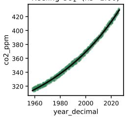

(b)  
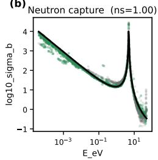

(c)<sub>Tr</sub>  
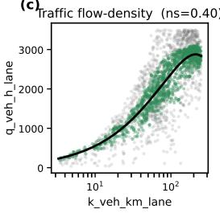

(d)  
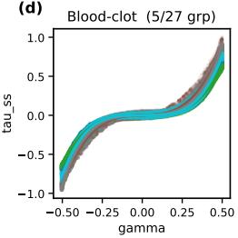  
real records constructed world hidden variant law  
Figure 4: SCILAWS-PARALLEL worlds and the corresponding real records. (a)–(c) show single-group tasks, and (d) shows a multi-group task with one shared functional form and group-specific parameter values. ns denotes the residual-noise calibration factor, where 1.00 retains the debiased residual scale (Appendix A).

Evaluation. SCILAWS-PARALLEL measures recovery of hidden structure rather than predictive fit. A code-enabled judge compares each submission with the hidden law. The five $S _ { S }$ levels are 0 (invalid or unrelated), 0.25 (relevant variables or trends), 0.5 (published base form), 0.75 (base form with most added terms), and 1 (complete hidden structure). The judging protocol and its validation against five human experts are detailed in Section C and Appendix D.

## 3 EXPERIMENTS AND ANALYSIS

## 3.1 EXPERIMENTAL SETUP

Agent Setup. We evaluate every base model with the same ReAct-style agent framework (Yao et al., 2023). The framework exposes three action spaces, the full prompt text is reproduced in Appendix F.

• Python sandbox. The agent can run Python to inspect data, perform calculations, fit constants, and compare candidate formulas. The harness returns the printed output to the model for the next turn. In SCILAWS-REAL, the sandbox starts with the fixed training records; in SCILAWS-PARALLEL, its observation set grows only after simulator queries.

• Submission. Each trial ends with a Python formula scored by the evaluator. Single-group tasks use one global predictor, while multi-group tasks require a shared functional form with a small number of per-group parameters fitted by the harness.

• Experimentation. Active data collection is available only in SCILAWS-PARALLEL, where the agent spends a fixed budget to choose inputs and receive datapoints generated by the simulator.

Evaluated Models. We evaluate GPT-5.5, GPT-5.4-mini, GPT-5-mini, and GPT-4o-mini (OpenAI, 2026); Claude Opus 4.8 (Anthropic, 2026); Gemini 3.5 Flash (Google DeepMind, 2026); DeepSeek V4 Pro (DeepSeek-AI, 2026); Qwen3.7-Max (Qwen Team, 2026); and GLM-5.2 (Z.ai, 2026; GLM-5 Team, 2026). The standard agent protocol allows up to 30 interaction turns and uses medium reasoning effort for models that expose this control; full settings are provided in Appendix B.

Scoring and Validation. The SCILAWS-REAL numeric score $S _ { N }$ is computed in closed form, whereas three scores are assigned by an LLM judge: the SCILAWS-REAL validity score $S _ { V }$ and the SCILAWS-PARALLEL structure score $S _ { S }$ by gpt-5.4-mini, and the cold-recall memorization verdict (Section 3.3) by gpt-4.1. Against majority labels from five domain experts, the judges attain Cohen’s $\kappa = 0 . 7 7 , 0 . 8 2 .$ , and 0.84 for memorization, validity, and structure, respectively, with quadratic weighting for structure. All three values fall within the corresponding pairwise human–human ranges (Appendix D).

## 3.2 MODEL PERFORMANCE ACROSS METRICS AND DOMAINS

Table 2 shows that GPT-5.5 leads all three aggregate metrics. Below GPT-5.5, no model consistently ranks second, and several models move by three or more positions across $S _ { N } , S _ { V }$ , and $S _ { S }$ . Multigroup scores are generally lower than single-group scores, most consistently for $S _ { V }$ and $S _ { S }$

High fit does not reliably imply high validity or correct structure recovery. On SCILAWS-REAL, fit and validity attain only 54.9% tie-aware concordance across 3,616 within-task model pairs with unequal $S _ { N }$ . The concordance rises to 69.5% only when the required fit margin reaches $\Delta \bar { S } _ { N } \ge 0 . 4$ (Figure 5(a); protocol in Appendix C.4). Across models, SCILAWS-REAL > Ref% and SCILAWS-PARALLEL full-law recovery rise together, with Pearson $r = 0 . 9 7$ , as shown in Figure 6(a,c). Within GPT-5.5, however, the two outcomes are nearly uncorrelated across tasks $( r = 0 . 0 4 )$ . Thus, models with stronger aggregate performance tend to improve across metrics, but high fit on a particular task does not reliably indicate either higher validity or recovery of the underlying structure. On the proton form-factor task, all nine models submit physically valid forms $( S _ { V } = \mathrm { \bar { 1 } } . 0 ) $ yet none beats the published reference numerically and seven score at the floor $( S _ { N } = 0 ;$ Appendix G.1). GPT-5.5 beats the published baseline on the $\mathrm { C O _ { 2 } }$ Keeling curve $( S _ { N } = 0 . 7 8 )$ while recovering only its trend, and fully recovers the Sellmeier dispersion law $( S _ { S } = 1 . 0 ) $ while scoring below the baseline $( S _ { N } = 0 . 2 1$ Appendices G.3 and G.4).

Table 2: Results of frontier models on SCILAWS-BENCH. All is the per-task mean over the full task set; bold marks the best value in each column. Scores are reported as percentages (%).
<table><tr><td rowspan="2">Base Model</td><td colspan="3">SCILAWS-REAL  $S _ { N }$ </td><td colspan="3">SCILAWS-REAL  $S _ { V }$ </td><td colspan="3">SCILAWS-PARALLEL  $S _ { S }$ </td><td rowspan="2">Rank  $S _ { N } / S _ { V } / S _ { S }$ </td></tr><tr><td>Single</td><td>Multi</td><td>All</td><td>Single</td><td>Multi</td><td>All</td><td>Single</td><td>Multi</td><td>All</td></tr><tr><td>GPT-5.5</td><td>52.44</td><td>48.66</td><td>50.77</td><td>87.79</td><td>74.29</td><td>81.84</td><td>60.23</td><td>55.77</td><td>58.26</td><td>1/1/1</td></tr><tr><td>Gemini 3.5 Flash</td><td>46.67</td><td>45.34</td><td>46.08</td><td>84.69</td><td>61.86</td><td>74.63</td><td>54.17</td><td>45.67</td><td>50.42</td><td>2/5/3</td></tr><tr><td>GLM-5.2</td><td>49.29</td><td>41.46</td><td>45.84</td><td>81.75</td><td>64.58</td><td>74.19</td><td>56.44</td><td>46.63</td><td>52.12</td><td>3/6/2</td></tr><tr><td>Claude Opus 4.8</td><td>45.71</td><td>43.96</td><td>44.94</td><td>88.03</td><td>70.35</td><td>80.24</td><td>53.03</td><td>46.15</td><td>50.00</td><td>4/3/5</td></tr><tr><td>DeepSeek-V4 Pro</td><td>42.21</td><td>46.18</td><td>43.96</td><td>83.75</td><td>78.19</td><td>81.30</td><td>51.14</td><td>48.08</td><td>49.79</td><td>5/2/6</td></tr><tr><td>Qwen3.7-Max</td><td>43.39</td><td>44.33</td><td>43.80</td><td>73.39</td><td>71.72</td><td>72.66</td><td>54.55</td><td>45.19</td><td>50.42</td><td>6/7/3</td></tr><tr><td>GPT-5-mini</td><td>39.79</td><td>41.82</td><td>40.69</td><td>79.39</td><td>74.03</td><td>77.03</td><td>44.70</td><td>44.71</td><td>44.70</td><td>7/4/7</td></tr><tr><td>GPT-5.4-mini</td><td>36.62</td><td>37.86</td><td>37.17</td><td>76.70</td><td>67.06</td><td>72.45</td><td>43.18</td><td>41.83</td><td>42.58</td><td>8/8/8</td></tr><tr><td>GPT-4o-mini</td><td>27.27</td><td>12.12</td><td>20.59</td><td>68.17</td><td>40.60</td><td>56.02</td><td>34.47</td><td>32.21</td><td>33.47</td><td>9/9/9</td></tr></table>

Aggregate rankings mask substantial domain-specific variation. Figure 5(b) shows that GPT-5.5 ranks first in $S _ { N }$ in five of the six scientific domains but falls out of the top three in Biology, where Gemini 3.5 Flash leads with 46.9% against GPT-5.5’s 41.0% (rank seven). The top-three sets also shift across metrics: DeepSeek-V4 Pro leads $S _ { V }$ in Materials & Engineering, Claude Opus 4.8 leads $S _ { V }$ in Social Sciences and $S _ { S }$ in Astronomy, and GPT-5-mini leads $S _ { V }$ in Biology. The aggregate leaderboard therefore does not capture every model’s relative strengths across scientific domains.

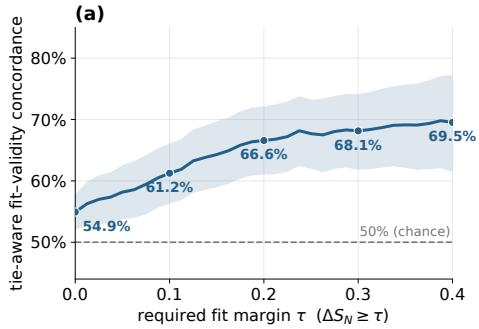

(b)  
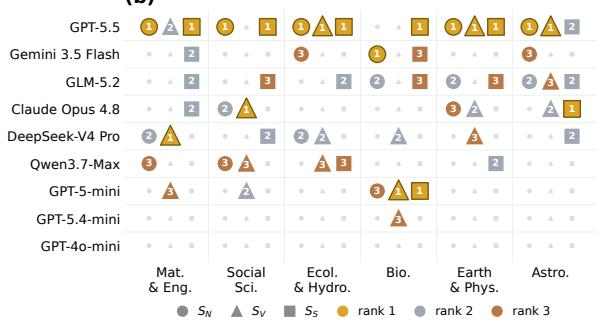  
Figure 5: Model performance across metrics and domains. (a) Fit–validity concordance across numeric-fit margins. (b) Top-three models by metric and domain, with ties sharing a rank. Shading in (a) marks 95% task-bootstrap confidence intervals.

## 3.3 HOW MEMORIZATION SHAPES SCIENTIFIC DISCOVERY

Memory is a central challenge in evaluating scientific agents, since a formula reproduced from memory may be indistinguishable from one inferred from task evidence (Xu et al., 2024; Li & Flanigan, 2024). We first ask how readily models can reproduce a published formula from a restricted description of the scientific problem, before seeing any task data. A task-level memorization audit measures this behavior, after which we examine how it relates to performance against published baselines and recovery of structure absent from the published formula.

Memorization audit. Given only the I/O variable specification, the model is asked to write the formula in Python, and a calibrated LLM judges whether its output structurally matches the bestbaseline reference. We validate the judge against five human experts in Appendix D. Following extraction-based measurement of memorization (Carlini et al., 2021; Hayes et al., 2025), we draw five samples per task–model pair and consider the pair cold-recalled when at least three of them match. Across the 118 tasks, only 11.9% are recalled by all nine models while 47.5% are recalled by none, forming a discovery moat. Even GPT-5.5 can only cold-recall 34.7% of the tasks. This task-level pattern is stable across the six audited vendors (Appendix E).

On SCILAWS-REAL, models beat published baselines more often on formulas they cannot recall. We split the 118 tasks into Canon (14), Mid (48), and Moat (56), where Canon formulas are cold-recalled by nearly all models and Moat formulas by none. Mean S is nearly unchanged across the three tiers, but its composition is not: from Canon to Moat, GPT-5.5’s > Ref% rises from 21% to 54% while its near-reference share falls sharply (Figure 6(a)), and weaker models move the same way. On Canon tasks a model can recall the well-known formula and match the best baseline’s fit but rarely proposes a stronger one; on Moat tasks there is no published form to recall, so a model likely needs to fit a new form from the data, which is more consistent with data-driven fitting than formula reproduction and can exceed the weaker published reference. For example, on the canonical gravity task GPT-5.5 recalls the textbook Somigliana constants and only ties the published reference, whereas on the discovery-moat DNA-melting task, with no formula to recall, it builds a new nearest-neighbor form from the data that beats it $( S _ { N } = 0 . 7 9 )$ .

On SCILAWS-PARALLEL, memorization helps recover the published form, but cannot help discover the added terms. Each hidden law combines a published closed-form with synthesized added terms that fit the real data about as well, giving two recovery levels: the published form and the full law. Across cold-recall tiers, published-form recovery falls from 0.85 on Canon to 0.59 on Moat, whereas full-law recovery stays near 0.08 at every tier (Figure 6(b)). Across models, however, full-law recovery rises with capability, from 0% for GPT-4o-mini to 21% for GPT-5.5 (Figure 6(c)), including on Moat tasks where almost no model can recall the published form. Thus, recovering the added terms requires data-driven discovery capability rather than memorization. For instance, on the canonical Beer–Lambert absorbance task all nine models recover the textbook A = εcl law, yet none recovers the hidden law’s added deviation term $\varepsilon _ { \mathrm { d e v } } c ^ { p } ;$ : weaker models drop it, stronger ones only hard-code a fixed $c ^ { 2 }$

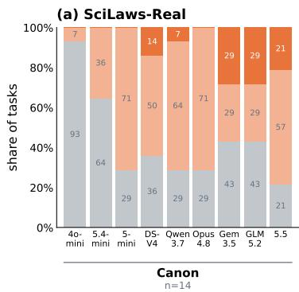

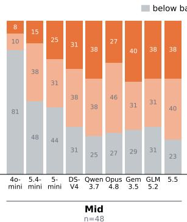

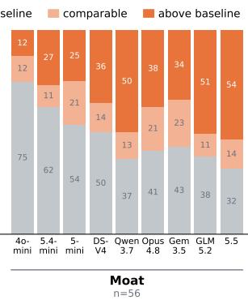

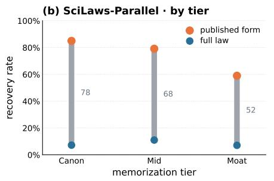

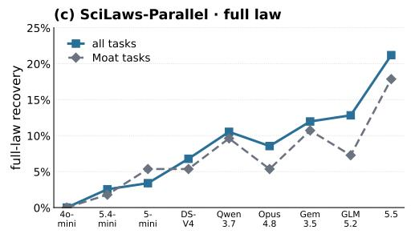  
Figure 6: Cold recall and recovery on SCILAWS-REAL and SCILAWS-PARALLEL. (a) SCILAWS-REAL: for each cold-recall tier and model, the percentage of tasks on which the model scores below, comparable to, or above the best baseline. (b) SCILAWS-PARALLEL: recovery rate of the published form vs. the full law (published plus added terms) by tier. (c) SCILAWS-PARALLEL: full-law recovery per model, on all tasks vs. Moat only.

## 3.4 BEST-OF-N SEARCH REVEALS A SELECTION BOTTLENECK

Test-time scaling can increase either the depth of a single discovery trajectory or the breadth of search across independent trajectories. Because our standard agent already performs multi-turn refinement within each trajectory, we study breadth scaling through best-of-N sampling under a fixed per-trajectory budget, followed by model-based selection among the resulting laws. Larger pools contain better candidates in both predictive fit and scientific validity, but self-selection realizes little of this headroom, making selection the primary bottleneck under this setting.

We study GPT-5.4-mini on SCILAWS-REAL, drawing 20 candidates per task and using the same model to select among them in a knockout tournament. The selector receives the task description, the full training set, and the candidate programs, but receives neither held-out test data nor feedback from the official evaluators. We then score the full pools on $S _ { N }$ and $S _ { V }$ to compare self-selection with post hoc metric-specific oracles and Pareto analyses (Appendix B.4).

Larger candidate pools contain better laws, but self-selection fails to exploit the additional headroom. From N = 5 to N = 20, the metric-specific oracle scores rise by 4.5 percentage points in numeric fit and 5.3 percentage points in scientific validity, whereas self-selected performance improves by less than 2 percentage points on either metric (Figure 7). Better candidates therefore continue to appear as the pool grows, shifting the bottleneck from candidate generation to selection under this setting.

Selection errors persist even when they cannot be explained by a fit–validity trade-off. Within the five-candidate groups directly presented to the selector, 60% of group winners are Paretodominated by another candidate, meaning that another generated formula scores no lower on either metric and strictly higher on at least one. Across the full 20-candidate pools, 12.7% of self-selected winners lie on the Pareto front, compared with 9.6% under random selection. The joint-balance summary shows the same remaining headroom: at N = 20, the oracle best-of-N reaches 0.93, while self-selection reaches 0.61 (Figure 7(c)). Thus, many selection errors miss strict Pareto improvements rather than reflecting different preferences over predictive fit and scientific validity.

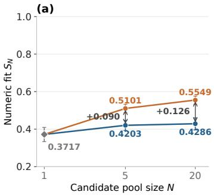

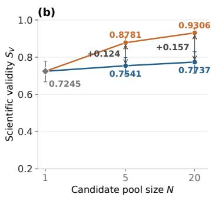

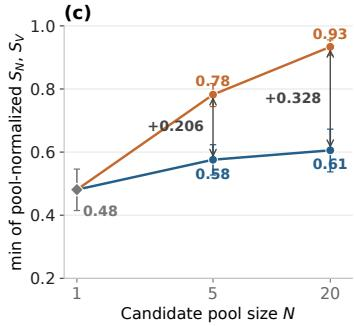  
Figure 7: Inference-time search and selection. Self-selected and oracle best-of-N performance for (a) numeric fit $S _ { N } ,$ (b) scientific validity $S _ { V } ,$ and (c) joint balance, the worse of a candidate’s two pool-normalized scores. Error bars are 95% task-bootstrap confidence intervals.

## 4 RELATED WORK

Symbolic Regression. Symbolic regression recovers compact mathematical expressions from observed input–output pairs. Classical methods directly search the expression space using genetic programming, sparse identification, or other program-search procedures (Schmidt & Lipson, 2009; Cranmer, 2023; Udrescu & Tegmark, 2020; Brunton et al., 2016; Randall et al., 2022; Burlacu et al., 2020), while neural approaches learn priors over equations from large synthetic corpora (Biggio et al.,

2021; Kamienny et al., 2022; Valipour et al., 2021). These methods primarily optimize symbolic formulas against tabular observations, whereas our setting evaluates whether LLMs can combine data with scientific context to discover valid scientific relationships. We therefore do not position classical symbolic regression as our comparison target.

AI for Scientific Discovery. Recent systems increasingly use LLMs as scientific agents that propose hypotheses, run code, and inspect evidence, including the AI Scientist, AI Scientist-v2, and Co-Scientist (Lu et al., 2024; Yamada et al., 2025; Gottweis et al., 2026). A complementary line improves the agents themselves rather than the science: REVERE distills recurring cross-repository failure modes into reusable heuristics that rewrite the agent’s own prompts (Gangireddi et al., 2026). In equation discovery, LLM-SR iteratively refines programmatic equations (Shojaee et al., 2025a), SR-Scientist extends this process to longer-horizon code-driven exploration (Xia et al., 2026), and RESTART transfers successful sub-expressions across related problems (Li & Pan, 2026). These systems motivate evaluating whether LLMs can use scientific context and iterative experimentation, rather than only recover closed-form equations from synthetic samples.

Discovery Benchmarks. AI Feynman, SRBench, SRSD, LLM-SRBench, and EmpiricalBench focus on formula recovery (Udrescu & Tegmark, 2020; La Cava et al., 2021; Matsubara et al., 2022; Shojaee et al., 2025b; Cranmer, 2023). DiscoveryBench, ScienceAgentBench, and MoSciBench broaden evaluation to data-driven scientific workflows (Majumder et al., 2025; Chen et al., 2025; Liu et al., 2026), while SciGym, PhysGym, Gravity-Bench-v1, and NewtonBench place agents in interactive simulated environments (Duan et al., 2026; Chen et al., 2026; Koblischke et al., 2025; Zheng et al., 2026). These benchmarks are useful anchors for formula recovery and active exploration. SCILAWS-BENCH targets a different combination: multi-disciplinary empirical laws, real scientific data, domain-knowledge requirements, and paper-grounded validity checks.

## 5 CONCLUSION

We introduced SCILAWS-BENCH, which pairs paper-grounded fixed-record discovery with active structural identification in residual-calibrated parallel worlds. Our evaluation yields three main findings. Predictive fit does not reliably establish scientific validity. Memorization helps models reproduce published laws but not discover new structure. In our best-of-N study, larger candidate pools contain better laws, but the model often fails to select them. By separating fit, validity, memorization, structure recovery, and selection, SCILAWS-BENCH provides a more complete evaluation of scientific law discovery. Future work can build on this framework to develop agents that design informative experiments, reason beyond memorized laws, and reliably identify scientifically valid hypotheses.

## REFERENCES

Anthropic. Claude Opus 4.8. Anthropic news post, 2026. URL https://www.anthropic. com/news/claude-opus-4-8. Accessed: 2026-07-31.

Luca Biggio, Tommaso Bendinelli, Alexander Neitz, Aurelien Lucchi, and Giambattista Parascandolo. Neural symbolic regression that scales. In International conference on machine learning, pp. 936– 945. Pmlr, 2021.

Steven L Brunton, Joshua L Proctor, and J Nathan Kutz. Discovering governing equations from data by sparse identification of nonlinear dynamical systems. Proceedings ofthe national academy of sciences, 113(15):3932–3937, 2016.

Bogdan Burlacu, Gabriel Kronberger, and Michael Kommenda. Operon c++ an efficient genetic programming framework for symbolic regression. In Proceedings ofthe 2020 genetic and evolutionary computation conference companion, pp. 1562–1570, 2020.

Nicholas Carlini, Florian Tramer, Eric Wallace, Matthew Jagielski, Ariel Herbert-Voss, Katherine Lee, Adam Roberts, Tom Brown, Dawn Song, Ulfar Erlingsson, et al. Extracting training data from large language models. In 30th USENIX security symposium (USENIX Security 21), pp. 2633–2650, 2021.

Yimeng Chen, Piotr Pi˛ekos, Mateusz Ostaszewski, Firas Laakom, and Jürgen Schmidhuber. Physgym: Benchmarking llms in interactive physics discovery with controlled priors. Advances in Neural Information Processing Systems, 38, 2026.

Ziru Chen, Shijie Chen, Yuting Ning, Qianheng Zhang, Boshi Wang, Botao Yu, Yifei Li, Zeyi Liao, Chen Wei, Zitong Lu, et al. Scienceagentbench: Toward rigorous assessment of language agents for data-driven scientific discovery. In International Conference on Learning Representations, volume 2025, pp. 96934–96990, 2025.

William G. Cochran. Sampling Techniques. John Wiley & Sons, 3rd edition, 1977.

Jacob Cohen. A coefficient of agreement for nominal scales. Educational and psychological measurement, 20(1):37–46, 1960.

Jacob Cohen. Weighted kappa: Nominal scale agreement provision for scaled disagreement or partial credit. Psychological bulletin, 70(4):213, 1968.

Miles Cranmer. Interpretable machine learning for science with pysr and symbolicregression. jl. arXiv preprint arXiv:2305.01582, 2023.

DeepSeek-AI. DeepSeek-V4 Preview Release. DeepSeek API release notes, 2026. URL https: //api-docs.deepseek.com/news/news260424. Introduces the DeepSeek-V4-Pro and DeepSeek-V4-Flash variants. Accessed: 2026-05-07.

Haonan Duan, Stephen Lu, Caitlin F Harrigan, Nishkrit Desai, Jiarui Lu, Michał Koziarski, Leonardo Cotta, and Chris Maddison. Measuring scientific capabilities of language models with a systems biology dry lab. Advances in Neural Information Processing Systems, 38, 2026.

Balaji Dinesh Gangireddi, Aniketh Garikaparthi, Manasi Patwardhan, and Arman Cohan. Revere: Reflective evolving research engineer for scientific workflows. arXiv preprint arXiv:2603.20667, 2026.

GLM-5 Team. GLM-5: From vibe coding to agentic engineering, 2026. URL https://arxiv. org/abs/2602.15763.

Google DeepMind. Gemini 3.5 Flash. Google AI for Developers, Gemini API documentation, 2026. URL https://ai.google.dev/gemini-api/docs/models/gemini-3. 5-flash. Accessed: 2026-07-31.

Juraj Gottweis, Wei-Hung Weng, Alexander Daryin, Tao Tu, Petar Sirkovic, Artiom Myaskovsky, Grzegorz Glowaty, Felix Weissenberger, Alessio Orlandi, Dan Popovici, et al. Accelerating scientific discovery with co-scientist. Nature, pp. 1–3, 2026.

Jamie Hayes, Marika Swanberg, Harsh Chaudhari, Itay Yona, Ilia Shumailov, Milad Nasr, Christopher A Choquette-Choo, Katherine Lee, and A Feder Cooper. Measuring memorization in language models via probabilistic extraction. In Proceedings ofthe 2025 conference ofthe nations ofthe Americas chapter ofthe associationfor computational linguistics: human language technologies (volume 1: long papers), pp. 9266–9291, 2025.

Peter Jansen, Marc-Alexandre Côté, Tushar Khot, Erin Bransom, Bhavana Dalvi Mishra, Bodhisattwa Prasad Majumder, Oyvind Tafjord, and Peter Clark. Discoveryworld: A virtual environment for developing and evaluating automated scientific discovery agents. Advances in neural information processing systems, 37:10088–10116, 2024.

Pierre-Alexandre Kamienny, Stéphane d’Ascoli, Guillaume Lample, and François Charton. End-toend symbolic regression with transformers. Advances in Neural Information Processing Systems, 35:10269–10281, 2022.

Nolan Koblischke, Hyunseok Jang, Kristen Menou, and Mohamad Ali-Dib. Gravity-bench-v1: A benchmark on gravitational physics discovery for agents. In Forty-second International Conference on Machine Learning, 2025. URL https://openreview.net/forum?id= Vw4f8M67jE.

William La Cava, Bogdan Burlacu, Marco Virgolin, Michael Kommenda, Patryk Orzechowski, Fabrício Olivetti de França, Ying Jin, and Jason H Moore. Contemporary symbolic regression methods and their relative performance. Advances in neural information processing systems, 2021 (DB1):1, 2021.

Pat Langley. Scientific discovery: Computational explorations of the creative processes. MIT press, 1987.

Changmao Li and Jeffrey Flanigan. Task contamination: Language models may not be few-shot anymore. In Proceedings of the AAAI Conference on Artificial Intelligence, volume 38, pp. 18471–18480, 2024.

Yunlun Li and Sinno Jialin Pan. Robust equation structure learning with adaptive refinement. In International Conference on Learning Representations, volume 2026, pp. 70029–70053, 2026.

Fan Liu, Xiaozhao Zeng, and Hao Liu. Towards multimodal data-driven scientific discovery powered by llm agents. In The Fourteenth International Conference on Learning Representations, 2026.

Chris Lu, Cong Lu, Robert Tjarko Lange, Jakob Foerster, Jeff Clune, and David Ha. The ai scientist: Towards fully automated open-ended scientific discovery. arXiv preprint arXiv:2408.06292, 2024.

Bodhisattwa Prasad Majumder, Harshit Surana, Dhruv Agarwal, Bhavana Dalvi Mishra, Abhijeetsingh Meena, Aryan Prakhar, Tirth Vora, Tushar Khot, Ashish Sabharwal, and Peter Clark. Discoverybench: Towards data-driven discovery with large language models. In International Conference on Learning Representations, volume 2025, pp. 4556–4579, 2025.

Yoshitomo Matsubara, Naoya Chiba, Ryo Igarashi, and Yoshitaka Ushiku. Srsd: Rethinking datasets of symbolic regression for scientific discovery. In NeurIPS 2022 AIfor science: Progress and promises, 2022.

OpenAI. OpenAI API Models. OpenAI API documentation, 2026. URL https:// developers.openai.com/api/docs/models. Per-model documentation, e.g. https: //developers.openai.com/api/docs/models/gpt-5.5. Accessed: 2026-05-04.

Qwen Team. Qwen3.7-Max. Qwen team blog post, 2026. URL https://qwen.ai/blog?id= qwen3.7. Accessed: 2026-07-31.

David L Randall, Tyler S Townsend, Jacob D Hochhalter, and Geoffrey F Bomarito. Bingo: a customizable framework for symbolic regression with genetic programming. In Proceedings ofthe genetic and evolutionary computation conference companion, pp. 2282–2288, 2022.

Michael Schmidt and Hod Lipson. Distilling free-form natural laws from experimental data. science, 324(5923):81–85, 2009.

Parshin Shojaee, Kazem Meidani, Shashank Gupta, Amir Barati Farimani, and Chandan Reddy. Llmsr: Scientific equation discovery via programming with large language models. In International Conference on Learning Representations, volume 2025, pp. 16054–16085, 2025a.

Parshin Shojaee, Ngoc-Hieu Nguyen, Kazem Meidani, Amir Barati Farimani, Khoa D Doan, and Chandan K. Reddy. LLM-SRBench: A new benchmark for scientific equation discovery with large language models. In Forty-second International Conference on Machine Learning, 2025b. URL https://openreview.net/forum?id=SyQPiZJVWY.

Silviu-Marian Udrescu and Max Tegmark. Ai feynman: A physics-inspired method for symbolic regression. Science advances, 6(16):eaay2631, 2020.

Mojtaba Valipour, Bowen You, Maysum Panju, and Ali Ghodsi. Symbolicgpt: A generative transformer model for symbolic regression. arXiv preprint arXiv:2106.14131, 2021.

Shijie Xia, Yuhan Sun, and Pengfei Liu. Sr-scientist: Scientific equation discovery with agentic ai. In International Conference on Learning Representations, volume 2026, pp. 75787–75811, 2026.

Cheng Xu, Shuhao Guan, Derek Greene, M Kechadi, et al. Benchmark data contamination of large language models: A survey. arXiv preprint arXiv:2406.04244, 2024.

Yutaro Yamada, Robert Tjarko Lange, Cong Lu, Shengran Hu, Chris Lu, Jakob Foerster, Jeff Clune, and David Ha. The ai scientist-v2: Workshop-level automated scientific discovery via agentic tree search. arXiv preprint arXiv:2504.08066, 2025.

Shunyu Yao, Jeffrey Zhao, Dian Yu, Nan Du, Izhak Shafran, Karthik R Narasimhan, and Yuan Cao. React: Synergizing reasoning and acting in language models. In The Eleventh International Conference on Learning Representations, 2023. URL https://openreview.net/forum? id=WE\_vluYUL-X.

Z.ai. GLM-5.2. Open-weight model release, MIT licence, 2026. URL https://huggingface. co/zai-org/GLM-5.2. Released 2026-06-16. Accessed: 2026-07-27.

Lianmin Zheng, Wei-Lin Chiang, Ying Sheng, Siyuan Zhuang, Zhanghao Wu, Yonghao Zhuang, Zi Lin, Zhuohan Li, Dacheng Li, Eric Xing, et al. Judging llm-as-a-judge with mt-bench and chatbot arena. Advances in neural information processing systems, 36:46595–46623, 2023.

Tianshi Zheng, Kiu Wai Tam, Kim Hue Nam Nguyen, Baixuan Xu, Zhaowei Wang, Cheng Jiayang, Hong Ting Tsang, Weiqi Wang, Jiaxin Bai, Tianqing Fang, et al. Newtonbench: Benchmarking generalizable scientific law discovery in llm agents. In International Conference on Learning Representations, volume 2026, pp. 99018–99088, 2026.

## TECHNICAL APPENDICES AND SUPPLEMENTARY MATERIAL

A Residual-Calibrated SCILAWS-PARALLEL Worlds 16   
A.1 Construction Data and Hidden Law 16   
A.2 Coefficient Fitting and Residual Space 17   
A.3 Debiased Local Residual Bootstrap . 17   
A.4 Noise Calibration and World Definition 17   
A.5 Single-Group and Multi-Group Worlds . 18   
A.6 Query and Evaluation Protocol . 18   
B Experimental Protocol 19   
B.1 Base-Model Decoding Settings 19   
B.2 Agent Harness Configuration 19   
B.3 Setting-Specific Protocol 19   
B.4 Inference-Time Search and Selection . 20   
C Evaluation Protocol and Verbatim Judge Prompts 21   
C.1 SCILAWS-REAL Reference-Relative Numeric Scoring 21   
C.2 SCILAWS-REAL Validity Judge 21   
C.3 SCILAWS-REAL Anti-Hacking Rubric . 22   
C.4 Fit–Validity Concordance . 22   
C.5 SCILAWS-PARALLEL Structure-Recovery Judge 23   
D Human Validation of the LLM Judges 24   
D.1 Sampling design . 24   
D.2 Experts and protocol 24   
D.3 Metrics 25   
D.4 Results . 25   
E Memorization Audit: Protocol and Detailed Results 28   
E.1 Purpose and Decision Unit 28   
E.2 Cold-Recall Probe . 28   
E.3 Structural Judge and Verdict 28   
E.4 Main Results 29   
E.5 Type and Domain Findings 29   
E.6 Target-Choice Robustness . 30   
E.7 AI-Feynman Calibration 31   
E.8 Integrity Checks for the Capability Ladder . 31   
F Verbatim Solver Prompt Templates 32   
F.1 SCILAWS-REAL System Prompt . 32   
F.2 SCILAWS-REAL User Prompt 33   
F.3 SCILAWS-PARALLEL System Prompt 34   
F.4 SCILAWS-PARALLEL User Prompt 35   
G Case Studies 36   
G.1 REAL × single-group: the proton form factor 37   
G.2 REAL × multi-group: CO adsorption 39   
G.3 PARALLEL × single-group: the Keeling curve 40   
G.4 PARALLEL × multi-group: Sellmeier dispersion 41

## A RESIDUAL-CALIBRATED SCILAWS-PARALLEL WORLDS

This appendix details the construction of the queryable worlds used by SCILAWS-PARALLEL. Each world combines a synthesized hidden law with an input-dependent residual process estimated from the corresponding real records. Rather than impose a task-independent parametric noise model, the construction grounds both the input support and residual variation in an empirical scientific problem. The residual scale is reduced only when necessary to maintain a minimum signal-to-noise ratio under bounded experimentation.

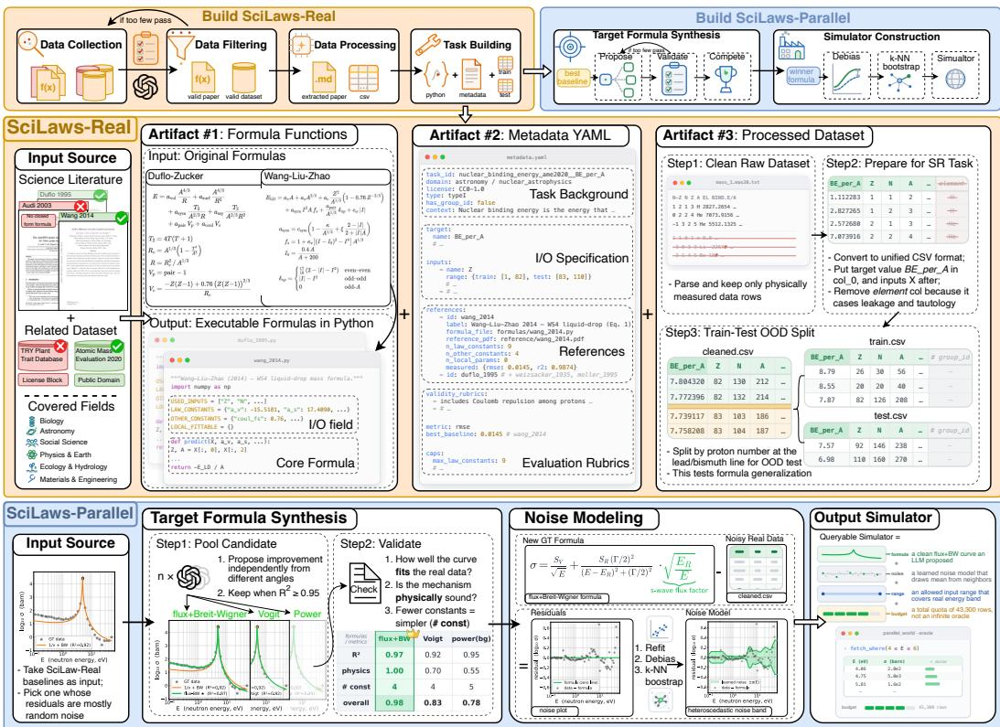  
Figure 8: Worked example of the SCILAWS-BENCH construction pipeline, from paper–dataset curation and a fixed-data SCILAWS-REAL task to hidden-law synthesis and a residual-calibrated SCILAWS-PARALLEL world.

## A.1 CONSTRUCTION DATA AND HIDDEN LAW

For task $t ,$ let $\mathcal { D } _ { t } = \{ ( x _ { i } , y _ { i } , g _ { i } ) \} _ { i = 1 } ^ { n _ { t } }$ denote the corresponding real records, where $x _ { i }$ contains the candidate scientific inputs, $y _ { i }$ is the measured target, and $g _ { i }$ is an optional group identifier. Simulator construction pools all available records from the predefined SCILAWS-REAL splits because these records calibrate a separate SCILAWS-PARALLEL world rather than evaluate a submitted law. The solver receives none of these records and begins its SCILAWS-PARALLEL trial without observations.

We first select a published reference whose functional form provides a suitable starting point for synthesis. For each nondegenerate reference $f _ { b } ,$ , its coefficients are refitted and its residuals are computed in the task-specific residual space defined below. Let $\widehat { m } _ { b } ( \boldsymbol { x } _ { i } )$ be a local k-nearest-neighbor estimate of the mean residual at $x _ { i }$ . For each single-group reference, we compute

$$
B _ { b } = \frac { \mathrm { V a r } _ { i } [ \widehat { m } _ { b } ( x _ { i } ) ] } { \mathrm { V a r } _ { i } [ r _ { i } ^ { ( b ) } ] } ,\tag{3}
$$

and select the form with the smallest $B _ { b }$ among references with nonnegative residual-space $R ^ { 2 }$ . For multi-group tasks, both quantities are computed within each group and aggregated by their medians, using a fixed sample of at most 40 groups during this selection stage. If no reference has nonnegative residual-space $R ^ { 2 }$ , the same criterion is applied to all nondegenerate references. This procedure favors a functional form with little systematic residual structure rather than simply the smallest aggregate prediction error.

Multiple agents then propose structural variants of the selected reference under the source problem’s scientific context and validity requirements. The candidate screen checks execution, predictive adequacy, scientific constraints, and integrity of the symbolic representation. A separate judge selects the hidden law $F _ { t }$ among admissible variants according to physical plausibility, simplicity, and consistency with the source problem, using predictive fit only as an eligibility criterion. The selected variant differs structurally from its published starting point and is fixed before solver evaluation.

## A.2 COEFFICIENT FITTING AND RESIDUAL SPACE

We define a task-specific transformation

$$
\phi _ { t } ( y ) = { \left\{ \begin{array} { l l } { \log _ { 1 0 } ( \operatorname* { m a x } \{ y , \epsilon \} ) } & { { \mathrm { l o g a r i t h m i c ~ r e s i d u a l ~ s p a c e } } , } \\ { y } & { { \mathrm { l i n e a r ~ r e s i d u a l ~ s p a c e } } } \end{array} \right. } ,\tag{4}
$$

where ϵ is a small positive floor. Logarithmic residuals are used for log\_mae tasks and for positive, multi-decade targets evaluated with a relative-error metric. All other tasks use linear residuals.

For single-group tasks, the shared constants of $F _ { t }$ are refitted by nonlinear least squares in the selected residual space, and the refit is retained only when it does not reduce residual-space $R ^ { 2 }$ . For multi-group tasks, the declared per-group parameters are estimated separately within each group while shared constants remain common across groups. Groups with fewer than eight usable records are omitted because they do not support both per-group fitting and residual calibration. Writing $\widehat { \theta } _ { t , g }$ for the resulting parameter values, the residual associated with record i is

$$
r _ { i } = \phi _ { t } ( y _ { i } ) - \phi _ { t } \Big ( F _ { t } ( x _ { i } ; \widehat { \theta } _ { t , g _ { i } } ) \Big ) .\tag{5}
$$

## A.3 DEBIASED LOCAL RESIDUAL BOOTSTRAP

Raw residuals contain both local measurement variation and systematic mismatch between the selected law and the real records. Injecting the systematic component would make the simulator’s effective mean response equal to the hidden law plus an unmodeled residual trend. We therefore estimate the local mean

$$
\widehat { m } _ { t } ( \boldsymbol { x } ) = \frac { 1 } { | \mathcal { N } _ { k } ( \boldsymbol { x } ) | } \sum _ { j \in \mathcal { N } _ { k } ( \boldsymbol { x } ) } \boldsymbol { r } _ { j } ,\tag{6}
$$

and form debiased residuals $\widetilde { r } _ { i } = r _ { i } - \widehat { m } _ { t } ( x _ { i } )$ . Neighbor distances are computed after standardizing each input, with positive inputs spanning more than one decade transformed to logarithmic scale. The local-mean neighborhood contains approximately 25% of the available records, subject to sample-size-dependent bounds and a maximum of 128 neighbors.

At a query point $x ,$ the residual sampler draws uniformly from the debiased residuals in a second local neighborhood:

$$
\widetilde { R } _ { t } ( x ) \sim \mathrm { U n i f } \{ \widetilde { r } _ { j } : j \in \mathcal { N } _ { k ^ { \prime } } ( x ) \} .\tag{7}
$$

The sampling neighborhood uses approximately 15% of the records, clipped to between 8 and 64 neighbors when the sample size permits. For smaller samples, the procedure draws from the global residual pool. This nonparametric bootstrap retains local empirical variation and non-Gaussian residual shape without claiming that the finite records identify the complete measurement process.

## A.4 NOISE CALIBRATION AND WORLD DEFINITION

The residual magnitude varies widely across scientific problems and can obscure the target law under a bounded query budget. We therefore allow only downward calibration of the debiased residual scale. Let $v _ { f , t , g }$ be the variance of $\phi _ { t } \big ( F _ { t } \big ( X ; \widehat { \theta } _ { t , g } \big ) \big )$ over the calibration inputs for group $^ { g , }$ and let $v _ { r , t , g }$ be the variance of its debiased residuals. For target $\rho = 0 . 9$ , the calibration factor is

$$
{ s _ { t , g } } = \operatorname* { m i n } \Biggl \{ 1 , \sqrt { \frac { 1 - \rho } { \rho } \frac { { v _ { f , t , g } } } { { v _ { r , t , g } } } } \Biggr \} .\tag{8}
$$

For tasks with exactly one input column, $v _ { f , t , g }$ is estimated from points spanning the observed support, using logarithmic sampling when appropriate. For multivariate inputs, it is estimated by resampling observed input rows so that empirical correlations among inputs are not broken.

The queryable world is defined in residual space by

$$
\phi _ { t } ( Y _ { t , g } ( x ) ) = \phi _ { t } \Bigl ( F _ { t } ( x ; \widehat { \theta } _ { t , g } ) \Bigr ) + s _ { t , g } \widetilde { R } _ { t , g } ( x ) .\tag{9}
$$

Equation 9 is additive for linear-space tasks and multiplicative after inversion for logarithmic-space tasks. A factor $s _ { t , g } = 1$ retains the debiased empirical residual scale, whereas $s _ { t , g } < 1$ reduces it. Because the factor is capped at one, the construction never amplifies residual noise and targets residual-space $R ^ { 2 } \geq 0 . 9$ rather than forcing every world to have exactly the same $R ^ { 2 }$

## A.5 SINGLE-GROUP AND MULTI-GROUP WORLDS

Single-group worlds use one fitted constant set, input support, residual sampler, and calibration factor for the task. Multi-group worlds use the same hidden functional form in every group but estimate the per-group parameters, input support, residual sampler, and calibration factor separately for each group. The resulting groups therefore share the recovery target while retaining group-specific parameter values and empirical variation. Structural evaluation concerns the shared law and its declared pattern of shared constants and per-group parameters, not a model of group identifiers alone.

## A.6 QUERY AND EVALUATION PROTOCOL

Each trial begins with an empty observation set. The solver collects measurements by choosing input values and, for multi-group tasks, the group to query. Inputs outside the calibrated support are clipped to the nearest boundary and reported as such. Returned measurements accumulate in the solver’s analysis environment, while the hidden law, its fitted quantities, and residual sampler remain inaccessible.

All evaluated models receive the same task-specific query limits. A trial permits at most ten experiment calls. Each call accepts at most max $\{ 1 0 , \bar { \lfloor 0 . 1 n _ { t } ^ { \mathrm { t r a i n } } \rfloor } \}$ } input points and up to three independent samples per point, where $n _ { t } ^ { \mathrm { t r a i n } }$ is the size of the corresponding SCILAWS-REAL training set. These limits allow adaptive allocation of measurements while keeping experimental access comparable across models.

SCILAWS-PARALLEL is scored by structural recovery rather than held-out prediction. After submission, a code-enabled judge compares the proposed law with $F _ { t }$ under the ordinal protocol in Appendix C.5. The benchmark does not compute a SCILAWS-PARALLEL numeric-fit or scientificvalidity score.

## B EXPERIMENTAL PROTOCOL

## B.1 BASE-MODEL DECODING SETTINGS

We hold the agent interface, task inputs, interaction budget, and scoring protocol fixed across models. Because providers expose different reasoning and decoding controls, we standardize configurations where possible and report the remaining differences explicitly.

Three conventions hold across the whole panel. First, we never override top\_p, top\_k, repetition\_penalty, presence\_penalty, or frequency\_penalty: they stay at provider defaults, and streaming is disabled throughout.

Second, every model with a reasoning head is run at the medium reasoning tier, using whichever knob its provider exposes — reasoning\_effort=medium on the GPT-5 series, the equivalent reasoning.effort field for GLM-5.2, DeepSeek-V4 Pro, Qwen3.7-Max and Claude Opus 4.8, and the corresponding medium thinking budget for Gemini 3.5 Flash. Holding the tier fixed is what makes the rows of Table 2 comparable: the panel is meant to vary base-model capability, not how much test-time compute each vendor happens to spend by default. GPT-4o-mini has no reasoning head and is therefore non-thinking by construction.

Third, decoding parameters follow the reasoning split. Thinking models receive no temperature override — several providers reject an explicit value on reasoning endpoints — and run at the service side default (≈ 1.0) with a 65,536-token completion budget. GPT-4o-mini, the one non-thinking model, uses temperature=0.4 with an 8,192-token cap. The larger budget is deliberate: on every provider we use, the reasoning trace and the visible tool block are drawn from the same completion pool, and a smaller cap truncates <python> bodies mid-expression, which surfaces as finish\_reason=length rather than as a clean error.

## B.2 AGENT HARNESS CONFIGURATION

The agent interacts with the task through exactly three XML tools: <python> for sandboxed analy sis, <experiment> for simulator queries (SCILAWS-PARALLEL only), and <final\_formula> for submission. The protocol is one tool per turn; if a response contains several tool blocks, the harness executes only the first one it sees and ignores the rest. The shared loop runs for at most max\_turns=30 turns per task. The final turn is a forced-submission turn: the model is told that only <final\_formula> will be accepted, and if that turn still fails to produce a parseable submission it is given exactly one retry before the task is recorded as unsubmitted. Unsubmitted tasks are not dropped from the denominator: under the strict aggregation of Section C they enter every reported mean with a score of 0, so a model that runs out of turns is penalised exactly as much as one that submits an unusable formula.

The <python> sandbox preloads train\_df, X\_train, y\_train, and (on multi-group tasks) group\_ids\_train, with numpy, scipy, and pandas already imported. Imports are restricted to a whitelist (numpy, scipy, sklearn, pandas, math, statistics, itertools, functools, collections, warnings); filesystem, network, and introspection modules are blocked, as are direct file reads of the task directory, so the agent cannot recover the held-out split or the hidden generator by any route other than the tools. Each <python> call is killed after 100 seconds of wall time and the timeout is returned to the model as an ordinary tool error, leaving it free to retry with cheaper code. Individual API calls time out after 120 seconds with a single retry; a call that still fails surfaces as an error inside the loop rather than aborting the task, so a task is only lost if it exhausts its turns without submitting.

## B.3 SETTING-SPECIFIC PROTOCOL

In SCILAWS-REAL the fixed training split is available to the sandbox from the first turn, and the prompt additionally states the per-column input ranges of the held-out evaluation split. These ranges make the intended evaluation regime explicit without revealing the held-out outcomes. The taskspecific splits include representative interpolation, input-range extrapolation, temporal holdouts, cross-condition generalization, and, for multi-group tasks, transfer to unseen groups (Section 2.3).

In SCILAWS-PARALLEL no observations are preloaded. The agent starts with an empty $\mathtt { t r a i n _ { - } }$ \_df and must populate it through <experiment>, and at least one experiment is required before <final\_formula> is accepted. Queries are capped along three axes: at most 10 <experiment> calls per task, at most max $( \dot { 1 } 0 , \lfloor 0 . \bar { 1 } n _ { \mathrm { t r a i n } } \rfloor )$ distinct input points per call, and at most 3 repeated samples per point, where $n _ { \mathrm { t r a i n } }$ is the task’s original training-set size. The binding constraint is the number of distinct design points: ten calls of $0 . 1 n _ { \mathrm { t r a i n } }$ points each give the agent a design budget of about $n _ { \mathrm { t r a i n } }$ points, matching the size of the SCILAWS-REAL split it would otherwise have been handed. The extra factor of three buys only repeated measurements at an already-chosen point, i.e. noise averaging rather than coverage. Structure recovery therefore has to come from where the agent probes, not from how much data it can accumulate. Each returned batch is summarised back to the model as a preview of 10 rows plus batch statistics, with the full batch left in $\mathtt { t r a i n \_ d f }$ for inspection from the sandbox.

For evaluation we use GPT-5.4-mini as the judge model for the validity and structure scores, running as a code-executing judge agent so that rubric items requiring probes of the submitted formula can be checked by execution rather than by inspection alone; the judge prompts and the verdict vocabulary are given in Section C.

## B.4 INFERENCE-TIME SEARCH AND SELECTION

We evaluate inference-time search on all 118 SCILAWS-REAL tasks using GPT-5.4-mini for both candidate generation and selection. For each task, we sample 20 candidate trajectories under the same task interface and per-trajectory budget. The $N = 1$ point is the model’s standard single-trajectory result from the main evaluation rather than a member of the 20-candidate pool. Malformed or non-executing submissions receive zero under the corresponding official evaluator.

Self-selection. The 20 candidates are partitioned into four disjoint groups of five. For each group, the same model selects one winner after receiving the task description, full training set, and five candidate programs. The four group winners define the reported $N = 5$ result, which averages their scores for each task. They then enter a second selection round, whose winner defines $N = 2 0$ . The selector receives neither the held-out test set nor scores or feedback from the official evaluators. All official scores are computed post hoc.

Metric-specific oracles. For a candidate-level quantity $q ,$ the $N = 5$ oracle is the exact expected maximum of q over a uniformly sampled five-candidate subset of the 20-candidate pool. The $N = 2 0$ oracle is the maximum over the full pool. We apply this definition separately to $S _ { N } , S _ { V }$ , and the joint-balance score below.

For a task-specific 20-candidate pool $P _ { t }$ , we normalize m $\in \{ S _ { N } , S _ { V } \}$ as

$$
\widetilde { m } _ { t } ( c ) = \frac { m ( c ) - \operatorname* { m i n } _ { c ^ { \prime } \in P _ { t } } m ( c ^ { \prime } ) } { \operatorname* { m a x } _ { c ^ { \prime } \in P _ { t } } m ( c ^ { \prime } ) - \operatorname* { m i n } _ { c ^ { \prime } \in P _ { t } } m ( c ^ { \prime } ) } .
$$

If the denominator is zero, all candidates receive normalized score one. The separate $N = 1$ baseline is normalized against the same pool range and clipped to [0, 1]. Joint balance is

$$
J _ { t } ( c ) = \operatorname* { m i n } \{ \widetilde { S } _ { N , t } ( c ) , \widetilde { S } _ { V , t } ( c ) \} ,
$$

and the joint oracle maximizes $J _ { t }$ under the oracle construction above.

Candidate $c ^ { \prime }$ Pareto-dominates c when $S _ { N } ( c ^ { \prime } ) \geq S _ { N } ( c )$ and $S _ { V } ( c ^ { \prime } ) \geq S _ { V } ( c )$ , with at least one strict inequality. Tied or duplicate candidates therefore do not dominate one another. Confidence intervals in Figure 7 use 50,000 task-bootstrap replicates.

## C EVALUATION PROTOCOL AND VERBATIM JUDGE PROMPTS

This appendix specifies the setting-specific evaluation protocols and reproduces the complete prompts used by the two code-executing judges. SCILAWS-REAL reports numeric\_score and validity\_score separately, whereas SCILAWS-PARALLEL reports structure\_score for recovery of the hidden simulator mechanism.

## C.1 SCILAWS-REAL REFERENCE-RELATIVE NUMERIC SCORING

The numeric channel asks whether a submitted expression predicts held-out data better than the strongest published formula collected for the task. Each task specifies one primary raw metric from {rmse, smape, log\_mae} (lower is better) or $\tt { r 2 }$ (higher is better). The perfect value is 0 for the first three metrics and 1 for r2.

Let $B _ { t }$ denote the set of published formulas proposed by domain researchers and collected for task t. We evaluate every formula under the same split and fitting protocol as submissions and select the strongest reference:

$$
\begin{array} { r } { b _ { t } ^ { \star } = \left\{ \begin{array} { l l } { \arg \operatorname* { m i n } _ { b \in \mathcal { B } _ { t } } m ( b ) , } & { \mathrm { l o w e r - i s - b e t t e r ~ m e t r i c } , } \\ { \arg \operatorname* { m a x } _ { b \in \mathcal { B } _ { t } } m ( b ) , } & { \mathrm { h i g h e r - i s - b e t t e r ~ m e t r i c } . } \end{array} \right. } \end{array}
$$

Its raw metric value $m ( b _ { t } ^ { \star } )$ defines $m _ { \mathrm { r e f } }$ . A submission with raw metric $m _ { \mathrm { s u b } }$ receives

$$
S _ { N } ( t ) = \mathrm { c l i p } \bigg ( 1 - \frac { 1 } { 2 } \frac { m _ { \mathrm { s u b } } } { m _ { \mathrm { r e f } } } , 0 , 1 \bigg )
$$

for lower-is-better metrics, and

$$
S _ { N } ( t ) = \mathrm { c l i p } \bigg ( 0 . 5 + \frac { 1 } { 2 } \frac { m _ { \mathrm { s u b } } - m _ { \mathrm { r e f } } } { 1 - m _ { \mathrm { r e f } } } , 0 , 1 \bigg )
$$

for higher-is-better metrics. The clipping operator bounds $S _ { N } ( t ) \ \mathrm { t o } \ [ 0 , 1 ]$ . The strongest collected formula scores 0.5, and a perfect predictor scores 1.0.

Single-group tasks. The submitted module declares the columns it uses and defines a single predict function. The evaluator builds the held-out input matrix in that declared column order and computes the task’s raw metric on the held-out test split. Contract violations, failed imports, runtime errors, shape mismatches, and non-finite predictions receive a zero numeric score.

Multi-group tasks. Multi-group tasks test whether a functional form transfers across groups while allowing a small number of per-group parameters to vary. The submission declares LOCAL\_FITTABLE parameters and supplies a fit routine. For each test group, the evaluator fits those per-group parameters on the group’s fit window and then evaluates predict on the held-out window from the same group. The group scores are averaged with equal weight. Failed groups score 0. If the best reference is already effectively perfect on a group, that group is excluded because it no longer discriminates between submissions.

## C.2 SCILAWS-REAL VALIDITY JUDGE

The validity channel asks whether a formula behaves like a plausible scientific law, rather than merely fitting the held-out observations. Each task contains frozen validity rubrics derived from the source problem. Rubrics include behavioral checks, such as monotonicity, finite outputs, nonnegativity, bounds, limits, and separability, and structural checks, such as required variable dependencies or the presence of a physically meaningful term. Coefficient accuracy is intentionally left to numeric\_score; validity focuses on functional behavior and scientific form.

We use a code-executing agent because many rubric items require evaluating the submitted formula on controlled probes. For each task, the judge receives the metadata, observations, rubric list, and submitted formula, and returns rubric-level verdicts in JSON. The complete evaluator prompt is reproduced below; it is quoted verbatim and uses cluster for what the main text calls a group.

You are a VALIDITY JUDGE for SciLaws-Real.   
Read only the staged task directories listed below. Write only JSON result   
files under the output directory. Do not edit existing repository files.   
For EACH staged task:   
1. Read validity\_rubrics.json and score the rubric list.   
2. Read metadata.yaml for target, inputs, and task type.   
3. Read and execute submission.py in an isolated namespace. Extract predict,   
USED\_INPUTS, LAW\_CONSTANTS, and, for multi-group tasks, fit and LOCAL\_FITTABLE. If   
import or contract execution fails, write validity\_score=null with an   
error string.   
4. Build X from the declared USED\_INPUTS.   
- Single-group: evaluate the held-out test data.   
- Multi-group: group the fit split by group\_id, call fit on representative   
clusters, then call predict with the fitted local parameters.   
5. Build deterministic domain grids over each used input’s observed min/max   
range while holding other inputs at their median.   
6. Score each rubric as Y or N. Prefer computed evidence:   
- behavioral: finite-difference monotonicity, min/max range checks, sign,   
non-negativity, bounds, limits, mixed differences for separability.   
- structural: numeric probes where possible, otherwise source inspection.   
Functionally equivalent terms count; coefficient accuracy belongs to   
numeric\_score, not validity\_score.   
constant-discipline / no-cap-evasion: use source inspection, metadata   
caps, and final submitted code. Mark N for fitted/data-derived lookup   
tables, profiles, train/test aggregates, large literal arrays, or obvious   
attempts to move degrees of freedom outside the stated caps.   
Write exactly one JSON per task:   
{   
"task": "<stage\_id>",   
"n\_satisfied": <int or null>,   
"n\_total": <int or null>,   
"validity\_score": <number or null>,   
"error": <string or null>,   
"rubrics": [   
{"i": 1, "verdict": "Y|N", "kind": "behavioral|structural",   
"evidence": "one-line computed or source evidence"}   
]   
}  
For a task with N applicable rubric items and M satisfied items, the score is M/N. The aggregate mean\_scored averages finite task scores. The stricter aggregate strict\_mean averages all staged tasks and treats missing, null, or errored scores as 0.

## C.3 SCILAWS-REAL ANTI-HACKING RUBRIC

Closed-form discovery benchmarks are vulnerable to submissions that hide memorization or highdimensional fitting capacity inside code while still presenting a superficially simple predict function. The evaluator therefore appends a global anti-hacking rubric to every task. The rubric does not penalize legitimate fitted constants; instead, it asks whether the submission circumvents the declared law contract.

The judge marks this rubric as failed when a submission stores many extra degrees of freedom outside the declared interface, for example: large literal arrays, lookup tables keyed by input values, copied training or test aggregates, per-group profiles, excessive LAW\_CONSTANTS, too many LOCAL\_FITTABLE parameters, oversized initialization lists, or other code paths that approximate the dataset rather than express a law. This catches the failure mode in which a model writes many parameters to force a good numeric fit instead of discovering a compact functional relationship. During aggregation, a failed anti-hacking verdict hard-gates the final validity\_score for that task to 0.

## C.4 FIT–VALIDITY CONCORDANCE

For each task, we form every unordered pair of executable model submissions with unequal numericfit scores. We orient each pair so that submission i has the higher numeric fit, $\Delta S _ { N } = S _ { N } ^ { ( i ) } - S _ { N } ^ { ( j ) } > 0 ,$

and retain it when $\Delta S _ { N } \ge \tau .$ . Its tie-aware concordance contribution is

$$
h _ { i j } = \left\{ \begin{array} { l l } { 1 , } & { S _ { V } ^ { ( i ) } > S _ { V } ^ { ( j ) } , } \\ { \frac { 1 } { 2 } , } & { S _ { V } ^ { ( i ) } = S _ { V } ^ { ( j ) } , } \\ { 0 , } & { S _ { V } ^ { ( i ) } < S _ { V } ^ { ( j ) } . } \end{array} \right.
$$

Here $S _ { V }$ is the official validity score after applying the anti-hacking gate. We report the mean of $h _ { i j }$ over all retained task–model pairs. $\mathbf { A } \mathbf { t } { \boldsymbol { \tau } } = 0$ , this includes 3,616 pairs. The 50% reference corresponds to no directional association between the two rankings, with validity ties divided equally between agreement and disagreement. Confidence intervals are obtained from 20,000 bootstrap samples of tasks, retaining all eligible model pairs within each sampled task.

## C.5 SCILAWS-PARALLEL STRUCTURE-RECOVERY JUDGE

SCILAWS-PARALLEL is scored against the hidden simulator mechanism, not against a held-out prediction metric. During a trial, the solver sees only public task metadata and may collect observations by querying the simulator. After the final formula is submitted, the evaluator stages three files for each task: metadata.yaml, the hidden formula.py defining $G _ { t } ,$ and the solver’s submission.py. A codeagent judge then assigns an ordinal structure\_score.

The allowed scores are:

$$
\{ 0 . 0 0 , 0 . 2 5 , 0 . 5 0 , 0 . 7 5 , 1 . 0 0 \} .
$$

The levels correspond to: unrelated or invalid; relevant variables or trend only; published form recovered; published form plus most important added terms recovered; and full hidden-structure recovery up to algebraic equivalence. The judge may use source inspection and small diagnostic probes over the metadata input ranges, but it is instructed not to compute prediction scores, validity scores, test RMSE, or leaderboard-style performance. This prevents dense simulator probing from being rewarded unless it leads to the right governing law.

The complete evaluator prompt is reproduced below.

```csv
You are a PARALLEL STRUCTURE JUDGE for SciLaws-Parallel.
Read only the staged task directories listed below. Write only JSON result
files under the output directory. Do not edit existing repository files.
Goal:
Score whether the submitted formula recovers the hidden simulator GT mechanism
structure. This is NOT a prediction-score task.
Allowed structure_score values are exactly:
0.00: unrelated / invalid
0.25: relevant variables or trend only
0.50: main structure recovered
0.75: main structure + most extra terms recovered
1.00: full GT structure up to algebraic equivalence, coefficient signs/scales
consistent
For EACH staged task:
1. Read task_dir/metadata.yaml for target and input names.
2. Read task_dir/formula.py as the hidden simulator GT. Treat this as the
reference mechanism, not as public solver context.
3. Read task_dir/submission.py as the solver answer.
4. Compare GT and submission by source inspection and, if useful, small
diagnostic Python probes over metadata input ranges. Do not compute or report
prediction scores, validity scores, test RMSE, or leaderboard-style
performance.
5. Count algebraic equivalence as correct: renaming helper variables, factoring
terms, log-base changes with transformed coefficients, and equivalent
reparameterizations should not be penalized.
6. Penalize missing mechanism terms even if predictions are close, including
task-specific correction terms, interaction terms, saturation terms,
piecewise regimes, offsets, exponents, and nested transforms.
7. Coefficients should affect only the jump from 0.75 to 1.00 unless the wrong
sign or order of magnitude changes the mechanism.
Write exactly one JSON per task:
{
"task": "<stage_id>",
"structure_score": 0.0 | 0.25 | 0.5 | 0.75 | 1.0,
```

```jsonl
"level": "unrelated_or_invalid | variables_or_trend_only | main_structure |
main_plus_extra_terms | full_gt_structure",
"error": <string or null>,
"gt_summary": "one-line GT mechanism summary",
"submission_summary": "one-line submitted mechanism summary",
"matched": ["short evidence bullets"],
"missed": ["short missed-structure bullets"],
"coefficient_assessment": "short note on signs/scales/equivalence"
}
```  
Contract failures, missing predict functions, wrong target shapes, invalid judge outputs, or failed imports receive structure\_score=0. The aggregate report includes the mean over finite judge outputs and a strict mean that treats missing, failed, or errored judgments as zero.

## D HUMAN VALIDATION OF THE LLM JUDGES

Three of the scores in this paper are produced by an LLM judge rather than computed in closed form: the SCILAWS-REAL validity score $S _ { V }$ and the SCILAWS-PARALLEL structure score $S _ { S }$ in Table 2 are assigned by gpt-5.4-mini, and the cold-recall memorization audit (Section 3.3) uses gpt-4.1 to decide, for each data-free model output, whether it matches the published reference form. The task-level cold-recall verdict is not itself an LLM decision: it follows deterministically from five such judgments by $\mathbf { a } \geq 3 / 5$ majority rule (Appendix E). Because these judges stand in for human scientific judgment, we validate all three against people. Five domain experts independently re-labeled a stratified sample of each judge’s own decisions, blind to the judge’s label and to the model identity, and we compare the judge–human agreement against the agreement among the experts themselves. On all three dimensions the judge–human agreement falls within the range of pairwise human–human agreement (Table 3, Figure 9), which supports using the judges to score the benchmark at scale.

## D.1 SAMPLING DESIGN

We use a two-stage stratified sampling design. First, we draw the same number of items from every model — 15 from each of the nine main-table models, for 135 items per score — so the judge is checked equally on strong and weak models, rather than mostly on whichever model happens to produce many borderline answers. Second, within each model we spread those items evenly across the judge’s own output levels: the two memorization match classes, the four $S _ { V }$ score bins, and the ordinal $S _ { S }$ levels. The lowest structure level, $S _ { S } = 0$ (unrelated/invalid), is folded into the adjacent ≤ 0.25 stratum, since the judge assigns it on only about two benchmark tasks. Spreading a fixed budget evenly across strata, rather than in proportion to how common each stratum is, is the standard design when every stratum should be estimated with comparable precision (Cochran, 1977); as a side effect it keeps the label classes roughly balanced, so the agreement statistics below are not dominated by a single common class. Within each stratum, items are spread further across the six scientific domains and the single- and multi-group task types. The draw is made by a fixed, seeded script, and the item sheets given to the experts carry no model identity and no judge label. Because the sample is stratified by design rather than drawn in proportion to natural prevalence, the statistics below describe the judges’ reliability on this validation sample — which deliberately covers both common and borderline cases — rather than their average agreement over the raw benchmark output.

## D.2 EXPERTS AND PROTOCOL

Five researchers with scientific-domain training independently labeled all 135 items of each score in the same offline interface (Figure 11). Each item presents the same task artifacts the judge scored and asks for the same decision, with the judge’s label and the model identity withheld and the item order shuffled. For memorization, the published reference law is shown beside the model’s from-memory formula, and the annotator marks whether the two share the same functional form. For validity, the model’s submission is shown beside the task’s rubric checklist, and each rubric item is marked satisfied or not; the validity score is the fraction satisfied. For structure, the hidden ground-truth mechanism is shown beside the model’s submission and scored on the five ordinal levels {0, 0.25, 0.5, 0.75, 1}. We take the majority vote of the five experts as the human label and compare it against the held-back judge label; as a reference for how much agreement to expect, we also measure how well the experts agree among themselves.

Table 3: Human validation of the three LLM judges against a five-expert majority. Metrics are defined in Appendix D.3; N counts items for Memorization and Structure and rubric checks for Validity. Judge κ is shown with its 95% bootstrap-CI half-width (±; a cluster bootstrap over the 135 submissions for Validity). <sup>∗</sup>98.5% of Structure items agree within one level. <sup>†</sup>Quadratic-weighted κ.
<table><tr><td>Score</td><td>Judge</td><td>N</td><td>Exact agreement</td><td>Judge-human κ</td><td>Human-human κ</td></tr><tr><td>Memorization</td><td> $\mathtt { g p t - 4 . 1 }$ </td><td>135</td><td>89%</td><td> $0 . 7 7 \pm 0 . 1 1$ </td><td>0.76 [0.62, 0.88]</td></tr><tr><td>Validity  $S _ { V }$ </td><td> $\mathtt { g p t - 5 . 4 \mathrm { - m i n i } }$ </td><td>892</td><td>92%</td><td> $0 . 8 2 \pm 0 . 0 5$ </td><td>0.87 [0.82, 0.91]</td></tr><tr><td>Structure  $S _ { S }$ </td><td> $\mathtt { g p t - 5 . 4 \mathrm { - m i n i } }$ </td><td>135</td><td>66.7%*</td><td> $0 . 8 4 ^ { \dagger } \pm 0 . 0 5$ </td><td>0.84 [0.74, 0.90]</td></tr></table>

## D.3 METRICS

We report two quantities. The first is the raw agreement rate — the fraction of items on which the judge and the human majority give the same label — which is the quantity reported for this kind of validation (Zheng et al., 2023). The second is Cohen’s κ, which corrects agreement for what chance alone would produce (Cohen, 1960). The structure score is ordinal, so for it we use the quadratic-weighted κ (Cohen, 1968), which penalizes larger ordinal disagreements more heavily than adjacent-level ones. We read each value against human–human agreement — the same statistic computed between experts, i.e. the ten pairwise κ values among the five annotators — following the standard practice that a judge is reliable when its agreement with people is comparable to the agreement among the people themselves (Zheng et al., 2023). Each judge κ is reported with its 95% bootstrap CI (Table 3), which we read against the human–human range rather than over-interpreting small differences between the point estimates.

## D.4 RESULTS

Table 3 and Figure 9 report the outcome. On all three dimensions the judge–human agreement lies within the range of pairwise human–human agreement: memorization $\kappa = 0 . 7 7$ (human–human 0.62–0.88), validity $\kappa = 0 . 8 2 ( 0 . 8 2 – 0 . 9 1 )$ , and structure quadratic-weighted κ = 0.84 (0.74–0.90). Exact agreement is 89% for memorization, 92% for validity, and 66.7% for the five-level structure score. The judge’s disagreement with the human consensus is therefore comparable in size to the disagreement among the human annotators, and it is not driven by a single lenient rater: each of the five experts individually agrees with the judge at $\kappa = 0 . 6 6 \mathrm { - } 0 . 8 8$

Figure 10 shows where the residual disagreement lies. For all three scores the mass is on the diagonal, where the judge and the human majority give the same label. For the ordinal structure score the few off-diagonal items are almost all one level apart: 98.5% of the 135 items fall within one level, and only two differ by more than one. Exact match therefore understates agreement on structure, since it treats an adjacent-level miss the same as a distant one; the quadratic-weighted κ is the appropriate summary and is the value reported in Table 3. Taken together, the judge–human agreement is comparable to the human–human agreement on every dimension, which supports using the judges to score the benchmark at scale.

LLM judge label  
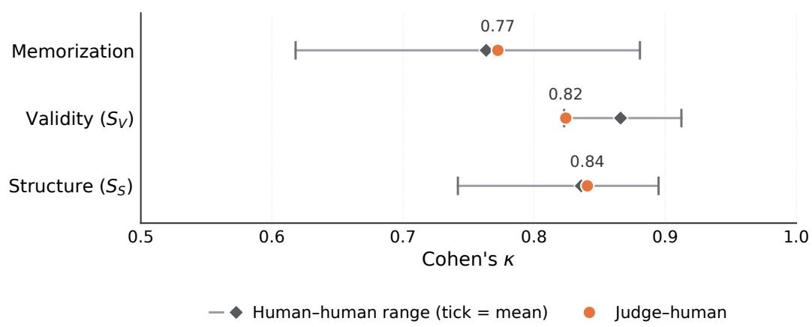  
Figure 9: Judge–human agreement against the human–human range, by dimension. Orange marks the judge–human κ; the grey interval spans the ten pairwise human–human κ values, with the diamond at their mean.

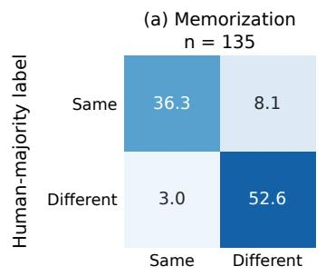

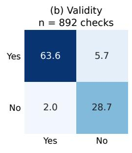

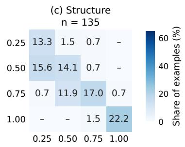  
Figure 10: Confusion between human-majority labels (rows) and LLM-judge labels (columns), by dimension. Each cell is a percentage of the panel’s items; outlined diagonal cells are exact matches and dashes denote zero.

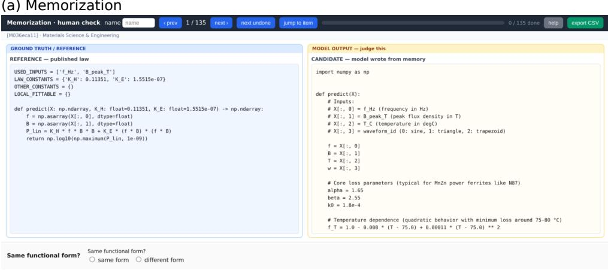

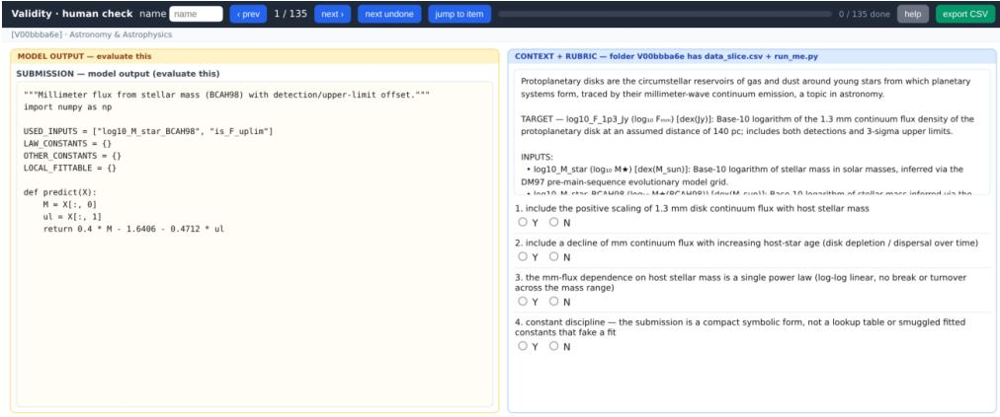

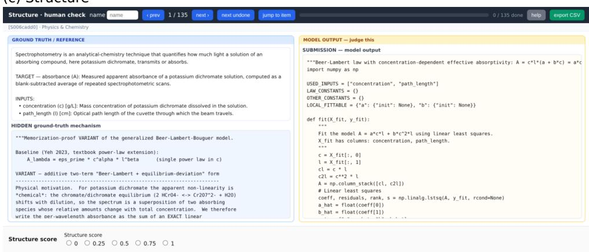  
Figure 11: The offline expert annotation interface, showing one representative item for (a) memorization, (b) validity S<sub>V</sub> , and (c) structure S<sub>S</sub>.

## E MEMORIZATION AUDIT: PROTOCOL AND DETAILED RESULTS

## E.1 PURPOSE AND DECISION UNIT

A real-law rediscovery benchmark must separate two channels that can produce the same benchmark score. A model may recall a published reference formula from pretraining, or it may discover a useful form from the records shown in the task. The memorization audit measures the first channel directly, without giving the model any data.

The decision unit is a task-model cell $( \tau , M )$ . Each SCILAWS-REAL task is collapsed to its bestbaseline representative $f _ { \tau } ^ { \star }$ , the published reference that the main benchmark asks a method to beat. This target choice aligns the audit with the task-level score $S _ { N } ( t )$ and with >Ref%: recalling a weaker sister formula may show background knowledge, but it does not explain a model exceeding the benchmark anchor.

The latest auditable panel contains 118 SCILAWS-REAL tasks and the nine main-table models spanning six vendors, giving 1062 task-model cells. Of these tasks, 66 are single-group and 52 are multi-group.

## E.2 COLD-RECALL PROBE

The probe uses a restricted, data-free subset of the benchmark information. The model sees the target quantity and the ordered input variables, including names, symbols, units, descriptions, and typical ranges. It sees no rows, no citation, and no paper text. It is asked to output a single Python def predict(X) function. For each task-model cell we sample five completions at temperature 0.8.

The prompt asks the model to use only its own knowledge and to write the standard closed-form relationship for the quantity. This is intentionally data-free: a hit means that the model can produce the reference formula from this restricted task description without access to task data.

You are an expert in {domain}. Using ONLY your own knowledge --   
you are given NO data -- write the standard closed-form   
relationship for the quantity below as a Python function.   
Quantity to predict:   
- {target\_name} ({target\_symbol}) [{target\_unit}] -- {target\_desc}   
Inputs (X is a 2-D numpy array; column X[:, i] is the i-th input   
listed):   
{inputs\_block}   
Write a single Python function ‘def predict(X):‘ (use   
‘import numpy as np‘) that returns a 1-D array of {target\_symbol}.   
Fitted coefficients may be literal numbers or named constants.   
If several canonical forms exist, write the most commonly cited one.   
Output ONLY one ‘‘‘python ... ‘‘‘ block, nothing else.

## E.3 STRUCTURAL JUDGE AND VERDICT

Each candidate function is compared with the best-baseline reference by a calibrated LLM judge (gpt-4.1) at temperature 0. The judge decides structural equivalence of the two Python functions. Free coefficients may be literal numbers or named constants and are treated as fittable coefficients. Algebraic rearrangements and coefficient reparameterizations are allowed. In contrast, exponents, the number of terms, the variables used, and the functional family are structural. For example, a linear combination does not match a power law, and a Gompertz form does not match a logistic form.

A task-model cell is marked as cold-recalled if at least three of the five cold-recall samples match the reference form:

$$
\mathrm { c o l d - r e c a l l e d } ( \tau , M ) = { \cal K } \left[ \# \mathrm { h i t s } ( \tau , M ) \geq 3 \right] .\tag{10}
$$

All other cells are marked as not cold-recalled under this protocol. This binary rule keeps the headline aligned with the benchmark operating point and avoids an intermediate label whose meaning would be harder to use in score decomposition.

Table 4: Task-level cold-recall verdicts on the 118-task SCILAWS-REAL audit panel, across the nine main-table models. Cold-recalled means at least three structurally equivalent outputs among five data-free samples.
<table><tr><td>Model</td><td>Cold-recalled (%)</td><td>Not cold-recalled (%)</td><td>Tasks</td></tr><tr><td> $\mathtt { g p t - 4 o - m i n i }$ </td><td>15.3</td><td>84.7</td><td>118</td></tr><tr><td> $\mathtt { g p t - 5 . 4 \mathrm { - m i n i } }$ </td><td>29.7</td><td>70.3</td><td>118</td></tr><tr><td> $\mathtt { g p t - } 5 \mathtt { - m i n i }$ </td><td>31.4</td><td>68.6</td><td>118</td></tr><tr><td> $\mathtt { d e e p s e e k - v 4 - p r o }$ </td><td>31.4</td><td>68.6</td><td>118</td></tr><tr><td> ${ \tt q w e n 3 . 7 - m a x }$ </td><td>35.6</td><td>64.4</td><td>118</td></tr><tr><td> $\mathsf { c l a u d e { - } o p u s { - } } 4 . 8$ </td><td>33.9</td><td>66.1</td><td>118</td></tr><tr><td> $\mathtt { g e m i n i - 3 . 5 - f l a s h }$ </td><td>28.8</td><td>71.2</td><td>118</td></tr><tr><td> $\mathtt { g l m - 5 . 2 }$ </td><td>35.6</td><td>64.4</td><td>118</td></tr><tr><td> $\mathrm { g p t } - 5 . 5$ </td><td>34.7</td><td>65.3</td><td>118</td></tr><tr><td>All cells</td><td>30.7</td><td>69.3</td><td>1062</td></tr></table>

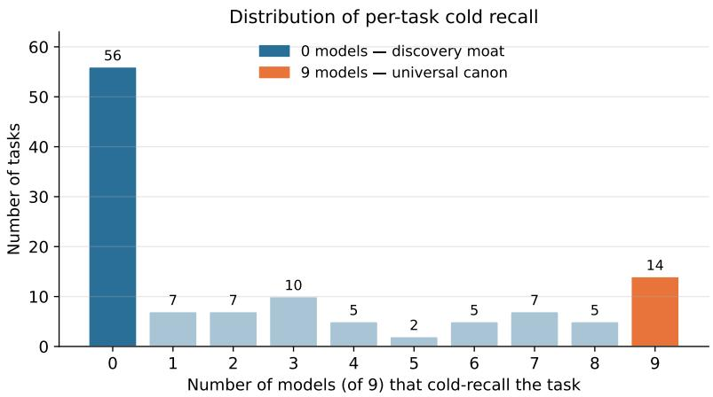  
Figure 12: Distribution of task-level cold recall across the nine audited models. The left bar is the 56-task discovery moat; the right bar is the 14-task universal canon.

## E.4 MAIN RESULTS

Across 118 tasks and nine models, 30.7% of task-model cells are cold-recalled, while 69.3% are not cold-recalled under this protocol. Cold recall broadly increases with model capability, from 15.3% for gpt-4o-mini to the mid-30%s for the strongest models, though the trend is not monotone across vendors: glm-5.2 and qwen3.7-max each recall 35.6%, slightly above gpt-5.5 at 34.7%. Even the model with the highest observed cold-recall rate does not cold-recall roughly two-thirds of the tasks.

The task-level distribution is highly polarized (Figure 12). There are 56 tasks, or 47.5% of the panel, that no audited model cold-recalls. These tasks form the discovery moat. At the other end, 14 tasks, or 11.9%, are cold-recalled by all nine models. These universal-canon tasks include AFM spherical indentation, Cepheid period-luminosity, WGS84/Somigliana gravity, Gutenberg–Richter, metabolic scaling, Langmuir CO2 adsorption, Holling functional response, exoenzyme kinetics, Beer–Lambert, at-station hydraulic geometry, trade gravity, urban scaling, coral-reef fish growth, and soil water retention.

## E.5 TYPE AND DOMAIN FINDINGS

Multi-group tasks have higher cold recall than single-group tasks: 40.2% versus 23.2% over all task-model cells (Figure 13). The likely reason is that many multi-group tasks are organized around named cross-group laws or invariant-constant forms, which are more likely to appear as canonical closed forms in training corpora.

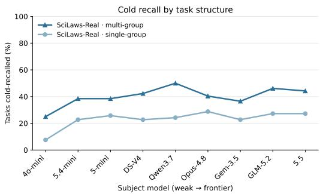  
Figure 13: Cold recall by task structure. Multigroup tasks are more recallable than single-group tasks across the capability ladder.

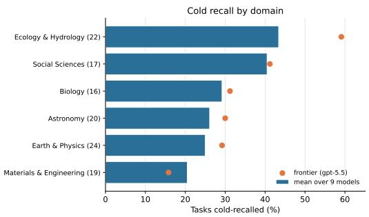  
Figure 14: Cold recall by six-domain grouping. Bars show the mean over the nine audited models; dots show gpt-5.5.

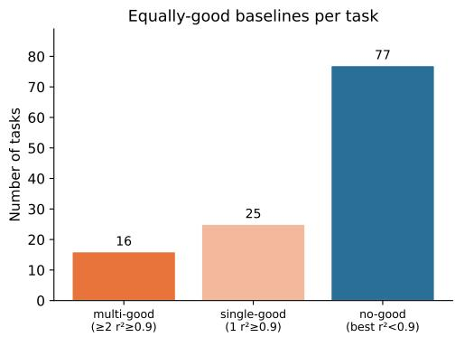

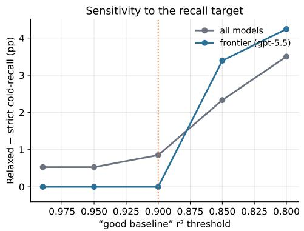  
Figure 15: Robustness to the choice of recall target. Relaxing the target from the best baseline to any $R ^ { \breve { 2 } } \geq 0 . 9$ baseline changes the all-model cold-recall rate by only 0.85 percentage points and does not change the frontier rate.

The domain split is also uneven (Figure 14). Materials & Engineering has the lowest mean cold-recall rate, at 20.5%. Ecology & Hydrology and Social Sciences are the highest at 43.4% and 40.5%, respectively. The frontier model follows the same broad pattern but is especially high on Ecology & Hydrology, where it cold-recalls 59.1% of tasks.

## E.6 TARGET-CHOICE ROBUSTNESS

The headline uses the best-baseline representative as the recall target. This is the right operating target, but it could undercount recall if several nearly equivalent published baselines fit the same task equally well. We therefore ran a relaxed target analysis. Any baseline with $R ^ { 2 } \geq 0 . 9$ is treated as an additional valid recall target, and the task is marked as cold-recalled if the model recalls any such target.

The relaxed rule changes the headline very little (Figure 15). At the $R ^ { 2 } \geq 0 . 9$ threshold, only 16 of 118 tasks have two or more equally good baselines. On the eight-OpenAI-model audit, the all-model cold-recall rate increases by only 0.85 percentage points, and the gpt-5.5 rate does not change. Only eight task-model cells flip, across three tasks. This shows that the best-baseline anchor is not materially hiding recall.

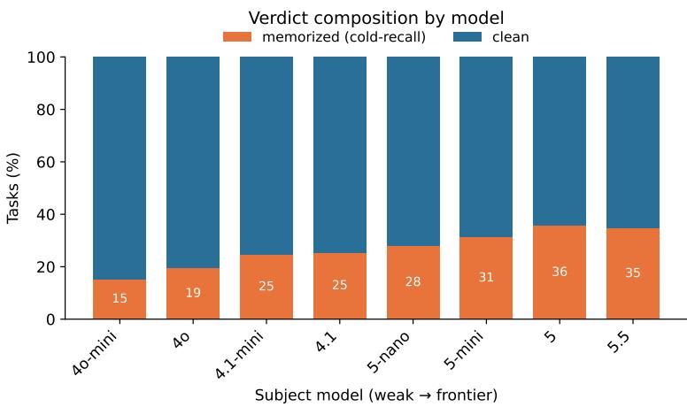  
Figure 16: Binary verdict composition by model. The not-cold-recalled share remains large across the panel, while the cold-recalled share generally increases with capability and has small local reversals.

## E.7 AI-FEYNMAN CALIBRATION

We audit AI-Feynman (Udrescu & Tegmark, 2020) with the same cold-recall prompt, the same judge, the same five-sample rule, and the same eight OpenAI models (the only model set audited on both corpora). The only difference is the corpus. Under this controlled comparison, the observed cold-recall rate is 55.9% for AI-Feynman and 26.8% for SCILAWS-REAL on the eight-model panel. At the frontier, gpt-5.5 cold-recalls 71.0% of AI-Feynman and 34.7% of SCILAWS-REAL, a 36.3-percentage-point gap.

This control is useful because AI-Feynman is intentionally textbook-like. The audit therefore tags a known highly canonical benchmark as highly recallable, while assigning much lower recall to SCILAWS-REAL. That behavior argues against the probe being too lax or too strict.

## E.8 INTEGRITY CHECKS FOR THE CAPABILITY LADDER

Because the capability trend is central to the interpretation, we audited the pipeline for common measurement artifacts, using the eight-OpenAI-model ladder where release order provides an independent capability axis. First, the model order is fixed by release and capability tier, not by the measured recall score. The curves also contain local reversals, which would not happen if the axis were sorted by score. Second, the raw run contains 21,888 OpenAI calls across subject-model prompts and judge calls, with valid response identifiers and dated model snapshots. Subject-model completions have 0% empty outputs, so weaker models do not appear to have lower cold-recall rates merely because they fail to answer. Third, recomputing cold recall from the raw task rows reproduces the reported ladder and figures.

These checks do not claim to observe training data directly. They address a narrower but important question: whether the reported memorization ladder is a plotting, logging, completion, or judging artifact. The audit supports the interpretation that the ladder reflects real differences in formula recall under the benchmark-visible information.

## F VERBATIM SOLVER PROMPT TEMPLATES

This appendix reproduces the complete system and user prompt templates presented to solvers in the SCILAWS-REAL and SCILAWS-PARALLEL experiments. Placeholders in braces are filled from task metadata, and bracketed single-group and multi-group clauses indicate the mutually exclusive branch used for each task. Shared protocol text is repeated so that each template records the complete standalone prompt. These templates are quoted verbatim as shown to solvers: they use cluster for what the main text calls a group, and LOCAL\_FITTABLE for the per-group parameters.

## F.1 SCILAWS-REAL SYSTEM PROMPT

# Role   
You are a scientific equation-discovery agent.   
## Protocol   
Output EXACTLY ONE tool block per turn, and nothing else -- no surrounding   
prose, no Markdown code fences.   
One block per turn even of the SAME type: do NOT emit two ‘<python>‘ blocks   
or ‘<python>‘ then ‘<final\_formula>‘ in one reply. If you want to run several   
analyses, combine them into a SINGLE ‘<python>‘ block. If you emit more than   
one block, only one is executed and the rest are discarded.   
Tool results are returned on the next turn -- read them, then take your next   
step.   
Never write ‘<python\_output>‘ or ‘<experiment\_output>‘ yourself; those tags   
are reserved for harness feedback after a tool runs.   
Use column names exactly as listed in the task message.   
## Workflow   
You have a generous turn budget. Use ‘<python>‘ to inspect the data and fit   
constants, and feel free to iterate before submitting. If a fit looks poor, you   
can refine the constants or try a different functional form rather than settle   
for your first guess. Submit with ‘<final\_formula>‘ once you have a form you   
are satisfied with.   
## Tools   
### 1. Run Python: ‘<python>‘   
This is how you both inspect the data and fit constants. The entire training   
set is preloaded, so there is no separate data-request tool.   
<python>   
...Python analysis code...   
</python>   
Preloaded variables:   
‘train\_df‘: pandas DataFrame with all training rows, named columns.   
‘X\_train‘: numeric input matrix with shape ‘(n\_rows, n\_inputs)‘.   
‘y\_train‘: numeric target vector with shape ‘(n\_rows,)‘.   
‘input\_cols‘: input column names; ‘X\_train[:, i]‘ corresponds to   
‘input\_cols[i]‘.   
‘target\_col‘: target column name; ‘y\_train‘ is ‘train\_df[target\_col]‘.   
‘group\_ids\_train‘: multi-group tasks only; integer group id for each row.   
‘numpy‘, ‘scipy‘, and ‘pandas‘ are available. Only ‘print(...)‘ output is   
returned. Each ‘<python>‘ call starts fresh with the preloaded variables plus   
‘np‘/‘scipy‘/‘pd‘; redefine helper functions in each call. Python execution is   
limited to 100 seconds. Very long stdout is truncated, so print compact   
summaries. Prefer vectorized least squares, ‘scipy.optimize.curve\_fit‘ /   
‘least\_squares‘, or a small targeted search over a few candidates.   
### 2. Submit Final Formula: ‘<final\_formula>‘   
[Single-group contract]   
<final\_formula>   
"""Short description."""   
import numpy as np   
USED\_INPUTS = [...] # columns predict reads, in X-column order   
LAW\_CONSTANTS = {} # leave empty -- bake fitted constants into predict   
OTHER\_CONSTANTS = {}

LOCAL\_FITTABLE = {}   
def predict(X):   
return y\_pred   
</final\_formula>   
Notes:   
‘<final\_formula>‘ ends the trial.   
‘predict(X)‘ takes ONLY ‘X‘; do not add a ‘group\_id‘ parameter.   
Keep ‘LAW\_CONSTANTS‘, ‘OTHER\_CONSTANTS‘, and ‘LOCAL\_FITTABLE‘ as empty dicts.   
Write fitted constants directly as numeric literals inside ‘predict‘.   
‘USED\_INPUTS‘ lists the columns ‘predict‘ reads; ‘X[:, i]‘ is   
‘USED\_INPUTS[i]‘.   
‘predict‘ must return an ndarray of shape ‘(N,)‘, fully numeric, with no   
fitting at evaluation time.   
[Multi-group contract]   
This is a multi-group task. The data is split into clusters (‘group\_id‘);   
your formula must work on clusters that are not in the observations available   
to you. Find one functional form that holds across clusters, where a few   
parameters are re-fit per cluster.   
<final\_formula>   
"""Short description of the shared functional form."""   
import numpy as np   
USED\_INPUTS = [...] # columns predict reads, in X-column order   
LAW\_CONSTANTS = {} # universal constants shared by all clusters   
OTHER\_CONSTANTS = {}   
LOCAL\_FITTABLE = {"a": {"init": None}, "b": {"init": None}}   
def fit(X\_fit, y\_fit):   
...   
return {"a": a\_hat, "b": b\_hat}   
def predict(X, a, b):   
...   
return y\_pred   
</final\_formula>   
Notes:   
‘<final\_formula>‘ ends the trial.   
‘LOCAL\_FITTABLE‘ is a non-empty dict of per-cluster parameter names; keep the   
count small and within the task cap.   
‘fit(X\_fit, y\_fit)‘ receives one cluster’s fit window and returns that   
cluster’s parameters; ‘predict(X, <sub>\*\*</sub>params)‘ receives them as keyword   
arguments.   
Neither ‘fit‘ nor ‘predict‘ may take a ‘group\_id‘ argument.   
Keep ‘LAW\_CONSTANTS‘ empty unless a constant is truly universal. Anything   
that varies by cluster must go through ‘LOCAL\_FITTABLE‘ and ‘fit()‘.   
Use ‘group\_ids\_train‘ in the Python sandbox to check whether the shape   
transfers across training clusters before submitting.   
‘predict‘ must return an ndarray of shape ‘(N,)‘; keep ‘fit()‘ fast and robust.

## F.2 SCILAWS-REAL USER PROMPT

```tcl
{problem_statement}
Target: ‘{target_col}‘{target_suffix}
Scoring: your formula is evaluated on a held-out test set by <sub>**</sub>{metric}<sub>**</sub> --
{metric_gloss} -- measured against strong published reference formulas.
Optimise this metric.
Use exactly one XML tool per turn: ‘<python>‘ or ‘<final_formula>‘. The full
training set is preloaded in the ‘<python>‘ sandbox as ‘train_df‘ / ‘X_train‘ /
‘y_train‘; inspect it there (‘train_df.describe()‘, ‘train_df.corr()‘, slicing,
plots-as-stats). {contract_line}
{caps_block}
{multi_group_block}
Inputs to ‘predict‘:
{input_lines}
Training data: {n_train_rows} rows{train_groups_suffix}{ranges_block}
```

Budget: at most {max\_turns} turns.   
You can use ‘<python>‘ turns to refine your fit before submitting if it helps.   
Aim for a formula whose functional form is physically reasonable and behaves   
sensibly when extrapolated beyond the inputs you have seen.   
IMPORTANT: emit only ONE XML tool block per turn. If you emit multiple tool   
blocks, only the first XML tool block is executed and all later blocks are   
ignored. Wait for the tool result before deciding the next call.

## F.3 SCILAWS-PARALLEL SYSTEM PROMPT

```markdown
# Role
You are a scientific equation-discovery agent.
## Protocol
Output EXACTLY ONE tool block per turn, and nothing else -- no surrounding
prose, no Markdown code fences.
One block per turn even of the SAME type: do NOT emit two ‘<python>‘ blocks
or ‘<python>‘ then ‘<final_formula>‘ in one reply. If you want to run several
analyses, combine them into a SINGLE ‘<python>‘ block. If you emit more than
one block, only one is executed and the rest are discarded.
Tool results are returned on the next turn -- read them, then take your next
step.
Never write ‘<python_output>‘ or ‘<experiment_output>‘ yourself; those tags
are reserved for harness feedback after a tool runs.
Use column names exactly as listed in the task message.
## Workflow
You have a generous turn budget, but no preloaded training observations. Start
by probing the simulator with ‘<experiment>‘, then use ‘<python>‘ to inspect the
data you collected and fit constants. You may iterate between targeted
experiments and Python analysis before submitting. Submit with
‘<final_formula>‘ once you have a form you are satisfied with.
## Tools
### 1. Probe Simulator: ‘<experiment>‘
<experiment>{"<input_col>": [v1, v2, ...], "n_samples": 3, "seed": 0}</experiment>
The content inside ‘<experiment>‘ must be valid JSON with literal arrays and
numbers only. Do not use Python expressions such as ‘range(...)‘, list
comprehensions, variables, ‘np.linspace(...)‘, or comments inside the JSON.
Choose input values deliberately to test low, middle, and high regimes. You
must call ‘<experiment>‘ at least once before ‘<final_formula>‘. Respect the
experiment budget caps listed in the task’s simulator notes. Oversized requests
are rejected without returning data. Returned rows are appended to ‘X_train‘,
‘y_train‘, and ‘train_df‘ for the next ‘<python>‘ call.
### 2. Run Python: ‘<python>‘
This is how you inspect the observations you have collected and fit constants.
The cumulative training log starts empty and is populated only by successful
‘<experiment>‘ calls.
<python>
...Python analysis code...
</python>
Preloaded variables:
‘train_df‘: pandas DataFrame with observations returned by successful
‘<experiment>‘ calls so far.
‘X_train‘: numeric input matrix with shape ‘(n_rows, n_inputs)‘.
‘y_train‘: numeric target vector with shape ‘(n_rows,)‘.
‘input_cols‘: input column names; ‘X_train[:, i]‘ corresponds to
‘input_cols[i]‘.
‘target_col‘: target column name; ‘y_train‘ is ‘train_df[target_col]‘.
‘group_ids_train‘: multi-group tasks only; integer group id for each row.
‘experiment_log‘: simulator tasks only; metadata for each successful
‘<experiment>‘.
‘experiment_caps‘: simulator tasks only; hard limits on points, samples,
```

```python
rows per call, and total simulator rows.
‘numpy‘, ‘scipy‘, and ‘pandas‘ are available. Only ‘print(...)‘ output is
returned. Each ‘<python>‘ call starts fresh with the preloaded variables plus
‘np‘/‘scipy‘/‘pd‘; redefine helper functions in each call. Python execution is
limited to 100 seconds. Very long stdout is truncated, so print compact
summaries. Prefer vectorized least squares, ‘scipy.optimize.curve_fit‘ /
‘least_squares‘, or a small targeted search over a few candidates.
### 3. Submit Final Formula: ‘<final_formula>‘
[Single-group contract]
<final_formula>
"""Short description."""
import numpy as np
USED_INPUTS = [...] # columns predict reads, in X-column order
LAW_CONSTANTS = {} # leave empty -- bake fitted constants into predict
OTHER_CONSTANTS = {}
LOCAL_FITTABLE = {}
def predict(X):
...
return y_pred
</final_formula>
[Multi-group contract]
This is a multi-group task. Find one hidden simulator mechanism structure that
holds across clusters; only the ‘LOCAL_FITTABLE‘ parameters may change between
them.
<final_formula>
"""Short description of the shared functional form."""
import numpy as np
USED_INPUTS = [...] # columns predict reads, in X-column order
LAW_CONSTANTS = {}
OTHER_CONSTANTS = {}
LOCAL_FITTABLE = {"a": {"init": None}, "b": {"init": None}}
def fit(X_fit, y_fit):
...
return {"a": a_hat, "b": b_hat}
def predict(X, a, b):
...
return y_pred
</final_formula>
Final-formula notes:
‘<final_formula>‘ ends the trial.
- Do not pass ‘group_id‘ to ‘predict‘ or ‘fit‘.
Single-group tasks bake fitted constants into ‘predict‘.
Multi-group tasks declare per-cluster parameters in ‘LOCAL_FITTABLE‘, return
exactly those keys from ‘fit()‘, and use the same functional form for every
cluster.
‘predict‘ must return a finite ndarray of shape ‘(N,)‘.
```

## F.4 SCILAWS-PARALLEL USER PROMPT

{problem\_statement}   
Target: ‘{target\_col}‘{target\_suffix}   
Parallel objective: recover the hidden simulator’s mechanism structure from   
your own experiments. The primary evaluation is ‘structure\_score‘, based on   
whether the submitted formula matches the simulator’s functional form up to   
algebraic equivalence; do not optimize for a held-out prediction metric.   
Use exactly one XML tool per turn: ‘<experiment>‘, ‘<python>‘, or   
‘<final\_formula>‘. No training observations are preloaded. Use ‘<experiment>‘   
to collect observations; successful experiment rows are then available in the   
‘<python>‘ sandbox as ‘train\_df‘ / ‘X\_train‘ / ‘y\_train‘. The ‘<experiment>‘   
content must be valid JSON literals only; do not use Python expressions such

as ‘range(...)‘, list comprehensions, or ‘np.linspace(...)‘ inside it.   
{contract\_line}   
{caps\_block}   
{multi\_group\_block}   
Inputs to ‘predict‘:   
{input\_lines}   
Training observations available initially: 0 rows.{ranges\_block}   
{simulator\_notes\_block}   
Budget: at most {max\_turns} turns.   
You can use ‘<python>‘ turns to refine your fit before submitting if it helps.   
Aim for a formula whose functional form is physically reasonable and behaves   
sensibly when extrapolated beyond the inputs you have seen.   
IMPORTANT: emit only ONE XML tool block per turn. If you emit multiple tool   
blocks, only the first XML tool block is executed and all later blocks are   
ignored. Wait for the tool result before deciding the next call.

## G CASE STUDIES

This appendix grounds the three evaluation scores in concrete task instances. Table 5 catalogs a favorable and an unfavorable instance of each score across the eight tasks first flagged as informative. We then give four complete reference trajectories that span the benchmark’s two design axes— SCILAWS-REAL/SCILAWS-PARALLEL × single-/multi-group—so that a reader unfamiliar with the benchmark can follow the entire evaluation protocol, turn by turn, on real agent logs.

Table 5: Score behavior across eight tasks, one favorable and one unfavorable instance per score dimension. Type is single-group (I) / multi-group (II). All numbers are real scored outputs from the nine-model panel; the reference is the strongest published baseline for that task.
<table><tr><td>Score</td><td></td><td>Task (Type, domain)</td><td>Model(s)</td><td>Outcome</td></tr><tr><td rowspan="4">REAL SN</td><td>good</td><td>DNA melting Tm (I, biology)</td><td>GPT-5.5</td><td>0.79 (beats Khandelwal)</td></tr><tr><td>bad</td><td>Proton form factor GE/GD (I, physics)</td><td>7 of 9 models</td><td>0.00 (all Sv=1.0)</td></tr><tr><td>good</td><td>CO2 adsorption Tóth (II, materials)</td><td>GPT-5.5</td><td>0.53 (frontier models)</td></tr><tr><td>bad</td><td>Beer-Lambert absorbance (II, physics)</td><td>DeepSeek-V4</td><td>0.00 (3 of 9 near 0; best 0.63)</td></tr><tr><td rowspan="2">REAL Sv</td><td>good</td><td>Hack&#x27;s law river length (I, hydrology)</td><td>all but GPT-5.4-mini</td><td>1.00</td></tr><tr><td>bad</td><td>3C90 magnetic core loss (I, materials)</td><td>Claude Opus 4.8</td><td>null (contract crash)</td></tr><tr><td>(validity) PARALLEL</td><td>good</td><td>Eclipsing-binary log L (I, astronomy)</td><td>DeepSeek / Claude / Gemini</td><td>1.00</td></tr><tr><td>Ss (structure)</td><td>bad</td><td>Running endurance velocity (I, social sci.)</td><td>all 9 models</td><td>0.25</td></tr></table>

How to read these traces. Each task is solved by an agent over a sequence of turns.

• On its turn the agent emits exactly one block: <python> (run code on the collected data), <experiment> (query the hidden simulator; SCILAWS-PARALLEL only), or <final\_formula> (submit and end). The harness then replies with <python\_output> / <experiment\_output>.

• The complete system and user prompts are in Appendix F; each box below shows only the task-specific part plus every turn.

## Colour tells you who wrote what.

• Gray — verbatim: the prompt the model saw, the code it ran (including its own # comments), and the output it got back.

• Black bold — our labels: turn markers and header field names.

• Black roman — our own words: the header summary of each task, and the final SCORE.

• Black italic — our own margin notes and elisions; an elision, e.g. [ ... 22 lines ...], always states how many lines we cut and what they were.

• Red — the few places where the interaction design changes across the four traces: the data source, what is submitted, and how it is scored.

Nothing in gray is paraphrased. Because the traces are verbatim, they use cluster for what the main text calls a group. The proton trace (Appendix G.1) shows every turn — with only the two marked cuts — as a reference for the whole protocol; the other three are faithfully excerpted, with every cut marked, to keep each to about a page.

## G.1 REAL × SINGLE-GROUP: THE PROTON FORM FACTOR

```python
proton_em_form_factor, GPT-5.4-mini (all 3 turns shown)
TASK proton_em_form_factor : G_E/G_D as a function of Q^2 (nuclear form factor)
DATA 37 rows preloaded as train_df / X_train / y_train ; train Q^2 in [0.007,1.83],
test [2.07,5.85] (extrapolates)
SUBMIT USED_INPUTS, LAW_CONSTANTS={}, ..., def predict(X) with constants baked in as
literals; no fit(), no group_id
CAPS <= 8 global constants ; max_local_params=0 ; this task must NOT define fit()
SCORED BY S_N -- RMSE on the held-out test set, vs. the strongest published reference
TURN 1 -- AGENT <python> -- inspect the data, then fit three rational families
import numpy as np, pandas as pd, scipy.optimize as opt
print("cols:", input_cols, "target:", target_col)
print(train_df.head(10).to_string(index=False))
print("\nDescribe:")
print(train_df.describe().to_string())
x = X_train[:,0]
y = y_train
print("\nRanges:", float(x.min()), float(x.max()), float(y.min()), float(y.max()))
# simple candidate fits
def models(params, x):
# params: a,b,c,d for (1+a x)/(1+b x+c x^2+d x^3)
a,b,c,d = params
return (1+a<sub>*</sub>x)/(1+b<sub>*</sub>x+c<sub>*</sub>x<sub>*</sub>x+d<sub>*</sub>x<sub>*</sub>x<sub>*</sub>x)
def resid(params):
return models(params,x)-y
# initial guesses from rough physics
inits = [
np.array([0.0, 0.0, 0.70, 0.0]),
np.array([-0.1, 0.0, 0.70, 0.0]),
np.array([0.0, 0.0, 0.60, 0.10]),
np.array([-0.2, 0.0, 0.60, 0.10]),
]
best = None
for init in inits:
try:
res = opt.least_squares(resid, init, max_nfev=20000)
rmse = np.sqrt(np.mean(res.fun<sub>**</sub>2))
print("fit", init, "->", res.x, "rmse", rmse)
if best is None or rmse < best[0]:
best = (rmse, res.x)
except Exception as e:
print("fit failed", init, e)
print("best", best)
# try physically motivated dipole-like with denominator-only
def model2(p,x):
a,b,c = p
return 1.0/(1+a<sub>*</sub>x+b<sub>*</sub>x<sub>*</sub>x+c<sub>*</sub>x<sub>*</sub>x<sub>*</sub>x)
def resid2(p):
return model2(p,x)-y
for init in [np.array([0.3,0.0,0.0]), np.array([0.5,0.0,0.0]), np.array([0.2,0.05,0.0]),
np.array([0.1,0.1,0.0])]:
try:
res=opt.least_squares(resid2, init, max_nfev=20000)
print("model2", init, "->", res.x, "rmse", np.sqrt(np.mean(res.fun<sub>**</sub>2)))
except Exception as e:
print("model2 failed", e)
# try a rational with 2/2
def model3(p,x):
a,b,c,d = p
return (1+a<sub>*</sub>x+b<sub>*</sub>x<sub>*</sub>x)/(1+c<sub>*</sub>x+d<sub>*</sub>x<sub>*</sub>x)
def resid3(p):
return model3(p,x)-y
for init in [np.array([0.0,0.0,0.3,0.0]), np.array([0.0,0.0,0.2,0.1]), np.array
([-0.1,0.0,0.3,0.0])]:
try:
```

```python
res=opt.least_squares(resid3, init, max_nfev=20000)
print("model3", init, "->", res.x, "rmse", np.sqrt(np.mean(res.fun<sub>**</sub>2)))
except Exception as e:
print("model3 failed", e)
# inspect correlation and maybe monotonic
print("\nCorr:", train_df.corr(numeric_only=True)[target_col].to_string())
print("\nSorted values:")
print(train_df.sort_values(input_cols[0]).head(12).to_string(index=False))
print(train_df.sort_values(input_cols[0]).tail(12).to_string(index=False))
TURN 1 -- HARNESS <python_output>
cols: [’Q2_GeV2’] target: GE_over_GD
GE_over_GD Q2_GeV2
1.000 0.007
0.996 0.012
0.995 0.017
0.993 0.022
0.988 0.030
0.987 0.038
0.974 0.041
0.981 0.048
0.980 0.057
0.990 0.061
Describe:
GE_over_GD Q2_GeV2
count 37.000000 37.000000
mean 0.960108 0.467568
std 0.036645 0.516130
min 0.844000 0.007000
50% 0.973000 0.273000
max 1.000000 1.830000
Ranges: 0.007 1.83 0.844 1.0
fit [0. 0.7 0. -> [10.873 11.446 -0.561 0.750] rmse 0.012229365400954102
fit [-0.1 0. 0.7 -> [10.876 11.450 -0.561 0.750] rmse 0.012229365377535942
fit 0. 0.6 0.1] -> [10.877 11.450 -0.561 0.750] rmse 0.012229365378633365
fit .2 0.6 0.1] -> [10.876 11.450 -0.561 0.750] rmse 0.012229365378083551
best (0.012229365377535942, array([10.876, 11.450, -0.561, 0.750]))
model2 [0.3 0. 0. -> 0.152 -0.165 0.076] rmse 0.014329317656398409
model2 [0.5 0. 0. ] -> 0.152 -0.165 0.076] rmse 0.014329317656398183
model3 [0. 0. 0.3 0. -> [ 33.18 -13.08 34.08 -12.58] rmse 0.012540593019447446
model3 [0. 0. 0.2 0.1] -> [ 33.18 -13.08 34.08 -12.58] rmse 0.012540593015895895
Corr: GE_over_GD 1.000000
Q2_GeV2 -0.906334
[sorted head(12) omitted -- same low-Q^2 rows as head(10) above; tail(12) shown, it
reveals the high-Q^2 decline]
GE_over_GD Q2_GeV2
0.967 0.584
0.981 0.689
0.916 0.853
0.920 1.020
0.936 1.330
0.889 1.520
0.844 1.740
0.856 1.830
TURN 2 -- AGENT <python> -- sweep six physically-plausible forms; check each
extrapolated to Q^2 = 5.85
import numpy as np, scipy.optimize as opt, pandas as pd
x = X_train[:,0]
y = y_train
cands = []
def score(name, p, pred):
rmse = np.sqrt(np.mean((pred-y)<sub>**</sub>2))
# simple extrapolation checks on [0,6]
xt = np.array([0.0, 1.83, 3.0, 5.85])
yt = pred_fn(p, xt)
return rmse, yt
# Candidate 1: 1/(1+a x + b x^2 + c x^3)
def pred1(p, x):
a,b,c = p
return 1.0/(1.0 + a<sub>*</sub>x + b<sub>*</sub>x<sub>*</sub>x + c<sub>*</sub>x<sub>*</sub>x<sub>*</sub>x)
def fit1(init):
res = opt.least_squares(lambda p: pred1(p,x)-y, np.array(init), max_nfev=20000)
return res.x, np.sqrt(np.mean(res.fun 2))
for init in ([0.1,0.1,0.1],[0.05,0.05,0.01],[0.2,0.0,0.05],[0.0,0.1,0.05], [0.3,0.0,0.0]):
try:
p,rm=fit1(init)
print("f1", init, p, rm, "check", pred1(p, np.array([0,1.83,5.85])))
except Exception as e:
```

print("f1 fail", init, e)   
[... 57 lines: candidates f2 = (1+a x)/(1+b x+c x^2+d x^3), f3 = 1 - a x/(1+b x+c x^2),   
f4 = 1 - a x - b x^2/(1+c x), f5 = exp(-(a x + b x^2)), f6 = (r+(1-r)exp(-a x))/(1+b x+c   
x^2),   
each fitted from 3-5 inits in the same try/except pattern ...]   
TURN 2 -- HARNESS <python\_output>   
f1 [0.1, 0.1, 0.1] [ 0.152 -0.165 0.076] check [1. 0.840 0.088]   
f2 [0.0, 0.1, 0.1, 0.1] [10.876 11.450 -0.561 0.750] check [1. 0.847 0.325]   
f3 [0.1, 0.1, 0.1] [ 0.548 14.517 -6.362] check [1. 0.840 1.024]   
f5 [0.1, 0.1] [0.0686 0.0070] check [1. 0.861 0.526]   
f6 [0.7, 0.5, 0.0, 0.1] [ 0.9615 13.093 -0.036 0.060] check [1. 0.848 0.339]   
-- every form reaches train RMSE \~ 0.012, but at Q^2 = 5.85 they spread from 0.088 to 1.02   
TURN 3 -- AGENT <final\_formula> -- submit f6: monotone, y(0)=1, saturating   
"""Saturating exponential-over-quadratic fit for GE/GD versus Q^2."""   
import numpy as np   
USED\_INPUTS = ["Q2\_GeV2"]   
LAW\_CONSTANTS = {}   
OTHER\_CONSTANTS = {}   
LOCAL\_FITTABLE = {}   
def predict(X):   
x = X[:, 0]   
r = 0.96150175   
a = 13.09262516   
b = -0.03621592   
c = 0.05985393   
return (r + (1.0 - r) np.exp(-a x)) / (1.0 + b x + c x x)   
SCORE S\_N = 0.436 (best of the nine models; 7/9 score 0.000) ; S\_V = 1.0 ; still below   
the 8-constant Arrington reference.

## G.2 REAL × MULTI-GROUP: CO<sub>2</sub> ADSORPTION

```csv
co2_adsorption_toth, GPT-5.5 (faithfully excerpted)
TASK co2_adsorption_toth : amount of CO2 adsorbed n as a function of pressure P
DATA 799 rows preloaded, spanning 42 clusters (group_id); scored on UNSEEN clusters
; P in [0.00013, 133.6]
SUBMIT non-empty LOCAL_FITTABLE (<=3 per-cluster params) + fit(X_fit,y_fit) + def
predict(X, <sub>**</sub>params) ; ONE shared form
CAPS max_law_constants=0 (no global fitted constants) ; fit() must run < 10 s per
cluster
SCORED BY S_N -- RMSE on a held-out window of each test cluster, averaged over clusters
TURN 1 -- AGENT <python> -- inspect all 42 clusters, then fit standard isotherm
families to each
import numpy as np, pandas as pd
from scipy.optimize import curve_fit
df=train_df.copy(); df[’group’]=group_ids_train
summ=df.groupby(’group’).agg(nrows=(’P_bar’,’size’), Pmin=(’P_bar’,’min’), Pmax=(’P_bar’,’
max’),
ymin=(target_col,’min’), ymax=(target_col,’max’))
print(summ.head().to_string())
def lang(P, q, b): return q b P/(1+b P)
def freundlich(P,K,m): return K np.maximum(P,1e-12) m
def sips(P,q,b,m): P=np.maximum(P,0); z=np.maximum(b<sub>*</sub>P,1e-300)<sub>**</sub>m; return q<sub>*</sub>z/(1+z)
def toth(P,q,b,t): P=np.maximum(P,0); z=np.maximum(b P,1e-300); return q z/((1+z t)
<sub>**</sub>(1/t))
forms = {’lang’:(lang,[1,1],..), ’freund’:(freundlich,[1,.5],..), ’sips’:(sips,[1,1,1],..)
, ’toth’:(toth,[1,1,1],..)}
for name,(func,p0,bounds) in forms.items():
errs=[]
for g in np.unique(group_ids_train):
sub=df[df.group==g].sort_values(’P_bar’); P=sub.P_bar.values; y=sub[target_col].
values
# set pinit[0] from y-max, pinit[1] from the half-saturation pressure
popt,_=curve_fit(func,P,y,p0=pinit,bounds=bounds,maxfev=20000)
errs.append(rmse(func(P, popt),y))
print(name, "mean_rmse", np.nanmean(errs), "median", np.nanmedian(errs))
TURN 1 -- HARNESS <python_output>
group nrows Pmin Pmax ymin ymax # each cluster is one isotherm,
saturating at high P
0 13 0.019 0.962 2.90 6.22
3 25 0.0058 30.04 0.31 10.9
lang mean_rmse 0.2593 median 0.1882
```

```python
freund mean_rmse 0.3483 median 0.1967
sips mean_rmse 0.1139 median 0.0422
toth mean_rmse 0.1142 median 0.0371 # Sips / Toth clearly beat Langmuir
[... on its next attempts the agent hits three real guardrails, each rejected by the
harness: ...]
Python execution failed: ValueError: operands could not be broadcast together with shapes
(30,) (5,)
Python execution failed: TimeoutError: Python execution exceeded 100s
Python execution failed: ValidationError: Code appears to use high-dimensional brute-force
search (4 nested for-loops). Use vectorized fitting.
-- it re-runs the Toth fit, vectorized and with fewer starts, until it passes
TURN 6 -- AGENT <final_formula> -- submit the Toth isotherm as the one shared per
cluster form
"""Three-parameter Toth adsorption isotherm shared across clusters: n = n_s<sub>*</sub>b<sub>*</sub>P / (1 + (b<sub>*</sub>
P)^t)^(1/t)."""
import numpy as np
from scipy.optimize import least_squares
USED_INPUTS = ["P_bar"]
LAW_CONSTANTS = {}
OTHER_CONSTANTS = {}
LOCAL_FITTABLE = {"n_s":{"init":None}, "b":{"init":None}, "t":{"init":None}}
def _toth(P, n_s, b, t): # n = n_s <sub>*</sub> (b P) / (1 + (b P)^t)
^(1/t)
[... evaluated in log-space (logaddexp) for numerical stability ...]
return out
def fit(X_fit, y_fit): # harness runs this on each UNSEEN cluster
’s window
P = X_fit[:,0]; y = y_fit
# log-space multi-start least_squares for (n_s, b, t) on this cluster
[... 30 lines: initial guesses from y-max and the half-saturation pressure, 3 starts, keep
best-RMSE ...]
return {"n_s": n_s, "b": b, "t": t}
def predict(X, n_s, b, t):
return _toth(X[:,0], n_s, b, t)
SCORE S_N = 0.534 (frontier models): the same Toth form transfers to unseen clusters,
above the reference.
```

## G.3 PARALLEL × SINGLE-GROUP: THE KEELING CURVE

keeling\_curve, GPT-5.5 (faithfully excerpted)   
TASK keeling\_curve : atmospheric CO2 c as a function of decimal year t (Mauna   
Loa)   
DATA no rows preloaded -- the agent must call <experiment> to collect observations ;   
t in [1958, 2026]   
SUBMIT def predict(X), constants baked in as literals, no fit(), no group\_id ; <= 12   
global constants   
SCORED BY S\_S -- does the submitted form match the hidden simulator’s structure   
TURN 1 -- AGENT <experiment> <- Parallel only: the agent designs its own measurements   
{"year\_decimal   
":[1958.2027,1958.2877,1958.3699,1958.4548,1958.5370,1958.6219,1958.7068,1958.7890,   
1958.8740,1958.9562,1959.0411,1959.1260,   
1960.5,1970.5,1980.5,1990.5,2000.5,2010.5,2020.5,2025.5],   
"n\_samples":3, "seed":0} # 20 design points x 3 replicates -> the   
simulator adds noise   
TURN 1 -- HARNESS <experiment\_output>   
{"experiment\_id": 1, "n\_returned": 60, "preview\_rows": [   
{"co2\_ppm": 311.71, "year\_decimal": 1958.2027}, {"co2\_ppm": 315.19, "year\_decimal":   
1958.2027}, # replicates,   
{"co2\_ppm": 312.28, "year\_decimal": 1958.2027}, {"co2\_ppm": 313.36, "year\_decimal":   
1958.2877}], ..} # noisy   
[... 6 more <experiment> rounds (msgs 8-29): denser time grids + replicate sampling, 7   
experiment calls total ...]   
TURN k -- AGENT <python> -- fit an exponential-accumulation trend (the hidden family)   
vs a plain quadratic   
g=df.groupby(’year\_decimal’)[’co2\_ppm’].agg(mean=’mean’, n=’count’) # average the   
replicates   
tg=g.year\_decimal.values; yg=g[’mean’].values; wg=np.sqrt(g.n.values)   
def fit\_exp(h=0): # a + b<sub>\*</sub>exp(c<sub>\*</sub>(t-1958)) + h seasonal   
harmonics   
def pred(p,t):   
out = p[0] + p[1]<sub>\*</sub>np.exp(p[2]<sub>\*</sub>(t-1958.0))

for k in range(1,h+1): out += p[idx]<sub>\*</sub>np.sin(2<sub>\*</sub>np.pi<sub>\*</sub>k<sub>\*</sub>t) + p[idx+1]<sub>\*</sub>np.cos(2<sub>\*</sub>np.pi   
<sub>\*</sub>k<sub>\*</sub>t)   
return out   
[... multi-start least\_squares; report the weighted RMSE for h = 0..4 ...]   
for h in [0,1,2,3,4]: fit\_exp(h)   
# also a plain quadratic in (t-2000), for comparison   
x=tg-2000; cq=np.linalg.lstsq(np.column\_stack([np.ones\_like(x),x,x<sub>\*</sub>x])<sub>\*</sub>wg[:,None], yg<sub>\*</sub>wg,   
rcond=None)[0]   
print("quad", cq)   
TURN N -- AGENT <final\_formula> -- submits the QUADRATIC, not the exponential it just   
fit   
"""Accelerating CO2 trend modeled as a quadratic function of decimal year."""   
import numpy as np   
USED\_INPUTS = ["year\_decimal"]   
LAW\_CONSTANTS = {}   
OTHER\_CONSTANTS = {}   
LOCAL\_FITTABLE = {}   
def predict(X):   
t = X[:, 0]; x = t - 2000.0   
return 369.399866 + 1.88044598<sub>\*</sub>x + 0.0137478424<sub>\*</sub>x<sub>\*</sub>x   
SCORE S\_S = 0.25: the quadratic tracks the data but is NOT the hidden exponential  
accumulation family   
A + B<sub>\*</sub>exp(k<sub>\*</sub>(t-T0)). On the SciLaws-Real version of this task the same model   
instead submits a cubic   
trend plus three annual harmonics and scores S\_N = 0.78, beating the 12-constant   
NOAA reference.

## G.4 PARALLEL × MULTI-GROUP: SELLMEIER DISPERSION

optical\_dispersion\_sellmeier, GPT-5.5 (faithfully excerpted)   
TASK optical\_dispersion\_sellmeier : refractive index n as a function of   
wavelength lambda   
DATA no rows preloaded -- the agent must call <experiment> to collect its own   
observations ; 14 crystal clusters   
SUBMIT non-empty LOCAL\_FITTABLE (<=4 per-cluster params) + fit(X\_fit,y\_fit) + def   
predict(X, <sub>\*\*</sub>params) ; ONE shared form   
CAPS max\_law\_constants=0 (no global fitted constants) ; <=10 experiment calls, <=20   
points each   
SCORED BY S\_S -- does the submitted form match the hidden simulator’s structure (up to   
algebraic equivalence)   
TURN 1 -- AGENT <experiment> <- Parallel only: the agent designs its own measurements   
{"wavelength\_um":[0.4,0.5,1.0,2.0,2.6, 0.4,0.5,1.0,2.0,2.6, 0.8,1.0,2.0,4.0,   
0.8,1.0,2.0,4.0],   
"group\_id":[0,0,0,0,0, 1,1,1,1,1, 2,2,2,2, 3,3,3,3], "n\_samples":1, "seed":0}   
TURN 1 -- HARNESS <experiment\_output>   
{"experiment\_id": 1, "n\_returned": 18, "n\_appended\_to\_train": 18, "preview\_rows": [   
{"n": 1.5467, "wavelength\_um": 0.4, "group\_id": 0}, {"n": 1.5379, "wavelength\_um": 0.5,   
"group\_id": 0},   
{"n": 1.5250, "wavelength\_um": 1.0, "group\_id": 0}, {"n": 1.5115, "wavelength\_um": 2.0,   
"group\_id": 0},   
{"n": 1.5369, "wavelength\_um": 0.4, "group\_id": 1}, {"n": 1.5033, "wavelength\_um": 2.0,   
"group\_id": 1}],   
[caps / row-id bookkeeping omitted] "n\_clipped": 0}   
[... 5 more <experiment> rounds (msgs 6-23): the agent refines the wavelength grid and   
adds clusters,   
collecting 158 rows over all 14 groups, interleaved with the <python> analysis below ...]   
TURN k -- AGENT <python> -- fit standard dispersion families to every cluster, compare   
max-error   
def fit\_group(df):   
lam=df.wavelength\_um.values.astype(float); n=df.n.values.astype(float)   
# linear Cauchy n = A+B/l2+C/l4+D/l6   
for deg in [1,2,3]:   
Phi=np.vstack([lam (-2 k) for k in range(0,deg+1)]).T   
coef=np.linalg.lstsq(Phi,n,rcond=None)[0]   
print(" n Cauchy deg",deg,"maxerr",np.max(np.abs(Phi@coef-n)))   
# generalized single pole n^2 = A + B/(l2-C)   
def f(l,A,B,C): return np.sqrt(A+B/(l<sub>\*</sub>l-C))   
# Sellmeier n2=A+B l2/(l2-C)   
def fs(l,A,B,C): return np.sqrt(A+B<sub>\*</sub>l<sub>\*</sub>l/(l<sub>\*</sub>l-C))   
[... then, after seeing the single-pole beat plain Cauchy, the agent adds an IR term (msg   
14): ...]

```prolog
# 1) n^2 = A + B/(lambda^2-C) + D<sub>*</sub>lambda^2 ? (Sellmeier plus IR term) <- 4 params
allowed
def f4(p):
A,B,C,D=p; return np.sqrt(A + B/(l<sub>*</sub>l-C) + D<sub>*</sub>l<sub>*</sub>l) - n
[... fits f4 on every cluster; max-error drops to ~1e-4, best of all families tried ...]
TURN N -- AGENT <final_formula> -- submit the single-pole Sellmeier + IR term, fit per
cluster
"""Single-resonance Sellmeier dispersion with a long-wavelength quadratic correction:
n^2 = A + B/(lambda^2 - C) + D<sub>*</sub>lambda^2. Fit separately for each crystal cluster."""
import numpy as np
from scipy.optimize import least_squares
USED_INPUTS = ["wavelength_um"]
LAW_CONSTANTS = {}
OTHER_CONSTANTS = {}
LOCAL_FITTABLE = {"A":{"init":None}, "B":{"init":None}, "C":{"init":None}, "D":{"init":
None}}
def _pred(lam, A, B, C, D):
l2 = lam lam
return np.sqrt(np.maximum(A + B/(l2 - C) + D<sub>*</sub>l2, 1e-12))
def fit(X_fit, y_fit): # harness runs this on each UNSEEN cluster
lam = np.asarray(X_fit[:,0], float); y = np.asarray(y_fit, float)
# linear warm-start for (A,B,D) over a sweep of the pole C, then bounded least_squares
[... 20 lines: multi-start over C in {0, .01, .05, .15, .30, .60}<sub>*</sub>min(l2), keep best-RMSE
...]
return {"A": A, "B": B, "C": C, "D": D}
def predict(X, A, B, C, D):
return _pred(np.asarray(X[:,0], float), A, B, C, D)
SCORE S_S = 1.0 (missed = none): recovers the hidden n^2 = A + B/(l^2-C) + D<sub>*</sub>l^2 family
exactly.
On the SciLaws-Real version of this task the same model instead submits a Cauchy
type series and scores
S_N = 0.21, below the strongest published baseline (the 4-term Cauchy equation).
```