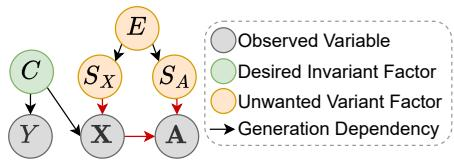
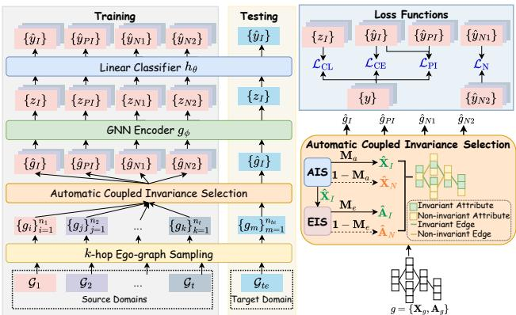
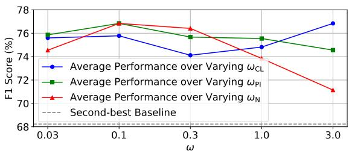
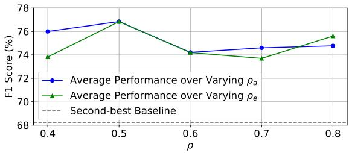

# CATeye: Coupled Atribute–Topology Invariance Learning for Voucher Abuse Detection

Tian Tian tian006@e.ntu.edu.sg Nanyang Technological University Singapore

Yuanhang Hu huyuanhang.hyh@alibaba-inc.com Lazada Inc. Beijing, China

Shuaicheng Niu shuaicheng.niu@ntu.edu.sg Nanyang Technological University Singapore

Dong Li   
shiping@taobao.com   
Alibaba Group   
Hangzhou, Zhejiang, China   
Hao Kuang   
h.kuang@alibaba-inc.com   
Lazada Inc.   
Singapore

Zhiqi Shen zqshen@ntu.edu.sg Nanyang Technological University Singapore

## Abstract

Voucher abuse poses a major challenge in e-commerce, where malicious users exploit promotional vouchers for profit. Unfortunately, fraud patterns evolve rapidly over time and across regions, causing distribution shifts that degrade existing detection models unless retrained frequently. To tackle this, we propose the Coupled Attribute–Topology Invariance Learning framework (CATeye). The key challenge arises from coupled attribute–topology shift, where edges built from attribute proximity cause environmentdriven attribute shift to induce shifted topology, thereby amplify ing variant signals through GNN message passing. CATeye sees through such coupled shifts with two learnable selectors. First, an Attribute Invariance Selector (AIS) learns node-adaptive masks to filter out non-invariant attributes. Then, conditioned on retained invariant attributes, an Edge Invariance Selector (EIS) samples an invariant subgraph and isolates non-invariant edges. Using the resulting invariant and non-invariant components, CATeye constructs multiple views and applies view-specific objectives to emphasize domain-invariant representations while suppressing domain-specific variations. Experiments on both a proprietary dataset from Lazada, a major Southeast Asian e-commerce platform, and a public benchmark show that CATeye consistently outperforms nine strong domain generalization and graph anomaly detection baselines, achieving up to an 8.61% improvement in average F1 score over the strongest baseline. Source code is publicly available at https://github.com/Tian0426/CATeye.

## CCS Concepts

• Computing methodologies → Machine learning algorithms;   
Learning settings; Neural networks.

## Keywords

Graph anomaly detection, Domain generalization, Invariance learning, Voucher abuse detection

ACM Reference Format:   
Tian Tian, Shuaicheng Niu, Hao Kuang, Yuanhang Hu, Dong Li, and Zhiqi Shen. 2026. CATeye: Coupled Attribute–Topology Invariance Learning for Voucher Abuse Detection. In Proceedings of the 35th ACM International Conference on Information andKnowledge Management(CIKM’26), November 07–11, 2026, Rome, Italy. ACM, New York, NY, USA, 8 pages. https://doi.org/ 10.1145/3799682.3840105

## 1 Introduction

E-commerce platforms widely distribute promotional vouchers to acquire users [5, 14], but this creates significant financial risk. Malicious actors register fake accounts to redeem vouchers, purchase goods for resale, or collude with sellers. Such behaviors cause substantial financial losses and undermine fairness for legitimate users, making accurate and robust voucher abuse detection essential.

Voucher abuse often occurs in coordinated groups, where multiple fraudulent accounts share common entities (e.g., devices, emails). Conventional heuristic rules based on shared entities [10] quickly become inefective as abusers adapted their strategies. To overcome the rigidity of heuristics, subsequent machine learning–based methods operate on tabular data extracted from orders to capture statistical and behavioral patterns [2]. However, they miss the essential inter-order relations. To address this, the graph-based VPGNN [30] models inter-order relations with graph neural networks (GNNs). Despite its promising performance, it relies on frequent fine-tuning with labeled data to handle distribution shifts in new time periods or markets, as discussed below.

In practice, voucher abuse is highly dynamic. First, it evolves rapidly over time as abusers continuously adapt to deployed detection models. Emerging methods to bypass detection based on common devices or addresses include using randomized virtual devices and obfuscating delivery addresses. Second, abuse behavior varies substantially across regions. A device type or payment method strongly correlated with abuse in one country may be common among legitimate users in another country. As a result, models trained on a specific time period or country often degrade when applied to new periods or regions unless retrained frequently. In reality, retraining on every new market or campaign cycle is operationally prohibitive given the scale and pace of promotions. These challenges highlight the need for domain generalization (DG), which aims to train models that generalize to unseen target environments without fine-tuning.

  
Figure 1: Illustrative model of graph generation under coupled shifts. Environment � introduces variation into attributes � and structure � via $S _ { X }$ and $S _ { A } ,$ while the invariant factor � drives labels �. The observed � and � are generated through $\{ C , S _ { X } \} \to X$ and $\{ X , S _ { A } \} $ �. Arrows indicate generation dependencies. Mechanisms causing coupled shifts are highlighted in red.

Voucher abuse graphs exhibit coupled attribute-topology shifts that make generalization especially challenging. In voucher graphs, shifts arise in both attributes and structure. For example, certain device types or payment methods correlate with abuse only in specific regions, and coincidental connections emerge from overlapping purchasing behaviors during large-scale promotional campaigns, resulting in variant attributes and connections that harm generalization. Moreover, variant attributes can further induce environmentdependent structural shifts, since edges are constructed from attribute proximity. Under such coupled shifts, GNN message passing propagates variant signals through shift-induced edges, amplifying domain-specific patterns that do not generalize.

This unique coupled shift challenges existing domain generalization methods. To address distribution shift, recent advances in graph DG aim to learn representations that remain invariant across source domains [35]. EERM [32] and CaNet [31] enforce invariance in the embedding space via risk extrapolation on virtual environments or environment estimation. Data-centric approaches such as TRACI [36] enhance cross-domain alignment through topologyaware adversarial perturbations and prototypical mixup. However, these approaches assume that node attributes and graph structure vary independently, or that invariance can be fully enforced in the embedding space. Both assumptions fail under coupled shifts, where non-invariant attributes induce shifted edges that GNN message passing then amplifies. This makes existing methods insufficient for robust generalization in voucher abuse detection. Motivated by this, we explicitly isolate non-invariant attributes and shift-induced edges to learn representations that remain reliable under coupled shifts across time periods and regions.

To this end, we propose Coupled Attribute–Topology Invariance Learning (CATeye) for generalizable voucher abuse detection. It tackles coupled attribute-topology shifts by explicitly isolating invariant context in both node attributes and graph structure. To achieve this, CATeye introduces an Attribute Invariance Selector to predict node-adaptive binary masks to retain invariant attributes, and an Edge Invariance Selector to extract an invariant subgraph conditioned on the selected attributes. It then constructs multiple views with diferent degrees of invariance and performs multi-view learning to emphasize stable predictive signals of voucher abuse while discouraging reliance on non-invariant views. Together, CATeye sees through coupled shifts and achieves zero-shot generalization to unseen domains without fine-tuning.

Our contributions are summarized as follows:

• We identify coupled attribute-topology shifts in voucher abuse detection over time and across regions, and formulate the task under such domain shifts as a graph domain generalization problem. This formulation is realistic and well-aligned with practical deployment requirements, enabling zero-shot inference without retraining as new markets and time periods emerge.

• We propose a novel Coupled Attribute–Topology invariance learning framework (CATeye) that mitigates the unique coupled shifts in voucher abuse graphs. It jointly separates invariant and non-invariant components in both node attributes and graph structure, and learns invariant representations via multi-view objectives.

• We conduct extensive experiments on a real-world voucher abuse detection dataset from Lazada (covering a long time span and two countries in the Southeast Asian e-commerce market), as well as on the public Elliptic dataset. Empirical results demonstrate that CATeye consistently outperforms nine state-of-the-art baselines and yields up to an 8.61% improvement in average F1 score over the strongest baseline.

## 2 Related Work

Graph anomaly detection for voucher abuse detection. Voucher abuse detection has been studied using graph-based models that capture inter-order relations [30]. More broadly, graph anomaly detection (GAD) is widely applied in fraud detection [15], intrusion detection [7], and spam detection [34]. Most GAD methods implicitly assume training and test data follow the same distribution, which is often violated in practice when anomalous patterns evolve over time or vary across regions, causing severe distribution shifts [20]. To improve robustness, recent works explore augmentation [23, 39], leverage target-domain data during training [8, 28], or perform test-time adaptation [27, 37]. In this work, we make the minimal assumption that target-domain data are unavailable during training and focus on the more challenging domain generalization problem. Several studies [9, 11] have shown that GNNs can overfit to variant correlations in the training data and thus degrade under distribution shift, requiring frequent retraining. To address this limitation, we aim to learn models that generalize efectively to future periods and unseen markets in a zero-shot manner.

Graph domain generalization (DG). DG aims to train models on multiple source domains that generalize well to unseen target domains without fine-tuning [38]. Although many DG methods have been developed to handle distribution shifts in Euclidean data [1, 3, 16], applying them directly to graph-structured data remains challenging due to the non-Euclidean nature of graphs [35]. Graph-level DG methods mainly extract invariant subgraphs [22, 24, 33] and learn invariant representations via disentanglement objectives [17, 18]. However, they tend to degrade significantly on node-level tasks. Recent attempts extend graph DG to node-level tasks by leveraging risk-extrapolation on virtual environments [32], pseudo-environment estimation [31], data-centric operations [36], and meta-learning [25]. Going beyond these eforts, we focus on voucher abuse graphs with coupled attribute-topology shifts, where attribute shifts induce shifted edges. Existing methods either treat attribute and structure as independent sources of variation, or assume invariance in the embedding space. Thus, they struggle with coupled shifts. To address this, we explicitly disentangle invariant and variant components in both node attributes and graph structure.

  
Figure 2: An overview of CATeye. Left: Training and testing pipeline. During training, we sample �-hop ego-graphs � from multiple source graphs $\{ \mathcal { G } _ { 1 } , . . . , \mathcal { G } _ { t } \}$ . During inference, an unseen target graph $\boldsymbol { \mathcal { G } } _ { t e }$ is evaluated without fine-tuning using only the invariant view ${ \hat { g } } _ { I }$ . Lower right: Attribute Invariance Selector (AIS) and Edge Invariance Selector (EIS) are employed to automatically disentangle node attributes $\mathbf { X } _ { g }$ and structure $\mathbf { A } _ { g }$ into invariant and noninvariant parts. The resulting components form four views: invariant $\hat { g } _ { I } = ( \hat { \mathbf { X } } _ { I } , \hat { \mathbf { A } } _ { I } )$ , partially invariant $\hat { g } _ { P I } = ( \hat { \mathbf { X } } _ { I } , \hat { \mathbf { A } } _ { N } )$ , and non-invariant $\hat { g } _ { N 1 } = ( \hat { \mathbf { X } } _ { N } , \hat { \mathbf { A } } _ { N } )$ and $\hat { g } _ { N 2 } = ( \hat { \mathbf { X } } _ { N } , \hat { \mathbf { A } } _ { I } )$ . Upper right: The framework is optimized with multi-view objectives: $\mathcal { L } _ { \mathbf { C L } }$ and $\mathcal { L } _ { \mathbf { C E } }$ on ${ \hat { g } } _ { I } ,$ L to suppress non-invariant structure in ${ \hat { g } } _ { P I } ,$ and entropy maximization $\mathcal { L } _ { \mathbf { N } }$ to discourage reliance on non-invariant views. Subscripts in the notations after the Automatic Coupled Invariance Selection layer are omitted for simplicity.

## 3 Methodology

## 3.1 Problem Statement

For each domain �, we construct an order graph $\mathcal { G } _ { s } ~ = ~ ( \mathcal { V } _ { s } , \mathcal { E } _ { s } )$ with node attributes $\mathbf { X } _ { s } = [ \mathbf { x } _ { 1 } , \ldots , \mathbf { x } _ { | \mathcal { V } _ { s } | } ] ^ { \top } \in \mathbb { R } ^ { | \mathcal { V } _ { s } | \times d }$ , where $\mathcal { N } _ { s } =$ $\left\{ v _ { 1 } , v _ { 2 } , \ldots , v _ { | \mathcal { V } _ { s } | } \right\}$ represents the node set associated with $\mathbf { X } _ { s } , { \mathcal { E } } _ { s }$ is the edge set containing all the edges between orders, $| \mathcal { V } _ { s } |$ is the number of orders in domain �, and � is the number of attributes col lected from buyer profiles and behavioral data. Labels are partially observed as $\mathcal { Y } _ { s } = [ \mathcal { \bar { y } } _ { 1 } , . . . , y _ { \mid } { \mathcal { V } } _ { s } | ] ^ { \top } \in \{ 0 , 1 , - 1 \} ^ { | \mathcal { V } _ { s } }$ |, where $y _ { i } = 1$ denotes an abusive order, $y _ { i } = 0$ denotes a normal order, and $y _ { i } = - 1$ indicates an unlabeled order.

We are given a set of historical source graphs $\mathcal { G } _ { t r }$ , where $\mathcal { G } _ { t r } =$ $\{ \mathcal { G } _ { 1 } , \mathcal { G } _ { 2 } , \ldots , \mathcal { G } _ { t } \}$ } and each graph represents a distinct domain. Given an unseen target graph $\mathcal { G } _ { t e } = ( \mathcal { V } _ { t e } , \mathcal { E } _ { t e } )$ with node attributes ${ \bf X } _ { t e } ,$ our goal is to learn a model on $\mathcal { G } _ { t r }$ that accurately predicts abuse on $\mathcal { G } _ { t e }$ without any further fine-tuning or adaptation. Note that the node sets and structures of $\mathcal { G } _ { t r }$ and $\mathcal { G } _ { t e }$ are disjoint, i.e., $\mathcal { G } _ { t r } \cap \mathcal { G } _ { t e } = \emptyset$ , and there exists a distribution shift between source and target graphs.

Ego-Graph as instance. We sample �-hop ego-graphs from each source graph independently to build localized training instances. For the �-th labeled node in a source graph $\mathcal { G } _ { s }$ , let $g _ { i } = ( \mathcal { V } _ { g _ { i } } , \mathcal { E } _ { g _ { i } } )$

denote its �-hop ego-graph, where

$$
\begin{array} { r } { \mathcal { V } _ { g _ { i } } = \{ v | d ( v _ { g _ { i } } , v ) \le k , \mathrm { a n d } v \in \mathcal { V } _ { s } \} , } \\ { \mathcal { E } _ { g _ { i } } = \{ ( i , j ) | ( i , j ) \in \mathcal { E } _ { s } , \mathrm { a n d } v _ { i } , v _ { j } \in \mathcal { V } _ { g _ { i } } \} , } \end{array}\tag{1}
$$

$d ( \cdot , \cdot )$ is the shortest path distance between two nodes, $v _ { g _ { i } }$ is the central node of $g _ { i }$ and � controls the neighborhood radius. This sampling procedure defines localized instances for scalable training and inference. Each instance is represented as $\{ g _ { i } = ( \mathbf { X } _ { g _ { i } } , \mathbf { A } _ { g _ { i } } ) , y _ { g _ { i } } \}$ where $\mathbf { X } _ { g _ { i } } \in \mathbb { R } ^ { | \mathcal { V } _ { g _ { i } } | \times d }$ is the node attributes of $\mathbf { \dot { \gamma } } _ { \mathcal { V } _ { g _ { i } } , \mathbf { A } _ { g _ { i } } }$ is the adjacency matrix corresponding to $\mathcal { E } _ { g _ { i } }$ , and $y _ { g _ { i } }$ is the label of the central node. Extracted ego-graphs are denoted as $G _ { s } = [ g _ { 1 } , g _ { 2 } , . . . , g _ { n _ { s } } ]$ where $n _ { s }$ is the number of labeled nodes in $\mathcal { G } _ { s }$

## 3.2 Coupled Shifts in Graph Generation

Prior graph DG works typically assume non-coupled shifts, where attribute and structure shifts are independent, or assume invariance can be fully enforced in the embedding space, making them less efective at mitigating shifts inherent in voucher abuse graphs. To understand the distribution shift in voucher abuse graphs, we introduce an illustrative model of the graph generation process in Figure 1. This model clarifies how the efects of environment propagate and cause coupled attribute-topology shifts.

The illustration includes an invariant factor $C ,$ an environment variable �, variant factors $S _ { X }$ and $S _ { A } .$ node attributes $X ,$ graph structure $A ,$ and labels �. Labels follow a stable mechanism $C \to Y$ while environment-dependent variations enter through two variant factors with $E  S _ { X }$ and $E  S _ { A } .$ Observed node attributes and graph structure are generated by $\{ C , S _ { X } \} \to X$ and $\{ X , S _ { A } \} \to A .$ The illustrative model shows how environment-driven variations in both attributes and structure lead to coupled attribute-topology shifts. In particular, attribute shifts induce structural shifts because edges are constructed based on order attributes, causing coupled shifts across both attributes and structure. The mechanisms that characterize coupled shifts are highlighted by red arrows.

Motivated by this, we aim to train models that rely on invariant components in both attributes and structure while remaining insensitive to environment-specific variations, enabling robust generalization across time periods and regions.

## 3.3 Overview of CATeye

Our approach addresses the multi-source graph domain generalization problem in voucher abuse detection using a shift-aware invariance perspective. We seek to mitigate coupled attribute-topology shifts by learning invariant order representations whose predictive relationship to abuse remains stable across diferent environments. The proposed Coupled Attribute–Topology invariance learning framework (CATeye) consists of two stages: (i) Automatic Coupled Invariance Selection, where the Attribute Invariance Selector (AIS) and Edge Invariance Selector (EIS) automatically disentangle node attributes and graph structure into invariant and non-invariant components, and (ii) Multi-View Invariant Representation Learning, where the decomposed components are combined into multiple views with diferent levels ofinvariance and optimized via view-specific objectives to emphasize invariance and suppress environment-specific variation. We present Automatic

Coupled Invariance Selection in Section 3.4 and Multi-View Invariant Representation Learning in Section 3.5. These two stages jointly enable zero-shot generalization to unseen time periods and markets. Figure 2 provides an overview of CATeye.

## 3.4 Automatic Coupled Invariance Selection

To address coupled shifts, CATeye explicitly disentangles invariant and non-invariant information in both attributes and structure. For each sampled ego-graph, two specialized invariance selection modules, the Attribute Invariance Selector (AIS) and the Edge Invariance Selector (EIS), automatically and adaptively extract its invariant attributes and structure. We describe each module in detail below. Attribute Invariance Selector (AIS). CATeye mitigates domaindependent redundancy in node attributes via a learnable Attribute Invariance Selector. Given a node feature x $\epsilon \mathbb { R } ^ { d }$ , the selector $h _ { \theta _ { x } }$ outputs node-adaptive scores $\mathbf { p } _ { a } = [ \mathop { p _ { a } ^ { 1 } , p _ { a } ^ { 2 } , . . . , p _ { a } ^ { d } } ] ^ { \top } = h _ { \theta _ { x } } ( \mathbf { x } ) \ \in$ R�. This vector is then transformed into a binary mask $\mathbf { m } _ { a } \in$ $\{ 0 , 1 \} ^ { d }$ using Gumbel-Softmax reparameterization [19], i.e., $m _ { a } ^ { i } =$ Gumbel-Softmax $( p _ { a } ^ { i } )$ , where $i \in \{ 1 , 2 , . . . , d \}$ . Each element determines whether the corresponding attribute is retained $( m _ { a } ^ { i } = 1 )$ or discarded $( m _ { a } ^ { i } = 0 )$ . The Gumbel-Softmax is defined as follows:

$$
\mathrm { G u m b e l - S o f f m a x } ( p ) = \sigma \left( \frac { \log \epsilon - \log ( 1 - \epsilon ) + \log \frac { \sigma ( p ) } { 1 - \sigma ( p ) } } { \tau _ { w } } \right) ,\tag{2}
$$

where $\sigma ( \cdot )$ is the sigmoid function, � ∼ Uniform(0, 1), and $\tau _ { w }$ is the temperature controlling the discretization. As $\tau _ { w } \to 0 ,$ , it approximates the Bernoulli distribution parameterized by $\mathcal { P } \cdot$ The reparameterization ensures diferentiable binary discretization. For an egograph ${ \mathit { g } } ,$ stacking node masks yields $\mathbf { M } _ { a } = [ \mathbf { m } _ { a } ^ { 1 } , \mathbf { m } _ { a } ^ { 2 } , . . . , \mathbf { m } _ { a } ^ { | \mathcal { V } _ { g } | } ] ^ { T } \in$ $\bar { \{ 0 , 1 \} } ^ { | \bar { \mathcal { V } } _ { g } | \times d }$ . The invariant attributes $\hat { \mathbf { X } } _ { I }$ and non-invariant attributes $\hat { \mathbf { X } } _ { N }$ are derived as:

$$
\begin{array} { r } { \hat { \mathbf { X } } _ { I } = \mathbf { M } _ { a } \odot \mathbf { X } _ { g } , \qquad \hat { \mathbf { X } } _ { N } = \left( \mathbf { 1 } _ { | \mathcal { V } _ { g } | \times d } - \mathbf { M } _ { a } \right) \odot \mathbf { X } _ { g } . } \end{array}\tag{3}
$$

Here, $\hat { \mathbf { X } } _ { I }$ contains invariant attributes that are stable across domains, while $\hat { \mathbf { X } } _ { N }$ captures non-invariant features that fail to generalize. Edge Invariance Selector (EIS). Because the graph structure is induced by attribute proximity, non-invariant attributes and coincidental overlaps inevitably lead to non-invariant edges. Including these connections in message passing amplifies domain-specific information and degrades generalization. To mitigate this negative efect, CATeye employs the Edge Invariance Selector (EIS) to sample an invariant subgraph. EIS consists of a GNN $g _ { \phi _ { e } }$ and an MLP $h _ { \theta _ { e } }$ . It first computes node embeddings $\mathbf { H } = [ \mathbf { h } _ { 1 } , \mathbf { \bar { h } } _ { 2 } , . . . , \mathbf { h } _ { | \mathcal { V } _ { q } | } ] ^ { T } =$ $g _ { \phi _ { e } } ( \hat { \mathbf { X } } _ { I } , \mathbf { A } _ { g } )$ , then scores each edge $e _ { i , j }$ by $p _ { e } ^ { i j } = h _ { \theta _ { e } } ( [ \mathbf { h } _ { i } ; \mathbf { h } _ { j } ] )$ , where $\mathbf { h } _ { i } , \mathbf { h } _ { j } \in \mathbf { H } ,$ and $[ \cdot ; \cdot ]$ is the concatenation operation. A binary edge mask is then derived as $\mathbf { M } _ { e } ^ { i j } = \mathbf { G u m b e l - S o f t m a x } ( p _ { e } ^ { i j } )$ . An edge from node $v _ { i }$ to node $v _ { j }$ remains in the invariant subgraph if $\bar { \mathbf { M } } _ { e } ^ { i j } = 1$ and is dropped otherwise. The resulting invariant structure $\hat { \bf A } _ { I }$ and non-invariant structure $\hat { \mathbf { A } } _ { N }$ are:

$$
\hat { \mathbf { A } } _ { I } = \mathbf { M } _ { e } \odot \mathbf { A } _ { g } , \quad \hat { \mathbf { A } } _ { N } = \left( \mathbf { 1 } _ { | \mathcal { V } _ { g } | \times | \mathcal { V } _ { g } | } - \mathbf { M } _ { e } \right) \odot \mathbf { A } _ { g } .\tag{4}
$$

Computing edge importance from $\hat { \mathbf { X } } _ { I }$ rather than from the original $\mathbf { X } _ { g }$ keeps the invariant structure from being disturbed by noninvariant attributes.

## 3.5 Multi-View Invariant Representation Learning

View construction. For each ego-graph �, we generate four views by combining invariant and non-invariant components: (1) Invariant View $\hat { g } _ { I } = ( \hat { \mathbf { X } } _ { I } , \hat { \mathbf { A } } _ { I } )$ , which provides fully invariant context; (2) Partially Invariant View $\hat { g } _ { P I } = ( \hat { \mathbf { X } } _ { I } , \hat { \mathbf { A } } _ { N } )$ , in which the invariant attributes carry information transferable to unseen domains, although the structure is unreliable for generalization; and (3) Non-Invariant Views: $\hat { g } _ { N 1 } = ( \hat { \mathbf { X } } _ { N } , \hat { \mathbf { A } } _ { N } )$ and $\hat { g } _ { N 2 } = ( \hat { \mathbf { X } } _ { N } , \hat { \mathbf { A } } _ { I } )$ , which include non invariant attributes. With invariant structure but non-invariant attributes, $\hat { g } _ { N 2 }$ is still considered non-invariant because structure contributes to invariance only when it connects invariant attributes.

3.5.1 Optimization Objectives. For each source graph $\mathcal { G } _ { s } \in \mathcal { G } _ { t r }$ we sample labeled ego-graphs $G _ { s } = [ g _ { 1 } , g _ { 2 } , . . . , g _ { n _ { s } } ]$ with labels ${ \bf y } _ { s } = [ y _ { g _ { 1 } } , y _ { g _ { 2 } } , . . . , y _ { g _ { n _ { s } } } ]$ . Each ego-graph �� is decomposed into four views $\hat { g } _ { i , v } ,$ where � ∈ {�, ��, �1, �2}. A shared GNN encoder $g _ { \phi }$ produces representations $z _ { i , v } = g _ { \phi } ( \hat { g } _ { i , v } ) \in \mathbb { R } ^ { d _ { h } }$ , where $d _ { h }$ denotes the hidden size, followed by a linear classifier $h _ { \theta }$ producing prediction $\hat { y } _ { i , v } = h _ { \theta } ( z _ { i , v } ) \in \mathbb R ^ { 2 } .$ . We optimize the framework with view-specific objectives designed to encourage invariance and suppress variant shortcuts.

Invariant View. It should produce a decisive prediction for the label, and remain domain-invariant, i.e., maxΘ $\operatorname { I } ( \hat { g } _ { i , I } ; y _ { g _ { i } } )$ , s.t. $\hat { g } _ { i , I } ~ .$ ⊥ $\perp E ,$ where $\Theta = \{ \theta _ { x } , \phi _ { e } , \theta _ { e } , \phi , \theta \}$ denotes all learnable parameters, $\operatorname { I } ( \cdot ; \cdot )$ measures the mutual information between two random variables, and � denotes the domain label. We implement this with:

$$
\begin{array} { r l } { \mathcal { L } _ { \mathrm { I } } = } & { \underbrace { \mathcal { L } _ { \mathrm { C E } } ( \hat { y } _ { i , I } , y _ { g _ { i } } ) } _ { \mathrm { m a x i m i z e } ~ \mathrm { I } ( \hat { g } _ { i , I } ; y _ { g _ { i } } ) } + \omega _ { \mathrm { C L } } \underbrace { \mathcal { L } _ { \mathrm { C L } } ( \hat { g } _ { i , I } ) } _ { \mathrm { e n f o r c e } \hat { g } _ { i , I } \perp E } , } \end{array}\tag{5}
$$

where $\mathcal { L } _ { \mathrm { C E } }$ is the cross-entropy loss, and $\mathcal { L } _ { \mathrm { C L } }$ is an invarianceinducing contrastive loss. $\mathcal { L } _ { \mathrm { C L } }$ is defined as:

$$
\mathcal { L } _ { \mathrm { C L } } ( \hat { g } _ { i , I } ) = \underset { m \in \mathcal { P } ( i ) } { \mathbb { E } } \Big [ - \log \frac { \exp ( z _ { i , I } ^ { \top } z _ { m , I } / \tau ) } { \underset { k \in \mathcal { P } ( i ) \cup N ( i ) } { \mathbb { E } } [ \exp ( z _ { i , I } ^ { \top } z _ { k , I } / \tau ) ] } \Big ] ,\tag{6}
$$

where $\mathcal { P } ( i ) = \{ m : y _ { g _ { m } } = y _ { g _ { i } } , d _ { g _ { m } } \neq d _ { g _ { i } } \}$ is the set of positives (same class, diferent domain) and $N ( i ) = \{ n : y _ { g _ { n } } \neq y _ { g _ { i } } \}$ is the set of negatives. � is a temperature hyperparameter. $\mathcal { L } _ { \mathrm { C L } }$ encourages invariant embeddings by pulling samples from the same class but diferent domains to be close. Aggregating same-class pairs across all source domains greatly increases the efective supervision signal, making $\mathcal { L } _ { \mathrm { C I } }$ efective even under severe label scarcity in voucher abuse detection.

Partially Invariant View. It should be decisive about the label but less informative compared to the Invariant View, because of its noninvariant structure. We therefore optimize it only when it underperforms the Invariant View, i.e., maxΘ $\operatorname { I } ( \hat { g } _ { i , P I } ; y _ { g _ { i } } )$ , s.t. $\mathrm { I } ( \hat { g } _ { i , I } ; y _ { g _ { i } } ) >$ $\operatorname { I } ( \hat { g } _ { i , P I } ; y _ { g _ { i } } )$ . The practical implementation is as follows:

$$
\mathcal { L } _ { \mathrm { P I } } = \mathcal { L } _ { \mathrm { C E } } ( \hat { y } _ { i , P I } , y _ { g _ { i } } ) \cdot \mathbb { 1 } \biggl ( \mathcal { L } _ { \mathrm { C E } } ( \hat { y } _ { i , P I } , y _ { g _ { i } } ) \geq \mathcal { L } _ { \mathrm { C E } } ( \hat { y } _ { i , I } , y _ { g _ { i } } ) \biggr ) .\tag{7}
$$

It prevents the model from relying on non-invariant structure. Non-invariant Views. To discourage reliance on $\hat { g } _ { i , N 1 }$ and $\hat { g } _ { i , N 2 }$ i.e., minΘ $\begin{array} { r } { \operatorname { I } ( \hat { g } _ { i , N 1 } ; y _ { g _ { i } } ) + \operatorname { I } ( \hat { g } _ { i , N 2 } ; y _ { g _ { i } } ) } \end{array}$ , we maximize prediction entropy as follows:

$$
\mathcal { L } _ { \mathrm { N } } = - \frac { 1 } { 2 } [ \mathrm { H } ( \hat { y } _ { i , N 1 } ) + \mathrm { H } ( \hat { y } _ { i , N 2 } ) ] ,\tag{8}
$$

where H(·) is Shannon entropy. This forces the classifier to remain uncertain on Non-invariant Views. Compared to minimizing the negative cross-entropy, entropy maximization avoids overfitting to the limited available labels, which is particularly beneficial in label-scarce scenarios of the voucher abuse detection task.

Overall training objective. The final optimization objective com bines all view-specific losses:

$$
\operatorname* { m i n } _ { \Theta } \mathcal { L } _ { \mathrm { I } } + \omega _ { \mathrm { P I } } \cdot \mathcal { L } _ { \mathrm { P I } } + \omega _ { \mathrm { N } } \cdot \mathcal { L } _ { \mathrm { N } } ,\tag{9}
$$

where $\omega _ { \mathrm { P I } }$ and $\omega _ { \mathrm { N } }$ balance the partially invariant and non-invariant view objectives. Collectively, the overall objective guides the AIS and EIS to automatically disentangle invariant and non-invariant information from both attributes and structure. It encourages the encoder to learn invariant representations and suppress environmentdependent correlations.

## 4 Experiments

## 4.1 Datasets

We evaluate our method on datasets that exhibit natural domain shifts and severe class imbalance, which are challenging for graph domain generalization.

Voucher Abuse Detection Dataset. We build a proprietary dataset from an e-commerce platform, Lazada, to study voucher abuse detection under distribution shift. The source domains consist of ID0501–ID0505, i.e., order graphs from the Indonesia market collected on 1–5 May 2025. More details regarding graph construction are presented in Section 4.2. The target domains include 16 order graphs from both Indonesia and Vietnam, covering both promotional campaign days and regular days. The most recent target graph is collected on 25 August 2025, which introduces a nearly four-month temporal gap relative to the source data. This dataset captures domain shifts from both time (evolving abusive patterns) and region (cross-country behavioral diferences). Abusive orders account for only a tiny fraction of all orders, making this a highly imbalanced task.

Elliptic Dataset. The Elliptic dataset1 [29] is a public benchmark of temporal Bitcoin transaction graphs collected evenly with an interval of about two weeks. Nodes represent transactions, and edges represent Bitcoin flows. The task is to detect illicit transactions under temporal distribution shift and class imbalance.

## 4.2 Graph Construction for the Voucher Abuse Detection Dataset

We construct one order graph for each day in each region. In each graph, nodes represent individual orders, with � = 801 attributes from (i) user profiles (e.g., region, account age), (ii) transaction records (e.g., payment method, purchase amount, timestamp), and (iii) click-path embeddings that encode sequences of user actions using an unsupervised skip-gram model FastText [4]. Graph structure is constructed to capture connections between orders that indicate potential abuse. Two nodes are connected if they satisfy both of the following conditions: (1) profile proximity (shared identifiers such as shipping address) and (2) behavior proximity (overlapping transactional patterns such as near-synchronous checkout and similar sellers or product categories), consistent with prior findings [6] that abuse often involves loosely synchronized actions across shared entities. Order labels (abusive or legitimate) are generated using rules curated by domain experts. Because only a small fraction of orders can be annotated with high confidence, labeled training data remains limited.

## 4.3 Baselines

Besides Empirical Risk Minimization (ERM) [26], we compare CATeye against three classes of state-of-the-art baselines.

• Graph anomaly detection method with enhanced generalization: AugAN [39] enriches the training data through data augmentation and uses episodic training to learn from the augmented samples.

• General-purpose domain generalization baselines: IRM [3], IB-IRM [1], V-REx [16], and DANN [12]. These methods aim to learn domain-invariant predictors across multiple domains.

• Graph domain generalization baselines: TRACI [36], EERM [32], and CaNet [31]. TRACI improves generalization via data-centric operations, whereas EERM and CaNet enforce invariance in the embedding space.

## 4.4 Implementation Details

All models are implemented in PyTorch [21] and trained on a single NVIDIA A100 GPU with 80 GB memory. For CATeye, we use a 2-layer GraphSAGE encoder [13] as $g _ { \phi }$ with hidden dimension $d _ { h } = 1 2 8$ and ReLU activation function, followed by a linear classifier $h _ { \theta } .$ The AIS $h _ { \theta _ { x } }$ is implemented as a two-layer MLP with a hidden size 128, and the EIS consists of a two-layer GNN $g _ { \phi _ { e } }$ followed by a two-layer MLP $h _ { \theta _ { e } }$ with the same hidden size. To avoid mask collapse, after generating ${ \mathbf { M } } _ { a }$ and ${ \bf M } _ { e }$ , we retained only the top $\rho _ { a }$ fraction of attributes and the top $\rho _ { e }$ fraction of edges by score, with $\rho _ { a } = \rho _ { e } = 0 . 5 .$ . An ablation study is conducted in Section 4.6 to analyze the impact of these two parameters on model performance. For baselines, we follow their oficial implementations with recommended hyperparameters. For DANN, which is originally designed for domain adaptation, we apply its domain-adversarial objective only on the source domains to align with the DG setting.

For the voucher abuse detection dataset, we split the labeled data from ID0501–ID0505 into training and validation sets with equal sizes. The evaluation is conducted on 16 target-domain graphs. To reflect the label scarcity of real-world voucher abuse detection, we use only 50 anomalous nodes and 300 normal nodes per source domain for training, following the actual anomaly rate. For the Elliptic dataset, we use snapshots 6–10 for training and validation, split with a ratio of 60% : 40%, and snapshots 11–43 for testing. To account for the temporal shift, we group the 32 test snapshots into 8 chronological folds, named T1–T8, each containing 4 consecutive snapshots.

We perform grid search on the hyperparameters as follows: �CL, �PI, $\omega _ { \mathrm { N } } \in \{ 0 . 0 3 , 0 . 1 , 0 . 3 , 1 . 0 , 3 . 0 \}$ . The temperature parameters, $\tau _ { w }$ for discretization and � for the domain-invariant contrastive loss, are set to 0.2 and 0.1, respectively.

During inference, we make predictions using only the invariant views of the test ego-graphs, making the model compatible with streaming production pipelines without requiring multi-graph context or retraining as new daily graphs arrive. CATeye supports zero-shot deployment to new markets and campaign periods as they emerge. We report the mean and standard deviation of F1 scores over 5 random seeds.

Table 1: The F1 scores (%) on the voucher abuse detection dataset. The best performance is highlighted in bold, and the second-best performance is underlined. Results from campaign days and regular days are distinguished by diferent background colors.
<table><tr><td>Target Domain</td><td>AugAN</td><td>ERM</td><td>IRM</td><td>IB-IRM</td><td>V-REx</td><td>DANN</td><td>TRACI</td><td>EERM</td><td>CaNet</td><td>CATeye (Ours)</td></tr><tr><td>ID0605</td><td>66.14±6.27</td><td>86.11±0.40</td><td>86.58±0.92</td><td>86.66±0.64</td><td> $8 6 . 6 7 { \scriptstyle \pm 0 . 9 0 }$ </td><td>77.14±2.17</td><td>81.16±0.34</td><td>87.06±1.22</td><td>85.67±1.04</td><td>88.05±1.05</td></tr><tr><td>ID0606</td><td>66.61±5.82</td><td>81.68±1.42</td><td>82.47±1.55</td><td>83.48±1.92</td><td>82.86±0.80</td><td>68.63±2.61</td><td>73.10±0.28</td><td>83.48±1.30</td><td>81.28±1.61</td><td>84.42±2.14</td></tr><tr><td>ID0707</td><td>60.64±5.89</td><td>78.15±0.85</td><td>77.72±1.30</td><td> $7 6 . 8 3 { \pm } 1 . 1 2$ </td><td> $7 8 . 0 7 { \pm } 1 . 1 6$ </td><td>66.13±5.79</td><td>76.41±1.73</td><td>80.76±2.25</td><td>77.52±1.62</td><td>83.24±1.41</td></tr><tr><td>ID0808</td><td>55.08±3.82</td><td>76.42±2.12</td><td>75.68±2.17</td><td>76.31±1.75</td><td>75.91±2.45</td><td>61.12±4.67</td><td>70.11±1.88</td><td>79.09±2.28</td><td>75.23±3.22</td><td>82.38±1.94</td></tr><tr><td>ID0625</td><td>60.71±4.03</td><td>76.97±0.94</td><td>75.98±1.02</td><td>74.07±0.50</td><td> $7 6 . 7 5 { \pm } 1 . 2 8$ </td><td>63.46±8.22</td><td> $7 6 . 7 0 { \scriptstyle \pm 1 . 8 4 }$ </td><td>79.47±2.11</td><td>77.41±2.54</td><td>81.20±1.37</td></tr><tr><td>ID0725</td><td>60.88±4.29</td><td>76.96±1.77</td><td>75.57±2.00</td><td>74.50±1.54</td><td> $7 7 . 0 9 { \pm } 1 . 4 1 $ </td><td>61.25±9.32</td><td>77.19±2.52</td><td>78.99±2.00</td><td>79.46±2.94</td><td>81.33±2.18</td></tr><tr><td>ID0825</td><td>61.86±4.44</td><td>79.96±1.44</td><td>79.10±1.95</td><td>78.74±1.51</td><td> $7 9 . 6 9 { \pm } 1 . 8 1 $ </td><td>64.44±6.19</td><td>75.90±1.49</td><td>82.17±1.62</td><td>79.88±1.54</td><td>84.57±1.34</td></tr><tr><td>VN0605</td><td>58.14±5.67</td><td>74.56±2.92</td><td>73.15±3.51</td><td>71.73±3.67</td><td> $7 3 . 9 1 { \scriptstyle \pm 3 . 3 9 }$ </td><td>67.32±6.60</td><td>73.43±1.42</td><td>74.40±3.81</td><td>70.59±6.22</td><td>77.56±2.85</td></tr><tr><td>VN0606</td><td>56.92±4.13</td><td>73.58±3.74</td><td> $7 1 . 0 9 { \pm } 4 . 0 5$ </td><td>69.10±4.58</td><td> $7 3 . 0 7 { \scriptstyle \pm 3 . 5 8 }$ </td><td>64.22±3.28</td><td> $7 2 . 1 0 { \pm } 1 . 5 6 $ </td><td> $7 0 . 6 5 { \pm } 4 . 8 4$ </td><td>70.21±6.63</td><td>76.01±2.71</td></tr><tr><td>VN0607</td><td>66.65±4.99</td><td>76.83±1.92</td><td> $7 5 . 7 7 { \scriptstyle \pm 2 . 2 9 }$ </td><td> $7 4 . 7 9 { \scriptstyle \pm 2 . 8 5 }$ </td><td> $7 6 . 6 8 { \pm } 2 . 4 5$ </td><td> $6 8 . 4 7 { \scriptstyle \pm 3 . 9 0 }$ </td><td> $7 6 . 3 2 { \pm } 1 . 7 4$ </td><td> $7 6 . 5 1 { \pm } 2 . 9 2$ </td><td> $7 6 . 9 6 { \pm } 4 . 3 8$ </td><td>79.36±1.95</td></tr><tr><td>VN0608</td><td>68.30±5.89</td><td>71.51±3.43</td><td> $6 9 . 6 7 { \scriptstyle \pm 4 . 3 6 }$ </td><td> $6 7 . 3 3 { \pm } 4 . 9 1 $ </td><td> $7 0 . 9 6 { \pm } 3 . 2 0 $ </td><td> $6 4 . 4 7 { \pm } 4 . 2 2 $ </td><td> $\underline { { 7 2 . 8 3 ^ { \pm 2 . 4 6 } } }$ </td><td> $6 8 . 8 3 { \pm } 4 . 1 4 $ </td><td>72.01±8.49</td><td>73.02±3.34</td></tr><tr><td>VN0707</td><td>70.67±2.96</td><td>83.71±1.06</td><td> $8 2 . 8 8 { \pm } 1 . 5 0 $ </td><td> $8 1 . 7 5 { \pm } 1 . 5 4$ </td><td> $8 3 . 2 6 { \pm } 1 . 2 7 $ </td><td> $7 2 . 0 9 { \pm } 2 . 5 3 $ </td><td> $8 0 . 6 0 { \pm } 1 . 5 2 $ </td><td> $8 3 . 4 1 { \pm } 2 . 1 2 $ </td><td>84.10±1.38</td><td>86.09±1.60</td></tr><tr><td>VN0808</td><td>64.67±4.68</td><td> $8 2 . 3 9 { \pm } 1 . 0 0 $ </td><td> $8 1 . 3 1 { \pm } 0 . 9 0 $ </td><td> $8 0 . 0 6 { \pm } 0 . 8 7$ </td><td> $8 2 . 1 1 { \pm } 1 . 0 9 $ </td><td> $6 8 . 8 1 { \pm } 2 . 6 3 $ </td><td> $7 6 . 9 8 { \pm } 1 . 3 6 $ </td><td> $8 2 . 0 9 { \pm } 2 . 1 2 $ </td><td> $8 1 . 5 4 { \pm } 1 . 2 4$ </td><td>85.06±1.33</td></tr><tr><td>VN0625</td><td>67.93±4.59</td><td>71.05±4.34</td><td> $6 9 . 6 6 { \pm } 4 . 6 3$ </td><td> $6 7 . 2 4 { \pm } 4 . 9 3 $ </td><td> $7 0 . 9 0 { \scriptstyle \pm 4 . 7 3 }$ </td><td> $6 5 . 1 3 { \pm } 4 . 6 1$ </td><td> $7 2 . 3 9 { \pm } 2 . 2 6 $ </td><td> $6 8 . 8 8 { \pm } 4 . 5 3 $ </td><td> $7 2 . 5 9 { \pm } 5 . 9 5$ </td><td>73.15±3.03</td></tr><tr><td>VN0725</td><td> $7 0 . 0 9 { \scriptstyle \pm 4 . 6 2 }$ </td><td> $8 1 . 9 3 { \pm } 1 . 9 0 $ </td><td> $8 0 . 7 8 { \pm } 2 . 0 6$ </td><td> $7 9 . 2 2 { \scriptstyle \pm 0 . 9 7 }$ </td><td> $8 1 . 7 2 { \scriptstyle \pm 1 . 7 7 }$ </td><td> $7 2 . 5 6 { \pm } 3 . 7 3 $ </td><td> $8 0 . 3 4 { \pm } 2 . 5 8 $ </td><td> $7 9 . 8 2 { \pm } 2 . 6 9$ </td><td> $\underline { { 8 2 . 6 8 ^ { \pm 4 . 1 3 } } }$ </td><td>83.45±1.53</td></tr><tr><td>VN0825</td><td>67.30±8.73</td><td> $8 1 . 4 3 { \pm } 1 . 5 3 $ </td><td> $8 0 . 6 3 { \pm } 1 . 9 6$ </td><td> $7 9 . 4 6 { \pm } 2 . 1 6$ </td><td> $8 1 . 2 8 { \pm } 1 . 6 9$ </td><td> $7 2 . 9 4 { \pm } 3 . 0 8$ </td><td> $8 1 . 0 5 { \pm } 1 . 6 1 $ </td><td> $8 1 . 3 6 { \pm } 2 . 3 0 $ </td><td> $8 2 . 1 5 { \pm } 3 . 9 6$ </td><td>82.95±1.48</td></tr><tr><td> $\operatorname { A v g } .$ </td><td>63.91</td><td>78.33</td><td>77.38</td><td>76.33</td><td>78.18</td><td>67.39</td><td>76.04</td><td>78.56</td><td>78.08</td><td>81.37</td></tr></table>

Table 2: The F1 scores (%) on the Elliptic dataset. The best performance is highlighted in bold, and the second-best performance is underlined.
<table><tr><td rowspan="2">Target Domain</td><td rowspan="2">AugAN</td><td rowspan="2">ERM</td><td rowspan="2">IRM</td><td rowspan="2">IB-IRM</td><td rowspan="2">V-REx</td><td rowspan="2">DANN</td><td rowspan="2">TRACI</td><td rowspan="2">EERM</td><td rowspan="2">CaNet</td><td>CATeye</td></tr><tr><td>(Ours)</td></tr><tr><td>T1</td><td>65.47±1.52</td><td>92.73±0.48</td><td>92.04±0.26</td><td>93.55±0.40</td><td>92.61±0.36</td><td>83.95±1.08</td><td>92.07±0.46</td><td>89.51±0.63</td><td>95.13±0.83</td><td>94.20±1.31</td></tr><tr><td>T2</td><td>57.42±1.05</td><td>78.37±3.01</td><td>79.17±1.81</td><td>68.46±8.33</td><td>79.80±1.74</td><td>73.86±3.85</td><td>71.99±6.87</td><td>84.43±0.53</td><td>83.73±6.21</td><td>89.74±0.85</td></tr><tr><td>T3</td><td>42.55±1.98</td><td>62.34±5.01</td><td>64.58±4.00</td><td>44.64±14.95</td><td>63.71±4.89</td><td>56.53±8.24</td><td>52.03±9.41</td><td>70.30±0.86</td><td>67.22±11.83</td><td>76.47±4.95</td></tr><tr><td>T4</td><td>28.04±7.04</td><td>54.41±4.56</td><td>57.76±3.74</td><td>40.33±15.19</td><td>56.04±4.43</td><td>45.77±6.63</td><td>37.20±11.90</td><td>60.00±1.19</td><td>43.03±18.41</td><td>68.98±2.04</td></tr><tr><td>T5</td><td>33.01±1.17</td><td>58.76±2.70</td><td>60.18±2.12</td><td>48.34±10.90</td><td>59.89±2.36</td><td>48.15±4.23</td><td>41.16±11.41</td><td>59.72±0.41</td><td>49.03±12.80</td><td>74.04±2.89</td></tr><tr><td>T6</td><td>41.44±1.83</td><td>60.88±6.41</td><td>64.95±5.58</td><td>49.40±16.31</td><td>64.46±4.24</td><td>45.33±4.95</td><td>41.03±12.00</td><td>63.76±1.02</td><td>51.15±18.27</td><td>71.24±4.87</td></tr><tr><td>T7</td><td>42.35±3.95</td><td>67.13±1.56</td><td>70.64±4.30</td><td>64.72±6.71</td><td>67.73±6.77</td><td>30.75±3.40</td><td>56.09±13.77</td><td>54.48±2.44</td><td>56.64±15.65</td><td>79.17±4.70</td></tr><tr><td>T8</td><td>29.36±4.06</td><td>52.77±2.28</td><td>56.49±4.47</td><td>44.22±8.08</td><td>55.15±4.19</td><td>26.94±3.58</td><td>28.77±13.85</td><td>50.04±1.87</td><td>36.48±20.85</td><td>60.84±11.27</td></tr><tr><td> $\operatorname { A v g } .$ </td><td>42.46</td><td>65.92</td><td>68.23</td><td>56.71</td><td>67.42</td><td>51.41</td><td>52.54</td><td>66.53</td><td>60.30</td><td>76.84</td></tr></table>

out such information, CATeye reduces the influence ofenvironmentdependent signals and maintains robust performance in detecting abusive behavior.

## 4.5 Main Results

The overall results on the voucher abuse detection dataset are presented in Table 1. CATeye consistently achieves the highest performance across all target domains, with an overall average F1 score of 81.37%, outperforming the strongest baseline by 2.81%. Since all methods share identical constructed graphs, these gains stem entirely from model design. Compared with general-purpose DG methods, i.e., IRM, IB-IRM, V-REx, and DANN, CATeye yields larger and more consistent improvements. The performance gain comes from jointly extracting invariant information from both attributes and structure, rather than learning invariance only in the hidden space. Notably, the improvements are most evident on campaign days, where coincidental overlaps in purchases introduce more unstable edges and variant correlations. By efectively filtering

Among graph DG baselines, TRACI underperforms several strong baselines, suggesting its data-centric transformations fail to address coupled shifts. EERM and CaNet, which enforce embeddinglevel invariance, occasionally achieve second-best on individual domains but lack consistency. They still fall 2.81% and 3.29% short of CATeye, respectively, providing direct empirical evidence that invariance in the embedding space alone cannot resolve coupled attribute–topology shifts. ERM performs competitively when shifts are mild or variant correlations remain predictive, but degrades unpredictably under stronger shifts due to the reliance on unstable signals. Graph anomaly detection methods such as AugAN provide limited improvements, indicating that data augmentation alone is insuficient for generalization under domain shifts.

Evaluation on the Elliptic dataset, recorded in Table 2, further highlights the enhanced generalization ability ofour approach. CATeye achieves the best average F1 of 76.84%, exceeding the secondbest method by 8.61% and delivering consistent improvements on later test folds, i.e., T4–T7, where temporal shift is larger.

Table 3: Efects of the learning objectives for the views, and the two invariance selectors AIS and EIS. Results are average F1 scores (%) over 16 target domains of the voucher abuse detection dataset. The number in the bracket illustrates the performance gap with CATeye.
<table><tr><td>Variants</td><td> $\operatorname { A v g } .$ </td></tr><tr><td>w/o  $\mathcal { L } _ { \mathrm { C L } }$  on the invariant view</td><td>80.85 (-0.52)</td></tr><tr><td>w/o  $\mathcal { L } _ { \mathrm { P I } }$  on the partially invariant view w/o  $\mathcal { L } _ { \mathrm { N } }$  on non-invariant views</td><td>75.91 (-5.46) 80.30 (-1.07)</td></tr><tr><td>stochastic attribute selection with random  ${ \mathbf { M } } _ { a }$ </td><td>74.87 (-6.50)</td></tr><tr><td>stochastic edge selection with random  ${ \bf M } _ { e }$ </td><td>80.35 (-1.02)</td></tr><tr><td>EIS conditioned on original X (not  $\hat { \bf X } _ { I } )$ </td><td>80.91 (-0.46)</td></tr><tr><td>both selections are random</td><td>73.62 (-7.75)</td></tr><tr><td>CATeye (Ours)</td><td>81.37</td></tr></table>

In summary, the results on both datasets demonstrate that CATeye not only generalizes efectively across time and regions in voucher abuse detection but also performs strongly on a public benchmark with temporal domain shifts. CATeye provides an efective and broadly applicable solution for graph anomaly detection under distribution shift.

## 4.6 Ablation Study

Efect of each component. We conduct ablation studies to evaluate the efect of the learning objectives for each view and the two invariance selectors. Results are presented in Table 3. Disabling any view-specific objective degrades performance, confirming that each loss term plays a distinct role in supporting generalization. In particular, $\mathcal { L } _ { \mathrm { P I } }$ yields the largest enhancement of 5.46%, indicating that constraining the partially invariant view is crucial to prevent non-invariant structure from contaminating generalization. $\mathcal { L } _ { \mathrm { C L } }$ and $\mathcal { L } _ { \mathrm { N } }$ complement the objectives, showing benefits from strengthening invariant representations and discouraging reliance on non-invariant views. We further replace the learned masks in AIS and EIS with random binary masks. The results demonstrate that both selectors are critical. Randomizing AIS drastically reduces the performance by 6.50%, highlighting the importance of identifying invariant attributes as a complement to invariant structure. Randomizing EIS causes a smaller but still notable degradation of 1.02%, showing that refining the graph structure is useful, though the model is less sensitive to structural shortcuts than to attribute shortcuts. Replacing AIS-filtered $\hat { \mathbf { X } } _ { I }$ with original X as EIS input drops F1 by 0.46%, demonstrating that AIS captures genuinely invariant attributes and $\hat { \mathbf { X } } _ { I }$ provides more reliable input for EIS. Randomizing both produces the largest performance decline by 7.75%. These results highlight that identifying invariant attributes is especially important, and jointly selecting invariant attributes and edges yields the best generalization against coupled shifts.

Sensitivities to hyperparameters. The upper plot in Figure 3 reports the average F1 scores of CATeye across eight test folds of the Elliptic dataset under varying values of hyperparameters $\omega _ { \mathrm { C L } } , \omega _ { \mathrm { P I } } ,$ and �N, respectively. The grey dashed line shows the performance of the second-best baseline for reference. Overall, CATeye consistently outperforms the second-best baseline by a large margin and exhibits stable performance across diferent values of parameters. This indicates that our method remains robust to the configuration of hyperparameters. The lower plot examines the sensitivity to $\rho _ { a }$ and $\rho _ { e } ,$ which control the proportion of unmasked invariant attributes and edges, respectively. The results show that CATeye remains stable across a broad range of unmask ratios, with performance consistently above the second-best baseline. This indicates that the model efectively leverages both attribute-level and structure-level manipulations without requiring exhaustive tuning of the masking ratios.

  
Figure 3: The plots show the average F1 scores (%) of CATeye across eight test folds of the Elliptic dataset under varying hyperparameters. Top: Efects of $\omega _ { \mathbf { C L } } , \omega _ { \mathbf { P I } }$ , and $\omega _ { \mathbf { N } } ,$ which control the loss weights for diferent views. Bottom: Efects of $\rho _ { a }$ and $\rho _ { e }$ , which determine the proportion of unmasked invariant attributes and edges retained by the AIS and EIS. The grey dashed line indicates the performance of the second-best baseline for comparison.

## 5 Conclusion

In this paper, we present the Coupled Attribute–Topology invariance learning (CATeye) for voucher abuse detection under domain shift. To see through coupled shifts in voucher abuse graphs, CATeye automatically extracts invariant information from both node attributes and graph structure, and applies multi-view objectives to emphasize invariant representations and mitigate reliance on environment-specific variations. Extensive experiments on a realworld voucher abuse dataset and the public Elliptic benchmark show that CATeye consistently outperforms nine strong baselines and achieves robust zero-shot generalization to unseen domains.

## Acknowledgments

This research is partly supported by Alibaba Group and Alibaba-NTU Singapore Joint Research Institute (JRI), Nanyang Technological University, Singapore. It is also supported by the RIE2025 Industry Alignment Fund – Industry Collaboration Projects (IAF-ICP) (Award I2301E0026), administered by A\*STAR, as well as supported by Alibaba Group and NTU Singapore through Alibaba-NTU Global e-Sustainability CorpLab (ANGEL).

## 6 GenAI Usage Disclosure

We used large language models only to polish the writing and improve the clarity of the manuscript. All research ideas, methods, experiments, analyses, and conclusions were developed and verified by the authors.

## References

[1] Kartik Ahuja, Ethan Caballero, Dinghuai Zhang, Jean-Christophe Gagnon-Audet, Yoshua Bengio, Ioannis Mitliagkas, and Irina Rish. 2021. Invariance principle meets information bottleneck for out-of-distribution generalization. Advances in Neural Information Processing Systems 34 (2021), 3438–3450.

[2] Enoch Oluwabusayo Alonge, Nsisong Louis Eyo-Udo, Bright Chibunna Ubanadu, Andrew Ifesinachi Daraojimba, Emmanuel Damilare Balogun, and Kolade Olusola Ogunsola. 2021. Enhancing data security with machine learning: A study on fraud detection algorithms. Journal ofData Security and Fraud Prevention 7, 2 (2021), 105–118.

[3] Martin Arjovsky, Léon Bottou, Ishaan Gulrajani, and David Lopez-Paz. 2019. Invariant risk minimization. arXiv preprint arXiv:1907.02893 (2019).

[4] Piotr Bojanowski, Edouard Grave, Armand Joulin, and Tomas Mikolov. 2017. Enriching word vectors with subword information. Transactions ofthe association for computational linguistics 5 (2017), 135–146.

[5] Panfeng Cao. 2021. Big data in customer acquisition and retention for eCommerce–Taking Walmart as an example. In 2021 3rd International Conference on Economic Management and Cultural Industry (ICEMCI 2021). Atlantis Press, 259–262.

[6] Qiang Cao, Xiaowei Yang, Jieqi Yu, and Christopher Palow. 2014. Uncovering large groups of active malicious accounts in online social networks. In Proceedings ofthe 2014 ACM SIGSAC conference on computer and communications security. 477–488.

[7] Evan Caville, Wai Weng Lo, Siamak Layeghy, and Marius Portmann. 2022. Anomal-E: A self-supervised network intrusion detection system based on graph neural networks. Knowledge-based systems 258 (2022), 110030.

[8] Jiazhen Chen, Sichao Fu, Zhibin Zhang, Zheng Ma, Mingbin Feng, Tony S Wirjanto, and Qinmu Peng. 2024. Towards cross-domain few-shot graph anomaly detection. In 2024 IEEE International Conference on Data Mining (ICDM). IEEE, 51–60.

[9] Zhengyu Chen, Teng Xiao, Kun Kuang, Zheqi Lv, Min Zhang, Jinluan Yang, Chengqiang Lu, Hongxia Yang, and Fei Wu. 2024. Learning to reweight for generalizable graph neural network. In Proceedings of the AAAI conference on artificial intelligence.

[10] María del Mar Roldán-García, José García-Nieto, and José F Aldana-Montes. 2017. Enhancing semantic consistency in anti-fraud rule-based expert systems. Expert Systems with Applications 90 (2017), 332–343.

[11] Shaohua Fan, Xiao Wang, Chuan Shi, Peng Cui, and Bai Wang. 2023. Generalizing graph neural networks on out-of-distribution graphs. IEEE transactions on pattern analysis and machine intelligence 46, 1 (2023), 322–337.

[12] Yaroslav Ganin, Evgeniya Ustinova, Hana Ajakan, Pascal Germain, Hugo Larochelle, François Laviolette, Mario March, and Victor Lempitsky. 2016. Domain-adversarial training of neural networks. Journal ofmachine learning research 17, 59 (2016), 1–35.

[13] Will Hamilton, Zhitao Ying, and Jure Leskovec. 2017. Inductive representation learning on large graphs. Advances in neural information processing systems 30 (2017).

[14] Jiawei He and Wenjun Jiang. 2017. Understanding users’ coupon usage behaviors in E-Commerce environments. In 2017 IEEE international symposium on parallel and distributed processing with applications and 2017 IEEE international conference on ubiquitous computing and communications (ISPA/IUCC). IEEE, 1047–1053.

[15] Yejin Kim, Youngbin Lee, Minyoung Choe, Sungju Oh, and Yongjae Lee. 2024. Temporal graph networks for graph anomaly detection in financial networks. arXiv preprint arXiv:2404.00060 (2024).

[16] David Krueger, Ethan Caballero, Joern-Henrik Jacobsen, Amy Zhang, Jonathan Binas, Dinghuai Zhang, Remi Le Priol, and Aaron Courville. 2021. Out-of distribution generalization via risk extrapolation (rex). In International conference on machine learning. PMLR, 5815–5826.

[17] Haoyang Li, Xin Wang, Zeyang Zhang, Haibo Chen, Ziwei Zhang, and Wenwu Zhu. 2024. Disentangled graph self-supervised learning for out-of-distribution generalization. In Forty-first International Conference on Machine Learning.

[18] Haoyang Li, Xin Wang, Ziwei Zhang, Zehuan Yuan, Hang Li, and Wenwu Zhu. 2021. Disentangled contrastive learning on graphs. Advances in Neural Information Processing Systems 34 (2021), 21872–21884.

[19] Chris J Maddison, Andriy Mnih, and Yee Whye Teh. 2016. The concrete distribution: A continuous relaxation of discrete random variables. arXiv preprint arXiv:1611.00712 (2016).

[20] Junjun Pan, Yu Zheng, Yue Tan, and Yixin Liu. 2025. A Survey of Generalization of Graph Anomaly Detection: From Transfer Learning to Foundation Models.

arXiv preprint arXiv:2509.06609 (2025).

[21] Adam Paszke, Sam Gross, Francisco Massa, Adam Lerer, James Bradbury, Gregory Chanan, Trevor Killeen, Zeming Lin, Natalia Gimelshein, Luca Antiga, et al. 2019. Pytorch: An imperative style, high-performance deep learning library. Advances in neural information processing systems 32 (2019).

[22] Yinhua Piao, Sangseon Lee, Yijingxiu Lu, and Sun Kim. 2024. Improving out-ofdistribution generalization in graphs via hierarchical semantic environments. In Proceedings ofthe IEEE/CVFConference on ComputerVision andPattern Recognition. 27631–27640.

[23] Lingfei Ren, Ruimin Hu, Zheng Wang, Yilin Xiao, Dengshi Li, Junhang Wu, Yilong Zang, Jinzhang Hu, and Zijun Huang. 2024. Heterophilic graph invariant learning for out-of-distribution of fraud detection. In Proceedings ofthe 32nd ACM International Conference on Multimedia. 11032–11040.

[24] Xin Sun, Liang Wang, Qiang Liu, Shu Wu, Zilei Wang, and Liang Wang. 2024. DIVE: subgraph disagreement for graph out-of-distribution generalization. In Proceedings ofthe 30th ACM SIGKDD Conference on Knowledge Discovery and Data Mining. 2794–2805.

[25] Qin Tian, Chen Zhao, Minglai Shao, Wenjun Wang, Yujie Lin, and Dong Li. 2025. Mldgg: Meta-learning for domain generalization on graphs. In Proceedings of the 31st ACM SIGKDD Conference on Knowledge Discovery and Data Mining V. 1. 1361–1372.

[26] Vladimir Vapnik. 1991. Principles of risk minimization for learning theory. Advances in neural information processing systems 4 (1991).

[27] Luzhi Wang, Dongxiao He, He Zhang, Yixin Liu, Wenjie Wang, Shirui Pan, Di Jin, and Tat-Seng Chua. 2024. Goodat: Towards test-time graph out-of-distribution detection. In Proceedings of the AAAI Conference on Artificial Intelligence.

[28] Qizhou Wang, Guansong Pang, Mahsa Salehi, Wray Buntine, and Christopher Leckie. 2023. Cross-domain graph anomaly detection via anomaly-aware contrastive alignment. In Proceedings ofthe AAAIConference on Artificial Intelligence.

[29] Mark Weber, Giacomo Domeniconi, Jie Chen, Daniel Karl I Weidele, Claudio Bellei, Tom Robinson, and Charles E Leiserson. 2019. Anti-money laundering in bitcoin: Experimenting with graph convolutional networks for financial forensics. arXiv preprint arXiv:1908.02591 (2019).

[30] Zhihao Wen, Yuan Fang, Yihan Liu, Yang Guo, and Shuji Hao. 2023. Voucher abuse detection with prompt-based fine-tuning on graph neural networks. In Proceedings of the 32nd ACM International Conference on Information and Knowledge Management. 4864–4870.

[31] Qitian Wu, Fan Nie, Chenxiao Yang, Tianyi Bao, and Junchi Yan. 2024. Graph out-of-distribution generalization via causal intervention. In Proceedings ofthe ACM Web Conference 2024. 850–860.

[32] Qitian Wu, Hengrui Zhang, Junchi Yan, and David Wipf. 2022. Handling distribution shifts on graphs: An invariance perspective. arXiv preprint arXiv:2202.02466 (2022).

[33] Ying-Xin Wu, Xiang Wang, An Zhang, Xiangnan He, and Tat-Seng Chua. 2022. Discovering invariant rationales for graph neural networks. arXiv preprint arXiv:2201.12872 (2022).

[34] Hang Yu, Weixu Liu, Nengjun Zhu, Pengbo Li, and Xiangfeng Luo. 2024. IN-GFD: An interpretable graph fraud detection model for spam reviews. IEEE Transactions on Artificial Intelligence 5, 10 (2024), 5325–5339.

[35] Kexin Zhang, Shuhan Liu, Song Wang, Weili Shi, Chen Chen, Pan Li, Sheng Li, Jundong Li, and Kaize Ding. 2024. A survey of deep graph learning under distribution shifts: from graph out-of-distribution generalization to adaptation. arXiv preprint arXiv:2410.19265 (2024).

[36] Yusheng Zhao, Changhu Wang, Xiao Luo, Junyu Luo, Wei Ju, Zhiping Xiao, and Ming Zhang. 2025. TRACI: A Data-centric Approach for Multi-Domain Generalization on Graphs. In Proceedings ofthe AAAI Conference on Artificial Intelligence, Vol. 39. 13401–13409.

[37] Xin Zheng, Wei Huang, Chuan Zhou, Ming Li, and Shirui Pan. 2025. Test-Time Graph Neural Dataset Search With Generative Projection. In Forty-second International Conference on Machine Learning.

[38] Kaiyang Zhou, Ziwei Liu, Yu Qiao, Tao Xiang, and Chen Change Loy. 2022. Domain generalization: A survey. IEEE transactions on pattern analysis and machine intelligence 45, 4 (2022), 4396–4415.

[39] Shuang Zhou, Xiao Huang, Ninghao Liu, Huachi Zhou, Fu-Lai Chung, and Long-Kai Huang. 2023. Improving generalizability of graph anomaly detection models via data augmentation. IEEE Transactions on Knowledge and Data Engineering 35, 12 (2023), 12721–12735.