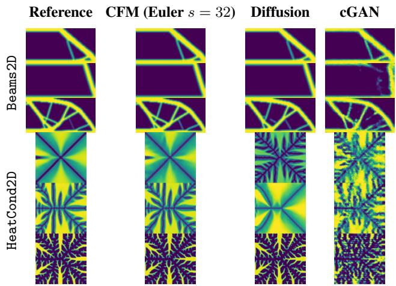
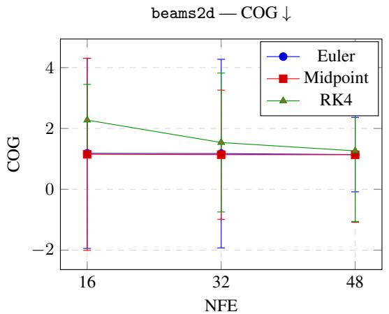
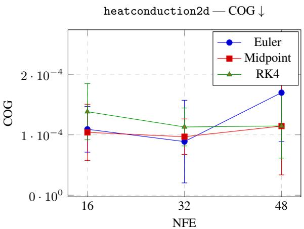

# CONDITIONAL FLOW MATCHING FOR ML-BASED INVERSE DESIGN PROBLEMS

A PREPRINT

Juliana Felder1∗ Milad Habibi2∗ Soheyl Massoudi1 Mark Fuge1

1ETH Zürich 2University of Maryland, College Park feldej@ethz.ch mafuge@ethz.ch

September 2, 2026

## ABSTRACT

Engineering inverse design is often limited by the high computational cost of iterative solvers for optimization problems constrained by partial differential equations (PDEs) and by their sensitivity to initialization. Deep generative models can produce candidate designs without rerunning the simulator at inference time. Generative adversarial networks (GANs) sample in one forward pass, whereas diffusion models require iterative reverse-time integration.

In this work, we add conditional flow matching (CFM) to EngiOpt and compare it with a conditional diffusion model and a conditional generative adversarial network (cGAN) on structural (beams2d) and thermal (heatconduction2d) benchmarks from EngiBench using the same downstream optimization protocol. We use cumulative optimality gap (COG) and final optimality gap (FOG) as the primary metrics for evaluating the generated designs as warm starts for gradient-based refinement. On the evaluated EngiOpt implementations and two EngiBench tasks, CFM achieves the lowest measured COG, FOG, maximum mean discrepancy (MMD), and volume-fraction deviation on both tasks. CFM has mean volume-fraction deviations of 0.4% and 1.0% on beams2d and heatconduction2d, respectively, compared with 3.8% and 11.2% for diffusion. At Euler s = 16, CFM achieves 53.2 samples/s on beams2d — about 66× the measured throughput of the evaluated diffusion baseline using 1000 network evaluations under the same timing protocol — with COG 1.182 ± 3.126, compared with $1 . 1 7 3 \pm 3 . 1 0 0$ for Euler s = 32.

Across the two tasks, CFM produces warm starts with lower measured COG than both baselines and uses fewer network evaluations than diffusion.

Keywords engineering inverse design · flow matching · warm starts · generative models · engineering optimization

## 1 Introduction

Engineering inverse design seeks geometries that satisfy target physical performance criteria — a task traditionally solved by iterative gradient-based optimization constrained by expensive physics simulations [Peckham et al., 2025, Habibi et al., 2026]. Each design update requires a simulator call, making it expensive to solve many related design instances [Giannone et al., 2023]. Generative models offer a data-driven alternative: trained on reference designs produced by numerical optimization, they approximate $p ( x \mid c )$ and generate candidates at inference time without rerunning the simulator [Regenwetter et al., 2022, Mazé and Ahmed, 2023]. The aim is not to generate a fully converged design, but to provide an initialization that the downstream optimizer can refine under the prescribed physical conditions.

Prior studies report improved sample quality for diffusion models over conditional generative adversarial networks (cGANs) [Mazé and Ahmed, 2023, Zhang et al., 2025, Habibi and Fuge, 2024], but hundreds of network evaluations per sample can make generation slow. We introduce conditional flow matching (CFM) as a new baseline in EngiOpt [Felten et al., 2025] — alongside existing cGAN and diffusion implementations — replacing stochastic denoising with deterministic velocity regression [Lipman et al., 2023]. Because CFM and diffusion share the same conditional U-Net backbone, the comparison limits differences in model architecture and focuses on the training objective and sampling procedure.

We ask whether CFM can generate useful warm starts with fewer network evaluations than diffusion and lower seed-to-seed variability than the evaluated cGAN baseline. Our contributions are:

1. A CFM baseline for EngiOpt/EngiBench, evaluated against conditional diffusion and cGAN using the same data splits, checkpoint-selection procedure, and downstream optimizer.

2. An evaluation protocol centered on cumulative optimality gap (COG) and final optimality gap (FOG), measuring downstream warm-start utility via optimization trajectories rather than distributional metrics alone.

3. A solver and number of function evaluations (NFE) ablation showing beams2d COG of $1 . 1 8 2 \pm 3 . 1 2 6$ at NFE= 16 and 1.173 ± 3.100 at NFE= 32, while NFE= 16 reaches approximately 64×–66× the measured diffusion throughput.

## 2 Related Work

Physics-based topology optimization repeatedly solves governing equations while updating a material distribution. These repeated analyses make solving many related design instances expensive [Sigmund and Maute, 2013]. This cost has motivated machine-learning methods that predict or generate candidate designs [Regenwetter et al., 2022]. We review learned warm starts, generative inverse-design models, diffusion models, and flow matching.

Inverse Design Inverse design seeks a geometry or material distribution that satisfies prescribed physical requirements. Applications include structural and thermal topology optimization, nanophotonics, and aerodynamic design [Felten et al., 2025, Molesky et al., 2018, Shirvani et al., 2023]. Structural and thermal topology optimization are commonly formulated as partial differential equations (PDEs)-constrained problems. Density-based methods such as SIMP solve them iteratively by alternating physical analysis and material updates [Sigmund, 2001]. Although effective, this procedure can be expensive when designs are required for many conditions.

Learned Warm Starts Machine-learning models can reduce this cost by mapping design conditions to candidate material distributions. Direct prediction has been studied for structural and thermal topology optimization [Li et al., 2019, Lin et al., 2025]. Other methods use the generated design as an initialization and leave final physical refinement to a conventional optimizer [Giannone et al., 2023, Habibi et al., 2026]. Visual similarity to a reference design does not necessarily imply comparable physical performance [Habibi et al., 2025]. We therefore assess learned initializations through their effect on downstream optimization, alongside distributional metrics.

Generative Models for Engineering Design Engineering inverse-design problems can admit several designs that satisfy the same requirements. Deep generative models provide a way to represent this conditional design distribution. cGANs have been applied to topology optimization using loads, boundary conditions, or physical fields as inputs [Mirza and Osindero, 2014, Nie et al., 2021, Hertlein et al., 2021]. They generate designs in one forward pass, but adversarial training can be unstable and susceptible to mode collapse [Goodfellow et al., 2014]. Variational and other generative models have also been used to generate multiple candidates for subsequent evaluation or refinement [Oh et al., 2019, Yamasaki et al., 2021].

Diffusion Models Diffusion models avoid adversarial training by learning to reverse a gradual noising process [Ho et al., 2020]. TopoDiff reports up to an eightfold reduction in physical-performance error and elevenfold fewer nonmanufacturable designs than the adversarial baselines considered in that study [Mazé and Ahmed, 2023]. Related diffusion approaches have been applied to lattice and structural-component generation [Zhang et al., 2025, Herron et al., 2024]. The relative performance of diffusion and adversarial models nevertheless depends on the task and available training data [Habibi and Fuge, 2024]. Diffusion sampling also requires repeated network evaluations, motivating comparisons that consider both design quality and generation cost.

Flow Matching Flow matching trains continuous normalizing flows without simulating complete trajectories during training [Lipman et al., 2023]. A continuous normalizing flow transports a sample $x _ { 0 }$ from a source distribution $p _ { 0 }$ to a sample $x _ { 1 }$ from the data distribution through a time-dependent vector field $v _ { t } .$

$$
\frac { \mathrm { d } x _ { t } } { \mathrm { d } t } = v _ { t } ( x _ { t } ) , \qquad x _ { 0 } \sim p _ { 0 } .\tag{1}
$$

Classical continuous normalizing flows generally require solving and differentiating through this ordinary differential equation (ODE) during training. Flow matching instead regresses the vector field associated with a prescribed probability path [Albergo and Vanden-Eijnden, 2023].

Conditional flow matching constructs paths whose target velocities can be computed from sampled source and target endpoints. In independent conditional flow matching (I-CFM), these endpoints are sampled independently. Optimaltransport couplings can instead reduce path curvature and objective variance [Tong et al., 2024]. The linear path, target velocity, and training objective used in this work are defined in Section 3. Related formulations include stochastic interpolants and rectified flow [Albergo et al., 2025, Liu et al., 2023].

Recent work applies flow matching to airfoil and wing inverse design [Yang et al., 2026, Zhao et al., 2026], shippropeller design [Kruger et al., 2026], fluid-field generation [Kashefi, 2026], and topology optimization [Xiao et al., 2026, Rashed et al., 2026]. Krüger et al. [2026] compare generative models on engineering inverse problems, while de Campos et al. [2026] study a flow-matching method for high-dimensional inverse design with abstention.

Scope of This Study Previous work shows that flow matching can be used for engineering design, including topology optimization. We compare the linear-path I-CFM implementation described in Section 3 with the existing diffusion and cGAN implementations in EngiOpt. All methods use the same EngiBench data splits, matched condition–referencedesign pairs, validation-only checkpoint selection, downstream optimizer, and metric definitions. CFM and Diffusion additionally share the same conditional U-Net architecture. We evaluate structural and thermal tasks and report COG and FOG computed from the downstream optimization trajectories together with measured sampling cost.

## 3 Method

Problem Formulation Each problem instance is defined by a condition vector $c \in \mathbb { R } ^ { n _ { c } }$ encoding problem-specific boundary conditions, and a target 2D density field $x \in [ 0 , 1 ] ^ { H \times W }$ , where each entry represents local material density (0 $= \mathrm { v o i d } , 1 = \mathrm { s o l i d } )$ . The dataset $\mathcal { D } = \{ ( c ^ { ( i ) } , x _ { \mathrm { r e f } } ^ { ( i ) } ) \} _ { i = 1 } ^ { N }$ consists of N pairs of boundary conditions and their corresponding reference designs. Our objective is to learn a conditional generative model that approximates the distribution $p ( x \mid c )$ whose samples serve as initial designs for downstream physics-based optimization.

Engineering Design Problems and Data Representation EngiBench provides common Python interfaces for loading benchmark datasets and running their simulators and optimizers [Felten et al., 2025]. We evaluate structural compliance optimization on Beams2D and thermal compliance optimization on HeatConduction2D. Full problem documentation is available in the EngiBench problem registry.2

• Beams2D: Structural compliance minimization for the right-half MBB beam on a $1 0 0 ~ \times ~ 5 0 ~ $ grid $( x \in$ $[ 0 , 1 ] ^ { 1 0 0 \times 5 0 } , c \in \mathbb { R } ^ { 4 } )$ . The dataset provides 4,851 optimized reference designs: 3,880 training, 728 validation, and 243 test designs. Condition variables c include volume fraction (volfrac), minimum feature thickness (rmin), fractional force location (forcedist), and an overhang manufacturability flag.

• HeatConduction2D: Thermal compliance minimization under material-budget and boundary-condition constraints on a $1 0 1 \times 1 0 1$ grid $( x \\overset { \bullet } { \in } [ 0 , 1 ] ^ { 1 0 1 \times 1 0 1 } , c \in \mathbb { R } ^ { 2 } )$ . The dataset contains 441 optimized reference designs: 361 training, 40 validation, and 40 test designs. Condition variables c include the volume limit on material distribution and the length of the adiabatic region on the bottom side of the domain.

Preprocessing and Postprocessing Pipelines Preprocessing is model-specific. For CFM, the design fields are min-max normalized using statistics computed on the training split, $x _ { \mathrm { n o r m } } \overset { \cdot } { = } ( x - x _ { \mathrm { m i n } } ) / ( x _ { \mathrm { m a x } } - x _ { \mathrm { m i n } } )$ , while the condition vectors are left unchanged. Since the training data is already in [0, 1], this normalization is approximately the identity; generated outputs are clipped directly to $[ 1 0 ^ { - 3 } , 1 ]$ before evaluation and use as optimizer warm starts. Diffusion designs are instead rescaled to [−1, 1] for training, matching the standard denoising diffusion probabilistic model (DDPM) convention [Ho et al., 2020], and generated outputs are rescaled back to the physical density range before being clipped to $[ 1 0 ^ { - 3 } , 1 ]$ . For cGAN, the generator uses a sigmoid output, so generated designs are already in [0, 1] before applying the same clipping step.

## 3.1 CFM Architecture

We use a 2D conditional U-Net as the backbone for I-CFM. The U-Net takes a noisy design $\boldsymbol { x } _ { t } ~ \in ~ \mathbb { R } ^ { 1 \times H \times W }$ and condition c as input, and outputs a velocity field $v _ { \theta } ( x _ { t } , t , c ) \ \in \ \mathbb { R } ^ { 1 \times H \times W }$ . Concretely, we implement the

UNet2DConditionModel from the Hugging Face Diffusers library [von Platen et al., 2022]. It has four encoderdecoder stages at channel depths (32, 64, 128, 256), with conditions injected via cross-attention at every block.

As discussed in Section 2, we use I-CFM where Gaussian noise $x _ { 0 } \sim \mathcal { N } ( 0 , I )$ and target designs $x _ { 1 }$ are paired independently at random. For a continuous time variable $t \sim \mathcal { U } ( 0 , 1 )$ , we define the linear interpolation path $x _ { t } =$ $( 1 - t ) x _ { 0 } + t x _ { 1 }$ with a target velocity $v ^ { \star } = x _ { 1 } - x _ { 0 }$ . The model predicts $v _ { \theta } ( x _ { t } , t , c )$ and is trained with a mean-squared error objective:

$$
\mathcal { L } _ { \mathrm { F M } } = \mathbb { E } _ { x _ { 0 } , x _ { 1 } , t } \left[ | | v _ { \theta } ( x _ { t } , t , c ) - ( x _ { 1 } - x _ { 0 } ) | | _ { 2 } ^ { 2 } \right]\tag{2}
$$

Inference and Solvers During inference, designs are generated by integrating the learned velocity field from $t = 0$ to $t = 1$ using a fixed-step ODE solver. To evaluate the trade-off between sampling speed and solution quality, we benchmark three solvers: first-order Euler, second-order Midpoint, and the classical fourth-order Runge–Kutta method (RK4). We compare them at NFE budgets of 16, 32, and 48. This corresponds to step counts of {16, 32, 48} for Euler, {8, 16, 24} for Midpoint, and {4, 8, 12} for RK4.

## 3.2 Baselines

To reduce architectural differences between CFM and Diffusion, both use the same UNet2DConditionModel backbone and channel schedule $( 3 2 , 6 4 , 1 2 8 , 2 5 6 )$ , with the same number of trainable parameters. Diffusion is trained with a linear noise schedule $( \dot { \beta } _ { 1 } = 1 0 ^ { - 4 } , \beta _ { T } = 0 . 0 2 , T = 1 0 0 0$ steps) to predict noise ϵ and is sampled via DDPM ancestral sampling over 1000 reverse steps. The cGAN uses the existing EngiOpt adversarial architecture. The generator takes noise $z \sim \mathcal { N } ( 0 , I )$ (latent dimension $z _ { \mathrm { d i m } } = 3 2 )$ and condition c expanded to a spatial map; both are processed by parallel ConvTranspose2d stems before concatenation into $F _ { 0 } = \bar { 2 5 6 }$ channels. Four upsampling stages progress spatially from $7 \times 7$ to the target resolution, with BatchNorm and ReLU activations, and a final sigmoid layer producing $\dot { \boldsymbol { x } } \in [ 0 , \mathbf { \dot { 1 } } ] ^ { 1 \times H \times W }$ before clipping to $[ 1 0 ^ { - 3 } , 1 ]$ for evaluation. The discriminator mirrors this conditioning strategy with parallel image and condition stems downsampled to a single real-or-generated prediction.

Detailed optimizer, hardware, and training settings are provided in Appendix A.

## 3.3 Experimental Protocol and Evaluation Metrics

Rather than treating the generative model as a stand-alone design generator, we use it as a warm-start prior for gradientbased topology optimization. The benchmark tasks, data splits, conditions, downstream optimizer, and evaluation metrics are fixed across methods. CFM and Diffusion also share the same U-Net architecture, whereas cGAN uses its existing EngiOpt architecture.

In this pipeline, the generative model receives problem-specific conditions $c ^ { ( i ) }$ and produces an initial candidate design $x _ { 0 } ^ { ( i ) }$ for each test condition. This warm start is passed to the problem-specific benchmark optimizer provided by EngiBench [Felten et al., 2025], which refines the design under the same condition $c ^ { ( i ) }$ , producing an optimization trajectory $\{ x _ { t } ^ { ( i ) } \} _ { t = 0 } ^ { T }$ . The trajectory is then evaluated against the paired dataset reference design $x _ { \mathrm { r e f } } ^ { ( i ) }$ using the metrics defined below. All methods use the same dataset splits and training seeds 1–10.

Training and Model Selection All models are trained for at most 500 epochs with a batch size of 32. For each training seed s, we sample 50 condition–reference-design pairs with replacement from the validation split using seed $s + 1 2 3 ;$ this set remains fixed throughout training. Every 10 epochs, generated designs for these conditions are scored by validation maximum mean discrepancy (MMD). Checkpoints become eligible for selection after epoch 80, and training stops after 25 consecutive validation checks without a lower MMD.

Model selection uses only the validation split. We first retain the five eligible checkpoints with the lowest validation MMD. Each checkpoint is then used to initialize the downstream optimizer on the same 50 validation pairs and with the same optimizer budget used for final evaluation. The checkpoint with the lowest validation COG is selected. It is evaluated on 50 matched condition–reference-design pairs sampled with replacement from the test split using seed $s ,$ while generation uses seed $s + 2 0 0 0$ . For a given problem and training seed, CFM, Diffusion, and cGAN therefore use the same validation and test pairs, reference designs, downstream optimizer, and metric definitions. Test results are not used for early stopping or checkpoint selection.

To measure how the generated warm start affects the downstream optimization trajectory under a fixed optimizer budget, let $\{ x _ { t } ^ { ( i ) } \} _ { t = 0 } ^ { T }$ denote the trajectory starting from generated design $x _ { 0 } ^ { ( i ) }$ under condition $c ^ { ( i ) }$ , and let $f _ { \mathrm { r e f } } ^ { ( i ) } = f ( x _ { \mathrm { r e f } } ^ { ( i ) } , c ^ { ( i ) } )$ be the objective of the paired dataset design evaluated under the same condition. Note that $x _ { \mathrm { r e f } } ^ { ( i ) }$ is not a global optimum but a reference design produced by the benchmark optimizer.

• COG: Measures the cumulative objective gap relative to the reference over the optimization trajectory:

$$
\mathrm { C O G } = \mathrm { m e d i a n } _ { i } \sum _ { t = 1 } ^ { T } \left[ f ( x _ { t } ^ { ( i ) } , c ^ { ( i ) } ) - f ( x _ { \mathrm { r e f } } ^ { ( i ) } , c ^ { ( i ) } ) \right] .\tag{3}
$$

Intuitively, COG accumulates the objective difference between the warm-started optimization trajectory and the paired reference design. A trajectory whose objective values remain close to the reference produces a small COG. A negative COG indicates that the cumulative objective difference over the trajectory is below zero relative to the dataset reference. Median aggregation is used for COG because the cumulative trajectory sum is sensitive to outlier optimization runs.

• FOG: Measures the quality of the final design $x _ { T } ^ { ( i ) }$ relative to the dataset reference:

$$
\mathrm { F O G } = \mathbb { E } _ { i } \left[ f ( x _ { T } ^ { ( i ) } , c ^ { ( i ) } ) - f ( x _ { \mathrm { r e f } } ^ { ( i ) } , c ^ { ( i ) } ) \right] .\tag{4}
$$

Unlike COG, FOG considers only the final step of the optimization trajectory. A positive FOG means the optimizer terminated above the reference objective. A negative FOG means the warm-started optimizer found a solution better than the dataset reference. We report mean FOG to summarize the average final objective difference across evaluated samples. For both COG and FOG, lower is better.

Distributional and Feasibility Metrics MMD measures distributional agreement between generated and reference designs using a Gaussian kernel with problem-specific bandwidth $\sigma = 1 . 0$ for Beams2D and 10.0 for HeatConduction2D. Because the bandwidth is selected separately for each design space, MMD and determinantal point process (DPP) values are comparable across methods only within the same problem, not across problems.

DPP diversity measures sample diversity via the determinant of the kernel similarity matrix of the generated batch. Higher values indicate greater diversity. Constraint violation (Viol.) quantifies the deviation from the required material budget, calculated as the mean absolute error between the generated design’s material fraction and the target volume fraction $v ^ { * ( i ) }$ specified in c:

$$
\mathrm { V i o l . } = \mathbb { E } _ { i } \big [ | \bar { x } _ { 0 } ^ { ( i ) } - v ^ { * ( i ) } | \big ] ,\tag{5}
$$

where $\bar { x } _ { 0 } ^ { ( i ) }$ denotes the mean density of the generated design. We also inspect the 2D density fields for visible discontinuities, fragmented material regions, and differences from the paired reference topology.

## 4 Results

Results are reported over 10 random seeds. COG is summarized as median ± standard deviation, consistent with Eq. 3; all other metrics are summarized as mean ± standard deviation. We report CFM results using the Euler solver with s = 32 steps (NFE= 32) for the main comparison against Diffusion (NFE= 1000) and cGAN. Detailed solver and step-count results are provided in Appendix B.
<table><tr><td rowspan="2">Method</td><td colspan="2">Beams2D</td><td colspan="2">HeatConduction2D</td></tr><tr><td>COG↓</td><td>FOG↓</td><td>COG↓</td><td>FOG↓</td></tr><tr><td>CFM (Euler s = 32)</td><td> $\mathbf { 1 . 1 7 3 \pm 3 . 1 0 0 }$ </td><td> $\mathbf { - 1 . 6 4 7 \pm 0 . 4 1 1 }$ </td><td> $\mathbf { 8 . 8 8 \times 1 0 ^ { - 5 } \pm 6 . 8 4 \times 1 0 ^ { - 5 } }$ </td><td> $\mathbf { 1 . 3 2 \times 1 0 ^ { - 6 } \pm 8 . 8 7 \times 1 0 ^ { - 7 } }$ </td></tr><tr><td>Diffusion</td><td> $1 . 6 0 3 \pm 1 . 7 9 4$ </td><td> $- 1 . 6 3 7 \pm 0 . 5 0 5$ </td><td> $5 . 8 1 \times { 1 0 ^ { - 4 } } \pm { 1 . 4 4 \times { 1 0 ^ { - 4 } } }$ </td><td> $1 . 5 4 \times 1 0 ^ { - 5 } \pm 5 . 0 6 \times 1 0 ^ { - 6 }$ </td></tr><tr><td>cGAN</td><td> $2 2 . 4 9 3 \pm 8 1 9 . 2 8 2$ </td><td> $4 . 4 1 5 \pm 1 4 . 6 0 2$ </td><td> $5 . 5 0 \times { 1 0 ^ { - 4 } } \pm 2 . 0 1 \times { 1 0 ^ { - 4 } }$ </td><td> $1 . 2 1 \times 1 0 ^ { - 5 } \pm 3 . 5 8 \times 1 0 ^ { - 6 }$ </td></tr></table>

Table 1: Primary optimization-utility results. Lower is better for COG and FOG; the best value within each problem and metric is boldfaced.

Table 1 shows that CFM obtains the lowest measured COG and FOG on both benchmarks. On beams2d, CFM and Diffusion reach mean FOG values of −1.647 and −1.637, respectively, indicating that their warm-started downstream optimizations outperform the paired dataset references on average. CFM achieves a lower COG (1.173 ± 3.100) than Diffusion $( 1 . 6 0 3 \overset { \cdot } { \pm } 1 . 7 9 4 )$ and a slightly lower FOG $( - 1 . 6 4 7 \pm 0 . 4 1 1$ versus $- 1 . 6 3 7 \pm 0 . 5 0 5 )$ . The cGAN baseline shows high seed-dependent variability on this task, as evidenced by its COG of $2 2 . 4 9 3 \pm 8 1 9 . 2 8 2$ and mean FOG of $4 . 4 1 5 \pm \mathrm { \bar { 1 4 } . 6 0 2 }$

  
Figure 1: Qualitative comparison under matched conditions. Each row corresponds to a benchmark problem; columns show the reference design and the warm start generated by each method. For Beams2D we visualize Seed 8, and for HeatConduction2D Seed 5; each row uses the same condition and seed across all displayed methods.

On 2 , CFM has the lowest values for both primary metrics; Diffusion’s COG is 6.54 times CFM’s. cGAN has a COG of $5 . 5 0 \times 1 0 ^ { - 4 } \pm 2 . 0 1 \times 1 0 ^ { - 4 }$ , compared with Diffusion’s $5 . 8 1 \times { 1 0 ^ { - 4 } } \pm { 1 . 4 4 \times 1 0 ^ { - 4 } }$ . CFM has the lowest measured COG on both tasks.
<table><tr><td>Method</td><td>MMD↓</td><td>DPP↑</td><td></td><td>Viol. ↓</td></tr><tr><td>Beams2D</td><td></td><td></td><td></td><td></td></tr><tr><td>CFM (Euler s = 32)</td><td> $\mathbf { 2 . 8 6 \times 1 0 ^ { - 2 } \pm 2 . 0 6 \times 1 0 ^ { - 3 } }$ </td><td></td><td> $4 . 3 4 \times { 1 0 ^ { - 1 } } \pm 2 . 6 9 \times { 1 0 ^ { - 1 } }$ </td><td> $\mathbf { 3 . 6 0 \times 1 0 ^ { - 3 } \pm 6 . 1 6 \times 1 0 ^ { - 4 } }$ </td></tr><tr><td>Diffusion</td><td> $3 . 4 3 \times { 1 0 ^ { - 2 } } \pm 4 . 1 9 \times { 1 0 ^ { - 3 } }$ </td><td> $\mathbf { 6 . 4 9 \times 1 0 ^ { - 1 } \pm 2 . 9 2 \times 1 0 ^ { - 1 } }$ </td><td></td><td> $3 . 8 2 \times { 1 0 ^ { - 2 } } \pm 4 . 7 5 \times { 1 0 ^ { - 2 } }$ </td></tr><tr><td>cGAN</td><td> $4 . 5 0 \times { 1 0 ^ { - 2 } } \pm 2 . 2 9 \times { 1 0 ^ { - 3 } }$ </td><td> $3 . 0 3 \times { 1 0 ^ { - 1 } } \pm 4 . 4 0 \times { 1 0 ^ { - 1 } }$ </td><td></td><td> $1 . 6 2 \times { 1 0 ^ { - 2 } } \pm 5 . 9 3 \times { 1 0 ^ { - 3 } }$ </td></tr><tr><td>HeatConduction2D</td><td></td><td></td><td></td><td></td></tr><tr><td>CFM (Euler s = 32)</td><td> $\mathbf { 5 . 7 5 \times 1 0 ^ { - 2 } \pm 8 . 3 5 \times 1 0 ^ { - 3 } }$ </td><td></td><td> $8 . 9 9 \times { 1 0 ^ { - 3 } } \pm 1 . 3 5 \times { 1 0 ^ { - 2 } }$ </td><td> $\mathbf { 9 . 9 6 \times 1 0 ^ { - 3 } \pm 2 . 0 9 \times 1 0 ^ { - 3 } }$ </td></tr><tr><td>Diffusion</td><td> $6 . 8 5 \times { 1 0 ^ { - 2 } } \pm 6 . 5 2 \times { 1 0 ^ { - 3 } }$ </td><td></td><td> $\mathbf { 2 . 9 1 \times 1 0 ^ { - 1 } \pm 3 . 5 4 \times 1 0 ^ { - 1 } }$ </td><td> $1 . 1 2 \times { 1 0 ^ { - 1 } } \pm { 1 . 3 8 \times { 1 0 ^ { - 2 } } }$ </td></tr><tr><td>cGAN</td><td> $1 . 2 0 \times 1 0 ^ { - 1 } \pm 3 . 7 0 \times 1 0 ^ { - 2 }$ </td><td></td><td> $6 . 2 8 \times { 1 0 ^ { - 2 } } \pm 9 . 8 1 \times { 1 0 ^ { - 2 } }$ </td><td> $1 . 5 3 \times { 1 0 ^ { - 2 } } \pm 5 . 5 0 \times { 1 0 ^ { - 3 } }$ </td></tr></table>

Table 2: Distributional and feasibility metrics. Lower is better for MMD and Viol.; higher is better for DPP. MMD and DPP are comparable across methods only within the same problem.

In the samples displayed in Figure 1, CFM retains the continuous members and sharp solid–void boundaries visible in the reference designs. Diffusion also produces sharp, high-contrast outputs, but its displayed heatconduction2d samples differ from the paired reference material distributions; this observation accompanies its larger average volume fraction deviation in Table 2. In the displayed beams2d sample, cGAN introduces a structural discontinuity absent from the reference. Its displayed heatconduction2d samples contain fragmented and isolated material regions.

Table 2 details the secondary performance metrics. CFM obtains the lowest MMD and volume-fraction violation on both tasks, with volume-fraction violations of $\mathbf { 3 . 6 0 \times 1 0 ^ { - 3 } }$ for beams2d and $\mathbf { 9 . 9 6 \times 1 0 ^ { - 3 } }$ for heatconduction2d. Diffusion generates the highest DPP values on both problems $\mathbf { ( 6 . 4 9 \times 1 0 ^ { - 1 } }$ and $\mathbf { 2 . 9 1 \times 1 0 ^ { - 1 } } )$ , while also producing the highest volume-fraction deviations $( 3 . 8 2 \times 1 0 ^ { - 2 }$ and $1 . 1 2 \times 1 0 ^ { - 1 } )$ . cGAN reports lower volume-fraction violations than Diffusion $( 1 . 6 2 \times 1 0 ^ { - 2 }$ and $1 . 5 3 \times 1 0 ^ { - 2 } )$ alongside lower DPP scores. On both tasks, the method with the highest DPP does not achieve the lowest COG.

<table><tr><td>Method</td><td>Problem</td><td>gen_runtime_sec ↓</td><td>samples/s ↑</td></tr><tr><td rowspan="2">CFM (Euler s = 32)</td><td>beams2d</td><td> $1 . 8 7 6 \pm 0 . 0 2 2$ </td><td> $2 6 . 6 5 9 \pm 0 . 3 1 2$ </td></tr><tr><td>heatconduction2d</td><td> $4 . 0 9 2 \pm 0 . 0 5 2$ </td><td> $1 2 . 2 2 1 \pm 0 . 1 5 7$ </td></tr><tr><td rowspan="2">Diffusion</td><td>beams2d</td><td> $6 1 . 9 0 3 \pm 1 . 0 2 7$ </td><td> $0 . 8 0 8 \pm 0 . 0 1 3$ </td></tr><tr><td>heatconduction2d</td><td> $1 3 1 . 7 4 \pm 1 . 5 3$ </td><td> $0 . 3 8 0 \pm 0 . 0 0 4$ </td></tr><tr><td rowspan="2">cGAN</td><td>beams2d</td><td> $4 . 3 8 2 \times 1 0 ^ { - 4 } \pm 5 . 4 1 6 \times 1 0 ^ { - 6 }$ </td><td> $1 1 4 , 1 0 7 \pm 1 , 4 1 9$ </td></tr><tr><td>heatconduction2d</td><td> $4 . 4 1 9 \times 1 0 ^ { - 4 } \pm 5 . 4 0 4 \times 1 0 ^ { - 6 }$ </td><td> $1 1 3 , 1 7 0 \pm 1 , 3 9 8$ </td></tr></table>

Table 3: Sampling throughput, measured as generated samples per second for the model generation call only. Higher is better.

Table 3 reports generation throughput, defined as $n _ { \mathrm { s a m p l e s } } / t _ { \mathrm { g e n } } .$ . Generation time was measured separately from data loading, clipping, metric computation, optimizer refinement, and logging. For each method, we timed only the model sampling call on batches of $n _ { \mathrm { s a m p l e s } } = 5 0$ test conditions on a single NVIDIA RTX 4090 GPU, using CUDA synchronization before and after the timed region to avoid asynchronous-kernel timing artifacts. We used one warm-up call followed by three timed repeats for CFM and Diffusion. Because the cGAN forward pass is sub-millisecond, we used 1000 warm-up calls and 1000 timed repeats. For each seed, we take the median synchronized runtime across repeats and report the mean ± standard deviation over 10 seeds. cGAN is fastest because it requires one forward pass, but it does not obtain the lowest COG or MMD on either task. CFM at Euler $s = 3 2$ is approximately 33.0× faster than Diffusion on beams2d (1.876 s versus 61.903 s) and 32.2× faster on heatconduction2d (4.092 s versus 131.74 s), while obtaining the lowest measured COG on both tasks.

The solver-step ablation in Appendix B shows that, on beams2d, Euler and Midpoint obtain COG values ranging from 1.134 to 1.182 across the evaluated NFE budgets. At NFE= 16, RK4 $( s = 4 )$ has a higher COG $( 2 . 2 7 4 \pm 1 . 1 7 4 )$ than the Euler and Midpoint configurations at the same NFE, while also having the highest DPP $( 0 . 9 8 1 \pm 0 . 0 2 5 )$ Euler s = 16 achieves $\mathrm { \dot { C } O G = 1 . 1 \mathrm { \check { 8 } 2 } \pm 3 . }$ .126 and $\mathrm { M M D } = 0 . 0 2 8 3 \pm 0 . 0 0 2 1$ , compared with $\mathrm { C O G } = 1 . 1 7 3 \pm 3 . 1 0 0$ and $\mathrm { M M D } { = } 0 . 0 2 8 6 \pm 0 . 0 0 2 1$ for Euler $s = 3 2$ . On heatconduction2d, increasing the number of Euler steps also does not reduce COG monotonically. Reducing the Euler budget from 32 to 16 evaluations approximately doubles throughput, reaching 53.156 ± 0.777 samples/s on beams2d and 24.444 ± 0.274 samples/s on heatconduction2d. These values correspond to approximately 65.8× and 64.4× the measured Diffusion throughput, respectively. Euler s = 16 therefore halves the measured generation time relative to s = 32, while the reported beams2d COG values differ by 0.009.

## 5 Discussion

Optimization utility and constraint adherence. Among the evaluated EngiOpt implementations, CFM achieves the lowest measured COG on both tasks and higher measured throughput than Diffusion. Its lower COG indicates that the warm-started optimization trajectories accumulate a smaller objective gap relative to the paired reference designs. On beams2d, CFM reaches a slightly lower final objective than Diffusion $( \bar { \mathrm { F O G } } = - 1 . 6 4 7 $ versus −1.637), although the difference is small relative to the variation across seeds. On heatconduction2d, CFM also achieves the lowest values for both COG and FOG. Its measured advantages are therefore a lower cumulative objective gap during fixed-budget optimization and lower generation time than Diffusion; their beams2d FOG values differ by 0.010.

CFM also has the lowest mean absolute volume-fraction error on both tasks. It stays within 0.4% and 1.0% of the target volume fraction on beams2d and heatconduction2d, respectively, while Diffusion deviates by 3.8% and 11.2%. A warm start far from the intended material budget may require the optimizer to restore feasibility before improving the objective. This may contribute to Diffusion’s COG on heatconduction2d being approximately 6.54× CFM’s $( 5 . 8 1 \dot { \times } 1 0 ^ { - 4 }$ versus $8 . { \overset { \cdot } { 8 } } 8 \times 1 0 ^ { - 5 } )$ . The Diffusion baseline uses the standard [−1, 1] DDPM normalization; we did not isolate the source of its remaining volume-fraction deviations.

CFM and Diffusion use the same conditional U-Net backbone and channel schedule. This reduces differences due to model architecture and capacity, although the two methods still differ in their training objectives and sampling procedures. Diffusion achieves higher DPP than CFM on both tasks, but also has higher COG. In these experiments, higher measured diversity therefore does not correspond to better warm-start optimization trajectories. Diversity should instead be interpreted together with feasibility and optimization-utility metrics.

Behavior of the cGAN baseline. The evaluated cGAN is the existing EngiOpt adversarial baseline and has the highest measured sampling throughput. On beams2d, the large variation in COG across seeds $( 2 2 . 4 9 3 \pm 8 1 9 . 2 8 2 )$ indicates sensitivity to training initialization. On heatconduction2d, its COG is $5 . 5 0 \times 1 0 ^ { - 4 }$ , compared with $5 . 8 1 \times 1 0 ^ { - 4 }$ for Diffusion, while its DPP is lower $( 6 . 2 8 \times 1 0 ^ { - 2 } \pm 9 . 8 1 \times 1 0 ^ { - 2 }$ versus $2 . 9 1 \times 1 0 ^ { - 1 } \pm 3 . { \bar { 5 } } 4 \times 1 0 ^ { - 1 } )$ . The cGAN therefore ranks differently by COG and DPP on the two tasks. These experiments do not isolate whether the observed differences arise from the conditioning variables, the datasets, or adversarial training.

Flow geometry and solver sensitivity. The solver ablation tests whether higher-order ODE integration improves CFM sampling at a fixed NFE. For each noise–data pair, independent conditional flow matching uses a linear training path with constant target velocity. Because random pairings can produce crossing paths, however, the learned marginal vector field need not be straight. In the evaluated settings, Midpoint and RK4 do not improve the measured optimization metrics over Euler at matched NFE. Increasing the Euler budget from $s = 1 6 \ \mathrm { t o } \ s = 3 2$ produces COG values of $1 . 1 8 2 \pm 3 . 1 2 6$ and $1 . 1 7 3 \pm 3 . 1 0 0$ , respectively. Euler $s = 1 6$ achieves about 65.8× the measured Diffusion throughput on beams2d and 64.4× on heatconduction2d, and halves generation time relative to Euler $s = 3 2$ in the same timing benchmark. A denser NFE sweep would be needed to draw broader conclusions about the numerical integration methods.

Limitations and future work. The study is restricted to two 2D EngiBench tasks and one shared U-Net family for CFM and Diffusion. The results therefore compare the evaluated EngiOpt implementations rather than establish a universal ranking of flow-matching, diffusion, and adversarial inverse-design models. The remaining Diffusion volumefraction deviations may reflect the denoising objective, sampling dynamics, model selection, or task-specific sensitivity; isolating these factors would require targeted ablations. Future work should test whether the lower CFM volume-fraction errors observed here persist in 3D settings, multi-physics design tasks, and higher-dimensional condition spaces.

## 6 Conclusion

This work adds CFM to EngiOpt and evaluates it as a warm-start prior for two EngiBench inverse-design tasks. Among the tested implementations, CFM achieves the lowest measured COG, FOG, MMD, and volume-fraction deviation on both beams2d and heatconduction2d. Depending on the solver budget and task, its measured sampling throughput is approximately 32×–66× that of the evaluated Diffusion baseline. Reducing the Euler budget from s = 32 to s = 16 approximately doubles throughput, while the measured beams2d COG changes from $1 . 1 7 3 \overset { \cdot } { \pm } 3 . 1 0 0 \mathrm { t o } 1 . 1 8 2 \pm 3 . 1 2 6$ The metric rankings are not identical: Diffusion has the highest DPP on both tasks, whereas CFM has the lowest COG.

## Code and Artifact Availability

The implementation and public reproduction workflow are available in a tagged EngiOpt source snapshot. Run-level training, checkpoint-selection, evaluation, and timing records are available in a public Weights & Biases report. The selected evaluation checkpoints and EngiBench datasets used in this study are available through a public Hugging Face collection.

## References

Owen Peckham, Jonathan Raines, Erik Bulsink, Mark Goudswaard, James Gopsill, David Barton, Aydin Nassehi, and Ben Hicks. Artificial intelligence in generative design: a structured review of trends and opportunities in techniques and applications. Designs, 9(4):79, 2025. doi: 10.3390/designs9040079. URL https://doi.org/10.3390/ designs9040079.

Milad Habibi, Jun Wang, and Mark Fuge. When is it actually worth learning inverse design? Journal ofMechanical Design, 148(6):061704, 2026. doi: 10.1115/1.4070621. URL https://doi.org/10.1115/1.4070621.

Giorgio Giannone, Akash Srivastava, Ole Winther, and Faez Ahmed. Aligning optimization trajectories with diffusion models for constrained design generation. Advances in neural information processing systems, 36:51830–51861, 2023. doi: 10.52202/075280-2258. URL https://proceedings.neurips.cc/paper\_files/paper/2023/ hash/a2c0b2ffebbc32eb6468243c9ee9e205-Abstract-Conference.html.

Lyle Regenwetter, Amin Heyrani Nobari, and Faez Ahmed. Deep generative models in engineering design: A review. Journal ofMechanical Design, 144(7):071704, 2022. doi: 10.1115/1.4053859. URL https://doi.org/10.1115/ 1.4053859.

François Mazé and Faez Ahmed. Diffusion models beat gans on topology optimization. In Proceedings ofthe AAAI conference on artificial intelligence, volume 37, pages 9108–9116, 2023. doi: 10.1609/aaai.v37i8.26093. URL https://doi.org/10.1609/aaai.v37i8.26093.

Jinlong Zhang, Shikun Chen, Robert J Martin, Baochang Liu, Ruixiong Zhang, and Dengbao Xiao. Conditional diffusion models for the inverse design of lattice structures. Structural and Multidisciplinary Optimization, 68(3):58, 2025. doi: 10.1007/s00158-025-03984-2. URL https://doi.org/10.1007/s00158-025-03984-2.

Milad Habibi and Mark Fuge. Inverse design with conditional cascaded diffusion models. In International Design Engineering Technical Conferences and Computers and Information in Engineering Conference, volume 88360, page V03AT03A020. American Society of Mechanical Engineers, 2024. doi: 10.1115/detc2024-143607. URL https://doi.org/10.1115/detc2024-143607.

Florian Felten, Gabriel Apaza, Gerhard Bäunlich, Cashen Diniz, Xuliang Dong, Arthur Drake, Milad Habibi, Nathaniel J. Hoffman, Matthew Keeler, Soheyl Massoudi, Francis G. VanGessel, and Mark Fuge. Engibench: A framework for data-driven engineering design research, 2025. URL https://arxiv.org/abs/2508.00831.

Yaron Lipman, Ricky T. Q. Chen, Heli Ben-Hamu, Maximilian Nickel, and Matthew Le. Flow matching for generative modeling. In International Conference on Learning Representations, 2023. doi: 10.48550/arXiv.2210.02747. URL https://openreview.net/forum?id=PqvMRDCJT9t.

Ole Sigmund and Kurt Maute. Topology optimization approaches: A comparative review. Structural and Multidisciplinary Optimization, 48(6):1031–1055, 2013. doi: 10.1007/s00158-013-0978-6. URL https://doi.org/10. 1007/s00158-013-0978-6.

Sean Molesky, Zin Lin, Alexander Y. Piggott, Weiliang Jin, Jelena Vuckovic, and Alejandro W. Rodriguez. Inverse´ design in nanophotonics. Nature Photonics, 12:659–670, 2018. doi: 10.1038/s41566-018-0246-9. URL https: //www.nature.com/articles/s41566-018-0246-9.

Ahmad Shirvani, Mahdi Nili-Ahmadabadi, and Man Yeong Ha. Machine learning-accelerated aerodynamic inverse design. Engineering Applications ofComputational Fluid Mechanics, 17(1):2237611, 2023. doi: 10.1080/19942060. 2023.2237611. URL https://doi.org/10.1080/19942060.2023.2237611.

Ole Sigmund. A 99 line topology optimization code written in matlab. Structural and multidisciplinary optimization, 21(2):120–127, 2001. doi: 10.1007/s001580050176. URL https://doi.org/10.1007/s001580050176.

Baotong Li, Congjia Huang, Xin Li, Shuai Zheng, and Jun Hong. Non-iterative structural topology optimization using deep learning. Computer-Aided Design, 115:172–180, 2019. doi: 10.1016/j.cad.2019.05.038. URL https: //doi.org/10.1016/j.cad.2019.05.038.

Qiyin Lin, Feiyu Gu, Chen Wang, Hao Guan, Tao Wang, Kaiyi Zhou, Lian Liu, and Desheng Yao. Intelligent design method for thermal conductivity topology based on a deep generative network. Chinese Journal of Mechanical Engineering, 38(1):47, 2025. doi: 10.1186/s10033-025-01222-w. URL https://doi.org/10.1186/ s10033-025-01222-w.

Milad Habibi, Shai Bernard, Jun Wang, and Mark Fuge. Mean squared error may lead you astray when optimizing your inverse design methods. Journal ofMechanical Design, 147(2):021701, 2025. doi: 10.1115/1.4066102. URL https://doi.org/10.1115/1.4066102.

Mehdi Mirza and Simon Osindero. Conditional generative adversarial nets, 2014. URL https://arxiv.org/abs/ 1411.1784.

Zhenguo Nie, Tong Lin, Haoliang Jiang, and Levent Burak Kara. Topologygan: Topology optimization using generative adversarial networks based on physical fields over the initial domain. Journal of Mechanical Design, 143(3):031715, 2021. doi: 10.1115/1.4049533. URL https://doi.org/10.1115/1.4049533.

Nathan Hertlein, Philip R. Buskohl, Andrew Gillman, Kumar Vemaganti, and Sam Anand. Generative adversarial network for early-stage design flexibility in topology optimization for additive manufacturing. Journal ofManufacturing Systems, 59:675–685, 2021. doi: 10.1016/j.jmsy.2021.04.007. URL https://www.sciencedirect.com/ science/article/pii/S027861252100087X.

Ian Goodfellow, Jean Pouget-Abadie, Mehdi Mirza, Bing Xu, David Warde-Farley, Sherjil Ozair, Aaron Courville, and Yoshua Bengio. Generative adversarial nets. In Advances in Neural Information Processing Systems, volume 27, 2014. doi: 10.48550/arXiv.1406.2661. URL https://proceedings.neurips.cc/paper\_files/paper/2014/ hash/f033ed80deb0234979a61f95710dbe25-Abstract.html.

Sangeun Oh, Yongsu Jung, Seongsin Kim, Ikjin Lee, and Namwoo Kang. Deep generative design: Integration of topology optimization and generative models. Journal of Mechanical Design, 141(11):111405, 2019. doi: 10.1115/1.4044229. URL https://doi.org/10.1115/1.4044229.

Shintaro Yamasaki, Kentaro Yaji, and Kikuo Fujita. Data-driven topology design using a deep generative model. Structural and Multidisciplinary Optimization, 64(3):1401–1420, 2021. doi: 10.1007/s00158-021-02926-y. URL https://doi.org/10.1007/s00158-021-02926-y.

Jonathan Ho, Ajay Jain, and Pieter Abbeel. Denoising diffusion probabilistic models. Advances in Neural Information Processing Systems, 33, 2020. doi: 10.48550/arXiv.2006.11239. URL https://proceedings.neurips.cc/ paper/2020/hash/4c5bcfec8584af0d967f1ab10179ca4b-Abstract.html.

Ethan Herron, Jaydeep Rade, Anushrut Jignasu, Baskar Ganapathysubramanian, Aditya Balu, Soumik Sarkar, and Adarsh Krishnamurthy. Latent diffusion models for structural component design. Computer-Aided Design, 171: 103707, 2024. doi: 10.1016/j.cad.2024.103707. URL https://www.sciencedirect.com/science/article/ pii/S0010448524000344.

Michael S Albergo and Eric Vanden-Eijnden. Building normalizing flows with stochastic interpolants. In International Conference on Learning Representations, 2023. doi: 10.48550/arXiv.2209.15571. URL https://openreview. net/forum?id=li7geBbCR1t

Alexander Tong, Nikolay Malkin, Guillaume Huguet, Yanlei Zhang, Jarrid Rector-Brooks, Kilian Fatras, Guy Wolf, and Yoshua Bengio. Improving and generalizing flow-based generative models with minibatch optimal transport. Transactions on Machine Learning Research, 2024. doi: 10.48550/arXiv.2302.00482. URL https://openreview. net/forum?id=HgDwiZrpVq.

Michael S. Albergo, Nicholas M. Boffi, and Eric Vanden-Eijnden. Stochastic interpolants: A unifying framework for flows and diffusions. Journal ofMachine Learning Research, 26(209):1–80, 2025. doi: 10.48550/arXiv.2303.08797. URL https://jmlr.org/papers/v26/23-1605.html.

Xingchao Liu, Chengyue Gong, and Qiang Liu. Flow straight and fast: Learning to generate and transfer data with rectified flow. In International Conference on Learning Representations, 2023. doi: 10.48550/arXiv.2209.03003. URL https://openreview.net/forum?id=XVjTT1nw5z.

Aobo Yang, Zhen Wei, Rhea P. Liem, and Pascal Fua. Physics-guided generative design with gradient-based sourcespace optimization on flow matching. Structural and Multidisciplinary Optimization, 69(5):136, 2026. doi: 10.1007/s00158-026-04318-6. URL https://doi.org/10.1007/s00158-026-04318-6.

Yanxuan Zhao, Guopeng Sun, Shenshen Liu, Jing Yu, Peng Zhang, Jianqiang Chen, and Yueqing Wang. Flow-matching framework for two-dimensional airfoil multipoint inverse design. Journal of Aircraft, pages 1–21, 2026. doi: 10.2514/1.C038770. URL https://doi.org/10.2514/1.C038770.

Patrick Kruger, Rafael Diaz, Simon Hauschulz, Stefan Harries, and Hanno Gottschalk. Generative design of ship propellers using conditional flow matching. arXiv preprint arXiv:2601.21637, 2026. doi: 10.48550/arXiv.2601.21637. URL https://arxiv.org/abs/2601.21637.

Ali Kashefi. Flow matching and diffusion models via pointnet for generating fluid fields on irregular geometries. Computer Methods in Applied Mechanics and Engineering, 458:119037, 2026. doi: 10.1016/j.cma.2026.119037. URL https://doi.org/10.1016/j.cma.2026.119037.

Shusheng Xiao, Jinshuai Bai, Hyogu Jeong, Yunfei Xi, Yilin Gui, and YuanTong Gu. Trajectory-aware flow matching for topology optimisation, 2026. URL https://arxiv.org/abs/2607.14652.

Mohammad Rashed, Duarte F. Valoroso Madeira, Babak Gholami, Caglar Guerbuez, Yunjia Yang, and Nils Thuerey. On the generalization in topology optimization via sensitivity-conditioned bernoulli flow matching, 2026. URL https://arxiv.org/abs/2606.02179.

Patrick Krüger, Patrick Materne, Werner Krebs, and Hanno Gottschalk. How well do generative models solve inverse problems? a benchmark study. arXiv preprint arXiv:2601.23238, 2026. doi: 10.48550/arXiv.2601.23238. URL https://arxiv.org/abs/2601.23238.

Miguel de Campos, Werner Krebs, and Hanno Gottschalk. Generative inverse design with abstention via diagonal flow matching. arXiv preprint arXiv:2603.15925, 2026. doi: 10.48550/arXiv.2603.15925. URL https://arxiv.org/ abs/2603.15925.

Patrick von Platen, Suraj Patil, Anton Lozhkov, Pedro Cuenca, Nathan Lambert, Kashif Rasul, Mishig Davaadorj, Dhruv Nair, Sayak Paul, William Berman, Yiyi Xu, Steven Liu, and Thomas Wolf. Diffusers: State-of-the-art diffusion models. https://github.com/huggingface/diffusers, 2022. URL https://github.com/huggingface/ diffusers.

Ilya Loshchilov and Frank Hutter. Decoupled weight decay regularization. International Conference on Learning Representations, 2019. doi: 10.48550/arXiv.1711.05101. URL https://openreview.net/forum?id=Bkg6RiCqY7.

Diederik P Kingma and Jimmy Ba. Adam: A method for stochastic optimization. International Conference on Learning Representations, 2015. doi: 10.48550/arXiv.1412.6980. URL https://arxiv.org/abs/1412.6980.

## A Training Configuration

All models are trained on a single NVIDIA RTX 4090 GPU with a batch size of 32 for up to 500 epochs.

• CFM and Diffusion: Optimized with AdamW [Loshchilov and Hutter, 2019] at a learning rate of $4 \times 1 0 ^ { - 4 }$ with $( \beta _ { 1 } , \beta _ { 2 } ) = ( 0 . 9 , 0 . { \overset { \triangledown } { \cdot } } 9 9 9 )$ for both models.

• cGAN: Optimized with Adam [Kingma and Ba, 2015] with learning rates $1 \times 1 0 ^ { - 4 }$ and $4 \times 1 0 ^ { - 4 }$ for the generator and discriminator, respectively, both with $( \beta _ { 1 } , \beta _ { 2 } ) = ( 0 . 5 , 0 . 9 9 9 )$

## B ODE Solver and Step-Count Ablation

We ablate Euler, Midpoint, and RK4 across matched NFE budgets of 16, 32, and 48. Because Midpoint and RK4 require two and four velocity evaluations per integration step, respectively, the corresponding step counts are adjusted to hold NFE fixed.
<table><tr><td rowspan="2">Solver</td><td rowspan="2">Steps</td><td colspan="2">Beams2D</td><td colspan="2">HeatConduction2D</td></tr><tr><td>COG↓</td><td>FOG↓</td><td>COG↓</td><td>FOG↓</td></tr><tr><td rowspan="3">Euler</td><td>16</td><td> $1 . 1 8 2 \pm 3 . 1 2 6$ </td><td> $- 1 . 6 2 5 \pm 0 . 3 9 5$ </td><td> $1 . 0 9 \times { 1 0 ^ { - 4 } } \pm 3 . 7 9 \times { 1 0 ^ { - 5 } }$ </td><td> $1 . 3 4 \times { 1 0 ^ { - 6 } } \pm 6 . 5 7 \times { 1 0 ^ { - 7 } }$ </td></tr><tr><td>32</td><td> $1 . 1 7 3 \pm 3 . 1 0 0$ </td><td> $- 1 . 6 4 7 \pm 0 . 4 1 1$ </td><td> $8 . 8 8 \times { 1 0 ^ { - 5 } } \pm 6 . 8 4 \times { 1 0 ^ { - 5 } }$ </td><td> $1 . 3 2 \times { 1 0 ^ { - 6 } } \pm 8 . 8 7 \times { 1 0 ^ { - 7 } }$ </td></tr><tr><td>48</td><td> $1 . 1 4 0 \pm 1 . 2 2 3$ </td><td> $- 1 . 6 3 3 \pm 0 . 4 1 2$ </td><td> $1 . 7 0 \times 1 0 ^ { - 4 } \pm 8 . 1 0 \times 1 0 ^ { - 5 }$ </td><td> $1 . 5 2 \times { 1 0 ^ { - 6 } } \pm 1 . 1 5 \times { 1 0 ^ { - 6 } }$ </td></tr><tr><td rowspan="3">Midpoint</td><td>8</td><td> $1 . 1 4 8 \pm 3 . 1 5 6$ </td><td> $- 1 . 6 1 4 \pm 0 . 4 1 6$ </td><td> $1 . 0 4 \times { 1 0 ^ { - 4 } } \pm 4 . 6 5 \times { 1 0 ^ { - 5 } }$ </td><td> $1 . 4 9 \times 1 0 ^ { - 6 } \pm 9 . 1 1 \times 1 0 ^ { - 7 }$ </td></tr><tr><td>16</td><td> $1 . 1 3 7 \pm 2 . 1 2 3$ </td><td> $- 1 . 6 4 3 \pm 0 . 4 0 9$ </td><td> $9 . 6 9 \times { 1 0 ^ { - 5 } } \pm 2 . 9 4 \times { 1 0 ^ { - 5 } }$ </td><td> $1 . 0 9 \times 1 0 ^ { - 6 } \pm 7 . 5 6 \times 1 0 ^ { - 7 }$ </td></tr><tr><td>24</td><td> $1 . 1 3 4 \pm 2 . 2 1 9$ </td><td> $- 1 . 6 4 7 \pm 0 . 4 3 9$ </td><td> $1 . 1 4 \times { 1 0 ^ { - 4 } } \pm 8 . 0 7 \times { 1 0 ^ { - 5 } }$ </td><td> $2 . 0 9 \times 1 0 ^ { - 6 } \pm 1 . 4 1 \times 1 0 ^ { - 6 }$ </td></tr><tr><td rowspan="3">RK4</td><td>4</td><td> $2 . 2 7 4 \pm 1 . 1 7 4$ </td><td> $- 1 . 6 4 4 \pm 0 . 4 3 9$ </td><td> $1 . 3 8 \times { 1 0 ^ { - 4 } } \pm 4 . 6 4 \times { 1 0 ^ { - 5 } }$ </td><td> $1 . 4 0 \times 1 0 ^ { - 6 } \pm 7 . 7 9 \times 1 0 ^ { - 7 }$ </td></tr><tr><td>8</td><td> $1 . 5 3 7 \pm 2 . 2 8 3$ </td><td> $- 1 . 6 5 2 \pm 0 . 4 4 3$ </td><td> $1 . 1 3 \times { 1 0 ^ { - 4 } } \pm 3 . 1 4 \times { 1 0 ^ { - 5 } }$ </td><td> $1 . 3 4 \times { 1 0 ^ { - 6 } } \pm 5 . 7 5 \times { 1 0 ^ { - 7 } }$ </td></tr><tr><td>12</td><td> $1 . 2 6 3 \pm 2 . 3 2 0$ </td><td> $- 1 . 5 9 9 \pm 0 . 4 1 5$ </td><td> $1 . 1 5 \times { 1 0 ^ { - 4 } } \pm 5 . 3 1 \times { 1 0 ^ { - 5 } }$ </td><td> $1 . 4 3 \times { 1 0 ^ { - 6 } } \pm 7 . 6 7 \times { 1 0 ^ { - 7 } }$ </td></tr><tr><td colspan="5">Table 4: Primary optimization metrics across ODE solvers and integration budgets. COG is reported as median ± standard deviation; FOG is reported as mean ± standard deviation over 10 seeds. Lower is better.</td></tr></table>

<table><tr><td>Solver</td><td>Steps</td><td>MMD↓</td><td>DPP↑</td><td>Viol. ↓</td></tr><tr><td colspan="5">Beams2D</td></tr><tr><td rowspan="3">Euler</td><td>16</td><td> $2 . 8 3 \times { 1 0 ^ { - 2 } } \pm 2 . 1 3 \times { 1 0 ^ { - 3 } }$ </td><td> $4 . 0 2 \times { 1 0 ^ { - 1 } } \pm 2 . 6 6 \times { 1 0 ^ { - 1 } }$ </td><td> $3 . 5 7 \times { 1 0 ^ { - 3 } } \pm 6 . 2 2 \times { 1 0 ^ { - 4 } }$ </td></tr><tr><td>32</td><td> $2 . 8 6 \times 1 0 ^ { - 2 } \pm 2 . 0 6 \times 1 0 ^ { - 3 }$ </td><td> $4 . 3 4 \times { 1 0 ^ { - 1 } } \pm 2 . 6 9 \times { 1 0 ^ { - 1 } }$ </td><td> $3 . 6 0 \times 1 0 ^ { - 3 } \pm 6 . 1 6 \times 1 0 ^ { - 4 }$ </td></tr><tr><td>48</td><td> $2 . 8 4 \times { 1 0 ^ { - 2 } } \pm 2 . 1 0 \times { 1 0 ^ { - 3 } }$ </td><td> $4 . 3 3 \times { 1 0 ^ { - 1 } } \pm 2 . 7 3 \times { 1 0 ^ { - 1 } }$ </td><td> $3 . 3 3 \times { 1 0 ^ { - 3 } } \pm 5 . 5 7 \times { 1 0 ^ { - 4 } }$ </td></tr><tr><td rowspan="3">Midpoint</td><td>8</td><td> $2 . 8 7 \times { 1 0 ^ { - 2 } } \pm 1 . 9 6 \times { 1 0 ^ { - 3 } }$ </td><td> $4 . 6 5 \times { 1 0 ^ { - 1 } } \pm 2 . 6 6 \times { 1 0 ^ { - 1 } }$ </td><td> $3 . 5 5 \times { 1 0 ^ { - 3 } } \pm 4 . 4 8 \times { 1 0 ^ { - 4 } }$ </td></tr><tr><td>16</td><td> $2 . 8 9 \times { 1 0 ^ { - 2 } } \pm 1 . 8 6 \times { 1 0 ^ { - 3 } }$ </td><td> $4 . 7 6 \times 1 0 ^ { - 1 } \pm 2 . 6 8 \times 1 0 ^ { - 1 }$ </td><td> $3 . 6 7 \times { 1 0 ^ { - 3 } } \pm 5 . 6 3 \times { 1 0 ^ { - 4 } }$ </td></tr><tr><td>24</td><td> $2 . 9 7 \times 1 0 ^ { - 2 } \pm 1 . 6 8 \times 1 0 ^ { - 3 }$ </td><td> $4 . 7 2 \times 1 0 ^ { - 1 } \pm 2 . 7 4 \times 1 0 ^ { - 1 }$ </td><td> $3 . 8 6 \times 1 0 ^ { - 3 } \pm 6 . 6 7 \times 1 0 ^ { - 4 }$ </td></tr><tr><td rowspan="3">RK4</td><td>4</td><td> $3 . 9 6 \times 1 0 ^ { - 2 } \pm 1 . 6 3 \times 1 0 ^ { - 3 }$ </td><td> $9 . 8 1 \times 1 0 ^ { - 1 } \pm 2 . 5 2 \times 1 0 ^ { - 2 }$ </td><td> $9 . 8 5 \times 1 0 ^ { - 3 } \pm 2 . 5 4 \times 1 0 ^ { - 3 }$ </td></tr><tr><td>8</td><td> $3 . 5 0 \times { 1 0 ^ { - 2 } } \pm 1 . 5 7 \times { 1 0 ^ { - 3 } }$ </td><td> $8 . 8 3 \times { 1 0 ^ { - 1 } } \pm { 1 . 4 4 \times 1 0 ^ { - 1 } }$ </td><td> $5 . 3 3 \times { 1 0 ^ { - 3 } } \pm 4 . 8 1 \times { 1 0 ^ { - 4 } }$ </td></tr><tr><td>12</td><td> $3 . 2 0 \times 1 0 ^ { - 2 } \pm 1 . 6 4 \times 1 0 ^ { - 3 }$ </td><td> $7 . 8 2 \times 1 0 ^ { - 1 } \pm 1 . 8 1 \times 1 0 ^ { - 1 }$ </td><td> $4 . 6 2 \times { 1 0 ^ { - 3 } } \pm 4 . 5 5 \times { 1 0 ^ { - 4 } }$ </td></tr><tr><td colspan="5">HeatConduction2D</td></tr><tr><td rowspan="3">Euler</td><td>16</td><td> $5 . 8 0 \times { 1 0 ^ { - 2 } } \pm 8 . 7 9 \times { 1 0 ^ { - 3 } }$ </td><td> $7 . 3 5 \times { 1 0 ^ { - 3 } } \pm 1 . 6 5 \times { 1 0 ^ { - 2 } }$ </td><td> $1 . 0 3 \times { 1 0 ^ { - 2 } } \pm 2 . 0 8 \times { 1 0 ^ { - 3 } }$ </td></tr><tr><td>32</td><td> $5 . 7 5 \times 1 0 ^ { - 2 } \pm 8 . 3 5 \times 1 0 ^ { - 3 }$ </td><td> $8 . 9 9 \times 1 0 ^ { - 3 } \pm 1 . 3 5 \times 1 0 ^ { - 2 }$ </td><td> $9 . 9 6 \times 1 0 ^ { - 3 } \pm 2 . 0 9 \times 1 0 ^ { - 3 }$ </td></tr><tr><td>48</td><td> $5 . 8 9 \times { 1 0 ^ { - 2 } } \pm 7 . 5 7 \times { 1 0 ^ { - 3 } }$ </td><td> $4 . 4 9 \times { 1 0 ^ { - 2 } } \pm 8 . 6 6 \times { 1 0 ^ { - 2 } }$ </td><td> $9 . 7 9 \times { 1 0 ^ { - 3 } } \pm 1 . 7 9 \times { 1 0 ^ { - 3 } }$ </td></tr><tr><td rowspan="3">Midpoint</td><td>8</td><td> $5 . 7 5 \times 1 0 ^ { - 2 } \pm 7 . 8 3 \times 1 0 ^ { - 3 }$ </td><td> $2 . 3 8 \times { 1 0 ^ { - 3 } } \pm 2 . 6 3 \times { 1 0 ^ { - 3 } }$ </td><td> $1 . 0 1 \times { 1 0 ^ { - 2 } } \pm { 1 . 8 5 } \times { 1 0 ^ { - 3 } }$ </td></tr><tr><td>16</td><td> $5 . 6 1 \times { 1 0 ^ { - 2 } } \pm 8 . 6 3 \times { 1 0 ^ { - 3 } }$ </td><td> $7 . 3 7 \times 1 0 ^ { - 3 } \pm 1 . 2 6 \times 1 0 ^ { - 2 }$ </td><td> $1 . 0 1 \times { 1 0 ^ { - 2 } } \pm 1 . 5 9 \times { 1 0 ^ { - 3 } }$ </td></tr><tr><td>24</td><td> $5 . 8 7 \times { 1 0 ^ { - 2 } } \pm 1 . 0 3 \times { 1 0 ^ { - 2 } }$ </td><td> $2 . 4 5 \times 1 0 ^ { - 2 } \pm 5 . 0 0 \times 1 0 ^ { - 2 }$ </td><td> $1 . 0 0 \times { 1 0 ^ { - 2 } } \pm 1 . 5 4 \times { 1 0 ^ { - 3 } }$ </td></tr><tr><td rowspan="3">RK4</td><td></td><td></td><td></td><td></td></tr><tr><td>4 8</td><td> $5 . 7 6 \times { 1 0 ^ { - 2 } } \pm 9 . 5 8 \times { 1 0 ^ { - 3 } }$ </td><td> $2 . 6 5 \times { 1 0 ^ { - 2 } } \pm 3 . 7 4 \times { 1 0 ^ { - 2 } }$   $1 . 7 9 \times { 1 0 ^ { - 2 } } \pm 3 . 2 7 \times { 1 0 ^ { - 2 } }$ </td><td> $9 . 8 3 \times { 1 0 ^ { - 3 } } \pm 2 . 5 7 \times { 1 0 ^ { - 3 } }$ </td></tr><tr><td>12</td><td> $5 . 7 0 \times { 1 0 ^ { - 2 } } \pm 7 . 6 3 \times { 1 0 ^ { - 3 } }$   $5 . 9 1 \times 1 0 ^ { - 2 } \pm 1 . 0 1 \times 1 0 ^ { - 2 }$ </td><td> $3 . 4 6 \times 1 0 ^ { - 2 } \pm 7 . 0 3 \times 1 0 ^ { - 2 }$ </td><td> $9 . 6 1 \times { 1 0 ^ { - 3 } } \pm { 1 . 8 9 } \times { 1 0 ^ { - 3 } }$   $1 . 0 1 \times { 1 0 ^ { - 2 } } \pm 2 . 3 6 \times { 1 0 ^ { - 3 } }$ </td></tr></table>

Table 5: Distributional and feasibility metrics for the solver-step ablation (mean ± standard deviation over 10 seeds). Lower is better for MMD and Viol.; higher is better for DPP.

<table><tr><td>Solver</td><td>Problem</td><td>gen_runtime_sec ↓</td><td>samples/s ↑</td></tr><tr><td rowspan="2">Euler s = 16</td><td>beams2d</td><td> $0 . 9 4 1 \pm 0 . 0 1 4$ </td><td> $5 3 . 1 5 6 \pm 0 . 7 7 7$ </td></tr><tr><td>heatconduction2d</td><td> $2 . 0 4 6 \pm 0 . 0 2 3$ </td><td> $2 4 . 4 4 4 \pm 0 . 2 7 4$ </td></tr><tr><td rowspan="2">Euler s = 32</td><td>beams2d</td><td> $1 . 8 7 6 \pm 0 . 0 2 2$ </td><td> $2 6 . 6 5 9 \pm 0 . 3 1 2$ </td></tr><tr><td>heatconduction2d</td><td> $4 . 0 9 2 \pm 0 . 0 5 2$ </td><td> $1 2 . 2 2 1 \pm 0 . 1 5 7$ </td></tr><tr><td rowspan="2">Euler s = 48</td><td>beams2d</td><td> $2 . 8 1 3 \pm 0 . 0 2 5$ </td><td> $1 7 . 7 7 4 \pm 0 . 1 5 7$ </td></tr><tr><td>heatconduction2d</td><td> $6 . 1 2 8 \pm 0 . 0 5 7$ </td><td> $8 . 1 6 0 \pm 0 . 0 7 6$ </td></tr><tr><td rowspan="2">Midpoint s = 8</td><td>beams2d</td><td> $0 . 9 3 8 \pm 0 . 0 1 1$ </td><td> $5 3 . 2 9 3 \pm 0 . 6 3 4$ </td></tr><tr><td>heatconduction2d</td><td> $2 . 0 3 2 \pm 0 . 0 1 7$ </td><td> $2 4 . 6 0 2 \pm 0 . 2 0 8$ </td></tr><tr><td rowspan="2">Midpoint s = 16</td><td>beams2d</td><td> $1 . 8 8 0 \pm 0 . 0 2 1$ </td><td> $2 6 . 5 9 2 \pm 0 . 2 9 7$ </td></tr><tr><td>heatconduction2d</td><td> $4 . 0 6 2 \pm 0 . 0 3 4$ </td><td> $1 2 . 3 1 1 \pm 0 . 1 0 3$ </td></tr><tr><td rowspan="2">Midpoint s = 24</td><td>beams2d</td><td> $2 . 7 9 8 \pm 0 . 0 2 2$ </td><td> $1 7 . 8 7 4 \pm 0 . 1 4 1$ </td></tr><tr><td>heatconduction2d</td><td> $6 . 1 0 6 \pm 0 . 0 5 8$ </td><td> $8 . 1 8 9 \pm 0 . 0 7 8$ </td></tr><tr><td rowspan="2"> $\mathrm { R K } 4 s = 4$ </td><td>beams2d</td><td> $0 . 9 4 2 \pm 0 . 0 1 1$ </td><td> $5 3 . 1 0 2 \pm 0 . 6 3 3$ </td></tr><tr><td>heatconduction2d</td><td> $2 . 0 3 0 \pm 0 . 0 2 3$ </td><td> $2 4 . 6 3 6 \pm 0 . 2 7 5$ </td></tr><tr><td rowspan="2"> $\mathrm { R K } 4 s = 8$ </td><td>beams2d</td><td> $1 . 8 8 2 \pm 0 . 0 2 5$ </td><td> $2 6 . 5 7 2 \pm 0 . 3 5 7$ </td></tr><tr><td>heatconduction2d</td><td> $4 . 0 6 0 \pm 0 . 0 3 8$ </td><td> $1 2 . 3 1 7 \pm 0 . 1 1 5$ </td></tr><tr><td rowspan="2"> $\mathrm { R K } 4 s = 1 2$ </td><td>beams2d</td><td> $2 . 8 0 9 \pm 0 . 0 2 3$ </td><td> $1 7 . 8 0 1 \pm 0 . 1 4 8$ </td></tr><tr><td>heatconduction2d</td><td> $6 . 1 1 1 \pm 0 . 0 5 6$ </td><td> $8 . 1 8 3 \pm 0 . 0 7 5$ </td></tr></table>

Table 6: Sampling throughput across ODE solvers and integration steps (mean ± standard deviation over 10 seeds).

On beams2d, Euler and Midpoint produce COG values between 1.134 and 1.182 across all NFE settings. RK4 at ${ \mathrm { N F E } } { = } 1 6 \ ( s = 4 )$ has the highest COG $( 2 . 2 7 4 \pm 1 . 1 7 4 )$ , DPP $( 0 . 9 8 1 \pm 0 . 0 2 5 )$ , and MMD $( 0 . 0 4 0 \pm 0 . 0 0 2 ) $ among the matched-NFE settings. Its greater measured diversity therefore does not coincide with a lower warm-start COG. At

  
Figure 2: Ablation of ODE solver families across NFE budgets. At low NFE, RK4 uses fewer, larger integration steps and produces higher COG than Euler on beams2d.

NFE= 32, RK4 (s = 8) has COG= 1.537, compared with 1.173 for Euler s = 32. On heatconduction2d, COG varies between $8 . 8 8 \times 1 0 ^ { - 5 }$ and $1 . 7 0 \times 1 0 ^ { - 4 }$ across the evaluated configurations.

The NFE–COG relationship is non-monotonic for Euler on beams2d. Euler s = 16 has $\mathrm { C O G } = 1 . 1 8 2 \pm 3 . 1 2 6$ and MMD= 0.0283 ± 0.0021, compared with COG= 1.173 ± 3.100 and MMD= 0.0286 ± 0.0021 for Euler s = 32, while its throughput increases to 53.156 samples/s.

## Acronyms

CFM conditional flow matching

COG cumulative optimality gap

FOG final optimality gap

NFE number of function evaluations

cGAN conditional generative adversarial network

I-CFM independent conditional flow matching

GAN generative adversarial network

MMD maximum mean discrepancy

DPP determinantal point process

ODE ordinary differential equation

RK4 classical fourth-order Runge–Kutta method

DDPM denoising diffusion probabilistic model

PDE partial differential equation