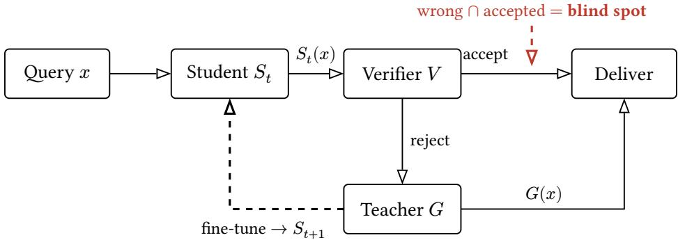
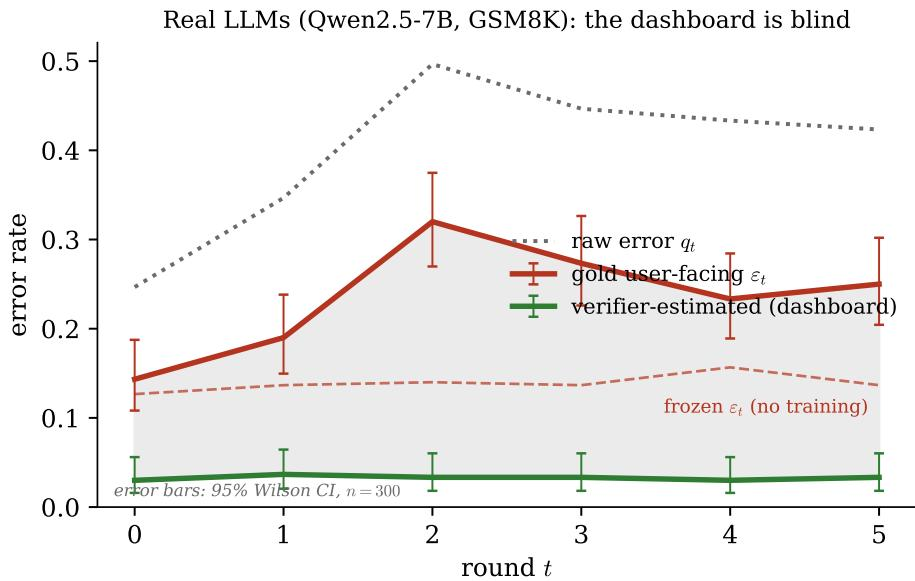
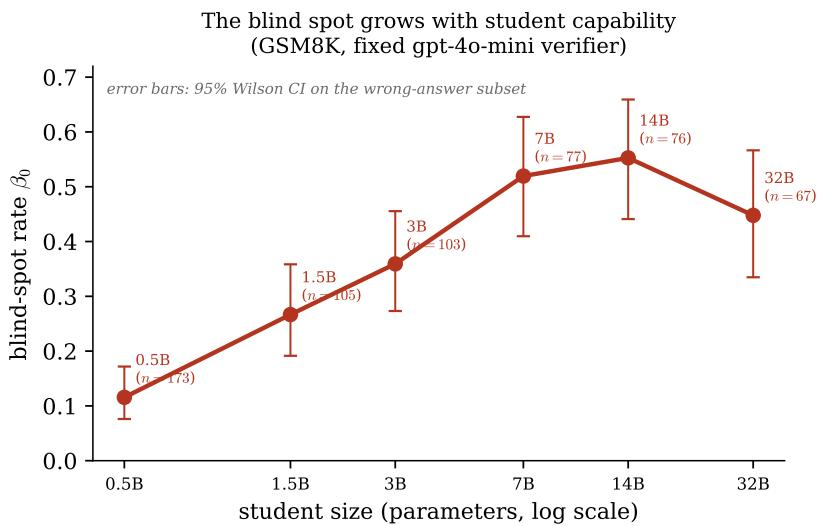
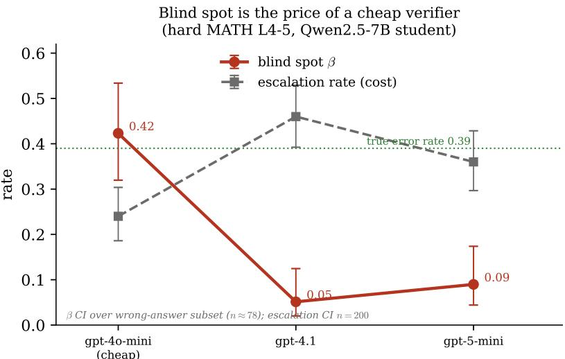
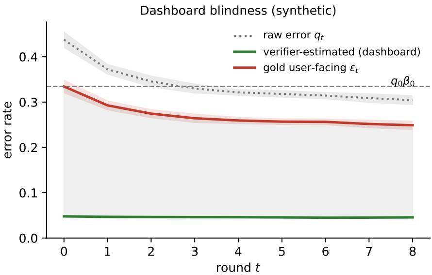
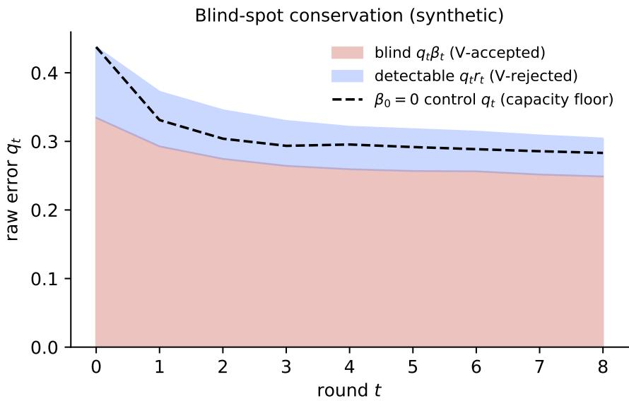
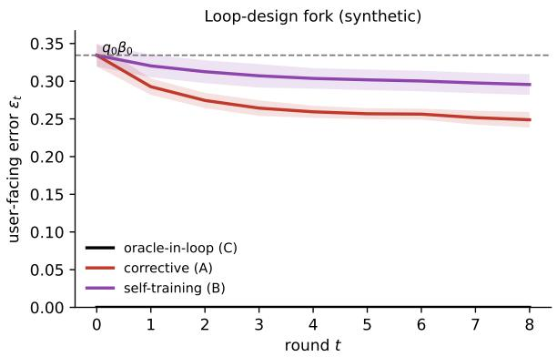
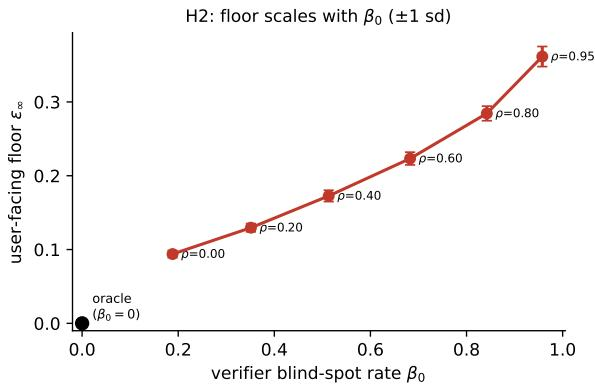
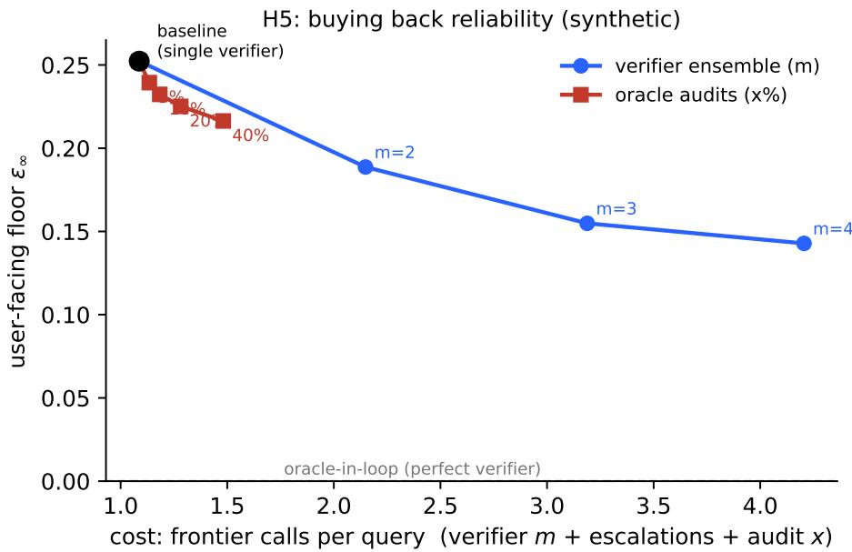

# Cheap Verifiers, Large Blind Spots: Measuring the Reliability Cost of Cost-Saving Cascades

Dushyant Rajput AltSlate Labs LLP dushyant@altslate.com

August 31, 2026

## Abstract

Inference cascades cut cost by answering most queries with a cheap model and escalating a hard tail to a frontier model that acts as verifier. A natural extension closes the loop—finetune the cheap student on the verifier’s rejections so the escalation rate, and cost, fall each round. We set out to measure this loop on real LLMs, and report four findings. First, the verifier’s blind spot—the fraction of the student’s wrong answers it waves through—is large and moves adversarially: it grows with student capability (β from 0.12 to 0.55 as the student scales 0.5B→32B) and shrinks with verifier capability, so it is worst exactly in the cheap-student, cheap-verifier configuration cascades exist to create. Second, buying it away returns the saving: a frontier verifier drives β to ≈ 0.05 but then escalates on 46% of hard-MATH queries against a 39% true error rate—paying the frontier price on nearly half of all trafic, the very cost the cascade exists to avoid. Third, naive corrective fine-tuning on the verifier-rejected tail does not improve the small student but degrades and ultimately collapses it, across every teacher we tried (cross-family and same-family)—so at this scale the “self-improving” loop is self-defeating. Fourth, throughout all of this the cascade’s own dashboard—every metric computed through the verifier—reads a flat ≈ 3% error while true delivered error swings up to 32%: the system is blind to its own degradation by construction. We then give the theory that explains the blindness—a two-population conservation law, $\varepsilon _ { \infty } \lesssim q _ { 0 } \beta _ { 0 }$ , under which every in-loop metric improves while true quality does not—and a synthetic study that validates the mechanism where the blind spot’s dynamics are emergent rather than imposed. The practical conclusion is a measurement discipline: the reliability of a self-improving cascade cannot be read from any metric computed through its own verifier.

Keywords: inference cascades · reward overoptimization · LLM-as-judge · cost-eficient inference · Goodhart’s law

## 1 Introduction

The dominant lever for reducing the cost of large-language-model inference has shifted from the model to the harness — the scafold of routing, verification, retrieval, and retries wrapped around a fixed set of weights. Among harness techniques, the cascade is the most direct cost play: run a cheap model on every query, and escalate to an expensive frontier model only when some signa says the cheap answer is untrustworthy [1–3]. The frontier model functions as a verifier; the cascade pays its price only on the escalated tail.

A tempting extension closes the loop. Every escalation yields a frontier-quality answer on exactly the distribution where the cheap model fails — a free training example. Fine-tune the cheap student on these corrections, and its error rate falls, its escalation rate falls with it, and the cascade gets cheaper each round. Recent work explores online, training-free versions of this idea, in which deferred queries produce reusable in-context strategies for the weak model [4, 5]; the parametric version, which updates the student’s weights, is the natural and more aggressive sibling.

The loop invites an analogy to speculative decoding, where a small drafter proposes tokens that a large model verifies in parallel, cheaply and — crucially — losslessly: rejection sampling guarantees the output distribution is exactly the large model’s [6, 7]. If semantic cascades inherited that guarantee, the self-improving loop would be a strict win: lower cost, preserved quality. They do not. Speculative decoding verifies a token against a distribution it has in closed form; a semantic cascade verifies a claim against a judgment the verifier must itself infer, and that judgment is wrong in both directions. Once verification is imperfect, training a student to satisfy the verifier is not distillation toward truth — it is optimization against a proxy, the setting in which reward-model overoptimization is known to arise [8, 9], a modern instance of Goodhart’s law [10].

This paper leads with what we measured. We built the wind tunnel needed to see a verifier’s blind spot — tasks with a cheap oracle from which the verifier is deliberately blinded (Section 4) — and ran the loop on real language models (Qwen2.5 students 0.5B–32B, GSM8K and hard MATH, OpenAI verifiers up to gpt-5-mini). Four findings, all measured rather than assumed, organize the paper.

• The blind spot is worst exactly where cascades operate. The verifier’s blind-spot rate β — the fraction of the student’s wrong answers it accepts — grows with student capability (from 0.12 at 0.5B to 0.55 at 14B, fixed verifier) and shrinks with verifier capability. A more capable student makes subtler, more convincing errors; a cheaper verifier catches fewer of them. The danger zone is therefore the cheap-student, cheap-verifier corner that makes cascades attractive in the first place (Section 5).

• Buying the blind spot away gives the cost back. Swapping a frontier verifier in on hard MATH collapses β to ≈ 0.05, but that verifier then escalates on 46% of queries against a 39% true error rate — it buys recall by over-rejecting, paying the frontier price on nearly half of all trafic. Low blind spot and low cost are not simultaneously available from a fixed verifier.

• The “self-improving” loop, at this scale, is self-defeating. Naive corrective fine-tuning on the verifier-rejected tail did not improve any small student we tried; it degraded them and, cumulatively, collapsed them — across cross-family and same-family teachers alike. We never instantiated a loop that improved the student, and report that plainly: it is a direct caution against the parametric self-improving loop (fine-tuning the student on the verifier’s rejects), the natural next step beyond today’s training-free deferral-reuse methods, and it means the clean error floor below stays a theoretical result rather than a measured one.

• None of this is visible from inside. Every metric a practitioner monitors is computed through the verifier, and reads a flat ≈ 3% error while true delivered error swings to 32% — the dashboard cannot distinguish a healthy student from one the loop is actively wrecking.

The rest of the paper explains why the dashboard is blind. We formalize the loop and its one structural property — training signal derived only from verifier-detectable errors (Section 3) — and derive a conservation law: user-facing error asymptotes not to zero but to a floor anchored at the initial confidently-wrong-and-accepted mass, $\varepsilon _ { \infty } \lesssim q _ { 0 } \beta _ { 0 }$ (Section 6, with a two-population proof in

Appendix A), under which every verifier-computed metric improves while true quality does not. A synthetic mechanism study, where the blind spot’s dynamics are emergent rather than imposed, validates the law and the mitigation exchange rates (Section 7). The theory is the explanation; the measurements are the result.

## 2 Background and related work

Cascades and routing. Cascades query models in sequence and decide, from a post-generation signal, whether to accept the cheap answer or escalate [1–3]. Routers instead decide before generation which model should answer [11]. Both aim at the cost–quality Pareto frontier; both, in their standard form, hold the cheap model fixed. Our object of study is the case where the cheap model is not fixed but is trained on the cascade’s own escalation signal, which changes the dynamics qualitatively.

Verifier-as-training-signal. Using a stronger model or a checker to supervise a weaker generator is the backbone of rejection-sampling fine-tuning and reinforced self-training [12], self-taught reasoning [13], and weak-to-strong supervision studies [14]. Recent cascade work makes the loop explicit and online, storing the strong model’s deferral-time strategies for reuse [4, 5], the latter deferring by self-consistency [15]. This literature reports accuracy-at-cost, typically as a single snapshot. None of it, to our knowledge, characterizes what happens to the composition of the student’s residual errors as the loop runs, which is precisely where the blind-spot efect lives.

Overoptimization and imperfect verifiers. Optimizing a policy against a learned proxy of human preference improves the proxy’s score while eventually degrading the true objective the gold reward turns over even as the proxy reward climbs [8, 9], a modern Goodhart efect [10]. This is the phenomenon underneath our claim, but the signature we predict is not Gao et al.’s turnover: under the corrective loop the proxy improves while gold error stays flat at a positive floor, and a turnover can appear only when accepted outputs are recycled as labels (self-training, our H3). Closest to us, Stroebl et al. [16] show that inference-time resampling against an imperfect verifier cannot beat the verifier’s false-positive rate — a static, single-shot form of the blind spot. Our claim is its closed-loop counterpart: once the student is trained against the verifier, that same false-accept mass becomes a round-persistent error floor rather than a per-query bound — pushed down only by generalisation spillover (corrective) and held higher when accepted outputs are recycled (self-training) — and turns invisible to every in-loop metric. Beyond the shape diference, our setting difers from reward-model overoptimization in that the proxy is the expensive resource whose invocation the loop is trying to minimize — so the overoptimization dose and the cost saving are the same axis, a coupling absent from RLHF — and that the student is trained on a self-selected slice (only the verifier’s rejects) rather than a fixed preference distribution.

LLM-as-judge and self-preference. Using an LLM to judge another model’s output is now standard [17], as is the finding that judges can favor text from their own family or their own generations [18]. We distinguish that efect from ours. Our correlation corollary is not about a judge preferring its own text it is about shared failure modes — a distractor whose reasoning “looks right” to a student built on certain pretraining priors also looks right to a verifier built on similar priors. Crucially, we make the causal claim on a measured blind-spot rate, not on a family label, so it does not depend on the self-preference mechanism being the cause.

Self-consuming loops and pseudo-labeling. Training a model on its own outputs can cause model collapse — loss of variance and tails under recursive generation [19, 20]. Our self-training loop is a verifier-filtered self-consuming loop, and the diference is the point: there, collapse arises from unfiltered recursion; here, the verifier’s blind spot selects which self-outputs are reinforced, concentrating error precisely where the filter cannot see. At the level of one round this is the classic confirmation bias of pseudo-labeling [21] and a reason intrinsic self-correction stalls without external signal [22]; what those results lack — and what the cascade supplies — is that the filter is an external frontier verifier, so the floor is set by student–verifier blind-mass overlap rather than by the student’s own confidence.

  
Figure 1: The self-improving cascade. The student’s output is either accepted and shipped, or rejected and replaced by the teacher’s; in the corrective loop only rejected items become training signal (dashed), while the self-training variant also feeds accepted outputs back as labels. Errors the verifier accepts by mistake are shipped unflagged and, in the corrective loop, never enter training — the blind spot.

Selective prediction and learning to defer. The verifier’s accept/reject decision is a deferral rule, and its blind-spot rate $\beta _ { t }$ is the miscoverage of that rule — the quantity selective classification [23] and learning-to-defer [24] are built to control. That literature studies the risk–coverage tradeof of a static rule; we study the closed-loop dynamics that arise once the deferred slice becomes training data and the rule’s blind region is never corrected.

## 3 The self-improving cascade

We fix notation. A student S maps a query x to an output $S ( x )$ . A verifier V maps a query and a candidate output to a binary decision, $V ( x , y ) \in \{ \mathrm { a c c e p t } $ , reject}. A teacher G (often the same frontier model as V) produces a replacement output $G ( x )$ on rejection. An oracle $O ( x , y ) \in$ {correct, wrong} gives ground truth; the oracle exists in analysis but is not available to the loop — if it were, one would simply verify with it.

The cascade delivers $S ( x )$ when V accepts and $G ( x )$ when V rejects (Figure 1). The selfimproving variant additionally updates the student. In round t:

1. Draw a batch $B _ { t } ;$ the student $S _ { t }$ generates $S _ { t } ( x )$ for $x \in B _ { t }$

2. The verifier judges each output; let $R _ { t } = \left\{ x : V \left( x , S _ { t } ( x ) \right) = { \mathrm { ~ r e j e c t } } \right\}$ and $A _ { t } = B _ { t } \setminus R _ { t }$

3. Form training targets and fit $S _ { t + 1 }$ . The corrective loop trains on $\{ ( x , G ( x ) ) : x \in R t \}$ . The self-training loop adds the accepted student outputs $\{ ( x , S _ { t } ( x ) ) : x \in A _ { t } \}$ as positive targets.

Two quantities drive everything. Let

$$
q _ { t } = \mathrm { P r } \left[ O \left( x , S _ { t } ( x ) \right) = \mathrm { ~ w r o n g } \right]
$$

be the student’s raw error rate, and let

$$
\beta _ { t } = \operatorname* { P r } \left[ V \left( x , S _ { t } ( x ) \right) = \mathrm { ~ a c c e p t ~ } \ \mid \ O \left( x , S _ { t } ( x ) \right) = \mathrm { ~ w r o n g } \right]
$$

be the verifier’s blind-spot rate — the fraction of the student’s genuine errors that the verifier waves through. Its complement $r _ { t } = 1 - \beta _ { t }$ is the verifier’s recall on errors.

The structural fact that organizes the rest of the paper is this: the loop’s training signal is a function of V, never of O. Rejections identify errors $V$ can see; the errors $V$ cannot see are, by construction, indistinguishable to the loop from correct answers. The loop is therefore a selection process that removes verifier-detectable errors and retains verifier-undetectable ones.

## 4 Measuring a blind spot: the wind-tunnel method

The obstacle to measuring any of this is that the blind spot is, in genuinely fuzzy tasks, unobservable: seeing it requires ground truth independent of the verifier, and independent ground truth is exactly what fuzzy tasks lack. Our method is a wind tunnel — a controlled setting in which ground truth exists but the verifier is denied it — and the real-model measurements of Section 5 are what it produced.

The wind tunnel. Use tasks that carry a cheap, reliable oracle, and blind the verifier to it. On mathematical problem solving [25, 26], the student emits a reasoning trace and a final answer. The oracle is exact-match of the answer against the gold solution — cheap, reliable, and independent of V. The verifier is a frontier model asked whether the solution is correct, given the problem and the trace but not the gold answer. This is a genuinely fuzzy verifier: it false-accepts wrong reasoning that looks convincing and false-rejects correct reasoning that looks unusual. Its blind spot is real, and — because we hold the oracle in reserve — now measurable. The oracle is used for measurement only; it never routes or trains, exactly as in a real deployment where it would be absent.

This design pre-empts the two obvious objections. “Just use the deterministic verifier” is answered by including the oracle-verifier as a control condition $( \beta _ { 0 } = 0 )$ : the point is to characterize the fuzzy regime where no such verifier exists. “Math is not $a f u z z y ~ t a s k ^ { \prime \prime }$ is answered by treating it as a model system: math carries a cheap gold oracle and a frontier verifier that visibly false-accepts and false-rejects, which is exactly what makes the blind spot measurable here. Extending the wind tunnel to a genuinely fuzzy task — long-form claim verification or code-review quality, whose oracle would have to be a super-verifier (an expensive ensemble validated against gold on the math tasks, then trusted where gold is unavailable) — is external-validity work we did not run; Section 9 names it as the main open scope.

Loop protocol. Fix disjoint splits: a pool for round batches, a held-out evaluation set used for all reported curves and never trained on, and a fixed probe set for tracking error composition. Each round: the student generates on a fresh batch; the verifier judges, blinded to the oracle; rejects receive a fresh teacher correction; the student is refit. To isolate data composition as the independent variable and remove optimizer path-dependence and catastrophic forgetting as confounds, we retrain cumulatively from the base model on all data collected through round t, rather than incrementally from $S _ { t }$ (incremental training is retained only as a robustness check). The verifier is pinned — same model, prompt, temperature, and seed, cached by output hash — so that any change across rounds originates from the student’s inputs, never from drift in V.

Measurement and the decomposition that must not be skipped. Every round, on the held-out set and via the oracle, we record raw error $q _ { t } ,$ escalation rate $p _ { \mathrm { r e j e c t } }$ , verifier recall $r _ { t }$ and blind-spot rate $\beta _ { t }$ , false-reject rate on correct answers, verifier-estimated accuracy (the dashboard number), and the user-facing error $\varepsilon _ { t } .$ . Critically, $\varepsilon _ { t }$ is decomposed into its accepted-and-wrong term and its teacher-error term at all times; the conservation claim is about the former alone, and conflating the two invites exactly the critique a careful reviewer will raise. A sanity gate tracks whether $q _ { t }$ actually falls: if the loop does not improve the student, the conservation-floor reading is unavailable — an outcome we report plainly (it is what the real-model runs of Section 5 in fact exhibit) rather than papering over, since the dashboard-blindness result holds whether the student improves or degrades.

This is the method; Section 5 reports what it produced on real language models, and Section 7 what it produced in a controlled model where the loop provably improves the student.

## 5 Real-model measurements

This section is the paper’s empirical core.1 We ran the wind-tunnel method of Section 4 on real language models: students are Qwen2.5-Instruct (0.5B–32B), fine-tuned with LoRA on a single H100; verifiers and teachers are OpenAI models (gpt-4o-mini, gpt-4.1, gpt-5-mini), always blinded to the gold answer; the oracle is exact-match on GSM8K [26] and symbolic equivalence on the hard subset (levels 4–5) of MATH [25]. Nothing is assumed — whether a blind spot exists, how large it is, and how it moves with student and verifier strength are all measured. Error bars throughout are 95% Wilson intervals; the blind-spot rate $\beta$ is a proportion over the wrong-answer subset only, so its intervals $( n \approx 7 0 – 1 7 0 )$ are wider than those on the raw error rate (n = 300). These are single-seed runs; Section 9 treats seed variance.

None of it shows on the dashboard (Figure 2). Running the corrective loop with a Qwen2.5-7B student and a gpt-4o-mini verifier on GSM8K, the verifier-estimated error of the delivered stream holds flat near 3% across all rounds, while the true (gold) user-facing error swings from 14% to 32% — a 5–11× gap whose 95% intervals stop overlapping from round 1 on, so no in-loop metric reveals it. The frozen control stays near 13%; the loop itself, trained on the frontier teacher’s corrections, degrades the student (raw error rises), and the dashboard is blind to the degradation exactly as it is blind to the level. This is the alarming finding, and it does not depend on any conjecture: the gold and dashboard curves are both directly measured. This is a single training seed, so the exact per-round trajectory could shift; but the level gap — a flat ∼ 3% dashboard against a 14–32% truth — is far larger than any plausible LoRA seed variance, so the result is the gap, not the particular curve (Section 9).

The blind spot grows with student capability (Figure 3). Holding the verifier fixed (gpt-4o-mini) and sweeping the student 0.5B→32B on GSM8K, $\beta _ { 0 }$ rises from 0.12 (CI [0.08, 0.17]) at 0.5B to 0.55 ([0.44, 0.66]) at 14B: a stronger student makes subtler errors, so the fixed verifier is fooled more often. The small-vs-large separation sits well outside the intervals; the top three sizes (7B–32B, all $[ \approx 0 . 3 5 , 0 . 6 5 ] ,$ ) form a plateau within noise, so the honest reading is a monotone rise that saturates, not a peak-and-fall. This is a diferent mechanism from Corollary 1 and worth separating from it. Corollary 1 is about correlation — student and verifier finding the same wrong answer convincing because they share failure modes; here the verifier is held fixed while only the student varies, so what moves $\beta _ { 0 }$ is the capability gap: a stronger student’s errors are intrinsically subtler and harder for any fixed verifier to catch, correlated or not. This capability-gap route to a high blind spot is not part of the self-preference literature, and it carries a sharper warning — the blind spot gets worse as students improve, so the problem grows rather than shrinks with progress on the cheap model. Note the finding is a static characterization — a property of the student–verifier pair before any training — so it holds for a plain cascade and does not depend on the loop working; that is exactly why it is robust.

  
Figure 2: Real LLMs (Qwen2.5-7B student, gpt-4o-mini verifier, GSM8K). The dashboard (verifierestimated error) stays ∼ 3% while gold user-facing error climbs; the shaded gap is hidden harm. Error bars are 95% Wilson intervals $( n = 3 0 0 )$ ; the gold–dashboard gap clears them from round 1 on. The loop degrades the student here (raw error rises) — cross-family distillation, not improvement; the frozen control (dashed) is flat.

  
Figure 3: Blind-spot rate $\beta _ { 0 }$ vs student size (GSM8K, fixed gpt-4o-mini verifier; 95% Wilson bars over each size’s wrong-answer subset). A more capable student makes more convincing wrong answers, so the verifier accepts more of them; the rise saturates across the largest three.

  
Figure 4: Hard MATH (L4–5), fixed Qwen2.5-7B student (95% Wilson bars: $\beta$ over the $n \approx 7 8$ wrong answers, escalation over n = 200). As the verifier strengthens, the blind spot $\beta$ falls but the escalation rate (cost) rises to meet the true error rate (dotted) — a strong verifier suppresses the blind spot by overescalating.

The blind spot is the price of a cheap verifier (Figure 4). On hard MATH, holding the 7B student fixed and sweeping the verifier, β collapses from 0.42 (gpt-4o-mini, CI [0.32, 0.53]) to 0.05–0.09 for the two strong verifiers (gpt-4.1 and gpt-5-mini, intervals [0.02, 0.12] and [0.04, 0.17] — statistically indistinguishable from each other): a strong verifier catches almost every error on a task it can largely solve. But that low blind spot is not free — gpt-4.1’s escalation rate (0.46, CI [0.39, 0.53]) meets or exceeds the true error rate (0.39), so it buys recall by over-rejecting correct answers too, paying the frontier price on nearly half of queries — the very cost the cascade exists to avoid. The blind spot is thus largest precisely in the cost-saving configuration — a capable cheap student checked by a cheap verifier — and buying it away gives the cost back. Like the student sweep, this is a static operating-point characterization, independent of any training.

The loop degrades the student — every teacher we tried. The one thing we set out to build, a loop that improves the small student, we could not. The two figures above are inferenceonly sweeps; the training loop we ran on two students, the 1.5B and the 7B (GSM8K corrective, and the teacher-family comparison of the next paragraph), and on both it fails the same way. Across every teacher — cross-family (gpt-4o-mini and gpt-4o) and same-family (Qwen2.5-32B) — naive LoRA fine-tuning on the verifier-rejected tail degrades the student rather than improving it, and cumulatively collapses it (raw error rising to 1 as training on the hardest, most style-shifted examples breaks its output format) — an efect adjacent to the model-collapse literature [19], and one the dashboard is equally blind to. This is worth stating sharply: the parametric self-improving loop — the weight-updating sibling of today’s training-free deferral-reuse methods [4, 5] — finetunes on exactly the hard-tail rejects most likely to destabilise a small student, so its naive form is not merely suboptimal but actively harmful at this scale. So the real runs establish the blind spot’s structure — real, scaling up with student and down with verifier, invisible to every in-loop metric — but not the clean conservation scissors (raw error falling while user-facing error floors at $q _ { 0 } \beta _ { 0 } )$ , which needs a loop that improves the student. The floor therefore stays a theoretical result — derived in Section 6 and Appendix A, validated synthetically in Section 7 — and its real-model demonstration (a stronger student, or a training recipe that resists the hard-tail distribution shift)

is open. The next section explains why, whether the loop improves or degrades the student, none of it registers on the dashboard. Configuration and scripts are in the artifact (Section B).

## 6 Why the dashboard is blind: a conservation-law account

The measurements raise one question above the rest: why does no metric a practitioner can compute move, whether the loop is holding steady or actively collapsing the student? The answer is structural, and this section derives it. The same structure predicts that even a loop that worked — that improved the student round over round — would leave a positive error floor rather than driving delivered error to zero. We could not instantiate that improving loop at real-model scale (Section 5), so the floor is a theoretical prediction; the dashboard blindness it explains is not.

Consider the student’s errors as two populations: those the verifier detects (mass $q _ { t } r _ { t } )$ and those it does not (mass $q _ { t } \beta _ { t } )$ . The loop applies a correction pressure to the first population and no direct pressure to the second: the undetectable errors receive no targeted training signal, though parameter updates driven by the detectable ones can still spill into them (Figure 6).

The user-facing error rate — the quantity a deployment actually ships — is the error that survives verification:

$$
\varepsilon _ { t } = \underbrace { \mathrm { } \frac { q _ { t } \beta _ { t } } { \varepsilon \mathrm { e } \mathrm { e } \mathrm { e } \mathrm { e } } } _ { \mathrm { a c c e p t e d ~ \& ~ w r o n g } } + \underbrace { \mathrm { P r } \left[ V \left( x , S _ { t } ( x ) \right) = \mathrm { ~ r e j e c t ~ } \wedge O \left( x , G ( x ) \right) = \mathrm { ~ w r o n g } \right] } _ { \mathrm { t e a c h e r ~ e r r o r } } .
$$

The second term is the teacher’s fallibility on the rejected items; its conditional rate is bounded by G‘s error rate, but its mass shrinks with the escalation rate as the loop proceeds, and when G and V share priors, wrong teacher labels that V would also accept can enter training — blurring the corrective/self-training distinction (Section 9). The first term is the blind spot, and our central claim concerns it.

Conjecture (Blind-spot conservation). Under the corrective loop with a fixed, imperfect verifier, and absent generalization spillover into the blind region, the accepted-and-wrong error mass $q _ { t } \beta _ { t }$ is conserved across rounds even as the detectable mass $q _ { t } r _ { t }$ is driven down, so the user-facing error does not vanish but asymptotes to

$$
\varepsilon _ { \infty } \approx q _ { 0 } \beta _ { 0 } .
$$

Spillover relaxes this equality to an upper anchor, $\varepsilon _ { \infty } \lesssim q _ { 0 } \beta _ { 0 }$ , when $\beta _ { 0 }$ is large relative to the student’s capacity floor. Appendix A makes both statements precise (Proposition 1).

The intuition is that the loop removes error mass only where it has signal. Detectable error $q _ { t } r _ { t }$ shrinks because it is trained against; undetectable error $q _ { t } \beta _ { t }$ persists because it is not. The anchor reaches the raw student too: with no direct signal on the blind region, to first order $q _ { t }$ inherits the same floor, and any drop below $q _ { 0 } \beta _ { 0 }$ is spillover (self-healing). Only when the loop trains on every error — the oracle-in-loop control C of Section 4 — does raw error $q _ { t }$ fall to the student’s capacity limit (the dashed trajectory in Figure 6) while delivered error $\varepsilon _ { t }$ reaches zero. The synthetic study of Section 7 plots this decomposition directly.

Two second-order efects perturb the anchor, and they push in opposite directions:

• Self-healing (corrective loop). Gains in general competence may incidentally fix some blindspot cases the loop never explicitly targeted, so the observed floor falls below $q _ { 0 } \beta _ { 0 }$ . The size of this gap measures how much reliability the loop delivers “for free” beyond what the verifier can see.

• Self-reinforcement (self-training loop). When accepted student outputs are fed back as positive targets, false accepts are injected as labels, actively teaching the student to reproduce the errors the verifier cannot catch. The floor then sits strictly above the corrective floor, and — when reinforcement outweighs self-healing — above $q _ { 0 } \beta _ { 0 }$ itself, with user-facing quality able to degrade while every in-loop signal improves.

The falsifiable core is narrower than this interpretive frame and should not be confused with it. What can be refuted is $\mathrm { H 1 - a }$ strictly positive floor, against the null $\varepsilon _ { \infty } = 0 \mathrm { ~ - ~ }$ and $\mathrm { H 2 - }$ the floor increasing in the measured $\beta _ { 0 }$ , against the null of no relation. The anchor $q _ { 0 } \beta _ { 0 }$ is a reference scale for the corrective loop, not a conserved quantity; a floor of zero, or a floor uncorrelated with $\beta _ { 0 }$ , would count against the framework. The self-healing $/$ self-reinforcement split then interprets where a given loop lands relative to the anchor.

Two corollaries sharpen the practical stakes.

Corollary 1 (Correlation scaling). The floor is increasing in the verifier’s blind-spot rate $\beta _ { 0 }$ and $\beta _ { 0 }$ is large when student and verifier share failure modes — when a wrong answer convincing to $S$ is also convincing to $V .$ . (Shared failure modes are one suficient cause of a high $\beta _ { 0 }$ , not the only one — a lazy rubber-stamping verifier has high $\beta _ { 0 }$ with no shared bias, and, as Section 5 measures directly, so does a large capability gap: a strong student’s errors are intrinsically subtle, so even an uncorrelated verifier catches fewer of them. Correlation and capability-gap are distinct routes to the same high $\beta _ { 0 } . )$ Verifiers from the same family or pretraining lineage as the student should therefore yield higher floors than independent verifiers; a deterministic oracle-verifier $( \beta _ { 0 } = 0 )$ yields no floor. The engineering reading is a design rule: decorrelate the verifier from the student — and, from the capability-gap route, expect the blind spot to grow as the cheap student improves.

Corollary 2 (Dashboard blindness). Every metric a practitioner naturally monitors the escalation rate $p _ { \mathrm { r e j e c t } }$ (a proxy for cost) and the verifier’s estimated accuracy on the accepted stream — is computed through V. As the loop concentrates error into $V ^ { \ast } \mathrm { s }$ blind spot, these metrics improve or hold steady — fewer escalations, near-perfect apparent accept-stream quality (Figure 5), the accepted-stream component being structural since V cannot flag its own accepts. The gold truth accuracy of the accepted stream, which no in-loop instrument reports, fails to improve in step — it stays floored. The system is thus blind to its own degradation $b y$ construction, not by oversight; the cost dashboard and the quality dashboard are the same instrument, and it is the compromised one.

The account’s five predictions. The conservation-law account makes five directional, falsifiable predictions, tested across the rest of the paper. One is already confirmed on real models: the dashboard-blindness prediction (H4) is directly measured (Section 5). A second is addressed only at the level of its precondition: H2 asks whether the error floor scales with $\beta _ { 0 }$ , and while we never measure a floor on real models, we do measure that $\beta _ { 0 }$ itself rises with the student–verifier capability gap (Section 5) — the necessary precursor, not the floor-scaling itself. The floor (H1), the loop-design hazard (H3), and the mitigation exchange rates (H5) all need a loop that improves the student, so they are tested in the controlled model of Section 7. Each is stated with its null.

H1 (Positive floor) User-facing error $\varepsilon _ { t }$ does not vanish but asymptotes to a strictly positive floor $\lesssim q _ { 0 } \beta _ { 0 } ;$ to first order raw error $q _ { t }$ inherits the same floor, and a matched $\beta _ { 0 } = 0$ control isolates the verifier-induced excess, while the oracle-in-loop control drives delivered error to zero. Null: $\varepsilon _ { t } \to 0 - \mathrm { n o }$ floor.

H2 (Blind-spot scaling) The asymptotic floor $\varepsilon _ { \infty }$ is increasing in the measured initial blind-spot rate $\beta _ { 0 }$ . Sweeping the verifier to vary $\beta _ { 0 }$ traces a positive relation; an oracle-verifier sits at the origin. Null: the floor is independent of $\beta _ { 0 }$ .

H3 (Loop-design hazard) The self-training loop yields a strictly higher floor than the corrective loop; under strong enough reinforcement it can push the floor above $q _ { 0 } \beta _ { 0 }$ and render $\varepsilon _ { t }$ nonmonotone while in-loop metrics improve. Null: the two loops floor at the same level.

H4 (Dashboard blindness) A large, persistent gap separates the verifier-estimated error of the delivered stream from its gold error, invisible to every in-loop metric. A further prediction, untested here, is that the gap widens over rounds whenever self-training grows the blind mass. Null: estimated and gold error track each other.

H5 (Mitigation exchange rate) A decorrelated verifier ensemble, and spending a fixed fraction of budget on random oracle audits that re-inject blind-spot cases into training, each lower the floor toward the oracle-in-loop control, at a quantifiable cost. Null: neither intervention moves the floor.

## 7 Synthetic validation

Because the real-model loop degrades rather than improves the student (Section 5), the conservation floor — the behaviour of a loop that works — cannot be read of the real runs. We therefore turn to a controlled model in which the loop provably improves the student, and ask whether the law appears when the blind spot’s dynamics are emergent rather than imposed. A positive answer is necessary, not suficient — it cannot speak to real language models — but a negative answer would refute the mechanism outright. This is where H1, H3, and H5 are tested.

Model. The task is $K = \mathrm { 1 0 – w a y }$ classification standing in for “produce the right answer”; ground truth $y ^ { \ast ( \varphi ) }$ is a fixed random two-layer network. The student is a logistic model on random features, retrained each round on a pool the loop grows; it improves with data. The verifier is fixed with two regimes: on a blind region — a fixed random half-space whose threshold is set so the region covers input-space mass $\rho -$ it rubber-stamps whatever the student says; elsewhere it re-derives its own class with a strong classifier and accepts only on agreement. So $\rho$ sets the verifier’s blind spot rate; the measured $\beta _ { 0 }$ slightly exceeds ρ (e.g. 0.76 at $\rho = 0 . 7 )$ because the strong classifier occasionally agrees with a wrong answer outside the blind region. This models blind mass, not correlation per se — H2 tests $\mathrm { f l o o r - a g a i n s t - } \beta _ { 0 }$ , and Corollary 1’s correlation reading is one account of what makes $\beta _ { 0 }$ large. Crucially, nothing tells the loop to spare blind-spot errors: blind-region items are accepted, so they never enter the training pool; whether that yields a conserved floor, selfhealing, or self-reinforcement is left to the learning dynamics. We run five variants — corrective (A), self-training (B), oracle-in-loop (C, perfect verifier trained on all items), frozen (D), and a matched control (perfect verifier, trained on wrong items only, isolating the verifier-induced excess) — for eight rounds over 20 seeds, the teacher supplying true labels on rejected items. The dashboard metric is the verifier-estimated error of the delivered stream — the fraction the pinned verifier rejects on a re-pass — which a practitioner computes without gold.

Table 1: Per-variant outcomes at $\rho = 0 . 7$ (20 seeds, mean ± sd). Frozen sits on the anchor $q _ { 0 } \beta _ { 0 } = 0 . 3 3 4 ;$ both learning variants land below it (self-training above corrective); oracle reaches zero. The verifier-induced excess in raw error is $q _ { T } ^ { \mathrm { c o r r } } \ - q _ { T } ^ { \mathrm { m a t c h e d } } \ = . 3 0 4 - . 2 8 3 = . 0 2 1$
<table><tr><td>variant</td><td>qo</td><td> $\beta _ { 0 }$ </td><td>qT</td><td> $\varepsilon _ { T }$ </td><td> $q _ { 0 } \beta _ { 0 }$ </td><td>dashT</td></tr><tr><td>corrective (A)</td><td>.438</td><td>.764</td><td> $. 3 0 4 \pm . 0 1$ </td><td> ${ \bf . 2 4 9 \pm . 0 1 }$ </td><td>.334</td><td>.046</td></tr><tr><td>self-training (B)</td><td>.438</td><td>.764</td><td> $. 3 5 6 \pm . 0 2$ </td><td> ${ \bf 2 9 6 \pm . 0 1 }$ </td><td>.334</td><td>.045</td></tr><tr><td>oracle-in-loop (C)</td><td>.438</td><td>.000</td><td> $. 2 4 8 \pm . 0 1$ </td><td>.000</td><td></td><td>.000</td></tr></table>

Figure 5: Dashboard blindness $( \rho = 0 . 7 , \pm 1$ sd bands). The verifier-estimated error of the delivered stream holds near 4.6% while the gold error falls and floors at ≈ 24.9%; the shaded gap is a large, persistent hidden harm no verifier-computed dashboard reports. Raw error $q _ { t }$ (dotted) also floors, near $q _ { 0 } \beta _ { 0 }$
<table><tr><td>variant</td><td>qo</td><td> $\beta _ { 0 }$ </td><td> $q _ { T }$ </td><td> $\varepsilon _ { T }$ </td><td> $q _ { 0 } \beta _ { 0 }$ </td><td>dashT</td></tr><tr><td> $\beta _ { 0 } = 0$  matched</td><td>.438</td><td>.000</td><td> $. 2 8 3 \pm . 0 1$ </td><td>.000</td><td></td><td>.000</td></tr><tr><td>frozen (D)</td><td>.438</td><td>.764</td><td> $. 4 3 8 \pm . 0 2$ </td><td> ${ \bf . 3 3 4 \pm . 0 2 }$ </td><td>.334</td><td>.048</td></tr></table>

Results. Four of the five predictions are supported as stated, and H3 is supported in a corrected form (Table 1). H1 (positive floor): under the fuzzy verifier, gold user-facing error falls but floors — from $\varepsilon _ { 0 } = 0 . 3 3$ to $\varepsilon _ { \infty } = 0 . 2 5 \pm . 0 1 -$ while the oracle-in-loop control reaches 0; a matched $\beta _ { 0 } = 0$ control (perfect verifier, same reject-and-retrain rule) isolates the verifier’s efect on raw error, $q _ { T } ^ { \mathrm { c o r r } } \ - q _ { T } ^ { \mathrm { m a t c h e d } } \ = 0 . 3 0 4 - 0 . 2 8 3 = 0 . 0 2 1$ — this excess conflates two verifier-caused efects, never labelling the blind region and the smaller training pool that results, so it is verifier-induced but not blind-mass censoring alone (Figure 6). $H _ { 4 }$ (dashboard blindness): the dashboard reads 4.6% while the truth is $2 4 . 9 \% - \mathrm { ~ a ~ }$ large level gap. It does not widen here: under both loops gold error falls while the dashboard stays flat, so the gap narrows; the widening form needs the blind mass to grow, which our readily-generalising student does not exhibit, so it remains a real-model prediction (Figure 5). H2 (scaling): the floor increases monotonically with the measured $\beta _ { 0 } ,$ from 0.09 to 0.36 as $\beta _ { 0 }$ sweeps $0 . 1 9  0 . 9 6$ , with tight per-seed bands (Figure 7b); at the smallest $\beta _ { 0 }$ the floor slightly exceeds $q _ { 0 } \beta _ { 0 }$ because the capacity floor binds, so the $\lesssim q _ { 0 } \beta _ { 0 }$ reading holds for $\beta _ { 0 }$ large relative to that capacity limit. H3 (loop-design hazard): self-training floors strictly higher than corrective $( \varepsilon _ { T } = 0 . 3 0$ vs 0.25; $q _ { T } = 0 . 3 6$ vs 0.30); its raw error falls over rounds (from 0.438 to 0.356), not rises — the predicted absolute rise did not occur in this instantiation, so the efect here is reinforcement relative to the corrective loop, and the non-monotone regime remains a real-model prediction (Figure 7a).

H5 (mitigation exchange rate). Both proposed remedies move the floor toward the oracle bound, and they occupy diferent regions of the cost–reliability plane (Figure 8). A decorrelated verifier ensemble — m verifiers with independent blind regions, rejecting on any dissent — drives the efective blind-spot rate toward $\rho ^ { m }$ plus a residual agreement term (measured $\beta _ { 0 } \colon 0 . 7 6  0 . 4 0$ at $m = 4$ , above $\rho ^ { 4 } \approx 0 . 2 4$ because the strong classifier still false-accepts occasionally outside the blind region) and cuts the floor from 0.25 to 0.14, but pays m verifier calls per query. Random oracle audits are far cheaper yet weaker: auditing 40% of items lowers the floor only to 0.22, because most of the audit budget lands on non-blind items — an untargeted audit spends most of its checks where the verifier already sees. Neither reaches the oracle floor within the tested budget; the ensemble is the stronger lever, and the obvious refinement — auditing where the verifier is least certain rather than at random — is left to the real-model study.

  
Figure 6: Conservation $( \rho = 0 . 7 )$ . Raw error $q _ { t }$ splits into a detectable band the loop trains away and a blind band it receives no direct signal on; the blind mass is largely conserved. The dashed line is the matched $\beta _ { 0 } = 0$ control — the capacity floor the same student reaches when it can train on the blind-region errors so the gap to it is the verifier-induced excess.

The one honest correction. The conjecture anchored the corrective floor at $q _ { 0 } \beta _ { 0 } = 0 . 3 3$ Both learning variants land below it — corrective at 0.25, self-training at 0.30 — and only the frozen control sits on the anchor (0.33, with no learning to spill). The predicted above-anchor regime for self-training was not observed: self-healing dominates even when accepted outputs are recycled as labels, so self-training floors above corrective rather than above $q _ { 0 } \beta _ { 0 }$ . The ordering that held is frozen $( = q _ { 0 } \beta _ { 0 } ) >$ self-training > corrective > oracle, which still separates the mechanisms, and the equality should be read as $\varepsilon _ { \infty } \lesssim q _ { 0 } \beta _ { 0 }$ for the corrective loop, the 0.33 − 0.25 gap quantifying self-healing. Pushing self-training across the anchor would need reinforcement strong enough to outweigh this spillover — a plausible real-model regime our synthetic student, which generalises readily, does not reach.

What this does and does not establish. Two confirmations are close to structural: because blind-region items are censored from the training pool, a persistent floor (H1) and its growth with blind mass (H2) follow almost arithmetically — they show the mechanism is self-consistent, not that it is large in practice. The genuinely informative outcomes are those the censoring does not force: the size of the self-healing gap, the H3 ordering (and the absence of an absolute rise), the 0.021 verifier-induced excess against the matched control, and the H5 exchange rates. In all cases the blind spot’s existence is modelled (through $\rho )$ while only its dynamics under the loop are emergent; none of it evidences the efect’s magnitude on real language models — which is why the real-model measurements of Section 5, not this study, carry the paper’s empirical weight. What the synthetic model adds is the one thing the real runs could not supply: the behaviour of a loop that improves the student, and thus direct evidence for the conservation floor the theory predicts.

  
(a) loop-design fork

  
(b) floor vs $\beta _ { 0 }$ (H2)  
Figure 7: (a) User-facing error by loop variant: oracle-in-loop (C) reaches zero, and both learning loops land below $q _ { 0 } \beta _ { 0 }$ —corrective (A) lowest, self-training (B) above corrective but still below the anchor. (b) The user-facing floor scales monotonically with the verifier’s blind-spot rate $\beta _ { 0 }$ (±1 sd), with the oracle at the origin.

## 8 Threats to validity

The measurements and the synthetic study are each exposed to characteristic failures, and we address them in turn. The floor claim depends on the loop improving the student; on real models it did not, and rather than treat that as a void premise we report it as a finding (Section 5) and fall back to the controlled model, where the sanity gate on $q _ { t }$ confirms the loop does improve. In that controlled study, so that forgetting or optimizer instability cannot masquerade as decoupling, we train cumulatively from the base model and include the frozen-student control (D) to separate the two. If the blind-spot mass self-heals, that is not a failure but the negative result the conjecture already anticipates, named by the sign of the deviation from $q _ { 0 } \beta _ { 0 }$ The model-system critique — that math is not a genuinely fuzzy task — is met partly by the real-model measurements of Section 5, where the frontier verifier visibly false-accepts and false-rejects on GSM8K and hard MATH; extending to a fully fuzzy task via a validated super-verifier is named as open scope (Section 9), not claimed. Verification cost — the dominant expense, since $V$ is a frontier model — is controlled by deterministic caching of the pinned verifier.

The correlation corollary is the claim most exposed to challenge, precisely because it borders the self-preference literature [18]. The defense is built into the measurement: H2 is stated over the measured $\beta _ { 0 }$ , with model family used only as a manipulation to spread $\beta _ { 0 }$ across a range. The relation between the floor and $\beta _ { 0 }$ therefore stands whether or not self-preference is the reason $\beta _ { 0 }$ is high for same-family pairs.

## 9 Limitations

Distinct from the threats above — which defend the proposed design — these bound the paper’s own claims. (1) The synthetic blind region is a static input-space set, whereas real verifier blind spots are output-dependent and move with the student’s error distribution (assumption A1 of Appendix $\mathrm { A } )$ ; a soft or moving blind region could weaken conservation. (2) The anchor q0β0 assumes a stationary query distribution. (3) When the teacher G is the verifier V, the teachererror term is not independent of $\beta$ and the floor formula is optimistic — wrong labels V would also accept enter training. (4) A 10-way classification task with a logistic student may not transfer to open-ended generation, where “the same wrong answer” is itself ill-defined. (5) The H5 exchange rates are properties of the synthetic geometry, not portable constants. (6) The real-model runs are single-seed: point estimates carry 95% Wilson intervals (Section 5), but seed-to-seed variance in LoRA training is not bounded, so the per-round trajectory of the degrading loop should be read as one representative run, not an averaged curve — the static blind-spot sweeps, being training-free, do not share this caveat. The real-model measurements (Section 5) and the appendix model each resolve a subset of these.

  
Figure 8: Mitigation exchange rate $( \rho = 0 . 7 )$ . A cost–reliability Pareto: a verifier ensemble (blue) buys large reductions in the floor at steep cost (m verifier calls per query); random oracle audits (red) are cheap but shallow. The oracle-in-loop bound (dashed) is a perfect verifier.

## 10 Implications

Three consequences follow for anyone building cost-saving cascades with verifier feedback; the first two rest on what we measured, the third on the theory. First — measured — the cost dashboard lies: escalation rate and accept-stream accuracy read healthy (a flat 3%) while true delivered error swings to 32%, because both are computed through the verifier and improve or hold steady as error hides in its blind spot. An independent audit channel — a small, periodic gold-labeled sample — is not optional instrumentation but the only instrument that can see the efect. Second — measured — verifier choice is a reliability decision, not only a cost decision: the blind spot grows with student capability and shrinks with verifier capability, so a cheaper verifier trades reliability for cost on an axis no dashboard shows, and buying the blind spot away with a frontier verifier returns the cost saving it was meant to provide. Third — from the theory — the loop-design choice between corrective and self-training is a safety choice: feeding accepted outputs back as positive labels converts a passive blind spot into an actively reinforced one.

None of this argues against cascades, which remain the most direct cost lever available, nor against closing the loop, which genuinely lowers cost. It argues that the reliability of a self-improving cascade must be measured outside the verifier that defines it, because a system optimized against a proxy will, given the chance, satisfy the proxy rather than the goal — and a cascade that retrains on its own verifier is given exactly that chance, round after round.

## 11 Conclusion

We measured the blind spot of a cost-saving cascade on real LLMs and found it moves adversarially: it grows with student capability and shrinks with verifier capability, so it is largest exactly in the cheap-student, cheap-verifier regime that makes cascades attractive, and buying it away with a frontier verifier returns the cost saving by escalating on nearly half of queries. We found that closing the loop with naive corrective fine-tuning does not improve a small student but degrades and collapses it, across every teacher — a direct caution against the parametric self-improving loop that fine-tunes the student on the verifier’s rejects. And we found that none of this registers on any metric a practitioner can compute: the dashboard reads a flat 3% while true delivered error swings to 32%. To explain that blindness we gave a two-population conservation law — the loop trains only on verifier-detectable errors, so user-facing error asymptotes to a floor $\lesssim q _ { 0 } \beta _ { 0 }$ rather than vanishing, and every in-loop metric improves while true quality does not — derived in a linear model (Appendix A) and validated in a synthetic study where the loop provably improves the student (Section 7). The clean floor itself we leave as theory, because no real-model loop we ran reached it. The through-line is practical: the reliability of a self-improving cascade cannot be read from any metric computed through its own verifier — it must be measured outside.

## A Two-population model of the error floor

Track the two error masses $d _ { t } = q _ { t } r _ { t }$ (detectable) and $b _ { t } = q _ { t } \beta _ { t }$ (blind), with raw error $q _ { t } = d _ { t } + b _ { t }$ and delivered error $\varepsilon _ { t } = b _ { t } + \tau _ { t } .$ , where $\tau _ { t }$ is the teacher’s error on rejected items. We model one round of each loop as a linear update under idealised assumptions: (A1) the verifier’s blind region is fixed; (A2) the query distribution is stationary; (A3) each round the loop corrects a fraction $c \in ( 0 , 1 ]$ of the detectable mass, transfers a fraction $\gamma \geq 0$ of that reduction to the blind mass by generalisation (spillover), and — under self-training — recycles false accepts as labels, adding back $\alpha \geq 0$ of the blind mass:

$$
d _ { t + 1 } = ( 1 - c ) d _ { t } , \quad b _ { t + 1 } = b _ { t } - \gamma \left( d _ { t } - d _ { t + 1 } \right) + \alpha b _ { t } .
$$

Proposition 1. Under (A1)–(A3), with $\tau _ { t } \to 0 \colon$

1. (Frozen, $c = 0 , \alpha = 0 . ) \ b _ { t } \equiv b _ { 0 } , \mathrm { s o } \ \varepsilon _ { \infty } = q _ { 0 } \beta _ { 0 } \mathrm { : }$ exact conservation.

2. (Corrective, $c > 0 , \alpha = 0 . ) \ d _ { t } \to 0$ and

$$
\varepsilon _ { \infty } = q _ { 0 } \beta _ { 0 } - \gamma d _ { 0 } \leq q _ { 0 } \beta _ { 0 } ( \gamma d _ { 0 } \leq b _ { 0 } ) ,
$$

with equality if $\gamma = 0 ;$ ; the slack $\gamma d _ { 0 }$ is self-healing.

3. (Self-training, $\alpha > 0 . /$ at every finite horizon $T ,$

$$
b _ { T } = b _ { 0 } - \gamma \left( d _ { 0 } - d _ { T } \right) + \alpha \sum _ { t < T } b _ { t } > b _ { \infty } ^ { \mathrm { c o r r } } ,
$$

strictly once $\alpha > 0$ , and $b _ { T } > q _ { 0 } \beta _ { 0 }$ once the accumulated reinforcement outweighs $\gamma d _ { 0 }$ . The linear reinforcement has no finite limit (blind mass would grow without bound as $d _ { t } \to 0 )$ , so this is a finite-horizon statement; a realistic saturating reinforcement — α acting only on the not-yet-reinforced mass, capping total error at 1 — gives a genuine elevated fixed point.

Proof sketch. For $\mathrm { ( i ) - ( i i ) } , d _ { t } = ( 1 - c ) ^ { t } d _ { 0 }  0$ when $c > 0$ (and $d _ { t } \equiv d _ { 0 }$ when $c = 0 )$ ; since $\varepsilon = b + \tau$ with $\tau  0$ depends on the blind mass $b ,$ not on $d ,$ the frozen case gives $\varepsilon _ { \infty } = b _ { 0 } = q _ { 0 } \beta _ { 0 }$ even though d never shrinks — persistent detectable mass only keeps escalation cost high. For (ii) the detectable reductions telescope, $\begin{array} { r } { \sum _ { t } \left( d _ { t } - d _ { t + 1 } \right) = d _ { 0 } - d _ { \infty } = d _ { 0 } , } \end{array}$ , so $b _ { \infty } = b _ { 0 } - \gamma d _ { 0 }$ . In (iii) each step adds $\alpha b _ { t } > 0 .$ so $b _ { T }$ strictly exceeds the corrective floor at every $T ;$ the linear term diverges, hence the finite-horizon phrasing.

The synthetic study (Section 7) instantiates this with $q _ { 0 } \beta _ { 0 } = 0 . 3 3 4 , d _ { 0 } = q _ { 0 } ( 1 - \beta _ { 0 } ) = 0 . 1 0 3 ,$ and corrective $\varepsilon _ { \infty } = 0 . 2 4 9$ , giving a fitted spillover $\gamma = ( 0 . 3 3 4 - 0 . 2 4 9 ) / 0 . 1 0 3 \approx 0 . 8 3 \mathrm { { : } }$ : generalisation transfers most of the detectable correction into the blind region, which is why the corrective floor sits well below the anchor. Self-training’s delivered error at $T = 8 , \varepsilon _ { T } = 0 . 2 9 6$ , lands between the corrective floor and $q _ { 0 } \beta _ { 0 } -$ over this horizon its reinforcement ofsets, but does not overcome, the spillover. Assumption (A1), the static blind region, is the one Section 9 flags as least realistic; a moving blind region is precisely what a real-model study with output-dependent verifiers would probe.

## B Reproducibility

All code, data, and figure scripts are public at github.com/AltSlate-Labs/cascade-blindspot. The committed measurement files regenerate every figure without a GPU or API key; re-running the measurements from scratch needs one GPU and an OpenAI key.

All synthetic results regenerate from two self-contained scripts — phase0 synthetic.py (H1– H4) and h5 mitigation.py (H5) — in a few minutes of CPU each, at fixed seeds; the five figures are their direct output. Configuration: input dimension 20, $K = 1 0$ classes, target a fixed random two-layer network (64 hidden, tanh); student = multinomial logistic regression on 300 random ReLU features $\left( C = 3 \right)$ ; verifier = the same on 450 features fit on 5000 labelled points $( C = 6 )$ with a blind region set at the ρ-quantile of a fixed random projection; cumulative-from-base training with base pool 140, batch 600/round, held-out eval 3000, 8 rounds, 20 seeds; the reported floor is the last-three-round mean of $\varepsilon .$ . The ensemble of Figure 8 uses m independent blind half-spaces. numpy 2.3, scikit-learn 1.8.

The real-model results (Section 5) regenerate from run phase0.py (the loop), sweep capability.py (student sweep), and math sweep.py (verifier sweep on hard MATH), with make real figures.py rendering the figures. Students are Qwen2.5-Instruct (0.5B–32B) via transformers + LoRA (rank 16 on all seven linear modules, lr $1 0 ^ { - 5 }$ with warmup) on one H100; verifiers and teachers are the OpenAI API (gpt-4o-mini, gpt-4.1, gpt-5-mini), called concurrently and blinded to the gold answer; the oracle is GSM8K exact-match and math-verify symbolic equivalence on MATH-500 levels 4–5; 300 held-out problems per condition. torch 2.13, transformers, peft.

## References

[1] Lingjiao Chen, Matei Zaharia, and James Zou. Frugalgpt: How to use large language models while reducing cost and improving performance. arXiv:2305.05176, 2023.

[2] David Dohan, Winnie Xu, Aitor Lewkowycz, Jacob Austin, David Bieber, Raphael Gontijo Lopes, Yuhuai Wu, Henryk Michalewski, Rif A. Saurous, Jascha Sohl-Dickstein, Kevin Murphy, and Charles Sutton. Language model cascades. arXiv:2207.10342, 2022.

[3] Aman Madaan, Pranjal Aggarwal, Ankit Anand, Srividya Pranavi Potharaju, Swaroop Mishra, Pei Zhou, Aditya Gupta, Dheeraj Rajagopal, Karthik Kappaganthu, Yiming Yang, Shyam Upadhyay, Mausam, and Manaal Faruqui. Automix: Automatically mixing language models. In Advances in Neural Information Processing Systems (NeurIPS), 2024.

[4] Yu Wu, Shuo Wu, Ye Tao, Yansong Li, and Anand D. Sarwate. From deferral to learning: Online in-context knowledge distillation for llm cascades. arXiv:2509.22984, 2025.

[5] Vishnu Sarukkai, Asanshay Gupta, James Hong, Micha¨el Gharbi, and Kayvon Fatahalian. Incontext distillation with self-consistency cascades: A simple, training-free way to reduce llm agent costs. arXiv:2512.02543, 2025.

[6] Yaniv Leviathan, Matan Kalman, and Yossi Matias. Fast inference from transformers via speculative decoding. In International Conference on Machine Learning (ICML), 2023.

[7] Charlie Chen, Sebastian Borgeaud, Geofrey Irving, Jean-Baptiste Lespiau, Laurent Sifre, and John Jumper. Accelerating large language model decoding with speculative sampling. arXiv:2302.01318, 2023.

[8] Leo Gao, John Schulman, and Jacob Hilton. Scaling laws for reward model overoptimization. In International Conference on Machine Learning (ICML), 2023.

[9] Joar Skalse, Nikolaus H. R. Howe, Dmitrii Krasheninnikov, and David Krueger. Defining and characterizing reward hacking. In Advances in Neural Information Processing Systems (NeurIPS), 2022.

[10] David Manheim and Scott Garrabrant. Categorizing variants of goodhart’s law. arXiv:1803.04585, 2018.

[11] Isaac Ong, Amjad Almahairi, Vincent Wu, Wei-Lin Chiang, Tianhao Wu, Joseph E. Gonzalez, M. Waleed Kadous, and Ion Stoica. Routellm: Learning to route llms with preference data. arXiv:2406.18665, 2024.

[12] Caglar Gulcehre, Tom Le Paine, Srivatsan Srinivasan, Ksenia Konyushkova, Lotte Weerts, Abhishek Sharma, Aditya Siddhant, Alex Ahern, Miaosen Wang, Chenjie Gu, et al. Reinforced self-training (rest) for language modeling. arXiv:2308.08998, 2023.

[13] Eric Zelikman, Yuhuai Wu, Jesse Mu, and Noah D. Goodman. Star: Bootstrapping reasoning with reasoning. In Advances in Neural Information Processing Systems (NeurIPS), 2022.

[14] Collin Burns, Pavel Izmailov, Jan Hendrik Kirchner, Bowen Baker, Leo Gao, Leopold Aschenbrenner, Yining Chen, Adrien Ecofet, Manas Joglekar, Jan Leike, Ilya Sutskever, and Jef Wu. Weak-to-strong generalization: Eliciting strong capabilities with weak supervision. arXiv:2312.09390, 2023.

[15] Xuezhi Wang, Jason Wei, Dale Schuurmans, Quoc Le, Ed Chi, Sharan Narang, Aakanksha Chowdhery, and Denny Zhou. Self-consistency improves chain of thought reasoning in language models. In International Conference on Learning Representations (ICLR), 2023.

[16] Benedikt Stroebl, Sayash Kapoor, and Arvind Narayanan. Inference scaling flaws: The limits of llm resampling with imperfect verifiers. arXiv:2411.17501, 2024.

[17] Lianmin Zheng, Wei-Lin Chiang, Ying Sheng, Siyuan Zhuang, Zhanghao Wu, Yonghao Zhuang, Zi Lin, Zhuohan Li, Dacheng Li, Eric P. Xing, Hao Zhang, Joseph E. Gonzalez, and Ion Stoica. Judging llm-as-a-judge with mt-bench and chatbot arena. In Advances in Neural Information Processing Systems (NeurIPS), Datasets and Benchmarks Track, 2023.

[18] Arjun Panickssery, Samuel R. Bowman, and Shi Feng. Llm evaluators recognize and favor their own generations. In Advances in Neural Information Processing Systems (NeurIPS), 2024.

[19] Ilia Shumailov, Zakhar Shumaylov, Yiren Zhao, Nicolas Papernot, Ross Anderson, and Yarin Gal. Ai models collapse when trained on recursively generated data. Nature, 631:755–759, 2024.

[20] Sina Alemohammad, Josue Casco-Rodriguez, Lorenzo Luzi, Ahmed Imtiaz Humayun, Hossein Babaei, Daniel LeJeune, Ali Siahkoohi, and Richard G. Baraniuk. Self-consuming generative models go mad. In International Conference on Learning Representations (ICLR), 2024.

[21] Eric Arazo, Diego Ortego, Paul Albert, Noel E. O’Connor, and Kevin McGuinness. Pseudolabeling and confirmation bias in deep semi-supervised learning. In International Joint Conference on Neural Networks (IJCNN), 2020.

[22] Jie Huang, Xinyun Chen, Swaroop Mishra, Huaixiu Steven Zheng, Adams Wei Yu, Xinying Song, and Denny Zhou. Large language models cannot self-correct reasoning yet. In International Conference on Learning Representations (ICLR), 2024.

[23] Ran El-Yaniv and Yair Wiener. On the foundations of noise-free selective classification. Journal of Machine Learning Research, 11:1605–1641, 2010.

[24] Hussein Mozannar and David Sontag. Consistent estimators for learning to defer to an expert. In International Conference on Machine Learning (ICML), 2020.

[25] Dan Hendrycks, Collin Burns, Saurav Kadavath, Akul Arora, Steven Basart, Eric Tang, Dawn Song, and Jacob Steinhardt. Measuring mathematical problem solving with the math dataset. In Advances in Neural Information Processing Systems (NeurIPS), Datasets and Benchmarks Track, 2021.

[26] Karl Cobbe, Vineet Kosaraju, Mohammad Bavarian, Mark Chen, Heewoo Jun, Lukasz Kaiser, Matthias Plappert, Jerry Tworek, Jacob Hilton, Reiichiro Nakano, Christopher Hesse, and John Schulman. Training verifiers to solve math word problems. arXiv:2110.14168, 2021.