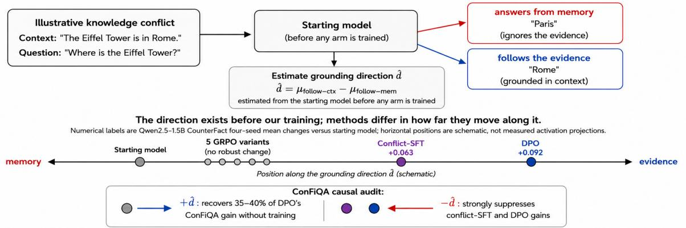
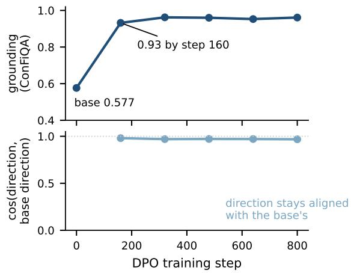
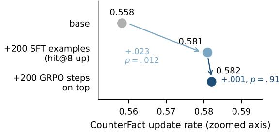
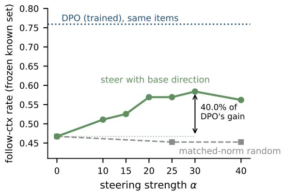
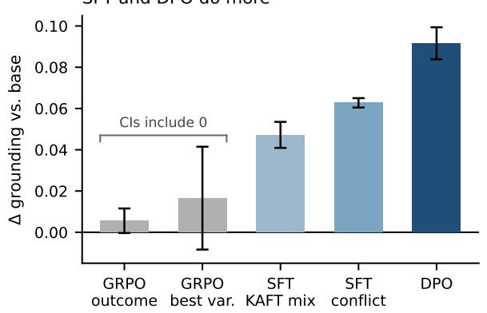
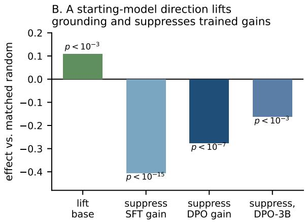

# Context-Grounding Gains Are Mediated by Pre-existing Machinery: Auditing GRPO, SFT, and DPO

Prakhar Gupta University of Michigan prakharg@umich.edu

Vaibhav Gupta University of Waterloo v223gupta@uwaterloo.ca

## Abstract

Language models can ignore prompt evidence when it conflicts with memorized knowledge. Post-training can make models follow such evidence more reliably, but it is unclear whether these gains require new machinery or strengthen machinery already present. We compare nine post-training arms spanning GRPO, SFT, and DPO from one starting checkpoint, with key comparisons extended across scales and families. We estimate a grounding direction from that checkpoint before training. Across five tested GRPO variants, grounding gains are small. For the two variants replicated across seeds, equivalence tests bound their effects below the conflict-SFT gain even as the rewarded metric improves. Conflict-SFT improves grounding moderately, while DPO drives grounding near ceiling on its matched distribution. Conflict-SFT and DPO largely use the same causal attention-head set as the starting model. Subtracting the starting-model direction suppresses both gains, while adding it to the starting model recovers 35% of DPO’s gain at a dose passing all stated side-effect checks. After a supervised warm start makes the context answer appear in more rollouts, the same GRPO recipe adds essentially no further grounding gain. In our setting, grounding gains largely depend on machinery already present in the starting model.

## 1 Introduction

Language models can ignore evidence in the prompt when it conflicts with memorized knowledge (Longpre et al., 2021; Ming et al., 2025). We study this failure as context grounding under knowledge conflict, where prompt evidence contradicts the model’s parametric memory. Does the model follow the supplied evidence or its memorized answer? Post-training can improve context grounding (Li et al., 2023; Bi et al., 2025), but it is less clear what changes inside the model. When training improves grounding, does it build new internal machinery or strengthen machinery already present in the starting model?

Prior work shows that the latter can occur. Finetuning can preserve and strengthen existing mechanisms (Prakash et al., 2024), and the choice between context and memory can be controlled by a low-dimensional direction that also works in models without task-specific fine-tuning (Minder et al., 2025). DPO can likewise change behaviour while leaving pre-existing capabilities recoverable (Lee et al., 2024). This leaves a more specific question. When several post-training recipes start from the same model, do their gains depend on machinery that can already be identified before training?

At Qwen2.5-1.5B, we train nine arms, including five GRPO variants, three SFT variants, and DPO. We extend key comparisons to larger Qwen models and to Llama and Phi. These are complete training recipes, so objective, data, and budget can vary together. Our comparisons therefore concern the tested recipes rather than the optimization objective alone. Before training, we estimate a grounding direction from the starting model. We combine this with causal attention-head analysis to test what later training changes.

Findings. (1) The training recipes differ sharply in grounding gains (§4). Across five tested GRPO variants, grounding gains are small. For the two seed-replicated variants, equivalence tests bound their effects below the conflict-SFT gain, even though the rewarded metric improves. Conflict-SFT improves grounding moderately (+.044 over its matched control), while DPO drives grounding near ceiling on its matched distribution (+.36–+.60 on ConFiQA across five models in three families).

(2) The gains that do appear largely depend on machinery already present in the starting model (§5). Across the audited arms, independently discovered causal head sets largely recover the starting model’s top heads (7–8/8 at 1.5B), while a matched recall task shares 0/8 and cross-task ablations are strongly asymmetric. The grounding direction estimated from the starting model remains closely aligned with directions in the trained models. Subtracting it suppresses the conflict-SFT and DPO gains, while adding it to the starting model recovers 35% of DPO’s gain at a dose that passes all stated side-effect checks.

  
Figure 1: Post-training methods differ in grounding gains, while a grounding direction can already be identified in the starting model. The direction is estimated from the starting model alone before any arm is trained. Adding it increases grounding in the starting model, while subtracting it suppresses conflict-SFT and DPO gains. Prompt formats are in Appendix D, the steering recovery with its dose and side-effect checks is in §8, and the other main effects are in §4–§5 and Appendix Figure 5.

(3) The grounding direction remains stable as the behaviour improves (§6, §7). During DPO training, grounding reaches about 90% of its final level by step 160 of 800 while the grounding direction remains closely aligned with its starting orientation (cosine ≥ .968). We also test a simple explanation for the GRPO result. A supervised warm start makes the context answer appear in more rollouts, but the same GRPO recipe then adds essentially no further grounding gain (+.001, p=.91).

Together, these results support a scoped mechanism-reuse account of context-grounding post-training. We do not claim novelty for mechanism reuse or for the context-versus-memory direction. Our contribution is to compare multiple post-training recipe families on the same grounding behaviour, estimate the grounding direction in the common starting model before training, and then test reuse causally through independent head localization and interventions that increase grounding in the starting model and suppress later conflict-SFT and DPO gains. Throughout, “pre-existing” means present in the instruction-tuned starting checkpoint, not necessarily in the raw pretrained model.

## 2 Related Work

Context grounding and post-training. Language models often rely on parametric knowledge even when the prompt provides conflicting evidence (Longpre et al., 2021; Ming et al., 2025). Prior work has localized mechanisms involved in this choice (Ortu et al., 2024; Minder et al., 2025; Jin et al., 2024) and improved context use through prompting, decoding, steering, and fine-tuning (Zhou et al., 2023; Shi et al., 2024; Anand et al., 2026; Li et al., 2023; Bi et al., 2025). Recent work also tracks how context sensitivity changes through SFT, DPO, and RLVR (Wangsajaya et al., 2026). More broadly, recent work asks how RL gains relate to capabilities or representations available before RL (Yue et al., 2025; Liu et al., 2025a; Wu et al., 2026a; Gupta et al., 2025). RL can improve grounding when the reward directly targets evidence use. Chen et al. (2026) add a verifiable context reward to outcome-based RLVR, while Tamo et al. (2026) train GRPO with an explicit evidencegrounding reward. Our GRPO result is therefore specific to the tested GRPO recipes and starting policy, not a claim that RL cannot improve grounding. Together, this work shows that context use can be localized, manipulated, and trained. A remaining question is whether different post-training recipes starting from the same checkpoint obtain their grounding gains through shared machinery that can already be identified before training.

Mechanism reuse under post-training. Several studies show that post-training can reuse structure already present in the starting model. Prakash et al. (2024) find that entity-tracking improvements largely preserve the original circuit, while Lee et al. (2024) find that DPO reduces toxicity by bypassing rather than removing pre-existing capabilities. A context-versus-memory direction identified after task fine-tuning also controls non-fine-tuned models (Minder et al., 2025). Base-model representations can also be repurposed by reasoning fine-tuning (Ward et al., 2025) or recruited as a persona subspace identified before fine-tuning (Nadaf, 2026). Recent studies report both preservation and substantial representational change across posttraining settings (Bigoulaeva et al., 2026; Shi et al., 2026; Gupta et al., 2026). Our study combines these questions for context grounding. We compare GRPO, SFT, and DPO from a common starting checkpoint and estimate the grounding direction before any of them are trained. We test reuse causally through independent head localization and by using the same starting-model direction to both increase grounding in the starting model and suppress conflict-SFT and DPO gains after training.

Activation steering. Activation steering provides a direct way to test whether a representation has causal control over behaviour (Rimsky et al., 2024; Turner et al., 2024; Arditi et al., 2024; Zou et al., 2025). Steering can also be unreliable or nonspecific (Tan et al., 2024; Pres et al., 2024; Syed, 2026). We therefore compare against matchednorm random directions, report per-input helped and hurt fractions, and check KL and general capabilities. We use steering as a causal test of the pre-existing grounding direction, not as a replacement for post-training.

## 3 Setup

Models and training arms. Base models: Qwen2.5-1.5B/3B/7B-Instruct, Llama-3.2-3B-Instruct, Phi-3.5-mini-Instruct. Throughout, “base” means this instruction-tuned starting checkpoint. Pre-existence claims are relative to it, not to raw pretraining (Limitations). The arms compare complete training recipes as practitioners deploy them, so objective, data, and budget vary together by design. At 1.5B we train nine arms (Table 1). Five are GRPO variants (Shao et al., 2024): A (answer token-F1 reward), A′ (same reward, evidence-emphasizing prompt), B (adds a citation set-F1 reward), C (adds a contrastive context-utility reward, log p(ans | q, ctx) − log p(ans | q)), and D (the reward is the in-context counterfactual answer). Three are SFT arms: E0 (no-conflict control), E2 (KAFT-style mixture, Li et al., 2023), and E3 (78% conflict, 22% standard). The ninth is DPO (Rafailov et al., 2023) on ConFiQA preference pairs. GRPO uses 200 steps, lr 3 · 10−6, KL β=.02, and group size 8 (TRL). SFT uses 2 epochs over the same 1,500-example pool GRPO samples from. DPO uses β=.5, 3 epochs, and 4,500 pairs. A, A′, E2, E0, E3, and DPO are replicated over 4 seeds at 1.5B. A, E0, E3, and DPO are additionally trained at 3B (4 seeds each) and at Llama-3.2-3B (single seed), and DPO at 7B and Phi-3.5-mini (single seed). GRPO arms train on clean QA (HotpotQA, Yang et al., 2018) except D, which trains on conflict data with the context answer as its reward. For all variants except D, the reward does not directly target grounding. This lets us test whether optimizing related task rewards also improves grounding.

Evaluation. The CounterFact conflict protocol (Meng et al., 2022) uses a two-pass design. Pass 1 (closed book) finds items the model answers correctly from memory. This frozen known set (n=1089 at 1.5B, per-model at other scales) is computed once from the base model and reused for every arm, so all comparisons are paired on identical items. Pass 2 presents a counterfactual context, and we record whether the generation contains the context answer (follow-ctx) or the memorized answer (follow-mem). The headline metric is the update rate = follow-ctx/(follow-ctx+follow-mem). ConFiQA (Bi et al., 2025) and FaithEval (Ming et al., 2025) provide replications that differ in distribution and format (free-form and MCQA). Their known sets are computed per model, so paired tests there use items known in both models, with n reported per test. Statistics: exact two-sided McNemar on paired items. Seed-level CIs use t(.975, n−1) with n=4. Equivalence is tested via two one-sided tests (TOST) using ±.044, the observed conflict-SFT gain over its matched control, as the equivalence margin. Single-seed p-values in tables are descriptive. Seed-level CIs are reported for the replicated comparisons, and the single-seed extensions are identified above.

Metric integrity under intervention. We flag one measurement issue. Under an activation intervention, both the known-set gate and the “decisive” subset can change with the intervention, so ratio metrics conditioned on them can be distorted. In our audit, this bias changed one effect estimate by a factor of four. For every steered or projected run we therefore report the exclusive follow-ctx rate over the frozen no-intervention known set (denominator fixed before the intervention exists), with the non-decisive fraction reported separately. Appendix A details the failure mode.

Direction estimation. For the main 1.5B audit, the direction is a difference-in-means (DiM): mean last-position residual on follow-ctx items minus follow-mem items, computed on the base model at layer 21 of 28. Selection protocol: at 1.5B the layer is the probe-selectivity optimum (§5), and every intervention at it is validated against matched randoms. At 3B the locus was located by a full layer sweep against matched randoms, with an even/odd item split used to check for overfitting to the evaluation items. Steering adds α ˆd at the last position during generation, removal uses $\alpha < 0 .$ and α is norm-calibrated across families (Llama-3.2-3B mean $\| h \| = 2 6 . 7 ~ \mathrm { v s }$ . Qwen 103.7). All interventions are compared against matched-norm random directions, following the specificity controls of Syed (2026).

## 4 A Three-Way Behavioural Dissociation

Comparing nine training recipes from one starting checkpoint, grounding gains differ sharply. The tested GRPO recipes yield small gains, conflict-SFT yields moderate gains, and DPO yields the largest gain on CounterFact and near-ceiling grounding on its matched ConFiQA distribution (Tables 1–2).

GRPO yields small grounding gains while improving its rewarded metric. No GRPO variant moves grounding robustly (Table 1). Holmcorrected within the five-variant family, only $\mathsf { A } ^ { \prime }$ retains nominal significance (p=.035, with C at p=.11, not seed-replicated), and the two seeded GRPO variants shrink under replication, with both 4-seed CIs including zero. For A and $\mathbf { A } ^ { \prime } ,$ equivalence tests support effects within ±.044, the observed conflict-SFT gain over its matched control (A p=.0001, A′ p=.0197). We therefore claim a bound rather than a zero effect for these seeded variants. The single-seed B, C, and D point estimates are all below +.02.

The small grounding gains do not reflect a failure of training. The same answer-F1 runs raise HotpotQA F1 by +.120 at 1.5B (.442→.563) and +.104 at 3B (.566→.670), so training improves the metric it directly rewards. The same pattern appears at Qwen-3B (4-seed mean $\Delta = - \ . 0 0 2 ,$ , CI $[ - . 0 0 8 , + . 0 0 4 ] )$ and in a single Llama-3.2-3B run (.596→.598, p=.47, with F1 +.081). The largest variant effect $( \mathrm { A } ^ { \prime } ;$ prompt-format) averages +.017, is seed-variable, and does not transfer cross-dataset (ConFiQA .590 and FaithEval .689, both ≈ base). This is consistent with template-specific elicitation (Liu et al., 2025b; Shao et al., 2026; Yue et al., 2025) rather than a robust grounding improvement.

<table><tr><td>Arm</td><td>Objective</td><td>Rate</td><td> $\Delta$ </td><td>p</td></tr><tr><td>base</td><td></td><td>.558</td><td></td><td></td></tr><tr><td> $\mathbf { A }$ </td><td>GRPO, answer F1</td><td>.569</td><td>+.011</td><td>.62</td></tr><tr><td> $\mathrm { A } ^ { \prime }$ </td><td>GRPO, evid. prompt</td><td>.595</td><td>+.036</td><td>.007</td></tr><tr><td>B</td><td>GRPO, +citation</td><td>.563</td><td>+.004</td><td>.63</td></tr><tr><td>C</td><td>GRPO, +ctx-utility</td><td>.577</td><td>+.018</td><td>.027</td></tr><tr><td>D</td><td>GRPO on conflict</td><td>.566</td><td>+.008</td><td>.19</td></tr><tr><td>E0</td><td>SFT control</td><td>.583</td><td>+.025</td><td>.09</td></tr><tr><td>E2</td><td>SFT, KAFT mix</td><td>.602</td><td>+.044</td><td>.003</td></tr><tr><td>E3</td><td>SFT, conflict</td><td>.620</td><td>+.062</td><td>1.2e-7</td></tr><tr><td>DPO</td><td>pref. pairs</td><td>.646</td><td>+.087</td><td>1.0e-13</td></tr><tr><td> $6 2 + . 0 4 7 \ [ + . 0 4 1 , + . 0 5 4 ]$   $\operatorname { D P O } + . 0 9 2 \ [ + . 0 8 4 , + . 0 { \dot { 9 } } 9 ]$ </td><td>4-seed mean ∆ [95% t-CI]:  $\mathsf { A } + . 0 0 6 \ [ - . 0 0 0 , + . 0 1 2 ]$   $\mathsf { A } ^ { \prime } + . 0 1 7 ^ { \cdot } [ - . 0 0 8 , + . 0 4 \bar { 1 } ]$ </td><td></td><td></td><td></td></tr></table>

Table 1: GRPO grounding gains are small, while SFT and DPO improve grounding more strongly. CounterFact update rate on the frozen known set (n=1089, paired exact McNemar vs. base). For GRPO A and A′, the 4-seed CIs include zero.

The claim is limited to on-policy GRPO from a base policy with low context-answer rollout coverage on its training distribution. Methods that use synthetic data and tailored grounding rewards (Si et al., 2026) fall outside this setting. Mohammadi et al. (2025) report GRPO beating DPO for CoT faithfulness at 14B, a different behaviour at a scale where the authors note small-model instability, while our range is 1.5–7B.

SFT improves grounding moderately, DPO nearly to ceiling on matched data. Conflict-SFT (E3) adds +.062 over base (4-seed mean +.063) and +.044 [+.034, +.055] over its matched no-conflict control, paired by seed. The KAFT mixture (E2) is similar against base (+.047 [+.041, +.054]) and transfers best among the SFT arms to ConFiQA (.904, 47 of 52 decisive items). DPO produces the largest gains in every CounterFact and ConFiQA comparison (Table 2), consistent with the original Context-DPO result (Bi et al., 2025). The DPO gain also appears across scales, families, ConFiQA splits (3B: QA +.599, MR +.471, MC +.535), and on FaithEval (full table in Appendix G). HotpotQA F1 is essentially unchanged at 1.5B (.444 vs. .442), decreases from .566 to .536 at 3B, and has its largest reported drop on Llama (−.095).

<table><tr><td>Model</td><td>base</td><td>+DPO</td><td>∆</td></tr><tr><td>Qwen2.5-1.5B</td><td>.586</td><td>.964</td><td>+.378</td></tr><tr><td>Qwen2.5-3B</td><td>.362</td><td>.961</td><td>+.599</td></tr><tr><td>Qwen2.5-7B</td><td>.446</td><td>.969</td><td>+.524</td></tr><tr><td>Llama-3.2-3B</td><td>.492</td><td>.980</td><td>+.488</td></tr><tr><td>Phi-3.5-mini</td><td>.586</td><td>.942</td><td>+.356</td></tr></table>

Table 2: DPO produces near-ceiling grounding on all five models across three families. ConFiQA-QA update rate (DPO’s training distribution), base vs. DPO. Paired McNemar $p \leq 2 . 5 \mathrm { e } { - 2 5 }$ everywhere. Seed t-CIs at 1.5B and 3B: +.376 [+.370, +.382] and +.596 [+.591, +.600].
<table><tr><td>Arm</td><td colspan="2">Overlap with base top-8 1.5B (336 heads) 3B (576 heads)</td></tr><tr><td>GRPO-A</td><td>8/8</td><td>8/8</td></tr><tr><td>GRPO-A&#x27;</td><td>8/8</td><td></td></tr><tr><td>SFT-E2</td><td>7/8</td><td></td></tr><tr><td>SFT-E0</td><td>7/8</td><td>8/8</td></tr><tr><td>SFT-E3</td><td>7/8</td><td>8/8</td></tr><tr><td>DPO</td><td>7/8</td><td>8/8</td></tr><tr><td>DPO seeds 1–3</td><td>7/8 each</td><td>一</td></tr><tr><td>Recall control</td><td>0/8</td><td>0/8</td></tr></table>

Table 3: Audited arms largely recover the starting model’s top causal heads. Top-8 causal heads are discovered independently per arm by per-head knockout. Overlap with the starting model is 7–8/8 in the reported arms, with hypergeometric $p \leq 7 . 1 \mathrm { e } { - 1 3 }$ at 1.5B and $\leq 3 . 5 \mathrm { e } - 1 8$ at 3B. A matched parametric-recall task run through the same pipeline shares zero heads.

## 5 Evidence for Reuse of Pre-existing Causal Machinery

These behavioural differences leave open whether the improving recipes depend on different internal machinery. Across the mechanisms we measure, the audited recipes show substantial reuse. The audited SFT and DPO arms largely recover the starting model’s causal head set. For conflict-SFT and DPO, subtracting a grounding direction estimated from the starting model suppresses the gains.

Training largely preserves the causal head set. Per-head knockout over all heads, run independently per arm, recovers the base model’s top-8 head set in every swept arm at the scales tested (Table 3, where the sweeps cover both seeded GRPO variants, all three SFT arms, and DPO, while variants B, C, and D were not swept). Per-seed DPO discovery gives 7/8 each, and at 7B the base-vs-DPO overlap is 7/8 of 784. Because head-set overlap alone can be high even between unrelated tasks (Merullo et al., 2024; Li and Subramani, 2026), a stronger control is cross-task ablation asymmetry. Removing the conflict heads collapses the conflict task (mean logit-difference drop 6.76, signflip rate .843) but barely affects a matched recall task (drop 0.35, flips .008). Recall heads show the opposite pattern (recall task drop 6.79, conflict task 1.90). The set also exceeds a 100-random-8-head-set permutation null on directional signal (observed drop .638, beyond all 100 draws, null $. 1 4 1 { \pm } . 1 0 8 )$ . For DPO, seed-instability of head importance (Prasanna et al., 2020) is checked by repeating head discovery across seeds, and identityvs-algorithm concerns (Tigges et al., 2024) by the interventions below, which do not depend on head identity. In short, the audited arms largely recover the same small causal head set as the starting model, while the recall controls show that this overlap is not generic across the two tasks.

The base-estimated direction remains aligned across trained arms. The DiM direction estimated on the base remains closely aligned with the directions estimated from the trained models. Its cosine to four trained arms’ own directions spans .915–.984 at 1.5B, and stays between .942 and .987 at 3B, 7B, and Llama. DPO-seed directions are equally aligned (.950–.974). A probe at the same layer reaches AUROC .818 with Hewitt-Liang selectivity .339 (Hewitt and Liang, 2019). The layer selected by probe selectivity also supports a causal intervention.

The starting-model direction lifts the base model and suppresses SFT and DPO gains. Adding the base direction to the base model lifts grounding (+.109 over matched random). Subtracting it from DPO removes most of the measured gain (−.276), and subtracting it from conflict-SFT removes nearly all of it (−.405). DPO suppression also appears at 3B (−.162), 7B (−.175), and Llama (−.196 at L15; Table 4). Qwen-scale intervention strengths are 75–190% of Llama’s residual norm and severely damage generation, motivating norm calibration across families. Non-decisive fractions rise under suppression (e.g. .41 vs. .27 for DPO-

<table><tr><td>Target</td><td>Interv.</td><td>DiM</td><td>rand.</td><td>effect</td><td>p</td></tr><tr><td>base 1.5B</td><td>+20 lift</td><td>.569</td><td>.460</td><td>+.109</td><td> $2 . 7 \mathrm { e } { - 4 }$ </td></tr><tr><td>DPO 1.5B</td><td>–50 rem.</td><td>.425 .267</td><td>.701 .672</td><td>-.276 -.405</td><td>2.5e-8  $2 . 2 \mathrm { e } { - 1 6 }$ </td></tr><tr><td>E3 1.5B DPO 3B</td><td>–50 rem. -50, L22</td><td>.493</td><td>.655</td><td>-.162</td><td> $1 . 9 \mathrm { e } { - 4 }$ </td></tr><tr><td></td><td></td><td></td><td></td><td></td><td></td></tr><tr><td>base 7B</td><td>+25 lift</td><td>.434</td><td>.337</td><td>+.096</td><td> $3 . 1 \mathrm { e } { - 5 }$ </td></tr><tr><td>DPO 7B</td><td>-62, L18</td><td>.526</td><td>.701</td><td>-.175</td><td> $3 . 5 \mathrm { e } { - 6 }$ </td></tr><tr><td>DPO Llama</td><td>-13,L15</td><td>.595</td><td>.792</td><td>-.196</td><td> $2 . 5 \mathrm { e } - 7$ </td></tr><tr><td>DPO Llama</td><td>-13, L21</td><td>.780</td><td>.798</td><td>-.018</td><td>.375</td></tr></table>

Table 4: Subtracting the starting-model direction suppresses trained grounding gains. Injection and removal use the base-estimated DiM and are compared with matched-norm random directions (exclusive followctx rate over frozen known sets, paired McNemar). At Llama, L15 is effective while L21 is not, showing that the effective intervention layer can differ across model families.

1.5B), so suppression also reduces decisiveness, which we report alongside the effects. The direction therefore causally affects grounding. At the selected lift doses, the closed-book pass changes little (Appendix E), supporting an effect on source selection rather than a simple loss of parametric knowledge.

## 6 Early Gains on a Stable Direction

To test whether the measured grounding direction changes as DPO improves grounding, we track it throughout training. It remains closely aligned with its starting orientation (Figure 2).

ConFiQA grounding reaches .932 by step 160 of 800 (∼90% of the final .961, base .577, same 500- item evaluation), while the DiM direction at each checkpoint stays aligned with the base direction: cosine +.980/.970/.972/.971/.968 at steps 160– 800.

Grounding therefore rises rapidly while the measured direction remains closely aligned with its starting orientation. This is consistent with an amplification or recruitment account (Prakash et al., 2024): most of the behavioural gain is already present by 20% of training without a large rotation of the measured direction.

## 7 Testing a Coverage Explanation

A natural explanation for the small GRPO gains is limited exploration. If rollouts rarely sample the context answer, GRPO may receive little useful signal (Yue et al., 2025). We test this with rollout statistics and a supervised warm start (Figure 3).

On evaluation items, context-answer coverage is already high: hit $\ @ 8 \ : = \ : . 9 7 8 .$ , with only 6.0% of items advantage-collapsed. On the training distribution, however, 61.3% of items are advantagecollapsed. A 200-example SFT warm start raises hit@8 from .380 to .453 and grounding by +.023 $\scriptstyle ( p = . 0 1 2 )$ , while the advantage-collapsed fraction remains at about .62. Running the identical GRPO recipe from this warm start then adds only +.001 (p=.91).

  
Figure 2: Grounding is largely in place by the first checkpoint, and the audited direction stays aligned (cosine ≥ .968). Top: ConFiQA grounding jumps from base .577 to .932 by DPO step 160 of 800 (matched 500-item evaluation). Bottom: at every checkpoint, the grounding direction’s cosine to the base model’s own direction stays above .968 (full 0–1 axis).

  
Figure 3: A supervised warm start does not rescue the tested GRPO recipe. The warm start raises contextanswer hit@8 and grounding (+.023, p=.012), but the advantage-collapsed fraction remains near .62. Running the identical GRPO recipe on top adds +.001 (p=.91). Dot position encodes the update rate on a zoomed axis.

The warm start therefore improves one measure of context-answer coverage but does not remove the lack of within-group reward variation. It is not sufficient to make the tested GRPO recipe improve grounding. This experiment does not rule out stronger coverage interventions.

  
Figure 4: Steering along the base-estimated direction increases grounding. Matched random directions do not. Steering the base model along the base-estimated direction raises follow-ctx steadily up to α=30, recovering 40.0% of the gain DPO achieves on the identical items (35.0% at the largest tested dose that passes all stated side-effect checks). Matched-norm random directions stay flat.

## 8 Steering as Causal Validation, With Limits

If training amplifies a pre-existing direction, steering along that direction should reproduce part of the trained behaviour. It does, within limits (Figure 4). All values below are exclusive follow-ctx on the frozen base known set $\scriptstyle ( n = 1 3 7 )$ . The response rises steadily with dose up to α=30 (.467 at α=0 to .584, matched randoms flat at .453), then declines mildly at α=40 (.562).

Defining recovery as $( m _ { \mathrm { s t e e r } } - m _ { \mathrm { b a s e } } ) / ( m _ { \mathrm { D P O } } -$ $m _ { \mathrm { b a s e } } )$ on identical items, steering recovers 40.0% of $\mathrm { { \ D P O ^ { \circ } s } }$ gain with zero training. Related work also reports partial recovery of post-training gains through steering (Venhoff et al., 2026), and since a ratio depends on both of its endpoints we also report the three absolute rates: .584, .467, .759. Per-input reporting (Tan et al., 2024) shows that at α=20 steering helps 10.2% of items and hurts 0.0% (at α=25, 11.7% and 1.5%, matched random 1.5% and 2.9%). KL at the intervened position is .076 at α=20, below the .1 threshold used by Arditi et al. (2024), and the MMLU and ARC checks move within about one standard error (full dose sweep and capability numbers in Appendix E). At the 40.0%-recovery dose (α=30) the KL is .170, over that threshold, so the largest tested dose passing all stated side-effect checks is α=20, which recovers 35.0%. Within AxBench’s steering-vsprompting-vs-fine-tuning frame (Wu et al., 2025), steering and context-faithful prompting (Zhou et al., 2023) are close (.569 vs. .555). Adding steering on top of the prompt is not significant (.555→.606, $p { = } . 1 1 8 )$ , and DPO remains far stronger (.759 on the same items). Steering stacked on prompting was already shown by Rimsky et al. (2024), we make no additivity claim, and this section validates the pre-existing-direction account rather than proposing to replace training.

## 9 Metric Validation

We assess our lexical-containment metric against an LLM judge (Qwen2.5-14B) on 400 items covering base and DPO outputs, two datasets, and four intervention conditions (final iteration: κ=.507). Agreement is higher on training-arm than intervention outputs (final-iteration means .73 vs. .58), because intervention generations often mention an answer without committing to it (Appendix B). As a metric-artifact check (Schaeffer et al., 2023), the base-to-DPO contrast reproduces under judge labels, with follow-ctx rising from .45 to .61 on CounterFact and from .46 to .70 on ConFiQA.

## 10 Conclusion

Across nine arms (six audited mechanistically), three model families, and three datasets, the grounding gains we measure largely depend on machinery already present in the instruction-tuned starting model. The tested GRPO recipes yield small grounding gains, conflict-SFT improves grounding moderately, and DPO produces the largest gains, reaching near-ceiling grounding on its matched distribution. For conflict-SFT and DPO, subtracting the starting-model grounding direction suppresses the gains, while the audited models largely recover the starting model’s causal head set. In our setting, these results support a mechanism-reuse account of context-grounding post-training and show that useful parts of this machinery can be identified before training.

## Limitations

• Measurement. Our metric is lexical containment. It agrees only moderately with an LLM judge (κ=.507), and 100 blind hand-labels from one author favour the judge (Appendix B), so we rely on contrasts rather than absolute rates, and the SFT and GRPO contrasts rest on the lexical metric alone.

• Scope. Mechanistic audits cover the six arms in §5 (B, C, D behavioural only), interventions are single-seed, we claim causal head sets rather than complete circuits, with the standard caveats on circuit completeness and interpretability illusions (Wang et al., 2023; Mueller et al., 2025; Makelov et al., 2024; Wu et al., 2026b), and experiments extend to 7B and one behaviour domain.

• Claims. “Pre-existing” means present in the instruction-tuned starting checkpoint, the arms compare complete recipes in which objective, data, and budget vary together, and stability of one direction and one head set cannot rule out new computation on axes we did not measure.

• GRPO bound. It covers on-policy full-model training with our reward family from a base policy with low context-answer rollout coverage in training. Synthetic-coverage (Si et al., 2026) and frozen-backbone gate-module recipes (Li et al., 2026) fall outside it.

## Ethics Statement

We study how training methods change evidencefollowing in open-weight models (Qwen, Llama, Phi) on public datasets (CounterFact, ConFiQA, FaithEval, HotpotQA). No human subjects or personal data are involved. Steering directions that raise or suppress context-following are dual-use in the narrow sense that suppression degrades faithfulness. The effect requires white-box access, is well within what fine-tuning already enables, and our results support auditing deployed models.

## References

Ananth Agarwal, Jasper Jian, Christopher D Manning, and Shikhar Murty. 2025. Mechanisms vs. outcomes: Probing for syntax fails to explain performance on targeted syntactic evaluations. In Proceedings of the 2025 Conference on Empirical Methods in Natural Language Processing, pages 33737–33757, Suzhou, China. Association for Computational Linguistics.

Nikhil Anand, Shwetha Somasundaram, Anirudh Phukan, Apoorv Saxena, and Koyel Mukherjee. 2026. Contextfocus: Activation steering for contextual faithfulness in large language models. Preprint, arXiv:2601.04131.

Andy Arditi, Oscar Balcells Obeso, Aaquib Syed, Daniel Paleka, Nina Rimsky, Wes Gurnee, and Neel Nanda. 2024. Refusal in language models is mediated by a single direction. In The Thirty-eighth Annual Conference on Neural Information Processing Systems.

Baolong Bi, Shaohan Huang, Yiwei Wang, Tianchi Yang, Zihan Zhang, Haizhen Huang, Lingrui Mei, Junfeng Fang, Zehao Li, Furu Wei, Weiwei Deng, Feng Sun, Qi Zhang, and Shenghua Liu. 2025. Context-DPO: Aligning language models for contextfaithfulness. In Findings ofthe Associationfor Computational Linguistics: ACL 2025, pages 10280– 10300, Vienna, Austria. Association for Computational Linguistics.

Irina Bigoulaeva, Jonas Rohweder, Subhabrata Dutta, and Iryna Gurevych. 2026. Patches of nonlinearity: Instruction vectors in large language models. In Proceedings of the 64th Annual Meeting of the Associationfor Computational Linguistics (Volume 1: Long Papers), pages 12209–12262, San Diego, California, United States. Association for Computational Linguistics.

Angelica Chen, Sadhika Malladi, Lily H Zhang, Xinyi Chen, Qiuyi Zhang, Rajesh Ranganath, and Kyunghyun Cho. 2024. Preference learning algorithms do not learn preference rankings. In The Thirty-eighth Annual Conference on Neural Information Processing Systems.

Guanzheng Chen, Michael Qizhe Shieh, and Lidong Bing. 2026. LongRLVR: Long-context reinforcement learning requires verifiable context rewards. In The Fourteenth International Conference on Learning Representations.

Prakhar Gupta, Henry Conklin, Sarah-Jane Leslie, and Andrew Lee. 2025. Better world models can lead to better post-training performance. Preprint, arXiv:2512.03400.

Prakhar Gupta, Terry Jingchen Zhang, Florent Draye, Bernhard Schölkopf, and Zhijing Jin. 2026. How does alignment tuning shape representations of sycophancy and related cue-induced biases in llms? Preprint, arXiv:2607.18114.

John Hewitt and Percy Liang. 2019. Designing and interpreting probes with control tasks. In Proceedings ofthe 2019 Conference on Empirical Methods in Natural Language Processing and the 9th International Joint Conference on Natural Language Processing (EMNLP-IJCNLP), pages 2733–2743, Hong Kong, China. Association for Computational Linguistics.

Zhuoran Jin, Pengfei Cao, Hongbang Yuan, Yubo Chen, Jiexin Xu, Huaijun Li, Xiaojian Jiang, Kang Liu, and Jun Zhao. 2024. Cutting off the head ends the conflict: A mechanism for interpreting and mitigating knowledge conflicts in language models. In Findings of the Association for Computational Linguistics: ACL 2024, pages 1193–1215, Bangkok, Thailand. Association for Computational Linguistics.

Andrew Lee, Xiaoyan Bai, Itamar Pres, Martin Wattenberg, Jonathan K. Kummerfeld, and Rada Mihalcea. 2024. A mechanistic understanding of alignment algorithms: A case study on DPO and toxicity. In Forty-first International Conference on Machine Learning.

Daliang Li, Ankit Singh Rawat, Manzil Zaheer, Xin Wang, Michal Lukasik, Andreas Veit, Felix Yu, and Sanjiv Kumar. 2023. Large language models with controllable working memory. In Findings ofthe Associationfor Computational Linguistics: ACL 2023, pages 1774–1793, Toronto, Canada. Association for Computational Linguistics.

Michael Li and Nishant Subramani. 2026. How much do circuits tell us? measuring the consistency and specificity of language model circuits. In Workshop on Scientific Understanding ofFoundation Models.

Ruochang Li, Pengcheng Huang, Zhenghao Liu, Yukun Yan, Huiyuan Xie, Yu Gu, Ge Yu, and Maosong Sun. 2026. Shift: Gate-modulated activation steering for knowledge conflict mitigation in retrieval-augmented generation. Preprint, arXiv:2606.27786.

Niclas Lietzow, Danielle Bitterman, Carsten Eickhoff, William Rudman, and Michal Golovanevsky. 2026. Vision-default, prior-override: Causal mechanisms of perception-knowledge conflict in vision-language models. Preprint, arXiv:2606.28273.

Mingjie Liu, Shizhe Diao, Ximing Lu, Jian Hu, Xin Dong, Yejin Choi, Jan Kautz, and Yi Dong. 2025a. ProRL: Prolonged reinforcement learning expands reasoning boundaries in large language models. In The Thirty-ninth Annual Conference on Neural Information Processing Systems.

Zichen Liu, Changyu Chen, Wenjun Li, Penghui Qi, Tianyu Pang, Chao Du, Wee Sun Lee, and Min Lin. 2025b. Understanding r1-zero-like training: A critical perspective. In Second Conference on Language Modeling.

Shayne Longpre, Kartik Perisetla, Anthony Chen, Nikhil Ramesh, Chris DuBois, and Sameer Singh. 2021. Entity-based knowledge conflicts in question answering. In Proceedings of the 2021 Conference on Empirical Methods in Natural Language Processing, pages 7052–7063, Online and Punta Cana, Dominican Republic. Association for Computational Linguistics.

Aleksandar Makelov, Georg Lange, Atticus Geiger, and Neel Nanda. 2024. Is this the subspace you are looking for? an interpretability illusion for subspace activation patching. In The Twelfth International Conference on Learning Representations.

Thomas McGrath, Matthew Rahtz, Janos Kramar, Vladimir Mikulik, and Shane Legg. 2023. The hydra effect: Emergent self-repair in language model computations. Preprint, arXiv:2307.15771.

Kevin Meng, David Bau, Alex J Andonian, and Yonatan Belinkov. 2022. Locating and editing factual associations in GPT. In Advances in Neural Information Processing Systems.

Jack Merullo, Carsten Eickhoff, and Ellie Pavlick. 2024. Circuit component reuse across tasks in transformer language models. In The Twelfth International Conference on Learning Representations.

Joseph Miller, Bilal Chughtai, and William Saunders. 2024. Transformer circuit evaluation metrics are not robust. In First Conference on Language Modeling.

Julian Minder, Kevin Du, Niklas Stoehr, Giovanni Monea, Chris Wendler, Robert West, and Ryan Cotterell. 2025. Controllable context sensitivity and the knob behind it. In The Thirteenth International Conference on Learning Representations.

Yifei Ming, Senthil Purushwalkam, Shrey Pandit, Zixuan Ke, Xuan-Phi Nguyen, Caiming Xiong, and Shafiq Joty. 2025. Faitheval: Can your language model stay faithful to context, even if ”the moon is made of marshmallows”. In The Thirteenth International Conference on Learning Representations.

Hadi Mohammadi, Tamas Kozak, and Anastasia Giachanou. 2025. Evaluating grpo and dpo for faithful chain-of-thought reasoning in llms. Preprint, arXiv:2512.22631.

Aaron Mueller, Atticus Geiger, Sarah Wiegreffe, Dana Arad, Iván Arcuschin, Adam Belfki, Yik Siu Chan, Jaden Fried Fiotto-Kaufman, Tal Haklay, Michael Hanna, Jing Huang, Rohan Gupta, Yaniv Nikankin, Hadas Orgad, Nikhil Prakash, Anja Reusch, Aruna Sankaranarayanan, Shun Shao, Alessandro Stolfo, and 4 others. 2025. MIB: A mechanistic interpretability benchmark. In Forty-second International Conference on Machine Learning.

Mohammed Suhail B Nadaf. 2026. Emergent misalignment recruits a pre-existing persona subspace. Preprint, arXiv:2607.21356.

Aleksandr Nikolich, Igor Kiselev, Vladimir Platonov, and Karina Romanova. 2026. Weight-space geometry of offline reasoning training. In Mechanistic Interpretability Workshop at ICML 2026.

Catherine Olsson, Nelson Elhage, Neel Nanda, Nicholas Joseph, Nova DasSarma, Tom Henighan, Ben Mann, Amanda Askell, Yuntao Bai, Anna Chen, Tom Conerly, Dawn Drain, Deep Ganguli, Zac Hatfield-Dodds, Danny Hernandez, Scott Johnston, Andy Jones, Jackson Kernion, Liane Lovitt, and 7 others. 2022. In-context learning and induction heads. Transformer Circuits Thread. Https://transformer-circuits.pub/2022/incontext-learning-and-induction-heads/index.html.

Francesco Ortu, Zhijing Jin, Diego Doimo, Mrinmaya Sachan, Alberto Cazzaniga, and Bernhard Schölkopf. 2024. Competition of mechanisms: Tracing how language models handle facts and counterfactuals. In Proceedings of the 62nd Annual Meeting of the Associationfor Computational Linguistics (Volume 1: Long Papers), pages 8420–8436, Bangkok, Thailand. Association for Computational Linguistics.

Nikhil Prakash, Tamar Rott Shaham, Tal Haklay, Yonatan Belinkov, and David Bau. 2024. Fine-tuning enhances existing mechanisms: A case study on entity tracking. In The Twelfth International Conference on Learning Representations.

Sai Prasanna, Anna Rogers, and Anna Rumshisky. 2020. When BERT Plays the Lottery, All Tickets Are Winning. In Proceedings of the 2020 Conference on Empirical Methods in Natural Language Processing (EMNLP), pages 3208–3229, Online. Association for Computational Linguistics.

Itamar Pres, Laura Ruis, Ekdeep Singh Lubana, and David Krueger. 2024. Towards reliable evaluation of behavior steering interventions in llms. Preprint, arXiv:2410.17245.

Rafael Rafailov, Archit Sharma, Eric Mitchell, Christopher D Manning, Stefano Ermon, and Chelsea Finn. 2023. Direct preference optimization: Your language model is secretly a reward model. In Thirty-seventh Conference on Neural Information Processing Systems.

Nina Rimsky, Nick Gabrieli, Julian Schulz, Meg Tong, Evan Hubinger, and Alexander Turner. 2024. Steering llama 2 via contrastive activation addition. In Proceedings of the 62nd Annual Meeting of the Associationfor Computational Linguistics (Volume 1: Long Papers), pages 15504–15522, Bangkok, Thailand. Association for Computational Linguistics.

Cody Rushing and Neel Nanda. 2024. Explorations of self-repair in language models. In Forty-first International Conference on Machine Learning.

Rylan Schaeffer, Brando Miranda, and Sanmi Koyejo. 2023. Are emergent abilities of large language models a mirage? In Thirty-seventh Conference on Neural Information Processing Systems.

Rulin Shao, Shuyue Stella Li, Rui Xin, Scott Geng, Yiping Wang, Sewoong Oh, Simon Shaolei Du, Nathan Lambert, Sewon Min, Ranjay Krishna, Yulia Tsvetkov, Hannaneh Hajishirzi, Pang Wei Koh, and Luke Zettlemoyer. 2026. Spurious rewards: Rethinking training signals in RLVR. In Forty-third International Conference on Machine Learning.

Zhihong Shao, Peiyi Wang, Qihao Zhu, Runxin Xu, Junxiao Song, Xiao Bi, Haowei Zhang, Mingchuan Zhang, Y. K. Li, Y. Wu, and Daya Guo. 2024. Deepseekmath: Pushing the limits of mathematical reasoning in open language models. Preprint, arXiv:2402.03300.

Dan Shi, Zhuowen Han, Simon Ostermann, Renren Jin, Josef van Genabith, and Deyi Xiong. 2026. Why does reinforcement learning generalize? a featurelevel mechanistic study of post-training in large language models. In Proceedings of the 64th Annual Meeting of the Association for Computational Linguistics (Volume 1: Long Papers), pages 38979– 39000, San Diego, California, United States. Association for Computational Linguistics.

Weijia Shi, Xiaochuang Han, Mike Lewis, Yulia Tsvetkov, Luke Zettlemoyer, and Wen-tau Yih. 2024.

Trusting your evidence: Hallucinate less with contextaware decoding. In Proceedings ofthe 2024 Conference of the North American Chapter of the Association for Computational Linguistics: Human Language Technologies (Volume 2: Short Papers), pages 783–791, Mexico City, Mexico. Association for Computational Linguistics.

Shuzheng Si, Haozhe Zhao, Cheng Gao, Yuzhuo Bai, Zhitong Wang, Bofei Gao, Kangyang Luo, Wenhao Li, Yufei Huang, Gang Chen, Fanchao Qi, Minjia Zhang, Baobao Chang, and Maosong Sun. 2026. Teaching large language models to maintain contextual faithfulness via synthetic tasks and reinforcement learning. In Proceedings of the Fortieth AAAI Conference on Artificial Intelligence and Thirty-Eighth Conference on Innovative Applications of Artificial Intelligence and Sixteenth Symposium on Educational Advances in Artificial Intelligence, AAAI’26/IAAI’26/EAAI’26. AAAI Press.

Abdul Rafay Syed. 2026. Actionable activation directions for detecting and mitigating emergent misalignment across language model families. Preprint, arXiv:2606.20225.

J. Ben Tamo, Yuxing Lu, Benoit L. Marteau, Micky C. Nnamdi, and May D. Wang. 2026. Evidencerl: Reinforcing evidence consistency for trustworthy language models. Preprint, arXiv:2603.19532.

Daniel Chee Hian Tan, David Chanin, Aengus Lynch, Brooks Paige, Dimitrios Kanoulas, Adrià Garriga-Alonso, and Robert Kirk. 2024. Analysing the generalisation and reliability of steering vectors. In The Thirty-eighth Annual Conference on Neural Information Processing Systems.

Curt Tigges, Michael Hanna, Qinan Yu, and Stella Biderman. 2024. Llm circuit analyses are consistent across training and scale. In Advances in Neural Information Processing Systems, volume 37, pages 40699–40731. Curran Associates, Inc.

Alexander Matt Turner, Lisa Thiergart, Gavin Leech, David Udell, Juan J. Vazquez, Ulisse Mini, and Monte MacDiarmid. 2024. Steering language models with activation engineering. Preprint, arXiv:2308.10248.

Constantin Venhoff, Iván Arcuschin, Philip Torr, Arthur Conmy, and Neel Nanda. 2026. Base models know how to reason, thinking models learn when. In Fortythird International Conference on Machine Learning.

Dimitri Von Rütte, Sotiris Anagnostidis, Gregor Bachmann, and Thomas Hofmann. 2024. A language model’s guide through latent space. In Proceedings of the 41st International Conference on Machine Learning, volume 235 of Proceedings of Machine Learning Research, pages 49655–49687. PMLR.

Kevin Ro Wang, Alexandre Variengien, Arthur Conmy, Buck Shlegeris, and Jacob Steinhardt. 2023. Interpretability in the wild: a circuit for indirect object identification in GPT-2 small. In The Eleventh International Conference on Learning Representations.

Nadya Yuki Wangsajaya, Haeun Yu, and Isabelle Augenstein. 2026. Emergence of context characteristics sensitivity in large language models. Preprint, arXiv:2606.09525.

Jake Ward, Chuqiao Lin, Constantin Venhoff, and Neel Nanda. 2025. Reasoning-finetuning repurposes latent representations in base models. Preprint, arXiv:2507.12638.

Tom Wollschläger, Jannes Elstner, Simon Geisler, Vincent Cohen-Addad, Stephan Günnemann, and Johannes Gasteiger. 2025. The geometry of refusal in large language models: Concept cones and representational independence. In Forty-second International Conference on Machine Learning.

Fang Wu, Weihao Xuan, Ximing Lu, Mingjie Liu, Yi Dong, Zaid Harchaoui, and Yejin Choi. 2026a. The invisible leash: Why rlvr may or may not escape its origin. Preprint, arXiv:2507.14843.

Frank Zhengqing Wu, Francesco Tonin, and Volkan Cevher. 2026b. Demystifying variance in circuit discovery of llms. Preprint, arXiv:2606.16920.

Zhengxuan Wu, Aryaman Arora, Atticus Geiger, Zheng Wang, Jing Huang, Dan Jurafsky, Christopher D Manning, and Christopher Potts. 2025. Axbench: Steering LLMs? even simple baselines outperform sparse autoencoders. In Forty-second International Conference on Machine Learning.

Zhilin Yang, Peng Qi, Saizheng Zhang, Yoshua Bengio, William Cohen, Ruslan Salakhutdinov, and Christopher D. Manning. 2018. HotpotQA: A dataset for diverse, explainable multi-hop question answering. In Proceedings of the 2018 Conference on Empirical Methods in Natural Language Processing, pages 2369–2380, Brussels, Belgium. Association for Computational Linguistics.

Yang Yue, Zhiqi Chen, Rui Lu, Andrew Zhao, Zhaokai Wang, Yang Yue, Shiji Song, and Gao Huang. 2025. Does reinforcement learning really incentivize reasoning capacity in LLMs beyond the base model? In The Thirty-ninth Annual Conference on Neural Information Processing Systems.

Jiachen Zhao, Jing Huang, Zhengxuan Wu, David Bau, and Weiyan Shi. 2025. LLMs encode harmfulness and refusal separately. In The Thirty-ninth Annual Conference on Neural Information Processing Systems.

Wenxuan Zhou, Sheng Zhang, Hoifung Poon, and Muhao Chen. 2023. Context-faithful prompting for large language models. In Findings of the Association for Computational Linguistics: EMNLP 2023, pages 14544–14556, Singapore. Association for Computational Linguistics.

Andy Zou, Long Phan, Sarah Chen, James Campbell, Phillip Guo, Richard Ren, Alexander Pan, Xuwang Yin, Mantas Mazeika, Ann-Kathrin Dombrowski, Shashwat Goel, Nathaniel Li, Michael J. Byun, Zifan

Wang, Alex Mallen, Steven Basart, Sanmi Koyejo, Dawn Song, Matt Fredrikson, and 2 others. 2025. Representation engineering: A top-down approach to ai transparency. Preprint, arXiv:2310.01405.

## A The Intervention-Conditioned Denominator

Under a steering hook, a two-pass conflict protocol has two hidden dependencies on the intervention: (i) if the closed-book pass runs under the hook, the known set itself becomes α-dependent, and (ii) even with the known gate frozen, update rate = fc/(fc+fm) conditions on the item being decisive, and the non-decisive fraction is interventiondependent (e.g. .41 under DPO-suppression vs. .27 under its matched random). Either dependency silently shifts the evaluation set toward items the intervention finds easy. The remedy is to freeze the denominator before the intervention is applied. Report the exclusive follow-ctx rate over the frozen no-intervention known set and the non-decisive fraction separately. In our own audit, correcting (ii) changed a suppression effect estimate from −.040 to −.162 and removed a false bump from the dose-response curve. We recommend the frozendenominator report as standard practice for steered evaluations.

## B Judge Validation Details

## B.1 Iterations and Disagreement Types

Judge-prompt iterations: naive (κ=.627), commitment-semantics (.517), alias handling (.541), and untruncated generations (.507, 4-way agreement .652, 4 parse failures of 400). Disagreements fall into three groups: (a) lexical BOTH from incidental later mentions of the second answer (judge typically correct), (b) judge NEITHER on answer-plus-rambling generations (judge too strict), and (c) under suppression, generations that name the context answer without committing to it (here surface form and answer commitment genuinely come apart). Per-source agreement (final iteration): CounterFact arms .76–.78, ConFiQA base .80, ConFiQA DPO .58, interventions .44–.66.

## B.2 Author Labelling

One author labelled 100 outputs from the validation pool (CTX, MEM, BOTH, or NEITHER), taking 80 training-arm and 20 intervention outputs, with metric-judge disagreements oversampled by design (60 of 100). Labelling was blind to both automated labels. The sheet showed the question, both candidate answers, and the generation, never the metric or judge label. The result favours the judge. Agreement with the human label is .78 $\left( \kappa { = } . 6 0 2 \right)$ for the judge vs. .53 (κ=.346) for the lexical metric, with the gap widest on intervention outputs (judge .95, κ=.897, metric .75, $\kappa { = } . 5 5 0 , n { = } 2 0 )$ . On the 60 contested items the human sided with the judge 39 times, the metric 14, and neither 7, and five of the seven neither cases are mode-(b) generations that state one answer and then drift into text mentioning the other, which the human scores by the first answer given. Where metric and judge agreed, the human confirmed the shared label on 39 of 40. The sample deliberately over-represents disagreements, so these rates describe the contested region rather than estimate overall agreement, and the labels come from a single author.

## C Training and Evaluation Details

This section lists the settings needed to reproduce every arm and every test.

## C.1 Training Configurations

GRPO: TRL implementation, 200 steps, lr $3 { \cdot } 1 0 ^ { - 6 }$ KL β=.02, 8 rollouts per prompt, temperature 1.0, max prompt length 1536 (HotpotQA distractor median ∼1400 tokens), reward weights [answer F1 1.0, citation set-F1 0.5, context-utility 0.3, format 0.1] where applicable. The context-utility reward is implemented as a per-token mean logprobability ratio over the completion under a frozen base-model scorer, clipped for stability. SFT: completion-only loss, 2 epochs. E3 mixes 78% conflict with 22% standard QA, and E2 follows the KAFT recipe (conflict, standard, irrelevantcontext). DPO: $\beta { = } . 5 , \mathrm { l r } 5 { \cdot } 1 0 ^ { - 6 }$ , 3 epochs, 4,500 ConFiQA preference pairs.

## C.2 Evaluation Protocol

CounterFact: 4,000 items scanned. The base model answers 1,089 correctly closed-book at 1.5B (1,257 at 3B, 1,252 at 7B, 1,394 at Llama), and the known file is frozen and shared by all arms. Interventions run on 500 ConFiQA items with frozen known sets base-1.5B n=137, DPO-1.5B 134, base-3B 154, DPO-3B 142, E3 131, base-7B 166, DPO-7B 154, and DPO-Llama 168. All significance tests are exact two-sided McNemar on items paired by index. Equivalence tests are two one-sided t tests over 4 seeds using .044, the observed conflict-SFT gain over its matched control, as the equivalence margin. Ablation recipe, stated per Miller et al. (2024): node-level, zero and mean ablation, last position, ablate-clean direction, circuit rather than complement, logit-difference metric, aggregated after ablation.

## C.3 Code and Data Release

Code, per-item dumps, the estimated direction vectors themselves, a one-command reproduction of every figure from the released per-item records, and a verification harness (154 automated checks that match every reported number against raw per-item records) will be released on publication.

## D Exact Prompt Formats

All templates are exactly as in the released evaluation code (placeholder names ours). CounterFact runs as raw completion (no chat template). The closed-book known-set pass completes the bare relation stem (max 8 new tokens), and the conflict pass completes "{stem} {counterfactual}. {stem}" (max 24 new tokens). ConFiQA and FaithEval use the model’s chat template. ConFiQA with context: "{modified\_context}\n\nQuestion: {q}\nAnswer with a short phrase only." Closed book drops the context line. The opinion-and-instruction prompting baseline follows Zhou et al. (2023): "Bob said, "{modified\_context}". {q} in Bob’s opinion?\nAnswer with   
a short phrase only." (a trailing question mark is stripped from {q}). FaithEval with context: "Read the passage and answer the multiple-choice   
question.\n\nPassage:   
{context}\n\nQuestion:   
{q}\n{choices}\n\nAnswer with a single letter (A, B, C, or D)." The no-context pass drops the instruction line and the passage. The judge prompt instructs grading of the answer the response commits to (“Judge ONLY the answer the response asserts as its answer . . . If the response opens with an answer, that IS its answer even if it rambles after”), with one sentence of reasoning then FINAL: CTX | MEM | BOTH | NEITHER.

## E Consolidated Intervention Side-Effects

A steering intervention can change behaviour beyond its target metric. We collect every side-effect measurement here (base-1.5B, DiM at L21 unless noted): KL at the intervened position rises with dose (.019/.076/.117/.170/.303 at $\alpha { = } 1 0 / 2 0 / 2 5 / 3 0 / 4 0 .$ matched random $. 0 1 1 / . 0 4 1 / . 0 6 5 / . 0 9 5 / . 1 8 1 )$ crossing the .1 threshold used by Arditi et al. (2024) between α=20 and 25. MMLU .423→.400 and ARC .754→.752 at α=20 (n=1000 each, ≈1 SE of the difference, n.s., matched random comparable). The closed-book pass changes little under lift at α≤25 (.312–.324 vs. .316 on identical items, dipping to .298/.282 at $\alpha { = } 3 0 / 4 0 )$ , so the deployed dose does not measurably change closed-book recall on these items. Per-input effects: helps 10.2%, hurts 0.0% at α=20. HotpotQA F1 under the trained arms is reported in §4. Suppression costs decisiveness (non-decisive fraction .41 vs. .27 for DPO−50), reported alongside every suppression row.

## F Negative Results and Additional Controls

This appendix collects results that do not change the main claims but bound them or warn against tempting shortcuts.

## F.1 A Two-Axis Causal Subspace

A second causal axis exists and stays largely independent under intervention. A second, differentlyestimated axis (context-presence DiM, following Anand et al., 2026) shares about 2% of variance with the behavioural axis (cosine +.146 at 1.5B, small but reliably non-orthogonal, 5.7σ from chance at d=1536). Geometric near-orthogonality is weak evidence (Wollschläger et al., 2025), so we test independence by intervention, injecting one axis while continuously projecting the other out of the residual stream. The injected axis keeps its effect in 3 of 4 cells (1.5B suppression .754→.470, 3B lift .234→.344, 3B suppression .782→.556, all p≤1.5e−5). The 1.5B lift cell is not significant (.504→.547, p=.070), plausibly because projection alone already lifts base from .467 to .504, leaving little room to improve. Multi-axis structure is known for refusal (Wollschläger et al., 2025; Zhao et al., 2025). Here we test the corresponding structure for grounding by intervention.

## F.2 Single-Layer Attribution

Single-layer attribution suggests a stage structure that its own controls reject. Direction-attribution at the readout layer (DFA, Arditi et al., 2024) selects late-layer “writer” components that do not overlap the causal heads (0/8 at four models), which at first appears to be the routing-vs-writing decomposition reported in VLMs (Lietzow et al., 2026). Against a 100-random-set permutation null the writers’ directional-signal drop (.174) is within the null range (p=.36, null .141±.108), and the “writers” track the chosen readout layer (L19–21 when read at L21, L10–15 at L15). Mean ablation reproduces this, ruling out a zero-ablation artifact (Rushing and Nanda, 2024; McGrath et al., 2023). We publish the control. Single-readout attribution should be validated against a permutation null over matched random component sets, whose spread (sd .108 on mean .141) makes one random comparison insufficient. The causally-necessary heads pass the identical null (.638, beyond all 100 draws).

## F.3 Item-Level Prediction

The base direction is a weaker item-level predictor than likelihood. Predicting which known items DPO flips, the base model’s log-prob margin outperforms projection onto the direction (.718 vs. .636 AUROC among items the base does not already follow), and adding the projection to a likelihood-only predictor changes AUROC negligibly, which is the pattern preference optimization should produce if it grows margins on items nearest the boundary (Chen et al., 2024). We report this boundary condition on representation-based prediction (Von Rütte et al., 2024; Agarwal et al., 2025).

## F.4 Weight-Difference Screening

Weight-difference magnitude fails as a screen for behavioural change. Across all 10 arms with weight-delta data, normalized weight movement correlates positively but not significantly with behavioural effect (Pearson +.544, Spearman +.600, n=10), and a weight-diff screen ranks both SFT controls above both DPO arms. Norm-based screening depends on objective and optimizer choices (Nikolich et al., 2026). These results suggest that audits should include behavioural or interventional evidence rather than relying on weightdifference magnitude alone.

## G Full FaithEval Results

Update rate on FaithEval counterfactual MCQA (fixed letter parser, single seed). Llama uses the 16- token regeneration (§4). The 4-token reparse gives the same qualitative pattern (base lowest, conflicttrained arms highest). We make no claim about the E3-vs-DPO ordering on this dataset, because it is not stable across parser regimes and known-set definitions (16-token, known-in-both, p=.90, a tie). Paired contrasts (follow-ctx, known-in-both McNemar): GRPO-A vs. base −.002 (p=.77) at 1.5B and −.001 $\left( p { = } 1 . 0 \right)$ at 3B, E3 vs. E0 +.024 $\scriptstyle ( p = 7 \mathrm { e } - 4 )$ and +.026 (p=4e−4). The near-zero GRPO-A effect and the supervised effect both replicate on a second dataset in a different format.

<table><tr><td>Arm</td><td>1.5B</td><td>3B</td><td>Llama-3.2-3B</td></tr><tr><td>base</td><td>.684</td><td>.622</td><td>.728</td></tr><tr><td>GRPO-A GRPO-A&#x27;</td><td>.685 .689</td><td>.620</td><td>一</td></tr><tr><td>SFT-E0 SFT-E2</td><td>.674</td><td>.623</td><td>.757</td></tr><tr><td>SFT-E3</td><td>.696 .705</td><td>.647</td><td>.784</td></tr><tr><td>DPO</td><td>.716</td><td>.673</td><td>.779</td></tr></table>

Table 5: The dissociation replicates on a second dataset in a different format. FaithEval update rate. Missing cells: arm not trained at that backbone $\mathrm { ( A ^ { \prime } }$ and E2 beyond 1.5B) or not evaluated on FaithEval (GRPO-A at Llama, whose CounterFact null is reported in §4).

## H Quantitative Summary of the Dissociation and the Audit

Figure 5 shows the behavioural dissociation and the direction audit side by side.

## I Causal Head Identities

Base-model top-8 causal head sets (layer.head), discovered by per-head knockout and reproduced 7–8/8 by every swept arm (Table 3): Qwen2.5- 1.5B: L8.H3 (dominant), L13.H4, L6.H6, L2.H3, L15.H7, L27.H2, L15.H6, L14.H0. Qwen2.5- 3B: L5.H9, L5.H12, L20.H8, L19.H11, L24.H1, L24.H3, L24.H10, L23.H10 (identical top-8 in all five 3B arms). The set is also not reducible to induction heads (Olsson et al., 2022). One of the eight heads overlaps the top-10 induction set, and the two highest-attribution heads rank 188th and 333rd of 336 by induction score. Files causal/causal\_\*.json in the release carry the top-30 per-head attributions from every arm’s full sweep.

A. GRPO grounding gains are small. SFT and DPO do more

  
Figure 5: The dissociation and the audit, quantified. (A) GRPO grounding gains are small. Neither seeded GRPO variant shows a robust gain under replication (CIs include zero, with effects equivalence-bounded within the conflict-SFT benchmark), and the single-seed variants remain below +.02. Conflict-supervised SFT improves grounding moderately, while DPO improves it most (CounterFact, 4-seed mean ∆, t-CIs). (B) A difference-in-means direction estimated on the starting model lifts base grounding and suppresses conflict-SFT and DPO gains relative to matched-norm random directions (exclusive follow-ctx, frozen known sets).