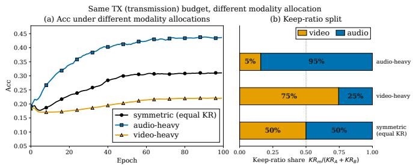
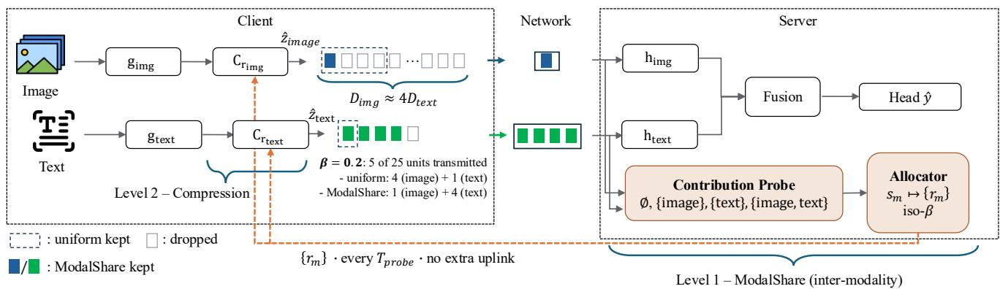
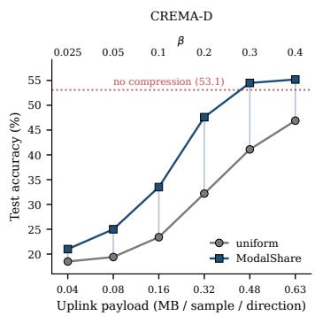
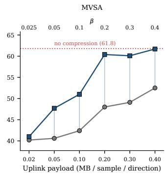
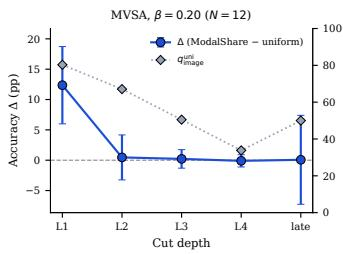
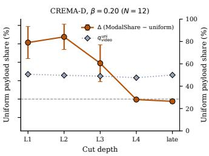

# Contribution-Aware Bandwidth Allocation for Multimodal Split Learning

Iason Ofeidis, Leandros Tassiulas

Department of Electrical and Computer Engineering, Yale University, New Haven, CT, USA

Abstract—Multimodal models are increasingly the default option for perception at the network edge, yet they are trained almost entirely in the datacenter, because a client holding several sensor streams cannot host an encoder per modality. Split Learning makes such training feasible by keeping only the first layers on the device, at the cost of an uplink that must carry smashed activations for every modality at every step. Existing compression schemes give each modality the same keep-ratio, so the shared budget is divided in proportion to smashedactivation dimension, a quantity unrelated to how much each modality contributes to the fused prediction. We make that division an explicit decision and call it inter-modality allocation: under a fixed uplink budget, every policy transmits the same expected payload and differs only in how that payload is split across modalities. Our allocator, ModalShare, sets each modality’s keep-ratio from a Shapley contribution score that the server computes over coalitions of activations it has already received. Measuring this score adds no uplink traffic and no client-side computation, and needs no prior knowledge of which stream is which. ModalShare improves accuracy over equal keep-ratios by 15.4 and 12.4 percentage points on CREMA-D and MVSA at matched payload in 5× compression, with strong performance across three compressors, three datasets, and four budgets. We show that existing compressors underperform in multimodal settings, with ModalShare recovering what gains are left behind.

Index Terms—split learning, multimodal split learning, communication-efficiency, resource allocation, edge computing.

## I. INTRODUCTION

Artificial intelligence is increasingly multimodal. Frontier models now match or exceed human baselines on multimodal reasoning, while the sensors that feed such models (e.g. cameras, microphones, accelerometers) are already standard on the devices people carry. Emotion recognition from speech and facial expression, sentiment analysis over paired image and text, and activity recognition from inertial streams all depend on combining modalities rather than choosing among them. Yet the models that do this combining are trained and served almost entirely in the cloud, while the data that would train them best originates at the edge. Closing that gap means running multimodal learning where the sensors are, and that is precisely where the deployment assumptions break down: an encoder per modality multiplies memory and compute against a budget that was already tight before the second stream arrived.

Federated Learning [1] keeps raw data on the device, but leaves this problem unaddressed, since the full model must still fit locally. Split Learning (SL) [2] removes the constraint by partitioning the model at a cut layer: the client runs only the first few layers and transmits the resulting smashed activations to a server that completes the forward and backward passes. The client-side share of the model can then be made as small as the deployment demands, the scheme composes with federated aggregation, and it appears repeatedly in 6G edge architectures for exactly this reason [3], [4].

  
Fig. 1: Fixed-budget keep-ratio allocations across modalities (CREMA-D, 5× compression). All three arms transmit the same total payload under the same compressor and differ only in how it is divided (b); the resulting accuracy differs by a wide margin (a). Allocation, not only budget and compression, determines what a fixed uplink buys.

This gain comes from trading on-device compute for bandwidth, and the cost concentrates on the uplink, the more constrained of the two directions. The cut-layer uplink carries per-batch activations for the entire training run, and their size is the dominant cost of the system [3], [5]. Uplink is also the scarce direction in practice: most operators now measure uplink traffic growing faster than downlink, and AI services are expected to drive uplink volumes to roughly three times their 2025 level by 2031 [6]. A substantial literature therefore compresses what crosses the cut: Top-K sparsification [7], randomized selection that reduces index overhead [8], progressive pruning of the representation over training [9], channelwise rate adaptation [10], and adaptive feature-wise dropout at the cut [5]. Each of these decides how a single tensor (e.g. activations) is represented within its budget, which is the only decision available when a node holds one tensor. Applied to a multimodal client, they are modality-agnostic by construction: one policy, and the same keep-ratio handed to every stream.

A multimodal client, however, holds several tensors that share one uplink, and that raises a second decision the compression literature does not expose: how the shared budget is divided among them. Equal keep-ratios divide the transmitted payload in proportion to the cut dimensions, so a modality whose smashed activations are four times larger silently receives four times the bandwidth: equal compression severity is not equal bandwidth. For example, on MVSA-Single, an image-text sentiment dataset, the image cut is roughly four times the text cut, so image takes 80% of the budget before anything about the task is measured. Additionally, no evidence suggests that a dimension-based division matches how the modalities contribute; in fact, modalities are weighted unequally in fused models and degrade differently under constraint [11]–[13]. Under a fixed budget, floats spent on a stream the fused prediction barely uses are floats taken from one it depends on. Figure 1 indicates that the difference is not marginal even when dimension skew is absent: on CREMA-D, an audio-video emotion recognition task whose two cuts are nearly equal in dimension, holding the transmitted payload and the compressor fixed and varying only how the budget is split, an audio-heavy allocation converges well above the equal-keep-ratio default while a video-heavy one falls below it. Only the allocation differs.

This motivates the question we study: under a fixed total uplink budget, does allocating bandwidth asymmetrically across modalities outperform uniform allocation, and under what conditions? We make the decision explicit as intermodality allocation and design a policy for it. Our allocator, ModalShare, estimates each modality’s marginal contribution with a Shapley probe evaluated at the server over coalitions of smashed activations the server already holds, and maps those scores to per-modality keep-ratios that preserve the total transmitted payload. Because the coalitions are formed by masking activations that have already crossed the cut, the measurement consumes no uplink, has no client-side computation overhead, and requires no auxiliary channel; its cost is only server-side compute. Allocation sits above the compressor rather than replacing it: ModalShare determines how much budget each stream receives, while the existing compressor still determines which coordinates within that stream survive. We find the resulting gains to be substantial: largest at moderate compression on cuts where contribution is skewed, diminishing as the budget approaches the trivial floor, and near zero where the modalities genuinely contribute equally, which is the behaviour a measurement-driven policy should exhibit.

The main contributions of this work are:

We show that modality-agnostic compression is not neutral: equal keep-ratios allocate transmitted payload in proportion to cut dimension, a quantity unrelated to a modality’s role in the fused prediction. To our knowledge, this is the first work to treat the division of a shared cut budget across modalities as a decision in its own right, which we formulate as inter-modality allocation: an isobudget problem in which every policy transmits the same expected payload and differs only in its split.

• We propose ModalShare, which sets per-modality keepratios from a fusion-level contribution score measured at the server over coalitions of already-received smashed activations, adding no uplink traffic and assuming no modality-identity prior. Under SplitFC at β=0.2 it improves accuracy over equal keep-ratios by 15.4 pp on CREMA-D and 12.4 pp on MVSA at matched payload, with the advantage persisting across three compressors, three datasets, and four budgets; existing SL compressors leave these gains unclaimed in multimodal settings, and allocation recovers them.

• We attribute the gain to contribution rather than to dimension skew. On MVSA the contribution component exceeds the skew component that any fixed rule could recover, and on CREMA-D, whose cut dimensions are balanced, it accounts for the whole effect; where the measured gap is small, as on UCI HAR, allocation stays near-uniform and the gain vanishes.

• We show cut-local proxies do not substitute for a fusionlevel score: activation and gradient norms cannot observe how modalities combine, and standalone utility measures a modality in isolation rather than its marginal value, so none recovers the gain.

## II. RELATED WORK

Split Learning & Compression. SL partitions a model so that clients transmit intermediate activations to a server that completes the forward and backward passes [2], and the size of those intermediates is the dominant cost [3], [5]. Communication-efficient variants of SL compress the transmitted tensor: Top-K sparsification [7], randomized variants that reduce selection and index cost [8], progressive pruning of the representation over training [9], adaptive feature-wise dropout at the cut [5], channel-wise compression that adapts the rate across channels of a single tensor [10], batch-wise packing of multiple smashed vectors into one [14], and learned autoencoder bottlenecks at the cut [15], [16]. Each of these decides how a single tensor is represented: a sparsity level, a schedule, a channel-wise rate or a learned bottleneck. Multimodality adds a second: when several streams share one uplink, the budget must also be divided among them. That division is the subject of this work.

Asymmetric Multimodal Learning. Modality imbalance in centralized training has received increasing attention in recent years. Gradient-balancing methods such as on-the-fly gradient modulation (OGM) [13] equalize optimization effort across modalities. Wei et al. [12] argue that balanced optimization is not optimal and instead align each modality’s optimization dependency with the inverse of its variance ratio. Xu et al. [11] guide asymmetry by an explicit contribution score, using it both to accelerate gradients and to set a per-modality information-bottleneck strength; greedy modality selection [17] makes the coarser decision of which modalities to admit at all. Modality-balanced quantization [18] makes a related observation at the level of numerical precision, calibrating vision and language tokens separately because a single quantization objective serves them unequally. These works reallocate optimization effort, representation capacity, or numerical precision across modalities. We reallocate a communication budget at the split-learning cut, where the constraint is a transmitted payload rather than a regularizer.

TABLE I: Notation.
<table><tr><td>Symbol</td><td>Meaning</td></tr><tr><td>M</td><td>number of modalities</td></tr><tr><td> $D _ { m }$ </td><td>flattened cut dimension of modality m</td></tr><tr><td> $z _ { m }$ </td><td>smashed activations of modality m</td></tr><tr><td> $r _ { m }$ </td><td>keep-ratio of modality m (the allocated quantity)</td></tr><tr><td> $\beta$ </td><td>uplink budget as a fraction of full cut payload,  $\mathrm { \hat { T X } } / \sum _ { k } D _ { k }$ </td></tr><tr><td> $q _ { m }$ </td><td>payload share of modality m,  $D _ { m } r _ { m } / \mathrm { T X }$ </td></tr><tr><td> $c$ </td><td>intra-modality compressor (SplitFC primary)</td></tr><tr><td> $u ( S )$ </td><td>coalition utility (server true-label log-prob with only modalities S)</td></tr><tr><td> $\phi _ { m }$ </td><td>Shapley contribution score of modality m</td></tr><tr><td> $s _ { m }$ </td><td>EMA-smoothed contribution share of modality m</td></tr><tr><td> $\pi _ { m }$ </td><td>normalized allocation weight from  $s _ { m }$ </td></tr><tr><td> $\tau$ </td><td>allocation temperature</td></tr><tr><td> $r _ { \mathrm { m i n } }$ </td><td>keep-ratio floor</td></tr><tr><td> $g$ </td><td>contribution confidence gap</td></tr><tr><td> $\gamma$ </td><td>freeze confidence threshold</td></tr><tr><td> $K$ </td><td>consecutive confident epochs required to freeze</td></tr><tr><td> $e _ { \mathrm { m i n } }$ </td><td>earliest epoch at which freezing is allowed</td></tr></table>

Contribution Scoring. Shapley-style attribution quantifies how much each modality drives a prediction, and has been used to audit vision-language transformers [19], to separate unimodal from cross-modal contributions [20], and to report diagnostic weight in clinical models [21]. Closest in estimator, Wei et al. [22] compute Shapley-based contributions per sample and resample data for the weaker modality. Contribution is consistently found to be dataset- and task-dependent, which is what makes a fixed budget split unsatisfactory and an online estimate useful. The question also arises in federated learning, where contribution estimates have been applied to communication [23] and to modality imbalance across clients [24]; there the network carries aggregated model updates rather than perbatch activations at a fixed cut, so the allocation decision we study does not arise. We evaluate the same coalitions during training and spend the resulting scores on transmitted payload: the estimator is shared, the actuator is the uplink budget. To our knowledge, this is the first use of a Shapley-based contribution score to allocate communication resources across modalities in multimodal learning.

## III. METHOD

We consider multimodal SL between one multimodal client and one server: the client holds the early modality encoders, the server holds the remaining backbone, fusion, and classifier. Because attribution and allocation act only on that client’s cut and uplink, the same policy applies independently on every client–server link in a multi-client deployment. We formulate sharing the client–server cut as an iso-budget allocation problem and give a contribution-aware policy for setting permodality budgets.

## A. Multimodal Split Learning

Let $\boldsymbol { \mathcal { D } } = \{ ( \boldsymbol { x } _ { i } ^ { ( 1 ) } , \ldots , \boldsymbol { x } _ { i } ^ { ( M ) } , \boldsymbol { y } _ { i } ) \} _ { i = 1 } ^ { N }$ be a training set with modality index set $\mathcal { M } = \{ 1 , \dots , M \}$ . A single client hosts M

modality encoders; for modality m, encoder $g _ { m }$ with parameters $\theta _ { m }$ maps its input to intermediate activations (smashed activations) at a fixed cut,

$$
z _ { m } = g _ { m } ( x ^ { ( m ) } ; \theta _ { m } ) \in \mathbb { R } ^ { D _ { m } } ,\tag{1}
$$

where $D _ { m }$ is the flattened smashed-activation dimension. The server model h with parameters $\theta _ { s }$ receives the smashed activations, completes any remaining modality-specific layers, fuses the modalities, and predicts

$$
\hat { y } = h ( \{ z _ { m } \} _ { m \in \mathcal { M } } ; \theta _ { s } ) .\tag{2}
$$

For each mini-batch the client uploads $\left\{ z _ { m } \right\}$ ; the server evaluates the task loss, backpropagates through $h ,$ and returns the cut gradients $\nabla _ { z _ { m } } \ell .$ All communication crosses this cut.

## B. Compression of smashed activations

Let C denote a modality-level compressor with budget parameter $r _ { m } \in ( 0 , 1 ]$

$$
\begin{array} { r } { \hat { z } _ { m } = \mathcal { C } ( z _ { m } , r _ { m } ) , } \end{array}\tag{3}
$$

where the keep-ratio $r _ { m }$ is the expected payload of $\hat { z } _ { m }$ as a fraction of $D _ { m }$ . This interface separates two decisions: the compressor determines how to represent modality m within its budget, and the allocator determines how much budget that modality receives. Our allocation rule is therefore independent of the internal selection rule used by C.

Budget is accounted in transmitted smashed-activation floats,

$$
\mathrm { T X } = \sum _ { m \in \mathcal { M } } D _ { m } r _ { m } ,\tag{4}
$$

per sample and per direction. The compressed representation also defines the units the server can differentiate with respect to, so the return path carries gradients in that same representation: coordinates the client did not send receive no gradient, and total cut traffic is 2 · TX. Two allocations at equal TX therefore exchange the same expected payload in both directions, and whatever side information C carries with it (e.g., masks and indices for a sparsifier, scales for a quantizer), is matched along with it.

## C. Inter-modality allocation

Existing compression of smashed activations applies one rule to concatenated smashed activations or assigns the same keep-ratio to every modality. Neither asks how a shared budget should be divided according to the modalities’ roles in the fused prediction. We expose that decision as inter-modality allocation.

We define the normalized communication budget as:

$$
\beta = \frac { \mathrm { T X } } { \sum _ { m } D _ { m } } .\tag{5}
$$

All policies compared at budget $\beta$ satisfy the iso-budget constraint

$$
\sum _ { m } D _ { m } r _ { m } = \beta \sum _ { m } D _ { m } ,\tag{6}
$$

  
Fig. 2: ModalShare allocates a fixed cut budget across modalities. Prior compression operates within a modality (Leve 2); ModalShare divides the shared payload between them (Level 1) using a server-side Shapley probe on already-received activations, so no extra uplink is consumed. Strip lengths follow the MVSA cut dimensions; cell counts are illustrative at $\beta = 0 . 2$ , where both policies transmit 5 of 25 units and differ only in the split.

so they exchange the same expected payload and differ only in its division. The payload share of modality m is

$$
q _ { m } = \frac { D _ { m } r _ { m } } { \mathrm { T X } } , \qquad \sum _ { m } q _ { m } = 1 ,\tag{7}
$$

and $\mathbf { q }$ lies on the probability simplex, giving a dimensionaware description of allocation along an iso-budget surface.

Equal keep-ratios, $r _ { m } = \beta ,$ , give

$$
q _ { m } ^ { \mathrm { u n i } } = \frac { D _ { m } } { \sum _ { k } D _ { k } } .\tag{8}
$$

Equal compression severity therefore does not imply equal transmitted floats: a modality with four times the smashedactivation dimension receives four times the payload. Our objective is to choose q from fusion-level contribution while preserving (6).

## D. ModalShare: Contribution-aware allocation

Here, we introduce ModalShare, a contribution-aware allocator that divides a fixed uplink budget into per-modality keep-ratios based on a server-side contribution score, leaving the intra-modality compressor unchanged (Figure 2).

Server-side contribution probe. We define the coalition utility $u ( S )$ as the mean true-label log-probability produced by the server when only modalities $S \subseteq { \mathcal { M } }$ are present, with absent modalities replaced by zeros, a masking convention used also in modality valuation [22]. Coalition marginals are aggregated by the Shapley value [25],

$$
\phi _ { m } = \sum _ { S \subseteq M \setminus \{ m \} } \frac { | S | ! \left( M - | S | - 1 \right) ! } { M ! } \left[ u ( S \cup \{ m \} ) - u ( S ) \right] ,\tag{9}
$$

evaluated exactly with $2 ^ { M }$ coalitions, or by sampling coalition orderings for large M. For example, when $M = 2$ the four coalitions are ∅, {1}, {2}, {1, 2}.

Because batch-level utilities are noisy, negative contributions are floored, renormalized to a share, and then smoothed,

$$
\tilde { \phi } _ { m } ^ { ( t ) } = \frac { [ \phi _ { m } ^ { ( t ) } ] _ { + } } { \sum _ { k } [ \phi _ { k } ^ { ( t ) } ] _ { + } + \varepsilon } , \qquad s _ { m } ^ { ( t ) } = \alpha \tilde { \phi } _ { m } ^ { ( t ) } + ( 1 - \alpha ) s _ { m } ^ { ( t - 1 ) } ,\tag{10}
$$

with the probe evaluated every $T _ { \mathrm { p r o b e } }$ batches and cached scores used in between.

From contribution to keep-ratios. Given scores $\{ s _ { m } \}$ temperature-controlled weights

$$
w _ { m } = s _ { m } ^ { 1 / \tau } , \qquad \pi _ { m } = \frac { w _ { m } } { \sum _ { k } w _ { k } } ,\tag{11}
$$

convert contribution into a share of the residual payload after a keep-ratio floor $r _ { \mathrm { m i n } }$ reserves $D _ { m } r _ { \operatorname* { m i n } }$ units per modality. With $\mathrm { T X } _ { \mathrm { s u r } } = \mathrm { T X } - r _ { \mathrm { m i n } } \sum _ { k } D _ { k } > 0$

$$
c _ { m } = D _ { m } r _ { \mathrm { m i n } } + \pi _ { m } \mathrm { T X } _ { \mathrm { s u r } } , \qquad r _ { m } = { \frac { c _ { m } } { D _ { m } } } ,\tag{12}
$$

followed by projection to $r _ { m } \in [ r _ { \operatorname* { m i n } } , 1 ]$ that preserves the total budget (6). Smaller τ sharpens (11). The emptycoalition utility sets the scale of $\left\{ \phi _ { m } \right\}$ : for $M { = } 2 , \phi _ { 1 } - \phi _ { 2 } =$ $u ( \{ 1 \} ) - u ( \{ 2 \} )$ ) is independent of u(∅), while efficiency gives $\begin{array} { r } { \sum _ { m } \phi _ { m } = u ( \mathcal { M } ) - u ( \emptyset ) } \end{array}$ , so the baseline controls how sharply the weights separate the modalities. When the keep-ratio floor vanishes, a decisive contribution gap can place the allocation at a simplex corner rather than a smooth interior reweighting. Hard modality selection is the limiting case $\tau  0$ of this map; the floor $r _ { m i n }$ and the temperature τ interpolate between it and uniform allocation.

Confidence and freeze. Live allocation follows (12) without gating keep-ratios on the contribution gap: while unfrozen, ModalShare remains adaptive. Confidence is measured separately by the normalized gap between the leading and runnerup scores,

$$
g = \frac { s _ { ( 1 ) } - s _ { ( 2 ) } } { \sum _ { k } s _ { k } + \varepsilon } ,\tag{13}
$$

Algorithm 1 ModalShare iso-budget allocation.  
1) Compute smashed activations $z _ { m } \gets g _ { m } ( x ^ { ( m ) } )$ , m $\in$   
M.   
2) Every $T _ { \mathrm { p r o b e } }$ batches while unfrozen: evaluate server   
coalitions, update $\left\{ s _ { m } \right\}$ , and map to $\{ r _ { m } \}$ under (12).   
3) If the freeze criterion on $g$ is met, hold $\{ r _ { m } \}$ fixed and   
skip further probes; otherwise continue adapting.   
4) The client compresses and uploads $\hat { z } _ { m } \gets \mathcal { C } ( z _ { m } , r _ { m } )$   
5) Complete server forward/backward, return cut gradients,   
and update $\{ \theta _ { m } \}$ and $\theta _ { s }$

where $s _ { ( 1 ) } ~ \geq ~ s _ { ( 2 ) }$ are the top two values in $\left\{ s _ { m } \right\}$ . For M=2 this reduces to $g \ = \ | s _ { 1 } - s _ { 2 } | / ( s _ { 1 } + s _ { 2 } + \varepsilon )$ . After epoch $e _ { \operatorname* { m i n } } , { \mathrm { i f } } \ g \ \geq \gamma$ favors the same winning modality for $K$ consecutive epochs, ModalShare freezes the current keepratios $\{ r _ { m } \}$ , preserves (6), and discontinues probing. A drop of $g$ below $\gamma _ { : }$ , or a change of winner, resets the streak. The threshold $\gamma$ therefore controls only when to stop adapting, not the online map itself.

## E. Training procedure and communication cost

Algorithm 1 embeds the probe, map, and freeze rule in the training loop. During early training the uplink budget is ramped from full keep-ratios $( r _ { m } { = } 1 )$ to the target fraction $\beta ;$ schedules appear in Section IV. While unfrozen, ModalShare refreshes $\{ r _ { m } \}$ via (12) on the probe schedule of Section III-D, including during the compression ramp. At fixed $\beta ,$ compared policies share the same expected TX and differ only in q.

The probe adds no client–server messages: coalitions are formed by masking smashed activations already held at the server, so attribution consumes no part of (4) and needs no auxiliary channel. Its cost is $2 ^ { M }$ forward evaluations of the server submodel (four for $M { = } 2 )$ every $T _ { \mathrm { p r o b e } }$ batches while allocation remains unfrozen. Freezing removes that overhead for the remainder of training once the confidence criterion is met. Section V-G compares the frozen policy to continued online allocation.

## IV. EXPERIMENTAL SETUP

Our evaluation tests an allocation hypothesis rather than a new feature compressor. At a fixed uplink budget $\beta \ ( 5 )$ we ask whether replacing modality-agnostic keep-ratios with contribution-aware keep-ratios improves accuracy when the expected transmitted payload is held constant. Every controlled comparison holds fixed the intra-modality compressor C and the training protocol, and changes only the mapping from budget to per-modality keep-ratios $\{ r _ { m } \}$ . Budget is accounted in expected kept smashed-activation floats, $\begin{array} { r } { \mathrm { T X } = \sum _ { m } D _ { m } r _ { m } . } \end{array}$ together with the matched cut-gradient support (Section III-B).

## A. Baselines

To the best of our knowledge, no prior method allocates a shared payload budget across modalities, whether in SL or otherwise: existing communication-efficient methods compress each transmitted tensor independently and leave the division of a shared budget among modalities unspecified. Our central comparison is therefore between ModalShare and the modality-agnostic default it replaces, uniform allocation, which assigns every modality the same keep-ratio $( r _ { m } = \beta$ for all m) and represents the existing practice of compressing each modality independently. Both satisfy the iso-budget constraint (6) and differ only in how the shared payload is split. Crucially, equal keep-ratios are not equal bandwidth: when the smashed dimensions differ, uniform allocation already sends a fraction $\begin{array} { r } { q _ { m } ^ { \mathrm { u n i } } = D _ { m } / \sum _ { k } D _ { k } } \end{array}$ of the payload to modality m (8), so a modality with a larger cut silently receives a larger share. ModalShare instead sets $\{ r _ { m } \}$ from the serverside contribution probe of Section III-D, under the same total budget.

## B. Datasets

CREMA-D [26] is an audio-visual emotion recognition dataset containing synchronized speech and facial expression data. It comprises 7, 442 video clips spanning six emotion categories. The dataset is split into 6, 698 training samples and 744 testing samples.

MVSA-Single [27] is an image-text dataset used for sentiment analysis. It includes a stratified subsample of 2,592 pairs split 60/20/20 into 1,555 training, 518 validation, and 519 held-out pairs, with the validation partition reported as test accuracy.

UCI HAR [28] is a six-class human activity recognition dataset from smartphone inertial sensors, collected from 30 volunteers. It comprises 10, 299 samples, split into 7, 352 training and 2, 947 testing samples. Each sample provides two synchronized streams: accelerometer and gyroscope.

## C. Models

Encoders. All experiments use the multimodal SL setup of Section III-A: each modality has a client-side encoder truncated at a fixed early cut, and the server completes the remaining modality-specific layers, fusion, and classification. Visual streams (CREMA-D video; MVSA image) use a ResNet-18 backbone. MVSA text uses DistilBERT, fine-tuned end-to-end. CREMA-D audio is encoded from the waveform as an STFT log-magnitude spectrogram (22,050 Hz, tiled to three seconds, $n _ { \mathrm { H t } } { = } 5 1 2$ , hop length 353), giving a single-channel 257×188 input to a ResNet-18 encoder trained from scratch. UCI HAR uses a small 1D CNN per inertial stream.

Fusion. Fusion is concatenation followed by a linear classifier head, with no cross-modal attention. Unlike attention-based fusion, concatenation does not reweight streams after the cut, so an accuracy difference between allocations at matched $\beta$ is attributable to the allocation itself.

Splitting point. In realistic SL scenarios, edge clients cannot host most of the model locally: computation relies mostly on the server, and the client only transmits smashed activations from an early cut. That is also where the smashed-activation payload is large enough for an uplink budget to bind and for per-modality keep-ratios to matter. Based on this, we decide to use the early split (layer-1) as the default, unless otherwise specified. Concretely, the client holds only the first stage of each encoder: ResNet-18 stem plus the first residual block for CREMA-D video/audio and MVSA image; DistilBERT layers 0–1 for MVSA text; the first 1D-CNN block for UCI HAR; and the server runs the remaining modality-specific layers, pooling, fusion, and the classifier. A late split instead keeps the full encoder on the client and exchanges only pooled embeddings (256–512 dimensions per modality), leaving little payload to allocate.

TABLE II: Flattened cut dimensions at the early split and the payload share induced by equal keep-ratios, $q _ { m } ^ { \mathrm { u n i } } =$ $D _ { m } / \sum _ { k } D _ { k }$
<table><tr><td>Dataset</td><td>Modality</td><td> $D _ { m }$ </td><td> $q _ { m } ^ { \mathrm { u n i } }$ </td></tr><tr><td rowspan="2">CREMA-D</td><td>video</td><td>200,704</td><td>50.7%</td></tr><tr><td>audio</td><td>195,520</td><td>49.3%</td></tr><tr><td rowspan="2">MVSA</td><td>image</td><td>200,704</td><td>80.3%</td></tr><tr><td>text</td><td>49,152</td><td>19.7%</td></tr><tr><td rowspan="2">UCI HAR</td><td>accel</td><td>32</td><td>50.0%</td></tr><tr><td>gyro</td><td>32</td><td>50.0%</td></tr></table>

Table II lists the cut dimensions and the payload share that equal keep-ratios induce for early split. CREMA-D is nearly balanced; on MVSA the image stream already receives fourfifths of the transmitted payload under the modality-agnostic default.

## D. Hyperparameters and evaluation

CREMA-D is trained with SGD (learning rate $1 0 ^ { - 3 }$ , weight decay $1 0 ^ { - 4 }$ , momentum 0.9) for 100 epochs with $\mathrm { ~ \textbf ~ { ~ a ~ } ~ } 5 -$ epoch learning-rate warmup and a 5-epoch compression ramp. MVSA is trained with AdamW (learning rate $3 \times 1 0 ^ { - 4 }$ , weight decay $1 0 ^ { - 3 } )$ for 30 epochs with one-epoch warmups. Batch size is 64 in both cases. Allocation uses floor $r _ { \mathrm { m i n } } { = } 0$ , probe period $T _ { \mathrm { p r o b e } } { = } 1 0$ , EMA coefficient $\alpha { = } 0 . 3 ,$ and temperature $\tau { = } 1$ , each shared across all datasets, budgets, and compressors. Freezing uses confidence threshold $\gamma { = } 0 . 9 0 $ , streak length $K { = } 3 ,$ and earliest freeze epoch $e _ { \mathrm { m i n } } { = } 1 0 ,$ , likewise shared. For the underlying compressor, we use SplitFC [5], unless otherwise specified. Final test accuracy is averaged over N=12 seeds.

Experimental Environment. We implemented our framework and all baselines using the PyTorch library [29]. All experiments were conducted on a server equipped with a 32-core AMD Ryzen Threadripper PRO CPU, 504 GB of memory and an NVIDIA GeForce RTX 4090 GPU.

## V. EVALUATION RESULTS

## A. Same budget, better accuracy

Table IIIa reports accuracy against uplink compression $1 / \beta$ under SplitFC with early split at matched total payload. ModalShare strongly outperforms uniform on CREMA-D and MVSA at every compression level. UCI HAR is milder but still favours the allocator at $5 / 6$ budgets: it settles at a slight keepratio imbalance rather than a corner, and that mild reallocation yields a small accuracy gain over equal keep-ratios, suggesting that the two sensor streams contribute roughly the same, so there is little asymmetry to be exploited.

  
Fig. 3: Accuracy (%) versus uplink payload. Left: CREMA-D; right: MVSA. Red dotted: no-compression reference. Top axis: bandwidth budget $\beta .$

Figure 3 shows the same CREMA-D and MVSA comparison against transmitted payload, so the horizontal axis is physical uplink cost rather than a keep-ratio label. Gains peak at moderate compression: the gap is largest near $5 \times$ and mainly shrinks toward the tightest budgets (near the trivial floor). Once the budget again carries usable signal, the same total payload is worth more under ModalShare than under equal keep-ratios.

Operating envelope. Table IIIa and Figure 3 show the same pattern: $\Delta$ peaks near moderate compression (about +15 pp on CREMA-D and +12 pp on MVSA) and largely declines toward small budgets, approaching near zero at 40×. At 40× both arms approach the trivial floor, so allocation has little left to differentiate: CREMA-D sits just above six-class chance (16.7), and MVSA uniform sits on the majority-class rate (≈40). This pattern suggests that reallocation pays when the budget binds but still carries signal.

## B. Does the probe measure contribution?

The gains above raise a question: does ModalShare help because it measures contribution, or would any aggressive asymmetric split have helped on these datasets? On CREMA-D and MVSA the two are observationally identical, so Table IIIb places the probe’s measurement beside the allocation it produces. We summarise each dataset by the contribution gap $g$ of (13), i.e. the normalized separation of the smoothed scores $\{ s _ { m } \}$ that feed the keep-ratio map (for M=2, g = $| s _ { A } - s _ { B } | / ( s _ { A } + s _ { B } + \varepsilon ) )$ . Thus $g$ is a property of the probe scores before they are mapped to $\{ r _ { m } \}$ , not a restatement of the allocation. The allocation follows it: on CREMA-D and MVSA the probe reads a large gap (g≈1.0 and 0.90) and concentrates the budget on the modality it scores as dominant (audio and text respectively) for double-digit $\Delta ;$ on the balanced UCI HAR it reads a small gap (g≈0.12) and splits near-evenly. UCI HAR is the discriminating case: a method that forced asymmetry regardless of the data would commit there too and would lose accuracy, whereas ModalShare stays near uniform because the probe finds little to reallocate. The allocation is thus a function of the measured contribution, not a fixed asymmetric prior, which is what ties the gains in Table IIIa to a property the probe reads in the data.

TABLE III: ModalShare against uniform under SplitFC, early-split multimodal SL. (a) Accuracy (%) across compression rates, with the accuracy difference $\Delta ;$ the shaded ∆ row is bold where the gain exceeds 1pp. (b) $\mathrm { A t } ~ \beta { = } 0 . 2$ , the modality the probe favors and the payload share $q$ it receives $( q ^ { \mathrm { m o d } }$ : ModalShare, $q ^ { \mathrm { u n i } }$ : uniform), with the probe’s contribution gap g. The gain tracks the measured gap: large on CREMA-D and MVSA, near-zero on the balanced UCI HAR.
<table><tr><td rowspan="2">Dataset (no comp.)</td><td rowspan="2">Allocation</td><td colspan="6">Compression rate</td></tr><tr><td>2.5×</td><td>3.3×</td><td> $5 \times$ </td><td>10×</td><td>20×</td><td> $4 0 \times$ </td></tr><tr><td rowspan="3">CREMA-D (53.1)</td><td>Uniform</td><td> $4 6 . 9 { \pm } 6 . 2 $ </td><td> $4 1 . 1 { \pm } 6 . 4 $ </td><td>32.2±5.2</td><td> $2 3 . 4 \pm 2 . 5$ </td><td> $1 9 . 4 { \pm } 1 . 6 $ </td><td> $1 8 . 5 { \pm } 1 . 6 $ </td></tr><tr><td>ModalShare</td><td> $5 5 . 2 { \pm } 2 . 1 $ </td><td> $5 4 . 5 { \pm } 3 . 5 $ </td><td> $4 7 . 6 { \pm } 5 . 9 $ </td><td> $3 3 . 5 { \pm } 6 . 5 $ </td><td> $2 5 . 0 { \pm } 4 . 8 $ </td><td> $2 1 . 0 { \pm } 4 . 4 $ </td></tr><tr><td>Δ</td><td> ${ \bf + 8 . 3 \pm 4 . 9 }$ </td><td>+13.4±4.1 +15.4±4.3</td><td></td><td> $\mathbf { + 1 0 . 1 } 2 5 . 1$ </td><td> $+ { \bf 5 . 6 } \pm { \bf 5 . 1 }$ </td><td>+2.5±4.9</td></tr><tr><td rowspan="3">MVSA (61.8)</td><td>Uniform</td><td> $5 2 . 5 { \pm } 2 . 5 $ </td><td> $4 9 . 1 \pm 3 . 8$ </td><td>48.0±2.1</td><td>42.4±3.3</td><td>40.6±2.5</td><td>40.2±2.6</td></tr><tr><td>ModalShare</td><td> $6 1 . 7 { \pm } 2 . 8 $ </td><td> $6 0 . 1 { \pm } 4 . 6 $ </td><td>60.4±6.3</td><td> $5 1 . 0 { \pm } 7 . 4 $ </td><td> $4 7 . 7 { \pm } 4 . 7 $ </td><td> $4 1 . 0 { \pm } 3 . 3 $ </td></tr><tr><td> $\Delta$ </td><td> ${ \bf + 9 . 2 \pm } 2 . 5$ </td><td>+11.0±5.4 +12.4±6.4</td><td></td><td>+8.6±8.1 +7.1±5.5</td><td></td><td>+0.8±4.5</td></tr><tr><td rowspan="3">UCI HAR (63.7)</td><td>Uniform</td><td>51.2±2.4</td><td>47.3±2.6</td><td>43.6±2.3</td><td>39.4±2.1</td><td>39.2±2.3</td><td>37.3±2.2</td></tr><tr><td>ModalShare</td><td> $5 1 . 5 { \pm 2 . 2 }$ </td><td>48.0±2.5</td><td>44.7±3.5</td><td>40.2±3.1</td><td>39.1±2.1</td><td> $3 7 . 5 { \pm 2 . 1 }$ </td></tr><tr><td> $\Delta$ </td><td>+0.3±0.7</td><td>+0.7±1.0</td><td>+1.1±1.3</td><td>+0.8±1.7</td><td>−0.1±1.6</td><td> $+ 0 . 2 { \pm } 0 . 6 $ </td></tr></table>

(a) Accuracy versus uplink compression (no-compression in parentheses).

## C. Contribution, dimension skew & modality selection

On MVSA the image cut dimension is roughly four times the text cut dimension (Table II), so equal keep-ratios already place 80.3% of the transmitted payload on image. This introduces a possible alternative reading of the MVSA gain: that contribution plays no role and the allocator merely undoes a dimension-induced skew. To separate the two effects we compare against a fixed allocation that holds TX constant but divides it differently. Where uniform keep-ratios split the payload in proportion to each modality’s cut dimension, the equal-payload control gives each modality half the transmitted floats, isolating the dimension-skew component; notably, it is itself an allocation that no existing compressor implements. ModalShare instead divides the payload according to each modality’s measured contribution. Table IV reports the comparison at β=0.20.

The gain decomposes into a skew component and a residual that no dimension-based rule can supply. Relative to uniform, moving to equal payload recovers 5.17 pp of accuracy due to the dimension-skew component, and moving from equal payload to ModalShare recovers a further 7.23 pp, for a total of 12.40 pp. The larger share of the gain comes from the contribution component, a part no fixed, dimension-based rule can supply, and which is precisely what ModalShare provides.

CREMA-D provides the complementary check (Table IIIb). Its two cut dimensions differ by about 1.4 percentage points in uniform payload share (Table II), so equal keep-ratios are already near equal payload and the dimension-skew component is absent by construction. Yet its contribution gain is the larger of the two datasets’, which establishes that the second component does not depend on unequal dimensions. The dimension-skew term is thus specific to datasets with unequal cut dimensions, while the contribution term is present in both.

<table><tr><td>Dataset</td><td>Modalities</td><td> $q ^ { \mathrm { m o d } }$ </td><td> $q ^ { \mathrm { u n i } }$ </td><td>Gap g</td><td>∆</td></tr><tr><td rowspan="2">CREMA-D</td><td>audio</td><td>0.99</td><td>0.49</td><td rowspan="2">1.00</td><td rowspan="2"> $+ 1 5 . 4$ </td></tr><tr><td>video</td><td>0.01</td><td>0.51</td></tr><tr><td rowspan="2">MVSA</td><td>text</td><td>0.88</td><td>0.20</td><td rowspan="2">0.90</td><td rowspan="2"> $+ 1 2 . 4$ </td></tr><tr><td>image</td><td>0.12</td><td>0.80</td></tr><tr><td rowspan="2">UCI HAR</td><td>accel</td><td>0.56</td><td>0.50</td><td rowspan="2">0.12</td><td rowspan="2"> $+ 1 . 1$ </td></tr><tr><td>gyro</td><td>0.44</td><td>0.50</td></tr></table>

(b) Probe contribution versus realised allocation.

TABLE IV: MVSA static allocation references at $\beta { = } 0 . 2 0 .$ $q _ { \mathrm { i m a g e } } / q _ { \mathrm { t e x t } }$ is the image/text float share. $\Delta$ is relative to uniform. Equal payload (per modality) isolates dimension skew; the further gap to ModalShare is the contribution effect.
<table><tr><td>Allocation</td><td> $q _ { \mathrm { i m a g e } } / q _ { \mathrm { t e x t } }$ </td><td>Acc. (%)</td><td> $\Delta \mathsf { \Gamma } ( \mathsf { p p } )$ </td></tr><tr><td>Uniform</td><td>0.803/0.197</td><td> $4 8 . 0 0 { \pm } 2 . 1 \ $ </td><td></td></tr><tr><td>Equal payload</td><td>0.500/0.500</td><td> $5 3 . 1 7 \pm 3 . 9$ </td><td> $+ 5 . 1 7$ </td></tr><tr><td>ModalShare</td><td> $0 . 1 2 2 / 0 . 8 7 8$ </td><td> $6 0 . 4 0 { \scriptstyle \pm 6 . 3 }$ </td><td> $+ 1 2 . 4 0$ </td></tr></table>

A third reading remains: that the gain requires only identifying a winning modality, i.e. modality selection. Selection is in fact the $\tau  0$ limit of (11)-(12), so it is a point in the design space this formulation exposes rather than an alternative to it. Importantly, reaching that point still requires knowing which modality wins. Table V shows this is not readable at the cut: no per-stream signal recovers the allocation, and solo utility, which does see the fused model, moves the split by 0.02 on CREMA-D against the probe’s 0.50. Selection also requires careful tuning, which the iso-budget map does not: the same allocation and freeze settings run unchanged across every dataset, budget, compressor, and split depth reported here, and on UCI HAR the map self-abstains at g≈0.12 where a forced commitment would cost accuracy.

## D. Contribution proxies

ModalShare’s probe evaluates coalitions of modalities at the server, which costs a forward pass. A natural question is whether a local signal, one already available at the splitting point, can drive the same iso-budget map (12) and recover the gain. Table V screens three at $\beta { = } 0 . 2 0$ under the early-SplitFC protocol used elsewhere: the per-modality activation norm, the cut-gradient norm, and the solo utility $u ( \{ m \} )$ , which is the server’s predictive utility when modality m is present and the other are zeroed.

TABLE V: Proxy screen at $\beta { = } 0 . 2 0$ . For each dataset, $\Delta$ is versus equal keep-ratios (pp) and $q$ is the payload share of the superscripted modality; the uniform row is the $\Delta { = } 0$ reference.
<table><tr><td></td><td>CREMA-D</td><td colspan="2">MVSA</td><td colspan="2">UCI HAR</td></tr><tr><td>Allocator</td><td> $\Delta$ </td><td> $q ^ { \mathrm { v i d e o } }$ </td><td> $\Delta$   $q ^ { \mathrm { i m a g e } }$ </td><td> $\Delta$ </td><td> $q ^ { \mathrm { a c c e l } }$ </td></tr><tr><td>Shapley (ModalShare)</td><td>+15.4</td><td>0.01</td><td>+12.4 0.12</td><td>+1.1</td><td>0.56</td></tr><tr><td>Activation-norm</td><td>+4.3</td><td>0.31</td><td>-1.5 0.55</td><td>+0.1</td><td>0.50</td></tr><tr><td>Gradient-norm</td><td>-0.3</td><td>0.58</td><td>-1.3 0.52</td><td>0.0</td><td>0.51</td></tr><tr><td>Solo utility</td><td>+0.3</td><td>0.50</td><td>-1.7 0.52</td><td>+0.1</td><td>0.50</td></tr><tr><td>Uniform</td><td>0.0</td><td>0.51</td><td>0.0</td><td>0.80 0.0</td><td>0.50</td></tr></table>

None moves the allocation to where it helps. On CREMA-D the strongest proxy, activation-norm, shifts only part way toward audio $( q _ { \mathrm { v i d e o } } { = } 0 . 3 1$ , against ModalShare’s 0.01) for a fraction of the gain (+4.3 vs +15.4 pp); gradient-norm drifts the wrong way and solo utility barely moves. On MVSA the proxy scores barely separate, so the allocation reaches only near equal payload $( q _ { \mathrm { i m a g e } } { \in } [ 0 . 5 2 , 0 . 5 5 ] )$ and stays at or below uniform accuracy, far from ModalShare’s text corner (0.12, +12.4 pp). UCI HAR is near-null for all arms, as expected when there is little to reallocate.

The failures have two distinct causes. The activation and gradient norms are per-stream quantities computed before fusion; they cannot see how the modalities combine in the prediction, so they do not track fusion-level contribution at all. Solo utility does see the fused model, but measures each modality in isolation. Its standalone predictive value is not what should set the budget: a modality that is strong alone may be redundant once the other is present, or weak alone yet complementary. Contribution is the marginal value a modality adds on top of the others, which only the coalition difference in (9) captures. This is why ModalShare’s full probe recovers the gain where every cheaper signal falls short.

## E. Allocation is orthogonal to the compressor

To test that the effect is not tied to one compressor, we re-run the identical uniform-versus-ModalShare comparison under two well established compressors in SL: Top-S [7] and RandTop-S [8], in addition to the adaptive SplitFC [5] used elsewhere. Allocation always selects the per-modality budgets; the compressor only selects which coordinates survive inside each modality. Table VI reports the accuracy difference directly. Across three compressors, three datasets, and four budgets, ModalShare beats matched uniform in 29 of 36 configurations. Most of the seven exceptions are within 1 pp on UCI HAR, where contribution is already near-balanced; the two large negatives are confined to CREMA-D at mild compression under hard column selection.

This failure mode is specific and identifiable: CREMA-D at 5× compression ratio, where Top-S loses 5.11 pp and RandTop-S loses 2.51 pp relative to uniform. At tighter budgets on the same dataset both hard sparsifiers gain (+4.97 to +9.65 pp). Hard selection does not always leave a withinmodality support that the allocator can exploit at mild compression, and the effect is confined to the dataset whose dimensions are already balanced. That is precisely where reallocation has least to recover and most to disturb when the sparsifier is lenient.

TABLE VI: Effect of ModalShare across intra-modality compressors. Each cell is the accuracy difference $\begin{array} { r l } { \Delta } & { { } = } \end{array}$ ModalShare − uniform (percentage points).
<table><tr><td rowspan="2">Compressor</td><td rowspan="2">Dataset</td><td colspan="4">Compression ratio</td></tr><tr><td>5×</td><td>10×</td><td>20×</td><td>40×</td></tr><tr><td rowspan="3">SplitFC [5]</td><td>CREMA-D</td><td>+15.4</td><td>+10.1</td><td>+5.6</td><td>+2.5</td></tr><tr><td>MVSA</td><td>+12.4</td><td>+8.6</td><td>+7.1</td><td>+0.8</td></tr><tr><td>UCI HAR</td><td>+1.1</td><td>+0.8</td><td>-0.1</td><td>+0.2</td></tr><tr><td rowspan="3">Top-S [7]</td><td>CREMA-D</td><td>-5.11</td><td>+7.71</td><td>+7.67</td><td>+4.97</td></tr><tr><td>MVSA</td><td>+6.52</td><td>+13.21</td><td>+9.91</td><td>+7.26</td></tr><tr><td>UCI HAR</td><td>+0.08</td><td>+1.32</td><td>-0.21</td><td>-0.04</td></tr><tr><td rowspan="3">RandTop-S [8]</td><td>CREMA-D</td><td>-2.51</td><td>+4.99</td><td>+9.65</td><td>+8.18</td></tr><tr><td>MVSA</td><td>+4.21</td><td>+11.50</td><td>+10.05</td><td>+8.93</td></tr><tr><td>UCI HAR</td><td>+0.77</td><td>-0.40</td><td>-0.05</td><td>+0.03</td></tr></table>

Two further observations follow from the same table. First, the effect is not an artifact of the adaptive compressor. Under Top-S and RandTop-S on MVSA the gains are larger than under SplitFC at several budgets, reaching 13.21 pp at 10×, and two of those Top-S configurations exceed the uncompressed reference, which could be attributed to the regularization effect of compression mechanisms, as already reported in [5], [8], [30], [31]. Second, the compressors themselves differ in strength: Top-S can exceed SplitFC on absolute accuracy in some cases. Compressor choice is an axis of its own, and every allocation comparison here is within-compressor at matched $\beta .$ We chose SplitFC as the primary underlying compressor because its uniform arm has the highest absolute accuracy among the three compressors in most budgets. Lastly and more importantly, this result highlights that existing SL compressors leave behind significant accuracy gains on the table in multimodal scenarios, with ModalShare being able to recover them.

## F. Dependence on split depth

The early split is the natural operating point for split learning: it keeps the client’s share of the model small, which is the setting SL targets in the first place, thus offloading most of the computation to the server. It is also where the cut carries the most data, and therefore where dividing the uplink across modalities is a decision at all. As the split moves serverward the client does more work and the smashed activations shrink toward a pooled embedding, leaving less to allocate. We investigate the effect of varying the split depth at β=0.20 and plot ∆ against depth in Figure 4.

The two datasets behave differently with depth. On MVSA the gain is large at layer 1 and falls off quickly, and two effects fade together as it does: the payload shrinks, and the dimension skew ModalShare corrects shrinks with it. The uniform image share drops from 80.3% at layer 1 to 33.8% at layer 4 (Figure 4, diamonds), so there is progressively less skew to undo. CREMA-D, whose modality dimensions stay within 3% of equal at every depth, has no such skew to begin with, yet still gains through layer 3. Because the uniform split is already near-balanced there, that gain cannot be skew correction, therefore it is direct evidence that the effect is contribution-driven, isolated on the dataset where dimension skew is absent by construction.

  
Fig. 4: Split-point ablation at $\beta { = } 0 . 2 0 .$ Mean ± std of $\Delta =$ ModalShare − uniform. Left: MVSA; right: CREMA-D. Grey diamonds (right axis): uniform payload share of modality $\mathrm { A } .$

TABLE VII: Online versus early-freeze ModalShare at $\beta { = } 0 . 2 0$ $\mathrm { M e a n } ~ \pm ~ \mathrm { s t d }$ of $\Delta = \mathrm { M o d a l S h a r e - u n i f o r m }$ . The freeze arm adapts for a short post-ramp window, then locks $\{ r _ { m } \}$ and stops probing.
<table><tr><td>Dataset</td><td>Uniform</td><td>Online</td><td>Freeze</td><td> $\Delta _ { \mathrm { f } - \mathrm { o } }$ </td></tr><tr><td>CREMA-D</td><td> $3 2 . 2 { \pm } 5 . 2 $ </td><td> $4 1 . 9 { \pm } 8 . 2 $ </td><td> $4 7 . 6 { \pm } 5 . 9 $ </td><td> $+ 5 . 7 { \pm } 6 . 2 $ </td></tr><tr><td>MVSA</td><td> $4 8 . 0 { \pm } 2 . 1 $ </td><td> $5 6 . 9 { \pm } 6 . 4 $ </td><td> $6 0 . 4 { \pm } 6 . 3 $ </td><td> $+ 3 . 5 { \pm } 6 . 9$ </td></tr></table>

Both datasets converge to zero $\Delta$ at the late embedding cut, where almost no payload crosses the boundary and there is nothing left to divide. Essentially, the gain tracks the size of the decision it is making, and disappears as that decision does. UCI HAR shows little depth dependence throughout, consistent with its near-balanced probe scores, and thus is not shown in the figure. Together these place ModalShare’s main operating regime at the early cut: the setting SL is built for, and the one where allocating the shared uplink is an important decision.

## G. Freezing versus online

ModalShare’s probe costs only server-side compute: every $T _ { \mathrm { p r o b e } }$ batches the server evaluates $2 ^ { M }$ coalitions (four forward passes for $M { = } 2 )$ to refresh $\{ r _ { m } \}$ . Once the allocation has settled on a stable split, those evaluations mostly reconfirm a decision already made. This raises a practical question: can the probe be switched off once the split is decided, and does doing so cost accuracy?

Table VII compares three arms at $\beta { = } 0 . 2 0 \colon$ uniform keepratios, an online ungated Shapley diagnostic that probes throughout, and the confidence-freeze ModalShare used in Table IIIa. Freezing locks $\{ r _ { m } \}$ and stops probing once the contribution gap stays decisive for $K$ consecutive epochs after $e _ { \mathrm { m i n } }$ (Section III-D), removing the residual server-side coalition cost.

Confidence freeze does not give up the gain. On both datasets the freeze arm matches or exceeds the online di agnostic in absolute accuracy while using the same uniform reference as the main tables, and both beat uniform by a wide margin. CREMA-D separates early, so locking is cheap: the probe can stop once audio dominates without waiting for the rest of training. MVSA separates more slowly, which is why the deployed schedule waits for a sustained gap rather than a fixed post-ramp clock. Freezing only after evidence keeps the split from committing too early, while still cutting probe cost (server overhead) for the remainder of training.

## VI. DISCUSSION

The formulation in Section III is defined for arbitrary M: the Shapley probe evaluates coalitions over any modality set, and the iso-budget map distributes payload across as many streams as the client holds. Our experiments cover $M { = } 2 ,$ where a shared uplink already has to be divided and the effect is cleanest to isolate. Evidence is likewise strongest at early splits, where the cut carries enough payload for allocation to be a decision at all; as the split moves server-ward the gap closes (Section V-F), both because the uplink shrinks and because the masking-based utility degrades once zeroing a modality produces an off-distribution input. The same linklocal design places ModalShare under multi-client SL and Split Federated Learning [4], [32]: each client runs its own probe and keep-ratio map on its uplink, without changing how the server aggregates client updates. Cross-client contribution scoring and clients that hold different modality subsets remain outside this paper.

We see multimodal contribution-aware allocation as an initial step towards a broader principle: a multimodal system should transmit only what the task needs, both in centralized and collaborative settings. Multimodal pipelines produce far more information than any uplink can carry, and much of it is redundant once the other streams are present. This is what a marginal-contribution score measures and a scalar compression rate cannot. Scaling to $M { \geq } 3$ is the immediate step, where the allocation simplex has interior structure that two streams cannot exhibit.

## VII. CONCLUSION

Multimodal SL inherits its compression from the unimodal case, where the only decision available is how a single tensor is represented. This leaves a second decision unmade: when several streams share one uplink, equal keep-ratios divide the budget by cut dimension, a quantity unrelated to what each modality contributes to the fused prediction. Formulating that division as an iso-budget problem makes it a tunable degree of freedom, and ModalShare shows that a contribution score measured at the server is enough to set it well: 15.4 and 12.4 pp over equal keep-ratios at matched payload, and near-uniform allocation where the measured gap is small. The formulation admits any number of modalities and any fusion-level score. Under a fixed link, how a multimodal system divides its budget is as consequential as how tightly it compresses.

## REFERENCES

[1] B. McMahan, E. Moore, D. Ramage, S. Hampson, and B. A. y Arcas, “Communication-efficient learning of deep networks from decentralized data,” in Artificial intelligence and statistics. Pmlr, 2017, pp. 1273– 1282.

[2] P. Vepakomma, O. Gupta, T. Swedish, and R. Raskar, “Split learning for health: Distributed deep learning without sharing raw patient data,” arXiv preprint arXiv:1812.00564, 2018.

[3] Z. Lin, G. Qu, X. Chen, and K. Huang, “Split learning in 6g edge networks,” IEEE Wireless Communications, vol. 31, no. 4, pp. 170–176, 2024.

[4] H. Hafi, B. Brik, P. A. Frangoudis, A. Ksentini, and M. Bagaa, “Split federated learning for 6g enabled-networks: Requirements, challenges, and future directions,” IEEe Access, vol. 12, pp. 9890–9930, 2024.

[5] Y. Oh, J. Lee, C. G. Brinton, and Y.-S. Jeon, “Communication-efficient split learning via adaptive feature-wise compression,” IEEE Transactions on Neural Networks and Learning Systems, vol. 36, no. 6, pp. 10 844– 10 858, 2025.

[6] Ericsson, “Ericsson mobility report, june 2026,” Telefonaktiebolaget LM Ericsson, Stockholm, Sweden, Tech. Rep., 6 2026.

[7] B. Yuan, S. Ge, and W. Xing, “A federated learning framework for healthcare iot devices,” arXiv preprint arXiv:2005.05083, 2020.

[8] F. Zheng, C. Chen, L. Lyu, and B. Yao, “Reducing communication for split learning by randomized top-k sparsification,” in Proceedings of the Thirty-Second International Joint Conference on Artificial Intelligence, 2023, pp. 4665–4673.

[9] A. Mudvari, A. Vainio, I. Ofeidis, S. Tarkoma, and L. Tassiulas, “Adaptive compression-aware split learning and inference for enhanced network efficiency,” ACM Transactions on Internet Technology, vol. 24, no. 4, pp. 1–26, 2024.

[10] Z. Lin, Z. Lin, M. Yang, J. Huang, Y. Zhang, Z. Fang, X. Du, Z. Chen, S. Zhu, and W. Ni, “Sl-acc: A communication-efficient split learning framework with adaptive channel-wise compression,” IEEE Transactions on Vehicular Technology, 2026.

[11] Z. Xu, Y. Kou, K. Wu, and H. Liu, “Contribution-guided asymmetric learning for robust multimodal fusion under imbalance and noise,” arXiv preprint arXiv:2510.26289, 2025.

[12] S. Wei, C. Luo, and Y. Luo, “Improving multimodal learning via imbalanced learning,” in Proceedings of the IEEE/CVF International Conference on Computer Vision, 2025, pp. 2250–2259.

[13] X. Peng, Y. Wei, A. Deng, D. Wang, and D. Hu, “Balanced multimodal learning via on-the-fly gradient modulation,” in Proceedings of the IEEE/CVF conference on computer vision and pattern recognition, 2022, pp. 8238–8247.

[14] C.-Y. Hsieh, Y.-C. Chuang, and A.-Y. Wu, “C3-sl: Circular convolutionbased batch-wise compression for communication-efficient split learning,” in 2022 IEEE 32nd International Workshop on Machine Learning for Signal Processing (MLSP). IEEE, 2022, pp. 1–6.

[15] B. Meuwissen, V. Tsouvalas, and N. Meratnia, “Autoencodercompressed parallel split learning for pre-trained model fine-tuning,” arXiv preprint arXiv:2607.17913, 2026.

[16] J. Shao and J. Zhang, “Bottlenet++: An end-to-end approach for feature compression in device-edge co-inference systems,” in 2020 IEEE International Conference on Communications Workshops (ICC Workshops). IEEE, 2020, pp. 1–6.

[17] Y. He, R. Cheng, G. Balasubramaniam, Y.-H. H. Tsai, and H. Zhao, “Efficient modality selection in multimodal learning,” Journal of Machine Learning Research, vol. 25, no. 47, pp. 1–39, 2024.

[18] S. Li, Y. Hu, X. Ning, X. Liu, K. Hong, X. Jia, X. Li, Y. Yan, P. Ran, G. Dai et al., “Mbq: Modality-balanced quantization for large visionlanguage models,” in 2025 IEEE/CVF Conference on Computer Vision and Pattern Recognition (CVPR). IEEE, 2025, pp. 4167–4177.

[19] L. Parcalabescu and A. Frank, “Mm-shap: A performance-agnostic metric for measuring multimodal contributions in vision and language models & tasks,” in Proceedings of the 61st Annual Meeting of the Association for Computational Linguistics (Volume 1: Long Papers), 2023, pp. 4032–4059.

[20] P. Hu, X. Li, and Y. Zhou, “Shape: An unified approach to evaluate the contribution and cooperation of individual modalities,” arXiv preprint arXiv:2205.00302, 2022.

[21] L. R. Soenksen, Y. Ma, C. Zeng, L. Boussioux, K. Villalobos Carballo, L. Na, H. M. Wiberg, M. L. Li, I. Fuentes, and D. Bertsimas, “Integrated

multimodal artificial intelligence framework for healthcare applications,” NPJ digital medicine, vol. 5, no. 1, p. 149, 2022.

[22] Y. Wei, R. Feng, Z. Wang, and D. Hu, “Enhancing multimodal cooperation via sample-level modality valuation,” in Proceedings of the IEEE/CVF Conference on Computer Vision and Pattern Recognition, 2024, pp. 27 338–27 347.

[23] L. Yuan, D.-J. Han, S. Wang, D. Upadhyay, and C. G. Brinton, “Communication-efficient multimodal federated learning: Joint modality and client selection,” IEEE Transactions on Mobile Computing, 2026.

[24] H. Amini, M. J. Mia, Y. Saadati, A. Imteaj, S. Nabavirazavi, U. Thakker, M. Z. Hossain, A. A. Fime, and S. Iyengar, “Distributed llms and multimodal large language models: A survey on advances, challenges, and future directions,” arXiv preprint arXiv:2503.16585, 2025.

[25] L. S. Shapley et al., “A value for n-person games,” 1953.

[26] H. Cao, D. G. Cooper, M. K. Keutmann, R. C. Gur, A. Nenkova, and R. Verma, “Crema-d: Crowd-sourced emotional multimodal actors dataset,” IEEE transactions on affective computing, vol. 5, no. 4, pp. 377–390, 2014.

[27] T. Niu, S. Zhu, L. Pang, and A. El Saddik, “Sentiment analysis on multiview social data,” in International conference on multimedia modeling. Springer, 2016, pp. 15–27.

[28] D. Anguita, A. Ghio, L. Oneto, X. Parra, J. L. Reyes-Ortiz et al., “A public domain dataset for human activity recognition using smartphones.” in Esann, vol. 3, no. 1, 2013, pp. 3–4.

[29] A. Paszke, S. Gross, F. Massa, A. Lerer, J. Bradbury, G. Chanan, T. Killeen, Z. Lin, N. Gimelshein, L. Antiga et al., “Pytorch: An imperative style, high-performance deep learning library,” Advances in neural information processing systems, vol. 32, 2019.

[30] G. E. Hinton, N. Srivastava, A. Krizhevsky, I. Sutskever, and R. R. Salakhutdinov, “Improving neural networks by preventing co-adaptation of feature detectors,” arXiv preprint arXiv:1207.0580, 2012.

[31] N. Srivastava, G. Hinton, A. Krizhevsky, I. Sutskever, and R. Salakhutdinov, “Dropout: a simple way to prevent neural networks from overfitting,” The journal of machine learning research, vol. 15, no. 1, pp. 1929–1958, 2014.

[32] C. Thapa, P. C. M. Arachchige, S. Camtepe, and L. Sun, “SplitFed: When federated learning meets split learning,” in Proceedings of the AAAI Conference on Artificial Intelligence, vol. 36, no. 8, 2022, pp. 8485–8493.