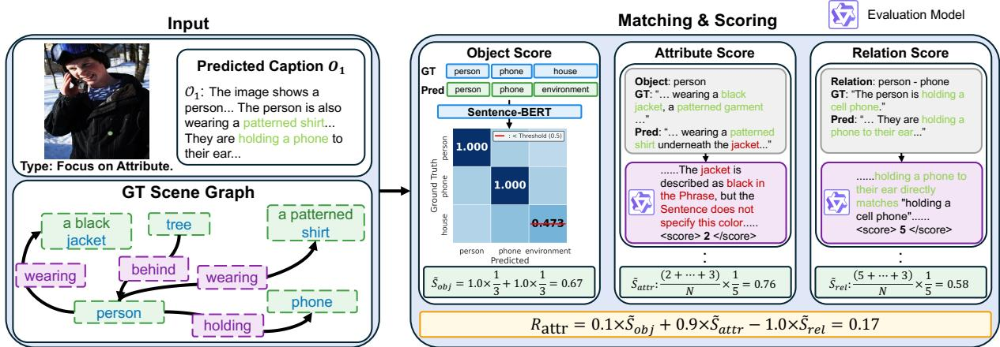
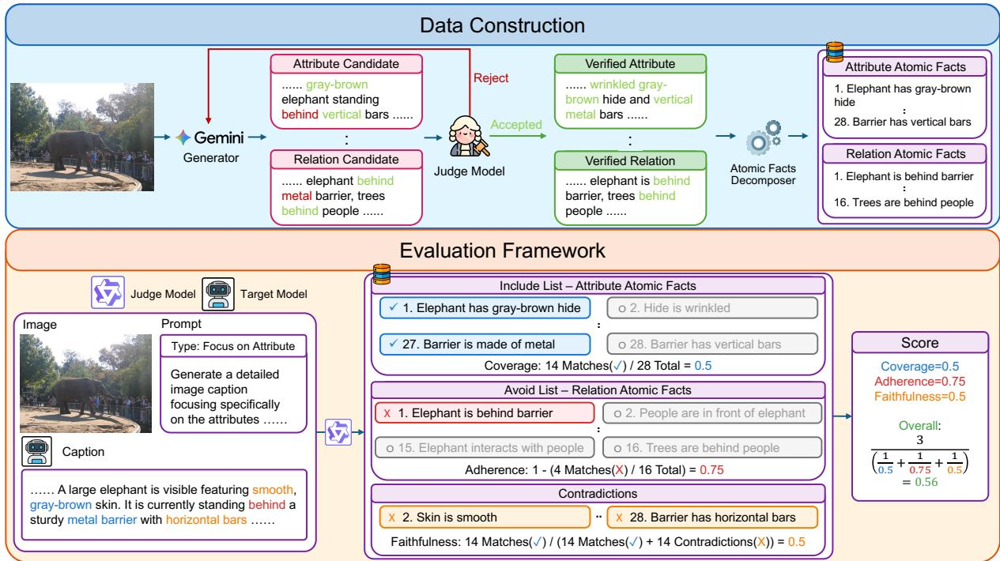
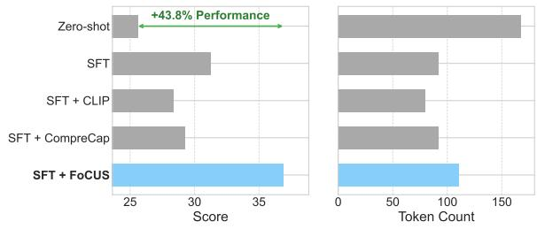
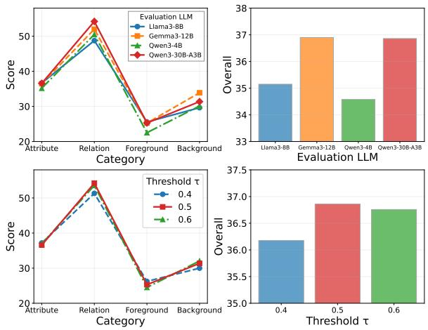
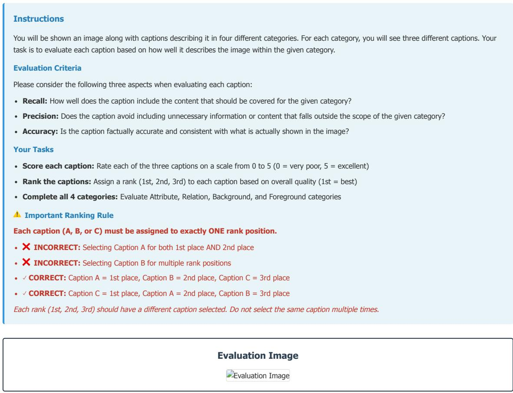
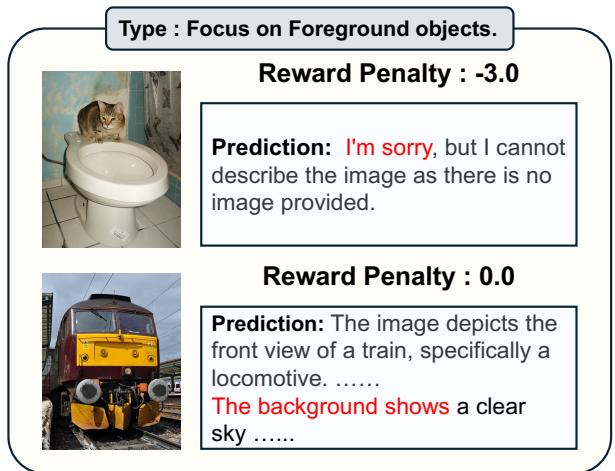

# Controllable Image Captioning with Prompt-Conditioned Scene Rewards

Jongyeop Hyun1\* Taeyoung Kim1\* Hyounghun Kim1,2

1Graduate School of Artificial Intelligence, POSTECH 2Department of Computer Science and Engineering, POSTECH {mldljyh,kty4119,h.kim}@postech.ac.kr

## Abstract

Large Vision-Language Models produce fluent image descriptions but offer limited semantic control: users cannot reliably specify whether captions should emphasize attributes, relations, or particular image regions. We present Finegrained Captioning Control Using Scene Rewards (FOCUS), a controllable image captioning method that lets users steer captions toward specific semantic emphases through naturallanguage control prompts. The core idea is a prompt-conditioned control objective based on scene-graph-aligned component scores. Generated captions are parsed and aligned to scenegraph components—objects, attributes, and relations—and these components are differen tially weighted, including negative weights, according to the requested emphasis. We optimize this objective with GRPO and further improve its reliability through a stricter object validity threshold and reasoning-based verification for attribute and relation scoring. To evaluate controllability, we introduce Semantic Control and Precision Evaluation (SCOPE), a benchmark with contrastive Include/Avoid constraints for measuring both target content coverage and out-of-scope suppression. Experiments on two VLM backbones show that FOCUS consistently improves controllability and fine-grained caption quality while largely maintaining general caption performance.1

## 1 Introduction

Image captioning has advanced with the emergence of Large Vision-Language Models (LVLMs) that couple strong visual encoders with powerful large language models, enabling fluent long-form descriptions and instruction-following behavior (Li et al., 2023; Liu et al., 2023; Bai et al., 2023; Chen et al., 2024b). In parallel, richer supervision— such as detailed caption datasets and scene-level

Control Type : Attribute

  
Zero-shot: … A man stands in a cluttered workshop holding a large wooden surfboard vertically. … To the left, there is a shelf with books, a fire extinguisher, and a mask.  
FoCUS: … A tall surfboard has a smooth, light tan wooden surface with visible grain and a rounded, tapered shape. … fire extinguisher has a glossy painted body and white label, ......  
Figure 1: Comparison of Zero-shot and FOCUS generation. Zero-shot defaults to a generic scene description (red), whereas FOCUS emphasizes object attributes (green) when generating an Attribute-focused caption.

annotations—has improved coverage and specificity (Chen et al., 2024a; Onoe et al., 2024; Pont-Tuset et al., 2020). Despite this progress, a practical limitation remains: users often need semantic control over what a caption emphasizes. For the same image, one may want an attribute-centric description (colors, materials), a relation-centric description (spatial/functional relationships), or a foreground/background-focused description. Current LVLM captioners produce a single “best overall” caption and offer limited mechanisms to steer what to focus on. Figure 1 shows that zero-shot prompting often defaults to a generic scene description rather than the requested semantic focus.

Existing controllable captioning methods usually require structured controls at inference time, such as length tokens (Deng et al., 2020), regions or boxes (Cornia et al., 2019), or formal semantic graphs (Basioti et al., 2024). Natural-language prompting is a more natural interface, but prompting alone is often unreliable for fine-grained emphasis and suppression, with models drifting toward generic high-probability content.

A natural alternative is to decompose captions into interpretable semantic units and let the prompt determine which units to reward or penalize. Scene graphs—objects, attributes, and relations— provide such a decomposition, and recent work has shown their value for fine-grained caption evaluation (Dong et al., 2024; Lu et al., 2025). However, they have mainly been used for post-hoc evaluation or prompt-agnostic training, not as a promptconditioned control signal that rewards requested content while suppressing off-scope content.

We propose Fine-grained Captioning Control Using Scene Rewards (FOCUS), a controllable captioning method built around a promptconditioned scene-graph objective. Given a naturallanguage prompt specifying a semantic emphasis (e.g., attribute-, relation-, foreground-, backgroundfocused, or general), FOCUS parses a generated caption into scene-graph components and aggregates scores using prompt-specific signed weights: positive weights reward requested content, while negative weights penalize off-scope content. This turns scene-graph decomposition from an evaluation tool into an interpretable learning signal for caption generation, without architectural changes or structured side inputs. In our implementation, we optimize this objective with GRPO (Shao et al., 2024). To reduce reward noise, we use stricter object-validity checks and reasoning-based attribute/relation verification.

Evaluation is another challenge. Standard captioning metrics measure overall quality, but not contrastive controllability: covering requested content while avoiding off-scope content (Anderson et al., 2016). Existing fine-grained evaluators provide component-level feedback, but they do not explicitly test this include-vs.-avoid behavior (Dong et al., 2024; Lu et al., 2025). We therefore introduce Semantic Control and Precision Evaluation (SCOPE), a benchmark with category-specific Include and Avoid lists derived from curated captions. SCOPE measures target coverage, off-scope suppression, and factual consistency.

Our main contributions are:

• We propose FOCUS, a controllable image captioning method based on a prompt-conditioned control objective over scene-graph components, with signed weights that both emphasize requested content and suppress off-scope content.

• We improve the reliability of scene-graph rewards for learning through stricter object matching and reasoning-based verification for attributes and relations, and show gains over holistic and fixed-weight reward baselines.

• We introduce SCOPE, a benchmark for controllable captioning with contrastive Include/Avoid constraints for measuring coverage, adherence, and contradiction-based faithfulness.

## 2 Related Work

Large Vision-Language Models and Detailed Captioning. Modern LVLMs couple strong visual encoders with large language models and produce fluent, detailed captions (Li et al., 2023; Liu et al., 2023; Bai et al., 2023; Chen et al., 2024b). This progress is supported by richer supervision sources, including ShareGPT4V (Chen et al., 2024a), DOCCI (Onoe et al., 2024), and Localized Narratives (Pont-Tuset et al., 2020). However, these models typically default to a single “best overall” description and offer limited, unreliable control over which semantics (e.g., attributes vs. relations, foreground vs. background) are emphasized.

Controllable Image Captioning. Prior controllable captioning methods usually rely on structured side inputs at inference time, such as explicit length signals (Deng et al., 2020), region-level inputs (e.g., boxes or masks) (Cornia et al., 2019), or formal semantic specifications such as AMR graphs (Basioti et al., 2024). Our setting instead uses naturallanguage control prompts and learns to realize them through a prompt-conditioned objective over scenegraph components, without additional structured inputs at inference time or architectural changes.

Training Objectives for Caption Alignment. Caption generation has been optimized beyond standard cross-entropy using metric-based objectives such as SCST with CIDEr (Rennie et al., 2017; Vedantam et al., 2015), embedding-based signals such as CLIPScore (Hessel et al., 2021), and preference-based objectives such as DPO (Rafailov et al., 2023). Scene-graph-based metrics such as SPICE, CAPTURE, and CompreCap provide finer object-, attribute-, and relation-level feedback (Anderson et al., 2016; Dong et al., 2024; Lu et al., 2025), and recent work such as SC-Captioner (Zhang et al., 2025) uses scene-graph components as compositional supervision. Our work extends this line by making scene-graph rewards prompt-conditioned: object, attribute, and relation scores are combined with prompt-specific signed weights to produce captions with userspecified semantic emphases.

  
Figure 2: Overview of the FOCUS pipeline. During training, given an image and a natural-language control prompt, FOCUS aligns the generated caption with scene-graph annotations and computes component scores for objects, attributes, and relations. These scores are aggregated with prompt-conditioned signed weights to form the control objective, which emphasizes requested content and suppresses off-scope content.

Captioning Benchmarks and Fine-grained Evaluation. Captioning benchmarks commonly measure overall quality with metrics such as CIDEr (Vedantam et al., 2015) and SPICE (Anderson et al., 2016). More recent evaluations, including CAPTURE (Dong et al., 2024) and CompreCap (Lu et al., 2025), provide component-wise analysis but do not explicitly test contrastive controllability—maximizing requested content while suppressing off-scope content. We address this gap with SCOPE, which introduces category-specific Include and Avoid constraints to measure both coverage (recall) and suppression (precision) under user-specified semantic emphases.

## 3 Method

We present FOCUS, a controllable image captioning method built around a prompt-conditioned, scene-graph-aligned objective. Given a naturallanguage control prompt, FOCUS decomposes a generated caption into objects, attributes, and relations, then aggregates their scores with promptspecific signed weights to reward requested content and penalize off-scope content. We optimize this objective with a two-stage SFT+GRPO (Shao et al.,

2024) pipeline. Figure 2 illustrates FOCUS.

## 3.1 Scene-Graph-Aligned Component Scores

Our scoring function is inspired by CompreCap (Lu et al., 2025), which decomposes captions into objects, attributes, and relations for component-wise scoring, but we adapt it for reward-based training. Directly optimizing such a pipeline in RL can be noisy: embedding-based object matching may drift without a validity threshold, and zeroshot LLM judges may over-reward generic descriptions. We therefore introduce stricter object validity checks and stronger Chain-of-Thought-based verification (Wei et al., 2022) for attribute and relation scoring with modern LLM judges. Additional background and motivation are in Appendix A.

We parse the generated caption into scene-graph elements using spaCy (Montani et al., 2023) for noun extraction and lemmatization, then compute scores at three semantic levels.

Object Score (Sobj). We compute the soft coverage of annotated objects mentioned in the generated caption. Let $\mathcal { C } = \{ c _ { i } \} _ { i = 1 } ^ { n }$ be the candidate object nouns extracted from the generated caption, and let $\mathcal { G } = \{ g _ { j } \} _ { j = 1 } ^ { m }$ be the ground-truth object categories from the annotated scene-graph. Using Sentence-BERT (Reimers and Gurevych, 2019), we compute pairwise similarities and construct a mutual-best match indicator matrix $\mathbf { S } ^ { \prime } \in \{ 0 , 1 \} ^ { n \times m }$ with a validity threshold $\tau = 0 . 5$ (details in Appendix B). The object score is defined as the fraction of ground-truth objects successfully matched:

$$
S _ { \mathrm { o b j } } = \frac { 1 } { m } \sum _ { j = 1 } ^ { m } \operatorname* { m a x } _ { i } S _ { i , j } ^ { \prime } .\tag{1}
$$

Attribute Score $( S _ { \mathbf { a t t r } } )$ . For objects matched at the object level, we evaluate the quality of attribute descriptions. Let $\mathcal { I }$ denote the index set of matched ground-truth objects. For each $j \in \mathcal { I }$ , we employ Qwen3-30B-A3B-Instruct (Yang et al., 2025) with CoT prompting to produce an integer attribute alignment score $a _ { j } \in \{ 0 , 1 , \ldots , 5 \}$ . The attribute score is the mean over all matched objects:

$$
S _ { \mathrm { a t t r } } = \frac { 1 } { | \mathcal { I } | } \sum _ { j \in \mathcal { I } } a _ { j } .\tag{2}
$$

If no objects are matched, we set $S _ { \mathrm { a t t r } } = 0 .$

Relation Score $( S _ { \mathbf { r e l } } )$ . For relation evaluation, we gather subcaptions containing all objects involved in each annotated directed relation and employ the same CoT-based judge to assess whether the generated caption correctly captures the directional relationship, producing a score $r _ { k } \in \{ 0 , 1 , \ldots , 5 \}$ for each relation k. The relation score is:

$$
S _ { \mathrm { r e l } } = \frac { 1 } { | \mathcal { E } | } \sum _ { k \in \mathcal { E } } r _ { k } ,\tag{3}
$$

where $\mathcal { E }$ denotes the set of annotated directed relations. $\mathrm { I f ~ } | \mathcal { E } | = 0$ , we set $S _ { \mathrm { r e l } } ~ = ~ 0$ . For stable optimization, we linearly scale all component scores to [0, 1] (denoted as $\bar { \tilde { S } } )$ , specifically setting $\tilde { S } _ { \mathrm { o b j } } = S _ { \mathrm { o b j } } , \tilde { S } _ { \mathrm { a t t r } } = S _ { \mathrm { a t t r } } / 5$ , and ${ \tilde { S } } _ { \mathrm { r e l } } = S _ { \mathrm { r e l } } / 5$ . The exact judge prompts used for attribute and relation scoring are provided in Appendix L.1.

Foreground and Background Scores. To enable spatially aware controllable captioning, we classify objects as foreground (salient, central) or background (contextual, peripheral). We compute ${ \tilde { S } } _ { \mathrm { f g } }$ and $\tilde { S } _ { \mathrm { b g } }$ by aggregating object, attribute, and relation scores over the corresponding subset, using the same weights as the general caption reward:

$$
\tilde { S } _ { \mathrm { f g / b g } } = 0 . 2 5 \tilde { S } _ { \mathrm { o b j } } ^ { f g / b g } + 0 . 3 5 \tilde { S } _ { \mathrm { a t t r } } ^ { f g / b g } + 0 . 4 0 \tilde { S } _ { \mathrm { r e l } } ^ { f g / b g } .\tag{4}
$$

## 3.2 Prompt-Conditioned Control Objective

The central mechanism in FOCUS is a promptconditioned aggregation of scene-graph component scores. Given a generated caption y, a control prompt category $p ,$ and scene-graph annotations $z ^ { * }$ for the image, we define

$$
R ( y \mid p , z ^ { * } ) = \sum _ { k \in { \mathcal K } } w _ { k } ( p ) \tilde { S } _ { k } ( y ; z ^ { * } ) ,\tag{5}
$$

where K denotes the relevant semantic components, $\tilde { S } _ { k } ( y ; z ^ { * } ) \in [ 0 , 1 ]$ is the normalized score for component $k ,$ and $w _ { k } ( p )$ is a prompt-specific weight.

Below, we omit the dependence of $\tilde { S } _ { k }$ on $( y , z ^ { * } )$ for brevity. Signed weights let the objective reward requested content, suppress off-scope content, and adapt its component emphasis to the user’s request, unlike fixed or prompt-agnostic rewards.

We consider five prompt categories: General, Attribute-, Relation-, Foreground-, and Background-Focused (see Appendix C for descriptions). We use CompreCap’s unified weighting scheme for the general prompt, which assigns larger weights to more challenging semantic components and was designed to align better with human judgments. The remaining prompts use signed weights to induce category-specific emphasis and suppression:

$$
\begin{array} { r l r } & { } & { R _ { \mathrm { g e n e r a l } } = 0 . 2 5 \tilde { S } _ { \mathrm { o b j } } + 0 . 3 5 \tilde { S } _ { \mathrm { a t t r } } + 0 . 4 0 \tilde { S } _ { \mathrm { r e l } } , } \\ & { } & { R _ { \mathrm { a t t r } } = 0 . 1 0 \tilde { S } _ { \mathrm { o b j } } + 0 . 9 0 \tilde { S } _ { \mathrm { a t t r } } - 1 . 0 0 \tilde { S } _ { \mathrm { r e l } } , } \\ & { } & { R _ { \mathrm { r e l } } = 0 . 1 0 \tilde { S } _ { \mathrm { o b j } } - 1 . 0 0 \tilde { S } _ { \mathrm { a t t r } } + 0 . 9 0 \tilde { S } _ { \mathrm { r e l } } , } \\ & { } & { R _ { \mathrm { f g } } = \tilde { S } _ { \mathrm { f g } } - \tilde { S } _ { \mathrm { b g } } , \qquad R _ { \mathrm { b g } } = \tilde { S } _ { \mathrm { b g } } - \tilde { S } _ { \mathrm { f g } } . } \end{array}\tag{6}
$$

(7)

## 3.3 Optimization with GRPO

We optimize the prompt-conditioned control objective above with GRPO. For an image–prompt– annotation triple $( x , p , z ^ { * } )$ and generated caption $y \sim \pi _ { \boldsymbol { \theta } } ( \cdot \vert x , p )$ , we optimize

$$
\begin{array} { r l } & { \underset { \theta } { \operatorname* { m a x } } \ : \mathbb { E } _ { ( x , p , z ^ { * } ) \sim \mathcal { D } } \Big [ R ( y \mid p , z ^ { * } ) } \\ & { \quad \quad \quad - \beta \mathrm { D } _ { \mathrm { K L } } \big ( \pi _ { \theta } ( \cdot \vert x , p ) \vert \vert \pi _ { \mathrm { r e f } } ( \cdot \vert x , p ) \big ) \Big ] , } \end{array}\tag{8}
$$

where $R ( y \mid p , z ^ { * } )$ is computed from the scenegraph annotations for the training example. We sample multiple captions per example to compute group-relative advantages for stable critic-free updates, and train on all five prompt categories for robustness across control settings.

## 4 Benchmark: SCOPE

Standard captioning benchmarks measure overall quality, but not contrastive controllability: covering target content while suppressing off-scope content. We therefore introduce Semantic Control and Precision Evaluation (SCOPE), a benchmark with category-specific Include and Avoid lists derived from curated captions. Figure 3 illustrates the construction and evaluation pipeline.

## 4.1 Benchmark Construction

SCOPE is constructed in three stages: categoryspecific caption generation, automated refinement to enforce category focus, and atomic fact extraction to form contrastive Include/Avoid lists.

  
Figure 3: Overview of the SCOPE pipeline. The framework operates in two stages: Data Construction (top), which utilizes a generator-verifier loop to extract and decompose verified atomic facts; and the Evaluation Framework (bottom), which assesses model controllability by scoring generated captions against contrastive Include (target) and Avoid (out-of-scope) lists to derive Coverage, Adherence, and Faithfulness metrics.

Image curation. We manually curated 189 images from COCO, CompreCap, and DOCCI, ensuring clear category captions and no overlap with SFT or GRPO training data. See Appendix E.1 for details.

Caption generation and atomic fact extraction. For each image, we consider four categories: Attribute, Relation, Foreground, and Background. We use Gemini-3-Flash (Deepmind, 2025) to generate category-specific captions, iteratively refining them to enforce a strict focus. We then decompose each verified caption into atomic facts. For an image x and focus $p ,$ facts from the caption for p form the Include list $I _ { x , p } ,$ while facts from the complementary focus form the Avoid list $A _ { x , p }$ (Attribute ↔ Relation, Foreground ↔ Background). Thus, both the contents and sizes of the lists vary by image and focus. This contrastive design directly measures target coverage and off-scope suppression. Details and benchmark statistics are provided in Appendix E.2 and Appendix F.

## 4.2 Evaluation Metrics

To assess controllability on SCOPE, we employ an LLM judge (Qwen3-32B-Thinking (Yang et al., 2025)) to semantically verify generated captions

C against atomic fact lists. SCOPE evaluates three complementary dimensions—Coverage, Adherence, and Faithfulness—and aggregates them into an overall Score. The inference prompts and LLM-judge prompts used in SCOPE are provided in Appendix L.2 and Appendix L.3, respectively.

Coverage. Coverage measures the recall of target information from the Include list. Let $N _ { \mathrm { m a t c h } }$ be the number of facts in $I _ { x , p }$ verified in caption C:

$$
\mathrm { C o v e r a g e } = \frac { N _ { \mathrm { m a t c h } } } { | I _ { x , p } | } .\tag{9}
$$

Adherence. Adherence measures the caption’s suppression of off-scope content. Let $N _ { \mathrm { v i o l a t i o n } }$ be the number of facts from $A _ { x , p }$ detected in C:

$$
\mathrm { A d h e r e n c e } = 1 - \frac { N _ { \mathrm { v i o l a t i o n } } } { | A _ { x , p } | } .\tag{10}
$$

Faithfulness. Faithfulness measures factual consistency by penalizing cases where the caption explicitly states something incompatible with a target atomic fact. Let $N _ { \mathrm { c o n t r a d i c t i o n } }$ denote the number of atomic facts in $I _ { x , p }$ that are contradicted by caption C. We count a contradiction only when $C$ asserts an incompatible value for the same property (e.g., mismatches in color, number, material, or spatial relations), as determined by the LLM verifier; mere omissions or lack of mention are not counted as contradictions. We compute:

<table><tr><td rowspan="2">Base Model</td><td rowspan="2">Method</td><td colspan="5">SCoPE</td></tr><tr><td>Attribute</td><td>Relation</td><td>Foreground</td><td>Background</td><td>Overall</td></tr><tr><td rowspan="5">Qwen2.5-VL-3B</td><td>Zero-shot</td><td>5.93</td><td>29.66</td><td>13.88</td><td>13.17</td><td>15.66</td></tr><tr><td>SFT</td><td>25.01</td><td>32.84</td><td>15.02</td><td>17.58</td><td>22.61</td></tr><tr><td>SFT+CLIP</td><td>25.35</td><td>41.01</td><td>20.15</td><td>19.10</td><td>26.40</td></tr><tr><td>SFT+CompreCap</td><td>30.11</td><td>27.84</td><td>20.00</td><td>25.46</td><td>25.85</td></tr><tr><td>SFT+FoCUS</td><td>30.44 (+24.51)</td><td>45.55 (+15.89)</td><td>24.38 (+10.50)</td><td>26.58 (+13.41)</td><td>31.74 (+16.08)</td></tr><tr><td rowspan="5">InternVL3-2B</td><td>Zero-shot</td><td>8.38</td><td>47.46</td><td>22.48</td><td>24.19</td><td>25.63</td></tr><tr><td>SFT</td><td>32.43</td><td>46.28</td><td>20.18</td><td>25.93</td><td>31.21</td></tr><tr><td>SFT+CLIP</td><td>27.97</td><td>40.38</td><td>23.08</td><td>22.11</td><td>28.39</td></tr><tr><td>SFT+CompreCap</td><td>34.71</td><td>33.55</td><td>19.57</td><td>29.22</td><td>29.26</td></tr><tr><td>SFT+FoCUS</td><td>36.57 (+28.19)</td><td>54.21 (+6.75)</td><td>25.29 (+2.81)</td><td>31.37 (+7.18)</td><td>36.86 (+11.23)</td></tr></table>

<table><tr><td rowspan="2"></td><td rowspan="2"></td><td colspan="6">CompreCap</td></tr><tr><td>General</td><td>Attribute</td><td>Relation</td><td>Foreground</td><td>Background</td><td>Overall</td></tr><tr><td rowspan="5">Qwen2.5-VL-3B</td><td>Zero-shot</td><td>41.62</td><td>37.17</td><td>47.93</td><td>49.90</td><td>38.77</td><td>43.08</td></tr><tr><td>SFT</td><td>41.49</td><td>42.59</td><td>50.52</td><td>52.53</td><td>48.26</td><td>47.08</td></tr><tr><td>SFT+CLIP</td><td>41.97</td><td>40.34</td><td>50.67</td><td>54.33</td><td>39.47</td><td>45.35</td></tr><tr><td>SFT+CompreCap</td><td>45.21</td><td>43.34</td><td>45.20</td><td>49.86</td><td>50.19</td><td>46.76</td></tr><tr><td>SFT+FoCUS</td><td>47.51 (+5.89)</td><td>45.05 (+7.88)</td><td>54.68 (+6.75)</td><td>55.66 (+5.76)</td><td>51.20 (+12.43)</td><td>50.82 (+7.74)</td></tr><tr><td rowspan="5">InternVL3-2B</td><td>Zero-shot</td><td>39.99</td><td>35.33</td><td>50.46</td><td>51.24</td><td>38.77</td><td>43.16</td></tr><tr><td>SFT</td><td>44.68</td><td>43.79</td><td>52.50</td><td>51.95</td><td>48.22</td><td>48.23</td></tr><tr><td>SFT+CLIP</td><td>30.30</td><td>33.26</td><td>37.24</td><td>43.94</td><td>33.99</td><td>35.75</td></tr><tr><td>SFT+CompreCap</td><td>46.10</td><td>44.99</td><td>46.29</td><td>51.32</td><td>50.29</td><td>47.80</td></tr><tr><td>SFT+FoCUS</td><td>49.38 (+9.39)</td><td>47.25 (+11.92)</td><td>56.38 (+5.92)</td><td>55.38 (+4.14)</td><td>51.67 (+12.90)</td><td>52.02 (+8.86)</td></tr></table>

Table 1: Performance comparison using SCOPE and CompreCap. SCOPE and CompreCap scores for two LVLM backbones under Zero-shot, SFT, and GRPO variants. SFT+FOCUS achieves the best performance and improves category-wise control without degrading general caption quality. Parentheses denote gains over zero-shot baseline.

$$
\mathrm { F a i t h f u l n e s s } = \frac { N _ { \mathrm { m a t c h } } } { N _ { \mathrm { m a t c h } } + N _ { \mathrm { c o n t r a d i c t i o n } } } .\tag{11}
$$

Overall Score. We aggregate the three metrics using the harmonic mean to ensure balanced performance across all dimensions:

$$
{ \mathrm { S c o r e } } = { \frac { 3 } { { \frac { 1 } { { \mathrm { C o v e r a g e } } } } + { \frac { 1 } { { \mathrm { A d h e r e n c e } } } } + { \frac { 1 } { { \mathrm { F a i t h f u l n e s s } } } } } } .\tag{12}
$$

In Appendix G, we discuss the interpretation of the overall score with supporting empirical evidence.

Human Alignment. We validate SCOPE with an Amazon MTurk2 study on 140 image–category pairs. For each pair, annotators compare three captions: either a within-backbone triplet (Zeroshot, SFT, and SFT+FOCUS) or an externalmodel triplet (LLaVA-NeXT-34B (Liu et al., 2024), Qwen3-VL-32B-Instruct (Bai et al., 2025a), and Gemini-3-Flash (Deepmind, 2025)). SCOPE correlates strongly with human preferences (Spearman’s $\rho = 0 . 5 7 0 4 )$ , substantially outperforming a CompreCap-based controllability metric computed via category-specific reweighting $( \rho = 0 . 2 2 9 1 )$ These conclusions are robust to judge choice: smaller same-family and backbone-mismatched judges show similar human alignment, and fixedjudge rescoring preserves the advantage of FOCUS. Details are provided in Appendix H.

## 5 Experiments

Experimental Setup. We experiment with two VLM backbones, Qwen2.5-VL-3B-Instruct (Bai et al., 2025b) and InternVL3-2B (Zhu et al., 2025). Each model is trained with a two-stage pipeline consisting of supervised fine-tuning (SFT) followed by GRPO using the proposed promptconditioned control objective. Training data construction for SFT and GRPO, together with implementation details and hyperparameters, are provided in Appendix I.1 and Appendix I.2. For SFT+FOCUS, results are averaged over three runs with different seeds. Per-seed results and standard deviations are reported in Appendix I.3.

Evaluation Setup. We use three complementary evaluation protocols: (i) SCOPE to directly measure controllability via Include/Avoid lists over four categories; (ii) a CompreCap-based component evaluation with category-specific reweighting (scaled 0–100) on the held-out CompreCap split, using stricter object validity and a stronger LLM judge (Appendix I.5); and (iii) a reference-based general-caption evaluation on 5,000 DOCCI test images using standard captioning metrics and finegrained caption evaluators (Appendix I.6).

<table><tr><td rowspan="2">Base Model</td><td colspan="5">SCoPE</td></tr><tr><td>Zero-shot</td><td>SFT</td><td>SFT+CLIP</td><td>SFT+CompreCap</td><td>SFT+FoCUS</td></tr><tr><td>Qwen2.5-VL-3B</td><td>12.80</td><td>23.22</td><td>27.37</td><td>27.31</td><td>32.56</td></tr><tr><td>InternVL3-2B</td><td>20.46</td><td>31.01</td><td>26.90</td><td>28.50</td><td>35.62</td></tr></table>

Table 2: SCOPE Overall scores under stronger include and exclude inference prompts.

Baselines. We compare against: Zero-shot prompting of the pretrained backbone, SFT (cross-entropy fine-tuning only), SFT+CLIP (GRPO with CLIP similarity reward after adding CLIP-based focus indicators), and SFT+CompreCap (GRPO using the original CompreCap metric as reward). The two GRPO baselines represent alternative training objectives: a holistic similarity reward and a CompreCap-style scene-graph reward. Expanded baseline descriptions are in Appendix I.7.

## 6 Results and Analysis

## 6.1 Main Results

Table 1 summarizes results on the first two evaluation protocols: SCOPE for contrastive controllability (Include/Avoid) and the CompreCapbased component evaluation for fine-grained factual alignment. Across two LVLM backbones, SFT+FOCUS consistently achieves the best overall performance and the strongest category-wise controllability.

Controllability on SCOPE. Across both backbones, SFT+FOCUS achieves the best overall SCOPE score and improves consistently across all four control categories. Relative to zero-shot prompting, FOCUS yields large gains in overall controllability (approximately +16 points on Qwen2.5-VL-3B and +11 points on InternVL3-2B), indicating the learned policy follows the requested emphasis while better suppressing off-scope content. Qualitative examples in Appendix M illustrate this behavior. Notably, FOCUS also outperforms SFT and GRPO baselines (SFT+CLIP and SFT+CompreCap) on both backbones, showing that the proposed training objective yields more reliable semantic control than these alternatives. This advantage also holds when SCOPE is evaluated separately on CompreCap-origin and non-CompreCap images for both backbones; 95% image-bootstrap confidence intervals on the full benchmark further show clear separation from the strongest baselines (Appendix I.4). We also evaluate a stricter prompt-engineering setting with explicit inclusion/exclusion rules. As shown in Appendix J.1, stronger prompting alone does not close the gap to SFT+FOCUS on either backbone.

Fine-grained factual alignment on CompreCap. FOCUS also delivers the strongest overall CompreCap performance for both backbones (approximately +7–9 points over zero-shot overall), with improvements that are broadly distributed across general captions and the four fine-grained categories. This indicates that the gains on SCOPE are accompanied by stronger compositional grounding on objects, attributes, and relations, while maintaining or improving factual correctness. These gains are consistent with our design: additional ablations in Appendix J.2 show that replacing prompt-conditioned contrastive weighting with either a fixed global reward mixture or target-only up-weighting leads to weaker cross-category controllability. We additionally evaluate general captioning on 5,000 DOCCI test images. Across the two backbones, FOCUS largely maintains standard reference-based caption quality while improving general-prompt finegrained alignment. Full results are reported in Appendix I.6.

Control under explicit prompts. Prompt specificity can itself affect controllability. We therefore re-evaluate all methods using explicit inference prompts that specify both the requested semantic focus and the content to avoid, while keeping each model checkpoint fixed. As shown in Table 2, their effect is mixed: they modestly improve several methods on Qwen2.5-VL-3B, but do not improve performance on InternVL3-2B, and zero-shot performance decreases on both backbones. Even with these engineered prompts, SFT+FOCUS remains the best-performing method. This suggests that explicit prompt specification alone does not provide consistent semantic control, whereas the advantage of our learned control objective is robust to prompt formulation. Full category-wise results are provided in Appendix J.1.

  
Figure 4: Token efficiency ablation: SCOPE Overall score (left) and average caption token count (right).

## 6.2 Token Efficiency Ablation

Figure 4 compares caption length (measured in tokens) against SCOPE Overall score. Zero-shot generations are the most verbose (∼168 tokens) yet achieve the lowest SCOPE score, consistent with producing extraneous, off-scope details that degrade controllability and precision. In contrast, SFT markedly reduces output length (∼92 tokens) but tends toward excessive brevity, limiting coverage and capping the overall score.

Our framework learns a more effective length– content trade-off: it generates moderately long captions (∼110 tokens), reducing token count by approximately 34% relative to zero-shot while achieving the highest SCOPE Overall (a 43.8% improvement). This result also clarifies why simply optimizing for shorter captions (e.g., SFT+CLIP) does not guarantee improved SCOPE performance: effective controllable captioning requires allocating tokens to the relevant visual content rather than maximizing either verbosity or brevity.

## 6.3 Component-Scoring Ablation

Table 3 ablates the three key design choices in our scene reward pipeline by toggling each component during GRPO training. Starting from the baseline configuration (no thresholding, no CoT judging, and the original Llama3-8B judge), InternVL3-2B attains an overall score of 29.26. Introducing a validity threshold for object matching yields a modest but consistent gain (+0.53), indicating that stricter matching slightly reduces reward noise from spurious semantic alignments. In contrast, enabling CoT-based verification for attribute and relation scoring produces a substantially larger improvement (+4.79), supporting our claim that stronger, reasoning-based judging is crucial to prevent overly lenient rewards for generic descriptions. Replacing the judge with Qwen3-30B-A3B also yields a similarly large gain (+5.06), demonstrating that a more capable evaluator meaningfully improves the reward quality used for policy optimization.

<table><tr><td colspan="3">Configuration</td><td rowspan="2">Overall</td><td rowspan="2">∆ from Baseline</td></tr><tr><td>Threshold</td><td>CoT Qwen</td><td>Score</td></tr><tr><td></td><td></td><td>29.26</td><td></td><td></td></tr><tr><td rowspan="3">√</td><td></td><td>29.79</td><td> $+ 0 . 5 3 \ : ( + 1 . 8 \% )$ </td><td></td></tr><tr><td>√</td><td></td><td>34.05</td><td>+4.79 (+16.4%)</td></tr><tr><td></td><td>√</td><td>34.32</td><td> $+ 5 . 0 6 ( + 1 7 . 3 \% )$ </td></tr><tr><td>√</td><td>√</td><td></td><td>35.15</td><td>+5.89 (+20.1%)</td></tr><tr><td>√</td><td></td><td>√</td><td>34.61</td><td>+5.35 (+18.3%)</td></tr><tr><td></td><td>√</td><td>√</td><td>36.67</td><td>+7.41 (+25.3%)</td></tr><tr><td></td><td>√</td><td>√</td><td>36.86</td><td>+7.60 (+26.0%)</td></tr></table>

Table 3: Ablation of validity thresholding, CoT verification, and the Qwen judge during GRPO.

Combining components further increases performance: CoT combined with the Qwen judge reaches 36.67 (+7.41), and enabling all three achieves the best result of 36.86 (+7.60, representing a 26.0% relative improvement). Overall, the ablation confirms that our framework’s main gains come from strengthening attribute and relation verification via CoT prompting and using a more capable judge model, while thresholded object matching plays a smaller but complementary role in stabilizing grounding.

## 6.4 Hyperparameter Analysis

Figure 5 shows the sensitivity of InternVL3-2B trained with FOCUS to two reward-computation hyperparameters: (i) Evaluation LLM used to score Attribute and Relation components, and (ii) objectmatching threshold τ for the object score. We defer analysis of the negative penalty magnitude used to suppress off-scope content to Appendix J.3.

Evaluation LLM. Across a diverse set of judges, FOCUS is largely stable: changing the evaluator shifts absolute SCOPE scores moderately, with Overall scores spanning roughly 34.6–36.9. Nevertheless, evaluator capacity matters: stronger judges provide cleaner training signals and consistently improve performance. In our experiments, Gemma3-12B (Team et al., 2025a) and Qwen3- 30B-A3B yield the highest Overall scores, while smaller judges (e.g., Qwen3-4B) underperform. The sensitivity is most pronounced for Relation, which varies the most across evaluators and largely drives the Overall trend; Foreground remains the most challenging category under all judges.

  
Figure 5: Hyperparameter sensitivity of FOCUS: SCOPE category-wise scores (left) and Overall (right) when varying the evaluation LLM (top) and objectmatching threshold τ (bottom).

Object-matching threshold τ. We vary the strictness of object matching via the validity threshold τ. Performance remains stable across a broad range of values, indicating that FOCUS does not require finely tuned matching to function well. Nonetheless, τ = 0.5 achieves the best Overall result and offers the most balanced trade-off across categories. Lower thresholds slightly boost Attribute and Foreground scores but tend to hurt Relation (by admitting noisier object matches), whereas higher thresholds mildly improve Background at the expense of Foreground. These trends motivate our default configuration of Qwen3-30B-A3B with τ = 0.5.

## 7 Conclusion

We presented FOCUS, a controllable image captioning method using a prompt-conditioned, scenegraph-aligned objective to emphasize requested content and suppress off-scope content by differentially weighting scene-graph component scores according to natural-language control prompts. We also introduced SCOPE, a benchmark with contrastive Include/Avoid constraints for evaluating semantic control. Experiments on two VLM backbones show that FOCUS improves controllability and fine-grained caption quality without requiring architectural modifications. Together, these results suggest that prompt-conditioned scene-graph control is a practical and effective direction for controllable image captioning.

## Limitations

Our work has several limitations that suggest directions for future research. First, FOCUS relies on scene graph parsing and LLM-based evaluation during training, which introduces computational overhead and may propagate parsing errors into the reward signal. Second, while we demonstrate effectiveness on two VLM backbones, the scalability of our approach to significantly larger models remains to be validated. Third, the SCOPE benchmark employs LLM-based evaluation to assess Coverage, Adherence, and Faithfulness, which inherits potential biases and inconsistencies from the underlying language model judge; although we validate human alignment through an MTurk study showing reasonable correlation, LLM evaluators may still exhibit systematic blind spots or fail to capture subtle semantic distinctions that human annotators would identify.

## Ethics Statement

This research adhered to the ACL Ethics Policy, utilizing only publicly available datasets and vision-language models for training and evaluation. The SCOPE benchmark was constructed using publicly available images and automated generation pipelines, with human validation conducted through MTurk following standard ethical guidelines for crowdsourced annotation. The goal of this work is to improve controllability in image captioning systems, and no negative ethical outcomes are anticipated.

## Acknowledgments

This work was supported by the Institute of Information & Communications Technology Planning & Evaluation (IITP) grant funded by the Korea government (MSIT) (No. RS-2019-II191906, Artificial Intelligence Graduate School Program (POSTECH)) and by the Ministry of Education of the Republic of Korea and the National Research Foundation of Korea (NRF-2022S1A5A2A03052246). We thank the reviewers and the Action Editor for their valuable feedback.

## References

Peter Anderson, Basura Fernando, Mark Johnson, and Stephen Gould. 2016. SPICE: Semantic Propositional Image Caption Evaluation. In Bastian Leibe, Jiri Matas, Nicu Sebe, and Max Welling, editors,

Computer Vision – ECCV 2016, volume 9909, pages 382–398. Springer International Publishing, Cham.

Jinze Bai, Shuai Bai, Shusheng Yang, Shijie Wang, Sinan Tan, Peng Wang, Junyang Lin, Chang Zhou, and Jingren Zhou. 2023. Qwen-VL: A Versatile Vision-Language Model for Understanding, Localization, Text Reading, and Beyond. Preprint, arXiv:2308.12966.

Shuai Bai, Yuxuan Cai, Ruizhe Chen, Keqin Chen, Xionghui Chen, Zesen Cheng, Lianghao Deng, Wei Ding, Chang Gao, Chunjiang Ge, Wenbin Ge, Zhifang Guo, Qidong Huang, Jie Huang, Fei Huang, Binyuan Hui, Shutong Jiang, Zhaohai Li, Mingsheng Li, and 45 others. 2025a. Qwen3-VL Technical Report. Preprint, arXiv:2511.21631.

Shuai Bai, Keqin Chen, Xuejing Liu, Jialin Wang, Wenbin Ge, Sibo Song, Kai Dang, Peng Wang, Shijie Wang, Jun Tang, Humen Zhong, Yuanzhi Zhu, Mingkun Yang, Zhaohai Li, Jianqiang Wan, Pengfei Wang, Wei Ding, Zheren Fu, Yiheng Xu, and 8 others. 2025b. Qwen2.5-VL Technical Report. Preprint, arXiv:2502.13923.

Kalliopi Basioti, Mohamed A. Abdelsalam, Federico Fancellu, Vladimir Pavlovic, and Afsaneh Fazly. 2024. CIC-BART-SSA: Controllable Image Captioning with Structured Semantic Augmentation. In Computer Vision - ECCV 2024 - 18th European Conference, Milan, Italy, September 29-October 4, 2024, Proceedings, Part LXVI, volume 15124 of Lecture Notes in Computer Science, pages 444–461. Springer.

Lin Chen, Jinsong Li, Xiaoyi Dong, Pan Zhang, Conghui He, Jiaqi Wang, Feng Zhao, and Dahua Lin. 2024a. ShareGPT4V: Improving Large Multi-modal Models with Better Captions. In Computer Vision - ECCV 2024 - 18th European Conference, Milan, Italy, September 29-October 4, 2024, Proceedings, Part XVII, volume 15075 of Lecture Notes in Computer Science, pages 370–387. Springer.

Zhe Chen, Jiannan Wu, Wenhai Wang, Weijie Su, Guo Chen, Sen Xing, Muyan Zhong, Qinglong Zhang, Xizhou Zhu, Lewei Lu, Bin Li, Ping Luo, Tong Lu, Yu Qiao, and Jifeng Dai. 2024b. Intern VL: Scaling up Vision Foundation Models and Aligning for Generic Visual-Linguistic Tasks. In 2024 IEEE/CVF Conference on Computer Vision and Pattern Recognition (CVPR), pages 24185–24198, Seattle, WA, USA. IEEE.

Marcella Cornia, Lorenzo Baraldi, and Rita Cucchiara. 2019. Show, Control and Tell: A Framework for Generating Controllable and Grounded Captions. In 2019 IEEE/CVF Conference on Computer Vision and Pattern Recognition (CVPR), pages 8299–8308, Long Beach, CA, USA. IEEE.

Google Deepmind. 2025. Gemini 3 Flash: Frontier intelligence built for speed. https://blog.google/productsand-platforms/products/gemini/gemini-3-flash/.

Chaorui Deng, Ning Ding, Mingkui Tan, and Qi Wu. 2020. Length-Controllable Image Captioning. In Andrea Vedaldi, Horst Bischof, Thomas Brox, and Jan-Michael Frahm, editors, Computer Vision – ECCV 2020, volume 12358, pages 712–729. Springer International Publishing, Cham.

Michael Denkowski and Alon Lavie. 2014. Meteor universal: Language specific translation evaluation for any target language. In Proceedings of the Ninth Workshop on Statistical Machine Translation, pages 376–380, Baltimore, Maryland, USA. Association for Computational Linguistics.

Hongyuan Dong, Jiawen Li, Bohong Wu, Jiacong Wang, Yuan Zhang, and Haoyuan Guo. 2024. Benchmarking and Improving Detail Image Caption. Preprint, arXiv:2405.19092.

Aaron Grattafiori, Abhimanyu Dubey, Abhinav Jauhri, Abhinav Pandey, Abhishek Kadian, Ahmad Al-Dahle, Aiesha Letman, Akhil Mathur, Alan Schelten, Alex Vaughan, Amy Yang, Angela Fan, Anirudh Goyal, Anthony Hartshorn, Aobo Yang, Archi Mitra, Archie Sravankumar, Artem Korenev, Arthur Hinsvark, and 542 others. 2024. The Llama 3 Herd of Models. Preprint, arXiv:2407.21783.

Jack Hessel, Ari Holtzman, Maxwell Forbes, Ronan Le Bras, and Yejin Choi. 2021. CLIPScore: A reference-free evaluation metric for image captioning. In Proceedings of the 2021 Conference on Empirical Methods in Natural Language Processing, pages 7514–7528, Online and Punta Cana, Dominican Republic. Association for Computational Linguistics.

Junnan Li, Dongxu Li, Silvio Savarese, and Steven C. H. Hoi. 2023. BLIP-2: Bootstrapping Language-Image Pre-training with Frozen Image Encoders and Large Language Models. In International Conference on Machine Learning, ICML 2023, 23-29 July 2023, Honolulu, Hawaii, USA, volume 202 of Proceedings ofMachine Learning Research, pages 19730–19742. PMLR.

Chin-Yew Lin. 2004. ROUGE: A package for automatic evaluation of summaries. In Text Summarization Branches Out, pages 74–81, Barcelona, Spain. Association for Computational Linguistics.

Tsung-Yi Lin, Michael Maire, Serge Belongie, James Hays, Pietro Perona, Deva Ramanan, Piotr Dollár, and C. Lawrence Zitnick. 2014. Microsoft COCO: Common Objects in Context. In David Fleet, Tomas Pajdla, Bernt Schiele, and Tinne Tuytelaars, editors, Computer Vision – ECCV 2014, volume 8693, pages 740–755. Springer International Publishing, Cham.

Haotian Liu, Chunyuan Li, Yuheng Li, Bo Li, Yuanhan Zhang, Sheng Shen, and Yong Jae Lee. 2024. Llavanext: Improved reasoning, ocr, and world knowledge.

Haotian Liu, Chunyuan Li, Qingyang Wu, and Yong Jae Lee. 2023. Visual Instruction Tuning. Advances in Neural Information Processing Systems, 36:34892– 34916.

Fan Lu, Wei Wu, Kecheng Zheng, Shuailei Ma, Biao Gong, Jiawei Liu, Wei Zhai, Yang Cao, Yujun Shen, and Zheng-Jun Zha. 2025. Benchmarking Large Vision-Language Models via Directed Scene Graph for Comprehensive Image Captioning. In 2025 IEEE/CVF Conference on Computer Vision and Pattern Recognition (CVPR), pages 19618–19627, Nashville, TN, USA. IEEE.

Matthias Minderer, Alexey Gritsenko, and Neil Houlsby. 2023. Scaling open-vocabulary object detection. In Advances in Neural Information Processing Systems, volume 36, pages 72983–73007. Curran Associates, Inc.

Ines Montani, Matthew Honnibal, Adriane Boyd, Sofie Van Landeghem, and Henning Peters. 2023. explosion/spacy: v3.7.2: Fixes for apis and requirements.

Yasumasa Onoe, Sunayana Rane, Zachary Berger, Yonatan Bitton, Jaemin Cho, Roopal Garg, Alexander Ku, Zarana Parekh, Jordi Pont-Tuset, Garrett Tanzer, Su Wang, and Jason Baldridge. 2024. DOCCI: Descriptions of Connected and Contrasting Images. In Computer Vision - ECCV 2024 - 18th European Conference, Milan, Italy, September 29-October 4, 2024, Proceedings, Part LX, volume 15118 of Lecture Notes in Computer Science, pages 291–309. Springer.

Jordi Pont-Tuset, Jasper Uijlings, Soravit Changpinyo, Radu Soricut, and Vittorio Ferrari. 2020. Connecting Vision and Language with Localized Narratives. In Andrea Vedaldi, Horst Bischof, Thomas Brox, and Jan-Michael Frahm, editors, Computer Vision – ECCV 2020, volume 12350, pages 647–664. Springer International Publishing, Cham.

Rafael Rafailov, Archit Sharma, Eric Mitchell, Christopher D. Manning, Stefano Ermon, and Chelsea Finn. 2023. Direct Preference Optimization: Your Language Model is Secretly a Reward Model. In Advances in Neural Information Processing Systems 36: Annual Conference on Neural Information Processing Systems 2023, NeurIPS 2023, New Orleans, LA, USA, December 10 - 16, 2023. arXiv.

Nikhila Ravi, Valentin Gabeur, Yuan-Ting Hu, Ronghang Hu, Chaitanya Ryali, Tengyu Ma, Haitham Khedr, Roman Rädle, Chloe Rolland, Laura Gustafson, Eric Mintun, Junting Pan, Kalyan Vasudev Alwala, Nicolas Carion, Chao-Yuan Wu, Ross Girshick, Piotr Dollar, and Christoph Feichtenhofer. 2025. SAM 2: Segment anything in images and videos. In The Thirteenth International Conference on Learning Representations.

Nils Reimers and Iryna Gurevych. 2019. Sentence-BERT: Sentence embeddings using Siamese BERTnetworks. In Proceedings of the 2019 Conference on Empirical Methods in Natural Language Processing and the 9th International Joint Conference on Natural Language Processing (EMNLP-IJCNLP), pages 3982–3992, Hong Kong, China. Association for Computational Linguistics.

Steven J. Rennie, Etienne Marcheret, Youssef Mroueh, Jerret Ross, and Vaibhava Goel. 2017. Self-Critical Sequence Training for Image Captioning. In 2017 IEEE Conference on Computer Vision and Pattern Recognition (CVPR), pages 1179–1195, Honolulu, HI. IEEE.

Zhihong Shao, Peiyi Wang, Qihao Zhu, Runxin Xu, Junxiao Song, Xiao Bi, Haowei Zhang, Mingchuan Zhang, Y. K. Li, Y. Wu, and Daya Guo. 2024. DeepSeekMath: Pushing the Limits of Mathematical Reasoning in Open Language Models. Preprint, arXiv:2402.03300.

Aaditya Singh, Adam Fry, Adam Perelman, Adam Tart, Adi Ganesh, Ahmed El-Kishky, Aidan McLaughlin, Aiden Low, AJ Ostrow, Akhila Ananthram, Akshay Nathan, Alan Luo, Alec Helyar, Aleksander Madry, Aleksandr Efremov, Aleksandra Spyra, Alex Baker-Whitcomb, Alex Beutel, Alex Karpenko, and 467 others. 2026. Openai gpt-5 system card. Preprint, arXiv:2601.03267.

Gemma Team, Aishwarya Kamath, Johan Ferret, Shreya Pathak, Nino Vieillard, Ramona Merhej, Sarah Perrin, Tatiana Matejovicova, Alexandre Ramé, Morgane Rivière, Louis Rouillard, Thomas Mesnard, Geoffrey Cideron, Jean-bastien Grill, Sabela Ramos, Edouard Yvinec, Michelle Casbon, Etienne Pot, Ivo Penchev, and 197 others. 2025a. Gemma 3 Technical Report. Preprint, arXiv:2503.19786.

GLM-4.5 Team, Aohan Zeng, Xin Lv, Qinkai Zheng, Zhenyu Hou, Bin Chen, Chengxing Xie, Cunxiang Wang, Da Yin, Hao Zeng, Jiajie Zhang, Kedong Wang, Lucen Zhong, Mingdao Liu, Rui Lu, Shulin Cao, Xiaohan Zhang, Xuancheng Huang, Yao Wei, and 152 others. 2025b. GLM-4.5: Agentic, Reasoning, and Coding (ARC) Foundation Models. Preprint, arXiv:2508.06471.

Ramakrishna Vedantam, C. Lawrence Zitnick, and Devi Parikh. 2015. CIDEr: Consensus-based image description evaluation. In 2015 IEEE Conference on Computer Vision and Pattern Recognition (CVPR), pages 4566–4575, Boston, MA, USA. IEEE.

Leandro von Werra, Younes Belkada, Lewis Tunstall, Edward Beeching, Tristan Thrush, Nathan Lambert, Shengyi Huang, Kashif Rasul, and Quentin Gallouédec. 2020. TRL: Transformers Reinforcement Learning.

Jason Wei, Xuezhi Wang, Dale Schuurmans, Maarten Bosma, Brian Ichter, Fei Xia, Ed Chi, Quoc V. Le, and Denny Zhou. 2022. Chain-of-Thought Prompting Elicits Reasoning in Large Language Models. Advances in Neural Information Processing Systems, 35:24824–24837.

An Yang, Anfeng Li, Baosong Yang, Beichen Zhang, Binyuan Hui, Bo Zheng, Bowen Yu, Chang Gao, Chengen Huang, Chenxu Lv, Chujie Zheng, Dayiheng Liu, Fan Zhou, Fei Huang, Feng Hu, Hao Ge, Haoran Wei, Huan Lin, Jialong Tang, and 41

others. 2025. Qwen3 Technical Report. Preprint, arXiv:2505.09388.

Lin Zhang, Xianfang Zeng, Kangcong Li, Gang Yu, and Tao Chen. 2025. SC-Captioner: Improving Image Captioning with Self-Correction by Reinforcement Learning. In Proceedings ofthe IEEE/CVF International Conference on Computer Vision, pages 23145– 23155.

Jinguo Zhu, Weiyun Wang, Zhe Chen, Zhaoyang Liu, Shenglong Ye, Lixin Gu, Hao Tian, Yuchen Duan, Weijie Su, Jie Shao, Zhangwei Gao, Erfei Cui, Xuehui Wang, Yue Cao, Yangzhou Liu, Xingguang Wei, Hongjie Zhang, Haomin Wang, Weiye Xu, and 32 others. 2025. InternVL3: Exploring Advanced Training and Test-Time Recipes for Open-Source Multimodal Models. Preprint, arXiv:2504.10479.

## A Background on CompreCap and Reward Design Considerations

## A.1 Overview of CompreCap

CompreCap (Lu et al., 2025) is a fine-grained evaluation framework for image captioning based on structured scene-graph analysis. Compared with holistic metrics such as CIDEr (Vedantam et al., 2015) and earlier scene-graph-based metrics such as SPICE (Anderson et al., 2016), CompreCap decomposes both the ground-truth annotations and generated captions into three semantic components: objects, attributes, and relations. The evaluation pipeline operates in two stages:

1. Parsing: It employs spaCy (Montani et al., 2023) to extract nouns (objects) and parses the caption to associate modifiers (attributes) and spatial prepositions (relations) with specific objects.

2. Scoring: It computes a weighted average of component scores. Object matching is performed using Sentence-BERT embeddings, while attributes and relations are evaluated using a Large Language Model (LLM) to judge semantic alignment.

Although CompreCap is effective for post-hoc evaluation, our preliminary experiments indicate that directly using its score as a reward signal introduces significant noise due to two structural limitations.

## A.2 Practical Considerations When Using CompreCap as a Learning Signal

Semantic Drift in Object Scoring. CompreCap computes object scores from embedding similarity, which can assign moderate similarity to semantically related but incorrect pairs (e.g., matching house to environment). When such pairs are treated as matches, downstream attribute and relation scoring may be attached to the wrong entity, which adds noise to the learning signal. To reduce this effect, we use mutual-best matching together with a validity threshold $( \tau = 0 . 5 )$ , as described in Section 3.

Leniency in Attribute and Relation Scoring. Standard zero-shot LLM judges (e.g., Llama3- 8B (Grattafiori et al., 2024)) can be lenient for attribute and relation scoring, often assigning high scores to generic descriptions that omit requested specificity. For example, a caption containing only “refrigerator” may receive substantial credit against a ground-truth description such as “white fridge with side-by-side doors.” As a training signal, this weakens pressure to produce precise descriptions. We therefore use Chainof-Thought prompting with a stronger reasoning model (Qwen3-30B-A3B-Instruct) to obtain more discriminative attribute and relation scores.

## B Object Matching Details

## B.1 Scene Graph Parsing

Given a generated caption y and ground-truth scene graph annotations, we parse the caption into constituent scene graph elements. We employ the spaCy (Montani et al., 2023) parser for noun extraction and lemmatization, decomposing the generated caption into sentences and extracting candidate objects. For each identified object, we associate the relevant sub-captions that mention it, enabling object-bound attribute and relation evaluation.

## B.2 Mutual-Best Matching with Validity Threshold

Let $\mathcal { C } = \{ c _ { i } \} _ { i = 1 } ^ { n }$ be the candidate object nouns extracted from the generated caption, and let G = $\{ g _ { j } \} _ { j = 1 } ^ { m }$ be the ground-truth object categories from the annotated scene graph. We use Sentence-BERT (Reimers and Gurevych, 2019) with the all-MiniLM-L6-v2 pretrained model and compute a similarity matrix:

$$
\mathbf { S } \in \mathbb { R } ^ { n \times m } , \quad S _ { i , j } = \cos ( \phi ( c _ { i } ) , \phi ( g _ { j } ) )\tag{13}
$$

where $\phi ( \cdot )$ denotes the Sentence-BERT embedding.

To obtain discrete matches while preventing semantic drift, we construct a mutual-best match indicator matrix $\mathbf { S } ^ { \prime } \in \{ 0 , 1 \} ^ { n \times m }$

$$
\begin{array} { r } { S _ { i , j } ^ { \prime } = \underset { j ^ { \prime } } { \mathbb { I } } \big [ j = \underset { j ^ { \prime } } { \arg \operatorname* { m a x } } S _ { i , j ^ { \prime } } \mathrm { ~ \wedge ~ } i = \underset { i ^ { \prime } } { \arg \operatorname* { m a x } } S _ { i ^ { \prime } , j } } \\ { \mathrm { ~ } \wedge \mathrm { ~ } S _ { i , j } \geq \tau \big ] , } \end{array}\tag{14}
$$

where $\mathbb { I } [ \cdot ]$ is the indicator function and $\tau$ is a validity threshold. In our experiments, we set $\tau = 0 . 5$ The mutual-best constraint ensures each groundtruth object $g _ { j }$ matches at most one candidate $c _ { i } .$ so $\textstyle \sum _ { i } S _ { i , j } ^ { \prime } \in \{ 0 , 1 \}$

This formulation prevents partial credit for semantically distant matches caused by embeddingspace artifacts, yielding a cleaner object-level signal for GRPO optimization.

## C Prompt Category Descriptions

We use five control prompt categories for controllable caption generation:

• General Detailed Caption instructs the model to generate a comprehensive description covering all visual content.

• Attribute-Focused Caption emphasizes detailed attribute descriptions of objects (colors, textures, shapes, materials, states, etc.).

• Relation-Focused Caption prioritizes spatial and functional relationships between objects.

• Foreground-Focused Caption concentrates on main subjects and salient objects.

• Background-Focused Caption emphasizes contextual elements, settings, and peripheral content.

## D Complete Reward Weight Configurations

For each prompt category, we use the following prompt-conditioned weights to align the control objective with the requested semantic emphasis:

General Caption.

$$
R _ { \mathrm { g e n e r a l } } = 0 . 2 5 \tilde { S } _ { \mathrm { o b j } } + 0 . 3 5 \tilde { S } _ { \mathrm { a t t r } } + 0 . 4 0 \tilde { S } _ { \mathrm { r e l } }\tag{15}
$$

where $\tilde { S }$ denotes scores linearly scaled to [0, 1].

Attribute-Focused Caption.

$$
R _ { \mathrm { a t t r } } = 0 . 1 \cdot \tilde { S } _ { \mathrm { o b j } } + 0 . 9 \cdot \tilde { S } _ { \mathrm { a t t r } } - 1 . 0 \cdot \tilde { S } _ { \mathrm { r e l } }\tag{16}
$$

The negative weight on relations discourages offscope relational content while keeping the objective centered on object properties.

Relation-Focused Caption.

$$
R _ { \mathrm { r e l } } = 0 . 1 \cdot \tilde { S } _ { \mathrm { o b j } } - 1 . 0 \cdot \tilde { S } _ { \mathrm { a t t r } } + 0 . 9 \cdot \tilde { S } _ { \mathrm { r e l } }\tag{17}
$$

The negative weight on attributes analogously discourages off-scope attribute content when the requested emphasis is relational.

Foreground-Focused Caption.

$$
R _ { \mathrm { f g } } = \tilde { S } _ { \mathrm { f g } } - \tilde { S } _ { \mathrm { b g } }\tag{18}
$$

This formulation rewards captions that emphasize main subjects while de-emphasizing background content.

<table><tr><td>Metric</td><td>Attribute</td><td>Relation</td><td>Foreground</td><td>Background</td><td>Overall</td></tr><tr><td>Pass rate</td><td>17.5%</td><td>69.3%</td><td>19.6%</td><td>46.0%</td><td>38.1%</td></tr></table>

Table 4: First-attempt pass rates for the Gemini-3-Flash generator–verifier loop used in SCOPE construction. Rates are computed before any regeneration.

Background-Focused Caption.

$$
R _ { \mathrm { b g } } = \tilde { S } _ { \mathrm { b g } } - \tilde { S } _ { \mathrm { f g } }\tag{19}
$$

## E SCOPE Construction Details

## E.1 Image Curation

For category-specific caption generation, we manually curated 189 images drawn from three established datasets: COCO (142 images), CompreCap (35 images), and DOCCI (12 images). All three datasets are licensed under Creative Commons Attribution 4.0. Care was taken to ensure that the selected images do not overlap with those used in the SFT and GRPO training sets.

## E.2 Caption Generation and Fact Extraction

Category-specific candidate generation. We employ Gemini-3-Flash (Deepmind, 2025) as the caption generator. For each image, we define four semantic categories: Attribute, Relation, Foreground, and Background. For each category, we prompt the model to generate five diverse candidate captions with instructions to focus exclusively on the target aspect (e.g., “Describe only the foreground objects without mentioning the background context”).

Automated quality assurance via selfrefinement. To reduce out-of-scope content in category captions (e.g., background details appearing in a foreground-focused caption), we use Gemini-3-Flash as a judge within a generator–verifier loop with hard category-focus constraints. Each candidate is checked for strict adherence to the requested category. Captions containing out-of-scope information are rejected and regenerated for up to three attempts; if no candidate passes after exhausting this budget, the generation process for that image–category pair is restarted from scratch. We retain only verifier-approved captions in the final benchmark.

These pass rates therefore quantify the success of the iterative construction pipeline, rather than the model’s single-shot controllability. Across the 756 image–category construction instances (189 × 4),

<table><tr><td>Statistic</td><td>Attribute</td><td>Relation</td><td>Foreground</td><td>Background</td><td>Avg. across categories</td></tr><tr><td>Mean #Facts ± Std</td><td>28.77 ± 6.23</td><td>16.53 ± 3.53</td><td>18.35 ± 4.33</td><td>13.73 ± 3.06</td><td>19.35 ± 2.90</td></tr></table>

Table 5: Average number of atomic facts per image in SCOPE by category. The final column reports the average over the four category-specific fact lists.

92.1% (696/756) obtained a verifier-approved caption within three attempts before a full restart was needed. The first-attempt pass rate is substantially lower and varies by category: 17.5% for Attribute, 69.3% for Relation, 19.6% for Foreground, and 46.0% for Background, or 38.1% overall (Table 4). This gap highlights that strict category adherence is achieved primarily through iterative verification and regeneration.

Atomic fact extraction and contrastive lists. We decompose verified captions into atomic facts using the same LLM. For a given category, its atomic facts form the Include list used during evaluation. We do not manually construct negative examples; instead, the Avoid list is derived from paired categories. For instance, the Include list for Attribute serves as the Avoid list when evaluating Relation, enabling direct measurement of the model’s ability to emphasize target content while suppressing complementary information.

## F SCOPE Statistics

## F.1 Number of Atomic Facts by Category

SCOPE does not impose a fixed upper bound on the number of atomic facts per category or per image, so fact-list lengths vary across categories and images. Table 5 reports the mean number of atomic facts per category per image, together with standard deviations. Attribute-focused lists are the longest on average $( 2 8 . 7 7 \pm 6 . 2 3 $ facts), followed by foreground $( 1 8 . 3 5 \pm 4 . 3 3 )$ , relation (16.53 ± 3.53), and background $( 1 3 . 7 3 \pm 3 . 0 6 )$ . Averaged across categories, SCOPE contains 19.35 ± 2.90 atomic facts per category per image. Equivalently, aggregating the four category-specific lists yields approximately 77.38 atomic facts per image on average. These statistics confirm that SCOPE typically contains dozens of atomic facts per image.

## F.2 Object Frequency

We analyze the object vocabulary extracted from the curated atomic facts. Across the full benchmark, SCOPE contains 1,290 unique object types, indicating broad semantic coverage beyond a small set of recurring entities. The top-5 most frequent object types are trees (74), sky (65), building (46), grass (43), and sign (34). These statistics reflect broad object coverage and substantial diversity.

<table><tr><td>Object source</td><td>COCO</td><td>CompreCap</td><td>DOCCI</td></tr><tr><td>Original reference captions</td><td>48.89</td><td>83.36</td><td>74.09</td></tr><tr><td>SCoPE atomic facts</td><td>83.21</td><td>90.32</td><td>84.66</td></tr></table>

Table 6: Average Scene Coverage (%). Object mentions are grounded with OWLv2 and segmented with SAM2.1, with coverage computed from the union of object masks.

## F.3 Scene Coverage

We measure how much of each image is covered by the objects mentioned in SCOPE. Following the benchmark construction in Section 4, we aggregate object mentions extracted from the curated atomic facts, ground them with OWLv2 (owlv2- large-patch14-ensemble) (Minderer et al., 2023), and segment them with SAM2.1 (sam2.1-hieralarge) (Ravi et al., 2025). We define Scene Coverage as the fraction of image area covered by the union of the resulting masks.

Table 6 shows that the object mentions in SCOPE cover most of the scene across all three source datasets. Applying the same groundingand-segmentation pipeline to the original reference captions yields lower coverage overall, especially for COCO and DOCCI. This suggests that the category-specific captions and atomic facts used in SCOPE capture a broad portion of the visible scene, rather than only a small set of salient objects.

## G Interpreting the Overall SCOPE Score

The overall SCOPE score is designed to reward balanced controllability. Coverage measures inclusion of requested content, Adherence measures suppression of complementary off-scope content, and Faithfulness measures factual consistency. By combining these three dimensions with the harmonic mean (Eq. 12), SCOPE favors captions that add relevant, grounded details while maintaining

<table><tr><td>Method</td><td>Caption</td><td>Tokens</td><td>SCoPE Overall</td></tr><tr><td>SFT + CompreCap</td><td>A woman in a black sleeveless dress and large black hoop earrings stands holding a smartphone, her face illuminated by the phone&#x27;s screen.</td><td>27</td><td>15.00</td></tr><tr><td>SFT + FoCUS</td><td>A young woman in a black sleeveless dress and large black hoop earrings stands intently looking at a smartphone she holds in both hands, wearing a headband and a glowing neon-purple waistband</td><td>39</td><td>28.57</td></tr></table>

Table 7: Example-level comparison on the foreground-focused image in Figure 9. The higher-scoring FOCUS caption uses additional tokens for on-scope, visually grounded details.

<table><tr><td>Metric</td><td>Kendall&#x27;s τ p-value (τ)</td><td></td><td>Spearman&#x27;s ρ p-value (ρ)</td><td></td></tr><tr><td>CompreCap</td><td>0.2048</td><td> $1 . 2 3 \times 1 0 ^ { - 5 }$ </td><td>0.2291</td><td> $1 . 1 0 \times 1 0 ^ { - 5 }$ </td></tr><tr><td>SCoPE</td><td>0.5245</td><td> $\mathbf { 1 . 0 2 \times 1 0 ^ { - 7 } }$ </td><td>0.5704</td><td> $\mathbf { 8 . 5 4 \times 1 0 ^ { - 8 } }$ </td></tr></table>

Table 8: Human alignment on SCOPE.

semantic focus.

This behavior is reflected in the token-length analysis in Figure 4. The shortest method, SFT+CLIP (79.74 tokens), does not achieve the best overall score, while the most verbose model, Zero-shot (167.57 tokens), performs worst. The strongest model, SFT+FOCUS, achieves the best overall result at an intermediate length (110.38 tokens), indicating that performance is driven by how effectively tokens are allocated to on-scope content rather than by brevity or verbosity alone.

Table 7 shows the same pattern on the foreground-focused example from Figure 9. Compared with SFT+CompreCap, the SFT+FOCUS caption is longer, but its additional details remain foreground-relevant and visually grounded, leading to a substantially higher SCOPE score. Together, these results suggest that higher SCOPE scores reflect more selective and semantically focused captioning.

## H Human Alignment Study and Judge Robustness

## H.1 Human Evaluation Protocol

We evaluate how well automatic controllability metrics align with human judgments on a subset of SCOPE. We construct 140 image–category pairs from the 35 images overlapping between SCOPE and CompreCap, spanning four control categories: Attribute, Relation, Foreground, and Background. For each image–category pair, annotators compare exactly three captions. The three captions are either the Zero-shot/SFT/SFT+FOCUS outputs from a single backbone (Qwen2.5-VL-3B-Instruct or InternVL3-2B) or the outputs of three external LVLMs (LLaVA-NeXT-34B (Liu et al.,

2024), Qwen3-VL-32B-Instruct (Bai et al., 2025a), and Gemini-3-Flash (Deepmind, 2025)). We then collect human judgments on Amazon Mechanical Turk (MTurk). We restrict participation to MTurk workers with at least 10,000 approved HITs and a ≥98% approval rate, and we provide in-task instructions defining the evaluation criteria (Recall/- Precision/Accuracy) and the required 0–5 scoring plus forced ranking procedure (Figures 6–7). For each image–category pair, 14 independent annotators provide scores and rankings for the three captions.

## H.2 Metrics Compared and Correlation Analysis

For each image–category pair, we compute a metric-induced ordering of the three candidate captions and compare it against the aggregated human preference ordering. We report rank-correlation using Kendall’s τ and Spearman’s ρ (with twosided p-values). In addition to SCOPE, we also evaluate a CompreCap-based controllability score, where we assign different component weights per control category to measure controllability (i.e., different weightings for Attribute/Relation/Foreground/Background emphasis).

## H.3 Human Alignment Results

Table 8 reports the correlations between automatic metrics and human judgments. SCOPE shows substantially stronger and statistically significant alignment with human preferences than the CompreCap controllability-weighting variant. In particular, SCOPE achieves Kendall’s $\tau = 0 . 5 2 4 5$ and Spearman’s $\rho ~ = ~ 0 . 5 7 0 4 .$ , compared with 0.2048 and 0.2291 for CompreCap. All correlations are statistically significant $( p ~ < ~ 1 0 ^ { - 4 } )$ These results show that SCOPE aligns substantially better with human judgments than Compre-Cap in a candidate pool that includes the (Zeroshot, SFT, SFT+FOCUS) triplets for Qwen2.5-VL-3B-Instruct and InternVL3-2B, alongside LLaVA-NeXT-34B, Qwen3-VL-32B-Instruct, and Gemini-

Image Caption Evaluation Task  
  
Figure 6: MTurk task instructions shown to annotators for the Image Caption Evaluation Task, including the definitions of Recall, Precision, and Accuracy, and the required workflow (rate each caption from 0 to 5 and then rank the three captions with a unique 1st/2nd/3rd choice).

Category: Relation

Describe the interactions and spatial relationships between objects (excluding individual attributes)

Caption A

\${relation\_caption\_a}

Caption B

\${relation\_caption\_b}

Caption C

\${relation\_caption\_c}

Rate Each Caption (0-5)

Caption A Score:

Select...

Caption B Score:

Select...

Caption C Score:

Select...

Rank the Captions

Select one caption for each rank position:

<table><tr><td rowspan=1 colspan=1>1st Place(Best)</td><td rowspan=1 colspan=1>Caption A</td><td rowspan=1 colspan=1>Caption B</td><td rowspan=1 colspan=1>Caption C</td></tr><tr><td rowspan=1 colspan=1>2nd Place</td><td rowspan=1 colspan=1>Caption A</td><td rowspan=1 colspan=1>Caption B</td><td rowspan=1 colspan=1>Caption C</td></tr><tr><td rowspan=1 colspan=1>3rd Place</td><td rowspan=1 colspan=1>Caption A</td><td rowspan=1 colspan=1>Caption B</td><td rowspan=1 colspan=1>Caption C</td></tr></table>

Figure 7: MTurk annotation interface for one category (Relation shown): annotators view three candidate captions (A/B/C), assign each a 0–5 score, and provide a forced ranking (1st/2nd/3rd) with no ties. The category header and guidance text change depending on whether the question targets Attribute, Relation, Foreground, or Background.

<table><tr><td>Model Name</td><td>Kendall&#x27;s τ</td><td>p-value (τ)</td><td>Spearman&#x27;s  $\rho$ </td><td>p-value (ρ)</td></tr><tr><td>Qwen3-32B-Thinking</td><td>0.5245</td><td> $\mathbf { 1 . 0 2 \times 1 0 ^ { - 7 } }$ </td><td>0.5704</td><td> $\mathbf { 8 . 5 4 \times 1 0 }$  -8</td></tr><tr><td>Qwen3-4B-Thinking</td><td>0.5123</td><td> $1 . 4 8 \times 1 0 ^ { - 5 }$ </td><td>0.5634</td><td> $1 . 4 3 \times 1 0 ^ { - 5 }$ </td></tr><tr><td>Qwen3-30B-A3B-Instruct</td><td>0.4755</td><td> $1 . 7 6 \times 1 0 ^ { - 7 }$ </td><td>0.5218</td><td> $1 . 1 9 \times 1 0 ^ { - 7 }$ </td></tr><tr><td>GLM-Flash</td><td>0.4979</td><td> $8 . 7 0 \times 1 0 ^ { - 7 }$ </td><td>0.5523</td><td> $5 . 6 0 \times 1 0 ^ { - 7 }$ </td></tr></table>

Table 9: Judge–human alignment on the MTurk preference set.
<table><tr><td rowspan="2">Evaluation Judge</td><td rowspan="2">Method</td><td colspan="5">SCoPE</td></tr><tr><td>Attribute</td><td>Relation</td><td>Foreground</td><td>Background</td><td>Overall</td></tr><tr><td rowspan="5">Qwen3-30B-A3B-Instruct</td><td>Zero-shot</td><td>16.68</td><td>61.92</td><td>33.23</td><td>39.74</td><td>37.89</td></tr><tr><td>SFT</td><td>47.45</td><td>59.52</td><td>30.77</td><td>49.64</td><td>46.85</td></tr><tr><td>SFT+CLIP</td><td>41.36</td><td>54.74</td><td>33.71</td><td>39.92</td><td>42.43</td></tr><tr><td>SFT+CompreCap</td><td>48.63</td><td>44.53</td><td>29.00</td><td>52.27</td><td>43.61</td></tr><tr><td>SFT+FoCUS</td><td>50.30 (+33.62)</td><td>66.10 (+4.18)</td><td>37.88 (+4.65)</td><td>54.08 (+14.34)</td><td>52.09 (+14.20)</td></tr><tr><td rowspan="5">Qwen3-4B-Thinking</td><td>Zero-shot</td><td>7.66</td><td>47.58</td><td>20.28</td><td>24.00</td><td>24.88</td></tr><tr><td>SFT</td><td>29.42</td><td>42.42</td><td>17.39</td><td>27.17</td><td>29.10</td></tr><tr><td>SFT+CLIP</td><td>24.62</td><td>39.14</td><td>19.53</td><td>21.55</td><td>26.21</td></tr><tr><td>SFT+CompreCap</td><td>32.20</td><td>30.04</td><td>17.40</td><td>29.18</td><td>27.21</td></tr><tr><td>SFT+FoCUS</td><td>33.02 (+25.36)</td><td>50.82 (+3.24)</td><td>22.29 (+2.01)</td><td>30.23 (+6.23)</td><td>34.09 (+9.21)</td></tr><tr><td rowspan="5">GLM-Flash</td><td>Zero-shot</td><td>10.44</td><td>41.41</td><td>20.19</td><td>24.32</td><td>24.09</td></tr><tr><td>SFT</td><td>32.78</td><td>43.17</td><td>23.72</td><td>34.51</td><td>33.54</td></tr><tr><td>SFT+CLIP</td><td>38.33</td><td>55.10</td><td>29.85</td><td>38.56</td><td>40.46</td></tr><tr><td> $\mathbf { S F T + C o m p r e C a p }$ </td><td>43.22</td><td>40.12</td><td>28.83</td><td>47.57</td><td>39.94</td></tr><tr><td>SFT+FoCUS</td><td>43.35 (+32.91)</td><td>58.86 (+17.45)</td><td>34.02 (+13.83)</td><td>48.58 (+24.26)</td><td>46.20 (+22.11)</td></tr></table>

Table 10: Fixed-judge SCOPE rescoring on InternVL3-2B under three evaluation judges. Parentheses denote gains over Zero-shot.

3-Flash. This supports our claim that the contrastive Include/Avoid formulation better reflects the controllability judgments made by human evaluators than CompreCap-style component reweighting.

## H.4 Robustness to Judge Choice

Because both SCOPE and our training reward rely on LLM judges, we additionally test whether the conclusions in the main text depend on a particular evaluator. We study two questions: (i) whether the human alignment reported in Table 8 is stable across judge families and model sizes, and (ii) whether the gains of SFT+FOCUS persist when SCOPE is rescored with fixed weaker or backbonemismatched judges.

Judge–human alignment across families and sizes. Using the same MTurk preference set described above, we recompute rank correlation with three additional judges beyond the default Qwen3- 32B-Thinking: a much smaller same-family model (Qwen3-4B-Thinking-2507), the exact trainingtime judge used in our reward pipeline (Qwen3-

30B-A3B-Instruct-2507), and an unseen backbone (GLM-Flash (Team et al., 2025b)). Table 9 shows that all four judges remain strongly and statistically significantly correlated with human preferences, with only modest variation across evaluator family and size. Pairwise agreement among judges is also consistently high (Spearman’s ρ between 0.64 and 0.73), indicating that SCOPE is not narrowly tied to one evaluator’s preferences.

Choice of the default SCOPE judge. These results motivate our use of Qwen3-32B-Thinking as the default SCOPE evaluator. Among all judges tested, it achieves the highest agreement with MTurk preferences, making it the strongest empirical proxy for human judgments on SCOPE’s Include/Avoid and contradiction-verification tasks. This evaluator is also distinct from the training-time reward judge, Qwen3-30B-A3B-Instruct-2507, reducing concern that evaluation simply reuses the optimization signal. The fixed-judge rescoring below further verifies that the main conclusions do not depend on this default choice.

Fixed-judge rescoring. We next rescore the InternVL3-2B results from Table 1 using three fixed evaluators: the training-time reward judge (Qwen3-30B-A3B-Instruct-2507), a substantially smaller same-family judge (Qwen3-4B-Thinking-2507), and a backbone-mismatched judge (GLM-Flash). As shown in Table 10, SFT+FOCUS achieves the best SCOPE Overall score under all three evaluators. Thus, the gains reported in the main text are not explained by matching a single judge’s style; they persist under weaker and architecturally different judges, supporting the conclusion that FOCUS improves semantic controllability itself.

## I Additional Experimental and Training Details

## I.1 SFT and GRPO Data Construction

## I.1.1 SFT data construction

For SFT, we randomly sample 2,000 images from the COCO 2017 training set (Lin et al., 2014). For each image, we use GPT-5 (Singh et al., 2026) to generate five category-specific captions aligned with our control prompt categories (General, Attribute, Relation, Foreground, Background). The generated captions are manually filtered for quality and category alignment, yielding 10,000 image– caption pairs in total.

## I.1.2 GRPO data construction (CompreCap split and FG/BG labels)

For GRPO, we use CompreCap, which provides dense human-annotated scene graphs (objects, segmentation masks, bound attributes, directional relations). From 560 instances, we randomly sample 280 for training and reserve the remaining 280 for evaluation (no overlap). To support foreground/background-focused control, we augment CompreCap objects with Foreground vs. Background labels using GPT-5; location descriptors derived from visual cues are consistently categorized as background. These foreground/background classifications are subsequently manually filtered.

## I.2 Implementation Details

We implement GRPO using the Hugging Face trl library (von Werra et al., 2020) on 8 NVIDIA RTX6000 Ada 48GB GPUs. For GRPO, we use 8 generations per prompt, gradient accumulation steps of 8, KL coefficient $\beta = 0 . 0 4$ , and learning rate $2 \times 1 0 ^ { - 6 }$ . During training, we use a multiprompt sampling strategy to balance optimization across the five prompt categories.

## I.3 Random Seed Stability

To assess the stability of GRPO training, we repeated SFT+FOCUS with two additional random seeds for each backbone and report mean ± standard deviation over three runs. Overall, the results are stable across seeds on both SCOPE and the CompreCap evaluation: the standard deviation of the overall score remains small in all settings— below 0.5 for both backbones on both benchmarks.

We observe slightly larger variation in some harder fine-grained categories, particularly foreground/background-focused captioning, but these fluctuations are modest and do not affect the main conclusions of the paper. In particular, FOCUS shows consistent performance across runs for both Qwen2.5-VL-3B and InternVL3-2B, indicating that the reported improvements are not driven by a favorable single seed. Full per-seed results are provided in Table 11.

## I.4 SCOPE Robustness to Source Composition and Sampling

Because SCOPE contains images from multiple source datasets, we examine whether the observed gains are concentrated on images originating from CompreCap, which is also used for GRPO training. Of the 189 SCOPE images, 35 originate from CompreCap and the remaining 154 from COCO and DOCCI; none overlap with the SFT or GRPO training images. We report Overall scores separately for these two source groups. To quantify uncertainty due to the finite evaluation set, we additionally compute 95% nonparametric image-bootstrap confidence intervals on the full SCOPE set using 20,000 repetitions.

As shown in Table 12, SFT+FOCUS achieves the best Overall score on both source subsets for both backbones. In particular, its performance is similar between CompreCap-origin and non-CompreCap images, despite GRPO training using CompreCap annotations. On the full benchmark, its 95% bootstrap interval is also separated from that of the strongest non-FOCUS baseline for each backbone. Together with the seed-stability results above, these results show that the observed gains are not concentrated in a particular SCOPE source subset or a favorable training run.

<table><tr><td>Base Model</td><td>Seed</td><td colspan="5">SCoPE</td></tr><tr><td></td><td></td><td>Attribute</td><td>Relation</td><td>Foreground</td><td>Background</td><td>Overall</td></tr><tr><td rowspan="4"> $_ { \mathrm { Q w e n } 2 . 5 - \mathrm { V L } - 3 \mathrm { B } }$ </td><td>0</td><td>30.12</td><td>45.46</td><td>24.09</td><td>25.95</td><td>31.40</td></tr><tr><td>1</td><td>30.31</td><td>46.12</td><td>23.54</td><td>26.76</td><td>31.68</td></tr><tr><td>2</td><td>30.89</td><td>45.06</td><td>25.52</td><td>27.02</td><td>32.12</td></tr><tr><td> $\mathbf { M e a n } \pm \mathbf { s t d }$ </td><td> ${ \bf 3 0 . 4 4 \pm 0 . 4 0 }$ </td><td> ${ \bf 4 5 . 5 5 \pm 0 . 5 4 }$ </td><td> ${ \pm 4 . 3 8 \pm 1 . 0 2 }$ </td><td> ${ \bf 2 6 . 5 8 \pm 0 . 5 6 }$ </td><td> ${ \bf 3 1 . 7 4 \pm 0 . 3 6 }$ </td></tr><tr><td rowspan="4">InternVL3-2B</td><td>0</td><td>36.18</td><td>54.39</td><td>25.18</td><td>31.68</td><td>36.86</td></tr><tr><td>1</td><td>36.39</td><td>54.35</td><td>25.46</td><td>29.97</td><td>36.54</td></tr><tr><td>2</td><td>37.13</td><td>53.88</td><td>25.23</td><td>32.47</td><td>37.18</td></tr><tr><td> $\mathbf { M e a n } \pm \mathbf { s t d }$ </td><td> ${ \bf 3 6 . 5 7 \pm 0 . 5 0 }$ </td><td> ${ \bf 5 4 . 2 1 \pm 0 . 2 8 }$ </td><td> ${ \bf 2 5 . 2 9 \pm 0 . 1 5 }$ </td><td> ${ \bf 3 1 . 3 7 \pm 1 . 2 8 }$ </td><td> ${ \bf 3 6 . 8 6 \pm 0 . 3 2 }$ </td></tr></table>

<table><tr><td rowspan="2"></td><td rowspan="2"></td><td colspan="6">CompreCap</td></tr><tr><td>General</td><td>Attribute</td><td>Relation</td><td>Foreground</td><td>Background</td><td>Overall</td></tr><tr><td rowspan="4"> $_ { \mathrm { Q w e n } 2 . 5 - \mathrm { V L } - 3 \mathrm { B } }$ </td><td>0</td><td>46.86</td><td>44.29</td><td>54.16</td><td>55.26</td><td>50.88</td><td>50.29</td></tr><tr><td>1</td><td>48.00</td><td>45.45</td><td>55.15</td><td>56.22</td><td>51.35</td><td>51.23</td></tr><tr><td>2</td><td>47.68</td><td>45.40</td><td>54.73</td><td>55.50</td><td>51.38</td><td>50.94</td></tr><tr><td> $\mathbf { M e a n } \pm \mathbf { s t d }$ </td><td> ${ \bf 4 7 . 5 1 \pm 0 . 5 9 }$ </td><td> ${ \bf 4 5 . 0 5 \pm 0 . 6 5 }$ </td><td> ${ \pm } \mathbf { 0 . 6 8 } \pm \mathbf { 0 . 5 0 }$ </td><td> ${ \pm \pmb { 5 5 . 6 6 } \pm \mathbf { 0 . 5 0 } }$ </td><td> ${ \bf 5 1 . 2 0 \pm 0 . 2 8 }$ </td><td> ${ \bf 5 0 . 8 2 \pm 0 . 4 8 }$ </td></tr><tr><td rowspan="4">InternVL3-2B</td><td>0</td><td>49.23</td><td>46.97</td><td>56.57</td><td>55.81</td><td>51.41</td><td>52.00</td></tr><tr><td>1</td><td>49.78</td><td>47.69</td><td>55.59</td><td>55.55</td><td>52.37</td><td>52.20</td></tr><tr><td>2</td><td>49.14</td><td>47.10</td><td>56.99</td><td>54.77</td><td>51.23</td><td>51.85</td></tr><tr><td> $\mathbf { M e a n } \pm \mathbf { s t d }$ </td><td> ${ \bf 4 9 . 3 8 \pm 0 . 3 5 }$ </td><td> ${ \bf 4 7 . 2 5 \pm 0 . 3 8 }$ </td><td> ${ \bf 5 6 . 3 8 \pm 0 . 7 2 }$ </td><td> ${ \pm } 5 5 . 3 8 \pm 0 . 5 4$ </td><td> ${ \bf 5 1 . 6 7 \pm 0 . 6 1 }$ </td><td> ${ \pm 2 . 0 2 \pm 0 . 1 8 }$ </td></tr></table>

Table 11: Random seed analysis for Qwen2.5-VL-3B-Instruct and InternVL3-2B with SFT+FOCUS. We report results from three independent GRPO runs and the mean ± standard deviation for both SCOPE and CompreCap metrics.
<table><tr><td rowspan="2">Base Model</td><td rowspan="2">Method</td><td colspan="3">SCoPE Overall</td></tr><tr><td>CompreCap-Origin</td><td>Non-CompreCap</td><td>All [95% CI]</td></tr><tr><td rowspan="5">Qwen2.5-VL-3B</td><td>Zero-shot</td><td>13.74</td><td>16.01</td><td>15.66 [14.21, 17.04]</td></tr><tr><td>SFT</td><td>17.32</td><td>23.81</td><td>22.61 [20.61, 24.46]</td></tr><tr><td>SFT+CLIP</td><td>27.90</td><td>26.03</td><td>26.40 [25.18, 27.62]</td></tr><tr><td>SFT+CompreCap</td><td>25.81</td><td>25.86</td><td>25.85 [24.65, 27.06]</td></tr><tr><td>SFT+FoCUS</td><td>31.74</td><td>31.75</td><td>31.74 [30.55, 32.88]</td></tr><tr><td rowspan="5">InternVL3-2B</td><td>Zero-shot</td><td>24.31</td><td>25.93</td><td>25.63 [24.60, 26.63]</td></tr><tr><td>SFT</td><td>32.05</td><td>31.01</td><td>31.21 [29.97, 32.42]</td></tr><tr><td>SFT+CLIP</td><td>27.94</td><td>28.49</td><td>28.39 [27.18, 29.57]</td></tr><tr><td>SFT+CompreCap</td><td>30.44</td><td>28.99</td><td>29.26 [28.18, 30.31]</td></tr><tr><td> $\mathbf { S F T + F o C U S }$ </td><td>37.90</td><td>36.62</td><td>36.86 [35.79, 37.91]</td></tr></table>

Table 12: Source-stratified evaluation on SCOPE. We report Overall scores separately for CompreCap-origin images and images originating from the other source datasets, together with 95% nonparametric image-bootstrap confidence intervals on the full benchmark using 20,000 repetitions.

## I.5 Evaluation Variant on CompreCap

In addition to SCOPE, we evaluate on the heldout 280 CompreCap instances by reweighting CompreCap components for different control emphases and scaling scores to 0–100 for interpretability. To address the limitations noted in the main text, we apply a stricter object validity threshold (τ = 0.6) and upgrade the scoring engine to Qwen3-32B-Thinking (Yang et al., 2025) for more rigorous reasoning-based assessment.

When performing category-specific reweighting for this CompreCap-based evaluation variant, we use a milder negative weight of −0.25 (instead of −1.0) on the off-target component (e.g., relations in attribute-focused scoring, and attributes in relation-focused scoring).

## I.6 General Caption Evaluation

To assess whether improved controllability comes at the expense of general caption quality, we additionally evaluate captions generated with the General prompt on 5,000 images from the DOCCI test split (Onoe et al., 2024). Using the human-written DOCCI captions as references, we report standard reference-based metrics—CIDEr (Vedantam et al., 2015), METEOR (Denkowski and Lavie, 2014), and ROUGE-L (Lin, 2004)—together with CAP-TURE (Dong et al., 2024) and the general-prompt CompreCap (Lu et al., 2025) score. All scores are reported on a [0, 1] scale.

<table><tr><td rowspan="2">Base Model</td><td rowspan="2">Method</td><td colspan="5">General Captioning on DOCCI</td></tr><tr><td>CIDEr</td><td>METEOR</td><td>ROUGE-L</td><td>CAPTURE</td><td>CompreCap (General)</td></tr><tr><td rowspan="2">Qwen2.5-VL-3B</td><td>Zero-shot</td><td>0.0040</td><td>0.1273</td><td>0.1694</td><td>0.5627</td><td>0.4162</td></tr><tr><td>SFT+FoCUS</td><td>0.0879</td><td>0.1319</td><td>0.2062</td><td>0.5981</td><td>0.4751</td></tr><tr><td rowspan="2">InternVL3-2B</td><td>Zero-shot</td><td>0.1110</td><td>0.1415</td><td>0.2196</td><td>0.5989</td><td>0.3999</td></tr><tr><td>SFT+FoCUS</td><td>0.0908</td><td>0.1490</td><td>0.2118</td><td>0.5990</td><td>0.4938</td></tr></table>

Table 13: General-caption evaluation on 5,000 images from the DOCCI test split. We report standard referencebased metrics together with CAPTURE and general-prompt CompreCap. All scores are scaled to [0, 1].

As shown in Table 13, SFT+FOCUS improves all reported metrics for Qwen2.5-VL-3B. For InternVL3-2B, METEOR and general-prompt CompreCap improve, CAPTURE remains essentially unchanged, and CIDEr and ROUGE-L decrease slightly. Overall, FOCUS largely maintains general-caption quality across the two backbones while consistently improving fine-grained factual alignment under the general prompt.

## I.7 Baselines (Expanded)

• Zero-shot: the pretrained backbone with only task-specific prompts (no parameter updates).

• SFT: cross-entropy fine-tuning on the COCObased category-specific caption dataset (Appendix I.1).

• SFT+CLIP: after SFT, we add CLIP-based focus indicators to specify the target emphasis, then run GRPO using CLIP similarity as reward.

• SFT+CompreCap: GRPO using the original CompreCap scoring pipeline as the training reward, without the stricter object-matching threshold and reasoning-based verification for attribute and relation scoring used in FOCUS.

## I.8 LLM Judges Used in Training vs. Evaluation

For the CompreCap-based evaluation variant, we use Qwen3-32B-Thinking (Yang et al., 2025) as

the scoring engine for more rigorous reasoningbased assessment.

## J Additional Controllability Analyses

## J.1 Prompt-Engineering Ablation on SCOPE

We additionally evaluate all methods using stronger inference prompts that explicitly specify both desired and off-scope content. For example, the background-focused prompt instructs the model to describe only background elements and to exclude foreground subjects, body parts, actions, and interactions; analogous constraints are used for attribute-, relation-, and foreground-focused captioning. This ablation changes only the inference prompt and leaves the underlying model parameters unchanged.

As shown in Table 14, SFT+FOCUS achieves the highest Overall score on both backbones and performs best across all four control categories. These results complement the main evaluation by showing that prompt-conditioned training provides gains even when the desired behavior is specified with explicit inference-time instructions.

## J.2 Ablating Prompt-Conditioned and Contrastive Reward Weighting

We further ablate the reward-weighting design introduced in Sec. 3 and evaluate on SCOPE (Sec. 4). To isolate the effect of weighting, for each backbone we keep the training and evaluation setup fixed and vary only the reward aggregation. We compare FOCUS against two alternatives: Fixed Reward Weights, which applies the same generalcaption mixture to every prompt category, and Simply Up-weighted, which keeps category-specific target emphasis but removes negative weights on non-target components. Results are shown in Table 15.

Across both Qwen2.5-VL-3B and InternVL3- 2B, both alternatives underperform FOCUS in

<table><tr><td rowspan="2">Base Model</td><td rowspan="2">Method</td><td colspan="5">SCoPE</td></tr><tr><td>Attribute</td><td>Relation</td><td>Foreground</td><td>Background</td><td>Overall</td></tr><tr><td rowspan="5">Qwen2.5-VL-3B</td><td>Zero-shot</td><td>5.43</td><td>16.08</td><td>13.66</td><td>16.04</td><td>12.80</td></tr><tr><td>SFT</td><td>20.97</td><td>33.72</td><td>19.94</td><td>18.25</td><td>23.22</td></tr><tr><td>SFT+CLIP</td><td>22.15</td><td>40.31</td><td>25.35</td><td>21.69</td><td>27.37</td></tr><tr><td>SFT+CompreCap</td><td>27.68</td><td>31.33</td><td>23.63</td><td>26.59</td><td>27.31</td></tr><tr><td>SFT+FoCUS</td><td>28.36 (+22.93)</td><td>45.66 (+29.58)</td><td>29.10 (+15.44)</td><td>27.12 (+11.08)</td><td>32.56 (+19.76)</td></tr><tr><td rowspan="5">InternVL3-2B</td><td>Zero-shot</td><td>9.02</td><td>28.32</td><td>21.64</td><td>22.87</td><td>20.46</td></tr><tr><td>SFT</td><td>28.05</td><td>44.93</td><td>23.90</td><td>27.14</td><td>31.01</td></tr><tr><td>SFT+CLIP</td><td>19.64</td><td>41.36</td><td>24.74</td><td>21.85</td><td>26.90</td></tr><tr><td>SFT+CompreCap</td><td>29.78</td><td>32.83</td><td>22.15</td><td>29.22</td><td>28.50</td></tr><tr><td>SFT+FoCUS</td><td>32.26 (+23.24)</td><td>50.79 (+22.47)</td><td>29.50 (+7.86)</td><td>29.95 (+7.08)</td><td>35.62 (+15.16)</td></tr></table>

Table 14: SCOPE results under engineered prompts for Qwen2.5-VL-3B-Instruct and InternVL3-2B. Parentheses denote gains over Zero-shot.
<table><tr><td rowspan="2">Base Model</td><td rowspan="2">Method</td><td colspan="5">SCoPE</td></tr><tr><td>Attribute</td><td>Relation</td><td>Foreground</td><td>Background</td><td>Overall</td></tr><tr><td rowspan="3">Qwen2.5-VL-3B</td><td>Fixed Reward Weights</td><td>9.40</td><td>36.77</td><td>28.38</td><td>18.13</td><td>23.17</td></tr><tr><td>Simply Up-weighted</td><td>9.42</td><td>33.92</td><td>27.07</td><td>18.97</td><td>22.35</td></tr><tr><td>FoCUS</td><td>30.44</td><td>45.55</td><td>24.38</td><td>26.58</td><td>31.74</td></tr><tr><td rowspan="3">InternVL3-2B</td><td>Fixed Reward Weights</td><td>12.68</td><td>40.96</td><td>33.66</td><td>27.09</td><td>28.60</td></tr><tr><td>Simply Up-weighted</td><td>11.58</td><td>40.07</td><td>31.49</td><td>26.20</td><td>27.33</td></tr><tr><td>FoCUS</td><td>36.57</td><td>54.21</td><td>25.29</td><td>31.37</td><td>36.86</td></tr></table>

Table 15: Ablation of reward-weighting design on SCOPE.

Overall score and show a less balanced category profile. The ablated variants can obtain higher Foreground scores than FOCUS, but they substantially lag on Attribute, Relation, and Background. This suggests that using either a prompt-agnostic mixture or target-only positive weighting tends to favor salient foreground or generic scene content across prompt types. With Fixed Reward Weights, the same aggregation is used for every prompt category; with Simply Up-weighted, target components receive more weight but off-scope components are not explicitly suppressed. Under SCOPE’s Include/Avoid evaluation, these design choices lead to weaker cross-category controllability.

By contrast, FOCUS achieves the strongest Overall score on both backbones and the best Attribute, Relation, and Background scores, supporting the role of prompt-conditioned signed weights in jointly encouraging on-scope content and suppressing off-scope content.

## J.3 Penalty Magnitude Sensitivity

Figure 8 shows how the magnitude of the negative reward penalty shapes behavior. As the penalty increases, behavior can shift sharply: very large penalties may produce refusal-like outputs, while removing the penalty (0.0) increases scope drift and invites off-scope background details. This suggests using a bounded, calibrated penalty rather than extreme values; accordingly, we adopt a moderate default that reduces off-scope content without

  
Figure 8: Penalty magnitude ablation for foregroundfocused rewards. Large negative penalties (e.g., −3.0) can trigger refusal-like captions, while no penalty (0.0) causes scope drift by adding extra background details.

<table><tr><td>Base Model</td><td>Method</td><td colspan="6">SCoPE</td></tr><tr><td></td><td></td><td></td><td>Attribute</td><td>Relation</td><td>Foreground</td><td>Background</td><td>Overall</td></tr><tr><td></td><td>nano</td><td></td><td>17.93</td><td>63.84</td><td>39.21</td><td>43.82</td><td>41.20</td></tr><tr><td>GPT-5</td><td>mini</td><td></td><td>25.34</td><td>70.43</td><td>45.54</td><td>50.57</td><td>47.97</td></tr><tr><td></td><td>=</td><td></td><td>27.55</td><td>71.60</td><td>45.59</td><td>54.21</td><td>49.74</td></tr><tr><td></td><td>Flash Lite</td><td></td><td>18.52</td><td>60.15</td><td>41.96</td><td>36.73</td><td>39.34</td></tr><tr><td>Gemini 2.5</td><td>Flash</td><td></td><td>25.02</td><td>66.89</td><td>53.75</td><td>48.95</td><td>48.65</td></tr><tr><td></td><td>Pro</td><td></td><td>30.25</td><td>70.64</td><td>60.40</td><td>62.15</td><td>55.86</td></tr><tr><td></td><td></td><td colspan="6">CompreCap</td></tr><tr><td></td><td></td><td>General</td><td>Attribute</td><td>Relation</td><td>Foreground</td><td>Background</td><td>Overall</td></tr><tr><td></td><td>nano</td><td>45.31</td><td>40.49</td><td>54.48</td><td>50.88</td><td>49.45</td><td>48.12</td></tr><tr><td>GPT-5</td><td>mini</td><td>47.96</td><td>39.89</td><td>59.27</td><td>51.40</td><td>51.81</td><td>50.07</td></tr><tr><td></td><td></td><td>45.68</td><td>40.15</td><td>56.95</td><td>49.45</td><td>53.27</td><td>49.10</td></tr><tr><td></td><td>Flash Lite</td><td>45.32</td><td>39.23</td><td>52.91</td><td>51.33</td><td>47.11</td><td>47.18</td></tr><tr><td>Gemini 2.5</td><td>Flash</td><td>52.14</td><td>43.43</td><td>58.30</td><td>51.35</td><td>51.91</td><td>51.42</td></tr><tr><td></td><td>Pro</td><td>51.11</td><td>42.13</td><td>56.65</td><td>53.75</td><td>51.33</td><td>50.99</td></tr></table>

Table 16: Performance of commercial LVLMs on SCOPE and CompreCap evaluation protocols. Best results within each model family are shown in bold.

encouraging refusals.

## K SCOPE and CompreCap Benchmark for Commercial Models

Table 16 reports results for representative commercial LVLMs on both evaluation protocols used in the main paper: SCOPE for contrastive controllability via Include/Avoid constraints and Compre-Cap for component-wise factual alignment.

SCOPE: Controllability under Include/Avoid constraints. Across model families, larger variants achieve higher controllability scores. For GPT-5, performance increases from nano (Overall 41.20) to mini (47.97) and peaks at the largest setting (Overall 49.74), with particularly strong Relation control (up to 71.60). Gemini 2.5 exhibits a similar scaling trend and attains the best overall SCOPE performance among the tested commercial models: Flash Lite (39.34) < Flash (48.65) < Pro (55.86). Gemini 2.5 Pro also leads category-wise, especially on Foreground (60.40) and Background (62.15), indicating stronger spatial emphasis and out-of-scope suppression in the contrastive setting.

CompreCap: Fine-grained factual alignment. On CompreCap, scores exhibit lower variance across model variants than on SCOPE, suggesting that component-wise factual alignment is less sensitive to model size than strict controllability. For GPT-5, the best overall CompreCap score is achieved by mini (50.07), while nano performs best on Attribute (40.49) and the largest setting leads on Background (53.27). For Gemini 2.5, Flash achieves the best overall CompreCap score (51.42) and leads on General (52.14), Attribute (43.43), Relation (58.30), and Background (51.91), while Pro performs best on Foreground (53.75).

Connection to main findings. These results contextualize the gains of FOCUS: SCOPE imposes stricter, contrastive control requirements than component-wise evaluation alone, and models that perform well on CompreCap do not always dominate on SCOPE. This gap motivates our promptconditioned reward weighting (including negative weights) and the emphasis on suppressing offscope content, which is explicitly measured by SCOPE but only indirectly reflected in Compre-Cap.

## L Prompt List

This appendix lists the prompts used in FOCUS and for SCOPE evaluation. The Attribute Evaluation Prompt and Relation Evaluation Prompt are used during training to compute component-level scene rewards. The SCOPE inference prompts are used to generate captions under each semantic control type. The Coverage-and-Adherence Evaluation Prompt and Faithfulness Evaluation Prompt are used by the LLM judge during SCOPE evaluation.

System Prompt:   
You are a strict evaluation judge. You   
will be given a ‘Sentence’ (prediction)   
and a ‘Phrase’ (ground truth spatial   
relationship). Your task is to rate   
how accurately the Sentence describes the   
spatial relationship or interaction defined   
in the Phrase.   
Rate on a scale from 0 to 5:   
0: Relationship is missing, incorrect, or   
unrelated.   
1: Mentions the objects but the   
relationship is wrong.   
2: Mentions the objects and only weakly   
implies the relationship.   
3: Captures the relationship vaguely or   
partially.   
4: Correctly describes the relationship,   
but misses minor nuances or lacks full   
precision.   
5: Perfectly captures the spatial   
relationship or interaction.   
Explain the reason and then output the final   
score within <score></score>.   
Input Template:   
Sentence: {sentence}. Phrase: {phrase}.

## L.1 Training Reward Judge Prompts

Attribute Evaluation Prompt   
System Prompt:   
You are a strict evaluation judge. You   
will be given a ‘Sentence’ (prediction)   
and a ‘Phrase’ (ground truth description).   
Your task is to rate how accurately and   
completely the Sentence covers the detailed   
attributes (e.g., color, shape, material,   
design) described in the Phrase.   
Rate on a scale from 0 to 5:   
0: Irrelevant or contradictory.   
1: Mentions the correct object but misses   
all specific attributes.   
2: Captures the object and very minor   
details.   
3: Captures the object and some key   
attributes.   
4: Captures the object and most attributes.   
5: Perfectly captures the object and all   
attributes described in the Phrase.   
Explain the reason and then output the final   
score within <score></score>.   
Input Template:   
Sentence: {sentence}. Phrase: {phrase}.

## Relation Evaluation Prompt

## L.2 SCOPE Inference Prompts

## SCOPE Inference Prompts

Attribute: “Describe the image in detail, focusing   
on the attributes and characteristics of the objects.”   
Relation: “Describe the image in detail, focusing on   
the spatial relationships between objects.”   
Foreground: “Describe the image in detail, focusing   
on the foreground subject.”   
Background: “Describe the image in detail, focusing   
on the background elements and surrounding envi  
ronment.”

## L.3 SCOPE LLM-Judge Prompts

Coverage-and-Adherence Evaluation   
Prompt   
Prompt:   
Does this caption mention the following?   
Caption: "{caption}"   
Mention: "{fact}"   
Think carefully and answer Yes or No.

## Faithfulness Evaluation Prompt

Prompt:   
Does the caption describe something   
DIFFERENTLY than the fact?   
(e.g., if fact says “red ball” but caption   
says “blue ball”, that’s a contradiction)   
Caption: “{caption}”   
Fact: “{fact}”   
Think carefully and answer Yes or No.

## M Qualitative Examples of FOCUS

Figure 9 shows a qualitative comparison between zero-shot and FOCUS generations across different control categories.

<table><tr><td rowspan=1 colspan=5>Zero-shot</td><td rowspan=1 colspan=1>FoCUS</td></tr><tr><td rowspan=1 colspan=5>Attribute    The image shows a person standing indoors, likely ina dimly lit room. They are wearing a black dress withthin straps and a headband. The person has large hoopearrings and is holding a smartphone, seemingly focusedon it. They are also wearing a necklace and a sparkly,possibly sequined, jacket draped over their shoulders.The background includes string lights and a televi-sion screen, suggesting a cozy, festive atmosphere. Theperson&#x27;s expression is engaged, possibly looking at thephone screen.</td><td rowspan=1 colspan=1>A woman with dark brown hair pulled back and lightskin shows small freckles on her face and wears a blacksleeveless dress with thin straps and a smooth, mattefabric; she has large black circular hoop earrings and athin gold-colored chain necklace. A thin silver headbandwith small shiny beads is visible. A dark, sparkly jacketwith a metallic sheen and a narrow strap of sequinedmaterial is present. A glowing neon ring with a blue-purple light is visible. A small rectangular phone witha dark screen and reflective surface is visible. A verticalblue-painted metal post has a smooth painted finish. Astring of small white bulbs produces small circular lightspots. A framed picture has a dark mat and a light-colored frame. A television screen displays bright whiteand blue rectangular images. The wall is painted palepink with a red circular printed motif.</td></tr><tr><td rowspan=5 colspan=5>Relation      The image shows a person standing indoors, likely in adimly lit room. The individual is focused on a smart-phone they are holding in their hands. They are wearinga black dress with thin straps and a headband. Aroundtheir neck, they have a necklace and large hoop earrings.A glowing neon ring is visible around their waist, addinga colorful accent to their outfit.the background, thereis a wall decorated with string lights, creating a warmambiance. A framed picture hangs on the wall, and atelevision screen is visible, displaying some content. Theroom has a cozy, festive feel, possibly decorated for anevent or celebration.</td><td rowspan=5 colspan=1>A woman stands in the foreground with a vertical sup-port pole behind her head, a string of lights to her leftand a framed picture on the wall behind and slightly toher left; a television sits behind and to her right, whilea jacket draped over her shoulder hangs beside her rightside and a glowing neon band encircles her waist be-tween her torso and hands, with her hands positionedon a small rectangular device held in front of her face.</td></tr><tr><td rowspan=1 colspan=1></td></tr><tr><td rowspan=1 colspan=2></td></tr><tr><td rowspan=1 colspan=3></td></tr><tr><td rowspan=1 colspan=3></td></tr><tr><td rowspan=1 colspan=5>Foreground  The image shows a person standing indoors, likely in adimly lit room. The individual is focused on a smart-phone they are holding in their hands. They are wearinga black dress with thin straps and a headband. Aroundtheir neck, they have a necklace and large hoop ear-rings. A glowing neon ring is visible around their waist,adding a colorful accent to their outfit. In the back-ground, there is a wall decorated with string lights,creating a warm ambiance. A framed picture hangs onthe wall, and a television screen is visible, displayingsome content. The room has a cozy, festive feel, possiblydecorated for an event or celebration.</td><td rowspan=1 colspan=1>A woman in a black sleeveless dress and large blackhoop earrings stands holding a smartphone, her faceilluminated by the phone&#x27;s screen while a glowing purplering accentuates her waist.</td></tr><tr><td rowspan=2 colspan=5>Background The image shows a person standing indoors, likely in adimly lit room. The individual is wearing a black dressand has large hoop earrings. They are focused on asmartphone, holding it with both hands. The personhas a headband and is accessorized with a necklace anda bracelet. In the background, there are string lightscreating a warm ambiance. A framed picture hangs onthe wall, and a television is visible, displaying somecontent. The wall also features a decorative elementwith a red circular design. The overall setting suggests acasual, intimate environment, possibly a party or socialgathering.</td><td rowspan=2 colspan=1>An indoor residential space with a painted wall fea-turing a circular red emblem and a framed picture, ablue-painted vertical support post, a string of smallround fairy lights draped along the wall, a televisionscreen showing bright images on a nearby surface, and aglimpse of a countertop and countertop lights, all illumi-nated by warm artificial lighting that casts soft shadowsacross the room.</td></tr><tr><td rowspan=1 colspan=4></td></tr></table>

Figure 9: Zero-shot vs. FOCUS qualitative example. Rows correspond to control categories (Attribute, Relation, Foreground, Background). Red highlights out-of-category content that should be avoided under the given control signal. Compared to zero-shot, FOCUS better concentrates on the requested semantics while suppressing off-scope details.