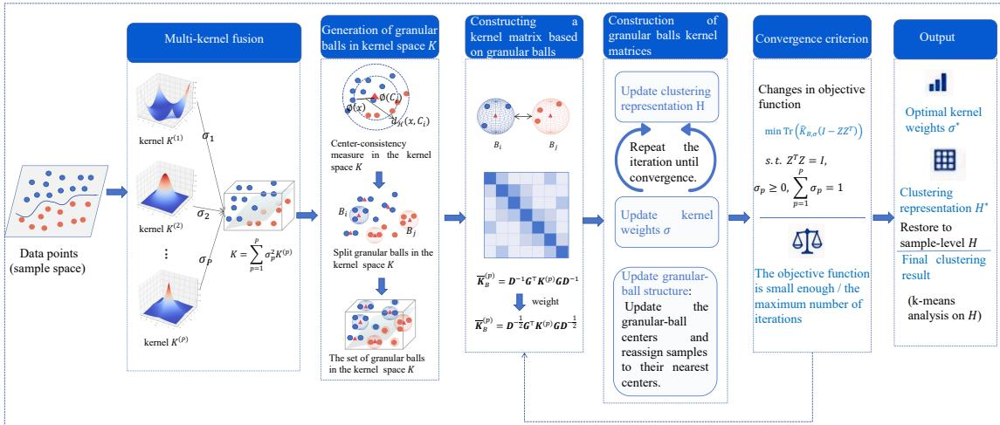
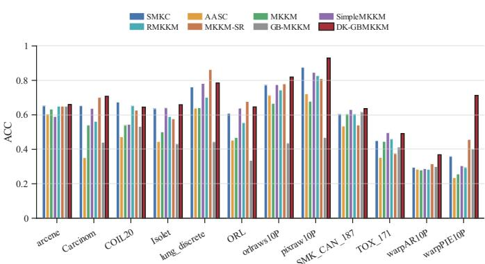
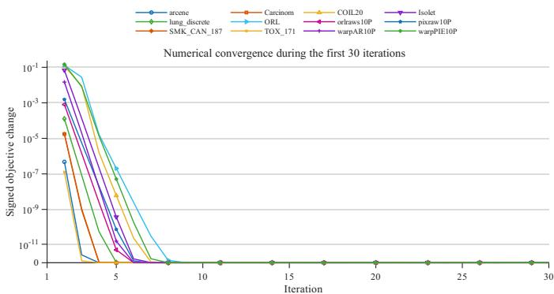
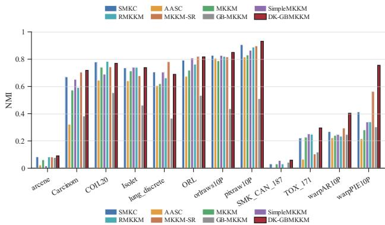
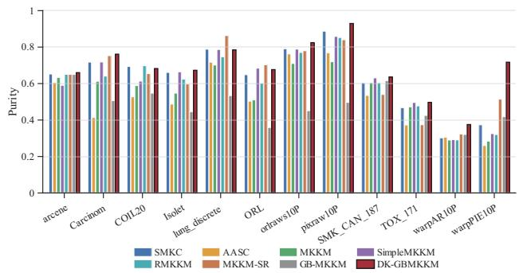
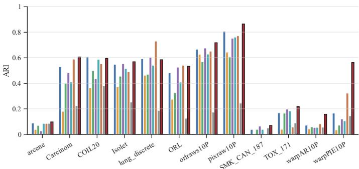
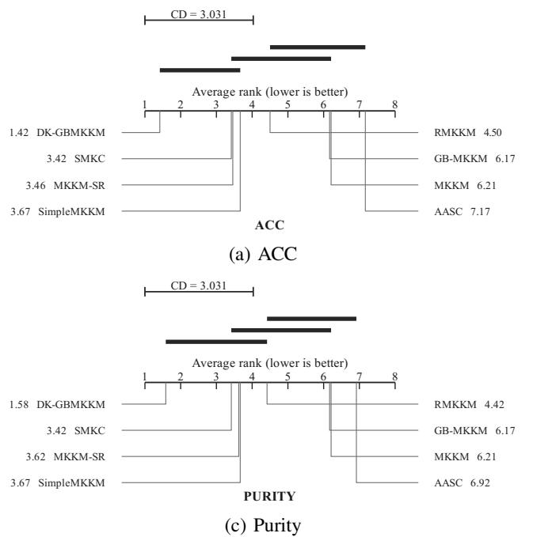
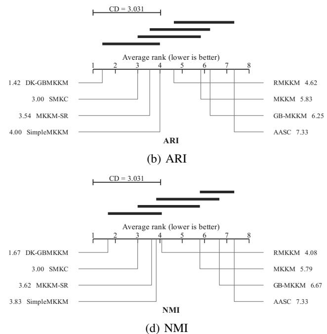

# DK-GBMKKM: Dynamic Kernel-Space Granular-Ball Multiple Kernel k-Means Clustering

1st Xiaoyu Lian

Chongqing University of Posts and Telecommunications Chongqing, China, lianxiaoyu724@qq.com

3rd Shuyin Xia\*

Chongqing University of Posts and Telecommunications

Chongqing, China, xiasy@cqupt.edu.cn

5th Zhaoxu Xiang Chongqing University of Posts and Telecommunications Chongqing, China, 2130453184@qq.com

2nd Yuchao Zhang

Chongqing University of Posts and Telecommunications

Chongqing Open University

Chongqing, China, weiyanshiai@qq.com

4th Siqi Zhong Chongqing University of Posts and Telecommunications Chongqing, China, 3572288058@qq.com

Abstract—Multiple kernel k-means integrates complementary nonlinear similarities by learning a combination of base kernels. Its pointwise optimization, however, is sensitive to noisy and boundary samples and repeatedly operates on sample-scale kernel matrices. Granular-ball representations organize local sample groups into mesoscopic units, but granular balls generated once in the input space may be inconsistent with the fusedkernel geometry that evolves during multiple kernel learning. We propose dynamic kernel-space granular-ball multiple kernel k-means (DK-GBMKKM). The method generates granular balls in the current fused kernel space and alternates kernelweight learning with granular-ball membership updates, allowing the representation to adapt to changes in the fused-kernel geometry. A sample-size-weighted granular-ball kernel is further constructed to preserve the contributions of balls of different sizes, and its positive semidefiniteness and related equivalence properties are established. Experiments on 12 public datasets demonstrate the strong overall clustering performance of DK-GBMKKM. The code has been open-sourced for reproducibility: https://github.com/lianxiaoyu724/DK-GBMKKM.

Index Terms—Multiple kernel clustering, multiple kernel kmeans, granular-ball computing, kernel space, granular ball.

## I. INTRODUCTION

Classical k-means clustering is widely used in image analysis, text mining, bioinformatics, and multimedia processing because of its simplicity, computational efficiency, and ease of implementation [1]–[3]. To overcome the limitations of Euclidean distance in the input space, spectral clustering constructs a sample-similarity graph, reformulates clustering as graph partitioning, and derives a low-dimensional embedding from eigenvectors of the graph Laplacian [4]–[6]. Kernel kmeans instead maps samples implicitly into a reproducing kernel Hilbert space (RKHS) and clusters in that space, improving the representation of nonlinear structures [7], [8].

Although kernel clustering can capture nonlinear structures, the expressive power of a single kernel is limited. Multiple kernel clustering combines several base kernels to learn task-adaptive similarities [9], [10]. Multiple kernel kmeans (MKKM) is a representative framework that jointly optimizes kernel weights and cluster assignments [11], with subsequent extensions improving robustness, structural modeling, and scalability [12], [13]. Nevertheless, most existing methods remain sample-centric, making them sensitive to noisy, boundary, and outlying samples and computationally expensive for large kernel matrices. A stable and efficient mesoscopic representation is therefore highly desirable.

Granular-ball computing (GBC) has recently emerged as an adaptive multigranularity representation. Rather than learning directly from individual samples, GBC approximates an arbitrary data distribution with granular balls characterized by centers, radii, and sample coverage. It thus replaces many samples with fewer and more stable mesoscopic units [14], [15]. GBC offers inherent advantages in efficiency, robustness, and interpretability and has been integrated with classifiers, rough sets, fuzzy sets, and graph learning to build stable multigranularity learning frameworks [16]–[20]. It has also been used in clustering to reduce computational complexity and improve robustness to noise [21]–[29]. Introducing GBC into multiple kernel clustering is therefore a natural direction. Granular-ball-induced multiple kernel k-means (GB-MKKM) [30] first embedded granular balls into MKKM. By constructing balls in the input space and compressing the sample set, it improved efficiency and robustness and demonstrated the feasibility of mesoscopic units for multiple kernel clustering.

GB-MKKM and related methods nevertheless construct granular balls in the input space. This design implicitly assumes that samples close in the input space remain close in the high-dimensional feature spaces induced by the kernels. The assumption is reasonable only for approximately orderpreserving mappings, such as a linear kernel. Under commonly used nonlinear kernels, including Gaussian and polynomial kernels, neighborhood relations can change substantially after mapping. Input-space ball boundaries may then fail to reflect the actual local density and cluster structure in kernel space. In addition, a fixed granular-ball partition cannot adapt as the kernel weights and fused-kernel geometry evolve. To address these limitations, we propose dynamic kernel-space granularball multiple kernel k-means (DK-GBMKKM), which aligns granular-ball construction with the space in which multiple kernel clustering is optimized. The main contributions are as follows:

• We propose a fused-kernel-driven dynamic granular-ball generation mechanism, where granular balls are constructed and updated directly in the current fused kernel space while keeping the ball number fixed.

• We develop an alternating optimization framework that jointly updates the granular-ball structure, spectral representation, and kernel weights in the compressed ball space.

• Extensive experiments on 12 public datasets show that DK-GBMKKM outperforms seven representative methods in terms of average performance and overall ranking across four clustering metrics.

## II. DYNAMIC KERNEL-SPACE GRANULAR-BALL MULTIPLE KERNEL k-MEANS

Rather than applying multiple kernel clustering directly to sample-level kernel matrices, we construct multiple granularball kernels and perform clustering on mesoscopic units that encode local structure.

## A. Motivation

Existing granular-ball multiple kernel clustering methods typically construct granular balls in the input space and then build ball-level kernel representations. This causes a space mismatch, as the ball structure follows input-space geometry while clustering is optimized in the fused kernel space. Moreover, fixed granular-ball partitions cannot adapt to changing kernel weights and may become inconsistent with the evolving fused-kernel geometry. DK-GBMKKM addresses both issues, as illustrated in Fig. 1. It first builds a fused kernel matrix K from the current kernel weights and generates granular balls in the induced kernel space. Ball-level kernel matrices are then computed from within- and between-ball kernel relations, followed by spectral embedding and kernel-weight learning at the ball level. After the weights are updated, the fused kernel is reconstructed and the granular-ball memberships are adjusted. The representation and the multiple kernel model therefore evolve together.

## B. Problem Formulation and Base Model

Let $ { \mathcal { X } } \ = \ \{ x _ { i } \} _ { i = 1 } ^ { n }$ be a dataset with c target clusters. Given $P$ positive semidefinite base kernel matrices $\{ K ^ { ( p ) } \} _ { p = 1 } ^ { P } ,$ each of which has been symmetrized, centered, and diagonalnormalized, let $\boldsymbol { K } ^ { ( p ) } ~ \in ~ \mathbb { R } ^ { n \times n }$ . The kernel-weight vector $\boldsymbol { \sigma } = [ \sigma _ { 1 } , \ldots , \sigma _ { P } ] ^ { \top }$ satisfies

$$
\left\{ \sigma \mid \sigma _ { p } \geq 0 , \sum _ { p = 1 } ^ { P } \sigma _ { p } = 1 \right\} .\tag{1}
$$

We use the squared-weight kernel combination

$$
K _ { \sigma } = \sum _ { p = 1 } ^ { P } \sigma _ { p } ^ { 2 } K ^ { ( p ) } .\tag{2}
$$

Kernel-space granular ball: In the RKHS H induced by the current fused kernel $K _ { \sigma }$ , the ℓth granular ball is denoted by $B _ { \ell } = ( \mathcal { T } _ { \ell } , C _ { \ell } , R _ { \ell } , \mathbf { C C M } _ { \ell } )$ . Here, $\tau _ { \ell }$ is the set of samples covered by the ball, $n _ { \ell } = | \mathcal { T } _ { \ell } |$ is its size, $C _ { \ell }$ and $R _ { \ell }$ are its center and radius in kernel space, and $\mathrm { C C M } _ { \ell }$ is its kernel-space center-consistency measure. The corresponding derivation is provided in Appendix B.

The kernel-space center is the mean of the mapped samples in the ball:

$$
C _ { \ell } = \frac { 1 } { n _ { \ell } } \sum _ { x _ { i } \in \mathcal { Z } _ { \ell } } \phi ( x _ { i } ) ,\tag{3}
$$

where $\phi ( x _ { i } )$ is the implicit mapping of $x _ { i }$ into the RKHS induced by $K _ { \sigma }$ . For any sample x, its squared distance to $C _ { \ell }$ is

$$
\begin{array} { l } { d _ { \mathcal { H } } ^ { 2 } ( x , C _ { \ell } ) = \Vert \phi ( x ) - C _ { \ell } \Vert _ { \mathcal { H } } ^ { 2 } } \\ { = K _ { \sigma } ( x , x ) - \displaystyle \frac { 2 } { n _ { \ell } } \sum _ { x _ { i } \in \mathcal { I } _ { \ell } } K _ { \sigma } ( x , x _ { i } ) + \frac { 1 } { n _ { \ell } ^ { 2 } } \sum _ { x _ { i } \in \mathcal { I } _ { \ell } } \sum _ { x _ { j } \in \mathcal { I } _ { \ell } } K _ { \sigma } ( x _ { i } , x _ { j } ) . } \end{array}\tag{4}
$$

Thus, the distance is obtained entirely from $K _ { \sigma }$ without explicitly computing a center vector. The maximum and mean radii of $B _ { \ell }$ are

$$
R _ { \ell } = \operatorname* { m a x } _ { x _ { i } \in \mathcal { Z } _ { \ell } } d _ { \mathcal { H } } ( x _ { i } , C _ { \ell } ) , \qquad \bar { R } _ { \ell } = \frac { 1 } { n _ { \ell } } \sum _ { x _ { i } \in \mathcal { Z } _ { \ell } } d _ { \mathcal { H } } ( x _ { i } , C _ { \ell } ) .\tag{5}
$$

Because label purity is unavailable in unsupervised clustering, we adapt the center-consistency measure [22] by replacing all sample distances with kernel-space distances. Let $\chi _ { \ell } = \{ x _ { i } \in \mathcal { T } _ { \ell } \mid d _ { \mathcal { H } } ( x _ { i } , C _ { \ell } ) \leq \bar { R } _ { \ell } \}$ denote the samples within the mean radius. The dimension of a kernel space is generally unavailable explicitly, so we use radius-normalized densities and thereby avoid a direct dependence on dimensionality. The consistency of a singleton or zero-radius ball is set to 1. The densities within the mean and maximum radii are

$$
\rho _ { \ell } ^ { \mathrm { a v e } } = \frac { | \chi _ { \ell } | } { \bar { R } _ { \ell } } , \qquad \rho _ { \ell } ^ { \mathrm { m a x } } = \frac { n _ { \ell } } { R _ { \ell } } .\tag{6}
$$

These ratios quantify compactness by relating the number of covered samples to the corresponding radius. The kernel-space

  
Fig. 1: Framework of DK-GBMKKM.

center-consistency measure is then

$$
\mathbf { C C M } _ { \ell } = \frac { \operatorname* { m i n } ( \rho _ { \ell } ^ { \mathrm { a v e } } , \rho _ { \ell } ^ { \mathrm { m a x } } ) } { \operatorname* { m a x } ( \rho _ { \ell } ^ { \mathrm { a v e } } , \rho _ { \ell } ^ { \mathrm { m a x } } ) } \in ( 0 , 1 ] .\tag{7}
$$

A value close to 1 indicates a uniform and stable kernel-space distribution, whereas a smaller value suggests that the ball should be refined. The granular balls are generated in the current fused kernel space by combining this measure with kernel 2-means in the GBC procedure [22].

Granular-ball kernel construction: The current fused kernel $K _ { \sigma }$ induces a single granular-ball partition shared by all base kernels. Since $K _ { \sigma }$ is a weighted combination of the base kernels, each fused-space ball center admits a consistent decomposition in the corresponding base-kernel spaces; see Appendix B. Therefore, only one partition is generated, and the same index sets $\{ \mathcal { T } _ { b } \} _ { b = 1 } ^ { M }$ are used for all base kernels.

For two balls $B _ { a }$ and $B _ { b } ,$ , their similarity in the pth basekernel space is defined as the inner product between their centers:

$$
\overline { { K } } _ { B } ^ { ( p ) } ( a , b ) = \left. C _ { a } ^ { ( p ) } , C _ { b } ^ { ( p ) } \right. = \frac { 1 } { n _ { a } n _ { b } } \sum _ { x _ { i } \in \mathcal { Z } _ { a } } \sum _ { x _ { j } \in \mathcal { Z } _ { b } } K ^ { ( p ) } ( x _ { i } , x _ { j } ) .\tag{8}
$$

This kernel-space inner product is computed solely from a sample-level kernel matrix; the base-space centers need not be formed explicitly.

Define the sample-to-ball indicator matrix G by

$$
G _ { i b } = \left\{ \begin{array} { l l } { 1 , } & { x _ { i } \in B _ { b } , } \\ { 0 , } & { \mathrm { o t h e r w i s e } , } \end{array} \right. \quad \sum _ { b = 1 } ^ { M } G _ { i b } = 1 , \quad i = 1 , \dots , n .\tag{9}
$$

Thus, $G \in \{ 0 , 1 \} ^ { n \times M }$ . Define the ball-size matrix as

$$
D = G ^ { \top } G = \operatorname { d i a g } ( n _ { 1 } , \dots , n _ { M } ) .\tag{10}
$$

By Eq. (8), the average granular-ball kernel for base kernel p is

$$
\overline { { { K } } } _ { B } ^ { ( p ) } = D ^ { - 1 } G ^ { \top } K ^ { ( p ) } G D ^ { - 1 } ,\tag{11}
$$

whose the (a, b) entry is $\langle C _ { a } ^ { ( p ) } , C _ { b } ^ { ( p ) } \rangle$

Eq. (11) measures kernel-space similarity between ball centers but ignores ball sizes, which may underweight larger balls. We therefore scale the average kernel symmetrically by the square roots of the ball sizes, omitting the common factor $1 / n$ since the total sample size is fixed.

$$
\widehat K _ { B } ^ { ( p ) } = D ^ { \frac { 1 } { 2 } } \overline { { { K } } } _ { B } ^ { ( p ) } D ^ { \frac { 1 } { 2 } } = D ^ { - \frac { 1 } { 2 } } G ^ { \top } K ^ { ( p ) } G D ^ { - \frac { 1 } { 2 } } = Q ^ { \top } K ^ { ( p ) } Q .\tag{12}
$$

Its $( a , b )$ th entry satisfies

$$
\begin{array} { r l } & { \widehat { K } _ { B } ^ { ( p ) } ( a , b ) = \sqrt { n _ { a } n _ { b } } \left. C _ { a } ^ { ( p ) } , C _ { b } ^ { ( p ) } \right. , } \\ & { Q = G D ^ { - \frac { 1 } { 2 } } , \qquad Q ^ { \top } Q = I _ { M } . } \end{array}\tag{13}
$$

The weighted kernel retains the similarity between ball centers while encoding the number of samples represented by each ball.

Consistent with the sample-level kernel combination, the fused granular-ball kernel is

$$
\widehat K _ { B , \sigma } = \sum _ { p = 1 } ^ { P } \sigma _ { p } ^ { 2 } \widehat K _ { B } ^ { ( p ) } .\tag{14}
$$

The original $n \times n$ multiple kernel representation is thereby converted into an $M \times M$ representation.

Proposition 1: If $K ^ { ( p ) } \succeq 0 ,$ , then $\widehat { K } _ { B } ^ { \left( p \right) } \succeq 0$ . Moreover, for any σ satisfying Eq. (1), the fused granular-ball kernel $\widehat { K } _ { B , \sigma }$ is positive semidefinite.

This property ensures that the constructed matrices are valid kernels and can be used directly for kernel clustering and multiple kernel learning. The proof is given in Appendix $\mathrm { C } { \cdot } \mathrm { A }$

Proposition 2: If $Z ^ { \top } Z = I _ { c }$ and $H = Q ,$ , then $H ^ { \top } H = I _ { c }$ and for any base kernel $K ^ { ( p ) }$

$$
\mathrm { t r } ( H ^ { \top } K ^ { ( p ) } H ) = \mathrm { t r } ( Z ^ { \top } \widehat K _ { B } ^ { ( p ) } Z ) .\tag{15}
$$

As shown in Appendix C-B, ball-level spectral optimization is the projection of sample-level spectral optimization onto the subspace induced by the granular-ball partition. Samples in the same ball share an embedding vector scaled by $\overline { { n _ { b } ^ { - 1 / 2 } } }$

Dynamic ball updates therefore modify the feasible subspace of the sample embedding and, in turn, the optimized ball-level spectral representation; they do not introduce an independent free parameter outside the multiple kernel clustering model.

## C. Objective and Optimization of DK-GBMKKM

Let $Z \in \mathbb { R } ^ { M \times c }$ be the ball-level spectral embedding with $Z ^ { \top } Z ~ = ~ I _ { c }$ . For the current granular-ball partition, DK-GBMKKM solves

$$
\begin{array} { r l } { \underset { Z , \sigma } { \mathrm { m i n } } } & { { } J _ { B } ( Z , \sigma ) = \displaystyle \sum _ { p = 1 } ^ { P } \sigma _ { p } ^ { 2 } L _ { p } , } \\ { \mathrm { s . t . } } & { { } Z ^ { \top } Z = I _ { c } , \qquad \sigma _ { p } \geq 0 , \qquad \displaystyle \sum _ { p = 1 } ^ { P } \sigma _ { p } = 1 , } \end{array}\tag{16}
$$

where $L _ { p } = \mathrm { t r } ( \widehat { K } _ { B } ^ { ( p ) } ) - \mathrm { t r } ( Z ^ { \top } \widehat { K } _ { B } ^ { ( p ) } Z )$ . Let $Z ^ { ( t ) } , \sigma ^ { ( t ) } , B ^ { ( t ) }$ and $J ^ { ( t ) }$ be the results after the synchronized update at iteration t. For fixed kernel weights $\sigma ^ { ( t ) }$ , Eq. (16) is equivalent, with respect to $Z ^ { ( t ) }$ , to

$$
\operatorname* { m a x } _ { \boldsymbol { Z } ^ { ( t ) } } \operatorname* { m a x } _ { \boldsymbol { Z } ^ { ( t ) } = I _ { c } } \operatorname { t r } \bigl ( \boldsymbol { Z } ^ { ( t ) } ^ { \top } \widehat { K } _ { B ^ { ( t ) } , \sigma ^ { ( t ) } } \boldsymbol { Z } ^ { ( t ) } \bigr ) .\tag{17}
$$

Accordingly, $Z ^ { ( t ) }$ consists of the orthonormal eigenvectors associated with the c largest eigenvalues of $\widehat { K } _ { B ^ { ( t ) } , \sigma ^ { ( t ) } } :$

$$
Z ^ { ( t ) } = \operatorname { S p e c } ( \widehat { K } _ { B ^ { ( t ) } , \sigma ^ { ( t ) } } , c ) .\tag{18}
$$

For fixed $Z ^ { ( t ) }$ , the weight subproblem is a convex quadratic program over the probability simplex. To avoid numerical instability when a residual approaches zero, define ${ \widetilde { \cal L } } _ { p } \ =$ max $\cdot ( L _ { p } , e ^ { - 1 2 } )$ . The kernel weights are updated as

$$
\sigma _ { p } ^ { ( t + 1 ) } = \frac { 1 / { \widetilde { L } _ { p } } } { \sum _ { q = 1 } ^ { P } 1 / \widetilde { L } _ { q } } .\tag{19}
$$

The derivation is provided in Appendix D.

Each dynamic iteration performs one synchronized block update. The ball-level spectral embedding and the residual $L _ { p }$ of each base kernel are first computed from the current weights. Eq. (19) then updates the weights, after which $Z$ and the objective value are recomputed using the new σ. The granular-ball partition, kernel weights, spectral embedding, and objective value therefore describe the same state.

The change in the objective is

$$
\Delta ^ { ( t ) } = | J ^ { ( t ) } - J ^ { ( t - 1 ) } | .\tag{20}
$$

The dynamic optimization terminates when $\Delta ^ { ( t ) } \leq \varepsilon \mathrm { o r }$ when the maximum number of iterations is reached. Convergence is evaluated before the next membership update, so the returned partition, weights, embedding, and objective value remain synchronized.

If the stopping condition is not met, the latest weights define the sample-level fused kernel

$$
K _ { \sigma ^ { ( t + 1 ) } } = \sum _ { p = 1 } ^ { P } ( \sigma _ { p } ^ { ( t + 1 ) } ) ^ { 2 } K ^ { ( p ) } .\tag{21}
$$

Using the M centers computed from the current partition in this fused kernel space, all samples undergo one fixed-M kernel k-means assignment update:

$$
\begin{array} { r } { B _ { l } ^ { ( t + 1 ) } = \operatorname * { a r g m i n } _ { 1 \leq b \leq M } \Big \| \phi _ { \sigma ^ { ( t + 1 ) } } ( x _ { i } ) - C _ { b } ^ { ( t + 1 ) } \Big \| _ { \mathcal { H } } ^ { 2 } , \quad x _ { i } \in \mathcal { X } . } \end{array}\tag{22}
$$

This step updates only sample memberships while keeping M fixed, without repeating center-consistency splitting. Empty balls are repaired by reassigning samples with large assignment distances. The updated memberships are then used to rebuild G, D, and all $\stackrel { \bullet } { K } _ { B ^ { ( t + 1 ) } } ^ { ( p ) }$ for the next ball-level MKKM update. Alternating kernel-weight learning with fixed-count reassignment enables the partition to track the evolving fused kernel space.

After convergence, the sample-level embedding is recovered from the final ball-level embedding as

$$
H = G D ^ { - 1 / 2 } Z .\tag{23}
$$

Each row of H is $\ell _ { 2 } { \mathrm { - n o r m a l i z e d } } ,$ and Euclidean k-means with c clusters is applied to the normalized embedding. The complete procedure is listed in Algorithm 1 in the Appendix.

The algorithm begins with uniform kernel weights and constructs the initial granular-ball partition using GBCT in the corresponding fused kernel space. It then fixes the number of balls and builds the sample-to-ball indicator, the ballsize matrix, and the weighted granular-ball kernel for each base kernel. During dynamic optimization, one synchronized spectral-and-weight update is followed, when necessary, by one kernel-space membership update at a fixed ball count. After convergence, the final ball-level embedding is lifted to the sample level and clustered. Thus, DK-GBMKKM couples ball-level multiple kernel learning with dynamic kernel-space reassignment while retaining a compact spectral problem. Detailed algorithmic procedures and time-complexity analysis are provided in the Appendix.

## III. EXPERIMENTAL DESIGN AND RESULTS

We compare DK-GBMKKM with recent multiple kernel clustering baselines on 12 public datasets and examine convergence through changes in its objective value. All experiments were conducted in MATLAB R2025b.

## A. Setup

Datasets: Experiments are conducted on 12 public datasets covering gene expression, object, speech, and face data [31]– [36], including several high-dimensional datasets from Feature Selection @ ASU [36]. Ground-truth labels are used only to determine the number of clusters and compute evaluation metrics. Missing values are set to zero, followed by z-score standardization and sample-wise $\ell _ { 2 }$ normalization. Dataset statistics are provided in Table II of the Appendix.

Base kernels: We construct 12 base kernels: seven radial basis function (RBF) kernels, four polynomial kernels, and one cosine kernel. The RBF scale parameters are set to $t \in \{ 0 . 0 1 , 0 . 0 5 , 0 . 1 , 1 , 1 0 , 5 0 , 1 0 0 \}$ . The polynomial kernels are $( { \dot { x } } _ { i } ^ { \top } x _ { j } + a ) ^ { b }$ , where $a \ \in \ \{ 0 , 1 \}$ and $b \in \{ 2 , 4 \}$ . After row normalization, the cosine kernel is $x _ { i } ^ { \top } x _ { j }$ . To ensure identical inputs across methods, every base kernel is cleaned of nonfinite entries, symmetrized, centered, and diagonalnormalized.

TABLE I: Average clustering performance on 12 datasets.
<table><tr><td>Method</td><td>ACC</td><td>NMI</td><td>Purity</td><td>ARI</td></tr><tr><td>SMKC</td><td>0.6118</td><td>0.5363</td><td>0.6321</td><td>0.3965</td></tr><tr><td>AASC</td><td>0.4837</td><td>0.4200</td><td>0.5213</td><td>0.2561</td></tr><tr><td>MKKM</td><td>0.5212</td><td>0.4855</td><td>0.5560</td><td>0.3103</td></tr><tr><td>SimpleMKKM</td><td>0.5978</td><td>0.5165</td><td>0.6206</td><td>0.3743</td></tr><tr><td>RMKKM</td><td>0.5769</td><td>0.5154</td><td>0.6063</td><td>0.3595</td></tr><tr><td>MKKM-SR</td><td>0.6143</td><td>0.5408</td><td>0.6327</td><td>0.4058</td></tr><tr><td>GB-MKKM</td><td>0.4555</td><td>0.3362</td><td>0.4806</td><td>0.1670</td></tr><tr><td>DK-GBMKKM</td><td>0.6717</td><td>0.5929</td><td>0.6848</td><td>0.4647</td></tr></table>

  
Fig. 2: ACC of eight methods on 12 datasets.

Compared methods and parameter settings: We compare DK-GBMKKM with seven representative baselines: SMKC [37], AASC [38], MKKM [39], SimpleMKKM [40], RMKKM [41], MKKM-SR [42], and GB-MKKM [30]. All methods use the same preprocessing, 12 base kernels, and number of clusters. Baseline parameters follow the recommended settings in the corresponding papers or public implementations.

Evaluation metrics: Clustering quality is evaluated using clustering accuracy (ACC), normalized mutual information (NMI), Purity, and the adjusted Rand index (ARI). Higher values indicate better performance for all four metrics.

## B. Clustering Performance

Table I summarizes the average results over 12 datasets, with detailed comparisons shown in Fig. 2 and Appendix G. DK-GBMKKM ranks first on all four average metrics, achieving 0.6717 ACC, 0.5929 NMI, 0.6848 Purity, and 0.4647 ARI, with gains of 0.0574, 0.0521, 0.0522, and 0.0590 over the second-best averages. It also records the most dataset-level wins, confirming that the improvement is consistent rather than dataset-specific.

DK-GBMKKM achieves the best results on all four metrics for orlraws10P, pixraw10P, warpAR10P, and warpPIE10P. On warpPIE10P, it improves ACC, NMI, Purity, and ARI over the runner-up MKKM-SR by 0.2558, 0.1916, 0.2028, and 0.2402, respectively. This result suggests that adapting ball boundaries as the fused-kernel geometry changes reduces the mismatch between a fixed input-space partition and the current kernelspace structure.

  
Fig. 3: Signed change in the DK-GBMKKM objective over the first 30 iterations on 12 datasets.

DK-GBMKKM is not uniformly superior on every dataset. RMKKM obtains the highest NMI and Purity on COIL20, and MKKM-SR remains competitive on lung discrete and ORL. When the local structure in the input space is already stable or spectral rotation sufficiently aligns the embedding with discrete labels, dynamic ball updates may provide limited additional benefit. Nevertheless, the leading averages and consistent gains across most datasets support the effectiveness of DK-GBMKKM while also revealing its dependence on data geometry.

## C. Convergence Analysis

To examine whether dynamic membership updates induce persistent oscillations, we run DK-GBMKKM once on each dataset with early stopping disabled and record 30 consecutive objective values. Fig. 3 plots the change $\Delta J ^ { ( t ) }$ over the first 30 iterations on all 12 datasets. A symmetric logarithmic scale displays both positive and negative changes, including fluctuations near machine precision.

All curves approach zero within the first few iterations. After iteration 20, $\Delta J ^ { ( t ) }$ remains below $5 \times 1 0 ^ { - 1 4 }$ on every dataset, with no sustained oscillation above this scale. Under the current datasets and parameter settings, dynamic granularball reassignment therefore causes no observable late-stage oscillation of the objective.

## IV. CONCLUSION

This paper proposed DK-GBMKKM, which constructs and dynamically updates granular balls in the fused kernel space to reduce the mismatch between granular-ball representation and multiple kernel learning. By coupling ball-level MKKM optimization with kernel-space sample reassignment, the method enables adaptive partitioning under evolving kernel geometry. Experimental results verify its effectiveness. Future work will focus on low-rank kernel approximation and adaptive granularity for large-scale clustering.

[1] M.-S. Yang and K. P. Sinaga, “Federated multi-view k-means clustering,” IEEE Transactions on Pattern Analysis and Machine Intelligence, vol. 47, no. 4, pp. 2446–2459, 2024.

[2] Z. Zhang, X. Chen, C. Wang, R. Wang, W. Song, and F. Nie, “Structured multi-view k-means clustering,” Pattern Recognition, vol. 160, p. 111113, 2025.

[3] J. Heidari, N. Daneshpour, and A. Zangeneh, “A novel k-means and k-medoids algorithms for clustering non-spherical-shape clusters nonsensitive to outliers,” Pattern Recognition, vol. 155, p. 110639, 2024.

[4] J. Liu and J. Han, “Spectral clustering,” in Data Clustering. Chapman and Hall/CRC, 2018, pp. 177–200.

[5] L. Ding, C. Li, D. Jin, and S. Ding, “Survey of spectral clustering based on graph theory,” Pattern Recognition, vol. 151, p. 110366, 2024.

[6] F. Nie, C. Liu, R. Wang, and X. Li, “A novel and effective method to directly solve spectral clustering,” IEEE Transactions on Pattern Analysis and Machine Intelligence, vol. 46, no. 12, pp. 10 863–10 875, 2024.

[7] I. S. Dhillon, Y. Guan, and B. Kulis, “Kernel k-means: spectral clustering and normalized cuts,” in Proceedings of the tenth ACM SIGKDD International Conference on Knowledge Discovery and Data Mining, 2004, pp. 551–556.

[8] X. Zhou and X. Wang, “Memory and communication efficient federated kernel k-means,” IEEE Transactions on Neural Networks and Learning Systems, vol. 35, no. 5, pp. 7114–7125, 2022.

[9] X. Liu, “Simplemkkm: Simple multiple kernel k-means,” IEEE Transactions on Pattern Analysis and Machine Intelligence, vol. 45, no. 4, pp. 5174–5186, 2022.

[10] L. Du, P. Zhou, L. Shi, H. Wang, M. Fan, W. Wang, and Y.-D. Shen, “Robust multiple kernel k-means using l21-norm.” in International Joint Conference on Artificial Intelligence, vol. 15, 2015, pp. 3476–3482.

[11] X. Liu, X. Zhu, M. Li, L. Wang, E. Zhu, T. Liu, M. Kloft, D. Shen, J. Yin, and W. Gao, “Multiple kernel k-means with incomplete kernels,” IEEE Transactions on Pattern Analysis and Machine Intelligence, vol. 42, no. 5, pp. 1191–1204, 2019.

[12] J. Wang, Z. Li, C. Tang, S. Liu, X. Wan, and X. Liu, “Multiple kernel clustering with adaptive multi-scale partition selection,” IEEE Transactions on Knowledge and Data Engineering, vol. 36, no. 11, pp. 6641–6652, 2024.

[13] W. Liang, C. Tang, X. Liu, Y. Liu, J. Liu, E. Zhu, and K. He, “On the consistency and large-scale extension of multiple kernel clustering,” IEEE Transactions on Pattern Analysis and Machine Intelligence, vol. 46, no. 10, pp. 6935–6947, 2024.

[14] S. Xia, Y. Liu, X. Ding, G. Wang, H. Yu, and Y. Luo, “Granular ball computing classifiers for efficient, scalable and robust learning,” Information Sciences, vol. 483, pp. 136–152, 2019.

[15] S. Xia, X. Dai, G. Wang, X. Gao, and E. Giem, “An efficient and adaptive granular-ball generation method in classification problem,” IEEE Transactions on Neural Networks and Learning Systems, vol. 35, no. 4, pp. 5319–5331, 2022.

[16] S. Xia, X. Lian, G. Wang, X. Gao, J. Chen, and X. Peng, “Gbsvm: an efficient and robust support vector machine framework via granularball computing,” IEEE Transactions on Neural Networks and Learning Systems, vol. 36, no. 5, pp. 9253–9267, 2024.

[17] S. Xia, C. Wang, G. Wang, X. Gao, W. Ding, J. Yu, Y. Zhai, and Z. Chen, “Gbrs: A unified granular-ball learning model of pawlak rough set and neighborhood rough set,” IEEE Transactions on Neural Networks and Learning Systems, vol. 36, no. 1, pp. 1719–1733, 2023.

[18] X. Lian, S. Xia, B. Sang, G. Wang, and X. Gao, “Gbfrs: Robust fuzzy rough sets via granular ball computing,” IEEE Transactions on Neural Networks and Learning Systems, 2026.

[19] S. Xia, X. Lian, G. Wang, X. Gao, Q. Hu, and Y. Shao, “Granular-ball fuzzy set and its implement in svm,” IEEE Transactions on Knowledge and Data Engineering, vol. 36, no. 11, pp. 6293–6304, 2024.

[20] D. Dai, F. Chen, S. Xia, L. Yang, G. Wang, G. Wang, and X. Gao, “An adaptive multi-granularity graph representation of image via granularball computing,” IEEE Transactions on Image Processing, vol. 34, pp. 2986–2999, 2025.

[21] J. Xie, X. Xiang, S. Xia, L. Jiang, G. Wang, and X. Gao, “Mgnr: A multigranularity neighbor relationship and its application in knn classification and clustering methods,” IEEE Transactions on Pattern Analysis and Machine Intelligence, vol. 46, no. 12, pp. 7956–7972, 2024.

[22] S. Xia, B. Shi, Y. Wang, J. Xie, G. Wang, and X. Gao, “Gbct: efficient and adaptive clustering via granular-ball computing for complex data,” IEEE Transactions on Neural Networks and Learning Systems, vol. 36, no. 7, pp. 12 159–12 172, 2025.

[23] D. Cheng, X. Jiang, S. Xia, G. Wang, J. Huang, S. Zhang, and Y. Wang, “Fast spectral clustering via pseudo-label-based granular-ball division for large-scale data,” IEEE Transactions on Knowledge and Data Engineering, 2026.

[24] Z. Jia, Z. Zhang, and W. Pedrycz, “Generation of granular-balls for clustering based on the principle of justifiable granularity,” IEEE Transactions on Cybernetics, 2025.

[25] Y. Chen, J. Li, S. Xia, Q. Lai, X. Gao, G. Wang, D. Cheng, Y. Liu, and Y. Wang, “Gbsk: Skeleton clustering via granular-ball computing and multi-sampling for large-scale data,” arXiv preprint arXiv:2509.23742, 2025.

[26] P. Su, S. Huang, W. Ma, D. Xiong, and J. Lv, “Multi-view granularball contrastive clustering,” in Proceedings of the AAAI Conference on Artificial Intelligence, vol. 39, no. 19, 2025, pp. 20 637–20 645.

[27] D. Cheng, C. Zhang, Y. Li, S. Xia, G. Wang, J. Huang, S. Zhang, and J. Xie, “Gb-dbscan: A fast granular-ball based dbscan clustering algorithm,” Information Sciences, vol. 674, p. 120731, 2024.

[28] J. Xie, M. Dai, S. Xia, J. Zhang, G. Wang, and X. Gao, “An efficient fuzzy stream clustering method based on granular-ball structure,” in 2024 IEEE 40th International Conference on Data Engineering (ICDE). IEEE, 2024, pp. 901–913.

[29] J. Xie, C. Hua, S. Xia, Y. Cheng, G. Wang, and X. Gao, “W-gbc: An adaptive weighted clustering method based on granular-ball structure,” in 2024 IEEE 40th International Conference on Data Engineering (ICDE). IEEE, 2024, pp. 914–925.

[30] S. Xia, Y. Wang, L. Shen, and G. Wang, “Granular-ball-induced multiple kernel k-means,” in Proceedings of the Thirty-Fourth International Joint Conference on Artificial Intelligence, 2025, pp. 6633–6641.

[31] I. Guyon, S. Gunn, A. Ben-Hur, and G. Dror, “Result analysis of the nips 2003 feature selection challenge,” in Advances in Neural Information Processing Systems, vol. 17, 2004.

[32] F. S. Samaria and A. C. Harter, “Parameterisation of a stochastic model for human face identification,” in Proceedings of the Second IEEE Workshop on Applications of Computer Vision, 1994, pp. 138–142.

[33] S. A. Nene, S. K. Nayar, and H. Murase, “Columbia object image library (COIL-20),” Department of Computer Science, Columbia University, Tech. Rep. CUCS-005-96, February 1996.

[34] R. A. Cole, Y. K. Muthusamy, and M. Fanty, “The isolet spoken letter database,” Oregon Graduate Institute of Science and Technology, Tech. Rep. CSE 90-004, 1990.

[35] J. Li, K. Cheng, S. Wang, F. Morstatter, R. P. Trevino, J. Tang, and H. Liu, “Feature selection: a data perspective,” ACM Computing Surveys, vol. 50, no. 6, pp. 94:1–94:45, 2018.

[36] Feature Selection @ ASU, “Feature selection datasets,” https://jundongl. github.io/scikit-feature/datasets.html, 2026, arizona State University.

[37] W. Liang, E. Zhu, S. Yu, H. Xu, X. Zhu, and X. Liu, “Scalable multiple kernel clustering: Learning clustering structure from expectation,” in Proceedings of the 41st International Conference on Machine Learning, ser. Proceedings of Machine Learning Research, vol. 235, 2024, pp. 29 700–29 719.

[38] H.-C. Huang, Y.-Y. Chuang, and C.-S. Chen, “Affinity aggregation for spectral clustering,” in Proceedings of the IEEE Conference on Computer Vision and Pattern Recognition, 2012, pp. 773–780.

[39] H. C. Huang, Y. Y. Chuang, and C. S. Chen, “Multiple kernel fuzzy clustering,” IEEE Transactions on Fuzzy Systems, vol. 20, no. 1, pp. 120–134, 2012.

[40] X. Liu, E. Zhu, J. Liu, T. Hospedales, Y. Wang, and M. Wang, “SimpleMKKM: Simple multiple kernel K-means,” IEEE Transactions on Pattern Analysis and Machine Intelligence, vol. 45, no. 4, pp. 5174– 5186, 2023.

[41] L. Du, P. Zhou, L. Shi, H. Wang, M. Fan, W. Wang, and Y.-D. Shen, “Robust multiple kernel K-means using ℓ2,1-norm,” in Proceedings of the Twenty-Fourth International Joint Conference on Artificial Intelligence, 2015, pp. 3476–3482.

[42] J. Lu, Y. Lu, R. Wang, F. Nie, and X. Li, “Multiple kernel Kmeans clustering with simultaneous spectral rotation,” in Proceedings of the IEEE International Conference on Acoustics, Speech and Signal Processing, 2022, pp. 4143–4147.

## APPENDIX A EXPERIMENTAL DATASET DETAILS

TABLE II: Information on the 12 experimental datasets.
<table><tr><td>Dataset</td><td>Samples</td><td>Features</td><td>Classes</td></tr><tr><td>arcene</td><td>200</td><td>10,000</td><td>2</td></tr><tr><td>Carcinom</td><td>174</td><td>9,182</td><td>11</td></tr><tr><td>COIL20</td><td>1,440</td><td>1,024</td><td>20</td></tr><tr><td>Isolet</td><td>1,560</td><td>617</td><td>26</td></tr><tr><td>lung_discrete</td><td>73</td><td>325</td><td>7</td></tr><tr><td>ORL</td><td>400</td><td>1,024</td><td>40</td></tr><tr><td>orlraws10P</td><td>100</td><td>10,304</td><td>10</td></tr><tr><td>pixraw10P</td><td>100</td><td>10,000</td><td>10</td></tr><tr><td>SMK_CAN_187</td><td>187</td><td>19,993</td><td>2</td></tr><tr><td>TOX_171</td><td>171</td><td>5,748</td><td>4</td></tr><tr><td>warpAR10P</td><td>130</td><td>2,400</td><td>10</td></tr><tr><td>warpPIE10P</td><td>210</td><td>2,420</td><td>10</td></tr></table>

## APPENDIX B

THEORETICAL PROPERTIES OF GRANULAR-BALL REPRESENTATIONS IN THE FUSED KERNEL SPACE

This section establishes the relationship between a granularball center in the fused kernel space and its counterparts in the base-kernel spaces. From Eq. (2),

$$
K _ { \sigma } = \sum _ { p = 1 } ^ { P } \sigma _ { p } ^ { 2 } K ^ { ( p ) } .\tag{24}
$$

Let $\phi _ { p } ( x )$ be an implicit feature map for the pth base kernel. An equivalent feature map for the fused kernel is

$$
\phi _ { \sigma } ( x ) = \left[ \sigma _ { 1 } \phi _ { 1 } ( x ) ^ { \top } , \ldots , \sigma _ { P } \phi _ { P } ( x ) ^ { \top } \right] ^ { \top } .\tag{25}
$$

Indeed,

$$
\begin{array} { c l } { { \displaystyle \langle \phi _ { \sigma } ( x _ { i } ) , \phi _ { \sigma } ( x _ { j } ) \rangle = \displaystyle \sum _ { p = 1 } ^ { P } \sigma _ { p } ^ { 2 } \left. \phi _ { p } ( x _ { i } ) , \phi _ { p } ( x _ { j } ) \right. } } \\ { { { } } } & { { { } } } \\ { { { } } } &  { { = \displaystyle \sum _ { p = 1 } ^ { P } \sigma _ { p } ^ { 2 } K ^ { ( p ) } ( x _ { i } , x _ { j } ) } } \\ { { { } } } & { { { } } } \\ { { { } } } & { { { = K _ { \sigma } ( x _ { i } , x _ { j } ) , } } } \end{array}\tag{26}
$$

which verifies Eq. (25).

For a granular ball $B _ { b }$ generated in the fused kernel space, let $\mathcal { T } _ { b }$ be its sample index set and $n _ { b }$ its size. From Eq. (3), its center is

$$
C _ { b } = \frac { 1 } { n _ { b } } \sum _ { x _ { i } \in \mathbb { Z } _ { b } } \phi _ { \sigma } ( x _ { i } ) .\tag{27}
$$

Substituting Eq. (25) gives

$$
\begin{array} { l } { { \displaystyle C _ { b } = \frac { 1 } { n _ { b } } \sum _ { x _ { i } \in \mathcal { T } _ { b } } \left[ \sigma _ { 1 } \phi _ { 1 } ( x _ { i } ) ^ { \top } , \ldots , \sigma _ { P } \phi _ { P } ( x _ { i } ) ^ { \top } \right] ^ { \top } } } \\ { { \mathrm { ~ } } } \\ { { \displaystyle ~ = \left[ \sigma _ { 1 } C _ { b } ^ { ( 1 ) \top } , \ldots , \sigma _ { P } C _ { b } ^ { ( P ) \top } \right] ^ { \top } , } } \end{array}\tag{28}
$$

where

$$
C _ { b } ^ { ( p ) } = \frac { 1 } { n _ { b } } \sum _ { x _ { i } \in \mathcal { T } _ { b } } \phi _ { p } ( x _ { i } )\tag{29}
$$

is the center of $B _ { b }$ in the pth base-kernel space. Therefore, for any two balls $B _ { a }$ and $B _ { b }$

$$
\begin{array} { r l } & { \langle C _ { a } , C _ { b } \rangle = \left. \left[ \sigma _ { 1 } C _ { a } ^ { ( 1 ) \top } , \ldots , \sigma _ { P } C _ { a } ^ { ( P ) \top } \right] ^ { \top } , \right. } \\ & { \qquad \left. \left[ \sigma _ { 1 } C _ { b } ^ { ( 1 ) \top } , \ldots , \sigma _ { P } C _ { b } ^ { ( P ) \top } \right] ^ { \top } \right. } \\ & { \qquad = \displaystyle \sum _ { p = 1 } ^ { P } \sigma _ { p } ^ { 2 } \left. C _ { a } ^ { ( p ) } , C _ { b } ^ { ( p ) } \right. . } \end{array}\tag{30}
$$

Eq. (30) shows that center relations in the fused kernel space are weighted combinations of the corresponding center relations under the same partition in the base-kernel spaces. A single partition can therefore be generated in the current fused kernel space and shared across all base kernels.

Since

$$
\left. C _ { a } ^ { ( p ) } , C _ { b } ^ { ( p ) } \right. = \overline { { { K } } } _ { B } ^ { ( p ) } ( a , b ) ,\tag{31}
$$

we further have

$$
\langle C _ { a } , C _ { b } \rangle = \sum _ { p = 1 } ^ { P } \sigma _ { p } ^ { 2 } \overline { { { K } } } _ { B } ^ { ( p ) } ( a , b ) .\tag{32}
$$

For a fixed granular-ball partition, the similarities between fused-space ball centers are thus equivalent to the weighted combination of the corresponding base-space center similarities.

APPENDIX CPROPERTIES OF THE WEIGHTED GRANULAR-BALLKERNEL

## A. Proof of Proposition 1

From $\operatorname { E q . } \left( 3 \right)$ , the inner product between the centers of balls $B _ { a }$ and $B _ { b }$ in the pth base-kernel space is

$$
\begin{array} { c l } { { \displaystyle \left. C _ { a } ^ { ( p ) } , C _ { b } ^ { ( p ) } \right. = \left. \frac { 1 } { n _ { a } } \sum _ { x _ { i } \in \mathcal { T } _ { a } } \phi _ { p } ( x _ { i } ) , \frac { 1 } { n _ { b } } \sum _ { x _ { j } \in \mathcal { T } _ { b } } \phi _ { p } ( x _ { j } ) \right. } } \\ { { \displaystyle = \frac { 1 } { n _ { a } n _ { b } } \sum _ { x _ { i } \in \mathcal { T } _ { a } } \sum _ { x _ { j } \in \mathcal { T } _ { b } } K ^ { ( p ) } ( x _ { i } , x _ { j } ) . } } \end{array}\tag{33}
$$

Collecting all pairwise center inner products gives

$$
\overline { { { K } } } _ { B } ^ { ( p ) } = D ^ { - 1 } G ^ { \top } K ^ { ( p ) } G D ^ { - 1 } .\tag{34}
$$

Weighting this average kernel by the ball sizes yields

$$
\begin{array} { c } { { { \widehat K } _ { B } ^ { ( p ) } = D ^ { 1 / 2 } { \overline { { { K } } } _ { B } ^ { ( p ) } } D ^ { 1 / 2 } } } \\ { { = D ^ { - 1 / 2 } G ^ { \top } K ^ { ( p ) } G D ^ { - 1 / 2 } . } } \end{array}\tag{35}
$$

Consequently,

$$
\widehat { K } _ { B } ^ { ( p ) } ( a , b ) = \sqrt { n _ { a } n _ { b } } \left. C _ { a } ^ { ( p ) } , C _ { b } ^ { ( p ) } \right. .\tag{36}
$$

Let $Q = G D ^ { - 1 / 2 }$ . Then

$$
\widehat { K } _ { B } ^ { ( p ) } = Q ^ { \top } K ^ { ( p ) } Q .\tag{37}
$$

For any $\mathbf { z } \in \mathbb { R } ^ { M }$ , if $K ^ { ( p ) } \succeq 0$ , then

$$
\begin{array} { r l } & { \mathbf { z } ^ { \top } \widehat { K } _ { B } ^ { ( p ) } \mathbf { z } = \mathbf { z } ^ { \top } Q ^ { \top } K ^ { ( p ) } Q \mathbf { z } } \\ & { \qquad = ( Q \mathbf { z } ) ^ { \top } K ^ { ( p ) } ( Q \mathbf { z } ) \geq 0 . } \end{array}\tag{38}
$$

Hence $\widehat { K } _ { B } ^ { \left( p \right) } \succeq 0$ . Because $\sigma _ { p } ^ { 2 } \geq 0 .$

$$
\widehat K _ { B , \sigma } = \sum _ { p = 1 } ^ { P } \sigma _ { p } ^ { 2 } \widehat K _ { B } ^ { ( p ) } \succeq 0 .\tag{39}
$$

## B. Proof of Proposition 2

Using $H = Q Z , Q ^ { \top } Q = I _ { M }$ , and $Z ^ { \top } Z = I _ { c }$ , we obtain

$$
\begin{array} { r } { H ^ { \top } H = Z ^ { \top } Q ^ { \top } Q Z = Z ^ { \top } Z = I _ { c } . } \end{array}\tag{40}
$$

For any base kernel $K ^ { ( p ) }$

$$
\begin{array} { r l } & { \mathrm { t r } ( H ^ { \top } K ^ { ( p ) } H ) = \mathrm { t r } \Big ( Z ^ { \top } Q ^ { \top } K ^ { ( p ) } Q Z \Big ) } \\ & { \qquad = \mathrm { t r } \Big ( Z ^ { \top } \widehat K _ { B } ^ { ( p ) } Z \Big ) , } \end{array}\tag{41}
$$

which proves Eq. (15).

## APPENDIX D DERIVATION OF THE KERNEL-WEIGHT UPDATE

For a fixed ball-level spectral embedding Z, the kernelweight subproblem in Eq. (16) is

$$
\operatorname* { m i n } _ { \sigma } \sum _ { p = 1 } ^ { P } \sigma _ { p } ^ { 2 } L _ { p } , \quad \mathrm { s . t . } \quad \sigma _ { p } \geq 0 , \quad \sum _ { p = 1 } ^ { P } \sigma _ { p } = 1 ,\tag{42}
$$

where

$$
L _ { p } = \mathrm { T r } ( \widehat { K } _ { B } ^ { ( p ) } ) - \mathrm { T r } ( Z ^ { \top } \widehat { K } _ { B } ^ { ( p ) } Z )\tag{43}
$$

is the clustering residual associated with the pth base granularball kernel. Since $L _ { p } \geq 0$ , the problem is a convex quadratic program over the probability simplex.

The Lagrangian is

$$
\mathcal { L } ( \sigma , \lambda ) = \sum _ { p = 1 } ^ { P } \sigma _ { p } ^ { 2 } L _ { p } - \lambda \left( \sum _ { p = 1 } ^ { P } \sigma _ { p } - 1 \right) ,\tag{44}
$$

where λ is the multiplier for the equality constraint. Setting the derivative with respect to $\sigma _ { p }$ to zero gives

$$
\frac { \partial \mathcal { L } } { \partial \sigma _ { p } } = 2 \sigma _ { p } L _ { p } - \lambda = 0 ,\tag{45}
$$

and therefore

$$
\sigma _ { p } = \frac { \lambda } { 2 L _ { p } } .\tag{46}
$$

The normalization constraint yields

$$
\frac { \lambda } { 2 } \sum _ { p = 1 } ^ { P } \frac { 1 } { L _ { p } } = 1 ,\tag{47}
$$

so that

$$
\frac { \lambda } { 2 } = \frac { 1 } { \sum _ { q = 1 } ^ { P } 1 / L _ { q } } .\tag{48}
$$

Substitution gives the optimal weight

$$
\sigma _ { p } = \frac { 1 / L _ { p } } { \sum _ { q = 1 } ^ { P } 1 / L _ { q } } .\tag{49}
$$

For numerical stability when a residual approaches zero, we use

$$
\widetilde { L } _ { p } = \operatorname* { m a x } ( L _ { p } , \epsilon ) ,\tag{50}
$$

where ϵ is a small positive constant. The resulting update is

$$
\sigma _ { p } ^ { + } = \frac { 1 / \widetilde { L } _ { p } } { \sum _ { q = 1 } ^ { P } 1 / \widetilde { L } _ { q } } ,\tag{51}
$$

which is Eq. (19).

## APPENDIX E DK-GBMKKM OPTIMIZATION PROCEDURE

Algorithm 1 DK-GBMKKM   
Require: Base kernels $\{ K ^ { ( p ) } \} _ { p = 1 } ^ { P }$ , number of clusters c,   
consistency coefficient $\eta ,$ minimum child-ball size nmin,   
maximum number of ball-refinement rounds $T _ { \mathrm { s p l i t } }$ , toler  
ance $\varepsilon ,$ and maximum number of iterations T.   
Ensure: Cluster labels y, kernel weights $\sigma ,$ and granular-ball   
set B.   
1: Initialize $\sigma _ { p } ^ { ( 0 ) } = 1 / P$ and construct $K _ { \sigma ^ { ( 0 ) } }$   
2: Run GBCT on the initial fused kernel to obtain a complete   
granular-ball partition.   
3: Fix the resulting number of balls M and construct $G , D ,$   
and $\{ \widehat K _ { B } ^ { ( p ) } \} _ { p = 1 } ^ { P } .$   
4: for $t = 1 , 2 , \ldots , T$ do   
5: Construct $\widehat { K } _ { B ^ { ( t ) } , \sigma ^ { ( t ) } }$ from the current $\boldsymbol { \sigma } ^ { ( t ) }$   
6: Compute $Z ^ { ( t ) } = \operatorname { S p e c } ( \widehat { K } _ { B ^ { ( t ) } , \sigma ^ { ( t ) } } , c )$ and the residual   
$L _ { p }$ of each base kernel.   
7: Update the kernel weights with Eq. (19) to obtain   
$\sigma ^ { ( t + 1 ) }$   
8: Compute objective $J ^ { ( t ) } .$   
9: if $t > 1$ and $| J ^ { ( t ) } - J ^ { ( t - 1 ) } | \leq \varepsilon$ then   
10: break   
11: end if   
12: if $t < T$ then   
13: Construct the latest sample-level fused kernel   
$K _ { \sigma ^ { ( t + 1 ) } }$   
14: Apply one fixed-M kernel k-means assignment up  
date to all samples using Eq. (22), and repair any   
empty balls.   
15: Reconstruct G, D, and $\{ \widehat K _ { B ^ { t + 1 } } ^ { ( p ) } \} _ { p = 1 } ^ { P }$ from the new   
memberships.   
16: end if   
17: end for   
18: Recover $H = G D ^ { - 1 / 2 } Z$ using Eq. (23).   
19: Row-normalize H in the $\ell _ { 2 }$ norm and run Euclidean k  
means with c clusters to obtain y.   
20: return $\mathbf { y } , \sigma , B .$

## APPENDIX F TIME AND SPACE COMPLEXITY

Let M be the final number of granular balls and T the number of iterations. Given P base kernels of size $n \times n ,$ constructing all weighted ball kernels requires $G ^ { \top } K ^ { ( p ) } G$ . A dense implementation costs $O ( P n ^ { 2 } )$ time and $O ( P M ^ { 2 } )$ memory for the ball kernels. Each synchronized MKKM update performs two eigendecompositions of an $M \times M$ matrix. A full decomposition costs $O ( M ^ { 3 } )$ , whereas iterative extraction of the leading c eigenvectors typically costs approximately $O ( M ^ { 2 } c )$ . One fixed-count reassignment computes distances from n samples to M centers in the fused sample kernel and costs $O ( n ^ { 2 } + n M )$ in a dense implementation.

Ignoring initialization constants, the dynamic phase has time complexity $O \big ( T ( P n ^ { 2 } + M ^ { 3 } + n ^ { 2 } + \acute { n } M ) \big ) ; \bar { M } ^ { 3 }$ can be replaced by $\dot { M } ^ { 2 } c$ when a partial eigensolver is used. If all base kernels remain in memory, the space complexity is $O ( P n ^ { 2 } + P M ^ { 2 } + n M )$ . The current implementation therefore moves repeated spectral computations from matrices of order n to matrices of order M. Because it retains full sample kernels and reaggregates them in each iteration, it is not a linearmemory method.

## APPENDIX G

## ADDITIONAL DATASET-LEVEL RESULTS

Fig. 4 provide the dataset-level NMI, Purity, and ARI results that complement the ACC comparison in Fig. 2.

## APPENDIX H

## STATISTICAL TESTS AND SIGNIFICANCE ANALYSIS

To avoid drawing conclusions from mean values alone, we conduct nonparametric tests on the eight methods over the 12 datasets. Within each dataset, methods are ranked in descending order of metric value, with tied results assigned their average rank. A Friedman test first evaluates the null hypothesis that all eight methods have equal overall performance. Its statistic is

$$
\chi _ { F } ^ { 2 } = \frac { 1 2 N } { k ( k + 1 ) } \left[ \sum _ { j = 1 } ^ { k } \bar { R } _ { j } ^ { 2 } - \frac { k ( k + 1 ) ^ { 2 } } { 4 } \right] ,\tag{52}
$$

where $N = 1 2 , k = 8 ,$ and $\bar { R } _ { j }$ is the average rank of method j. The Iman–Davenport statistic

$$
F _ { F } = \frac { ( N - 1 ) \chi _ { F } ^ { 2 } } { N ( k - 1 ) - \chi _ { F } ^ { 2 } } f i g : c o m b i n e d _ { c } d\tag{53}
$$

provides a finite-sample correction. If the global null hypothesis is rejected, a Nemenyi post hoc test is applied. At significance level $\alpha = 0 . 0 5$ , the critical difference is

$$
\mathrm { C D } = q _ { 0 . 0 5 } { \sqrt { \frac { k ( k + 1 ) } { 6 N } } } = 3 . 0 3 1 .\tag{54}
$$

As shown in Table III, the Iman–Davenport tests produce very small p-values for all four metrics: $\mathrm { { \bar { 3 } . 7 1 \times 1 0 ^ { - 1 3 } } }$ for $\mathrm { A C C , ~ 6 . 2 7 \times 1 0 ^ { - 1 4 } }$ for NMI, $7 . 2 0 \times 1 0 ^ { - 1 1 }$ for Purity, and $1 . 1 0 \times 1 0 ^ { - 1 3 }$ for ARI. All are well below 0.05, so the null hypothesis of equal performance is rejected for every metric. DK-GBMKKM also obtains the best average rank among the eight methods: 1.42 for ACC, 1.67 for NMI, 1.58 for Purity, and 1.42 for ARI. Its advantage in Table I is therefore consistent across datasets and is not an artifact of individual datasets or metric scales.

  
Fig. 4: Comparison of eight methods on 12 datasets: NMI (top), Purity (middle), and ARI (bottom).

TABLE III: Friedman and Iman–Davenport test results.
<table><tr><td>Metric</td><td> $\chi _ { F } ^ { 2 }$ </td><td> $F _ { F }$ </td><td>p-value</td></tr><tr><td>ACC</td><td>50.5347</td><td>16.6107</td><td> $3 . 7 1 \times 1 0 ^ { - 1 3 }$ </td></tr><tr><td>NMI</td><td>52.1042</td><td>17.9693</td><td> $6 . 2 7 \times 1 0 ^ { - 1 4 }$ </td></tr><tr><td>Purity</td><td>45.3681</td><td>12.9180</td><td> $7 . 2 0 \times 1 0 ^ { - 1 1 }$ </td></tr><tr><td>ARI</td><td>51.6181</td><td>17.5344</td><td> $1 . 1 0 \times 1 0 ^ { - 1 3 }$ </td></tr></table>

Fig. 5 shows the critical-difference diagrams for ACC, ARI, Purity, and NMI. All four use $\mathrm { C D } = 3 . 0 3 1$ for 12 datasets and eight methods. DK-GBMKKM attains the lowest average rank for every metric, confirming its best overall performance across evaluation criteria.

  
Fig. 5: Nemenyi critical-difference diagrams for four metrics. Lower average ranks indicate better performance; thick lines connect algorithms whose differences are not significant.

The rank gaps between DK-GBMKKM and MKKM, GB-MKKM, and AASC exceed the critical difference for all four metrics, indicating a significant advantage over these conventional multiple kernel and granular-ball multiple kernel clustering methods. Relative to RMKKM, the difference is significant only for ACC. The gaps from SMKC, MKKM-SR, and SimpleMKKM are not significant for most metrics, showing that these strong baselines remain competitive. Nevertheless, DK-GBMKKM ranks first on all four metrics, supporting the effectiveness of dynamic granular-ball adjustment and kernelspace structural modeling.