# DeSyR: A Decoupled Symbolic Recovery Framework with PINN-Guided Structure Search and Physics-Informed Coeficient Refinement

Pancheng Niua, Jun Guoa,∗, Qiaolin Heb, Jingcai Guoc, Yanchao Shid

aChengdu University of Information Technology, College of Applied Mathematics, Chengdu, 610225, China

bSichuan University, School of Mathematics, Chengdu, 610065, China cHong Kong Polytechnic University, Department of Computing, Hong Kong, 999077, China

dSouthwest Petroleum University, College of Science, Chengdu, 610500, Sichuan, China

## Abstract

Recovering compact explicit solutions from neural approximations is chal lenging when imperfect teacher data guide both symbolic topology search and coeficient estimation. We present DeSyR, a decoupled symbolic recovery framework for diferential equations. A physics-informed neural network guides repeated searches to construct candidate topologies with provisional constants. Once a topology is fixed, its coeficients are refined solely from the governing equation and prescribed constraints, after which the refined candidates undergo gated selection and verification. For linear fixed-topology parameterizations, we characterize teacher-error inheritance and show that finite-weight mixed data–physics fitting retains an O(β−1) teacher-dependent contribution when the teacher error has a nonzero projection onto the model space. Under well-posedness, representability, zero-residual attainment, and discrete determinacy, physics-only refinement conditionally recovers the exact coeficients; for nonlinear parameterizations, the corresponding identifiability and convergence guarantees are local. DeSyR is evaluated on 15 diferentialequation problems across 18 configurations covering high-order, space–time, multidimensional, nonlinear, and coupled systems. A candidate-level audit yields a 99.23% convergence rate among free-parameter refits, while every

selected refinement involving free coeficients converges. Configuration-level median refined relative $L _ { 2 }$ errors are $2 . 3 1 \times 1 0 ^ { - 1 4 }$ or lower. In same-topology comparisons with strictly positive errors before and after refinement, refinement reduces the error by eight to fourteen orders of magnitude. Within the tested representable settings, these results indicate that an approximate neural teacher can guide topology discovery without imposing its error scale on the final recovered coeficients, provided that a target-capable topology is retained and physics-only refinement converges.

Keywords: symbolic regression, physics-informed neural networks, diferential equations, symbolic solution recovery, physics-informed coeficient refinement

## 1. Introduction

Numerical methods are standard tools for solving diferential equations in science and engineering. Finite-diference, finite-element, and spectral methods provide well-established discretization techniques with solid theoretical foundations and broad practical applicability [1, 2, 3]. More recently, neural methods have emerged as an alternative for representing solutions as continuous functions. Deep Galerkin and Deep Ritz methods approximate individual solution fields, whereas DeepONet and Fourier neural operators learn mappings between function spaces [4, 5, 6, 7]. Although these methods can be numerically efective, their solutions are typically represented implicitly, either through discrete degrees of freedom or network parameters. When a solution admits a compact explicit representation, recovering such a representation can facilitate interpretation, diferentiation, and reuse in subsequent analysis or computation.

Physics-informed neural networks (PINNs) provide a useful framework for approximating solutions to diferential equations by enforcing the governing equations and prescribed constraints during training, without requiring labeled solution data in the interior domain [8, 9]. Once trained, a PINN defines a continuous approximation that can be evaluated at arbitrary points in the domain. Its accuracy, however, remains strongly dependent on the optimization process and can be afected by loss imbalance, spectral bias, and dificulties associated with stif or multiscale problems [10, 11, 12, 13]. Several complementary mitigation strategies have therefore been developed, including adaptive reweighting of governing-equation residual and constraint losses, residual-based refinement of collocation points, architectural and activation-function modifications, and spatial or space–time domain decomposition [10, 14, 15, 16, 17]. Nevertheless, a PINN may capture the overall form of the solution while still exhibiting errors in quantities such as amplitudes, frequencies, ofsets, or other coeficients. Moreover, the resulting solution remains implicit in the network parameters rather than being available as an explicit analytical expression.

Symbolic regression provides a means of recovering explicit analytical expressions from numerical solution data. Given a prescribed set of variables, constants, and operators, it searches for compact expressions that approximate the target samples [18, 19, 20]. The search is conducted over a combinatorial expression space whose size grows rapidly with expression complexity, while the prescribed operator set determines the class of admissible expressions [21, 22]. In most symbolic-regression procedures, the coeficients of a candidate expression are estimated from the same data used to guide the search over expression structure. When these data are generated by an approximate neural solution, errors in the teacher can therefore propagate into the estimated coeficients. Consequently, the recovered expression may have the correct, or nearly correct, functional structure while its numerical coeficients remain inaccurate.

Existing approaches that combine symbolic regression with neural or physics-based solution information can be broadly grouped into three main categories. The first fits symbolic expressions to network-generated samples and subsequently applies pruning, compression, or simplification, as in Pruned-DPA [23], SymTorch [24], and related PINN-to-symbolic pipelines for nonlinear PDEs [25, 26, 27]. In these methods, numerical coeficients are estimated primarily from teacher data. The second incorporates governingequation residuals into the symbolic-search objective, such that expression structure and coeficients are optimized jointly using both data and physics. Examples include PISN [28], StruSR [29], and residual- and structuresensitivity pruning [30]. A data-free counterpart, SES [31], instead optimizes a diferentiable symbolic model directly from equation and constraint residuals without relying on a neural teacher. The third introduces a partial separation between structure search and coeficient estimation by fixing candidate structures and subsequently re-estimating their coeficients from physical constraints. PR-GPSR [32] follows this strategy, although its search fitness still includes both teacher-data and physics-based terms. Thus, in existing formulations, teacher data may still influence coeficient estimation directly, or structure selection and coeficient estimation may remain coupled through a shared objective.

This coupling links two distinct tasks: identifying an appropriate symbolic structure and estimating the numerical coeficients associated with that structure. The key question is therefore how teacher data and physical information should be assigned diferent roles at diferent stages of the recovery process. Neural teachers provide global information about the solution field and can therefore guide the search over candidate symbolic structures. Once a candidate structure has been fixed, however, its coeficients can instead be re-estimated using the governing equation and prescribed constraints. Existing methods have not fully separated these two stages [23, 28, 29, 31, 32], and the conditions under which coeficients on a fixed structure can be recovered exactly from physical constraints have not been systematically established.

To address this gap, we propose DeSyR, a decoupled symbolic recovery framework that assigns distinct roles to data and physics. PINN outputs guide symbolic searches that generate candidate topologies with provisional fitted constants. Once a topology is fixed, its coeficients are refined using an objective constructed solely from the governing equation and prescribed constraints. By separating topology proposal from the final physics-only coeficient-refinement objective, DeSyR avoids using agreement with teacher data as a surrogate for physical consistency. The resulting expressions are then screened using explicit reliability criteria and assessed through verification residuals for the governing problem.

This work makes three main contributions.

First, we introduce DeSyR, an objective-level decoupled framework for symbolic solution recovery. A PINN teacher guides repeated symbolic searches to construct candidate topologies and provides provisional initializations for their coeficients. Once an expression tree is selected for refinement, its topology is frozen, and its eligible coeficients are re-estimated exclusively from the governing equation and prescribed constraints. Gated selection and verification residuals are then used to identify and assess the final explicit expression. This design prevents teacher-data fitting errors from directly entering the final coeficient-refinement objective.

Second, we develop a fixed-topology theory that characterizes how the choice of coeficient-estimation objective afects recovery. For linear parameterizations, we quantify the inheritance of teacher error and show that a finite-weight mixed data–physics objective retains an O(β−1) teacherdependent contribution when the teacher error has a nonzero projection onto the fixed model space. Under well-posedness, representability, zero-residual attainability, and a determining collocation-residual map, physics-only refinement conditionally recovers the exact coeficients. For nonlinear parameterizations, the corresponding results are local and explicitly characterize the roles of identifiability, conditioning, and initialization. These guarantees apply only to fixed-topology coeficient recovery and do not imply guarantees for topology discovery or global nonlinear convergence.

Third, we evaluate DeSyR on 15 diferential-equation problems across 18 configurations spanning high-order, space–time, multidimensional, nonlinear, and coupled systems. A candidate-level audit shows a 99.23% convergence rate among free-parameter refits. Every selected refinement involving free coeficients converges, whereas candidates without free coeficients remain unchanged. At the configuration level, the median refined relative $L _ { 2 }$ errors do not exceed $2 . 3 1 \times 1 0 ^ { - 1 4 }$ . In same-topology comparisons for cases with nonzero errors both before and after refinement, physics-only refinement reduces the errors by eight to fourteen orders of magnitude. Additional studies investigate candidate-pool coverage, objective choice, initialization, local identifiability, operator-library misspecification and enrichment, candidate-level refinement behavior, sensitivity to perturbations in prescribed constraints, selection gates, and computational cost, providing controlled evidence for the mechanisms underlying the proposed framework.

The remainder of this paper is organized as follows. Section 2 formulates the symbolic recovery problem and defines the admissible expression space. Section 3 presents the three-stage DeSyR framework. Section 4 develops the fixed-topology theory of coeficient refinement. Section 5 presents the numerical experiments, including mechanism controls and diagnostic studies. Section 6 discusses the methodological implications and limitations of the framework, and Section 7 concludes the paper.

## 2. Problem formulation

## 2.1. Governing problem and scope

Given a forward diferential problem with a known governing equation and prescribed boundary or initial conditions, we seek to recover a compact explicit representation of its solution field. Let u denote the solution field, and let $\mathbf { x } \in \Omega \subset \mathbb { R } ^ { d }$ denote the independent variables. For time-dependent problems, we write $\mathbf { x } = ( x _ { 1 } , \dots , x _ { d _ { s } } , t )$ with $d = d _ { s } + 1$ ; for steady problems, the time coordinate is omitted. Let $\Gamma _ { c }$ denote the set on which the prescribed constraints are imposed. The forward problem is written as

$$
\begin{array} { r l } & { \mathcal { N } [ u ] ( \mathbf { x } ) = f ( \mathbf { x } ) , \quad \mathbf { x } \in \Omega , } \\ & { \mathcal { B } _ { \ell } [ u ] ( \mathbf { x } ) = g _ { \ell } ( \mathbf { x } ) , \ : \ : \ : \mathbf { x } \in \Gamma _ { c , \ell } , \quad \ell = 1 , \ldots , L _ { c } . } \end{array}\tag{1}
$$

Here, $\mathcal { N }$ denotes the governing diferential operator. For each constraint component ℓ, $B _ { \ell }$ denotes the corresponding constraint operator on $\Gamma _ { c , \ell ; }$ and $g _ { \ell }$ denotes the prescribed constraint data. The constraints may include Dirichlet, Neumann, or initial conditions, and both $\mathcal { N }$ and $\boldsymbol { B } _ { \ell }$ may be nonlinear. We write $\Gamma _ { c } = \cup _ { \ell = 1 } ^ { L _ { c } } \Gamma _ { c , \ell } , \ : \mathcal { B } = ( \mathcal { B } _ { 1 } , \ldots , \mathcal { B } _ { L _ { c } } )$ , and $g = ( g _ { 1 } , \dots , g _ { L _ { c } } )$ . The problem data are collected as

$$
\mathfrak { P } = ( \Omega , \Gamma _ { c } , \mathcal { N } , \mathcal { B } , f , g ) .\tag{2}
$$

Throughout the paper, we adopt the following well-posedness assumption.

Assumption 2.1. (Well-posedness; A1.) Problem $\mathfrak { P }$ admits a unique classical solution in the solution class under consideration, denoted by $u ^ { \star }$

The problem considered here is distinct from two related tasks. First, it is not governing-equation discovery [33, 34, 35]: the operator $\mathcal { N }$ is known and constrains the recovered expression rather than being inferred. Second, the objective is not to improve the neural solver itself, but to recover an explicit expression using a fixed neural approximation together with the prescribed governing problem. Coupled fields are searched separately and then refined and selected jointly under the shared governing system, as described in Section 3.5. The remainder of this section focuses on scalar fields.

## 2.2. Admissible symbolic representation

Expressions are built from a prescribed operator set O [20, 36]. For each problem, O is specified before symbolic search as part of the problem config uration and is kept fixed throughout recovery; DeSyR does not adapt or infer this library during search. The use of problem-specific function libraries is standard in symbolic regression [33, 28, 32, 29]. This choice plays the role of an ansatz specification in classical analysis: the operator library defines the available functional primitives, while the structure search constructs candidate expressions from these primitives [32].

Definition 2.1. (Structural complexity.) A symbolic expression is represented as an expression tree. Leaves are terminals, including independent variables, numerical constants, and problem parameters when present. Internal nodes are operators: a unary operator, such as sine or exponential, acts on one subexpression, whereas a binary operator, such as addition or multiplication, acts on two subexpressions. The complexity of an expression is the total number of nodes in its tree. We distinguish the raw search complexity $\mathcal { C } _ { \mathrm { s e a r c h } } .$ , evaluated on the unsimplified tree returned by symbolic regression, from the final complexity $\mathcal { C } _ { \mathrm { f i n a l } }$ , evaluated after coeficient refinement and the Stage-B algebraic simplification together with any accepted Stage-C cleaning. The former is used in the Pareto search, whereas the latter is used for Stage-C complexity selection and for reporting the recovered expression.

Definition 2.2. (Admissible expression space.) Let $\cal { S } ( \mathcal { O } )$ denote the set of all expression trees formed from terminals, including independent variables, numerical constants, and problem parameters when present, and from operators in O according to their arities. Each tree is required to be defined on Ω and to have the regularity required by $\mathcal { N }$ and the $B _ { \ell }$ . Given a complexity bound $C _ { \mathrm { m a x } }$ , the admissible expression space is

$$
\begin{array} { r } { S ( \mathcal { O } , C _ { \operatorname* { m a x } } ) = \left\{ s \in S ( \mathcal { O } ) : \mathcal { C } _ { \mathrm { s e a r c h } } ( s ) \leq C _ { \operatorname* { m a x } } \right\} . } \end{array}\tag{3}
$$

The bound $C _ { \mathrm { m a x } }$ limits the trees explored during structure search. Numerical evaluation further requires the expression and all derivatives needed by the operators to take finite values on the discrete point sets. This finite-value check is a necessary numerical screening step and does not establish regularity over the entire domain.

An admissible expression is described by a topology and a set of numerical coeficients. The topology $\tau$ specifies the tree structure, including the variables, operators, positions of numerical constants, and their arrangement, but not the numerical values assigned to the constant nodes. The coeficient vector $\mathbf { a } \in \mathbb { R } ^ { p }$ collects these numerical values, and the corresponding parameterized expression is written $s _ { \mathcal { T } } ( \cdot ; \mathbf { a } )$ . This representation separates the discrete topology from the continuous coeficient vector that can be reestimated while the topology remains fixed.

Symbolic recovery seeks an explicit expression $u _ { \mathrm { s y m } }$ in $S ( \mathcal { O } , C _ { \mathrm { m a x } } )$ . If $u ^ { \star } \in { \mathcal { S } } ( { \mathcal { O } } , C _ { \operatorname* { m a x } } )$ , the target is exact symbolic recovery, meaning functional equality with $u ^ { \star }$ within the solution class rather than equality of expression trees. If $u ^ { \star } \notin { \cal S } ( \mathcal { O } , C _ { \mathrm { m a x } } )$ , the target is instead a compact admissible expression with small governing-equation and constraint residuals. In both cases, the expression must be diferentiable to the order required by the governing operator and evaluable without requiring retention of a neural-network representation. One important source of non-representability is operator-library misspecification, which is examined in Section 5.4.5.

## 2.3. Physical consistency and verification measures

Evaluation of a recovered expression requires reference-free measures of physical consistency, together with quantities for final reporting.

Definition 2.3. (Measures of physical consistency.) For any expression $s ,$ its agreement with the prescribed problem is measured by two normalized residuals. The governing-equation residual is

$$
\mathcal { E } _ { r } ( s ) = \left[ \frac { 1 } { | \Omega | } \int _ { \Omega } | \mathcal { N } [ s ] ( \mathbf { x } ) - f ( \mathbf { x } ) | ^ { 2 } ~ \mathrm { d } \mathbf { x } \right] ^ { 1 / 2 } ,\tag{4}
$$

and the constraint residual is

$$
\mathcal { E } _ { c } ( s ) = \left[ \sum _ { \ell = 1 } ^ { L _ { c } } \frac { \omega _ { \ell } } { \mu _ { \ell } ( \Gamma _ { c , \ell } ) } \int _ { \Gamma _ { c , \ell } } \Vert \mathcal { B } _ { \ell } [ s ] ( \mathbf { x } ) - g _ { \ell } ( \mathbf { x } ) \Vert _ { 2 } ^ { 2 } \mathrm { d } \mu _ { \ell } ( \mathbf { x } ) \right] ^ { 1 / 2 } .\tag{5}
$$

We assume $0 < | \Omega | < \infty$ and $0 < \mu _ { \ell } ( \Gamma _ { c , \ell } ) < \infty$ for every constraint component. The weights satisfy $\omega _ { \ell } > 0$ and $\textstyle \sum _ { \ell } \omega _ { \ell } = 1$ , so that every constraint component contributes to the measure. The measure $\mu _ { \ell }$ is chosen according to the constraint set: surface (Hausdorf) measure for boundary and initial manifolds, and counting measure for isolated point constraints.

All benchmarks considered in this work are nondimensional, so their residual components can be aggregated directly. For dimensional applications with heterogeneous constraint units, the residual components should first be nondimensionalized or scaled by prescribed component-specific factors.

Equations (4) and (5) define continuous, reference-solution-free measures of physical consistency. Their discrete verification counterparts are defined in Section 3.4, where the corresponding point sets and weights are specified explicitly. By contrast, the coeficient-refinement objective is an unnormalized weighted sum of squared pointwise residuals. It is used solely to enforce the governing equation and prescribed constraints during optimization, with its point allocation and weights controlling their relative numerical emphasis. Its value is therefore not interpreted as, or reported as, an empirical estimate of the normalized verification measures in (4)–(5).

Definition 2.4. (Verification quantities and complexity.) A recovered expression $u _ { \mathrm { s y m } }$ is characterized by its physical-consistency measures $\mathcal { E } _ { r } ( u _ { \mathrm { s y m } } )$ and $\mathcal E _ { c } ( u _ { \mathrm { s y m } } )$ , together with its final structural complexity $\mathcal { C } _ { \mathrm { f i n a l } } ( u _ { \mathrm { s y m } } )$ . In numerical evaluation, the physical-consistency measures are represented by the discrete verification residuals defined in Section 3.4. These quantities do not constitute the complete candidate-selection rule: Stage C also applies convergence-eligibility, teacher-compatibility, and physics-equivalence gates before complexity-based selection.

When a manufactured or otherwise known reference solution is available, its pointwise values are used only for post hoc computation of the relative $L _ { 2 }$ error. In a manufactured problem, the reference solution may be used to define the prescribed problem data during benchmark construction, but its values are not supplied as PINN supervision and are not used for checkpoint selection, structure search, candidate selection, or coeficient refinement.

## 3. The DeSyR framework

DeSyR separates topology proposal from the final coeficient-refinement objective. Teacher samples are used to propose candidate topologies, fit provisional search-stage constants, and assess candidate compatibility after refinement. The coeficients on each frozen topology are then re-estimated using an objective constructed solely from the governing equation and prescribed constraints. Reference-solution values are not used in these three stages; for manufactured benchmarks, an analytic reference may nevertheless be used to define the forcing and prescribed data before recovery and is used afterward only for error evaluation. The same division of roles extends to coupled multi-field problems, where candidate groups are refined and selected jointly.

Figure 1 provides an overview of this division of roles. Its five process blocks separate teacher construction, sampling, symbolic search, coeficient refinement, and selection with verification. The physics-refit block emphasizes the defining operation in DeSyR: the symbolic topology is frozen, while the provisional constants inherited from teacher-guided search are re estimated using only the governing equation and prescribed constraints.

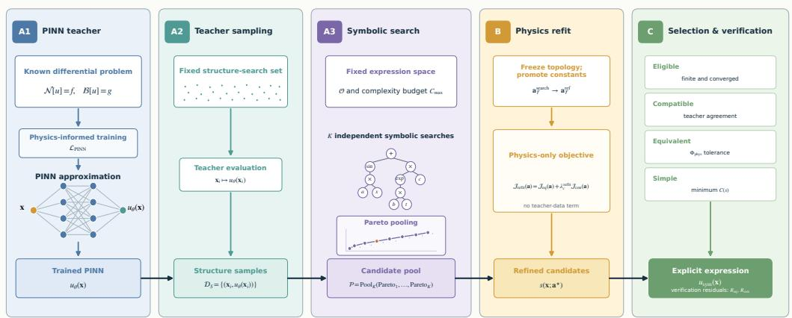  
Figure 1: Information flow in DeSyR. Stage A uses samples from a frozen PINN teacher to construct a pooled set of candidate symbolic topologies. Stage B freezes each topology and re-estimates its constants with a physics-only objective. Stage C applies convergenceeligibility, teacher-compatibility, physics-equivalence, and complexity gates, then reports verification residuals for the selected explicit expression.

## 3.1. The search–refinement decoupling principle

DeSyR divides symbolic recovery into three stages. Stage A uses teacher samples to generate candidate topologies and provisional coeficients. Stage B freezes each candidate topology and re-estimates its coeficients using an objective constructed solely from the governing equation and prescribed constraints. Stage C selects the final expression from the refined candidate pool. This workflow can be summarized as

$$
\begin{array} { r l } & { \mathrm { S t a g e ~ A ~ ( s e a r c h ) } ; \qquad \mathcal { P } = \mathrm { P o o l } _ { K } \left( \mathrm { P a r e t o } _ { 1 } , \dots , \mathrm { P a r e t o } _ { K } \right) , } \\ & { \mathrm { S t a g e ~ B ~ ( r e f i n e m e n t ) } ; \quad \mathbf { a } _ { T } ^ { \mathrm { o p t } } \in \arg \underset { \mathbf { a } } { \operatorname* { m i n } } \mathcal { J } _ { \mathrm { r e f t } } ( \mathbf { a } ) , \qquad ( \mathcal { T } , \mathbf { a } _ { T } ^ { \mathrm { s e a r c h } } ) \in \mathcal { P } , } \\ & { \mathrm { S t a g e ~ C ~ ( s e l e c t i o n ) } ; \qquad ( \widehat { \mathcal { T } } , \widehat { \mathbf { a } } ) = \mathrm { G a t e } \left\{ ( \mathcal { T } , \widehat { \mathbf { a } } _ { T } ) : ( \mathcal { T } , \mathbf { a } _ { T } ^ { \mathrm { s e a r c h } } ) \in \mathcal { P } \right\} . } \end{array}\tag{6}
$$

Here, Pareto denotes up to five representative candidates selected from the empirical Pareto front returned by the k-th symbolic search according to the Stage-A retention rule; $\mathbf { a } _ { T } ^ { \mathrm { s e a r c h } }$ denotes the provisional coeficients fitted to topology T from teacher samples, and $\mathbf { a } _ { T } ^ { \mathrm { { o p t } } }$ denotes an ideal minimizer of the physics-only objective, whereas $\hat { \mathbf { a } } _ { T }$ denotes the numerical solution retained from the multi-start procedure. The operator $\mathrm { P o o l } _ { K }$ merges the Pareto candidates retained from K independent symbolic searches into the candidate pool P. In Stage B, each candidate tree is kept fixed, and $\mathcal { I } _ { \mathrm { r e f i t } }$ is formed only from the governing equation and prescribed constraints; it contains no teacher-data term and re-estimates only the numerical constants attached to the tree. In Stage C, the gate applies the convergence-eligibility, teacher-compatibility, physics-equivalence, and complexity rules in sequence to select the final expression.

Table 1 summarizes this separation by indicating where each information source is used in the DeSyR workflow.

Table 1: Information-source usage in DeSyR.
<table><tr><td>Source</td><td>Search</td><td>Refinement</td><td>Selection</td><td>Verification</td><td>Post hoc evaluation</td></tr><tr><td>Teacher samples  $\mathcal { D } _ { S }$ </td><td>√</td><td></td><td>Teacher compatibility</td><td></td><td></td></tr><tr><td>Governing equation and constraints</td><td></td><td>√</td><td>Physics equivalence</td><td>Residuals</td><td></td></tr><tr><td>Reference-solution values</td><td></td><td></td><td></td><td></td><td>Rel. L2 error</td></tr></table>

Principle 3.1 (Search–refinement decoupling). Within the structure-search objective, teacher samples provide the only fitting signal; no governingequation or constraint residual is included. The same teacher samples are used after refinement to assess candidate compatibility. The search stage jointly proposes topologies and provisional constants. For each frozen tree, the constants are then re-estimated by a physics-only objective containing no teacher-data term. Final selection is performed by explicit gates over the refined candidate pool, rather than by a single mixed teacher–physics objective that jointly determines the final expression.

This separation has two direct consequences. First, physical residuals do not enter the combinatorial symbolic-search objective; candidate generation is driven by teacher fit and expression complexity. Second, teacher fitting does not enter the Stage-B objective. The search provides teacher-fitted candidates and initial coeficient values, whereas the refinement re-estimates the constants without changing the expression trees. For nonlinear parameterizations, the stationary point reached by the refinement may still depend on the initial values through the basin of attraction. Section 4 gives the corresponding conditional statement of this objective-level decoupling for the fixed-topology coeficient problem.

For the representable setting targeted by exact symbolic recovery, the effectiveness of this procedure depends on the following operational conditions, each of which is associated with a checkable component of the implementation.

• Condition C1 (Teacher guidance adequacy). The teacher-based ranking and compatibility signals are suficiently informative that, whenever the pooled candidate set contains a topology capable of representing the target solution, at least one such topology remains admissible under the Stage-C teacher-compatibility gate after refinement. The implementation seeks to support this condition through physics-validation checkpoint selection in Section 3.2 and by retaining multiple Pareto-optimal candidates from the K independent searches.

• Condition C2 (Candidate coverage). The candidate pool contains at least one topology capable of representing the target solution. This condition is addressed by the K independent symbolic searches and Pareto pooling in Section 3.2.

• Condition C3 (Refinement convergence). For a topology entering Stage B, the fixed-topology minimization terminates with a finite converged solution. This condition is assessed using the convergence status defined in Section 3.3.

Together, C1–C3 identify three operational conditions that support the exact-recovery pathway in the representable setting. They concern, respectively, the adequacy of the teacher-based ranking and compatibility signals, the coverage of the symbolic candidate pool, and the successful convergence of at least one target-capable fixed-topology refinement. They are not sufficient conditions for exact symbolic recovery; the additional fixed-topology requirements are analyzed in Section 4. Their empirical behavior is examined in Sections 5.4.1, 5.5, and 5.4.4.

## 3.2. Stage A: teacher-guided structure search

Stage A generates candidate topologies from samples of a trained teacher. We use a physics-informed neural network (PINN) as the teacher because it can be trained from the governing equation and prescribed constraints in (1), without requiring labeled solution values in the interior domain, and can be evaluated at arbitrary points after training [8, 9]. The PINN represents the solution through a diferentiable neural network $u _ { \theta }$ and is trained by minimizing empirical residuals of the governing equation and prescribed constraints at collocation points. The corresponding residual components are

$$
\begin{array} { r l } & { \mathcal { L } _ { \boldsymbol { r } } ( \boldsymbol { \theta } ) = \displaystyle \frac { 1 } { N _ { r } ^ { p } } \sum _ { i = 1 } ^ { N _ { r } ^ { p } } \left| \mathcal { N } [ u _ { \boldsymbol { \theta } } ] ( \mathbf { x } _ { i } ^ { r , p } ) - f ( \mathbf { x } _ { i } ^ { r , p } ) \right| ^ { 2 } , } \\ & { \mathcal { L } _ { \boldsymbol { c } , \boldsymbol { \ell } } ( \boldsymbol { \theta } ) = \displaystyle \frac { 1 } { N _ { c , \boldsymbol { \ell } } ^ { p } } \sum _ { j = 1 } ^ { N _ { c , \boldsymbol { \ell } } ^ { p } } \left\| \mathcal { B } _ { \boldsymbol { \ell } } [ u _ { \boldsymbol { \theta } } ] ( \mathbf { x } _ { j , \boldsymbol { \ell } } ^ { c , p } ) - g _ { \boldsymbol { \ell } } ( \mathbf { x } _ { j , \boldsymbol { \ell } } ^ { c , p } ) \right\| _ { 2 } ^ { 2 } , \qquad \boldsymbol { \ell } = 1 , \dots , L _ { c } . } \end{array}\tag{7}
$$

where $\mathbf { x } _ { i } ^ { r , p }$ denote the interior collocation points and $\mathbf { x } _ { j , \ell } ^ { c , p }$ denote the collocation points associated with the ℓ-th constraint component. The PINN training objective is

$$
\mathcal { L } _ { \mathrm { P I N N } } ( \theta ) = \lambda _ { r } ^ { \mathrm { P I N N } } \mathcal { L } _ { r } ( \theta ) + \sum _ { \ell = 1 } ^ { L _ { c } } \lambda _ { c , \ell } ^ { \mathrm { P I N N } } \mathcal { L } _ { c , \ell } ( \theta ) .\tag{8}
$$

The weights are nonnegative and fixed by the problem configuration, and remain unchanged throughout training. The constraint terms encode the boundary or initial information required to determine the solution. The percomponent weights are specified to balance the relative numerical influence of the governing-equation residual and the individual constraint residuals during training. The loss in (8) is first minimized with Adam and then further optimized with L-BFGS. Both optimizers use the same fixed Hammersley collocation points generated by DeepXDE [37].

Training produces a sequence of checkpoints, and the selected checkpoint defines the teacher used for structure search. To avoid using referencesolution pointwise values, checkpoint selection is based on a physicsvalidation score. Let $v _ { i } ( \theta )$ denote the unweighted mean-square error of the i-th validation component. The $n _ { \mathrm { v a l } }$ components consist of the interior residual and the individual constraint residuals. The interior validation component is evaluated on domain points independent of the training collocation points, whereas the constraint components are evaluated on the fixed prescribed constraint points. The interior validation points are also independent of the structure-search samples. Each component is scaled by

$$
b _ { i } = \operatorname* { m a x } \left\{ v _ { i } ( \theta ^ { ( 0 ) } ) , 1 \right\} ,\tag{9}
$$

where $\theta ^ { ( 0 ) }$ denotes the initial network parameters. The constant 1 prevents a component whose initial value is close to zero from dominating the score because of round-of efects. The physics-validation score is

$$
S _ { \mathrm { v a l } } ( \theta ) = \left[ \frac { 1 } { n _ { \mathrm { v a l } } } \sum _ { i = 1 } ^ { n _ { \mathrm { v a l } } } \left( \frac { v _ { i } ( \theta ) } { b _ { i } } \right) ^ { 2 } \right] ^ { 1 / 2 } .\tag{10}
$$

The teacher is chosen as the checkpoint with the smallest $ { S _ { \mathrm { v a l } } }$ . This physicsbased rule does not use reference-solution pointwise values and is intended to support Condition C1 without introducing such values into teacher selection.

After selection, the teacher is frozen. Its samples are used to generate structure-search candidates and, after refinement, to assess candidate compatibility; they do not enter the physics-only refinement objective or the verification residuals. The structure-search point set $X _ { S }$ is generated by uniform sampling for problems with a single independent variable and by Latin hypercube sampling when the independent-variable domain is multidimensional. The resulting point set is kept fixed throughout recovery. By construction, $X _ { S }$ is disjoint from the refinement points used in Section 3.3 and the interior verification points used in Section 3.4. Thus, teacher samples serve as the fitting signal for structure search and the compatibility signal in Stage C, but do not enter coeficient refinement or residual verification.

The structure-search sample set is

$$
\mathcal { D } _ { S } = \{ \left( \mathbf { x } _ { i } ^ { S } , u _ { \theta } ( \mathbf { x } _ { i } ^ { S } ) \right) \} _ { i = 1 } ^ { N _ { S } } ,\tag{11}
$$

namely, the values of the frozen teacher $u _ { \theta }$ evaluated on $X _ { S } = \{ \mathbf { x } _ { i } ^ { S } \} _ { i = 1 } ^ { N _ { S } }$ . Stage A solves the bicriteria problem

$$
\operatorname* { m i n i m i z e } _ { s \in S ( \mathcal { O } , C _ { \mathrm { m a x } } ) } \left( \mathcal { E } _ { S } ( s ) , \mathcal { C } _ { \mathrm { s e a r c h } } ( s ) \right) ,\tag{12}
$$

where the teacher-fit loss is

$$
\mathcal { E } _ { S } ( s ) = \frac { 1 } { N _ { S } } \sum _ { i = 1 } ^ { N _ { S } } \left| s ( \mathbf { x } _ { i } ^ { S } ) - u _ { \theta } ( \mathbf { x } _ { i } ^ { S } ) \right| ^ { 2 } .\tag{13}
$$

The candidate s includes the provisional constants fitted during symbolic search. Rather than fixing a scalarization weight a priori, the search returns an empirical Pareto front representing the trade-of between teacher-fit loss and candidate complexity. The bicriteria search objective in (12) contains no governing-equation or constraint residual term. Accordingly, in DeSyR, the constants fitted during this stage are treated as provisional search-stage coeficients rather than as physics-refined coeficients.

Symbolic search is performed with PySR [19] by optimizing the teacher-fit loss and search complexity in (12). The operator set O and complexity bound $C _ { \mathrm { m a x } }$ are fixed for each problem as described in Section 2.2, and each search returns an empirical Pareto front. Because symbolic search is stochastic, Condition C2 is formulated at the level of the retained pooled candidate set rather than for any individual search run. DeSyR performs K independent searches and retains up to five representative candidates from each empirical Pareto front: the simplest candidate, the candidate with the best teacher fit, candidates associated with major loss-improvement knees, and coverage positions along the front. The retained candidates are merged into the candidate pool P. Each candidate consists of a topology and teacher-fitted provisional coeficients $\mathbf { a } _ { T } ^ { \mathrm { s e a r c h } }$ ; these coeficients are used only to initialize the physics refinement in Section 3.3.

## 3.3. Stage B: physics-based coeficient refinement

Stage B processes each candidate in the pool independently. Following the topology–coeficient decomposition introduced in Section 2.2, the refinement modifies only the numerical constants attached to a candidate tree. The expression tree itself remains fixed: its variables, operators, and connections are unchanged. The selected free constants, represented by the coeficient vector a defined in Section 2.2, are then re-estimated using only the governing equation and prescribed constraints.

Definition 3.1 (Constant parameterization). Consider a candidate expression with a frozen tree. A numerical constant in the tree is treated as a free parameter if it satisfies the following criteria: it does not appear as the exponent of a power, its absolute value is at least $1 0 ^ { - 1 0 }$ , its absolute value difers from 1 by at least 10−10, and it is not a duplicate of another selected constant within floating-point tolerance. Specifically, a newly encountered constant $c ^ { \prime }$ is treated as a duplicate of a previously selected constant c when $| c ^ { \prime } - c | < 1 0 ^ { - 9 } \operatorname* { m a x } \{ 1 , | c ^ { \prime } | \}$ , in which case their occurrences are tied to the same parameter.

If the number of distinct eligible constants exceeds the configured parameter bound of 16, only those with the largest absolute values are retained as free parameters. This bound is applied per field in coupled problems. The selected constants are ordered by decreasing absolute value and denoted by $\mathbf { a } = ( a _ { 1 } , \ldots , a _ { p } )$ . They are replaced in the tree by parameter symbols, yielding the parameterized expression $\hat { s } ( \cdot ; \mathbf { a } )$ . If no constant satisfies the eli gibility criteria, then a is empty and the candidate remains unchanged during refinement.

These rules define the coeficient space optimized in Stage B. Consequently, exact coeficient recovery requires not only a target-capable expression tree but also representability of the target coeficients within the resulting fixed-topology parameterization. This requirement is formalized in Assumption 4.2.

For each candidate, let $X _ { r } ^ { f } = \{ \mathbf { x } _ { i } ^ { r , f } \} _ { i = 1 } ^ { N _ { r } ^ { f } }$ denote the interior refinement points, let $X _ { c , \ell } ^ { f }$ denote the refinement points for the ℓ-th constraint component, and let $\begin{array} { r } { N _ { c } ^ { f } = \sum _ { \ell = 1 } ^ { L _ { c } } N _ { c , \ell } ^ { f } . } \end{array}$ The physics-refinement objective is the unnormalized pointwise sum of squared residuals

$$
\begin{array} { l } { { \displaystyle \mathcal { T } _ { \mathrm { r e f t } } ( \mathbf { a } ) = \sum _ { i = 1 } ^ { N _ { r } ^ { f } } \left| \mathcal { N } [ \hat { s } ( \cdot ; \mathbf { a } ) ] ( \mathbf { x } _ { i } ^ { r , f } ) - f ( \mathbf { x } _ { i } ^ { r , f } ) \right| ^ { 2 } } \ ~ } \\ { { \displaystyle ~ + ~ \lambda _ { c } ^ { \mathrm { r e f t } } \sum _ { \ell = 1 } ^ { L _ { c } } \sum _ { j = 1 } ^ { N _ { c , \ell } ^ { f } } \left\| \mathcal { B } _ { \ell } [ \hat { s } ( \cdot ; \mathbf { a } ) ] ( \mathbf { x } _ { j , \ell } ^ { c , f } ) - g _ { \ell } ( \mathbf { x } _ { j , \ell } ^ { c , f } ) \right\| _ { 2 } ^ { 2 } } . } \end{array}\tag{14}
$$

Here, sˆ denotes the parameterized expression. The constraint weight is fixed at $\lambda _ { c } ^ { \mathrm { r e f i t } } = 1 0 0$ for all problems. Interior residuals therefore have pointwise weight 1, whereas constraint residuals have pointwise weight $\lambda _ { c } ^ { \mathrm { r e f i t } }$ ; no normalization by the number of points is applied. The objective in (14) contains only the governing operator ${ \mathcal { N } } .$ , the constraint operators $B _ { \ell } ,$ the prescribed data $f$ and $g _ { \ell }$ , and the refinement points. It contains neither a teacher-data term nor a reference-solution term.

For a candidate topology $\tau$ , Stage B targets the fixed-topology optimiza tion problem

$$
\mathbf { a } _ { T } ^ { \mathrm { o p t } } \in \arg \operatorname* { m i n } _ { \mathbf { a } } \mathcal { I } _ { \mathrm { r e f i t } } ( \mathbf { a } ) .\tag{15}
$$

When the minimum is attained, $\mathbf { a } _ { T } ^ { \mathrm { { o p t } } }$ denotes an ideal global minimizer. In practice, because the fixed-topology problem may be nonconvex in a, the optimizer is initialized from multiple starting points, and the best numerical solution found is retained and denoted by $\hat { \mathbf { a } } _ { T }$

The initial values consist of the teacher-fitted provisional coeficients asearch and several multiplicative perturbations around them. Each initialization is passed to the nonlinear least-squares solver [38]. Among all runs that return a finite objective value, the solution with the smallest final objective is retained together with its convergence status. If no run returns a finite result, the candidate is marked as non-convergent. Convergence is declared when the change in the objective, the parameter-step size, or the first-order optimality measure falls below a tolerance of $1 0 ^ { - 8 }$ . A run that reaches the evaluation limit without satisfying any of these criteria is marked as non-convergent. The recorded status is used to assess the convergence requirement in Condition C3.

The theoretical analysis in Section 4 concerns the fixed-topology coeficient problem in (14), in which only the constants associated with the frozen expression tree are re-estimated. Algebraic simplification and the optional removal of numerically negligible terms are post-processing operations and do not modify this optimization problem; the latter is governed by the acceptance criteria in Section 3.4.

## 3.4. Stage C: gated selection and verification

Stage C applies checked post-refinement cleaning, selects the final expression from the resulting candidate pool, and reports its verification quantities. The cleaning step may reduce the symbolic form by removing numerically negligible additive terms, but it does not refit the coeficients. After this post-processing, selection acts only on the existing candidates and does not further modify their expressions. Candidates may difer in topology, refined coeficients, convergence status, teacher agreement, physical residuals, and final complexity. These quantities play diferent roles, so DeSyR does not collapse them into a single aggregate score. Instead, selection is performed by a sequence of explicit gates.

The first gate is convergence eligibility. Eligibility requires both the expression and the quantities used for selection to be finite. If at least one eligible candidate satisfies the convergence criterion in Section 3.3, the comparison is restricted to converged candidates. Otherwise, finite non-convergent candidates are retained only as a diagnostic fallback, and the selected expression retains a non-convergent status.

The second gate is teacher compatibility. Teacher samples provide the structural signal used in Stage A. A refined expression whose predictions deviate substantially from the teacher is no longer supported by this signal and is excluded from the shortlist. For an expression s, the relative error with respect to the teacher is evaluated on the structure-search points:

Algorithm 1 Fixed-topology physics-only coeficient refinement   
Require: candidate expression $s \tau .$ , provisional coeficients $\mathbf { a } _ { T } ^ { \mathrm { s e a r c h } }$ , problem   
data ${ \mathfrak { P } } ,$ and refinement points   
Ensure: refined expression and convergence status   
1: Freeze the topology $\tau$ and construct the parameterized expression $\hat { s } ( \cdot ; \mathbf { a } )$   
according to Definition 3.1   
2: if a is empty then   
3: Set the convergence status to true; no coeficient optimization is re  
quired   
4: return the simplified expression and its convergence status   
5: end if   
6: Construct the physics-only objective $\mathcal { I } _ { \mathrm { r e f i t } } ( \mathbf { a } )$ in (14)   
7: Generate a set of initial values from $\mathbf { a } _ { T } ^ { \mathrm { s e a r c h } }$ and its multiplicative pertur  
bations   
8: for each initial value do   
9: Compute a local least-squares solution and its convergence status   
10: end for   
11: if no run produces a finite objective value then   
12: return $s _ { T }$ with a non-convergent status   
13: end if   
14: Retain the finite solution $\hat { \mathbf { a } } _ { T }$ with the smallest final objective value and   
its associated convergence status   
15: Substitute $\hat { \mathbf { a } } _ { T }$ into $\hat { s } ( \cdot ; \mathbf { a } )$ and apply algebraic simplification   
16: return the resulting expression and its convergence status

$$
\varepsilon _ { T } ( s ) = \left[ \frac { \sum _ { i = 1 } ^ { N _ { S } } \left| s ( \mathbf { x } _ { i } ^ { S } ) - u _ { \theta } ( \mathbf { x } _ { i } ^ { S } ) \right| ^ { 2 } } { \sum _ { i = 1 } ^ { N _ { S } } \left| u _ { \theta } ( \mathbf { x } _ { i } ^ { S } ) \right| ^ { 2 } } \right] ^ { 1 / 2 } .\tag{16}
$$

Let $\varepsilon _ { T , \mathrm { { m i n } } }$ denote the minimum teacher error among the convergence-eligible candidates. The teacher-compatible shortlist consists of the candidates satisfying

$$
\varepsilon _ { T } ( s ) \leq 3 \varepsilon _ { T , \mathrm { m i n } } + 1 0 ^ { - 8 } .\tag{17}
$$

The third gate is physics equivalence. After fixed-topology refinement, several eligible candidates may attain residuals at or near machine precision. In this regime, small diferences in residual values often reflect round-of rather than a meaningful diference in physical consistency. To avoid selecting a more complex expression solely because of numerical noise, DeSyR groups physically indistinguishable candidates before applying the complexity rule. To preserve the constraint-to-interior residual-amplitude scaling induced by the Stage-B refinement weight, the physics-selection score is defined on the refinement points as

$$
\Phi _ { \mathrm { p h y s } } ( s ) = \rho _ { r } ( s ) + \sqrt { \lambda _ { c } ^ { \mathrm { r e f i t } } } \rho _ { c } ( s ) ,\tag{18}
$$

where $\rho _ { r }$ and $\rho _ { c }$ are the root-mean-square interior and constraint residuals on the refinement points. Let $\Phi _ { \mathrm { p h y s , m i n } }$ denote the minimum score on the teacher-compatible shortlist. The physics-equivalent class consists of candidates satisfying

$$
\Phi _ { \mathrm { p h y s } } ( s ) \le 1 . 0 5 \Phi _ { \mathrm { p h y s , m i n } } + 1 0 ^ { - 1 0 } .\tag{19}
$$

Before the gates are applied, a cleaning proposal removes additive terms whose numerical leading coeficient has magnitude below $1 0 ^ { - 8 }$ . The proposal is accepted only if the cleaned expression is finite, has lower final complexity, and satisfies

$$
\begin{array} { r l } & { \Phi _ { \mathrm { p h y s } } ( s _ { \mathrm { c l e a n } } ) \leq 1 . 0 5 \Phi _ { \mathrm { p h y s } } ( s _ { \mathrm { r a w } } ) + 1 0 ^ { - 1 0 } , } \\ & { \qquad \varepsilon _ { T } ( s _ { \mathrm { c l e a n } } ) \leq 3 \varepsilon _ { T } ( s _ { \mathrm { r a w } } ) + 1 0 ^ { - 8 } . } \end{array}\tag{20}
$$

Otherwise, the unpruned Stage-B expression is retained. This acceptance check uses no reference-solution values and does not alter the Stage-B coefficient objective.

The fourth gate is complexity preference. Within the physics-equivalent class, the candidate with the smallest final complexity is selected. If multiple candidates have the same complexity, ties are resolved by teacher error, physics-selection score, and search seed, in that order.

After selection, the verification quantities of the final expression are reported for assessment and do not enter the preceding gates. The interior residual is evaluated on domain points that are independent of the teacher samples and are used in neither structure search nor coeficient refinement:

$$
\begin{array} { l } { { \displaystyle R _ { \mathrm { e q } } = \left[ \frac { 1 } { N _ { r } ^ { v } } \sum _ { i = 1 } ^ { N _ { r } ^ { v } } \lvert \mathcal { N } [ u _ { \mathrm { s y m } } ] ( \mathbf { x } _ { i } ^ { r , v } ) - f ( \mathbf { x } _ { i } ^ { r , v } ) \rvert ^ { 2 } \right] ^ { 1 / 2 } } , } \\ { { \displaystyle R _ { \mathrm { c o n } } = \left[ \sum _ { \ell = 1 } ^ { L _ { c } } \frac { \omega _ { \ell } ^ { f } } { N _ { c , \ell } ^ { f } } \sum _ { j = 1 } ^ { N _ { c , \ell } ^ { f } } \Big \lVert \mathcal { B } _ { \ell } [ u _ { \mathrm { s y m } } ] ( \mathbf { x } _ { j , \ell } ^ { c , f } ) - g _ { \ell } ( \mathbf { x } _ { j , \ell } ^ { c , f } ) \Big \rVert _ { 2 } ^ { 2 } \right] ^ { 1 / 2 } . } } \end{array}\tag{21}
$$

Here, $\omega _ { \ell } ^ { f } = N _ { c , \ell } ^ { f } / N _ { c } ^ { f }$ , so that all constraint points have equal weight in $R _ { \mathrm { c o n } } .$ The constraint residual is evaluated on the prescribed constraint manifolds, which coincide with the constraint point sets used during refinement. Thus, the interior residual provides the out-of-sample domain verification, while the constraint residual verifies consistency with the prescribed boundary or initial data. Unlike the physics-selection score in (18), $R _ { \mathrm { c o n } }$ does not include the refinement weight $\lambda _ { c } ^ { \mathrm { r e f i t } }$ . The final complexity is evaluated after the Stage-B algebraic simplification and any accepted Stage-C cleaning, using the counting convention of Definition 2.1.

When a reference solution is available, it may be used beforehand to construct the prescribed forcing and constraint data for manufactured problems. Its pointwise field values are otherwise excluded from the recovery procedure and are reserved for post hoc error reporting. The relative $L _ { 2 }$ error is computed as

$$
\varepsilon _ { L _ { 2 } } = \left[ \frac { \sum _ { i = 1 } ^ { N _ { r } ^ { v } } \big | u _ { \mathrm { p r e d } } \big ( \mathbf { x } _ { i } ^ { r , v } \big ) - u _ { \mathrm { r e f } } \big ( \mathbf { x } _ { i } ^ { r , v } \big ) \big | ^ { 2 } } { \sum _ { i = 1 } ^ { N _ { r } ^ { v } } \big | u _ { \mathrm { r e f } } \big ( \mathbf { x } _ { i } ^ { r , v } \big ) \big | ^ { 2 } } \right] ^ { 1 / 2 } ,\tag{22}
$$

where $u _ { \mathrm { p r e d } } ~ = ~ u _ { \mathrm { s y m } }$ for the selected symbolic expression, and $u _ { \mathrm { p r e d } } = u _ { \theta }$ when the PINN teacher is evaluated as a baseline. In the manufacturedsolution benchmarks, the reference solution is the unique classical solution $u ^ { \star }$ in Assumption 2.1.

Algorithm 2 The DeSyR framework, single-field case   
Require: problem data $\mathfrak { P }$ , operator set ${ \mathcal { O } } ,$ complexity bound $C _ { \mathrm { m a x } } ,$ , and   
either a teacher $u _ { \theta }$ or a teacher-training configuration   
Ensure: final expression $u _ { \mathrm { s y m } }$ and verification quantities   
1: if no teacher is provided then   
2: Train a PINN and select the checkpoint by the physics-validation   
score in (10)   
3: end if   
4: Generate the structure-search samples $\mathcal { D } _ { S }$   
5: Run K independent symbolic searches, retain up to five representative   
Pareto candidates by the Stage-A retention rule, and merge them into $\mathcal { P }$   
6: for each candidate in $\mathcal { P }$ do   
7: Apply Algorithm 1 for fixed-topology physics refinement   
8: Apply the checked post-refinement cleaning in Section 3.4   
9: Record the refined expression, convergence status, residuals, and fail  
ure reason if any   
10: end for   
11: Apply the convergence-eligibility, teacher-compatibility, physics  
equivalence, and complexity gates in order   
12: Select the final expression $u _ { \mathrm { s y m } }$   
13: Compute verification residuals and, when a reference solution is available,   
the relative $L _ { 2 }$ error   
14: return $u _ { \mathrm { s y m } }$ and its verification quantities

## 3.5. Extension to coupled multi-field systems

The scalar formulation extends to coupled systems without changing the separation of information across the three stages: teacher data guide the fieldwise topology searches, the coupled governing system determines the coeficients, and selection acts on complete multi-field candidates. Let $\mathbf { u } ^ { \star } =$ $( u _ { 1 } ^ { \star } , \ldots , u _ { m } ^ { \star } )$ denote the unique classical solution, with governing equations $\pmb { \mathcal { N } } [ \mathbf { u } ] = \mathbf { f }$ and prescribed constraints $\pmb { \it B } [ \mathbf { u } ] = \mathbf { g }$

Stage A searches for the topology of each component $u _ { f }$ independently; no coupled-equation residual enters these fieldwise symbolic-search objectives. When recurring exponential structure is detected across fields, the resulting candidate pools are augmented by expressions constructed from the shared factor. Finite, non-duplicate candidates are filtered by fieldwise teacher compatibility, and a balanced subset spanning teacher fit and expression complexity is retained for each field. The Cartesian product of these subsets defines the multi-field candidate groups. Because this product can grow rapidly, a preliminary comparison based on joint physical consistency, mean teacher error, and total complexity restricts joint refinement to a bounded shortlist. At this preliminary stage, joint physical consistency is evaluated using the provisional search-stage coeficients; no joint coeficient refinement has yet been performed. The comparison ranks already generated expressions and does not alter their topologies. The fixed shortlist and screening settings are given in Appendix B.

For coupled systems, Stage B is implemented at two resolutions. During screening, each shortlisted group is refined on the reduced screening config uration under a single coupled physics-only objective formed by assembling the governing-equation and constraint residuals of all fields. Once Stage C identifies the winning topology group, its coeficients are jointly re-estimated on the complete refinement set using the same objective. The coupling is therefore enforced directly during both coeficient-estimation steps rather than approximated through separate fieldwise fits, and no teacher-data term enters either objective. The coupled parameterization also represents exponential rates detected in at least two fields by a common parameter. A rate equal to an integer multiple from one to four of a shared base rate is represented by the corresponding multiple of that parameter, whereas the remaining eligible constants are field-specific. Exact recovery thus additionally requires representability within this joint parameterization, as covered by Assumption 4.2.

Stage C applies the four selection gates to jointly refined groups. Let $\varepsilon _ { T , f }$ denote the teacher error of field f, defined as in (16), and let $\rho _ { r , k }$ and $\rho _ { c , \ell }$ denote the root-mean-square residuals of the k-th governing equation and the ℓ-th constraint, respectively. The group-level quantities used for teacher compatibility, physics equivalence, and complexity preference are

$$
\begin{array} { l } { \displaystyle \varepsilon _ { T } ^ { \mathrm { g r p } } = \frac { 1 } { m } \sum _ { f = 1 } ^ { m } \varepsilon _ { T , f } , } \\ { \displaystyle \Phi _ { \mathrm { p h y s } } ^ { \mathrm { g r p } } = \left( \frac { 1 } { n _ { \mathrm { e q } } } \sum _ { k = 1 } ^ { n _ { \mathrm { e q } } } \rho _ { r , k } ^ { 2 } \right) ^ { 1 / 2 } + \sqrt { \lambda _ { c } ^ { \mathrm { r e f t } } } \left( \frac { 1 } { n _ { \mathrm { c o n } } } \sum _ { \ell = 1 } ^ { n _ { \mathrm { c o n } } } \rho _ { c , \ell } ^ { 2 } \right) ^ { 1 / 2 } , } \\ { \displaystyle \mathcal { C } _ { \mathrm { g r p } } = \sum _ { f = 1 } ^ { m } \mathcal { C } _ { \mathrm { f n a l } } ( s _ { f } ) . } \end{array}\tag{23}
$$

Here, $n _ { \mathrm { e q } }$ and $n _ { \mathrm { c o n } }$ are the numbers of governing equations and constraint components; the constraint term is omitted when no constraint is prescribed. The arithmetic mean in (23) assigns equal importance to the fieldwise teacher errors. Convergence eligibility is determined by the joint screening refinement status of the entire group. The teacher-compatibility and physics-equivalence thresholds use the same relative and absolute tolerances as in the scalar formulation. Within the resulting physics-equivalent class, the topology group with the smallest $\mathcal { C } _ { \mathrm { g r p } }$ is selected, with ties resolved by the group teacher error and group physics score, in that order.

The gates therefore select a multi-field topology group on the basis of the screening-refined candidates rather than a final coeficient vector. After selection, the winning topologies remain frozen while their coeficients are jointly re-estimated on the complete refinement set. This full-set refinement does not reopen the cross-topology competition or reapply the selection gates. Any accepted cleaning is then applied, and the final convergence status, verification quantities, and group complexity are reported for the resulting expressions.

Verification is likewise defined for the coupled solution as a whole. When reference fields are available, their values and the corresponding predictions on the verification points are concatenated into vectors $U _ { \mathrm { r e f } }$ and $U _ { \mathrm { p r e d } }$ , yielding

$$
\varepsilon _ { L _ { 2 } } = \frac { \| U _ { \mathrm { p r e d } } - U _ { \mathrm { r e f } } \| _ { 2 } } { \| U _ { \mathrm { r e f } } \| _ { 2 } } .\tag{24}
$$

Because this aggregate norm weights field contributions according to their reference magnitudes, fieldwise relative errors are reported alongside it. The coupled equation and constraint residuals are obtained by taking the root mean square of their respective componentwise residuals.

## 4. Theoretical analysis

Fixed-topology refinement reduces symbolic recovery to a continuous coeficient-estimation problem: once the expression tree is frozen, only its numerical constants remain to be determined from the governing equation and prescribed constraints. Under well-posedness, representability, zero-residual attainment, and discrete determinacy, the refined expression coincides with the unique classical solution $u ^ { \star }$ . This zero-residual solution is independent of the teacher, although the numerical optimization may still depend on the teacher-generated initialization. This section establishes this conditional exact-recovery result and quantifies the coeficient errors inherited under teacher-only and mixed data–physics objectives.

## 4.1. Problem setting and assumptions

For the fixed topology and coeficient parameterization defined in Section 3.3, the physics-only objective $\mathcal { I } _ { \mathrm { r e f i t } }$ gives rise to a continuous coeficient problem. The analysis is stated first for a scalar solution field governed by a scalar equation. Multi-field problems take the same form once the per-equation and per-constraint residuals are assembled into a single block residual vector F. Topology discovery remains subject to the operational conditions C1 and C2 and lies outside the present analysis, while guarantees for nonlinear coeficient optimization are local.

Let u be the unknown solution field of problem $\mathfrak { P }$ , with the notation $\Omega _ { ; }$ $\Gamma _ { c } , \mathcal { N } , B , f .$ , and g as in Section 2. For a given topology $\tau$ , the parameterized expression is written as $s ( x ; a )$ with $a \in \mathbb { R } ^ { p }$ . For notational simplicity, boldface is omitted for coeficient vectors throughout this section.

Assumption 4.1 (Well-posedness). Problem $\mathfrak { P }$ has a unique classical solution $u ^ { \star }$

Assumption 4.2 (Representability). There exists $a ^ { \star } \in \mathbb { R } ^ { p }$ such that $s ( \cdot ; a ^ { \star } ) = u ^ { \star }$

Let $X _ { S } = \{ x _ { i } ^ { S } \} _ { i = 1 } ^ { N _ { S } }$ be the structure-search point set, let $y _ { \theta } = ( u _ { \theta } ( x _ { i } ^ { S } ) ) _ { i = 1 } ^ { N _ { S } }$ denote the teacher values on this set, and define the pointwise teacher error by

$$
\varepsilon _ { i } = u _ { \theta } ( x _ { i } ^ { S } ) - u ^ { \star } ( x _ { i } ^ { S } ) .\tag{25}
$$

The refinement points and the physics-only objective $\mathcal { I } _ { \mathrm { r e f i t } }$ are those in (14). Recall that this objective is an unnormalized pointwise sum of squared residuals. Let $\mathbf { F } ( a ) \in \mathbb { R } ^ { M }$ denote the corresponding weighted residual vector. Its interior components are

$$
( { \mathcal N } [ s ( \cdot ; a ) ] - f ) ( x _ { i } ^ { r , f } ) ,\tag{26}
$$

and its constraint components are the entries of

$$
\sqrt { \lambda _ { c } ^ { \mathrm { r e f i t } } } \big ( \mathcal { B } _ { \ell } [ s ( \cdot ; a ) ] - g _ { \ell } \big ) ( x _ { j , \ell } ^ { c , f } ) .\tag{27}
$$

The total dimension is

$$
M = N _ { r } ^ { f } + \sum _ { \ell = 1 } ^ { L _ { c } } N _ { c , \ell } ^ { f } d _ { \ell } ,\tag{28}
$$

where $d _ { \ell }$ is the output dimension of $B _ { \ell }$ . Hence

$$
\begin{array} { r } { \mathcal { T } _ { \mathrm { r e f i t } } ( a ) = \| \mathbf { F } ( a ) \| _ { 2 } ^ { 2 } , \qquad } \\ { \mathcal { T } _ { \mathrm { r e f i t } } ( a ) = 0 \Longleftrightarrow \mathbf { F } ( a ) = 0 . } \end{array}\tag{29}
$$

Vector norms are Euclidean and matrix norms are spectral; $\sigma _ { \mathrm { m i n } }$ denotes the smallest singular value.

Assumption 4.3 (Zero-residual attainment). The refinement procedure attains a coeficient vector aˆ satisfying $\mathcal { I } _ { \mathrm { r e f i t } } ( \hat { a } ) = 0$ , equivalently $\mathbf { F } ( \hat { a } ) = 0$

Assumption 4.4 (Determinacy: injectivity). The collocation-residual map F is injective on an open neighborhood U of $a ^ { \star }$ that contains ${ \hat { a } } .$

For linear parameterizations,

$$
s ( x ; a ) = \sum _ { j = 1 } ^ { p } a _ { j } \varphi _ { j } ( x ) ,\tag{30}
$$

abbreviated as (L), define the design matrix $\Phi = ( \varphi _ { j } ( x _ { i } ^ { S } ) ) _ { i , j } \in \mathbb { R } ^ { N _ { S } \times p }$ . If Φ has full column rank, this condition is abbreviated as (L-rank). If $\mathcal { N }$ and each $B _ { \ell }$ are linear in $u ,$ abbreviated as (L-op), then

$$
{ \mathbf { F } } ( a ) = A a - b , \qquad { \mathcal { T } } _ { \mathrm { r e f i t } } ( a ) = \| A a - b \| _ { 2 } ^ { 2 } ,\tag{31}
$$

where A and b are determined by the discrete operators, refinement weights, basis functions, and prescribed data f and $g .$ In particular, they are independent of the teacher. We write $A ^ { \top } A \succ 0$ as (PD).

Table 2 relates the theoretical assumptions and operational conditions used below to their counterparts in the DeSyR framework.

Table 2: Relationship between theoretical assumptions and framework conditions.
<table><tr><td>Assumption or condition</td><td>Framework counterpart</td></tr><tr><td>Assumption 4.1 (Well-posedness)</td><td>Assumed property of the prescribed problem  in Section 2</td></tr><tr><td>Assumption 4.2 (Representability)</td><td>C2 specialized to the fixed topology under analysis, together with representability in its Stage-B parameterization</td></tr><tr><td>Assumption 4.3 (Zero-residual attainment)</td><td>Strengthening of C3 to exact zero residual</td></tr><tr><td>Assumption 4.4 (Determinacy)</td><td>Discrete determinacy condition, outside C1-C3</td></tr><tr><td>C1 (Teacher guidance adequacy)</td><td>Upstream search condition, with no fixed-topology counterpart</td></tr></table>

Condition C1 acts in the search stage: it afects which topologies enter the candidate pool. It therefore lies upstream of the fixed-topology coeficient problem and has no corresponding assumption in the analysis below.

## 4.2. Error inheritance from the teacher

For a fixed topology, the prediction error can be decomposed into a representation component, which coeficient optimization cannot remove, and a coeficient component, which measures departure from the best in-topology coeficients. In the representable linear setting, teacher fitting controls the second component through the following inheritance bound.

Lemma 4.1 (Coeficient-inheritance bound). Assume $( L ) ,$ (L-rank), and Assumption $4 . 2 .$ Let $\begin{array} { r } { \hat { a } _ { \mathrm { L S } } = \arg \operatorname* { m i n } _ { a \in \mathbb { R } ^ { p } } \| \Phi { a } - y _ { \theta } \| _ { 2 } ^ { 2 } } \end{array}$ be the least-squares fit to the teacher samples. Then

$$
\boldsymbol { \hat { a } } _ { \mathrm { L S } } - \boldsymbol { a } ^ { \star } = ( \boldsymbol { \Phi } ^ { \top } \boldsymbol { \Phi } ) ^ { - 1 } \boldsymbol { \Phi } ^ { \top } \boldsymbol { \varepsilon } ,\tag{32}
$$

and

$$
\| \hat { \boldsymbol { a } } _ { \mathrm { L S } } - \boldsymbol { a } ^ { \star } \| _ { 2 } \leq \| ( \Phi ^ { \top } \Phi ) ^ { - 1 } \Phi ^ { \top } \| _ { 2 } \| \varepsilon \| _ { 2 } = \frac { \| \varepsilon \| _ { 2 } } { \sigma _ { \mathrm { m i n } } ( \Phi ) } .\tag{33}
$$

(Proof in Appendix A.)

Lemma 4.1 shows that the fitted coeficients equal $a ^ { \star }$ plus the coeficient vector associated with the least-squares projection of the teacher error onto the sampled model space. Unless $\Phi ^ { \top } \varepsilon = 0$ , the fitted coeficients differ from $a ^ { \star }$ , and the inherited error is amplified by $1 / \sigma _ { \mathrm { m i n } } ( \Phi )$ The error is not guaranteed to vanish as $N _ { S }$ grows: from the finite-sample identity $\hat { a } _ { N _ { S } } - a ^ { \star } = ( \Phi ^ { \top } \Phi / N _ { S } ) ^ { - 1 } ( \Phi ^ { \top } \varepsilon / N _ { S } )$ , if $\Phi ^ { \top } \Phi / N _ { S }  G \succ 0$ and $\Phi ^ { \top } \varepsilon / N _ { S } \to v$ then $\hat { a } _ { N _ { S } }  a ^ { \star } + G ^ { - 1 } v$ . The bias persists when $v \neq 0$ and disappears when $\Phi ^ { \top } \varepsilon / N _ { S } \to 0$ , i.e. when the teacher error becomes asymptotically orthogonal to the sampled model space. This mechanism explains why pure teacher fitting can remain at the teacher’s accuracy scale, as observed in the teacheronly results of Section 5.4.3, and directly motivates physics-only refinement. The bound cannot be transferred to nonlinear parameterizations by replacing basis functions with parameter gradients; the local counterpart is Proposition 4.2.

Lemma 4.2 (Error decomposition). Assume $( L )$ . Let $X _ { v } = \{ x _ { i } ^ { v } \} _ { i = 1 } ^ { N _ { v } }$ be an evaluation point set, $\tilde { \Phi } \in \bar { \mathbb R ^ { N _ { v } \times p } }$ with $\tilde { \Phi } _ { i j } = \varphi _ { j } ( x _ { i } ^ { v } )$ , and $u _ { v } ^ { \star }$ the values of $u ^ { \star }$ on $X _ { v }$ . The following items hold under their individually stated assumptions.

1. (Under Assumption 4.2.) Assume Assumption $4 . 2 ,$ and write $\varphi ( x ) =$ $( \varphi _ { 1 } ( x ) , \ldots , \varphi _ { p } ( x ) ) ^ { \intercal }$ . For any $\hat { a } \in \mathbb { R } ^ { p }$ 2

$$
\begin{array} { r } { s ( x ; \hat { a } ) - u ^ { \star } ( x ) = \varphi ( x ) ^ { \top } ( \hat { a } - a ^ { \star } ) . } \end{array}\tag{34}
$$

2. (Without Assumption 4.2.) Assume $\varphi _ { j } \in L ^ { 2 } ( \Omega )$ for $j = 1 , \dots , p _ { ; }$ , and let $a ^ { \dag } \in$ arg $\begin{array} { r l } { \operatorname* { m i n } _ { a \in \mathbb { R } ^ { p } } \| s ( \cdot ; a ) - u ^ { \star } \| _ { L ^ { 2 } ( \Omega ) } } & { { } } \end{array}$ be a best in-topology approximation coeficient. Then

$$
s ( \cdot ; \hat { a } ) - u ^ { \star } = \big [ s ( \cdot ; \hat { a } ) - s ( \cdot ; a ^ { \dagger } ) \big ] + \big [ s ( \cdot ; a ^ { \dagger } ) - u ^ { \star } \big ] ,\tag{35}
$$

where the first term is the coeficient error and the second is the representation error; the latter is independent of the coeficient solver.

3. (Norm bound.) Let $a ^ { \dagger }$ be a best in-topology coeficient as defined in item 2. For any $\hat { a } \in \mathbb { R } ^ { p }$

$$
\begin{array} { r } { \| \tilde { \Phi } \hat { \boldsymbol { a } } - \boldsymbol { u } _ { v } ^ { \star } \| _ { 2 } \leq \underbracket { \| \tilde { \Phi } \boldsymbol { a } ^ { \dagger } - \boldsymbol { u } _ { v } ^ { \star } \| _ { 2 } } _ { r e p r e s e n t a t i o n ~ e r r o r } + \underbracket { \| \tilde { \Phi } \| _ { 2 } \| \hat { \boldsymbol { a } } - \boldsymbol { a } ^ { \dagger } \| _ { 2 } } _ { c o e f f i c i e n t ~ e r r o r } . } \end{array}\tag{36}
$$

Under (L-rank) and Assumption $4 . 2 ,$ take $a ^ { \dagger } = a ^ { \star }$ and $\hat { a } = \hat { a } _ { \mathrm { { L S } } } \mathrm { : }$ the representation term vanishes, and Lemma $\it 4 . 1$ bounds the coeficient term by $\lVert \tilde { \Phi } \rVert _ { 2 } \lVert \varepsilon \rVert _ { 2 } / \sigma _ { \mathrm { m i n } } ( \Phi )$

## (Proof in Appendix A.)

When Assumption 4.2 holds, the total error is determined entirely by the coeficient gap $\hat { a } - a ^ { \star }$ , which the three routes characterize separately: teacher fitting (Lemma 4.1), mixed objectives (Corollary 4.1), and physics-only refinement (Proposition 4.1, where the gap is zero). When Assumption 4.2 fails, the topology cannot represent the unique classical solution, and coeficient refinement can reduce only the coeficient component, not the representation component. The same-candidate comparison in Section 5.4.2 applies this decomposition directly: both expressions share the same topology and therefore the same representation-error term. The only changing component is the coeficient error, so the diference between the two recovered expressions is attributable to coeficient refinement. Results at machine precision are consistent with Assumption 4.2 for that topology, but do not establish representability analytically.

## 4.3. Conditional exact recovery

Proposition 4.1 (Conditional exact recovery). Fix the topology, coeficient parameterization, and refinement point set. Suppose Assumptions $\it 4 . 1 \mathrm { - } \it 4 . 4$ hold. Then:

(i) $\hat { a } = a ^ { \star }$ , and consequently $s ( \cdot ; \hat { a } ) = u ^ { \star } ( \cdot )$

(ii) Conditional on the fixed topology, coeficient parameterization, and refinement point set, the objective $\mathcal { I } _ { \mathrm { r e f i t } }$ and its zero-residual set contain no teacher quantity. Hence the target zero-residual solution is independent of the teacher, although reaching it numerically may still depend on the teacher-generated initialization.

(iii) Under the same fixed-topology setting, teacher information enters the Stage-B optimization only through the initialization $a _ { 0 } = a _ { 0 } ( \theta )$ . It may afect the basin of attraction and the iteration cost, but not the zeroresidual limit $\hat { a } = a ^ { \star }$ when that limit is attained.

## (Proof in Appendix A.)

Beyond well-posedness of the prescribed problem, Proposition 4.1 separates exact recovery on a fixed topology into three additional requirements: representability (Assumption 4.2), discrete determinacy (Assumption 4.4), and attainment of zero residual (Assumption 4.3). The teacher does not determine the zero-residual target once the topology, coeficient parameterization, and refinement point set are fixed, but it can afect whether the numerical procedure reaches that target through the initialization. The proposition makes no claim about topology search, which remains subject to C1 and C2, and it does not state that every initialization attains zero residual. For example, an initialization that converges to a spurious stationary point with nonzero residual violates Assumption 4.3; see Proposition 4.2.

Passing from zero residuals at finitely many refinement points to equality of coeficients requires a determinacy condition. In general, two distinct parameterized expressions can satisfy the same finite set of residual equations, so $\mathbf { F } ( { \hat { a } } ) = \mathbf { F } ( a ^ { \star } ) = 0$ alone does not imply $\hat { a } = a ^ { \star }$ . Injectivity in Assumption 4.4 is therefore used as a convenient suficient condition, not as a necessary one. Its role can be interpreted as follows.

1. Linear parameterization and linear operators. In this case, ${ \bf F } ( a ) = $ $4 a - b$ is afine, so injectivity is global:

Assumption $4 . 4 \Longleftrightarrow A$ has full column rank $\Longleftrightarrow A ^ { \top } A \succ 0 .$

(37)

where A is the residual matrix defined in (31).

2. Polynomial parameterizations. For a full univariate polynomial parameterization of degree $d ,$ the number of coeficients is $p = d + 1$ , so at least $M \geq d + 1$ residual rows are needed for full column rank. More generally, a polynomial topology with $p$ free coeficients requires at least $M \geq p$ residual rows. These counts are only necessary: repeated points or operators that reduce the efective polynomial space can still make the residual matrix A rank deficient.

3. Nonlinear analytic families. If $D \mathbf { F } ( a ^ { \star } )$ has full column rank, then one can select $p$ residual components whose Jacobian is nonsingular. The inverse function theorem then gives local injectivity of F near $a ^ { \star }$ . This does not exclude another zero-residual coeficient vector outside that neighborhood.

4. Verifiability. In the linear case, global injectivity can be checked directly through the rank of $A ,$ equivalently through $A ^ { \top } A \succ 0$ . In the nonlinear case, the numerical Jacobian $D \mathbf { F } ( { \hat { a } } )$ provides only local identifiability evidence through its rank and conditioning; it cannot certify global injectivity.

## 4.4. Finite-weight bias in mixed objectives

Corollary 4.1 (Teacher bias under a finite physics weight). Assume $( L )$ $( L – r a n k ) , \ ( L – o p ) , \ ( P D )$ , and Assumptions $ 4 . 1 \mathrm { - } 4 . 2 .$ . Define the mixed data– physics objective

$$
J _ { \mathrm { m i x } } ^ { \beta } ( a ) = \| \Phi a - y _ { \theta } \| _ { 2 } ^ { 2 } + \beta \| A a - b \| _ { 2 } ^ { 2 } , \qquad \beta \in ( 0 , \infty ) .\tag{38}
$$

The teacher term is written in unnormalized form. It equals $N _ { S } \mathcal { E } _ { S }$ , where $\mathcal { E } _ { S }$ is the teacher-fit loss defined in (13); this positive scaling does not change the minimizer provided that the physics weight is rescaled accordingly. For any finite $\beta > 0$ , the following statements hold.

(a) Uniqueness. The objective $J _ { \operatorname* { m i x } } ^ { \beta }$ is strictly convex and has the unique minimizer

$$
\hat { a } ( \beta ) = ( \boldsymbol \Phi ^ { \top } \boldsymbol \Phi + \beta A ^ { \top } A ) ^ { - 1 } ( \boldsymbol \Phi ^ { \top } \boldsymbol y _ { \boldsymbol \theta } + \beta A ^ { \top } \boldsymbol b ) .\tag{39}
$$

(b) Teacher-error contribution. By $\left( L \mathbf { - } o p \right)$ and Assumptions $4 . 1 - 4 . 2 , \ b =$ $A a ^ { \star }$ . Since $y _ { \theta } = \Phi a ^ { \star } + \varepsilon$

$$
\hat { a } ( \beta ) - a ^ { \star } = ( \Phi ^ { \top } \Phi + \beta A ^ { \top } A ) ^ { - 1 } \Phi ^ { \top } \varepsilon .\tag{40}
$$

Thus the coeficient bias comes entirely from the teacher error ε. In contrast, the physics-only minimizer is

$$
{ \hat { a } } _ { \mathrm { p u r e } } = ( A ^ { \top } A ) ^ { - 1 } A ^ { \top } b = a ^ { \star } .\tag{41}
$$

(c) Large-weight asymptotics. $A s \beta \to \infty$

$$
\boldsymbol { \hat { a } } ( \beta ) - \boldsymbol { a } ^ { \star } = \beta ^ { - 1 } ( \boldsymbol { A } ^ { \top } \boldsymbol { A } ) ^ { - 1 } \Phi ^ { \top } \boldsymbol { \varepsilon } + O ( \beta ^ { - 2 } ) = O ( \beta ^ { - 1 } ) .\tag{42}
$$

In particular, $\hat { a } ( \beta ) \to a ^ { \star }$

(d) Teacher-fit limit. As $\beta \to 0 ^ { + }$ 2

$$
\begin{array} { r } { \hat { a } ( \beta )  ( \Phi ^ { \top } \Phi ) ^ { - 1 } \Phi ^ { \top } y _ { \theta } = \hat { a } _ { \mathrm { L S } } , } \end{array}\tag{43}
$$

which is the teacher fit in Lemma 4.1.

(e) Nonzero finite-weight bias. For any finite $\beta > 0$

$$
\hat { a } ( \beta ) - a ^ { \star } \neq 0 \Longleftrightarrow { \Phi } ^ { \top } \varepsilon \neq 0 .\tag{44}
$$

Therefore, if $\Phi ^ { \top } \varepsilon \neq 0$ , every finite-weight mixed objective places its minimizer away from $a ^ { \star }$ . If $\Phi ^ { \top } \varepsilon = 0$ , including the exact-teacher case $\varepsilon = 0$ , then $\hat { a } ( \beta ) = a ^ { \star }$ for all $\beta \in ( 0 , \infty )$

(Proof in Appendix A.)

Corollary 4.1 places teacher fitting and mixed data–physics objectives within a single fixed-topology formula. The limit $\beta \to 0 ^ { + }$ recovers the teacher fit of Lemma 4.1, whereas the mixed minimizer approaches the linear physicsonly minimizer as $\beta \to \infty$ . For every finite $\beta$ with $\Phi ^ { \top } \varepsilon \neq 0$ , the minimizer remains displaced from $a ^ { \star }$ . Thus, within this fixed-topology linear setting, every $\mathrm { f i n i t e } { - \beta }$ mixed objective of the form (38) retains a nonzero teacherdependent coeficient bias whenever $\Phi ^ { \top } \varepsilon \neq 0$

The objective ablation in Section 5.4.3 examines this efect over the tested finite range of $\beta .$ . In those experiments, the observed bias decreases as the physics weight increases but remains nonzero at finite weight. End-to-end search, where the topology itself changes with the objective, lies outside the fixed-topology premise of this corollary. This empirical trend should not be interpreted as a general monotonicity result: the corollary establishes the two endpoint limits and an $O ( \beta ^ { - 1 } )$ large-weight asymptotic, but does not imply that the error norm is monotone in $\beta .$ Nonlinear parameterizations are also outside the corollary, and their local counterpart is discussed in Proposition 4.2.

## 4.5. Nonlinear local identifiability and convergence

The explicit bounds in Sections 4.2 and 4.4 require the linear parameterization (L). Symbolic search, however, typically produces nonlinear expression families. In this setting, replacing basis functions by parameter gradients gives only a local linearized sensitivity near $a ^ { \star }$ , rather than a global coeficient bound. Standard local results for nonlinear least squares instead clarify the role of initialization; the convergence statements below follow the classical Newton and Gauss–Newton analysis [39]. Conditional on the fixed topology, coeficient parameterization, and refinement point set, the zero-residual target remains $a ^ { \star }$ and is independent of the teacher. Whether the numerical iteration reaches this target, however, depends on the initialization, and spurious stationary points may occur.

Proposition 4.2 (Local identifiability and convergence). Fix the topology, coeficient parameterization, and refinement point set, and suppose that the parameterization is nonlinear in $^ { a , }$ so that the linear case $( L )$ does not apply. Suppose also that Assumptions $\it 4 . 1 \mathrm { - 4 . 2 }$ hold, so that $\mathbf { F } ( a ^ { \star } ) = 0$ . Let

$$
J ( a ) : = { \mathcal { J } } _ { \mathrm { r e f i t } } ( a ) = \| \mathbf { F } ( a ) \| _ { 2 } ^ { 2 } ,\tag{45}
$$

and assume:

(R1) Smoothness. The expression s is twice continuously diferentiable in $^ { a , }$ and F is $C ^ { 2 }$ on an open neighborhood U of $a ^ { \star }$ .

(R2) Identifiability. The Jacobian $D \mathbf { F } ( \boldsymbol { a } ^ { \star } ) \in \mathbb { R } ^ { M \times p }$ has full column rank.

(R3) Hessian Lipschitz continuity. The Hessian $\nabla ^ { 2 } J$ is Lipschitz continuous on a neighborhood of $a ^ { \star }$

Then the following statements hold locally.

(a) Gradient and Hessian.

$$
\nabla J ( a ) = 2 D \mathbf { F } ( a ) ^ { \top } \mathbf { F } ( a ) ,
$$

$$
\nabla ^ { 2 } J ( a ) = 2 D \mathbf { F } ( a ) ^ { \top } D \mathbf { F } ( a ) + 2 \sum _ { k = 1 } ^ { M } F _ { k } ( a ) \nabla ^ { 2 } F _ { k } ( a ) .\tag{46}
$$

(b) Locally unique zero. Since $\mathbf { F } ( a ^ { \star } ) = 0$

$$
\nabla J ( a ^ { \star } ) = 0 , \qquad \nabla ^ { 2 } J ( a ^ { \star } ) = 2 D \mathbf { F } ( a ^ { \star } ) ^ { \top } D \mathbf { F } ( a ^ { \star } ) \succ 0 ,\tag{47}
$$

where $( R \mathcal { Q } )$ makes the Gram matrix positive definite. Hence $a ^ { \star }$ is a strict local minimizer of J. Let

$$
\mu _ { 0 } = \sigma _ { \mathrm { m i n } } \big ( D \mathbf { F } ( a ^ { \star } ) \big ) ^ { 2 } > 0 .\tag{48}
$$

By continuity, there exists a neighborhood of $a ^ { \star }$ on which

$$
J ( a ) \geq \frac { \mu _ { 0 } } { 2 } \| a - a ^ { \star } \| _ { 2 } ^ { 2 } .\tag{49}
$$

Therefore, $a ^ { \star }$ is the only zero-residual point in that neighborhood.

(c) Local convergence neighborhood. There exists $\rho > 0$ such that the ideal full-step Newton iteration initialized at any $a _ { 0 } ~ \in ~ B ( a ^ { \star } , \rho )$ converges quadratically to $a ^ { \star }$ . Here $\nabla ^ { 2 } J ( a ^ { \star } ) \ \succ \ 0$ follows from $( R \mathcal { Q } )$ , and the local Lipschitz continuity of $\nabla ^ { 2 } J$ follows from (R3). The ideal Gauss– Newton iteration also converges quadratically near $a ^ { \star }$ , because ${ \bf F } ( a ^ { \star } ) =$ 0 is a zero-residual solution.

(d) Spurious stationary points. The stationarity condition is

$$
\nabla J ( a ) = 0 \Longleftrightarrow D \mathbf { F } ( a ) ^ { \top } \mathbf { F } ( a ) = 0 \Longleftrightarrow \mathbf { F } ( a ) \in ( \mathrm { c o l } D \mathbf { F } ( a ) ) ^ { \perp } .\tag{50}
$$

Points with $\mathbf { F } ( a ) = 0$ are true zeros. Points with $\mathbf { F } ( a ) \neq 0$ whose residual vector is orthogonal to the tangent space are spurious stationary points, which may be local minima, maxima, or saddle points. At such points, $J ( a ) > 0$ , so Assumption 4.3 fails.

(Proof in Appendix A.)

Proposition 4.2 replaces the neighborhood injectivity assumption used in Proposition 4.1 with a Jacobian full-rank condition that guarantees local identifiability near $a ^ { \star }$ . The zero-residual target is still $a ^ { \star }$ , but reaching it depends on whether the initialization lies in the local convergence neighborhood. Conditional on the fixed topology, coeficient parameterization, and refinement point set, the teacher enters the Stage-B optimization only through the initialization $a _ { 0 } = a _ { 0 } ( \theta )$ . If $a _ { 0 } \in B ( a ^ { \star } , \rho )$ , the iteration converges locally to $a ^ { \star }$ ; outside this neighborhood, no such guarantee is available, and the iteration may, among other possibilities, converge to a spurious stationary point.

For comparison, in the linear case with the teacher fit $\hat { a } _ { \mathrm { L S } }$ used as initialization, Lemma 4.1 gives

$$
\| a _ { 0 } - a ^ { \star } \| _ { 2 } \leq \frac { \| \varepsilon \| _ { 2 } } { \sigma _ { \operatorname* { m i n } } ( \Phi ) } .\tag{51}
$$

Hence, for any prescribed radius $r > 0$

$$
\frac { \| \varepsilon \| _ { 2 } } { \sigma _ { \operatorname* { m i n } } ( \Phi ) } < r\tag{52}
$$

is suficient to place the linear teacher fit inside $B ( a ^ { \star } , r )$ . This illustrates how teacher error and conditioning control initialization proximity in the linear setting, but it does not provide a basin guarantee for nonlinear parameterizations. In the nonlinear setting of Proposition 4.2, whether a teacher-derived initialization lies in $B ( a ^ { \star } , \rho )$ must be established separately or assessed empirically. The initialization study in Section 5.4.4 supports this distinction: the linear parameterizations tested converged from every initialization considered, whereas for the nonlinear topologies examined, some random initializations reached spurious stationary points while teacher-derived starts converged to the solution associated with $a ^ { \star }$

These statements are local. They imply neither global uniqueness of the zero-residual coeficient vector nor global convergence of the numerical solver. They also do not imply that random initializations must fail or that teacher-derived initializations must succeed. The convergence claims in item (c) concern ideal full-step Newton and Gauss–Newton iterations; they do not cover damping, trust-region strategies, or step-length restrictions used in production implementations. The characterization of spurious stationary points is a general consequence of the stationarity equation, not a proof of their existence for any particular problem.

A floating-point zero is not an exact zero. Observed low residuals are empirical evidence of near-attainment of the discrete refinement objective and may be consistent with representability, but they establish neither exact representability nor exact zero-residual attainment. In the linear case, determinacy can be assessed numerically through the rank, smallest singular value, and conditioning of $A ;$ in exact arithmetic, this is equivalent to $A ^ { \top } A \succ 0$ . In the nonlinear case, the rank and conditioning of $D \mathbf { F } ( { \hat { a } } )$ provide only local identifiability evidence. Both linear and nonlinear numerical diagnostics remain subject to finite-precision limitations.

## 5. Numerical experiments

We evaluate DeSyR from complementary end-to-end and mechanismoriented perspectives. First, we establish a unified comparison protocol and assess recovery accuracy across problems spanning diferent diferential orders, spatial dimensions, nonlinearities, and field couplings, including representative mechanics problems and coupled-system cases. Second, we examine whether repeated symbolic searches provide suficient candidate-pool coverage and disentangle the contribution of fixed-topology coeficient refinement from improvements arising from changes in symbolic structure. Third, objective ablations, initialization-sensitivity tests, and Jacobian rank and conditioning diagnostics are used to evaluate the predictions and local assumptions of the fixed-topology analysis developed in Section 4. Finally, we study operator-library misspecification, finite-budget library enrichment, candidate-level convergence, Stage-C selection-gate ablations, and wall-clock cost to characterize failure detection, candidate coverage, refinement reliability, selection robustness, and computational eficiency. A supplementary fixed-topology experiment further assesses sensitivity to perturbations in the prescribed constraints.

## 5.1. Evaluation protocol and comparison scope

The study contains 15 diferential-equation problems and 18 configurations. The Telegraph family contributes two configurations and the Fokker– Planck family contributes three. The suite spans one-dimensional boundaryvalue problems, space–time equations, multidimensional scalar fields, nonlinear equations, and the coupled Kovasznay system. Table 3 summarizes the coverage; complete equations, domains, constraints, reference solutions, and operator libraries are given in Appendix B.

Table 3: Benchmark coverage used in the numerical evaluation. The 15 diferentialequation problems yield 18 configurations because the Telegraph and Fokker–Planck families contain multiple manufactured cases. Full equations, domains, constraints, reference solutions, and operator libraries are provided in Appendix B.
<table><tr><td>ID</td><td>Problem family</td><td>Domain</td><td>Governing operator</td><td>Target structural feature</td></tr><tr><td>01-05</td><td>Poisson, beam, convection-diffusion</td><td>1D</td><td>second-/fourth-order ODEs</td><td>frequency, mixed bases, boundary layer</td></tr><tr><td>06-09c</td><td>Diffusion, wave, telegraph, Fokker-Planck</td><td>1+1D</td><td>evolutionary PDEs</td><td>separability, damping, variable coefficients</td></tr><tr><td>10, 13</td><td>Klein-Gordon and Burgers</td><td>1+1D</td><td>nonlinear PDEs</td><td>polynomial coupling, traveling wave</td></tr><tr><td>11, 15</td><td>Helmholtz and Sine-Poisson</td><td>2D</td><td>elliptic PDEs</td><td>high-frequency and product structure</td></tr><tr><td>12</td><td>Sine-Poisson</td><td>3D</td><td>elliptic PDE</td><td>three-factor product</td></tr><tr><td>14</td><td>Kovasznay flow</td><td>2D</td><td>coupled nonlinear PDEs</td><td>three fields and shared factors</td></tr></table>

For each configuration, we trained five PINN teachers using distinct random seeds. For each fixed teacher, ten separately seeded PySR searches were run on the same teacher-generated data, and their retained candidates were merged into a single pool for refinement and selection. Thus, the PySR seeds enlarge the candidate pool and increase search diversity, but they do not constitute additional end-to-end replicates. We therefore treat the PINN seed as the replicate unit and summarize results over n = 5 replicates per configuration. PINNs use fixed Hammersley collocation points, 20000 Adam steps followed by up to 5000 L-BFGS steps, and the physics-validation checkpoint rule in Section 3.2. Configuration-specific architectures, sample counts, operator libraries, and search budgets are reported in Tables B.2 and B.3.

The principal comparisons are controlled comparisons within DeSyR and are designed to separate the contributions of its main stages. The PINN result characterizes the accuracy of the teacher model, the pre-refit version of the ultimately selected topology reflects the accuracy obtained from teacherguided symbolic search before physics refinement, and the corresponding refined expression quantifies the improvement achieved by Stage B without changing that topology. Additional objective ablations compare teacheronly, mixed data–physics, and physics-only coeficient estimation under fixed topology, collocation points, and initialization. These controlled comparisons are intended to isolate the efects of symbolic recovery and coeficient refinement rather than to provide a direct head-to-head benchmark against independently implemented neural–symbolic pipelines.

Interior solution errors and equation residuals are evaluated on verifica tion points used in neither symbolic search nor coeficient refinement. Constraint residuals, by contrast, are evaluated on the prescribed constraint point sets, which coincide with those used during refinement. They therefore measure the extent to which the imposed boundary or initial constraints are satisfied rather than serving as an independent out-of-sample test. The primary evaluation metrics are relative $L _ { 2 }$ error, equation residual $R _ { \mathrm { e q } } ,$ constraint residual $R _ { \mathrm { c o n } }$ , expression complexity, convergence status, and wallclock time. Pointwise interior values of the reference solution are not used for PINN checkpoint selection, symbolic search, coeficient refinement, or Stage-C selection. When analytic reference solutions are available for manufactured problems, they are used beforehand only to construct the prescribed forcing and constraint data, and afterward for post hoc solution-error evaluation. Unless otherwise stated, tables and plot markers report the median over five PINN seeds, with intervals indicating the first and third quartiles.

## 5.2. End-to-end recovery across the benchmark suite

Table 4: End-to-end recovery across all 18 configurations. Results are reported as medians over five independently initialized PINN teachers. The ten symbolic-search seeds per teacher are used only to enlarge the candidate pool and are not counted as independent replicates. Pre-refit denotes the search-stage expression corresponding to the candidate ultimately selected after refinement and Stage-C selection. Complexity is reported as the median; a bracketed interquartile range is shown when it is non-degenerate.
<table><tr><td>ID</td><td>Problem</td><td>PINN rel.  $L _ { 2 }$ </td><td>Pre-refit rel.  $L _ { 2 }$ </td><td>Refined rel.  $L _ { 2 }$ </td><td> $R _ { \mathrm { e q } }$ </td><td> $R _ { \mathrm { c o n } }$ </td><td>Complexity</td></tr><tr><td>01</td><td>Param. Poisson</td><td> $1 . 0 9 \times 1 0 ^ { - 5 }$ </td><td> $9 . 8 2 \times 1 0 ^ { - 6 }$ </td><td>0†</td><td>0†</td><td>0†</td><td>4</td></tr><tr><td>02</td><td>Multifreq. Poisson</td><td> $4 . 2 9 \times 1 0 ^ { - 3 }$ </td><td> $3 . 9 0 \times 1 0 ^ { - 3 }$ </td><td> $7 . 8 4 \times 1 0 ^ { - 1 7 }$ </td><td> $6 . 5 0 \times 1 0 ^ { - 1 7 }$ </td><td> $7 . 8 5 \times 1 0 ^ { - 1 7 }$ </td><td>12</td></tr><tr><td>03</td><td>Euler-Bernoulli</td><td> $6 . 4 2 \times 1 0 ^ { - 6 }$ </td><td> $1 . 6 9 \times 1 0 ^ { - 3 }$ </td><td> $1 . 0 3 \times 1 0 ^ { - 1 4 }$ </td><td> $4 . 0 7 \times 1 0 ^ { - 2 0 }$ </td><td> $4 . 9 9 \times 1 0 ^ { - 1 7 }$ </td><td>14</td></tr><tr><td>04</td><td>Conv.-diff.</td><td> $4 . 3 4 \times 1 0 ^ { - 5 }$ </td><td> $4 . 7 1 \times 1 0 ^ { - 4 }$ </td><td> $4 . 0 9 \times 1 0 ^ { - 1 6 }$ </td><td>0†</td><td> $1 . 5 7 \times 1 0 ^ { - 1 6 }$ </td><td>8</td></tr><tr><td>05</td><td>Sine-Poisson 1D</td><td> $5 . 4 2 \times 1 0 ^ { - 6 }$ </td><td> $1 . 8 7 \times 1 0 ^ { - 5 }$ </td><td> $1 . 9 8 \times 1 0 ^ { - 1 5 }$ </td><td> $1 . 4 1 \times 1 0 ^ { - 1 4 }$ </td><td> $2 . 2 8 \times 1 0 ^ { - 1 5 }$ </td><td>4</td></tr><tr><td>06</td><td>Diffusion</td><td> $8 . 9 2 \times 1 0 ^ { - 5 }$ </td><td> $1 . 2 9 \times 1 0 ^ { - 5 }$ </td><td> $1 . 9 4 \times 1 0 ^ { - 1 5 }$ </td><td> $8 . 2 6 \times 1 0 ^ { - 1 5 }$ </td><td> $1 . 7 4 \times 1 0 ^ { - 1 5 }$ </td><td>9</td></tr><tr><td>07a</td><td>Wave</td><td> $2 . 4 4 \times 1 0 ^ { - 4 }$ </td><td>0†</td><td>0†</td><td>0†</td><td>0†</td><td>5</td></tr><tr><td>07b</td><td>Telegraph-1</td><td> $3 . 7 5 \times 1 0 ^ { - 4 }$ </td><td> $1 . 9 0 \times 1 0 ^ { - 4 }$ </td><td>0†</td><td>0†</td><td>0†</td><td>8</td></tr><tr><td>08</td><td>Telegraph-2</td><td> $5 . 5 4 \times 1 0 ^ { - 5 }$ </td><td> $1 . 5 0 \times 1 0 ^ { - 5 }$ </td><td>0†</td><td>0†</td><td>0†</td><td>9</td></tr><tr><td>09a</td><td>Fokker-Planck-1</td><td> $2 . 1 1 \times 1 0 ^ { - 4 }$ </td><td>0†</td><td>0†</td><td>0†</td><td>0†</td><td>3</td></tr><tr><td>09b</td><td>Fokker-Planck-2</td><td> $5 . 5 7 \times 1 0 ^ { - 4 }$ </td><td>0†</td><td>0†</td><td>0†</td><td>0†</td><td>4</td></tr><tr><td>09c</td><td>Fokker-Planck-3</td><td> $1 . 3 5 \times 1 0 ^ { - 4 }$ </td><td> $2 . 1 7 \times 1 0 ^ { - 5 }$ </td><td>0†</td><td>0†</td><td>0†</td><td>6</td></tr><tr><td>10</td><td>Klein-Gordon</td><td> $9 . 2 7 \times 1 0 ^ { - 3 }$ </td><td> $6 . 9 5 \times 1 0 ^ { - 4 }$ </td><td> $1 . 8 5 \times 1 0 ^ { - 1 4 }$ </td><td> $1 . 9 5 \times 1 0 ^ { - 1 2 }$ </td><td> $6 . 8 6 \times 1 0 ^ { - 1 5 }$ </td><td>14</td></tr><tr><td>11</td><td>Helmholtz</td><td> $4 . 9 4 \times 1 0 ^ { - 2 }$ </td><td> $6 . 5 2 \times 1 0 ^ { - 3 }$ </td><td> $2 . 3 1 \times 1 0 ^ { - 1 4 }$ </td><td> $3 . 7 0 \times 1 0 ^ { - 1 2 }$ </td><td> $1 . 9 8 \times 1 0 ^ { - 1 4 }$ </td><td>9</td></tr><tr><td>12</td><td>Sine-Poisson 3D</td><td> $1 . 9 6 \times 1 0 ^ { - 4 }$ </td><td> $4 . 0 7 \times 1 0 ^ { - 5 }$ </td><td> $3 . 5 2 \times 1 0 ^ { - 1 5 }$ </td><td> $4 . 1 4 \times 1 0 ^ { - 1 4 }$ </td><td> $1 . 1 6 \times 1 0 ^ { - 1 5 }$ </td><td>13</td></tr><tr><td>13</td><td>Burgers</td><td> $6 . 4 7 \times 1 0 ^ { - 4 }$ </td><td> $3 . 9 2 \times 1 0 ^ { - 4 }$ </td><td> $3 . 7 1 \times 1 0 ^ { - 1 7 }$ </td><td> $4 . 5 0 \times 1 0 ^ { - 1 7 }$ </td><td> $7 . 2 4 \times 1 0 ^ { - 1 8 }$ </td><td>12</td></tr><tr><td>14</td><td>Kovasznay</td><td> $2 . 7 2 \times 1 0 ^ { - 3 }$ </td><td> $2 . 6 5 \times 1 0 ^ { - 3 }$ </td><td> $3 . 1 3 \times 1 0 ^ { - 1 5 }$ </td><td> $1 . 0 1 \times 1 0 ^ { - 1 4 }$ </td><td> $4 . 4 9 \times 1 0 ^ { - 1 5 }$ </td><td>30 [30–35]</td></tr><tr><td>15</td><td>Sine-Poisson 2D</td><td> $4 . 3 9 \times 1 0 ^ { - 5 }$ </td><td> $3 . 1 0 \times 1 0 ^ { - 5 }$ </td><td> $2 . 8 4 \times 1 0 ^ { - 1 5 }$ </td><td> $2 . 6 1 \times 1 0 ^ { - 1 4 }$ </td><td> $1 . 3 4 \times 1 0 ^ { - 1 5 }$ </td><td>9</td></tr></table>

† Stored as an exact floating-point zero; no display floor was applied.

All 90 selected expressions were recorded as converged; every selected refinement involving free coeficients converged successfully. Seven configurations achieved a stored-zero median refined error. Among the remaining configurations, Helmholtz had the largest median refined error, $2 . 3 1 \times 1 0 ^ { - 1 4 }$ while also exhibiting the largest median teacher error, $4 . 9 4 \times 1 0 ^ { - 2 }$ The Helmholtz case therefore illustrates that a comparatively inaccurate PINN teacher can still guide the discovery of a symbolic candidate whose coefi cients are subsequently recovered to near-machine precision by physics-only refinement. For the coupled Kovasznay problem, the median relative error decreases from $2 . 7 2 \times 1 0 ^ { - 3 }$ for the PINN teacher to $3 . 1 3 \times 1 0 ^ { - 1 5 }$ after joint refinement of the symbolic fields. Across the full benchmark suite, the refined equation residuals in Table 4 are likewise extremely small, providing a complementary measure of physical consistency alongside the solution errors. The associated seed-level dispersion is reported in Appendix Table C.1. Figures 2 and 3 further summarize the across-seed distributions of these complementary indicators.

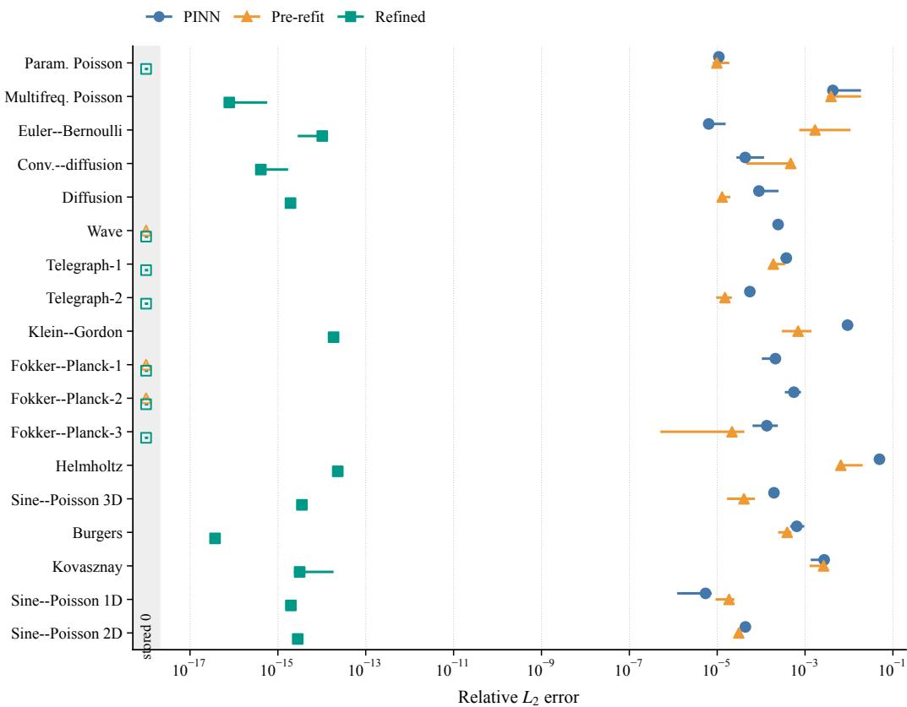  
Figure 2: Solution-error distributions across all 18 configurations. Markers denote the median relative $L _ { 2 }$ error over five independently initialized PINN teachers, and horizontal intervals indicate the interquartile range. Results are shown for the PINN teacher, the selected pre-refit expression, and the refined $\mathrm { D e S y R }$ expression. Open markers within the shaded floor region indicate stored floating-point zero medians.

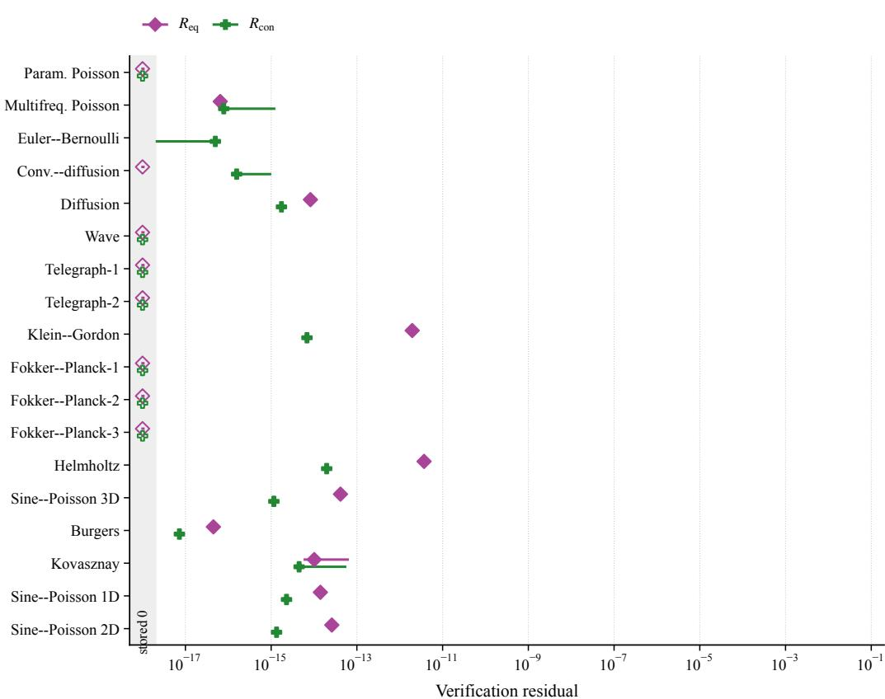  
Figure 3: Verification residuals of the refined expressions across all 18 configurations. Equation residuals $R _ { \mathrm { e q } }$ are evaluated on independent interior verification points, whereas constraint residuals $R _ { \mathrm { c o n } }$ are evaluated on the prescribed constraint point sets. Markers denote medians over five independently initialized PINN teachers, and horizontal intervals indicate interquartile ranges. Open markers within the shaded floor region indicate stored floating-point zero medians.

The benchmark suite is intentionally heterogeneous and is designed to probe a broad range of structural challenges rather than to represent a random sample of physical models. The one-dimensional cases examine frequency variation, mixed-basis structure, high-order derivatives, and boundary-layer behavior. The space–time cases cover separable, additive, multiplicative, and shared-parameter structures. The multidimensional cases further increase spatial dimension and frequency, while the Klein–Gordon, Burgers, and Kovasznay problems introduce nonlinearities and field coupling. Complete reconstructions are provided in Appendix Fig. D.1 for the one-dimensional cases, Appendix Figs. D.2 and D.3 for the space–time cases, and Appendix Figs. D.4 and D.5 for the multidimensional Sine–Poisson cases. Seed-level distributions of recovery error and expression complexity are reported in Appendix Figs. D.6 and D.7.

## 5.3. Representative mechanics cases

Three representative cases are examined in greater detail to reveal aspects of the recovery process that are not fully captured by aggregate error metrics: a nonlinear travelling wave, a high-frequency elliptic mode, and a coupled velocity–pressure system.

The first case is the viscous Burgers equation, a prototypical nonlinear convection–difusion problem that admits travelling-wave solutions and therefore provides a compact test of nonlinear structural recovery. We consider

$$
u _ { t } + u u _ { x } - 0 . 0 5 u _ { x x } = 0 ,\tag{53}
$$

with exact solution

$$
u ^ { \star } ( x , t ) = 0 . 5 - 0 . 5 \operatorname { t a n h } ( 5 x - 2 . 5 t ) .\tag{54}
$$

As shown in Figure 4, the PINN exhibits a spatially and temporally structured error pattern around the travelling transition layer. The ultimately selected symbolic candidate captures the travelling-wave structure, which remains fixed during coeficient refinement. Refinement reduces the median relative $L _ { 2 }$ error from $3 . 9 2 \times 1 0 ^ { - 4 }$ before refinement to $3 . 7 1 \times 1 0 ^ { - 1 7 }$ afterward, suppressing the structured field error to near numerical precision. This case therefore shows that the improvement is not confined to the aggregate error norm, but is also evident directly in the recovered space–time field.

The second case is the two-dimensional Helmholtz equation, a canonical elliptic problem whose oscillatory solution provides a stringent test of highfrequency structural recovery. On $[ - 1 , 1 ] ^ { 2 }$ , we consider

$$
\begin{array} { c } { { u _ { x x } + u _ { y y } + u = ( 1 - 3 2 \pi ^ { 2 } ) \sin ( 4 \pi x ) \sin ( 4 \pi y ) , } } \\ { { u \vert _ { \partial \Omega } = 0 , } } \end{array}\tag{55}
$$

with exact solution

$$
\begin{array} { r } { u ^ { \star } ( x , y ) = \sin ( 4 \pi x ) \sin ( 4 \pi y ) . } \end{array}\tag{56}
$$

As shown in Figure 4, the PINN exhibits spatially structured approximation errors in resolving the high-frequency oscillations. The ultimately selected symbolic candidate captures the underlying product structure, and subsequent fixed-topology coeficient refinement reduces the remaining error to near numerical precision, yielding a median relative $L _ { 2 }$ error of $2 . 3 1 \times 1 0$ −14 over five PINN seeds. This case illustrates that physics-only coeficient refinement can substantially improve upon the teacher field once a suitable high-frequency symbolic structure has been identified.

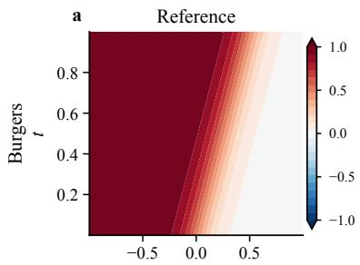

b  
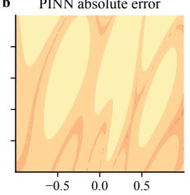

c  
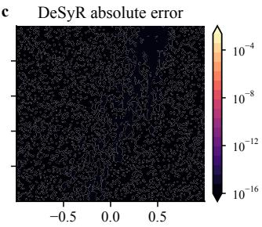

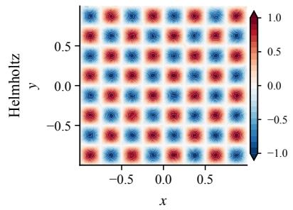

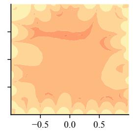

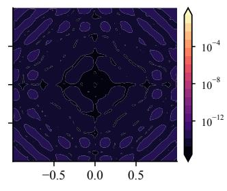  
Figure 4: Field-level recovery for two representative scalar cases. Rows correspond to Burgers and Helmholtz, while columns show the reference field, the pointwise absolute error of the PINN teacher, and the pointwise absolute error of the refined DeSyR expression. Burgers provides a nonlinear travelling-wave test, whereas Helmholtz probes high-frequency structural recovery and exhibits the largest teacher error in the benchmark suite.

The third case is the Kovasznay flow, a classical steady solution of the incompressible Navier–Stokes equations and a representative test of coupled multi-field recovery. Unlike the preceding scalar problems, this case requires the simultaneous reconstruction of two velocity components and the pressure field under nonlinear momentum coupling and the incompressibility condition. We consider the Kovasznay benchmark described in [28, 23], for which the governing equations are

$$
\begin{array} { r } { \mathbf u \cdot \nabla \mathbf u + \nabla p - \nu \nabla ^ { 2 } \mathbf u = 0 , } \\ { \nabla \cdot \mathbf u = 0 , } \end{array}\tag{57}
$$

with Reynolds number $\mathrm { R e } = 2 0$ and $\nu = 1 / \mathrm { R e } = 0 . 0 5$ . The corresponding analytic velocity and pressure fields are listed in Appendix Table B.1.

The jointly recovered symbolic fields capture the exponential and trigonometric structure of the coupled velocity–pressure solution, including the common base exponential rate and its cross-field relationships. After joint coeficient refinement, the median relative $L _ { 2 }$ errors are $1 . 8 1 \times 1 0 ^ { - 1 5 }$ for $u ,$ $3 . 4 0 \times 1 0 ^ { - 1 5 }$ for $v ,$ and $3 . 6 9 \times 1 0 ^ { - 1 5 }$ for $p .$ The total final expression complexity ranges from 30 to 35 across seeds, reflecting algebraically equivalent phase representations that can remain distinct after symbolic simplification. $\mathrm { A s }$ shown in Figure 5, the PINN exhibits structured pointwise errors across all three fields, whereas the refined symbolic solution reduces these errors to near numerical precision. This case illustrates that joint symbolic recovery can achieve near-machine-precision accuracy in a nonlinear coupled velocity– pressure system while enforcing the incompressibility condition, extending the empirical evidence beyond the independently recovered scalar cases.

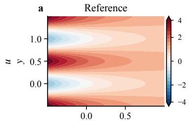

b  
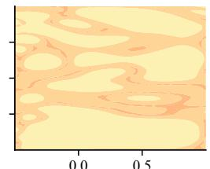

c  
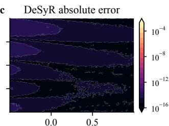

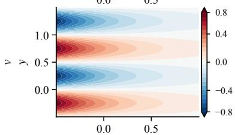

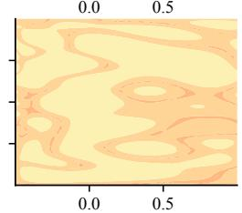

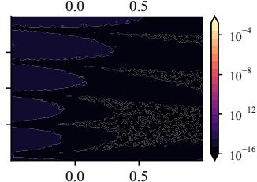

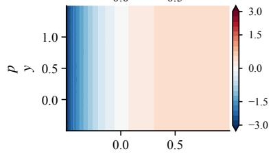  
x

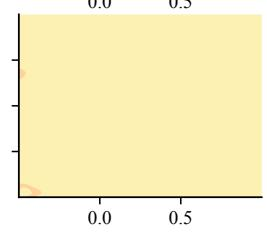  
x

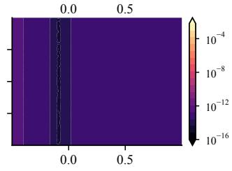  
x  
Figure 5: Field-level recovery for the coupled Kovasznay flow. Rows correspond to the streamwise velocity $u ,$ transverse velocity $v ,$ and pressure $p ,$ while columns show the reference field, the pointwise absolute error of the PINN teacher, and the pointwise absolute error of the refined DeSyR expression.

## 5.4. Mechanism and theory-aligned tests

## 5.4.1. Candidate-pool coverage under repeated searches

Condition C2 requires the retained Stage-A candidate pool to contain at least one target-capable symbolic topology. Because algebraic topology coverage is not directly observable from the archived outputs alone, we assess its end-to-end consequence by examining how the number of separately seeded symbolic searches retained per PINN teacher afects recovery. The archived replay covers 12 scalar benchmark configurations, each with five independently trained PINN teachers, giving 60 teacher-level instances. Consistent with Stage A, each archived search run contributes up to five representative Pareto candidates selected by the Stage-A retention rule. For each instance, the first $K \in \{ 1 , 2 , 3 , 5 , 1 0 \}$ archived search runs are pooled before the standard Stage B refinement and Stage C selection. A recovery is counted when the selected refined expression has relative $L _ { 2 }$ error no larger than $1 0 ^ { - 1 0 }$

Figure 6 shows that the pool formed from one search run recovers 58 of the 60 instances. Including candidates from a second search run recovers all 60 instances, with no further change for $K = 3$ , 5, or 10. The two changes occur for Helmholtz teachers 0 and 4: their selected relative errors decrease from $8 . 5 4 \times 1 0 ^ { - 1 }$ and $6 . 9 8 \times 1 0 ^ { - 1 }$ , respectively, to $2 . 3 1 \times 1 0 ^ { - 1 4 }$ when the second search is included. For the remaining 11 configurations, all five teacher-level instances are already recovered with $K = 1$ ; the configuration-level counts are reported in Appendix Table C.2.

Within this archived protocol and its fixed per-search retention rule, these results indicate that pooling candidates from a second independently seeded symbolic search can mitigate occasional limitations in the retained candidate set. The replay does not distinguish between a target-capable topology that was not generated by a search and one that was generated but excluded by the five-candidate truncation. It therefore provides an end-to-end indicator relevant to candidate coverage rather than a direct measurement of algebraic topology coverage. Nor does it compare or validate alternative within-front retention rules, or imply that the same saturation point applies under other search budgets, seed orderings, or problem distributions.

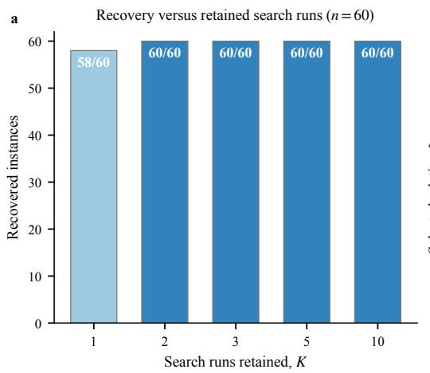

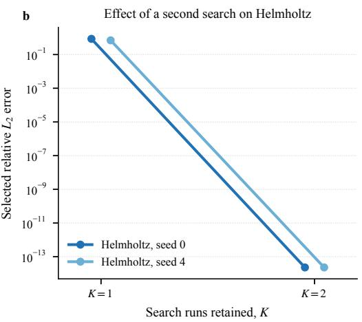  
Figure 6: Efect of the number of archived symbolic-search runs retained in each candidate pool. Panel (a) reports end-to-end recovery across 12 scalar benchmark configurations and five independently trained PINN teachers per configuration under the fixed Stage-A rule that each run contributes $\mathrm { u p }$ to five representative Pareto candidates. Panel (b) shows the selected relative $L _ { 2 }$ errors for the two Helmholtz instances whose recovered expressions change when a second search run is included. Recovery denotes a selected refined expression with relative $L _ { 2 }$ error not exceeding $1 0 ^ { - 1 0 }$

## 5.4.2. Fixed-topology coeficient correction

Sine–Poisson 1D provides a direct stage-wise test of fixed-topology coefficient refinement. On $x \in [ 0 , 1 ]$ , we consider the boundary-value problem from PR-GPSR [32]

$$
u _ { x x } + \pi ^ { 2 } \sin ( \pi x ) = 0 ,
$$

$$
u ( 0 ) = u ( 1 ) = 0 ,\tag{58}
$$

with exact solution

$$
u ^ { \star } ( x ) = \sin ( \pi x ) .\tag{59}
$$

Across all five PINN seeds, the ultimately selected candidates have the same search-stage topology, sin(αx), so Stage B updates only the frequency parameter α while holding that topology fixed during optimization. The median relative $L _ { 2 }$ errors of the PINN teacher, the pre-refit version of the ultimately selected candidate, and the refined expression are $5 . 4 2 \times 1 0 ^ { - 6 } , 1 . 8 7 \times 1 0 ^ { - 5 }$ and $1 . 9 8 \times 1 0 ^ { - 1 5 }$ , respectively. The modest increase from the PINN error to the pre-refit error reflects the symbolic compression step: although the ultimately selected search-stage candidate already has the target-capable form sin(αx), its provisional frequency parameter remains slightly ofset from the exact value π. Stage B corrects this residual parameter mismatch without reopening the topology search, reducing the median error by approximately ten orders of magnitude.

As shown in Fig. 7, the reference, PINN, pre-refit, and refined solution profiles are visually almost indistinguishable, whereas the pointwise-error panel clearly exposes the improvement introduced by coeficient refinement. Across all five seeds, Stage B moves the pre-refit frequency estimate toward π and reduces the resulting solution error to near machine precision while keeping the search-stage topology fixed throughout coeficient optimization.

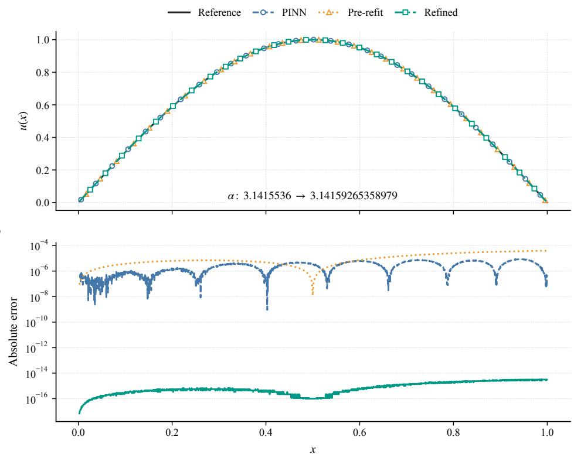  
Figure 7: Stage-wise recovery for the Sine–Poisson 1D problem using a representative PINN seed. Panel (a) compares the reference solution, PINN teacher, pre-refit version of the ultimately selected candidate, and refined expression; staggered markers are used to distinguish the nearly coincident profiles. Panel (b) shows the corresponding pointwise absolute errors, highlighting the substantial error reduction achieved by fixed-topology coeficient refinement.

Table 5: Representative coeficient corrections under fixed symbolic topologies. For each problem, the reported PINN seed is the one whose teacher error is closest to the median over five seeds. During Stage-B optimization, only the continuous coeficients are updated while the search-stage topology is held fixed; subsequent algebraic simplification may remove terms whose refined coeficients become exactly zero.
<table><tr><td>ID</td><td>Problem</td><td>Fixed topology</td><td>Coefficient</td><td>Pre-refit</td><td>Refined</td><td>Relative L2 error (pre-refit → refined)</td></tr><tr><td>05</td><td>Sine-Poisson 1D</td><td>sin(αx)</td><td>α</td><td>3.1415536</td><td>3.14159265358979</td><td> $2 . 4 8 \times 1 0 ^ { - 5 }  1 . 9 8 \times 1 0 ^ { - 1 5 }$ </td></tr><tr><td></td><td></td><td>02 Multifreq. Poisson a0 + a1x + sin(a2x) + cos(a3x)</td><td>a0</td><td>0.004771</td><td>0</td><td></td></tr><tr><td></td><td></td><td></td><td>a1</td><td>-0.100054</td><td>-0.1</td><td> $3 . 9 0 \times 1 0 ^ { - 3 }  7 . 8 4 \times 1 0 ^ { - 1 7 }$ </td></tr><tr><td></td><td></td><td></td><td>a2</td><td>0.700030</td><td>0.7</td><td></td></tr><tr><td></td><td></td><td></td><td>a3</td><td>1.500109</td><td>1.5</td><td></td></tr><tr><td></td><td>03 Euler-Bernoulli</td><td> $a _ { 4 } x ^ { 4 } + a _ { 3 } x ^ { 3 } + a _ { 2 } x ^ { 2 } + a _ { 1 } x$ </td><td>a4</td><td> $1 . 1 6 \times 1 0 ^ { - 6 }$ </td><td> $2 . 0 8 \times 1 0 ^ { - 6 }$ </td><td></td></tr><tr><td></td><td></td><td></td><td>a3</td><td> $- 2 . 3 0 \times 1 0 ^ { - 5 }$ </td><td> $- 4 . 1 7 \times 1 0 ^ { - 5 }$ </td><td> $1 . 5 1 \times 1 0 ^ { - 2 }  3 . 0 1 \times 1 0 ^ { - 1 4 }$ </td></tr><tr><td></td><td></td><td></td><td>a2</td><td> $- 1 . 1 6 \times 1 0 ^ { - 4 }$ </td><td>0</td><td></td></tr><tr><td></td><td></td><td></td><td>a1</td><td> $2 . 3 0 \times 1 0 ^ { - 3 }$ </td><td> $2 . 0 8 \times 1 0 ^ { - 3 }$ </td><td></td></tr><tr><td></td><td>13 Burgers</td><td> $a _ { 0 } + a _ { 1 } \operatorname { t a n h } ( a _ { 2 } t + a _ { 3 } x )$ </td><td>a0</td><td>0.499879</td><td>0.5</td><td></td></tr><tr><td></td><td></td><td></td><td>a1</td><td>0.500090</td><td>0.5</td><td> $3 . 9 2 \times 1 0 ^ { - 4 }  3 . 7 1 \times 1 0 ^ { - 1 7 }$ </td></tr><tr><td></td><td></td><td></td><td>a2</td><td>2.492718</td><td>2.5</td><td></td></tr><tr><td></td><td></td><td></td><td>a3</td><td>-4.987499</td><td>-5</td><td></td></tr></table>

Table 5 summarizes representative coeficient corrections under fixed symbolic topologies. For Sine–Poisson 1D, refinement adjusts the frequency parameter α from 3.1415536 to 3.14159265358979, reducing the relative $L _ { 2 }$ error from $2 . 4 8 \times 1 0 ^ { - 5 }$ to $1 . 9 8 \times 1 0 ^ { - 1 5 }$ . In the Multifrequency Poisson case, the constant term, linear coeficient, and two frequency parameters are further calibrated while the mixed trigonometric structure is preserved, reducing the error from $3 . 9 0 \times 1 0 ^ { - 3 } \mathrm { t o } 7 . 8 4 \times 1 0 ^ { - 1 7 }$ . For Euler–Bernoulli, refinement recalibrates the polynomial coeficients, including driving the spurious quadratic coeficient to zero, and reduces the error from $1 . 5 1 \times 1 0 ^ { - 2 }$ to $3 . 0 1 \times 1 0 ^ { - 1 4 }$ In the Burgers case, the four free coeficients of the nonlinear travelling-wave expression are adjusted toward their exact values, reducing the error from $3 . 9 2 \times 1 0 ^ { - 4 }$ to $3 . 7 1 \times 1 0 ^ { - 1 7 }$ These results show that substantial gains in recovery accuracy can be achieved through continuous coeficient refinement on a frozen search-stage topology, without requiring an additional topology search.

## 5.4.3. Ablation of coeficient-refinement objectives

Linear fixed-topology parameterizations.. We first consider fixed expression spaces that are linear in their coeficient vectors. The six settings comprise Multifrequency Poisson, Euler–Bernoulli, Convection–difusion, Difusion, Helmholtz, and Sine–Poisson 1D. In each setting, the exact solution is representable in the prescribed linear basis, while five PINN teachers provide the field values used by the teacher term. The governing equation and the corresponding boundary or initial conditions form the physics term. Consequently, the coeficient estimation problem has the linear fixed-topology form analyzed in Corollary 4.1; only the physics weight $\beta$ is varied.

Figure 8 shows the resulting relative errors for the five teachers of each problem. As $\beta$ increases, the mixed estimates progressively approach the physics-only solution. Away from the floating-point accuracy floor, the estimated tail slopes are close to −1 for all six bases; the numerical slope estimates and fixed bases are listed in Table C.4. The polynomial Euler– Bernoulli basis shows a delayed onset of this asymptotic regime, whereas the other five cases exhibit approximately inverse-weight behavior from smaller values of $\beta .$ These observations are consistent with the $O ( \beta ^ { - 1 } )$ finite-weight coeficient bias characterized in Corollary 4.1.

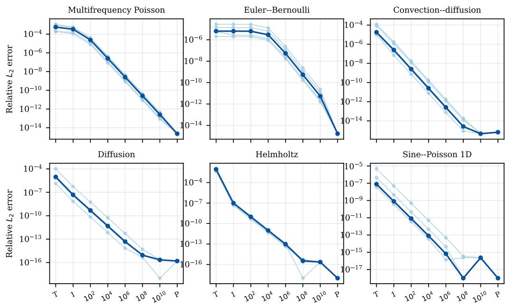  
Objective: teacher-only (T), mixed weight , physics-only (P)  
Figure 8: Relative errors under teacher-only fitting (T), mixed data–physics objectives with increasing physics weight $\beta ,$ and physics-only refinement (P) for six fixed bases linear in their coeficient vectors. Light traces show the five PINN teachers in each problem and dark traces show their medians. The mixed solutions approach the physics-only endpoint as $\beta$ increases. Points at the numerical accuracy floor are excluded from the slope estimates reported in Table C.4.

Recovered fixed topologies.. We next examine the objective choice on the fixed expressions selected by the full recovery procedure. This ablation holds the symbolic topology, collocation points, and initialization fixed across ten scalar benchmark configurations and five PINN seeds per configuration, giving 50 problem–seed combinations, while varying only the information used to estimate the coeficients. Under teacher-only fitting, the median relative $L _ { 2 }$ error is $8 . 8 5 \times 1 0 ^ { - 5 }$ . Increasing the physics weight from $\beta = 1$ to $\beta = 1 0 ^ { 6 }$ lowers the median to $1 . 4 5 \times 1 0 ^ { - 1 3 }$ , and the physics-only endpoint reaches $1 . 8 6 \times 1 0 ^ { - 1 7 }$ . The corresponding equation residuals likewise decrease from teacher-only fitting through the mixed objectives to physics-only refinement; complete quartiles are reported in Table C.5.

Figure 9 provides the distributional view of these results. Because the selected expressions include nonlinear parameterizations, this comparison extends beyond the linear assumptions of Corollary 4.1. It exhibits the same practical progression from teacher-only fitting through increasingly physicsweighted mixed objectives to physics-only refinement, but no asymptotic rate is assigned to the nonlinear cases.

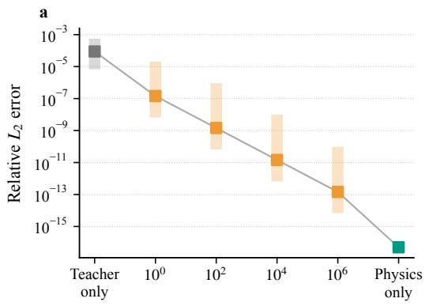

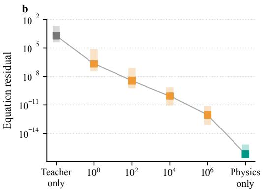  
Mixed objective: physics weight β  
Figure 9: Ablation of coeficient-refinement objectives under fixed symbolic topology, collocation points, and initialization across ten scalar benchmark configurations and five PINN seeds per configuration. Panels (a) and (b) report the median relative $L _ { 2 }$ error and equation residual $R _ { \mathrm { e q } } .$ respectively, with interquartile ranges. Results are shown for teacher-only fitting, mixed data–physics objectives with finite physics weight $\beta ,$ and physics-only refinement.

## 5.4.4. Initialization sensitivity and local identifiability

We first examine whether teacher-derived coeficients provide efective initializations for Stage B. The study covers 12 scalar configurations. Ten configurations contain free coeficients, yielding 50 teacher-derived initializations and 250 independently generated random initializations drawn from U(−1, 1); Wave and Fokker–Planck-1 provide ten zero-parameter identity controls. Figure 10(a) compares the refined errors for the ten free-parameter configurations. For Euler–Bernoulli, Telegraph-1, and Burgers, uninformed random initialization can produce competitive solutions and occasionally yields lower median errors than the teacher-derived start. This behavior does not simply track the local Jacobian conditioning reported in panel (b): Euler– Bernoulli, for example, has the largest condition number among the audited expressions. The distinction is expected because Jacobian conditioning is a local property at the refined solution, whereas initialization sensitivity concerns whether an optimizer reaches a low-error solution from an uninformed starting point. Across the broader set of configurations, teacher-derived initialization is nevertheless more reliable: it consistently reaches low-error solutions and avoids the high-error outcomes observed from random starts in several problems. Its main benefit is therefore not uniformly lower error in every case, but greater robustness across the heterogeneous configurations examined here. Detailed initialization results for the free-parameter configurations are reported in Table C.6; the zero-parameter identity controls require no initialization and are excluded from this comparison.

We next assess local identifiability using a broader audit of 13 scalar fixedtopology expressions with free coeficients. For each audited expression, we form the Jacobian of the collocation-residual map with respect to the coefficient vector at the refined solution. All audited Jacobians are numerically full column rank in the finite-precision rank audit summarized in Table C.7, providing local numerical evidence that the free parameter directions are distinguishable under the chosen residual equations. Figure 10(b) reports the corresponding Jacobian condition numbers, which characterize the local conditioning of the adopted coeficient parameterization and residual scaling at the refined solutions. The values span several orders of magnitude, with Euler–Bernoulli exhibiting the largest condition number.

Together, the rank and conditioning diagnostics provide numerical support for the full-column-rank Jacobian condition underlying the local identifiability analysis in Section 4.5. Because these quantities are evaluated at the numerically refined solutions rather than throughout the parameter space, they do not establish global uniqueness or guarantee convergence from arbitrary initializations. Zero-parameter cases require no rank test and are reported separately, while the coupled Kovasznay case is excluded from this scalar audit. Detailed rank results are provided in Table C.7.

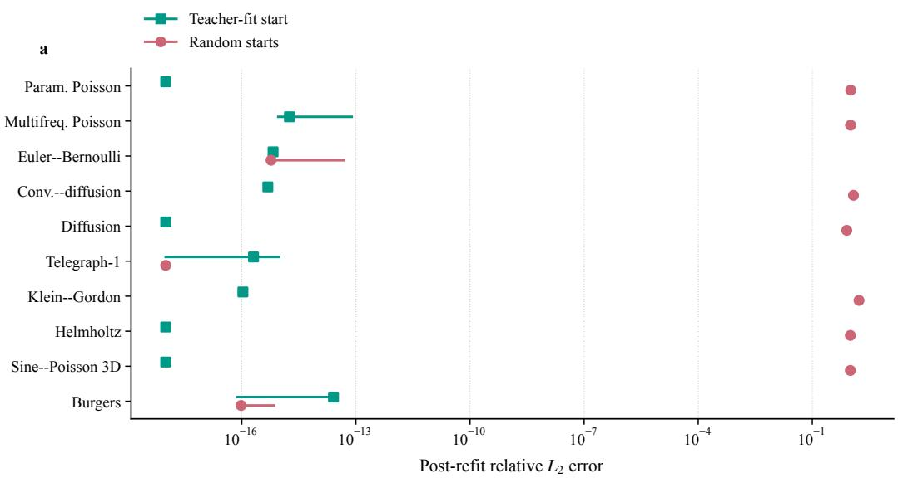

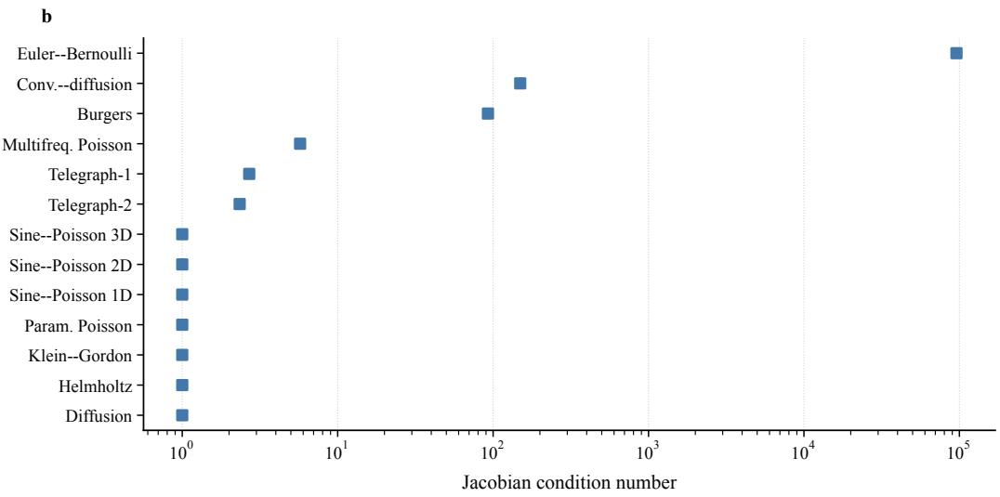  
Figure 10: Reliability diagnostics for fixed-topology coeficient refinement. Panel (a) compares the post-refinement relative $L _ { 2 }$ errors obtained from teacher-derived and random coeficient initializations for ten free-parameter configurations. Teacher-derived summaries contain five starts, one per PINN teacher, whereas random-start summaries contain 25 runs, with five random starts paired with each teacher; markers denote medians and horizontal intervals indicate interquartile ranges. Panel (b) reports the Jacobian condition numbers for 13 audited scalar fixed-topology expressions with free coeficients, characterizing local parameter conditioning at the refined solutions. Stored floating-point zero errors in panel (a) are displayed at the plotting floor of $1 0 ^ { - 1 8 }$ on the logarithmic axis.

5.4.5. Scope and Representational Limitations of the Operator Library We consider the Parametric Poisson problem on $x \in [ 0 , 1 ]$

$$
\begin{array} { c } { { u _ { x x } ( x ) + 1 6 \sin ( 4 x ) = 0 , } } \\ { { u ( 0 ) = 0 , } } \\ { { u ( 1 ) = \sin ( 4 ) , } } \end{array}\tag{60}
$$

whose exact solution is

$$
u ^ { \star } ( x ) = \sin ( 4 x ) .\tag{61}
$$

Restricting the symbolic search to a polynomial library excludes the sine operator and therefore places the exact solution outside the admissible expression space. Under this misspecified library, fixed-topology coeficient refinement yields the sixth-degree polynomial

$$
\begin{array} { r } { \tilde { u } ( x ) = x \big ( - 4 . 2 9 9 5 7 8 x ^ { 5 } + 1 0 . 0 6 9 4 2 7 x ^ { 4 } + 0 . 4 7 0 9 5 6 x ^ { 3 } } \\ { - 1 1 . 0 5 3 5 4 8 x ^ { 2 } + 0 . 0 5 6 0 7 7 x + 3 . 9 9 9 8 6 3 \big ) . } \end{array}\tag{62}
$$

The refined expression has complexity 27. Refinement converges and reduces the constraint residual to $R _ { \mathrm { c o n } } = 6 . 9 9 \times 1 0 ^ { - 1 5 }$ , showing that the prescribed boundary conditions are satisfied to high numerical accuracy. However, the independently evaluated equation residual remains $R _ { \mathrm { e q } } = 6 . 3 1 \times 1 0 ^ { - 2 }$ , while the relative $L _ { 2 }$ error remains $5 . 3 6 \times 1 0 ^ { - 4 }$ . Verification on the independent interior points therefore exposes the residual discrepancy associated with the misspecified representation space, as shown in Fig. 11.

This result delineates the operating boundary of the framework. DeSyR can correct coeficient errors on a fixed topology when the target is representable in the corresponding Stage-B parameterization, but coeficient refinement cannot remove representation error caused by operators that are absent from the prescribed search library. In such cases, verification on independent interior points flags the remaining model-form error, distinguishing a close approximation from a successful exact recovery.

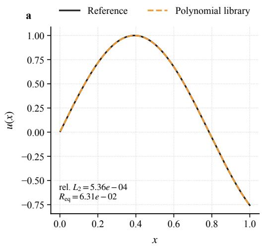

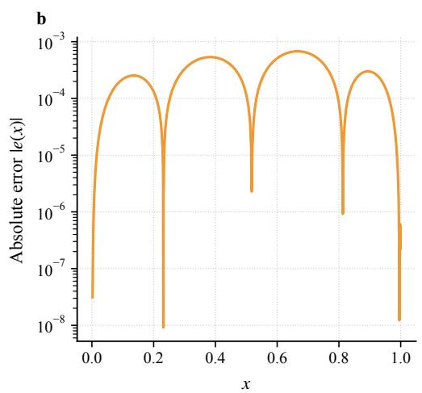  
Figure 11: Recovery under a misspecified polynomial operator library. Panel (a) compares the sine reference with the refined polynomial candidate, and panel (b) shows its pointwise absolute error. The non-negligible independently evaluated equation residual exposes the representation error that coeficient refinement cannot eliminate.

The preceding experiment considers an insuficient operator library. We next examine the complementary finite-budget efect of enriching the library with additional operators that may distract the symbolic search, as summarized in Table 6. In this frozen-teacher study, the PINN teachers, binary operators, numerical settings, Stage-B refinement, and Stage-C selection are held fixed. For Sine–Poisson 1D, all five teachers recover the same expression under both the baseline and enriched libraries. For Burgers, enrichment changes the recovery count from $4 / 5$ to $3 / 5$ and increases the median time from 275.5 to 377.8 s. In the high-frequency Helmholtz case, however, the enriched library recovers only two of five teacher instances using two independently seeded searches, compared with five of five under the baseline {sin} library. An audit of the raw Pareto fronts for the prescribed separated-sine family shows that, in all three failed enriched-library instances, no recognized target-family candidate appears in either raw Pareto front or in the retained Stage-B pool. Increasing the search budget to $K = 5$ restores recovery to five of five instances, but increases the median search-and-refinement time from 344.0 to 754.2 s. Within this tested setting, these results indicate that operator-library design and finite search budget jointly determine candidate coverage. They do not imply library-agnostic symbolic discovery, nor do they establish a generally suficient value of $K$

Table 6: Exploratory frozen-teacher study of sensitivity to unary-operator library enrichment. Baseline and enriched settings use identical PINN teachers, numerical configurations, Stage-B refinement, and Stage-C selection. Recovery denotes the number of teachers for which the selected refined expression attains a relative $L _ { 2 }$ error no greater than $1 0 ^ { - 1 0 }$ Candidate refits are reported as converged/total, and the reported time includes both symbolic search and coeficient refinement. Results are aggregated over five teachers and are reported separately from the frozen formal benchmark protocol.
<table><tr><td>Problem</td><td>Unary library</td><td>K Recovery</td><td>Converged/total refits Median time (s)</td><td></td></tr><tr><td>Sine-Poisson 1D</td><td>{sin}</td><td>2 5/5</td><td>22/22</td><td>46.0</td></tr><tr><td>Sine-Poisson 1D</td><td>{sin, cos, exp, tanh}</td><td>2 5/5</td><td>36/36</td><td>50.9</td></tr><tr><td>Burgers</td><td>{tanh}</td><td>2 4/5</td><td>47/50</td><td>275.5</td></tr><tr><td>Burgers</td><td>{tanh, sin, cos, exp}</td><td>2 3/5</td><td>47/50</td><td>377.8</td></tr><tr><td>Helmholtz</td><td>{sin}</td><td>2 5/5</td><td>46/46</td><td>295.6</td></tr><tr><td>Helmholtz</td><td>{sin, cos, exp, tanh}</td><td>2 2/5</td><td>45/50</td><td>344.0</td></tr><tr><td>Helmholtz</td><td>{sin, cos, exp, tanh}</td><td>5 5/5</td><td>111/125</td><td>754.2</td></tr></table>

## 5.5. Selection robustness and computational cost

## 5.5.1. Stage-C selection-gate ablation

We assess the contribution of the Stage-C selection rules by replaying 60 frozen scalar candidate pools with one rule removed at a time. Removing the convergence-eligibility gate changes only one final selection, but the replacement is an unconverged candidate with complexity 47, and the worst relative $L _ { 2 }$ error increases from $1 . 1 6 \times 1 0 ^ { - 1 3 } \mathrm { ~ t o ~ } 4 . 2 9 \times 1 0 ^ { - 3 }$ . In contrast, removing the complexity preference changes 12 selected expressions without increasing the worst error, consistent with its role in favoring simpler expressions among candidates that remain comparable under the preceding gates. The teachercompatibility and physics-equivalence gates are inactive on these archived candidate pools, so this replay does not provide evidence about their behavior in cases where those gates become active. Thus, within these archived pools, the replay identifies the convergence-eligibility gate as an important safeguard against a severe worst-case failure, while the complexity preference primarily promotes parsimonious selection. The complete replay is shown in Appendix Fig. D.9.

The convergence status of the final selected expression alone does not fully characterize the numerical behavior of all candidates entering Stage B. Across 17 archived scalar configurations, 3,745 of 3,774 candidate refits involving at least one free coeficient (99.23%) are recorded as converged. The remaining 29 cases comprise 27 timeouts (0.72%) and two finite but unconverged refits (0.05%); no non-finite outcomes are observed. These candidate-level statistics provide complementary empirical support for the operational convergence check in Condition C3, while not constituting a global convergence guarantee.

## 5.5.2. Wall-clock cost

The dominant computational cost is problem dependent. PINN training dominates the fourth-order Euler–Bernoulli configuration, whereas the symbolic-recovery stage dominates Wave and Burgers. Median total runtimes range from approximately 100 seconds for Parametric Poisson to roughly 18–25 minutes across the most computationally demanding configurations. These wall-clock timings are implementation- and hardware-dependent empirical cost indicators rather than asymptotic complexity estimates. Complete configuration-level timing distributions and representative stage-wise breakdowns are provided in Appendix Fig. D.8 and Table D.1.

## 6. Discussion

## 6.1. Methodological implications and diagnostics

DeSyR assigns teacher data and governing physics to distinct optimization tasks. The PINN supplies a global field approximation that provides a practical surrogate for guiding combinatorial topology search. Once a topology is frozen, the governing equation and prescribed constraints are used to determine the final coeficients. This separation does not amount to replacing teacher-guided symbolic regression with a fully physics-driven search: Stage A remains teacher guided, and Stage C still uses teacher compatibility to exclude refined candidates that are no longer compatible with the teacherguided solution branch. The key distinction is that teacher data are absent from the Stage-B objective that determines the reported coeficients.

This division difers at the objective level from teacher-only distillation, which estimates topology and constants from network samples, and from mixed data–physics formulations, which retain both information sources in a common coeficient objective. The fixed-topology analysis explains why this diference matters. Teacher fitting inherits the projected teacher error, whereas, for linear fixed-topology parameterizations, a finite-weight mixed objective retains an $O ( \beta ^ { - 1 } )$ teacher-dependent contribution when $\Phi ^ { \top } \varepsilon \neq 0$ Physics-only refinement conditionally removes this specific source of bias under well-posedness, fixed-topology representability, attainment of zero residual, and discrete determinacy. These results isolate the coeficient-estimation mechanism while holding the selected topology fixed.

Successful recovery depends on the three operational conditions C1–C3 in Section 3.1. C1 requires teacher-based ranking and compatibility to provide suficiently informative guidance for candidate screening; C2 requires the retained candidate pool to contain at least one target-capable topology; and C3 requires at least one target-capable candidate entering Stage B to yield a finite, converged refinement. Together, these conditions separate the roles of teacher guidance, candidate coverage, and coeficient optimization, while also emphasizing the dependence of recovery on the prescribed expression library.

The verification and audit components make several of these mechanisms empirically assessable. Under the polynomial-only library in Fig. 11, the refined expression satisfies the prescribed constraints to high numerical accuracy but retains an independently evaluated equation residual of 6.31×10−2, showing that equation verification can flag a representation-space mismatch that coeficient refinement does not eliminate. The initialization audit supports the use of teacher-derived starting values, the Jacobian audit provides local numerical rank and conditioning evidence for the selected scalar expressions, and the frozen-pool gate replay shows that the convergence-eligibility rule can prevent a severe selection failure in the archived candidate pools.

The candidate-level audit separates the numerical convergence behavior of all Stage-B refits from the convergence status of the final selected expression. The operator-library enrichment study further shows that enlarging the search space can require a larger search budget to preserve a target-capable topology in the candidate pool. Together, these complementary diagnostics provide empirical support for Conditions C2 and C3 under the tested finite-budget settings, while neither establishing library-independent candidate coverage nor implying global convergence.

The theoretical results describe recovery under a fixed symbolic structure. For finite collocation sets, exact fixed-topology recovery requires suficient discrete determinacy. For nonlinear parameterizations, the corresponding identifiability and convergence guarantees are local and are characterized through the Jacobian conditions in Section 4.5. These requirements do not establish topology-discovery guarantees or global nonlinear convergence, but they identify concrete quantities that can be examined when extending the framework to new expression families and governing operators.

## 6.2. Scope and future directions

The present study focuses on controlled benchmark problems with prescribed operator libraries, regular domains, and analytic reference solutions. Extending DeSyR to noisy or uncertain observations, irregular geometries, discontinuous or multiscale solutions, and richer symbolic spaces will require renewed assessment of candidate-pool coverage, coeficient-refinement robustness, and verification reliability under these more challenging conditions. Such extensions may also require search and refinement strategies that better accommodate larger expression spaces and less regular solution structures.

A further direction is to move beyond fixed problem-specific operator libraries toward adaptive operator screening or hierarchical library expansion guided jointly by teacher information and physics-based criteria. Such strategies could improve representational coverage while controlling the combinatorial growth of the symbolic search space.

A supplementary fixed-topology study examines sensitivity to perturbations in the prescribed constraints while keeping the governing equation unchanged. All 48 refits converge, although the error relative to the unperturbed reference increases with the perturbation level. These results provide limited empirical evidence on the sensitivity of Stage B to constraint perturbations, but they neither address noise in teacher-guided topology discovery nor establish a general stability guarantee.

Beyond recovery accuracy itself, the resulting closed-form expressions open several directions for downstream use. Future work may examine their utility for sensitivity analysis, reduced-order modeling, parameter studies, and repeated evaluation within design-optimization workflows, where explicit symbolic representations may ofer advantages in interpretability and computational eficiency.

## 7. Conclusions

DeSyR separates symbolic topology discovery from final coeficient determination. A PINN guides the stochastic structure search and provides provisional coeficients, while the governing equation and prescribed constraints define a teacher-free refinement objective once the symbolic topology is fixed. For linear fixed-topology parameterizations, the analysis characterizes teacher-error inheritance and the finite-weight bias induced by mixed data–physics objectives. Under well-posedness, representability, zero-residual attainment, and discrete determinacy, physics-only refinement conditionally recovers the exact coeficients. For nonlinear parameterizations, the corresponding identifiability and convergence guarantees are local and make the role of initialization explicit.

Across 15 diferential-equation problems and 18 tested configurations, physics-only refinement reaches near-machine-precision accuracy in many cases. In the reported same-topology comparisons for which both prerefinement and post-refinement errors are strictly positive, the relative L2 error is reduced by eight to fourteen orders of magnitude. The nonlinear and coupled cases further demonstrate that the decoupled procedure can operate efectively beyond linear scalar problems. At the same time, the operatorlibrary misspecification experiment shows that coeficient refinement cannot remove representation error when the target solution lies outside the prescribed symbolic space. The complementary enrichment study further shows that, under a finite search budget, enlarging the operator library can reduce candidate coverage and may therefore require additional search efort to retain a target-capable topology.

Within the tested representable settings, these results support the central premise that an approximate neural teacher can guide symbolic structure discovery without necessarily imposing its error scale on the final recovered coeficients, provided that a target-capable topology is retained and the subsequent physics-only refinement converges.

## Appendix A. Proofs of theoretical results

Proof of Lemma 4.1. By (L-rank), $v ^ { \top } \Phi ^ { \top } \Phi v = \| \Phi v \| _ { 2 } ^ { 2 } > 0$ for $v \neq 0$ , so $\Phi ^ { \top } \Phi$ is positive definite and invertible. Setting the gradient of the strictly convex quadratic to zero gives the normal equations $\Phi ^ { \top } \Phi \hat { a } _ { \mathrm { L S } } = \Phi ^ { \top } y _ { \theta }$ . Assumption 4.2 gives $u ^ { \star } ( x _ { i } ^ { S } ) = s ( x _ { i } ^ { S } ; a ^ { \star } ) = ( \Phi { a ^ { \star } } ) _ { i }$ , hence $y _ { \theta } = \Phi a ^ { \star } + \varepsilon ;$ substituting yields (32). For the thin (economy-size) SVD $\Phi = U \Sigma V ^ { \top }$ with $U ^ { \top } U = I _ { p }$ orthogonal V, and $\Sigma = \operatorname { d i a g } ( \sigma _ { 1 } , . . . , \sigma _ { p } )$ , one has $( \Phi ^ { \top } \Phi ) ^ { - 1 } \Phi ^ { \top } = V \Sigma ^ { - 1 } U ^ { \top }$ Orthogonal invariance of the spectral norm gives $\| ( \Phi ^ { \top } \Phi ) ^ { - 1 } \Phi ^ { \top } \| _ { 2 } = \| \Sigma ^ { - 1 } \| _ { 2 } =$ $1 / \sigma _ { \mathrm { m i n } } ( \Phi )$ , and taking norms yields (33).

Proof of Lemma 4.2. Equation (34) follows by adding and subtracting: $s ( x ; \hat { a } ) - u ^ { \star } \ = \ \left[ s ( x ; \hat { a } ) - s ( x ; a ^ { \star } ) \right] + \left[ s ( x ; a ^ { \star } ) - u ^ { \star } \right]$ , where linearity gives the first term and Assumption 4.2 makes the second term zero. Equation (35) is the same rearrangement around $a ^ { \dagger }$ . For (36), write $\tilde { \Phi } \hat { a } - u _ { v } ^ { \star } = \tilde { \Phi } ( \hat { a } - a ^ { \dagger } ) + ( \tilde { \Phi } a ^ { \dagger } - u _ { v } ^ { \star } )$ and apply the triangle inequality and submultiplicativity; the final specialization uses Lemma 4.1. □

Proof of Proposition 4.1. Equation (29) gives ${ \mathcal { I } } _ { \mathrm { r e f t } } ( { \hat { a } } ) = 0 \Longleftrightarrow \mathbf { F } ( { \hat { a } } ) = 0$ By Assumption $4 . 3 , { \mathcal { T } } _ { \mathrm { r e f i t } } ( { \hat { a } } ) = 0$ . Equation (29) then gives $\mathbf { F } ( \hat { a } ) = 0$

Assumptions 4.1 and 4.2 imply ${ \bf { F } } ( a ^ { \star } ) = 0$ . Indeed, $s ( \cdot ; a ^ { \star } ) = u ^ { \star }$ is the classical solution, so $\begin{array} { r } { \mathcal { N } [ s ( \cdot ; a ^ { \star } ) ] = f } \end{array}$ and $\begin{array} { r } { B _ { \ell } [ s ( \cdot ; a ^ { \star } ) ] = g _ { \ell } } \end{array}$ pointwise; hence all refinement residuals vanish at $a ^ { \star }$ . Since Assumption 4.4 makes F injective on a neighborhood U containing both $a ^ { \star }$ and $\hat { a } .$ , the equality $\mathbf { F } ( { \widehat { a } } ) = \mathbf { F } ( a ^ { \star } ) = 0$ implies $\hat { a } = a ^ { \star }$ . Assumption 4.2 then gives $s ( \cdot ; \hat { a } ) = u ^ { \star }$

Finally, F and $\mathcal { I } _ { \mathrm { r e f i t } }$ are built only from $\mathcal { N } , \ B _ { \ell } , \ f , \ g _ { \ell }$ , the refinement points, and the refinement weights. They contain no teacher samples or reference-solution values once the topology, coeficient parameterization, and refinement point set are fixed, which proves (ii). Statement (iii) follows from the refinement procedure in Section 3.3: conditional on these fixed objects, the only teacher-dependent quantity entering the Stage-B optimization is the initialization $a _ { 0 } ( \theta )$ □

Proof of Corollary $\it 4 . 1$ . For (a), the Hessian of $J _ { \operatorname* { m i x } } ^ { \beta }$ is $2 ( \Phi ^ { \top } \Phi + \beta A ^ { \top } A )$ . By (L-rank) and (PD), both $\Phi ^ { \top } \Phi$ and $A ^ { \top } A$ are positive definite; hence the Hessian is positive definite for every $\beta > 0$ . The objective is therefore strictly convex, and its first-order optimality condition gives (39).

For (b), (L-op) together with Assumptions 4.1–4.2 gives $b = A a ^ { \star }$ . Substituting $y _ { \theta } = \Phi \boldsymbol { a } ^ { \star } + \boldsymbol { \varepsilon }$ into (39) yields (40).

For (c), write $M = A ^ { \top } A \succ 0$ and $P = \Phi ^ { \top } \Phi \succ 0$ . Since

$$
\beta M + P = \beta M \left( I + \beta ^ { - 1 } M ^ { - 1 } P \right) ,\tag{A.1}
$$

for suficiently large $\beta , \| \beta ^ { - 1 } M ^ { - 1 } P \| _ { 2 } < 1$ , so the Neumann expansion gives

$$
( \beta M + P ) ^ { - 1 } = \beta ^ { - 1 } M ^ { - 1 } - \beta ^ { - 2 } M ^ { - 1 } P M ^ { - 1 } + O ( \beta ^ { - 3 } ) .\tag{A.2}
$$

Substitution into (40) gives (42). For (d), matrix inversion is continuous on the open set of invertible matrices, so the limit $\beta \to 0 ^ { + }$ gives the teacher least-squares solution. For (e), $\Phi ^ { \top } \Phi + \beta A ^ { \top } A$ is invertible for every $\beta > 0$ and an invertible linear map preserves nonzero vectors. □

Proof of Proposition 4.2. Statement (a) follows by applying the chain rule to $J ( a ) = \| \mathbf { F } ( a ) \| _ { 2 } ^ { 2 }$

For (b), $\mathbf { F } ( a ^ { \star } ) = 0$ eliminates the residual-dependent term in the Hessian, yielding

$$
\nabla ^ { 2 } J ( a ^ { \star } ) = 2 D \mathbf { F } ( a ^ { \star } ) ^ { \top } D \mathbf { F } ( a ^ { \star } ) .\tag{A.3}
$$

By (R2), this matrix is positive definite. Moreover, $J ( a ^ { \star } ) = 0$ and, by part (a), $\nabla J ( a ^ { \star } ) = 0$ . By continuity of $\nabla ^ { 2 } J$ , after possibly shrinking to a suficiently small convex neighborhood of $a ^ { \star }$ , the Hessian remains uniformly positive definite. Taylor’s theorem then gives the stated local strong-convexity lower bound, which implies that $a ^ { \star }$ is a strict local minimizer and the unique zero-residual point in that neighborhood.

For (c), part (b) gives a nonsingular positive-definite Hessian at $a ^ { \star }$ , and (R3) provides the required local Hessian regularity. The standard local Newton theorem therefore yields quadratic convergence for all initializations in a suficiently small neighborhood of $a ^ { \star }$ . Because $\mathbf { F } ( a ^ { \star } ) = 0$ , the residualdependent part of the exact Hessian vanishes at the solution, so the Gauss– Newton Hessian approximation coincides with the exact Hessian there. Under (R1), the full-column-rank condition (R2), and the zero-residual property, the standard Gauss–Newton local convergence result likewise yields quadratic convergence.

For (d), the equivalence follows from the stationarity equation and the identity

$$
\ker D \mathbf { F } ( { \boldsymbol { a } } ) ^ { \top } = { \big ( } \mathrm { c o l } D \mathbf { F } ( { \boldsymbol { a } } ) { \big ) } ^ { \bot } .\tag{A.4}
$$

At a spurious stationary point, $\mathbf { F } ( a ) \neq 0$ , and therefore $J ( a ) = \| \mathbf { F } ( a ) \| _ { 2 } ^ { 2 } >$ 0. □

## Appendix B. Benchmark definitions and fixed configurations

The governing equations, domains, constraints, reference solutions, and problem-specific unary operators for the 18 configurations are summarized in Table B.1.

Table B . 1 : Benchmark definitions for the 1 8 configurations . The table lists the governing equations computational domains prescribed constraints reference solutions and problem-specific unary operators Here u ⋆ denotes the analytic reference solution used where applicable to construct manufactured forcing terms and prescribed boundary or initial data and $\partial \Omega _ { x }$ denotes the spatial boundary for time-dependent problems . For the Kovasznay case $\mathbf { u } = ( u , v )$ denotes the velocity field Complete search-operator settings are given in Table B 3
<table><tr><td>ID Problem</td><td></td><td>Governing equation</td><td>Domain</td><td>Constraints</td><td>Reference solution</td><td>Problem-specific unary operators</td></tr><tr><td>01</td><td>Param. Poisson</td><td>uxx + 16 sin(4x) = 0</td><td>[0,1]</td><td>u(0) = 0, u(1) = sin 4</td><td>sin(4x)</td><td>{sin}</td></tr><tr><td>02</td><td>Multifreq. Poisson</td><td>uxx + 0.49 sin(0.7x) + 2.25 cos(1.5x) = 0</td><td>[−10,10]</td><td> $u ( \pm 1 0 ) = u ^ { \star } ( \pm 1 0 )$ </td><td> $- 0 . 1 x + \sin ( 0 . 7 x ) + \cos ( 1 . 5 x )$ </td><td>{sin, cos}</td></tr><tr><td>03</td><td>Euler-Bernoulli</td><td> $u ^ { ( 4 ) } = 5 \times 1 0 ^ { - 5 } \ [ 3 2 ]$ </td><td>[0, 10]</td><td> $u ( 0 ) = u ( 1 0 ) = u ^ { \prime \prime } ( 0 ) = u ^ { \prime \prime } ( 1 0 ) = 0$ </td><td> $\textstyle { \frac { 5 \times 1 0 ^ { - 5 } } { 2 4 } } ( x ^ { 4 } - 2 0 x ^ { 3 } + 1 0 0 0 x )$ </td><td>{exp}</td></tr><tr><td>04</td><td>Conv.-diff.</td><td> $0 . 2 u _ { x x } - u _ { x } = 0$ </td><td>[0,1]</td><td> $u ( 0 ) = 0 , u ( 1 ) = 1$ </td><td> $( e ^ { 5 x } - 1 ) / ( e ^ { 5 } - 1 )$ </td><td></td></tr><tr><td>05</td><td>Sine-Poisson 1D</td><td>uxx + π2 sin(πx) = 0 [32]</td><td>[0,1]</td><td> $u ( 0 ) = u ( 1 ) = 0$ </td><td>sin(πx)</td><td></td></tr><tr><td>06 Diffusion</td><td></td><td> $u _ { t } - u _ { x x } + ( \stackrel { . } { 1 } - \pi ^ { 2 } ) e ^ { - t } \stackrel { . } { \sin } ( \pi x ) = 0 \left[ 2 3 , 2 9 \right]$ </td><td> $[ - 1 , 1 ] \times [ 0 , 1 ]$ </td><td></td><td></td><td></td></tr><tr><td>07a Wave</td><td></td><td></td><td></td><td> $u ( \pm 1 , t ) = 0 , u ( x , 0 ) = \sin ( \pi x )$ </td><td> $e ^ { - t } \sin ( \pi x )$ </td><td>{sin, exp}</td></tr><tr><td></td><td>07b Telegraph-1</td><td> $u _ { t t } - u _ { x x } = 0 \ [ 2 8 ]$  utt + 2ut + u − uxx = 0 [28]</td><td>[0, π] × [0, 1] [0, 1]2</td><td> $u ( 0 , t ) = u ( \pi , t ) = u ( x , 0 ) = 0 , u _ { t } ( x , 0 ) = \sin x$ </td><td>sin t sin x</td><td></td></tr><tr><td></td><td></td><td></td><td></td><td> $u | _ { \partial \Omega _ { x } } = u ^ { \star } | _ { \partial \Omega _ { x } } , u ( \cdot , 0 ) = u ^ { \star } ( \cdot , 0 ) , u _ { t } ( \cdot , 0 ) = ( u ^ { \star } ) _ { t } ( \cdot , 0 ) e ^ { 1 . 5 x - 2 . 5 t }$ </td><td></td><td></td></tr><tr><td>08</td><td>Telegraph-2</td><td> $u _ { t t } + 1 . 7 6 u _ { t } + 0 . 8 8 ^ { 2 } u - u _ { x x } = 0 ~ [ 2 8 ]$ </td><td>[0, 1]2</td><td> $u | _ { \partial \Omega _ { x } } = u ^ { \star } | _ { \partial \Omega _ { x } } , u ( \cdot , 0 ) = u ^ { \star } ( \cdot , 0 ) , u _ { t } ( \cdot , 0 ) = ( u ^ { \star } ) _ { t } ( \cdot , 0 )$ </td><td>e0.88x + e−0.88t</td><td>{exp} {exp}</td></tr><tr><td></td><td>09a Fokker-Planck-1</td><td> $u _ { t } - u _ { x } - u _ { x x } = 0 \ [ 2 8 ]$ </td><td>[0,1]2</td><td> $u | _ { \partial \Omega _ { x } } = u ^ { \star } | _ { \partial \Omega _ { x } } , u ( \cdot , 0 ) = u ^ { \star } ( \cdot , 0 )$ </td><td></td><td>{exp}</td></tr><tr><td></td><td>09b Fokker-Planck-2</td><td> $u _ { t } - x u _ { x } - \textstyle { \frac { 1 } { 2 } } x ^ { 2 } u _ { x x } = 0 \left[ 2 8 \right]$ </td><td>[0, 1]2</td><td> $u | _ { \partial \Omega _ { x } } = u ^ { \star } | _ { \partial \Omega _ { x } } , u ( \cdot , 0 ) = u ^ { \star } ( \cdot , 0 )$ </td><td></td><td></td></tr><tr><td></td><td>09c Fokker-Planck-3</td><td> $u _ { t } - ( x + 1 ) \overline { { u } } _ { x } - x ^ { 2 } e ^ { t } u _ { x x } = 0 \left[ 2 8 \right]$ </td><td>[0, 1]2</td><td> $u | _ { \partial \Omega _ { x } } = u ^ { \star } | _ { \partial \Omega _ { x } } , u ( \cdot , 0 ) = u ^ { \star } ( \cdot , 0 )$ </td><td> $( x + 1 ) e ^ { t }$ </td><td></td></tr><tr><td></td><td>10 Klein-Gordon</td><td> $u _ { t t } - u _ { x x } + u ^ { 3 } = f , f = u _ { t t } ^ { \star } - u _ { x x } ^ { \star } + ( u ^ { \star } ) ^ { 3 }$ </td><td>[0, 1]2</td><td> $u | _ { \partial \Omega _ { x } } = u ^ { \star } | _ { \partial \Omega _ { x } } , u ( \cdot , 0 ) = u ^ { \star } ( \cdot , 0 ) , u _ { t } ( x , 0 ) = 0$ </td><td> $x \cos ( 5 \pi t ) + x ^ { 3 } t ^ { 3 }$ </td><td></td></tr><tr><td>11</td><td>Helmholtz</td><td> $u _ { x x } + u _ { y y } + u = ( 1 - 3 2 \pi ^ { 2 } ) \sin ( 4 \pi x ) \sin ( 4 \pi y )$ </td><td>[−1,1]2</td><td>u = 0 on ∂Ω</td><td>sin(4πx) sin(4πy)</td><td></td></tr><tr><td>12</td><td>Sine-Poisson 3D</td><td> $\begin{array} { r } { \Delta u + 3 \pi ^ { 2 } \prod _ { q \in \{ x , y , z \} } \sin ( \pi q ) = 0 \left[ 3 2 \right] } \end{array}$ </td><td>[0, 1]3</td><td>u = 0 on ∂Ω</td><td>sin(πx) sin(πy) sin(πz)</td><td></td></tr><tr><td>13 Burgers</td><td></td><td> $u _ { t } + u u _ { x } - \dot { 0 . } 0 \dot { 5 } u _ { x x } = 0$ </td><td>[−1, 1] × [0, 1]</td><td> $u | _ { \partial \Omega _ { x } } = u ^ { \star } | _ { \partial \Omega _ { x } } , u ( \cdot , 0 ) = u ^ { \star } ( \cdot , 0 )$ </td><td>0.5 − 0.5 tanh(5x − 2.5t</td><td>{sin} {tanh}</td></tr><tr><td></td><td></td><td></td><td></td><td></td><td> $u = 1 - e ^ { \lambda x } \cos ( 2 \pi y )$ </td><td></td></tr><tr><td>14 Kovasznay</td><td></td><td> $\mathbf { 1 } \cdot \nabla \mathbf { u } + \nabla p - \nu \nabla ^ { 2 } \mathbf { u } = 0 , \nabla \cdot \mathbf { u } = 0 , \mathrm { R e } = 2 0 , \nu = 1 / \mathrm { R e } , \lambda = \mathrm { R e } / 2 - \sqrt { \mathrm { R e } ^ { 2 } / 4 + 4 \pi ^ { 2 } }$ </td><td>[28, 23] [−0.5, 1] × [−0.5, 1.5]</td><td> $u | _ { \partial \Omega } = u ^ { \star } | _ { \partial \Omega } , v | _ { \partial \Omega } = v ^ { \star } | _ { \partial \Omega } ; p ( 0 , 0 ) = 0$ </td><td> $\begin{array} { r } { v = { \frac { \lambda } { 2 \pi } } e ^ { \lambda x } \sin ( 2 \pi y ) } \end{array}$   $\begin{array} { r } { p = \frac { \Pi } { 2 } \widetilde { ( 1 - e ^ { 2 \lambda x } ) } } \end{array}$ </td><td>{sin, cos, exp}</td></tr></table>

The fixed numerical settings are consolidated by configuration ID in Tables B.2 and B.3.

## Appendix B.1. PINN and sampling settings

Table B.2: PINN architectures and sampling settings for the 18 configurations. A notation such as $3 \times 4 0$ denotes three hidden layers with 40 neurons per layer. Training-point counts are reported in the order interior/boundary/initial, with a dash indicating that the corresponding point class is not used. These counts refer to sampled locations rather than the number of scalar residual components, since multiple conditions may be imposed at the same location. The Kovasznay pressure anchor is an additional point constraint and is not included in the boundary-location count. $N _ { S }$ denotes the number of frozen-teacher samples used for Stage-A symbolic search. $N _ { r } ^ { \mathrm { v a l } }$ and $N _ { r } ^ { f }$ denote the numbers of interior equation-residual points used for physics validation and Stage-B coeficient refinement, respectively; constraint terms use their separately prescribed constraint point sets.
<table><tr><td>ID</td><td>Problem</td><td>Hidden layers</td><td>Training points</td><td> $N _ { S }$ </td><td> $N _ { r } ^ { \mathrm { v a l } }$ </td><td> $N _ { r } ^ { f }$ </td></tr><tr><td>01</td><td>Param. Poisson</td><td>3 × 40</td><td>512/2/-</td><td>400</td><td>2000</td><td>2000</td></tr><tr><td>02</td><td>Multifreq. Poisson</td><td>3 × 50</td><td>400/2/-</td><td>800</td><td>2000</td><td>2000</td></tr><tr><td>03</td><td>Euler-Bernoulli</td><td>4 × 50</td><td>1024/4/-</td><td>1000</td><td>2000</td><td>2000</td></tr><tr><td>04</td><td>Conv.-diff.</td><td>3 × 30</td><td>256/2/-</td><td>800</td><td>2001</td><td>2000</td></tr><tr><td>05</td><td>Sine-Poisson 1D</td><td>4 × 50</td><td>512/2/-</td><td>500</td><td>2000</td><td>2000</td></tr><tr><td>06</td><td>Diffusion</td><td>3 × 50</td><td>7500/600/600</td><td>3000</td><td>10000</td><td>5000</td></tr><tr><td>07a</td><td>Wave</td><td>4× 50</td><td>2601/80/80</td><td>2000</td><td>5000</td><td>4000</td></tr><tr><td>07b</td><td>Telegraph-1</td><td>4 × 50</td><td>2601/80/80</td><td>2000</td><td>5000</td><td>4000</td></tr><tr><td>08</td><td>Telegraph-2</td><td>4× 50</td><td>2601/80/80</td><td>2000</td><td>5000</td><td>4000</td></tr><tr><td>09a</td><td>Fokker-Planck-1</td><td>4 × 50</td><td>2601/80/80</td><td>2000</td><td>5000</td><td>4000</td></tr><tr><td>09b</td><td>Fokker-Planck-2</td><td>4 × 50</td><td>2601/80/80</td><td>2000</td><td>5000</td><td>4000</td></tr><tr><td>09c</td><td>Fokker-Planck-3</td><td>4 × 50</td><td>2601/80/80</td><td>2000</td><td>5000</td><td>4000</td></tr><tr><td>10</td><td>Klein-Gordon</td><td>4× 64</td><td>5000/2000/2000</td><td>1000</td><td>5000</td><td>4000</td></tr><tr><td>11</td><td>Helmholtz</td><td>4× 50</td><td>8000/800/-</td><td>2000</td><td>5000</td><td>4000</td></tr><tr><td>12</td><td>Sine-Poisson 3D</td><td>4 × 50</td><td>10000/1200/-</td><td>4000</td><td>10000</td><td>8000</td></tr><tr><td>13</td><td>Burgers</td><td>3×50</td><td>4000/800/1000</td><td>2000</td><td>10000</td><td>5000</td></tr><tr><td>14</td><td>Kovasznay</td><td>3 × 50</td><td>10000/1200/-</td><td>3000</td><td>10000</td><td>6000</td></tr><tr><td>15</td><td>Sine-Poisson 2D</td><td>4 × 50</td><td>3000/400/-</td><td>2000</td><td>5000</td><td>4000</td></tr></table>

Table B.3: Symbolic-search settings for the 18 configurations. Ten independently seeded symbolic-search runs are performed per PINN teacher, and each run retains up to five representative candidates by the Stage-A Pareto-front retention rule. Configuration-specific refinement-point counts are reported in Table B.2; additional coupled-search and refinement settings for Kovasznay are given below.
<table><tr><td>ID</td><td>Problem</td><td>Binary operators</td><td>Unary operators</td><td>Iterations × populations</td><td>Max. size</td></tr><tr><td>01</td><td>Param. Poisson</td><td> $+ , - , \times , /$ </td><td>sin</td><td> $8 0 \times 1 2$ </td><td>25</td></tr><tr><td>02</td><td>Multifreq. Poisson</td><td> $+ , - , \times , /$ </td><td>sin, cos</td><td> $1 0 0 \times 1 6$ </td><td>30</td></tr><tr><td>03</td><td>Euler-Bernoulli</td><td> $+ , - , \times$ </td><td>一</td><td> $1 0 0 \times 1 6$ </td><td>20</td></tr><tr><td>04</td><td>Conv.-diff.</td><td> $+ , - , \times , /$ </td><td>exp</td><td> $1 0 0 \times 1 6$ </td><td>30</td></tr><tr><td>05</td><td>Sine-Poisson 1D</td><td>X</td><td>sin</td><td> $1 0 0 \times 1 6$ </td><td>15</td></tr><tr><td>06</td><td>Diffusion</td><td> $+ , - , \times$ </td><td>sin, exp</td><td> $1 0 0 \times 1 6$ </td><td>25</td></tr><tr><td>07a</td><td>Wave</td><td> $+ , - , \times , /$ </td><td>sin</td><td> $1 0 0 \times 1 6$ </td><td>30</td></tr><tr><td>07b</td><td>Telegraph-1</td><td> $+ , - , \times , /$ </td><td>exp</td><td> $1 0 0 \times 1 6$ </td><td>30</td></tr><tr><td>08</td><td>Telegraph-2</td><td> $+ , - , \times , /$ </td><td>exp</td><td> $1 0 0 \times 1 6$ </td><td>30</td></tr><tr><td>09a</td><td>Fokker-Planck-1</td><td> $+ , - , \times , /$ </td><td>exp</td><td> $1 0 0 \times 1 6$ </td><td>30</td></tr><tr><td>09b</td><td>Fokker-Planck-2</td><td> $+ , - , \times , /$ </td><td>exp</td><td> $1 0 0 \times 1 6$ </td><td>30</td></tr><tr><td>09c</td><td>Fokker-Planck-3</td><td> $+ , - , \times , /$ </td><td>exp</td><td> $1 0 0 \times 1 6$ </td><td>30</td></tr><tr><td>10</td><td>Klein-Gordon</td><td> $+ , - , \times , /$ </td><td>COS</td><td> $1 0 0 \times 1 6$ </td><td>30</td></tr><tr><td>11</td><td>Helmholtz</td><td> $+ , - , \times , /$ </td><td>sin</td><td> $8 0 \times 1 2$ </td><td>30</td></tr><tr><td>12</td><td>Sine-Poisson 3D</td><td>×</td><td>sin</td><td> $1 0 0 \times 1 6$ </td><td>25</td></tr><tr><td>13</td><td>Burgers</td><td> $+ , - , \times , /$ </td><td>tanh</td><td> $1 0 0 \times 1 6$ </td><td>30</td></tr><tr><td>14</td><td>Kovasznay</td><td> $+ , - , \times$ </td><td>sin, cos, exp</td><td> $1 0 0 \times 1 6$ </td><td>30</td></tr><tr><td>15</td><td> $\mathrm { S i n e - P o i s s o n ~ 2 D }$ </td><td> $\times$ </td><td>sin</td><td> $1 0 0 \times 1 6$ </td><td>20</td></tr></table>

For the coupled Kovasznay configuration, the fieldwise shortlist contains at most 12 candidates per field. Candidate groups are formed by the Cartesian product of these shortlists and evaluated on a 750-point subset of the full refinement set. Before screening refinement, the groups are ranked lexicographically by joint physics score, mean teacher-relative $L _ { 2 }$ error, and total search complexity. The 16 highest-ranked groups then undergo joint screening refinement using one initialization and at most 1000 residual evaluations. The coupled Stage-C gates described in Section 3.5 are applied to the screened groups, after which the selected topology group is re-estimated on the complete set of 6000 refinement points using the standard multi-start settings.

Shared-factor augmentation scans multiplicative factors of the form $\exp ( r x _ { q } )$ whose exponent is linear in a single independent variable and whose rate satisfies $| r | \geq 1 0 ^ { - 1 0 }$ . Rate observations are processed in increasing order of $| r |$ and assigned to the first compatible cluster. Rates associated with the same variable and sign are compatible when

$$
| r - r _ { c } | \leq 0 . 3 5 \operatorname* { m a x } \{ | r _ { c } | , | r | , 1 0 ^ { - 1 2 } \} ,\tag{B.1}
$$

where $r _ { c }$ is the current cluster median. A cluster is eligible only when it is supported by at least two fields. Eligible clusters are ordered by decreasing cross-field support, followed by increasing median search-stage loss, rate dispersion, and absolute median rate; the first two are retained. Within each field, trigonometric factors are ordered by their originating candidate loss, expression-tree size, and symbolic string, and at most three are used. The retained median rates and trigonometric factors generate at most six additional candidates per field, selected by alternating teacher-fit and complexity rankings.

Joint coeficient sharing is used here for the Kovasznay base-rate relation, whose recovered cross-field exponential factors depend on x. Two exponential rates are treated as numerically equal when

$$
| r - r ^ { \prime } | < 1 0 ^ { - 9 } \operatorname* { m a x } \{ 1 , | r | , | r ^ { \prime } | \} .\tag{B.2}
$$

A numerically matched rate occurring in at least two fields defines a shared base parameter. Shared base rates are recorded in first-occurrence order under the implemented field-and-atom traversal. Each observed rate r is tested against that ordered list and tied to the first base rate $r _ { b }$ for which $k = \mathrm { r o u n d } ( r / r _ { b } ) \in \{ 1 , 2 , 3 , 4 \}$ and $| r / r _ { b } - k | \le 1 0 ^ { - 8 }$ ; it is then represented by k times the corresponding shared parameter. Rates that satisfy none of these conditions remain field-specific.

## Appendix C. Detailed numerical results

The main text reports configuration-level medians in Table 4. The consolidated table below supplements those results with across-seed dispersion, avoiding repetition of the same 18 configurations in multiple class-specific layouts.

Table C 1 : Across-seed performance distributions for the 1 8 benchmark configurations Relative $L _ { 2 }$ errors are reported as median [first quartile third quartile] over five independently initialized PINN teachers Pre-refit denotes the search-stage expression corresponding to the candidate ultimately selected after refinement and Stage- C selection . The complexity column reports the range of final expression complexity across the five seeds
<table><tr><td rowspan=1 colspan=13>ID Problem         PINN rel. $L _ { 2 }$                        Pre-refit rel. $L _ { 2 }$                     Refined rel. $L _ { 2 }$                         Final complexity range</td></tr><tr><td rowspan=1 colspan=2>01 Param. Poisson</td><td rowspan=1 colspan=1> $1 . 0 9 \times 1 0 ^ { - 5 } \</td><td rowspan=1 colspan=2>[ 8 . 8 0 \times 1 0 ^ { - 6 } , 1 . 2 5 \times 1 0 ^ { - 5 } ]$ </td><td rowspan=1 colspan=1> $9 . 8 2 \times 1 0 ^ { - 6 } \</td><td rowspan=1 colspan=1>[ 8 . 4 7 \times 1 0 ^ { - 6 } ,</td><td rowspan=1 colspan=1>1 . 7 6 \times 1 0 ^ { - 5 } ]$ </td><td rowspan=1 colspan=2> $0 ^ { \dag } \ [ 0 ^ { \dag } , 0 ^ { \dag } ]$ </td><td rowspan=1 colspan=2></td><td rowspan=1 colspan=1>4-4</td></tr><tr><td rowspan=1 colspan=1>02</td><td rowspan=1 colspan=1>Multifreq. Poisson</td><td rowspan=1 colspan=1> $4 . 2 9 \times 1 0 ^ { - 3 }$ </td><td rowspan=1 colspan=1> $[ 3 . 5 9 \times 1 0 ^ { - 3 } ,</td><td rowspan=1 colspan=1>1 . 7 6 \times 1 0 ^ { - 2 } ]$ </td><td rowspan=1 colspan=1> $3 . 9 0 \times 1 0 ^ { - 3 }$ </td><td rowspan=1 colspan=1> $[ 3 . 3 8 \times 1 0 ^ { - 3 }</td><td rowspan=1 colspan=1>, 1 . 7 6 \times 1 0 ^ { - 2 } ]$ </td><td rowspan=1 colspan=2> $7 . 8 4 \times 1 0 ^ { - 1 7 }$ </td><td rowspan=1 colspan=1> $[ 7 . 8 4 \times 1 0 ^ { - 1 7 } ,</td><td rowspan=1 colspan=1>5 . 3 6 \times 1 0 ^ { - 1 6 } ]$ </td><td rowspan=1 colspan=1>12-12</td></tr><tr><td rowspan=1 colspan=1>03</td><td rowspan=1 colspan=1>Euler-Bernoulli</td><td rowspan=1 colspan=1> $6 . 4 2 \times 1 0 ^ { - 6 }$ </td><td rowspan=1 colspan=1>[5.95 × 10−6,</td><td rowspan=1 colspan=1>1.45 × 10−5]</td><td rowspan=1 colspan=1> $1 . 6 9 \times 1 0 ^ { - 3 }$ </td><td rowspan=1 colspan=1> $\left[ 7 . 8 8 \times 1 0 ^ { - 4 }</td><td rowspan=1 colspan=1>, 1 . 0 1 \times 1 0 ^ { - 2 } \right]$ </td><td rowspan=1 colspan=1> $1 . 0 3 \times 1 0 ^ { - 1</td><td rowspan=1 colspan=1>4 }$ </td><td rowspan=1 colspan=1> $\bar { \lvert { 3 . 0 3 \times 1 0 ^ { - 1 5 } } \rvert }$ </td><td rowspan=1 colspan=1>1.05 × 10−14]</td><td rowspan=1 colspan=1>14-14</td></tr><tr><td rowspan=1 colspan=1>04</td><td rowspan=1 colspan=1>Conv.-diff.</td><td rowspan=1 colspan=1> $4 . 3 4 \times 1 0 ^ { - 5 }$ </td><td rowspan=1 colspan=1> $\left[ 2 . 9 3 \times 1 0 ^ { - 5 } ,</td><td rowspan=1 colspan=1>1 . 0 9 \times 1 0 ^ { - 4 } \right]$ </td><td rowspan=1 colspan=1> $4 . 7 1 \times 1 0 ^ { - 4 } \ \lv</td><td rowspan=1 colspan=1>ert 4 . 8 9 \times 1 0 ^ { - 5 } , 5</td><td rowspan=1 colspan=1>. 1 1 \times 1 0 ^ { - 4 } \rvert$ </td><td rowspan=1 colspan=1> $4 . 0 9 \times 1 0 ^ { - 1</td><td rowspan=1 colspan=1>6 }$ </td><td rowspan=1 colspan=1> $[ 4 . 0 9 \times 1 0 ^ { - 1 6 } ,</td><td rowspan=1 colspan=1>1 . 6 0 \times 1 0 ^ { - 1 5 } ]$ </td><td rowspan=1 colspan=1>8-8</td></tr><tr><td rowspan=1 colspan=1>05</td><td rowspan=1 colspan=1>Sine-Poisson 1D</td><td rowspan=1 colspan=1> $5 . 4 2 \times 1 0 ^ { - 6 }$ </td><td rowspan=1 colspan=1> $[ 1 . 3 1 \times 1 0 ^ { - 6 } ,</td><td rowspan=1 colspan=1>7 . 0 0 \times 1 0 ^ { - 6 } ]$ </td><td rowspan=1 colspan=1> $1 . 8 7 \times 1 0 ^ { - 5 } ~</td><td rowspan=1 colspan=1>[ 9 . 8 0 \times 1 0 ^ { - 6 } ,</td><td rowspan=1 colspan=1>2 . 3 1 \times 1 0 ^ { - 5 } ]$ </td><td rowspan=1 colspan=1> $1 . 9 8 \times 1 0 ^ { - 1</td><td rowspan=1 colspan=1>5 }$  $^</td><td rowspan=1 colspan=1>5 \ \mathrm { [ 1 . 9 8 \times 1 0 ^ { - 1</td><td rowspan=1 colspan=1>5 } , 1 . 9 8 \times 1 0 ^ { - 1 5 } ] }$ </td><td rowspan=1 colspan=1>4-4</td></tr><tr><td rowspan=1 colspan=1>06</td><td rowspan=1 colspan=2>Diffusion          $8 . 9 2 \times 1 0 ^ { - 5 }$ </td><td rowspan=1 colspan=1> $[ 7 . 3 9 \times 1 0 ^ { - 5 } ,</td><td rowspan=1 colspan=1>2 . 3 3 \times 1 0 ^ { - 4 } ]$ </td><td rowspan=1 colspan=1> $1 . 2 9 \times 1 0 ^ { - 5 }$ </td><td rowspan=1 colspan=1>[1.21 × 10−5</td><td rowspan=1 colspan=1>, 1.86 × 10−5]</td><td rowspan=1 colspan=1> $1 . 9 4 \times 1 0 ^ { - 1</td><td rowspan=1 colspan=1>5 }$ </td><td rowspan=1 colspan=1> $[ 1 . 9 4 \times 1 0 ^ { - 1 5 } ,</td><td rowspan=1 colspan=1>1 . 9 4 \times 1 0 ^ { - 1 5 } ]$ </td><td rowspan=1 colspan=1>9-9</td></tr><tr><td rowspan=1 colspan=1>07a</td><td rowspan=1 colspan=2>Wave            $2 . 4 4 \times 1 0 ^ { - 4 }$ </td><td rowspan=1 colspan=1> $[ 2 . 4 0 \times 1 0 ^ { - 4 } ,</td><td rowspan=1 colspan=1>2 . 6 4 \times 1 0 ^ { - 4 } ]$ </td><td rowspan=1 colspan=1> $^ { 0 ^ { \dag } } \ [ 0 ^ { \dag } , 0 ^ { \dag } ]$ </td><td rowspan=1 colspan=1></td><td rowspan=1 colspan=1></td><td rowspan=1 colspan=1> $0 ^ { \dag } \ [ 0 ^ { \dag } , 0 ^ { \dag } ]</</td><td rowspan=1 colspan=1>eq></td><td rowspan=1 colspan=1></td><td rowspan=1 colspan=1></td><td rowspan=1 colspan=1>5-5</td></tr><tr><td rowspan=1 colspan=1>07b T</td><td rowspan=1 colspan=2>elegraph-1      <eq>3 . 7 5 \times 1 0 ^ { - 4 }$ </td><td rowspan=1 colspan=2> $[ 2 . 9 7 \times 1 0 ^ { - 4 } , 4 . 5 2 \times 1 0 ^ { - 4 } ]$ </td><td rowspan=1 colspan=1> $1 . 9 0 \times 1 0 ^ { - 4 }$ </td><td rowspan=1 colspan=2> $[ 1 . 7 8 \times 1 0 ^ { - 4 }$ , 3.30 × 10−4]</td><td rowspan=1 colspan=1>0† [0†, 0†]</td><td rowspan=1 colspan=1></td><td rowspan=1 colspan=2></td><td rowspan=1 colspan=1>8-8</td></tr><tr><td rowspan=1 colspan=1>08</td><td rowspan=1 colspan=1>Telegraph-2</td><td rowspan=1 colspan=1> $5 . 5 4 \times 1 0 ^ { - 5 }$ </td><td rowspan=1 colspan=1> $[ 4 . 7 5 \times 1 0 ^ { - 5 } ,</td><td rowspan=1 colspan=1>5 . 6 3 \times 1 0 ^ { - 5 } ]$ </td><td rowspan=1 colspan=1> $1 . 5 0 \times 1 0 ^ { - 5 }$ </td><td rowspan=1 colspan=1> $\left[ 1 . 0 1 \times 1 0 ^ { - 5 } ,</td><td rowspan=1 colspan=1>2 . 0 2 \times 1 0 ^ { - 5 } \right]$ </td><td rowspan=1 colspan=1>0† [0†, 0†]</td><td rowspan=1 colspan=1></td><td rowspan=1 colspan=2></td><td rowspan=1 colspan=1>9-9</td></tr><tr><td rowspan=1 colspan=1>09a F</td><td rowspan=1 colspan=1>okker-Planck-1</td><td rowspan=1 colspan=1> $2 . 1 1 \times 1 0 ^ { - 4 }$ </td><td rowspan=1 colspan=1> $[ 1 . 1 1 \times 1 0 ^ { - 4 }</td><td rowspan=1 colspan=1>, 2 . 6 0 \times 1 0 ^ { - 4 } ]$ </td><td rowspan=1 colspan=1> $^ { 0 ^ { \dag } } \ [ 0 ^ { \dag } , 0 ^ { \dag } ]$ </td><td rowspan=1 colspan=1></td><td rowspan=1 colspan=1></td><td rowspan=1 colspan=1>0† [0†, 0†]</td><td rowspan=1 colspan=1></td><td rowspan=1 colspan=2></td><td rowspan=1 colspan=1>3-3</td></tr><tr><td rowspan=1 colspan=1>09b F</td><td rowspan=1 colspan=1>okker-Planck-2</td><td rowspan=1 colspan=1> $5 . 5 7 \times 1 0 ^ { - 4 }$ </td><td rowspan=1 colspan=1> $[ 3 . 7 1 \times 1 0 ^ { - 4 }</td><td rowspan=1 colspan=1>, 7 . 5 5 \times 1 0 ^ { - 4 } ]$ </td><td rowspan=1 colspan=1>0 $^ { \dag } \ [ 0 ^ { \dag } , 0 ^ { \dag } ]$ </td><td rowspan=1 colspan=1></td><td rowspan=1 colspan=1></td><td rowspan=1 colspan=1>0† [0†, 0†]</td><td rowspan=1 colspan=1></td><td rowspan=1 colspan=2></td><td rowspan=1 colspan=1>4-4</td></tr><tr><td rowspan=1 colspan=1>09c F</td><td rowspan=1 colspan=2>okker-Planck-3   $1 . 3 5 \times 1 0 ^ { - 4 }$ </td><td rowspan=1 colspan=1> $[ 6 . 8 1 \times 1 0 ^ { - 5 }</td><td rowspan=1 colspan=1>, 2 . 2 5 \times 1 0 ^ { - 4 } ]$ </td><td rowspan=1 colspan=1> $2 . 1 \dot { 7 } \times 1 0 ^ {</td><td rowspan=1 colspan=1>- 5 } \ : [ 5 . 4 3 \times 1 0 ^ { - 7</td><td rowspan=1 colspan=1>} , 3 . 8 9 \times 1 0 ^ { - 5 } ]$ </td><td rowspan=1 colspan=1>0† [0†, 0†]</td><td rowspan=1 colspan=1></td><td rowspan=1 colspan=2></td><td rowspan=1 colspan=1>6-6</td></tr><tr><td rowspan=1 colspan=1>10</td><td rowspan=1 colspan=1>Klein-Gordon</td><td rowspan=1 colspan=1> $9 . 2 7 \times 1 0 ^ { - 3 } \</td><td rowspan=1 colspan=1>: [ 7 . 7 5 \times 1 0 ^ { - 3 } ,</td><td rowspan=1 colspan=1>1 . 1 6 \times 1 0 ^ { - 2 } ]$ </td><td rowspan=1 colspan=1> $6 . 9 5 \times 1 0 ^ { - 4 } \</td><td rowspan=1 colspan=1>[ 3 . 1 7 \times 1 0 ^ { - 4 } ,</td><td rowspan=1 colspan=1>1 . 3 1 \times 1 0 ^ { - 3 } ]$ </td><td rowspan=1 colspan=1> $1 . 8 \bar { 5 } \times</td><td rowspan=1 colspan=1>1 0 ^ { - 1 4</td><td rowspan=1 colspan=2>} \ : \left[ 1 . 8 5 \times 1 0 ^ { - 1 4 } , 1 . 8 5 \times 1 0 ^ { - 1 4 } \right]$ </td><td rowspan=1 colspan=1>14-14</td></tr><tr><td rowspan=1 colspan=1>11</td><td rowspan=1 colspan=1>Helmholtz</td><td rowspan=1 colspan=1> $4 . 9 4 \times 1 0 ^ { - 2 } \</td><td rowspan=1 colspan=1>[ 4 . 6 8 \times 1 0 ^ { - 2 } , 4</td><td rowspan=1 colspan=1>. 9 6 \times 1 0 ^ { - 2 } ]$ </td><td rowspan=1 colspan=1> $6 . 5 2 \times 1 0 ^ { - 3 } \</td><td rowspan=1 colspan=1>[ 6 . 3 2 \times 1 0 ^ { - 3 } ,</td><td rowspan=1 colspan=1>1 . 9 2 \times 1 0 ^ { - 2 } ]$ </td><td rowspan=1 colspan=2> $2 . 3 1 \times 1 0 ^ { - 1 4 } \</td><td rowspan=1 colspan=2>: [ 2 . 3 1 \times 1 0 ^ { - 1 4 } , 2 . 3 1 \times 1 0 ^ { - 1 4 } ]$ </td><td rowspan=1 colspan=1>9-9</td></tr><tr><td rowspan=1 colspan=1>12</td><td rowspan=1 colspan=1>Sine-Poisson 3D</td><td rowspan=1 colspan=1> $1 . 9 6 \times 1 0 ^ { - 4 } \</td><td rowspan=1 colspan=1>[ 1 . 8 9 \times 1 0 ^ { - 4 } , 2</td><td rowspan=1 colspan=1>. 0 8 \times 1 0 ^ { - 4 } ]$ </td><td rowspan=1 colspan=1> $4 . 0 7 \times 1 0 ^ { - 5 }$ </td><td rowspan=1 colspan=1> $[ 1 . 8 0 \times 1 0 ^ { - 5</td><td rowspan=1 colspan=1>} , 6 . 7 7 \times 1 0 ^ { - 5 } ]$ </td><td rowspan=1 colspan=2> $3 . 5 2 \times 1 0 ^ { - 1 5 } \ : \l</td><td rowspan=1 colspan=1>vert 3 . 5 2 \times 1 0 ^ { - 1 5 } , 3 . 5</td><td rowspan=1 colspan=1>2 \times 1 0 ^ { - 1 5 } \rvert$ </td><td rowspan=1 colspan=1>13-13</td></tr><tr><td rowspan=1 colspan=1>13</td><td rowspan=1 colspan=2>Burgers           $6 . 4 7 \times 1 0 ^ { - 4 }$ </td><td rowspan=1 colspan=1> $[ 4 . 8 8 \times 1 0 ^ { - 4 }</td><td rowspan=1 colspan=1>, 8 . 9 9 \times 1 0 ^ { - 4 } ]$ </td><td rowspan=1 colspan=1> $3 . 9 2 \times 1 0 ^ { - 4 } \</td><td rowspan=1 colspan=1>[ 2 . 5 9 \times 1 0 ^ { - 4 } ,</td><td rowspan=1 colspan=1>4 . 6 0 \times 1 0 ^ { - 4 } ]$ </td><td rowspan=1 colspan=2> $3 . 7 1 \times 1 0 ^ { - 1 7 } \ : \</td><td rowspan=1 colspan=1>dot { [ } 3 . 7 1 \times 1 0 ^ { - 1 7 }</td><td rowspan=1 colspan=1>, 3 . 7 1 \times 1 0 ^ { - 1 7 } ]$ </td><td rowspan=1 colspan=1>12-12</td></tr><tr><td rowspan=1 colspan=1>14</td><td rowspan=1 colspan=2>Kovasznay        $2 . 7 2 \times 1 0 ^ { - 3 }$ </td><td rowspan=1 colspan=1>[1.44 × 10−3,</td><td rowspan=1 colspan=1>2.78 × 10−3]</td><td rowspan=1 colspan=1> $2 . 6 5 \times 1 0 ^ { - 3 }$ </td><td rowspan=1 colspan=1> $[ 1 . 3 5 \times 1 0 ^ { - 3 } ,</td><td rowspan=1 colspan=1>2 . 7 1 \times 1 0 ^ { - 3 } ]$ </td><td rowspan=1 colspan=2> $3 . 1 3 \times 1 0 ^ { - 1 5 }$ </td><td rowspan=1 colspan=1>[2.47 × 10−15,</td><td rowspan=1 colspan=1>1.73 × 10−14]</td><td rowspan=1 colspan=1>30-35</td></tr><tr><td rowspan=1 colspan=1>15</td><td rowspan=1 colspan=2>Sine-Poisson 2D   $4 . 3 9 \times 1 0 ^ { - 5 } \</td><td rowspan=1 colspan=2>[ 3 . 7 1 \times 1 0 ^ { - 5 } , 5 . 0 4 \times 1 0 ^ { - 5 } ]$ </td><td rowspan=1 colspan=1> $3 . 1 0 \times 1 0 ^ { - 5 } \ : \do</td><td rowspan=1 colspan=1>t { [ } 2 . 9 8 \times 1 0 ^ { - 5 } , 3</td><td rowspan=1 colspan=1>. 3 8 \times 1 0 ^ { - 5 } \dot { ] }$ </td><td rowspan=1 colspan=2>2.84× $1 0 ^ { - 1 5 } \</td><td rowspan=1 colspan=2>\mathrm { [ 2 . 8 4 \times 1 0 ^ { - 1 5 } , 2 . 8 4 \times 1 0 ^ { - 1 5 } ] }$ </td><td rowspan=1 colspan=1>9-9</td></tr></table>

## Appendix C.1. Candidate-pool coverage under repeated searches

Table C.2 gives the configuration-level breakdown under the first-K replay used in Fig. 6. Each entry counts successful end-to-end recoveries among five independently trained PINN teachers for the indicated configuration. The separately seeded symbolic searches enlarge the candidate pool for a fixed teacher and are not additional independent replicates.

Table C.2: Configuration-level end-to-end recovery under the first-K candidate-pool replay. Entries report successful recoveries out of five independently trained PINN teachers; success requires the selected refined expression to have relative $L _ { 2 }$ error no larger than $1 0 ^ { - 1 0 }$ . The last column gives the smallest tested K for which all five teacher-level instances are recovered.
<table><tr><td>Configuration</td><td>K = 1</td><td>K = 2</td><td>K = 3</td><td>K = 5</td><td>K = 10</td><td>Smallest K (5/5)</td></tr><tr><td>Parametric Poisson</td><td>5/5</td><td>5/5</td><td>5/5</td><td>5/5</td><td>5/5</td><td>1</td></tr><tr><td>Multifrequency Poisson</td><td>5/5</td><td>5/5</td><td>5/5</td><td>5/5</td><td>5/5</td><td>1</td></tr><tr><td>Euler-Bernoulli</td><td>5/5</td><td>5/5</td><td>5/5</td><td>5/5</td><td>5/5</td><td>1</td></tr><tr><td>Convection-diffusion</td><td>5/5</td><td>5/5</td><td>5/5</td><td>5/5</td><td>5/5</td><td>1</td></tr><tr><td>Diffusion</td><td>5/5</td><td>5/5</td><td>5/5</td><td>5/5</td><td>5/5</td><td>1</td></tr><tr><td>Wave</td><td>5/5</td><td>5/5</td><td>5/5</td><td>5/5</td><td>5/5</td><td>1</td></tr><tr><td>Telegraph-1</td><td>5/5</td><td>5/5</td><td>5/5</td><td>5/5</td><td>5/5</td><td>1</td></tr><tr><td>Klein-Gordon</td><td>5/5</td><td>5/5</td><td>5/5</td><td>5/5</td><td>5/5</td><td>1</td></tr><tr><td>Fokker-Planck-1</td><td>5/5</td><td>5/5</td><td>5/5</td><td>5/5</td><td>5/5</td><td>1</td></tr><tr><td>Helmholtz</td><td>3/5</td><td>5/5</td><td>5/5</td><td>5/5</td><td>5/5</td><td>2</td></tr><tr><td>Sine-Poisson 3D</td><td>5/5</td><td>5/5</td><td>5/5</td><td>5/5</td><td>5/5</td><td>1</td></tr><tr><td>Burgers</td><td>5/5</td><td>5/5</td><td>5/5</td><td>5/5</td><td>5/5</td><td>1</td></tr></table>

For the Helmholtz library-enrichment study in Table 6, we audit whether candidates belonging to the prescribed target family appear on the raw Pareto fronts and whether they are subsequently retained for Stage B refinement. The raw-front and retained-pool counts coincide under all three settings, indicating that no target-family candidate recognized by this audit is discarded during candidate retention. The prescribed family is C sin(ax + b) sin $( c y + d ) + e$ . Because this is a strict structural predicate, the audit may undercount more general expression trees that become equivalent to the target only after coeficient refinement and symbolic simplification.

Table C.3: Structural audit of the raw Pareto fronts and retained Stage-B pools for the Helmholtz library-enrichment study. Entries report the number of teacher instances for which the corresponding set contains at least one candidate belonging to the prescribed family $C \sin ( a x + b ) \sin ( c y + d ) + e$
<table><tr><td>Condition</td><td></td><td></td><td>Raw fronts Retained pools Successful refits</td></tr><tr><td>Baseline, K = 2</td><td>5/5</td><td>5/5</td><td>5/5</td></tr><tr><td>Enriched, K = 2</td><td>2/5</td><td>2/5</td><td>2/5</td></tr><tr><td>Enriched, K = 5</td><td>5/5</td><td>5/5</td><td>5/5</td></tr></table>

## Appendix C. 2. Coefici ent- refin em ent o bjective a b lation

Linear fixed- topology parameterizations . . The t able below reports the fixed bases and slope estimates underlying Fig . 8 . Each row uses five independently initialized PINN teachers giving 30 teacher inst ances in t ot al .  
Table C . 4 : Linear fixed-topology obj ective ablation used for the theory-aligned experiment in Fig. 8 . Each basis admits an exact represent at ion of t he solut ion and is linear in it s p coeficient s . The t ail slop e is t he least- squares slop e of $\log _ { 1 0 }$ relative $L _ { 2 }$ error against $\log _ { 1 0 } \beta$ over the last three finite-weight points whose median error exceeds the numerical accuracy floor of $1 0 ^ { - 1 5 }$ The fitted β values are listed for each problem
<table><tr><td>Problem</td><td>Fixed basis s(x; a)</td><td>p</td><td></td><td>Teachers Slope-fit β values</td><td>Tail slope</td></tr><tr><td>Multifrequency Poisson</td><td> $a _ { 1 } x + a _ { 2 } \sin ( 0 . 7 x ) + a _ { 3 } \cos ( 1 . 5 x )$ </td><td>3</td><td>5</td><td> $\{ 1 0 ^ { 6 } , 1 0 ^ { 8 } , 1 0 ^ { 1 0 } \}$ </td><td>-1.000</td></tr><tr><td>Euler-Bernoulli</td><td> $a _ { 1 } x + a _ { 2 } x ^ { 2 } + a _ { 3 } x ^ { 3 } + a _ { 4 } x ^ { 4 }$ </td><td>4</td><td>5</td><td> $\{ 1 0 ^ { 6 } , 1 0 ^ { 8 } , 1 0 ^ { 1 0 } \}$ </td><td>-0.999</td></tr><tr><td>Convection-diffusion</td><td> $a _ { 1 } + a _ { 2 } e ^ { 5 x }$ </td><td>2</td><td>5</td><td> $\{ 1 0 ^ { 4 } , 1 0 ^ { 6 } , 1 0 ^ { 8 } \}$ </td><td>-0.999</td></tr><tr><td>Diffusion</td><td> $a _ { 1 } e ^ { - t } \sin ( \pi x )$ </td><td>1</td><td>5</td><td> $\{ 1 0 ^ { 2 } , 1 0 ^ { 4 } , 1 0 ^ { 6 } \}$ </td><td>-1.000</td></tr><tr><td>Helmholtz</td><td> $a _ { 1 } \sin ( 4 \pi x ) \sin ( 4 \pi y )$ </td><td>1</td><td>5</td><td> $\{ 1 0 ^ { 2 } , 1 0 ^ { 4 } , 1 0 ^ { 6 } \}$ </td><td>-1.001</td></tr><tr><td>Sine-Poisson 1D</td><td> $a _ { 1 } \sin ( \pi x )$ </td><td>1</td><td>5</td><td> $\{ 1 , 1 0 ^ { 2 } , 1 0 ^ { 4 } \}$ </td><td>-0.999</td></tr></table>

## Recovered fixed topologies . .

Table C 5 : Coeficient-refinement obj ective ablation across 50 problem–seed combinations from ten scalar configurations with free coeficients . Relative $L _ { 2 }$ errors and equation residuals $R _ { \mathrm { e q } }$ are rep orted as median [first quart ile t hird quart ile] . Equat ion residuals are evaluated on the independent interior verification points using the definition in Section 3 . 4 .
<table><tr><td>Objective</td><td>n</td><td>Relative  $L _ { 2 }$  error</td><td colspan="2">Equation residual  $R _ { \mathrm { e q } }$ </td></tr><tr><td>Teacher-only</td><td>50</td><td> $8 . 8 5 \times 1 0 ^ { - 5 }$   $[ 6 . 8 1 \times 1 0 ^ { - 6 }$ </td><td> $5 . 5 1 \times 1 0 ^ { - 4 } ]$ </td><td> $1 . 9 2 \times 1 0 ^ { - 4 }$   $[ 3 . 8 4 \times 1 0 ^ { - 5 } , 2 . 2 5 \times 1 0 ^ { - 3 } ]$ </td></tr><tr><td>Mixed,  $\beta = 1 0 ^ { 0 }$ </td><td>50</td><td> $1 . 4 4 \times 1 0 ^ { - 7 }$ </td><td> $[ 6 . 5 8 \times 1 0 ^ { - 9 } , 2 . 0 6 \times 1 0 ^ { - 5 } ]$   $2 . 1 4 \times 1 0 ^ { - 7 }$ </td><td> $[ 3 . 4 4 \times 1 0 ^ { - 8 } , 7 . 5 7 \times 1 0 ^ { - 6 } ]$ </td></tr><tr><td>Mixed,  $\beta = 1 0 ^ { 2 }$ </td><td>50</td><td> $1 . 4 5 \times 1 0 ^ { - 9 }$ </td><td> $[ 6 . 5 8 \times 1 0 ^ { - 1 1 } , 9 . 0 8 \times 1 0 ^ { - 7 } ]$   $3 . 6 8 \times 1 0 ^ { - 9 }$ </td><td> $[ 5 . 9 4 \times 1 0 ^ { - 1 0 } , 7 . 5 6 \times 1 0 ^ { - 8 } ]$ </td></tr><tr><td>Mixed,  $\beta = 1 0 ^ { 4 }$ </td><td>50</td><td> $1 . 4 5 \times 1 0 ^ { - 1 1 }$ </td><td> $[ 6 . 5 8 \times 1 0 ^ { - 1 3 } , 9 . 6 1 \times 1 0 ^ { - 9 } ]$   $8 . 9 4 \times 1 0 ^ { - 1 1 }$ </td><td> $[ 8 . 6 2 \times 1 0 ^ { - 1 2 }$   $7 . 5 7 \times 1 0 ^ { - 1 0 } ]$ </td></tr><tr><td>Mixed,  $\beta = 1 0 ^ { 6 }$ </td><td>50</td><td> $1 . 4 5 \times 1 0 ^ { - 1 3 }$   $[ 6 . 8 8 \times 1 0 ^ { - 1 5 } , 9 . 6 1 \times 1 0 ^ { - 1 1 } ]$ </td><td> $9 . 1 4 \times 1 0 ^ { - 1 3 }$ </td><td> $[ 8 . 6 6 \times 1 0 ^ { - 1 4 } , 7 . 5 8 \times 1 0 ^ { - 1 2 } ]$ </td></tr><tr><td>Physics-only</td><td>50</td><td> $1 . 8 6 \times 1 0 ^ { - 1 7 }$   $\left[ 0 ^ { \dagger } , 1 . 0 7 \times 1 0 ^ { - 1 6 } \right]$ </td><td> $4 . 5 3 \times 1 0 ^ { - 1 7 }$ </td><td> $[ 0 ^ { \dagger } , 7 . 0 3 \times 1 0 ^ { - 1 6 } ]$ </td></tr></table>

† Stored as an exact floating-point zero ; no display floor was applied .

## Appendix C. 3. Initializati o n s ensitivity

Table C . 6 : Initialization sensitivity of fixed-topology coeficient refinement for ten scalar configurations with free coeficients . For each of five PINN seeds per configuration one teacher-derived initialization is compared with five independent random initializations drawn from $U ( - 1 , 1 ) ,$ , yielding $n _ { T } = 5$ and $n _ { R } = 2 5$ per configuration . Post-refinement relative $L _ { 2 }$ errors are reported as median [first quartile third quartile]
<table><tr><td>Problem</td><td>nT</td><td>Teacher-derived init.</td><td></td><td>Random init.</td><td></td><td>Random-init. range</td></tr><tr><td>Param. Poisson</td><td></td><td> $5 \quad 0 ^ { \dag } \ [ 0 ^ { \dag } , 0 ^ { \dag } ]$ </td><td></td><td></td><td> $1 . 0 2 \times 1 0 ^ { 0 } \ [ 1 . 0 2 \times 1 0 ^ { 0 } , 1 . 0 2 \times 1 0 ^ { 0 } ]$ </td><td> $0 ^ { \dag } - 1 . 0 2 \times 1 0 ^ { 0 }$ </td></tr><tr><td>Multifreq. Poisson</td><td>5</td><td></td><td> $1 . 7 \bar { 9 } \times 1 0 ^ { - 1 5 } \ [ 9 . 1 1 \times 1 0 ^ { - 1 6 } , 7 . 7 9 \times 1 0 ^ { - 1 4 } ]$ </td><td></td><td> $1 . 0 2 \times 1 0 ^ { 0 } \ [ 7 . 9 4 \times 1 0 ^ { - 1 } , 1 . 0 2 \times 1 0 ^ { 0 } ]$ </td><td> $\phantom { - } 7 . 8 8 \times 1 0 ^ { - 1 } { - 1 . 0 2 } \times 1 0 ^ { 0 }$ </td></tr><tr><td>Euler-Bernoulli</td><td>5</td><td> $6 . 6 5 \times 1 0 ^ { - 1 6 } \big [ 5 . 8 8 \times 1 0 ^ { - 1 6 } ;$ </td><td> $8 . 1 1 \times 1 0 ^ { - 1 6 } ]$ </td><td></td><td> $5 . 8 8 \times 1 0 ^ { - 1 6 } \ [ 5 . 8 8 \times 1 0 ^ { - 1 6 } , 4 . 7 0 \times 1 0 ^ { - 1 4 } ]$ </td><td> $4 . 6 5 \times 1 0 ^ { - 1 6 } – 2 . 5 9 \times 1 0 ^ { - 1 3 }$ </td></tr><tr><td>Conv.-diff.</td><td>5</td><td> $4 . 8 4 \times 1 0 ^ { - 1 6 }$ </td><td> $[ 4 . 3 9 \times 1 0 ^ { - 1 6 } ,$   $5 . 6 4 \times 1 0 ^ { - 1 6 } ]$ </td><td></td><td> $1 . 2 1 \times 1 0 ^ { 0 } \ [ 1 . 2 1 \times 1 0 ^ { 0 } , 1 . 2 1 \times 1 0 ^ { 0 } ]$ </td><td> $1 . 2 1 \times 1 0 ^ { 0 } - 1 . 2 1 \times 1 0 ^ { 0 }$ </td></tr><tr><td>Diffusion</td><td>5</td><td> $0 ^ { \dag } \ [ 0 ^ { \dag } , 0 ^ { \dag } ]$ </td><td></td><td></td><td> $8 . 0 4 \times 1 0 ^ { - 1 } \ [ 8 . 0 4 \times 1 0 ^ { - 1 } , 8 . 0 4 \times 1 0 ^ { - 1 } ]$ </td><td> $0 ^ { \dagger } { - } 8 . 0 4 \times 1 0 ^ { - 1 }$ </td></tr><tr><td>Telegraph-1</td><td>5 5</td><td> $2 . 0 \dot { 4 } \times 1 0 ^ { - 1 6 } \ [ 0 ^ { \dagger } , 9 . 6 0 \times 1 0 ^ { - 1 6 } ]$ </td><td></td><td> $0 ^ { \dag } \ [ 0 ^ { \dag } , 0 ^ { \dag } ]$ </td><td></td><td> $0 ^ { \dagger } \mathrm { - } 0 ^ { \dagger }$ </td></tr><tr><td>Klein-Gordon</td><td></td><td></td><td> $1 . 0 7 \times 1 0 ^ { - 1 6 } \ [ 1 . 0 7 \times 1 0 ^ { - 1 6 } , 1 . 0 7 \times 1 0 ^ { - 1 6 } ]$ </td><td></td><td> $1 . 6 9 \times 1 0 ^ { 0 } \ [ 1 . 6 9 \times 1 0 ^ { 0 } , 1 . 6 9 \times 1 0 ^ { 0 } ]$ </td><td> $\phantom { - } 1 . 6 9 \times 1 0 ^ { 0 } { - } 1 . 6 9 \times 1 0 ^ { 0 }$ </td></tr><tr><td>Helmholtz</td><td></td><td> $0 ^ { \dag } \ [ 0 ^ { \dag } , 0 ^ { \dag } ]$ </td><td></td><td></td><td> $1 \times 1 0 ^ { 0 } \ [ 1 \times 1 0 ^ { 0 } , 1 \times 1 0 ^ { 0 } ]$ </td><td> $1 \times 1 0 ^ { 0 } – 1 \times 1 0 ^ { 0 }$ </td></tr><tr><td>Sine-Poisson 3D</td><td></td><td> $0 ^ { \dag } \ [ 0 ^ { \dag } , 0 ^ { \dag } ]$ </td><td></td><td></td><td> $1 \times 1 0 ^ { 0 } \ \mathrm { { \bar { [ 1 \times 1 0 ^ { 0 } , 1 \times 1 0 ^ { 0 } \bar { ] } } } }$ </td><td> $0 ^ { \dag } - 1 \times 1 0 ^ { 0 }$ </td></tr><tr><td>Burgers</td><td></td><td></td><td> $2 . 5 \mathring { 8 } \times 1 0 ^ { - 1 4 } \ [ 7 . 7 1 \times 1 0 ^ { - 1 7 } , 2 . 9 5 \times 1 0 ^ { - 1 4 } ]$ </td><td></td><td> $9 . 5 9 \times 1 0 ^ { - 1 7 } \ : \left[ 7 . 5 0 \times 1 0 ^ { - \mathrm { { i } } 7 } , 7 . 0 2 \times 1 0 ^ { - 1 6 } \right]$ </td><td> $3 . 7 1 \times 1 0 ^ { - 1 7 } \mathrm { - 7 . 0 2 \times 1 0 ^ { - 1 5 } }$ </td></tr></table>

† Stored as an exact floating-point zero ; no display floor was applied .

## Appendix C.4. Sensitivity to Perturbations in Prescribed Constraints

This supplementary study isolates the sensitivity of fixed-topology coefficient refinement to perturbations in the prescribed constraints. The governing equation is kept unperturbed, while the symbolic topology is fixed to a target-capable form; independent Gaussian noise is introduced only into the prescribed boundary or initial values. For each nonzero noise level $\eta \in \{ 1 0 ^ { - 6 } , 1 0 ^ { - 4 } , 1 0 ^ { - 2 } \}$ , five independent perturbation draws are generated for Multifrequency Poisson, Helmholtz, and Burgers, with perturbation standard deviation η max{RMS(g), 1}. The coeficients are then re-estimated using the standard physics-only refinement objective with $\lambda _ { c } ^ { \mathrm { r e f i t } } = 1 0 0$ . Relative errors are evaluated against the unperturbed reference solution, while governing-equation residuals are evaluated using the unperturbed equation at independent interior points.

All 48 refits, including the three clean baselines, are recorded as converged. As shown in Fig. C.1, both the solution error and governing-equation residual generally increase with $\eta ,$ with problem-dependent sensitivity. At $\eta = 1 0 ^ { - 2 }$ , the median relative $L _ { 2 }$ errors are $6 . 2 0 \times 1 0 ^ { - 4 } , 3 . 6 8 \times 1 0 ^ { - 7 }$ , and $7 . 2 0 \times 1 0 ^ { - 4 }$ for Multifrequency Poisson, Helmholtz, and Burgers, respectively. These results provide empirical sensitivity evidence for the tested fixed-topology refinement protocol only; they neither establish a general noise-stability guarantee nor characterize end-to-end symbolic discovery under noisy observations.

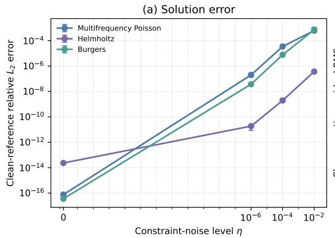

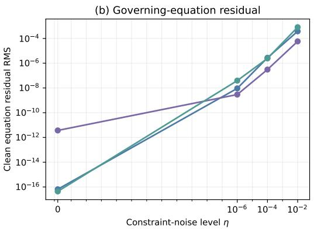  
Figure C.1: Empirical sensitivity of fixed-topology physics-only coeficient refinement to perturbations in the prescribed constraints. The symbolic topology is fixed to a targetcapable form and the governing equation remains unperturbed; independent Gaussian noise is applied only to the prescribed boundary or initial values. Markers denote medians, and error bars indicate the first and third quartiles over five independent draws at each nonzero noise level. The clean baseline consists of one deterministic run per configuration.

## Appendix C. 5. Rank and conditioning diagnostics

Table C . 7 : Rank and conditioning diagnostics for the Jacobian DF (a) of the discrete refinement-residual map evaluated at the refined coeficients The full-rank counts are those recorded in the finite-precision rank audit For runs with free coeficients the minimum singular value and condition number are reported as median [first quartile third quartile] over five PINN seeds . Zero-parameter runs are reported separately for which rank and conditioning metrics are not applicable .
<table><tr><td>Problem</td><td></td><td>Runs Free-param. runs Full-rank runs Zero-param. runs</td><td></td><td> $\sigma _ { \mathrm { m i n } }$ </td><td></td><td>Condition number</td></tr><tr><td>Param. Poisson</td><td>5</td><td>5</td><td>5</td><td>0</td><td> $4 . 2 9 \times 1 0 ^ { 2 } \ [ 4 . 2 9 \times 1 0 ^ { 2 } , 4 . 2 9 \times 1 0 ^ { 2 } ]$ </td><td> $1 \times 1 0 ^ { 0 } \ [ 1 \times 1 0 ^ { 0 } , 1 \times 1 0 ^ { 0 } ]$ </td></tr><tr><td>Multifreq. Poisson</td><td>5</td><td>5</td><td>5</td><td>0</td><td> $7 . 9 6 \times 1 0 ^ { 1 } \ \mathrm { [ 7 . 9 6 \times 1 0 ^ { 1 } , 7 . 9 6 \times 1 0 ^ { 1 } ] }$ </td><td> $5 . 7 3 \times 1 0 ^ { 0 } \ [ 5 . 7 3 \times 1 0 ^ { 0 } , 5 . 7 3 \times 1 0 ^ { 0 } ]$ </td></tr><tr><td>Euler-Bernoulli</td><td>5</td><td>5</td><td>5</td><td>0</td><td> $1 . 0 6 \times 1 0 ^ { 0 } ~ [ 1 . 0 6 \times 1 0 ^ { 0 } , 1 . 0 6 \times 1 0 ^ { 0 } ]$ </td><td> $9 . 5 8 \times 1 0 ^ { 4 } \ : \left[ 9 . 5 8 \times 1 0 ^ { 4 } , 9 . 5 8 \times 1 0 ^ { 4 } \right]$ </td></tr><tr><td>Conv.-diff.</td><td>5</td><td>5</td><td>5</td><td>0</td><td> $9 . 9 3 \times 1 0 ^ { 0 } \ [ 9 . 9 3 \times 1 0 ^ { 0 } , 9 . 9 3 \times 1 0 ^ { 0 } ]$ </td><td> $1 . 4 9 \times 1 0 ^ { 2 } \ \left[ 1 . 4 9 \times 1 0 ^ { 2 } , 1 . 4 9 \times 1 0 ^ { 2 } \right]$ </td></tr><tr><td>Diffusion</td><td>5</td><td>5</td><td>5</td><td>0</td><td> $\mathsf { 3 . 0 7 } \times 1 0 ^ { 2 } \ \mathsf { \left[ 3 . 0 7 \times 1 0 ^ { 2 } , 3 . 0 7 \times 1 0 ^ { 2 } \right] }$ </td><td> $1 \times 1 0 ^ { 0 } \ [ 1 \times 1 0 ^ { 0 } , 1 \times 1 0 ^ { 0 } ]$ </td></tr><tr><td>Wave</td><td>5</td><td>0</td><td>0</td><td>5</td><td></td><td></td></tr><tr><td>Telegraph-1</td><td>5</td><td>5</td><td>5</td><td>0</td><td> $3 . 7 0 \times 1 0 ^ { 2 } \ [ 3 . 7 0 \times 1 0 ^ { 2 } , 3 . 7 0 \times 1 0 ^ { 2 } ]$ </td><td> $2 . 7 0 \times 1 0 ^ { 0 } \ : [ 2 . 7 0 \times 1 0 ^ { 0 } , 2 . 7 0 \times 1 0 ^ { 0 } ]$ </td></tr><tr><td>Telegraph-2</td><td>5</td><td>5</td><td>5</td><td>0</td><td> $1 . 8 1 \times 1 0 ^ { 2 } \ [ 7 . 6 0 \times 1 0 ^ { 1 } , 1 . 8 1 \times 1 0 ^ { 2 } ]$ </td><td> $2 . 3 4 \times 1 0 ^ { 0 } \ [ 2 . 3 4 \times 1 0 ^ { 0 } , 8 . 6 2 \times 1 0 ^ { 0 } ]$ </td></tr><tr><td>Klein-Gordon</td><td>5</td><td>5</td><td>5</td><td>0</td><td> $3 . 8 2 \times 1 0 ^ { 3 } \ : \left[ 3 . 8 2 \times 1 0 ^ { 3 } , 3 . 8 2 \times 1 0 ^ { 3 } \right] \ : \ : 1 \times 1 0 ^ { 0 } \ : \left[ 1 \times 1 0 ^ { 0 } , 1 \times 1 0 ^ { 0 } \right]$ </td><td></td></tr><tr><td>Fokker-Planck-1</td><td>5</td><td>0</td><td>0</td><td>5</td><td></td><td></td></tr><tr><td>Fokker-Planck-2</td><td>5</td><td>0</td><td>0</td><td>5</td><td></td><td></td></tr><tr><td>Fokker-Planck-3</td><td>5</td><td>0</td><td>0</td><td>5</td><td></td><td></td></tr><tr><td>Helmholtz</td><td>5</td><td>5</td><td>5</td><td>0</td><td> $8 . 1 2 \times 1 0 ^ { 3 } \ [ 8 . 1 2 \times 1 0 ^ { 3 } , 8 . 1 2 \times 1 0 ^ { 3 } ] 1 \times 1 0 ^ { 0 } \ [ 1 \times 1 0 ^ { 0 } , 1 \times 1 0 ^ { 0 } ]$ </td><td></td></tr><tr><td>Sine-Poisson 3D</td><td>5</td><td>5</td><td>5</td><td>0</td><td> $9 . 8 1 \times 1 0 ^ { 2 } \ [ 9 . 8 1 \times 1 0 ^ { 2 } , 9 . 8 1 \times 1 0 ^ { 2 } ] 1 \times 1 0 ^ { 0 } \ [ 1 \times 1 0 ^ { 0 } , 1 \times 1 0 ^ { 0 } ]$ </td><td></td></tr><tr><td>Burgers</td><td>5</td><td>5</td><td>5</td><td>0</td><td></td><td> $4 . 7 7 \times 1 0 ^ { 0 } \ \left[ 4 . 7 7 \times 1 0 ^ { 0 } , 4 . 7 7 \times 1 0 ^ { 0 } \right] \ 9 . 2 6 \times 1 0 ^ { 1 } \ \left[ 9 . 2 6 \times 1 0 ^ { 1 } , 9 . 2 6 \times 1 0 ^ { 1 } \right]$ </td></tr><tr><td>Sine-Poisson 1D</td><td>5</td><td>5</td><td>5</td><td>0</td><td> $2 . 3 7 \times 1 0 ^ { 2 } \ \big [ 2 . 3 7 \times 1 0 ^ { 2 } , 2 . 3 7 \times 1 0 ^ { 2 } \big ] 1 \times 1 0 ^ { 0 } \ \big [ 1 \times 1 0 ^ { 0 } , 1 \times 1 0 ^ { 0 } \big ]$ </td><td></td></tr><tr><td>Sine-Poisson 2D</td><td>5</td><td>5</td><td>5</td><td>0</td><td> $5 . 6 2 \times 1 0 ^ { 2 } \ \left[ 5 . 6 2 \times 1 0 ^ { 2 } , 5 . 6 2 \times 1 0 ^ { 2 } \right] \ 1 \times 1 0 ^ { 0 } \ \left[ 1 \times 1 0 ^ { 0 } , 1 \times 1 0 ^ { 0 } \right]$ </td><td></td></tr></table>

## Appendix D. Additional numerical figures

The figures below provide grouped recovery profiles, field-level visualizations, and distribution-level diagnostics that complement the representative evidence presented in the main text. Representative profile and field figures use one PINN seed per configuration: the seed whose PINN relative $L _ { 2 }$ error is closest to the five-seed median. All methods shown within a configuration use that same PINN seed. For logarithmic pointwise-error visualizations, stored zeros and values below the displayed numerical floor are shown at that plotting floor.

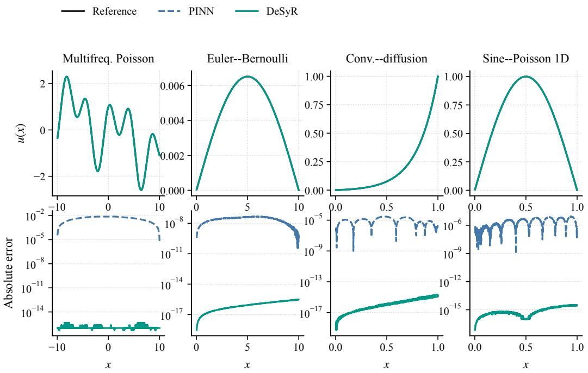  
Figure D.1: Representative one-dimensional recovery profiles. The upper row compares the reference solution, PINN teacher, and refined DeSyR expression for Multifrequency Poisson, Euler–Bernoulli, Convection–difusion, and Sine–Poisson 1D. The lower row shows the corresponding pointwise absolute errors of the PINN and DeSyR solutions.

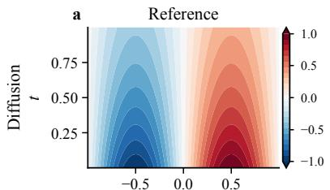

b  
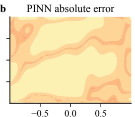

c  
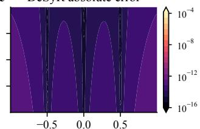

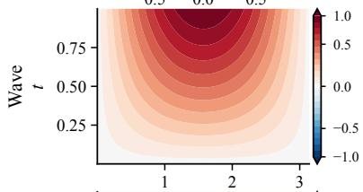

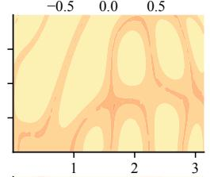

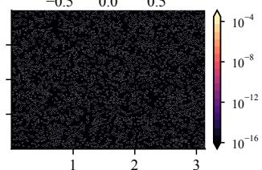

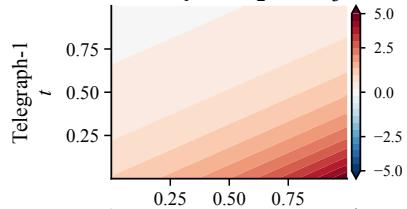

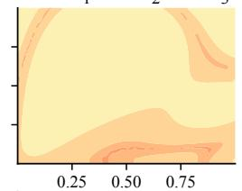

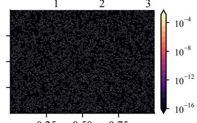

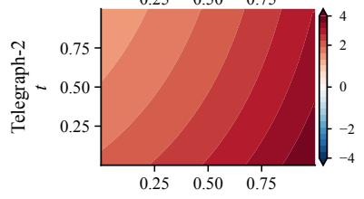  
x

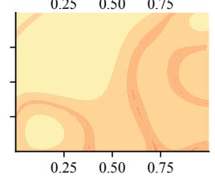  
x

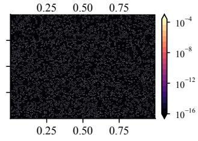  
x  
Figure D.2: Space–time recovery results for Difusion, Wave, Telegraph-1, and Telegraph-2. Rows correspond to the four benchmark configurations, while columns show the reference field, the pointwise absolute error of the PINN teacher, and the pointwise absolute error of the refined DeSyR expression. The PINN and DeSyR absolute-error maps within each row use the same logarithmic color scale.

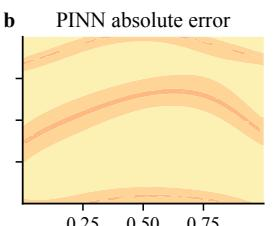

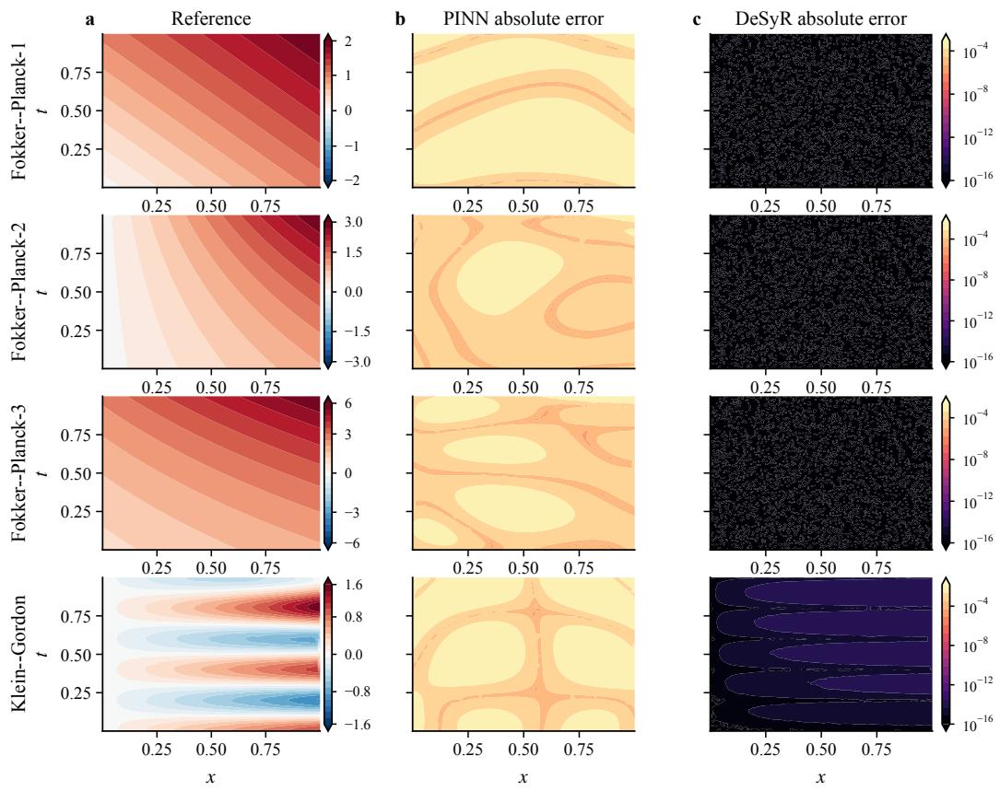  
Figure D.3: Space–time recovery results for Fokker–Planck-1, Fokker–Planck-2, Fokker– Planck-3, and Klein–Gordon. Rows correspond to the four benchmark configurations, while columns show the reference field, the pointwise absolute error of the PINN teacher, and the pointwise absolute error of the refined DeSyR expression. The PINN and DeSyR absolute-error maps within each row use the same logarithmic color scale.

x  
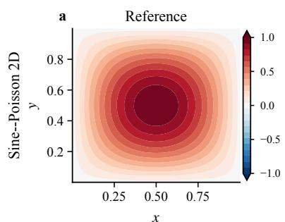

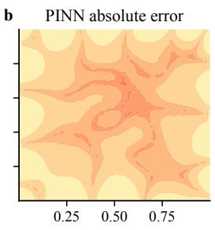  
x

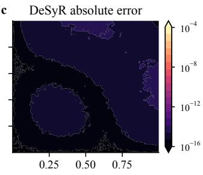  
x  
Figure D.4: Two-dimensional recovery results for Sine–Poisson 2D. The panels show the reference field, the pointwise absolute error of the PINN teacher, and the pointwise absolute error of the refined DeSyR expression. The PINN and DeSyR absolute-error maps use the same logarithmic color scale.

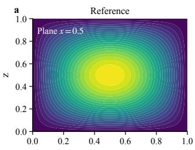

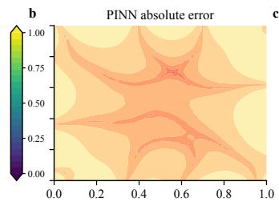

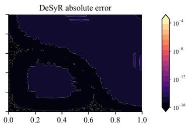

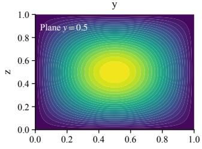

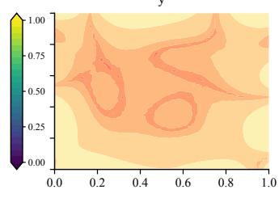

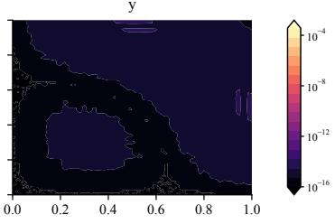

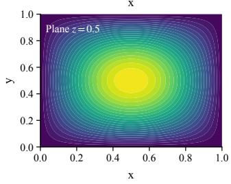

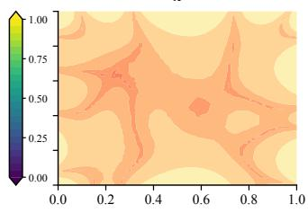

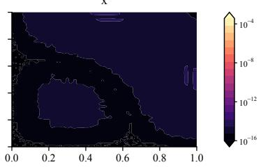  
Figure D.5: Three-dimensional recovery results for Sine–Poisson 3D on the orthogonal central planes $x = 0 . 5 , \ y = 0 . 5 ,$ , and $z = 0 . 5$ . Columns show the reference field, the pointwise absolute error of the PINN teacher, and the pointwise absolute error of the refined DeSyR expression. Within each row, the PINN and DeSyR absolute-error maps use the same logarithmic color scale.

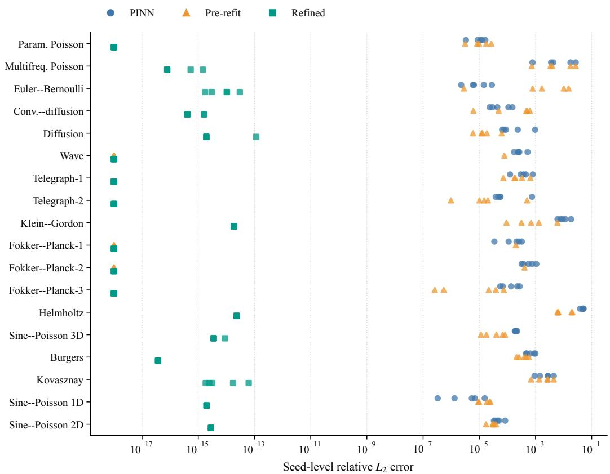  
Figure D.6: Seed-level relative $L _ { 2 }$ errors for all 18 configurations. For each configuration, the PINN, pre-refit, and refined errors are shown separately for each of the five PINN seeds. Markers within the floor region indicate stored floating-point zero values.

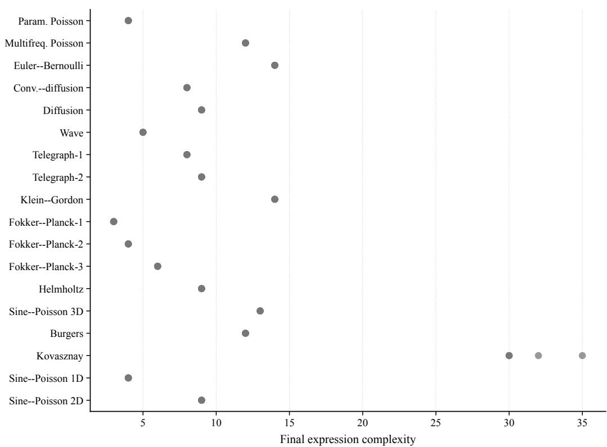  
Figure D.7: Final expression complexity across the five PINN seeds for all 18 configurations. Coincident markers indicate identical final complexities across seeds, while the Kovasznay spread reflects algebraically equivalent representations of the coupled solution.

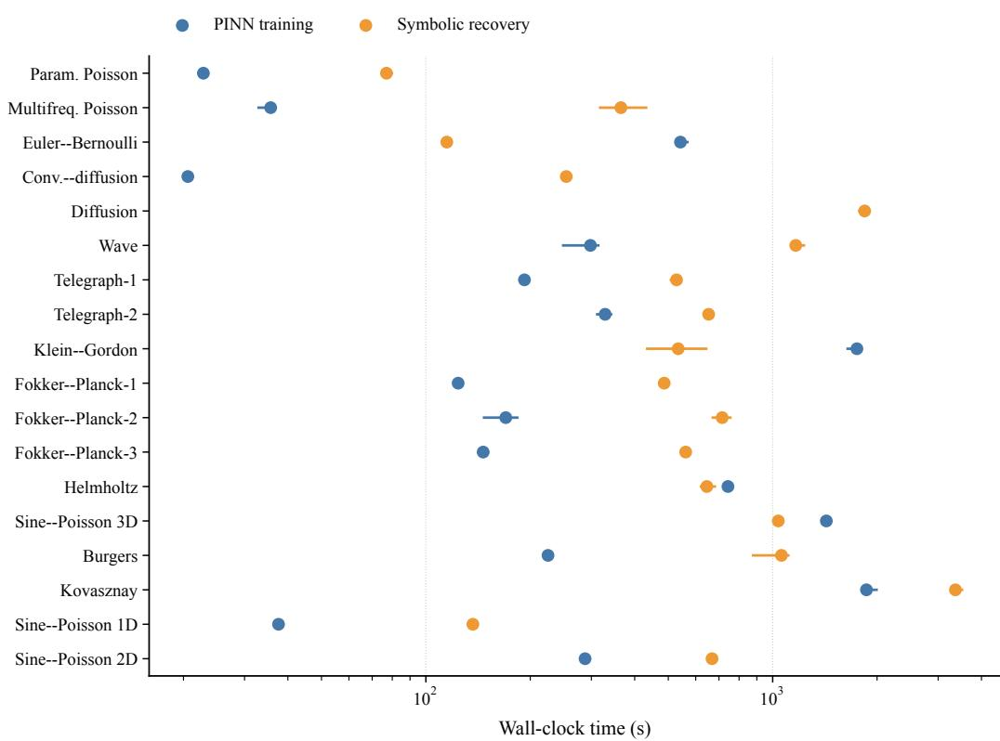  
Figure D.8: Configuration-level wall-clock times for the 18 configurations. Markers de note medians and horizontal intervals indicate interquartile ranges for PINN training and the symbolic-recovery stage, which includes symbolic search, coeficient refinement, and the subsequent Stage-C selection and verification operations. Difusion has no recorded training time, while Burgers training is summarized over four runs; all other reported summaries use five runs.

Table D.1: Stage-wise wall-clock costs for five representative configurations spanning distinct computational regimes. Values are medians over available recorded runs. Training and recovery counts are reported separately because some PINN teachers were loaded from existing checkpoints. Recovery includes symbolic search, coeficient refinement, and the subsequent Stage-C selection and verification operations. The total-time count gives the number of per-seed end-to-end pipeline timings used for the total-time median; when a teacher is loaded from a checkpoint, that timing includes checkpoint loading in place of PINN training. Total time is computed per run before taking the median and therefore need not equal the sum of the reported stage-wise medians. Timeouts count candidaterefinement attempts that reached the configured per-candidate time limit and can therefore exceed the number of recovery runs. Timings are hardware- and implementationdependent.
<table><tr><td>ID</td><td>Problem</td><td>Ntrain</td><td>Training (s)</td><td> $n _ { \mathrm { r e c } }$ </td><td>Recovery (s)</td><td> $n _ { \mathrm { t o t a l } }$ </td><td>Total time</td><td>Timeouts</td></tr><tr><td>01</td><td>Param. Poisson</td><td>5</td><td>22.8</td><td>5</td><td>77.0</td><td>5</td><td>99.8 s</td><td>0</td></tr><tr><td>03</td><td>Euler-Bernoulli</td><td>5</td><td>542.1</td><td>5</td><td>114.9</td><td>5</td><td>655.2 s</td><td>0</td></tr><tr><td>07a</td><td>Wave</td><td>5</td><td>298.2</td><td>5</td><td>1165.5</td><td>5</td><td>24.8 min</td><td>11</td></tr><tr><td>11</td><td>Helmholtz</td><td>5</td><td>743.1</td><td>5</td><td>645.9</td><td>5</td><td>23.1 min</td><td>10</td></tr><tr><td>13</td><td>Burgers</td><td>4</td><td>225.0</td><td>5</td><td>1059.9</td><td>5</td><td>18.6 min</td><td>6</td></tr></table>

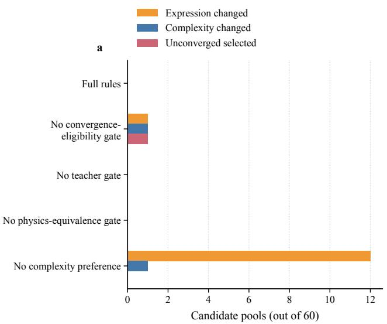

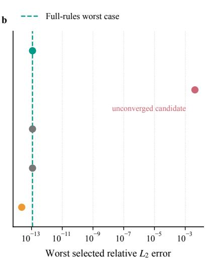  
Figure D.9: Stage-C selection-gate replay on 60 frozen scalar candidate pools. Panel (a) reports how many final selections change when each rule is removed, including changes in expression, complexity, and convergence status; absent bars indicate zero changes. Panel (b) shows the corresponding worst selected relative $L _ { 2 }$ error, with the dashed line marking the worst case under the full rule set. Removing the convergence-eligibility gate admits one unconverged candidate and substantially degrades the worst-case error, whereas removing the complexity preference changes 12 selections without increasing the worst error. The teacher-compatibility and physics-equivalence gates are inactive in these archived pools and therefore do not change the final selections in this replay.

## Acknowledgements

The authors gratefully acknowledge financial support from the National Natural Science Foundation of China (Grant No. 11971337), the General Research Fund of the Hong Kong Research Grants Council (Grant Nos. 15221123 and 15216424), and the Sichuan Provincial Department of Science and Technology (Project No. 2026NSFSC0138). This work was also supported by the Key Laboratory of Numerical Simulation of Sichuan Provincial Universities (Grant No. KLNS-2023SZFZ002), the project “Construction of a Remote Sensing Monitoring and Service System for the Ecological Environment of Typical Nature Reserves in Aba Prefecture” (Project No. R25CGZH0005), the Key Laboratory of Mathematical Meteorology (Grant No. 2025Z0340), and the Hong Kong Polytechnic University Internal Research Fund (Grant Nos. P0058468 and P0056171).

## Data availability

The data supporting the findings of this study are available from the corresponding author upon reasonable request.

## Declaration of competing interest

The authors declare that they have no known competing financial interests or personal relationships that could have appeared to influence the work reported in this paper.

## References

[1] R. J. LeVeque, Finite diference methods for ordinary and partial differential equations: steady-state and time-dependent problems, SIAM, 2007.

[2] S. C. Brenner, L. R. Scott, The mathematical theory of finite element methods, Springer, 2008.

[3] L. N. Trefethen, Spectral methods in MATLAB, SIAM, 2000.

[4] J. Sirignano, K. Spiliopoulos, DGM: a deep learning algorithm for solving partial diferential equations, Journal of Computational Physics 375 (2018) 1339–1364.

[5] B. Yu, et al., The Deep Ritz method: a deep learning-based numerical algorithm for solving variational problems, Communications in Mathematics and Statistics 6 (1) (2018) 1–12.

[6] L. Lu, P. Jin, G. Pang, Z. Zhang, G. E. Karniadakis, Learning nonlinear operators via DeepONet based on the universal approximation theorem of operators, Nature Machine Intelligence 3 (3) (2021) 218–229.

[7] Z. Li, N. Kovachki, K. Azizzadenesheli, B. Liu, K. Bhattacharya, A. Stuart, A. Anandkumar, Fourier neural operator for parametric partial differential equations, arXiv preprint arXiv:2010.08895 (2020).

[8] M. Raissi, P. Perdikaris, G. E. Karniadakis, Physics-informed neural networks: a deep learning framework for solving forward and inverse problems involving nonlinear partial diferential equations, Journal of Computational Physics 378 (2019) 686–707.

[9] G. E. Karniadakis, I. G. Kevrekidis, L. Lu, P. Perdikaris, S. Wang, L. Yang, Physics-informed machine learning, Nature Reviews Physics 3 (6) (2021) 422–440.

[10] S. Wang, Y. Teng, P. Perdikaris, Understanding and mitigating gradient flow pathologies in physics-informed neural networks, SIAM Journal on Scientific Computing 43 (5) (2021) A3055–A3081.

[11] A. Krishnapriyan, A. Gholami, S. Zhe, R. Kirby, M. Mahoney, Characterizing possible failure modes in physics-informed neural networks, Advances in Neural Information Processing Systems 34 (2021) 26548– 26560.

[12] S. Wang, X. Yu, P. Perdikaris, When and why PINNs fail to train: a neural tangent kernel perspective, Journal of Computational Physics 449 (2022) 110768.

[13] P. Niu, J. Guo, Y. Chen, Y. Zhou, M. Feng, Y. Shi, Improved physicsinformed neural network in mitigating gradient-related failures, Neurocomputing 638 (2025) 130167.

[14] Z. Xiang, W. Peng, X. Liu, W. Yao, Self-adaptive loss balanced physicsinformed neural networks, Neurocomputing 496 (2022) 11–34.

[15] C. Wu, M. Zhu, Q. Tan, Y. Kartha, L. Lu, A comprehensive study of non-adaptive and residual-based adaptive sampling for physics-informed neural networks, Computer Methods in Applied Mechanics and Engineering 403 (2023) 115671. doi:10.1016/j.cma.2022.115671.

[16] A. D. Jagtap, K. Kawaguchi, G. E. Karniadakis, Adaptive activation functions accelerate convergence in deep and physics-informed neural networks, Journal of Computational Physics 404 (2020) 109136. doi: 10.1016/j.jcp.2019.109136.

[17] A. D. Jagtap, G. E. Karniadakis, Extended physics-informed neural networks (XPINNs): a generalized space-time domain decomposition based deep learning framework for nonlinear partial diferential equations, Communications in Computational Physics 28 (5) (2020) 2002– 2041. doi:10.4208/cicp.OA-2020-0164.

[18] M. Schmidt, H. Lipson, Distilling free-form natural laws from experimental data, Science 324 (5923) (2009) 81–85.

[19] M. Cranmer, Interpretable machine learning for science with PySR and SymbolicRegression.jl, arXiv preprint arXiv:2305.01582 (2023).

[20] W. La Cava, P. Orzechowski, B. Burlacu, F. O. de França, M. Virgolin, Y. Jin, M. Kommenda, J. H. Moore, Contemporary symbolic regression methods and their relative performance, Proceedings of the Neural Information Processing Systems Track on Datasets and Benchmarks 1 (2021).

[21] S.-M. Udrescu, M. Tegmark, AI Feynman: a physics-inspired method for symbolic regression, Science Advances 6 (16) (2020) eaay2631.

[22] B. K. Petersen, M. Landajuela, T. N. Mundhenk, C. P. Santiago, S. K. Kim, J. T. Kim, Deep symbolic regression: recovering mathematical expressions from data via risk-seeking policy gradients, arXiv preprint arXiv:1912.04871 (2019).

[23] R. Majumdar, V. Jadhav, A. Deodhar, S. Karande, L. Vig, V. Runkana, Symbolic regression for PDEs using pruned diferentiable programs, arXiv preprint arXiv:2303.07009 (2023).

[24] E. S. Tan, A. Soubki, M. Cranmer, SymTorch: symbolic distillation of neural networks, arXiv preprint arXiv:2602.21307 (2026).

[25] S. Changdar, B. Bhaumik, N. Sadhukhan, S. Pandey, S. Mukhopadhyay, S. De, S. Bakalis, Integrating symbolic regression with physics-informed neural networks for simulating nonlinear wave dynamics in arterial blood flow, Physics of Fluids 36 (12) (2024) 121924. doi:10.1063/5.0247888.

[26] J. Das, B. Bhaumik, S. De, S. Changdar, Physics-informed neural network with symbolic regression for deriving analytical approximate solutions to nonlinear partial diferential equations, Neural Computing and Applications 37 (24) (2025) 20205–20240.

[27] S. Changdar, J. Das, B. Bhaumik, S. De, A refined physics-informed neural network framework for solving nonlinear partial diferential equations and extracting analytical expressions via symbolic regression, Computers & Mathematics with Applications 213 (2026) 81–116.

[28] R. Majumdar, V. Jadhav, A. Deodhar, S. Karande, L. Vig, V. Runkana, Physics-informed symbolic networks, arXiv preprint arXiv:2207.06240 (2022).

[29] Y. Gong, S. Lan, C. Yang, K. Xu, M. Jiang, StruSR: structureaware symbolic regression with physics-informed Taylor guidance, arXiv preprint arXiv:2510.06635 (2025).

[30] Y. Gong, C. Liu, S. Lan, J. Liao, C. Yang, J. Lin, M. Jiang, G. G. Yen, Symbolic regression with physics-informed residual and structural sensitivity pruning, IEEE Transactions on Evolutionary Computation (2026).

[31] S. Garmaev, V. Sharma, O. Fink, A data-free symbolic regression approach for solving equations, arXiv preprint arXiv:2606.07152 (2026).

[32] H. Oh, R. Amici, G. Bomarito, S. Zhe, R. Kirby, J. Hochhalter, Genetic programming based symbolic regression for analytical solutions to diferential equations, arXiv preprint arXiv:2302.03175 (2023).

[33] S. L. Brunton, J. L. Proctor, J. N. Kutz, Discovering governing equations from data by sparse identification of nonlinear dynamical systems,

Proceedings of the National Academy of Sciences 113 (15) (2016) 3932– 3937.

[34] S. H. Rudy, S. L. Brunton, J. L. Proctor, J. N. Kutz, Data-driven discovery of partial diferential equations, Science Advances 3 (4) (2017) e1602614.

[35] G.-J. Both, S. Choudhury, P. Sens, R. Kusters, DeepMoD: deep learning for model discovery in noisy data, Journal of Computational Physics 428 (2021) 109985.

[36] N. Makke, S. Chawla, Interpretable scientific discovery with symbolic regression: a review, Artificial Intelligence Review 57 (1) (2024) 2.

[37] L. Lu, X. Meng, Z. Mao, G. E. Karniadakis, DeepXDE: a deep learning library for solving diferential equations, SIAM Review 63 (1) (2021) 208–228.

[38] P. Virtanen, R. Gommers, T. E. Oliphant, M. Haberland, T. Reddy, D. Cournapeau, E. Burovski, P. Peterson, W. Weckesser, J. Bright, et al., SciPy 1.0: fundamental algorithms for scientific computing in Python, Nature Methods 17 (3) (2020) 261–272.

[39] J. Nocedal, S. J. Wright, Numerical optimization, 2nd Edition, Springer, New York, NY, 2006.