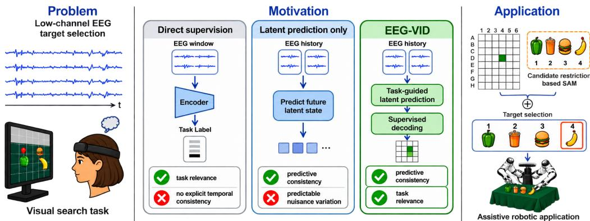
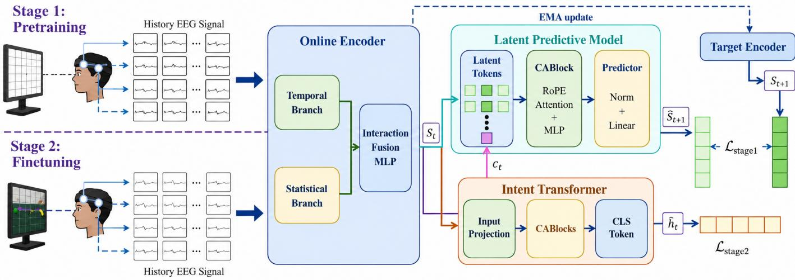
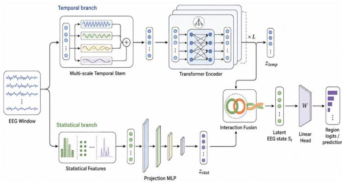
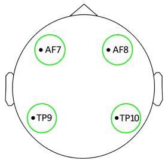
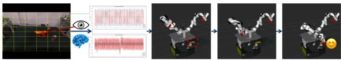

# EEG-VID: Task-Guided Latent Predictive Pretraining for EEG Decoding and Assistive Target Selection

Guanzhong Sun, Junyi Ma, Yuxuan Wu, and Yanzi Miao

Abstract—Objective: We investigate whether task-guided latent predictive pretraining improves EEG decoding under session and subject shifts and whether a four-electrode spatial posterior can support assistive target selection.

Methods: EEG-VID predicts future latent EEG states from recent history using an exponential-moving-average (EMA) target encoder and weak task guidance, and then fine-tunes the pretrained model for supervised decoding. We apply the same Stage 1 objective to five EEG backbones and replace the proposed predictor with recurrent and Transformer alternatives to test transferability and predictor dependence.

Results: On the 48-region cross-day VIG-48 task, EEG-VID reaches 6.52% Top-1 and 30.50% Top-5 accuracy. Across VIG-48 and BCI Competition IV-2a/IV-2b, Stage 1 improves mean accuracy in 41 of 42 matched backbone–dataset–protocol comparisons, including all 12 leave-one-subject-out (LOSO) settings, with a maximum gain of 16.22 percentage points. Weak task guidance improves over latent-only pretraining in all 18 pooled model– dataset comparisons. Alternative predictors outperform direct supervision in 48 of 54 comparisons, while the proposed predictor performs best in 45 of 54 matched comparisons. In a separate six-participant offline robot-scene study, candidate-constrained target selection reaches 40.24% versus a 25% chance level after subject-specific calibration. Because gaze is unconstrained in VIG-48, its spatial result is interpreted at the wearable-device level rather than as source-specific cortical decoding.

Conclusion: Weak task guidance improves the consistency of latent predictive pretraining across EEG decoders and distribution shifts, while the resulting spatial posterior supports abovechance scene-constrained target selection.

Significance: Task-guided latent prediction provides a transferable pretraining strategy for EEG decoding under session and subject shifts and connects low-channel EEG spatial posteriors with scene constraints for assistive target selection.

Index Terms—Assistive robotics, brain-computer interfaces, EEG decoding, representation learning.

## I. INTRODUCTION

R ELIABLE target selection is a basic requirement forassistive manipulation. Before a robot can reach or grasp assistive manipulation. Before a robot can reach or grasp an object, it must infer which target the user intends to select. EEG provides a non-invasive control signal for users with limited speech or manual input, but practical decoding remains difficult because the signal is noisy and varies across sessions and users. Established convolutional and transformer-based EEG decoders can learn effective discriminative features [1]– [4], yet those features may shift with electrode placement, contact impedance, fatigue, and other non-stationary factors.

Supervised EEG decoders optimize task discrimination but do not explicitly model cross-window predictive structure. Latent prediction can capture temporal dynamics, yet it may also preserve predictable task-irrelevant components such as slow drift, ocular activity, or visually evoked responses. EEG-VID therefore adds weak task guidance to future latentstate prediction so that pretraining emphasizes predictable components relevant to decoding (Fig. 1).

Based on this observation, we develop EEG-VID with taskguided latent predictive pretraining (Stage 1) followed by supervised EEG decoding (Stage 2). We focus on whether this pretraining objective transfers across different EEG decoders under session and subject shifts, rather than whether it benefits EEG-VID alone.

We evaluate this question on the in-house VIG-48 cross-day dataset and BCI Competition IV-2a/IV-2b [5]–[7] using pooled cross-session, within-subject, and leave-one-subject-out protocols. Stage 1 is applied to five existing EEG backbones [1]–[3], [8], [9], and the proposed predictor is replaced by recurrent and Transformer alternatives to further test whether the observed benefit depends on a particular predictor architecture.

A separate six-participant offline robot-scene study examines the assistive relevance of the learned spatial posterior under scene-constrained target selection. Across all evaluations, Stage 1 improves mean accuracy in 41 of 42 matched backbone–dataset–protocol comparisons, including all 12 LOSO settings. Alternative predictors outperform direct supervision in 48 of 54 comparisons. Robot-scene selection reaches 40.24% versus a 25% chance level after subjectspecific calibration. Because gaze is unconstrained in VIG-48, we interpret its spatial decoding result at the wearable-device level rather than as source-specific cortical decoding.

The main contributions are:

• We propose a task-guided latent predictive pretraining objective that combines future-state prediction with weak task supervision to learn predictable EEG representations that remain useful for downstream decoding.

• We formulate Stage 1 as a backbone-agnostic pretraining objective and evaluate its transfer through matched comparisons across different EEG decoders, predictor architectures, and session and subject shift protocols.

  
Fig. 1. Motivation and paradigm comparison of EEG-VID. EEG-VID combines temporal predictive consistency with weak task guidance, and restricts the decoded grid-region posterior to scene-derived candidates for assistive target selection.

• We evaluate the proposed strategy in a low-channel cross-day visual decoding setting and further test its use for scene-constrained target selection in a six-participant offline robot-scene study.

## II. RELATED WORK

## A. EEG-based intention decoding

EEG has long been used to decode user intentions and cognitive states in BCIs and rehabilitation systems. Classical paradigms include motor imagery [1], [2], steady-state visual evoked potentials [10], P300 event-related potentials [11], and visual stimulus classification [8], [9], [12]. Recent studies extend EEG-based visual interfaces to large-scale natural-image and object decoding [8], [13], [14], brain-supervised image editing [15], and 3D visual perception [9]. Beyond decoding alone, assistive BCI systems have combined neural intent with autonomous or shared robotic control [16]–[21]. Most of these systems are trained with discriminative objectives on fixed or aggregated observation windows. Our work instead learns predictive structure in latent EEG dynamics before supervised decoding.

## B. EEG representation learning and adaptation

EEG representation learning is challenged by low signalto-noise ratio, non-stationarity, and substantial subject/session variability [22]. These distribution shifts have motivated transfer, alignment, and subject-independent learning for crosssession and cross-subject EEG decoding [23]–[33]. Existing approaches further include signal preprocessing and channel selection [4], spatiotemporal neural architectures [1]–[3], [34], and lightweight or subject-specific calibration.

Self-supervised and pretrained EEG representation learning spans contrastive, temporal-context, and other pretext objectives [35]–[38], masked or predictive representation learning [39], [40], and larger cross-dataset pretrained models [41]– [44]. Purely self-supervised predictive objectives do not explicitly prioritize predictable EEG components that are informative for a specific downstream task.

## C. Latent predictive modeling

Predictive representation learning models future or missing information in representation space rather than reconstructing raw observations. Contrastive Predictive Coding learns representations by predicting future latent states [45], while data2vec predicts contextualized latent targets [46]. Targetencoder methods such as BYOL and I-JEPA further demonstrate predictive learning directly in representation space [47], [48]. For EEG, latent prediction avoids raw-signal reconstruction, which may require the model to represent task-irrelevant signal variation. The key challenge is to retain predictable components that are informative for the downstream task. We study whether weak task guidance can retain task-relevant structure within predictive EEG representations across backbones and subject shifts.

## III. METHODS

This section presents EEG-VID, a two-stage framework for region-level visual intention decoding (Fig. 2). EEG-VID first learns latent transitions from historical to future EEG representations through latent predictive pretraining, and then transfers the learned dynamic representations to supervised region decoding. The key idea is that future latent-state prediction provides a temporal consistency constraint, while weak task guidance encourages the learned predictable structure to remain relevant to downstream decoding.

## A. Problem Formulation

For each visual target selection trial, the user observes a visual scene divided into an $N \times M$ grid, corresponding to NM candidate regions. Given a sequence of historical EEG windows

$$
\mathbf { X } _ { t } = \{ \mathbf { x } _ { t - K + 1 } , \ldots , \mathbf { x } _ { t } \} ,
$$

where $\mathbf { x } _ { t } \in \mathbb { R } ^ { L \times C }$ denotes the t-th EEG window and K, L, C denote the number of historical windows, the window length and the number of EEG channels, the goal is to predict the region label $h _ { t } \in \{ 0 , \ldots , N M - 1 \}$ of the user’s intended target.

Rather than decoding each EEG window independently, EEG-VID models temporal transitions between historical and future latent EEG states. During training, the model learns to predict future latent EEG representations from historical windows. At inference, only $X _ { t }$ is required.

  
Fig. 2. Overall architecture of EEG-VID. Stage 1 learns latent EEG-state transition dynamics by predicting future EEG representations from historical EEG windows, supervised by an EMA target encoder and guided by a weak auxiliary classification term. Stage 2 transfers the learned dynamic representation to supervised visual intention region decoding

## B. Multi-scale Temporal-Statistical Hybrid EEG Encoder

The Online Encoder $E _ { \theta }$ maps each EEG window to a latent EEG-state representation. To combine learned temporal patterns with stable signal descriptors, we use a two-branch encoder (Fig. 3). The temporal branch models multi-scale dynamics, while the statistical branch summarizes additional signal statistics.

1) Temporal branch: A multi-scale temporal stem applies parallel one-dimensional convolutions with kernel sizes {3, 7, 11, 15},

$$
\mathbf { u } _ { \tau } ^ { ( k ) } = \mathrm { C o n v 1 D } _ { k } ( \mathbf { x } _ { \tau } ) , \qquad k \in \mathcal { K } ,\tag{1}
$$

whose outputs are concatenated along the channel dimension, normalized, activated by GELU and projected to a common embedding dimension by a 1 × 1 convolution,

$$
{ \bf U } _ { \tau } = \mathrm { F r o n t P r o j } \Big ( \mathrm { C o n c a t } _ { k \in \mathcal { K } } { \bf u } _ { \tau } ^ { ( k ) } \Big ) ,\tag{2}
$$

followed by BatchNorm, GELU and a channel squeeze-andexcitation module. Two dilated residual blocks (dilation 1 and 2) enlarge the receptive field, learnable positional embeddings are added, and a Transformer encoder captures long-range dependencies within the window,

$$
\mathbf { H } _ { \tau } = \mathrm { T r a n s f o r m e r } ( \mathrm { R e s B l o c k } ( \mathbf { U } _ { \tau } ) + \mathbf { P } ) .\tag{3}
$$

LayerNorm and attention pooling then yield the window-level temporal representation $\begin{array} { r l } { { \bf z } _ { \tau } ^ { \mathrm { t e m p } } } & { { } = } \end{array}$ AttnPool(LayerNorm(Hτ)).

2) Statistical branch: For each window, we compute six channel-wise temporal descriptors—mean, standard deviation, RMS, absolute mean, first-difference standard deviation, and line length—together with pairwise channel correlations and binned log-power spectral features. Their concatenation $\mathbf { r } _ { \tau } =$ $[ \mathbf { r } _ { \tau } ^ { \mathrm { t i m e } } \| \mathbf { r } _ { \tau } ^ { \mathrm { c o r r } } \| \mathbf { r } _ { \tau } ^ { \mathrm { f r e q } } ]$ is mapped by a projection MLP to the statistical representation $\mathbf { z } _ { \tau } ^ { \mathrm { s t a t } } = { \cal P } _ { \eta } ( \mathbf { r } _ { \tau } )$

3) Interaction fusion: The two branches are fused through an explicit interaction feature

$$
\mathbf { q } _ { \tau } = \left[ \mathbf { z } _ { \tau } ^ { \mathrm { t e m p } } \parallel \mathbf { z } _ { \tau } ^ { \mathrm { s t a t } } \parallel \mathbf { z } _ { \tau } ^ { \mathrm { t e m p } } \odot \mathbf { z } _ { \tau } ^ { \mathrm { s t a t } } \parallel \left| \mathbf { z } _ { \tau } ^ { \mathrm { t e m p } } - \mathbf { z } _ { \tau } ^ { \mathrm { s t a t } } \right| \right] ,\tag{4}
$$

where ∥ is concatenation and ⊙ element-wise multiplication. The product term captures interactions between the two branches, while the absolute-difference term captures differences between their features. A fusion MLP (LayerNorm– Linear–GELU–Dropout–Linear) produces the window-level latent EEG state

$$
\mathbf { S } _ { \tau } = F _ { \theta } ( \mathbf { q } _ { \tau } ) , \qquad \mathbf { S } _ { \tau } \in \mathbb { R } ^ { d } ,\tag{5}
$$

and we write the complete mapping as $\begin{array} { r } { \mathbf { S } _ { \tau } ~ = ~ E _ { \theta } ( \mathbf { x } _ { \tau } ) } \end{array}$ Applying $E _ { \theta }$ to each window with shared parameters gives the historical latent sequence

$$
\mathbf { S } _ { t - K + 1 : t } = E _ { \theta } ( \mathbf { X } _ { t } ) \in \mathbb { R } ^ { K \times d } .\tag{6}
$$

## C. Task-Guided Latent Predictive Pretraining (Stage 1)

Given $\mathbf { S } _ { t - K + 1 : t } ,$ , an intention modeling branch aggregates the historical latent tokens and outputs an intention representation $\mathbf { c } _ { t }$ together with auxiliary region logits ${ \mathbf { o } } _ { t } ^ { \mathrm { a u x } }$

$$
\begin{array} { r } { ( \mathbf { c } _ { t } , \mathbf { o } _ { t } ^ { \mathrm { a u x } } ) = G _ { \psi } ( \mathbf { S } _ { t - K + 1 : t } ) , \qquad \mathbf { o } _ { t } ^ { \mathrm { a u x } } \in \mathbb { R } ^ { N M } . } \end{array}\tag{7}
$$

$G _ { \psi }$ is an Intent Transformer operating only on the K historical latent tokens. A learnable summary token produces $\mathbf { c } _ { t } .$ and masked self-attention prevents access to the future EEG window used as the prediction target. The summary-token mask is defined so that it can aggregate all historical tokens while remaining independent of $\mathbf { x } _ { t + 1 }$

The latent predictor is conditioned on both the history and the intention representation,

$$
( \hat { \mathbf { S } } _ { t + 1 } , \mathbf { w } _ { t } ) = W _ { \phi } ( \mathbf { S } _ { t - K + 1 : t } , \mathbf { c } _ { t } ) ,\tag{8}
$$

  
Fig. 3. Architecture of the multi-scale temporal-statistical hybrid EEG encoder. A temporal branch extracts multi-scale temporal patterns, while a statistical branch extracts stable statistical descriptors. The two branches are fused through interaction features and projected into the EEG latent representation.

where $\hat { \mathbf { S } } _ { t + 1 }$ is the predicted future latent EEG state and $\mathbf { w } _ { t }$ is the EEG-state dynamics representation. Structurally, $W _ { \phi }$ contains a latent-token projection module, a stack of predictor blocks, and a lightweight predictor head. Each predictor block combines rotary positional embeddings (RoPE), attention, and an MLP.

Following the target-encoder principle used in predictive representation learning [47], [48], the prediction target is produced by an EMA target encoder $E _ { \bar { \theta } }$ that shares the architecture of Eθ but is updated without gradients,

$$
\bar { \theta }  \lambda _ { \mathrm { e m a } } \bar { \theta } + ( 1 - \lambda _ { \mathrm { e m a } } ) \theta , \qquad \mathbf { S } _ { t + 1 } = E _ { \bar { \theta } } ( \mathbf { x } _ { t + 1 } ) ,\tag{9}
$$

where the target-encoder EMA decay is fixed to $\lambda _ { \mathrm { e m a } } = 0 . 9 9 5$ A stop-gradient $\operatorname { s g } ( \cdot )$ is applied to $\mathbf { S } _ { t + 1 }$ . Together with the EMA target encoder, this stabilizes the prediction target and helps prevent trivial co-adaptation between the online encoder and the target representation.

We separate the magnitude and directional components of future-state prediction as

$$
\mathcal { L } _ { \mathrm { l a t e n t } } = \left\| \hat { \mathbf { S } } _ { t + 1 } - \mathrm { s g } ( \mathbf { S } _ { t + 1 } ) \right\| _ { 2 } ^ { 2 } ,\tag{10}
$$

$$
\begin{array} { r } { \mathcal { L } _ { \mathrm { c o s } } = 1 - \cos \left( \hat { \mathbf { S } } _ { t + 1 } , \mathrm { s g } ( \mathbf { S } _ { t + 1 } ) \right) . } \end{array}\tag{11}
$$

Weak task guidance: Temporal prediction alone does not determine which predictable EEG components are useful for downstream decoding because slowly varying task-irrelevant activity can also be predictable. We therefore introduce a weak auxiliary intention-classification term

$$
\mathcal { L } _ { \mathrm { i n t e n t } } = \mathrm { C E } ( \mathbf { o } _ { t } ^ { \mathrm { a u x } } , h _ { t } ) .\tag{12}
$$

The complete Stage 1 objective is

$$
\mathcal { L } _ { S 1 } = \lambda _ { \mathrm { l a t e n t } } \mathcal { L } _ { \mathrm { l a t e n t } } + \lambda _ { \mathrm { c o s } } \mathcal { L } _ { \mathrm { c o s } } + \lambda _ { \mathrm { c l s } } ^ { S 1 } \mathcal { L } _ { \mathrm { i n t e n t } } .\tag{13}
$$

Unless otherwise stated, we use $\lambda _ { \mathrm { l a t e n t } } = 1 . 0 , \lambda _ { \mathrm { c o s } } = 0 . 1$ $\lambda _ { \mathrm { c l s } } ^ { S 1 } ~ = ~ 0 . 1$ , and $\lambda _ { \mathrm { { e m a } } } ~ = ~ 0 . 9 9 5$ . The small classification weight allows this term to guide the learned representation without replacing the latent prediction objective. Accordingly, Section V-D compares the default with $\lambda _ { \mathrm { c l s } } ^ { S 1 } \in \{ 0 , 0 . 2 , \bar { 0 . 3 } \}$ while keeping the other Stage 1 coefficients fixed. This sweep tests the balance between prediction and task supervision over these four settings. It does not show that 0.1 is globally optimal.

Because Stage 1 uses the training-split labels through ${ \mathcal { L } } _ { \mathrm { i n t e n t } }$ , the procedure is a weakly supervised pretraining stage rather than a self-supervised one.

## D. Supervised Visual Intention Region Decoding (Stage 2)

Stage 2 transfers the online encoder, the intention branch and the latent predictor to supervised decoding. Instead of relying on the current window alone, the decoder fuses current evidence, temporally aggregated intention context and predicted dynamics,

$$
\mathbf { u } _ { t } = [ \mathbf { S } _ { t } \parallel \mathbf { c } _ { t } \parallel \mathbf { w } _ { t } ] , \qquad \ell _ { t } = C _ { \omega } ( \mathbf { u } _ { t } ) \in \mathbb { R } ^ { N M } ,\tag{14}
$$

and predicts $\hat { h } _ { t } = \arg \operatorname* { m a x } _ { i } \ell _ { t , i } .$

Because the labels live on a 2-D grid, a coordinate consistency term exploits the spatial structure. For class index $i \in$ $\{ 0 , \dots , N M - 1 \}$ , we define its row and column coordinates as $\rho _ { i } = \lfloor i / M \rfloor$ and $\kappa _ { i } = i$ mod M. For the ground-truth class $h _ { t } ,$ , let $\rho _ { t } ^ { \star } = \rho _ { h _ { t } }$ and $\kappa _ { t } ^ { \star } = \kappa _ { h _ { t } }$ . With $\mathbf { p } _ { t } = \mathrm { s o f t m a x } ( \ell _ { t } )$ , the expected coordinates are $\begin{array} { r } { \hat { \rho } _ { t } = \sum _ { i } \mathbf { p } _ { t , i } \rho _ { i } } \end{array}$ and $\begin{array} { r } { \hat { \kappa } _ { t } = \sum _ { i } \mathbf { p } _ { t , i } \kappa _ { i } , } \end{array}$

$$
\mathcal { L } _ { \mathrm { c o o r d } } = \mathrm { S m o o t h L 1 } ( \hat { \rho } _ { t } , \boldsymbol { \rho } _ { t } ^ { \star } ) + \mathrm { S m o o t h L 1 } ( \hat { \kappa } _ { t } , \kappa _ { t } ^ { \star } ) .\tag{15}
$$

We retain a weak predictive-consistency term during finetuning to encourage preservation of the learned transition structure. We define the retention loss using the same predictive weights as in Stage 1,

$$
\begin{array} { r } { \mathcal { L } _ { \mathrm { k e e p } } = \lambda _ { \mathrm { l a t e n t } } \mathcal { L } _ { \mathrm { l a t e n t } } + \lambda _ { \mathrm { c o s } } \mathcal { L } _ { \mathrm { c o s } } , } \end{array}\tag{16}
$$

where $\lambda _ { \mathrm { l a t e n t } } = 1 . 0$ and $\lambda _ { \mathrm { c o s } } = 0 . 1$ are shared with Stage 1. The complete Stage 2 objective is

$$
{ \mathcal { L } } _ { \mathrm { s t a g e 2 } } = \lambda _ { \mathrm { c l s } } { \mathcal { L } } _ { \mathrm { c l s } } + \lambda _ { \mathrm { c o o r d } } { \mathcal { L } } _ { \mathrm { c o o r d } } + \lambda _ { \mathrm { k e e p } } { \mathcal { L } } _ { \mathrm { k e e p } } ,\tag{17}
$$

where $\mathcal { L } _ { \mathrm { c l s } } ~ = ~ \mathrm { C E } ( \ell _ { t } , h _ { t } )$ . Unless otherwise stated, we use $\lambda _ { \mathrm { c l s } } ~ = ~ 1 . 0 , ~ \lambda _ { \mathrm { c o o r d } } ~ = ~ 0 . 1$ , and $\lambda _ { \mathrm { k e e p } } ~ = ~ 0 . 0 3$ . The future EEG window is used only to compute $\mathcal { L } _ { \mathrm { k e e p } }$ during training and is never required at inference. On datasets without a 2-D label geometry (Section IV), $\lambda _ { \mathrm { c o o r d } }$ is set to zero and NM is replaced by the number of classes.

## E. Robot Target Selection

The user selects one of four candidate objects without speech, gesture, or manual command. No dedicated eye tracker is used. For each robot-camera observation, SAM [49] first segments the four objects present in the scene, $\mathcal { O } = \{ o _ { 1 } , \ldots , o _ { J } \}$ with $J = 4$ . The image plane is divided into the same $6 \times 8$ grid used by EEG-VID, and each segmented object is mapped to a grid label $g ( o _ { j } )$ . SAM therefore defines the scene-dependent candidate label set

$$
{ \mathcal { C } } = \{ g ( o _ { 1 } ) , . . . , g ( o _ { J } ) \} , \qquad J = 4 .\tag{18}
$$

EEG-VID independently produces logits $\ell _ { t } \in \mathbb { R } ^ { 4 8 }$ from EEG. The final target is the object whose SAM-derived grid label receives the largest EEG logit,

$$
\hat { o } = \arg \operatorname* { m a x } _ { o _ { j } \in \mathcal { O } } \ell _ { t , g ( o _ { j } ) } .\tag{19}
$$

  
Fig. 4. Four-electrode Muse S Athena montage used for the in-house recordings at AF7, AF8, TP9, and TP10. The layout is shown for acquisition reproducibility and is not used for source-localization claims.

SAM supplies only the four candidate spatial labels. It does not infer the user’s intended target. EEG-VID makes the intention decision by restricting its posterior to those labels. Because every evaluated scene contains four candidate objects, random selection within the candidate set has a 25% chance level.

We evaluate this decision rule in an offline robot-scene experiment using six tabletop configurations, each containing four objects at different spatial positions. For each RGB observation, SAM produces the object masks, and each object is assigned to the grid cell containing the largest number of pixels from its mask. The subject-specific EEG-VID model supplies the 48-way spatial scores, after which (19) selects among the four occupied candidate cells.

The selected mask can be fused with depth for downstream grasp planning (AnyGrasp [50]). The reported outcome is target selection before motion planning. Grasp execution is not evaluated.

## F. Data Acquisition, Ethics, and Preprocessing

1) Ethics statement: Seven healthy adults participated in total. One contributed the VIG-48 cross-day corpus, and six contributed the robot-scene set. All participants provided written informed consent. The study was approved by the Ethics Committee of Xuzhou Central Hospital (No. XZXY-LJ-20210513-054). This study was not a clinical trial.

2) Acquisition and preprocessing: EEG was recorded at 256 Hz with a Muse S Athena using AF7, AF8, TP9, and TP10. Participants viewed a 6 × 8 grid. A target cell at a randomly selected position was continuously highlighted for 3–6 s. The target did not flicker, so no frequency-tagged SSVEP cue was used. No dedicated eye tracker and no gazecontingent hardware were used at any stage. Participants were not instructed to fixate centrally. Under this singledevice protocol, natural orienting toward the intended cell remains part of the recorded input rather than being explicitly suppressed. The consequences of this choice for what can be claimed about the decoded signal are stated in Section VI-B.

Recordings were segmented into non-overlapping 1-s windows. A fixed preprocessing pipeline—non-finite-value handling, outlier suppression, fourth-order 0.5–45 Hz band-pass filtering, and temporal smoothing—was applied consistently across all in-house experiments. No ICA or dedicated ocularartifact rejection was applied. With four scalp channels and no reference EOG, ocular components cannot be identified reliably. Removing orienting-related activity could also suppress information available to the device-level interface. We therefore retain a fixed preprocessing pipeline and interpret VIG-48 at the device level rather than as cortical source decoding.

## IV. EXPERIMENTAL SETUP

## A. Datasets

To evaluate decoding performance and transferability, we use the in-house VIG-48 dataset and two public BCI Competition IV benchmarks. We further conduct a separate robotscene experiment to assess scene-informed target selection.

1) In-house EEG visual intention dataset (VIG-48): VIG-48 contains approximately 15,000 window-level samples from one participant recorded across multiple days. Approximately 13,000 samples are used for model development, and the held-out test split is collected on three days that do not overlap the training days, so that evaluation measures crossday distribution shift rather than within-day generalization. Within the model-development portion, training and validation are separated by complete event identifiers before Stage 1 context construction. All windows from a given cued event remain in one split. The task is region-level decoding over a 6 × 8 grid with 48 candidate regions. The Top-1 and Top-5 chance levels are 2.08% and 10.42%, respectively. Because multiple windows originate from the same cued trial, individual windows are not treated as independent observations for a binomial significance test.

2) Robot-scene target-selection set: A separate in-house robot-scene set is collected from six additional participants across six tabletop scene configurations. Every test scene contains four candidate objects whose spatial positions vary across configurations. Before robot-scene evaluation, each participant completes 48 subject-specific calibration trials using the standard visual-intention acquisition paradigm. Each calibration trial lasts 10 s with one target label, providing 480 s of calibration EEG per participant. Robot-scene test trials are collected separately and last 30 s. During testing, each participant views the scene from the robot-camera viewpoint. RGB and depth images from this viewpoint are recorded together with the EEG trials. Seven robot-scene test trials are excluded because of data-saving or processing failures.

For each participant, EEG-VID is initialized from the visualintention model and adapted using only that participant’s calibration data. This adaptation is performed in Stage 2 with supervised classification fine-tuning; Stage 1 is not re-run on the robot calibration set. The adapted model is then evaluated on the participant’s held-out robot-scene trials. The reported endpoint is window-level candidate-constrained target-selection accuracy, defined as the number of windows for which the correct object’s grid label has the largest EEG score among the four SAM-derived candidate labels divided by the total number of valid test windows.

3) Public benchmarks: To test whether the proposed pretraining principle transfers beyond our acquisition setup, we evaluate on BCI Competition IV dataset 2a [5] and dataset 2b [6], released as part of BCI Competition IV [7]. IV-2a is a four-class motor-imagery benchmark with 22 EEG channels, and IV-2b is a two-class motor-imagery benchmark with three EEG channels. EOG channels are excluded in both datasets. These datasets are not visual-intention tasks. They are included to test whether Stage 1 transfers to standard EEG decoding settings. Chance levels are 25% for IV-2a and 50% for IV-2b. The three evaluation protocols applied to them are defined in Section IV-B.

## B. Evaluation Protocols

Absolute accuracy on IV-2a and IV-2b depends strongly on how models are trained and how decisions are made. Rather than reporting a single configuration, we evaluate every method under three protocols that differ in the amount of subject-specific data available at training time. All three use the same preprocessing, 1-s windowing, optimizer settings, and the same five fixed random seeds. In all three protocols, the classification decision is made per 1-s window rather than per trial.

For every protocol, raw trials/events retain an event identifier through preprocessing and windowing. Training and validation are then separated by complete event identifiers, so all windows from one event remain in the same split. Datadependent normalization statistics are estimated from training windows only and applied unchanged to validation and test data. Stage 1 history–target contexts are constructed only after this split and independently within each split and each event; no context crosses an event boundary or a train/validation/test boundary.

1) Pooled cross-session (subject-overlapping): A single subject-agnostic model is trained on the pooled training sessions of all nine subjects and evaluated on the pooled independent evaluation sessions of the same nine subjects. For IV-2a, the training pool is A01T–A09T and the test set is A01E– A09E. For IV-2b, the training pool contains Bxx01T, Bxx02T, and Bxx03T, while the test set contains Bxx04E and Bxx05E $( \mathbf { x x } = 0 1 , \ldots , 0 9 )$ . Training and testing therefore share subjects but not sessions. For each seed, 20% of the pooled training events are held out for validation (val ratio = 0.2), with all windows from an event kept together. Evaluation sessions are never used for model selection. After segmentation, IV-2a contains 10,368 training-pool windows and 10,368 test windows, and IV-2b contains 14,720 and 11,360. Each IV-2a trial contributes exactly four consecutive 1-s windows (9 subjects × 288 trials $\times 4 = 1 0 { , } 3 6 8 )$ , taken from the fixed 4-s motor-imagery interval. This protocol measures session shift with subject identity held fixed and is used for the main comparison and for all ablations.

2) Within-subject: One model is trained per subject on that subject’s own training session(s) and evaluated on that subject’s own evaluation session(s), with no data from any other subject. The validation subset is drawn at the event level from that subject’s training session(s), never from the evaluation session(s). This matches the conventional way IV-2a and IV-2b are reported, except that decisions remain windowlevel. It measures how each method behaves when subjectspecific data are available but scarce.

3) Cross-subject (leave-one-subject-out): For each heldout subject, the model is trained on the remaining eight subjects and evaluated on the held-out subject’s sessions, with no calibration data from that subject. Validation events are selected only from the eight training subjects. The held-out subject is never used for normalization, model selection, or checkpoint selection. This is the strictest of the three and the one most relevant to a deployable interface, since a new user supplies no labelled data.

4) Interpreting the absolute values: All IV-2a/IV-2b results are 1-s-window accuracies, whereas standard competition protocols classify complete trials. We also do not use sliding-window augmentation, filter-bank features, or covariance alignment [27]. Absolute values therefore should not be compared directly with published competition results. Because all methods share the same preprocessing and decision protocol, the within-table comparisons test the training strategy under a common controlled setting.

## C. Window Construction and Temporal Context

All datasets are segmented into consecutive, nonoverlapping 1-s EEG windows. IV-2a/IV-2b contain 250 samples per window (250 Hz), whereas the in-house data contain 256 samples (256 Hz). A fourth-order 0.5–45 Hz band-pass filter is used throughout. We fix the history length to $K = 4 .$

For consecutive windows $\left\{ \mathbf { x } _ { 0 } , \mathbf { x } _ { 1 } , \ldots \right\}$ , Stage 1 uses

$$
\left[ { \bf x } _ { t - 3 } , { \bf x } _ { t - 2 } , { \bf x } _ { t - 1 } , { \bf x } _ { t } \right] \longrightarrow { \bf x } _ { t + 1 } .\tag{20}
$$

Thus, each prediction uses at most 4 s of history to predict the next 1-s window. Missing history at the start of an event is left-padded by repeating the first window. Raw windows do not overlap, although adjacent history–target samples from the same event share three historical windows. This overlap occurs only within a single event and a single data split. Stage 1 contexts are generated after event-level splitting and never cross event or train/validation/test boundaries. The terminal window of each event is omitted whenever a future target is required.

For IV-2a and IV-2b, where an event contributes only four windows, this scheme yields three Stage 1 samples per trial and the first two are partly left-padded. The effective history is therefore shorter than 4 s on these benchmarks. On the inhouse recordings, where each highlighted target lasts 3–6 s, full-length histories are available for most samples. We report this asymmetry because it may explain part of the variation in Stage 1 gains across datasets.

## D. Baselines, Variants and Metrics

We compare EEG-VID with EEGNet [2], DeepConvNet [1], EEG-Conformer [3], TSConv [8], Neuro-3D [9], EEG2Rep [39], and BENDR [37]. EEG-VID w/o Stage 1 retains the supervised EEG-VID architecture but omits predictive pretraining. All reported baseline numbers are produced by our local implementations under the common data splits and preprocessing pipeline rather than copied from the cited papers. Unless stated otherwise, results use five fixed random seeds and are reported as mean ± standard deviation. We report Top-1 accuracy on all datasets and Top-5 accuracy on the 48-way in-house task. The public-benchmark accuracies are reported at the 1-s-window level under each of the three protocols of Section IV-B. For the robot-scene experiment we report SAMconstrained target-selection accuracy, i.e., the fraction of heldout test cases for which the highest-logit candidate object matches the intended object. With four candidates, random chance is 25%.

## E. Stage 1 Transfer to Existing EEG Backbones

To separate the training objective from the EEG-VID encoder, Stage 1 is also applied to EEGNet, DeepConvNet, EEG-Conformer, Neuro-3D and TSConv. For each backbone B, the classifier output is replaced during Stage 1 by a latent adaptation layer, giving $\mathbf { z } _ { t } ~ = ~ B ( \mathbf { x } _ { t } )$ . An EMA copy of the same backbone provides the stopped-gradient future target $\mathbf { z } _ { t + 1 } ^ { \mathrm { t a r g e t } }$ , and a predictor estimates that target from the K historical latent states. A lightweight auxiliary classifier uses the historical representation and the same training labels as EEG-VID. Thus, the external-backbone variants use the same three Stage 1 loss components and coefficients in (13), including latent distance, cosine consistency, and weak task guidance.

After Stage 1, the pretrained backbone initializes its original supervised decoder and is fine-tuned under the same Stage 2 data split and optimizer policy as the corresponding baseline. We denote the variants pretrained with taskguided latent prediction by the prefix TLP, giving TLP-EEGNet, TLP-DeepConvNet, TLP-Conformer, TLP-Neuro3D, and TLP-TSConv. These variants are not treated as additional competitors in the EEG-VID architecture ranking. Instead, each TLP variant is compared with its corresponding backbone without Stage 1 to test whether the training strategy transfers.

To further separate the Stage 1 training principle from the proposed predictor architecture, we replace the predictor with LSTM, GRU, and standard Transformer alternatives for EEG-VID and all five TLP variants under the pooled protocol. All replacements use the same latent input/output dimensions, Stage 1 objective, task-guidance weight, data splits, and training policy, with no predictor-specific hyperparameter tuning.

## F. Statistical Analysis

Results from repeated optimization runs are reported as mean ± standard deviation over five matched seeds. Seeds quantify optimization variability and are not treated as independent participants. For the within-subject and leave-onesubject-out protocols, the primary summary is the mean across the nine subject-specific evaluations. Table III additionally reports the number of subjects whose mean accuracy improves after Stage 1 $( k / 9 )$ , exposing the paired direction of the effect without treating those counts as a population-level significance test.

We also report the direction of the accuracy change across matched comparisons. Because these comparisons reuse datasets, subjects, seeds, and related model families, the resulting counts are not treated as independent observations or population-level significance tests. Table V additionally reports the mean and standard deviation of paired accuracy differences across matched model–dataset settings. For pooled backbone comparisons using matched seeds, Table II reports the paired change directly.

## G. Implementation Details

All models are trained with AdamW [51] on a single NVIDIA RTX 4090 using a batch size of 64. Training uses validation-based early stopping with a patience of 100 and a maximum allowance of 10,000 epochs. For the trainingbudget sensitivity control in Section V-B, all six corresponding single-stage models are additionally rerun with a fourfold larger maximum allowance under the same early-stopping rule. Weight decay is $1 0 ^ { - 4 }$ for both stages; learning rates are $3 \times 1 0 ^ { - 4 }$ for Stage 1 and $1 \times 1 0 ^ { - 4 }$ for Stage 2. Unless changed by an ablation, Stage 1 uses $\lambda _ { \mathrm { l a t e n t } } = 1 . 0 , \lambda _ { \mathrm { c o s } } = 0 . 1$ $\lambda _ { \mathrm { c l s } } ^ { S 1 } = 0 . 1$ , and EMA decay 0.995. Stage 2 uses $\lambda _ { \mathrm { c l s } } = 1 . 0$ $\lambda _ { \mathrm { c o o r d } } ~ = ~ 0 . 1$ , and $\lambda _ { \mathrm { k e e p } } ~ = ~ 0 . 0 3$ , with cosine coefficient 0.1 inside $\mathcal { L } _ { \mathrm { k e e p } }$ . The robot target-selection formulation uses candidate objects segmented from RGB-D observations and matches them to the decoded spatial region as described in the Methods section.

## V. RESULTS

## A. Pooled Cross-Session Comparison

Table I compares EEG-VID with seven locally retrained methods and its no-Stage 1 ablation. Under the pooled protocol, EEG-VID achieves $6 . 5 2 \pm 0 . 9 5 \% / 3 0 . 5 0 \pm 1 . 7 9 \%$ Top-1/Top-5 on VIG-48, $5 1 . 3 0 \pm 0 . 4 2 \%$ on IV-2a, and 75.90 ± 1.23% on IV-2b. Relative to the identical architecture without Stage 1, Top-1 improves by 1.47, 11.30, and 8.23 points, respectively, isolating the effect of the two-stage training procedure from decoder architecture.

EEG2Rep and BENDR provide direct predictive/selfsupervised reference points. Under the same local evaluation pipeline, both are below EEG-VID on the three Top-1 tasks and on VIG-48 Top-5. Because both were designed for larger montages and larger pretraining corpora, this comparison should be read as evidence about behaviour in the present lowchannel, small-data regime rather than as a general ranking of the methods.

## B. Stage 1 Transfer across EEG Backbones

Table II addresses a different question by comparing each decoder only with itself before and after Stage 1. All 15 external-backbone Top-1 mean changes are non-negative, and all five backbones also improve on VIG-48 Top-5. The magnitude of the gain depends on the architecture. For example, DeepConvNet gains 19.29 points on IV-2a whereas TSConv changes by only 0.05±1.16 points on IV-2b. The latter is best interpreted as no measurable effect.

Some Stage 1-enhanced external backbones exceed EEG-VID in absolute accuracy (e.g., TLP-Neuro3D on VIG-48 and TLP-DeepConvNet on IV-2a/IV-2b). This result further supports interpreting Stage 1 as a transferable training strategy rather than an architecture-specific advantage. EEG-VID is an application-oriented model with a grid-structured decoder that maps decoded regions to candidate objects. The gain also varies across architectures, showing that Stage 1 does not provide a fixed improvement across all models and datasets.

TABLE I  
POOLED CROSS-SESSION COMPARISON. BEST RESULTS ARE SHOWN IN BOLD.
<table><tr><td>Method</td><td colspan="2">VIG-48 (48-way)†</td><td> $\mathrm { I V } { - } 2 \mathrm { a } ^ { \dagger \ddagger }$ </td><td> $\mathrm { I V } { - } 2  { \mathbf { b } } ^ { \dagger \ddagger }$ </td></tr><tr><td></td><td>Top-1</td><td> $\mathrm { T o p } { - } 5$ </td><td></td><td></td></tr><tr><td>EEGNet [2]</td><td>4.80±0.11</td><td>22.74±1.02</td><td> $4 5 . 4 5 { \pm } 1 . 0 8 $ </td><td> $7 0 . 0 1 { \pm } 0 . 1 9$ </td></tr><tr><td>DeepConvNet [1]</td><td>4.35±0.45</td><td>21.46±1.16</td><td> $5 0 . 0 2 { \pm } 0 . 1 8$ </td><td> $7 0 . 4 8 { \pm } 0 . 4 0$ </td></tr><tr><td>EEG-Conformer [3]</td><td>4.95±0.18</td><td>21.98±0.24</td><td> $4 9 . 1 5 { \pm } 0 . 5 1 $ </td><td> $6 9 . 0 7 { \scriptstyle \pm 1 . 0 0 }$ </td></tr><tr><td>Neuro-3D [9]</td><td>4.57±0.31</td><td>19.95±1.47</td><td> $4 1 . 8 7 { \pm } 0 . 9 1 $ </td><td> $6 8 . 1 0 { \pm } 0 . 5 3 $ </td></tr><tr><td>TSConv [8]</td><td>3.67±0.30</td><td>16.48±0.83</td><td> $2 9 . 2 4 { \pm } 0 . 5 0 $ </td><td>52.27±0.50</td></tr><tr><td>EEG2Rep [39]</td><td>3.43±0.11</td><td>16.54±1.18</td><td> $3 2 . 6 2 { \pm } 1 . 0 2 $ </td><td> $6 7 . 1 7 { \pm } 1 . 0 2 $ </td></tr><tr><td>BENDR [37]</td><td>3.25±0.32</td><td>13.92±0.68</td><td> $3 0 . 2 4 { \pm } 1 . 1 4$ </td><td> $6 6 . 4 7 { \scriptstyle \pm 0 . 7 2 }$ </td></tr><tr><td>EEG-VID w/o Stage 1</td><td>5.05±0.72</td><td>20.67±3.27</td><td> $4 0 . 0 0 { \pm } 1 . 1 0 $ </td><td> $6 7 . 6 7 { \scriptstyle \pm 0 . 9 1 }$ </td></tr><tr><td>EEG-VID</td><td>6.52±0.95</td><td>30.50±1.79</td><td> ${ \pm } 1 . 3 0 { \pm } 0 . 4 2 $ </td><td> $\pm 1 . 2 3$ </td></tr></table>

†: Values are mean ± standard deviation over five fixed random seeds under the shared local pipeline.  
‡: IV-2a and IV-2b report 1-s-window accuracy.

TABLE II  
STAGE 1 GAINS ACROSS EEG BACKBONES.
<table><tr><td rowspan="2">Model pair</td><td colspan="2">VIG-48†</td><td rowspan="2">IV-2a† Top-1</td><td rowspan="2">IV-2b† Top-1</td></tr><tr><td>Top-1</td><td>Top-5</td></tr><tr><td>TLP-EEGNet / EEGNet</td><td>+1.60±0.68</td><td></td><td>+4.96±2.53 +11.20±1.29</td><td> $+ 6 . 4 1 \pm 1 . 0 4$ </td></tr><tr><td>TLP-DeepConvNet / +1.28±1.26 +3.50±2.11 +19.29±1.00</td><td></td><td></td><td></td><td> $+ 7 . 0 9 { \pm } 1 . 0 0 \ $ </td></tr><tr><td>DeepConvNet TLP-Conformer /</td><td></td><td>+1.24±1.27 +4.06±2.28 +6.38±0.87</td><td></td><td> $+ 6 . 9 2 { \pm } 1 . 3 3 $ </td></tr><tr><td>Conformer TLP-Neuro3D /</td><td></td><td>+2.93±1.65 +7.63±1.57 +7.85±1.20</td><td></td><td>+6.86±0.87</td></tr><tr><td>Neuro-3D TLP-TSConv / TSConv</td><td></td><td>+0.65±0.42 +0.82±3.69</td><td>+1.95±0.80</td><td>+0.05±1.16</td></tr><tr><td>EEG-VID / w/o Stage 1‡</td><td></td><td></td><td>+1.47±1.19 +9.83±3.73 +11.30±1.18 +8.23±1.53</td><td></td></tr></table>

†: Entries are seed-paired accuracy changes in percentage points after Stage 1 relative to the matched backbone, reported as mean ± standard deviation under the pooled protocol. ‡: EEG-VID is compared with the identical architecture without Stage 1.

As a training-budget sensitivity control, all six single-stage counterparts were rerun with a fourfold larger maximum epoch allowance under the same early-stopping rule. Stage 1 remained higher in 23 of 24 pooled model–metric comparisons. The only exception was TLP-TSConv on IV-2b, where the difference was −0.07 percentage points. Thus, the maximum epoch limit of the single-stage models does not explain the main pooled gains, although this control does not exactly match the number of parameter updates or total computation.

## C. Generalization across Subject-Wise Protocols

The subject-wise protocols separate absolute model ranking from Stage 1 transfer. Under within-subject evaluation, Stage 1 yields positive mean changes for 11 of 12 model–dataset pairs. The only negative mean is TLP-TSConv on IV-2b at −0.24 points. The $k / 9$ counts in Table III show that the improvements are observed across multiple participants. EEG-VID improves for 8/9 subjects on both IV-2a and IV-2b, while TLP-DeepConvNet and TLP-Conformer improve for at least 7/9 and 8/9 subjects, respectively.

The strongest pattern appears under leave-one-subject-out (LOSO) evaluation. Stage 1 improves the mean for all six models on both public datasets. On IV-2a, EEG-VID, TLP-EEGNet, and TLP-DeepConvNet improve for all 9/9 heldout subjects. TLP-Conformer and TLP-Neuro3D improve for 8/9. The largest mean gain is +16.22 points for DeepConvNet, while EEG-VID improves from 33.55% to 40.80%. On IV-2b, all six models again have positive mean changes, with subjectlevel improvement counts ranging from 6/9 to 8/9. The LOSO results show that the Stage 1 benefit extends beyond subjectoverlapping cross-session evaluation.

Across pooled, within-subject, and LOSO evaluations, Stage 1 produces a positive mean change in 41 of 42 matched decoder–dataset–protocol comparisons. This count and the $k / 9$ entries are descriptive rather than population-level significance tests (Section IV-F).

## D. Stage 1 Objective Ablation

The default weak task-guidance setting $( \lambda _ { \mathrm { c l s } } ^ { S 1 } = 0 . 1 )$ exceeds latent-only pretraining in all 18 model–dataset comparisons (Table IV). For EEG-VID, latent-only pretraining obtains 5.90%, 48.47% and 73.35% on VIG-48, IV-2a and IV-2b, compared with 6.52%, 51.30% and 75.90% for the default. Latent-only EEG-VID also outperforms the no-Stage 1 model on all three datasets, indicating that latent prediction alone provides consistent gains even without weak task guidance.

Weights 0.2 and 0.3 underperform the default in 34 of 36 comparisons, except for TLP-DeepConvNet on VIG-48 (0.3) and TLP-TSConv on IV-2a (0.2). Thus, a small nonzero taskguidance weight is the most reliable choice within the tested range. These results do not show that it is globally optimal.

## E. Predictor Architecture Robustness

Table V tests whether the Stage 1 benefit depends on the proposed predictor. LSTM, GRU, and Transformer replacements retain an advantage over direct supervision in

TABLE III  
SUBJECT-WISE PUBLIC-BENCHMARK COMPARISON. BEST RESULTS ARE SHOWN IN BOLD.
<table><tr><td>Model</td><td>IV-2a Within†</td><td>IV-2b Within†</td><td>IV-2a LOSO†</td><td>IV-2b LOSO†</td></tr><tr><td>TLP-EEGNet</td><td>53.38 (+0.40; 6/9)</td><td>75.57 (+3.88; 6/9)</td><td>45.24 (+8.30; 9/9)</td><td>70.54 (+3.02; 7/9)</td></tr><tr><td>TLP-DeepConvNet</td><td>56.71 (+5.59; 7/9)</td><td>76.52 (+6.36; 8/9)</td><td>54.19 (+16.22; 9/9)</td><td>73.08 (+5.69; 7/9)</td></tr><tr><td>TLP-Conformer</td><td>55.11 (+6.59; 8/9)</td><td>74.58 (+5.27; 8/9)</td><td>42.04 (+8.29; 8/9)</td><td>70.45 (+3.26; 6/9)</td></tr><tr><td>TLP-Neuro3D</td><td>49.49 (+2.86; 6/9)</td><td>73.20 (+5.32; 6/9)</td><td>41.82 (+7.59; 8/9)</td><td>69.44 (+3.68; 7/9)</td></tr><tr><td>TLP-TSConv</td><td>32.42 (+1.68; 5/9)</td><td>52.73 (−0.24; 5/9)</td><td>28.37 (+0.93; 7/9)</td><td>51.72 (+1.70; 8/9)</td></tr><tr><td>EEG-VID</td><td>48.76 (+6.08; 8/9)</td><td>73.18 (+6.31; 8/9)</td><td>40.80 (+7.25; 9/9)</td><td>70.69 (+5.50; 8/9)</td></tr></table>

†: Entries are accuracy (%) followed by (∆; k/9), where ∆ denotes the mean change versus the matched non-Stage 1 backbone and k the number of subjects with a positive paired change. “Within” uses subject-specific training; “LOSO” uses no labelled data from the evaluated subject.

TABLE IV  
EFFECT OF WEAK TASK GUIDANCE.
<table><tr><td>Model</td><td>VIG-48† IV-2a† IV-2b†</td><td></td><td></td><td>0.1 Best/3</td></tr><tr><td>EEG-VID</td><td>+0.62</td><td>+2.83</td><td>+2.55</td><td>3</td></tr><tr><td>TLP-EEGNet</td><td>+1.19</td><td>+3.57</td><td>+1.95</td><td>3</td></tr><tr><td>TLP-DeepConvNet</td><td>+0.02</td><td>+1.18</td><td>+1.32</td><td>2</td></tr><tr><td>TLP-Conformer</td><td>+0.42</td><td>+1.61</td><td>+1.71</td><td>3</td></tr><tr><td>TLP-Neuro3D</td><td>+1.44</td><td>+2.26</td><td>+0.03</td><td>3</td></tr><tr><td>TLP-TSConv</td><td>+1.19</td><td>+0.61</td><td>+0.59</td><td>2</td></tr></table>

†: Entries are Acc0.1 − Acc0 in percentage points under the pooled protocol. ‡: Number of datasets for which 0.1 gives the best of the three nonzero weights {0.1, 0.2, 0.3}.

TABLE V  
PREDICTOR-ARCHITECTURE ROBUSTNESS.
<table><tr><td>Replacement</td><td>S1 &gt; DS†</td><td>Proposed &gt; repl.†</td><td>∆Acc.</td></tr><tr><td>LSTM</td><td>16/18</td><td>16/18</td><td>+0.64±0.67</td></tr><tr><td>GRU</td><td>16/18</td><td>13/18</td><td>+0.52±0.70</td></tr><tr><td>Transformer</td><td>16/18</td><td>16/18</td><td>+0.52±0.52</td></tr><tr><td>Overall</td><td>48/54</td><td>45/54</td><td>+0.56±0.63</td></tr></table>

†: Counts use 18 matched model–dataset settings per predictor replacement under the pooled protocol (54 overall); S1 denotes Stage 1 and DS direct supervision.  
‡: ∆Acc = Accproposed − Accreplacement, reported as mean ± standard deviation in percentage points.

48 of 54 pooled model–dataset comparisons, including 18 of 18 on IV-2a. Thus, the Stage 1 benefit is not tied to a specific predictor architecture. The proposed predictor is nevertheless higher in 45 of 54 matched comparisons, with an overall mean advantage of 0.56±0.63 percentage points. These results separate the transferable Stage 1 training principle from the additional, architecture-dependent benefit of the proposed predictor.

## F. Electrode-Subset Analysis

For EEG-VID, the full montage is best, followed by AF7/AF8 and then TP9/TP10. The same frontal-over-temporoparietal ordering appears for the five supervised baselines. Because AF7/AF8 are close to the eyes and gaze was not constrained, this pattern cannot be interpreted as cortical localization. It only shows that the frontal pair carries stronger standalone target-related information in the present device configuration.

TABLE VI  
ELECTRODE-SUBSET ANALYSIS ON VIG-48.
<table><tr><td rowspan="2">Method</td><td colspan="3">Top-1 accuracy (%)†</td></tr><tr><td>Four electrodes</td><td>AF7/AF8</td><td>TP9/TP10</td></tr><tr><td>EEG-VID</td><td>6.52±0.95</td><td>5.84±1.11</td><td>4.70±0.92</td></tr><tr><td>EEG-VID w/o Stage 1</td><td>5.05±0.72</td><td>4.27±0.67</td><td>3.59±0.19</td></tr><tr><td>EEGNet</td><td>4.80±0.11</td><td>4.20±0.34</td><td>3.40±0.29</td></tr><tr><td>DeepConvNet</td><td>4.35±0.45</td><td>4.16±0.22</td><td>3.16±0.37</td></tr><tr><td>EEG-Conformer</td><td>4.95±0.18</td><td>4.19±0.64</td><td>3.59±0.26</td></tr><tr><td>Neuro-3D</td><td>4.57±0.31</td><td>4.38±0.23</td><td>3.26±0.36</td></tr><tr><td>TSConv</td><td>3.67±0.30</td><td>3.60±0.29</td><td>3.09±0.30</td></tr></table>

†: Values are mean ± standard deviation over five fixed random seeds. Comparisons are descriptive within each model and do not imply source localization.

  
Fig. 5. Qualitative visualization of offline robot target selection. SAM segments the four scene objects and maps their positions to candidate grid labels. EEG-VID supplies the 48-region EEG posterior, and the final target is the candidate label with the largest EEG score.

## G. Offline Robot-Scene Target Selection

We next evaluate whether the decoded 48-region posterior can support object-level selection when scene information restricts the decision space. For every robot-camera frame, SAM identifies the four object masks and maps them to four candidate grid labels. The subject-specific adapted EEG-VID model is applied to the held-out robot-scene EEG, and its 48- way scores are restricted to these four SAM-derived labels using (19). SAM therefore determines which spatial labels are eligible candidates, whereas EEG-VID determines which candidate is selected.

EEG-VID achieves 40.24% window-level candidateconstrained target-selection accuracy, exceeding the 25% random chance level for four candidate objects by 15.24 percentage points. Because SAM only defines the four eligible candidate locations and does not infer the intended target, the above-chance result indicates that the EEG-derived spatial posterior retains useful target information after scene-based restriction.

This result should not be directly compared with the 48- way VIG-48 Top-1 accuracy because the two evaluations use different decision spaces. The robot-scene experiment tests whether a calibrated 48-region EEG posterior can support object selection after being restricted to four scene-consistent candidates. It therefore evaluates the complementary roles of visual scene constraints and EEG intention evidence rather than unconstrained 48-way decoding.

This experiment evaluates target selection before motion planning and does not measure grasp success. A substantial gap remains to reliable closed-loop assistive control. Fig. 5 illustrates the candidate-restriction process.

## VI. DISCUSSION

## A. Main Findings

The main finding is that Stage 1 improves matched decoders across datasets and evaluation protocols, with the clearest gains under subject shift. The subject-wise results further show that these gains are broadly distributed rather than driven by a small subset of participants, supporting transfer beyond subject-overlapping cross-session evaluation.

The ablations separate the contribution of the training objective from predictor design. Latent prediction alone improves over direct supervision, and weak task guidance further strengthens the learned representation. The benefit also persists with generic temporal predictors, indicating that the transfer effect is not tied to a single predictor architecture.

Overall, the results identify task-guided latent prediction as the primary transferable mechanism in the tested setting, while predictor design provides an additional architecture-dependent gain. The selected task-guidance weight and predictor configuration work well in the tested settings but are not necessarily optimal for other datasets or models.

## B. Physiological Interpretation and Assistive Relevance

We interpret VIG-48 at the wearable-device level rather than as source-specific cortical decoding. Natural gaze orienting is permitted, AF7/AF8 are close to the eyes, and eye movements can contribute strongly to scalp EEG during free viewing [52]–[55]. Without reference EOG or eye tracking, cortical, visually evoked, and ocular contributions cannot be separated. The electrode-subset analysis is therefore descriptive and is not used for source-localization claims. The transferability of Stage 1 is assessed independently on the motor-imagery IV-2a/IV-2b benchmarks.

As a stand-alone 48-way command channel, 6.52% Top-1 accuracy is insufficient for practical control. Restricting the decision to four SAM-derived scene candidates yields 40.24% window-level target-selection accuracy versus a 25% chance level. This supports an offline, calibrated proof of concept, not closed-loop or clinical readiness.

## C. Limitations and Future Work

Several limitations define the scope of the current study. VIG-48 contains one participant, and the robot-scene study uses subject-specific calibration. Future work will expand the visual-intention dataset to multiple participants and evaluate cross-subject transfer with less subject-specific calibration.

The four-channel montage and unconstrained gaze do not allow cortical and ocular contributions to be separated. Future studies will add EOG or eye tracking and denser EEG to better distinguish these sources. Public-benchmark results use 1-s window-level decisions, so trial-level aggregation should be evaluated for direct comparison with standard protocols. Finally, Stage 1 requires additional computation compared with direct supervision. Future work will use more closely computematched comparisons and closed-loop robot experiments with online spatial-belief updating and EEG-based correction.

Accordingly, the current results support a transferable pretraining strategy and an offline scene-informed target-selection proof of concept rather than a deployable BCI or a sourcespecific neural mechanism.

## VII. CONCLUSION

EEG-VID combines task-guided latent predictive pretraining with supervised EEG decoding. Stage 1 improves matched decoders under cross-session and cross-subject shifts and remains effective when the proposed predictor is replaced by generic recurrent or Transformer alternatives. In the robot-scene study, restricting the EEG-derived posterior over grid regions to scene-derived candidates yields above-chance window-level target selection after subject-specific calibration. These results support task-guided latent prediction as a transferable EEG pretraining strategy and motivate future closedloop evaluation.

## REFERENCES

[1] R. T. Schirrmeister, J. T. Springenberg, L. D. J. Fiederer, M. Glasstetter, K. Eggensperger, M. Tangermann, F. Hutter, W. Burgard, and T. Ball, “Deep learning with convolutional neural networks for EEG decoding and visualization,” Human Brain Mapping, vol. 38, no. 11, pp. 5391– 5420, 2017.

[2] V. J. Lawhern, A. J. Solon, N. R. Waytowich, S. M. Gordon, C. P. Hung, and B. J. Lance, “EEGNet: a compact convolutional neural network for EEG-based brain–computer interfaces,” Journal of Neural Engineering, vol. 15, no. 5, p. 056013, 2018.

[3] Y. Song, Q. Zheng, B. Liu, and X. Gao, “EEG Conformer: Convolutional transformer for EEG decoding and visualization,” IEEE Transactions on Neural Systems and Rehabilitation Engineering, vol. 31, pp. 710–719, 2023.

[4] C. Sun and C. Mou, “Survey on the research direction of EEG-based signal processing,” Frontiers in Neuroscience, vol. 17, p. 1203059, 2023.

[5] C. Brunner, R. Leeb, G. R. Muller-Putz, A. Schl ¨ ogl, and G. Pfurtscheller,¨ “BCI competition 2008—Graz data set A,” Institute for Knowledge Discovery, Graz University of Technology, Graz, Austria, Tech. Rep., 2008.

[6] R. Leeb, C. Brunner, G. R. Muller-Putz, A. Schl ¨ ogl, and G. Pfurtscheller,¨ “BCI competition 2008—Graz data set B,” Institute for Knowledge Discovery, Graz University of Technology, Graz, Austria, Tech. Rep., 2008.

[7] M. Tangermann, K.-R. Muller, A. Aertsen, N. Birbaumer, C. Braun,¨ C. Brunner, R. Leeb, C. Mehring, K. J. Miller, G. R. Muller-Putz ¨ et al., “Review of the BCI competition IV,” Frontiers in Neuroscience, vol. 6, p. 55, 2012.

[8] Y. Song, B. Liu, X. Li, N. Shi, Y. Wang, and X. Gao, “Decoding natural images from EEG for object recognition,” in International conference on learning representations, 2024, pp. 47 648–47 665.

[9] Z. Guo, J. Wu, Y. Song, J. Bu, W. Mai, Q. Zheng, W. Ouyang, and C. Song, “Neuro-3D: Towards 3D visual decoding from EEG signals,” in Proceedings ofthe Computer Vision and Pattern Recognition Conference, 2025, pp. 23 870–23 880.

[10] N. Waytowich, V. J. Lawhern, J. O. Garcia, J. Cummings, J. Faller, P. Sajda, and J. M. Vettel, “Compact convolutional neural networks for classification of asynchronous steady-state visual evoked potentials,” Journal of Neural Engineering, vol. 15, no. 6, p. 066031, 2018.

[11] L. A. Farwell and E. Donchin, “Talking off the top of your head: toward a mental prosthesis utilizing event-related brain potentials,” Electroencephalography and Clinical Neurophysiology, vol. 70, no. 6, pp. 510–523, 1988.

[12] Y. Yao, W. De Swaef, S. Geirnaert, and A. Bertrand, “EEG-based decoding of selective visual attention in superimposed videos,” IEEE Journal ofBiomedical and Health Informatics, vol. 29, no. 10, pp. 7248– 7261, 2025.

[13] A. T. Gifford, K. Dwivedi, G. Roig, and R. M. Cichy, “A large and rich EEG dataset for modeling human visual object recognition,” NeuroImage, vol. 264, p. 119754, 2022.

[14] H. Wu, Q. Li, C. Zhang, Z. He, and X. Ying, “Bridging the visionbrain gap with an uncertainty-aware blur prior,” in Proceedings of the IEEE/CVF Conference on Computer Vision and Pattern Recognition, 2025, pp. 2246–2257.

[15] K. M. Davis, C. De La Torre-Ortiz, and T. Ruotsalo, “Brain-supervised image editing,” in Proceedings of the IEEE/CVF Conference on Computer Vision and Pattern Recognition, 2022, pp. 18 480–18 489.

[16] J. d. R. Millan, R. Rupp, G. M´ uller-Putz, R. Murray-Smith,¨ C. Giugliemma, M. Tangermann, C. Vidaurre, F. Cincotti, A. Kubler,¨ R. Leeb, C. Neuper, K. R. Muller, and D. Mattia, “Combining brain-¨ computer interfaces and assistive technologies: state-of-the-art and challenges,” Frontiers in Neuroscience, vol. 4, p. 161, 2010.

[17] I. Iturrate, J. M. Antelis, A. Kubler, and J. Minguez, “A noninvasive brain-actuated wheelchair based on a P300 neurophysiological protocol and automated navigation,” IEEE Transactions on Robotics, vol. 25, no. 3, pp. 614–627, 2009.

[18] T. Carlson and J. del R. Millan, “Brain-controlled wheelchairs: A robotic architecture,” IEEE Robotics & Automation Magazine, vol. 20, no. 1, pp. 65–73, 2013.

[19] R. Zhang, S. Lee, M. Hwang, A. Hiranaka, C. Wang, W. Ai, J. J. R. Tan, S. Gupta, Y. Hao, G. Levine, R. Gao, A. Norcia, L. Fei-Fei, and J. Wu, “NOIR: Neural signal operated intelligent robots for everyday activities,” in Proceedings of The 7th Conference on Robot Learning, ser. Proceedings of Machine Learning Research, J. Tan, M. Toussaint, and K. Darvish, Eds., vol. 229. PMLR, 06–09 Nov 2023, pp. 1737–1760. [Online]. Available: https://proceedings.mlr.press/v229/zhang23f.html

[20] Y. Xu, C. Ding, X. Shu, K. Gui, Y. Bezsudnova, X. Sheng, and D. Zhang, “Shared control of a robotic arm using non-invasive brain–computer interface and computer vision guidance,” Robotics and Autonomous Systems, vol. 115, pp. 121–129, 2019.

[21] Y. Zhou, T. Yu, W. Gao, W. Huang, Z. Lu, Q. Huang, and Y. Li, “Shared three-dimensional robotic arm control based on asynchronous BCI and computer vision,” IEEE Transactions on Neural Systems and Rehabilitation Engineering, vol. 31, pp. 3163–3175, 2023.

[22] X. Zhou, C. Liu, J. Zhou, Z. Wang, L. Zhai, Z. Jia, C. Guan, and Y. Liu, “Interpretable and robust AI in EEG systems: A survey,” arXiv preprint arXiv:2304.10755, 2023.

[23] V. Jayaram, M. Alamgir, Y. Altun, B. Scholkopf, and M. Grosse-Wentrup, “Transfer learning in brain-computer interfaces,” IEEE Computational Intelligence Magazine, vol. 11, no. 1, pp. 20–31, 2016.

[24] P. Zanini, M. Congedo, C. Jutten, S. Said, and Y. Berthoumieu, “Transfer learning: A riemannian geometry framework with applications to brain–computer interfaces,” IEEE Transactions on Biomedical Engineering, vol. 65, no. 5, pp. 1107–1116, 2018.

[25] P. L. C. Rodrigues, C. Jutten, and M. Congedo, “Riemannian procrustes analysis: Transfer learning for brain–computer interfaces,” IEEE Transactions on Biomedical Engineering, vol. 66, no. 8, pp. 2390–2401, 2019.

[26] D. Wu, Y. Xu, and B.-L. Lu, “Transfer learning for EEG-based braincomputer interfaces: A review of progress made since 2016,” IEEE Transactions on Cognitive and Developmental Systems, vol. 14, no. 1, pp. 4–19, 2022.

[27] H. He and D. Wu, “Transfer learning for brain–computer interfaces: A euclidean space data alignment approach,” IEEE Transactions on Biomedical Engineering, vol. 67, no. 2, pp. 399–410, 2020.

[28] C. Flores, M. Contreras, I. Macedo, and J. Andreu-Perez, “Transfer learning with active sampling for rapid training and calibration in BCI-P300 across health states and multi-centre data,” IEEE Transactions on Neural Systems and Rehabilitation Engineering, vol. 32, pp. 3794–3803, 2024.

[29] Q. She, T. Chen, F. Fang, J. Zhang, Y. Gao, and Y. Zhang, “Improved domain adaptation network based on wasserstein distance for motor imagery EEG classification,” IEEE Transactions on Neural Systems and Rehabilitation Engineering, vol. 31, pp. 1137–1148, 2023.

[30] S. Sartipi and M. Cetin, “Subject-independent deep architecture for EEG-based motor imagery classification,” IEEE Transactions on Neural Systems and Rehabilitation Engineering, vol. 32, pp. 718–727, 2024.

[31] Y. Zhong, L. Yao, G. Pan, and Y. Wang, “Cross-subject motor imagery decoding by transfer learning of tactile ERD,” IEEE Transactions on Neural Systems and Rehabilitation Engineering, vol. 32, pp. 662–671, 2024.

[32] Y. Zhou, T.-j. Luo, X. Zhang, and T. Han, “Spatial feature regularization and label decoupling based cross-subject motor imagery EEG decoding,” in Chinese Conference on Pattern Recognition and Computer Vision (PRCV). Springer, 2023, pp. 407–423.

[33] P. Chen, X. Liu, C. Ma, H. Wang, X. Yang, C. Grebogi, X. Gu, and Z. Gao, “Unsupervised domain adaptation with synchronized selftraining for cross-domain motor imagery recognition,” IEEE Journal of Biomedical and Health Informatics, vol. 29, no. 5, pp. 3664–3677, 2025.

[34] Y. Li, L. Guo, Y. Liu, J. Liu, and F. Meng, “A temporal-spectral-based squeeze-and-excitation feature fusion network for motor imagery eeg decoding,” IEEE Transactions on Neural Systems and Rehabilitation Engineering, vol. 29, pp. 1534–1545, 2021.

[35] M. N. Mohsenvand, M. R. Izadi, and P. Maes, “Contrastive representation learning for electroencephalogram classification,” in Proceedings of the Machine Learning for Health NeurIPS Workshop, ser. Proceedings of Machine Learning Research, vol. 136, 2020, pp. 238–253.

[36] H. Banville, O. Chehab, A. Hyvarinen, D.-A. Engemann, and A. Gram-¨ fort, “Uncovering the structure of clinical EEG signals with selfsupervised learning,” Journal of Neural Engineering, vol. 18, no. 4, p. 046020, 2021.

[37] D. Kostas, S. Aroca-Ouellette, and F. Rudzicz, “BENDR: Using transformers and a contrastive self-supervised learning task to learn from massive amounts of EEG data,” Frontiers in Human Neuroscience, vol. 15, p. 653659, 2021.

[38] M. H. Rafiei, L. V. Gauthier, H. Adeli, and D. Takabi, “Self-supervised learning for electroencephalography,” IEEE Transactions on Neural Networks and Learning Systems, vol. 35, no. 2, pp. 1457–1471, 2024.

[39] N. Mohammadi Foumani, G. Mackellar, S. Ghane, S. Irtza, N. Nguyen, and M. Salehi, “EEG2Rep: Enhancing self-supervised EEG representation through informative masked inputs,” in Proceedings of the 30th ACM SIGKDD Conference on Knowledge Discovery and Data Mining, 2024, pp. 5544–5555.

[40] Z. Fu, H. Zhu, Y. Zhao, R. Huan, Y. Zhang, S. Chen, and Y. Pan, “GMAEEG: A self-supervised graph masked autoencoder for EEG representation learning,” IEEE Journal of Biomedical and Health Informatics, vol. 28, no. 11, pp. 6486–6497, 2024.

[41] C. Yang, M. Westover, and J. Sun, “BIOT: Biosignal transformer for cross-data learning in the wild,” in Advances in Neural Information Processing Systems, vol. 36, 2023.

[42] W.-B. Jiang, L. Zhao, and B.-l. Lu, “Large brain model for learning generic representations with tremendous EEG data in BCI,” in International Conference on Learning Representations, 2024, pp. 16 405– 16 426.

[43] G. Wang, W. Liu, Y. He, C. Xu, L. Ma, and H. Li, “EEGPT: Pretrained transformer for universal and reliable representation of EEG signals,” in Advances in Neural Information Processing Systems, vol. 37, 2024, pp. 39 249–39 280.

[44] J. Wang, S. Zhao, Z. Luo, Y. Zhou, H. Jiang, S. Li, T. Li, and G. Pan, “CBraMod: A criss-cross brain foundation model for EEG decoding,” in International conference on learning representations, vol. 2025, 2025, pp. 75 310–75 346.

[45] A. v. d. Oord, Y. Li, and O. Vinyals, “Representation learning with contrastive predictive coding,” arXiv preprint arXiv:1807.03748, 2018.

[46] A. Baevski, W.-N. Hsu, Q. Xu, A. Babu, J. Gu, and M. Auli, “data2vec: A general framework for self-supervised learning in speech, vision and language,” in International conference on machine learning, ser. Proceedings of Machine Learning Research, vol. 162, 2022, pp. 1298– 1312.

[47] J.-B. Grill, F. Strub, F. Altche, C. Tallec, P. Richemond, E. Buchatskaya,´ C. Doersch, B. Avila Pires, Z. Guo, M. Gheshlaghi Azar et al., “Bootstrap your own latent: A new approach to self-supervised learning,” Advances in neural information processing systems, vol. 33, pp. 21 271– 21 284, 2020.

[48] M. Assran, Q. Duval, I. Misra, P. Bojanowski, P. Vincent, M. Rabbat, Y. LeCun, and N. Ballas, “Self-supervised learning from images with a joint-embedding predictive architecture,” in Proceedings of the IEEE/CVF Conference on Computer Vision and Pattern Recognition, 2023, pp. 15 619–15 629.

[49] A. Kirillov, E. Mintun, N. Ravi, H. Mao, C. Rolland, L. Gustafson, T. Xiao, S. Whitehead, A. C. Berg, W.-Y. Lo et al., “Segment anything,” in Proceedings of the IEEE/CVF International Conference on Computer Vision, 2023, pp. 4015–4026.

[50] H.-S. Fang, C. Wang, H. Fang, M. Gou, J. Liu, H. Yan, W. Liu, Y. Xie, and C. Lu, “AnyGrasp: Robust and efficient grasp perception in spatial and temporal domains,” IEEE Transactions on Robotics, vol. 39, no. 5, pp. 3929–3945, 2023.

[51] I. Loshchilov and F. Hutter, “Decoupled weight decay regularization,” 2019. [Online]. Available: https://arxiv.org/abs/1711.05101

[52] M. Plochl, J. P. Ossand¨ on, and P. K´ onig, “Combining EEG and eye¨ tracking: identification, characterization, and correction of eye movement artifacts in electroencephalographic data,” Frontiers in Human Neuroscience, vol. 6, p. 278, 2012.

[53] O. Dimigen, “Optimizing the ICA-based removal of ocular EEG artifacts from free viewing experiments,” NeuroImage, vol. 207, p. 116117, 2020.

[54] C. Lin, C. Zhang, J. Xu, R. Liu, Y. Leng, and C. Fu, “Neural correlation of EEG and eye movement in natural grasping intention estimation,” IEEE Transactions on Neural Systems and Rehabilitation Engineering, vol. 31, pp. 4329–4337, 2023.

[55] T. V. Afonso and F. Heinrichs, “EEG-EyeTrack: A benchmark for time series and functional data analysis with open challenges and baselines,” arXiv preprint arXiv:2504.03760, 2025.