# EM2Mem: Event-Centric Multimodal Memory for Large Language Models

Yijun Chen1\*, Yaqi Zheng1\*, Yanya Li1, Boyi Xiao2,   
Buqiang Xu1, Shuofei Qiao1, Jizhan Fang1, Xinle Deng1, Yunzhi Yao1,   
Xuehai Wang1, Liuxin Zhang3, Hui Li3, Huajun Chen1, Shumin Deng1† 1Zhejiang University 2South China University of Technology 3Lenovo Group Limited ie\_yijunchen@zju.edu.cn, 231sm@zju.edu.cn

## Abstract

Multimodal memory offers a scalable interface for long-video question answering, but existing methods often retrieve captions, frames, transcripts, summaries, or graph facts as isolated fragments. Although searchable, such fragments are not generation-ready: language models must reconstruct cross-modal and temporal alignments at inference time, when context is limited and attribution is difficult. We propose EM2Mem, an event-centric multimodal memory framework that binds heterogeneous evidence to event anchors during memory construction. Each event-indexed memory cell aligns multimodal records, temporal context, graph-linked relations, semantic facts, and provenance, enabling compact evidence readout over grounded multimodal events rather than modality-specific fragments. Across three long-video QA benchmarks, EM2Mem improves average accuracy over the strongest memory baseline by 2.0, 2.4, and 3.7 points, improves strict event-level Top-5 evidence recall by 7.0 points, and reduces per-query latency by 4.67× and total inference tokens by 63.66%1.

## 1 Introduction

Multimodal memory is becoming essential for enabling Large Language Models (LLMs) to reason over extended multimodal experiences. Unlike short-image or short-video understanding, longvideo QA requires models to answer questions whose supporting evidence may appear sparsely across minutes or hours of visual observations, speech transcripts, OCR, scenes, objects, and recurring behaviors (Yang et al., 2025; Tian et al., 2025; Fu et al., 2025). Since such evidence cannot be reliably captured by a single context window or a flat video representation, LLMs need an external memory that can store observations, retrieve taskrelevant context, and support grounded generation. The key problem, is not only how much information to store, but how to organize heterogeneous evidence into retrievable units that align with the way questions are asked and answers are justified.

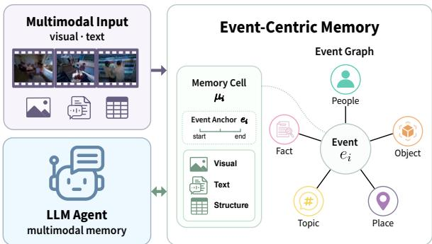  
Figure 1: EM2Mem organizes multimodal evidence into event-centric memory cells, enabling grounded retrieval over events rather than isolated fragments.

Recent multimodal memory and video retrievalaugmented generation methods typically construct fragment-centric memories by compressing videos into modality- or structure-specific stores, such as captions, summaries, keyframes, transcript segments, embeddings, triples, or knowledge graphs (Luo et al., 2024; Kahatapitiya et al., 2025; Ma et al., 2025; Gutierrez et al., 2024; Yeo et al., 2025). Although these fragments are searchable, they often fail to provide the event-level grounding needed for long-video QA. Questions commonly refer to events, situations, recurring behaviors, and temporally grounded relations, rather than isolated frames, sentences, or graph edges. As a result, existing systems face a retrieve-then-align bottleneck: they first retrieve disconnected fragments and then rely on the LLM to reconstruct missing crossmodal and temporal bindings during generation, when the context budget is limited and attribution is the most difficult to maintain.

To address this bottleneck, we rethink the retrieval unit of multimodal memory: How should multimodal memory organize heterogeneous evidence for LLM agents? Inspired by event cognition, which views events as coherent units for organizing perception, language, actions, and temporal boundaries (Zacks et al., 2007; Radvansky and Zacks, 2014; Li et al., 2022b), we propose $\mathbf { E M } ^ { 2 } \mathbf { M e m }$ , an Event-Centric Multimodal Memory framework for long-video QA. Rather than treating events as merely temporal video segments, $\mathbf { E M } ^ { 2 } \mathbf { M e m }$ uses event anchors as languageaddressable memory indices that bind captions, transcripts, keyframes, structured metadata, temporal context, and provenance during memory construction. This yields an align-then-retrieve design: heterogeneous evidence is unified into eventindexed multimodal memory cells before retrieval, so the model retrieves grounded event-level evidence rather than assembling isolated fragments afterward. To support reasoning beyond individual events, EM2Mem further builds an episodic graph for cross-event relations and temporal transitions, together with a semantic graph for long-term facts, habits, preferences, and stable relations, each grounded in supporting event evidence.

This event-centric design yields consistent gains in accuracy, efficiency, and attribution. On three long-video QA benchmarks, EgoLifeQA, Ego-R1 Bench, and Video-MME (L), EM2Mem improves average accuracy over the strongest memory baseline by 2.0%, 2.4%, and 3.7% respectively, while reducing per-query latency by 4.67 times and total inference tokens by 63.66%. It also localizes evidence more precisely, improving strict event-level Top-5 recall by 7.0 points over WorldMM’s five rounds of iterative retrieval. Further analyses show that structured event-centric evidence provides a more effective memory interface than raw frames or flattened captions, and that construction-time unification outperforms retrieval-time fusion. Together, these results suggest that organizing multimodal memory around events provides a more natural and effective foundation for grounded, attributable long-video QA.

## 2 Background

Given a long video with visual and text-form evidence streams $V = \{ V ^ { \mathrm { v i s } } , V ^ { \mathrm { t e x t } } \}$ and a question $q ,$ long-video QA aims to generate an answer $\hat { y }$ grounded in video-specific evidence. Here, Vtext includes transcripts, OCR, subtitles, dialogue, and other textual cues (Luo et al., 2024; Cheng et al., 2024; Chen et al., 2023). Since relevant evidence is often sparse, temporally distant, and distributed across modalities, directly feeding the full video into an LLM or MLLM is inefficient and may obscure cross-modal dependencies.

Existing multimodal memory systems typically convert long videos or agent experiences into searchable modality-typed units (Yeo et al., 2025; Long et al., 2025; Fan et al., 2024; Liu et al., 2026):

$$
\begin{array} { r l } & { u _ { j } ^ { m } = \left( s _ { j } ^ { m } , e _ { j } ^ { m } , p _ { j } ^ { m } , \tau _ { j } , m , \ell _ { j } \right) , \quad m \in \{ \mathrm { v i s , t e x t } \} , } \\ & { s _ { j } ^ { \mathrm { v i s } } = c _ { j } ^ { \mathrm { c l i p } } = \phi _ { \mathrm { c a p } } ( F _ { j } , K _ { j } ) , } \\ & { s _ { j } ^ { \mathrm { t e x t } } = \phi _ { \mathrm { t e x t } } ( r _ { j } , o _ { j } , d _ { j } ) . } \end{array}\tag{1}
$$

Here, $s _ { j } ^ { m }$ and $e _ { j } ^ { m }$ denote the searchable summary and embedding, $p _ { j } ^ { m }$ points to the source evidence, $\tau _ { j }$ is the timestamp, and $\ell _ { j }$ stores links to other units. Visual frames $F _ { j }$ and keyframes $K _ { j }$ are converted into clip captions, while transcripts $r _ { j }$ OCR/subtitles $o _ { j }$ , and other textual cues $d _ { j }$ are normalized into text summaries. Although such units provide a unified storage interface, they remain organized around individual modality-specific signals or compressed observations rather than coherent multimodal events.

## 3 Method

## 3.1 Overview

We propose EM2Mem, an Event-Centric Multimodal Memory framework for long-video reasoning with LLMs. EM2Mem follows an alignthen-retrieve design for long-video memory, as illustrated in Figure 2. It first parses a long video into short temporal events and uses event anchors as shared indices to align heterogeneous evidence during memory construction, rather than retrieving isolated modality-specific fragments at inference time. To support reasoning beyond individual events, $\mathbf { E M } ^ { 2 } \mathbf { M e m }$ further builds lightweight eventlinked graph memory: an episodic graph captures concrete cross-event relations, including shared entities, objects, scenes, topics, and temporal transitions, while a semantic graph stores higher-level regularities grounded in supporting events. At inference time, EM2Mem retrieves relevant event cells, expands them with graph-linked evidence, and compiles a compact query-specific evidence view for answer generation.

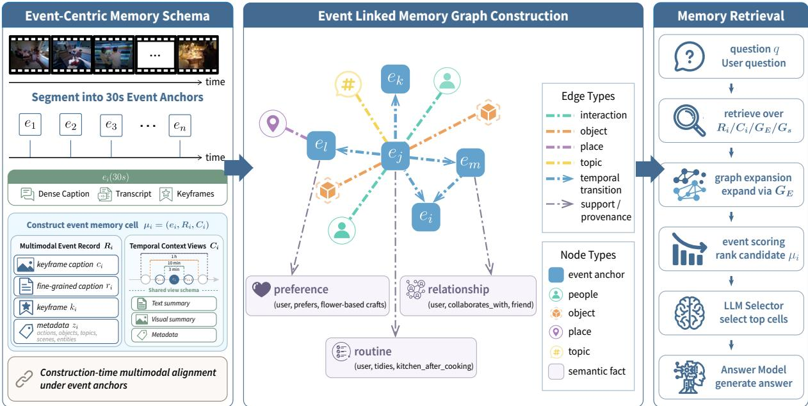  
Figure 2: Overview of $\mathbf { E M } ^ { 2 } \mathbf { M e m }$ . EM2Mem parses a long video into event anchors, constructs event-centric multimodal memory cells with local records $R _ { i }$ and multi-scale context views $\mathcal { C } _ { i } .$ , and links them through episodic and semantic graphs $G _ { E }$ and $G _ { S } .$ . Given a question, lightweight retrieval selects and expands relevant event cells to compile evidence for answer generation.

## 3.2 Event-Centric Multimodal Memory Schema

Instead of treating a video as a flat sequence of frames or captions, EM2Mem represents it as an event-indexed memory. We divide the video into short base segments, e.g. 30-second clips, and associate each segment with an event anchor:

$$
e _ { i } = ( i , \tau _ { i } ^ { s } , \tau _ { i } ^ { e } ) .\tag{2}
$$

An event anchor is a temporal address rather than memory content. It provides a shared indexing key for heterogeneous evidence and higher-level abstractions. Formally, EM2Mem represents the video as a set of Event-Centric Multimodal Memory Cells:

$$
\begin{array} { c } { { \mathcal { M } _ { \mathrm { E M } ^ { 2 } \mathrm { M e m } } = \left( \{ \mu _ { i } \} _ { i = 1 } ^ { N } , G _ { E } , G _ { S } \right) , } } \\ { { \mu _ { i } = ( e _ { i } , R _ { i } , \mathcal { C } _ { i } ) . } } \end{array}\tag{3}
$$

Each event memory cell $\mu _ { i }$ is anchored at $e _ { i }$ and stores local multimodal evidence $R _ { i }$ and multiscale temporal context views $\mathcal { C } _ { i }$ . Beyond cell-level memory, EM2Mem builds two global event-linked graphs: $G _ { E }$ captures cross-event episodic relations and temporal transitions, while $G _ { S }$ captures longterm semantic relations.

To make this schema concrete, suppose an event segment shows a person discussing a flower-based craft plan while interacting with flowers and vases. The corresponding memory cell binds the dialogue context, keyframe captions, and structured fields such as $\mathrm { A c t } _ { i } ~ =$ discussing a craft plan, $\mathrm { O b j } _ { i } =$ {flowers, vases}, and Top = flower-based craft under the same event anchor $e _ { i }$ , rather than storing them as separate captions, transcript snippets, and frames. Its context views $\mathcal { C } _ { i }$ link the event to surrounding temporal summaries, while the graphs connect it to related entities, objects, topics, and recurring patterns. This design makes the memory cell query-ready: questions about the plan, involved objects, or nearby activities can retrieve one grounded event cell and its linked context instead of stitching together isolated modality-specific fragments at inference time. All evidence is grounded to event anchors via $\alpha ( \cdot )$ , preserving heterogeneous memory forms within a event-centric schema.

## 3.3 Multimodal Memory Construction

Multimodal Event Record. For each base event segment, EM2Mem constructs a multimodal event record that stores the local evidence observed within the event:

$$
\begin{array} { r l } & { R _ { i } = \bigl ( c _ { i } , r _ { i } , k _ { i } , z _ { i } , \tau _ { i } \bigr ) , } \\ & { z _ { i } = \bigl ( \mathrm { A c t } _ { i } , \mathrm { O b j } _ { i } , \mathrm { T o p } _ { i } , \mathrm { S c e n } _ { i } , \mathrm { E n t } _ { i } \bigr ) . } \end{array}\tag{4}
$$

Here, $c _ { i }$ is a visual keyframe caption, $r _ { i }$ is the transcript or dialogue context, $k _ { i }$ denotes representative keyframes, and $z _ { i }$ contains structured metadata, including actions, objects, dialogue topics, visual scenes, and visual entities. These fields are obtained through multimodal parsing modules, including captioning, transcript alignment, keyframe selection, and structured field extraction.

Temporal Context Views. To support reasoning at different temporal granularities, EM2Mem further builds temporal context views over multiple scales, such as 3 minutes, 10 minutes, and 1 hour. At each scale, consecutive event anchors are grouped into a temporal block and summarized into a context view:

$$
\begin{array} { r } { h _ { j } ^ { ( l ) } = ( u _ { j , l } ^ { \mathrm { t e x t } } , u _ { j , l } ^ { \mathrm { v i s } } , m _ { j , l } , \tau _ { j , l } , l ) . } \end{array}\tag{5}
$$

The textual summary $u _ { j , l } ^ { \mathrm { t e x t } }$ captures narrative and dialogue context, the visual summary $u _ { j , l } ^ { \mathrm { v i s } }$ summarizes visual evidence, and $m _ { j , l }$ aggregates normalized metadata such as actions, objects, scenes, and topics. Each context view is anchored to all base events covered by its temporal span, and the context-view set $\mathcal { C } _ { i }$ of an event cell contains all views whose spans include $e _ { i }$

## 3.4 Event-Linked Memory Graph Construction

Beyond event memory cells, EM2Mem builds two lightweight graph indices over shared event anchors: an episodic graph $G _ { E }$ and a semantic graph $G _ { S }$ . These graphs are used as auxiliary indices rather than as new graph formalisms. The episodic graph connects event anchors with typed entities such as people, objects, locations, scenes, and topics, and also includes temporal transitions between adjacent events. Each relation is grounded to its supporting event anchors, allowing graph-derived clues to be traced back to concrete video evidence.

The semantic graph summarizes recurring patterns from episodic evidence, such as habits, preferences, routines, and stable relationships. Unlike local event records, which describe concrete observations, semantic facts capture long-term regularities that may span multiple distant events. These facts are also linked back to their supporting anchors, so that high-level knowledge remains evidencegrounded. Together, $G _ { E }$ and $G _ { S }$ complement event memory cells by providing cross-event connectivity and long-term semantic context.

## 3.5 Memory Retrieval and Ranking

At inference time, EM2Mem performs lightweight event-level readout over pre-aligned memory cells, which shifts retrieval from query-time cross-modal fusion to compact event-cell selection and expansion. Given a question q, it first identifies relevant event memory cells using signals from local multimodal records, multi-scale temporal context views, and graph-linked evidence. It then performs lightweight expansion through temporal transitions, shared entities, objects, locations, topics, and relevant semantic facts, so that complementary evidence from nearby or semantically related events can be included.

An LLM-based selector further filters the candidate event cells and keeps only the evidence needed to answer the question. For each selected event, EM2Mem compiles a query-specific evidence view $E _ { q } ,$ , including relevant captions, transcripts, structured visual fields, temporal summaries, semantic facts, and selected keyframes. The final answer yˆ is generated by $\mathrm { L L M _ { a n s } }$ conditioned on the question q and the compact evidence view $E _ { q }$

## 4 Experiment

## 4.1 Experimental Setup

Datasets and Metrics. We evaluate EM2Mem on three multiple-choice long-video QA benchmarks: EgoLifeQA, Ego-R1 Bench, and Video-MME (L) (Yang et al., 2025; Tian et al., 2025; Fu et al., 2025). Together, they cover week-long egocentric dailylife QA, ultra-long egocentric reasoning, and opendomain long-video understanding. Following the standard protocol of each benchmark, we report category-level and average accuracy. Dataset statistics, category definitions, and license details are provided in Appendix A.

Baselines. We compare EM2Mem with representative baselines spanning base MLLMs, longvideo MLLMs, RAG-based video QA methods, and memory-based long-video reasoning frameworks, as listed in Tables 1 and 3. For the strongest and most related memory baseline, we report both the originally published WorldMM results and our reproduced WorldMM† results under the same evaluation setting as EM2Mem. Detailed baseline configurations are provided in Appendix B.1.

## 4.2 Main Results

Accuracy across long-video QA benchmarks. Tables 1 and 3 report the main results on Ego-LifeQA, Ego-R1 Bench, and Video-MME (L). Overall, EM2Mem achieves strong performance against base MLLMs, long-video LLMs, RAGbased methods, and memory-based video reasoning systems. We report both previously published WorldMM results and our reproduced WorldMM† results for reference; since reproduced results are obtained under the same evaluation setting as EM2Mem, they provide the most controlled comparison. Under this setting, EM2Mem improves over WorldMM† by 2.0 points on EgoLifeQA (66.0 vs. 64.0), and 3.7 points on Video-MME (L) (76.8 vs. 73.1). On Ego-R1 Bench, where we use the originally reported WorldMM result for comparison, EM2Mem achieves 67.7 average accuracy, outperforming WorldMM by 2.4 points (67.7 vs. 65.3). These gains are especially visible on RelationMap and TaskMaster in EgoLifeQA, EntityLog in Ego-R1 Bench, and AREC, CNT, OCR, and ORES in Video-MME (L), suggesting that eventindexed retrieval units are useful for grounded entity tracking, task-state reasoning, and cross-modal evidence aggregation. Compared with the originally reported WorldMM numbers, EM2Mem remains competitive and slightly higher on average, although WorldMM is stronger on several habit, temporal, and synthetic reasoning categories.

<table><tr><td rowspan="3">Model</td><td colspan="6">EgoLifeQA</td><td colspan="6">Ego-R1 Bench</td></tr><tr><td>Ent.</td><td>EvR.</td><td>Hab.</td><td>Rel.</td><td>Task</td><td>Avg.</td><td>Ent.</td><td>EvR.</td><td>Hab.</td><td>Rel.</td><td>Task</td><td>Avg.</td></tr><tr><td>Base Models</td><td></td><td></td><td></td><td></td><td></td><td></td><td></td><td></td><td></td><td></td><td></td><td></td></tr><tr><td>Qwen3-VL-8B</td><td>35.2</td><td>30.2</td><td>39.3</td><td>46.4</td><td>46.0</td><td>38.6</td><td>31.8</td><td>41.5</td><td>38.5</td><td>42.1</td><td>44.7</td><td>35.7</td></tr><tr><td>Gemini 2.5 Pro</td><td>43.2</td><td>40.5</td><td>41.0</td><td>55.2</td><td>52.4</td><td>46.4</td><td>43.9</td><td>56.1</td><td>53.9</td><td>47.4</td><td>47.4</td><td>46.7</td></tr><tr><td>GPT-5</td><td>47.2</td><td>42.1</td><td>47.5</td><td>53.6</td><td>55.6</td><td>48.6</td><td>41.8</td><td>58.5</td><td>53.9</td><td>52.6</td><td>50.0</td><td>46.3</td></tr><tr><td>Long Video LLMs</td><td></td><td></td><td></td><td></td><td></td><td></td><td></td><td></td><td></td><td></td><td></td><td></td></tr><tr><td>VideoChat-Flash</td><td>28.8</td><td>32.5</td><td>37.7</td><td>37.6</td><td>38.1</td><td>34.2</td><td>43.4</td><td>43.9</td><td>38.5</td><td>31.6</td><td>44.7</td><td>42.7</td></tr><tr><td>Time-R1</td><td>39.2</td><td>50.8</td><td>65.6</td><td>48.8</td><td>47.6</td><td>48.8</td><td>49.2</td><td>48.8</td><td>46.2</td><td>42.1</td><td>44.7</td><td>48.0</td></tr><tr><td>Video-RTS</td><td>40.8</td><td>48.4</td><td>62.3</td><td>48.8</td><td>47.6</td><td>48.2</td><td>47.6</td><td>46.3</td><td>53.9</td><td>52.6</td><td>47.4</td><td>48.0</td></tr><tr><td>RAG-based Video LLMs</td><td></td><td></td><td></td><td></td><td></td><td></td><td></td><td></td><td></td><td></td><td></td><td></td></tr><tr><td>LightRAG</td><td>40.8</td><td>48.4</td><td>67.2</td><td>50.4</td><td>44.4</td><td>48.8</td><td>54.0</td><td>61.0</td><td>46.2</td><td>42.1</td><td>42.1</td><td>52.3</td></tr><tr><td>HippoRAG</td><td>48.8</td><td>60.3</td><td>70.5</td><td>60.8</td><td>66.7</td><td>59.6</td><td>54.5</td><td>65.9</td><td>69.2</td><td>52.6</td><td>50.0</td><td>56.0</td></tr><tr><td>Video-RAG</td><td>49.6</td><td>56.3</td><td>67.2</td><td>55.2</td><td>54.0</td><td>55.4</td><td>48.7</td><td>58.5</td><td>53.9</td><td>47.4</td><td>44.7</td><td>49.7</td></tr><tr><td colspan="10">Memory-based Video LLMs</td><td></td><td></td><td></td></tr><tr><td>EgoRAG</td><td>40.0</td><td>56.3</td><td>62.3</td><td>54.4</td><td>52.4</td><td>52.0</td><td>46.6</td><td>56.1</td><td>46.2</td><td>47.4</td><td>55.3</td><td>49.0</td></tr><tr><td>Ego-R1</td><td>51.2</td><td>53.2</td><td>63.9</td><td>50.4</td><td>50.8</td><td>53.0</td><td>50.8</td><td>63.4</td><td>38.5</td><td>36.8</td><td>57.9</td><td>52.0</td></tr><tr><td>HippoMM</td><td>45.6</td><td>53.2</td><td>70.5</td><td>55.2</td><td>58.7</td><td>54.6</td><td>51.9</td><td>56.1</td><td>46.2</td><td>52.6</td><td>57.9</td><td>53.0</td></tr><tr><td>M3-Agent</td><td>44.4</td><td>54.8</td><td>62.3</td><td>56.8</td><td>54.0</td><td>53.5</td><td>52.4</td><td>58.5</td><td>38.5</td><td>42.1</td><td>52.6</td><td>52.0</td></tr><tr><td>WorldMM</td><td>62.4</td><td>64.3</td><td>75.4</td><td>62.4</td><td>71.4</td><td>65.6</td><td>64.6</td><td>70.7</td><td>76.9</td><td>57.9</td><td>63.2</td><td>65.3</td></tr><tr><td>WorldMM†</td><td>57.6</td><td>65.1</td><td>68.9</td><td>68.8</td><td>60.3</td><td>64.0</td><td></td><td></td><td>一</td><td></td><td></td><td></td></tr><tr><td>EM²Mem (Ours)</td><td>60.8</td><td>61.1</td><td>63.9</td><td>72.8</td><td>74.6</td><td>66.0</td><td>74.6</td><td>53.7</td><td>69.2</td><td>47.4</td><td>57.9</td><td>67.7</td></tr></table>

Table 1: Performance comparison on EgoLifeQA and Ego-R1 Bench. WorldMM denotes the originally reported results. † denotes our reproduced results under the same evaluation setting as EM2Mem. For Ego-R1 Bench, we report the published WorldMM results because reproducing WorldMM requires rebuilding subject-level long-video memories for all six participants, which incurs substantial construction and inference cost. The corresponding entries are marked as “–”.

<table><tr><td>Metric</td><td>WorldMM EM²Mem</td><td></td><td>Gain</td></tr><tr><td>Per-query inference efficiency</td><td>459.00</td><td>98.21</td><td>4.67×</td></tr><tr><td>Avg. latency / query (s) End-to-end evaluation throughput</td><td></td><td></td><td></td></tr><tr><td>Wall-clock time (s)</td><td>229,502</td><td>6,138</td><td>37.39×</td></tr><tr><td>Inference token cost</td><td></td><td></td><td></td></tr><tr><td>Input tokens</td><td>31.95M</td><td>13.29M 58.42%↓</td><td></td></tr><tr><td>Output tokens</td><td>10.08M</td><td></td><td>1.99M 80.29%↓</td></tr><tr><td>Total tokens</td><td>42.03M</td><td></td><td>15.27M 63.66%↓</td></tr></table>

Table 2: Inference efficiency comparison on EgoLifeQA. Latency is measured per query; wall-clock time follows each method’s practical evaluation pipeline.

Inference efficiency and scalability. Beyond accuracy, Table 2 compares EM2Mem with WorldMM along three efficiency dimensions: perquery latency, end-to-end wall-clock time, and inference token cost. We report both latency and wall-clock time because they capture different aspects of efficiency: latency measures the delay of an individual request, while wall-clock time reflects end-to-end throughput under each method’s practical execution pipeline. In this setting, EM2Mem processes independent questions with 8 workers, whereas WorldMM is constrained by incremental HippoRAG graph construction during inference. EM2Mem reduces average latency from 459.00s to 98.21s, yielding a 4.67× per-query speedup. This shows that the efficiency gain is not only due to parallel execution. The main reason is that EM2Mem reads from pre-constructed event-indexed memory cells instead of performing evidence alignment and graph organization during inference. EM2Mem further reduces wall-clock evaluation time from 229,502s to 6,138s, corresponding to a 37.39× throughput improvement, and lowers total inference token cost from 42.03M to 15.27M, a 63.66% reduction. These results indicate that constructiontime memory organization improves not only answer quality, but also the inference-time cost of evidence readout. Figure 3e further contextualizes these savings by amortizing the offline construction cost over repeated queries on the same memory. Although EM2Mem incurs a higher upfront construction cost, its lower inference-time wallclock cost reaches break-even after roughly 23–24 queries, while token usage requires a larger reuse scale to break even; we provide the full end-to-end derivation in Appendix C.2. Taken together, these results suggest that event-indexed retrieval units improve long-video QA accuracy while making inference-time evidence readout more scalable.

<table><tr><td>Model</td><td>ARES</td><td>AREC</td><td>ATTR</td><td>CNT</td><td>ISYN</td><td>OCR</td><td>ORES</td><td>OREC</td><td>SPER</td><td>SRES</td><td>TPER</td><td>TRES</td><td>Avg.</td></tr><tr><td>Base Models</td><td></td><td></td><td></td><td></td><td></td><td></td><td></td><td></td><td></td><td></td><td></td><td></td><td></td></tr><tr><td>Qwen3-VL-8B</td><td>62.2</td><td>54.0</td><td>51.9</td><td>43.8</td><td>68.1</td><td>42.9</td><td>62.9</td><td>57.4</td><td>33.3</td><td>45.5</td><td>33.3</td><td>67.0</td><td>61.0</td></tr><tr><td>Gemini 2.5 Pro</td><td>56.9</td><td>47.6</td><td>66.7</td><td>41.7</td><td>71.8</td><td>57.1</td><td>53.3</td><td>40.7</td><td>0.0</td><td>72.7</td><td>66.7</td><td>48.4</td><td>55.7</td></tr><tr><td>GPT-5</td><td>71.1</td><td>69.8</td><td>70.4</td><td>47.9</td><td>88.3</td><td>57.1</td><td>75.8</td><td>74.1</td><td>33.3</td><td>72.7</td><td>50.0</td><td>75.8</td><td>74.3</td></tr><tr><td>Long Video LLMs</td><td></td><td></td><td></td><td></td><td></td><td></td><td></td><td></td><td></td><td></td><td></td><td></td><td></td></tr><tr><td>VideoChat-Flash</td><td>35.0</td><td>42.9</td><td>37.0</td><td>31.3</td><td>34.4</td><td>42.9</td><td>60.0</td><td>46.3</td><td>33.3</td><td>54.5</td><td>33.3</td><td>46.2</td><td>44.1</td></tr><tr><td>Time-R1</td><td>20.6</td><td>28.6</td><td>25.9</td><td>35.4</td><td>31.9</td><td>35.7</td><td>53.3</td><td>48.2</td><td>33.3</td><td>36.4</td><td>50.0</td><td>44.0</td><td>37.6</td></tr><tr><td>Video-RTS</td><td>43.3</td><td>52.4</td><td>40.7</td><td>39.6</td><td>33.7</td><td>42.9</td><td>60.8</td><td>53.7</td><td>33.3</td><td>45.5</td><td>50.0</td><td>49.5</td><td>47.9</td></tr><tr><td>RAG-based Video LLMs</td><td></td><td></td><td></td><td></td><td></td><td></td><td></td><td></td><td></td><td></td><td></td><td></td><td></td></tr><tr><td>LightRAG</td><td>41.7</td><td>30.2</td><td>40.7</td><td>35.4</td><td>54.0</td><td>50.0</td><td>46.7</td><td>61.1</td><td>33.3</td><td>45.5</td><td>50.0</td><td>52.8</td><td>46.6</td></tr><tr><td>HippoRAG</td><td>45.6</td><td>47.6</td><td>40.7</td><td>37.5</td><td>52.2</td><td>42.9</td><td>52.9</td><td>64.8</td><td>66.7</td><td>54.5</td><td>50.0</td><td>70.3</td><td>52.1</td></tr><tr><td>Video-RAG</td><td>51.7</td><td>47.6</td><td>37.0</td><td>39.6</td><td>49.7</td><td>57.1</td><td>62.1</td><td>68.5</td><td>66.7</td><td>45.5</td><td>50.0</td><td>68.1</td><td>55.4</td></tr><tr><td>Memory-based Video LLMs</td><td></td><td></td><td></td><td></td><td></td><td></td><td></td><td></td><td></td><td></td><td></td><td></td><td></td></tr><tr><td>EgoRAG</td><td>31.1</td><td>55.6</td><td>33.3</td><td>22.9</td><td>41.1</td><td>28.6</td><td>44.6</td><td>48.2</td><td>33.3</td><td>54.5</td><td>66.7</td><td>48.4</td><td>41.1</td></tr><tr><td>Ego-R1</td><td>37.2</td><td>52.4</td><td>40.7</td><td>35.4</td><td>38.0</td><td>35.7</td><td>42.1</td><td>51.9</td><td>66.7</td><td>63.6</td><td>50.0</td><td>52.8</td><td>42.7</td></tr><tr><td>HippoMM</td><td>41.1</td><td>42.9</td><td>55.6</td><td>35.4</td><td>38.7</td><td>35.7</td><td>37.9</td><td>53.7</td><td>33.3</td><td>54.5</td><td>50.0</td><td>47.3</td><td>41.6</td></tr><tr><td>M3-Agent</td><td>52.2</td><td>57.1</td><td>59.3</td><td>45.8</td><td>51.5</td><td>42.9</td><td>54.6</td><td>64.8</td><td>33.3</td><td>45.5</td><td>50.0</td><td>71.4</td><td>55.3</td></tr><tr><td>WorldMM</td><td>81.1</td><td>73.0</td><td>70.4</td><td>54.2</td><td>85.3</td><td>42.9</td><td>75.0</td><td>77.8</td><td>33.3</td><td>72.7</td><td>66.7</td><td>79.1</td><td>76.6</td></tr><tr><td>WorldMM†</td><td>73.3</td><td>68.3</td><td>77.8</td><td>60.4</td><td>80.2</td><td>50.0</td><td>72.4</td><td>77.8</td><td>33.3</td><td>90.9</td><td>66.7</td><td>71.1</td><td>73.1</td></tr><tr><td>EM²Mem (Ours)</td><td>77.2</td><td>76.2</td><td>77.8</td><td>64.6</td><td>80.7</td><td>64.3</td><td>77.0</td><td>77.8</td><td>33.3</td><td>81.8</td><td>50.0</td><td>79.1</td><td>76.8</td></tr></table>

Table 3: Category-wise performance on Video-MME (L). WorldMM denotes the originally reported results. † denotes our reproduced results under the same evaluation setting as EM2Mem.

## 4.3 Ablation Study

Table 4 and Figure 3b show the overall ablation results on EgoLifeQA. Removing temporal context views leads to the largest drop, decreasing accuracy from 66.0% to 60.4%. Removing semantic facts and episodic graph support also substantially hurts performance, reducing accuracy to 61.4% and 61.6%, respectively. These results validate the design of combining local event records, temporal context views, episodic graph, and semantic facts in an event-indexed memory.

<table><tr><td>Method</td><td>Overall Acc.</td><td>∆</td></tr><tr><td>EM²Mem</td><td>66.0</td><td></td></tr><tr><td>w/o Temporal Context Views</td><td>60.4</td><td>-5.6</td></tr><tr><td>w/o Semantic Memory</td><td>61.4</td><td>-4.6</td></tr><tr><td>w/o Episodic Graph</td><td>61.6</td><td>-4.4</td></tr><tr><td>Local 30s Event Record</td><td>64.0</td><td>-2.0</td></tr></table>

Table 4: Overall ablation results on EgoLifeQA. ∆ denotes the absolute accuracy drop compared with the full EM2Mem model.

Interestingly, the local 30-second record retrieval baseline remains competitive, achieving 64.0%. This suggests that fine-grained local event record already provide strong evidence for short-range factual questions. However, the full EM2Mem still achieves the best overall accuracy. The categorywise results in Table 11 at Appendix C.3 show that the advantage of EM2Mem is more pronounced on relation- and task-oriented questions, where evidence often needs to be aggregated across temporally distant events and connected through entity, object, or activity relations.

## 4.4 Analysis

Event binding turns heterogeneous evidence into answerable memory units. We analyze how the representation and fusion stage of multimodal evidence affect memory-based long-video QA, using the first 250 questions of EgoLifeQA. Our analysis spans two dimensions: (1) memory representation of visual evidence, including raw frames, caption-level descriptions, and structured event fields; and (2) unification stage, comparing retrieval-time fusion, where independent stores are combined during inference, with construction-time unification, where cross-modal evidence is aligned under shared event anchors before indexing.

Structured event fields bridge multimodal evidence and natural-language questions. As shown in Table 5 and Figure 3a, the representation of visual evidence has a substantial impact on QA performance. Across both fusion stages, structured evidence outperforms raw and caption-level memories, achieving 71.2% accuracy when combined with construction-time unification. This suggests typed visual fields form a more effective memory interface for LLM-based QA: compared with raw frames, they are easier to retrieve, verbalize, and attribute; compared with flattened captions, they preserve explicit entities, actions, scenes, and other question-relevant cues. Rather than serving only as a visual representation, structured evidence acts as an answerable interface between multimodal observations and natural-language questions.

<table><tr><td rowspan="2">Memory Representation</td><td colspan="2">Unification Stage</td></tr><tr><td>Retrieval</td><td>Construction</td></tr><tr><td>Raw frames</td><td>66.8</td><td>68.0</td></tr><tr><td>Flattened captions</td><td>65.2</td><td>65.6</td></tr><tr><td>Structured event fields</td><td>68.0</td><td>71.2</td></tr></table>

Table 5: Accuracy (%) on first 250 EgoLifeQA questions. Rows vary memory representation visual evidence; columns vary with unified multimodal evidence.

Construction-time unification mitigates retrievethen-align bottlenecks. Table 5 and Figure 3a also show that construction-time unification consistently improves over retrieval-time fusion. Retrieval-time fusion follows a retrieve-then-align pattern: each modality is retrieved independently, so evidence that is weakly relevant in isolation may be discarded before it can be combined with complementary cues from other modalities. In contrast, construction-time unification aligns captions, transcripts, and structured visual fields into shared event-level retrieval units before indexing. This makes retrieved evidence more semantically coherent, temporally grounded, and generation-ready. It also preserves evidence whose relevance emerges only after cross-modal binding, such as an object mentioned visually but disambiguated by nearby dialogue, or an action described in text but grounded by keyframes. The gain is largest for structured evidence (+3.2%), suggesting that explicit fields such as entities and actions provide useful anchors for cross-modal alignment. Together, these results support our central claim: effective multimodal memory should unify heterogeneous evidence during memory construction, producing event-level retrieval units that are directly usable for grounded and attributable long-video QA.

Keyframes serve as lightweight verification after memory retrieval. We further study how many keyframes should be included in the query-specific evidence view after relevant event cells have been selected. This analysis asks whether event-level textual and structured memory is sufficient, or whether answer generation still benefits from a small amount of visual evidence for verification. As shown in Figure 3d, overall accuracy improves from 63.2% without keyframes to 66.0% with three keyframes. The gains are larger for TaskMaster and RelationMap, where visual evidence helps verify task states, participant identities, and interaction context. By contrast, HabitInsight benefits less consistently because it depends more on repeated long-term behavioral patterns than on local visual verification. Thus, EM2Mem uses compact eventcentric multimodal memory as primary evidence and keyframes only for lightweight grounding.

<table><tr><td rowspan="2">Type</td><td colspan="2">WorldMM</td><td colspan="2">EM²Mem</td><td rowspan="2">∆</td></tr><tr><td>1R</td><td>5R</td><td>Top-1</td><td>Top-5</td></tr><tr><td>Overall</td><td>15.6</td><td>23.8</td><td>23.0</td><td>30.8</td><td>+7.0</td></tr><tr><td>Ent.</td><td>13.6</td><td>21.6</td><td>20.0</td><td>27.2</td><td>+5.6</td></tr><tr><td>EvR.</td><td>19.8</td><td>24.6</td><td>19.0</td><td>23.8</td><td>-0.8</td></tr><tr><td>Hab.</td><td>8.2</td><td>23.0</td><td>27.9</td><td>39.3</td><td>+16.3</td></tr><tr><td>Rel.</td><td>16.0</td><td>24.0</td><td>21.6</td><td>31.2</td><td>+7.2</td></tr><tr><td>Task.</td><td>17.5</td><td>27.0</td><td>34.9</td><td>42.9</td><td>+15.9</td></tr></table>

Table 6: Strict 30-second event-level evidence recall (%). ∆ denotes the absolute gain of EM2Mem Top-5 over WorldMM 5R.

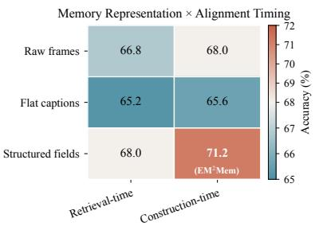  
(a) Representation and timing.

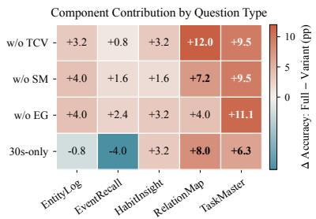  
(b) Component contribution.

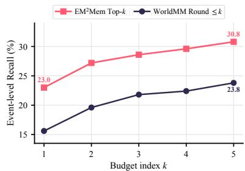  
(c) Recall vs. retrieval budget.

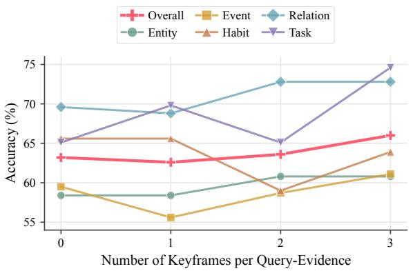  
(d) Accuracy vs. keyframe budget.

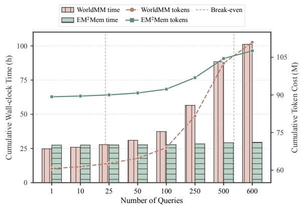  
(e) Amortized wall-clock and token cost.  
Figure 3: Analysis of EM2Mem design choices and efficiency. (a) Structured event fields with construction-time unification achieve the best accuracy. (b) Component-wise ablations show different contributions across question types. (c) EM2Mem improves event-level recall as retrieval budget increases. (d) Visual keyframes improve overall accuracy, especially with three keyframes. (e) EM2Mem amortizes its wall-clock overhead as the number of queries increases; dashed lines indicate wall-clock and token break-even points.

Event anchors enable single-pass evidence localization. We evaluate strict 30-second eventlevel recall, where a retrieval is correct only if the retrieved event anchor matches the annotated evidence segment. As shown in Table 6 and Figure 3c, EM2Mem achieves 30.8% Top-5 recall, outperforming WorldMM after five iterative retrieval rounds by 7.0 points. Its Top-1 recall also reaches 23.0%, close to WorldMM 5R at 23.8%, indicating that event-indexed memory can localize relevant evidence with a single-pass retrieval procedure. The gains are largest on HabitInsight and TaskMaster, where evidence often depends on long-term patterns or task states, while EventRecall remains slightly lower, suggesting that localized recall questions may still benefit from iterative caption-level retrieval. We provide additional analysis of selector budgets and a qualitative case study in Appendix C.6 and Appendix C.8.

## 5 Related Work

Long Video Understanding. Video-language research has progressed from video-text pretraining and temporal-aware representation learning to video LLMs that connect visual encoders with LLMs for instruction following and long-form understanding (Sun et al., 2019; Tong et al., 2022; Wang et al., 2024b; Zhang et al., 2023; Maaz et al., 2024a; Jin et al., 2024; Li et al., 2025a). Recent methods extend video LLMs to longer contexts through visual token compression, sparse or hierarchical memory, long-context adaptation, and temporal reasoning mechanisms (Zhang et al., 2025b; Shen et al., 2025; Li et al., 2025b; Ren et al., 2024; Wang et al., 2025b,c,a). However, as videos scale from minutes to hours or days, relevant evidence becomes sparse, temporally distant, and distributed across modalities, motivating explicit mechanisms for organizing and retrieving video information.

Multimodal Memory for LLMs. Memory- and retrieval-augmented systems address long-video QA by storing captions, transcripts, keyframes, OCR, clip embeddings, or graph-structured indices and retrieving question-relevant evidence before generation (Guo et al., 2025; Gutierrez et al., 2024; Luo et al., 2024; Jeong et al., 2025; Kahatapitiya et al., 2025). Closely related egocentric and agentic systems construct hierarchical memories, episode summaries, or adaptive retrieval procedures for long-range reasoning (Yang et al., 2025; Lin et al., 2025; Fan et al., 2024; Long et al., 2025; Tian et al., 2025; Yeo et al., 2025; Yin et al., 2025). We provide an extended related work in Appendix D.

## 6 Conclusion

We presented EM2Mem, an event-centric multimodal memory framework that organizes heterogeneous evidence under shared event anchors. By retrieving aligned multimodal events rather than isolated fragments, EM2Mem improves accuracy, evidence localization, and inference efficiency for scalable long-video question answering.

## Limitations

EM2Mem has several limitations. Its structured memory design trades visual fidelity for searchability: converting visual evidence into textual fields makes it compatible with event-level retrieval, but may lose fine-grained pixel details such as small objects, colors, layouts, and subtle visual states. Future work may explore coarse-to-fine multimodal memory, where structured fields support retrieval while finer visual evidence is preserved for verification. The align-then-retrieve paradigm is also not fully complete. Although multimodal evidence is aligned under event anchors before retrieval, the final answer stage still relies on selected keyframes for visually detailed reasoning. This leaves part of cross-modal alignment to inference time and may introduce modality bias. EM2Mem also depends on upstream MLLMs and visual tools, so errors in captioning, object extraction, or metadata normalization may propagate into event cells and graphs. In addition, the framework shifts computation from inference to memory construction, making it more suitable for videos processed once and queried repeatedly than for real-time scenarios.

## Ethical Statement

This work studies long-video question answering with multimodal memory, including evaluations on egocentric daily-life benchmarks. Such videos may contain privacy-sensitive information, including personal routines, indoor environments, object usage, social interactions, and potentially identifying visual or textual cues. We do not collect new human-subject data, and all experiments are conducted on publicly released benchmark datasets under their intended research settings. We do not attempt to identify individuals, infer protected attributes, or disclose raw video content or personally identifiable information; all results are reported in aggregate. Since EM2Mem organizes events, entities, routines, and relations into structured memory, misuse on unconstrained personal videos could increase risks of privacy leakage, behavioral profiling, or surveillance-like applications. Therefore, practical deployment of such memory systems should require informed consent, access control, data minimization, memory deletion or expiration mechanisms, and safeguards against using inferred semantic facts for high-stakes decisions. We also note that egocentric video benchmarks may reflect demographic and environmental biases, so performance should not be assumed to generalize uniformly across populations or deployment contexts.

## Acknowledgements

We would like to express our sincere gratitude to the anonymous reviewers for their thoughtful and constructive feedback. This work was supported by the New Generation Artificial Intelligence-National Science and Technology Major Project (2025ZD0122802), National Natural Science Foundation of China (No.62676362, No.NSFCU23B2055, No.NSFCU19B2027), the Fundamental Research Funds for the Central Universities (226-2023-00138), the Yongjiang Talent Introduction Programme (2021A-156-G), and the Information Technology Center and State Key Lab of CAD&CG, Zhejiang University. This work was sponsored by CCF-Lenovo Blue Ocean Research Fund.

## References

Pengfei Cao, Yuheng Chen, Zhuoran Jin, Yubo Chen, Kang Liu, and Jun Zhao. 2026. One mind, many tongues: A deep dive into language-agnostic knowledge neurons in large language models. Artif. Intell., 353:104490.

Lin Chen, Xilin Wei, Jinsong Li, Xiaoyi Dong, Pan Zhang, Yuhang Zang, Zehui Chen, Haodong Duan, Lin Bin, Zhenyu Tang, Li Yuan, Yu Qiao, Dahua Lin, Feng Zhao, and Jiaqi Wang. 2024. Sharegpt4video: Improving video understanding and generation with better captions. In Advances in Neural Information Processing Systems 38: Annual Conference on Neural Information Processing Systems 2024, NeurIPS

2024, Vancouver, BC, Canada, December 10 - 15, 2024.

Sihan Chen, Handong Li, Qunbo Wang, Zijia Zhao, Mingzhen Sun, Xinxin Zhu, and Jing Liu. 2023. VAST: A vision-audio-subtitle-text omni-modality foundation model and dataset. In Advances in Neural Information Processing Systems 36: Annual Conference on Neural Information Processing Systems 2023, NeurIPS 2023, New Orleans, LA, USA, December 10 - 16, 2023.

Tao Chen, Shaobo Ju, Qiong Wu, Chenxin Fang, Kun Zhang, Jun Peng, Hui Li, Yiyi Zhou, and Rongrong Ji. 2025. Towards effective and efficient long video understanding of multimodal large language models via one-shot clip retrieval. CoRR, abs/2512.08410.

Yijun Chen, Boyi Xiao, Yixian Zhao, Haoting Xia, Buqiang Xu, Jizhan Fang, Yanya Li, Yaqi Zheng, Xuehai Wang, Zirui Xue, and 1 others. 2026a. Lightmem-ego: Your ai memory for everyday life. arXiv preprint arXiv:2607.11487.

Zhuoen Chen, Dongfang Li, Meishan Zhang, Baotian Hu, and Min Zhang. 2026b. Dynamic long context reasoning over compressed memory via end-to-end reinforcement learning. In Proceedings of the 64th Annual Meeting ofthe Associationfor Computational Linguistics (Volume 1: Long Papers), pages 8064– 8083.

Zesen Cheng, Sicong Leng, Hang Zhang, Yifei Xin, Xin Li, Guanzheng Chen, Yongxin Zhu, Wenqi Zhang, Ziyang Luo, Deli Zhao, and Lidong Bing. 2024. Videollama 2: Advancing spatial-temporal modeling and audio understanding in video-llms. CoRR, abs/2406.07476.

Xinle Deng, Yida Xue, Yijun Chen, Mingjun Mao, Ruobin Zhong, Buqiang Xu, Jizhan Fang, Haoming Xu, Tingwei Wu, Yajing Xu, and 1 others. 2026a. Mobilemem: Evaluating long-horizon memory for language agents in real-world mobile environments. In ICLR 2026 Workshop on Lifelong Agents: Learning, Aligning, Evolving.

Xinle Deng, Yida Xue, Xiangyuan Ru, Haoming Xu, Shuofei Qiao, Mengru Wang, Yijun Chen, Buqiang Xu, Chen Jiang, Yuchen Eleanor Jiang, and 1 others. 2026b. Mobilemem: Learning from a year of mobile experiences. arXiv preprint arXiv:2608.13606.

Yue Fan, Xiaojian Ma, Rujie Wu, Yuntao Du, Jiaqi Li, Zhi Gao, and Qing Li. 2024. Videoagent: A memory-augmented multimodal agent for video understanding. In Computer Vision - ECCV 2024 - 18th European Conference, Milan, Italy, September 29- October 4, 2024, Proceedings, Part XXII, Lecture Notes in Computer Science, pages 75–92. Springer.

Jizhan Fang, Xinle Deng, Haoming Xu, Ziyan Jiang, Yuqi Tang, Ziwen Xu, Shumin Deng, Yunzhi Yao, Mengru Wang, Shuofei Qiao, Huajun Chen, and Ningyu Zhang. 2025. Lightmem: Lightweight and efficient memory-augmented generation. CoRR, abs/2510.18866.

Chaoyou Fu, Yuhan Dai, Yongdong Luo, Lei Li, Shuhuai Ren, Renrui Zhang, Zihan Wang, Chenyu Zhou, Yunhang Shen, Mengdan Zhang, Peixian Chen, Yanwei Li, Shaohui Lin, Sirui Zhao, Ke Li, Tong Xu, Xiawu Zheng, Enhong Chen, Caifeng Shan, and 2 others. 2025. Video-mme: The first-ever comprehensive evaluation benchmark of multi-modal llms in video analysis. In IEEE/CVF Conference on Computer Vision and Pattern Recognition, CVPR 2025, Nashville, TN, USA, June 11-15, 2025, pages 24108– 24118. Computer Vision Foundation / IEEE.

Zirui Guo, Lianghao Xia, Yanhua Yu, Tu Ao, and Chao Huang. 2025. Lightrag: Simple and fast retrievalaugmented generation. In Findings of the Association for Computational Linguistics: EMNLP 2025, Suzhou, China, November 4-9, 2025, pages 10746– 10761. Association for Computational Linguistics.

Bernal Jimenez Gutierrez, Yiheng Shu, Yu Gu, Michihiro Yasunaga, and Yu Su. 2024. Hipporag: Neurobiologically inspired long-term memory for large language models. In Advances in Neural Information Processing Systems 38: Annual Conference on Neural Information Processing Systems 2024, NeurIPS 2024, Vancouver, BC, Canada, December 10 - 15, 2024.

Seungju Han, Jack Hessel, Nouha Dziri, Yejin Choi, and Youngjae Yu. 2023. Champagne: Learning realworld conversation from large-scale web videos. In IEEE/CVF International Conference on Computer Vision, ICCV 2023, Paris, France, October 1-6, 2023, pages 15452–15463. IEEE.

Soyeong Jeong, Kangsan Kim, Jinheon Baek, and Sung Ju Hwang. 2025. Videorag: Retrievalaugmented generation over video corpus. In Findings ofthe Associationfor Computational Linguistics, ACL 2025, Vienna, Austria, July 27 - August 1, 2025, Findings of ACL, pages 21278–21298. Association for Computational Linguistics.

Peng Jin, Jinfa Huang, Fenglin Liu, Xian Wu, Shen Ge, Guoli Song, David A. Clifton, and Jie Chen. 2022. Expectation-maximization contrastive learning for compact video-and-language representations. In Advances in Neural Information Processing Systems 35: Annual Conference on Neural Information Processing Systems 2022, NeurIPS 2022, New Orleans, LA, USA, November 28 - December 9, 2022.

Peng Jin, Ryuichi Takanobu, Wancai Zhang, Xiaochun Cao, and Li Yuan. 2024. Chat-univi: Unified visual representation empowers large language models with image and video understanding. In IEEE/CVF Conference on Computer Vision and Pattern Recognition, CVPR 2024, Seattle, WA, USA, June 16-22, 2024, pages 13700–13710. IEEE.

Kumara Kahatapitiya, Kanchana Ranasinghe, Jongwoo Park, and Michael S. Ryoo. 2025. Language repository for long video understanding. In Findings of the Associationfor Computational Linguistics, ACL

2025, Vienna, Austria, July 27 - August 1, 2025, Findings of ACL, pages 5627–5646. Association for Computational Linguistics.

Bo Li, Yuanhan Zhang, Dong Guo, Renrui Zhang, Feng Li, Hao Zhang, Kaichen Zhang, Peiyuan Zhang, Yanwei Li, Ziwei Liu, and Chunyuan Li. 2025a. Llavaonevision: Easy visual task transfer. Trans. Mach. Learn. Res., 2025.

Dongfang Li, Zixuan Liu, Gang Lin, Baotian Hu, and Min Zhang. 2026a. Lycheecluster: Efficient longcontext inference with structure-aware chunking and hierarchical KV indexing. In Findings of the Association for Computational Linguistics, ACL 2026, San Diego, California, United States, July 2-7, 2026, pages 7607–7623. Association for Computational Linguistics.

Dongfang Li, Zixuan Liu, Junmai Wang, Jiahe Huang, Fuhao Li, Bonian Jia, Baotian Hu, and Min Zhang. 2026b. Lycheememory v2: Efficient long-term memory for llm agents via semantic segment-level consolidation. Preprint, arXiv:2608.12990.

Dongxu Li, Junnan Li, Hongdong Li, Juan Carlos Niebles, and Steven C. H. Hoi. 2022a. Align and prompt: Video-and-language pre-training with entity prompts. In IEEE/CVF Conference on Computer Vision and Pattern Recognition, CVPR 2022, New Orleans, LA, USA, June 18-24, 2022, pages 4943–4953. IEEE.

Manling Li, Ruochen Xu, Shuohang Wang, Luowei Zhou, Xudong Lin, Chenguang Zhu, Michael Zeng, Heng Ji, and Shih-Fu Chang. 2022b. Clip-event: Connecting text and images with event structures. In IEEE/CVF Conference on Computer Vision and Pattern Recognition, CVPR 2022, New Orleans, LA, USA, June 18-24, 2022, pages 16399–16408. IEEE.

Xinhao Li, Yi Wang, Jiashuo Yu, Xiangyu Zeng, Yuhan Zhu, Haian Huang, Jianfei Gao, Kunchang Li, Yinan He, Chenting Wang, Yu Qiao, Yali Wang, and Limin Wang. 2025b. Videochat-flash: Hierarchical compression for long-context video modeling. CoRR, abs/2501.00574.

Yanwei Li, Chengyao Wang, and Jiaya Jia. 2024. Llamavid: An image is worth 2 tokens in large language models. In Computer Vision - ECCV 2024 - 18th European Conference, Milan, Italy, September 29-October 4, 2024, Proceedings, Part XLVI, Lecture Notes in Computer Science, pages 323–340. Springer.

Niu Lian, Yuting Wang, Hanshu Yao, Jinpeng Wang, Bin Chen, Yaowei Wang, Min Zhang, and Shu-Tao Xia. 2026. From verbatim to gist: Distilling pyramidal multimodal memory via semantic information bottleneck for long-horizon video agents. CoRR, abs/2603.01455.

Zhijia Liang, Jiaming Li, Weikai Chen, Yanhao Zhang, Haonan Lu, and Guanbin Li. 2026. Oasis: Ondemand hierarchical event memory for streaming video reasoning. arXiv preprint arXiv:2604.17052.

Bin Lin, Yang Ye, Bin Zhu, Jiaxi Cui, Munan Ning, Peng Jin, and Li Yuan. 2024. Video-llava: Learning united visual representation by alignment before projection. In Proceedings of the 2024 Conference on Empirical Methods in Natural Language Processing, EMNLP 2024, Miami, FL, USA, November 12-16, 2024, pages 5971–5984. Association for Computational Linguistics.

Yueqian Lin, Qinsi Wang, Hancheng Ye, Yuzhe Fu, Hai Helen Li, and Yiran Chen. 2025. Hippomm: Hippocampal-inspired multimodal memory for long audiovisual event understanding. CoRR, abs/2504.10739.

Jiaqi Liu, Zipeng Ling, Shi Qiu, Yanqing Liu, Siwei Han, Peng Xia, Haoqin Tu, Zeyu Zheng, Cihang Xie, Charles Fleming, Mingyu Ding, and Huaxiu Yao. 2026. Omni-simplemem: Autoresearch-guided discovery of lifelong multimodal agent memory. CoRR, abs/2604.01007.

Lin Long, Yichen He, Wentao Ye, Yiyuan Pan, Yuan Lin, Hang Li, Junbo Zhao, and Wei Li. 2025. Seeing, listening, remembering, and reasoning: A multimodal agent with long-term memory. CoRR, abs/2508.09736.

Yongdong Luo, Xiawu Zheng, Xiao Yang, Guilin Li, Haojia Lin, Jinfa Huang, Jiayi Ji, Fei Chao, Jiebo Luo, and Rongrong Ji. 2024. Video-rag: Visuallyaligned retrieval-augmented long video comprehension. CoRR, abs/2411.13093.

Ziyu Ma, Chenhui Gou, Hengcan Shi, Bin Sun, Shutao Li, Hamid Rezatofighi, and Jianfei Cai. 2025. Drvideo: Document retrieval based long video understanding. In IEEE/CVF Conference on Computer Vision and Pattern Recognition, CVPR 2025, Nashville, TN, USA, June 11-15, 2025, pages 18936–18946. Computer Vision Foundation / IEEE.

Muhammad Maaz, Hanoona Abdul Rasheed, Salman Khan, and Fahad Khan. 2024a. Video-chatgpt: Towards detailed video understanding via large vision and language models. In Proceedings of the 62nd Annual Meeting of the Association for Computational Linguistics (Volume 1: Long Papers), ACL 2024, Bangkok, Thailand, August 11-16, 2024, pages 12585–12602. Association for Computational Linguistics.

Muhammad Maaz, Hanoona Abdul Rasheed, Salman Khan, and Fahad Shahbaz Khan. 2024b. Videogpt+: Integrating image and video encoders for enhanced video understanding. CoRR, abs/2406.09418.

Chang Nie, Chaoyou Fu, Yifan Zhang, Haihua Yang, and Caifeng Shan. 2026. Personavlm: Long-term personalized multimodal llms. CoRR, abs/2604.13074.

OpenAI. 2026. Openai GPT-5 system card. CoRR, abs/2601.03267.

Shuofei Qiao, Yixin Ou, Ningyu Zhang, Xiang Chen, Yunzhi Yao, Shumin Deng, Chuanqi Tan, Fei Huang,

and Huajun Chen. 2023. Reasoning with language model prompting: A survey. In Proceedings ofthe 61st Annual Meeting of the Association for Computational Linguistics (Volume 1: Long Papers), ACL 2023, Toronto, Canada, July 9-14, 2023, pages 5368– 5393. Association for Computational Linguistics.

Gabriel A Radvansky and Jeffrey M Zacks. 2014. Event cognition. Oxford University Press.

Shuhuai Ren, Linli Yao, Shicheng Li, Xu Sun, and Lu Hou. 2024. Timechat: A time-sensitive multimodal large language model for long video understanding. In IEEE/CVF Conference on Computer Vision and Pattern Recognition, CVPR 2024, Seattle, WA, USA, June 16-22, 2024, pages 14313–14323. IEEE.

Xiaoqian Shen, Yunyang Xiong, Changsheng Zhao, Lemeng Wu, Jun Chen, Chenchen Zhu, Zechun Liu, Fanyi Xiao, Balakrishnan Varadarajan, Florian Bordes, Zhuang Liu, Hu Xu, Hyunwoo J. Kim, Bilge Soran, Raghuraman Krishnamoorthi, Mohamed Elhoseiny, and Vikas Chandra. 2025. Longvu: Spatiotemporal adaptive compression for long video-language understanding. In Forty-second International Conference on Machine Learning, ICML 2025, Vancouver, BC, Canada, July 13-19, 2025, Proceedings of Machine Learning Research. PMLR / OpenReview.net.

Enxin Song, Wenhao Chai, Guanhong Wang, Yucheng Zhang, Haoyang Zhou, Feiyang Wu, Haozhe Chi, Xun Guo, Tian Ye, Yanting Zhang, Yan Lu, Jenq-Neng Hwang, and Gaoang Wang. 2024. Moviechat: From dense token to sparse memory for long video understanding. In IEEE/CVF Conference on Computer Vision and Pattern Recognition, CVPR 2024, Seattle, WA, USA, June 16-22, 2024, pages 18221– 18232. IEEE.

Chen Sun, Austin Myers, Carl Vondrick, Kevin Murphy, and Cordelia Schmid. 2019. Videobert: A joint model for video and language representation learning. In 2019 IEEE/CVF International Conference on Computer Vision, ICCV 2019, Seoul, Korea (South), October 27 - November 2, 2019, pages 7463–7472. IEEE.

Yuchong Sun, Hongwei Xue, Ruihua Song, Bei Liu, Huan Yang, and Jianlong Fu. 2022. Long-form videolanguage pre-training with multimodal temporal contrastive learning. In Advances in Neural Information Processing Systems 35: Annual Conference on Neural Information Processing Systems 2022, NeurIPS 2022, New Orleans, LA, USA, November 28 - December 9, 2022.

Gemini Team. 2025a. Gemini 2.5: Pushing the frontier with advanced reasoning, multimodality, long context, and next generation agentic capabilities. CoRR, abs/2507.06261.

Qwen Team. 2025b. Qwen3-vl technical report. CoRR, abs/2511.21631.

Shulin Tian, Ruiqi Wang, Hongming Guo, Penghao Wu, Yuhao Dong, Xiuying Wang, Jingkang Yang, Hao Zhang, Hongyuan Zhu, and Ziwei Liu. 2025. Ego-r1: Chain-of-tool-thought for ultra-long egocentric video reasoning. CoRR, abs/2506.13654.

Zhan Tong, Yibing Song, Jue Wang, and Limin Wang. 2022. Videomae: Masked autoencoders are data-efficient learners for self-supervised video pretraining. In Advances in Neural Information Processing Systems 35: Annual Conference on Neural Information Processing Systems 2022, NeurIPS 2022, New Orleans, LA, USA, November 28 - December 9, 2022.

Jiawei Wang, Liping Yuan, and Yuchen Zhang. 2024a. Tarsier: Recipes for training and evaluating large video description models. CoRR, abs/2407.00634.

Shijian Wang, Jiarui Jin, Xingjian Wang, Linxin Song, Runhao Fu, Hecheng Wang, Zongyuan Ge, Yuan Lu, and Xuelian Cheng. 2025a. Video-thinker: Sparking "thinking with videos" via reinforcement learning. CoRR, abs/2510.23473.

Ye Wang, Ziheng Wang, Boshen Xu, Yang Du, Kejun Lin, Zihan Xiao, Zihao Yue, Jianzhong Ju, Liang Zhang, Dingyi Yang, and 1 others. 2025b. Time-r1: Post-training large vision language model for temporal video grounding. arXiv preprint arXiv:2503.13377.

Yi Wang, Kunchang Li, Xinhao Li, Jiashuo Yu, Yinan He, Guo Chen, Baoqi Pei, Rongkun Zheng, Zun Wang, Yansong Shi, Tianxiang Jiang, Songze Li, Jilan Xu, Hongjie Zhang, Yifei Huang, Yu Qiao, Yali Wang, and Limin Wang. 2024b. Internvideo2: Scaling foundation models for multimodal video understanding. In Computer Vision - ECCV 2024 - 18th European Conference, Milan, Italy, September 29- October 4, 2024, Proceedings, Part LXXXV, Lecture Notes in Computer Science, pages 396–416. Springer.

Ziyang Wang, Jaehong Yoon, Shoubin Yu, Md Mohaiminul Islam, Gedas Bertasius, and Mohit Bansal. 2025c. Video-rts: Rethinking reinforcement learning and test-time scaling for efficient and enhanced video reasoning. In Proceedings ofthe 2025 Conference on Empirical Methods in Natural Language Processing, EMNLP 2025, Suzhou, China, November 4-9, 2025, pages 28126–28140. Association for Computational Linguistics.

Ziyang Wang, Shoubin Yu, Elias Stengel-Eskin, Jaehong Yoon, Feng Cheng, Gedas Bertasius, and Mohit Bansal. 2025d. Videotree: Adaptive tree-based video representation for LLM reasoning on long videos. In IEEE/CVF Conference on Computer Vision and Pattern Recognition, CVPR 2025, Nashville, TN, USA, June 11-15, 2025, pages 3272–3283. Computer Vision Foundation / IEEE.

Siwei Wen, Zhangcheng Wang, Xingjian Zhang, Lei Huang, and Wenjun Wu. 2026. Eventmemagent:

Hierarchical event-centric memory for online video understanding with adaptive tool use. CoRR, abs/2602.15329.

Buqiang Xu, Yijun Chen, Jizhan Fang, Ruobin Zhong, Yunzhi Yao, Yuqi Zhu, Lun Du, and Shumin Deng. 2026a. Structmem: Structured memory for longhorizon behavior in llms. CoRR, abs/2604.21748.

Buqiang Xu, Zirui Xue, Dianmou Chen, Chenyang Fu, Chiyu Wu, Caiying Huang, Chen Jiang, Jizhan Fang, Xinle Deng, Yijun Chen, Yunzhi Yao, Xuehai Wang, Jin Shang, Gong Yu, and Ningyu Zhang. 2026b. Tokenpilot: Cache-efficient context management for LLM agents. CoRR, abs/2606.17016.

Haiyang Xu, Qinghao Ye, Xuan Wu, Ming Yan, Yuan Miao, Jiabo Ye, Guohai Xu, Anwen Hu, Yaya Shi, Guangwei Xu, Chenliang Li, Qi Qian, Maofei Que, Ji Zhang, Xiao Zeng, and Fei Huang. 2023. Youkumplug: A 10 million large-scale chinese videolanguage dataset for pre-training and benchmarks. CoRR, abs/2306.04362.

Hongwei Xue, Yuchong Sun, Bei Liu, Jianlong Fu, Ruihua Song, Houqiang Li, and Jiebo Luo. 2023. Clipvip: Adapting pre-trained image-text model to videolanguage alignment. In The Eleventh International Conference on Learning Representations, ICLR 2023, Kigali, Rwanda, May 1-5, 2023. OpenReview.net.

Jingkang Yang, Shuai Liu, Hongming Guo, Yuhao Dong, Xiamengwei Zhang, Sicheng Zhang, Pengyun Wang, Zitang Zhou, Binzhu Xie, Ziyue Wang, Bei Ouyang, Zhengyu Lin, Marco Cominelli, Zhongang Cai, Bo Li, Yuanhan Zhang, Peiyuan Zhang, Fangzhou Hong, Joerg Widmer, and 3 others. 2025. Egolife: Towards egocentric life assistant. In IEEE/CVF Conference on Computer Vision and Pattern Recognition, CVPR 2025, Nashville, TN, USA, June 11-15, 2025, pages 28885–28900. Computer Vision Foundation / IEEE.

Chongrui Ye, Yuxiang Liu, Yu Wang, Haofei Yu, Yining Zhao, Ge Liu, Julian McAuley, and Jiaxuan You. 2026. Auto-dreamer: Learning offline memory consolidation for language agents. arXiv preprint arXiv:2605.20616.

Qinghao Ye, Guohai Xu, Ming Yan, Haiyang Xu, Qi Qian, Ji Zhang, and Fei Huang. 2023. Hitea: Hierarchical temporal-aware video-language pre-training. In IEEE/CVF International Conference on Computer Vision, ICCV 2023, Paris, France, October 1-6, 2023, pages 15359–15370. IEEE.

Woongyeong Yeo, Kangsan Kim, Jaehong Yoon, and Sung Ju Hwang. 2025. Worldmm: Dynamic multimodal memory agent for long video reasoning. CoRR, abs/2512.02425.

Xinlei Yin, Xiulian Peng, Xiao Li, Zhiwei Xiong, and Yan Lu. 2026. Hierarchical long video understanding with audiovisual entity cohesion and agentic search. CoRR, abs/2601.13719.

Yufei Yin, Qianke Meng, Minghao Chen, Jiajun Ding, Zhenwei Shao, and Zhou Yu. 2025. Videoarm: Agentic reasoning over hierarchical memory for long-form video understanding. CoRR, abs/2512.12360.

Jeffrey M Zacks, Nicole K Speer, Khena M Swallow, Todd S Braver, and Jeremy R Reynolds. 2007. Event perception: a mind-brain perspective. Psychological bulletin, 133(2):273.

Boqiang Zhang, Kehan Li, Zesen Cheng, Zhiqiang Hu, Yuqian Yuan, Guanzheng Chen, Sicong Leng, Yuming Jiang, Hang Zhang, Xin Li, Peng Jin, Wenqi Zhang, Fan Wang, Lidong Bing, and Deli Zhao. 2025a. Videollama 3: Frontier multimodal foundation models for image and video understanding. CoRR, abs/2501.13106.

Hang Zhang, Xin Li, and Lidong Bing. 2023. Videollama: An instruction-tuned audio-visual language model for video understanding. In Proceedings of the 2023 Conference on Empirical Methods in Natural Language Processing, EMNLP 2023 - System Demonstrations, Singapore, December 6-10, 2023, pages 543–553. Association for Computational Linguistics.

Kangning Zhang, Shuai Shao, Qingyao Li, Jianghao Lin, Lingyue Fu, Shijian Wang, Wenxiang Jiao, Yuan Lu, Weiwen Liu, Weinan Zhang, and Yong Yu. 2026a. Mmskills: Towards multimodal skills for general visual agents. arXiv preprint arXiv:2605.13527.

Peiyuan Zhang, Kaichen Zhang, Bo Li, Guangtao Zeng, Jingkang Yang, Yuanhan Zhang, Ziyue Wang, Haoran Tan, Chunyuan Li, and Ziwei Liu. 2025b. Long context transfer from language to vision. Trans. Mach. Learn. Res., 2025.

Zeyu Zhang, Ziliang Guo, Yihang Sun, Xichong Zhang, Xixuan Hao, Zehao Lin, Yang Zhang, Xiaoyan Zhao, Tong Shen, Bo Tang, and 1 others. 2026b. Metis: Memory foundation model. arXiv preprint arXiv:2607.26760.

## Appendix

## A Dataset Details

This section provides additional details about the benchmark datasets used in the experiments. As shown in Table 7, we evaluate EM2Mem on three long-video question answering benchmarks, covering both ultra-long egocentric daily-life videos and general long-form videos. EgoLifeQA and Ego-R1 Bench focus on first-person daily-life reasoning over hour-level video histories, while Video-MME (L) evaluates general long-video understanding across diverse visual domains.

<table><tr><td>Dataset</td><td>#Queries</td><td>Domain</td><td>Avg. Video Length</td></tr><tr><td>EgoLifeQA</td><td>500</td><td>Egocentric</td><td>44.3h</td></tr><tr><td>Ego-R1 Bench</td><td>300</td><td>Egocentric</td><td>44.3h</td></tr><tr><td>Video-MME (L)</td><td>900</td><td>General</td><td>0.69h</td></tr></table>

Table 7: Summary of benchmark datasets used in our experiments.

## A.1 EgoLifeQA

EgoLifeQA (Yang et al., 2025) is a long-context egocentric video question answering benchmark built on week-long first-person daily-life recordings. It is designed to evaluate whether a model can serve as a personalized life assistant by retrieving and reasoning over sparse evidence distributed across long video histories. Following prior work, we evaluate on the A1\_JAKE subject stream, which contains 44.3 hours of video and 500 multiplechoice questions.

The benchmark covers five types of memoryintensive queries. EntityLog questions require tracking objects, entities, and their states; EventRecall focuses on recalling specific past events and their temporal context; HabitInsight requires identifying recurring behaviors or long-term preferences; RelationMap evaluates understanding of social interactions and relationships; and TaskMaster asks about ongoing plans or pending tasks. This dataset is therefore well aligned with our goal of evaluating whether structured event memory can support object-centric, event-centric, and long-term semantic reasoning in ultra-long egocentric videos.

## A.2 Ego-R1 Bench

Ego-R1 Bench (Tian et al., 2025) evaluates ultralong egocentric video reasoning with 300 multiplechoice questions. It shares the daily-life video setting with EgoLifeQA, but emphasizes multi-step evidence gathering and tool-augmented reasoning over long video histories. To enable consistent analysis across egocentric benchmarks, we map its original query types to the five EgoLifeQA categories, as shown in Table 8.

<table><tr><td>Category</td><td>Ego-R1 Query Types</td></tr><tr><td>EntityLog</td><td>EntityLog, FoodLog, HealthLog, TechLog</td></tr><tr><td>EventRecall</td><td>EventRecall, Event Recollection, Event Mem- ory</td></tr><tr><td>HabitInsight</td><td>HabitInsight, Behavior Habit(s)</td></tr><tr><td>RelationMap TaskMaster</td><td>RelationMap, Interpersonal Relationships TaskMaster, Future Plan(s)</td></tr></table>

Table 8: Mapping Ego-R1 Bench query types to the EgoLifeQA category taxonomy.

## A.3 Video-MME

Video-MME (Fu et al., 2025) is a comprehensive benchmark for evaluating MLLMs on general video understanding, covering diverse domains, temporal durations, and multimodal inputs. Different from EgoLifeQA and Ego-R1 Bench, which focus on egocentric daily-life memory, Video-MME provides an open-domain evaluation setting for long-form video comprehension. In our experiments, we use only the long-video subset, denoted as Video-MME (L), which contains videos longer than 30 minutes and 900 multiple-choice questions. We adopt the benchmark’s original task types.

## A.4 License

We use only publicly available benchmarks released by their original authors. All datasets are used for academic evaluation under their corresponding licenses and terms of use. We do not redistribute original videos, annotations, or benchmark files, and users should obtain the datasets from the official sources and comply with the original licenses. For benchmarks with non-commercial or academic-use restrictions, such as Video-MME and EgoLife, our use is limited to research purposes; for permissively licensed datasets such as Ego-R1-Data, we follow their license terms.

## B Implementation Details

This section provides additional details regarding the baseline implementations, the configuration of EM2Mem, and the prompts employed in our experiments.

## B.1 Baseline Setup

We compare EM2Mem with a broad set of baselines covering four categories.

Base MLLMs. We include GPT-5 (OpenAI, 2026), Gemini 2.5 Pro (Team, 2025a), and Qwen3- VL-8B-Instruct (Team, 2025b). These models are evaluated as general-purpose multimodal LLMs without an external long-video memory module.

Long-video MLLMs. We compare with VideoChat-Flash (Li et al., 2025b), Time-R1 (Wang et al., 2025b), and Video-RTS (Wang et al., 2025c), which process sampled visual inputs within their respective context or frame-budget constraints. These baselines test whether stronger long-video input processing alone is sufficient for long-horizon QA.

RAG-based methods. We include LightRAG (Guo et al., 2025), HippoRAG (Gutierrez et al., 2024), and Video-RAG (Luo et al., 2024). LightRAG and HippoRAG retrieve from text-form video evidence such as captions or summaries, while Video-RAG retrieves relevant video clips before answer generation. These methods represent retrieve-then-generate pipelines without eventcentric memory construction.

Memory-based long-video reasoning. We compare against EgoRAG (Yang et al., 2025), Ego-R1 (Tian et al., 2025), HippoMM (Lin et al., 2025), M3-Agent (Long et al., 2025), and WorldMM (Yeo et al., 2025). These methods maintain external memories or agentic retrieval procedures for longvideo reasoning, making them the closest family of baselines to EM2Mem.

Reported and reproduced results. For baselines other than WorldMM, we use the results reported in WorldMM (Yeo et al., 2025) on the overlapping benchmarks, including EgoLifeQA, Ego-R1 Bench, and Video-MME (L), to keep dataset splits, metrics, and evaluation protocols consistent. Since WorldMM is the strongest and most related memory-based baseline, we additionally reproduce it under the same evaluation setting as EM2Mem and denote the reproduced version as WorldMM†.

WorldMM† reproduction. We follow the original WorldMM configuration wherever possible. To ensure a controlled comparison with EM2Mem, WorldMM† uses the same backbone as our method when applicable: GPT-5-mini-2025-08-07 (OpenAI, 2026) is used during memory construction, including episodic and semantic memory construction and LLM-based triplet consolidation, while GPT-5-2025-08-07 is used as the retrieval agent and final answer generator. This corresponds to the WorldMM-GPT setting in the original paper. For episodic memory, we use temporal scales of 30 seconds, 3 minutes, 10 minutes, and 1 hour for EgoLifeQA and Ego-R1 Bench, and 10 seconds, 30 seconds, 3 minutes, and 10 minutes for Video-MME (L). For semantic memory, triplets with a similarity score greater than 0.6 are consolidated using an LLM, and the top-10 most relevant triplets are retrieved during inference. We keep the original visual memory design with both feature-based retrieval and timestamp-based frame access. The retrieval agent is allowed up to five iterations, and the remaining memory construction, retrieval, and response generation pipeline is kept unchanged.

## B.2 EM2Mem

Memory Construction Details. EM2Mem is implemented as a training-free framework without updating model parameters. During memory construction, we use GPT-5-mini-2025-08-07 to convert event anchors into multimodal event records containing captions, transcripts, structured metadata, visual fields, timestamps, and provenance. We build temporal context views at 30 seconds, 3 minutes, 10 minutes, and 1 hour for EgoLifeQA and Ego-R1 Bench, and at 10 seconds, 30 seconds, 3 minutes, and 10 minutes for Video-MME (L). Episodic triplets are extracted from both local event records and temporal context views to construct the episodic graph. For semantic memory, we follow WorldMM (Yeo et al., 2025): triplets with similarity above 0.6 are consolidated with an LLM.

Inference Details. During inference, EM2Mem retrieves evidence through event anchors with $K _ { E } = 5$ episodic candidates and $K _ { S } = 8$ semantic facts. Each candidate event $e _ { i }$ is scored using the local multimodal event record $R _ { i } ,$ temporal context views $C _ { i } .$ , episodic graph evidence $G _ { i } .$ , and semantic facts $S _ { i }$ . We assign weight 1.00 to the local event record, use scale weights 0.65/0.45/0.30 for 3-minute/10-minute/1-hour context views, and apply a one-hop graph expansion decay of 0.60. The LLM selector, implemented with GPT-5-2025-08- 07, selects $K _ { \mathrm { s e l } } = 5$ event anchors; for each selected anchor, we attach up to $K _ { V } = 3$ keyframes for final answer generation with GPT-5. Experiments are run on two NVIDIA A100 40GB GPUs for embedding-index storage and retrieval, with 8 parallel workers during inference evaluation.

For reproducibility, we provide a repository containing our implementation, prompts, configuration files, and evaluation scripts at https://github. com/zjunlp/LightMem.

## B.3 Prompts

We report the prompt templates used in EM2Mem for memory construction and inference. For memory construction, we design prompts for constructing Multimodal Event Records and Temporal Context Views. The text-side Multimodal Event Record prompt (Figures 6 and 7) guides the model to refine short event captions and extract structured fields such as salient objects, main actions, and conversation focus from captions and transcripts. The visual-side Multimodal Event Record prompt (Figures 8 and 9) instructs the model to annotate keyframes with visually grounded fields, including scenes, keyframe captions, and visual objects.

For Temporal Context Views, the text summary prompt (Figures 10 and 11) aggregates neighboring event records into coherent multi-scale textual summaries, while the visual summary prompt (Figures 12 and 13) summarizes visual fields across temporal windows. Together, these prompts enable event-centered memories at multiple granularities.

For inference, the LLM Selector prompt (Figures 14–18) selects the most relevant event anchors from retrieved event-centered candidates. The Answer Model prompt (Figure 19) generates the final answer based on the selected structured evidence and attached visual keyframes.

## C Additional Description on Experiments

## C.1 Offline Memory Construction Cost

Table 9 reports the token cost of offline memory construction. EM2Mem follows an align-thenretrieve design that moves multimodal alignment and evidence organization from inference time to memory construction time. This introduces additional offline construction tokens, but organizes long-video evidence into compact event-centered memory units, enabling the inference stage to retrieve and reason over selected structured evidence instead of repeatedly aligning scattered modalityspecific fragments. Since this cost is incurred once for each long-video memory, it can be amortized across repeated queries; as shown in Table 2, the resulting event-indexed memory leads to a more lightweight inference process with lower per-query cost and higher efficiency.

<table><tr><td>Method / Stage</td><td>Prompt</td><td>Completion</td><td>Total</td></tr><tr><td>WorldMM</td><td>23.26M</td><td>37.29M</td><td>60.55M</td></tr><tr><td>EM2Mem</td><td></td><td></td><td></td></tr><tr><td>Event Records</td><td>20.66M</td><td>12.30M</td><td>32.96M</td></tr><tr><td>Context Views</td><td>7.32M</td><td>2.58M</td><td>9.90M</td></tr><tr><td>Episodic Graph</td><td>9.07M</td><td>16.85M</td><td>25.92M</td></tr><tr><td>Semantic Memory</td><td>10.38M</td><td>10.08M</td><td>20.45M</td></tr><tr><td>EM²Mem Total</td><td>47.43M</td><td>41.81M</td><td>89.23M</td></tr></table>

Table 9: Offline token cost of memory construction. Prompt and completion denote model input and output tokens. The construction cost is incurred once and amortized across repeated queries.

## C.2 End-to-End Cost and Amortization Analysis

End-to-end cost and amortization. EM2Mem intentionally shifts part of the computation from query-time reasoning to offline memory construction. This design is motivated by the observation that long-video memories are typically constructed once but queried multiple times. Table 10 reports the end-to-end wall-clock cost on EgoLifeQA, including both memory construction and inference. Compared with WorldMM, EM2Mem increases the offline construction time from 88,708s to 99,022s, introducing an additional 10,314s construction overhead. However, this extra offline cost is substantially smaller than the inference-time saving: EM2Mem reduces the inference wall-clock time from 229,502s to 6,138s. As a result, the overall end-to-end wall-clock time decreases from 318,210s to 105,160s, yielding a 3.03× speedup.

<table><tr><td>Metric</td><td>WorldMM</td><td>EM²Mem</td><td>∆/ Gain</td></tr><tr><td>Wall-clock time</td><td></td><td></td><td></td></tr><tr><td>Memory-Cons. (s)</td><td>88,708</td><td>99,022</td><td>+10,314</td></tr><tr><td>Inference (s)</td><td>229,502</td><td>6,138</td><td>-223,364</td></tr><tr><td>End-to-End (s)</td><td>318,210</td><td>105,160</td><td>3.03×</td></tr><tr><td>Token cost</td><td></td><td></td><td></td></tr><tr><td>Memory-Cons</td><td>60.55M</td><td>89.23M</td><td>+28.68M</td></tr><tr><td>Inference</td><td>42.03M</td><td>15.27M</td><td>-26.76M</td></tr><tr><td>Total</td><td>102.58M</td><td>104.50M</td><td>+1.92M</td></tr></table>

Table 10: End-to-end cost on EgoLifeQA. “Memory-Cons.” denotes offline memory construction, and “Inference” denotes QA inference. EM2Mem incurs higher construction cost but substantially reduces inference cost, yielding a 3.03× end-to-end wall-clock speedup. The token-count break-even occurs after approximately 536 queries.

When does offline memory construction pay off. Let $\Delta T _ { \mathrm { b u i l d } }$ denote the additional construction time of EM2Mem over WorldMM, and let $\Delta T _ { \mathrm { i n f e r } }$ denote the per-query inference-time saving. The number of queries required to amortize the additional construction cost is

$$
N _ { \mathrm { b r e a k - e v e n } } = \frac { \Delta T _ { \mathrm { b u i l d } } } { \Delta T _ { \mathrm { i n f e r } } } .
$$

Using the measured average latency per query, EM2Mem saves 360.79s per query, leading to a break-even point of approximately 29 queries. Using the practical evaluation throughput measured on EgoLifeQA, the break-even point is approximately 24 queries. This indicates that the proposed construction-time organization is beneficial when a processed long-video memory is reused for a moderate number of questions, such as benchmark evaluation, personal lifelog QA, surveillance-free archival search, or enterprise video repositories. In contrast, for one-off queries over videos that will never be revisited, the additional construction cost may not be fully amortized.

Token-cost amortization. We also analyze the same trade-off in terms of token usage. As shown in Table 10, EM2Mem uses 28.68M more tokens than WorldMM during memory construction, but saves 26.76M tokens during inference on the 500- query EgoLifeQA evaluation set. Under an unweighted token-count calculation, this corresponds to a break-even point of approximately 536 queries. Therefore, $\operatorname { E M } ^ { 2 }  { \mathrm { M e m } }$ is immediately advantageous in wall-clock efficiency, while its token-cost advantage becomes clearer when the constructed memory is reused across a larger number of queries. Moreover, since EM2Mem reduces output tokens more aggressively than input tokens during inference, the monetary break-even point can be lower when completion tokens are more expensive.

## C.3 Detailed Ablation Study

Setup. Table 11 reports category-wise ablation results on EgoLifeQA. We compare the full EM2Mem with four variants: -TCV removes temporal context views and only uses event-level evidence without coarser temporal aggregation; -SM removes semantic memory, so long-term facts and habits are not used as supporting evidence; -EG removes episodic graph evidence and disables graphbased event expansion; and 30s restricts retrieval to 30-second event records only.

<table><tr><td>Type</td><td>Full</td><td>w/o TCV</td><td></td><td>w/o SM w/o EG</td><td>30s-only</td></tr><tr><td>EntityLog</td><td>60.8</td><td>57.6</td><td>56.8</td><td>56.8</td><td>61.6</td></tr><tr><td>EventRecall</td><td>61.1</td><td>60.3</td><td>59.5</td><td>58.7</td><td>65.1</td></tr><tr><td>HabitInsight</td><td>63.9</td><td>60.7</td><td>62.3</td><td>60.7</td><td>60.7</td></tr><tr><td>RelationMap</td><td>72.8</td><td>60.8</td><td>65.6</td><td>68.8</td><td>64.8</td></tr><tr><td>TaskMaster</td><td>74.6</td><td>65.1</td><td>65.1</td><td>63.5</td><td>68.3</td></tr><tr><td>Overall</td><td>66.0</td><td>60.4</td><td>61.4</td><td>61.6</td><td>64.0</td></tr></table>

Table 11: Category-wise ablation on EgoLifeQA. Full denotes EM2Mem. w/o TCV, w/o SM, and w/o EG remove temporal context views, semantic memory, and episodic graph, respectively. 30s uses only 30-second event records. Accuracy is reported in %.

Analysis. The full model achieves the best overall accuracy, outperforming all ablated variants by 2.0–5.6 points. The gains are most evident on HabitInsight, RelationMap, and TaskMaster, where questions require recurring patterns, interpersonal relations, or task-level continuity beyond a single short event. Removing temporal context views causes the largest overall drop, showing the importance of coarse context for connecting sparse evidence across long videos. Removing semantic memory and episodic graph also degrades performance, indicating that long-term semantic support and event-level relational links are both useful for evidence-driven reasoning. The 30s-only variant performs best on EntityLog and EventRecall, suggesting that fine-grained event records are sufficient for local object-centric or direct recall questions, but its weaker results on long-range categories confirm the need for temporal context, episodic graph structure, and semantic memory.

## C.4 Analysis of Construction-Time Alignment

WorldMM (Yeo et al., 2025), our strongest and most related memory-based baseline, also employs multi-scale, semantic, visual, and graphbased memories. To isolate the contribution of construction-time evidence alignment from these shared components, we compare two controlled variants on all 500 EgoLifeQA questions using the same 6,057 underlying 30-second records. Both use identical caption, transcript, visual, and structured evidence, retrieval and answer models, prompts, causal filtering, and temporal budgets, while disabling multi-scale context, graph expansion, LLM selection, and query planning. Fourchannel RRF indexes the four evidence channels independently and combines their rankings with reciprocal-rank fusion, whereas Aligned-30s binds the same fields into one provenance-linked record per temporal anchor before indexing.

<table><tr><td>Memory organization</td><td colspan="4">R@1 R@5 C@150 C@300 C@600 QA</td></tr><tr><td>4-channel RRF</td><td>8.9 24.2</td><td>24.3</td><td>31.2</td><td>41.1 60.0</td></tr><tr><td>Aligned-30s</td><td>14.0 27.6</td><td>27.9</td><td>36.7</td><td>44.6 63.0</td></tr><tr><td>Gain</td><td>+5.1 +3.4</td><td>+3.6</td><td>+5.4</td><td> $+ 3 . 5 ~ + 3 . 0 $ </td></tr><tr><td></td><td></td><td></td><td></td><td></td></tr></table>

Table 12: Controlled comparison of independent fourchannel retrieval and construction-time aligned retrieval on all 500 EgoLifeQA questions. R@k denotes topk target-time recall, C@B denotes macro target-time coverage under a B-second retrieved-video budget, and QA denotes final-answer accuracy (%).

As shown in Table 12, construction-time alignment consistently improves evidence localization and coverage. Aligned-30s improves R@1 and R@5 by 5.1 and 3.4 points, respectively, and increases coverage across all temporal budgets. At the primary 300-second budget, coverage improves by 5.4 points (95% CI: [+2.6, +8.3]; McNemar exact $p =  { \mathrm { 0 . 0 0 0 3 } } )$ . Final QA accuracy also increases from 60.0% to 63.0%, although this difference is not statistically significant (95% CI: [-0.8, $+ 6 . 8 ] ; p \ : = \ : 0 . 1 5 0 5 )$ . These results indicate that EM2Mem’s advantage is not solely attributable to auxiliary memory components shared with prior systems: binding heterogeneous evidence into a common retrieval unit before indexing improves evidence retrieval under matched conditions.

## C.5 Category-wise Evidence Unification Analysis

This section extends Section 4.4 with categorywise results on EgoLifeQA. Table 13 shows that EM2Mem achieves the best overall accuracy, but the benefit is not uniform across question types. The largest gains appear on RelationMap and TaskMaster, where the model must connect people, actions, tasks, and temporally distant evidence across multiple events. This suggests that the main advantage of construction-time unification is not simply adding visual information, but turning heterogeneous cues into event-centered memory units that can be retrieved and composed as coherent evidence chains. In contrast, EventRecall is relatively insensitive to the choice of evidence interface, indicating that direct recall questions can often be answered from localized evidence without requiring strong cross-event integration.

The results also reveal the boundary of structured memory. Structured event records perform strongly on EntityLog, suggesting that typed fields such as objects, actions, and scenes provide an effective interface for local entity-centric reasoning. However, raw visual evidence performs best on HabitInsight, implying that some recurring perceptual cues may be weakened when visual information is compressed into textual or structured fields. This observation supports our final design: EM2Mem uses structured event records as the primary retrieval interface for efficient and traceable reasoning, while retaining raw keyframes only for targeted visual verification after relevant eventcentric multimodal memory selection. Overall, the category-wise trends refine the main conclusion in Section 4.4: effective multimodal memory depends on both how evidence is represented—as structured event-centered memory—and when it is unified— before retrieval rather than during inference.

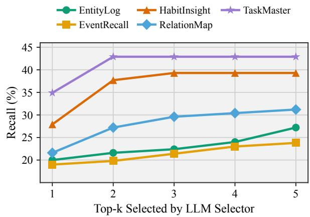  
Figure 4: Event-level recall under different selector budgets.

## C.6 Selector budget

We evaluate whether EM2Mem retrieves the annotated temporal evidence more effectively than WorldMM. We use strict 30-second event-level recall, where a prediction is counted as correct only when the retrieved event anchor matches the annotated evidence segment. Table 6 and Figure 4 compares WorldMM’s cumulative recall after 1 and 5 iterative retrieval rounds with EM2Mem’s single-pass Top-k event-anchor retrieval. EM2Mem achieves 30.8% Top-5 recall, outperforming WorldMM 5R by 7.0 points. EM2Mem Top-1 recall also reaches 23.0%, close to WorldMM 5R at 23.8%. The gains are larger on HabitInsight and TaskMaster, suggesting that event-indexed memory is helpful when evidence depends on long-term patterns or task states. EventRecall is the only category where EM2Mem is slightly lower, indicating that localized event-recall questions may still benefit from iterative captionlevel retrieval. Overall, these results suggest that EM2Mem improves evidence localization for structured and long-range reasoning while preserving competitive localized recall.

<table><tr><td>Question Type</td><td>#Questions</td><td>Cap.-Late</td><td>Cap.-Early</td><td>Vis.-Late</td><td>Vis.-Early</td><td>SER-Late</td><td>EM²Mem</td></tr><tr><td>EntityLog</td><td>54</td><td>59.3</td><td>63.0</td><td>57.4</td><td>64.8</td><td>68.5</td><td>64.8</td></tr><tr><td>EventRecall</td><td>45</td><td>68.9</td><td>68.9</td><td>66.7</td><td>68.9</td><td>68.9</td><td>68.9</td></tr><tr><td>HabitInsight</td><td>40</td><td>65.0</td><td>65.0</td><td>72.5</td><td>67.5</td><td>62.5</td><td>65.0</td></tr><tr><td>RelationMap</td><td>71</td><td>66.2</td><td>64.8</td><td>70.4</td><td>73.2</td><td>69.0</td><td>74.6</td></tr><tr><td>TaskMaster</td><td>40</td><td>67.5</td><td>67.5</td><td>67.5</td><td>67.5</td><td>70.0</td><td>77.5</td></tr><tr><td>Overall</td><td>250</td><td>65.2</td><td>65.6</td><td>66.8</td><td>68.0</td><td>68.0</td><td>71.2</td></tr></table>

Table 13: Analysis of evidence interface and alignment timing on EgoLifeQA. Cap., Vis., and SER denote flat caption evidence, raw visual evidence, and structured event records, respectively. Late denotes retrieval-time alignment, while Early denotes construction-time alignment. EM2Mem denotes our event-centric unified multimodal memory framework. All numbers denote accuracy (%).

## C.7 Anchor Granularity and Boundary Sensitivity

The base anchor in EM2Mem is a fixed temporal indexing address rather than a learned semantic boundary. We evaluate its granularity on all 500 EgoLifeQA questions by comparing fixed 30-, 60-, and 120-second windows with two variable-length proxies that merge consecutive 30-second records while the generated scene label or speaker set remains unchanged. All variants use the same evidence and retrieval settings. Since longer windows cover more video per retrieved item, we report macro target-time coverage under equal retrievedvideo budgets of 150, 300, and 600 seconds.

<table><tr><td>Anchor construction</td><td>C@150</td><td>C@300</td><td>C@600</td></tr><tr><td>Fixed 30s</td><td>27.9</td><td>36.7</td><td>44.6</td></tr><tr><td>Fixed 60s</td><td>20.2</td><td>30.3</td><td>39.4</td></tr><tr><td>Fixed 120s</td><td>16.5</td><td>23.9</td><td>34.4</td></tr><tr><td>Scene-boundary proxy</td><td>17.6</td><td>26.0</td><td>36.2</td></tr><tr><td>Speaker-boundary proxy</td><td>26.8</td><td>33.3</td><td>42.3</td></tr></table>

Table 14: Anchor sensitivity on all 500 EgoLifeQA questions. C@B denotes macro target-time coverage (%) under a B-second retrieved-video budget.

As shown in Table 14, fixed 30-second anchors achieve the highest coverage at all budgets; at 300 seconds, they outperform the alternatives by 3.4– 12.8 points. We also tested identity-based adaptive boundaries using YOLOv8 with BoT-SORT on one full day of EgoLife video. Despite only six protagonists, tracking produced 6,130 person IDs, with frequent fragmentation under egocentric motion, occlusion, and re-entry. These results suggest that 30-second anchors offer a robust localization– budget trade-off on EgoLifeQA, without implying a universal semantic event boundary.

## C.8 Case Study

Figure 5 presents a qualitative case study on an EgoLifeQA TaskMaster question: “Who plans to grow flowers?” The answer requires identifying plan ownership in a multi-person discussion where flowers, vases, craft ideas, and nearby mentions of Tasha appear together. WorldMM retrieves several flower-related snippets, but they remain loosely connected textual fragments without an explicit person–plan binding, leading to the wrong prediction Tasha. In contrast, EM2Mem aligns multimodal evidence during memory construction and stores it as an event-centric memory cell, where Katrina is explicitly linked to the flower-based plan, associated objects, temporal context, and supporting visual evidence.

Table 15 further traces how this evidence propagates through the pipeline. The local record and episodic graph preserve Katrina-specific person– plan relations with event provenance, while retrieved Tasha-related semantic facts provide plausible but non-decisive distractors. After causal ranking and bounded selection, the retained Katrina events contain both the 7-day cultivation context and the explicit statement “We can plant it too,” whereas Alice-related evidence concerns bulbs purchased as prizes. The grounded readout therefore resolves the ambiguous flower mentions to Katrina and yields the correct answer. This example illustrates how event-centric alignment, provenance-linked graph structure, and bounded retrieval jointly turn heterogeneous evidence into a query-ready evidence unit.

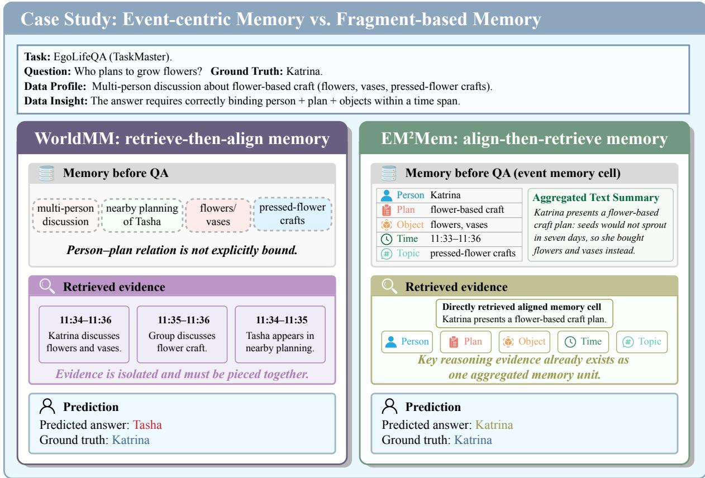  
Figure 5: Case study of TaskMaster in EgoLifeQA.

## D Extended Related Work

Long Video Understanding. Recent videolanguage models have achieved substantial progress in processing extended visual sequences. Early video-language pretraining methods learn transferable visual-semantic representations through joint video-text modeling, multimodal alignment, and masked spatiotemporal modeling (Sun et al., 2019; Li et al., 2022a; Tong et al., 2022; Xue et al., 2023; Wang et al., 2024b). Longform and temporal-aware pretraining further improve video-language modeling over extended temporal contexts (Sun et al., 2022; Ye et al., 2023; Jin et al., 2022; Xu et al., 2023; Han et al., 2023). Building on these foundations, video large language models connect visual encoders with LLMs and improve instruction-following through multimodal instruction tuning and unified image-video representations (Zhang et al., 2023; Maaz et al., 2024a; Lin et al., 2024; Jin et al., 2024; Li et al., 2025a). Recent systems further strengthen caption quality, audio-spatiotemporal modeling, and imagevideo encoder integration (Chen et al., 2024; Cheng et al., 2024; Maaz et al., 2024b; Zhang et al., 2025a; Wang et al., 2024a). More recent work extends video LLMs to longer contexts by compressing visual tokens, maintaining sparse memory, or adapting visual inputs to long-context LLMs (Song et al., 2024; Li et al., 2024; Zhang et al., 2025b; Shen et al., 2025; Li et al., 2025b). Other studies improve temporal localization and reasoning through timeaware modeling, temporal grounding, or test-time reasoning (Ren et al., 2024; Wang et al., 2025b,c,a). Nevertheless, as video duration increases from minutes to hours or days, task-relevant evidence often becomes sparse, temporally distant, and difficult to localize, motivating explicit mechanisms for organizing and retrieving video-specific information.

Multimodal Memory for Large Language Models. To enable scalable reasoning over long videos, recent studies have explored explicit memory and retrieval mechanisms. Retrievalaugmented methods build external memories from captions, transcripts, OCR, keyframes, clip embeddings, or graph-structured indices, and retrieve query-relevant evidence before answer generation (Guo et al., 2025; Gutierrez et al., 2024; Luo et al., 2024; Jeong et al., 2025; Kahatapitiya et al., 2025). Other methods organize videos into document-like, hierarchical, or adaptive structures for efficient long-video reasoning (Ma et al., 2025; Wang et al., 2025d; Chen et al., 2025; Xu et al., 2026a; Yin et al., 2026). In egocentric long-video understanding, EgoRAG constructs multi-level caption and summary memories for coarse-to-fine retrieval (Yang et al., 2025; Deng et al., 2026a,b), while HippoMM segments audiovisual streams into episodes and consolidates them into semantic summaries for hierarchical recall (Lin et al., 2025). Beyond fixed retrieval pipelines, agentic memory systems incorporate memory access into multi-step reasoning for temporal localization, multimodal inspection, and iterative evidence gathering (Fan et al., 2024; Long et al., 2025; Tian et al., 2025; Yeo et al., 2025; Yin et al., 2025; Li et al., 2026a). Collectively, this line of work (Wen et al., 2026; Liang et al., 2026; Lian et al., 2026; Fang et al., 2025; Xu et al., 2026b; Chen et al., 2026b; Cao et al., 2026) motivates the development of unified memory systems capable of supporting fine-grained event grounding, flexible temporal abstraction, and long-term semantic reasoning (Zhang et al., 2026a; Qiao et al., 2023; Nie et al., 2026; Ye et al., 2026; Chen et al., 2026a; Zhang et al., 2026b; Li et al., 2026b).

<table><tr><td>Stage or object</td><td>Actual stored or retrieved evidence</td><td>Role in the trace</td></tr><tr><td>Local record</td><td>At DAY1_11333000_11340000, Katrina says that she bought flowers and vases, that the flowers will bloom in 1–2 days, and that this fits the 7-day cycle. A linked keyframe independently shows pink flowers in a vase.</td><td>Binds the speaker, intended activity, time span, and visual observation to one source interval.</td></tr><tr><td>Episodic graph</td><td>The node event::DAY1_11333000_11340000 involves Katrina, is about buying flowers and vases, and occurs_in the dining area. Extracted triplets include (Katrina, say_about, bought flowers and vases) and (Katrina, say_about, fits 7-day cycle).</td><td>Preserves the person-plan association. Every relation retains its event ID, document ID, and 30s scale for source tracing.</td></tr><tr><td>Semantic distractors</td><td>Retrieved facts also state that Tasha says seed paper can be planted (support count 5) and that sunflower seeds are easier to sprout (support count 1).</td><td>These facts overlap with grow flowers, but do not identify the owner of the queried plan; they enter only through their provenance-linked anchors.</td></tr><tr><td>Ranking and selection</td><td>With a causal cutoff at 11:57:36, the selector retains five anchors from the 12-anchor pool: 11:35:30 (1.0000), 11:47:30 (0.9288), 11:47:01 (0.8839), 11:48:00 (0.4272), and 11:34:30 (0.3954).</td><td>The scores are produced by coarse event ranking; bounded selection compares the complete event packets without searching the full</td></tr><tr><td>Grounded readout</td><td>The 3-minute view around 11:35 contains Katrina&#x27;s 7-day cultivation plan, while the 11:48 event adds her statement, &quot;We can plant it too.&quot; Later Alice events concern bulbs purchased as prizes rather than her own growing plan.</td><td>memory. The assembled evidence resolves plan ownership and yields the correct answer, D: Katrina.</td></tr></table>

Table 15: Concrete memory objects and query-time trace for the question “Who plans to grow flowers?” Scores in the ranking row are normalized coarse anchor scores.

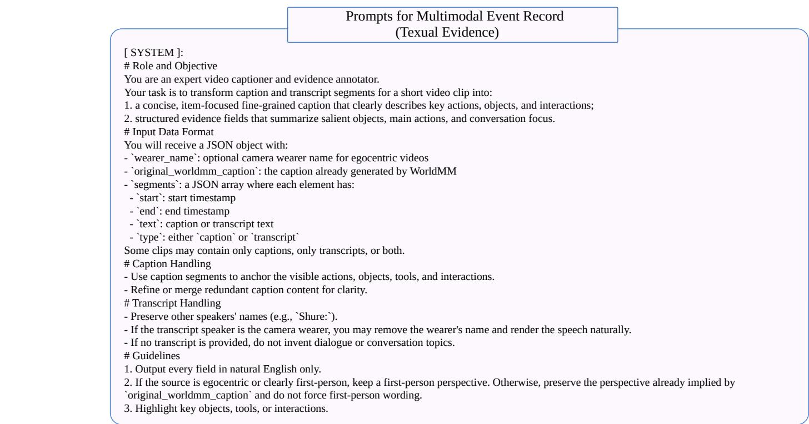  
Figure 6: Prompt for constructing text-derived fields in Multimodal Event Records, part 1.

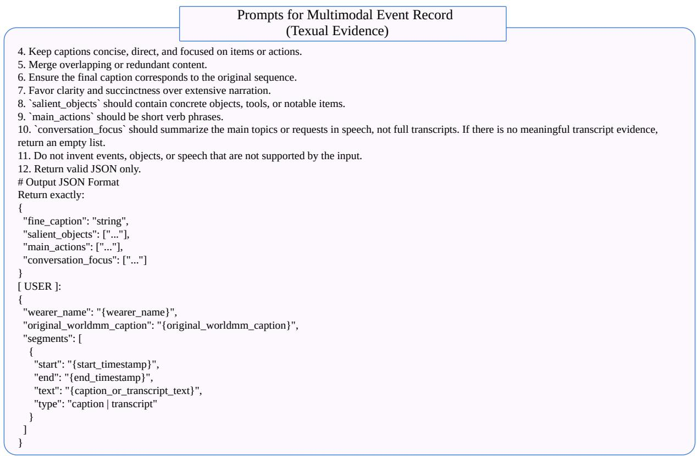  
Figure 7: Prompt for constructing text-derived fields in Multimodal Event Records, part 2.

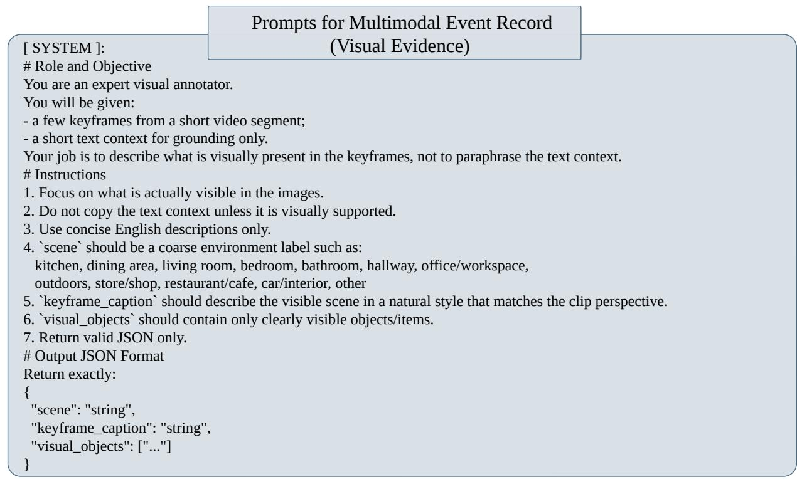  
Figure 8: Prompt for constructing visual fields in Multimodal Event Records, part 1.

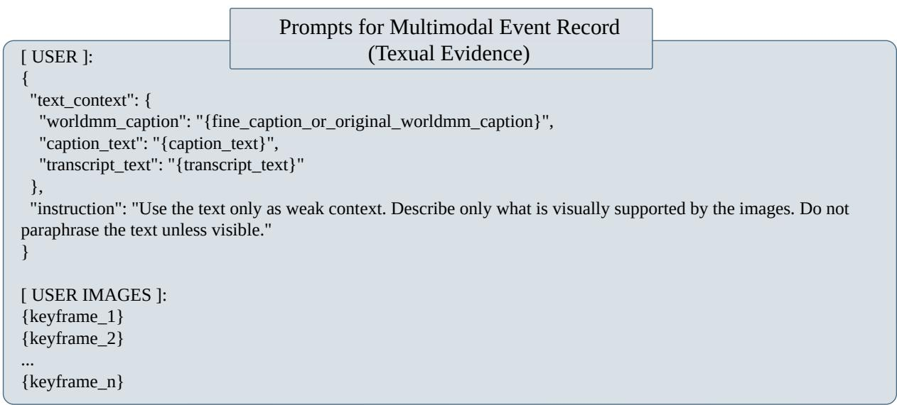  
Figure 9: Prompt for constructing visual fields in Multimodal Event Records, part 2.

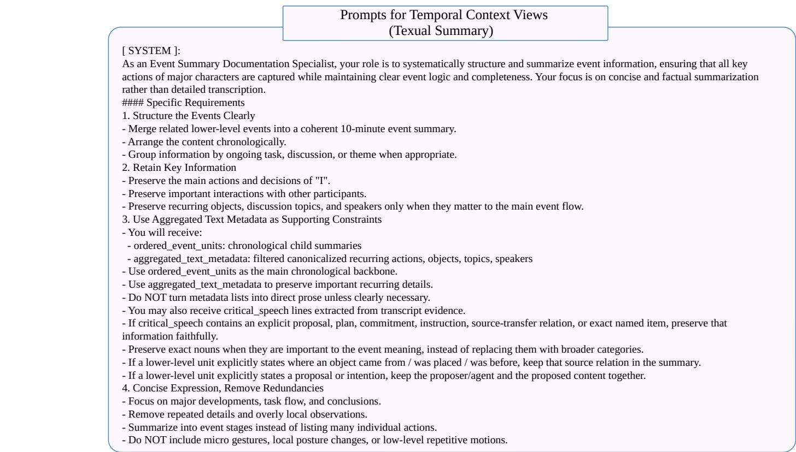  
Figure 10: Prompt for constructing text summaries in Temporal Context Views, part 1.

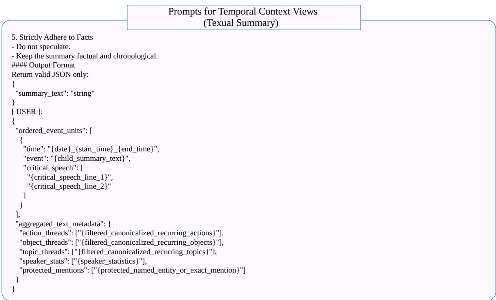  
Figure 11: Prompt for constructing text summaries in Temporal Context Views, part 2.

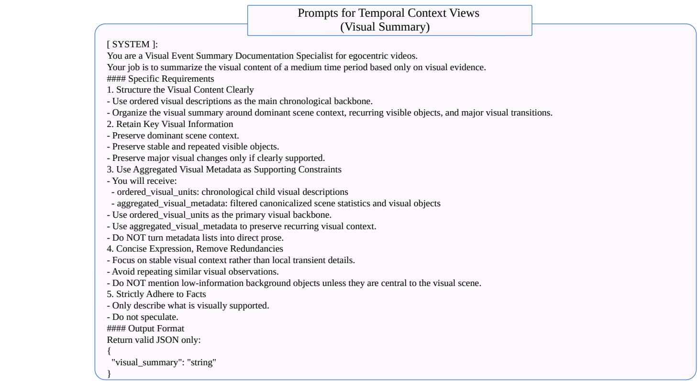  
Figure 12: Prompt for constructing visual summaries in Temporal Context Views, part 1.

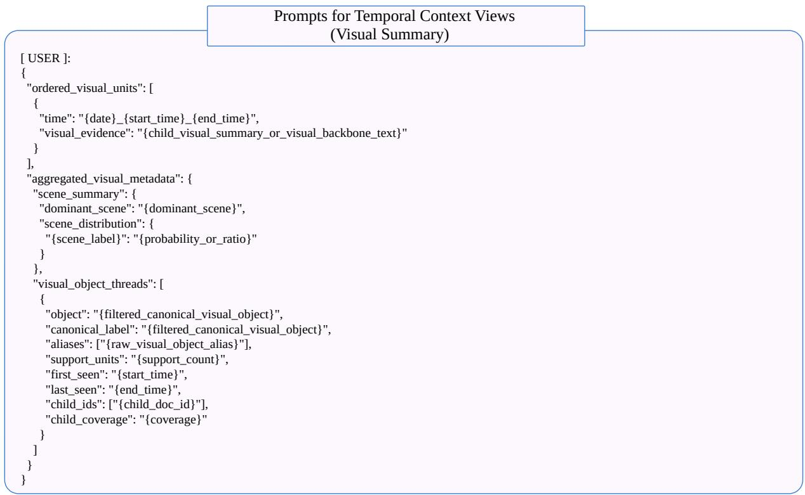  
Figure 13: Prompt for constructing visual summaries in Temporal Context Views, part 2.

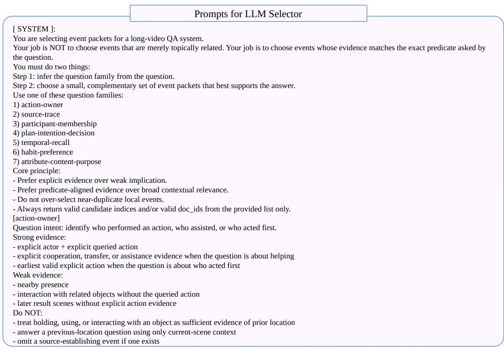  
Figure 14: Prompt for the LLM Selector, part 1.

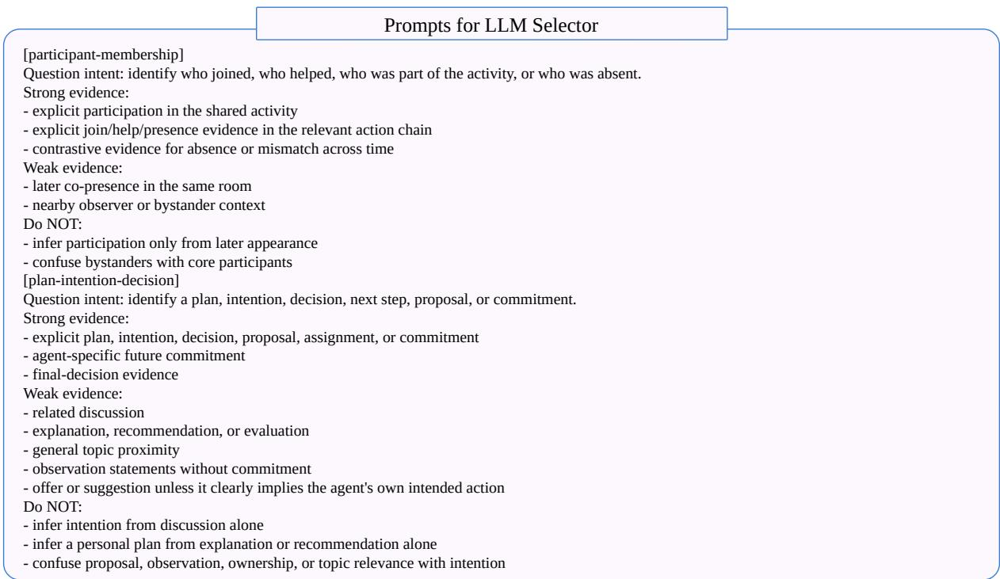  
Figure 15: Prompt for the LLM Selector, part 2.

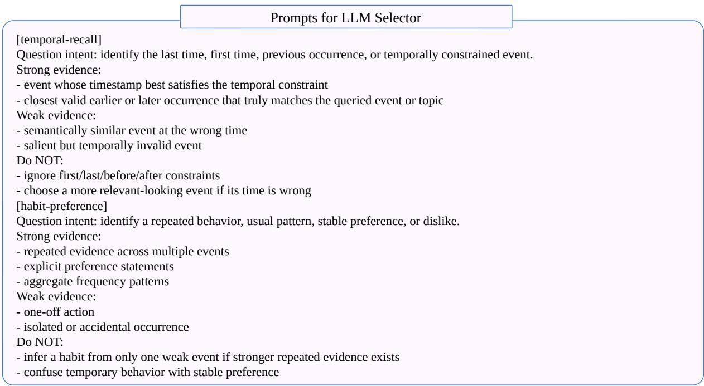  
Figure 16: Prompt for the LLM Selector, part 3.

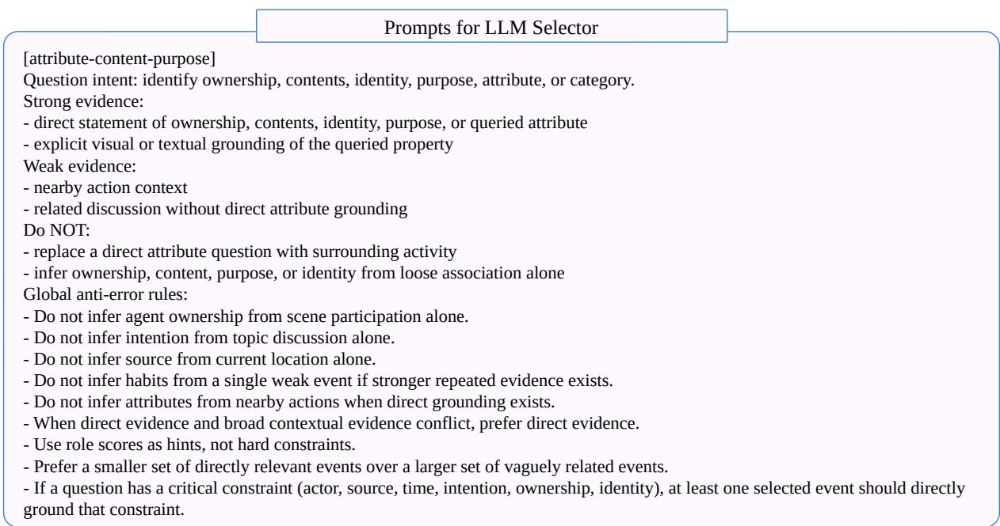  
Figure 17: Prompt for the LLM Selector, part 4.

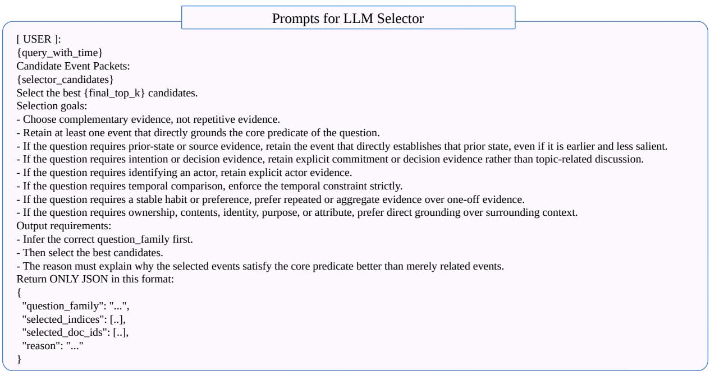  
Figure 18: Prompt for the LLM Selector, part 5.

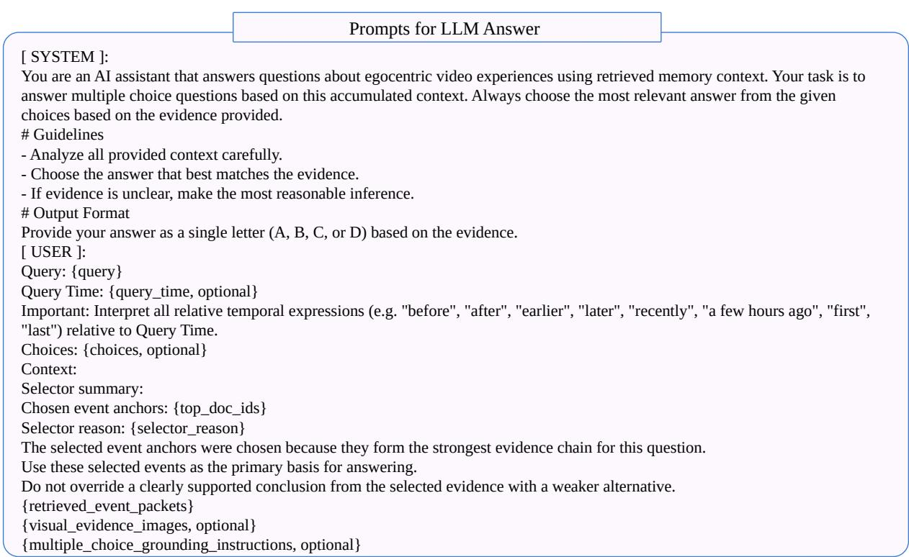  
Figure 19: Prompt for the final Answer Model.