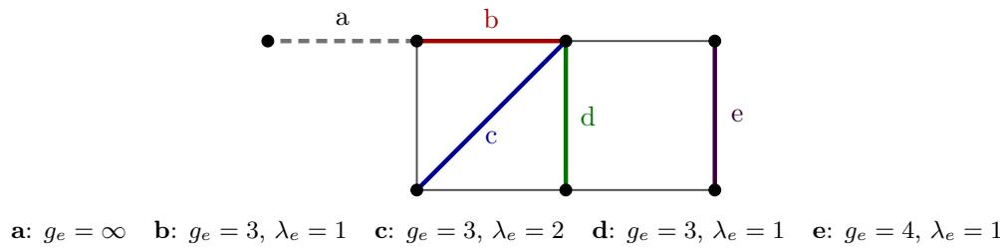

# Edge-Girth as a Structural Edge Feature for Graph Neural Networks

Lilian Marey∗

Charlotte Laclau†

## Abstract

Graph neural networks (GNN) based on message passing are provably no more powerful than the one-dimensional Weisfeiler–Leman colour-refinement test (1-WL): starting from a uniform colouring, each node is repeatedly recoloured as a function of its own colour and the multiset of its neighbours colours, and two graphs the process cannot tell apart receive identical representations, however deep or wide the network. A common remedy augments node or edge features with precomputed structural descriptors, most often counts of a fixed small subgraph such as triangles or longer cycles, but such counts require committing in advance to the size of the substructure being counted, a choice usually made blind to the data. We study a descriptor that avoids this choice. The edge-girth of an edge is the length of a shortest cycle through it, and its multiplicity is the number of such shortest cycles; together they form a per-edge invariant that reports cycles of arbitrary length and is computable exactly by a single breadth-first search per edge. Like other structural encodings, it is computed once from the graph alone, before and independently of any supervision, and is therefore not specific to a downstream objective. We evaluate it on two tasks of diferent kinds. Injected into a gated message-passing architecture, EGAGNN, it reaches a test MAE a factor three below the closest gated comparator on the Zinc-12k regression benchmark at 104k parameters; compared against bounded cycle-counting descriptors under the same architecture, it matches only a dictionary that explicitly counts cycles up to length eight, which requires twice as many channels, while a dictionary capped at length four performs no better than no structural information at all. On graph discrimination we prove a matching limitation: on graphs where every edge sees the same number of shortest cycles of the same length, the descriptor becomes constant and any model built on it collapses back to the 1-WL bound. This prediction holds without exception across al 400 pairs of the BREC graph-isomorphism benchmark: not one of the 90 such pairs is distinguished.

Code and datasets are available at https://anonymous.4open.science/r/GDDL\_EGAGNN-5154

## 1 Introduction

Message-passing neural networks (MPNNs) are limited in expressive power by the one-dimensional Weisfeiler-Leman test (1-WL): two graphs that 1-WL fails to separate receive identical representations, no matter how many layers or parameters are used [18, 13]. A standard remedy is to enrich node or edge inputs with precomputed structural descriptors, most commonly counts of small subgraphs [3] or random-walk and spectral encodings [6]. Higher-order approaches such as cellular complexes [2] make cycle structure explicit at the message-passing level, while recent work on the cycle counting expressiveness of MPNNs [9] has quantified the limits of cycle-based augmentation. Subgraph counting carries an assumption that is rarely made explicit: the informative substructure must be bounded in size and fixed in advance. The limitation is one of coverage rather than of budget. A dictionary of motifs of size at most k cannot report a cycle of length k + 1, however much computation is spent on it; enlarging k trades one ceiling for a higher one but never removes it. The choice is consequential and is made blind: on a molecular dataset such as Zinc, a per-edge cycle dictionary capped at k = 4 leaves the model no better than one given no structural descriptor at all, while the same dictionary at $k = 8$ recovers almost all of the available gain.

In this article, we study a descriptor that does not require this choice. The edge-girth $g _ { e }$ of an edge e is the length of a shortest cycle containing $e ,$ with $g _ { e } = \infty$ when no such cycle exists; alongside it, we carry $\lambda _ { e } .$ , the number of cycles of that length through e. The pair is attached to each edge, is invariant under isomorphism, and reports a cycle of unbounded length: an edge lying only on a 20-cycle is described as faithfully as one lying on a triangle, with no dictionary to enlarge. It is also exactly computable, by a single breadth-first search per edge: the quantity equals one plus the length of a shortest path between the endpoints of e that avoids $e ,$ the object of the replacement path problem [1]. It carries meaning in applications, governing transition rates in active flow networks [16], and short cycles through an edge – exactly the small edge-girth values – are a dominant cause of decoding failure in the Tanner graphs of LDPC codes [17]. The collection of these values over all edges, the edge-girth sequence, has recently been characterised up to realizability [11].

That characterisation also indicates how the descriptor should not be used: the sequence is additive under vertex identification and does not determine the number of vertices of the graph, so it is a poor graph signature. We therefore propose to treat edge-girth locally, injecting the per-edge pair into message passing so that it modulates the flow of node information rather than summarising the graph on its own. The resulting model, EGAGNN (Edge-Gated Aligned GNN), gates each message by a learned function of the edge it travels along, and lets edge states absorb the context of their endpoints so that edge-girth information difuses beyond immediate neighbourhoods.

The descriptor is efective on molecular property prediction and provably powerless on a precisely identifiable family of graphs. On Zinc-12k at a matched parameter budget, EGAGNN reaches a test MAE of $0 . 0 9 3 2 \pm 0 . 0 0 3 5$ , a factor three below the closest gated comparator. Holding the architecture and the chemical inputs fixed and varying only the structural descriptor, we compare $( g _ { e } , \lambda _ { e } )$ (together with a bridge indicator, three channels per edge in total) against bounded cycle-count dictionaries of increasing length. The three-channel descriptor is matched only by a six-channel dictionary reaching length eight, and dictionaries capped at four are worthless on this data: the advantage lies less in what edge-girth sees than in not having to guess where to stop looking. In the opposite direction, on edge-girth-regular graphs (those in which every edge lies on the same number of shortest cycles, all of the same length, [10]) the descriptor is constant by definition, and any model built on it computes what it would compute from a constant edge input: its expressive power falls back to the 1-WL bound. The prediction holds without a single exception on the BREC benchmark [15], a purpose-built collection of graph pairs designed to be hard for the Weisfeiler–Leman hierarchy. It does not, however, account for every hard case in that benchmark, as we discuss in Section 6.

## Contributions.

• We propose the per-edge pair $( g _ { e } , \lambda _ { e } )$ as a structural descriptor requiring no motif-size budget and computable exactly by one breadth-first search per edge, and EGAGNN, a gated message-passing architecture that consumes it (Sections 2–3).

• On Zinc-12k with all architectures matched to ≈100k parameters, EGAGNN reaches $0 . 0 9 3 2 \pm 0 . 0 0 3 5$ test MAE, and a depth-matched comparator rules out nonlinear depth as the explanation. A descriptorversus-descriptor study, holding architecture and chemical inputs fixed, quantifies what a bounded cycle dictionary must reach to match an unbounded one (Sections 5.2–5.3).

• We prove that edge-girth-based models degenerate onto their backbone on edge-girth-regular graphs, and verify the prediction pair by pair: of the 400 BREC pairs, 90 are edge-girth-regular and not one is resolved. We further show that the multiplicity $\lambda _ { e }$ is necessary for the statement – an edge-girth-only version of it would be false (Section 4).

## 2 Edge-Girth as a Structural Edge Invariant

## 2.1 Edge-Girth and Multiplicity, by Example

Let $G = ( V , E )$ be a simple connected graph. The edge-girth of an edge $e \in E$ , denoted $g _ { e } ,$ is the minimum number of edges of a simple cycle of G containing e, and $g _ { e } = \infty$ when e lies on no cycle, i.e. when e is a bridge. Edge-girth values range over $\{ 3 , 4 , 5 , \dots \} \cup \{ \infty \}$ , and $\mathrm { m i n } _ { e \in E } g _ { e }$ recovers the usual girth of G. We write $\lambda _ { e }$ for the multiplicity of e, the number of distinct cycles of length $g _ { e }$ through e. The pair $( g _ { e } , \lambda _ { e } )$ is the elementary object this work builds on: it is defined per edge, invariant under graph isomorphism, and, unlike a subgraph count, carries no bound on the size of the structure it reports.

Figure 1: The descriptor on a small graph, illustrated on five edges. Edge a is a bridge: it lies on no cycle, so its edge-girth is infinite. Edge b lies on a single triangle, and edge c on two, which is what its multiplicity of two records, the multiplicity counts how many shortest cycles an edge belongs $^ { \mathrm { t o , } }$ not how many cycles in total. Edge d is the instructive case: it lies on a triangle and also on the square formed with edges e and its neighbours, and only the shorter of the two is reported, so its edge-girth is three rather than four. Edge e belongs to no triangle at all, and its shortest cycle is that square, giving edge-girth four.

Figure 1 works through both quantities on a small graph.

Collecting the edge-girth values over all edges yields the edge-girth sequence $\sigma ( G )$ . Which sequences arise as $\sigma ( G )$ for some simple connected G has recently been settled: a sequence is realizable if and only if it satisfies a recursive criterion on the number of edges attaining its largest value, controlled by the maximum diameter attainable by graphs realizing the sequence with that largest value removed [11]. We use that characterisation only as background; the two properties we need are stated next. A related but distinct notion is that of edge-girth-regular graphs [10]: regular graphs where every edge lies on exactly λ shortest cycles, all of length $^ { g , }$ so that $( g _ { e } , \lambda _ { e } )$ is constant across edges. The formal definition is given in Section 4, which shows what this family delimits.

## 2.2 The Edge-Girth Sequence Is a Weak Global Invariant

Two properties show that σ is poorly suited to acting as a graph signature on its own.

First, σ is additive under vertex identification: gluing two graphs $G _ { 1 }$ and $G _ { 2 }$ at a single vertex (denoted as $G _ { 1 } \oplus G _ { 2 } )$ creates no new cycle, so the edge-girth values of $G _ { 1 } \oplus G _ { 2 }$ are exactly those of $G _ { 1 }$ together with those of $G _ { 2 } \ [ 1 1 ]$ . The sequence is blind to how components are attached to one another, and any two assemblies of the same building blocks are indistinguishable by σ.

Second, $\sigma$ does not determine the order of the graph: the sequence consisting of nine edge-girth values all equal to 3 is realized both by a graph on five vertices and by a graph on seven vertices [11]. A quantity that fails to recover $| V ( G ) |$ cannot be expected to separate non-isomorphic graphs in general.

We therefore attach $( g _ { e } , \lambda _ { e } )$ to each edge and inject it into message passing rather than using σ as a graph-level descriptor. This buys nothing on the isomorphism benchmark of Section 5.4, where propagating the descriptor through a network matches a direct hash of the per-edge multiset to within one pair out of four hundred; it pays of on graph-level regression (Section 5.2), and Section 4 explains why no architecture built on this descriptor could have done better on the former.

## 2.3 Computing $( g _ { e } , \lambda _ { e } )$ by Breadth-First Search

Both quantities come from a single traversal per edge. For $e = \{ u , v \}$ , a breadth-first search from u in $G \backslash \{ e \}$ returns $d ( u , v )$ , the shortest path distance between u and v in $\cal G \backslash \{ e \}$ , and by the standard shortest-path counting recursion, the number of shortest $u - v$ paths. Since such a path is simple and avoids $e ,$ closing it with e gives $g _ { e } = d ( u , v ) + 1$ and $\lambda _ { e }$ exactly, with $g _ { e } = \infty$ when v is unreachable. No approximation and no truncation is involved.

The traversal is paid once per edge, so the descriptor costs $O ( | E | ( | V | + | E | ) )$ per graph. This is a real cost, and we make no claim that it is smaller than that of bounded motif counting: in our measurements the ranking between the two reverses with the graph family. On molecular graphs, which are small and comparatively dense, the per-edge traversal is the cheaper of the two; on sparse, low-degree graphs whose edges lie on long cycles, a bounded cycle enumeration has few cycles to find and wins comfortably. What the traversal buys is exactness and the absence of a size ceiling, not speed. Unlike higher-order GNNs that elevate cycles to the message-passing level [2], edge-girth keeps the backbone standard while enriching edge features, trading expressivity for computational simplicity. This complements recent analyses of cycle-counting expressiveness [9]. Computing $g _ { e }$ is an instance of the replacement path problem, for which sharper bounds are available [1]; the linear-time procedure of [8] applies when the girth is globally constant, which is not the regime considered here.

The computation is a one-of preprocessing step, cached and amortised over training in the same way as random-walk and Laplacian encodings [6]. At molecular scale it costs a fraction of a single training run and is reused across every seed and every hyperparameter setting, so it does not enter the comparison between methods.

## 3 EGAGNN

## 3.1 Edge Feature Initialization

Each edge $e = \{ u , v \}$ is endowed with the pair introduced in Section 2. Two adjustments make it usable as a network input. Bridges, for which $g _ { e } = \infty$ , cannot be handed to a network as a finite number, so we replace the pair by a fixed placeholder value together with an explicit binary indicator: the network is told directly that the edge lies on no cycle, rather than being given an arbitrarily large finite substitute that it might mistake for a very long cycle. Concretely, both quantities are normalised using training-split statistics only, and a bridge is represented by the placeholder value $( \tilde { g } _ { u v } , \tilde { \lambda } _ { u v } ) = ( 0 , 0 )$ together with the indicator set to 1. The initial edge representation is

$$
{ \bf e } _ { u v } ^ { ( 0 ) } \ = \ \left[ \tilde { g } _ { u v } , \ \tilde { \lambda } _ { u v } , \ { \bf 1 } \{ g _ { u v } = \infty \} \right] \ \parallel \ { \bf a } _ { u v } ,\tag{1}
$$

where $\tilde { g }$ and $\tilde { \lambda }$ are the normalised edge-girth and multiplicity, and $\mathbf { a } _ { u v }$ denotes any edge attributes supplied by the dataset, such as bond types on molecular graphs. On the isomorphism benchmark $\mathbf { a } _ { u v }$ is empty and the structural triple is the only edge input; on Zinc it is not, which is why Section 5.3 holds the architecture and $\mathbf { a } _ { u v }$ fixed and varies only the structural part.

Both entries $\tilde { g }$ and λ˜ come from the single breadth-first search of Section 2.3. We deliberately stop at the shortest cycle. Going further means one of two things. Counting simple cycles of unbounded prescribed length through an edge is $\# \mathsf { W } [ 1 ]$ -hard [7], whereas counting shortest ones is a linear-time recursion. Counting them up to a fixed length k is tractable, it is exactly what a bounded cycle dictionary does. Section 5.3 measures what that choice costs relative to the unbounded descriptor.

## 3.2 Gated Message Passing

Structural edge information is injected multiplicatively rather than by concatenation to node features, so that an edge modulates what passes through it. At layer ℓ, the message sent from v to u is

$$
\mathbf { m } _ { u v } ^ { ( \ell ) } = \mathrm { s i g m } \Bigl ( \phi _ { e } ^ { ( \ell ) } \bigl ( \mathbf { e } _ { u v } ^ { ( \ell - 1 ) } \bigr ) \Bigr ) \odot \phi _ { n } ^ { ( \ell ) } \bigl ( \mathbf { h } _ { v } ^ { ( \ell - 1 ) } \bigr ) ,\tag{2}
$$

where $\phi _ { e } ^ { ( \ell ) }$ and $\phi _ { n } ^ { ( \ell ) }$ are MLPs acting on the edge and node states respectively, sigm is the sigmoid and ⊙ the Hadamard product. The sigmoid output acts as a learned per-channel gate: an edge on a short cycle and an edge on a long one open diferent channels, and the model learns which edge-girth regimes are worth propagating for the task at hand.

Node and edge states are then updated by

$$
\mathbf { h } _ { u } ^ { ( \ell ) } = \mathbf { h } _ { u } ^ { ( \ell - 1 ) } + \mathrm { A G G } \Big ( \big \{ \mathbf { m } _ { u v } ^ { ( \ell ) } \big | v \in \mathcal { N } ( u ) \big \} \Big ) ,\tag{3}
$$

$$
\mathbf { e } _ { u v } ^ { ( \ell ) } = \psi ^ { ( \ell ) } \Big ( \mathbf { e } _ { u v } ^ { ( 0 ) } \left. \mathbf { e } _ { u v } ^ { ( \ell - 1 ) } \right. \mathbf { h } _ { u } ^ { ( \ell ) } \left. \mathbf { h } _ { v } ^ { ( \ell ) } \right. ,\tag{4}
$$

with $\psi ^ { ( \ell ) }$ an MLP and ∥ concatenation. Equation (3) is a residual aggregation of the gated messages. Equation (4) is what makes the scheme more than a static feature augmentation. Because an edge state absorbs the representations of its two endpoints at every layer, and those endpoints have themselves aggregated their neighbourhoods, after ℓ layers the gate on $\{ u , v \}$ depends on the edge-girth values of every edge within ℓ hops, not only on $g _ { u v }$ . Re-injecting ${ \bf e } _ { u v } ^ { ( 0 ) }$ at each layer keeps the raw descriptor available and prevents it from being washed out by this difusion.

Two consequences matter for Section 4. First, the architecture is a message-passing scheme: absent any edge input it inherits the 1-WL bound. Second, the only information it receives beyond the adjacency structure is $\mathbf { e } _ { u v } ^ { ( 0 ) }$ . Whenever that input carries no discriminative signal, the model can do no better than its backbone.

## 3.3 Graph-Level Readout

A permutation-invariant pooling of the final node states yields the graph representation $\mathbf { g } = \mathrm { R E A D O U T } ( \{ \mathbf { h } _ { u } ^ { ( L ) } \mid$ $u \in V \}$ , passed to a regression head on Zinc; on the isomorphism benchmark the graph embeddings themselves are compared under the protocol of Section 5.4.

## 4 Expressivity: What Edge-Girth Cannot Do

The descriptor of Section 2 is informative only inasmuch as it varies across the edges of a graph. There is a family on which it does not vary at all, and on which the model retains no advantage over its backbone.

Recall from [10] that a graph is $\mathrm { e g r } ( n , k , g , \lambda )$ , or edge-girth-regular, if it is k-regular on n vertices, has girth $^ { g , }$ and every edge lies on exactly λ cycles of length $g .$ In such a graph the descriptor is constant by construction, and this is enough to erase it.

Proposition 1. Let $G _ { 1 }$ and $G _ { 2 }$ be edge-girth-regular graphs with the same parameters $( g , \lambda )$ and no dataset edge attributes. Then EGAGNN assigns them distinct graph representations only if the 1-WL test distinguishes them.

Proof. Every edge of an edge-girth-regular graph satisfies $g _ { e } = g$ and $\lambda _ { e } = \lambda$ , and no edge is a bridge, so Equation (1) gives ${ \bf e } _ { u v } ^ { ( 0 ) } = { \bf c }$ for every edge of either graph, with the same constant c in both. We show by induction on ℓ that $\mathbf { h } _ { u } ^ { ( \ell ) }$ is a function of the 1-WL colour $c _ { \ell } ( u )$ and that $\mathbf { e } _ { u v } ^ { ( \ell ) }$ is a function of $\{ \{ c _ { \ell } ( u ) , c _ { \ell } ( v ) \} \}$ This holds at $\ell = 0$ , node states being initialised identically and $\mathbf { e } ^ { ( 0 ) }$ being constant. Assuming it at $\ell - 1$ , the message (2) is a function of ${ \big ( } \{ \{ c _ { \ell - 1 } ( u ) , c _ { \ell - 1 } ( v ) \} \} , c _ { \ell - 1 } ( v ) { \big ) }$ ; aggregating over $\mathcal { N } ( u )$ in (3) yields a function of $c \varrho _ { - 1 } ( u )$ and of the multiset $\{ \{ c _ { \ell - 1 } ( v ) \} \} _ { v \in \mathcal { N } ( u ) }$ , which is exactly the refinement defining $c _ { \ell } ( u )$ ; the edge update (4) then depends only on c and on the colours of its endpoints. As READOUT is a function of the multiset of final node states, two graphs with identical 1-WL colour multisets receive identical representations.

The gates do not stay constant across layers: from the first layer on, they absorb node states through (4). What the proof shows is simpler. The model computes exactly the function it would compute with any constant edge input, so its expressive power is that of its message-passing backbone, and the 1-WL bound applies unchanged.

Corollary 2. Strongly regular graphs with $\lambda > 0$ , and among them those satisfying the four-vertex condition, are edge-girth-regular: such a graph has girth 3 with exactly λ triangles through every edge. Distance-regular graphs are likewise edge-girth-regular, the girth and the number of shortest cycles through an edge being determined by the intersection array $\ 1 4 , \ 1 4 ]$ . Pairs drawn from either family with matching parameters therefore fall under Proposition 1.

Remark 3 (the multiplicity is necessary). Proposition 1 requires the full pair $( g _ { e } , \lambda _ { e } )$ to be constant, and this is not a technical convenience. Requiring only $g _ { e }$ to be constant yields a strictly larger family (on BREC, 103 pairs instead of 90), over which the proposition would be false: of the 13 additional pairs, 12 are resolved by EGAGNN, precisely because $\lambda _ { e }$ varies on them while $g _ { e }$ does not. Carrying the multiplicity keeps the blind spot minimal.

Remark 4 (generality). Nothing in the proof is specific to EGAGNN. The argument applies to any architecture whose sole structural input is a per-edge function of $( g _ { e } , \lambda _ { e } )$ , and in particular to a plain MPNN augmented with these values as edge features. The limitation is a property of the descriptor, not of the way it is consumed. Escaping it requires strictly more information, cycle counts at lengths beyond the girth, for instance, which reintroduces the trade-of of Section 3.1.

Proposition 1 is a prediction that can be read of a benchmark before any model is trained, and it is falsifiable pair by pair: every pair whose two graphs are edge-girth-regular with matching parameters must go unresolved. Section 5.4 tests it on all 400 pairs of BREC, and Section 6 discusses how much of the benchmark’s dificulty it accounts for.

## 5 Experiments

## 5.1 Setup

The descriptor is computed from the graph alone, once, before any training, and does not depend on the downstream objective, it is a property of the representation rather than of the task. We therefore evaluate it on two tasks of diferent kinds, which probe it in complementary ways. Zinc-12k [5] measures whether the descriptor carries signal a supervised model can exploit, and lets us compare it against alternative structural descriptors under a fixed architecture. BREC [15], a benchmark of graph pairs constructed to be indistinguishable by 1-WL and dificult for higher levels of the Weisfeiler–Leman hierarchy, measures separating power directly, with no objective to fit, and is where the limitation of Section 4 can be tested pair by pair. Results on CSL are relegated to Appendix C, where two of the reference implementations proved unreliable.

On Zinc we use the oficial splits (10,000/1,000/1,000), train for 200 epochs and report test MAE averaged over four seeds, with no early stopping and no test-set model selection. All architectures are matched to a budget of 100,000 parameters within ±10% by adjusting the hidden width, so that comparisons are not confounded by capacity. On BREC we use the oficial reliable-paired-comparison protocol with 32 relabelings, on all 400 pairs; every method attains a 100% reliability rate, i.e. no method is credited with distinguishing a pair it cannot reliably separate under permutation. All experiments run on CPU. Full hyperparameters are given in Appendix A.

Calibration. Three independent checks place our pipeline against published numbers. The 2-dimensional Folklore Weisfeiler–Leman colour refinement (Exact 2-FWL), provably equivalent in distinguishing power to 3-WL, reaches 0.675 overall on BREC, matching the published figure for 3-WL on this benchmark; our implementation of PPGN [12], a message-passing architecture proven to match 2-FWL’s power, resolves 50 of the 140 pairs that [15] report as a single aggregated Regular bucket, i.e. 35.7%, exactly the published value once the same aggregation is applied; and on Zinc our GatedGCN baseline reaches 0.278 against a published $0 . 3 7 5 \pm 0 . 0 0 3$ at a comparable budget [5]. The baselines we compare against are at least as strong as their reference implementations, not weaker.

CW Networks [2] and I2-GNN [9] were left out of Table 1 for implementation cost rather than principle; GSN remains the closest descriptor-augmented comparator we report.

## 5.2 Graph Regression on Zinc

Table 1 reports Zinc results at matched capacity. GCN, GIN, GatedGCN and GatedGCN-MLP do not consume bond types in our implementation, whereas EGAGNN and GSN do (Appendix A.5). The comparison to those four methods therefore reflects architecture, descriptor, and edge-attribute access jointly, and Section 5.3 is the controlled comparison. EGAGNN reaches $0 . 0 9 3 2 \pm 0 . 0 0 3 5$ , a factor 3.0 below GatedGCN, the closest architectural comparator, and a factor 1.9 below GSN with a cycle dictionary sized for molecular rings. For reference, the published GSN figures are $0 . 1 1 5 \pm 0 . 0 1 2$ at a comparable budget and $0 . 1 0 1 \pm 0 . 0 1 0$ with roughly five times more parameters [3].

EGAGNN’s per-layer transforms are two-layer MLPs whereas GatedGCN’s are single linear maps, so matched parameter counts do not by themselves match nonlinear depth. We therefore built GatedGCN-MLP, identical to GatedGCN except that each of its four linear transforms is replaced by the same two-layer MLP used in EGAGNN, holding the gating mechanism, aggregation and skip connection fixed. It moves the MAE by 0.005, within the combined standard deviation: nonlinear depth is not the explanation.

Table 1: Zinc-12k test MAE (lower is better), mean ± std over four seeds, all architectures matched to ≈100k parameters. GatedGCN-MLP replaces each linear transform of GatedGCN by the same two-layer MLP EGAGNN uses, matching nonlinear depth per layer. GSN here is a GIN backbone with per-node orbit counts up to length six and bond-type edge features; it difers from EGAGNN in architecture as well as descriptor and is reported as an external baseline, not as a controlled comparison. Section 5.3 provides the latter.
<table><tr><td>Method</td><td>Hidden dim.</td><td>Params</td><td>Test MAE</td></tr><tr><td>EGAGNN</td><td>54</td><td>104,113</td><td> $\mathbf { 0 . 0 9 3 2 \pm 0 . 0 0 3 5 }$ </td></tr><tr><td>GSN  $( k = 6 )$ </td><td>98</td><td>102,313</td><td> $0 . 1 7 2 5 \pm 0 . 0 1 2 9$ </td></tr><tr><td>GatedGCN-MLP</td><td>54</td><td>102,601</td><td> $0 . 2 7 2 6 \pm 0 . 0 1 5 1$ </td></tr><tr><td>GatedGCN</td><td>74</td><td>102,121</td><td> $0 . 2 7 7 8 \pm 0 . 0 0 7 2$ </td></tr><tr><td>GIN</td><td>98</td><td>99,961</td><td> $0 . 3 1 5 2 \pm 0 . 0 1 0 8$ </td></tr><tr><td>GCN</td><td>130</td><td>106,081</td><td> $0 . 4 3 7 2 \pm 0 . 0 0 9 6$ </td></tr></table>

Table 2: Zinc, architecture and bond attributes held fixed, only the structural edge descriptor varied. “Dim” is the number of structural channels supplied per edge. Mean ± std over four seeds at a matched parameter budget.
<table><tr><td>Structural descriptor</td><td>Dim</td><td>Test MAE</td></tr><tr><td>none (constant)</td><td>0</td><td> $0 . 2 0 4 4 \pm 0 . 0 0 3 0$ </td></tr><tr><td>triangle count</td><td>1</td><td> $0 . 2 1 5 4 \pm 0 . 0 1 5 0$ </td></tr><tr><td>cycle counts, lengths 3–4</td><td>2</td><td> $0 . 2 0 2 1 \pm 0 . 0 1 1 7$ </td></tr><tr><td>cycle counts, lengths 3–6</td><td>4</td><td> $0 . 1 1 5 0 \pm 0 . 0 1 2 4$ </td></tr><tr><td>cycle counts, lengths 3–8</td><td>6</td><td> $0 . 1 0 0 5 \pm 0 . 0 0 9 0$ </td></tr><tr><td> $( g _ { e } , \lambda _ { e } )$  + bridge</td><td>3</td><td> $\mathbf { 0 . 0 9 3 2 \pm 0 . 0 0 3 5 }$ </td></tr></table>

## 5.3 Which Structural Descriptor?

Table 1 varies architecture and descriptor together, so it cannot attribute the improvement to either. We therefore hold the architecture and the bond attributes fixed – every variant below is EGAGNN with the same capacity and the same chemistry – and vary only the structural entries of $\mathbf { e } _ { u v } ^ { ( 0 ) }$ . Alongside $( g _ { e } , \lambda _ { e } )$ we consider per-edge counts of simple cycles of each length up to a ceiling k, the natural bounded-dictionary counterpart to an unbounded descriptor. These counts are computed per edge and injected identically; they are not GSN, whose per-node orbit counts and backbone difer, though the bounded enumeration mechanism is the same idea [3].

Table 2 makes the cost of the ceiling explicit. A dictionary capped at length four is worth nothing on this data: at 0.2021 it is indistinguishable from supplying no structural descriptor at all, and counting triangles alone is no better. The picture changes once the ceiling clears the ring sizes that occur in drug-like molecules, with length six reaching 0.1150 and length eight 0.1005. Edge-girth reaches 0.0932 with three channels rather than six, and without the ceiling ever being chosen.

The gap between the best bounded dictionary and edge-girth is small, and we claim no more from it than it supports: on molecular graphs, a cycle dictionary sized to k = 8 comes close. What the comparison shows is the shape of the trade-of. The useful ceiling is not knowable in advance, as k = 4 is worthless here and $k = 6$ leaves a fifth of the gain on the table, and it is dataset-specific, whereas the unbounded descriptor requires no such choice and reports the informative cycle whatever its length.

## 5.4 Isomorphism Discrimination on BREC

On BREC no method receives edge attributes, so Table 3 compares structural descriptors on equal terms. Edge-girth separates every Basic pair and 82% of Extension, placing EGAGNN ahead of GSN and of triangle counting overall, though below exact 2-FWL and PPGN. The margin over GSN is clearest on Extension, 0.82 against 0.71.

One observation runs against the design of the model. EGAGNN and a direct hash of the per-edge multiset $\{ \{ ( g _ { e } , \lambda _ { e } ) \} \}$ difer by a single pair out of four hundred. Propagating the descriptor through a network buys nothing on this task: the feature, not the architecture, does all the work. This contrasts with Zinc, where the architecture accounts for a substantial share of the improvement, and Section 4 explains why no architecture built on this descriptor could have done better here.

Table 3: BREC, all 400 pairs, oficial RPC protocol. Fraction of pairs distinguished; all methods attain 100% reliability. No method receives edge attributes here, so this is a comparison of structural descriptors under matched conditions. † marks methods whose only structural input is a per-edge function of $( g _ { e } , \lambda _ { e } )$ , and which Proposition 1 therefore constrains.
<table><tr><td>Method</td><td>Overall (400)</td><td>Basic (60)</td><td>Regular (100)</td><td>Extension (100)</td><td>CFI (100)</td><td> $4 { \mathrm { - V e r t . } }$  (20)</td><td>Dist.-Reg. (20)</td></tr><tr><td>Exact 2-FWL</td><td>0.675</td><td>1.000</td><td>0.500</td><td>1.000</td><td>0.600</td><td>0.000</td><td>0.000</td></tr><tr><td>PPGN</td><td>0.518</td><td>1.000</td><td>0.500</td><td>0.970</td><td>0.000</td><td>0.000</td><td>0.000</td></tr><tr><td>EGAGNN†</td><td>0.485</td><td>1.000</td><td>0.490</td><td>0.820</td><td>0.030</td><td>0.000</td><td>0.000</td></tr><tr><td>Edge-girth multiset†</td><td>0.483</td><td>1.000</td><td>0.490</td><td>0.810</td><td>0.030</td><td>0.000</td><td>0.000</td></tr><tr><td>GSN</td><td>0.443</td><td>0.950</td><td>0.490</td><td>0.710</td><td>0.000</td><td>0.000</td><td>0.000</td></tr><tr><td>Triangle counts</td><td>0.398</td><td>0.983</td><td>0.480</td><td>0.520</td><td>0.000</td><td>0.000</td><td>0.000</td></tr><tr><td>GCN / GIN / GatedGCN</td><td>0.000</td><td>0.000</td><td>0.000</td><td>0.000</td><td>0.000</td><td>0.000</td><td>0.000</td></tr></table>

Table 4: Pairs resolved versus edge-girth-regulari ${ \mathrm { 5 9 } } ,$ all 400 BREC pairs. The upper-left cell is the one Proposition 1 constrains; it is empty for both methods.
<table><tr><td rowspan="2"></td><td colspan="2">EGAGNN</td><td colspan="2">Edge-girth multiset</td></tr><tr><td>egr</td><td>not egr</td><td>egr</td><td>not egr</td></tr><tr><td>resolved</td><td>0</td><td>194</td><td>0</td><td>193</td></tr><tr><td>not resolved</td><td>90</td><td>116</td><td>90</td><td>117</td></tr></table>

The predicted blind spot, pair by pair. Aggregate rates understate the point, since Proposition 1 constrains individual pairs. Of the 400 BREC pairs, 90 have both graphs edge-girth-regular with matching parameters $( k , g , \lambda )$ ; these include the whole of the distance-regular and four-vertex-condition categories, all 40 of whose graphs we verify to be edge-girth-regular. Table 4 crosses this against the outcome.

Not one edge-girth-regular pair is resolved, by either method, anywhere in the benchmark. The prediction holds without exception at the level of individual pairs, not merely in aggregate.

The converse cell is populated as expected (116 pairs go unresolved although the descriptor does vary on them), since the proposition is a one-directional guarantee and not a characterisation of success. We return to what it does and does not explain in Section 6.

## 6 Discussion and Limitations

What Proposition 1 does and does not explain. Two qualifications keep the BREC result from being over-read. Within the Regular category, the 50 edge-girth-regular pairs coincide exactly with the strongly regular ones, no pair separates the two properties (Table 11). Edge-girth-based methods resolve 49 of the 50 non-egr pairs and none of the 50 egr ones, while exact 2-FWL resolves all 50 non-egr pairs and likewise none of the egr ones: the two coincide except for a single pair, which is neither edge-girth-regular nor strongly regular and is resolved by 2-FWL alone. That pair, #71, is the only instance in the entire category where our prediction and generic 3-WL hardness come apart. Second, the CFI pairs fall outside the proposition’s scope entirely: not one of the 100 has both graphs edge-girth-regular with matching parameters, so the descriptor does vary on them, and yet the edge-girth methods resolve 3% of them against 60% for exact 2-FWL (Table 3). Why an informative descriptor fails so completely there is an empirical finding our analysis does not account for, and we report it as such rather than stretch the theory to cover it. The proposition is a one-directional guarantee, edge-girth-regularity implies failure and not a characterisation of success.

How much the unbounded descriptor is worth. The margin between edge-girth and the best bounded dictionary we tried is small. A per-edge cycle count reaching length eight is within 8% of $( g _ { e } , \lambda _ { e } )$ on Zinc, and the two standard deviations nearly overlap. On this dataset the practical benefit of removing the ceiling is modest once it is set correctly, the harder problem is that it cannot be set correctly in advance (Section 5.3). Whether a family of graphs exists on which no afordable ceiling sufices is not settled by our experiments, and constructing a benchmark that isolates it proved hard.

How far the supervised evidence reaches. The descriptor is computed independently of the objective, so nothing in its construction is specific to regression; but our supervised evidence comes from a single regression target on a single dataset, and we do not claim more. Whether the gains reported here transfer to graph classification, or to molecular targets whose dependence on cycle structure difers from Zinc’s, is untested. We have made that single point of evidence as solid as we could: baselines matched in parameter count and in nonlinear depth, calibrated against published numbers, oficial splits, no test-set model selection, and a descriptor study at full scale over four seeds. We also ruled out the most natural shortcut explanation, that the cyclic term of Zinc’s target is being read of the descriptor, by regressing the target on the edge-girth histogram alone, which explains only $R ^ { 2 } \approx 0 . 2 6$ of its variance, far too little to account for the gap. What remains is a mechanism we can bound but not identify: the gated architecture alone reaches 0.204 (Table 2), the descriptor contributes the rest, and why the interaction of per-edge cycle structure with message passing is worth that much is open.

Two comparisons in Table 1 remain confounded and should not be read as descriptor comparisons. GSN difers from EGAGNN in backbone as well as in descriptor, so its gap cannot be attributed to either; Section 5.3 is the controlled version of that comparison. And GCN, GIN and GatedGCN do not consume Zinc’s bond types in our implementation, so they stand as architecture baselines rather than as chemistry-aware ones.

Directions. The most immediate follow-up is to widen the range of downstream tasks. Since the descriptor is task-agnostic by construction, graph classification with a matched architecture, and molecular targets whose dependence on cycle structure difers from Zinc’s, would establish whether the gains observed here are a property of the representation or of this particular objective. Second, the regime the descriptor is designed for (graphs whose informative cycles are long) remains untested; Tanner graphs of LDPC codes are a natural candidate, since decoding performance degrades with short cycles through an edge [17], which is exactly what ge reports. Third, combining edge-based constraints with vertex-based ones such as the degree sequence would tighten the prescribed local structure and may leave the edge-girth-regular regime altogether. We note finally that building a synthetic probe to isolate cycle scale is harder than it appears: in our attempts, a target simple enough to control was either predictable from adjacency alone, without any cycle-length information, or an invertible function of the descriptor.

## References

[1] Aaron Bernstein. “A nearly optimal algorithm for approximating replacement paths and k shortest simple paths in general graphs”. In: Proceedings of the twenty-first annual ACM-SIAM symposium on Discrete Algorithms. SIAM. 2010, pp. 742–755.

[2] Cristian Bodnar et al. “Weisfeiler and lehman go cellular: Cw networks”. In: Advances in neural information processing systems 34 (2021), pp. 2625–2640.

[3] Giorgos Bouritsas et al. “Improving graph neural network expressivity via subgraph isomorphism counting”. In: IEEE Transactions on Pattern Analysis and Machine Intelligence 45.1 (2022), pp. 657– 668.

[4] Andries E Brouwer and Willem H Haemers. “Distance-regular graphs”. In: Spectra of graphs. Springer, 2011, pp. 177–185.

[5] Vijay Prakash Dwivedi et al. “Benchmarking graph neural networks”. In: Journal of Machine Learning Research 24.43 (2023), pp. 1–48.

[6] Vijay Prakash Dwivedi et al. “Graph neural networks with learnable structural and positional representations”. In: arXiv preprint arXiv:2110.07875 (2021).

[7] Jörg Flum and Martin Grohe. “The parameterized complexity of counting problems”. In: SIAM Journal on Computing 33.4 (2004), pp. 892–922.

[8] Jan Goedgebeur and Jorik Jooken. “Exhaustive generation of edge-girth-regular graphs”. In: Experimental Mathematics (2025), pp. 1–13.

[9] Yinan Huang et al. “Boosting the cycle counting power of graph neural networks with I2-GNNs”. In: arXiv preprint arXiv:2210.13978 (2022).

[10] R. Jajcay, G. Kiss, and S Miklavic. “Edge-girth-regular graphs”. In: European Journal of Combinatorics 72 (2018), pp. 70–82.

[11] Lilian Marey, Paul Hilaire, and Charlotte Laclau. “On the Realizability of Edge-Girth Sequences”. In: arXiv preprint arXiv:2607.25629 (2026).

[12] Haggai Maron et al. “Provably powerful graph networks”. In: Advances in neural information processing systems 32 (2019).

[13] Christopher Morris et al. “Weisfeiler and leman go neural: Higher-order graph neural networks”. In: Proceedings of the AAAI conference on artificial intelligence. Vol. 33. 2019, pp. 4602–4609.

[14] Edwin R Van Dam, Jack H Koolen, and Hajime Tanaka. “Distance-regular graphs”. In: arXiv preprint arXiv:1410.6294 (2014).

[15] Yanbo Wang and Muhan Zhang. “An empirical study of realized gnn expressiveness”. In: arXiv preprint arXiv:2304.07702 (2023).

[16] Francis G Woodhouse et al. “Stochastic cycle selection in active flow networks”. In: Proceedings of the national academy of sciences 113.29 (2016), pp. 8200–8205.

[17] Hengzhou Xu et al. “LDPC Codes on Balanced Incomplete Block Designs: Construction, Girth, and Cycle Structure Analysis”. In: Entropy 27.5 (2025), p. 476.

[18] Keyulu Xu et al. “How powerful are graph neural networks?” In: arXiv preprint arXiv:1810.00826 (2018).

## A Experimental Details

## A.1 Hyperparameters

Table 5: Training configuration. Values are shared across methods unless stated otherwise in Section A.5.
<table><tr><td></td><td>ZINC</td><td>Descriptor study</td><td>BREC</td></tr><tr><td>Optimizer</td><td>Adam</td><td>Adam</td><td>Adam</td></tr><tr><td>Learning rate</td><td> $1 0 ^ { - 3 }$ </td><td> $1 0 ^ { - 3 }$ </td><td> $1 0 ^ { - 4 }$ </td></tr><tr><td>Weight decay</td><td>0</td><td>0</td><td> $1 0 ^ { - 4 }$ </td></tr><tr><td>Batch size (train)</td><td>32</td><td>32</td><td>16</td></tr><tr><td>Batch size (eval)</td><td>64</td><td>64</td><td></td></tr><tr><td>Scheduler</td><td>none</td><td>none</td><td>ReduceLROnPlateau</td></tr><tr><td>Propagation layers</td><td>4</td><td>4</td><td>3</td></tr><tr><td>Hidden dim.</td><td>matched</td><td>matched</td><td>32</td></tr><tr><td>Output dim.</td><td>= hidden</td><td>= hidden</td><td>16</td></tr><tr><td>Aggregation</td><td>sum</td><td>sum</td><td>sum</td></tr><tr><td>Readout</td><td>sum</td><td>sum</td><td>sum</td></tr><tr><td>Loss</td><td> $L _ { 1 }$ </td><td> $L _ { 1 }$ </td><td>cosine embedding</td></tr><tr><td>Epochs</td><td>200</td><td>200</td><td>20 per pair</td></tr><tr><td>Seeds</td><td>13-16</td><td>13-16</td><td>13</td></tr></table>

The BREC scheduler is ReduceLROnPlateau in its default PyTorch configuration (mode = min, factor 0.1, patience 10), and the cosine embedding loss uses margin 0. BREC is run at a single seed; the 32 relabelings of the RPC protocol supply the stochasticity the test requires, so per-seed variance is not the quantity of interest there. On BREC and CSL, where the graphs carry no attributes, node features are initialised to a constant vector of ones.

## A.2 Descriptor construction

Bridges are represented internally as $( g _ { e } , \lambda _ { e } ) = ( \infty , 0 )$ and injected as the triple (0, 0, 1): the two structural channels are zeroed and the indicator is set, so the network never receives a numerical stand-in for infinity. Finite values are standardised (mean and standard deviation, the latter floored to 1 when degenerate) over the first 300 graphs of the training split, pooled over all their edges. On CSL, which has only 150 graphs in total, the normaliser is fitted on the whole dataset. BREC has no train/test split, so the 300 graphs used there are the first entries of whichever subset a given invocation preprocessed; since the normalisation is applied identically to both graphs of every pair and the RPC test is scale-free within a pair, this does not afect the reported outcomes.

edge\_index stores both directions of every undirected edge. The descriptor is looked up by an unordered key, so the two directed copies carry identical values by construction; each undirected edge consequently contributes twice to the neighbourhood aggregation of Equation (3), which is a constant factor under sum aggregation.

## A.3 Parameter-budget matching

All Zinc architectures are matched to 100,000 parameters within ±10% by binary search on the hidden width over [4, 1024], the parameter count being monotone in that width for every architecture used. The search is run independently for each method and each descriptor variant, so a variant supplying more structural channels, which enlarges the edge embedding and the edge-update MLP, is compensated by a smaller hidden width.

Table 6: Efective hidden width and parameter count. Target 100,000, tolerance ±10%.
<table><tr><td>Method</td><td>Hidden</td><td>Params</td><td>Descriptor variant</td><td>Hidden</td><td>Params</td></tr><tr><td>EGAGNN</td><td>54</td><td>104,113</td><td>none (constant)</td><td>54</td><td>104,113</td></tr><tr><td>GCN</td><td>130</td><td>106,081</td><td>triangle count</td><td>54</td><td>103,573</td></tr><tr><td>GIN</td><td>98</td><td>99,961</td><td>cycles 3-4</td><td>54</td><td>103,843</td></tr><tr><td>GatedGCN</td><td>74</td><td>102,121</td><td>cycles 3–6</td><td>54</td><td>104,383</td></tr><tr><td>GatedGCN-MLP</td><td>54</td><td>102,601</td><td>cycles 3–8</td><td>50</td><td>90,351</td></tr><tr><td>GSN (k = 6)</td><td>98</td><td>102,313</td><td>(ge, λe)</td><td>54</td><td>104,113</td></tr></table>

One entry deserves comment. The cycles-3–8 variant lands at 90,351 parameters, 9.6% below target and 13% below the edge-girth variant it is compared against: the binary search overshot downwards when compensating for its six structural channels. That variant is therefore the one comparison in Table 2 run at a mild disadvantage, and its reported MAE of 0.1005 should be read as an upper bound on what a length-eight dictionary achieves at full budget. This does not afect the conclusions drawn in Section 5.3, which concern the dictionaries capped at four and six.

## A.4 BREC protocol

We use 32 relabelings per graph, 20 training epochs per pair, an embedding dimension of 16, a Hotelling T2 threshold of 72.34 and a loss-based early stop at 0.2, following the reference implementation. The reliability control group uses the same number of relabelings and the same threshold as the main test; a pair is credited only when the main statistic exceeds the threshold and the control statistic does not.

The benchmark’s 400 pairs are partitioned into Basic (60), Regular (100), Extension (100), CFI (100), 4-Vertex-Condition (20) and Distance-Regular (20). The oficial release reports a single Regular bucket of 140 pairs; our last two categories (4-Vertex-Condition and Distance-Regular) partition exactly that bucket, so the totals agree and only the reporting granularity difers.

Two of the evaluated methods are not learned. Exact 2-FWL compares the two graphs’ stable paircolourings directly. The edge-girth multiset baseline maps each distinct $( g _ { e } , \lambda _ { e } )$ value to a fixed pseudo-random vector and sums over edges, giving one deterministic embedding per graph and no parameters. Both skip the training loop entirely and are then passed through the same $\bar { T } ^ { 2 }$ test at the same threshold as the learned methods, so no separate similarity proxy is used anywhere in Table 3.

## A.5 Asymmetries between methods

Three departures from the shared configuration should be recorded. On Zinc, GCN, GIN, GatedGCN and GatedGCN-MLP do not consume bond types in our implementation, whereas EGAGNN and GSN do; this is discussed in Section 6. On BREC, PPGN is built with half the hidden width (16) and two layers instead of three, following its reference configuration for memory reasons. Also on BREC, the triangle-count baseline supplies a single structural channel rather than the shared edge-input dimension.

## A.6 Hardware and software

All experiments run on CPU: an 11-core Apple M3 Pro with 18 GB of RAM, with ten worker processes. Total wall-clock time was 6.5 h for the full BREC campaign across nine methods, 67 min for the ablation and 57 min for the descriptor study, each over four seeds.

## B Full Result Tables

Table 7: BREC, all 400 pairs, all evaluated methods. Every method attains a 100% reliability rate (0 control-group failures out of 400).
<table><tr><td>Method</td><td>Basic (60)</td><td>Regular (100)</td><td>Extension (100)</td><td>CFI (100)</td><td>4-Vert. (20)</td><td>Dist.-Reg. (20)</td><td>Overall (400)</td></tr><tr><td>Exact 2-FWL</td><td>1.000</td><td>0.500</td><td>1.000</td><td>0.600</td><td>0.000</td><td>0.000</td><td>0.675</td></tr><tr><td>PPGN</td><td>1.000</td><td>0.500</td><td>0.970</td><td>0.000</td><td>0.000</td><td>0.000</td><td>0.518</td></tr><tr><td>EGAGNN</td><td>1.000</td><td>0.490</td><td>0.820</td><td>0.030</td><td>0.000</td><td>0.000</td><td>0.485</td></tr><tr><td>Edge-girth multiset</td><td>1.000</td><td>0.490</td><td>0.810</td><td>0.030</td><td>0.000</td><td>0.000</td><td>0.483</td></tr><tr><td>GSN</td><td>0.950</td><td>0.490</td><td>0.710</td><td>0.000</td><td>0.000</td><td>0.000</td><td>0.443</td></tr><tr><td>Triangle counts</td><td>0.983</td><td>0.480</td><td>0.520</td><td>0.000</td><td>0.000</td><td>0.000</td><td>0.398</td></tr><tr><td>GCN</td><td>0.000</td><td>0.000</td><td>0.000</td><td>0.000</td><td>0.000</td><td>0.000</td><td>0.000</td></tr><tr><td>GIN</td><td>0.000</td><td>0.000</td><td>0.000</td><td>0.000</td><td>0.000</td><td>0.000</td><td>0.000</td></tr><tr><td>GatedGCN</td><td>0.000</td><td>0.000</td><td>0.000</td><td>0.000</td><td>0.000</td><td>0.000</td><td>0.000</td></tr></table>

Table 8: Zinc test MAE per seed. GSN rows without bond types are reported for reference; the main text uses the bond-aware version.
<table><tr><td>Method</td><td>Seed 13</td><td>Seed 14</td><td>Seed 15</td><td>Seed 16</td></tr><tr><td>EGAGNN</td><td>0.0958</td><td>0.0879</td><td>0.0923</td><td>0.0969</td></tr><tr><td>GSN (k = 6, bond types)</td><td>0.1702</td><td>0.1926</td><td>0.1706</td><td>0.1566</td></tr><tr><td>GSN (k = 4, bond types)</td><td>0.2651</td><td>0.2366</td><td>0.2477</td><td>0.2393</td></tr><tr><td>GSN (k = 6, no bonds)</td><td>0.2222</td><td>0.2073</td><td>0.2257</td><td>0.2119</td></tr><tr><td>GSN (k = 4, no bonds)</td><td>0.3390</td><td>0.3162</td><td>0.3019</td><td>0.3224</td></tr><tr><td>GatedGCN-MLP</td><td>0.2726</td><td>0.2748</td><td>0.2926</td><td>0.2501</td></tr><tr><td>GatedGCN</td><td>0.2730</td><td>0.2859</td><td>0.2838</td><td>0.2687</td></tr><tr><td>GIN</td><td>0.3078</td><td>0.3200</td><td>0.3027</td><td>0.3305</td></tr><tr><td>GCN</td><td>0.4329</td><td>0.4537</td><td>0.4303</td><td>0.4319</td></tr></table>

Table 9: Descriptor study and ablation, Zinc test MAE per seed. Architecture and bond attributes identical throughout.
<table><tr><td>Structural descriptor</td><td>Seed 13</td><td>Seed 14</td><td>Seed 15</td><td>Seed 16</td></tr><tr><td>none (constant)</td><td>0.2002</td><td>0.2066</td><td>0.2031</td><td>0.2077</td></tr><tr><td>Gaussian noise</td><td>0.2182</td><td>0.2393</td><td>0.2541</td><td>0.2447</td></tr><tr><td>triangle count</td><td>0.2164</td><td>0.2320</td><td>0.2218</td><td>0.1913</td></tr><tr><td>cycles 3-4</td><td>0.2085</td><td>0.1974</td><td>0.2167</td><td>0.1857</td></tr><tr><td>cycles 3–6</td><td>0.1307</td><td>0.1209</td><td>0.0971</td><td>0.1113</td></tr><tr><td>cycles 3–8</td><td>0.1146</td><td>0.0904</td><td>0.0959</td><td>0.1010</td></tr><tr><td> $\lambda _ { e }$  only</td><td>0.1813</td><td>0.1328</td><td>0.1289</td><td>0.1769</td></tr><tr><td>only  $g _ { e }$ </td><td>0.0890</td><td>0.0973</td><td>0.0882</td><td>0.0908</td></tr><tr><td> $( g _ { e } , \lambda _ { e } ) + \mathrm { b r i d g e }$ </td><td>0.0958</td><td>0.0879</td><td>0.0923</td><td>0.0969</td></tr></table>

Table 10: Contingency under the criterion actually used (both $g _ { e }$ and $\lambda _ { e }$ constant) and under the weaker criterion that constrains $g _ { e }$ alone. The weaker criterion admits 103 pairs instead of 90, and 12 of the additional 13 are resolved, which is why Remark 3 states that a girth-only version of Proposition 1 would be false.
<table><tr><td>Criterion</td><td>Method</td><td>res. ∧ egr</td><td>res.  $\wedge \neg \mathrm { e g r }$ </td><td>¬res. ∧ egr</td><td>¬res. ∧ ¬egr</td></tr><tr><td> $( g _ { e } , \lambda _ { e } )$ </td><td>EGAGNN</td><td>0</td><td>194</td><td>90</td><td>116</td></tr><tr><td> $( g _ { e } , \lambda _ { e } )$ </td><td>Edge-girth multiset</td><td>0</td><td>193</td><td>90</td><td>117</td></tr><tr><td> $g _ { e }$  only</td><td>EGAGNN</td><td>12</td><td>182</td><td>91</td><td>115</td></tr><tr><td> $g _ { e }$  only</td><td>Edge-girth multiset</td><td>12</td><td>181</td><td>91</td><td>116</td></tr></table>

## C CSL

We report CSL for completeness, but exclude it from the main text because two reference implementations proved unreliable on it.

Training uses Adam with learning rate $1 0 ^ { - 3 }$ and weight decay $1 0 ^ { - 5 }$ , cross-entropy loss, batch size 16, three propagation layers of width 32, and constant node features. Folds are stratified with seed 13.

Why PPGN is unreliable here. Its training loss moves (from 1962 at the first epoch to 2.73 at the hundredth) but never falls below the chance-level cross-entropy ln 10 ≈ 2.303; the minimum reached over 100 epochs is 2.462, at epoch 87. The model trains without learning a discriminative representation, and its accuracy of exactly 0.100 carries no information either way.

Why exact 2-FWL is unreliable here. On BREC, our 2-FWL implementation compares two graphs’ jointly canonicalised stable pair-colourings for exact multiset equality: a direct, exact, unlearned pairwise decision. CSL is a classification task and requires a per-graph vector, so the colouring is reduced to the sorted histogram of stable-colour class sizes and passed to a logistic regression. That histogram is a lossy summary (two 2-FWL-inequivalent graphs can in principle share one) and the prediction depends on a classifier trained on other graphs. The resulting 0.200 therefore measures the summary and the classifier, not the separating power of 3-WL, and we do not report it as a 3-WL baseline.

The uniform absence of fold-to-fold variance in Table 12 is consistent with the tasks these methods solve on CSL being deterministic: each method either separates a given skip-length class or does not, and the stratified folds contain the same classes.

Table 11: The Regular category, stratified by strong regularity. Edge-girth-regularity and strong regularity coincide on all 100 pairs: every edge-girth-regular pair is strongly regular and conversely, so no pair of this category separates the two properties.
<table><tr><td>Subset  $( n = 5 0 \ \mathrm { e a c h } )$ </td><td>res. ∧ egr</td><td>res. ∧ ¬egr</td><td>¬res. ∧ egr</td><td>¬res. ∧ ¬egr</td></tr><tr><td>Plain regular (not strongly regular)</td><td>0</td><td>49</td><td>0</td><td>1</td></tr><tr><td>Strongly regular</td><td>0</td><td>0</td><td>50</td><td>0</td></tr></table>

Table 12: CSL, 150 graphs, 10 classes, five-fold cross-validation, 100 epochs. Chance level is 0.100. Every method returns the same accuracy on all five folds, so all standard deviations are zero. Starred rows are unreliable and should not be read as results.
<table><tr><td>Method</td><td>Test accuracy</td></tr><tr><td>EGAGNN</td><td>0.300</td></tr><tr><td>GSN</td><td>0.300</td></tr><tr><td>Edge-girth multiset</td><td>0.300</td></tr><tr><td>Exact 2-FWL*</td><td>0.200</td></tr><tr><td>GCN</td><td>0.100</td></tr><tr><td>GIN</td><td>0.100</td></tr><tr><td>GatedGCN</td><td>0.100</td></tr><tr><td>PPGN*</td><td>0.100</td></tr></table>