# Efficiently Estimating Optimal Hyperparameter Scaling Laws through Power-Law Entropy Search

Zhiliang Chen1,2, Sebastian Ament1, David Eriksson1, Maximilian Balandat3, Eytan Bakshy1, Jihao Andreas Lin1

1Meta, 2National University of Singapore, 3Atomic Machines; work done at Meta

Optimal hyperparameter scaling laws describe how the best hyperparameters for large language model (LLM) training change with model and data scale, enabling practitioners to predict optimal configurations at production scales without expensive large-scale tuning. However, estimating these scaling laws conventionally requires exhaustive grid searches over thousands of training runs, consuming enormous computational resources. We introduce Power-Law Entropy Search (PLES), a computational cost-aware acquisition function built on multi-fidelity Bayesian optimization that eficiently estimates optimal hyperparameter scaling laws through adaptive experimentation. A key innovation in PLES is that it searches for candidates that reduce the overall uncertainty of a scaling law estimate, instead of optimizing a single objective function. At each iteration, PLES selects the candidate configuration that maximally reduces the uncertainty of the scaling law estimates per unit computational cost, naturally favoring informative small-scale experiments. We evaluate PLES on synthetic benchmarks, surrogate models fitted to real LLM training data, and actual LLM pre-training runs. Across all settings, PLES converges to accurate optimal hyperparameter scaling laws using less than one-tenth of the computational budget required by conventional grid search and other baselines.

Date: September 2, 2026 Correspondence: chenzhiliang@u.nus.edu, jandylin@meta.com

∞Meta

## 1 Introduction

Optimal hyperparameter scaling laws (Li et al., 2025) describe how optimal hyperparameters (e.g., learning rate, batch size, weight decay, etc) change w.r.t. increasing model and data sizes. These scaling laws are critical tools to guide the development of large language models (LLMs) because they allow practitioners to find optimal hyperparameters for production-level model and data scales without actually performing any hyperparameter optimization (HPO) (Feurer and Hutter, 2019; Akiba et al., 2019) at those scales.

It is often costly to derive these scaling laws. A typical approach to find optimal hyperparameter scaling laws is through repeated experimentation over a large grid of hyperparameters. Running these experiments is unfortunately computationally expensive. For instance, Li et al. (2025) "trained over 3,700 LLMs from scratch across 100 trillion tokens, consuming nearly one million NVIDIA H800 GPU hours" to establish an optimal scaling law for learning rate and batch size. In addition, scaling laws become outdated with newer model architectures and settings, requiring us to often repeat such expensive grid-search approaches.

We introduce a new adaptive experimentation method that leverages principles from cost-aware multi-fidelity Bayesian optimization (BO) (Kandasamy et al., 2017; Wu et al., 2020) to balance the computational cost of running experiments at diferent scales against the information gained from each experiment. Our method employs a Gaussian Process (GP) (Williams and Rasmussen, 2006) as a surrogate model to capture how the LLM loss varies with respect to hyperparameters and scale. Concretely, our contributions are as follows:

1. We introduce a new acquisition function, called Power-Law Entropy Search (PLES), that proposes experimentation candidates to eficiently estimate optimal hyperparameter scaling laws. Unlike conventional optimization problems that optimize a single objective function, PLES exploits information from experiments at multiple scales to accurately estimate the entire functional form of a scaling law.

2. We demonstrate that acquisition optimization in PLES can be solved by drawing Thompson samples

from the GP, and the sampled solution converges to the true solution with suficient samples.

3. We empirically demonstrate that, under the same computational budget, PLES produces significantly more accurate optimal hyperparameter scaling laws than conventional baselines in a variety of problems, including hyperparameter optimization for LLM pretraining. In particular, the cumulative computational cost of running small-scale experiments with candidates suggested by PLES is significantly lower than if we had performed hyperparameter optimization directly at the largest scale.

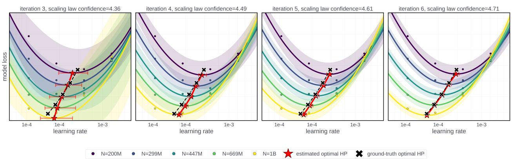  
Figure 1 Through small-scale experiments that share information across diferent model and data scales, PLES produces an optimal hyperparameter scaling law estimate (red line) that converges to the ground-truth optimal hyperparameter scaling law (black dotted line). In addition, PLES produces uncertainty intervals (red horizontal bars) that indicate our confidence of the scaling law estimate.

## 2 Related Works

LLM Scaling Laws. Conventional LLM Scaling laws (Kaplan et al., 2020; Hofmann et al., 2022) describe how LLM validation loss varies with changing model and data scales. Optimal hyperparameter scaling laws (Yang et al., 2021; McCandlish et al., 2018) ofer a nuanced distinction from conventional scaling laws because they describe how the optimal hyperparameters (conditioned on a given model and data scale) change with increasing model and data scales. Our aim is to learn optimal hyperparameter scaling laws through a series of experimentation at small model and data scales to infer the optimal hyperparameters at larger, production-level model and data scales.

Experimental design. Bayesian Experimental Design (BED) ofers a principled statistical framework for selecting experiments that maximize the information gained about a latent quantity of interest, typically quantified via information gain (Chaloner and Verdinelli, 1995). Our work leverages some of the same principles found in BED (more details covered in Section 4) and uses information gain as a latent quality to drive where we perform small-scale experiments. As far as we know, (Li et al., 2026) is the only piece of work that leverages similar principles in designing experiments to learn scaling laws. However, they did not focus on the specific problem of optimal hyperparameters scaling across model and data scales, which our paper focuses on. In addition, their approach centers around a Gaussian mixture model formulation in modeling the scaling law parameters while our paper adopts a multi-fidelity BO approach. Last but not least, Li et al. (2026)’s empirical results are produced from hypothetical experiments from an existing scaling law benchmark, whereas we verified our method on actual LLM training runs (see Section 5).

Gaussian Process (GP). A GP (Williams and Rasmussen, 2006) defines a distribution over functions, $f \sim$ $\mathcal { G P } ( \mu , \kappa )$ , meaning that any random draw from the process yields a continuous function over the input domain. A GP is fully specified by its prior mean function $\mu ( x )$ and a covariance kernel function $\kappa ( \boldsymbol { x } , \boldsymbol { x } ^ { \prime } )$ for all $x , x ^ { \prime } \in \mathbb { R } ^ { d }$ , where the kernel characterizes the correlation strength between any two input variables. Conditioned on a set of past observations, $\mathcal { D } _ { t } = \{ ( x _ { \tau } , y _ { \tau } ) \} _ { \tau = 1 } ^ { t }$ , a GP’s posterior belief of any new point $x ^ { \prime }$ is a

Gaussian distribution, whose mean and variance are:

$$
\mu _ { t } ( x ^ { \prime } ) \triangleq \kappa _ { t } ^ { \intercal } ( x ^ { \prime } ) ( K _ { t } + \zeta I ) ^ { - 1 } \pmb { y } _ { t }\tag{1}
$$

$$
\sigma _ { t } ^ { 2 } ( x ^ { \prime } ) \triangleq \kappa ( x ^ { \prime } , x ^ { \prime } ) - \kappa _ { t } ^ { \top } ( x ^ { \prime } ) ( K _ { t } + \zeta I ) ^ { - 1 } \kappa _ { t } ( x ^ { \prime } )\tag{2}
$$

where $\kappa _ { t } ( x ^ { \prime } ) \triangleq [ \kappa ( x ^ { \prime } , x _ { 1 } ) , \ldots , \kappa ( x ^ { \prime } , x _ { t } ) ] ^ { \top } , K _ { t } \triangleq [ \kappa ( x _ { \tau } , x _ { \tau ^ { \prime } } ) ] _ { \tau , \tau ^ { \prime } \in \{ 1 , \ldots , t \} }$ is a $t \times t$ covariance matrix, and $\zeta > 0$ is a regularization hyperparameter (Chowdhury and Gopalan, 2017) and also describes the observation noise under the GP model.

## 3 Problem setup

Let $N \in \mathbb { R }$ denote model size, $D \in \mathbb { R }$ data size, and $\theta \in \mathbb { R }$ a hyperparameter of interest. To ease our exposition, we assume that there is only one hyperparameter, although in Section 4.3 we will extend our formulation to more than one hyperparameters (and explain the subtleties involved). Training a model with configuration $( N , D , \theta )$ yields an evaluation loss $\ell ( N , D , \theta )$ and consumes some amount of training budget (e.g., GPU hours, FLOPs), often approximated with 6ND (Kaplan et al., 2020). At each model and data scale, the hyperparameter that minimizes the evaluation loss is referred to as the optimal hyperparameter. An example of how the optimal learning rate (red star) scales with increasing model and data sizes is shown in Figure 2.

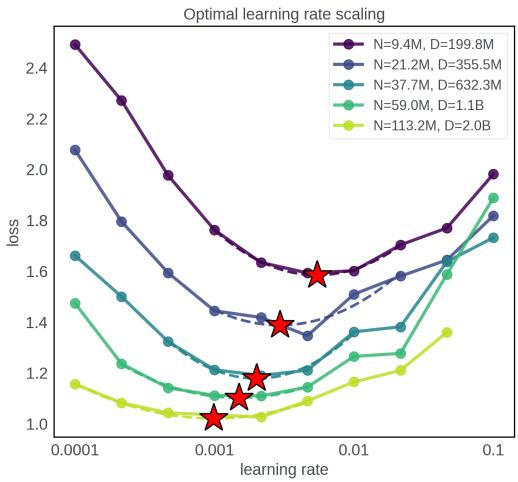

Optimal hyperparameter scaling law. The optimal hyperparameter scaling law describes how the optimal hyperparameter changes with scale. More formally, an optimal hyperparameter scaling law is a predictive function Π that maps a set of "scale" parameters to optimal hyperparameters. In our paper, we specifically focus on LLM model scale N and data scale $D ,$ and Π maps these scales to the optimal hyperparameter $\theta ^ { * }$ that minimizes the model evaluation loss at that scale. This relationship is described with the following expression:

Figure 2 An example of how the optimal learning rate of Llama-3 (Touvron et al., 2023) changes with increasing model parameters and training data tokens. The change in optimal learning rate (red stars) is described by an optimal hyperparameter scaling law, which we aim to estimate eficiently.

$$
\theta ^ { * } = \Pi ( N , D )
$$

where Π : $\mathbb { R } ^ { + } \times \mathbb { R } ^ { + } \to \mathbb { R }$ is a parametric function with learnable coeficients. We are interested in finding the optimal hyperparameter $\theta _ { \mathrm { m a x } } ^ { * }$ at the largest target model scale $N _ { \mathrm { m a x } }$ and data scale $D _ { \mathrm { m a x } }$ which minimizes the evaluation loss, i.e., $\theta _ { \operatorname* { m a x } } ^ { * } = \arg \operatorname* { m i n } _ { \theta } \ell ( N _ { \operatorname* { m a x } } , D _ { \operatorname* { m a x } } , \theta )$ . From hereon, we refer to the largest scale as the held-out scale. Assuming the scaling law is known (more specifically, if its coeficients are estimated accurately), the optimal hyperparameter at the held-out scale can be inferred directly from the scaling law:

$$
\theta _ { \operatorname* { m a x } } ^ { * } = \Pi ( N _ { \operatorname* { m a x } } , D _ { \operatorname* { m a x } } ) .
$$

Power-law as functional form of scaling law. In our paper, as with (Li et al., 2025), we assume that the optimal hyperparameter scaling law Π is a power-law function of both model scale N and data scale D (as we show in Figures 5 and 6, this assumption is realistic):

$$
\theta ^ { * } = c N ^ { \alpha } D ^ { \beta } .\tag{3}
$$

As such, finding the power-law coeficients is equivalent to finding the optimal hyperparameter scaling law.   
Our aim is to estimate the power-law coeficients $c , \alpha , \beta$ eficiently through small-scale experimentation.

## 4 Method

We first provide a brief overview of our approach, before covering its details in the next few subsections. Our approach is a two-step process under the Bayesian Optimization (BO) framework where we perform sequential experimentation. At each iteration, (a) we maintain a GP surrogate fitted on previously experimented configurations $( N , D , \theta )$ and observed model loss. We use Thompson samples from the GP to maintain an estimate of the optimal hyperparameter scaling law. (b) Using a new cost-aware acquisition function called PLES, we find the candidate hyperparameter configuration to experiment next that maximally reduces the uncertainty of our scaling law estimate. Asymptotically, our estimate converges to the true optimal hyperparameter scaling law.

## 4.1 Estimating Power-Law coefficients from a GP

Given a fitted Gaussian Process (GP) that takes in input configurations $( N , D , \theta )$ , we introduce a procedure to recover the power-law and quantify our uncertainty about its coeficients at any point during experimentation. To achieve this, we rewrite the power-law in Equation (3) into a linear form:

$$
\log \theta ^ { * } = \log c + \alpha \log N + \beta \log D .\tag{4}
$$

We view this as a Bayesian linear regression problem that learns the power-law coeficients $\mathbf { w } = ( \log c , \alpha , \beta ) ^ { \top }$ and their uncertainty. If we are certain about the coeficients, it implies we are certain about the power-law.

Finding θ∗ for one particular model $N _ { i }$ and data scale $D _ { i }$ . For a single, fixed model and data scale $( N _ { i } , D _ { i } )$ , we perform Thompson sampling (Chapelle and Li, 2011) over the current $\mathrm { G P } \ ( { \mathcal { G P } } )$ fitted from observed data to empirically estimate the expectation of the optimal hyperparameter $\theta _ { i } ^ { * }$ at scale i:

$$
\theta _ { i } ^ { * } = \mathbb { E } _ { f \sim \mathcal { G P } } [ \arg \operatorname* { m i n } _ { \theta } f ( N _ { i } , D _ { i } , \theta ) ] \approx \frac { 1 } { K } \sum _ { k = 1 } ^ { K } \arg \operatorname* { m i n } _ { \theta } f _ { k } ( N _ { i } , D _ { i } , \theta )\tag{5}
$$

where $f _ { k }$ is one of K Thompson samples from the GP. We also observe that suficient Thompson samples asymptotically recover the true solution. We repeat this procedure across m model $[ N _ { 1 } , \cdots , N _ { m } ]$ and data $[ D _ { 1 } , \cdots , D _ { m } ]$ scales to produce an estimate of optimal hyperparameters across diferent scales $[ \theta _ { 1 } ^ { * } , \cdots , \theta _ { m } ^ { * } ]$ along with their empirical standard deviations $[ \sigma ( \theta _ { 1 } ^ { * } ) , \cdot \cdot \cdot , \sigma ( \theta _ { m } ^ { * } ) ]$

Using Bayesian linear regression to estimate power-law coefficients w. We aggregate the evaluations across all m scales to obtain target vector $\mathbf { y } ,$ the design matrix X, and the diagonal noise covariance matrix Λ:

$$
\mathbf { y } = [ \log \theta _ { 1 } ^ { * } , \cdots , \log \theta _ { m } ] ^ { \top } , \quad \mathbf { X } = \left[ \begin{array} { c c c } { 1 } & { \log N _ { 1 } } & { \log D _ { 1 } } \\ & { \vdots } \\ { 1 } & { \log N _ { m } } & { \log D _ { m } } \end{array} \right] , \quad \mathbf { A } = \mathrm { d i a g } ( \sigma ^ { 2 } ( \log \theta _ { 1 } ^ { * } ) , \dots , \sigma ^ { 2 } ( \log \theta _ { m } ^ { * } ) ) ,\tag{6}
$$

where $\sigma ( \log \theta _ { i } ^ { * } ) \approx \sigma ( \theta _ { i } ^ { * } ) / \theta _ { i } ^ { * }$ (Casella and Berger, 2024). The power-law is fitted based on $\mathbf { y } = \mathbf { X } \mathbf { w } + \epsilon ,$ where $\epsilon \sim \mathcal { N } ( \mathbf { 0 } , \mathbf { \boldsymbol { \Lambda } } )$ . Given a Gaussian prior $\mathbf { w } \sim \mathcal { N } ( \mathbf { 0 } , \pmb { \Sigma } _ { 0 } ) ^ { \mathrm { ~ 1 ~ } }$ , our estimate of the power-law coeficients is $p ( \mathbf { w _ { \alpha } } | \mathbf { y } , \mathbf { X } ) = \mathcal { N } ( \mu _ { \mathbf { w } } , \Sigma _ { \mathbf { w } } )$ , with mean and variance:

$$
\pmb { \Sigma } _ { \mathbf { w } } = \left( \pmb { \Sigma } _ { 0 } ^ { - 1 } + \mathbf { X } ^ { \top } \pmb { \Lambda } ^ { - 1 } \mathbf { X } \right) ^ { - 1 }\tag{7}
$$

$$
\mu _ { \mathbf { w } } = \pmb { \Sigma } _ { \mathbf { w } } \mathbf { X } ^ { \top } \mathbf { A } ^ { - 1 } \mathbf { y }\tag{8}
$$

From hereon, we use $\Sigma _ { \mathbf { w } } ( \mathcal { G P } ( \mathcal { D } ) )$ and $\mu _ { \mathbf { w } } ( \mathcal { G P } ( \mathcal { D } ) )$ to denote the covariance and mean of power-law coeficients estimated from the GP fitted on observed data D.

Uncertainty of power-law coefficients. The diferential entropy logdet $\Sigma _ { w } ( \mathcal { G P } ( \mathcal { D } ) )$ indicates the amount of uncertainty surrounding the current power-law coeficients estimated from observed data D (Chaloner and Verdinelli, 1995). We use this expression to represent the amount of uncertainty associated with the power-law estimate at any given iteration.

## 4.2 Power-Law Entropy Search (PLES)

We introduce a computational cost-aware acquisition function, PLES, that searches for candidates that have the largest uncertainty reduction per unit-cost of the power-law coeficients derived from the procedure in Section 4.1. The overall pseudocode for PLES is provided in Section A. At iteration t, The acquisition function of a candidate hyperparameter and scale $x = ( N , D , \theta )$ given historical observed data $\mathcal { D } _ { t }$ is:

$$
\mathsf { P L E S } ( x ) = \mathop { \arg \operatorname* { m a x } } _ { x } \frac { \log \mathsf { d e t } \Sigma _ { \mathbf { w } } ( \mathcal { G P } ( \mathcal { D } ) ) - \log \mathsf { d e t } \Sigma _ { \mathbf { w } } ( \mathcal { G P } ( \mathcal { D } \cup x ) ) } { ( N D ) ^ { d } } ,\tag{9}
$$

where d is a computational cost-cooling factor that discourages experimentation at larger model and data scales (Kandasamy et al., 2017). If $d = 1$ is chosen, it reduces the acquisition function to search for the largest information gain per unit-cost of experimentation. Choosing a larger d favors experimentation at smaller scales, and vice versa. Note that to obtain an updated ${ \mathcal { G P } } ( { \mathcal { D } } \cup x )$ , we draw a fantasy observation for x from the current GP. The reduction of the shaded region in Figure 3 describes how an informative candidate reduces the empirical uncertainty of the optimal hyperparameter at a given scale.

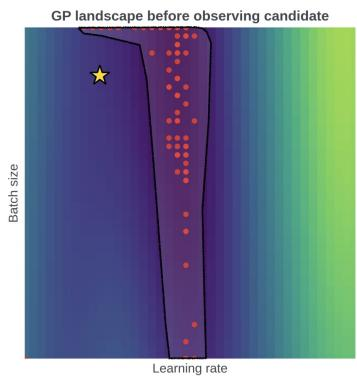

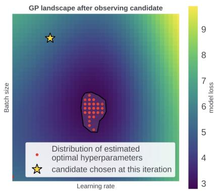  
Figure 3 PLES identifies an informative candidate that greatly reduces the empirical uncertainty of the estimated optimal hyperparameters from the GP. This leads to lower variance about the estimated power-law coeficients, which is represented by the expression logde $\mathbf { \partial } ; \pmb { \Sigma } _ { \mathbf { w } } ( \mathcal G P ( \mathcal { D } \cup \boldsymbol { x } ) )$ in Equation (9).

## 4.3 Extension to more than one hyperparameters

Often, there is more than one hyperparameter of interest when practitioners train LLMs. Our GP modeling process in Section 3 can be extended straightforwardly to these cases, by assuming θ has a cardinality of more than one. However, the scaling laws of diferent hyperparameters of LLMs (e.g., learning rate, batch size) are governed by independent power-laws with diferent coeficients (Li et al., 2025). To infer the optimal hyperparameters at the largest scale, we will need to maintain an estimate of diferent, independent power-laws (Equation (3)) during the BO process. Then, we need to modify our acquisition function in Equation (9) to search for candidates that reduce the uncertainty of multiple scaling laws simultaneously, by reducing a weighted-sum of diferential entropy (mathematical formulation provided in Section B).

Interestingly, we observed in our experiments that explicitly maintaining multiple scaling laws may not always be necessary. For example, in the case of two hyperparameters (e.g., learning rate and batch size), we find that performing acquisition solely to reduce uncertainty in the scaling law for learning rate can, as a byproduct, also recover an accurate scaling law for batch size. We hypothesize that this occurs because PLES, in identifying configurations that are informative about the optimal learning rate, naturally also reveals regions with the optimal batch size. We analyze these results in greater detail in Section 5.5.

## 4.4 Stopping criterion

A key advantage of maintaining a probabilistic estimate of the power-law coeficients is that it provides a natural stopping criterion for experimentation. At each iteration $t ,$ the empirical uncertainty of the optimal hyperparameter at the held-out scale is: $\mathbf { x } _ { \mathrm { m a x } } ^ { \top } \pmb { \Sigma } _ { w } \mathbf { x } _ { \mathrm { m a x } }$ , where $\mathbf { x } _ { \mathrm { m a x } } = ( 1 , \log N _ { \mathrm { m a x } } , \log D _ { \mathrm { m a x } } ) ^ { \top }$ (see

Section 4.1). Essentially, this is the uncertainty of the optimal hyperparameters (in the power-law) at the held-out scale. When this value is small, it suggests that our power-law estimate has become accurate. This is shown in column 3 and 4 of Figure 5, where the uncertainty at the held-out scale is small and further experimentation does not improve the estimated power-law significantly.

## 5 Experiments

## 5.1 Setup

We evaluate our method on a few settings, including real LLM training runs. First, we consider a synthetic function that describes how model loss varies with respect to varying learning rate, batch size, model scale N and data scale D. The function’s formula is provided in Section C. Second, we retrieved past LLM training runs from (Li et al., 2025; Lin et al., 2026). The training runs contain a grid search of how model loss varies w.r.t. learning rate, batch size, model and data scales. We fit a GP to the results of these training runs, use the GP as an oracle function and apply our method on a continuous set of configuration choices at every acquisition step. Section D shows that the GP has a good fit over the past LLM training run data, serving as a good surrogate ground-truth. Third, we evaluate our method on real LLM training runs, whose training setup we cover next.

Setup for real LLM training runs. For simplicity, we use one dimension of scaling and only vary the model size N. For each model size chosen, we use a data size of 20 Tokens-Per-Parameter (TPP), which follows the Chinchilla Law (Hofmann et al., 2022). We train a Llama-8B model. To adjust the model size, we vary the number of layers and hidden layer dimensions in the intermediate layers simultaneously, while keeping the model’s aspect ratio roughly the same. The range of configurations used is as follows: $N \in [ 9 . 4 M , 6 0 0 M ] , D \in$ $[ 1 9 9 . 8 M , 1 2 B ] , \mathrm { L R } \in [ 0 . 0 0 0 1 , 0 . 1 ]$ . For every configuration, we pre-train the LLM using a subset of the Llama training data (Touvron et al., 2023) for one epoch and record the final validation loss on a held-out set from the training data. We use a batch size of 2048 and the sequence length of each batch is 2048 tokens.

Evaluation methods. We evaluate the efectiveness of our method by evaluating how good the optimal hyperparameter at the held-out scale is. There are two ways to do so. For the synthetic and surrogate experiments, we know the ground-truth optimal θ at the held-out scale. For the Real LLM experiment, we performed grid search and interpolation at the held-out scale to empirically estimate the optimal θ. We then measure the percentage error of the optimal θ inferred from the estimated power-law at the held-out scale. The held-out scale is indicated by the figure subtitles in Figure 4. The second evaluation metric is to evaluate the model loss of the estimated optimal θ at the held-out scale at the end of every acquisition step.

## 5.2 Baselines

We compare our method against three baselines. All baselines operate under the same total compute budget (measured as the cumulative ND spent across all evaluations) and, where applicable, share the same Sobolinitialized starting configurations to ensure a fair comparison. For every method, we repeat our experiments with 10 seeds, which influence the initial starting configurations and also the randomness involved in every method.

Grid search. This is the conventional method used to fit scaling laws in prior work (Hofmann et al., 2022; Li et al., 2025). For each model/data scale (N, D), we evaluate the loss on a dense grid over the hyperparameters θ, take the per-scale grid minimizer as the estimated optimal hyperparameter $\theta ^ { \star } ( N , D )$ , and then fit the scaling law. The budget is allocated such that every scale contains approximately the same number of training runs. There are many ways to allocate compute resources for grid search, but we find this approach more efective than others. We provide a more thorough analysis of budget allocation of grid search in Section E.

Ladder BO. This baseline performs independent Bayesian optimization with the Expected Improvement (Ament et al., 2023) to estimate the optimal hyperparameter θ at each scale. To achieve this, independent GPs are fitted to the results at each scale, and computational resources are allocated such that we have an equal amount of training runs at each scale. The optimal hyperparameter estimated at each scale is then used to fit the scaling law, allowing us to estimate the optimal hyperparameter at the held-out scale.

Sobol. This baseline draws configurations (θ, N, D) from a quasi-random, space-filling Sobol sequence until the budget is exhausted, then fits a GP over the hyperparameter θ and scale (N, D). The scaling law is estimated from the random configurations using the same procedure as in Section 4.1.

## 5.3 Main Results

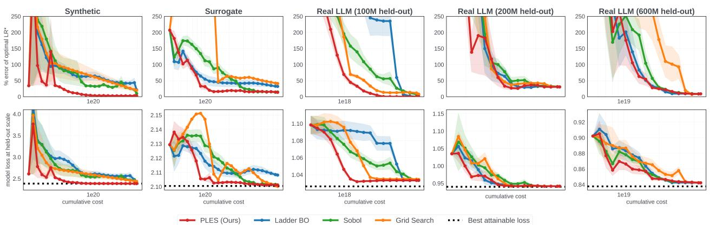  
Figure 4 Results on three settings: a Synthetic function, a Surrogate GP model that is fitted on real LLM training runs in (Li et al., 2025), and Real LLM training runs on the Llama-3 (Touvron et al., 2023) model. The first row shows how accurate the optimal hyperparameter estimated by each method is w.r.t. increasing experimentation computational cost. The second row shows the model loss attained at the estimated optimal hyperparameter at the held-out scale.

Our results in Figure 4 show that PLES (red) consistently achieves a smaller percentage error in the estimated optimal hyperparameter than other baselines in the held-out scale. In addition, the optimal hyperparameter estimated by PLES converges much more quickly than other methods, reaching the best attainable model loss at the held-out scale in less than one-tenth of the computational budget as compared to canonical baselines.

## 5.4 Analysis of scaling law uncertainty with increasing computational cost

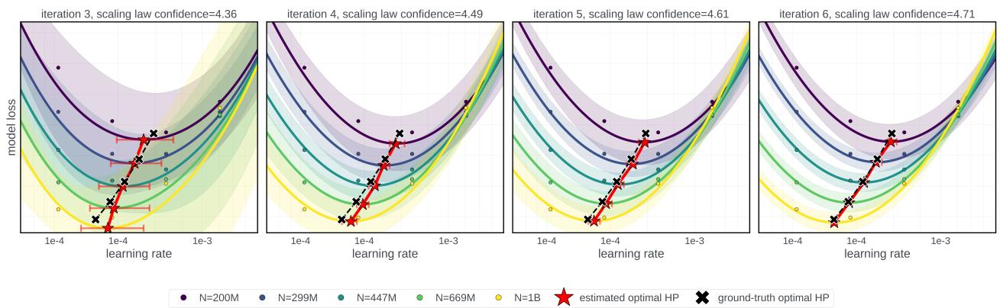  
Figure 5 The fitted GP and estimated optimal learning rate scaling law at each iteration of the surrogate experiment. The variance of the GP reduces and the estimated scaling law converges to the ground-truth scaling law with more iteration. At iteration 6 (3rd column), the uncertainty at the held-out scale is suficiently small, serving as a stopping criterion for the experiment. Further experimentation at the 4th column does not improve the estimated scaling law significantly.

In this section, we analyze how the confidence of our estimated scaling law changes as we incur more experimentation budget in the surrogate experiment. The size of the horizontal standard deviation bar in Figure 5 represents our uncertainty of the learning rate scaling law fit Λ (see Equation (6)) at each iteration. We observe that the uncertainty decreases with more experimentation budget. In addition, the size of the horizontal standard deviation at the largest held-out scale (in this case, at N=1B) can also be used as a stopping criterion (see Section 4.4) in PLES. At iteration 6 (3rd column), the uncertainty of the estimated scaling at the held-out scale is small, suggesting that our scaling law estimate has (rightfully so) already converged to the ground-truth scaling law. As expected, performing experiments for more iterations (from 3rd to 4th column) does not improve the scaling law estimate significantly.

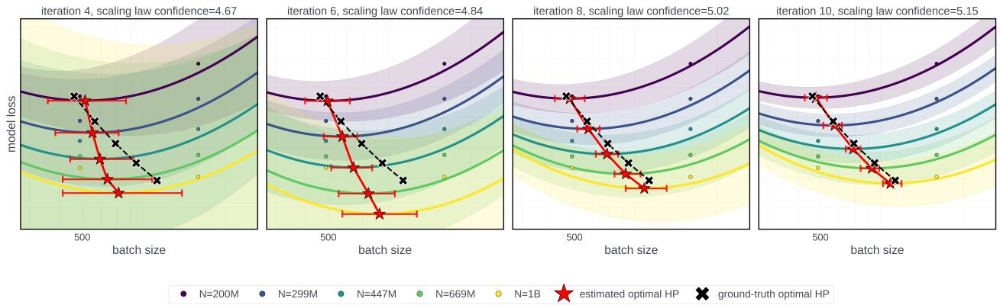  
Figure 6 Although PLES does not explicitly model the optimal batch size scaling law for the surrogate experiment, it still converges to the ground-truth optimum.

## 5.5 Results on more than one hyperparameters (learning rate and batch size)

In Section 4.3, we mentioned that PLES can recover multiple optimal hyperparameter scaling laws even when it is designed to minimize the uncertainty about one scaling law. In the surrogate experiment, our GP takes in both learning rate and batch size but we designed PLES to specifically acquire candidates that reduce the uncertainty of the learning rate scaling law. Despite so, the result in Figure 6 shows that PLES surprisingly recovers the batch size scaling law despite only being designed to estimate the learning rate scaling law. One possible explanation for this phenomenon is that PLES uncovers regions that contain the optima of multiple hyperparameters simultaneously; this is seen in Figure 3, where an acquired candidate (yellow star) that reduces the uncertainty of one hyperparameter (e.g., learning rate) also reduces the uncertainty of another hyperparameter (e.g., batch size).

## 5.6 Analysis of the scale of candidates acquired by PLES

Figure 7 shows that most of the candidate scales proposed by acquisition function PLES are concentrated at small scales that are less than 6% of the computational cost of running the experiments at the expensive held-out scale. This is because PLES is computational cost-aware and uses a cost-cooling factor in Equation (9) to favor candidates at cheaper scales. As a result, the computational cost of running all the experiments with the candidates suggested by PLES is significantly smaller than the computational cost of performing hyperparameter optimization at the held-out scale directly.

## 5.7 Computational complexity

PLES allows us to recover the optimal hyperparameter scaling law in an eficient amount of computational budget. Some computational complexity is necessary to evaluate the acquisition value of each candidate configuration and solve the optimization problem in Equation (9). The periteration complexity is ${ \mathcal { O } } ( C \cdot K \cdot Q )$ , where C is the number of candidate configurations we consider for the optimization problem, K is the number of Thompson samples used to estimate θ∗ in Section 4.1, and Q is the computational cost of solving the inner arg min problem (Equation (5)) for each sample. Leveraging batched pathwise sampling and vectorized operations in BoTorch (Balandat et al., 2020), the Thompson sampling loop and inner minimizations can be fully parallelized across K and C. Hence, the computational overhead in PLES is negligible compared to the reduction in the amount of model training computational cost saved.

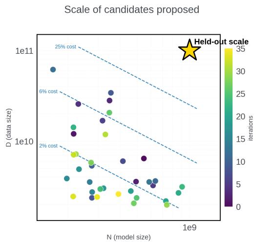  
Figure 7 The candidate scales that PLES proposes throughout the course of learning the optimal hyperparameter scaling law. Most candidate scales are less than 2% of the computational cost of the held-out scale.

## 6 Limitations

Our method assumes that the optimal hyperparameter scaling law follows a known functional form (Equation (3)). Although this assumption is well-supported empirically for the hyperparameters and architectures studied in this paper (Figures 5 and 6) and in prior work (Li et al., 2025), it may not hold universally. It is possible that the trend of optimal hyperparameters deviates from a simple power-law. In such cases, the Bayesian linear regression step in Section 4.1 would produce biased coeficient estimates and degrade the extrapolation accuracy at the held-out scale. That said, extending PLES to accommodate more flexible functional representations while retaining tractable uncertainty quantification is a promising direction for future work.

## 7 Conclusion

We introduced Power-Law Entropy Search (PLES), a cost-aware acquisition function that eficiently estimates optimal hyperparameter scaling laws for large language model training through eficient experimentation.

Our experiments across synthetic benchmarks, surrogate models fitted to real LLM training data, and actual LLM pre-training runs demonstrate that PLES converges to accurate optimal hyperparameter scaling laws using less than one-tenth of the computational budget required by conventional grid search and other baselines. Furthermore, PLES provides a natural stopping criterion based on the posterior uncertainty at the target scale, allowing practitioners to terminate experimentation once suficient confidence is achieved. We also showed that PLES can recover scaling laws for multiple hyperparameters simultaneously, even when the acquisition function is designed to reduce uncertainty for only one.

We believe PLES ofers a practical and principled framework for scaling law estimation that can substantially reduce the computational cost of developing future large language models. As model architectures and training recipes continue to evolve—requiring repeated re-estimation of scaling laws—methods like PLES that minimize the experimental burden become increasingly valuable.

## References

Takuya Akiba, Shotaro Sano, Toshihiko Yanase, Takeru Ohta, and Masanori Koyama. Optuna: A next-generation hyperparameter optimization framework. In Proc. of the 25th ACM SIGKDD international conference on knowledge discovery & data mining, pages 2623–2631, 2019.

Sebastian Ament, Sam Daulton, David Eriksson, Maximilian Balandat, and Eytan Bakshy. Unexpected improvements to expected improvement for bayesian optimization. In Proc. NeurIPS, 2023.

Maximilian Balandat, Brian Karrer, Daniel R. Jiang, Samuel Daulton, Benjamin Letham, Andrew Gordon Wilson, and Eytan Bakshy. Botorch: A framework for eficient monte-carlo bayesian optimization, 2020. https://arxiv.org/ abs/1910.06403.

George Casella and Roger Berger. Statistical inference. Chapman and Hall/CRC, 2024.

Kathryn Chaloner and Isabella Verdinelli. Bayesian experimental design: A review. Statistical science, pages 273–304, 1995.

Olivier Chapelle and Lihong Li. An empirical evaluation of thompson sampling. In Proc. NeurIPS, 2011.

Sayak Ray Chowdhury and Aditya Gopalan. On kernelized multi-armed bandits. In Proc. ICML, 2017.

Matthias Feurer and Frank Hutter. Hyperparameter optimization. In Automated machine learning: Methods, systems, challenges, pages 3–33. Springer, 2019.

Jordan Hofmann, Sebastian Borgeaud, Arthur Mensch, Elena Buchatskaya, Trevor Cai, Eliza Rutherford, Diego de Las Casas, Lisa Anne Hendricks, Johannes Welbl, Aidan Clark, Tom Hennigan, Eric Noland, Katie Millican, George van den Driessche, Bogdan Damoc, Aurelia Guy, Simon Osindero, Karen Simonyan, Erich Elsen, Jack W. Rae, Oriol Vinyals, and Laurent Sifre. Training compute-optimal large language models, 2022. https://arxiv.org/ abs/2203.15556.

Kirthevasan Kandasamy, Gautam Dasarathy, Jef Schneider, and Barnabás Póczos. Multi-fidelity bayesian optimisation with continuous approximations. In Proc. ICML, 2017.

Jared Kaplan, Sam McCandlish, Tom Henighan, Tom B. Brown, Benjamin Chess, Rewon Child, Scott Gray, Alec Radford, Jefrey Wu, and Dario Amodei. Scaling laws for neural language models. arXiv preprint arXiv:2001.08361, 2020.

Houyi Li, Wenzhen Zheng, Qiufeng Wang, Hanshan Zhang, Zili Wang, Shijie Xuyang, Yuantao Fan, Zhenyu Ding, Haoying Wang, Ning Ding, Shuigeng Zhou, Xiangyu Zhang, and Daxin Jiang. Predictable scale: Part i, step law – optimal hyperparameter scaling law in large language model pretraining, 2025. https://arxiv.org/abs/2503.04715.

Sijie Li, Shanda Li, Haowei Lin, Weiwei Sun, Ameet Talwalkar, and Yiming Yang. Spend less, fit better: Budget-eficient scaling law fitting via active experiment selection. arXiv preprint arXiv:2604.22753, 2026.

Haowei Lin, Haotian Ye, Wenzheng Feng, Quzhe Huang, Yujun Li, Hubert Lim, Zhengrui Li, Xiangyu Wang, Jianzhu Ma, Yitao Liang, and James Zou. Can language models discover scaling laws?, 2026. https://arxiv.org/abs/2507.21184.

Sam McCandlish, Jared Kaplan, Dario Amodei, and OpenAI Dota Team. An empirical model of large-batch training. arXiv preprint arXiv:1812.06162, 2018.

Hugo Touvron, Thibaut Lavril, Gautier Izacard, Xavier Martinet, Marie-Anne Lachaux, Timothée Lacroix, Baptiste Rozière, Naman Goyal, Eric Hambro, Faisal Azhar, Aurelien Rodriguez, Armand Joulin, Edouard Grave, and Guillaume Lample. Llama: Open and eficient foundation language models, 2023. https://arxiv.org/abs/2302.13971.

Christopher KI Williams and Carl Edward Rasmussen. Gaussian processes for machine learning, volume 2. MIT press Cambridge, MA, 2006.

Jian Wu, Saul Toscano-Palmerin, Peter I. Frazier, and Andrew Gordon Wilson. Practical multi-fidelity Bayesian optimization for hyperparameter tuning. In Proc. UAI, 2020.

Greg Yang, Edward J. Hu, Igor Babuschkin, Szymon Sidor, Xiaodong Liu, David Farhi, Nick Ryder, Jakub Pachocki, Weizhu Chen, and Jianfeng Gao. Tuning large neural networks via zero-shot hyperparameter transfer. In Proc. NeurIPS, 2021.

## Appendix

## A Pseudocode for PLES

Input: Current GP model fitted on observations prior to iteration $t ;$ a set of candidate configurations each   
with model scale N, data scale D, cost-cooling factor d   
Output: Acquisition value for each candidate.   
Compute current power-law uncertainty = logdet $: \Sigma _ { w } ( \mathcal { G P } ( \mathcal { D } ) )$   
foreach candidate do   
1. Draw a fantasy observation and update GP model: ${ \mathcal { G P } } ( { \mathcal { D } } \cup { x } )$   
2. Compute updated power-law uncertainty logdet $\Sigma _ { w } ( \mathcal { G P } ( \mathcal { D } \cup \boldsymbol { x } ) )$ (Section 4.1).   
3. Acquisition value of candidate: logdetΣw(GP(D))−logdetΣw(GP(D∪x))   
(ND)d   
end  
Algorithm 1: Pseudo code of Power-Law Entropy Search (PLES) at iteration t that computes the acquisition value of each candidate. The candidate with the highest acquisition value is selected.

## B PLES for Multiple Hyperparameters

Without loss of generality, we illustrate the extension of PLES to two hyperparameters $\theta ^ { ( 1 ) }$ and $\theta ^ { ( 2 ) }$ (e.g., learning rate and batch size), each with its own independent power-law:

$$
\log \theta ^ { ( 1 ) * } = \log c _ { 1 } + \alpha _ { 1 } \log N + \beta _ { 1 } \log D ,\tag{10}
$$

$$
\log \theta ^ { ( 2 ) * } = \log c _ { 2 } + \alpha _ { 2 } \log N + \beta _ { 2 } \log D .\tag{11}
$$

Following the procedure in Section 4.1, we estimate each set of power-law coeficients independently:

$$
\mathbf { w } _ { 1 } = ( \log c _ { 1 } , \alpha _ { 1 } , \beta _ { 1 } ) ^ { \top } , \quad \mathbf { w } _ { 2 } = ( \log c _ { 2 } , \alpha _ { 2 } , \beta _ { 2 } ) ^ { \top } ,\tag{12}
$$

each with its own Bayesian linear regression posterior:

$$
\begin{array} { r } { p ( \mathbf { w } _ { j } \mid \mathcal { D } ) = \mathcal { N } ( \pmb { \mu } _ { \mathbf { w } _ { j } } , \pmb { \Sigma } _ { \mathbf { w } _ { j } } ) , \quad j \in \{ 1 , 2 \} . } \end{array}\tag{13}
$$

These two regression problems share the same design matrix X (since the $( N _ { i } , D _ { i } )$ scales are common) but have diferent target vectors $\mathbf { y } _ { 1 } , \mathbf { y } _ { 2 }$ and noise matrices $\mathbf { { A } } _ { 1 } , \mathbf { { A } } _ { 2 } .$ , estimated in the same manner as Section 4.1. The modified PLES acquisition function searches for candidates to reduce the uncertainty of both scaling laws simultaneously by maximizing the sum of entropy reductions:

$$
\mathsf { P L E S } ( x ) = \arg \operatorname* { m a x } _ { x } \frac { \Delta _ { 1 } ( x ) + \Delta _ { 2 } ( x ) } { ( N D ) ^ { d } } ,\tag{14}
$$

where

$$
\Delta _ { j } ( x ) = \mathsf { l o g d e t } \Sigma _ { \mathbf { w } _ { j } } ( \mathcal { G P } ( \mathcal { D } ) ) \ - \ \mathsf { l o g d e t } \Sigma _ { \mathbf { w } _ { j } } ( \mathcal { G P } ( \mathcal { D } \cup x ) )\tag{15}
$$

is the reduction in diferential entropy of the j-th scaling law’s coeficients after observing candidate x.

## C Details of Synthetic Function

To evaluate our method in a controlled setting with a known ground-truth optimum, we construct a fourdimensional synthetic benchmark that mimics the loss landscape of neural language-model training. The function takes two optimization variables — the learning rate η and the batch size B (measured in tokens) — together with two fidelity variables, the model size N (parameters) and the data size D (tokens). All four inputs are parameterized in $\log _ { 1 0 }$ space, and the computational cost of an evaluation is defined as the compute proxy cost $( N , D ) = N \cdot D ,$ so that low-fidelity (small-N, small-D) queries are cheap and high-fidelity queries are expensive.

The benchmark is built so that the loss-minimizing hyperparameters follow prescribed scaling laws. The optimal learning rate obeys a joint power law in model and data size, $\eta ( N , \bar { D ) } = A , N ^ { b } D ^ { c }$ with $( A , b , c ) =$ $( 0 . 1 8 9 6 , , - 0 . 7 3 4 , 0 . 3 4 2 )$ , so that the optimal learning rate decreases with model size and increases mildly with data; the optimal batch size follows a power law in the data size alone, $B ( D ) = G , D ^ { d }$ with $( G , d ) =$ (14.9624, , 0.5). Around this optimum the loss is modeled as a smooth quadratic "bowl" in log-space,

$$
\mathcal { L } ( \eta , B , N , D ) = L _ { \mathrm { f l o o r } } ( N , D ) + \alpha _ { \eta } \big ( \log \eta - \log \eta \big ) ^ { 2 } + \alpha _ { B } \big ( \log B - \log B \big ) ^ { 2 } ,
$$

with curvature coeficients $\alpha _ { \eta } = 0 . 4 0$ and $\alpha _ { B } = 0 . 1 5$ (deviations measured in natural log; the optional $\eta - B$ cross-term is set to zero, giving an axis-aligned bowl). The additive term $L _ { \mathrm { { f l o o r } } }$ is a Chinchilla-style irreducible loss that improves with scale,

$$
L _ { \mathrm { H o o r } } ( N , D ) = L _ { \infty } + \frac { A _ { N } } { N ^ { \beta _ { N } } } + \frac { A _ { D } } { D ^ { \beta _ { D } } } , \qquad L _ { \infty } = 1 . 6 9 , \left. A _ { N } , \beta _ { N } \right. = ( 4 0 6 . 4 , 0 . 3 4 ) , \left. A _ { D } , \beta _ { D } \right. = ( 4 1 0 . 7 , 0 . 2 8 ) .
$$

## D Using GP as Oracle Ground-truth

In our surrogate experiments, we fitted a surrogate GP over the data from training runs in (Li et al., 2025) and use it as the ground-truth to validate our algorithm, PLES. Figure 8 shows that the surrogate GP is well-fitted over the data from the training runs. Specifically, the optimal learning rate and batch size at each model and data scale from the training runs (yellow star) are close to the predicted optimal hyperparameters from the GP (red star). In addition, the RMSE are all smaller than 0.01, suggesting that the GP surrogate serves as a good fit to represent the data from real training runs.

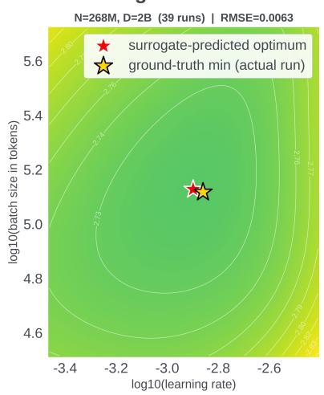

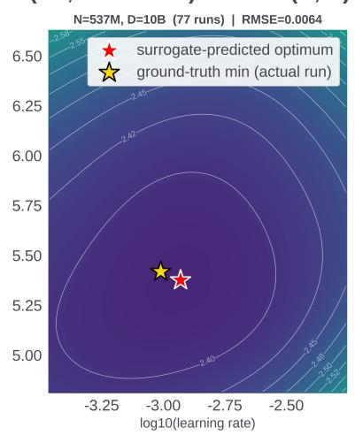

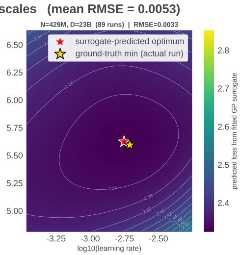  
Figure 8 The surrogate loss surface shows that the GP serves as a fit over the data from training runs in (Li et al., 2025). This implies it can be used as an accurate ground-truth function to validate the PLES algorithm in our Surrogate experiments.

## E Budget Allocation for Grid Search

When fitting an optimal hyperparameter scaling law using grid search, a natural instinct is to spend the entire tuning budget on small models, since they are cheap and one can aford many runs to pin down the optimum at small scale precisely. This turns out to be a poor use of compute: predicting the best hyperparameter at a much larger scale is similar to extrapolation in a regression problem, and spreading the budget across more scales is more efective. Points crowded together at small scales pin down the line’s slope poorly, and even a tiny slope error would propagate to larger uncertainties at larger scales. Spreading experiments across a wide range of scales gives a better estimate, even though each individual measurement is coarser (Figure 9). Therefore, in our grid search baseline in Section 5.2, we chose to allocate experimental runs evenly across all scales to make it a stronger baseline.

(a) More grid-search experiments at small scale  
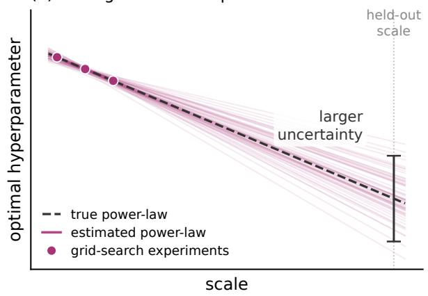

(b) Grid-search experiments spread out across scales  
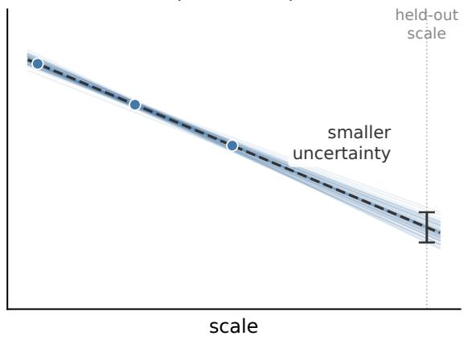  
Figure 9 In grid search, we allocate budget uniformly across all scales because it is a stronger baseline than allocating budget focused at a small scale.