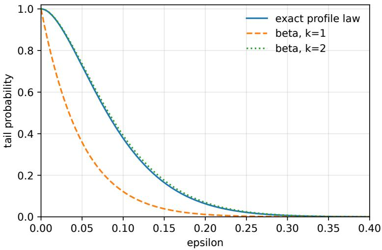
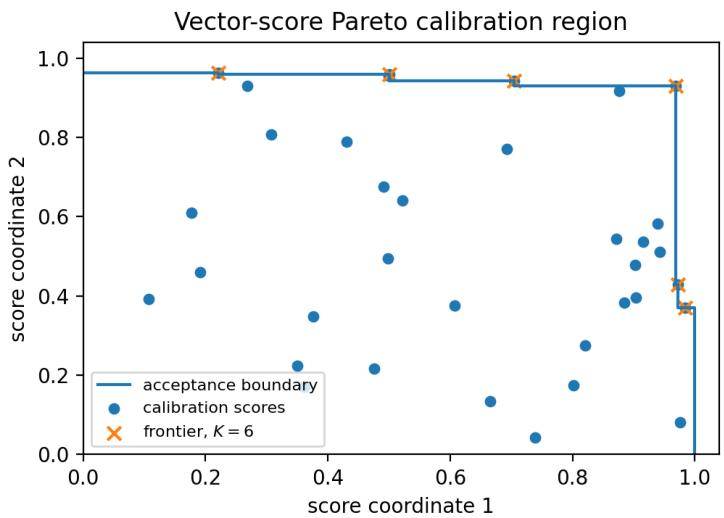
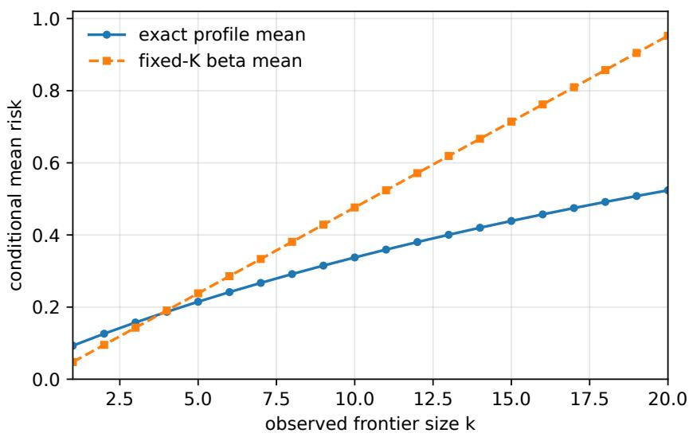
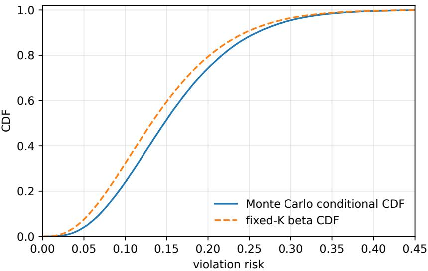

# Exact Risk-Complexity Laws for Projective Boundaries in Scenario Optimization and Distribution-Free Certification

Giuseppe C. Calafiore

Department of Electronics and Telecommunications, Politecnico di Torino, Italy

Corresponding author: giuseppe.calafiore@polito.it

## Abstract

Scenario optimization, conformal prediction, and related distribution-free certification methods use finite samples to construct decisions or prediction sets with violation-risk guarantees for fresh observations. In several classical settings, the conditional violation risk follows an exact beta law, whose tail has a beta-binomial representation and whose parameter is a support, calibration, or compression dimension. This paper identifies the deterministic boundary mechanism behind these formulas and derives the corresponding law when the observed boundary size is random. A decision rule is represented by an acceptance set for future observations, together with a boundary map selecting the sample points responsible for that set. The resulting pair is called a proper projective boundary scheme when held-out samples are accepted precisely if the full-sample boundary is retained, and accepted non-boundary samples can be deleted without changing that boundary. For every such scheme, the conditional law of the violation risk given the observed boundary size is determined by the boundary’s cross-sample complexity profile. A stable profile yields the usual beta law, whereas a varying profile produces an exact profile correction. The framework covers scalar order-statistic calibration, support-reconstructive scenario programs, cascaded support-removal certificates, coordinatewise envelopes, and Pareto-frontier calibration with vector scores. It also yields conditional probabilistic certificates and a no-go result explaining why observed complexity alone is insuficient.

Keywords: scenario optimization; distribution-free certification; conformal prediction; finite-sample risk; sample compression.

Mathematics Subject Classification (2020): Primary 90C15, 62G15; Secondary 90C90, 68Q32.

## 1 Introduction

This paper studies exact finite-sample risk-complexity laws for randomized decision rules and distribution-free certification methods. Scenario optimization and conformal prediction are two motivating examples. In both settings, a finite sample is used to construct an acceptance set for a future observation, and the central performance quantity is the conditional probability that a fresh observation is not accepted. The aim is to identify when this risk has an exact beta law and what replaces that law when the efective boundary size is random.

Scenario optimization and conformal prediction use samples in diferent ways but often lead to similar finitesample formulas. In scenario optimization, sampled constraints replace an uncertain constraint, and one studies the probability that the optimizer violates a fresh constraint; see [2–7, 11, 13]. In conformal prediction, calibration data are used to build prediction sets with finite-sample coverage under weak distributional assumptions; see [1, 16, 18, 21, 23]. Recent work also studies multivariate conformal prediction, risk control, and links between conformal and scenario methods; see [10, 15, 17, 22]. In both areas, beta-binomial expressions occur naturally.

For example, in a nondegenerate convex scenario program with � sampled constraints and deterministic support size �, the violation probability $V _ { N }$ satisfies

$$
\mathbb { P } \{ V _ { N } > \varepsilon \} = \sum _ { i = 0 } ^ { s - 1 } { \binom { N } { i } } \varepsilon ^ { i } ( 1 - \varepsilon ) ^ { N - i } .\tag{1}
$$

A scalar split-conformal predictor with a continuous nonconformity score has a risk law with the same beta form. If the threshold is the �-th largest calibration score, then the conditional miscoverage probability has distribution Beta(�, � − � + 1), which is the standard order-statistic law; see [9].

We argue that a deterministic boundary property of the sample is the common mechanism behind these formulas, rather than convexity, scalar scoring, or the observed support size alone. Informally, a new observation is rejected exactly when it would become one of the observations that determines the decision after augmentation. The term “boundary” is used here as a common name for support constraints and essential sets in scenario optimization, for compression sets in learning theory, and for the calibration observations that determine a split-conformal quantile. The formal concept is given in Section 3.

The size of the boundary set is a key complexity indicator, and many useful procedures have random boundary size. One example is conformal prediction with vector-valued scores. Suppose a calibration example has a score in $\mathbb { R } _ { + } ^ { d }$ , where the coordinates represent diferent residuals, losses, or safety margins. A Pareto-frontier rule accepts a candidate if its vector score is componentwise no worse than at least one calibration score. The boundary is then the empirical set of nondominated calibration scores, and its size is random. Conditioning on the observed frontier size by itself does not give a beta law.

The risk-complexity theory of [8, 11, 12] already shows that the observed complexity carries information about out-of-sample risk, and also that conditional risk statements based only on the observed complexity require additional information. The present paper gives a boundary-level version of that message. It identifies the exact profile information needed to pass from an observed boundary size to a conditional risk law.

The main object is a decision rule Γ that maps a finite sample to an acceptance set. A future point is accepted if it belongs to this set, and is a violation otherwise. To the decision rule, we associate a boundary map $B _ { n } .$ which selects the indices of the samples that determine the decision. The pair $( \Gamma , B )$ is a proper projective boundary scheme if it satisfies two deterministic conditions: all held-out samples are accepted if and only if the full boundary is retained, and once the boundary is retained, removing accepted non-boundary samples does not change the boundary. These conditions are stated for abstract schemes and cover convex and nonconvex optimization settings, together with applications outside optimization.

Under these assumptions, if

$$
V _ { N } = \mathbb { P } \{ Z \notin \Gamma ( S _ { N } ) \mid S _ { N } \} , \qquad K _ { N } = | B _ { N } ( S _ { N } ) | , \qquad p _ { n } ( k ) = \mathbb { P } \{ K _ { n } = k \} ,
$$

then for every $M \geq 0$

$$
\mathbb { E } [ ( 1 - V _ { N } ) ^ { M } \mid K _ { N } = k ] = \frac { p _ { N + M } ( k ) } { p _ { N } ( k ) } \frac { \binom { N } { k } } { \binom { N + M } { k } } ,\tag{2}
$$

whenever $p _ { N } ( k ) > 0$ . The conditional law of $V _ { N }$ is therefore determined by the complexity profile $\{ p _ { n } ( k ) \} _ { n \geq k }$ . If the profile is stable at the observed value, the profile factor disappears and $V _ { N } \mid \{ K _ { N } = k \} \sim \mathrm { B e t a } ( k , N - k + 1 )$ . If the profile changes with the sample size, the beta law is generally wrong after conditioning on $K _ { N } = k$

The consequences are useful in both scenario optimization and distribution-free prediction. First, the result gives a diagnostic for deciding when familiar beta-binomial certificates are exact: the relevant boundary must be proper and projective, and its cross-sample profile must be stable at the observed complexity. Second, it gives the exact profile-corrected law for random-boundary procedures, rather than treating a random frontier or support size as a fixed dimension. Third, it turns conditional risk certification into a finite-sample problem of computing, bounding, or estimating the complexity profile. Fourth, the no-go result in Section 10 shows that this extra profile information is necessary for nontrivial distribution-free conditional guarantees.

The paper has four main aims. It states boundary equivalence and projectivity in a form that can be checked directly. It proves the exact moment law (2) and the corresponding profile-based conditional certificate. It verifies the assumptions for scalar order-statistic calibration, support-reconstructive scenario programs, a coordinatewise random-support envelope, and Pareto-frontier calibration with vector scores. It also clarifies the role of discarded samples: essential projective discards may enter the sharp law, while generic violated-discard procedures call for specialized scenario-discarding bounds or conservative compression bounds; see [2, 6, 19, 20].

The paper is therefore a finite-sample risk-complexity result for abstract decision rules, with scenario optimization as a central optimization instance and conformal prediction as a parallel distribution-free instance. The profile $p _ { n } ( k )$ plays the role of a complexity law for the calibration or decision rule. In elementary schemes it is analytic; in structured schemes it can often be bounded by deterministic arguments; and in simulator-access settings it can be estimated with simultaneous finite-sample bands. These routes are made explicit in Section 6.1.

Longer proofs and verifications are collected in the appendices. Appendix A proves the bounded-boundary result. Appendix B treats cascaded support removal, while Appendices C and D give a reusable verification lemma and the inner-certificate result.

## 2 Setup

Let $( { \mathcal { Z } } , { \mathcal { A } } )$ be the measurable space of one observation. In a scenario program, � is typically an uncertainty realization; in conformal prediction, � may be a labelled example, a residual, or a calibration score. Throughout the single-risk part of the paper, $Z _ { 1 } , Z _ { 2 } , . . .$ . are i.i.d. with common law $P ,$ and $S _ { n } = ( Z _ { 1 } , \ldots , Z _ { n } )$ . For deterministic data we write $T _ { n } = \left( z _ { 1 } , \ldots , z _ { n } \right)$ . If $I \subseteq [ n ] = \{ 1 , \dots , n \}$ , then $T _ { I }$ denotes the corresponding subcollection, written in a fixed deterministic order. All rules are assumed to be permutation invariant; this ordering is only a notational device.

A decision rule is a measurable set-valued map Γ that sends a finite data set $T _ { I }$ to an acceptance set $\Gamma ( T _ { I } ) \in \mathcal { A }$ Equivalently, the indicator $\mathbf { 1 } \{ z \in \Gamma ( T _ { I } ) \}$ is jointly measurable in $( T _ { I } , z )$ . A fresh observation � is accepted when $z \in \Gamma ( T _ { I } )$ and is a violation when $z \not \in \Gamma ( T _ { I } )$ . At sample size $N _ { ; }$ , the conditional violation risk is

$$
V _ { N } : = \mathbb { P } \{ Z \notin \Gamma ( S _ { N } ) \mid S _ { N } \} ,\tag{3}
$$

where $Z \sim P$ is independent of $S _ { N }$

In a scenario program, $\Gamma ( S _ { N } )$ may be

$$
\{ \delta : g ( x ^ { * } ( S _ { N } ) , \delta ) \leq 0 \} ,
$$

where $x ^ { * } ( S _ { N } )$ is the optimizer returned by the sampled problem and $g$ is the constraint function. Then $V _ { N }$ is the usual violation probability. In split conformal prediction, $\Gamma ( S _ { N } )$ is a set of future examples, labels, or score vectors accepted by the calibration rule. Then $V _ { N }$ is the conditional miscoverage probability.

We use the following standing conventions. Ties are resolved by a fixed measurable tie-breaker that is equivariant under permutations, or else excluded by a non-atomicity assumption. Boundary maps are assumed measurable, so events such as $\left\{ K _ { n } = k \right\}$ are well defined. These regularity assumptions are standard in scenario and conformal arguments. A construction may also be verified on a measurable regularity class of probability one, provided that the identities hold simultaneously for all subcollections used in the exchangeability argument. Since only finitely many subcollections occur at each sample size, the probabilistic conclusions are unchanged.

## 3 Proper Projective Boundaries

A boundary is the part of the data that is responsible for the decision. The definition below is deterministic and valid for every finite sample size in the range where the scheme is used; the random results later come only from applying the deterministic statement to i.i.d. data.

Definition 3.1 (Boundary map and complexity). A boundary map is a permutation-equivariant rule that assigns to every finite data set $T _ { n }$ a subset $B _ { n } ( T _ { n } ) \subseteq [ n ]$ . The boundary complexity is $K _ { n } ( T _ { n } ) : = | B _ { n } ( T _ { n } ) |$ . For random samples, write $K _ { n } : = K _ { n } ( S _ { n } )$ and

$$
p _ { n } ( k ) : = \mathbb { P } \{ K _ { n } = k \} .
$$

The sequence $\{ p _ { n } ( k ) : n \geq k \}$ is the complexity profile at level �.

Assumption 3.2 (Boundary equivalence). For every deterministic data set $T _ { n } = \left( z _ { 1 } , \ldots \ldots , z _ { n } \right)$ and every split $I \subseteq [ n ]$ $J = [ n ] \backslash I ,$

$$
z _ { j } \in \Gamma ( T _ { I } ) { \mathrm { ~ f o r ~ a l l ~ } } j \in J \quad \Longleftrightarrow \quad B _ { n } ( T _ { n } ) \subseteq I .\tag{4}
$$

The left side says that the points left out of the design set all pass the decision trained on the design set. The right side says that none of the left-out points is needed in the full-sample boundary. Thus a held-out violation is exactly a point that would enter the full boundary.

Assumption 3.3 (Boundary projectivity). For every deterministic data set $T _ { n }$ and every $I \subseteq [ n ] , { \mathrm { i f } } B _ { n } ( T _ { n } ) \subseteq I _ { : }$ then

$$
B _ { | I | } ( T _ { I } ) = B _ { n } ( T _ { n } )\tag{5}
$$

after the natural re-indexing from $T _ { I }$ back to $T _ { n } .$

Projectivity says that, once all boundary samples have been kept, deleting accepted non-boundary samples does not change the reported boundary. This rules out artificial complexities that depend on irrelevant accepted samples.

Definition 3.4 (Proper projective boundary scheme). A pair (Γ, �) satisfying Assumptions 3.2 and 3.3 is called a proper projective boundary scheme.

Remark 3.5 (Discarded samples). A discarded sample can be part of $B _ { n } ,$ but only if it is essential for the certified decision. For example, in scalar conformal prediction the discarded upper-tail scores and the threshold-defining score form an order-statistic boundary. In a scenario program with a deterministic removal path, the removed constraints may be boundary samples if they are needed to reconstruct that path or the certified acceptance set. A constraint is not a boundary point merely because it was removed or because the final optimizer violates it.

## 4 The Exact Single-Risk Law

The following theorem is the main result of the paper. It expresses the risk-complexity principle at the level of projective boundaries: the conditional risk law is controlled by how the observed boundary complexity changes when new samples are added.

Theorem 4.1 (Exact projective-boundary law). Assume that (Γ, �) is a proper projective boundary scheme and that the observations are i.i.d. Fix $N \geq 1 , M \geq 0 ,$ , and $k \in \{ 0 , \ldots , N \}$ . Then

$$
\mathbb { E } \big [ ( 1 - V _ { N } ) ^ { M } \mathbf { 1 } _ { \{ K _ { N } = k \} } \big ] = \frac { \binom { N } { k } } { \binom { N + M } { k } } p _ { N + M } ( k ) .\tag{6}
$$

Consequently, $i f p _ { N } ( k ) > 0 ,$ , then

$$
\mathbb { E } \big [ ( 1 - V _ { N } ) ^ { M } \mid K _ { N } = k \big ] = \frac { p _ { N + M } ( k ) } { p _ { N } ( k ) } \frac { \binom { N } { k } } { \binom { N + M } { k } } .\tag{7}
$$

Proof. Let $Y _ { 1 } , \dots , Y _ { M }$ be fresh i.i.d. samples from $P ,$ independent of $S _ { N }$ . Conditional on $S _ { N }$

$$
\mathbb { P } \{ Y _ { 1 } , \dots , Y _ { M } \in \Gamma ( S _ { N } ) \mid S _ { N } \} = ( 1 - V _ { N } ) ^ { M } .
$$

Hence

$$
\mathbb { E } [ ( 1 - V _ { N } ) ^ { M } \mathbf { 1 } _ { \left\{ K _ { N } = k \right\} } ] = \mathbb { P } \{ Y _ { 1 } , \dots , Y _ { M } \in \Gamma ( S _ { N } ) , K _ { N } ( S _ { N } ) = k \} .\tag{8}
$$

Now form the augmented sample

$$
T _ { N + M } = ( Z _ { 1 } , \ldots , Z _ { N } , Y _ { 1 } , \ldots , Y _ { M } ) .
$$

By exchangeability of the augmented sample, the probability in (8) is the same as the following experiment: draw $T _ { N + M }$ , choose uniformly an �-point design subset $I \subseteq [ N + M ]$ , let $J = \left[ N + M \right] \backslash I ,$ and ask for

$$
T _ { J } \subseteq \Gamma ( T _ { I } ) \quad { \mathrm { a n d } } \quad K _ { N } ( T _ { I } ) = k .
$$

By boundary equivalence,

$$
T _ { J } \subseteq \Gamma ( T _ { I } ) \quad \iff \quad B _ { N + M } ( T _ { N + M } ) \subseteq I .
$$

On this event, projectivity gives

$$
B _ { N } ( T _ { I } ) = B _ { N + M } ( T _ { N + M } ) ,
$$

after re-indexing, and therefore $K _ { N } ( T _ { I } ) = K _ { N + M } ( T _ { N + M } )$ . The event is thus equivalent to

$$
B _ { N + M } ( T _ { N + M } ) \subseteq I \quad { \mathrm { a n d } } \quad K _ { N + M } ( T _ { N + M } ) = k .
$$

Conditional on $T _ { N + M }$ and $K _ { N + M } = k ,$ the boundary is a fixed �-element subset of $[ N + M ]$ . A uniform �-element subset � contains it with probability

$$
\frac { \binom { N + M - k } { N - k } } { \binom { N + M } { N } } = \frac { \binom { N } { k } } { \binom { N + M } { k } } .
$$

Taking expectations gives (6). Dividing by $p _ { N } ( k )$ gives (7).

Corollary 4.2 (Conditional law from the profile). $H p _ { N } ( k ) > 0$ , then the conditional law of $\operatorname { V } _ { N }$ given $K _ { N } = k$ is the unique probability measure $\mu _ { N , k }$ on [0, 1] satisfying

$$
\int _ { 0 } ^ { 1 } ( 1 - \nu ) ^ { M } d \mu _ { N , k } ( \nu ) = \frac { p _ { N + M } ( k ) } { p _ { N } ( k ) } \frac { \binom { N } { k } } { \binom { N + M } { k } } , \qquad M = 0 , 1 , 2 , \dots .\tag{9}
$$

Proof. The moments are those of Theorem 4.1. By the Hausdorf moment theorem, probability measures on the compact interval [0, 1] are determined by their integer moments. □

Remark 4.3 (Admissible profiles). A true boundary scheme automatically produces a valid Hausdorf moment sequence in (9). A proposed model or estimate of a complexity profile must satisfy the same positivity and complete-monotonicity constraints before it can be used as an exact law.

## 4.1 When the Beta Law Is Valid

The beta law follows when the observed value is $K _ { N } = k$ and the complexity profile is stable at that value.

Corollary 4.4 (Profile-stable beta law). Assume the conditions ofTheorem 4.1. Fix $k \in \{ 0 , \ldots , N \}$ with $p _ { N } ( k ) > 0 .$ If

$$
p _ { N + M } ( k ) = p _ { N } ( k ) , \qquad M = 0 , 1 , 2 , \ldots ,\tag{10}
$$

then, for $k \geq 1$

$$
V _ { N } \mid \{ K _ { N } = k \} \sim \mathrm { B e t a } ( k , N - k + 1 ) .
$$

Equivalently,

$$
{ \mathbb { P } } \{ V _ { N } > \varepsilon \mid K _ { N } = k \} = \sum _ { i = 0 } ^ { k - 1 } { \binom { N } { i } } \varepsilon ^ { i } ( 1 - \varepsilon ) ^ { N - i } , \qquad 0 \le \varepsilon \le 1 .\tag{11}
$$

For $k = 0 , V _ { N } = 0$ almost surely on $\{ K _ { N } = 0 \}$

Proof. Under (10),

$$
\mathbb { E } [ ( 1 - V _ { N } ) ^ { M } \mid K _ { N } = k ] = \frac { { \binom { N } { k } } } { { \binom { N + M } { k } } } .
$$

If $U \sim { \mathrm { B e t a } } ( k , N - k + 1 )$ , then $1 - U \sim \mathrm { B e t a } ( N - k + 1 , k )$ and has the same moments. Moment determinacy gives the beta distribution. The tail expression is the standard beta-binomial identity. □

Corollary 4.5 (Fixed boundary size). Let $s \geq 0$ be an integer and assume the conditions of Theorem 4.1. $H K _ { n } = s$ almost surelyfor every $n \geq \operatorname* { m a x } \{ 1 , s \}$ , then, for every $N \geq \operatorname* { m a x } \{ 1 , s \}$

$$
V _ { N } \sim \mathrm { B e t a } ( s , N - s + 1 )
$$

when $s \geq 1$ , and $V _ { N } = 0$ almost surely when $s = 0 .$

Proof. For every $n \geq \operatorname* { m a x } \{ 1 , s \}$ , the assumption gives $p _ { n } ( s ) = 1$ . Hence the profile is stable at $s ,$ and Corollary 4.4 gives the stated law. The case $s = 0$ follows from the last statement of that corollary. □

Corollary 4.6 (Bounded boundary size). Let $s \geq 0$ be an integer and assume the conditions of Theorem 4.1. If $K _ { n } \leq .$ � almost surely for every � ≥ max $\{ 1 , s \}$ , then, for every $N \geq$ max{1, �},

$$
\mathbb { P } \{ V _ { N } > \varepsilon \} \le \sum _ { i = 0 } ^ { s - 1 } { \binom { N } { i } } \varepsilon ^ { i } ( 1 - \varepsilon ) ^ { N - i } , \qquad 0 < \varepsilon < 1 .
$$

For $s = 0 ,$ , the sum is interpreted as zero.

The proof is given in Appendix A. It augments every observation with an independent auxiliary mark, uses those marks to pad the boundary to cardinality �, and tightens the acceptance set so that the padded scheme remains proper and projective. The original violation risk is then bounded pointwise by the padded risk, whose fixed-boundary law is $\mathbf { B e t a } ( s , N - s + 1 )$ . This extends the familiar convex scenario bound based on an upper bound for the number of support constraints; see, e.g., [2, 5].

## 5 Verifying the Boundary Assumptions

This section verifies the boundary assumptions in four representative cases.

## 5.1 Scalar Order-Statistic Calibration

Let $\phi : Z \to$ R be a measurable score. Fix $s \geq 1$ . For a finite design set $T _ { I } ,$ , define

$$
\Gamma _ { s } ( T _ { I } ) = \{ z : \phi ( z ) \leq q _ { s } ( T _ { I } ) \} ,
$$

where $q _ { s } ( T _ { I } )$ is the �-th largest score among $\{ \phi ( z _ { i } ) : i \in I \} { \mathrm { ~ i f ~ } } | I | \geq s$ . If $| I | < s$ , set $\Gamma _ { s } ( T _ { I } ) = \emptyset$ . For a full sample $T _ { n } .$ , let $B _ { n } ( T _ { n } )$ be the indices of the � largest scores. Assume scores are distinct, or use a fixed deterministic tie-breaker.

Proposition 5.1 (Order-statistic boundary). For every $n \ge s , ( \Gamma _ { s } , B )$ is a proper projective boundary scheme and $K _ { n } = s .$

Proof. Fix $T _ { n }$ and a split $I , J .$ If $B _ { n } ( T _ { n } ) \subseteq I$ , then the top � scores in $T _ { I }$ are the top � scores in $T _ { n }$ . Every omitted non-boundary point has score below $q _ { s } ( T _ { I } )$ , so every omitted point is accepted.

Conversely, suppose $b \in B _ { n } ( T _ { n } ) \cap J$ . Since � is one of the top � full-sample scores and is missing from �, the �-th largest score in � is strictly smaller than $\phi ( z _ { b } )$ . Thus $z _ { b } \notin \Gamma _ { s } ( T _ { I } )$ . Boundary equivalence follows. If $B _ { n } ( T _ { n } ) \subseteq I ,$ , the top � scores of $T _ { I }$ and $T _ { n }$ are the same, which proves projectivity. □

With $s = r + 1$ , this is scalar split conformal prediction after discarding � upper-tail scores. The boundary consists of the � discarded scores and the threshold-defining score, and Corollary 4.5 gives

$$
V _ { N } \sim \mathrm { B e t a } ( r + 1 , N - r ) .
$$

## 5.2 Support-Reconstructive Scenario Programs

Consider the scenario program

$$
x _ { I } \in \operatorname { a r g m i n } _ { x \in X } f ( x ) \quad { \mathrm { s u b j e c t } } \ \ t o \quad g ( x , z _ { i } ) \leq 0 , \qquad i \in I .\tag{12}
$$

Assume feasibility for all finite samples under consideration, and that a deterministic selection rule, for example uniqueness, lexicographic ordering, or a fixed regularization, is used consistently across all subproblems. The associated acceptance set is $\Gamma ( T _ { I } ) = \{ z : g ( x _ { I } , z ) \leq 0 \}$ . The boundary must be defined with respect to the certified object that is to be reconstructed. If the optimizer itself is the certified object, the selected optimizer must be unique in the above deterministic sense. If two optimizers can induce the same acceptance set, then the certified object should instead be the acceptance set. Formally, let $a _ { I }$ denote the certified object and assume that equality of certified objects is equivalent to equality of the acceptance sets used for certification. Define the decision support set

$$
B _ { n } ( T _ { n } ) = \{ i \in [ n ] : a _ { [ n ] \backslash \{ i \} } \neq a _ { [ n ] } \} .\tag{13}
$$

Assume the support set reconstructs the certified object:

$$
\begin{array} { r } { a _ { B _ { n } ( T _ { n } ) } = a _ { [ n ] } . } \end{array}\tag{14}
$$

Also assume confirmed-addition stability: if $I \subseteq K$ and the object $a _ { I }$ accepts every added sample in $K \backslash I ,$ then $a _ { K } = a _ { I }$ . For a convex scenario problem with a unique selected optimizer this is the usual monotonicity argument: once the old optimizer remains feasible after adding constraints, no point in the smaller feasible set can improve on it.

Proposition 5.2 (Scenario boundary). On any deterministic class ofsamplesfor which confirmed-addition stability and reconstruction (14) hold, the decision support map (13) is a proper projective boundary for Γ.

Proof. Fix $T _ { n }$ and write $B = B _ { n } ( T _ { n } )$ Suppose first that all samples in $J = [ n ] \backslash I$ are accepted by $\Gamma ( T _ { I } )$ Confirmed-addition stability gives $a _ { [ n ] } = a _ { I }$ . For any $j \in J ,$ adding the points in $J \backslash \{ j \}$ to � also preserves the certified object, so $a _ { [ n ] \backslash \{ j \} } = a _ { [ n ] } . \mathrm { ~ B y ~ } ( 1 3 ) , j \notin B .$ . Hence $B \subseteq I$

Conversely, suppose $B \subseteq I .$ . By reconstruction, $a _ { B } = a _ { [ n ] }$ . Every sample outside � is feasible for $^ { a } [ n ] ,$ , hence accepted by $\Gamma ( T _ { B } )$ . Repeated use of confirmed-addition stability gives $a _ { I } = a _ { [ n ] }$ , and all omitted points are accepted because the full-sample scenario solution is feasible for every sampled constraint. This proves boundary equivalence.

For projectivity, let $B \subseteq I .$ . The preceding paragraph gives $a _ { I } = a _ { [ n ] }$ . If $\ell \in I \setminus B$ , then $B \subseteq I \setminus \{ \ell \}$ . By reconstruction, $a _ { B } = a _ { [ n ] }$ . Every sample in $( I \setminus \{ \ell \} ) \setminus B$ is feasible for $\boldsymbol { a } _ { [ n ] }$ , hence accepted by the object reconstructed from �. Confirmed-addition stability, applied from � to $I \backslash \{ \ell \}$ , gives $a _ { I \backslash \{ \ell \} } = a _ { B } = a _ { [ n ] } = a _ { I }$ Thus no index in $I \backslash B$ is support in the restricted problem. Conversely, if $j \in B$ and $a _ { I \backslash \{ j \} } = a _ { I }$ , then every sample in [�] \ � is accepted by $a _ { I } = a _ { [ n ] }$ . Confirmed-addition stability would then give $a _ { [ n ] \backslash \{ j \} } = a _ { [ n ] }$ , contradicting $j \in B$ . Thus the restricted support set is exactly �. □

When the support size is deterministic, Proposition 5.2 and Corollary 4.5 recover the exact scenario law (1). When the support size is random, the conditional law is governed by the profile ratio in Theorem 4.1, as in the risk-complexity theory.

## 5.3 A Coordinatewise Scenario Envelope with Random Support

The following elementary scenario problem is useful because its boundary size is random but the profile is explicit. Let $Z = ( Z ^ { ( \bar { 1 } ) } , Z ^ { ( 2 ) } ) \in [ \bar { 0 } , 1 ] ^ { 2 }$ , and consider

$$
\operatorname* { m i n } _ { x \in \mathbb { R } ^ { 2 } } x _ { 1 } + x _ { 2 } \quad \mathrm { s u b j e c t t o } \quad Z _ { i } ^ { ( 1 ) } \leq x _ { 1 } , \quad Z _ { i } ^ { ( 2 ) } \leq x _ { 2 } , \qquad i \in I .
$$

Equivalently, the scalar constraint is $g ( x , z ) = \operatorname* { m a x } \{ z ^ { ( 1 ) } - x _ { 1 } , z ^ { ( 2 ) } - x _ { 2 } \} \leq 0$ . For $I = \emptyset$ , set $\Gamma ( T _ { I } ) = \emptyset$ . For nonempty �, the optimizer is the coordinatewise envelope

$$
x _ { I } = \big ( \operatorname* { m a x } _ { i \in I } Z _ { i } ^ { ( 1 ) } , \operatorname* { m a x } _ { i \in I } Z _ { i } ^ { ( 2 ) } \big ) , \qquad \Gamma ( T _ { I } ) = \{ z : z ^ { ( 1 ) } \leq x _ { I , 1 } , z ^ { ( 2 ) } \leq x _ { I , 2 } \} .
$$

With continuous marginals, the boundary is the union of the two coordinatewise maximizers. Thus $K _ { n } \in \{ 1 , 2 \}$ $K _ { n } = 1$ when the same sample maximizes both coordinates, and $K _ { n } = 2$ otherwise. The map is proper and projective by the same argument as Proposition 5.2.

If the two coordinates are independent and continuous, the ranks of the two coordinatewise maxima are independent and uniform over [�]. Hence

$$
p _ { n } ( 1 ) = \frac { 1 } { n } , \qquad p _ { n } ( 2 ) = 1 - \frac { 1 } { n } .\tag{15}
$$

For $N \geq 2$ , Theorem 4.1 gives, for both $k = 1$ and $k = 2$

$$
\mathbb { E } [ ( 1 - V _ { N } ) ^ { M } \mid K _ { N } = k ] = { \frac { N ^ { 2 } } { ( N + M ) ^ { 2 } } } , \qquad M = 0 , 1 , 2 , \ldots .\tag{16}
$$

The moment sequence in (16) corresponds to a product of two independent beta variables, rather than to either fixed boundary dimension 1 or 2:

$$
\begin{array} { r } { \left\{ 1 - V _ { N } \mid K _ { N } = k \right\} \stackrel { d } { = } U _ { 1 } U _ { 2 } , \qquad U _ { 1 } , U _ { 2 } \stackrel { \mathrm { i . i . d . } } { \sim } \mathrm { B e t a } ( N , 1 ) , \qquad k = 1 , 2 . } \end{array}
$$

Equivalently,

$$
\{ - \log ( 1 - V _ { N } ) \mid K _ { N } = k \} \sim \mathrm { G a m m a } ( 2 , \operatorname { r a t e } N ) .
$$

Thus $\{ V _ { N } \mid K _ { N } = k \}$ has density

$$
f _ { V _ { N } | K _ { N } = k } \bigl ( \nu \bigr ) = N ^ { 2 } [ - \log ( 1 - \nu ) ] ( 1 - \nu ) ^ { N - 1 } , \qquad 0 < \nu < 1 ,
$$

and CDF

$$
F _ { V _ { N } | K _ { N } = k } ( \nu ) = 1 - ( 1 - \nu ) ^ { N } \{ 1 - N \log ( 1 - \nu ) \} .
$$

The distribution is the same for $k = 1$ and $k = 2$ , because the event that the two coordinatewise maximizers coincide depends only on the two argmax indices, which are independent of the two coordinatewise maximum values.

## 5.4 Pareto-Frontier Calibration with Vector Scores

Now let scores be vectors. Write $u \preceq \nu \mathrm { i f } u _ { m } \leq \nu _ { m }$ for every coordinate �. For a finite design set $T _ { I } \subset [ 0 , 1 ] ^ { d }$ define the lower-orthant acceptance set

$$
\Gamma ( T _ { I } ) = \{ z \in [ 0 , 1 ] ^ { d } : \exists i \in I \mathrm { ~ s u c h ~ t h a t ~ } z \preceq z _ { i } \} .
$$

A full-sample point $z _ { i }$ is maximal if no other sample $z _ { j }$ satisfies $z _ { i } \preceq z _ { j }$ with $z _ { j } \neq z _ { i }$ . Let $B _ { n } ( T _ { n } )$ be the set of maximal indices. Assume no duplicate points, which holds almost surely under a continuous distribution.

Proposition 5.3 (Pareto-frontier boundary). The lower-orthant rule with maximal-index boundary is a proper projective boundary scheme.

Proof. Fix $T _ { n }$ and a split $I , J .$ If all omitted points are accepted by $\Gamma ( T _ { I } )$ and a maximal point � were omitted, then $z _ { b } \preceq z _ { i }$ for some $i \in I ,$ contradicting maximality. Hence all maximal points are in �. Conversely, if all maximal points are in �, every finite partially ordered set element is dominated by a maximal element, so every omitted point is accepted. This proves boundary equivalence. Projectivity follows because, after all maximal points are retained, any retained non-maximal point is still dominated by one of them; no new maximal point can appear. □

For conformal prediction, a calibration example $( X _ { i } , Y _ { i } )$ can be mapped to a vector score $R _ { i } = \phi ( X _ { i } , Y _ { i } )$ . A candidate label � for a new covariate � is accepted when $\phi ( x , y ) \in \Gamma ( T _ { I } )$ . Proposition 5.3 says that the nondominated calibration scores are exactly the samples needed to reconstruct the acceptance set.

For $d = 2$ and i.i.d. uniform scores on $[ 0 , 1 ] ^ { 2 }$ , the profile is explicit. Sort the sample by the first coordinate. The ranks of the second coordinates form a uniform random permutation, and Pareto maxima are the right-to-left records of that permutation. Therefore

$$
p _ { n } ( k ) = \frac { c ( n , k ) } { n ! } ,\tag{17}
$$

where $c ( n , k )$ is the unsigned Stirling number of the first kind. Equivalently, $c ( 1 , 1 ) = 1$ and

$$
c ( n + 1 , k ) = n c ( n , k ) + c ( n , k - 1 ) .
$$

Combining this profile with Theorem 4.1 gives

$$
\mathbb { E } [ ( 1 - V _ { N } ) ^ { M } \mid K _ { N } = k ] = \frac { c ( N + M , k ) / ( N + M ) ! } { c ( N , k ) / N ! } \frac { \binom { N } { k } } { \binom { N + M } { k } } .\tag{18}
$$

In particular,

$$
\mathbb { E } [ V _ { N } \mid K _ { N } = k ] = 1 - \frac { p _ { N + 1 } ( k ) } { p _ { N } ( k ) } \frac { N + 1 - k } { N + 1 } .\tag{19}
$$

The beta mean $k / ( N + 1 )$ is recovered only when the profile ratio $p _ { N + 1 } ( k ) / p _ { N } ( k )$ equals one.

## 6 PAC Certificates from the Exact Law

The exact law gives a conditional PAC certificate by inverting the conditional distribution.

Definition 6.1 (Profile-based conditional quantile). Assume $p _ { N } ( k ) > 0$ , and let $\mu _ { N , k }$ be the law in Corollary 4.2. For $\beta \in ( 0 , 1 )$ , define

$$
q _ { N , k } ( \beta ) : = \operatorname* { i n f } \{ q \in [ 0 , 1 ] : \mu _ { N , k } ( [ 0 , q ] ) \geq 1 - \beta \} .
$$

Corollary 6.2 (Sharp conditional PAC certificate). Under the assumptions ofTheorem 4.1,

$$
\mathbb { P } \{ V _ { N } \le q _ { N , k } ( \beta ) \mid K _ { N } = k \} \ge 1 - \beta .
$$

$I f \mu _ { N , k }$ has no atom at $q _ { N , k } ( \beta )$ , equality holds.

When the profile is not known exactly, one may work with a certified family of profiles.

Definition $\mathbf { 6 . 3 }$ (Robust profile class). Let $\mathcal { P }$ be a family of admissible profiles. If $q _ { N , k } ^ { ( p ) } ( \beta )$ is the quantile produced by profile $p \in \mathcal { S }$ , define

$$
q _ { N , k } ^ { \mathrm { r o b } } ( \beta ) : = \operatorname* { s u p } _ { p \in \mathcal { P } } q _ { N , k } ^ { ( p ) } ( \beta ) .
$$

Corollary 6.4 (Robust conditional certificate). If the true complexity profile belongs to $\mathcal { P } _ { ; }$ , then

$$
\mathbb { P } \{ V _ { N } \le q _ { N , k } ^ { \mathrm { r o b } } ( \beta ) \mid K _ { N } = k \} \ge 1 - \beta .
$$

This is the precise role of prior or auxiliary information about the complexity profile. Without such information, Section 10 shows that conditioning on the observed value $K _ { N } = k$ alone cannot give a nontrivial distribution-free guarantee.

## 6.1 Computing or Bounding the Profile in Practice

Corollary 4.2 separates the universal probabilistic part of the certificate from a rule-specific statistical input, given by the complexity profile. This should be read constructively: the profile is the additional object that must be supplied, bounded, or estimated in order to obtain sharp conditional certification for random-boundary rules. When no such information is available, the no-go result in Section 10 explains why the observed value $K _ { N } = k$ alone cannot support a nontrivial distribution-free conditional statement.

There are three practically distinct regimes.

1. Analytic profiles. In simple projective schemes the profile can be computed exactly. Scalar order-statistic calibration has deterministic boundary size, fixed-support scenario programs have stable support dimension under the usual nondegeneracy assumptions, and the Pareto-frontier example in Section 5.4 has the explicit record profile $p _ { n } ( k ) = c ( n , k ) / n !$ in dimension two. In such cases the quantile in Corollary 6.2 is an exact finite-sample certificate with no simulation step.

2. Structural profile classes. In more complex procedures, exact formulas may be unavailable but deterministic properties can still restrict the admissible profiles. Examples include upper bounds on the boundary size, monotonicity inherited from a recursive construction, decompositions into independent or nested boundary components, or envelopes ${ \underline { { p } } } _ { n } ( k ) \leq p _ { n } ( k ) \leq { \overline { { p } } } _ { n } ( k )$ . These constraints define a family $\mathcal { P }$ of admissible profiles, and the robust quantile $q _ { N , k } ^ { \mathrm { r o b } } ( \beta )$ converts that partial structural information into a conservative conditional PAC certificate.

3. Simulation-certified profiles. When the design distribution is known, or when a validated simulator is part of the statistical model, the profile can be estimated directly. For each pair $( n , k )$ used by the moment or quantile calculation, run the boundary algorithm on � independent samples of size �, and set

$$
\widehat { p } _ { n } ( k ) = \frac { 1 } { R } \sum _ { r = 1 } ^ { R } \mathbf { 1 } \{ K _ { n } ^ { ( r ) } = k \} .
$$

For any finite grid $\mathcal { G }$ of such pairs, the simultaneous binomial band

$$
\operatorname* { m a x } _ { ( n , k ) \in \mathcal { G } } | \widehat { p } _ { n } ( k ) - p _ { n } ( k ) | \leq \sqrt { \frac { \log ( 2 | \mathcal { G } | / \delta ) } { 2 R } }
$$

holds with probability at least $1 - \delta$ over the independent simulation runs. Intersecting these bands with the elementary constraints $\begin{array} { r } { p _ { n } ( k ) \ge 0 , \sum _ { k } p _ { n } ( k ) = 1 } \end{array}$ , and the Hausdorf moment admissibility constraints implicit in (9) gives a certified profile class $\mathcal { P }$ . With simulation probability at least $1 - \delta _ { \mathrm { { ; } } }$ , this class contains the true profile and the robust quantile gives the conditional PAC guarantee in Corollary 6.2. If the simulator is approximate or bootstrap-based, the profile calculation is model-based and inherits the simulator approximation.

This profile step identifies the precise statistical information needed for conditional certification. The beta law is recovered when this information reduces to profile stability; when the boundary is random, the profile factor is the finite-sample correction that prevents overconfident certificates.

## 7 About Discarded Samples

Theorem 4.1 allows discarded samples, but only when they are true boundary samples. We next discuss this important distinction.

## 7.1 Classical Violated-Discard Bounds

In the standard sample-and-discard setting for scenario optimization, one removes � sampled constraints and returns a solution that typically violates them. The results of Calafiore and of Campi–Garatti cover broad data-dependent removal mechanisms; see [2, 6]. The resulting risk bounds contain an additional combinatorial prefactor. Violation of the removed constraints provides a weaker property than boundary equivalence: it does not ensure that those constraints reconstruct the decision, nor that accepted non-boundary samples can be deleted while preserving the removal path. The prefactor reflects the wider class of admissible removal rules.

## 7.2 Structured Support Removal

More structured schemes, such as cascaded support removal, can have sharper certificates. In fully supported convex programs, repeatedly removing support constraints gives a reproducible boundary candidate consisting of the removed support constraints and the final support set, see [19, 20]. When this boundary is essential and projective, our Theorem 4.1 recovers the no-prefactor beta-type law for the certified acceptance set.

Appendix B gives a detailed verification of the cascaded support-removal procedure in [20]. In the fully supported case, with $r = \ell d$ discarded constraints, the union of the ℓ removed support sets and the final support set has cardinality $( \ell + 1 ) d = r + d $ . Proposition B.2 shows that this union is a proper projective boundary for the certified acceptance set used in the compression argument. If $V _ { N } ^ { \mathrm { c s } }$ and $V _ { N } ^ { \mathrm { f i n } }$ denote the risks of the certified set and of the final optimizer, respectively, the following relations hold for every $N > r + d ;$

$$
\mathbb { P } \{ V _ { N } ^ { \mathrm { c s } } > \varepsilon \} = \sum _ { i = 0 } ^ { r + d - 1 } \binom { N } { i } \varepsilon ^ { i } ( 1 - \varepsilon ) ^ { N - i } , \qquad V _ { N } ^ { \mathrm { f i n } } \le V _ { N } ^ { \mathrm { c s } } ,
$$

under the non-atomicity condition stated in the appendix. This yields the no-prefactor feasibility guarantee for the final optimizer. Under the additional tightness assumption of [20, Theorem 5], the certified set and the final feasible set difer only on a finite zero-probability set, and the same tail formula holds with equality for $V _ { N } ^ { \mathrm { f i n } }$

The extension in [19] accommodates an arbitrary number of discarded constraints through additional bookkeeping. Its bound can be conservative when the number of discards is not an integer multiple of $d ,$ so we do not treat it as an exact fixed-boundary special case here.

## 7.3 Order-Statistic Discarding

Scalar conformal prediction with � discarded upper-tail scores is a clean projective case. The � discarded scores and the threshold score form a fixed boundary of size $r + 1$ , and the exact law is

$$
\mathbb { P } \{ V _ { N } > \varepsilon \} = \sum _ { i = 0 } ^ { r } { \binom { N } { i } } \varepsilon ^ { i } ( 1 - \varepsilon ) ^ { N - i } .
$$

The following suficient condition summarizes the operational meaning of essential discards.

Proposition 7.1 (Essential Discards). Let an algorithm produce a candidate boundary $B _ { n } = C _ { n } \cup D _ { n } ,$ , where $C _ { n }$ are retained support samples and $D _ { n }$ are discarded or exception samples. Interpret the certified object as including only the information that is used to define the certified acceptance set, together with any exception structure or deterministic removal path that is explicitly part ofthe certificate. Suppose that,for every deterministic data set under consideration:

1. the certified object, and hence the certified acceptance set, can be reconstructedfrom $B _ { n } ,$

2. every sample outside $B _ { n }$ is accepted by the certified acceptance set;

3. no element of $B _ { n }$ can be removed without changing this certified object;

4. adding or deleting accepted non-boundary samples does not change the certified object or the reported boundary.

Then $B _ { n }$ is a proper projective boundary, and Theorem 4.1 applies with $K _ { n } = | B _ { n } |$

Proof. The first item is boundary reconstruction, the second is outside-boundary feasibility, and the third is the minimality condition in Lemma C.1, with the certified object replacing the raw optimizer or removal path whenever those objects are part of the certificate. The fourth item gives confirmed-addition stability and boundary projectivity. Hence Assumptions 3.2 and 3.3 hold. □

We finally distinguish a mathematical boundary from the set of indices returned by a particular implementation. We call such an implementation-level output a reported set and denote it by $\widetilde { B } _ { n } ( S _ { n } )$ . The reported set is the subset of training samples that the implementation stores, displays, or uses as its certificate representation. It need not itself satisfy Assumptions 3.2 and 3.3. In particular, it may strictly contain a genuine proper projective boundary $B _ { n } ^ { \star } ( S _ { n } )$

This distinction matters because Theorem 4.1 applies to a genuine boundary, not to an arbitrary reported set. If $\widetilde { B } _ { n } ( S _ { n } )$ contains superfluous samples, then the implication encoded in (4) can fail for ${ \widetilde { B } } _ { n } \colon$ a superfluous reported point may be held out while all held-out samples are still accepted. Thus the event $\widetilde { B } _ { N + M } ( S _ { N + M } ) \subseteq I$ may be too strong to characterize the event that all held-out samples are accepted. The safe use of an over-reported set is instead as an upper bound on the size of some truly proper projective boundary.

Proposition 7.2 (Over-Reported Boundaries). Let $s \geq 1$ , and let $( \Gamma , B ^ { \star } )$ be a proper projective boundary scheme for the certified acceptance set. Suppose that, for every $n \geq s ,$ , the implementation reports a set ${ \widetilde { B } } _ { n }$ such that

$$
B _ { n } ^ { \star } ( S _ { n } ) \subseteq \widetilde { B } _ { n } ( S _ { n } ) , \qquad | \widetilde { B } _ { n } ( S _ { n } ) | \leq s \quad a l m o s t s u r e l y .
$$

Then, for every $N \geq s$ and every $\epsilon \in ( 0 , 1 )$ ,

$$
\mathbb { P } \{ V _ { N } > \epsilon \} \le \sum _ { i = 0 } ^ { s - 1 } { \binom { N } { i } } \epsilon ^ { i } ( 1 - \epsilon ) ^ { N - i } .
$$

Proof. Let $K _ { n } ^ { \star } = | B _ { n } ^ { \star } ( S _ { n } ) |$ . Since $B _ { n } ^ { \star } ( S _ { n } ) \subseteq { \widetilde { B } } _ { n } ( S _ { n } )$ and $| \widetilde { B } _ { n } ( S _ { n } ) | \le s$ , we have $K _ { n } ^ { \star } \leq s$ almost surely for every $n \geq s .$ Corollary 4.6, applied to the truly proper projective boundary scheme $( \Gamma , B ^ { \star } )$ , gives the displayed bound. □

Over-reporting can therefore be used conservatively through a genuine boundary-size upper bound. A more serious failure occurs when violated or otherwise nonprojective discards are treated as boundary samples without first identifying a proper boundary contained in the reported set. In that case neither Theorem 4.1 nor Corollary 4.6 applies; one should use specialized discarding bounds, the stable-compression result in Section 8, or the inner-certificate construction of Proposition D.1.

## 8 A Stable-Compression Fallback

Boundary equivalence is stronger than ordinary stability in the sense of sample compression. Some algorithms admit a stable compressed representation, that is, after the reported compression, discard, or exception samples are retained, all other samples can be deleted without changing the reconstructed decision. Such algorithms need not satisfy boundary equivalence, because the retained compressed set may reconstruct the decision without characterizing exactly which held-out samples would be accepted or would enter the full-sample boundary. In these cases one can use a conservative sample-compression bound.

Let $A ( S _ { N } ) = a _ { N }$ be the returned decision and let $\ell ( a , z ) \in \{ 0 , 1 \}$ be the violation loss. Define

$$
V _ { N } = \mathbb { P } \{ \ell ( a _ { N } , Z ) = 1 \mid S _ { N } \} , \qquad \widehat { V } _ { N } = \frac { 1 } { N } \sum _ { i = 1 } ^ { N } \ell ( a _ { N } , Z _ { i } ) .
$$

Suppose the algorithm reports a compression set $C _ { N }$ and possibly a discard or exception set $D _ { N }$ . Let

$$
\kappa ( S _ { N } ) = S _ { C _ { N } \cup D _ { N } } , \qquad b _ { N } = | C _ { N } \cup D _ { N } | .
$$

A reconstruction map $\rho$ satisfies $a _ { N } = \rho ( \kappa ( S _ { N } ) )$

Definition 8.1 (Stable compressed decision). The pair $( \kappa , \rho )$ is stable if deleting samples outside $C _ { N } \cup D _ { N }$ does not change the reconstructed decision. Equivalently, for every $I \subseteq [ N ]$ containing $C _ { N } \cup D _ { N }$ , running the scheme on $S _ { I }$ reconstructs the same decision as running it on $S _ { N }$

Theorem 8.2 (Stable-compression PAC bound). Assume $( \kappa , \rho )$ is a stable compression scheme. For every distribution �, every $N \geq 1$ , and every $\beta \in ( 0 , 1 )$ , with probability at least $1 - \beta ,$

$$
\left| V _ { N } - \widehat { V } _ { N } \right| \leq \sqrt { \widehat { V } _ { N } } \frac { 7 2 } { N } \left( 2 b _ { N } + \log \frac { 4 e } { \beta } \right) + \frac { 3 2 } { N } \left( 2 b _ { N } + \log \frac { 4 e } { \beta } \right) .\tag{20}
$$

In particular, if at most $r _ { N }$ observed samples have loss one, then

$$
V _ { N } \leq \frac { r _ { N } } { N } + \sqrt { \frac { 7 2 r _ { N } } { N ^ { 2 } } } \left( 2 b _ { N } + \log \frac { 4 e } { \beta } \right) + \frac { 3 2 } { N } \left( 2 b _ { N } + \log \frac { 4 e } { \beta } \right) .\tag{21}
$$

Proof. Equation (20) is Corollary 18 of [14], applied to the binary loss $\ell ( a , z )$ . If at most $r _ { N }$ samples have loss one, then $\widehat { V } _ { N } \leq r _ { N } / N$ , and the right side of (20) is nondecreasing in $\widehat { V } _ { N }$ □

This fallback is usually looser than the exact profile law. Its value is that it remains valid when the reported discards are stable compression elements but not proper boundary elements.

## 9 A Multi-Risk Extension

We next discuss a mixed-moment law for several risks. Let $h = 1 , \ldots , H$ index risk components. Component ℎ has sample size $N _ { h }$ , distribution $P _ { h } .$ , acceptance set $\Gamma _ { h } ( S )$ , and boundary $B _ { h } ( S )$ . The blocks are independent, and samples within each block are i.i.d. Define

$$
V _ { h } ( S ) = P _ { h } \{ Z _ { h } \notin \Gamma _ { h } ( S ) \mid S \} , \qquad K _ { h } = | B _ { h } ( S ) | .
$$

For vectors

$$
{ \bf N } = ( N _ { 1 } , \ldots , N _ { H } ) , \qquad { \bf k } = ( k _ { 1 } , \ldots , k _ { H } ) ,
$$

write

$$
p _ { \mathbf { n } } ( \mathbf { k } ) = \mathbb { P } \{ ( K _ { 1 } , \ldots , K _ { H } ) = \mathbf { k } \}
$$

when the block sizes are n.

Assumption 9.1 (Multi-risk boundary condition). For every deterministic collection of augmented blocks and every split into design subsets $I _ { h }$ and held-out subsets $J _ { h }$

$$
T _ { h , J _ { h } } \subseteq \Gamma _ { h } ( T _ { I } ) \quad { \mathrm { f o r e v e r y ~ } } h \quad \Longleftrightarrow \quad B _ { h } ( T ) \subseteq I _ { h } \quad { \mathrm { f o r e v e r y ~ } } h .
$$

On this event, $B _ { h } ( T _ { I } ) = B _ { h } ( T )$ for every ℎ, after re-indexing.

Theorem 9.2 (Multi-risk profile law). Under Assumption 9.1, for every nonnegative integer vector $\textbf { M } =$ $( M _ { 1 } , \ldots , M _ { H } )$

$$
\mathbb { E } \left[ \prod _ { h = 1 } ^ { H } ( 1 - V _ { h } ) ^ { M _ { h } } \mathbf { 1 } _ { \left\{ \mathbf { K } _ { \mathrm { N } } = \mathbf { k } \right\} } \right] = p _ { \mathbf { N } + \mathbf { M } } ( \mathbf { k } ) \prod _ { h = 1 } ^ { H } \frac { { \binom { N _ { h } } { k _ { h } } } } { { \binom { N _ { h } + M _ { h } } { k _ { h } } } } .\tag{22}
$$

If $p _ { \mathbf { N } } ( \mathbf { k } ) > 0 ,$ then

$$
\mathbb { E } \left[ \prod _ { h = 1 } ^ { H } ( 1 - V _ { h } ) ^ { M _ { h } } \mid \mathbf { K } _ { \mathbf { N } } = \mathbf { k } \right] = \frac { p _ { \mathbf { N } + \mathbf { M } } ( \mathbf { k } ) } { p _ { \mathbf { N } } ( \mathbf { k } ) } \prod _ { h = 1 } ^ { H } \frac { { \binom { N _ { h } } { k _ { h } } } } { { \binom { N _ { h } + M _ { h } } { k _ { h } } } } .\tag{23}
$$

Proof. Add $M _ { h }$ fresh test samples to block ℎ. Conditional on the training data, the probability that all fresh samples are accepted in all components is $\prod _ { h } ( 1 - V _ { h } ) ^ { M _ { h } }$ . Exchangeability within each block lets us replace the fresh-sample experiment by a uniformly chosen design subset of size $N _ { h }$ in each augmented block. Assumption 9.1 then says that all held-out samples are accepted exactly when every design subset contains its component boundary, and projectivity identifies the restricted complexity vector with the augmented one. Conditional on the augmented data and on $\mathbf { K } _ { \mathbf { N } + \mathbf { M } } = \mathbf { k } .$ , the probability that each design subset contains its fixed $k _ { h }$ -point boundary is the product in (22). Taking expectations and then conditioning proves the result. □

Example 9.3 (Dedicated reserve sizing with several service risks). A concrete case satisfying Assumption 9.1 is a reserve-sizing problem with � dedicated service regions. Region ℎ has demand samples $D _ { h , 1 } , \ldots , D _ { h , N _ { h } }$ drawn from $P _ { h }$ , and a planner chooses nonnegative reserve capacities by

$$
\operatorname* { m i n } _ { x _ { 1 } , \ldots , x _ { H } } \sum _ { h = 1 } ^ { H } c _ { h } x _ { h } \quad { \mathrm { ~ s u b j e c t ~ t o ~ } } \quad D _ { h , i } \leq x _ { h } , \qquad i = 1 , \ldots , N _ { h } , \quad h = 1 , \ldots , H .
$$

Thus $\begin{array} { r } { x _ { h } ( S ) = \operatorname* { m a x } _ { i \leq N _ { h } } D _ { h , i } , \Gamma _ { h } ( S ) = \{ d : d \leq x _ { h } ( S ) \} } \end{array}$ , and $V _ { h }$ is the conditional probability of a shortage in region ℎ. Let $B _ { h } ( S )$ be the index of the demand sample attaining the maximum in block ℎ, with the fixed tie-breaking convention of Section 2.

For any augmented collection of blocks and any design subsets $I _ { h } .$ , all held-out demands are accepted in every region if and only if, in every block, the augmented block maximum is retained in $I _ { h }$ . This is exactly $B _ { h } ( T ) \subseteq I _ { h }$ for all ℎ. Once these maxima are retained, deleting accepted nonmaximal demands cannot change any $x _ { h } ,$ so the projectivity part of Assumption 9.1 also holds. Under continuous demand distributions $K _ { h } = 1$ for all ℎ, and Theorem 9.2 reduces to the joint mixed moments of independent beta laws for the shortage probabilities. The example also shows the limitation of the assumption: if a single shared reserve could be reallocated across regions, then retaining each component’s individual maximum would generally no longer be equivalent to retaining the joint boundary of the coupled decision.

If

$$
p _ { \mathbf { N } + \mathbf { M } } ( \mathbf { k } ) = p _ { \mathbf { N } } ( \mathbf { k } ) \qquad { \mathrm { f o r ~ a l l ~ } } \mathbf { M } \geq 0 ,
$$

then the conditional mixed moments factor into beta mixed moments, and the components $V _ { h }$ are conditionally independent with $V _ { h } \sim { \mathrm { B e t a } } ( k _ { h } , N _ { h } - k _ { h } + 1 )$ , with a point mass at zero when $k _ { h } = 0$ . When the profile is not stable, the ratio $p _ { \mathbf { N + M } } ( \mathbf { k } ) / p _ { \mathbf { N } } ( \mathbf { k } )$ carries the dependence information. This gives a route to non-Bonferroni certificates when a joint or componentwise projective boundary is available.

A common-sample joint-risk version is obtained by applying the single-risk theorem to the joint acceptance set $\Gamma _ { \cap } ( S ) = \cap _ { h } \Gamma _ { h } ( S )$ ). If that joint set has a proper boundary $B _ { \cap }$ , then the risk

$$
V _ { \cup } ( S ) = \mathbb { P } \{ Z \notin \Gamma _ { \cap } ( S ) \mid S \}
$$

satisfies the same moment law with the profile of $B _ { \cap }$

## 10 No-Go Results

The next counterexamples show why a universal beta theorem cannot be based only on the event $K _ { N } = k$

Proposition 10.1 (A nominal boundary is not enough). There is a permutation-invariant, empirically consistent algorithm with a natural two-point nominal boundary for which the $s = 2$ beta upper bound fails.

Proof. Let $z$ be the unit circle with the uniform distribution. Given $N \geq 2$ sample points, let $G _ { N }$ be the largest open circular gap between consecutive sample points, with deterministic tie-breaking, and set $\Gamma ( S _ { N } ) = \mathcal { Z } \backslash G _ { N }$ All samples are accepted. The violation probability is the length of the largest gap, $V _ { N } = \left| G _ { N } \right|$ . The two endpoints of $G _ { N }$ are a natural nominal boundary. But the � gaps sum to one, so the largest gap is strictly larger than $1 / N$ almost surely. Hence

$$
\mathbb { P } \{ V _ { N } > 1 / N \} = 1 .
$$

The beta tail with $s = 2$ at $\varepsilon = 1 / N$ equals

$$
\left( 1 - 1 / N \right) ^ { N } + N ( 1 / N ) \left( 1 - 1 / N \right) ^ { N - 1 } = \left( 2 - \frac { 1 } { N } \right) \left( 1 - \frac { 1 } { N } \right) ^ { N - 1 } < 1 .
$$

Thus the beta upper bound fails. Boundary projectivity fails because adding an accepted point can split the largest gap and change the decision. □

Theorem 10.2 (No conditional theorem from complexity alone). Fix $N \ge 1 , k \in \{ 1 , . . . , N \}$ , and $q < 1$ . There exists a permutation-invariant, empirically consistent, sample-compressed algorithm such that $\mathbb { P } \{ K _ { N } = k \} > 0$ but

$$
\mathbb { P } \{ V _ { N } > q \mid K _ { N } = k \} = 1 .
$$

Consequently, any distribution-free conditional guarantee oftheform

$$
\mathbb { P } \{ V _ { N } \le u _ { N } ( k , \beta ) \mid K _ { N } = k \} \ge 1 - \beta
$$

validfor all such algorithms must have $u _ { N } ( k , \beta ) = 1 f o r e \nu e r y \beta < 1$

Proof. Take ${ \cal Z } = [ 0 , 1 ]$ with the uniform distribution. Choose $\delta , \eta > 0$ such that $\delta + k \eta \mathit { \Theta } < \mathrm { ~ 1 ~ - ~ } q$ . Let $E _ { \delta } = \{ \operatorname* { m a x } _ { i } Z _ { i } \leq \delta \}$ . This event has probability $\delta ^ { N } > 0 .$

On $E _ { \delta } ^ { c } ,$ set $\Gamma ( S _ { N } ) = [ 0 , 1 ]$ and report $K _ { N } = 0$ . On $E _ { \delta } ,$ , let $Z _ { ( 1 ) } < \cdots < Z _ { ( k ) }$ be the � smallest order statistics. Choose � disjoint slots in (�, 1), each of length larger than �, and in slot � place an interva $I _ { j } ( Z _ { ( j ) } )$ of length �, with its left endpoint depending injectively and measurably on $Z _ { ( j ) }$ . Define $\Gamma ( S _ { N } ) = [ 0 , \delta ] \cup \bigcup _ { i = 1 } ^ { k } I _ { j } ( Z _ { ( j ) } )$ . All observed samples lie in [0, �], so the rule is empirically consistent. On $E _ { \delta } ,$

$$
P ( \Gamma ( S _ { N } ) ) = \delta + k \eta , \qquad V _ { N } = 1 - \delta - k \eta > q .
$$

The � interval locations encode $Z _ { ( 1 ) } , \ldots , Z _ { ( k ) }$ , so the reported decision is reconstructed from those � samples. The construction is permutation invariant because it uses order statistics. Therefore $\{ K _ { N } = k \} = E _ { \delta }$ up to null sets, and the conditional statement follows. □

This theorem is consistent with the conditional-risk obstruction discussed in [12]. A nontrivial conditional certificate based on $K _ { N } = k$ therefore requires structural assumptions, profile information, or both.

## 11 Numerical Illustrations

Numerical experiments are provided to illustrate how the exact profile factor changes finite-sample risk statements when the observed boundary size is random.

## 11.1 A Random-Support Scenario Envelope

For the coordinatewise envelope in Section $5 . 3 , 1 - V _ { N }$ is the product of the two coordinatewise sample maxima. Under the uniform distribution on $[ 0 , 1 ] ^ { 2 }$ , these two maxima are independent Beta(�, 1) variables. Therefore, for $0 \leq \varepsilon < 1$

$$
{ \mathbb { P } } \big \{ V _ { N } > \varepsilon \mid K _ { N } = k \big \} = ( 1 - \varepsilon ) ^ { N } \big \{ 1 - N \log ( 1 - \varepsilon ) \big \} , \qquad k = 1 , 2 .\tag{24}
$$

This formula agrees with the moment sequence (16). It also makes clear why inserting the observed random support size into a fixed-dimension beta formula is not valid. For $N = 2 0$ , the conditional mean is

$$
\mathbb { E } [ V _ { 2 0 } \mid K _ { 2 0 } = k ] = 1 - \left( { \frac { 2 0 } { 2 1 } } \right) ^ { 2 } = 0 . 0 9 2 9 7 , \qquad k = 1 , 2 .
$$

The fixed-dimension beta means would be $1 / 2 1 = 0 . 0 4 7 6 2$ for $k = 1$ and $2 / 2 1 = 0 . 0 9 5 2 4$ for $k = 2$ , see Figure 1.

Fig. 1: Exact conditional tail for the coordinatewise scenario envelope with $N = 2 0$ , compared with the two beta tails that would be obtained by treating the random support size as fixed. The same projective-profile law holds on both events $K _ { N } = 1$ and $K _ { N } = 2$
<table><tr><td>k</td><td> $p _ { 2 1 } ( k ) / p _ { 2 0 } ( k )$ </td><td>exact mean</td><td>beta mean  $k / 2 1$ </td></tr><tr><td>1</td><td>0.95238</td><td>0.09297</td><td>0.04762</td></tr><tr><td>2</td><td>0.96580</td><td>0.12618</td><td>0.09524</td></tr><tr><td>3</td><td>0.98312</td><td>0.15733</td><td>0.14286</td></tr><tr><td>4</td><td>1.00457</td><td>0.18678</td><td>0.19048</td></tr><tr><td>5</td><td>1.03061</td><td>0.21477</td><td>0.23810</td></tr><tr><td>6</td><td>1.06193</td><td>0.24148</td><td>0.28571</td></tr><tr><td>7</td><td>1.09947</td><td>0.26702</td><td>0.33333</td></tr><tr><td>8</td><td>1.14450</td><td>0.29150</td><td>0.38095</td></tr><tr><td>9</td><td>1.19874</td><td>0.31501</td><td>0.42857</td></tr></table>

Table 1: Exact conditional means for the two-dimensional Pareto-frontier rule with $N = 2 0$

## 11.2 Pareto-Frontier Vector-Score Calibration

We next return to the Pareto-frontier rule of Proposition 5.3. Figure 2 shows one calibration sample and the corresponding lower-orthant acceptance boundary. A new score vector is rejected exactly when it lies above the staircase, in which case it would become a new maximal sample after augmentation.

For i.i.d. uniform scores in $[ 0 , 1 ] ^ { 2 }$ , the frontier-size profile is the record profile $p _ { n } ( k ) = c ( n , k ) / n ! .$ , where $c ( n , k )$ is the unsigned Stirling number of the first kind. Table 1 and Figure 3 compare the exact conditional mean from (19) with the beta mean $k / ( N + 1 )$ for $N = 2 0$ . The beta mean is smaller for small observed frontiers and larger for large observed frontiers; neither direction is uniformly safe.

For $k = 3$ , the exact first-moment calculation gives

$$
p _ { 2 0 } ( 3 ) = 0 . 2 7 4 8 1 9 8 3 5 8 , \qquad { \frac { p _ { 2 1 } ( 3 ) } { p _ { 2 0 } ( 3 ) } } = 0 . 9 8 3 1 1 7 4 4 9 8 ,
$$

and therefore

$$
\mathbb { E } [ V _ { 2 0 } \mid K _ { 2 0 } = 3 ] = 0 . 1 5 7 3 2 7 9 0 0 1 .
$$

The beta law with fixed complexity 3 would instead give $3 / 2 1 = 0 . 1 4 2 8 5 7 1 4 2 9$ . Figure 4 and Table 2 compare the empirical conditional distribution, obtained by direct Monte Carlo conditioning on $K _ { 2 0 } = 3$ , with the incorrect Beta(3, 18) comparator.

The numerical evidence confirms that a beta law is exact only when the complexity profile is stable, for instance in scalar order-statistic calibration or fixed support-dimension scenario programs. In random-boundary problems, the observed value $K _ { N } = k$ must be interpreted together with the cross-sample profile.

  
Fig. 2: A bivariate score sample and its Pareto-frontier acceptance boundary. The marked points are the nondominated calibration scores, i.e., the boundary samples in Proposition 5.3.

  
Fig. 3: Exact profile means and fixed-� beta means for the two-dimensional Pareto-frontier rule with $N = 2 0$

<table><tr><td>Monte Carlo mean</td><td>Monte Carlo 95% quantile</td><td>beta  $9 5 \%$  quantile</td><td>conditional draws</td></tr><tr><td>0.157189</td><td>0.295490</td><td>0.282619</td><td>160000</td></tr></table>

Table 2: Conditional simulation for the Pareto-frontier rule with $N = 2 0$ and $K _ { N } = 3 .$ . The beta quantile is included only as a comparator; it is not the projective-profile law.

  
Fig. 4: Conditional CDF of the Pareto-frontier violation risk for $N = 2 0$ and $K _ { N } = 3$ , estimated by Monte Carlo, compared with the fixed-boundary beta law. The beta curve is visibly shifted to the left and gives a smaller 95% quantile.

## 12 Conclusions

This paper gives an exact finite-sample risk law for proper projective boundaries. The result identifies a deterministic mechanism behind beta-binomial laws in scenario optimization, split conformal prediction, and related distributionfree certification methods: boundary equivalence and projectivity reduce the risk law to the cross-sample complexity profile.

The classical beta law appears when the boundary size is fixed, or more generally when the complexity profile is stable at the observed value. In random-boundary settings, including coordinatewise scenario envelopes and Pareto-frontier calibration with vector scores, the profile factor is generally unavoidable. Treating the observed random boundary size as if it were a fixed dimension can therefore give incorrect conditional risk assessments.

For algorithms with discarded samples, the result gives a diagnostic rather than a replacement for the specialized sample-and-discard theory. Essential projective discards may be counted in the boundary and certified by the sharp law. Generic violated discards should instead be handled by established discarding bounds, by a certified inner acceptance set, or by conservative stable-compression inequalities.

From the viewpoint of statistical predictive inference, the main practical message is that sharp conditional certification requires a complexity profile. This profile may be analytic, structurally bounded, or estimated from a simulator with simultaneous finite-sample bands. Without such information, the no-go theorem shows that the observed complexity alone is insuficient for nontrivial distribution-free conditional guarantees.

Several directions remain open: tighter structural bounds for admissible profiles, certified quantile computation from finitely many moments, broader classes of multivariate conformal rules with projective boundaries, and multi-risk profile methods that avoid Bonferroni allocation when joint boundary information is available.

Data Availability. No external datasets were used. The numerical values in the figures and tables can be reproduced from the formulas and Monte Carlo procedures described in the paper.

## A Proof of the Bounded-Boundary Corollary

Proof of Corollary 4.6. The case $s = 0$ gives $K _ { n } = 0$ almost surely for every $n \geq 1$ , and is therefore covered by Corollary 4.5. We henceforth assume $s \geq 1$

The idea is to enlarge the boundary by auxiliary non-boundary points until its size is exactly �, and then to apply the fixed-size result to a conservative acceptance rule. Let $\tilde { \mathcal { Z } } : = \dot { \mathcal { Z } } \times [ 0 , 1 ]$ , and let $\widetilde { Z } _ { i } = ( Z _ { i } , U _ { i } )$ , where the $U _ { i } { ^ \mathrm { { \tiny ~ s } } }$ are i.i.d. uniform on [0, 1], independent of the $Z _ { i } \mathrm { ' s . }$ . The auxiliary marks are distinct with probability one. The argument is carried out on this full-measure event; any measurable convention may be used on its complement.

For a finite extended sample $\widetilde { T } _ { n } = \big ( \big ( z _ { 1 } , u _ { 1 } \big ) , \dots , \big ( z _ { n } , u _ { n } \big ) \big )$ , write $T _ { n } = ( z _ { 1 } , . . . , z _ { n } ) , B _ { n } = B _ { n } ( T _ { n } )$ , and $b _ { n } = | B _ { n } |$ Define the padded boundary map as follows. $\mathrm { I f } n < s ,$ set $\widetilde { B } _ { n } ( \widetilde { T } _ { n } ) : = [ n ]$ . If $n \geq s$ and $b _ { n } \leq s ,$ let $R _ { n } ( \widetilde { T } _ { n } )$ be the set of the $s - b _ { n }$ largest auxiliary marks among the indices in $[ n ] \setminus B _ { n }$ , and set $\widetilde { B } _ { n } ( \widetilde { T } _ { n } ) : = B _ { n } ( T _ { n } ) \cup R _ { n } ( \widetilde { T } _ { n } )$ . If $n \geq s$ and $b _ { n } > s .$ , set $\widetilde { B } _ { n } ( \widetilde { T } _ { n } ) : = B _ { n } ( T _ { n } )$ . The last case is irrelevant almost surely under the assumptions of the corollary, but it keeps the rule defined on every deterministic sample.

We now define the associated padded acceptance rule. For a finite index set �, write $T _ { I }$ and $\widetilde { T } _ { I }$ for the corresponding subsamples, and let $B _ { I } : = B _ { | I | } ( T _ { I } ) , b _ { I } : = | B _ { I } |$ . If $| I | < s$ , set $\widetilde \Gamma ( \widetilde { T } _ { I } ) : = \emptyset . \mathrm { ~ H ~ } | I | \geq s$ and $b _ { I } > s .$ , set $\widetilde \Gamma ( \widetilde { T } _ { I } ) : = \Gamma ( T _ { I } ) \times [ 0 , 1 ]$ . Finally, if $\vert I \vert \ge s$ and $b _ { I } \leq s ,$ let $r _ { I } : = s - b _ { I }$ . When $r _ { I } = 0 , \mathrm { s e t } \tau _ { I } = 1$ . When $r _ { I } \geq 1$ , let �� be the $r _ { I } .$ -th largest auxiliary mark among the indices in $I \backslash B _ { I }$ . This is well-defined because $\left| I \right| \geq s$ . Define

$$
\widetilde \Gamma ( \widetilde T _ { I } ) : = \{ ( z , u ) : z \in \Gamma ( T _ { I } ) , u \leq \tau _ { I } \} .
$$

On the full-measure event relevant to the corollary, the padded rule is a conservative version of the original rule.

$$
\widetilde { T } _ { n }
$$

$$
I \subseteq [ n ] , J = [ n ] \setminus I .
$$

First suppose $n < s .$ Then $\widetilde { B } _ { n } ( \widetilde { T } _ { n } ) = [ n ]$ , so $\widetilde { B } _ { n } ( \widetilde { T } _ { n } ) \subseteq I$ holds if and only if $I = [ n ]$ . Since $\vert I \vert < s ,$ we have $\widetilde \Gamma ( \widetilde { T } _ { I } ) = \emptyset$ , and all held-out points are accepted if and only if $J = \emptyset$ , again equivalently $I = [ n ]$ . Boundary equivalence follows, and projectivity is trivial in this case.

Now assume $n \geq s$ . We first consider the case $b _ { n } > s$ . Then $\widetilde { B } _ { n } ( \widetilde { T } _ { n } ) = B _ { n } ( T _ { n } )$ . If all held-out extended points are accepted by $\widetilde { \Gamma } ( \widetilde { T } _ { I } )$ , then in particular all their �-components are accepted by $\Gamma ( T _ { I } )$ ). Boundary equivalence for the original scheme gives $B _ { n } ( T _ { n } ) \subseteq I$ , hence $\widetilde { B } _ { n } ( \widetilde { T } _ { n } ) \subseteq I .$ . Conversely, if $\widetilde { B } _ { n } ( \widetilde { T } _ { n } ) \subseteq I .$ , then $B _ { n } ( T _ { n } ) \subseteq I$ . Original projectivity gives

$$
B _ { | I | } ( T _ { I } ) = B _ { n } ( T _ { n } ) ,
$$

after the natural re-indexing, and hence $b _ { I } = b _ { n } > s$ . Therefore $\widetilde \Gamma ( \widetilde { T } _ { I } ) = \Gamma ( T _ { I } ) \times [ 0 , 1 ]$ . Original boundary equivalence gives $z _ { j } \in \Gamma ( T _ { I } )$ for all $j \in J ,$ so all held-out extended points are accepted. This proves boundary equivalence when $b _ { n } > s .$ . Projectivity in this case follows immediately from original projectivity, since whenever $\widetilde { B _ { n } } ( \widetilde { T } _ { n } ) \subseteq I ,$

$$
\widetilde { B } _ { | I | } ( \widetilde { T } _ { I } ) = B _ { | I | } ( T _ { I } ) = B _ { n } ( T _ { n } ) = \widetilde { B } _ { n } ( \widetilde { T } _ { n } ) .
$$

It remains to consider the case � ≥ � and $b _ { n } \leq s .$ . Put

$$
C : = B _ { n } ( T _ { n } ) , \qquad A : = [ n ] \ \backslash \ C , \qquad r : = s - | C | ,
$$

and let $R : = R _ { n } ( { \widetilde { T } } _ { n } )$ be the set of the � largest auxiliary marks among the indices in �. Thus $\widetilde { B } _ { n } ( \widetilde { T } _ { n } ) = C \cup R$ Suppose first that $\widetilde { B } _ { n } ( \widetilde { T } _ { n } ) \subseteq I$ . Then $C \subseteq I ,$ , so original boundary equivalence gives $z _ { j } \in \Gamma ( T _ { I } ) , j \in J .$ . Original projectivity also gives $B _ { | I | } ( T _ { I } ) = C$ . Since $R \subseteq I ,$ the � largest auxiliary marks among the full non-boundary set � are all retained in the design set. Hence every omitted non-boundary point $j \in A \setminus I$ has auxiliary mark at most the threshold $\tau _ { I }$ . Therefore $( z _ { j } , u _ { j } ) \in \widetilde { \Gamma } ( \widetilde { T } _ { I } ) , j \in J$

Conversely, suppose that all held-out extended points are accepted by $\widetilde \Gamma ( \widetilde { T } _ { I } )$ . Then all their �-components are accepted by $\Gamma ( T _ { I } )$ . By original boundary equivalence, $C = B _ { n } ( T _ { n } ) \subseteq I$ . By original projectivity, $B _ { | I | } ( T _ { I } ) = C$ Thus the threshold $\tau _ { I }$ is the �-th largest auxiliary mark among the retained non-boundary indices $I \backslash C .$ , with the convention $\tau _ { I } = 1$ when $r = 0$ . Since the auxiliary marks are distinct on a full-measure event,

$$
R \subseteq I \quad \Longleftrightarrow \quad u _ { j } \leq \tau _ { I } { \mathrm { ~ f o r ~ e v e r y ~ } } j \in A \setminus I .
$$

Indeed, if one of the � largest full-sample non-boundary marks were omitted, then the �-th largest retained non-boundary mark would be strictly smaller than the omitted mark. Since all held-out extended points are accepted, the right-hand condition holds, and hence $R \subseteq I .$ . Therefore $\widetilde { B } _ { n } ( { \widetilde { T } } _ { n } ) = C \cup R \subseteq I$ . This proves boundary equivalence for the padded scheme.

The same argument gives projectivity. If $\widetilde { B } _ { n } ( { \widetilde { T } } _ { n } ) = C \cup R \subseteq I .$ , then original projectivity gives $B _ { | I | } ( T _ { I } ) = C$ Moreover, because all indices in � are retained, they remain exactly the $r = s - | C |$ largest auxiliary marks among the retained non-boundary indices. Hence, after the natural re-indexing, $\widetilde { B } _ { | I | } ( \widetilde { T } _ { I } ) = C \cup R = \widetilde { B } _ { n } ( \widetilde { T } _ { n } )$ . Thus $( \widetilde { \Gamma } , \widetilde { B } )$ is a proper projective boundary scheme on the full-measure regularity class described above.

By assumption, for every $n \geq s , K _ { n } \leq s$ almost surely. Therefore the padded boundary satisfies $| \widetilde { B } _ { n } ( \widetilde { S } _ { n } ) | = s$ almost surely for every $n \geq s .$ . Applying Corollary 4.5 to the padded scheme gives, for $N \ge s , \widetilde { V } _ { N } \sim \mathrm { B e t a } ( s , N - s + 1 )$ , where $\widetilde { V } _ { N } : = \widetilde { \mathbb { P } } \{ ( Z , \dot { U } ) \notin \widetilde { \Gamma } ( \widetilde { S } _ { N } ) \ | \ \widetilde { S } _ { N } \}$ and eP denotes probability under the product law $P \otimes { \mathrm { U n i f } } [ 0 , 1 ]$

Finally, for every training sample in the full-measure regularity class with $N \ge s , \widetilde { \Gamma } ( \widetilde { S } _ { N } ) \subseteq \Gamma ( S _ { N } ) \times [ 0 , 1 ]$ Consequently the padded rule is pointwise more conservative, and therefore

$$
\begin{array} { r l } & { V _ { N } = \widetilde { \mathbb { P } } \{ ( Z , U ) \notin \Gamma ( S _ { N } ) \times [ 0 , 1 ] \mid \widetilde { S } _ { N } \} } \\ & { \qquad \le \widetilde { \mathbb { P } } \{ ( Z , U ) \notin \widetilde { \Gamma } ( \widetilde { S } _ { N } ) \mid \widetilde { S } _ { N } \} = \widetilde { V } _ { N } . } \end{array}
$$

Hence, for every $\epsilon \in ( 0 , 1 )$

$$
{ \mathbb P } \{ V _ { N } > \epsilon \} = \widetilde { { \mathbb P } } \{ V _ { N } > \epsilon \} \le \widetilde { { \mathbb P } } \{ \widetilde { V } _ { N } > \epsilon \} = \sum _ { i = 0 } ^ { s - 1 } \binom { N } { i } \epsilon ^ { i } ( 1 - \epsilon ) ^ { N - i } ,
$$

where the last equality is the standard beta-binomial tail identity for Beta $( s , N - s + 1 )$ . This proves the claim. □

## B Cascaded Support Removal as a Projective Boundary

This appendix places the cascaded support-removal scheme of [20] within the projective-boundary framework. The construction used in the compression proof becomes a proper projective boundary for a certified acceptance set. The corresponding no-prefactor formula then follows from the fixed-boundary law, while the final optimizer inherits the resulting upper bound.

## B.1 The Cascade

Consider a convex scenario program

$$
\widehat { x } ( H ) \in \mathop { \mathrm { a r g m i n } } _ { x \in X } c ^ { \top } x \quad \mathrm { s u b j e c t ~ t o } \quad g ( x , \delta ) \leq 0 , \qquad \delta \in H ,
$$

where � is a finite set of scenarios. As in [20], assume feasibility and a uniquely selected optimizer for every finite scenario set under consideration. Ordinary uniqueness or a fixed lexicographic rule can provide this selection. The statements below are understood on the joint full-measure regularity class on which these properties and the fully supported condition hold for every subproblem used by the cascade.

Fix an integer $\ell \geq 0$ , let � be the decision dimension, set $r = \ell d$ , and set

$$
\zeta = ( \ell + 1 ) d = r + d .
$$

For a sample � with $| S | > \zeta ,$ define the cascade as follows. Start from $S ^ { ( 0 ) } = S$ . At stage $k = 0 , \ldots , \ell ,$ solve the scenario program on $S ^ { ( \dot { k } ) }$ and write ${ \widehat { x } } _ { k } ( S ) : = { \widehat { x } } ( S ^ { ( k ) } )$ . Let $R _ { k } ( S )$ be the support set of this stage, namely the scenarios in $\bar { S } ^ { ( k ) }$ whose removal changes the selected optimizer. For $k < \ell ,$ , remove these support constraints and set

$$
S ^ { ( k + 1 ) } = S ^ { ( k ) } \setminus R _ { k } ( S ) .
$$

The final set $R _ { \ell } ( S )$ is the support set of the final problem; it is not removed. In the fully supported case treated in [20, Theorem 3], each $R _ { k } ( S )$ has cardinality �. The cascaded support set is

$$
C ( S ) : = \bigcup _ { k = 0 } ^ { \ell } R _ { k } ( S ) , \qquad | C ( S ) | = \zeta .\tag{25}
$$

This union is the boundary candidate.

For any candidate set � of cardinality �, run the same cascade on �. Define

$$
A _ { 1 } ( C ) : = \{ \delta : g ( \widehat { x } _ { \ell } ( C ) , \delta ) \leq 0 \}
$$

and

$$
A _ { 3 } ( C ) : = \bigcup _ { k = 0 } ^ { \ell - 1 } R _ { k } ( C ) ,
$$

with $A _ { 3 } ( C ) = \varnothing$ when $\ell = 0$ . The set $A _ { 1 } ( C )$ is the feasible set of the final optimizer. The set $A _ { 3 } ( C )$ adds back the finitely many scenarios removed along the cascade.

The compression proof of [20, Theorem 3] uses one more set. For $k = 0 , \ldots , \ell .$ , let the union over previous removed support sets be empty when $k = 0$ , and define

$$
A _ { 2 } ( C ) : = \bigcap _ { k = 0 } ^ { \ell } \bigcap _ { \substack { J \subset C \backslash \cup _ { h = 0 } ^ { k - 1 } R _ { h } \left( C \right) } } \{ \delta : c ^ { \top } \widehat { x } ( J \cup \{ \delta \} ) \leq c ^ { \top } \widehat { x } _ { k } ( C ) \} .
$$

Then set

$$
A ^ { \operatorname { c s } } ( C ) : = ( A _ { 1 } ( C ) \cap A _ { 2 } ( C ) ) \cup A _ { 3 } ( C ) .\tag{26}
$$

This is the certified acceptance set in the compression argument. It may be smaller than $A _ { 1 } ( C )$ , so its violation probability can be larger than the violation probability of the final optimizer. This is why it gives a valid upper bound for the final optimizer.

For the exact tightness result of [20, Theorem 5], an additional assumption is imposed. In the notation above, it says that if a scenario $\delta$ is a support constraint at any stage �, then � is violated by every optimizer that could be obtained from any �-point subset of the remaining constraints after deleting �. Under that assumption, the set $A _ { 2 } ( C )$ is no longer needed and one can use

$$
{ \overline { { A } } } ( C ) : = A _ { 1 } ( C ) \cup A _ { 3 } ( C ) .\tag{27}
$$

Under a non-atomic scenario law, the finite set $A _ { 3 } ( C )$ has probability zero. The violation risk of ${ \overline { { A } } } ( C )$ then equals the violation risk of the final optimizer $\widehat { x } _ { \ell } ( C )$

## B.2 A Compression-to-Projectivity Lemma

We first state a general deterministic fact which bridges the compression terminology of [20] and the projectiveboundary terminology of this paper.

Lemma B.1 (Unique compression implies projectivity). $F i x \zeta \geq 1$ . Suppose that,for everyfinite data set � with $| T | \geq \zeta ,$ , a rule selects a subset $C ( T ) \subseteq T$ with $| C ( T ) | = \zeta$ . Suppose also that an acceptance map $G ( C )$ is defined for every �-point set �, and that thefollowing two properties holdfor every � with $\left| T \right| \geq \zeta .$

1. consistency: every point of� is accepted by $G ( C ( T ) )$

2. unique compression: $i f C \subseteq T , | C | = \zeta ,$ , and every point of � is accepted by $G ( C )$ , then $C = C ( T )$

Define $\Gamma ( T ) = G ( C ( T ) )$ for $| T | \geq \zeta ,$ , define $\Gamma ( T ) = \emptyset f o r \left| T \right| < \zeta ,$ , and define $B ( T ) = C ( T ) f o r \left| T \right| \geq \zeta .$ . Then, for everyfull sample size $n \geq \zeta , ( \Gamma , B )$ is a proper projective boundary scheme on samples ofsize �, and $| B ( T ) | = \zeta$

Proof. Fix a deterministic full sample $T _ { n } , n \geq \zeta .$ , and a split $I \subseteq [ n ] , J = [ n ] \langle I .$ Write $T _ { I }$ for the retained sample. If $| I | < \zeta$ , then $B ( T _ { n } ) \subseteq I$ is impossible, while $\Gamma ( T _ { I } ) = 0$ and $J \neq \emptyset$ , so the left side of boundary equivalence is also false. Hence assume $\left. I \right. \geq \zeta$

First suppose every omitted point $T _ { J }$ is accepted by $\Gamma ( T _ { I } )$ . By consistency, every retained point $T _ { I }$ is also accepted by $\Gamma ( T _ { I } ) = G ( C ( T _ { I } ) )$ . Hence every point of the full sample $T _ { n }$ is accepted by $G ( C ( T _ { I } ) )$ . Since $C ( T _ { I } ) \subseteq T _ { I } \subseteq T _ { n }$ and has cardinality $\zeta ,$ , unique compression for the full sample gives $C ( T _ { I } ) = C ( T _ { n } )$ . Therefore $B ( T _ { n } ) = C ( T _ { n } ) \subseteq I .$

Conversely, suppose $B ( T _ { n } ) = C ( T _ { n } ) \subseteq I _ { \mathit { n } }$ . Consistency for the full sample says that every point of $T _ { n }$ , and therefore every point of $T _ { I }$ , is accepted by $G ( C ( T _ { n } ) )$ . Since $C ( T _ { n } ) \subseteq T _ { I }$ and has cardinality $\zeta ,$ unique compression for the retained sample gives $C ( T _ { I } ) = C ( T _ { n } )$ . Thus

$$
\Gamma ( T _ { I } ) = G ( C ( T _ { I } ) ) = G ( C ( T _ { n } ) ) = \Gamma ( T _ { n } ) .
$$

Consistency for the full sample now implies that every omitted point in $T _ { J }$ is accepted by $\Gamma ( T _ { I } )$ . This proves boundary equivalence.

The same argument also proves projectivity. Whenever $B ( T _ { n } ) \subseteq I _ { \mathrm { : } }$ , we have just shown that $C ( T _ { I } ) = C ( T _ { n } )$ ， which is exactly $B ( T _ { I } ) = B ( T _ { n } )$ after the natural re-indexing. □

## B.3 Application to the Romao–Papachristodoulou–Margellos Cascade

The proof of [20, Theorem 3] establishes that, under feasibility, unique selection, and the fully supported condition, the set �(�) in (25) is the unique compression set of cardinality $\zeta = ( \ell + 1 ) d$ for the map $A ^ { \mathrm { c s } }$ in (26). In the notation of Lemma B.1, take

$$
{ \cal G } ( C ) = A ^ { \mathrm { c s } } ( C ) , \qquad B ( S ) = C ( S ) .
$$

The lemma gives the following conclusion.

Proposition B.2 (Cascaded support boundary). Under the feasibility, unique-selection, and fully supported conditions of[20, Theorem 3], the cascaded support set $C ( S ) \ i s ,$ on the regularity class described above, a proper projective boundary offixed size $\zeta = r + d f o r$ the certified acceptance set $A ^ { \mathrm { c s } } ( C ( S ) )$ ). Consequently, for every $N > r + d , i f V _ { N } ^ { \mathrm { c s } }$ is the violation risk ofthis certified set, then

$$
V _ { N } ^ { \mathrm { c s } } \sim \mathrm { B e t a } ( r + d , N - r - d + 1 )
$$

and

$$
\mathbb { P } \{ V _ { N } ^ { \mathrm { c s } } > \varepsilon \} = \sum _ { i = 0 } ^ { r + d - 1 } \binom { N } { i } \varepsilon ^ { i } ( 1 - \varepsilon ) ^ { N - i } .\tag{28}
$$

Ifthe scenario law is non-atomic, thefinal optimizer’s violation risk $V _ { N } ^ { \mathrm { f i n } }$ satisfies

$$
V _ { N } ^ { \mathrm { { f i n } } } \leq V _ { N } ^ { \mathrm { { c s } } } .
$$

Hence (28) recovers the feasibility bound of [20, Theorem $3 J .$

Proof. The cited unique-compression result and Lemma B.1 give the proper-projective claim on the full-measure regularity class. The boundary size is fixed and equal to $r + d ,$ so Corollary 4.5 gives the beta law and the beta-binomial tail (28).

Finally, by construction,

$$
A ^ { \mathrm { c s } } ( C ) = ( A _ { 1 } ( C ) \cap A _ { 2 } ( C ) ) \cup A _ { 3 } ( C ) \subseteq A _ { 1 } ( C ) \cup A _ { 3 } ( C ) .
$$

Under a non-atomic scenario law, the finite set $A _ { 3 } ( C )$ has probability zero. The certified set consequently has no larger acceptance probability than the final optimizer’s feasible set, and its violation risk is no smaller. □

Under the additional tightness assumption used in [20, Theorem 5], the same reasoning applies to the larger set $\overline { { A } }$ in (27). Indeed, [20, Theorem 5] proves that $C ( S )$ is the unique compression set of cardinality $\zeta$ for $\overline { { A } }$ Lemma B.1 then gives a proper projective boundary for $\overline { { A } } ( C ( S ) )$ . Under a non-atomic scenario law, ${ \overline { { A } } } ( C ( S ) )$ difers from the feasible set of the final optimizer only by the zero-probability set $A _ { 3 } ( C ( S ) )$ . Its risk therefore equals the usual scenario violation risk, and, for every $N > r + d ,$ , Corollary 4.5 gives

$$
\mathbb { P } \{ V _ { N } ^ { \mathrm { f i n } } > \varepsilon \} = \sum _ { i = 0 } ^ { r + d - 1 } { \binom { N } { i } } \varepsilon ^ { i } ( 1 - \varepsilon ) ^ { N - i } ,
$$

which is the equality statement in [20, Theorem 5].

## C A Deterministic Verification Lemma

The following lemma packages a useful set of suficient conditions for boundary equivalence.

Lemma C.1 (Primitive conditions for boundary equivalence). Fix a deterministic data set $T _ { n } .$ . Suppose a boundary map $B _ { n } ( T _ { n } )$ satisfies:

1. confirmed-addition stability: $i f I \subseteq K \subseteq [ n ]$ and $z _ { j } \in \Gamma ( T _ { I } )$ for all $j \in K \backslash I ,$ then $\Gamma ( T _ { K } ) = \Gamma ( T _ { I } )$ ;

2. boundary reconstruction: $\Gamma ( T _ { B _ { n } } ) = \Gamma ( T _ { [ n ] } ) ,$

3. outside-boundary feasibility: $z _ { j } \in \Gamma ( T _ { [ n ] } )$ for every $j \not \in B _ { n } ( T _ { n } )$

4. minimality: $i f \Gamma ( T _ { [ n ] \backslash \{ j \} } ) = \Gamma ( T _ { [ n ] } )$ , then $j \not \in B _ { n } ( T _ { n } )$

Then boundary equivalence (4) holds.

Proof. Let $I \subseteq [ n ]$ and $J = [ n ] \backslash I .$ First suppose all $z _ { j } , j \in J ,$ are accepted by $\Gamma ( T _ { I } )$ . Confirmed-addition stability gives $\Gamma ( T _ { [ n ] } ) = \Gamma ( T _ { I } )$ . For any $j \in J ,$ , adding the points in $J \backslash \{ j \}$ also leaves the decision unchanged, so $\Gamma ( T _ { [ n ] \backslash \{ j \} } ) = \Gamma ( T _ { [ n ] } )$ . Minimality implies $j \not \in B _ { n } ( T _ { n } )$ . Thus $B _ { n } ( T _ { n } ) \subseteq I .$

Conversely, suppose $B _ { n } ( T _ { n } ) \subseteq I$ . By reconstruction, $\Gamma ( T _ { B _ { n } } ) = \Gamma ( T _ { [ n ] } )$ . Every point in $I \backslash B _ { n }$ is outside the boundary and is accepted by $\Gamma ( T _ { [ n ] } )$ . Repeated confirmed-addition stability gives $\Gamma ( T _ { I } ) = \Gamma ( T _ { [ n ] } ) . { \mathrm { ~ I f ~ } } j \in J $ , then $j \notin B _ { n } ,$ , so outside-boundary feasibility gives $z _ { j } \in \Gamma ( T _ { [ n ] } ) = \Gamma ( T _ { I } )$ . □

## D Inner Certificates

An algorithm that falls outside the boundary-equivalence framework may still admit a proper inner certificate.

Proposition D.1 (Proper inner certificate). Fix $1 \leq s \leq N .$ . Suppose the algorithm returns $\Gamma ( S _ { N } )$ , and suppose there is a certified inner set $\Gamma ^ { - } ( S _ { N } ) \subseteq \Gamma ( S _ { N } )$ satisfying thefixed-size proper boundary assumptions with boundary size �. Let $V _ { N }$ and $V _ { N } ^ { - }$ be the violation risks of $\operatorname { T } ( S _ { N } )$ and $\Gamma ^ { - } ( S _ { N } )$ . Then

$$
\mathbb { P } \{ V _ { N } > \varepsilon \} \le \sum _ { i = 0 } ^ { s - 1 } { \binom { N } { i } } \varepsilon ^ { i } ( 1 - \varepsilon ) ^ { N - i } .
$$

Proof. Since $\Gamma ^ { - } ( S _ { N } ) \subseteq \Gamma ( S _ { N } ) , V _ { N } \leq V _ { N } ^ { - }$ pointwise. The fixed-boundary law gives $V _ { N } ^ { - } \sim \mathrm { B e t a } ( s , N - s + 1 )$ , and the beta tail gives the claim. □

## References

[1] A. N. Angelopoulos and S. Bates. Conformal prediction: a gentle introduction. Foundations and Trends in Machine Learning, 16(4):494–591, 2023.

[2] G. C. Calafiore. Random convex programs. SIAM Journal on Optimization, 20(6):3427–3464, 2010.

[3] G. C. Calafiore and M. C. Campi. Uncertain convex programs: randomized solutions and confidence levels. Mathematical Programming, 102(1):25–46, 2005.

[4] G. C. Calafiore and M. C. Campi. The scenario approach to robust control design. IEEE Transactions on Automatic Control, 51(5):742–753, 2006.

[5] M. C. Campi and S. Garatti. The exact feasibility of randomized solutions of uncertain convex programs. SIAM Journal on Optimization, 19(3):1211–1230, 2008.

[6] M. C. Campi and S. Garatti. A sampling-and-discarding approach to chance-constrained optimization: feasibility and optimality. Journal ofOptimization Theory and Applications, 148(2):257–280, 2011.

[7] M. C. Campi and S. Garatti. Wait-and-judge scenario optimization. Mathematical Programming, 167(1): 155–189, 2018.

[8] M. C. Campi and S. Garatti. Compression, generalization and learning. Journal ofMachine Learning Research, 24(339):1–74, 2023.

[9] H. A. David and H. N. Nagaraja. Order Statistics. Wiley Series in Probability and Statistics. Wiley, 3rd edition, 2003.

[10] V. Dheur, M. Fontana, Y. Estievenart, N. Desobry, and S. Ben Taieb. A unified comparative study with generalized conformity scores for multi-output conformal regression. In Proceedings of the 42nd International Conference on Machine Learning, volume 267 of Proceedings of Machine Learning Research, pages 13444–13485. PMLR, 2025.

[11] S. Garatti and M. C. Campi. Risk and complexity in scenario optimization. Mathematical Programming, 191 (1):243–279, 2022.

[12] S. Garatti and M. C. Campi. On conditional risk assessments in scenario optimization. SIAM Journal on Optimization, 33(2):455–480, 2023.

[13] S. Garatti and M. C. Campi. Non-convex scenario optimization. Mathematical Programming, 209(1):557–608, 2025. doi: 10.1007/s10107-024-02074-3.

[14] S. Hanneke and A. Kontorovich. Stable sample compression schemes: new applications and an optimal SVM margin bound. In Proceedings ofthe 32nd International Conference on Algorithmic Learning Theory, volume 132 of Proceedings ofMachine Learning Research, pages 697–721. PMLR, 2021.

[15] Chancellor Johnstone and Eugene Ndiaye. Exact and approximate conformal inference for multi-output regression. In Proceedings ofthe Fourteenth Symposium on Conformal and Probabilistic Prediction with Applications, volume 266 of Proceedings ofMachine Learning Research, pages 153–172. PMLR, 2025.

[16] J. Lei, M. G’Sell, A. Rinaldo, R. J. Tibshirani, and L. Wasserman. Distribution-free predictive inference for regression. Journal ofthe American Statistical Association, 113(523):1094–1111, 2018.

[17] N. O’Sullivan, L. Romao, and K. Margellos. Bridging conformal prediction and scenario optimization. In Proceedings of the 2025 IEEE 64th Conference on Decision and Control, pages 6114–6121. IEEE, 2026. doi: 10.1109/CDC57313.2025.11312620.

[18] H. Papadopoulos, K. Proedrou, V. Vovk, and A. Gammerman. Inductive confidence machines for regression. In T. Elomaa, H. Mannila, and H. Toivonen, editors, Machine Learning: ECML 2002, Lecture Notes in Computer Science 2430, pages 345–356. Springer, 2002.

[19] L. Romao, K. Margellos, and A. Papachristodoulou. Probabilistic feasibility guarantees for convex scenario programs with an arbitrary number of discarded constraints. Automatica, 149:110601, 2023.

[20] L. Romao, A. Papachristodoulou, and K. Margellos. On the exact feasibility of convex scenario programs with discarded constraints. IEEE Transactions on Automatic Control, 68(4):1986–2001, 2023. doi: 10.1109/TAC. 2022.3165320.

[21] G. Shafer and V. Vovk. A tutorial on conformal prediction. Journal ofMachine Learning Research, 9:371–421, 2008.

[22] Yam Tawachi and Bracha Laufer-Goldshtein. Multi-dimensional conformal prediction. In The Thirteenth International Conference on Learning Representations, 2025.

[23] V. Vovk, A. Gammerman, and G. Shafer. Algorithmic Learning in a Random World. Springer, 2005.