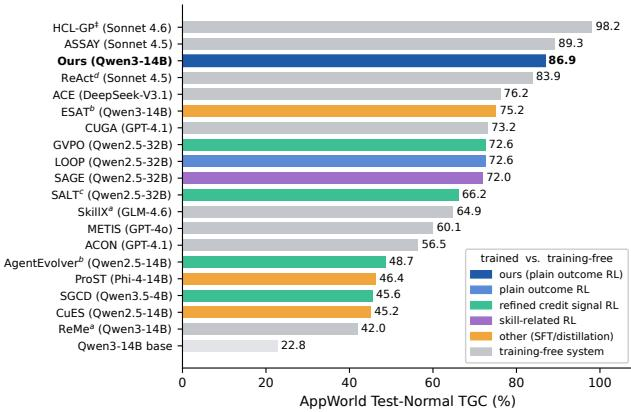
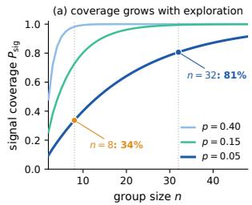
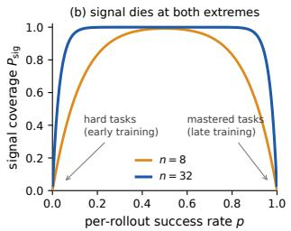
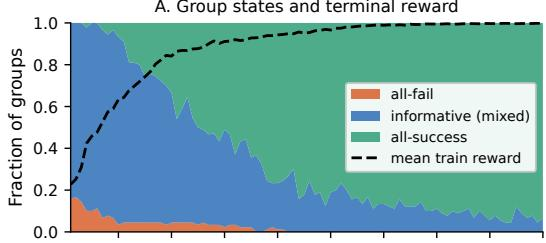
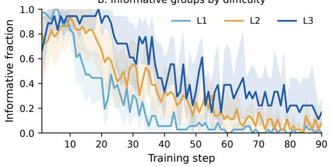
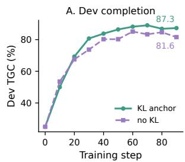
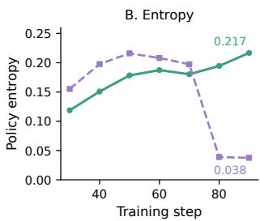
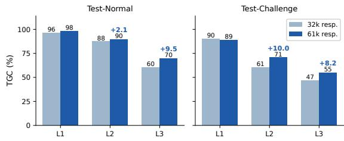
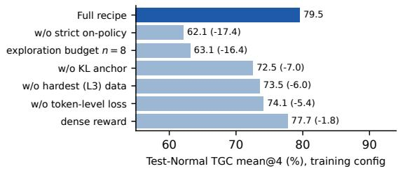

# Explore More, Drift Less: Outcome-Only Reinforcement Learning Can Sufice for Long-Horizon Interactive Agents

Liming Pu, Xiaoxia Li, Yifu Liu, Teng Cao, Bin Yang

## Abstract

Reinforcement learning is a natural way to post-train LLM agents for long-horizon interactive tasks judged only by endof-task verification, yet a shared belief holds that outcome-only RL soon hits a ceiling on small open models. Recent work therefore compensates around the training with denser rewards, SFT priors, skill libraries, curated memory, or multi-agent orchestration. We argue the ceiling is an artifact of two failures of common practice. Signal starvation: group-relative RL with sparse outcome-only rewards yields a gradient only when a task’s rollout group mixes successes and failures, so underscaled exploration silences exactly the hardest, most instructive tasks. Policy drift: squeezing many updates out of a small task pool degrades the policy itself, as an unanchored objective lets the sampling distribution collapse exactly when saturation has already made informative groups rare. We present CANOPY (Coverage-ANchored On-PolicY RL), a minimalist protocol attacking both directly: scale same-task exploration until the natural signal reappears, keep every update on-policy, KL-anchored, and confined to the agent’s own action tokens, then cash in an enlarged interaction budget at test time. On AppWorld, a long-horizon interactive coding benchmark, a Qwen3-14B policy trained with CANOPY through environment interaction alone—without task-specific supervision, auxiliary credit signals, or elaborate agent scafolding—topped the public leaderboard (Feb. 2026; Test-Normal TGC 86.9, Test-Challenge 67.6), and the same design principles lift Qwen3.5- 9B on SWE-bench Verified by 16.6 points. Agentic RL alone thus internalizes long-horizon capability directly into a small open model; we plan to release the complete training stack at https://github.com/AlibabaResearch/SignalCoverageRL.

## 1 Introduction

LLM-driven agents are moving rapidly from demonstrations into daily work. Coding-centric agents now automate software engineering, ofice workflows, and everyday application operation, almost always through one architecture: an engineered harness wrapped around a frontier, usually closed, model. Post-training a small open model into a domain specialist is one route worth weighing alongside this: let reinforcement learning internalize a well-defined domain’s interaction skills into the weights, and deploy a single lightweight policy with no external machinery. In AppWorld (Trivedi et al. 2024), a long-horizon benchmark of everyday digital-application tasks, an agent iteratively writes and executes Python against a live environment, taking dozens of think–code–execute– observe turns before a task is judged by held-out, state-based unit tests.

  
Figure 1: AppWorld Test-Normal TGC by method family (oficial leaderboard (Stony Brook NLP 2026) or paperreported; all entries mean@1 unless marked amean@4, bmean@8, cmean@3; dreported by Wang et al. (2026e); ‡nonstandard joint-scenario protocol with test-time debugging). Color encodes method family: four trained-policy sub-classes plus gray for training-free systems. Among trained policies, CANOPY (bold, darkest blue) leads on one of the smallest backbones here. Entries difer in backbone, harness, and sampling protocol, so the ordering places families rather than ranking systems on one axis.

Agentic reinforcement learning—a policy interacting autonomously with an environment and learning from its outcome feedback—is now the dominant approach to building such specialists, and AppWorld has become a proving ground for it. Long horizons and outcome-only verification make the setting hard, and most work on it responds by compensating around the policy rather than strengthening the RL itself, each compensation paired with a finding that reads as evidence for a real ceiling: denser or step-level rewards, after the hardest tasks were measured as harmful (Chen et al. 2025; Dai et al. 2026a; Li et al. 2026a); an SFT cold start, after skipping it was shown to collapse scores (Wang et al. 2026c); skill libraries, curated memory, or multi-agent orchestration anchored to frontier closed models, after plain interaction at inference was reported to yield little for untrained agents (Sohrabi et al. 2026; Li et al. 2026b). RL has additionally been argued to narrow rather than expand the base model’s capability boundary (Szot et al. 2026; Yue et al. 2025).

Is this ceiling real, or an artifact of how the policy was trained? We argue the training trajectory distribution is distorted relative to what the policy must produce at test time, and that this distortion, not any limit of outcome-only RL, is the cause. Shortened horizons, filtered-out hard tasks, and few rollouts per task deprive the policy of complete, selfgenerated, error-recovering trajectories; stale of-policy reuse trains it on behavior no longer its own; substituted reward signals carry their own errors. Under group-relative policy optimization (Shao et al. 2024), this distortion collapses the learning signal itself, through two failures we name and then dismantle one at a time.

Failure 1: signal starvation. A group-relative estimator yields useful gradient only when a task’s rollout group contains both successes and failures. For per-rollout success rate p and group size n, the probability of drawing such a group is $P _ { \mathrm { s i g } } ( p , n ) = 1 - p ^ { n } - ( 1 - p ) ^ { n }$ . With the small groups used by prior RL work on this benchmark (n ≤ 8; Chen et al. 2025; Dai et al. 2026a; Wang et al. 2026c) and low p on hard tasks, most groups are degenerate—zero outcome-reward gradient—and the occasional isolated success is amplified by standard-deviation normalization into a high-variance spike. This is exactly why prior work measured hard tasks as “harmful” and reached for dense or step-level signal: a compensation for under-exploration, not a property of the data. Once exploration is scaled to restore coverage, the same hard tasks flip from poison to the most valuable data.

Failure 2: policy drift. An interactive environment exposes a limited pool of verifiable tasks, so training must revisit them many times. Under such repetition the sampling distribution can collapse: without an anchor, entropy decays and exploration dies exactly when saturation already makes informative groups rare—the distortion of Failure 1, now acting on the policy rather than on a single gradient step. The visible symptom is late-training instability. Common defenses—early stopping, an SFT prior (Wang et al. 2026c; Bijoy et al. 2025), conservative horizons (Chen et al. 2025)— avoid it by capping exactly the capability RL was meant to grow; the cap is then read as a ceiling of RL itself.

A simple, minimal protocol. CANOPY (Coverage-ANchored On-PolicY RL) attacks both failures under one principle, using well-understood ingredients throughout: manufacture the signal, then keep it trustworthy. Explore more answers starvation with large same-task groups and uncapped per-turn generation, keeping the hardest tasks in the pool. Drift less answers drift with a light KL anchor, strictly onpolicy updates, and a token-level loss over action tokens only. Realize at test time transfers the trained policy to an enlarged interaction budget. Trained this way, a Qwen3-14B policy lifted its base by more than 50 TGC points and reached the top of the AppWorld leaderboard (Feb. 2026; Test-Normal TGC 86.9, Test-Challenge 67.6) on the lightest configuration among the trained policies we compare against (Figure 1,

Table 1); the same design principles lift a Qwen3.5-9B policy by 16.6 points on SWE-bench Verified. Our contributions:

• A diagnosis. We trace the apparent ceiling to a distorted training-trajectory distribution and isolate two mechanisms—signal starvation and policy drift—that reconcile findings reading as contradictory across papers: the hard tasks reported as harmful are only starved of signal, and become the last gradient source once coverage is restored.

• A minimal protocol. CANOPY pairs each mechanism with one well-understood ingredient, changing no optimizer and adding no auxiliary module, and carries over from application operation to real-repository software repair under the same design principles. We report it with its full configuration, per-split metrics under one protocol, and six ablations pricing each ingredient.

• A position. Plain agentic RL on small open models is not the exhausted direction. A single open 14B policy, trained by interaction alone with no SFT prior, skill library, or orchestration, holds its own against far heavier inferencetime systems on stronger backbones, and expands—not merely resharpens—its base model’s boundary. The field’s turn toward harness engineering answers trainable ceilings that our results place higher than reported.

## 2 Related Work

Coding agents and agentic RL. Interactive coding agents—systems that autonomously plan, write code, execute it, and act on the result over many turns—have become a mainstream way to deploy LLMs, spanning software engineering (Yang et al. 2024; Badertdinov et al. 2025), web and research tasks (MiroMind Team 2025), and everyday application operation, where AppWorld (Trivedi et al. 2024) is the canonical long-horizon benchmark. Outcomeverified RL, first matured on single-turn mathematics and code (DeepSeek-AI 2025; Shao et al. 2024), is now a core post-training technique for these multi-turn agents. Our study lives at this intersection: application operation as the primary testbed and software repair as the transfer domain.

RL algorithms and their failure modes. The PPO (Schulman et al. 2017) and GRPO (Shao et al. 2024) family dominates agent post-training, GRPO especially: a group of rollouts replaces the learned critic, which makes it simple to train, widely adopted, and the base of many variants—as is the leave-one-out estimator RLOO (Ahmadian et al. 2024). These variants keep the group-relative structure while adjusting the objective—bias analysis (Dr. GRPO; Liu et al. 2025), sequence-level importance ratios (GSPO; Zheng et al. 2025), turn-level grouping (GiGPO; Feng et al. 2025), graph-global credit assignment across sampled trajectories (G2PO; Wang et al. 2026d), dynamic sampling of uninformative prompts (DAPO; Yu et al. 2025)—while PPO-family training remains in use for large agentic models (GLM-4.5 Team 2025; Hou et al. 2026). On failure modes, zero-advantage groups under identical rewards have been formalized as advantage collapse with a virtual-sample fix (He et al. 2026); a recipe study concludes small models need staged rewards (Wu et al. 2026).

These works fix the estimator or the reward while leaving exploration as given; we instead show that scaling exploration removes the need for such fixes.

Policy training on AppWorld. Figure 1 groups policy training into four routes. (1) Plain outcome RL: LOOP (Chen et al. 2025) uses leave-one-out PPO and pass-fraction rewards, and drops the hardest tier as harmful—the starvation regime our analysis predicts; SeeUPO (Hu et al. 2026) derives sequence-level updates. (2) Refined credit signals: SALT (Li et al. 2026a), GVPO (Dai et al. 2026a), and AgentEvolver (Zhai et al. 2025) respectively use trajectorygraph redistribution, execution-process signals, and selfgenerated curricula with step-level judges; SGCD (Ding et al. 2026) reweights GRPO using a training-only external-LLM reference built from mixed-outcome sibling rollouts. (3) Skill-related RL uses skills in training but difers at deployment. Skill-SD (Wang et al. 2026b) self-distills from a skillconditioned teacher to a plain-prompt student; SAGE (Wang et al. 2026c) trains and retains a skill library across scenario tasks, using sequential rollouts, a skill-integrated reward, and expert-trajectory SFT. (4) Other training: ProST (Bijoy et al. 2025) progressively fine-tunes role-specialized small agents on frontier-model trajectories; CuES (Mai et al. 2025) synthesizes executable, environment-grounded RL tasks; ESAT (Lee et al. 2026) builds SFT data with generated tasks, teacher trajectories, and simulated API responses, without executing AppWorld. Each route compensates for starvation with denser signal, priors, or auxiliary structure; none removes it, and all keep the exploration budget small.

Training-free AppWorld systems. A parallel line engineers inference-time systems around fixed frontier models: multi-agent orchestration (CUGA; Marreed et al. 2025), hierarchical policy-decomposition reuse with test-time debugging (HCL-GP; Sohrabi et al. 2026), causal measurement and pertask masking of natural-language skills (ASSAY; Wang et al. 2026e), automatically constructed hierarchical skill knowledge bases transferred across agents (SkillX; Wang et al. 2026a), evolving playbooks and procedural memory (Zhang et al. 2026; Cao et al. 2026; Dai et al. 2026b), and context compression (Kang et al. 2026). These inherit dependence on a strong backbone (open or closed), per-scenario engineering cost, and runtime complexity, and the capability never enters the weights (Section 4.2). On test-time scaling, Li et al. (2026b) report that more turns yield little for untrained generic agents; others sample many rollouts and select with a verifier, or generate skills first (Wang et al. 2026c). We instead enlarge the trained policy’s context and turn budget.

## 3 The CANOPY Protocol

We develop our diagnosis and protocol together, one failure at a time: each subsection names a mechanism that can stall agentic RL, then the practice that answers it.

## 3.1 Preliminaries: The Agentic RL Loop

An agentic RL loop couples a policy to an environment: for a task prompt $q ,$ the policy $\pi _ { \theta }$ proposes an action, the environment executes it and returns feedback, and this repeats until the policy terminates or the episode exhausts its turn or context budget. We write an episode as a trajectory $\boldsymbol { o } = ( a _ { 1 } , e _ { 1 } , a _ { 2 } , e _ { 2 } , \ldots )$ , interleaving action tokens $a _ { t } -$ the agent’s thinking and code—and environment tokens $e _ { t } ,$ the execution feedback (a sandboxed Python interpreter here, a shell in Section 4.4). A held-out unit-test suite $U ( q )$ judges the episode. Following the outcome-reward formulation of GVPO (Dai et al. 2026a), let $u _ { j } \in U ( q ) , j = 1 , \dotsc , M$ be the M unit tests for q and pass $( u _ { j } , o _ { i } ) \in \{ 0 , 1 \}$ their result on trajectory $o _ { i }$ . The dense pass-fraction reward reports the fraction passed,

$$
r _ { i } ^ { \mathrm { d e n s e } } = \frac { 1 } { M } \sum _ { j = 1 } ^ { M } \mathrm { p a s s } ( u _ { j } , o _ { i } ) \in [ 0 , 1 ] ,\tag{1}
$$

giving partial credit to a trajectory that passes some tests even if its overall approach is wrong. The sparse reward instead credits only a fully correct trajectory,

$$
\begin{array} { r } { r _ { i } ^ { \mathrm { s p a r s e } } = \mathbf { 1 } \left[ \sum _ { j = 1 } ^ { M } \mathrm { p a s s } ( u _ { j } , o _ { i } ) = M \right] \ \in \ \{ 0 , 1 \} . } \end{array}\tag{2}
$$

Section 3.3 revisits the choice. Group-relative policy optimization (Shao et al. 2024) samples a group of n trajectories $\{ o _ { i } \} _ { i = 1 } ^ { n }$ for the same task under the current policy and turns the reward $r _ { i }$ into a standardized within-group advantage,

$$
{ \hat { A } } _ { i } = { \frac { r _ { i } - \mathrm { m e a n } ( r _ { 1 } , \ldots , r _ { n } ) } { \mathrm { s t d } ( r _ { 1 } , \ldots , r _ { n } ) } } .\tag{3}
$$

One iteration then closes as follows: roll out n trajectories per task for a batch of tasks, score them with $U ( q )$ , convert rewards to advantages by Equation 3, take a gradient step on the policy that produced them (loss in Section 3.3), and let the updated policy sample the next batch. This samplingand-update pair, with no learned critic, is what the rest of the section builds on.

  
Figure 2: Signal coverage under a sparse reward. (a) Coverage $P _ { \mathrm { s i g } }$ vs. group size n: for a hard task $\scriptstyle ( p = 0 . 0 5 )$ it rises from 34% at $n { = } 8$ to 81% at $n { = } 3 2$ , then flattens. (b) Coverage vs. per-rollout success rate $p$ at fixed n: signal collapses at both extremes—hard tasks early in training, mastered tasks late.

## 3.2 Signal Starvation, and Explore More

Diagnosis: the coverage mechanism. With the sparse reward of Equation 2, Equation 3 is non-zero only when a group contains at least one success and one failure; if all n rollouts fail (or all succeed), every advantage is zero and the task contributes no gradient at that step. Call a group with mixed outcomes informative, and the probability of drawing one the task’s signal coverage. If rollouts succeed independently with probability $p ,$

$$
P _ { \mathrm { s i g } } ( p , n ) \ : = \ : 1 - p ^ { n } - ( 1 - p ) ^ { n } .\tag{4}
$$

Two properties shape what follows (Figure 2). Read against group size, coverage on a hard task is poor at the sizes prior work uses and good once the group is a few times larger: the same task flips from mostly silent to mostly informative with no change to the reward. Read against $p ,$ it collapses at both extremes—hard tasks early in training, mastered tasks late, when the signal runs out.

Worse, the groups that do carry signal on a hard task carry it badly: when a single rollout out of n succeeds, standardization gives it an advantage of $\sqrt { n - 1 }$ while each failure receives only $- 1 / { \sqrt { n - 1 } }$ (appendix), so one lucky trajectory dominates the group’s gradient. A signal that is silent most of the time and spiky when present is plausibly what published hard-data exclusions are observing (Chen et al. 2025; Dai et al. 2026a).

Fix: explore more. This motivates practices that restore coverage where it is scarcest. (1) Size the group from data, not a guess: a pilot pass with the base policy estimates the hardest tier’s success rate $\hat { p } _ { \mathrm { m i n } }$ , and for a target coverage τ the group size follows from Equation 4,

$$
n \stackrel { } { \gtrsim } \frac { \ln ( 1 - \tau ) } { \ln ( 1 - \hat { p } _ { \mathrm { m i n } } ) } \qquad ( P _ { \mathrm { s i g } } \approx 1 - ( 1 - p ) ^ { n } \mathrm { f o r } \mathrm { s m a l l } p ) .\tag{5}
$$

This is a first-order heuristic, not an exact prescription—it treats rollouts as independent and $\hat { p } _ { \mathrm { m i n } }$ as a point estimate from a small pilot, so it should be read as a floor to size against the hardware budget rather than a value we claim optimal: if the afordable n falls short, Equation 5 at least says which tier stays starved. (2) Keep the hardest tasks: we retain the full task distribution, hardest tier included—it is not intrinsically harmful, only starved, and becomes the last remaining source of gradient once easier tasks saturate (Section 4.3). (3) Uncapped per-turn generation: environment returns are truncated to a fixed per-turn cap, but the policy’s own generation is capped only by the total response budget, so the model learns its own allocation of thinking across turns—long, error-recovering episodes are exactly the ones a per-turn cap would truncate. None of these is a new algorithm; together they turn the hardest tier from poison into medicine, since the same data other work drops as harmful is, once explored enough, exactly where the sparse signal was missing.

Why not just densify the reward instead? Partial-credit rewards (Equation 1) and step-level estimates (Li et al. 2026a; Zhai et al. 2025) manufacture within-group variance even in all-fail groups, which is why they look necessary when groups are small—but the substitute is imperfect, and may reward partial progress that still steers the trajectory wrong. Scaling exploration removes the reason to substitute (Section 4.3).

## 3.3 Policy Drift, and Drift Less

Explore-more manufactures the signal; it does not keep it trustworthy. We use policy drift for the tendency of the sampling distribution—the one the policy actually rolls out from—to move away from the distribution the update implicitly assumes. This happens whenever an RL loop must extract many gradient steps from a small, repeatedly revisited task pool—the norm for interactive environments.

Diagnosis: four causes of drift. We trace drift to four causes, numbered for reference through the rest of the section. (1) An unanchored objective lets the sampling distribution narrow. Repeatedly optimizing the same tasks reinforces high-reward token patterns and lets entropy fall; recent singlepass recipes profitably drop the KL penalty because they have plenty of fresh data to explore (Yu et al. 2025; Liu et al. 2025). In our revisit-heavy regime that freedom is dangerous: dropping the anchor lets exploration collapse exactly when saturation is already making informative groups rare (Figure 2b), compounding Failure 1. (2) Reusing rollouts across updates changes what the update sees. Splitting a rollout batch into several mini-batch updates is the standard way to amortize rollout cost, and the importance ratio is designed to correct the resulting estimate. We simply avoid the question: the mini-batch is the whole batch, so no update consumes a sample it did not generate. (3) Length-imbalanced loss averaging biases what little signal survives. Averaging the loss per sequence before averaging across sequences divides each trajectory’s contribution by its own length, down-weighting the long, error-recovering episodes a longhorizon agent most needs. This is drift, not merely lost signal: it steers the policy toward the short trajectories it already produces—the same narrowing as cause (1), arriving through the loss denominator rather than the objective. (4) Densified or substituted reward signals may carry their own error. Partial-credit and step-level signals are imperfect proxies for task success; training on them pulls the policy toward the proxy rather than the goal, a distortion of the same family as (1)–(3) even though it originates in the reward rather than in sampling or loss.

Fix: drift less. Four choices answer the four causes. CANOPY keeps the sampling and learning policies identical at every step—the gradient mini-batch is the whole rollout batch and a single pass is taken over it—removing cause (2). We use the sparse reward of Equation 2 rather than the dense form, answering cause (4): a fully-correct-only signal has no proxy to drift toward. Causes (1) and (3) are answered inside the loss itself.

We keep the standard clipped form for notational continuity with GRPO and PPO, but the importance ratio and clip are inert here: one update per rollout batch with no stale reuse makes the ratio identically 1 (verified in the logs; appendix). Let $\pi _ { \theta _ { \mathrm { o l d } } }$ denote the policy that generated the current batch, $M _ { i , t } \in \{ 0 , 1 \}$ mask environment tokens so gradient flows only through action tokens the policy controls, and $\mathcal { F }$ the set of fault-quarantined episodes (a serving-layer precondition detailed below). With the per-token ratio

$$
\rho _ { i , t } ( \theta ) = \frac { \pi _ { \theta } ( o _ { i , t } \mid q , o _ { i , < t } ) } { \pi _ { \theta _ { \mathrm { o l d } } } ( o _ { i , t } \mid q , o _ { i , < t } ) } ,\tag{6}
$$

the clipped surrogate is

$$
\begin{array} { r } { S _ { i , t } = \operatorname* { m i n } { \left( \rho _ { i , t } \hat { A } _ { i } , \ \mathrm { c l i p } ( \rho _ { i , t } , 1 - \epsilon _ { \mathrm { l o w } } , 1 + \epsilon _ { \mathrm { h i g h } } ) \hat { A } _ { i } \right) } , } \end{array}\tag{7}
$$

and the KL term $D _ { \mathrm { K L } } ( \pi _ { \theta } , \pi _ { \mathrm { r e f } } ) _ { i , t } \geq 0$ is estimated with the low-variance k3 estimator (Schulman 2020), where $\pi _ { \mathrm { r e f } }$ is fixed to the base model throughout training. CANOPY minimizes the token-mean loss obtained by adding a KL penalty to the negative clipped surrogate,

$$
\mathcal { L } ( \theta ) = \frac { 1 } { N } \sum _ { i \notin \mathcal { F } } \sum _ { t = 1 } ^ { \left| o _ { i } \right| } M _ { i , t } \Big [ - S _ { i , t } + \beta D _ { \mathrm { K L } } ( \pi _ { \theta } , \pi _ { \mathrm { r e f } } ) _ { i , t } \Big ] ,\tag{8}
$$

with $\begin{array} { r } { N = \sum _ { i \notin \mathcal { F } } \sum _ { t } M _ { i , t } } \end{array}$ the pooled action-token count and no entropy bonus. Two places difer from the original GRPO objective (Shao et al. 2024), both for drift. The single denominator N pools every action token across the batch rather than normalizing per sequence first, answering cause (3): every action token counts equally regardless of trajectory length. The KL penalty answers cause (1), pulling the sampling distribution back toward the base model’s breadth precisely when repeated optimization would narrow it. The mask $M _ { i , t }$ confines both to tokens the policy emitted.

Environment reliability: fault quarantine. The policy executes arbitrary code, so an episode can end without a verdict for two reasons that must be told apart. Agent-induced terminations—an infinite loop hitting the turn limit, the policy’s own allocation exhausting memory—are genuine failures of the behavior under evaluation and are scored 0 like any other. Only exogenous faults the serving layer attributes to itself (a worker OOM-killed by a co-resident episode, a dead process) enter ${ \mathcal { F } } \colon$ under a binary reward they are indistinguishable from genuine failure and would inject a false negative into Equation 3. Quarantine precedes scoring, so such an episode shrinks its group rather than contributing a zero. We also isolate concurrent episodes with bounded perworker resources and recycle unhealthy workers; the appendix gives the full rule and its limits.

## 3.4 Test-Time Budget Transfer

Training at a long interaction budget is costly and hard: every extra turn multiplies rollout time across the whole group, and the longer an episode runs the more ways it has to end in truncation or a fault rather than a verdict. We train at a moderate budget, sized to cover the successful hard-task trajectories of the pilot pass, and simply raise the turn count and context length at test time—no search, no multi-rollout selection. The payof lands where the headroom is: the hardest tasks, and applications never seen in training (Section 4.3).

## 4 Experiments

## 4.1 Experimental Setup

Benchmark and data. AppWorld (Trivedi et al. 2024) provides 9 applications, 457 APIs, ∼100 simulated users, and 735 tasks in four splits—Train 90 / Dev 60 / Test-Normal 168 / Test-Challenge 417—each judged by held-out, state-based unit tests; Test-Challenge also includes applications absent from training. TGC (task goal completion) is the fraction of tasks whose final state passes all tests; SGC the stricter fraction of scenarios whose three tasks all pass.

<table><tr><td>Method</td><td>Model</td><td>Test-Normal Test-Challenge TGC SGC TGC</td><td></td><td></td><td>SGC</td></tr><tr><td colspan="6">Trained-policy agents</td></tr><tr><td>CANOPY (ours) Qwen3-14B</td><td></td><td>86.9</td><td>80.4</td><td>67.6</td><td>50.4</td></tr><tr><td>ESATb</td><td>Qwen3-14B</td><td>75.2</td><td>63.6</td><td>58.5</td><td>47.5</td></tr><tr><td>LOOP</td><td>Qwen2.5-32B</td><td>72.6</td><td>53.6</td><td>47.2</td><td>28.8</td></tr><tr><td>GVPO</td><td>Qwen2.5-32B</td><td>72.6</td><td>55.4</td><td>49.4</td><td>28.8</td></tr><tr><td>SAGE</td><td>Qwen2.5-32B</td><td>72.0</td><td>60.7</td><td>50.1</td><td>32.4</td></tr><tr><td>SALTc</td><td>Qwen2.5-32B</td><td>66.2</td><td>47.9</td><td>36.8</td><td>20.9</td></tr><tr><td>AgentEvolverb</td><td>Qwen2.5-14B</td><td>48.7</td><td></td><td></td><td></td></tr><tr><td>ProST</td><td>Phi-4-14B</td><td>46.4</td><td>28.6</td><td>17.8</td><td>8.6</td></tr><tr><td>SGCD</td><td>Qwen3.5-4B</td><td>45.6</td><td>17.9</td><td>27.0</td><td>8.5</td></tr><tr><td>CuES</td><td>Qwen2.5-14B</td><td>45.2</td><td>一</td><td>一</td><td>一</td></tr><tr><td colspan="6">Training-free inference-time systems</td></tr><tr><td> $_ \mathrm { H C L - G P ^ { \ddagger } }$ </td><td>Sonnet 4.6</td><td>98.2</td><td>98.2</td><td>98.3</td><td>97.8</td></tr><tr><td> $\mathrm { A S S A Y }$ </td><td>Sonnet 4.5</td><td>89.3</td><td>75.3</td><td></td><td></td></tr><tr><td> $\mathrm { R e A c t } ^ { d }$ </td><td>Sonnet 4.5</td><td>83.9</td><td>70.3</td><td></td><td></td></tr><tr><td> $\mathrm { A C E }$ </td><td>DeepSeek-V3.1 76.2</td><td></td><td>64.3</td><td>57.3</td><td>39.6</td></tr><tr><td> $\mathrm { C U G A }$ </td><td>GPT-4.1</td><td>73.2</td><td>62.5</td><td>57.6</td><td>48.2</td></tr><tr><td> $\mathrm { S k i l l X } ^ { a }$ </td><td>GLM-4.6</td><td>64.9</td><td>一</td><td></td><td>一</td></tr><tr><td>METIS</td><td>GPT-40</td><td>60.1</td><td>一</td><td></td><td>一</td></tr><tr><td> $\mathsf { A C O N }$ </td><td>GPT-4.1</td><td>56.5</td><td>一</td><td>一</td><td>一</td></tr><tr><td> $ { \mathrm { R e M e } } ^ { a }$ </td><td>Qwen3-14B</td><td>42.0</td><td>一</td><td>一</td><td>一</td></tr></table>

Table 1: AppWorld results (oficial leaderboard (Stony Brook NLP 2026) or cited papers in §2). Top: trained policies. Bottom: training-free systems around a fixed backbone, open or closed. All entries are mean@1 unless marked amean@4, bmean@8, cmean@3; dreported by Wang et al. (2026e); ‡joint-scenario protocol, not comparable to per-task rows.

<table><tr><td>Training base model</td><td>Qwen3-14B</td><td>learning rate</td><td> $3 \times 1 0 ^ { - 6 }$ </td></tr><tr><td>tasks/steps/batch 90/90/90 group size n budget</td><td>32 (2,880/step) on-policy 50 turns, 32k</td><td>KLβ / entropy temperature</td><td> $1 0 ^ { - 4 } / 0$  1 update/step</td></tr><tr><td>prompt / obs. cap 4k / 4k</td><td></td><td>checkpoint</td><td>0.9</td></tr><tr><td></td><td></td><td></td><td>step 90 (fixed)</td></tr><tr><td>per-turn gen. cap none</td><td></td><td>hardest tier</td><td>kept</td></tr><tr><td></td><td></td><td></td><td></td></tr><tr><td>Inference (budget transfer)</td><td></td><td></td><td></td></tr><tr><td>budget</td><td>100 turns, 61k sampling</td><td></td><td> ${ T = } 0 . 6 , p . 9 5$ </td></tr></table>

Table 2: Training and inference configuration.

Implementation. We post-train Qwen3-14B (Yang et al. 2025) with verl (Sheng et al. 2025): asynchronous SGLang (Zheng et al. 2024) rollouts drive the multi-turn agent loop against our stabilized AppWorld server, and Megatron (Shoeybi et al. 2019) performs the updates. We set the rollout group size to n=32, within the range Equation 5 suggests for the hardest retained tier at a moderate target coverage; Table 2 gives the full configuration.

Evaluation. We report mean@k (average TGC over k runs), best@k (per-task union over k runs), and the leaderboard submission (mean@1), under two inference budgets: training (50 turns / 32k) and enlarged (100 turns / 61k), mapped in Table 3. All evaluation uses the oficial AppWorld SDK and its unit tests, on the fixed step-90 checkpoint.

A. Group states and terminal reward
<table><tr><td>Policy</td><td>Budget</td><td>Test-Normal Test-Challenge m@4 b@4 m@4</td><td></td><td>b@4</td></tr><tr><td>Base</td><td>100t/61k</td><td>32.4</td><td>58.9 19.7</td><td>37.7</td></tr><tr><td>CANOPY</td><td>50t/32k</td><td>79.5</td><td>89.2 54.6</td><td>67.7</td></tr><tr><td>CANOPY</td><td>100t/61k</td><td>83.2</td><td>93.5 66.1</td><td>82.5</td></tr><tr><td>Leaderboard (m@1, 100t/61k)</td><td></td><td>86.9</td><td></td><td>67.6</td></tr></table>

Table 3: Metric map (TGC, step-90 checkpoint vs. base; m@k = mean@k, b@k = best@k). Budget transfer, not a diferent model, closes the gap to the leaderboard entry.

## 4.2 Main Results

A leaderboard-topping policy from simple but efective agentic RL. At submission (Feb. 2026) our single Qwen3- 14B policy held the top of the AppWorld leaderboard— Test-Normal 86.9 TGC / 80.4 SGC and Test-Challenge 67.6 / 50.4—under the standard per-task protocol at that time (Table 1, Figure 1). It leads the next-best reported trainedpolicy result, ESAT, by nearly 12 TGC on Test-Normal and 9 on Test-Challenge, on one of the smallest backbones in that group, and it does so with the whole capability in the weights: at inference it is one checkpoint answering one prompt—no orchestration, skill library, retrieved memory, or test-time debugging. The gain is the training, not the backbone: on the same base at the same budget it adds more than 50 TGC points (Table 3).

Two systems post higher numbers, HCL-GP (Sohrabi et al. 2026) and ASSAY (Wang et al. 2026e), and both buy them the same way: a frontier closed backbone many times our size, plus machinery around it—curated per-scenario skills, retrieval, and for HCL-GP a joint-scenario protocol with test-time debugging. That machinery has to be rebuilt for the next suite and leaves nothing behind in a set of weights; the same backbone as a plain ReAct agent lands in our policy’s range (Table 1). CANOPY needs none of it: the capability is in the model, and it is a model anyone can host.

## 4.3 Analysis: Does the Diagnosis Hold Up?

The training dynamics match the coverage analysis. Figure 3 reads the mechanism of the rollout logs. All-fail groups disappear within ∼10 steps; as train reward saturates above 0.99, all-success groups take over and the informative fraction shrinks—the “signal runs out” regime Equation 4 predicts at large p. Split by dificulty, the hardest tier stays informative long after easy tiers go silent: under adequate coverage L3 is the last gradient source, not noise.

The KL anchor keeps the distribution alive. Figure 4 isolates the primary drift cause. Anchored and unanchored runs learn near-identically for the first half; past step ∼70 the unanchored run’s entropy collapses and its Dev score plateaus, while the anchored run’s entropy holds and improvement continues to step 90 with no early stopping—drift made visible, exactly when saturation makes informative groups rarest.

Budget transfer works, and RL—not the budget—pays for it. Enlarging the budget lifts the trained policy from 79.5 to

B. Informative groups by dificulty  
  
Figure 3: Training dynamics from rollout logs (n=32, 90 steps; shaded: bootstrap CIs). A: group composition— convergence is the signal running out, the empirical face of Figure 2b. B: L3 stays informative far longer than L1/L2.

  
Figure 4: The KL anchor prevents late-phase collapse (Dev TGC and policy entropy vs. training step). Past step ∼70 the unanchored run’s entropy collapses (0.038) and Dev stalls at 81.6, while the anchored run stays healthy (0.217) and improves to 87.3.

83.2 mean@4 on Test-Normal (Table 3), the gain concentrated on the hardest tier and unseen applications (Figure 5). It helps the base too, and by more (22.8 to 32.4), yet leaves it 47 points below what the trained policy reaches at the smaller budget: the budget is not what buys the capability. Against the finding that RL pass@1 ≤ base pass@k (Szot et al. 2026; Yue et al. 2025), our single run of 86.9 exceeds the base’s best@4 of 58.9 by 28 points (67.6 vs. 37.7 on Test-Challenge)—at this scale RL adds capability resampling cannot reach.

Every component earns its place, and the ordering matches the theory. Each variant in Figure 6 retrains 90 steps with one component changed from Table 2, and the ordering recovers the diagnosis. The two heaviest costs sit on opposite sides of it: on the coverage side, a group of n=8—the size prior work uses—rather than 32 costs −16.4, though at matched steps it gives up sampling along with coverage; on the drift side, setting the gradient mini-batch to half the rollout batch—each batch is then consumed in two successive updates, so the second update sees data drawn by the policy as it stood before the first—costs −17.4. The KL anchor is worth $- 7 . 0$ and the token-level loss −5.4, both acting on the same narrowing through diferent routes; dropping the hardest tier costs −6.0, reversing the published finding at small n (Chen et al. 2025; Dai et al. 2026a). Densifying the reward moves the result least, −1.8: partial credit was a compensation for under-exploration rather than a necessity (Chen et al. 2025; Wu et al. 2026).

  
Figure 5: Budget transfer concentrates on the hardest tasks (per-dificulty TGC, mean@1; 50t/32k to 100t/61k). Easy tiers are saturated; gains land on L3 and unseen applications.

  
Figure $6 { : }$ Component ablations (Test-Normal TGC mean@4, training budget, step-90; one run per variant, retrained from scratch with one setting changed).

## 4.4 Transfer to a Harder Domain: Real-Repository Software Repair

Software repair is the harder test of the same diagnosis: the agent works inside a real repository, drives a bash shell in a Docker container over many turns, and is judged only by whether its patch passes the project’s own unit tests—a longer horizon, a larger action space, a task pool too big to memorize. We carry over the design principles, not the hyperparameter vector: sparse outcome reward, same-task groups sized for coverage, on-policy KL-anchored updates, token-level loss over action tokens. Three settings are re-tuned, named here so the transfer is not read as literal: $n { = } 1 6$ rather than 32, since episodes cost far more; KL coeficient $1 0 ^ { - 2 }$ rather than $1 0 ^ { - 4 }$ ; and a constant −0.2 instead of 0 for terminal states yielding no reviewable patch (crash, timeout, no patch, apply failure), separating “produced nothing to $\mathrm { t e s t } ^ { \prime \prime }$ from “produced a wrong patch”. The appendix lists every remaining diference. Training is on SWE-rebench (Badertdinov et al. 2025) with Qwen3.5-9B (Qwen Team 2026) and mini-sweagent (Yang et al. 2024), a purely bash-based harness with no repository-specific tooling; evaluation is on SWE-bench

<table><tr><td>Policy</td><td>mean@4</td><td>best@4</td></tr><tr><td>Base (Qwen3.5-9B)</td><td>31.3</td><td>43.8</td></tr><tr><td>CANOPY (training budget)</td><td>47.9</td><td>58.0</td></tr><tr><td>CANOPY (enlarged budget)</td><td>50.2</td><td>60.8</td></tr><tr><td>∆ (CANOPY vs. base)</td><td>+16.6</td><td>+14.2</td></tr></table>

Table 4: SWE-bench Verified (resolve rate %, Qwen3.5- 9B, mini-swe-agent). Rows 1–2 use the 80-turn / 36k-token training budget; row 3 raises the turn and context budget at test time, as on AppWorld. $\Delta$ is row 2 vs. row 1, at matched budget.

Verified (Jimenez et al. 2024; OpenAI 2024). Against contamination we de-duplicate at the level of repositories rather than instances, dropping every task from any repository appearing in Verified; the appendix gives the full configuration and filtering pipeline.

The principles transfer: CANOPY lifts the resolve rate from 31.3 to 47.9 mean@4 and best@4 from 43.8 to 58.0, with budget transfer adding +2.3 (Table 4)—the same two failures, answered the same way, in another outcome-verified domain.

## 5 Conclusion and Future Work

We examined whether the apparent limitations of outcomeonly RL for long-horizon agents arise from sparse rewards alone or from how training is conducted. Our evidence points to two practical bottlenecks: obtaining informative outcome variation and limiting policy drift. CANOPY addresses both with a simple recipe—explore more, drift less. At submission time, a single open 14B policy trained with this recipe reached the top of the AppWorld leaderboard, and the same principles improved software repair. For a well-defined domain, some of the capabilities that elaborate systems assemble at inference time can instead be internalized into a small open model’s weights. Much recent progress has come from engineering around the model; our results suggest that the model itself remains a promising and comparatively underexplored direction.

Three directions follow. Environment scaling. Our App-World training pool contains only 90 tasks in a standardized environment. Scaling to larger, more diverse, and more complex task distributions—including multilingual software engineering and harder benchmarks now appearing (Deng et al. 2025; Chu et al. 2026; Chen et al. 2026)—would test whether the gains persist and expose new limits. Better RL algorithms. More sample-eficient methods could make that scale afordable while managing the exploration–exploitation trade-of more directly, for example by adapting group size or task sampling to the current success probability $p .$ Domain mid-training. Strengthening domain knowledge before RL could improve the base model’s coverage and raise the attainable ceiling of outcome-based RL, complementing rather than replacing interaction-based post-training.

## References

Ahmadian, A.; Cremer, C.; Gallé, M.; Fadaee, M.; Kreutzer, J.; Pietquin, O.; Üstün, A.; and Hooker, S. 2024. Back to Basics: Revisiting REINFORCE-Style Optimization for Learning from Human Feedback in LLMs. In Proceedings ofthe 62nd Annual Meeting ofthe Associationfor Computational Linguistics (Volume 1: Long Papers), 12248–12267. Association for Computational Linguistics.

Badertdinov, I.; Golubev, A.; Nekrashevich, M.; Shevtsov, A.; Karasik, S.; Andriushchenko, A.; Trofimova, M.; Litvintseva, D.; and Yangel, B. 2025. SWE-rebench: An Automated Pipeline for Task Collection and Decontaminated Evaluation of Software Engineering Agents. In Advances in Neural Information Processing Systems, volume 38.

Bijoy, B. S.; Hasan, M. S.; Alipoormolabashi, P.; Sil, A.; Balasubramanian, A.; and Balasubramanian, N. 2025. ProST: Progressive Sub-Task Training for Pareto-Optimal Multi-Agent Systems Using Small Language Models. In Proceedings of the 14th International Joint Conference on Natural Language Processing and the 4th Conference of the Asia-Pacific Chapter ofthe Associationfor Computational Linguistics, 3357–3375. Association for Computational Linguistics.

Cao, Z.; Deng, J.; Yu, L.; Zhou, W.; Liu, Z.; Ding, B.; and Zhao, H. 2026. Remember Me, Refine Me: A Dynamic Procedural Memory Framework for Experience-Driven Agent Evolution. In Findings of the Association for Computational Linguistics: ACL 2026, 16803–16822. Association for Computational Linguistics.

Chen, J.; Trivedi, H.; Pan, J.; Zhang, M. J.; Srinivasan, T.; Balasubramanian, N.; and Sabharwal, A. 2026. AppWorld-UL: Benchmarking Diverse Agent-User Interactions for Tool-Use. In Forty-third International Conference on Machine Learning.

Chen, K.; Cusumano-Towner, M.; Huval, B.; Petrenko, A.; Hamburger, J.; Koltun, V.; and Krähenbühl, P. 2025. Reinforcement Learning for Long-Horizon Interactive LLM Agents. arXiv preprint arXiv:2502.01600.

Chu, E.; Agarwal, R.; Thangamuthu, A.; Graham, B.;Mattern, J.; et al. 2026. FrontierSWE. Proximal Blog,https://frontierswe.com/blog.

Dai, S.; Sun, C.; Wu, H.; Zheng, H.; Ji, T.; Yan, J.; Wu, Y.; Zhang, D.; Wang, X.; and Li, X. 2026a. Group Verification-Based Policy Optimization for Interactive Coding Agents. In ICLR.

Dai, Z.; He, S.; Li, H.; Zhou, Q.; Li, J.; Song, M.; Long, G.; Si, H.; Yao, X.; Zhang, L.; Cheng, J.; and Yan, X. 2026b. Metis: Bridging Text and Code Memory for Self-Evolving Agents. arXiv preprint arXiv:2606.24151.

DeepSeek-AI. 2025. DeepSeek-R1: Incentivizing Reasoning Capability in LLMs via Reinforcement Learning. arXiv preprint arXiv:2501.12948.

Deng, X.; Da, J.; Pan, E.; He, Y. Y.; Ide, C.; Garg, K.; Laufer, N.; Park, A.; Pasari, N.; Rane, C.; Sampath, K.; Krishnan, M.; Kundurthy, S.; Hendryx, S. M.; Wang, Z.; Zhang, C. B. C.; Jacobson, N.; Liu, B.; and Kenstler, B. 2025. SWE-Bench Pro: Can AI Agents Solve Long-Horizon Software Engineering Tasks? arXiv preprint arXiv:2509.16941.

Ding, T.; Xin, J.; and De la Cruz Weinstein, J. P. 2026. Keep Policy Gradient in Charge: Sibling-Guided Credit Distillation for Long-Horizon Tool-Use Agents. arXiv preprint arXiv:2606.12634.

Feng, L.; Xue, Z.; Liu, T.; and An, B. 2025. Group-in-Group Policy Optimization for LLM Agent Training. In Advances in Neural Information Processing Systems, volume 38.

GLM-4.5 Team. 2025. GLM-4.5: Agentic, Reasoning, and Coding (ARC) Foundation Models. arXiv preprint arXiv:2508.06471.

He, X.; Sun, Q.; Cheng, A.; Li, X.; Ji, X.; Lu, H.; Huang, R.; and Hu, Q. 2026. Advantage Collapse in Group Relative Policy Optimization: Diagnosis and Mitigation. In Forty-third International Conference on Machine Learning.

Hou, Z.; Li, Y.; Tang, J.; and Dong, Y. 2026. Single-Rollout Asynchronous Optimization for Agentic Reinforcement Learning. arXiv preprint arXiv:2607.07508.

Hu, T.; Fu, Q.; Chen, Y.; Liu, Z.; and Ding, B. 2026. SeeUPO: Sequence-Level Agentic-RL with Convergence Guarantees. arXiv preprint arXiv:2602.06554.

Jimenez, C. E.; Yang, J.; Wettig, A.; Yao, S.; Pei, K.; Press, O.; and Narasimhan, K. 2024. SWE-bench: Can Language Models Resolve Real-World GitHub Issues? In ICLR.

Kang, M.; Chen, W.-N.; Han, D.; Inan, H. A.; Wutschitz, L.; Chen, Y.; Sim, R.; and Rajmohan, S. 2026. ACON: Optimizing Context Compression for Long-Horizon LLM Agents. In Forty-third International Conference on Machine Learning.

Lee, S.; Chowdhury, S.; Jiang, C.; Hsieh, C.-Y.; Hu, T.-Y.; Toshev, A. T.; Tuzel, O.; and Vemulapalli, R. 2026. Environment-Free Synthetic Data Generation for API-Calling Agents. arXiv preprint arXiv:2607.16900.

Li, J.; Wang, Y.; Yan, Q.; Tian, Y.; Xu, Z.; Song, H.; Xu, P.; and Cheong, L. L. 2026a. SALT: Step-Level Advantage Assignment for Long-Horizon Agents via Trajectory Graph. In Findings of the Association for Computational Linguistics: EACL 2026, 4709–4725. Association for Computational Linguistics.

Li, X.; Ming, R.; Setlur, P.; Paladugu, A.; Tang, A.; Kang, H.; Shao, S.; Jin, R.; and Xiong, C. 2026b. Benchmark Test-Time Scaling of General LLM Agents. arXiv preprint arXiv:2602.18998.

Liu, Z.; Chen, C.; Li, W.; Qi, P.; Pang, T.; Du, C.; Lee, W. S.; and Lin, M. 2025. Understanding R1-Zero-Like Training: A Critical Perspective. In Second Conference on Language Modeling.

Mai, S.; Zhai, Y.; Chen, Z.; Chen, C.; Zou, A.; Tao, S.; Liu, Z.; and Ding, B. 2025. CuES: A Curiosity-Driven and Environment-Grounded Synthesis Framework for Agentic RL. arXiv preprint arXiv:2512.01311.

Marreed, S.; Oved, A.; Yaeli, A.; Shlomov, S.; Levy, I.; Akrabi, O.; Sela, A.; Adi, A.; and Mashkif, N. 2025. Towards Enterprise-Ready Computer Using Generalist Agent. arXiv preprint arXiv:2503.01861.

MiroMind Team. 2025. MiroThinker: Pushing the Performance Boundaries of Open-Source Research Agents via

Model, Context, and Interactive Scaling. arXiv preprint arXiv:2511.11793.

OpenAI. 2024. Introducing SWE-bench Verified. https: //openai.com/index/introducing-swe-bench-verified/.

Peng, B.; Quesnelle, J.; Fan, H.; and Shippole, E. 2024. YaRN: Eficient Context Window Extension of Large Language Models. In The Twelfth International Conference on Learning Representations.

Qwen Team. 2026. Qwen3.5: Towards Native Multimodal Agents. https://qwen.ai/blog?id=qwen3.5.

Schulman, J. 2020. Approximating KL Divergence. http: //joschu.net/blog/kl-approx.html.

Schulman, J.; Wolski, F.; Dhariwal, P.; Radford, A.; and Klimov, O. 2017. Proximal Policy Optimization Algorithms. arXiv preprint arXiv:1707.06347.

Shao, Z.; Wang, P.; Zhu, Q.; Xu, R.; Song, J.; Bi, X.; Zhang, H.; Zhang, M.; Li, Y. K.; Wu, Y.; and Guo, D. 2024. DeepSeek-Math: Pushing the Limits of Mathematical Reasoning in Open Language Models. arXiv preprint arXiv:2402.03300.

Sheng, G.; Zhang, C.; Ye, Z.; Wu, X.; Zhang, W.; Zhang, R.; Peng, Y.; Lin, H.; and Wu, C. 2025. HybridFlow: A Flexible and Eficient RLHF Framework. In Proceedings of the Twentieth European Conference on Computer Systems, 1279–1297.

Shoeybi, M.; Patwary, M.; Puri, R.; LeGresley, P.; Casper, J.; and Catanzaro, B. 2019. Megatron-LM: Training Multi-Billion Parameter Language Models Using Model Parallelism. arXiv preprint arXiv:1909.08053.

Sohrabi, S.; Ananthakrishnan, H.; Kokel, H.; Srinivas, K.; and Katz, M. 2026. Learning and Reusing Policy Decompositions for Hierarchical Generalized Planning with LLM Agents. arXiv preprint arXiv:2605.06957.

Stony Brook NLP. 2026. AppWorld Leaderboard. https: //appworld.dev/leaderboard. Accessed August 31, 2026.

Szot, A.; Kirchhof, M.; Attia, O.; and Toshev, A. 2026. Expanding LLM Agent Boundaries with Strategy-Guided Exploration. arXiv preprint arXiv:2603.02045.

Trivedi, H.; Khot, T.; Hartmann, M.; Manku, R.; Dong, V.; Li, E.; Gupta, S.; Sabharwal, A.; and Balasubramanian, N. 2024. AppWorld: A Controllable World of Apps and People for Benchmarking Interactive Coding Agents. In Proceedings ofthe 62nd Annual Meeting ofthe Association for Computational Linguistics (Volume 1: Long Papers), 16022–16076. Association for Computational Linguistics.

Wang, C.; Yu, Z.; Xie, X.; Yao, W.; Fang, R.; Qiao, S.; Cao, K.; Zheng, G.; Qi, X.; Zhang, P.; and Deng, S. 2026a. SkillX: Automatically Constructing Skill Knowledge Bases for Agents. arXiv preprint arXiv:2604.04804.

Wang, H.; Wang, G.; Xiao, H.; Zhou, Y.; Pan, Y.; Wang, J.; Xu, K.; Wen, Y.; Ruan, X.; Chen, X.; and Qi, H. 2026b. Skill-SD: Skill-Conditioned Self-Distillation for Multi-turn LLM Agents. arXiv preprint arXiv:2604.10674.

Wang, J.; Yan, Q.; Wang, Y.; Tian, Y.; Mishra, S. S.; Xu, Z.; Gandhi, M.; Xu, P.; and Cheong, L. L. 2026c. Reinforcement Learning for Self-Improving Agent with Skill Library. In Proceedings of the 64th Annual Meeting of the Association

for Computational Linguistics (Volume 1: Long Papers), 1529–1550. Association for Computational Linguistics.

Wang, Y.; Song, M.; Zhang, Z.; Huang, S.; Huang, H.; Wei, F.; Deng, W.; Sun, F.; and Zhang, Q. 2026d. Group-Graph Policy Optimization for Long-Horizon Agentic Reinforcement Learning. arXiv preprint arXiv:2606.22995.

Wang, Y.; Zhou, Y.; Liang, Y.; Zhang, C.; Liu, F.; Zhou, J.; and Yao, H. 2026e. Not All Skills Help: Measuring and Repairing Agent Knowledge. arXiv preprint arXiv:2606.15390.

Wu, X.; Sun, Q.; Zhang, R.; Song, C.; Wu, J.; Qi, Y.; and Cheng, H. 2026. Demystifying Reinforcement Learning for Long-Horizon Tool-Using Agents: A Comprehensive Recipe. arXiv preprint arXiv:2603.21972.

Yang, A.; Li, A.; Yang, B.; Zhang, B.; Hui, B.; Zheng, B.; et al. 2025. Qwen3 Technical Report. arXiv preprint arXiv:2505.09388.

Yang, J.; Jimenez, C. E.; Wettig, A.; Lieret, K.; Yao, S.; Narasimhan, K.; and Press, O. 2024. SWE-agent: Agent-Computer Interfaces Enable Automated Software Engineering. In NeurIPS. Mini-swe-agent is its lightweight variant.

Yu, Q.; Zhang, Z.; Zhu, R.; Yuan, Y.; Zuo, X.; Yue, Y.; et al. 2025. DAPO: An Open-Source LLM Reinforcement Learning System at Scale. In Advances in Neural Information Processing Systems, volume 38.

Yue, Y.; Chen, Z.; Lu, R.; Zhao, A.; Wang, Z.; Yue, Y.; Song, S.; and Huang, G. 2025. Does Reinforcement Learning Really Incentivize Reasoning Capacity in LLMs Beyond the Base Model? arXiv preprint arXiv:2504.13837.

Zhai, Y.; Tao, S.; Chen, C.; Zou, A.; Chen, Z.; Fu, Q.; Mai, S.; Yu, L.; Deng, J.; Cao, Z.; Liu, Z.; Ding, B.; and Zhou, J. 2025. AgentEvolver: Towards Eficient Self-Evolving Agent System. arXiv preprint arXiv:2511.10395.

Zhang, Q.; Hu, C.; Upasani, S.; Ma, B.; Hong, F.; Kamanuru, V.; Rainton, J.; Wu, C.; Ji, M.; Li, H.; Thakker, U.; Zou, J.; and Olukotun, K. 2026. Agentic Context Engineering: Evolving Contexts for Self-Improving Language Models. In The Fourteenth International Conference on Learning Representations.

Zheng, C.; Liu, S.; Li, M.; Chen, X.-H.; Yu, B.; Gao, C.; Dang, K.; Liu, Y.; Men, R.; Yang, A.; Zhou, J.; and Lin, J. 2025. Group Sequence Policy Optimization. arXiv preprint arXiv:2507.18071.

Zheng, L.; Yin, L.; Xie, Z.; Sun, C.; Huang, J.; Yu, C. H.; Cao, S.; Kozyrakis, C.; Stoica, I.; Gonzalez, J. E.; Barrett, C.; and Sheng, Y. 2024. SGLang: Eficient Execution of Structured Language Model Programs. In Advances in Neural Information Processing Systems.

## Technical Appendix

This appendix reports the configurations, log-level diagnostics, and cost accounting behind the results in the main text. Every number below is read of the training logs of the runs it describes; where a quantity was not logged we say so rather than estimate it.

## A Full AppWorld Training Configuration

Table A1 gives the complete configuration of the main run. Two entries deserve comment. First, train batch and ppo minibatch are both 90 tasks: the rollout phase collects $9 0 \times 3 2 =$ 2,880 trajectories, and exactly one gradient step is taken on all of them, so no rollout is ever reused (Appendix C). Second, the micro-batch of 4 sequences per GPU is gradient accumulation only — it splits the backward pass, not the update — and therefore introduces no policy lag.

## B Advantage Magnitudes in a Sparse, Nearly-Degenerate Group

Section 3.2 states that a lone success in a group of n receives a standardized advantage of $\sqrt { n - 1 }$ . The derivation is one line. Under the sparse reward, a group with k successes out of n has empirical mean $\bar { r } = k / n$ and population standard deviation $\sigma = \sqrt { \bar { r } ( 1 - \bar { r } ) } = \sqrt { k ( n - k ) } / n$ . Substituting into the standardized advantage of Equation 3, a successful rollout receives

$$
\hat { A } _ { + } = \frac { 1 - \mathit { k } / n } { \sigma } = \sqrt { \frac { n - \mathit { k } } { \mathit { k } } } , \quad \quad \hat { A } _ { - } = - \sqrt { \frac { \mathit { k } } { n - \mathit { k } } } ,
$$

and at $k \ = \ 1$ this is $\hat { A } _ { + } ~ = ~ \sqrt { n - 1 }$ against $\hat { A } _ { - } ~ =$ $- 1 / { \sqrt { n - 1 } } ;$ the single lucky trajectory is weighted $n - 1$ times more heavily than each of the n − 1 failures, and carries essentially the whole group’s gradient. The estimator is not biased by this — the advantages still sum to zero — but the per-step gradient from a hard task becomes a coin flip on whether that one rollout appeared, which is the spiky signal small groups deliver at low $p .$ Enlarging n does not remove the $k = 1$ case; it makes it a small fraction of the informative groups instead of nearly all of them.

## C Verifying That Updates Are Strictly On-Policy

“Strictly on-policy” is a property we can check in the logs rather than merely assert. When the gradient mini-batch equals the rollout batch and a single pass is taken over it, the sampling and learning policies are the same network, so the per-token importance ratio $\rho _ { i , t }$ is exactly 1, the PPO clip is never active, and the measured policy KL between sampling and learning distributions is exactly 0.

Both quantities are logged every step, and over all 90 steps of the main run actor/pg\_clipfrac and actor/ppo\_kl are both 0 — not small, but identically zero at every step, in both clip directions. The clipped surrogate therefore reduces to the plain policy gradient throughout training, and the objective in the main text is the objective that actually ran. For contrast, the variant of Appendix D logs a nonzero clip fraction from its very first step.

## D The “w/o Strict On-Policy” Variant

This variant is the mildest departure from strict on-policy we could construct. It runs the same training script with one change: the gradient mini-batch is halved, so each rollout batch is consumed in two sequential updates instead of one. There is no replay bufer, no reuse of rollouts across iterations, and no asynchronous generation. Concretely, the run used a train batch of 88 tasks with a mini-batch of 44 (2 updates per rollout phase) against the main run’s 90/90; the 88-task batch is an artifact of that run’s configuration, and the two-task diference in pool coverage is far too small to account for the gap below. The variant also sets loss\_agg\_mode to token-mean, matching the main recipe. Step count, learning rate, group size, KL coeficient, horizon, and reward are unchanged; rollouts per step follow the batch $( 8 8 \times 3 2 = 2 { , } 8 1 6$ against 2,880).

The variant is not a single-variable contrast. Halving the mini-batch changes more than the policy lag, and the $- 1 7 . 4$ point gap cannot be attributed to lag alone. Within a fixed rollout batch it also doubles the number of optimizer updates (180 against 90 over training), halves the number of trajectories each gradient estimate averages over and so raises its variance, and changes the trajectory of the Adam moment estimates and of the efective step size. Any of these can move the endpoint on its own. The honest reading is that this variant prices the whole package of consuming a rollout batch in two half-batch updates instead of one full-batch update — which is what a practitioner actually chooses between — and that it does not isolate policy lag as the mechanism. The main text accordingly reports what the variant does and what it costs, without attributing the cost to lag. Separating the factors would need at least a same-mini-batch, double-update control and a matched-update-count control, neither of which we ran.

What we can say about the lag itself is that the importance ratio is never the binding constraint: over 90 steps the clip fraction averages $1 . 5 \times \mathrm { \check { 1 } 0 ^ { - 3 } }$ and peaks at $2 . 7 \times 1 0 ^ { - 3 }$ , the measured policy KL averages $1 . 6 \times 1 0 ^ { - 4 }$ , and under 0.3% of tokens are ever clipped. So whatever produced the gap, it is not the surrogate being throttled by stale ratios.

What does change is the sampling distribution. At step 90 the variant’s policy entropy has fallen to 0.036, against 0.217 for the main run — a collapse quantitatively indistinguishable from what removing the KL anchor produces (0.038, Figure 4), and reached by a diferent route. The resulting Test-Normal score is 62.1 mean@4 against 79.5. Table A2 places this alongside the other variants.

## E Per-Variant Step-90 Diagnostics

Table A2 reports, for every ablation, the internal training diagnostics at the step-90 checkpoint next to the scores. Three patterns are worth noting. (i) Final entropy orders the variants almost exactly as final score does, which is the drift account in one column. (ii) The no-KL run’s logged gradient norm reaches $4 . 7 \times 1 0 ^ { 4 }$ at step 90, four orders of magnitude above every anchored run — the entropy collapse is accompanied by outright optimization instability, not a quiet plateau. (iii) Train reward is saturated above 0.93 for all variants, so the score diferences are not explained by any of them failing to fit the training pool; they difer in what distribution they arrive at.

On the missing variance estimate. We report one training run per variant; independent training seeds for seven 90-step runs were beyond our compute budget, and we do not claim the ablation deltas are separated at any particular confidence level. What we can bound is the evaluation contribution to the noise. The σ column of Table A2 is a per-task standard deviation on the [0, 1] reward scale, so the standard error of a 4-run mean over the 168 Test-Normal tasks is about 100 · 0.13/ 4 · 168 ≈ 0.5 TGC points: diferences of a point or two are near the edge of inference noise alone, while the −16 and −17 entries are far outside it. The dense-reward gap of −1.8 is the one we would treat as suggestive rather than established; its interpretation — that partial credit is not necessary once exploration is adequate — rests on the gap being small, which is the robust direction to be wrong in.

<table><tr><td>base model</td><td>Qwen3-14B 90 (hardest tier kept)</td><td>rollout group size n</td><td>32</td></tr><tr><td>train tasks train batch / mini-batch</td><td>90 / 90 tasks, 1 epoch</td><td>rollouts per step validation group size</td><td>2,880 4</td></tr><tr><td>optimizer / LR</td><td>AdamW  $/ 3 \times 1 0 ^ { - 6 } .$  , constant</td><td>turns / response tokens</td><td>50 / 32,768</td></tr><tr><td>clip ∈ (low/high)</td><td>0.2 / 0.2</td><td>prompt / observation cap</td><td>4,096 / 4,096</td></tr><tr><td>KL coef β / reference</td><td> $1 0 ^ { - 4 }$  (k3) / fixed base</td><td>per-turn generation cap</td><td>none</td></tr><tr><td>entropy bonus</td><td>0</td><td>advantage estimator</td><td>GRPO, std-normalized</td></tr><tr><td>micro-batch / GPU hardware</td><td>4 (accumulation only) 8 nodes × 8 GPUs</td><td>reward</td><td>sparse {0, 1}, all unit tests</td></tr><tr><td>parallelism</td><td>Megatron TP8, PP1, CP2</td><td>loss aggregation</td><td>token-mean, pooled</td></tr><tr><td>rollout engine</td><td></td><td>sampling temperature (train)</td><td>0.9</td></tr><tr><td></td><td>SGLang, async, TP8</td><td>inference budget</td><td>100 turns / 61k (YaRN)</td></tr><tr><td>checkpoint</td><td>step 90 (fixed)</td><td>inference sampling</td><td>T=0.6, top-k 20, top-p 0.95</td></tr></table>

Table A1: Full AppWorld training configuration (main run, 90 steps).
<table><tr><td>Variant</td><td>entropy</td><td>clip frac</td><td>grad norm</td><td>train reward</td><td>Dev</td><td>Test-Normal</td><td>TNσ</td></tr><tr><td>Full recipe</td><td>0.217</td><td>0</td><td>0.014</td><td>0.997</td><td>87.3</td><td>79.5</td><td>0.132</td></tr><tr><td>dense reward</td><td>0.194</td><td>0</td><td>0.018</td><td>0.999</td><td>86.0</td><td>77.7</td><td>0.112</td></tr><tr><td>w/o token-level loss</td><td>0.140</td><td>0</td><td>0.019</td><td>0.994</td><td>85.1</td><td>74.1</td><td>0.163</td></tr><tr><td>w/o hardest (L3) data</td><td>0.093</td><td>0</td><td>0.037</td><td>0.993</td><td>83.8</td><td>73.5</td><td>0.125</td></tr><tr><td>w/o KL anchor</td><td>0.038</td><td>0</td><td> $4 . 7 \times 1 0 ^ { 4 }$ </td><td>0.984</td><td>81.6</td><td>72.5</td><td>0.153</td></tr><tr><td>exploration budget n=8</td><td>0.156</td><td>0</td><td>0.045</td><td>0.931</td><td>74.1</td><td>63.1</td><td>0.160</td></tr><tr><td>w/o strict on-policy</td><td>0.036</td><td> $9 \times 1 0 ^ { - 4 }$ </td><td>0.064</td><td>0.946</td><td>71.1</td><td>62.1</td><td>0.187</td></tr></table>

Table A2: Per-variant diagnostics at the step-90 checkpoint. Entropy, clip frac, grad norm, and train reward are training-log quantities at that step, so the of-policy clip fraction is its step-90 value, not the 1 $. 5 \times 1 0 ^ { - 3 }$ training average of Appendix D; Dev and Test-Normal are TGC mean@4 at the training budget (50 turns / 32k). $^ { \bullet } \sigma ^ { \bullet }$ is the across-run standard deviation of per-task reward over the 4 inference runs, averaged over tasks. One training run per variant.

## F Compute and Sampling Cost

“Minimalist” in this paper refers to the number of moving parts, not to compute frugality, and the accounting below is deliberately explicit about that. The main AppWorld run consumed:

• 259,200 trajectories (90 steps × 90 tasks × n=32).

$3 . 4 7 \times 1 0 ^ { 9 }$ tokens processed across generation and training, summed over steps from the logged per-step token counts.

• 42.0 hours wall-clock on 8 nodes × 8 GPUs, i.e. ≈2,690 GPU-hours; mean 1,680 s per step, of which generation is the dominant term early in training and shrinks as trajectories shorten.

• Mean trajectory length 10,979 response tokens over 42.5 assistant turns; mean prompt 2,417 tokens. The 32k response cap binds on 0.18% of trajectories on average (max 2.5% in any step), so the budget is not silently truncating the distribution we train on.

• Actor MFU averaged 0.80.

The n=8 ablation therefore trains on one quarter of the trajectories at matched steps, so its −16.4 bounds the coverage efect from above rather than isolating it, as Section 4.3 notes: a compute-matched comparison (e.g. n=8 with a 4× larger task batch, or n=8 for 4× the steps) is the experiment that would separate coverage from total sampling, and we did not run it. We flag this as the most important open check on our central claim.

## G Environment Reliability and Fault Quarantine

The training-side environment is a multi-node, multi-process server–client architecture over the oficial AppWorld engine: per-worker memory caps with automatic recycling, request timeouts with worker repair, and episode-level state isolation.

What is and is not quarantined. The distinction is between agent-induced and exogenous terminations, because the policy executes arbitrary code and can itself cause every failure mode the infrastructure can. Agent-induced cases are scored as failures (r = 0) exactly like a wrong answer: a rollout that times out because the policy wrote an infinite loop or a pathological API-call pattern; an episode whose own allocation exhausts its memory budget; a sequence of requests that corrupts only that episode’s state. A quarantine flag is raised only when the serving layer attributes the fault to itself and not to the trajectory — a worker OOM-killed while a co-resident episode was the allocator, a non-responsive or crashed worker process, state corruption that crosses episode boundaries, an infrastructure-level request failure. Quarantined episodes are dropped from the loss via $\mathcal { F }$ rather than scored as failures, because under a binary reward a server-caused crash and a genuine failure are otherwise indistinguishable to the estimator.

Ordering relative to the advantage. Quarantine is applied before scoring, not after: the surviving rollouts of a group are what Equation 3 standardizes over, so mean and std are computed on the reduced group and a quarantined episode contributes neither a reward nor a token to the loss denominator N. A group reduced to a single outcome class produces zero advantage and no gradient, as any degenerate group does. The alternative ordering — score first, then mask the loss — would leave the false negative in the group statistics, which is what we want to avoid.

Three caveats for reproduction. First, the attribution is a serving-layer heuristic, not a proof. A fault the policy caused but the server attributes to itself would be removed from the group and bias it optimistically; a fault the server caused but attributes to the trajectory is scored as a failure, in the conservative direction. We know of no way to make this exact for an agent running arbitrary code inside the environment’s own process tree.

Second, we did not log a per-step quarantine count, so we cannot report an exclusion rate or the sensitivity experiment a reader should reasonably want: retraining with every quarantined episode scored as a failure, which would upper-bound the selection efect. This is a gap in our instrumentation, and it is the second experiment we would add after the computematched group-size run of Appendix F. The one diagnostic we do have is that the logged aborted-response ratio was 0 for all 90 steps of the main run, i.e. no trajectory was lost to generation-side aborts.

Third, the efect of this layer is large and easy to underestimate: before it existed, otherwise-similar runs plateaued near 47 TGC through silent environment corruption, and comparable recipes reached 73–74 after stabilization under the same evaluation. Since we cannot decompose that shift into “fewer false negatives” versus “fewer lost episodes”, it should be read as evidence that the serving layer matters at a scale comparable to the algorithmic choices, and as a reason to treat the quarantine rule as part of the protocol to be reproduced rather than an implementation detail. Reproducing these numbers on an unstabilized server should be expected to yield the former, not the latter.

## H SWE-bench Configuration and Data Construction

Training data. We start from SWE-rebench (Badertdinov et al. 2025) and apply three filters, in order: (i) the task’s

Docker image must be locally materializable, (ii) repositorylevel de-duplication against SWE-bench Verified — we collect the set of repositories appearing anywhere in Verified and drop every SWE-rebench instance from any of them, rather than merely dropping matching instance IDs, and (iii) prompt length $\leq 4 { , } 0 9 6$ tokens. The result is 5,639 tasks spanning $^ { 1 , 6 6 7 }$ distinct repositories, mean prompt length 1,821 tokens. Filter (ii) is the strict choice: it removes not only the evaluation instances but also every other issue from the same codebases, so no training task shares a repository with any evaluation task. This costs training data on exactly the popular repositories that would help most, which is the trade we want for a contamination claim.

Evaluation. SWE-bench Verified (Jimenez et al. 2024; OpenAI 2024), all 500 instances, mini-swe-agent (Yang et al. 2024) as the harness (a purely bash-based scafold with no repository-specific tooling). Five instances whose Docker images we could not obtain are scored 0 rather than excluded, so the reported resolve rates are computed over the full 500 and are, by that amount, conservative.

Configuration. Table A3 gives the full setup. The design principles are the same as on AppWorld — strictly on-policy (batch = mini-batch = 64 tasks, one update per rollout phase), outcome-only sparse reward, KL-anchored to the base model, token-level pooled loss — but the hyperparameters are not identical, and we list every diference rather than describe the transfer as literal: a smaller rollout group (n=16 against 32, since each episode is far more expensive here, so coverage is bought at a lower target), a larger KL coeficient $( 1 0 ^ { - 2 }$ against $1 0 ^ { - 4 } )$ , a longer horizon (80 turns / 36k response tokens against 50 / 32k), a diferent base model and optimizer LR $( 4 \times 1 0 ^ { - 6 }$ against $3 \times 1 0 ^ { - 6 } )$ , thinking mode disabled, sampling temperature 1.0 against 0.9, and a small set of negative constants for terminal states that produce no reviewable patch (crash, timeout, no patch emitted, patch fails to apply: −0.2 each) where AppWorld used {0, 1} throughout. The claim the SWE-bench result supports is therefore that the two diagnoses and the four practices answering them carry to another outcome-verified domain, not that a fixed hyperparameter vector does. Instances that reach evaluation but fail their tests score 0, so the negative constants separate “produced nothing to test” from “produced a wrong patch” without introducing partial credit for the patch content itself.

## I Evaluation Protocol

All AppWorld evaluations use the fixed step-90 checkpoint. We keep three configurations separate within every table and figure: (i) training $c o n f i g \mathrm { ~ - ~ } 5 0$ turns / 32k response, training sampling $( T { = } 0 . 9 )$ , mean@4; used for all ablations. (ii) scaled config — 100 turns / 61k via YaRN (Peng et al. 2024), base-recommended sampling (T=0.6, top-k 20, top-p 0.95), mean@4. (iii) leaderboard — scaled config, mean@1, oficial AppWorld harness and unit tests.

## J Scope of the Claims

Both of our domains are code-executing environments with automatic, state- or test-based verifiers, and both reward functions are computed by running code. The evidence therefore supports the claim that outcome-only RL sufices for longhorizon interactive agents of this kind — an interpreter or a shell, a programmatic verifier, tens of turns. It does not establish the same for browser and GUI control, open-ended research, or any task whose success cannot be checked automatically; there the signal-starvation analysis still applies formally, but the “manufacture the signal” remedy depends on a verifier we would not have. Extending the protocol to partially verifiable domains is open.

<table><tr><td>base model</td><td>Qwen3.5-9B</td><td>rollout group size n</td><td>16</td></tr><tr><td>train tasks</td><td>5,639 (1,667 repos)</td><td>validation group size</td><td>4</td></tr><tr><td>train batch / ppo mini-batch</td><td>64 / 64 tasks</td><td>max assistant turns</td><td>80</td></tr><tr><td>ppo epochs</td><td>1 (strict on-policy)</td><td>max response tokens</td><td>36,864</td></tr><tr><td>steps</td><td>260 (≈3 epochs)</td><td>max prompt tokens</td><td>4,096</td></tr><tr><td>optimizer LR</td><td> $4 \times 1 0 ^ { - 6 }$ </td><td>tool response cap</td><td>4,096</td></tr><tr><td>clip € (low/high)</td><td> $0 . 2 / 0 . 2$ </td><td>harness</td><td>mini-swe-agent (bash only)</td></tr><tr><td>KL coef β</td><td> $1 0 ^ { - 2 } \ : ( k 3 )$ </td><td>thinking mode</td><td>disabled</td></tr><tr><td>entropy bonus</td><td>0</td><td>reward</td><td>sparse {0, 1} on test outcome</td></tr><tr><td>micro-batch / GPU</td><td>1</td><td>no-patch / crash / timeout / apply-fail</td><td>-0.2 each</td></tr><tr><td>sampling temperature</td><td>1.0</td><td>rollout timeout</td><td>5,400 s</td></tr><tr><td>hardware</td><td>8 nodes × 8 GPUs</td><td>env budget / episode</td><td>2 CPU, 6 GB</td></tr><tr><td>parallelism</td><td>Megatron TP4, PP2, CP1</td><td>rollout engine</td><td>SGLang, TP2</td></tr></table>

Table A3: Full SWE-bench training configuration.

## K Reproducibility

All evaluation uses the oficial AppWorld and SWE-bench harnesses and their held-out unit tests.