# Exploring Sparse Autoencoders in Text-Based Causal Confounding Adjustment

Mian Zhong Johns Hopkins University mzhong8@jh.edu

Katherine A. Keith Williams College / Cohere kak5@williams.edu

Anjalie Field Johns Hopkins University anjalief@jhu.edu

## Abstract

In many settings, studying causal questions based on text data requires adjusting for confounding information within texts. Yet there is a tradeoff in constructing text representations for adjustment: they must be sufficiently large and/or dense to preserve the confounding variables necessary for unbiased effect estimation, but sufficiently small and/or sparse to satisfy finite-sample overlap and yield low-variance estimates. To address this tradeoff, we turn to sparse autoencoders (SAEs), and propose a novel causal adjustment pipeline that iteratively selects a minimal set of SAE features via conditional independence tests. We find that SAE representations achieve better adjustments (lower bias and and higher coverage) than alternative representations in standard semisynthetic evaluations with binary confounders, and their interpretability offers opportunities for falsification. We also introduce a more realistic semi-synthetic evaluation that uses multilabel data as the unobserved confounders and find off-the-shelf adjustment methods require increased investigation for these more complex settings. § Code: sae-text-confounder

## 1 Introduction

Does the type of media coverage of a legislative bill affect the number of legislators who vote for it? Does opting-in for an AI peer reviewer affect the acceptance of a manuscript to a venue? Does browsing on a mobile device versus computer affect the rates at which people share news articles? These are all questions about the causal effects of a treatment variable (e.g., media coverage type, review policy, or reading device) on an outcome variable (e.g., number of votes, paper acceptance, or article popularity). Furthermore, these are the kinds of causal questions in which randomized controlled trails may be inaccessible or infeasible and researchers may only have access to observational data. In these observational settings, language data is often a confounding variable that must be adjusted for to obtain unbiased causal estimates. For example, the topic of a news article may influence a user’s choice of device and proclivity to share.

Adjusting for confounding variables is wellstudied in causal inference. However, adjusting for text-as-confounders remains difficult due to the high-dimensional nature of text and the limited interpretability of black-box text representations and causal adjustment methods (Keith et al., 2020; Feder et al., 2022). Often, the challenges faced in applied work are mismatched with the “best” estimators. For example, while double machine learning is theoretically unbiased and can accommodate high-dimensional data types (Chernozhukov et al., 2017), the black-box nature of this method makes it difficult to detect failures such as “lack of common support” (Hill and Su, 2013) in applied settings. Roberts et al. (2020) propose combining structural topic models with causal matching to increase interpretability, reduce extrapolation, and allow human oversight of adjustment quality. Yet, they rely on the topic model representations from bag-of-words input sufficiently capturing confounders.

Recent work has demonstrated that sparse autoencoders (SAEs) (Makhzani and Frey, 2014) produce atomic, expressive, and interpretable features in the decomposition of large language models (Huben et al., 2024; Bricken et al., 2023; Templeton et al., 2024; Bills et al., 2023). Two characteristics of SAEs suggest their potential value for causal adjustment. First, SAEs have been shown to be expressive and interpretable representations in correlational analyses of text data, including in comparison to topic modeling approaches (Movva et al., 2025; Jiang et al., 2025; Choi et al., 2025). Second, the sparsity of an SAE representation is an asset when adjusting for confounding since as the dimension of the adjustment set grows, strict overlap decreases (D’Amour et al., 2021) and estimator variance increases. Because only a small number of SAE features are active for a given text, the effective adjustment set is small even when the number of SAE features are large.

Motivated by these charateristics, we propose, implement, and empirically evaluate a causal adjustment pipeline with SAE representations. Given standard assumptions in observational causal inference (overlap, homogeneous effect etc.) and textspecific assumptions such as causally sufficient representations (see §3.1 for specifics), our pipeline aims to achieve unbiased, low-variance estimates along with interpretable diagnostics supporting falsification for applied researchers. At a high-level, our pipeline trains an SAE on all input text and then uses a Lasso logistic regression model with conditional independence tests to select a minimal subset of SAE features that correlate with treatment. Then our subsetted SAE features can be used with downstream causal estimators; in this work, we compare double machine learning and matching. We empirically compare our method to alternatives using four semi-synthetic evaluations, including new multi-class and multi-label confounder evaluations.1 In evaluations with binary confounders, with similar setups as prior work (Roberts et al., 2020; Veitch et al., 2020; Veljanovski and Wood-Doughty, 2024), we find SAEs recover simulated treatment effects more accurately than alternatives.

Our primary contributions include:

• A method to combine SAEs with confounding adjustment methods that offers strong empirical performance in standard binary and multiclass semi-synthetic evaluation settings and diagnostics supporting falsification.

• A new semi-synthetic evaluation for text as confounding, the first to our knowledge, that uses multi-label oracle confounding, moving closer to realistic text as confounding settings. Our results for this setting are mixed, encouraging applied researchers to be cautious when using black-box adjustment methods.

## 2 Related Work

Causal Inference with Text Applications of causal inference with text span a variety of domains, such as linguistics, social sciences, and public health (Keith et al., 2020; Feder et al., 2022).

While causal adjustment methods often involve using standard off-the-shelf approaches like propensity matching or regression with extracted text features (Keith et al., 2020), a few studies have designed methods for text specifically. Approaches involve text classifiers (Wood-Doughty et al., 2018), fine-tuning pre-trained models with causal-focused loss objectives (Veitch et al., 2020), clustering offthe-shelf text embeddings (Zhang et al., 2023), directly applying pre-trained embeddings with double machine learning (Schulte et al., 2025), combining low-rank training of large language models with double machine learning (Veljanovski and Wood-Doughty, 2024), or using zero-shot LLMs in proximal causal inference (Chen et al., 2024). Similar to our motivation, Roberts et al. (2020) propose matching representations from topic models, with the motivation that interpretable representations and adjustments methods are particularly useful in text settings, as text is human-readable, facilitating human oversight of the analysis. We follow this motivation in focusing on interpretable representations from SAEs.

Sparse Autoencoders (SAEs) SAEs are trained to compress data into a hidden representation and then reconstruct the original input. They differ from general autoencoders in that they enforce sparsity in the hidden representation. For example, K-Sparse autoencoders (Makhzani and Frey, 2014) enforce that at most k dimensions in the hidden representations are non-zero. SAEs have gained popularity for enabling interpretation of LLMs, where constructing sparse high-dimensional representations of model activation vectors aims to provide visibility into what information is encoded where (Bricken et al., 2023; Bills et al., 2023; Huben et al., 2024; Templeton et al., 2024; Gao et al., 2025). Recent works have continued to demonstrate their potential as direct representations of text data that can facilitate discovering concepts in datasets (Jiang et al., 2025; Choi et al., 2025; Peng et al., 2026) and hypothesis generation (Movva et al., 2025). Our work similarly leverages SAEs as representations of text, but for adjusting for confounders in causal inference studies.

## 3 Preliminaries on Confounding Adjustment

Understanding causal effects with (large-scale) observational data requires statistically adjusting for confounders on the “backdoor path” between the treatment T and the outcome Y. We limit our scope to domains in which we have access to texts $D = \{ d _ { 1 } , \ldots , d _ { N } \}$ that encode unobserved confounder(s) U (e.g., the semantic content of a bill). As in most modern text-based work, we must obtain a representation of D which we denote $X \in \mathbb { R } ^ { N \cdot M }$

## 3.1 Causal identification assumptions

As in all causal studies, our method and causal estimates rest on causal identification assumptions that cannot be verified from data alone, including (1) No unmeasured confounding, (2) Overlap/Common Support, (3) Consistency, and (4) Homogeneous effects.2 We also make the two identification assumptions specific to text:

1. Pre-treatment text. All texts are generated temporally prior to treatment.

2. Causally sufficient representations. We can infer from text “representations that preserve sufficient information for causal identification” (Veitch et al., 2020).

Notably, (2) can be violated in several ways. First, the text may not carry all confounding information, meaning no choice of representation, SAE or otherwise, is sufficient. Other violations are subtler and ones we explore in this work: for example the dimensionality of an inferred representation may be too low to represent all confounding information. This exposes a tension between sufficiency and sparsity. Causal sufficiency pushes toward richer representations, since any confounding the representation fails to encode results in a biased effect estimate. Yet, as the dimensionality or density of the adjustment set grows, strict overlap becomes increasingly difficult to satisfy (D’Amour et al., 2021) and the variance of the resulting estimates grows. We hypothesize SAEs may be one representation (of possibly many) that strikes a balance between sufficiency and sparsity.

## 3.2 Adjustment estimators

Once we obtain text representations X, they can be plugged into downstream causal adjustment estimators. In this work, we compare double machine learning (DoubleML) (Chernozhukov et al., 2017) and matching (Stuart, 2010). DoubleML has gained popularity due to its asymptotic unbiasedness3 and its flexibility to combine machine learning models for the treatment and outcome processes. However, as we discuss later in §6.2, the black-box nature of DoubleML can also hide finite data issues such as “lack of common support”. Matching estimators instead find “matched” treatment and control units in the representation space, such that the covariate distributions are balanced across the two groups. We hypothesize that matching will benefit from the sparsity of SAE representations because matching quality depends on distance in the adjustment space, and distances degrade rapidly as dimension grows: under a dense high-dimensional representation, all pairs become roughly equidistant and the nearest available control may still be a poor match. Additionally, because SAE features are individually interpretable, a match can be inspected directly — an analyst can read off which features the matched pair shares and which it does not, rather than assessing balance only through aggregate summary statistics.

## 4 Pipeline: Causal Adjustment with SAEs

We propose a pipeline that trains texts D into SAE features and then uses statistical testing to obtain a minimal set of these features that are correlated with treatment in order to minimize variance.

Step 1: Infer Text Representations via Sparse Autoencoders Given N input text samples, we first encode input texts using off-theshelf pre-trained text embeddings $D _ { \mathrm { e m b e d } } \ : =$ $\{ e _ { 1 } , \ldots , e _ { N } \} , e _ { i } \in \mathbb { R } ^ { E }$ . Then all embeddings are used to train a top-K sparse autoencoder with dimension M (Makhzani and Frey, 2014):

$$
h _ { i } = \mathrm { T o p } \mathbf { K } ( W \cdot e _ { i } + \mathrm { b i a s } ) , W \in \mathbb { R } ^ { M \cdot E }
$$

that enforces sparsity by keeping K active neurons out of M neurons. We thus obtain SAE representation $X _ { S A E } \in \mathbb { R } ^ { N \cdot M }$ . We discuss the sensitivity to these hyperparameters in §6.4.

Step 2: Subset to Minimal SAE Features that Correlate with Treatment Many different subsets of features can be “valid” adjustment sets that block the backdoor path between treatment and outcome and result in unbiased effect estimates.

Choosing a minimal adjustment set results in lower variance in the estimates, and for finite data samples, fewer variables means its easier to satisfy strict overlap resulting in inference that is actually tractable (D’Amour et al., 2021; Tamarchenko, 2023). Thus, rather than conducting adjustment on the full $X _ { S A E }$ , we first introduce a process to select the SAE features that are most informative on treatment $T , ^ { 4 }$ leveraging the atomic and interpretable tendencies of SAE dimensions. To achieve this, data is split into a train and a test set, and we use a logistic regression model with Lasso regularization on the train set to select features on $T .$ The selection follows a grid search style: Starting with no features, we iteratively decrease regularization strength to select a subset of SAE features $X ^ { \prime } \in \mathbb { R } ^ { N \cdot M ^ { \prime } } , M ^ { \prime } \leq M$ . We then perform the following validation on the test set and stop at a desirable minimal set $X ^ { \star }$

Step 3: Optimize Feature Subsetting with Conditional Independence Tests A minimal sufficient set $X ^ { * }$ is a subset such that the treatment variable is conditionally independent of the remaining features in X given the selected subset $X ^ { \star }$

$$
T \perp X \setminus X ^ { \star } \mid X ^ { \star }
$$

To validate if $X ^ { \prime }$ from Step 2 satisfies such conditional independence, we employ likelihood ratio test between two logistic regression models on $T$ with the subset $X ^ { \prime }$ and the full set $X _ { S A E }$ using the test set data. Loosely, the null hypothesis tests on whether using this subset $X ^ { \prime }$ to model $T$ is equally good as using the full set $X _ { S A E }$ . Rejecting the null hypothesis implies that including more features from $X _ { S A E } \setminus X ^ { \prime }$ may provide more information about $T .$ Thus, $T$ and $X \setminus X ^ { \prime }$ are not yet conditionally independent. Practically, we perform a chi-square test on the log-likelihood ratio with a significance level (e.g., 0.05). If the p-value is below the significance level, we return to Step 2 to include more features.

Finally, by iteratively running Step 2 & 3, we reach a p-value equal to or larger than the significance level and obtain the desirable set of features ${ X ^ { \star } } \in \mathbb { R } ^ { N \cdot M ^ { \star } } , M ^ { \star } \leq M$ . Note, it is possible that $X ^ { \star } = X _ { S A E }$ the full set of features.

Step 4: Plug-In Final Subsetted Features to a Causal Estimator We complete adjustment using two methods: Coarsened Exact Match (CEM) (Iacus et al., 2012; Stuart, 2010) and double machine learning (DoubleML) (Chernozhukov et al., 2017). CEM converts each continuousvalued covariate into discrete bins and performs exact match on the discretized-valued samples. A bin is retained only if it contains both treatment and control samples.Then, causal estimands are calcualted over the retained bins. The binning strategy can be fixed numeric cut-off, like topic mass ≥ 0.1, or more adaptive rules, like binning by (25%, 50%, 75%) quantiles.

Double ML integrates machine learning models for estimating nuisance functions. In our experiments, the propensity score model $e ( X ) \ =$ $P ( T = 1 | X )$ is estimated using logistic regression with L2 penalty, and, the outcome regression $m _ { t } ( X ) = E ( Y | T = t , X )$ is estimated using linear regression. Both nuisance estimates are then combined to estimate the treatment effect. For both CEM and DoubleML we target the average treatment effect on the treated (ATT).

## 4.1 Interpretable Falsification Diagnostics

We identify two aspects of our pipeline that offer opportunities for falsification, i.e., identifying that the pipeline as-implemented failed to achieve its intended behavior or violated an assumption.

Selecting M First, as discussed in §3.1, the SAE representation needs to be rich enough to capture confounding information. Our selection process in Step 2 and 3 offers a simple diagnostic to test this: if selection identifies $X ^ { \star } = X _ { S A E }$ , meaning every SAE dimension is informative of $T ,$ , and $X _ { S A E }$ does not capture any additional information, the choice of M may be too small. As $M ^ { \star } < M$ does not guarantee that $X _ { S A E }$ is sufficient, this heuristics offers an opportunity for falsification, rather than a test of correctness.

Qualitative Analysis of SAE features Second, following Movva et al. (2025), we can map SAE dimensions to interpretable concepts by identifying commonalities in texts that have each neuron active. This interpretation allows a researcher to identify what specific aspects of the text were identified as reflecting confounders and check for face validity, i.e., if the identified confounders make intuitive sense based on their knowledge of the data. The presence of non-intuitive confounders or the absence of expected confounders would provide an opportunity to falsify the pipeline.

## 5 Semi-Synthetic Experiments

Semi-synthetic data – using real covariates but a synthetic data generating process so true causal effects are known – is used extensively in causal estimation research. Next, we describe our semisynthetic set-up and the necessity of creating a new, more complex setting compared to previous work.

## 5.1 Data generating processes (DGPs)

With access to texts and pre-defined true confounders (e.g., topics), we simulate treatment and outcome variables through DGPs. Then, adjustment approaches and causal estimators use text and synthetic treatment/outcomes during evaluation with no access to the true confounders. In our experiment, we represent a true confounder U as a one-hot vector, for example, $U = [ 0 , 1 , 0 ]$ in a 3-class setting. Similar to prior work, we construct simulations where U is single-dimensional, representing a single binary confounder (Roberts et al., 2020; Veitch et al., 2020; Veljanovski and Wood-Doughty, 2024), and we introduce new simulations in which U reflects multi-class and multi-labeled documents. The DGP synthetically generates a binary treatment variable T and a continuous outcome variable Y for all simulations as follows:

$$
T \sim \mathrm { B e r n o u l l i } ( \sigma ( \alpha + \beta U ) )
$$

where σ is the sigmoid function, α indicates a baseline strength to receive treatment, and a vector $\beta$ denotes confounding strengths for treatment. Then,

$$
Y = \tau T + \gamma U + \epsilon , \epsilon \sim \mathcal { N }
$$

where a constant scalar τ indicates true treatment effect, γ is a vector controlling confounding strength, and ϵ is a gaussian noise. For all experiments, we set the true treatment effect $\tau = 2$ and noise to be $\epsilon \sim \mathcal { N } ( 0 , 0 . 0 9 )$ . Tab. 1 specifies DGP parameters used in our experiments.

<table><tr><td>U</td><td>α</td><td>β</td><td>γ</td></tr><tr><td>binary</td><td>0</td><td>[0, 2]</td><td>[0, 0.5]</td></tr><tr><td>multi-class</td><td>0.5</td><td>[0, 0.5, 1]</td><td>[0.5, 1.0, 2.0]</td></tr><tr><td>multi-labeled</td><td>0.5</td><td>[0.0, 0.1, 0.2, 0.3, 0.4]</td><td>[0.5, 0.75, 1.0, 1.5, 2.0]</td></tr></table>

Table 1: Parameter set-ups for baseline strength α of receiving treatment, confounding strength β for treatment, and γ for outcome in our DGPs.

## 5.2 Data

We use two datasets in our semi-synthetic DGPs. Label prevalence of both datasets and an example of treatment assignment distribution for different confounding settings can be found in §B.

20NewsGroups (20NG) This dataset comprises 18,331 singly-labeled newsgroup posts (Lang, 1995). We manually merge original 20 labels with similar topics into 10 final labels. In our semisynthetic simulation, we pick a more frequent label (i.e., computer) and a less frequent one (i.e., religion) as the true confounder to simulate binary confounder. We also craft a multi-class setting with 3 classes: computer, religion, and other.

EURLEX EURLEX (Chalkidis et al., 2021) is a multi-labeled multi-lingual dataset on EU laws. We use the English set and select the 5 most prevalent labels to set up the multi-labeled confounding, i.e., for each sample, we remove labels that are not in these 5 labels. Our final dataset contains 62,007 samples. To our best knowledge, this is the first semi-synthetic simulation building on multilabeled confounders.

## 5.3 Baseline Pipelines

To compare with our framework using SAEs, we select two prior end-to-end methods: Topical Inverse Regression Matching (TIRM) (Roberts et al., 2020) and DoubleML using pre-trained text embeddings (Schulte et al., 2025).

TIRM Input texts D are formed as bag-ofwords using common pre-processing (e.g., remove stop words, numbers, punctuations, low-frequency words). Then TIRM trains a structural topic model (STM) (Roberts et al., 2013) with the treatment variable as a content covariate and conducts a refitting step to finalize text representations. TIRM applies CEM matching on the constructed STM representations to conduct adjustment. In our experiments, we set the SAE and STM representations to have the same number of dimensions for fair comparison. To isolate differences between representations and adjustment methods, we also report results when using STM representations with the same Double ML causal estimator as SAEs.

Off-the-shelf Embeddings + DoubleML Following Schulte et al. (2025), we use pre-trained text embeddings as covariates for the DoubleML estimator. For a fair empirical comparison, these same pre-trained embeddings are used in the first step of training the SAE. We do not use CEM with pre-trained embeddings due to their highdimensionality as well as lack of evidence that individual dimensions are semantically meaningful.

<table><tr><td>U</td><td>Repr.</td><td colspan="4">CEM</td><td colspan="3">DoubleML</td></tr><tr><td rowspan="5">Binary (computer)</td><td></td><td>Bias↓</td><td>RMSE↓</td><td>Cov. % ↑</td><td>T-ret.% ↑</td><td>Bias↓</td><td>RMSE↓</td><td>Cov. % ↑</td></tr><tr><td>Unadjusted</td><td>0.1530</td><td>0.1530</td><td>0.00</td><td>n/a</td><td></td><td></td><td></td></tr><tr><td>TIRM (STM)</td><td>0.1149</td><td>0.1163</td><td>0.00</td><td>2.20</td><td>0.0663</td><td>0.0663</td><td>0.00</td></tr><tr><td>Embed</td><td>n/a</td><td>n/a</td><td>n/a</td><td>n/a</td><td>0.1873</td><td>0.1874</td><td>0.00</td></tr><tr><td>SAE  $\operatorname { S A E } _ { s e l e c t }$ </td><td>0.0361 0.0312</td><td>0.0485 0.0416</td><td>91.00 65.00</td><td>0.29 15.25</td><td>0.0480 0.0602</td><td>0.0480 0.0604</td><td>0.00 0.00</td></tr><tr><td rowspan="5">Binary (religion)</td><td></td><td></td><td></td><td>0.00</td><td></td><td></td><td></td><td></td></tr><tr><td>Unadjusted TIRM (STM)</td><td>0.0865 0.0466</td><td>0.0865 0.0481</td><td>5.00</td><td>n/a 2.39</td><td>0.0663</td><td>0.0663</td><td></td></tr><tr><td>Embed</td><td>n/a</td><td>n/a</td><td>n/a</td><td>n/a</td><td>0.1200</td><td>0.1201</td><td>0.00</td></tr><tr><td>SAE</td><td>0.0062</td><td>0.0246</td><td>92.00</td><td>0.40</td><td>0.0291</td><td>0.0291</td><td>0.00 0.00</td></tr><tr><td> $\operatorname { S A E } _ { s e l e c t }$ </td><td>0.0390</td><td>0.0433</td><td>70.00</td><td>81.56</td><td>0.0377</td><td>0.0377</td><td>0.00</td></tr><tr><td rowspan="5">Multi-class</td><td>Unadjusted</td><td>0.1572</td><td>0.1574</td><td>0.00</td><td>n/a</td><td></td><td></td><td></td></tr><tr><td>TIRM (STM)</td><td>0.1036</td><td>0.1112</td><td>28.00</td><td>2.14</td><td>0.0801</td><td>0.0803</td><td>0.00</td></tr><tr><td>Embed</td><td>n/a</td><td>n/a</td><td>n/a</td><td>n/a</td><td>0.1906</td><td>0.1908</td><td>0.00</td></tr><tr><td>SAE</td><td>0.0205</td><td>0.0450</td><td>95.00</td><td>0.30</td><td>0.0536</td><td>0.0536</td><td>0.00</td></tr><tr><td> $\operatorname { S A E } _ { s e l e c t }$ </td><td>0.0267</td><td>0.0444</td><td>77.00</td><td>4.77</td><td>0.0579</td><td>0.0581</td><td>0.00</td></tr></table>

Table 2: Main results table for 20NG with metrics for which lower (↓) or higher (↑) is better. We compare our method of using SAE representations $( M = 1 2 8 , K = 3 2 )$ without and with selection (select) with TIRM and pre-trained embeddings (Embed), using a coarsened exact matching (CEM) estimator (cut-points at 0 and at 50% quantile of positive value) and a Double ML estimator, with unadjusted estimate reported. For CEM, the percentage of treated retained (T-ret.%) after matching is reported. Metrics are the mean value from 100 simulations.

## 5.4 Metrics

For each simulation, we obtain an estimated treatment effect τˆ via ATT and its confidence interval CI. We compute mean bias, RMSE, and coverage across the simulations. Coverage is the percentage of CI’s that covers the true treatment effect. To analyze the selection step of the pipeline under matching, we evaluate overlap with effective sample size (ESS) where a higher ESS suggests better overlap. Balance checking of matched data is measured with the absolute standardized mean difference (|SMD|) on the true confounder U. Overlap and balance diagnostics are important for evaluating the quality and credibility of matching adjustment. See §C for detailed calculations.

## 6 Results

For each of the four semi-synthetic DGPs (§5.1), we run simulations with 100 different random seeds and compare our method to the baselines under both CEM and DoubleML causal estimators when available. We train SAE and TIRM with a model dimension M = 128 and set K = 32 for SAE. We provide implementation details in §D.

## 6.1 Results for binary and multi-class (20NG)

Tab. 2 shows the results of all pipelines for the binary and multi-class settings with 20NewsGroups (20NG). SAE-based approaches achieve the lowest bias, lowest RMSE, and highest coverage across all three settings. Notably, for the multiclass setting, the bias for SAE+CEM (0.0205) and $\mathrm { S A E } _ { s e l e c t } { + } \mathrm { C E M }$ (0.0267) is substantially lower than the unadjusted estimate (0.1572). Comparing to the two end-to-end baselines from prior work TIRM $( 0 . 1 0 3 6 ) ^ { 5 }$ and Embed+DoubleML (0.1906), SAEs achieve better performance under both CEM and DoubleML, with or without selection (bias ranges from 0.0205 to 0.0579).

We hypothesize the decreased performance of TIRM is due to the dense nature of STM representations, leading to far fewer treated (and control) units retained after matching (T-ret.%). The decreased performance of TIRM+DoubleML as compared to SAE+DoubleML additionally suggests that SAEs may better capture the topical information in U. As the same dense embeddings ultimately underlie Embed+DoubleML and SAE+DoubleML, the performance differences here are more striking. We suspect that the sparse atomic nature of SAEs represent the topical information in U in a way that is easier for simple off-the-shelf nuisance functions to learn, and more careful selection and tuning of nuisance functions for high-dimension text data, e.g., as explored in Veljanovski and Wood-Doughty (2024), may lead to more comparable performance between Embed+DoubleML and SAE+DoubleML. However, reducing the need for careful selection of nuisance functions and their hyperparameters offers easier implementations in practical settings.

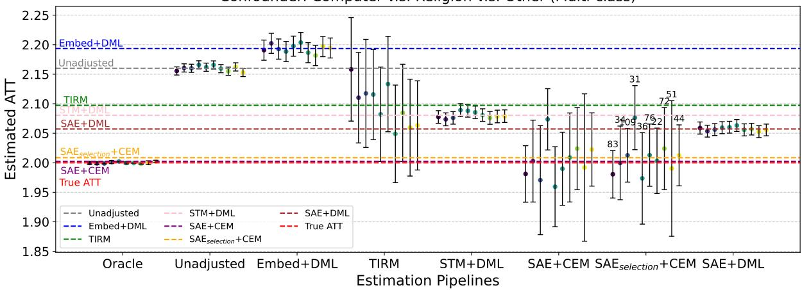

Figure 1: Multi-class breakdown. We report simulations across 10 (out of 100) randomly selected seeds for the oracle multi-class confounder (U) of computer versus religion versus other using the 20NewsGroups data. Horizontal lines are the average estimate across these 10 simulations. DML denotes DoubleML estimator. In $\mathrm { S A E } _ { s e l e c t i o n } { + } \mathrm { C E M }$ , the number of selected features is listed on the top of the CI bars. We omit $\mathrm { S A E } _ { s e l e c t i o n } + \mathrm { D M L }$ as its performance not substantially different from SAE+DML as discussed from Tab. 2.
<table><tr><td>U</td><td>Repr.</td><td colspan="4">CEM</td><td colspan="3">DoubleML</td></tr><tr><td rowspan="5">EURLEX multi-label</td><td></td><td>Bias↓</td><td>RMSE↓</td><td>Cov. % ↑</td><td>T-ret.% ↑</td><td>Bias↓</td><td>RMSE↓</td><td>Cov. % ↑</td></tr><tr><td>Unadjusted</td><td>0.2863</td><td>0.2865</td><td>0.00</td><td>n/a</td><td></td><td></td><td></td></tr><tr><td>TIRM</td><td>0.0335</td><td>0.0352</td><td>59.00</td><td>20.90</td><td>0.1461</td><td>0.1464</td><td>0.00</td></tr><tr><td>Embed</td><td>n/a</td><td>n/a</td><td>n/a</td><td>n/a</td><td>0.2912</td><td>0.2914</td><td>0.00</td></tr><tr><td>SAE</td><td>0.0344</td><td>0.0638</td><td>92.00</td><td>0.25</td><td>0.1324</td><td>0.1326</td><td>0.00</td></tr><tr><td></td><td> $\mathrm { S A E } _ { s e l e c t }$ </td><td>0.0306</td><td>0.0558</td><td>91.00</td><td>0.42</td><td>0.1336</td><td>0.1338</td><td>0.00</td></tr></table>

Table 3: Main results table for EURLEX with metrics for which lower (↓) or higher (↑) is better. Refer to Tab. 2 for notations and full set-ups.

Finally, in Fig. 1, we display 10 out of the 100 random seeds for each pipeline. Notably, although DoubleML often achieves low bias, estimates also have much narrower confidence intervals, resulting in the zero coverage observed in Tab. 2. Additionally, there is a large variance in the selection step: ranging from 22 to 109 of the 128 SAE features selected. We hypothesize this variance is due to many SAE features encoding the same underlying U and variance in which of these features are selected.

Comparing SAE versus $\mathrm { S A E } _ { s e l e c t }$ across all CEM settings (Tab. 2), the latter has similar bias metrics but retains far more treated and control units after matching. With DoubleML, selection offers little benefit for estimating ATT, and we hypothesize that the same effect is achieved implicitly by learned feature weighting in the nuisance functions. We further investigate the selection step in §6.3.

## 6.2 Results for multi-label (EURLEX)

Although the results for 20NG consistently showed the performance gains of SAEs, the results for the multi-label setting with EURLEX are more mixed (Tab. 3). We see that SAE+CEM (with and without selection) have low bias and high coverage but matching retains less than 1% of treated units across both settings. In contrast, TIRM also achieves similar bias metrics, but has less coverage and retains far more treated units (≈ 21%).

Similar to §6.1, both STM and SAE when plugged into DoubleML reduce bias from the unadjusted estimate (0.2863) with biases of 0.1461 and 0.1324 respectively but the bias is still concernedly far from zero. When inspecting the DoubleML underlying nuisance estimators, we find the treatment classifier converges but there is a lack of convergence in the outcome estimator. Our hypothesis is this might be a finite data issue. In Appendix Fig. 10 we show the distribution across the multi-label confounders. Although our dataset has strict overlap, many of the confounding buckets have “lack of common support”, which Hill and Su (2013) define as neighborhoods of covariate space in which there are not sufficient numbers of treated and control units in the finite data sample. We find this an extremely interesting setting in which matching results in low bias but DoubleML results in high bias given the same input representations. We leave to future work deeper investigations of this phenomena and mitigation of lack of common support, e.g., building from Hill and Su (2013); Oberst et al. (2020).

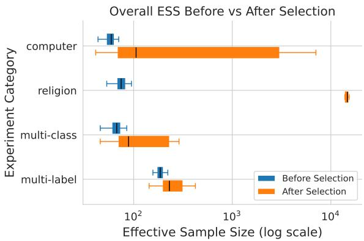  
(a) ESS distribution across simulations

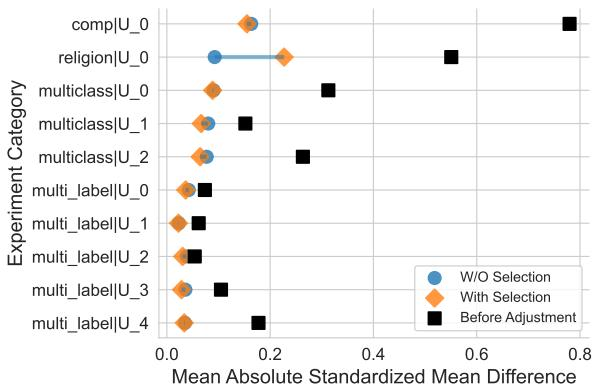  
(b) Average |SMD| on U  
Figure 2: Overlap support versus balance comparison, before and after feature selection on SAEs using the CEM estimator. For these diagnostics, we have access to the oracle confounder U.

## 6.3 Analysis of Selection Step

We conduct additional analysis of the step in our pipeline that selects a subset of SAE features for overlap and balance diagnostics when using CEM estimator. First, in Fig. 2, we report the effective sample size (ESS) across simulations before and after selection. For all confounding settings, selection increases ESS substantially, corroborating the results in Tab. 2 and 3, which show that selection retains a greater percentage of data and improves overlap in matching. Second, we investigate if selection improves or degrades the balance of true confounders in the matched datasets. For balance checking, we employ standardized mean deviation where we compute the absolute |SMD| on the true confounders, U after adjusting using SAE and $S A E _ { s e l e c t }$ . In Fig. 2b, we find selection step maintains a better balance across true confounding variables with the lower |SMD| for all settings except $U = r e l i g i o n$ . However, even for $U = r e l i g i o n$ the SMD after selection is still maintained in a low reasonable area around 0.2 that is well below the unadjusted SMD (0.55).

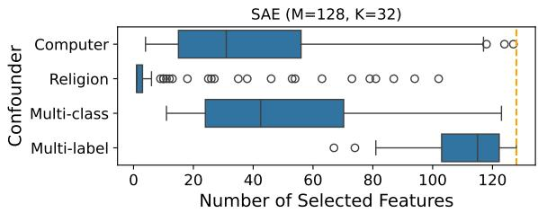  
(a) SAE (M = 128, K = 32)

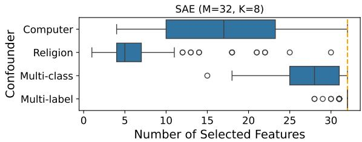  
(b) SAE (M = 32, K = 8)  
Figure 3: Distribution of number of selected SAE features under different confounding settings across 100 simulations.

## 6.4 Analysis of SAE Hyperparameters

Next, we investigate the sensitivity of our SAE pipeline to hyperparameters, i.e., SAE M and K settings, and the opportunity for falsification of the setting of M, as proposed in §4.1. Fig. 3 shows the distribution of the number of selected features using SAE M = 128 and a smaller one $M = 3 2$ (with a fixed $\frac { K } { M }$ ratio 0.25). In $M = 1 2 8$ more complex confounding settings like multiclass and multi-label in general select more features, where medians are above 40 out of 128. There is also variance in the number of selected features across simulations, which is consistent with the range of ESS in Fig. 2a. Between the binary confounders, the less frequent confounder (U = religion) has a larger variance in feature selection, suggesting SAE representations may encode these less-frequent features less atomically.

When we change the number of dimensions in the SAE representations to $M = 3 2$ , selection still reduces the feature set for binary confounders, but nearly all the neurons are selected in multi-class and multi-labeled settings. These results suggest $M = 3 2$ is not sufficiently expressive to atomically capture these more complex label sets. They also demonstrate the simple empirical falsification check that selection offers: if nearly all of the neurons are picked, a larger SAE is likely needed.

Furthermore, with an increasing M, the decision of how to set the sparsity K becomes non-trivial. We conduct an ablation on different sparsity levels $K = ( 8 , 1 6 , 3 2 , 6 4 )$ for the multi-label setting and report results in Fig. 4. Greater sparsity generally improves RMSE and retains more data, but coverage improves with less sparsity, suggesting practitioners may need choose which metrics they most care about and set K accordingly. Future work on hyperparameter setting would be beneficial for providing further guidance.

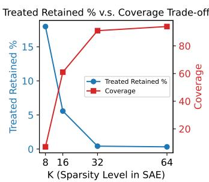  
(a)

<table><tr><td>K</td><td>Bias</td><td>RMSE</td></tr><tr><td>8</td><td>.036</td><td>.038</td></tr><tr><td>16</td><td>.027</td><td>.031</td></tr><tr><td>32</td><td>.031</td><td>.056</td></tr><tr><td>64</td><td>.028</td><td>.125</td></tr><tr><td></td><td>(b)</td><td></td></tr></table>

Figure 4: SAE sparsity (K) ablation in our multi-label setting. For, $\mathrm { S A E } _ { s e l e c t }$ with dimension $M = 1 2 8$ , a smaller K indicates greater sparsity of the model as only K neurons are retained.

## 6.5 Interpretability of SAE features

Finally, we qualitatively inspect SAE features to verify that they are interpretable and thus offer researchers greater oversight and opportunity for falsification than black-box methods, as proposed in §4.1. Following Movva et al. (2025), for neurons identified by selection, we prompt an LLM with texts that have each neuron active, instructing it to generate a label for the selected features. We use the 128-feature SAE and look at neurons that are selected at least 40 times out of 100 simulations. In our data, the selected neurons are highly relevant to the true confounder we set, offering face validity. For instance, in a multi-class setting (computer v.s. religion v.s. other), the top neurons include “Contains explicity Bible scripture references” and “Mentions PC motherboard/bus hardware standards”, while the binary setting on religion only contains the former. For the multi-label setting, all selected neurons appear in at least 40 simulations, so we manually check for neurons in $\geq 9 5$ simulations (25 in total) and find evidence for all five labels, for instance, “Contains the exact title phrase ‘establishing the standard import values for determining the entry price of certain fruit and vegetables” relates to Trade and Agri-foodstuffs. In a dataset where the selected neurons did not display content relevant to hypothesized confounders, this diagnostic could expose results as unreliable, falsifying the pipeline.

## 7 Conclusion and Outlook

In this work, we construct a novel pipeline and expand to complex causal simulation for adjusting for text as confounders by subsetting SAEs with statistically informed selection. Our exploration shows SAEs have the potential to aid in causal analyses and also opens channels for future work. SAEs may be sufficiently expressive to encode a wide range of confounding information beyond just topics, since the features they recover also include stylistic and semantic variation. Future work can investigate more diverse text confounders (e.g., syntactic). Our results also suggest future investigations are needed to more deeply understand performance in multi-label settings. With respect to the adjustment pipeline, we empirically compare pipelines where the learned representations are plugged into downstream estimators. Future investigations of methods that jointly learn the representations and estimators (Veljanovski and Wood-Doughty, 2024; Veitch et al., 2020) and systematic search on optimizing hyperparameters throughout the pipeline are needed.

## Limitations

Examining causal adjustment using semi-synthetic simulations involves multiple stages of parameter setting, such as, choices of confounder labels, different set-ups of confounding and treatment strength for the data-generating process, dimensionality of representations, etc., and our results may vary under other settings. To reduce this limitation, at each step, we carefully motivated decisions as well as followed best practices from prior work, and we report results across multiple simulation settings and datasets.

Moreover, to make comparisons among methods fair and principled, we used the same hyperparameter settings across pipelines. However, optimal parameter settings may vary across underlying representations. For instance, there may be different optimal binning rules of CEM for SAE representations and the constrained (0, 1) continuousvalued topic representation from STM. Nevertheless, SAEs seem to be more robust to such rules from our empirical results (See §E).

Lastly, there are other SAE architectures that could be investigated. We defer these investigations to future work, as they can be easily integrated into our pipeline, and furthermore, comparisons of different SAEs offer minor refinements on our proposed work, rather than being necessary for our proposed adjustment approach to be usable.

## References

Steven Bills, Nick Cammarata, Dan Mossing, Henk Tillman, Leo Gao, Gabriel Goh, Ilya Sutskever, Jan Leike, Jeff Wu, and William Saunders. 2023. Language models can explain neurons in language models. OpenAI. Cited on pages 1 and 2.

Trenton Bricken, Adly Templeton, Joshua Batson, Brian Chen, Adam Jermyn, Tom Conerly, Nicholas L Turner, Cem Anil, Carson Denison, Amanda Askell, Robert Lasenby, Yifan Wu, Shauna Kravec, Nicholas Schiefer, Tim Maxwell, Nicholas Joseph, Alex Tamkin, Karina Nguyen, Brayden McLean, and 5 others. 2023. Towards monosemanticity: Decomposing language models with dictionary learning. Transformer Circuits Thread, Anthropic. Accessed: 2026- 05-20. Cited on pages 1 and 2.

Ilias Chalkidis, Manos Fergadiotis, and Ion Androutsopoulos. 2021. MultiEURLEX - a multi-lingual and multi-label legal document classification dataset for zero-shot cross-lingual transfer. In Proceedings of the 2021 Conference on Empirical Methods in Natural Language Processing, pages 6974–6996, Online

and Punta Cana, Dominican Republic. Association for Computational Linguistics. Cited on page 5.

Jacob M. Chen, Rohit Bhattacharya, and Katherine A. Keith. 2024. Proximal causal inference with text data. In The Thirty-eighth Annual Conference on Neural Information Processing Systems. Cited on page 2.

Victor Chernozhukov, Denis Chetverikov, Mert Demirer, Esther Duflo, Christian Hansen, and Whitney Newey. 2017. Double/debiased/neyman machine learning of treatment effects. American Economic Review, 107(5):261–65. Cited on pages 1, 3, and 4.

Jinho Choi, Hyesu Lim, Steffen Schneider, and Jaegul Choo. 2025. Conceptscope: Characterizing dataset bias via disentangled visual concepts. In Advances in Neural Information Processing Systems, volume 38, pages 9604–9639. Curran Associates, Inc. Cited on pages 1 and 2.

Alexander D’Amour, Peng Ding, Avi Feller, Lihua Lei, and Jasjeet Sekhon. 2021. Overlap in observational studies with high-dimensional covariates. Journal of Econometrics, 221(2):644–654. Cited on pages 1, 3, and 4.

Amir Feder, Katherine A. Keith, Emaad Manzoor, Reid Pryzant, Dhanya Sridhar, Zach Wood-Doughty, Jacob Eisenstein, Justin Grimmer, Roi Reichart, Margaret E. Roberts, Brandon M. Stewart, Victor Veitch, and Diyi Yang. 2022. Causal inference in natural language processing: Estimation, prediction, interpretation and beyond. Transactions ofthe Associationfor Computational Linguistics, 10:1138–1158. Cited on pages 1 and 2.

Leo Gao, Tom Dupre la Tour, Henk Tillman, Gabriel Goh, Rajan Troll, Alec Radford, Ilya Sutskever, Jan Leike, and Jeffrey Wu. 2025. Scaling and evaluating sparse autoencoders. In The Thirteenth International Conference on Learning Representations. Cited on page 2.

Miguel A. Hernán. 2016. Does water kill? A call for less casual causal inferences. Annals of Epidemiology, 26(10):674–680. Cited on page 12.

Jennifer Hill and Yu-Sung Su. 2013. Assessing lack of common support in causal inference using Bayesian nonparametrics: Implications for evaluating the effect of breastfeeding on children’s cognitive outcomes. The Annals ofApplied Statistics, 7(3):1386 – 1420. Cited on pages 1 and 8.

Robert Huben, Hoagy Cunningham, Logan Smith, Aidan Ewart, and Lee Sharkey. 2024. Sparse autoencoders find highly interpretable features in language models. In International Conference on Learning Representations, volume 2024, pages 7827–7845. Cited on pages 1 and 2.

Stefano M. Iacus, Gary King, and Giuseppe Porro. 2012. Causal inference without balance checking: Coarsened exact matching. Political Analysis, 20(1):1–24. Cited on page 4.

Nicholas Jiang, Xiaoqing Sun, Lewis Smith, and Neel Nanda. 2025. Towards data-centric interpretability with sparse autoencoders. In Mechanistic Interpretability Workshop at NeurIPS 2025. Cited on pages 1 and 2.

Katherine A. Keith, Sergey Feldman, David Jurgens, Jonathan Bragg, and Rohit Bhattacharya. 2023. RCT rejection sampling for causal estimation evaluation. Transactions on Machine Learning Research. Cited on page 2.

Katherine A. Keith, David Jensen, and Brendan O’Connor. 2020. Text and causal inference: A review of using text to remove confounding from causal estimates. In Proceedings of the 58th Annual Meeting of the Association for Computational Linguistics, pages 5332–5344, Online. Association for Computational Linguistics. Cited on pages 1 and 2.

Ken Lang. 1995. Newsweeder: learning to filter netnews. In Proceedings of the Twelfth International Conference on International Conference on Machine Learning, ICML’95, page 331–339, San Francisco, CA, USA. Morgan Kaufmann Publishers Inc. Cited on page 5.

Alireza Makhzani and Brendan J. Frey. 2014. k-Sparse autoencoders. In 2nd International Conference on Learning Representations, ICLR 2014, Banff, AB, Canada, April 14-16, 2014, Conference Track Proceedings. Cited on pages 1, 2, and 3.

Rajiv Movva, Kenny Peng, Nikhil Garg, Jon Kleinberg, and Emma Pierson. 2025. Sparse autoencoders for hypothesis generation. In Forty-second International Conference on Machine Learning. Cited on pages 1, 2, 4, and 9.

Michael Oberst, Fredrik Johansson, Dennis Wei, Tian Gao, Gabriel Brat, David Sontag, and Kush Varshney. 2020. Characterization of overlap in observational studies. In Proceedings of the Twenty Third International Conference on Artificial Intelligence and Statistics, volume 108 of Proceedings of Machine Learning Research, pages 788–798. PMLR. Cited on page 8.

Kenny Peng, Rajiv Movva, Jon Kleinberg, Emma Pierson, and Nikhil Garg. 2026. Position: Use sparse autoencoders to discover unknowns. Cited on page 2.

Margaret E. Roberts, Brandon M. Stewart, and Richard A. Nielsen. 2020. Adjusting for confounding with text matching. American Journal ofPolitical Science, 64(4):887–903. Cited on pages 1, 2, and 5.

Margaret E Roberts, Brandon M Stewart, Dustin Tingley, Edoardo M Airoldi, and 1 others. 2013. The structural topic model and applied social science. In Advances in neural information processing systems workshop on topic models: computation, application, and evaluation, volume 4, pages 1–20. Harrahs and Harveys, Lake Tahoe. Cited on page 5.

Rickmer Schulte, David Rügamer, and Thomas Nagler. 2025. Adjustment for confounding using pre-trained representations. In ICLR 2025 Workshop on Foundation Models in the Wild. Cited on pages 2 and 5.

Elizabeth A. Stuart. 2010. Matching methods for causal inference: A review and a look forward. Statistical Science, 25(1). Cited on pages 3 and 4.

Elijah Tamarchenko. 2023. Combining optimal adjustment set selection and post selection inference in unknown causal graphs. Bachelor’s thesis, Williams College, Williamstown, MA, May. Advisor: Rohit Bhattacharya. Cited on page 4.

A Templeton, T Conerly, J Marcus, J Lindsey, T Bricken, B Chen, and 1 others. 2024. Scaling monosemanticity: Extracting interpretable features from claude 3 sonnet. transformer circuits thread. Transformer Circuits Thread, Anthropic. Cited on pages 1 and 2.

Victor Veitch, Dhanya Sridhar, and David Blei. 2020. Adapting text embeddings for causal inference. In Proceedings of the 36th Conference on Uncertainty in Artificial Intelligence (UAI), volume 124 of Proceedings ofMachine Learning Research, pages 919–928. PMLR. Cited on pages 2, 3, 5, and 9.

Marko Veljanovski and Zach Wood-Doughty. 2024. DoubleLingo: Causal estimation with large language models. In Proceedings of the 2024 Conference of the North American Chapter ofthe Associationfor Computational Linguistics: Human Language Technologies (Volume 2: Short Papers), pages 799–807, Mexico City, Mexico. Association for Computational Linguistics. Cited on pages 2, 5, 7, and 9.

Zach Wood-Doughty, Ilya Shpitser, and Mark Dredze. 2018. Challenges of using text classifiers for causal inference. In Proceedings ofthe 2018 Conference on Empirical Methods in Natural Language Processing, pages 4586–4598, Brussels, Belgium. Association for Computational Linguistics. Cited on page 2.

Raymond Zhang, Neha Nayak Kennard, Daniel Smith, Daniel McFarland, Andrew McCallum, and Katherine A. Keith. 2023. Causal matching with text embeddings: A case study in estimating the causal effects of peer review policies. In Findings of the Association for Computational Linguistics: ACL 2023, pages 1284–1297, Toronto, Canada. Association for Computational Linguistics. Cited on page 2.

## A Causal identification assumptions

From §3.1, we listed the four causal identification assumptions that cannot be verified from data alone:

1. No unmeasured confounding. The unobserved variables U constitute a valid backdoor adjustment set for the effect of T on Y.

2. Overlap. Every unit in the population has a nonzero probability of receiving each treatment level given its covariates, $0 < P r ( T =$ $t \mid U ) < 1 , \forall t \in T$

3. Consistency. The outcome observed for each unit at treatment level $t \in \{ 0 , 1 \}$ is identical to the outcome we would have observed had the unit been assigned to treatment level t.6

4. Homogeneous effects. The treatment effect is constant across units; we leave heterogeneous effects to future work.

## B Data Statistics

In this section, we describe more statistics and preprocessing on the two datasets we use for semisynthetic evaluations.

20NG The dataset originally contains 20 labels that are merged into 10 labels used in our experiments as follows,

1. computer: comp.graphics, comp.os.mswindows.misc, comp.sys.ibm.pc.hardware, comp.sys.mac.hardware, comp.windows.x

2. politics: talk.politics.guns, talk.politics.misc, talk.politics.mideast

3. religion: alt.atheism, soc.religion.christian, talk.religion.misc

4. sport: rec.sport.baseball, rec.sport.hockey

5. automobile: rec.autos

6. cryptography:sci.crypt

7. medicine: sci.med

8. forsale: misc.forsale

9. electronics: sci.electronics

10. space: sci.space

We present the prevalence of data labels of 20NG data by fraction in Fig. 5.

In addition, as defined in our DGP (§5.1), we illustrate an example treatment assignment distribution conditioned on the true confounder U from our simulation for each confounding scenario which we can visualize the overlap. We plot 20NG computer in Fig. 6, 20NG religion in Fig. 7, and multi-class (computer, religion, and other) in Fig. 8.

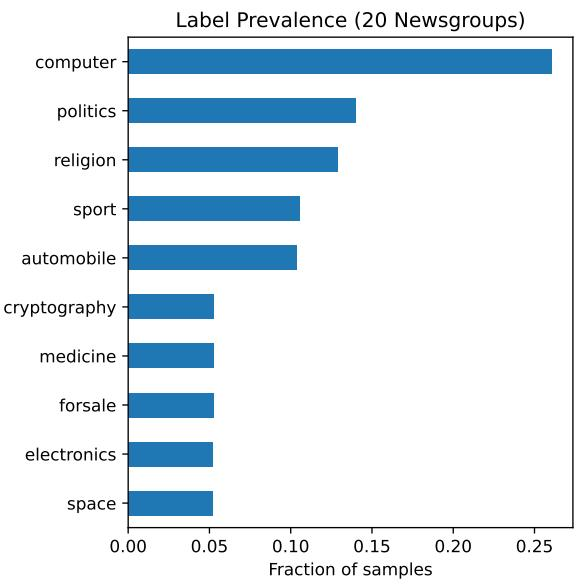  
Figure 5: Label prevalence in 20NG data by fraction of total samples.

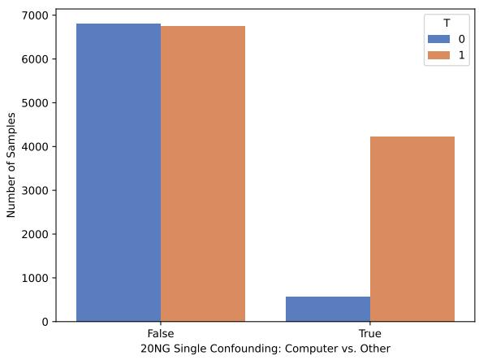  
Figure 6: Treatment Assignment on 20NG computer

EURLEX The original EURLEX dataset has 3- level hierarchical labels from coarse-grained to fine-grained. We use the coarsest level that contains 21 labels shown in Fig. 9 and select the top 5 labels: “trade”, “agri-foodstuffs”, “geography”, agriculture, forestry and fisheries”, and “EURO-PEAN UNION”. In our multi-labeled experiment, these chosen labels are represented in a vector format. Finally, the distribution of the multi-labeled confounder of EURLEX in shown in Fig. 10.

Furthermore, using one simulation from 100 simulations, the treatment distribution of multi-label EURLEX data is illustrated in Fig. 11. We can see that overlap satisfies but certain regions have poor overlap.

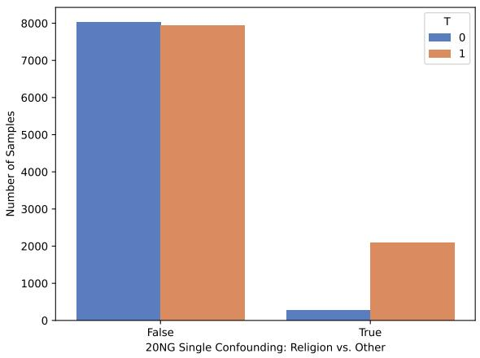  
Figure 7: Treatment Assignment on 20NG religion

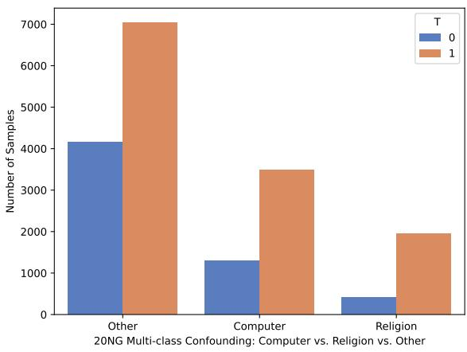  
Figure 8: Treatment Assignment on 20NG multi-class (Computer, Religion, and Other)

## C Metrics Details

Here we provide calculation details for the metrics.

ATT The Average Treatment Effect on the Treated (ATT) is the average effect of the treatment among treated units:

$$
\mathrm { A T T } = \mathbb { E } \left[ Y ( 1 ) - Y ( 0 ) \mid T = 1 \right] ,
$$

where $Y ( 1 )$ and $Y ( 0 )$ are the potential outcomes under treatment and control, and $T = 1$ denotes treated units.

Assume we run R simulations, with true ATT $\tau ,$ we compute the following empirical estimates for our method and baselines,

$$
\begin{array} { r } { \bullet \ \mathrm { b i a s } = \frac { 1 } { R } \sum ( \widehat { \tau } - \tau ) } \end{array}
$$

$$
\begin{array} { r } { \bullet \ { \mathrm { R M S E } } = \sqrt { \frac { 1 } { R } \sum ( \widehat { \tau } - \tau ) ^ { 2 } } } \end{array}
$$

• coverage = $\textstyle { \frac { 1 } { R } } \sum \tau \in C I $ , the percentage of CI’s that cover the true treatment effect.

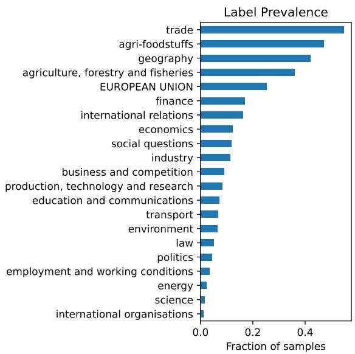  
Figure 9: Label prevalence in original multi-labeled EU-RLEX data by fraction of total samples. We select the five most common labels to create our multi-labeled confounding experiment: “trade”, “agri-foodstuffs”, “geography”, “agriculture, forestry and fisheries”, and “EU-ROPEAN UNION”.

Effective Sample Size (ESS) To assess covariate overlap between treated and control units, we report the effective sample size (ESS) implied by the balancing weights.

$$
E S S = \frac { ( \sum _ { i } w _ { i } ) ^ { 2 } } { \sum _ { i } w _ { i } ^ { 2 } }
$$

where $w _ { i }$ is the weight for each observational unit. Next, we describe how the weights are computed in coarsened exact matching (CEM)

Weights from CEM Recall that we have access to texts $D = \{ d _ { 1 } , \ldots , d _ { N } \}$ containing unobserved confounder(s) $U$ such as topics. For CEM, we bin the values of a covariate into several bins and perform exact match on these bins such that a bin containing only treatment units is dropped. Then, for an observational unit $d _ { i }$ , the weight is 0 if it is not matched, otherwise, denote the bin of the unit as b and the total number of units in this bin as $N _ { b }$ the weight is calculated as follows,

$$
w _ { i } = \left\{ \begin{array} { l l } { 1 , } & { T _ { i } = 1 } \\ { \frac { N - \sum _ { i } ^ { N } T _ { i } } { \sum _ { i } ^ { N } T _ { i } } \cdot \frac { N _ { b } - \sum _ { i } ^ { N _ { b } } T _ { i } } { \sum _ { i } ^ { N _ { b } } T _ { i } } , } & { T _ { i } = 0 } \end{array} \right.
$$

where the weight of a control unit $( T _ { i } = 0 )$ is the ratio between control and treatment units of the

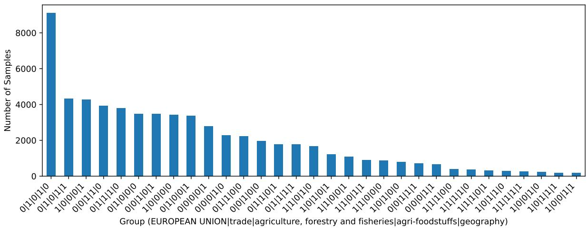  
Figure 10: Distribution on multi-labeled true confounders in EURLEX

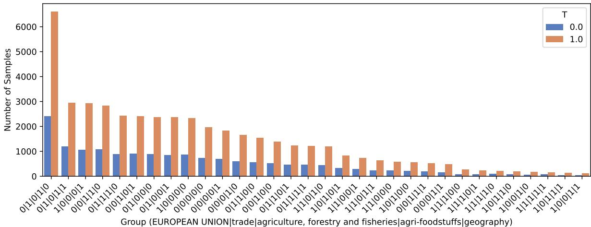  
Figure 11: Treatment assignment on EURLEX

original population multiplied by the same ratio within the bin.

Standardized Mean Difference (SMD) We calculate the SMD of a true confounder U as follows,

$$
| S M D ( U ) | = | \frac { \bar { U } _ { T = 1 } - \bar { U } _ { T = 0 } } { s d _ { p o o l e d } } |
$$

$$
s d _ { \mathrm { p o o l e d } } = \sqrt { \frac { \mathrm { V a r } ( U _ { T = 1 } ) + \mathrm { V a r } ( U _ { T = 0 } ) } { 2 } }
$$

Specifically, the means and variances are weighted such that the weights are all set to 1 before matching (i.e. each observational unit has equal weight), and are computed as above after matching.

## D Experiment Implementation

For the text embeddings used as input for SAE and Embed+DML, we use openai-text-embedding-3-small. Our selection step uses a 7:3 train-test split ratio and the train-test split remains the same across simulations. CEM’s binning rule uses cut-points at 0 and 50% quantile of the positive values. For baseline TIRM, we run experiments in R with stm and cem libraries. For the rest baselines, we run experiments in python. We use package doubleml for double machine learning estimator implementation and pymatchit for Coarsened Exact Matching. We follow hypothesaes to implement SAE models.

We want to make a note that, because SAE does not require treatment and outcome variables, we train an SAE representation once and use it across all simulations. On the other hand, STMs in TIRM do depend on the treatment variable, requiring us to retrain the model for every simulation, making this approach more computationally expensive for semi-synthetic evaluations.

## E Results: Complementary Figures and Tables

Unadjusted estimate The unadjusted treatment effect is $\mathbb { E } [ Y | T = 1 ] - \mathbb { E } [ Y | T = 0 ]$ and in practice we calculate the difference of the mean of outcome variable between treatment and control samples.

Complementary results for main results tables Specific to matching estimators, we report the percentage of retained treated samples (T-ret.%) in Tab. 2 and Tab. 3 that indicates the proportion of treated samples retained after matching. Similarly we provide a complementary table about the control retained rate in Tab. 4. They both indicate how much of the original treated(/control) population is actually supported by comparable controls(/treated) after matching.

<table><tr><td></td><td>computer</td><td>religion</td><td>multi-class</td><td>multi-label</td></tr><tr><td>TIRM</td><td>2.59</td><td>2.72</td><td>2.80</td><td>25.18</td></tr><tr><td>SAE</td><td>0.42</td><td>0.48</td><td>0.59</td><td>0.58</td></tr><tr><td> $\mathrm { S A E } _ { s e l e c t }$ </td><td>18.59</td><td>82.04</td><td>6.68</td><td>0.92</td></tr></table>

Table 4: Percentage of control retained for different confounding settings and pipeline using CEM estimator.

In addition, in Tab. 2 and Tab. 3, we compare methods where the matching estimator uses a binning rule with 50% quantile cutpoint on positive values. We also experiment with a cutpoint with 80% quantile and present the results in Tab. 5.

Complementary figures for binary and multilabeled confounding Similar to Fig. 1, we present the random 10-simulation adjustment performance across different pipelines figures for the other three confounding settings. We plot for binary (computer) confounder in Fig. 12a, binary (religion) confounder in Fig. 12b, and multi-labeled confounder in Fig. 12c.

## F Interpretability of SAE features: Complementary Figures and Tables

We provide complementary figures and tables for the qualitative analysis in §6.5 on SAE features for different confounding settings. The prompting model is gpt-5.2. For readability, we only plot the top five neurons that appear most frequent across 100 simulations in Fig. 13 for 20NG computer, Fig. 14 for 20NG religion, Fig. 15 for 20NG multiclass, and Fig. 16 for EURLEX multi-label. A more comprehensive table for each confounding setting is provided.

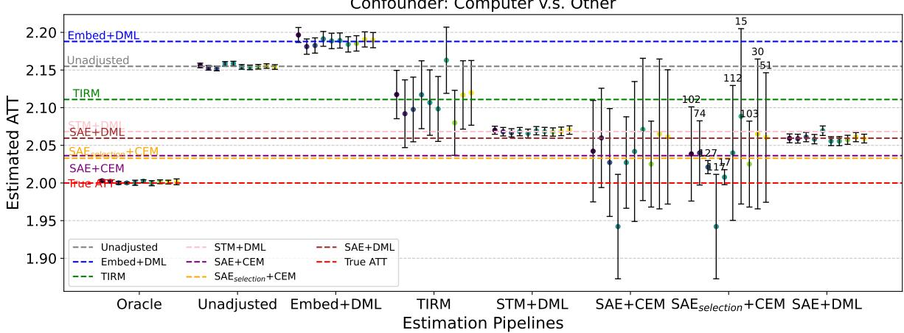  
(a) Binary (computer). Simulations across 10 randomly selected seeds for the oracle binary confounder U of computer versus other using the 20NewsGroups data.

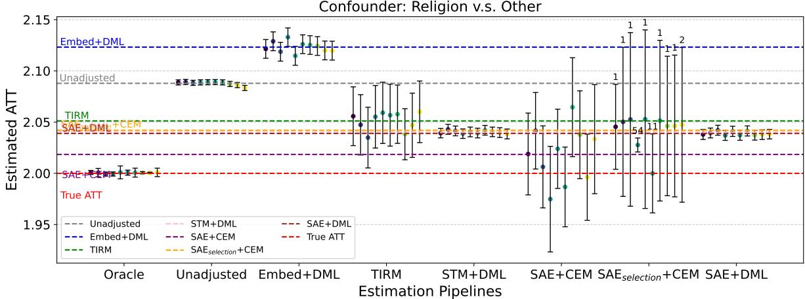  
(b) Binary (religion). Simulations across 10 randomly selected seeds for the oracle binary confounder U of religion versus other using the 20NewsGroups data.

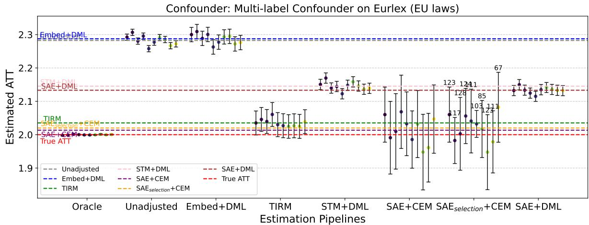  
(c) EURLEX multi-label. Simulations across 10 randomly selected seeds for the oracle multi-label confounder U using the EURLEX data.

Figure 12: Simulation results across 10 out of 100 randomly selected seeds. Horizontal lines indicate the average estimate across these 10 simulations. DML denotes the DoubleML estimator. In $\mathrm { S A E } _ { s e l e c t i o n } { + } \mathrm { C E M }$ , the number of selected features is listed on top of the confidence-interval bars.

<table><tr><td>Confounder</td><td>pipeline</td><td>Bias↓</td><td>RMSE↓</td><td>Coverage %↑</td><td>treated retained %↑</td><td>control retained % ↑</td></tr><tr><td rowspan="3">Binary (computer)</td><td>TIRM</td><td>0.0411</td><td>0.0464</td><td>81.00</td><td>1.05</td><td>1.31</td></tr><tr><td>SAE</td><td>0.0344</td><td>0.0465</td><td>93.00</td><td>0.30</td><td>0.44</td></tr><tr><td> $\operatorname { S A E } _ { s e l e c t }$ </td><td>0.0308</td><td>0.0420</td><td>56.00</td><td>17.63</td><td>21.64</td></tr><tr><td rowspan="3">Binary (religion) Multi-class</td><td>TIRM</td><td>0.0103</td><td>0.0165</td><td>93.00</td><td>1.29</td><td>1.46</td></tr><tr><td>SAE</td><td>0.0055</td><td>0.0240</td><td>93.00</td><td>0.41</td><td>0.51</td></tr><tr><td> $\mathrm { S A E } _ { s e l e c t }$ </td><td>0.0416</td><td>0.0468</td><td>86.00</td><td>82.29</td><td>82.80</td></tr><tr><td rowspan="3"></td><td>TIRM</td><td>0.0259</td><td>0.0392</td><td>98.00</td><td>1.05</td><td>1.68</td></tr><tr><td>SAE</td><td>0.0201</td><td>0.0434</td><td>95.00</td><td>0.31</td><td>0.62</td></tr><tr><td> $\operatorname { S A E } _ { s e l e c t }$ </td><td>0.0271</td><td>0.0446</td><td>75.00</td><td>6.04</td><td>8.44</td></tr><tr><td rowspan="3">Multi-labeled</td><td>TIRM</td><td>0.0459</td><td>0.0467</td><td>7.00</td><td>26.94</td><td>31.01</td></tr><tr><td>SAE</td><td>0.0255</td><td>0.0492</td><td>91.00</td><td>0.45</td><td>0.97</td></tr><tr><td> $\mathrm { S A E } _ { s e l e c t }$ </td><td>0.0255</td><td>0.0474</td><td>90.00</td><td>0.67</td><td>1.38</td></tr></table>

Table 5: Complementary table for Tab. 2 and Tab. 3. All settings keep the same except that CEM uses cut-points at 0 and at 80% quantile of positive values.

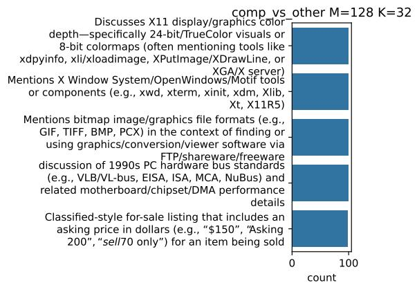  
Figure 13: Top-5 most common neurons across 100 simulations for 20 news (computer) confounding

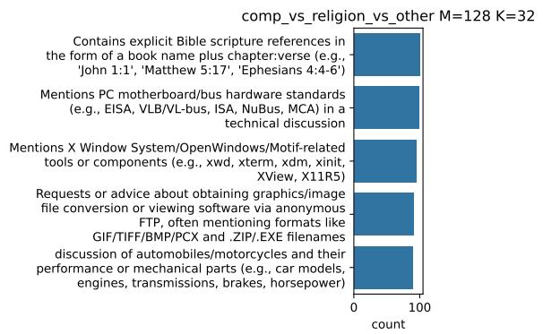  
Figure 15: Top-5 most common neurons across 100 simulations for 20 news (computer and religion) multiclass confounding

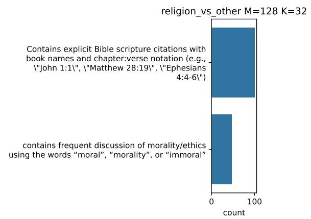  
Figure 14: Top-5 most common neurons across 100 simulations for 20 news (religion) confounding

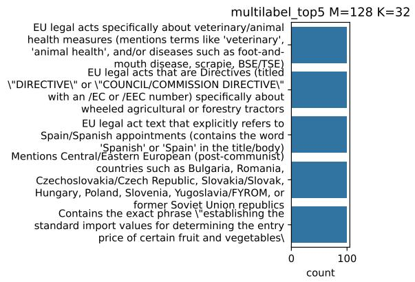  
Figure 16: Top-5 most common neurons across 100 simulations for EURLEX multi-label confounding

## Neuron Interpretations: 20NG Computer

<table><tr><td>Neuron</td><td>Interpretation</td><td># Sim.</td></tr><tr><td>0</td><td>Discusses X11 display/graphics color depth—specifically 24-bit/TrueColor visuals or 8-bit colormaps (often mentioning tools like xdpyinfo, xli/xloadimage, XPutImage/XDrawLine, or XGA/X server)</td><td>100</td></tr><tr><td>7</td><td>Mentions X Window System/OpenWindows/Motif tools or components (e.g., xwd, xterm, xinit, xdm, Xlib, Xt, X11R5)</td><td>100</td></tr><tr><td>10</td><td>Mentions bitmap image/graphics file formats (e.g., GIF, TIFF, BMP, PCX) in the context of finding or using graphics/conversion/viewer software via FTP/shareware/freeware</td><td>100</td></tr><tr><td>18</td><td>discussion of 1990s PC hardware bus standards (e.g., VLB/VL-bus, EISA, ISA, MCA, NuBus) and related motherboard/chipset/DMA performance details</td><td>100</td></tr><tr><td>3</td><td>Classified-style for-sale listing that includes an asking price in dollars (e.g., “$150&quot;, “Asking $200&quot;, “sell $70 only&quot;) for an item being sold</td><td>98</td></tr><tr><td>9</td><td>Contains the phrase &quot;same problem&quot; (case-insensitive)</td><td>97</td></tr><tr><td>13</td><td>contains MS-DOS era disk/storage terminology such as FDISK/FORMAT/CMOS partitions and IDE/SCSI hard drives</td><td>93</td></tr><tr><td>24</td><td>discussion of the Clipper Chip/key escrow (mentions &#x27;Clipper&#x27; or &#x27;key escrow&#x27; or &#x27;Skipjack&#x27;)</td><td>93</td></tr><tr><td>5</td><td>contains electronics/DIY circuit-building content with specific component part numbers or values (e.g., 555, 741, 565, MC14536B, VAC/VDC, ohms, Hz, μF)</td><td>86</td></tr><tr><td>14</td><td>Discussion of automobiles or motorcycles using specific vehicle makes/models and performance/repair terminology (e.g., Mustang, Miata, Porsche 911, turbo/V-8, transaxle, carbs, clutch, hp)</td><td>85</td></tr><tr><td>22</td><td>Discussion of Candida/yeast (fungal) infections, often in the context of antibiotics and probiotics (e.g., Lactobacillus, yogurt)</td><td>79</td></tr><tr><td>25</td><td>Contains explicit Bible scripture citations using book names with chapter:verse notation (e.g., &quot;John 1:1&quot;, &quot;Matthew 28:19&quot;, &quot;Hebrews 10:24-25”).</td><td>79</td></tr><tr><td>15</td><td>classified for-sale listings that include an explicit asking price marked with a dollar sign ($)</td><td>75</td></tr><tr><td>21</td><td>discussion of professional baseball (MLB) teams/standings/predictions (e.g., AL/NL divisions, Yankees/Orioles/Blue Jays, ROY/ROTY, Cy Young)</td><td>75</td></tr><tr><td>12</td><td>Contains the substring &quot;==clip==&quot; indicating clipped/truncated quoted sections</td><td>70</td></tr><tr><td>20</td><td>Mentions the Waco siege/Branch Davidians (e.g., Koresh, ATF/BATF, FBI) in a political argument context</td><td>69</td></tr></table>

Continued on next page

Table 6 – continued from previous page
<table><tr><td>Neuron</td><td>Interpretation</td><td># Sim.</td></tr><tr><td>6</td><td>Discussion of spaceflight/space exploration missions or orbital mechanics (e.g., Moon missions, Earth orbit, planetary probes like Galileo/Cassini/Voyager)</td><td>66</td></tr><tr><td>11</td><td>Contains discussion of Middle East/Turkey/Armenia/Israel-Palestine political or ethnic conflict (e.g., Arabs/Jews/Zionism/Palestine/Turkiye/Greeks/Armenians)</td><td>60</td></tr><tr><td>2</td><td>contains political commentary about U.S. government/politicians (e.g., Clinton, Gore, liberals/conservatives) and civil liberties/rights</td><td>58</td></tr><tr><td>4</td><td>Contains discussion of Major League Baseball players/teams using multiple athlete proper names (e.g., Mays, Mattingly, Winfield) and baseball stats/terms (BA, OBP, steals, HR)</td><td>58</td></tr><tr><td>30</td><td>contains explicit discussion of U.S. law/constitution/civil-rights enforcement (e.g., mentions the Constitution, amendments, U.S.C., courts, or federal/state criminal charges)</td><td>57</td></tr><tr><td>17</td><td>discussion of morality/ethics using words like &quot;moral&quot;, &quot;morality&quot;, &quot;immoral&quot;, or &quot;objective morality</td><td>55</td></tr><tr><td>23</td><td>Contains explicit sarcasm/flame-style Usenet banter with direct insults or profanity (e.g., &#x27;newbie&#x27;, &#x27;bozo&#x27;, &#x27;fuck off&#x27;, &#x27;panties in a bunch’) in a quoted-reply thread format</td><td>54</td></tr><tr><td>48</td><td>Contains the word &quot;Mac&quot; or &quot;Macintosh&quot; (referring to Apple Macintosh computers)</td><td>52</td></tr><tr><td>99</td><td>Discussion of Apple Macintosh hardware models/upgrades (e.g., Mac IIvx/LC/Centris/SE-30/Duo/PowerBook/Mac Portable) including RAM/memory, accelerators, hard drives, or peripherals</td><td>47</td></tr><tr><td>31</td><td>contains the literal header field &quot;Archive-name:&quot; (or &quot;Archive-Name:&quot;) at the start of an FAQ/archive posting</td><td>45</td></tr><tr><td>29</td><td>contains explicit deletion/removal marker text such as &#x27;deleted’ or &#x27;(Deletion)</td><td>44</td></tr><tr><td>90</td><td>Contains a quoted/attributed signature line with an identifier like &quot;—&quot; followed by a handle/ID number (e.g., &quot;DoD #1224&quot;, &quot;DoD#1919&quot;)</td><td>44</td></tr><tr><td>8</td><td>contains direct second-person accusations/challenges using &#x27;you/your&#x27; (e.g., &#x27;you have yet to answer&#x27;, &#x27;you are going to&#x27;, &#x27;your lack of’)</td><td>42</td></tr></table>

## Neuron Interpretations: 20NG Religion

<table><tr><td>Neuron</td><td>Interpretation</td><td># Sim.</td></tr><tr><td>25</td><td>Contains explicit Bible scripture citations with book names and chapter:verse notation (e.g., &quot;John 1:1&quot;, &quot;Matthew 28:19&quot;, &quot;Ephesians 4:4-6&quot;)</td><td>100</td></tr><tr><td>17</td><td>contains frequent discussion of morality/ethics using the words “moral&quot;, “morality”, or “immoral”</td><td>47</td></tr></table>

Neuron Interpretations: 20NG Multi-class (Computer and Religion)
<table><tr><td>Neuron</td><td>Interpretation</td><td># Sim.</td></tr><tr><td>25</td><td>Contains explicit Bible scripture references in the form of a book name plus chapter:verse (e.g., &#x27;John 1:1&#x27;, &#x27;Matthew 5:17&#x27;, &#x27;Ephesians 4:4-6&#x27;)</td><td>100</td></tr><tr><td>18</td><td>Mentions PC motherboard/bus hardware standards (e.g., EISA, VLB/VL-bus, ISA, NuBus, MCA) in a technical discussion</td><td>99</td></tr><tr><td>7</td><td>Mentions X Window System/OpenWindows/Motif-related tools or components (e.g., xwd, xterm, xdm, xinit, XView, X11R5)</td><td>95</td></tr><tr><td>10</td><td>Requests or advice about obtaining graphics/image file conversion or viewing software via anonymous FTP, often mentioning formats like GIF/TIFF/BMP/PCX and .ZIP/.EXE filenames</td><td>91</td></tr><tr><td>14</td><td>discussion of automobiles/motorcycles and their performance or mechanical parts (e.g., car models, engines, transmissions, brakes, horsepower)</td><td>89</td></tr><tr><td>22</td><td>discussion of Candida/yeast (fungal) infections, often in the context of antibiotic use and probiotics (e.g., Lactobacillus/yogurt)</td><td>89</td></tr><tr><td>21</td><td>discussion of professional sports (especially MLB baseball) including team names, standings/predictions, or game commentary</td><td>89</td></tr><tr><td>17</td><td>contains multiple occurrences of the word &quot;moral&quot;/&quot;morality&quot; (including &quot;moral system&quot; or &quot;moral behavior&quot;)</td><td>86</td></tr><tr><td>24</td><td>discussion of the Clipper Chip/key escrow telephone encryption proposal (mentions “Clipper&quot;/wiretap chip/escrowed keys/NSA/NIST/Skipjack/DES in that context)</td><td>86</td></tr><tr><td>0</td><td>Discusses X11/X Window System display/graphics topics (e.g., XGA, X server visuals, xdpyinfo, xloadimage/xli, pixmaps/colormaps)</td><td>83</td></tr><tr><td>20</td><td>Mentions the Waco siege/Branch Davidians (e.g., Koresh, ATF/BATF, FBI) in a political discussion</td><td>80</td></tr><tr><td>11</td><td>contains explicit discussion of Middle East/Turkish/Armenian/Israeli/Palestinian ethnic-national conflict (e.g., mentions</td><td>77</td></tr><tr><td>3</td><td>Jews/Arabs/Israel/Palestine/Turkiye/Greeks/Armenians/Zionism) classified-style for-sale posting listing items and asking price/offer (e.g., &#x27;for sale/forsale&#x27;, &#x27;asking $’, &#x27;make an offer&#x27;, &#x27;buyer pays shipping&#x27;)</td><td>76</td></tr><tr><td>5</td><td>contains electronics/DIY circuit-building content with specific component names or part numbers (e.g., 555 timer, 741 op-amp, 565</td><td>76</td></tr><tr><td>9</td><td>PLL, MC14536B, MAX641) and voltage/frequency values first-person technical troubleshooting report describing a recurring computer/printer hardware error/problem (often phrased as &#x27;I have the</td><td>71</td></tr></table>

Continued on next page

Table 8 – continued from previous page
<table><tr><td>Neuron</td><td>Interpretation</td><td># Sim.</td></tr><tr><td>6</td><td>Discussion of space exploration/space missions (e.g., NASA, orbit Moon, planets, probes like Galileo/Cassini/Voyager, spacecraft/launch systems)</td><td>69</td></tr><tr><td>4</td><td>Discussion of Major League Baseball players/teams using baseball-specific stats/terms (e.g., batting average/OBP/OPS, steals, pinch-hit ABs, Hall of Fame), with multiple player names</td><td>67</td></tr><tr><td>2</td><td>Political rant/opinion text about U.S. government/parties/media (explicit mentions like Clinton/Gore/liberals/conservatives/rights/privacy/gun control), rather than technical/marketplace/medical topics</td><td>66</td></tr><tr><td>23</td><td>Contains emoticon-style smiley faces made with punctuation (e.g., &#x27;:-)’ or&#x27;;)&#x27;)</td><td>64</td></tr><tr><td>19</td><td>Discussion of ice hockey (NHL/Stanley Cup) including player or team names</td><td>62</td></tr><tr><td>31</td><td>contains the literal header field &quot;Archive-name:&quot; (Usenet FAQ/archive-style header)</td><td>62</td></tr><tr><td>12</td><td>Contains the token &quot;==clip==&quot; indicating an edited/truncated quote</td><td>59</td></tr><tr><td>30</td><td>contains explicit discussion of U.S. law/constitutional rights (e.g., mentions Constitution, amendments, U.S.C., federal courts, or civil rights statutes)</td><td>59</td></tr><tr><td>15</td><td>Classified for-sale listings that include explicit prices using a dollar sign ($) for items</td><td>58</td></tr><tr><td>29</td><td>A standalone deletion marker (the word &#x27;deleted&#x27; or &#x27;(Deletion)&#x27; / &#x27;stuff deleted...&#x27;) indicating removed content</td><td>56</td></tr><tr><td>8</td><td>contains multiple rhetorical questions marked with&#x27;?&#x27;</td><td>55</td></tr><tr><td>13</td><td>mentions DOS-era PC disk/drive management terms like FDISK/format/partitions and IDE vs SCSI hard drives</td><td>52</td></tr><tr><td>27</td><td>discussion of RS-232/serial COM port hardware or wiring (e.g., RS232, serial port, COM1/COM3, null modem, pinout, baud/parity)</td><td>49</td></tr><tr><td>26</td><td>Text about riding motorcycles (e.g., bikes, riding, helmets/gear, passenger/pillion advice, specific motorcycle models like Ninja/CBR/GSX-R)</td><td>47</td></tr><tr><td>73</td><td>contains the substring “LD&quot; (uppercase L followed by uppercase D) somewhere in the text</td><td>46</td></tr><tr><td>58</td><td>contains at least one question mark (“?’) in the text</td><td>43</td></tr><tr><td>28</td><td>Contains a signature delimiter line consisting solely of two hyphens (&quot;–&quot;) on its own line</td><td>43</td></tr><tr><td>93</td><td>discussion of Hell in a Christian/Biblical context (explicit mentions of Hell plus Bible passages/books like Luke, Matthew, Revelation, or doctrines like Atonement/resurrection)</td><td>43</td></tr></table>

Table 8 – continued from previous page
<table><tr><td>Neuron</td><td>Interpretation</td><td># Sim.</td></tr><tr><td>55</td><td>Mentions MSG (monosodium glutamate) explicitly</td><td>41</td></tr><tr><td>48</td><td>Mentions Apple Macintosh computers/products (e.g., Mac, Macintosh, Mac SE/Mac II, Apple, QuickDraw)</td><td>40</td></tr></table>

Neuron Interpretations
<table><tr><td>Neuron</td><td>Interpretation</td><td># Sim.</td></tr><tr><td>2</td><td>EU legal acts specifically about veterinary/animal health measures (mentions terms like &#x27;veterinary&#x27;, &#x27;animal health&#x27;, and/or diseases such as foot-and-mouth disease, scrapie, BSE/TSE)</td><td>100</td></tr><tr><td>13</td><td>EU legal acts that are Directives (titled &quot;DIRECTIVE&quot; or &quot;COUNCIL/COMMISSION DIRECTIVE&quot; with an /EC or /EEC number) specifically about wheeled agricultural or forestry tractors</td><td>100</td></tr><tr><td>14</td><td>EU legal act text that explicitly refers to Spain/Spanish appointments (contains the word &#x27;Spanish&#x27;or &#x27;Spain&#x27; in the title/body)</td><td>100</td></tr><tr><td>18</td><td>Mentions Central/Eastern European (post-communist) countries such as Bulgaria, Romania, Czechoslovakia/Czech Republic, Slovakia/Slovak, Hungary, Poland, Slovenia, Yugoslavia/FYROM, or former Soviet Union republics</td><td>100</td></tr><tr><td>21</td><td>Contains the exact phrase &quot;establishing the standard import values for determining the entry price of certain fruit and vegetables</td><td>100</td></tr><tr><td>31</td><td>Commission Regulation establishing the standard import values for determining the entry price of certain fruit and vegetables</td><td>100</td></tr><tr><td>101</td><td>Contains the exact phrase &#x27;Only the French text is authentic</td><td>100</td></tr><tr><td>4</td><td>contains the phrase &quot;Community support framework&quot; (often in the title &quot;on the establishment/approving the Community support framework for Community structural assistance&quot;)</td><td>99</td></tr><tr><td>9</td><td>Council Decision appointing member(s) and/or alternate member(s) of the Committee of the Regions</td><td>99</td></tr><tr><td>15</td><td>EU legal acts specifically about the marketing/sowing/authorization of agricultural seed (mentions “seed&quot; in the context of arable crops/plant varieties, e.g., cereal/maize/vegetable seed)</td><td>99</td></tr><tr><td>44</td><td>Text is a Commission Regulation establishing “unit values for the determination of the customs value of certain perishable goods&quot; (repeated phrase in the title/body)</td><td>99</td></tr><tr><td>5</td><td>Contains the exact phrase &quot;concerning the classification of certain goods in the Combined Nomenclature</td><td>98</td></tr><tr><td>17</td><td>Begins with the phrase “COUNCIL DECISION&quot;(including the variant “COUNCIL AND COMMISSION DECISION&quot;) rather than “COMMISSION REGULATION/DECISION&quot;</td><td>98</td></tr><tr><td>22</td><td>Contains the phrase &#x27;protected designations of origin and protected geographical indications&#x27;(often with PDO/PGI) in the title/opening lines</td><td>98</td></tr><tr><td>24</td><td>Contains the phrase &quot;standing invitation to tender&quot; (often with &quot;special/individual invitation to tender&quot;)</td><td>98</td></tr></table>

Continued on next page

Table 9 – continued from previous page
<table><tr><td>Neuron</td><td>Interpretation</td><td># Sim.</td></tr><tr><td>25</td><td>Text is a Commission Regulation amending Council Regulation (EC) No 881/2002 on restrictive measures linked to Usama bin Laden, the Al-Qaida network and the Taliban (often phrased as &#x27;amending for the</td><td>98</td></tr><tr><td>89</td><td>Contains the exact phrase &quot;private storage aid&quot; (in the context of EU regulations granting private storage aid for cheeses)</td><td>98</td></tr><tr><td>0</td><td>Document header begins with five asterisks: &quot;*****&quot; (often 11***** COMMISSION REGULATION (EEC)&quot;/&quot;***** COMMISSION DECISION&quot;)</td><td>97</td></tr><tr><td>27</td><td>Commission Regulation (EC) text fixing the maximum export refund on wholly milled round grain rice (often tied to an invitation to tender)</td><td>97</td></tr><tr><td>6</td><td>Issued by the European Parliament and the Council (contains the header phrase “THE EUROPEAN PARLIAMENT AND THE COUNCIL OF THE EUROPEAN UNION&quot;)</td><td>95</td></tr><tr><td>7</td><td>Contains the exact phrase &quot;representative prices and additional duties&quot; (in the context of amending them for imports in the sugar sector)</td><td>95</td></tr><tr><td>16</td><td>Document header begins with the phrase “COUNCIL IMPLEMENTING&quot; (as in “COUNCIL IMPLEMENTING REGULATION ...&quot; or “COUNCIL IMPLEMENTING DECISION ...&quot;).</td><td>95</td></tr><tr><td>26</td><td>EU Commission regulations specifically about butter intervention tenders, using the phrase &#x27;fixing the maximum purchasing/buying-in price for butter’ or &#x27;fixing the minimum selling prices for butter&#x27; (often also mentioning aid for cream/butter/concentrated butter) under Regulation (EC) No 2571/97 or 2771/1999</td><td>95</td></tr><tr><td>33</td><td>Contains the exact phrase &quot;establishing unit values for the determination of the customs value of certain perishable goods</td><td>95</td></tr><tr><td>65</td><td>Mentions the &#x27;Canary Islands&#x27; in the title/opening text (often as part of &#x27;forecast supply balance&#x27; regulations under Council Regulation (EEC)</td><td>95</td></tr></table>