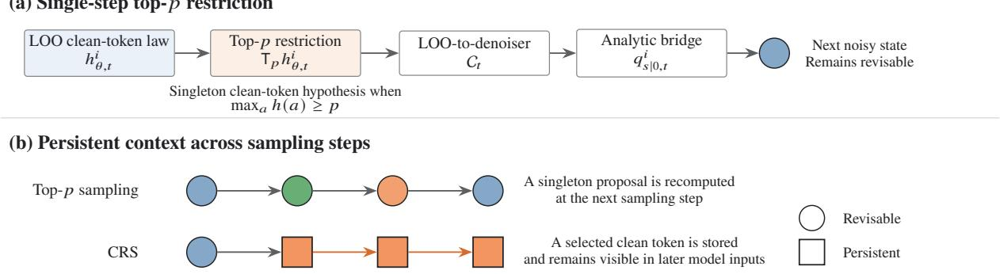
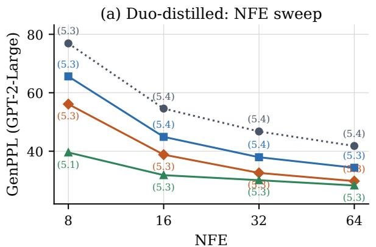
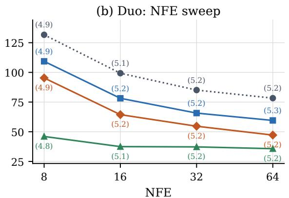
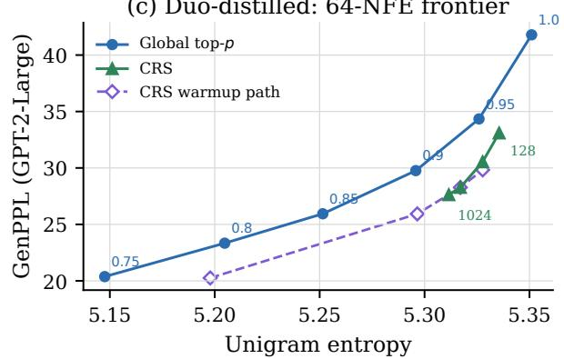
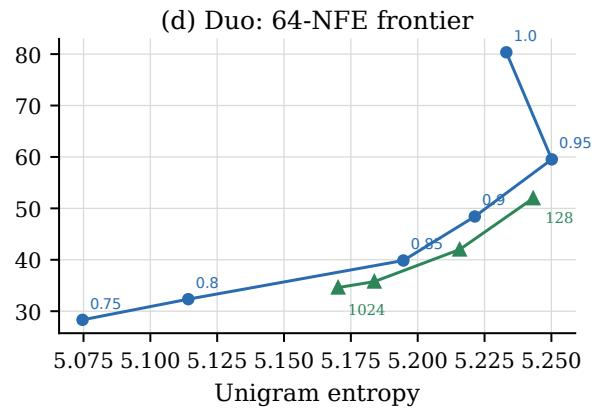
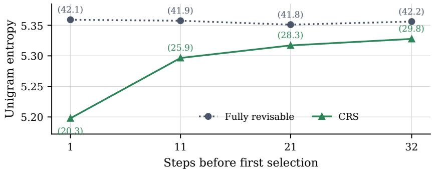
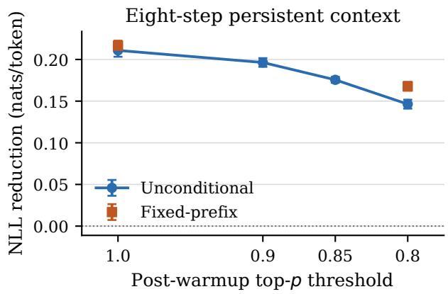
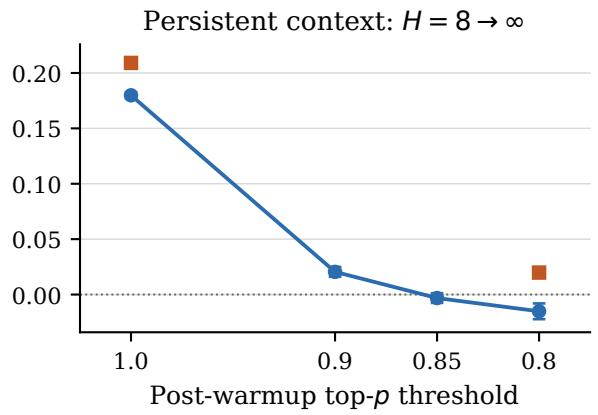
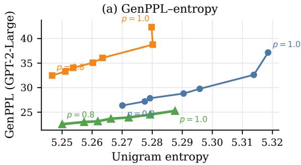
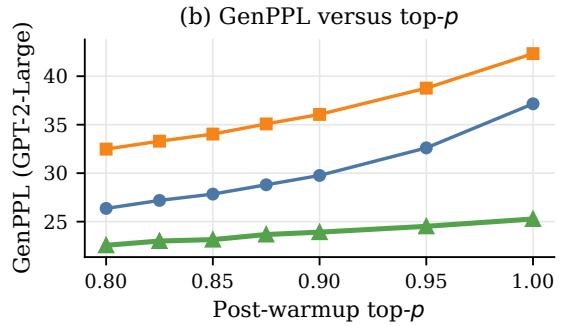

# FROM TRUNCATION TO COMMITMENT: PERSISTENT CONTEXT IN UNIFORM DISCRETE DIFFUSION

Satoshi Hayakawa The University of Tokyo hayakawa@mist.i.u-tokyo.ac.jp

## ABSTRACT

Uniform-state discrete diffusion models update all tokens in parallel while keeping every position revisable. Even when the commonly used top-p rule leaves only one candidate at a position, that choice affects only the current reverse step and can be revised at the next sampling step. We ask what changes when selected hypotheses instead become persistent context for later predictions. We therefore propose committed reveal sampling (CRS), a training-free sampler that stores selected argmax tokens and inserts them into subsequent model inputs. Our analysis gives a rationale for selecting later and for keeping selected tokens visible. Under the exact forward process, the Bayes error of selecting a clean token cannot increase as noise decreases, while in a simple latent-mode model, keeping the selected token visible helps later parallel predictions agree on the same sequencelevel choice. Empirically, paired experiments on Duo-distilled then separate this persistent effect from single-step top-p restriction and scalar temperature scaling. Under the same finalization rule, CRS without top-p truncation reaches lower generative perplexity (GenPPL) than fixed p = 0.95 and p = 0.9 baselines across budgets of 8–64 function evaluations (NFE). At 64 NFE, the comparison at matched unigram entropy also gives lower GenPPL for CRS, yielding a more favorable GenPPL– entropy tradeoff. Base Duo shows the same direction in a descriptive comparison, while other diversity and continuation metrics can rank these operating points differently. These results identify support restriction and persistent context as distinct controls of that tradeoff.

## 1 Introduction

Discrete diffusion models generate a sequence through repeated parallel token updates (Austin et al., 2021; Campbell et al., 2022; Lou et al., 2024; Sahoo et al., 2024). Masked models gradually replace an absorbing mask with visible tokens, and each reveal supplies context to later updates and fixes part of the generation order (Chang et al., 2022; Hayakawa et al., 2026). In contrast, uniform-state models such as Duo use vocabulary symbols as noisy states and keep every position revisable (Sahoo et al., 2025). Such revisability supports continued sequence-wide revision, but removes the explicit record of earlier decisions.

In practice, uniform samplers often restrict their predictions over clean tokens before each reverse update. The released Duo sampler uses top-p, or nucleus, sampling to restrict its clean-token predictions before each reverse update (Holtzman et al., 2020; Deschenaux et al., 2026). Top-p narrows the clean-token support used by a single update. Late in the reverse process, this support often becomes a singleton, but even then the selected label is not a reveal: it is used for that update only, and the next sampling step recomputes its prediction from a revisable noisy state.

This temporal limitation motivates committed reveal sampling (CRS), which uses selected clean-token hypotheses as persistent context. CRS is a sampling algorithm for frozen model parameters that wraps the positionwise uniformdiffusion denoiser. After a warmup with the native revisable sampler, it selects positions with concentrated predictions, stores their argmax tokens, and writes those tokens into later model inputs; unselected positions continue to follow the native sampler.

The central intuition is that parallel updates can combine individually plausible tokens from incompatible sequence-level alternatives. A reliable visible token can reduce this ambiguity and steer later predictions toward the same alternative, whereas an incorrect selection can steer them toward the wrong one. This raises two questions: when should a token be selected, and how does keeping it visible affect later predictions?

We study these questions theoretically and empirically. Theoretically, under the exact forward process, the optimal clean token selection error cannot increase as noise decreases, providing a reason for the initial warmup phase; a latent-mode analysis then shows how persistent visibility can coordinate later predictions around the selected alternative. Empirically, paired experiments compare CRS with top-p samplers and measure the resulting tradeoff between generative perplexity (GenPPL) and unigram entropy across compute budgets on the base and distilled Duo checkpoints (Sahoo et al., 2025).

The paper makes three contributions.

1. Persistence and support restriction. We distinguish the support restriction induced by top-p, which applies only to the current sampling step, from persistent context that remains visible in later steps. This distinction motivates CRS, which uses selected clean-token hypotheses as persistent context to guide later token predictions.

2. Theoretical analysis. Our analysis provides a rationale for two design choices in CRS: warmup phase before token selection and keeping selected tokens visible afterward. Under the exact forward process, waiting until the state is less noisy cannot increase the optimal clean-token selection error (Proposition 2). In a simple latent-mode model, persistent visible context helps later positionwise predictions favor the same sequence-level alternative (Theorem 1).

3. Experiments. Under a common finalization rule, CRS without top-p truncation has lower GenPPL than fixed global p ∈ {0.95, 0.9} baselines on Duo-distilled across 8–64 NFE. Base Duo shows the same ordering in a descriptive comparison. At 64 NFE, matched-entropy comparisons also favor CRS on Duo-distilled.

## 2 Related Work

Uniform-state discrete diffusion. Duo and its leave-one-out (LOO) analysis define the uniform reverse interface used here (Sahoo et al., 2025; Gourevitch et al., 2026). Deschenaux et al. (2026) report Duo top-p sweeps with an ancestral endpoint while developing predictor–corrector samplers. Our study asks a different question: we compare support restriction applied only in the current sampling step with persistent context visible in later steps, using the same coordinatewise argmax decoder in the final step for all methods. Because the endpoint protocols differ, the resulting values are not directly comparable.

Joint distribution modeling. The native parallel interface constructs each update from a product of coordinatewise predictions; we refer to this interface as a product denoiser. Prior work enriches this interface through correlation-aware mixtures, energy corrections, coupled transitions, or auxiliary simplex-valued reverse states (Hayakawa et al., 2025; Xu et al., 2025; Li et al., 2026; Sakurai et al., 2026). These approaches modify the learned reverse process, its training procedure, or its state representation to capture dependencies beyond coordinatewise product predictions. CRS instead keeps the checkpoint fixed and changes the context available across sampling steps by exposing selected clean-token hypotheses to later denoiser inputs.

Masked diffusion and commitment. Masked diffusion turns an absorbing mask into visible clean tokens, so reveal order is part of the sampler (Sahoo et al., 2024; Shi et al., 2024). MaskGIT and later methods select or remask positions using confidence or entropy (Chang et al., 2022; Hayakawa et al., 2026; Ben-Hamu et al., 2025; Wang et al., 2025). Fast-dLLM commits confident tokens for parallel decoding and cache reuse (Wu et al., 2026), while deferred commitment postpones uncertain blockwise decisions (Shu et al., 2026). Other policies use future self-consistency, trajectory stability, or coordination among dependent token values to determine which token predictions to commit and when (Wang et al., 2026b; Sun et al., 2026; Wang et al., 2026a; Yao, 2026). CRS asks a different question: what happens when a stored clean-token hypothesis remains visible across steps in an otherwise fully revisable uniform-state sampler?

Generalized and larger-scale models. The masked-diffusion view also underlies large-scale models such as LLaDA and Dream (Nie et al., 2025; Ye et al., 2025). GIDD generalizes discrete diffusion to interpolating kernels that can combine masking and uniform noise (von Rütte et al., 2025). Sumi scales a pure-uniform instantiation of this framework with a time-agnostic bidirectional Transformer (Ye et al., 2026). They provide a complementary testbed to our explicitly time-indexed Duo model and its LOO prediction interface. Extending persistent-context controls to that setting is a natural next step.

## 3 Uniform Reverse Sampling and Top-p Support Restriction

We first derive the native reverse interface and locate top-p within one reverse step. This identifies which clean-token distribution top-p restricts and why even a singleton choice is not carried explicitly into the next step. Section 4 then introduces persistent context at that interface

## 3.1 From the LOO law to the native reverse step

Let ${ \mathcal { S } } = \left[ V \right] = \{ 1 , . . . , V \}$ be the vocabulary and $[ L ] = \left\{ 1 , \dots , L \right\}$ be the set of positions. Let $q _ { 0 }$ be the data distribution on $\boldsymbol { \mathcal { S } ^ { L } }$ , and let $( X _ { t } ) _ { 0 \leq t \leq T }$ be a coordinatewise Markov forward process whose transition kernels belong to the uniform-corruption family. In particular, $X _ { 0 } \sim q _ { 0 }$ and $X _ { t } \mid X _ { 0 } \sim q _ { t \mid 0 } ( \cdot \mid X _ { 0 } )$ . For uniform corruption, this conditional law factorizes as

$$
q _ { t | 0 } ( \pmb { x } _ { t } \mid \pmb { x } _ { 0 } ) = \prod _ { i = 1 } ^ { L } q _ { t | 0 } ^ { i } ( x _ { t } ^ { i } \mid x _ { 0 } ^ { i } ) , \qquad q _ { t | 0 } ^ { i } ( z \mid x ) = ( 1 - \alpha _ { t } ) \mathbf { 1 } \{ z = x \} + \frac { \alpha _ { t } } { V } .\tag{1}
$$

Here $\alpha _ { t }$ is monotonically increasing, with $\alpha _ { t } = 0$ giving clean data and $\alpha _ { t } = 1$ giving uniform noise, and $\pmb { x } = ( x ^ { i } ) _ { i = 1 } ^ { L }$ Let $\pmb { x } ^ { - i }$ denote the sequence with coordinate i removed.

For $0 \leq \alpha _ { s } < \alpha _ { t } \leq 1$ , Markov consistency requires $\begin{array} { r } { q _ { t \vert 0 } ^ { i } ( z \mid x ) = \sum _ { y } q _ { t \vert s } ^ { i } ( z \mid y ) q _ { s \vert 0 } ^ { i } ( y \mid x ) } \end{array}$ . Since uniform channels are closed under composition, $q _ { t \mid s }$ is given as

$$
q _ { t | s } ^ { i } ( z \mid y ) = ( 1 - \beta _ { t , s } ) \mathbf { 1 } \{ z = y \} + \frac { \beta _ { t , s } } { V } , \qquad \beta _ { t , s } = \frac { \alpha _ { t } - \alpha _ { s } } { 1 - \alpha _ { s } } .\tag{2}
$$

The reverse update also needs the earlier noisy token conditioned on both the clean token and the current noisy token. Bayes’ rule gives this exact coordinate bridge:

$$
q _ { s | 0 , t } ^ { i } ( y \mid x , z ) = \frac { q _ { s | 0 } ^ { i } ( y \mid x ) q _ { t | s } ^ { i } ( z \mid y ) } { q _ { t | 0 } ^ { i } ( z \mid x ) } .\tag{3}
$$

The released Duo model takes the full noisy sequence $\mathbf { \Delta } _ { \mathbf { \mathcal { X } } _ { t } }$ as input and outputs, at each coordinate i, a normalized categorical law $h _ { \theta , t } ^ { i } ( \cdot \mid x _ { t } )$ over clean labels (Sahoo et al., 2025). Subsequent analysis by Gourevitch et al. (2026) showed that the corresponding population target is the leave-one-out (LOO) conditional, which predicts the clean token at coordinate i from all other noisy coordinates:

$$
q _ { 0 \mid t } ^ { i } ( x \mid \pmb { x } _ { t } ^ { - i } ) : = \mathbb { P } ( X _ { 0 } ^ { i } = x \mid \pmb { X } _ { t } ^ { - i } = \pmb { x } _ { t } ^ { - i } ) = \mathbb { E } \Big [ q _ { 0 \mid t } ^ { i } ( x \mid \pmb { X } _ { t } ) \Big | \left. X _ { t } ^ { - i } = \pmb { x } _ { t } ^ { - i } \right] .\tag{4}
$$

We therefore interpret $h _ { \theta , t } ^ { i }$ as a learned approximation to this population target, while allowing a finite checkpoint to retain some dependence on the i-th coordinate of input x.

To use the LOO law in the reverse update, we first convert it to the ordinary denoising posterior. Bayes’ rule gives

$$
q _ { 0 | t } ^ { i } ( x \mid \pmb { x } _ { t } ) = \frac { q _ { 0 | t } ^ { i } ( x \mid \pmb { x } _ { t } ^ { - i } ) q _ { t | 0 } ^ { i } ( x _ { t } ^ { i } \mid x ) } { \sum _ { \bar { x } } q _ { 0 | t } ^ { i } ( \bar { x } \mid \pmb { x } _ { t } ^ { - i } ) q _ { t | 0 } ^ { i } ( x _ { t } ^ { i } \mid \bar { x } ) } = : \big ( \mathcal { C } _ { t , x _ { t } ^ { i } } q _ { 0 | t } ^ { i } ( \cdot \mid \pmb { x } _ { t } ^ { - i } ) \big ) ( x ) ,\tag{5}
$$

where, for any categorical law $h , ( \mathcal { C } _ { t , z } h ) ( x ) : = h ( x ) q _ { t | 0 } ^ { i } ( z \mid x ) / \sum _ { \bar { x } } h ( \bar { x } ) q _ { t | 0 } ^ { i } ( z \mid \bar { x } )$ . Indeed, conditional on $X _ { 0 } ^ { i } = x$ corruption at coordinate i is independent of $X _ { t } ^ { - i }$ and has law $q _ { t | 0 } ^ { i } ( \cdot | x )$

Finally, marginalizing the bridge under this ordinary denoising posterior gives the exact reverse marginal

$$
q _ { s | t } ^ { i } ( y \mid \mathbf { x } _ { t } ) = \sum _ { x } q _ { s | 0 , t } ^ { i } ( y \mid x , x _ { t } ^ { i } ) q _ { 0 | t } ^ { i } ( x \mid \mathbf { x } x _ { t } ) .\tag{6}
$$

The learned reverse transition $\pi _ { s \mid t }$ substitutes the converted learned law for the exact posterior:

$$
\pi _ { s | t } ^ { i } ( y \mid x _ { t } ) : = \sum _ { x } q _ { s | 0 , t } ^ { i } ( y \mid x , x _ { t } ^ { i } ) \big ( \mathcal { C } _ { t , x _ { t } ^ { i } } h _ { \theta , t } ^ { i } ( \cdot \mid x _ { t } ) \big ) ( x ) ,\tag{7}
$$

where the dependence on θ is omitted from $\pi _ { s \mid t }$ for simplicity. Equations (5) and (7) separate three objects: the learned law over clean labels, its local conversion to an ordinary denoising posterior, and the resulting learned reverse transition, from which the next noisy token is sampled.

## 3.2 Top-p in the LOO distribution

For a categorical law h, write $\textstyle h ( A ) : = \sum _ { a \in A } h ( a )$ and, whenever $h ( A ) > 0$

$$
( \mathsf T _ { A } h ) ( a ) : = \frac { h ( a ) \mathbf 1 \{ a \in A \} } { h ( A ) } .\tag{8}
$$

Sort the vocabulary as $h ( a _ { 1 } ) \geq \cdots \geq h ( a _ { V } )$ with a fixed tie rule. The top-p support induced by h is

$$
\mathsf T _ { p } h : = \mathsf T _ { A _ { p } ( h ) } h , \quad \mathrm { w h e r e ~ } A _ { p } ( h ) = \{ a _ { 1 } , \hdots , a _ { k _ { p } ( h ) } \} , \ k _ { p } ( h ) = \operatorname* { m i n } \Bigl \{ k : \sum _ { j = 1 } ^ { k } h ( a _ { j } ) \ge p \Bigr \} .\tag{9}
$$

Top-p acts within one reverse step by substituting ${ \sf T } _ { p } h$ for h in Equation (7) (Holtzman et al., 2020; Hewitt et al., 2022); the resulting transition samples the next noisy state (Figure 1(a)). Even when $A _ { p } ( h )$ is a singleton, its label is absent from the next denoiser input unless the noisy state happens to preserve it. Empirically, at 64 NFE on Duo-distilled with $p = 0 . 9$ , the top-p support is a singleton on 27.5% of active coordinate–step pairs overall and 45.6% in the final ten reverse steps (Appendix D.1).

The conversion in Equation (5) preserves hard support restriction. For every retained set A with positive normalizers, $\mathcal { C } _ { t , x _ { t } ^ { i } } ( \mathsf { T } _ { A } h ) \ = \ \big ( \mathcal { C } _ { t , x _ { t } ^ { i } } h \big ) ( \cdot \mathrm { ~  ~ \cdot ~ } \dot { A } )$ holds. Indeed, writing $Q \ = \ C _ { t , x _ { t } ^ { i } } h .$ , direct substitution gives $\mathcal { C } _ { t , x _ { t } ^ { i } } ( \mathsf { T } _ { A } h ) ( a ) \ =$ $Q ( { a } ) { \bf 1 } \{ a \in A \} / Q ( A )$ , which is $Q ( \cdot \mid A )$ . Thus top-p is hard support restriction at the clean-label interface used by the reverse bridge. In the singleton limit it makes a point decision for the current reverse step, while the state update can remain stochastic and the point label is recomputed at the next step.

(a) Single-step top-� restriction  
  
Figure 1: Support restriction and persistent context act at different points. Top-p restricts the clean-token distribution used by one reverse update. CRS stores selected clean tokens (squares) and inserts them into later denoiser inputs. Other positions remain revisable. Shape denotes whether a position remains revisable; colors illustrate current token values.

## 4 From Point Hypotheses to Persistent Context

Top-p can collapse the clean-token support in one reverse step to a point, but does not retain that hypothesis as explicit context: the next denoiser receives only the updated noisy state. A persistent sampler instead keeps selected clean-token values explicit in later denoiser inputs. CRS does so while leaving all unselected positions revisable, paralleling the use of revealed tokens as later context in masked diffusion (Chang et al., 2022; Hayakawa et al., 2026).

## 4.1 Committed reveal sampling

Let $C \subset [ L ]$ be the selected coordinates and $\pmb { c } = ( c _ { i } ) _ { i \in C }$ their stored labels. We write $\pmb { x } [ C \gets \pmb { c } ]$ for replacing those coordinates in a model input. During an initial warmup phase, CRS runs the native sampler without storing labels. It then distributes a total confidence-deficit budget $D _ { \mathrm { m a x } }$ over the remaining steps. Selecting coordinate i incurs the deficit $1 - \operatorname* { m a x } _ { a } h _ { \theta , t } ^ { i } ( a \mid \widetilde { \pmb { x } } _ { t } )$ . After the warmup phase, each sampling step of CRS is as follows:

1. evaluate the denoiser on $\widetilde { \pmb { x } } _ { t } : = \pmb { x } _ { t } [ C  { \pmb { c } } ]$ , so labels stored in earlier steps are visible;

2. use this output for the native reverse transition, scan the currently unselected coordinates from highest to lowest confidence, and greedily select a spatially separated batch within the budget allocated to that step; and

3. store the argmax label at each newly selected coordinate and update $( C , \pmb { c } )$ , making the selected labels visible in subsequent denoiser evaluations.

We form each batch using a fixed local-exclusion rule; Appendix A gives the exact constraint and connects it to spatially dispersed scheduling (Besnier et al., 2025; Hayakawa et al., 2026). For each selected coordinate, CRS stores the argmax of its clean-token prediction. This value coincides with the unique retained token whenever top-p produces a singleton support. More generally, argmax is the deterministic choice that minimizes coordinatewise Hamming risk under the denoiser output:

$$
\arg \operatorname* { m i n } _ { c \in S } \mathbb { E } _ { X \sim h } [ { \bf 1 } \{ X \neq c \} ] = \arg \operatorname* { m a x } _ { c \in S } h ( c ) .\tag{10}
$$

Sampling from the top-p-restricted distribution when its support is not a singleton, and then storing that draw, would combine token-sampling randomness with contextual feedback. CRS therefore uses argmax to isolate the latter. Indeed, at $p = 0 . 9$ and 64 NFE it matches top-p on the 45.6% of active coordinate–step pairs with singleton support in the final ten reverse steps, and Equation (10) gives its coordinatewise Hamming-risk justification otherwise. The full selector and pseudocode, together with experiments that limit how long stored labels remain visible, appear in Appendix A.

Common final-step decoder. The released Duo sampler uses an ancestral endpoint (Sahoo et al., 2025; Deschenaux et al., 2026). To compare support restriction and persistent context under a shared output rule, our experiments instead count a coordinatewise argmax readout as the final one of N sampling steps. Each step uses one denoiser evaluation, so NFE is $N$ . Let $\pmb { x } _ { \varepsilon }$ be the last noisy state on the grid $t _ { 0 } > \cdot \cdot \cdot > t _ { N - 1 } = \varepsilon > 0$ . The first $N - 1$ steps produce stochastic reverse transitions, and the final step returns $\widehat { x } ^ { i } = \arg \operatorname* { m a x } _ { a \in S } h _ { \theta , \varepsilon } ^ { i } ( a \mid \widetilde { \pmb { x } } _ { \varepsilon } )$ at every generated coordinate This comparison protocol uses the model’s clean-token output directly rather than sampling another reverse transition.

For $A \subseteq C .$ , let $\pmb { c } | _ { A } = ( c _ { i } ) _ { i \in A }$ denote the corresponding restriction of the stored labels. For CRS, $\begin{array} { r } { \pmb { \mathcal { x } } _ { \varepsilon } = \pmb { x } _ { \varepsilon } [ C _ { \mathrm { v i s } }  } \end{array}$ $c | _ { C _ { \mathrm { v i s } } } ]$ , where $C _ { \mathrm { v i s } } \subseteq C$ indexes coordinates with stored labels still visible. The selected tokens appear in this final model input but are never copied directly to the output. We restore fixed conditioning positions separately.

## 4.2 Why persistent context can coordinate parallel updates

Parallel product updates can combine individually plausible tokens from incompatible sequence-level alternatives. Correlation-aware denoisers and joint transitions address this by modifying dependence within a step (Hayakawa et al., 2025; Xu et al., 2025; Li et al., 2026). CRS instead retains a product output and changes later predictions through visible context.

To isolate this effect, consider two binary coordinates with clean law $Q _ { \eta } = ( 1 - \eta ) \delta _ { 0 0 } + \eta \delta _ { 1 1 }$ for $0 < \eta < 1 / 2$ . The product of its marginals assigns total mass $2 \eta ( 1 - \eta )$ to the hybrid strings 01 and 10, while $Q _ { \eta }$ assigns them zero mass. For $X = ( X ^ { 1 } , X ^ { 2 } ) \sim Q _ { \eta } ,$ coordinatewise argmax selects 00, with sequence-level error $\mathbb { P } ( X \neq 0 0 ) = \eta$ . If a selected value $c _ { 1 } \in \{ 0 , 1 \}$ remains visible at the first coordinate, then $Q _ { \eta } ( X ^ { 2 } = c _ { 1 } \ \vert \ X ^ { 1 } = c _ { 1 } ) = 1 ;$ the other coordinate is symmetric. Persistence, rather than argmax alone, carries this mode evidence into later predictions.

We now generalize this mechanism. Let a latent mode $M \in [ K ]$ have prior weights $w _ { m } = \mathbb { P } ( M = m )$ . Conditional on $M = m$ , let the future coordinates $Y = ( Y _ { 1 } , \ldots , Y _ { n } )$ be independent, with laws $P _ { m , i }$ . Define

$$
Q _ { \mathrm { m i x } } ^ { w } ( y ) = \sum _ { m = 1 } ^ { K } w _ { m } \prod _ { i = 1 } ^ { n } P _ { m , i } ( y _ { i } ) , \qquad Q _ { \mathrm { p r o d } } ^ { w } ( y ) = \prod _ { i = 1 } ^ { n } \sum _ { m = 1 } ^ { K } w _ { m } P _ { m , i } ( y _ { i } ) .\tag{11}
$$

The mixture uses one shared mode, whereas the product law independently remixes its coordinate marginals. Here $D _ { \mathrm { K I } }$ denotes Kullback–Leibler (KL) divergence, TC denotes total correlation (Watanabe, 1960), a standard measure of residual multivariate dependence whose conditional variants have also been used in discrete diffusion (Yoo et al., 2025), and En $\begin{array} { r } { \mathrm { ~ : ~ } w \rangle : = - \sum _ { m } w _ { m } \log w _ { m } } \end{array}$ . We also write $h _ { 2 } ( a ) : = - a \log a - ( 1 - a ) \log ( 1 - a )$

Theorem 1 (Shared-mode coordination). For the laws in Equation (11),

$$
D _ { \mathrm { K L } } ( Q _ { \mathrm { m i x } } ^ { w } \parallel Q _ { \mathrm { p r o d } } ^ { w } ) = \mathrm { T C } _ { Q _ { \mathrm { m i x } } ^ { w } } ( Y _ { 1 } , \ldots , Y _ { n } ) \leq ( n - 1 ) \mathrm { E n t } ( w ) .\tag{12}
$$

Let U be visible context with $Y \perp \perp \boldsymbol { U } \mid \boldsymbol { M } .$ For any positive-probability value $u ,$ let $\begin{array} { r } { w _ { m } [ u ] = { \mathbb P } ( M = m \mid U = u ) } \end{array}$ and $\epsilon ( u ) : = 1 - \operatorname* { m a x } _ { m } w _ { m } [ u ]$ . Then

$$
D _ { \mathrm { K L } } ( Q _ { \mathrm { m i x } } ^ { w [ u ] } \parallel Q _ { \mathrm { p r o d } } ^ { w [ u ] } ) \le ( n - 1 ) \{ h _ { 2 } ( \epsilon ( u ) ) + \epsilon ( u ) \log ( K - 1 ) \} .\tag{13}
$$

Appendix C.1 gives the proof. A mode-consistent visible label concentrates $w [ u ]$ and drives the bound toward zero; a poor label can instead favor the wrong mode. The appendix gives an explicit likelihood-ratio condition and extends the calculation to combined support restriction and persistent evidence (Appendix C.2).

## 4.3 Why wait before selecting tokens?

The CRS warmup introduced in Section 4.1 changes two quantities: it can make the selected value more reliable, and it leaves fewer later steps in which that value can affect the path, a tension also reflected in recent confidence- and trajectory-based commitment policies (Shu et al., 2026; Sun et al., 2026). The following proposition isolates the first effect at an exact forward state. For coordinate i, define the oracle LOO Hamming Bayes risk at noise level t by

$$
\mathcal { R } _ { t } ^ { i } : = \mathbb { E } \bigg [ 1 - \operatorname* { m a x } _ { a \in \mathcal { S } } q _ { 0 | t } ^ { i } \big ( a \mid X _ { t } ^ { - i } \big ) \bigg ] .\tag{14}
$$

Proposition 2 (Lower noise weakly reduces oracle selection error). For the coordinate-factorized uniformforward process and noise levels $0 \leq \alpha _ { s } < \dot { \alpha } _ { t } \leq 1 , \mathcal { R } _ { s } ^ { i } \leq \mathcal { R } _ { t } ^ { i }$ for every coordinate i.

Appendix B.1 gives the proof. Additional corruption maps $X _ { s } ^ { - i }$ to $X _ { t } ^ { - i }$ , so the cleaner context can simulate any predictor based on the noisier one. The proposition concerns the exact posterior; in practice, we rank positions using the learned model’s confidence deficit. Changing the warmup also changes how many later steps can use a selected token, so the comparison in Figure 3 measures both effects together.

## 5 Experiments

We use the public Duo-distilled and base Duo checkpoints (Sahoo et al., 2025) to study two questions. First, how do top-p and CRS trade generative quality for entropy across compute budgets? Second, what do paired controls reveal about the effect of persistent context on later predictions? All end-to-end comparisons use argmax decoding in the final step, and each policy generates its own trajectory. Following prior discrete-diffusion studies (Hayakawa et al., 2025, 2026), our main quality metric is GenPPL = exp(GenNLL), where GenNLL is the mean next-token negative log-likelihood assigned to generated samples by GPT-2-Large (Radford et al., 2019). In the main text, we use mean within-sequence unigram entropy as the diversity axis. Appendix D reports complementary diversity and repetition metrics, full configurations, experiments that limit how long selected labels remain visible, and all uncertainties.

## 5.1 How does the tradeoff change with NFE?

Panels (a)–(b) of Figure 2 plot GenPPL against NFE while holding four procedures fixed. On Duo-distilled, CRS with top-p disabled $( p = 1 . 0 )$ has lower GenPPL throughout the tested NFE range than native sampling with $p \in$ {1.0, 0.95, 0.9}. Base Duo shows the same ordering of point estimates in a descriptive, protocol-aligned comparison. Appendix D.2 gives estimates and uncertainties.

(c) Duo-distilled: 64-NFE frontier  

  
Figure 2: GenPPL across NFE (a–b) and 64-NFE GenPPL–entropy comparisons (c–d), all with argmax decoding in the final step. Parentheses in (a–b) give unigram entropy. Panels (c–d) sweep global top-p and the CRS selection budget; open diamonds in (c) show the $\bar { D } _ { \mathrm { m a x } } = \mathbf { \bar { 5 } } 1 2$ warmup path used in Figure 3. Appendix D.2 gives the complete grids and uncertainties.

Note that our base-Duo top-p values differ from those reported by Deschenaux et al. (2026) because their final step samples ancestrally, whereas ours uses argmax decoding for every method. In a paired 32-NFE audit that fixes all earlier reverse steps, changing only the final step back to ancestral sampling recovers their reported range for $p \in \{ 1 . 0 , 0 . 9 \}$ Figure 2 therefore compares the methods under our common argmax final step. Appendix D.2 gives the paired values.

## 5.2 What changes when selected tokens remain visible?

Three controls show that the path change depends on the inserted token values and cannot be reduced to position selection or scalar temperature. Replacing stored argmax labels by nearby alternatives reverses the likelihood gain, so selected positions alone are insufficient. At the same mutable state, the best scalar-temperature fit leaves $7 9 . 4 \pm \bar { 2 } . 1 \%$ of the pooled KL shift unexplained, and the top-ranked token changes on $3 0 . 2 \pm 0 . 8 \%$ of audited coordinates. Restoring one selected coordinate to its revisable input leaves the surrounding state predictive of that label, indicating that its information has propagated to other coordinates. Appendix E gives these estimates. Appendices D.8 and D.7 test direct output copying and vary how many later steps can see each selected label.

How do the checkpoints differ? At each shared uniform-forward state, we apply the same CRS position-selection rule and budget separately to the two checkpoints. The resulting selected-coordinate sets overlap only moderately. Conditional on a fixed set of selected coordinates, however, the checkpoints almost always predict the same argmax labels and attain nearly identical clean-label accuracy. Duo-distilled mainly differs by selecting positions with slightly lower oracle error. This shared-state audit therefore localizes a checkpoint difference in CRS position selection. Appendix D.3 gives the factorial and calibration details.

What changes when selection starts later? On exact uniform-forward states, selected-label error falls steadily as noise decreases, consistent with Proposition 2. The sampler-level sweep varies how many steps precede selection. Later selection recovers unigram entropy while retaining a substantial likelihood gain, and all four warmup endpoints lie below the matched global top-p curve in Figure 2(c). Appendix D.4 gives uncertainties, controls that vary how many later steps see each selected label, and sequence-level metrics.

  
Figure 3: The CRS tradeoff as selection starts later at 64 NFE. Ticks give steps before first selection; parentheses give GenPPL. Appendix D.4 gives uncertainties and controls that vary how many later steps see each selected label.

## 5.3 Are support restriction and persistent context interchangeable?

Panels (c–d) of Figure 2 compare CRS budget sweeps with global top-p at 64 NFE. Across the overlapping entropy region, the CRS curve lies below the global curve on Duo-distilled; base Duo shows the same direction in a descriptive comparison. After matching entropy within each shard, CRS at $D _ { \mathrm { m a x } } = 5 1 2$ lowers GenNLL by 0.154 ± 0.031 nats per token. Appendices D.2 and E report the frontier values, uncertainties, and interpolation rule. Global top-p has lower repeated 4-gram fraction (Rep-4) (Welleck et al., 2020); in fixed-prefix continuation, GPT-2 favors applying $p = 0 . 8$ at every step, whereas Pythia (Biderman et al., 2023) does not distinguish the two within uncertainty.

The curves overlap in places, but the samplers reach them differently: top-p truncates the distribution used at each current step, whereas CRS carries selected tokens into later model inputs. Delaying selection then moves CRS along its GenPPL–entropy curve. Rep-4 and fixed-prefix likelihood rank some of these operating points differently.

## 6 Concluding Remarks

CRS turns selected clean-token hypotheses into context for later steps, whereas top-p restricts only the distribution used at the current step. Our analysis gives the two stages different roles: waiting weakly improves oracle token selection, while keeping a selected token visible can steer later product predictions toward the same mode.

Across 8–64 NFE under the same argmax final step, CRS with top-p disabled (p = 1.0) achieves lower GenPPL than the fixed $p \in \{ 0 . 9 5 , 0 . 9 \}$ baselines on both checkpoints. At 64 NFE, varying its selection budget gives lower GenPPL at matched entropy on Duo-distilled; a separate base-Duo comparison shows the same trend. This advantage is specific to the GenPPL–entropy comparison: Rep-4 and fixed-prefix likelihood can rank the operating points differently. Future work should test larger checkpoints and other uniform-state architectures.

## Acknowledgments

The author thanks Chunsan Hong for helpful comments and pointers to relevant literature. The author received access to ChatGPT and Codex through OpenAI’s ChatGPT for Academic Researchers program.

## References

Jacob Austin, Daniel D. Johnson, Jonathan Ho, Daniel Tarlow, and Rianne van den Berg. Structured denoising diffusion models in discrete state-spaces. In Advances in Neural Information Processing Systems, volume 34, pages 17981–17993, 2021.

Heli Ben-Hamu, Itai Gat, Daniel Severo, Niklas S Nolte, and Brian Karrer. Accelerated sampling from masked diffusion models via entropy bounded unmasking. In Advances in Neural Information Processing Systems, volume 38, pages 55981–56007, 2025.

Victor Besnier, Mickael Chen, David Hurych, Eduardo Valle, and Matthieu Cord. Halton scheduler for masked generative image transformer. In The Thirteenth International Conference on Learning Representations, 2025. URL https://openreview.net/forum?id=RDVrlWAb7K.

Stella Biderman, Hailey Schoelkopf, Quentin Gregory Anthony, Herbie Bradley, Kyle O’Brien, Eric Hallahan, Mohammad Aflah Khan, Shivanshu Purohit, Usvsn Sai Prashanth, Edward Raff, Aviya Skowron, Lintang Sutawika, and Oskar Van Der Wal. Pythia: A suite for analyzing large language models across training and scaling. In Proceedings ofthe 40th International Conference on Machine Learning, pages 2397–2430, 2023.

Andrew Campbell, Joe Benton, Valentin De Bortoli, Thomas Rainforth, George Deligiannidis, and Arnaud Doucet. A continuous time framework for discrete denoising models. In Advances in Neural Information Processing Systems, volume 35, pages 28266–28279, 2022.

Huiwen Chang, Han Zhang, Lu Jiang, Ce Liu, and William T. Freeman. Maskgit: Masked generative image transformer. In Proceedings ofthe IEEE/CVF Conference on Computer Vision and Pattern Recognition (CVPR), pages 11315– 11325, 2022.

Boxing Chen and Colin Cherry. A systematic comparison of smoothing techniques for sentence-level BLEU. In Proceedings ofthe Ninth Workshop on Statistical Machine Translation, pages 362–367, 2014.

Justin Deschenaux, Caglar Gulcehre, and Subham Sekhar Sahoo. The diffusion duality, chapter II: Ψ-samplers and efficient curriculum. In The Fourteenth International Conference on Learning Representations, 2026. URL https://openreview.net/forum?id=RSIoYWIzaP.

Aaron Gokaslan, Vanya Cohen, Ellie Pavlick, and Stefanie Tellex. Openwebtext corpus. http://Skylion007. github.io/OpenWebTextCorpus, 2019.

Samson Gourevitch, Yazid Janati, Dario Shariatian, Umut Simsekli, Eric Moulines, Eric P Xing, and Alain Durmus. Uniform diffusion models revisited: Leave-one-out denoiser and absorbing state reformulation. arXiv preprint arXiv:2605.22765, 2026.

Satoshi Hayakawa, Yuhta Takida, Masaaki Imaizumi, Hiromi Wakaki, and Yuki Mitsufuji. Distillation of discrete diffusion through dimensional correlations. In Proceedings of the 42nd International Conference on Machine Learning, pages 22259–22297, 2025.

Satoshi Hayakawa, Yuhta Takida, Masaaki Imaizumi, Hiromi Wakaki, and Yuki Mitsufuji. Demystifying maskGIT sampler and beyond: Adaptive order selection in masked diffusion. Transactions on Machine Learning Research, 2026. URL https://openreview.net/forum?id=mKlW68i2Ig.

John Hewitt, Christopher Manning, and Percy Liang. Truncation sampling as language model desmoothing. In Findings of the Association for Computational Linguistics: EMNLP 2022, pages 3414–3427, 2022.

Ari Holtzman, Jan Buys, Li Du, Maxwell Forbes, and Yejin Choi. The curious case of neural text degeneration. In The Eighth International Conference on Learning Representations, 2020. URL https://openreview.net/forum? id=rygGQyrFvH.

Ian Li, Zilei Shao, Benjie Wang, Rose Yu, Guy Van den Broeck, and Anji Liu. Breaking the factorization barrier in diffusion language models. In Proceedings of the 43rd International Conference on Machine Learning, 2026.

Jiwei Li, Michel Galley, Chris Brockett, Jianfeng Gao, and Bill Dolan. A diversity-promoting objective function for neural conversation models. In Proceedings of the 2016 Conference of the North American Chapter of the Association for Computational Linguistics: Human Language Technologies, pages 110–119, 2016.

Aaron Lou, Chenlin Meng, and Stefano Ermon. Discrete diffusion modeling by estimating the ratios of the data distribution. In Proceedings ofthe 41st International Conference on Machine Learning, pages 32819–32848, 2024.

Shen Nie, Fengqi Zhu, Zebin You, Xiaolu Zhang, Jingyang Ou, Jun Hu, Jun Zhou, Yankai Lin, Ji-Rong Wen, and Chongxuan LI. Large language diffusion models. In Advances in Neural Information Processing Systems, volume 38, pages 50608–50646, 2025.

Kishore Papineni, Salim Roukos, Todd Ward, and Wei-Jing Zhu. BLEU: A method for automatic evaluation of machine translation. In Proceedings of the 40th Annual Meeting of the Association for Computational Linguistics, pages 311–318, 2002.

Matt Post. A call for clarity in reporting BLEU scores. In Proceedings ofthe Third Conference on Machine Translation: Research Papers, pages 186–191, 2018.

Alec Radford, Jeffrey Wu, Rewon Child, David Luan, Dario Amodei, and Ilya Sutskever. Language models are unsupervised multitask learners. Technical report, OpenAI, 2019. URL https://cdn.openai.com/ better-language-models/language\_models\_are\_unsupervised\_multitask\_learners.pdf.

Subham Sekhar Sahoo, Marianne Arriola, Yair Schiff, Aaron Gokaslan, Edgar Marroquin, Justin T Chiu, Alexander Rush, and Volodymyr Kuleshov. Simple and effective masked diffusion language models. In Advances in Neural Information Processing Systems, volume 37, pages 130136–130184, 2024.

Subham Sekhar Sahoo, Justin Deschenaux, Aaron Gokaslan, Guanghan Wang, Justin T Chiu, and Volodymyr Kuleshov. The diffusion duality. In Proceedings of the 42nd International Conference on Machine Learning, pages 52584–52619, 2025.

Jinya Sakurai, Patrick Pynadath, Satoshi Hayakawa, Jaehong Yoon, Xulei Yang, Nancy F. Chen, and Xun Xu. Simplex relaxation for discrete diffusion. arXiv preprint arXiv:2608.10615, 2026.

Jiaxin Shi, Kehang Han, Zhe Wang, Arnaud Doucet, and Michalis Titsias. Simplified and generalized masked diffusion for discrete data. In Advances in Neural Information Processing Systems, volume 37, pages 103131–103167, 2024.

Yingte Shu, Yuchuan Tian, Chao Xu, Yunhe Wang, and Hanting Chen. Deferred commitment decoding for diffusion language models. arXiv preprint arXiv:2601.02076, 2026.

Bohang Sun, Max Zhu, Francesco Caso, Jindong Gu, Junchi Yu, Philip Torr, Pietro Liò, and Jialin Yu. The path matters: Learning a token-commitment policy for diffusion language models. arXiv preprint arXiv:2605.24697, 2026.

Dimitri von Rütte, Janis Fluri, Yuhui Ding, Antonio Orvieto, Bernhard Schölkopf, and Thomas Hofmann. Generalized interpolating discrete diffusion. In Proceedings ofthe 42nd International Conference on Machine Learning, pages 61810–61843, 2025.

Chengcheng Wang, Tingzhang Luo, Wenhao Li, Jianyuan Guo, and Chang Xu. TACG: Trajectory-aware commit gating for diffusion language model decoding. arXiv preprint arXiv:2607.03236, 2026a.

Danny Wang, Ruihong Qiu, and Zi Huang. When to commit? towards variable-size self-contained blocks for discrete diffusion language models. arXiv preprint arXiv:2604.23994, 2026b.

Guanghan Wang, Yair Schiff, Subham Sahoo, and Volodymyr Kuleshov. Remasking discrete diffusion models with inference-time scaling. In Advances in Neural Information Processing Systems, volume 38, pages 147282–147339, 2025.

Satosi Watanabe. Information theoretical analysis of multivariate correlation. IBM Journal ofResearch and Development, 4(1):66–82, 1960.

Sean Welleck, Ilia Kulikov, Stephen Roller, Emily Dinan, Kyunghyun Cho, and Jason Weston. Neural text generation with unlikelihood training. In The Eighth International Conference on Learning Representations, 2020. URL https://openreview.net/forum?id=SJeYe0NtvH.

Chengyue Wu, Hao Zhang, Shuchen Xue, Zhijian Liu, Shizhe Diao, Ligeng Zhu, Ping Luo, Song Han, and Enze Xie. Fast-dLLM: Training-free acceleration of diffusion LLM by enabling KV cache and parallel decoding. In The Fourteenth International Conference on Learning Representations, 2026. URL https://openreview.net/ forum?id=3Z3Is6hnOT.

Minkai Xu, Tomas Geffner, Karsten Kreis, Weili Nie, Yilun Xu, Jure Leskovec, Stefano Ermon, and Arash Vahdat. Energy-based diffusion language models for text generation. In The Thirteenth International Conference on Learning Representations, 2025. URL https://openreview.net/forum?id=sL2F9YCMXf.

Lin Yao. Don’t commit alone: Joint token commitment in diffusion language models. arXiv preprint arXiv:2607.04469, 2026.

Jiacheng Ye, Zhihui Xie, Lin Zheng, Jiahui Gao, Zirui Wu, Xin Jiang, Zhenguo Li, and Lingpeng Kong. Dream 7b: Diffusion large language models. arXiv preprint arXiv:2508.15487, 2025.

Mengyu Ye, Keito Kudo, Wataru Ikeda, Ryosuke Matsuda, Keisuke Sakaguchi, and Jun Suzuki. Sumi: Open uniform diffusion language model from scratch. arXiv preprint arXiv:2606.19005, 2026.

Jaehoon Yoo, Wonjung Kim, and Seunghoon Hong. ReDi: Rectified discrete flow. In Advances in Neural Information Processing Systems, volume 38, pages 81651–81683, 2025.

Kaiwen Zheng, Yongxin Chen, Hanzi Mao, Ming-Yu Liu, Jun Zhu, and Qinsheng Zhang. Masked diffusion models are secretly time-agnostic masked models and exploit inaccurate categorical sampling. In The Thirteenth International Conference on Learning Representations, 2025. URL https://openreview.net/forum?id=CTC7CmirNr.

Yaoming Zhu, Sidi Lu, Lei Zheng, Jiaxian Guo, Weinan Zhang, Jun Wang, and Yong Yu. Texygen: A benchmarking platform for text generation models. In Proceedings ofthe 41st International ACM SIGIR Conference on Research & Development in Information Retrieval, pages 1097–1100, 2018.

## A Committed Reveal and Finite Persistence

Let N be the total NFE and let $t _ { 0 } > \cdot \cdot \cdot > t _ { N - 1 } = \varepsilon > 0$ be the noisy-state grid. The first $N - 1$ sampling steps produce reverse transitions, and the final step is the common argmax decoder from Section 4. Let W be the number of warmup steps among the first $N - 1$ . For a requested warmup fraction $f ,$ the implementation sets $W = \mathrm { r o u n d } \{ f ( N - 1 ) \}$ and uses $R = \bar { N } - 1 - W$ post-warmup steps. At reverse step $r , \mathbf { \mathcal { x } } _ { t _ { \tau } }$ denotes the mutable noisy state and $C _ { r }$ the coordinates whose stored labels are currently visible. Our implementation uses an input-overwrite-only interface: it overwrites only the denoiser input,

$$
\widetilde { \pmb { x } } _ { r } = \pmb { x } _ { t _ { r } } [ C _ { r }  { \pmb { c } } | _ { C _ { r } } ] .
$$

It does not pin the noisy-state token used by the reverse transition. Thus, after any scheduled top- $\cdot p _ { r }$ restriction, the actual one-coordinate transition is

$$
\pi _ { t _ { r + 1 } | t _ { r } } ^ { i , \mathrm { o w } } ( y \mid \widetilde { \mathbf { x } } _ { r } ; x _ { t _ { r } } ^ { i } ) : = \sum _ { x } q _ { t _ { r + 1 } | 0 , t _ { r } } ^ { i } ( y \mid x , x _ { t _ { r } } ^ { i } ) \Big ( \mathcal { C } _ { t _ { r } , x _ { t _ { r } } ^ { i } } \mathsf { T } _ { p _ { r } } h _ { \theta , t _ { r } } ^ { i } ( \cdot \mid \widetilde { \mathbf { x } } _ { r } ) \Big ) ( x ) .\tag{15}
$$

The superscript “ow” denotes this input-overwrite interface. The semicolon separates the overwritten denoiser input from the mutable current-token argument: $h _ { \theta , t } ^ { i } ,$ sees $\widetilde { \pmb { x } } _ { r }$ , whereas the conversion and bridge in Equations (5) and (7) continue to use $\boldsymbol { x _ { t _ { r } } ^ { i } }$ . Here $\mathsf { T } _ { p _ { r } } h : = \mathsf { T } _ { A _ { p _ { r } } ( h ) } h$ and ${ \sf T } _ { 1 }$ is the identity. For each eligible coordinate,

$$
a _ { r } ^ { i } \in \arg \operatorname* { m a x } _ { a \in S } h _ { \theta , t _ { r } } ^ { i } ( a \mid \widetilde { \mathbf { x } } _ { r } ) , \qquad d _ { r } ^ { i } = 1 - h _ { \theta , t _ { r } } ^ { i } ( a _ { r } ^ { i } \mid \widetilde { \mathbf { x } } _ { r } ) .\tag{16}
$$

The canonical selector scans currently unselected coordinates in increasing $d _ { r } ^ { i }$ and greedily forms a within-step batch $S _ { r }$ . With fixed spacing radius $R _ { \mathrm { s p } }$ , every accepted batch satisfies

$$
| S _ { r } | \le K _ { r } , \qquad \sum _ { i \in S _ { r } } d _ { r } ^ { i } \le E _ { r } , \qquad | i - j | > R _ { \mathrm { s p } } \quad \mathrm { f o r ~ a l l ~ d i s t i n c t } \ : i , j \in S _ { r } .\tag{17}
$$

The spacing test is applied among coordinates newly selected at step r; coordinates stored at earlier steps are excluded from reselection but do not exclude their neighboring positions at later steps. This local-exclusion rule is a simple one-dimensional analogue of spatially dispersed unmasking in the Halton scheduler (Besnier et al., 2025). It also acts as a hard proxy for the spatial-dispersion term in the choose-then-sample decomposition of Proposition 4 in Hayakawa et al. (2026): confidence ordering favors low-uncertainty coordinates, while spacing prevents one batch from being spent entirely on nearby, potentially redundant positions. This connection motivates the fixed rule rather than identifying an optimal radius for language. The primary implementation distributes the path-total deficit budget and the sequence-length count budget uniformly over the R post-warmup steps:

$$
E _ { r } = D _ { \operatorname * { m a x } } / R , \qquad K _ { r } = \lceil L / R \rceil , \qquad r = W , \ldots , N - 2 .
$$

The deficit budgets are upper bounds rather than quotas. In the primary 64-NFE duration factorial, $K _ { r } = 2 5$ after warmup and $R _ { \mathrm { s p } } ^ { \mathrm { - } } = 4$ . Smaller deficit means that the denoiser output places more mass on its preferred label. The selector is a concentration controller rather than a calibrated estimate of target-token error.

Algorithm 1 Committed reveal with horizon H   
Require: checkpoint ${ \sf M } _ { \theta } ;$ total NFE N and grid $t _ { 0 } > \cdot \cdot \cdot > t _ { N - 1 } = \varepsilon > 0 ;$ warmup $W ;$ horizon $H \in \{ 0 , 1 , \ldots , \infty \}$ ; selector   
budgets $E _ { r }$ and count caps $K _ { r } ;$ top-p schedule $( p _ { r } )$ r   
1: sample ${ \pmb x } _ { t _ { 0 } }$ from the terminal uniform law   
2: $C \gets \emptyset ;$ stored labels $c \gets \emptyset ;$ expiry map $e \gets \emptyset ;$ previously selected set $B  \varnothing$   
3: for $r = 0 , \ldots , N - 2$ do   
4: $\mathbf { i f } \mathrm { 0 } < H < \infty$ then   
5: remove i from $C$ whenever $\boldsymbol { r } = \boldsymbol { e } _ { i }$   
6: end if   
7: $\pmb { \tilde { x } } _ { r } \gets \pmb { x } _ { t _ { r } } [ C \gets \pmb { c } | _ { C } ]$   
8: $h _ { r } \gets \mathsf { M } _ { \theta } ( \widetilde { \pmb { x } } _ { r } , t _ { r } )$   
9: $\mathbf { f } r \geq W$ and $H > 0$ then   
10: choose $S _ { r }$ from $[ L ] \setminus B$ using Equations (16)–(17)   
11: $c _ { i } \gets a _ { r } ^ { i } \mathrm { f o r } i \in S _ { r }$   
12: $\mathbf { i f } 0 < H < \infty$ then   
13: $e _ { i } \gets r + H + 1$ for $i \in S _ { r }$   
14: end if   
15: $C \gets C \cup S _ { r } ; B \gets B \cup S _ { r }$   
16: end if   
17: independently sample each updated $\boldsymbol { x } _ { t _ { r + 1 } } ^ { i }$ from Equation (15) ▷ the transition uses $\boldsymbol { x } _ { t _ { r } } ^ { i } ,$ , not $\widetilde { x } _ { r } ^ { i }$   
18: end for   
19: $\mathbf { i f } 0 < H < \infty$ then   
20: remove i from C whenever $N - 1 = e _ { i }$   
21: end if   
22: use the final step at $t _ { N - 1 }$ for the common argmax readout, with input $\pmb { x } _ { t _ { N - 1 } } [ C  \pmb { c } | _ { C } ]$

Newly stored labels do not alter the already computed transition at step r; they first enter the denoiser at step $r + 1$ With $e _ { i } = r + H + 1$ , a label selected at r is visible for exactly the next H steps (or all remaining steps if fewer remain). For $H = 0 ;$ , selection and storage are disabled and the algorithm is the no-storage revisable path under the supplied top-p schedule. For $H = \infty$ , no expiry occurs and the algorithm is CRS. In the finite-horizon factorial, an expired coordinate becomes revisable but remains in $B ,$ so it cannot be selected again. Thus $H = 8$ is a finite-persistence control lasting eight later steps, not a renewable policy.

## B Warmup as Lower-Risk Value Selection

## B.1 Proof of Proposition 2

For $s < t ,$ coordinatewise factorization of the forward kernel gives the Markov chain

$$
X _ { 0 } ^ { i } \longrightarrow X _ { s } ^ { - i } \longrightarrow X _ { t } ^ { - i } .
$$

Any decision rule based on $X _ { t } ^ { - i }$ can therefore be simulated from $X _ { s } ^ { - i }$ by first drawing a synthetic later state from $\begin{array} { r } { q _ { t | s } ^ { - i } : = \prod _ { j \neq i } q _ { t | s } ^ { j } } \end{array}$ , the product transition on the non-i coordinates. The joint law of that synthetic state and $X _ { 0 } ^ { i }$ is the same as the joint law of $X _ { t } ^ { - i }$ and $X _ { 0 } ^ { i }$ . Hence the best rule based on $X _ { s } ^ { - i }$ cannot have larger zero–one risk. The Bayes rule is the largest-probability LOO label, so $\mathcal { R } _ { s } ^ { i } \leq \mathcal { R } _ { t } ^ { i }$

## B.2 Illustration: warmup separates sequence modes

The proposition orders exact-law selection risks without assuming a particular data distribution. To make its sequencelevel consequence concrete, consider K candidate clean sequences $c _ { 1 } , \dotsc , c _ { K } \in { \mathcal { S } } ^ { L }$ with minimum Hamming separation

$$
\Delta : = \operatorname* { m i n } _ { z \neq z ^ { \prime } } d _ { H } ( c _ { z } , c _ { z ^ { \prime } } ) > 0 .
$$

Let the mode M be uniform on $[ K ]$ , set $X _ { 0 } = c _ { M }$ , and condition on $M = m _ { \star }$ , writing $c _ { \star } : = c _ { m , }$ . For a forwardcorrupted state $\mathbf { \nabla } _ { \mathbf { x } _ { s } , }$ put $d = d _ { H } ( \bar { \pmb { x } _ { s } } , \bar { \pmb { c } _ { \star } } )$ . Under the uniform channel,

$$
q _ { s | 0 } ( { \pmb x } _ { s } \mid c _ { z } ) = v _ { s } ^ { L - d _ { H } ( { \pmb x } _ { s } , c _ { z } ) } u _ { s } ^ { d _ { H } ( { \pmb x } _ { s } , c _ { z } ) } , \qquad v _ { s } = 1 - \alpha _ { s } + \frac { \alpha _ { s } } { V } , \quad u _ { s } = \frac { \alpha _ { s } } { V } .
$$

Because $v _ { s } > u _ { s }$ away from complete noise, equal-prior maximum-a-posteriori (MAP) decoding is nearest-Hamming decoding. For every competing $c _ { z }$ , the triangle inequality gives

$$
d _ { H } ( \pmb { x } _ { s } , \pmb { c } _ { z } ) \geq d _ { H } ( \pmb { c } _ { z } , \pmb { c } _ { \star } ) - d _ { H } ( \pmb { x } _ { s } , \pmb { c } _ { \star } ) \geq \Delta - d .
$$

Thus $d < \Delta / 2$ makes $c _ { \star }$ the unique nearest codeword and hence the unique MAP mode.

This mode decision also connects to the coordinatewise argmax used by CRS. Let $w _ { z } = \mathbb { P } ( M = z \ | \ X _ { s } = x _ { s } )$ suppose $w _ { \star } : = w _ { m _ { \star } } > 1 / 2$ , and define $\begin{array} { r } { R _ { w } ( a ) = \sum _ { z } w _ { z } d _ { H } \bar { ( } a , c _ { z } ) } \end{array}$ . The reverse triangle inequality yields

$$
R _ { w } ( a ) - R _ { w } ( c _ { \star } ) \geq ( 2 w _ { \star } - 1 ) d _ { H } ( a , c _ { \star } ) .\tag{18}
$$

The right-hand side is positive for every $a \neq c _ { \star }$ , proving uniqueness of the posterior-Hamming Bayes action. Because Hamming risk separates by coordinate, this action is also obtained by taking the clean-token posterior argmax at each coordinate.

The same model gives an explicit probability of entering this uniquely decodable region. Let

$$
r _ { s } = \frac { ( V - 1 ) \alpha _ { s } } { V }
$$

be the probability that one observed symbol differs from its clean symbol. Then $d _ { H } ( X _ { s } , c _ { \star } ) \sim \mathrm { B i n o m i a l } ( L , r _ { s } )$ . If $r _ { s } < \Delta / ( 2 L )$ , the standard binomial Chernoff bound gives

$$
\mathbb { P } \left( c _ { \star } \mathrm { ~ i s ~ n o t ~ t h e ~ u n i q u e ~ n e a r e s t { \cdot } H a m m i n g ~ m o d e } \mid c _ { \star } \right) \le \exp \left\{ - L d _ { \mathrm { b i n } } \left( \frac { \Delta } { 2 L } \bigg \| r _ { s } \right) \right\} ,\tag{19}
$$

where $d _ { \mathrm { b i n } } ( a \parallel b ) = a \log ( a / b ) + ( 1 - a ) \log ( ( 1 - a ) / ( 1 - b ) )$ . Thus lower noise both improves the general oracle-risk ordering in Proposition 2 and, in this separated-mode example, makes one coherent sequence mode more likely to be uniquely identifiable. The codebook calculation supplies a concrete sufficient condition, while the proposition itself provides the distribution-free exact-law comparison.

## C Shared-Mode Proof

## C.1 Proof of Theorem 1

We first make the conditional extension precise. Let $M \in [ K ]$ have $\mathbb { P } ( M = m ) = w _ { m }$ and suppose

$$
\mathbb { P } ( Y = y \mid M = m ) = \prod _ { i = 1 } ^ { n } P _ { m , i } ( y _ { i } ) .
$$

Let $U$ be a potential visible-context observation and assume $Y \perp \perp  { U } \mid M$ . For a realization $u ,$ define the context likelihood $\dot { L _ { m } } ( u ) : = \mathbb { P } ( U = u \mid M = m )$ . Whenever the denominator is positive, Bayes’ rule gives

$$
w _ { m } [ u ] : = \mathbb { P } ( M = m \mid U = u ) = { \frac { w _ { m } L _ { m } ( u ) } { \sum _ { \ell = 1 } ^ { K } w _ { \ell } L _ { \ell } ( u ) } } .\tag{20}
$$

The conditional-independence assumption is essential: without it, conditioning on arbitrary context can create dependence among the $Y _ { i }$ even when the mode is fixed.

The one-coordinate marginals of $Q _ { \mathrm { m i x } } ^ { w }$ are $\begin{array} { r } { Q _ { \operatorname* { m i x } , i } ^ { w } ( y _ { i } ) = \sum _ { m } w _ { m } P _ { m , i } ( y _ { i } ) } \end{array}$ , hence $\begin{array} { r } { Q _ { \mathrm { p r o d } } ^ { w } = \prod _ { i } Q _ { \mathrm { m i x } , i } ^ { w } } \end{array}$ . Therefore

$$
D _ { \mathrm { K L } } ( Q _ { \mathrm { m i x } } ^ { w } \parallel Q _ { \mathrm { p r o d } } ^ { w } ) = \sum _ { i } \mathrm { E n t } _ { Q _ { \mathrm { m i x } } ^ { w } } ( Y _ { i } ) - \mathrm { E n t } _ { Q _ { \mathrm { m i x } } ^ { w } } ( Y ) = : \mathrm { T C } _ { Q _ { \mathrm { m i x } } ^ { w } } ( Y _ { 1 } , \ldots , Y _ { n } ) .\tag{21}
$$

Using the chain rule and conditional independence given $M ,$

$$
\mathrm { T C } _ { Q _ { \operatorname* { m i x } } ^ { \infty } } ( Y _ { 1 } , \ldots , Y _ { n } ) = \sum _ { i = 2 } ^ { n } I ( Y _ { i } ; Y _ { < i } ) \leq \sum _ { i = 2 } ^ { n } I ( Y _ { i } ; M ) \leq ( n - 1 ) \mathrm { E n t } ( M ) = ( n - 1 ) \mathrm { E n t } ( w ) .\tag{22}
$$

Equation (20) and $Y \perp \perp \boldsymbol { U } \mid \boldsymbol { M }$ show that, after observing $U = u .$ , the law of Y has the same mixture-of-products form with w replaced by $w [ u ]$ . Thus $Q _ { \operatorname* { m i x } } ^ { w [ u ] }$ and $Q _ { \mathrm { p r o d } } ^ { w [ u ] }$ are precisely the two laws in Equation (11) evaluated at these posterior weights. Repeating the argument gives the conditional total-correlation bound. If $\epsilon ( u ) = 1 - \operatorname* { m a x } _ { m } w _ { m } [ u ]$ , separating the largest mode from the remaining $K - 1$ modes yields

$$
\begin{array} { r } { \operatorname { E n t } ( w [ u ] ) \leq h _ { 2 } ( \epsilon ( u ) ) + \epsilon ( u ) \log ( K - 1 ) , } \end{array}
$$

which proves Equation (13).

For completeness, a simple likelihood-ratio condition makes the concentration explicit. Fix a reference mode $m ^ { \star }$ with $w _ { m ^ { \star } } > 0$ and $L _ { m ^ { \star } } ( u ) \bar { > } 0$ , and put $\rho ( u ) : = \operatorname* { m a x } _ { m \neq m ^ { \star } } L _ { m } ( u ) / L _ { m ^ { \star } } ( u )$ . Summing posterior odds in Equation (20) gives

$$
\cfrac { 1 - w _ { m ^ { \star } } [ u ] } { w _ { m ^ { \star } } [ u ] } \leq \frac { 1 - w _ { m ^ { \star } } } { w _ { m ^ { \star } } } \rho ( u ) .\tag{23}
$$

Independent mode-consistent context observations multiply their likelihood ratios, so a uniform ratio below one makes this bound decay exponentially in the number of observations. This result quantifies coordination around the mode favored by the observed context, not whether that mode is the correct one. It also treats $U$ as an exogenous observation satisfying the stated conditional-independence model; the closed loop created when a sampler inserts its own argmax is assessed by the empirical controls in Appendix E.

## C.2 Support evidence and persistent evidence

The theorem treats visible labels as evidence about a shared mode. We now place one-step support restriction and later persistent context in the same posterior calculation. Condition throughout on the current reverse history, so the retained sets below are fixed. We use $\bar { U } _ { 1 : H }$ as an additive-evidence abstraction for the step-specific states encountered while selected context remains visible; it is not a model of independently observing the same stored token H times. Let $M \in [ K ]$ have prior weights $w _ { m } .$ . Conditional on $M = m$ , suppose a support-bearing vector $X = ( X _ { 1 } , \ldots , X _ { d } )$ has product law $\textstyle \prod _ { i } ^ { - } R _ { m , i } ,$ a future vector $Y = ( Y _ { 1 } , \ldots , Y _ { n } )$ has product law $\textstyle \operatorname { \prod } _ { j } P _ { m , j }$ , and visible-context observations $U _ { 1 } , \dots , U _ { H }$ are mutually independent. Assume that $X , Y$ , and $( U _ { e } ) _ { e = 1 } ^ { H }$ are mutually independent given M.

Fix a reference mode $m ^ { \star }$ and a retained rectangle $\textstyle A = \prod _ { i } A _ { i }$ . For m $\neq m ^ { \star }$ and a realization $u _ { 1 : H }$ , define

$$
S _ { m } ( A ) : = \sum _ { i } \log \frac { R _ { m ^ { \star } , i } ( A _ { i } ) } { R _ { m , i } ( A _ { i } ) } , \qquad T _ { m } ( u _ { 1 : H } ) : = \sum _ { e = 1 } ^ { H } \log \frac { \mathbb { P } ( U _ { e } = u _ { e } \mid M = m ^ { \star } ) } { \mathbb { P } ( U _ { e } = u _ { e } \mid M = m ) } .\tag{24}
$$

Assume that these likelihood ratios are finite and positive, and put

$$
S ( A ) : = \operatorname* { m i n } _ { m \neq m ^ { \star } } S _ { m } ( A ) , \qquad T ( u _ { 1 : H } ) : = \operatorname* { m i n } _ { m \neq m ^ { \star } } T _ { m } ( u _ { 1 : H } ) .\tag{25}
$$

Theorem 3 (Combined mode evidence). Let $w [ A , u ]$ be the posterior mode law after observing $X \in A$ and $U _ { 1 : H } =$ $u _ { 1 : H }$ . Then

$$
\frac { 1 - w _ { m ^ { \star } } [ A , u ] } { w _ { m ^ { \star } } [ A , u ] } \leq \frac { 1 - w _ { m ^ { \star } } } { w _ { m ^ { \star } } } e ^ { - ( S ( A ) + T ( u _ { 1 : H } ) ) } .\tag{26}
$$

With

$$
a : = \frac { 1 - w _ { m } \cdot } { w _ { m } \cdot } , \qquad \varepsilon ( S , T ) : = \frac { a e ^ { - ( S + T ) } } { 1 + a e ^ { - ( S + T ) } } , \qquad \bar { \varepsilon } : = \operatorname* { m i n } \{ \varepsilon ( S ( A ) , T ( u _ { 1 : H } ) ) , 1 - 1 / K \} ,\tag{27}
$$

we have $1 - w _ { m ^ { \star } } [ A , u ] \leq \varepsilon ( S ( A ) , T ( u _ { 1 : H } ) )$ and

$$
\operatorname { E n t } ( w [ A , u ] ) \leq h _ { 2 } ( { \bar { \varepsilon } } ) + { \bar { \varepsilon } } \log ( K - 1 ) .\tag{28}
$$

$I f Q _ { \operatorname* { m i x } } ^ { w [ A , u ] }$ is the mixture of the product laws of Y under w $y [ A , u ]$ and $Q _ { \mathrm { p r o d } } ^ { w [ A , u ] }$ is the product ofits coordinate marginals, then

$$
D _ { \mathrm { K L } } ( Q _ { \mathrm { m i x } } ^ { w [ A , u ] } \parallel Q _ { \mathrm { p r o d } } ^ { w [ A , u ] } ) \leq ( n - 1 ) \left[ h _ { 2 } ( \bar { \varepsilon } ) + \bar { \varepsilon } \log ( K - 1 ) \right] .\tag{29}
$$

Proof. For every m $\neq m ^ { \star }$ , Bayes’ rule and conditional independence give

$$
\frac { w _ { m } [ A , u ] } { w _ { m ^ { \star } } [ A , u ] } = \frac { w _ { m } } { w _ { m ^ { \star } } } \exp \{ - { \cal S } _ { m } ( A ) - { \cal T } _ { m } ( u _ { 1 : H } ) \} \le \frac { w _ { m } } { w _ { m ^ { \star } } } e ^ { - ( { \cal S } ( A ) + { \cal T } ( u _ { 1 : H } ) ) } .
$$

Summing proves Equation (26), and solving the odds inequality gives the posterior-error bound. When that upper bound is below $1 - 1 / K$ , entropy is maximized by placing the remaining mass uniformly over the other $K - 1$ modes. For a larger upper bound, the uniform mode law is feasible and the entropy certificate saturates at log K. This proves Equation (28). Applying Theorem 1 to the future product components gives Equation (29). □

Equation (26) also gives the mode-log-loss certificate

$$
- \log w _ { m ^ { \star } } [ A , u ] \leq \log \Bigl ( 1 + a e ^ { - \{ S ( A ) + T ( u _ { 1 : H } ) \} } \Bigr ) = : \mathcal { L } _ { \mathrm { m o d e } } ( S ( A ) , T ( u _ { 1 : H } ) ) .\tag{30}
$$

Corollary 4 (Diminishing returns under additive mode evidence). Assume $0 < w _ { m ^ { \star } } < 1$ . Write $a = ( 1 - w _ { m ^ { \star } } ) / w _ { m ^ { \star } }$ and use $\mathcal { L } _ { \mathrm { m o d e } }$ from Equation (30). For $\delta \ > \ 0 ,$ , let the gain in this mode-log-loss certificate be $\mathcal { G } _ { \delta } ( S , T ) \ : =$ $\mathcal { L } _ { \mathrm { m o d e } } ( S , T ) - \bar { \mathcal { L } } _ { \mathrm { m o d e } } ( \bar { S } , T + \delta )$ . Then

$$
\mathcal { G } _ { \delta } ( S , T ) > 0 , \qquad \partial _ { S } \mathcal { G } _ { \delta } ( S , T ) = \partial _ { T } \mathcal { G } _ { \delta } ( S , T ) < 0 ,\tag{31}
$$

and $\mathcal { G } _ { \delta } ( S , T )  0 a s S + T  \infty .$

Proof. Put $u = S + T$ . Direct substitution gives

$$
\mathcal { G } _ { \delta } ( S , T ) = \log \frac { 1 + a e ^ { - u } } { 1 + a e ^ { - ( u + \delta ) } } > 0 .
$$

Because the gain depends on S and $T$ only through their sum, its two partial derivatives are equal. They are

$$
\partial _ { S } \mathcal { G } _ { \delta } ( S , T ) = \partial _ { T } \mathcal { G } _ { \delta } ( S , T ) = - \frac { a e ^ { - u } } { 1 + a e ^ { - u } } + \frac { a e ^ { - ( u + \delta ) } } { 1 + a e ^ { - ( u + \delta ) } } < 0 .\tag{32}
$$

The inequality follows because $x / ( 1 + x )$ is strictly increasing. The displayed ratio defining $\mathcal { G } _ { \delta }$ tends to one as $u \to \infty$

Under uniform corruption, if $g _ { m , j }$ is the clean-token law at visible coordinate $j ,$ token $c _ { j }$ supplies Bayes factor

$$
B _ { t , j } ^ { m ^ { \star } , m } ( c _ { j } ) = \frac { ( 1 - \alpha _ { t } ) g _ { m ^ { \star } , j } ( c _ { j } ) + \alpha _ { t } / V } { ( 1 - \alpha _ { t } ) g _ { m , j } ( c _ { j } ) + \alpha _ { t } / V } .\tag{33}
$$

When $g _ { m ^ { \star } , j } ( c _ { j } ) > g _ { m , j } ( c _ { j } )$ , this factor increases as $\alpha _ { t }$ decreases. A mode-consistent visible token therefore become more informative toward the clean end of the reverse path.

## D Experimental Details

## D.1 Pathwise singleton trace

We trace the native Duo-distilled sampler at 64 NFE using four seed shards and four paths per shard. To make the trace quantities explicit, at reverse step r define

$$
h _ { r } ^ { i } ( a ) : = h _ { \theta , t _ { r } } ^ { i } ( a \mid x _ { t _ { r } } ) , \qquad A _ { r , i } ^ { ( p ) } : = A _ { p } ( h _ { r } ^ { i } ) , \qquad a _ { r } ^ { i } : = \arg \operatorname* { m a x } _ { a } h _ { r } ^ { i } ( a ) .\tag{34}
$$

A singleton event is $E _ { r , i } ^ { ( p ) } : = \{ A _ { r , i } ^ { ( p ) } = \{ a _ { r } ^ { i } \} \}$ . On this event, $\mathsf { T } _ { p } h _ { r } ^ { i } = \delta _ { a _ { r } ^ { i } }$ and Bayes conversion preserves that point mass. Hence the transition sampled by the current stochastic bridge reduces to

$$
X _ { t _ { r + 1 } } ^ { i } \sim q _ { t _ { r + 1 } | 0 , t _ { r } } ^ { i } \big ( \cdot \mid a _ { r } ^ { i } , x _ { t _ { r } } ^ { i } \big ) ,\tag{35}
$$

which need not be a point mass even though the clean-token proposal is one.

The table reports averages of the following event indicators. “Next step” is

$$
\mathbf { 1 } \Big \{ \arg \operatorname* { m a x } _ { a } h _ { r + 1 } ^ { i } ( a ) = a _ { r } ^ { i } \Big \} \quad \mathrm { c o n d i t i o n e d \ o n } \ E _ { r , i } ^ { ( p ) } \mathrm { ~ a n d ~ o n ~ s t e p \ } r + 1 \mathrm { \ e x i s t i n g } ,\tag{36}
$$

so it asks whether the point hypothesis remains the denoiser’s preferred clean label after one sampled bridge transition; it does not require the next top-p support to remain a singleton. “Final” is

$$
{ \bf 1 } \{ \widehat x ^ { i } = a _ { r } ^ { i } \} , \qquad \widehat x ^ { i } = \arg \operatorname* { m a x } _ { a } h _ { \theta , \varepsilon } ^ { i } ( a \mid { \pmb x } _ { \varepsilon } ) ,\tag{37}
$$

conditioned on $E _ { r , i } ^ { ( p ) }$ . “Stochastic bridge” is the conditional rate of

$$
\operatorname* { m a x } _ { y } q _ { t _ { r + 1 } | 0 , t _ { r } } ^ { i } ( y \mid a _ { r } ^ { i } , x _ { t _ { r } } ^ { i } ) < 1 - 1 0 ^ { - 8 } ,\tag{38}
$$

which distinguishes a point clean hypothesis from a deterministic update of the mutable noisy state. “Singleton” averages $\mathbf { 1 } \{ E _ { r , i } ^ { ( p ) } \}$ over all active coordinate–step pairs; “Last $1 0 ^ { \circ }$ restricts that average to the final ten reverse steps.

<table><tr><td>Native p</td><td>Singleton</td><td>Last 10</td><td>Next step</td><td>Final</td><td>Stochastic bridge</td></tr><tr><td>0.8</td><td> $3 5 . 4 4 \pm 0 . 3 2$ </td><td>58.46±0.90</td><td> $9 9 . 6 5 { \pm } 0 . 0 3$ </td><td> $9 5 . 9 3 { \pm } 0 . 2 0 $ </td><td> $9 4 . 8 0 { \pm } 0 . 0 6 $ </td></tr><tr><td>0.9</td><td>27.54±0.43</td><td></td><td></td><td>45.56±0.24 99.78±0.02 97.16±0.12</td><td>94.76±0.09</td></tr></table>

Table 1: Pathwise point hypotheses, in percent (mean±standard error (SE) over four seed shards). ‘Last $1 0 ^ { \circ }$ is the singleton rate over the final ten reverse transitions.

## D.2 NFE scaling on the two Duo checkpoints

The common-decoder NFE study uses four aligned seed shards and 64 samples per cell per shard. Both public Duo checkpoints generate 1024 GPT-2 tokens with path-total $D _ { \mathrm { m a x } } = 5 1 2$ for CRS. In both cases the warmup fraction is 0.33, CRS uses full clean-token support and persistent input visibility $( H = \infty )$ ), and every procedure uses argmax decoding in the final step. Initial states and random-number-generator (RNG) streams are reset within each NFE. The NFE sweep sets $K _ { r } \dot { = } \lceil 1 0 2 4 / ( N - 1 - W ) ^ { - }$ ⌉, giving per-step caps 205, 103, 49, 25 at $N \in \{ 8 , 1 6 , 3 2 , 6 4 \}$ and approximately 1024 positions of path capacity after warmup. The subtraction by one reserves the final step for the common argmax readout rather than a reverse transition.

At 64 NFE, the first selection follows 21 warmup steps. With $D _ { \mathrm { m a x } } = 5 1 2$ , CRS cumulatively selects $9 9 1 . 2 3 \pm 1 . 0 2$ coordinates per sample on Duo-distilled and $9 6 3 . 7 3 \pm 0 . 7 3$ on Duo. Across the 42 post-warmup steps, the mean number of simultaneously visible stored labels is $5 0 8 . 2 3 \pm 0 . 1 9$ and $5 0 2 . 6 8 \pm 0 . 1 6$ , respectively. Values are mean±SE over the four seed shards. These path statistics show that the intervention is gradually accumulated rather than a one-shot overwrite of the sequence.
<table><tr><td>Checkpoint / NFE</td><td>Full support</td><td>top-p 0.95</td><td>top-p 0.9</td><td>CRS</td></tr><tr><td>Duo-distilled / 8</td><td>76.89 / 5.269</td><td>65.60 / 5.282</td><td>56.11 / 5.255</td><td>39.57 / 5.136</td></tr><tr><td>Duo-distilled / 16</td><td>54.58 / 5.376</td><td>44.91 / 5.362</td><td>38.82 / 5.324</td><td>31.80 / 5.318</td></tr><tr><td>Duo-distilled / 32</td><td>46.76 / 5.380</td><td>37.94 / 5.360</td><td>32.57 / 5.320</td><td>30.08 / 5.338</td></tr><tr><td>Duo-distilled / 64</td><td>41.79 / 5.351</td><td>34.34 / 5.326</td><td>29.76 / 5.296</td><td>28.27 / 5.317</td></tr><tr><td>Duo / 8</td><td>131.66 / 4.897</td><td>109.31 / 4.938</td><td>95.32 / 4.943</td><td>46.04 / 4.755</td></tr><tr><td>Duo / 16</td><td>99.31 / 5.138</td><td>78.18 / 5.189</td><td>64.41 / 5.176</td><td>37.49 / 5.105</td></tr><tr><td>Duo / 32</td><td>85.11 / 5.216</td><td>65.72 / 5.242</td><td>54.66 / 5.229</td><td>37.26 / 5.185</td></tr><tr><td>Duo / 64</td><td>78.31 / 5.231</td><td>59.53 / 5.250</td><td>47.20 / 5.220</td><td>35.75 / 5.184</td></tr><tr><td></td><td></td><td></td><td></td><td></td></tr></table>

Table 2: NFE scaling under common argmax decoding in the final step. Each entry is GenPPL / mean within-sequence unigram entropy over 256 generations. The architecture, tokenizer, and sequence length are shared; the checkpoint is the only model-level change across the horizontal rule. The dense base-Duo 64-NFE frontier in Table 5 is an independent launch rather than a pooled estimate.

<table><tr><td>Checkpoint / NFE</td><td>Full support</td><td>top-p 0.95</td><td>top-p 0.9</td><td>CRS</td></tr><tr><td>Duo-distilled / 8</td><td>0.84 / 0.006</td><td>0.79 / 0.005</td><td>0.31 / 0.008</td><td>0.11 / 0.005</td></tr><tr><td>Duo-distilled / 16</td><td>0.43 / 0.001</td><td>0.26 / 0.004</td><td>0.18 / 0.006</td><td>0.26 / 0.004</td></tr><tr><td>Duo-distilled / 32</td><td>0.64 / 0.007</td><td>0.59 / 0.010</td><td>0.51 / 0.009</td><td>0.18 / 0.008</td></tr><tr><td>Duo-distilled / 64</td><td>0.84 / 0.015</td><td>0.39 / 0.014</td><td>0.19 / 0.009</td><td>0.53 / 0.015</td></tr><tr><td>Duo / 8</td><td>1.61 / 0.003</td><td>0.99 / 0.003</td><td>1.15 / 0.002</td><td>0.19 / 0.012</td></tr><tr><td>Duo / 16</td><td>0.76 / 0.009</td><td>0.56 / 0.003</td><td>0.64 / 0.006</td><td>0.12 / 0.004</td></tr><tr><td>Duo / 32</td><td>1.62 / 0.008</td><td>1.40 / 0.011</td><td>0.90 / 0.010</td><td>0.64 / 0.012</td></tr><tr><td>Duo / 64</td><td>1.62 / 0.011</td><td>0.64 / 0.009</td><td></td><td></td></tr><tr><td></td><td></td><td></td><td>0.77 / 0.009</td><td>0.62 / 0.012</td></tr></table>

Table 3: Four-shard standard errors for Table 2. Each entry is GenPPL SE / unigram-entropy SE. Figure 2 shows point estimates without bars for legibility.

Paired endpoint audit. Deschenaux et al. (2026) report the final noise-removal step as an ancestral categorical draw, whereas our main comparison uses coordinatewise argmax decoding in the final step. To isolate this protocol difference, Table 4 reuses each pre-terminal reverse path and changes only that final output rule. The ancestral base-Duo cells recover the published 32-NFE operating region at both tested support levels. The effect is not a uniform quality bonus: argmax lowers entropy in every row, improves native/full-support GenPPL, and worsens base-Duo GenPPL at p = 0.9. Endpoint choice therefore substantially accounts for the apparent numerical discrepancy, but its effect depends on checkpoint and support restriction.

<table><tr><td>Checkpoint</td><td>Support</td><td>Reported ancestral</td><td>Paired ancestral</td><td>Paired argmax</td></tr><tr><td>Duo</td><td> $p = 1 . 0$ </td><td>96.76 (5.57)</td><td>100.11 (5.58)</td><td>87.62 (5.23)</td></tr><tr><td>Duo</td><td> $p = 0 . 9$ </td><td>44.24 (5.40)</td><td>44.78 (5.40)</td><td>53.57 (5.22)</td></tr><tr><td>Duo-distilled</td><td> $p = 1 . 0$ </td><td>68.35 (5.54)</td><td>61.13 (5.54)</td><td>45.50 (5.40)</td></tr><tr><td>Duo-distilled</td><td> $p = 0 . 9$ </td><td>35.92 (5.41)</td><td>34.90 (5.42)</td><td>33.54 (5.35)</td></tr></table>

Table 4: 32-NFE endpoint audit. Entries are GenPPL (within-sequence unigram entropy, shown to the two-decimal precision available in the reported source). The two paired columns share the pre-terminal path and differ only in the last output rule; each uses four seed shards and 64 generations. Values in the reported column are read from the ancestral-sampling tables of Deschenaux et al. (2026). These paired 64-generation cells are independent of the 256-generation NFE sweep in Table 2, so their argmax point estimates need not coincide.

<table><tr><td rowspan=1 colspan=1>Duo-distilled</td></tr><tr><td rowspan=1 colspan=1>Control          GenPPL         Entropy</td></tr><tr><td rowspan=1 colspan=1> $p = 1 . 0$       $4 1 . 7 9 \pm 0 . 8 4$    $5 . 3 5 1 \pm 0 . 0 1 5$ </td></tr><tr><td rowspan=1 colspan=1> $p = 0 . 9 5$      $3 4 . 3 4 \pm 0 . 3 9$    $5 . 3 2 6 \pm 0 . 0 1 4$ </td></tr><tr><td rowspan=1 colspan=1> $p = 0 . 9$      $2 9 . 7 6 \pm 0 . 1 9$    $5 . 2 9 6 \pm 0 . 0 0 9$ </td></tr><tr><td rowspan=1 colspan=1> $p = 0 . 8 5$      $2 5 . 9 4 \pm 0 . 3 4$    $5 . 2 5 1 \pm 0 . 0 1 3$ </td></tr><tr><td rowspan=1 colspan=1> $p = 0 . 8$      $2 3 . 3 4 \pm 0 . 3 9$    $5 . 2 0 5 \pm 0 . 0 1 6$ </td></tr><tr><td rowspan=1 colspan=1> $p = 0 . 7 5$      $2 0 . 3 8 \pm 0 . 2 3$   5.148 ± 0.017</td></tr><tr><td rowspan=1 colspan=1> $D = 1 2 8$     $3 3 . 0 9 \pm 0 . 6 9$    $5 . 3 3 6 \pm 0 . 0 1 4$ </td></tr><tr><td rowspan=1 colspan=1> $D = 2 5 6$     $3 0 . 5 4 \pm 0 . 6 2$    $5 . 3 2 8 \pm 0 . 0 1 5$ </td></tr><tr><td rowspan=1 colspan=1> $D = 5 1 2$     $2 8 . 2 7 \pm 0 . 5 3$    $5 . 3 1 7 \pm 0 . 0 1 5$ </td></tr><tr><td rowspan=1 colspan=1> $D = 1 0 2 4$    $2 7 . 6 2 \pm 0 . 4 2$    $5 . 3 1 2 \pm 0 . 0 1 4$ </td></tr></table>

<table><tr><td colspan="3">Duo</td></tr><tr><td>Control</td><td>GenPPL</td><td>Entropy</td></tr><tr><td> $p = 1 . 0$   $p = 0 . 9 5$ </td><td> $8 0 . 3 5 \pm 2 . 2 8$   $5 9 . 5 3 \pm 0 . 6 4$   $4 8 . 4 2 \pm 1 . 8 2$ </td><td> $5 . 2 3 3 \pm 0 . 0 1 1$   $5 . 2 5 0 \pm 0 . 0 0 9$   $5 . 2 2 1 \pm 0 . 0 1 4$ </td></tr><tr><td> $p = 0 . 9$   $p = 0 . 8 5$   $p = 0 . 8$ </td><td> $3 9 . 8 6 \pm 0 . 7 3$   $3 2 . 3 4 \pm 0 . 7 2$ </td><td> $5 . 1 9 5 \pm 0 . 0 0 9$   $5 . 1 1 4 \pm 0 . 0 0 9$ </td></tr><tr><td> $p = 0 . 7 5$ </td><td> $2 8 . 3 3 \pm 0 . 6 4$ </td><td> $5 . 0 7 5 \pm 0 . 0 1 2$ </td></tr><tr><td> $D = 1 2 8$ </td><td> $5 1 . 9 6 \pm 0 . 7 8$ </td><td> $5 . 2 4 3 \pm 0 . 0 1 1$ </td></tr><tr><td> $D = 2 5 6$ </td><td> $4 1 . 9 9 \pm 0 . 4 6$ </td><td> $5 . 2 1 6 \pm 0 . 0 1 1$ </td></tr><tr><td> $D = 5 1 2$   $D = 1 0 2 4$ </td><td> $3 5 . 7 5 \pm 0 . 6 2$   $3 4 . 6 0 \pm 0 . 5 3$ </td><td> $5 . 1 8 4 \pm 0 . 0 1 2$   $5 . 1 7 0 \pm 0 . 0 1 4$ </td></tr></table>

Table 5: Mean ± SE over four seed shards for the 64-NFE operating points. All generations have length 1024. The base-Duo top-p curve combines protocol-aligned runs: $p = 0 . 9 5$ comes from the fixed-procedure NFE sweep and the remaining thresholds come from the denser 64-NFE sweep. Those denser reruns give 80.35/48.42 rather than 78.31/47.20 GenPPL for $p = 1 . 0 / 0 . 9$ in Table 2; we do not pool the launches. The base-Duo comparison is therefore descriptive.

The 8-NFE CRS cells commit 799.94 positions on Duo-distilled and 795.50 on Duo on average. With a one-third warmup, both begin selection after two steps. The frozen path-total budget is therefore aggressive relative to the available low-NFE trajectory. These points diagnose one fixed procedure under reduced compute rather than a tuned low-NFE frontier.

The base-Duo top-p curve folds between $p = 1 . 0$ and $p = 0 . 9 5$ in unigram entropy. We therefore do not invert that segment. Quantitative matched checks use the monotone $p \leq 0 . 9$ branch and $\dot { D } _ { \mathrm { m a x } } \in \{ 2 5 6 , 5 1 2 , 1 0 2 4 \}$ ; the $D _ { \mathrm { m a x } } = 1 2 8$ point is displayed only as a descriptive endpoint.

## D.3 How do the checkpoints differ in selection?

We evaluate both checkpoints on the same exact uniform-forward states and let each checkpoint select 25 positions by Top-1 confidence with radius-four exclusion. Both checkpoints are then evaluated on both selected sets. Across $t \in \{ 0 . 7 , 0 . 6 7 , 0 . 6 , 0 . 5 , 0 . 4 , 0 . 2 \}$ , Duo-distilled self-selection has clean-label accuracy 0.9–2.1 percentage points higher than base-Duo self-selection. The selected-position Jaccard index is only 0.43–0.53. In contrast, when the selected positions are held fixed, the two checkpoints agree on the argmax label at least 99.75% of the time, and their clean-label accuracy differs by at most 0.25 points. Thus, in this shared-state audit, the checkpoints differ mainly in which position they select. Once those positions are fixed, their argmax labels and clean-label accuracies are nearly identical. Both selectors remain overconfident: mean confidence is nearly one while selected-token error remains 3.5–8.1%. This shared-state diagnostic does not include writeback or a generated trajectory, so it does not attribute the full free-running endpoint difference.

## D.4 Sampler-level warmup-by-duration ablation

We vary the full-support warmup fraction and the visibility horizon on Duo-distilled at 64 NFE. The warmup fractions 0.016, 0.17, 0.33, 0.50 correspond to 1, 11, 21, 32 warmup steps. Every persistent cell uses $D _ { \mathrm { m a x } } = 5 1 2 .$ . All cells retain full clean-token support at every step and use argmax decoding in the final step. The cells share pair seeds

and RNG resets within each shard. Changing the requested warmup also changes the two-piece reverse time grid, even when $H = 0$ disables selection; the $\bar { H } = 0$ rows therefore control for this schedule split rather than producing bitwise-identical paths. Four paired seed shards contribute 256 generations per cell.
<table><tr><td></td><td>Warmup steps Native GenPPL CRS GenPPL Native entropy</td><td></td><td></td><td>CRS entropy</td></tr><tr><td>1</td><td> $4 2 . 1 5 \pm 0 . 9 8$ </td><td> $2 0 . 2 6 \pm 0 . 1 8$ </td><td> $5 . 3 5 9 \pm 0 . 0 1 4$ </td><td> $5 . 1 9 8 \pm 0 . 0 1 3$ </td></tr><tr><td>11</td><td> $4 1 . 8 7 \pm 0 . 7 8$ </td><td> $2 5 . 9 3 \pm 0 . 2 7$ </td><td> $5 . 3 5 7 \pm 0 . 0 1 5$ </td><td> $5 . 2 9 7 \pm 0 . 0 1 3$ </td></tr><tr><td>21</td><td> $4 1 . 7 9 \pm 0 . 8 4$ </td><td> $2 8 . 2 7 \pm 0 . 5 3$ </td><td> $5 . 3 5 1 \pm 0 . 0 1 5$ </td><td> $5 . 3 1 7 \pm 0 . 0 1 5$ </td></tr><tr><td>32</td><td> $4 2 . 1 8 \pm 0 . 7 4$ </td><td> $2 9 . 8 3 \pm 0 . 4 7$ </td><td> $5 . 3 5 6 \pm 0 . 0 1 4$ </td><td> $5 . 3 2 8 \pm 0 . 0 1 4$ </td></tr></table>

Table 6: Endpoint means ± shard SE for the two policies plotted in Figure 3. Native sampling keeps every position revisable; CRS keeps each selected label visible for all remaining steps.

<table><tr><td></td><td>Warmup steps ∆GenNLL (8 − 0) ∆entropy (8 − 0)</td><td></td><td> $\Delta \mathrm { G e n N L L } \left( \infty - 8 \right)$ </td><td>∆entropy (∞ – 8)</td></tr><tr><td>1</td><td> $- 0 . 4 8 6 \pm 0 . 0 2 3$ </td><td> $- 0 . 1 2 7 6 \pm 0 . 0 0 8 2$ </td><td> $- 0 . 2 4 6 \pm 0 . 0 0 4$ </td><td> $- 0 . 0 3 3 6 \pm 0 . 0 0 2 2$ </td></tr><tr><td>11</td><td> $- 0 . 2 6 5 \pm 0 . 0 1 0$ </td><td> $- 0 . 0 4 8 6 \pm 0 . 0 0 2 3$ </td><td> $- 0 . 2 1 4 \pm 0 . 0 0 5$ </td><td> $- 0 . 0 1 2 3 \pm 0 . 0 0 3 7$ </td></tr><tr><td>21</td><td> $- 0 . 2 1 1 \pm 0 . 0 0 8$ </td><td> $- 0 . 0 3 4 3 \pm 0 . 0 0 2 0$ </td><td> $- 0 . 1 8 0 \pm 0 . 0 0 3$ </td><td> $+ 0 . 0 0 0 4 \pm 0 . 0 0 1 3$ </td></tr><tr><td>32</td><td> $- 0 . 2 0 2 \pm 0 . 0 0 6$ </td><td> $- 0 . 0 3 3 5 \pm 0 . 0 0 1 1$ </td><td> $- 0 . 1 4 4 \pm 0 . 0 0 6$ </td><td> $+ 0 . 0 0 5 2 \pm 0 . 0 0 1 5$ </td></tr></table>

Table 7: Paired longer-horizon minus shorter-horizon contrasts (mean±SE over four seed shards). Negative values mean lower evaluator GenNLL or lower within-sequence unigram entropy under longer visibility.

The $H = 0$ endpoint is stable under the artificial phase split: GenPPL ranges from 41.79 to 42.18, and unigram entropy ranges from 5.351 to 5.359. This stability localizes the interaction to persistent exposure rather than the time-grid split. Delaying selection reduces both the likelihood gain and the entropy cost of persistent context. At warmup fraction 0.33, extending $H = 8$ to $H = \infty$ leaves unigram entropy nearly unchanged, but the distinct 4-gram fraction (Dist-4) (Li et al., 2016) decreases from 0.9405 to 0.9359, the repeated 4-gram fraction (Rep-4) increases from 0.0330 to 0.0367, and the across-sample similarity score Self-BLEU (Papineni et al., 2002; Zhu et al., 2018) increases from 0.2205 to 0.2248. The sequence-level movement shows that unigram entropy understates the full duration cost. This sampler-level ablation tests the qualitative warmup mechanism; quantitative calibration of the oracle risk in Proposition 2 and selection of an optimal warmup remain separate questions.

## D.5 Unconditional factorial

We use ‘s-sahoo/duo-distilled’ with the GPT-2 tokenizer. Every cell has 64 NFE, length 1024, warmup fraction 0.33, full-support warmup, canonical confidence and spacing selection, $D _ { \mathrm { m a x } } = 5 1 2$ , spacing radius four, float64 sampling arithmetic to avoid the finite-precision categorical-sampling boundary effects discussed by Zheng et al. (2025), per-step count cap 25, and argmax decoding in the final step. Each of four seed shards 8200, 8210, 8220, 8230 contributes 64 paired samples per cell, for 256 total. Initial states and RNG streams are reset within each pair. The released Duo top-p implementation retains the first label beyond an exact cumulative-mass equality; this floating-point boundary convention does not affect the conversion identity in Section 3.2, which conditions on the retained set actually used.

GenNLL is the mean next-token negative log likelihood under GPT-2-Large and GenPPL is its exponential. Pythia-1.4B supplies the second evaluator. Entropy is the mean, over generated sequences, of each sequence’s empirical unigram token entropy. It is distinct from an across-sequence distributional entropy. For a multiset X of generated sequences and the multiset $\mathcal { G } _ { n } ( x )$ of n-grams in x, our conventions are

$$
\mathrm { D i s t } \cdot n = { \frac { | \bigcup _ { x \in { \mathcal { X } } } \operatorname { u n i q } { \mathcal { G } } _ { n } ( x ) | } { \sum _ { x \in { \mathcal { X } } } | { \mathcal { G } } _ { n } ( x ) | } } , \qquad \mathrm { R e p } \cdot n = { \frac { 1 } { | { \mathcal { X } } | } } \sum _ { x \in { \mathcal { X } } } \left( 1 - { \frac { | \operatorname { u n i q } { \mathcal { G } } _ { n } ( x ) | } { | { \mathcal { G } } _ { n } ( x ) | } } \right) .
$$

Self-BLEU-4 compares each generation with the remaining generations. Higher entropy and Dist-4 indicate broader lexical usage; lower Rep-4 and Self-BLEU indicate less repetition or greater across-sample variation. All entropy and NLL values use natural logarithms. Because sentence-level BLEU depends on tokenization and smoothing (Post, 2018; Chen and Cherry, 2014), the unconditional table uses leave-one-out GPT-2-tokenized Self-BLEU with equal weights over one- to four-grams and add-one smoothing. The fixed-prefix analysis uses the same weights with method-1 smoothing within each prompt group.

<table><tr><td>Late p</td><td>H</td><td>GenPPL</td><td>Entropy</td><td>Dist-4</td><td>Rep-4</td><td>Self-BLEU</td></tr><tr><td>1.0</td><td>0</td><td>41.79</td><td>5.351</td><td>0.9483</td><td>0.0272</td><td>0.2113</td></tr><tr><td>1.0</td><td>8</td><td>33.84</td><td>5.317</td><td>0.9405</td><td>0.0330</td><td>0.2205</td></tr><tr><td>1.0</td><td>∞</td><td>28.27</td><td>5.317</td><td>0.9359</td><td>0.0367</td><td>0.2248</td></tr><tr><td>0.9</td><td>0</td><td>32.79</td><td>5.332</td><td>0.9432</td><td>0.0306</td><td>0.2207</td></tr><tr><td>0.9</td><td>8</td><td>26.94</td><td>5.303</td><td>0.9346</td><td>0.0368</td><td>0.2294</td></tr><tr><td>0.9</td><td>∞</td><td>26.40</td><td>5.302</td><td>0.9323</td><td>0.0389</td><td>0.2292</td></tr><tr><td>0.85</td><td>0</td><td>30.58</td><td>5.321</td><td>0.9415</td><td>0.0316</td><td>0.2235</td></tr><tr><td>0.85</td><td>8</td><td>25.66</td><td>5.293</td><td>0.9328</td><td>0.0388</td><td>0.2293</td></tr><tr><td>0.85</td><td>∞</td><td>25.74</td><td>5.292</td><td>0.9328</td><td>0.0391</td><td>0.2285</td></tr><tr><td>0.8</td><td>0</td><td>28.38</td><td>5.302</td><td>0.9388</td><td>0.0334</td><td>0.2275</td></tr><tr><td>0.8</td><td>8</td><td>24.51</td><td>5.279</td><td>0.9308</td><td>0.0399</td><td>0.2331</td></tr><tr><td>0.8</td><td>∞</td><td>24.89</td><td>5.283</td><td>0.9299</td><td>0.0414</td><td>0.2305</td></tr></table>

Table 8: Complete unconditional top-p by visibility-duration factorial. $\overline { { { ^ { 6 } \mathrm { { \overline { { { \ L a t e } } ^ { \ d 3 } } } } } } }$ means that the listed threshold is applied after full-support warmup. Means are over four paired shards and 256 generations per cell.

## D.6 Fixed-prefix transfer

We use 1024 held-out OpenWebText (Gokaslan et al., 2019) prefixes, each 50 GPT-2 tokens long, with five paired 50-token continuations per cell. The 50 prefix coordinates remain fixed throughout sampling and are excluded from the selector; diversity summaries use continuation tokens only. The sampler uses 64 NFE, the path-total confidencedeficit budget $D _ { \mathrm { m a x } } = 2 5$ , and argmax decoding in the final step. Reported conditional perplexity (PPL) scores the continuation given the fixed prefix; conditional negative log-likelihood (NLL) is its log-scale counterpart. We evaluate 5120 generations per cell.

<table><tr><td>Top-p schedule</td><td>H</td><td>GPT-2</td><td>Pythia</td><td>Entropy</td><td>Dist-4</td><td>Rep-4</td></tr><tr><td>Late 1.0</td><td>0</td><td>128.54</td><td>110.39</td><td>3.508</td><td>0.9606</td><td>0.0264</td></tr><tr><td>Late 1.0</td><td>8</td><td>103.50</td><td>88.79</td><td>3.471</td><td>0.9480</td><td>0.0380</td></tr><tr><td>Late 1.0</td><td>∞</td><td>83.96</td><td>71.75</td><td>3.453</td><td>0.9373</td><td>0.0469</td></tr><tr><td>Late 0.9</td><td>8</td><td>83.21</td><td>71.62</td><td>3.461</td><td>0.9402</td><td>0.0446</td></tr><tr><td>Late 0.8</td><td>0</td><td>88.43</td><td>76.71</td><td>3.488</td><td>0.9497</td><td>0.0356</td></tr><tr><td>Late 0.8</td><td>8</td><td>74.77</td><td>64.55</td><td>3.452</td><td>0.9353</td><td>0.0482</td></tr><tr><td>Late 0.8</td><td>∞</td><td>73.31</td><td>62.83</td><td>3.446</td><td>0.9341</td><td>0.0491</td></tr><tr><td>All 0.8</td><td>0</td><td>72.13</td><td>63.25</td><td>3.450</td><td>0.9393</td><td>0.0424</td></tr></table>

Table 9: Fixed-prefix transfer point estimates. Entries labeled Late use full-support warmup and the listed p afterward; All uses that p throughout. GPT-2 and Pythia columns are conditional perplexity. Diversity summaries use continuation tokens. Paired shard-level uncertainties for the primary evaluator-NLL contrasts are reported below.

Under GPT-2-Large, the paired H = 0 → 8 NLL reductions are $0 . 2 1 6 5 \pm 0 . 0 0 6 1$ at late $p = 1 . 0$ and $0 . 1 6 7 8 \pm 0 . 0 0 5 3$ at late $p = 0 . 8 ;$ the $H = 8  \infty$ reductions are $0 . 2 0 9 1 \pm 0 . 0 0 5 0 \ \mathrm { a n d } \ 0 . 0 1 9 8 \pm 0 . 0 0 2 1$ . The corresponding paired difference-in-differences are $0 . 0 4 8 7 \pm 0 . 0 0 5 6$ and $0 . 1 8 9 3 \pm 0 . 0 0 6 9$ nats per token. Pythia-1.4B gives interaction estimates $0 . 0 4 5 1 \pm 0 . 0 0 6 4$ and $0 . 1 8 5 7 \pm 0 . 0 0 9 3$ . Positive interaction values mean that lowering late p attenuates the horizon effect.

For the paired evaluator-NLL contrasts against $p = 0 . 8$ at every step with $H = 0$ , the late $- p = 0 . 8 , H = 8$ policy changes GPT-2/Pythia NLL by +0.0361 ± 0.0105/+0.0208 ± 0.0111 nats per token; the $H = \infty$ policy changes them by $+ 0 . 0 1 6 3 \pm 0 . 0 0 9 6 / - 0 . 0 0 6 4 \pm 0 . 0 1 0 0$ . These are policy contrasts on different generated trajectories and do not estimate the effect of adding persistent context to the every-step schedule. Within-prompt continuation Self-BLEU is 0.0378 for every-step $p = 0 . 8 , H = 0 , 0 . 0 3 5 1$ for late $p = 0 . 8 , H = 8$ , and 0.0357 for late $p = 0 . 8 , H = \infty$

## D.7 Support-by-duration interaction

Figure 4 contains a complete unconditional factorial crossing post-warmup top- $\cdot p \in \{ 1 . 0 , 0 . 9 , 0 . 8 5 , 0 . 8 \}$ with visibility duration $H \in \{ 0 , 8 , \infty \}$ . Temporary eight-step context remains useful throughout that sweep. The marginal gain from extending $H = 8$ to $H = \infty$ rapidly disappears as support restriction becomes stronger and becomes slightly negative at late $p = 0 . 8 .$ . Fixed-prefix continuation has complete duration contrasts only at $p \in \{ 1 . 0 , 0 . 8 \}$ . Its measured long-horizon gain is also much smaller at $p = 0 . 8$ than at $p = 1 . 0 $ , although it remains positive; these two endpoints do not constitute the full factorial.

  
Figure 4: Interaction between post-warmup support restriction and context duration. The unconditional series is the complete $4 \times 3$ factorial. The left panel shows the gain from keeping selected context visible for eight steps. The right panel shows the additional gain from keeping it visible for all remaining steps. Blue lines are unconditional generation; orange squares are the two observed fixed-prefix endpoints at $p = 1 . 0$ and $p = 0 . 8$ . Moving right means stronger restriction. Error bars are standard errors over four paired shards.

Corollary 4 motivates this qualitative sign test. We do not identify its idealized support evidence S or context evidence T with a checkpoint statistic. The factorial instead asks whether stronger support restriction attenuates the measured marginal horizon gain. The corollary assumes exact, mode-consistent evidence, whereas the experiment uses a learned denoiser on its own free-running trajectory. The slight negative unconditional endpoint therefore lies outside the theorem’s guaranteed regime rather than contradicting its exact-model statement.

## D.8 Earlier storage-output control

This earlier 64-NFE control uses a ${ \bf \nabla } \cdot { \bf \nabla } p = 0 . 9$ warmup and sweeps post-warmup top-p. Final-only and CRS store the same selected labels and copy them to the same returned coordinates; they differ in whether those labels are also inserted into later denoiser inputs. Their paired difference isolates repeated input visibility beyond output storage. The fully revisable arm instead uses argmax decoding in the final step and is included as a reference, rather than as an output-rule-matched third arm.

$$
\mathrm { - \bullet - \mathrm { ~ N o ~ c o m m i t m e n t } \quad - \bullet - \mathrm { ~ F i n a l - o n l y ~ c o m m i t m e n t } \quad \substack { - \bullet - \mathrm { ~ C R S ~ ( p r o p o s e d ) } } }
$$

  
Figure 5: Earlier storage–feedback control. Panel (a) uses unigram entropy as the diversity coordinate; panel (b) shows the post-warmup top-p sweep. Vertical error bars show GenPPL standard errors over four paired shards; at this scale, they are generally smaller than the plotting markers.

## E Supporting Mechanism and Frontier Results

## E.1 Scalar-temperature control

For positive categorical laws ν and $\mu ,$ define $\begin{array} { r } { \nu _ { \beta } ( a ) = \nu ( a ) ^ { \beta } / \sum _ { b } \nu ( b ) ^ { \beta } } \end{array}$ . Then $\mu = \nu _ { \beta }$ for some $\beta \geq 0$ exactly when

$$
\log { \frac { \mu ( a ) } { \mu ( b ) } } = \beta \log { \frac { \nu ( a ) } { \nu ( b ) } } \qquad { \mathrm { f o r ~ e v e r y ~ } } a , b .\tag{39}
$$

The forward direction is immediate. For the reverse direction, fix one reference label $b ,$ exponentiate the equality, and normalize. Scalar temperature preserves rankings and ties for $\beta > 0 ;$ the boundary $\beta = 0$ instead maps every positive ν to the uniform law and collapses all rankings to ties. Define the irreducible temperature residual by

$$
R _ { \mathrm { t e m p } } ( \mu ; \nu ) : = \operatorname* { m i n } _ { \beta \geq 0 } D _ { \mathrm { K L } } ( \mu \| \nu _ { \beta } ) .\tag{40}
$$

The objective

$$
f ( \beta ) = - \operatorname { E n t } ( \mu ) - \beta \mathbb { E } _ { \mu } [ \log \nu ( A ) ] + \log \sum _ { a } \nu ( a ) ^ { \beta }
$$

for $A \sim \mu$ is convex because $f ^ { \prime \prime } ( \beta ) = \operatorname { V a r } _ { \nu _ { \beta } } \left[ \log \nu ( A ) \right] \geq 0$ . The following same-state audit minimizes this objective separately at every coordinate, a stronger control than fitting one global temperature. None of the primary fitted optima occurs at $\beta = 0$

## E.2 Same-state temperature and token values

The same-state audit follows full-support $\mathrm { C R S } \left( H = \infty \right)$ paths at 64 NFE. In each of four shards it uses eight paths, seven post-warmup steps, and eight deterministically spaced active coordinates per step, for 1792 primary coordinate– step pairs. At pair $j ,$ let $h _ { j } ^ { \mathrm { c t x } }$ be the native categorical denoiser output under the current input overwrite and let $h _ { j } ^ { 0 }$ be the output from the identical mutable state and time after removing all current input overwrites. The audited coordinate itself is uncommitted and has the same input token in both inputs. We fit

$$
\widehat { \beta } _ { j } : = \arg \operatorname* { m i n } _ { \beta \in \left[ 0 , 4 0 9 6 \right] } D _ { \mathrm { K L } } \left( h _ { j } ^ { \mathrm { c t x } } \parallel ( h _ { j } ^ { 0 } ) _ { \beta } \right) , \qquad R _ { j } : = D _ { \mathrm { K L } } \left( h _ { j } ^ { \mathrm { c t x } } \parallel ( h _ { j } ^ { 0 } ) _ { \widehat { \beta } _ { j } } \right) .\tag{41}
$$

For shard $s ,$ the reported residual fraction is the pooled ratio

$$
\mathcal { R } _ { s } : = \frac { \sum _ { j \in \mathcal { T } _ { s } } R _ { j } } { \sum _ { j \in \mathcal { T } _ { s } } D _ { \mathrm { K L } } ( h _ { j } ^ { \operatorname { c t x } } \parallel h _ { j } ^ { 0 } ) } .\tag{42}
$$

Float64 log probabilities and 48 bisection steps solve the convex fit; no primary optimum reaches either boundary; in particular, none uses $\beta = 0$ , the uniform-reference limit. The mean and SE of $\mathcal { R } _ { s }$ over the four shards are $7 9 . 4 \pm 2 . 1 \%$ The top-ranked token differs between $h _ { j } ^ { \mathrm { c t x } }$ and $h _ { j } ^ { 0 }$ on $3 0 . 2 \pm 0 . 8 \%$ of coordinates, and $9 9 . 8 9 \pm 0 . 0 6 \%$ contain a pairwise rank inversion in the union of their two top-64 sets (log-probability tie tolerance $1 0 ^ { - 1 2 } )$ . The initial-step empty-context control has zero top-rank changes and zero rank inversions.

At full clean-token support, the value intervention holds the selected positions, transition streams, and argmax decoding in the final step fixed. Argmax values give $2 8 . 2 7 \pm 0 . 5 3$ GenPPL. Replacing them by the current second-ranked token gives $7 7 . 7 5 \pm 1 . 8 0$ , and sampling a $\mathrm { t o p } { - } p = 0 . 9$ alternative after excluding the argmax gives $7 8 . 3 6 \pm 1 . 5 6$ . The refreshed-value branch, which keeps positions visible but updates values from each current argmax, gives $2 6 . 4 2 \pm 0 . 3 9$ Token identity matters, while immutable identity is not required for hard visible context to alter the path.

## E.3 Hidden-coordinate support

The later-support audit uses four shards, eight CRS $( H = \infty )$ paths per shard, and up to eight spaced commitment events per path. At offsets 1, 2, 4, and 8, it evaluates the stored label under the overwritten input, the same CRS trajectory with only the audited coordinate restored to its mutable noisy state, and a paired fully revisable trajectory. The restored-coordinate view is an input intervention, not exact marginalization over that coordinate.

For the restored-coordinate view, stored-label probabilities at offsets 1, 2, 4, 8 are $0 . 7 4 8 3 \pm 0 . 0 0 6 0 , 0 . 8 3 2 3 \pm 0 . 0 0 4 4 ,$ $0 . 8 2 3 0 { \pm } 0 . 0 0 5 2 .$ , and $0 . 8 2 9 1 { \scriptstyle \pm 0 . 0 0 0 9 }$ ; paired revisable values are $0 . 4 9 3 9 \pm 0 . 0 2 6 2 , 0 . 5 5 4 2 \pm 0 . 0 3 5 9 , 0 . 5 4 8 1 \pm 0 . 0 4 2 2$ and $0 . 5 6 3 0 \pm 0 . 0 4 3 0$ . Restoration changes the coordinate in 144, 114, 108, 96 of 256, 224, 224, 223 events. Means and standard errors use four shards; direct recomputation from the shard files gives 0.00089 for the last restored-coordinate SE. Conditional on the restoration actually changing that coordinate, the restored probabilities are $0 . 7 3 0 0 \pm 0 . 0 1 2 9$ $0 . 8 4 0 2 \pm 0 . 0 2 0 9 , 0 . 8 1 9 9 \pm 0 . 0 2 9 7$ , and $\mathrm { { \dot { 0 } } . 8 4 5 8 \dot { \pm } \dot { 0 } . 0 2 3 0 }$ ; the paired revisable probabilities are $0 . 4 5 3 4 \pm 0 . 0 3 2 7$ $0 . 5 2 9 5 \pm 0 . 0 4 9 3 , 0 . 5 1 9 1 \pm 0 . 0 4 8 6$ , and $0 . 5 3 7 8 \pm 0 . 0 5 8 0$ . Because other visible context and noisy-state changes remain, the audit supports a trajectory-mediated rather than isolated account.

## E.4 Matched GenPPL–entropy comparisons

On Duo-distilled, the full-support CRS $( H = \infty )$ sweep varies the confidence budget and compares each point with a global top-p curve using the same argmax decoding in the final step, $p \in \{ 0 . 7 5 , \bar { 0 } . 8 , 0 . 8 5 , 0 . 9 , 0 . 9 5 , 1 . 0 \}$ . For each shard we interpolate that shard’s observed global curve at that shard’s observed CRS diversity and form the residual before taking the four-shard mean and SE; no extrapolation is used. Both sweeps were generated in the same launch with aligned pair seeds, initial states, and RNG resets across cells, so the four interpolated values are paired shard contrasts. The entropy-matched GenNLL residual retains its sign across the budget sweep: for $D _ { \mathrm { m a x } } = 1 2 8 , 2 5 6 , 5 1 2 , 1 0 2 4 .$ respectively, i $\mathrm { t i s - 0 . 0 8 9 \pm 0 . 0 2 9 , - 0 . 1 3 0 \pm 0 . 0 3 8 , - 0 . { \bar { 1 } } 5 4 \pm 0 . 0 3 1 , a n d - { \bar { 0 } } . 1 5 5 \pm 0 . 0 3 0 }$ nats per token. At $D _ { \mathrm { m a x } } = 5 1 2$ matching separately on each diversity statistic gives the following table, whose entries are CRS-minus-global-top-p GenNLL residuals in nats per token; each column names the diversity statistic used for matching. Negative values favor CRS.

<table><tr><td>Matched summary</td><td>Entropy</td><td>Dist-4</td><td>Rep-4</td><td>Self-BLEU</td></tr><tr><td>GenNLL residual</td><td> $- 0 . 1 5 4 \pm 0 . 0 3 1$ </td><td> $- 0 . 0 2 5 \pm 0 . 0 4 8$ </td><td> $+ 0 . 0 7 0 \pm 0 . 0 3 6$ </td><td> $- 0 . 1 4 4 \pm 0 . 0 1 9$ </td></tr></table>