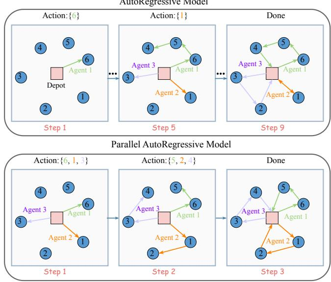
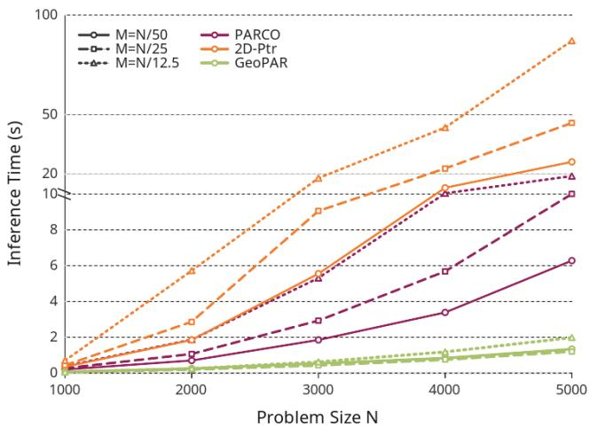
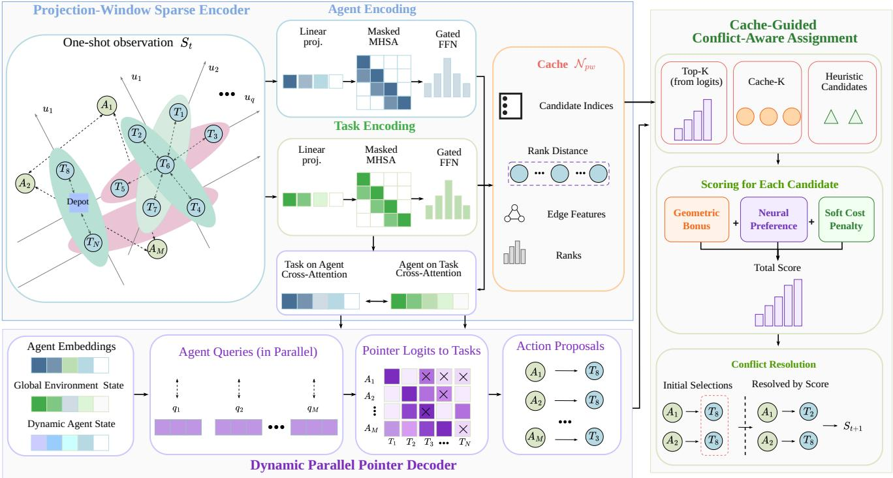
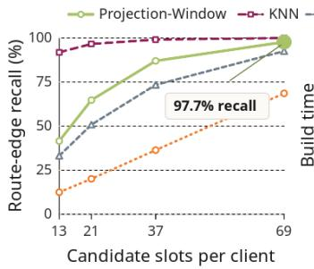
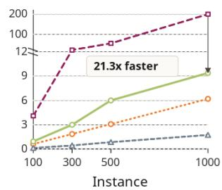
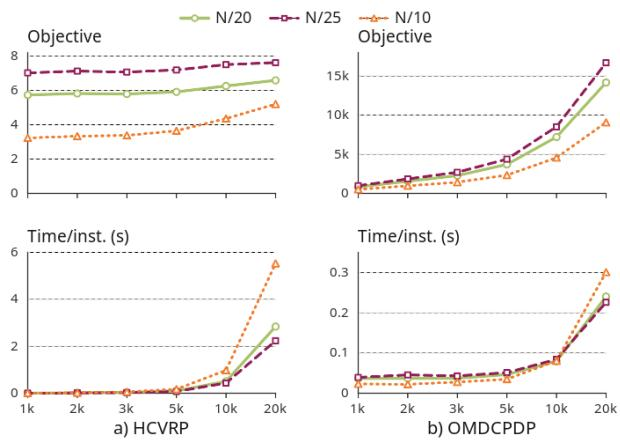
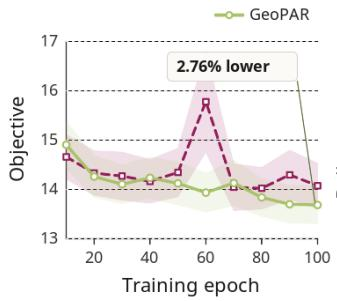
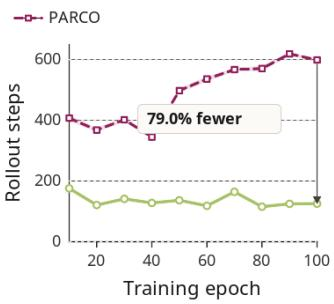

# GeoPAR: Large-Scale Multi-Agent Combinatorial Optimization with Geometry-Guided Parallel Autoregressive Learning

Wenjian Wu   
wjwuwwj@stu.suda.edu.cn   
School of Future Science and   
Engineering,   
Soochow University   
Suzhou, China   
Zesheng Jia   
zsjia@stu.suda.edu.cn   
School of Future Science and   
Engineering,   
Soochow University   
Suzhou, China   
Benyuan Yang∗   
byyang@suda.edu.cn   
School of Future Science and   
Engineering,   
Soochow University   
Suzhou, China   
Jiaying Tang   
jytang0922@stu.suda.edu.cn   
School of Future Science and   
Engineering,   
Soochow University   
Suzhou, China   
Jin Wang∗   
wjin1985@suda.edu.cn   
School of Future Science and   
Engineering,   
Soochow University   
Suzhou, China

## Abstract

Multi-agent combinatorial optimization problems are notoriously challen in due to their NP-hard nature. Recent arallel autore gressive neural solvers improve inference eficiency by allowing agents to make decisions simultaneously, but their performance of- ten degrades on large-scale instances. This is largely attributable to weak modeling of local geometric structures and the fact that con- flicting task selections are handled only after action generation. To address these limitations, we propose GeoPAR, a geometry-guided parallel autoregressive reinforcement learning framework for scal- able multi-agent combinatorial optimization. GeoPAR integrates three key components: (1) a projection-window sparse geometry mechanism that builds lightweight local candidate neighborhoods through multi-directional projections, (2) sparse edge-biased attention that injects these geometric relations into node representations, and (3) cache-guided conflict-aware assignment that reuses the geometric cache during decoding to suppress duplicate selections of exclusive tasks. Experiments on heterogeneous vehicle routing and open multi-depot pickup-and-delivery problems show that GeoPAR improves large-scale zero-shot generalization while substantially reducing rollout steps and maintaining eficient inference.

## CCS Concepts

• Theory of computation → Design and analysis of algorithms; • Computing methodologies → Reinforcement learn ing; Multi-agent systems.

## Keywords

multi-agent combinatorial optimization, neural combinatorial optimization, vehicle routing, reinforcement learning, parallel autore-gressive decoding

## 1 Introduction

Multi-agent combinatorial optimization problems are commonly formulated as optimization problems over discrete spaces, with the goal of generating high-quality action and route sequences for a group of agents [22]. These problems arise widely in logistics and supply-chain scheduling [35], multi-robot task allocation [4], vehicle routing [8], and dynamic service-system optimization [30]. In many scenarios, feasible solutions must be constructed by co- ordinating multiple heterogeneous agents with distinct attributes. Therefore, eficient coordination of heterogeneous agents under complex constraints remains a central challenge in multi-agent combinatorial optimization [13].

  
Figure 1: From sequential to parallel autoregressive models.

Many representative multi-agent combinatorial optimization problems are NP-hard [1, 29, 36, 37]. Consequently, finding globally optimal solutions within practical time limits is often dificult. Although a range of exact and heuristic methods have been developed to address these problems [2, 25, 31], conventional solvers typically incur substantial computational costs and depend on hand-crafted heuristic rules that are closely tied to specific problem settings.

In recent years, neural combinatorial optimization (NCO) has ofered a promising alternative by learning neural construction policies that produce near-optimal assignment decisions in a short time [18, 26, 42]. In particular, reinforcement learning-based NCO methods optimize policies through interaction with the environ-ment without relying on manually labeled optimal solutions, and the learned policies can match or even outperform conventional methods [24, 38]. Within the NCO framework, autoregressive (AR) models are widely adopted because they construct feasible solu- tions step by step [7, 21]. However, as the task scale increases, serial decoding incurs substantial time costs and limits the eficiency of parallel decision-making among multiple agents. To address this limitation, recent studies have proposed parallel autoregressive combinatorial optimization (PA-CO) frameworks [3]. As illustrated in Figure 1, these frameworks allow multiple agents to generate actions simultaneously at the same construction step.

Although PA-CO shows promising eficiency and solution qual ity, zero-shot generalization to large-scale instances still faces two key challenges. First, when the number of tasks increases substan- tially, the policy must handle not only a larger action space but also shifted local geometric structures [5, 24, 26]. Consequently, a policy network trained on small-scale graphs may fail to preserve efective local successor structures on large-scale graphs. The model can still perform parallel decoding in form, but the quality of the generated decisions may become unstable under scale shifts. Second, PA-CO methods typically allow multiple agents to generate action propos-als independently and then repair conflicting selections through a conflict-handling mechanism. This design may repeatedly assign mutually exclusive tasks to diferent agents, while conflicts are re- solved only after action generation [3, 39]. As a result, the training signal provides limited direct guidance for learning conflict-aware decision making during action generation.

To address these challenges, we propose GeoPAR, a geometry- guided parallel autoregressive policy. GeoPAR constructs sparse geometric candidate neighborhoods through a projection-window (PWin) mechanism and captures local transition structures during encoding using sparse edge-biased attention. During decoding, the model reuses this geometric cache and integrates neural pointer scores, geometric candidates, and feasibility signals to construct compact candidate pools. It then reduces duplicate selections among simultaneous actions through conflict-aware (CA) parallel assign ment. By integrating local geometric modeling with CA assignment, GeoPAR maintains eficient parallel inference while improving zeroshot generalization from small training instances to larger ones. This claim is supported by the empirical results in Figure 2. Our contributions are summarized as follows:

• We design a projection-window sparse geometry mech-anism that constructs lightweight local candidate neigh- borhoods through multi-directional projections, enabling eficient modeling of local transition structure among tasks.

• We propose cache-guided conflict-aware parallel assign-ment, which reuses the geometric cache during decoding and suppresses duplicate task selections in simultaneous agent actions.

• We evaluate GeoPAR on multiple multi-agent combinatorial optimization tasks and show that it provides favorable large- scale generalization in solution quality, rollout steps, and inference time.

## 2 Related Work

  
Figure 2: Inference-time speedups of GeoPAR versus PARCO and 2D-Ptr on large-scale instances. Compared with the PARCO and 2D-Ptr baselines, GeoPAR achieves average inference-time speedups of 7.5× and 33.8×. In our experiments, we set the number of agents � as �/� to maintain a constant agent density of one agent per � tasks, where � is the number of tasks.

Multi-agent AR methods for NCO. NCO typically formulates task allocation as a sequential construction process, in which an AR decoder selects nodes, tasks, or actions step by step [16, 17, 40]. Because AR models naturally incorporate dynamic state updates and feasibility masks, they have become a dominant framework for neural routing solvers [23, 32, 33]. Although these models are more efective than purely decentralized policies for multi-agent rout- ing variants [28, 34], their sequential structure still leads to high generation latency. Recent parallel AR methods introduce multiple pointers, agent communication, and conflict-handling mechanisms, allowing actions to be executed in parallel within the same construc- tion step [3]. However, existing methods mainly correct duplicate or incompatible selections after candidate generation, while local structures and exclusivity constraints are not fully considered when candidate actions are constructed. In contrast, GeoPAR incorporates projection-window-based geometric candidates and cache-guided conflict-aware assignment into parallel AR decoding, enabling lo- cal structure and conflict awareness to jointly guide synchronous multi-agent decisions.

Large-scale NCO methods. Generalization from small training instances to large test instances remains a key challenge in NCO [24]. Existing methods for large-scale generalization can be broadly grouped into three categories. Adaptation-based methods mitigate scale gaps through test-stage projection, increased decoder computation, or instance-specific adjustment, but these designs introduce additional inference costs [5, 26]. Divide-and-conquer methods decompose large instances into subproblems and merge the result ing solutions, but their performance largely depends on the partitioning and merging strategies [27, 41]. Local search and improve-ment methods use neural models to guide neighborhood refinement or large neighborhood search, but they usually require multiple rounds of iterative refinement and may rely on problem-specific designs [10, 11, 20]. In contrast to these approaches, GeoPAR fo-cuses on single-pass parallel construction. It constructs a reusable sparse geometric cache before decoding and reuses this cache dur- ing conflict-aware assignment, thereby improving the efectiveness of each parallel action without relying on test-time fine-tuning or repeated local search.

## 3 Preliminaries

## 3.1 Collaborative Multi-Agent MDP

We formulate the problem as a collaborative multi-agent MDP $\langle S , \{ \mathcal { R } _ { m } \} _ { m = 1 } ^ { M } , P , R , \kappa \rangle$ , where S is the state space, � is the number of agents, and � $\in \{ 1 , \ldots , M \}$ indexes an agent. The feasible action set $\mathcal { A } _ { m } ( s _ { t } )$ of agent � includes task selections, waiting, and return- ing to a depot; � is the transition kernel, � is the reward function, and � is a conflict-handling function. At decision step �, the state of the environment is denoted by $s _ { t }$ . Each agent selects one action, forming the joint action $\mathbf { a } _ { t } = ( a _ { t } ^ { m } ) _ { m = 1 } ^ { M }$ , where $a _ { t } ^ { m } \in \mathcal { A } _ { m } ( s _ { t } )$

The policy maps the current state to a joint action distribution: $\pi _ { \theta } ( \mathbf { a } _ { t } \mid s _ { t } )$ , where $\begin{array} { r } { \mathbf { a } _ { t } \in \prod _ { m = 1 } ^ { M } \mathcal { A } _ { m } ( s _ { t } ) } \end{array}$ . Since multiple agents may select mutually conflicting actions, we apply the conflict handling function

$$
\kappa : ( \prod _ { m = 1 } ^ { M } \mathcal { A } _ { m } ) \times S  \prod _ { m = 1 } ^ { M } \mathcal { A } _ { m } .\tag{1}
$$

The executable joint action is therefore $\tilde { \mathbf { a } } _ { t } = \kappa ( \mathbf { a } _ { t } , s _ { t } )$ , where duplicated assignments are removed or replaced by waiting. The environment then evolves according to $s _ { t + 1 } = P ( s _ { t } \mid \tilde { \mathbf { a } } _ { t } )$ , and the policy receives reward $r _ { t } = R ( s _ { t } \mid \tilde { \mathbf { a } } _ { t } )$ . The final solution is repre- sented by the conflict free joint action sequence $\tilde { \mathbf { a } } _ { 1 : T } = ( \tilde { \mathbf { a } } _ { 1 } , \dots , \tilde { \mathbf { a } } _ { T } )$

## 3.2 Parallel Autoregressive Models

Diferent from AR models that decode actions one by one, a PA model decodes the actions of multiple agents in parallel within each step. Let $h \ = \ f _ { \theta } ( s _ { 0 } )$ be the encoded representation of the initial problem state. At each step �, the joint action proposal is generated in parallel over available agents. Let $\textstyle { \mathcal { M } } _ { t }$ denote the set of available agents at state $s _ { t } .$ . The joint proposal is factorized as

$$
\pi _ { \boldsymbol { \theta } } ( \mathbf { a } _ { t } \mid \tilde { \mathbf { a } } _ { < t } , s _ { t } , h ) = \prod _ { m \in \mathcal { M } _ { t } } \pi _ { \boldsymbol { \theta } } ( a _ { t } ^ { m } \mid \tilde { \mathbf { a } } _ { < t } , s _ { t } , h , m ) .\tag{2}
$$

Because these actions are decoded simultaneously, the raw pro- posal $\mathbf { a } _ { t }$ may still contain conflicts. Therefore, we use the conflict- handling function $\tilde { \mathbf { a } } _ { t } = \kappa ( \mathbf { a } _ { t } , s _ { t } )$ . Thus, the model remains autore- gressive across decision steps without imposing an arbitrary se-quential ordering on agents within each step.

## 4 Method: GeoPAR

We propose GeoPAR, a geometry-aware parallel autoregressive policy for scalable multi-agent combinatorial optimization, as illustrated in Figure 3. At each decoding step, multiple heterogeneous agents generate actions simultaneously, while a parallel assignment operator enforces feasibility. GeoPAR projects agents and tasks into a shared embedding space and constructs a lightweight geometric cache to represent local transition structures. The decoder com- bines these representations with dynamic agent queries to score actions in parallel, and the assignment module converts the result into feasible actions.

## 4.1 Projection-Window Sparse Encoder

Heterogeneous input embedding. Given an instance � with � agents and � task nodes, the encoder first maps their raw fea- tures into a shared �-dimensional embedding space. Let $X _ { A } \in$ $\mathbb { R } ^ { M \times k _ { A } } , X _ { V } \in \mathbb { R } ^ { N \times k _ { V } }$ denote the agent feature matrix and the node feature matrix, where $k _ { A }$ and $k _ { V }$ are the corresponding feature dimensions. Since agents and task nodes have diferent seman- tics and feature spaces, we use two separate linear projections: $W _ { A } ~ \in ~ \mathbb { R } ^ { k _ { A } \times d } , W _ { V } ^ { \overline { { \ } } } \in ~ \mathbb { R } ^ { k _ { V } \times d }$ . The initial agent and node embed- dings are then defined as $H _ { A } ^ { ( 0 ) } \ = \ X _ { A } W _ { A } , H _ { V } ^ { ( 0 ) } \ = \ X _ { V } W _ { V }$ , where $H _ { A } ^ { ( 0 ) } \in \mathbb { R } ^ { M \times d }$ and $H _ { V } ^ { ( 0 ) } \in \mathbb { R } ^ { N \times d }$ . We concatenate the two sets of em- beddings as $H ^ { ( 0 ) } = [ H _ { A } ^ { ( 0 ) } ; H _ { V } ^ { ( 0 ) } ]$ , which is used as the input to the subsequent geometry-aware encoder layers. This separate embedding design preserves the heterogeneity between agents and task nodes while projecting them into a unified representation space for later interaction modeling.

Projection-window cache. To avoid dense node-node relations, we construct a sparse geometric cache by sorting task nodes under multiple one-dimensional projection orderings. Let $z _ { i } \in { \mathbb { R } } ^ { p }$ denote the projection descriptor oftask node �, which can be instantiated by its normalized coordinate or other lightweight geometric features. Let $\{ u _ { \ell } \} _ { \ell = 1 } ^ { q }$ be $q$ unit projection directions with $u _ { \ell } \in \mathbb { R } ^ { p }$ . Each direction defines an ordering key $\eta _ { \ell } ( i ) = z _ { i } ^ { \top } u _ { \ell }$

We denote the set of ordering functions by $\mathcal { R } = \{ \eta _ { \ell } \} _ { \ell = 1 } ^ { q } \cup \mathcal { R } _ { \mathrm { a u x } } .$ where $\mathcal { R } _ { \mathrm { a u x } }$ contains optional task-native orderings, such as depotdistance ordering for routing or pair-aware ordering for pickup- delivery problems.

For each $\eta \in { \mathcal { R } } _ { : }$ , let $r _ { \eta } ( i )$ be the position of node � after sorting all task nodes by � (�). Given a window radius $w ,$ the projection window for node � is defined as

$$
\begin{array} { r l } & { \widehat { N } _ { \mathrm { p w } } ( i ) = \left\{ i \right\} \cup \left\{ j : \exists \eta \in \mathcal { R } \mathrm { ~ w i t h ~ } | r _ { \eta } ( j ) - r _ { \eta } ( i ) | \le w \right\} , } \\ & { \mathcal { N } _ { \mathrm { p w } } ( i ) = \mathrm { T o p K } \left( \widehat { N } _ { \mathrm { p w } } ( i ) , K \right) . } \end{array}\tag{3}
$$

Here $\widehat { N } _ { \mathrm { p w } } ( i )$ is the merged candidate set before truncation. TopK(·, �) keeps at most � candidates with the smallest rank distance to node �. Before truncation, each node has at most $1 + 2 w \vert \mathcal { R } \vert$ candidates.

Sparse edge-biased enhancement. The collection of projection-window neighborhoods ${ N } _ { \mathrm { p w } } = \{ { N } _ { \mathrm { p w } } ( i ) \} _ { i = 1 } ^ { N }$ serves as the sparse geometric cache used by the encoder. Given this cache, the en- coder refines node embeddings by restricting node-node attention to cached neighborhoods. For node �, let ${ N } _ { i } = { N } _ { \mathrm { p w } } ( i )$ denote its cached candidate set. For each cached pair (�, �) with $j \in N _ { i } ,$ we compute an edge descriptor $\psi _ { i j } .$ , a candidate-source type $c _ { i j } .$ , and a normalized rank distance $\rho _ { i j }$ from the projection-window construc tion. For each attention head $r ,$ the score from node � to candidate node � is computed as

  
Figure 3: Overview of GeoPAR. The projection-window sparse encoder maps heterogeneous agents and task nodes into a shared representation space. Task nodes are sorted along multiple projection directions to construct a reusable geometric cache. The encoder refines node and agent embeddings through sparse edge-biased attention and agent-task interaction. At each decision step, the dynamic parallel pointer decoder forms agent queries from encoded embeddings, dynamic agent states, and the global environment state, producing simultaneous action logits. Finally, the cache-guided conflict-aware assignment module outputs a feasible joint action.

$$
\begin{array} { r } { \begin{array} { r } { e _ { i j } ^ { ( r ) } = a _ { i j } ^ { ( r ) } + b _ { \psi } ^ { ( r ) } ( \psi _ { i j } ) + b _ { c } ^ { ( r ) } ( c _ { i j } ) + b _ { \rho } ^ { ( r ) } ( \rho _ { i j } ) , } \end{array} } \end{array}\tag{4}
$$

where $a _ { i j } ^ { ( r ) }$ is the standard scaled dot-product attention score com- puted from the normalized node embeddings. The bias terms $b _ { \psi } ^ { ( r ) }$ $b _ { c } ^ { ( r ) }$ , and $b _ { \rho } ^ { ( r ) }$ inject edge geometry, candidate-source information, and ranking proximity into the sparse attention score.

The scores are normalized over $j \in N _ { i }$ and used to aggregate local candidate features, producing $g _ { i } ^ { \mathrm { l o c } }$ . In parallel, node � attends to the agent embeddings $H _ { A }$ to obtain an agent-conditioned update ${ g } _ { i } ^ { \mathrm { a g t } }$ . The final node representation is updated by

$$
\begin{array} { r } { \tilde { h } _ { i } ^ { V } = h _ { i } ^ { V } + \gamma \odot \mathrm { L N } \left( W _ { F } [ g _ { i } ^ { \mathrm { l o c } } ; g _ { i } ^ { \mathrm { a g t } } ] \right) , } \end{array}\tag{5}
$$

where �� is a fusion projection, � is a learnable residual gate, ⊙ denotes element-wise multiplication, and $[ \cdot ; \cdot ]$ denotes concatena- tion. The enhanced node embeddings are then passed to subsequent encoder layers, while $N _ { \mathrm { p w } }$ is retained for decoder-side assignment.

## 4.2 Dynamic Parallel Pointer Decoder

Given the encoder output $H = [ H _ { A } ; H _ { V } ]$ , GeoPAR constructs solu- tions in a parallel autoregressive manner. At each step �, the decoder builds one dynamic query for each active agent by combining its static embedding with the current agent and environment states:

$$
\begin{array} { r } { q _ { t } ^ { m } = W _ { q } \left[ h _ { m } ^ { A } ; \phi _ { A } ( \delta _ { t } ^ { m } ) ; \phi _ { E } ( s _ { t } ) \right] , \qquad m \in { \cal M } _ { t } , } \end{array}\tag{6}
$$

where ${ \mathbf { } } _ { } { \mathbf { } } _ { } { \mathbf { } } _ { } { \mathbf { } } _ { } { \mathbf { } } _ { } { \mathbf { } } _ { } { \mathbf { } } _ { } { \mathbf { } } _ { } { \mathbf { } } _ { } { \mathbf { } } _ { } { \mathbf { } } _ { } { \mathbf { } } _ { } { \mathbf { } } _ { } { \mathbf { } } _ { } { \mathbf { } } _ { } { \mathbf { } } _ { } { \mathbf { } } _ { } { } \mathbf { } _ { } { } _ { } { \mathbf { } } _ { } { } \mathbf { } _ { } { } _ { } { } \mathbf { } _ { } { } _ { } { } \mathbf { } _ { } { } _ { } { } \mathbf { } _ { } { } _ { } { } \mathbf { } _ { } { } _ { } { } \mathbf { } _ { } { } _ { } { } \mathbf { } _ { } { } _ { } { } \mathbf { } _ { } { } _ { } { } \mathbf { } _ { } { } _ { } { } \mathbf { } _ { } { } _ { } { } \mathbf { } _ { }  _ { }$ is the set of active agents, $h _ { m } ^ { A }$ is the encoded embedding of agent �, $\delta _ { t } ^ { m }$ denotes its dynamic state, and $\phi _ { E } ( s _ { t } )$ summarizes the global environment state. The agent queries are then passed through a lightweight communication block,

$$
\bar { Q } _ { t } = \mathrm { C o m m } _ { \theta } ( Q _ { t } ) , \qquad Q _ { t } = \left[ q _ { t } ^ { m } \right] _ { m \in \mathcal { M } _ { t } } ,\tag{7}
$$

so that active agents can exchange information before action scoring. The communicated queries attend to the encoded action embeddings under the feasibility mask $M _ { t }$ . Let $\mathcal { A } _ { t }$ denote the current action set, including unserved task actions and task-native safe actions such as waiting or returning to a depot. For each action $j \in \mathcal { A } _ { t }$ , we define its dynamic action embedding as

$$
\bar { h } _ { t } ^ { j } = h ^ { j } + W _ { \xi } \xi _ { t } ^ { j } ,
$$

where $h ^ { j }$ is the static embedding of action � and $\xi _ { t } ^ { j }$ is its dynamic feature at step �. The pointer logit of agent � choosing action � is

computed as

$$
L _ { t } ^ { m , j } = \beta \cdot \operatorname { t a n h } \left( \frac { \langle W _ { Q } \bar { q } _ { t } ^ { m } , W _ { K } \bar { h } _ { t } ^ { j } \rangle } { \sqrt { d } } \right) .\tag{8}
$$

Hard-infeasible actions are masked by setting $L _ { t } ^ { m , j } = - \infty$ when ${ M } _ { t } ^ { m , j } = 0$ . This yields the per-agent neural action distribution

$$
\pi _ { \boldsymbol { \theta } } ( a _ { t } ^ { m } = j \mid s _ { t } , H ) = \operatorname { S o f t m a x } \left( L _ { t } ^ { m , \cdot } \right) _ { j } .\tag{9}
$$

The decoder therefore produces parallel per-agent action scores from the same state $s _ { t }$ . Since independently selected high-scoring actions may still conflict over exclusive tasks, GeoPAR passes $L _ { t } ,$ $M _ { t } , s _ { t }$ , and the projection-window cache $N _ { \mathrm { p w } }$ to the cache-guided assignment module, which returns the executable joint action $\tilde { \mathbf { a } } _ { t }$ used for the environment transition.

## 4.3 Cache-Guided Conflict-Aware Assignment

For each agent �, GeoPAR constructs a compact candidate pool: $\mathscr { B } _ { t } ^ { m } = \mathrm { T o p K } _ { \mathrm { l o g i t } } ( m ) \cup \mathrm { C a c h e K } ( m , N _ { \mathrm { p w } } , s _ { t } ) \cup \mathrm { H e u r K } ( m , s _ { t } )$ , where the three terms correspond to high-probability decoder actions, cache- based geometric successors, and lightweight task-native candidates, respectively. During training, a few random feasible actions are also added to encourage exploration.

Each candidate $j \in \mathcal { B } _ { t } ^ { m }$ is then scored by combining neural preference, geometric guidance, and immediate soft costs:

$$
S _ { t } ^ { m , j } = \ell _ { \theta , t } ^ { m , j } + \lambda _ { \mathrm { g e o } } B _ { \mathrm { g e o } } ^ { m , j } - \Omega _ { t } ^ { m , j } ,\tag{10}
$$

where $\ell _ { \theta , t } ^ { m , j } = \log \pi _ { \theta } ( j \ | \ s _ { t } , H , m )$ denotes the decoder score, $B _ { \mathrm { g e o } } ^ { m , j }$ is the cache-derived geometric bonus, and $\Omega _ { t } ^ { m , j }$ penalizes unde- sirable immediate efects such as travel cost, estimated makespan increase, or load imbalance. Hard infeasibility, such as capacity violation, visited-task reuse, or precedence violation, is handled by the feasibility mask $M _ { t }$

Based on these scores, the assignment module converts parallel per-agent scores into a feasible action. The key constraint is that exclusive actions cannot be assigned to multiple agents in the same parallel step. To enforce this, conflict-aware sampling or resolution maintains an internal consumed set $\mathcal { D } _ { t }$ of accepted exclusive ac tions. During training, agents sample from feasible candidates while excluding consumed exclusive actions. During inference, agents submit ranked proposals, and each conflicted exclusive action is assigned only to the agent with the highest score.

Algorithm 1 summarizes the above process using five operators: Pool builds $\mathcal { B } _ { t } ^ { m }$ , Score computes Eq. (10), TopR keeps ranked pro-posals, Sampl ${ } ^ { \circ } \chi$ performs training-time conflict-aware sampling, and ResolveX performs inference-time conflict resolution over ex- clusive actions.

Since Sampl ${ \dot { \boldsymbol { x } } }$ and Resolve $\boldsymbol { \chi }$ both reject already consumed ex clusive actions, the resulting joint action contains no duplicate ex-clusive action within each parallel step. Under the feasibility mask and the safe-fallback assumption, the returned action is feasible for environment execution.

Algorithm 1 Cache-Guided Parallel Assignment   
Require: Logits $L _ { t } ,$ mask $M _ { t } ,$ , state $s _ { t } ,$ cache $N _ { \mathrm { p w } } ,$ exclusive set $\chi ,$   
mode �   
Ensure: Feasible joint action $\tilde { \mathbf { a } } _ { t }$   
1: $\mathcal { B } _ { t } ^ { m } \gets \mathrm { P o o l } ( m , L _ { t } , s _ { t } , N _ { \mathrm { p w } } ) ,$ , ∀�   
2: $S _ { t } ^ { m , j } \gets \mathrm { S c o r e } ( m , j , L _ { t } , s _ { t } , N _ { \mathrm { p w } } ) ,$ ∀�, $j \in \mathcal { B } _ { t } ^ { m }$   
3: $\mathcal { P } _ { t } ^ { m } \gets \mathrm { T o p R } ( \mathcal { B } _ { t } ^ { m } , S _ { t } ^ { m } ) ,$ ∀�   
4: if � = train then   
5: $\tilde { \mathbf { a } } _ { t } \gets \mathrm { S a m p l e } _ { \chi } ( \{ \mathcal { P } _ { t } ^ { m } \} _ { m = 1 } ^ { M } , M _ { t } )$   
6: else   
7: $\widetilde { \mathbf { a } } _ { t } \gets \mathrm { R e s o l v e } _ { \chi } ( \{ \mathcal { P } _ { t } ^ { m } \} _ { m = 1 } ^ { M } , S _ { t } , M _ { t } )$   
8: end if   
9: $\widetilde { \mathbf { a } } _ { t } \gets \mathrm { F a l l b a c k } ( \widetilde { \mathbf { a } } _ { t } , M _ { t } )$   
10: return $\tilde { \mathbf { a } } _ { t }$

## 4.4 Training Objective

GeoPAR is trained with reinforcement learning. Let $R ( \tilde { \mathbf { a } } _ { 1 : T } )$ be the terminal reward, typically the negative task cost. The objective is

$$
J ( \theta ) = \mathbb { E } _ { \tilde { \mathbf { a } } _ { 1 : T } \sim \pi _ { \theta } ^ { \mathrm { t r a i n } } } \left[ R ( \tilde { \mathbf { a } } _ { 1 : T } ) \right] ,\tag{11}
$$

where $\pi _ { \theta } ^ { \mathrm { t r a i n } }$ denotes the rollout distribution induced by the de- coder scores and the training-time conflict-aware sampling operator Sample $\chi \cdot$ At step �, the log-probability used for policy-gradient training is the probability of the executable joint action sampled by Sampl ${ } ^ { \circ } \chi$ . Let $\mathcal { E } _ { t } ^ { m }$ denote the feasible candidate set of agent � after applying the feasibility mask and removing already consumed exclusive actions. Then

$$
\log \pi _ { \boldsymbol { \theta } } ^ { \mathrm { t r a i n } } ( \tilde { \mathbf { a } } _ { t } \mid s _ { t } ) = \sum _ { m \in \mathcal { M } _ { t } } \log \frac { \exp ( S _ { t } ^ { m , \tilde { a } _ { t } ^ { m } } / \tau ) } { \sum _ { j \in \mathcal { E } _ { t } ^ { m } } \exp ( S _ { t } ^ { m , j } / \tau ) } ,\tag{12}
$$

where $S _ { t } ^ { m , j }$ is the assignment score in $\operatorname { E q . }$ (10) and � is the sampling temperature. With an action-independent baseline �, the score- function estimator is

$$
\nabla _ { \theta } J ( \theta ) = \mathbb { E } \left[ ( R - b ) \sum _ { t = 1 } ^ { T } \nabla _ { \theta } \log \pi _ { \theta } ^ { \mathrm { t r a i n } } ( \tilde { \mathbf { a } } _ { t } \ \lvert \ s _ { t } ) \right] .\tag{13}
$$

At inference time, GeoPAR uses deterministic conflict resolution with the same assignment scores, and no policy-gradient probability is required for ResolveX.

## 5 Experiments

We structure the experiments to answer the following questions:

• How does GeoPAR compare with conventional and neu-ral baselines at training scales and under zero-shot scale transfer? (See Section 5.2)

• Does the projection-window cache preserve task-relevant local transitions eficiently, and how sensitive is GeoPAR to the number of projection directions? (See Section 5.3)

• Are projection-window geometry and conflict-aware assignment complementary? (See Section 5.4)

• Which components of cache-guided conflict-aware assignment drive solution quality and construction eficiency? (See Section 5.5)

Table 1: Results on HCVRP and OMDCPDP. The gap is computed relative to the best objective value within each �/� setting. All results were obtained from five replicate experiments. Lower values are better.
<table><tr><td colspan="10"></td><td colspan="7"></td></tr><tr><td rowspan="2">N/M Method</td><td colspan="4">60/3</td><td colspan="4">60/5</td><td colspan="4">100/5</td><td colspan="4">100/7</td></tr><tr><td>Obj.</td><td>Gap</td><td>Steps</td><td>Time</td><td>Obj.</td><td>Gap</td><td>Steps</td><td>Time</td><td>Obj.</td><td>Gap</td><td>Steps</td><td>Time</td><td>Obj.</td><td>Gap</td><td>Steps</td><td>Time</td></tr><tr><td>SISRs [6] GA [14]</td><td>6.57 9.21</td><td>0.00% 40.18%</td><td></td><td>271s 233s</td><td>4.00 6.89</td><td>0.00% 72.25%</td><td>一</td><td>274s 320s</td><td>6.17 10.93</td><td>0.00%</td><td></td><td>623s 623s</td><td>4.45 9.10</td><td>0.00%</td><td>一</td><td>625s</td></tr><tr><td>SA [12]</td><td>7.04</td><td>7.15%</td><td></td><td>130s</td><td>4.39</td><td>9.75%</td><td></td><td>289s</td><td>6.80</td><td>77.15% 10.21%</td><td></td><td>557s</td><td>5.01</td><td>104.49% 12.58%</td><td>一</td><td>772s 678s</td></tr><tr><td>AM [15]</td><td>7.41</td><td>12.79%</td><td>73.5</td><td>0.06s</td><td>4.59</td><td>14.75%</td><td>72.0</td><td>0.05s</td><td>6.96</td><td>12.80%</td><td>122.1</td><td>0.08s</td><td>5.12</td><td>15.06%</td><td>118.3</td><td>0.08s</td></tr><tr><td>2D-Ptr [23]</td><td>7.20</td><td>9.59%</td><td>73.5</td><td>0.06s</td><td>4.48</td><td>12.00%</td><td>73.3</td><td>0.05s</td><td>6.75</td><td>9.40%</td><td>121.3</td><td>0.08s</td><td>4.92</td><td>10.56%</td><td>118.6</td><td>0.08s</td></tr><tr><td>DPN [40]</td><td>7.66</td><td>16.59%</td><td>86.0</td><td>0.06s</td><td>4.93</td><td>23.25%</td><td>106.1</td><td>0.06s</td><td>7.27</td><td>17.83%</td><td>154.2</td><td>0.09s</td><td>5.37</td><td>20.67%</td><td></td><td>0.09s</td></tr><tr><td>PARCO [3]</td><td>7.22</td><td>9.89%</td><td>58.2</td><td>0.08s</td><td>4.47</td><td>11.75%</td><td>56.4</td><td>0.08s</td><td>6.70</td><td>8.59%</td><td>91.2</td><td>0.12s</td><td>4.87</td><td>9.44%</td><td>155.8</td><td>0.12s</td></tr><tr><td>GeoPAR</td><td>7.31</td><td>11.26%</td><td>39.3</td><td>0.07s</td><td>4.58</td><td>14.50%</td><td>27.1</td><td>0.06s</td><td>6.82</td><td>10.53%</td><td>44.2</td><td>0.08s</td><td>4.98</td><td></td><td>89.0</td><td></td></tr><tr><td></td><td></td><td></td><td></td><td></td><td></td><td></td><td></td><td></td><td></td><td></td><td></td><td></td><td></td><td>11.91%</td><td>34.6</td><td>0.07s</td></tr><tr><td></td><td colspan="4"></td><td colspan="8">Large-scale zero-shot HCVRP</td><td colspan="4">2000/160</td></tr><tr><td rowspan="2">N/M Method AM [15]</td><td colspan="4">1000/20</td><td colspan="8">1000/80</td><td colspan="4"></td></tr><tr><td>Obj. 16.03</td><td>Gap 16.24%</td><td>Steps 1187.0</td><td>Time 0.35s</td><td>Obj. 4.03</td><td>Gap 5.77%</td><td>Steps</td><td>Time</td><td></td><td>Obj.</td><td>2000/40 Gap</td><td>Steps Time</td><td>Obj.</td><td>Gap</td><td>Steps</td><td>Time</td></tr><tr><td rowspan="2">2D-Ptr [23] DPN [40] PARCÕ [3] GeoPAR</td><td>14.11 29.87 13.97</td><td>2.32% 116.61%</td><td>1192.0 4020</td><td>0.35s 0.60s</td><td>4.00 4.68</td><td>4.99% 22.83%</td><td>1172.0 1166.0 1235</td><td>0.70s 0.70s 0.20s</td><td>16.17 14.25 26.84</td><td>14.19% 0.64% 89.55%</td><td>2361.5 2367.5 8040</td><td>1.84s 1.85s 3.14s</td><td>4.21 4.08 4.86</td><td>7.67% 4.35% 24.30%</td><td>2351.0 2339.5 2353</td><td>5.72s 5.72s 0.99s</td></tr><tr><td>13.79</td><td>1.31% 0.00%</td><td>693.0 215.0</td><td>0.20s 0.07s</td><td>4.61 3.81</td><td>21.00% 0.00%</td><td>562.0 69.0</td><td>0.39s 0.06s</td><td>15.52 14.16</td><td>9.60% 0.00%</td><td>1098.0 272.0</td><td>0.71s 0.26s</td><td>8.35 3.91</td><td>113.55% 0.00%</td><td>906.0 97.5</td><td>1.87s 0.25s</td></tr><tr><td rowspan="2">N/M Method</td><td colspan="4">3000/60</td><td colspan="4">3000/240</td><td colspan="4">5000/200</td><td colspan="4">5000/400</td></tr><tr><td>Obj. 15.82 13.91</td><td>Gap 13.73%</td><td>Steps 3528.8</td><td>Time 5.51s</td><td>Obj. 4.23</td><td>7.36%</td><td>Gap Steps 3525.8</td><td>Time 17.99s</td><td>Obj. 7.58</td><td>8.13%</td><td>Gap Steps 5779.2</td><td>Time 45.26s 45.77s</td><td>Obj. 4.29 4.05</td><td>Gap 6.98% 0.99%</td><td>Steps 5858.6</td><td>Time 87.00s</td></tr><tr><td rowspan="2">2D-Ptr [23] DPN [40] PARCO [3] GeoPAR</td><td rowspan="2">27.87 16.00 13.91</td><td rowspan="2">0.00% 100.36% 15.03% 0.00%</td><td rowspan="2">3529.2 12060 1485.0 291.8</td><td rowspan="2">5.55s 8.40s 1.85s 0.54s</td><td rowspan="2">4.80 8.80</td><td rowspan="2">4.03 21.83% 123.35%</td><td rowspan="2">2.28% 1308.0</td><td rowspan="2">3510.2 3501</td><td rowspan="2">18.01s 2.56s</td><td rowspan="2">7.07 8.96 10.29</td><td rowspan="2">0.85% 27.81% 46.79%</td><td rowspan="2">5813.8 18074 1947.0</td><td rowspan="2">24.91s 10.04s</td><td rowspan="2">5.04 14.33 257.35%</td><td rowspan="2">25.68% 1846.2</td><td rowspan="2">5839.3 87.09s 5784 7.86s 19.02s</td></tr><tr><td>5.31s 0.62s</td></tr><tr><td colspan="10"></td><td colspan="4">197.6 1.21s</td></tr><tr><td colspan="5"></td><td colspan="4">Small-scale OMDCPDP</td><td colspan="4"></td><td colspan="4"></td></tr><tr><td rowspan="2">N/M Method</td><td colspan="4">50/5</td><td colspan="4">50/7</td><td colspan="4">100/10</td><td colspan="4">100/15</td></tr><tr><td>Obj. 37.61</td><td>Gap 0.56%</td><td>Steps</td><td>Time 30s</td><td>Obj.</td><td>Gap 0.00%</td><td>Steps</td><td>Time 30s</td><td>Obj.</td><td>Gap</td><td>Steps</td><td>Time 60s</td><td>Obj.</td><td>Gap Steps</td><td>Time</td></tr><tr><td rowspan="3">OR-Tools [9] HAM [19] MAPDP [42] PARCO [3]</td><td colspan="4">45.16</td><td colspan="4">30.18 33.47 10.90% 30.32 0.46%</td><td colspan="4">66.78 0.51% 78.47 18.11%</td><td colspan="4">51.49 0.00% 55.24 7.28%</td></tr><tr><td>37.40 39.31</td><td>20.75% 0.00% 5.11%</td></table>

• How does GeoPAR behave across problem families, problem scales, and agent-density regimes? (See Section 5.6)

## 5.1 Experimental Settings

Datasets and baselines. Following [3, 23], we evaluate GeoPAR on HCVRP and OMDCPDP, which model heterogeneous capacitated vehicles and open multi-depot pickup-and-delivery routing, respectively. The HCVRP baselines are SISR [6], GA [14], SA [12],

AM [15], 2D-Ptr [23], DPN [40], and PARCO [3]; the OMDCPDP baselines are OR-Tools [9], HAM [19], MAPDP [42], and PARCO.

Metrics. We report objective value, gap, rollout steps, and inference time. The HCVRP objective is the makespan, defined as the maximum speed-normalized route duration across vehicles; the OMDCPDP objective is the cumulative delivery-arrival cost. The gap is relative to the best value within each �/� setting. Rollout steps measure construction length, and inference time is measured under the same GPU setting.

Implementation details. GeoPAR uses 128-dimensional policy embeddings, a projection window of size 8 with four directions, and the conflict-aware decoding configuration in Section 4.3. Both models are trained for 100 epochs with a learning rate of $1 0 ^ { - 4 }$ on small instances: 60–100 customers and 3–7 agents for HCVRP, and 50–100 tasks and 10–50 agents for OMDCPDP. Evaluation uses deterministic decoding on the instances in Table 1. Problem defini- tions and additional hyperparameters are provided in Appendices A and $\mathrm { B } ,$ respectively.

## 5.2 Overall Performance and Zero-Shot Scalability

Table 1 presents the results for the two datasets. For HCVRP, conventional solvers and specialized neural models remain competitive on small-scale instances, where the instance size is limited and the scal- ability bottleneck is not yet dominant. Under large-scale zero-shot settings, AM and 2D-Ptr maintain reasonable solution quality, but they construct solutions sequentially, node by node, which causes inference time to increase sharply as � grows. PARCO shortens the construction horizon through parallel decoding, but its solution quality becomes unstable. This suggests that naive parallelization may amplify coordination errors when many agents propose actions simultaneously. GeoPAR uses the projection-window cache to keep the candidate set of each agent locally meaningful as the graph size increases, while the conflict-aware assignment mechanism reduces duplicate selections in parallel decisions. Consequently, GeoPAR achieves more efective large-scale inference under zero-shot scale transfer.

For OMDCPDP, a similar pattern is observed under a diferent constraint structure. Although the performance diferences among strong baselines are modest on small-scale instances, GeoPAR con-sistently achieves better performance in large-scale zero-shot set tings. This indicates that the proposed mechanisms are not limited to Euclidean vehicle routing problems. The sparse geometric candidate construction provides a stable local action prior, while the assignment layer filters parallel decisions according to dynamic feasibility and task exclusivity. As the problem scale increases, OR-Tools struggles under a fixed time budget, and PARCO remains fast but exhibits unstable solution quality. In contrast, GeoPAR maintains a short construction process while producing better solutions. These results suggest that scalable multi-agent construction requires not only parallel decoding but also a structured mecha- nism that ensures simultaneous decisions are locally grounded and mutually compatible.

  
Figure 4: Validation of path edges based on the geometric structure of the sliding window. Left: recall of client-to-client route transitions produced by PARCO. Right: Construction time using the same CPU. Radius denotes a radial-window baseline that sorts clients by depot distance and keeps the same local rank window.

Table 2: Sensitivity analysis regarding the number of projection directions �. Time refers to the amortized strategy expansion time per instance (in milliseconds). Bold and underlined indicate the optimal and second-best results based on unrounded results.
<table><tr><td rowspan="3">q Slots</td><td rowspan="2"></td><td colspan="3">3000/120</td><td colspan="2">3000/240</td><td colspan="2">5000/200</td><td colspan="4">5000/400</td></tr><tr><td>Obj. Steps Time Obj. Steps Time Obj. Steps Time Obj. Steps Time</td><td></td><td></td><td></td><td></td><td></td><td></td><td></td><td></td><td></td></tr><tr><td></td><td>18 7.08</td><td>172</td><td>23.7</td><td>3.95</td><td>141 36.6</td><td>7.19</td><td>213</td><td>71.4 4.12</td><td></td><td>185 121.7</td></tr><tr><td>1 2</td><td>35</td><td>7.06</td><td>165.5</td><td>25.1</td><td>3.94</td><td>133</td><td>36.8 7.19</td><td>213.5</td><td> $\underline { { 7 4 . 8 4 . 1 0 } }$ </td><td></td><td>196130.4</td><td></td></tr><tr><td>4</td><td>69</td><td>7.06 153.5</td><td></td><td></td><td>27.2 3.94</td><td>129</td><td></td><td>39.1 7.18 197.6</td><td></td><td> $7 6 . 1 \ 4 . 1 3$ </td><td>177.8125.9</td><td></td></tr><tr><td>8</td><td></td><td>137 7.06</td><td>157</td><td></td><td>32.93.94 124.4</td><td></td><td>40.3 7.17</td><td></td><td>205</td><td> $9 0 . 0 \ 4 . 1 5$ </td><td>179.6</td><td>140.9</td></tr></table>

## 5.3 Projection-Window Fidelity and Sensitivity

Figure 4 evaluates whether PWin captures useful local structures or merely sparsifies the graph. We compare four candidate-set construction strategies under the same setting. Random samples candidate nodes uniformly without using geometry. Radius ranks nodes by depot distance and retains a local window in this one- dimensional order. KNN selects nearest neighbors from the com- plete distance matrix, which requires dense pairwise computation. Projection sorts task nodes along multiple directions and collects neighbors from the corresponding sliding rank windows, approxi-mating local Euclidean neighborhoods without building the com- plete distance graph.

The left panel reports the proportion of task-to-task transitions retained by each strategy. Projection preserves most route edges, achieving recall close to distance-based KNN and clearly above Random and Radius. This suggests that multi-directional projection ordering retains relevant local successors more efectively than geometry-agnostic sampling or depot-distance ranking. The right panel reports cache-construction time. KNN has high recall, but the cost of dense pairwise distance computation grows rapidly with �. Projection keeps task-relevant edges in a compact candidate pool without a dense graph, providing a favorable balance between local coverage and construction cost.

Table 3: Each setting reports objective and average rollout steps under greedy decoding. Lower is better.
<table><tr><td rowspan="2">Method PWin CA</td><td rowspan="2"></td><td colspan="2">100/7</td><td colspan="2">1000/20</td><td colspan="2">3000/60</td><td colspan="2">5000/100</td></tr><tr><td>Obj. Steps</td><td></td><td>Obj. Steps</td><td></td><td>Obj. Steps</td><td></td><td>Obj. Steps</td><td></td></tr><tr><td>PARCO</td><td> $\ - \_ \_ { 4 . 8 7 }$ </td><td></td><td></td><td>8913.97</td><td>693</td><td>16.00</td><td>1485</td><td>18.01</td><td>2109</td></tr><tr><td>+CA</td><td></td><td> $- \mathrm { ~  ~ \nabla ~ } \surd \mathrm { ~  ~ \nabla ~ } 4 . 9 9$ </td><td></td><td>34 14.01</td><td>204</td><td>16.10</td><td></td><td>480 27.85</td><td>956</td></tr><tr><td>+PWin</td><td> $\surd \_ { \ - \ } \ - \ 4 . 8 5$ </td><td></td><td></td><td>89 13.65</td><td></td><td>597 17.66</td><td></td><td>1292 21.75</td><td>1764</td></tr><tr><td>GeoPAR</td><td> $\surd \quad \ V \quad 4 . 9 8$ </td><td></td><td></td><td>35 13.79</td><td></td><td>215 13.91</td><td></td><td>292 14.16</td><td>353</td></tr></table>

Table 2 presents a sensitivity analysis of the number of projection directions. Using one or two projection directions incurs low cache overhead but often leads to longer construction processes. Increasing the number of directions to � = 4 consistently reduces the number of rollout steps while maintaining solution quality. Al though the larger cache associated with $q = 8$ occasionally provides marginal improvements in the objective value, it increases the number of raw candidate slots from 69 to 137 and introduces additional runtime overhead. Across the selected instances, the objective gap between $q = 4$ and $q = 8$ remains below 0.5%, while � = 4 reduces runtime by up to 17.2%. We therefore adopt $q = 4$ as a practical trade-of between solution quality and computational cost, rather than as the optimal configuration for every individual instance.

## 5.4 Complementarity of Projection Windows and Conflict-Aware Assignment

Table 3 shows that CA assignment primarily improves efective progress, but it does not by itself substantially improve solution quality. Using CA alone considerably reduces the number of rollout steps, which confirms that many parallel decisions are wasted by duplicate selections. However, in larger-scale settings, CA alone can lead to worse objective values, because faster progress may push agents toward suboptimal assignment patterns. In contrast, using only the projection-window geometry improves candidate quality in some settings, but it cannot efectively shorten rollouts. This indicates that high-quality local structures must also be coordinated across agents.

## 5.5 Component Analysis of Cache-Guided Assignment

Having established the complementarity of PWin and CA, we further decompose CA into its internal candidate-set construction and scoring components. All five variants use the same PWin and difer only in how joint-action candidates are sampled and ranked. PWin-only excludes conflict-aware training. Logit-CF uses only the Top-� candidates selected according to the corresponding logits. GeoPool additionally introduces geometric candidates retrieved from the cache, while GeoScore further incorporates the geometric priorities of these candidates into the ranking process. Full w/o Cache disables the reuse of the geometric cache in the decoder. Table 4 compares these five variants against Full CA.

The full results show that PWin-only achieves the best objective on the 1,000-node instances but generalizes poorly to denser set- tings. Logit-CF substantially reduces the number of rollout steps, confirming that conflict-free training is essential when multiple agents compete for mutually exclusive actions. In contrast, GeoPool alone does not consistently improve either solution quality or construction eficiency. Geometric candidates become efective only when GeoScore incorporates their geometric priorities into candidate ranking, resulting in the fewest rollout steps and the shortest runtime on the 3000- and 5000-node instances. On the 3000- and 5000-node instances, Full CA trades some eficiency for improved solution quality. These results indicate that reusing geometric candidates across the representation and assignment stages is particularly important for improving solution quality on dense instances.

  
Figure 5: GeoPAR objective values and per-instance inference time across problem families, problem sizes, and agentdensity regimes. Lower values are better.

## 5.6 Robustness Across Problem Families, Scales, and Agent Densities

Figure 5 examines how GeoPAR behaves across diferent problem families, problem scales, and agent-density regimes. We report results for all test instances with sizes up to $N = 2 0 0 0 0$ under three agent-density settings. For HCVRP, a higher agent density reduces the min–max objective value. However, at the largest problem scale, the highest density setting, �/10, incurs additional runtime because parallel construction requires coordination among more agents. For OMDCPDP, the raw objective value naturally increases with � because the objective accumulates delivery arrival costs over a larger number of requests. Nevertheless, the inference time per instance remains below one second even at $N = 2 0 0 0 0$

## 6 Conclusion

We propose GeoPAR, a geometry-guided parallel autoregressive framework for large-scale multi-agent combinatorial optimization. GeoPAR builds a reusable projection-window cache, injects sparse local geometry through edge-biased attention, and reuses the cache for conflict-aware parallel assignment. Results on HCVRP and OMD-CPDP show improved large-scale zero-shot generalization by preserving locally relevant actions and reducing inefective simultane-ous decisions. Ablations confirm the complementary roles of the two components: PWin improves local candidate quality, whereas CA assignment improves progress during parallel decoding.

Table 4: Internal ablation ofCA assignment on HCVRP. Utilization is �/(�×Steps), and time is reported in amortized milliseconds per instance. Lower is better except for utilization. Best results are shown in bold, and second-best results are underlined.
<table><tr><td rowspan="2">Variant</td><td colspan="4">1000/20</td><td colspan="4">3000/240</td><td colspan="4">5000/400</td></tr><tr><td>Obj.</td><td>Steps</td><td>Util.</td><td>Time</td><td>Obj.</td><td>Steps</td><td>Util.</td><td>Time</td><td>Obj.</td><td>Steps</td><td>Util.</td><td>Time</td></tr><tr><td>PWin-only</td><td>13.694</td><td>593.0</td><td>0.084</td><td>10.12</td><td>15.525</td><td>1242.0</td><td>0.010</td><td>343.38</td><td>24.440</td><td>1739.9</td><td>0.007</td><td>1204.20</td></tr><tr><td>Logit-CF</td><td>13.921</td><td>272.0</td><td>0.184</td><td>5.01</td><td>4.360</td><td>222.0</td><td>0.056</td><td>63.99</td><td>5.065</td><td>289.6</td><td>0.043</td><td>205.91</td></tr><tr><td>GeoPool</td><td>13.890</td><td>273.0</td><td>0.183</td><td>5.04</td><td>4.585</td><td>207.6</td><td>0.061</td><td>59.75</td><td>5.689</td><td>276.4</td><td>0.046</td><td>196.18</td></tr><tr><td>GeoScore</td><td>13.812</td><td>218.0</td><td>0.229</td><td>4.15</td><td>4.080</td><td>106.0</td><td>0.118</td><td>31.64</td><td>4.502</td><td>128.0</td><td>0.098</td><td>92.84</td></tr><tr><td>Full w/o Cache</td><td>13.778</td><td>201.0</td><td>0.249</td><td>3.93</td><td>4.142</td><td>149.9</td><td>0.084</td><td>43.74</td><td>4.639</td><td>209.1</td><td>0.060</td><td>149.14</td></tr><tr><td>Full CA</td><td>13.79</td><td>215.0</td><td>0.233</td><td>4.22</td><td>3.94</td><td>129.0</td><td>0.097</td><td>39.06</td><td>4.01</td><td>177.8</td><td>0.070</td><td>123.83</td></tr></table>

A current limitation is that GeoPAR’s improvements are un-even under extreme agent-density settings. In particular, HCVRP instances with very low agent density remain challenging because solution quality is highly sensitive to fleet scarcity, even when efficient rollout is maintained. An important future direction is to adapt candidate-action construction and assignment priorities to substantial shifts in agent density.

## References

[1] Giorgio Ausiello, Pierluigi Crescenzi, Giorgio Gambosi, Viggo Kann, Alberto Marchetti-Spaccamela, and Marco Protasi. 2012. Complexity and approximation: Combinatorial optimization problems and their approximability properties. Springer Science & Business Media.

[2] William Babincsak, Ashay Aswale, and Carlo Pinciroli. 2023. Ant colony optimization for heterogeneous coalition formation and scheduling with multi-skilled robots. In 2023 International Symposium on Multi-Robot and Multi-Agent Systems (MRS). IEEE, 121–127.

[3] Federico Berto, Chuanbo Hua, Laurin Luttmann, Jiwoo Son, Junyoung Park, Kyuree Ahn, Changhyun Kwon, Lin Xie, and Jinkyoo Park. 2026. PARCO: Parallel AutoRegressive models for multi-agent combinatorial optimization. Advances in Neural Information Processing Systems 38 (2026), 167130–167160.

[4] Jinchao Chen, Yang Wang, Ying Zhang, Yantao Lu, Qiuhao Shu, and Yujiao Hu. 2025. Extrinsic-and-intrinsic reward-based multi-agent reinforcement learning for multi-UAV cooperative target encirclement. IEEE Transactions on Intelligent Transportation Systems 26, 10 (2025), 17653–17665.

[5] Yuanyao Chen, Rongsheng Chen, Fu Luo, and Zhenkun Wang. 2026. Improving generalization of neural combinatorial optimization for vehicle routing problems via test-time projection learning. Advances in Neural Information Processing Systems 38 (2026), 76543–76585.

[6] Jan Christiaens and Greet Vanden Berghe. 2020. Slack induction by string removals for vehicle routing problems. Transportation Science 54, 2 (2020), 417– 433.

[7] Weiheng Dai, Utkarsh Rai, Jimmy Chiun, Yuhong Cao, and Guillaume Sartoretti. 2025. Heterogeneous multi-robot task allocation and scheduling via reinforce ment learning. IEEE Robotics and Automation Letters 10, 3 (2025), 2654–2661.

[8] Zachary Friggstad, Fabrizio Grandoni, and Ramin Mousavi. 2026. Breaching the 2- Approximation Barrier for Euclidean Capacitated Vehicle Routing. In Proceedings of the 2026 Annual ACM-SIAM Symposium on Discrete Algorithms (SODA). SIAM, 2644–2668.

[9] Vincent Furnon and Laurent Perron. 2024. Or-tools routing library. URL https://developers. google. com/optimization/routing (2024).

[10] André Hottung, Yeong-Dae Kwon, and Kevin Tierney. 2021. Eficient active search for combinatorial optimization problems. arXiv preprint arXiv:2106.05126 (2021).

[11] Taoan Huang, Aaron M Ferber, Yuandong Tian, Bistra Dilkina, and Benoit Steiner. 2023. Searching large neighborhoods for integer linear programs with contrastive learning. In International conference on machine learning. PMLR, 13869–13890.

[12] İLHAN İlhan. 2021. An improved simulated annealing algorithm with crossover operator for capacitated vehicle routing problem. Swarm and Evolutionary Computation 64 (2021), 100911.

[13] Athira KA and Umashankar Subramaniam. 2024. A systematic literature review on multi-robot task allocation. Comput. Surveys 57, 3 (2024), 1–28.

[14] Sašo Karakatič and Vili Podgorelec. 2015. A survey of genetic algorithms for solving multi depot vehicle routing problem. Applied Soft Computing 27 (2015), 519–532.

[15] Wouter Kool, Herke Van Hoof, and Max Welling. 2019. Attention, learn to solve routing problems!. In International Conference on Learning Representations.

[16] Yeong-Dae Kwon, Jinho Choo, Byoungjip Kim, Iljoo Yoon, Youngjune Gwon, and Seungjai Min. 2020. Pomo: Policy optimization with multiple optima for reinforcement learning. Advances in neural information processing systems 33 (2020), 21188–21198.

[17] Yeong-Dae Kwon, Jinho Choo, Iljoo Yoon, Minah Park, Duwon Park, and Youngjune Gwon. 2021. Matrix encoding networks for neural combinatorial optimization. Advances in Neural Information Processing Systems 34 (2021), 5138– 5149.

[18] Han Li, Fei Liu, Zhi Zheng, Yu Zhang, and Zhenkun Wang. 2025. CaDA: Cross-Problem Routing Solver with Constraint-Aware Dual-Attention. In International Conference on Machine Learning. PMLR, 35438–35456.

[19] Jingwen Li, Liang Xin, Zhiguang Cao, Andrew Lim, Wen Song, and Jie Zhang. 2021. Heterogeneous attentions for solving pickup and delivery problem via deep reinforcement learning. IEEE Transactions on Intelligent Transportation Systems 23, 3 (2021), 2306–2315.

[20] Ke Li, Fei Liu, Zhenkun Wang, and Qingfu Zhang. 2025. Destroy and repair using hyper-graphs for routing. In Proceedings of the AAAI Conference on Artificial Intelligence, Vol. 39. 18341–18349.

[21] Shaofeng Li, Zejian Zhao, Di Wang, Ke Li, Gang Liu, and Quan Wang. 2025. A reinforcement learning framework for eficient task allocation among AGVs in smart warehouse. IEEE Internet ofThings Journal 12, 11 (2025), 16947–16961

[22] Zijun Liao, Jinbiao Chen, Debing Wang, Zizhen Zhang, and Jiahai Wang. 2025. BOPO: Neural Combinatorial Optimization via Best-anchored and Objectiveguided Preference Optimization. In International Conference on Machine Learning. PMLR, 37456–37475.

[23] Qidong Liu, Chaoyue Liu, Shaoyao Niu, Cheng Long, Jie Zhang, and Mingliang Xu. 2024. 2d-ptr: 2d array pointer network for solving the heterogeneous capaci tated vehicle routing problem. In Proceedings of the 23rd International Conference on Autonomous Agents and Multiagent Systems. 1238–1246.

[24] Suyu Liu, Zhiguang Cao, Nan Yin, and Yew-Soon Ong. 2026. Scale-net: a hier-archical u-net framework for cross-scale generalization in multi-task vehicle routing. In Proceedings ofthe AAAI Conference on Artificial Intelligence, Vol. 40. 14295–14303.

[25] Anni Lu, Junmo Lee, Yuan-Chun Luo, Hai Li, Ian Young, and Shimeng Yu. 2024. Digital cim with noisy sram bit: a compact clustered annealer for large-scale combinatorial optimization. In Proceedings ofthe 61st ACM/IEEE Design Automation Conference. 1–6.

[26] Fu Luo, Xi Lin, Fei Liu, Qingfu Zhang, and Zhenkun Wang. 2023. Neural combinatorial optimization with heavy decoder: Toward large scale generalization. Advances in Neural Information Processing Systems 36 (2023), 8845–8864.

[27] Yuxin Pan, Ruohong Liu, Yize Chen, Zhiguang Cao, and Fangzhen Lin. 2025. Hierarchical Learning-based Graph Partition for Large-scale Vehicle Routing Problems. In Proceedings of the 24th International Conference on Autonomous Agents and Multiagent Systems. 1604–1612.

[28] Junyoung Park, Changhyun Kwon, and Jinkyoo Park. 2023. Learn to Solve the Min-max Multiple Traveling Salesmen Problem with Reinforcement Learning.. In AAMAS, Vol. 22. 878–886.

[29] Fernando Peres and Mauro Castelli. 2021. Combinatorial optimization problems and metaheuristics: Review, challenges, design, and development. Applied sciences 11, 14 (2021), 6449.

[30] Yang Qian, Xinbiao Wang, Yuxuan Du, Yong Luo, and Dacheng Tao. 2024. MG-Net: Learn to Customize QAOA with Circuit Depth Awareness. Advances in Neural Information Processing Systems 37 (2024), 33691–33725.

[31] Xiaotao Shan, Yichao Jin, Marius Jurt, and Peizheng Li. 2024. A distributed multi robot task allocation method for time-constrained d namic collective trans ort. Robotics and Autonomous Systems 178 (2024), 104722.

[32] Igor G Smit, Yaoxin Wu, Pavel Troubil, Yingqian Zhang, and Wim PM Nuijten. 2026. Neural Multi-Objective Combinatorial Optimization for Flexible Job Shop Scheduling Problems. In The Fourteenth International Conference on Learning Representations.

[33] Paul Strang, Zacharie Alès, Côme Bissuel, Olivier Juan, Safia Kedad-Sidhoum, and Emmanuel Rachelson. 2026. Planning in Branch-and-Bound: Model-Based Reinforcement Learning for Exact Combinatorial Optimization. In Proceedings of the AAAI Conference on Artificial Intelligence, Vol. 40. 25627–25635.

[34] Jingwei Wang, Qianyue Hao, Wenzhen Huang, Xiaochen Fan, Zhentao Tang, Bin Wang, Jianye Hao, and Yong Li. 2024. Dyps: Dynamic parameter sharing in multi-agent reinforcement learning for spatio-temporal resource allocation. In Proceedings of the 30th ACM SIGKDD conference on knowledge discovery and data mining. 3128–3139.

[35] Jann Michael Weinand, Kenneth Sörensen, Pablo San Segundo, Max Kleinebrahm, and Russell McKenna. 2022. Research trends in combinatorial optimization. International Transactions in Operational Research 29, 2 (2022), 667–705.

[36] Xuan Wu, Di Wang, Chunguo Wu, Lijie Wen, Chunyan Miao, Yubin Xiao, and You Zhou. 2025. Eficient heuristics generation for solving combinatorial optimization problems using large language models. In Proceedings ofthe 31st ACM SIGKDD Conference on Knowledge Discovery and Data Mining V. 2. 3228–3239.

[37] Zitian Yang, Li Zhang, Hang Yu, Jiaxing Li, and Xiaoli Lian. 2026. A Systematic Literature Review of Distributed Multi-Agent Task Allocation: Core Dimensions, Their Interrelationships, and a Repository. IEEE Transactions on Parallel and Distributed Systems (2026).

[38] Hang Yi, Ziwei Huang, Yining Ma, and Zhiguang Cao. 2026. RADAR: Learning to Route with Asymmetry-aware DistAnce Representations. arXiv preprint arXiv:2603.03388 (2026).

[39] Zehua Zang, Chuxiong Sun, Lixiang Liu, Fuchun Sun, and Changwen Zheng. 2025. Loss of plasticity: a new perspective on solving multi-agent exploration for sparse reward tasks. In Proceedings of the 24th International Conference on Autonomous Agents and Multiagent Systems. 2299–2308.

[40] Zhi Zheng, Shunyu Yao, Zhenkun Wang, Xialiang Tong, Mingxuan Yuan, and Ke Tan . 2024. DPN: decou lin artition and navi ation for neural solvers of min-max vehicle routing problems. 61559–61592 pages.

[41] Zhi Zheng, Changliang Zhou, Xialiang Tong, Mingxuan Yuan, and Zhenkun Wang. 2024. UDC: A unified neural divide-and-conquer framework for large- scale combinatorial optimization problems. Advances in Neural Information Processing Systems 37 (2024), 6081–6125.

[42] Zefang Zong, Meng Zheng, Yong Li, and Depeng Jin. 2022. Mapdp: Cooperative multi-agent reinforcement learning to solve pickup and delivery problems. In Proceedings ofthe AAAI conference on artificial intelligence, Vol. 36. 9980–9988.

## Appendix

## A Problem Definitions

## A.1 Heterogeneous Capacitated Vehicle Routing

Instance. The min-max HCVRP consists of a depot, � customer nodes, and � heterogeneous vehicles. Customer � has a coordinate $x _ { i } \in [ 0 , 1 ] ^ { 2 }$ and a demand $d _ { i } > 0 .$ . Vehicle � has an initial depot location, capacity $Q _ { m } ,$ , and speed $v _ { m } . \mathrm { A }$ trip starts from the depot and may return to the depot to reload. The total demand served by a vehicle between two depot visits cannot exceed its capacity. Each customer must be visited exactly once by one vehicle.

State and feasible actions. At construction step �, each active vehicle has a current node, a remaining capacity, and an accumulated route length. Feasible customer actions are unvisited customers whose demand fits the vehicle’s remaining capacity. Depot actions are feasible when the vehicle needs to reload or when the envi- ronment exposes a safe depot move. Since customers are exclusive tasks, a joint parallel action is feasible only if no two vehicles serve the same customer in the same step. Invalid capacity, duplicate-customer, and already-served actions are masked by the environ- ment or repaired by the conflict-aware assignment rule described in Section B.1.

Objective. Let $\mathcal { R } _ { m } = ( r _ { m , 1 } , . . . , r _ { m , T _ { m } } )$ denote the realized route of vehicle �, including depot returns. The route duration is

$$
C _ { m } = \frac { 1 } { v _ { m } } \sum _ { t = 1 } ^ { T _ { m } - 1 } \lVert x _ { r _ { m , t + 1 } } - x _ { r _ { m , t } } \rVert _ { 2 } .\tag{14}
$$

The objective is to minimize the makespan,

$$
C _ { \mathrm { H C V R P } } = \operatorname* { m a x } _ { m \in \{ 1 , . . . , M \} } C _ { m } .\tag{15}
$$

The policy reward is the negative objective. We report the objective value, the average number ofrollout steps, and CUDA-synchronized rollout time. A rollout step is one parallel construction step in which all currently active vehicles may propose actions.

## A.2 Open Multi-Depot Capacitated Pickup and Delivery

Instance. OMDCPDP contains � vehicle agents and � task nodes, where the task nodes form $N / 2$ pickup-delivery pairs. Vehicle � starts from its own depot coordinate and has finite carrying capacity. For pair �, pickup node $\scriptstyle { \mathcal { P } } k$ must be served before delivery node $d _ { k }$ . A delivery can be selected only after its paired pickup has been picked and is carried by a feasible vehicle state. The routes are open: vehicles are not required to return to any depot after all tasks are completed.

State and feasible actions. The dynamic state records each vehicle’s current node, route length, remaining capacity, carried orders, visited pickups, completed deliveries, and pickup-delivery precedence status. A pickup action is feasible when the pickup has not been visited and the vehicle has remaining capacity. A delivery action is feasible when its paired pickup is already on board and the delivery has not been completed. Waiting, depot, or current-node actions are used only as environment-safe fallbacks when no task action is available. As in HCVRP, task actions are exclusive inside a parallel step, so duplicate task proposals must be resolved before the environment transition.

Objective. The evaluation objective is the cumulative deliveryarrival cost used by the OMDCPDP environment. Let D be the set of delivery nodes and let $A _ { j }$ be the accumulated route length of the vehicle that serves delivery � at the moment � is completed. The reported cost is

$$
C _ { \mathrm { O M D C P D P } } = \sum _ { j \in \mathcal { D } } A _ { j } ,\tag{16}
$$

and the policy reward is its negative value. We report objective value, rollout steps, and CUDA-synchronized rollout time under the same timing convention as HCVRP.

## B Experimental Details

## B.1 Implementation-Specific Model Settings

Model configuration. The main paper reports the embedding and projection-window parameters. Both models also use three encoder layers, eight attention heads, RMS normalization, and one agent communication layer. The geometry branch contains a single eight-head sparse cross-attention layer with a 16-dimensional edge descriptor, no dropout, and a residual scale initialized to zero.

Projection-window configuration. For both datasets, $z _ { i }$ denotes the normalized two-dimensional coordinate of task �. The projection directions are fixed before training and shared across all training and test instances. For � directions, we set

$$
\theta _ { \ell } = \frac { ( \ell - 1 ) \pi } { q } , \qquad u _ { \ell } = ( \cos \theta _ { \ell } , \sin \theta _ { \ell } ) , \qquad \ell = 1 , \ldots , q .\tag{17}
$$

Replacing �ℓ with −�ℓ only reverses the corresponding sorted order. Since the rank window is symmetric, the two directions are equivalent, so covering [0, �) is suficient. The reported models use $q = 4 ,$ corresponding to $( 1 , 0 ) , 2 ^ { - 1 / 2 } ( 1 , 1 ) , ( 0 , 1 ) , \hat { 2 ^ { - 1 / 2 } } ( - 1 , 1 )$ , with a window radius of $\ w = 8 .$ . These directions are fixed globally and are not sampled, learned, or adapted during training. For each task, the implementation stores one explicit self slot and $2 w + 1$ positions per direction without removing repeated indices. This produces $1 + 4 \times ( 2 \times 8 + 1 ) = 6 9$ raw cache entries per task. The encoder and assignment module share the cached indices, validity masks, and geometric descriptors, and the four highest-ranked feasible cache candidates are added to the assignment pool.

Conflict-aware assignment. Each active agent is assigned a com-pact candidate pool containing the four highest pointer-logit candi-dates, four highest projection-cache candidates, and two highest savings candidates. During training, four random feasible candidates are also added.

The savings source introduces task candidates that may be absent from both the highest pointer logits and the local projection-cache neighborhood. For agent � at its current location $x _ { t } ^ { m }$ and a feasible task �, we compute

$$
H _ { \mathrm { s a v e } , t } ^ { m , j } = \lVert \boldsymbol { x } _ { t } ^ { m } - \boldsymbol { x } _ { 0 } \rVert _ { 2 } + \lVert \boldsymbol { x } _ { j } - \boldsymbol { x } _ { 0 } \rVert _ { 2 } - \lVert \boldsymbol { x } _ { t } ^ { m } - \boldsymbol { x } _ { j } \rVert _ { 2 } ,\tag{18}
$$

where $x _ { 0 }$ is the reference depot used by the heuristic. In the reported implementation, $x _ { 0 }$ is the first depot coordinate stored in the state. It corresponds to the shared depot in HCVRP and serves as a common reference depot in OMDCPDP. A large savings value indicates that connecting the agent’s current location directly to task � avoids a longer path through the reference depot. Let $\mathcal { F } _ { t } ^ { m }$ denote the feasible action set after the environment mask is applied, and let V denote the set of task actions. The savings candidate set is defined as

$$
\mathrm { S a v i n g s K } ( m , s _ { t } ) = \mathrm { T o p K } _ { j \in \mathcal { F } _ { t } ^ { m } \cap \mathcal { V } } \left( H _ { \mathrm { s a v e } , t } ^ { m , j } ; K _ { \mathrm { s a v e } } \right) .\tag{19}
$$

This set contains at most two feasible task actions for each agent and does not include depot or waiting actions. The savings score is used only for candidate retrieval. After a savings candidate enters the pool, it is ranked by the common assignment score without any cache-derived geometric bonus. Savings candidates are used during both training and inference, while random candidates are included only during training.

For a cached task pair (�, �), let $d _ { i j } = \lVert { x } _ { i } - { x } _ { j } \rVert _ { 2 }$ , and let � and $d _ { j 0 }$ denote the distances from the two tasks to the reference depot used by the cache. We further define ¯� as the mean task-to-task distance over all raw cached edges in the same instance. If task � appears at window ofset $\delta _ { i j } \in - w , \ldots , w ,$ its normalized ofset is $\rho _ { i j } = | \delta _ { i j } | / w$ . The raw cache-geometry score is

$$
G _ { i j } = \frac { d _ { i 0 } + d _ { j 0 } - d _ { i j } } { \bar { d } } - \frac { d _ { i j } } { \bar { d } } - 0 . 1 \rho _ { i j } .\tag{20}
$$

When an agent is currently at a depot, the corresponding cache score is $G _ { 0 j } = - d _ { 0 j } / \bar { d } _ { 0 }$ , where ${ \bar { d } } _ { 0 }$ is the mean client-to-depot dis- tance in the instance. Let $\ell _ { \theta , t } ^ { m , j } = \log \pi _ { \theta } ( j \mid s _ { t } , H , m )$ . Feasible cache candidates are retrieved using

$$
R _ { \mathrm { c a c h e } , t } ^ { m , j } = 0 . 7 \ell _ { \theta , t } ^ { m , j } + 0 . 3 G _ { i j } .\tag{21}
$$

The four highest-scoring candidates form the cache portion of the pool. In the main experiments, the geometric bonus in Eq. (10) of the main paper is implemented as

$$
B _ { \mathrm { g e o } } ^ { m , j } = \left\{ \begin{array} { l l } { R _ { \mathrm { c a c h e } , t } ^ { m , j } , } & { \mathrm { f o r ~ a ~ c a c h e - s o u r c e d ~ p o o l ~ e n t r y , } } \\ { 0 , } & { \mathrm { f o r ~ o t h e r ~ p o o l ~ s o u r c e s . } } \end{array} \right.\tag{22}
$$

When the same action is proposed by multiple sources, only its first occurrence in the predefined pool-source order is retained.

For the soft cost, let $\Delta t _ { t } ^ { m , j } = d ( x _ { t } ^ { m } , x _ { j } ) / v _ { m }$ be the immediate travel time, with Euclidean distance used directly when no speed feature is present. Let $L _ { t } ^ { m }$ be the current accumulated route length. When demand and capacity features are present, define the remaining- capacity slack as $s _ { t } ^ { m , j } = Q _ { t , m } ^ { \mathrm { r e m } } - d _ { j }$ . The implementation uses

$$
\begin{array} { r l r } {  { \Omega _ { t } ^ { m , j } = \lambda _ { \mathrm { t i m e } } \Delta t _ { t } ^ { m , j } + \lambda _ { \mathrm { m k } } ( L _ { t } ^ { m } + \Delta t _ { t } ^ { m , j } ) } } \\ & { } & { + \lambda _ { \mathrm { c a p } } ( [ - s _ { t } ^ { m , j } ] _ { + } + \frac { 0 . 1 } { \operatorname* { m a x } ( s _ { t } ^ { m , j } , 1 0 ^ { - 4 } ) } ) . } \end{array}\tag{23}
$$

A term is omitted when its required state feature is unavailable. Hard-infeasible capacity violations are removed by the action mask before ranking, so the reciprocal slack term primarily discourages nearly capacity-saturating feasible assignments. The reported OMD CPDP checkpoint uses no additional delivery-, pickup-, or waitspecific priority adjustment.

The final score is $S _ { t } ^ { m , j } = \ell _ { \theta . t } ^ { m , j } + \lambda _ { \mathrm { g e o } } B _ { \mathrm { g e o } } ^ { m , j } - \Omega _ { t } ^ { m , j }$ . During training, agents are processed in randomized order and tasks selected by earlier agents are masked for later agents. When conflict-aware inference is enabled, each agent proposes its top three candidates; contested tasks are assigned to the highest-scoring agent, and unre- solved agents take a feasible fallback action. Table 5 lists the main dataset-specific settings.

Table 5: Main conflict-aware assignment settings used in the 100-epoch training runs. The main comparison uses greedy decoding unless stated otherwise.
<table><tr><td>Setting</td><td>HCVRP</td><td>OMDCPDP</td></tr><tr><td>Top-r proposals</td><td>3</td><td>3</td></tr><tr><td>Logit / cache / savings / random</td><td>4/4/2 / 4</td><td>4 /4 / 2 / 4</td></tr><tr><td> $\lambda _ { \mathrm { g e o } }$ </td><td>0.10</td><td>0.10</td></tr><tr><td> $\lambda _ { \mathrm { t i m e } } / \lambda _ { \mathrm { m k } }$ </td><td>0.10 / 0.05</td><td>0.10 / 0.05</td></tr><tr><td> $\lambda _ { \mathrm { c a p } }$ </td><td>1.00</td><td>0.00</td></tr><tr><td>Training temperature τ</td><td>1.2</td><td>1.2</td></tr><tr><td>Exploration mixture €</td><td>0.03</td><td>0.03</td></tr><tr><td>Random agent order</td><td>Yes</td><td>Yes</td></tr><tr><td>Force active in training</td><td>Yes</td><td>Yes</td></tr><tr><td>Minimum agents / tasks</td><td>8 / 300</td><td>5 / 20</td></tr><tr><td>Minimum predicted conflict</td><td>0.03</td><td>0.03</td></tr></table>

## B.2 Shared Training and Evaluation Protocol

GeoPAR uses the reinforcement-learning objective described in the main paper. Training uses Adam with zero weight decay and a multi-step learning-rate schedule with milestones at epochs 80 and 95 and a decay factor of 0.1. Training instances are generated online, whereas validation and test instances are fixed. Unless a decoding ablation states otherwise, neural models use deterministic greedy decoding.

SISR. Slack Induction by String Removals (SISR) [6] is a routedestroy-and-repair heuristic for vehicle-routing problems. We use the PARCO reference setting with $\bar { c } = 1 0 , L _ { \mathrm { m a x } } = 1 0 , \alpha = 1 0 ^ { - 3 }$ $\beta = 1 0 ^ { - 2 }$ , initial and final temperatures $T _ { 0 } = 1 0 0$ and $T _ { f } = 1$ , and an iteration budget of $3 \times 1 0 ^ { 5 } N$

GA. The Genetic Algorithm (GA) [14] evolves a population of HCVRP solutions through selection, crossover, and mutation. The population size is 200, the iteration budget is 40�, and the mutation and crossover probabilities are $P _ { m } = 0 . 8$ and $P _ { c } = 1 ,$ , respectively.

SA. This method [12] combines temperature-controlled search with crossover and 2-opt route refinement. We use $T _ { 0 } = 1 0 0 , T _ { f } =$ $^ { 1 0 ^ { - 7 } } ,$ a Markov-chain length of $L = 2 0 N _ { \mathrm { { ; } } }$ , and a cooling factor of $\alpha = 0 . 9 8$

AM. The Attention Model (AM) [15] constructs an HCVRP solution sequentially by first selecting a vehicle and then its next customer, with vehicle features included in the decoder context. A separate model is trained for each small-scale �/� setting using 128-dimensional embeddings, three encoder layers, eight attention heads, a rollout baseline, batch size 128, 99,968 instances per epoch, 100 epochs, learning rate $1 0 ^ { - 4 }$ with decay 0.995. Large-scale results use the $N = 1 0 0 , M = 7$ checkpoint without retraining.

2D-Ptr. The 2D Array Pointer network (2D-Ptr) [23] uses sepa-rate vehicle and customer encoders and selects vehicle–customer actions with a two-dimensional pointer mechanism. Each small-scale model uses 128-dimensional embeddings, three encoder layers, eight attention heads, a rollout baseline, and a batch size of 512.

The actor and critic learning rates are both $1 0 ^ { - 4 }$ and decay by a factor of 0.995. The $N = 1 0 0 , M = 7$ checkpoint is used for zero-shot large-scale evaluation with greedy decoding.

DPN. Decoupling Partition and Navigation (DPN) [40] separates customer partitioning from route navigation and uses permutation symmetry across agents and rotation-based positional encoding. We use 128-dimensional embeddings, six encoder layers, eight attention heads, POMO size 60, and tanh clipping 50. It is trained for 100 epochs on $N = 4 0 – 1 0 0$ and $M = 3 \ – 7$ with 100,000 instances per epoch, learning rate $1 0 ^ { - 4 }$ , batch size 64 with two-step gradient accumulation. Evaluation uses greedy decoding with the identity agent permutation and no test-time augmentation.

OR-Tools. Google OR-Tools [9] provides general-purpose routing and constraint-programming solvers. The OMDCPDP solver uses a global span cost coeficient of 10,000, Path Cheapest Arc initialization, and Guided Local Search for improvement. The perinstance limits are 30, 60, and 300 seconds for $N = 5 0$ , 100, and 500, respectively, and 600 seconds for $N \geq 1 0 0 0$

HAM. The Heterogeneous Attention Model (HAM) [19] distin guishes pickup and delivery roles and enforces precedence con- straints during sequential construction. Our multi-agent OMD-CPDP adaptation uses 128-dimensional embeddings, three encoder layers, eight attention heads, a feed-forward dimension of 512, and batch normalization. It is trained with sampling for 100 epochs on $N = 5 0 – 1 0 0$ and $M = 1 0 – 5 0$ using batch size 128, 100,000 instances per epoch, eight augmentations, learning rate $1 0 ^ { - 4 }$ , and seed 1234; validation and test decoding are greedy.

MAPDP. MAPDP [42] learns cooperative pickup-and-delivery decisions with centralized multi-a ent reinforcement learnin and paired contextual embeddings. We use 128-dimensional embed- dings, three encoder layers, eight attention heads, one communi- cation layer, and the original random conflict handler. A separate checkpoint is trained for each small-scale $N / M$ setting for 100 epochs using batch size 128, 100,000 instances per epoch, eight aug- mentations, Adam with learning rate $1 0 ^ { - 4 }$ and zero weight decay, and learning-rate decays of 0.1 after epochs 80 and 95. Evaluation uses greedy decoding.

PARCO. PARCO [3] is the common neural baseline for both tasks. It uses three encoder layers with 128-dimensional embeddings, eight attention heads, an MLP dimension of 512, RMS normalization, one agent communication layer, and a multiple-pointer decoder. Duplicate task proposals are resolved by assigning the contested action to the agent with the highest model probability. The baseline is trained for 100 epochs with Adam, learning rate $1 0 ^ { - 4 } ,$ , zero weight decay, batch size 128, 100,000 instances per epoch, eight augmentations, and step decays of 0.1 after epochs 80 and 95. HCVRP training samples $N = 6 0 – 1 0 0$ and $M = 3 { - } 7 _ { \colon }$ , whereas OMDCPDP training samples $N = 5 0 \AA$ –100 and $M = 1 0 \cdot$ –50; evaluation is greedy in both tasks.

## B.3 Dataset Details

HCVRP. The fixed HCVRP validation and test set contains nine splits with $N \in \{ 6 0 , 8 0 , 1 0 0 \}$ and $M \in \{ 3 , 5 , 7 \}$ . The zero-shot and density-robustness settings are those reported in the main tables and figures, and no additional training is performed for these larger instances.

Table 6: Training settings of the reported checkpoints.
<table><tr><td>Setting</td><td>HCVRP GeoPAR</td><td>OMDCPDP GeoPAR</td></tr><tr><td>Training epochs</td><td>100</td><td>100</td></tr><tr><td>Learning rate</td><td> $1 0 ^ { - 4 }$ </td><td> $1 0 ^ { - 4 }$ </td></tr><tr><td>Train data size / epoch</td><td>100,000</td><td>100,000</td></tr><tr><td>Batch size</td><td>128</td><td>128</td></tr><tr><td>Augmentations</td><td>10</td><td>8</td></tr><tr><td>Validation monitor</td><td> $\mathbf { n } 6 0 \_ \mathbf { m } 5$ </td><td> $\mathrm { n 1 0 0 \_ m 2 0 }$ </td></tr></table>

  
Figure 6: Training dynamics of GeoPAR on 128 fixed zeroshot HCVRP instances with $N ~ = ~ 1 0 0 0$ and $M \ = \ 2 0$ . Each checkpoint is evaluated using greedy decoding with a batch size of 1. The lines and shaded bands represent the means and 95% confidence intervals across instances.

OMDCPDP. The OMDCPDP checkpoint uses the shared training configuration in Table 6. The fixed validation and test set contains six splits, n50\_m5, n50\_m7, n50\_m10, n100\_m10, n100\_m15, and n100\_m20. n100\_m20 is used for checkpoint selection. The large- scale comparisons use 128 instances per setting, batch size 1, and deterministic greedy decoding.

## C Additional Analyses

## C.1 Training-Stage Quality–Eficiency Trade-of

To distinguish the training dynamics from the final benchmark re- sults reported in the main paper, we evaluate PARCO and GeoPAR under the same HCVRP protocol. We save checkpoints every 10 epochs and evaluate each checkpoint on a fixed zero-shot test set of 128 instances with $N = 1 0 0 0$ and $M = 2 0$ . Figure 6 reveals a per-sistent diference in the solution construction processes learned by the two models. GeoPAR requires substantially fewer rollout steps at every checkpoint, indicating that its eficiency advantage arises from the construction mechanism rather than emerging only after convergence. After 10 epochs, GeoPAR already reduces the average rollout length from 407.5 to 175.9 steps, although its objective value remains 1.67% higher than that of PARCO. This result suggests that GeoPAR first learns a more compact decision process before fully refining solution quality. As training continues, the rollout advantage is preserved, while the objective gap is reversed. At epoch 100, GeoPAR achieves an objective value of 13.686, compared with 14.074 for PARCO, and requires only 125.6 rollout steps, compared with 599.0. The simultaneous 2.76% improvement in objective value and 79.0% reduction in rollout length suggest that the geometric candidate mechanism and conflict-aware assignment progressively reduce redundant and conflicting decisions, enabling the policy to improve coordination quality without relying on increasingly long construction trajectories.

Table 7: Test-time decoding ablation with standard greedy decoding or full conflict-aware assignment forced active at every step.
<table><tr><td colspan="4">HCVRP</td></tr><tr><td rowspan="2">Decode</td><td>1000/80</td><td>3000/240</td><td>5000/400</td></tr><tr><td>Obj. Steps Time</td><td>Obj. Steps Time</td><td>Obj. Steps Time</td></tr><tr><td>Greedy</td><td>3.81 69.0 0.663</td><td>3.94 129.01.240</td><td>4.13177.83.981</td></tr><tr><td>Full CA decode</td><td>3.9442.0 0.432</td><td>4.1077.8 1.212</td><td>4.2999.8 3.639</td></tr><tr><td colspan="4">OMDCPDP</td></tr><tr><td rowspan="2">Decode</td><td>1000/25</td><td>3000/75</td><td>4000/100</td></tr><tr><td>Obj. Steps Time</td><td>Obj. Steps Time</td><td>Obj. Steps Time</td></tr><tr><td>Greedy</td><td>1457.2 44.2 0.0613983.2</td><td>45.8 0.061 5205.9</td><td>46.2 0.064</td></tr><tr><td>Full CA decode 1452.9</td><td>42.00.1093986.5</td><td>42.3 0.1095212.0</td><td>42.60.111</td></tr></table>

Table 8: HAM results on the large-scale zero-shot OMDCPDP settings in Table 1 of the main paper. Following the main paper convention, the gap is computed relative to the best objective within each �/� setting.
<table><tr><td>N/M</td><td>Obj.</td><td>Gap</td><td>Steps</td><td>Time</td></tr><tr><td>1000/20</td><td>56814.07</td><td>3096.93%</td><td>940.5</td><td>1.11s</td></tr><tr><td>1000/25</td><td>44564.27</td><td>2958.16%</td><td>834.1</td><td>0.99s</td></tr><tr><td>2000/40</td><td>233050.98</td><td>6892.15%</td><td>1809.6</td><td>2.17s</td></tr><tr><td>2000/50</td><td>182886.95</td><td>6595.99%</td><td>1625.1</td><td>1.94s</td></tr><tr><td>3000/60</td><td>527148.73</td><td>10760.74%</td><td>2651.1</td><td>3.15s</td></tr><tr><td>3000/75</td><td>415019.38</td><td>10319.21%</td><td>2383.2</td><td>2.86s</td></tr><tr><td>4000/80</td><td>941895.73</td><td>14744.05%</td><td>3494.0</td><td>4.22s</td></tr><tr><td>4000/100</td><td>744548.64</td><td>14201.99%</td><td>3125.1</td><td>3.82s</td></tr></table>

## C.2 Test-Time CF Decoding Ablation

Table 7 shows that forcing full conflict-aware assignment during decoding consistently shortens rollouts in both HCVRP and OMD-CPDP, but it does not necessarily improve objective values or runtime. Therefore, the benefit of conflict-aware assignment arises when it is integrated into a geometry-guided training and construction process, rather than when it is applied as an unconditional post-hoc decoding rule.

## C.3 HAM Results on Large-Scale OMDCPDP Instances

Table 8 provides the previously unreported HAM results for the large-scale OMDCPDP settings included in Table 1 of the main text. Across the eight settings considered in the main comparison, the gap of HAM increases from 2958.16% at � = 1000 and � = 25 to 14744.05% at � = 4000 and � = 80. Over the same scale range, the number of rollout steps increases from 834.1 to 3494.0. The simulta- neous deterioration in solution quality and construction eficiency indicates that the sequential construction strategy of HAM does not generalize reliably to the large-scale scenarios considered in the main comparison.