# Gradient–Update Mismatch: Rethinking Conflict-Free Training of Physics-Informed Neural Networks

Jing Xiao1,2,3 Xinhai Chen1,2,3,\* Qinglin Wang1,2,3 Menghan Jia2,3 Zhiquan Lai2,3 Dongsheng Li2,3 Jie Liu1,2,3 Tiejun Li3

1Laboratory of Digitizing Software for Frontier Equipment,   
National University ofDefense Technology, Changsha 410073, China 2National Key Laboratory of Parallel and Distributed Computing,   
National University of Defense Technology, Changsha 410073, China 3School of Computer Science and Technology,   
National University of Defense Technology, Changsha 410073, China \*Corresponding author: chenxinhai16@nudt.edu.cn

## ABSTRACT

Training Physics-Informed Neural Networks (PINNs) requires jointly optimizing physics residual and initial/boundary condition loss terms, which often induce conflicting gradients. Gradient surgery methods mitigate this issue by constructing directions from loss-specific gradients to reduce conflict before optimizer transformation. However, even when the constructed direction is conflict-free, this property may not be preserved after optimizer transformation. Let $a _ { t }$ denote the direction constructed by gradient surgery, $u _ { t }$ the optimizer proposal, and $\mathcal { C } _ { t }$ the conflict-free cone induced by the loss-specific gradients. We show that modern optimizers can transform $a _ { t }$ through mechanisms such as historical state, adaptive scaling, preconditioning, or decoupled weight decay, so $a _ { t } \in { \mathcal { C } } _ { t }$ does not generally imply $u _ { t } \in \mathcal { C } _ { t }$ . We refer to this optimizer-induced discrepancy in conflict-freeness between $a _ { t }$ and $u _ { t }$ as Gradient–Update Mismatch (GUM). Accordingly, we propose Gradient–Update Alignment (GUA), which projects $u _ { t }$ onto $\mathcal { C } _ { t }$ to obtain the aligned update $p _ { t }$ and applies $p _ { t }$ to the parameters. When the optimizer maintains internal state, GUA further adjusts this state toward targets reconstructed from the applied update. We conduct extensive experiments and find that GUM is widespread across momentum, adaptive, and curvature-based optimizers, with conflict rates reaching up to 86.3%. Across all PINN settings, GUA achieves conflict-free applied updates and consistently improves various gradient surgery methods, reducing the relative $L _ { 2 }$ error by up to 98.2% in individual settings. Data and code are available at https://github.com/JingXiao10/GUA.

## 1 INTRODUCTION

Solving partial differential equations (PDEs) can be computationally expensive, especially for highdimensional problems or scenarios requiring repeated solution queries Li et al. (2020); Lu et al. (2021); Kovachki et al. (2023). Physics-Informed Neural Networks (PINNs) Raissi et al. (2019) provide a neural surrogate by incorporating physical constraints through loss terms associated with PDE residuals and initial and boundary conditions Gonon et al. (2024). However, the gradients induced by different loss terms can differ substantially in magnitude and direction, leading to gradient conflicts and making PINN training difficult Zhang et al. (2026).

A common strategy for improving PINN training is loss balancing, which adjusts the weights of different loss terms to reduce imbalances in gradient magnitudes among physical constraints. These weights can be set manually or adapted during training. However, loss balancing does not directly address conflicts in gradient directions, and the choice of effective weights varies across problems Wang et al. (2021); Liu & Wang (2021); Li & Feng (2022); Bischof & Kraus (2025). This motivates the use of gradient surgery, which directly modifies loss-specific gradients to construct directions with reduced conflict. Such methods were originally developed for multi-task learning (MTL), including PCGrad Yu et al. (2020), CAGrad Liu et al. (2021a), IMTL-G Liu et al. (2021b), A-MTL Senushkin et al. (2023), UPGrad Quinton & Rey (2024), and ConFIG Liu et al. (2025). These methods have also been adopted in PINNs to mitigate conflicts among the gradients induced by different physical constraints Liu et al. (2025).

Despite their methodological differences, these gradient surgery methods follow the same optimization pipeline: they first construct a direction from loss-specific gradients and then pass it to the optimizer. This naturally raises a key question: when gradient surgery constructs a conflict-free direction, does it remain conflict-free after optimizer transformation?

Let $a _ { t }$ denote the direction constructed by gradient surgery, $u _ { t }$ the optimizer proposal, and $\mathcal { C } _ { t }$ the conflict-free cone induced by the loss-specific gradients at step t. We show that a conflict-free direction constructed by gradient surgery may not remain conflict-free after optimizer transformation, as illustrated in Figure 1. Formally, $a _ { t } \ \in \ { \mathcal { C } } _ { t }$ does not generally imply $u _ { t } \in \mathcal C _ { t }$ . Modern optimizers can transform $a _ { t }$ through mechanisms such as historical state, adaptive scaling, preconditioning, or decoupled weight decay Wang et al. (2025), which can move the optimizer proposal outside the conflict-free cone. We refer to this optimizer-induced discrepancy in conflict-freeness between $a _ { t }$ and $u _ { t }$ as Gradient–Update Mismatch (GUM).

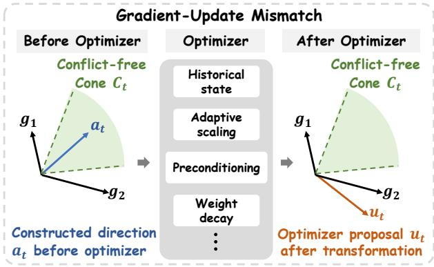  
Figure 1: Gradient–Update Mismatch. A conflict-free direction $a _ { t }$ before optimizer transformation may become a conflicting optimizer proposal $u _ { t }$ after transformation.

This observation suggests that conflict handling should consider not only the direction $a _ { t }$ constructed before optimizer transformation, but also the optimizer proposal $u _ { t }$ before it is applied to the parameters. We therefore propose Gradient–Update Alignment (GUA), which aligns the optimizer proposal $u _ { t }$ with the current conflict-free cone $\mathcal { C } _ { t }$ . Specifically, GUA projects $u _ { t }$ onto $\mathcal { C } _ { t }$ to obtain the aligned update $p _ { t }$ , which is then applied to the parameters. When the optimizer maintains internal state, GUA further adjusts this state toward targets reconstructed from the applied update, reducing the influence of components removed by the projection on subsequent proposals.

## Our contributions are summarized as follows:

1. We identify and formalize a largely overlooked issue, which we term Gradient–Update Mismatch: the conflict-free direction $a _ { t }$ constructed by gradient surgery does not necessarily remain conflictfree after being transformed by the optimizer into the actual update proposal $u _ { t }$

2. We characterize how optimizer transformations can induce GUM. We derive exact conflictpreservation conditions for fixed-state affine transformations and extend the analysis to general nonlinear optimizer maps, covering mechanisms such as historical state, adaptive scaling, preconditioning, and weight decay.

3. We propose Gradient–Update Alignment, introducing an update-level perspective on conflict handling. GUA considers conflict-freeness not only for the direction constructed before optimizer transformation, but also for the optimizer proposal before it is applied to the parameters.

4. We conduct extensive experiments demonstrating that GUM is widespread across momentum, adaptive, and curvature-based optimizers, and that GUA achieves conflict-free applied updates across all evaluated PINN settings while consistently improving various gradient surgery methods.

## 2 RELATED WORK

## 2.1 PINN TRAINING AND LOSS BALANCING

PINNs Raissi et al. (2019) are often difficult to train due to imbalanced gradient magnitudes, poor conditioning, and different convergence rates across loss terms Krishnapriyan et al. (2021); Wang et al. (2022). Loss-balancing methods address part of this difficulty by manually or adaptively reweighting physical constraints Wang et al. (2021); Liu & Wang (2021); Li & Feng (2022); Bischof & Kraus (2025). However, reweighting does not directly address conflicts in gradient directions, motivating gradient surgery methods that operate directly on loss-specific gradients.

## 2.2 GRADIENT SURGERY IN MULTI-LOSS OPTIMIZATION

Multi-loss PINN training is closely related to multi-objective optimization and gradient interference in multi-task learning, where different loss terms can induce conflicting gradients Sener & Koltun (2018); Chen et al. (2018; 2020). Gradient surgery methods address such conflicts by modifying loss-specific gradients before optimizer transformation. PCGrad Yu et al. (2020) reduces pairwise conflicts through projection, CAGrad Liu et al. (2021a) balances average descent with worst-case conflict, and IMTL-G Liu et al. (2021b) reduces task dominance by enforcing equal gradient projections. A-MTL Senushkin et al. (2023) improves gradient conditioning and alignment, while UPGrad Quinton & Rey (2024) uses dual-cone projection to obtain a common descent direction. ConFIG Liu et al. (2025); Baldan et al. (2026) further constructs conflict-free directions with nonnegative inner products against loss-specific gradients for PINNs. Despite differing criteria, these methods all perform gradient surgery before optimizer transformation, overlooking the role of the optimizer in shaping the actual parameter update. This observation naturally motivates our work.

## 2.3 OPTIMIZER TRANSFORMATIONS AND UPDATE-LEVEL ALIGNMENT

Modern optimizers generally transform the direction $a _ { t }$ constructed by gradient surgery before it is applied to the parameters. Such transformations may involve historical state, adaptive scaling, preconditioning, or decoupled weight decay. Representative examples include momentum SGD Sutskever et al. (2013), RMSProp Tieleman & Hinton (2012), Adam Kingma & Ba (2014), AdamW Loshchilov & Hutter (2017), and curvature- or second-order-inspired methods such as Sophia/SophiaG Liu et al. (2024), AdaHessian Yao et al. (2021), and SOAP Vyas et al. (2025). Although such optimizer transformations can improve certain aspects of gradient geometry during training Wang et al. (2025), they may not preserve the conflict-free geometry established before optimizer transformation. Our goal is not to design a new optimizer, but to extend conflict handling from the pre-optimizer direction to the optimizer proposal before it is applied to the parameters.

## 3 GRADIENT–UPDATE MISMATCH AND GRADIENT–UPDATE ALIGNMENT

This section formalizes Gradient–Update Mismatch and introduces Gradient–Update Alignment for update-level conflict handling.

## 3.1 PRELIMINARIES: MULTI-LOSS OPTIMIZATION

Multi-loss objective. Consider an objective with m loss terms, $\begin{array} { r } { \mathcal { L } ( \boldsymbol { \theta } ) = \sum _ { i = 1 } ^ { m } \mathcal { L } _ { i } ( \boldsymbol { \theta } ) } \end{array}$ , where $\theta \in$ Rp denotes the model parameters and $\mathcal { L } _ { i }$ denotes the i-th loss term, including any associated weight. At optimization step t, the corresponding loss-specific gradient is $g _ { i , t } = \nabla _ { \theta } \mathcal { L } _ { i } ( \theta _ { t } )$

Conflict-free cone. For any candidate update direction $d ,$ the linearized change of the i-th loss under $\theta _ { t + 1 } = \theta _ { t } - \eta d$ is $\mathcal { L } _ { i } ( \dot { \theta _ { t } } - \eta d ) - \mathcal { L } _ { i } ( \hat { \theta _ { t } } ) = - \eta \langle g _ { i , t } , d \rangle + O ( \eta ^ { 2 } )$ . Therefore, d does not increase the i-th loss to first order if $\langle g _ { i , t } , d \rangle \geq 0$ . The directions that are compatible with all loss-specific gradients form the conflict-free cone

$$
\mathcal { C } _ { t } = \{ d \in \mathbb { R } ^ { p } \ | \ \langle g _ { i , t } , d \rangle \ge 0 , \ i = 1 , \ldots , m \} = \{ d \in \mathbb { R } ^ { p } \ | \ G _ { t } ^ { \top } d \ge 0 \} ,\tag{1}
$$

where $G _ { t } = [ g _ { 1 , t } , \dots , g _ { m , t } ]$ . This cone characterizes the current conflict-free geometry and will be used for update-level diagnosis and projection.

Constructed direction and optimizer proposal. A gradient surgery method constructs a direction $a _ { t }$ from the loss-specific gradients $\{ g _ { i , t } \} _ { i = } ^ { m }$ to reduce gradient conflicts. Let ${ \mathcal { O } } _ { t }$ denote the optimizer transformation at step $t ,$ and let $s _ { t }$ denote its internal state, such as momentum or adaptive statistics. The optimizer transforms $a _ { t }$ into a proposal $u _ { t }$ and a tentative next state $\bar { s } _ { t + 1 } ;$

$$
( u _ { t } , { \bar { s } } _ { t + 1 } ) = { \mathcal { O } } _ { t } ( a _ { t } , s _ { t } ) .\tag{2}
$$

The optimizer proposal $u _ { t } ,$ , rather than the direction $a _ { t }$ constructed by the gradient surgery method, determines the direction of the actual parameter update. Consequently, conflict-freeness of $a _ { t }$ does not necessarily imply conflict-freeness of the actual update. We therefore introduce the notion of Gradient–Update Mismatch to characterize this optimizer-induced discrepancy in conflict-freeness.

## 3.2 GRADIENT–UPDATE MISMATCH

Definition 1 (Gradient–Update Mismatch). At step $t ,$ a Gradient–Update Mismatch (GUM) is an optimizer-induced discrepancy in conflict-freeness between the constructed direction $a _ { t }$ and the optimizer proposal $u _ { t }$ . Specifically, GUM occurs when $a _ { t } \in { \mathcal { C } } _ { t }$ while $u _ { t } \notin \mathcal C _ { t }$

To quantify conflicts throughout the optimization pipeline, we record

$$
\begin{array} { r l r } & { R _ { g } = \displaystyle \frac { 1 } { T } \sum _ { t = 1 } ^ { T } \mathbb { I } [ \exists i < j : \langle g _ { i , t } , g _ { j , t } \rangle < 0 ] , \quad } & { R _ { a } = \displaystyle \frac { 1 } { T } \sum _ { t = 1 } ^ { T } \mathbb { I } [ a _ { t } \notin \mathcal { C } _ { t } ] , } \\ & { R _ { u } = \displaystyle \frac { 1 } { T } \sum _ { t = 1 } ^ { T } \mathbb { I } [ u _ { t } \notin \mathcal { C } _ { t } ] , \quad } & { R _ { p } = \displaystyle \frac { 1 } { T } \sum _ { t = 1 } ^ { T } \mathbb { I } [ p _ { t } \notin \mathcal { C } _ { t } ] . } \end{array}\tag{3}
$$

Here, $T$ is the total number of optimization steps, and $R _ { g } , R _ { a } , R _ { u }$ , and $R _ { p }$ denote the conflict rates of the raw loss-specific gradients, constructed direction, optimizer proposal, and aligned update, respectively, yielding the diagnostic sequence $R _ { g }  R _ { a }  R _ { u }  R _ { p } .$ For theoretical analysis, the above rates are defined using exact conflict conditions with a zero threshold. In experiments, we use a small normalized tolerance only in the conflict-rate diagnostics to account for numerical errors. Detailed specifications are given in Appendix B.6. Importantly, the relation between $R _ { a }$ and $R _ { u }$ depends on the guarantee provided by the gradient surgery method. If the method always produces conflict-free directions, then $R _ { a } = 0$ , and every conflicting optimizer proposal counted by $R _ { u }$ corresponds directly to a GUM event. Thus, under this conflict-free guarantee, any $R _ { u } > 0$ provides direct evidence of GUM.

Generalized GUM. Some gradient surgery methods do not guarantee conflict-free constructed directions, so $R _ { a }$ can be nonzero. In this case, the strict event definition in Definition 1 does not by itself summarize the aggregate change in conflict frequency introduced by optimizer transformation. We therefore use $\mathsf { \bar { R } } _ { u } \mathsf { \bar { \Pi } } > R _ { a }$ as a rate-level diagnostic of generalized GUM, indicating that optimizer transformation introduces a net increase in the frequency of conflicting proposals. This is an aggregate diagnostic rather than an event-level definition.

## 3.3 CONFLICT PRESERVATION UNDER OPTIMIZER TRANSFORMATIONS

GUM arises when optimizer transformation fails to preserve the conflict-free geometry of the constructed direction. This motivates us to characterize the conditions under which such geometry is preserved. To isolate the geometric mechanisms relevant to conflict preservation, we consider a fixed-state affine representation at step $t , T _ { t } ( a ) = P _ { t } a + b _ { t }$ . Here, $P _ { t }$ captures scaling and preconditioning effects, while $b _ { t }$ represents an additive term that is independent of the input direction a, such as contributions arising from historical state or decoupled weight decay.

Proposition 1 (Conflict preservation under fixed-state affine transformations). Let $\begin{array} { r l } { G _ { t } } & { { } = } \end{array}$ $[ g _ { 1 , t } , \ldots , g _ { m , t } ]$ and $\mathcal { C } _ { t } = \hat { \{ d \in \mathbb { R } ^ { p } \ | \ G _ { t } ^ { \top } d \geq 0 \} }$ . The affine transformation $T _ { t } ( a ) = P _ { t } a + b _ { t }$ preserves conflict-freeness on $\mathcal { C } _ { t } , i . e . , a \in \mathcal { C } _ { t } \Rightarrow T _ { t } ( a ) \in \mathcal { C } _ { t } ,$ , if and only if

$$
b _ { t } \in \mathcal C _ { t } , \qquad P _ { t } ^ { \top } g _ { i , t } \in \mathrm { c o n e } ( g _ { 1 , t } , \dotsc , g _ { m , t } ) , \quad i = 1 , \dotsc , m .\tag{4}
$$

The proof is provided in Appendix A.1. Within the fixed-state affine class, Proposition 1 exactly characterizes conflict preservation by separating the effects of the additive term $b _ { t }$ and the linear transformation $P _ { t }$ . However, these preservation conditions need not hold in general. Positive-scalar transformations with $P _ { t } = \alpha I , \alpha > 0$ , and $b _ { t } = 0$ preserve the cone, with plain SGD corresponding to the special case $P _ { t } = I$ . In contrast, positive coordinate-wise scaling need not preserve the cone. For example, let $g _ { 1 , t } = ( 1 , 0 ) ^ { \top } , g _ { 2 , t } = \mathring { ( 1 , 1 ) } ^ { \top }$ , and $a _ { t } = ( 1 , - 0 . 5 ) ^ { \top }$ . Under $\bar { P _ { t } } = \mathrm { d i a g } ( 0 . 1 , 1 0 )$ the resulting proposal is $u _ { t } = ( 0 . 1 , - 5 ) ^ { \top }$ , for which $\langle g _ { 2 , t } , u _ { t } \rangle = - 4 . 9 < 0$ . Therefore, $u _ { t } \notin \mathcal { C } _ { t } .$ even though $a _ { t } \in { \mathcal { C } } _ { t }$ , showing that positive coordinate-wise scaling can destroy conflict-freeness.

Exact optimizer maps may also be nonlinear in $a _ { t } ,$ , as occurs with adaptive scaling. Appendix A.2 provides a general nonlinear characterization, with Proposition 1 recovered as the affine special case. Thus, historical state, adaptive scaling, preconditioning, and weight decay can all transform a conflict-free $a _ { t }$ into an optimizer proposal outside $\mathcal { C } _ { t }$

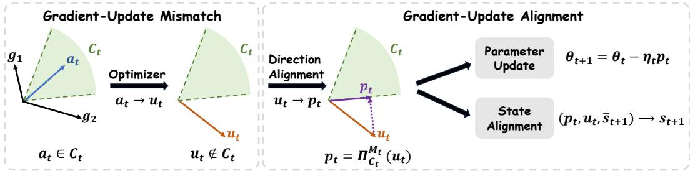  
Figure 2: Illustration of Gradient–Update Mismatch and Gradient–Update Alignment. GUA projects the optimizer proposal $u _ { t }$ onto the conflict-free cone $\mathcal { C } _ { t }$ to obtain the aligned update $p _ { t } .$ , applies $p _ { t }$ to the parameters, and softly aligns the optimizer state with the applied update.

## 3.4 GRADIENT–UPDATE ALIGNMENT

Direction alignment. The preceding analysis suggests that conflict handling should extend from the constructed direction to the optimizer proposal, where conflicts directly determine the applied parameter update. Given $u _ { t }$ , GUA projects it onto $\mathcal { C } _ { t }$ under a positive-definite metric $M _ { t } \succ 0 ;$

$$
p _ { t } = \Pi _ { \mathcal { C } _ { t } } ^ { M _ { t } } ( u _ { t } ) = \arg \operatorname* { m i n } _ { d \in \mathcal { C } _ { t } } \frac { 1 } { 2 } \| d - u _ { t } \| _ { M _ { t } } ^ { 2 } .\tag{5}
$$

The projection is solved in the $m \cdot$ -dimensional dual. For the PINN experiments, where $m \in \{ 2 , 3 \}$ we use exact active-set enumeration. For larger task counts, we solve the nonnegative dual quadratic program. We use the diagonal Adam as the projection metric. Solver and metric details are provided in Appendix $\mathbf { B . 7 . 1 } .$ , with the metric comparison reported in Appendix C.1. The aligned update is applied as $\theta _ { t + 1 } = \theta _ { t } - \eta _ { t } p _ { t }$ . By construction, $p _ { t } \in \mathcal C _ { t } ,$ and $p _ { t } ~ = ~ u _ { t }$ whenever $u _ { t } ~ \in ~ \mathcal { C } _ { t }$ Thus, GUA leaves conflict-free proposals unchanged and projects conflicting proposals onto the conflict-free cone. To characterize this correction, define the one-step loss change $\Delta _ { i , t } ( d ; \eta _ { t } ) =$ $\mathcal { L } _ { i } ( \theta _ { t } - \eta _ { t } d ) - \mathcal { L } _ { i } ( \theta _ { t } )$ , and the conflict violation $v _ { t } ( d ) = \mathrm { m a x } _ { i } [ - \langle g _ { i , t } \bar { , } d \rangle ] _ { + }$

Proposition 2 (Local safety and minimum-change projection). Suppose each loss $\mathcal { L } _ { i }$ is locally smooth near $\theta _ { t }$ and $u _ { t } \notin \mathcal { C } _ { t } . \ A s \ \eta _ { t } \to 0 ^ { + }$ $[ \mathrm { m a x } _ { i } \bar { \Delta } _ { i , t } ( p _ { t } ; \eta _ { t } ) ] _ { + } = \bar { O ( \eta _ { t } ^ { 2 } ) }$ and maxi $\Delta _ { i , t } ( u _ { t } ; \eta _ { t } ) \ge$ $\eta _ { t } v _ { t } ( u _ { t } ) \ : - \ : O ( \eta _ { t } ^ { 2 } )$ Consequently, for all sufficiently small $\eta _ { t } \ > \ 0 ;$ , maxi $\begin{array} { r l } { \Delta _ { i , t } ( p _ { t } ; \eta _ { t } ) } & { { } < } \end{array}$ maxi $\Delta _ { i , t } \big ( u _ { t } ; \eta _ { t } \big )$ . Moreover, $p _ { t }$ is the closest conflict-free update to $u _ { t }$ under the Mt-metric.

For a conflicting optimizer proposal, $u _ { t }$ incurs a positive first-order term for at least one loss, whereas $p _ { t }$ does not. GUA therefore yields the closest conflict-free update to $u _ { t }$ under the chosen metric. Full bounds and proofs are provided in Appendix A.3. Q3 tests the resulting direction alignment mechanism using same-state, norm-matched comparisons.

State alignment. Direction alignment resolves conflicts in the current optimizer proposal by projecting it onto the conflict-free cone, while state alignment reduces the persistence of projectioninduced corrections in the optimizer memory. Without state adjustment, components removed by the projection may still affect future proposals through stored statistics. We therefore softly align the optimizer state toward targets reconstructed from the applied update $p _ { t }$ only when the projection modifies the proposal. Otherwise, the tentative state is retained. Taking Adam as an example, let $\bar { s } _ { t + 1 } = ( \bar { m } _ { t + 1 } , \bar { v } _ { t + 1 } )$ denote the tentative state associated with $u _ { t }$ . We reconstruct a target state from a pseudo-gradient consistent with $p _ { t }$ under the current adaptive denominator, as detailed in Appendix B.7.2. The persistent state is then softly aligned as

$$
\begin{array} { r } { m _ { t + 1 } = ( 1 - \rho _ { m } ) \bar { m } _ { t + 1 } + \rho _ { m } \tilde { m } _ { t + 1 } , \qquad v _ { t + 1 } = ( 1 - \rho _ { v } ) \bar { v } _ { t + 1 } + \rho _ { v } \tilde { v } _ { t + 1 } . } \end{array}\tag{6}
$$

The coefficients $\rho _ { m } , \rho _ { v } \in [ 0 , 1 ]$ control the alignment strength. Setting $\rho _ { m } = \rho _ { v } = 0$ recovers direction alignment alone, while larger values place greater weight on the target moments reconstructed from $p _ { t }$ . The same principle can extend to other stateful optimizers, including RMSProp, AdamW, and SOAP, using their respective state-update rules. The corresponding projection and state-alignment procedures, together with the cross-optimizer results, are provided in Appendix C.5.

## 4 EXPERIMENTS

## 4.1 EXPERIMENTAL SETUP

We structure our experiments around the following research questions: Q1 (Optimizer-Induced GUM): Does optimizer transformation induce conflicts after gradient surgery? Q2 (PINN Performance): Does GUA achieve conflict-free applied updates and improve PINN performance? Q3 (Direction Alignment Mechanism): Does GUA improve optimization primarily through direction alignment rather than changes in update magnitude? Q4 (State Alignment Mechanism): Does optimizer-state alignment provide additional benefits beyond direction alignment? Q5 (GUA Overhead): What computational and memory overhead does GUA introduce? Q6 (Task-Cardinality Scaling): Does GUA remain effective as the number of jointly optimized tasks increases?

For the PINN evaluation, we use six PDE benchmarks following PINNacle Hao et al. (2024) and ConFIG Liu et al. (2025), and evaluate GUA with six representative gradient surgery methods: PCGrad Yu et al. (2020), CAGrad Liu et al. (2021a), IMTL-G Liu et al. (2021b), A-MTL Senushkin et al. (2023), UPGrad Quinton & Rey (2024), and ConFIG Liu et al. (2025). PINN results are reported over five independent runs on a single NVIDIA RTX 4090 GPU. We also use CelebA Liu et al. (2015) as a controlled task-cardinality benchmark with varying numbers of jointly optimized tasks, reporting results over three independent runs. For the PINN benchmarks, let $\mathcal { L } _ { N } , \mathcal { L } _ { B }$ , and $\mathcal { L } _ { I }$ denote the PDE residual, boundary, and initial-condition losses, respectively. In the 2-loss setting, we introduce a composite loss $\mathcal { L } _ { B I }$ that aggregates the contributions from the boundary and initial conditions, and evaluate $[ \mathcal { L } _ { N } , \mathcal { L } _ { B I } ]$ We also evaluate the 3-loss setting $[ \mathcal { L } _ { N } , \mathcal { L } _ { B } , \mathcal { L } _ { I } ]$ . Detailed experimental settings are provided in Appendix B and Appendix D.

## 4.2 Q1: OPTIMIZER-INDUCED GUM

Question Q1: Does optimizer transformation induce conflicts after gradient surgery? We use Con-FIG as the base gradient surgery method because it constructs conflict-free directions before optimizer transformation, yielding $R _ { a } ~ = ~ 0$ This isolates the effect of optimizer transformation, since any subsequent conflict in $u _ { t }$ cannot be attributed to residual conflict in $a _ { t }$ . We then measure the post-optimizer conflict rate $R _ { u }$ across first-order and second-order optimizer families to assess whether the conflict-free geometry is preserved after optimizer transformation.

Answer to Q1. Table 1 reports the mean conflict rates along the three-stage transition $R _ { q }  R _ { a } $ $R _ { u } ,$ , corresponding to the raw loss-specific gradients $\{ g _ { i , t } \bar  \} _ { i = 1 } ^ { m }$ , constructed direction $^ { a _ { t } , }$ and optimizer proposal $u _ { t } ,$ respectively. ConFIG yields $R _ { a } = 0$ in all settings, so nonzero $R _ { u }$ directly indicates GUM. Consistent with the conflict-preservation analysis in Section 3.3, plain SGD preserves $R _ { u } = 0$ . In contrast, momentum alone produces substantial GUM, with M-SGD yielding $R _ { u } = 5 1 . 3 \% { - 8 6 . 3 \% }$ . Adaptive and curvature-based optimizers can also produce nonzero $R _ { u }$ , with the rate varying across PDEs. These results show that optimizer transformation can reintroduce conflicts after gradient surgery, depending on its interaction with the current loss-gradient geometry.

Table 1: Optimizer-induced GUM across PINN benchmarks. The sequence $R _ { g }  R _ { a }  R _ { u }$ tracks conflict rates $( \downarrow )$ from raw loss-specific gradients through gradient surgery to optimizer transformation. Additional PDE results are provided in Appendix C.3.
<table><tr><td rowspan="3">Optimizer</td><td colspan="6">Schrödinger</td><td colspan="6">Burgers</td><td colspan="6">Heat-MS</td></tr><tr><td colspan="3">2-loss</td><td colspan="3">3-loss</td><td colspan="3">2-loss</td><td colspan="3">3-loss</td><td colspan="3">2-loss</td><td colspan="3">3-loss</td></tr><tr><td></td><td> $R _ { a }$ </td><td> $R _ { u }$ </td><td> $R _ { g }$ </td><td> $R _ { a }$ </td><td> $R _ { u }$ </td><td> $R _ { g }$ </td><td> $R _ { a }$   $R _ { u }$ </td><td></td><td> $R _ { g }$ </td><td> $R _ { a }$ </td><td> $R _ { u }$ </td><td> $R _ { g }$ </td><td> $R _ { a }$ </td><td> $R _ { u }$ </td><td> $R _ { g }$ </td><td> $R _ { a }$ </td><td> $R _ { u }$ </td></tr><tr><td></td><td colspan="10">First-order optimizers</td><td></td><td></td><td></td><td></td><td></td><td></td><td></td><td></td></tr><tr><td>SGD 100.0</td><td>0.0</td><td>0.0</td><td></td><td>100.0</td><td>0.0</td><td>0.0</td><td>99.7</td><td>0.0</td><td>0.0</td><td>99.9</td><td>0.0</td><td>0.0</td><td>70.1</td><td>0.0</td><td>0.0</td><td>99.0</td><td>0.0</td><td>0.0</td></tr><tr><td>M-SGD</td><td>99.8</td><td>0.0</td><td>82.3</td><td>99.8</td><td>0.0</td><td>81.6</td><td>99.9</td><td>0.0</td><td>80.5</td><td>100.0</td><td>0.0</td><td>86.3</td><td>58.6</td><td>0.0</td><td>51.3</td><td>95.5</td><td>0.0</td><td>72.7</td></tr><tr><td>RMSProp</td><td>78.7</td><td>0.0</td><td>1.8</td><td>83.3</td><td>0.0</td><td>18.8</td><td>58.4</td><td>0.0</td><td>6.1</td><td>87.1</td><td>0.0</td><td>24.7</td><td>27.7</td><td>0.0</td><td>0.0</td><td>72.8</td><td>0.0</td><td>5.5</td></tr><tr><td>Adam</td><td>40.8</td><td>0.0</td><td>23.7</td><td>56.3</td><td>0.0</td><td>35.2</td><td>30.5</td><td>0.0</td><td>29.4</td><td>73.7</td><td>0.0</td><td>57.4</td><td>22.8</td><td>0.0</td><td>12.8</td><td>81.3</td><td>0.0</td><td>64.6</td></tr><tr><td>AdamW</td><td>46.5</td><td>0.0</td><td>26.3</td><td>62.0</td><td>0.0</td><td>35.9</td><td>30.1</td><td>0.0</td><td>29.9</td><td>74.0</td><td>0.0</td><td>55.5</td><td>25.0</td><td>0.0</td><td>15.6</td><td>80.7</td><td>0.0</td><td>63.8</td></tr><tr><td></td><td colspan="3"></td><td colspan="9"></td><td rowspan="2"></td><td rowspan="2">42.4</td><td rowspan="2"></td><td rowspan="2">80.7</td><td rowspan="2">0.0 73.2</td></tr><tr><td>SophiaG</td><td>91.7</td><td>0.0</td><td>36.3</td><td>96.3</td><td>0.0</td><td>69.5</td><td>76.9</td><td>0.0</td><td>Second-order optimizers 42.8</td><td>96.9 0.0</td><td>66.4</td><td>33.9</td><td>0.0</td></tr><tr><td>AdaHessian</td><td>99.7</td><td>0.0</td><td>27.2</td><td>99.7</td><td>0.0</td><td>16.9</td><td>99.4</td><td>0.0</td><td>43.9</td><td>99.9</td><td>0.0</td><td>70.9</td><td>75.2</td><td>0.0</td><td>40.9</td><td>99.8</td><td>0.0</td><td>57.1</td></tr><tr><td>SOAP</td><td>25.3</td><td>0.0</td><td>17.3</td><td>63.3</td><td>0.0</td><td>37.6</td><td>25.5</td><td>0.0</td><td>27.5</td><td>68.1</td><td>0.0</td><td>57.2</td><td>33.9</td><td>0.0</td><td>14.4</td><td>64.9</td><td>0.0</td><td>45.1</td></tr></table>

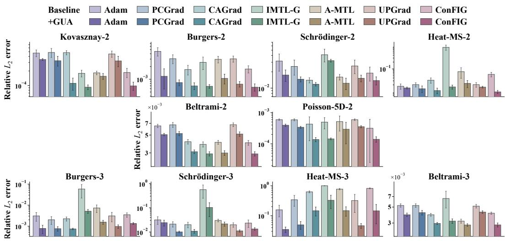  
Figure 3: Performance of different gradient surgery methods with and without GUA across PINN benchmarks under 2-loss and 3-loss settings.

## 4.3 Q2: PINN PERFORMANCE

Question Q2: Does GUA achieve conflict-free applied updates and improve PINN performance? After establishing GUM, we assess whether GUA achieves conflict-free applied updates and improves PINN performance. We evaluate GUA on six PDE benchmarks using representative gradient surgery methods, with Adam as a no-surgery control that passes the original aggregate gradient directly to the optimizer. Figure 3 reports the relative $L _ { 2 }$ error. Quantitative results and detailed conflict transitions $R _ { g } \to R _ { a } \to R _ { u } \to R _ { p }$ are provided in Appendix C.4.

Answer to Q2. As shown in Appendix C.4, GUA eliminates update-level conflicts, yielding $R _ { p } = 0$ across all PINN settings. Figure 3 shows that GUA consistently improves PINN accuracy across gradient surgery methods and PDE benchmarks. The mean relative $L _ { 2 }$ error decreases in every setting, with individual reductions ranging from 11.6% to 98.2% and median reductions of 42.2% and 61.9% in the two- and three-loss settings, respectively. Notably, Adam+GUA, without gradient surgery, improves over Adam in all 10 PINN settings and outperforms all standalone gradient surgery baselines in 4 settings, highlighting the value of conflict handling after optimizer transformation. GUA also remains effective with RMSProp, AdamW, and SOAP, as shown in Appendix C.5.

## 4.4 Q3: DIRECTION ALIGNMENT MECHANISM

Question Q3: Does GUA improve optimization primarily through direction alignment rather than changes in update magnitude? Direction alignment can change both the direction and norm of the optimizer proposal, so performance gains alone cannot distinguish their effects. Using ConFIG as the base gradient surgery method, we conduct a same-state, norm-matched comparison across all 10 PINN settings. At each evaluated step, we fix the parameters, optimizer state, batch, and learning rate, and compare $u _ { t } , p _ { t }$ , and $\begin{array} { r } { q _ { t } = \frac { \| p _ { t } \| _ { 2 } } { \| u _ { t } \| _ { 2 } } u _ { t } } \end{array}$ . Here, $q _ { t }$ preserves the direction of $u _ { t }$ while matching the norm of $p _ { t }$ , thereby isolating the effect of direction alignment. We evaluate the worst relative onestep loss change $\begin{array} { r } { \dot { W } _ { t } ^ { \mathrm { r e l } } ( d ) = \operatorname* { m a x } _ { i } \frac { \mathcal { L } _ { i } ( \theta _ { t } - \eta _ { t } d ) - \mathcal { L } _ { i } ( \theta _ { t } ) } { | \mathcal { L } _ { i } ( \theta _ { t } ) | + \epsilon } } \end{array}$ . The positive, step-fixed denominator rescales each loss without changing $\mathcal { C } _ { t }$ , so the same local-safety argument applies to $W _ { t } ^ { \mathrm { r e l } }$

Answer to Q3. As shown in Figure 4, the benefit of GUA is primarily driven by direction alignment. Across all 10 PINN settings, $p _ { t }$ yields a lower worst relative one-step loss change than $u _ { t }$ in 95.1% of paired same-state comparisons and than the norm-matched $q _ { t }$ in 93.4% of cases (see Appendix Table 10). Since $q _ { t }$ matches the norm of $p _ { t }$ while preserving the direction of $u _ { t } .$ , the improvement over $q _ { t }$ isolates the effect of direction alignment. These results empirically support the direction alignment mechanism in Proposition 2 and the norm-matching analysis in Appendix A.4.

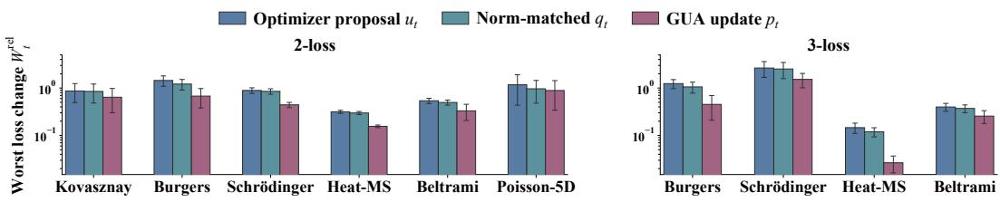  
Figure 4: Worst relative one-step loss change $W _ { t } ^ { \mathrm { r e l } }$ for the optimizer proposal $u _ { t } ,$ , the GUA update $p _ { t }$ , and the norm-matched control $q _ { t }$ under paired same-state evaluations across PINN benchmarks.

## 4.5 Q4: STATE ALIGNMENT MECHANISM

Question Q4: Does optimizer-state alignment provide additional benefits beyond direction alignment? Direction alignment acts on the current optimizer proposal $u _ { t } .$ , but stateful optimizers retain internal statistics that influence future proposals. We therefore examine whether adjusting the optimizer state toward targets reconstructed from the applied update $p _ { t }$ provides additional benefits beyond direction alignment alone. Using ConFIG as the base gradient surgery method with Adam as the optimizer, we compare the gradient surgery baseline without GUA, direction alignment only $( \rho _ { m } , \rho _ { v } ) = ( 0 , 0 )$ , soft state alignment (see Appendix $_ { \mathrm { B . 7 . 2 ) . } }$ , exact first-moment align ment $( \rho _ { m } , \rho _ { v } ) = ( 1 , 0 )$ , and exact alignment of both Adam moments $( \rho _ { m } , \rho _ { v } ) = ( 1 , 1 )$

Answer to Q4. Figure 5 shows that direction alignment alone already improves performance, while soft state alignment provides further improvements in most settings. In contrast, exact alignment is less effective, and aligning both Adam moments exactly degrades performance in some settings and becomes numerically unstable in one Heat-MS setting. A possible explanation is that direction alignment affects only the current optimizer proposal, whereas the moments maintained by Adam encode information accumulated over a longer optimization horizon. Fully replacing them with states reconstructed from $p _ { t }$ can discard useful history and alter future adaptive scaling. Soft alignment instead preserves part of this history while moving the optimizer state toward target moments reconstructed from $p _ { t } .$ , motivating its use in GUA.

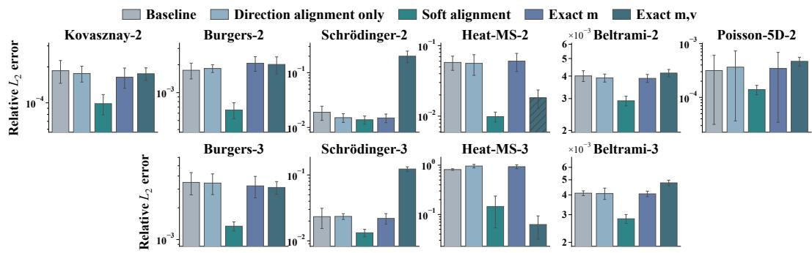  
Figure 5: State-alignment ablation on PINN benchmarks.

## 4.6 Q5: GUA OVERHEAD

Question Q5: What computational and memory overhead does GUA introduce? We evaluate the practical overhead of GUA by comparing training time and peak GPU memory with and without GUA across all PINN settings, using ConFIG as the base method. GUA performs additional conflict checking and direction alignment at each step. The projection is solved in the m-dimensional dual without forming a $p \times p$ matrix. Its parameter-dimensional cost is $O ( m ^ { 2 } p )$ for Gram-matrix construction, followed by a small dual solve. Since $m \in \{ 2 , 3 \}$ in the PINN experiments, this dual problem is solved exactly by active-set enumeration. Further details are provided in Appendix B.7.1.

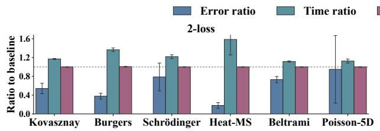

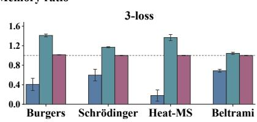  
Figure 6: Relative $L _ { 2 }$ error (↓), training-time (↓), and peak-memory (↓) ratios across PINN settings.

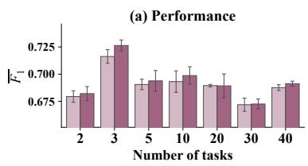

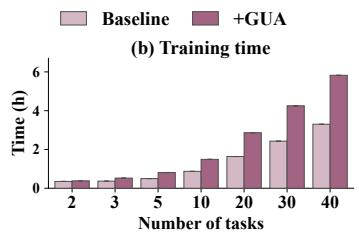

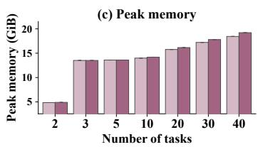  
Figure 7: Task scaling of GUA in terms of $\overline { { F _ { 1 } } } \left( \uparrow \right)$ , training time (↓), and peak GPU memory (↓).

Answer to Q5. As shown in Figure 6, GUA introduces additional training-time overhead while adding little peak GPU memory overhead. Across all PINN settings, GUA consistently improves accuracy. These results highlight a trade-off between accuracy and efficiency. GUA improves accuracy at the cost of additional computation while incurring little additional memory usage.

## 4.7 Q6: TASK-CARDINALITY SCALING

Question Q6: Does GUA remain effective as the number of jointly optimized tasks increases? We use CelebA Liu et al. (2015) as a controlled task-cardinality benchmark, varying the number of attribute tasks from 2 to 40 while fixing ConFIG as the baseline. For each task count, we compare ConFIG and ConFIG+GUA in terms of $\overline { { F _ { 1 } } }$ , training time, and peak GPU memory. The projection uses exact active-set enumeration for small m and an m-dimensional nonnegative dual QP for larger m. Further details are provided in Appendix B.7.1.

Answer to Q6. Figure 7 shows that GUA remains effective as task cardinality increases from 2 to 40, improving the $\overline { { F _ { 1 } } }$ in six of seven settings and achieving comparable performance at 20 tasks. The additional memory cost remains small as task cardinality increases, reaching only 4.2% at 40 tasks, while training-time overhead becomes more pronounced for larger task counts. These result demonstrate that GUA remains effective as the number of jointly optimized tasks increases.

## 5 CONCLUSION

This work provides a new perspective on gradient conflict handling in PINN training. We identify the largely overlooked phenomenon of GUM and demonstrate its prevalence across evaluated PINN settings through theoretical analysis and extensive experiments. Motivated by this finding, we propose GUA to enforce conflict-free geometry at the update level. Extensive experiments show that GUA effectively eliminates update-level conflicts and substantially improves PINN performance.

Limitations and Future Work. Despite these advances, the current formulation of GUM and GUA is based on local first-order gradient geometry and therefore does not explicitly capture curvature, finite-step, or longer-horizon optimization effects. Moreover, the current hard conflict-free criterion may be conservative by excluding update directions that could become beneficial beyond the local first-order view. Therefore, extending the framework beyond instantaneous first-order geometry, together with developing softer conflict criteria, is an important direction for future work.

## REFERENCES

Giacomo Baldan, Qiang Liu, Alberto Guardone, and Nils Thuerey. Physics vs distributions: Pareto optimal flow matching with physics constraints. In International Conference on Learning Representations, volume 2026, pp. 101215–101243, 2026.

Rafael Bischof and Michael A Kraus. Multi-objective loss balancing for physics-informed deep learning. Computer Methods in Applied Mechanics and Engineering, 439:117914, 2025.

Zhao Chen, Vijay Badrinarayanan, Chen-Yu Lee, and Andrew Rabinovich. Gradnorm: Gradient normalization for adaptive loss balancing in deep multitask networks. In International conference on machine learning, pp. 794–803. PMLR, 2018.

Zhao Chen, Jiquan Ngiam, Yanping Huang, Thang Luong, Henrik Kretzschmar, Yuning Chai, and Dragomir Anguelov. Just pick a sign: Optimizing deep multitask models with gradient sign dropout. Advances in Neural Information Processing Systems, 33:2039–2050, 2020.

Lukas Gonon, Arnulf Jentzen, Benno Kuckuck, Siyu Liang, Adrian Riekert, and Philippe von Wurstemberger. An overview on machine learning methods for partial differential equations: from physics informed neural networks to deep operator learning. arXiv preprint arXiv:2408.13222, 2024.

Zhongkai Hao, Jiachen Yao, Chang Su, Hang Su, Ziao Wang, Fanzhi Lu, Zeyu Xia, Yichi Zhang, Songming Liu, Lu Lu, et al. Pinnacle: A comprehensive benchmark of physics-informed neural networks for solving pdes. Advances in neural information processing systems, 37:76721–76774, 2024.

Diederik P Kingma and Jimmy Ba. Adam: A method for stochastic optimization. arXiv preprint arXiv:1412.6980, 2014.

Nikola Kovachki, Zongyi Li, Burigede Liu, Kamyar Azizzadenesheli, Kaushik Bhattacharya, Andrew Stuart, and Anima Anandkumar. Neural operator: Learning maps between function spaces with applications to pdes. Journal ofMachine Learning Research, 24(89):1–97, 2023.

Aditi Krishnapriyan, Amir Gholami, Shandian Zhe, Robert Kirby, and Michael Mahoney. Characterizing possible failure modes in physics-informed neural networks. Advances in neural information processing systems, 34:26548–26560, 2021.

Shirong Li and Xinlong Feng. Dynamic weight strategy of physics-informed neural networks for the 2d navier–stokes equations. Entropy, 24(9):1254, 2022.

Zongyi Li, Nikola Kovachki, Kamyar Azizzadenesheli, Burigede Liu, Kaushik Bhattacharya, Andrew Stuart, and Anima Anandkumar. Fourier neural operator for parametric partial differential equations. arXiv preprint arXiv:2010.08895, 2020.

Bo Liu, Xingchao Liu, Xiaojie Jin, Peter Stone, and Qiang Liu. Conflict-averse gradient descent for multi-task learning. Advances in neural information processing systems, 34:18878–18890, 2021a.

Dehao Liu and Yan Wang. A dual-dimer method for training physics-constrained neural networks with minimax architecture. Neural Networks, 136:112–125, 2021.

Hong Liu, Zhiyuan Li, David Hall, Percy Liang, and Tengyu Ma. Sophia: A scalable stochastic second-order optimizer for language model pre-training. In International conference on learning representations, volume 2024, pp. 1621–1650, 2024.

Liyang Liu, Yi Li, Zhanghui Kuang, Jing-Hao Xue, Yimin Chen, Wenming Yang, Qingmin Liao, and Wayne Zhang. Towards impartial multi-task learning. In International conference on learning representations, 2021b.

Qiang Liu, Mengyu Chu, and Nils Thuerey. Config: Towards conflict-free training of physics informed neural networks. In International Conference on Learning Representations, volume 2025, pp. 59531–59566, 2025.

Ziwei Liu, Ping Luo, Xiaogang Wang, and Xiaoou Tang. Deep learning face attributes in the wild. In Proceedings of the IEEE international conference on computer vision, pp. 3730–3738, 2015.

Ilya Loshchilov and Frank Hutter. Decoupled weight decay regularization. arXiv preprint arXiv:1711.05101, 2017.

Lu Lu, Pengzhan Jin, Guofei Pang, Zhongqiang Zhang, and George Em Karniadakis. Learning nonlinear operators via deeponet based on the universal approximation theorem of operators. Nature machine intelligence, 3(3):218–229, 2021.

Pierre Quinton and Valerian Rey. Jacobian descent for multi-objective optimization. ´ arXiv preprint arXiv:2406.16232, 2024.

Maziar Raissi, Paris Perdikaris, and George E Karniadakis. Physics-informed neural networks: A deep learning framework for solving forward and inverse problems involving nonlinear partial differential equations. Journal ofComputational physics, 378:686–707, 2019.

Ozan Sener and Vladlen Koltun. Multi-task learning as multi-objective optimization. Advances in neural information processing systems, 31, 2018.

Dmitry Senushkin, Nikolay Patakin, Arseny Kuznetsov, and Anton Konushin. Independent component alignment for multi-task learning. In 2023 IEEE/CVF Conference on Computer Vision and Pattern Recognition (CVPR), pp. 20083–20093. IEEE, 2023.

Ilya Sutskever, James Martens, George Dahl, and Geoffrey Hinton. On the importance of initialization and momentum in deep learning. In International conference on machine learning, pp. 1139–1147. pmlr, 2013.

Tijmen Tieleman and Geoffrey Hinton. Lecture 6.5—RMSProp: Divide the gradient by a running average of its recent magnitude. Coursera course, Neural Networks for Machine Learning, 2012.

Nikhil Vyas, Depen Morwani, Rosie Zhao, Itai Shapira, David Brandfonbrener, Lucas Janson, and Sham Kakade. Soap: Improving and stabilizing shampoo using adam for language modeling. In International Conference on Learning Representations, volume 2025, pp. 93423–93444, 2025.

Sifan Wang, Yujun Teng, and Paris Perdikaris. Understanding and mitigating gradient flow pathologies in physics-informed neural networks. SIAM Journal on Scientific Computing, 43(5):A3055– A3081, 2021.

Sifan Wang, Xinling Yu, and Paris Perdikaris. When and why pinns fail to train: A neural tangent kernel perspective. Journal ofComputational Physics, 449:110768, 2022.

Sifan Wang, Ananyae Bhartari, Bowen Li, and Paris Perdikaris. Gradient alignment in Physics-Informed Neural Networks: A second-order optimization perspective. In Advances in Neural Information Processing Systems, volume 38, pp. 168482–168532. Curran Associates, Inc., 2025. doi: 10.52202/085713-5615.

Zhewei Yao, Amir Gholami, Sheng Shen, Mustafa Mustafa, Kurt Keutzer, and Michael Mahoney. Adahessian: An adaptive second order optimizer for machine learning. In proceedings of the AAAI conference on artificial intelligence, volume 35, pp. 10665–10673, 2021.

Tianhe Yu, Saurabh Kumar, Abhishek Gupta, Sergey Levine, Karol Hausman, and Chelsea Finn. Gradient surgery for multi-task learning. Advances in neural information processing systems, 33: 5824–5836, 2020.

Weiwei Zhang, Wei Suo, Jiahao Song, and Wenbo Cao. Physics-informed neural networks (pinns) as intelligent computing technique for solving partial differential equations: Limitation and future prospects. SCIENCE CHINA Physics, Mechanics & Astronomy, 69(1):214602, 2026.

## A THEORY AND PROOFS

## A.1 PROOF OF PROPOSITION 1

Proposition 1. Let $G _ { t } = [ g _ { 1 , t } , \dots , g _ { m , t } ]$ and

$$
\mathcal { C } _ { t } = \{ d \in \mathbb { R } ^ { p } \ \lvert \ G _ { t } ^ { \top } d \geq 0 \} .
$$

The affine transformation $T _ { t } ( a ) = P _ { t } a + b _ { t }$ is conflict-preserving on $\mathcal { C } _ { t }$ , i.e.,

$$
a \in { \mathcal { C } } _ { t } \quad \implies \quad T _ { t } ( a ) \in { \mathcal { C } } _ { t } ,
$$

if and only if

$$
b _ { t } \in \mathcal C _ { t } , \qquad P _ { t } ^ { \top } g _ { i , t } \in \mathrm { c o n e } ( g _ { 1 , t } , \dotsc , g _ { m , t } ) , \quad i = 1 , \dotsc , m .
$$

Proof. We first prove necessity. Since $\mathcal { C } _ { t }$ is a cone, $0 \in \mathcal { C } _ { t } . \mathrm { ~ H ~ } T _ { t }$ is conflict-preserving, then

$$
T _ { t } ( 0 ) = b _ { t } \in \mathcal { C } _ { t } .
$$

Now take any $a \in { \mathcal { C } } _ { t }$ and any scalar $\lambda \geq 0 .$ Since λa $\in { \mathcal { C } } _ { t }$ , conflict preservation gives

$$
T _ { t } ( \lambda a ) = \lambda P _ { t } a + b _ { t } \in { \mathcal { C } } _ { t } .
$$

Therefore, for every i,

$$
\lambda \langle g _ { i , t } , P _ { t } a \rangle + \langle g _ { i , t } , b _ { t } \rangle \geq 0 \qquad { \mathrm { f o r ~ a l l ~ } } \lambda \geq 0 .
$$

Letting $\lambda \to \infty$ implies

$$
\langle g _ { i , t } , P _ { t } a \rangle \geq 0 \qquad { \mathrm { f o r ~ a l l ~ } } a \in { \mathcal { C } } _ { t } .
$$

Equivalently,

$$
\langle P _ { t } ^ { \top } g _ { i , t } , a \rangle \geq 0 \qquad \mathrm { f o r ~ a l l } \ a \in { \mathcal C } _ { t } .
$$

Define the dual cone of $\mathcal { C } _ { t }$ as

$$
{ \mathcal { C } } _ { t } ^ { * } = \left\{ y \in \mathbb { R } ^ { p } \mid \langle y , d \rangle \geq 0 { \mathrm { ~ f o r ~ a l l ~ } } d \in { \mathcal { C } } _ { t } \right\} .
$$

The preceding inequality shows that

Since

$$
P _ { t } ^ { \top } g _ { i , t } \in \mathcal { C } _ { t } ^ { * } .
$$

$$
\mathcal { C } _ { t } = \{ d \in \mathbb { R } ^ { p } \ \vert \ G _ { t } ^ { \top } d \geq 0 \}
$$

is a closed polyhedral cone, Farkas’ lemma gives

Hence,

$$
\mathcal { C } _ { t } ^ { * } = \mathrm { c o n e } ( g _ { 1 , t } , \dots , g _ { m , t } ) .
$$

$$
P _ { t } ^ { \top } g _ { i , t } \in \mathrm { c o n e } ( g _ { 1 , t } , \ldots , g _ { m , t } ) , \qquad i = 1 , \ldots , m .
$$

We now prove sufficiency. Suppose

$$
b _ { t } \in \mathcal { C } _ { t }
$$

and

$$
P _ { t } ^ { \top } g _ { i , t } \in \mathrm { c o n e } ( g _ { 1 , t } , \ldots , g _ { m , t } ) \qquad { \mathrm { f o r ~ a l l ~ } } i .
$$

For any $a \in { \mathcal { C } } _ { t }$

$$
\langle g _ { i , t } , P _ { t } a \rangle = \langle P _ { t } ^ { \top } g _ { i , t } , a \rangle \geq 0 ,
$$

because $P _ { t } ^ { \top } g _ { i , t }$ is a nonnegative combination of $g _ { 1 , t } , \ldots , g _ { m , t }$ , while

$$
\langle g _ { j , t } , a \rangle \geq 0 \qquad \mathrm { f o r ~ e v e r y ~ } j .
$$

Thus,

$$
P _ { t } a \in { \mathcal { C } } _ { t } .
$$

Since $b _ { t } \in \mathcal { C } _ { t }$ and $\mathcal { C } _ { t }$ is a convex cone, it is closed under addition. Therefore,

$$
P _ { t } a + b _ { t } \in { \mathcal { C } } _ { t } .
$$

Hence,

$$
T _ { t } ( a ) = P _ { t } a + b _ { t } \in \mathcal { C } _ { t } \qquad \mathrm { f o r } \mathrm { e v e r y } a \in \mathcal { C } _ { t } ,
$$

so $T _ { t }$ is conflict-preserving.

## A.2 GENERAL NONLINEAR CONFLICT PRESERVATION

The fixed-state affine result above provides an interpretable characterization, but exact optimizer maps need not be affine in the constructed direction. We therefore give a general characterization for nonlinear optimizer transformations.

Proposition 3 (General nonlinear conflict preservation). Fix $G _ { t } = [ g _ { 1 , t } , \dots , g _ { m , t } ]$ and all step-t quantities other than the input direction $^ { a , }$ and let

$$
T _ { t } : \mathbb { R } ^ { p }  \mathbb { R } ^ { p }
$$

denote the resulting one-step optimizer transformation. Suppose $T _ { t }$ is locally Lipschitz. For each $a \in { \mathcal { C } } _ { t } ,$ , define the ray-wise map

$$
\phi _ { t , a } ( \tau ) = T _ { t } ( \tau a ) , \qquad \tau \in [ 0 , 1 ] .
$$

Then $T _ { t }$ is conflict-preserving on $\mathcal { C } _ { t } \mathrm { ~ } i f$ and only if, for every $a \in { \mathcal { C } } _ { t }$ and every $i = 1 , \ldots , m$

$$
\left. g _ { i , t } , T _ { t } ( 0 ) \right. + \int _ { 0 } ^ { 1 } \left. g _ { i , t } , \phi _ { t , a } ^ { \prime } ( \tau ) \right. d \tau \geq 0 ,
$$

where $\phi _ { t , a } ^ { \prime } ( \tau )$ exists almost everywhere.

$I f T _ { t }$ is continuously differentiable, this condition becomes

$$
\langle g _ { i , t } , T _ { t } ( 0 ) \rangle + \int _ { 0 } ^ { 1 } \left. J _ { T _ { t } } ( \tau a ) ^ { \top } g _ { i , t } , a \right. d \tau \geq 0 ,
$$

where ${ { J } _ { { { T } _ { t } } } }$ denotes the Jacobian of $\cdot _ { T _ { t } }$

Proof. For any fixed $a \in { \mathcal { C } } _ { t }$ , the locally Lipschitz property of $T _ { t }$ implies that the ray-wise map

$$
\phi _ { t , a } ( \tau ) = T _ { t } ( \tau a )
$$

is absolutely continuous on [0, 1]. Hence it is differentiable almost everywhere, and the fundamental theorem for absolutely continuous functions gives

$$
T _ { t } ( a ) = T _ { t } ( 0 ) + \int _ { 0 } ^ { 1 } \phi _ { t , a } ^ { \prime } ( \tau ) d \tau .
$$

Taking the inner product with $g _ { i , t }$ yields

$$
\langle g _ { i , t } , T _ { t } ( a ) \rangle = \langle g _ { i , t } , T _ { t } ( 0 ) \rangle + \int _ { 0 } ^ { 1 } \left. g _ { i , t } , \phi _ { t , a } ^ { \prime } ( \tau ) \right. d \tau .
$$

By definition,

$$
T _ { t } ( a ) \in \mathcal { C } _ { t } \quad \iff \quad \langle g _ { i , t } , T _ { t } ( a ) \rangle \geq 0 \quad \mathrm { f o r ~ a l l ~ } i .
$$

Therefore, requiring the displayed inequality for every $a \in { \mathcal { C } } _ { t }$ and every i is equivalent to

$$
T _ { t } ( { \mathcal { C } } _ { t } ) \subseteq { \mathcal { C } } _ { t } .
$$

$\operatorname { I f } T _ { t }$ is continuously differentiable, the chain rule gives

$$
\phi _ { t , a } ^ { \prime } ( \tau ) = J _ { T _ { t } } ( \tau a ) a ,
$$

which yields the stated Jacobian form.

Relation to the affine case. For an affine transformation

$$
T _ { t } ( a ) = P _ { t } a + b _ { t } ,
$$

we have

$$
T _ { t } ( 0 ) = b _ { t } , \qquad J _ { T _ { t } } ( a ) = P _ { t } .
$$

Thus, the nonlinear characterization reduces to

$$
\langle g _ { i , t } , b _ { t } \rangle + \langle P _ { t } ^ { \top } g _ { i , t } , a \rangle \geq 0 \qquad { \mathrm { f o r ~ e v e r y ~ } } a \in { \mathcal { C } } _ { t } .
$$

Proposition 1 gives the corresponding interpretable necessary-and-sufficient conditions

$$
b _ { t } \in \mathcal C _ { t } , \qquad \boldsymbol P _ { t } ^ { \top } \boldsymbol g _ { i , t } \in \mathrm { c o n e } ( \boldsymbol g _ { 1 , t } , \dots , \boldsymbol g _ { m , t } ) .
$$

Hence Proposition 1 is the affine specialization of the general nonlinear characterization.

The locally Lipschitz formulation also covers piecewise-smooth optimizer transformations: the raywise derivative is interpreted almost everywhere, so nondifferentiabilities introduced, for example, by clipping do not affect the characterization.

## A.3 PROOF OF PROPOSITION 2

Proposition 2. Suppose each loss $\mathcal { L } _ { i }$ is $\beta _ { i }$ -smooth, with $\beta _ { i } > 0$ , on a convex neighborhood of $\theta _ { t } .$ and suppose the optimizer proposal is conflicting, i.e.,

$$
u _ { t } \notin { \mathcal { C } } _ { t } .
$$

Let

$$
\delta _ { t } = v _ { t } ( u _ { t } ) = \operatorname* { m a x } _ { i } [ - \langle g _ { i , t } , u _ { t } \rangle ] _ { + } > 0
$$

and choose

$$
i ^ { \star } \in \arg \operatorname* { m a x } _ { i } [ - \langle g _ { i , t } , u _ { t } \rangle ] _ { + } .
$$

Let

$$
p _ { t } = \Pi _ { \mathcal { C } _ { t } } ^ { M _ { t } } ( u _ { t } ) = \arg \operatorname* { m i n } _ { d \in \mathcal { C } _ { t } } \frac { 1 } { 2 } \| d - u _ { t } \| _ { M _ { t } } ^ { 2 } .
$$

Then, for every $\eta _ { t } > 0$ such that $\theta _ { t } - \eta _ { t } u _ { t }$ and $\theta _ { t } - \eta _ { t } p _ { t }$ remain in this neighborhood,

$$
\operatorname* { m a x } _ { i } \Delta _ { i , t } ( p _ { t } ; \eta _ { t } ) \leq \frac { \beta _ { \operatorname* { m a x } } \eta _ { t } ^ { 2 } } { 2 } \| p _ { t } \| _ { 2 } ^ { 2 } ,
$$

and

$$
\Delta _ { i ^ { \star } , t } ( u _ { t } ; \eta _ { t } ) \geq \eta _ { t } \delta _ { t } - \frac { \beta _ { i ^ { \star } } \eta _ { t } ^ { 2 } } { 2 } \| u _ { t } \| _ { 2 } ^ { 2 } ,
$$

where

$$
\beta _ { \operatorname* { m a x } } = \operatorname* { m a x } _ { i } \beta _ { i } .
$$

Consequently,

$$
\operatorname* { m a x } _ { i } \Delta _ { i , t } ( p _ { t } ; \eta _ { t } ) < \operatorname* { m a x } _ { i } \Delta _ { i , t } ( u _ { t } ; \eta _ { t } )
$$

for all sufficiently small $\eta _ { t } > 0$ . Moreover, for every $d \in { \mathcal { C } } _ { t } .$

$$
\| u _ { t } - d \| _ { M _ { t } } ^ { 2 } \geq \| u _ { t } - p _ { t } \| _ { M _ { t } } ^ { 2 } + \| p _ { t } - d \| _ { M _ { t } } ^ { 2 } .
$$

Proof. Because $M _ { t } \succ 0$ and $\mathcal { C } _ { t }$ is a nonempty closed convex cone, the metric projection

$$
p _ { t } = \arg \operatorname* { m i n } _ { d \in \mathcal { C } _ { t } } \frac { 1 } { 2 } \| d - u _ { t } \| _ { M _ { t } } ^ { 2 }
$$

exists and is unique. For convenience, define

$$
W _ { t } ( d ; \eta _ { t } ) = \operatorname* { m a x } _ { 1 \leq i \leq m } \Delta _ { i , t } ( d ; \eta _ { t } ) .
$$

First-order safety. By the definition of $\mathcal { C } _ { t }$

$$
p _ { t } \in \mathcal C _ { t } \quad \Longrightarrow \quad \langle g _ { i , t } , p _ { t } \rangle \ge 0 , \qquad i = 1 , \ldots , m .
$$

Since $\mathcal { L } _ { i }$ is $\beta _ { i }$ -smooth, for any direction d and any admissible step size $\eta _ { t } > 0$

$$
| \mathcal { L } _ { i } ( \theta _ { t } - \eta _ { t } d ) - \mathcal { L } _ { i } ( \theta _ { t } ) + \eta _ { t } \langle g _ { i , t } , d \rangle | \leq \frac { \beta _ { i } \eta _ { t } ^ { 2 } } { 2 } \| d \| _ { 2 } ^ { 2 } .
$$

Applying the upper bound with $d = p _ { t }$ gives

$$
\Delta _ { i , t } ( p _ { t } ; \eta _ { t } ) \leq - \eta _ { t } \langle g _ { i , t } , p _ { t } \rangle + \frac { \beta _ { i } \eta _ { t } ^ { 2 } } { 2 } \Vert p _ { t } \Vert _ { 2 } ^ { 2 } .
$$

Because

$$
\left. g _ { i , t } , p _ { t } \right. \ge 0 ,
$$

we obtain

$$
\Delta _ { i , t } ( p _ { t } ; \eta _ { t } ) \leq \frac { \beta _ { i } \eta _ { t } ^ { 2 } } { 2 } \| p _ { t } \| _ { 2 } ^ { 2 } .
$$

Therefore,

$$
W _ { t } ( p _ { t } ; \eta _ { t } ) = \operatorname* { m a x } _ { i } \Delta _ { i , t } ( p _ { t } ; \eta _ { t } ) \leq \frac { \beta _ { \operatorname* { m a x } } \eta _ { t } ^ { 2 } } { 2 } \| p _ { t } \| _ { 2 } ^ { 2 } .
$$

Thus, the projected update contains no positive first-order loss-change term.

One-step improvement for conflicting optimizer proposals. Since

$$
u _ { t } \notin { \mathcal { C } } _ { t } ,
$$

we have

$$
\delta _ { t } = v _ { t } ( u _ { t } ) = \operatorname* { m a x } _ { i } [ - \langle g _ { i , t } , u _ { t } \rangle ] _ { + } > 0 .
$$

Choose

$$
i ^ { \star } \in \arg \operatorname* { m a x } _ { i } [ - \langle g _ { i , t } , u _ { t } \rangle ] _ { + } .
$$

Then

$$
- \langle g _ { i ^ { \star } , t } , u _ { t } \rangle = \delta _ { t } ,
$$

and therefore

$$
\langle g _ { i ^ { \star } , t } , u _ { t } \rangle = - \delta _ { t } .
$$

Using the lower smoothness bound with $d = u _ { t }$ yields

$$
\begin{array} { r l } & { \Delta _ { i ^ { \star } , t } ( u _ { t } ; \eta _ { t } ) \geq - \eta _ { t } \langle g _ { i ^ { \star } , t } , u _ { t } \rangle - \frac { \beta _ { i ^ { \star } } \eta _ { t } ^ { 2 } } { 2 } \| u _ { t } \| _ { 2 } ^ { 2 } } \\ & { \qquad = \eta _ { t } \delta _ { t } - \frac { \beta _ { i ^ { \star } } \eta _ { t } ^ { 2 } } { 2 } \| u _ { t } \| _ { 2 } ^ { 2 } . } \end{array}
$$

Since $W _ { t } ( u _ { t } ; \eta _ { t } )$ is the maximum loss change,

$$
W _ { t } ( u _ { t } ; \eta _ { t } ) \geq \Delta _ { i ^ { \star } , t } ( u _ { t } ; \eta _ { t } ) ,
$$

and hence

$$
W _ { t } ( u _ { t } ; \eta _ { t } ) \geq \eta _ { t } \delta _ { t } - \frac { \beta _ { i ^ { \star } } \eta _ { t } ^ { 2 } } { 2 } \| u _ { t } \| _ { 2 } ^ { 2 } .
$$

Combining the bounds for $p _ { t }$ and $u _ { t } .$ , we obtain

$$
W _ { t } ( p _ { t } ; \eta _ { t } ) < W _ { t } ( u _ { t } ; \eta _ { t } )
$$

whenever

$$
\frac { \beta _ { \mathrm { m a x } } \eta _ { t } ^ { 2 } } { 2 } \lVert p _ { t } \rVert _ { 2 } ^ { 2 } < \eta _ { t } \delta _ { t } - \frac { \beta _ { i ^ { \star } } \eta _ { t } ^ { 2 } } { 2 } \lVert u _ { t } \rVert _ { 2 } ^ { 2 } .
$$

For $\eta _ { t } > 0$ , this is equivalent to

$$
0 < \eta _ { t } < \frac { 2 \delta _ { t } } { \beta _ { i ^ { \star } } \| u _ { t } \| _ { 2 } ^ { 2 } + \beta _ { \operatorname* { m a x } } \| p _ { t } \| _ { 2 } ^ { 2 } } .
$$

Therefore, whenever the two trial points remain in the assumed neighborhood,

$$
W _ { t } ( p _ { t } ; \eta _ { t } ) < W _ { t } ( u _ { t } ; \eta _ { t } )
$$

for every

$$
0 < \eta _ { t } < \frac { 2 \delta _ { t } } { \beta _ { i ^ { \star } } \| u _ { t } \| _ { 2 } ^ { 2 } + \beta _ { \operatorname* { m a x } } \| p _ { t } \| _ { 2 } ^ { 2 } } .
$$

In particular, the strict inequality holds for all sufficiently small admissible step sizes.

Least-change correction. The first-order optimality condition of the metric projection is

$$
\langle M _ { t } ( p _ { t } - u _ { t } ) , d - p _ { t } \rangle \geq 0 , \qquad \forall d \in \mathcal { C } _ { t } .
$$

Define the $M _ { t }$ -inner product as

$$
\langle x , y \rangle _ { M _ { t } } = x ^ { \top } M _ { t } y .
$$

The optimality condition is equivalently

$$
\langle u _ { t } - p _ { t } , d - p _ { t } \rangle _ { M _ { t } } \leq 0 ,
$$

and hence

$$
\langle u _ { t } - p _ { t } , p _ { t } - d \rangle _ { M _ { t } } \geq 0 .
$$

For any $d \in { \mathcal { C } } _ { t }$ , expanding the squared distance gives

$$
\begin{array} { r l } & { \| u _ { t } - d \| _ { M _ { t } } ^ { 2 } = \| u _ { t } - p _ { t } \| _ { M _ { t } } ^ { 2 } + \| p _ { t } - d \| _ { M _ { t } } ^ { 2 } + 2 \langle u _ { t } - p _ { t } , p _ { t } - d \rangle _ { M _ { t } } } \\ & { \qquad \geq \| u _ { t } - p _ { t } \| _ { M _ { t } } ^ { 2 } + \| p _ { t } - d \| _ { M _ { t } } ^ { 2 } . } \end{array}
$$

This proves the metric projection inequality.

In particular, if

$$
a _ { t } \in { \mathcal { C } } _ { t } ,
$$

then substituting $d = a _ { t }$ gives

$$
\| u _ { t } - a _ { t } \| _ { M _ { t } } ^ { 2 } \geq \| u _ { t } - p _ { t } \| _ { M _ { t } } ^ { 2 } + \| p _ { t } - a _ { t } \| _ { M _ { t } } ^ { 2 } ,
$$

or equivalently,

$$
\begin{array} { r } { \| p _ { t } - a _ { t } \| _ { M _ { t } } ^ { 2 } \leq \| u _ { t } - a _ { t } \| _ { M _ { t } } ^ { 2 } - \| u _ { t } - p _ { t } \| _ { M _ { t } } ^ { 2 } . } \end{array}
$$

Thus, GUA restores feasibility through the smallest feasible correction under the $M _ { t } { \mathrm { - } } \mathrm { m e t r i c }$ . More generally, the projection inequality shows that $p _ { t }$ is closer than $u _ { t }$ to every feasible direction $d \in { \mathcal { C } } _ { t } ,$ including the original constructed direction $a _ { t }$ whenever $a _ { t } \in { \mathcal { C } } _ { t }$ □

If $\langle g _ { i , t } , p _ { t } \rangle > 0$ for every $i ,$ the same smoothness bounds further imply simultaneous decrease of all losses for sufficiently small step sizes. When $p _ { t }$ lies on the boundary of $\mathcal { C } _ { t }$ , however, some inner products may be zero, and Proposition 2 guarantees only the absence of a positive first-order loss-change term for the corresponding losses.

## A.4 NORM MATCHING DOES NOT RESTORE CONFLICT-FREENESS

The following observation provides the theoretical basis for the norm-matched control used in $\mathrm { Q 3 }$ and Figure 4.

Norm-matching observation. Suppose

$$
u _ { t } \notin \mathcal C _ { t }
$$

and let

$$
q _ { t } = \alpha _ { t } u _ { t }
$$

for any $\alpha _ { t } > 0$ . Then

$$
v _ { t } ( q _ { t } ) = \alpha _ { t } v _ { t } ( u _ { t } ) > 0 .
$$

Thus, positive rescaling cannot restore conflict-freeness. In particular, when $p _ { t } \neq 0$ , the normmatched control

$$
q _ { t } = { \frac { \| p _ { t } \| _ { 2 } } { \| u _ { t } \| _ { 2 } } } u _ { t }
$$

satisfies

$$
\| q _ { t } \| _ { 2 } = \| p _ { t } \| _ { 2 }
$$

but remains outside $\mathcal { C } _ { t }$

Indeed, since

$$
u _ { t } \notin { \mathcal { C } } _ { t } ,
$$

we have

$$
v _ { t } ( u _ { t } ) > 0 .
$$

For any $\alpha _ { t } > 0$

$$
\begin{array} { l } { { v _ { t } } \big ( \alpha _ { t } u _ { t } \big ) = \underset { i } { \operatorname* { m a x } } \big [ - \langle g _ { i , t } , \alpha _ { t } u _ { t } \rangle \big ] _ { + } } \\ { = \alpha _ { t } \underset { i } { \operatorname* { m a x } } \big [ - \langle g _ { i , t } , u _ { t } \rangle \big ] _ { + } } \\ { = \alpha _ { t } v _ { t } ( u _ { t } ) > 0 . } \end{array}
$$

Hence

$$
\alpha _ { t } u _ { t } \notin \mathcal { C } _ { t } \qquad \mathrm { f o r e v e r y } \ \alpha _ { t } > 0 .
$$

When $p _ { t } \neq 0$ , the norm-matching factor

$$
\alpha _ { t } = \frac { \| p _ { t } \| _ { 2 } } { \| u _ { t } \| _ { 2 } }
$$

is strictly positive, because $u _ { t } \notin \mathcal C _ { t }$ implies $u _ { t } \neq 0$ . Therefore,

$$
\| q _ { t } \| _ { 2 } = \| p _ { t } \| _ { 2 } , \qquad v _ { t } ( q _ { t } ) = \frac { \| p _ { t } \| _ { 2 } } { \| u _ { t } \| _ { 2 } } v _ { t } ( u _ { t } ) > 0 .
$$

Thus,

$$
q _ { t } \notin { \mathcal { C } } _ { t } ,
$$

even though $q _ { t }$ and $p _ { t }$ have the same Euclidean norm. Hence, norm matching alone cannot remove GUM, and changing the update direction is necessary to restore conflict-freeness.

## B EXPERIMENTAL DETAILS FOR PINNS

## B.1 PDE BENCHMARKS

We evaluate GUA on standard PDE benchmarks spanning steady and time-dependent PDEs, scalar and multi-component systems, low- and high-dimensional domains, and incompressible flows. The benchmark protocols are mainly based on PINNacle Hao et al. (2024) and ConFIG Liu et al. (2025).

Schrodinger.¨ The Schrodinger benchmark solves a nonlinear Schr¨ odinger equation by represent-¨ ing the complex solution as $h = u + i v$ . The residuals are

$$
\begin{array} { l } { { u _ { t } } + { \displaystyle \frac { 1 } { 2 } } v _ { x x } + ( u ^ { 2 } + v ^ { 2 } ) v = 0 , \ } \\ { \displaystyle v _ { t } - { \frac { 1 } { 2 } } u _ { x x } - ( u ^ { 2 } + v ^ { 2 } ) u = 0 , \ } \end{array}
$$

on $( x , t ) \in [ - 5 , 5 ] \times [ 0 , \pi / 2 ]$ . The initial condition is

$$
u ( x , 0 ) = \frac { 2 } { \cosh ( x ) } , \qquad v ( x , 0 ) = 0 .
$$

The equation follows periodic boundary conditions at $x = - 5$ and $x = 5$

Burgers. The Burgers benchmark solves the one-dimensional viscous Burgers equation on $( x , t ) \in [ - 1 , 1 ] \times [ 0 , 1 ]$

$$
u _ { t } + u u _ { x } - \nu u _ { x x } = 0 , \qquad \nu = \frac { 0 . 0 1 } { \pi } .
$$

The initial condition is

$$
u ( x , 0 ) = - \sin ( \pi x ) ,
$$

and homogeneous Dirichlet boundary conditions are imposed:

$$
u ( - 1 , t ) = u ( 1 , t ) = 0 .
$$

Kovasznay flow. The Kovasznay benchmark solves a steady two-dimensional incompressibleflow problem on $\Omega = [ - 0 . 5 , 1 ] \times [ - 0 . 5 , 1 . 5 ]$

$$
\begin{array} { r } { u u _ { x } + v u _ { y } + p _ { x } - \nu ( u _ { x x } + u _ { y y } ) = 0 , } \\ { u v _ { x } + v v _ { y } + p _ { y } - \nu ( v _ { x x } + v _ { y y } ) = 0 , } \\ { u _ { x } + v _ { y } = 0 . } \end{array}
$$

The Reynolds number is $\mathrm { R e } = 4 0$ , so $\nu = 1 / \mathrm { R e }$ . The analytical solution is

$$
\begin{array} { l } { { \displaystyle u ^ { \star } ( x , y ) = 1 - \exp ( \lambda x ) \cos ( 2 \pi y ) , } } \\ { { \displaystyle v ^ { \star } ( x , y ) = \frac { \lambda } { 2 \pi } \exp ( \lambda x ) \sin ( 2 \pi y ) , } } \\ { { \displaystyle p ^ { \star } ( x , y ) = \frac { 1 } { 2 } \left( 1 - \exp ( 2 \lambda x ) \right) , } } \end{array}
$$

where

$$
\lambda = \frac { 1 } { 2 \nu } - \sqrt { \frac { 1 } { 4 \nu ^ { 2 } } + 4 \pi ^ { 2 } } .
$$

Dirichlet boundary conditions are given by the analytical solution on ∂Ω. The same analytical solution is used to generate validation and test data.

Heat-MS. The Heat-MS reference data follow a two-dimensional multiscale heat solution on $( x , y , t ) \in [ 0 , 1 ] \times [ 0 , 1 ] \times [ 0 , 5 ]$ . The analytical reference corresponds to

$$
u _ { t } - c _ { x } u _ { x x } - c _ { y } u _ { y y } = 0 ,
$$

with

$$
c _ { x } = \frac { 1 } { ( 5 0 0 \pi ) ^ { 2 } } , \qquad c _ { y } = \frac { 1 } { \pi ^ { 2 } } .
$$

The initial condition is

$$
u ( x , y , 0 ) = \sin ( 2 0 \pi x ) \sin ( \pi y ) ,
$$

and homogeneous Dirichlet boundary conditions are imposed on the spatial boundary. The exact solution used for evaluation is

$$
u ^ { \star } ( x , y , t ) = \sin ( 2 0 \pi x ) \sin ( \pi y ) \exp \big [ - \big ( c _ { x } ( 2 0 \pi ) ^ { 2 } + c _ { y } \pi ^ { 2 } \big ) t \big ] .
$$

The training residual uses the same anisotropic diffusivities,

$$
u _ { t } - c _ { x } u _ { x x } - c _ { y } u _ { y y } = 0 ,
$$

as the analytical reference. The initial, boundary, validation, and test data are sampled from that reference solution.

Beltrami flow. The Beltrami benchmark solves an unsteady three-dimensional incompressibleflow problem on $( x , y , z , t ) \in [ - 1 , 1 ] ^ { 3 } \times [ 0 , 1 ]$ :

$$
\begin{array} { r } { u _ { t } + u u _ { x } + v u _ { y } + w u _ { z } + p _ { x } - \nu ( u _ { x x } + u _ { y y } + u _ { z z } ) = 0 , } \\ { v _ { t } + u v _ { x } + v v _ { y } + w v _ { z } + p _ { y } - \nu ( v _ { x x } + v _ { y y } + v _ { z z } ) = 0 , } \\ { w _ { t } + u w _ { x } + v w _ { y } + w w _ { z } + p _ { z } - \nu ( w _ { x x } + w _ { y y } + w _ { z z } ) = 0 , } \\ { u _ { x } + v _ { y } + w _ { z } = 0 . } \end{array}
$$

The default setting uses $\mathrm { R e } = 1$ , hence $\nu = 1$ , with parameters $a = d = 1$ . The analytical solution is

$$
\begin{array} { c } { { u ^ { \star } = - a \left[ e ^ { a x } \sin ( a y + d z ) + e ^ { a z } \cos ( a x + d y ) \right] e ^ { - d ^ { 2 } t } , } } \\ { { v ^ { \star } = - a \left[ e ^ { a y } \sin ( a z + d x ) + e ^ { a x } \cos ( a y + d z ) \right] e ^ { - d ^ { 2 } t } , } } \\ { { w ^ { \star } = - a \left[ e ^ { a z } \sin ( a x + d y ) + e ^ { a y } \cos ( a z + d x ) \right] e ^ { - d ^ { 2 } t } , } } \end{array}
$$

and

$$
\begin{array} { c } { { p ^ { \star } = - \displaystyle \frac { 1 } { 2 } a ^ { 2 } \Big [ e ^ { 2 a x } + e ^ { 2 a y } + e ^ { 2 a z } + 2 \sin ( a x + d y ) \cos ( a z + d x ) e ^ { a ( y + z ) } } } \\ { { + \ : 2 \sin ( a y + d z ) \cos ( a x + d y ) e ^ { a ( z + x ) } } } \\ { { + \ : 2 \sin ( a z + d x ) \cos ( a y + d z ) e ^ { a ( x + y ) } \Big ] e ^ { - 2 d ^ { 2 } t } . } } \end{array}
$$

Initial and boundary conditions are sampled from this analytical solution, and the same analytical solution is used for validation and testing.

Poisson-5D. The Poisson-5D benchmark from PINNacle solves a scalar Poisson equation on the five-dimensional hypercube $\Omega = [ 0 , 1 ] ^ { 5 }$

$$
\Delta u ( x ) + f ( x ) = 0 ,
$$

where

$$
f ( x ) = { \frac { \pi ^ { 2 } } { 4 } } \sum _ { j = 1 } ^ { 5 } \sin \left( { \frac { \pi } { 2 } } x _ { j } \right) .
$$

The exact solution is

$$
u ^ { \star } ( x ) = \sum _ { j = 1 } ^ { 5 } \sin \left( \frac { \pi } { 2 } x _ { j } \right) .
$$

Dirichlet boundary conditions are given by the exact solution, $u = u ^ { \star }$ on $\partial \Omega$ . The reference solution is generated analytically from $u ^ { \star }$

## B.2 NETWORK ARCHITECTURES

All PINN models use fully connected multilayer perceptrons (MLPs). Each model maps the spatiotemporal coordinates of a collocation point to a shared hidden representation and then to the PDEspecific output channels. Concretely, for a benchmark with input coordinate $x \in \mathbb { R } ^ { d _ { \mathrm { i r } } }$ , the network has the form

$$
\hat { u } _ { \boldsymbol { \theta } } ( \boldsymbol { x } ) = W _ { L + 1 } \phi ( W _ { L } \phi ( \cdot \cdot \cdot \phi ( W _ { 1 } \boldsymbol { x } + b _ { 1 } ) \cdot \cdot \cdot ) + b _ { L } ) + b _ { L + 1 } ,
$$

where L is the number of hidden blocks, the hidden width is shared within a benchmark, and ϕ is the activation function listed in Table 2. We use one shared trunk per benchmark rather than separate subnetworks for different loss terms. The residual, boundary, and initial-condition losses are therefore coupled through the same parameter vector θ.

The input coordinates are the physical coordinates used by the corresponding benchmark runner. Time-dependent scalar equations use coordinates such as $( x , t )$ , steady two-dimensional flow problems use $( x , y )$ , and high-dimensional Poisson uses its spatial coordinates directly. The output dimension is determined by the PDE state: scalar equations output one field, complex or multi-species systems output multiple channels, and incompressible flow benchmarks output velocity components together with pressure when pressure appears in the residual. Spatial and temporal derivatives in the PDE residuals are computed by automatic differentiation through this MLP, so the same network must support all derivative orders required by the benchmark equation.

Architectures are fixed across all baseline gradient surgery methods and their +GUA variants. We do not retune network depth, width, activation, or output parameterization for GUA, so the comparison isolates the effect of GUA rather than architectural differences. All models use Xavier initialization, and for each random seed, the base method and its +GUA counterpart use the same initialization.

Table 2: PINN network architectures. Shared architecture fields are repeated to make the perbenchmark settings explicit.
<table><tr><td>Benchmark Input coordinates</td><td></td><td>Output dim.</td><td>Hidden width</td><td></td><td>Hidden layers Activation</td></tr><tr><td>Burgers</td><td>(x, t)</td><td>1</td><td>50</td><td>5</td><td>Tanh</td></tr><tr><td>Schrödinger</td><td>(x, t)</td><td>2</td><td>50</td><td>5</td><td>Tanh</td></tr><tr><td>Kovasznay</td><td>(x, y)</td><td>3</td><td>50</td><td>5</td><td>Tanh</td></tr><tr><td>Poisson-5D</td><td> $( x _ { 1 } , \ldots , x _ { 5 } )$ </td><td>1</td><td>50</td><td>5</td><td>Tanh</td></tr><tr><td>Heat-MS</td><td> $( x , y , t )$ </td><td>1</td><td>50</td><td>5</td><td>Tanh</td></tr><tr><td>Beltrami</td><td> $( x , y , z , t )$ </td><td>4</td><td>50</td><td>5</td><td>Tanh</td></tr></table>

## B.3 TRAINING SETTINGS

All PINN experiments use Xavier initialization and full-batch training over the sampled collocation, boundary, and initial-condition points. Unless otherwise stated, training points are resampled every epoch using Latin-hypercube sampling. Adam is used as the default optimizer with $\bar { \beta } _ { 1 } ~ = ~ 0 . 9$ $\beta _ { 2 } ~ = ~ 0 . 9 9 9 .$ , and $\epsilon \stackrel { \textstyle \sum } { = } 1 0 ^ { - 8 }$ We use no manual scalar reweighting, with all loss weights set to $\lambda _ { i } = 1$ before method-specific gradient manipulation. Validation is performed every 100 epochs. For each run, we select the checkpoint with the best validation performance and use it for the final test evaluation. Each reported PINN result is presented as the mean and standard deviation over five independent runs using seeds {0, 1, 2, 3, 4}. All experiments use a 100-epoch linear warmup. In the default setting, the warmup is followed by cosine decay. Let $w = 1 0 0$ denote the number of warmup epochs. At scheduler index t, the learning-rate schedule is

$$
\eta _ { t } = \left\{ \begin{array} { l l } { \displaystyle \eta _ { 0 } \frac { t } { w } , } & { 0 \leq t < w , } \\ { \displaystyle \eta _ { \mathrm { m i n } } + \frac { 1 } { 2 } ( \eta _ { 0 } - \eta _ { \mathrm { m i n } } ) \left[ 1 + \cos \left( \frac { \pi ( t - w ) } { T - w } \right) \right] , } & { w \leq t < T , } \end{array} \right.
$$

where the first training epoch uses scheduler index $t = 0 , T$ denotes the configured number of training epochs, and the last applied update uses $t = T - 1$ . The default setting uses $\eta _ { 0 } = 1 0 ^ { - 3 }$ and $\eta _ { \mathrm { m i n } } ^ { - } = 1 0 ^ { - 4 }$ . The only learning-rate exception is Heat-MS under the 3-loss setting. With $\eta _ { 0 } = 1 0 ^ { - 3 }$ , the baseline ConFIG configuration exhibits numerical instability. To avoid confounding the comparison with this baseline instability, we set both $\eta _ { 0 }$ and $\eta _ { \mathrm { m i n } }$ to $\mathrm { \dot { 1 } 0 ^ { - 4 } }$ for all methods in this setting. After the same 100-epoch linear warmup, the learning rate remains constant at $1 0 ^ { - 4 }$ Tables 3 and 4 summarize the training settings and configurations, respectively.

Table 3: Global PINN training settings.
<table><tr><td>Item</td><td>Setting</td></tr><tr><td>Initialization</td><td>Xavier</td></tr><tr><td>Sampling</td><td>Latin-hypercube sampling, resampled every epoch</td></tr><tr><td>Optimizer</td><td>Adam  $( \beta _ { 1 } = 0 . 9 , \beta _ { 2 } = 0 . 9 9 9 , { \epsilon } = 1 0 ^ { - 8 } )$ </td></tr><tr><td>Default learning rate</td><td>100-epoch warmup, then cosine decay from  $1 0 ^ { - 3 } ~ \mathrm { t o } ~ 1 0 ^ { - 4 }$ </td></tr><tr><td>Heat-MS/3-loss learning rate</td><td>100-epoch warmup to  $1 0 ^ { - 4 }$  , then constant at  $1 0 ^ { - 4 }$ </td></tr><tr><td>Batching</td><td>Full batch</td></tr><tr><td>Loss weights</td><td> $\lambda _ { i } = 1$ </td></tr><tr><td>Validation interval</td><td>Every 100 epochs</td></tr><tr><td>Runs</td><td>5 seeds: {0, 1, 2, 3, 4}</td></tr></table>

<table><tr><td>Benchmark</td><td>Epochs</td><td> $N _ { f }$ </td><td> $N _ { b }$ </td><td> $N _ { i }$ </td></tr><tr><td>Burgers</td><td>30,000</td><td>10,000</td><td>250</td><td>250</td></tr><tr><td>Schrödinger</td><td>100,000</td><td>20,000</td><td>500</td><td>500</td></tr><tr><td>Kovasznay</td><td>100,000</td><td>20,000</td><td>1,000</td><td></td></tr><tr><td>Poisson-5D</td><td>100,000</td><td>20,000</td><td>5,000</td><td></td></tr><tr><td>Heat-MS</td><td>100,000</td><td>20,000</td><td>2,000</td><td>2,000</td></tr><tr><td>Beltrami</td><td>100,000</td><td>25,000</td><td>5,000</td><td>5,000</td></tr></table>

Table 4: PINN training configurations used in the experiments. $N _ { f } , N _ { b } ,$ , and $N _ { i }$ denote the numbers of interior collocation, boundary, and initial-condition points, respectively.

## B.4 OPTIMIZER CONFIGURATIONS

This section summarizes the optimizer configurations used in the Q1 optimizer-induced GUM experiments. We fix ConFIG as the base gradient surgery method. At each training step, ConFIG constructs a pre-optimizer direction $a _ { t }$ , which is then passed to the corresponding optimizer to produce an optimizer proposal $u _ { t }$ . No GUA is applied in these experiments, so the proposal is used directly for the parameter update:

$$
\theta _ { t + 1 } = \theta _ { t } - \eta _ { t } u _ { t } .
$$

The purpose of this section is therefore to specify how each optimizer transforms the constructed direction $a _ { t }$ into the proposal $u _ { t } .$

$$
a _ { t } \mapsto u _ { t } .
$$

For notational simplicity, division, square root, clipping, and squaring are applied element-wise unless otherwise stated. We use $\epsilon > 0$ for numerical stability, ⊙ for element-wise multiplication, and λ for the weight-decay coefficient when applicable. For adaptive optimizers, $m _ { t }$ and $v _ { t }$ denote the first- and second-moment states, respectively. Barred quantities denote the tentative states after processing $a _ { t }$ at step t. These states produce the proposal $u _ { t }$ under the time-indexing convention introduced in Eq. (2).

Table 5: Optimizer update maps used in the optimizer-induced GUM experiments.
<table><tr><td>Family</td><td>Optimizer</td><td>Effective update map</td></tr><tr><td>First-order</td><td>SGD</td><td> $u _ { t } = a _ { t }$ </td></tr><tr><td>First-order</td><td>M-SGD</td><td> $\bar { m } _ { t + 1 } = \beta m _ { t } + a _ { t } , \quad u _ { t } = \bar { m } _ { t + 1 }$ </td></tr><tr><td>First-order</td><td>RMSProp</td><td> $\bar { v } _ { t + 1 } = \rho v _ { t } + ( 1 - \rho ) a _ { t } ^ { 2 } , \quad u _ { t } = a _ { t } / ( \sqrt { \bar { v } _ { t + 1 } } + \epsilon )$ </td></tr><tr><td>First-order</td><td>Adam</td><td> $\bar { m } _ { t + 1 } = \beta _ { 1 } m _ { t } + ( 1 - \beta _ { 1 } ) a _ { t } , \quad \bar { v } _ { t + 1 } = \beta _ { 2 } v _ { t } + ( 1 - \beta _ { 2 } ) a _ { t } ^ { 2 }$   $\hat { \overline { { m } } } _ { t + 1 } = \bar { m } _ { t + 1 } / ( 1 - \beta _ { 1 } ^ { t + 1 } ) , \quad \hat { \overline { { v } } } _ { t + 1 } = \bar { v } _ { t + 1 } / ( 1 - \beta _ { 2 } ^ { t + 1 } ) , \quad u _ { t } = \hat { \overline { { m } } } _ { t + 1 } / ( \sqrt { \hat { v } _ { t + 1 } } + \epsilon )$ </td></tr><tr><td>First-order</td><td>AdamW</td><td> $u _ { t } = \hat { \bar { m } } _ { t + 1 } / ( \sqrt { \hat { \bar { v } } _ { t + 1 } + \epsilon } ) + \lambda \theta _ { t }$ </td></tr><tr><td>Second-order</td><td>SophiaG</td><td> $\bar { m } _ { t + 1 } = \beta _ { 1 } m _ { t } + ( 1 - \beta _ { 1 } ) a _ { t } , \quad \bar { h } _ { t + 1 } = \beta _ { 2 } h _ { t } + ( 1 - \beta _ { 2 } ) \hat { h } _ { t }$   $u _ { t } = \mathrm { c l i p } \big ( \bar { m } _ { t + 1 } / ( \gamma \bar { h } _ { t + 1 } + \epsilon ) , \rho \big )$ </td></tr><tr><td>Second-order</td><td>AdaHessian</td><td> $\bar { m } _ { t + 1 } = \beta _ { 1 } m _ { t } + ( 1 - \beta _ { 1 } ) a _ { t } , \quad \bar { h } _ { t + 1 } = \beta _ { 2 } h _ { t } + ( 1 - \beta _ { 2 } ) \hat { h } _ { t }$   $u _ { t } = \bar { m } _ { t + 1 } / ( \bar { h } _ { t + 1 } ^ { 1 / 2 } + \epsilon )$ </td></tr><tr><td>Second-order</td><td>SOAP</td><td> $\tilde { a } _ { t } = Q _ { t } ^ { \top } a _ { t } , \quad \tilde { \bar { m } } _ { t + 1 } = \beta _ { 1 } \tilde { m } _ { t } + ( 1 - \beta _ { 1 } ) \tilde { a } _ { t }$   $\tilde { \bar { v } } _ { t + 1 } = \beta _ { 2 } \tilde { v } _ { t } + ( 1 - \beta _ { 2 } ) \tilde { a } _ { t } ^ { 2 } , \quad u _ { t } = Q _ { t } \left( \tilde { \bar { m } } _ { t + 1 } / ( \sqrt { \tilde { \bar { v } } _ { t + 1 } } + \epsilon ) \right)$ </td></tr></table>

## B.5 BASELINE SETTINGS

We compare GUA with several representative gradient surgery methods. All gradient surgery methods first construct a direction at from the loss-specific gradients $\{ g _ { i , t } \} _ { i = 1 } ^ { m }$ , and then feed this direction into the same base optimizer. This allows us to evaluate whether the direction constructed by gradient surgery before optimizer transformation is preserved after the optimizer transformation.

PCGrad. PCGrad Yu et al. (2020) mitigates gradient conflict by modifying loss-specific gradients pairwise. When two loss-specific gradients have a negative inner product, PCGrad projects one gradient onto the normal plane of the other to remove the conflicting component. The modified gradients are then aggregated to form the constructed direction $a _ { t }$ . PCGrad is a representative projection-based gradient surgery method.

CAGrad. CAGrad Liu et al. (2021a) constructs a direction that balances conflict reduction with optimization of the average loss. Instead of only removing pairwise conflicts, CAGrad searches for a direction near the average gradient that improves the worst local task descent. This makes it a conflict-averse aggregation method that tries to reduce task interference while remaining aligned with the average-loss objective.

IMTL-G. IMTL-G Liu et al. (2021b) aims to obtain an impartial direction across tasks. It computes aggregation weights such that the resulting direction has balanced projections onto different loss-specific gradients. In this way, IMTL-G avoids favoring a subset of objectives and provides a balanced constructed direction for multi-loss training.

A-MTL. A-MTL Senushkin et al. (2023) addresses gradient conflict and gradient dominance by aligning components of the gradient matrix. It treats the set of loss-specific gradients as a linear system and improves optimization stability by reducing ill-conditioning and dominance among loss-specific gradients. We include A-MTL as a representative gradient alignment method beyond pairwise projection or cone-based constraints.

UPGrad. UPGrad Quinton & Rey (2024) is based on dual-cone projection in multi-objective optimization. It projects loss-specific gradients onto the dual cone induced by the set of objective gradients and aggregates the projected directions. The resulting update is designed to avoid locally increasing any objective under the current first-order geometry.

ConFIG. ConFIG Liu et al. (2025) is a conflict-free direction construction method designed for multi-loss training in PINNs. Given loss-specific gradients, ConFIG constructs a direction whose inner product with each loss-specific gradient is non-negative. Therefore, its constructed direction satisfies $a _ { t } \in \mathcal C _ { t }$ under the current gradient geometry.

## B.6 EVALUATION METRICS

For PINN benchmarks, we report the relative $L _ { 2 }$ error against the reference solution and the fourstage conflict-rate sequence $R _ { g } \to R _ { a } \to R _ { u } \to R _ { p }$ . Here $R _ { g }$ measures raw loss-specific gradient conflict, $R _ { a }$ the constructed direction, $R _ { u }$ the optimizer proposal, and $R _ { p }$ the aligned update. Since a base method does not construct $p _ { t } , R _ { p }$ is not applicable to baseline runs.

Let $\{ x _ { j } \} _ { j = 1 } ^ { N _ { \mathrm { t e s t } } }$ denote the test points, let $\hat { u } _ { \theta }$ be the PINN prediction, and let $u ^ { \star }$ be the reference solution. The relative $L _ { 2 }$ error is

$$
\mathrm { R e l - } L _ { 2 } = \frac { \left( \sum _ { j = 1 } ^ { N _ { \mathrm { t e s t } } } \Vert \hat { u } _ { \boldsymbol { \theta } } ( \boldsymbol { x } _ { j } ) - \boldsymbol { u } ^ { \star } ( \boldsymbol { x } _ { j } ) \Vert _ { 2 } ^ { 2 } \right) ^ { 1 / 2 } } { \left( \sum _ { j = 1 } ^ { N _ { \mathrm { t e s t } } } \Vert \boldsymbol { u } ^ { \star } ( \boldsymbol { x } _ { j } ) \Vert _ { 2 } ^ { 2 } \right) ^ { 1 / 2 } } .
$$

All methods and variants use the same benchmark-specific evaluation points. In particular, Poisson-5D uses the deterministic PINNacle-compatible uniform grid produced by eight interior coordinates per dimension, giving $8 ^ { 5 } = 3 2$ ,768 evaluation points.

At training step t, let $\{ g _ { i , t } \} _ { i = 1 } ^ { m }$ be the loss-specific gradients, $a _ { t }$ the constructed direction produced by the base gradient surgery method, and $u _ { t }$ the optimizer proposal produced by the base optimizer. The current conflict-free cone is

$$
\mathcal { C } _ { t } = \left\{ d : \ \langle g _ { i , t } , d \rangle \geq 0 , \quad i = 1 , \ldots , m \right\} .
$$

These quantities use the same ideal cone-membership definitions as in the main text. In the actual implementation, a conflict is detected when the normalized inner product falls below $- 1 0 ^ { - 6 }$ . We use a small negative threshold rather than zero to avoid treating tiny negative values caused by floatingpoint and numerical errors near the conflict boundary as genuine conflicts. The denominator includes ϵ for numerical stability, and only diagnosed steps with a positive learning rate are included. For a generic update direction $d _ { t } ,$ the empirical conflict indicator is

$$
\mathbb { I } _ { t } ( d _ { t } ) = \mathbb { I } \bigg [ \exists i \in \{ 1 , \dots , m \} : \frac { \langle g _ { i , t } , d _ { t } \rangle } { \| g _ { i , t } \| _ { 2 } \| d _ { t } \| _ { 2 } + \epsilon } < - 1 0 ^ { - 6 } \bigg ] .
$$

The raw loss-specific gradient conflict rate is

$$
R _ { g } = \frac { 1 } { T } \sum _ { t = 1 } ^ { T } \mathbb { I } \bigg [ \exists i < j : \ \frac { \langle g _ { i , t } , g _ { j , t } \rangle } { \| g _ { i , t } \| _ { 2 } \| g _ { j , t } \| _ { 2 } + \epsilon } < - 1 0 ^ { - 6 } \bigg ] \ .
$$

Here $T$ counts diagnosed steps with a positive learning rate. The zero-rate warmup step is omitted because it produces no applied update. We report the constructed-direction $a _ { t }$ , optimizer-proposal $u _ { t }$ , and aligned-update $p _ { t }$ conflict rates as

$$
R _ { a } = \frac { 1 } { T } \sum _ { t = 1 } ^ { T } \mathbb { I } _ { t } ( a _ { t } ) , \qquad R _ { u } = \frac { 1 } { T } \sum _ { t = 1 } ^ { T } \mathbb { I } _ { t } ( u _ { t } ) , \qquad R _ { p } = \frac { 1 } { T } \sum _ { t = 1 } ^ { T } \mathbb { I } _ { t } ( p _ { t } ) .
$$

The complete diagnostic sequence is therefore $R _ { g } \to R _ { a } \to R _ { u } \to R _ { p }$ . Baseline tables report the first three stages and use $^ { 6 6 } - ^ { 5 9 }$ for $R _ { p }$

Algorithm 1 Gradient–Update Alignment (GUA)   
Require: Current parameters $\theta _ { t } ,$ optimizer state $s _ { t } .$ , losses $\{ \mathcal { L } _ { i } \} _ { i = 1 } ^ { m }$ , base gradient surgery method,   
base optimizer ${ \mathcal { O } } _ { t } ,$ learning rate $\eta _ { t }$   
Ensure: Updated parameters $\theta _ { t + 1 }$ and optimizer state $s _ { t + 1 }$   
1: Compute loss-specific gradients $\{ g _ { i , t } \} _ { i = 1 } ^ { m }$   
2: Construct the pre-optimizer direction $a _ { t }$ using the base gradient surgery method   
3: Obtain the optimizer proposal: $( u _ { t } , \bar { s } _ { t + 1 } ) \gets \mathsf { \bar { O } } _ { t } ( a _ { t } , s _ { t } )$   
4: Direction alignment: project $u _ { t }$ onto the conflict-free cone: $p _ { t } \gets \arg \operatorname* { m i n } _ { d \in \mathcal { C } _ { t } } \frac { 1 } { 2 } \| d - u _ { t } \| _ { M _ { t } } ^ { 2 }$   
5: Apply the aligned update: $\theta _ { t + 1 }  \theta _ { t } - \eta _ { t } p _ { t }$   
6: State alignment: if the projection modifies the proposal, compute $\tilde { s } _ { t + 1 } \gets \Phi _ { t } ( p _ { t } , u _ { t } , \bar { s } _ { t + 1 } )$ and   
set $s _ { t + 1 }$ by Eq. (6); otherwise set $s _ { t + 1 } \gets \bar { s } _ { t + 1 }$   
7: return $( \theta _ { t + 1 } , s _ { t + 1 } )$

## B.7 GUA IMPLEMENTATION DETAILS

This section provides the implementation details corresponding to Algorithm 1.

## B.7.1 PROJECTION SOLVER

Let $G _ { t } = [ g _ { 1 , t } , \dots , g _ { m , t } ]$ collect the loss-specific gradients as flattened vectors, and let $\mathcal { C } _ { t } = \{ d$ $G _ { t } ^ { \top } d \geq 0 \}$ denote the current conflict-free cone. Given the optimizer proposal $u _ { t } , \mathrm { G U A }$ computes a reference update $p _ { t } \in \mathcal { C } _ { t }$ that stays close to $u _ { t }$ under a chosen projection metric:

$$
p _ { t } = \arg \operatorname* { m i n } _ { d } \frac { 1 } { 2 } \| d - u _ { t } \| _ { M _ { t } } ^ { 2 } \quad \mathrm { s . t . } \quad G _ { t } ^ { \top } d \geq 0 .
$$

The projection is performed in update space: the cone $\mathcal { C } _ { t }$ is induced by the current loss-specific gradients, and GUA projects the optimizer proposal after optimizer transformation rather than the parameters themselves. The Euclidean metric sets $M _ { t } \ = I ,$ , yielding the standard least-change projection in the original parameter space:

$$
p _ { t } ^ { \mathrm { E u c } } = \arg \operatorname* { m i n } _ { d } \frac { 1 } { 2 } \| d - u _ { t } \| _ { 2 } ^ { 2 } \quad \mathrm { s . t . } \quad G _ { t } ^ { \top } d \geq 0 .
$$

The Adam metric instead measures the projection distance in the geometry induced by Adam’s second-moment state. Let $\hat { \bar { v } } _ { t + 1 }$ be the bias-corrected tentative second-moment state associated with $u _ { t }$ . We use a diagonal metric

$$
M _ { t } = \mathrm { d i a g } ( \sqrt { \hat { \bar { v } } _ { t + 1 } } + \epsilon ) , \qquad \| x \| _ { M _ { t } } ^ { 2 } = x ^ { \top } M _ { t } x .
$$

Thus,

$$
p _ { t } ^ { \mathrm { A d a m } } = \arg \operatorname* { m i n } _ { d } \frac { 1 } { 2 } \| d - u _ { t } \| _ { M _ { t } } ^ { 2 } \quad \mathrm { s . t . } \quad G _ { t } ^ { \top } d \geq 0 .
$$

In practice, $M _ { t }$ can be chosen at different levels of structure. The identity metric is optimizeragnostic and gives the smallest implementation surface. A diagonal metric, such as the Adam metric above, is optimizer-guided while preserving the $O ( m ^ { 2 } p )$ Gram-matrix cost and avoiding any $p \times p$ storage. Block-diagonal or full preconditioner metrics could be used when an optimizer exposes such structure, but they require applying $M _ { t } ^ { - 1 }$ to loss-gradient vectors and may increase both memory and implementation cost. For this reason, our experiments restrict $M _ { t }$ to the two practically useful choices I and diagonal Adam metric.

Official GUA experiments use the Adam metric by default for both two-loss and three-loss decompositions. The projection is performed on the flattened full-network parameter vector, not separately per layer, because the conflict-free cone is defined by global inner products with loss gradients; layer-wise projection would instead impose separate cones on individual layers and change the intended update-level geometry. Before solving, we normalize each nonzero constraint gradient and the optimizer proposal for numerical stability, and restore the proposal scale after projection. This positive rescaling leaves the conflict-free cone unchanged, so the constraints remain induced by the same loss-specific gradients computed by the base gradient surgery method.

The projection can be solved entirely in the m-dimensional dual, where m is the number of losses. In our PINN experiments, $m \in \{ 2 , 3 \}$ , so we solve this dual problem exactly by enumerating active sets. Define

$$
b = G _ { t } ^ { \top } u _ { t } , \qquad K = G _ { t } ^ { \top } M _ { t } ^ { - 1 } G _ { t } .
$$

If $b \geq 0$ , the optimizer proposal is already conflict-free and we return $p _ { t } ~ = ~ u _ { t }$ . Otherwise, we enumerate each active constraint set $S \subseteq \{ \bar { 1 } , \dots , m \}$ . For each active set, we solve the small KKT system

$$
K _ { S S } \lambda _ { S } = - b _ { S } ,
$$

set inactive multipliers to zero, and check the KKT feasibility conditions

$$
\lambda _ { S } \geq 0 , \qquad b + K \lambda \geq 0 .
$$

Each feasible active set yields

$$
p _ { t } ( \lambda ) = u _ { t } + M _ { t } ^ { - 1 } G _ { t } \lambda .
$$

Among feasible active sets, we choose the one with the smallest projection objective. This enumeration is used only for the small-m PINN setting. In the Euclidean case $M _ { t } = I$ , this reduces to $K = G _ { t } ^ { \top } G _ { t }$ and $p _ { t } = u _ { t } + G _ { t } \lambda$ . In the Adam-metric case, Mt is the positive diagonal metric defined above. Since m $\in \{ 2 , 3 \}$ in our PINN experiments, enumerating all active sets is inexpensive and gives the exact projection for the chosen metric.

The projection does not form or store any $p \times p$ matrix. Its parameter-dimensional cost is dominated by constructing the Gram matrix $K = \dot { G } _ { t } ^ { \top } M _ { t } ^ { - 1 } G _ { t }$ , which costs $O ( m ^ { 2 } p )$ for diagonal $M _ { t }$ after the loss-specific gradients have been computed. Active-set enumeration costs $O ( 2 ^ { \breve { m } } m ^ { 3 } )$ in the worst case for solving the small dual systems, so it is appropriate only when m is small. For CelebA settings with $m > 8 ,$ , we instead solve the same projection as the low-dimensional nonnegative dual quadratic program

$$
\operatorname* { m i n } _ { \lambda \geq 0 } \frac { 1 } { 2 } \lambda ^ { \top } K \lambda + b ^ { \top } \lambda ,
$$

using an active-set solver over the m-dimensional dual variable. This avoids enumerating $2 ^ { m }$ subsets while keeping the large parameter dimension outside the QP. The large parameter dimension enters only through gradient inner products, and the remaining optimization is over the number of losses.

## B.7.2 OPTIMIZER-STATE ALIGNMENT

The state-alignment rule is defined in Eq. (6). Here we detail its Adam instantiation, as Adam is used by the gradient-surgery baselines in their standard settings and admits a simple state reconstruction through its first- and second-moment statistics.

Let $\bar { m } _ { t + 1 }$ and $\bar { v } _ { t + 1 }$ denote the tentative Adam first- and second-moment states associated with the optimizer proposal $u _ { t }$ . Their bias-corrected versions are

$$
\hat { \bar { m } } _ { t + 1 } = \frac { \bar { m } _ { t + 1 } } { 1 - \beta _ { 1 } ^ { t + 1 } } , \qquad \hat { \bar { v } } _ { t + 1 } = \frac { \bar { v } _ { t + 1 } } { 1 - \beta _ { 2 } ^ { t + 1 } } .
$$

Given the applied update $p _ { t }$ , we construct the pseudo-gradient

$$
g _ { t + 1 } ^ { \mathrm { c o r r } } = ( \sqrt { \hat { \bar { v } } _ { t + 1 } } + \epsilon ) \odot p _ { t } ,
$$

which would produce $p _ { t }$ under the current Adam denominator. The target Adam states are

$$
\tilde { m } _ { t + 1 } = ( 1 - \beta _ { 1 } ^ { t + 1 } ) g _ { t + 1 } ^ { \mathrm { c o r r } } , \qquad \tilde { v } _ { t + 1 } = ( 1 - \beta _ { 2 } ^ { t + 1 } ) ( g _ { t + 1 } ^ { \mathrm { c o r r } } ) ^ { \odot 2 } .
$$

Finally, GUA softly aligns the stored Adam moments:

$$
\begin{array} { r } { m _ { t + 1 } = ( 1 - \rho _ { m } ) \bar { m } _ { t + 1 } + \rho _ { m } \tilde { m } _ { t + 1 } , \qquad v _ { t + 1 } = ( 1 - \rho _ { v } ) \bar { v } _ { t + 1 } + \rho _ { v } \tilde { v } _ { t + 1 } . } \end{array}
$$

Here, $\rho _ { m }$ and $\rho _ { v }$ control the alignment strengths of the first and second moments, respectively. The values used in our experiments are reported in Table 6 and are selected based on validation performance.

Table 6: Coefficients used for optimizer-state alignment.
<table><tr><td>Equation</td><td> $\rho _ { m }$ </td><td> $\rho _ { v }$ </td></tr><tr><td>Burgers</td><td>0.10</td><td>0.03</td></tr><tr><td>Schrödinger</td><td>0.10</td><td>0.03</td></tr><tr><td>Kovasznay</td><td>0.70</td><td>0.20</td></tr><tr><td>Heat-MS</td><td>0.70</td><td>0.20</td></tr><tr><td>Poisson-5D</td><td>0.50</td><td>0.15</td></tr><tr><td>Beltrami</td><td>0.70</td><td>0.20</td></tr></table>

Notably, the state-alignment principle is not restricted to Adam. It can be extended to other stateful optimizers when target internal states can be reconstructed from the applied update according to the corresponding update rules. The corresponding implementations for different optimizers and their results are reported in Appendix C.5.

## C ADDITIONAL RESULTS, ABLATIONS, AND DIAGNOSTICS

## C.1 PROJECTION METRIC ABLATION

As defined in Eq. (5), GUA projects the optimizer proposal $u _ { t }$ onto the conflict-free cone $\mathcal { C } _ { t }$ under the metric $\dot { M _ { t } }$ . We compare two choices of $M _ { t } \colon$ the Euclidean metric $M _ { t } = I$ and the Adam metric defined by Adam’s diagonal second-moment statistics. The Euclidean metric treats all parameter coordinates uniformly, whereas the Adam metric measures the projection distance in the optimizer-induced coordinate geometry. Figure 8 compares their accuracy and numerical stability across PINN settings. A hatched bar denotes partial numerical instability, while a cross denotes complete numerical failure.

Overall, the Adam metric provides accuracy comparable to or better than the Euclidean metric across the evaluated settings. The difference is modest for some equations, such as Schrodinger and Bel-¨ trami flow, but becomes more pronounced for Burgers, Kovasznay flow, and Poisson-5D. The clearest distinction appears on Heat-MS: under the Euclidean metric, the two-loss setting exhibits partial numerical instability and the three-loss setting becomes entirely non-finite, whereas the Adam metric remains numerically stable in both cases.

These results indicate that the projection metric affects more than the feasibility of the corrected update. Both choices enforce the same conflict-free constraints, but they select different feasible updates by measuring the deviation from $u _ { t }$ in different geometries. The Euclidean metric ignores the coordinate-wise scaling already induced by Adam, whereas the Adam metric accounts for this anisotropy through the optimizer’s second-moment statistics. The improved stability observed on Heat-MS is therefore consistent with preserving the optimizer-induced geometry during projection. Since the Adam metric is at least competitive in accuracy and provides better numerical robustness in the difficult settings, we use it as the default projection metric in the main experiments.

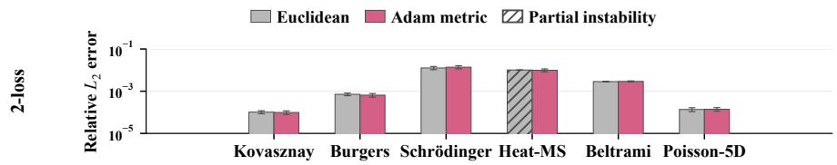

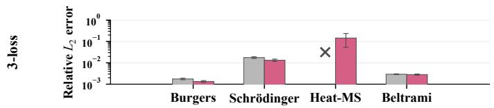  
Figure 8: Euclidean and Adam projection metrics across PINN equations. Hatching marks partial numerical instability, and $\textbf { a } \times$ marks complete numerical failure.

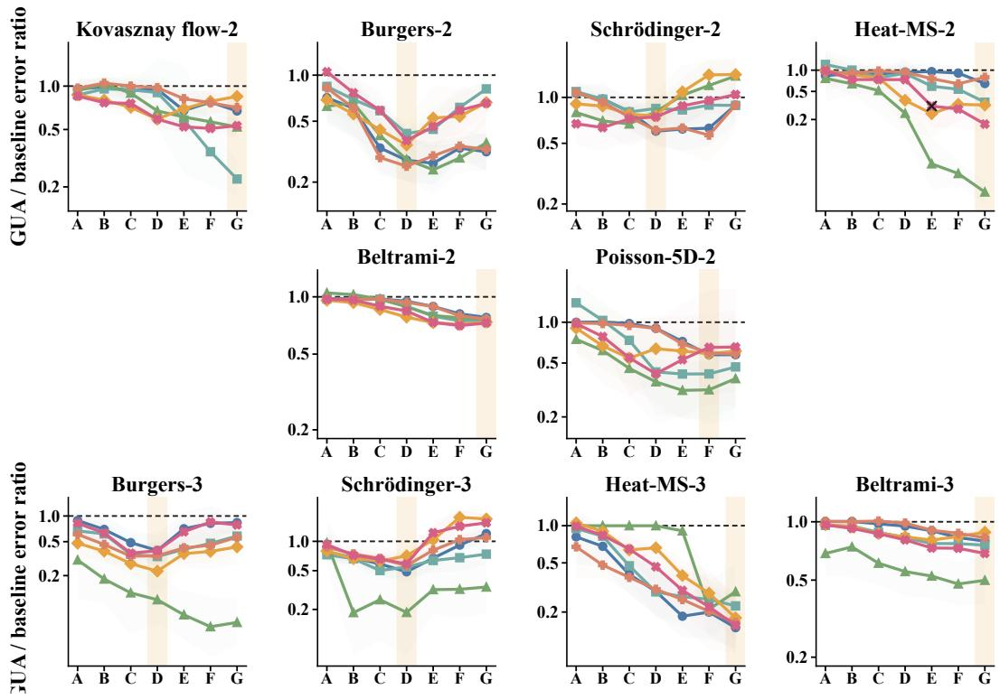  
Figure 9: State-alignment sensitivity across PINN equations and gradient surgery methods. Shaded bands show standard deviation, the dashed line marks baseline parity, orange bands identify the selected coefficients, and a black cross marks numerical failure.

## C.2 STATE-ALIGNMENT SENSITIVITY

State alignment introduces two coefficients, $\rho _ { m }$ and $\rho _ { v } ,$ , controlling how strongly the Adam moments are moved toward the target state. We examine whether GUA is sensitive to these coefficients using seven predefined pairs,

$$
\begin{array} { c } { { ( \rho _ { m } , \rho _ { v } ) \in \{ ( 0 . 0 0 3 , 0 . 0 0 1 ) , ( 0 . 0 1 , 0 . 0 0 3 ) , ( 0 . 0 3 , 0 . 0 1 ) , ( 0 . 1 , 0 . 0 3 ) , } } \\ { { ( 0 . 3 , 0 . 1 ) , ( 0 . 5 , 0 . 1 5 ) , ( 0 . 7 , 0 . 2 ) \} , } } \end{array}
$$

across all PINN settings, six gradient surgery methods, and five seeds.

The coefficient pair used in the main experiments is selected using validation performance, as de scribed in Appendix B.7.2, and shared across loss decompositions and gradient surgery methods for each equation. The test set is not used for selection. Figure 9 reports sensitivity over the full coefficient grid using the geometric mean of paired relative-error ratios to the corresponding baseline, where values below one indicate improvement. Validation-selected coefficients are highlighted, and the single numerical failure is retained. Overall, GUA is broadly robust to the state-alignment coefficients, with relative-error ratios below one across most equations, methods, and coefficient pairs. Burgers, Beltrami flow, and Poisson-5D are particularly robust. Sensitivity varies across equations: Schrodinger and Burgers favor moderate alignment, Heat-MS tends to benefit from stronger align-¨ ment, while Kovasznay flow and Poisson-5D show greater method-dependent variation.

$$
\begin{array} { r l } { - \Phi \mathrm { - } \operatorname { P C G r a d } - \boxed { \mathrm { - } \mathrm { C A G r a d ~ \_ - B a s e l i n F I L - G ~ \cdot } \mathrm { A - M T L ~ \_ - t - U P G r a d ~ \_ - C o n F I G ~ \cdots ~ B a s e l i n e ~ ( 1 . 0 ) } } } & { } \\ { \mathrm { A : ( 0 . 0 0 3 , 0 . 0 0 1 ) ~ \_ ~ B : ( 0 . 0 1 , 0 . 0 0 3 ) ~ \_ ~ C : ( 0 . 0 3 , 0 . 0 1 ) ~ \_ ~ D : ( 0 . 1 0 , 0 . 0 3 ) } } & { } \\ { \mathrm { E : ( 0 . 3 0 , 0 . 1 0 ) ~ \_ ~ F : ( 0 . 5 0 , 0 . 1 5 ) } } & { \mathrm { G : ( 0 . 7 0 , 0 . 2 0 ) } } \end{array}
$$

## C.3 OPTIMIZER-INDUCED GUM RESULTS ON KOVASZNAY, BELTRAMI, AND POISSON-5D

Owing to space limitations, the main text presents Q1 optimizer-induced GUM results for a subset of the PINN benchmarks, with additional results provided in the appendix. Table 7 reports the corresponding results for Kovasznay, Beltrami, and Poisson-5D under the same experimental protocol. Consistent with the main-text results, ConFIG yields $R _ { a } = 0 \mathrm { { , } }$ , while momentum, adaptive, and curvature-based optimizers can produce nonzero post-optimizer conflict rates $R _ { u }$ . Plain SGD preserves $R _ { u } = 0$ , as expected from $u _ { t } = a _ { t }$

Table 7: Optimizer-induced GUM across the remaining PINN settings. The sequence $R _ { g }  R _ { a } $ $R _ { u }$ tracks conflict rates $( \downarrow )$ from raw loss-specific gradients through gradient surgery to optimizer transformation.
<table><tr><td rowspan="3">Optimizer</td><td colspan="3">Kovasznay</td><td colspan="6">Beltrami</td><td colspan="3">Poisson-5D</td></tr><tr><td colspan="3">2-loss</td><td colspan="3">2-loss</td><td colspan="3">3-loss</td><td colspan="3">2-loss</td></tr><tr><td> $R _ { g }$ </td><td> $R _ { a }$ </td><td> $R _ { u }$ </td><td> $R _ { g }$ </td><td> $R _ { a }$ </td><td> $R _ { u }$ </td><td> $R _ { g }$ </td><td> $R _ { a }$ </td><td> $R _ { u }$ </td><td> $R _ { g }$ </td><td> $R _ { a }$ </td><td> $R _ { u }$ </td></tr><tr><td colspan="14">First-order optimizers</td></tr><tr><td colspan="14">SGD M-SGD</td></tr><tr><td></td><td>100.0 99.9</td><td>0.0 0.0</td><td>0.0</td><td>100.0 79.0</td><td>0.0</td><td>0.0</td><td></td><td>100.0</td><td>0.0</td><td>0.0</td><td>87.9</td><td>0.0</td><td>0.0</td></tr><tr><td>RMSProp</td><td>10.0</td><td></td><td>53.3</td><td></td><td></td><td>0.0</td><td>22.9</td><td>90.3 32.5</td><td>0.0 0.0</td><td>43.2 0.9</td><td>64.9 81.9</td><td>0.0</td><td>41.9</td></tr><tr><td rowspan="3">Adam AdamW</td><td></td><td>0.0</td><td>1.7</td><td>3.3</td><td>0.0</td><td>0.0</td><td></td><td></td><td></td><td></td><td></td><td>0.0</td><td>0.2</td></tr><tr><td>5.5</td><td>0.0</td><td>6.4</td><td>13.1</td><td>0.0</td><td></td><td>11.6</td><td>27.5</td><td>0.0</td><td>16.8</td><td>52.6</td><td>0.0</td><td>30.5</td></tr><tr><td>8.9</td><td>0.0</td><td>8.4</td><td>14.6</td><td>0.0</td><td>10.7</td><td>29.0</td><td>0.0</td><td></td><td>17.4</td><td>52.9</td><td>0.0</td><td>32.6</td></tr><tr><td colspan="14">Second-order optimizers</td></tr><tr><td>SophiaG</td><td>55.6</td><td>0.0</td><td>42.9</td><td></td><td>54.1</td><td>0.0</td><td>20.2</td><td>63.0</td><td>0.0</td><td>29.4</td><td>27.2</td><td>0.0</td><td>13.0</td></tr><tr><td rowspan="3">AdaHessian SOAP</td><td>99.9</td><td>0.0</td><td>36.8</td><td>99.9</td><td>0.0</td><td>53.2</td><td>99.9</td><td></td><td>0.0</td><td>57.7</td><td>98.8</td><td>0.0</td><td>8.5</td></tr><tr><td>3.3</td><td>0.0</td><td>5.8</td><td>20.9</td><td></td><td>0.0</td><td>8.8</td><td>28.6</td><td>0.0</td><td>12.3</td><td>44.5</td><td>0.0</td><td>30.8</td></tr><tr><td></td><td></td><td></td><td></td><td></td><td></td><td></td><td></td><td></td><td></td><td></td><td></td><td></td></tr></table>

## C.4 FULL PINN RESULTS

Given the space limitations of the main text, we summarize Q2 there using configuration-level ranges and medians. This section reports the complete Q2 results for each evaluated method–benchmark configuration, including relative $L _ { 2 }$ errors and conflict-rate transitions over the four training stages. For the six gradient-surgery methods (excluding the Adam control), the summary contains 36 twoloss and 24 three-loss method–benchmark configurations. The corresponding medians reported in the main text are medians over these configuration-level reductions.

## C.4.1 QUANTITATIVE PINN RESULTS FOR Q2

Table 8 reports the complete relative $L _ { 2 }$ errors. Across all evaluated base methods and PINN settings, adding GUA reduces the mean error, consistent with the aggregate results reported in the main text. Adam+GUA also improves over Adam in all ten settings despite using no pre-optimizer gradient surgery.

Table 8: Complete $\boldsymbol { \mathrm { Q 2 } }$ relative $L _ { 2 }$ errors (mean ± sample standard deviation over five seeds). Here, E denotes the relative $L _ { 2 }$ error defined in Appendix B.6. “Imp.” denotes $1 0 0 ( 1 - \bar { E } _ { \mathrm { G U A } } / \bar { E } _ { \mathrm { b a s e } } )$
<table><tr><td rowspan="2">Method</td><td colspan="4">Schrödinger</td><td colspan="4">Burgers</td><td colspan="2">Kovasznay</td></tr><tr><td>2-loss</td><td>Imp.</td><td>3-loss</td><td>Imp.</td><td>2-loss</td><td>Imp.</td><td>3-loss</td><td>Imp.</td><td>2-loss</td><td>Imp.</td></tr><tr><td>Adam</td><td>3.15e-2±1.10e-2</td><td></td><td>3.15e-2±1.10e-2</td><td></td><td>4.55e-3±1.03e-3</td><td></td><td>3.07e-3±1.37e-3</td><td></td><td>4.69e-4±7.44e-5</td><td></td></tr><tr><td>+GUA</td><td>1.74e-2±4.19e-3</td><td>44.8</td><td>2.42e-2±6.59e-3</td><td>23.2</td><td>1.18e-3±5.86e-4</td><td>74.1</td><td>7.77e-4±3.35e-4</td><td>74.7</td><td>3.46e-4±1.53e-5</td><td>26.2</td></tr><tr><td>PCGrad +GUA</td><td>2.51e-2±7.78e-3</td><td></td><td>2.12e-2±5.21e-3</td><td></td><td>3.05e-3±7.31e-4</td><td></td><td>2.02e-3±8.11e-4</td><td></td><td>4.82e-4±1.02e-4</td><td></td></tr><tr><td>CAGrad</td><td>1.46e-2±1.52e-3</td><td>41.8</td><td>1.01e-2±8.11e-4</td><td>52.4</td><td>8.35e-4±1.32e-4</td><td>72.6</td><td>7.61e-4±1.81e-4</td><td>62.3</td><td>3.26e-4±7.42e-5</td><td>32.4</td></tr><tr><td>+GUA</td><td>1.40e-2±1.53e-3 1.18e-2±8.77e-4</td><td>15.7</td><td>2.00e-2±5.06e-3 1.08e-2±1.92e-3</td><td>46.0</td><td>1.70e-3±4.36e-4 6.97e-4±1.26e-4</td><td>59.0</td><td>2.25e-3±4.90e-4 7.39e-4±5.89e-5</td><td></td><td>4.78e-4±4.76e-5</td><td></td></tr><tr><td>IMTL-G</td><td>4.12e-2±1.09e-2</td><td></td><td>5.60e-1±3.12e-1</td><td></td><td>2.51e-3±8.24e-4</td><td></td><td></td><td>67.2</td><td>1.11e-4±3.12e-5</td><td>76.8</td></tr><tr><td>+GUA</td><td>3.21e-2±1.86e-3</td><td>22.1</td><td>1.02e-1±5.91e-2</td><td>81.8</td><td>6.82e-4±6.76e-5</td><td>72.8</td><td>5.83e-2±3.66e-2 5.14e-3±1.07e-3</td><td>91.2</td><td>1.79e-4±2.83e-5</td><td></td></tr><tr><td>A-MTL</td><td>1.60e-2±1.87e-3</td><td></td><td></td><td></td><td></td><td></td><td></td><td></td><td>9.25e-5±1.03e-5</td><td>48.3</td></tr><tr><td>+GUA</td><td>1.23e-2±2.93e-3</td><td>23.1</td><td>3.00e-2±3.78e-3 2.15e-2±4.18e-3</td><td>28.3</td><td>2.95e-3±5.24e-4 1.05e-3±2.72e-4</td><td>64.4</td><td>7.31e-3±2.89e-3 1.56e-3±3.34e-4</td><td></td><td>1.83e-4±1.56e-5</td><td></td></tr><tr><td>UPGrad</td><td></td><td></td><td></td><td></td><td></td><td></td><td></td><td>78.7</td><td>1.56e-4±2.17e-5</td><td>14.8</td></tr><tr><td>+GUA</td><td>2.56e-2±7.20e-3 1.52e-2±2.12e-3</td><td>40.6</td><td>1.98e-2±4.10e-3 1.10e-2±1.10e-3</td><td>44.4</td><td>3.03e-3±4.96e-4 7.68e-4±1.12e-4</td><td>1 74.7</td><td>3.08e-3±1.46e-3 9.69e-4±1.80e-4</td><td>68.5</td><td>4.49e-4±6.56e-5</td><td></td></tr><tr><td>ConFIG</td><td></td><td></td><td>2.33e-2±7.89e-3</td><td></td><td></td><td></td><td>3.48e-3±8.30e-4</td><td></td><td>3.23e-4±7.83e-5</td><td>28.1</td></tr><tr><td>+GUA</td><td>1.89e-2±5.46e-3</td><td>27.0</td><td>1.33e-2±1.69e-3</td><td>42.9</td><td>1.74e-3±3.38e-4 6.50e-4±1.27e-4</td><td>62.6</td><td>1.34e-3±1.31e-4</td><td></td><td>1.86e-4±4.02e-5</td><td></td></tr><tr><td></td><td>1.38e-2±2.35e-3</td><td></td><td></td><td></td><td></td><td></td><td></td><td>61.5</td><td>9.84e-5±1.90e-5</td><td>47.1</td></tr></table>

<table><tr><td rowspan="2">Method</td><td colspan="4">Heat-MS</td><td colspan="4">Beltrami</td><td colspan="2">Poisson-5D</td></tr><tr><td>2-loss</td><td>Imp.</td><td>3-loss</td><td>Imp.</td><td>2-loss</td><td>Imp.</td><td>3-loss</td><td>Imp.</td><td>2-loss</td><td>Imp.</td></tr><tr><td>Adam</td><td>1.73e-2±4.58e-3</td><td></td><td>1.57e-1±6.51e-2</td><td></td><td>6.50e-3±3.14e-4</td><td></td><td>5.26e-3±2.84e-4</td><td></td><td>5.95e-4±3.22e-5</td><td></td></tr><tr><td>+GUA</td><td>1.46e-2±1.35e-3</td><td>15.6</td><td>3.47e-2±7.15e-3</td><td>77.9</td><td>5.06e-3±1.76e-4</td><td>22.2</td><td>3.90e-3±2.23e-4</td><td>25.9</td><td>3.94e-4±3.25e-5</td><td>33.8</td></tr><tr><td></td><td>PCGrad 2.05e-2±4.36e-3</td><td></td><td>3.40e-1±1.34e-1</td><td></td><td>6.70e-3±4.75e-4</td><td></td><td>5.26e-3±2.96e-4</td><td></td><td>5.88e-4±4.29e-5</td><td></td></tr><tr><td>+GUA</td><td>1.35e-2±4.40e-3</td><td>34.1</td><td>4.94e-2±1.43e-2</td><td>85.5</td><td>5.22e-3±3.12e-4</td><td>22.1</td><td>4.18e-3±3.07e-4</td><td>20.5</td><td>3.38e-4±2.34e-5</td><td>42.5</td></tr><tr><td>+GUA</td><td>CAGrad 3.19e-2±8.27e-3</td><td></td><td>6.26e-1±4.33e-2</td><td></td><td>4.13e-3±2.69e-4</td><td></td><td>3.91e-3±1.78e-4</td><td></td><td>4.28e-4±3.02e-4</td><td></td></tr><tr><td></td><td>1.13e-2±3.08e-3</td><td></td><td>64.6 1.46e-1±4.81e-2</td><td>76.7</td><td>3.10e-3±1.68e-4</td><td>24.9</td><td>2.96e-3±9.99e-5</td><td>24.3</td><td>1.37e-4±2.07e-5</td><td>68.0</td></tr><tr><td>+GUA</td><td>IMTL-G 8.82e-1±2.26e-1</td><td></td><td>1.00e+0±5.56e-4</td><td></td><td>3.83e-3±2.80e-4</td><td></td><td>6.58e-3±1.73e-3</td><td></td><td>4.94e-4±1.94e-4</td><td></td></tr><tr><td></td><td>1.63e-2±3.28e-3</td><td>98.2</td><td>3.26e-1±1.53e-1</td><td>67.4</td><td>2.92e-3±1.76e-4</td><td>23.8</td><td>3.19e-3±2.29e-4</td><td>51.5</td><td>1.44e-4±9.57e-6</td><td>70.9</td></tr><tr><td></td><td>A-MTL 7.61e-2±3.73e-2</td><td></td><td>7.71e-1±3.92e-2</td><td></td><td>4.06e-3±2.26e-4</td><td></td><td>3.19e-3±2.05e-4</td><td></td><td>5.16e-4±2.59e-4</td><td></td></tr><tr><td>+GUA</td><td>2.31e-2±7.88e-3</td><td>69.6</td><td>1.47e-1±5.10e-2</td><td>80.9</td><td>2.99e-3±2.01e-4</td><td>26.4</td><td>2.82e-3±1.18e-4</td><td>11.6</td><td>2.93e-4±1.93e-4</td><td>43.2</td></tr><tr><td></td><td>UPGrad 2.05e-2±4.71e-3</td><td>1</td><td>3.20e-1±1.93e-1</td><td>1</td><td>6.73e-3±3.70e-4</td><td>1</td><td>5.15e-3±2.98e-4</td><td>1</td><td>5.93e-4±3.44e-5</td><td></td></tr><tr><td>+GUA</td><td>1.59e-2±1.36e-3</td><td>22.4</td><td>4.62e-2±8.30e-3</td><td>85.6</td><td>5.14e-3±3.32e-4</td><td>23.6</td><td>4.26e-3±1.79e-4</td><td>17.3</td><td>3.52e-4±2.73e-5</td><td>40.6</td></tr><tr><td></td><td>ConFIG 5.77e-2±1.31e-2</td><td></td><td>8.16e-1±2.98e-2</td><td></td><td>4.01e-3±2.75e-4</td><td></td><td>4.11e-3±1.45e-4</td><td></td><td>3.16e-4±2.94e-4</td><td></td></tr><tr><td></td><td>+GUA 9.85e-3±1.56e-3</td><td>82.9</td><td>1.45e-1±9.18e-2</td><td>82.2</td><td>2.92e-3±1.80e-4</td><td>27.2</td><td>2.82e-3±1.82e-4</td><td>31.4</td><td>1.40e-4±2.76e-5 55.7</td><td></td></tr></table>

## C.4.2 CONFLICT-RATE PINN RESULTS FOR Q2

Table 9 reports the corresponding $R _ { g } \to R _ { a } \to R _ { u } \to R _ { p }$ transitions. Unlike Q1, which fixes Con-FIG and varies the optimizer, these experiments fix Adam and vary the gradient surgery method. The resulting transitions show that GUM is not specific to a particular pre-optimizer construction. Different methods produce different $R _ { a }$ and exhibit different responses to the same optimizer transformation. When $\dot { R } _ { a } = 0 .$ , any nonzero $R _ { u }$ directly indicates strict GUM. When residual pre-optimizer conflicts remain, an increase from $R _ { a }$ to $R _ { u }$ indicates generalized GUM, showing that Adam further increases the frequency of conflicting proposals. Despite these differences across gradient surgery methods, GUA yields $R _ { p } = 0$ in every evaluated setting, so the applied update is conflict-free after alignment. These transitions show that update-level alignment remains effective across differen pre-optimizer constructions and connect the observed accuracy gains to the intended mechanism.

Table 9: Four-stage conflict rates (%) for the PINN Q2 experiments, averaged over five seeds.
<table><tr><td rowspan="3">Method</td><td colspan="8">Schrödinger</td><td colspan="7">Burgers</td><td colspan="4">Kovasznay</td></tr><tr><td colspan="3">2-loss</td><td colspan="4">3-loss</td><td colspan="4">2-loss</td><td colspan="4">3-loss</td><td colspan="4">2-loss</td></tr><tr><td colspan="3"> $R _ { g }$   $R _ { a }$   $R _ { u }$ </td><td colspan="4"></td><td colspan="4"></td><td colspan="4"></td><td colspan="3"> $R _ { a }$ </td><td> $R _ { p }$ </td></tr><tr><td>Adam 44.3</td><td>15.9</td><td>13.2</td><td> $R _ { p }$ </td><td> $R _ { g }$ </td><td> $R _ { a }$  65.2 38.2 35.2</td><td> $R _ { u }$ </td><td> $R _ { p }$ </td><td> $R _ { g }$  28.5</td><td> $R _ { a }$  20.0</td><td> $R _ { u }$  22.6</td><td> $R _ { p }$ </td><td> $R _ { g }$ </td><td> $R _ { a }$ </td><td> $R _ { u }$  55.4 36.1 34.0</td><td> $R _ { p }$ </td><td> $R _ { g }$  3.0</td><td>1.3</td><td> $R _ { u }$  1.2</td><td></td></tr><tr><td>+GUA PCGrad</td><td>36.4 13.1 36.3</td><td>0.0</td><td>13.6 6.3</td><td>0.0</td><td>61.5 51.9</td><td>35.6 0.3</td><td>42.1 16.0</td><td>0.0 0.0</td><td>20.0 35.1 33.8</td><td>14.2 0.0 0.0</td><td>11.6 31.6 29.9</td><td>0.0</td><td>35.9 56.6 63.8</td><td>23.2 4.7 4.8</td><td>15.9 45.0 51.7</td><td>0.0</td><td>0.9 2.2</td><td>0.3 0.3 0.0 0.6</td><td>0.0</td></tr><tr><td>+GUA CAGrad 35.0</td><td>32.3</td><td>0.0 5.1</td><td>5.1 15.4</td><td>0.0</td><td>49.6 43.7</td><td>0.4 7.4</td><td>16.2 23.0</td><td></td><td>31.1</td><td>3.8</td><td>0.0 27.1</td><td></td><td>56.1 12.4</td><td>42.5</td><td>0.0</td><td>1.1 6.1</td><td>0.0 1.4</td><td>0.2 7.9</td><td>0.0</td></tr><tr><td>+GUA IMTL-G 67.8</td><td>29.5</td><td>1.2 0.0</td><td>7.1 33.2</td><td>0.0</td><td>41.9 94.4</td><td>3.5 16.7 53.4</td><td>15.8</td><td>0.0</td><td>29.0 41.9</td><td>3.8 0.0</td><td>21.6 0.0 23.7</td><td></td><td>63.2 94.5</td><td>16.3 1.7</td><td>43.0 0.0 55.6</td><td>1.9 3.6</td><td>0.1 0.0</td><td>6.6 4.8</td><td>0.0</td></tr><tr><td>+GUA A-MTL 33.6</td><td>52.8</td><td>0.0 0.2</td><td>22.5 18.3</td><td>0.0</td><td>86.8 57.7</td><td>2.3 4.5</td><td>44.2 37.5</td><td>0.0</td><td>33.5 27.5</td><td>0.0 0.8</td><td>15.7 34.2</td><td>0.0</td><td>84.3 66.8</td><td>3.1 9.4</td><td>49.0 57.2</td><td>0.0</td><td>0.9 0.0 5.0 0.1</td><td>2.9 11.5</td><td>0.0</td></tr><tr><td>+GUA UPGrad 35.7</td><td>27.2</td><td>0.1 0.4</td><td>15.9 6.2</td><td>0.0</td><td>44.5 50.5</td><td>0.6 3.8</td><td>29.4 13.2</td><td>0.0</td><td>30.2 33.5</td><td>1.1 4.7</td><td>35.7 29.0</td><td>0.0</td><td>63.7 54.0</td><td>4.9 8.8</td><td>57.4 41.1</td><td>0.0</td><td>2.2 0.0 2.3 0.0</td><td>9.5 0.7</td><td>0.0</td></tr><tr><td>+GUA ConFIG</td><td>31.6 40.8</td><td>0.4 0.0</td><td>4.8 0.0 23.7</td><td></td><td>50.4 56.3 0.0</td><td>5.2 35.2</td><td>14.8 0.0</td><td></td><td>32.6 30.5</td><td>7.4 0.0</td><td>28.2 0.0 29.4</td><td>60.3 73.7</td><td>18.5 0.0</td><td>57.4</td><td>47.4 0.0</td><td>1.1 5.5</td><td>0.0 0.0</td><td>0.2 6.4</td><td>0.0</td></tr><tr><td>+GUA 33.8</td><td colspan="6">0.0 13.9 0.0 50.7 0.0 27.6</td><td colspan="8">0.0 30.0 0.0 24.2 0.0 73.0 0.0 55.3</td><td colspan="2">0.0 6.1</td><td>0.0</td></tr><tr><td rowspan="3">Method</td><td colspan="4">Heat-MS</td><td colspan="3"></td><td colspan="5">Beltrami</td><td colspan="3"></td><td colspan="4">Poisson-5D</td></tr><tr><td></td><td>2-loss</td><td></td><td></td><td></td><td>3-loss</td><td></td><td></td><td></td><td>2-loss</td><td></td><td></td><td></td><td>3-loss</td><td></td><td></td><td>2-loss</td><td></td></tr><tr><td> $R _ { g }$  14.0</td><td> $R _ { a }$  7.5</td><td> $R _ { u }$   $R _ { p }$  4.8</td><td></td><td> $R _ { g }$   $R _ { a }$  72.8</td><td> $R _ { u }$  40.1 54.1</td><td> $R _ { p }$ </td><td> $R _ { g }$  1.6</td><td> $R _ { a }$  0.2</td><td> $R _ { u }$  0.2</td><td> $R _ { p }$ </td><td> $R _ { g }$  4.2</td><td> $R _ { a }$  0.6</td><td> $R _ { u }$  0.5</td><td> $R _ { p }$ </td><td> $R _ { g }$   $R _ { a }$  41.3 7.2</td><td> $R _ { u }$  3.8</td><td> $R _ { p }$ </td></tr><tr><td>+GUA PCGrad</td><td>17.6 114.9</td><td>6.8 0.0</td><td>2.4 5.1</td><td>0.0</td><td>32.9 77.6</td><td>17.7 19.9 6.2</td><td>57.7</td><td>0.0</td><td>2.0 1.2</td><td>0.2 0.0</td><td>0.8 0.0 0.2</td><td>3.6 3.6</td><td>0.4 0.1</td><td>1.6 0.3</td><td>0.0</td><td>41.3 24.1</td><td>4.5 0.0</td><td>3.7</td><td>0.0</td></tr><tr><td>+GUA CAGrad 20.4</td><td>14.6</td><td>0.0 1.7</td><td>2.2 14.3</td><td>0.0</td><td>34.6 78.921.8</td><td>0.7</td><td>17.9 60.2</td><td>0.0</td><td>1.7 5.8</td><td>0.0 0.3</td><td>0.6 0.0 4.9</td><td></td><td>3.6 20.2</td><td>0.0 0.9</td><td>1.1 0.0 10.8</td><td>42.4 48.5</td><td>0.0 5.1</td><td>3.8 4.3 22.9</td><td>0.0</td></tr><tr><td>+GUA</td><td>20.1</td><td>1.6</td><td>14.2</td><td>0.0</td><td>37.8</td><td>2.8</td><td>21.0</td><td>0.0</td><td>7.9</td><td>0.1</td><td>一 5.6 0.0</td><td></td><td>13.6 89.5</td><td>0.1 0.0</td><td>6.7 0.0</td><td>35.9</td><td>0.2</td><td>14.0</td><td>0.0</td></tr><tr><td>IMTL-G 53.7 +GUA</td><td>28.9</td><td>0.0 0.0</td><td>30.6 13.4</td><td>0.0</td><td>88.5 60.9</td><td>5.4 4.1</td><td>18.7 36.3</td><td>0.0</td><td>5.1 4.1</td><td>0.0 0.0</td><td>5.9 4.4 0.0</td><td></td><td>24.5</td><td>28.1 0.1</td><td>10.7 0.0</td><td>51.0 44.1</td><td>0.0 0.0</td><td>33.8 26.2</td><td>0.0</td></tr><tr><td>A-MTL +GUA</td><td>23.7 26.2</td><td>0.1 0.3</td><td>17.7 11.8</td><td>0.0</td><td>75.4 55.8</td><td>15.0 64.1 3.5</td><td>27.9</td><td>0.0</td><td>14.5 10.2</td><td>0.0 0.0</td><td>14.8 9.7 0.0</td><td></td><td>28.2 14.3</td><td>0.0 0.0</td><td>19.9 13.0 0.0</td><td>42.3</td><td>48.4 0.4 0.0</td><td>30.8 25.0</td><td>0.0</td></tr><tr><td>UPGrad +GUA</td><td>13.1 15.4</td><td>0.4 0.4</td><td>4.7 2.4</td><td>0.0</td><td>78.3 33.8</td><td>12.3 4.8</td><td>55.5 16.1</td><td>0.0</td><td>1.2 1.8</td><td>0.0 0.0</td><td>0.2 0.7 0.0</td><td></td><td>3.3 4.5</td><td>0.0 0.0</td><td>0.3 1.2 0.0</td><td>23.7 42.2</td><td>0.0 0.0</td><td>3.9 4.2</td><td>0.0</td></tr><tr><td>ConFIG +GUA</td><td>22.8 27.7</td><td>0.0 0.0</td><td>12.8 9.7</td><td>0.0</td><td>81.3 48.6</td><td>0.0 0.0</td><td>64.6 26.6</td><td>0.0</td><td>13.1 7.4</td><td>0.0 0.0</td><td>11.6 7.6 0.0</td><td></td><td>27.5 12.8</td><td>0.0 0.0</td><td>16.8 8.8 0.0</td><td>52.6 44.1</td><td>0.0 0.0</td><td>30.5 22.3</td><td>0.0</td></tr></table>

## C.5 PERFORMANCE ACROSS OPTIMIZERS

The main experiments use Adam as the default optimizer. We further evaluate GUA with three representative optimizers from Q1: RMSProp for coordinate-wise adaptive scaling, AdamW for historical state, adaptive scaling, and decoupled weight decay, and SOAP for second-order preconditioning. SOAP is particularly relevant because its preconditioning has been shown to promote gradient alignment and mitigate conflicts in PINNs Wang et al. (2025). For each optimizer O, we compare ConFIG + O with ConFIG + O + GUA. Since these optimizers differ in transformation geometry and internal state, we adapt the projection metric and State Alignment strategy accordingly.

At each step, the optimizer produces a proposal $u _ { t } ,$ which GUA projects onto the conflict-free cone under the time-dependent metric $M _ { t } \mathbf { \cdot }$

$$
\operatorname* { m i n } _ { d _ { t } } \ \frac { 1 } { 2 } ( d _ { t } - u _ { t } ) ^ { \top } M _ { t } ( d _ { t } - u _ { t } ) \qquad \mathrm { s . t . } \quad G _ { t } ^ { \top } d _ { t } \geq 0 .
$$

We use the second-moment geometry induced by each optimizer rather than a common Euclidean metric. Specifically, $M _ { \mathrm { R M S P r o p } , t } \stackrel { < } { \approx } \mathrm { d i a g } ( \sqrt { v _ { t } } + \epsilon ) , \hat { M } _ { \mathrm { A d a m W } , t } \approx \mathrm { d i a g } ( \sqrt { \hat { v } _ { t } } + \epsilon )$ . For SOAP, the proposal and task gradients are represented in the current Shampoo coordinate system, where $M _ { \mathrm { S O A P } , t } \approx \mathrm { d i a g } ( \sqrt { \tilde { v } _ { t } } + \epsilon )$ , and the projected update is then mapped back to parameter space. The dual solver uses $K _ { t } = G _ { t } ^ { \top } M _ { t } ^ { - 1 } G _ { t }$ and reconstructs $p _ { t } = u _ { t } + M _ { t } ^ { - 1 } G _ { t } \lambda _ { t }$

After applying the projected update, GUA softly aligns the optimizer state toward targets reconstructed from the applied update. RMSProp aligns its second-moment state with $\left( \rho _ { m } , \rho _ { v } \right) \ =$ (0, 0.5). AdamW aligns its first- and second-moment states with (0.1, 0.03) while handling decoupled weight decay separately. SOAP aligns the exponential moving averages that determine its update with (0.03, 0.003), while keeping the Shampoo preconditioner and coordinate basis unchanged. State Alignment is applied only when GUA modifies the optimizer proposal. RMSProp uses a learning rate of $1 0 ^ { - 4 } / 1 0 ^ { - 4 }$ , whereas AdamW and SOAP use $1 0 ^ { - 3 } / 1 0 ^ { - \frac { 3 } { 4 } }$

As shown in Figure 10, GUA improves the displayed settings across optimizer families. For Burgers, it reduces the relative $L _ { 2 }$ error of RMSProp, AdamW, and SOAP by 52.35%, 65.19%, and 13.78% in the two-loss setting, and by 58.39%, 62.92%, and 42.73% in the three-loss setting. For Schrodinger, the corresponding reductions are ¨ 22.98%, 40.00%, and 1.70% in the two-loss setting, and 47.50%, 43.66%, and 4.77% in the three-loss setting, respectively. Notably, GUA further improves SOAP even though its second-order preconditioning already promotes gradient alignment. This suggests that explicit update-level alignment can provide complementary benefits beyond the alignment induced by the optimizer’s preconditioning geometry. Together with the Adam results in Q2, these results suggest that GUA extends beyond Adam to optimizers involving adaptive scaling, decoupled weight decay, and preconditioning.

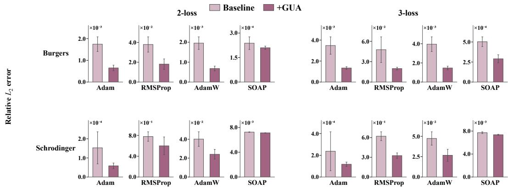  
Figure 10: Relative $L _ { 2 }$ error across optimizer families for the Burgers and Schrodinger equations.¨

## C.6 MECHANISM DIAGNOSTICS

## C.6.1 SAME-STATE NORM-MATCHED COMPARISON

Table 10 reports the per-benchmark results for the same-state, norm-matched comparison introduced in Q3. At each evaluated step, the parameters, optimizer state, batch, and learning rate are held fixed while comparing the optimizer proposal $u _ { t } .$ , the aligned update $p _ { t }$ , and the norm-matched control

$$
q _ { t } = \frac { \| p _ { t } \| _ { 2 } } { \| u _ { t } \| _ { 2 } } u _ { t } .
$$

All reported samples satisfy $p _ { t } \neq 0$ . We report the pairwise win rates $\mathrm { P r } [ W _ { t } ^ { \mathrm { r e l } } ( p _ { t } ) < W _ { t } ^ { \mathrm { r e l } } ( u _ { t } ) ]$ and $\mathrm { P r } [ \tilde { W _ { t } ^ { \mathrm { r e l } } } ( p _ { t } ) < \tilde { W } _ { t } ^ { \mathrm { r e l } } ( q _ { t } ) ]$ . Training states are first aggregated within each run before statistics are computed across seeds.

Table 10: Per-benchmark Q3 win rates under two- and three-loss decompositions.
<table><tr><td rowspan="2">Equation</td><td colspan="2">2-loss</td><td colspan="2">3-loss</td></tr><tr><td> $p _ { t } < u _ { t } \left( \% \right)$ </td><td> $p _ { t } < q _ { t } ( \% )$ </td><td> $p _ { t } < u _ { t } \left( \% \right)$ </td><td> $p _ { t } < q _ { t } ( \% )$ </td></tr><tr><td>Schrödinger</td><td>95.81</td><td>92.68</td><td>96.26</td><td>93.53</td></tr><tr><td>Burgers</td><td>96.55</td><td>95.17</td><td>94.57</td><td>93.55</td></tr><tr><td>Heat-MS</td><td>97.92</td><td>96.54</td><td>93.16</td><td>92.47</td></tr><tr><td>Beltrami</td><td>94.77</td><td>93.38</td><td>94.05</td><td>93.00</td></tr><tr><td>Kovasznay</td><td>98.25</td><td>97.54</td><td></td><td>一</td></tr><tr><td>Poisson-5D</td><td>89.94</td><td>85.77</td><td>一</td><td>一</td></tr><tr><td>Overall</td><td>95.54</td><td>93.51</td><td>94.51</td><td>93.14</td></tr></table>

## C.6.2 REPRESENTATIVE GRADIENT-DIRECTION SLICES

To make the update-level geometry concrete, Figure 11 visualizes representative two-loss training steps across the six PDE benchmarks. For ease of visualization, we rotate each directional slice so that one loss-specific gradient, $g _ { 1 , t } ,$ is fixed along the positive horizontal axis. Specifically, for each full-space vector $x ,$ we orthogonally project it onto span $( g _ { 1 , t } , g _ { 2 , t } )$ and express the projection in the orthonormal basis $e _ { 1 } = g _ { 1 , t } / \Vert g _ { 1 , t } \Vert _ { 2 }$ and $e _ { 2 } = ( g _ { 2 , t } - \langle g _ { 2 , t } , e _ { 1 } \rangle e _ { 1 } ) / \| g _ { 2 , t } - \langle g _ { 2 , t } , e _ { 1 } \rangle e _ { 1 } \| _ { 2 }$ , choosing the sign of $e _ { 2 } \ \mathbf { S O }$ that $g _ { 2 , t }$ has a nonnegative second coordinate. We then normalize the displayed vectors and therefore ignore their original magnitudes. The figure is intended to show only their relative directions and the resulting conflict-free geometry. Each slice shows the two loss-specific gradient directions, the constructed direction $a _ { t }$ , the optimizer proposal $u _ { t } ,$ and the aligned update $p _ { t }$ . The shaded region denotes the corresponding conflict-free cone $\mathcal { C } _ { t } .$ . These examples illustrate how optimizer transformation can move a conflict-free constructed direction outside $\mathcal { C } _ { t } ,$ while GUA realigns the resulting proposal with the current conflict-free cone.

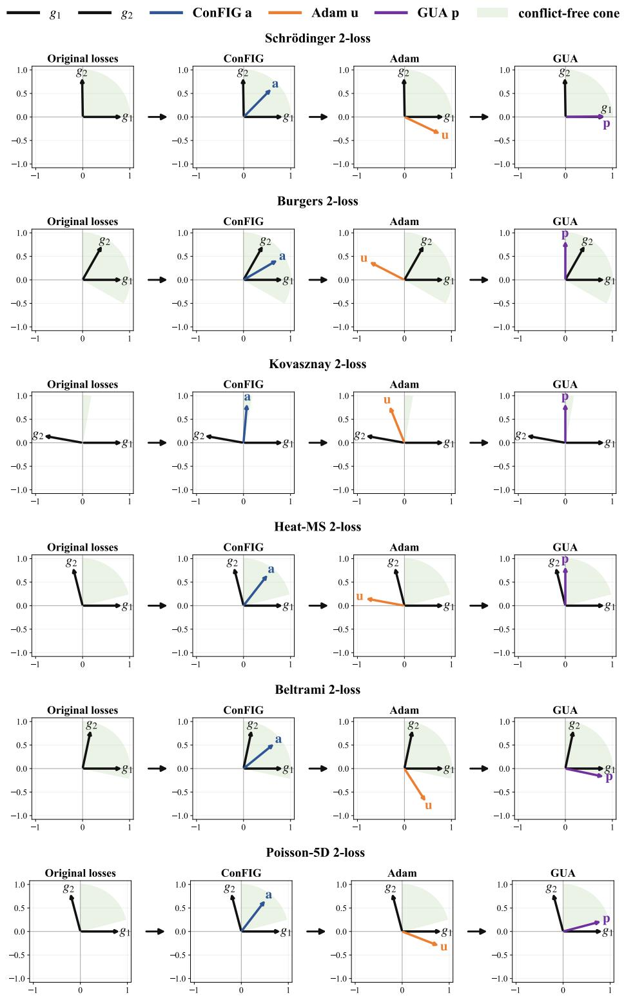  
Figure 11: Representative gradient directions for two-loss PDEs.

## D MULTI-TASK LEARNING DETAILS

We use CelebA Liu et al. (2015) as a controlled task-cardinality benchmark, following the FAMObased experimental setup adopted by ConFIG Liu et al. (2025). For an m-task experiment, we use the first m attributes in the official annotation order, so the task-count settings form nested subsets. Images are resized to 64 × 64, converted to tensors, and used without additional data augmentation. The model consists of a shared convolutional backbone with BatchNorm, ReLU, max pooling, adaptive average pooling, and two fully connected layers, followed by task-specific binary classification heads.

Training minimizes binary cross-entropy independently for each attribute. The main training hyperparameters are summarized in Table 11. To remain consistent with the gradient-surgery baselines, which operate on the shared parameters, GUA is applied to the same shared parameters after task gradient aggregation and optimizer proposal. The task-specific classification heads are updated by the native optimizer but are not modified by GUA. The data pipeline, model, and task losses remain unchanged. All reported results are averaged over three independent seeds {0, 1, 2}.

Table 11: CelebA multi-task learning training configuration.
<table><tr><td>Item</td><td>Setting</td></tr><tr><td>Available tasks</td><td>40 binary facial attributes; evaluated task counts {2, 3, 5, 10, 20, 30, 40}</td></tr><tr><td>Input</td><td>RGB images resized to 64 × 64; no augmentation</td></tr><tr><td>Loss</td><td>Binary cross-entropy per task</td></tr><tr><td>Epochs</td><td>15</td></tr><tr><td>Batch size</td><td>256</td></tr><tr><td>Optimizer</td><td>Adam</td></tr><tr><td>Learning rate</td><td>3 × 10−4</td></tr><tr><td>Evaluation frequency</td><td>Every epoch</td></tr></table>