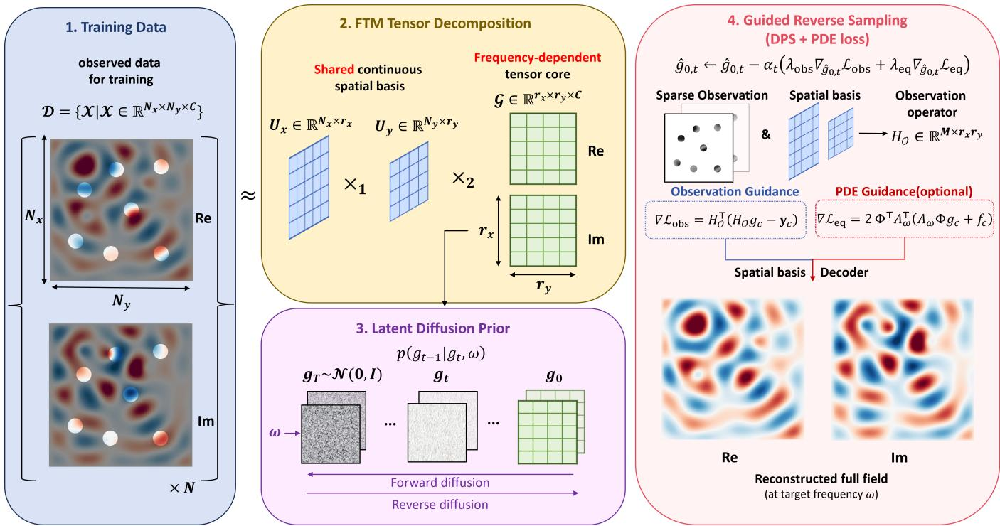
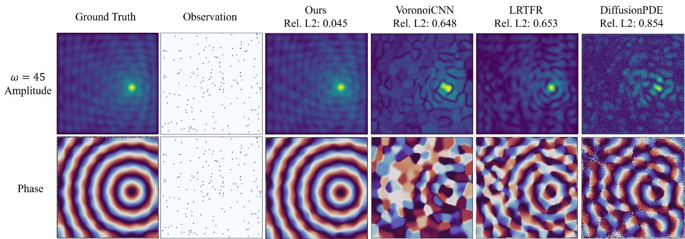
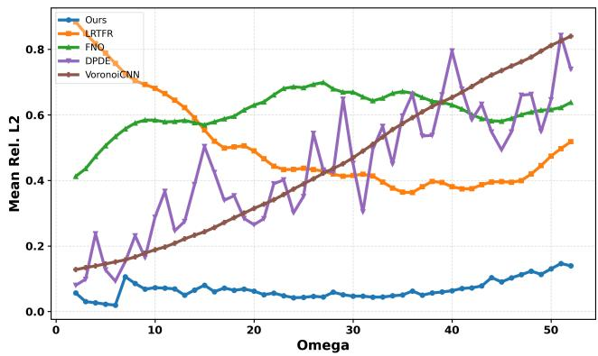
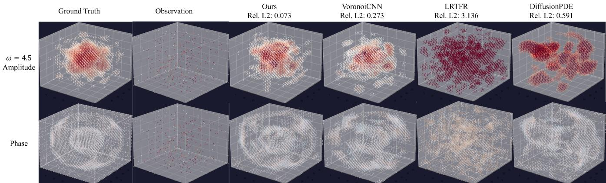
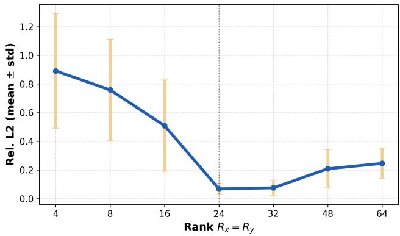
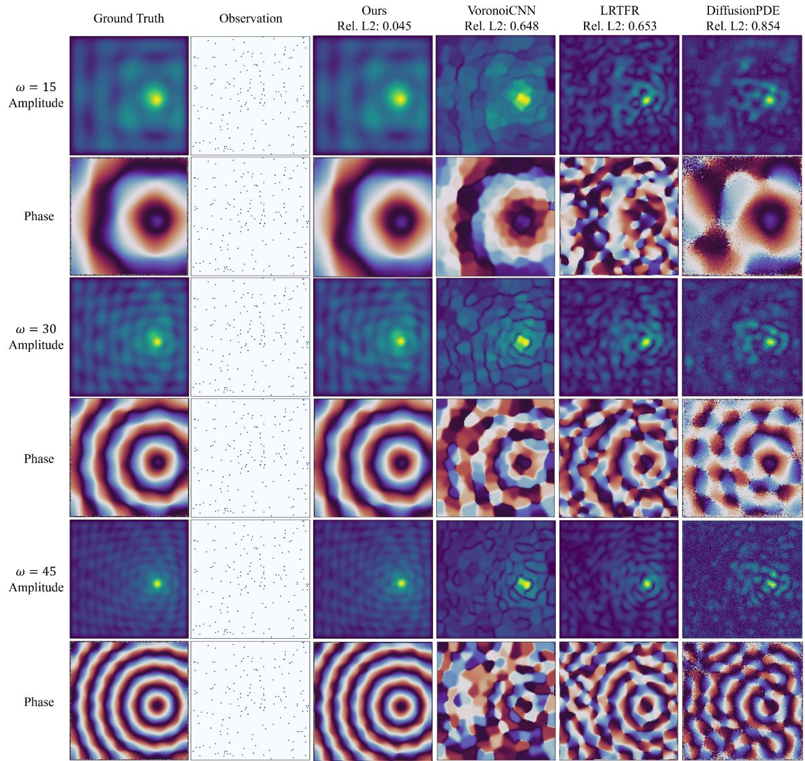
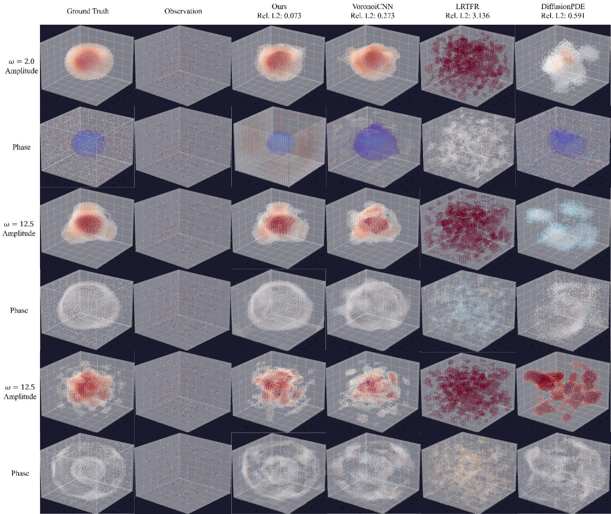
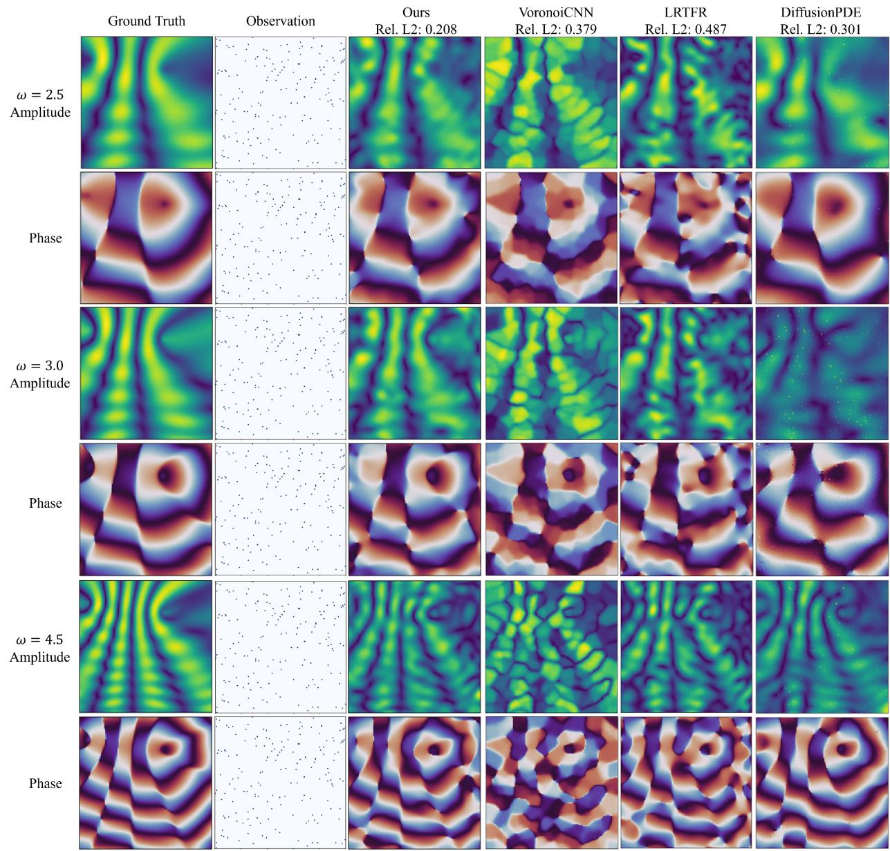

# HarmoCore: Functional Latent Diffusion for Sparse Reconstruction of Oscillatory Wave Fields

Lihao Chen1, Xinyu Zhang1, Panqi Chen1, Lei Cheng1, Ting Zhang1, Jianlong Li1, Shikai Fang1\*

1College of Information Science and Electronic Engineering, Zhejiang University

## Abstract

Reconstructing oscillatory wave fields from scattered sensors is a severely underdetermined inverse problem. Beyond the challenges of general physical-field reconstruction, wave responses are complex-valued, frequency-sensitive, and highly oscillatory, while costly simulation and sensing often leave only extreme-sparse observations. Existing low-rank, operator, and diffusion approaches are largely designed for realvalued, smoother fields; dense pixel-space diffusion is particularly inefficient for oscillatory complex fields and difficult to scale to 3D. We propose HarmoCore, which places a generative prior in a compact, continuous, and structured wave-field latent. HarmoCore represents joint real–imaginary channels with Functional Tucker cores over shared continuous spatial bases, learns a frequency-conditioned core diffusion prior, and performs Diffusion Posterior Sampling directly in core space. At fixed sensor coordinates, the multilinear decoder induces an explicit likelihood guidance operator, avoiding dense pixel-space correction. Optional targetequation residual guidance further promotes physical consistency. Experiments on 2D Helmholtz, 2D synthetic wave fields, and 3D Helmholtz show substantial gains under 1%– 2% sensing while remaining practical in three dimensions.

## 1 Introduction

Reconstructing physical fields from sparse measurements is a fundamental inverse problem across science and engineering (Arridge et al. 2019; Manohar et al. 2018). Wavefield reconstruction is particularly important in electromagnetic simulation (Colton and Kress 2013), ocean acoustics (Jensen et al. 2011), geophysical imaging (Virieux and Operto 2009), and many other sensing and modeling problems. We focus on time-harmonic wave fields, which describe the steady-state response to excitation at a fixed frequency. In these applications, high-fidelity simulation or dense sensing can be prohibitively expensive, especially when responses must be acquired across many frequencies. The available training fields and sensor measurements are therefore often severely limited. Recovering a complete wave response from scattered sensors is thus both practically important and profoundly underdetermined.

Existing sparse-field reconstruction methods broadly include low-rank fitting, deep sparse-to-dense regression, neural operators, and diffusion-based generative reconstruction.

Low-rank methods exploit compact spatial structure (Dolgov, Kressner, and Strossner 2021; Luo et al. 2024); neural¨ networks and operators learn direct field mappings (Fukami et al. 2021; Li et al. 2021; Tran et al. 2023; Lu et al. 2021; Li et al. 2024, 2023; Kovachki et al. 2023); and diffusion priors can be combined with partial observations through posterior sampling (Chung et al. 2023; Huang et al. 2024). These paradigms have shown strong results, but most have been developed for real-valued, relatively smooth spatial or spatiotemporal fields. Sparse reconstruction of frequencysensitive, highly oscillatory complex-valued wave fields remains largely underexplored.

Oscillatory wave fields, however, differ sharply from the smoother data targeted by most existing methods. In the time-harmonic setting, the Helmholtz, frequency-domain Maxwell, and elastodynamic equations define a complex spatial response at each frequency. Its real and imaginary components jointly encode amplitude and phase, while sources, materials, and boundaries create nonlocal interference. Short wavelengths and sensitivity to frequency or medium parameters produce rapid spatial variation and can shift nodes and antinodes throughout the domain, leaving local sensors weakly informative about unobserved regions. Reconstruction is therefore not merely local interpolation: the model must infer a globally coherent phase pattern from sparse evidence, and small phase errors can alter interference across the domain. This structure mismatches common representations. Fixed low-rank models can suppress frequency-dependent modes; learned regressors and operators require broad training coverage to distinguish phase-sensitive responses; and pixel-space diffusion must model every rapidly varying complex value, making guidance costly and 3D scaling difficult. Generic visual latents remain grid-bound and are not designed for continuous-coordinate spatial queries or coupled complex channels. The central challenge is therefore to build a generative prior aligned with both the oscillatory field structure and its sparse observations.

To address these challenges, we propose HarmoCore, a functional latent diffusion framework for sparse complex wave-field reconstruction. We represent the real and imaginary components of each field as joint channels of a compact Functional Tucker core over shared continuous spatial bases. The bases capture continuous coordinate dependence, while the core retains compact, sample- and frequency-specific coefficients. We train a frequency-conditioned diffusion model on these cores and perform Diffusion Posterior Sampling directly in core space. We evaluate the shared bases at the sensor coordinates, so we can use scattered observations without rasterization. We exploit the decoder’s multilinearity to write the sensor measurements as a linear operator on the core, which gives a closed-form observation-likelihood gradient. For optional governing-equation guidance, the same decoder provides a fixed core-to-field Jacobian that efficiently propagates the gradient of a possibly nonlinear residual. We thus keep posterior correction in the compact core space instead of the dense pixel space. Experiments on 2D Helmholtz, 2D synthetic wave fields, and 3D Helmholtz demonstrate substantial gains under $1 \% - 2 \%$ sensing.

We summarize our contributions as follows:

• We propose a frequency-aware, compact representation of complex oscillatory wave fields based on Functional Tucker models, with joint real–imaginary channels and continuous-coordinate decoding.

• We train a frequency-conditioned diffusion prior in the core space and exploit the multilinear decoder to obtain a closed-form observation-likelihood gradient and efficient governing-equation residual guidance.

• We demonstrate substantial improvements under extreme sparsity across 2D Helmholtz, 2D synthetic wave fields, and 3D Helmholtz reconstruction settings.

## 2 Preliminaries and Problem Setup

## 2.1 Sparse Reconstruction of Time-Harmonic Wave Fields

A time-harmonic wave field describes the steady-state complex spatial response to excitation at angular frequency ω. The physical field $\tilde { u } _ { s } ( \mathbf { r } , \omega ) \in \mathbb { C } ^ { K }$ encodes amplitude and phase jointly; real and imaginary parts together determine interference, node locations, and energy distribution throughout the domain. We represent the field through stacked real and imaginary channels and formalize the sparse observation model as

$$
\begin{array} { r } { \begin{array} { r } { u _ { s } ( \mathbf { r } , \omega ) = \left[ \mathrm { R e } ( \tilde { u } _ { s } ) , \mathrm { I m } ( \tilde { u } _ { s } ) \right] \in \mathbb { R } ^ { C } , \quad C = 2 K , } \\ { \mathbf { y } _ { m } = u _ { s } ( \mathbf { r } _ { m } , \omega ) + \varepsilon _ { m } , \quad \varepsilon _ { m } \sim \mathcal { N } ( \mathbf { 0 } , \sigma _ { \mathrm { o b s } } ^ { 2 } I ) , } \end{array} } \end{array}\tag{1}
$$

where s indexes the field instance (source location, material parameters, boundary configuration), $\mathbf { r } _ { m } \in \Omega$ is the m-th sensor coordinate, and $\mathbf { y } _ { m } \in \mathbb { R } ^ { C }$ is the measured channel vector. For scalar wave fields $K = 1 ( C = 2 $ one real and one imaginary channel); in the experiments reported here all three benchmarks use $K = 1$ . The sparse observation set $\{ ( \mathbf { r } _ { m } , \mathbf { y } _ { m } ) \} _ { m = 1 } ^ { M }$ may cover only a small fraction of the evaluation grid; in our extreme-sparse experiments, for example, the sensing ratio is as low as 1%–2%. The primary reconstruction target is the full continuous field $u _ { s } ( \cdot , \omega )$ over Ω, evaluated on both observed and unobserved regions, with the unobserved region being the main indicator of reconstruction quality.

The fields satisfy a governing equation $\mathcal { L } _ { \xi _ { s } , \omega } \tilde { u } _ { s } = f _ { \xi _ { s } , \omega } ,$ where $\mathcal { L }$ is the differential operator $( \mathrm { e . g . }$ , the Helmholtz operator $- \Delta - \omega ^ { 2 } / c ( \mathbf { r } ) ^ { 2 } )$ $\xi _ { s }$ collects the instance-specific medium parameters, and $f _ { \xi _ { s } , \omega }$ is the source term. Operator and source metadata available at test time are datasetspecific and used for optional equation guidance in Section 3.3.

## 2.2 Functional Tucker Representations

Tucker decomposition approximates a tensor $ { \mathcal { X } } \_ { \mathrm { ~ \in ~ } }$ $\mathbb { R } ^ { n _ { 1 } \times \cdots \times n _ { d } }$ with a compact core $G \in \mathbb { R } ^ { r _ { 1 } \times \cdots \times r _ { d } }$ and factor matrices $U _ { k } \ \in \ \mathbb { R } ^ { \bar { n _ { k } } \times r _ { k } } , \ r _ { k } \ \ll \ n _ { k } .$ , reducing the parameter count from $\prod n _ { k }$ to $\prod { r _ { k } } + \sum { n _ { k } r _ { k } }$ . Functional Tucker (Dolgov, Kressner, and Strossner 2021; Fang et al.¨ 2024) replaces the discrete row-lookup $U _ { k } [ \mathbf { i } ]$ with a continuous coordinate-evaluable basis function $\phi _ { k } : \mathbb { R } \to \mathbb { R } ^ { r _ { k } }$

$$
u ( \mathbf { r } ; G ) = G \times _ { 1 } \phi _ { 1 } ( r _ { 1 } ) \times _ { 2 } \cdot \cdot \cdot \times _ { d } \phi _ { d } ( r _ { d } ) ,\tag{2}
$$

where $\times _ { k }$ denotes mode-k contraction. At any fixed coordinate r, the mapping $G \mapsto u ( \mathbf { r } ; G )$ is multilinear—linear in each mode separately. Because $\phi _ { k }$ can be evaluated at arbitrary real-valued inputs, the decoder supports queries at scattered off-grid sensor locations without rasterization. When a single set of basis functions is shared across a field family and only the core G varies per sample, the model separates common spatial structure (captured in the bases) from sample-specific coefficients (captured in the core).

## 2.3 Diffusion Priors and Posterior Sampling

A diffusion model places a generative prior $p _ { \theta } ( x _ { 0 } )$ over an unknown variable $x _ { 0 }$ by training a denoiser $\epsilon _ { \theta } ( x _ { t } , t )$ to reverse a forward noising process $q ( x _ { t } \mid$ $\begin{array} { r l r } { x _ { 0 } \big ) } & { { } = } & { \mathcal { N } ( \sqrt { \bar { \alpha } _ { t } } x _ { 0 } , ( 1 - \bar { \alpha } _ { t } ) I ) } \end{array}$ Given a noisy state $x _ { t } ,$ the denoiser produces a clean estimate $\hat { x } _ { 0 , t } ~ = ~ ( x _ { t } ~ -$ $\sqrt { 1 - \bar { \alpha } _ { t } } \epsilon _ { \theta } ( x _ { t } , t ) ) / \sqrt { \bar { \alpha } _ { t } }$ . For an inverse problem with partial observations $\mathbf { y }$ related to $x _ { 0 }$ through a forward measurement operator ${ \mathcal { A } } ,$ the inference target is the posterior $p ( x _ { 0 } \mid \mathbf { y } ) \propto p _ { \boldsymbol { \theta } } ( x _ { 0 } ) p ( \mathbf { y } \mid x _ { 0 } )$ . Diffusion Posterior Sampling (DPS) (Chung et al. 2023) approximates sampling from this posterior by correcting each unconditional reverse step with a measurement-consistency gradient evaluated on the clean estimate:

$$
x _ { t - 1 } = x _ { t - 1 } ^ { \prime } - \zeta _ { t } \nabla _ { x _ { t } } \bigl \| \mathbf { y } - \mathbf { \mathcal { A } } ( \hat { x } _ { 0 , t } ) \bigr \| _ { 2 } ^ { 2 } ,\tag{3}
$$

where $x _ { t - 1 } ^ { \prime }$ is the unconditional reverse sample obtained from $\hat { x } _ { 0 , t }$ and $\epsilon _ { \theta } ( x _ { t } , t )$ , and $\zeta _ { t }$ is a step-size schedule. The efficiency and accuracy of this guidance depend critically on how cheaply the measurement operator $\mathcal { A }$ and its gradient can be evaluated on the clean estimate $\hat { x } _ { 0 , t }$

## 3 Method

HarmoCore reconstructs sparse complex wave fields through two training stages and a guided inference stage. Training stage 1: shared continuous spatial basis networks $( \phi _ { x } , \phi _ { y } )$ and per-field compact cores $G _ { s , \omega }$ are learned jointly from sparse training observations, compressing the field family into a structured latent. Training stage 2: a frequency-conditioned diffusion model is trained on the normalized cores, capturing the distribution of valid latent coefficients. Inference: the frozen continuous basis networks are evaluated at the test-case sensor coordinates, yielding a precomputed observation operator $H _ { \mathcal { O } } ;$ core-space posterior sampling guided by $H _ { \mathcal { O } }$ and an optional governing-equation residual reconstructs the core, which is decoded to the continuous wave field. Figure 1 illustrates the overall pipeline.

## 3.1 Functional Latent Modeling of Complex Wave Fields

HarmoCore instantiates the Functional Tucker representation of Eq. (2) with ajoint real–imaginary channel core. For each (sample, frequency) pair $( s , \omega )$ , the field is encoded by a single core tensor and decoded as

$$
\begin{array} { r } { G _ { s , \omega } \in \mathbb { R } ^ { R _ { x } \times R _ { y } \times C } , \quad C = 2 K , \quad } \\ { u _ { s } ( \mathbf { r } ; G _ { s , \omega } ) = G _ { s , \omega } \times _ { 1 } \phi _ { x } ( r _ { x } ) \times _ { 2 } \phi _ { y } ( r _ { y } ) , } \end{array}\tag{4}
$$

where channels $1 , \ldots , K$ are the real parts of the K field components and channels $K + 1 , \ldots , 2 \bar { K }$ are the imaginary parts. For scalar wave fields $K \ = \ 1 \ ( C \ = \ 2 )$ . In 3D a third basis network $\phi _ { z }$ is added and the core lives in $\mathbb { R } ^ { R _ { x } \times R _ { y } \times R _ { z } \times C } .$ . A single pair of sine-activated MLP networks $( \phi _ { x } , \phi _ { y } )$ (Sitzmann et al. 2020) is shared across all samples, all frequencies, and all channels; only $G _ { s , \omega }$ is sample- and frequency-specific. Each (sample, frequency) pair therefore yields a $C \times R _ { x } \times R _ { y }$ core $( R { \dot { = } } R _ { x } R _ { y }$ coefficients per channel), which for the ranks used in our experiments (Section 5.1) is far smaller than a full-resolution field of size $C \times H \times W$

Joint optimization of bases and cores. We learn $( \phi _ { x } , \phi _ { y } )$ and all cores simultaneously by Adam optimization. Let $g _ { c } = \operatorname { v e c } ( G [ \cdot , \cdot , c ] ) \in \mathbb { R } ^ { R }$ denote the per-channel vectorized core and $\begin{array} { r } { \dot { \Phi } = [ \phi _ { x } ( x _ { i } ) \otimes \phi _ { y } ( y _ { j } ) ] _ { i j } \stackrel { \cdot } { \in } \mathbb { R } ^ { P \times R } ( P = H \times W ) } \end{array}$ the full-grid basis matrix. Let O index the observation coordinates used in the training objective below; restricting Φ to the rows indexed by $\mathcal { O }$ gives the observation operator $H _ { \mathcal { O } } = \Phi [ \mathcal { O } ] \in \mathbb { R } ^ { M \times R }$ , so that $H _ { \mathcal { O } } g _ { c }$ evaluates the decoded field at those positions against the corresponding measurements $\mathbf { y } _ { c }$ . The training objective is

$$
\mathcal { L } _ { \mathrm { F T M } } = \frac { 1 } { 2 } \sum _ { c = 1 } ^ { C } \mathbb { E } _ { s , \omega } \bigg [ \frac { \| H _ { O } g _ { c } - \mathbf { y } _ { c } \| } { \| \mathbf { y } _ { c } \| } \bigg ] + \lambda \mathcal { S } ( G ) ,\tag{5}
$$

where $\mathcal { O }$ indexes the observed positions and $S ( G )$ is a frequency-weighted spatial-smoothness regularizer on the core matrices. After training, each core is normalized per channel using global mean and standard deviation computed over all (sample, frequency) pairs, yielding zero-mean, unitvariance inputs for the diffusion model.

## 3.2 Frequency-Conditioned Core Diffusion

The normalized cores are used to train a frequencyconditioned diffusion model. A conditional UNet $\epsilon _ { \theta }$ takes a noisy core image $g _ { t } \in \mathbb { R } ^ { C \times R _ { x } \times R _ { y } }$ , diffusion timestep $t ,$ and normalized frequency $\omega _ { \mathrm { n o r m } } = ( \omega - \omega _ { \mathrm { m i n } } ) / ( \omega _ { \mathrm { m a x } } -$ $\omega _ { \mathrm { m i n } } ) ~ \in ~ [ 0 , 1 ]$ injected via FiLM conditioning at each ResBlock. The model is trained with the standard noiseprediction objective (Ho, Jain, and Abbeel 2020)

$$
\begin{array} { r l } & { \mathcal { L } _ { \mathrm { d i f f } } = \mathbb { E } _ { g _ { 0 } , \epsilon , t } \left[ | | \epsilon - \epsilon _ { \theta } ( g _ { t } , t , \omega ) | | _ { 2 } ^ { 2 } \right] , } \\ & { ~ g _ { t } = \sqrt { \bar { \alpha } _ { t } } g _ { 0 } + \sqrt { 1 - \bar { \alpha } _ { t } } \epsilon , } \end{array}\tag{6}
$$

using a variance-preserving linear schedule $( T = 5 0 0$ steps, $\beta _ { 1 } \ \stackrel {  } { = } \ 1 0 ^ { - 4 } , \ \beta _ { T } \stackrel { \cdot } { = } \ 2 { \times } 1 \bar { 0 } ^ { - 2 } )$ . This yields the conditional prior $p _ { \theta } ( g _ { 0 } \mid \omega )$ over normalized joint-channel cores.

## 3.3 Core-Space Posterior Reconstruction

Explicit observation operator. At test time, the frozen basis networks are evaluated on the full evaluation grid to build $\Phi ~ \in ~ \mathbb { R } ^ { P \times R }$ once, and the observation operator $H _ { \mathcal { O } } = \Phi [ \mathcal { O } ]$ is re-instantiated for the test-case sensor coordinates O. The resulting observation loss and its core-space gradient are

$$
\begin{array} { r l } & { \mathcal { L } _ { \mathrm { o b s } } ( g _ { c } ) = \| H _ { \mathcal { O } } g _ { c } - \mathbf { y } _ { c } \| ^ { 2 } , } \\ & { \nabla _ { g _ { c } } \mathcal { L } _ { \mathrm { o b s } } = H _ { \mathcal { O } } ^ { \top } ( H _ { \mathcal { O } } g _ { c } - \mathbf { y } _ { c } ) . } \end{array}\tag{7}
$$

Both $H _ { \mathcal { O } }$ and the gradient require only matrix–vector products in $\mathbf { \mathbb { R } } ^ { R } .$ , and $H _ { \mathcal { O } }$ is reused across all reverse steps. The same spatial mask applies to all channels (real and imaginary), so a single $H _ { \mathcal { O } }$ serves both.

Core-space sampling update. We run a DDPM-style reverse process with guidance applied directly to the clean estimate at each step:

$$
\begin{array} { r l } & { \hat { g } _ { 0 , t } = \frac { g _ { t } - \sqrt { 1 - \bar { \alpha } _ { t } } \hat { \epsilon } _ { \theta } } { \sqrt { \bar { \alpha } _ { t } } } , \quad \hat { \epsilon } _ { \theta } = \epsilon _ { \theta } ( g _ { t } , t , \omega ) , } \\ & { \hat { g } _ { 0 , t }  \hat { g } _ { 0 , t } - \alpha _ { t } \big ( \lambda _ { \mathrm { o b s } } \nabla _ { \hat { g } _ { 0 , t } } \mathcal { L } _ { \mathrm { o b s } } + \lambda _ { \mathrm { e q } } \nabla _ { \hat { g } _ { 0 , t } } \mathcal { L } _ { \mathrm { e q } } \big ) , } \\ & { g _ { t - 1 } = \sqrt { \bar { \alpha } _ { t - 1 } } \hat { g } _ { 0 , t } + \sqrt { 1 - \bar { \alpha } _ { t - 1 } } \hat { \epsilon } _ { \theta } , } \end{array}\tag{8}
$$

where $\alpha _ { t }$ is a step-specific guidance weight and the noise estimate $\hat { \epsilon } _ { \theta }$ is not recomputed after the guidance correction.

Optional governing-equation guidance. For the Helmholtz benchmarks, the discretized operator $A _ { \omega }$ (sparse finite-difference matrix) and source field $f$ are available from dataset metadata at test time. The full-grid decoded field per channel is $\hat { u } _ { c } = \Phi g _ { c } ;$ the equation residual (Raissi, Perdikaris, and Karniadakis 2019) is evaluated on the decoded dense grid via autograd. Because Φ is frozen after FTM training, the decoder Jacobian is constant across all reverse steps and is reused in each guidance evaluation without re-evaluation through the basis networks. For the linear Helmholtz residual $\bar { A _ { \omega } u } + f$ , the core-space gradient is $\nabla _ { g _ { c } } \mathcal { L } _ { \mathrm { e q } } = 2 \Phi ^ { \top } A _ { \omega } ^ { \top } ( A _ { \omega } \Phi g _ { c } + f _ { c } )$ ; in practice we compute this via autograd on the decoded output. The equation term is optional and supportive: ablations in Section 5.3 confirm that removing observation-guided posterior sampling causes a far larger accuracy collapse than removing the equation term alone.

## 4 Related Work

Reconstructing dense fields from sparse sensors has been studied through sensor-to-dense networks, which pool irregular observations onto a surrogate regular input before prediction (Fukami et al. 2021), and neural operators, which learn direct field mappings that generalize across PDE parameters (Li et al. 2021; Tran et al. 2023; Lu et al. $2 0 2 1 ; \mathrm { L i }$ et al. 2024, 2023; Kovachki et al. 2023). Both perform well when training coverage captures the relevant response patterns, but under extreme sparsity (1%–2% sensing) the oscillatory structure and frequency sensitivity of time-harmonic wave fields make a single deterministic estimate depend heavily on whether training instances cover the specific frequency and boundary configuration. A generative model that captures the distribution of valid field configurations can supply the missing structural constraint when local sensors cannot resolve the global wave pattern alone.

  
Figure 1: HarmoCore pipeline overview.(2d field as example) Training (left and center): sparse training observations are com pressed into per-field joint real–imaginary channel cores via shared continuous basis networks; normalized cores are used to train a frequency-conditioned diffusion prior. Inference (right): basis evaluation at sensor coordinates yields the precomputed observation operator HO; core-space posterior sampling guided by HO and an optional equation residual produces the reconstructed complex wave field.

Diffusion models (Ho, Jain, and Abbeel 2020) supply such priors and can be combined with partial observations through posterior sampling (Song et al. 2021; Chung et al. 2023; Kawar et al. 2022; Song et al. 2022, 2023). building on efficient and controllable sampling techniques (Song, Meng, and Ermon 2021; Ho and Salimans 2022); Diffusion Posterior Sampling (Chung et al. 2023) steers a learned denoiser toward measurement-consistent states during the reverse process, and related work applies this directly in pixel space to PDE-governed field completion (Huang et al. 2024). Modeling and guiding every value of the dense spatial field is costly for rapidly varying, channel-coupled complex fields, and grows more expensive as resolution or dimensionality increases—motivating a compact, continuous representation aligned with the real/imaginary channel coupling, in the spirit of latent-space diffusion (Rombach et al. 2022).

Tucker and tensor-train methods offer compact multimode decompositions of structured fields (Kolda and Bader 2009; Oseledets 2011; Dolgov, Kressner, and Strossner¨ 2021), and Functional Tucker models (Fang et al. 2024) replace discrete factor matrices with continuous-coordinate basis functions (Tancik et al. 2020; Mildenhall et al. 2020), separating shared spatial variation (the bases) from samplespecific coefficients (the core). Closest to our work, (Chen, Sun et al. 2025) combines learned Functional Tucker cores with a diffusion prior for spatiotemporal field reconstruction. HarmoCore instead targets time-harmonic complex wave fields under extreme-sparse scattered sensing, conditioning the diffusion prior on frequency, using a joint real– imaginary channel core, and exploiting the multilinear decoder at fixed sensor coordinates to form an explicit observation operator for efficient core-space posterior sampling— keeping guidance in a compact, structured latent rather than the dense pixel space.

## 5 Experiments

## 5.1 Experimental Setup

We evaluate on three benchmarks, each isolating a different experimental question. 2D Helmholtz is the primary benchmark and drives the main sparsity comparison across sensor densities. 2D Synthetic Wave Fields test whether the same core-space formulation transfers to a physically different wave-field family generated from a closed-form ray model rather than a PDE solve: each field is a direct-plusreflected superposition of per-source ray terms,

  
Figure 2: Qualitative comparison on 2D Helmholtz at extreme sparsity (1% sensing). HarmoCore recovers the global oscillatory structure more faithfully than competing baselines at this sensing density.

$$
\begin{array} { r l r } & { } & { \tilde { u } _ { s } ( { \bf r } , \omega ) = \displaystyle \sum _ { k = 1 } ^ { K _ { s } } w _ { s , k } \Big [ a _ { 1 } ( { \bf r } , { \bf r } _ { s , k } ) e ^ { i 2 \pi f \tau _ { 1 } ( { \bf r } , { \bf r } _ { s , k } ) } } \\ & { } & { + \beta a _ { 2 } ( { \bf r } , { \bf r } _ { s , k } ^ { \prime } ) e ^ { i 2 \pi f \tau _ { 2 } ( { \bf r } , { \bf r } _ { s , k } ^ { \prime } ) } \Big ] , } \end{array}\tag{9}
$$

with $\omega ~ = ~ 2 \pi f , \ a _ { 1 } , a _ { 2 }$ distance-dependent amplitude decays, $\tau _ { 1 } , \tau _ { 2 }$ the direct/reflected travel times, and $\mathbf { r } _ { s , k } ^ { \prime }$ each source’s mirror-image reflector (full parameterization in $\mathsf { A p - }$ pendix A.1); having no governing equation, this benchmark receives no physics-residual metric or equation guidance (Section 3.3). 3D Helmholtz reuses the same governing equation on a higher-dimensional domain to test whether the framework extends to 3D via the natural addition of a third shared basis network $\phi _ { z }$ . All methods on a given benchmark are evaluated on the same held-out test set.

At each sensing ratio $r \in \{ 1 \% , 2 \% , 5 \% , 1 0 \% \}$ , the observation mask is an i.i.d. Bernoulli(r) mask over grid points— each grid location is retained as an observed sensor independently with probability r—generated once per ratio and shared by every method on a given test case. We report 1%, 2%, and 5%, the extreme-to-moderate sparsity range that is the focus of our method.

We compare against three categories of baselines: a continuous low-rank tensor-function representation, LRTFR (Luo et al. 2024); deterministic operator-regression networks trained on dense observations, FNO (Li et al. 2021), F-FNO (Tran et al. 2023), and VoronoiCNN (Fukami et al. 2021); and a generative diffusion-based baseline, DiffusionPDE (Huang et al. 2024).

The primary metric is the relative reconstruction error (relative $\ell _ { 2 }$ norm, mean±std over the test set), which we refer to throughout as Relative L2 Error (Rel. L2 in tables); it is computed over the full evaluation grid including sensor locations, and the primary comparison focuses on 1%–2% sensing, where the inverse problem is most underdetermined.

For the two Helmholtz benchmarks we additionally report a physics-residual metric under the discretized Helmholtz operator; the 2D Synthetic benchmark has no governing PDE, so this column is marked “—” for all methods there. Lower values are better for all metrics. Unless otherwise noted, the Functional Tucker core uses ranks $R _ { x } ~ = ~ R _ { y } ~ = ~ 2 4$ $( R _ { x } = R _ { y } = R _ { z } = 2 4 ~ \mathrm { i n } ~ 3 \mathrm { D } )$ , yielding $R = 5 7 6 ^ { \circ } \left( 2 \mathbf { D } \right)$ or $R = 1 3 , \mathring { 8 2 4 } \ : ( 3 \mathrm { D } )$ coefficients per channel per (sample, frequency) pair (Section 3.1). Details of the experimental setup is given in Appendix A.

## 5.2 Main Results across Benchmarks

Table 1 reports reconstruction Rel. L2 error and physics residual across all three benchmarks. HarmoCore achieves the lowest Rel. L2 error and best physics consistency on every benchmark at all three sensing ratios (1%, 2%, and 5%), with the largest margin over the best baseline at 1%– 2% sensing, where the inverse problem is least constrained. Figure 2 and Figure 4 show representative qualitative examples. Full qualitative examples are shown in Appendix B.4.

Figure 3 further breaks this down by frequency at 2% sensing: HarmoCore’s error stays low and comparatively flat across the tested frequency range, while the baselines fluctuate irregularly with ω rather than following a stable trend, underscoring HarmoCore’s comparative robustness across the frequency range.

A consistent pattern across all three benchmarks is that HarmoCore is most valuable in the truly underdetermined regime: when the sensor ratio is extremely low, sparse observations alone do not constrain the full field, and the learned core-space prior resolves this ambiguity, which is exactly where HarmoCore’s margin over every baseline is largest.

## 5.3 Mechanism Analysis and Ablation

Table 2 reports ablations on 2D Helmholtz. Removing DPS guidance entirely—keeping only the PDE-residual term— causes a large accuracy collapse at both 1% and 2%, confirming that the learned prior and observation-guided postetion accuracy. This is expected: that variant optimizes directly toward equation consistency while receiving no constraint from observations. A low PDE residual alone is not sufficient for correct field recovery under extreme sparsity; physical consistency must be interpreted jointly with reconstruction error.

Table 1: Reconstruction Relative L2 Error and physics residual across three benchmarks (mean±std). Physics residual is a PDE residual under the Helmholtz operator for 2D/3D Helmholtz; the 2D Synthetic benchmark has no governing PDE (fields are generated by a closed-form ray model), so this column is “—” for all methods there.
<table><tr><td rowspan="2">Method</td><td colspan="2"> $1 \%$ </td><td colspan="2">2%</td><td colspan="2">5%</td></tr><tr><td>Rel. L2</td><td>Phys. Res.</td><td>Rel. L2</td><td>Phys. Res.</td><td>Rel. L2</td><td>Phys. Res.</td></tr><tr><td colspan="7">2D Helmholtz</td></tr><tr><td>Ours</td><td> $\mathbf { 0 . 1 3 0 { \overset { . } { \bot } } 0 . 0 6 9 }$ </td><td> $\mathbf { 0 . 0 3 2 } \pm \mathbf { 0 . 0 0 1 }$ </td><td> $\mathbf { 0 . 0 6 8 { \overset { . } { \bot } } 0 . 0 3 9 }$ </td><td> $\mathbf { 0 . 0 3 2 } \pm \mathbf { 0 . 0 0 1 }$ </td><td> $\mathbf { 0 . 0 3 7 \pm 0 . 0 2 3 }$ </td><td> $\mathbf { 0 . 0 3 2 } \pm \mathbf { 0 . 0 0 1 }$ </td></tr><tr><td>LRTFR</td><td> $0 . 7 2 6 { \scriptstyle \pm 0 . 1 0 4 }$ </td><td> $0 . 1 8 1 { \scriptstyle \pm 0 . 1 6 4 }$ </td><td> $0 . 5 0 5 { \scriptstyle \pm 0 . 1 4 2 }$ </td><td> $0 . 1 7 2 { \scriptstyle \pm 0 . 1 6 8 }$ </td><td> $0 . 2 5 1 { \scriptstyle \pm 0 . 1 2 0 }$ </td><td> $0 . 1 3 8 { \pm } 0 . 1 1 9$ </td></tr><tr><td>FNO</td><td> $0 . 8 2 2 { \scriptstyle \pm 0 . 0 9 9 }$ </td><td> $1 . 5 1 8 { \scriptstyle \pm 0 . 9 0 6 }$ </td><td> $0 . 6 0 9 { \scriptstyle \pm 0 . 0 6 0 }$ </td><td> $1 . 4 9 4 { \pm } 0 . 9 1 6$ </td><td> $0 . 2 3 9 { \pm } 0 . 0 3 1$ </td><td> $0 . 9 3 0 { \scriptstyle \pm 0 . 5 9 9 }$ </td></tr><tr><td>F-FNO</td><td> $1 . 4 1 3 { \pm } 0 . 4 0 3$ </td><td> $1 . 3 3 8 { \pm } 0 . 5 5 6$ </td><td> $1 . 4 1 3 { \scriptstyle \pm 0 . 4 0 7 }$ </td><td> $1 . 8 4 1 { \pm } 0 . 7 6 0$ </td><td> $1 . 4 1 2 { \pm } 0 . 4 1 8$ </td><td> $2 . 8 6 9 { \pm } 1 . 1 9 2 $ </td></tr><tr><td>VoronoiCNN</td><td> $0 . 6 3 8 { \pm } 0 . 2 9 8$ </td><td> $0 . 2 0 1 { \scriptstyle \pm 0 . 0 4 8 }$ </td><td> $0 . 4 4 6 { \scriptstyle \pm 0 . 2 2 7 }$ </td><td> $0 . 1 8 6 { \pm } 0 . 0 3 8$ </td><td> $0 . 2 2 2 { \pm } 0 . 1 2 3$ </td><td> $0 . 1 5 3 { \scriptstyle \pm 0 . 0 2 4 }$ </td></tr><tr><td>DiffusionPDE</td><td> $0 . 6 5 3 { \scriptstyle \pm 0 . 2 0 3 }$ </td><td> $1 . 1 1 4 \pm 0 . 3 2 6$ </td><td> $0 . 4 3 8 { \pm } 0 . 1 9 7$ </td><td> $1 . 0 1 3 { \pm } 0 . 2 7 9$ </td><td> $0 . 1 7 9 { \pm } 0 . 1 1 8$ </td><td> $0 . 7 4 5 { \scriptstyle \pm 0 . 2 1 1 }$ </td></tr><tr><td colspan="7">2D Synthetic Wave Fields</td></tr><tr><td>Ours</td><td> $\mathbf { 0 . 2 5 9 } \pm \mathbf { 0 . 1 0 6 }$ </td><td></td><td> $\mathbf { 0 . 1 0 2 { \pm 0 . 0 4 9 } }$ </td><td></td><td> $\mathbf { 0 . 0 3 5 { \scriptstyle \pm 0 . 0 1 3 } }$ </td><td></td></tr><tr><td>LRTFR</td><td> $0 . 5 0 3 { \pm } 0 . 0 3 8$ </td><td></td><td> $0 . 2 2 4 { \pm } 0 . 0 1 7$ </td><td></td><td> $0 . 1 7 0 { \scriptstyle \pm 0 . 0 7 0 }$ </td><td></td></tr><tr><td>FNO</td><td> $1 . 1 0 1 { \pm } 0 . 0 3 4$ </td><td></td><td> $1 . 0 9 1 { \pm } 0 . 0 3 3$ </td><td></td><td> $1 . 0 5 8 { \pm } 0 . 0 3 2$ </td><td></td></tr><tr><td>F-FNO</td><td> $1 . 0 7 5 { \scriptstyle \pm 0 . 0 4 9 }$ </td><td></td><td> $1 . 0 7 0 { \scriptstyle \pm 0 . 0 5 0 }$ </td><td></td><td> $1 . 0 5 6 { \pm } 0 . 0 5 1$ </td><td></td></tr><tr><td>VoronoiCNN</td><td> $0 . 4 4 0 { \scriptstyle \pm 0 . 2 0 0 }$ </td><td></td><td> $0 . 2 7 8 { \pm } 0 . 1 3 6$ </td><td></td><td> $0 . 1 2 2 { \scriptstyle \pm 0 . 0 6 1 }$ </td><td></td></tr><tr><td>DiffusionPDE</td><td> $0 . 4 3 4 { \pm } 0 . 1 6 9$ </td><td></td><td> $0 . 1 9 4 { \pm } 0 . 1 2 0$ </td><td></td><td> $0 . 0 3 8 { \pm } 0 . 0 2 1$ </td><td></td></tr><tr><td></td><td></td><td></td><td></td><td></td><td></td><td></td></tr><tr><td colspan="7">3D Helmholtz</td></tr><tr><td>Ours</td><td> $\mathbf { 0 . 2 4 9 } \pm \mathbf { 0 . 2 0 8 }$ </td><td> ${ \pm } \mathbf { 5 . 8 5 { \pm } 3 . 6 9 }$ </td><td> $\mathbf { 0 . 1 7 5 { \pm 0 . 1 4 0 } }$ </td><td> ${ \pm . 3 4 \pm 3 . 1 5 }$ </td><td> $\mathbf { 0 . 1 4 1 { \pm } 0 . 1 1 2 }$ </td><td> ${ \bf 5 . 1 2 } \pm 2 . 9 6$ </td></tr><tr><td>LRTFR</td><td> $3 . 1 3 9 { \pm } 2 . 2 9 3$ </td><td> $6 0 3 { \pm } 1 6 0 4$ </td><td> $2 . 4 9 4 { \scriptstyle \pm 5 . 4 0 7 }$ </td><td> $8 1 6 \pm 3 0 3 2$ </td><td> $5 . 5 7 5 { \scriptstyle \pm 3 . 2 2 1 }$ </td><td> $7 1 0 { \pm } 1 3 3 3$ </td></tr><tr><td>FNO</td><td> $1 . 2 1 7 { \pm } 0 . 1 2 5$ </td><td> $1 2 7 { \pm } 5 1$ </td><td> $1 . 2 1 2 { \pm } 0 . 1 2 5$ </td><td> $2 4 5 { \pm } 1 0 5$ </td><td> $1 . 1 9 7 { \pm } 0 . 1 2 3$ </td><td> $5 7 6 \pm 2 5 2$ </td></tr><tr><td>F-FNO</td><td> $1 . 1 4 4 { \pm } 0 . 0 9 5$ </td><td> $1 1 7 { \pm } 4 2$ </td><td> $1 . 1 4 4 { \pm } 0 . 0 9 8$ </td><td> $2 2 6 { \pm } 8 3$ </td><td> $1 . 1 4 6 { \pm } 0 . 1 0 6$ </td><td> $5 2 3 { \pm } 1 9 6$ </td></tr><tr><td>VoronoiCNN</td><td> $0 . 4 4 0 { \scriptstyle \pm 0 . 1 6 2 }$ </td><td> $1 4 . 8 { \pm } 8 . 0 $ </td><td> $0 . 2 9 1 { \scriptstyle \pm 0 . 1 0 9 }$ </td><td> $1 1 . 7 { \pm } 6 . 5 $ </td><td> $0 . 1 6 1 { \scriptstyle \pm 0 . 0 6 0 }$ </td><td> $8 . 4 7 { \pm } 4 . 9 2$ </td></tr><tr><td> $\mathrm { D i f f u s i o n P D E }$ </td><td> $0 . 7 5 3 { \scriptstyle \pm 0 . 1 9 2 }$ </td><td> $8 4 . 9 { \pm } 3 7 . 0 $ </td><td> $0 . 5 1 1 { \scriptstyle \pm 0 . 1 5 4 }$ </td><td> $8 1 . 7 { \pm } 4 2 . 3 $ </td><td> $0 . 2 5 1 { \scriptstyle \pm 0 . 0 6 9 }$ </td><td> $6 7 . 6 { \pm } 3 7 . 2 $ </td></tr><tr><td></td><td></td><td></td><td></td><td></td><td></td><td></td></tr></table>

Table 2: Ablation on 2D Helmholtz (lower is better).
<table><tr><td rowspan="2">Method</td><td colspan="2">1%</td><td colspan="2">2%</td></tr><tr><td>Rel. L2</td><td>Phys. Res.</td><td>Rel. L2</td><td>Phys. Res.</td></tr><tr><td>Ours</td><td>0.130</td><td>0.032</td><td>0.068</td><td>0.032</td></tr><tr><td>w/o DPS</td><td>0.960</td><td>0.027</td><td>0.921</td><td>0.028</td></tr><tr><td>w/o PDE</td><td>0.431</td><td>0.058</td><td>0.204</td><td>0.044</td></tr></table>

Figure 3: 2D Helmholtz mean reconstruction Relative L2 Error vs. frequency ω at 2% observation rate. HarmoCore (Ours) stays low and comparatively flat across the frequency range, while baseline error fluctuates irregularly with ω.

rior sampling are the primary source of reconstruction accuracy. Removing only the equation term produces a smaller but notable degradation, particularly at 1% sensing, which supports the interpretation that equation guidance acts as a supplementary physical regularizer rather than the primary reconstruction mechanism.

Together, these ablations indicate that the dominant ingredient is the combination of a compact Functional Tucker core with observation-guided DPS: the shared continuous basis reduces the dimensionality of the inverse problem while the diffusion prior and DPS inject the actual observations into the posterior reconstruction, whereas the PDEresidual term acts mainly as a supporting constraint that improves physical consistency without being the main reason the method works.

The “w/o DPS” variant achieves a lower PDE residual than the full method despite substantially worse reconstruc-

## 5.4 Additional Analyses

  
Figure 4: Qualitative 3D Helmholtz reconstructions at 1% sensing , comparing ground truth, HarmoCore, and the strongest baselines. HarmoCore recovers the correct interference and phase structure throughout the volume, while baselines flatten detail or drift in phase away from observed sensors.

  
Figure 5: Reconstruction Relative L2 Error $( \mathrm { m e a n \pm s t d } ) ~ \mathrm { v s }$ Functional Tucker rank $R _ { x } = R _ { y }$ on 2D Helmholtz at 2% sensing (102 test cases per rank), with the diffusion-prior architecture and training configuration held fixed across ranks. The default rank $R = 2 4$ (dashed line) attains the lowest error under this fixed training budget.

Representation capacity. Figure 5 sweeps the Functional Tucker rank $R _ { x } \ = \ R _ { y } \in \{ 4 , 8 , 1 6 , 2 4 , 3 \bar { 2 } , 4 8 , 6 4 \}$ on 2D Helmholtz at 2% sensing, retraining the diffusion prior at each rank with the same architecture and training budget. Reconstruction error is non-monotonic in rank: it falls sharply from $R { = } 4 \ ( 0 . 8 9 1 { \pm } 0 . 4 0 0 ) \mathrm { t o } \ R { = } 1 6 \ ( 0 . 5 0 9 { \pm } 0 . 3 1 9 )$ reaches its minimum at the default $R { = } 2 4 ~ ( 0 . 0 6 8 \pm 0 . 0 3 9$ matching Table 1), stays close at $R { = } 3 2 ~ ( 0 . 0 7 5 \pm 0 . 0 5 2 )$ and rises again at $R { = } 6 4 ~ ( 0 . 2 4 6 \pm 0 . 1 0 6 )$ . Since a larger core is at least as expressive as a smaller one, this reflects a fixed-budget diffusion prior becoming increasingly underprovisioned as the core grows, rather than an intrinsic capacity ceiling—we read R=24 as the best operating point under the current, rank-independent training budget.

Robustness to distribution shift. To test robustness to a shift in the underlying generative distribution at test time, we evaluate all methods, without retraining, on an out-ofdistribution (OOD) variant of the 2D Synthetic benchmark that redraws the per-sample wave speed from a substantially wider range (full construction in Appendix B.2). Table 3 reports Rel. L2 error under this shift: HarmoCore’s error is essentially unchanged from its in-distribution values and LRTFR is similarly robust, while the remaining baselines degrade substantially, most sharply DiffusionPDE.

Table 3: Reconstruction Rel. L2 error on the 2D Synthetic OOD test set (shifted wave-speed range, no retraining).
<table><tr><td>Method</td><td>1%</td><td>2%</td><td>5%</td></tr><tr><td>Ours</td><td>0.254</td><td>0.097</td><td>0.033</td></tr><tr><td>LRTFR</td><td>0.496</td><td>0.206</td><td>0.174</td></tr><tr><td>FNO</td><td>1.119</td><td>1.110</td><td>1.083</td></tr><tr><td>F-FNO</td><td>1.087</td><td>1.083</td><td>1.069</td></tr><tr><td>VoronoiCNN</td><td>0.455</td><td>0.307</td><td>0.154</td></tr><tr><td>DiffusionPDE</td><td>0.542</td><td>0.326</td><td>0.140</td></tr></table>

## 6 Conclusion

We presented HarmoCore, a latent generative framework for sparse wave-field reconstruction representing complex fields as a compact Functional Tucker core over shared continuous spatial bases and performs diffusion posterior sampling directly in this core space rather than dense pixel space. Across 2D Helmholtz, 2D synthetic wave fields, and 3D Helmholtz, this formulation is most effective in the most underdetermined regimes, where deterministic reconstruction and prior-free low-rank fitting fail, while maintaining better physical consistency than dense operator and pixel-space generative baselines. The method relies on globally learned spatial parameterization and on first obtaining a sufficiently expressive FTM representation, and the paper offers stronger evidence for sparse reconstruction than for frequency extrapolation or uncertainty calibration; extending the core-space prior along these directions is left to future work.

## References

Arridge, S.; Maass, P.; Oktem, O.; and Sch¨ onlieb, C.-B.¨ 2019. Solving Inverse Problems Using Data-Driven Models. Acta Numerica, 28: 1–174.

Chen, P.; Sun, Y.; et al. 2025. Generating Full-field Evolution of Physical Dynamics from Irregular Sparse Observations. In Advances in Neural Information Processing Systems (NeurIPS). ArXiv:2505.09284.

Chung, H.; Kim, J.; Mccann, M. T.; Klasky, M. L.; and Ye, J. C. 2023. Diffusion Posterior Sampling for General Noisy Inverse Problems. In International Conference on Learning Representations.

Colton, D.; and Kress, R. 2013. Inverse Acoustic and Electromagnetic Scattering Theory. Springer, 3rd edition.

Dolgov, S.; Kressner, D.; and Strossner, C. 2021. Func-¨ tional Tucker Approximation Using Chebyshev Interpolation. SIAM Journal on Scientific Computing, 43(3): A2190– A2210. ArXiv:2007.16126. .

Fang, S.; Yu, X.; Wang, Z.; Li, S.; Kirby, R. M.; and Zhe, S. 2024. Functional Bayesian Tucker Decomposition for Continuous-indexed Tensor Data. In International Conference on Learning Representations (ICLR). ArXiv:2311.04829.

Fukami, K.; Maulik, R.; Ramachandra, N.; Fukagata, K.; and Taira, K. 2021. Global Field Reconstruction from Sparse Sensors with Voronoi Tessellation-Assisted Deep Learning. Nature Machine Intelligence, 3(11): 945–951. ArXiv:2101.00554; code: github.com/kfukami/Voronoi-CNN.

Ho, J.; Jain, A.; and Abbeel, P. 2020. Denoising Diffusion Probabilistic Models. In Advances in Neural Information Processing Systems.

Ho, J.; and Salimans, T. 2022. Classifier-Free Diffusion Guidance. arXiv preprint. ArXiv:2207.12598.

Huang, J.; Yang, G.; Wang, Z.; and Park, J. J. 2024. DiffusionPDE: Generative PDE-Solving Under Partial Observation. In Advances in Neural Information Processing Systems. ArXiv:2406.17763.

Jensen, F. B.; Kuperman, W. A.; Porter, M. B.; and Schmidt, H. 2011. Computational Ocean Acoustics. Springer, 2nd edition.

Kawar, B.; Elad, M.; Ermon, S.; and Song, J. 2022. Denoising Diffusion Restoration Models. In Advances in Neural Information Processing Systems. ArXiv:2201.11793.

Kolda, T. G.; and Bader, B. W. 2009. Tensor Decompositions and Applications. SIAM Review, 51(3): 455–500.

Kovachki, N.; Li, Z.; Liu, B.; Azizzadenesheli, K.; Bhattacharya, K.; Stuart, A.; and Anandkumar, A. 2023. Neural Operator: Learning Maps Between Function Spaces. Journal ofMachine Learning Research, 24. ArXiv:2108.08481.

Li, Z.; Huang, D. Z.; Liu, B.; and Anandkumar, A. 2023. Fourier Neural Operator with Learned Deformations for PDEs on General Geometries. Journal of Machine Learning Research, 24. ArXiv:2207.05209.

Li, Z.; Kovachki, N.; Azizzadenesheli, K.; Liu, B.; Bhattacharya, K.; Stuart, A.; and Anandkumar, A. 2021. Fourier Neural Operator for Parametric Partial Differential Equations. In International Conference on Learning Representations.

Li, Z.; Zheng, H.; Kovachki, N.; Jin, D.; Chen, H.; Liu, B.; Azizzadenesheli, K.; and Anandkumar, A. 2024. Physics-Informed Neural Operator for Learning Partial Differential Equations. ACM/JMS Journal of Data Science. ArXiv:2111.03794.

Lu, L.; Jin, P.; Pang, G.; Zhang, Z.; and Karniadakis, G. E. 2021. Learning Nonlinear Operators via DeepONet Based on the Universal Approximation Theorem of Operators. Nature Machine Intelligence, 3(3): 218–229.

Luo, Y.; Zhao, X.; Li, Z.; Ng, M. K.; and Meng, D. 2024. Low-Rank Tensor Function Representation for Multi-Dimensional Data Recovery. IEEE Transactions on Pattern Analysis and Machine Intelligence, 46(5): 3351–3369.

Manohar, K.; Brunton, B. W.; Kutz, J. N.; and Brunton, S. L. 2018. Data-Driven Sparse Sensor Placement for Reconstruction: Demonstrating the Benefits of Exploiting Known Patterns. IEEE Control Systems Magazine. ArXiv:1701.07569.

Mildenhall, B.; Srinivasan, P. P.; Tancik, M.; Barron, J. T.; Ramamoorthi, R.; and Ng, R. 2020. NeRF: Representing Scenes as Neural Radiance Fields for View Synthesis. In European Conference on Computer Vision.

Oseledets, I. V. 2011. Tensor-Train Decomposition. SIAM Journal on Scientific Computing, 33(5): 2295–2317.

Raissi, M.; Perdikaris, P.; and Karniadakis, G. E. 2019. Physics-Informed Neural Networks: A Deep Learning Framework for Solving Forward and Inverse Problems Involving Nonlinear Partial Differential Equations. Journal of Computational Physics, 378: 686–707.

Rombach, R.; Blattmann, A.; Lorenz, D.; Esser, P.; and Ommer, B. 2022. High-Resolution Image Synthesis with Latent Diffusion Models. In IEEE/CVF Conference on Computer Vision and Pattern Recognition.

Sitzmann, V.; Martel, J. N. P.; Bergman, A. W.; Lindell, D. B.; and Wetzstein, G. 2020. Implicit Neural Representations with Periodic Activation Functions. In Advances in Neural Information Processing Systems.

Song, J.; Meng, C.; and Ermon, S. 2021. Denoising Diffusion Implicit Models. In International Conference on Learning Representations.

Song, J.; Vahdat, A.; Mardani, M.; and Kautz, J. 2023. Pseudoinverse-Guided Diffusion Models for Inverse Problems. In International Conference on Learning Representations.

Song, Y.; Shen, L.; Xing, L.; and Ermon, S. 2022. Solving Inverse Problems in Medical Imaging with Score-Based Generative Models. In International Conference on Learning Representations. ArXiv:2111.08005.

Song, Y.; Sohl-Dickstein, J.; Kingma, D. P.; Kumar, A.; Ermon, S.; and Poole, B. 2021. Score-Based Generative Modeling through Stochastic Differential Equations. In International Conference on Learning Representations.

Tancik, M.; Srinivasan, P. P.; Mildenhall, B.; Fridovich-Keil, S.; Raghavan, N.; Singhal, U.; Ramamoorthi, R.; Barron, J. T.; and Ng, R. 2020. Fourier Features Let Networks Learn High Frequency Functions in Low Dimensional Domains. In Advances in Neural Information Processing Systems.

Tran, A.; Mathews, A. G. d. G.; Xie, L.; and Ong, C. S. 2023. Factorized Fourier Neural Operators. In International Conference on Learning Representations.

Virieux, J.; and Operto, S. 2009. An Overview of Full-Waveform Inversion in Exploration Geophysics. Geophysics, 74(6): WCC1–WCC26.

## A Implementation Details

This appendix collects implementation details that are omitted from the main paper for space reasons.

## A.1 Datasets and Preprocessing

All three benchmarks (2D Helmholtz, 2D synthetic wave fields, 3D Helmholtz; Section 5.1) use scalar complex fields $( K = 1 , C = 2 \colon$ one real and one imaginary channel per (sample, frequency) pair; Eq. (1)).

All methods in Table 1 are evaluated on the same heldout test set per benchmark: 153 held-out fields for 2D Helmholtz, 170 held-out cases (10 samples $\times \ 1 7$ frequencies) for 2D Synthetic, and 410 held-out cases (10 samples $\times ~ 4 1$ frequencies) for 3D Helmholtz.

Sensor ratios of 1%, 2%, and 5% of the evaluation grid are used in the main paper; the 10% ratio is reported in $\mathsf { A p - }$ pendix B.1.

After FTM training, each core is normalized per channel using the global mean and standard deviation computed over all (sample, frequency) pairs (Section 3.1), producing zeromean, unit-variance inputs for diffusion training.

2D and 3D Helmholtz generation. Both Helmholtz benchmarks numerically solve the PML-damped Helmholtz equation

$$
\Delta \tilde { u } _ { s } ( \mathbf { r } , \omega ) + ( \omega / c ) ^ { 2 } \tilde { u } _ { s } ( \mathbf { r } , \omega ) = - f _ { s } ( \mathbf { r } , \omega ) ,\tag{10}
$$

with $L ~ = ~ 1 , ~ c ~ = ~ 1 , ~ \mathbf { r } ~ \in ~ \Omega ~ = ~ [ 0 , L ] ^ { d } , ~ d ~ \in ~ \{ 2 , 3 \} ~$ discretized by second-order finite differences on a uniform $1 2 8 ^ { 2 }$ grid (2D) or $3 2 ^ { 3 }$ grid (3D). ∆ is realized as a complexcoordinate-stretched Laplacian $\begin{array} { r } { \sum _ { k = 1 } ^ { d } \partial _ { r _ { k } } [ s _ { k } ( r _ { k } ) \partial _ { r _ { k } } ] } \end{array}$ that implements a quadratic-profile PML absorbing layer of width $\eta L$ on every face $( \eta = 0 . 1 2$ in 2D, 0.15 in 3D):

$$
\begin{array} { r } { \sigma ( r _ { k } ) = \sigma _ { \mathrm { m a x } } \Big ( \frac { \eta L - \mathrm { d i s t } ( r _ { k } , \partial \Omega ) } { \eta L } \Big ) ^ { 2 } , } \end{array}\tag{11}
$$

with $\sigma _ { \mathrm { m a x } } = 5 0 \left( 2 \mathrm { D } \right)$ or 40 (3D); $\tilde { u } _ { s } = 0$ is imposed on the outermost grid rows (Dirichlet). The source term is a sum of $K _ { s }$ random Gaussian point sources with unit-magnitude, random-phase complex amplitudes,

$$
f _ { s } ( \mathbf { r } , \omega ) = \sum _ { k = 1 } ^ { K _ { s } } e ^ { i \phi _ { s , k } } \exp ( - \Vert \mathbf { r } - \mathbf { r } _ { s , k } \Vert ^ { 2 } / 2 \sigma _ { \mathrm { s r c } } ^ { 2 } ) ,\tag{12}
$$

with $\phi _ { s , k } \sim \mathcal { U } ( 0 , 2 \pi ) , K _ { s } \in \{ 1 , . . . , 4 \} ( 2 \mathrm { D } , \sigma _ { \mathrm { s r c } } = 0 . 0 2 5 )$ or $K _ { s } ~ \in ~ \{ 1 , 2 , 3 \} ~ ( 3 \mathrm { D } )$ , source positions $\mathbf { r } _ { s , k }$ drawn uniformly inside Ω away from the PML layer, and held fixed across every frequency of sample s (only ω changes the linear system, so $( \mathbf { r } _ { s , 1 : K _ { s } } , \phi _ { s , 1 : K _ { s } } )$ is the per-sample instance descriptor $\xi _ { s }$ in $\mathcal { L } _ { \xi _ { s } , \omega } ,$ Section 2.1). Frequencies are sampled on a linear grid: 2D Helmholtz uses $\bar { \omega } \in [ 2 , 5 2 ]$ and 3D Helmholtz uses $\omega \in [ 2 , 2 2 ]$ . Each complex solution is split into real/imaginary channels and the whole dataset is divided by a single global scale (the maximum absolute value over all samples, frequencies, and grid points) before FTM fitting.

2D synthetic wave-field generation. The synthetic benchmark replaces the PDE solve with a closed-form direct-plus-reflected ray superposition on the same $1 2 8 \times 1 2 8$ grid over $\dot { \Omega } ~ = ~ [ 0 , 1 ] ^ { 2 }$ . Sample s draws a fixed wave speed $v _ { s } ~ \sim ~ \mathcal { U } ( 0 . 8 , 1 . 2 )$ and $\bar { K } _ { s } ~ \in ~ \{ 1 , 2 , 3 \}$ source positions $\mathbf { r } _ { s , k }$ (uniform in Ω), each held fixed across that sample’s frequency sweep; every source has a mirror-image reflector $\mathbf { r } _ { s , k } ^ { \prime }$ across the boundary $r _ { 2 } ~ = ~ 0$ and a random weight $w _ { s , k } ~ \sim ~ \mathcal { U } ( 0 . 8 , 1 . 2 )$ . The field at frequency $\omega ~ = ~ 2 \pi f$ is given by Eq. (9) (Section 5.1), where $\beta ~ = ~ 0 . 1 8$ scales the reflected term; the direct/reflected travel times are $\tau _ { 1 } = ( r _ { 1 } / v _ { s } ) \big ( 1 + \varepsilon \Phi _ { 1 } ( \mathbf { r } ) \big )$ and $\tau _ { 2 } \ = \ \big ( ( r _ { 2 } \ + \ \delta ) / v _ { s } \big ) \big ( 1 \ + \ \varepsilon \Phi _ { 2 } ( \mathbf { r } ) \big )$ , with $r _ { 1 } , r _ { 2 }$ the distances from r to the source and its reflector, $\delta = 0 . 3 5 :$ a fixed delay bias, $\varepsilon ~ = ~ 0 . 0 8$ a phase-perturbation strength, and $\Phi _ { 1 } , \Phi _ { 2 }$ fixed smooth sinusoidal fields (in sin, cos of $r _ { 1 } , r _ { 2 }$ over the domain extent) shared by every source in a sample; the amplitude decays are $a _ { 1 } = e ^ { - \alpha _ { 1 } r _ { 1 } } / ( r _ { 1 } + r _ { 0 } ) ^ { p }$ and $a _ { 2 } = e ^ { - \alpha _ { 2 } r _ { 2 } } / \sqrt { r _ { 2 } }$ , with $\alpha _ { 1 } = 0 , \alpha _ { 2 } = 0 . 1 2 , r _ { 0 } = 0 . 4 _ { \mathrm { { i } } }$ $p = 0 . 3$ . In the unperturbed limit $( \varepsilon  0 )$ the direct-wave phase satisfies the eikonal relation $\lVert \nabla \theta \rVert = 2 \pi f / v _ { s } ;$ because the field is produced by this closed-form summation rather than a governing-equation solve, no PDE residual is available for this benchmark (Section 3.3). The evaluation frequency grid is 17 linearly spaced points in [1, 5] Hz; data are globally rescaled by the maximum absolute value, as in the Helmholtz benchmarks.

## A.2 Functional Tucker Representation

The shared spatial bases $( \phi _ { x } , \phi _ { y } )$ (and $\phi _ { z }$ in 3D) are sineactivated SIREN MLPs (Sitzmann et al. 2020), one pair (triple in 3D) shared across all samples, frequencies, and channels (Section 3.1). Default ranks are $R _ { x } \stackrel { - } { = } R _ { y } = 2 4$ giving $R = R _ { x } R _ { y } = 5 7 6$ coefficients per channel per (sample, frequency) pair, versus a full-resolution field of size $C \times H \times W$ (Eq. (4)). Bases and all per-(sample, frequency) cores are optimized jointly with Adam, using the objective in Eq. (5): a relative reconstruction loss on the observed positions plus a frequency-weighted spatial-smoothness regularizer $S ( G )$ (a spatial-gradient penalty weighted by normalized frequency). Both the basis networks and the cores use learning rate $1 0 ^ { - 4 }$ , with a batch size of 64 samples over 25,000 training iterations; the smoothness regularizer weight is $\lambda = 1 0 ^ { 5 }$ in Eq. (5). Each SIREN basis network has 4 hidden layers of width 512.

## A.3 Latent Diffusion Model

The diffusion prior is a conditional UNet ϵθ operating on the normalized joint-channel core image $g _ { t } \ \in \ \dot { \mathbb { R } } ^ { C \times R _ { x } \times R _ { y } }$ (Section 3.2). Frequency conditioning uses the normalized scalar $\omega _ { \mathrm { n o r m } } \in [ 0 , 1 ]$ injected via FiLM at each ResBlock. Training uses the noise-prediction objective (Eq. (6)) under a variance-preserving linear schedule with $T = 5 0 0$ steps, $\beta _ { 1 } = 1 0 ^ { - 4 } , \beta _ { T } = \mathsf { \breve { 2 } } \times 1 0 ^ { - 2 }$ . Optimization uses AdamW with learning rate $1 0 ^ { - 4 }$ , weight decay $1 0 ^ { - 6 }$ , and a batch size of 32, trained for 500 epochs; no EMA of model weights is used. We additionally tried richer frequency encodings (Fourier features) during development; these did not yield consistent gains over the scalar-FiLM default and are treated as a negative result (Appendix B.3).

## A.4 Posterior Sampling and Guidance

At inference, the frozen bases are evaluated once at the testcase sensor coordinates to build the observation operator HO (Eq. (7)), which is reused across all reverse steps. Guidance is applied directly to the clean estimate $\hat { g } _ { 0 , t }$ at each reverse step $\left( \mathrm { E q . } \left( 8 \right) \right)$ , combining the observation-likelihood gradient (weight $\lambda _ { \mathrm { o b s } } )$ and, optionally, a governing-equation residual gradient (weight $\lambda _ { \mathrm { e q } } ) ;$ ; the step-specific scale $\alpha _ { t }$ multiplies the combined correction. Observations are treated as noiseless $( \sigma _ { \mathrm { o b s } } = 0 )$ in all experiments, so $\lambda _ { \mathrm { o b s } }$ absorbs the likelihood scaling. For the Helmholtz benchmarks, the equation term uses the closed-form residual gradient given in Section 3.3. The 2D Synthetic benchmark has no governing PDE, so no equation-guidance term is applied there $( \lambda _ { \mathrm { { e q } } } = 0 ) ;$ ; reconstruction on that benchmark uses the observation term only.

## A.5 Evaluation Metrics

For a predicted field uˆ and ground truth u (channel-stacked real/imaginary parts, size $\bar { C ^ { \times } } H \times W [ \times D ] )$ , the reconstruction error reported throughout the main tables is the relative $\ell _ { 2 }$ error over the full evaluation grid, which we refer to as Relative L2 Error (Rel. L2),

$$
\operatorname { R e l . L 2 } = \frac { \| \hat { \boldsymbol { u } } - \boldsymbol { u } \| _ { 2 } } { \| \boldsymbol { u } \| _ { 2 } } ,\tag{13}
$$

computed jointly over all channels and grid points— including sensor locations—then aggregated as mean±std over the test set; this full-field definition is used consistently for HarmoCore and every baseline.

For the two Helmholtz benchmarks, the physics-residual metric evaluates the discretized governing operator $A _ { \omega }$ (Eq. (10)) against the predicted field and known source f on interior grid points I (the domain with the outermost boundary row/column excluded):

$$
\mathrm { P h y s R e s } = \sqrt { \frac { \mathrm { m e a n } _ { \mathcal { T } } \big ( | A _ { \omega } \hat { u } + f | ^ { 2 } \big ) } { \mathrm { m e a n } _ { \mathcal { T } } \big ( | f | ^ { 2 } \big ) } } .\tag{14}
$$

## A.6 Baseline Settings

All learned baselines are trained on the same 80%/20% train/validation split of the dense training set for each benchmark (Appendix A.1) and evaluated on the same held-out test set as HarmoCore.

FNO (Li et al. 2021): 4 Fourier layers, width 64, 12 Fourier modes per spatial dimension, trained for 200 epochs (Adam, learning rate $1 0 ^ { - 3 }$ , batch size 64).

F-FNO (Tran et al. 2023): 4 factorized Fourier layers, width 64, 12 modes per spatial dimension, trained for 200 epochs (Adam, learning rate $1 0 ^ { - 3 }$ , batch size 64).

VoronoiCNN (Fukami et al. 2021): convolutional encoder–decoder, base width 64, trained for 200 epochs (Adam, learning rate $1 0 ^ { - 3 }$ , batch size 32).

DiffusionPDE (Huang et al. 2024): conditional UNet (base width 64, conditioning dimension 256) trained with the same $\begin{array} { r c l } { T } & { = } & { 5 0 0 \mathrm { - s t e p } } \end{array}$ variance-preserving schedule as HarmoCore’s diffusion prior (Appendix A.3), for 200 epochs (Adam, learning rate $1 0 ^ { - 4 }$ , batch size 32); inference uses DPS-style guidance with weight $\zeta = 0 . 3$

Table 4: Reconstruction Relative L2 Error and physics residual at 10% sensing (mean±std), complementing Table 1.
<table><tr><td>Method</td><td>Rel. L2</td><td>Phys. Res.</td></tr><tr><td colspan="3">2D Helmholtz</td></tr><tr><td>Ours</td><td> $\mathbf { 0 . 0 1 2 } \pm \mathbf { 0 . 0 0 3 }$ </td><td> $\mathbf { 0 . 0 3 2 } \pm \mathbf { 0 . 0 0 1 }$ </td></tr><tr><td>LRTFR</td><td>0.177±0.104</td><td> $0 . 1 1 6 { \pm } 0 . 1 0 8$ </td></tr><tr><td>FNO</td><td> $0 . 0 6 2 { \scriptstyle \pm 0 . 0 3 5 }$ </td><td> $0 . 1 6 1 { \pm } 0 . 0 3 5$ </td></tr><tr><td>F-FNO</td><td> $1 . 4 0 8 { \scriptstyle \pm 0 . 4 3 7 }$ </td><td> $4 . 0 1 2 { \pm } 1 . 6 8 0$ </td></tr><tr><td>VoronoiCNN</td><td> $0 . 1 1 6 { \pm } 0 . 0 6 4$ </td><td> $0 . 1 3 1 { \pm } 0 . 0 1 7$ </td></tr><tr><td>DiffusionPDE</td><td> $0 . 1 0 1 { \scriptstyle \pm 0 . 0 6 6 }$ </td><td> $0 . 5 9 4 { \scriptstyle \pm 0 . 1 7 0 }$ </td></tr><tr><td colspan="3">2D Synthetic Wave  $F i e l d s$ </td></tr><tr><td>Ours LRTFR</td><td> $\mathbf { 0 . 0 2 5 { \scriptstyle \pm 0 . 0 1 0 } }$   $0 . 0 0 9 { \scriptstyle \pm 0 . 0 0 3 }$ </td><td></td></tr><tr><td>FNO</td><td> $1 . 0 1 0 { \scriptstyle \pm 0 . 0 3 3 }$ </td><td></td></tr><tr><td>F-FNO</td><td> $1 . 0 3 1 { \pm } 0 . 0 5 3$ </td><td></td></tr><tr><td>VoronoiCNN</td><td> $0 . 0 6 4 { \scriptstyle \pm 0 . 0 3 0 }$ </td><td></td></tr><tr><td>DiffusionPDE</td><td> $0 . 0 3 1 { \pm } 0 . 0 1 2$ </td><td></td></tr><tr><td colspan="3">3D Helmholtz</td></tr><tr><td>Ours</td><td> $\mathbf { 0 . 1 3 1 \pm 0 . 1 0 5 }$ </td><td> ${ \pm . \mathbf { 0 0 1 } } { \pm 2 . \mathbf { 8 5 4 } }$ </td></tr><tr><td>LRTFR</td><td> $0 . 4 9 9 { \scriptstyle \pm 0 . 4 7 3 }$ </td><td> $3 7 2 { \pm } 8 3 0$ </td></tr><tr><td>FNO</td><td> $1 . 1 7 0 { \scriptstyle \pm 0 . 1 2 1 }$ </td><td> $1 0 8 0 { \pm } 4 8 0$ </td></tr><tr><td>F-FNO</td><td> $1 . 1 4 7 { \pm } 0 . 1 1 8$ </td><td> $9 6 8 \pm 3 6 4$ </td></tr><tr><td>VoronoiCNN</td><td> $0 . 1 3 8 { \pm } 0 . 0 3 8$ </td><td> $6 . 4 9 6 { \pm } 3 . 6 4 2$ </td></tr><tr><td>DiffusionPDE</td><td> $0 . 1 6 1 { \pm } 0 . 0 3 3$ </td><td> $6 0 . 5 6 { \pm } 3 3 . 8 0$ </td></tr></table>

LRTFR (Luo et al. 2024): at test time, per-case core coefficients are recovered by a linear least-squares fit of the observed positions against a fixed spatial basis, then decoded to the full grid.

## B Additional Results and Ablations

This appendix collects supporting quantitative and qualitative results that complement the main paper.

## B.1 Full Quantitative Tables

Table 4 extends Table 1 to 10% sensing, the ratio dropped from the main-paper table for width (Section 5.1). The 2D Synthetic benchmark has no governing PDE at any sensing ratio (Section 3.3), so its Phys. Res. column is fixed at $\bullet \underline { { \star } } \underline { { \star } } , \mathbf { \bar { \ w } }$ for all methods, matching Table 1.

## B.2 Out-of-Distribution Robustness (2D Synthetic)

To probe sensitivity to a shift in the underlying generative distribution at test time, we build a second 2D Synthetic test set in which the per-sample wave speed $v _ { s }$ is redrawn from a substantially wider range than the in-distribution setting used everywhere else in the paper $( v _ { s } \sim \mathcal { U } ( 0 . 8 , 1 . 2 )$ empirically $\vec { v _ { s } } \in \ [ 0 . 8 4 , 1 . 1 9 ]$ across its held-out samples; Appendix $\mathbf { A . l } )$ : the out-of-distribution (OOD) test set instead draws $v _ { s }$ from a shifted, wider range (empirically $v _ { s } \in [ 0 . 4 4 , 1 . 7 6 ]$ across its 10 samples), with every other generative factor—source count, source/reflector positions and weights, the reflection coefficient $\beta ,$ and the evaluation frequency grid—held fixed via the same random seed. No model is retrained: every method uses the same checkpoint evaluated in Table 1, applied unchanged to this shifted test set. Results are reported in Table 3 and discussed in Section 5.4.

Table 5: Reconstruction Rel. L2 error (mean±std) on the 2D Synthetic OOD test set (shifted wave-speed range, no retraining), complementing the condensed Table 3.
<table><tr><td>Method</td><td>1%</td><td>2%</td><td>5%</td><td>10%</td></tr><tr><td>Ours</td><td> $\mathbf { 0 . 2 5 4 } \pm \mathbf { 0 . 1 0 7 }$ </td><td> $\mathbf { 0 . 0 9 7 } \pm \mathbf { 0 . 0 5 2 }$ </td><td> $\mathbf { 0 . 0 3 3 \bot 0 . 0 1 4 }$ </td><td> $\mathbf { 0 . 0 2 5 } \pm \mathbf { 0 . 0 1 1 }$ </td></tr><tr><td>LRTFR</td><td> $0 . 4 9 6 { \pm } 0 . 0 3 4$ </td><td> $0 . 2 0 6 { \scriptstyle \pm 0 . 0 2 4 }$ </td><td> $0 . 1 7 4 { \scriptstyle \pm 0 . 0 9 6 }$ </td><td> $0 . 1 1 2 { \scriptstyle \pm 0 . 0 3 7 }$ </td></tr><tr><td>FNO</td><td> $1 . 1 1 9 { \pm } 0 . 0 4 0$ </td><td> $1 . 1 1 0 { \pm } 0 . 0 3 9$ </td><td> $1 . 0 8 3 { \pm } 0 . 0 3 7$ </td><td> $1 . 0 4 3 { \pm } 0 . 0 3 5$ </td></tr><tr><td>F-FNO</td><td> $1 . 0 8 7 { \scriptstyle \pm 0 . 0 6 2 }$ </td><td> $1 . 0 8 3 { \pm } 0 . 0 6 2$ </td><td> $1 . 0 6 9 { \pm } 0 . 0 6 4$ </td><td> $1 . 0 4 5 { \scriptstyle \pm 0 . 0 6 7 }$ </td></tr><tr><td>VoronoiCNN</td><td> $0 . 4 5 5 { \scriptstyle \pm 0 . 3 0 5 }$ </td><td> $0 . 3 0 7 { \scriptstyle \pm 0 . 2 4 8 }$ </td><td> $0 . 1 5 4 { \pm } 0 . 1 6 1$ </td><td> $0 . 0 9 1 { \scriptstyle \pm 0 . 1 0 9 }$ </td></tr><tr><td>DiffusionPDE</td><td> $0 . 5 4 2 { \scriptstyle \pm 0 . 2 6 2 }$ </td><td> $0 . 3 2 6 { \scriptstyle \pm 0 . 2 9 0 }$ </td><td> $0 . 1 4 0 { \scriptstyle \pm 0 . 2 6 2 }$ </td><td> $0 . 0 9 3 { \scriptstyle \pm 0 . 2 1 5 }$ </td></tr></table>

Table 5 reports the same comparison in full (mean±std, all four sensing ratios), complementing the condensed version in Table 3, which omits standard deviations and 10% sensing for space. Every baseline with a dedicated OOD evaluation shows increased error under the shift, most sharply for DiffusionPDE $( { \bf e . g . 0 . 0 3 8 }  0 . 1 4 0$ at 5% sensing, more than a 3× increase) and, to a lesser degree, VoronoiCNN, FNO, and F-FNO—consistent with these methods relying on a mapping fit to the in-distribution wavespeed range. Ours is flat to marginally lower than its indistribution values at every sensing ratio (e.g. 0.035 → 0.033 at 5% sensing).

## B.3 Frequency-Conditioning Encoding for the Diffusion Prior: A Negative Result

The diffusion prior conditions on frequency through the normalized scalar $\omega _ { \mathrm { n o r m } } \in [ 0 , 1 ]$ injected via FiLM at each Res-Block (Appendix A.3). During development we also tried replacing this scalar with a richer Fourier-style encoding of ωnorm,

$$
\begin{array} { r } { \gamma ( \omega _ { \mathrm { n o r m } } ) = \big \{ \sin ( k \pi \omega _ { \mathrm { n o r m } } ) , ~ \cos ( k \pi \omega _ { \mathrm { n o r m } } ) \big \} _ { k = 0 } ^ { K - 1 } , } \end{array}
$$

with K = 8 frequency bands, concatenated and fed through the same FiLM conditioning path in place of the scalar default.

(15)

Table 6 compares this Fourier encoding against several variants—augmenting it with explicit low-order polynomia terms, dropping the Fourier features entirely in favor of the polynomial terms alone, further adding a linear spectral positional term, and the scalar-only default—on 2D Helmholtz at 10% sensing. None of the richer encodings improves over the plain scalar conditioning: the scalar-only variant attains the lowest error (0.030), while every richer variant is worse, with no consistent ordering among them—adding a linear spectral term on top of the polynomial encoding gives the worst result tested (0.052), Fourier encoding alone is only slightly better (0.049), and augmenting Fourier features with explicit polynomial terms or using the polynomial terms alone both land at an intermediate 0.044. We treat this as a negative result: for this benchmark, more elaborate frequency encodings for the diffusion prior’s conditioning do not translate into improved reconstruction accuracy, consistent with the summary in Appendix A.3.

Table 6: Reconstruction Rel. L2 error on 2D Helmholtz at 10% sensing under different frequency-conditioning encodings for the diffusion prior.
<table><tr><td>Frequency conditioning</td><td>Rel. L2</td></tr><tr><td>Fourier encoding (Eq. 15)</td><td>0.049</td></tr><tr><td> $\mathrm { F o u r i e r } + \omega _ { \mathrm { n o r m } } + \omega _ { \mathrm { n o r m } } ^ { 2 }$ </td><td>0.044</td></tr><tr><td> $\omega _ { \mathrm { n o r m } } + \omega _ { \mathrm { n o r m } } ^ { 2 }$  (no Fourier)</td><td>0.044</td></tr><tr><td> $\omega _ { \mathrm { n o r m } } + \omega _ { \mathrm { n o r m } } ^ { 2 } +$  linear  $( k \pi \omega _ { \mathrm { n o r m } } )$ </td><td>0.052</td></tr><tr><td> $\omega _ { \mathrm { n o r m } }$  only (paper default)</td><td>0.030</td></tr></table>

## B.4 Additional Qualitative Comparisons

Qualitative 3D Helmholtz reconstructions at 1% sensing are shown in Figure 4 in Section 5.2; Figure 6 and Figure 7 below extend both Helmholtz benchmarks to additional test cases. Figure 8 shows qualitative 2D Synthetic wave-field reconstructions, complementing the quantitative results in Section 5.2; the main paper itself has no qualitative figure for this benchmark.

  
Figure 6: Additional qualitative 2D Helmholtz reconstructions across multiple test cases, with real and imaginary channel shown as separate rows per case, complementing the single-case comparison in Figure 2.

  
Figure 7: Additional qualitative 3D Helmholtz reconstructions across multiple test cases, with real and imaginary channels shown as separate rows per case, complementing the single-case comparison in Figure 4.

  
Figure 8: Qualitative 2D Synthetic wave-field reconstructions across three test cases, with real and imaginary channels shown as separate rows per case.