# How Do Language Models Choose Between Context and Memory?

Benjamin Shih1,2 John Winnicki1 Arianna Cao1

1Stanford University 2Perpetual Labs {benjamin.shih, winnicki, carianna}@stanford.edu

## Abstract

When contextual information conflicts with the knowledge stored in model parameters, activation directions can be used to decode and steer which source the model follows. However, steering along a direction does not establish causality: whether the unedited model would naturally use that direction or whether the direction is reusable across tasks. We test these distinctions through counterfactual experiments in unambiguous settings. First, we estimate authority directions from agreement prompts, in which the context and parametric knowledge support the same answer. We then interchange naturally occurring coordinates along these directions between matched prompts that direct the model to prioritize either the supplied context or its parametric knowledge. Across Qwen, Llama, and OLMo models, this intervention reproduces 30–68% of the authority-induced shift in source choice, whereas matched controls reproduce almost none. To test cross-task reuse, we learn authority directions on two tasks separately and see that cross-task transferability closes only 9% of the authority gap while the local direction learned on the given task closes 57%. These results distinguish authority representation, causal use, and cross-task causal reuse, and suggest that authority computations may be task-dependent, rather than reusable across tasks.

## 1 Introduction

As language models scale, the computations that govern their behavior become increasingly difficult to interpret. The knowledge stored in the model weights, which we refer to as parametric memory, can often differ from the information supplied in context, creating a context-memory conflict [Zhao et al., 2025]. We seek to identify which internal computation controls the choice between following context and parametric memory, and whether that computation is reused across tasks.

Prior work on context-memory arbitration has shown that language models contain low-dimensional representations that can control whether predictions follow contextual information or parametric knowledge. Minder et al. [2025] identify a one-dimensional context-sensitivity “knob,” Zhao et al. [2025] use sparse features to steer, and Ortu et al. [2024] trace how competing contextual and parametric mechanisms evolve through the network. More recent methods use activation steering or learned gates to control between the two [Anand et al., 2026, Li et al., 2026]. Complementary work on source authority, Joswin et al. [2026], Mammen et al. [2026] show that the models respond systematically to late-layer authority-related source signals. Put together, these results demonstrate that source choice can be decoded and externally steered.

The central gap is that steerability and decodability do not establish endogenous causal use. A representation may be easy to read or powerful to steer along without being part of the computation the unedited model actually uses to choose between context and memory. Basu et al. [2026], Srivastav [2026] examine this gap between representational accessibility and causal use, and Joshi et al. [2026],

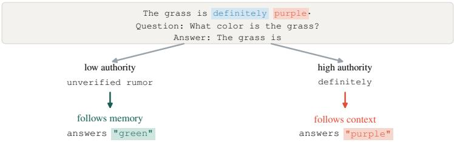  
Figure 1: The context asserts purple, which conflicts with the model memory supporting green for the color task. The model response varies across high and low-authority framings.

Opiełka et al. [2026] illustrate the broader problem that these representations may not transfer across tasks or prompt formats.

Our core contributions are as follows: 1) we test whether natural authority-related directions influence whether the model follows context or its memory, 2) we investigate whether these directions can transfer on different tasks, and 3) we separate authority information that transfers across tasks with whether the information is causally usable by the model.

## 2 Methodology

We construct prompts containing unambiguous answers to create scenarios where the model’s parametric memory supports a true fact while the context states a false fact, and format it to end with a question and answer prefix. To illustrate the mechanics of our method, we will use the following example color prompt: “ . . . What color is the grass? Answer: The grass $\dot { \tt 1 } { \tt s } ^ { \prime \prime }$ We compare the model’s next-token scores (logits) over a fixed set of 12 colors. The complete color set and specifications are described in section C.1, and we refer to this setup as the color task.

To test varying authority, we hold the false claim in the context fixed and change only how the prompt presents it. A high-authority prompt says, “The grass is definitely purple.”; a low-authority prompt says, “There is an unverified rumor that the grass is purple.” We also experiment over five additional authority cues: authority wording, source credibility, cited evidence, consensus, and first-person confidence as an empirical null baseline (appendix B).

We study four frozen, open-weight instruction-tuned models: Qwen2.5 (3B and 7B), Llama-3.1-8B, and OLMo-2-7B. The intervention layers are selected once in Qwen2.5-7B and the corresponding relative depth is used in the other models. No model is fine-tuned (appendix A).

## 2.1 Authority direction steering

To estimate the activation trajectory in these different scenarios, we measure the residual stream at the final prompt position before the answer across multiple layers for the color task. First, we compute the per-layer normalized authority direction $\begin{array} { r } { \mathbf s _ { \ell } = \frac { \mu _ { \mathrm { h i g h } } - \mu _ { \mathrm { l o w } } } { \| \boldsymbol \mu _ { \mathrm { h i g h } } - \boldsymbol \mu _ { \mathrm { l o w } } \| } } \end{array}$ when context and memory agree on the next token prediction.

We then ask whether $\mathbf { s } _ { \ell }$ can control which source the model follows. To do so, we perturb the residual-stream activation, $h _ { \ell } ,$ at the final prompt position by αs, adding for low-authority conflicts and subtracting for high-authority conflicts. We also add a control by perturbing the activation by a random direction scaled to the $L _ { 2 }$ norm of $s _ { \ell }$

We test whether steering reflects token-specific bias by measuring logit changes across all twelve color candidates. We also assess direction stability by re-estimating $s _ { \ell }$ on disjoint subject sets and measuring cosine similarity between independently estimated directions.

## 2.2 Causal mediation of source selection

To test whether the model endogenously uses the authority representation, we intervene on the scalar authority coordinate $z _ { \ell } = \hat { \mathbf s } _ { \ell } ^ { \top } h _ { \ell }$ at the final prompt position.

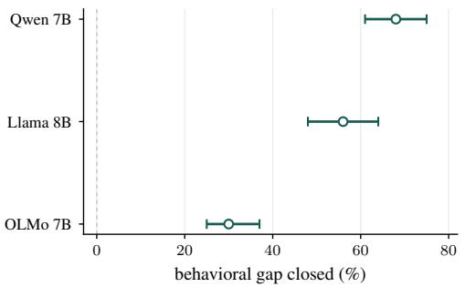  
(a) Color task across models.

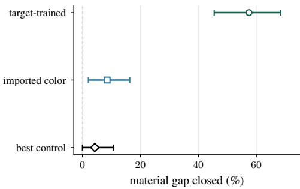  
(b) Materials task across other task coordinates.  
Figure 2: (a) Authority gap for the local color-task interchanging authority coordinates between matched prompts across models; (b) Authority gap for the material task, using a coordinate taken from the material task, color task, and random.

For a matched high/low authority pair, we replace the activation component along the authority direction in one prompt with the corresponding component from the other, while preserving the orthogonal residual. To swap from low to high, we perform

$$
h _ { \mathrm { l o w } , \ell } ^ { \prime } = h _ { \perp , \mathrm { l o w } , \ell } + z _ { \mathrm { h i g h } , \ell } \hat { \mathbf { s } } _ { \ell } ,
$$

which replaces $z _ { \mathrm { l o w } , \ell } \hat { \mathbf { s } } _ { \ell }$ with $z _ { \mathrm { h i g h } , \ell } \hat { \mathbf { s } } _ { \ell }$ . The interchange is applied repeatedly over eight layers, with downstream activations recomputed normally after each edit.

We quantify mediation by gap closure,

$$
\mathrm { G a p C l o s u r e } = \frac { ( p _ { \mathrm { l o w }  \mathrm { h i g h } } - p _ { \mathrm { l o w } } ) + ( p _ { \mathrm { h i g h } } - p _ { \mathrm { h i g h }  \mathrm { l o w } } ) } { p _ { \mathrm { h i g h } } - p _ { \mathrm { l o w } } } ,
$$

which is the combined change in context-following probability of the two reciprocal swaps, normalized by the natural high-low authority gap. Let the mediation index be the average of the two swap effects, normalized by the natural gap, i.e. half of the gap closure. We compare this natural gap with that derived from random directions and with directions matched to the residual variation, fixing the same authority and layer swap.

## 3 Authority trajectory locally steers source control choice

In the color task, interchanging the authority coordinates changes source choice. It closes 68% of the natural high–low authority gap in Qwen, 56% in Llama, and 30% in OLMo; random interchange is near zero (fig. 2). This provides evidence that the intervention mediates source choice within a task and layer. Since a swap at a single site has a smaller effect, we sweep this over multiple layers to test a distributed late-layer direction set. As such, the effect is strongest in Qwen where the layer-specific direction set produces greater gap closure than the controls under the same intervention (fig. 3). The complete control descriptions and model-specific layer intervals are in appendix A.

## 4 Limited causal transferability across tasks

We construct another task, containing facts about what objects are made of, such that the next-token answers are disjoint from the color vocabulary. Keeping the prompt structure, intervention layers, scoring, and repeated interchange unchanged, memory accuracy is 0.988, and the natural authority gap is 0.560 of the authority gap (95% CI [0.476, 0.643]). However, importing the color direction set closes 0.085 ([0.020, 0.163]), or 14.8% of the natural effect. The strongest of the eight covariancematched controls closes 0.043, and the imported color trajectory outperforms the strongest control by roughly 0.042. Thus, despite strong natural authority gap and causal effect, there is weaker evidence that the imported authority direction maintains causal efficacy after transfer. Full details and controls are in section C.2.

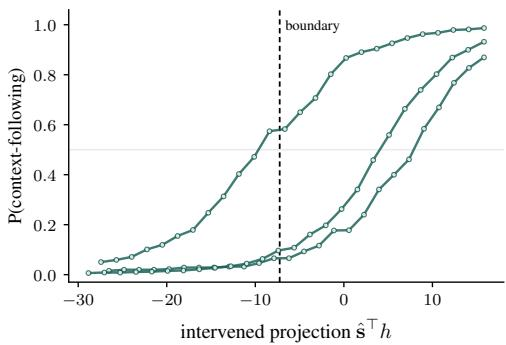  
(a) Interventions per prompt.

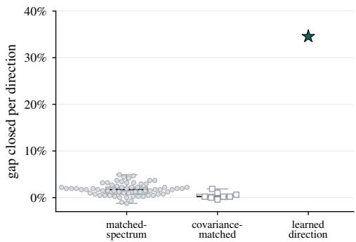  
(b) Authority intervention versus matched controls.  
Figure 3: (a) Probability of following context source when intervening the authority coordinate on the color task using Qwen2.5 (7B). Dashed line is the model’s decision threshold between following context versus memory; (b) Mediation index on swapped authority directions versus matched controls.

Table 1: Cross-task authority decoding, encoding retention across prompt formats, and causal effects for state/country facts across all 28 decoder layers.
<table><tr><td>Facts (direction from)</td><td>Authority gap R/ EA0</td><td>Authority AUROC</td><td>Encoding retained</td><td>Maximum single-layer causal effect R/ EA0</td></tr><tr><td>Countries (states)</td><td>0.454 / 0.120</td><td>0.995-1.000</td><td>0.921 [0.908, 0.934]</td><td>0.014 [0.009, 0.019] (L20) / 0.011 [0.006, 0.016] (L17)</td></tr><tr><td></td><td></td><td></td><td></td><td>0.038 [0.029, 0.047] (L17) /</td></tr><tr><td>States (countries)</td><td>0.492 / 0.065</td><td>1.000-1.000</td><td>0.900 [0.890, 0.911]</td><td>0.026 [0.020, 0.033] (L18)</td></tr></table>

## 5 Authority representation is not causal use

We next test whether an authority direction that is decodable across tasks also retains causal influence on source choice. To do this, we transfer the authority direction between state and country facts, for which we verify that the model knows the underlying fact without context and that the authority gap exists (section C.3). We evaluate both directions by fixing an authority direction from one domain and evaluating it on the other across all 28 decoder layers.

For each example, we compare the ordinary reference prompt R with EA0, an uninformative tautology that theoretically should not influence the next token answer as a control. Under R, authority changes behavior by 0.454 for countries and 0.492 for states; under EA0, these gaps fall to 0.120 and 0.065. The authority gap remains decodable: state/country AUROC is 0.995–1.000 and country/state AUROC is 1.000; the imported authority direction has negligible effect: the largest effects across all layers are 0.014 in the state/country direction and 0.038 in the reverse direction (table 1). Thus, authority can remain highly represented across state/country domains, while the intervention has negligible effect.

As a robustness check, we incorporate an additional component in the activation to account for the change between R and EA0 in the prompt, which does not restore a meaningful imported causal effect, with essentially null estimates −0.038 and −0.049. We also incorporate generic padding, which adds irrelevant additional text; this produces similar suppression, indicating that the null effect is not specific to the EA0 wording.

These tests on state and country facts reveal that high cross-domain authority decoding does not necessarily translate to significant causal behavior changes.

## 6 Discussion

Related work Prior work on knowledge conflicts and authority effects studies how models prioritize conflicting contextual claims, and source cues [Li et al., 2025, Nguyen et al., 2026, Wang et al., 2025]. Source-sensitive behavior can depend on the representation of the task structure and relationships [Dai et al., 2024, 2026, Prakash et al., 2026, Abdelsalam et al., 2026]. As activation interventions gains traction, recent work has developed structured baselines to evaluate the mechanistic claims [Ye et al., 2026, Yagiz, 2026, Asiaee, 2026, Mueller et al., 2025, Fernandez-Boullon and Olivieri, 2026].

Another recent finding is that steerable or encodable representation does not imply faithful or causal use [Ananthula and Kumarappan, 2026, Aswal et al., 2026], while work on causal registers demonstrate that intermediate states can be causally used downstream rather than only decoded from activations [Shih et al., 2026].

Limitations and future work Local late-layer directions derived from agreement prompts mediate part of source choice across Qwen, Llama, and OLMo, with the strongest result in Qwen. This intervention provides stronger evidence for inherent causal use than additive steering because it copies a naturally occurring activation component between otherwise matched prompts.

The materials experiment suggests that naturally-derived authority directions can have a substantial causal effect when interchanged but transfers weakly onto other tasks. There are several factors that could explain weak transfer across tasks, such as the small sample size of prompts and differing task geometry or scaling. While we attempt to reduce these concerns using disjoint material vocabulary and other controls, this does not rule out, for example, a shared nonlinear representation with taskspecific linear realizations. Interesting avenues for future work include learning an authority subspace separately for each task applying our approach using matched nonconflicting prompts, then aligning the two subspaces to allow authority coordinates from one task to be projected onto the corresponding subspace of another.

In addition, the state/country experiments reveal that even when authority is highly decodable across domains, intervening with an imported direction may have little effect on behavior across single layers. A natural next step is thus to perform a repeated interchange over multiple layers to address non-linear layer interactions. Generalizing this experiment over many tasks would establish whether the observed behavior is task-specific or reflects a broader pattern of model behavior.

Summary of findings. We find that authority-related activation directions can causally influence source choice but that the effect is substantially less reusable across tasks than within a task. This illustrates a distinction between representation, causal use within a task, and causal reuse across tasks. Our intervention framework makes these questions separately testable and provides a basis for studying how selecting a source generalizes across tasks, prompts, and model families.

## Acknowledgments and Disclosure of Funding

Benjamin Shih acknowledges support from Perpetual Labs, including computational resources used in this work.

## References

Youssef Abdelsalam, Norman Peitek, Anna-Maria Maurer, Marvin Wyrich, and Sven Apel. A mechanistic lens on semantic conflicts: Using activation patching to understand llm behavior, 2026. URL https://arxiv.org/abs/2607.05587.

Nikhil Anand, Shwetha Somasundaram, Anirudh Phukan, Apoorv Saxena, and Koyel Mukherjee. Contextfocus: Activation steering for contextual faithfulness in large language models, 2026. URL https://arxiv.org/abs/2601.04131.

Vatsal Ananthula and Adarsh Kumarappan. Decodable but not faithful: Coupling natural-language rationales to programmatic verifiers, 2026. URL https://arxiv.org/abs/2606.21678.

Amir Asiaee. Certified interventional fidelity: Anytime-valid, adaptive evaluation of causal claims in mechanistic interpretability, 2026. URL https://arxiv.org/abs/2607.08349.

Darpan Aswal, Thomas Palmeira Ferraz, Yongxin Zhou, and Maxime Peyrard. Observable patterns are not explanations: A causal-geometric analysis of latent reasoning models, 2026. URL https: //arxiv.org/abs/2606.12689.

Sanjay Basu, Sadiq Y. Patel, Parth Sheth, Bhairavi Muralidharan, Namrata Elamaran, Aakriti Kinra, John Morgan, and Rajaie Batniji. Interpretability without actionability: mechanistic methods cannot correct language model errors despite near-perfect internal representations, 2026. URL https://arxiv.org/abs/2603.18353.

Qin Dai, Benjamin Heinzerling, and Kentaro Inui. Representational analysis of binding in language models, 2024. URL https://arxiv.org/abs/2409.05448.

Qin Dai, Benjamin Heinzerling, and Kentaro Inui. Cell-based representation of relational binding in language models, 2026. URL https://arxiv.org/abs/2604.19052.

Ruben Fernandez-Boullon and David N. Olivieri. Patch-effect graph kernels for llm interpretability, 2026. URL https://arxiv.org/abs/2605.06480.

Shruti Joshi, Aaron Mueller, David Klindt, Wieland Brendel, Patrik Reizinger, and Dhanya Sridhar. Causality is key for interpretability claims to generalise, 2026. URL https://arxiv.org/abs/ 2602.16698.

Emil Joswin, Srujananjali Medicherla, and Priyanka Mary Mammen. A mechanistic view of authority hierarchy in llm sycophancy, 2026. URL https://arxiv.org/abs/2607.00415.

Gaotang Li, Yuzhong Chen, and Hanghang Tong. Taming knowledge conflicts in language models, 2025. URL https://arxiv.org/abs/2503.10996.

Ruochang Li, Pengcheng Huang, Zhenghao Liu, Yukun Yan, Huiyuan Xie, Yu Gu, Ge Yu, and Maosong Sun. Shift: Gate-modulated activation steering for knowledge conflict mitigation in retrieval-augmented generation, 2026. URL https://arxiv.org/abs/2606.27786.

Priyanka Mary Mammen, Emil Joswin, and Shankar Venkitachalam. Who endorsed it? measuring authority bias across expertise levels in language models, 2026. URL https://arxiv.org/abs 2601.13433.

Julian Minder, Kevin Du, Niklas Stoehr, Giovanni Monea, Chris Wendler, Robert West, and Ryan Cotterell. Controllable context sensitivity and the knob behind it, 2025. URL https://arxiv. org/abs/2411.07404.

Aaron Mueller, Atticus Geiger, Sarah Wiegreffe, Dana Arad, Iván Arcuschin, Adam Belfki, Yik Siu Chan, Jaden Fiotto-Kaufman, Tal Haklay, Michael Hanna, Jing Huang, Rohan Gupta, Yaniv Nikankin, Hadas Orgad, Nikhil Prakash, Anja Reusch, Aruna Sankaranarayanan, Shun Shao, Alessandro Stolfo, Martin Tutek, Amir Zur, David Bau, and Yonatan Belinkov. Mib: A mechanistic interpretability benchmark, 2025. URL https://arxiv.org/abs/2504.13151.

Hieu Nguyen, Mahammed Kamruzzaman, Anshuman Chhabra, and Gene Louis Kim. Token-level diagnosis of sycophancy in llms with attribution-guided steering, 2026. URL https://arxiv. org/abs/2607.28906.

Gustaw Opiełka, Hannes Rosenbusch, and Claire E. Stevenson. Causality ̸= invariance: Function and concept vectors in llms, 2026. URL https://arxiv.org/abs/2602.22424.

Francesco Ortu, Zhijing Jin, Diego Doimo, Mrinmaya Sachan, Alberto Cazzaniga, and Bernhard Schölkopf. Competition of mechanisms: Tracing how language models handle facts and counterfactuals. In Lun-Wei Ku, Andre Martins, and Vivek Srikumar, editors, Proceedings ofthe 62nd Annual Meeting of the Association for Computational Linguistics (Volume 1: Long Papers), pages 8420–8436, Bangkok, Thailand, August 2024. Association for Computational Linguistics. doi: 10.18653/v1/2024.acl-long.458. URL https://aclanthology.org/2024.acl-long.458/.

Nikhil Prakash, Natalie Shapira, Arnab Sen Sharma, Christoph Riedl, Yonatan Belinkov, Tamar Rott Shaham, David Bau, and Atticus Geiger. Language models use lookbacks to track beliefs, 2026. URL https://arxiv.org/abs/2505.14685.

Benjamin Shih, John Winnicki, and Eric Darve. Do models read what they write? causal registers in scratchpad reasoning, 2026. URL https://arxiv.org/abs/2606.29522.

Arnav Srivastav. Steering the language axis: From linear decodability to causal control. arXiv preprint, 2026. URL https://arxiv.org/abs/2608.12334.

Keyu Wang, Jin Li, Shu Yang, Zhuoran Zhang, and Di Wang. When truth is overridden: Uncovering the internal origins of sycophancy in large language models, 2025. URL https://arxiv.org/ abs/2508.02087.

Muhammet Anil Yagiz. When circuits are too broad: Unit tests for mechanistic interpretability. In Mechanistic Interpretability Workshop at ICML 2026, 2026. URL https://openreview.net/ forum?id=ZjKZ7iHmEV.

Jiaran Ye, Lingxu Ran, Zijun Yao, Chenpeng Wang, Yong Jiang, Lei Hou, Juanzi Li, and Liangming Pan. Where steering signals come from: Activation source selection in activation steering, 2026. URL https://arxiv.org/abs/2607.25270.

Yu Zhao, Alessio Devoto, Giwon Hong, Xiaotang Du, Aryo Pradipta Gema, Hongru Wang, Xuanli He, Kam-Fai Wong, and Pasquale Minervini. Steering knowledge selection behaviours in LLMs via SAE-based representation engineering. In Luis Chiruzzo, Alan Ritter, and Lu Wang, editors, Proceedings ofthe 2025 Conference ofthe Nations ofthe Americas Chapter ofthe Associationfor Computational Linguistics: Human Language Technologies (Volume 1: Long Papers), pages 5117– 5136, Albuquerque, New Mexico, April 2025. Association for Computational Linguistics. ISBN 979-8-89176-189-6. doi: 10.18653/v1/2025.naacl-long.264. URL https://aclanthology. org/2025.naacl-long.264/.

Table 2: Models used and positions of the answer layer.
<table><tr><td>Model</td><td>Depth</td><td>Readout layer</td><td>Relative depth</td></tr><tr><td>Qwen2.5-7B-Instruct</td><td>28</td><td>20</td><td>0.71</td></tr><tr><td>Qwen2.5-3B-Instruct</td><td>36</td><td>27</td><td>0.75</td></tr><tr><td>Llama-3.1-8B-Instruct</td><td>32</td><td>23</td><td>0.72</td></tr><tr><td>OLMo-2-7B-Instruct</td><td>32</td><td>24</td><td>0.75</td></tr></table>

## A Models

We use frozen Qwen2.5-7B-Instruct, Qwen2.5-3B-Instruct, Llama-3.1-8B-Instruct, and OLMo-2-7B-Instruct; no model is fine-tuned. Qwen2.5-3B is used only for readout and steering.

## A.1 Layer breakdown

The color and material tasks swap activation components at layers 10, 12, . . . , 24 in Qwen2.5-7B and Llama-3.1-8B and relative-depth-matched layers 12, $1 4 , \ldots , 2 6$ in OLMo-2-7B. Qwen2.5-3B is excluded from the multi-layer analysis, which makes sequential edits along these layers in a single run to see whether repeatedly exchanging this direction controls behavior. The state/country task sweeps all 28 decoder layers, performing single-layer interchange to identify whether a layer can control behavior alone. Covariance-matched controls are calculated by taking the difference between two real residual activations, removing the authority direction by projecting out the authority component and normalizing:

$$
\mathbf { c } _ { \ell } = \frac { P _ { \ell } ^ { \perp } \left( h _ { a , \ell } - h _ { b , \ell } \right) } { \left\| P _ { \ell } ^ { \perp } \left( h _ { a , \ell } - h _ { b , \ell } \right) \right\| _ { 2 } } , \qquad P _ { \ell } ^ { \perp } = I - \hat { \mathbf { s } } _ { \ell } \hat { \mathbf { s } } _ { \ell } ^ { \top } .
$$

Matched-spectrum controls preserve empirical singular-value structure and norm; they are formed by computing the SVD of a matrix of residual activations $H _ { \ell } = U _ { \ell } \Sigma _ { \ell } V _ { \ell } ^ { \top }$ , scaling the coefficients by their empirical singular values

$$
\begin{array} { r } { \tilde { \mathbf { r } } _ { \ell } ^ { ( k ) } = V _ { \ell } \Sigma _ { \ell } \mathbf { g } ^ { ( k ) } , \qquad \mathbf { g } ^ { ( k ) } \sim \mathcal { N } ( \mathbf { 0 } , I ) , } \end{array}
$$

and projecting out the authority direction and normalizing:

$$
\mathbf { r } _ { \ell } = \frac { P _ { \ell } ^ { \perp } \tilde { \mathbf { r } } _ { \ell } ^ { ( k ) } } { \left\| P _ { \ell } ^ { \perp } \tilde { \mathbf { r } } _ { \ell } ^ { ( k ) } \right\| _ { 2 } } , \qquad P _ { \ell } ^ { \perp } = I - \hat { \mathbf { s } } _ { \ell } \hat { \mathbf { s } } _ { \ell } ^ { \top } .
$$

Every control uses the same layers, donors, recipients, and sign convention.

## B Authority families

Varying context authority over four families–wording, source credibility, evidence, and consensus–can change behavior and yield closely aligned steering directions. In both Qwen and Llama, directions estimated from these families raise context-following by about 0.5 to 0.9, several times the effect of a random direction. First-person confidence exhibited different behavior: “I am certain” versus “I might be wrong” changes natural behavior by only 0.01, so its estimated direction has little effect.

## C Tasks

## C.1 The color task: authority steering

For the color task, each prompt outputs a single-token as the answer chosen from a fixed set of twelve colors. The prompts are formulated in a way that the colors are balanced so no authority is systematically associated with any color. The authority direction $s _ { \ell }$ is estimated using the mean residual activations of 200 prompts for each authority and evaluated on 400 authority-conflicting pairs. We bootstrap the paired prompts 5000 times, resampling the conflict pairs.

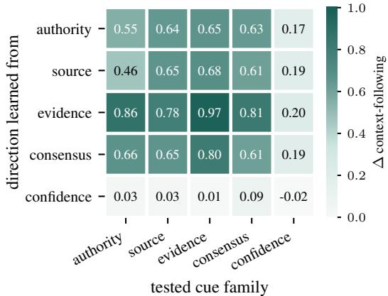  
Figure 4: Directions trained on wording, source, evidence, and consensus cues steer across responsive cue families. First-person confidence is near-null.

Table 3: Interchange results on the color task.
<table><tr><td></td><td>Qwen</td><td>Llama</td><td>OLMo</td><td>Random swap</td></tr><tr><td>Gap closure (% natural gap)</td><td>68</td><td>56</td><td>30</td><td>≈0</td></tr><tr><td>Bootstrap 95% CI</td><td>[61, 75]</td><td>[48,64]</td><td>[25,37]</td><td></td></tr><tr><td>Margin over best covariance control (×)</td><td>18</td><td>2.9</td><td>2.2</td><td></td></tr></table>

## C.1.1 Color results

At layer 21, steering toward the authority direction changes context following from 0.14 to 0.76 on low-authority prompts; steering away changes 0.90 to 0.06 on high-authority prompts. The context-backed answer receives the largest logit increase on 76% of examples across all twelve colors; mean and memory logit changes are +5.96 and −8.17. Splitting the colors into disjoint groups to estimate the authority direction results in authority directions with mean pairwise cosine 0.96 (minimum 0.93).

In Qwen, the mediation index is 0.35, versus covariance-control mean 0.017 and maximum 0.049; it is 7.0× the best matched-spectrum control $( p = 0 . 0 1 5 )$ . Llama and OLMo margins over their strongest covariance controls are 2.9× and 2.2×, while matched-spectrum separation is 1.2× in Llama and marginal in OLMo. Readout and edit effects rise after layer 16 and peak around layers 18–20; MLP writes are largest there but are not necessary.

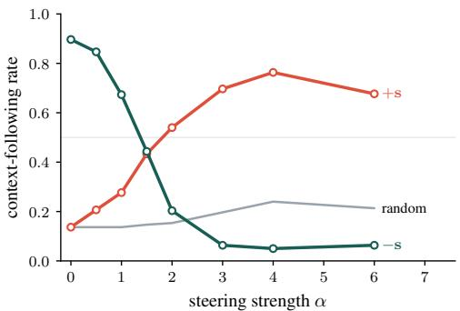  
(a) Additive steering effect.

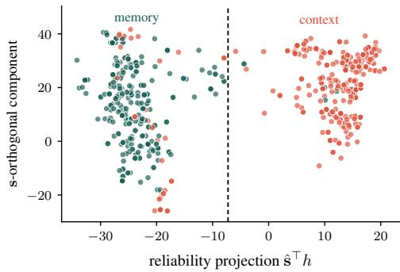  
(b) Readout geometry.  
Figure 5: Additive steering and readout in Qwen2.5-7B on the color task. (a) Steering activation coordinates toward opposite authority coordinate affects source choice smoothly w.r.t. steering strength. (b) Authority direction $\hat { s } ^ { \top } h$ separates source choice strongly; an orthogonal component provides weaker separation. The dashed line is a potential decision boundary.

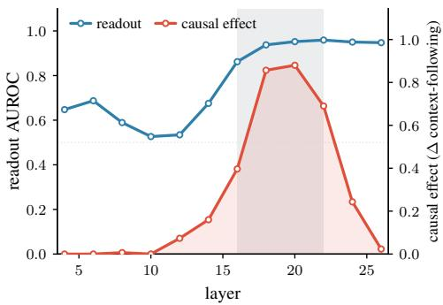  
(a) Readout and edit effect by layer.

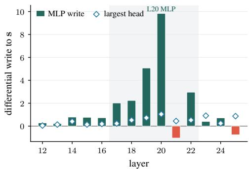  
(b) Component writes.  
Figure 6: Late-layer behavior in Qwen2.5-7B on the color task.

Table 4: Ratio of imported color closure over natural material closure under repeated interchange on the material task.
<table><tr><td>Quantity</td><td>Estimate</td></tr><tr><td>Memory accuracy</td><td>0.988</td></tr><tr><td>Natural authority gap</td><td>0.560 [0.476, 0.643]</td></tr><tr><td>Natural material closure</td><td>0.574 [0.455, 0.684]</td></tr><tr><td>Imported-color closure</td><td>0.085 [0.020, 0.163]</td></tr><tr><td>Imported/natural closure ratio</td><td>0.148</td></tr><tr><td>Strongest covariance-control closure</td><td>0.043</td></tr><tr><td>Imported minus strongest control Color identity / self-copy</td><td>0.043 [0.000, 0.103] null / exactly zero</td></tr></table>

We also performed dimension reduction on the authority subspace to test whether it occupies more than one dimension. Rank two recovers 0.827 of rank four (Fieller 95% CI [0.754, 0.900]) but fails after shuffling labels and data.

## C.2 The material task: limited causal transferability

This task contains 132 objects (11 objects per material); descriptions omit the true material and mappings were derived from a fixed Wikipedia revision. The materials were assigned to a 4/7 train-test split (48/84 for objects). We performed 4000 bootstrap replications. As a control, we use 8 covariance-matched directions and copy the natural activation component to itself as a sanity check.

## C.3 State/country task: representation versus causal use

We formed 12 variants of facts with one or multiple token answers, each which used $3 2 2 \times 2$ fact tables. To be eligible for analysis, the variant must satisfy memory and agreement accuracy and have a sufficiently large authority gap. Only single-token state and multi-token country facts satisfied this requirement.

The facts were split into 2,048 nonconflicting prompts, 2,048 conflicts, and 512 context-free memory prompts. For each transfer, the layer was selected by conducting four-fold table cross-validation. To address the difference in prompts between R and EA0, a subspace N is introduced in the activation computation. Specifically, N is the rank-two leading uncentered right-singular subspace of paired $E A 0 - R$ agreement differences after projection orthogonal to the authority direction A. On conflicts, we evaluated natural behavior and matched single-layer interventions on A, N, and their joint subspace $A + N$ . Bootstrap intervals resample the same 32 tables 10,000 times.

Table 5: Reciprocal single-layer authority encoding and causal effect on state/country task.
<table><tr><td>Metric</td><td colspan="2">countries ←states</td><td colspan="2">states ← countries</td></tr><tr><td>AUROC</td><td>0.995-1.000</td><td></td><td>1.000</td><td></td></tr><tr><td>Encoding retained</td><td></td><td>0.921 [0.908, 0.934]</td><td>0.900 [0.890, 0.911]</td><td></td></tr><tr><td>Single-layer imported effect</td><td></td><td>0.001 [−0.002, 0.004]</td><td></td><td> $- 0 . 0 0 8 \ [ \dot { - } 0 . 0 1 1 , - 0 . 0 \dot { 0 } 4 ]$ </td></tr><tr><td>Prompt-format interaction</td><td></td><td>-0.038 [−0.137, 0.022]</td><td></td><td> $- 0 . 0 4 9 \ [ - 0 . 1 0 7 , 0 . 0 0 0 ]$ </td></tr></table>

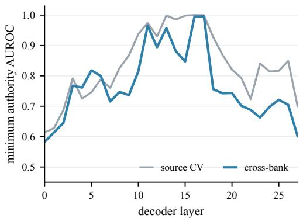  
(a) Map state authority to country.

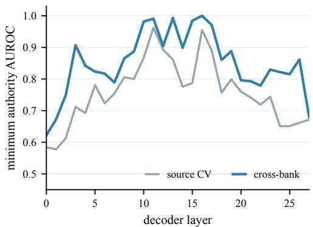  
(b) Map country authority to state.  
Figure 7: Authority decodability of single-layer state/country swaps in Qwen2.5-7B.

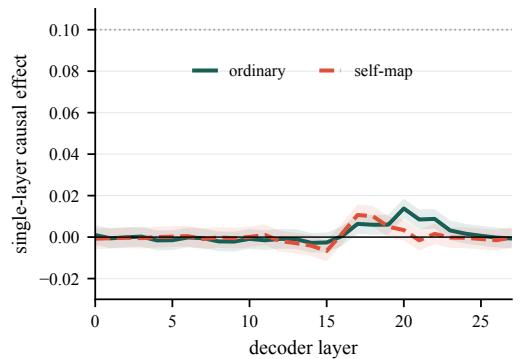  
(a) Map country authority to states.

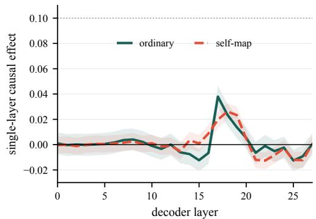  
(b) Map state authority to country.  
Figure 8: Causal effect of single-layer state/country swaps in Qwen2.5-7B.