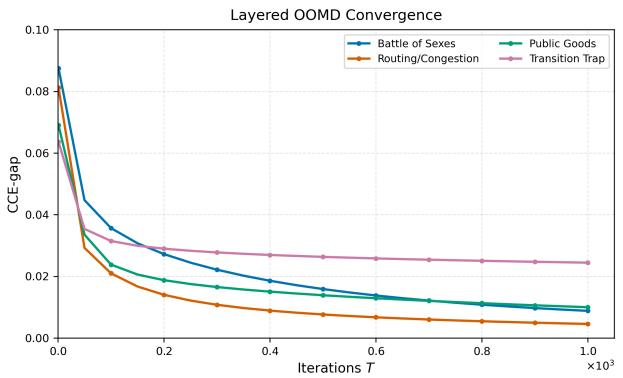
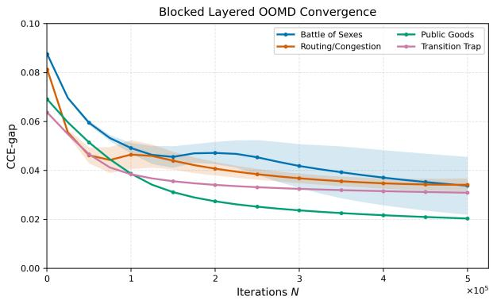
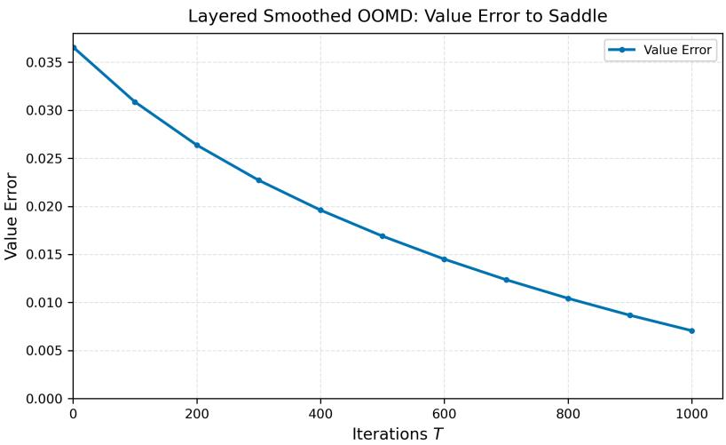

# Independent Reinforcement Learning in Discounted Markov Games

Asrın Efe Yorulmaz∗ U˘gur Aydın† Tamer Ba¸sar‡

## Abstract

In this work, we study radically uncoupled learning in discounted general-sum Markov games. Assuming “ETH for PPAD”, we show that, for every fixed discount factor, there is no polynomialtime algorithm for computing inverse-polynomially accurate coarse correlated equilibria in discounted general-sum Markov games when players learn independently in decentralized settings. Complementing this hardness result, we provide what appears to be the first radically uncoupled algorithm with sub-exponential convergence guarantees to coarse correlated equilibria in discounted general-sum Markov games without imposing any structural restrictions on the game. Our algorithm is a layered variant of optimistic mirror descent with an increasing step-size schedule tailored to the multi-agent setting. Finally, we develop both full-feedback and partial feedback versions of the aforementioned algorithm and establish sub-exponential convergence guarantees for each case.

## 1 Introduction

Multi-agent reinforcement learning (MARL) studies how multiple decision-making agents learn and act in a shared environment, where each agent seeks to optimize its own objective while adapting to the behavior of others [Bu¸soniu et al., 2008, Zhang et al., 2021]. This framework has become a central modeling paradigm for large-scale decision-making systems involving both cooperation and competition. Its recent applications range from strategic game playing—including Go, poker, Stratego, and Diplomacy [Silver et al., 2016, Brown and Sandholm, 2018, Perolat et al., 2022, Kram´ar et al., 2022, Bakhtin et al., 2022]—to large language models [Park et al., 2025, Wan et al., 2025], robotics [Levine et al., 2017], quantitative finance [Zhang et al., 2024], intelligent transportation [Shalev-Shwartz et al., 2016], cybersecurity [Malialis and Kudenko, 2015], and economic policy design [Zheng et al., 2022]. These applications motivate algorithms that are not only computationally and statistically eficient, but also robust to decentralization, limited information, and strategic non-stationarity.

The standard mathematical model for the theoretical study of MARL is stochastic games, also known as Markov games [Shapley, 1953, Littman, 1994]. In a Markov game, interaction unfolds over a sequence of states. At each state, all players choose actions simultaneously; each player receives a reward depending on the current state and the joint actions; and the next state is drawn from a transition kernel that also depends on the joint actions. Thus, Markov games extend Markov decision processes (MDPs) to multi-agent environments, while also extending normal-form games to dynamic environments with state-dependent rewards and transitions. This combination creates dificulties that are absent from each of these two special cases. In contrast to single-agent MDPs, the value of a player’s policy depends on the policies chosen by the other players, and thus optimality must be replaced by an equilibrium notion. In contrast to normal-form games, a player’s current action afects not only her immediate reward, but also the future state distribution on which later strategic interactions take place. Consequently, equilibrium computation in Markov games combines the fixed-point nature of equilibrium computation in normal-form games with the intertemporal structure of dynamic decision-making.

In this work, we focus on a fully decentralized information model for MARL, namely independent or radically uncoupled learning [Foster et al., 2023, Foster and Peyton, 2006]. We study this model in the discounted setting, which is widely used in the control and reinforcement learning literatures for a variety of purposes [Daskalakis et al., 2023, Tessler et al., 2019, Huang et al., 2026, P´erolat et al., 2017, Sayin et al., 2021]. Here, radically uncoupled refers to the restriction that players are not allowed to observe one another’s policies, losses, value functions, or random bits. In particular, there is no available shared randomness, communication, policy revelation, or correlation device during learning. Consequently, each player updates her policy using only her own feedback and treats the efect of the other players as part of the environment. Independent learning dynamics are attractive because they scale without the communication and synchronization overhead required by centralized coordination. For instance, in large-scale systems, repeatedly aggregating global information or coordinating agents through a central learner can be costly and or infeasible under bandwidth, latency, or privacy constraints Lian et al. [2017]. Moreover, these informational restrictions also rule out many of the mechanisms used in existing results for equilibrium computation in Markov games [Bai et al., 2020, Wei et al., 2021, Jin et al., 2023], thereby motivating the study of equilibrium computation under decentralized information structures.

Beyond asymptotic convergence, one typically seeks algorithms that reach an approximate equilibrium with controlled computational cost and sample complexity, for example with polynomial or quasi-polynomial dependence on the natural problem parameters. To achieve these finite-time computational guarantees, centralized or communication-based methods often rely on shared value estimates, policy information, or coordinated equilibrium-computation subroutines. In contrast, under radically uncoupled information, each player must both compute and statistically estimate her update using only her own local feedback. Therefore, the main challenge in the independent learning setting is not merely to design a convergent learning dynamic, but to obtain convergence with meaningful computational and statistical eficiency under radically uncoupled information. For these reasons, in this work we investigate the following question:

## Are there (quasi-)eficient, radically uncoupled learning algorithms for approximate equilibrium computation in discounted general-sum Markov games?

In normal-form games, the connection between independent learning mechanisms and equilibrium computation is well understood, as independent learning reduces naturally to no-regret learning in this setting: if all players have vanishing external regret, then their average play converges to a coarse correlated equilibrium (CCE), and if all players have vanishing swap regret, their average play converges to a correlated equilibrium (CE) [Hannan, 1957, Hart and Mas-Colell, 2000, Cesa-Bianchi and Lugosi, 2006, Blum and Mansour, 2007]. Moreover, it has been shown that optimistic and regularized learning dynamics yield faster self-play rates in normal-form games [Daskalakis et al., 2011, Syrgkanis et al., 2015, Daskalakis et al., 2021, Anagnostides et al., 2022, Soleymani et al., 2025].

In contrast, the relationship between independent learning dynamics and equilibrium computation in Markov games remains much less understood. For two-player zero-sum Markov games there is a substantial body of work on decentralized learning, including settings with limited shared information and radically uncoupled algorithms with provable guarantees [Bai et al., 2020, We et al., 2021, Cai et al., 2023, Chen et al., 2024]. Naturally, general-sum Markov games are expected to be more challenging, as there is no common value function or saddle-point structure. The challenge lies not only in the general-sum strategic interactions among multiple players, but also in the dynamic nature of the environment. The unilateral alternative policies may induce a diferent distribution over future states, and this state distribution depends jointly on the deviating player’s policy, the transition dynamics, and the policies used by the other players. Since the opponents may also change their policies over time, these comparison distributions are themselves time-varying and unknown to players. This is a central obstruction to transferring the standard normal-form no-regret argument directly to Markov games.

The existing positive results for general-sum Markov games typically rely on coordination or postprocessing mechanisms that are not present in the independent learning problem considered in this paper [Arslan and Y¨uksel, 2017, Jin et al., 2023, Song et al., 2022, Mao and Ba¸sar, 2023, Daskalakis et al., 2023]. A frequently studied class of algorithms include V-learning and related sample-based algorithms [Jin et al., 2023, Song et al., 2022, Mao and Ba¸sar, 2023], which compute CCE or CE policies in decentralized MARL. The equilibrium policies produced by these methods are represented as carefully specified distributions over the learning history and require the players to sample a common index from that history during execution. Notably, the learning phase of these algorithms does not provide any online regret guarantees. Thus, while these methods are decentralized, they do not address the radically uncoupled online-regret objective considered in this paper. Being another closely related algorithm, the so-called SPoCMAR [Daskalakis et al., 2023] is a decentralized algorithm with polynomial sample and computational complexity for learning a nonstationary Markov-CCE, but the provided regret guarantees rely on the existence of common random bits during learning and for sampling the output policy, where Markov-CCE is an equilibrium with respect to the Markov policy deviations. Consequently, these works do not provide online regret guarantees for the independently played product policies during the learning process.

Another closely related precursor to our work is Erez et al. [2025]. Similar to our work, they study radically uncoupled learning in finite-horizon general-sum Markov games in the self-play setting. Their work, compared to ours, contains further restrictions. First, their regret bounds are obtained with respect to Markov policies, whereas our results allow non-Markov history-dependent policies. Second, their sublinear regret guarantee is obtained when agents may afect one another’s losses but not one another’s transition dynamics. In contrast, we study finite- and infinite-horizon discounted Markov games with action-dependent transition kernels and aim to develop radically uncoupled learning algorithms with online regret guarantees against non-Markov history-dependent deviations.

On the other hand, there exist hardness results that demonstrate limitations in finding eficient algorithms for the MDPs and Markov games. In the single-agent case, no-regret learning in adversarially changing MDPs can be computationally intractable [Abbasi-Yadkori et al., 2013]. Naturally, this intractability also arises in Markov games with adversarial opponents, where both computational and statistical barriers are known [Liu et al., 2022, Tian et al., 2021]. More recently, motivated by the fact that computing Nash equilibria is PPAD-complete in normal-form games [Daskalakis et al., 2009], it has been shown that similar hardness constraints can persist in Markov games [Daskalakis et al., 2023, Foster et al., 2023]. In particular, computing stationary Markov-CCEs in discounted general-sum stochastic games is PPAD-hard [Daskalakis et al., 2023]. Moreover, in finite-horizon general-sum Markov games, any independent learning algorithm that achieves no regret property is also PPAD-hard [Foster et al., 2023]. In contrast, we seek nonstationary policies that approximate CCE in discounted Markov games while avoiding the intractability barriers described above in the self-play setting, which complements the existing literature.

Our contributions in this paper can be summarized as follows.

1. In Section 3, we first study finite-horizon general-sum Markov games under full-feedback. We introduce a layered smoothed-entropy optimistic-online-mirror-descent (OOMD) algorithm, with an increasing step-size schedule (Algorithm 1). Then, we show that this algorithm achieves an $\mathcal { O } \big ( T ^ { - 3 / ( 3 H + 1 ) } \big )$ -approximate CCE with respect to history-dependent deviations after T episodes (Theorem 1). Then, when the underlying model is unknown to agents, in Subsection 3.2, under a reachability notion (Definition 7), we prove a high-probability finite-horizon CCE guarantee with the same exponential-in-horizon dependence up to the polynomial terms (Theorem 2).

2. In Section 4, we transfer the finite-horizon guarantees established in Section 3 to discounted Markov games (Theorem 3). Unlike the undiscounted case, in the discounted case our algorithms yield quasi-polynomial-time and quasi-polynomial-sample guarantees for computing inverse-polynomially accurate sparse discounted CCEs for the full-feedback and partial feedback cases for both finite-horizon and infinite-horizon Markov games (Corollaries 1 and 2). These quasi-polynomial results rely on a horizon length truncation and approximation error bounding arguments to reduce the error bound $\mathcal { O } \big ( T ^ { - 3 / ( 3 H + 1 ) } \big )$ to a quasi-polynomial one.

3. In Section 5, we complement the quasi-polynomial upper bounds established in Section 4 for learning discounted-CCE with a complexity-theoretic lower bound. In particular, assuming the “ETH for $\mathsf { P R D } ^ { \mathsf { * } }$ [Babichenko et al., 2016], we show that for every fixed discount factor $\gamma \in ( 0 , 1 ) \cap \mathbb { Q }$ and every polynomial support bound, there exists an inverse-polynomial accuracy level for which no polynomial-time algorithm can compute a sparse approximate CCE in finite horizon or infinite horizon discounted general-sum Markov games (Theorem 5, Corollary 3) i.e., when players learn independently in a decentralized setting, one cannot calculate approximate CCE in polynomial time.

## 2 Preliminaries and Notations

## 2.1 Notations

For an integer $q \geq 1$ , we write $[ q ] : = \{ 1 , \ldots , q \}$ . For a finite set X, we let $\Delta ( X )$ denote the probability simplex over X. For a vector $x \in \Delta ( X ) , x ( a )$ denotes the probability of occurrence of action a. All logarithms are natural base unless otherwise stated. In the computational statements, every input object is represented by a finite binary string.

## 2.2 Undiscounted Finite-horizon Markov games

Let m be a positive integer. An m-player finite-horizon Markov game is specified by the tuple $G = \left( H , \{ S _ { h } \} _ { h = 1 } ^ { H + 1 } , \{ A _ { i } \} _ { i = 1 } ^ { m } , \{ P _ { h } \} _ { h = 1 } ^ { H } , \{ \ell _ { h } ^ { i } \} _ { i \in [ m ] , h \in [ H ] } , s _ { 1 } \right)$ . We will denote by $\mathcal { M } = [ m ]$ the set of players. The components of the the Markov game are defined as follows:

• Horizon length is denoted by $H \in \mathbb { N } _ { + }$

• We denote the finite set of states at layer h by $S _ { h }$ . The initial state is deterministic and we denote the initial state by $s _ { 1 }$ . The layer $H + 1$ is terminal and has no actions or costs. We write $\textstyle S : = \bigcup _ { h = 1 } ^ { H + 1 } S _ { h }$ , and $S : = | S |$

• The action set of player $i \in \mathcal { M }$ is denoted by $A _ { i }$ , which we will assume to be finite. The joint action space of all players will be denoted by $\textstyle A : = \prod _ { i = 1 } ^ { m } A _ { i }$ . We write joint actions of the players as $\pmb { a } = ( a _ { 1 } , \ldots , a _ { m } ) \in A$ , and write a $\begin{array} { r } { \mathbf { \Phi } _ { - i } : = ( a _ { j } ) _ { j \neq i } \in A _ { - i } : = \prod _ { j \neq i } A _ { j } } \end{array}$ for the action profile that excludes the action of player i. By $A _ { \mathrm { m a x } } : = \operatorname* { m a x } _ { i \in [ m ] } \left| A _ { i } \right|$ , we will denote the maximum available cardinality among all players.

• For any given $h \in [ H ]$ , by $P _ { h } : S _ { h } \times A \to \Delta ( S _ { h + 1 } )$ we denote the (state) transition probability kernel of all players. The quantity $P _ { h } ( s ^ { \prime } \mid s , \pmb { a } )$ represents the probability of transitioning to $s ^ { \prime } \in S _ { h + 1 }$ from $s \in S _ { h }$ when the joint action is $\mathbf { \pmb { a } } \in A$

• For each player $i \in [ m ]$ and layer $h \in [ H ]$ , the cost function is $\ell _ { h } ^ { i } : S _ { h } \times A \to [ 0 , 1 ]$

General (non-Markov) policies. For $h \in [ H ]$ , let $\mathcal { H } _ { h }$ denote the set of histories before the layer-h action, $\mathcal { H } _ { h } : = S _ { 1 } \times A \times S _ { 2 } \times A \times \cdots \times S _ { h - 1 } \times A \times S _ { h }$ . An element of $\mathcal { H } _ { h }$ is written as $\tau _ { h } = ( s _ { 1 } , a _ { 1 } , s _ { 2 } , a _ { 2 } , \ldots , s _ { h - 1 } , \ b { a } _ { h - 1 } , s _ { h } )$ . Furthermore, when needed, we let $s ( \tau _ { h } ) \in S _ { h }$ be the concluding state of the history $\tau _ { h } \in \mathcal { H } _ { h }$ at layer h. A non-Markov policy of player i is a sequence of maps $\pi ^ { i } = \{ \pi _ { h } ^ { i } \} _ { h = 1 } ^ { H } , \pi _ { h } ^ { i } ( \cdot  { | \tau _ { h } ) \in \Delta ( A _ { i } ) }$ for every $\tau _ { h } \in \mathcal { H } _ { h }$ . Let $\Pi _ { i } ^ { \mathrm { g e n } }$ denote the set of all such finitehorizon policies of player $i ,$ and define $\begin{array} { r } { \Pi ^ { \mathrm { g e n } } : = \prod _ { i = 1 } ^ { m } \Pi _ { i } ^ { \mathrm { g e n } } } \end{array}$ . A non-Markov product policy profile is denoted by $\pmb { \pi } = ( \pi ^ { 1 } , \ldots , \pi ^ { m } ) \in \Pi ^ { \mathrm { g e n } }$ . In particular, for player $i \in \mathcal { M }$ a general (non-Markov) policy $\pi _ { i } \in \Pi _ { i } ^ { \mathrm { g e n } }$ is specified by a collection $\pi ^ { i } = ( \pi _ { 1 } ^ { i } , \cdot \cdot \cdot , \pi _ { H } ^ { i } )$ , where $\pi _ { h } ^ { i } : \tau _ { h }  \Delta ( A _ { i } )$ . Under such a profile, conditional on the history, $\tau _ { h }$ , the players’ actions are sampled independently as $a _ { h } ^ { i } \sim \pi _ { h } ^ { i } ( \cdot \mid \tau _ { h } ) , i \in [ m ] , h \in [ H ]$

Markov policies. A Markov policy of player i is a sequence $\pi ^ { i } = \{ \pi _ { h } ^ { i } \} _ { h = 1 } ^ { H } , \ \pi _ { h } ^ { i } ( \cdot \ | \ s ) \in \Delta ( A _ { i } )$ for every $s \in S _ { h }$ . Let Πmarkov denote the set of all such finite-horizon policies of player i, and define Πmarkov $: = \Pi _ { i = 1 } ^ { m } \Pi _ { i } ^ { \mathrm { m a r k o v } }$ to denote the space of product Markov policies, where each agent i independently follows a policy in $\Pi _ { i } ^ { \mathrm { m a r k o v } }$ for a given state. In particular, a Markov product policy $\pi \in \Pi ^ { \mathrm { m a r k o v } }$ is specified by a collection ${ \pmb \pi } = ( { \pmb \pi } _ { 1 } , \cdots , { \pmb \pi } _ { H } )$ , where $\pi _ { h } : S _ { h }  \Delta ( A _ { 1 } ) \times \cdot \cdot \cdot \times \Delta ( A _ { m } )$ . At state $s \in S _ { h }$ , it induces the product distribution $\begin{array} { r } { \pi _ { h } ( \pmb { a } \mid s ) : = \prod _ { j = 1 } ^ { m } \pi _ { h } ^ { j } ( a _ { j } \mid s ) , \pmb { a } = ( a _ { 1 } , \dots , a _ { m } ) \in A } \end{array}$ For player i, write $\pmb { \pi } ^ { - i } : = ( \pi ^ { 1 } , \ldots , \pi ^ { i - 1 } , \pi ^ { i + 1 } , \ldots , \pi ^ { m } )$ for the policy profile of all players except i. If $\rho ^ { i }$ is another policy of player i, either Markov or non-Markov, we write $\rho ^ { i } \odot \pi ^ { - i }$ for the profile obtained by replacing player i’s policy with $\rho ^ { i }$ and leaving the opponents’ policies equal to $\pi ^ { - i }$ . In particular, if $\rho ^ { i }$ is Markov, then for $\begin{array} { r } { s \in S _ { h } , ( \rho ^ { i } \odot \pi ^ { - i } ) _ { h } ( \pm \mid s ) : = \rho _ { h } ^ { i } ( a _ { i } \mid s ) \prod _ { j \ne i } \pi _ { h } ^ { j } ( a _ { j } \mid s ) } \end{array}$

Repeated interaction. The agents interact with environment over T episodes. At the beginning of episode $t ~ \in ~ [ T ]$ , each player i chooses a Markov policy $\pi _ { t } ^ { i } .$ . Let $\pmb { \pi } _ { t } = ( \pi _ { t } ^ { 1 } , \dots , \pi _ { t } ^ { m } )$ denote the resulting product Markov profile. Each episode starts from $s _ { t , 1 } ~ = ~ s _ { 1 }$ . For each $h \in [ H ]$ player i samples $a _ { t , h } ^ { i } \sim \pi _ { t , h } ^ { i } ( \cdot \mid s _ { t , h } )$ , the joint action is $\mathbf { \delta } \mathbf { a } _ { t , h } : = ( a _ { t , h } ^ { 1 } , \ldots , a _ { t , h } ^ { m } )$ , player i incurs cost $\ell _ { h } ^ { i } ( s _ { t , h } , { a } _ { t , h } )$ , and the next state is sampled as $s _ { t , h + 1 } \sim P _ { h } ( \cdot \mid s _ { t , h } , \mathbf { a } _ { t , h } )$ . The feedback observed by each player after the episode depends on the feedback model defined below.

Definition 1 (Full-feedback). At the end of episode t, player i observes the exact $Q _ { t } ^ { i } ( s , a _ { i } ) ~ = ~$ $Q _ { h } ^ { i , \pi _ { t } } ( s , a _ { i } ) , \ : \forall h \in [ H ] , \ : s \in S _ { h } , \ : a _ { i } \in A _ { i }$

Definition 2 (Partial feedback). At the end of episode t, player i observes only its own trajectory information $\left( s _ { t , 1 } , a _ { t , 1 } ^ { i } , c _ { t , 1 } ^ { i } , s _ { t , 2 } , a _ { t , 2 } ^ { i } , c _ { t , 2 } ^ { i } , \ldots , s _ { t , H } , a _ { t , H } ^ { i } , c _ { t , H } ^ { i } , s _ { t , H + 1 } \right)$ , where $c _ { t , h } ^ { i } : = \ell _ { h } ^ { i } ( s _ { t , h } , { \boldsymbol { a } } _ { t , h } )$

For a policy profile $\pi \in \Pi ^ { \mathrm { m a r k o v } }$ , let $\mathbb { P } ^ { \pi }$ denote the distribution over trajectories induced by the policy profile π and the transition kernels $\{ P _ { h } \} _ { h = 1 } ^ { H }$ , and define $V _ { H + 1 } ^ { i , \pi } \equiv 0$ . All expectations $\mathbb { E } ^ { \pi }$ below are taken with respect to this trajectory distribution. For $h \in [ H ] , \dot { s } \in S _ { h }$ , and $i \in [ m ]$ , we define the value function $V _ { h } ^ { i , \pi } ( s ) : = \mathbb { E } ^ { \pi } \left[ \sum _ { r = h } ^ { H } \ell _ { r } ^ { i } ( s _ { r } , \pmb { a } _ { r } ) \Big | s _ { h } = s \right]$ . Similarly, the state-action value is given as $\begin{array} { r } { Q _ { h } ^ { i , \pi } ( s , a _ { i } ) : = \mathbb { E } _ { a _ { - i } \sim \pi _ { h } ^ { - i } ( \cdot \vert s ) } \left[ \ell _ { h } ^ { i } ( s , a ) + \sum _ { s ^ { \prime } \in S _ { h + 1 } } P _ { h } ( s ^ { \prime } \mid s , a ) V _ { h + 1 } ^ { i , \pi } ( s ^ { \prime } ) \right] } \end{array}$ , where the opponents follow the $\pi ^ { - i }$ . Therefore, $V _ { h } ^ { i , \pi } ( s ) = \mathbb { E } _ { a _ { i } \sim \pi _ { h } ^ { i } ( \cdot | s ) } \left[ Q _ { h } ^ { i , \pi } ( s , a _ { i } ) \right]$ . For $s _ { 1 }$ , we have $V ^ { i , \pi } ( s _ { 1 } ) : = V _ { 1 } ^ { i , \pi } ( s _ { 1 } )$

The induced MDP of a player. Fix an episode t, a player i, and the opponents’ policies $\pi _ { t } ^ { - i } .$ Then, player i faces an induced finite-horizon MDP $\begin{array} { r } { M _ { t } ^ { i } : = \left( H , \{ S _ { h } \} _ { h = 1 } ^ { H + 1 } , A _ { i } , \{ P _ { t , h } ^ { i } \} _ { h = 1 } ^ { H } , \{ \ell _ { t , h } ^ { i } \} _ { h = 1 } ^ { H } , s _ { 1 } \right) } \end{array}$ where, for $s \in S _ { h } , \ a _ { i } \ \in A _ { i }$ , and $s ^ { \prime } \in S _ { h + 1 } , \ \ell _ { t , h } ^ { i } ( s , a _ { i } ) : = \mathbb { E } _ { a _ { - i } \sim \pi _ { \star } ^ { - i } ( \cdot | s ) } \left[ \ell _ { h } ^ { i } \big ( s , ( a _ { i } , \pmb { a } _ { - i } ) \big ) \right]$ , and $P _ { t , h } ^ { i } ( s ^ { \prime } \mid s , a _ { i } ) : = \mathbb { E } _ { a _ { - i } \sim \pi _ { \star } ^ { - i } ( \cdot \mid s ) } \left[ P _ { h } \left( s ^ { \prime } \mid s , ( a _ { i } , \pmb { a } _ { - i } ) \right) \right]$ . For a Markov policy $\mu ^ { i }$ in this induced MDP, define $V _ { t , H + 1 } ^ { i , \mu ^ { i } } \equiv 0$ and, then, we have

$$
Q _ { t , h } ^ { i , \mu ^ { i } } ( s , a _ { i } ) : = \ell _ { t , h } ^ { i } ( s , a _ { i } ) + \sum _ { s ^ { \prime } \in S _ { h + 1 } } P _ { t , h } ^ { i } ( s ^ { \prime } \mid s , a _ { i } ) V _ { t , h + 1 } ^ { i , \mu ^ { i } } ( s ^ { \prime } ) , \qquad V _ { t , h } ^ { i , \mu ^ { i } } ( s ) : = \mathbb { E } _ { a _ { i } \sim \mu _ { h } ^ { i } ( \cdot \mid s ) } \left[ Q _ { t , h } ^ { i , \mu ^ { i } } ( s , a _ { i } ) \right] .
$$

These induced-MDP quantities agree with the corresponding Markov-game quantities, $V _ { t , h } ^ { i , \mu ^ { i } } ( s ) =$ $V _ { h } ^ { i , \mu ^ { i } \odot \pi _ { t } ^ { - i } } ( s ) , Q _ { t , h } ^ { i , \mu ^ { i } } ( s , a _ { i } ) = Q _ { h } ^ { i , \mu ^ { i } \odot \pi _ { t } ^ { - i } } ( s , a _ { i } )$ . For the actually played policy $\pi _ { t } ^ { i } .$ , we use the shorthand $V _ { t , h } ^ { i , \pi } ( s ) : = V _ { h } ^ { i , \pi _ { t } ^ { i } \odot \pi _ { t } ^ { - i } } ( s ) , ~ Q _ { t , h } ^ { i , \pi } ( s , a _ { i } ) : = Q _ { h } ^ { i , \pi _ { t } ^ { i } \odot \pi _ { t } ^ { - i } } ( s , a _ { i } ) , ~ s \in S _ { h }$ . Moreover, we drop policy-dependent indices from the value-functions’ notation whenever they are clear from the context.

Distributional policies. We will also consider distributions over non-Markov general policies; we refer to such elements of $\Delta ( \mathrm { { I I ^ { g e n } } ) }$ as distributional policies. Playing a distributional policy $P \in \Delta ( \Pi ^ { \mathrm { g e n } } )$ consists of first sampling a randomized policy $\pi \sim P _ { \mathrm { { i } } }$ , and then executing the sampled policy π.

For any policy $\pi \in \Pi ^ { \mathrm { g e n } }$ , let $\delta _ { \pi } \in \Delta ( \Pi ^ { \mathrm { g e n } } )$ denote the distribution placing unit mass on π. Accordingly, the empirical distribution over the iterates $\pi _ { 1 } , \ldots , \pi _ { T }$ is $\begin{array} { r } { \widehat { \Pi } _ { T } : = \frac { 1 } { T } \sum _ { t = 1 } ^ { T } \delta _ { \pi _ { t } } \in \Delta ( \Pi ^ { \mathrm { g e n } } ) } \end{array}$ More generally, if $\mathfrak { P } ~ \in ~ { \Delta } ( \Pi ^ { \mathrm { g e n } } )$ is a distribution over policy profiles, we define $V ^ { i , \mathfrak { P } } ( s _ { 1 } ) \ : =$ $\mathbb { E } _ { \pmb { \sigma } \sim \mathfrak { P } } \left[ V ^ { i , \pmb { \sigma } } ( s _ { 1 } ) \right]$ . Then, for a deviation $\mu ^ { i } \in \Pi _ { i } ^ { \mathrm { g e n } }$ , we let $V ^ { i , \mu ^ { i } \odot \mathfrak { P } ^ { - i } } ( s _ { 1 } ) : = \mathbb { E } _ { \pmb { \sigma } \sim \mathfrak { P } } \left[ V ^ { i , \mu ^ { i } \odot \pmb { \sigma } ^ { - i } } ( s _ { 1 } ) \right]$

Definition 3 (General-policy external regret). Given product Markov policy profiles $\pi _ { 1 } , \ldots , \pi _ { T }$ , the general-policy external regret of player i is $\begin{array} { r } { \mathrm { R e g } _ { T } ^ { \mathrm { g e n } , i } : = \operatorname* { s u p } _ { \mu ^ { i } \in \Pi _ { i } ^ { \mathrm { g e n } } } \sum _ { t = 1 } ^ { T } \Big [ V ^ { i , \pi _ { t } } \big ( s _ { 1 } \big ) - V ^ { i , \mu ^ { i } \odot \pi _ { t } ^ { - i } } \big ( s _ { 1 } \big ) \Big ] } \end{array}$

Definition 4 (Coarse Correlated Equilibrium). The empirical distribution $\begin{array} { r } { \widehat { \Pi } _ { T } = \frac { 1 } { T } \sum _ { t = 1 } ^ { T } \delta _ { \pi _ { t } } } \end{array}$ is an ε-approximate CCE if, for every player $i \in [ m ]$ $\begin{array} { r } { \mathrm { s u p } _ { \mu ^ { i } \in \Pi _ { i } ^ { \mathrm { g e n } } } \left\lceil V ^ { i , \widehat { \Pi } _ { T } } ( s _ { 1 } ) - V ^ { i , \mu ^ { i } \odot \widehat { \Pi } _ { T } ^ { - i } } ( s _ { 1 } ) \right\rceil \leq \varepsilon . } \end{array}$

## 2.3 Discounted Markov games

We use the same notation for finite and infinite-horizon discounted games. Let $\bar { H } \in \mathbb { N } _ { + } \cup \{ \infty \}$ denote the horizon. When $\bar { H } < \infty$ , an m-player finite-horizon discounted Markov game is specified by $G _ { \gamma , \bar { H } } = \Big ( \bar { H } , \{ S _ { h } \} _ { h = 1 } ^ { \bar { H } + 1 } , \{ A _ { i } \} _ { i = 1 } ^ { m } , \{ P _ { h } \} _ { h = 1 } ^ { \bar { H } } , \{ \ell _ { h } ^ { i } \} _ { i \in [ m ] , h \in [ \bar { H } ] } , \gamma , s _ { 1 } \Big )$ . When $\bar { H } = \infty ,$ , we recover the discounted infinite-horizon Markov game $G _ { \gamma } = \left( S , \{ A _ { i } \} _ { i = 1 } ^ { m } , P , \{ \ell ^ { i } \} _ { i = 1 } ^ { m } , \gamma , s _ { 1 } \right)$ . In both cases, we will denote by $\mathcal { M } = [ m ]$ the set of players. Corresponding games are defined as follows.

• For horizon ${ \bar { H } } ,$ , we use the convention $\begin{array} { r } { [ \bar { H } ] = \left\{ \begin{array} { l l } { \{ 1 , \dots , \bar { H } \} , } & { \bar { H } < \infty , } \\ { \mathbb { N } _ { + } , } & { \bar { H } = \infty . } \end{array} \right. } \end{array}$

• In the finite-horizon case, the state spaces $S _ { 1 } , \ldots , S _ { \bar { H } + 1 }$ are layer-labeled, and $S _ { \bar { H } + 1 }$ is terminal. In the infinite-horizon case, we have $S _ { h } = S$ for all $h \geq 1$ . The initial state is deterministic and we denote it by $s _ { 1 }$

• The set $A _ { i }$ is the finite action set of player $i \in \mathcal { M }$ . The joint action space is $\textstyle A : = \prod _ { i = 1 } ^ { m } A _ { i }$ . We write a joint action as $\pmb { a } = ( a _ { 1 } , \dots , a _ { m } ) \in A$ , and we write $\begin{array} { r } { \pmb { a } _ { - i } : = ( a _ { j } ) _ { j \neq i } \in A _ { - i } : = \prod _ { j \neq i } A _ { j } } \end{array}$

• For each layer $h \in [ \bar { H } ]$ , the transition kernel is $P _ { h } : S _ { h } \times A \to \Delta ( S _ { h + 1 } )$ . In the infinite-horizon case, this reduces to the stationary kernel $P : S \times A  \Delta ( S )$

• For each player $i \in [ m ]$ and layer $h \in [ \bar { H } ]$ , the cost function is $\ell _ { h } ^ { i } : S _ { h } \times A \to [ 0 , 1 ]$ . In the infinite-horizon case, the cost function is $\ell ^ { i } : S \times A \to [ 0 , 1 ]$

• The discount factor is $\gamma \in ( 0 , 1 )$

General (non-Markov) and Markov policies. For each $h \leq \bar { H }$ , let $\mathcal { H } _ { h } ^ { \bar { H } } : = S _ { 1 } \times A \times S _ { 2 } \times$ $A \times \cdots \times S _ { h - 1 } \times A \times S _ { h }$ be the set of histories before the time-h action. When $\bar { H } = \infty$ , this definition is understood with the convention $S _ { h } = S$ for every h. An element of $\mathcal { H } _ { h } ^ { \bar { H } }$ is written as $\tau _ { h } = ( s _ { 1 } , \pmb { a } _ { 1 } , s _ { 2 } , \pmb { a } _ { 2 } , \dots , s _ { h - 1 } , \pmb { a } _ { h - 1 } , s _ { h } )$

A non-Markov policy of player i over horizon $\bar { H }$ is a sequence of maps $\mu ^ { i } = \{ \mu _ { h } ^ { i } \} _ { h \leq \bar { H } } , \mu _ { h } ^ { i } ( \cdot \ |$ $\tau _ { h } ) \in \Delta ( A _ { i } )$ for every $\tau _ { h } \in \mathcal { H } _ { h } ^ { \bar { H } }$ . Let $\Pi _ { i } ^ { \mathrm { g e n } , \bar { H } }$ denote the set of such policies of player i, and define $\begin{array} { r } { \Pi ^ { \mathrm { g e n } , \bar { H } } : = \prod _ { i = 1 } ^ { m } \Pi _ { i } ^ { \mathrm { g e n } , \bar { H } } } \end{array}$ . For $\bar { H } = \infty .$ , we also write $\Pi _ { i } ^ { \mathrm { g e n , \infty } }$ and $\Pi ^ { \mathrm { g e n , \infty } }$

A Markov policy of player i over horizon H¯ is a sequence $\pi ^ { i } = \{ \pi _ { h } ^ { i } \} _ { h < \bar { H } } , \pi _ { h } ^ { i } ( \cdot \mid s ) \in \Delta ( A _ { i } ) , s \in S _ { h }$ In the infinite-horizon case, as a special case our notion of Markov policies corresponds to nonstationary Markov policies. Let $\Pi _ { i } ^ { \mathrm { m a r k o v } , \bar { H } }$ denote the set of such policies of player i, and define markov, $\begin{array} { r } { \bar { \mathbf { \rho } } . \bar { H } : = \prod _ { i = 1 } ^ { m } \Pi _ { i } ^ { \mathrm { m a r k o v } , \bar { H } } } \end{array}$ . For $\bar { H } = \infty$ , we also write $\Pi _ { i } ^ { \mathrm { m a r k o v , \infty } }$ and $\Pi ^ { \mathrm { m a r k o v , \infty } }$

Discounted values. For a policy profile $\pmb { \sigma } \in \Pi ^ { \mathrm { g e n } , \bar { H } }$ and a finite $L \leq { \bar { H } }$ , define the L-truncated discounted cost of player i by $\begin{array} { r } { J _ { i , L } ^ { \gamma } ( \pmb { \sigma } ) : = \mathbb { E } ^ { \pmb { \sigma } } \left[ \sum _ { h = 1 } ^ { L } \gamma ^ { h - 1 } \ell _ { h } ^ { i } ( s _ { h } , \pmb { a } _ { h } ) \biggm | s _ { 1 } = s _ { \mathrm { i n i t } } \right] } \end{array}$ . The full discounted objective is $J _ { i , \bar { H } } ^ { \gamma } ( \pmb { \sigma } ) : = \mathbb { E } ^ { \pmb { \sigma } } \left[ \sum _ { h = 1 } ^ { \bar { H } } \gamma ^ { h - 1 } \ell _ { h } ^ { i } ( s _ { h } , \pmb { a } _ { h } ) \biggm | s _ { 1 } \right]$ , In the infinite-horizon case, we also write $J _ { i } ^ { \gamma } ( { \pmb \sigma } ) : = J _ { i , \infty } ^ { \gamma } ( { \pmb \sigma } )$ . Since $0 \leq \ell _ { h } ^ { i } \leq 1$ , for every profile $\begin{array} { r } { \pmb { \sigma } , 0 \leq J _ { i , \bar { H } } ^ { \gamma } ( \pmb { \sigma } ) \leq \sum _ { h = 1 } ^ { \bar { H } } \gamma ^ { h - 1 } \leq \frac { 1 } { 1 - \gamma } } \end{array}$

For a distribution $\mathfrak { P } \in \Delta ( \Pi ^ { \mathrm { g e n } , \bar { H } } )$ over policy profiles, define $J _ { i , \bar { H } } ^ { \gamma } ( \mathfrak { P } ) : = \mathbb { E } _ { \sigma \sim \mathfrak { P } } \left[ J _ { i , \bar { H } } ^ { \gamma } ( \pmb { \sigma } ) \right]$ . For a unilateral deviation $\mu ^ { i } \in \Pi _ { i } ^ { \mathrm { g e n } , \bar { H } }$ , define $J _ { i , \bar { H } } ^ { \gamma } ( \mu ^ { i } \odot \mathfrak { P } ^ { - i } ) : = \mathbb { E } _ { \pmb { \sigma } \sim \mathfrak { P } } \left[ J _ { i , \bar { H } } ^ { \gamma } ( \mu ^ { i } \odot \pmb { \sigma } ^ { - i } ) \right]$ . Then, we define the corresponding discounted CCE and regret notions as follows.

Definition 5. For a sequence of H¯ -horizon product policy profiles $\bar { \pi } _ { 1 } , \ldots , \bar { \pi } _ { T }$ , the discounted general-policy regret of player i is defined as $\begin{array} { r } { \mathrm { R e g } _ { \gamma , \bar { H } , T } ^ { \mathrm { g e n } , i } : = \operatorname* { s u p } _ { \mu ^ { i } \in \Pi _ { i } ^ { \mathrm { g e n } , \bar { H } } } \sum _ { t = 1 } ^ { T } \left[ J _ { i , \bar { H } } ^ { \gamma } ( \bar { \pi } _ { t } ) - J _ { i , \bar { H } } ^ { \gamma } ( \mu ^ { i } \odot \bar { \pi } _ { t } ^ { - i } ) \right] } \end{array}$

Definition 6. The empirical distribution $\widehat { \Pi } _ { T }$ is an ε-approximate CCE if, for every player i $\in [ m ]$ $\begin{array} { r } { \operatorname* { s u p } _ { \mu ^ { i } \in \Pi _ { i } ^ { \mathrm { g e n } , \bar { H } } } \left[ J _ { i , \bar { H } } ^ { \gamma } ( \widehat { \Pi } _ { T } ) - J _ { i , \bar { H } } ^ { \gamma } ( \mu ^ { i } \odot \widehat { \Pi } _ { T } ^ { - i } ) \right] \leq \varepsilon . \ I f \ \bar { H } = \infty . } \end{array}$ , it is the discounted infinite-horizon CCE.

## 2.4 Truncated Markov Games

Let $L \leq { \bar { H } }$ . For a given discounted Markov game $G _ { \gamma , \bar { H } }$ , we define a corresponding L-step discounted truncation $G _ { \gamma , \bar { H } } ^ { [ L ] }$ whose one-step cost function is defined as $c _ { h } ^ { i } ( s , \pmb { a } ) : = \gamma ^ { h - 1 } \ell _ { h } ^ { i } ( s , \pmb { a } )$ ， $h \in [ L ]$ . The state spaces, action sets, transition kernels, and initial state of $G _ { \gamma , \bar { H } } ^ { [ L ] }$ are inherited from the original game for layers $1 , \ldots , L$

For an H¯ -horizon policy $\mu ^ { i } = ( \mu _ { 1 } ^ { i } , \mu _ { 2 } ^ { i } , \ldots , \mu _ { \bar { H } } ^ { i } )$ , define $\mu ^ { i , [ L ] } : = ( \mu _ { h } ^ { i } ) _ { h = 1 } ^ { L }$ . That is, $\mu ^ { i , \left[ L \right] }$ is the L-step policy obtained by truncating $\mu ^ { i }$ after stage L. We define policy $\pi ^ { L , \mathrm { r e f } }$ for the layers after L, in which every player plays uniformly at every state. For an L-step product profile $\pi ^ { [ L ] }$ , let $\mathrm { E x t } _ { L } ( \pmb { \pi } ^ { [ L ] } )$ denote the H¯ -horizon profile that plays $\pi ^ { [ \dot { L } ] }$ during layers $1 , \ldots , L$ and then plays $\pi ^ { L , \mathrm { r e f } }$ afterward. Finally, define the discounted tail after layer L or truncation error by $\begin{array} { r } { \tau _ { L , \bar { H } } ( \gamma ) : = \sum _ { h = L + 1 } ^ { \bar { H } } \gamma ^ { h - 1 } \leq \frac { \gamma ^ { L } } { 1 - \gamma } } \end{array}$

## 3 Main Algorithm and Results for Episodic Markov Games

Let $G = \left( H , \{ S _ { h } \} _ { h = 1 } ^ { H + 1 } , \{ A _ { i } \} _ { i = 1 } ^ { m } , \{ P _ { h } \} _ { h = 1 } ^ { H } , \{ \ell _ { h } ^ { i } \} _ { i \in [ m ] , h \in [ H ] } , s _ { 1 } \right)$ be a finite-horizon Markov game. In this section, we establish the undiscounted finite-horizon regret guarantees for G that underlie our later discounted-game results. We consider undiscounted general-sum Markov games within episodic framework in the self-play setting, where the players repeatedly generate product Markov profiles and update their own policies independently. The performance criterion is regret with respect to history-dependent deviations, which, through the standard no-regret-to-CCE connection [Cesa-Bianchi and Lugosi, 2006], yields approximate CCE for the empirical distribution of play.

The main obstruction, compared with normal-form games, is that the regret comparison in a Markov game is weighted by the history distribution induced by the policy deviations. A unilateral deviation of policies may change the distribution of future states, and therefore the future decision points at which the deviation is evaluated. Hence, the comparison places more weight on histories that the deviating policy visits frequently and less weight on histories that it reaches rarely.

From the learner’s perspective, these history-occupancy weights are unknown and time-varying: they depend on the transition kernel, the deviation being compared against, and the opponents evolving policies. Thus, the analysis must control the drift of these unknown weights in addition to the online learning dynamics. We first handle this issue in the full-feedback model, and then extend the argument to the trajectory-level partial-feedback model by introducing value estimation and an exploration floor under a reachability condition.

## 3.1 Episodic Markov games under full-feedback

In this subsection, we present the Layered Optimistic Online Mirror Descent (OOMD) algorithm for the self-play setting in game G (see Algorithm 1) and prove its regret guarantee under fullfeedback. The algorithm follows an independent self-play structure: at each player–state–layer tuple $( i , s , h )$ , player i performs a local policy update using the state–action value vector generated by the product Markov profile played in the previous episode.

Algorithm 1 Layered Optimistic Online Mirror Descent   
1: Input: Finite-horizon game G, horizon H, episode count T, base step-size $\eta _ { 0 } \in \mathbb { R }$   
2: Define $\begin{array} { r } { \alpha _ { h } : = \frac { 3 ( H - h ) + 1 } { 3 H + 1 } , \ \eta _ { h } : = \eta _ { 0 } T ^ { - \alpha _ { h } } , \ \bar { x } ^ { i } ( a _ { i } ) : = \frac { 1 } { | A _ { i } | } , \lambda _ { i } = 1 / | A _ { i } | , \ a _ { i } \in A _ { i } , h \in [ H ] . } \end{array}$   
3: For every $i \in [ m ] , h \in [ H ]$ , and $s \in S _ { h }$ , set $\begin{array} { r } { \widetilde { x } _ { 0 , h } ^ { i , s } : = \bar { x } ^ { i } \in \mathrm { a r g m i n } _ { x \in \Delta ( A _ { i } ) } \Psi _ { i } ( x ) , Q _ { 0 } ^ { i } ( s , \cdot ) \equiv 0 \in \mathbb { R } ^ { A _ { i } } } \end{array}$   
4: for $t = 1 , \dots , T$ do   
5: for each player $i \in [ m ]$ , layer $h \in [ H ] .$ , and state $s \in S _ { h }$ do ▷ Optimistic mirror step   
6: $\begin{array} { r } { x _ { t , h } ^ { i , s } = \operatorname * { a r g m i n } _ { x \in \Delta ( A _ { i } ) } \left\{ \eta _ { h } \left. Q _ { t - 1 , h } ^ { i } ( s , \cdot ) , x \right. + D _ { i } \Bigl ( x , \widetilde { x } _ { t - 1 , h } ^ { i , s } \Bigr ) \right\} } \end{array}$   
7: Set the played policy at $( h , s )$ by $\pi _ { t , h } ^ { i } ( \cdot \mid s ) = x _ { t , h } ^ { i , s } ( \cdot ) .$   
8: Execute episode t using the $\pmb { \pi } _ { t } = ( \pi _ { t } ^ { 1 } , \dots , \pi _ { t } ^ { m } ) .$   
9: Each player i observes $Q _ { t , h } ^ { i } ( s , a _ { i } ) , \forall h \in [ H ] , s \in S _ { h } , a _ { i } \in A _ { i } .$   
10: for each player $i \in [ m ]$ , layer $h \in [ H ]$ , and state $s \in S _ { h }$ do ▷ Mirror-descent update   
11: $\begin{array} { r } { \widetilde { x } _ { t , h } ^ { i , s } = \operatorname * { a r g m i n } _ { x \in \Delta ( A _ { i } ) } \Big \{ \eta _ { h } \left. Q _ { t , h } ^ { i } ( s , \cdot ) , x \right. + D _ { i } \Big ( x , \widetilde { x } _ { t - 1 , h } ^ { i , s } \Big ) \Big \} } \end{array}$

The full-feedback setting removes the statistical dificulty of estimating value functions from trajectories, since each player observes the exact vectors $Q _ { t , h } ^ { i } ( s , \cdot )$ after every episode. The remaining challenge is therefore purely dynamical: each player’s OOMD updates must be stable enough to control the induced drift of the hidden history-occupancy weights. Algorithm 1 addresses this dificulty by combining a smoothed-entropy regularizer with an increasing layer-wise step-size schedule.

Our first design choice is the smoothed entropy function as the regularizer choice. Given a smoothing parameter $\lambda _ { i } > 0$ , the smoothed negative-entropy regularizer over $\Delta ( A _ { i } )$ is defined as

$$
\Psi _ { i } ( x ) : = \sum _ { a \in A _ { i } } \bigl ( x ( a ) + \lambda _ { i } \bigr ) \log \bigl ( x ( a ) + \lambda _ { i } \bigr ) , \qquad x \in \Delta ( A _ { i } ) .
$$

The associated Bregman divergence is $\begin{array} { r } { D _ { i } ( x , y ) = \sum _ { a \in A _ { i } } \ ( x ( a ) + \lambda _ { i } ) \log \frac { x ( a ) + \lambda _ { i } } { y ( a ) + \lambda _ { i } } , \ x , y \ \in \ \Delta ( A _ { i } ) } \end{array}$ Here, the idea of shift $\lambda _ { i }$ is reminiscent of the fixed-share smoothing idea used in tracking and adaptive-regret algorithms Herbster and Warmuth [1998], Cesa-Bianchi et al. [2012]. To the best of our knowledge, this type of fixed-share idea, implemented through regularizers, was first proposed in Salem et al. [2024], although we use it for a diferent purpose. In our setting, the shift provides a bounded Bregman divergence on the full simplex and a clean Lipschitz bound, while still allowing the comparator $\mu _ { h } ^ { i } ( \cdot \mid \tau _ { h } )$ to be an arbitrary distribution in $\Delta ( A _ { i } )$ . Furthermore, under the choice $\lambda _ { i } = 1 / | A _ { i } |$ , the upper bound over $D _ { i } ( x , y )$ grows only logarithmically with the action-set size.

The second design choice is the increasing step-size schedule. For a given horizon H, defining $\begin{array} { r } { \alpha _ { h } : = \frac { 3 ( H - h ) + 1 } { 3 H + 1 } } \end{array}$ , we set our learning-rate as $\eta _ { h } : = \eta _ { 0 } T ^ { - \alpha _ { h } } , \ h \in [ H ]$ , given $\eta _ { 0 } \in ( 0 , 1 ]$ . Simply, our step-size schedule is designed to make the drift of unknown weights manageable. In particular, the earlier layers use smaller learning rates, and thus their policies move slowly and do not create abrupt changes over later histories. Later layers use larger learning rates, allowing the downstream parts of the game to adapt more quickly by providing them a more stable regime. In a sense, this creates a nested time-scale separation across the horizon as deep layers react faster, while earlier layers remain comparatively stable. Combined with optimism, this schedule turns the problem into a controlled collection of slowly varying weighted online learning problems.

This layer-wise schedule is mathematically reminiscent of increasing learning-rate schemes used in adaptive online learning and adversarial bandit/MDP analyses Bubeck et al. [2021], Agarwal et al. [2017], Wei and Luo [2018], Lee et al. [2020], but the motivation and exact schedule here is fundamentally diferent. In those settings, learning rates increase across episodes to improve exploration by discounting early high-variance loss estimates and avoiding commitment to suboptimal actions. In contrast, our schedule is designed to make the drift of unknown history-occupancy weights manageable.

Formally, the performance of Algorithm 1 is provided in the statement below.

Theorem 1. Suppose all players run Algorithm 1. Define

$$
C _ { * } ^ { \mathrm { S E } } : = \operatorname* { m a x } _ { i \in [ m ] } \left\{ \frac { 2 H \log ( | A _ { i } | + 1 ) } { \eta _ { 0 } } + 1 2 m H ^ { 3 } \log ( | A _ { i } | + 1 ) + \eta _ { 0 } H ^ { 3 } + 1 4 4 \eta _ { 0 } ^ { 3 } m ^ { 2 } H ^ { 7 } \right\} .
$$

Given $\epsilon \in ( 0 , 1 ]$ , choose $\begin{array} { r } { T _ { \varepsilon } : = \left\lceil \left( \frac { C _ { * } ^ { \mathrm { S E } } } { \varepsilon } \right) ^ { ( 3 H + 1 ) / 3 } \right\rceil } \end{array}$ . Then, after running Algorithm 1 for $T _ { \varepsilon }$ episodes, for every player $i \ \in \ [ m ] , \ \mathrm { R e g } _ { T _ { \varepsilon } } ^ { \mathrm { g e n } , i } \ \le \ \varepsilon T _ { \varepsilon }$ . Equivalently, the empirical distribution $\widehat { \Pi } _ { T _ { \varepsilon } }$ is an ε- approximate CCE with respect to all history-dependent deviations.

Proof Outline. We provide here an overview of the proof of Theorem 1. The full argument is deferred to Appendix B. The proof follows three main steps. First, the Markov-game regret is rewritten as a sum of local weighted regret terms. Second, the movement of the hidden weights and the movement of the Q-functions are controlled through the stability of the policy sequences. Third, the layer-wise learning-rate schedule is chosen so that all resulting terms have the same order.

For a player i and a history-dependent policy $\mu ^ { i } \in \Pi _ { i } ^ { \mathrm { g e n } }$ , let $d _ { t , h } ^ { i , \mu } \in \Delta ( \mathcal { H } _ { h } )$ denote the distribution over histories at layer $h , \tau _ { h } .$ , generated by $\mu ^ { i }$ and the opponents’ episode-t Markov profile ${ \pi } _ { t } ^ { - i }$ . For each layer h, define the local weighted regret

$$
R _ { i , h } ( \mu ^ { i } ) : = \sum _ { \tau _ { h } \in \mathcal { H } _ { h } } \sum _ { t = 1 } ^ { T } d _ { t , h } ^ { i , \mu } ( \tau _ { h } ) \left. Q _ { t , h } ^ { i } ( s ( \tau _ { h } ) , \cdot ) , \pi _ { t , h } ^ { i } ( \cdot \big \vert s ( \tau _ { h } ) ) - \mu _ { h } ^ { i } ( \cdot \big \vert \tau _ { h } ) \right. .
$$

The weighted value-diference decomposition, Lemma 12, shows that the regret against $\mu ^ { i }$ is exactly $\begin{array} { r } { \sum _ { t = 1 } ^ { T } \biggr [ V _ { t , h } ^ { \bar { i } , \pi } ( s _ { 1 } ) - V _ { t , h } ^ { i , \mu ^ { i } } ( s _ { 1 } ) \biggr ] = \sum _ { h = 1 } ^ { H } R _ { i , h } ( \mu ^ { i } ) } \end{array}$ . Thus, the problem reduces to bounding $R _ { i , h } ( \mu ^ { i } )$ for all $h .$

The first step is the weighted optimistic-online-mirror-descent bound in Lemma 7. Applied to the learner at layer h, and then summed over histories, it leads to a bound of the form

$$
R _ { i , h } ( \mu ^ { i } ) \leq \frac { B _ { i } ( 1 + \mathrm { T V } _ { i , h } ^ { \mu } ) } { \eta _ { h } } + \frac { \eta _ { h } \rho _ { i } } { 2 } \sum _ { \tau \in \mathcal { H } _ { h } } \sum _ { t = 1 } ^ { T } d _ { t , h } ^ { i , \mu } ( \tau ) \left. Q _ { t , h } ^ { i } ( s ( \tau ) , \cdot ) - Q _ { t - 1 , h } ^ { i } ( s ( \tau ) , \cdot ) \right. _ { \infty } ^ { 2 } ,
$$

where $\begin{array} { r } { \mathrm { T V } _ { i , h } ^ { \mu } : = \sum _ { t = 1 } ^ { T - 1 } \left\| d _ { t + 1 , h } ^ { i , \mu } - d _ { t , h } ^ { i , \mu } \right\| _ { 1 } } \end{array}$ . The first term is controlled by the bounded Bregman diameter of the smoothed-entropy regularizer. The second term is where optimism enters: the cost of learning depends on the variation of consecutive Q-functions rather than on their magnitudes.

The second step controls the variation of the hidden weights. Regarding the smooth-entropy regularizer, define $\begin{array} { r } { \rho _ { i } : = 1 + | A _ { i } | \lambda _ { i } , \ \bar { \rho } : = \operatorname* { m a x } _ { i \in [ m ] } \rho _ { i } } \end{array}$ , and $\begin{array} { r } { B _ { i } : = \rho _ { i } \log { \frac { 1 + \lambda _ { i } } { \lambda _ { i } } } } \end{array}$ . By the proximal Lipschitz property of the smoothed-entropy OOMD update given in Lemma 5, Lemma 8 shows that the one-step movement of player i’s layer-h policy satisfies

$$
\operatorname* { m a x } _ { s \in S _ { h } } \left\| \pi _ { t + 1 , h } ^ { i } ( \cdot  { | } s ) - \pi _ { t , h } ^ { i } ( \cdot  { | } s ) \right\| _ { 1 } \leq 3 \rho _ { i } H \eta _ { h } .
$$

Then, Lemma 9 uses the layered structure of the game to show that the layer-h history weights depend only on policy movement in earlier layers: $\begin{array} { r } { \mathrm { T V } _ { i , h } ^ { \mu } \leq 3 m \bar { \rho } H T \sum _ { \ell < h } \eta _ { \ell } } \end{array}$ . Since earlier layers use smaller step sizes, their movement is slow enough to keep the later-layer visitation weights stable.

The third step of the proof controls the Q-variation term. Lemma 10 shows that a small change in the product Markov profile leads to a small change in Q-functions. Combining this perturbation estimate with the policy-movement bound leads to Lemma 11, namely

$$
\bigl \| Q _ { t , h } ^ { i } ( s , \cdot ) - Q _ { t - 1 , h } ^ { i } ( s , \cdot ) \bigr \| _ { \infty } ^ { 2 } \leq 3 6 m ^ { 2 } \bar { \rho } ^ { 2 } H ^ { 6 } \eta _ { H } ^ { 2 } \qquad ( t \geq 2 ) ,
$$

with the t = 1 round bounded separately by $H ^ { 2 }$

Substituting these estimates into the weighted OOMD bound yields, up to absolute constants,

$$
R _ { i , h } ( \mu ^ { i } ) \leq \frac { B _ { i } } { \eta _ { h } } + \frac { 3 m \bar { \rho } H B _ { i } } { \eta _ { h } } \left( T \sum _ { \ell < h } \eta _ { \ell } \right) + \frac { 1 } { 2 } \eta _ { h } \rho _ { i } H ^ { 2 } + 1 8 \eta _ { h } \rho _ { i } m ^ { 2 } \bar { \rho } ^ { 2 } H ^ { 6 } \eta _ { H } ^ { 2 } T .
$$

The learning-rate schedule $\begin{array} { r } { \eta _ { h } = \eta _ { 0 } T ^ { - \alpha _ { h } } , \alpha _ { h } = \frac { 3 ( H - h ) + 1 } { 3 H + 1 } } \end{array}$ , is chosen precisely to balance these terms after summing over layers. Therefore the total regret against any $\mu ^ { i } \in \Pi _ { i } ^ { \mathrm { g e n } }$ is bounded by

$$
\left( \frac { H B _ { i } } { \eta _ { 0 } } + 3 m B _ { i } \bar { \rho } H ^ { 3 } + \frac { 1 } { 2 } \eta _ { 0 } \rho _ { i } H ^ { 3 } + 1 8 \eta _ { 0 } ^ { 3 } \rho _ { i } m ^ { 2 } \bar { \rho } ^ { 2 } H ^ { 7 } \right) T ^ { \beta } ,
$$

where $\begin{array} { r } { \beta = \frac { 3 H - 2 } { 3 H + 1 } } \end{array}$ . Finally, taking the supremum over $\mu ^ { i }$ and choosing $\lambda _ { i } = 1 / | A _ { i } |$ gives $\mathrm { R e g } _ { T } ^ { \mathrm { g e n } , i } \le$ $C _ { i } ^ { \mathrm { S E } } T ^ { \beta }$ . Since $\beta - 1 = - 3 / ( 3 H + 1 )$ , choosing $\begin{array} { r } { T _ { \varepsilon } : = \left\lceil \left( \frac { C _ { * } ^ { \mathrm { S E } } } { \varepsilon } \right) ^ { ( 3 H + 1 ) / 3 } \right\rceil , C _ { * } ^ { \mathrm { S E } } : = \operatorname* { m a x } _ { i \in [ m ] } C _ { i } ^ { \mathrm { S E } } } \end{array}$ ensures that, for every player $i \in [ m ]$ $\mathrm { R e g } _ { T _ { \varepsilon } } ^ { \mathrm { g e n } , i } \leq \varepsilon T _ { \varepsilon }$ . The CCE guarantee then follows from the standard no-regret-to-CCE equivalence applied to the empirical distribution over the generated policy profiles.

## 3.2 Episodic Markov games under partial feedback

In this subsection, we extend the results of Subsection 3.1 to the partial-feedback setting. The primary distinction between the full-feedback and partial-feedback settings is the restrictions on the accessibility to Q-functions. We tackle this dificulty by estimating the Q-functions as follows. First, players will maintain a small action-exploration floor throughout the play. This actionexploration floor is maintained by taking mirror descent steps over the simplex

$$
\Delta _ { i } ^ { \zeta } : = \left\{ x \in \Delta ( A _ { i } ) : x ( a _ { i } ) \geq { \frac { \zeta } { | A _ { i } | } } { \mathrm { ~ f o r ~ e v e r y ~ } } a _ { i } \in A _ { i } \right\}
$$

instead of the full simplex $\Delta ( A _ { i } )$ , where $\zeta \in ( 0 , 1 ]$ . Second, unlike the full-information case, the players update policies in blocks, which is inspired by Erez et al. [2023]. This update proceeds as follows. During a block, the same product Markov profile is repeated for B independent episodes, and the realized trajectories are used to estimate the Q-functions for that block by visiting each state-action $( s , a )$ pair suficiently many times. The policy is then updated using the estimated Q-functions.

To ensure that every player state is reached often enough throughout the play, we impose the following reachability condition in a similar way to Erez et al. [2023], Wei et al. [2021].

Definition $\textbf { 7 } \left( \left( \kappa , \zeta \right) \mathrm { - r e a c h a b i l i t y } \right)$ . A finite-horizon Markov game is said to be $( \kappa , \zeta )$ -reachable if, for every Markov policy profile π satisfying $\begin{array} { r } { \pi _ { h } ^ { i } ( a _ { i } \mid s ) \ge \frac { \zeta } { | A _ { i } | } } \end{array}$ for all $i \in [ m ] , h \in [ H ] , s \in S _ { h }$ and $a _ { i } \in A _ { i }$ , the induced state-occupancy probabilities satisfy $\Pr _ { \boldsymbol { \pi } } ( s _ { h } = s ) \geq \kappa$ for all $h \in [ H ]$ and $s \in S _ { h }$

At block k, all players use the same product Markov profile $\pi _ { k }$ for B independent episodes. For episode $r \in [ B ]$ in block k, we write the realized trajectory as $( s _ { 1 } ^ { k , \tilde { r } } , { \bf a } _ { 1 } ^ { k , r } , s _ { 2 } ^ { k , r } , { \bf a } _ { 2 } ^ { \hat { k } , r } , \ldots , s _ { H } ^ { \hat { k } , \tilde { r } } , { \bf a } _ { H } ^ { k , r } , s _ { H + 1 } ^ { k , r } )$ The realized tail cost of player i at layer h is denoted by $\begin{array} { r } { Y _ { h } ^ { i , k , r } : = \sum _ { \tau = h } ^ { H } \ell _ { \tau } ^ { i } ( s _ { \tau } ^ { k , r } , \pmb { a } _ { \tau } ^ { k , r } ) } \end{array}$ . By $N _ { k , i }$ we denote the number of times that player i visits $( s , a ) \in S _ { h } \in A _ { i }$ during the play, which can be formally written as

$$
N _ { k , i } ( s , a _ { i } ) : = \sum _ { r = 1 } ^ { B } \mathbf { 1 } \{ s _ { h } ^ { k , r } = s , \ a _ { h } ^ { i , k , r } = a _ { i } \} .\tag{1}
$$

Then, we define the empirical estimate of the Q-function of player i at block k as

$$
\widehat { Q } _ { k , h } ^ { i } ( s , a _ { i } ) : = \left\{ \begin{array} { l l } { \displaystyle \frac { 1 } { N _ { k , i } ( s , a _ { i } ) } \sum _ { r = 1 } ^ { B } \mathbf { 1 } \{ s _ { h } ^ { k , r } = s , \ a _ { h } ^ { i , k , r } = a _ { i } \} Y _ { h } ^ { i , k , r } , } & { N _ { k , i } ( s , a _ { i } ) > 0 , } \\ { 0 , } & { N _ { k , i } ( s , a _ { i } ) = 0 . } \end{array} \right.
$$

Our Algorithm in the partial-feedback setting, compared to Algorithm 1, difers in only two aspects: the use of a blocked estimation procedure and the replacement of exact values with their corresponding estimates; see Algorithm 2.

Algorithm 2 Blocked Layered OOMD   
1: Input: finite-horizon game G, horizon H, number of blocks K, block length B, exploration   
floor $\zeta \in ( 0 , 1 ]$ , base step-size $\eta _ { 0 } \in ( 0 , 1 ]$   
2: Define $\begin{array} { r } { \alpha _ { h } : = \frac { 3 ( H - h ) + 1 } { 3 H + 1 } , \ \eta _ { h } : = \eta _ { 0 } K ^ { - \alpha _ { h } } , \ { \bar { x } } ^ { i } ( a _ { i } ) : = \frac { 1 } { | A _ { i } | } , \lambda _ { i } = 1 / | A _ { i } | , \ a _ { i } \in A _ { i } , h \in [ H ] . } \end{array}$   
3: For every $i \in [ m ] , h \in [ H ]$ , and $s \in S _ { h }$ , set $\widetilde { x } _ { 0 , h } ^ { i , s } = \bar { x } ^ { i } \in \mathrm { a r g m i n } _ { x \in \Delta _ { i } ^ { \zeta } } \Psi _ { i } ( x ) , \ \widehat { Q } _ { 0 } ^ { i } ( s , \cdot ) \equiv 0 \in \mathbb { R } ^ { A _ { i } }$   
4: for $k = 1 , \ldots , K$ do   
5: for each player $i \in [ m ]$ , layer $h \in [ H ]$ , and state $s \in S _ { h }$ do   
6: $\begin{array} { r } { x _ { k , h } ^ { i , s } = \operatorname * { a r g m i n } _ { x \in \Delta _ { i } ^ { \zeta } } \left\{ \eta _ { h } \langle \widehat { Q } _ { k - 1 , h } ^ { i } ( s , \cdot ) , x \rangle + D _ { i } \big ( x , \widetilde { x } _ { k - 1 , h } ^ { i , s } \big ) \right\} } \end{array}$   
7: Set $\pi _ { k , h } ^ { i } ( \cdot \mid s ) = x _ { k , h } ^ { i , s } ( \cdot )$   
8: Execute B independent episodes using the fixed product profile $\pi _ { k } = ( \pi _ { k } ^ { 1 } , \ldots , \pi _ { k } ^ { m } )$   
9: Each player i forms the trajectory estimate $\widehat { Q } _ { k , h } ^ { i } ( s , a _ { i } )$ for all $h \in [ H ] , s \in S _ { h }$ , and $a _ { i } \in A _ { i }$   
10: for each player $i \in [ m ]$ , layer $h \in [ H ] .$ , and state $s \in S _ { h }$ do   
11: $\begin{array} { r } { \widetilde { x } _ { k , h } ^ { i , s } = \operatorname * { a r g m i n } _ { x \in \Delta _ { i } ^ { \zeta } } \left\{ \eta _ { h } \langle \widehat { Q } _ { k , h } ^ { i } ( s , \cdot ) , x \rangle + D _ { i } \big ( x , \widetilde { x } _ { k - 1 , h } ^ { i , s } \big ) \right\} } \end{array}$

For the regret guarantee of Algorithm 2, we first introduce the following:

$$
\widetilde { C } _ { * } ^ { \mathrm { S F } } \leq \operatorname* { m a x } _ { i \in [ m ] } \left\{ \frac { 2 H \log ( | A _ { i } | + 1 ) } { \eta _ { 0 } } + 1 2 m H ^ { 3 } \log ( | A _ { i } | + 1 ) + \eta _ { 0 } H ^ { 3 } + 2 8 8 \eta _ { 0 } ^ { 3 } m ^ { 2 } H ^ { 7 } \right\} , \quad \widetilde { C } _ { * } ^ { \mathrm { S E } } : = \operatorname* { m a x } _ { i \in [ m ] } \widetilde { C } _ { i } ^ { \mathrm { S F } } .
$$

The constant above difers from the constant $C _ { * } ^ { \mathrm { S E } }$ in the full-feedback case only in the last term, which is due to the Q-function estimations that we use. The following result is the corresponding regret guarantee of Algorithm 2.

Theorem 2. Suppose the underlying Markov game is $( \kappa , \zeta _ { \epsilon } )$ -reachable, where $\begin{array} { r } { \zeta _ { \varepsilon } : = \frac { \varepsilon } { 8 H ^ { 2 } } } \end{array}$ . Fix $\varepsilon , \delta \in$ $( 0 , 1 ]$ . Choose $\begin{array} { r } { K _ { \varepsilon } : = \left\lceil \left( \frac { 4 \widetilde C _ { * } ^ { \mathrm { S E } } } { \varepsilon } \right) ^ { ( 3 H + 1 ) / 3 } \right\rceil , B _ { \varepsilon } : = \left\lceil \frac { 8 A _ { \mathrm { m a x } } } { \kappa \zeta _ { \varepsilon } } \left( n _ { \varepsilon } + u _ { \varepsilon } \right) \right\rceil } \end{array}$ , where $M _ { \varepsilon } : = K _ { \varepsilon } m A _ { \mathrm { m a x } } S , \xi _ { \varepsilon } : =$ min $\begin{array} { r } { \left\{ \frac { \varepsilon } { 8 H } , \sqrt { \frac { \varepsilon } { 3 2 \eta _ { 0 } H } } \right\} , u _ { \varepsilon } : = \log \frac { 4 M _ { \varepsilon } } { \delta } , n _ { \varepsilon } : = \left\lceil \frac { H ^ { 2 } } { 2 \xi _ { \varepsilon } ^ { 2 } } u _ { \varepsilon } \right\rceil } \end{array}$ . Then, running Algorithm 2 for every player $\begin{array} { r } { i \in [ m ] , f o r N _ { \varepsilon } = \widetilde { O } \left( \frac { A _ { \mathrm { m a x } } H ^ { 2 } } { \kappa \varepsilon } \left( \frac { H ^ { 2 } } { \xi _ { \varepsilon } ^ { 2 } } + 1 \right) \left( \frac { \widetilde { C } _ { * } ^ { \mathrm { S E } } } { \varepsilon } \right) ^ { ( 3 H + 1 ) / 3 } \right) } \end{array}$ episodes results in $\mathrm { R e g } _ { N _ { \varepsilon } } ^ { \mathrm { g e n } , i } \le \varepsilon N _ { \varepsilon }$ , with probability at least $1 - \delta$ . Consequently, the empirical distribution $\widehat { \Pi } _ { N _ { \varepsilon } }$ is an ε-approximate CCE.

Thus, our regret guarantees for the partial-feedback implementation of Algorithm 2 inherits the same exponential dependence on the horizon length as the one we had in the full-feedback finitehorizon case, together with an additional polynomial overhead arising from exploration, and valuefunction estimation parts.

Proof Outline. The proof follows the same stability argument as in the full-feedback case, with two additional steps. First, because the algorithm uses only partial feedback, it relies on an estimation of the exact Q-function values. The exploration floor and the $( \kappa , \zeta )$ -reachability ensure that, during each block, every state-action pair $( s , a _ { i } )$ is sampled often enough. Later, Lemma 14 shows that, if the block length is chosen as in Theorem 2, i.e. $\begin{array} { r } { B _ { \varepsilon } : = \left\lceil \frac { 8 A _ { \mathrm { m a x } } } { \kappa \zeta _ { \varepsilon } } \left( n _ { \varepsilon } + u _ { \varepsilon } \right) \right\rceil } \end{array}$ , then with probability at least $1 - \delta .$ , the Q-functions can be estimated uniformly with the desired precision, i.e., ma $\begin{array} { r } { \mathfrak { c } _ { k , i , s , a _ { i } } \left| \widehat { Q } _ { k , h } ^ { i } ( s , a _ { i } ) - Q _ { k , h } ^ { i } ( s , a _ { i } ) \right| \le \xi _ { \varepsilon } } \end{array}$

Second, the imposed action floor for exploration restricts the policies played by the algorithm to $\Delta _ { i } ^ { \zeta _ { \varepsilon } }$ . To compare policies within $\Delta _ { i } ^ { \zeta _ { \varepsilon } }$ against an arbitrary history-dependent policy $\mu ^ { i }$ , we smooth the comparator by mixing it with the uniform distribution. Lemma 13 then shows that this comparison changes the value by at most $2 \zeta H ^ { 2 }$ . Thus, the error bound obtained due to the exploration is controlled by choosing $\zeta _ { \varepsilon } = \varepsilon / ( 8 H ^ { 2 } )$

On the good event that all Q-estimates are uniformly accurate, the proof then runs the full-feedback OOMD analysis with $\widehat { Q } _ { k , h } ^ { i }$ in place of $Q _ { k , h } ^ { i }$ . Then, Proposition 2 gives the following regret bound:

$$
\mathrm { R e g } _ { N } ^ { \mathrm { g c a } , i } = \operatorname* { s u p } _ { \mu ^ { i } \in \Pi _ { s } ^ { \mathrm { g e n } } } \frac { 1 } { K } \sum _ { k = 1 } ^ { K } \Big [ V ^ { i , \pi _ { k } } ( s _ { 1 } ) - V ^ { i , \mu ^ { i } ( \mathfrak { d } \pi _ { k } ^ { - i } } ( s _ { 1 } ) \Big ] \leq \widetilde { C } _ { i } ^ { \mathrm { S E } } K ^ { - 3 / ( 3 H + 1 ) } + 2 H \xi + 2 \zeta H ^ { 2 } + 8 \eta _ { 0 } H \xi ^ { 2 } K ^ { - \alpha _ { H } } .
$$

The four terms have clear roles: the first is the finite-horizon OOMD error, the second is the error from replacing exact Q-functions by (uniform) estimates, the third is the cost of smoothing the comparator, and the last one is an additional variation term caused by using estimated Q-functions in the optimistic update. The choices of $K _ { \varepsilon } , \xi _ { \varepsilon } .$ , and $\zeta _ { \varepsilon }$ make these four terms at most $\varepsilon / 4$ each. Combining this deterministic regret bound with high probability estimation guarantee given in Lemma 14 proves Theorem 2. □

## 4 Approximating Equilibrium Discounted Markov Games

In this section, we extend the finite-horizon non-discounted Markov game regret guarantees from Section 3 to discounted Markov games in both finite horizon and infinite horizon cases. The argument for this extension is independent of the feedback model, and it only requires a finitehorizon regret guarantee on the truncated discounted game. With this extension, we show that the corresponding regret can be reduced to a sub-exponential bound in the discounted case. We first state this general transfer principle in Theorem 3, and then instantiate it for the full-feedback and partial-feedback algorithms in Corollaries 1 and 2 .

## 4.1 A transfer principle

In the infinite-horizon discounted game case, a non-Markov nonstationary policy consists of infinitely many decision rules, and hence cannot be represented by a finite-sized object. Thus, a finite-output algorithm must either restrict attention to a compactly represented policy class, such as stationary policies, or approximate the discounted game by a finite-horizon truncation. It is known that, for general-sum discounted Markov games, computing stationary equilibria is already PPAD-hard [Daskalakis et al., 2023]. We therefore follow the second route and work with sparse distributions over finite-horizon product-policy prefixes. In the infinite-horizon case, each such prefix is extended beyond the truncation point by a fixed reference continuation. The same formulation also covers finite-horizon discounted games: when $\bar { H } < \infty$ , we choose a truncation length $L \leq { \bar { H } }$ extend the learned L-step policies only if $L < \bar { H }$ , and the continuation is vacuous when $L = \bar { H }$

Ultimately, discounting is what makes this finite approximation idea possible. Since the contribution of future layers decays geometrically, controlling the first L discounted layers is suficient to control the original discounted objective up to a tail error. This observation allows the finitehorizon regret guarantees from Section 3 to be transferred directly to discounted Markov games. Specifically, we run the finite-horizon algorithm on the L-step discounted truncated game, obtain a regret guarantee on the first L layers, and then account separately for the remaining discounted tail to approximate the equilibrium of the discounted game with horizon H¯ . We now formalize this transfer argument as follows.

Theorem 3. Let $\bar { H } \in \mathbb { N } _ { + } \cup \{ \infty \} , \gamma \in ( 0 , 1 )$ , and fix $L \leq \bar { H }$ . Suppose that a learning procedure is run on the game $G _ { \gamma , \bar { H } } ^ { [ L ] }$ for N episodes, and outputs an L-step product Markov profile at each episode, $\{ \pi _ { 1 } ^ { [ L ] } , \ldots , \pi _ { N } ^ { [ L ] } \}$ , where $\pmb { \pi } _ { t } ^ { [ L ] } \in \Pi ^ { \mathrm { m a r k o v } , L }$ for every $t \in [ N ]$ . Assume that, for every player $i \in [ m ]$ , the learning procedure satisfies

$$
\operatorname* { s u p } _ { \nu ^ { i } \in \Pi _ { i } ^ { \mathrm { g e n } , L } } \frac { 1 } { N } \sum _ { n = 1 } ^ { N } \left[ J _ { i , L } ^ { \gamma } ( \pi _ { n } ^ { [ L ] } ) - J _ { i , L } ^ { \gamma } ( \nu ^ { i } \odot \pi _ { n } ^ { [ L ] , - i } ) \right] \leq \varepsilon _ { \mathrm { a l g } } .
$$

For each $n \in [ N ]$ , let $\bar { \pmb { \pi } } _ { n } : = \mathrm { E x t } _ { L } ( \pmb { \pi } _ { n } ^ { [ L ] } )$ . Then, for every player $i \in [ m ]$

$$
\operatorname* { s u p } _ { \mu ^ { i } \in \Pi _ { i } ^ { \mathrm { g e n } , \bar { H } } } \frac { 1 } { N } \sum _ { n = 1 } ^ { N } \left[ J _ { i , \bar { H } } ^ { \gamma } ( \bar { \pmb { \pi } } _ { n } ) - J _ { i , \bar { H } } ^ { \gamma } ( \mu ^ { i } \odot \bar { \pmb { \pi } } _ { n } ^ { - i } ) \right] \leq \varepsilon _ { \mathrm { a l g } } + \tau _ { L , \bar { H } } ( \gamma ) .
$$

Equivalently, $\begin{array} { r } { { \frac { 1 } { N } } \sum _ { n = 1 } ^ { N } \delta _ { \hat { \pi } _ { n } } } \end{array}$ is an $( \varepsilon _ { \mathrm { a l g } } + \tau _ { L , \bar { H } } ( \gamma ) ) ,$ )-approximate discounted CCE over horizon H¯ .

Proof Outline. The complete proof is deferred to Appendix D. To compare an extended learned policy $\bar { \pmb { \pi } } _ { n } = \mathrm { E x t } _ { L } ( \pmb { \pi } _ { n } ^ { [ L ] } )$ against an arbitrary H¯ -horizon deviation $\mu ^ { i }$ , the finite-horizon algorithm only needs to compete with the first L decision rules of that deviation, $\mu ^ { i , [ L ] }$ . The formal tail bound in Lemma 15 leads to

$$
0 \leq J _ { i , \bar { H } } ^ { \gamma } ( \sigma ) - J _ { i , L } ^ { \gamma } ( \sigma ^ { [ L ] } ) \leq \tau _ { L , \bar { H } } ( \gamma ) \leq \frac { \gamma ^ { L } } { 1 - \gamma }
$$

for every policy profile $\sigma .$ . Combining this estimate for the learned policy with the non-negativity of costs leads to the one-step comparison

$$
J _ { i , \bar { H } } ^ { \gamma } ( \bar { \pi } _ { n } ) - J _ { i , \bar { H } } ^ { \gamma } ( \mu ^ { i } \odot \bar { \pi } _ { n } ^ { - i } ) \le J _ { i , L } ^ { \gamma } ( \pi _ { n } ^ { [ L ] } ) - J _ { i , L } ^ { \gamma } ( \mu ^ { i , [ L ] } \odot \pi _ { n } ^ { [ L ] , - i } ) + \tau _ { L , \bar { H } } ( \gamma ) ,
$$

which is Lemma 16. Averaging this inequality over the policies produced by the finite-horizon algorithm and then using the finite-horizon regret guarantee proves the theorem. □

The corollaries below instantiate Theorem 3 with a similar choice of truncation length. For a target accuracy ε, we choose $\begin{array} { r } { H _ { \varepsilon } ^ { \gamma } : = \left\lceil \frac { \log \left( \frac { 2 } { ( 1 - \gamma ) \varepsilon } \right) } { \log \left( 1 / \gamma \right) } \right\rceil } \end{array}$ , so that $\frac { \gamma ^ { H _ { \varepsilon } ^ { \gamma } } } { 1 - \gamma } \leq \frac { \varepsilon } { 2 }$ . Thus, for a discounted game with horizon $\bar { H } \in \mathbb { N } _ { + } \cup \infty$ , we set $\dot { L } _ { \varepsilon } : = \operatorname* { m i n } \left\{ \bar { H } , H _ { \varepsilon } ^ { \gamma } \right\}$ to guarantee, $\begin{array} { r } { \tau _ { L _ { \varepsilon } , \bar { H } } ( \gamma ) \leq \frac { \varepsilon } { 2 } } \end{array}$ . We, then run the corresponding finite-horizon algorithms, Algorithms 1 and 2, on the $L _ { \varepsilon } { \mathrm { - s t e p } }$ truncated discounted game $\bar { G } _ { \gamma , \bar { H } } ^ { [ L _ { \varepsilon } ] }$ long enough to make its average regret at most $\varepsilon / 2$ . The finite-horizon regret bounds in Theorems 1 and 2 have exponents that depend on the horizon length, and thus replacing the original horizon by the efective discounted horizon $L _ { \varepsilon }$ is crucial. For every fixed $\gamma < 1 , H _ { \varepsilon } ^ { \gamma } = O ( \log ( 1 / \varepsilon ) )$ , and hence the resulting discounted-game bounds become quasi-polynomial in $1 / \varepsilon$ , rather than exponential in the original horizon.

## 4.2 Full-feedback and Partial-feedback consequences

Let $C _ { * } ^ { \mathrm { S E } } ( L )$ denote the full-feedback constant in Theorem 1 with the horizon parameter replaced by $L ,$ , and set $A _ { \log } : = \operatorname* { m a x } _ { i \in [ m ] } \log ( \lvert A _ { i } \rvert + 1 )$ . Then, formally, we have the following guarantees.

Corollary 1. Let $\bar { H } \in \mathbb { N } _ { + } \cup \{ \infty \} , \ \varepsilon \in ( 0 , 1 ]$ , and define $\begin{array} { r } { H _ { \varepsilon } ^ { \gamma } : = \left\lceil \frac { \log \left( \frac { 2 } { ( 1 - \gamma ) \varepsilon } \right) } { \log ( 1 / \gamma ) } \right\rceil } \end{array}$ . Choose $T _ { \varepsilon } : =$ $\begin{array} { r } { \left\lceil \left( \frac { 2 C _ { * } ^ { \mathrm { S E } } ( L _ { \varepsilon } ) } { \varepsilon } \right) ^ { ( 3 L _ { \varepsilon } + 1 ) / 3 } \right\rceil , L _ { \varepsilon } : = \operatorname* { m i n } \{ \bar { H } , H _ { \varepsilon } ^ { \gamma } \} } \end{array}$ . Run Algorithm 1 on the $L _ { \varepsilon } { - } s t e p$ discounted truncation $\dot { G } _ { \gamma , \bar { H } } ^ { [ L _ { \varepsilon } ] } \ f o r \ T _ { \varepsilon }$ episodes. For each $t \in [ T _ { \varepsilon } ]$ , let $\bar { \pmb { \pi } } _ { t } = \mathrm { E x t } _ { L _ { \varepsilon } } ( \pmb { \pi } _ { t } ^ { [ L _ { \varepsilon } ] } )$ . Then, for every player $i \in [ m ]$

$$
\operatorname* { s u p } _ { \mu ^ { i } \in \Pi _ { i } ^ { \mathrm { g e n } , \bar { H } } } \sum _ { t = 1 } ^ { T _ { \varepsilon } } \left[ J _ { i , \bar { H } } ^ { \gamma } ( \bar { \pi } _ { t } ) - J _ { i , \bar { H } } ^ { \gamma } ( \mu ^ { i } \odot \bar { \pi } _ { t } ^ { - i } ) \right] \leq \varepsilon T _ { \varepsilon } .
$$

Consequently, $\begin{array} { r } { \frac { 1 } { T _ { \varepsilon } } \sum _ { t = 1 } ^ { T _ { \varepsilon } } \delta _ { \bar { \pi } _ { t } } } \end{array}$ is an ε-approximate discounted CCE over horizon $\bar { H }$ . Moreover, for every fixed $\begin{array} { r } { \gamma < 1 , T _ { \varepsilon } \leq \left[ \frac { \left( \frac { A _ { \mathrm { l o g } } } { \eta _ { 0 } } + m A _ { \mathrm { l o g } } + m ^ { 2 } + 1 \right) \operatorname* { m i n } \{ \bar { H } , \log ( 1 / \varepsilon ) \} ^ { \tau } } { \varepsilon } \right] ^ { O ( \operatorname* { m i n } \{ \bar { H } , \log ( 1 / \varepsilon ) \} ) } } \end{array}$

Proof. See Appendix D.1

We now apply Theorem 3 to the partial-feedback case. By $\widetilde { C } _ { * } ^ { \mathrm { S E } } ( L )$ denote the finite-horizon constant from Theorem 2 with horizon L. For a target finite-horizon accuracy $\bar { \varepsilon } \in \mathsf { \Gamma } ( 0 , 1 ]$ , horizon $L ,$ and confidence level $\delta \in ( 0 , 1 )$ , choose $\begin{array} { r } { K _ { { \bar { \varepsilon } } , L } : = \ \left\lceil \left( \frac { 4 \widetilde { C } _ { * } ^ { \mathrm { S E } } ( L ) } { { \bar { \varepsilon } } } \right) ^ { ( 3 L + 1 ) / 3 } \right\rceil , \ \zeta _ { \bar { \varepsilon } , L } : = \ \frac { \bar { \varepsilon } } { 8 L ^ { 2 } } , \ B _ { \bar { \varepsilon } , L , \delta } : = \ \frac { 2 } { \sqrt { 3 } } \left( \frac { 2 } { L ^ { 2 } } \frac { \sqrt { 3 } } { L ^ { 2 } } \frac { \sqrt { 3 } } { L ^ { 2 } } \frac { \sqrt { 3 } } { L ^ { 2 } } \frac { \sqrt { 3 } } { L ^ { 2 } } \frac { \sqrt { 3 } } { L ^ { 2 } } \frac { \sqrt { 3 } } { L ^ { 2 } } \frac { \sqrt { 3 } } { L ^ { 2 } } \right) } \end{array}$ $\left\lceil \frac { 8 A _ { \mathrm { m a x } } } { \kappa \zeta _ { \bar { \varepsilon } , L } } \left( n _ { \bar { \varepsilon } , L , \delta } + u _ { \bar { \varepsilon } , L , \delta } \right) \right\rceil$ , where, $\begin{array} { r } { M _ { { \bar { \varepsilon } } , L } : = K _ { \bar { \varepsilon } , L } m A _ { \operatorname* { m a x } } S , u _ { \bar { \varepsilon } , L , \delta } : = \log \frac { 4 M _ { \bar { \varepsilon } , L } } { \delta } , n _ { \bar { \varepsilon } , L , \delta } : = \left\lceil \frac { L ^ { 2 } } { 2 \xi _ { \varepsilon , L } ^ { 2 } } u _ { \bar { \varepsilon } , L , \delta } \right\rceil , \xi _ { \bar { \varepsilon } , L } : = \frac { \kappa _ { 0 } \mathcal { L } } { \kappa _ { 0 } ( \Delta a ) } \log \left( \frac { \delta f _ { L } } { \delta a } \right) , } \end{array}$ min $\left\{ \frac { \bar { \varepsilon } } { 8 L } , \sqrt { \frac { \bar { \varepsilon } } { 3 2 \eta _ { 0 } \bar { L } } } \right\}$ . Then, formally, we have the following guarantee.

Corollary 2. Let $\bar { H } ~ \in ~ \mathbb { N } _ { + } \cup \{ \infty \} , ~ \varepsilon , \delta ~ \in ~ ( 0 , 1 ]$ , and define $\begin{array} { r } { H _ { \varepsilon } ^ { \gamma } : = \Bigg \lceil \frac { \log \left( \frac { 2 } { ( 1 - \gamma ) \varepsilon } \right) } { \log ( 1 / \gamma ) } \Bigg \rceil } \end{array}$ . Set $L _ { \varepsilon } : =$ min $\{ \bar { H } , H _ { \varepsilon } ^ { \gamma } \} , \bar { \varepsilon } : = \textstyle { \frac { \varepsilon } { 2 } }$ . Assume that the truncated discounted game $G _ { \gamma , \bar { H } } ^ { [ \dot { L } _ { \varepsilon } ] } \ i s \ ( \kappa , \zeta _ { \bar { \varepsilon } , L _ { \varepsilon } } ) \ – r e a c h a b l e$

Run Algorithm $\mathcal { Q }$ on $G _ { \gamma , \bar { H } } ^ { [ L _ { \varepsilon } ] }$ with parameters $K _ { \bar { \varepsilon } , L _ { \varepsilon } } , \ B _ { \bar { \varepsilon } , L _ { \varepsilon } , \delta }$ , and $\zeta _ { \bar { \varepsilon } , L _ { \varepsilon } } \ f o r \ N _ { \varepsilon , \bar { H } , \delta }$ episodes. For each $k \in [ K _ { \bar { \varepsilon } , L _ { \varepsilon } } ]$ , let $\bar { \pi } _ { k } : = \mathrm { E x t } _ { L \varepsilon } \left( \pi _ { k } ^ { \left[ L \varepsilon \right] } \right)$ . Then, with probability at least $1 - \delta$ , for every player $i \in [ m ]$

$$
\operatorname* { s u p } _ { \mu ^ { i } \in \Pi _ { i } ^ { \mathrm { g e n } , \bar { H } } } \frac { 1 } { N _ { \varepsilon , \bar { H } , \delta } } \sum _ { k = 1 } ^ { K _ { \varepsilon , L _ { \varepsilon } } } \sum _ { t = 1 } ^ { B _ { \varepsilon , L _ { \varepsilon } , \delta } } \left[ J _ { i , \bar { H } } ^ { \gamma } ( \bar { \pi } _ { k } ) - J _ { i , \bar { H } } ^ { \gamma } ( \mu ^ { i } \odot \bar { \pi } _ { k } ^ { - i } ) \right] \leq \varepsilon .
$$

Consequently, $\begin{array} { r } { \frac { 1 } { N _ { \varepsilon , \bar { H } , \delta } } \sum _ { t = 1 } ^ { N _ { \varepsilon , \bar { H } , \delta } } \delta _ { \bar { \pi } _ { t } } } \end{array}$ is an ε-approximate discounted CCE. Moreover, for constants $\begin{array} { r } { \mathcal { C } _ { \mathrm { b a n d } } : = \frac { 2 A _ { \mathrm { l o g } } } { \eta _ { 0 } } + 1 2 m A _ { \mathrm { l o g } } + \eta _ { 0 } + } \end{array}$ 288m $\iota ^ { 2 } \eta _ { 0 } ^ { 3 } , \mathcal { L } _ { \bar { H } , \varepsilon } : = \operatorname* { m i n } \{ \bar { H } , \log ( 1 / \varepsilon ) \}$ , and $\gamma < 1$ , we have

$$
N _ { \varepsilon , \vec { H } , \delta } \leq \left[ \frac { A _ { \mathrm { m a x } } \mathscr { L } _ { \vec { H } , \varepsilon } ^ { 2 } } { \kappa \varepsilon } \left( 1 + \frac { \mathscr { L } _ { \vec { H } , \varepsilon } ^ { 4 } } { \varepsilon ^ { 2 } } + \frac { \eta _ { 0 } \mathscr { L } _ { \vec { H } , \varepsilon } ^ { 3 } } { \varepsilon } \right) \times \left( \mathscr { L } _ { \vec { H } , \varepsilon } \log \frac { \mathscr { L } _ { \mathrm { b a n d } } \mathscr { L } _ { \vec { H } , \varepsilon } ^ { 7 } } { \varepsilon } + \log \frac { m A _ { \mathrm { m a x } } S } { \delta } \right) \right] \left[ \frac { \mathscr { L } _ { \mathrm { b a n d } } \mathscr { L } _ { \vec { H } , \varepsilon } ^ { 7 } } { \varepsilon } \right] ^ { O ( \mathscr { L } _ { \vec { H } , \varepsilon } ) }
$$

Proof. See Appendix D.2

## 5 Computational Lower Bound for Discounted Markov Games

In this section, we provide computational lower bounds for the task of finding a CCE in discounted Markov games to complement the quasi-polynomial upper bounds we have found in the earlier sections. In particular, we show that under the “ETH for $\mathsf { P R D } ^ { \mathsf { * } }$ , one should not expect a polynomial-time polynomial-support algorithm for the same discounted CCE objective in generalsum discounted Markov games when players learn independently in decentralized settings. To show this, we make simple modifications on the main results of Foster et al. [2023], which achieves this result for finite-horizon undiscounted Markov games for a problem called sparse Markov CCE. Accordingly, we define a search problem that subsumes their problem as a special case.

Definition 8. Fix a discount factor $\gamma \in ( 0 , 1 ]$ for the finite horizon case and fix a discount factor $\gamma \in$ (0, 1) for the infinite horizon case . For an m-player discounted Markov game $G _ { \gamma , \bar { H } }$ and parameters $T \in \mathbb { N }$ and $\varepsilon > 0$ , which may depend on the size of $G _ { \gamma , \bar { H } }$ , the $( T , \varepsilon )$ -DiscSparseMarkovCCEgen problem is the problem of finding a sequence ${ \pmb \sigma } ^ { ( 1 ) } , \dots , { \pmb \sigma } ^ { ( T ) } , \ { \pmb \sigma } ^ { ( t ) } \in \Pi ^ { \mathrm { m a r k o v } , \bar { H } }$ for every $t \in [ T ]$ , such that the distributional policy $\begin{array} { r } { \widehat { \pmb { \sigma } } _ { T } : = \frac { 1 } { T } \sum _ { t = 1 } ^ { T } \delta _ { \pmb { \sigma } ^ { ( t ) } } \in \Delta \Big ( \Pi ^ { \mathrm { g e n } , \bar { H } } \Big ) } \end{array}$ is an ε-approximate discounted CCE of $G _ { \gamma , \bar { H } }$ . Equivalently, the sequence must satisfy su $\begin{array} { r } { \rangle _ { \mu ^ { i } \in \Pi _ { \diamond } ^ { \mathrm { g e n } , \bar { H } } } \sum _ { t = 1 } ^ { T } \left[ J _ { i } ^ { \gamma } \big ( \pmb { \sigma } ^ { ( t ) } \big ) - J _ { i } ^ { \gamma } \big ( \mu ^ { i } \odot \pmb { \sigma } ^ { ( t ) , - i } \big ) \right] \leq \varepsilon T } \end{array}$ for every player $i \in [ m ]$ . We call such a sequence a T-sparse discounted CCE.

Definition 8 formulates the equilibrium-computation objective studied in this section as a search problem over finite sequences of product Markov policy profiles. The following proposition says that the outputs constructed from Algorithms 1 and 2 are valid solutions to this search problem.

Proposition 1. Let $G _ { \gamma , \bar { H } }$ be an m-player discounted Markov game, and fix $\varepsilon \in ( 0 , 1 ]$

1. Let $L _ { \varepsilon }$ and $T _ { \varepsilon }$ be chosen as in Corollary 1. Run Algorithm 1 on the truncated Markov game $G _ { \gamma , \bar { H } } ^ { [ L _ { \varepsilon } ] } ,$ , and define $\bar { \boldsymbol { \pi } } _ { t } : = \mathrm { E x t } _ { L _ { \varepsilon } } ( \boldsymbol { \pi } _ { t } ^ { [ L _ { \varepsilon } ] } ) , t \in [ T _ { \varepsilon } ]$ . Then $\left( \bar { \pi } _ { 1 } , \ldots , \bar { \pi } _ { T _ { \varepsilon } } \right)$ is a solution to $( T _ { \varepsilon } , \varepsilon ) \lrcorner \mathsf { D i s c S }$ parseMarkovCCEgenγ .

2. Suppose that the reachability condition of Corollary 2 holds, and choose the parameters $L _ { \varepsilon } , K _ { \varepsilon } .$ and $B _ { \varepsilon }$ as in Corollary 2. Run Algorithm 2 on $G _ { \gamma , \bar { H } } ^ { [ \bar { L _ { \varepsilon } } ] }$ , and define $\bar { \pi } _ { k } : = \mathrm { E x t } _ { L _ { \varepsilon } } ( \pi _ { k } ^ { \left[ L _ { \varepsilon } \right] } ) , k \in \left[ K _ { \varepsilon } \right]$ Let $N _ { \varepsilon } : = K _ { \varepsilon } B _ { \varepsilon }$ , and define the policy sequence by $\pmb { \sigma } ^ { ( k - 1 ) B _ { \varepsilon } + r } : = \bar { \pmb { \pi } } _ { k } , \ k \in [ K _ { \varepsilon } ] , \ r \in [ B _ { \varepsilon } ]$ Then, with probability $1 - \delta , \left( \pmb { \sigma } ^ { 1 } , \dots , \pmb { \sigma } ^ { N _ { \varepsilon } } \right)$ is a solution to $( N _ { \varepsilon } , \varepsilon )$ -DiscSparseMarkovCCEgen.

Proof. See Appendix E.1.

Before proceeding, we emphasize that $( T , \varepsilon )$ -DiscSparseMarkovCCEgenγ is a relaxation of the radically uncoupled learning task addressed by Algorithms 1 and 2 through discounted policy extensions. The search problem only asks for a finite sequence of product Markov policy profiles whose uniform empirical distribution is an ε-approximate discounted CCE. It does not require that this sequence be generated online by independent players; in particular, a centralized algorithm with full access to the game description is also permitted as stated in Foster et al. [2023]. Therefore, any lower bound provided for this search problem, is also valid for our radically uncoupled learning problem.

Next, we state the arguments that lay the foundation for our computational lower bound result.

Lemma 1. Let M be an $n \times n$ bimatrix game. Then, there exists a corresponding 2-player Markov game $F _ { H } ( M )$ with a predesignated horizon-length H such that computation of the CCE of $F _ { H } ( M )$ implies computation of NE of M. Furthermore, this construction can be done in polynomial time.

Proof. See Appendix E.3.

For any given finite-horizon Markov game, by forcing the game to enter an absorbing state after the step $h = H$ , we obtain an infinite-horizon discounted extension of it.

Lemma 2. Let $G _ { H }$ be a Markov game with horizon length H. Then there exists an infinite-horizon γ-discounted Markov game $\smash { \widetilde { G } } _ { H , \gamma }$ such that if L˜ is an ε-approximate discounted CCE of ${ \widetilde { G } } _ { H , \gamma }$ , then there exists a list $\widetilde L ^ { [ H ] }$ that is an $( \varepsilon / \gamma ^ { H - 1 } )$ -approximate CCE of $G _ { H }$ . Furthermore, this construction can be done in polynomial time. We denote this correspondence in the case of $F _ { H } ( M )$ by $\widetilde { F } _ { H , \gamma } ( M )$

Proof. See Appendix E.4.

We refer to Appendix E for the detailed encoding conventions. Before introducing our main result of this section, we first recall the complexity-theoretic assumption underlying our lower bound. Introduced by Papadimitriou [1994], PPAD is a widely studied complexity class for equilibrium computation in game theory. For the sake of completeness, we provide a complete statement of the so-called Exponential Time Hypothesis for PPAD. We refer to Papadimitriou [1994] and Rubinstein [2016] for further details.

Definition 9 (EndOfALine; [Daskalakis et al., 2009]). Given two binary circuits $S , P ,$ each with m-input bits and m output bits such that $P ( 0 ^ { m } ) = 0 ^ { m } \neq S ( s ^ { m } )$ , find an input $x \in \{ 0 , 1 \} ^ { m }$ such that $P ( S ( x ) ) \neq x o r S ( P ( x ) ) \neq x \neq 0 ^ { m }$

Assumption 1 (ETH for PPAD; Babichenko et al. [2016]). Solving the PPAD-complete problem EndOfALine, on instances of size n˜, requires time $2 ^ { \Omega ( \bar { \tilde { n } } ) }$

Our hardness results rely on the following consequence of the “ETH for $\mathsf { P R D } ^ { \mathsf { * } }$

Theorem 4 (Rubinstein [2016]). Assume ETH for PPAD. Then, there exists a universal constant $\varepsilon _ { \star } > 0$ such that every algorithm that computes an $\varepsilon _ { \star } - a p p$ roximate Nash equilibrium of every twoplayer $n \times n$ bimatrix game requires time $\bar { n } ^ { \log ^ { 1 - o ( 1 ) } n }$

Lemma 3. There exists a countable infinite subset $s \subset \mathbb { N }$ such that for all $n \in S$ there exists a bimatrix game $\widehat { M }$ with the following properties:

1. Both players have n pure actions, and assuming ETH for PPAD, computing an $\varepsilon _ { \star } { - } a p p r o x i m a t e$ Nash equilibrium of $\widehat { M }$ requires time $n ^ { \log ^ { 1 - o ( 1 ) } n }$

2. $L e t \ | \widehat { M } |$ be the size of the game $\widehat { M }$ (see Appendix $E . 2 )$ . There exist absolute constants $q _ { \mathrm { s r c } } , n _ { \mathrm { s r c } } \geq 1$ , such that $n \leq | \widehat { M } | \leq ( n + 2 ) ^ { q _ { \mathrm { s r c } } }$ for all $n \geq n _ { \mathrm { s r c } }$

3. Let γ be a discount factor. There are absolute constants $A _ { H } , B _ { H } , n _ { \mathrm { s i z e } } ( \gamma ) , d _ { 0 }$ such that whenever $n \geq n _ { \mathrm { s i z e } } ( \gamma )$ and $A _ { H } \log ( n + 2 ) \leq H \leq B _ { H } \log ( n + 2 ) , n \leq | \widetilde { F } _ { H , \gamma } ( \widehat { M } ) | \leq ( n + 2 ) ^ { d _ { 0 } }$ holds.

Proof. See Appendices E.2 and E.4.

The next result is the main result of this section, which provides a computational lower bound for $( N ^ { C } , N ^ { - K } ) \mathrm { - D i s c S p a r s e M a r k o v C C E _ { \gamma } ^ { g e n } }$ for arbitrarily large N, where N is the size of the discounted Markov game instance the search problem is concerned with (see Appendix E.2). Here, C is the support exponent and K is the accuracy exponent, which are absolute constants.

Theorem 5. Fix a constant discount factor $\gamma \in ( 0 , 1 ) \cap \mathbb { Q }$ and a support exponent $C > 0$ . We define $\begin{array} { r } { A _ { H } : = \frac { 2 ( C d _ { 0 } + 1 ) } { c _ { F } \varepsilon _ { \perp } ^ { 2 } } , B _ { H } : = A _ { H } + 2 , a _ { \gamma } = B _ { H } \log ( \frac { 1 } { \gamma } ) } \end{array}$ . By Mc denote the bimatrix game in Lemma 3. Under Assumption 1, there exists an accuracy exponent $K = K ( \gamma , C ) \geq a _ { \gamma } + 1$ such that, for any constructed discounted Markov game ${ \widetilde { F } } _ { H , \gamma } ( { \widehat { M } } ) , n \in { \mathcal { S } }$ , satisfying $n \geq n _ { \mathrm { s r c } } , n _ { \mathrm { s i z e } } ( \gamma ) , n ^ { - K } ( n + 2 ) ^ { a _ { \gamma } } \leq$ $\frac { \varepsilon _ { \star } } { 4 }$ , and such that there exists an even integer H with $B _ { H } \log ( n + 2 ) \geq H \geq A _ { H } \log ( n + 2 )$ , there exists a discounted two-player general-sum Markov game such that no polynomial-time algorithm solves $( | \widetilde { F } _ { H , \gamma } ( \widehat { M } ) | ^ { C } , | \widetilde { F } _ { H , \gamma } ( \overset { \sim } { M } ) | ^ { - K } )$ -DiscSparseMarkovCCEgen.

Before proceeding with the proof of Theorem 5, some remarks are in order. Theorem 5 demonstrates that with our current understanding of computational complexity, it is unlikely that there exists a polynomial time algorithm for discounted Markov games. In particular, a quasi-polynomial time algorithm (which we have constructed) is about the best one can hope for.

Proof of Theorem 5. Suppose not. Take $K : = a _ { \gamma } + 1$ that violates the running hypothesis. Let $\widehat { M }$ denote the bimatrix game whose infinite-horizon discounted extension under γ admits a polynomialtime algorithm A that solves $\big ( | \widetilde { F } _ { H , \gamma } ( \widehat { M } ) | ^ { C } , | \widetilde { F } _ { H , \gamma } ( \widehat { M } ) | ^ { - K } \big )$ -DiscSparseMarkovCCEgen with the aforementioned properties. Running A on $\widetilde { F } _ { H , \gamma } ( \widehat { M } )$ , we obtain a list $\widetilde { L } = ( \pmb { \sigma } _ { 1 } , \cdots , \pmb { \sigma } _ { T } )$ such that

$$
T \leq \lceil \lvert \widetilde { F } _ { H , \gamma } ( \widehat { M } ) \rvert ^ { C } \rceil , \qquad \operatorname* { m a x } _ { i \in \{ 1 , 2 \} } \mathrm { G a p } _ { i } ^ { \gamma } ( \widetilde { L } ; \widetilde { F } _ { H , \gamma } ( \widehat { M } ) ) \leq \lvert \widetilde { F } _ { H , \gamma } ( \widehat { M } ) \rvert ^ { - K } ,
$$

whose restrictions to the first H-layers is denoted by $L _ { H } : = \widetilde { L } ^ { [ H ] } = ( \pmb { \sigma } _ { 1 } ^ { [ H ] } , \dots , \pmb { \sigma } _ { T } ^ { [ H ] } )$ that satisfies the properties in Lemma 2. In particular, it holds that

$$
\operatorname* { m a x } _ { i \in \{ 1 , 2 \} } \mathrm { G a p } _ { i } ^ { H } ( L _ { H } ; F _ { H } ( \widehat { M } ) ) = \gamma ^ { - H + 1 } \operatorname* { m a x } _ { i \in \{ 1 , 2 \} } \mathrm { G a p } _ { i } ^ { \gamma } ( \widetilde { L } ; \widetilde { F } _ { H , \gamma } ( \widehat { M } ) ) \leq | \widetilde { F } _ { H , \gamma } ( \widehat { M } ) | ^ { - K } \gamma ^ { - H + 1 } .
$$

Since $| \widetilde { F } _ { H , \gamma } ( \widehat { M } ) | \geq n$ and $H \leq B _ { H } \log ( n + 2 )$ by Lemma $3 ,$

$$
\begin{array} { r l } & { \lvert \widetilde F _ { H , \gamma } ( \widehat M ) \rvert ^ { - K } \gamma ^ { - ( H - 1 ) } \leq n ^ { - K } \gamma ^ { - H } } \\ & { \qquad = n ^ { - K } \exp ( H \log ( 1 / \gamma ) ) } \\ & { \qquad \leq n ^ { - K } \exp ( B _ { H } \log ( n + 2 ) \log ( 1 / \gamma ) ) } \\ & { \qquad = n ^ { - K } ( n + 2 ) ^ { a _ { \gamma } } \leq \frac { \varepsilon _ { \star } } { 4 } . } \end{array}
$$

Therefore $L _ { H }$ is an ε /4-approximate T-sparse CCE of $F _ { H } ( \widehat { M } )$ , against non-Markov deviations. Since $T \leq \lceil | \widetilde { F } _ { H , \gamma } ( \widehat { M } ) | ^ { C } \rceil , | \widetilde { F } _ { H , \gamma } ( \widehat { M } ) | \leq ( n + 2 ) ^ { d _ { 0 } }$ , and that $H \geq A _ { h } \log ( n + 2 )$ , a straightforward inequality implies that $T < \exp ( c _ { F } \varepsilon _ { \star } ^ { 2 } H )$ , meaning that Lemma 17 is applicable. In particular, through A, one obtains an ε⋆-approximate Nash equilibrium of $\widehat { M }$ in polynomial time.

Note that $T H \le ( n + 2 ) ^ { C d _ { 0 } + 1 } O ( \log n )$ , which can be written in polynomial time in n. Furthermore, for any given mixed strategy in $\widehat { M }$ , its Nash gap can be checked in polynomial time. Since A runs in polynomial time and $| \widetilde { F } _ { H , \gamma } ( \widehat { M } ) | \leq ( n + 2 ) ^ { d _ { 0 } }$ , all output probabilities have polynomial bit length in n. Thus enumerating the candidate pairs and outputting one with gap at most $\varepsilon _ { \star }$ is feasible in polynomial time. Construction of $F _ { H } ( \widehat { M } )$ and $\widehat { F } _ { H , \gamma } ( \widehat { M } )$ takes polynomial time by Lemmas 2 and 1. In particular, we have obtained a contradiction to Theorem 4. □

The following corollary extends our hardness result for the finite-horizon discounted setting.

Corollary 3. Fix a constant discount factor $\gamma \in ( 0 , 1 )$ and a support exponent $C _ { \mathrm { f h } } > 0$ . Under Assumption 1, there exists a finite-horizon discounted Markov game and an accuracy exponent $K _ { \mathrm { f h } } = K _ { \mathrm { f h } } ( \gamma , C _ { \mathrm { f h } } ) > 0$ such that no polynomial-time algorithm can solve the following problem: given a game $G _ { \gamma , \bar { H } }$ of input length at most N, output a list of at most $N ^ { C _ { \mathrm { f h } } }$ product Markov profiles whose H¯ -horizon discounted CCE gap, against all history-dependent deviations, is at most $N ^ { - K _ { \mathrm { f h } } }$

Proof. Due to equilibrium correspondence between $F _ { H } ( \widehat { M } )$ and $\widetilde { F } _ { H , \gamma } ( \widehat { M } )$ , given in Lemma 2, Theorem 5 implies that no polynomial time algorithm is feasible for a class of Markov games $F _ { H } ( \widehat { M } )$ under some restrictions on H and n. In such a game $F _ { H } ( \widehat { M } )$ , suppose that player i has an objective function of the form $\begin{array} { r } { J _ { i , H } ~ = ~ \mathbb { E } \left[ \sum _ { h = 1 } ^ { H } \gamma ^ { H - 1 } \ell _ { h } ^ { i } ( x _ { h } , a _ { h } ) \right] } \end{array}$ . Note that ${ J } _ { i , H } =$ $\begin{array} { r } { \mathbb { E } \left[ \sum _ { h = 1 } ^ { H } \gamma ^ { h - 1 } \gamma ^ { H - 1 } \frac { \ell _ { h } ^ { i } ( x _ { h } , a _ { h } ) } { \gamma ^ { h - 1 } } \right] } \end{array}$ , and thus rewriting the cost of player i instead as $\{ \ell _ { h } ^ { i } \gamma ^ { H - 1 } / \gamma ^ { h - 1 } \} _ { h = 1 } ^ { H } .$ we obtain that there is no polynomial time algorithm for a discounted Markov game. □

## 6 Numerical Results

In this section, we evaluate the independent learning dynamics under both information structures considered in the paper. First, we run Algorithm 1 with full-feedback, as in Theorem 1. Second, we run Algorithm 2 using only independently sampled partial feedbacks, as in Theorem 2. These two experiments use exactly the same four finite-horizon Markov games. Finally, we use a twostate discounted linear-quadratic zero-sum Markov game with a closed-form stationary solution as a benchmark for the discounted truncation approximation result stated in Corollary 1.

## 6.1 Finite-horizon episodic Markov games

We consider a Markov battle-of-the-sexes chain, a routing/congestion game, a three-player publicgoods game, and a transition-trap game. The transition and cost tables are given in Appendix F. Every state appearing in these games has occupancy probability at least 0.05 under every product Markov profile. Hence, all four games are (0.05, ζ)-reachable for every $\zeta \in \mathsf { \Gamma } ( 0 , 1 ]$ . Letting N denote the number of executed episodes, given the episode-indexed sequence of product Markov profiles $( \rho _ { n } ) _ { n = 1 } ^ { N }$ , we report $\begin{array} { r } { { \mathrm { G a p } } _ { N } : = \operatorname* { m a x } _ { i \in [ m ] } \operatorname* { s u p } _ { \mu ^ { i } \in \Pi _ { i } ^ { \mathrm { g e n } } } \frac { 1 } { N } \sum _ { n = 1 } ^ { N } \Big [ V ^ { i , \rho _ { n } } ( s _ { 1 } ) - V ^ { i , \mu ^ { i } \odot { \rho } _ { n } ^ { - i } } ( s _ { 1 } ) \Big ] } \end{array}$ . For Algorithm 1, one policy update is performed per episode, so $N = t$ and $\rho _ { n } = \pi _ { n }$ . For Algorithm 2, the profile $\pi _ { k }$ is held fixed for B episodes in block k; hence $N = k B$ and $\rho _ { ( k - 1 ) , B + r } = \pi _ { k }$ for $r \in [ B ]$

The full-feedback experiment uses $T = 1 0 0 0 , \eta _ { 0 } = 0 . 5$ , and evaluates the gap every 50 episodes. The partial-feedback experiment uses $K = 1 0 0 0$ , B = 500, ζ = 0.05, $\eta _ { 0 } = 0 . 1$ , and evaluates the gap every 50 blocks, or equivalently in every 25,000 episodes. We perform 20 independent runs of the trajectory-feedback experiment. Figure 1 reports their mean gap, with the shaded region representing plus or minus one empirical standard deviation. In all four games, the CCE gap decreases under both feedback models. Thus, the two panels respectively support the finitehorizon conclusions of Theorems 1 and 2.

  
(a) Algorithm 1: full-feedback.

  
(b) Algorithm 2: partial feedback.  
Figure 1: Finite-horizon behavior of the independent product-policy learning dynamics on the same four Markov games. Panel (a) reports the deterministic feedback generated full-feedback. Panel (b) reports the mean over 20 independent partial feedback runs; shaded regions show one empirical standard deviation.

## 6.2 Discounted linear-quadratic benchmark

The final experiment studies a two-player, two-state, zero-sum discounted linear-quadratic Markov game with continuous scalar actions. The benchmark is chosen so that its infinite-horizon discounted saddle-point solution can be computed in closed form. In the simulation, we discretize the action interval while ensuring that the grid contains the closed-form saddle-point actions.

Let $J _ { 0 } ^ { \star } ( s _ { 0 } )$ denote the normalized infinite-horizon discounted saddle-point value obtained from the closed-form solution. We report Er $\begin{array} { r } { \mathrm { r } _ { T ^ { \prime } } : = \left| \frac { 1 } { T ^ { \prime } } \sum _ { t = 1 } ^ { T ^ { \prime } } J _ { 0 } ( \pi _ { t } ) - J _ { 0 } ^ { \star } ( s _ { 0 } ) \right| } \end{array}$ , where ${ \cal J } _ { 0 } ( { \boldsymbol \pi } _ { t } )$ is the value of the finite approximation used in the simulation. Figure 2 shows that this error decreases rapidly. Thus, while the first two experiment evaluates CCE violations directly for the episodic case, the LQ benchmark tests our approximation on a problem where the infinite-horizon value is known. This experiment uses $T = 1 0 0 0$ , H = 20, $\gamma = 0 . 9 0$ , base grid size = 9, $\eta _ { 0 } = 1 . 0$

## 7 Conclusion

In this work, we have shown that, under the so-called “ETH for $\mathsf { P R D } ^ { \mathsf { * } }$ , there does not exist any polynomial time algorithm for computing CCE in discounted general-sum Markov games. We have complemented this hardness result with a quasi-polynomial-time algorithm for online self-play under a radically uncoupled information structure, without imposing any structural assumptions on the game. Our layered OOMD algorithm appears to be the first provably convergent algorithm in this setting with a sub-exponential convergence guarantee. Furthermore, we have shown that the layered OOMD algorithm extends to the partial-feedback setting while retaining similar convergence guarantees.

  
Figure 2: Discounted linear-quadratic benchmark. The plot reports the value error relative to the closed-form infinite-horizon saddle-point value.

Our work suggests several directions for future research. First, a gap remains between our quasipolynomial upper bounds and the computational lower bounds established in this paper; determining the precise complexity of computing sparse CCEs in discounted Markov games remains an important open problem. Second, it would be interesting to determine whether polynomial-time radically uncoupled online-learning algorithms exist for general-sum Markov games when the considered policy classes for the players are restricted to Markov policies rather than general historydependent policies. Finally, another direction is to characterize the boundary between radically uncoupled learning and more permissive information models. In particular, it would be interesting to investigate whether information models weaker than shared randomness also make tractable algorithms possible.

## 8 Acknowledgment

Research was supported in part by the Army Research Ofice (ARO), under Grant Number W911NF-24-1-0085.

## References

Jacob Abernethy, Elad Hazan, and Alexander Rakhlin. Competing in the dark: An eficient algorithm for bandit linear optimization. In Proceedings of the 21st Annual Conference on Learning Theory (COLT), pages 263–274, 2008.

Ioannis Anagnostides, Gabriele Farina, Christian Kroer, Chung-Wei Lee, Haipeng Luo, and Tuomas Sandholm. Uncoupled learning dynamics with swap regret in multiplayer games. In Proceedings of the 36th Conference on Neural Information Processing Systems (NeurIPS), 2022.

Yu Bai, Chi Jin, and Tiancheng Yu. Near-optimal reinforcement learning with self-play. In Proceedings of the 34th Conference on Neural Information Processing Systems (NeurIPS), 2020.

Avrim Blum and Yishay Mansour. From external to internal regret. Journal of Machine Learning Research, 8:1307–1324, 2007.

Yang Cai, Haipeng Luo, Chen-Yu Wei, and Weiqiang Zheng. Near-optimal policy optimization for correlated equilibrium in general-sum Markov games. In Proceedings of the 27th International Conference on Artificial Intelligence and Statistics (AISTATS), 2024.

Nicolo Cesa-Bianchi and Gabor Lugosi. Prediction, Learning, and Games. Cambridge University Press, 2006.

Nicol\`o Cesa-Bianchi, Pierre Gaillard, G´abor Lugosi, and Gilles Stoltz. Mirror descent meets fixed share (and feels no regret). In Proceedings of the 26th Conference on Neural Information Processing Systems (NeurIPS), 2012.

Constantinos Daskalakis, Alan Deckelbaum, and Anthony Kim. Near-optimal no-regret algorithms for zero-sum games. In Proceedings of the Twenty-Second Annual ACM-SIAM Symposium on Discrete Algorithms (SODA), pages 235–254, 2011.

Constantinos Daskalakis, Maxwell Fishelson, and Noah Golowich. Near-optimal no-regret learning in general games. In Proceedings of the 35th Conference on Neural Information Processing Systems (NeurIPS), 2021.

Liad Erez, Tal Lancewicki, Uri Sherman, Tomer Koren, and Yishay Mansour. Regret minimization and convergence to equilibria in general-sum Markov games. In Proceedings of the 40th International Conference on Machine Learning (ICML), 2023.

Liad Erez, Tal Lancewicki, Uri Sherman, Tomer Koren, and Yishay Mansour. Regret minimization and convergence to equilibria in general-sum Markov games. arXiv preprint arXiv:2207.14211, 2025.

Sergiu Hart and Andreu Mas-Colell. A simple adaptive procedure leading to correlated equilibrium. Econometrica, 68(5):1127–1150, 2000.

Michael L. Littman. Markov games as a framework for multi-agent reinforcement learning. In Machine Learning Proceedings 1994, pages 157–163, 1994.

Chinmay Maheshwari, Manxi Wu, and Shankar Sastry. Decentralized learning in general-sum Markov games. arXiv preprint arXiv:2409.04613, 2024.

Weichao Mao and Tamer Ba¸sar. Provably eficient reinforcement learning in decentralized generalsum Markov games. Dynamic Games and Applications, 13(1):165–186, 2023.

Weichao Mao, Haoran Qiu, Chen Wang, Hubertus Franke, Zbigniew Kalbarczyk, and Tamer Ba¸sar. Oe(T−1) convergence to (coarse) correlated equilibria in full-information general-sum Markov games. In Proceedings of the 6th Annual Learning for Dynamics and Control Conference (L4DC), 2024.

A. S. Nemirovski and D. B. Yudin. Problem Complexity and Method Eficiency in Optimization. Wiley, 1983.

Alexander Rakhlin and Karthik Sridharan. Optimization, learning, and games with predictable sequences. In Proceedings of the 27th Conference on Neural Information Processing Systems (NeurIPS), 2013.

L. S. Shapley. Stochastic games. Proceedings of the National Academy of Sciences, 39(10):1095– 1100, 1953.

Ziang Song, Song Mei, and Yu Bai. When can we learn general-sum Markov games with a large number of players sample-eficiently? In International Conference on Learning Representations (ICLR), 2022.

Ashkan Soleymani, Georgios Piliouras, and Gabriele Farina. Faster rates for no-regret learning in general games via cautious optimism. In Proceedings of the 57th Annual ACM Symposium on Theory of Computing (STOC), pages 518–529, 2025.

Vasilis Syrgkanis, Alekh Agarwal, Haipeng Luo, and Robert E. Schapire. Fast convergence of regularized learning in games. In Proceedings of the 29th Conference on Neural Information Processing Systems (NeurIPS), 2015.

Asrın Efe Yorulmaz and Tamer Ba¸sar. Near optimal convergence to coarse correlated equilibrium in general-sum Markov games. arXiv preprint arXiv:2511.02157, 2025.

Kaiqing Zhang, Zhuoran Yang, and Tamer Ba¸sar. Multi-agent reinforcement learning: A selective overview of theories and algorithms. In K. G. Vamvoudakis, Y. Wan, F. L. Lewis, and D. Cansever, editors, Handbook of Reinforcement Learning and Control, pages 321–384. Springer, 2021.

Lucian Bu¸soniu, Robert Babuska, and Bart De Schutter. A comprehensive survey of multi-agent reinforcement learning. IEEE Transactions on Systems, Man, and Cybernetics, Part C (Applications and Reviews), pages 156–172, 2008.

Shai Shalev-Shwartz, Shaked Shammah, and Amnon Shashua. Safe, multi-agent, reinforcement learning for autonomous driving. In Learning, Inference and Control of Multi-Agent Systems Workshop, (NeurIPS), 2016.

Chanwoo Park, Seungju Han, Xingzhi Guo, Asuman Ozdaglar, Kaiqing Zhang, and Joo-Kyung Kim. MAPoRL: multi-agent post-co-training for collaborative large language models with reinforcement learning. In Proceedings of the 63rd Annual Meeting of the Association for Computational Linguistics (ACL), 2025.

Ziyu Wan, Yunxiang Li, Xiaoyu Wen, Yan Song, Hanjing Wang, Linyi Yang, Mark Schmidt, Jun Wang, Weinan Zhang, Shuyue Hu, and Ying Wen. ReMA: learning to meta-think for LLMs with

multi-agent reinforcement learning. In Proceedings of the 39th Conference on Neural Information Processing Systems (NeurIPS), 2025.

Hengxi Zhang, Zhendong Shi, Yuanquan Hu, Wenbo Ding, Ercan E. Kuruoglu, and Xiao-Ping Zhang. Optimizing trading strategies in quantitative markets using multi-agent reinforcement learning. In IEEE International Conference on Acoustics, Speech and Signal Processing (ICASSP), 2024.

Sergey Levine, Peter Pastor, Alex Krizhevsky, and Deirdre Quillen. Learning hand-eye coordination for robotic grasping with deep learning and large-scale data collection. The International Journal of Robotics Research, 37(4-5):421–436, 2017.

James Hannan. Approximation to Bayes risk in repeated play. Contributions to the Theory of Games, 3:97–139, 1957.

Yasin Abbasi-Yadkori, Peter L. Bartlett, Varun Kanade, Yevgeny Seldin and Csaba Szepesvari. Online learning in Markov decision processes with adversarially chosen transition probability distributions. In Proceedings of the 27th Conference on Neural Information Processing Systems (NeurIPS), 2013.

Qinghua Liu, Yuanhao Wang and Chi Jin. Learning Markov games with adversarial opponents: eficient algorithms and fundamental limits. In Proceedings of the 39th International Conference on Machine Learning (ICML), 2022.

Dylan J. Foster, Noah Golowich and Sham M. Kakade. Hardness of independent learning and sparse equilibrium computation in Markov games. In Proceedings of the 40th International Conference on Machine Learning (ICML), 2023.

Mark Herbster, and Manfred K. Warmuth. Tracking the best expert. Machine Learning, 32:151–178, 1998

Tareq Si Salem, G¨ozde Ozcan, Iasonas Nikolaou, Evimaria Terzi and Stratis Ioannidis. Online¨ submodular maximization via online convex optimization. In Proceedings of the Thirty-Eighth AAAI Conference on Artificial Intelligence and Thirty-Sixth Conference, 2024.

Yi Tian, Yuanhao Wang, Tiancheng Yu and Suvrit Sra. Online learning in unknown Markov games. In Proceedings of the 38th International Conference on Machine Learning (ICML), 2021.

Robert E. Schapire and Yoav Freund. A decision-theoretic generalization of on-line learning and an application to boosting. In Computational Learning Theory - 2nd European Conference, Euro-COLT 1995, Proceedings, Lecture Notes in Computer Science (including subseries Lecture Notes in Artificial Intelligence and Lecture Notes in Bioinformatics), pages 23–37. Springer Verlag, 1995.

Chen-Yu Wei, Chung-Wei Lee, Mengxiao Zhang and Haipeng Luo. Last-iterate convergence of decentralized optimistic gradient descent/ascent in infinite-horizon competitive Markov games. In Proceedings of Thirty Fourth Conference on Learning Theory (COLT), 2021.

Constantinos Daskalakis, Noah Golowich, and Kaiqing Zhang. The Complexity of Markov equilibrium in stochastic games. Proceedings of Thirty Sixth Conference on Learning Theory (COLT), 2023.

Chi Jin, Qinghua Liu, Yuanhao Wang, and Tiancheng Yu. V-Learning—A simple, eficient, decentralized algorithm for multiagent reinforcement learning. Mathematics of Operations Research 49(4):2295-2322, 2023.

David Silver, Aja Huang, Chris J. Maddison, Arthur Guez, Laurent Sifre, George van den Driessche, Julian Schrittwieser, Ioannis Antonoglou, Veda Panneershelvam, Marc Lanctot, Sander Dieleman, Dominik Grewe, John Nham, Nal Kalchbrenner, Ilya Sutskever, Timothy Lillicrap, Madeleine Leach, Koray Kavukcuoglu, Thore Graepel, and Demis Hassabis. Mastering the game of Go with deep neural networks and tree search. Nature, 529:484–489, 2016.

Noam Brown and Tuomas Sandholm. Superhuman AI for heads-up no-limit poker: Libratus beats top professionals. Science, 359(6374):418–424, 2018.

Julien Perolat, Bart De Vylder, Daniel Hennes, Eugene Tarassov, Florian Strub, Vincent de Boer, Paul Muller, Jerome T. Connor, Neil Burch, Thomas Anthony, Stephen McAleer, Romuald Elie, Sarah H. Cen, Zhe Wang, Audrunas Gruslys, Aleksandra Malysheva, Mina Khan, Sherjil Ozair, Finbarr Timbers, Toby Pohlen, Tom Eccles, Mark Rowland, Marc Lanctot, Jean-Baptiste Lespiau, Bilal Piot, Shayegan Omidshafiei, Edward Lockhart, Laurent Sifre, Nathalie Beauguerlange, Remi Munos, David Silver, Satinder Singh, Demis Hassabis, and Karl Tuyls. Mastering the game of Stratego with model-free multiagent reinforcement learning. Science, 378(6623):990–996, 2022.

J´anos Kram´ar, Tom Eccles, Ian Gemp, Andrea Tacchetti, Kevin R. McKee, Mateusz Malinowski, Thore Graepel, and Yoram Bachrach. Negotiation and honesty in artificial intelligence methods for the board game of Diplomacy. Nature Communications, 13:7214, 2022.

Anton Bakhtin, Noam Brown, Emily Dinan, Gabriele Farina, Colin Flaherty, Daniel Fried, Andrew Gof, Jonathan Gray, Hengyuan Hu, Athul Paul Jacob, Mojtaba Komeili, Karthik Konath, Minae Kwon, Adam Lerer, Mike Lewis, Alexander H. Miller, Sasha Mitts, Adithya Renduchintala, Stephen Roller, Dirk Rowe, Weiyan Shi, Joe Spisak, Alexander Wei, David Wu, Hugh Zhang, and Markus Zijlstra. Human-level play in the game of Diplomacy by combining language models with strategic reasoning. Science, 378(6624):1067–1074, 2022.

Kleanthis Malialis and Daniel Kudenko. Distributed response to network intrusions using multiagent reinforcement learning. Engineering Applications of Artificial Intelligence, 41:270–284, 2015.

Stephan Zheng, Alexander Trott, Sunil Srinivasa, David C. Parkes, and Richard Socher. The AI Economist: Taxation policy design via two-level deep multiagent reinforcement learning. Science Advances, 8(18), 2022.

Constantinos Daskalakis, Paul W. Goldberg, and Christos H. Papadimitriou. The complexity of computing a Nash equilibrium. SIAM Journal on Computing, 39(1):195–259, 2009.

Aviad Rubinstein. Settling the complexity of computing approximate two-player Nash equilibria. In Proceedings of the 57th Annual IEEE Symposium on Foundations of Computer Science (FOCS), pages 258–265, 2016.

Dean P. Foster , and H. Peyton Young. Regret testing: learning to play Nash equilibrium without knowing you have an opponent. In Theoretical Economics, 1 (2006), 341–367.

Yang Cai, Haipeng Luo, Chen-Yu Wei, and Weiqiang Zheng. Uncoupled and convergent learning in two-player zero-sum markov games with bandit feedback. In Proceedings of the 37th Conference on Neural Information Processing Systems (NeurIPS), 2023.

Zaiwei Chen, Kaiqing Zhang, Eric Mazumdar, Asuman Ozdaglar, and Adam Wierman. Last-Iterate convergence of payof-based independent learning in zero-sum stochastic games. arXiv preprint arXiv:2409.01447, 2024.

G¨urdal Arslan and Serdar Y¨uksel. Decentralized Q-learning for stochastic teams and games. IEEE Transactions on Automatic Control, 62(4):1545–1558, 2017.

Xi Chen, Xiaotie Deng, and Shang-Hua Teng. Settling the complexity of computing two-player Nash equilibria. Journal of the ACM, 56(3):1–57, 2009.

Constantinos Daskalakis, Dylan J. Foster, and Noah Golowich. Independent policy gradient methods for competitive reinforcement learning. In Proceedings of the 34th Conference on Neural Information Processing Systems (NeurIPS), 2020.

Amy Greenwald, and Keith Hall. Correlated-Q learning. In Proceedings of the 20th International Conference on Machine Learning (ICML), 2003.

Junling Hu and Michael P. Wellman. Nash Q-learning for general-sum stochastic games. Journal of Machine Learning Research, 4:1039–1069, 2003.

Michael L. Littman. Friend-or-Foe Q-learning in general-sum games. In Proceedings of the 18th International Conference on Machine Learning (ICML), 2001.

Muhammed O. Sayin, Kaiqing Zhang, David S. Leslie, Tamer Ba¸sar, and Asuman Ozdaglar. Decentralized Q-learning in zero-sum Markov games. In Proceedings of the 35th Conference on Neural Information Processing Systems (NeurIPS), 2021.

Kaiqing Zhang, Sham M. Kakade, Tamer Ba¸sar, and Lin F. Yang. Model-based multi-agent reinforcement learning in zero-sum Markov games with near-optimal sample complexity. Journal of Machine Learning Research, 24(1):8286–8338, 2023.

S´ebastien Bubeck, Ronen Eldan, and Yin Tat Lee. Kernel-based methods for bandit convex optimization. Journal of the ACM, 68(4):1–35, 2021.

Alekh Agarwal, Haipeng Luo, Behnam Neyshabur, and Robert E. Schapire. Corralling a band of bandit algorithms. In Proceedings of the 30th Conference on Learning Theory (COLT), 2017.

Chen-Yu Wei and Haipeng Luo. More adaptive algorithms for adversarial bandits. In Proceedings of the 31st Conference on Learning Theory (COLT), 2018.

Chung-Wei Lee, Haipeng Luo, Chen-Yu Wei, and Mengxiao Zhang. Bias no more: high-probability data-dependent regret bounds for adversarial bandits and MDPs. In Proceedings of the 34th Conference on Neural Information Processing Systems (NeurIPS), 2020.

Panayotis Mertikopoulos, Bruno Lecouat, Houssam Zenati, Chuan-Sheng Foo, Vijay Chandrasekhar, and Georgios Piliouras. Optimistic mirror descent in saddle-point problems: going the extra (gradient) mile. In International Conference on Learning Representations (ICLR), 2019.

Gong Chen and Marc Teboulle. Convergence analysis of a proximal-like minimization algorithm using Bregman functions. SIAM Journal on Optimization, 3(3):538–543, 1993.

Tamer Ba¸sar and Geert Jan Olsder. Dynamic Noncooperative Game Theory. SIAM, 1998.

Chen Tessler, Yonathan Efroni, and Shie Mannor. Action robust reinforcement learning and applications in continuous control. In Proceedings of the 36th International Conference on Machine Learning (ICML), 2019.

Shansong Huang, Virginia R. Young, and Bin Zou, Optimal investment, consumption, and insurance strategies under claim habit. Working paper, 2026.

Julien P´erolat, Florian Strub, Bilal Piot, and Olivier Pietquin. Learning Nash equilibrium for general-sum Markov games from batch data. In Proceedings of the 20th International Conference on Artificial Intelligence and Statistics (AISTATS), 2017.

Martin Zinkevich, Amy Greenwald, and Michael L. Littman. Cyclic equilibria in Markov games. In Proceedings of the 19th Conference on Neural Information Processing Systems (NeurIPS), 2005.

Yakov Babichenko, Christos Papadimitriou, and Aviad Rubinstein. Can almost everybody be almost happy?. In Proceedings of the ACM Conference on Innovations in Theoretical Computer Science (ITCS), 2016.

Christos Papadimitriou. On the complexity of the parity argument and other ineficient proofs of existence. Journal of Computer and System Sciences, 48(3):498–532, 1994.

Qinghua Liu, Tiancheng Yu, Yu Bai, and Chi Jin. A sharp analysis of model-based reinforcement learning with self-play. In Proceedings of the 38th International Conference on Machine Learning (ICML), 2021.

Xiangru Lian, Ce Zhang, Huan Zhang, Cho-Jui Hsieh, Wei Zhang, and Ji Liu. Can decentralized algorithms outperform centralized algorithms? a case study for decentralized parallel stochastic gradient descent. In Proceedings of the 31th Conference on Neural Information Processing Systems (NeurIPS), 2017.

Gabriele Farina, Ioannis Anagnostides, Haipeng Luo, Chung-Wei Lee, Christian Kroer, and Tuomas Sandholm. Near-optimal no-regret learning dynamics for general convex games. In Proceedings of the 36th Conference on Neural Information Processing Systems (NeurIPS), 2022.

## A Related Work

The connection between no-regret learning and equilibrium computation is a cornerstone of learning in games. In repeated normal-form games, if every player uses an external no-regret algorithm with regret $\mathcal { O } ( T ^ { \alpha } )$ , then the empirical distribution of play converges to an $\mathcal { O } ( T ^ { \alpha - 1 } )$ )-approximate CCE; in two-player zero-sum games this further implies convergence to the saddle-point/Nash value, while swap or internal regret yields CE in general-sum games [Hannan, 1957, Hart and Mas-Colell, 2000, Cesa-Bianchi and Lugosi, 2006, Blum and Mansour, 2007]. Classical online learning algorithms such as multiplicative weights, online mirror descent, and follow-the-regularized-leader provide the underlying no-regret guarantees in the fully adversarial setting, yielding the standard $\widetilde { \mathcal { O } } ( T ^ { - 1 / 2 } )$ convergence rate to equilibrium [Schapire and Freund, 1995, Nemirovski and Yudin, 1983, Abernethy et al., 2008].

It is known that agents in the adversarial setting can be pessimistic when their learning algorithms interact with one another in self-play Farina et al. [2022]. Starting with the optimistic dynamics of Daskalakis et al. [2011] for two-player zero-sum games and continuing through the RVU framework of Syrgkanis et al. [2015], optimism and stability have emerged as central tools for leveraging this predictability. In normal-form games, optimistic variants of FTRL and OMD, together with their regularized extensions, attain convergence rates to coarse correlated and correlated equilibria that improve upon the baseline $\widetilde { \mathcal { O } } ( T ^ { - 1 / 2 } )$ rate, with recent results approaching $O ( 1 / T )$ rates in generalsum normal-form games [Rakhlin and Sridharan, 2013, Daskalakis et al., 2021, Anagnostides et al., 2022, Soleymani et al., 2025]. Our work is motivated by this optimistic self-play perspective. However, extending these ideas to Markov games introduces a challenge absent from normal-form games: deviations in the joint policy profile afect not only instantaneous losses but also future state occupancies.

Early learning approaches in Markov games were mostly value-based. Specifically, the convergence of Nash-Q learning [Hu and Wellman, 2003] and Friend-or-Foe Q-learning [Littman, 2001], is established only under restrictions on the games encountered during learning. Related approaches based on CE computation further developed this equilibrium-computation perspective while maintaining similar structural requirements [Greenwald et al., 2003]. A separate line of research on decentralized Q-learning with convergence guarantees for weakly acyclic stochastic teams and games also emerged, which includes stochastic team problems, but again relies on strong structural assumptions on the games [Arslan and Y¨uksel, 2017].

Compared to the general-sum case, the two-player zero-sum structure in Markov games has been studied more thoroughly. There exist tractable algorithms with optimism and value-iteration variants, achieve finite sample-complexity guarantees for learning approximate Nash equilibria [Bai et al., 2020, Zhang et al., 2023]. Policy-optimization methods have also been analyzed in the decentralized learning setting, including independent policy-gradient and optimistic gradientdescent/ascent approaches [Daskalakis et al., 2020, Wei et al., 2021]. Furthermore, Cai et al. [2023], Chen et al. [2024] have developed uncoupled algorithms for two-player zero-sum Markov games with bandit feedback and finite-time last-iterate guarantees, relaxing the coordination and prior-knowledge constraints used in Wei et al. [2021]. From the value-learning angle, Sayin et al. [2021] develops a radically uncoupled Q-learning algorithm for discounted zero-sum Markov games with asymptotic convergence guarantees.

Even for multi-player general-sum normal-form games, Nash equilibrium computation is known to be intractable Daskalakis et al. [2009]; and thus in Markov games provably eficient algorithms in the existing literature targets either CE or CCE. For instance, in sample-based MARL literature,

V-learning [Jin et al., 2023, Song et al., 2022, Mao and Ba¸sar, 2023], SPoCMAR [Daskalakis et al., 2023] and related algorithms are utilized to compute CCE/CE policies in a decentralized setting and avoid the exponential dependence on the number of agents that appears in centralized settings Bai et al. [2020], Liu et al. [2021]. Near-optimal $\widetilde { \mathcal { O } } ( 1 / T )$ convergence rates for both CCE and CE obtained in the full-information setting by using either value-based or stage-based policyoptimization schemes [Cai et al., 2024, Mao et al., 2024, Yorulmaz and Ba¸sar, 2025]. These results require post-processing of the policies after the learning phase, which relies on the so-called shared randomness. In contrast to our work, their learning phases do not provide any online regret guarantees, making their operating setting simpler than ours since they allow coordination mechanisms among the players.

## B Convergence Analysis of Algorithm 1

## B.1 Properties of smoothed entropy

Lemma 4. Fix a player $i \in [ m ]$ and a smoothing parameter $\lambda _ { i } > 0$ . Define the smoothed negativeentropy regularizer

$$
\Psi _ { i } ( x ) : = \sum _ { a \in A _ { i } } { \bigl ( } x ( a ) + \lambda _ { i } { \bigr ) } \log ( x ( a ) + \lambda _ { i } ) , \qquad x \in \Delta ( A _ { i } ) .
$$

Then,

$$
D _ { i } ( x , y ) = \sum _ { a \in A _ { i } } \left( x ( a ) + \lambda _ { i } \right) \log { \frac { x ( a ) + \lambda _ { i } } { y ( a ) + \lambda _ { i } } } .\tag{2}
$$

Moreover, defining $\rho _ { i } : = 1 + | A _ { i } | \lambda _ { i } , \ \bar { \rho } : = \operatorname* { m a x } _ { i \in [ m ] } \rho _ { i }$ , and $\begin{array} { r } { B _ { i } : = \rho _ { i } \log \frac { 1 + \lambda _ { i } } { \lambda _ { i } } } \end{array}$ , the following properties hold:

1. Boundedness. For all $x , y \in \Delta ( A _ { i } ) , D _ { i } ( x , y ) \leq B _ { i }$

2. Strong convexity. The function $\Psi _ { i }$ is $1 / \rho _ { i } { - } s t r o n g l y$ convex with respect to the $\| \cdot \| _ { 1 }$ on $\Delta ( A _ { i } )$ . Equivalently, for all $\begin{array} { r } { x , y \in \Delta ( A _ { i } ) , D _ { i } ( x , y ) \geq \frac { 1 } { 2 \rho _ { i } } \| x - y \| _ { 1 } ^ { 2 } } \end{array}$

Proof. For each $a \in A _ { i } .$ , we have

$$
\nabla _ { a } \Psi _ { i } ( x ) = \log \bigl ( x ( a ) + \lambda _ { i } \bigr ) + 1 .
$$

Therefore,

$$
\begin{array} { l } { { \displaystyle { D _ { i } ( x , y ) = \sum _ { a \in A _ { i } } \left( x ( a ) + \lambda _ { i } \right) \log \left( x ( a ) + \lambda _ { i } \right) - \sum _ { a \in A _ { i } } \left( y ( a ) + \lambda _ { i } \right) \log \left( y ( a ) + \lambda _ { i } \right) } } } \\ { { \displaystyle { \qquad - \sum _ { a \in A _ { i } } \left( \log \left( y ( a ) + \lambda _ { i } \right) + 1 \right) \left( x ( a ) - y ( a ) \right) } . } } \end{array}
$$

Since $x , y \in \Delta ( A _ { i } )$ , we have $\begin{array} { r } { \sum _ { a \in A _ { i } } ( x ( a ) - y ( a ) ) = 0 } \end{array}$ . The linear terms cancel, and we obtain (2). Next, we prove that $D _ { i }$ is a bounded function. For every $a \in A _ { i } , x ( a ) + \lambda _ { i } \leq 1 + \lambda _ { i } , y ( a ) + \lambda _ { i } \geq \lambda _ { i }$ Thus,

$$
0 \leq \frac { x ( a ) + \lambda _ { i } } { y ( a ) + \lambda _ { i } } \leq \frac { 1 + \lambda _ { i } } { \lambda _ { i } } \implies D _ { i } ( x , y ) \leq \sum _ { a \in A _ { i } } \ ( x ( a ) + \lambda _ { i } ) \log \frac { 1 + \lambda _ { i } } { \lambda _ { i } } .
$$

Since

$$
\sum _ { a \in A _ { i } } \left( x ( a ) + \lambda _ { i } \right) = 1 + | A _ { i } | \lambda _ { i } = \rho _ { i } ,\tag{3}
$$

$D _ { i }$ is bounded above by $\rho _ { i } \log { ( ( 1 + \lambda _ { i } ) / \lambda _ { i } ) } = B _ { i }$ . Next, note that the Hessian of $\Psi _ { i }$ is diagonal and given by $\nabla ^ { 2 } \Psi _ { i } ( x ) = \mathrm { d i a g } \left( 1 / ( x ( a ) + \lambda _ { i } ) \right) _ { a \in A _ { i } }$ . Thus, for any $z \in \mathbb { R } ^ { | A _ { i } | }$ |, by Cauchy–Schwarz,

$$
\| \boldsymbol { z } \| _ { 1 } ^ { 2 } = \left( \sum _ { a \in A _ { i } } \left| z ( \boldsymbol { a } ) \right| \right) ^ { 2 } \leq \left( \sum _ { a \in A _ { i } } ( \boldsymbol { x } ( \boldsymbol { a } ) + \lambda _ { i } ) \right) \left( \sum _ { a \in A _ { i } } \frac { z ( \boldsymbol { a } ) ^ { 2 } } { x ( \boldsymbol { a } ) + \lambda _ { i } } \right) = \rho _ { i } \boldsymbol { z } ^ { \top } \nabla ^ { 2 } \Psi _ { i } ( \boldsymbol { x } ) \boldsymbol { z } ,
$$

where the last inequality follows from (3). Therefore, $\Psi _ { i }$ is $1 / \rho _ { i } { \mathrm { - s t r o n g l y } }$ convex with respect to the $\ell _ { 1 } { \mathrm { - n o r m } }$ , which implies $\begin{array} { r } { D _ { i } ( x , y ) \geq \frac { \mathrm { i } } { 2 \rho _ { i } } \| x - y \| _ { 1 } ^ { 2 } } \end{array}$ . This completes the proof. □

## B.2 Properties of OOMD with smoothed entropy

Lemma 5. Fix player i, a base point $y \in \Delta ( A _ { i } )$ , and $g , g ^ { \prime } \in \mathbb { R } ^ { A _ { i } }$ . Define

$$
P _ { y } ( g ) : = \underset { x \in \Delta ( A _ { i } ) } { \mathrm { a r g m i n } } \left\{ \eta \left. g , x \right. + D _ { i } ( x , y ) \right\} .
$$

Then

$$
\begin{array} { r } { \left. P _ { y } ( g ) - P _ { y } ( g ^ { \prime } ) \right. _ { 1 } \leq \eta \rho _ { i } \left. g - g ^ { \prime } \right. _ { \infty } . } \end{array}
$$

In particular,

$$
\begin{array} { r } { \| P _ { y } ( g ) - y \| _ { 1 } \leq \eta \rho _ { i } \| g \| _ { \infty } . } \end{array}
$$

Proof. The first claim follows from Proposition B.4 in Mertikopoulos et al. [2019]. The second claim follows by taking $g ^ { \prime } = 0$ and observing that $P _ { y } ( 0 ) = y$ , where $P _ { y }$ is a well-defined function. □

Lemma 6. Let $\mathcal { X } \subseteq \mathbb { R } ^ { A _ { i } }$ be a nonempty closed convex set, and let $\Psi : \mathcal { X }  \mathbb { R }$ be a diferentiable strictly convex function. Further, let $D ( x , y ) : = \Psi ( x ) - \Psi ( y ) - \left. \nabla \Psi ( y ) , x - y \right. , ~ x , y \in \mathcal { X }$ denote the associated Bregman divergence. Now, fix $\textit { g } \in \mathbb { R } ^ { d }$ and $y \in \mathcal { X }$ , and define $x ^ { + } : =$ $\begin{array} { r } { \operatorname * { a r g m i n } _ { x \in \mathcal { X } } \left\{ \eta \left. g , x \right. + D ( x , y ) \right\} } \end{array}$ . Then, for every $u \in \mathcal X$

$$
\begin{array} { r } { \eta \left. x ^ { + } - u , g \right. \le D ( u , y ) - D ( u , x ^ { + } ) - D ( x ^ { + } , y ) . } \end{array}
$$

Proof. The claim follows from Lemma 3.2. in Chen and Teboulle [1993].

Lemma 7. Let $x _ { t } , { \widetilde { x } } _ { t } \in \Delta ( A _ { i } )$ be generated by $x _ { t } = \mathrm { a r g m i n } _ { x \in \Delta ( A _ { i } ) } \left\{ \eta \left. M _ { t } , x \right. + D ( x , \widetilde { x } _ { t - 1 } ) \right\} , \widetilde { x } _ { t } =$ $\begin{array} { r } { \operatorname * { a r g m i n } _ { x \in \Delta ( A ) } \left\{ \eta \left. \ell _ { t } , x \right. + D ( x , \widetilde { x } _ { t - 1 } ) \right\} } \end{array}$ , where $M _ { t } = \ell _ { t - 1 }$ and $\ell _ { 0 } = 0$ . Suppose that the regularizer chosen for the iterations is the smoothed entropy regularizer with parameters $\lambda _ { i } , \rho _ { i } = 1 + | A _ { i } | \lambda _ { i }$ and Bregman diameter at most B. Then, for any $u \in \Delta ( A _ { i } )$ and any weights $q _ { t } \in [ 0 , 1 ]$

$$
\sum _ { t = 1 } ^ { T } q _ { t } \left. x _ { t } - u , \ell _ { t } \right. \leq \frac { B ( q _ { 1 } + \mathrm { T V } ( q ) ) } { \eta } + \frac { \eta \rho _ { i } } { 2 } \sum _ { t = 1 } ^ { T } q _ { t } \left. \ell _ { t } - \ell _ { t - 1 } \right. _ { \infty } ^ { 2 } ,
$$

where we define $\begin{array} { r } { \mathrm { T V } ( q ) : = \sum _ { t = 1 } ^ { T - 1 } | q _ { t + 1 } - q _ { t } | } \end{array}$

Proof. Throughout the proof, we follow steps similar those in Rakhlin and Sridharan [2013], Syrgkanis et al. [2015], Erez et al. [2023].

Since $\begin{array} { r } { \widetilde { x } _ { t } = \operatorname * { a r g m i n } _ { x \in \Delta ( A _ { i } ) } \left\{ \eta \left. \ell _ { t } , x \right. + D ( x , \widetilde { x } _ { t - 1 } ) \right\} } \end{array}$ , from Lemma 6, for every $u \in \Delta ( A _ { i } )$

$$
\langle \widetilde { x } _ { t } - u , \ell _ { t } \rangle \le \frac { D ( u , \widetilde { x } _ { t - 1 } ) - D ( u , \widetilde { x } _ { t } ) } { \eta } - \frac { D ( \widetilde { x } _ { t } , \widetilde { x } _ { t - 1 } ) } { \eta } .\tag{4}
$$

Next, decompose $\langle x _ { t } - u , \ell _ { t } \rangle = \langle \widetilde { x } _ { t } - u , \ell _ { t } \rangle + \langle x _ { t } - \widetilde { x } _ { t } , \ell _ { t } \rangle$ . Substituting (4) leads to

$$
\langle x _ { t } - u , \ell _ { t } \rangle \leq \frac { D ( u , \widetilde { x } _ { t - 1 } ) - D ( u , \widetilde { x } _ { t } ) } { \eta } + \langle x _ { t } - \widetilde { x } _ { t } , \ell _ { t } \rangle - \frac { D ( \widetilde { x } _ { t } , \widetilde { x } _ { t - 1 } ) } { \eta } .\tag{5}
$$

Now split

$$
\left. x _ { t } - \widetilde { x } _ { t } , \ell _ { t } \right. = \left. x _ { t } - \widetilde { x } _ { t } , \ell _ { t } - M _ { t } \right. + \left. x _ { t } - \widetilde { x } _ { t } , M _ { t } \right. .\tag{6}
$$

Since $x _ { t } = \mathrm { a r g m i n } _ { x \in \Delta ( A _ { i } ) } \left\{ \eta \left. M _ { t } , x \right. + D ( x , \widetilde { x } _ { t - 1 } ) \right\}$ , another application of Lemma 6, with comparator $u = \widetilde { x } _ { t }$ , yields

$$
\langle x _ { t } - \widetilde { x } _ { t } , M _ { t } \rangle \le \ \frac { D ( \widetilde { x } _ { t } , \widetilde { x } _ { t - 1 } ) } { \eta } - \frac { D ( \widetilde { x } _ { t } , x _ { t } ) } { \eta } - \frac { D ( x _ { t } , \widetilde { x } _ { t - 1 } ) } { \eta } .\tag{7}
$$

Substituting (6) and (7) into (5) cancels out the term $D ( \widetilde { x } _ { t } , \widetilde { x } _ { t - 1 } )$ , yielding

$$
\langle x _ { t } - u , \ell _ { t } \rangle \leq \frac { D ( u , \widetilde { x } _ { t - 1 } ) - D ( u , \widetilde { x } _ { t } ) } { \eta } + \langle x _ { t } - \widetilde { x } _ { t } , \ell _ { t } - M _ { t } \rangle - \frac { D ( \widetilde { x } _ { t } , x _ { t } ) } { \eta } - \frac { D ( x _ { t } , \widetilde { x } _ { t - 1 } ) } { \eta } .
$$

Finally, since Bregman divergences are nonnegative, we may drop the final negative term to obtain

$$
\langle x _ { t } - u , \ell _ { t } \rangle \leq \frac { D ( u , \widetilde { x } _ { t - 1 } ) - D ( u , \widetilde { x } _ { t } ) } { \eta } + \langle x _ { t } - \widetilde { x } _ { t } , \ell _ { t } - M _ { t } \rangle - \frac { D ( \widetilde { x } _ { t } , x _ { t } ) } { \eta } .
$$

Due to Lemma 4, $\Psi _ { i }$ is $1 / \rho _ { i } { \mathrm { - s t r o n g l y } }$ convex with respect to $\begin{array} { r } { \ell _ { 1 } , D ( \widetilde x _ { t } , x _ { t } ) \geq \frac { 1 } { 2 \rho _ { i } } \| x _ { t } - \widetilde x _ { t } \| _ { 1 } ^ { 2 } } \end{array}$ . Therefore, by Young’s inequality,

$$
\langle x _ { t } - \widetilde { x } _ { t } , \ell _ { t } - M _ { t } \rangle - \frac { D ( \widetilde { x } _ { t } , x _ { t } ) } { \eta } \leq \Vert x _ { t } - \widetilde { x } _ { t } \Vert _ { 1 } \Vert \ell _ { t } - M _ { t } \Vert _ { \infty } - \frac { 1 } { 2 \eta \rho _ { i } } \Vert x _ { t } - \widetilde { x } _ { t } \Vert _ { 1 } ^ { 2 } \leq \frac { \eta \rho _ { i } } { 2 } \left. \ell _ { t } - M _ { t } \right. _ { \infty } ^ { 2 } .
$$

Since $M _ { t } = \ell _ { t - 1 }$

$$
\langle x _ { t } - u , \ell _ { t } \rangle \leq \frac { D ( u , \widetilde { x } _ { t - 1 } ) - D ( u , \widetilde { x } _ { t } ) } { \eta } + \frac { \eta \rho _ { i } } { 2 } \left. \ell _ { t } - \ell _ { t - 1 } \right. _ { \infty } ^ { 2 } .
$$

Multiplying by $q _ { t }$ and summing up yields

$$
\sum _ { t = 1 } ^ { T } q _ { t } \left. x _ { t } - u , \ell _ { t } \right. \leq \frac { 1 } { \eta } \sum _ { t = 1 } ^ { T } q _ { t } ( D _ { t - 1 } - D _ { t } ) + \frac { \eta \rho _ { i } } { 2 } \sum _ { t = 1 } ^ { T } q _ { t } \left. \ell _ { t } - \ell _ { t - 1 } \right. _ { \infty } ^ { 2 } ,
$$

where $D _ { t } : = D ( u , \widetilde { x } _ { t } )$ . Since $0 \le D _ { t } \le B$ , leveraging summation by parts we get,

$$
\sum _ { t = 1 } ^ { T } q _ { t } ( D _ { t - 1 } - D _ { t } ) = q _ { 1 } D _ { 0 } - q _ { T } D _ { T } + \sum _ { t = 1 } ^ { T - 1 } ( q _ { t + 1 } - q _ { t } ) D _ { t } \leq B q _ { 1 } + B \mathrm { T V } ( q ) .
$$

This completes the proof.

## B.3 First order path of the played policies

Lemma 8. For every player i, layer h, state $s \in S _ { h }$ , and episode $t ,$

$$
\bigl \| \pi _ { t + 1 , h } ^ { i } ( \cdot \mid s ) - \pi _ { t , h } ^ { i } ( \cdot \mid s ) \bigr \| _ { 1 } \leq 3 \rho _ { i } H \eta _ { h } .
$$

Proof. Write $x _ { t } = x _ { t , h } ^ { i , s }$ and $\widetilde { x } _ { t } = \widetilde { x } _ { t , h } ^ { i , s }$ . By Lemma 5, applied with base $\widetilde { x } _ { t }$ and loss $Q _ { t } ^ { i } ( s , \cdot )$

$$
\begin{array} { r } { \| \boldsymbol { x } _ { t + 1 } - \widetilde { \boldsymbol { x } } _ { t } \| _ { 1 } \leq \eta _ { h } \rho _ { i } \left\| \boldsymbol { Q } _ { t , h } ^ { i } ( s , \cdot ) \right\| _ { \infty } \leq \eta _ { h } \rho _ { i } H . } \end{array}
$$

Again applying Lemma 5 to compare the reference point $\widetilde { x } _ { t }$ and the played point $x _ { t }$ , both generated from the common base point $\widetilde { x } _ { t - 1 }$ using the losses $Q _ { t } ^ { i } ( s , \cdot )$ and $Q _ { t - 1 } ^ { i } ( s , \cdot )$ , respectively, we obtain:

$$
\begin{array} { r } { \| \widetilde { \boldsymbol { x } } _ { t } - \boldsymbol { x } _ { t } \| _ { 1 } \leq \eta _ { h } \rho _ { i } \left\| \boldsymbol { Q } _ { t , h } ^ { i } ( \boldsymbol { s } , \cdot ) - \boldsymbol { Q } _ { t - 1 , h } ^ { i } ( \boldsymbol { s } , \cdot ) \right\| _ { \infty } \leq 2 \eta _ { h } \rho _ { i } H , } \end{array}
$$

because both Q-functions lie in $[ 0 , H ] ^ { A _ { i } }$ . The triangle inequality gives $\| x _ { t + 1 } - x _ { t } \| _ { 1 } \leq 3 \rho _ { i } H \eta _ { h }$ Since $x _ { t } = \pi _ { t , h } ^ { i } ( \cdot \mid s )$ , the claim follows. □

For later use, we define $\begin{array} { r } { \psi _ { t , h } ^ { i } : = \operatorname* { m a x } _ { s \in S _ { h } } \left\| \pi _ { t + 1 , h } ^ { i } ( \cdot  { | } s ) - \pi _ { t , h } ^ { i } ( \cdot  { | } s ) \right\| _ { 1 } } \end{array}$ . Therefore, Lemma 8 gives $\psi _ { t , h } ^ { i } \le 3 \bar { \rho } H \eta _ { h }$

## B.4 History occupancy variation

Lemma 9. Fix a player i, a layer h, and a policy $\mu _ { i } \in \Pi _ { i } ^ { \mathrm { g e n } }$ . Then, we have,

$$
\mathrm { T V } _ { h } ^ { i , \mu } : = \sum _ { t = 1 } ^ { T - 1 } \left\| d _ { t + 1 , h } ^ { i , \mu } - d _ { t , h } ^ { i , \mu } \right\| _ { 1 } \leq 3 m \bar { \rho } H T \sum _ { \ell = 1 } ^ { h - 1 } \eta _ { \ell } .
$$

Proof. Given $\begin{array} { r } { \tau _ { \ell } \ \in \ \mathcal { H } _ { \ell } , \ a _ { i } \ \in \ A _ { i } , \ a _ { - i } \ \in \ A _ { - i } , } \end{array}$ and $s ^ { \prime } \in S _ { \ell + 1 }$ , define the next history, $\tau _ { \ell + 1 } =$ $\left( \tau _ { \ell } , a _ { i } , \pmb { a } _ { - i } , s ^ { \prime } \right) \in \mathcal { H } _ { \ell + 1 }$ . For episode t, define the history transition kernel $K _ { t , \ell } ^ { i , \mu } : \mathcal { H } _ { \ell } \to \Delta ( \mathcal { H } _ { \ell + 1 } )$ by

$$
K _ { t , \ell } ^ { i , \mu } ( \tau _ { \ell + 1 } \mid \tau _ { \ell } ) : = \sum _ { \tiny { a _ { i } \in A _ { i } , a _ { - i } \in A _ { - i } , s ^ { \prime } \in S _ { \ell + 1 } : \atop \tau _ { \ell + 1 } = \left( \tau _ { \ell } , a _ { i } , a _ { - i } , s ^ { \prime } \right) } } \mu ^ { i } ( a _ { i } \mid \tau _ { \ell } ) \pi _ { t , \ell } ^ { - i } ( a _ { - i } \mid s ( \tau _ { \ell } ) ) P _ { \ell } ( s ^ { \prime } \mid s ( \tau _ { \ell } ) , a _ { i } , a _ { - i } ) ,
$$

First, we demonstrate that $K _ { t , \ell } ^ { i , \mu }$ is a stochastic kernel. For every fixed $\tau _ { \ell } \in \mathcal { H } _ { \ell }$

$$
\begin{array} { l } { { \displaystyle \sum _ { \tau _ { \ell + 1 } \in { \mathcal { H } } _ { \ell + 1 } } K _ { t , \ell } ^ { i , \mu } ( \tau _ { \ell + 1 } \mid \tau _ { \ell } ) = \sum _ { a _ { i } \in A _ { i } } \sum _ { a _ { - i } \in A _ { - i } } \sum _ { s ^ { \prime } \in S _ { \ell + 1 } } \mu ^ { i } ( a _ { i } \mid \tau _ { \ell } ) \pi _ { t , \ell } ^ { - i } ( a _ { - i } \mid s ( \tau _ { \ell } ) ) P _ { \ell } ( s ^ { \prime } \mid s ( \tau _ { \ell } ) , a _ { i } , a _ { - i } ) } } \\ { { \displaystyle \qquad = \sum _ { a _ { i } \in A _ { i } } \mu ^ { i } ( a _ { i } \mid \tau _ { \ell } ) \sum _ { a _ { - i } \in A _ { - i } } \pi _ { t , \ell } ^ { - i } ( a _ { - i } \mid s ( \tau _ { \ell } ) ) \sum _ { s ^ { \prime } \in S _ { \ell + 1 } } P _ { \ell } ( s ^ { \prime } \mid s ( \tau _ { \ell } ) , a _ { i } , a _ { - i } ) } } \\ { { \displaystyle \qquad = 1 . } } \end{array}
$$

Now, let $d _ { t , h } ^ { i , \mu } \in \Delta ( \mathcal { H } _ { h } )$ denote the distribution over histories at the beginning of layer h induced by player i using $\mu ^ { i }$ and the opponents using $\pi _ { t } ^ { - i }$ . Denoting by $\delta _ { s } \in \Delta ( S )$ the probability distribution placing unit mass on s, we have $d _ { t , 1 } ^ { i , \mu } = \delta _ { s _ { 1 } }$ , For $h \geq 2$

$$
d _ { t , h } ^ { i , \mu } = \delta _ { s _ { 1 } } K _ { t , 1 } ^ { i , \mu } K _ { t , 2 } ^ { i , \mu } \cdot \cdot \cdot K _ { t , h - 1 } ^ { i , \mu } .
$$

Here we view distributions as row vectors and kernels as row-stochastic matrices. We next compare $d _ { t + 1 , h } ^ { i , \mu }$ with $d _ { t , h } ^ { i , \mu }$ . For notational simplicity, write $K _ { \ell } : = K _ { t , \ell } ^ { i , \mu } , K _ { \ell } ^ { \prime } : = K _ { t + 1 , \ell } ^ { i , \mu } .$ Then

$$
\begin{array} { l } { { d _ { t + 1 , h } ^ { i , \mu } - d _ { t , h } ^ { i , \mu } = \delta _ { s _ { 1 } } \left( K _ { 1 } ^ { \prime } K _ { 2 } ^ { \prime } \cdot \cdot \cdot K _ { h - 1 } ^ { \prime } - K _ { 1 } K _ { 2 } \cdot \cdot \cdot K _ { h - 1 } \right) } } \\ { { \mathrm { } } } \\ { { \displaystyle \qquad = \delta _ { s _ { 1 } } \left( \sum _ { \ell = 1 } ^ { h - 1 } K _ { 1 } \cdot \cdot \cdot K _ { \ell - 1 } ( K _ { \ell } ^ { \prime } - K _ { \ell } ) K _ { \ell + 1 } ^ { \prime } \cdot \cdot \cdot K _ { h - 1 } ^ { \prime } \right) . } } \end{array}
$$

Stochastic kernels are ℓ -contractions on signed measures, i.e., it holds that $\| \nu K \| _ { 1 } \le \| \nu \| _ { 1 }$ for every signed measure ν and every stochastic kernel K. Hence

$$
\begin{array} { r } { \big \| \delta _ { s _ { 1 } } K _ { 1 } \cdot \cdot \cdot K _ { \ell - 1 } ( K _ { \ell } ^ { \prime } - K _ { \ell } ) K _ { \ell + 1 } ^ { \prime } \cdot \cdot \cdot K _ { h - 1 } ^ { \prime } \big \| _ { 1 } \leq \big \| \delta _ { s _ { 1 } } K _ { 1 } \cdot \cdot \cdot K _ { \ell - 1 } ( K _ { \ell } ^ { \prime } - K _ { \ell } ) \big \| _ { 1 } \leq \big \| K _ { \ell } ^ { \prime } - K _ { \ell } \big \| _ { \infty , 1 } , } \end{array}
$$

where $\begin{array} { r } { \| K _ { \ell } ^ { \prime } - K _ { \ell } \| _ { \infty , 1 } : = \operatorname* { m a x } _ { \tau _ { \ell } \in \mathcal { H } _ { \ell } } \sum _ { \tau _ { \ell + 1 } \in \mathcal { H } _ { \ell + 1 } } | K _ { \ell } ^ { \prime } ( \tau _ { \ell + 1 } \mid \tau _ { \ell } ) - K _ { \ell } ( \tau _ { \ell + 1 } \mid \tau _ { \ell } ) | } \end{array}$ . Therefore,

$$
\left\| d _ { t + 1 , h } ^ { i , \mu } - d _ { t , h } ^ { i , \mu } \right\| _ { 1 } \leq \sum _ { \ell = 1 } ^ { h - 1 } \left\| \delta _ { s _ { 1 } } K _ { 1 } \cdot \cdot \cdot K _ { \ell - 1 } ( K _ { \ell } ^ { \prime } - K _ { \ell } ) K _ { \ell + 1 } ^ { \prime } \cdot \cdot \cdot K _ { h - 1 } ^ { \prime } \right\| _ { 1 } \leq \sum _ { \ell = 1 } ^ { h - 1 } \left\| K _ { t + 1 , \ell } ^ { i , \mu } - K _ { t , \ell } ^ { i , \mu } \right\| _ { \infty , 1 } .\tag{8}
$$

It remains to control the one-layer kernel diferences $\left\| K _ { t + 1 , \ell } ^ { i , \mu } - K _ { t , \ell } ^ { i , \mu } \right\| _ { \infty , 1 }$ . Fix $\tau _ { \ell } \in \mathcal { H } _ { \ell }$ and write $s = s ( \tau _ { \ell } )$ . Since $\mu ^ { i }$ and $P _ { \ell }$ are the same in episodes t and $t + 1$ , only the opponents’ product distribution changes. Therefore,

$$
\begin{array} { r l } { \left. K _ { t + 1 , \ell } ^ { i , \mu } ( \cdot \mid \tau _ { \ell } ) - K _ { t , \ell } ^ { i , \mu } ( \cdot \mid \tau _ { \ell } ) \right. _ { 1 } = \displaystyle \sum _ { \tau _ { \ell + 1 } \in \mathcal { H } _ { \ell + 1 } } \left. K _ { t + 1 , 1 , \ell } ^ { i , \mu } ( \tau _ { \ell + 1 } \mid \tau _ { \ell } ) - K _ { t , \ell } ^ { i , \mu } ( \tau _ { \ell + 1 } \mid \tau _ { \ell } ) \right. } & { } \\ { = \displaystyle \sum _ { a _ { i } } \displaystyle \sum _ { a _ { - i } } \sum _ { s ^ { \prime } } \mu ^ { i } ( a _ { i } \mid \tau _ { \ell } ) P _ { \ell } ( s ^ { \prime } \mid s , a _ { i } , a _ { - i } ) \left. \pi _ { t + 1 , \ell } ^ { - i } ( a _ { - i } \mid s ) - \pi _ { t , \ell } ^ { - i } ( a _ { - i } \mid s ) \right. } & { } \\ { = \displaystyle \sum _ { a _ { - i } } \left. \pi _ { t + 1 , \ell } ^ { - i } ( a _ { - i } \mid s ) - \pi _ { t , \ell } ^ { - i } ( a _ { - i } \mid s ) \right. \displaystyle \sum _ { a _ { i } } \mu ^ { i } ( a _ { i } \mid \tau _ { \ell } ) \displaystyle \sum _ { s ^ { \prime } } P _ { \ell } ( s ^ { \prime } \mid s , a _ { i } , a _ { - i } ) } & { } \\ { = \left. \pi _ { t + 1 , \ell } ^ { - i } ( \cdot \mid s ) - \pi _ { t , \ell } ^ { - i } ( \cdot \mid s ) \right. _ { 1 } \le \displaystyle \operatorname* { m a x } _ { s \in S _ { \ell } } \left. \pi _ { t + 1 , \ell } ^ { - i } ( \cdot \mid s ) - \pi _ { t , \ell } ^ { - i } ( \cdot \mid s ) \right. _ { 1 } . } & { } \end{array}
$$

For product distributions, we have

$$
\left. \pi _ { t + 1 , \ell } ^ { - i } ( \cdot  { | } s ) - \pi _ { t , \ell } ^ { - i } ( \cdot  { | } s ) \right. _ { 1 } \leq \sum _ { j \neq i } \left. \pi _ { t + 1 , \ell } ^ { j } ( \cdot  { | } s ) - \pi _ { t , \ell } ^ { j } ( \cdot  { | } s ) \right. _ { 1 } .
$$

Since, $\begin{array} { r } { \psi _ { t , \ell } ^ { j } : = \operatorname* { m a x } _ { s \in S _ { \ell } } \left. \pi _ { t + 1 , \ell } ^ { j } ( \cdot  { | } s ) - \pi _ { t , \ell } ^ { j } ( \cdot  { | } s ) \right. _ { 1 } } \end{array}$ , it holds that $\begin{array} { r } { \left. K _ { t + 1 , \ell } ^ { i , \mu } - K _ { t , \ell } ^ { i , \mu } \right. _ { \infty , 1 } \le \sum _ { j \neq i } \psi _ { t , \ell } ^ { j } . } \end{array}$ For all $h > 1$ , combining this with (8) gives

$$
\left. d _ { t + 1 , h } ^ { i , \mu } - d _ { t , h } ^ { i , \mu } \right. _ { 1 } \leq \sum _ { \ell = 1 } ^ { h - 1 } \sum _ { j \neq i } \psi _ { t , \ell } ^ { j } .
$$

In the special case $h = 1$ , the distribution is always $d _ { t , 1 } ^ { i , \mu } = \delta _ { s _ { 1 } }$ , and hence $\left. d _ { t + 1 , 1 } ^ { i , \mu } - d _ { t , 1 } ^ { i , \mu } \right. _ { 1 } = 0$ Finally, summing over $t = 1 , \dots , T - 1$ gives

$$
\mathrm { T V } _ { h } ^ { i , \mu } = \sum _ { t = 1 } ^ { T - 1 } \left. d _ { t + 1 , h } ^ { i , \mu } - d _ { t , h } ^ { i , \mu } \right. _ { 1 } \le \sum _ { t = 1 } ^ { T - 1 } \sum _ { \ell = 1 } ^ { h - 1 } \sum _ { j \ne i } \psi _ { t , \ell } ^ { j } \le \sum _ { \ell = 1 } ^ { h - 1 } \sum _ { j \ne i } 3 \bar { \rho } H T \eta _ { \ell } \le 3 m \bar { \rho } H T \sum _ { \ell = 1 } ^ { h - 1 } \eta _ { \ell } .
$$

This completes the proof.

## B.5 Variation bounds on the Q-values

Lemma 10. Fix a player i and two Markov joint policies $\pmb { \pi } = ( \pi ^ { 1 } , \ldots , \pi ^ { m } ) , \ \pmb { \pi } ^ { \prime } = ( \pi ^ { 1 \prime } , \ldots , \pi ^ { m \prime } )$ Define $\begin{array} { r } { \Delta : = \sum _ { j = 1 } ^ { m } \left\| \pi ^ { j } - \pi ^ { j \prime } \right\| _ { \infty , 1 } } \end{array}$ , where $\begin{array} { r } { \left\| \pi ^ { j } - \pi ^ { j \prime } \right\| _ { \infty , 1 } : = \operatorname* { m a x } _ { h , s } \left\| \pi _ { h } ^ { j } ( \cdot \mid s ) - \pi _ { h } ^ { j \prime } ( \cdot \mid s ) \right\| _ { 1 } } \end{array}$ . Then, for every layer h and state $s , \left\| Q _ { h } ^ { i , \pi } ( s , \cdot ) - Q _ { h } ^ { i , \pi ^ { \prime } } ( s , \cdot ) \right\| _ { \infty } \leq 2 H ^ { 2 } \Delta$

Proof. Fix player i. Define $\begin{array} { r } { \Delta _ { h } : = \operatorname* { m a x } _ { s } \left. Q _ { h } ^ { i , \pi } ( s , \cdot ) - Q _ { h } ^ { i , \pi ^ { \prime } } ( s , \cdot ) \right. _ { \infty } } \end{array}$ . It can be seen that, at layer $H + 1$ , both value functions are zero, and hence $\Delta _ { H + 1 } = 0$ . Now, fix $h \le H , s \in S _ { h }$ , and $a _ { i } \in A _ { i }$ Then,

$$
\begin{array} { r } { Q _ { h } ^ { i , \pi } ( s , a _ { i } ) - Q _ { h } ^ { i , \pi ^ { \prime } } ( s , a _ { i } ) = \mathbb { E } _ { a _ { - i } \sim \pi _ { h } ^ { - i } } \Big [ \ell _ { h } ^ { i } + \mathbb { E } _ { s ^ { \prime } } V _ { h + 1 } ^ { i , \pi } ( s ^ { \prime } ) \Big ] - \mathbb { E } _ { a _ { - i } \sim \pi _ { h } ^ { \prime - i } } \Big [ \ell _ { h } ^ { i } + \mathbb { E } _ { s ^ { \prime } } V _ { h + 1 } ^ { i , \pi ^ { \prime } } ( s ^ { \prime } ) \Big ] . } \end{array}
$$

Add and subtract $\mathbb { E } _ { a _ { - i } \sim \pi _ { h } ^ { - i } } \Big [ \ell _ { h } ^ { i } + \mathbb { E } _ { s ^ { \prime } } V _ { h + 1 } ^ { i , \pi ^ { \prime } } ( s ^ { \prime } ) \Big ]$ . Then,

$$
\left| Q _ { h } ^ { i , \pi } ( s , a _ { i } ) - Q _ { h } ^ { i , \pi ^ { \prime } } ( s , a _ { i } ) \right| \le \underbrace { \mathbb { E } _ { a _ { - i } \sim \pi _ { h } ^ { - i } } \left| \mathbb { E } _ { s ^ { \prime } } \left[ V _ { h + 1 } ^ { i , \pi } ( s ^ { \prime } ) - V _ { h + 1 } ^ { i , \pi ^ { \prime } } ( s ^ { \prime } ) \right] \right| } _ { \mathrm { f u t u r e s a l u e d i f f e r e n c e } } + \underbrace { \left| \mathbb { E } _ { a _ { - i } \sim \pi _ { h } ^ { - i } } f ( a _ { - i } ) - \mathbb { E } _ { a _ { - i } \sim \pi _ { h } ^ { \pi - i } } f ( a _ { - i } ) \right| } _ { \mathrm { d i s t r i b u i o n ~ s i b i f t } } ,
$$

where $f ( \pmb { a } _ { - i } ) : = \ell _ { h } ^ { i } ( s , a _ { i } , \pmb { a } _ { - i } ) + \mathbb { E } _ { s ^ { \prime } } V _ { h + 1 } ^ { i , \pi ^ { \prime } } ( s ^ { \prime } )$ . For the future-value term, note that

$$
\begin{array} { r l } & { \left| V _ { h + 1 } ^ { i , \pi } ( s ^ { \prime } ) - V _ { h + 1 } ^ { i , \pi ^ { \prime } } ( s ^ { \prime } ) \right| = \left| \left. \pi _ { h + 1 } ^ { i } ( \cdot \mid s ^ { \prime } ) , Q _ { h + 1 } ^ { i , \pi } ( s ^ { \prime } , \cdot ) \right. - \left. \pi _ { h + 1 } ^ { i } ( \cdot \mid s ^ { \prime } ) , Q _ { h + 1 } ^ { i , \pi ^ { \prime } } ( s ^ { \prime } , \cdot ) \right. \right| } \\ & { \qquad \le \left| \left. \pi _ { h + 1 } ^ { i } ( \cdot \mid s ^ { \prime } ) , Q _ { h + 1 } ^ { i , \pi } ( s ^ { \prime } , \cdot ) - Q _ { h + 1 } ^ { i , \pi ^ { \prime } } ( s ^ { \prime } , \cdot ) \right. \right| + \left| \left. \pi _ { h + 1 } ^ { i } ( \cdot \mid s ^ { \prime } ) - \pi _ { h + 1 } ^ { i ^ { \prime } } ( \cdot \mid s ^ { \prime } ) , Q _ { h + 1 } ^ { i , \pi ^ { \prime } } ( s ^ { \prime } , \cdot ) \right. \right| } \\ & { \qquad \le \Delta _ { h + 1 } + \left\| \pi _ { h + 1 } ^ { i } ( \cdot \mid s ^ { \prime } ) - \pi _ { h + 1 } ^ { i ^ { \prime } } ( \cdot \mid s ^ { \prime } ) \right\| _ { 1 } \left\| Q _ { h + 1 } ^ { i , \pi ^ { \prime } } ( s ^ { \prime } , \cdot ) \right\| _ { \infty } . } \end{array}
$$

Since per-layer losses lie in [0, 1], the remaining loss from layer $h + 1$ to layer H is at most $H - h$ Therefore $\left\| Q _ { h + 1 } ^ { i , \pi ^ { \prime } } ( s ^ { \prime } , \cdot ) \right\| _ { \infty } \leq \bar { H } - h \leq H .$ . Thus,

$$
\begin{array} { r } { \left. { V _ { h + 1 } ^ { i , \pi } ( s ^ { \prime } ) - V _ { h + 1 } ^ { i , \pi ^ { \prime } } ( s ^ { \prime } ) } \right. \leq \Delta _ { h + 1 } + H \left. { \pi _ { h + 1 } ^ { i } ( \cdot \vert s ^ { \prime } ) - \pi _ { h + 1 } ^ { i ^ { \prime } } ( \cdot \vert s ^ { \prime } ) } \right. _ { 1 } \leq \Delta _ { h + 1 } + H \Delta . } \end{array}
$$

Therefore, $\begin{array} { r } { \mathbb { E } _ { a _ { - i } \sim \pi _ { h } ^ { - i } } \left| \mathbb { E } _ { s ^ { \prime } } [ V _ { h + 1 } ^ { i , \pi } ( { s ^ { \prime } } ) - V _ { h + 1 } ^ { i , \pi ^ { \prime } } ( { s ^ { \prime } } ) ] \right| \le \Delta _ { h + 1 } + H \Delta } \end{array}$ . For the distribution-shift term, since $\| f \| _ { \infty } \leq H$ , we have

$$
\begin{array} { r } { \left| \mathbb { E } _ { a _ { - i } \sim \pi _ { h } ^ { - i } } f ( \boldsymbol { a } _ { - i } ) - \mathbb { E } _ { a _ { - i } \sim \pi _ { h } ^ { \prime - i } } f ( \boldsymbol { a } _ { - i } ) \right| \le H \left\| \pi _ { h } ^ { - i } ( \cdot \mid \boldsymbol { s } ) - \pi _ { h } ^ { \prime - i } ( \cdot \mid \boldsymbol { s } ) \right\| _ { 1 } . } \end{array}
$$

Using the product-distribution inequality,

$$
\left\| \pi _ { h } ^ { - i } ( \cdot  { | } s ) - \pi _ { h } ^ { \prime - i } ( \cdot  { | } s ) \right\| _ { 1 } \le \sum _ { j \neq i } \left\| \pi _ { h } ^ { j } ( \cdot  { | } s ) - \pi _ { h } ^ { j \prime } ( \cdot  { | } s ) \right\| _ { 1 } \le \Delta .
$$

Hence $\Delta _ { h } \leq \Delta _ { h + 1 } + 2 H \Delta$ . Since $\Delta _ { H + 1 } = 0$ , backward induction yields $\Delta _ { h } \leq 2 H ( H - h + 1 ) \Delta$ . In particular, it holds that $\Delta _ { h } \leq 2 H ^ { 2 } \Delta$ □

Lemma 11. For every player i, state s, layer $h ,$ and episode $t \geq 2 , \left. Q _ { t , h } ^ { i } ( s , \cdot ) - Q _ { t - 1 , h } ^ { i } ( s , \cdot ) \right. _ { \infty } ^ { 2 } \leq$ $3 6 m ^ { 2 } \bar { \rho } ^ { 2 } H ^ { 6 } \eta _ { H } ^ { 2 }$ , and, with $Q _ { 0 , h } ^ { i } ( \boldsymbol { s } , \cdot ) = 0 , \left. Q _ { 1 , h } ^ { i } ( \boldsymbol { s } , \cdot ) - Q _ { 0 , h } ^ { i } ( \boldsymbol { s } , \cdot ) \right. _ { \infty } ^ { 2 } \leq H ^ { 2 }$

Proof. The Lemma 10 bound gives

$$
\big \lVert Q _ { t , h } ^ { i } ( s , \cdot ) - Q _ { t - 1 , h } ^ { i } ( s , \cdot ) \big \rVert _ { \infty } \leq 2 H ^ { 2 } \sum _ { j = 1 } ^ { m } \left. \pi _ { t } ^ { j } - \pi _ { t - 1 } ^ { j } \right. _ { \infty , 1 } = 2 H ^ { 2 } \sum _ { j = 1 } ^ { m } \operatorname* { m a x } _ { h , s \in S _ { h } } \left. \pi _ { t , h } ^ { j } ( \cdot \mid s ) - \pi _ { t - 1 , h } ^ { j } ( \cdot \mid s ) \right. _ { 1 } .
$$

By Lemma 8 and the monotonicity $\eta _ { 1 } \leq \cdots \leq \eta _ { H }$ , it holds that $\left\| \pi _ { t } ^ { j } - \pi _ { t - 1 } ^ { j } \right\| _ { \infty , 1 } \leq 3 \bar { \rho } H \eta _ { H }$ , which directly implies the desired result. □

## B.6 Weighted value-diference decomposition

Lemma 12. Fix a player i, an episode t, and a policy $\mu _ { i } \in \Pi _ { i } ^ { \mathrm { g e n } }$ . Fix the opponents’ profile $\pi _ { t } ^ { - i }$ Then,

$$
V _ { t , 1 } ^ { i , \pi } ( s _ { 1 } ) - V _ { t , 1 } ^ { i , \mu _ { i } } ( s _ { 1 } ) = \sum _ { h = 1 } ^ { H } \sum _ { \tau _ { h } \in \mathcal { H } _ { h } } d _ { t , h } ^ { i , \mu } ( \tau _ { h } ) \left. Q _ { t , h } ^ { i } ( s ( \tau _ { h } ) , \cdot ) , \pi _ { h } ^ { i } ( \cdot \mid s ( \tau _ { h } ) ) - \mu _ { i , h } ( \cdot \mid \tau _ { h } ) \right. .
$$

Proof. Let $W _ { h } ( \tau _ { h } )$ denote the expected continuation loss from history $\tau _ { h } \in \mathcal { H } _ { h }$ when player i follows the comparator $\mu _ { i }$ from layer h onward and the opponents follow $\pi _ { t } ^ { - i }$ . Thus $W _ { H + 1 } ( \tau _ { H + 1 } ) = 0$ , and for $\tau _ { h } \in \mathcal { H } _ { h }$ with current state $s = s ( \tau _ { h } )$ ,

$$
W _ { h } ( \tau _ { h } ) = \sum _ { a _ { i } \in A _ { i } } \mu _ { i , h } ( a _ { i } \mid \tau _ { h } ) \Bigl [ \ell _ { t , h } ^ { i } ( s , a _ { i } ) + \sum _ { s ^ { \prime } \in S _ { h + 1 } } P _ { t , h } ( s ^ { \prime } \mid s , a _ { i } ) W _ { h + 1 } ( \tau _ { h + 1 } ) \Bigr ] .
$$

where $\tau _ { h + 1 } = ( \tau _ { h } , a _ { i } , \pmb { a } _ { - i } , s ^ { \prime } )$ denotes the next history after player i chooses $a _ { i }$ , the opponents’ policies are according to $\pi _ { t } ^ { - i }$ , and the next state is $s ^ { \prime } .$ . Then, for every history $\tau _ { h } \ \in \ \mathcal { H } _ { h }$ with $s = s ( \tau _ { h } )$ , we have

$$
\begin{array} { r l } & { V _ { t , h } ^ { i , \pi } ( s ) - W _ { h } ( \pi _ { h } ) = \left. Q _ { t , h } ^ { i } ( s , \cdot ) , \pi _ { h } ^ { i } ( \cdot \vert s ) \right. - \displaystyle \sum _ { a _ { i } \in A _ { i } } \mu _ { i , h } ( a _ { i } \vert \tau _ { h } ) \Bigl [ \ell _ { t , h } ^ { i } ( s , a _ { i } ) + \sum _ { s ^ { \prime } \in S _ { h + 1 } } P _ { t , h } ( s ^ { \prime } \vert s , a _ { i } ) W _ { h + 1 } ( \tau _ { h + 1 } ) \Bigr ] . } \\ & { \quad \quad \quad \quad \quad \quad \quad \quad \quad \quad \quad \quad \quad \quad \quad \quad \quad \quad \quad \quad \quad \quad \quad \quad \quad \quad \quad \quad \quad \quad \quad \quad \quad } \\ & { \quad \quad \quad \quad \quad \quad \quad \quad \quad \quad \quad \quad + \displaystyle \sum _ { a _ { i } \in A _ { i } } \mu _ { i , h } ( a _ { i } \vert \tau _ { h } ) - \mu _ { i , h } ( \cdot \vert \tau _ { h } ) \Bigr \rangle } \\ & { \quad \quad \quad \quad \quad \quad \quad \quad \quad \quad \quad \quad \quad \quad \quad \quad \quad \quad \quad \quad \quad \quad \quad \quad \quad \quad \quad \quad \quad \quad \quad \quad \quad \times _ { i \in S h _ { h + 1 } } \Bigl [ P _ { t , h } ( s ^ { \prime } \vert s , a _ { i } ) \left[ V _ { t , h + 1 } ^ { i , \pi ^ { i } } ( s ^ { \prime } ) - W _ { h + 1 } ( \tau _ { h + 1 } ) \right] . } \\ & { \quad \quad \quad \quad \quad \quad \quad \quad \quad \quad \quad \quad \quad \quad \quad \quad \quad \quad \quad \quad \quad \quad \quad \quad \quad \quad \quad \quad \quad \quad \quad \quad \quad \quad \quad \quad \quad \quad } \\ &  = \left. Q _ { t , h } ^ { i } ( s ( \tau _ { h } ) , \cdot ) , \pi _ { h } ^ { i } ( \cdot \vert s ( \tau _ { h } ) ) - \mu _ { i , h } ( \cdot \vert \tau _ { h } ) \right. \end{array}
$$

Now taking expectation with respect to $\tau _ { h } \sim d _ { t , h } ^ { i , \mu }$ , we get,

$$
\begin{array} { r l } { \mathbb { E } _ { \tau _ { h } \sim d _ { t , h } ^ { i , \mu } } \left[ V _ { t , h } ^ { i , \pi } ( s ( \tau _ { h } ) ) - W _ { h } ( \tau _ { h } ) \right] = } & { \displaystyle \sum _ { \tau _ { h } \in \mathcal { H } _ { h } } d _ { t , h } ^ { i , \mu } ( \tau _ { h } ) \left. Q _ { t , h } ^ { i } ( s ( \tau _ { h } ) , \cdot ) , \pi _ { h } ^ { i } ( \cdot \vert s ( \tau _ { h } ) ) - \mu _ { i , h } ( \cdot \vert \tau _ { h } ) \right. } \\ & { \quad \quad \quad \quad \quad \quad \quad \quad + \mathbb { E } _ { \tau _ { h + 1 } \sim d _ { t , h + 1 } ^ { i , \mu } } \left[ V _ { t , h + 1 } ^ { i , \pi } ( s ( \tau _ { h + 1 } ) ) - W _ { h + 1 } ( \tau _ { h + 1 } ) \right] . } \end{array}
$$

Summing this identity over $h = 1 , \ldots , H$ telescopes the terms. At the initial layer, $d _ { t , 1 } ^ { i , \mu } = \delta _ { s _ { 1 } }$ , and thus

$$
\mathbb { E } _ { \tau _ { 1 } \sim d _ { t , 1 } ^ { i , \mu } } \left[ V _ { t , 1 } ^ { i , \pi } ( \boldsymbol { s } ( \tau _ { 1 } ) ) - W _ { 1 } ( \tau _ { 1 } ) \right] = V _ { t , 1 } ^ { i , \pi } ( \boldsymbol { s } _ { 1 } ) - V _ { t , 1 } ^ { i , \mu _ { i } } ( \boldsymbol { s } _ { 1 } ) .
$$

At layer $H + 1$ , both continuation values are zero, i.e. $V _ { t , H + 1 } ^ { i , \pi } \equiv 0 , \ W _ { H + 1 } \equiv 0$ . Therefore,

$$
V _ { t , 1 } ^ { i , \pi } ( s _ { 1 } ) - V _ { t , 1 } ^ { i , \mu ^ { i } } ( s _ { 1 } ) = \sum _ { h = 1 } ^ { H } \sum _ { \tau _ { h } \in \mathcal { H } _ { h } } d _ { t , h } ^ { i , \mu } ( \tau _ { h } ) \left. Q _ { t , h } ^ { i } ( s ( \tau _ { h } ) , \cdot ) , \pi _ { h } ^ { i } ( \cdot \mid s ( \tau _ { h } ) ) - \mu _ { i , h } ( \cdot \mid \tau _ { h } ) \right. .
$$

This completes the proof.

## B.7 Proof of Theorem 1

Fix a player i and an arbitrary comparator policy $\mu _ { i } \in \Pi _ { i } ^ { \mathrm { g e n } }$ . For each layer h, define

$$
R _ { i , h } ( \mu _ { i } ) : = \sum _ { \tau _ { h } \in \mathcal H _ { h } } \sum _ { t = 1 } ^ { T } d _ { t , h } ^ { i , \mu } ( \tau _ { h } ) \left. Q _ { t , h } ^ { i } ( s ( \tau _ { h } ) , \cdot ) , \pi _ { t , h } ^ { i } ( \cdot \mid s ( \tau _ { h } ) ) - \mu _ { i , h } ( \cdot \mid \tau _ { h } ) \right. .
$$

Now, apply Lemma 7 separately for every history $\tau _ { h } \in \mathcal { H } _ { h }$ , with $x _ { t } = \pi _ { t , h } ^ { i } ( \cdot \mid s ( \tau _ { h } ) ) , \ u = \mu _ { i , h } ( \cdot \mid$ $\tau _ { h } ) , \ \ell _ { t } = Q _ { t , h } ^ { i } ( s ( \tau _ { h } ) , \cdot ) , \ q _ { t } = d _ { t , h } ^ { i , \mu } ( \tau _ { h } )$ , and learning rate $\eta _ { h }$ . Summing over $\tau \in \mathcal { H } _ { h }$ yields

$$
\begin{array} { r l } & { R _ { i , h } ( \mu _ { i } ) \leq \displaystyle \frac { B _ { i } } { \eta _ { h } } \sum _ { \tau _ { h } \in \mathcal { H } _ { h } } \left( \boldsymbol { d } _ { 1 , h } ^ { i , \mu } ( \tau _ { h } ) + \sum _ { t = 1 } ^ { T - 1 } \vert \boldsymbol { d } _ { t + 1 , h } ^ { i , \mu } ( \tau _ { h } ) - \boldsymbol { d } _ { t , h } ^ { i , \mu } ( \tau _ { h } ) \vert \right) } \\ & { \quad \quad \quad + \displaystyle \frac { \eta _ { h } \rho _ { i } } { 2 } \sum _ { \tau _ { h } \in \mathcal { H } _ { h } } \sum _ { t = 1 } ^ { T } \boldsymbol { d } _ { t , h } ^ { i , \mu } ( \tau _ { h } ) \left. \boldsymbol { Q } _ { t , h } ^ { i } ( s ( \tau _ { h } ) , \cdot ) - \boldsymbol { Q } _ { t - 1 , h } ^ { i } ( s ( \tau _ { h } ) , \cdot ) \right. _ { \infty } ^ { 2 } . } \end{array}
$$

Since $\begin{array} { r } { \sum _ { \tau _ { h } \in \mathcal { H } _ { h } } d _ { 1 , h } ^ { i , \mu } ( \tau _ { h } ) = 1 } \end{array}$ and is the same at every episode, Lemma 11 gives

$$
R _ { i , h } ( \mu _ { i } ) \leq \frac { B _ { i } ( 1 + \mathrm { T V } _ { h } ^ { i , \mu } ) } { \eta _ { h } } + \frac { 1 } { 2 } \eta _ { h } \rho _ { i } H ^ { 2 } + 1 8 \eta _ { h } \rho _ { i } m ^ { 2 } \bar { \rho } ^ { 2 } H ^ { 6 } \eta _ { H } ^ { 2 } T .
$$

We now sum over h. First,

$$
\sum _ { h = 1 } ^ { H } \frac { B _ { i } } { \eta _ { h } } = \frac { B _ { i } } { \eta _ { 0 } } \sum _ { h = 1 } ^ { H } T ^ { \alpha _ { h } } \le \frac { H B _ { i } } { \eta _ { 0 } } T ^ { \beta } .
$$

Second, for $h \geq 2$ , Lemma 9 gives

$$
\frac { B _ { i } \mathrm { T V } _ { h } ^ { i , \mu } } { \eta _ { h } } \leq 3 m B _ { i } \bar { \rho } H T \frac { \sum _ { \ell = 1 } ^ { h - 1 } \eta _ { \ell } } { \eta _ { h } } .
$$

Since $\begin{array} { r } { \eta _ { 1 } \leq \cdots \leq \eta _ { H } , \sum _ { \ell = 1 } ^ { h - 1 } \eta _ { \ell } \leq H \eta _ { h - 1 } } \end{array}$ . Moreover, $\begin{array} { r } { \frac { \eta _ { h - 1 } } { \eta _ { h } } = T ^ { - \left( \alpha _ { h - 1 } - \alpha _ { h } \right) } = T ^ { - 3 / \left( 3 H + 1 \right) } } \end{array}$ . Therefore,

$$
\frac { B _ { i } \mathrm { T V } _ { h } ^ { i , \mu } } { \eta _ { h } } \leq 3 m B _ { i } \bar { \rho } H ^ { 2 } T ^ { 1 - 3 / ( 3 H + 1 ) } = 3 m B _ { i } \bar { \rho } H ^ { 2 } T ^ { \beta } ,
$$

and hence

$$
\sum _ { h = 1 } ^ { H } \frac { B _ { i } \mathrm { T V } _ { h } ^ { i , \mu } } { \eta _ { h } } \leq 3 m B _ { i } \bar { \rho } H ^ { 3 } T ^ { \beta } .
$$

Third,

$$
\sum _ { h = 1 } ^ { H } \frac { 1 } { 2 } \eta _ { h } \rho _ { i } H ^ { 2 } \leq \frac { 1 } { 2 } \rho _ { i } H ^ { 2 } \cdot H \eta _ { H } \leq \frac { 1 } { 2 } \eta _ { 0 } \rho _ { i } H ^ { 3 } T ^ { \beta } ,
$$

where we used $T ^ { - \alpha _ { H } } < T ^ { \beta }$ for $T \geq 1$ . Fourth,

$$
\begin{array} { r l r } {  { \sum _ { h = 1 } ^ { H } 1 8 \eta _ { h } \rho _ { i } m ^ { 2 } \bar { \rho } ^ { 2 } H ^ { 6 } \eta _ { H } ^ { 2 } T = 1 8 \rho _ { i } m ^ { 2 } \bar { \rho } ^ { 2 } H ^ { 6 } T \eta _ { H } ^ { 2 } \sum _ { h = 1 } ^ { H } \eta _ { h } \le 1 8 \rho _ { i } m ^ { 2 } \bar { \rho } ^ { 2 } H ^ { 6 } T \eta _ { H } ^ { 2 } \cdot H \eta _ { H } } } \\ & { } & { \quad \le 1 8 \eta _ { 0 } ^ { 3 } \rho _ { i } m ^ { 2 } \bar { \rho } ^ { 2 } H ^ { 7 } T ^ { 1 - 3 \alpha _ { H } } } \\ & { } & { \quad \le 1 8 \eta _ { 0 } ^ { 3 } \rho _ { i } m ^ { 2 } \bar { \rho } ^ { 2 } H ^ { 7 } T ^ { \beta } , } \end{array}
$$

where the last line follows from $\begin{array} { r } { \alpha _ { H } = 1 / ( 3 H + 1 ) , 1 - 3 \alpha _ { H } = \frac { 3 H - 2 } { 3 H + 1 } = \beta } \end{array}$ . Choosing $\begin{array} { r } { \lambda _ { i } = \frac { 1 } { | A _ { i } | } } \end{array}$ , gives $\rho _ { i } = 1 + | A _ { i } | \lambda _ { i } = 2 , \bar { \rho } = 2$ , and $B _ { i } = 2 \log ( | A _ { i } | + 1 )$ . Combining all four pieces results in

$$
\begin{array} { r l r } {  { \sum _ { h = 1 } ^ { H } R _ { i , h } ( \mu _ { i } ) \le ( \frac { H B _ { i } } { \eta _ { 0 } } + 3 m B _ { i } \bar { \rho } H ^ { 3 } + \frac { 1 } { 2 } \eta _ { 0 } \rho _ { i } H ^ { 3 } + 1 8 \eta _ { 0 } ^ { 3 } \rho _ { i } m ^ { 2 } \bar { \rho } ^ { 2 } H ^ { 7 } ) T ^ { \beta } . } } \\ & { } & \\ & { } & { \le ( \frac { 2 H \log ( | A _ { i } | + 1 ) } { \eta _ { 0 } } + 1 2 m H ^ { 3 } \log ( | A _ { i } | + 1 ) + \eta _ { 0 } H ^ { 3 } + 1 4 4 \eta _ { 0 } ^ { 3 } m ^ { 2 } H ^ { 7 } ) T ^ { \beta } . } \end{array}
$$

Define

$$
C _ { i } ^ { \mathrm { S E } } : = \frac { 2 H \log ( | A _ { i } | + 1 ) } { \eta _ { 0 } } + 1 2 m H ^ { 3 } \log ( | A _ { i } | + 1 ) + \eta _ { 0 } H ^ { 3 } + 1 4 4 \eta _ { 0 } ^ { 3 } m ^ { 2 } H ^ { 7 } .
$$

By Lemma 12, we have

$$
\sum _ { t = 1 } ^ { T } \Bigl ( V _ { t , 1 } ^ { i , \pi } ( s _ { 1 } ) - V _ { t , 1 } ^ { i , \mu _ { i } } ( s _ { 1 } ) \Bigr ) = \sum _ { h = 1 } ^ { H } R _ { i , h } ( \mu _ { i } ) .
$$

The left-hand side is precisely the regret of player i with respect to the comparator policy $\mu _ { i }$ . Since the bound on $\begin{array} { r } { \sum _ { t = 1 } ^ { T } \Bigl ( V _ { t , 1 } ^ { i , \pi } ( s _ { 1 } ) - V _ { t , 1 } ^ { i , \mu _ { i } } ( s _ { 1 } ) \Bigr ) } \end{array}$ holds uniformly for all $\mu _ { i } \in \Pi _ { i } ^ { \mathrm { g e n } }$ , taking the supremum over $\mu _ { i } \in \Pi _ { i } ^ { \mathrm { g e n } }$ yields

$$
\mathrm { R e g } _ { T } ^ { \mathrm { g e n } , i } = \operatorname* { s u p } _ { \mu _ { i } \in \Pi _ { i } ^ { \mathrm { g e n } } } \sum _ { t = 1 } ^ { T } \Bigl ( V _ { t , 1 } ^ { i , \pi } ( s _ { 1 } ) - V _ { t , 1 } ^ { i , \mu _ { i } } ( s _ { 1 } ) \Bigr ) \leq C _ { i } ^ { \mathrm { S E } } T ^ { \beta } , \qquad \beta = \frac { 3 H - 2 } { 3 H + 1 } .
$$

Now we let $\begin{array} { r } { C _ { * } ^ { \mathrm { S E } } : = \operatorname* { m a x } _ { i \in [ m ] } C _ { i } ^ { \mathrm { S E } } , \ T _ { \varepsilon } : = \left\lceil \left( \frac { C _ { * } ^ { \mathrm { S E } } } { \varepsilon } \right) ^ { ( 3 H + 1 ) / 3 } \right\rceil } \end{array}$ . In particular, since $\beta { - } 1 = { - } 3 / ( 3 H { + } 1 )$ this choice ensures that, for every player $i \in [ m ]$

$$
\frac { \mathrm { R e g } _ { T _ { \varepsilon } } ^ { \mathrm { g e n } , i } } { T _ { \varepsilon } } \leq C _ { i } ^ { \mathrm { S E } } T _ { \varepsilon } ^ { - 3 / ( 3 H + 1 ) } \leq C _ { * } ^ { \mathrm { S E } } T _ { \varepsilon } ^ { - 3 / ( 3 H + 1 ) } \leq \varepsilon .
$$

Equivalently, $\mathrm { R e g } _ { T _ { \varepsilon } } ^ { \mathrm { g e n } , i } \leq \varepsilon T _ { \varepsilon }$ . The ε-CCE guarantee follows by applying the standard no-regret-to-CCE equivalence to the empirical distribution $\widehat { \Pi } _ { T _ { \varepsilon } }$ [Cesa-Bianchi and Lugosi, 2006].

## C Convergence Analysis of Algorithm 2

## C.1 Comparator smoothing

Algorithm 2 plays policies in the restricted simplex $\Delta _ { i } ^ { \zeta }$ . We therefore first compare an arbitrary history-dependent policy with its ζ-smoothed version. For $\mu ^ { i } \in \Pi _ { i } ^ { \mathrm { g e n } }$ , define

$$
\mu _ { h } ^ { i , \zeta } ( \cdot   | \tau _ { h } ) : = ( 1 - \zeta ) \mu _ { h } ^ { i } ( \cdot  { | \tau _ { h } ) + \zeta \operatorname { U n i f } ( A _ { i } ) , } \qquad h \in [ H ] , \tau _ { h } \in  { \mathcal { H } _ { h } } .
$$

Then $\mu _ { h } ^ { i , \zeta } ( \cdot \mid \tau _ { h } ) \in \Delta _ { i } ^ { \zeta }$ for every admissible history, and we have the following guarantee for the smoothing.

Lemma 13. Fix player $i ,$ a product Markov opponent profile $\pi ^ { - i }$ , and a history-dependent policy $\mu ^ { i } \in \Pi _ { i } ^ { \mathrm { g e n } }$ . Consequently, for every product Markov profile $\pi ,$ , it holds that

$$
V _ { t , 1 } ^ { i , \pi } ( s _ { 1 } ) - V _ { t , 1 } ^ { i , \mu ^ { i } } ( s _ { 1 } ) \leq V _ { t , 1 } ^ { i , \pi } ( s _ { 1 } ) - V _ { t , 1 } ^ { i , \mu ^ { i , \zeta } } ( s _ { 1 } ) + 2 \zeta H ^ { 2 } .
$$

Proof. For $r = 0 , 1 , \ldots , H$ , define a policy $\nu ^ { i , r }$ r by

$$
\nu _ { h } ^ { i , r } ( \cdot \mid \tau _ { h } ) : = \{ \mu _ { h } ^ { i , \zeta } ( \cdot \mid \tau _ { h } ) , \ : \ : \ : h \leq r , \ :
$$

Then $\nu ^ { i , 0 } = \mu ^ { i }$ and $\nu ^ { i , H } = \mu ^ { i , \zeta }$ . Hence

$$
V _ { t , 1 } ^ { i , \mu ^ { i , \varsigma } } ( s _ { 1 } ) - V _ { t , 1 } ^ { i , \mu ^ { i } } ( s _ { 1 } ) = \sum _ { r = 1 } ^ { H } \left[ V _ { t , 1 } ^ { i , \nu ^ { i , r } } ( s _ { 1 } ) - V _ { t , 1 } ^ { i , \nu ^ { i , r - 1 } } ( s _ { 1 } ) \right] .\tag{9}
$$

The policies $\nu ^ { i , r }$ and $\nu ^ { i , r - 1 }$ agree on all layers $\ell < r$ , and their only possible diference is at layer $r .$ For $\tau _ { r } \in \mathcal { H } _ { r }$ , let $Q _ { t , r } ^ { i } ( s ( \tau _ { r } ) , \cdot )$ denote the Q-function whose $a _ { i } – \mathrm { t h }$ coordinate is the expected payof obtained by taking $a _ { i }$ at $\tau _ { r }$ , then following $\pi ^ { i }$ , while the opponents follow $\pi ^ { - i }$ . Since the remaining total cost is at most H, $\| Q _ { t , r } ^ { i } ( s ( \tau _ { r } ) , \cdot ) \| _ { \infty } \leq H$ . Moreover, by the definition of the smoothed policy, $\mu _ { r } ^ { i , \zeta } ( \cdot \mid \tau _ { r } ) - \mu _ { r } ^ { i } ( \cdot \mid \tau _ { r } ) = \zeta \bigl ( \mathrm { U n i f } ( A _ { i } ) - \mu _ { r } ^ { i } ( \cdot \mid \tau _ { r } ) \bigr )$ . Hence,

$$
\begin{array} { r }  \left\| \mu _ { r } ^ { i , \zeta } ( \cdot  { | \tau _ { r } ) - \mu _ { r } ^ { i } ( \cdot  { | \tau _ { r } ) } \right\| _ { 1 } = \zeta \left\| \mathrm { U n i f } ( A _ { i } ) - \mu _ { r } ^ { i } ( \cdot  { | \tau _ { r } ) } \right\| _ { 1 } \le 2 \zeta . } \end{array}
$$

Thus, by Lemma 12

$$
\begin{array} { r l } & { \left. { V } _ { t , 1 } ^ { i , \nu ^ { i , r } } ( s _ { 1 } ) - V _ { t , 1 } ^ { i , \nu ^ { i , r - 1 } } ( s _ { 1 } ) \right. \leq \displaystyle \sum _ { \tau _ { r } \in \mathcal { H } _ { r } } d _ { t , r } ^ { i , \nu ^ { i , r - 1 } } ( \tau _ { r } ) \| Q _ { t , r } ( \tau _ { r } , \cdot ) \| _ { \infty } \left\| \mu _ { r } ^ { i , \zeta } ( \cdot \vert \tau _ { r } ) - \mu _ { r } ^ { i } ( \cdot \vert \tau _ { r } ) \right\| _ { 1 } } \\ & { \qquad \leq \displaystyle \sum _ { \tau _ { r } \in \mathcal { H } _ { r } } d _ { t , r } ^ { i , \nu ^ { i , r - 1 } } ( \tau _ { r } ) \cdot H \cdot 2 \zeta = 2 \zeta H . } \end{array}
$$

Summing over $r = 1 , \ldots , H$ by (9) we obtain

$$
\left| V _ { t , 1 } ^ { i , \mu ^ { i , \zeta } } ( s _ { 1 } ) - V _ { t , 1 } ^ { i , \mu ^ { i } } ( s _ { 1 } ) \right| \leq 2 \zeta H ^ { 2 } .
$$

The final claim follows by adding and subtracting $V _ { t , 1 } ^ { i , \mu ^ { i , \zeta } } ( s _ { 1 } ) \mathrm { t o } V _ { t , 1 } ^ { i , \pi } ( s _ { 1 } ) - V _ { t , 1 } ^ { i , \mu ^ { i } } ( s _ { 1 } )$

## C.2 Uniform estimation of Q-values

At block k, conditional on the past, the block policy $\pi _ { k }$ is fixed and the B trajectories in that block are independent. The reachability condition, together with the action-probability floor for player $i ,$ gives a uniform lower bound on the probability of observing each state–player-i-action pair. We state the resulting estimation guarantee for the player-i Q-function estimates as follows.

Lemma 14. Fix $\boldsymbol { K } , \boldsymbol { B } \in \mathbb { N } , \ \boldsymbol { \delta } \in ( 0 , 1 )$ , and $\begin{array} { r } { \xi > 0 . ~ M _ { K } : = K m A _ { \operatorname* { m a x } } S , ~ u _ { K } : = \log \frac { 4 M _ { K } } { \delta } , ~ n _ { Q } : = } \end{array}$ $\begin{array} { r } { \Big \lceil \frac { H ^ { 2 } } { 2 \xi ^ { 2 } } u _ { K } \Big \rceil , p _ { \operatorname* { m i n } } : = \frac { \kappa \zeta } { A _ { \operatorname* { m a x } } } . \ I f B \geq \Big \lceil \frac { 8 } { p _ { \operatorname* { m i n } } } ( n _ { Q } + u _ { K } ) \Big \rceil } \end{array}$ , then, with probability at least $1 - \delta$

$$
\operatorname* { m a x } _ { \boldsymbol { k } \in [ K ] , i \in [ m ] , h \in [ H ] } \left| \widehat { Q } _ { \boldsymbol { k } , h } ^ { i } ( \boldsymbol { s } , \boldsymbol { a } ) - Q _ { \boldsymbol { k } , h } ^ { i } ( \boldsymbol { s } , \boldsymbol { a } ) \right| \le \xi .
$$

Proof. First, fix a tuple $( k , i , h , s , a _ { i } )$ , with $s \in S _ { h }$ . Then, let $\mathcal { F } _ { k - 1 }$ be the sigma-field generated by all randomness before block k. Let P denote the probability measure induced by Algorithm 2 and the game itself. Conditional on $\mathcal { F } _ { k - 1 }$ under P, the policy $\pi _ { k }$ is fixed and the B trajectories in block k are independent. For episode $r \in [ B ]$ , define $X _ { r } : = \mathbf { 1 } \{ s _ { h } ^ { k , r } = s , \ a _ { h } ^ { i , k , r } = a _ { i } \}$ , thus $\begin{array} { r } { N _ { k , i } ( s , a _ { i } ) = \sum _ { r = 1 } ^ { B } X _ { r } } \end{array}$ by (1). Then, by Definition 1 conditional on $\mathcal { F } _ { k - 1 }$ , the random variables $X _ { 1 } , \ldots , X _ { B }$ are i.i.d. Bernoulli random variables with success probability $p _ { k , i , h , s , a _ { i } } : = \mathbb { P } ( s _ { h } ^ { k , r } = s , a _ { h } ^ { i , k , r } = a _ { i } \mid \mathcal { F } _ { k - 1 } )$ . By the reachability assumption and the action-floor condition,

$$
p _ { k , i , h , s , a _ { i } } = \mathbb { P } ( s _ { h } ^ { k , r } = s \mid \mathcal { F } _ { k - 1 } ) \pi _ { k , h } ^ { i } ( a _ { i } \mid s ) \ge \kappa \frac { \zeta } { \vert A _ { i } \vert } \ge \frac { \kappa \zeta } { A _ { \operatorname* { m a x } } } = : p _ { \operatorname* { m i n } }
$$

P-almost surely. Hence, under the conditional law $\mathbb { P } ( \cdot \mid \mathcal { F } _ { k - 1 } )$

$$
N _ { k , i } ( s , a _ { i } ) \sim \mathrm { B i n } ( B , p _ { k , i , h , s , a _ { i } } ) , \qquad p _ { k , i , h , s , a _ { i } } \geq p _ { \operatorname* { m i n } } \quad \mathbb { P } \mathrm { - a . s . }
$$

Since the lower-tail probability of a binomial random variable is nonincreasing in its success probability, it follows that, for every threshold $n .$

$$
\mathbb { P } ( N _ { k , i } ( s , a _ { i } ) < n \mid \mathcal { F } _ { k - 1 } ) \le \operatorname* { P r } ( \mathrm { B i n } ( B , p _ { \operatorname* { m i n } } ) < n )
$$

P-almost surely. Since $B p _ { \mathrm { m i n } } ~ \geq ~ 8 ( n _ { Q } + u _ { K } )$ , we have $n _ { Q } ~ \le ~ B p _ { \mathrm { m i n } } / 2$ . Therefore, Chernof’s inequality gives

$$
\begin{array} { r l } & { \mathbb { P } ( N _ { k , i } ( s , a _ { i } ) < n _ { Q } | \mathcal { F } _ { k - 1 } ) \le \mathrm { P r } \bigg ( \mathrm { B i n } ( B , p _ { \operatorname* { m i n } } ) < \frac { 1 } { 2 } B p _ { \operatorname* { m i n } } \bigg ) } \\ & { \qquad \le \exp \bigg ( - \frac { B p _ { \operatorname* { m i n } } } { 8 } \bigg ) \le e ^ { - u _ { K } } , } \end{array}
$$

P-almost surely. Now, let $A : = \{ N _ { k , i } ( s , a _ { i } ) \geq n _ { Q } \}$ . On A, the estimator is

$$
\widehat { Q } _ { k , h } ^ { i } ( s , a _ { i } ) = \frac { 1 } { N _ { k , i } ( s , a _ { i } ) } \sum _ { r = 1 } ^ { B } X _ { r } Y _ { h } ^ { i , k , r } .
$$

Fix a realization $x _ { 1 } , . . . , x _ { B } \in \{ 0 , 1 \}$ with $\textstyle \sum _ { r = 1 } ^ { B } x _ { r } \geq n _ { Q }$ . Conditional on $\mathcal { F } _ { k - 1 }$ and on $\begin{array} { r } { \{ X _ { r } \mid = } \end{array}$ $x _ { r } , \ r \in [ B ] \}$ , the variables $\{ Y _ { h } ^ { i , k , r } : x _ { r } = 1 \}$ are independent, since the B trajectories in block k are conditionally independent. Moreover, for each r with $x _ { r } = 1$ - ，

$$
\begin{array} { r l } & { \mathbb { E } \left[ Y _ { h } ^ { i , k , r } \Big | \mathcal { F } _ { k - 1 } , \mathrm { ~ } s _ { h } ^ { k , r } = s \mathrm { , ~ } a _ { h } ^ { i , k , r } = a _ { i } \right] = \mathbb { E } \left[ \displaystyle \sum _ { \tau = h } ^ { H } \ell _ { \tau } ^ { i } ( s _ { \tau } ^ { k , r } , a _ { \tau } ^ { k , r } ) \bigg | \mathcal { F } _ { k - 1 } , \mathrm { ~ } s _ { h } ^ { k , r } = s \mathrm { , ~ } a _ { h } ^ { i , k , r } = a _ { i } \right] } \\ & { \quad \quad \quad \quad = Q _ { k , h } ^ { i } ( s , a _ { i } ) . } \end{array}
$$

as conditional on $\mathcal { F } _ { k - 1 }$ , the policy $\pi _ { k }$ is fixed, so the conditional expected tail cost from layer h onward is precisely the state-action value $Q _ { k , h } ^ { i } ( s , a _ { i } )$ . Also, $Y _ { h } ^ { i , k , r } \in [ 0 , H ]$ . Therefore, Hoefding’s inequality gives

$$
\mathbb { P } ( | \frac { 1 } { \sum _ { r = 1 } ^ { B } x _ { r } } \sum _ { r = 1 } ^ { B } x _ { r } Y _ { h } ^ { i , k , r } - Q _ { k , h } ^ { i } ( s , a _ { i } ) | > \xi | \mathcal { F } _ { k - 1 } , \ X _ { r } = x _ { r } , \ r \in [ B ] ) \leq 2 \exp ( - \frac { 2 n _ { Q } \xi ^ { 2 } } { H ^ { 2 } } ) .
$$

Averaging over all realizations $x _ { 1 } , \ldots , x _ { B }$ with $\textstyle \sum _ { r = 1 } ^ { B } x _ { r } \geq n _ { Q }$ , we obtain

$$
\mathbb { P } \bigg ( \bigg | \widehat { Q } _ { k , h } ^ { i } ( s , a _ { i } ) - Q _ { k , h } ^ { i } ( s , a _ { i } ) \bigg | > \xi , ~ A \bigg | \mathcal { F } _ { k - 1 } \bigg ) \leq 2 \exp \bigg ( - \frac { 2 n _ { Q } \xi ^ { 2 } } { H ^ { 2 } } \bigg ) \leq 2 e ^ { - u _ { K } } .
$$

Combining the bound on $A ^ { c } = \{ N _ { k , i } ( s , a _ { i } ) < n _ { Q } \}$ with the bound on the estimation error on A, we obtain, for the fixed tuple $( k , i , h , s , a _ { i } )$ ，

$$
\begin{array} { r l } & { \mathbb { P } \bigg ( \bigg | \widehat { Q } _ { k , h } ^ { i } ( s , a _ { i } ) - Q _ { k , h } ^ { i } ( s , a _ { i } ) \bigg | > \xi \bigg | \mathcal { F } _ { k - 1 } \bigg ) \leq \mathbb { P } ( A ^ { c } \mid \mathcal { F } _ { k - 1 } ) + \mathbb { P } \bigg ( \bigg | \widehat { Q } _ { k , h } ^ { i } ( s , a _ { i } ) - Q _ { k , h } ^ { i } ( s , a _ { i } ) \bigg | > \xi , \ A \bigg | \mathcal { F } _ { k - 1 } \bigg ) } \\ & { \qquad \leq e ^ { - u _ { K } } + 2 e ^ { - u _ { K } } = 3 e ^ { - u _ { K } } , } \end{array}
$$

P-almost surely. Taking expectations on both sides gives the unconditional bound

$$
\mathbb { P } \Big ( \Big | \widehat { Q } _ { k , h } ^ { i } \big ( s , a _ { i } \big ) - Q _ { k , h } ^ { i } \big ( s , a _ { i } \big ) \Big | > \xi \Big ) \leq 3 e ^ { - u _ { K } } .
$$

Now take a union bound over all tuples $( k , i , h , s , a _ { i } )$ with $k \in [ K ] , i \in [ m ] , h \in [ H ] , s \in S _ { h } , a _ { i } \in A _ { i }$ The number of such tuples is at most $M _ { K } = K m A _ { \operatorname* { m a x } } S$ . Therefore,

$$
\mathbb { P } \left( \operatorname* { m a x } _ { \substack { k \in [ K ] , i \in [ m ] , h \in [ H ] } } \left| \widehat { \mathcal { Q } } _ { k , h } ^ { i } ( s , a _ { i } ) - Q _ { k , h } ^ { i } ( s , a _ { i } ) \right| > \xi \right) \leq 3 M _ { K } e ^ { - u _ { K } } = 3 M _ { K } \frac { \delta } { 4 M _ { K } } \leq \delta .
$$

Equivalently, with probability at least $1 - \delta .$

$$
\operatorname* { m a x } _ { k \in [ K ] , i \in [ m ] , h \in [ H ] , \atop s \in S _ { h } , \ a _ { i } \in A _ { i } } \left| \widehat { Q } _ { k , h } ^ { i } ( s , a _ { i } ) - Q _ { k , h } ^ { i } ( s , a _ { i } ) \right| \leq \xi .
$$

This proves the result.

## C.3 Regret with uniformly accurate estimates

We next prove a deterministic regret bound for Algorithm 2 on the event that all estimated $Q -$ vectors are uniformly accurate. Define $\begin{array} { r } { \mathcal { E } _ { \xi } : = \left\{ \operatorname* { m a x } _ { k , i , h , s , a _ { i } } \big \vert \widehat { Q } _ { k , h } ^ { i } ( s , a _ { i } ) - Q _ { k , h } ^ { i } ( s , a _ { i } ) \big \vert \leq \xi \right\} } \end{array}$ . On this event, the regret analysis of the estimated- $- \dot { Q }$ functions difers from the full-feedback case only through the estimation-error terms that appear.

Proposition 2. Suppose Algorithm 2 is run for K blocks. On the event $\mathcal { E } _ { \xi }$ , for every player $i \in [ m ]$ 9

$$
\operatorname* { s u p } _ { \mu ^ { i } \in \Pi _ { i } ^ { \mathrm { g e n } } } \frac { 1 } { K } \sum _ { k = 1 } ^ { K } \Big [ V _ { k , 1 } ^ { i , \pi } ( s _ { 1 } ) - V _ { k , 1 } ^ { i , \mu ^ { i } } ( s _ { 1 } ) \Big ] \leq \widetilde { C } _ { i } ^ { \mathrm { S E } } K ^ { - 3 / ( 3 H + 1 ) } + 2 H \xi + 2 \zeta H ^ { 2 } + 8 \eta _ { 0 } H \xi ^ { 2 } K ^ { - \alpha _ { H } } ,
$$

where CeSE := 2H log(|Ai|+1) + 12mH3 log(|Ai| + 1) + η0H3 + 288η3m2H7. η0

Proof. Fix player i and a comparator $\mu ^ { i } \in \Pi _ { i } ^ { \mathrm { g e n } }$ . Let $\mu ^ { i , \zeta }$ be its ζ-smoothed version defined as in Appendix C.1. By Lemma 13, it is enough to control the regret against $\mu ^ { i , \zeta }$ and then add $2 \zeta H ^ { 2 }$ to the average regret.

For block k, let $d _ { k , h } ^ { i , \mu ^ { \zeta } } \in \Delta ( \mathcal { H } _ { h } )$ be the history distribution at layer h generated when player $i$ uses $\mu ^ { i , \zeta }$ and the opponents use $\pi _ { k } ^ { - i }$ . Applying Lemma 12 to the block profile $\pi _ { k }$ gives

$$
V _ { k , 1 } ^ { i , \pi ^ { i } } ( s _ { 1 } ) - V _ { k , 1 } ^ { i , \mu ^ { i , \zeta } } ( s _ { 1 } ) = \sum _ { h = 1 } ^ { H } \sum _ { \tau _ { h } \in \mathcal { H } _ { h } } d _ { k , h } ^ { i , \mu ^ { \zeta } } ( \tau _ { h } ) \left. Q _ { k , h } ^ { i } ( s ( \tau _ { h } ) , \cdot ) , \pi _ { k , h } ^ { i } ( \cdot \mid s ( \tau _ { h } ) ) - \mu _ { h } ^ { i , \zeta } ( \cdot \mid \tau _ { h } ) \right. ,
$$

On the event $\mathcal { E } _ { \xi }$ , for every history $\tau _ { h }$ , it holds almost surely that

$$
\left| \left. Q _ { k , h } ^ { i } ( s ( \tau _ { h } ) , \cdot ) - \widehat Q _ { k , h } ^ { i } ( s ( \tau _ { h } ) , \cdot ) , \pi _ { k , h } ^ { i } ( \cdot \mid s ( \tau _ { h } ) ) - \mu _ { h } ^ { i , \zeta } ( \cdot \mid \tau _ { h } ) \right. \right| \leq \xi \left\| \pi _ { k , h } ^ { i } ( \cdot \mid s ( \tau _ { h } ) ) - \mu _ { h } ^ { i , \zeta } ( \cdot \mid \tau _ { h } ) \right\| _ { 1 } \leq 2 \xi .
$$

Since $d _ { k , h } ^ { i , \mu ^ { \zeta } } \in \Delta ( \mathcal { H } _ { h } )$ has total mass one at each layer, replacing $Q _ { k , h } ^ { i }$ by $\widehat { Q } _ { k , h } ^ { i }$ costs at most $2 H K \xi$ in cumulative regret.

It remains to bound the corresponding weighted regret expression with $\widehat { Q } _ { k , h } ^ { i }$ in place of $Q _ { k , h } ^ { i }$ Lemma 7 is stated for the full simplex, but its proof uses only first-order optimality over a convex decision set, the Bregman diameter bound $D _ { i } \leq B _ { i }$ , and $1 / \rho _ { i } \mathrm { - s t r o n g }$ convexity of the smoothed entropy regularizer. Hence the same bound applies verbatim on the restricted simplex $\Delta _ { i } ^ { \zeta }$ . Applying Lemma 7 separately to every history $\tau \in \mathcal { H } _ { h }$ , with

$$
\begin{array} { r } { x _ { k } = \pi _ { k , h } ^ { i } ( \cdot \mid s ( \tau _ { h } ) ) , \quad u = \mu _ { h } ^ { i , \zeta } ( \cdot \mid \tau _ { h } ) , \quad \ell _ { k } = \widehat { Q } _ { k , h } ^ { i } ( s ( \tau _ { h } ) , \cdot ) , \quad q _ { k } = d _ { k , h } ^ { i , \mu ^ { \zeta } } ( \tau _ { h } ) , \quad M _ { k } = \widehat { Q } _ { k - 1 , h } ^ { i } ( s ( \tau _ { h } ) , \cdot ) , } \end{array}
$$

and summing over histories gives

$$
R _ { i , h } ^ { \mathrm { e x t } } ( \mu ^ { i , \zeta } ) \leq \frac { B _ { i } ( 1 + \mathrm { T V } _ { h } ^ { i , \mu ^ { \zeta } } ) } { \eta _ { h } } + \frac { \eta _ { h } \rho _ { i } } { 2 } \sum _ { \tau \in \mathcal { H } _ { h } } \sum _ { k = 1 } ^ { K } d _ { k , h } ^ { i , \mu ^ { \zeta } } ( \tau ) \left\| \widehat { Q } _ { k , h } ^ { i } ( s ( \tau ) , \cdot ) - \widehat { Q } _ { k - 1 , h } ^ { i } ( s ( \tau ) , \cdot ) \right\| _ { \infty } ^ { 2 } ,\tag{10}
$$

where $\begin{array} { r } { \mathrm { T V } _ { h } ^ { i , \mu ^ { \zeta } } : = \sum _ { k = 1 } ^ { K - 1 } \left\| d _ { k + 1 , h } ^ { i , \mu ^ { \zeta } } - d _ { k , h } ^ { i , \mu ^ { \zeta } } \right\| _ { 1 } } \end{array}$

We next bound first order path of the policies generated by estimated Q-functions. The proof of Lemma 8, which is based on Lemma 5, only uses the fact that the feedback vectors lie in $[ 0 , H ] ^ { A _ { j } }$ Since $\widehat { Q } _ { k , h } ^ { j } \in [ 0 , H ] ^ { A _ { j } }$ , repeating the same calculation, for every player $j ,$ layer $h ,$ state $s \in S _ { h }$ , and block k, we obtain

$$
\left\| \pi _ { k + 1 , h } ^ { j } ( \cdot \mid s ) - \pi _ { k , h } ^ { j } ( \cdot \mid s ) \right\| _ { 1 } \leq 3 \rho _ { j } H \eta _ { h } \leq 3 \bar { \rho } H \eta _ { h } .\tag{11}
$$

Applying the Lemma 9 to the block sequence $\pi _ { 1 } , \ldots , \pi _ { K }$ , and using (11), yields

$$
\mathrm { T V } _ { h } ^ { i , \mu ^ { \zeta } } \leq 3 m \bar { \rho } H K \sum _ { \ell < h } \eta _ { \ell } .
$$

We now control the variation of the estimated Q-function. For the exact values, Lemma 10 and (11) imply, for $k \geq 2$

$$
\begin{array} { r l r } {  { \big \| Q _ { k , h } ^ { i } ( s , \cdot ) - Q _ { k - 1 , h } ^ { i } ( s , \cdot ) \big \| _ { \infty } \leq 2 H ^ { 2 } \sum _ { j = 1 } ^ { m } \| \pi _ { k , h } ^ { j } - \pi _ { k - 1 , h } ^ { j } \| _ { \infty , 1 } } } \\ & { } & { \leq 2 H ^ { 2 } \cdot m \cdot 3 \bar { \rho } H \eta _ { H } = 6 m \bar { \rho } H ^ { 3 } \eta _ { H } . } \end{array}
$$

On the good event $\mathcal { E } _ { \xi } ,$ , for $k \geq 2$

$$
\begin{array} { r } { \Big \| \widehat { Q } _ { k , h } ^ { i } ( s , \cdot ) - \widehat { Q } _ { k - 1 , h } ^ { i } ( s , \cdot ) \Big \| _ { \infty } \leq \big \| Q _ { k , h } ^ { i } ( s , \cdot ) - Q _ { k - 1 , h } ^ { i } ( s , \cdot ) \big \| _ { \infty } + 2 \xi \leq 6 m \bar { \rho } H ^ { 3 } \eta _ { H } + 2 \xi } \end{array}
$$

Then, we have

$$
\begin{array} { r } { \Big \| \widehat { Q } _ { k , h } ^ { i } ( s , \cdot ) - \widehat { Q } _ { k - 1 , h } ^ { i } ( s , \cdot ) \Big \| _ { \infty } ^ { 2 } \leq 7 2 m ^ { 2 } \bar { \rho } ^ { 2 } H ^ { 6 } \eta _ { H } ^ { 2 } + 8 \xi ^ { 2 } , } \end{array}
$$

where the last line follows from the inequality $( a + b ) ^ { 2 } \leq 2 a ^ { 2 } + 2 b ^ { 2 }$ . On the first block, $\widehat { Q } _ { 0 , h } ^ { i } \equiv 0$ and $\widehat { Q } _ { 1 , h } ^ { i } \in [ 0 , H ] ^ { A _ { i } }$ , so $\left\| \widehat { Q } _ { 1 , h } ^ { i } ( s , \cdot ) - \widehat { Q } _ { 0 , h } ^ { i } ( s , \cdot ) \right\| _ { \infty } ^ { 2 } \leq H ^ { 2 }$ . Substituting these estimates into the weighted OOMD bound (10) gives, on every layer h,

$$
R _ { i , h } ^ { \mathrm { e s t } } ( \mu ^ { i , \zeta } ) \leq \frac { B _ { i } } { \eta _ { h } } + \frac { B _ { i } \mathrm { T V } _ { h } ^ { i , \mu ^ { \zeta } } } { \eta _ { h } } + \frac { 1 } { 2 } \eta _ { h } \rho _ { i } H ^ { 2 } + 3 6 \eta _ { h } \rho _ { i } m ^ { 2 } \bar { \rho } ^ { 2 } H ^ { 6 } \eta _ { H } ^ { 2 } K + 4 \eta _ { h } \rho _ { i } \xi ^ { 2 } K .\tag{12}
$$

We now sum over $h \in [ H ]$ , using the same bounds on the learning-rate related terms as in the proof of Theorem 1 in Appendix B. Namely, with $\beta = ( 3 H - 2 ) / ( 3 H + 1 )$

$$
\sum _ { h = 1 } ^ { H } \frac { B _ { i } } { \eta _ { h } } \le \frac { H B _ { i } } { \eta _ { 0 } } K ^ { \beta } , \quad \sum _ { h = 1 } ^ { H } \frac { B _ { i } \mathrm { T V } _ { h } ^ { i , \mu \xi } } { \eta _ { h } } \le 3 m B _ { i } \bar { \rho } H ^ { 3 } K ^ { \beta } , \quad \sum _ { h = 1 } ^ { H } \frac { 1 } { 2 } \eta _ { h } \rho _ { i } H ^ { 2 } \le \frac { 1 } { 2 } \eta _ { 0 } \rho _ { i } H ^ { 3 } K ^ { \beta } ,\tag{13}
$$

and

$$
\sum _ { h = 1 } ^ { H } 3 6 \eta _ { h } \rho _ { i } m ^ { 2 } \bar { \rho } ^ { 2 } H ^ { 6 } \eta _ { H } ^ { 2 } K \leq 3 6 \eta _ { 0 } ^ { 3 } \rho _ { i } m ^ { 2 } \bar { \rho } ^ { 2 } H ^ { 7 } K ^ { \beta } .\tag{14}
$$

Then the final term in (12) satisfies

$$
\sum _ { h = 1 } ^ { H } 4 \eta _ { h } \rho _ { i } \xi ^ { 2 } K \le 4 \eta _ { 0 } \rho _ { i } H \xi ^ { 2 } K ^ { 1 - \alpha _ { H } } .\tag{15}
$$

Choosing $\begin{array} { r } { \lambda _ { i } = \frac { 1 } { | A _ { i } | } } \end{array}$ , gives $\rho _ { i } = 1 + | A _ { i } | \lambda _ { i } = 2 , \bar { \rho } = 2$ , and $B _ { i } = 2 \log ( | A _ { i } | + 1 )$ . Then, substituting these bounds into the (13), (14), (15) yields,

$$
R _ { i , h } ^ { \mathrm { e s t } } ( \mu ^ { i , \zeta } ) \leq \widetilde { C } _ { i } ^ { \mathrm { S E } } K ^ { \beta } + 8 \eta _ { 0 } H \xi ^ { 2 } K ^ { 1 - \alpha _ { H } } .\tag{16}
$$

Finally, combining (16) with the error from comparing the played policies against $\mu ^ { i , \zeta }$ , namely $2 \zeta H ^ { 2 } K$ , and the error from Q-function estimation, namely 2HKξ, we obtain,

$$
\sum _ { k = 1 } ^ { K } \left[ V _ { k , 1 } ^ { i , \pi } ( s _ { 1 } ) - V _ { k , 1 } ^ { i , \mu ^ { i } } ( s _ { 1 } ) \right] \le \widetilde { C } _ { i } ^ { \mathrm { S E } } K ^ { \beta } + 2 H K \xi + 2 \zeta H ^ { 2 } K + 8 \eta _ { 0 } H \xi ^ { 2 } K ^ { 1 - \alpha _ { H } } .
$$

Dividing by K and taking the supremum over $\mu ^ { i } \in \Pi _ { i } ^ { \mathrm { g e n } }$ proves the proposition.

## C.4 Proof of Theorem 2

Proof. Apply Lemma 14 with $K = K _ { \varepsilon } , B = B _ { \varepsilon } , \zeta = \zeta _ { \varepsilon } , \xi = \xi _ { \varepsilon }$ . By the definition of $B _ { \varepsilon }$ , the event $\mathcal { E } _ { \xi _ { \xi } }$ holds with probability at least 1 − δ. On this event, Proposition 2 gives, for every player $i \in [ m ]$

$$
\operatorname* { s u p } _ { \mu ^ { i } \in \Pi _ { i } ^ { \mathrm { g e n } } } \frac { 1 } { K _ { \varepsilon } } \sum _ { k = 1 } ^ { K _ { \varepsilon } } \left[ V _ { k , 1 } ^ { i , \pi } ( s _ { 1 } ) - V _ { k , 1 } ^ { i , \mu ^ { i } } ( s _ { 1 } ) \right] \leq \widetilde { C } _ { i } ^ { \mathrm { S E } } K _ { \varepsilon } ^ { - 3 / ( 3 H + 1 ) } + 2 H \xi _ { \varepsilon } + 2 \zeta _ { \varepsilon } H ^ { 2 } + 8 \eta _ { 0 } H \xi _ { \varepsilon } ^ { 2 } K _ { \varepsilon } ^ { - \alpha _ { H } } .
$$

• By the definition of $K _ { \varepsilon } , \widetilde C _ { i } ^ { \mathrm { S E } } K _ { \varepsilon } ^ { - 3 / ( 3 H + 1 ) } \le \widetilde C _ { * } ^ { \mathrm { S E } } K _ { \varepsilon } ^ { - 3 / ( 3 H + 1 ) } \le \frac \varepsilon 4$

• By the definition of $\begin{array} { r } { \xi _ { \varepsilon } , 2 H \xi _ { \varepsilon } \le \frac { \varepsilon } { 4 } } \end{array}$

• By the definition of $\begin{array} { r } { \zeta _ { \varepsilon } , 2 \zeta _ { \varepsilon } H ^ { 2 } = \frac { \varepsilon } { 4 } } \end{array}$

• Finally, since $K _ { \varepsilon } ^ { - \alpha _ { H } } \leq 1 , \rho _ { i } = 2$ , and $\xi _ { \varepsilon } ^ { 2 } \le \varepsilon / ( 3 2 \eta _ { 0 } H ) , 8 \eta _ { 0 } H \xi _ { \varepsilon } ^ { 2 } K _ { \varepsilon } ^ { - \alpha _ { H } } \le 8 \eta _ { 0 } H \xi _ { \varepsilon } ^ { 2 } \le \frac { \varepsilon } { 4 }$

Thus, with probability at least $1 - \delta .$ , for every player $i \in [ m ]$

$$
\operatorname* { s u p } _ { \mu ^ { i } \in \Pi _ { i } ^ { \mathrm { g e n } } } \frac { 1 } { K _ { \varepsilon } } \sum _ { k = 1 } ^ { K _ { \varepsilon } } \left[ V _ { k , 1 } ^ { i , \pi } ( s _ { 1 } ) - V _ { k , 1 } ^ { i , \mu ^ { i } } ( s _ { 1 } ) \right] \le \varepsilon .\tag{17}
$$

It remains to translate this block-level guarantee into a guarantee over the actual trajectory episodes. By construction, during block k the algorithm plays the same product Markov policy $\pi _ { k }$ for all $B _ { \varepsilon }$ episodes in that block. Therefore

$$
\frac { 1 } { N _ { \varepsilon } } \sum _ { n = 1 } ^ { N _ { \varepsilon } } \left[ V _ { n } ^ { i , \pi } ( s _ { 1 } ) - V _ { n } ^ { i , \mu ^ { i } } ( s _ { 1 } ) \right] = \frac { 1 } { K _ { \varepsilon } B _ { \varepsilon } } \sum _ { k = 1 } ^ { K _ { \varepsilon } } \sum _ { r = 1 } ^ { B _ { \varepsilon } } \left[ V _ { k , 1 } ^ { i , \pi } ( s _ { 1 } ) - V _ { k , 1 } ^ { i , \mu ^ { i } } ( s _ { 1 } ) \right] = \frac { 1 } { K _ { \varepsilon } } \sum _ { k = 1 } ^ { K _ { \varepsilon } } \left[ V _ { k , 1 } ^ { i , \pi } ( s _ { 1 } ) - V _ { k , 1 } ^ { i , \mu ^ { i } } ( s _ { 1 } ) \right] .
$$

Hence the bound given in (17) holds when the average is taken over the $N _ { \varepsilon } = K _ { \varepsilon } B _ { \varepsilon }$ actual trajectory episodes. Moreover, the empirical distribution policies over $\pi _ { 1 } , \ldots , \pi _ { N _ { \varepsilon } }$ , is identical to the empirical distribution over the block policies $\pi _ { 1 } , \ldots , \pi _ { K _ { \varepsilon } } .$ , since each policy $\pi _ { k }$ appears exactly $B _ { \varepsilon }$ times. Thus, the empirical distribution over block policies is an ε-approximate CCE.

Finally, the total number of episodes is $N _ { \varepsilon } = K _ { \varepsilon } B _ { \varepsilon }$ . By the definitions of $K _ { \varepsilon } , B _ { \varepsilon } , \zeta _ { \varepsilon } , n _ { \varepsilon } , u _ { \varepsilon }$ , and using the fact $\xi _ { \varepsilon } \le \varepsilon / ( 8 H )$

$$
N _ { \varepsilon } = \widetilde O \left( \frac { A _ { \mathrm { m a x } } H ^ { 6 } } { \kappa \varepsilon ^ { 3 } } \left( \frac { \widetilde C _ { * } ^ { \mathrm { S E } } } { \varepsilon } \right) ^ { ( 3 H + 1 ) / 3 } \right) ,
$$

where ${ \widetilde { O } } ( \cdot )$ hides logarithmic factors in $( m , S _ { \mathrm { n t } } , A _ { \mathrm { m a x } } , K _ { \varepsilon } , 1 / \delta )$ , and

$$
\widetilde { C } _ { * } ^ { \mathrm { S E } } \leq \operatorname* { m a x } _ { i \in [ m ] } \left\{ \frac { 2 H \log ( | A _ { i } | + 1 ) } { \eta _ { 0 } } + 1 2 m H ^ { 3 } \log ( | A _ { i } | + 1 ) + \eta _ { 0 } H ^ { 3 } + 2 8 8 \eta _ { 0 } ^ { 3 } m ^ { 2 } H ^ { 7 } \right\} .
$$

This completes the proof.

## D Proofs for the Approximation of Discounted Markov Games (Section 4)

This appendix proves the truncation statements used in Section 4. Throughout this appendix, we fix the discount factor $\gamma \in ( 0 , 1 )$ .The argument is written once for the unified discounted mode with original horizon $\bar { H } \in \mathbb { N } _ { + } \cup \{ \infty \}$ . The case $\bar { H } < \infty$ corresponds to the finite-horizon discounted games, while $\bar { H } = \infty$ corresponds to the discounted infinite-horizon games.

Lemma 15. For every $\bar { H }$ -horizon policy profile $\pmb { \sigma } \in \Pi ^ { \mathrm { g e n } , \bar { H } }$ , every $L \leq { \bar { H } }$ , and every player $i \in [ m ]$

$$
0 \leq J _ { i , \bar { H } } ^ { \gamma } ( \pmb { \sigma } ) - J _ { i , L } ^ { \gamma } ( \pmb { \sigma } ^ { [ L ] } ) \leq \tau _ { L , \bar { H } } ( \gamma ) \leq \frac { \gamma ^ { L } } { 1 - \gamma } .
$$

Proof. The policy profile $\sigma$ and its truncation $\sigma ^ { [ L ] }$ have the same first $L$ decision rules. Therefore they induce the same distribution over trajectories up to the beginning of layer $L + 1$ . Hence,

$$
J _ { i , \bar { H } } ^ { \gamma } ( \pmb { \sigma } ) - J _ { i , L } ^ { \gamma } ( \pmb { \sigma } ^ { [ L ] } ) = \mathbb { E } ^ { \pmb { \sigma } } \left[ \sum _ { h = L + 1 } ^ { \bar { H } } \gamma ^ { h - 1 } \ell _ { h } ^ { i } ( s _ { h } , \pmb { a } _ { h } ) \Bigg | s _ { 1 } \right] .
$$

The right-hand side is nonnegative. Since $0 \leq \ell _ { h } ^ { i } \leq 1$ , we have

$$
\sum _ { h = L + 1 } ^ { \bar { H } } \gamma ^ { h - 1 } \ell _ { h } ^ { i } ( s _ { h } , { a } _ { h } ) \le \sum _ { h = L + 1 } ^ { \infty } \gamma ^ { h - 1 } = \frac { \gamma ^ { L } } { 1 - \gamma } ,
$$

which concludes the proof.

Lemma 16. Let $\pmb { \pi } ^ { [ L ] } \in \Pi ^ { \mathrm { m a r k o v } , L }$ , be an L-step product Markov profile, and define $\bar { \pmb { \pi } } : = \mathrm { E x t } _ { L } ( \pmb { \pi } ^ { [ L ] } )$ Then,

$$
J _ { i , \bar { H } } ^ { \gamma } ( \bar { \pi } ) - J _ { i , \bar { H } } ^ { \gamma } ( \mu ^ { i } \odot \bar { \pi } ^ { - i } ) \le J _ { i , L } ^ { \gamma } ( \pi ^ { [ L ] } ) - J _ { i , L } ^ { \gamma } ( \mu ^ { i , [ L ] } \odot \pi ^ { [ L ] , - i } ) + \tau _ { L , \bar { H } } ( \gamma ) .
$$

Proof. Applying Lemma 15 with $\pi = { \bar { \pi } }$ , we obtain

$$
J _ { i , \bar { H } } ^ { \gamma } ( \bar { \pmb { \pi } } ) \leq J _ { i , L } ^ { \gamma } ( \pmb { \pi } ^ { [ L ] } ) + \tau _ { L , \bar { H } } ( \gamma ) .\tag{18}
$$

On the other hand, the first L decision rules of $\mu ^ { i } \odot \bar { \pi } ^ { - i }$ are exactly those of $\mu ^ { i , [ L ] } \odot \pmb { \pi } ^ { [ L ] , - i }$ . Since all costs are nonnegative, ignoring the layers after L can only decrease the term $J _ { i , \bar { H } } ^ { \gamma } ( \mu ^ { i } \odot \bar { \pi } ^ { - i } )$ Therefore,

$$
J _ { i , \bar { H } } ^ { \gamma } ( \mu ^ { i } \odot \bar { \pi } ^ { - i } ) \ge J _ { i , L } ^ { \gamma } ( \mu ^ { i , [ L ] } \odot \pi ^ { [ L ] , - i } ) .\tag{19}
$$

Then, subtracting (19) from (18) proves the claim.

Proof of Theorem 3. Fix a player $i \in [ m ]$ and a policy $\mu ^ { i } \in \Pi _ { i } ^ { \mathrm { g e n } , \bar { H } }$ . For each output profile $\pmb { \pi } _ { n } ^ { [ L ] } \in \Pi ^ { \mathrm { m a r k o v } , L }$ , define $\bar { \pmb { \pi } } _ { n } : = \mathrm { E x t } _ { L } ( \pmb { \pi } _ { n } ^ { [ L ] } )$ . By Lemma 16, for every n,

$$
J _ { i , \bar { H } } ^ { \gamma } ( \bar { \pi } _ { n } ) - J _ { i , \bar { H } } ^ { \gamma } ( \mu ^ { i } \odot \bar { \pi } _ { n } ^ { - i } ) \le J _ { i , L } ^ { \gamma } ( \pi _ { n } ^ { [ L ] } ) - J _ { i , L } ^ { \gamma } ( \mu ^ { i , [ L ] } \odot \pi _ { n } ^ { [ L ] , - i } ) + \tau _ { L , \bar { H } } ( \gamma ) .
$$

Averaging over $n = 1 , \ldots , N$ gives

$$
\frac { 1 } { N } \sum _ { n = 1 } ^ { N } \Big [ J _ { i , \bar { H } } ^ { \gamma } ( \bar { \pi } _ { n } ) - J _ { i , \bar { H } } ^ { \gamma } ( \mu ^ { i } \odot \bar { \pi } _ { n } ^ { - i } ) \Big ] \leq \underbrace { \frac { 1 } { N } \sum _ { n = 1 } ^ { N } \Big [ J _ { i , L } ^ { \gamma } ( \pi _ { n } ^ { [ L ] } ) - J _ { i , L } ^ { \gamma } ( \mu ^ { i , [ L ] } \odot \pi _ { n } ^ { [ L ] , - i } ) \Big ] } _ { \mathrm { ~ } } + \tau _ { L , \bar { H } } ( \gamma ) .\tag{20}
$$

Since $\mu ^ { i , [ L ] } \in \Pi _ { i } ^ { \mathrm { g e n } , L }$ , the assumed finite-horizon regret guarantee implies that the term (∗) in (20) is at most $\varepsilon _ { \mathrm { a l g } } .$ , simultaneously for all players $i \in [ m ]$ . The resulting bound is uniform over $\mu ^ { i }$ , and thus taking the supremum over $\Pi _ { i } ^ { \mathrm { g e n } , \bar { H } }$ proves the statement. □

## D.1 Proofs for the full-feedback case

We first note that Algorithm 1 can be applied to game $G _ { \gamma , \bar { H } } ^ { [ L _ { \varepsilon } ] }$ , as $G _ { \gamma , \bar { H } } ^ { [ L _ { \varepsilon } ] }$ is simply an undiscounted finite-horizon Markov game with costs $c _ { h } ^ { i } ( s , a ) = \gamma ^ { h - 1 } \ell _ { h } ^ { i } { \ ' } ( s , a )$ , and these costs remain in [0, 1]. Hence Theorem 1 applies directly with the horizon parameter H replaced by $L _ { \varepsilon }$

Proof of Corollary 1. We apply Theorem 3 when Algorithm 1 runs on the truncated discounted game $G _ { \gamma , \bar { H } } ^ { [ L _ { \varepsilon } ] }$ . By Theorem 1, applied with horizon $L _ { \varepsilon }$ , the finite-horizon average regret on the truncated game $G _ { \gamma , \bar { H } } ^ { [ L _ { \varepsilon } ] }$ is bounded by $\varepsilon _ { \mathrm { a l g } } = C _ { * } ^ { \mathrm { S E } } ( L _ { \varepsilon } ) T _ { \varepsilon } ^ { - 3 / ( 3 L _ { \varepsilon } + 1 ) }$ . The definition of $T _ { \varepsilon }$ gives

$$
C _ { * } ^ { \mathrm { S E } } ( L _ { \varepsilon } ) T _ { \varepsilon } ^ { - 3 / ( 3 L _ { \varepsilon } + 1 ) } \leq \frac { \varepsilon } { 2 } .
$$

It remains to bound the truncation error. If $L _ { \varepsilon } = \bar { H } < \infty$ , then the truncated game $G _ { \gamma , \bar { H } } ^ { [ L _ { \varepsilon } ] }$ , is the same as the original game $G _ { \gamma , \bar { H } }$ and $\tau _ { L _ { \varepsilon } , \bar { H } } ( \gamma ) = 0$ . Otherwise, by the definition of $L _ { \varepsilon } = \operatorname* { m i n } \{ \bar { H } , H _ { \varepsilon } ^ { \gamma } \}$ , we have $L _ { \varepsilon } = H _ { \varepsilon } ^ { \gamma }$ . In that case, by Lemma 15

$$
\tau _ { L _ { \varepsilon } , \bar { H } } ( \gamma ) \leq \frac { \gamma ^ { L _ { \varepsilon } } } { 1 - \gamma } \leq \frac { \varepsilon } { 2 } ,
$$

where the last inequality follows from the choice $\begin{array} { r } { H _ { \varepsilon } ^ { \gamma } = \left\lceil \frac { \log \left( \frac { 2 } { ( 1 - \gamma ) \varepsilon } \right) } { \log ( 1 / \gamma ) } \right\rceil } \end{array}$ . Therefore, for every player $i \in [ m ]$ , Theorem 3 gives

$$
\operatorname* { s u p } _ { \mu ^ { i } \in \Pi _ { i } ^ { \mathrm { g e n } , \bar { H } } } \sum _ { t = 1 } ^ { T _ { \varepsilon } } \left[ J _ { i , \bar { H } } ^ { \gamma } ( \bar { \pi } _ { t } ) - J _ { i , \bar { H } } ^ { \gamma } ( \mu ^ { i } \odot \bar { \pi } _ { t } ^ { - i } ) \right] \leq \varepsilon T _ { \varepsilon } .
$$

The discounted CCE conclusion in Corollary 1 follows from the standard no-regret-to-CCE equivalence [Cesa-Bianchi and Lugosi, 2006] applied to the empirical distribution of joint policies over $\bar { \pi } _ { 1 } , \ldots , \bar { \pi } _ { T _ { \varepsilon } }$

We now justify the upper bound for the total number of episodes. Since $\log ( 1 / \gamma ) \geq 1 - \gamma$ , we have

$$
L _ { \varepsilon } \leq L _ { \gamma , \varepsilon } ^ { \bar { H } } : = \operatorname* { m i n } \left\{ \bar { H } , 1 + \frac { 1 } { 1 - \gamma } \log \left( \frac { 2 } { ( 1 - \gamma ) \varepsilon } \right) \right\} ,
$$

with the convention that when $\begin{array} { r } { \bar { H } = \infty , L _ { \gamma , \varepsilon } ^ { \bar { H } } = 1 + \frac { 1 } { 1 - \gamma } \log \left( \frac { 2 } { ( 1 - \gamma ) \varepsilon } \right) } \end{array}$ . Under the choice $\lambda _ { i } = 1 / | A _ { i } |$ from Theorem 1 we have,

$$
C _ { * } ^ { \mathrm { S E } } ( L ) \leq \left( \frac { 2 A _ { \mathrm { l o g } } } { \eta _ { 0 } } + 1 2 m A _ { \mathrm { l o g } } + \eta _ { 0 } + 1 4 4 \eta _ { 0 } ^ { 3 } m ^ { 2 } \right) L ^ { 7 } , \qquad A _ { \mathrm { l o g } } : = \operatorname* { m a x } _ { i \in [ m ] } \log ( | A _ { i } | + 1 ) .
$$

Substituting this estimate into the definition of $T _ { \varepsilon }$ , using $\lceil x \rceil \leq 1 + x$ , gives, for every fixed $\gamma < 1$

$$
T _ { \varepsilon } \le \left[ \frac { \left( \frac { A _ { \log } } { \eta _ { 0 } } + m A _ { \log } + m ^ { 2 } + 1 \right) \operatorname* { m i n } \{ \bar { H } , \log ( 1 / \varepsilon ) \} ^ { 7 } } { \varepsilon } \right] ^ { O ( \operatorname* { m i n } \{ \bar { H } , \log ( 1 / \varepsilon ) \} ) } .
$$

This concludes the proof.

## D.2 Proof of the partial-feedback case

Now, similar to Subsection $_ { \mathrm { D . 1 , } }$ Theorem 2 can be applied to the game $G _ { \gamma , \bar { H } } ^ { [ L _ { \varepsilon } ] }$ , as its scaled costs $c _ { h } ^ { i } ( s , a ) = \gamma ^ { h - 1 } \ell _ { h } ^ { i } ( s , a )$ still lie in [0, 1]. Hence Theorem 2 applies directly with the horizon parameter H replaced by $L _ { \varepsilon }$ and the $( \kappa , \zeta _ { \bar { \varepsilon } , L } )$ -reachability condition for $G _ { \gamma , \bar { H } } ^ { [ L _ { \varepsilon } ] }$

Proof of Corollary 2. Set $L = L _ { \varepsilon } , \bar { \varepsilon } = \frac { \varepsilon } { 2 }$ . By assumption, the truncated discounted game $G _ { \gamma , \bar { H } } ^ { [ L ] }$ is $( \kappa , \zeta _ { \bar { \varepsilon } , L } )$ -reachable. Therefore, applying Theorem 2 to $G _ { \gamma , \bar { H } } ^ { [ L ] }$ with stated parameters, we obtain that, with probability at least $1 - \delta .$ , for every player $i \in [ m ]$

$$
\operatorname* { s u p } _ { \nu ^ { i } \in \Pi _ { i } ^ { \mathrm { g e n } , L } } \frac { 1 } { N _ { \varepsilon , \bar { H } , \delta } } \sum _ { k = 1 } ^ { K _ { \varepsilon , L _ { \varepsilon } } } \sum _ { t = 1 } ^ { B _ { \varepsilon , L _ { \varepsilon } , \delta } } \left[ J _ { i , L } ^ { \gamma } ( \pi _ { k } ^ { [ L ] } ) - J _ { i , L } ^ { \gamma } ( \nu ^ { i } \odot \pi _ { k } ^ { [ L ] , - i } ) \right] \leq \bar { \varepsilon } = \frac { \varepsilon } { 2 } .
$$

By Theorem 3, the average regret of the extended block policies $\bar { \pi } _ { k } : = \mathrm { E x t } _ { L } ( \pi _ { k } ^ { [ L ] } )$ is at most $\frac { \varepsilon } { 2 } + \tau _ { L , \bar { H } } ( \gamma )$ . It remains to bound the truncation error. If $L _ { \varepsilon } = \bar { H } < \infty$ , then the truncation is the original game and $\tau _ { L _ { \varepsilon } , \bar { H } } ( \gamma ) = 0$ . Hence

$$
\tau _ { L , \bar { H } } ( \gamma ) \leq \frac { \gamma ^ { L } } { 1 - \gamma } \leq \frac { \varepsilon } { 2 }
$$

by the Lemma 15. Consequently, with probability at least $1 - \delta .$ for every player $i \in [ m ]$ , Theorem 3 gives,

$$
\operatorname* { s u p } _ { \mu ^ { i } \in \Pi _ { i } ^ { \mathrm { g e n } , \bar { H } } } \frac { 1 } { N _ { \varepsilon , \bar { H } , \delta } } \sum _ { k = 1 } ^ { K _ { \varepsilon , L _ { \varepsilon } } } \sum _ { t = 1 } ^ { B _ { \varepsilon , L _ { \varepsilon } , \delta } } \left[ J _ { i , \bar { H } } ^ { \gamma } ( \bar { \pi } _ { k } ) - J _ { i , \bar { H } } ^ { \gamma } ( \mu ^ { i } \odot \bar { \pi } _ { k } ^ { - i } ) \right] \leq \varepsilon .
$$

The discounted CCE statement follows from the standard no-regret-to-CCE equivalence [Cesa-Bianchi and Lugosi, 2006] applied to the empirical distribution over the extended block policies.

It remains to justify the upper bound on $N _ { \varepsilon , \bar { H } , \delta } ^ { \mathrm { b a n d } }$ . We have, $L _ { \varepsilon } = O ( \mathcal { L } _ { \bar { H } , \varepsilon } ) , \mathcal { L } _ { \bar { H } , \varepsilon } : = \operatorname* { m i n } \{ \bar { H } , \log ( 1 / \varepsilon ) \}$ with the convention $\mathcal { L } _ { \infty , \varepsilon } = \log ( 1 / \varepsilon )$ . Then,

$$
K _ { \bar { \varepsilon } , L _ { \varepsilon } } = \left[ \left( \frac { 4 \widetilde C _ { * } ^ { \mathrm { S E } } ( L _ { \varepsilon } ) } { \bar { \varepsilon } } \right) ^ { ( 3 L _ { \varepsilon } + 1 ) / 3 } \right] \leq \left[ \frac { \mathcal { C } _ { \mathrm { b a n d } } \mathcal { L } _ { \bar { H } , \varepsilon } ^ { 7 } } { \varepsilon } \right] ^ { O ( \mathcal { L } _ { \bar { H } , \varepsilon } ) } ,\tag{21}
$$

where, $\begin{array} { r } { \mathcal { C } _ { \mathrm { b a n d } } : = \frac { 2 A _ { \mathrm { l o g } } } { \eta _ { 0 } } + 1 2 m A _ { \mathrm { l o g } } + \eta _ { 0 } + 2 8 8 m ^ { 2 } \eta _ { 0 } ^ { 3 } } \end{array}$ . Next, by the definitions $\zeta _ { \bar { \varepsilon } , L } = { \textstyle \frac { \bar { \varepsilon } } { 8 L ^ { 2 } } } , \xi _ { \bar { \varepsilon } , L } =$ min $\left\{ \frac { \bar { \varepsilon } } { 8 L } , \sqrt { \frac { \bar { \varepsilon } } { 3 2 \eta _ { 0 } L } } \right\}$ , we have, up to universal constants,

$$
\frac { 1 } { \zeta _ { \bar { \varepsilon } , L _ { \varepsilon } } } \lesssim \frac { \mathcal { L } _ { \bar { H } , \varepsilon } ^ { 2 } } { \varepsilon } , \qquad \frac { L _ { \varepsilon } ^ { 2 } } { \xi _ { \bar { \varepsilon } , L _ { \varepsilon } } ^ { 2 } } \lesssim \frac { \mathcal { L } _ { \bar { H } , \varepsilon } ^ { 4 } } { \varepsilon ^ { 2 } } + \frac { \eta _ { 0 } \mathcal { L } _ { \bar { H } , \varepsilon } ^ { 3 } } { \varepsilon } .\tag{22}
$$

Using the definitions $\begin{array} { r } { M _ { { \bar { \varepsilon } } , L } = K _ { { \bar { \varepsilon } } , L } m A _ { \mathrm { { m a x } } } S , ~ u _ { { \bar { \varepsilon } } , L , \delta } = \log \frac { 4 M _ { { \bar { \varepsilon } } , L } } { \delta } } \end{array}$ , we obtain

$$
u _ { \bar { \varepsilon } , L _ { \varepsilon } , \delta } \leq O \left( \mathcal { L } _ { \bar { H } , \varepsilon } \log \frac { \mathcal { C } _ { \mathrm { b a n d } } \mathcal { L } _ { \bar { H } , \varepsilon } ^ { 7 } } { \varepsilon } + \log \frac { m A _ { \mathrm { m a x } } S } { \delta } \right) .\tag{23}
$$

Finally, substituting (22),(23) into $\begin{array} { r } { \boldsymbol { B } _ { \bar { \varepsilon } , L _ { \varepsilon } , \delta } = \left\lceil \frac { 8 A _ { \mathrm { m a x } } } { \kappa \zeta _ { \bar { \varepsilon } , L _ { \varepsilon } } } \left( n _ { \bar { \varepsilon } , L _ { \varepsilon } , \delta } + u _ { \bar { \varepsilon } , L _ { \varepsilon } , \delta } \right) \right\rceil , n _ { \bar { \varepsilon } , L _ { \varepsilon } , \delta } = \left\lceil \frac { L _ { \varepsilon } ^ { 2 } } { 2 \xi _ { \bar { \varepsilon } , L _ { \varepsilon } } ^ { 2 } } u _ { \bar { \varepsilon } , L _ { \varepsilon } , \delta } \right\rceil } \end{array}$ up to universal constants we get;

$$
B _ { \bar { \varepsilon } , L _ { \varepsilon } , \delta } \lesssim \left\lceil \frac { A _ { \mathrm { m a x } } } { \kappa } \frac { \mathcal { L } _ { \bar { H } , \varepsilon } ^ { 2 } } { \varepsilon } \left( \frac { \mathcal { L } _ { \bar { H } , \varepsilon } ^ { 4 } } { \varepsilon ^ { 2 } } + \frac { \eta _ { 0 } \mathcal { L } _ { \bar { H } , \varepsilon } ^ { 3 } } { \varepsilon } + 1 \right) u _ { \bar { \varepsilon } , L _ { \varepsilon } , \delta } \right\rceil ,\tag{24}
$$

and multiplying (24) by (21), yields

$$
N _ { \varepsilon , \bar { H } , \delta } \leq \left[ \frac { A _ { \mathrm { m a x } } \mathscr { L } _ { \bar { H } , \varepsilon } ^ { 2 } } { \kappa \varepsilon } \left( 1 + \frac { \mathscr { L } _ { \bar { H } , \varepsilon } ^ { 4 } } { \varepsilon ^ { 2 } } + \frac { \eta _ { 0 } \mathscr { L } _ { \bar { H } , \varepsilon } ^ { 3 } } { \varepsilon } \right) \times \left( \mathscr { L } _ { \bar { H } , \varepsilon } \log \frac { \mathscr { L } _ { \mathrm { b a n d } } \mathscr { L } _ { \bar { H } , \varepsilon } ^ { 7 } } { \varepsilon } + \log \frac { m A _ { \mathrm { m a x } } \mathscr { S } } { \delta } \right) \right] \left[ \frac { \mathscr { L } _ { \mathrm { b a n d } } \mathscr { L } _ { \bar { H } , \varepsilon } ^ { 7 } } { \varepsilon } \right] ^ { O ( ( \bar { \mathscr { L } } _ { \bar { H } , \varepsilon } ) }
$$

This concludes the proof.

## E Proofs for the Computational Lower Bounds (Section 5)

For an encoded object z, we write bits(z) for the length of its binary encoding. Rational numbers are encoded in reduced form: a rational number $q \in \mathbb { Q }$ is written as $q = p / r$ , where $p \in \mathbb { Z } , r \in \mathbb { N }$ and $\operatorname* { g c d } ( | p | , r ) = 1$ . We define bits $( q ) : = 1 + \lceil \log _ { 2 } ( \lvert p \rvert + 1 ) \rceil + \lceil \log _ { 2 } ( r + 1 ) \rceil$

## E.1 Proof of Algorithms 1 and 2 solving the sparse discounted-CCE problem

Proof of Proposition 1. We verify separately the policy-class requirement and the discounted CCE requirement appearing in Definition 8.

First consider Algorithm 1. At every episode t, player i, layer h, and state $s ,$ the algorithm sets $\pi _ { t , h } ^ { i , [ L _ { \varepsilon } ] } ( \cdot \mid s ) = x _ { t , h } ^ { i , s } \in \Delta ( \mathcal { A } _ { i } )$ independently for each instance. Hence $\pi _ { t } ^ { i , [ L _ { \varepsilon } ] } = \{ \pi _ { t , h } ^ { i , [ L _ { \varepsilon } ] } \} _ { h = 1 } ^ { L _ { \varepsilon } } \in$ $\Pi _ { i } ^ { \mathrm { m a r k o v } , L _ { \varepsilon } }$ , and therefore $\pmb { \pi } _ { t } ^ { [ L _ { \varepsilon } ] } = \big ( \pi _ { t } ^ { 1 , [ L _ { \varepsilon } ] } , \bot . . . , \pi _ { t } ^ { m , [ L _ { \varepsilon } ] } \big ) \in \Pi ^ { \mathrm { m a r k o v } , L _ { \varepsilon } }$ . The continuation used by $\mathrm { E x t } _ { L _ { \varepsilon } }$ is itself a fixed product Markov policy. Consequently, $\bar { \pmb { \pi } } _ { t } = \mathrm { E x t } _ { L _ { \varepsilon } } \big ( \pmb { \pi } _ { t } ^ { [ L _ { \varepsilon } ] } \big ) \in \Pi ^ { \mathrm { m a r k o v } , \bar { H } }$ for every $t \in$ $[ T _ { \varepsilon } ]$ . Corollary 1 gives, for every player $\begin{array} { r } { i \in [ m ] , \operatorname* { s u p } _ { \mu ^ { i } \in \Pi _ { i } ^ { \mathrm { g e n } , \bar { H } } } \sum _ { t = 1 } ^ { T _ { \varepsilon } } \left[ J _ { i , \bar { H } } ^ { \gamma } ( \bar { \pi } _ { t } ) - J _ { i , \bar { H } } ^ { \gamma } \big ( \mu ^ { i } \odot \bar { \pi } _ { t } ^ { - i } \big ) \right] \leq } \end{array}$ $\varepsilon T _ { \varepsilon }$ . Thus the sequence $\left( \bar { \pi } _ { 1 } , \ldots , \bar { \pi } _ { T _ { \varepsilon } } \right)$ satisfies both requirements of Definition $^ { 8 , }$ and therefore solves $( T _ { \varepsilon } , \varepsilon ) – \mathsf { D i s c S p a r s e M a r k o v C C E } _ { \gamma } ^ { \mathrm { g e n } }$

We next consider Algorithm 2. At every block k, player i, layer $h ,$ and state $s ,$ the algorithm sets $\pi _ { k , h } ^ { i , [ L _ { \varepsilon } ] } ( \cdot \mid s ) = x _ { k , h } ^ { i , s } \in \Delta _ { i } ^ { \zeta } \subseteq \Delta ( \mathcal { A } _ { i } )$ independently for each instance. Therefore, $\pi _ { k } ^ { \left[ L _ { \varepsilon } \right] } \in$ Πmarkov, ${ \mathbf { \mathcal { L } } } _ { \varepsilon } , ~ { \bar { \boldsymbol { \pi } } } _ { k } = \mathrm { E x t } _ { L _ { \varepsilon } } \bigl ( \boldsymbol { \pi } _ { k } ^ { [ L _ { \varepsilon } ] } \bigr ) \in \Pi ^ { \mathrm { m a r k o v } , \bar { H } }$ . Since the policy $\bar { \pi } _ { k }$ is played throughout block $k ,$ every entry of the sequence $\pmb { \sigma } ^ { ( k - 1 ) B _ { \varepsilon } + r } : = \bar { \pmb { \pi } } _ { k }$ belongs to Πmarkov,H¯ . $\mathrm { B y }$ Corollary $2 ,$ with probability at least $1 - \delta .$ , for any player $\begin{array} { r } { i \in [ m ] , \operatorname* { s u p } _ { \mu ^ { i } \in \Pi _ { i } ^ { \mathrm { g e n } , \bar { H } } } \sum _ { n = 1 } ^ { N _ { \varepsilon } } \left| J _ { i , \bar { H } } ^ { \gamma } ( \pmb { \sigma } ^ { n } ) - J _ { i , \bar { H } } ^ { \gamma } \big ( \mu ^ { i } \odot \pmb { \sigma } ^ { n , - i } \big ) \right| \leq \varepsilon N _ { \varepsilon } } \end{array}$ . Hence the episode-level sequence solves $( N _ { \varepsilon } , \varepsilon ) – \mathsf { D i s c S p a r s e M a r k o v C C E } _ { \gamma } ^ { \mathrm { g e n } }$ on this event. □

## E.2 Game size and encoding conventions

For a finite-horizon Markov game $G _ { H } = \Big ( H , \{ S _ { h } \} _ { h = 1 } ^ { H + 1 } , \{ A _ { i } \} _ { i = 1 } ^ { m } , \{ P _ { h } \} _ { h = 1 } ^ { H } , \{ \ell _ { h } ^ { i } \} _ { i \in [ m ] , h \in [ H ] } , s _ { 1 } \Big )$ , we define the term $\beta ( G _ { H } )$ as

$$
\beta ( G _ { H } ) : = \operatorname* { m a x } \left\{ \operatorname* { m a x } _ { \substack { h \in [ H ] , s \in S _ { h } , a \in A , \ s ^ { \prime } \in S _ { h + 1 } } } \mathrm { b i t s } \left( P _ { h } ( s ^ { \prime } \mid s , a ) \right) , \operatorname* { m a x } _ { \substack { i \in [ m ] , h \in [ H ] , s \in S _ { h } , a \in A } } \mathrm { b i t s } \left( \ell _ { h } ^ { i } ( s , a ) \right) \right\} .
$$

Thus, $\beta ( G _ { H } )$ is the largest bit length of one transition-probability entry or one loss entry. We define $| G _ { H } | : =$ max $\{ H , S , A _ { \mathrm { m a x } } , \beta ( G _ { H } ) \}$ . Consequently, $G _ { H }$ can be described using $| G _ { H } | ^ { O ( 1 ) }$ bits for fixed m. For the special case of $H = 1$ , we simply denote the size of a normal-form game by |G| under this convention.

Similarly, for a discounted infinite-horizon Markov game $G _ { \gamma } = \left( S , \{ A _ { i } \} _ { i = 1 } ^ { m } , P , \{ \ell ^ { i } \} _ { i = 1 } ^ { m } , \gamma , s _ { 1 } \right)$ , we define the term $\beta ( G _ { \gamma } )$ as

$$
\beta ( G _ { \gamma } ) : = \operatorname* { m a x } \Biggl \{ \mathrm { b i t s } ( \gamma ) , \operatorname* { m a x } _ { \substack { s \in S , a \in A , s ^ { \prime } \in S } } \mathrm { b i t s } \left( P ( s ^ { \prime } \mid s , a ) \right) , \operatorname* { m a x } _ { \substack { i \in [ m ] , s \in S , a \in A } } \mathrm { b i t s } \left( \ell ^ { i } ( s , a ) \right) \Biggr \} .
$$

We then define $| G _ { \gamma } | : = \operatorname* { m a x } \left\{ S , A _ { \operatorname* { m a x } } , \beta ( G _ { \gamma } ) \right\}$ . If γ is fixed before the input is given, then $\mathrm { b i t s } ( \gamma ) =$ $O ( 1 )$ , and including b $\operatorname { i t s } ( \gamma )$ in $\beta ( G _ { \gamma } )$ changes $| G _ { \gamma } |$ only by a fixed constant factor inside the maximum.

For a finite-horizon discounted Markov game $G _ { \gamma , \bar { H } }$ , we use the same convention as above with the horizon parameter included: $\vert G _ { \gamma , \bar { H } } \vert : = \operatorname* { m a x } \left\{ \bar { H } , S , A _ { \operatorname* { m a x } } , \beta ( G _ { \gamma , \bar { H } } ) \right\}$ , and

$$
\beta ( G _ { \gamma , \bar { H } } ) : = \operatorname* { m a x } \left\{ \mathrm { b i t s } ( \gamma ) , \operatorname* { m a x } _ { h \in [ \bar { H } ] , s \in S _ { h } , a \in A , \ s ^ { \prime } \in S _ { h + 1 } } \mathrm { b i t s } \left( P _ { h } ( s ^ { \prime } \mid s , a ) \right) , \operatorname* { m a x } _ { i \in [ m ] , h \in [ \bar { H } ] , s \in S _ { h } , a \in A } \mathrm { b i t s } \left( \ell _ { h } ^ { i } ( s , a ) \right) \right\} .
$$

Throughout Section 5, by $N _ { ; }$ we denote an upper bound on the game-size parameters. Specifically, $\vert G _ { H } \vert \leq N , \vert G _ { \gamma , \bar { H } } \vert \leq N , \vert G _ { \gamma } \vert \leq N$ , for finite-horizon, finite-horizon discounted, and infinite-horizon discounted Markov games, respectively. The letter n is reserved for the number of actions per player in the corresponding games. We particularly name the $\widehat { M }$ from Lemma 3 as the source game after the bimatrix game described in Lemma 8.3 of Rubinstein [2016], which is used in the reduction underlying Theorem 4. Furthermore, we emphasize that, to remain consistent with the previous sections, we will use these games under the loss convention instead of the utility-payof convention, since this conversion neither changes the equilibrium points nor the size of the games in view of Lemma 20 and the subsequent results. For brevity, for further details regarding the exact construction of the game, we refer to Rubinstein [2016].

## E.3 The logarithmic-horizon undiscounted Markov game

We use a finite-horizon Markov game construction from Foster et al. [2023]. Let $M = ( L ^ { 1 } , L ^ { 2 } )$ be a bimatrix $n \times n$ game. For M, we identify a corresponding finite-horizon Markov game $F _ { H } ( M )$ as follows, where $H \geq 2$ is a fixed even (numbered) horizon length.

In $F _ { H } ( M )$ , both players share the same state and action sets. The admissible action set is [n] at every non-terminal layer. For odd (numbered) layers h, the state set is a singleton $S _ { h } = \{ s _ { h } ^ { \star } \}$ , and for even (numbered) layers h, the state set is $S _ { h } = [ n ] \times [ n ]$

For each layer $h ,$ the state transition probability kernels $P _ { h } \times [ n ] \times [ n ] \to \Delta ( S _ { h + 1 } )$ are “deterministic” and are defined as follows. For an odd layer h, if the current state is $s _ { h } ^ { \star }$ and the players choose the joint action $( a , b ) \in [ n ] \times [ n ]$ , then the next state records this joint action: $P _ { h } \big ( ( a , b ) \mid s _ { h } ^ { \star } , ( a , b ) \big ) = 1$ For an even layer $h < H$ , the transition probability is independent of both the current state and the joint action: for every $( x , y ) \in [ n ] \times [ n ]$ and every $( a , b ) \in [ n ] \times [ n ] , P _ { h } \big ( s _ { h + 1 } ^ { \star } \mid ( x , y ) , ( a , b ) \big ) = 1$ All other transition probabilities are zero.

Furthermore, at an odd layer $h ,$ if the players choose the action profile $( a , b ) \in [ n ] \times [ n ]$ , then the player i incurs cost $\begin{array} { r } { \ell _ { h } ^ { i } ( s _ { h } ^ { \star } , ( a , b ) ) : = \frac { 1 } { H } L ^ { i } ( a , b ) } \end{array}$ , At an even layer $h < H$ , all costs are zero and the next state is the next odd-layer singleton $s _ { h + 1 } ^ { \star }$

Let $\mathcal { O } _ { H } : = \{ 1 , 3 , 5 , \dots , H - 1 \}$ be the set of odd layers. For a given product Markov profile $\pi _ { t }$ and odd layer $h \in { \mathcal { O } } _ { H }$ , define the corresponding local mixed strategies of players as $x _ { t , h } : = \pi _ { t } ^ { 1 } ( \cdot \mid s _ { h } ^ { \star } )$ and $y _ { t , h } : = \pi _ { t } ^ { 2 } ( \cdot \mid s _ { h } ^ { \star } )$ . Finally, it can be clearly seen that the described construction takes polynomial time.

Lemma 17 (Lemma D.4 Foster et al. [2023]). Let M be a bimatrix game. There exists an absolute constant $c _ { F } > 0$ , independent of any problem parameter, such that the following holds. Let $H \geq 2$ be even, $T \in \mathbb { N } _ { + }$ , and let $F _ { H } ( M )$ be the finite-horizon Markov game constructed as described in Appendix E.3. Suppose, ${ \cal L } _ { \cal H } = ( \pmb { \pi } _ { 1 } , \ldots , \pmb { \pi } _ { T } )$ is an ε⋆/4-approximate T-sparse CCE of $F _ { H } ( M )$ against non-Markov deviations. $I f T < \exp ( c _ { F } \varepsilon _ { \star } ^ { 2 } H )$ , then there exist $t \in [ T ]$ and $h \in { \mathcal { O } } _ { H }$ such that $( x _ { t , h } , y _ { t , h } )$ is an ε -approximate Nash equilibrium of $M _ { i }$ , where ${ \mathcal { O } } _ { H }$ is the set of odd numbered layers.

## E.4 Embedding into a fixed-discount game

We extend the construction of $F _ { H } ( M )$ to the infinite-horizon setting. This enables us to establish a connection between the notion of CCE in discounted infinite-horizon Markov games and the notion of Nash equilibrium in the associated normal-form game M.

For a finite-horizon Markov game $G _ { H } = \left( H , \{ S _ { h } \} _ { h = 1 } ^ { H + 1 } , \{ A _ { i } \} _ { i = 1 } ^ { m } , \{ P _ { h } \} _ { h = 1 } ^ { H } , \{ \ell _ { h } ^ { i } \} _ { i \in [ m ] , h \in [ H ] } , s _ { 1 } \right)$ , we define a corresponding infinite-horizon discounted Markov game $\widetilde { G } _ { H , \gamma } = ( \widetilde { S } , \{ A _ { i } \} _ { i = 1 } ^ { m } , \widetilde { P } , \{ \widetilde { \ell } ^ { i } \} _ { i = 1 } ^ { \dot { m } } , \gamma , s _ { 1 } )$ ， where $\gamma \in ( 0 , 1 ) \cap \mathbb { Q }$ as follows.

The state space is ${ \widetilde { S } } : = \{ ( h , s ) : h \in [ H ] , \ s \in S _ { h } \} \cup \{ \perp \}$ , where ⊥ is an absorbing state. The action sets of the players stay the same. In this configuration, we define the transition kernel of the players in $\widetilde { G } _ { H , \gamma } \ \mathrm { a s }$

$$
\widetilde { P } ( x ^ { \prime } \mid x , a ) = \left\{ \begin{array} { l l } { P _ { h } ( s ^ { \prime } \mid s , a ) , } & { \mathrm { i f } x = ( h , s ) , h < H , x ^ { \prime } = ( h + 1 , s ^ { \prime } ) , } \\ { 1 , } & { \mathrm { i f } x = ( H , s ) , x ^ { \prime } = \perp , } \\ { 1 , } & { \mathrm { i f } x = \perp , x ^ { \prime } = \perp , } \\ { 0 , } & { \mathrm { o t h e r w i s e } . } \end{array} \right.
$$

Choose a scaling parameter $\alpha : = \gamma ^ { H - 1 }$ , and define the cost function of player i as

$$
\widetilde { \ell } ^ { i } ( ( h , s ) , a ) : = \alpha \gamma ^ { - ( h - 1 ) } \ell _ { h } ^ { i } ( s , a ) = \gamma ^ { H - h } \ell _ { h } ^ { i } ( s , a ) , \qquad h \in [ H ] ,
$$

while $\widetilde { \ell } ^ { i } ( \bot , \cdot ) : \equiv 0$ . Moreover, as ${ \widetilde { G } } _ { H , \gamma }$ can be constructed from $G _ { H }$ in polynomial time, since it only adds one absorbing state and rescales the finitely many transition and cost entries of $G _ { H }$ Then, we have the following result.

Lemma 18. For every policy profile $\sigma ~ \in ~ \Pi ^ { \mathrm { m a r k o v } }$ in $\smash { \widetilde { G } } _ { H , \gamma }$ and every player i, $J _ { i } ^ { \gamma } ( \pmb { \sigma } ; \widetilde { G } _ { \gamma } ) =$ $\alpha V ^ { i , \pmb { \sigma } ^ { [ H ] } } ( s _ { 1 } ; G _ { H } )$ . Moreover, for every sparse list $\widetilde { L } = ( \pmb { \sigma } _ { 1 } , \dots , \pmb { \sigma } _ { T } )$ where, for all $t \ \in \ [ T ] \ \sigma _ { t } \ \in$ Πmarkov,∞, it holds that, if Le is an ε-approximate discounted CCE of ${ \widetilde { G } } _ { H , \gamma }$ , then $\widetilde { L } ^ { [ H ] }$ is an $( \varepsilon / \alpha )$ approximate CCE of $G _ { H }$

Proof. For the first H layers, the infinite-horizon game $\smash { \widetilde { G } } _ { H , \gamma }$ exactly emulates $G _ { H }$ . By construction, after the layer H, the state of the players in the game ${ \widetilde { G } } _ { H , \gamma }$ permanently moves to ⊥, where all future costs of the players are zero. Along every simulated state-action pair, i.e. $\left( ( h , s _ { h } ) , a _ { h } \right)$ , for $h \leq H$ , we obtain

$$
\gamma ^ { h - 1 } \widetilde { \ell } ^ { \ i } ( ( h , s _ { h } ) , a _ { h } ) = \gamma ^ { h - 1 } \alpha \gamma ^ { - ( h - 1 ) } \ell _ { h } ^ { i } ( s _ { h } , a _ { h } ) = \alpha \ell _ { h } ^ { i } ( s _ { h } , a _ { h } ) .
$$

Taking the expectation of the expression above, we obtain

$$
J _ { i } ^ { \gamma } ( \pmb { \sigma } ; \widetilde { \pmb { G } } _ { \gamma } ) = \alpha \mathbb { E } ^ { \pmb { \sigma } ^ { [ H ] } } \left[ \sum _ { h = 1 } ^ { H } \ell _ { h } ^ { i } ( s _ { h } , a _ { h } ) \right] = \alpha V ^ { i , \pmb { \sigma } ^ { [ H ] } } ( s _ { 1 } ; G _ { H } ) .
$$

Now fix a list ${ \widetilde { L } } .$ Then, for any infinite-horizon deviation $\mu ^ { i } \in \Pi _ { i } ^ { \mathrm { g e n , \infty } }$ we get the following equality

$$
\frac { 1 } { T } \sum _ { t = 1 } ^ { T } \left[ J _ { i } ^ { \gamma } ( \sigma _ { t } ; \widetilde { G } _ { \gamma } ) - J _ { i } ^ { \gamma } ( \mu ^ { i } \odot \sigma _ { t } ^ { - i } ; \widetilde { G } _ { \gamma } ) \right] = \alpha \frac { 1 } { T } \sum _ { t = 1 } ^ { T } \left[ V ^ { i , \sigma _ { t } ^ { [ H ] } } ( s _ { 1 } ; G _ { H } ) - V ^ { i , \mu ^ { i } ; [ H ] } \odot \sigma _ { t } ^ { [ H ] , - i } ( s _ { 1 } ; G _ { H } ) \right] .\tag{25}
$$

It can be seen that, every H-step deviation can be extended arbitrarily to infinite horizon after the absorbing layer $H ,$ and the discounted value of the players remains the same because all post-H costs are zero. Thus, taking the supremum over deviations on the LHS of (25) is equivalent to taking the supremum over H-step deviations on the right. This completes the proof. □

Now, we describe the expression sizes of the source game $\widehat { M }$ and its corresponding encoding $\widehat { F } _ { H , \gamma } ( \widehat { M } )$ in the next two lemmas, Lemmas 19 and 20.

Lemma 19 (Size of the source game). Let $\widehat { M }$ be the source two-player game described in Lemma 8.3 of Rubinstein $\it { 2 0 1 6 } ] ,$ , and let n be the number of pure actions per player in $\widehat { M }$ . Then, there exist absolute constants $q _ { \mathrm { s r c } } , n _ { \mathrm { s r c } } \geq 1$ , such that $n \leq | \widehat { M } | \leq ( n + 2 ) ^ { q _ { \mathrm { s r c } } }$ for all $n \geq n _ { \mathrm { s r c } }$

Proof outline. The lower bound follows immediately from the definition of $| \widehat { M } |$ . For the upper bound, observe that the payof functions of the bimatrix game constructed in Lemma 8.3 of Rubinstein [2016] consist of two types of components: a scaled bipartite polymatrix game constructed in Section 7 of Rubinstein [2016], and the payofs of the two auxiliary Alth¨ofer games.

We first consider the polymatrix component. The bipartite polymatrix game constructed in Section 7 of Rubinstein [2016] contains number of players that is at most polynomial in n for each side of the bipartite polymatrix game. Moreover, as described in Sections 7.2–7.4 of Rubinstein [2016], each polymatrix payof entry is computed from a number of quantities that is polynomially bounded by $n .$ . Moreover, all numerical quantities are represented at the fixed precision. Therefore, there exist an absolute constant $r _ { 1 }$ and a suficiently large absolute threshold $n _ { \mathrm { s r c } }$ such that every payof entry of the bipartite polymatrix game has binary encoding length at most $( n + 2 ) ^ { r _ { 1 } }$ whenever $n \geq n _ { \mathrm { s r c } }$

Then, the main payof component is obtained by multiplying the bipartite polymatrix payof by factors of the form $\lambda n _ { A }$ or $\lambda n _ { B }$ , where λ is an absolute constant and $n _ { A } , n _ { B }$ are the numbers of players on the two sides of the bipartite polymatrix game. It follows that the binary encoding length of every payof entry arising from the scaled polymatrix component is at most $( n + 2 ) ^ { r _ { 2 } }$ for some absolute constant $r _ { 2 }$ and all $n \geq n _ { \mathrm { s r c } }$ , after suficiently large $n _ { \mathrm { s r c } }$

We next consider the two Alth¨ofer -game components used in Lemma 8.3 of Rubinstein [2016]. Their payof entries belong to {0, 1}, and therefore have constant binary encoding length. Since each final bimatrix payof is the sum of one scaled polymatrix payof and a constant number of Alth¨ofer payofs, there exists an absolute constant $r _ { 0 }$ such that $\beta ( \widehat { M } ) \leq ( n + 2 ) ^ { r _ { 0 } }$ for all $n \geq n _ { \mathrm { s r c } } .$ where $\beta ( \hat { M } )$ denotes the maximum binary encoding length of any payof entry of M. Consequently, $| { \widehat { M } } | = \operatorname* { m a x } \{ n , \beta ( { \widehat { M } } ) \} \leq \operatorname* { m a x } \{ n , ( n + 2 ) ^ { r _ { 0 } } \} \leq ( n + 2 ) ^ { q _ { \mathrm { s r c } } }$ for a suficiently large absolute constant qsrc.

Finally, the payof range of the source game need not initially be normalized to [0, 1]. Since the payofs in the construction are bounded by absolute constants, such a normalization can be carried out by an afine transformation with fixed coeficients. This changes the payof bit complexity by at most an absolute additive amount and therefore does not afect the asserted polynomial relation for suficiently large n. □

Lemma 20 (Size of the discounted embedding). Fix a rational discount factor $\gamma \in ( 0 , 1 ) \cap \mathbb { Q }$ Let $q _ { \mathrm { s r c } } \geq 1$ be the absolute constant from Lemma 19. Define $d _ { 0 } : = \operatorname* { m a x } \{ 4 , q _ { \mathrm { s r c } } + 2 \}$ . Then, for every finite constant $B _ { H } \geq 2$ , there exists an integer $n _ { \mathrm { s i z e } } = n _ { \mathrm { s i z e } } ( \gamma )$ such that the following holds for every $n \geq n _ { \mathrm { s i z e } }$ . Let $\widehat { M }$ be the source two-player game described in Lemma 8.3 of Rubinstein [2016], with n pure actions per player, and let $H \geq 2$ be an even integer satisfying $H \leq B _ { H } \log ( n + 2 )$

Let $F _ { H } ( \widehat { M } )$ be the finite-horizon Markov game constructed according to Subsection E.3, and let $\widehat { F } _ { H , \gamma } ( \widehat { M } )$ be the discounted game obtained from $F _ { H } ( \widehat { M } )$ as described in Subsection $E . 4$ . Then $n \leq | \widetilde F _ { H , \gamma } ( \widehat M ) | \leq ( n + 2 ) ^ { d _ { 0 } }$

Proof. To construct $\widetilde { F } _ { H , \gamma } ( \widehat { M } )$ from $\widehat { M }$ , we first denote it in loss convention through well known conversions from payofs to losses. By Lemma 19, the source game satisfies $| \widehat { M } | \leq ( n + 2 ) ^ { q _ { \mathrm { s r c } } }$ . Then, every loss entry of $\widehat { M }$ has bit length at most

$$
\operatorname* { m a x } _ { i \in \{ 1 , 2 \} } \operatorname* { m a x } _ { a , b \in [ n ] } \mathrm { b i t s } ( L ^ { i } ( a , b ) ) \leq ( n + 2 ) ^ { q _ { \mathrm { s r c } } } .
$$

We now bound the size of $\widehat { F } _ { H , \gamma } ( \widehat { M } )$ . First, consider the state and action sets. In $F _ { H } ( \widehat { M } )$ , every odd layer is a singleton and every even layer has state set $[ n ] \times [ n ]$ . Hence, $\begin{array} { r } { \sum _ { h = 1 } ^ { H } | S _ { h } | = \frac { \dot { H } } { 2 } + \frac { H } { 2 } n ^ { 2 } } \end{array}$ . Recall that the state space of the players in the game $\widetilde { F } _ { H , \gamma } ( \widehat { M } ) \mathrm { ~ i s ~ } \widetilde { S } : = \{ ( h , s ) : h \in [ H ] , \overline { { s } } \in \widehat { S } _ { h } \} \cup \{ \bot \}$ Therefore

$$
| \widetilde { S } | = 1 + \frac { H } { 2 } + \frac { H } { 2 } n ^ { 2 } \leq 1 + H ( n + 2 ) ^ { 2 } .
$$

Since $H \leq B _ { H } \log ( n + 2 )$ , we have $H \leq n + 2$ whenever $n \geq n _ { \mathrm { s i z e } }$ . Consequently,

$$
| \widetilde { S } | \le 1 + ( n + 2 ) ^ { 3 } \le ( n + 2 ) ^ { 4 } .\tag{26}
$$

Moreover, both players in $\widehat { F } _ { H , \gamma } ( \widehat { M } )$ have the action set [n], and thus $A _ { \operatorname* { m a x } } = n$ . This already gives the lower bound

$$
| \widetilde { F } _ { \gamma } ( \widehat { M } ) | = \operatorname* { m a x } \{ | \widetilde { S } | , A _ { \operatorname* { m a x } } , \beta ( \widetilde { G } _ { \gamma } ( \widehat { M } ) \} \geq A _ { \operatorname* { m a x } } = n .
$$

It remains to bound $\beta ( \widehat { F } _ { H , \gamma } ( \widehat { M } ) )$ . The transition probabilities of the players in $\widehat { F } _ { H , \gamma } ( \widehat { M } )$ are all either 0 or 1, and hence the transition entries have constant bit length. We only need to bound the loss entries. For $h \in [ H ]$ , the discounted embedding uses losses of the form $\widetilde { \ell } ^ { i } ( ( h , s ) , a ) = \gamma ^ { H - h } \ell _ { h } ^ { i } ( s , a )$ and $\widetilde { \ell } ^ { i } ( \bot , a ) = 0$ . Thus every nonzero loss entry in $\widetilde { F } _ { H , \gamma } ( \widehat { M } )$ has the form $\gamma ^ { H - h } \frac { 1 } { H } L ^ { i } ( a , b )$ . Since $\gamma \in ( 0 , 1 ) \cap \mathbb { Q }$ is fixed, there is a constant $c _ { \gamma } \geq 1$ , depending only on $\gamma _ { : }$ , such that bits $( \gamma ^ { k } ) \leq c _ { \gamma } ( k +$ 1) for all $k \geq 0$ . Also, bits $\begin{array} { r } { \left( \frac { 1 } { H } \right) \le { \cal O } ( \log ( H + 1 ) ) } \end{array}$ ). Furthermore, there is a universal constant $c _ { \mathrm { r a t } } \geq 1$ such that, for every finite collection of rationals $r _ { 1 } , \ldots , r _ { k }$ , bits $\begin{array} { r } { \left( \prod _ { \ell = 1 } ^ { k } r _ { \ell } \right) \le c _ { \mathrm { r a t } } \left( 1 + \sum _ { \ell = 1 } ^ { k } \mathrm { b i t s } ( r _ { \ell } ) \right) } \end{array}$ Then, there exists a universal constant $c _ { \mathrm { r a t } } \geq 1$ such that every loss entry of $\widehat { F } _ { H , \gamma } ( \widehat { M } )$ satisfies

$$
\begin{array} { r l } & { \mathrm { b i t s } \bigg ( \gamma ^ { H - h } \displaystyle \frac { 2 } { H } L ^ { i } ( a , b ) \bigg ) \leq c _ { \mathrm { r a t } } \left( c _ { \gamma } ( H + 1 ) + O ( \log ( H + 1 ) ) + \mathrm { b i t s } ( L ^ { i } ( a , b ) ) + 1 \right) } \\ & { \qquad \leq c _ { \mathrm { r a t } } \left( c _ { \gamma } ( H + 1 ) + O ( \log ( H + 1 ) ) + ( n + 2 ) ^ { q _ { \mathrm { s r c } } } + 1 \right) . } \end{array}
$$

Since $H \leq B _ { H } \log ( n + 2 )$ , for suficiently large $n _ { \mathrm { s i z e } }$ we have

$$
\beta ( \widetilde { F } _ { H , \gamma } ( \widetilde { M } ) ) \leq ( n + 2 ) ^ { q _ { \mathrm { s r c } } + 2 }\tag{27}
$$

for all $n \geq n _ { \mathrm { s i z e } }$ . Combining (26) and (27) we obtain

$$
| \widetilde F _ { \gamma } ( \widehat M ) | \leq \operatorname* { m a x } \{ ( n + 2 ) ^ { 4 } , n , ( n + 2 ) ^ { q _ { \mathrm { s r c } } + 2 } \} \leq ( n + 2 ) ^ { d _ { 0 } } ,
$$

where $d _ { 0 } = \operatorname* { m a x } \{ 4 , q _ { \mathrm { s r c } } + 2 \}$ . Together with $| \widetilde { F } _ { H , \gamma } ( \widehat { M } ) | \geq n$ , we have $n \leq | \widetilde { F } _ { H , \gamma } ( \widehat { M } ) | \leq ( n + 2 ) ^ { d _ { 0 } }$ .

## F Details for the Numerical Experiments (Section 6)

## F.1 Implementation and evaluation protocol

Both finite-horizon experiments use the four games specified below without any changes. The two experiments difer only in the feedback available to the players.

## F.2 Finite-Horizon Episodic Games

Below, we list the transition and cost tables used for the finite-horizon experiments.

## F.2.1 Markov battle-of-the-sexes chain

This is a two-player, two-action, horizon-2 game with state layers $S _ { 1 } = \{ 0 \} , \ S _ { 2 } = \{ 1 , 2 \} , \ S _ { 3 } = \{ 3 \}$ At the initial state 0, the transition and costs are

<table><tr><td>Joint action a</td><td>Transition to  $( 1 , 2 )$ </td><td> $c _ { 1 } ( 0 , a )$ </td><td> $c _ { 2 } ( 0 , a )$ </td></tr><tr><td>(0,0)</td><td>(0.9,0.1)</td><td>0.05</td><td>0.20</td></tr><tr><td>(1, 1)</td><td>(0.1,0.9)</td><td>0.20</td><td>0.05</td></tr><tr><td>(0, 1), (1, 0)</td><td>(0.5,0.5)</td><td>0.55</td><td>0.55</td></tr></table>

At the second layer, the game terminates deterministically. Explicitly, for $s = 1$ , costs are

$$
c _ { 1 } ( 1 , a ) = \left\{ \begin{array} { l l } { 0 . 1 5 , ~ a = ( 0 , 0 ) , } \\ { 0 . 3 5 , ~ a = ( 1 , 1 ) , } \\ { 0 . 6 5 , ~ a \in \{ ( 0 , 1 ) , ( 1 , 0 ) \} , } \end{array} \right. \quad \quad c _ { 2 } ( 1 , a ) = \left\{ \begin{array} { l l } { 0 . 3 5 , ~ a = ( 0 , 0 ) , } \\ { 0 . 1 5 , ~ a = ( 1 , 1 ) , } \\ { 0 . 6 5 , ~ a \in \{ ( 0 , 1 ) , ( 1 , 0 ) \} . } \end{array} \right.
$$

For $s = 2$

$$
c _ { 1 } ( 2 , a ) = \left\{ \begin{array} { l l } { 0 . 1 5 , ~ a = ( 1 , 1 ) , } \\ { 0 . 3 5 , ~ a = ( 0 , 0 ) , } \\ { 0 . 6 5 , ~ a \in \{ ( 0 , 1 ) , ( 1 , 0 ) \} , } \end{array} \right. \quad \quad c _ { 2 } ( 2 , a ) = \left\{ \begin{array} { l l } { 0 . 3 5 , ~ a = ( 1 , 1 ) , } \\ { 0 . 1 5 , ~ a = ( 0 , 0 ) , } \\ { 0 . 6 5 , ~ a \in \{ ( 0 , 1 ) , ( 1 , 0 ) \} . } \end{array} \right.
$$

## F.2.2 Routing/congestion game

This is a two-player, two-action, horizon-3 game with layers $S _ { 1 } ~ = ~ \{ 0 \} , ~ S _ { 2 } ~ = ~ \{ 1 , 2 \} , ~ S _ { 3 } ~ =$ $\{ 3 , 4 \} , \ S _ { 4 } = \{ 5 \}$ . Actions are interpreted as route choices: 0 is an upper/fast route and 1 is a lower/safe route. Congestion occurs when both players choose the same action.

At h = 1, let $n _ { 0 } ( a ) = \mathbf { 1 } \{ a _ { 1 } = 0 \} + \mathbf { 1 } \{ a _ { 2 } = 0 \}$ and $\kappa ( a ) = \mathbf { 1 } \{ a _ { 1 } = a _ { 2 } \}$ . The transition is

$$
P ( 1 \mid 0 , a ) = \left\{ 0 . 7 5 , \quad n _ { 0 } ( a ) \leq 1 , \qquad P ( 2 \mid 0 , a ) = 1 - P ( 1 \mid 0 , a ) , \right.\tag{28}
$$

with player-i cost $c _ { i } ( 0 , a ) = 0 . 1 0 + 0 . 4 5 \kappa ( a ) + 0 . 0 5 a _ { i } . \mathrm { ~ A t ~ } h = 2 , \mathrm { f o r ~ } s \in \{ 1 , 2 \}$

$$
P ( 3 \mid s , a ) = \left\{ \begin{array} { l l } { 0 . 8 5 , } & { s = 1 , \ \kappa ( a ) = 0 , } \\ { 0 . 3 5 , } & { s = 1 , \ \kappa ( a ) = 1 , } \\ { 0 . 3 5 , } & { s = 2 , \ \kappa ( a ) = 0 , } \\ { 0 . 1 5 , } & { s = 2 , \ \kappa ( a ) = 1 , } \end{array} \right. \quad P ( 4 \mid s , a ) = 1 - P ( 3 \mid s , a ) ,\tag{29}
$$

with base cost 0.05 at state 1 and 0.20 at state $2 \colon c _ { i } ( s , a ) = \operatorname { b a s e } ( s ) + 0 . 5 0 \kappa ( a ) + 0 . 0 5 { \bf 1 } \{ a _ { i } = 0 \}$ . At $h = 3$ , the game terminates. Costs are $c _ { i } ( s , a ) = 0 . 1 0 + 0 . 5 5 \kappa ( a ) + p _ { i } ( s , a )$ , where $p _ { i } ( s , a ) = 0 . 1 0$ if $( s = 3 , a _ { i } = 1 )$ or $( s = 4 , a _ { i } = 0 )$ , and $p _ { i } ( s , a ) = 0$ otherwise.

## F.2.3 Three-player public-goods game

This game has $m = 3$ , binary actions, horizon 2, and layers $S _ { 1 } = \{ 0 \} , \ S _ { 2 } = \{ 1 , 2 \} , \ S _ { 3 } = \{ 3 \}$ Action 1 means contribute. Let $k ( a ) = a _ { 1 } + a _ { 2 } + a _ { 3 }$ be the number of contributors. At the first layer,

$$
P ( 1 \mid 0 , a ) = \left\{ 0 . 8 5 , k ( a ) \geq 2 , \qquad P ( 2 \mid 0 , a ) = 1 - P ( 1 \mid 0 , a ) , \right.\tag{30}
$$

with $c _ { i } ( 0 , a ) = 0 . 0 8 + 0 . 2 2 a _ { i } + 0 . 3 5 \frac { \operatorname* { m a x } \{ 0 , 2 - k ( a ) \} } { 2 }$ . At the second layer, the game terminates. If $s = 1$ then

$$
c _ { i } ( 1 , a ) = 0 . 1 0 + 0 . 1 8 a _ { i } + 0 . 0 8 1 \{ k ( a ) < 1 \} .\tag{31}
$$

If $s = 2 .$ , then

$$
c _ { i } ( 2 , a ) = 0 . 5 5 + 0 . 1 5 a _ { i } - 0 . 1 0 \operatorname* { m i n } \{ k ( a ) , 2 \} .\tag{32}
$$

## F.2.4 Transition-trap game

This is a two-player, two-action, horizon-3 game with layers $S _ { 1 } ~ = ~ \{ 0 \} , ~ S _ { 2 } ~ = ~ \{ 1 , 2 \} , ~ S _ { 3 } ~ =$ $\{ 3 , 4 \} , \ S _ { 4 } = \{ 5 \}$ . Action 0 is a shortcut and action 1 is safe. The shortcut gives lower immediate cost but increases the probability of entering a dangerous or trapped state.

At h = 1, let $n _ { 0 } ( a ) = \mathbf { 1 } \{ a _ { 1 } = 0 \} + \mathbf { 1 } \{ a _ { 2 } = 0 \}$ . The probability of moving to state 2 is

$$
p _ { \mathrm { d a n g e r } } ( n _ { 0 } ) = \left\{ \begin{array} { l l } { 0 . 1 0 , } & { n _ { 0 } = 0 , } \\ { 0 . 5 0 , } & { n _ { 0 } = 1 , } \\ { 0 . 8 0 , } & { n _ { 0 } = 2 . } \end{array} \right.\tag{33}
$$

The transition is $P ( 2 \mid 0 , a ) = p _ { \mathrm { d a n g e r } } ( n _ { 0 } ( a ) )$ , and the immediate cost is 0.05 for choosing action 0 and 0.13 for choosing action 1.

At $h = 2$ , from $s = 1$ the trap probability is (0.05, 0.20, 0.50) for $n _ { 0 } = 0 , 1 , 2$ , while from $s = 2$ it is $( 0 . 1 0 , 0 . 5 0 , 0 . 8 0 )$ . The immediate cost is 0.06 for action 0 and 0.20 for action 1, with an additional 0.02 cost in state 2.

At $h = 3$ , the game terminates. In state 3, every action has cost 0.20. In the trap state 4, choosing shortcut action 0 costs 0.80, while action 1 costs 0.60.

## F.3 Discounted LQ Markov Game

The discounted case is a two-player, two-state, zero-sum Markov game. The state is $s \in \{ 0 , 1 \}$ , player 0 chooses $u \in [ - U , U ]$ , and player 1 chooses $v \in [ - U , U ]$ . Player 0 minimizes the raw cost

$$
g _ { s } ( u , v ) = \frac { r } { 2 } u ^ { 2 } - \frac { r } { 2 } v ^ { 2 } + b _ { s } u v + a _ { s } u + d _ { s } v + k _ { s } ,\tag{34}
$$

while player 1 minimizes $- g _ { s } ( u , v )$ . The transition is

$$
P ( s ^ { \prime } = 1 \mid s , u , v ) = p _ { s } + \alpha _ { s } u + \beta _ { s } v .\tag{35}
$$

For the numerical experiment, the raw zero-sum costs have been transformed by

$$
c _ { 0 } ( s , u , v ) = \frac 1 2 + \frac { g _ { s } ( u , v ) } { 2 M } , \qquad c _ { 1 } ( s , u , v ) = \frac 1 2 - \frac { g _ { s } ( u , v ) } { 2 M } .\tag{36}
$$

The parameters are

<table><tr><td>S</td><td>r</td><td> $b _ { s }$ </td><td> $a _ { s }$ </td><td> $d _ { s }$ </td><td> $k _ { s }$ </td><td> $p _ { s }$ </td><td> $\alpha _ { s }$ </td><td> $\beta _ { s }$ </td><td> $U$ </td><td> $\gamma$ </td><td>M</td></tr><tr><td>0</td><td>1.50</td><td>0.35</td><td>1.10</td><td>0.90</td><td>-0.35</td><td>0.22</td><td>0.07</td><td>-0.055</td><td>1</td><td>0.90</td><td>2.40</td></tr><tr><td>1</td><td>1.50</td><td>-0.30</td><td>-1.05</td><td>-0.95</td><td>0.45</td><td>0.78</td><td>-0.05</td><td>0.060</td><td>1</td><td>0.90</td><td>2.40</td></tr></table>

Also, our infinite-horizon benchmark can be viewed as a finite-state stochastic dynamic-game analogue of the classical two-player zero-sum LQ dynamic games studied in Ba¸sar and Olsder [1998].

## F.3.1 Closed-form saddle-point solution

Let $V _ { s }$ be the raw, unnormalized infinite-horizon discounted value of player 0 at state s, and define $\Delta : = V _ { 1 } - V _ { 0 }$ . The Bellman-Isaacs saddle-point equation is $\begin{array} { r } { V _ { s } = \operatorname* { m i n } _ { u } \operatorname* { m a x } _ { v } \left\{ g _ { s } ( u , v ) + \gamma \mathbb { E } [ V _ { s ^ { \prime } } \mid s , u , v ] \right\} } \end{array}$ Thus,

$$
\begin{array} { r } { \mathbb { E } [ V _ { s ^ { \prime } } \mid s , u , v ] = ( 1 - p _ { s } - \alpha _ { s } u - \beta _ { s } v ) V _ { 0 } + ( p _ { s } + \alpha _ { s } u + \beta _ { s } v ) V _ { 1 } = V _ { 0 } + ( p _ { s } + \alpha _ { s } u + \beta _ { s } v ) \Delta . } \end{array}\tag{37}
$$

Therefore the Bellman-Isaacs objective equals

$$
\gamma V _ { 0 } + \gamma p _ { s } \Delta + k _ { s } + \frac { r } { 2 } u ^ { 2 } - \frac { r } { 2 } v ^ { 2 } + b _ { s } u v + A _ { s } ( \Delta ) u + D _ { s } ( \Delta ) v ,\tag{38}
$$

where $A _ { s } ( \Delta ) : = a _ { s } + \gamma \alpha _ { s } \Delta , D _ { s } ( \Delta ) : = d _ { s } + \gamma \beta _ { s } \Delta$ . Thus

$$
V _ { s } = \gamma V _ { 0 } + \gamma p _ { s } \Delta + k _ { s } + \phi _ { s } ( \Delta ) ,\tag{39}
$$

where $\phi _ { s } ( \Delta ) : = \mathrm { m i n } _ { u }$ maxv $\begin{array} { r } { \left\{ \frac { r } { 2 } u ^ { 2 } - \frac { r } { 2 } v ^ { 2 } + b _ { s } u v + A _ { s } ( \Delta ) u + D _ { s } ( \Delta ) v \right\} } \end{array}$ . The first-order saddle-point equations are

$$
r u + b _ { s } v + A _ { s } ( \Delta ) = 0 , \qquad - r v + b _ { s } u + D _ { s } ( \Delta ) = 0 .\tag{40}
$$

Solving these gives

$$
u _ { s } ^ { * } ( \Delta ) = - \frac { r A _ { s } ( \Delta ) + b _ { s } D _ { s } ( \Delta ) } { r ^ { 2 } + b _ { s } ^ { 2 } } , \quad v _ { s } ^ { * } ( \Delta ) = \frac { r D _ { s } ( \Delta ) - b _ { s } A _ { s } ( \Delta ) } { r ^ { 2 } + b _ { s } ^ { 2 } } .\tag{41}
$$

Substituting (41) into the optimized quadratic yields

$$
\phi _ { s } ( \Delta ) = \frac { 1 } { 2 } \frac { r \left( D _ { s } ( \Delta ) ^ { 2 } - A _ { s } ( \Delta ) ^ { 2 } \right) - 2 b _ { s } A _ { s } ( \Delta ) D _ { s } ( \Delta ) } { r ^ { 2 } + b _ { s } ^ { 2 } } .\tag{42}
$$

Subtracting (39) for $s = 0$ from the same equation for $s = 1$ yields the scalar equation

$$
\Delta = \gamma ( p _ { 1 } - p _ { 0 } ) \Delta + ( k _ { 1 } - k _ { 0 } ) + \phi _ { 1 } ( \Delta ) - \phi _ { 0 } ( \Delta ) .\tag{43}
$$

Since $\phi _ { s }$ is quadratic in $\Delta .$ , equation (43) is a scalar quadratic. We solve this equation numerically, and select the feasible root whose saddle-point actions lie in $[ - U , U ]$ , and then recovers $V _ { 0 } =$ $\begin{array} { r } { \frac { \gamma p _ { 0 } \Delta + k _ { 0 } + \phi _ { 0 } ( \Delta ) } { 1 - \gamma } , \ V _ { 1 } = V _ { 0 } + \Delta } \end{array}$ . For the transformed normalized costs, the corresponding values are

$$
J _ { 0 } ^ { * } ( s ) = \frac { 1 } { 2 } + \frac { ( 1 - \gamma ) V _ { s } } { 2 M } , \qquad J _ { 1 } ^ { * } ( s ) = \frac { 1 } { 2 } - \frac { ( 1 - \gamma ) V _ { s } } { 2 M } .\tag{44}
$$