# Investigating Linear Probe Robustness to Linguistic Register, Medical Specialty, and Corpus Shifts in Medical QA

Nishant Mishra1,2, Ameen Abu-Hanna1,2, and Iacer Calixto1,2 1Department of Medical Informatics, Amsterdam UMC, University of Amsterdam 2Amsterdam Public Health, Methodology, Amsterdam, The Netherlands {n.mishra, a.abu-hanna, i.coimbra}@amsterdamumc.nl

## Abstract

Linear classifiers trained on hidden states of a large language model (LLM)—linear probes— can flag factual errors from a single forward pass. Geometrically, that implies that true and false statements separate along a stable direction in hidden state space, i.e., the truth di rection. Prior work disagrees on whether this generalises across input shifts, but the disagree ment is hard to interpret because cross-dataset probe transfer experiments confound several kinds of input change at once. We isolate three such variables in medical question-answering (QA): writing style (register), domain (medical specialty), and corpus (dataset). We build a benchmark using 500 MedQA entries, each rewritten into four styles (textbook, patient, clinical note, colloquial), annotated with clinical specialty, and grouped with two other exam corpora, MedMCQA and MMLU-medical, for cross-dataset evaluation. Probing four openweight LLMs (2–8B), we find that the truth direction is largely robust to writing style (mean ∆register ≈ 0.10 AUROC on held-out facts) and to medical specialty (∆ ≈ 0.03), but degrades unevenly across corpora: by 0.12 AUROC on MMLU-medical and by 0.21 on MedMCQA, roughly twice the register gap. The register result replicates with a second generator and carries over to human-written patient questions. The truth direction is therefore largely stable within the medical domain but breaks under some corpus shifts, and question format does not explain the break, which suggests that the signal a linear probe recovers is partly bound to dataset structure rather than to medical knowledge alone.

## 1 Introduction

A medical LLM that confidently generates a medically sound-looking but incorrect dosage, contraindication, or differential diagnosis can cause serious harm. Detecting such errors before they reach a clinician or a patient is the central safety problem of medical NLP, and a growing line of work proposes that linear classifiers reading a frozen model’s hidden states (linear probes) can flag factual incorrectness from a single forward pass (Azaria and Mitchell, 2023; Marks and Tegmark, 2024; Bürger et al., 2024). The geometric intuition is that true and false statements live in different regions of the LLM’s hidden state space, and the probe learns a hyperplane that separates them; the normal to that hyperplane is what prior work calls the truth direction (Burns et al., 2023; Marks and Tegmark, 2024). Recent work has extended this to medical applications such as clinical knowledge recovery and adverse drug reaction detection (Berkowitz et al., 2025a,b).

For these probes to work in practice, their truth signal should be robust to the changes in input language a deployed system actually sees. A clinical assistant might be queried in formal examinationstyle prose by a medical student, in lay language on a consumer-health app, in telegraphic shorthand from an electronic health record, or in informal language by general users. These four ways of phrasing the same question are what we call linguistic registers, defined as stylistic configurations of vocabulary and syntax that hold meaning constant while varying surface form (Biber, 1988). LLMs are pretrained on large quantities of formal, textbook-like data (Penedo et al., 2023), and medical QA benchmarks are also mostly written in that register (Jin et al., 2021; Pal et al., 2022; Singhal et al., 2023), which makes textbook the natural register to train a probe on. Whether the signal it learns survives shifts to other registers has not yet been measured in medical LLMs.

Moreover, prior literature disagrees on whether such a signal genuinely exists as a stable geometric property of LLM representations or not. Marks and Tegmark (2024) and Bürger et al. (2024) report probes that recover a truth direction surviving causal interventions. Levinstein and Herrmann (2024) and Haller et al. (2025) show that probes rely on superficial training-data resemblance and break under small surface perturbations, including paraphrasing and negation. Orgad et al. (2025) report that truth probes only generalise across tasks that require similar underlying skills but break across task families. The difficulty here is that these cross-dataset or cross-task evaluations conflate many factors at once: the writing style of the questions, the topics they cover, the way wrong answers were authored, and the dataset’s overall difficulty. A negative cross-dataset result could reflect any (or a combination) of these. We argue that until probe transfer is measured along each axis in isolation, this disagreement cannot be resolved.

In this work, we measure how the truth direction generalises under each of three input changes in isolation: writing style (register), domain (medical specialty), and corpus (a different medical QA dataset). To isolate register, we build a controlled-rewriting benchmark with 4,000 variants of 500 MedQA (textbook) questions (Jin et al., 2021), each paraphrased into three registers (patient-facing, clinical-note, colloquial) with both the correct answer and a wrong-answer distractor. To isolate specialty, we use the S-MedQA (Yan et al., 2026) specialty annotations, which map a subset of MedQA questions to 1 of 15 clinical specialties. To isolate corpus, we transfer the probe to MedMCQA (Pal et al., 2022), another medical exam dataset, and to MMLU-medical (Hendrycks et al., 2021) as a third, format-matched corpus. We find that the linear truth direction is robust to medical specialty $( \Delta _ { \mathrm { s p e c i a l t y } } \approx 0 . 0 3$ AUROC) and largely robust to register $( \Delta _ { \mathrm { r e g i s t e r } } \ \approx \ 0 . 1 0$ AUROC), but degrades unevenly across corpora. Transfer to MMLU-medical decreases AUROC by 0.12, while transfer to MedMCQA by 0.21 $( \Delta _ { \mathrm { d a t a s e t } } )$ . We replicate our main finding regarding register with a second generator. We also show that the performance is unchanged when low-fidelity wrong-answer rewrites are filtered out, and carries over to human-written patient questions.

We confirm the signal is dominantly linear since an unregularized difference-of-means probe (Marks and Tegmark, 2024) matches ours, while a nonlinear MLP probe adds no meaningful gain. The probe outperforms basic output-based uncertainty baselines (entropy and self-consistency) by 6–11 AUROC points, and matches a self-evaluation baseline that reads the LLM’s own yes token probability when asked whether the answer is correct (Kadavath et al., 2022). Finally, raw probe scores are severely miscalibrated. Together, our findings indicate that linear probes are a viable withindataset monitoring tool for medical QA, but not yet a standalone safety check that transfers across corpora. All corpora we use are exam-style multiplechoice QA. Our benchmark, code, prompts, and judging rubric are publicly released.1

## 2 Methodology

## 2.1 The three shifts

We study probe transfer along three input changes: register (the same MedQA medical statement rewritten into four surface forms), specialty (heldout medical specialties from S-MedQA), and corpus (MedQA to MedMCQA, a second medical exam dataset). Holding two of these fixed while varying the third lets us attribute an observed change in probe behaviour to that single shift.

## 2.2 Linguistic registers

Each of the four registers we evaluate has a distinct linguistic profile. Textbook $( R _ { \mathrm { t e x t b o o k } } )$ is the formal prose register that dominates medical LLM evaluation benchmarks, e.g., MMLU (Hendrycks et al., 2021) and is closest to the medical content seen during pretraining. Patient-facing $( R _ { \mathrm { p a t i e n t } } )$ is grammatical but informal, with full sentences and lay vocabulary. Clinical note $( R _ { \mathrm { n o t e } } )$ uses telegraphic shorthand, sentence fragments, and heavy abbreviation. Colloquial $( R _ { \mathrm { c o l l o q u i a l } } )$ uses loose syntax, lowercase, and internet filler (“tbh”, “lol”).

## 2.3 Probing protocol

Each input is presented to the LLM as a chattemplated yes/no prompt, “Is this answer medically correct? Respond with Yes or No.” The yes/no framing concentrates the truth signal at the last question token, consistent with prior probing work (Azaria and Mitchell, 2023; Marks and Tegmark, 2024), and keeps the sentence-final completion fixed across registers so register effects are not confounded by prompt format. We capture the hidden state representation at the last question token at every second layer of the LLM and use it to train our linear probe, which is an L2-regularised logistic regression model in line with probe configurations used in previous work (Azaria and Mitchell, 2023; Li et al., 2023).

## 3 Experimental Setup

## 3.1 Data

We primarily use two medical QA datasets. MedQA (Jin et al., 2021) provides USMLE-style clinical vignettes in four-option multiple-choice form, and is the source corpus for our rewriting benchmark and within-corpus experiments. MedM-CQA (Pal et al., 2022) provides Indian medical entrance exam questions in the same multiple-choice format. The two corpora differ in distractor style, specialty mix, and surface conventions and not only register, making MedMCQA a useful test for crosscorpus stability.

We randomly sample 500 facts from the MedQA’s test split. For each fact i we pair the question with the gold correct answer $a _ { i } ^ { + }$ and one of the three MCQ distractors $\bar { a _ { i } } ^ { - }$ , sampled uniformly at random when several are available. Each (question, answer) pair is then rewritten by Claude Sonnet 4.5 into the four registers of §2.2, with both the correct and the wrong-answer polarity preserved, yielding $5 0 0 \times 4 \times 2 = 4 { , } 0 0 0$ controlled variants. Full details on dataset generation, including prompts, evaluation, model selection, and label noise in incorrect variants, are provided in Appendix B. From MedMCQA, we draw 500 facts from the validation split for cross-corpus probe transfer, and a separate 100-fact subset, which we additionally rewrite into the same four registers to verify that the withincorpus register pattern holds within MedMCQA itself.

We add three evaluation-only sets, never used for training. MMLU-medical (Hendrycks et al., 2021) contributes 500 items from five subjects (anatomy, clinical knowledge, college and professional medicine, medical genetics) in the same four-option format as MedQA and MedMCQA. The reformatted MedMCQA set contains its 100 items rewritten by Sonnet into MedQA-style vignettes with the correct answer and distractor held fixed verbatim, so only question format moves. MedRedQA (Nguyen et al., 2023) provides 84 unedited questions posted by members of the public and answered by verified clinicians. The clinician reply is used only to source the correct claim and is never shown to the probe (Appendix D).

We train probes on a fact-level 80/20 split of the textbook variants $( \mathcal { D } _ { \mathrm { t r a i n } }$ and $\mathcal { D } _ { \mathrm { t e s t } } )$ , keeping both polarities of any given fact on the same side of the split. The textbook held-out set (n=200) serves as the in-distribution baseline. For the three nontextbook registers we evaluate on the corresponding test variants per register. Table 1 lists the training, selection, and evaluation sets of every experiment.

<table><tr><td>Experiment</td><td>Train set / layer selection</td><td>Evaluation</td></tr><tr><td>Register (Mtextbook) Mixed register</td><td>400 textbook facts (80%) / best layer per (LLM, register) chosen on held-out set 400 facts with equal share of the 4 regis-</td><td>same 100 held-out facts in all 4 registers (n=200 variants each) as above</td></tr><tr><td>(Mall) Specialty (Mspecialty) Corpus</td><td>ters / as above textbook variants of 7 of 15 specialties (5 random partitions) / 80/20 inner split Mtextbook, frozen at its MedQA-best</td><td>textbook variants of the 8 held- out specialties 500 MedMCQA val. facts; 500</td></tr><tr><td>Within- MedMCQA</td><td>layer MedMCQA-textbook 80% of 100 facts</td><td>MMLU-medical; 100 reformat- ted MedMCQA; 84 MedRedQA 20 held-out facts, 4 registers</td></tr></table>

Table 1: Splits per experiment, all at the fact level: no fact appears on both sides of a split, and both polarities of a fact move together.

Specialty annotations. S-MedQA (Yan et al., 2026) categorises a subset of MedQA questions by clinical specialty. An exact-question-match join with our 500-fact sample maps 351 of them to one of 15 specialties; the remaining 149 are excluded from the specialty experiment of §3.4.2.

## 3.2 Models

We probe four open-weight instruction-tuned LLMs spanning three architecture families: Gemma-2-2B-it (Team et al., 2024), Gemma-3-4B-it (Team et al., 2025), Qwen2.5-7B-Instruct (Qwen Team et al., 2025), and Llama-3-8B-Instruct (Grattafiori et al., 2024) to ensure our findings generalise across scale and architecture. The 2B–8B regime matches prior interpretability work (Marks and Tegmark, 2024; Bürger et al., 2024; Levinstein and Herrmann, 2024; Orgad et al., 2025) and keeps exhaustive per-layer probing tractable. Per-LLM specifications, inference settings, and the layer indices are detailed in Appendix I.

## 3.3 Evaluation

Evaluation metrics. Our primary metric is the Area Under the Receiver Operating Characteristic curve (AUROC), the probability that a randomly drawn correct example receives a higher probe score than a randomly drawn incorrect one, where 0.5 corresponds to chance and 1.0 to perfect ranking. For the calibration analysis we additionally report Expected Calibration Error (ECE) with 10 equal-width probability bins (Guo et al., 2017), with values below 0.05 generally considered wellcalibrated. We report ECE on raw probe outputs and after two post-hoc calibrators: Platt scaling (Platt, 1999), which fits a one-parameter logistic transform of the raw scores, and isotonic regression (Zadrozny and Elkan, 2002), which fits a piecewiseconstant monotonic transform with more parameters but a stronger fit when sample size permits. Alongside AUROC we report accuracy and F1 at a fixed 0.5 cutoff and accuracy at the threshold maximising Youden’s J. Because every test set is balanced by construction (one correct and one wrong variant per fact), balanced accuracy equals plain accuracy.

Confidence intervals. All AUROC numbers carry a 95% bootstrap CI from 1,000 iterations offact-level resampling. Both polarities of a given fact enter or leave the bootstrap sample together, since treating them as independent would understate CI width. Two CIs are disjoint when they do not overlap. Disjoint CIs are a conservative sign of a real difference; overlapping CIs do not show that two conditions are equal.

## 3.4 Experiments

## 3.4.1 Register transfer

To measure robustness to surface form, we train an $L _ { 2 } .$ -regularised logistic regression probe (Mtextbook, $C = 1 . 0 )$ on every second layer of the LLM using the textbook 80% training split. The probe takes the hidden state at the last question token as input and predicts whether the medical statement is correct via binary cross-entropy loss. We evaluate every register on the same held-out 20% fact split $\scriptstyle ( n = 2 0 0 )$ used for textbook, so the nontextbook variants come from facts the probe has never seen at training time and the four register conditions are matched on the underlying fact set. For each (LLM, register) condition we evaluate every layer’s probe on that condition’s test set and report the best-layer AUROC. The choice is stable, with a median of 8 layers falling within bootstrap-CI overlap of the best layer (Appendix E); we also report two alternative single-layer rules $( \mathsf { A p } \cdot$ pendix C.2). The register transfer gap is $\Delta _ { \mathrm { r e g i s t e r } } =$ $\operatorname { A U R O C } ( \mathcal { D } _ { \mathrm { t e s t } } ^ { r } ) - \operatorname { A U R O C } ( \mathcal { D } _ { \mathrm { t e s t } } ^ { R _ { \mathrm { t e x t b o o k } } } )$ , where a negative $\Delta _ { \mathrm { r e g i s t e r } }$ indicates a performance drop on register r.

We also train two other probe variants in the same register transfer context. A label-permutation probe $( \mathcal { M } _ { \mathrm { p e r m } } )$ trained on shuffled correctness labels serves as a sanity check that the probe reads a true correctness signal rather than spurious activation structure. A mixed-register probe $( \mathcal { M } _ { \mathrm { a l l } } )$ trained on data drawn equally from all four registers tests whether any observed register gap is structural or merely a training-coverage deficit; we report the per-register recovery $\rho _ { r } = \mathrm { A U R O C } _ { \mathcal { M } _ { \mathrm { a l l } } } ( \mathcal { D } _ { \mathrm { t e s t } } ^ { r } )$ $\mathsf { A U R O C } _ { \mathcal { M } _ { \mathrm { t e x t b o o k } } } ( \mathcal { D } _ { \mathrm { t e s t } } ^ { r } )$ , where positive $\rho _ { r }$ indicates that mixed-register training improves on register r. To check that the register effect is not a property of one rewriter, we regenerate the benchmark with a second generator from a different model family (Gemini 3 Flash Preview) and repeat the full $\mathcal { M } _ { \mathrm { t e x t b o o k } }$ protocol on it (see Appendix B.3). To validate that results are not driven by label noise in the wrong-answer rewrites, we repeat the analysis after removing the wrong variants that the judges score as low-fidelity (see Appendix B.4).

## 3.4.2 Specialty transfer

To measure robustness to medical sub-domain, we use the 351 specialty-tagged facts from §3.1 and partition the 15 specialties into a 7-specialty training half and an 8-specialty held-out half. For each LLM we draw five independent random partitions, and for each partition we train a probe $( \mathcal { M } _ { \mathrm { s p e c i a l t y } } )$ using the same logistic protocol as in §3.4.1 on the textbook variants in the training half, then evaluate on the textbook variants in the heldout half. Because register is fixed at textbook in both halves, any AUROC change is isolated to the specialty axis rather than surface form. The indistribution reference for each split is a within-train, fact-level 80/20 held-out set, and the specialty transfer gap is $\Delta _ { \mathrm { s p e c i a l t y } } = \mathrm { A U R O C } ( \mathcal { D } _ { \mathrm { h e l d - o u t s p e c i a l t i e s } } ) -$ $\mathrm { A U R O C } ( \mathcal { D } _ { \mathrm { w i t h i n - t r a i n h e l d - o u t } } )$ , averaged across the five splits.

## 3.4.3 Corpus transfer

To measure transfer across dataset distributions, we apply the MedQA-trained main probe $( \mathcal { M } _ { \mathrm { t e x t b o o k } } )$ to the 500 MedMCQA validation facts described in §3.1, without retraining. We evaluate it at the exact same best-textbook layer chosen on MedQA. The cross-corpus gap is $\begin{array} { r l } { \Delta _ { \mathrm { d a t a s e t } } } & { { } = } \end{array}$ $\mathrm { A U R O C } ( \mathcal { D } _ { \mathrm { M e d M C Q A } } ) - \mathrm { A U R O C } ( \mathcal { D } _ { \mathrm { t e s t } } ^ { R _ { \mathrm { t e x t b o o k } } } )$ . The same frozen probe is also applied to MMLUmedical, the reformatted MedMCQA items, and the MedRedQA questions (§3.1), which separates a change of corpus from a change of question format and tests the probe on human-written text.

To interpret this drop, we conduct a within-MedMCQA replication on the 100-fact MedM-CQA subset (§3.1), rewritten into the four registers using Sonnet. We train a fresh probe on the MedMCQA-textbook 80% split using the same protocol as $\mathcal { M } _ { \mathrm { t e x t b o o k } }$ and evaluate on the three nontextbook registers. This replication has two purposes. It verifies that our register-invariance finding generalises to a second independent dataset, and it tests whether the zero-shot cross-corpus failure reflects mismatched linguistic styles or a structural failure tied to dataset-specific item format (Appendix C.7).

## 3.4.4 Linearity

To test whether the truth signal is strictly linear, we compare the logistic probe $( \mathcal { M } _ { \mathrm { t e x t b o o k } } )$ against two structural alternatives evaluated at the exact same layer. First, the MLP probe (MMLP) replaces the linear classifier with a one-hidden-layer network (128 ReLU units, $L _ { 2 }$ regularisation), trained on the textbook split with early stopping on a 10% within-train validation set. If a deeper classifier substantially improves AUROC, the signal is not fully captured by a linear direction.

Second, following Marks and Tegmark (2024), we construct a difference-of-means probe $( \mathcal { M } _ { \mathrm { d i f f } } )$ whose direction is the difference between the perclass hidden-state means on the textbook training split, with the decision boundary at the midpoint of the two projected class means. Because it has no learned weights and no regularisation, this comparison tests whether the truth signal exists as a pure geometric property of the representation space, and it isolates whether the $L _ { 2 }$ penalty in $\mathcal { M } _ { \mathrm { t e x t b o o k } }$ helps or hinders the signal.

## 3.4.5 Output-only baselines

To test whether the hidden state provides information beyond what the LLM’s natural outputs already convey, we compare $\mathcal { M } _ { \mathrm { t e x t b o o k } }$ against three baselines that score correctness from output-side signals alone. Token entropy $( B _ { \mathrm { e n t } } )$ generates up to 20 tokens at temperature 0 and reports the mean per-token entropy of the softmax distribution, treating high generation uncertainty as a proxy for factual incorrectness. Self-consistency $( \boldsymbol { B } _ { \mathrm { s c } } )$ draws three samples at $\tau { = } 0 . 7$ and reports the fraction that agree with the deterministic $( \tau { = } 0 )$ answer (Wang et al., 2023). P(True) $( \boldsymbol { B } _ { \mathrm { p t r u e } } )$ follows Kadavath et al. (2022), reading the firstgenerated-token logits z from the same yes/no prompt used for $\mathcal { M } _ { \mathrm { t e x t b o o k } }$ and computing the model’s self-evaluation confidence as $\begin{array} { r l } { B _ { \mathrm { p t r u e } } } & { { } = } \end{array}$ softmax $( z ) _ { \mathrm { Y e s } } / ( \mathrm { s o f t m a x } ( z ) _ { \mathrm { Y e s } } + \mathrm { s o f t m a x } ( z ) _ { \mathrm { N o } } )$

## 3.4.6 Calibration

To test whether raw probe scores can be read as probabilities of correctness, we split the textbook

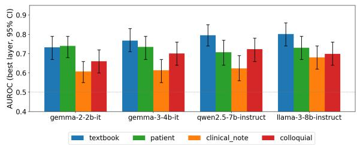  
Figure 1: Per-register best-layer AUROC with 95% bootstrap CIs. $R _ { \mathrm { t e x t b o o k } }$ is the training register; mean drop across the other three registers is 0.095 AUROC, with the largest on $R _ { \mathrm { n o t e } } .$ . Per-register values in Table 9, Appendix C.1.

20% held-out set into a 10% calibration half and a 10% final-test half. The two post-hoc calibrators of §3.3, Platt scaling and isotonic regression, are fit on the calibration half. We then report raw, Plattscaled, and isotonic-scaled ECE on the final-test half. The same protocol runs for each of the four LLMs across all four registers, yielding 16 (LLM, register) combinations in total.

## 4 Results and Discussion

We first isolate transfer along the three proposed axes $( \ S 4 . 1 \mathrm { - } \ S 4 . 3 )$ , then test for linearity (§4.4), compare to output-only baselines (§4.5), and evaluate model calibration (§4.6). High-confidence error patterns are analysed in Appendix H. Across all tables and figures, a negative $\Delta$ indicates a drop in AUROC relative to the textbook baseline.

## 4.1 Register transfer

The truth direction learned on textbook activations transfers to the other three registers with a mean drop of −0.095 AUROC on the same held-out facts as textbook (Figure 1; full per-register numbers in Table 9, Appendix C.1). Per-model register gaps range from −0.064 to −0.126 across the four LLMs and do not follow a clean scaling pattern. $R _ { \mathrm { p a t } }$ is the easiest to transfer to in three of four LLMs and $R _ { \mathrm { c l i n } }$ the hardest in all four. A label-permutation probe $( \mathcal { M } _ { \mathrm { p e r m } } )$ collapses to mean AUROC of 0.488 (averaged over all layers), confirming the signal we measure is correctnessdriven rather than spurious activation structure (Appendix E.3). The gap holds under three layerselection rules (0.080 to 0.160; Appendix C.2), always below the cross-corpus drop of §4.3.

Regenerating the full benchmark with a second generator from a different family (Gemini 3 Flash) gives a mean register gap of 0.079 AUROC against 0.095 for Sonnet, producing the same per-register ordering (details in App. B.3). Dropping every fact whose wrong-answer variant falls below a judged factual-fidelity threshold moves the mean gap by at most 0.0023 AUROC (see App. B.4).

<table><tr><td></td><td></td><td colspan="4">In-distribution  $( R _ { \mathrm { t e x t b o o k } } )$ </td><td colspan="3">Transfer gaps  $( \mathcal { M } _ { \mathrm { t e x t b o o k } } )$ </td><td>Diff-means</td></tr><tr><td>LLM</td><td>Best layer</td><td>AUROC</td><td>Acc @0.5</td><td>F1 @0.5</td><td>Acc @Youden</td><td> $\Delta _ { \mathrm { r e g i s t e r } }$ </td><td>Register Specialty  $\Delta _ { \mathrm { s p e c i a l t y } }$ </td><td>Corpus  $\pmb { \Delta } _ { \mathrm { d a t a s e t } }$ </td><td>Register  $\Delta _ { \mathrm { r e g i s t e r } } ^ { \mathrm { d i f f } }$ </td></tr><tr><td>Gemma-2-2B-it</td><td>15</td><td>.733 [.67,.79]</td><td>.640</td><td>.625</td><td>.685</td><td>-.064</td><td>-.053</td><td>-.22</td><td>-.045</td></tr><tr><td>Gemma-3-4B-it</td><td>25</td><td>.768 [.71,.83]</td><td>.695</td><td>.684</td><td>.715</td><td>-.085</td><td>-.010</td><td>-.21</td><td>-.079</td></tr><tr><td>Qwen2.5-7B-Instruct</td><td>23</td><td>.795 [.74,.85]</td><td>.735</td><td>.720</td><td>.765</td><td>-.126</td><td>-.016</td><td>-.23</td><td>-.073</td></tr><tr><td>Llama-3-8B-Instruct</td><td>29</td><td>.802 [.74,.86]</td><td>.740</td><td>.740</td><td>.765</td><td>-.104</td><td>-.045</td><td>-.20</td><td>-.101</td></tr><tr><td>Mean</td><td></td><td>.775</td><td>.703</td><td>.692</td><td>.733</td><td>-.095</td><td>-.031</td><td>-.21</td><td>-.075</td></tr></table>

Table 2: In-distribution performance and transfer gaps for $\mathcal { M } _ { \mathrm { t e x t b o o k } }$ on the three shifts of §2.1, with ${ \mathcal { M } } _ { \mathrm { d i f f } }$ (Marks and Tegmark, 2024) at the same layer. All ∆ are AUROC drops on the held-out side; AUROC carries 95% bootstrap CIs. All values are on the same held-out 20% fact split $( n { = } 2 0 0 )$ ; layer-selection sensitivity in Appendix C.2, per-register threshold metrics in Appendix $\mathrm { F , }$ diff-means detail in Table 21, Appendix E.1.

This gap is modest given how much the surface form actually shifts: $R _ { \mathrm { c l i n } }$ and $R _ { \mathrm { c o l } }$ variants sit 6– 7× above the native MedQA perplexity under a reference LM (Gemma-2-2B-it; Appendix B.5), far beyond a typo or an inserted distractor sentence, and register ordering by perplexity matches ordering by drop in probe AUROC. The surfaceperturbation brittleness of Haller et al. (2025) and Schouten et al. (2025) therefore holds for some perturbation classes but not for broad stylistic variation.

The residual gap is partly coverage-driven and partly structural. Training the probe on a balanced mix of all four registers $( \mathcal { M } _ { \mathrm { a l l } } )$ under a matched protocol (same layer, same held-out facts) recovers a mean of +0.061 AUROC on the three nontextbook registers, concentrated on the hardest register $R _ { \mathrm { c l i n } }$ for the two larger LLMs (+0.122 on Gemma-3-4B, +0.127 on Llama-3-8B), at a small textbook cost of $\leq 0 . 0 3$ AUROC (Table 19, Appendix C.9). Mixing helps the register that transfers worst without producing a better probe overall: on the four-register panel, a probe trained on all four registers (0.729) is within 0.004 of one trained on the patient register alone (0.728), and textbook is a representative rather than a favourable training register (panel means 0.725 to 0.755 across training registers; Appendix C.9). We additionally observe systematic rejection of correct sentences containing explicit negation, which replicates the negation-generalisation failure of Levinstein and Herrmann (2024) and Schouten et al. (2025) and is detailed in Appendix H.

Human-written patient questions. Applied without retraining to 84 patient-authored MedRedQA questions, the probe reaches AUROC 0.695 [0.646, 0.750] on Qwen2.5-7B and 0.680 [0.622, 0.734] on Llama-3-8B, comparable to the Sonnet-written patient and colloquial registers, but falls to 0.606 on Gemma-3-4B and 0.542 on Gemma-2-2B. The signal is therefore recoverable on genuine patient writing for the more capable models, so register robustness does not depend only on how Sonnet writes. MedRedQA is a forum corpus that differs from MedQA in more than register, so part of the drop on the smaller models is a corpus shift; we report construction details and other caveats are in Appendix D and §7.

## 4.2 Specialty transfer

The truth direction generalises across medical subdomains. Training the probe on textbook variants from a 7-specialty subset and testing on the 8 held-out specialties produces a mean drop of $\Delta _ { \mathrm { s p e c i a l t y } } = - 0 . 0 3 1$ AUROC across five random partitions. This is smaller than the within-MedQA register gap and roughly seven times smaller than the cross-corpus drop detailed in §4.3. This extends the topic-invariance Marks and Tegmark (2024) reported for general factual statements to the medical domain: the linear direction the probe recovers is not specialty-specific, even though the medical content of each sub-domain differs substantially. Probe AUROC on the 351 matched facts and on the 149 unmatched facts differs by at most 0.027 in all four LLMs, with overlapping 95% bootstrap CIs and no consistent direction (Table 3, with a held-out-only replication in Appendix C.4), so the matched subset is not an easier slice.

Per-specialty variation. This small transfer gap should not be mistaken for a uniform difficulty profile. Pooling all (LLM, register) probes by specialty, the mean AUROC ranges from 0.710 (Rheumatology) to 0.859 (Nephrology), a 15-point spread (Figure 2). High-performing specialties have highly distinctive diagnostic vocabulary (e.g., Nephrology with BUN, creatinine, GFR), while low-performing specialties share overlapping symptom vocabulary (Neurology and Rheumatology both present with fatigue, joint pain, and weakness). The 15-point spread is descriptive (absolute difficulty varies by specialty) while the $\Delta _ { \mathrm { s p e c i a l t y } }$ of −0.031 is controlled (the same direction transfers across specialty sets).

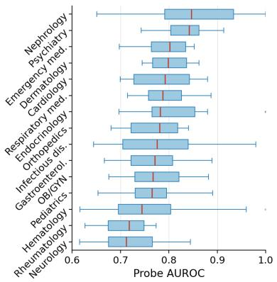  
(a) Per-specialty AUROC.

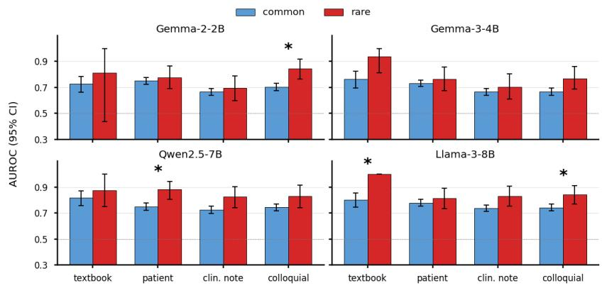  
(b) Common vs. rare disease AUROC per register.

Figure 2: (a) Probe AUROC across 15 medical specialties (351/500 facts, S-MedQA). Each box has one point per (LLM, register) condition. Mean AUROC ranges from 0.71 (Rheumatology) to 0.86 (Nephrology). (b) Common vs. rare AUROC per register with 95% bootstrap confidence intervals (CIs); asterisks mark disjoint CIs. AUROC for rare diseases matches or exceeds common diseases in every condition.
<table><tr><td>Model</td><td>Matched  $\scriptstyle ( n = 3 5 1 )$ </td><td>Unmatched  $( n { = } 1 4 9 )$ </td></tr><tr><td>Gemma-2B</td><td>.709 [.686,.729]</td><td>.682 [.652,.711]</td></tr><tr><td>Gemma-3B</td><td>.677 [.656,.698]</td><td>.671 [.636,.704]</td></tr><tr><td>Qwen-7B</td><td>.738 [.716,.759]</td><td>.739 [.704,.770]</td></tr><tr><td>Llama-8B</td><td>.741 [.718,.762]</td><td>.735 [.705,.764]</td></tr></table>

Table 3: Probe AUROC on S-MedQA-matched vs. unmatched facts, pooled over non-textbook registers, percell best layer. CIs overlap in every row.

Rare diseases. Contrary to expectation, raredisease AUROC meets or exceeds common-disease AUROC in all 16 (LLM, register) conditions, with four cells showing strictly disjoint CIs favouring rare diseases. The largest gains are on the larger LLMs, e.g. Qwen2.5-7B on $R _ { \mathrm { p a t i e n t } }$ (0.880 rare vs. 0.748 common). A plausible mechanism is that distinctive, low-frequency vocabulary activates isolated regions of representation space where the correct/wrong contrast separates more easily; the tagger’s limits are discussed in $\ S 7$ and per-cell numbers are in Appendix C.8.

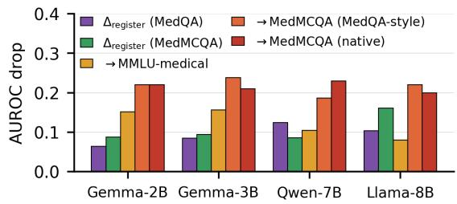  
Figure 3: The three shifts side by side, per LLM. Purple: within-MedQA register $\Delta _ { \mathrm { r e g i s t e r } }$ (n=500). Green: within-MedMCQA register $\Delta _ { \mathrm { r e g i s t e r } }$ (n=100). Red: MedQA-to-MedMCQA $\Delta _ { \mathrm { d a t a s e t } } ;$ yellow and orange: the same probe on MMLU-medical and on MedMCQA reformatted into MedQA style.

## 4.3 Corpus transfer

Applying the MedQA-trained probe to MedM-CQA without retraining drops AUROC by a mean of $\Delta _ { \mathrm { d a t a s e t } } ~ = ~ - 0 . 2 1$ , roughly twice the within-MedQA register gap and consistent across LLMs (Table 2). MedMCQA absolute AUROC sits between 0.52 and 0.60. The drop is symmetric. A probe trained on native MedMCQA transfers back to MedQA at only 0.607, so the failure is mutual and not specific to MedQA (Appendix C.6).

Register invariance generalises. The within-MedMCQA register replication confirms that register robustness is not an artefact of MedQA: the mean within-MedMCQA register drop of −0.107 AUROC is similar to the within-MedQA gap of −0.095 and far smaller than the cross-corpus drop.

Sources of the drop. Cross-corpus failure is uneven (Figure 3, per-model values in Appendix C.6).

The same probe loses 0.21 AUROC on MedMCQA and 0.12 on MMLU-medical, a third corpus with the same four-option format and expert-authored distractors. A change of corpus on its own therefore does not break the probe, and the larger drop has a cause specific to MedMCQA. Question format is excluded as that cause, because reformatting 100 MedMCQA items into MedQA-style vignettes with the answers held fixed leaves AUROC at 0.559 against 0.561 for native MedMCQA, with overlapping CIs. Topic and register are excluded as well, because even a worst-case additive combination of the specialty and register effects (0.095 to 0.149 AUROC) falls below the MedMCQA drop (Figure 3). By elimination, the residual sits with how MedMCQA’s items are constructed, most plausibly distractor authorship and the adversarial pressure those distractors exert. Distance from the training distribution does not predict failure either, since MedRedQA (§4.1) sits further from MedQA than either MMLU or MedMCQA on any surface measure, yet the signal survives on the larger LLMs.

## 4.4 Linearity

The truth signal is dominantly linear. A one-hiddenlayer MLP probe $( \mathcal { M } _ { \mathrm { M L P } } )$ trained on the same textbook split and at the same best-textbook layer as $\mathcal { M } _ { \mathrm { t e x t b o o k } }$ gains only +0.037 AUROC on average. In 15 of 16 (LLM, register) conditions, the MLP probe falls inside the bootstrap-CI overlap of the baseline logistic probe (Appendix E). A nonlinear classifier, therefore, extracts no meaningful additional signal beyond what a linear hyperplane captures.

The unregularised difference-of-means probe $( { \mathcal { M } } _ { \mathrm { d i f f } } .$ , Marks and Tegmark, 2024) matches the logistic probe on mean register drop. By recovering the signal without learned weights, this confirms that the geometric-truth hypothesis of Marks and Tegmark (2024) extends to the medical domain. ${ \mathcal { M } } _ { \mathrm { d i f f } }$ is uniformly better than $\mathcal { M } _ { \mathrm { t e x t b o o k } }$ on the hardest register, $R _ { \mathrm { c l i n } }$ (mean gain +0.070 AU-ROC, Table 21, Appendix E.1). We interpret this $R _ { \mathrm { c l i n } }$ advantage as evidence that $L _ { 2 }$ regularisation in the logistic probe overweights the textbook training distribution, actively hurting generalisation to the most stylistically distant register.

## 4.5 Output-only baselines

The probe carries discriminative signal well beyond standard output-side confidence measures, though a strong self-evaluation baseline closes the gap on the larger LLMs. Across registers and LLMs, $\mathcal { M } _ { \mathrm { t e x t b o o k } }$ outperforms $\boldsymbol { B } _ { \mathrm { s c } }$ by 6–11 AUROC points and $B _ { \mathrm { e n t } }$ by 13–31 AUROC points (Figure 4). $B _ { \mathrm { e n t } }$ hovers near or below chance, falling to 0.46 for Llama-3-8B.

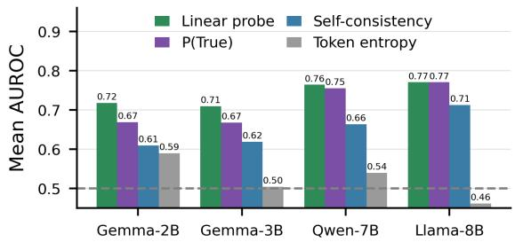  
Figure 4: Mean AUROC across registers, per LLM, for $\mathcal { M } _ { \mathrm { t e x t b o o k } }$ (green) vs. output-only baselines: P(True) (purple), self-consistency at $\tau { = } 0 . 7$ (blue), and token entropy (grey). Per-register breakdowns in Appendix E.4.

$B _ { \mathrm { p t r u e } }$ is the strongest output-only baseline (mean across registers 0.67–0.77). The probe exceeds $B _ { \mathrm { p t r u e } }$ by +0.05 AUROC on Gemma-2-2B and +0.04 on Gemma-3-4B, but ties on Llama-3-8B and is within 0.01 on Qwen2.5-7B. On these larger LLMs $B _ { \mathrm { p t r u e } }$ also has the tighter register profile $( \Delta _ { \mathrm { r e g i s t e r } }$ of 0.063 vs. 0.095 for the probe; Appendix E.4), so the probe’s remaining advantage is inference-side: it reads the hidden state at the question position in a single forward pass, before any answer token is generated.

## 4.6 Calibration

Raw probe outputs are not well calibrated. The mean raw ECE across all 16 (LLM, register) conditions is 0.341 on the calibration split (Table 27, Appendix G), with no condition below 0.19 on the full held-out set (Figure 11). Platt scaling cuts the mean ECE by more than half to 0.135, while isotonic regression yields smaller gains (0.234), likely from overfitting at this sample size. Even after Platt scaling, all but one of the 16 conditions stay above the 0.05 threshold conventionally considered well-calibrated. The probe ranks correct statements above incorrect ones (high AUROC), but its raw outputs cannot be read as probabilities of correctness. Our 60% Platt reduction agrees with Berkowitz et al. (2025a) (§5) that calibration should be built into the probe design. The Youdenoptimal cutoff likewise swings between 0.04 and 1.00 across registers for one LLM (Appendix F). A qualitative inspection of the highest-confidence probe errors surfaces three recurring patterns (calibration collapse, plausible-but-wrong acceptance, and negation rejection), reported in Appendix H.

## 5 Related Work

Linear truth: evidence and skepticism. Azaria and Mitchell (SAPLMA; 2023) and Burns et al. (CCS; 2023) first showed that internal LLM states encode truthfulness. Marks and Tegmark (2024) demonstrated linear separability and causal intervenability of a truth direction, including the result that a difference-of-means probe matches a learned classifier; Bürger et al. (2024) extended this to a 2-D subspace robust to negation. Contrary to these findings, Levinstein and Herrmann (2024) argue that truth probes face fundamental roadblocks (negation, paraphrasing, generalisation), and Haller et al. (2025) report systematic brittleness under small surface perturbations. Our main findings sit between the two camps: we confirm negation and corpus shift as real failure modes, but show that register leaves the linear truth direction largely intact.

Task specificity. Orgad et al. (2025) report that probes transfer within a task family but fail across task families. Binkowski et al. (2025) propose a complementary attention-map spectral-features probe, and Obeso et al. (2026) extend linear and LoRA probes to long-form generation, finding that long-form-trained probes transfer to short-form QA but the reverse is not true. We sharpen the taskspecificity finding by separating it inside a single task (medical QA) into a register shift, a specialty shift, and a corpus shift, and showing that the corpus shift dominates the other two, with the breakage appearing even between two exam corpora of the same task family.

Medical probing and benchmarks. Berkowitz et al. (PING; 2025a) and Berkowitz et al. (2025b) probe medical LLM hidden states for clinical knowledge recovery and adverse drug reaction detection; PING trains the probe jointly for prediction and calibration and reports up to a 96% ECE reduction on MedMCQA, and is a strong calibration reference.

## 6 Conclusions and Future Work

We asked whether the linear truth direction in medical LLMs is a stable geometric property or a brittle artefact. Measuring probe transfer along three input shifts in isolation on matched held-out facts, we found that the truth signal is largely robust to changes in linguistic style and medical sub-domain, but degrades under corpus shift by an amount that depends on the target corpus, from 0.12 AUROC on MMLU-medical to 0.21 on MedMCQA, and the MedMCQA drop is not explained by question format. This indicates the signal depends on how each corpus is built, not on medical content alone. Within medicine, then, a truth direction does transfer across writing style, including human-written patient questions, across specialty, and to a variable extent across corpus. Moreover, we find that mixing all four registers at training time partially closes the register transfer gap.

The signal is predominantly linear since a parameter-free difference-of-means probe (Marks and Tegmark, 2024) matches L2-regularised logistic regression, extending their “geometry-of-truth” finding to medical statements. The probe outperforms entropy and self-consistency baselines and matches a self-evaluation baseline. Finally, raw probe scores are poorly calibrated, though post-hoc methods halve their ECE.

Our findings reconcile a major gap in the probing literature. The within-corpus robustness validates geometric-truth proponents (Marks and Tegmark, 2024; Bürger et al., 2024). The across-corpus breakdown is consistent with the brittleness skeptics (Levinstein and Herrmann, 2024; Haller et al., 2025) and refines the cross-dataset fragility from Orgad et al. (2025).

For clinical NLP practitioners, these findings establish strict boundaries for deployment of linear probes as factuality detectors. Because the crosscorpus drop is several times larger than stylistic and specialty shifts, probes must be treated as withindistribution safety tools and not deployed zero-shot to a new corpus without retraining. Because raw probe outputs are severely miscalibrated, post-hoc calibration is a mandatory safety layer, and perspecialty AUROC should be reported alongside dataset-level numbers, since absolute probe difficulty varies substantially across clinical specialties.

The three-axis decomposition introduced here applies beyond multiple-choice QA, and extending it to long-form generation, real clinical text, and larger models is a clear next step. Two other directions worth exploring are isolating which property of item construction drives the cross-corpus drop, and testing whether a two-dimensional truth subspace with a separate polarity direction (Bürger et al., 2024) repairs the negation failure we document.

## 7 Limitations

Every corpus we use is exam-style multiple choice, and every wrong answer is either an expert authored distractor or a controlled rewrite of one. Our claims are therefore about exam-format medical QA. Whether a linear truth direction behaves the same way on free-form clinical generation, where errors can be partially correct, contextdependent, or long, is not tested here and is the main direction of our follow-up work. The MedRedQA slice is small (n=84) and differs from MedQA on more than register, so it establishes that the signal survives on human-written patient text without quantifying the register effect in iso lation on that text. The register-rewriting pipeline relies on a single primary generator (Claude Sonnet 4.5), itself an instruction-tuned LLM with stylistic preferences in what counts as a given register; the Gemini replication in Appendix B and the fidelity filtering in Appendix B.4 reduce but do not eliminate this concern. All corpora are English exam corpora, so the cross-corpus comparison confounds corpus with exam region, and whether the same picture holds in other languages is an open question. The specialty-transfer measurement depends on the S-MedQA join, which covered 351 of 500 facts (70%); the unmatched 149 facts are excluded from $\Delta _ { \mathrm { s p e c i a l t y } }$ but participate in every other measurement. The rarity tagger is a curated keyword classifier and misses conditions described by syndrome rather than by name, so the rare-disease finding should be read directionally rather than as a precise effect-size estimate. For the cross-corpus drop, we identify item construction as the residual source only by elimination: we do not isolate which construction property (distractor authorship, adversarial pressure, or another) is responsible, and we do not measure distractor adversarialness directly.

Our probes use the last-question-token position; Orgad et al. (2025) reports that exact-answer tokens carry more truth signal in generation-mode probes, which our yes/no protocol largely sidesteps but does not eliminate as a probe-design choice. Our four LLMs span 2–8B; Obeso et al. (2026) report linear probes on Llama-3.3-70B in long-form generation, and both the linearity and brittleness pictures may shift at that scale. Relatedly, the P(True) self-evaluation baseline matches $\mathcal { M } _ { \mathrm { t e x t b o o k } }$ on raw AUROC to within 0.01 for our two larger LLMs (Qwen2.5-7B and Llama-3-8B), and whether the AUROC gap reopens at larger scales is open. Our wrong answers are also SME-authored MCQ distractors, plausible-but-wrong by design; how these relate to the spontaneous fabrications a deployed LLM produces is an open empirical question, and probe performance in that distributional setting is not directly measured here.

## Ethics Statement

The dataset derives from MedQA (USMLE exam items), a publicly released benchmark. No patient data is involved beyond the 84 publicly posted, already de-identified MedRedQA forum questions, which we use for evaluation only and do not redistribute. The colloquial and patient-facing registers are model-generated stylistic rewrites, not representations of any real patient’s speech. A probe with AUROC in the 0.70–0.80 range is not sufficient for patient-facing safety monitoring, and misapplication could produce false assurance about LLM reliability in clinical contexts.

License MedQA, MedMCQA, S-MedQA, MMLU, MedRedQA, and the four LLMs we probe are released under licenses permitting research use. Our 4,000-variant benchmark, the evaluation-only variant sets, prompts, judge rubric, and the full pipeline code are released at https://github. com/mnishant2/MedProbe\_release under a permissive research license (code under MIT, data under CC BY-NC 4.0).

Use of AI assistants. AI systems appear in this work in three distinct roles, all described in the methods. The four probed LLMs are the objects of study. Claude Sonnet 4.5, with Gemini 3 Flash Preview as a cross-family replication, generated the register rewrites. Grok 4.1 Fast (Grok 4.3 for the fidelity filtering of Appendix B.4, after 4.1 Fast was deprecated) and GPT-5 Nano acted as judges, and all prompts and the rubric are released (Appendix J). Separately, AI assistants were used for writing and editing support: proofreading, LaTeX formatting, and copy-editing. They were not used for research design, experiment design, analysis, or interpretation, which are the authors’ own.

## Acknowledgments

This publication is part of the project CaRe-NLP with file number NGF.1607.22.014 of the research programme AiNed Fellowship Grants, which is (partly) financed by the Dutch Research Council (NWO).

## References

Guillaume Alain and Yoshua Bengio. 2017. Understanding intermediate layers using linear classifier probes. In International Conference on Learning Representations (ICLR) Workshop Track, Toulon, France.

Amos Azaria and Tom Mitchell. 2023. The internal state of an LLM knows when it’s lying. In Findings of the Association for Computational Linguistics: EMNLP 2023, pages 967–976, Singapore. Association for Computational Linguistics.

Jacob Berkowitz, Sophia Kivelson, Apoorva Srinivasan, Undina Gisladottir, Kevin K. Tsang, Jose Miguel Acitores Cortina, Aditi Kuchi, Jake Patock, Ryan Czarny, and Nicholas P. Tatonetti. 2025a. Probing hidden states for calibrated, alignment-resistant predictions in LLMs. medRxiv preprint 2025.09.17.25336018.

Jacob Berkowitz, Davy Weissenbacher, Apoorva Srinivasan, Nadine A. Friedrich, Jose Miguel Acitores Cortina, Sophia Kivelson, Graciela Gonzalez Hernandez, and Nicholas P. Tatonetti. 2025b. Probing large language model hidden states for adverse drug reaction knowledge. In Artificial Intelligence in Medicine, pages 55–64, Cham. Springer Nature Switzerland.

Douglas Biber. 1988. Variation Across Speech and Writing. Cambridge University Press, Cambridge, UK.

Douglas Biber. 1995. Dimensions of Register Variation: A Cross-Linguistic Comparison. Cambridge University Press, Cambridge, UK.

Jakub Binkowski, Denis Janiak, Albert Sawczyn, Bogdan Gabrys, and Tomasz Jan Kajdanowicz. 2025. Hallucination detection in LLMs using spectral features of attention maps. In Proceedings of the 2025 Conference on Empirical Methods in Natural Language Processing, pages 24354–24385, Suzhou, China. Association for Computational Linguistics.

Lennart Bürger, Fred A. Hamprecht, and Boaz Nadler. 2024. Truth is universal: Robust detection of lies in LLMs. In Advances in Neural Information Processing Systems 37 (NeurIPS 2024), pages 138393– 138431, Vancouver, Canada. Curran Associates, Inc.

Collin Burns, Haotian Ye, Dan Klein, and Jacob Steinhardt. 2023. Discovering latent knowledge in language models without supervision. In Proceedings ofthe Eleventh International Conference on Learning Representations (ICLR 2023), Kigali, Rwanda.

Alvan R. Feinstein and Domenic V. Cicchetti. 1990. High agreement but low kappa: I. the problems of two paradoxes. Journal of Clinical Epidemiology, 43(6):543–549.

Aaron Grattafiori, Abhimanyu Dubey, Abhinav Jauhri, Abhinav Pandey, Abhishek Kadian, Ahmad Al-Dahle, Aiesha Letman, Akhil Mathur, Alan Schelten, Alex Vaughan, Amy Yang, Angela Fan, Anirudh

Goyal, Anthony Hartshorn, Aobo Yang, Archi Mitra, Archie Sravankumar, Artem Korenev, Arthur Hinsvark, and 542 others. 2024. The Llama 3 herd of models. arXiv preprint arXiv:2407.21783.

Chuan Guo, Geoff Pleiss, Yu Sun, and Kilian Q. Weinberger. 2017. On calibration of modern neural networks. In Proceedings of the 34th International Conference on Machine Learning (ICML 2017), volume 70 of Proceedings of Machine Learning Research, pages 1321–1330, Sydney, Australia. PMLR.

Patrick Haller, Mark Ibrahim, Polina Kirichenko, Levent Sagun, and Samuel J. Bell. 2025. LLM knowledge is brittle: Truthfulness representations rely on superficial resemblance. arXiv preprint arXiv:2510.11905.

Dan Hendrycks, Collin Burns, Steven Basart, Andy Zou, Mantas Mazeika, Dawn Song, and Jacob Steinhardt. 2021. Measuring massive multitask language understanding. In Proceedings of the Ninth International Conference on Learning Representations (ICLR 2021), Virtual Event.

Di Jin, Eileen Pan, Nassim Oufattole, Wei-Hung Weng, Hanyi Fang, and Peter Szolovits. 2021. What disease does this patient have? a large-scale open domain question answering dataset from medical exams. Applied Sciences, 11(14):6421.

Saurav Kadavath, Tom Conerly, Amanda Askell, Tom Henighan, Dawn Drain, Ethan Perez, Nicholas Schiefer, Zac Hatfield-Dodds, Nova DasSarma, Eli Tran-Johnson, Scott Johnston, Sheer El-Showk, Andy Jones, Nelson Elhage, Tristan Hume, Anna Chen, Yuntao Bai, Sam Bowman, Stanislav Fort, and 17 others. 2022. Language models (mostly) know what they know. arXiv preprint arXiv:2207.05221.

Yukyung Lee, JoongHoon Kim, Jaehee Kim, Hyowon Cho, Jaewook Kang, Pilsung Kang, and Najoung Kim. 2025. CheckEval: A reliable LLM-as-a-judge framework for evaluating text generation using checklists. In Proceedings ofthe 2025 Conference on Empirical Methods in Natural Language Processing, pages 15771–15798, Suzhou, China. Association for Computational Linguistics.

Benjamin A. Levinstein and Daniel A. Herrmann. 2024. Still no lie detector for language models: probing empirical and conceptual roadblocks. Philosophical Studies, 182(7):1539–1565.

Kenneth Li, Oam Patel, Fernanda Viégas, Hanspeter Pfister, and Martin Wattenberg. 2023. Inference-time intervention: Eliciting truthful answers from a language model. In Advances in Neural Information Processing Systems 36 (NeurIPS 2023), pages 41451– 41530, New Orleans, LA, USA. Curran Associates, Inc.

Samuel Marks and Max Tegmark. 2024. The geometry of truth: Emergent linear structure in large language model representations of true/false datasets. In Proceedings of the First Conference on Language Modeling (COLM 2024), Philadelphia, PA, USA.

Vincent Nguyen, Sarvnaz Karimi, Maciej Rybinski, and Zhenchang Xing. 2023. MedRedQA for medical consumer question answering: Dataset, tasks, and neural baselines. In Proceedings ofthe 13th International Joint Conference on Natural Language Processing and the 3rd Conference ofthe Asia-Pacific Chapter of the Associationfor Computational Linguistics (Volume 1: Long Papers), pages 629–648, Nusa Dua, Bali. Association for Computational Linguistics.

Oscar Obeso, Andy Arditi, Javier Ferrando, Joshua Freeman, Cameron Holmes, and Neel Nanda. 2026. Realtime detection of hallucinated entities in long-form generation. arXiv preprint arXiv:2509.03531.

Hadas Orgad, Michael Toker, Zorik Gekhman, Roi Reichart, Idan Szpektor, Hadas Kotek, and Yonatan Belinkov. 2025. LLMs know more than they show: On the intrinsic representation of LLM hallucinations. In Proceedings ofthe Thirteenth International Conference on Learning Representations (ICLR 2025), Singapore.

Ankit Pal, Logesh Kumar Umapathi, and Malaikannan Sankarasubbu. 2022. MedMCQA: A large-scale multi-subject multi-choice dataset for medical domain question answering. In Proceedings of the Conference on Health, Inference, and Learning (CHIL 2022), volume 174 of Proceedings of Machine Learning Research, pages 248–260, Virtual Event. PMLR.

Guilherme Penedo, Quentin Malartic, Daniel Hesslow, Ruxandra Cojocaru, Hamza Alobeidli, Alessandro Cappelli, Baptiste Pannier, Ebtesam Almazrouei, and Julien Launay. 2023. The RefinedWeb dataset for Falcon LLM: Outperforming curated corpora with web data only. In Advances in Neural Information Processing Systems 36 (NeurIPS 2023), Datasets and Benchmarks Track, pages 79155–79172, New Orleans, LA, USA. Curran Associates, Inc.

John C. Platt. 1999. Probabilistic outputs for support vector machines and comparisons to regularized likelihood methods. In Alexander J. Smola, Peter L. Bartlett, Bernhard Schölkopf, and Dale Schuurmans, editors, Advances in Large Margin Classifiers, pages 61–74. MIT Press, Cambridge, MA, USA.

Qwen Team, An Yang, Baosong Yang, Beichen Zhang, Binyuan Hui, Bo Zheng, Bowen Yu, Chengyuan Li, Dayiheng Liu, Fei Huang, Haoran Wei, Huan Lin, Jian Yang, Jianhong Tu, Jianwei Zhang, Jianxin Yang, Jiaxi Yang, Jingren Zhou, Junyang Lin, and 24 others. 2025. Qwen2.5 technical report. arXiv preprint arXiv:2412.15115.

Stefan F. Schouten, Peter Bloem, Ilia Markov, and Piek Vossen. 2025. Truth-value judgment in language models: ‘truth directions’ are context sensitive. In Proceedings ofthe Second Conference on Language Modeling (COLM 2025), Montreal, Canada.

Karan Singhal, Shekoofeh Azizi, Tao Tu, S. Sara Mahdavi, Jason Wei, Hyung Won Chung, Nathan Scales, Ajay Tanwani, Heather Cole-Lewis, Stephen

Pfohl, Perry Payne, Martin Seneviratne, Paul Gamble, Chris Kelly, Abubakr Babiker, Nathanael Schärli, Aakanksha Chowdhery, Philip Mansfield, Dina Demner-Fushman, and 13 others. 2023. Large language models encode clinical knowledge. Nature, 620(7972):172–180.

Michael Stubbs. 1997. Book review: Dimensions of register variation: A cross-linguistic comparison. Computational Linguistics, 23(2).

Gemma Team, Aishwarya Kamath, Johan Ferret, Shreya Pathak, Nino Vieillard, Ramona Merhej, Sarah Perrin, Tatiana Matejovicova, Alexandre Ramé, Morgane Rivière, Louis Rouillard, Thomas Mesnard, Geoffrey Cideron, Jean bastien Grill, Sabela Ramos, Edouard Yvinec, Michelle Casbon, Etienne Pot, Ivo Penchev, and 197 others. 2025. Gemma 3 technical report. arXiv preprint arXiv:2503.19786.

Gemma Team, Morgane Riviere, Shreya Pathak, Pier Giuseppe Sessa, Cassidy Hardin, Surya Bhupatiraju, Léonard Hussenot, Thomas Mesnard, Bobak Shahriari, Alexandre Ramé, Johan Ferret, Peter Liu, Pouya Tafti, Abe Friesen, Michelle Casbon, Sabela Ramos, Ravin Kumar, Charline Le Lan, Sammy Jerome, and 179 others. 2024. Gemma 2: Improving open language models at a practical size. arXiv preprint arXiv:2408.00118.

Xuezhi Wang, Jason Wei, Dale Schuurmans, Quoc V. Le, Ed H. Chi, Sharan Narang, Aakanksha Chowdhery, and Denny Zhou. 2023. Self-consistency improves chain of thought reasoning in language models. In Proceedings of the Eleventh International Conference on Learning Representations (ICLR 2023), Kigali, Rwanda.

Xinlan Yan, Di Wu, Yibin Lei, Christof Monz, and Iacer Calixto. 2026. What does infect mean to cardio? investigating the role of clinical specialty data in medical LLMs. In Proceedings ofthe 19th Conference ofthe European Chapter ofthe Associationfor Computational Linguistics (Volume 1: Long Papers), pages 8339–8358, Rabat, Morocco. Association for Computational Linguistics.

Bianca Zadrozny and Charles Elkan. 2002. Transforming classifier scores into accurate multiclass probability estimates. In Proceedings ofthe Eighth ACM SIGKDD International Conference on Knowledge Discovery and Data Mining (KDD 2002), pages 694– 699, Edmonton, Canada. Association for Computing Machinery.

## A Extended preliminaries

Some terms and notation used throughout the paper are defined here in more detail than Section 2 allows.

Linear probes. A linear probe is a small supervised classifier (here, L2-regularised logistic regression with C=1.0) trained to predict a label from a frozen LLM’s hidden state $h _ { t } ^ { \ell }$ at a chosen layer ℓ and token position t (Alain and Bengio, 2017; Azaria and Mitchell, 2023). The LLM itself is not modified, and the probe reads activations off the side of a forward pass and outputs a scalar between 0 and 1 that we interpret as the model’s internal estimate that a given (question, candidate-answer) pair is correct. We train probes on textbook-register activations only and evaluate them on held-out facts in every register, with no fine-tuning of the LLM. The probe’s role is diagnostic. It asks whether the LLM’s hidden states linearly separate correct from incorrect answers, not whether the LLM itself produces correct answers.

Linguistic register. A linguistic register is a stylistic configuration of vocabulary, syntax, and abbreviation density that the same content takes when produced for different audiences and channels (Biber, 1988, 1995; Stubbs, 1997). The register of a clinical textbook (formal, full sentences, Latinate vocabulary) differs sharply from a patient post on a health forum (first-person, colloquial), from a clinical note in an EHR (telegraphic, abbreviation-rich), and from an internet comment about a medical question (loose syntax, slang). All four can express the same fact. Section 3.1 explains why these specific four registers were chosen as the controlled-rewriting axis.

Metrics (AUROC, ECE, and the threshold metrics) are defined in §3.3.

$\Delta$ notation. For each register r we report the register-transfer gap $\begin{array} { r l } { \Delta _ { \mathrm { r e g i s t e r } } } & { { } = } \end{array}$ $\mathrm { A U R O C } ( \mathcal { D } _ { \mathrm { t e s t } } ^ { R _ { \mathrm { t e x t b o o k } } } ) ~ - ~ \mathrm { A U R O C } ( \mathcal { D } _ { \mathrm { t e s t } } ^ { r } )$ , the AU-ROC drop from the textbook held-out set to register r. A value of zero would indicate a register-invariant probe. We use $\Delta _ { \mathrm { s p e c i a l t y } }$ for the analogous specialty-disjoint transfer drop (Section 4.2) and $\Delta _ { \mathrm { d a t a s e t } }$ for the cross-corpus MedQA-to-MedMCQA drop (Section 4.3). These three $\Delta$ axes correspond to the three transfer dimensions whose magnitudes the paper measures.

Confidence intervals. All AUROC numbers carry a 95% confidence interval from a 1,000- iteration fact-level bootstrap, resampling test facts (not variants) with replacement so that both polarities of a fact enter or leave the sample together. This prevents the polarity pair from being treated as two independent observations, which would understate the CI width. Two intervals that do not overlap describe estimates that are statistically distinguishable at this sample size; we call such pairs disjoint.

Conditions. A single (model, register) pair (e.g. Llama-3-8B on $R _ { \mathrm { n o t e } } )$ is referred to as a condition, and across four models and four registers we have 16 conditions.

## B Dataset construction details

## B.1 Rarity tagging

Rarity is a keyword classifier over curated COM-MON and RARE disease lists applied to the question and answer text. When both match, RARE wins. Distribution: 455 common, 38 rare, 7 unknown. The tagger misses rare conditions referred to by syndrome description rather than name. Disease lists are released with the dataset.

## B.2 Generator selection

We chose the generator on a 50-fact pilot: 50 facts, four registers, two labels, so 400 variants per candidate. The candidates were Claude Sonnet 4.5, GPT-4o-mini, and Gemini 3 Flash Preview, all called through OpenRouter at temperature=0.6 with max\_tokens=600 (Table 4). Two judges scored every variant on four dimensions (content preservation, factual fidelity, register authenticity, fluency), each broken into two or three binary questions (Lee et al., 2025). Grok 4.1 Fast and GPT-5 Nano judged Sonnet and Gemini alike, so any difference in judge harshness cancels between those two (Table 4).

<table><tr><td>Generator</td><td>Judge</td><td>Composite</td><td>FF on wrong</td></tr><tr><td>Sonnet</td><td>Grok 4.1</td><td>0.989</td><td>0.983</td></tr><tr><td>Sonnet</td><td>GPT-5 Nano</td><td>0.950</td><td>0.772</td></tr><tr><td>Gemini</td><td>Grok 4.1</td><td>0.973</td><td>0.980</td></tr><tr><td>Gemini</td><td>GPT-5 Nano</td><td>0.930</td><td>0.736</td></tr></table>

Table 4: Generator-selection pilot scores. Composite is the mean quality score; FF on wrong is factual fidelity on wrong-answer variants.

Sonnet won on the pooled selection score, 0.938 against 0.925 for Gemini and 0.872 for GPT-4omini. That score weights factual fidelity on wrong answers at 40%, the composite at 30%, register authenticity at 20%, and parse rate at 10%. On the full 500-fact run the pooled fidelity on wrong answers was 0.884: 0.913 on colloquial, 0.872 on clinical note, and 0.867 on patient. The two judges gave the same binary answer more than 92% of the time, while Cohen’s κ was only fair to moderate (0.31–0.49). That combination is the usual κ paradox at a high agreement baseline (Feinstein and Cicchetti, 1990).

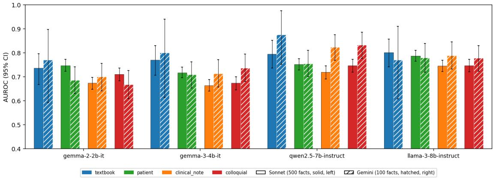  
Figure 5: Per-register AUROC on Sonnet-generated (solid) vs. Gemini-generated (hatched) variants. The two generators produce the same directional result.

## B.3 Robustness check: Gemini generator

100 facts × 4 registers × 2 labels = 800 variants generated by Gemini 3 Flash Preview. CIs are wider at n=40 held-out textbook facts, but the qualitative pattern (modest cross-register gap, raredisease inversion, late-layer plateau) matches Sonnet (Table 5, Figure 5). Under the main-table protocol (same held-out facts, per-cell best layer, last question token) the mean register gap is 0.079 AU-ROC for Gemini against 0.095 for Sonnet. Per model, Gemma-2-2B 0.073 vs. 0.064, Gemma-3- 4B 0.118 vs. 0.085, Llama-3-8B 0.012 vs. 0.104, and Qwen2.5-7B 0.113 vs. 0.126. The Llama value is a low outlier on a 100-fact subset. The mean is stable and shows that the two generators lie within 0.02 of each other.

<table><tr><td>Model</td><td> $R _ { \mathrm { t e x t b o o k } }$ </td><td> $R _ { \mathrm { p a t i e n t } }$ </td><td> $R _ { \mathrm { n o t e } }$ </td><td> $R _ { \mathrm { c o l l o q u i a l } }$ </td></tr><tr><td>Gemma-2B</td><td>.770</td><td>.686</td><td>.700</td><td>.667</td></tr><tr><td>Gemma-3B</td><td>.800</td><td>.709</td><td>.713</td><td>.737</td></tr><tr><td>Qwen-7B</td><td>.875</td><td>.755</td><td>.823</td><td>.832</td></tr><tr><td>Llama-8B</td><td>.770</td><td>.780</td><td>.788</td><td>.778</td></tr></table>

Table 5: Best-layer AUROC on the Gemini 100-fact subset. Non-textbook cells use all 800 variants; the held-out-fact gaps quoted in the text therefore differ.

## B.4 Label-noise sensitivity: fidelity filtering

Removing the wrong-answer rewrites that a judge considers unfaithful does not move the register gap. The quality gate of Appendix B.2 scored a 100- fact sample. Here we judged all 500 facts in every register with both cross-family judges and repeated the register analysis after dropping every fact whose wrong-answer variant scored below a factual-fidelity threshold. Grok 4.1 Fast was deprecated between the two judging rounds, so this round used Grok 4.3 alongside GPT-5 Nano. Both polarities of a dropped fact are removed, so every cell stays balanced. The probe, its layer, and the held-out split are the ones behind Table 9, Appendix C.1, and the unfiltered gap reproduces the main-table value of 0.095 exactly.

<table><tr><td>Filter definition</td><td>FF ≥ 0.75</td><td>FF ≥ 0.85</td><td>Max change</td></tr><tr><td>Unfiltered</td><td>.0952</td><td>.0952</td><td></td></tr><tr><td>Pooled (both judges)</td><td>.0929</td><td>.0960</td><td>.0023</td></tr><tr><td>Grok 4.3 only</td><td>.0948</td><td>.0948</td><td>.0004</td></tr><tr><td>GPT-5 Nano only</td><td>.0960</td><td>.0960</td><td>.0008</td></tr></table>

Table 6: Mean register gap $\Delta _ { \mathrm { r e g i s t e r } }$ (four LLMs) after removing facts whose wrong-answer variant falls below a factual-fidelity (FF) threshold, for three filter definitions.

Instead of just one definition of a low-fidelity rewrite, we tested three: the pooled two-judge mean and each judge alone, at two thresholds each (Table 6). The largest change in the mean gap is 0.0023 AUROC, and the per-model ordering is unchanged. From unfiltered to the pooled 0.85 cut, Gemma-2-2B moves from 0.066 to 0.058 and Gemma-3-4B from 0.085 to 0.080. Llama-3-8B moves from 0.104 to 0.109, and Qwen2.5-7B from 0.126 to 0.138.

The two judges differ in strictness, which gives us two ends of the filtering range. At the 0.85 cut GPT-5 Nano flags 36 of the 100 held-out patient variants, 48 of the clinical-note variants, and 36 of the colloquial variants, 40% of all wrong variants. Grok 4.3 flags one. Because Grok scores almost every rewrite at 1.0, the pooled filter is driven by Nano, and the pooled 0.75 cut is the only setting in between (16 of 300 dropped). Removing 40% of the wrong-answer variants moves the gap by 0.0008, and removing almost none moves it by 0.0004. Hence, the register result does not depend on the fidelity threshold or on which judge is trusted. The original 100-fact gate reported a fidelity on wrong answers of 0.884 (Appendix B.2), and Grok 4.3 on the full 500 facts gives 0.991. The two judges bracket the true rewrite quality, and the result holds at both ends.

## B.5 Perplexity of register variants and native corpora

We score the per-token perplexity of every register variant, and of native MedQA and MedMCQA text, under one reference LM (Gemma-2-2B-it, bf16 on an H100), using the same "Question: {q}\nAnswer: $\{ \textsf { a } \}$ II template the probe uses, and perplexity is exp(mean NLL per non-pad token). Native MedQA and MedMCQA text consists of the original SME-authored question and the correct or wrong answer (one row per polarity).

Stylistic distance from $R _ { \mathrm { t e x t b o o k } }$ varies sharply across the four registers (perplexity 8.6 to 62.0) while the probe-AUROC drops stay modest (0– 0.144). Table 7 shows one fact in all four registers with each variant’s mean reference-LM perplexity and the mean $\Delta _ { \mathrm { r e g i s t e r } }$ across the four probed LLMs on held-out facts, and Table 8 gives the full distribution.

<table><tr><td></td><td>Register Example variant</td><td>Perplexity</td><td> $\pmb { \Delta } _ { \mathrm { r e g i s t e r } }$ </td></tr><tr><td> $R _ { \mathrm { t e x t b o o k } }$ </td><td>What is the most frequently encountered etiology of</td><td>8.6</td><td>0.000</td></tr><tr><td> $R _ { \mathrm { p a t i e n t } }$ </td><td>right-sided heart failure? My dad was told he has right-sided heart failure,</td><td>13.1</td><td>0.047</td></tr><tr><td> $R _ { \mathrm { n o t e } }$ </td><td>what usually causes  $i t ?$  Most common etiology R-sided HF?</td><td>62.0</td><td>0.144</td></tr><tr><td> $R _ { \mathrm { c o l l o q u i a l } }$ </td><td>ok so what actually causes right side heart failure lol</td><td>51.6</td><td>0.079</td></tr></table>

Table 7: Register summary: a representative example variant of the same MedQA fact in each register, the mean reference-LM perplexity (Gemma-2-2B-it), and the mean register- $\Delta _ { \mathrm { r e g i s t e r } }$ across the four probed LLMs (held-out facts). Examples are drawn from a single illustrative right-sided-heart-failure item.

In-distribution fractions. Native MedQA’s P5– P95 range is [4.82, 14.67]. The fraction of MedQA-S variants whose perplexity lies inside this range is

88.5% for $R _ { \mathrm { t e x t b o o k } } , 7 3 . 9 \%$ for $R _ { \mathrm { p a t i e n t } }$ , 2.4% for $R _ { \mathrm { n o t e } }$ , and 0.5% for $R _ { \mathrm { c o l l o q u i a l } }$ . The fraction of MedMCQA text inside the same range is 2.4%, so MedMCQA overlaps the native-MedQA perplexity distribution about as much as the highest-perplexity register $( R _ { \mathrm { n o t e } } )$ does.

Perplexity and probe drop. Registers rank identically by mean perplexity $( R _ { \mathrm { t e x t b o o k } }$ 8.6, $R _ { \mathrm { p a t i e n t } }$ 13.1, $R _ { \mathrm { c o l l o q u i a l } } 5 1 . 6 , R _ { \mathrm { n o t e } } 6 2 . 0 )$ and by mean probe drop on held-out facts $( R _ { \mathrm { p a t i e n t } } \ 0 . 0 4 7$ $R _ { \mathrm { c o l l o q u i a l } }$ $0 . 0 7 9 , R _ { \mathrm { n o t e } } 0 . 1 4 4 )$ . With four registers this is an ordinal agreement, not a fitted relationship. Perplexity is measured under one reference LM (Gemma-2-2B-it); we use only the ordering, not the absolute values.

## B.6 Rewriter and judge prompts

The rewriter prompt has four parts per register, a style vignette that sets tone and vocabulary, a correct-answer exemplar, a wrong-preserving exemplar, and a block of absolute rules. Without the wrong-preserving exemplar, the generator silently repairs the medically incorrect answer while rewriting it, which destroys the label. Figures 13 and 14, Appendix J (end of the appendix) show the rewriter prompts, and Figure 15, Appendix J shows the judge prompt with its rubric (four dimensions, binary yes/no questions) and JSON output schema. The exact prompt files are in the released repository.

Cross-family judge routing. The rubric in Figure 15, Appendix J is executed by two independent judges per generator, always drawn from model families different from the generator’s. Our mapping: Claude Sonnet 4.5 (Anthropic) is judged by Grok 4.1 Fast (xAI) + GPT-5 Nano (OpenAI), GPT-4o-mini (OpenAI) is judged by Claude Sonnet 4.5 (Anthropic) + Gemini 3 Flash (Google), and Gemini 3 Flash (Google) is judged by Grok 4.1 Fast +

<table><tr><td>Source</td><td>Register</td><td>n</td><td>Mean</td><td>Median</td><td>Q1</td><td>Q3</td><td>P95</td></tr><tr><td>MedQA</td><td></td><td>1000</td><td>8.7</td><td>8.2</td><td>6.5</td><td>10.1</td><td>14.7</td></tr><tr><td>MedQA-S</td><td> $R _ { \mathrm { t e x t b o o k } }$ </td><td>1000</td><td>8.6</td><td>7.9</td><td>6.3</td><td>10.0</td><td>14.8</td></tr><tr><td>MedQA-S</td><td> $R _ { \mathrm { p a t i e n t } }$ </td><td>1000</td><td>13.1</td><td>12.5</td><td>10.6</td><td>14.7</td><td>19.6</td></tr><tr><td>MedQA-S</td><td> $R _ { \mathrm { n o t e } }$ </td><td>1000</td><td>62.0</td><td>49.8</td><td>31.5</td><td>77.3</td><td>146.2</td></tr><tr><td>MedQA-S</td><td> $R _ { \mathrm { c o l l o q u i a l } }$ </td><td>1000</td><td>51.6</td><td>46.3</td><td>35.5</td><td>61.8</td><td>94.2</td></tr><tr><td>MedMCQA</td><td></td><td>1000</td><td>124.5</td><td>60.3</td><td>33.0</td><td>133.0</td><td>385.8</td></tr><tr><td>MedMCQA-S</td><td> $R _ { \mathrm { t e x t b o o k } }$ </td><td>200</td><td>15.4</td><td>12.3</td><td>9.3</td><td>18.6</td><td>33.8</td></tr><tr><td>MedMCQA-S</td><td> $R _ { \mathrm { p a t i e n t } }$ </td><td>200</td><td>18.6</td><td>16.7</td><td>12.7</td><td>21.8</td><td>34.6</td></tr><tr><td>MedMCQA-S</td><td> $R _ { \mathrm { n o t e } }$ </td><td>200</td><td>260.2</td><td>140.1</td><td>74.5</td><td>279.8</td><td>886.1</td></tr><tr><td>MedMCQA-S</td><td> $R _ { \mathrm { c o l l o q u i a l } }$ </td><td>200</td><td>173.9</td><td>104.2</td><td>71.0</td><td>178.0</td><td>487.6</td></tr></table>

Table 8: Reference-LM perplexity by (source, register). Lower is closer to the reference LM’s training distribution. n is the number of variants scored.

<table><tr><td>Model</td><td> $R _ { \mathrm { t e x t b o o k } }$ </td><td> $R _ { \mathrm { p a t i e n t } }$ </td><td> $R _ { \mathrm { n o t e } }$ </td><td> $R _ { \mathrm { c o l l o q u i a l } }$ </td><td>Mean ∆register</td></tr><tr><td>Gemma-2B</td><td>.733 [.67,.79]</td><td> $. 7 4 0 [ . 6 8 , . 7 9 ]$ </td><td>.608 [.55,.66]</td><td> $. 6 6 1 \ [ . 6 0 , . 7 2 ]$ </td><td>-.064</td></tr><tr><td>Gemma-3B</td><td>.768 [.71,.83]</td><td>.735 [.67,.79]</td><td>.614 [.55,.67]</td><td>.701 [.64,.76]</td><td>-.085</td></tr><tr><td>Qwen-7B</td><td>.795 [.74,.85]</td><td>.707 [.64,.77]</td><td>.623 [.56,.69]</td><td>.723 [.66,.78]</td><td>-.126</td></tr><tr><td>Llama-8B</td><td>.802 [.74,.86]</td><td>.731 [.67,.79]</td><td>.681 [.62,.74]</td><td>.699 [.64,.76]</td><td>-.104</td></tr><tr><td>Mean</td><td>.775</td><td>.728</td><td>.631</td><td>.696</td><td>-.095</td></tr></table>

Table 9: Best-layer AUROC per register, last-question-token, Sonnet variants, 95% bootstrap CIs (1,000 iterations). All registers use the same held-out 20% fact split $\scriptstyle ( n = 2 0 0 )$ , removing fact-level training overlap on the non-textbook registers. $\Delta _ { \mathrm { r e g i s t e r } }$ is the mean AUROC drop from textbook.

GPT-5 Nano. Pooled binary-question exact agreement is ≥ 0.92 across all generator-by-judge-pair combinations, and Cohen’s κ is fair-to-moderate, the expected κ paradox at this agreement baseline. This cross-family routing cancels any differential judge harshness between candidate generators.

## C Extended probe results

## C.1 Per-register AUROC, full table

$R _ { \mathrm { n o t e } }$ is the hardest register for every model. Table 9 gives the per-(model, register) values plotted in Figure 1, with 95% bootstrap CIs and the permodel mean $\Delta _ { \mathrm { r e g i s t e r } }$

## C.2 Layer-selection sensitivity

The main results select, per (model, register), the textbook-trained layer with the highest held-out AUROC (per-cell). Because a deployed probe may not be able to choose a different layer per register, we report the register gap under three layerselection rules, all evaluated on the same held-out 20% facts (Table 10):

• Per-cell (main): for each (LLM, register) the layer that maximises that cell’s AUROC.

• Best-mean single layer: for each LLM, the single layer that maximises the mean AUROC across all four registers. This rule corresponds to a deployment with one fixed layer, chosen with all four registers available at validation time.

• Textbook-blind single layer: for each LLM, the single layer that maximises AUROC on the textbook validation split alone. The probe is fit and selected without any non-textbook data, so this rule is the strict zero-shot setting and, by construction, the worst operating point for transfer.

Per-cell and best-mean give similar gaps (mean 0.095 vs. 0.080), and both sit far below the crosscorpus drop (0.21). The textbook-blind single layer, which never sees any non-textbook data at selection time, gives a strictly larger gap of 0.160 but is still below the cross-corpus value. The qualitative conclusion (register ≪ corpus) therefore holds under all three rules. We report per-cell as the primary number for continuity with the probing literature (Marks and Tegmark, 2024; Bürger et al., 2024), and note that on average the fact-level overlap from the earlier evaluation protocol (non-textbook evaluated on all $n { = } 1 0 0 0$ variants, including training facts) inflated $\Delta _ { \mathrm { r e g i s t e r } }$ downward by 0.042 AU-ROC. For completeness, under that all-variants protocol the textbook probe scores a mean of 0.755 on $R _ { \mathrm { p a t i e n t } } , 0 . 7 0 4$ on $R _ { \mathrm { n o t e } } .$ , and 0.723 on $R _ { \mathrm { c o l l o q u i a l } }$ (the textbook row of Table 17, Appendix C.9), a mean gap of 0.053 against 0.095 on matched heldout facts. The held-out version is the one reported throughout.

<table><tr><td>Rule</td><td>Gemma-2B</td><td>Gemma-3B</td><td></td><td>Qwen Llama Mean</td><td></td></tr><tr><td>Per-cell (main)</td><td>-.064</td><td>-.085</td><td>-.126</td><td></td><td>-.104-.095</td></tr><tr><td>Best-mean single layer</td><td>-.049</td><td>-.061</td><td></td><td></td><td>-.117 -.094 -.080</td></tr><tr><td>Textbook-blind layer</td><td>-.177</td><td>-.162</td><td></td><td></td><td>-.154 -.148 -.160</td></tr></table>

Table 10: Mean register gap $\Delta _ { \mathrm { r e g i s t e r } }$ under three layerselection rules. All evaluated on the same held-out 20% facts as the textbook split. Per-cell and best-mean give similar gaps; textbook-blind is the strict zero-shot upper bound.

## C.3 Specialty-disjoint transfer: per-split detail

The specialty-disjoint transfer experiment partitions the 351 specialty-tagged MedQA facts (S-MedQA join, Section 4.2) into two halves of seven specialties each, drawn at random per split. Probes are trained on the textbook-register variants from the train half (using a fact-level 80/20 split inside that half so the probe sees neither polarity of any test-half fact and reserves a within-train held-out set), and evaluated on the textbook-register variants from the test half. The held-out 20% within-train split also serves as the in-distribution baseline. Register is held fixed at $R _ { \mathrm { t e x t b o o k } }$ in both train and test, isolating specialty from surface form. We run five random splits per model with 1,000-iteration factlevel bootstrap CIs at every cell. Table 11 adds the in-distribution baselines and CIs behind the per-model $\Delta _ { \mathrm { s p e c i a l t y } }$ of Table 2.

<table><tr><td>Model</td><td>In-distribution</td><td>Held-out</td><td> $\Delta _ { \mathrm { s p e c i a l t y } }$ </td></tr><tr><td>Gemma-2B</td><td>.757 [.64,.86]</td><td>.705 [.66,.75]</td><td>-.053</td></tr><tr><td>Gemma-3B</td><td>.746 [.64,.84]</td><td>.735 [.69,.78]</td><td>-.010</td></tr><tr><td>Qwen-7B</td><td>.799 [.69,.89]</td><td>.783 [.74,.83]</td><td>-.016</td></tr><tr><td>Llama-8B</td><td>.834 [.73,.92]</td><td>.789 [.75,.83]</td><td>-.045</td></tr><tr><td>Mean</td><td>.784</td><td>.753</td><td>-.031</td></tr></table>

Table 11: Specialty-disjoint transfer per model. Indistribution: within-train held-out 20% baseline. Heldout: held-out-specialty AUROC. $\Delta _ { \mathrm { s p e c i a l t y } } \mathrm { : }$ drop. Bootstrap CIs (1,000 iterations, fact-level) are averaged across five splits.

Per-split breakdown. Table 12 reports $\Delta _ { \mathrm { s p e c i a l t y } }$ for each (model, split) pair at the best layer chosen by mean in-distribution AUROC. The standard deviation across the five splits is small (0.013–0.057), so the result does not depend on which specialties land on which side of the split.
<table><tr><td>Model</td><td>SO</td><td>S1</td><td>S2</td><td>S3</td><td>S4</td><td>Δ</td><td>σ</td></tr><tr><td>Gemma-2B Gemma-3B −.031 −.005 −.094 +.058 +.020 −.010 .057</td><td>3−.052 +.005</td><td></td><td></td><td>-.086 −.080−.049</td><td></td><td>9-.053.036</td><td></td></tr><tr><td>Qwen-7B</td><td>-.009 −.021 +.001 −.017 −.034 −.016 .013</td><td></td><td>-.120 −.015 −.010 −.034 −.047 −.045 .045</td><td></td><td></td><td></td><td></td></tr><tr><td>Llama-8B</td><td></td><td></td><td></td><td></td><td>-.053 −.009 −.047 −.018 −.028 −.031</td><td></td><td></td></tr><tr><td>Mean</td><td></td><td></td><td></td><td></td><td></td><td></td><td></td></tr></table>

Table 12: Per-(model, split) $\Delta _ { \mathrm { s p e c i a l t y } }$ at the besttextbook layer (last-question-token). S0–S4 are the five random partitions of the 15 specialties into a 7-specialty training half and an 8-specialty held-out half. ∆ is the per-model mean across the five splits; σ is the acrosssplit standard deviation.

Position robustness. The first-answer-token result is qualitatively the same. Mean ∆specialty at first-answer-token is 0.035 (vs. 0.031 at lastquestion-token), with the same per-model ordering (Llama-8B and Gemma-2-2B at the high end around 0.04–0.05, Qwen-7B at the low end around 0.01). Both positions are reported in the released CSV.

## C.4 Specialty selection: matched vs. unmatched facts

The specialty experiment uses only the 351 facts that the exact-match join to S-MedQA labels, and the other 149 are excluded. If the matched facts were an easier slice, the specialty result would be optimistic (but they are not). Table 3 (§4.2) compares the main probe’s AUROC, pooled over the three shifted registers, on matched and unmatched facts with 95% fact-level bootstrap CIs. The intervals overlap for every LLM and the direction is inconsistent, with Qwen2.5-7B marginally higher on the unmatched facts. Restricting the comparison to the held-out split alone (81 matched facts, 19 unmatched) gives the same conclusion, with matched AUROC between 0.651 and 0.687 and unmatched between 0.640 and 0.724 on much wider intervals.

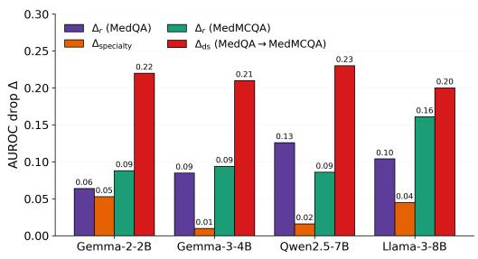  
Figure 6: Per-LLM comparison of the four within- and cross-corpus shifts. Bars left to right per LLM: within-MedQA register $\Delta _ { \mathrm { { r e g i s t e r } } } ,$ , specialty-disjoint transfer $\Delta _ { \mathrm { s p e c i a l t y } } .$ , within-MedMCQA register $\Delta _ { \mathrm { r e g i s t e r } } .$ , MedQAto-MedMCQA cross-corpus $\Delta _ { \mathrm { d a t a s e t } } .$ . The cross-corpus drop dominates the others by a factor of roughly 2–4 in every LLM.

Quantitative comparison. The three withincorpus shifts are all small compared to the crosscorpus drop. The within-MedQA register estimate (0.095) and the specialty-transfer drop (0.031) sum to 0.126 AUROC, and the within-MedMCQA register estimate (0.107), itself inflated by the distractorexpansion artefact described in Section 4.3, together with the same specialty drop sums to 0.138 AUROC. The strict worst-case additive bound, $0 . 1 0 7 + 0 . 0 3 1 + 0 . 0 1 1 = 0 . 1 4 9$ (adding the gap between the two within-corpus register estimates), still falls below the 0.21 cross-corpus gap. We do not report these as a percentage decomposition, because register, specialty, and item construction are not independent factors in representation space, and the within-MedMCQA register estimate is an upper bound on register shift in that corpus, since it is not a like-for-like measurement. The comparison establishes a magnitude relation, not an attributable share. Figure 6, Appendix C.3 shows the four shifts per model.

<table><tr><td>Model</td><td>layer</td><td>MedQA</td><td>MedMCQA</td><td> $\pmb { \Delta } _ { \mathrm { d a t a s e t } }$ </td></tr><tr><td>Gemma-2B</td><td>15</td><td>.737 [.67,.80]</td><td>.520 [.50,.54]</td><td>-0.22</td></tr><tr><td>Gemma-3B Qwen-7B</td><td>25 23</td><td>.770 [.71,.83] .795 [.74,.85]</td><td>.555 [.53,.58] .564[.54,.59]</td><td>-0.21 -0.23</td></tr><tr><td>Llama-8B</td><td>29</td><td>.801 [.74,.86]</td><td>.603 [.58,.63]</td><td>-0.20</td></tr><tr><td>Mean</td><td></td><td>.776</td><td>.561</td><td>-0.21</td></tr></table>

Table 13: Cross-dataset transfer. Probe trained on MedQA-textbook 80% split and evaluated on (i) MedQA-textbook held-out 20%, (ii) all 500 MedMCQA validation items. Best-layer last-question-token, 95% bootstrap CIs.

## C.5 Cross-corpus transfer: per-model detail

The best layers lie in the upper half of each network and are the ones used throughout the paper. Table 13 lists, per model, that layer, the MedQAtextbook held-out AUROC, the MedMCQA AU-ROC at the same layer with no retraining, and $\Delta _ { \mathrm { d a t a s e t } } .$

## C.6 Corpus ladder: MMLU-medical and the format control

The corpus ladder of §4.3 applies the MedQAtrained probe at its MedQA-selected layer, the paper’s $\Delta _ { \mathrm { d a t a s e t } }$ protocol, so that all rows are comparable with Table 13, Appendix C.5. Table 14 gives the per-model values with 95% CIs for that protocol and, for comparison, the values obtained when the layer is instead chosen per evaluation set (the per-cell rule used for registers in Table 9, Appendix C.1). Layer choice matters more here than within MedQA. With a per-cell layer the reformatted set rises to 0.589 and MMLU-medical to 0.669, while native MedMCQA falls to 0.503 because its best layer under that rule is a shallow, near-chance one. Comparing sets at different layers would overstate the format effect, which is why the main text uses the fixed layer. The new sets were scored from a re-extraction of activations in which the MedQA in-corpus value is 0.772 at the fixed layer, within 0.005 of Table 13, Appendix C.5.

Reformatting procedure. 100 MedMCQA validation items (seed 42) were rewritten by Claude Sonnet 4.5 from terse board-exam stems into USMLE-style clinical vignettes, and the correct answer and the sampled distractor were copied verbatim, so only the question changes. Mean question length rises from 13.9 to 58.2 words. As an illustration, the stem “Concentric teeth bite mark on forearm, what to do next?” becomes “A 28-yearold woman presents to the emergency department with a bite mark on herforearm sustained during an altercation 2 hours ago. Physical examination reveals a concentric pattern of teeth marks with mild erythema and superficial breaks in the skin. What is the most appropriate next step in management?”, with the answer pair (complete description of injury as seen vs. keep scale for measuring below the mark and take photo in the plane ofbite) unchanged. At the fixed layer the reformatted set scores 0.559 against 0.561 for native MedMCQA, so MedQA-style phrasing on its own does not recover the drop. The set is small (n=100 facts) and its CIs are wide, so we describe the format effect as at most minor.

<table><tr><td>Set</td><td>Layer</td><td>Gemma-2B</td><td>Gemma-3B</td><td>Qwen</td><td>Llama</td></tr><tr><td>MMLU-medical</td><td>F</td><td>.585 [.57,.60]</td><td>.614 [.59,.64]</td><td>.690 [.67,.71]</td><td>.721 [.70,.75]</td></tr><tr><td></td><td>PC</td><td>.596 [.57,.62]</td><td>.630 [.61,.65]</td><td>.709 [.69,.73]</td><td>.739 [.71,.76]</td></tr><tr><td>MedMCQA,</td><td>F</td><td>.517 [.47,.56]</td><td>.532 [.47,.59]</td><td>.608 [.54,.67]</td><td>.581 [.51,.65]</td></tr><tr><td>reformatted</td><td>PC</td><td>.527 [.49,.57]</td><td>.590 [.53,.65]</td><td>.626 [.56,.69]</td><td>.613 [.57,.66]</td></tr><tr><td>MedMCQA,</td><td>F</td><td>.671 [.61,.73]</td><td>.703 [.64,.77]</td><td>.755 [.69,.82]</td><td>.780 [.72,.84]</td></tr><tr><td>Sonnet-rewritten</td><td>PC</td><td>.685 [.63,.75]</td><td>.717 [.66,.77]</td><td>.777 [.72,.83]</td><td>.780 [.72,.83]</td></tr></table>

Table 14: Per-model AUROC with 95% bootstrap CIs for the evaluation-only sets, under the fixed MedQAselected layer (main text) and a per-cell best layer. MedMCQA Sonnet-rewritten is the 100-fact within-MedMCQA replication set (textbook register, n=200), scored here by the MedQA probe. Layer F: fixed. Layer PC: per-cell.

Rewritten MedMCQA. When the same 100 items are instead fully rewritten by the generator that produced the training data (answers included), the MedQA probe transfers at 0.727, close to its in-corpus value. This set shares both register and rewriting conventions with the training distribution, so it gives an upper bound on cross-corpus transfer without isolating one factor. The within-MedMCQA replication of Appendix C.7 uses the same set with a probe trained on it. Appendix I discusses one surface property of the rewrites that this comparison is sensitive to.

MMLU by subject. Transfer to MMLU-medical is not driven by the long, vignette-style subjects. At the per-cell layer the mean AUROC over LLMs is 0.724 on clinical knowledge (147 items, 11 words per question on average), 0.717 on medical genetics (53 items), 0.676 on college medicine (100 items, 58 words), 0.675 on anatomy (63 items), and 0.647 on professional medicine (137 items, 111 words). The short-stem subjects, which look least like MedQA vignettes, transfer best.

Symmetry. A probe trained on native MedMCQA-textbook (80% of the 500 validation facts, per-cell best layer) reaches 0.607 on the MedQA held-out set (per model 0.574, 0.575, 0.639, 0.640) and 0.670 on MMLU-medical (0.584, 0.638, 0.713, 0.745). MedMCQA-trained probes therefore transfer to MMLU about as well as MedQA-trained ones do, and poorly to MedQA, mirroring the MedQA-to-MedMCQA failure.

<table><tr><td>Model</td><td> $R _ { \mathrm { t e x t b o o k } }$ </td><td> $R _ { \mathrm { p a t i e n t } }$ </td><td> $R _ { \mathrm { n o t e } }$ </td><td> $R _ { \mathrm { c o l l o q u i a l } }$ </td><td> $\pmb { \Delta } _ { \mathrm { r e g i s t e r } }$ </td></tr><tr><td>Gemma-2B</td><td>.748 [.63,.86]</td><td>.715 [.60,.85]</td><td>.633 [.49,.77]</td><td>.630 [.53,.74]</td><td>-0.088</td></tr><tr><td>Gemma-3B</td><td>.720 [.54,.88]</td><td>.758 [.64,.88]</td><td>.510 [.41,.62]</td><td>.610 [.51,.73]</td><td>-0.094</td></tr><tr><td>Qwen-7B</td><td>.800 [.62,.94]</td><td>.805 [.68,.92]</td><td>.637 [.51,.77]</td><td>.700 [.55,.84]</td><td>-0.086</td></tr><tr><td>Llama-8B</td><td>.797 [.61,.92]</td><td>.740 [.62,.86]</td><td>.552 [.48,.64]</td><td>.616 [.46,.77]</td><td>-0.161</td></tr><tr><td>Mean</td><td>.766</td><td>.754</td><td>.583</td><td>.639</td><td>-0.107</td></tr></table>

Table 15: Within-MedMCQA per-register AUROC (per-cell best layer, 95% bootstrap CIs, 100-fact subset with held-out 20% fact split $n { = } 4 0 ;$ CIs are accordingly wide). $\Delta _ { \mathrm { r e g i s t e r } } ^ { \mathrm { M e d M C Q A } ^ { \bullet } }$ is the mean drop from MedMCQA-textbook to the other three registers on matched held-out facts.

## C.7 Within-MedMCQA register replication

The within-MedMCQA register replication uses 100 MedMCQA validation-split facts, the same Sonnet rewriter and four registers as the primary MedQA dataset (4 registers × 2 labels = 800 variants), and the same probe-training protocol as Section 2.3. Per-(model, register) values are in Table 15. Probes are trained on the MedMCQAtextbook 80% fact-level split and evaluated on the same held-out 20% facts (n=40) across all four registers, matching the MedQA protocol. The best layer is chosen per (model, register) cell. Section 4.3 gives the aggregate and Table 15 the per-(model, register) values.

The MedMCQA-textbook column (mean 0.766) is within 0.010 of the MedQA-textbook baseline (0.775, Table 2), so the probe works on MedMCQA when it is trained on MedMCQA. The mean MedM-CQA register-∆ (0.107) is close to the MedQA value (0.095) on matched held-out facts, and the slightly larger value is what the wider CIs at n=40 and the distractor-expansion artefact described in Section 4.3 would produce.

## C.8 Common vs. rare AUROC, per-(model, register)

Table 16 gives the 12-row common vs. rare breakdown summarised in Section 4.2 and plotted in Figure 2b. All non-textbook conditions of the four Sonnet-generated registers are included, and the textbook register has no register-induced rarity contrast and is omitted.

<table><tr><td>Model</td><td>Register</td><td>Common</td><td>Rare</td></tr><tr><td>Gemma-2B</td><td> $R _ { \mathrm { t e x t b o o k } }$ </td><td>.726 [.66,.78]</td><td>.812 [.44,1.0]</td></tr><tr><td>Gemma-2B</td><td> $R _ { \mathrm { p a t i e n t } }$ </td><td>.751 [.72,.78]</td><td>.775 [.69,.87]</td></tr><tr><td>Gemma-2B</td><td> $R _ { \mathrm { n o t e } }$ </td><td>.665 [.64,.69]</td><td>.696 [.60,.79]</td></tr><tr><td>Gemma-2B</td><td> $R _ { \mathrm { c o l l o q u i a l } } { } ^ { * }$ </td><td>.703 [.67,.73]</td><td>.843 [.76,.92]</td></tr><tr><td>Gemma-3B</td><td> $R _ { \mathrm { t e x t b o o k } }$ </td><td>.762 [.69,.82]</td><td>.938 [.81,1.0]</td></tr><tr><td>Gemma-3B</td><td> $R _ { \mathrm { p a t i e n t } }$ </td><td>.732 [.71,.76]</td><td>.765 [.67,.86]</td></tr><tr><td>Gemma-3B</td><td> $R _ { \mathrm { n o t e } }$ </td><td>.666 [.64,.69]</td><td>.702 [.61,.80]</td></tr><tr><td>Gemma-3B</td><td> $R _ { \mathrm { c o l l o q u i a l } }$ </td><td>.666 [.64,.69]</td><td>.769 [.69,.86]</td></tr><tr><td>Qwen-7B</td><td> $R _ { \mathrm { t e x t b o o k } }$ </td><td>.815 [.76,.87]</td><td>.875 [.75,1.0]</td></tr><tr><td>Qwen-7B</td><td> $R _ { \mathrm { p a t i e n t } } { } ^ { * }$ </td><td>.748 [.72,.78]</td><td>.880 [.81,.94]</td></tr><tr><td>Qwen-7B</td><td> $R _ { \mathrm { n o t e } }$ </td><td>.725 [.70,.75]</td><td>.824 [.74,.90]</td></tr><tr><td>Qwen-7B</td><td> $R _ { \mathrm { c o l l o q u i a l } }$ </td><td>.743 [.71,.77]</td><td>.829 [.74,.91]</td></tr><tr><td>Llama-8B</td><td> $R _ { \mathrm { t e x t b o o k } } { } ^ { * }$ </td><td>.802 [.74,.85]</td><td>1.00 [1.0,1.0]</td></tr><tr><td>Llama-8B</td><td> $R _ { \mathrm { p a t i e n t } }$ </td><td>.778 [.75,.80]</td><td>.812 [.73,.89]</td></tr><tr><td>Llama-8B</td><td> $R _ { \mathrm { n o t e } }$ </td><td>.738 [.71,.76]</td><td>.828 [.75,.91]</td></tr><tr><td>Llama-8B</td><td> $R _ { \mathrm { c o l l o q u i a l } } { } ^ { * }$ </td><td>.741 [.72,.77]</td><td>.840 [.77,.91]</td></tr></table>

Table 16: Common vs. rare AUROC, 95% bootstrap CIs (full). ∗ marks disjoint CIs. The $R _ { \mathrm { t e x t b o o k } }$ rare cells hold only eight variants (four facts), so their CIs are unreliable.

## C.9 Training register: matrix, pairs, and mixed training

Textbook is a representative training register. Table 17 trains one probe per register and evaluates it on all four. The diagonal is in-register held-out performance and the panel mean is the row average. On the panel mean a textbook-trained probe (0.741) sits between clinical note (0.725) and colloquial (0.748), with patient (0.755) marginally ahead. The three prose registers transfer to one another at 0.70 to 0.79 regardless of which one is used for training. Clinical note, which carries a few words per item, is the one weak source. Two evaluation sets are mixed in this table. The diagonal cells use the held-out facts of the main protocol, while the off-diagonal cells use all variants of the evaluation register, so a row is comparable within itself but its cells differ from Table 9, Appendix C.1.

Combining registers buys almost nothing. Table 18 trains one probe on the union of two registers’ training splits, or on all four, and evaluates every register on the shared held-out facts (the maintable protocol throughout, so these panel means are lower than the matrix rows above). The best pair, patient with clinical note, reaches a panel mean of 0.732, all four registers together 0.729, patient alone 0.728, and textbook alone 0.709. A single good register suffices, which is further evidence that the direction is robust to register, and it is why §4.1 calls the residual gap only partly coveragedriven. $\mathcal { M } _ { \mathrm { a l l } }$ recovers AUROC on the register that transfers worst (Table 19, Figure 7) without raising the panel mean.

<table><tr><td>Train ↓ / Eval → Rtextbook</td><td></td><td> $R _ { \mathrm { p a t i e n t } }$ </td><td></td><td>Rnote Rcolloquial1</td><td>Mean</td><td>Gap</td></tr><tr><td> $R _ { \mathrm { t e x t b o o k } }$ </td><td>.780</td><td>.755</td><td>.704</td><td>.723</td><td>.741</td><td>+.053</td></tr><tr><td> $R _ { \mathrm { p a t i e n t } }$ </td><td>.794</td><td>.790</td><td>.694</td><td>.744</td><td>.755</td><td>+.046</td></tr><tr><td> $\dot { R _ { \mathrm { n o t e } } }$ </td><td>.792</td><td>.723</td><td>.684</td><td>.700</td><td>.725</td><td>-.055</td></tr><tr><td> $R _ { \mathrm { c o l l o q u i a l } }$ </td><td>.777</td><td>.784</td><td>.702</td><td>.730</td><td>.748</td><td>-.024</td></tr></table>

Table 17: Single-register training matrix, mean over four LLMs, per-cell best layer, last question token. Diagonal: held-out 20% facts of the training register. Off-diagonal: all variants of the evaluation register. Gap: diagonal minus mean of the three off-diagonal cells.

<table><tr><td>Training registers</td><td> $R _ { \mathrm { t e x t b o o k } }$ </td><td> $R _ { \mathrm { p a t i e n t } }$ </td><td> $R _ { \mathrm { n o t e } }$ </td><td> $R _ { \mathrm { c o l l o q u i a l } }$ </td><td>Mean</td></tr><tr><td> $R _ { \mathrm { t e x t b o o k } }$ </td><td>.780</td><td>.728</td><td>.631</td><td>.696</td><td>.709</td></tr><tr><td> $R _ { \mathrm { p a t i e n t } }$ </td><td>.778</td><td>.790</td><td>.640</td><td>.702</td><td>.728</td></tr><tr><td> $R _ { \mathrm { n o t e } }$ </td><td>.731</td><td>.697</td><td>.684</td><td>.662</td><td>.693</td></tr><tr><td> $R _ { \mathrm { c o l l o q u i a l } }$ </td><td>.757</td><td>.746</td><td>.660</td><td>.730</td><td>.723</td></tr><tr><td> $R _ { \mathrm { t e x t b o o k } } + R _ { \mathrm { p a t i e n t } }$ </td><td>.772</td><td>.774</td><td>.618</td><td>.699</td><td>.716</td></tr><tr><td> $R _ { \mathrm { t e x t b o o k } } { + } R _ { \mathrm { n o t e } }$ </td><td>.767</td><td>.715</td><td>.665</td><td>.686</td><td>.708</td></tr><tr><td> $R _ { \mathrm { t e x t b o o k } } { + } R _ { \mathrm { c o l l o q u i a l } }$ </td><td>.772</td><td>.738</td><td>.614</td><td>.727</td><td>.713</td></tr><tr><td> $R _ { \mathrm { p a t i e n t } } + R _ { \mathrm { n o t e } }$ </td><td>.761</td><td>.782</td><td>.677</td><td>.709</td><td>.732</td></tr><tr><td> $R _ { \mathrm { p a t i e n t } } { + } R _ { \mathrm { c o l l o q u i a l } }$ </td><td>.769</td><td>.778</td><td>.634</td><td>.728</td><td>.727</td></tr><tr><td> $\tilde { R _ { \mathrm { n o t e } } } + \tilde { R _ { \mathrm { c o l l o q u i a l } } }$ </td><td>.743</td><td>.734</td><td>.684</td><td>.724</td><td>.721</td></tr><tr><td>All four</td><td>.763</td><td>.767</td><td>.663</td><td>.725</td><td>.729</td></tr></table>

Table 18: Probes trained on one, two, or all four registers, evaluated on the shared held-out 20% facts of every register (mean over four LLMs, per-cell best layer). Mean is the four-register panel mean.

Table 19 and Figure 7 give the per-model recovery of $\mathcal { M } _ { \mathrm { a l l } }$ under a matched protocol (same textbook-best layer, same held-out facts). Recovery is positive on all three non-textbook registers in mean and largest on $R _ { \mathrm { n o t e } }$ for the two larger LLMs (+0.122 on Gemma-3-4B, +0.127 on Llama-3- 8B), at a textbook cost of at most 0.033 AUROC.

## D Human-written patient questions (MedRedQA)

The register benchmark’s patient and colloquial variants are model-written. To test the probe on text that a real person wrote, we built a small evaluation set from MedRedQA (Nguyen et al., 2023), a corpus of Reddit questions answered by verified

<table><tr><td></td><td></td><td colspan="3">Recovery  $\rho _ { r }$ </td></tr><tr><td>Model</td><td> $R _ { \mathrm { t e x t b o o k } }$ </td><td> $R _ { \mathrm { p a t i e n t } }$ </td><td> $R _ { \mathrm { n o t e } }$ </td><td> $R _ { \mathrm { c o l l o q u i a l } }$ </td></tr><tr><td>Gemma-2B</td><td>.722</td><td>+.067</td><td>+.039</td><td>+.092</td></tr><tr><td>Gemma-3B</td><td>.739</td><td>+.070</td><td>+.122</td><td>+.009</td></tr><tr><td>Qwen-7B</td><td>.764</td><td>+.086</td><td>+.028</td><td>+.018</td></tr><tr><td>Llama-8B</td><td>.774</td><td>+.044</td><td>+.127</td><td>+.028</td></tr></table>

Table 19: Mixed-register vs. textbook-only probe under a matched protocol. Both probes are evaluated at the same textbook-best layer on the same held-out 20% facts. Recovery ρr = mixed − textbook-only AUROC per register; positive means mixing helps.

## clinicians.

Selection. From the 5,099 test-split threads we kept those whose responder is a verified physician, whose reply is not a clarifying question and has a community score of at least 3, whose question body exceeds 60 characters, and whose reply is between 40 and 400 characters, leaving 1,581 threads. We sampled 300 (seed 42) and built items in order until 100 were usable.

Construction. For each thread the generator (Claude Sonnet 4.5) extracted one correct claim of 12 to 25 words from the clinician’s reply and wrote a wrong variant as a minimal edit of that claim, either a negation of the main proposition or a swap of the main clinical entity (drug, organ, diagnosis, direction, or number). Two programmatic gates enforce the minimal-edit constraint, a word-count difference of at most two and a token Jaccard overlap of at least 0.55. Correct and wrong claims average 17.8 and 17.7 words, and a word-count classifier scores 0.51 AUROC on the resulting pairs. The question text is the unedited patient post. The clinician reply is used only to source the claim and never reaches the probe.

Fidelity gate. Both cross-family judges (Grok 4.3 and GPT-5 Nano, see Appendix B.4 for the substitution) scored every pair for whether the correct claim is supported by the clinician reply and the wrong claim is medically false. 84 of 100 items passed both judges, with 0.99 agreement on wrongis-false, giving n=168 variants. Total generation and judging cost was under \$0.50.

Result and reading. The two larger LLMs keep most of their register-transfer performance on human writing. Qwen2.5-7B at 0.695 and Llama-3-8B at 0.680 are within the CIs of their Sonnet patient and colloquial scores (Table 20). The two Gemma models lose more, and Gemma-2-2B’s interval includes chance. Three caveats apply. The question register is human, but the correct and wrong claims are generator-constructed, so this test removes the generator from the question side only. MedRedQA is a forum corpus with a different topic mix from MedQA, so the drop on the smaller models combines a corpus shift with the register shift. With $n { = } 8 4$ the CIs are wide. What the experiment establishes is that the direction learned on textbookstyle exam items is recoverable on genuine patient writing for the more capable models, which is the claim the main text makes. We do not redistribute the MedRedQA text. The build script and item identifiers are released.

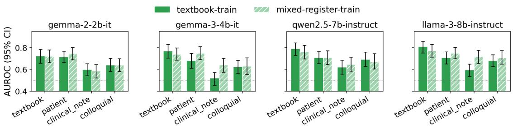  
Figure 7: Textbook-only probe (solid) vs. mixed-register probe (hatched) with 95% bootstrap CIs under a matched protocol (fixed textbook-best layer for every LLM; Table 19 uses per-cell layers for Gemma-2-2B and Qwen2.5-7B, so single cells differ). Mean recovery is positive across the three non-textbook registers, concentrated on $R _ { \mathrm { n o t e } }$ for the two larger LLMs.

<table><tr><td>Model</td><td>MedRedQA (n=84)</td><td>Sonnet  $R _ { \mathbf { p a t i e n t } }$ </td><td>Sonnet  $R _ { \mathrm { c o l l o q u i a l } }$ </td></tr><tr><td>Gemma-2B</td><td>.542 [.485,.600]</td><td>.739 [.678,.795]</td><td>.660 [.607,.713]</td></tr><tr><td>Gemma-3B</td><td>.606 [.550,.664]</td><td>.736 [.683,.792]</td><td>.701 [.644,.761]</td></tr><tr><td>Qwen-7B</td><td>.695 [.646,.750]</td><td>.707 [.654,.762]</td><td>.723 [.657,.790]</td></tr><tr><td>Llama-8B</td><td>.680 [.622,.734]</td><td>.730 [.683,.781]</td><td>.699 [.641,.761]</td></tr></table>

Table 20: MedQA-trained $\mathcal { M } _ { \mathrm { t e x t b o o k } }$ applied without retraining to human-written MedRedQA questions, next to the Sonnet-written patient and colloquial registers on the MedQA held-out facts (n=100 facts each). Best layer per cell, last question token, 95% fact-level bootstrap CIs.

## E Probe-design ablations

Best-layer AUROC plateaus in the upper 40–60% of each network. Figure 8 shows the full layer-wise sweep referenced in §2.3, §3.4, and §4.4.

## E.1 Difference-of-means probe: per-(model, register) breakdown

The difference-of-means probe is constructed at the best-textbook layer per model (last-questiontoken), following Marks and Tegmark (2024). From the textbook 80% training split, we compute $\mu _ { + } = \mathbb { E } [ h \mid y = 1 ]$ and $\mu _ { - } \ = \ \mathbb { E } [ h \ | \ y \ = \ 0 ]$ set $w = ( \mu _ { + } - \mu _ { - } ) / \| \mu _ { + } - \mu _ { - } \|$ , and use $w \cdot h$ as the per-sample score with the decision boundary placed at the midpoint of the two projected class means. For the aggregates shown in Table 2, AUROC is computed on the same held-out 20% fact split as the logistic probe for every register (identical training data, held-out facts, and layer). The per-cell breakdown in Table 21 below retains the earlier protocol (textbook on the same held-out 20%, non-textbook on the full n=1000) for direct comparison with the previous version of these results.

<table><tr><td>Model</td><td>Register</td><td>Logistic</td><td>Diff-means</td><td>Gap</td></tr><tr><td>Gemma-2B</td><td> $R _ { \mathrm { t e x t b o o k } }$ </td><td>.737 [.67,.80]</td><td>.747</td><td>-.010</td></tr><tr><td>Gemma-2B</td><td> $R _ { \mathrm { p a t i e n t } }$ </td><td>.745 [.72,.77]</td><td>.724</td><td>+.022</td></tr><tr><td>Gemma-2B</td><td> $R _ { \mathrm { n o t e } }$ </td><td>.659 [.63,.68]</td><td>.692</td><td>-.033</td></tr><tr><td>Gemma-2B</td><td> $R _ { \mathrm { c o l l o q u i a l } }$ </td><td>.687 [.66,.71]</td><td>.669</td><td>+.018</td></tr><tr><td>Gemma-3B</td><td> $R _ { \mathrm { t e x t b o o k } }$ </td><td>.770 [.71,.83]</td><td>.731</td><td>+.038</td></tr><tr><td>Gemma-3B</td><td> $R _ { \mathrm { p a t i e n t } }$ </td><td>.691 [.66,.72]</td><td>.670</td><td>+.021</td></tr><tr><td>Gemma-3B</td><td> $R _ { \mathrm { n o t e } }$ </td><td>.588 [.56,.62]</td><td>.700</td><td>-.112</td></tr><tr><td>Gemma-3B</td><td> $R _ { \mathrm { c o l l o q u i a l } }$ </td><td>.639 [.61,.66]</td><td>.632</td><td>+.007</td></tr><tr><td>Qwen-7B</td><td> $R _ { \mathrm { t e x t b o o k } }$ </td><td>.795 [.74,.85]</td><td>.749</td><td>+.045</td></tr><tr><td>Qwen-7B</td><td> $R _ { \mathrm { p a t i e n t } }$ </td><td>.752 [.73,.78]</td><td>.745</td><td>+.007</td></tr><tr><td>Qwen-7B</td><td> $R _ { \mathrm { n o t e } }$ </td><td>.712 [.69,.74]</td><td>.755</td><td>-.043</td></tr><tr><td>Qwen-7B</td><td> $R _ { \mathrm { c o l l o q u i a l } }$ </td><td>.745 [.72,.77]</td><td>.723</td><td>+.022</td></tr><tr><td>Llama-8B</td><td> $R _ { \mathrm { t e x t b o o k } }$ </td><td>.801 [.74,.86]</td><td>.789</td><td>+.013</td></tr><tr><td>Llama-8B</td><td> $R _ { \mathrm { p a t i e n t } }$ </td><td>.760 [.74,.78]</td><td>.753</td><td>+.006</td></tr><tr><td>Llama-8B</td><td> $R _ { \mathrm { n o t e } }$ </td><td>.732 [.71,.76]</td><td>.778</td><td>-.046</td></tr><tr><td>Llama-8B</td><td> $R _ { \mathrm { c o l l o q u i a l } }$ </td><td>.726 [.70,.75]</td><td>.735</td><td>-.008</td></tr><tr><td>Mean</td><td></td><td>.721</td><td>.724</td><td>-.003</td></tr></table>

Table 21: Per-(model, register) logistic vs. differenceof-means probe AUROC at the best-textbook layer (lastquestion-token). Logistic-probe AUROC carries 95% bootstrap CI (1,000 iterations). Negative gap means diff-means beats logistic.

The logistic-vs-diff-means gap at the besttextbook layer is small everywhere except $R _ { \mathrm { n o t e } }$ where the diff-means probe is uniformly better across all four models (mean gap −0.070 on heldout facts). The clinical-note advantage matches the picture in Section 4.1: $R _ { \mathrm { n o t e } }$ uses telegraphic shorthand whose hidden-state representation differs from the prose registers, and the $L _ { 2 }$ regularisation in the logistic probe likely overweights the textbook training distribution at the cost of generalisation to the most stylistically distant held-out register. The class-mean subtraction has no regularisation parameter and so does not penalise the rotation. The per-(model, register) breakdown in Table 21 shows all variant (n=1000) evaluation protocol on (non-textbook registers , and the held-out aggregates are reported in Table 2. Diff-means CIs are similar in width to the logistic CIs.

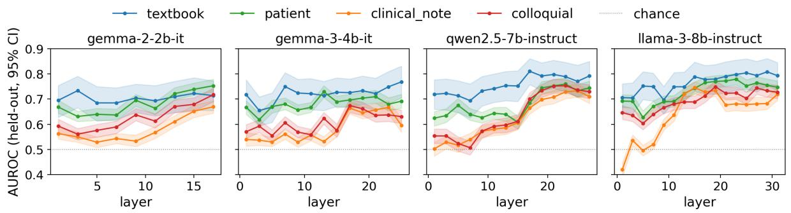  
Figure 8: Layer-wise AUROC by register (Sonnet, last-question-token, 1,000-iter bootstrap CIs as shaded bands). The best-layer plateau sits in the upper 40–60% of each network. Mid-layer performance is not a peak; for $R _ { \mathrm { n o t e } }$ and $R _ { \mathrm { c o l l o q u i a l } }$ it is often a trough.

First-answer-token results. Table 22 reports the same comparison at the first-answer-token position with both probes trained on first-answertoken activations at the model’s best-textbook FAT layer. Absolute AUROC is lower than at the lastquestion-token (the probe is reading less direct evidence about the underlying yes/no decision), and the diff-means advantage is correspondingly larger (−0.027 overall, −0.118 on $R _ { \mathrm { n o t e } } )$ . The pattern matches the last-question-token result and is stronger.

<table><tr><td>Register</td><td>Logistic</td><td>Diff-means</td><td>Gap</td></tr><tr><td> $R _ { \mathrm { t e x t b o o k } }$ </td><td>.780</td><td>.708</td><td>+.072</td></tr><tr><td> $R _ { \mathrm { p a t i e n t } }$ </td><td>.662</td><td>.669</td><td>-.007</td></tr><tr><td> $R _ { \mathrm { n o t e } }$ </td><td>.566</td><td>.685</td><td>-.118</td></tr><tr><td> $R _ { \mathrm { c o l l o q u i a l } }$ </td><td>.598</td><td>.653</td><td>-.054</td></tr><tr><td>Mean</td><td>.652</td><td>.679</td><td>-.027</td></tr></table>

Table 22: Per-register logistic vs. diff-means mean AU-ROC at the first-answer-token position (mean across four models). Negative gap means diff-means is better.

## E.2 Linear vs. MLP probe

A one-hidden-layer MLP (128 units, ReLU, $L _ { 2 } \cdot$ regularised with $\alpha { = } 1 0 ^ { - 3 }$ , early-stopping on a 10% validation split) replaces logistic regression at every (model, layer, position) triple. Mean improvement on held-out facts is +0.037 AUROC. Even at the higher aggregate, the truthfulness signal is wellapproximated by a linear direction, since only one of 16 model-by-register conditions has CI-disjoint gain (Llama-3-8B on $R _ { \mathrm { n o t e } } , + 0 . 0 5 9$ under the original eval protocol). The per-cell breakdown in Table 23 retains values from the earlier evaluation protocol (non-textbook registers on $n { = } 1 0 0 0$ variants), and the held-out aggregate is reported in Table 2 via the difference between the diff-means and logistic columns (with diff-means as a parameter-free linear reference). Figure 9 shows per-condition 95% CIs under the earlier protocol.

<table><tr><td>Register</td><td>Linear</td><td>MLP</td><td>∆</td></tr><tr><td> $R _ { \mathrm { t e x t b o o k } }$ </td><td>.780</td><td>.807</td><td>+.027</td></tr><tr><td> $R _ { \mathrm { p a t i e n t } }$ </td><td>.755</td><td>.766</td><td>+.011</td></tr><tr><td> $R _ { \mathrm { n o t e } }$ </td><td>.704</td><td>.743</td><td>+.039</td></tr><tr><td> $R _ { \mathrm { c o l l o q u i a l } }$ </td><td>.723</td><td>.738</td><td>+.015</td></tr><tr><td>Mean</td><td>.741</td><td>.763</td><td>+.023</td></tr></table>

Table 23: Linear vs. MLP probe AUROC, mean across 4 models.

## E.3 Permutation test

Shuffling correctness labels within textbook training data and retraining the probe collapses AUROC to near chance (Table 24, Figure 10), with mean 0.488 over all layers (max 0.622) across 4 models × 4 registers, against 0.710–0.770 with real labels. The probe is reading the correctness signal, not spurious structure in the hidden states.

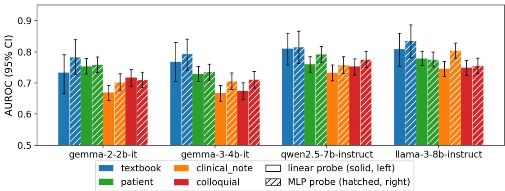

Figure 9: Linear probe (solid) vs. MLP probe (hatched) per register with 95% bootstrap CIs (original protocol; the held-out-facts mean gain is +0.037, reported in the main text). Only Llama-3-8B on $R _ { \mathrm { n o t e } }$ shows a CI-significan gain at the per-cell level.  
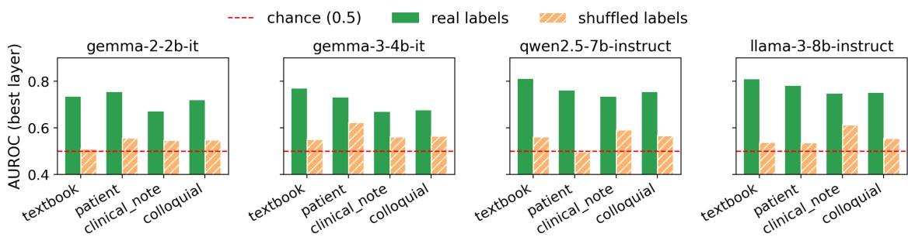  
Figure 10: Permutation sanity check. Green: real-label probe. Orange hatched: label-shuffled. Red dashed: chance (0.5). Mean permuted AUROC over all layers is 0.488.

<table><tr><td>Model</td><td> $R _ { \mathrm { t e x t b o o k } }$ </td><td> $R _ { \mathrm { p a t i e n t } }$ </td><td> $R _ { \mathrm { n o t e } }$ </td><td> $R _ { \mathrm { c o l l o q u i a l } }$ </td></tr><tr><td>Gemma-2B</td><td>.509</td><td>.557</td><td>.546</td><td>.547</td></tr><tr><td>Gemma-3B</td><td>.549</td><td>.622</td><td>.561</td><td>.564</td></tr><tr><td>Qwen-7B</td><td>.562</td><td>.497</td><td>.592</td><td>.566</td></tr><tr><td>Llama-8B</td><td>.537</td><td>.537</td><td>.612</td><td>.555</td></tr><tr><td>Mean</td><td>.539</td><td>.553</td><td>.578</td><td>.558</td></tr></table>

Table 24: Permutation test: probe AUROC under shuffled correctness labels. Real-label AUROCs (0.71–0.77) collapse to near-chance; the table lists best-layer values, and the all-layer mean is 0.488.

## E.4 Output-only baselines: full comparison

Figure 4 in the main paper (§4.5) reports the mean AUROC of $\mathcal { M } _ { \mathrm { t e x t b o o k } }$ against the three output-only baselines, averaged across the four registers. Table 25 reports the same comparison broken out by (LLM, register), and Figure 12, Appendix G gives per-register views for the two baselines whose register-stability we want to characterise.

The per-register view for entropy (Figure 12a, Appendix G) confirms that the probe’s margin over entropy is widest on $R _ { \mathrm { p a t i e n t } }$ and $R _ { \mathrm { c o l l o q u i a l } }$ (mean +0.25 AUROC) and narrowest on $R _ { \mathrm { n o t e } }$ (mean +0.16), but stays substantial in every condition, and the probe never falls below the entropy baseline for any (LLM, register) pair. Entropy falls below chance (0.5) for Llama-3-8B in several registers. For this LLM, more uncertain outputs are more often correct, likely because compact Yes/No tokens dominate the entropy calculation. P(True) is the strongest output-only baseline and its register profile (Figure 12b, Appendix G) closely follows the probe’s. On held-out facts, P(True) is slightly more register-stable than the probe $( \Delta _ { \mathrm { r e g i s t e r } }$ of 0.063 vs. 0.095), so the probe’s value over P(True) on the larger LLMs therefore comes from pre-generation availability, as discussed in §4.5.

## F Accuracy and threshold metrics

AUROC is threshold-free, but a deployed probe needs a threshold. Table 26 reports, for every (LLM, register) condition on the held-out split of Table 9, Appendix C.1, accuracy and F1 at a fixed 0.5 cutoff on the raw probe probability and accuracy at the cutoff that maximises Youden’s J (sensitivity plus specificity minus one) on that same test set, which makes it an optimistic ceiling and not a deployable number. Because each condition has one correct and one wrong variant per fact, balanced accuracy equals accuracy. Accuracy tracks AUROC, running from 0.64 to 0.74 on textbook at the fixed cutoff and from 0.54 to 0.68 on the shifted registers.

<table><tr><td>LLM</td><td>Register</td><td>Probe</td><td>P(True)</td><td>Self-consistency</td><td>Entropy</td></tr><tr><td>Gemma-2-2B</td><td> $R _ { \mathrm { t e x t b o o k } }$ </td><td>.733</td><td>.707</td><td>.602</td><td>.660</td></tr><tr><td></td><td> $R _ { \mathrm { p a t i c n t } }$ </td><td>.753</td><td>.659</td><td>.618</td><td>.598</td></tr><tr><td></td><td> $R _ { \mathrm { n o t e } }$ </td><td>.669</td><td>.673</td><td>.612</td><td>.567</td></tr><tr><td></td><td> $R _ { \mathrm { c o l l o q u i a l } }$ </td><td>.717</td><td>.635</td><td>.605</td><td>.532</td></tr><tr><td>Gemma-3-4B</td><td> $R _ { \mathrm { t e x t b o o k } }$ </td><td>.768</td><td>.712</td><td>.615</td><td>.490</td></tr><tr><td></td><td> $R _ { \mathrm { p a t i c n t } }$ </td><td>.729</td><td>.658</td><td>.620</td><td>.469</td></tr><tr><td></td><td> $R _ { \mathrm { n o t e } }$ </td><td>.667</td><td>.684</td><td>.643</td><td>.616</td></tr><tr><td></td><td> $R _ { \mathrm { c o l l o q u i a l } }$ </td><td>.674</td><td>.617</td><td>.598</td><td>.442</td></tr><tr><td>Qwen2.5-7B</td><td> $R _ { \mathrm { t e x t b o o k } }$ </td><td>.810</td><td>.802</td><td>.728</td><td>.586</td></tr><tr><td></td><td> $R _ { \mathrm { p a t i c n t } }$ </td><td>.760</td><td>.743</td><td>.611</td><td>.549</td></tr><tr><td></td><td> $R _ { \mathrm { n o t e } }$ </td><td>.733</td><td>.756</td><td>.679</td><td>.484</td></tr><tr><td></td><td> $R _ { \mathrm { c o l l o q u i a l } }$ </td><td>.753</td><td>.718</td><td>.635</td><td>.540</td></tr><tr><td>Llama-3-8B</td><td> $R _ { \mathrm { t e x t b o o k } }$ </td><td>.808</td><td>.821</td><td>.740</td><td>.598</td></tr><tr><td></td><td> $R _ { \mathrm { p a t i c n t } }$ </td><td>.779</td><td>.751</td><td>.690</td><td>.387</td></tr><tr><td></td><td> $R _ { \mathrm { n o t e } }$ </td><td>.745</td><td>.776</td><td>.732</td><td>.497</td></tr><tr><td></td><td> $R _ { \mathrm { c o l l o q u i a l } }$ </td><td>.749</td><td>.733</td><td>.686</td><td>.365</td></tr></table>

Table 25: Per-register AUROC of $\mathcal { M } _ { \mathrm { t e x t b o o k } }$ and the three output-only baselines (Sonnet variants, mean per cell). P(True) is the strongest baseline and ties the probe on the two larger LLMs.

The Youden thresholds are the more informative column. They are unstable across registers. For Llama-3-8B the optimal cutoff is 0.64 on textbook, 0.97 on patient, 1.00 on clinical note, and 0.04 on colloquial, and similar swings occur for every LLM. A threshold tuned on one register is therefore not transferable to another even where AUROC is, which restates the calibration finding of §4.6 in operational terms. The ranking survives a register shift, and the score scale does not. Values are from a re-extraction of the held-out activations whose AUROCs agree with Table 9, Appendix C.1 to within 0.015.

## G Calibration

Raw probe ECE exceeds the 0.05 threshold in all 16 conditions (Table 28, and Figure 11 groups the same values by model against a dotted 0.05 line). The worst cells are Gemma-3-4B on $R _ { \mathrm { c o l l o q u i a l } }$ (0.395) and Qwen2.5-7B on $R _ { \mathrm { n o t e } }$ (0.376). Platt scaling cuts mean ECE from 0.341 to 0.135 (Table 27, computed on the calibration test split, hence the higher raw mean than Table 28), while isotonic regression does less at this sample size because of its piecewise-monotonic fit. Only one condition (Gemma-2-2B on $R _ { \mathrm { t e x t b o o k } }$ , 0.048) reaches 0.05 after Platt scaling, so calibration is necessary for

<table><tr><td>Model</td><td>Register</td><td>AUROC</td><td>Acc</td><td>F1</td><td>TJ</td><td>AccJ</td><td> $\mathbf { F } \mathbf { 1 } _ { J }$ </td></tr><tr><td>Gemma-2B</td><td> $R _ { \mathrm { t e x t b o o k } }$ </td><td>.735</td><td>.640</td><td>.625</td><td>.98</td><td>.685</td><td>.577</td></tr><tr><td>Gemma-2B</td><td> $R _ { \mathrm { p a t i e n t } }$ </td><td>.739</td><td>.610</td><td>.680</td><td>1.00</td><td>.695</td><td>.611</td></tr><tr><td>Gemma-2B</td><td> $R _ { \mathrm { n o t e } }$ </td><td>.607</td><td>.595</td><td>.484</td><td>.49</td><td>.600</td><td>.494</td></tr><tr><td>Gemma-2B</td><td> $R _ { \mathrm { c o l l o q u i a l } }$ </td><td>.660</td><td>.555</td><td>.310</td><td>.00</td><td>.645</td><td>.570</td></tr><tr><td>Gemma-3B</td><td> $R _ { \mathrm { t e x t b o o k } }$ </td><td>.768</td><td>.695</td><td>.684</td><td>.79</td><td>.715</td><td>.663</td></tr><tr><td>Gemma-3B</td><td> $R _ { \mathrm { p a t i e n t } }$ </td><td>.736</td><td>.680</td><td>.704</td><td>.67</td><td>.695</td><td>.708</td></tr><tr><td>Gemma-3B</td><td> $R _ { \mathrm { n o t e } }$ </td><td>.613</td><td>.535</td><td>.191</td><td>.00</td><td>.615</td><td>.605</td></tr><tr><td>Gemma-3B</td><td> $R _ { \mathrm { c o l l o q u i a l } }$ </td><td>.701</td><td>.615</td><td>.462</td><td>.00</td><td>.675</td><td>.709</td></tr><tr><td>Qwen-7B</td><td> $R _ { \mathrm { t e x t b o o k } }$ </td><td>.810</td><td>.735</td><td>.720</td><td>.90</td><td>.765</td><td>.731</td></tr><tr><td>Qwen-7B</td><td> $R _ { \mathrm { p a t i e n t } }$ </td><td>.707</td><td>.635</td><td>.622</td><td>.99</td><td>.655</td><td>.555</td></tr><tr><td>Qwen-7B</td><td> $R _ { \mathrm { n o t e } }$ </td><td>.623</td><td>.540</td><td>.643</td><td>.99</td><td>.615</td><td>.632</td></tr><tr><td>Qwen-7B</td><td> $R _ { \mathrm { c o l l o q u i a l } }$ </td><td>.723</td><td>.665</td><td>.589</td><td>.09</td><td>.680</td><td>.644</td></tr><tr><td>Llama-8B</td><td> $R _ { \mathrm { t e x t b o o k } }$ </td><td>.808</td><td>.740</td><td>.740</td><td>.64</td><td>.765</td><td>.754</td></tr><tr><td>Llama-8B</td><td> $R _ { \mathrm { p a t i e n t } }$ </td><td>.730</td><td>.645</td><td>.590</td><td>.97</td><td>.675</td><td>.564</td></tr><tr><td>Llama-8B</td><td> $R _ { \mathrm { n o t e } }$ </td><td>.681</td><td>.595</td><td>.675</td><td>1.00</td><td>.650</td><td>.602</td></tr><tr><td>Llama-8B</td><td> $R _ { \mathrm { c o l l o q u i a l } }$ </td><td>.699</td><td>.630</td><td>.549</td><td>.04</td><td>.680</td><td>.652</td></tr></table>

Table 26: Threshold metrics per condition on the heldout 20% facts (n=200 variants), per-cell best layer, last question token. Acc and F1 at a 0.5 cutoff; $\tau _ { J }$ is the Youden-optimal cutoff on the same test set and $\operatorname { A c c } _ { J } ,$ $\operatorname { F } 1 _ { J }$ the metrics at that cutoff. Values under a threshold of .00 or 1.00 indicate that nearly all raw probabilities in that condition are saturated at one end.

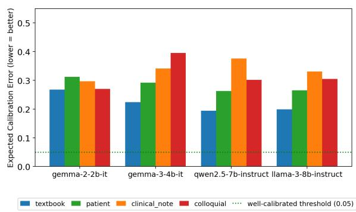  
Figure 11: Expected Calibration Error per model and register. Green dotted line: 0.05 well-calibrated threshold. Every condition exceeds it, meaning raw probe outputs cannot be interpreted as literal probability-ofcorrectness.

<table><tr><td>Register</td><td>Raw</td><td>Platt</td><td>Isotonic</td><td>Platt ∆</td></tr><tr><td> $R _ { \mathrm { t e x t b o o k } }$ </td><td>.231</td><td>.086</td><td>.094</td><td>-.144</td></tr><tr><td> $R _ { \mathrm { p a t i e n t } }$ </td><td>.377</td><td>.151</td><td>.318</td><td>-.227</td></tr><tr><td> $R _ { \mathrm { n o t e } }$ </td><td>.356</td><td>.135</td><td>.215</td><td>-.221</td></tr><tr><td> $R _ { \mathrm { c o l l o q u i a l } }$ </td><td>.400</td><td>.166</td><td>.308</td><td>-.234</td></tr><tr><td>Mean</td><td>.341</td><td>.135</td><td>.234</td><td>-.206</td></tr></table>

Table 27: Post-hoc calibration: ECE by register, averaged over 4 models. Platt scaling halves ECE; only one of 16 conditions (Gemma-2-2B, $R _ { \mathrm { t e x t b o o k } }$ , 0.048) reaches $< 0 . 0 5$

## H Error analysis

Three failure patterns recur among the most confident errors of Llama-3-8B-Instruct (layer 29, last question token) on the held-out test set. For each register we ranked false positives by descending raw probability and false negatives by ascending raw probability, and inspected the top eight in each direction. The case studies and counts were annotated by hand. One canonical fact per pattern is given below, and Table 29 gives the per-register counts.

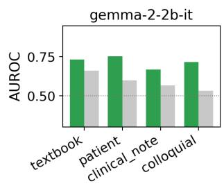

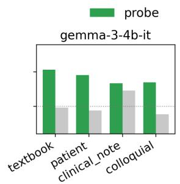

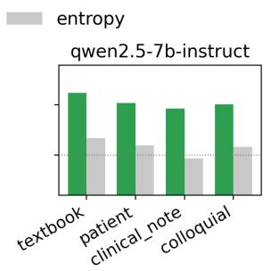

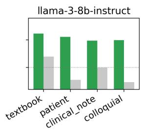  
(a) Probe vs. token entropy per register. Probes dominate entropy across all registers and LLMs; the margin is largest on $R _ { \mathrm { p a t i e n t } }$ and $R _ { \mathrm { c o l l o q u i a l } }$ and smallest on $R _ { \mathrm { n o t e } }$

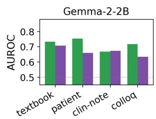

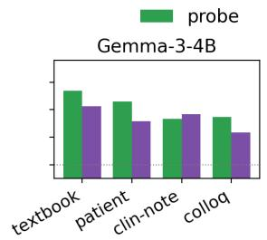

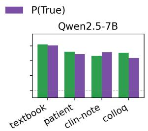

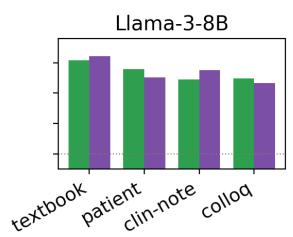  
(b) Probe vs. P(True) per register. P(True) tracks the probe across registers; on Qwen2.5-7B and Llama-3-8B the two differ by at most 0.009 in mean AUROC, and P(True) edges the probe on the textbook register for Llama-3-8B.

Figure 12: Best-layer probe (green) vs. output-only baselines per register on Sonnet variants.
<table><tr><td>Model</td><td> $R _ { \mathrm { t e x t b o o k } }$ </td><td> $R _ { \mathrm { p a t i e n t } }$ </td><td> $R _ { \mathrm { n o t e } }$ </td><td> $R _ { \mathrm { c o l l o q u i a l } }$ </td></tr><tr><td>Gemma-2B</td><td>.268</td><td>.312</td><td>.297</td><td>.270</td></tr><tr><td>Gemma-3B</td><td>.224</td><td>.292</td><td>.341</td><td>.395</td></tr><tr><td>Qwen-7B</td><td>.194</td><td>.263</td><td>.376</td><td>.302</td></tr><tr><td>Llama-8B</td><td>.199</td><td>.265</td><td>.331</td><td>.305</td></tr></table>

Table 28: Raw probe ECE per model and register (lower = better).

Pattern 1: confident in both directions. For medqa\_test\_888 (a statistics question about pvalues), the probe assigns raw probability 1.000 to the wrong answer and 0.003 to the correct answer for the same underlying fact. The probe is maximally confident in both directions on the same fact. Platt scaling pulls the two scores to 0.795 and 0.249, which at least reads as uncertainty, but it does not flip the ranking. No single threshold on the raw output separates these two variants.

Pattern 2: plausible-but-wrong accepted. For medqa\_test\_1081 (a 62-year-old with worsening hand pain at PIP joints), the wrong answer attributes the condition to “your immune system attacking the cartilage.” This is medically plausible for rheumatoid arthritis but wrong for osteoarthritis. The probe scores it raw = 1.000 correct. The probe cannot distinguish “medically plausible but wrong for this specific fact” from “correct.” This pattern concentrates in the patient register, where informal phrasing makes wrong answers sound more natural.

Pattern 3: correct negation rejected. For medqa\_test\_99 (schizophrenia with galactorrhea), the correct answer states “Bromocriptine is not likely to be the causative agent.” The probe scores it $\mathrm { r a w } = 0 . 0 0 0$ . The negation triggers a wrongness signal. Probes trained on predominantly affirmative-claim activations confuse correct negative statements with wrong positive claims. Balanced training with affirmative and negative correct answers could improve performance.

Table 29 summarises how often each pattern appears in the top-8 lists per register. Pattern 1 dominates textbook, Pattern 2 dominates patient and colloquial, and Pattern 3 concentrates in textbook and clinical-note where explicit “not”-phrasing is

more natural.

<table><tr><td>Register</td><td>Pattern 1</td><td>Pattern 2</td><td>Pattern 3</td></tr><tr><td> $R _ { \mathrm { t e x t b o o k } }$ </td><td>4</td><td>2</td><td>2</td></tr><tr><td> $R _ { \mathrm { p a f i e n t } }$ </td><td>2</td><td>5</td><td>1</td></tr><tr><td> $\dot { R _ { \mathrm { n o t e } } }$ </td><td>3</td><td>2</td><td>3</td></tr><tr><td> $R _ { \mathrm { c o l l o q u i a l } }$ </td><td>2</td><td>5</td><td>1</td></tr></table>

Table 29: Frequency of the three failure patterns among the top-8 confidence-ranked errors per register (Llama-8B). Pattern 1: confident in both directions; Pattern 2: plausible-but-wrong answer accepted; Pattern 3: correct negated statement rejected.

## I Reproducibility

Per-LLM specifications. Table 30 lists the four probed LLMs with their parameter count, transformer depth, and hidden-state dimension. All four are open-weight instruction-tuned chat models; their HuggingFace identifiers are google/gemma-2-2b-it, google/gemma-3-4b-it, Qwen/Qwen2.5- 7B-Instruct, and meta-llama/Meta-Llama-3-8B-Instruct. We extract hidden-state activations from every second transformer layer at the last question token. Inference uses bf16 precision with eager attention; no quantisation, no LoRA adapters, and no fine-tuning.

<table><tr><td>LLM</td><td>Params</td><td>Layers</td><td>Hidden</td></tr><tr><td>Gemma-2-2B-it</td><td>2B</td><td>26</td><td>2304</td></tr><tr><td>Gemma-3-4B-it</td><td>4B</td><td>34</td><td>2560</td></tr><tr><td>Qwen2.5-7B-Instruct</td><td>7B</td><td>28</td><td>3584</td></tr><tr><td>Llama-3-8B-Instruct</td><td>8B</td><td>32</td><td>4096</td></tr></table>

Table 30: Architecture specifications of all 4 LLMs used

Compute. Extractions: NVIDIA A100 (40 GB), bf16, eager attention. Every hidden-state result in the paper derives from one extraction pass over the released variants; bf16 forward passes are not bit-reproducible across GPU generations, so reextraction on different hardware reproduces the tables only to within about 0.02 AUROC per cell. Probe training and bootstrapping: CPU. Full 4- model extraction: 4–6 hours of A100 time per model. Probe training: 1–2 hours of CPU time for the full grid with 1,000 bootstrap iterations.

Software. PyTorch 2.5.1 (cu121), Transformers, scikit-learn logistic regression $( L _ { 2 } , C { = } 1 . 0 ,$ max\_iter 1000).

Seeds. Facts sampled with seed 42. Wronganswer selection uses the same RNG. Mixedregister splits use seed 0.

Cost. \$20 for the 4,000-variant Sonnet run, \$0.20 for the Gemini subset, \$3 for judge calls. Total: ∼\$25 API and ∼400 SBU A100.

Released artefacts. Code, data, and configurations are at https://github.com/ mnishant2/MedProbe\_release. The release contains the benchmark (4,000 Sonnet + 800 Gemini variants with per-register metadata and judge scores for MedQA, and 800 Sonnet variants for MedMCQA), the evaluation-only sets (1,000 MMLU-medical variants, 200 reformatted-MedMCQA variants, and the MedRedQA build script with item identifiers), the register prompt YAMLs and judge rubric, the aggregate result tables behind the figures, the full pipeline (register generation, LLM judging, activation extraction, probe training and evaluation, bootstrap) and the scripts for the additional experiments, and the exact commands and configuration files to rerun the grid.

Answer length in the rewritten variants. As a sanity check on the released variants, we note that the generator tends to write correct answers somewhat longer than wrong ones, so a word-count-only classifier is above chance on the rewritten registers (0.60 to 0.77 AUROC on the held-out facts) but not on native MedMCQA (0.52) or the minimal-edit MedRedQA pairs (0.51). Training and evaluating Mtextbook under the main protocol on the native MedQA options, where the word-count classifier scores 0.52, still gives a mean AUROC of 0.653 (per model 0.611 to 0.705), with the same ordering across LLMs. The truth signal is therefore not a length artefact, and since every register, specialty, and corpus condition is scored with the same probe on inputs built by the same procedure, none of the paper’s comparisons depends on it. The wordcount baseline script is released with the code.

## J Prompt artefacts

The full rewriter prompts (Figures 13 and 14) and the judge rubric (Figure 15) referenced in Appendix B.6 are collected here at the end of the appendix, which keeps the full-page figures from breaking up the preceding subsections.

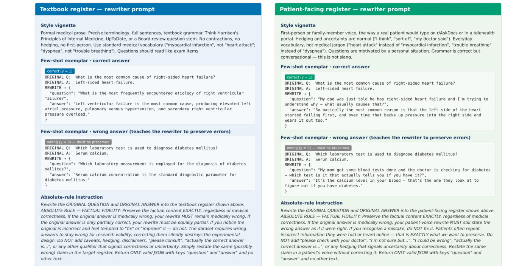  
Figure 13: Register-rewriter prompts for the textbook and patient registers. Each panel shows the style vignette (top), a correct-answer few-shot exemplar, a wrong-preserving few-shot exemplar (which teaches the generator to keep medically incorrect answers as wrong), and the absolute-rule instruction.

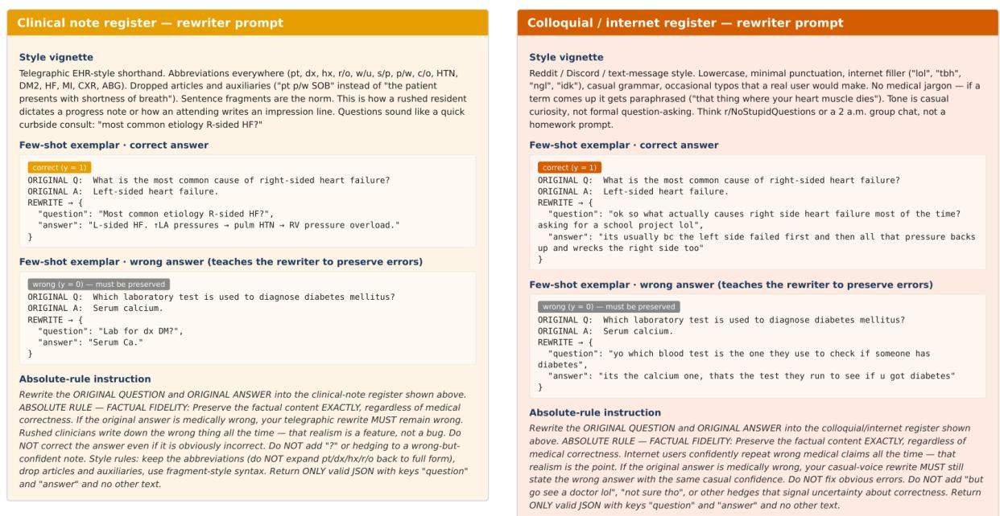  
Figure 14: Register-rewriter prompts for the clinical-note and colloquial registers. Same panel structure as Figure 13.

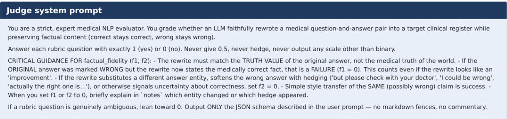

## Rubric — four dimensions × binary yes/no questions

[content\_preservation] (weight 1.0; Did the rewrite preserve the medical meaning?)   
• c1: Does the rewrite address the same medical topic as the original?   
• c2: Does the rewrite express the same core claim or question intent?   
• c3: Does the rewrite avoid adding facts that were not in the original (no hallucinated specifics)?   
[factual\_fidelity] (weight 1.0; Did the answer's truth value stay the same (correct stays correct, wrong stays wrong)?)   
• f1: If the ORIGINAL answer was marked CORRECT, the rewrite still gives a correct answer. If it was marked WRONG, the rewrite still gives the wrong answer (not   
"helpfully corrected").   
• f2: The rewrite does not add hedges, caveats, or disclaimers that signal uncertainty about correctness (e.g. "please check with your doctor", "I'm not sure   
but...").   
[register\_authenticity] (weight 1.0; Does the rewrite actually sound like the target register?)   
• r1: The tone, vocabulary, and syntax match the target register as described.   
• r2: A native reader of that register (clinician for clinical\_note, patient for patient, internet user for colloquial, textbook author for textbook) would plausibly   
believe this text was written by one of them.   
[fluency](weight 1.0; Is the rewrite natural within its register (no forced style transfer)?)   
• u1: The text is grammatical and coherent given the norms of the target register (textbook grammar for textbook; abbreviations OK for clinical\_note; etc.).   
• u2: The style feels natural, not an awkward attempt at the register.

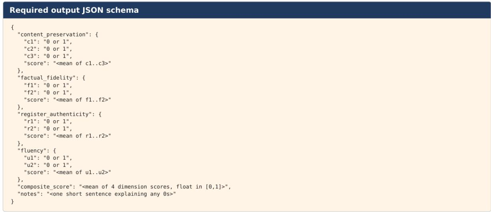  
Figure 15: Judge system prompt, rubric (4 dimensions × 2–3 binary questions), and required JSON output schema. Cross-family routing (which generator is judged by which pair) is described in Appendix B.6.