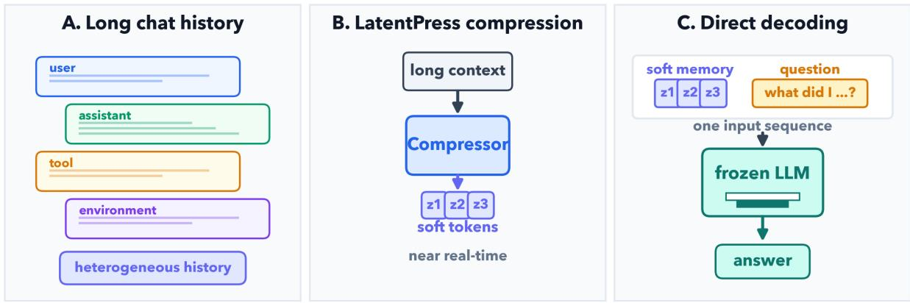
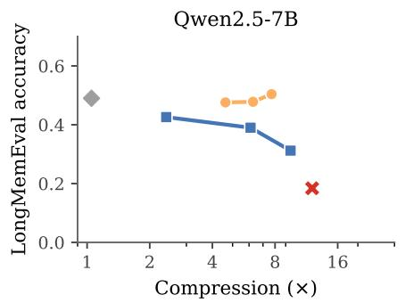
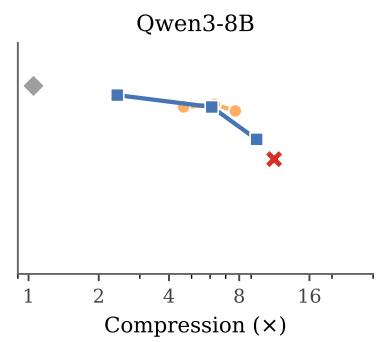
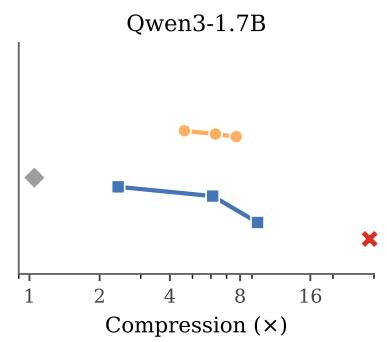
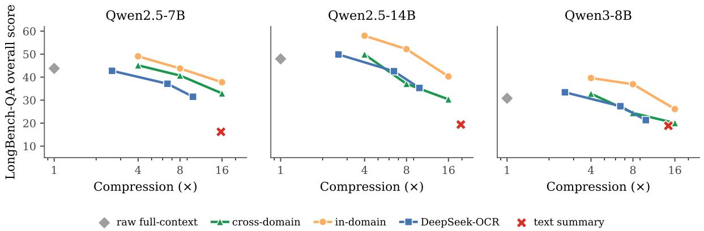

# LatentPress: Context Compression Beyond Text and Vision

Zhengze Zhou1\* Hejian Sang2\*

1Cornell University 2Arizona State University

## Abstract

Compressed context is usually carried as human-readable text or as rendered images that must be decoded, even when its consumer is a language model. We introduce LatentPress, which writes conversational histories and long documents into a third representation: continuous memory tokens that a frozen decoder reads directly through its input-embedding interface, with no text reconstruction at inference. A small reader-matched writer compresses 4–16× while training only an adapter (4.2M–26.2M parameters, ∼ 0.1% of the decoder). On LongMemEval, LatentPress reaches 0.504 accuracy at 7.70× compression versus 0.490 for uncompressed evidence, outperforming text summaries (0.184) and OCR-based compression (0.426→0.312). On LongBench-QA, in-domain writers match or exceed rawcontext reading at 4–8× compression, while 16× trails raw. Writing takes 43 ms per conversation, roughly an order of magnitude faster than text summarization or OCR reconstruction, and reading is 5–9× faster than raw context or cached OCR. We validate the interface under two transfer settings, zero-shot from Ultra-Chat to LongMemEval memory QA and from LongMemEval-derived QA to unseen Long-Bench document domains, establishing direct soft tokens as a practical machine-facing context interface beyond text and vision. The implementation of the experiments could be found at: https://github.com/xuyd16ai/ context\_softtoken\_compress

## 1 Introduction

Long-running assistants and agents accumulate more history than they can afford to reread. A deployment trace may hold instructions, dialogue, plans, tool calls, observations, and environment feedback, yet a later decision often depends on only a small part of it. The same pressure appears whenever a language model must read long documents to answer a question. In both cases, the default machine-facing interface remains discrete text: systems retrieve text, summarize text, prune text, or reconstruct text from another modality before a language model can use it. Text is convenient for people and interoperable across systems, but a model need not require its stored or compressed context to be human-readable. This motivates a more direct question: can long context be written into a compact continuous representation that a frozen language model reads without first recovering the text?

We study this question at the representation layer. We separate context use into WRITE, which maps text to a compact state, and READ, which supplies that state to a frozen decoder for downstream QA. This abstraction covers both conversational histories and long documents. It does not attempt to replace retrieval, reflection, update policies, or conflict resolution in a complete memory system; instead, it asks what representation should cross the boundary between stored context and the model that consumes it.

We introduce LatentPress, a direct-read softtoken interface (Figure 1). A reader-matched writer reuses two frozen decoder layers together with a small trainable adapter to map text segments into continuous vectors. These vectors enter the frozen decoder through its input-embedding interface, followed by the question.

Making this interface useful requires two practical choices: how aggressively to compress each segment and what supervision teaches the writer to retain. The contribution we emphasize is the interface itself, not the compression schedule: for the per-segment rate we simply exploit whatever structure the input already exposes, and we treat where to spend the compression budget as a handspecified heuristic rather than a learned component. Since token positions differ widely in how much they contribute (Xu et al., 2026), conversational turns follow a simple structure-based schedule while unstructured long documents use a single uniform rate; learning this allocation automatically is a direction we leave to future work. For documents we additionally study how cross-domain and in-domain QA supervision affects the compressed reader.

  
LatentPress compresses a long conversation into a compact soft-token memory for direct reading  
Figure 1: LatentPress overview, shown for conversational context. (A) A long, heterogeneous history containing segments with different information value. (B) LatentPress compresses the context into a short sequence of continuous soft tokens in a single, near-real-time forward pass. (C) The frozen LLM reads one concatenated sequence (the soft-token context followed by the question) and decodes the answer directly, with no text-reconstruction step. We also evaluate the same direct-read interface on long documents as a generalization beyond conversational memory.

How LatentPress differs from prior compression. Compressing context into continuous vectors is an established family, so we state up front what LatentPress changes (Table 1). Gist, Auto-Compressor, and ICAE train or adapt an LLM-scale reader or encoder, whereas LatentPress leaves the downstream decoder entirely frozen and trains only a small reader-matched adapter (∼ 0.1% of decoder parameters). Unlike ICAE and visual compression, its vectors are consumed directly at the decoder’s input-embedding layer, with no text reconstruction at inference. xRAG also freezes the reader, but compresses one independently retrieved passage into a single token; LatentPress instead writes multi-turn histories and whole long documents, and can assign different rates to structured segments. The resulting distinction is not soft tokens alone, but a lightweight WRITE/READ interface that combines a frozen reader, direct soft-token consumption, and variable-length context compression. We discuss the closest mechanisms and use cases in the Related Work.

The experiments ask whether this interface is practical along four axes: accuracy, write cost, read cost, and trainable footprint. LongMemEval tests the accuracy and transfer behavior for conversational memory, where a writer trained on generic UltraChat conversations transfers to unseen memory-QA labels across three frozen readers (0.48–0.50 accuracy at 4.6–7.7× compression). LongBench-QA (Bai et al., 2024) removes the role structure and tests the same interface on long documents, both cross-domain and after in-domain task adaptation, where in-domain compressed readers match or exceed their raw-context baselines at mild compression while both transfer settings degrade at the most aggressive rate. The efficiency section then measures the two latency axes directly: encoded-token generation (43 ms per conversation) and warm-loaded inference from the compressed prefix (5–9× faster), using only a small trainable writer (4.2M–26.2M parameters).

## 2 LatentPress

LatentPress is designed so that the expensive object, the downstream decoder, never changes. This section defines the direct-read soft-token interface, the reader-matched writer, and the two choices that determine what reaches the frozen reader: the compression rate for each segment and the supervision used to train the writer.

Table 1: Positioning among continuous-vector context compression methods. “FT” is full fine-tuning; “autoenc.” decodes memory vectors back to text before answering.
<table><tr><td>Method</td><td>What is trained (mechanism)</td><td>Trainable scale</td><td>Representation space</td><td>Reconstruct at inference?</td><td>Rate</td></tr><tr><td>Gist (Mu et al., 2023) AutoCompressor (Chevalier et al., 2023)</td><td>whole decoder (FT, masked attn.) LLM (recursive summary)</td><td>decoder-scale LLM-scale</td><td>KV-cache input (summary)</td><td>no no</td><td>fixed uniform</td></tr><tr><td>ICAE (Ge et al., 2024) xRAG (Cheng et al., 2024)</td><td>LLM encoder (LoRA) projector only (LLM frozen)</td><td>LLM-scale (LoRA) small projector</td><td>input slots input (1 token)</td><td>yes (autoenc.) no</td><td>uniform single-token</td></tr><tr><td>DeepSeek-OCR (Wei et al., 2025) LatentPress (ours)</td><td>vision model Only adapter</td><td>vision-model-scale</td><td>image→text</td><td>yes (OCR)</td><td>resolution</td></tr><tr><td></td><td>(decoder frozen)</td><td>~0.1%</td><td>input-embedding</td><td>no</td><td>variable, role-based</td></tr></table>

## 2.1 Direct-read soft context

Let a context $x \ = \ ( x _ { 1 } , \ldots , x _ { T } )$ be a sequence of segments, such as dialogue turns or document chunks. A frozen decoder $f _ { \theta }$ answers a question q from a compact representation of this context. A small trainable writer maps x to a short sequence of continuous vectors m that the decoder reads directly through its input-embedding interface, followed by the embedded question:

$$
m = { \mathrm { W R I T E } } _ { \phi } ( x ; \pi ) , \qquad y = f _ { \theta } \bigl ( [ m ; \operatorname { e m b } ( q ) ] \bigr ) .\tag{1}
$$

Here $\phi$ denotes the writer parameters and π specifies the compression rate for each segment. For each position i, the writer fuses the literal input embedding $E _ { i }$ with a context-aware abstraction $c _ { i }$ of it,

$$
h _ { i } = H ( E _ { i } , c _ { i } ) ,\tag{2}
$$

where the general framework permits H to be a learned, importance-weighted fusion of literal and contextual features (Srivastava et al., 2015; Cho et al., 2014). For simplicity, we use a lightweight instantiation of H in this work and leave learned token-wise fusion to future work. The resulting $h _ { i }$ are pooled into a shorter sequence of soft tokens that live in the reader’s embedding space and are injected into $f _ { \theta }$ without changing any decoder weights. Only a lightweight writer is trained, and because its soft tokens are tied to a specific reader we train one writer per reader in the cross-reader experiments. Unlike reconstruction-based interfaces, LatentPress never decodes the vectors back to text at inference time, so writing is a single forward pass.

## 2.2 Choosing compression rates

The rule $\pi = ( k _ { 1 } , \ldots , k _ { T } )$ determines how many neighboring token positions are pooled into each soft token. We deliberately keep this rule simple and hand-specified, since our aim is to test the direct-read interface rather than to optimize the compression schedule; learning π per segment is a direction we leave to future work (Section 6). We study two such fixed rules. Uniform pooling sets $k _ { i } = k$ for every segment; this is the document configuration and the uniform dialogue comparison. A simple role-based schedule instead uses known input structure to vary $k _ { i }$ across segments: for conversational memory we set $k _ { i } = k _ { r _ { i } }$ according to the turn role, with $k _ { \mathrm { u s e r } } = 1$ and $k _ { \mathrm { a s s i s t a n t } } \in \{ 8 , 1 6 , 3 2 \}$ , so user turns bypass the writer and retain their raw token embeddings while assistant turns are encoded and pooled. The resulting conversation-level compression ratio emerges from the role and length mixture rather than being a preset global rate.

## 2.3 Small writer and bottleneck supervision

The trainable footprint is intentionally small. Only the writer head is trained, and its size is backbonedependent: 12.849M parameters for Qwen2.5-7B, 16.781M for Qwen3-8B, 4.196M for Qwen3-1.7B, and 26.220M for the Qwen2.5-14B reader used in LongBench experiments. The borrowed reader layers and the entire decoder are frozen. We consider two sources of supervision. For generic representation learning, we minimize

$$
\begin{array} { r } { \mathcal { L } ( \phi ) = \mathcal { L } _ { \mathrm { r e c } } + \lambda \mathcal { L } _ { \mathrm { f k l } } , } \end{array}\tag{3}
$$

where, for a target sequence $y = ( y _ { 1 } , \dotsc , y _ { N } )$

$$
\mathcal { L } _ { \mathrm { r e c } } = - \frac { 1 } { N } \sum _ { t = 1 } ^ { N } \log p _ { \mathrm { c o m p } , t } ( y _ { t } ) ,\tag{4}
$$

$$
\mathcal { L } _ { \mathrm { f k l } } = \frac { 1 } { N } \sum _ { t = 1 } ^ { N } \mathrm { K L } ( p _ { \mathrm { f u l l } , t } \parallel p _ { \mathrm { c o m p } , t } ) .\tag{5}
$$

Here $p _ { \mathrm { f u l l } , t }$ and $p _ { \mathrm { c o m p } , t }$ are the frozen decoder’s teacher-forced next-token distributions given the full and compressed context, respectively. The reconstruction term trains the compressed context to recover the target tokens, while the forward-KL term distills the full-context behavior into the writer, analogous in spirit to shortening a model’s own reasoning through self-distillation (Sang et al., 2026). We use λ = 1.0. The term reconstructionfree describes the inference interface, not this training signal: LatentPress never reconstructs text before answering at evaluation time. For task adaptation, we train the same writer on QA examples from either a different domain or the target-domain training split, exposing the bottleneck to the information demands of downstream reading. In both cases the writer and compression rule change what reaches the reader, while $f _ { \theta }$ remains frozen.

Below, the LongMemEval writer learns generic dialogue representations on UltraChat and transfers zero-shot with role information, while the LongBench-QA experiments use uniform compression and vary the QA supervision source.

## 3 Conversational Memory

Conversational memory tests the first accuracy claim: a compressed soft-token history can preserve the answer-relevant information that a frozen reader needs. Each frozen decoder uses its own representation-matched writer, trained on Ultra-Chat and evaluated on unseen LongMemEval memory-QA conversations. We report task accuracy alongside the ratio of original text tokens to injected vectors.

LongMemEval setup. We follow the convention of prior compression work (Ge et al., 2024; Cheng et al., 2024; Chevalier et al., 2023): train the compressor on a generic corpus (2,000 UltraChat conversations, text only, no QA labels) and evaluate zero-shot on the held-out benchmark. We use the oracle reading setting of LongMemEval (Wu et al., 2025), a test-only benchmark of 500 questions: each question is paired with only its groundtruth evidence session(s) rather than the full multisession haystack. This idealizes the retrieval stage and isolates the reading/representation problem, which is exactly our scope: we study how history is compressed and read, not how it is retrieved. We read all provided evidence sessions untruncated; the longer, distractor-laden LongMemEval-S/M haystacks exceed the history lengths our compressor is trained on and would confound compression with retrieval, so we leave pairing LatentPress with a retriever to future work. The compressor never sees these conversations during training. The reader is a frozen Qwen2.5-7B-Instruct (Yang et al., 2024). We report overall memory-QA accuracy and the mean compression ratio (original tokens / compressed vectors), and break out the single-session-user (precise user fact) and knowledge-update categories. Baselines: (i) uncompressed oracle evidence (1×); (ii) uniform soft-token, our compressor with a single factor over the whole history; (iii) text summary, an LLM-generated summary; (iv) DeepSeek-OCR (Wei et al., 2025), render-to-image visual compression at three resolutions, run with batched vLLM inference (Kwon et al., 2023).

Direct soft memory matches uncompressed oracle evidence. Table 2 and Figure 2 report the comparison on the Qwen2.5-7B reader. Uncompressed oracle evidence reaches only 0.490, so more tokens are not automatically better for this task. In the oracle setting, the reader receives the correct evidence, but questions can still require multi-session aggregation, temporal reasoning, knowledge-update tracking, and abstention. Under this simple rolebased schedule, LatentPress reaches 0.476, 0.478, and 0.504 at 4.62, 6.27, and 7.70× compression, matching the uncompressed reader while using far fewer vectors. A uniform-rate variant of the same writer, which pools every turn at one rate, stays lower over this range (0.06–0.12; Table 2). The visual baseline is also weaker across the evaluated curve, decreasing from 0.426 to 0.312, and text summary reaches 0.184. Because the writer is trained on UltraChat and evaluated on unseen Long-MemEval conversations, this is not benchmark memorization: keeping short user turns lossless preserves the answer-bearing facts while longer turns are pooled away.

The result generalizes across backbones. We repeat the zero-shot comparison on Qwen2.5-7B, Qwen3-8B, and Qwen3-1.7B, which span two model families and a 4.7× range in scale (Yang et al., 2024, 2025), training one compressor head per reader with the borrowed encoder layers frozen (see the train\_encoder ablation in Appendix C.2). The frontier holds on all three: at matched compression LatentPress beats uniform pooling by +0.34 to +0.45 in overall accuracy, so reader scale alone does not close the gap. It also stays close to or ahead of the visual baseline, leading by 0.504 vs. 0.426 on Qwen2.5-7B and 0.434 vs. 0.264 on Qwen3-1.7B, and on Qwen3- 8B trailing only at the lowest compression before overtaking OCR as compression grows (Figure 2 and Table 3). Text summarization stays the weakest baseline on every reader (per-category breakdown in Appendix C.4).

  
role-aware LatentPress DeepSeek-OCR uncompressed oracle evidence text summary  
Figure 2: LongMemEval accuracy–compression frontiers. Role-aware LatentPress (orange) stays stable across compression rates on all three readers. Its relationship to the uncompressed oracle-evidence baseline (gray diamond) is reader-dependent: role-aware matches raw on Qwen2.5-7B, exceeds it on the weaker Qwen3-1.7B, and stays below the stronger raw baseline on Qwen3-8B. DeepSeek-OCR (blue) is competitive on Qwen3-8B at low compression but degrades as compression increases, and text summarization (red) is the weakest point on every reader. All results use the same 500 questions.

Table 2: Zero-shot LongMemEval on 500 oracle-evidence questions (Llama-3.1-70B-Instruct judge). LatentPress is mean±std over five seeds; baselines are deterministic. Token-F1 is in Appendix C.3.
<table><tr><td>Method</td><td>Compression</td><td>Overall</td><td>user-fact</td></tr><tr><td>uncompressed evidence</td><td>1.0×</td><td>0.490</td><td>0.946</td></tr><tr><td>LatentPress,  $k _ { a } { = } 8$ </td><td>4.62×</td><td> $0 . 4 7 6 { \pm } 0 . 0 1 4$ </td><td> $0 . 9 3 8 { \pm } 0 . 0 0 7$ </td></tr><tr><td>LatentPress,  $k _ { a } { = } 1 6$ </td><td>6.27×</td><td> $0 . 4 7 8 { \pm } 0 . 0 2 0$ </td><td> $0 . 8 9 1 { \scriptstyle \pm 0 . 0 1 5 }$ </td></tr><tr><td>LatentPress,  $k _ { a } { = } 3 2$ </td><td>7.70×</td><td> $\mathbf { 0 . 5 0 4 } { \pm } \mathbf { 0 . 0 2 4 }$ </td><td> $0 . 9 3 8 { \pm } 0 . 0 1 0$ </td></tr><tr><td>ICAE (Ge et al., 2024)</td><td>4.12×</td><td> $0 . 4 5 2 { \scriptstyle \pm 0 . 0 1 7 }$ </td><td> $0 . 5 4 8 { \pm } 0 . 0 1 9$ </td></tr><tr><td>ICAE (Ge et al., 2024)</td><td>8.96×</td><td> $0 . 3 1 8 { \pm } 0 . 0 2 2$ </td><td> $0 . 3 8 1 { \pm } 0 . 0 2 3$ </td></tr><tr><td>ICAE (Ge et al., 2024)</td><td>17.28×</td><td> $0 . 1 7 4 { \pm } 0 . 0 2 9$ </td><td> $0 . 2 0 9 { \pm } 0 . 0 3 1$ </td></tr><tr><td>DeepSeek-OCR</td><td>2.33×</td><td>0.426</td><td>0.797</td></tr><tr><td>DeepSeek-OCR</td><td>5.97×</td><td>0.390</td><td>0.672</td></tr><tr><td>DeepSeek-OCR</td><td>9.34×</td><td>0.312</td><td>0.594</td></tr><tr><td>text summary</td><td>12.06×</td><td>0.184</td><td>0.297</td></tr></table>

## 4 Generalization to Long-Document QA

Long-document QA tests whether the same interface remains accurate when the conversational role structure is removed. We therefore use uniform compression and ask whether cross-domain or in-domain QA supervision can make compressed soft tokens useful for long-document QA on LongBench-QA English (Bai et al., 2024), across six subsets (narrativeqa, qasper, multifieldqa\_en, hotpotqa, 2wikimqa, and musique). We first establish the uncompressed readers as the reference point: Qwen2.5-

14B scores 47.93, followed by Qwen2.5-7B at 43.80 and Qwen3-8B at 30.80 under its nonthinking decoding mode (full per-subset results in Table 12). We evaluate compressed configurations on Qwen2.5-7B, Qwen2.5-14B, and Qwen3- 8B. We compare cross-domain training against indomain task adaptation and find that compressed readers can match or exceed their own full-context baselines, although the best rate depends on the reader and task. For Qwen3 readers, raw-context, OCR, and LatentPress runs use the same nonthinking decoding mode; Appendix A gives the exact protocol.

Table 3: Zero-shot LongMemEval generalization across Qwen backbones (all 500 questions, UltraChat-trained, Llama-3.1-70B-Instruct judge). LatentPress uses $k _ { a } { = } 8 / 1 6 / 3 2$ and reports mean±std over five seeds; only the reader-specific compressor head is trained, with the borrowed encoder layers frozen (Table 8). Appendix C.4 gives the text-summary breakdown.
<table><tr><td rowspan="2">Reader</td><td colspan="3">LatentPress (ours)</td><td colspan="3">DeepSeek-OCR</td><td rowspan="2">text summary</td></tr><tr><td> $k _ { a } { = } 8 \left( 4 . 5 6 \times \right)$ </td><td> $k _ { a } { = } 1 6 \left( 6 . 1 0 \times \right)$ </td><td> $k _ { a } { = } 3 2 \ ( 7 . 3 3 { \times } )$ </td><td>2.33×</td><td>5.97×</td><td>9.34×</td></tr><tr><td>Qwen2.5-7B</td><td> $0 . 4 7 6 { \pm } 0 . 0 1 4$ </td><td> $0 . 4 7 8 { \pm } 0 . 0 2 0$ </td><td> $\mathbf { 0 . 5 0 4 } { \pm } \mathbf { 0 . 0 2 4 }$ </td><td>0.426</td><td>0.390</td><td>0.312</td><td>0.184 (12.1×)</td></tr><tr><td>Qwen3-8B</td><td> $0 . 5 0 6 { \pm } 0 . 0 1 5$ </td><td> $0 . 5 1 4 { \pm } 0 . 0 2 0$ </td><td> $0 . 4 9 4 { \pm } 0 . 0 2 5$ </td><td>0.542</td><td>0.506</td><td>0.408</td><td>0.348 (11.3×)</td></tr><tr><td>Qwen3-1.7B</td><td> $\mathbf { 0 . 4 3 4 } \pm \mathbf { 0 . 0 1 8 }$ </td><td> $0 . 4 2 4 { \pm } 0 . 0 2 4$ </td><td> $0 . 4 1 6 { \pm } 0 . 0 2 8$ </td><td>0.264</td><td>0.236</td><td>0.156</td><td>0.106 (28.7×)</td></tr></table>

  
Figure 3: LongBench-QA accuracy–compression frontiers. Overall score for Qwen2.5-7B, Qwen2.5-14B, and Qwen3-8B under cross-domain (green) and in-domain (orange) writer training. Gray diamonds mark uncompressed performance at 1×, and the blue DeepSeek-OCR curve spans base $\mathsf { \_ s i z e 1 0 2 4 } / 5 1 2 \mathsf { \ ( \sim 2 . 6 / 9 . 9 \times ) }$ . The red text-summary baseline (one point per reader, at 14–20×) is the weakest on every reader. In-domain adaptation exceeds the uncompressed result at the milder rates but drops below it at 16× on all three readers.

## 4.1 Cross-domain QA transfer

Appendix Table 13 asks whether the interface transfers beyond conversational memory without targetdomain training. We sweep the frozen soft-token compressor at 4, 8, and 16× against the raw readers, with the compressor trained on LongMemEvalderived QA. Transfer is only partly successful: on Qwen2.5-7B the compressed reader exceeds its own raw baseline at 4× (45.13 vs. 43.80) but falls below it at higher rates (40.69 and 32.94), and on Qwen3-8B the 4× setting is the single best configuration (32.79 vs. 30.80). Across all three readers the mild 4× rate is preferred and accuracy declines as compression grows; part of Qwen3-8B’s drop at higher rates is a formatting pathology rather than semantic loss, which we analyze in Appendix D.3. Thus, cross-domain transfer roughly matches the raw reader at low compression but does not consistently beat it, which motivates the in-domain adaptation below.

## 4.2 In-domain task adaptation

In-domain task adaptation tests the same accuracy claim in the strongest task-specific setting. The cross-domain sweep above deliberately transfers from LongMemEval-derived QA to LongBench-QA with no target-domain training, which produces unstable per-rate behavior (e.g. the f8 dip). We therefore train the same frozen soft-token compressor directly on the LongBench-QA training splits (NarrativeQA, Qasper, HotpotQA, 2Wiki-MultihopQA, and MuSiQue) and evaluate on the matching test subsets, so training and evaluation now share a domain.

The effect is strongest at mild compression: indomain training lifts the 4× rate (and, on the larger readers, 8×) above the uncompressed baseline, while the aggressive 16× rate falls below it (Table 4). Qwen2.5-14B rises from raw 47.93 to 57.99/52.18 at 4/8× before dropping to 40.30 at 16×; Qwen2.5-7B beats its raw 43.80 at 4× (49.06), matches it at 8× (43.77), and falls to 37.78 at 16×; and Qwen3-8B improves over its raw 30.80 at 4× and 8× (39.62 and 36.93) but drops to 26.12 at 16×. As in the cross-domain setting, higher compression tends to help less, and the most aggressive rate eventually exposes the cost of losing verbatim detail. The one cost, relative to our zero-shot LongMemEval result, is that this variant is trained in-domain rather than transferred. Figure 3 summarizes the comparison across all three backbones and compression rates.

Table 4: In-domain LatentPress on LongBench-QA English (official overall score in %, mean±std over five seeds). Writers are trained on the target-domain training splits; raw rows repeat Table 12.
<table><tr><td>Reader</td><td>Setting</td><td>Overall</td></tr><tr><td>Qwen2.5-7B</td><td>raw context (1×) in-domain f4 in-domain f8 in-domain f16</td><td>43.80 49.06±2.30 43.77±2.83 37.78±3.46</td></tr><tr><td>Qwen3-8B</td><td>raw context (1×) in-domain f4 in-domain f8 in-domain f16</td><td>30.80 39.62±2.31 36.93±2.82 26.12±3.33</td></tr><tr><td>Qwen2.5-14B</td><td>raw context (1×) in-domain f4 in-domain f8 in-domain f16</td><td>47.93 57.99±2.35 52.18±2.82 40.30±3.51</td></tr></table>

## 5 Efficiency

Having established the accuracy frontier, we separate efficiency into two deployment costs. The write cost is the time to generate encoded tokens; the read cost is the frozen decoder’s latency when answering from those tokens. We also report a coarser end-to-end job time in Appendix E.

Write cost. Writing soft tokens is a single forward pass, not an autoregressive generation or OCR-reconstruction process. We measure this encoded-token generation cost on LongMemEval with a Qwen3-8B backbone in bfloat16 on one NVIDIA H100 80GB GPU, using warm-up and synchronized timing. With batches of eight, Latent-Press takes 43 ms per conversation. The batched DeepSeek-OCR pipeline renders pages and reconstructs text by autoregressive optical decoding, taking 844–1056 ms per conversation (∼ 934 ms on average), or about 22× longer at this stage. Text summarization takes 407–645 ms, or 9–15× longer. The closest soft-token baseline, ICAE (Ge et al., 2024), takes 350–700 ms per conversation, or 8– 15× longer, because it encodes with the full LLM rather than LatentPress’s borrowed bottom L=2 layers; its read-time latency is comparable to LatentPress, since both inject a short continuous prefix into the frozen decoder. These speedups are specific to the evaluated models, output lengths, and batching regimes, and compare LatentPress only with reconstruction-based routes, not with soft-token methods that also write in one or a few forward passes.

Table 5: Warm-loaded inference-only latency on LongBench-QA (seconds per example; 30 examples). Times exclude training, official evaluation, model loading, and OCR-cache generation. Latent-Press uses f8; DeepSeek-OCR uses a precomputed base\_size=640 cache.
<table><tr><td>Reader</td><td>Raw context</td><td>LatentPress f8</td><td>Cached OCR b640</td></tr><tr><td>Qwen2.5-7B</td><td>2.44</td><td>0.49</td><td>2.71</td></tr><tr><td>Qwen2.5-14B</td><td>4.14</td><td>0.49</td><td>4.34</td></tr><tr><td>Qwen3-8B</td><td>3.97</td><td>0.43</td><td>4.03</td></tr></table>

Read cost. For deployment-time latency, we separately measure inference only on 30 LongBench-QA examples with all models warm-loaded, excluding training, official evaluation, model loading, and OCR-cache generation (Table 5). At the f8 operating point, LatentPress takes 0.43– 0.49 seconds per example, versus 2.44–4.14 seconds for raw full context and 2.71–4.34 seconds for cached DeepSeek-OCR at base\_size=640. Across Qwen2.5-7B, Qwen2.5-14B, and Qwen3- 8B, LatentPress is therefore 5.0–9.2× faster than raw inference and 5.5–9.4× faster than the cached OCR route.

Beyond per-conversation writing, the advantage persists end-to-end. On LongBench-QA, in-domain LatentPress’s whole-job time (adapter training, prediction, and evaluation) is 6.0– 13.7× shorter than the cold-cache DeepSeek-OCR pipeline (OCR reconstruction, prediction, and evaluation) at the nearest available compression settings, and the gap is largest on Qwen2.5-14B (Appendix E). Unlike the per-conversation write cost above (in milliseconds), this is a coarser job-level wall-clock comparison, but both point the same way.

## 6 Limitations and Future Work

LatentPress focuses on the representation interface between stored context and a frozen reader. We therefore isolate compression and reading in Long-MemEval using oracle evidence sessions, leaving integration with retrieval, memory updates, and conflict resolution to full memory systems built on top of the interface.

A central direction for future work is dynamic compression. The role-based and uniform rates used here are deliberately simple, hand-specified heuristics; instead of fixing them, a learned policy could choose the compression rate per segment, preserving detail only where it matters and compressing the rest more aggressively. Such a policy could be optimized with reinforcement learning against downstream answer reward under a latency or memory budget, building on learned promptcompression and token-importance signals (Xu et al., 2026; Jiang et al., 2023; Pan et al., 2024; Li, 2023). This would make LatentPress more adaptive across domains and push compression rates higher without hand-specifying rates. The general formulation also permits a learned token-wise fusion H of literal and contextual features. Another natural extension is to train writers for additional readers and for non-text context such as tool, multimodal, or embodied traces.

## 7 Related Work

Soft-token context compression. A line of work compresses context into a few continuous vectors that a decoder consumes in place of text. Gist (Mu et al., 2023), AutoCompressor (Chevalier et al., 2023), and ICAE (Ge et al., 2024) adapt an LLMscale reader or encoder; xRAG (Cheng et al., 2024) projects one retrieved passage into a single token, and 500xCompressor (Li et al., 2024) targets still higher ratios. LatentPress instead compresses multi-turn histories and whole documents end-toend with no retriever, while keeping the reader frozen and training only a reader-matched adapter. Its vectors enter the input-embedding layer directly, require no reconstruction, and can use different rates across structured segments (Table 1). We compare with ICAE under the same frozen reader and LongMemEval evaluation (Table 2). Context compression also benefits production retrieval and ranking systems (Behdin et al., 2025), though that setting differs from conversational memory.

Token pruning and visual compression. Selective Context (Li, 2023) and the LLMLingua family (Jiang et al., 2023, 2024; Pan et al., 2024) drop or select prompt tokens. TIP (Xu et al., 2026) similarly shows that token-level training value is highly nonuniform. Visual alternatives render text as images: DeepSeek-OCR (Wei et al., 2025) reconstructs text optically, while Glyph (Cheng et al., 2025) and AgentOCR (Feng et al., 2026) apply visual compression to long context or agent histories. Reconstruction-based visual compression saves context tokens but incurs an autoregressive OCR stage before a language-only reader can answer. LatentPress instead writes vectors that the same frozen decoder reads directly. On sparse conversational memory, we find that the OCR route degrades monotonically with compression (Section 3).

Conversational memory systems. Systems such as Generative Agents (Park et al., 2023), Memory-Bank (Zhong et al., 2024), MemGPT (Packer et al., 2023), and Mem0 (Chhikara et al., 2025) manage long histories with retrieval, reflection, or summarization pipelines and are evaluated on benchmarks like LongMemEval (Wu et al., 2025). They typically store and retrieve text; LatentPress is complementary, providing a learned soft-token representation that could sit inside such pipelines.

Latent reasoning. Compressing a model’s own reasoning into continuous states, as in Coconut (Hao et al., 2025), and shortening reasoning traces through self-distillation, as in CRISP (Sang et al., 2026), are related in spirit but target the generation trace rather than the input history. LatentPress never alters what the reader generates, only what it reads.

## 8 Conclusion

LatentPress shows that compressed context need not be stored as text or reconstructed from images before a language model can use it. A small readermatched writer maps conversational histories and long documents into continuous memory tokens that a frozen decoder reads directly through its embedding interface. Across LongMemEval and LongBench-QA, this interface satisfies the four practical criteria motivating it: compressed readers preserve or improve accuracy, encoded tokens are generated in near-real time, reading from the compressed prefix is much faster than reading raw context or the cached OCR route, and the trainable state is only a small adapter while the decoder remains frozen. These results establish soft tokens as a practical machine-facing context interface beyond text and vision, with dynamic compression as a natural next step for pushing compression further.

## References

Yushi Bai, Xin Lv, Jiajie Zhang, Hongchang Lyu, Jiankai Tang, Zhidian Huang, Zhengxiao Du, Xiao Liu, Aohan Zeng, Lei Hou, Yuxiao Dong, Jie Tang, and Juanzi Li. 2024. LongBench: A bilingual, multitask benchmark for long context understanding. In Annual Meeting ofthe Associationfor Computational Linguistics (ACL).

Kayhan Behdin, Qingquan Song, Sriram Vasudevan, Jian Sheng, Xiaojing Ma, Z. Zhou, Chuanrui Zhu, Guoyao Li, Chanh Nguyen, et al. 2025. Scaling up efficient small language models serving and deployment for semantic job search. arXiv preprint arXiv:2510.22101.

Jiale Cheng, Yusen Liu, Xinyu Zhang, Yulin Fei, Wenyi Hong, et al. 2025. Glyph: Scaling context windows via visual-text compression. arXiv preprint arXiv:2510.17800.

Xin Cheng, Xun Wang, Xingxing Zhang, Tao Ge, Si-Qing Chen, Furu Wei, Huishuai Zhang, and Dongyan Zhao. 2024. xRAG: Extreme context compression for retrieval-augmented generation with one token. In Advances in Neural Information Processing Systems (NeurIPS).

Alexis Chevalier, Alexander Wettig, Anirudh Ajith, and Danqi Chen. 2023. Adapting language models to compress contexts. In Conference on Empirical Methods in Natural Language Processing (EMNLP).

Prateek Chhikara, Dev Khant, Saket Aryan, Taranjeet Singh, and Deshraj Yadav. 2025. Mem0: Building production-ready AI agents with scalable long-term memory. arXiv preprint arXiv:2504.19413.

Kyunghyun Cho, Bart van Merriënboer, Caglar Gulcehre, Dzmitry Bahdanau, Fethi Bougares, Holger Schwenk, and Yoshua Bengio. 2014. Learning phrase representations using RNN encoder-decoder for statistical machine translation. In Proceedings of the 2014 Conference on Empirical Methods in Natural Language Processing (EMNLP).

Ning Ding, Yulin Chen, Bokai Xu, Yujia Qin, Zhi Zheng, Shengding Hu, Zhiyuan Liu, Maosong Sun, and Bowen Zhou. 2023. Enhancing chat language models by scaling high-quality instructional conversations. Conference on Empirical Methods in Natural Language Processing (EMNLP).

Abhimanyu Dubey, Abhinav Jauhri, Abhinav Pandey, et al. 2024. The llama 3 herd of models. arXiv preprint arXiv:2407.21783.

Lang Feng, Fuchao Yang, Feng Chen, Xin Cheng, Haiyang Xu, Zhenglin Wan, Ming Yan, and Bo An. 2026. AgentOCR: Reimagining agent history via optical self-compression. arXiv preprint arXiv:2601.04786.

Tao Ge, Jing Hu, Lei Wang, Xun Wang, Si-Qing Chen, and Furu Wei. 2024. In-context autoencoder for context compression in a large language model. In International Conference on Learning Representations (ICLR).

Shibo Hao, Sainbayar Sukhbaatar, DiJia Su, Xian Li, Zhiting Hu, Jason Weston, and Yuandong Tian. 2025. Training large language models to reason in a continuous latent space. In Conference on Language Modeling (COLM).

Huiqiang Jiang, Qianhui Wu, Chin-Yew Lin, Yuqing Yang, and Lili Qiu. 2023. LLMLingua: Compressing prompts for accelerated inference of large language models. In Conference on Empirical Methods in Natural Language Processing (EMNLP).

Huiqiang Jiang, Qianhui Wu, Xufang Luo, Dongsheng Li, Chin-Yew Lin, Yuqing Yang, and Lili Qiu. 2024. LongLLMLingua: Accelerating and enhancing LLMs in long context scenarios via prompt compression. In Annual Meeting of the Association for Computational Linguistics (ACL).

Woosuk Kwon, Zhuohan Li, Siyuan Zhuang, Ying Sheng, Lianmin Zheng, Cody Hao Yu, Joseph E Gonzalez, Hao Zhang, and Ion Stoica. 2023. Efficient memory management for large language model serving with PagedAttention. In Symposium on Operating Systems Principles (SOSP).

Yucheng Li. 2023. Unlocking context constraints of LLMs: Enhancing context efficiency of LLMs with self-information-based content filtering. arXiv preprint arXiv:2304.12102.

Zongqian Li, Yixuan Su, and Nigel Collier. 2024. 500xcompressor: Generalized prompt compression for large language models. arXiv preprint arXiv:2408.03094.

Jesse Mu, Xiang Lisa Li, and Noah Goodman. 2023. Learning to compress prompts with gist tokens. In Advances in Neural Information Processing Systems (NeurIPS).

Charles Packer, Sarah Wooders, Kevin Lin, Vivian Fang, Shishir G Patil, Ion Stoica, and Joseph E Gonzalez. 2023. MemGPT: Towards LLMs as operating systems. arXiv preprint arXiv:2310.08560.

Zhuoshi Pan, Qianhui Wu, Huiqiang Jiang, Menglin Xia, Xufang Luo, Jue Zhang, Qingwei Lin, Victor Rühle, Yuqing Yang, Lili Qiu, et al. 2024. LLMLingua-2: Data distillation for efficient and faithful taskagnostic prompt compression. In Findings of the Associationfor Computational Linguistics (ACL).

Joon Sung Park, Joseph C. O’Brien, Carrie J. Cai, Meredith Ringel Morris, Percy Liang, and Michael S. Bernstein. 2023. Generative agents: Interactive simulacra of human behavior. In ACM Symposium on User Interface Software and Technology (UIST).

Hejian Sang, Yuanda Xu, Zhengze Zhou, Ran He, Zhipeng Wang, and Jiachen Sun. 2026. CRISP: Compressed reasoning via iterative self-policy distillation. arXiv preprint arXiv:2603.05433.

Rupesh Kumar Srivastava, Klaus Greff, and Jürgen Schmidhuber. 2015. Highway networks. arXiv preprint arXiv:1505.00387.

Haoran Wei, Yaofeng Sun, and Yukun Li. 2025. DeepSeek-OCR: Contexts optical compression. arXiv preprint arXiv:2510.18234.

Di Wu, Hongwei Wang, Wenhao Yu, Yuwei Zhang, Kai-Wei Chang, and Dong Yu. 2025. LongMemEval: Benchmarking chat assistants on long-term interactive memory. International Conference on Learning Representations (ICLR).

Yuanda Xu, Hejian Sang, Zhengze Zhou, Ran He, Zhipeng Wang, and Alborz Geramifard. 2026. TIP: Token importance in on-policy distillation. arXiv preprint arXiv:2604.14084.

An Yang, Anfeng Li, Baosong Yang, et al. 2025. Qwen3 technical report. arXiv preprint arXiv:2505.09388.

An Yang, Baosong Yang, Beichen Zhang, et al. 2024. Qwen2.5 technical report. arXiv preprint arXiv:2412.15115.

Wanjun Zhong, Lianghong Guo, Qiqi Gao, He Ye, and Yanlin Wang. 2024. MemoryBank: Enhancing large language models with long-term memory. Proceedings of the AAAI Conference on Artificial Intelligence.

## A Implementation and Training Details

## A.1 Architecture

The compressor reuses the bottom L=2 transformer layers of the frozen Qwen2.5-7B-Instruct decoder (Yang et al., 2024) as an encoder; these layers are deep-copied so that gradient updates do not perturb the reader. A small trainable head on top of this encoder maps its features into soft tokens: a linear adapter $A \in \mathbb { R } ^ { d \times d }$ (with d the model hidden size) initialized to the identity, so the writer begins close to the raw token embeddings and departs from them only as training warrants. Only this head is trained: 12.849M parameters for Qwen2.5-7B, 16.781M for Qwen3-8B, 4.196M for Qwen3-1.7B, and 26.220M for Qwen2.5-14B. The two borrowed encoder layers and all decoder weights are frozen (we deep-copy the borrowed layers only to hold a stable, reader-matched encoder, not to update them; see the train\_encoder ablation, Table 8). Soft tokens are injected through the decoder’s inputembedding interface (inputs\_embeds), so the reader’s forward pass is unchanged.

## A.2 Training Objective

Equation 3 gives the full objective. Both losses are averaged over non-padding target positions; padding is masked from the reconstruction and forward-KL terms.

## A.3 Hyperparameters

Table 6 lists the full configuration. Training data are token chunks drawn from UltraChat conversations: a conversation shorter than the chunk length is used whole (padded, with padding masked out of both the reconstruction and forward-KL losses), and a longer conversation is split into windows. The reader, tokenizer, and optimizer are shared across all runs. Generalization runs (Table 3) retrain the compressor head against each reader (Qwen3-8B, Qwen3-1.7B) with all other settings unchanged.

## A.4 Decoding

All answers are generated deterministically with greedy decoding (do\_sample=False, i.e. temperature 0), so results are reproducible and free of sampling variance. The soft-token reader generates up to 64 new tokens per answer; the visual-baseline reader generates up to 256. DeepSeek-OCR’s text reconstruction step likewise uses greedy vLLM decoding (temperature 0, up to 2048 tokens per rendered page).

## A.5 Compression Ratio

For a conversation, the compression ratio is the number of original history tokens divided by the number of injected vectors, $\rho = | \mathcal { C } | / \sum _ { i } [ n _ { i } / k _ { r _ { i } } ]$ with $n _ { i }$ the length of turn i. In the role-aware model, lossless user turns $( k _ { \mathrm { u s e r } } { = } 1 )$ contribute one vector per token, ${ \bf s o } \rho$ is driven by the assistant rate and the user/assistant token mix; the reported ratios (4.62– 7.70×) are means over the evaluation set rather than a preset budget.

## B Evaluation and Baseline Details

## B.1 LongBench-QA Cross-Domain Setup

For the cross-domain LongBench-QA sweep, we keep the same writer architecture and training recipe and train reader-specific weights on LongMemEval-style QA triples, a separate supervision regime from the UltraChat training used for LongMemEval evaluation. All crossdomain runs use configs/simple.json with pool=mean, qa\_train=true, and train\_encoder=false; the decoder is frozen, including the borrowed encoder layers, and only the compressor head is trained. Training data are memory\_mix/data/longmemeval\_qa\_tra the compression factors are 4, 8, and 16; and evaluation is on the six LongBench-QA English subsets listed in Table 12. Raw baselines use the same evaluation split but skip soft-token training entirely.

Table 6: Training and model hyperparameters. The uniform baseline uses a single factor $k \in \{ 4 , 8 , 1 6 \}$ ; the role-aware model uses $k _ { \mathrm { u s e r } } { = } 1$ (lossless) and $k _ { \mathrm { a s s i s t a n t } } \in \{ 8 , 1 6 , 3 2 \}$
<table><tr><td>Hyperparameter</td><td>Value</td></tr><tr><td>Decoder (reader, frozen) Encoder layers L (borrowed, frozen)</td><td>Qwen2.5-7B / Qwen2.5-14B / Qwen3-8B / Qwen3-1.7B (frozen) (Yang et al., 2024, 2025) 2</td></tr><tr><td>Writer head</td><td>linear adapter d × d, identity-initialized (trained)</td></tr><tr><td>Trainable parameters</td><td>backbone-dependent (4.196M–26.220M; 12.849M for Qwen2.5-7B)</td></tr><tr><td>Optimizer</td><td>AdamW</td></tr><tr><td>Learning rate</td><td> $1 \times 1 0 ^ { - 4 }$ </td></tr><tr><td>Training steps</td><td>1000</td></tr><tr><td></td><td>400</td></tr><tr><td>Number of training chunks</td><td></td></tr><tr><td>Chunking</td><td>short conversations padded (mask-aware); long ones windowed</td></tr><tr><td>Chunk length (max_len)</td><td>2048 tokens 1</td></tr><tr><td>Batch size</td><td></td></tr><tr><td>Reconstruction loss</td><td>teacher-forced cross-entropy (pad-masked)</td></tr><tr><td>Forward-KL weight λ</td><td>1.0 (per-token mean, pad-masked)</td></tr><tr><td>Precision</td><td>bf16 (decoder), fp32 (compressor head)</td></tr><tr><td>Uniform pooling factor k</td><td>{4, 8, 16}</td></tr><tr><td>Role-aware  $k _ { \mathrm { u s e r } } / k _ { \mathrm { a s s i s t a n t } }$ </td><td> $1 / \left\{ 8 , 1 6 , 3 2 \right\}$ </td></tr><tr><td>Training corpus</td><td>UltraChat (Ding et al., 2023), 2,000 conversations, zero-shot</td></tr><tr><td>Evaluation</td><td>LongMemEval (Wu et al., 2025), 500 questions</td></tr><tr><td>Eval sampling</td><td>shuffle, seed 0, greedy decoding (temperature 0)</td></tr><tr><td>Judge model</td><td>Llama-3.1-70B-Instruct (Dubey et al., 2024) (official LongMemEval model zoo)</td></tr><tr><td>Judge serving</td><td>vLLM, FP8, tensor-parallel 2</td></tr><tr><td>Judge decoding</td><td>temperature  $0 , \mathrm { { m a x \_ t o k e n s = 1 0 , v e r d i c t = \mathrm { { ^ { * } y e s } ^ { , } } } }$  in output</td></tr><tr><td>Judge prompt</td><td>official per-question-type templates (no system prompt)</td></tr></table>

## B.2 LongBench-QA In-Domain Setup

For in-domain adaptation, we retain the same reader-matched writer, uniform mean pooling, and compression factors 4, 8, and 16, but replace the LongMemEval-derived supervision with targetdomain QA examples. The training pool combines the training splits of NarrativeQA, Qasper, HotpotQA, 2WikiMultihopQA, and MuSiQue; evaluation uses the six LongBench-QA English subsets listed in Table 12, including MultiFieldQA-en. We train a separate writer for each frozen Qwen2.5-7B, Qwen2.5-14B, and Qwen3-8B reader. The decoder and its two borrowed encoder layers remain frozen, so only the reader-specific compressor head is optimized. Each run uses 1,000 updates, batch size 1 with gradient accumulation 8, a bf16 decoder, and

an fp32 compressor head. Qwen3-8B uses nonthinking decoding in all conditions. We score predictions with the official LongBench-QA prompt templates and eval.py F1 implementation; Tan.json;ble 4 reports mean±standard deviation over five training seeds.

## B.3 Text-Summary Baseline

The text-summary baseline replaces the history with an LLM-generated abstractive summary that the same frozen reader then answers from. The summarizer is prompted with a fixed system instruction (“You compress conversations into a dense factual summary that preserves every concrete fact either speaker stated about themselves (names, dates, preferences, events, relationships, numbers). Omit small talk. Be terse.”) and a user instruction “Compress the following conversation into at most {budget} tokens, preserving all concrete personal facts,” followed by the conversation text. The token budget adapts to the input length, budget = max(128, $\lfloor n _ { \mathrm { t o k } } / r _ { \mathrm { s u m } } \rfloor )$ , where $n _ { \mathrm { t o k } }$ is the conversation length and $r _ { \mathrm { s u m } }$ the target summary ratio.

## B.4 DeepSeek-OCR on LongMemEval

The visual baseline renders each conversation to page images (fixed render size 1024×1024, font size 16) and reconstructs text with DeepSeek-OCR (Wei et al., 2025) at its three officially recommended resolution modes (base\_size ∈ {1024, 640, 512}, giving 256/100/64 vision tokens per page and mean compression $2 . 3 3 / 5 . 9 7 / 9 . 3 4 \times$ on LongMemEval). The reconstructed text is then read by the same frozen reader, matching the soft-token answering protocol and the same 500-question set. We use DeepSeek-OCR in its native reconstruction mode: it is an optical OCR model whose reported metric is text decoding precision (Wei et al., 2025), so recovering text and reading it with a language model is its intended compression-then-read use, unlike Glyph (Cheng et al., 2025), which renders text and answers directly with a VLM. Reconstructing text also lets the same frozen reader answer for both LatentPress and the visual baseline, which isolates the compression representation from the reader rather than confounding it with a different (visionlanguage) model. Reconstruction uses batched vLLM inference (Kwon et al., 2023) (v0.11.2, DeepseekOCRForCausalLM), processing all rendered pages in a single generate call; this reduced reconstruction time from an estimated ∼ 15 hours (sequential transformer decoding) to a few minutes. At the highest 1024-pixel reso lution, vLLM’s CUDA-graph capture triggered an illegal-memory-access error on the full 500- conversation batch, so that setting was run with enforce\_eager=True.

## B.5 DeepSeek-OCR on LongBench-QA

The LongBench-QA visual baseline uses the same two-stage pipeline as the LongMemEval one above, and differs only where the benchmark requires it. The LongBench context is plain text rather than PDF pages, so we first render it to page images at a fixed render\_size=1024 and $\mathtt { f o n t \_ s i z e = } 1 8 ;$ each page is then resized to base\_size ∈ {512, 640, 1024} and passed to DeepSeek-OCR with the prompt <image>\nFree OCR. to reconstruct the text. The reconstructed text is inserted into the official LongBench-QA prompt template in place of the raw context, answered by the same frozen Qwen reader, and scored with the official LongBench-QA eval.py (F1), identical to the raw and soft-token runs. As on LongMemEval, the OCR stage only reconstructs text; the question is answered by the text-only decoder, not by the vision model. We count vision tokens with the implementation’s tokens\_per\_page $( \mathtt { b a s e \_ s i z e } )$ which yields $7 3 / 1 1 1 / 2 7 3$ tokens per page for base\_ $\scriptstyle { . 5 \ i \ z e = 5 1 2 / 6 4 0 / 1 0 2 4 }$ slightly above the official $6 4 / 1 0 0 / 2 5 6$ because of extra query/special-token overhead, so our b512/b640/b1024 sweep follows the same frontier as the official Tiny/Small/Base modes with marginally higher effective token counts. At base\_size=640 this corresponds to about 6.5× effective text-to-vision-token compression on LongBench-QA.

## C Additional LongMemEval Results

## C.1 Disentangling Role Allocation and Writer Learning

Table 7 separates the contribution of the role-based allocation rule from that of the learned writer. All variants use the same frozen Qwen2.5-7B reader, $k _ { a } = 8 ,$ , and evaluation protocol. The no-learning control keeps user turns unchanged but replaces the learned assistant representation with directly pooled embeddings; the user-only control removes assistant turns; and the role-swapped control uses $k _ { u } = 8$ and reverses which role is preserved verbatim.

The ablation separates the gains from representation learning and role-based allocation. At the same 4.62× compression, replacing the learned writer with direct embedding pooling reduces accuracy from 0.476 to 0.325, showing that the result does not come from the role schedule alone. Removing assistant turns further lowers accuracy to 0.217, so even the pooled assistant context retains information complementary to the lossless user turns. Finally, reversing the allocation—compressing user turns while preserving assistant turns—drops accuracy to 0.087. This confirms that answer-bearing information in LongMemEval is concentrated in user turns and supports preserving them verbatim under the current hand-specified schedule. More generally, the large sensitivity to this allocation motivates learning when to write and how much to compress, for example with a reinforcementlearning policy optimized for downstream accuracy under a memory or latency budget.

Table 7: Role-allocation and writer ablation on LongMemEval (Qwen2.5-7B, $k _ { a } = 8 )$ . Compression is measured as original history tokens divided by injected vectors. Results use the same 500-question oracle-evidence evaluation as the main LongMemEval experiments.
<table><tr><td>Setting</td><td>User turns</td><td>Assistant turns</td><td>Compression</td><td>Overall</td></tr><tr><td>Full LatentPress</td><td>raw embeddings</td><td>learned soft tokens</td><td>4.62×</td><td> $0 . 4 7 6 { \pm } 0 . 0 1 4$ </td></tr><tr><td>No-learning</td><td>raw embeddings</td><td>pooled embeddings</td><td>4.62×</td><td> $0 . 3 2 5 { \pm } 0 . 0 2 3$ </td></tr><tr><td>User-only</td><td>raw embeddings</td><td>removed</td><td>9.6×</td><td> $0 . 2 1 7 { \scriptstyle \pm 0 . 0 3 1 }$ </td></tr><tr><td>Role-swapped</td><td>learned soft tokens</td><td>raw embeddings</td><td>1.10×</td><td> $0 . 0 8 7 { \pm } 0 . 0 1 1$ </td></tr></table>

## C.2 Encoder-Training Ablation

The soft-token writer borrows the reader’s bottom two transformer layers to encode context before pooling. We can either fine-tune those layers alongside the compressor head (train\_encoder=true) or freeze them and train only the head (train\_encoder=false). Table 8 compares the two on Qwen2.5-7B under the identical recipe. Freezing the encoder wins at every rate (+0.018 to +0.066 absolute accuracy) and, unlike fine-tuning, does not degrade at high compression. Fine-tuning on UltraChat appears to overfit the training distribution, whereas the frozen layers retain the reader’s general representation. We therefore use train\_encoder=false throughout.

## C.3 Judge-Free Token-F1

Our primary metric follows the official Long-MemEval protocol: per-question-type LLM-judge accuracy, which we score with Llama-3.1-70B-Instruct, one of the judges in the official Long-MemEval model zoo (Appendix A). To confirm that the ranking is not an artifact of the judge, we also report a deterministic, judge-free metric: token-level F1 between the model response and the gold answer, computed on the same 500 Long-MemEval runs as Table 2. We truncate each response at the first hallucinated follow-up turn before scoring, identically to the accuracy protocol.

Absolute F1 is low for all methods because the readers emit explanatory sentences (e.g. “You attended the Maundy Thursday service at the Episcopal Church”) while gold answers are short spans (“the Episcopal Church”), which dilutes precision. The ordering, however, is identical to judgeaccuracy: role-aware LatentPress dominates the uniform rate by 3–4× and is similar to DeepSeek-OCR at the lowest reported operating points and higher thereafter, with the gap largest at high compression (ka=32: 0.251 vs. DeepSeek-OCR 0.160). Two independent metrics (LLM-judge accuracy and token-F1) thus agree on the ranking.

## C.4 Text-Summary Per-Category Breakdown

Table 10 breaks down the text-summary baseline by LongMemEval question type, scored with the same official Llama-3.1-70B-Instruct judge and per-type protocol as the main results (Appendix A). The overall column matches the summary rows used in Section 3. The breakdown explains why text summarization is the weakest baseline on every reader: abstention accuracy is high (the reader correctly declines when a fact is absent), but the answer-bearing categories collapse: temporal and multi-session fall to 0.016–0.041 on the smaller readers because abstractive summarization discards the precise user facts that these questions require. Qwen2.5-14B is included for reference only; it is a LongBench-QA reader and is not used elsewhere on LongMemEval.

## C.5 Qualitative Examples

Table 11 shows representative LongMemEval questions together with the gold answer and the answer produced by our role-aware compressor (ours, $k _ { a } = 8 ,$ Qwen3-8B reader) reading only the compressed history. Each example lists the raw→compressed token counts. Despite 4–6× compression, precise user facts (names, durations, prices, days of the week) survive because user turns are kept lossless; the model also correctly abstains when the queried fact was never stated.

## D Additional LongBench-QA Analysis

## D.1 Raw LongBench-QA Results

## D.2 Cross-Domain Transfer Results

## D.3 Failure Modes

The aggregate LongBench-QA scores in Section 4 hide several qualitatively distinct failure modes that emerge as compression increases. Table 14 collects representative cases. These are degradations of the generated content andformat, not artifacts of the evaluation harness: the JSONL schema and scoring are identical to the raw runs. We observe six recurring patterns: (i) unanswerable collapse, where the compressed reader abstains on a question it answers from full context; (ii) format artifacts, where the reader wraps its answer in a JSON envelope; (iii) blank output; (iv) repetition loops, most common at 16×; (v) reasoning-template leakage, where a Qwen3 </think> tag escapes into the answer; and (vi) well-formed but semantically wrong short answers, where the output has the right style but the wrong fact. The first five are decoding or formatting pathologies that become more common as compression increases; the last reflects genuine information loss in the compressed memory.

Table 8: Encoder-training ablation (LongMemEval, Qwen2.5-7B, Llama-3.1-70B judge). Freezing the borrowed encoder layers and training only the compressor head beats fine-tuning them at every assistant rate.
<table><tr><td>Borrowed encoder</td><td> $k _ { a } = 8$ </td><td> $k _ { a } { = } 1 6$ </td><td> $k _ { a } { = } 3 2$ </td></tr><tr><td>fine-tuned (train_encoder=true)</td><td>0.454</td><td>0.460</td><td>0.438</td></tr><tr><td>frozen (train_encoder=false)</td><td>0.476</td><td>0.478</td><td>0.504</td></tr></table>

Table 9: Token-level F1 on LongMemEval (Qwen2.5-7B reader, same 500 runs as Table 2). Judge-free auxiliary metric; the ordering matches judge-accuracy.
<table><tr><td>Method</td><td>Compression</td><td>token-F1</td></tr><tr><td>role-aware (ours),  $k _ { a } = 8$ </td><td>4.62×</td><td>0.230</td></tr><tr><td>role-aware (ours),  $k _ { a } { = } 1 6$ </td><td>6.27×</td><td>0.222</td></tr><tr><td>role-aware (ours),  $k _ { a } { = } 3 2$ </td><td>7.70×</td><td>0.251</td></tr><tr><td>uniform soft-token, k=4</td><td>4.00×</td><td>0.072</td></tr><tr><td>uniform soft-token, k=8</td><td>7.99×</td><td>0.052</td></tr><tr><td>uniform soft-token, k=16</td><td>15.96×</td><td>0.059</td></tr><tr><td>DeepSeek-OCR (visual)</td><td>2.33×</td><td>0.233</td></tr><tr><td>DeepSeek-OCR (visual)</td><td>5.97×</td><td>0.208</td></tr><tr><td>DeepSeek-OCR (visual)</td><td>9.34×</td><td>0.160</td></tr></table>

## E End-to-End Efficiency Details

## E.1 LongBench-QA Wall-Clock Comparison

Table 15 reports whole-job wall-clock time on the LongBench-QA English evaluation for in-domain LatentPress and the DeepSeek-OCR visual baseline at the nearest available compression settings. This is a coarser, job-level view than the per-conversation write latency in the main text (reported in milliseconds). Each job ran once on one NVIDIA H100 80GB GPU, so these are single-run wall-clock measurements without variance estimates. LatentPress includes adapter training, prediction, and official evaluation. Training uses batch size 1, gradient accumulation 8, 1,000 steps, a bf16 decoder, and a frozen reader; prediction processes one LongBench example at a time before official eval.py scoring. DeepSeek-OCR cold-cache time includes reconstruction, reader prediction, and evaluation. Reconstruction uses vLLM with max\_num\_seqs=16, max\_num\_batched\_tokens=16384, and gpu\_memory\_utilization=0.70; reader prediction again processes one example at a time.

Under this cold-cache accounting, LatentPress is 6.0–13.7× faster, with the largest gap between Qwen2.5-14B b512 (9.9×) and the nearest Latent-Press f8 point (7.997×). OCR caches depend on the rendered context and resolution but not on the downstream reader, so one cache can be reused across readers. Table 16 therefore also reports an amortized four-reader scenario in which cachegeneration time is divided by four. LatentPress remains faster under this favorable OCR accounting. Qwen3-8B OCR used a single stage=both job, so its cache and reader times cannot be separated and are reported only as cold-cache totals.

## E.2 OCR Cache Amortization

Table 10: Text-summary baseline, per-category accuracy on LongMemEval (Llama-3.1-70B judge, official per-type protocol, 500 questions). Overall and achieved compression are reported alongside the seven question-type accuracies. Qwen2.5-14B is shown for reference (a LongBench-QA reader).
<table><tr><td>Reader</td><td>Overall</td><td>Comp.</td><td>abstention</td><td>knowledge-update</td><td>multi-session</td><td>single-assistant</td><td>single-preference</td><td>single-user</td><td>temporal</td></tr><tr><td>Qwen2.5-7B</td><td>0.184</td><td>12.06×</td><td>0.967</td><td>0.111</td><td>0.017</td><td>0.554</td><td>0.033</td><td>0.297</td><td>0.016</td></tr><tr><td>Qwen3-8B</td><td>0.348</td><td>11.29×</td><td>0.767</td><td>0.292</td><td>0.207</td><td>0.464</td><td>0.433</td><td>0.641</td><td>0.197</td></tr><tr><td>Qwen3-1.7B</td><td>0.106</td><td>28.73×</td><td>0.300</td><td>0.069</td><td>0.041</td><td>0.250</td><td>0.100</td><td>0.109</td><td>0.079</td></tr><tr><td>Qwen2.5-14B†</td><td>0.352</td><td>16.48×</td><td>0.933</td><td>0.361</td><td>0.207</td><td>0.625</td><td>0.500</td><td>0.516</td><td>0.110</td></tr></table>

†Reference only; Qwen2.5-14B is a LongBench-QA reader.

Table 11: Qualitative examples on LongMemEval (ours, $k _ { a } = 8 ,$ , Qwen3-8B reader, read from the compressed history only). Predictions are lightly truncated for space.
<table><tr><td>Category (compres- Question sion)</td><td></td><td>Gold</td><td>Ours</td></tr><tr><td>temporal- reasoning (5.2×)</td><td>Who did I meet with during the lunch last Tuesday?</td><td>Emma</td><td>Emma  $\checkmark$ </td></tr><tr><td>knowledge-update (4.5×)</td><td>What day of the week do I take a Friday cocktail-making class?</td><td></td><td>Friday √</td></tr><tr><td>multi-session (4.2×)</td><td>How much more expensive was the taxi ride compared to the train fare?</td><td>$6</td><td>“$6 more than the train fare”√</td></tr><tr><td>single-session- user (5.0×)</td><td>How long have I been collecting t vintage cameras?</td><td>three months 3 months √</td><td></td></tr><tr><td>single-session- assistant (4.7×)</td><td>Remind me of the romantic Ital- ian restaurant in Rome you recom- mended?</td><td>Roscioli</td><td>Roscioli√</td></tr><tr><td>abstention (3.5×)</td><td>Which did I start first, the Ferrari model or the Porsche 991 Turbo S model?</td><td>Not enough information (Porsche never men- tioned)</td><td>“NOT MEN- TIONED... only the Ferrari”√</td></tr></table>

Table 12: Raw LongBench-QA English baseline (overall and per-subset scores). These are the uncompressed references for the cross-domain and in-domain sweeps.
<table><tr><td>Reader</td><td>Overall</td><td>narrativeqa</td><td>qasper</td><td>multifieldqa_en</td><td>hotpotqa</td><td>2wikimqa</td><td>musique</td></tr><tr><td>Qwen2.5-7B</td><td>43.80</td><td>29.29</td><td>44.14</td><td>52.32</td><td>58.40</td><td>47.80</td><td>30.85</td></tr><tr><td>Qwen2.5-14B</td><td>47.93</td><td>29.89</td><td>45.23</td><td>53.85</td><td>62.23</td><td>58.86</td><td>37.52</td></tr><tr><td>Qwen3-8B</td><td>30.80</td><td>16.01</td><td>31.36</td><td>41.67</td><td>39.32</td><td>34.87</td><td>21.56</td></tr></table>

Table 13: LatentPress on LongBench-QA English (frozen soft-token compressor, official overall scores in %). Compression factors $f 4 / f 8 / f 1 6$ correspond to $3 . 9 9 9 / 7 . 9 9 7 / 1 5 . 9 8 5 \times$ . The compressor is trained on LongMemEval-derived QA (cross-domain transfer), and the best operating point is reader-dependent. Overall is reported as mean±std over 5 training seeds. Raw rows repeat the uncompressed reference from Table 12.
<table><tr><td>Reader</td><td>Setting</td><td>Overall</td></tr><tr><td rowspan="4">Qwen2.5-7B</td><td>raw context (1×)</td><td>43.80</td></tr><tr><td>cross-domain f4 (4×)</td><td>45.13±2.41</td></tr><tr><td>cross-domain f8 (8×)</td><td>40.69±2.20</td></tr><tr><td>cross-domain f16 (16×)</td><td>32.94±3.24</td></tr><tr><td rowspan="4">Qwen3-8B</td><td>raw context (1×)</td><td>30.80</td></tr><tr><td>cross-domain f4 (4×)</td><td>32.79±1.29</td></tr><tr><td>cross-domain f8 (8×)</td><td> $2 4 . 4 1 { \pm } 1 . 6 7$ </td></tr><tr><td>cross-domain f16 (16×)</td><td>20.05±2.01</td></tr><tr><td rowspan="4">Qwen2.5-14B</td><td>raw context (1×)</td><td>47.93</td></tr><tr><td>cross-domain f4 (4×)</td><td>49.88±1.28</td></tr><tr><td>cross-domain f8 (8×)</td><td></td></tr><tr><td>cross-domain f16 (16×)</td><td>37.08±1.65 30.34±2.27</td></tr></table>

Table 14: LongBench-QA failure modes under the frozen soft-token compressor. Gold answers are abbreviated; outputs are verbatim (lightly truncated). These are content/format degradations, not evaluation-harness issues.
<table><tr><td>Failure mode</td><td>Reader (f)</td><td>Gold (abbrev.)</td><td>Compressed output</td></tr><tr><td>Unanswerable collapse</td><td>Qwen2.5-7B (f8, f16)</td><td>“extension of NetVLAD, adds Ghost clusters.. . 99</td><td>unanswerable</td></tr><tr><td>Format artifact (JSON)</td><td>Qwen3-8B (f8)</td><td>“ground truth is not es- tablished in the paper&quot;</td><td>unanswerable {&quot;answer&quot;: &quot;unanswerable&quot;}</td></tr><tr><td>Blank output</td><td>Qwen3-8B (f16)</td><td>“guest in the home of the Mulvilles&quot;</td><td>(empty string)</td></tr><tr><td>Repetition loop</td><td>Qwen3-8B (f16)</td><td>&quot;I have seen the Lord.&quot;</td><td>Answer: Answer: Answer:</td></tr><tr><td>&lt;/think&gt;leak</td><td>Qwen3-8B (f8)</td><td>&quot;Watt, one joule per sec- ond.&quot;</td><td>Watt &lt;/think&gt;{&quot;answer&quot;: &quot;Watt&quot;}</td></tr><tr><td>Well-formed but wrong</td><td>Qwen2.5-7B (f8, f16)</td><td>“guest in the home of the Mulvilles&quot;</td><td>“Homeless&quot; / &quot;Homeless on the streets.&quot;</td></tr></table>

Table 15: Cold-cache end-to-end wall-clock time on LongBench-QA English (minutes), measured once on one H100 80GB GPU. We report the total time to go from raw context to a scored prediction, broken into stages. Cache is the one-time cost of building the method’s intermediate artifact before any question is answered: for DeepSeek-OCR this is rendering the context to images and reconstructing text by optical decoding; LatentPress has no such stage (—), since it trains a small adapter instead of precomputing a cache. Pred.+eval is reader prediction plus official eval.py scoring. Cold total is the whole-job time from scratch: for LatentPress, adapter training+prediction+evaluation; for DeepSeek-OCR, cache generation+prediction+evaluation (i.e. the cost when no cache exists yet, hence “cold”). Score is the official overall F1 (%) at that operating point; the LatentPress scores match Table 4, while these DeepSeek-OCR resolutions (b512/b1024) are reported only here. Qwen3-8B DeepSeek-OCR ran cache and prediction in one stage=both job, so its per-stage times are merged (incl.) and only the cold total is available. Points are nearest available compression settings, not exact matches.
<table><tr><td>Reader</td><td>Method</td><td>Point</td><td>Compression</td><td>Cache</td><td>Pred.+eval</td><td>Cold total</td><td>Score</td></tr><tr><td rowspan="5">Qwen2.5-7B</td><td>in-domain LatentPress</td><td>f4</td><td>3.999×</td><td></td><td></td><td>18.6</td><td>49.06</td></tr><tr><td>in-domain LatentPress</td><td>f8</td><td>7.997×</td><td></td><td></td><td>15.4</td><td>43.77</td></tr><tr><td>in-domain LatentPress</td><td>f16</td><td>15.985×</td><td></td><td></td><td>14.0</td><td>37.78</td></tr><tr><td>DeepSeek-OCR</td><td>b512</td><td>9.9×</td><td>102.9</td><td>64.9</td><td>167.8</td><td>31.48</td></tr><tr><td>DeepSeek-OCR</td><td>b1024</td><td>2.6×</td><td>90.5</td><td>50.0</td><td>140.5</td><td>42.75</td></tr><tr><td rowspan="5">Qwen2.5-14B</td><td>in-domain LatentPress</td><td>f4</td><td>3.999×</td><td></td><td></td><td>25.1</td><td>57.99</td></tr><tr><td>in-domain LatentPress</td><td>f8</td><td>7.997×</td><td></td><td></td><td>20.8</td><td>52.18</td></tr><tr><td>in-domain LatentPress</td><td>f16</td><td>15.985×</td><td></td><td></td><td>21.2</td><td>40.30</td></tr><tr><td>DeepSeek-OCR</td><td>b512</td><td>9.9×</td><td>102.9</td><td>182.7</td><td>285.6</td><td>35.29</td></tr><tr><td>DeepSeek-OCR</td><td>b1024</td><td>2.6×</td><td>90.5</td><td>68.2</td><td>158.7</td><td>49.86</td></tr><tr><td rowspan="5">Qwen3-8B</td><td>in-domain LatentPress</td><td>f4</td><td>3.999×</td><td></td><td></td><td>23.0</td><td>39.62</td></tr><tr><td>in-domain LatentPress</td><td>f8</td><td>7.997×</td><td></td><td></td><td>20.6</td><td>36.93</td></tr><tr><td>in-domain LatentPress</td><td>f16</td><td>15.985×</td><td></td><td></td><td>18.2</td><td>26.12</td></tr><tr><td>DeepSeek-OCR</td><td>b512</td><td>9.9×</td><td>incl.</td><td>incl.</td><td>165.4</td><td>21.31</td></tr><tr><td>DeepSeek-OCR</td><td>b1024</td><td>2.6×</td><td>incl.</td><td>incl.</td><td>137.9</td><td>33.41</td></tr></table>

Table 16: DeepSeek-OCR cache amortization across four readers (minutes). Amortized time is reader prediction/evaluation plus one quarter of the reader-independent cache-generation time. Qwen3-8B is omitted because its stage times were not logged separately.
<table><tr><td>Reader and OCR point</td><td>OCR compression</td><td>Cold total</td><td>Amortized total</td><td>Nearest LatentPress point</td></tr><tr><td>Qwen2.5-7B, b512</td><td>9.9×</td><td>167.8</td><td>90.6</td><td> $f 8 \ ( 7 . 9 9 7 \times ) \colon 1 5 . 4$ </td></tr><tr><td>Qwen2.5-7B, b1024</td><td>2.6×</td><td>140.5</td><td>72.6</td><td>f4 (3.999×): 18.6</td></tr><tr><td>Qwen2.5-14B, b512</td><td>9.9×</td><td>285.6</td><td>208.4</td><td>f8 (7.997×): 20.8</td></tr><tr><td>Qwen2.5-14B, b1024</td><td>2.6×</td><td>158.7</td><td>90.8</td><td>f4 (3.999×): 25.1</td></tr></table>