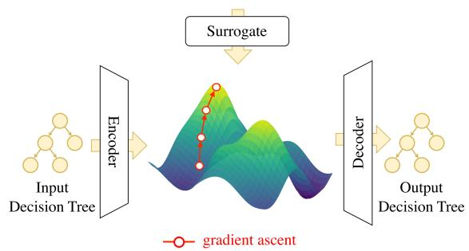
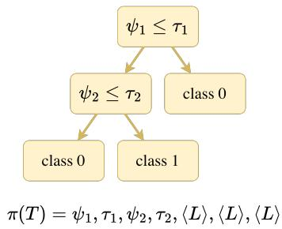
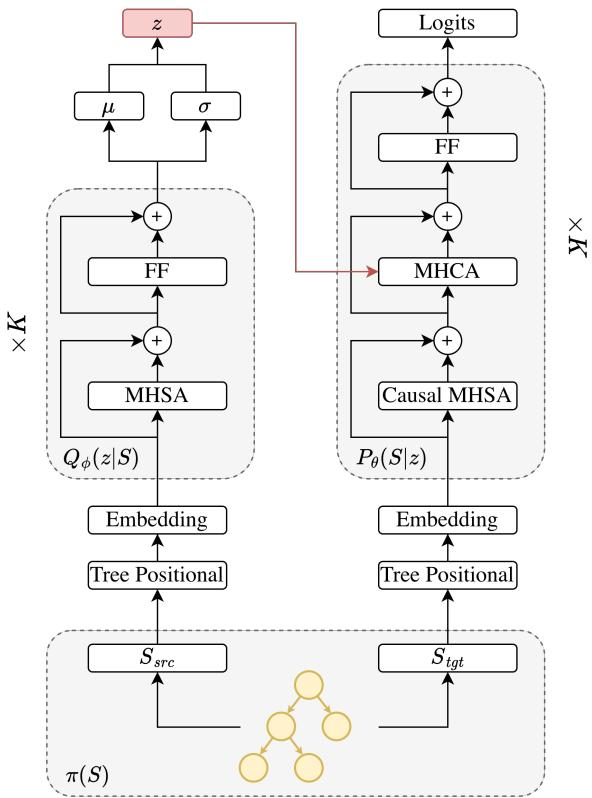
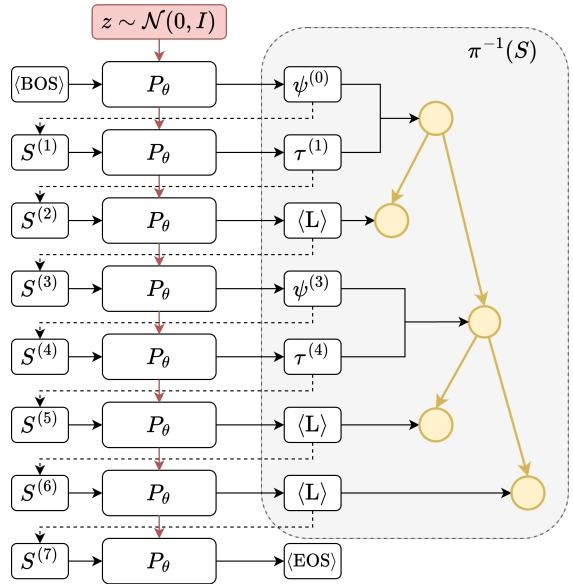
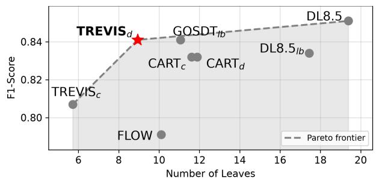
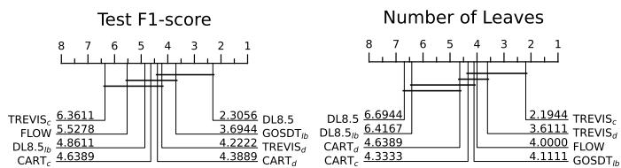
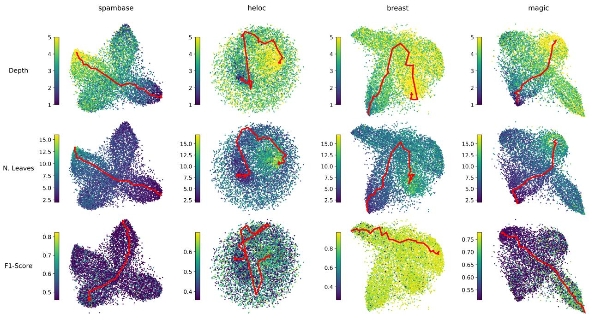
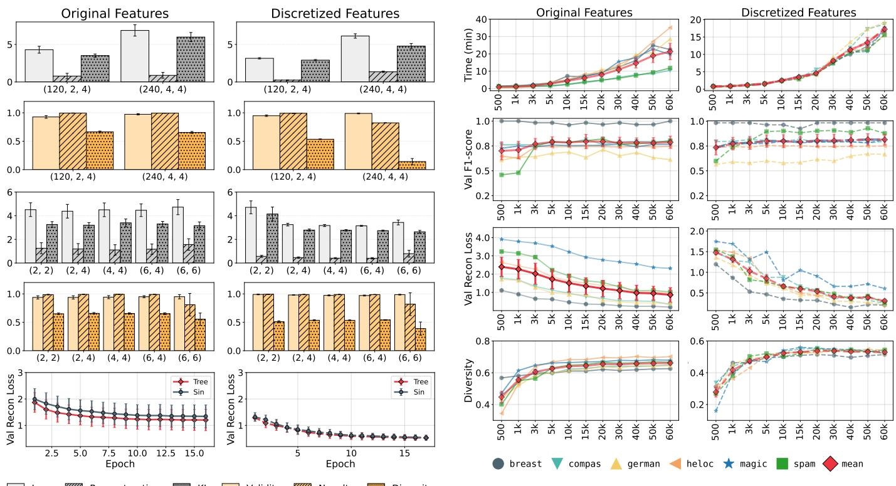

# Learning Sparse Decision Trees via Transformer Variational Auto-Encoders

Giacomo Fidone University of Pisa giacomo.fidone@phd.unipi.it

Alessio Cascione University of Pisa alessio.cascione@phd.unipi.it

Riccardo Guidotti   
University of Pisa   
ISTI-CNR   
riccardo.guidotti@unipi.it

Abstract—Decision trees are among the most widely used models in machine learning, largely due to their transparent decision logic, making them well-suited for high-stakes decisionmaking contexts. However, most existing learning algorithms focus on predictive performance, overlooking the joint optimization of other desirable properties, such as structural sparsity. In this work we propose TREVIS, an approach for learning decision trees with respect to complex objectives, based on the exploration of the latent space of a Tree Transformer Variational Auto-Encoder (TTVAE). By mapping decision trees onto latent representations, TREVIS replaces the discrete search space with a continuous one, enabling gradient-based optimization via a differentiable surrogate model. We experiment with TREVIS for learning decision trees that jointly optimize predictive performance and sparsity. Results show that TREVIS discovers decision trees matching the predictive performance of existing nearoptimal algorithms while improving their structural sparsity.

Index Terms—Interpretable Machine Learning, Decision Tree, Transformer, Variational Auto-Encoders

## I. INTRODUCTION

Machine Learning (ML) models are increasingly deployed in high-stakes decision-making contexts such as credit risk assessment, hiring, and healthcare [1]–[3]. Despite their strong predictive capabilities, many ML models rely on uninterpretable architectures compromising safety and accountability [4]. Given their hierarchical, rule-based structure, Decision Trees (DTs) [5] stand out as one of the few interpretable-bydesign models and remain a standard for tabular data [6].

However, learning optimal DTs is intractable for the combinatorial size of the discrete search space, which grows exponentially with the number of features and training instances [7]. Consequently, algorithms for learning DTs only explore a small region of this space. The most common ones, namely CART, ID3, and C4.5 [8], rely on a top-down greedy strategy that, while computationally efficient, typically yields suboptimal solutions. In contrast, algorithms seeking globally optimal DTs incur prohibitive computational costs [9], [10].

  
Fig. 1. TREVIS learns a latent space of Decision Trees via a Tree Transformer Variational Auto-Encoder. Then, it leverages gradient-ascent to find latent representations maximizing desired properties predicted by a surrogate model.

Beyond the performance-efficiency trade-off, most learning algorithms typically focus on optimizing predictive performance, with little or no account for other desirable properties [11]. Notably, the interpretability of a DT depends on its structural sparsity, namely on how simple the tree topology is in terms of depth and the number of nodes and leaves [12]. Additionally, a DT may be required to ensurefairness w.r.t. one or more protected attributes [13], preserve privacy by masking sensitive information from possible adversarial attacks [14] or display robustness to noisy input examples [15]. A promising alternative to existing DT learning algorithms is to embed the discrete space of DTs into a smoother, continuous latent space. This makes exploration more efficient and enables the optimization of complex objectives via black-box or gradientbased methods, as previously demonstrated for other graphstructured domains [16], [17]. Following this line of research, we propose a framework for learning Tree REpresentations from Variational Inference in latent Space (TREVIS). As shown in Figure 1, TREVIS learns a continuous latent space of DTs via a Tree Transformer Variational Auto-Encoder (TTVAE). Then, it leverages a differentiable surrogate model for jointly estimating desired properties and discovering optimal latent tree representations with gradient ascent.

In this work, we evaluate the ability of TREVIS to generate DTs that balance two competing properties: predictive performance and structural sparsity. This trade-off is central to DT learning, as more complex DTs can improve performance, but often at the expense of interpretability. We leave to future work the extension of TREVIS to more complex objectives including fairness, privacy and robustness. Our results show that TREVIS learns a locally smooth latent space with identifiable directions capturing DT properties. This enables TREVIS to effectively navigate the latent space and find DTs with predictive performance comparable to that of near-optimal DT learning algorithms, while improving structural sparsity.

The rest of the paper is organized as follows. In Section II, we review related works. In Section III, we formalize our proposal. In Section IV, we report experimental setting and results. Finally, in Section V we summarize our contributions and detail future research directions.

## II. RELATED WORKS

We review related works on DT learning algorithms, Latent Space Optimization (LSO) via Variational Auto-Encoders (VAEs) and transformer-based models for tree-structured data.

Decision Tree Learning. Traditional methods for learning DTs rely on greedy top-down approaches, recursively partitioning data to minimize impurity measures [5], [18]. While efficient, these approaches are prone to overfitting and attribute selection bias [19], [20]. To address their limitations, optimal tree learning methods based on mathematical programming have been proposed, although their computational cost is often prohibitive [9], [21]. As a compromise, recent work has explored methods for learning near-optimal DTs, including mathematical programming solvers, dynamic-programming and branch-and-bound techniques, and metaheuristic search [22]– [25]. Some of these approaches further control tree complexity through explicit structural regularization [26], [27]. In contrast, TREVIS learns a continuous latent space in which DTs can be explored and optimized. To the best of our knowledge, [28] is the only prior generative approach to DT learning. However, it applies convolutions on a matrix encoding of DTs, which is less expressive for tree-structured data; and uses a sampleinefficient black-box optimization. In contrast, TREVIS relies on a transformer-based VAE explicitly capturing tree structure and leverages efficient gradient-based optimization to discover optimal DTs in latent space.

Latent Space Optimization. VAEs [29] are widely used for generative modeling and representation learning [30], [31], due to their capability of learning structured latent spaces that can be navigated for controlled data generation. Building on this property, LSO optimizes latent representations based on a target objective by using black-box or gradient-based methods [32]. Recent works have explored the use of LSO on structured data. For example, [17], [33] propose VAEs for learning latent vectors of molecules, enabling the discovery of new compounds with desired chemical properties. Related approaches have also been proposed for directed acyclic graphs [16], [34], targeting tasks such as neural architecture search and Bayesian network optimization. LSO techniques range from gradient-based methods based on surrogate models, such as sparse Gaussian processes with expected improvement [17], [35], [36], to black-box heuristic approaches, including genetic algorithms [28] and interpolation strategies [37]. Unlike existing approaches for learning DTs through

LSO [28], our proposal leverages optimization via surrogate models, enabling the use of gradients and making exploration more efficient by avoiding expensive black-box evaluations.

Tree Transformers. Although transformers were originally designed for sequential data [38], they can be easily adapted on various domains, including graphs [39], [40] and trees [41]. Trees are typically represented as linear sequences of tokens obtained through depth-first or breadth-first traversals [42], [43]. A key challenge lies in encoding tree structure through suitable positional representations. Early approaches introduce absolute positional embeddings based on root-to-node paths [42], later extended to arbitrarily deep trees and enriched with relative attention biases [44]. Other methods combine path-based encoding with recurrent mechanisms [45] or design embeddings capturing depth and sibling relations coupled with attention masking [46]. Tree Transformers have been applied across different tasks, such as code summarization [43], dependency parsing [47], and molecular modeling [48].

Following these lines of research, we propose a Tree Transformer Variational Auto-Encoder (TTVAE) where DTs are encoded as linear sequences of tokens in depth-first order and structural information is represented with tree absolute positional embeddings from [42].

## III. METHODOLOGY

In this section, we present TREVIS, a method for learning Tree REpresentations from Variational Inference in latent Space. In the following, we first describe how DTs are represented as linear sequences of tokens enriched with tree structural information. We then detail our Tree Transformer Variational Auto-Encoder (TTVAE) architecture, which is used to learn a latent space of DTs from such representations. Finally, we explain how the learned latent space can be navigated by optimizing a differentiable surrogate model with gradient ascent. The overall procedure of TREVIS is summarized in Algorithm 1, which is detailed in the subsequent sections.

## A. Tree Linearization

Tokenization. Let $( \mathcal { X } , \mathcal { Y } ) = \{ ( x _ { i } , y _ { i } ) \} _ { i = 1 } ^ { n }$ be a labeled training dataset, where $x _ { i } \in \mathcal { X } \subseteq \mathbb { R } ^ { m }$ denotes an instance and $y _ { i } ~ \in ~ \mathcal { y } ~ = ~ \{ 1 , \ldots , C \}$ its class label. Given a maximum depth $\gamma \in \mathbb { N } ,$ , we denote by $\tau$ the set of all binary DTs of depth at most $\gamma$ that can be constructed from $( \mathcal { X } , \mathcal { Y } )$ . Since computing $\tau$ is intractable, different approaches might be used to identify or enumerate a constrained subset $\mathcal { T } ^ { \prime } \subseteq \mathcal { T }$ e.g., to approximate the Rashomon set of similarly performing DTs [49], [50]. We detail in Section IV the specific strategy adopted in our implementation to build $\tau ^ { \prime }$

For any DT $T \in { \mathcal { T } } .$ , each internal node applies a binary split defined by a pair $( \psi , \tau )$ , where $\psi$ denotes one of the m features in $\mathcal { X }$ and $\tau \in \mathbb { R } :$ a threshold value. We define an invertible encoding function $\pi : \mathcal T \to S$ such that, given a tree $T \in { \mathcal { T } } , \pi ( T )$ is a linear sequence of tokens $S \in { \mathcal { S } }$ obtained through a depth-first pre-order traversal of $T .$ . Specifically, each visited node $j$ is encoded as: (i) a pair of consecutive tokens $( \psi _ { j } , \tau _ { j } )$ , where $\psi _ { j }$ represents the feature and $\tau _ { j }$ its threshold, if j is non-terminal; (ii) a special token ⟨L⟩, if j is terminal.

```latex
Algorithm 1 TREVIS $( \mathcal { T } , \lambda , n ^ { \prime } )$
Require: $\tau$ set training trees, λ sparsity regularization, $n ^ { \prime }$
number of latent samples, η learning rate
Ensure: $T ^ { * }$ optimized decision tree
1: $S \gets \{ \pi ( T ) | T \in \mathcal { T } \}$ ▷ linearize trees
2: $Q _ { \phi } ( z | \pi ( T ) ) , P _ { \theta } ( \pi ( T ) | z )  f t { t \_ t t \nu a e } ( S )$ ▷ fit TTVAE
3: ${ \mathcal { Z } }  \{ Q _ { \phi } ( z | S ) \mid S \in S ) \}$ ▷ get train latent
4: $r  \{ J _ { \lambda } ( T ) \mid T \in \mathcal { T } \}$ ▷ evaluate fitness
5: $g  \mathit { f i t } _ { - }$ surrogate $( \mathcal { Z } , r )$ ▷ fit surrogate
6: $\mathcal { Z } ^ { \prime }  \{ z _ { i } \sim \mathcal { N } ( 0 , I ) \mid \forall i = 1 , \ldots , n ^ { \prime } \}$ ▷ sample latent
7: for $z \in \mathcal { Z } ^ { \prime }$ do ▷ for each latent
8: repeat ▷ iterate
9: $z \gets z + \eta \nabla _ { z } g ( z )$ ▷ gradient ascent
10: until stop condition ▷ terminate
11: $\hat { \mathcal { T } }  \{ \pi ^ { - 1 } ( P _ { \theta } ( z ) ) \mid z \in \mathcal { Z } ^ { \prime } \}$ ▷ decode trees
12: $T ^ { * } \gets \arg \operatorname* { m a x } _ { T \in \hat { T } } J _ { \lambda } ( T )$ ▷ select best
13: return $T ^ { * }$
```

This design choice is motivated by two reasons. First, unlike other works [51], we avoid modeling $\tau _ { j }$ as real-valued thresholds, e.g., by using linear projections in place of embeddings, as the full domain R would unnecessarily enlarge the search space. Indeed, let $v _ { j } ^ { ( 1 ) } < v _ { j } ^ { ( 2 ) } < \ldots < v _ { j } ^ { ( \check { n } ) }$ denote the sorted values of a feature $\psi _ { j }$ . For any consecutive pair $v _ { j } ^ { ( l ) } , v _ { j } ^ { ( l + 1 ) }$ every threshold $\tau \in \bar { [ v _ { j } ^ { ( l ) } , v _ { j } ^ { ( l + 1 ) } ) }$ yields the same partition on X. Second, we do not need to represent predictions at terminal nodes, as they can be inferred with the majority class of the examples reaching that node. As a consequence of the first point, to provide a complete set of thresholds representing all possible partitions on $x ,$ it is sufficient to consider only one canonical value for each possible interval $[ v ^ { ( l ) } , v ^ { ( l + 1 ) } \big )$ While traditional algorithms select the midpoints between consecutive values [5], in our setting this is impractical, as it would significantly increase the size of the vocabulary. Instead, we select as canonical value the left endpoint of such interval $( v ^ { ( l ) } )$ , so that threshold tokens in the vocabulary are restricted to values in X. To further reduce the vocabulary size, we round such values to a pre-defined floating precision.

Overall, our vocabulary of tokens can be restricted to: (i) feature names; (ii) all the distinct values in $x ,$ except for the maximum value of each feature, approximated to a predefined floating precision; (iii) special tokens, i.e., ⟨L⟩, along with those generally employed in transformer architectures: ⟨CLS⟩, ⟨BOS⟩, ⟨EOS⟩, ⟨UNK⟩ [52], [53]. Figure 2 illustrates an example of tokenization of a DT, where π first gathers tokens from the root $( \psi _ { 1 } , \tau _ { 1 } )$ , then from the left subtree $( \psi _ { 2 } , \tau _ { 2 } , \langle \mathrm { L } \rangle , \langle \mathrm { L } \rangle )$ , and finally from the right subtree (⟨L⟩).

Positional Encoding. Transformer-based architectures leverage Self-Attention (SA) to model dependencies among input tokens (Eq. 1). However, SA is permutation-invariant and does not inherently encode the structure of the input. The most common solution to inject positional information is through absolute positional embeddings [38], added to or concatenated with token embeddings. To properly represent the hierarchical structure of DTs, we add to token embeddings the absolute tree positional embeddings proposed in [42], where the position of each token at node $j$ is represented by a vector of stacked onehot chunks encoding the path from the root to $j ,$ with each level scaled according to a geometric series. We show the effectiveness of tree positional embeddings in Section IV-D.

  
Fig. 2. Example of DT tokenization. The tree is traversed in depth-first preorder. Each non-terminal node is represented with two consecutive tokens, one for the selected feature $( \psi _ { j } )$ and one for its threshold $( \tau _ { j } )$ . Each terminal node is represented with a special token ⟨L⟩.

Thus, as outlined in Algorithm 1, TREVIS takes as input a set $\tau$ of binary DTs with maximum depth γ built on (X , Y) and linearize them through π (Alg. 1, line 1).

## B. Tree Transformer Variational Auto-Encoder

Then, TREVIS leverages our proposed TTVAE to learn a latent space of DTs in T (Alg. 1, line 2). VAEs generate data from a latent variable z according to a conditional distribution $p ( x | z )$ [29]. Since the true posterior is generally intractable, VAEs rely on variational inference and introduce an approximate posterior $q ( z | x ) \approx p ( z | x )$

A full representation of the proposed TTVAE is provided in Figure 3. It consists of an encoder $\scriptstyle Q _ { \phi } ( z | \pi ( T ) )$ parametrized by $\phi ,$ modeling $p ( z | \pi ( T ) )$ ; and a decoder $P _ { \theta } ( \pi ( T ) | z )$ parametrized by θ, modeling $p ( \pi ( T ) | z )$ . Both components leverage the transformer architecture [38], which process the input sequence $\pi ( T ) = S$ through K stacked transformer blocks. Each block comprises a Multi-Head Self-Attention (MHSA) sub-layer, defined as:

$$
S A _ { i } ( S ) = S o f t m a x \left( \frac { ( S W _ { Q } ^ { i } ) ( S W _ { K } ^ { i } ) ^ { \top } } { \sqrt { d _ { k } } } \right) S W _ { V } ^ { i }\tag{1}
$$

$$
M H S A ( S ) = C o n c a t ( S A _ { 1 } ( S ) , \ldots , \mathbf { S A } _ { h } ( S ) ) W _ { O } ,\tag{2}
$$

where $W _ { Q } ^ { i } \in \mathbb { R } ^ { k \times d _ { k } } , \ W _ { K } ^ { i } \ \in \ \mathbb { R } ^ { k \times d _ { k } }$ , and $W _ { V } ^ { i } \in \mathbb { R } ^ { k \times d _ { v } }$ are the query, key, and value projection matrices for the i-th head, respectively; $W _ { O } \in \mathbb R ^ { h d _ { v } \times k }$ is the output projection matrix; and k is the embedding size. The MHSA sub-layer is followed by a Feed-Forward (FF) sub-layer, and both are equipped with residual skip connections and layer normalization.

The encoder and the decoder operate on two distinct versions of the input sequence $S .$ For the encoder, we use $S$ prepended with the ⟨CLS⟩ token $( S _ { s r c } ) ;$ ; while for the decoder, we used a shifted version of S delimited by ⟨BOS and ⟨EOS⟩ tokens $( S _ { t g t } )$ . Additionally, for the decoder the standard MHSA is replaced with Causal MHSA, masking future positions to enforce autoregressive factorization [38].

  
Fig. 3. TTVAE architecture. Each training tree is linearized into a source $( S _ { s r c } )$ and a target $( S _ { t g t } )$ sequence, which are projected onto positional and token embeddings. At training time, the encoder computes µ and σ. The latent representation z is sampled via the reparametrization trick and a distinct linear projection is injected into each decoder layer via MHCA. Both encoder and decoder have K layers (transformer blocks).

The encoder generates the latent mean $\mu$ and variance σ as linear projections of the ⟨CLS⟩ final hidden state. The latent representation z is sampled via the reparameterization trick:

$$
z = \mu + \sigma \odot \epsilon , \qquad \epsilon \sim \mathcal { N } ( 0 , I ) ,
$$

enabling the flow of gradients; then it is projected onto each decoder block and injected through a Multi-Head Cross-Attention (MHCA) sub-layer:

$$
\begin{array} { r l } & { z _ { l } = z W _ { l } } \\ & { { \bf C A } _ { i } ( H , z _ { l } ) = \mathrm { S o f t m a x } \left( \frac { ( H W _ { Q } ^ { i } ) ( z _ { l } W _ { K } ^ { i } ) ^ { \top } } { \sqrt { d _ { k } } } \right) z _ { l } W _ { V } ^ { i } } \\ & { { \bf M H C A } ( H , z _ { l } ) = { \bf C o n c a t } \left( { \bf C A } _ { 1 } ( H , z _ { l } ) , \ldots , { \bf C A } _ { h } ( H , z _ { l } ) \right) W _ { O } , } \end{array}
$$

with H denoting the decoder hidden states and $W _ { l }$ a layerspecific projection matrix.

We train the TTVAE on linearized DTs S (Alg. 1, line 2) to maximize a weighted Evidence Lower Bound (β-ELBO):

$$
\mathbb { E } _ { Q _ { \phi } ( z | S ) } \left[ \log P _ { \theta } ( S | z ) \right] - \beta D _ { \mathrm { K L } } \left( Q _ { \phi } ( z | S ) \| p ( z ) \right)
$$

  
Fig. 4. Autoregressive generation of a DT. Given a latent representation $z \sim \mathcal { N } ( 0 , I )$ and the ⟨BOS⟩ token, the decoder iteratively generates tokens, appending each prediction to the input sequence until the ⟨EOS⟩ token is produced. The generated sequence is then mapped back to a DT through the inverse encoding function $\pi ^ { \frac { \cdot } { - 1 } } ( S )$

where $\beta \in \mathbb { R } ^ { + }$ controls the trade-off between reconstruction accuracy and latent-space regularization and can be scheduled during training to prevent the well-known problem of posterior collapse or $K L$ vanishing [54]. We assume the prior to be $p ( z ) = \mathcal { N } ( 0 , I )$ , i.e., a Gaussian distribution with zero mean and identity covariance matrix.

At inference time, generation is performed autoregressively by conditioning the decoder with a latent vector $z \sim \mathcal { N } ( 0 , I )$ and the so-far generated tokens:

$$
P _ { \theta } ( S | z ) = \prod _ { t = 1 } ^ { l } P _ { \theta } ( S ^ { ( t ) } \mid S ^ { < ( t ) } , z )
$$

until a termination condition is met, i.e., the generation of the ⟨EOS⟩ token. For ease of notation, we will denote autoregressive generation simply as $P _ { \theta } ( z )$

In Figure 4 we show an example of autoregressive generation. Here, the latent vector z is sampled from the prior $\mathcal { N } ( 0 , I )$ . Starting from the ⟨BOS⟩ token, at each step i the decoder generates the next token, which is appended to the input $S ^ { ( \bar { i } + 1 ) }$ for the next step, until termination, i.e., the generation of ⟨EOS⟩ token. Once generation is completed, we use the inverse encoding function $\pi ^ { - 1 } ( S )$ to map the generated sequence $S$ to the correspondent DT.

## C. Latent Space Optimization via Surrogate Model

After training the TTVAE, TREVIS leverages its latent space $\mathcal { Z }$ to search for latent representations of DTs that optimize a given objective function. Although TREVIS is agnostic to its optimization objective, in this work we leverage it to search for DTs that balance structural sparsity and predictive performance. Therefore, given a DT T and a sparsity hyperparameter λ, we define our optimization objective J as:

$$
J _ { \lambda } ( T ) = A ( T ; \mathcal { X } _ { \mathrm { t r } } , \mathcal { Y } _ { \mathrm { t r } } ) - \lambda V ( T ) ,
$$

where we assume $A ( T ; \mathcal { X } _ { \mathrm { t r } } , \mathcal { Y } _ { \mathrm { t r } } )$ to be the weighted F1-score of $T$ on training data $( { \mathcal { X } } _ { \mathrm { t r } } , { \mathcal { Y } } _ { \mathrm { t r } } ) ;$ while $V ( T )$ is the number of leaves of T and λ controls the strength of the sparsity penalty. While the objective is defined on trees, search is performed in the latent space. For a latent vector z, the corresponding tree is $P _ { \theta } ( z )$ , and its objective value is $J _ { \lambda } ( P _ { \theta } ( z ) )$ ). We evidence that $J _ { \lambda } ( P _ { \theta } ( z ) )$ is not differentiable. A possible solution is to leverage black-box optimization algorithms [28], which, however, are sample-inefficient. In contrast, we use a surrogate differentiable model $g : { \mathcal { Z } } $ R to approximate $J _ { \lambda } ( P _ { \theta } ( z ) )$ e.g., a Multi-Layered Perceptron (MLP) or a linear model. This allows us to perform gradient-based optimization and improve the efficiency of latent-space exploration. The surrogate model is trained on the latent representations of the training trees $\mathcal { Z }$ to predict their correspondent objective value as response r (Alg. 1, lines 3-5). Given a set of $n ^ { \prime }$ initial latent solutions $\mathcal { Z } ^ { \prime } = \{ z _ { i } \sim \mathcal { N } ( 0 , I ) ~ | ~ \forall i = 1 , \ldots , n ^ { \prime } \}$ (Alg. 1, line 6), we exploit the gradient of $g$ to identify regions of the latent space that maximize the objective. This is achieved by iteratively updating each latent representation according to $z  z +$ $\eta \nabla _ { z } g ( z )$ (see Alg. 1, lines 7–10), where η is the learning rate. The final optimized latent vectors with the highest surrogatepredicted objective values are then decoded into DT candidates and evaluated using the true objective $J _ { \lambda } ( P _ { \theta } ( z ) )$ (Alg. 1, line 11). Among the valid decoded candidates, we select the DT with the highest true objective value (Alg. 1, line 12).

## IV. EXPERIMENTS

We experiment with TREVIS to evaluate its ability to optimize the performance-sparsity trade-off of DTs. In the following, we describe the experimental setting (Section IV-A) and compare TREVIS against existing DT learning algorithms (Section IV-B). We also analyze the quality of the latent space (Section IV-C) and report a sensitivity analysis with measures for evaluating TTVAE generation (Section IV-D)<sup>1</sup>.

## A. Experimental Setting

Datasets. We evaluate TREVIS on 18 benchmark datasets selected to cover a diverse range of sample sizes, feature types and numbers of classes. After removing instances with missing values, each dataset is split into stratified training and test sets, denoted by $( \mathcal { X } _ { \mathrm { t r } } , \mathcal { Y } _ { \mathrm { t r } } )$ and $( \mathcal { X } _ { \mathrm { t s } } , \mathcal { Y } _ { \mathrm { t s } } )$ , using an 80/20% split. We further reserve 10% of the training data as a stratified validation set, $( \mathcal { X } _ { \mathrm { v l } } , \mathcal { Y } _ { \mathrm { v l } } )$ , used for hyperparameter selection. Categorical features are one-hot encoded, and all features are min-max scaled to the range [0, 1]. In addition to the original continuous feature space, we evaluate TREVIS on a discretized version obtained by using the strategy outlined in [27]. This discretization trades optimality w.r.t. the original feature space for a data representation that preserves theoretical and empirical guarantees relative to a reference Gradient Boosting Decision Tree ensemble (GBDT).

TABLE I  
DATASET SUMMARY: INSTANCES (n), FEATURES (m), CATEGORICAL ONE-HOT FEATURES (cat<sup>∗</sup>), DISCRETIZED FEATURES (cat<sup>∗</sup>), CLASSES (y), CLASS IMBALANCE, AND REFERENCE GBDT WEIGHTED F1-SCORE.
<table><tr><td>dataset</td><td>n</td><td>m</td><td>cat</td><td> $c a t ^ { * }$ </td><td>y</td><td> $\mathrm { m a j } ( \% )$ </td><td> $\operatorname* { m i n } ( \% )$ </td><td> $\mathrm { G B D T } _ { F 1 }$ </td></tr><tr><td>adult</td><td>12,211</td><td>90</td><td>84</td><td>44</td><td>2</td><td>76.07</td><td>23.93</td><td>.854</td></tr><tr><td>bank</td><td>45,211</td><td>36</td><td>30</td><td>48</td><td>2</td><td>88.30</td><td>11.70</td><td>.841</td></tr><tr><td>breast</td><td>683</td><td>9</td><td>0</td><td>24</td><td>2</td><td>65.01</td><td>34.99</td><td>.966</td></tr><tr><td>compas</td><td>4,534</td><td>14</td><td>7</td><td>57</td><td>2</td><td>83.08</td><td>16.92</td><td>.790</td></tr><tr><td>contr</td><td>1,473</td><td>9</td><td>3</td><td>23</td><td>2</td><td>57.30</td><td>42.70</td><td>.731</td></tr><tr><td>elect</td><td>45,312</td><td>8</td><td>0</td><td>52</td><td>2</td><td>57.55</td><td>42.45</td><td>.784</td></tr><tr><td>german</td><td>1,000</td><td>29</td><td>12</td><td>39</td><td>2</td><td>70.00</td><td>30.00</td><td>.775</td></tr><tr><td>heart</td><td>261</td><td>15</td><td>9</td><td>21</td><td>2</td><td>62.45</td><td>37.55</td><td>.856</td></tr><tr><td>heloc</td><td>10,459</td><td>23</td><td>0</td><td>55</td><td>2</td><td>52.19</td><td>47.81</td><td>.712</td></tr><tr><td>iris</td><td>150</td><td>4</td><td>0</td><td>9</td><td>3</td><td>33.33</td><td>33.33</td><td>.935</td></tr><tr><td>lrs</td><td>531</td><td>100</td><td>0</td><td>68</td><td>9</td><td>51.98</td><td>0.38</td><td>.876</td></tr><tr><td>magic</td><td>19,020</td><td>10</td><td>0</td><td>106</td><td>2</td><td>64.84</td><td>35.16</td><td>.848</td></tr><tr><td>pol</td><td>15,000</td><td>48</td><td>0</td><td>27</td><td>2</td><td>66.39</td><td>33.61</td><td>.937</td></tr><tr><td>sonar</td><td>208</td><td>60</td><td>0</td><td>29</td><td>2</td><td>53.37</td><td>46.63</td><td>.768</td></tr><tr><td>spam</td><td>4,601</td><td>57</td><td>0</td><td>62</td><td>2</td><td>60.60</td><td>39.40</td><td>.922</td></tr><tr><td>steel</td><td>1,941</td><td>27</td><td>0</td><td>64</td><td>2</td><td>91.86</td><td>8.14</td><td>.923</td></tr><tr><td>stud</td><td>1,000</td><td>11</td><td>8</td><td>34</td><td>2</td><td>69.60</td><td>30.40</td><td>.877</td></tr><tr><td>wine</td><td>6,497</td><td>12</td><td>0</td><td>84</td><td>2</td><td>75.39</td><td>24.61</td><td>.991</td></tr></table>

In this way, we reduce the potentially large search space by restricting candidate splits to those that are likely to be more informative, while also lowering the cost of TREVIS due to a smaller vocabulary size. In Table I, we summarize datasets information and report test performance of the GBDT.

Tree Datasets. For each training set $( \mathcal { X } _ { \mathrm { t r } } , \mathcal { Y } _ { \mathrm { t r } } )$ and for both its original and discretized version, we build four disjoint collections of DTs, denoted by $\mathcal { T } _ { \mathrm { t r } } , ~ \mathcal { T } _ { \mathrm { v l } } , ~ \mathcal { T } _ { \mathrm { t s } } .$ , and $\mathcal { T } _ { \mathrm { e s } }$ , which are used for training, validation, testing, and early stopping of TTVAE, respectively. As anticipated in Section III, these are subsets of $\tau$ . In our implementation, each of them includes DTs built using randomized splits over the admissible featurethreshold pairs of $( \mathcal { X } _ { \mathrm { t r } } , \mathcal { Y } _ { \mathrm { t r } } )$ with random depth $\gamma \in [ 1 , 5 ]$ to restrict search over DTs whose complexity remains within an interpretable range [12]. Each collection contains 20,000 DTs. As shown in Section IV-D, this $\mathcal { T } _ { \mathrm { t r } }$ size is sufficient for TTVAE to achieve strong generation quality.

Model Configurations. As TTVAE architecture we use $K = 2$ blocks for both encoder and decoder. We set the embedding size as $k ~ = ~ 1 2 0$ . Both MHSA and MHCA sub-layers use H = 2 heads. We set the FF with two layers of size 4×k with ReLU activation. We set to $k / 2 = 6 0$ the dimensionality of the latent space, i.e., $\mu , \sigma$ and z. This configuration is motivated by the results of our sensitivity analysis (Section IV-D). All TTVAE instances are trained with learning rate $1 0 ^ { - 3 }$ for at most 50 epochs, using early stopping on the β-ELBO loss computed on $\tau _ { \mathrm { e s } } .$ , with patience 1 and minimum improvement 0.1. To prevent KL collapse, $\beta$ is set to zero for the first 10 epochs and then linearly increased until convergence, following prior work [55]. We also employ free bits [56] to lower-bound the KL contribution of each latent dimension.

TABLE II  
WEIGHTED F1-SCORE AND NUMBER OF LEAVES ACROSS DATASETS AND METHODS. FOR F1-SCORE, BEST VALUES ARE IN BOLD AND SECOND-BEST VALUES ARE IN ITALICS. FOR LEAVES, LOWEST VALUES ARE IN BOLD AND SECOND-LOWEST VALUES ARE IN ITALICS.
<table><tr><td rowspan="2"></td><td colspan="8">Weighted F1-score ↑</td><td colspan="8">Number of Leaves ↓</td></tr><tr><td>TREVISc</td><td>CARTc</td><td>TREVISd</td><td> $\mathrm { C A R T } _ { d }$ </td><td>DL8.5</td><td> $\mathrm { D L } 8 . 5 _ { l b }$ </td><td> $\mathrm { G O S D T } _ { l b }$ </td><td>FLOW</td><td>|TREVISc</td><td> $\mathbf { C A R T } _ { c }$ </td><td>TREVISd</td><td> $\mathrm { C A R T } _ { d }$ </td><td>DL8.5 DL8</td><td> $. 5 _ { l b }$ </td><td>GOSDTlb</td><td>FLOW</td></tr><tr><td>adult</td><td>.814</td><td>.847</td><td>.836</td><td>.847</td><td>.859</td><td>.851</td><td>.855</td><td>.746</td><td>5</td><td>13</td><td>4</td><td>14</td><td>32</td><td>30</td><td>12</td><td>11</td></tr><tr><td>bank</td><td>.841</td><td>.850</td><td>.851</td><td>.850</td><td>.859</td><td>.840</td><td>.844</td><td>.828</td><td>6</td><td>24</td><td>11</td><td>14</td><td>15</td><td>10</td><td>10</td><td>1</td></tr><tr><td>breast</td><td>.942</td><td>.944</td><td>.964</td><td>.944</td><td>.965</td><td>.934</td><td>.965</td><td>.956</td><td>9</td><td>4</td><td>7</td><td>7</td><td>6</td><td>9</td><td>4</td><td>12</td></tr><tr><td>compas</td><td>.770</td><td>.799</td><td>.795</td><td>.789</td><td>.805</td><td>.791</td><td>.792</td><td>.772</td><td>8</td><td>5</td><td>13</td><td>8</td><td>16</td><td>23</td><td>20</td><td>2</td></tr><tr><td>contr</td><td>.666</td><td>.702</td><td>.696</td><td>.707</td><td>.677</td><td>.672</td><td>.677</td><td>.709</td><td>10</td><td>12</td><td>16</td><td>12</td><td>25</td><td>16</td><td>15</td><td>21</td></tr><tr><td>elec</td><td>.712</td><td>.753</td><td>.772</td><td>.752</td><td>.811</td><td>.784</td><td>.792</td><td>.766</td><td>6</td><td>5</td><td>7</td><td>7</td><td>24</td><td>16</td><td>12</td><td>6</td></tr><tr><td>german</td><td>.672</td><td>.631</td><td>.749</td><td>.580</td><td>.774</td><td>.774</td><td>.755</td><td>.760</td><td>10</td><td>14</td><td>8</td><td>6</td><td>8</td><td>8</td><td>7</td><td>14</td></tr><tr><td>heart</td><td>.829</td><td>.816</td><td>.827</td><td>.836</td><td>.798</td><td>.747</td><td>.780</td><td>.815</td><td>5</td><td>10</td><td>8</td><td>12</td><td>15</td><td>14</td><td>9</td><td>13</td></tr><tr><td>heloc</td><td>.684</td><td>.684</td><td>.702</td><td>.697</td><td>.707</td><td>.708</td><td>.711</td><td>.381</td><td>2</td><td>2</td><td>8</td><td>18</td><td>16</td><td>15</td><td>18</td><td>4</td></tr><tr><td>iris</td><td>.966</td><td>.966</td><td>.966</td><td>.966</td><td>.966</td><td>.935</td><td>.966</td><td>.966</td><td>4</td><td>4</td><td>4</td><td>4</td><td>4</td><td>6</td><td>4</td><td>4</td></tr><tr><td>lrs</td><td>.663</td><td>.797</td><td>.815</td><td>.825</td><td>.776</td><td>.753</td><td>.815</td><td>.804</td><td>7</td><td>14</td><td>11</td><td>11</td><td>30</td><td>29</td><td>13</td><td>25</td></tr><tr><td>magic</td><td>.741</td><td>.819</td><td>.792</td><td>.821</td><td>.844</td><td>.840</td><td>.794</td><td>.510</td><td>5</td><td>17</td><td>10</td><td>18</td><td>29</td><td>26</td><td>5</td><td>1</td></tr><tr><td>poi</td><td>.897</td><td>.947</td><td>.937</td><td>.945</td><td>.960</td><td>.934</td><td>.950</td><td>.958</td><td>4</td><td>14</td><td>10</td><td>11</td><td>21</td><td>25</td><td>8</td><td>14</td></tr><tr><td>sonar</td><td>.798</td><td>.772</td><td>.810</td><td>.764</td><td>.802</td><td>.802</td><td>.779</td><td>.685</td><td>5</td><td>14</td><td>9</td><td>14</td><td>15</td><td>15</td><td>14</td><td>8</td></tr><tr><td>spam</td><td>.808</td><td>.898</td><td>.873</td><td>.891</td><td>.923</td><td>.897</td><td>.907</td><td>.842</td><td>3</td><td>21</td><td>10</td><td>23</td><td>32</td><td>14</td><td>14</td><td>9</td></tr><tr><td>steel</td><td>.898</td><td>.905</td><td>.906</td><td>.915</td><td>.923</td><td>.916</td><td>.916</td><td>.903</td><td>6</td><td>7</td><td>8</td><td>12</td><td>14</td><td>15</td><td>18</td><td>23</td></tr><tr><td>stud</td><td>.888 .943</td><td>.862 .983</td><td>.864</td><td>.867</td><td>.867</td><td>.846</td><td>.855</td><td>.864</td><td>4</td><td>12</td><td>9</td><td>12</td><td>27</td><td>29</td><td>10</td><td>8</td></tr><tr><td>wine</td><td></td><td></td><td>.976</td><td>.982</td><td>.993</td><td>.984</td><td>.983</td><td>.979</td><td>4</td><td>17</td><td>8</td><td>11</td><td>20</td><td>14</td><td>6</td><td>6</td></tr><tr><td>avg</td><td>.807</td><td>.832</td><td>.841</td><td>.832</td><td>.851</td><td>.834</td><td>.841</td><td>.791</td><td>5.72</td><td>11.61</td><td>8.94</td><td>11.89</td><td>19.39</td><td>17.44</td><td>11.06</td><td>10.11</td></tr><tr><td>std</td><td>.102</td><td>.100</td><td>.085</td><td>.105</td><td>.091</td><td>.087</td><td>.091</td><td>.156</td><td>2.30</td><td>6.16</td><td>2.86</td><td>4.69</td><td>8.72</td><td>7.63</td><td>4.9</td><td>7.28</td></tr></table>

We implement the surrogate regressor g as a MLP with a 128-sized fully-connected hidden layer and tanh activation. The MLP is trained with MSE loss using learning rate $1 0 ^ { - 3 }$ weight decay $1 0 ^ { - 5 }$ and 100 training epochs. Then, we set to $n ^ { \prime } = 5 0 { , } 0 0 0$ the size of candidate latent samples ${ \mathcal { Z } } ^ { \prime } \ ( { \mathrm { A l g . } } $ 1, line 6). Each candidate is then optimized for 10 gradient ascent steps (Alg. 1, lines 7-10) with learning rate $\eta = 1 0 ^ { - 3 }$

Tree Selection. To simplify the selection of the best DT, we only decode the top-500 latent candidates $z _ { \mathbf { \varepsilon } } \in \mathbf { \varepsilon } _ { \mathcal { Z } ^ { \prime } }$ with highest surrogate scores (Alg. 1, line 11) and evaluate their true objective $J _ { \lambda } ( P _ { \theta } ( z ) )$ on the training set. The λ hyper-parameter can be tuned to balance its contribution in $J _ { \lambda }$ . To further control sparsity, we repeat the procedure described in Alg. 1, lines 4-13 for different values of λ. Specifically, we train a separate surrogate for each $\lambda \in$ $\{ 0 . 0 , 0 . 0 0 0 1 , 0 . 0 0 0 5 , 0 . 0 0 1 , 0 . 0 0 5 , 0 . 0 1 \}$ , resulting in six independent gradient-based optimization runs. Finally, we select the best DT across candidate values of λ as the one maximizing the weighted F1-score on $( \mathcal { X } _ { \mathrm { v l } } , \mathcal { Y } _ { \mathrm { v l } } )$

## B. Performance-Sparsity Trade-off

Competitors. We compare the best TREVIS-optimized DT against greedy and near-optimal DT learners. We denote by $\mathrm { T R E V I S } _ { c }$ and $\mathrm { T R E V I S } _ { d }$ the variants trained on the original continuous and discretized feature spaces, respectively. Competitors include CART trained on the same two data representations, denoted as $\mathbf { C A R T } _ { c }$ and $\mathrm { C A R T } _ { d } ,$ as well as FLOW, DL8.5, and $\mathrm { G O S D T _ { l b } , }$ which operate on discretized features only. $\mathrm { G O S D T _ { l b } }$ uses the lower-bound strategy of [27]; we also include $\mathrm { D L } 8 . 5 _ { \mathrm { l b } }$ , a version of DL8.5 using the same strategy. All near-optimal methods are run with a one-hour time limit<sup>2</sup>. As done for TREVIS, also for $\mathrm { G O S D T _ { l b } }$ we tune $\lambda \ \in \ \{ 0 . 0 0 0 1 , 0 . 0 0 0 5 , 0 . 0 0 1 , 0 . 0 0 5 , 0 . 0 1 \}$ and set the maximum depth to γ=5. We exclude λ=0.0 for $\mathrm { G O S D T _ { l b } }$ , in line with prior work [26], [27], as its bound-based pruning mechanism requires a positive regularization term to avoid prohibitively expensive search. For DL8.5 and CART models, we tune the min. leaf support over values of the form $\lceil \lambda | \mathcal { X } _ { \mathrm { t r } } | \rceil$ where $| \mathcal { X } _ { \mathrm { t r } } |$ is the number of training samples and λ ranges over the same grid adopted for TREVIS. For CART models, we also tune the cost-complexity $\alpha \in \{ 0 , 0 . 0 1 , 0 . 1 \}$ and maximum depth $\gamma \in \ \{ 2 , 3 , 4 , 5 \}$ . For DL8.5 and FLOW, we consider $\gamma \in \{ 3 , 4 , 5 \}$ . For FLOW, we fix $\lambda { = } 0 . 0 1$ due to computational constraints. We use the same hyperparameter ranges for models trained on continuous and discretized features.

  
Fig. 5. DT learning methods w.r.t. avg. weighted F1-score (y-axis) and number of leaves (x-axis). The dashed line denotes the Pareto frontier, identifying methods that jointly maximize predictive performance and minimize structural sparsity. Best methods are located in the upper-left corner.

  
Fig. 6. CD diagrams showing model rankings by test weighted F1-score (left) and number of leaves (right). Statistically indistinguishable models are connected. Best ranks on the right.

TABLE III  
SUMMARY OF TRAINING TIME IN SECONDS ACROSS DATASETS. FOR TREVIS<sub>c</sub>/TREVIS<sub>d</sub>, WE REPORT THE AVG. TIME OF TTVAE TRAINING, g TRAINING AND GRADIENT-BASED SEARCH.
<table><tr><td></td><td colspan="3">TREVISc</td><td colspan="4">TREVISd</td></tr><tr><td></td><td>TTVAE</td><td>g training</td><td>gradient</td><td>TTVAE</td><td></td><td>g training</td><td>gradient</td></tr><tr><td>avg</td><td>360.286</td><td>63.138</td><td>199.195</td><td>268.883</td><td></td><td>59.156</td><td>162.819</td></tr><tr><td>std</td><td>123.354</td><td>32.918</td><td>245.913</td><td>32.495</td><td></td><td>39.390</td><td>143.942</td></tr><tr><td colspan="2">TREVISc CARTc</td><td>TREVISd</td><td>CARTd</td><td>DL8.5</td><td>DL8.5lb</td><td>GOSDTlb</td><td>FLOW</td></tr><tr><td>avg</td><td>622.619</td><td>0.025</td><td>490.857</td><td>0.013</td><td>207.090</td><td>259.747 976.346</td><td>3437.446</td></tr><tr><td>std</td><td>264.063</td><td>0.029</td><td>146.449</td><td>0.017</td><td>718.019</td><td>847.323 1234.872</td><td>859.180</td></tr></table>

Results. We evaluate TREVIS by comparing the predictive performance and structural sparsity of optimized DTs against competitors. Predictive performance is measured by the weighted F1-score computed on $( \mathcal { X } _ { \mathrm { t s } } , \mathcal { Y } _ { \mathrm { t s } } )$ , while sparsity is measured by the number of leaves, as in prior work [28]. To obtain robust estimates of the weighted F1-score, we bootstrap each test set 200 times and report average results across resamples, following [60].

Table II reports the weighted F1-score and the number of leaves for each dataset and method, together with the corresponding average and standard deviation. In terms of predictive performance, TREVIS<sub>c</sub> underperforms CART, while still outperforming FLOW, which reaches the time limit on most datasets<sup>3</sup>. Conversely, $\mathrm { T R E V I S } _ { d }$ achieves the secondbest average performance, matching $\mathrm { G O S D T _ { l b } }$ and outperforming $\mathrm { D L } 8 . 5 _ { l b }$ . Regarding structural sparsity, both TRE-$\mathrm { V I S } _ { c }$ and $\mathrm { T R E V I S } _ { d }$ consistently yield simpler DTs than all competing methods, yielding the lowest average number of leaves. This reduction is particularly evident when compared to the best-performing DL8.5 and DL $. 8 . 5 _ { l b }$ approaches, which find the most complex solutions. Overall, $\mathrm { T R E V I S } _ { d }$ offers the best trade-off between predictive performance and structural sparsity<sup>4</sup>. This is better evidenced in Figure 5, providing a visual summary of the performance-sparsity trade-off across all methods. $\mathrm { T R E V I S } _ { d }$ lies in the upper-left region of the plot, indicating the most favorable balance between the two goals.

These findings are further supported by the Critical Difference (CD) plots [61] in Figure 6. Methods connected by a horizontal bar are not significantly different according to the Nemenyi test at $\alpha ~ = ~ 0 . 1$ , i.e., the null hypothesis of equal average ranks cannot be rejected. Overall, TREVIS achieves a better predictive performance ranking than $\mathrm { C A R T } _ { d }$ and remains statistically indistinguishable from the best nearoptimal learning methods, while attaining the best rank in terms of structural sparsity.

Table III reports the average training time of each method, together with the individual runtimes of the main TREVIS components. Overall, the total runtime of $\mathrm { T R E V I S } _ { c }$ and $\mathrm { T R E V I S } _ { d }$ is competitive with near-optimal tree-learning approaches, especially when compared to $\mathrm { G O S D T } _ { l b } ,$ , whose runtime increases on larger datasets. For more details about the quality of generated DTs under the selected TTVAE configuration $( k = 1 2 0 , K = 2 ,$ $H = 4 )$ , see Section IV-D.

## C. Latent Space Analysis

The effectiveness of TREVIS in discovering accurate DT representations relies on the capability of TTVAE to provide a structured latent space Z characterized by local smoothness and global coherence. Local smoothness ensures that the distance between two latent points $z , z ^ { \prime } \in { \mathcal { Z } }$ is proportional to their distance in the output space, i.e., similar latent points correspond to similar DTs. Global coherence implies the existence of directions in $\mathcal { Z }$ capturing relevant semantic properties of DTs. Moving along these directions should yield DTs that change gradually in the output space w.r.t. a given property. We present here a study on local smoothness and global coherence on six representative datasets, namely breast, german, compas, heloc, spam, and magic, which vary in terms of size, class imbalance and type of features.

Local smoothness. To measure local smoothness, we sample latent points $z \sim \mathcal { N } ( 0 , I )$ and compute perturbed counterparts as $z ^ { \prime } = z + \epsilon \sigma ,$ , where $\sigma \sim \mathcal { N } ( 0 , I )$ denotes Gaussian noise and $\epsilon \sim \mathcal { U } ( 0 , 1 )$ controls the magnitude of the perturbation. Larger values of ϵ increase the distance between z and $z ^ { \prime } .$ To measure the distance between the correspondent sequences $s = P _ { \psi } ( z )$ and $s ^ { \prime } = P _ { \psi } ( z ^ { \prime } )$ in the output space, we use the normalized edit distance. Local smoothness can be estimated as the Spearman correlation $\rho$ between ϵ and edit distances.

To obtain a relative measure of local smoothness, we also employ Triplet Accuracy (TA) [62]. Given an anchor $z _ { a } \sim$ $\mathcal { N } ( 0 , I )$ , we define positive and negative perturbations as $\sigma _ { p } \sim$ $\mathcal { N } ( 0 , I )$ and $\sigma _ { n } \sim \mathcal { N } ( 0 , I )$ . We define the positive example as $z _ { p } = z _ { a } + \epsilon \sigma _ { p } .$ To enforce dist $( z _ { p } , z _ { a } ) < d i s t ( z _ { n } , z _ { a } )$ , where $z _ { n }$ is the negative example and dist any distance measure, we introduce a weight $\alpha > 1$ such that $z _ { n } = z _ { a } + \alpha \epsilon \sigma _ { n } .$ Given triplets $S _ { t r } = \{ \langle s _ { a } = P _ { \psi } ( z _ { a } ^ { i } ) , s _ { p } = P _ { \psi } ( z _ { p } ^ { i } ) , s _ { n } =$ $P _ { \psi } ( z _ { n } ^ { i } ) \rangle \} _ { i = 1 } ^ { N }$ , we define TA as:

$$
\mathrm { T A } ( \mathcal { S } _ { t r } ) = \frac { 1 } { | \mathcal { S } _ { t r } | } \sum _ { i = 1 } ^ { | \mathcal { S } _ { t r } | } \mathbf { 1 } \left[ e ( s _ { a } ^ { i } , s _ { p } ^ { i } ) < e ( s _ { a } ^ { i } , s _ { n } ^ { i } ) \right] ,
$$

  
Fig. 7. UMAP projections of the latent space for four datasets (columns) colored according to DT properties (rows). Red lines denotes trajectories obtained by moving in the direction of the gradient of the correspondent surrogate.

TABLE IV  
LOCAL SMOOTHNESS CORRELATION (ρ) AND TRIPLET ACCURACY (TA).
<table><tr><td></td><td>spam</td><td></td><td></td><td>german heloc breast magic</td><td></td><td>compas</td><td> $\mathsf { a v g } \pm \mathsf { s t d }$ </td></tr><tr><td>ρ</td><td>.609</td><td>.629</td><td>.634</td><td>.685</td><td>.632</td><td>.652</td><td> $. 6 4 0 \pm . 2 4 0$ </td></tr><tr><td>TA</td><td>.686</td><td>.629</td><td>.750</td><td>.833</td><td>.512</td><td>.777</td><td> $. 6 9 8 \pm . 1 0 5$ </td></tr></table>

where e is the normalized edit distance. Intuitively, TA measures whether local neighborhoods in the latent space are preserved after decoding: higher values indicate that nearby latent points generate more similar outputs than farther ones.

In Table IV we report $\rho$ and TA (α = 2.0) computed on 1000 latent points (triplets) across datasets. We observe positive correlations (all p-values are below 0.05), proving that distances in the output space tend to increase consistently with distances between the corresponding latent points. This finding is further supported by positive TA scores, emphasizing how relative distances among neighboring latent points are largely preserved in the output space.

Global coherence. We train three instances of a surrogate Lasso $g _ { l a s s o } : \mathcal { Z }  \mathbb { R }$ to separately predict the weighted F1- score, the number of leaves and the depth of a collection of DT latent representations $z \sim \mathcal { N } ( 0 , I )$ . For each surrogate, we generate a trajectory in the latent space by perturbing the origin $z _ { 0 } = \mathbf { 0 } \in \mathbb { R } ^ { 6 0 }$ along the direction of the normalized gradient $\nabla g _ { l a s s o } ( z _ { 0 } ) , \mathrm { i . e . }$ ., the weights of the linear model, by a factor $t \sim \mathcal { U } ( - 3 , 3 )$

In Figure 7 we display UMAP projections of the sample of latent points for four datasets. Each column corresponds to one dataset and visualizes the same latent space colored according to the different properties of correspondent decoded DTs (rows). The red line denotes the trajectory obtained by moving from $z _ { 0 }$ along the gradient direction of the corresponding surrogate model. The latent spaces appear smoother and more structured w.r.t. DT structural properties than predictive performance. For all properties, the trajectories identify smooth directions of variation connecting regions corresponding to the lowest and highest values.

## D. Sensitivity Analysis

In this section we report a sensitivity analysis of different TREVIS configurations. In particular, we examine the impact of the shape of TTVAE architecture, the choice between tree and sinusoidal positional encoding, and the number $| \mathcal { T } _ { \mathrm { t r } } |$ of training trees. All analyses are conducted on the six datasets used in Section IV-C. As evaluation measures we consider the β-ELBO loss, including the reconstruction term and KL divergence separately. To evaluate the quality of generation, we define validity, novelty, and diversity. Given 1000 generated sequences, validity is the fraction of those correctly decoded into binary DTs, novelty is the fraction of valid DTs absent from $\mathcal { T } _ { \mathrm { t r } }$ and diversity is the average pairwise edit distance among valid sequences.

Architecture and Positional encoding. We study the impact of the TTVAE architecture, varying the embedding size k, number of layers (blocks) K, and number of attention heads H. The training hyper-parameters are kept fixed across tested configurations and match the ones described in Section IV-A.

Figure 8 summarizes our analysis for both original and discretized feature spaces. Regarding the embedding size, we evaluate $k \in \{ 1 2 0 , 2 4 0 \}$ , $K \in \{ 2 , 4 \}$ , and $H \in \{ 2 , 4 \}$ , using $| \mathcal { T } _ { \mathrm { t r } } | = 6 0 \small { , } 0 0 0$ . Overall, smaller models provide better loss performance while also generating more novel and diverse pools of trees, especially in the discretized setting. We further analyze the impact of the number of layers and attention heads by varying K and H, while fixing $| \mathcal { T } _ { \mathrm { t r } } | = 2 0 , 0 0 0 \mathrm { a n d } k = 1 2 0 .$ The simplest architecture achieves performance comparable to more complex configurations, while substantially reducing training time. Across both settings, the (120, 2, 2) configuration is faster than the larger (120, 6, 4), reducing training time from $1 6 . 2 0 \pm 2 . 6 2$ to 5.89 ± 2.77 minutes in the discretized setting and from 9.12 ± 1.08 to $5 . 3 5 \pm 0 . 5 1$ minutes in the original feature space. Therefore, we adopted the simplest architecture for the main experiments. In Figure 8 we also analyze the impact of tree and sinusoidal positional encoding on the validation reconstruction loss. On average, the tree positional encoding provides an advantage in the original feature space, achieving lower validation reconstruction loss across training epochs. These results further validate the effectiveness of the tree positional embeddings proposed by [42], which we use throughout all our experiments.

  
Fig. 8. Effect of embedding size k, tree training set size $| \mathcal { T } _ { \mathrm { t r } } | ,$ model depth $K ,$ attention heads H, and positional encoding on generative performance. Configurations are reported as (k, K, H) when needed; results are averaged across datasets and shown as mean ± std.  
${ \mathrm { F i g . } }$ 9. Effect of $| \mathcal { T } _ { \mathrm { t r } } |$ on training time, weighted F1-score on ${ \mathcal { X } } _ { \mathrm { v l } } ,$ reconstruction loss on $\tau _ { \mathrm { v l } } ,$ and tree diversity. Solid/dashed lines denote evaluation w.r.t original/discretized features [27]; error ranges show 0.5× std. for visualization.

Training Trees Size. We assess the impact of $| \mathcal { T } _ { \mathrm { t r } } |$ on TTVAE performance and decoded-tree quality. Figure 9 reports results for both original and discretized features. Training time increases almost linearly with $| \mathcal { T } _ { \mathrm { t r } } | ,$ , while the validation F1-score remains largely stable after the first few thousand trees. The reconstruction loss decreases as more trees are used for training, but the improvement becomes marginal beyond 20,000 trees. Similarly, diversity increases rapidly for small training sets and then saturates. We therefore set $| \mathcal { T } _ { \mathrm { t r } } | ~ = ~ 2 0 \small { , } 0 0 0$ in the main experiments, as it offers the best trade-off between training cost, reconstruction quality, predictive performance, and diversity.

## V. CONCLUSION

We have introduced TREVIS, a framework for learning DTs by navigating the latent space of a TTVAE. By leveraging a differentiable surrogate model, TREVIS allows to use gradientascent for jointly optimizing multiple DT properties. Our experiments show that TREVIS discovers DTs with predictive performance comparable to near-optimal learning algorithms, but with improved structural sparsity, resulting in the most favorable performance-sparsity trade-off. This effectiveness can be attributed to a locally smooth latent space with directions capturing relevant DT properties.

Future work will extend TREVIS beyond the performancesparsity trade-off by considering more complex objectives including fairness, privacy, and robustness [63]. We also plan to use TREVIS for counterfactual exploration of DTs, identifying neighboring latent directions that preserve some properties while improving others [64]. Finally, we aim to investigate the impact of almost-equally-optimal DTs [49] on TREVIS, possibly uncovering alternatives trade-offs between predictive performance and other DT desiderata.

TREVIS does have some limitations. Our experiments show that some DT properties, e.g., predictive performance, might be less organized in the latent space, making more challenging to find useful directions for optimization. Moreover, TREVIS involves several training and optimization steps, including the training of the TTVAE, the training of the surrogate and the gradient-based optimization, making it less efficient than greedy methods. Finally, results on the original feature space suggest that TREVIS is less effective when considering the full set of possible splits, while substantially improving from a prior feature-selection and discretization of the search space.

## REFERENCES

[1] S. Bhatore et al., “Machine learning techniques for credit risk evaluation: a systematic literature review,” JBFT, vol. 4, no. 1, pp. 111–138, 2020.

[2] J. De Fauw et al., “Clinically applicable deep learning for diagnosis and referral in retinal disease,” Nature, vol. 24, no. 9, pp. 1342–1350, 2018.

[3] S. Garg et al., “A review of machine learning applications in human resource management,” IJPPM, vol. 71, no. 5, pp. 1590–1610, 2022.

[4] F. Bodria et al., “Benchmarking and survey of explanation methods for black box models,” DMKD, vol. 37, no. 5, pp. 1719–1778, 2023.

[5] L. Breiman et al., Classification and Regression Trees. Wads, 1984.

[6] C. Rudin, “Stop explaining black box machine learning models for high stakes decisions and use interpretable models instead,” Nat. Mach. Intell., vol. 1, no. 5, pp. 206–215, 2019.

[7] H. Laurent and R. L. Rivest, “Constructing optimal binary decision trees is np-complete,” Inf. Process. Lett., vol. 5, no. 1, pp. 15–17, 1976.

[8] L. Rokach et al., “Top-down induction of decision trees classifiers - a survey,” IEEE TSMCP Part C, no. 4, pp. 476–487, 2005.

[9] D. Bertsimas and J. Dunn, “Optimal classification trees,” Mach. Learn., vol. 106, no. 7, pp. 1039–1082, 2017.

[10] S. Aghaei et al., “Strong optimal classification trees,” Oper. Res., vol. 73, no. 4, pp. 2223–2241, 2025.

[11] W.-Y. Loh, “Fifty years of classification and regression trees,” Int. Stat. Rev., vol. 82, no. 3, pp. 329–348, 2014.

[12] J. Huysmans et al., “An empirical evaluation of the comprehensibility of decision table, tree and rule based predictive models,” DSS, vol. 51, no. 1, pp. 141–154, 2011.

[13] N. Mehrabi et al., “A survey on bias and fairness in machine learning,” ACM Comput. Surv., vol. 54, no. 6, pp. 115:1–115:35, 2022.

[14] A. Monreale et al., “Privacy-by-design in big data analytics and social mining,” EPJ Data Sci., vol. 3, no. 1, p. 10, 2014.

[15] J. Wang et al., “Trustworthy machine learning: Robustness, generalization, and interpretability,” in SIGKDD, 2023, pp. 5827–5828.

[16] M. Zhang et al., “D-vae: A variational autoencoder for directed acyclic graphs,” NIPS, vol. 32, 2019.

[17] M. J. Kusner et al., “Grammar variational autoencoder,” in ICML. PMLR, 2017, pp. 1945–1954.

[18] P.-N. Tan et al., “Data mining introduction,” People’s Posts and Telecommunications Publishing House, Beijing, 2006.

[19] D. M. Hawkins, “The problem of overfitting,” Journal of chemical information and computer sciences, vol. 44, no. 1, pp. 1–12, 2004.

[20] T. Hothorn et al., “Unbiased recursive partitioning: A conditional inference framework,” J. Comput. Graph. Stat., vol. 15, no. 3, pp. 651– 674, 2006.

[21] M. G. Vilas Boas et al., “Optimal decision trees for the algorithm selection problem: integer programming based approaches,” Int. Trans. Oper. Res., vol. 28, no. 5, pp. 2759–2781, 2021.

[22] A. Farhangfar et al., “A fast way to produce near-optimal fixed-depth decision trees,” in ISAIM, 2008.

[23] G. Aglin et al., “Learning optimal decision trees using caching branchand-bound search,” in AAAI, vol. 34, no. 04, 2020, pp. 3146–3153.

[24] E. Demirovic et al., “Murtree: Optimal decision trees via dynamic programming and search,” JMLR, vol. 23, pp. 26:1–26:47, 2022.

[25] R. Rivera-Lopez et al., “Induction of decision trees as classification models through metaheuristics,” Swarm Evol. Comput., vol. 69, p. 101006, 2022.

[26] J. Lin et al., “Generalized and scalable optimal sparse decision trees,” in ICML, vol. 119. PMLR, 2020, pp. 6150–6160.

[27] H. McTavish et al., “Fast sparse decision tree optimization via reference ensembles,” in AAAI, vol. 36, no. 9, 2022, pp. 9604–9613.

[28] R. Guidotti et al., “Generative model for decision trees,” in AAAI. AAAI Press, 2024, pp. 21 116–21 124.

[29] D. P. Kingma and M. Welling, “An introduction to variational autoencoders,” Found. Trends Mach. Learn., vol. 12, no. 4, pp. 307–392, 2019.

[30] Y. Pu et al., “Variational autoencoder for deep learning of images, labels and captions,” NIPS, vol. 29, 2016.

[31] M. Redah and W. G. Al-Khatib, “Autoencoders in natural language processing: A comprehensive review,” Computers, vol. 15, no. 4, p. 232, 2026.

[32] A. Biswas et al., “Optimizing training trajectories in variational autoencoders via latent bayesian optimization approach,” Mach. Learn.: Sci. Technol., vol. 4, no. 1, p. 015011, 2023.

[33] W. Jin et al., “Junction tree variational autoencoder for molecular graph generation,” in ICML. PMLR, 2018, pp. 2323–2332.

[34] V. Thost and J. Chen, “Directed acyclic graph neural networks,” CoRR, vol. abs/2101.07965, 2021.

[35] E. Snelson and Z. Ghahramani, “Sparse gaussian processes using pseudo-inputs,” NIPS, vol. 18, 2005.

[36] D. R. Jones et al., “Efficient global optimization of expensive black-box functions,” J. Glob. Optim., vol. 13, no. 4, pp. 455–492, 1998.

[37] R. Gomez-Bombarelli´ et al., “Automatic chemical design using a datadriven continuous representation of molecules,” ACS Cent. Sci., vol. 4, no. 2, pp. 268–276, 2018.

[38] A. Vaswani et al., “Attention is all you need,” NIPS, vol. 30, 2017.

[39] Z. Dong et al., “Pace: A parallelizable computation encoder for directed acyclic graphs,” in ICML. PMLR, 2022, pp. 5360–5377.

[40] Y. Luo et al., “Transformers over directed acyclic graphs,” NIPS, vol. 36, pp. 47 764–47 782, 2023.

[41] Y. Wang et al., “Tree transformer: Integrating tree structures into selfattention,” in EMNLP-IJCNLP, 2019, pp. 1061–1070.

[42] V. Shiv and C. Quirk, “Novel positional encodings to enable tree-based transformers,” NIPS, vol. 32, 2019.

[43] Z. Tang et al., “Ast-transformer: Encoding abstract syntax trees efficiently for code summarization,” in ASE. IEEE, 2021, pp. 1193–1195.

[44] H. Peng et al., “Rethinking positional encoding in tree transformer for code representation,” in EMNLP, 2022, pp. 3204–3214.

[45] ——, “Integrating tree path in transformer for code representation,” NIPS, vol. 34, pp. 9343–9354, 2021.

[46] P. Bartkowiak and F. Gralinski, “Seamlessly integrating tree-based positional embeddings into transformer models for source code representation,” in XLLM, 2025, pp. 91–98.

[47] Y. Zhao et al., “Dependency transformer grammars: Integrating dependency structures into transformer language models,” in Proc. ACL, 2024, pp. 1543–1556.

[48] T. Inukai et al., “Leveraging tree-transformer vae with fragment tokenization for high-performance large chemical model generation,” Commun. Chem., vol. 8, no. 1, p. 228, 2025.

[49] R. Xin et al., “Exploring the whole rashomon set of sparse decision trees,” NIPS, vol. 35, pp. 14 071–14 084, 2022.

[50] E. Hsu et al., “The rashomon set has it all: Analyzing trustworthiness of trees under multiplicity,” NIPS, vol. 38, 2026.

[51] J. F. Pettit et al., “Disco-dso: Coupling discrete and continuous optimization for efficient generative design in hybrid spaces,” in AAAI, vol. 39, no. 25, 2025, pp. 27 117–27 125.

[52] J. Devlin et al., “Bert: Pre-training of deep bidirectional transformers for language understanding,” NAACL, 2019.

[53] A. Radford et al., “Language models are unsupervised multitask learners,” 2019. [Online]. Available: https://api.semanticscholar.org/ CorpusID:160025533

[54] S. Bowman et al., “Generating sentences from a continuous space,” in SIGNLL, 2016, pp. 10–21.

[55] D. Liu and G. Liu, “A transformer-based variational autoencoder for sentence generation,” in IJCNN. IEEE, 2019, pp. 1–7.

[56] D. P. Kingma et al., “Improved variational inference with inverse autoregressive flow,” NIPS, vol. 29, 2016.

[57] F. Pedregosa et al., “Scikit-learn: Machine learning in Python,” J. Mach. Learn. Res., vol. 12, pp. 2825–2830, 2011.

[58] G. Aglin et al., “Pydl8. 5: a library for learning optimal decision trees,” in IJCAI, 2020.

[59] P. Vossler et al., “Odtlearn: A package for learning optimal decision trees for prediction and prescription,” arXiv preprint arXiv:2307.15691, 2023.

[60] A. Rajkomar et al., “Scalable and accurate deep learning with electronic health records,” NPJ Digit. Med., vol. 1, no. 1, p. 18, 2018.

[61] J. Demsar, “Statistical comparisons of classifiers over multiple data sets,”ˇ JMLR, vol. 7, no. Jan, pp. 1–30, 2006.

[62] Y. Wang et al., “Understanding how dimension reduction tools work: An empirical approach to deciphering t-sne, umap, trimap, and pacmap for data visualization,” JMLR, vol. 22, pp. 201:1–201:73, 2021.

[63] B. Chander et al., “Toward trustworthy artificial intelligence (tai) in the context of explainability and robustness,” ACM Comput. Surv., vol. 57, no. 6, pp. 1–49, 2025.

[64] B. Sobieski and P. Biecek, “Global counterfactual directions,” in ECCV. Springer, 2024, pp. 72–90.