# MUGEN: Generating Unlearnable Graph Examples for Multiple Learning Tasks

Ziyan Liu Harrisburg University of Science and Technology Harrisburg, Pennsylvania, USA zliu17@my.harrisburgu.edu

Chengshuai Zhao Arizona State University Tempe, Arizona, USA czhao93@asu.edu

Huan Liu   
Arizona State University   
Tempe, Arizona, USA   
huanliu@asu.edu

## Abstract

Graph data across diverse domains can expose valuable relational information to unauthorized representation learning, creating a pressing need for protection against such misuse. Unlearnable examples ofer a data-level defense by perturbing a training release so that models trained on it fail to generalize to clean data. Existing methods generate unlearnable graph examples for only a specified downstream task. Consequently, a release protected against one task may remain learnable for other plausible uses, including node classification, graph classification, and link prediction, which the data owner cannot anticipate. We introduce MUGEN, to our knowledge the first framework for generating unlearnable graph examples that jointly protect all enabled tasks. From one clean dataset, MUGEN produces a single feature-perturbed release that protects every enabled task through a shared GNN encoder and task-specific heads. We devise a Task-Aligned Separability Objective (TASO), which leverages task prediction and classwise separability to strengthen unlearnability and its transfer across GNN backbones and enabled tasks. We fur ther introduce Type-Adaptive Perturbation (TAP), which tailors perturbation optimization to node-attribute type, with direct search over feasible hard flips that accept only loss-improving updates for discrete node attributes and customized gradient-based updates for continuous node features, thereby enabling strong unlearnability across both settings. Experiments across five benchmarks, four backends and three learning paradigms demonstrate that MUGEN generates transferable unlearnable graph examples across GNN backbones and all three tasks, and remains efective under adversarial training and data augmentation. The code is available at https://github.com/ZiyanLiu16/MUGEN.git.

## Keywords

unlearnable examples, graph neural networks, multi-task learning

## 1 Introduction

Graphs encode relationships that are central to molecular discovery, scientific networks, social systems, and information retrieval [6, 27, 32]. Graph neural networks (GNNs) have consequently become a standard learning paradigm for relational data, supporting node classification, graph classification, and link prediction [10, 14, 28, 33, 35]. In many settings, however, graph data is owned by one party and released to another. Once released, its attributes, topology, and annotations can be used to train models for purposes not authorized by the data owner. This creates a data-level protection problem: can the owner release graph data whose utility for unauthorized learning is substantially reduced under a specified perturbation budget, while retaining graph topology and task annotations?

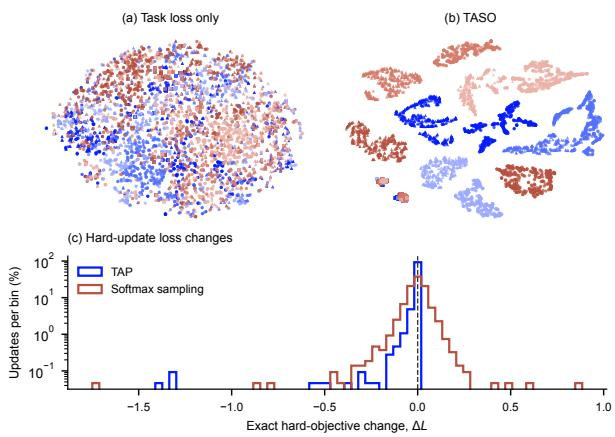  
Figure 1: Perturbation representations produced by (a) the task loss and (b) TASO. Color denotes graph class and shape denotes node class. (c) Softmax sampling frequently increases the perturbation loss (Δ� > 0), whereas TAP’s hardcoordinate updates ensure non-increasing loss (Δ� ≤ 0).

Unlearnable examples address this problem by optimizing bounded input perturbations that cause a learner trained on the released data to fail on clean test data [12]. Prior work has strengthened this efect against practical training procedures and studied transfer across architectures and datasets [8, 21, 25]. Graph-data release, however, creates a coverage problem that single-task protection does not resolve: the same graph collection may support node classification, graph classification, or link prediction, and the data owner may not know which task an unauthorized party will pursue. This calls for a one-time protection mechanism whose single released dataset remains unlearnable across its plausible graph-learning uses. However, existing methods for generating unlearnable graph examples [19, 20] focus on a single downstream task, graph classification, and do not construct one released dataset that jointly protects node-, graph-, and link-level learning.

In addition to this limited task coverage, we identify two empirical challenges that arise when constructing unlearnable examples for graph data using existing methods [19, 20]. First, optimizing the task loss under the error-minimizing (min–min) poisoning objective adopted by prior graph unlearnability methods produces perturbation representations with weak class separation and does not consistently induce substantial performance degradation across datasets and model backends (Fig. 1a). Second, perturbations applied to nodes with categorical attributes generally exhibit substantially weaker unlearnability than those applied to continuous attributes. A significant contributing factor is the ineficient conversion of softmax-sampled updates into discrete perturbations, as adopted in prior methods, since a large fraction of discrete flips do not improve the perturbation objective. For example, on MUTAG, 49.4% of softmax-sampled batch updates increase the perturbation objective (Fig. 1c).

To overcome these limitations, we introduce MUGEN, a unified framework for generating unlearnable graph data across multiple downstream tasks. Given a clean training dataset, MUGEN produces a single perturbed release that protects every enabled task. It perturbs node features using a shared GNN encoder with task-specific heads and alternates model optimization with joint perturbation updates that combine the enabled task losses with a classwise-separability objective.

Our contributions are fourfold:

• We are the first to enable unified protection of node classification, graph classification, and link prediction with a single released dataset, extending beyond prior work focused solely on graph classification.

• We devise the Task-Aligned Separability Objective (TASO), which introduces classwise-separability signals into perturbation optimization, produces more class-separated perturbation representations (Fig. 1b), and strengthens unlearnability and transfer across GNN backbones.

• We introduce Type-Adaptive Perturbation (TAP), which tailors the optimization steps to the type of node attributes. For categorical attributes, it searches directly over feasible hard flips and accepts only loss-improving updates (Fig. 1c), instead of relying on softmax relaxation and sampling, thereby substantially strengthening the unlearnability of the resulting graph examples.

• Across five benchmarks covering inductive and transductive settings with continuous and categorical node attributes, we demonstrate that MUGEN produces transferable unlearnable examples. The perturbations transfer across GCN, GAT, GIN, and GraphSAGE, as well as from supervised training to GraphMAE masked autoencoding and GRACE contrastive learning, and remain efective under random feature masking, stochastic edge dropping, and moderate budget adversarial training.

## 2 Related Work

## 2.1 Unlearnable Example Generation

Unlearnable examples protect data releases from unauthorized training by inducing models to learn perturbation–label shortcuts rather than task-relevant semantics. Huang et al. [12] introduced errorminimizing noise under a bounded perturbation budget; subsequent work improved resistance to adversarial training and stochastic noise [8, 21] and provided certified measures of reduced learnability [29]. Transferable Unlearnable Examples (TUE) introduced a Classwise Separability Discriminant objective to improve transfer across training settings and datasets [25]. MTL-UE extends unlearnable-example generation to multi-task image data through a generator conditioned on multiple labels or dense targets associ ated with each image [37]. Generator-based methods broaden the transfer scope beyond fixed datasets and label spaces: One-for-All uses shared image–text concept embeddings for cross-dataset and label-agnostic protection [3], while VTG combines adversarial domain augmentation with text-guided perturbation–label alignment to transfer across domains, label spaces, resolutions, and architectures [17]. Both rely on textual concept or class descriptions during optimization, and their transfer evaluations remain primarily within vision settings. Complementary work improves robustness to practical image-training pipelines: ARMOR targets data augmentation, BAIT counters semantic priors inherited from pretrained backbones, and FUSE distributes protective signals across frequency bands to withstand spectral filtering [2, 9, 18]. Methods for generating unlearnable examples have also been adapted to discrete text [16], time series [13], 3D point clouds [30], alignment-triggering protection for LLM fine-tuning [38], and vision–language data for LVLM fine-tuning [39]. Other work broadens the release setting and attacker model: Learnability Lock enables authorized recipients to recover a protected visual release with a secret key [24]; CUDA uses class-wise convolutions to generate model-free visual protections that remain efective under several training procedures [26]; and AUE/AAP target both supervised and contrastive learners [31]. These methods still operate on visual data and do not address a single graph release that may be repurposed for distinct graphlearning tasks. Unlearnable examples for graphs have been studied through constrained structural perturbations for graph classification [20] and through structural, discrete-feature, and class-wise subgraph perturbations under varying attacker knowledge [19]. However, both methods target graph-level classification and do not produce a single protected release that jointly covers node, graph, and link prediction.

## 2.2 Graph Adversarial Attacks

Graph adversarial attacks share with unlearnable-example generation a common perturbation-based formulation: both modify graph structure or attributes to influence the behavior of graphlearning models. They can be distinguished by attack stage and prediction scope. Evasion attacks modify graph inputs after training to induce incorrect predictions from a fixed model [5]. Targeted attacks seek to alter the prediction of a selected node or graph and can be conducted at either inference or training time [5, 42]. Untargeted poisoning instead modifies training data to degrade aggregate performance without requiring the poisoned data to remain easy to fit [43]; related representation-poisoning attacks damage node embeddings used for classification and link prediction and can transfer across learning backends [1]. Graph backdoor attacks preserve normal behavior on clean inputs but enforce attacker-chosen predictions when structural or feature triggers are present [4, 34]. Unlearnable-example generation difers from these attacks in its objectives, mechanisms, and intervention stage and serves as a proactive defense against unauthorized data exploitation [15]. Relative to evasion attacks, unlearnable examples are designed at data-release time to prevent models from acquiring task-relevant representations. Compared with untargeted poisoning, they deliberately induce shortcuts that make the protected data appear learnable while impairing generalization to clean data. Unlike backdoor attacks, unlearnable examples adopt an owner-side preventive strategy: protective perturbations are applied broadly to degrade performance across the overall test distribution rather than to control predictions on a trigger-defined subset.

## 3 Background and Problem Formulation

## 3.1 Graph Neural Networks

Let a graph be denoted by $\mathcal { G } = ( \mathcal { V } , \mathcal { E } , \mathbf { X } )$ , where $\mathcal { V } = \{ v _ { 1 } , \ldots , v _ { N } \}$ is the set of � vertices, $\mathcal { E } \subseteq \mathcal { V } \times \mathcal { V }$ is the edge set, and $\mathbf { X } \in \mathbb { R } ^ { N \times d }$ is the node-feature matrix. Graph connectivity is represented by an adjacency matrix $\mathbf { A } \in \{ 0 , 1 \} ^ { \hat { N } \times N }$ , where $A _ { i j } = 1 \mathrm { i f } ( v _ { i } , v _ { j } ) \in \mathcal { E }$ and $A _ { i j } = 0$ otherwise. We write ${ \cal { N } } ( v _ { i } ) = \{ v _ { j } \in \mathcal { V } : A _ { i j } = 1 \}$ for the neighborhood of $v _ { i } .$

A GNN encoder $f _ { \theta }$ maps $\mathcal { G }$ to node representations:

$$
\mathbf { H } = [ \mathbf { h } _ { 1 } , \ldots , \mathbf { h } _ { N } ] ^ { \top } = f _ { \theta } ( \mathcal { G } ) .
$$

The three downstream tasks considered in this work share this encoder but use distinct prediction units:

$$
\begin{array} { r l } & { \widehat { \mathbf { y } } _ { i } ^ { \mathrm { n o d e } } = g _ { \mathrm { n o d e } } ( \mathbf { h } _ { i } ) , } \\ & { \widehat { \mathbf { y } } ^ { \mathrm { g r a p h } } = g _ { \mathrm { g r a p h } } ( \mathrm { R E A D O U T } ( \mathbf { H } ) ) , } \\ & { \widehat { y } _ { i j } ^ { \mathrm { l i n k } } = g _ { \mathrm { l i n k } } \left( \psi ( \mathbf { h } _ { i } , \mathbf { h } _ { j } ) \right) . } \end{array}\tag{1}
$$

Here, ������� denotes the pooling function used to obtain a graph-level representation from the node representations and $\psi$ combines the representations of two candidate link endpoints. The three units respectively predict a node label, a graph label, and whether a candidate node pair forms a link. The encoder may instead be pretrained with a self-supervised objective, such as maskedfeature reconstruction in GraphMAE [11] or contrastive alignment across augmented graph views in GRACE [41]; the resulting representations can subsequently support the same task-specific prediction units.

## 3.2 Problem Formulation

Let $\mathcal { D } _ { \mathrm { t r } } = \{ ( G _ { k } , \mathbf { Y } _ { k } ) \} _ { k = 1 } ^ { n _ { \mathrm { t r } } }$ denote clean graph data owned by a data owner, where ${ \bf Y } _ { k }$ contains annotations for node, graph, or candidatepair prediction. The data may comprise a collection of graphs in an inductive setting or one shared graph with training annotations in a transductive setting.

The owner releases a single protected version ofthe training data, $\mathcal { \widetilde { D } } _ { \mathrm { t r } } = \Big \{ ( \mathcal { \widetilde { G } } _ { k } , \mathbf { Y } _ { k } ) \Big \} _ { k = 1 } ^ { n _ { \mathrm { t r } } }$ , where $\widetilde { \mathcal { G } } _ { k } = \delta ( \mathcal { G } _ { k } )$ . Here, � perturbs graph inputs while retaining the annotations required for downstream learning. An unauthorized learner, without access to the clean features or �, trains an encoder and task-specific heads on $\widetilde { \mathcal { D } } _ { \mathrm { t r } }$ by optimizing $\Theta _ { \delta } \in$ arg minΘ $\mathcal { L } _ { \mathrm { t r a i n } } \Big ( \Theta ; \widetilde { \mathcal { D } } _ { \mathrm { t r } } \Big )$ , where the training loss $\mathcal { L } _ { \mathrm { t r a i n } }$ may be supervised or self-supervised.

For intended tasks T ⊆ {node, graph, link}, our goal is to find a single transformation � such that, for every $t \in \mathcal T$ , models trained on $\widetilde { \mathcal { D } } _ { \mathrm { t r } }$ exhibit substantially lower clean-test performance than comparable models trained on ${ \mathcal { D } } _ { \mathrm { t r } }$

## 4 Methodology

## 4.1 Supervised Multi-Task Unlearnable Graph Generation

We instantiate the transformation � from the problem formulation as a feature-only perturbation. For each released graph, $\widetilde { G } _ { k } =$ $( \mathcal V _ { k } , \mathcal E _ { k } , \widetilde { \mathbf X } _ { k } )$ : the node-feature matrix $\widetilde { \mathbf { X } } _ { k }$ is perturbed, whereas the $\gamma _ { k } , \mathcal { E } _ { k }$ , and $y _ { k }$ are retained. We train a GNN encoder with task-specific heads for the enabled tasks in $\mathcal { T }$ on the perturbed features, and alternately update the model parameters and feature perturbations. Thus, every perturbation update is shaped jointly by the prediction units that the released graph data is intended to protect. Section 4.2 defines $\widetilde { \mathbf { X } } ,$ Section 4.3 defines the losses, and Section 4.4 specifies the alternating updates. The overall workflow is summarized in Figure 2.

## 4.2 Node-Feature Perturbation Parameterization

Let $\mathbf { M } \in \{ 0 , 1 \} ^ { N \times 1 }$ select nodes whose attributes may be changed. In inductive settings, these are nodes in training graphs; in transductive settings, they are the training-mask nodes.

Continuous attributes. For continuous node attributes, we optimize an additive perturbation $\Delta \in \mathbb { R } ^ { N \times d }$ :

$$
\widetilde { \mathbf { X } } = \mathbf { X } + \mathbf { M } \odot \Delta , \qquad \Delta _ { i j } \in [ - \varepsilon _ { j } , \varepsilon _ { j } ] .\tag{2}
$$

The feature-wise radius is $\varepsilon _ { j } = \rho \sigma _ { j }$ , where $\rho$ is the perturbationbudget ratio and $\sigma _ { j }$ is the standard deviation of feature dimension � over the training data.

Categorical attributes. For categorical node attributes, $\mathbf { x } _ { i }$ is a one-hot vector and $\widetilde { \mathbf { x } } _ { i }$ must remain one-hot. We therefore perturb attributes through hard category reassignment. Following Graph Cloak’s node-attribute perturbation budget [19], for a graph � with $V _ { g }$ nodes and $E _ { g }$ non-self edges, we impose

$$
\sum _ { i \in \mathcal { V } _ { g } } \mathbb { I } [ \widetilde { \mathbf { x } } _ { i } \neq \mathbf { x } _ { i } ] \leq B _ { g } , \qquad B _ { g } = \left\lfloor \operatorname* { m i n } \left( \frac { E _ { g } } { 1 0 } , \beta V _ { g } ^ { 2 } \right) \right\rfloor ,\tag{3}
$$

where $\beta$ controls the graph-wise flip budget. This preserves valid categorical attributes while limiting the number of altered nodes.

## 4.3 Task-Specific Objectives and Multi-Task Perturbation Loss

TASO constructs a single perturbation to jointly protect all enabled tasks in T. Its perturbation objective is centered on task-aligned classwise separability, using the Classwise Separability Discriminant (CSD), originally introduced to improve the transferability of unlearnable examples [25]. The conventional task losses can addi tionally be included as auxiliary terms, allowing TASO to retain the prior task-loss signal while introducing a separability-based objective for transferable protection.

For each task, TASO applies CSD either to learned representations or to the feature perturbations. In representation mode, given encoder outputs $\mathbf { Z } ,$ we use

$$
\mathbf { R } ^ { \mathrm { n o d e } } = \mathbf { Z } , \qquad \mathbf { R } _ { g } ^ { \mathrm { g r a p h } } = \operatorname { R E A D O U T } ( \mathbf { Z } \boldsymbol { \gamma } _ { g } ) , \qquad \mathbf { r } _ { u v } ^ { \mathrm { l i n k } } = \psi ( \mathbf { z } _ { u } , \mathbf { z } _ { v } ) .
$$

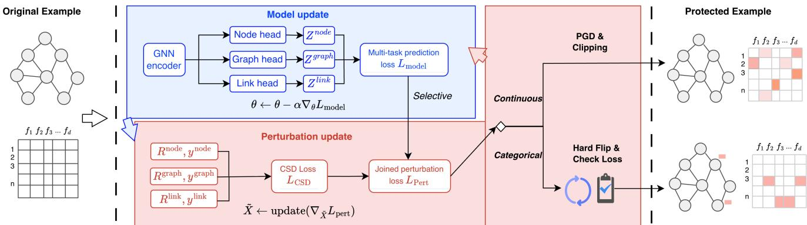  
Figure 2: Overview of MUGEN. We alternate GNN updates using the enabled-task prediction losses and perturbation updates. Continuous attributes use clipped PGD, whereas categorical attributes use hard flips with exact loss evaluation.

In perturbation mode, the corresponding representations are constructed from $\widetilde { \mathbf { X } } - \mathbf { X } .$ Each $\mathbf { R } ^ { t }$ is paired with its task labels $\mathbf { y } ^ { t }$

4.3.1 Task Loss Construction. For each enabled task $t \in \mathcal { T } ,$ let $\mathcal { L } _ { t } ^ { \mathrm { t a s k } }$ denote its ordinary supervised prediction loss: cross-entropy for node and graph classification, and binary cross-entropy for link prediction. Prior graph unlearnable-example methods optimize this loss for a single downstream task using an error-minimizing min–min objective [19, 20]:

$$
\delta _ { t } ^ { \star } \in \arg \operatorname* { m i n } _ { \delta \in C } \operatorname* { m i n } _ { \Theta } \mathcal { L } _ { t } ^ { \mathrm { t a s k } } ( \Theta ; \delta ( \mathcal { D } _ { \mathrm { t r } } ) ) .\tag{4}
$$

Thus, the resulting perturbation is optimized for one selected downstream task. In contrast, TASO aggregates their task losses into the weighted objective

$$
{ \mathcal { L } } _ { \mathrm { m o d e l } } = \sum _ { t \in { \mathcal { T } } } w _ { t } { \mathcal { L } } _ { t } ^ { \mathrm { t a s k } } .\tag{5}
$$

This objective is used for learner-parameter optimization. Its inclusion in the perturbation objective is optional and is specified separately below.

4.3.2 Task-AlignedClasswise Separability. The perturbation update additionally uses the CSD. For each enabled task, CSD is computed from the task-specific pair $( \mathbf { R } ^ { t } , \mathbf { y } ^ { t } )$ defined above. For a generic collection of vector–label pairs $\{ ( \mathbf { r } _ { i } , y _ { i } ) \} _ { i = 1 } ^ { N }$ , let

$$
\mathcal { J } _ { c } = \{ i : y _ { i } = c \} , \qquad \pmb { \mu } _ { c } = \frac { 1 } { | \mathcal { T } _ { c } | } \sum _ { i \in \mathcal { I } _ { c } } \mathbf { r } _ { i } ,
$$

and define the mean intra-class dispersion as

$$
s _ { c } = \frac { 1 } { \left| \mathcal { T } _ { c } \right| } \sum _ { i \in \mathcal { I } _ { c } } \left\| \mathbf { r } _ { i } - \pmb { \mu } _ { c } \right\| _ { 2 } .
$$

The corresponding CSD loss is

$$
\mathcal { L } _ { \mathrm { C S D } } ( \mathbf { R } , \mathbf { y } ) = \frac { 1 } { C ( C - 1 ) } \sum _ { c \neq c ^ { \prime } } \frac { s _ { c } + s _ { c ^ { \prime } } + \epsilon } { \left\| \pmb { \mu } _ { c } - \pmb { \mu } _ { c ^ { \prime } } \right\| _ { 2 } + \epsilon } ,\tag{6}
$$

where � is the number of observed classes and $\epsilon > 0$ is a numerical stability constant. Compared with the prior task-loss-only objective, CSD explicitly shapes task-relevant classwise structure and is designed to improve perturbation transferability.

The perturbation objective combines the primary task-aligned CSD terms with the optional task-loss signal:

$$
\mathcal { L } _ { \mathrm { p e r t } } = \lambda _ { \mathrm { t a s k } } \mathcal { L } _ { \mathrm { m o d e l } } + \lambda _ { \mathrm { C S D } } \sum _ { t \in \mathcal { T } } w _ { t } \mathcal { L } _ { \mathrm { C S D } } \left( \mathbf { R } ^ { t } , \mathbf { y } ^ { t } \right) ,\tag{7}
$$

where $\lambda _ { \mathrm { t a s k } } \geq 0$ and $\lambda _ { \mathrm { C S D } } > 0 .$ . Setting $\lambda _ { \mathrm { t a s k } } = 0$ gives the CSD-only variant, while $\lambda _ { \mathrm { t a s k } } > 0$ retains the conventional task-loss signal as an auxiliary perturbation objective.

## 4.4 Alternating Optimization

At iteration $r ,$ we first update the model parameters on the current perturbed input:

$$
\Theta ^ { ( r ) } \gets \Theta ^ { ( r - 1 ) } - \alpha \nabla _ { \Theta } \mathcal { L } _ { \mathrm { m o d e l } } \left( \Theta ^ { ( r - 1 ) } ; \widetilde { \mathbf { X } } ^ { ( r - 1 ) } \right) .\tag{8}
$$

We then freeze $\Theta ^ { ( r ) }$ and update the perturbation within the feasible space defined in Section $4 . 2 .$ For continuous attributes, TAP uses projected gradient descent (PGD) [22]; for categorical attributes, it performs a hard-coordinate search.

Both perturbation updates optimize $\mathcal { L } _ { \mathrm { p e r t } } ( \Theta ^ { ( r ) } ; \widetilde { \mathbf { X } } )$ within the feasible space while keeping $\Theta ^ { ( r ) }$ fixed. The resulting perturbed features are then used in the next learner update in Equation 8 and, after the final iteration, form the released protected data. The continuous and categorical update procedures are described below.

4.4.1 Continuous atributes: PGD. We use a sign gradient or rowwise ℓ2-normalized gradient, followed by projection onto the featurewise box constraint:

$$
\Delta ^ { ( r + 1 ) } = \mathrm { c l i p } \left( \Delta ^ { ( r ) } - \eta _ { \mathrm { p g d } } \mathrm { s i g n } \left( \nabla _ { \Delta } \mathcal { L } _ { \mathrm { p e r t } } \right) , - \varepsilon , \varepsilon \right) .\tag{9}
$$

4.4.2 Categorical atributes: hard-coordinate search. Prior relaxed categorical optimization [19] maintains logits $\mathbf { a } _ { i } \in \mathbb { R } ^ { C _ { \mathrm { { c a t } } } }$ and probabilities $\mathbf { p } _ { i } = \mathrm { s o f t m a x } ( \mathbf { a } _ { i } )$ . Deployment samples $S _ { i } \sim \mathrm { C a t } ( \mathbf { p } _ { i } )$ and applies the graph-wise budgets $\{ B _ { g } \}$ from Equation 3, yielding hard features $\widehat { \mathbf { X } } = \Pi _ { \mathrm { b u d } } ( \mathbf { S } )$ , where $\Pi _ { \mathrm { b u d } }$ denotes budget enforcement. The relaxed update follows a surrogate gradient $\widetilde { \bf g } ( { \bf a } )$ , but in general

$$
\widetilde { \mathbf { g } } ( \mathbf { a } ) \not \equiv \nabla _ { \mathbf { a } } \mathbb { E } _ { \mathbf { S } \sim \mathrm { C a t } ( \mathbf { p } ) } \left[ \mathcal { L } _ { \mathrm { p e r t } } \Big ( \Theta ^ { ( r ) } ; \boldsymbol { \Pi } _ { \mathrm { b u d } } ( \mathbf { S } ) \Big ) \right] .
$$

Consequently, a descent step under the relaxation need not decrease the objective of the sampled, budget-feasible hard features.

Table 1: Scale and learning regimes of the datasets used in our evaluation.
<table><tr><td>Dataset</td><td> $\operatorname { A v g } .$  nodes</td><td>Regime</td></tr><tr><td>MUTAG</td><td>17.9</td><td>Inductive</td></tr><tr><td>ENZYMES</td><td>32.6</td><td>Inductive</td></tr><tr><td>PROTEINS_full</td><td>39.1</td><td>Inductive</td></tr><tr><td>Cora</td><td>2,708</td><td>Transductive</td></tr><tr><td>PubMed</td><td>19,717</td><td>Transductive</td></tr></table>

TAP instead searches directly in the discrete feasible set. Inspired by HotFlip’s [7] first-order scoring of atomic one-hot flips, we use the gradient only to rank budget-feasible hard changes and evaluate the resulting candidates with the exact perturbation ob jective. With $\Theta ^ { ( r ) }$ fixed, let $c _ { i }$ be the current category of node �, $\left[ C _ { \mathrm { c a t } } \right]$ the category set, and $\mathbf { g } _ { i } = \nabla _ { \widetilde { \mathbf { x } } _ { i } } \mathcal { L } _ { \mathrm { p e r t } } ( \boldsymbol { \Theta } ^ { ( r ) } ; \widetilde { \mathbf { X } } )$ . For a reassignment $c _ { i } \to c , c \neq c _ { i }$ , the first-order predicted objective change is $s _ { i , c } \ = \ \left[ \mathbf { g } _ { i } \right] _ { c } \ - \left[ \mathbf { g } _ { i } \right] _ { c _ { i } }$ . Thus, lower $s _ { i , c }$ predicts a larger objective decrease. At coordinate step $q ,$ Algorithm 1 selects at most one budget-feasible operation $\omega _ { g } ^ { \star }$ per graph: a label reassignment or a swap that reverts one existing flip and adds another. The negative score operations are collected into a multi-operation plan $\mathcal { P } ^ { ( q ) }$ . Let $C ^ { ( q ) }$ contain the hard input produced by this full plan and those produced by up to $K _ { \mathrm { e x a c t } }$ lowest-score singleton operations. We select

$$
\widetilde { \mathbf { X } } ^ { ( q + 1 ) } \in \arg \operatorname* { m i n } _ { { \mathbf { X } ^ { \prime } \in \{ \widetilde { \mathbf { X } } ^ { ( q ) } \} \cup C ^ { ( q ) } } } \mathcal { L } _ { \mathrm { p e r t } } \Big ( \Theta ^ { ( r ) } ; { \mathbf { X } ^ { \prime } } \Big ) ,\tag{10}
$$

which guarantees

$$
\begin{array} { r l } & { \Delta \mathcal { L } _ { \mathrm { h a r d } } ^ { ( q ) } = \mathcal { L } _ { \mathrm { p e r t } } \bigg ( \Theta ^ { ( r ) } ; \widetilde { \mathbf { X } } ^ { ( q + 1 ) } \bigg ) } \\ & { ~ - ~ \mathcal { L } _ { \mathrm { p e r t } } \bigg ( \Theta ^ { ( r ) } ; \widetilde { \mathbf { X } } ^ { ( q ) } \bigg ) \leq 0 . } \end{array}
$$

This gradient-guided comparison avoids enumerating all subsets of $\mathcal { P } ^ { ( q ) }$ and requires at most $K _ { \mathrm { e x a c t } } + 1$ exact evaluations per coordinate step.

Together, the learner update in Equation 8 and the type-specific perturbation updates in Equations 9 and 10 define the alternating optimization procedure used to generate the final feasible perturbed release.

## 5 Experimental Evaluation

## 5.1 Experimental Settings

5.1.1 Datasets andEvaluation Protocol. We use five standard graph learning datasets: MUTAG, ENZYMES, PROTEINS\_full, Cora, and PubMed [23, 36], spanning inductive/transductive regimes and continuous/categorical node attributes. Inductive datasets support graph classification and, when node features are available, node classification; transductive datasets support node classification and LP, while inductive LP is omitted because clean baselines are weak. Inductive tasks use graph-level splits, whereas transductive node and LP tasks use node-mask splits on a shared graph. For LP, to avoid target-link leakage, we adopt the target-edge exclusion setting stud ied by Zhu et al. [40]: validation and test positives are removed from the shared message-passing graph and paired with equal numbers of negative targets; training positives are sampled from real edges whose endpoints both lie in the training node partition and remain available during training and perturbation optimization. Validation and test positives are sampled from the remaining real edges, creating a stricter evaluation scenario in which the learner must predict unseen links that may involve either perturbed training nodes or unperturbed nodes outside that partition.

Algorithm 1 Categorical Hard-Coordinate Subroutine   
Require: frozen $\Theta ^ { ( r ) }$ , current hard features $\widetilde { \mathbf { X } } ^ { ( 0 ) }$ , batch ${ \mathcal { B } } , \mathrm { g r a p h }$   
budgets $\{ B _ { g } \} _ { g \in \mathcal { B } }$ , coordinate steps �, singleton limit $K _ { \mathrm { e x a c t } }$   
Ensure: updated hard features $\widetilde { \mathbf { X } } ^ { ( Q ) }$   
1: for $q = 0 , . . . , Q - 1$ do   
2: $\bar { \mathbf { G } } \gets \nabla _ { \widetilde { \mathbf { X } } } \mathcal { L } _ { \mathrm { p e r t } } ( \mathbf { \Theta } \mathbf { \Theta } ^ { ( r ) } ; \widetilde { \mathbf { X } } ^ { ( q ) } )$   
3: for each graph $g \in { \mathcal { B } }$ do   
4: for each active node $i \in \mathcal { V } _ { g }$ do   
5: for each � $\mathrm { : } \in [ C _ { \mathrm { c a t } } ] \ \backslash \ \{ c _ { i } \}$ do   
6: if $c _ { i } \to c$ is feasible under $B _ { g }$ then   
7: $s _ { i , c } \gets [ \mathbf { G } _ { i } ] _ { c } - [ \mathbf { G } _ { i } ] _ { c _ { i } }$   
8: end if   
9: end for   
10: end for   
11: $\omega _ { g } ^ { \star } \gets$ lowest-score label reassignment or swap that   
reverts one existing flip and adds another   
12: end for   
13: $\mathcal { P } ^ { ( q ) }  \{ \omega _ { g } ^ { \star } : g \in \mathcal { B } , s ( \omega _ { g } ^ { \star } ) < 0 \}$   
$C ^ { ( q ) } \gets \{ \mathrm { A p p l y } ( \widetilde { \mathbf { X } } ^ { ( q ) } , \mathcal { P } ^ { ( q ) } ) \}$   
14: $\cup \{ \mathrm { A p p l y } ( \widetilde { \mathbf { X } } ^ { ( q ) } , \{ \omega \} )$   
$\omega \in \mathrm { T o p K } ( \mathcal { P } ^ { ( q ) } , K _ { \mathrm { e x a c t } } ) \}$   
15: ${ \widehat { \mathbf { X } } } \gets \arg \operatorname* { m i n } _ { \mathbf { X } \in C ^ { ( q ) } } \mathcal { L } _ { \mathrm { p e r t } } \big ( \Theta ^ { ( r ) } ; \mathbf { X } \big )$   
16: if $\mathcal { L } _ { \mathrm { p e r t } } ( \Theta ^ { ( r ) } ; \widehat { \mathbf { X } } ) < \mathcal { L } _ { \mathrm { p e r t } } ( \Theta ^ { ( r ) } ; \widetilde { \mathbf { X } } ^ { ( q ) } )$ then   
17: $\bar { \mathbf { X } } ^ { ( q + 1 ) } \gets \widehat { \mathbf { X } }$   
18: else   
19: $\widetilde { \mathbf { X } } ^ { \left( q + 1 \right) } \gets \widetilde { \mathbf { X } } ^ { \left( q \right) }$   
20: end if   
21: end for   
22: return $\widetilde { \mathbf { X } } ^ { ( Q ) }$

5.1.2 Model Architectures and Training Frameworks. We evaluate four backbones: GCN [14], GAT [28], GIN [35], and Graph-SAGE [10]. We additionally test the perturbations under self-supervised learning frameworks (GraphMAE [11] and GRACE [41]).

5.1.3 Evaluation Metrics and Baselines. For the primary evaluations, we report Macro-F1 for graph classification, F1 for node classification, and AUC for link prediction; graph accuracy is additionally reported in selected robustness and ablation studies. We compare against clean training and budget-matched random perturbations: variance-matched Gaussian noise for continuous attributes and random categorical flips for discrete attributes. We summarize degradation using $\Delta _ { c } = m _ { \mathrm { a p p l y } } - m _ { \mathrm { n o } }$ and $\Delta _ { r } = m _ { \mathrm { a p p l y } } - m _ { \mathrm { r a n d o m } } ;$ negative gaps indicate degradation, with consistently negative gaps providing stronger evidence of unlearnability. Perturbation budgets follow Section $4 . 2 ;$ unless otherwise stated, we set $\rho = 0 . 2$ for continuous attributes and $\beta = 0 . 0 5$ for categorical attributes.

Table 2: Same-backend supervised results for graph classification (Macro-F1). Entries are mean±std over three runs. Bold: $\mu + \sigma \geq 0 .$
<table><tr><td>Dataset</td><td>Enc.</td><td>Clean</td><td> $\Delta _ { c }$ </td><td> $\Delta _ { r }$ </td></tr><tr><td>MUTAG</td><td>GAT</td><td></td><td>0.815±0.030-0.300±0.144 -0.259±0.162</td><td></td></tr><tr><td>MUTAG</td><td>GCN</td><td>0.883±0.029</td><td>9-0.223±0.053 -0.114±0.051</td><td></td></tr><tr><td>MUTAG</td><td>GIN</td><td></td><td>0.826±0.024-0.338±0.127 -0.286±0.135</td><td></td></tr><tr><td>MUTAG</td><td>SAGE</td><td></td><td>0.859±0.032 -0.307±0.111 -0.229±0.080</td><td></td></tr><tr><td>ENZYMES</td><td>GAT</td><td>0.512±0.030-0.290±0.036-0.317±0.035</td><td></td><td></td></tr><tr><td>ENZYMES</td><td>GCN</td><td></td><td>0.512±0.030 -0.287±0.046 -0.307±0.064</td><td></td></tr><tr><td>ENZYMES</td><td>GIN</td><td></td><td>0.579±0.065 -0.389±0.085 -0.417±0.067</td><td></td></tr><tr><td>ENZYMES</td><td>SAGE</td><td>0.705±0.025</td><td>-0.507±0.028-0.524±0.027</td><td></td></tr><tr><td>PROTEINS_full</td><td>GAT</td><td>0.641±0.024-0.153±0.102-0.127±0.083</td><td></td><td></td></tr><tr><td>PROTEINS_full</td><td>GCN</td><td>0.675±0.027-0.165±0.031-0.167±0.042</td><td></td><td></td></tr><tr><td>PROTEINS full</td><td>GIN</td><td></td><td>0.632±0.008 -0.263±0.052 -0.247±0.076</td><td></td></tr><tr><td>PROTEINS_full SAGE</td><td></td><td>0.642±0.010-0.279±0.067-0.347±0.036</td><td></td><td></td></tr></table>

Table 3: Same-backend supervised results for node classification (F1). Entries are mean±std over three runs. Bold: $\mu + \sigma \geq 0 .$
<table><tr><td>Dataset</td><td>Enc.</td><td>Clean</td><td> $\Delta _ { c }$ </td><td> $\Delta _ { r }$ </td></tr><tr><td>ENZYMES</td><td>GAT</td><td>0.737±0.012-0.023±0.017 -0.025±0.017</td><td></td><td></td></tr><tr><td>ENZYMES</td><td>GCN</td><td>0.723±0.008-0.018±0.015 -0.017±0.015</td><td></td><td></td></tr><tr><td>ENZYMES</td><td>GIN</td><td>0.782±0.004-0.014±0.004-0.020±0.004</td><td></td><td></td></tr><tr><td>ENZYMES</td><td>SAGE</td><td>0.956±0.002 -0.015±0.006-0.012±0.006</td><td></td><td></td></tr><tr><td>PROTEINS_full</td><td>GAT</td><td>0.642±0.015-0.138±0.027</td><td></td><td>-0.134±0.032</td></tr><tr><td>PROTEINS_full</td><td>GCN</td><td>0.657±0.009-0.028±0.019-0.024±0.024</td><td></td><td></td></tr><tr><td>PROTEINS_full</td><td>GIN</td><td>0.712±0.005-0.061±0.027-0.055±0.036</td><td></td><td></td></tr><tr><td>PROTEINS_full</td><td>SAGE</td><td>0.860±0.035-0.203±0.104-0.155±0.066</td><td></td><td></td></tr><tr><td>Cora</td><td>GAT</td><td>0.876±0.014 -0.080±0.021 -0.078±0.013</td><td></td><td></td></tr><tr><td>Cora</td><td>GCN</td><td>0.864±0.013-0.056±0.028-0.048±0.022</td><td></td><td></td></tr><tr><td>Cora</td><td>GIN</td><td>0.869±0.009-0.059±0.030-0.047±0.020</td><td></td><td></td></tr><tr><td>Cora</td><td>SAGE</td><td>0.868±0.010-0.079±0.011 -0.069±0.012</td><td></td><td></td></tr><tr><td></td><td></td><td></td><td></td><td></td></tr><tr><td>PubMed</td><td>GAT</td><td></td><td></td><td>0.889±0.002-0.248±0.031-0.249±0.034</td></tr><tr><td>PubMed</td><td>GCN</td><td></td><td></td><td>0.901±0.002 -0.240±0.018-0.235±0.018</td></tr><tr><td>PubMed</td><td>GIN</td><td></td><td>0.897±0.001 -0.253±0.018 -0.255±0.019</td><td></td></tr><tr><td>PubMed</td><td>SAGE</td><td>0.900±0.000 -0.195±0.004 -0.196±0.004</td><td></td><td></td></tr></table>

## 5.2 Efectiveness and Transferability

5.2.1 Within-backend efectiveness. Across tasks, optimized perturbations generally reduce clean-test performance relative to both clean training and matched-variance Gaussian noise, demonstrating strong same-backend unlearnability; the corresponding supervised results are reported in Tables 2–4.

5.2.2 Cross-backend efectiveness. Table 5 reports cross-backend gaps, showing that perturbations retain their degrading efects across most tasks. We attribute this transferability to our Task-Aligned Separability Objective (TASO) and Type-Adaptive Perturbation (TAP), whose contributions are analyzed in Section 5.5. Figure 3 shows the distributions of clean and perturbed data.

5.2.3 Apply on Self-Supervised Learning Framework. We further apply perturbations optimized with the supervised framework to GraphMAE masked-feature reconstruction and GRACE augmentationbased contrastive learning [11, 41]. Although GraphMAE’s feature masking and reconstruction and GRACE’s stochastic views and

Table 4: Same-backend supervised results for link prediction (AUC). Entries are mean±std over three runs. Bold: $\mu + \sigma \geq 0 .$
<table><tr><td>Dataset</td><td>Enc.</td><td>Clean</td><td> $\Delta _ { c }$ </td><td> $\Delta _ { r }$ </td></tr><tr><td>Cora</td><td>GAT</td><td>0.950±0.005</td><td>-0.066±0.013</td><td>-0.065±0.013</td></tr><tr><td>Cora</td><td>GCN</td><td>0.835±0.026</td><td>-0.079±0.017</td><td> $- 0 . 0 7 7 { \scriptstyle \pm 0 . 0 3 5 }$ </td></tr><tr><td>Cora</td><td>GIN</td><td>0.893±0.011</td><td>-0.143±0.051</td><td>-0.127±0.038</td></tr><tr><td>Cora</td><td>SAGE</td><td>0.942±0.005</td><td>-0.062±0.015</td><td>-0.059±0.015</td></tr><tr><td>PubMed</td><td>GAT</td><td>0.964±0.001</td><td>-0.012±0.003</td><td>-0.011±0.003</td></tr><tr><td>PubMed</td><td>GCN</td><td>0.970±0.002</td><td>-0.012±0.005</td><td>-0.015±0.006</td></tr><tr><td>PubMed</td><td>GIN</td><td>0.916±0.002</td><td>-0.022±0.023</td><td>-0.029±0.021</td></tr><tr><td>PubMed SAGE</td><td></td><td>0.971±0.001</td><td>-0.015±0.003</td><td>-0.015±0.003</td></tr></table>

contrastive alignment can disrupt supervised perturbation patterns, the perturbations continue to degrade downstream performance under both frameworks (Table 6). For GRACE, we follow the original implementation and use a GCN encoder.

## 5.3 Robustness Analysis

We evaluate robustness under feature-masking and edge-dropping data augmentations and adversarial training. MUGEN-perturbed models remain below random perturbations and do not recover clean performance. Figure 4 shows the GCN case on PROTEINS\_full; all results appear in Appendix A.2.

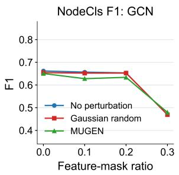

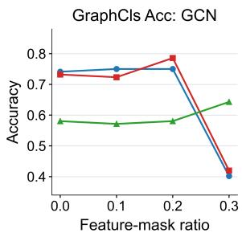

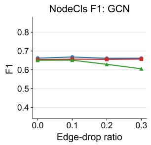

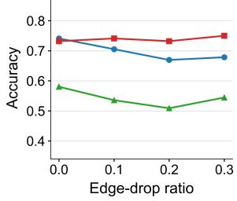

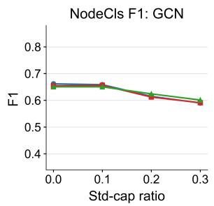

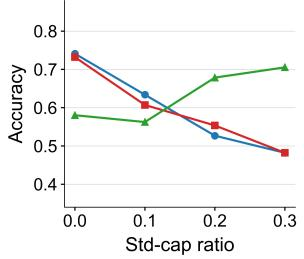

Table 5: Cross-backend gaps against clean training $( \Delta _ { c } )$ and matched random-perturbation training (Δ�). Task metrics are graph Macro-F1, node F1, and link AUC. Rows and columns denote source and target backbones; entries are mean±std over three seeds. Bold: $\mu + \sigma \geq 0$
<table><tr><td rowspan="2">Dataset Task</td><td rowspan="2"></td><td rowspan="2">Source</td><td colspan="4"> $\Delta _ { c }$ </td><td colspan="4"> $\Delta _ { r }$ </td></tr><tr><td>GAT</td><td>GCN</td><td>GIN</td><td>SAGE</td><td>GAT</td><td>GCN</td><td>GIN</td><td>SAGE</td></tr><tr><td rowspan="4">MUTAG</td><td rowspan="4">Graph</td><td>GAT</td><td>-0.300±0.144</td><td>-0.279±0.142</td><td>-0.194±0.074</td><td>-0.276±0.196</td><td>-0.259±0.162</td><td>-0.170±0.146</td><td>-0.142±0.091</td><td>-0.198±0.203</td></tr><tr><td>GCN</td><td>-0.268±0.057</td><td>-0.223±0.053</td><td>-0.240±0.118</td><td>-0.255±0.041</td><td>-0.227±0.107</td><td>-0.114±0.051</td><td>-0.188±0.079</td><td>-0.177±0.073</td></tr><tr><td>GIN</td><td>-0.275±0.252</td><td>-0.244±0.133</td><td>-0.338±0.127</td><td>-0.408±0.184</td><td>-0.234±0.206</td><td>-0.135±0.132</td><td>-0.286±0.135</td><td>-0.330±0.166</td></tr><tr><td>SAGE</td><td>-0.252±0.069</td><td>-0.338±0.101</td><td>-0.230±0.043</td><td>-0.307±0.111</td><td>-0.211±0.098</td><td>-0.230±0.097</td><td>-0.178±0.060</td><td>-0.229±0.080</td></tr><tr><td rowspan="8">ENZYMES</td><td rowspan="8">Graph</td><td>GAT</td><td>-0.290±0.036</td><td>-0.252±0.031</td><td>-0.349±0.098</td><td>-0.511±0.037</td><td>-0.317±0.035</td><td>-0.254±0.081</td><td>-0.377±0.049</td><td>-0.534±0.038</td></tr><tr><td>GCN</td><td>-0.272±0.180</td><td>-0.287±0.046</td><td>-0.383±0.056</td><td>-0.521±0.036</td><td>-0.298±0.173</td><td>-0.307±0.064</td><td>-0.415±0.066</td><td>-0.531±0.029</td></tr><tr><td>GIN</td><td>-0.368±0.043</td><td>-0.285±0.023</td><td>-0.389±0.085</td><td>-0.550±0.062</td><td>-0.365±0.065</td><td>-0.252±0.007</td><td>-0.417±0.067</td><td>-0.549±0.098</td></tr><tr><td>SAGE</td><td>-0.291±0.113</td><td>-0.263±0.041</td><td>-0.410±0.070</td><td>-0.507±0.028</td><td>-0.325±0.125</td><td>-0.239±0.050</td><td>-0.448±0.058</td><td>-0.524±0.027</td></tr><tr><td>GAT</td><td>-0.023±0.017</td><td>-0.016±0.012</td><td>-0.012±0.019</td><td>-0.013±0.003</td><td>-0.025±0.017</td><td>-0.018±0.015</td><td>-0.021±0.020</td><td>-0.009±0.001</td></tr><tr><td>GCN</td><td>-0.022±0.018</td><td>-0.018±0.015</td><td>-0.019±0.015</td><td>-0.013±0.003</td><td>-0.025±0.020</td><td>-0.017±0.015</td><td>-0.024±0.016</td><td>-0.009±0.004</td></tr><tr><td>GIN</td><td>-0.021±0.015</td><td>-0.021±0.012</td><td>-0.014±0.004</td><td>-0.011±0.000</td><td>-0.020±0.017</td><td>-0.021±0.018</td><td>-0.020±0.004</td><td>-0.008±0.001</td></tr><tr><td>SAGE</td><td>-0.009±0.005</td><td>-0.005±0.005</td><td>-0.012±0.011</td><td>-0.015±0.006</td><td>-0.011±0.014</td><td>-0.002±0.005</td><td>-0.016±0.011</td><td>-0.012±0.006</td></tr><tr><td rowspan="8">PROTEINS</td><td rowspan="4">Graph</td><td>GAT</td><td>-0.153±0.102</td><td>-0.092±0.083</td><td>-0.089±0.127</td><td>-0.079±0.069</td><td>-0.127±0.083</td><td>-0.117±0.082</td><td>-0.083±0.142</td><td>-0.155±0.115</td></tr><tr><td>GCN</td><td>-0.317±0.052</td><td>-0.165±0.031</td><td>-0.212±0.086</td><td>-0.252±0.118</td><td>-0.274±0.063</td><td>-0.167±0.042</td><td>-0.282±0.050</td><td>-0.318±0.071</td></tr><tr><td>GIN</td><td>-0.322±0.023</td><td>-0.192±0.035</td><td>-0.263±0.052</td><td>-0.355±0.017</td><td>-0.257±0.031</td><td>-0.200±0.032</td><td>-0.247±0.076</td><td>-0.426±0.020</td></tr><tr><td>SAGE</td><td>-0.161±0.111</td><td>-0.035±0.104</td><td>-0.205±0.058</td><td>-0.279±0.067</td><td>-0.168±0.160</td><td>-0.019±0.127</td><td>-0.264±0.102</td><td>-0.347±0.036</td></tr><tr><td></td><td>GAT</td><td>-0.138±0.027</td><td>-0.081±0.026</td><td>-0.103±0.043</td><td>-0.462±0.200</td><td>-0.134±0.032</td><td>-0.074±0.024</td><td>-0.099±0.046</td><td>-0.426±0.172</td></tr><tr><td>Node</td><td>GCN GIN</td><td>-0.133±0.026</td><td>-0.028±0.019</td><td>-0.063±0.018</td><td>-0.311±0.019</td><td>-0.134±0.020</td><td>-0.024±0.024</td><td>-0.062±0.021</td><td>-0.266±0.024</td></tr><tr><td></td><td>SAGE</td><td>-0.113±0.028 -0.052±0.019</td><td>-0.047±0.010 -0.026±0.005</td><td>-0.061±0.027</td><td>-0.288±0.050</td><td>-0.116±0.015</td><td>-0.039±0.014 -0.020±0.006</td><td>-0.055±0.036</td><td>-0.247±0.026</td></tr><tr><td></td><td></td><td></td><td></td><td>-0.040±0.020</td><td>-0.203±0.104</td><td>-0.051±0.028</td><td></td><td>-0.037±0.025</td><td>-0.155±0.066</td></tr><tr><td rowspan="8">Cora</td><td rowspan="4">Node</td><td>GAT</td><td>-0.080±0.021</td><td>-0.065±0.020 -0.056±0.028</td><td>-0.056±0.004</td><td>-0.058±0.015 -0.090±0.006</td><td>-0.078±0.013</td><td>-0.059±0.040</td><td>-0.044±0.013</td><td>-0.049±0.017</td></tr><tr><td>GCN GIN</td><td>-0.072±0.019 -0.031±0.006</td><td>-0.049±0.015</td><td>-0.077±0.022</td><td></td><td>-0.066±0.019</td><td>-0.048±0.022 -0.048±0.023</td><td>-0.072±0.026</td><td>-0.085±0.006</td></tr><tr><td>SAGE</td><td>-0.048±0.022</td><td>-0.045±0.032</td><td>-0.059±0.030 -0.056±0.013</td><td>-0.038±0.006 -0.079±0.011</td><td>-0.023±0.006 -0.043±0.015</td><td>-0.036±0.021</td><td>-0.047±0.020 -0.050±0.008</td><td>-0.031±0.015</td></tr><tr><td>GAT</td><td></td><td></td><td></td><td></td><td></td><td></td><td></td><td>-0.069±0.012</td></tr><tr><td rowspan="4"></td><td></td><td>-0.066±0.013</td><td>-0.047±0.092</td><td>-0.070±0.029</td><td>-0.049±0.009</td><td>-0.065±0.013</td><td>-0.047±0.084</td><td>-0.057±0.024</td><td>-0.047±0.010</td></tr><tr><td>GCN GIN</td><td>-0.110±0.011 -0.083±0.015</td><td>-0.079±0.017 -0.110±0.045</td><td>-0.073±0.019</td><td>-0.053±0.016</td><td>-0.103±0.021</td><td>-0.077±0.035</td><td>-0.057±0.015</td><td>-0.050±0.018</td></tr><tr><td>SAGE</td><td>-0.032±0.014</td><td>-0.055±0.023</td><td>-0.143±0.051 -0.051±0.030</td><td>-0.046±0.015 -0.062±0.015</td><td>-0.083±0.016 -0.030±0.018</td><td>-0.120±0.021 -0.060±0.019</td><td>-0.127±0.038</td><td>-0.044±0.016</td></tr><tr><td>GAT</td><td></td><td></td><td></td><td></td><td></td><td></td><td>-0.051±0.027</td><td>-0.059±0.015</td></tr><tr><td rowspan="8">PubMed</td><td>Node</td><td>-0.248±0.031</td><td>-0.192±0.011 -0.156±0.022 -0.240±0.018</td><td>-0.222±0.014 -0.229±0.027</td><td>-0.232±0.013 -0.212±0.026</td><td>-0.249±0.034 -0.157±0.025</td><td>-0.187±0.016 -0.235±0.018</td><td>-0.222±0.011 -0.228±0.026</td><td>-0.233±0.015</td></tr><tr><td></td><td>GCN GIN</td><td>-0.184±0.059 -0.221±0.029</td><td>-0.253±0.018</td><td>-0.199±0.005</td><td>-0.184±0.065</td><td>-0.217±0.032</td><td>-0.255±0.019</td><td>-0.212±0.029 -0.202±0.005</td></tr><tr><td>SAGE</td><td>-0.157±0.012</td><td>-0.149±0.008</td><td>-0.158±0.011</td><td>-0.195±0.004</td><td>-0.153±0.016</td><td>-0.145±0.010</td><td>-0.158±0.010</td><td>-0.196±0.004</td></tr><tr><td></td><td></td><td></td><td></td><td></td><td></td><td></td><td></td><td></td></tr><tr><td></td><td>GAT</td><td>-0.012±0.003</td><td>-0.013±0.006 -0.050±0.016</td><td>-0.019±0.001</td><td>-0.011±0.003 -0.006±0.001</td><td>-0.018±0.003 -0.015±0.006</td><td>-0.054±0.013 -0.034±0.019</td><td>-0.019±0.001</td></tr><tr><td>Link</td><td>GCN GIN</td><td>-0.008±0.001 -0.010±0.001</td><td>-0.012±0.005 -0.012±0.003</td><td>-0.026±0.017 -0.022±0.023</td><td>-0.020±0.002 -0.024±0.001</td><td>-0.009±0.002</td><td>-0.015±0.006 -0.029±0.021</td><td>-0.020±0.001 -0.024±0.002</td></tr><tr><td></td><td>SAGE</td><td>-0.008±0.001</td><td>-0.004±0.003</td><td>-0.029±0.013</td><td>-0.015±0.003 -0.007±0.001</td><td>-0.010±0.002</td><td>-0.035±0.014</td><td>-0.015±0.003</td></tr><tr><td></td><td></td><td></td><td></td><td></td><td></td><td></td><td></td><td></td><td></td></tr></table>

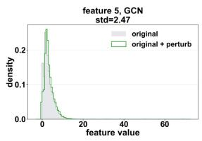

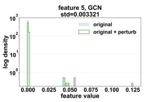

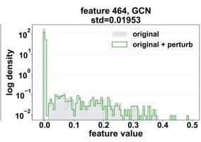

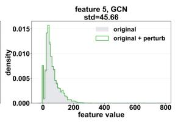

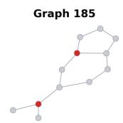  
Figure 3: Representative GCN perturbations on five datasets. Red nodes mark category flips in the MUTAG panel; Cora and PubMed use log-scaled density axes for skewed distributions.

Figure 4: GCN robustness on PROTEINS\_full. Rows correspond to feature masking, edge dropping, and adversarial training; left/right panels report node F1/graph accuracy. Blue circles, red squares, and green triangles denote clean data, Gaussian random perturbations, and MUGEN perturbations.

## 5.4 Sensitivity to the Perturbation Budget

As a representative case study, we evaluate sensitivity to the continuousfeature perturbation budget on PROTEINS\_full. We set the featurerelative cap to $\varepsilon _ { j } = \rho \sigma _ { j }$ and consider $\rho \in \{ 0 . 1 , 0 . 2 , 0 . 3 \}$ . Even at the

Table 6: Transfer of supervised perturbations to selfsupervised learning on PROTEINS\_full. Node and graph results report F1 and Macro-F1, respectively. Entries are mean±std over three runs with diferent random seeds.
<table><tr><td colspan="4">Node F1</td></tr><tr><td>Framework</td><td>Encoder</td><td>Clean</td><td> $\Delta _ { c }$ </td><td> $\Delta _ { r }$ </td></tr><tr><td rowspan="4">GraphMAE</td><td>GIN</td><td>0.603±0.006</td><td>-0.104±0.010</td><td> $- 0 . 1 0 0 { \pm } 0 . 0 1 1$ </td></tr><tr><td>GAT</td><td>0.577±0.011</td><td>-0.078±0.037</td><td> $- 0 . 0 4 9 { \scriptstyle \pm 0 . 0 3 6 }$ </td></tr><tr><td>GCN</td><td>0.600±0.021</td><td> $- 0 . 0 9 7 { \scriptstyle \pm 0 . 0 0 2 }$ </td><td> $- 0 . 0 9 3 { \scriptstyle \pm 0 . 0 1 2 }$ </td></tr><tr><td>SAGE</td><td>0.606±0.026</td><td> $- 0 . 0 9 2 { \scriptstyle \pm 0 . 0 2 6 }$ </td><td> $- 0 . 0 6 6 { \pm } 0 . 0 0 8$ </td></tr><tr><td>GRACE</td><td>GCN</td><td>0.626±0.018</td><td> $- 0 . 1 2 2 { \scriptstyle \pm 0 . 0 0 9 }$ </td><td> $- 0 . 0 5 7 { \scriptstyle \pm 0 . 0 3 6 }$ </td></tr><tr><td colspan="5">Graph Macro-F1</td></tr><tr><td>Framework</td><td>Encoder</td><td>Clean</td><td> $\Delta _ { c }$ </td><td> $\Delta _ { r }$ </td></tr><tr><td rowspan="4">GraphMAE</td><td>GIN</td><td>0.724±0.027</td><td>-0.118±0.054</td><td>-0.133±0.041</td></tr><tr><td>GAT</td><td>0.759±0.001</td><td>-0.202±0.035</td><td>-0.184±0.032</td></tr><tr><td>GCN</td><td>0.756±0.006</td><td>-0.170±0.085</td><td>-0.180±0.085</td></tr><tr><td>SAGE</td><td>0.754±0.009</td><td>-0.272±0.029</td><td>-0.273±0.012</td></tr><tr><td>GRACE</td><td>GCN</td><td>0.720±0.021</td><td>-0.097±0.041</td><td>-0.115±0.037</td></tr></table>

tightest budget, $\rho = 0 . { \dot { } }$ 1, GCN- and SAGE-generated perturbations yield consistently negative gaps across both tasks and all target backbones. The remaining source backbones also produce degradation, although less uniformly; increasing � further eliminates the remaining nonnegative gaps (Table 7).

Table 7: Perturbation-budget sensitivity on PROTEINS\_full. Each entry reports a gap for the indicated metric, source, target, budget ratio, and baseline.
<table><tr><td rowspan="2">Gap</td><td rowspan="2">Metric</td><td rowspan="2">Source | Target</td><td colspan="4">ρ = 0.1</td><td colspan="4">ρ= 0.2</td><td colspan="4">ρ=0.3</td></tr><tr><td>GAT</td><td>GCN</td><td>GIN</td><td>SAGE</td><td>GAT</td><td>GCN</td><td>GIN</td><td>SAGE</td><td>GAT</td><td>GCN</td><td>GIN</td><td>SAGE</td></tr><tr><td rowspan="7">Δc</td><td rowspan="5">Graph acc.</td><td>GAT</td><td>-0.152</td><td>-0.232</td><td>-0.196</td><td>-0.188</td><td>-0.205</td><td>-0.170</td><td>-0.054</td><td>-0.045</td><td>-0.205</td><td>-0.152</td><td>-0.080</td><td>-0.170</td></tr><tr><td>GCN</td><td>-0.277</td><td>-0.268</td><td>-0.188</td><td>-0.304</td><td>-0.232</td><td>-0.161</td><td>-0.107</td><td>-0.241</td><td>-0.259</td><td>-0.143</td><td>-0.125</td><td>-0.214</td></tr><tr><td>GIN</td><td>-0.250</td><td>-0.250</td><td>-0.205</td><td>-0.304</td><td>-0.250</td><td>-0.179</td><td>-0.170</td><td>-0.286</td><td>-0.259</td><td>-0.250</td><td>-0.250</td><td>-0.286</td></tr><tr><td>SAGE</td><td>-0.045</td><td>-0.125</td><td>-0.009</td><td>-0.152</td><td>-0.134</td><td>+0.045</td><td>-0.232</td><td>-0.250</td><td>-0.223</td><td>-0.170</td><td>-0.241</td><td>-0.259</td></tr><tr><td>GAT</td><td>-0.138</td><td>-0.025</td><td>-0.011</td><td>-0.231</td><td>-0.139</td><td>-0.062</td><td>-0.055</td><td>-0.276</td><td>-0.148</td><td>-0.060</td><td>-0.064</td><td>-0.275</td></tr><tr><td rowspan="4">Node F1</td><td>GCN</td><td>-0.100</td><td>-0.008</td><td>+0.005</td><td>-0.211</td><td>-0.158</td><td>-0.011</td><td>-0.047</td><td>-0.309</td><td>-0.171</td><td>-0.074</td><td>-0.070</td><td>-0.321</td></tr><tr><td>GIN</td><td>-0.161</td><td>-0.023</td><td>-0.010</td><td>-0.248</td><td>-0.144</td><td>-0.040</td><td>-0.036</td><td>-0.231</td><td>-0.156</td><td>-0.051</td><td>-0.076</td><td>-0.266</td></tr><tr><td>SAGE</td><td>-0.010</td><td>-0.021</td><td>+0.015</td><td>-0.207</td><td>-0.030</td><td>-0.020</td><td>-0.017</td><td>-0.140</td><td>-0.113</td><td>-0.059</td><td>-0.048</td><td>-0.221</td></tr><tr><td rowspan="6">Graph acc.</td><td>GAT</td><td>-0.098</td><td>-0.241</td><td>-0.214</td><td>-0.080</td><td>-0.152</td><td>-0.179</td><td>-0.045</td><td>-0.063</td><td>-0.063</td><td>-0.152</td><td>-0.107</td><td>-0.223</td></tr><tr><td>GCN</td><td>-0.223</td><td>-0.277</td><td>-0.205</td><td>-0.214</td><td>-0.143</td><td>-0.152</td><td>-0.205</td><td>-0.232</td><td>-0.089</td><td>-0.161</td><td>-0.170</td><td>-0.250</td></tr><tr><td>GIN</td><td>-0.188</td><td>-0.250</td><td>-0.241</td><td>-0.179</td><td>-0.152</td><td>-0.188</td><td>-0.143</td><td>-0.304</td><td>-0.089</td><td>-0.268</td><td>-0.321</td><td>-0.321</td></tr><tr><td>SAGE</td><td>+0.009</td><td>-0.125</td><td>-0.054</td><td>-0.054</td><td>-0.161</td><td>+0.071</td><td>-0.321</td><td>-0.250</td><td>-0.116</td><td>-0.188</td><td>-0.259</td><td>-0.286</td></tr><tr><td>GAT</td><td>-0.133</td><td>-0.019</td><td>-0.015</td><td>-0.255</td><td>-0.118</td><td>-0.055</td><td>-0.046</td><td>-0.265</td><td>-0.124</td><td>-0.045</td><td>-0.059</td><td>-0.245</td></tr><tr><td rowspan="4">Node F1</td><td>GCN</td><td>-0.094</td><td>-0.001</td><td>+0.011</td><td>-0.231 -0.270</td><td>-0.155 -0.133</td><td>-0.004 -0.030</td><td>-0.040</td><td>-0.294 -0.220</td><td>-0.167 -0.137</td><td>-0.063</td><td>-0.058</td><td>-0.271</td></tr><tr><td>GIN</td><td>-0.161</td><td>-0.019</td><td>-0.016</td><td></td><td></td><td></td><td>-0.019</td><td></td><td></td><td>-0.038</td><td>-0.065</td><td>-0.225</td></tr><tr><td>SAGE</td><td>-0.001</td><td>-0.016</td><td>+0.019</td><td>-0.231</td><td>-0.019</td><td>-0.013</td><td>-0.008</td><td>-0.123</td><td>-0.086</td><td>-0.042</td><td>-0.030</td><td>-0.174</td></tr></table>

## 5.5 Ablation

5.5.1 Node versus edge perturbation. We compare node-feature or node-attribute perturbations with GradArgMax edge perturbations [19] on ENZYMES and MUTAG. The transfer results show that node perturbations yield more consistently negative transfer gaps: they are stronger and more uniform on ENZYMES and provide the more reliable transfer pattern on MUTAG despite isolated large edge-flip drops.

Table 8: Node- versus edge-perturbation transfer gaps (Δ�) for graph accuracy.

(a)  
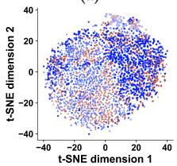  
(d)

(b)  
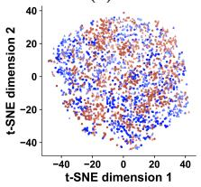  
(e)

(c)  
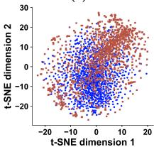

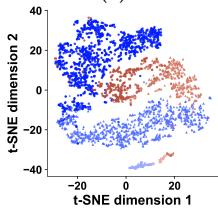

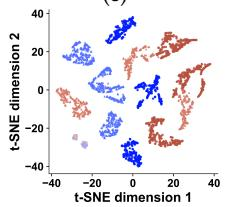

(f)  
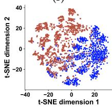

Figure 5: t-SNE of standardized SAGE perturbation representations. Panels (a–c) use classification and panels (d–f) use TASO on PROTEINS\_full, ENZYMES, and Cora, respectively. Panels (c) and (f) show Hadamard link-pair features; colors and marker shapes denote LP labels.
<table><tr><td rowspan="2">Dataset</td><td rowspan="2">Source \| Target</td><td colspan="4">Node perturbation</td><td colspan="4">Edge perturbation</td></tr><tr><td>GAT</td><td>GCN</td><td>GIN</td><td>SAGE</td><td>GAT</td><td>GCN</td><td>GIN</td><td>SAGE</td></tr><tr><td rowspan="4">ENZYMES</td><td>GAT</td><td>-0.233</td><td>-0.233</td><td>-0.333</td><td>-0.450</td><td>-0.083</td><td>-0.100</td><td>-0.200</td><td>-0.050</td></tr><tr><td>GCN</td><td>-0.067</td><td>-0.300</td><td>-0.350</td><td>-0.500</td><td>+0.050</td><td>+0.000</td><td>-0.100</td><td>+0.017</td></tr><tr><td>GIN</td><td>-0.250</td><td>-0.233</td><td>-0.433</td><td>-0.517</td><td>-0.017</td><td>-0.067</td><td>-0.183</td><td>+0.000</td></tr><tr><td>SAGE</td><td>-0.117</td><td>-0.283</td><td>-0.450</td><td>-0.383</td><td>-0.150</td><td>+0.000</td><td>-0.333</td><td>-0.033</td></tr><tr><td rowspan="4">MUTAG</td><td>GAT</td><td>-0.250</td><td>-0.300</td><td>-0.250</td><td>-0.300</td><td>-0.050</td><td>-0.400</td><td>-0.250</td><td>-0.100</td></tr><tr><td>GCN</td><td>-0.200</td><td>-0.200</td><td>-0.150</td><td>-0.200</td><td>+0.050</td><td>-0.100</td><td>-0.100</td><td>+0.050</td></tr><tr><td>GIN</td><td>+0.000</td><td>-0.100</td><td>-0.150</td><td>-0.200</td><td>+0.050</td><td>+0.050</td><td>-0.100</td><td>-0.150</td></tr><tr><td>SAGE</td><td>-0.200</td><td>-0.350</td><td>-0.250</td><td>-0.250</td><td>+0.050</td><td>-0.300</td><td>-0.150</td><td>-0.350</td></tr></table>

5.5.2 Objective design for transferability. We compare otherwise matched supervised objectives with and without TASO under the same node-graph protocol and feature-relative budget $\rho \ = \ 0 . 2$ across three datasets. Figure 5 shows that TASO promotes more separable class-conditional structures. Table 9 summarizes samebackbone efects, while Tables 10, 13, and 14 report the full foursource-by-four-target transfer matrices for PROTEINS\_full, Cora, and ENZYMES, respectively. Across all three datasets, TASO yields stronger unlearnability and a more consistently negative transfer pattern than classification-only objectives.

Table 9: Combined objective-design ablation. Across-backend gaps relative to clean and random baselines are reported; “–” denotes an inapplicable task metric.
<table><tr><td rowspan="3">Dataset</td><td colspan="10"></td><td colspan="3"></td></tr><tr><td rowspan="2">Gap</td><td colspan="4">Graph accuracy</td><td colspan="4">Node F1</td><td colspan="4">LP AUC</td></tr><tr><td>GAT</td><td>GCN</td><td>GIN</td><td>SAGE</td><td>GAT</td><td>GCN</td><td>GIN</td><td>SAGE</td><td>GAT</td><td>GCN</td><td>GIN</td><td>SAGE</td></tr><tr><td rowspan="2">PROTEINS_full</td><td>Δc Δr</td><td>-0.205</td><td>-0.161</td><td>-0.170</td><td>-0.250</td><td>-0.139</td><td>-0.011</td><td>-0.036</td><td>-0.140</td><td></td><td></td><td></td><td></td></tr><tr><td></td><td>-0.152</td><td>-0.152</td><td>-0.143</td><td>-0.250</td><td>-0.118</td><td>-0.004</td><td>-0.019</td><td>-0.123</td><td></td><td></td><td></td><td></td></tr><tr><td rowspan="3">Cora</td><td>Δc</td><td></td><td></td><td>-</td><td>-</td><td>-0.103</td><td>-0.037</td><td>-0.088</td><td>-0.066</td><td>-0.058</td><td>-0.079</td><td>-0.172</td><td>-0.045</td></tr><tr><td>∆r</td><td></td><td></td><td></td><td></td><td>-0.092</td><td>-0.037</td><td>-0.066</td><td>-0.055</td><td>-0.056</td><td>-0.057</td><td>-0.151</td><td>-0.041</td></tr><tr><td>Δc</td><td>-0.233</td><td>-0.300</td><td>-0.433</td><td>-0.383</td><td>-0.040</td><td>-0.022</td><td>-0.018</td><td>-0.022</td><td></td><td></td><td></td><td></td></tr><tr><td rowspan="2">ENZYMES</td><td>∆r</td><td>-0.233</td><td>-0.383</td><td>-0.450</td><td>-0.433</td><td>-0.036</td><td>-0.022</td><td>-0.024</td><td>-0.018</td><td></td><td></td><td></td><td></td></tr></table>

<table><tr><td rowspan="3">Dataset</td><td rowspan="3">Gap</td><td colspan="10"></td></tr><tr><td colspan="4">Graph accuracy</td><td colspan="4">Node F1</td><td colspan="4">LP AUC</td></tr><tr><td>GAT</td><td>GCN</td><td>GIN</td><td>SAGE</td><td>GAT</td><td>GCN</td><td>GIN</td><td>SAGE</td><td>GAT</td><td>GCN</td><td>GIN</td><td>SAGE</td></tr><tr><td rowspan="2">PROTEINS_full</td><td>Δc Δr</td><td>-0.107</td><td>+0.009</td><td>-0.018</td><td>-0.098</td><td>-0.142</td><td>-0.061</td><td>-0.063</td><td>-0.336</td><td>*</td><td>=</td><td>=</td><td></td></tr><tr><td></td><td>-0.071</td><td>+0.009</td><td>-0.134</td><td>+0.018</td><td>-0.114</td><td>-0.047</td><td>-0.061</td><td>-0.344</td><td>=</td><td></td><td>=</td><td></td></tr><tr><td rowspan="2">Cora</td><td>Δc</td><td></td><td></td><td></td><td></td><td>-0.026</td><td>-0.022</td><td>+0.000</td><td>-0.015</td><td>-0.021</td><td>-0.069</td><td>-0.018</td><td>-0.051</td></tr><tr><td>Δr</td><td></td><td></td><td></td><td></td><td>-0.018</td><td>-0.037</td><td>+0.004</td><td>-0.004</td><td>-0.020</td><td>-0.086</td><td>-0.005</td><td>-0.048</td></tr><tr><td rowspan="2">ENZYMES</td><td>Δc</td><td>-0.183</td><td>-0.183</td><td>-0.333</td><td>-0.350</td><td>-0.015</td><td>+0.005</td><td>-0.046</td><td>-0.083</td><td></td><td></td><td></td><td></td></tr><tr><td>Δr</td><td>-0.167</td><td>-0.250</td><td>-0.317</td><td>-0.383</td><td>-0.008</td><td>+0.002</td><td>-0.049</td><td>-0.076</td><td></td><td></td><td></td><td></td></tr></table>

Table 10: PROTEINS\_full objective-design ablation: graph accuracy / node F1 gaps relative to clean and random baselines.
<table><tr><td colspan="10">TASO</td></tr><tr><td colspan="3"></td><td colspan="3">Graph accuracy</td><td colspan="4">Node F1</td></tr><tr><td> $\mathrm { G a p }$ </td><td>Source \ Target</td><td>GIN</td><td>GAT</td><td>GCN</td><td>SAGE</td><td>GIN</td><td>GAT</td><td>GCN</td><td>SAGE</td></tr><tr><td rowspan="4"> $\Delta _ { c }$ </td><td>GIN</td><td>-0.170</td><td>-0.250</td><td>-0.179</td><td>-0.286</td><td>-0.036</td><td>-0.144</td><td>-0.040</td><td>-0.231</td></tr><tr><td>GAT</td><td>-0.054</td><td>-0.205</td><td>-0.170</td><td>-0.045</td><td>-0.055</td><td>-0.139</td><td>-0.062</td><td>-0.276</td></tr><tr><td>GCN</td><td>-0.107</td><td>-0.232</td><td>-0.161</td><td>-0.241</td><td>-0.047</td><td>-0.158</td><td>-0.011</td><td>-0.309</td></tr><tr><td>SAGE</td><td>-0.232</td><td>-0.134</td><td>+0.045</td><td>-0.250</td><td>-0.017</td><td>-0.030</td><td>-0.020</td><td>-0.140</td></tr><tr><td rowspan="4">Δr</td><td>GIN</td><td>-0.143</td><td>-0.152</td><td>-0.188</td><td>-0.304</td><td>-0.019</td><td>-0.133</td><td>-0.030</td><td>-0.220</td></tr><tr><td>GAT</td><td>-0.045</td><td>-0.152</td><td>-0.179</td><td>-0.063</td><td>-0.046</td><td>-0.118</td><td>-0.055</td><td>-0.265</td></tr><tr><td>GCN</td><td>-0.205</td><td>-0.143</td><td>-0.152</td><td>-0.232</td><td>-0.040</td><td>-0.155</td><td>-0.004</td><td>-0.294</td></tr><tr><td>SAGE</td><td>-0.321</td><td>-0.161</td><td>+0.071</td><td>-0.250</td><td>-0.008</td><td>-0.019</td><td>-0.013</td><td>-0.123</td></tr></table>

<table><tr><td colspan="2"></td><td colspan="4">Graph accuracy</td><td colspan="4">Node F1</td></tr><tr><td>Gap</td><td>Source \ Target</td><td>GIN</td><td>GAT</td><td>GCN</td><td>SAGE</td><td>GIN</td><td>GAT</td><td>GCN</td><td>SAGE</td></tr><tr><td rowspan="4"> $\Delta _ { c }$ </td><td>GIN</td><td>-0.018</td><td>-0.098</td><td>-0.071</td><td>+0.000</td><td>-0.063</td><td>-0.046</td><td>-0.043</td><td>-0.128</td></tr><tr><td>GAT</td><td>-0.009</td><td>-0.107</td><td>-0.125</td><td>-0.116</td><td>-0.064</td><td>-0.142</td><td>-0.088</td><td>-0.152</td></tr><tr><td>GCN</td><td>+0.098</td><td>-0.134</td><td>+0.009</td><td>-0.232</td><td>-0.073</td><td>-0.089</td><td>-0.061</td><td>-0.135</td></tr><tr><td>SAGE</td><td>+0.009</td><td>+0.018</td><td>-0.054</td><td>-0.098</td><td>-0.024</td><td>-0.162</td><td>-0.013</td><td>-0.336</td></tr><tr><td rowspan="4"> $\Delta _ { r }$ </td><td>GIN</td><td>-0.134</td><td>-0.054</td><td>-0.071</td><td>+0.027</td><td>-0.061</td><td>-0.021</td><td>-0.029</td><td>-0.095</td></tr><tr><td>GAT</td><td>-0.134</td><td>-0.071</td><td>-0.170</td><td>-0.134</td><td>-0.050</td><td>-0.114</td><td>-0.081</td><td>-0.127</td></tr><tr><td>GCN</td><td>-0.063</td><td>-0.045</td><td>+0.009</td><td>-0.214</td><td>-0.071</td><td>-0.071</td><td>-0.047</td><td>-0.101</td></tr><tr><td>SAGE</td><td>-0.027</td><td>+0.009</td><td>-0.054</td><td>+0.018</td><td>-0.018</td><td>-0.155</td><td>-0.007</td><td>-0.344</td></tr></table>

5.5.3 Discrete atribute flip optimizer. This ablation evaluates TAP hard-coordinate search for discrete node-attribute perturbations. As a baseline, we use a relaxed categorical procedure [19] that performs softmax PGD, samples hard categories from the resulting probabilities, and enforces the same graph-wise flip budget. As shown in Table 11, TAP achieves stronger and more consistently negative degradation gaps than the relaxed PGD baseline.

Table 11: MUTAG discrete-flip optimizer ablation: samebackbone graph-accuracy gaps relative to clean and budgetmatched random categorical-flip baselines.
<table><tr><td colspan="5">Hard-coordinate atomic flips</td></tr><tr><td>Gap</td><td>GAT</td><td>GCN</td><td>GIN</td><td>SAGE</td></tr><tr><td> $\Delta _ { c }$ </td><td>-0.233±0.076</td><td>-0.200±0.050</td><td>-0.217±0.058</td><td>-0.250±0.050</td></tr><tr><td> $\Delta _ { r }$ </td><td>-0.200±0.050</td><td>-0.100±0.050</td><td>-0.167±0.076</td><td>-0.183±0.029</td></tr><tr><td colspan="5">Relaxed PGD + projection</td></tr><tr><td>Gap</td><td>GAT</td><td>GCN</td><td>GIN</td><td>SAGE</td></tr><tr><td> $\Delta _ { c }$ </td><td></td><td>-0.133±0.058</td><td>-0.067±0.029</td><td>-0.183±0.076</td></tr><tr><td></td><td>-0.167±0.104</td><td>-0.033±0.058</td><td>-0.017±0.076</td><td>-0.117±0.076</td></tr><tr><td> $\Delta _ { r }$ </td><td>-0.133±0.104</td><td></td><td></td><td></td></tr></table>

## 5.6 Complexity Analysis

MUGEN’s perturbation optimization scales linearly with the number and size of the input graphs, including their nodes, edges, and sampled link pairs. Detailed complexity analysis and empirical run ning times are provided in Appendix A.1.

## 6 Conclusion and Limitations

Graph-data owners may release a dataset without knowing whether it will be used for node classification, graph classification, or link prediction. We introduce MUGEN to generate one feature-perturbed release that protects the enabled tasks. To construct this release, we use TASO to introduce classwise-separability signals into perturbation optimization, strengthening unlearnability and transfer across GNN backbones, and TAP to tailor updates to attribute type, substantially strengthening unlearnability for categorical attributes. Across five benchmarks, we show that the resulting perturbations degrade clean-test performance relative to clean and matched random-perturbation training, transfer across GNN backbones, and remain efective under the studied self-supervised objectives and training interventions. For link prediction, we consider binary labels and one link-representation aggregation; extending MUGEN to relation prediction in knowledge graphs is a valuable direction.

## References

[1] Aleksandar Bojchevski and Stephan G"unnemann. 2019. Adversarial Attacks on Node Embeddings via Graph Poisoning. In Proceedings ofthe 36th International Conference on Machine Learning (Proceedings ofMachine Learning Research, Vol. 97). PMLR, 695–704. https://proceedings.mlr.press/v97/bojchevski19a.html

[2] Jiale Cai, Gezheng Xu, Zhihao Li, Ruiyi Fang, Ruizhi Pu, Di Wu, Qicheng Lao, Charles Ling, and Boyu Wang. 2026. FUSE: Full-spectrum Unlearnable Examples via Spectral Equalization. In Proceedings ofthe 43rd International Conference on Machine Learning (Proceedings ofMachine Learning Research, Vol. 306). https: //arxiv.org/abs/2606.26719

[3] Chaochao Chen, Jiaming Zhang, Yuyuan Li, and Zhongxuan Han. 2024. One for All: A Universal Generator for Concept Unlearnability via Multi-Modal Alignment. In Proceedings of the 41st International Conference on Machine Learning (Proceedings of Machine Learning Research, Vol. 235). PMLR, 7700–7711. https: //proceedings.mlr.press/v235/chen24bc.html

[4] Enyan Dai, Minhua Lin, Xiang Zhang, and Suhang Wang. 2023. Unnoticeable Backdoor Attacks on Graph Neural Networks. In Proceedings ofthe ACM Web Conference 2023. ACM, 2263–2273. doi:10.1145/3543507.3583392

[5] Hanjun Dai, Hui Li, Tian Tian, Xin Huang, Lin Wang, Jun Zhu, and Le Song. 2018. Adversarial Attack on Graph Structured Data. In Proceedings ofthe 35th International Conference on Machine Learning (Proceedings of Machine Learning Research, Vol. 80). PMLR, 1115–1124. https://proceedings.mlr.press/v80/dai18b. html

[6] Mohammad Dehghan, Mohammad Alomrani, Sunyam Bagga, David Alfonso-Hermelo, Khalil Bibi, Abbas Ghaddar, Yingxue Zhang, Xiaoguang Li, Jianye Hao, Qun Liu, Jimmy Lin, Boxing Chen, Prasanna Parthasarathi, Mahdi Biparva, and Mehdi Rezagholizadeh. 2024. EWEK-QA: Enhanced Web and Eficient Knowledge Graph Retrieval for Citation-based Question Answering Systems. In Proceedings of the 62nd Annual Meeting of the Association for Computational Linguistics (Volume 1: Long Papers). 14169–14187. doi:10.18653/v1/2024.acl-long.764

[7] Javid Ebrahimi, Anyi Rao, Daniel Lowd, and Dejing Dou. 2018. HotFlip: White-Box Adversarial Examples for Text Classification. In Proceedings of the 56th Annual Meeting ofthe Association for Computational Linguistics (Volume 2: Short Papers). Association for Computational Linguistics, Melbourne, Australia, 31–36. doi:10.18653/v1/P18-2006

[8] Shaopeng Fu, Fengxiang He, Yang Liu, Li Shen, and Dacheng Tao. 2022. Robust Unlearnable Examples: Protecting Data Privacy Against Adversarial Learning. In International Conference on Learning Representations. https://openreview.net forum?id=baUQQPwQiAg

[9] Xueluan Gong, Yuji Wang, Yanjiao Chen, Haocheng Dong, Yiming Li, Mengyuan Sun, Shuaike Li, Qian Wang, and Chen Chen. 2026. ARMOR: Shielding Unlearnable Examples against Data Augmentation. IEEE Transactions on Pattern Analysis and Machine Intelligence (2026). doi:10.1109/TPAMI.2026.3652456

[10] William L. Hamilton, Rex Ying, and Jure Leskovec. 2017. Inductive Representation Learning on Large Graphs. In Advances in Neural Information Processing Systems. https://arxiv.org/abs/1706.02216

[11] Zhenyu Hou, Xiao Liu, Yukuo Cen, Yuxiao Dong, Hongxia Yang, Chunjie Wang, and Jie Tang. 2022. GraphMAE: Self-Supervised Masked Graph Autoencoders. In Proceedings of the 28th ACM SIGKDD Conference on Knowledge Discovery and Data Mining. https://arxiv.org/abs/2205.10803

[12] Hanxun Huang, Xingjun Ma, Sarah Monazam Erfani, James Bailey, and Yisen Wang. 2021. Unlearnable Examples: Making Personal Data Unexploitable. In International Conference on Learning Representations. https://openreview.net/ forum?id=iAmZUo0DxC0

[13] Yujing Jiang, Xingjun Ma, Sarah Monazam Erfani, and James Bailey. 2024. Unlearnable Examples for Time Series. In Advances in Knowledge Discovery and Data Mining (Lecture Notes in Computer Science, Vol. 14650). Springer, 213–225. doi:10.1007/978-981-97-2266-2\_17

[14] Thomas N. Kipf and Max Welling. 2017. Semi-Supervised Classification with Graph Convolutional Networks. In International Conference on Learning Representations. https://arxiv.org/abs/1609.02907

[15] Jiahao Li, Yiqiang Chen, Yunbing Xing, Yang Gu, and Xiangyuan Lan. 2025. A Survey on Unlearnable Data. arXiv preprint arXiv:2503.23536 (2025). https: //arxiv.org/abs/2503.23536

[16] Xinzhe Li and Ming Liu. 2023. Make Text Unlearnable: Exploiting Efective Patterns to Protect Personal Data. In Proceedings ofthe 3rd Workshop on Trustworthy Natural Language Processing. Association for Computational Linguistics, 249–259. doi:10.18653/v1/2023.trustnlp-1.22

[17] Zhihao Li, Jiale Cai, Gezheng Xu, Hao Zheng, Qiuyue Li, Fan Zhou, Shichun Yang, Charles Ling, and Boyu Wang. 2025. Versatile Transferable Unlearnable Example Generator. In Advances in Neural Information Processing Systems, Vol. 38. https://proceedings.neurips.cc/paper\_files/paper/2025/hash/ 195c57a5462d917276c7d5ec76e0245d-Abstract-Conference.htm

[18] Zhihao Li, Gezheng Xu, Jiale Cai, Ruiyi Fang, Di Wu, Qicheng Lao, Charles Ling, and Boyu Wang. 2026. When Priors Backfire: On the Vulnerability ofUnlearnable Examples to Pretraining. In International Conference on Learning Representations. https://openreview.net/forum?id=MQayd2Nmth

[19] Yixin Liu, Chenrui Fan, Xun Chen, Pan Zhou, and Lichao Sun. 2023. Graph-Cloak: Safeguarding Task-specific Knowledge within Graph-structured Data from Unauthorized Exploitation. arXiv preprint arXiv:2310.07100 (2023). https: //arxiv.org/abs/2310.07100

[20] Yixin Liu, Chenrui Fan, Pan Zhou, and Lichao Sun. 2023. Unlearnable Graph: Protecting Graphs from Unauthorized Exploitation. In Network and Distributed System Security Symposium Poster. https://arxiv.org/abs/2303.02568

[21] Yixin Liu, Kaidi Xu, Xun Chen, and Lichao Sun. 2024. Stable Unlearnable Example: Enhancing the Robustness of Unlearnable Examples via Stable Error-Minimizing Noise. In Proceedings ofthe AAAI Conference on Artificial Intelligence, Vol. 38. 3783–3791. doi:10.1609/aaai.v38i4.28169

[22] Aleksander Madry, Aleksandar Makelov, Ludwig Schmidt, Dimitris Tsipras, and Adrian Vladu. 2018. Towards Deep Learning Models Resistant to Adversarial Attacks. In International Conference on Learning Representations. https: //openreview.net/forum?id=rJzIBfZAb

[23] Christopher Morris, Nils M. Kriege, Franka Bause, Kristian Kersting, Petra Mutzel, and Marion Neumann. 2020. TUDataset: A Collection of Benchmark Datasets for Learning with Graphs. In International Conference on Machine Learning Workshops. https://arxiv.org/abs/2007.08663

[24] Weiqi Peng and Jinghui Chen. 2022. Learnability Lock: Authorized Learnability Control Through Adversarial Invertible Transformations. In International Conference on Learning Representations. https://openreview.net/forum?id=6VpeS27viTq

[25] Jie Ren, Han Xu, Yuxuan Wan, Xingjun Ma, Lichao Sun, and Jiliang Tang. 2023. Transferable Unlearnable Examples. In International Conference on Learning Representations. https://arxiv.org/abs/2210.10114

[26] Vinu Sankar Sadasivan, Mahdi Soltanolkotabi, and Soheil Feizi. 2023. CUDA: Convolution-Based Unlearnable Datasets. In Proceedings ofthe IEEE/CVF Conference on Computer Vision and Pattern Recognition. 3862–3871. doi:10.1109/ CVPR52729.2023.00376

[27] Maciej Sypetkowski, Frederik Wenkel, Farimah Poursafaei, Nia Dickson, Karush Suri, Philip Fradkin, and Dominique Beaini. 2024. On the Scalability of GNNs for Molecular Graphs. In Advances in Neural Information Processing Systems, Vol. 37. https://proceedings.neurips.cc/paper\_files/paper/2024/hash/ 2345275663a15ee92a06bc957be54a2c-Abstract-Conference.html

[28] Petar Veličković, Guillem Cucurull, Arantxa Casanova, Adriana Romero, Pietro Liò, and Yoshua Bengio. 2018. Graph Attention Networks. In International Conference on Learning Representations. https://arxiv.org/abs/1710.10903

[29] Derui Wang, Minhui Xue, Bo Li, Seyit Camtepe, and Liming Zhu. 2025. Provably Unlearnable Data Examples. In Network and Distributed System Security Symposium. https://www.ndss-symposium.org/ndss-paper/provably-unlearnabledata-examples/

[30] Xianlong Wang, Minghui Li, Wei Liu, Hangtao Zhang, Shengshan Hu, Yechao Zhang, Ziqi Zhou, and Hai Jin. 2024. Unlearnable 3D Point Clouds: Class-wise Transformation Is All You Need. In Advances in Neural Information Processing Systems, Vol. 37. https://proceedings.neurips.cc/paper\_files/paper/2024/hash/ b3d868b4b5b61b35a849ba6e7a1d4449-Abstract-Conference.html

[31] Yihan Wang, Yifan Zhu, and Xiao-Shan Gao. 2024. Eficient Availability Attacks against Supervised and Contrastive Learning Simul taneously. In Advances in Neural Information Processing Systems, Vol. 37. https://proceedings.neurips.cc/paper\_files/paper/2024/file 85826ad1eb4602a2962b7cdbe129b341-Paper-Conference.pdf

[32] Zehong Wang, Zheyuan Zhang, Nitesh V. Chawla, Chuxu Zhang, and Yanfang Ye. 2024. GFT: Graph Foundation Model with Transferable Tree Vocabulary. In Advances in Neural Information Processing Systems, Vol. 37. https://proceedings.neurips.cc/paper\_files/paper/2024/hash/ c23ccf9eedf87e4380e92b75b24955bb-Abstract-Conference.html

[33] Zehong Wang, Zheyuan Zhang, Tianyi Ma, Nitesh V. Chawla, Chuxu Zhang, and Yanfang Ye. 2025. Towards Graph Foundation Models: Learning Generalities Across Graphs via Task-Trees. In Proceedings ofthe 42nd International Conference

on Machine Learning (Proceedings of Machine Learning Research, Vol. 267). PMLR, 65518–65555. https://proceedings.mlr.press/v267/wang25eq.html

[34] Zhaohan Xi, Ren Pang, Shouling Ji, and Ting Wang. 2021. Graph Backdoor. In 30th USENIX Security Symposium. USENIX Association, 1523–1540. https: //www.usenix.org/conference/usenixsecurity21/presentation/xi

[35] Keyulu Xu, Weihua Hu, Jure Leskovec, and Stefanie Jegelka. 2019. How Powerful are Graph Neural Networks?. In International Conference on Learning Representations. https://arxiv.org/abs/1810.00826

[36] Zhilin Yang, William W. Cohen, and Ruslan Salakhutdinov. 2016. Revisiting Semi-Supervised Learning with Graph Embeddings. In International Conference on Machine Learning. https://arxiv.org/abs/1603.08861

[37] Yi Yu, Song Xia, Siyuan Yang, Chenqi Kong, Wenhan Yang, Shijian Lu, Yap-Peng Tan, and Alex Kot. 2025. MTL-UE: Learning to Learn Nothing for Multi-Task Learning. In Proceedings ofthe 42nd International Conference on Machine Learning (Proceedings ofMachine Learning Research, Vol. 267). PMLR, 73286– 73303. https://proceedings.mlr.press/v267/yu25r.html

[38] Ruihan Zhang and Jun Sun. 2026. Rendering Data Unlearnable by Exploiting LLM Alignment Mechanisms. In Proceedings of the 64th Annual Meeting of the Association for Computational Linguistics (Volume 1: Long Papers). Association for Computational Linguistics, 40587–40598. doi:10.18653/v1/2026.acl-long.1885

[39] Chengshuai Zhao, Zhen Tan, Dawei Li, Zhiyuan Yu, and Huan Liu. 2026. To See Is Not to Learn: Protecting Multimodal Data from Unauthorized Fine-Tuning of Large Vision-Language Model. arXiv preprint arXiv:2605.14291 (2026). https: //arxiv.org/abs/2605.14291

[40] Jing Zhu, Yuhang Zhou, Vassilis N. Ioannidis, Shengyi Qian, Wei Ai, Xiang Song, and Danai Koutra. 2023. Pitfalls in Link Prediction with Graph Neural Networks: Understanding the Impact of Target-link Inclusion and Better Practices. arXiv preprint arXiv:2306.00899 (2023). https://arxiv.org/abs/2306.00899

[41] Yanqiao Zhu, Yichen Xu, Feng Yu, Qiang Liu, Shu Wu, and Liang Wang. 2020. Deep Graph Contrastive Representation Learning. In ICML Workshop on Graph Representation Learning and Beyond. https://arxiv.org/abs/2006.04131

[42] Daniel Z"ugner, Amir Akbarnejad, and Stephan G"unnemann. 2018. Adversarial Attacks on Neural Networks for Graph Data. In Proceedings ofthe 24th ACM SIGKDD International Conference on Knowledge Discovery and Data Mining. ACM, 2847–2856. doi:10.1145/3219819.3220078

[43] Daniel Z"ugner and Stephan G"unnemann. 2019. Adversarial Attacks on Graph Neural Networks via Meta Learning. In International Conference on Learning Representations. https://openreview.net/forum?id=Bylnx209YX

## A Appendix

## A.1 Computational Complexity and Runtime

Consider a batch containing � graphs, � nodes, |E | edges, feature dimension �, and � sampled link pairs. The encoder has � messagepassing layers with hidden width $h ,$ giving

$$
C _ { \mathrm { e n c } } = O \left( N d h + \vert \mathcal { E } \vert h + ( L - 1 ) ( N h ^ { 2 } + \vert \mathcal { E } \vert h ) \right) .
$$

Let $C _ { \mathrm { h e a d } }$ denote the total cost of the enabled graph-, node-, and link-prediction heads. For task $t ,$ let $M _ { t }$ be the number of task representations, $r _ { t }$ their dimension, $C _ { t }$ the number of classes, and $J _ { t }$ the number of representation sets to which CSD is applied. TASO introduces the additional cost

$$
\displaystyle { C _ { \mathrm { C S D } } = O \left( \sum _ { t \in \mathcal { T } } J _ { t } \left[ C _ { t } M _ { t } + ( M _ { t } + C _ { t } ^ { 2 } ) r _ { t } \right] \right) , }
$$

where $M _ { t }$ equals $G , N ,$ or � for graph, node, or link prediction, respectively. Let $C _ { \mathrm { h e a d } }$ denote the total cost ofthe enabled prediction heads. If � encoder evaluations are required, one perturbation-loss evaluation costs $C _ { \mathrm { p e r t } } = O ( \tau C _ { \mathrm { e n c } } + C _ { \mathrm { h e a d } } + C _ { \mathrm { C S D } } )$

Let � be the continuous PGD steps per update, $Q$ the categorical coordinate steps, � the exact-candidate limit, and $C _ { \mathrm { c a t } }$ the number of attribute categories. One continuous perturbation update costs

$$
O \big ( S ( C _ { \mathrm { p e r t } } + N d ) \big ) ,
$$

whereas one categorical perturbation update costs

$$
O \big ( Q \big ( ( K + 2 ) C _ { \mathrm { p e r t } } + N C _ { \mathrm { c a t } } \big ) \big ) \ .
$$

Thus, TAP’s optimization is linearly scalable with input size, including the number of graphs and each graph’s nodes, edges, and sampled link pairs.

Table 12 reports the one-of empirical perturbation-creation time for each source backend. All datasets except MUTAG were run on a single NVIDIA RTX 3090 GPU; MUTAG was run on a CPU.

Table 12: Empirical perturbation-creation time (s) for each source backend.
<table><tr><td>Dataset</td><td>Opt. epochs</td><td>GAT</td><td>GCN</td><td>GIN</td><td>GraphSAGE</td></tr><tr><td>PROTEINS_full</td><td>280</td><td>511.4</td><td>512.1</td><td>463.3</td><td>443.9</td></tr><tr><td>ENZYMES</td><td>280</td><td>700.9</td><td>535.2</td><td>479.7</td><td>509.7</td></tr><tr><td>Cora</td><td>200</td><td>130.7</td><td>95.8</td><td>98.9</td><td>96.2</td></tr><tr><td>PubMed</td><td>200</td><td>172.7</td><td>141.0</td><td>168.8</td><td>153.2</td></tr><tr><td>MUTAG</td><td>180</td><td>31.2</td><td>25.8</td><td>38.5</td><td>15.3</td></tr></table>

## A.2 Complete Robustness Results

We provide the complete PROTEINS\_full robustness results, including node F1 and graph accuracy, for feature masking (Figure 6), edge dropping (Figure 7), and adversarial training (Figure 8).

## A.3 Other Complete Results for Objective Design for Transferability

Tables 13 and 14 provide the complete four-source-by-four-target transfer matrices for Cora and ENZYMES, respectively. They com plement the diagonal summary in Table 9; lower accuracy indicates stronger unlearnability.

## A.4 Continuous Node-Feature Distribution Diagnostics

We compare original and perturbed continuous node-feature values across representative feature coordinates and datasets: PRO-TEINS\_full (Figure 9), Cora (Figure 10), PubMed (Figure 11), and ENZYMES (Figure 12).

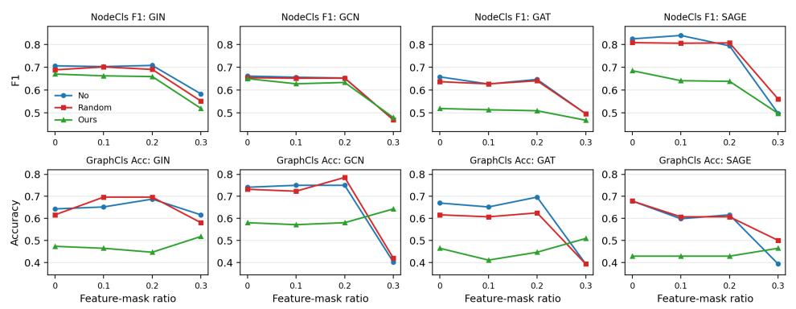

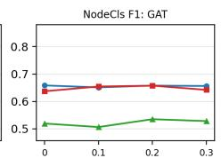

Figure 6: Complete feature-masking robustness results on PROTEINS\_full. Panels show node F1 and graph accuracy for clean data (No), Gaussian random perturbations (Random), and perturbations generated by our framework (Ours).  
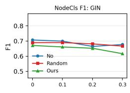

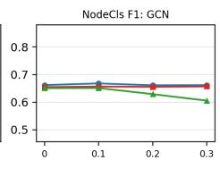

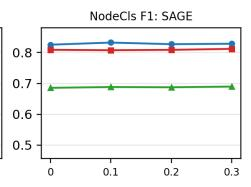

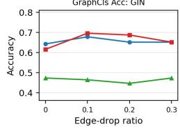

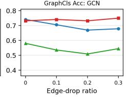

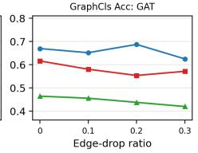

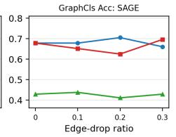

Figure 7: Complete edge-dropping robustness results on PROTEINS\_full. Panels show node F1 and graph accuracy for clean data (No), Gaussian random perturbations (Random), and perturbations generated by our framework (Ours).  
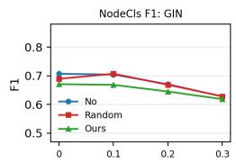

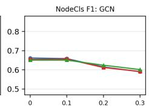

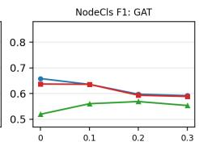

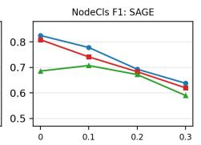

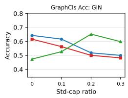

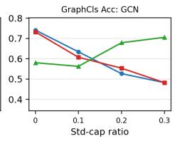

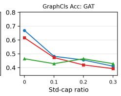

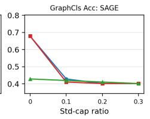  
Figure 8: Complete adversarial-training robustness results on PROTEINS\_full. Panels show node F1 and graph accuracy for clean data (No), Gaussian random perturbations (Random), and perturbations generated by our framework (Ours).

Table 13: Cora objective-design ablation: node F1 / LP AUC / LP AP gaps relative to clean and random baselines.
<table><tr><td colspan="10">Node F1</td><td colspan="4"></td></tr><tr><td></td><td></td><td colspan="4"></td><td colspan="4">LP AUC</td><td colspan="4">LP AP</td></tr><tr><td>Gap</td><td>Source \ Target</td><td>GAT</td><td>GCN</td><td>GIN</td><td>SAGE</td><td>GAT</td><td>GCN</td><td>GIN</td><td>SAGE</td><td>GAT</td><td>GCN</td><td>GIN</td><td>SAGE</td></tr><tr><td rowspan="4">Δc</td><td>GAT</td><td>-0.103</td><td>-0.088</td><td>-0.052</td><td>-0.044</td><td>-0.058</td><td>-0.139</td><td>-0.095</td><td>-0.054</td><td>-0.053</td><td>-0.153</td><td>-0.088</td><td>-0.055</td></tr><tr><td>GCN</td><td>-0.088</td><td>-0.037</td><td>-0.066</td><td>-0.085</td><td>-0.118</td><td>-0.079</td><td>-0.057</td><td>-0.050</td><td>-0.087</td><td>-0.070</td><td>-0.058</td><td>-0.053</td></tr><tr><td>GIN</td><td>-0.029</td><td>-0.052</td><td>-0.088</td><td>-0.044</td><td>-0.069</td><td>-0.122</td><td>-0.172</td><td>-0.032</td><td>-0.045</td><td>-0.112</td><td>-0.159</td><td>-0.040</td></tr><tr><td>SAGE</td><td>-0.074</td><td>-0.018</td><td>-0.070</td><td>-0.066</td><td>-0.018</td><td>-0.031</td><td>-0.020</td><td>-0.045</td><td>-0.029</td><td>-0.057</td><td>-0.036</td><td>-0.064</td></tr><tr><td rowspan="4">Δr</td><td>GAT</td><td>-0.092</td><td>-0.103</td><td>-0.029</td><td>-0.033</td><td>-0.056</td><td>-0.141</td><td>-0.081</td><td>-0.051</td><td>-0.049</td><td>-0.158</td><td>-0.073</td><td>-0.053</td></tr><tr><td>GCN</td><td>-0.077</td><td>-0.037</td><td>-0.044</td><td>-0.088</td><td>-0.116</td><td>-0.057</td><td>-0.049</td><td>-0.047</td><td>-0.085</td><td>-0.058</td><td>-0.052</td><td>-0.051</td></tr><tr><td>GIN</td><td>-0.018</td><td>-0.074</td><td>-0.066</td><td>-0.048</td><td>-0.067</td><td>-0.128</td><td>-0.151</td><td>-0.029</td><td>-0.042</td><td>-0.119</td><td>-0.133</td><td>-0.037</td></tr><tr><td>SAGE</td><td>-0.059</td><td>-0.018</td><td>-0.044</td><td>-0.055</td><td>-0.012</td><td>-0.039</td><td>-0.025</td><td>-0.041</td><td>-0.024</td><td>-0.067</td><td>-0.042</td><td>-0.061</td></tr></table>

<table><tr><td>Node F1</td><td colspan="10">Classification</td><td colspan="4"></td></tr><tr><td></td><td></td><td colspan="4"></td><td colspan="4">LP AUC</td><td colspan="4">LP AP</td></tr><tr><td>Gap</td><td>Source \ Target</td><td>GAT</td><td>GCN</td><td>GIN</td><td>SAGE</td><td>GAT</td><td>GCN</td><td>GIN</td><td>SAGE</td><td>GAT</td><td>GCN</td><td>GIN</td><td>SAGE</td></tr><tr><td rowspan="4">Δc</td><td>GAT</td><td>-0.026</td><td>-0.004</td><td>-0.011</td><td>-0.015</td><td>-0.021</td><td>-0.062</td><td>-0.174</td><td>-0.020</td><td>-0.031</td><td>-0.032</td><td>-0.186</td><td>-0.022</td></tr><tr><td>GCN</td><td>-0.018</td><td>-0.022</td><td>-0.004</td><td>-0.022</td><td>-0.020</td><td>-0.069</td><td>-0.078</td><td>-0.023</td><td>-0.030</td><td>-0.059</td><td>-0.079</td><td>-0.026</td></tr><tr><td>GIN</td><td>-0.011</td><td>+0.018</td><td>+0.000</td><td>-0.011</td><td>-0.019</td><td>+0.031</td><td>-0.018</td><td>-0.008</td><td>-0.028</td><td>+0.024</td><td>-0.046</td><td>-0.017</td></tr><tr><td>SAGE</td><td>-0.018</td><td>-0.007</td><td>-0.004</td><td>-0.015</td><td>-0.026</td><td>-0.013</td><td>-0.050</td><td>-0.051</td><td>-0.029</td><td>-0.025</td><td>-0.051</td><td>-0.059</td></tr><tr><td rowspan="4">Δr</td><td>GAT</td><td>-0.018</td><td>-0.004</td><td>-0.011</td><td>-0.018</td><td>-0.020</td><td>-0.068</td><td>-0.174</td><td>-0.017</td><td>-0.029</td><td>-0.043</td><td>-0.188</td><td>-0.020</td></tr><tr><td>GCN</td><td>-0.011</td><td>-0.037</td><td>-0.004</td><td>-0.026</td><td>-0.019</td><td>-0.086</td><td>-0.052</td><td>-0.020</td><td>-0.027</td><td>-0.075</td><td>-0.048</td><td>-0.024</td></tr><tr><td>GIN</td><td>+0.000</td><td>+0.018</td><td>+0.004</td><td>-0.015</td><td>-0.019</td><td>+0.017</td><td>-0.005</td><td>-0.005</td><td>-0.027</td><td>+0.009</td><td>-0.020</td><td>-0.015</td></tr><tr><td>SAGE</td><td>-0.011</td><td>-0.007</td><td>+0.007</td><td>-0.004</td><td>-0.025</td><td>-0.021</td><td>-0.032</td><td>-0.048</td><td>-0.026</td><td>-0.041</td><td>-0.036</td><td>-0.057</td></tr></table>

Table 14: ENZYMES objective-design ablation: graph accuracy / node F1 gaps relative to clean and random baselines.
<table><tr><td colspan="10"></td></tr><tr><td></td><td></td><td colspan="4">Graph accuracy</td><td colspan="4">Node F1</td></tr><tr><td>Gap</td><td>Source \ Target</td><td>GIN</td><td>GAT</td><td>GCN</td><td>SAGE</td><td>GIN</td><td>GAT</td><td>GCN</td><td>SAGE</td></tr><tr><td rowspan="4">Δc</td><td>GIN</td><td>-0.433</td><td>-0.250</td><td>-0.233</td><td>-0.517</td><td>-0.018</td><td>-0.035</td><td>-0.031</td><td>-0.012</td></tr><tr><td>GAT</td><td>-0.333</td><td>-0.233</td><td>-0.233</td><td>-0.450</td><td>-0.032</td><td>-0.040</td><td>-0.026</td><td>-0.013</td></tr><tr><td>GCN</td><td>-0.350</td><td>-0.067</td><td>-0.300</td><td>-0.500</td><td>-0.034</td><td>-0.040</td><td>-0.022</td><td>-0.017</td></tr><tr><td>SAGE</td><td>-0.450</td><td>-0.117</td><td>-0.283</td><td>-0.383</td><td>-0.023</td><td>-0.011</td><td>+0.000</td><td>-0.022</td></tr><tr><td rowspan="4">∆r</td><td>GIN</td><td>-0.450</td><td>-0.233</td><td>-0.217</td><td>-0.550</td><td>-0.024</td><td>-0.032</td><td>-0.032</td><td>-0.008</td></tr><tr><td>GAT</td><td>-0.383</td><td>-0.233</td><td>-0.300</td><td>-0.483</td><td>-0.038</td><td>-0.036</td><td>-0.027</td><td>-0.009</td></tr><tr><td>GCN</td><td>-0.367</td><td>-0.100</td><td>-0.383</td><td>-0.533</td><td>-0.041</td><td>-0.038</td><td>-0.022</td><td>-0.013</td></tr><tr><td>SAGE</td><td>-0.467</td><td>-0.133</td><td>-0.267</td><td>-0.433</td><td>-0.027</td><td>-0.011</td><td>-0.002</td><td>-0.018</td></tr></table>

<table><tr><td colspan="10">Classification</td></tr><tr><td colspan="3"></td><td colspan="4">Graph accuracy</td><td colspan="4">Node F1</td></tr><tr><td>Gap</td><td>Source \ Target</td><td>GIN</td><td>GAT</td><td>GCN</td><td>SAGE</td><td>GIN</td><td>GAT</td><td>GCN</td><td>SAGE</td></tr><tr><td rowspan="4">∆c</td><td>GIN</td><td>-0.333</td><td>-0.150</td><td>-0.200</td><td>-0.367</td><td>-0.046</td><td>+0.010</td><td>-0.006</td><td>-0.029</td></tr><tr><td>GAT</td><td>-0.367</td><td>-0.183</td><td>-0.183</td><td>-0.417</td><td>-0.016</td><td>-0.015</td><td>+0.004</td><td>-0.023</td></tr><tr><td>GCN</td><td>-0.333</td><td>-0.167</td><td>-0.183</td><td>-0.283</td><td>-0.017</td><td>-0.008</td><td>+0.005</td><td>-0.027</td></tr><tr><td>SAGE</td><td>-0.317</td><td>-0.133</td><td>-0.100</td><td>-0.350</td><td>-0.002</td><td>-0.046</td><td>-0.005</td><td>-0.083</td></tr><tr><td rowspan="4">∆r</td><td>GIN</td><td>-0.317</td><td>-0.133</td><td>-0.300</td><td>-0.367</td><td>-0.049</td><td>+0.021</td><td>-0.011</td><td>-0.022</td></tr><tr><td>GAT</td><td>-0.400</td><td>-0.167</td><td>-0.233</td><td>-0.433</td><td>-0.023</td><td>-0.008</td><td>+0.006</td><td>-0.016</td></tr><tr><td>GCN</td><td>-0.383</td><td>-0.133</td><td>-0.250</td><td>-0.283</td><td>-0.022</td><td>+0.001</td><td>+0.002</td><td>-0.020</td></tr><tr><td>SAGE</td><td>-0.317</td><td>-0.100</td><td>-0.133</td><td>-0.383</td><td>-0.009</td><td>-0.037</td><td>-0.007</td><td>-0.076</td></tr></table>

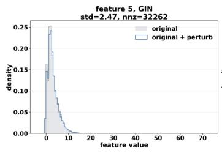

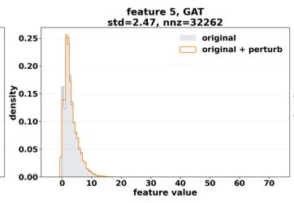

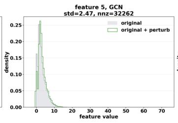

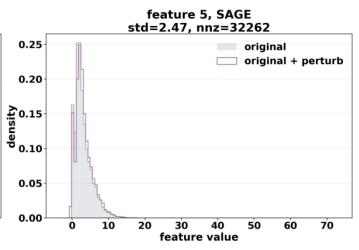

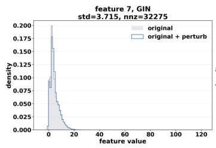

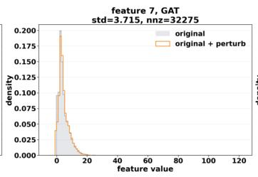

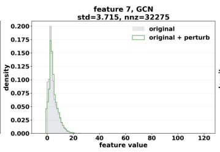  
Figure 9: Original versus perturbed feature-value histograms for PROTEINS\_full, shown for representative features.

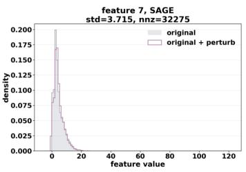

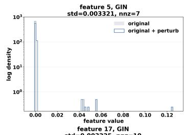

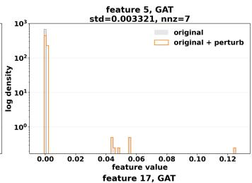

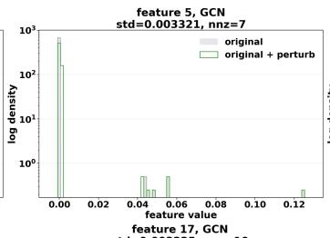

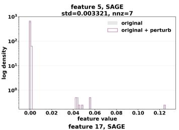

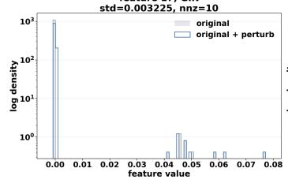

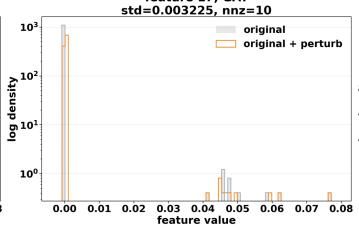

Figure 10: Original versus perturbed feature-value histograms for Cora, shown for representative features. The logarithmic y-axis improves visibility of low-frequency nonzero values because the original feature values are highly concentrated near zero.  

  
Figure 11: Original versus perturbed feature-value histograms for PubMed, shown for representative features.

  
Figure 12: Original versus perturbed feature-value histograms for ENZYMES, shown for representative features.