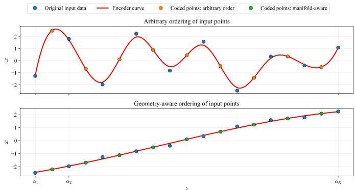
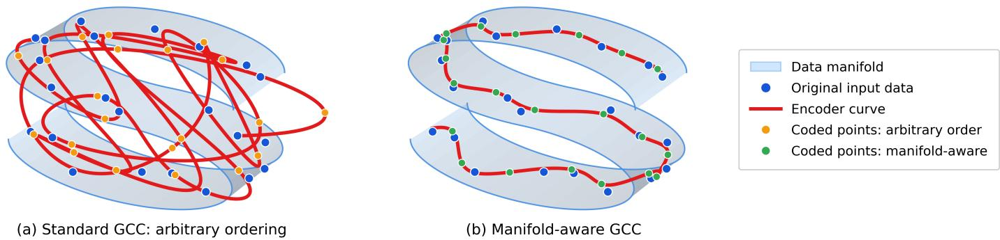
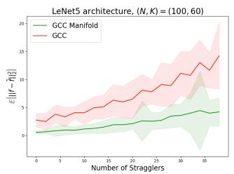
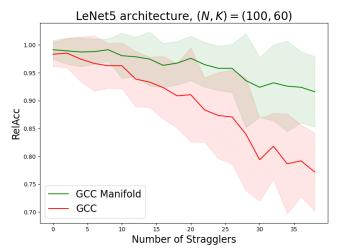
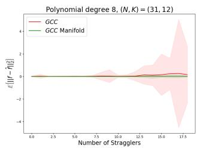
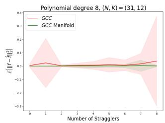

# Manifold-Aware General Coded Computing for Straggler-Resilient Distributed Computing

Parsa Moradi

University of Minnesota, Twin Cities

Minneapolis, MN, USA

moradi@umn.edu

Mohammad Ali Maddah-Ali

University of Minnesota, Twin Cities

Minneapolis, MN, USA

maddah@umn.edu

Abstract—Existing coded-computing designs do not explicitly exploit the intrinsic structure of the input data. In communication systems, statistical structure and redundancy are often removed through source coding (or compression) before channel coding is applied. This principle, however, does not transfer directly to coded computation. In many computational tasks, particularly in machine learning, the structure of the data is precisely what the computation seeks to exploit to infer outputs or learn meaningful patterns. Consequently, coded-computing schemes should preserve and leverage this structure in their code design, rather than ignoring or eliminating it through source coding.

This observation motivates a different perspective on code construction. In many channel-coding schemes, such as Reed-Solomon codes, coded symbols are generated by evaluating a low-dimensional algebraic representation at selected points. In contrast, many high-dimensional datasets naturally concentrate near low-dimensional manifolds. In this paper, we exploit this intrinsic geometry by designing coded samples that follow the natural manifold of the data, rather than imposing an artificial low-dimensional structure unrelated to the data distribution. Inspired by graph-based manifold learning, we propose a manifoldaware encoding strategy for general coded computing (GCC). Experiments on neural network inference and high-dimensional polynomial evaluation demonstrate that the proposed strategy consistently and significantly reduces the mean squared recovery error under straggling compared with standard GCC.

## I. INTRODUCTION

Distributed computing is a fundamental approach to accelerate large-scale computational workloads, including machine learning training and inference. In a typical master-worker architecture, a master node seeks to evaluate a function on a batch of input data by distributing computational tasks across multiple worker nodes. In practice, however, the overall completion time is often dominated by stragglers: workers that are delayed, overloaded, or fail to return their outputs before a prescribed deadline. Developing effective mechanisms for mitigating the impact of stragglers is therefore a central problem in distributed computing.

Coded computing addresses this challenge by introducing structured redundancy into tasks assigned to workers [1]–[10]. Rather than assigning the original inputs directly, the master node generates a collection of coded inputs via a designed encoding procedure. Each worker evaluates the prescribed target function on its coded input and returns the resulting coded output. The master node then applies a decoding procedure to recover the desired function evaluations from the outputs returned by the non-straggling workers.

Classical coded-computing schemes draw heavily on algebraic coding theory and provide rigorous straggler-resilience guarantees for structured computations, such as matrix multiplication and polynomial evaluation [2], [5], [11]–[16]. Many modern computational workloads, however, involve general high-dimensional nonlinear functions, including deep neural networks, that lack the algebraic structure these schemes require. This limitation has motivated the development of more flexible coded-computing approaches for general nonlinear functions [1], [4], [17], [18]. Among these approaches, General Coded Computing (GCC) provides a learning-theoretic framework for designing straggler-resilient coded-computing schemes for arbitrary functions [6], [7]. GCC formulates coded computation as an end-to-end approximation problem and designs the encoder and decoder by optimizing a loss function that directly measures the discrepancy between the desired function evaluations and the estimates recovered from the nonstraggling worker outputs.

Nevertheless, existing coded-computing approaches generally overlook an important property of the input data: its intrinsic statistical structure. This structure often implies substantial redundancy in the data. In communication systems, this redundancy is typically removed first through source coding (or compression) before controlled redundancy is introduced via channel coding to enable reliable communication over an uncertain or noisy channel [19], [20]. This classical separation is supported by Shannon’s source-channel separation theorem, which establishes, under standard assumptions for point-topoint memoryless channels, that separate source and channel coding can achieve optimal performance asymptotically [20].

However, this separation principle does not carry over directly to coded computing. Consider machine learning computations, which have been a major motivation for the coded-computing paradigm. Many such tasks are specifically designed to exploit the statistical and geometric structure of the input data to infer outputs or learn meaningful patterns. Applying source coding solely to eliminate intrinsic data redundancy before designing the coded-computing scheme may therefore discard or obscure precisely the structure the computation aims to exploit. Moreover, it is not evident that a strict separation between source compression and coding for reliable computation is desirable in this setting. Instead, these observations suggest a more integrated design principle:

  
Fig. 1: Illustration of the importance of exploiting data structure in coded computing. Top: standard GCC. Bottom: GCC with a structure-aware encoder that exploits the intrinsic geometry of the data.

Coded-computing schemes should explicitly embrace and exploit the intrinsic structure of the data, rather than ignoring or treating it merely as redundancy to be removed prior to coding.

Let us illustrate this consideration through a simple toy example. We first provide a high-level overview of how GCC operates. GCC selects a set of fixed, ordered scalar locations on a one-dimensional interval, referred to as encoder design points, and associates the input samples with these locations (see the blue points in Fig. 1, top). The master node then constructs an encoder curve that maps each encoder design point approximately to its associated input sample (red curve) and samples this curve at a second set of fixed locations, one for each worker, to generate coded inputs (green points). After the workers evaluate the target function on these coded inputs, the master node constructs a decoder curve from the returned coded outputs and evaluates it at the encoder design points to recover the desired function values.

Let us now design the encoder by explicitly exploiting the structure of the data. We first order the data points and then assign them to the encoder design points according to this ordering; see Fig. 1 (bottom). As illustrated in the figure, the resulting encoding curve, shown in red, is substantially smoother. The coded symbols, shown in green, are again obtained by sampling this curve. Heuristically, a smoother encoding curve can be represented more accurately from a limited number of sampled points. Equivalently, fewer coded symbols may be sufficient to reconstruct the red curve, and hence to recover the original data points more accurately. Indeed, the theory of generalized coded computing suggests that a smoother encoding function leads to more accurate coded-computing results [6], [7].

This toy example highlights the importance of exploiting the intrinsic structure of the data in code design. Many realworld high-dimensional datasets exhibit precisely the structure that can be leveraged for this purpose. According to the manifold hypothesis, such datasets often concentrate near a low-dimensional manifold embedded in the ambient highdimensional space [21]. This low-dimensional geometry can be viewed as a form of intrinsic redundancy.

Fig. 2 illustrates an example of such a manifold, where the input data points lie in its vicinity. Fig. 2(a) shows a code design that does not exploit the intrinsic structure of the data. As a result, the coded data symbols are sampled from a relatively complex encoding curve, which can lead to a higher approximation error in the decoding process. In contrast, Fig. 2(b) illustrates a code design that exploits this structure and achieves a more accurate approximation.

As shown in Fig. 2(b), when coded computing respects the structure of the data, the coded symbols remain in the vicinity of the data manifold. This observation highlights a key perspective: because the target function is evaluated on coded symbols rather than directly on original data, each coded representation generated by the encoder must constitute a meaningful input to the target function. If the coded-computing scheme fails to respect the data’s intrinsic structure, the resulting coded symbols may fall outside the regions of the input space where the target function operates reliably.

For example, in an inference task where the target function is a machine learning model trained on data drawn from a specific domain distribution, coded symbols that stay near the data manifold are more likely to lie in data-supported regions where the model performs well. In contrast, coded symbols that deviate substantially from this manifold may act as outof-distribution inputs, leading to unreliable predictions after decoding. Similarly, when computing the gradient of a loss function for training, generating coded samples close to the manifold helps ensure training occurs on inputs representative of the underlying data domain.

Uncovering and learning the low-dimensional intrinsic structure near which data points concentrate in a high-dimensional ambient space is referred to as manifold learning. Classical examples include Isomap [22] and Laplacian Eigenmaps [23]. A common approach in manifold learning is to represent relationships among high-dimensional samples using a graph whose nodes correspond to data points and whose edge weights are determined by pairwise distances [22]–[25]. Nearby samples are interpreted as locally related, and the resulting graph provides a discrete proxy for the geometry of the underlying data manifold.

Motivated by these observations, this paper proposes a manifold-aware GCC encoding strategy. Given an input batch, the proposed method constructs a distance-weighted graph whose vertices correspond to input samples and whose edge weights reflect pairwise distances. It then uses a short Hamiltonian path to obtain a one-dimensional traversal of the empirical data geometry and assigns the samples to ordered encoder design points accordingly. The GCC encoder is subsequently constructed using this geometry-aware assignment. As a result, consecutive portions of the encoder curve connect nearby samples, encouraging coded inputs sampled from the curve to remain closer to the underlying data manifold. Thus, the proposed strategy introduces input ordering as an additional code-design variable while preserving the standard GCC pipeline.

  
Fig. 2: Illustration of standard and manifold-aware GCC encoding. Original input samples (blue) lie on a low-dimensional data manifold. With an arbitrary ordering, the fitted encoder curve (red) makes large transitions through the ambient space, causing many coded inputs (orange) to lie away from the data manifold. In contrast, the manifold-aware ordering encourages the encoder curve to follow the data geometry, keeping the resulting coded inputs (green) in the vicinity of the manifold.

We evaluate the proposed method on two representative classes of high-dimensional nonlinear computations: neural network inference using LeNet5 [26] and high-dimensional polynomial evaluation. Experimental results show that the proposed manifold-aware ordering consistently improves GCC recovery performance under straggling, yielding lower mean squared recovery error than standard GCC.

## II. PROBLEM FORMULATION AND GCC BACKGROUND

We consider a distributed computing system consisting of one master node and N worker nodes. The master node seeks to compute a batch of function evaluations $\{ \mathbf { f } ( \mathbf { x } _ { k } ) \} _ { k = 1 } ^ { K }$ , where each input data point satisfies $\mathbf { x } _ { k } \in \mathbb { R } ^ { d } .$ , and the target function is $\mathbf { f } : \mathbb { R } ^ { d }  \mathbb { R } ^ { m }$ . The function $\mathbf { f } \left( \cdot \right)$ may represent a general high-dimensional computation, ranging from a simple vectorvalued function to a deep neural network used for inference.

A central challenge in this setting is the presence of straggling workers. Due to delays, congestion, or failures, some workers may not return their assigned computations before a prescribed deadline. Let ${ \mathcal { F } } \subseteq [ N ] : = \{ 1 , \dots , N \}$ denote the set of non-straggling workers whose outputs are received by the master node on time. The set $\mathcal { F }$ may vary across computation rounds, and we model it as a random subset drawn from a distribution $P _ { \mathcal { F } }$ over subsets of $[ N ]$ . We next describe the standard GCC framework.

## A. Standard General Coded Computing

Standard GCC consists of three stages: (i) encoding at the master node, (ii) computation at the worker nodes, and (iii) decoding at the master node.

a) Encoding: The master node selects K ordered encoder design points $\alpha _ { 1 } < \alpha _ { 2 } < \cdots < \alpha _ { K }$ in a bounded interval $\Omega \subset \mathbb { R } .$ . It then constructs a second-order smoothing spline [27], [28] $\mathbf { u } _ { \mathrm { e n c } } : \Omega \to \mathbb { R } ^ { d }$ using the data-design pairs $\{ ( \alpha _ { k } , \mathbf { x } _ { k } ) \} _ { k = 1 } ^ { K }$ such that ${ \bf u } _ { \mathrm { e n c } } ( \alpha _ { k } ) \approx { \bf x } _ { k }$ for $k \in [ K ] : = \{ 1 , . . . , K \}$ . The master node also selects N ordered decoder design points $\beta _ { 1 } < \beta _ { 2 } < \cdots < \beta _ { N }$ in Ω. For each worker $n \in [ N ]$ , the master node generates the coded input $\widetilde { \mathbf { x } } _ { n } = \mathbf { u } _ { \mathrm { e n c } } ( \beta _ { n } )$ and sends $\widetilde { \mathbf { x } } _ { n }$ to worker n. Because the encoder is constructed using the entire input batch, each coded input $\widetilde { \mathbf { x } } _ { n }$ generally depends on all original input samples.

b) Computation: Each worker applies the target function to its assigned coded input. If worker n is non-straggling, it returns $\mathbf { y } _ { n } = \mathbf { f } ( \widetilde { \mathbf { x } } _ { n } ) = \mathbf { f } ( \mathbf { u } _ { \mathrm { e n c } } ( \beta _ { n } ) )$ to the master node before the deadline. Let ${ \mathcal { F } } \subseteq [ N ]$ denote the set of non-straggling workers. The master node therefore observes $\{ ( \beta _ { n } , \mathbf { y } _ { n } ) \} _ { n \in \mathcal { F } }$

c) Decoding: Using the outputs returned by the nonstraggling workers, the master node fits another second-order smoothing spline $\mathbf { u } _ { \mathrm { d e c } } : \Omega \to \mathbb { R } ^ { m }$ to the observed pairs $\{ ( \beta _ { n } , \mathbf { y } _ { n } ) \} _ { n \in \mathcal { F } }$ . The decoder is intended to approximate target function evaluations along the encoder curve; in particular, ${ \mathbf { u } } _ { \mathrm { d e c } } ( \beta _ { n } ) \approx { \mathbf { f } } ( { \mathbf { u } } _ { \mathrm { e n c } } ( \beta _ { n } ) )$ for $n \in { \mathcal { F } } .$ . The master node then estimates the desired function evaluations by evaluating the decoder at the encoder design points: ${ \widehat { \mathbf { f } } } _ { \mathcal { F } } ( \mathbf { x } _ { k } ) : = \mathbf { u } _ { \mathrm { d e c } } ( \alpha _ { k } )$ for $k \in [ K ]$ . When both the encoder and decoder are accurate, one expects $\mathbf { u } _ { \mathrm { d e c } } ( \alpha _ { k } ) \approx \mathbf { f } ( \mathbf { u } _ { \mathrm { e n c } } ( \alpha _ { k } ) ) \approx \mathbf { f } ( \mathbf { x } _ { k } )$

The performance of the scheme is measured by the mean squared recovery error averaged over the straggling pattern:

$$
\mathcal { L } : = \mathbb { E } _ { \mathcal { F } \sim P _ { \mathcal { F } } } \left[ \frac { 1 } { K } \sum _ { k = 1 } ^ { K } \left\| \widehat { \mathbf { f } } _ { \mathcal { F } } ( \mathbf { x } _ { k } ) - \mathbf { f } ( \mathbf { x } _ { k } ) \right\| _ { 2 } ^ { 2 } \right] .\tag{1}
$$

This objective directly captures the goal of coded computing: the master node should accurately recover the function values using only the outputs returned by non-straggling workers.

The use of second-order smoothing splines in standard GCC arises from a principled, optimization-based design. Specifically, the authors of [6] optimize a tractable upper bound on (1) and show that, when chosen from second-order Sobolev spaces—function spaces with square-integrable derivatives up to order two—the optimal encoder and decoder are secondorder smoothing splines fitted to the input data and returned worker outputs, respectively.

Algorithm 1 Manifold-Aware GCC   
Input: Input batch $\{ \mathbf { x } _ { k } \} _ { k = 1 } ^ { K } ,$ encoder design points   
$\{ \bar { \alpha _ { k } } \} _ { k = 1 } ^ { K } ,$ decoder design points $\{ \beta _ { n } \} _ { n = 1 } ^ { N }$   
Output: Coded inputs $\{ \widetilde { \mathbf { x } } _ { n } \} _ { n = 1 } ^ { N }$ and recovered estimates   
$\{ \widehat { \mathbf { f } } _ { \mathcal { F } } ( \mathbf { x } _ { k } ) \} _ { k = 1 } ^ { K }$   
1: Construct graph weights $w _ { i j } = \| \mathbf { x } _ { i } - \mathbf { x } _ { j } \| _ { 2 }$ for $i , j \in [ K ]$   
2: Let $S _ { K }$ denote the set of all permutations of [K], and find   
a short Hamiltonian path   
K−1   
π ≈ arg min X wσ(j),σ(j+1).   
σ∈SK   
j=1   
3: Fit the encoder smoothing spline $\mathbf { u } _ { \mathrm { e n c } } : \Omega \to \mathbb { R } ^ { d }$ using the   
ordered pairs $\{ ( \alpha _ { j } , \mathbf { x } _ { \pi ( j ) } ) \} _ { j \in [ K ] }$   
4: for $n = 1 , \ldots , N$ do   
5: Set $\widetilde { \mathbf { x } } _ { n } = \mathbf { u } _ { \mathrm { e n c } } ( \beta _ { n } )$ and send it to worker n.   
6: end for   
7: Receive $\{ \mathbf { f } \left( \widetilde { \mathbf { x } } _ { v } \right) \} _ { v \in \mathcal { F } }$ from the non-straggling workers.   
8: Fit the decoder smoothing spline $\mathbf { u } _ { \mathrm { d e c } } : \Omega  \mathbb { R } ^ { m }$ using   
the returned pairs $\{ ( \beta _ { v } , \mathbf { f } ( \widetilde { \mathbf { x } } _ { v } ) ) \} _ { v \in \mathcal { F } } .$   
9: Return $\widehat { \mathbf f } _ { \mathcal F } ( \mathbf x _ { \pi ( j ) } ) = \mathbf u _ { \mathrm { d e c } } ( \alpha _ { j } )$ for all $j \in [ K ] .$

## III. MANIFOLD-AWARE GENERAL CODED COMPUTING

In standard GCC, coded inputs are generated by sampling an encoder curve $\mathbf { u } _ { \mathrm { e n c } } ( z )$ at $\{ \beta _ { j } \} _ { j \in [ N ] }$ , where they are evaluated by the target function $( \{ \mathbf { f } ( \mathbf { u } _ { \mathrm { e n c } } ( \beta _ { j } ) ) \} _ { j \in [ N ] } )$ . Ideally, the encoder curve ${ \bf u } _ { \mathrm { e n c } } ( z )$ should be as smooth as possible, as a smoother encoder generally leads to a smoother composition $\mathbf { f } \left( \mathbf { u } _ { \mathrm { e n c } } ( z ) \right)$ , which in turn reduces approximation error during decoding [6].

Conversely, when input data concentrate near a lowdimensional manifold, coded inputs should ideally lie on or near this manifold. This ensures that the coded inputs remain in the vicinity of the input data manifold where the target function is intended to operate. In contrast, coded inputs far from the data manifold may be out-of-distribution, rendering their function evaluations less informative for recovering desired outputs.

This observation highlights an important design choice in GCC. The encoder design points $\alpha _ { 1 } < \cdots < \alpha _ { K }$ are ordered along a one-dimensional interval, whereas the input batch $\{ \mathbf { x } _ { k } \} _ { k = 1 } ^ { K }$ is generally unordered. To obtain a smoother encoding function that remains close to the data manifold, input samples close to one another should be assigned to nearby encoder design points. If consecutive design points are assigned to distant input samples, the resulting encoder curve must make large transitions through ambient space, potentially passing through regions far from the underlying data manifold.

Figs. 1 and 2 illustrate this effect in a one-dimensional example. The same set of input points can induce a highly oscillatory spline when assigned to the encoder design points in an arbitrary order. In contrast, ordering points according to their geometry produces a much simpler, nearly linear encoder curve. More generally, assigning consecutive design points $\alpha _ { j }$ and $\alpha _ { j + 1 }$ to distant data points forces the encoder curve to bridge a large gap in the empirical data geometry. Coded inputs sampled along such transitions may pass through regions with little data support, increasing the variation of the encoder and the induced computation $\mathbf { f } \circ \mathbf { u } _ { \mathrm { e n c } }$ . This can lead to higher decoding error from non-straggling worker outputs.

LeNet5 architecture, $( N , K ) = ( 2 0 , 1 0 )$   
GCC   
40   
GCC Manifold + Optimal Ordering   
GCC Manifold + 2-Opt Ordering   
30   
20   
10   
-10   
0 1 2 3 4 5 6 7 8   
Number of Stragglers  
Fig. 3: Comparison of standard GCC, manifold-aware GCC with exact shortest-Hamiltonian-path ordering, and manifoldaware GCC with 2-opt ordering for LeNet5 with $( N , K ) =$ (20, 10). The plot reports the mean squared recovery error as a function of the number of stragglers. The 2-opt ordering closely tracks the performance of the exact optimal ordering, indicating that the heuristic achieves comparable recovery performance while being substantially more efficient to compute. Shaded regions indicate 95% confidence intervals over repeated trials.

Motivated by this principle, we treat the assignment as an additional code-design variable. Equivalently, for a permutation π of [K], the encoder is fitted using the ordered pairs $\{ ( \alpha _ { j } , \bar { \mathbf { x } } _ { \pi ( j ) } ) \} _ { j = 1 } ^ { K }$ . Our objective is to select π so that this ordering reflects the empirical geometry of the input data. Given the data points $\{ \mathbf { x } _ { k } \} _ { k = 1 } ^ { K }$ , we construct a weighted graph $\mathcal { G } = ( [ K ] , \mathcal { E } , w )$ , where each node corresponds to an input data point and the edge weight between nodes i and $j$ is given by $w _ { i j } = \| \mathbf { x } _ { i } - \mathbf { x } _ { j } \| _ { 2 }$ . More generally, $w _ { i j }$ may be chosen as a distance in a feature space. We then seek a permutation π of [K] that minimizes total path length:

$$
\pi ^ { * } = \arg \operatorname* { m i n } _ { \pi } \sum _ { j = 1 } ^ { K - 1 } w _ { \pi ( j ) , \pi ( j + 1 ) } .\tag{2}
$$

Finding the exact minimizer of (2) is the shortest Hamiltonian path problem, a path variant of the traveling salesman problem (TSP). Exact dynamic programming methods, such as the

  
(a) Mean squared recovery error for LeNet5.

  
(b) Relative accuracy for LeNet5.

  
(c) Mean squared recovery error for the degree-8 polynomial task.

  
(d) Zoomed view of the polynomial recovery error.  
Fig. 4: Performance comparison between standard GCC and manifold-aware GCC as the number of stragglers increases. The first two panels report results for LeNet5 with $( N , K ) = ( 1 0 0 , 6 0 )$ , where we evaluate both mean squared recovery error and relative accuracy. The last two panels report results for a degree-8 polynomial task with $\left( N , K \right) = \left( 3 1 , 1 2 \right)$ , showing the mean squared recovery error and a zoomed view. Shaded regions indicate 95% confidence intervals over repeated trials.

Bellman–Held–Karp algorithm, solve TSP-type problems in $O ( K ^ { 2 } 2 ^ { K } )$ time and $O ( \bar { K } 2 ^ { K } )$ memory [29]. Therefore, exact optimization is impractical as a preprocessing step for GCC when K is moderately large.

In practice, manifold-aware GCC does not require a globally optimal Hamiltonian path; it only requires an ordering that avoids the long transitions induced by an arbitrary permutation (see Fig. 3). We therefore employ a local-search heuristic based on 2-opt moves [30]. A 2-opt move replaces two edges of the current path whenever the resulting exchange reduces total path length, repeating this process until no further improving move is found. Finally, after computing the ordering $\pi ^ { * }$ , the encoder is fitted according to $\mathbf { u } _ { \mathrm { e n c } } ( \alpha _ { j } ) \approx \mathbf { x } _ { \pi ^ { * } ( j ) }$ for $j \in [ K ]$ while the rest of the GCC pipeline remains unchanged.

## A. Computational Complexity

After the pairwise distance matrix has been computed in $\mathcal { O } ( K ^ { 2 } d )$ , one full scan of the 2-opt neighborhood costs $\mathcal { O } ( K ^ { 2 } )$ Thus, if T denotes the number of local-search passes, the ordering stage has computational complexity of $\bar { \mathcal { O } } ( K ^ { 2 } d + K ^ { 2 } T )$ In addition, the standard GCC encoder and decoder can be computed with complexities $\mathcal { O } ( ( N { + } K ) d )$ and $\mathcal { O } ( ( \left| \mathcal { F } \right| + K ) m )$ respectively [6]. Therefore, the total master-side computational complexity of the proposed manifold-aware GCC scheme is $\mathcal { O } \big ( K ^ { 2 } d + T K ^ { 2 } + ( N + K ) d + ( | \mathcal { F } | + K ) m \big )$ . Since $| \mathcal F | \le N$ and $K ^ { 2 } d$ dominates $K d ,$ this complexity can be upper-bounded as $\mathcal { O } \big ( K ^ { 2 } d + T K ^ { 2 } + N d + ( N + K ) m \big )$

## IV. EXPERIMENTAL RESULTS

We evaluate the effectiveness of the proposed manifoldaware GCC (denoted as GCC-Manifold) scheme on two computational tasks. The first task is neural network inference using LeNet5 [26], a convolutional neural network with approximately $6 \times 1 0 ^ { 4 }$ trainable parameters for handwritten digit classification [31]. The second task is the evaluation of a high-dimensional polynomial function. These two settings allow us to test the proposed ordering strategy on both a practical nonlinear machine learning model and a classic highdimensional function.

In all experiments, we compare standard GCC with the proposed manifold-aware GCC. For the encoder and decoder design points, we choose $\{ \alpha _ { k } \} _ { k = 1 } ^ { K }$ and $\{ \beta _ { n } \} _ { n = 1 } ^ { N }$ as Chebyshev points of the first and second kind, respectively, with $\Omega ~ = ~ ( - 1 , 1 )$ . This choice is motivated by the desirable interpolation properties of Chebyshev grids, which help reduce oscillatory behavior near the boundaries of the interpolation interval Ω [1]. For a fair comparison, all other hyperparameters, including the smoothing parameters of the encoder and decoder splines, are kept identical across both settings. Each experiment is repeated 10 times, and we report the average and 95% confidence interval, as depicted in Fig. 4.

a) Evaluation Metrics: We evaluate performance using mean squared error (MSE): $\begin{array} { r } { \mathrm { M S E } = \mathbb { E } _ { \mathcal { X } , \mathcal { F } } [ \frac { 1 } { K } \sum _ { k = 1 } ^ { K } \| \mathbf { f } ( \mathbf { x } _ { k } ) - \| } \end{array}$ $\widehat { \mathbf { f } } \left( \mathbf { x } _ { k } \right) \left\| _ { 2 } ^ { 2 } \right\}$ , averaged over input batches X and straggling sets F. For LeNet5 classification, we additionally measure relative accuracy, RelAcc $= \operatorname { A c c } ( { \widehat { \mathbf { f } } } ) / \operatorname { A c c } ( \mathbf { f } )$ , where $\operatorname { A c c } ( { \mathord { \cdot } } )$ denotes classification accuracy on the input batch.

b) Results: Fig. 4 presents the performance comparison of GCC Manifold and GCC. From left to right, the first two panels report the LeNet5 results with $( N , K ) = ( 1 0 0 , 6 0 )$ The proposed manifold-aware ordering consistently achieves lower MSE (Fig. 4a) and higher relative accuracy (Fig. 4b) than standard GCC, with the improvement becoming more pronounced in the high-straggler regime. The third panel reports the MSE for the degree-8 polynomial task with $( N , K ) =$ (31, 12) (Fig. 4c), while the fourth panel provides a zoomedin view for fewer than 9 stragglers (Fig. 4d). The manifoldaware method exhibits more stable and better recovery behavior. While standard GCC shows greater variability and increasing recovery error as the number of stragglers grows, the proposed method maintains a recovery error close to zero over the tested straggler range.

## ACKNOWLEDGMENT

This work is supported by the National Science Foundation under Grant CIF-2348638.

[1] T. Jahani-Nezhad and M. A. Maddah-Ali, “Berrut approximated coded computing: Straggler resistance beyond polynomial computing,” IEEE Transactions on Pattern Analysis and Machine Intelligence, vol. 45, no. 1, pp. 111–122, 2022.

[2] Q. Yu, M. A. Maddah-Ali, and A. S. Avestimehr, “Straggler mitigation in distributed matrix multiplication: Fundamental limits and optimal coding,” IEEE Transactions on Information Theory, vol. 66, no. 3, pp. 1920–1933, 2020.

[3] C. Karakus, Y. Sun, S. Diggavi, and W. Yin, “Straggler mitigation in distributed optimization through data encoding,” Advances in Neural Information Processing Systems, vol. 30, 2017.

[4] M. Soleymani, R. E. Ali, H. Mahdavifar, and A. S. Avestimehr, “ApproxIFER: A model-agnostic approach to resilient and robust prediction serving systems,” in Proceedings of the AAAI Conference on Artificial Intelligence, vol. 36, no. 8, 2022, pp. 8342–8350.

[5] Q. Yu, S. Li, N. Raviv, S. M. M. Kalan, M. Soltanolkotabi, and S. A. Avestimehr, “Lagrange coded computing: Optimal design for resiliency, security, and privacy,” in The 22nd International Conference on Artificial Intelligence and Statistics. PMLR, 2019, pp. 1215–1225.

[6] P. Moradi, B. Tahmasebi, and M. A. Maddah-Ali, “Coded computing for resilient distributed computing: A learning-theoretic framework,” in The Thirty-eighth Annual Conference on Neural Information Processing Systems, 2024.

[7] P. Moradi and M. A. Maddah-Ali, “General coded computing in a probabilistic straggler regime,” in 2025 IEEE International Symposium on Information Theory (ISIT). IEEE, 2025, pp. 1–6.

[8] K.-H. Huang and J. A. Abraham, “Algorithm-based fault tolerance for matrix operations,” IEEE Transactions on Computers, vol. C-33, no. 6, pp. 518–528, 1984.

[9] K. Lee, M. Lam, R. Pedarsani, D. Papailiopoulos, and K. Ramchandran, “Speeding up distributed machine learning using codes,” IEEE Transactions on Information Theory, vol. 64, no. 3, pp. 1514–1529, 2018.

[10] K. Lee, C. Suh, and K. Ramchandran, “High-dimensional coded matrix multiplication,” in Proceedings of IEEE International Symposium on Information Theory (ISIT), 2017, pp. 2418–2422.

[11] M. Fahim and V. R. Cadambe, “Numerically stable polynomially coded computing,” IEEE Transactions on Information Theory, vol. 67, no. 5, pp. 2758–2785, 2021.

[12] ——, “Numerically stable polynomially coded computing,” IEEE Transactions on Information Theory, vol. 67, no. 5, pp. 2758–2785, 2021.

[13] Q. Yu, M. Maddah-Ali, and S. Avestimehr, “Polynomial codes: an optimal design for high-dimensional coded matrix multiplication,” Advances in Neural Information Processing Systems, vol. 30, 2017.

[14] Q. Yu and A. S. Avestimehr, “Entangled polynomial codes for secure, private, and batch distributed matrix multiplication: Breaking the" cubic" barrier,” in 2020 IEEE International Symposium on Information Theory (ISIT). IEEE, 2020, pp. 245–250.

[15] S. Dutta, M. Fahim, F. Haddadpour, H. Jeong, V. Cadambe, and P. Grover, “On the optimal recovery threshold of coded matrix multiplication,” IEEE Transactions on Information Theory, vol. 66, no. 1, pp. 278–301, 2020.

[16] S. Dutta, V. Cadambe, and P. Grover, ““short-dot”: Computing large linear transforms distributedly using coded short dot products,” vol. 65, no. 10, 2019, pp. 6171–6193.

[17] J. So, B. Guler, and A. S. Avestimehr, “A scalable approach for privacypreserving collaborative machine learning,” in Advances in Neural Information Processing Systems, vol. 33, 2020, pp. 8054–8066.

[18] J. So, B. Güler, and A. S. Avestimehr, “CodedPrivateML: A fast and privacy-preserving framework for distributed machine learning,” IEEE Journal on Selected Areas in Information Theory, vol. 2, no. 1, pp. 441–451, 2021.

[19] C. E. Shannon, “A mathematical theory of communication,” The Bell System Technical Journal, vol. 27, no. 3, pp. 379–423, 1948.

[20] T. M. Cover and J. A. Thomas, Elements of Information Theory, 2nd ed. Wiley-Interscience, 2006.

[21] C. Fefferman, S. Mitter, and H. Narayanan, “Testing the manifold hypothesis,” Journal of the American Mathematical Society, vol. 29, no. 4, pp. 983–1049, 2016.

[22] J. B. Tenenbaum, V. de Silva, and J. C. Langford, “A global geometric framework for nonlinear dimensionality reduction,” Science, vol. 290, no. 5500, pp. 2319–2323, 2000.

[23] M. Belkin and P. Niyogi, “Laplacian eigenmaps for dimensionality reduction and data representation,” Neural Computation, vol. 15, no. 6, pp. 1373–1396, 2003.

[24] L. McInnes, J. Healy, and J. Melville, “Umap: Uniform manifold approximation and projection for dimension reduction,” arXiv preprint arXiv:1802.03426, 2018.

[25] S. Faigenbaum-Golovin and D. Levin, “Manifold repairing, reconstruction and denoising from scattered data in high-dimension,” arXiv preprint arXiv:2102.01750, 2021.

[26] Y. LeCun, L. Bottou, Y. Bengio, and P. Haffner, “Gradient-based learning applied to document recognition,” Proceedings of the IEEE, vol. 86, no. 11, pp. 2278–2324, 1998.

[27] G. Wahba, “Smoothing noisy data with spline functions,” Numerische mathematik, vol. 24, no. 5, pp. 383–393, 1975.

[28] ——, Spline models for observational data. SIAM, 1990.

[29] R. Bellman, “Dynamic programming treatment of the travelling salesman problem,” Journal of the ACM, vol. 9, no. 1, pp. 61–63, 1962.

[30] G. A. Croes, “A method for solving traveling-salesman problems,” Operations Research, vol. 6, no. 6, pp. 791–812, 1958.

[31] Y. LeCun, C. Cortes, C. Burges et al., “MNIST handwritten digit database,” 2010.