# Matched Queries for Curvature and Density at Branching Junctions

Ziqi Zhao School of Computer Science and Engineering Southeast University Nanjing, China ziqizhao@seu.edu.cn

Qingjian Ni∗ School of Computer Science and Engineering Southeast University Nanjing, China nqj@seu.edu.cn

## Abstract

At a junction, a score field can reveal weighted tangent rays, but these rays do not determine how branches bend or how density changes away from the center. This missing information matters when local geometry is used to describe continuation beyond a single point. Small-noise expansions place curvature and density in the first correction, but do not establish whether finite observations can separate the branchwise contributions when the center is estimated. We study this inverse problem through matched queries at scales σ and λσ. For a finite union of $C ^ { 2 , \alpha }$ half-branches in $\mathbb { R } ^ { D }$ , the normalized score satisfies $F _ { \sigma } = F _ { 0 } + \sigma G + O ( \sigma ^ { 1 + \alpha } )$ . Matched subtraction cancels the tangent term and exposes G, which is linear in branchwise curvature and log-density slope. Given tangent directions and weights, G uniquely identifies all sD branch parameters on distinct rays; a geometry-dependent condition number governs stability as rays approach one another. The sD fixed component observations are also necessary. This is a scalar-information count rather than a count of vector-valued score-network evaluations. Under coarse-localization and full-rank calibration conditions, an $O ( \sigma ^ { 2 } )$ center error adds D translation modes, giving $( s + 1 ) D$ scalar observations except for a translation-invariant full line. We derive a perturbation bound and a conditional kernel-density-estimation (KDE) rate. Experiments recover the predicted population and $N ^ { - 1 / 5 }$ trends and remain full rank up to $D = 2 0$ with 16 supplied branches. A known-count frontend fitted directly to finite-noise scores composes with the inverse in $D = 3 { \mathrm { - } } 5 \colon$ all 135 population systems are full rank, with median relative jet error 0.132. Under strong population first-order error, matched responses reduce median parameter error by 49.4 times relative to naive tangent subtraction.

## 1 Introduction

Score fields are learned by score matching [8], drive noise-conditional generative models [19, 20], and serve as local measurements of data geometry. Near a smooth manifold, they reveal tangent spaces, intrinsic dimension, and other first-order structure [12, 21, 22]. A junction, however, has no single tangent space. Its first-order description is a set of outgoing directions and relative masses. For local geometric recovery, that description is incomplete: it cannot tell how each branch continues away from the junction or how mass changes along it.

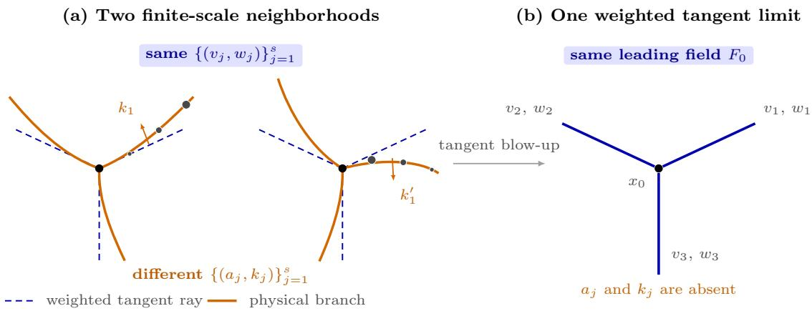  
Figure 1: The same tangent geometry can hide diferent local structure. Tangent blow-up keeps branch directions and weights but removes curvature and outward density change.

At leading order, a junction is therefore represented only by weighted tangent rays. The two neighborhoods in Figure 1 have the same such representation, yet bend diferently and carry diferent outward density trends. Rescaling toward the junction removes these diferences and leaves the same leading score field $F _ { 0 }$ . The missing quantities survive only in the next-order term. Recovering them requires isolating a weak cross-scale signal, assigning a superposition of responses to individual branches, and controlling center error at the same asymptotic order.

Variation across noise scales ofers a route to this hidden structure. Forward expansions near boundaries and corners show how curvature and density derivatives enter the first small-noise correction [3]. They map known geometry to its correction, but do not establish whether a superposed correction uniquely determines every branchwise coeficient from finite observations under center error. This inverse question matters because tangent geometry cannot test whether a score representation preserves how each branch continues through a junction.

The leading tangent field can be canceled rather than estimated. Consider a finite junction of one-dimensional branches in $\mathbb { R } ^ { D }$ . Branch j has direction $v _ { j }$ , weight $w _ { j }$ , curvature vector $k _ { j } \perp v _ { j }$ and logarithmic density slope ${ a } _ { j } ;$ we call $( a _ { j } , k _ { j } )$ its branch jet. The normalized score obeys

$$
F _ { \sigma } ( z ) = F _ { 0 } ( z ) + \sigma G ( z ) + O ( \sigma ^ { 1 + \alpha } ) ,\tag{1}
$$

where $F _ { 0 }$ depends only on $\{ v _ { j } , w _ { j } \}$ and G is linear in the branch jets. Curvature displaces mass normally to a tangent ray, whereas density slope changes mass along it. Gaussian smoothing preserves these distinct signatures inside G.

Querying the same normalized location z at scales σ and λσ exposes G directly:

$$
\mathcal { D } _ { \sigma , \lambda } ( z ) = \frac { \lambda \sigma s _ { \lambda \sigma } ( x _ { 0 } + \lambda \sigma z ) - \sigma s _ { \sigma } ( x _ { 0 } + \sigma z ) } { ( \lambda - 1 ) \sigma } = G ( z ) + O ( \sigma ^ { \alpha } ) .\tag{2}
$$

The common field $F _ { 0 }$ cancels. With known directions and weights, scalar component evaluations become rows of a linear inverse problem. The superposed field determines every branch jet without an angular-separation assumption, and sD scalar observations are necessary and suficient. This is an information count, not a forward-pass count: a score network usually returns all D coordinates at one location. Quantitative stability is governed by the condition number, which captures ray collisions and vanishing weights.

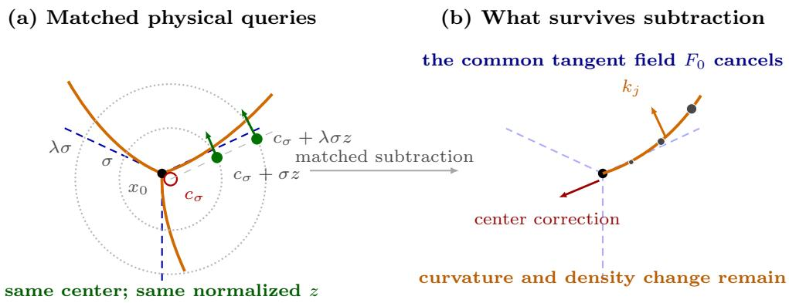  
Figure 2: Matched physical queries use the same provisional center and normalized location. Their subtraction removes the shared tangent field, leaving curvature, density change, and the center correction visible.

The estimated center creates a second dificulty. Given an $O ( \sigma )$ coarse localization and a full-rank weak calibration system, first-order score calibration gives $c _ { \sigma } = x _ { 0 } + \sigma ^ { 2 } b + O ( \sigma ^ { 2 + \alpha } )$ . This physical error is small, but normalization promotes it to the same order as G. Reusing the provisional center at both scales gives

$$
\begin{array} { r } { \mathcal { D } _ { \sigma , \lambda } ^ { c _ { \sigma } } ( z ) = G ( z ) - \lambda ^ { - 1 } \nabla F _ { 0 } ( z ) b + O ( \sigma ^ { \alpha } ) . } \end{array}\tag{3}
$$

Thus $b \in \mathbb { R } ^ { D }$ contributes D known translation-shaped basis fields. Except when the tangent measure is invariant along a complete line, the branch jets and center bias remain jointly identifiable from $( s + 1 ) D$ scalar observations, and estimating b refines the center to $O ( \sigma ^ { 2 + \alpha } )$ .

## Contributions.

1. The superposed first correction exactly identifies every branch jet on supplied distinct rays without a fixed angular separation; quantitative stability is treated separately.

2. A locally uniform two-term expansion and matched scale diference make the correction observable by canceling the tangent field rather than estimating and subtracting it.

3. Fixed continuous schemes have scalar-information complexity sD. An augmented inverse jointly identifies the $O ( \sigma ^ { 2 } )$ center bias and branch jets with complexity $( s + 1 ) D$ , except for the intrinsic full-line ambiguity.

4. A perturbation bound separates finite-scale, score, center, and first-stage errors and yields a conditional KDE rate.

Evidence. Across 180 population fits in $D \in \{ 2 , 3 , 5 \}$ , the median remainder exponent is 0.998, matching the predicted $O ( \sigma )$ order. Controlled-perturbation scale-up remains full rank through D = 20 and 16 supplied branches. The phase map shows a 184-fold error contrast between nearcollision and well-separated corners, and matched responses are 49.4 times more accurate than naive subtraction under strong population first-order error.

A known-count frontend fitted directly to finite-noise scores runs end to end in $D = 3 { - } 5$ . All 135 population systems are full rank, with median relative jet error 0.132. KDE scores retain a median maximum tangent error of 0.0222 radians and provide measurable jet recovery with median relative error 0.957 under a fixed 131,072-sample budget; at $\sigma = 0 . 0 8$ , the dimensionwise medians improve to 0.688–0.810. For learned scores, median jet error reaches its minimum before score RMS. Together, these experiments test finite observations, imperfect first-order geometry, sampling, and learned scores.

## 2 Model and Second-Order Target

First-order geometry consists of tangent directions and relative masses; the second-order target is curvature and density change. Let $\boldsymbol { x } _ { 0 } \in \mathbb { R } ^ { D }$ be the junction center. In a neighborhood of $x _ { 0 }$ , assume

$$
\mu _ { \mathrm { l o c } } = \sum _ { j = 1 } ^ { s } ( \gamma _ { j } ) _ { \# } \big ( \rho _ { j } ( r ) \mathrm { d } r \big ) , \qquad \gamma _ { j } : [ 0 , r _ { 0 } ] \to \mathbb { R } ^ { D } ,\tag{4}
$$

plus a finite remainder $\mu _ { \mathrm { f a r } }$ supported away from $x _ { 0 }$ . The curves are parameterized by arc length and satisfy

$$
\begin{array} { l } { \gamma _ { j } ( 0 ) = x _ { 0 } , } \\ { \rho _ { j } ( 0 ) = w _ { j } > 0 , } \end{array}
$$

$$
\gamma _ { j } ^ { \prime } ( 0 ) = v _ { j } \in \mathbb { S } ^ { D - 1 } ,
$$

$$
\gamma _ { j } ^ { \prime \prime } ( 0 ) = k _ { j } \in v _ { j } ^ { \perp } ,\tag{5}
$$

$$
a _ { j } = \partial _ { r } \log \rho _ { j } ( 0 ) .\tag{6}
$$

Distinct branches have distinct $v _ { j }$ . Arc-length parameterization implies $k _ { j } \perp v _ { j }$

Assumption 2.1 (Uniform jet remainder). For some $0 < \alpha \leq 1$ and finite constants $L _ { \gamma } , L _ { \rho _ { . } }$

$$
\begin{array} { r } { \left\| \gamma _ { j } ( r ) - x _ { 0 } - r v _ { j } - \frac { 1 } { 2 } r ^ { 2 } k _ { j } \right\| \leq L _ { \gamma } r ^ { 2 + \alpha } , } \end{array}\tag{7}
$$

$$
| \rho _ { j } ( r ) - w _ { j } ( 1 + a _ { j } r ) | \le L _ { \rho } r ^ { 1 + \alpha }\tag{8}
$$

for $0 \leq r \leq r _ { 0 }$ , and dist $( x _ { 0 } , \mathrm { s u p p } \mu _ { \mathrm { f a r } } ) \ge \Delta > 0$

The weighted tangent measure is

$$
\nu _ { 0 } = \sum _ { j = 1 } ^ { s } w _ { j } \int _ { 0 } ^ { \infty } \delta _ { u v _ { j } } \mathrm { d } u .\tag{9}
$$

A score cannot see its total scale, so the weights may be normalized to sum to one. The known first-order geometry is $\{ v _ { j } , w _ { j } \} _ { j = 1 } ^ { s } \mathrm { ; }$ the target is

$$
{ \mathcal { I } } _ { 2 } ( \mu , x _ { 0 } ) = \{ ( a _ { j } , k _ { j } ) : j = 1 , \ldots , s \} .\tag{10}
$$

Here $k _ { j }$ measures bending and $a _ { j }$ measures outward log-density change.

Let $p _ { \sigma } = \mu * \varphi _ { \sigma }$ , where $\varphi _ { \sigma }$ is the centered Gaussian density with covariance $\sigma ^ { 2 } I _ { D }$ , and define

$$
s _ { \sigma } ( x ) = \nabla _ { x } \log p _ { \sigma } ( x ) , \qquad F _ { \sigma } ( z ) = \sigma s _ { \sigma } ( x _ { 0 } + \sigma z ) .\tag{11}
$$

Write the repeated one-dimensional Gaussian integrals as

$$
J _ { j , m } ( z ) = \int _ { 0 } ^ { \infty } u ^ { m } \exp \left( - \frac { \| z - u v _ { j } \| ^ { 2 } } { 2 } \right) \mathrm { d } u .\tag{12}
$$

The leading scalar transform and its first correction are

$$
Q _ { 0 } ( z ) = \sum _ { j = 1 } ^ { s } w _ { j } J _ { j , 0 } ( z ) ,\tag{13}
$$

$$
Q _ { 1 } ( z ) = \sum _ { j = 1 } ^ { s } w _ { j } \left[ a _ { j } J _ { j , 1 } ( z ) + \frac { 1 } { 2 } \left. k _ { j } , z \right. J _ { j , 2 } ( z ) \right] .\tag{14}
$$

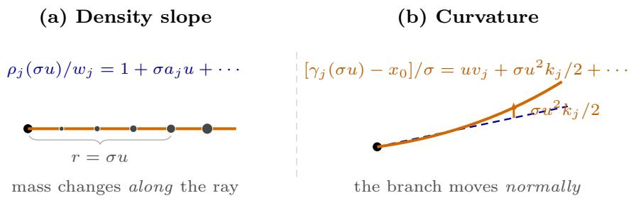  
Figure 3: Two distinct order-σ signatures. Density slope changes mass along a tangent ray, whereas curvature moves the branch normally away from it.

## 3 Why Second-Order Geometry Appears Across Scale

The mechanism is visible before the formal expansion. At physical radius $r = \sigma u .$ , both the density change $a _ { j } r$ and the normal displacement $r ^ { 2 } k _ { j } / 2$ , after division by the observation scale σ, contribute at order σ. Gaussian smoothing therefore places both efects in the same correction G.

Theorem 3.1 (Second-order junction expansion). Under Theorem 2.1, for every compact ${ \mathcal { Q } } \subset \mathbb { R } ^ { D }$ and every fixed integer m $\geq 0$ , there are $C _ { m , \mathcal { Q } } < \infty$ and $\sigma _ { 0 } > 0$ such that

$$
\begin{array} { r } { \mathopen { } \mathclose \bgroup \left\| \widetilde { Q } _ { \sigma } - Q _ { 0 } - \sigma Q _ { 1 } \aftergroup \egroup \right\| _ { C ^ { m } ( \mathcal { Q } ) } \leq C _ { m , \mathcal { Q } } \sigma ^ { 1 + \alpha } , \qquad 0 < \sigma \leq \sigma _ { 0 } , } \end{array}\tag{15}
$$

where $\widetilde { Q } _ { \sigma }$ is the locally rescaled Gaussian convolution after removal of its z-independent normalization. Consequently, for $m \geq 1$ ,

$$
\| F _ { \sigma } - F _ { 0 } - \sigma G \| _ { C ^ { m - 1 } ( \mathcal { Q } ) } \leq C _ { m , \mathcal { Q } } ^ { \prime } \sigma ^ { 1 + \alpha } ,\tag{16}
$$

with

$$
F _ { 0 } = \nabla \log Q _ { 0 } , \qquad G = \nabla \left( \frac { Q _ { 1 } } { Q _ { 0 } } \right) .\tag{17}
$$

$F _ { 0 }$ records the tangent rays, whereas $G$ superposes all branch jets. The expansion is forward; Section 4 proves that the superposition is uniquely invertible.

The proof substitutes $r = \sigma u$ into the curve and density expansions, expands the Gaussian kernel once, and integrates under a uniform Gaussian envelope. The far-away measure is exponentiall small, and positivity of $Q _ { 0 }$ permits the logarithm. Section A gives the complete derivative and remainder argument.

For a fixed scale ratio $\lambda > 1$ , define

$$
\mathcal { D } _ { \sigma , \lambda } ( z ) = \frac { F _ { \lambda \sigma } ( z ) - F _ { \sigma } ( z ) } { ( \lambda - 1 ) \sigma } .\tag{18}
$$

The two scores are evaluated at $x _ { 0 } + \lambda \sigma z$ and $x _ { 0 } + \sigma z$ , respectively, so they share the same normalized location z.

Corollary 3.2 (Renormalized scale derivative). For fixed $1 < \lambda \leq \lambda _ { \operatorname* { m a x } }$ and compact $\mathcal { Q } ,$

$$
\operatorname* { s u p } _ { z \in { \mathcal { Q } } } \| { \mathcal { D } } _ { \sigma , \lambda } ( z ) - G ( z ) \| \leq C _ { { \mathcal { Q } } , \lambda } \sigma ^ { \alpha } .\tag{19}
$$

Equivalently, $G ( z ) = \partial _ { \sigma } [ \sigma s _ { \sigma } ( x _ { 0 } + \sigma z ) ] | _ { \sigma = 0 ^ { + } }$

Thus matched subtraction removes the common tangent field $F _ { 0 }$ and exposes G without diferentiating a noisy score.

If an exact tangent score were available, $( F _ { \sigma } - F _ { 0 } ) / \sigma$ would have the same limit. The matched diference is preferable in practice because it cancels the leading field present in the observations themselves.

## 4 Recovering Branch Jets

With the two-scale response in hand, two questions remain: does it uniquely determine the branch jets, and how many scalar observations are needed? Both become finite-dimensional once the directions and weights are known.

Choose an orthonormal basis $N _ { j } = [ n _ { j , 1 } , \dotsc , n _ { j , D - 1 } ]$ for $v _ { j } ^ { \perp }$ and write $k _ { j } = N _ { j } \kappa _ { j }$ , with $\kappa _ { j } \in \mathbb { R } ^ { D - 1 }$ Define

$$
A _ { j } ( z ) = \nabla \left( { \frac { w _ { j } J _ { j , 1 } ( z ) } { Q _ { 0 } ( z ) } } \right) ,\tag{20}
$$

$$
K _ { j , r } ( z ) = \nabla \left( \frac { w _ { j } \left. n _ { j , r } , z \right. J _ { j , 2 } ( z ) } { 2 Q _ { 0 } ( z ) } \right) , \quad r = 1 , \ldots , D - 1 .\tag{21}
$$

Then

$$
G ( z ) = \sum _ { j = 1 } ^ { s } a _ { j } A _ { j } ( z ) + \sum _ { j = 1 } ^ { s } \sum _ { r = 1 } ^ { D - 1 } \kappa _ { j , r } K _ { j , r } ( z ) .\tag{22}
$$

Thus each density slope and curvature coordinate multiplies a known response pattern.

Theorem 4.1 (Jet identifiability). Fix distinct directions $v _ { 1 } , \dots , v _ { s } \in \mathbb { S } ^ { D - 1 }$ and positive weights $w _ { 1 } , \ldots , w _ { s }$ . The map

$$
\{ ( a _ { j } , k _ { j } ) \} _ { j = 1 } ^ { s } \longmapsto G\tag{23}
$$

is injective over $a _ { j } \in \mathbb { R }$ and $k _ { j } \in v _ { j } ^ { \perp }$

The geometric reason is that density changes act along a ray, while curvature acts normally to it; a localized observation can therefore separate both from every other branch.

The proof represents the correction as a distribution on the tangent rays. Because Gaussian convolution is injective, a zero field implies a zero distribution. A test supported in a narrowing tube isolates one ray, first its normal curvature and then its tangential density change. Repeating this test proves uniqueness for distinct rays, although stability may deteriorate as two rays approach. Section B gives the full argument.

Theorem 4.2 (Sharp scalar-information complexity). Under the conditions of Theorem 4.1, there exist sD scalar component evaluations of G whose values uniquely determine all branch jets. Conversely, any fixed continuous observation scheme that identifies every jet vector in a nonempty open subset of $\mathbb { R } ^ { s D }$ requires at least sD scalar outputs.

Each branch contributes one density slope and D − 1 curvature coordinates. One scalar observation is one coordinate at one location; because a network evaluation usually returns all D coordinates, $s D$ is a scalar-information count, not a forward-pass count.

Point-coordinate evaluations span the dual of the sD-dimensional space generated by Equations (20) and (21), so $s D$ of them sufice. For necessity, invariance of domain rules out a continuous injection from an open subset of $\mathbb { R } ^ { s D }$ into fewer coordinates. In computation, we select wellconditioned rows from a larger candidate matrix; Section C gives the formal proof.

Algorithm 1 Two-scale branch-jet reconstruction   
Require: First-order estimate $( c _ { \sigma } , \{ \hat { v } _ { j } , \hat { w } _ { j } \} _ { j = 1 } ^ { \hat { s } } )$ , scales σ and $\lambda \sigma .$ , candidate normalized grid Z.   
1: Construct the branch basis fields in Equations (20) and (21); for center-robust recovery, append   
Equation (28).   
2: Select scalar point-coordinate rows by rank-revealing $\mathrm { Q R } ,$ or retain an overdetermined design.   
3: At each selected $z ,$ query the same center $c _ { \sigma }$ at $c _ { \sigma } + \sigma z$ and $c _ { \sigma } + \lambda \sigma z$   
4: Form Equation (26) and solve least squares.   
5: Return $( \hat { a } _ { j } , \hat { k } _ { j } )$ and, when applicable, $\hat { x } _ { 0 } = c _ { \sigma } - \sigma ^ { 2 } \hat { b } .$

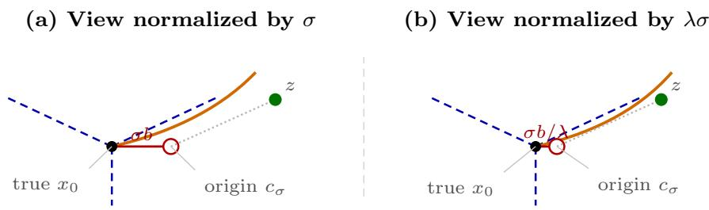  
Figure 4: The same physical center error occupies diferent lengths in the two normalized views: σb at scale $\sigma$ and $\sigma b / \lambda$ at scale $\lambda \sigma$ . Both panels keep the query location z fixed.

## 5 Recovering Jets with an Imperfect Center

The previous section assumed the exact center $x _ { 0 }$ . A score-only first stage instead returns a nearby point. The key question is whether its error hides the order-σ branch signal or can be estimated with it.

Proposition 5.1 (Center accuracy after local calibration). Fix smooth localized score tests around a bounded reference ofset. If the resulting exact tangent-model least-squares matrix has full column rank, then using the finite-noise score from Theorem 3.1 returns a physical center of the form

$$
c _ { \sigma } = x _ { 0 } + \sigma ^ { 2 } b + O ( \sigma ^ { 2 + \alpha } )\tag{24}
$$

for some bounded $b \in \mathbb { R } ^ { D }$

In normalized coordinates, the calibration error is order $\sigma ;$ multiplying by the noise scale makes the physical error order $\sigma ^ { 2 }$

The proposition is local: a coarse procedure must first place the calibration window within $O ( \sigma )$ of $x _ { 0 }$ . Section D gives the full weak-system and least-squares expansion. More generally, we allow any first stage satisfying

$$
c _ { \sigma } = x _ { 0 } + \sigma ^ { 2 } b + r _ { \sigma } , \qquad \| r _ { \sigma } \| \leq C \sigma ^ { 2 + \alpha } .\tag{25}
$$

Use this same physical center at both noise scales and define

$$
\mathcal { D } _ { \sigma , \lambda } ^ { c _ { \sigma } } ( z ) = \frac { \lambda \sigma s _ { \lambda \sigma } ( c _ { \sigma } + \lambda \sigma z ) - \sigma s _ { \sigma } ( c _ { \sigma } + \sigma z ) } { ( \lambda - 1 ) \sigma } .\tag{26}
$$

Theorem 5.2 (Center-bias expansion). Under Theorem 2.1 and Equation (25), uniformly on compact normalized query sets,

$$
\mathcal { D } _ { \sigma , \lambda } ^ { c _ { \sigma } } ( z ) = G ( z ) - \frac { 1 } { \lambda } \nabla F _ { 0 } ( z ) b + O ( \sigma ^ { \alpha } ) ,\tag{27}
$$

where $\nabla F _ { 0 }$ is the $D \times D$ Jacobian of the tangent score.

The shared physical ofset becomes $\sigma b$ at the small scale and $\sigma b / \lambda$ at the large scale, so their mismatch has a known translation shape.

The proof expands $F _ { \sigma }$ at the two normalized ofsets and subtracts them. All quadratic shift terms are smaller than the retained order. The complete Taylor calculation is in Section D.

Append the D known translation fields

$$
\begin{array} { r } { C _ { r } ( z ) = - \lambda ^ { - 1 } \nabla F _ { 0 } ( z ) e _ { r } , \qquad r = 1 , \ldots , D . } \end{array}\tag{28}
$$

The inverse now has $( s + 1 ) D$ coordinates. The only intrinsic exception is a tangent measure that is unchanged by translation along a nonzero direction; for a finite positive ray junction, this requires a complete line formed by opposite rays with matching density.

Theorem 5.3 (Center-robust identifiability and scalar information). If ν0 is not invariant under any nonzero translation, the map

$$
( \{ a _ { j } , k _ { j } \} _ { j = 1 } ^ { s } , b ) \longmapsto G - \lambda ^ { - 1 } \nabla F _ { 0 } b\tag{29}
$$

is injective. Consequently, $( s + 1 ) D$ fixed scalar component evaluations are suficient, and fewer than $( s + 1 ) D$ fixed continuous scalar observations cannot identify every parameter vector in an open set.

Unless the junction itself is translation-invariant along a full line, a center shift cannot imitate branchwise curvature and density changes.

A narrowing-tube test first removes curvature and center components normal to each ray. The endpoint term can cancel only in the full-line case. Otherwise $b = 0$ , and Theorem 4.1 removes the density terms. Section D gives the proof and formal invariance criterion.

Estimating b immediately refines the center:

$$
\hat { x } _ { 0 } = c _ { \sigma } - \sigma ^ { 2 } \hat { b } .\tag{30}
$$

If $\hat { b } - b = O ( \sigma ^ { \alpha } )$ , then $\hat { x } _ { 0 } - x _ { 0 } = O ( \sigma ^ { 2 + \alpha } )$

## 6 Error Propagation and Finite Samples

Finite-scale approximation, score noise, and first-stage geometry error determine accuracy. Let $p = s D$ for a known center and $p = ( s + 1 ) D$ for joint center recovery. Select $M \geq p$ scalar evaluations, stack the exact basis rows into $B \in \mathbb { R } ^ { M \times p }$ , and let y be the corresponding two-scale response for parameter vector θ.

Theorem 6.1 (Deterministic perturbation bound). Assume $\sigma _ { \mathrm { m i n } } ( B ) = \gamma > 0$ . Let the implemented design be ${ \widehat { B } } = B + E$ and the observed response be $\begin{array} { r } { \widehat { y } = y + e . \ I f \left. E \right. _ { \mathrm { o p } } < \gamma } \end{array}$ , the least-squares estimator obeys

$$
\left\| \widehat { \theta } - \theta \right\| \leq \frac { C _ { \mathrm { b i a s } } \sigma ^ { \alpha } + \left\| e \right\| + \left\| E \right\| _ { \mathrm { o p } } \left\| \theta \right\| } { \gamma - \left\| E \right\| _ { \mathrm { o p } } } .\tag{31}
$$

If the two normalized score fields have stacked errors $\varepsilon _ { \sigma }$ and $\varepsilon _ { \lambda \sigma }$ , and the center remainder in Equation (25) is $r _ { \sigma }$ , one may take

$$
\| e \| \leq \frac { \varepsilon _ { \sigma } + \varepsilon _ { \lambda \sigma } } { ( \lambda - 1 ) \sigma } + C _ { \mathrm { c t r } } \frac { \| r _ { \sigma } \| } { \sigma ^ { 2 } } .\tag{32}
$$

Errors in recovered directions and weights enter through E by smooth dependence of the basis on the first-order geometry over any declared separated, positive-weight class.

The bound makes conditioning explicit: finite-scale bias and response noise are amplified by the inverse smallest singular value of the selected design.

The bound follows from the pseudoinverse identity and Weyl’s inequality; Section E gives the proof. Its main message is the decomposition: scale diferencing divides normalized-score noise by $\sigma ,$ while an unmodeled physical center remainder is divided by $\sigma ^ { 2 }$

Corollary 6.2 (Kernel-density score rate). Assume a fixed finite query design, a positive lower bound on local tangent mass, bounded branch jets, and the conditions of Theorem 6.1. For N independent samples and fixed $\lambda > 1$ , the score of the empirical Gaussian kernel density estimate (KDE) gives, with probability at least $1 - \delta$

$$
\left\| \widehat { \theta } - \theta \right\| \leq C \left[ \sigma ^ { \alpha } + \sqrt { \frac { \log ( M / \delta ) } { N \sigma ^ { 3 } } } + \frac { \log ( M / \delta ) } { N \sigma ^ { 2 } } + f r s t \ – s t a g e \ e r r o r \right] .\tag{33}
$$

Ignoring the lower-order Bernstein term and assuming a comparably accurate first stage,

$$
\sigma _ { \mathrm { o p t } } \asymp \left( \frac { \log ( M / \delta ) } { N } \right) ^ { 1 / ( 2 \alpha + 3 ) } , \qquad \left\| \widehat { \theta } - \theta \right\| = O _ { \mathbb { P } } \left( \frac { \log ( M / \delta ) } { N } \right) ^ { \alpha / ( 2 \alpha + 3 ) } .\tag{34}
$$

The variance term reflects two losses: only $N \sigma$ samples fall locally, and the scale diference contributes another factor $1 / \sigma$

The rate balances the deterministic remainder $\sigma ^ { \alpha }$ against the scale-diferenced sampling fluctuation. A learned score enters the same response bound through its errors at both scales. Thus cross-scale consistency, rather than accuracy at either scale alone, is the quantity that controls second-order recovery.

## 7 Experiments

Each experiment tests one proof interface: finite-scale expansion, query conditioning, sampling, first-stage composition, or learned-score consistency. All results use the retained paper configuration; Section F gives full grids, seeds, hardware, and tables.

Finite-scale expansion. Across 180 population fits in $D \in \{ 2 , 3 , 5 \}$ , the median remainder exponent is 0.998 (5th–95th percentile 0.957–1.03), with median log–log $R ^ { 2 } ~ 1$ . Exact- and $O ( \sigma ^ { 2 } )$ biased-center runs follow the predicted order in Theorems 3.1 and 5.2, providing an independent numerical check of the analytic results (Figure 6).

Scalar information versus stable designs. At response-noise RMS $1 0 ^ { - 3 }$ and twice the parameter count, determinant-maximizing (D-optimal) row selection attains median relative error 0.00552, 2.89 times lower than random selection. Overdetermination and conditioning-aware rows increase the smallest singular value: Theorem 4.2 gives the information limit, whereas design controls noise amplification.

How geometry controls stability and scale. The 42-cell phase map in Figure 5a has 20 seeds per cell. From $( 3 ^ { \circ } , 0 . 0 1 )$ to $( 4 5 ^ { \circ } , 0 . 2 )$ , median error falls from 0.698 to 0.00379 (184-fold) and condition number from $5 . 6 1 \times 1 0 ^ { 4 }$ to 24.6. All 200 scale-up systems remain full rank through $D = 2 0$ , 16 branches, 340 unknowns, and 680 queries. These runs use perturbed supplied geometry; the frontend study below covers $D = 3 { - } 5$ . In the largest case, strong first-order perturbation raises error from 0.0825 to 85.6, so first-stage accuracy controls error even when rank is preserved.

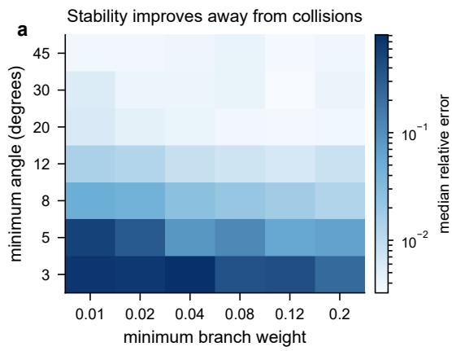

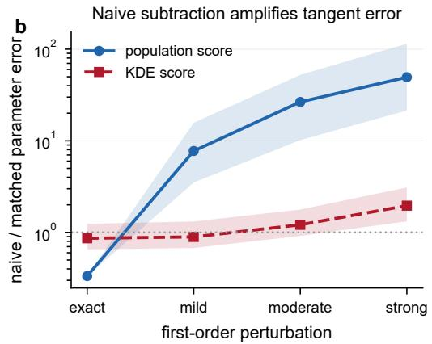  
Figure 5: Stability and response construction. (a) Median error over 20 seeds per angle–weight cell grows as rays collide or weights vanish. (b) Paired naive/matched error ratio; values above one favor the matched response. Bands are interquartile ranges.

Why match two scales? Naive subtraction divides first-order error by the base scale. Its population error is 7.75, 26.6, and 49.4 times the matched error under mild, moderate, and strong perturbations; the smallest-scale strong ratio is 143. KDE noise reduces it to 1.96. The exact- $F _ { 0 }$ curve is an idealized reference for perfect nuisance removal; with estimated geometry, matched responses avoid the $1 / \sigma$ amplification (Figure 5b).

Finite-sample kernel density estimates. Across four planar junctions and twenty seeds, all seed-bootstrap 95% intervals contain the predicted $N ^ { - 1 / 5 }$ slope, and error falls by 52.1–66%. Seed halves select bandwidth multipliers within 0.4 in 68.8% of comparisons; the dense [1.8, 3.2] sweep identifies a broad stable operating region across geometries (Figure 7).

Estimated first-order frontends. On planar junctions, a Fourier-based frontend estimates branch count, directions, and weights. Blind count accuracy is 100% for population and 98.8% for KDE scores. A separate known-count frontend fits the same first-order quantities directly from finite-noise scores in $D = 3 { - } 5$ with up to 6 branches. All 270 second-stage systems are full rank. Population runs have median maximum tangent error 0.0197 radians and median relative jet error 0.132. With KDE scores, these medians are 0.0222 and 0.957; at $\sigma = 0 . 0 8$ , the dimensionwise median jet errors range from 0.688 to 0.810 (Table 6). Changing the query rows has negligible efect (median error ratio 1). In population runs, the estimated basis absorbs part of the finite-scale remainder, giving an estimated/exact-basis error ratio of 0.611 (Figure 9).

Learned scores. Across 20 base jobs, the training trajectories separate single-scale score fit from recovered-jet accuracy. In the enlarged hard-case study (width 256, 6 blocks, 50000 updates), median jet error reaches 0.511 at 40000; score RMS continues to improve to 0.0143 at the final checkpoint, where jet error is 0.676. This controlled synthetic experiment isolates cross-scale consistency as the mechanism used by the inverse (Figures 9 and 10).

The support material contains the experiment code and its full configuration; each entry point writes its numerical observations as CSV files (Section F).

## 8 Related Work

Classical work reconstructs manifolds and estimates tangent spaces or curvature from samples [1, 6, 7, 14, 15, 17]; score methods recover first-order and smooth-support geometry, including weighted singular tangents [5, 9, 12, 21, 22, 25]. Our target is instead the branchwise second-order continuation of a singular junction on supplied rays.

Denoising identities expose local scores [2, 23], and forward asymptotics derive their density and curvature corrections [3, 18, 24]. Those results map known geometry to a correction. We solve the converse coeficient problem: uniquely decomposing the superposed correction with finite scalar information while accounting for center translation. Unlike Prony and super-resolution, the unknowns are coeficients on supplied rays, not atom locations [4, 10, 11].

## 9 Limitations and Conclusion

Limitations. The theory covers zero-thickness $C ^ { 2 , \alpha }$ half-branches, positive $C ^ { 1 , \alpha }$ densities, Gaussian smoothing, two known scales, branch correspondence, and supplied first-order geometry. The condition number quantifies the efect of ray collisions and vanishing weights, and the KDE rate is conditioned on first-stage accuracy. Experiments separate full-pipeline recovery with known counts in $D = 3 { - } 5$ and blind planar counts from second-stage scaling through $D = 2 0$ and 16 branches with supplied perturbed geometry. The full-line case exhibits the intrinsic translation symmetry, while learned-score runs isolate cross-scale consistency on controlled synthetic junctions.

Conclusion. The first score correction has an inverse role: on supplied distinct rays, its superposed field uniquely determines how every branch bends and how its density changes. Matched subtraction makes the correction observable with sharp scalar-information complexity, while translation modes accommodate imperfect localization. Known-count experiments carry score-estimated first-order geometry through the inverse in $D = 3 { - } 5$ , and the supplied-geometry interface scales to larger systems. The stability map, matched-response comparison, and learned-score trajectories identify the geometric and statistical conditions that govern accuracy. Branch jets thus test whether a score field retains junction continuation and provide a target for thicker supports, higher-dimensional strata, pretrained models, and adaptive queries.

## References

[1] Eddie Aamari and Clément Levrard. Nonasymptotic rates for manifold, tangent space and curvature estimation. The Annals of Statistics, 47(1):177–204, 2019. doi: 10.1214/18-AOS1685.

[2] Guillaume Alain and Yoshua Bengio. What regularized auto-encoders learn from the datagenerating distribution. Journal of Machine Learning Research, 15(110):3743–3773, 2014.

[3] Nicolas Brosse and Arnak S. Dalalyan. Boundary-layer asymptotics for gaussian-smoothed singular measures. arXiv:2607.04514, 2026.

[4] Emmanuel J. Candès and Carlos Fernandez-Granda. Towards a mathematical theory of super-resolution. Communications on Pure and Applied Mathematics, 67(6):906–956, 2014.

[5] Willem Diepeveen, Georgios Batzolis, Zakhar Shumaylov, and Carola-Bibiane Schönlieb. Scorebased pullback riemannian geometry: Extracting the data manifold geometry using anisotropic flows. In International Conference on Machine Learning, 2025.

[6] Herbert Federer. Curvature measures. Transactions of the American Mathematical Society, 93 (3):418–491, 1959. doi: 10.1090/S0002-9947-1959-0110078-1.

[7] Christopher R. Genovese, Marco Perone-Pacifico, Isabella Verdinelli, and Larry Wasserman. Minimax manifold estimation. Journal of Machine Learning Research, 13(43):1263–1291, 2012.

[8] Aapo Hyvärinen. Estimation of non-normalized statistical models by score matching. Journal of Machine Learning Research, 6(24):695–709, 2005.

[9] Andrey Kharitenko, Zebang Shen, Riccardo De Santi, Niao He, and Florian Dörfler. Landing with the score: Riemannian optimization through denoising. In International Conference on Learning Representations, 2026.

[10] Stefan Kunis, Thomas Peter, Tim Römer, and Ulrich von der Ohe. A multivariate generalization of prony’s method. Linear Algebra and its Applications, 490:31–47, 2016.

[11] Stefan Kunis, H. Michael Möller, and Ulrich von der Ohe. Prony’s method on the sphere. SMAI Journal of Computational Mathematics, S5:87–97, 2019.

[12] Xiang Li, Zebang Shen, Ya-Ping Hsieh, and Niao He. When scores learn geometry: Rate separations under the manifold hypothesis. In International Conference on Learning Representations, 2026.

[13] James R. Munkres. Topology. Prentice Hall, 2 edition, 2000.

[14] Partha Niyogi, Stephen Smale, and Shmuel Weinberger. Finding the homology of submanifolds with high confidence from random samples. Discrete & Computational Geometry, 39(1–3): 419–441, 2008. doi: 10.1007/s00454-008-9053-2.

[15] Umut Ozertem and Deniz Erdogmus. Locally defined principal curves and surfaces. Journal of Machine Learning Research, 12(34):1249–1286, 2011.

[16] Iosif Pinelis. Optimum bounds for the distributions of martingales in banach spaces. The Annals of Probability, 22(4):1679–1706, 1994.

[17] David Preiss. Geometry of measures in Rn: Distribution, rectifiability, and densities. Annals of Mathematics, 125(3):537–643, 1987.

[18] Divit Rawal. Rao-blackwellized score matching on manifolds. arXiv:2605.25567, 2026.

[19] Yang Song and Stefano Ermon. Generative modeling by estimating gradients of the data distribution. In Advances in Neural Information Processing Systems, volume 32, 2019.

[20] Yang Song, Jascha Sohl-Dickstein, Diederik P. Kingma, Abhishek Kumar, Stefano Ermon, and Ben Poole. Score-based generative modeling through stochastic diferential equations. In International Conference on Learning Representations, 2021.

[21] Jan Pawel Stanczuk, Georgios Batzolis, Teo Deveney, and Carola-Bibiane Schönlieb. Difusion models encode the intrinsic dimension of data manifolds. In International Conference on Machine Learning, 2024.

[22] Enrico Ventura, Beatrice Achilli, Gianluigi Silvestri, Carlo Lucibello, and Luca Ambrogioni. Manifolds, random matrices and spectral gaps: The geometric phases of generative difusion. In International Conference on Learning Representations, 2025.

[23] Pascal Vincent. A connection between score matching and denoising autoencoders. Neural Computation, 23(7):1661–1674, 2011. doi: 10.1162/NECO\_a\_00142.

[24] Zixuan Zhang, Kaixuan Huang, Tuo Zhao, Mengdi Wang, and Minshuo Chen. Difusion model for manifold data: Score decomposition, curvature, and statistical complexity. arXiv:2603.20645, 2026.

[25] Ziqi Zhao and Qingjian Ni. Recovering weighted tangent geometry from a single-scale score field. arXiv:2608.22334, 2026.

## A Proof of the two-term expansion

The local argument below tracks every power of $\sigma$ . Constants may depend on the compact query set, the branch count, the jet bounds, $r _ { 0 } , \Delta$ , and the far mass, but not on $\sigma .$

## A.1 A Gaussian envelope

Lemma A.1 (Polynomial Gaussian envelope). Fix a compact $\mathcal { Q } \subset \mathbb { R } ^ { D }$ . There are $c > 0$ and constants $C _ { m , \mathcal { Q } }$ such that the following holds. Let $v \in \mathbb { S } ^ { D - 1 } , u \geq 0$ , and let $q _ { t } = u v + t \xi f o r 0 \le t \le 1$ with $\| \xi \| \le u / 2$ . For every fixed mixed-derivative order m of $K _ { z } ( q ) = e ^ { - \| z - q \| ^ { 2 } / 2 }$ in $( z , q )$ ，

$$
| \partial ^ { m } K _ { z } ( q _ { t } ) | \leq C _ { m , \mathcal { Q } } ( 1 + u ) ^ { m } e ^ { - c u ^ { 2 } } , \qquad z \in \mathcal { Q } .\tag{35}
$$

The same form holds for vector and matrix derivatives.

Proof. Let $R = \operatorname* { s u p } _ { z \in \mathcal { Q } } \| z \|$ . Since $u / 2 \leq \| q _ { t } \| \leq 3 u / 2$ , for $u \geq 4 R$ we have $\| z - q _ { t } \| \ge u / 4$ . For bounded u, every polynomial factor is absorbed into the constant. Derivatives of a Gaussian equal a polynomial in $z - q _ { t }$ times the same Gaussian, giving the claim. □

## A.2 Expansion of the rescaled convolution

After changing variables $r = \sigma u$ , remove the common factor $( 2 \pi ) ^ { - D / 2 } \sigma ^ { 1 - D }$ and write

$$
\widetilde { Q } _ { \sigma } ( z ) = \sum _ { j = 1 } ^ { s } \int _ { 0 } ^ { r _ { 0 } / \sigma } \rho _ { j } ( \sigma u ) K _ { z } ( q _ { j , \sigma } ( u ) ) \mathrm { d } u + R _ { \mathrm { f a r } , \sigma } ( z ) ,\tag{36}
$$

where $q _ { j , \sigma } ( u ) = ( \gamma _ { j } ( \sigma u ) - x _ { 0 } ) / \sigma$

By Equation (7),

$$
q _ { j , \sigma } ( u ) = u v _ { j } + \delta _ { j , \sigma } ( u ) , \qquad \delta _ { j , \sigma } ( u ) = \frac { \sigma } { 2 } u ^ { 2 } k _ { j } + \epsilon _ { j , \sigma } ( u ) , \quad \lVert \epsilon _ { j , \sigma } ( u ) \rVert \leq L _ { \gamma } \sigma ^ { 1 + \alpha } u ^ { 2 + \alpha } .\tag{37}
$$

Decrease $r _ { 0 }$ if needed so that $\| \delta _ { j , \sigma } ( u ) \| \le u / 2$ for $0 \leq u \leq r _ { 0 } / \sigma$ . Taylor’s theorem and Theorem A.1 $\mathrm { g i v e }$ , uniformly in $z \in \mathcal { Q }$

$$
K _ { z } ( q _ { j , \sigma } ( u ) ) = K _ { z } ( u v _ { j } ) + \nabla _ { q } K _ { z } ( u v _ { j } ) ^ { \top } \delta _ { j , \sigma } ( u ) + R _ { j , \sigma } ( z , u ) ,\tag{38}
$$

$$
| R _ { j , \sigma } ( z , u ) | + \| \nabla _ { z } R _ { j , \sigma } ( z , u ) \| \leq C \left\lceil \sigma ^ { 1 + \alpha } P _ { 1 } ( u ) + \sigma ^ { 2 } P _ { 2 } ( u ) \right\rceil e ^ { - c u ^ { 2 } } \leq C \sigma ^ { 1 + \alpha } P ( u ) e ^ { - c u ^ { 2 } } .\tag{39}
$$

The last inequality uses $0 < \alpha \leq 1$ and $\sigma \leq 1$ . Since $\nabla _ { q } K _ { z } ( u v _ { j } ) = ( z - u v _ { j } ) K _ { z } ( u v _ { j } )$ and $k _ { j } \perp v _ { j }$

$$
\nabla _ { q } K _ { z } ( u v _ { j } ) ^ { \mathsf { T } } \frac { \sigma } { 2 } u ^ { 2 } k _ { j } = \frac { \sigma } { 2 } u ^ { 2 } \langle k _ { j } , z \rangle K _ { z } ( u v _ { j } ) .\tag{40}
$$

Likewise, Equation (8) gives

$$
\rho _ { j } ( \sigma u ) = w _ { j } ( 1 + \sigma a _ { j } u ) + r _ { j , \sigma } ( u ) , \qquad | r _ { j , \sigma } ( u ) | \leq L _ { \rho } \sigma ^ { 1 + \alpha } u ^ { 1 + \alpha } .\tag{41}
$$

Multiplying Equations (38) and (41), collecting the order-zero and order-σ terms, and applying the envelope to cross terms yields

$$
\rho _ { j } ( \sigma u ) K _ { z } ( q _ { j , \sigma } ( u ) ) = w _ { j } K _ { z } ( u v _ { j } ) + \sigma w _ { j } \left[ a _ { j } u + \frac { 1 } { 2 } u ^ { 2 } \left. k _ { j } , z \right. \right] K _ { z } ( u v _ { j } ) + \mathcal { R } _ { j , \sigma } ( z , u ) ,\tag{42}
$$

with

$$
| \mathcal { R } _ { j , \sigma } ( z , u ) | + \| \nabla _ { z } \mathcal { R } _ { j , \sigma } ( z , u ) \| \le C \sigma ^ { 1 + \alpha } P ( u ) e ^ { - c u ^ { 2 } } .\tag{43}
$$

The right-hand side is integrable on $[ 0 , \infty )$ . Extending the tangent integrals from $r _ { 0 } / \sigma$ to infinity contributes a Gaussian tail smaller than every power of $\sigma$

For the far measure, $\| x - x _ { 0 } \| \ge \Delta$ . On a compact normalized query set and for small $\sigma _ { \mathrm { { ; } } }$ $\| ( x - x _ { 0 } ) / \sigma - z \| \ge \Delta / ( 2 \sigma )$ . Hence the rescaled far denominator and its z-gradient are bounded by a polynomial in $\sigma ^ { - 1 }$ times $e ^ { - \Delta ^ { 2 } / ( 8 \sigma ^ { 2 } ) }$ , again smaller than $\sigma ^ { 1 + \alpha }$ . Integrating Equation (42) proves Equation (15).

Finally, $Q _ { 0 }$ is strictly positive and has a positive minimum on $\mathcal { Q } .$ . Write $\widetilde Q _ { \sigma } = Q _ { 0 } [ 1 + \sigma Q _ { 1 } / Q _ { 0 } +$ $R _ { \sigma } / Q _ { 0 } ]$ . For every fixed $m$ , the preceding envelope applies to all z-derivatives through order $m .$ The map $x \mapsto$ log x is smooth on a compact interval bounded away from zero, so composition in $C ^ { m }$ gives

$$
\log \widetilde { Q } _ { \sigma } = \log Q _ { 0 } + \sigma Q _ { 1 } / Q _ { 0 } + O _ { C ^ { m } } ( \sigma ^ { 1 + \alpha } )\tag{44}
$$

which proves Equation (16).

## B Distributional proof of jet identifiability

Let $K ( z ) = e ^ { - \| z \| ^ { 2 } / 2 }$ . The tangent transform is $Q _ { 0 } = K * \nu _ { 0 }$ . Associate to the jet parameters the tempered distribution

$$
\left. \eta , \phi \right. = \sum _ { j = 1 } ^ { s } w _ { j } \int _ { 0 } ^ { \infty } \left[ a _ { j } u \phi ( u v _ { j } ) + \frac { 1 } { 2 } u ^ { 2 } \left. k _ { j } , \nabla \phi ( u v _ { j } ) \right. \right] \mathrm { d } u .\tag{45}
$$

Direct evaluation on the translated kernel $y \mapsto K ( z - y )$ gives

$$
\begin{array} { r } { ( K * \eta ) ( z ) = \displaystyle \sum _ { j } w _ { j } \int _ { 0 } ^ { \infty } \left[ a _ { j } u K ( z - u v _ { j } ) + \frac 1 2 u ^ { 2 } \left. k _ { j } , \nabla _ { y } K ( z - y ) | _ { y = u v _ { j } } \right. \right] \mathrm { d } u } \\ { = \displaystyle \sum _ { j } w _ { j } \int _ { 0 } ^ { \infty } \left[ a _ { j } u + \frac 1 2 u ^ { 2 } \left. k _ { j } , z - u v _ { j } \right. \right] K ( z - u v _ { j } ) \mathrm { d } u = Q _ { 1 } ( z ) , } \end{array}\tag{46}
$$

where $\langle k _ { j } , v _ { j } \rangle = 0$

Suppose $G = 0$ . Since $Q _ { 0 } > 0$ and $\mathbb { R } ^ { D }$ is connected, $\nabla ( Q _ { 1 } / Q _ { 0 } ) = 0$ implies $Q _ { 1 } = C Q _ { 0 }$ . Thus $K * ( \eta - C \nu _ { 0 } ) = 0$ . Taking Fourier transforms in the space of tempered distributions gives

$$
\widehat { K } ( \xi ) ( \widehat { \eta } - C \widehat { \nu } _ { 0 } ) = 0 .\tag{47}
$$

The Gaussian multiplier $\widehat K ( \xi )$ is everywhere positive, so $\eta = C \nu _ { 0 }$

Fix branch j and an interval $I = ( u _ { - } , u _ { + } ) \Subset ( 0 , \infty )$ such that the compact ray segment $\{ u v _ { j } : u \in \overline { { I } } \}$ has a tubular neighborhood disjoint from the other rays and the origin. In local coordinates $y = u v _ { j } + n , n \in v _ { j } ^ { \bot }$ , choose $\phi ( y ) = \chi ( u ) \psi ( n )$ with $\psi ( 0 ) = 0$ and arbitrary $\nabla \psi ( 0 )$ . Then $\nu _ { 0 } ( \phi ) = 0$ , and all branches except $j$ vanish by support. Equality $\eta = C \nu _ { 0 }$ gives

$$
\frac { w _ { j } } { 2 } \int _ { I } u ^ { 2 } \chi ( u ) \left. k _ { j } , \nabla \psi ( 0 ) \right. \mathrm { d } u = 0 .\tag{48}
$$

Arbitrary $\chi$ and $\nabla \psi ( 0 )$ imply $k _ { j } = 0$

Now take $\psi ( 0 ) = 1$ and $\nabla \psi ( 0 ) = 0$ . Then

$$
w _ { j } \int _ { I } ( a _ { j } u - C ) \chi ( u ) \mathrm { d } u = 0\tag{49}
$$

for every $\chi \in C _ { c } ^ { \infty } ( I )$ . Hence $a _ { j } u = C$ on I. Since I contains more than one point, $a _ { j } = 0$ and $C = 0$ Repeating for every branch proves the nullspace is trivial. Applying the result to the diference of two parameter collections proves Theorem 4.1.

## C Finite evaluations and the query lower bound

Lemma C.1 (Evaluation basis). Let $f _ { 1 } , \dots , f _ { p } : X \to \mathbb { R } ^ { D }$ be linearly independent as functions. Then there exist pairs $( x _ { m } , r _ { m } ) \in X \times \{ 1 , \ldots , D \} , m = 1 , \ldots , p ,$ such that the matrix $[ e _ { r _ { m } } ^ { \top } f _ { \ell } ( x _ { m } ) ] _ { m , \ell = 1 } ^ { p }$ is nonsingular.

Proof. Let $V = \operatorname { s p a n } \{ f _ { 1 } , \ldots , f _ { p } \}$ . Point-coordinate evaluations $L _ { x , r } ( f ) = e _ { r } ^ { \mathsf { T } } f ( x )$ separate points of $V { : }$ if every such functional vanishes on $f \in V$ , then $f$ is the zero function. Therefore their restrictions span $V ^ { * }$ . Select $p$ of them forming a basis of $V ^ { * }$ ; their matrix in the basis $f _ { 1 } , \ldots , f _ { p }$ is nonsingular. □

By Theorem 4.1, the $p = s D$ fields in Equations (20) and (21) are linearly independent, so Theorem C.1 proves the upper bound in Theorem 4.2. For the lower bound, restrict the parameter vector to a nonempty open box in $\mathbb { R } ^ { s D }$ . Any fixed continuous scheme with M scalar outputs induces a continuous injective map from that box to $\mathbb { R } ^ { M }$ . If $M < s D$ , compose with the standard coordinate embedding $\mathbb { R } ^ { M } \hookrightarrow \mathbb { R } ^ { s D }$ . Invariance of domain [13] would make the image open in $\mathbb { R } ^ { s D }$ , although it lies in a lower-dimensional coordinate subspace, a contradiction.

## D Center Calibration and Center-Robust Identifiability

## D.1 Why weak calibration has a physical $O ( \sigma ^ { 2 } )$ error

Let $c _ { \sigma } ^ { \mathrm { r e f } } = x _ { 0 } - \sigma b _ { 0 }$ with bounded $b _ { 0 }$ , and use normalized coordinates $y = ( x - c _ { \sigma } ^ { \mathrm { r e f } } ) / \sigma$ . The normalized finite-noise score can be written

$$
u _ { \sigma } ( y ) = F _ { 0 } ( y - b _ { 0 } ) + \sigma G ( y - b _ { 0 } ) + O _ { C ^ { 1 } } ( \sigma ^ { 1 + \alpha } )\tag{50}
$$

on every compact set containing the test supports. For a smooth localized test $\psi _ { ; }$ , the corresponding weak-calibration row and response are

$$
a _ { \psi } ( u ) = \left( \int \psi ( y ) u ( y ) \mathrm { d } y , \int \psi ( y ) \mathrm { d } y \right) ,\tag{51}
$$

$$
r _ { \psi } ( u ) = \int \left[ - \nabla \psi ( y ) ^ { \top } u ( y ) + \psi ( y ) \{ \| u ( y ) \| ^ { 2 } + y ^ { \top } u ( y ) + D \} \right] \mathrm { d } y .\tag{52}
$$

Both maps are smooth polynomial functionals of u on the compact test supports. Substitution of Equation (50) therefore gives

$$
A _ { \sigma } = A _ { 0 } + \sigma A _ { 1 } + O ( \sigma ^ { 1 + \alpha } ) , \qquad r _ { \sigma } = r _ { 0 } + \sigma r _ { 1 } + O ( \sigma ^ { 1 + \alpha } ) .\tag{53}
$$

The exact tangent identity gives $r _ { 0 } = A _ { 0 } \beta _ { 0 }$ with $\beta _ { 0 } = ( b _ { 0 } , 1 )$ because each branch is one-dimensional. If $A _ { 0 }$ has full column rank, the least-squares solution is

$$
\widehat { \beta } _ { \sigma } = ( A _ { \sigma } ^ { \top } A _ { \sigma } ) ^ { - 1 } A _ { \sigma } ^ { \top } r _ { \sigma } .\tag{54}
$$

The full-rank least-squares map is smooth in a neighborhood of $( A _ { 0 } , r _ { 0 } )$ . Diferentiating its normal equations, or expanding the pseudoinverse, yields

$$
\widehat { \beta } _ { \sigma } = \beta _ { 0 } + \sigma ( A _ { 0 } ^ { \top } A _ { 0 } ) ^ { - 1 } A _ { 0 } ^ { \top } ( r _ { 1 } - A _ { 1 } \beta _ { 0 } ) + O ( \sigma ^ { 1 + \alpha } ) ,\tag{55}
$$

where the apparent derivatives of $A _ { \sigma } ^ { \top } A _ { \sigma }$ cancel because $r _ { 0 } = A _ { 0 } \beta _ { 0 }$ . If $b _ { 1 }$ denotes the first D coordinates of the order-σ coeficient, the physical center returned by the calibration is

$$
c _ { \sigma } ^ { \mathrm { r e f } } + \sigma \widehat { b } _ { \sigma } = x _ { 0 } + \sigma ^ { 2 } b _ { 1 } + O ( \sigma ^ { 2 + \alpha } ) .\tag{56}
$$

This proves Theorem 5.1. It also makes the role of the local-window assumption explicit: a separate coarse procedure must place the reference within $O ( \sigma )$ of $x _ { 0 }$

## D.2 Two-scale center expansion

To prove Theorem 5.2, put $h _ { \sigma } = ( c _ { \sigma } - x _ { 0 } ) / \sigma = \sigma b + { \cal O } ( \sigma ^ { 1 + \alpha } )$ and $h _ { \lambda \sigma } = ( c _ { \sigma } - x _ { 0 } ) / ( \lambda \sigma ) =$ $( \sigma / \lambda ) b + { \cal O } ( \sigma ^ { 1 + \alpha } )$ . Uniform $C ^ { 1 }$ regularity of Equation (16) and a Taylor expansion give

$$
\sigma s _ { \sigma } ( c _ { \sigma } + \sigma z ) = F _ { \sigma } ( z + h _ { \sigma } ) = F _ { 0 } ( z ) + \sigma \nabla F _ { 0 } ( z ) b + \sigma G ( z ) + O ( \sigma ^ { 1 + \alpha } ) ,\tag{57}
$$

$$
\lambda \sigma s _ { \lambda \sigma } ( c _ { \sigma } + \lambda \sigma z ) = F _ { \lambda \sigma } ( z + h _ { \lambda \sigma } ) = F _ { 0 } ( z ) + \frac { \sigma } { \lambda } \nabla F _ { 0 } ( z ) b + \lambda \sigma G ( z ) + O ( \sigma ^ { 1 + \alpha } ) .\tag{58}
$$

Terms quadratic in h and products of h with the order-σ correction are $O ( \sigma ^ { 2 } )$ , which is contained in $O ( \sigma ^ { 1 + \alpha } )$ for $\alpha \leq 1$ . Subtraction proves Equation (27).

Definition D.1 (Translation lineality). The tangent measure $\nu _ { 0 }$ has translation lineality if there exists $b \neq 0$ such that $( T _ { t b } ) _ { \# } \nu _ { 0 } = \nu _ { 0 }$ for every $t \in \mathbb { R }$ . For a finite positive ray junction, this can occur only along a complete line represented by opposite rays with matching density.

For injectivity, suppose the augmented field in Equation (29) is zero. Since

$$
\nabla F _ { 0 } b = \nabla ( b ^ { \mathsf { T } } \nabla \log Q _ { 0 } ) ,
$$

$$
\nabla \left( \frac { Q _ { 1 } - \lambda ^ { - 1 } b ^ { \mathsf { T } } \nabla Q _ { 0 } } { Q _ { 0 } } \right) = 0 .\tag{59}
$$

Hence $Q _ { 1 } - \lambda ^ { - 1 } b ^ { \mathsf { T } } \nabla Q _ { 0 } = C Q _ { 0 }$ . Distributional diferentiation commutes with convolution, so Gaussian injectivity yields

$$
\eta - \lambda ^ { - 1 } b \cdot \nabla \nu _ { 0 } = C \nu _ { 0 } .\tag{60}
$$

Use the same tube around an interior segment of ray $j .$ For a test function whose value is zero on the ray and whose normal gradient $g ( u ) \in v _ { j } ^ { \perp }$ is arbitrary, Equation (60) becomes

$$
w _ { j } \int _ { I } \left. \frac { 1 } { 2 } u ^ { 2 } k _ { j } + \lambda ^ { - 1 } P _ { v _ { j } ^ { \perp } } b , g ( u ) \right. \mathrm { d } u = 0 .\tag{61}
$$

Therefore $\begin{array} { r } { \frac 1 2 u ^ { 2 } k _ { j } + \lambda ^ { - 1 } P _ { v _ { i } ^ { \perp } } b = 0 } \end{array}$ for all $u \in I$ , which implies

$$
k _ { j } = 0 , \qquad P _ { v _ { j } ^ { \perp } } b = 0\tag{62}
$$

for every $j .$ . Thus b is parallel to every ray direction.

With the normal part removed, $b \cdot \nabla \nu _ { 0 }$ is supported at the common endpoint. Indeed, for a smooth compactly supported $\phi ,$

$$
\langle b \cdot \nabla \nu _ { 0 } , \phi \rangle = - \sum _ { j } w _ { j } \int _ { 0 } ^ { \infty } ( b ^ { \mathsf { T } } v _ { j } ) { \frac { \mathrm { d } } { \mathrm { d } u } } \phi ( u v _ { j } ) \mathrm { d } u = \left( \sum _ { j } w _ { j } b ^ { \mathsf { T } } v _ { j } \right) \phi ( 0 ) .\tag{63}
$$

Neither $C \nu _ { 0 }$ nor the remaining density-slope distribution has an atom at zero, so the coeficient must vanish. Under Equation (62), this cancellation is equivalent to b lying in a translation-lineality direction of the finite ray measure. The no-lineality assumption gives $b = 0$ . The argument in Section B then gives $a _ { j } = C = 0$ . Linear independence and the query count follow exactly as in Theorem C.1 and the invariance-of-domain lower bound.

## E Perturbation Composition and Finite-Sample Score Error

## E.1 Deterministic least-squares composition

Let $\theta \in \mathbb { R } ^ { p }$ be the branch-jet vector, with the center coeficient appended in the augmented model. After selecting M scalar point-coordinate evaluations, write

$$
y = B \theta + r _ { \mathrm { f s } } , \qquad \| r _ { \mathrm { f s } } \| \le C _ { \mathrm { b i a s } } \sigma ^ { \alpha } ,\tag{64}
$$

where B is the limiting design and $r _ { \mathrm { f s } }$ is the finite-scale remainder from Theorems 3.2 and 5.2. The implemented design and response are $\widehat { B } = B + E$ and ${ \widehat { y } } = y + e$ . Whenever $\widehat { B }$ has full column rank,

$$
\widehat { \theta } - \theta = \widehat { B } ^ { \dagger } ( \widehat { y } - \widehat { B } \theta ) = \widehat { B } ^ { \dagger } ( r _ { \mathrm { f s } } + e - E \theta ) ,\tag{65}
$$

$$
\left\| { \widehat { \theta } } - \theta \right\| \leq \left\| { \widehat { B } } ^ { \dagger } \right\| _ { \mathrm { o p } } \left( C _ { \mathrm { b i a s } } \sigma ^ { \alpha } + \left\| e \right\| + \left\| E \right\| _ { \mathrm { o p } } \left\| \theta \right\| \right) .\tag{66}
$$

Weyl’s inequality gives $\sigma _ { \operatorname* { m i n } } ( { \widehat { B } } ) \geq \sigma _ { \operatorname* { m i n } } ( B ) - \| E \| _ { \mathrm { o p } } .$ , which proves Equation (31).

Suppose the normalized score vectors at the selected queries have stacked errors $\varepsilon _ { \sigma }$ and $\varepsilon _ { \lambda \sigma }$ Scale diferencing contributes at most

$$
{ \frac { \varepsilon _ { \sigma } + \varepsilon _ { \lambda \sigma } } { ( \lambda - 1 ) \sigma } } .\tag{67}
$$

If the provisional center has an additional physical remainder $r _ { \sigma } .$ , its normalized displacements are $r _ { \sigma } / \sigma$ and $r _ { \sigma } / ( \lambda \sigma )$ . A mean-value bound for the two normalized score fields, followed by division by $( \lambda - 1 ) \sigma .$ , gives

$$
C _ { \mathrm { c t r } } \frac { \| r _ { \sigma } \| } { \sigma ^ { 2 } } .\tag{68}
$$

This proves Equation (32).

Finally, for a fixed finite candidate set the map from distinct directions and positive normalized weights to every design entry is smooth: the ray-Gaussian integrals and their derivatives are dominated by polynomial Gaussian envelopes, and $Q _ { 0 }$ is uniformly positive. Hence on a compact first-order class with angular separation $\delta _ { 0 } > 0$ and minimum weight $w _ { 0 } > 0$ 2

$$
\| E \| _ { \mathrm { o p } } \leq L _ { B } \left( \operatorname* { m a x } _ { j } \| { \widehat { v } } _ { j } - v _ { j } \| + \| { \widehat { w } } - w \| \right)\tag{69}
$$

after the branch correspondence is fixed. This is the explicit “first-stage design error” term used in the end-to-end experiment.

## E.2 A simultaneous empirical KDE score bound

At a physical query x, define

$$
W _ { i } = e ^ { - \| x - X _ { i } \| ^ { 2 } / ( 2 \sigma ^ { 2 } ) } , \qquad V _ { i } = \frac { X _ { i } - x } { \sigma } W _ { i } ,\tag{70}
$$

with means $a = \mathbb { E } W _ { i }$ and $b = \mathbb { E } V _ { i }$ . The normalized population and empirical KDE scores are $F = b / a$ and ${ \widehat { F } } = { \overline { { V } } } / { \overline { { W } } }$ . The elementary envelopes

$$
0 \leq W _ { i } \leq 1 , \qquad \| V _ { i } \| \leq e ^ { - 1 / 2 } , \qquad \mathbb { E } \left\| V _ { i } \right\| ^ { 2 } \leq \frac { 2 } { e } a\tag{71}
$$

follow by maximizing $r e ^ { - r ^ { 2 } / 2 }$ and using $r ^ { 2 } e ^ { - r ^ { 2 } } \leq ( 2 / e ) e ^ { - r ^ { 2 } / 2 }$

Let $t = \log ( 4 M / \delta )$ . Scalar Bernstein for $W _ { i }$ and a Hilbert-space Bernstein inequality for $V _ { i } ~ [ 1 6 ]$ followed by a union bound over M queries, imply with probability at least $1 - \delta$ that simultaneously

$$
\left| \overline { { W } } - a \right| \leq D ( a ) : = \sqrt { \frac { 2 a t } { N } } + \frac { t } { 3 N } ,\tag{72}
$$

$$
\left\| \overline { { V } } - b \right\| \leq Q ( a ) : = \sqrt { \frac { 4 a t } { e N } } + \frac { 4 e ^ { - 1 / 2 } t } { 3 N } .\tag{73}
$$

Whenever $D ( a ) < a$ , direct ratio subtraction gives

$$
\left\| { \widehat { F } } - F \right\| \leq { \frac { Q ( a ) + \| F \| D ( a ) } { a - D ( a ) } } .\tag{74}
$$

On a declared compact normalized query set for a one-dimensional branch junction, positivity and the local density lower bound give $a \ge a _ { - } \sigma$ for all suficiently small $\sigma _ { : }$ , while $\| F \|$ is bounded. If $\sqrt { 2 t / ( N a _ { - } \sigma ) } + t / ( 3 N a _ { - } \sigma ) \leq 1 / 2$ , Equation (74) simplifies to

$$
\operatorname* { m a x } _ { m \leq M } \left. \widehat { F } _ { \sigma } ( z _ { m } ) - F _ { \sigma } ( z _ { m } ) \right. \leq C \left[ \sqrt { \frac { t } { N \sigma } } + \frac { t } { N \sigma } \right] .\tag{75}
$$

The same bound holds at λσ with constants depending on fixed λ.

Substituting Equation (75) into Equation (67), absorbing the fixed finite design and λ into the constant, and adding Equations (64) and (69) yields

$$
\left\| \widehat { \theta } - \theta \right\| \leq C \left[ \sigma ^ { \alpha } + \sqrt { \frac { \log ( M / \delta ) } { N \sigma ^ { 3 } } } + \frac { \log ( M / \delta ) } { N \sigma ^ { 2 } } + \varepsilon _ { \mathrm { f r s t } } \right] .\tag{76}
$$

Here $\varepsilon _ { \mathrm { { f i r s t } } }$ collects the center remainder and the tangent direction/weight error after multiplication by their deterministic Lipschitz constants. Under sample splitting, or under an independently validated first stage whose contribution is no larger than the displayed stochastic terms, balancing $\sigma ^ { \alpha }$ and $( N \sigma ^ { 3 } ) ^ { - 1 / \bar { 2 } }$ gives Equation (34). The term $N ^ { - 1 } \sigma ^ { - 2 }$ is lower order at that bandwidth for every $\alpha > 0$

## E.3 Learned-score error units

If a learned physical score has pointwise error $\| s _ { \theta } ( x , \tau ) - s _ { \tau } ( x ) \| \le \epsilon _ { \mathrm { n e t } } ( \tau )$ , then its normalized score error is $\tau \epsilon _ { \mathrm { n e t } } ( \tau )$ . Consequently the two-scale response error is bounded by

$$
\frac { \epsilon _ { \mathrm { n e t } } ( \sigma ) + \lambda \epsilon _ { \mathrm { n e t } } ( \lambda \sigma ) } { \lambda - 1 } .\tag{77}
$$

The bound shows why a small average score loss does not certify the cross-scale derivative: the errors at the two scales must also be aligned, not simply small in isolation.

## F Experimental Design and Reproduction Details

## F.1 Experiment-to-claim map

<table><tr><td>Question</td><td>Script and primary output</td><td>Interpretation</td></tr><tr><td>der have order  $\sigma ^ { \alpha \smash { \cdot } } $ </td><td>Does the finite-scale remain- run_population.py; parameter Numerical check of Theorems 3.1 decreasing σ</td><td>error and refined-center error over and 5.2 alongside the analytic proof.</td></tr><tr><td>bly?</td><td>Can the sharp query the- run_query_design.py; σmin, Compares D-optimal, pivoted-QR, orem be implemented sta- condition number, error under random, and uniform scalar rows. response noise</td><td></td></tr><tr><td>tradeoff?</td><td>Does sampling create the run_kde.py; score error, two- Tests the conditional trend in Theo- predicted bias-variance scale response error, jet error, ef- rem 6.2 on the retained twenty-seed fective sample size</td><td>grid.</td></tr><tr><td>Does the first-order fron- run_end_to_end.py; inverse?</td><td>tend compose with the jet count, tangent error, jet/center and exact-first-order interfaces. proxy error</td><td>branch Separates known-count, blind-count,</td></tr><tr><td>Does score-estimated geom- run_general_end_to_end.py; plane?</td><td>etry compose beyond the center, tangent, weight, and jet pipeline without supplied directions errors in D = 3–5</td><td>Tests the known-count score-to-jet or weights.</td></tr><tr><td>derivative?</td><td>ing preserve the two-scale RMS, scale-difference RMS, jet controlled synthetic junctions. error</td><td>Does ordinary score train- run_learned_score.py; score Isolates cross-scale consistency on</td></tr><tr><td>How do angle and minimum weight control stability?</td><td>lar values, condition number, rela- uniform stability over 42 cells. tive error</td><td>run_stability_phase.py; singu- Separates exact identifiability from</td></tr><tr><td>Does the inverse remain</td><td>tractable in larger systems? ror, timing through D = 20 and first-order perturbations. 16 branches</td><td>1 run_scalability·py; rank, er- Tests computation and sensitivity to</td></tr><tr><td>Why match two scales in- run_response_baselines.py; gent estimate?</td><td>stead of subtracting a tan- paired response and parameter</td><td>Compares the proposed response with naive subtraction and an exact-</td></tr><tr><td>duces the observed error?</td><td>errors Which E4 interface pro- run_end_to_end_diagnostics. py; crossed basis and query-row</td><td>F0 diagnostic. Separates first-order basis error, row choice, finite-scale remainder, and</td></tr><tr><td>Does a larger learned score solve the inverse mismatch? case jobs through 50k updates</td><td>policies</td><td>KDE noise. run_learned_score.py; six hard- Width-256, six-block follow-up; checkpoint conclusions remain post hoc.</td></tr></table>

Table 1: Every experiment targets a distinct proof interface.

## F.2 Geometries and exact population evaluation

Each synthetic branch is a constant-curvature arc

$$
\gamma _ { j } ( r ) - x _ { 0 } = \frac { \sin ( \kappa _ { j } r ) } { \kappa _ { j } } v _ { j } + \frac { 1 - \cos ( \kappa _ { j } r ) } { \kappa _ { j } } n _ { j } ,\tag{78}
$$

with the continuous straight-ray limit at $\kappa _ { j } = 0$ . This curve is exactly arc-length parameterized, satisfies $\gamma _ { j } ^ { \prime \prime } ( 0 ) = \kappa _ { j } n _ { j }$ , and has nonzero higher-order terms. The density is

$$
\rho _ { j } ( r ) = w _ { j } \exp ( a _ { j } r + d _ { j } r ^ { 2 } ) ,\tag{79}
$$

where the quadratic coeficient keeps the finite-radius sampling distribution well behaved without changing the target slope $a _ { j }$ . The normalized population score is evaluated as a Gaussian-weighted first-moment/zeroth-moment ratio using fixed Gauss–Legendre quadrature. It is never obtained by numerical diferentiation.

The analytic design uses the posterior moment identities

$$
F _ { 0 } ( z ) = \mathbb { E } _ { \Pi _ { z } } [ U ] - z , \qquad \nabla F _ { 0 } ( z ) = \operatorname { C o v } _ { \Pi _ { z } } ( U ) - I _ { D } ,\tag{80}
$$

and corresponding diferentiated ray moments for the density and curvature columns. The implemented design uses this column order and sign convention, the center coeficient $- 1 / \lambda ,$ , exact planar tangent reconstruction, and generic-rank constructions in $D \in \{ 2 , 3 , 5 \}$ .

## F.3 Population and finite-query matrices

The population matrix crosses ambient dimension, branch count, random seed, scale ratio, true versus $O ( \sigma ^ { 2 } )$ -biased center, and decreasing base scale. Directions are generated with a minimum angular separation, weights are positive and normalized, and curvature/density-slope coordinates are independently sampled inside declared bounds. The fitted exponent uses only the smallest configured scales.

For query design, a candidate normalized grid is built independently of the unknown second-order coeficients. Every point contributes D possible scalar component rows. We compare:

1. Greedy D-optimal: sequentially maximize $b ^ { \top } A ^ { - 1 } b$ with a small ridge;

2. Pivoted QR: select a rank-revealing minimal basis, then add high-norm rows;

3. Random: uniform sampling without replacement;

4. Uniform: equally spaced row indices, retained as a deliberately geometry-agnostic baseline.

The response perturbation has a configured RMS and is regenerated from a recorded seed. The code records scalar-query count, number of unique physical locations, rank, $\sigma _ { \mathrm { m i n } }$ , condition number, and relative parameter error.

## F.4 Stability phase, scale-up, and response baselines

The stability phase experiment uses three planar rays with configured minimum angles and weights drawn from

$$
\Delta _ { \operatorname* { m i n } } \in \lbrace 3 , 5 , 8 , 1 2 , 2 0 , 3 0 , 4 5 \rbrace ^ { \circ } , \qquad w _ { \operatorname* { m i n } } \in \lbrace 0 . 0 1 , 0 . 0 2 , 0 . 0 4 , 0 . 0 8 , 0 . 1 2 , 0 . 2 0 \rbrace .
$$

Each of the 42 cells has 20 seeds, response-noise RMS 10−3, and twice as many scalar queries as unknowns. We retain the entire grid, including the high-error near-collision cells. The full grid characterizes the transition across angle and weight without imposing a universal separation threshold.

The scale-up crosses $( D , s ) \in \{ ( 2 , 4 ) , ( 3 , 8 ) , ( 5 , 8 ) , ( 1 0 , 1 6 ) , ( 2 0 , 1 6 ) \}$ , ten seeds, and four firstorder perturbation levels. Direction/weight RMS pairs are $( 0 , 0 ) , ( 0 . 0 1 , 0 . 0 0 5 ) , ( 0 . 0 3 , 0 . 0 1 5 )$ , and (0.06, 0.03). Every case uses $\sigma = 0 . 0 4 , \lambda = 2$ , and twice the parameter count in scalar queries. Timing separates population-response evaluation, row design, and least-squares solution.

The response baseline uses four planar geometries, ten seeds, four base scales, population and KDE scores, and the same four perturbation levels. Three methods share fixed exact-geometry query rows: the matched two-scale response, naive subtraction of a tangent field, and an exact- $F _ { 0 }$ diagnostic. The exact- $F _ { 0 }$ diagnostic is an idealized reference that isolates the cost of estimating the nuisance field. Method ratios are paired before aggregation.

## F.5 KDE and estimated frontends

A branch is selected according to its finite-radius mass and its radial coordinate is sampled by an inverse CDF. Empirical Gaussian KDE scores are evaluated exactly from the stored samples, with a per-query log-weight shift for numerical stability. The efective sample size

$$
\mathrm { E S S } ( x ) = \frac { ( \sum _ { i } W _ { i } ( x ) ) ^ { 2 } } { \sum _ { i } W _ { i } ( x ) ^ { 2 } }\tag{81}
$$

is recorded at both scales. One sampled dataset is reused across the bandwidth sweep for a paired comparison.

The planar first-stage frontend queries a tangential score on an equally spaced shell, spectrally integrates the circular log density, divides by the positive Gaussian–ray Fourier multipliers, infers Toeplitz rank, recovers directions through a matrix pencil, and fits nonnegative weights. The end-to-end experiment reports known-count and blind-count variants separately. The second-order error is evaluated only when the recovered count matches, and a separate exact-first-order row isolates the second stage.

The nonplanar frontend treats the branch count as known and fits the leading tangent-ray score directly. Its variables are a normalized center ofset, hyperspherical branch directions, and softmax-normalized weights. Multistart nonlinear least squares uses shell and interior score queries; the fitted center and first-order geometry then determine the second-stage query rows. Ground-truth directions and weights enter only the final permutation alignment and error calculation. The grid crosses $D \in \{ 3 , 4 , 5 \}$ , branch counts {3, 4, 6}, five seeds, population and KDE scores, and base scales {0.080, 0.055, 0.038}. KDE rows use 131,072 curve samples. Every case also includes an exact-first-order diagnostic evaluated at the same fitted center.

The crossed E4 diagnostic uses the same four geometries, five seeds, four scales, known/blind counts, population/KDE scores, and 32,768 samples. For every successful first stage, it independently crosses an estimated or exact first-order basis with rows selected from estimated or exact geometry. This separates coeficient-basis error from row-selection error. A failed blind-count case produces one explicit sentinel instead of four inverse rows; count accuracy includes that sentinel, whereas error summaries contain only successful inversions. Median relative error changes by a factor of 1 when the row policy is switched. In population scores, the estimated-basis/exact-basis ratio 0.611 reflects finite-scale bias cancellation: the estimated tangent basis can absorb part of the remainder, so the comparison diagnoses bias absorption rather than geometric accuracy.

## F.6 Learned-score protocol and hardware scaling

The network predicts the normalized score $\sigma s _ { \sigma }$ from a normalized noisy location and a boundedfrequency sinusoidal encoding of log σ. Clean samples are restricted to radius 1.25 around the junction, and the noise scale is drawn log-uniformly across the configured interval. Training samples

$$
\begin{array} { r } { \widetilde { X } = X / \sigma + Z , \qquad Z \sim { \mathcal { N } } ( 0 , I _ { D } ) , } \end{array}\tag{82}
$$

then minimizes $\textstyle \frac { 1 } { 2 } \mathbb { E } \| f _ { \theta } ( \widetilde { X } , \sigma ) + Z \| ^ { 2 }$ . The residual MLP has width 128, four blocks, eight sinusoidal frequencies up to 8, and 135042 trainable parameters. Each job starts from 32,768 physical samples, of which 7544–8110 fall within the radius cutof. AdamW uses batch size 1,024, initial learning rate $1 . 5 \times 1 0 ^ { - 3 }$ , weight decay $1 0 ^ { - 6 }$ , and gradient-norm clipping at 10. A cosine schedule decays to 5% of the initial rate over 20,000 updates. Evaluation uses an exponential moving average with decay 0.999 after a 1,000-update warmup at checkpoints {1000, 2500, 5000, 7500, 10000, 15000, 20000}.

All geometries, initializations, sample draws, minibatches, and noise draws use recorded integer seeds. The base configuration has one independent job per geometry–seed pair. The launcher assigns the 20 jobs round-robin across two NVIDIA GeForce RTX 3090 GPUs; each process sees one device as cuda:0. Median job time is 241 seconds, aggregate GPU time is 1.33 hours, and dual-GPU wall time is $2 . 4 7 \times 1 0 ^ { 3 }$ seconds.

The scale-up retains the two harder four-ray geometries and three seeds, increases the model to width 256 with 6 residual blocks, uses 65,536 physical samples, and trains through 50000 updates. The seven checkpoints are {1, 5, 10, 20, 30, 40, 50}k. The 6 jobs were run concurrently on one RTX 3090; median per-job wall time was 736 seconds. Independent population and empirical score evaluations diagnose the same controlled synthetic distribution. Jet-error checkpoint selection is reported post hoc; the nonmonotone parameter trajectory is the mechanism under study.

## F.7 Support Material

The anonymous package contains analysis/configs/paper.yaml, ten experiment entry points, and the shared numerical routines they import. The entry points cover the eleven studies above because run\_learned\_score.py accepts both the base and scale-up configurations. Each script writes only CSV output to an ignored results/ directory. The package contains neither generated results nor code for manuscript figures or tables. Exact commands and the mapping from scripts to experiments appear in analysis/README.md.

## F.8 Generated tables and additional figures

The following tables report aggregates from the experiment CSVs and are included here for completeness.

<table><tr><td>D</td><td>center</td><td>median slope</td><td>IQR</td><td>median  $R ^ { 2 }$ </td><td>instances</td></tr><tr><td>2</td><td>biased</td><td>1.005</td><td>[0.993, 1.021]</td><td>1.0000</td><td>30</td></tr><tr><td>2</td><td>true</td><td>0.992</td><td>[0.978, 1.003]</td><td>1.0000</td><td>30</td></tr><tr><td>3</td><td>biased</td><td>1.003</td><td>[0.989, 1.009]</td><td>1.0000</td><td>30</td></tr><tr><td>3</td><td>true</td><td>0.999</td><td>[0.992, 1.010]</td><td>1.0000</td><td>30</td></tr><tr><td>5</td><td>biased</td><td>0.996</td><td>[0.988, 1.001]</td><td>1.0000</td><td>30</td></tr><tr><td>5</td><td>true</td><td>0.999</td><td>[0.992, 1.002]</td><td>1.0000</td><td>30</td></tr></table>

Table 2: Population finite-scale fits from the active result profile.

<table><tr><td>design</td><td>median  $\sigma _ { \mathrm { m i n } }$ </td><td>median cond.</td><td>median relative error</td><td>95th pct.</td></tr><tr><td>D-optimal</td><td>0.468</td><td>23.2</td><td>0.00552</td><td>0.011</td></tr><tr><td>pivoted QR</td><td>0.321</td><td>42.7</td><td>0.00754</td><td>0.0151</td></tr><tr><td>random</td><td>0.138</td><td>33.6</td><td>0.016</td><td>0.0629</td></tr><tr><td>uniform</td><td>0.109</td><td>46.6</td><td>0.0195</td><td>0.0714</td></tr><tr><td>geometry</td><td>error slope</td><td>seed-bootstrap 95% CI</td><td>theory</td><td>bandwidth slope</td></tr><tr><td>clustered four-ray</td><td>-0.189</td><td>[-0.248, -0.134]</td><td>-0.200</td><td>-0.184</td></tr><tr><td>regular Y</td><td>-0.256</td><td>[-0.327, -0.187]</td><td>-0.200</td><td>-0.163</td></tr><tr><td>weak four-ray</td><td>-0.231</td><td>[-0.283, -0.196]</td><td>-0.200</td><td>-0.200</td></tr><tr><td>weak Y</td><td>-0.201</td><td>[-0.266, -0.126]</td><td>-0.200</td><td>-0.159</td></tr></table>

Table 3: Query-design summary at approximately twice the parameter dimension.

Table 4: Best bandwidth and error slopes on the retained twenty-seed grid.

<table><tr><td>field</td><td>tangent input</td><td>count rate</td><td>median jet error</td><td>95th pct.</td><td>median angle</td></tr><tr><td>kde</td><td>blind count</td><td>98.8%</td><td>1.77</td><td>5.78</td><td>0.0216</td></tr><tr><td>kde</td><td>known count</td><td>100.0%</td><td>1.79</td><td>5.76</td><td>0.0214</td></tr><tr><td>kde</td><td>exact first-order</td><td>100.0%</td><td>1.8</td><td>5.77</td><td>0</td></tr><tr><td>population</td><td>blind count</td><td>100.0%</td><td>0.0396</td><td>0.0892</td><td>0.0177</td></tr><tr><td>population</td><td>known count</td><td>100.0%</td><td>0.0396</td><td>0.0892</td><td>0.0177</td></tr><tr><td>population</td><td>exact first-order</td><td>100.0%</td><td>0.0672</td><td>0.15</td><td>0</td></tr></table>

Table 5: Composition of the planar tangent frontend and the second-order inverse.

<table><tr><td>D</td><td>Pop. angle</td><td>Pop. jet error</td><td>KDE angle</td><td>KDE jet error</td></tr><tr><td>3</td><td>0.0212</td><td>0.142</td><td>0.0235</td><td>0.975</td></tr><tr><td>4</td><td>0.0167</td><td>0.124</td><td>0.0206</td><td>0.967</td></tr><tr><td>5</td><td>0.0209</td><td>0.125</td><td>0.0219</td><td>0.927</td></tr></table>

Table 6: Known-count nonplanar composition from D = 3 to D = 5. Entries are medians over 45 cases per source and dimension; angle errors are in radians, jet errors are relative, and every displayed design is full rank.

<table><tr><td>geometry</td><td>seeds</td><td>score RMS</td><td>scale-diff. RMS</td><td>jet error</td><td>KDE jet error</td></tr><tr><td>clustered four-ray</td><td>5</td><td>0.0149</td><td>0.231</td><td>0.972</td><td>0.861</td></tr><tr><td>regular Y</td><td>5</td><td>0.0164</td><td>0.215</td><td>0.34</td><td>0.277</td></tr><tr><td>weak four-ray</td><td>5</td><td>0.0169</td><td>0.238</td><td>0.746</td><td>0.599</td></tr><tr><td>weak Y</td><td>5</td><td>0.0203</td><td>0.303</td><td>0.761</td><td>0.677</td></tr></table>

Table 7: Final-checkpoint learned-score diagnostics.

<table><tr><td>Regime</td><td></td><td>Angle Min. weight Median</td><td> $\sigma _ { \mathrm { m i n } }$ </td><td>Median cond.</td><td>Median rel. error</td></tr><tr><td>near collision</td><td>3</td><td>0.01</td><td>0.0018</td><td>5.61e+04</td><td>0.698</td></tr><tr><td>well separated</td><td>45</td><td>0.2</td><td>0.553</td><td>24.6</td><td>0.00379</td></tr></table>

Table 8: Opposite corners of the angle–minimum-weight stability phase map.

<table><tr><td>Score source</td><td>Perturbation</td><td>Median naive/matched</td><td>IQR</td><td>n</td></tr><tr><td>population</td><td>exact</td><td>0.334</td><td>[0.332, 0.337]</td><td>160</td></tr><tr><td>population</td><td>mild</td><td>7.75</td><td>[3.5, 15.7]</td><td>160</td></tr><tr><td>population</td><td>moderate</td><td>26.6</td><td>[10.2, 52.4]</td><td>160</td></tr><tr><td>population</td><td>strong</td><td>49.4</td><td>[21.4, 115]</td><td>160</td></tr><tr><td>KDE</td><td>exact</td><td>0.863</td><td>[0.652, 1.24]</td><td>160</td></tr><tr><td>KDE</td><td>mild</td><td>0.893</td><td>[0.676, 1.32]</td><td>160</td></tr><tr><td>KDE</td><td>moderate</td><td>1.21</td><td>[0.916, 1.78]</td><td>160</td></tr><tr><td>KDE</td><td>strong</td><td>1.96</td><td>[1.32, 3.09]</td><td>160</td></tr></table>

Table 9: Paired naive-subtraction error divided by matched-response error.

<table><tr><td>Case</td><td>Perturbation</td><td>Median rel. error</td><td>Median cond.</td><td>Response time (s)</td></tr><tr><td>D2/s4</td><td>exact</td><td>0.205</td><td>40.2</td><td>0.011</td></tr><tr><td>D2/s4</td><td>mild</td><td>0.215</td><td>40.1</td><td>0.011</td></tr><tr><td>D2/s4</td><td>moderate</td><td>0.259</td><td>38.2</td><td>0.011</td></tr><tr><td> $\mathrm { D 2 } / \mathrm { s 4 }$ </td><td>strong</td><td>0.609</td><td>38.5</td><td>0.011</td></tr><tr><td> $\mathrm { D 3 } { \dot { / } } \mathrm { s } 8$ </td><td>exact</td><td>0.524</td><td>169</td><td>0.022</td></tr><tr><td>D3/s8</td><td>mild</td><td>0.52</td><td>143</td><td>0.022</td></tr><tr><td>D3/s8</td><td>moderate</td><td>0.831</td><td>174</td><td>0.022</td></tr><tr><td> $\mathrm { D 3 } / \mathrm { s 8 }$ </td><td>strong</td><td>0.989</td><td>307</td><td>0.022</td></tr><tr><td> $\mathrm { D 5 } { \dot { / } } \mathrm { s } 8$ </td><td>exact</td><td>0.162</td><td>44</td><td>0.030</td></tr><tr><td> $\mathrm { D 5 } / \mathrm { s 8 }$ </td><td>mild</td><td>0.163</td><td>49.7</td><td>0.030</td></tr><tr><td> $\mathrm { D 5 } / \mathrm { s 8 }$ </td><td>moderate</td><td>0.311</td><td>60.3</td><td>0.030</td></tr><tr><td>D5/s8</td><td>strong</td><td>0.556</td><td>117</td><td>0.030</td></tr><tr><td>D10/s16</td><td>exact</td><td>0.124</td><td>99.8</td><td>0.096</td></tr><tr><td> $\mathrm { D 1 0 } { \dot { / } } { \mathrm { s 1 6 } }$ </td><td>mild</td><td>0.161</td><td>104</td><td>0.096</td></tr><tr><td>D10/s16</td><td>moderate</td><td>0.485</td><td>175</td><td>0.096</td></tr><tr><td>D10/s16</td><td>strong</td><td>79.2</td><td>8.55e+03</td><td>0.096</td></tr><tr><td>D20/s16</td><td>exact</td><td>0.0825</td><td>128</td><td>0.121</td></tr><tr><td>D20/s16</td><td>mild</td><td>0.131</td><td>137</td><td>0.121</td></tr><tr><td>D20/s16</td><td>moderate</td><td>0.408</td><td>162</td><td>0.121</td></tr><tr><td>D20/s16</td><td>strong</td><td>85.6</td><td>2.43e+04</td><td>0.121</td></tr></table>

Table 10: Scale-up errors and timings. Every displayed cell has ten seeds and full column rank.

<table><tr><td>Source</td><td>Basis</td><td>Rows</td><td>Projected error</td><td>Relative proxy error</td><td>Remainder</td><td>Cond.</td></tr><tr><td>population</td><td>estimated</td><td>estimated</td><td>0.039</td><td>0.0781</td><td>0.0219</td><td>20.7</td></tr><tr><td>population</td><td>estimated</td><td>exact</td><td>0.0376</td><td>0.0741</td><td>0.0219</td><td>20.3</td></tr><tr><td>population</td><td>exact</td><td>estimated</td><td>0.0785</td><td>0.164</td><td>0.0387</td><td>20.8</td></tr><tr><td>population</td><td>exact</td><td>exact</td><td>0.0675</td><td>0.131</td><td>0.0375</td><td>20.4</td></tr><tr><td>kde</td><td>estimated</td><td>estimated</td><td>1.68</td><td>3.29</td><td>0.852</td><td>19.8</td></tr><tr><td>kde</td><td>estimated</td><td>exact</td><td>1.67</td><td>3.14</td><td>0.844</td><td>19.7</td></tr><tr><td>kde</td><td>exact</td><td>estimated</td><td>1.63</td><td>3.3</td><td>0.851</td><td>19.5</td></tr><tr><td>kde</td><td>exact</td><td>exact</td><td>1.66</td><td>3.44</td><td>0.833</td><td>19.5</td></tr></table>

Table 11: Crossed E4 diagnostic on successful inverse rows. “Basis” and “Rows” vary independently.

<table><tr><td>Step</td><td>Score RMS</td><td>Response RMS</td><td>Parameter error</td><td>Parameter-error IQR</td></tr><tr><td>1k</td><td>0.0872</td><td>0.675</td><td>2.11</td><td>[1.81, 2.9]</td></tr><tr><td>5k</td><td>0.0345</td><td>0.184</td><td>0.725</td><td>[0.705, 0.768]</td></tr><tr><td>10k</td><td>0.0215</td><td>0.201</td><td>0.768</td><td>[0.674, 1.03]</td></tr><tr><td>20k</td><td>0.0187</td><td>0.222</td><td>0.739</td><td>[0.686, 0.977]</td></tr><tr><td>30k</td><td>0.0148</td><td>0.217</td><td>0.65</td><td>[0.452, 0.931]</td></tr><tr><td>40k</td><td>0.0145</td><td>0.192</td><td>0.511</td><td>[0.473, 0.648]</td></tr><tr><td>50k</td><td>0.0143</td><td>0.21</td><td>0.676</td><td>[0.665, 0.708]</td></tr></table>

Table 12: Width-256, six-block hard-case learned-score follow-up. Values are medians over six jobs.

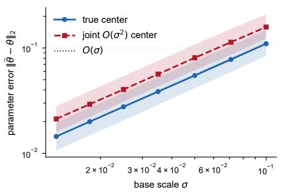  
(a) Predicted population order.

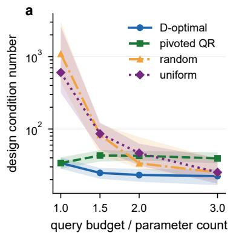

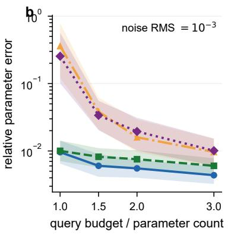  
(b) Conditioning controls recovery.  
Figure 6: Two theorem-facing checks. Lines show medians and bands show interquartile ranges. Left: exact- and joint-center errors follow the O(σ) reference. Right: additional, well-selected scalar queries stabilize noisy recovery.

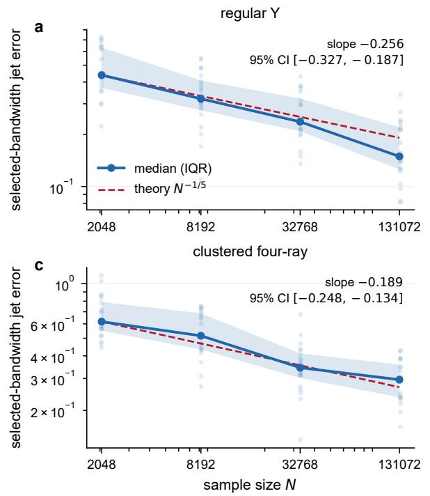

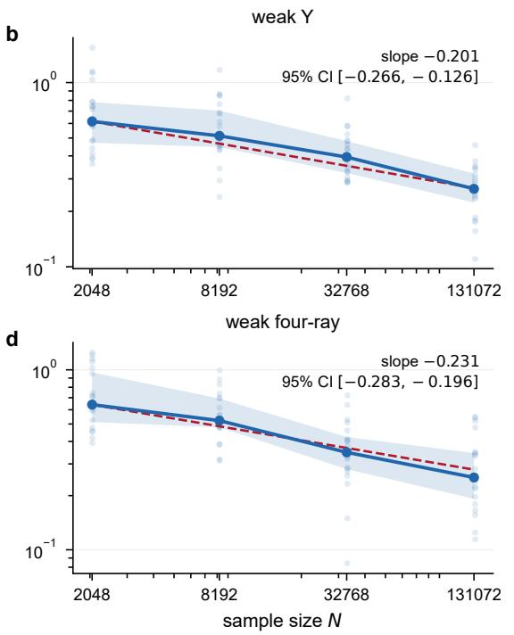  
Figure 7: KDE finite-sample rate by geometry. Faint points are individual seeds at the medianselected bandwidth; solid curves and bands show the seed median and interquartile range. Red references have slope −1/5. Insets report 5,000-resample seed-bootstrap percentile intervals.

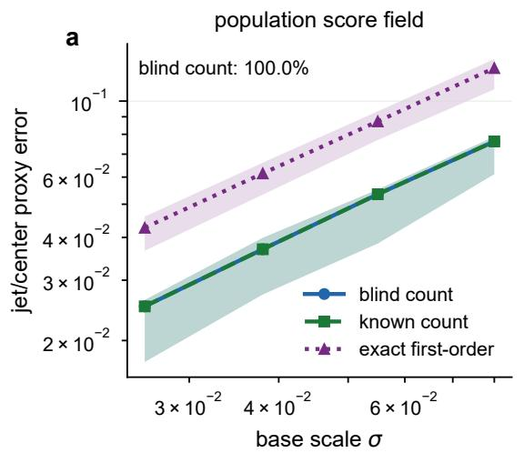

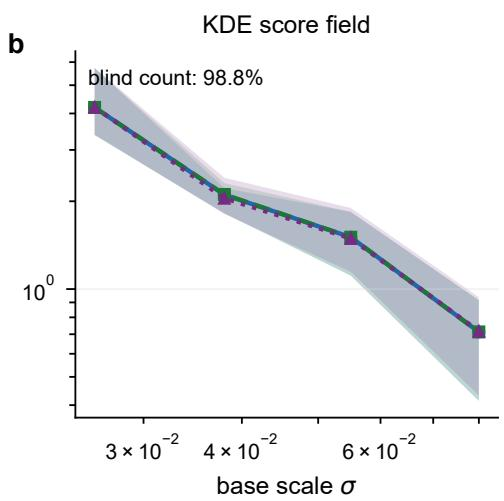  
Figure 8: First-order frontend followed by second-order recovery. Bands are interquartile ranges over correct-count rows. Population error decreases with scale; at fixed sample size, KDE variance reverses the trend. Blind-count accuracy is computed on all rows.

Scaling is feasible but perturbation-sensitive  
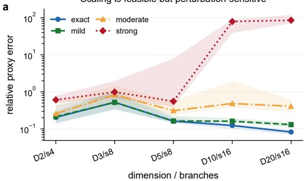

E4: data source dominates row policy  
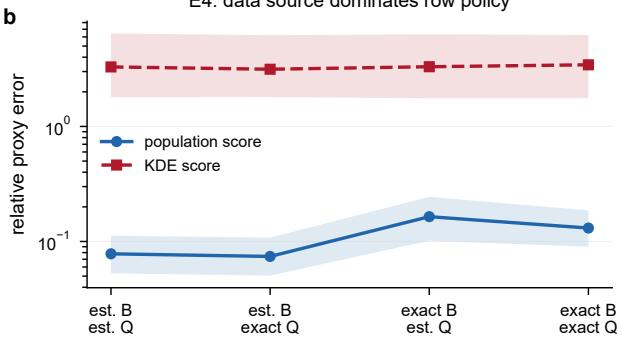

A better score need not improve the response  
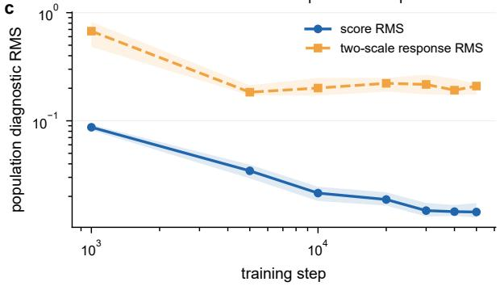

Inverse quality peaks before 50k steps  
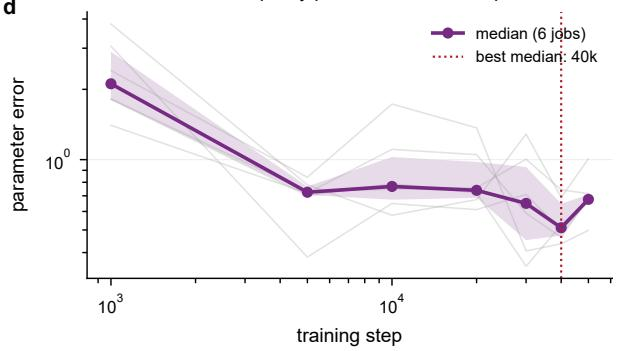  
Figure 9: Supplemental diagnostics. (a) Dimension/branch scale-up under exact through strong first-order perturbations. (b) E4 with first-order basis (B) and query-row geometry (Q) crossed. (c–d) Width-256 learned-score follow-up through 50k updates; bands are interquartile ranges, and thin curves in (d) are all six jobs.

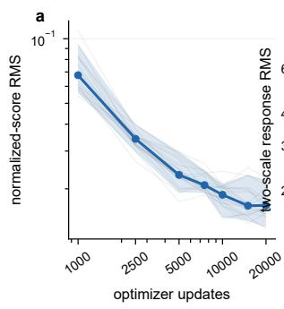

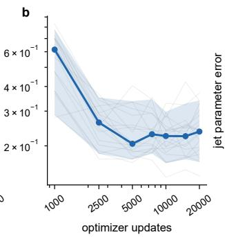

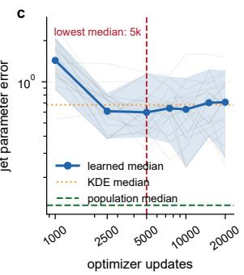  
Figure 10: Learned-score diagnostics across seven checkpoints. Thin curves show all 20 jobs; thick curves and bands show the median and 5th–95th percentiles. Median jet error reaches its minimum at 5000 updates before score RMS reaches its lowest value; dotted and dashed lines are matched KDE and population baselines.