# MemoryWalker: Stop Training Agents on Contexts They Never Saw

“Your Memory-Compressing Harness Makes Training and Inference Inconsistent”

Zinco J, Xunjie Zhu, Shen Huang, Zhenyi Wang, Pengjun Xie, Jieping Ye Token Foundry, Alibaba Group

## Abstract

Production agent harnesses, including Claude Code and Qwen-Agent, compress an agent’s context during rollout to make long-horizon interaction tractable. Training policies under such compression, however, introduces a fundamental conditioning problem: each compression eviction branches the efective interaction history, making the object presented to the learning objective a tree rather than a single sequence. Existing pipelines typically linearize this tree in one of two ways: retaining only the rightmost root-to-leafpath, which causes time-travel leakage, or replaying the full depth-first traversal, which induces a train–inference mismatch. Thus, we introduce two exact conditioning-level corrections and prove their gradient equivalence: LogitTree, a segmented K-forward traversal of the logits tree, and an equivalent packed 4D attention mask. LogitTree requires K+1 backward passes, whereas the 4D formulation requires both a custom masked-attention kernel and white-box access to eviction records. To avoid these costs, we further propose SDCC (Self-Distillation for Conditioning Consistency), a training-friendly variational relaxation requiring only a single backward pass. At each eviction junction, SDCC minimizes the forward KL divergence between the compressed student policy and a stop-gradient teacher evaluated on the reconstructed pre-eviction prefix. By Pinsker’s inequality, a residual per-junction KL divergence of εKL yields an O(√εKL) bound on the resulting train–deployment behavioral gap in total variation. Unlike the exact corrections, SDCC applies without modification to blackbox harnesses. We evaluate our framework with three white-box context editors—TC-RAG, AgentFold, and MemexRL—and two black-box harnesses—Claude Code and OpenCode. Across seven web-search benchmarks, naive compressed-stream training substantially inflates the train–rollout log-probability gap relative to the no-compression floor, with the largest inflation on eviction-heavy batches. In contrast, both exact corrections—LogitTree and the 4D attention mask—remain at the no-compression floor, while SDCC substantially closes the gap. These gains in conditioning consistency are accompanied by lower logit drift and higher rollout rewards than naive compressed-stream training.

## 1 Introduction

Long-horizon agents, including deep-search assistants (Xi et al., 2025), coding copilots (Wang et al., 2025), browser-based research agents (Shi et al., 2025), and multi-turn planners (Huang et al., 2024)—can accumulate trajectories spanning tens to hundreds of thousands of tokens. Retaining the full interaction history is not only computationally expensive, but can also impair decision making: ❶ outdated observations, abandoned plans, and failed attempts introduce substantial contextual noise (Jiang et al., 2025a); ❷ state rollback can invalidate the actions and observations associated with a reverted branch (Jiang et al., 2025a); and ❸ critical goals and instructions may be diluted or overlooked as the context grows, exacerbating the lost-in-the-middle efect (Liu et al., 2023; Chen et al., 2026). Production agent harnesses therefore actively compress and rewrite interaction histories to maintain compact, decision-relevant contexts. For example, Claude Code (Anthropic, 2024) and Qwen-Agent (Team, 2024) maintain bounded context windows and replace evicted prefixes with automatically generated summaries. Other approaches, including TC-RAG (Jiang et al., 2025a), MemexRL (Wang et al., 2026) and AgentFold (Ye et al., 2025; Zhou et al., 2025) introduce model-aware memory mechanisms that allow the agent to determine whether, when, what and how to compress, ofload, or retrieve information on demand.

Across these context-compression designs, a memory editor (hook) rewrites the interaction history into a bounded live context before each decoding step. Although this improves inference-time tractability and decision quality, it creates a subtle problem for post-training (SFT and RL): when the trainer recomputes the log probabilities of rollout tokens, the context under which a token was originally generated may no longer be available.

Training on the conditioning tree, not the sequence. This missing-context problem arises because harness-level compression breaks the correspondence between token order and conditioning history. At each evictionjunction, the original prefix is replaced by a compressed view: tokens preceding the edit were generated under the original prefix, whereas subsequent tokens are generated under its compressed replacement. Repeated edits therefore induce a tree ofconditioning histories, rather than a single sequence that can be replayed consistently, as illustrated in Figure 1(a). Existing pipelines (Ye et al., 2025; Zhou et al., 2025; Wang et al., 2026; Jiang et al., 2025a) typically serialize this tree in one of two ways. ❶ Training on the surviving compressed stream follows only the rightmost root-to-leaf path, causing earlier tokens to be reevaluated as if they had been conditioned on summaries created only later—an error we call time-travel leakage. ❷ Training on the full raw trace instead follows a depth-first traversal, causing later tokens to be reevaluated with evicted content that is unavailable during rollout and deployment—a train– inference conditioning mismatch. In both cases, recomputing token logits under the resulting sequence assigns tokens contexts diferent from those under which they were originally generated, producing substantial train– inference logit inconsistency.

From the conditioning tree to exact solutions. To restore the context under which each rollout token was originally generated, we formulate training as a traversal of the conditioning tree and introduce two exact approaches to walk the tree, gradient-equivalent constructions. ❶ LogitTree performs a segmented traversal, separately evaluating the K pre-eviction branches, ❷ whereas a packed 4D attention mask encodes the same branch structure within a single forward pass. As shown in §4, both constructions yield the same policy gradients and exactly recover the correct rollout conditioning. This exactness, however, comes at a computational or systems cost: LogitTree requires (K+1) segmented model evaluations, whereas the packed formulation relies on a custom masked-attention kernel that is dificult to integrate eficiently with fused attention implementations and is restricted to white-box harnesses with access to eviction records. To recover conditioning consistency without explicitly replaying every branch of the context tree, we further propose SDCC (Self-Distillation for Conditioning Consistency; §5). Instead of exactly reconstructing the conditioning context for every rollout token, SDCC trains the policy under the surviving compressed context to match its behavior under the original pre-eviction context. Specifically, at each eviction junction, it minimizes the forward KL divergence from the compressed student policy to a stop-gradient teacher evaluated under the reconstructed pre-eviction prefix. A wake–sleep argument determines the KL direction, and Pinsker’s inequality converts a residual per-junction KL divergence of εKL into an O(√εKL) bound on the corresponding behavioral discrepancy in total variation. This relaxation requires only a single backward pass per trajectory and extends to black-box harnesses without requiring white-box modification of their attention computation.

Contributions. Our contributions are fourfold:

• We formalize context compression training as a conditioning-inconsistency problem (§3). We prove that the two common rollout compression—Naive-Compressed and Naive-Full—lead to time-travel leakage and train– inference conditioning mismatch, respectively.

• We propose two exact, gradient-equivalent solutions to walk the context tree (§4). LogitTree explicitly traverses the conditioning tree, while a packed 4D attention mask represents the same structure in a single forward pass.

• We introduce SDCC, a training-eficient relaxation (§5). SDCC distills policy behavior under the original preeviction context into the surviving compressed context, requires only one backward pass, and generally applies to white-box and black-box harnesses.

• We validate the framework across compression mechanisms and agent tasks (§6). Across three white-box and two black-box memory editors, on seven web-search benchmarks, our methods reduce train–inference incon sistency and logit drift while improving rollout rewards over naive compressed-stream training.

## 2 Related Work

Harness context compression. Most production long-horizon agent harnesses include an external editor that mutates the physical history before the next decoding step. Claude Code (Anthropic, 2024) and Qwen-Agent (Team, 2024) maintain a bounded context window and inject an auto-compact summary in place of the evicted prefix. MemexRL (Wang et al., 2026) and MEMGPT (Packer et al., 2023) pages between the live context and an external store. TC-RAG and StackPlanner (Jiang et al., 2025a; Zhang et al., 2026a) manages context as an explicit stack whose pop evicts the oldest retrieval envelope. AgentFold and Mem1 (Ye et al., 2025; Zhou et al., 2025) periodically fold the prefix into a self-generated summary. A complementary line studies working-memory design for agents operating over long documents, retaining answerable evidence while compacting the rest of the context (Zhou et al., 2026). A parallel line trains dedicated compressors, including token-budget compression with small auxiliary models such as LLM-LINGUA (Jiang et al., 2023) and RECOMP (Xu et al., 2024), which act as scheduled deterministic editors. Across these editor families (Zhang et al., 2023; Li et al., 2024; Xiao et al., 2024; Borgeaud et al., 2022), the context available at training time need not match the live view under which token was originally decoded. Thus, context the model conditioned on while generating is not, what remains available when training.

Agent RL over edited contexts. Recently, policy-gradient RL (Schulman et al., 2017; Shao et al., 2024; Zheng et al., 2025) and their agentic extensions (Jin et al., 2025; Chen et al., 2025; Jiang et al., 2025b) fine-tune LLMs on rollout trajectories, typically treating the edited context as ordinary sequential data. Memory-R1 (Yan et al., 2026;

Zhang et al., 2026a) and MemexRL (Wang et al., 2026) go further by making memory management itself learnable: the policy can ofload spans to external storage and retrieve on demand, thereby optimizing the memory-editing process. However, neither line of work asks which context the training gradient should condition on once the rollout history has been rewritten. Related notions of train–inference consistency address diferent failure modes. TITO (Gallouédec & Rasul, 2026), whose token-level scheme our LogitTree extends to trajectory trees, studies token-level consistency—whether the token IDs observed during rollout are replayed identically during training— but does not address harness-induced history rewriting. Our focus is orthogonal: the conditioning context itself changes, which extends block-causal masking for long-context training (Ding et al., 2024; Reid et al., 2024; Zhou et al., 2025).

## 3 Pitfalls: Two Default Ways to Train on an Edited Rollout

Every harness in $\ S 2$ rewrites the agent’s context mid-rollout, posing one question: which context did each token condition on, and does training match $i t ?$ An edited rollout is therefore a trajectory tree, not a single sequence that can be replayed consistently. Existing pipelines flatten it in one of two ways, which fail in opposite directions yet violate the same token-level conditioning invariant.

## 3.1 Train–inference logits drift

We first define the train–inference logits drift that quantifies this mismatch. Fix a generated token $y _ { t } ;$ write $c _ { t } ^ { \mathrm { r o l l o u t } }$ for the context the policy held when it emitted $y _ { t }$ and $c _ { t } ^ { \mathrm { t r a i n } }$ for the prefix under which the loss later scores it. The rollout engine logs log $\dot { P } _ { \theta } ( y _ { t } \mid c _ { t } ^ { \mathrm { r o l l o u t } } )$ at decode time and the training pass recomputes log $P _ { \theta } ( y _ { t } \mid c _ { t } ^ { \mathrm { t r a i n } } )$ under the same weights; averaged over the loss-carrying response tokens $\mathcal { M } .$ , their disagreement is the train–inference logits drift (logdif in §6):

$$
\mathrm { l o g d i f f } \ = \ \frac { 1 } { | \mathcal { M } | } \sum _ { t \in \mathcal { M } } \big | \log P _ { \theta } ( y _ { t } \mid c _ { t } ^ { \mathrm { t r a i n } } ) - \log P _ { \theta } ( y _ { t } \mid c _ { t } ^ { \mathrm { r o l l o u t } } ) \big | .\tag{1}
$$

Sharing one set of weights makes drift immune to sampler staleness: it is either the small numerical gap between the training and inference kernels when nothing is compressed, where the two contexts coincide by construction and the statistic sits at its 0.014 floor (§6); such residual diferences can arise from floating-point computation and optimization implementation details (Zhang et al., 2026b) — or a genuine $c _ { t } ^ { \mathrm { t r a i n } } \neq c _ { t } ^ { \mathrm { r o l l o u t } }$ . Drift is thus a test with a calibrated zero, and the two pitfalls below fail it in opposite directions.

## 3.2 Setup: the live view and the trajectory tree

We model the agent as a ReAct-style policy (Yao et al., 2023) that generates each action from the physical history $\mathbf { H } _ { t } = \left( s _ { 0 } , a _ { 0 } , o _ { 0 } , \ldots , s _ { t - 1 } , a _ { t - 1 } , o _ { t - 1 } \right)$ , where $s _ { k } , a _ { k }$ , and $O _ { k }$ denote the thought, tool call, and tool observation at turn k, respectively. A memory-editing harness inserts an editor EDIT(·) into the rollout loop to perform deletion (Wang et al., 2026) or summarization (Ye et al., 2025; Jiang et al., 2025a). Let $\mathcal { E } _ { \leq t }$ denote the ordered edits fired by step t. The policy conditions on the live context view as:

$$
\mathbf { H } _ { t } ^ { \prime } = \operatorname { V I E } \mathbf { w } _ { t } \big ( \mathbf { H } _ { \leq t } ; \mathcal { E } _ { \leq t } \big ) , \qquad \mathcal { E } _ { \leq t } = \operatorname { E D r T } ( \mathbf { H } _ { \leq t } ) , \qquad a _ { t } \sim \pi _ { \theta } ( \cdot \mid \mathbf { H } _ { t } ^ { \prime } ) ,\tag{2}
$$

where $\mathrm { V } _ { \mathrm { I E } } \mathbf { w } _ { t }$ applies all edits fired up to step $t ,$ yielding the partially observable context available to the policy. At the end of the rollout, the harness reports thefinal compressed walk $\mathbf { H } ^ { \mathrm { c o m p } }$ . Crucially,

$$
\underbrace { \mathbf { V } _ { \mathrm { I E } } \mathbf { w } _ { t } \left( \mathbf { H } _ { \leq t } ; \boldsymbol { \mathcal { E } } _ { \leq t } \right) } _ { \mathrm { l i v e ~ v i e w ~ a t ~ d e c o d e ~ o f } y _ { t } } \neq \underbrace { \mathbf { H } ^ { \mathrm { c o m p } } [ : t ] } _ { \mathrm { p r e f i x ~ o f ~ f i n a l ~ w a l k } } = \mathbf { V } \mathbf { I E } \mathbf { w } _ { T } ( \mathbf { H } _ { \leq T } ; \boldsymbol { \mathcal { E } } _ { \leq T } ) ,\tag{3}
$$

whenever an edit fires after step t: the prefix on the right has been rewritten by edits that did not yet exist when $y _ { t }$ was decoded.

To see why, consider an eviction at position $J _ { k }$ that removes or replaces a span $E _ { k }$ . Tokens generated before $J _ { k }$ were conditioned on a context in which $E _ { k }$ remained visible, whereas subsequent generation proceeds from the edited context in which $E _ { k }$ has been removed or replaced. Each edit therefore forks the conditioning history into a generation-time $l e g .$ , which preserves the pre-edit context, and a compressed spine, from which the rollout continues. Unrolling K such evictions at positions $\mathsf { \bar { J } } _ { 1 } < \cdots < J _ { K }$ , removing spans $E _ { 1 } , \dots , E _ { K }$ , yields a trajectory tree $\tau$ rooted at the initial context. Every $y _ { t }$ is a leaf of this tree: $\mathbf { p _ { t } } ( y _ { t } )$ denotes its root-to-leaf generation path, with $\mathbf { p _ { t } } ( y _ { t } ) = \mathbf { H } _ { t } ^ { \prime }$ by definition, while $\mathbf { p } _ { \mathbf { s } } ( y _ { t } ) = \mathbf { H } ^ { \mathrm { c o m p } } [ : t ]$ denotes its corresponding prefix in the final compressed walk. Figure 1 illustrates a running example with $E _ { 1 , 2 , 3 } \stackrel { \cdot } { = } \{ y _ { 5 } \} , \{ y _ { 8 } \} , \{ y _ { 1 1 } \}$ at $J _ { 1 , 2 , 3 } = \{ 7 , 1 0 , 1 2 \}$ ; the corresponding per-leaf prefixes are reported in Table 4 and Appendix B.4.

## 3.3 The two pitfalls and the conditioning invariant

Two sequence representations of $\tau$ are natural, and neither preserves the generation-time path of every token: ❶ the final compressed walk $\mathbf { H } ^ { \mathrm { c o m p } }$ keeps only the compressed spine, ❷ the full physical trace ${ \bf { H } } _ { T }$ concatenates every

## (a) Trajectory tree and two flattenings (K=3 junctions).

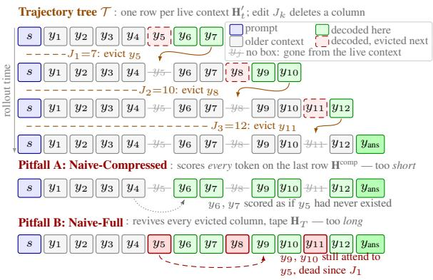

(b) Per-token ∆ log p on untrained Qwen3-4B, three harnesses on one axis.  
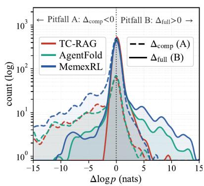  
Figure 1: The two pitfalls. (a) The trajectory tree $\tau$ of the $K { = } 3$ running example, drawn as the staircase of live contexts: row k lists every token visible during layer $k ,$ so a token decoded there conditions on exactly what lies to its left in its own row, i.e. on its live view $\mathbf { H } _ { t } ^ { \prime } = \mathbf { p } _ { \mathrm { t } } ( y _ { t } )$ (box fills are keyed in the legend). Between two rows an edit fires $\_ E { 1 } = \{ y { 5 } \}$ at $J _ { 1 } { = } 7 , E _ { 2 } { = } \{ y _ { 8 } \}$ at J2=10, $E _ { 3 } = \{ y _ { 1 1 } \}$ at $J _ { 3 } { = } 1 2$ (orange arrows) — so every later row carries a hole at the evicted column. The two default flattenings collapse this staircase in opposite directions: strip A scores every token on the last row alone, the walk $\mathbf { H } ^ { \mathrm { c o m p } }$ , so y6, y7 are scored on a prefix that already skips y5 (no box at that column); strip B revives every evicted column into the tape $\mathbf { H } _ { T } ,$ leaving $y _ { 5 } , y _ { 8 } , y _ { 1 1 }$ visible to tokens decoded long after their eviction (red arc). (b) Train–inference logit inconsistency for each generated token of an untrained $\mathrm { Q w e n } 3 – 4 \mathrm { B }$ , overlaid across three white-box harnesses. $\Delta _ { \mathrm { { c o m p } } }$ (dashed, left tail) is the logit diference when training replays a token using the final compressed context, which is missing information present at inference; $\Delta _ { \mathrm { f u l l } }$ (solid, right tail) is the diference when training replays the full physical trace, which contains information unavailable at inference. Their per-harness means have opposite signs, $\mu _ { \mathrm { c o m p } } \in [ - 4 . 0 , - 1 . 6 ]$ versus µfull $\in [ + 0 . 2 , + 0 . 7 ] $ ; full aggregation is in Table 7 (§F.2).

generated token in decoding order, a depth-first traversal. The former applies edits too early, the latter keeps editedaway content too long.

❶ Pitfall A: Naive-Compressed follows the final compressed path (time-travel leakage). Naive-Compressed trains directly on ${ \bf H } ^ { \mathrm { c o m p } } ,$ . Consequently, each surviving target $y _ { t }$ is scored under its prefix in the final compressed walk, $\mathbf { p _ { s } } ( y _ { t } )$ , rather than under the live view $\mathbf { p } _ { \mathbf { t } } ( y _ { t } ) = \mathbf { H } _ { t } ^ { \prime }$ from which it was generated:

$$
\mathbf { p } _ { s } ( y _ { t } ) \subsetneq \mathbf { p } _ { t } ( y _ { t } ) = \mathbf { H } _ { t } ^ { \prime } = \operatorname { R o o r T o R I G H T M O S T L E A F } ( \mathcal { T } ) .\tag{4}
$$

The mismatch arises because $\mathbf { p _ { s } } ( y _ { t } )$ may already reflect edits that fired only after $y _ { t }$ was decoded. Future compres sion is thus propagated backward in time, a failure mode we call time-travel leakage. In the running example, this scores y , y as if y never existed — though the model conditioned on $y _ { 5 }$ . On an untrained Qwen3-4B, one such leaf contributes $\Delta _ { \mathrm { c o m p } } = - 2 2 . 8$ nats to the per-token log-probability gap; SFT/RL views appear in Appendix B.4.

❷ Pitfall B: Naive-Full trains on the depth-first traversal (train–inference mismatch). Naive-Full instead trains on ${ \bf { H } } _ { T }$ , which preserves every generated token in decoding order. A target generated after an eviction is therefore reevaluated under the physical prefix $\mathbf { H } _ { < t }$ , which may still contain spans that had already been removed from the live view:

$$
\mathrm { D E P T H F I R S T T R A V E R S A L } ( \mathcal { T } ) \ = \ \mathbf { H } _ { < t } \ \supseteq \ \mathbf { p } _ { t } ( y _ { t } ) \ \supseteq \ \mathbf { p } _ { s } ( y _ { t } ) .\tag{5}
$$

Thus, $y _ { 9 } , y _ { 1 0 }$ are scored with $y _ { 5 } , y _ { 8 }$ still in the prefix even though each was already evicted; the model learns to exploit signal unavailable at deployment, with credit-assignment error accumulating linearly with K (App. B.4, Eq. 14). A matched leaf contributes $\Delta _ { \mathrm { f u l l } } = + 1 8 . 5$ nats: opposite in sign to Pitfall A, with comparable magnitude. We refer to this failure as stale-context leakage: training exposes the model to information unavailable during rollout and deployment.

❸ Mirror symmetry and the conditioning invariant. Pitfall A conditions on too little context, whereas Pitfall B conditions on too much (Table 5, App. B.4). Accordingly, on an untrained Qwen3-4B, $\Delta _ { \mathrm { { c o m p } } }$ is predominantly negative and $\Delta _ { \mathrm { f u l l } }$ predominantly positive across three white-box harnesses (Figure 1). Under eviction-heavy compression, the Naive-Compressed train–inference log-probability gap reaches 0.366 on AgentFold, ${ \approx } 2 6 \times$ the no-compression floor of 0.014 (§6). Both failures violate the same requirement. In the notation of §3.1, the loss prefix is $c _ { t } ^ { \mathrm { t r a i n } } = { \bf p } _ { \mathrm { s } } ( y _ { t } )$ for Pitfall A and $\mathbf { H } _ { < t }$ for Pitfall B, against $c _ { t } ^ { \mathrm { r o l l o u } } = { \bf H } _ { t } ^ { \prime }$ in both cases.

Definition 1 (Conditioning consistency). A training pipeline is conditioning-consistent if, at every step t in every trajectory, using only the edits fired through step $t ,$ never future ones:

$$
\forall t , ~ c _ { t } ^ { \mathrm { t r a i n } } \equiv c _ { t } ^ { \mathrm { r o l l o u t } } \equiv \mathrm { V I E } { \bf W } _ { t } \left( { \bf H } _ { \leq t } ; { \mathcal E } _ { \leq t } \right) = { \bf H } _ { t } ^ { \prime } \ : ,
$$

(Conditioning Invariant)

## (a) Trajectory tree T

Each edit forks the trajectory.

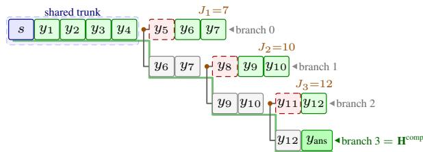  
orange dot: fork; green: decoded/kept; red dash: evicted grey: re-shown; green underline: deployed walk $\mathbf { H } ^ { \mathrm { c o m p } }$

## (c) 4D mask

Pack the same tree into one forward pass.

## (b) LogitTree

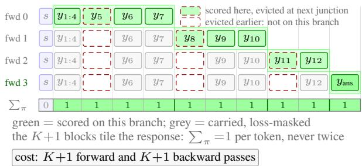

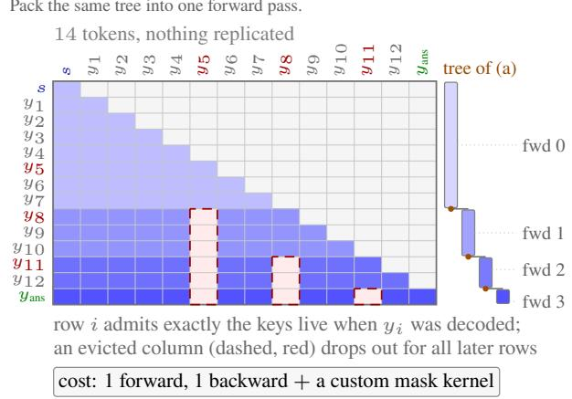

## (d) SDCC

One walk, pulled toward the teacher legs.

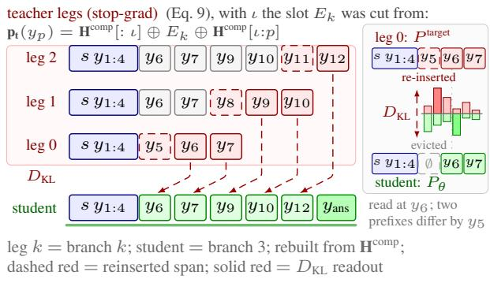  
Figure 2: From the trajectory tree to three consistent materializations. (a) A memory editor turns one rollout into a tree, not a sequence: evicting $E _ { k }$ at junction $J _ { k }$ forks the prefix, because the pre-eviction path keeps the evicted token while the post-eviction path skips it, giving $K { + 1 }$ root-to-leaf branches over a shared trunk whose bottom-most path is the compressed walk $\mathbf { H } ^ { \mathrm { c o m p } }$ shipped at deployment. Every token is decoded on its own root-to-leaf prefix $\mathbf { p } _ { \mathbf { t } } ( y _ { t } ) = \mathbf { \bar { H } } _ { t } ^ { \prime } ;$ ; the two pitfalls of Figure 1 are what happens when training instead scores it on some other path. (b) LogitTree (ours, §4) restores the invariant by literally walking the $K { + 1 }$ branches, one forward each, with the loss masked to the tokens decoded on that branch; the $\scriptstyle \sum _ { \pi }$ strip tallies that mask, reading 1 on every response column — including the trunk tokens $y _ { 1 : 4 } .$ , replicated K+1 times — so no token contributes its policy gradient twice. (c) The 4D packed mask (ours, §4) folds the same tree into a single forward over the physical union H and recovers each branch through the attention mask: the row bands are the tree’s legs (right). Its gradient is identical to (b) (Theorem 1). (d) SDCC (ours, §5) keeps the single compressed forward as the student, and rebuilds the other legs as stop-gradient teachers by re-inserting each evicted span at its junction (Eq. 9); a forward KL at the diverging leaves only then pulls the student’s next-token distribution toward the teacher’s. The inset isolates one such leaf: the two conditioning prefixes difer by exactly the evicted span, and the KL is the gap this opens between the two next-token distributions. One backward pass, no kernel, and an $\mathcal { O } ( \sqrt { \varepsilon _ { \mathrm { K L } } } )$ residual (Proposition 2) instead of exactness.

Proposition 1 (Failure of naive training). $\mathbf { H } ^ { \mathrm { c o m p } } [ : t ]$ yields Pitfall A, while $\mathbf { H } _ { < t }$ yields Pitfall B; neither matches the live view H′ from which $y _ { t }$ was decoded. Whenever a nontrivial edit changes the prefix used to evaluate some target yt, both Naive-Compressed and Naive-Full violate the conditioning invariant. §4 gives two exact (bias-zero) fixes, while §5 gives a soft $\mathcal { O } ( \sqrt { \varepsilon _ { \mathrm { K L } } } )$ one.

## 4 Exact Solutions: Two Ways to Walk the Context Tree

To eliminate the conditioning errors introduced by the two pitfalls, we propose two exact solutions that enforce conditioning-invariance. Across the K+1 branches of the conditioning tree T, each target $y _ { t }$ is scored on the unique branch whose prefix matches its inference-time live view, $\mathbf { p } _ { \mathbf { t } } ( y _ { t } ) = \mathbf { H } _ { t } ^ { \prime } \left( \mathrm { A p p . ~ B } \right)$ . Both methods therefore recover the correct training context for every target and incur zero conditioning bias. ❶ LogitTree (§4.1) explicitly materializes and evaluates the branches as separate sequences, ❷ whereas the 4D attention mask (§4.2) packs the same branches into a single forward pass. As established in Theorem 1, they implement the same tree traversal at diferent levels of the training stack (Figure 2).

## 4.1 ❶ LogitTree materializes branches as separate sequences

LogitTree (ours; extending the token-level scheme of (Gallouédec & Rasul, 2026) to trajectory trees) decomposes T into its K+1 root-to-leaf branches and processes each branch as a separate sequence:

$$
\{ \mathbf { H } ^ { \prime \pi } \} = \mathrm { R o o r T o L e A F } ( { \mathcal T } ) , \qquad \mathbf { L o g i t s } _ { \pi } ~ = ~ f _ { \theta } ( \{ \mathbf { H } ^ { \prime \pi } \} ) , \qquad \pi \in \{ 1 , \ldots , K + 1 \} ,\tag{6}
$$

where $\{ { \bf { H } } ^ { \prime \pi } \}$ denotes the sequence on branch π and logits is extracted from LLMs $f ( \cdot )$ parameterized by θ. For each target $y _ { t }$ , LogitTree selects the unique branch whose prefix equals the live view under which $y _ { t }$ was generated, $\mathbf { p _ { t } } ( y _ { t } ) \dot { = } \dot { \mathbf { H } } _ { t } ^ { \prime }$ . The loss for $y _ { t }$ is therefore computed from that branch only, so its training-time context exactly matches its rollout-time context. In implementation this uniqueness is enforced by a per-branch token loss mask: a token is unmasked on exactly one of the $K { + 1 }$ branches — the one whose prefix is its live view — and masked out at every other occurrence, so each token contributes its policy gradient exactly once and the shared-trunk tokens, which are physically replicated across all branches, are never counted $K { + 1 }$ times.

LogitTree places the $K { + 1 }$ legs in physically disjoint sequences, so standard causal attention restricts each target yt to its predecessors on the same leg—namely, $\mathbf { p _ { t } } ( y _ { t } ) \mathrm { - w i t h }$ no attention across legs. In the running example $( J _ { 1 , 2 , 3 } = 7 , 1 0 , 1 2 )$ , the pre- ${ . J _ { 1 } }$ leg containing y6 and y7 retains y5, which was visible when they were decoded. In contrast, the compressed-spine leg containing $y _ { \mathrm { a n s } }$ excludes $y _ { 5 } , y _ { 8 }$ , and $y _ { 1 1 }$ , all of which had already been evicted. Thus, neither time-travel leakage nor stale-context leakage has a valid attention pathway. Shared-trunk KV caching keeps aggregate memory well below $( K { + } 1 ) \times ;$ compute stays ≈ $( K { + } 1 ) \times$ . Per-branch SFT/RL gradient equivalences are in App. C (Proposition 3; the branch layout for the running example is drawn in Figure 2(b)); the construction is backbone-agnostic — it consumes only the per-leg live views the harness already exposes (App. E.2).

## 4.2 ❷ The 4D attention mask packs all branches into one sequence

Performing $K { + 1 }$ backward passes per rollout is prohibitively expensive in deep-search settings. We therefore ask whether the entire conditioning tree can be traversed in a single masked forward pass. Our realization follows the 4D attention-mask formulation used for stack-memory agent trajectories in AgenticRag-R1 (Jiang et al., 2026): we keep ${ \bf { H } } _ { T }$ packed as one sequence while restricting each query token to attend only to tokens on its own root-to-leaf branch. Let $\left[ \tau ( j ) , \omega ( j ) \right)$ be token $j ^ { \circ } \mathrm { s }$ logical lifetime $( \omega ( j ) = + \infty$ if never evicted), we define

$$
M _ { i , j } ^ { \mathrm { l o g i c a l } } = \left\{ \begin{array} { l l } { 0 , } & { \tau ( j ) \leq i < \omega ( j ) , } \\ { - \infty , } & { \mathrm { o t h e r w i s e } , } \end{array} \right. \quad M _ { i , j } = M _ { i , j } ^ { \mathrm { c a u s a l } } \oplus M _ { i , j } ^ { \mathrm { l o g i c a l } } ,\tag{7}
$$

The causal mask $M ^ { \mathrm { c a u s a l } }$ prevents attention to future tokens, while $M ^ { \mathrm { l o g i c a l } }$ further removes attention edges between diferent branches of the conditioning tree. We also reassign position ids so that the tokens visible to each query form a gap-free logical sequence (Zhou et al., 2025). As a result, each query $y _ { i }$ attends to exactly the root-to-leaf path of $\tau$ under which it was generated, allowing all branches to be evaluated in a single forward pass (Figure 2(c)). Throughout, both materializations share one standing conditioning invariant proposition — and gradient equivalence (Proposition 4, App. C), which holds under five conditions: (i) exact-visibility encoding, (ii) row-wise position reassignment, (iii) decoupled loss/attention masks, (iv) no cross-mask normalization, and (v) rollout and training sharing the same $M ^ { \mathrm { l o g i c a l } }$ . However, linear attention, sparse/top-k selection, and vLLM/SGLang violate the premise or one of (i)–(v) (App. E.2).

## 4.3 ❸ The centerpiece: 4D masks and LogitTree are the same walk

Theorem 1 (Materialization equivalence). Under dense softmax attention, the packed 4D mask and the LogitTree K-forward decomposition implement the same traversal of the conditioning tree and compute identical training gradients. Both compute the sum over branches of the per-branch gradient in Proposition 3 (App. C).

Cost and deployment splits. LogitTree requires K+1 backward passes per rollout, resulting in a 5–20× wallclock overhead in deep-search settings, whereas the 4D formulation requires only one. The 4D formulation, however, imposes a stronger systems requirement: it requires more larger attention-mask and white-box access to both the harness and the model. Implementing equation 7 requires the harness to expose the eviction records that determine $[ \tau ( j ) , \omega ( j ) )$ , as well as the model to accept a custom (Batchsize, NumHeads, T, T) attention mask. Neither capability is generally available through black-box APIs such as Claude Code or OpenCode. Moreover, constructing and applying a per-query 4D mask has high memory and computational complexity, making it particularly unfriendly for training with very long contexts. By contrast, LogitTree requires only the live views exposed during rollout and can reconstruct the $\mathrm { \bar { \ } K } { + } \mathrm { \bar { 1 } }$ branch inputs by concatenating the corresponding per-leg prompts. Its main limitation is therefore computational rather than architectural. The concrete 4D realization used in §6 is deferred to App. E.2, a packaging within the equivalence class of equation 7 that inherits Theorem 1.

## 5 SDCC: Self-Distillation for Conditioning Consistency

A compressed rollout leaves two trajectories of the same interaction: the live rollout trajectory, whose contexts produced each token, and the final compressed replay trajectory Hcomp, which remains after all edits and is used by Naive-Compressed for training. They agree until a later edit rewrites a prefix. SDCC aligns their next-token distributions at exactly those divergences: the student under the compressed replay prefix matches a stopped-gradient teacher under the original live prefix. It aligns conditional policy distributions rather than the two text sequences.

The exact methods in Section 4 achieve this alignment by scoring every target on the branch on which it was generated. They are exact, but require either $K { + } \bar { 1 }$ backward passes or a custom attention kernel. Self-Distillation for Conditioning Consistency (SDCC) is the cheaper alternative: it retains the usual single backward pass on the compressed walk and aligns its predictions with the original live trajectory only at the diverging leaves. SDCC is therefore an approximation to the exact walks, not another way to materialize the tree.

## 5.1 Aligning the live and compressed trajectories

For a diverging response token $y _ { p }$ , write

$$
z _ { p } : = { \bf p } _ { \bf t } ( y _ { p } ) , \qquad x _ { p } : = { \bf p } _ { \bf s } ( y _ { p } ) \subsetneq z _ { p } ,\tag{8}
$$

where $z _ { p }$ is the live prefix from which $y _ { p }$ was originally decoded and $x _ { p }$ is its prefix in the final compressed walk. We call $y _ { p }$ a diverging leaf, and let C collect all such leaves in a trajectory; each pair $( z _ { p } , x _ { p } )$ is one local alignment pair. In the running example, if $y _ { 5 }$ is evicted only after $y _ { 6 }$ was decoded, then $z _ { 6 }$ contains $y _ { 5 }$ whereas $x _ { 6 }$ does not. Naive-Compressed trains y6 on $x _ { 6 } ;$ the exact methods would instead score it on $z _ { 6 }$

SDCC does not put $z _ { p }$ back into the gradient-carrying training sequence. Instead, it uses the policy evaluated on $z _ { p }$ as a stopped-gradient teacher, and the policy evaluated on $x _ { p }$ as the gradient-carrying student. Here “teacher” does not mean a second model: it is the current policy with gradients stopped. Thus, at a diverging leaf, SDCC teaches the compressed-context policy to reproduce the next-token distribution it had under the original live context (Figure 2(d)).

The procedure has three steps. First, run the ordinary task forward pass on the final compressed walk Hcomp; this is the student pass and is the only pass through which gradients flow. Second, reconstruct the original live prefix for each diverging leaf and evaluate it without gradients. For the common case in which one eviction $E _ { \mathrm { a c t } } ( \boldsymbol { p } )$ is active at $p ,$ with $\bar { \iota } ( E _ { \mathrm { a c t } } ( p ) )$ its original insertion slot, the reconstruction is

$$
\begin{array} { r } { \mathbf { p } _ { \mathrm { t } } ( y _ { p } ) = \underbrace { \mathbf { H } ^ { \mathrm { c o m p } } [ : \iota ( E _ { \mathrm { a c t } } ( p ) ) ] } _ { \mathrm { s h a r e d ~ t u n k } } \oplus \underbrace { E _ { \mathrm { a c t } } ( p ) } _ { \mathrm { r e - i n s e r t e d ~ s p a n } } \oplus \underbrace { \mathbf { H } ^ { \mathrm { c o m p } } [ \iota ( E _ { \mathrm { a c t } } ( p ) ) : p ] } _ { \mathrm { p o s t - j u n c t i o n ~ s u f i x } } . } \end{array}\tag{9}
$$

With overlapping evictions, SDCC re-inserts all spans active at $p ;$ Appendix D.1 gives the general construction. Third, add a KL penalty only at those diverging leaves:

$$
\mathcal { L } _ { \mathrm { S D C C } } = \underbrace { \mathcal { L } _ { \mathrm { t a s t } } ( \theta ; \mathbf { H } ^ { \mathrm { c o m p } } ) } _ { \mathrm { o r d i n a r y ~ c o m p r e s s e d - s t r a m u s ~ l o s s ~ } } + \lambda \sum _ { p \in \mathcal { C } } D _ { \mathrm { K L } } ( \underbrace { P ^ { \mathrm { l a r g e t } } ( \cdot \mid \mathbf { p } _ { \mathfrak { t } } ( y _ { p } ) ) } _ { \mathrm { l i v e - c o n t e x t ~ t e a d v e r , s o p - g r a d } } ) \underbrace { P _ { \theta } ( \cdot \mid \mathbf { p } _ { \mathfrak { s } } ( y _ { p } ) ) _ { p } } _ { \mathrm { c o n p r e s s e d - c o n t e x t s ~ m d e n t : ~ g r a d i e n t } } ) ,\tag{10}
$$

where $P ^ { \mathrm { t a r g e t } } ( \cdot \mid \mathbf { p } _ { \mathbf { t } } ( y _ { p } ) ) = f _ { \mathrm { s g } ( \theta ) } ( \mathbf { p } _ { \mathbf { t } } ( y _ { p } ) )$ and $P _ { \theta } ( \cdot \mid { \bf p } _ { s } ( y _ { p } ) ) _ { p } = f _ { \theta } ( { \bf H } ^ { \mathrm { c o m p } } ) _ { p }$ . The KL is forward: the teacher distribution appears first, so it acts as a fixed soft target and requires the student to cover outcomes that are likely under the original live context.

This construction makes the computational trade-of explicit. The student uses the same compressed input as Naive-Compressed, and the teacher legs are gradient-free; SDCC therefore needs one backward pass per trajectory. The penalty is leaf-gated: if no context difers, C is empty and the loss is exactly the usual task loss. Likewise, setting $\lambda = 0$ recovers Naive-Compressed exactly, making it SDCC’s matched baseline. Because ${ \bf { H } } _ { T }$ never enters the student input, SDCC does not introduce Naive-Full’s stale-context leakage. It instead softens Naive-Compressed’s time-travel error by matching distributions rather than by exactly replaying every branch.

The variational derivation of the forward direction, including its wake–sleep interpretation and the role of $\lambda ,$ is deferred to Appendix D. In brief, the forward KL has the same zero set as the conditioning gap induced by the variational objective, while giving a stopped-gradient cross-entropy update for the student.

## 5.2 What the residual KL guarantees

Let $\varepsilon _ { p } : = D _ { \mathrm { K L } } ( P ^ { \mathrm { t a r g e t } } ( \cdot  { | }  { \mathbf { p } } _ { \mathrm { t } } ( y _ { p } ) )  { | } | P _ { \theta } ( \cdot  { | }  { \mathbf { p } } _ { \mathrm { s } } ( y _ { p } ) ) _ { p } )$ be the residual left by Equation (10) at diverging leaf $p .$ Proposition 2 (Behavioral Pinsker bound on the conditioning gap). For every diverging leaf $\cdot _ { p , }$

$$
\| \pi _ { \boldsymbol { \theta } } ( \cdot  { | \mathbf { \delta p } _ { \mathrm { t } } ( \boldsymbol { y } _ { p } ) ) - \pi _ { \boldsymbol { \theta } } ( \cdot  { | \mathbf { \delta p } _ { \mathrm { s } } ( \boldsymbol { y } _ { p } ) ) \| _ { \mathrm { T V } } } } \le \sqrt { \varepsilon _ { p } / 2 } .
$$

Thus the regularizer controls a behavioral quantity, not merely a logit diagnostic: the smaller the teacher–student KL at a junction, the smaller the diference between their next-action distributions. $\operatorname { I f } \varepsilon _ { p } = 0$ , SDCC matches the exact walk’s next-token distribution at that leaf; for nonzero residual it remains an explicitly bounded approximation. Appendix D proves the proposition and further gives the variational derivation, a policy-gradient-bias bound, conditions for a zero-KL solution, and the convergence analysis.

## 6 Experiments

We validate the proposed conditioning-inconsistency framework across multiple model scales, white-box and blackbox agent harnesses, and multiple logit recomputation schemes. Across these settings, we consistently observe that harness-level context editing introduces a measurable train–inference mismatch, which manifests as elevated logit drift and degraded rollout reward under naive training. In contrast, conditioning-consistent recomputation substantially reduces this mismatch and improves downstream agent performance.

## 6.1 Experimental Setup

We validate conditioning inconsistency across diferent backbone models, agent harnesses, and training-time logit recomputation schemes.

❶ Backbone Models. We use Qwen-family models, with Qwen3-4B and Qwen3.7-Air as the main backbones.

❷ Harnesses. For white-box context editors, we use three representative learnable-action editors: TC-RAG (Jiang et al., 2025a), which emits pop(); AgentFold (Ye et al., 2025), which folds spans past a length threshold; and MemexRL (Wang et al., 2026), which ofloads spans to an external store. A Search-R1 no-compression control emits tool calls but never evicts, anchoring the no-compression drift floor. Knobs and per-method inputs are given in §F.1–F.3. For black-box production-style harnesses, we instrument their HTTPS trafic, recover the per-turn rendered context prefixes, and construct the corresponding LogitTree views from these observed prefix states. We evaluate two such harnesses: Claude Code and OpenCode.

❸ Logit Recomputation Schemes. We compare replay on the final compressed stream (Naive-Compressed), replay on the full physical trace (Naive-Full), two exact conditioning-consistent replay methods (4D-Mask and LogitTree), and our proposed single-backward approximation SDCC.

❹ Datasets. Train: a pooled composite-QA corpus of 81,638 instances drawn from REDSEARCHER (Chu et al., 2026) and the ASEARCHER agentic-search training set, whose multi-hop structure reliably induces long-horizon interaction and frequent context editing. Test: NQ (Kwiatkowski et al., 2019), TRIVIAQA (Joshi et al., 2017), HOTPOTQA (Yang et al., 2018), 2WIKI (Ho et al., 2020), MUSIQUE (Trivedi et al., 2022), BAMBOOGLE (Press et al., 2023), and FRAMES (Krishna et al., 2025) (38,270 questions per checkpoint, using the same live pipeline as training).

❺ Search Infrastructure. All rollouts use live web tools rather than a local retrieval server. Web search is backed by the online DashScope text-search API, which returns up to 10 ranked results per query. For full-page evidence extraction, we use a two-stage pipeline: retrieved pages are first fetched via Firecrawl and then summarized by Qwen3-Turbo.

❻ Evaluation Metrics. We report the following quantities, each with a distinct role. (1) Recorded-token logdif $= \left| \log \pi _ { \mathrm { t r a i n } } ( y | c ^ { \mathrm { t r a i n } } ) - \log \pi _ { \mathrm { r o l l o u t } } ( y | c ^ { \mathrm { r o l l o u t } } ) \right|$ is a per-token conditioning-fidelity diagnostic rather than an eficacy metric; (2) Full-distribution conditioning KL K $_ { - } ( \pi ( \cdot | H ^ { \mathrm { t e a c h e r } } ) \parallel \pi ( \cdot | H ^ { \mathrm { s t u d e n t } } ) )$ is the population-level counterpart, used in §6.3 to measure the direction and magnitude of the conditioning mismatch. (3) SDCC training KL $\mathrm { K L } _ { \mathrm { S D C C } } \left( \ S 6 . 2 , \ S \mathrm { F } . 6 \right)$ is SDCC’s leaf-gated consistency regularizer, and is not intended as a cross-method comparator. (4) Rollout reward measures the behavioral consequence of conditioning mismatch during training and rollout. (5) Compression depth depth $= \mathbb { E } [ c _ { i } | c _ { i } > 0 ]$ , for $c _ { i }$ the fraction of rendered context evicted in rollout episode i, is how much an editor removes when it fires. Its companion factor $\mathrm { f r e q } = \mathrm { P r } [ c _ { i } > 0 ]$ is tabulated per cell in §F.6 instead of here: what triggers a firing is harness-specific, so freq compares down a column, not across. (6) Agentic EM is the primary downstream task metric and determines the final correctness ranking in §6.4. Full definitions are given in §F.

❼ Optimization. All cells are trained with GRPO: group size $G = 1 6$ , learning rate $1 0 ^ { - 6 }$ , KL coeficient $\beta _ { \mathrm { K L } } =$ $1 0 ^ { - 3 }$ , and a live-compression rollout pipeline, so training and deployment use the same rollout setting. Each cell retains at least 400 steps; a frozen dev split of 1,325 questions, disjoint from every test benchmark, shortlists candidates for full-suite evaluation, and each reported EM is the best full-suite result among the cell’s fully evaluated checkpoints (§F).

## 6.2 Grand result matrix (overview)

Tree-consistent methods recover the drift floor; the two Naives inflate with eviction. Under live modeltriggered compression (memory\_ofload, pop emitted by the policy; AgentFold folds when the rendered context is >3k tokens), the no-compression control sits at logdif = 0.014. The discriminating quantity is the slope against eviction frequency rather than the level: where a cell barely evicts, every method sits at the floor, baselines included. From each method’s least- to its most-evicting harness, Naive-Compressed moves $3 0 . 5 \times ( 0 . 0 1 2  0 . 3 6 6$ for freq $2 . 3  2 8 . 6 \%$ and Naive-Full $9 . 7 \times \ ( 0 . 0 2 1  0 . 2 0 3$ , freq $6 . 5  4 1 . 5 \% )$ , whereas 4D spans a comparably wide frequency range (3.8→49.2%) and moves only 3.7×, ending at 0.022; SDCC moves 6.5× to 0.071 and LogitTree is flat at 0.012–0.013. In the two non-folding editors all six tree-consistent cells sit at 0.006–0.013, at or below the control (§3.3). Table 1 reports the full training matrix. N/A = undefined. reward and logdif are read at each cell’s argmax-reward iteration and compression at run level, by one recipe applied to every cell. Semantics: §F.4. For the untrained seven-benchmark diagnostic, compression depth is the mean fraction removed conditional on an editor firing. “Max tok.” is the largest single-request input length observed during rollout, rendered with the same chat template and tool schema used by the adapter. The Base and Search-R1 controls have depth 0.0 by construction.

Table 1: Grand result matrix (Qwen3-4B, live compression, real web tools). Five training methods across three white-box editors, plus two black-box deployed agents. logdif is measured at each cell’s maximum-reward rollout iteration, as the mean and max within that iteration rather than over the run. Per-cell compression frequencies are in §F.6. For the two black-box harnesses, context management is internal and eviction spans are not exposed, so compression depth is N/A; their observed maximum context lengths are reported, and junctions are recovered indirectly (§E.2).
<table><tr><td rowspan="2">Method</td><td rowspan="2">Harness</td><td rowspan="2">reward ↑ max</td><td colspan="2">logdiff↓ mean max</td><td colspan="2">compression depth (%) max tok.</td><td rowspan="2">TQA</td><td colspan="6">Agentic EM per bench (%) ↑</td><td rowspan="2"></td><td rowspan="2">avg EM ↑</td></tr><tr><td></td><td></td><td></td><td></td><td>NQ</td><td></td><td>HQA 2Wiki MSQ Bamb.</td><td></td><td></td><td>Frames</td></tr><tr><td colspan="10">Qwen3-4B (without RL)</td><td></td><td></td><td></td><td></td><td></td><td></td></tr><tr><td rowspan="2">No-Compression</td><td>Base Search-R1</td><td>N/A N/A</td><td>N/A N/A</td><td>N/A N/A</td><td>0.0 0.0</td><td>289 1,806</td><td>3.2 2.3</td><td>21.6 22.2</td><td>8.4 8.7</td><td>2.6 2.5</td><td>2.5 2.7</td><td>23.2 18.4</td><td>8.0 8.4</td><td></td><td>9.9 9.3</td></tr><tr><td>TC-RAG</td><td>N/A</td><td>N/A</td><td>N/A</td><td>2.00</td><td>2,117</td><td>3.1</td><td>23.2</td><td>9.2</td><td>3.1</td><td></td><td></td><td>16.0</td><td>9.7</td><td>9.7</td></tr><tr><td rowspan="5">Compression</td><td>AgentFold</td><td>N/A</td><td>N/A</td><td>N/A</td><td>4.78</td><td>1,971</td><td>2.0</td><td>21.3</td><td>7.3</td><td>2.5</td><td>3.9 2.9</td><td>13.6</td><td></td><td>6.1</td><td>7.9</td></tr><tr><td>MemexRL</td><td>N/A</td><td>N/A</td><td>N/A</td><td>12.58</td><td>1,670</td><td>1.2</td><td>15.8</td><td>5.5</td><td></td><td>1.1</td><td>1.7</td><td>12.0</td><td>7.3</td><td>6.4</td></tr><tr><td>Claude Code</td><td>N/A</td><td>N/A</td><td>N/A</td><td>N/A</td><td>33,804</td><td>22.1</td><td>50.4</td><td>23.2</td><td></td><td>29.8</td><td>7.4</td><td>37.6</td><td>13.7</td><td>26.3</td></tr><tr><td>OpenCode</td><td>N/A</td><td>N/A</td><td>N/A</td><td>N/A</td><td>34,285</td><td>31.0</td><td>55.7</td><td>26.6</td><td></td><td>32.7</td><td>8.4</td><td>36.6</td><td>12.1</td><td>29.0</td></tr><tr><td></td><td></td><td></td><td></td><td></td><td></td><td></td><td></td><td></td><td></td><td></td><td></td><td></td><td></td><td></td></tr><tr><td colspan="10">Qwen3-4B (with RL)</td><td colspan="7"></td></tr><tr><td rowspan="2">No-compression</td><td>Search-R1</td><td>0.697</td><td>0.014</td><td>0.015</td><td>0.0</td><td>36,370</td><td>19.8</td><td>57.6</td><td>19.9</td><td>11.1</td><td>7.9</td><td></td><td>32.0</td><td>12.7</td><td>23.0</td></tr><tr><td>TC-RAG</td><td>0.838</td><td>0.197</td><td>0.335</td><td>60.5</td><td>37,044</td><td>30.1</td><td>64.4</td><td>28.2</td><td></td><td>34.1</td><td>12.9</td><td>52.0</td><td>22.8</td><td>34.9</td></tr><tr><td rowspan="3">Naive-Full</td><td>AgentFold MemexRL</td><td>0.600</td><td>0.203</td><td>0.333 0.051</td><td>78.2 43.2</td><td>14,190 65,630</td><td>25.6 29.2</td><td>58.8</td><td>24.0 28.0</td><td>18.7</td><td>9.1</td><td>40.8</td><td>17.1</td><td></td><td>27.7 32.1</td></tr><tr><td></td><td>0.734</td><td>0.021</td><td></td><td></td><td></td><td></td><td></td><td>63.1</td><td></td><td>31.3</td><td>9.7</td><td>48.0</td><td>15.2</td><td></td></tr><tr><td>TC-RAG</td><td>0.850</td><td>0.015</td><td>0.041</td><td>54.3</td><td>38,171</td><td>30.9</td><td>64.3</td><td>31.9</td><td></td><td>46.0</td><td>11.8</td><td>50.4</td><td>21.5</td><td>36.7</td></tr><tr><td rowspan="3">Naive-Compressed</td><td>AgentFold MemexRL</td><td>0.734</td><td>0.366</td><td>1.095</td><td>68.4 55.0</td><td>16,708 37,101</td><td>30.3</td><td>64.1</td><td>25.4</td><td>24.8</td><td>12.6</td><td>56.0</td><td></td><td>18.9</td><td>33.2</td></tr><tr><td></td><td>0.750</td><td>0.012</td><td>0.014</td><td></td><td></td><td></td><td>23.9</td><td>60.5</td><td>22.9</td><td>20.5</td><td>9.7</td><td>47.2</td><td>17.6</td><td>28.9</td></tr><tr><td>TC-RAG</td><td>0.800</td><td>0.006</td><td>0.013</td><td>44.6</td><td>40,182</td><td>29.4</td><td>60.5</td><td>30.2</td><td>44.9</td><td></td><td>13.0</td><td>58.4</td><td>23.7</td><td>37.2</td></tr><tr><td rowspan="3">4D mask (ours)</td><td>AgentFold</td><td>0.632</td><td>0.022</td><td>0.091</td><td>79.7</td><td>15,383</td><td>33.4</td><td>66.0</td><td>31.9</td><td>43.9</td><td>11.1</td><td>37.6</td><td></td><td>15.8</td><td>34.2</td></tr><tr><td>MemexRL</td><td>0.416</td><td>0.013</td><td>0.017</td><td>45.4</td><td></td><td>36,528</td><td>33.7 65.9</td><td></td><td>31.2</td><td>36.2</td><td>11.7</td><td>40.8</td><td>14.3</td><td>33.4</td></tr><tr><td>TC-RAG</td><td>0.914</td><td>0.012</td><td>0.013</td><td>53.0</td><td>39,743</td><td>36.2</td><td>65.6</td><td>36.1</td><td></td><td></td><td></td><td>55.2</td><td>19.3</td><td>40.1</td></tr><tr><td rowspan="5">LogitTree (ours)</td><td>AgentFold</td><td>0.629</td><td>0.012</td><td>0.018</td><td>83.3</td><td>16,595</td><td>34.2</td><td>67.9</td><td>34.7</td><td>54.1 46.8</td><td>13.9 12.5</td><td>46.4</td><td>19.8</td><td>37.5</td></tr><tr><td>MemexRL</td><td>0.715</td><td>0.013</td><td>0.013</td><td>64.1</td><td>40,485</td><td>37.1</td><td>69.1</td><td>42.0</td><td></td><td></td><td></td><td></td><td>28.5</td><td>45.9</td></tr><tr><td>Claude Code</td><td>0.839</td><td>0.016</td><td>0.016</td><td></td><td></td><td></td><td></td><td></td><td></td><td>61.5</td><td>19.1 21.7</td><td>64.0 58.8</td><td>42.0</td><td>35.9</td></tr><tr><td>OpenCode</td><td>0.929</td><td>0.012</td><td>0.012</td><td>N/A</td><td>65,167</td><td>34.8</td><td>37.0</td><td>26.5</td><td></td><td>30.8 39.2</td><td>16.0</td><td>42.8</td><td>15.9</td><td>35.0</td></tr><tr><td></td><td></td><td></td><td>0.015</td><td>N/A 57.8</td><td>73,589 37,590</td><td>34.5 37.8</td><td>63.2</td><td>33.7 42.9</td><td>63.8</td><td></td><td></td><td>60.2</td><td>29.6</td><td>46.0</td></tr><tr><td rowspan="4">SDCC (ours)</td><td>TC-RAG AgentFold</td><td>0.922 0.713</td><td>0.013 0.071</td></table>

Structural pattern of Table 1. Exact walks recover the floor (LogitTree 0.012–0.013, 4D 0.006–0.022; No-comp anchor 0.014). The Naives separate on the same axis: Naive-Compressed reaches 0.366 on AgentFold, ≈26× the floor. Where a 4D maximum exceeds LogitTree’s it does so at the floor itself (0.017 vs. 0.013 on MemexRL), which does not contradict Theorem 1: the theorem equates gradients on the same batch, whereas each row is an independently trained run; the two means — the quantity the invariant constrains — agree at 0.013. SDCC’s KLSDCC scales with teacher–student mismatch, spanning three orders of magnitude across harnesses $( 1 0 ^ { - 4 }$ on MemexRL up to 0.356 on AgentFold). Every white-box trained row exceeds the Search-R1 no-compression control at EM 23.0 (vs. untrained-Base 9.9). For the black-box harnesses, SDCC reaches 37.5 on Claude Code and 36.9 on OpenCode.

## 6.3 Q1: The two pitfalls fail in opposite directions

Both pitfalls exhibit their predicted signs on an untrained model. On an untrained Qwen3-4B, Naive-Comp under-places $( \Delta _ { \mathrm { { c o m p } } } < 0 )$ and Naive-Full-leak over-places $( \Delta _ { \mathrm { f u l l } } > 0 )$ across all three white-box harnesses, with the predicted sign holding for a majority of tokens in every cell — structural rather than RL-absorbable. Per token, $\bar { \Delta } _ { \mathrm { c o m p } } = \log \bar { p } ( y _ { t } | \mathbf { H } ^ { \mathrm { c o \bar { m p } } } [ : t ] ) - \log \bar { p ( } y _ { t } | \mathbf { p _ { t } } ( y _ { t } ) )$ (diverging leaves) and $\Delta _ { \mathrm { f u l l } } = \log p ( y _ { t } | c _ { t } ^ { \mathrm { l e a k } } ) - \log p ( y _ { t } | \mathbf { H } ^ { \mathrm { c o m p } } [ : t ] )$ (post-eviction; $c _ { t } ^ { \mathrm { l e a k } }$ reinjects Naive-Full’s training-only content); magnitudes are ranked TC-RAG ≈ AgentFold ≫ MemexRL for $\Delta _ { \mathrm { { c o m p } } }$ and are reversed for $\Delta _ { \mathrm { f u l l } }$ , interpreted at the sign level only. Figure 1(b); §F.2.

## 6.4 Q2: SDCC ≈ LogitTree ≈ 4D ≫ both Naives

On the anchor cell, the exact walks pin the floor and SDCC’s logdif decreases over the logged window. On the low-eviction MemexRL anchor at 4B, both exact walks sit at the no-comp floor by construction (LogitTree 0.0133, 4D 0.0140 vs. Search-R1 0.0135; Naive-Comp 0.0237; cost multipliers in Table 9). On the eviction-heavy AgentFold cell, SDCC’s mean logdif falls by 55% over the logged window and crosses below the same-window Naive-Comp trace, which shows no trend. That comparison is on one editor at one scale and we attach no confidence interval to it; whether these conditioning-side movements translate into learning is decided by EM, not logdif. Naive-Compressed is the λ = 0 limit of SDCC’s objective: setting λ = 0 reduces the loss to the standard GRPO objective on the compressed walk Hcomp (same underlying policy-loss implementation), so the SDCC vs. Naive-Comp comparison is the natural matched-baseline ablation of the junction KL. Table 9 and Figure 8 close the argument; training dynamics appear in §F.6.

## 6.5 Q3: Cross-harness (white-box and black-box)

White-box ordering is editor-dependent. The gap between the exact walks and Naive-Comp tracks how much the editor rewrites. It is widest on length-triggered AgentFold, where LogitTree and 4D fall far below Naive-Comp (0.012/0.022 vs. 0.366); it narrows on TC-RAG and closes on the low-eviction MemexRL cell, where all five methods lie within 0.011–0.021 and no method is separated from the floor. Naive-Full is elevated on the two eviction-heavy harnesses, opposite to Pitfall B. Per-cell values are in Table 1.

Black-box transfer follows the same task-level ordering. On Claude Code, SDCC reaches 37.5 average EM, above LogitTree’s 35.9; on OpenCode, the corresponding values are 36.9 and 35.0. The observed logit-drift values remain small in both harnesses (Claude Code: 0.015 for SDCC versus 0.016 for LogitTree; OpenCode: 0.013 versus 0.012). Because the two harnesses do not expose their internal evictions, we compare them by downstream EM and observed maximum context length rather than compression depth; the latter is therefore reported as N/A in Table 1.

## 6.6 Large-scale evaluation on WideSearch

We additionally evaluate on the WIDESEARCH benchmark (Wong et al., 2025) with the Claude Code harness. This setting is distinct from the Qwen3-4B matrix: it uses Qwen3.7-Air, is trained on 256 NVIDIA H100 GPUs, and evaluates 200 questions with 4 independent trials per question (800 executions per model). We compare an SFT checkpoint (Base) against LogitTree after 15 training steps. Pass@1 is the success rate of the first trial (“\_1”), while Pass@4 counts a question as successful if any of its four trials succeeds.

Table 2: WideSearch results with Claude Code (200 questions, four trials each). Pass@1 uses trial \_1; Pass@4 credits any successful trial. “Row” evaluates matching output rows and “Item” evaluates individual answer items. P/R denote precision/recall; all Row/Item metrics are means over 800 trial-level verifier outputs.
<table><tr><td>Method</td><td>Pass@1</td><td>Pass@4</td><td>Row Precision</td><td>Row Recall</td><td>Row F1</td><td>Item Precision</td><td>Item Recall</td><td>Item F1</td></tr><tr><td>Base (SFT)</td><td>4.5</td><td>7.0</td><td>42.50</td><td>37.91</td><td>38.99</td><td>71.53</td><td>63.57</td><td>65.41</td></tr><tr><td>LogitTree (15 steps)</td><td>5.0</td><td>10.0</td><td>49.88</td><td>43.64</td><td>45.27</td><td>77.39</td><td>67.48</td><td>69.99</td></tr><tr><td>Relative improvement</td><td>+11.1%</td><td>+42.9%</td><td>+17.4%</td><td>+15.1%</td><td>+16.1%</td><td>+8.2%</td><td>+6.2%</td><td>+7.0%</td></tr></table>

LogitTree improves Pass@1 from 9/200 (4.5%) to 10/200 (5.0%), or a relative 11.1% improvement; Pass@4 rises from 14/200 (7.0%) to 20/200 (10.0%), a relative 42.9% improvement. Row precision is the fraction of predicted output rows that match a reference row, whereas row recall is the fraction of reference rows recovered; they rise by 17.4% and 15.1%, respectively. Item precision and item recall apply the same definitions to individual answer items, rising by 8.2% and 6.2%. Thus the row- and item-level F1 scores improve by 16.1% and 7.0%, respectively. These verifier metrics complement binary success by giving partial credit for structured multi-item answers.

## 7 Conclusion and Future Work

Viewing a compressed rollout as a conditioning tree reveals a distinct train–inference mismatch in editor-based agent RL. The two default replay schemes fail in opposite directions: Naive-Compressed conditions tokens on prefixes that are too short, while Naive-Full conditions them on prefixes that are too long. Across diferent models, white-box and black-box harnesses, and multiple logit recomputation schemes, we show that this mismatch appears as measurable logit drift and degraded rollout reward. To address it, we present two exact conditioning-consistent solutions, LogitTree and the 4D attention mask, together with a training-eficient approximation, SDCC. Exact replay restores the no-compression drift floor, while SDCC substantially narrows the gap with a single-backward objective. Future work includes extending the framework to broader compression policies (e.g., dropping tool observations or using latent summaries), testing across a broader range of harnesses, and adapting exact tree-consistent replay to sparse and linear-attention architectures.

Provenance and acknowledgment. Our white-box implementation builds on the SLIME example stack (Zhu et al., 2025), which already provided a TITO-style (Gallouédec & Rasul, 2026) loss hook sketching the per-turn segmented objective—one forward per response segment, scored against a reconstructed rollout-time prefix. We reuse that scafold and its interfaces, and thank its authors. What this paper adds is the conditioning-tree formulation, the equivalence between explicit branch materialization and the packed 4D mask, the SDCC relaxation, the rollout-side splitting that makes exact replay executable, and the measurements of Table 1—not the idea of replaying tokens under the prefix that produced them.

## References

Alexander A. Alemi, Ben Poole, Ian Fischer, Joshua V. Dillon, Rif A. Saurous, and Kevin Murphy. Fixing a broken ELBO. In International Conference on Machine Learning (ICML), 2018.

Anthropic. Claude code. https://docs.anthropic.com/en/docs/claude-code, 2024.

Sebastian Borgeaud, Arthur Mensch, Jordan Hofmann, et al. Improving language models by retrieving from trillions of tokens. In International Conference on Machine Learning (ICML), 2022.

Vivek S. Borkar. Stochastic approximation with two time scales. Systems & Control Letters, 29(5):291–294, 1997.

Jörg Bornschein and Yoshua Bengio. Reweighted wake-sleep. In International Conference on Learning Representations (ICLR), 2015. Oral presentation; arXiv:1406.2751.

Ming-Bin Chen, Jey Han Lau, and Lea Frermann. Cig: Measuring conversational information gain in deliberative dialogues with semantic memory dynamics, 2026. URL https://arxiv.org/abs/2604.15647.

Mingyang Chen, Linzhuang Sun, Tianpeng Li, Haoze Sun, Yijie Zhou, Chenzheng Zhu, Haofen Wang, Jef Z. Pan, Wen Zhang, Huajun Chen, Fan Yang, Zenan Zhou, and Weipeng Chen. ReSearch: Learning to reason with search for LLMs via reinforcement learning. In Advances in Neural Information Processing Systems (NeurIPS), 2025.

Zheng Chu, Xiao Wang, Jack Hong, Huiming Fan, Yuqi Huang, Yue Yang, Guohai Xu, Chenxiao Zhao, Cheng Xiang, Shengchao Hu, Dongdong Kuang, Ming Liu, Bing Qin, and Xing Yu. Redsearcher: A scalable and cost-eficient framework for long-horizon search agents, 2026. URL https://arxiv.org/abs/2602.14234.

Hantian Ding, Zijian Wang, Giovanni Paolini, Varun Kumar, Anoop Deoras, Dan Roth, and Stefano Soatto. Fewer truncations improve language modeling. In International Conference on Machine Learning (ICML), 2024.

Quentin Gallouédec and Kashif Rasul. Agentic RL: Token-in, token-out done right. Hugging Face blog, https: //huggingface.co/blog/huggingface/tito, 2026. Token-level loss-mask baseline; defers on history rewriting.

Saeed Ghadimi and Guanghui Lan. Stochastic first- and zeroth-order methods for nonconvex stochastic programming. SIAM Journal on Optimization, 23(4):2341–2368, 2013.

Irina Higgins, Loic Matthey, Arka Pal, Christopher Burgess, Xavier Glorot, Matthew Botvinick, Shakir Mohamed, and Alexander Lerchner. β-VAE: Learning basic visual concepts with a constrained variational framework. In International Conference on Learning Representations (ICLR), 2017.

Geofrey E Hinton, Peter Dayan, Brendan J Frey, and Radford M Neal. The wake-sleep algorithm for unsupervised neural networks. Science, 268(5214):1158–1161, 1995.

Xanh Ho, Anh-Khoa Duong Nguyen, Saku Sugawara, and Akiko Aizawa. Constructing a multi-hop QA dataset for comprehensive evaluation of reasoning steps. In Proceedings ofthe 28th International Conference on Computational Linguistics (COLING), pp. 6609–6625, 2020.

Xu Huang, Weiwen Liu, Xiaolong Chen, Xingmei Wang, Hao Wang, Defu Lian, Yasheng Wang, Ruiming Tang, and Enhong Chen. Understanding the planning of llm agents: A survey, 2024. URL https://arxiv.org/abs/ 2402.02716.

Huiqiang Jiang, Qianhui Wu, Chin-Yew Lin, Yuqing Yang, and Lili Qiu. Llmlingua: Compressing prompts for accelerated inference of large language models. In Conference on Empirical Methods in Natural Language Processing (EMNLP), 2023.

Xinke Jiang, Yue Fang, Rihong Qiu, Haoyu Zhang, Yongxin Xu, Hao Chen, Wentao Zhang, Ruizhe Zhang, Yuchen Fang, Xinyu Ma, Xu Chu, Junfeng Zhao, and Yasha Wang. TC-RAG: Turing–complete RAG’s case study on medical LLM systems. In Proceedings of the 63rd Annual Meeting of the Association for Computational Linguistics (Volume 1: Long Papers), pp. 11400–11426, Vienna, Austria, 2025a. Association for Computational Linguistics.

Xinke Jiang, Jiaran Gao, Rihong Qiu, Zhixin Zhang, Wentao Zhang, Yue Fang, and Hongxin Ding. Agentic rag-r1: Enhance agentic rag reasoning capacity via reinforcement learning. https://github.com/jiangxinke/ Agentic-RAG-R1, 2025b. GitHub repository.

Xinke Jiang, Yue Fang, Zhibang Yang, Jiaran Gao, Zhixin Zhang, Tao Feng, Rihong Qiu, Wentao Zhang, Hongxin Ding, Ruizhe Zhang, et al. Agenticrag-r1: Agentic reinforcement learning with stack memory for multi-step reasoning, retrieval and memorizing. In EMNLP, 2026. URL https://github.com/jiangxinke/ Agentic-RAG-R1.

Bowen Jin, Hansi Zeng, Zhenrui Yue, Jinsung Yoon, Sercan Arik, Dong Wang, Hamed Zamani, and Jiawei Han. Search-r1: Training llms to reason and leverage search engines with reinforcement learning. arXiv preprint arXiv:2503.09516, 2025.

Mandar Joshi, Eunsol Choi, Daniel S. Weld, and Luke Zettlemoyer. Triviaqa: A large scale distantly supervised challenge dataset for reading comprehension. In Proceedings of the 55th Annual Meeting of the Association for Computational Linguistics, 2017.

Satyapriya Krishna, Kalpesh Krishna, Anhad Mohananey, Steven Schwarcz, Adam Stambler, Shyam Upadhyay, and Manaal Faruqui. Fact, fetch, and reason: A unified evaluation of retrieval-augmented generation. In Proceedings ofthe 2025 Conference ofthe Nations ofthe Americas Chapter ofthe Associationfor Computational Linguistics: Human Language Technologies (NAACL) — Volume 1: Long Papers, pp. 4745–4759, Albuquerque, New Mexico, 2025. arXiv preprint arXiv:2409.12941.

Tom Kwiatkowski, Jennimaria Palomaki, Olivia Redfield, Michael Collins, Ankur Parikh, Chris Alberti, Danielle Epstein, Illia Polosukhin, Jacob Devlin, Kenton Lee, et al. Natural questions: A benchmark for question answering research. Transactions ofthe Associationfor Computational Linguistics (TACL), 7:453–466, 2019.

Sergey Levine. Reinforcement learning and control as probabilistic inference: Tutorial and review. arXiv preprint arXiv:1805.00909, 2018.

Yuhong Li, Yingbing Huang, Bowen Yang, Bharat Venkitesh, Acyr Locatelli, Hanchen Ye, Tianle Cai, Patrick Lewis, and Deming Chen. SnapKV: LLM knows what you are looking for before generation. In Advances in Neural Information Processing Systems, 2024.

Nelson F. Liu, Kevin Lin, John Hewitt, Ashwin Paranjape, Michele Bevilacqua, Fabio Petroni, and Percy Liang. Lost in the middle: How language models use long contexts, 2023. URL https://arxiv.org/abs/2307.03172.

Charles Packer, Sarah Wooders, Kevin Lin, Vivian Fang, Shishir G. Patil, Ion Stoica, and Joseph E. Gonzalez. Memgpt: Towards llms as operating systems. arXiv preprint arXiv:2310.08560, 2023.

Ofir Press, Muru Zhang, Sewon Min, Ludwig Schmidt, Noah A. Smith, and Mike Lewis. Measuring and narrowing the compositionality gap in language models. In Findings of the Association for Computational Linguistics: EMNLP 2023, 2023.

Ali Razavi, Aaron van den Oord, and Oriol Vinyals. Generating diverse high-fidelity images with VQ-VAE-2. In Advances in Neural Information Processing Systems (NeurIPS), 2019.

Machel Reid, Nikolay Savinov, Denis Teplyashin, et al. Gemini 1.5: Unlocking multimodal understanding across millions of tokens of context. arXiv preprint arXiv:2403.05530, 2024.

John Schulman, Filip Wolski, Prafulla Dhariwal, Alec Radford, and Oleg Klimov. Proximal policy optimization algorithms. arXiv preprint arXiv:1707.06347, 2017.

Zhihong Shao, Peiyi Wang, Qihao Zhu, Runxin Xu, Junxiao Song, Xiao Bi, Haowei Zhang, Mingchuan Zhang, Y. K. Li, Y. Wu, and Daya Guo. Deepseekmath: Pushing the limits of mathematical reasoning in open language models. arXiv preprint arXiv:2402.03300, 2024.

Zhengliang Shi, Yiqun Chen, Haitao Li, Weiwei Sun, Shiyu Ni, Yougang Lyu, Run-Ze Fan, Bowen Jin, Yixuan Weng, Minjun Zhu, Qiujie Xie, Xinyu Guo, Qu Yang, Jiayi Wu, Jujia Zhao, Xiaqiang Tang, Xinbei Ma, Cunxiang Wang, Jiaxin Mao, Qingyao Ai, Jen-Tse Huang, Wenxuan Wang, Yue Zhang, Yiming Yang, Zhaopeng Tu, and Zhaochun Ren. Deep research: A systematic survey, 2025. URL https://arxiv.org/abs/2512.02038.

Alibaba Cloud Model Team. Qwen-agent: An agent framework for qwen large language models, 2024.

Harsh Trivedi, Niranjan Balasubramanian, Tushar Khot, and Ashish Sabharwal. Musique: Multihop questions via single-hop question composition. Transactions of the Association for Computational Linguistics, 10:539–554, 2022.

Alexandre B. Tsybakov. Introduction to Nonparametric Estimation. Springer, 2009.

Huanting Wang, Jingzhi Gong, Huawei Zhang, Jie Xu, and Zheng Wang. Ai agentic programming: A survey of techniques, challenges, and opportunities, 2025. URL https://arxiv.org/abs/2508.11126.

Zhenting Wang, Huancheng Chen, Jiayun Wang, and Wei Wei. Memex(rl): Scaling long-horizon llm agents via indexed experience memory, 2026. URL https://arxiv.org/abs/2603.04257.

Ryan Wong, Jiawei Wang, Junjie Zhao, Li Chen, Yan Gao, Long Zhang, Xuan Zhou, Zuo Wang, Kai Xiang, Ge Zhang, Wenhao Huang, Yang Wang, and Ke Wang. WideSearch: Benchmarking agentic broad info-seeking. arXiv preprint arXiv:2508.07999, 2025.

Yunjia Xi, Jianghao Lin, Yongzhao Xiao, Zheli Zhou, Rong Shan, Te Gao, Jiachen Zhu, Weiwen Liu, Yong Yu, and Weinan Zhang. A survey of llm-based deep search agents: Paradigm, optimization, evaluation, and challenges, 2025. URL https://arxiv.org/abs/2508.05668.

Guangxuan Xiao, Yuandong Tian, Beidi Chen, Song Han, and Mike Lewis. Eficient streaming language models with attention sinks. In International Conference on Learning Representations, 2024.

Fangyuan Xu, Weijia Shi, and Eunsol Choi. RECOMP: Improving retrieval-augmented LMs with context compression and selective augmentation. In International Conference on Learning Representations (ICLR), 2024.

Sikuan Yan, Xiufeng Yang, Zuchao Huang, Ercong Nie, Zifeng Ding, Zonggen Li, Xiaowen Ma, Jinhe Bi, Kristian Kersting, Jef Z. Pan, Hinrich Schütze, Volker Tresp, and Yunpu Ma. Memory-r1: Enhancing large language model agents to manage and utilize memories via reinforcement learning, 2026. URL https://arxiv.org/abs/ 2508.19828.

Zhilin Yang, Peng Qi, Saizheng Zhang, Yoshua Bengio, William W. Cohen, Ruslan Salakhutdinov, and Christopher D. Manning. Hotpotqa: A dataset for diverse, explainable multi-hop question answering. In Conference on Empirical Methods in Natural Language Processing (EMNLP), 2018.

Shunyu Yao, Jefrey Zhao, Dian Yu, Nan Du, Izhak Shafran, Karthik Narasimhan, and Yuan Cao. React: Synergizing reasoning and acting in language models. In International Conference on Learning Representations (ICLR), 2023.

Rui Ye, Zhongwang Zhang, Kuan Li, Huifeng Yin, Zhengwei Tao, Yida Zhao, Liangcai Su, Liwen Zhang, Zile Qiao, Xinyu Wang, Pengjun Xie, Fei Huang, Siheng Chen, Jingren Zhou, and Yong Jiang. AgentFold: Long-horizon web agents with proactive context management. arXiv preprint arXiv:2510.24699, 2025.

Ruizhe Zhang, Xinke Jiang, Zhibang Yang, Zhixin Zhang, Jiaran Gao, Yuzhen Xiao, Tao Feng, Yue Fang, Yuxuan Liu, Ruiqing Li, Hongbin Lai, Huheng Huang, Xu Chu, Junfeng Zhao, and Yasha Wang. Stackplanner: A centralized hierarchical multi-agent system with task-experience memory management, 2026a. URL https:// arxiv.org/abs/2601.05890.

Yaxiang Zhang, Yingru Li, Jiacai Liu, Jiawei Xu, Ziniu Li, Qian Liu, and Haoyuan Li. Beyond precision: Traininginference mismatch is an optimization problem and simple lr scheduling fixes it, 2026b. URL https://arxiv. org/abs/2602.01826.

Zhenyu Zhang, Ying Sheng, Tianyi Zhou, Tianlong Chen, Lianmin Zheng, Ruisi Cai, Zhao Song, Yuandong Tian, Christopher Ré, Clark Barrett, Zhangyang Wang, and Beidi Chen. H2o: Heavy-hitter oracle for eficient generative inference of large language models. In Advances in Neural Information Processing Systems, 2023.

Chujie Zheng, Shixuan Liu, Mingze Li, Xiong-Hui Chen, Bowen Yu, Chang Gao, Kai Dang, Yuqiong Liu, Rui Men, An Yang, Jingren Zhou, and Junyang Lin. Group sequence policy optimization. arXivpreprint arXiv:2507.18071, 2025.

Dongzhuoran Zhou, Yuqicheng Zhu, Yule Liu, Zhen Yang, Rui Lu, Yuxiao Dong, Jie Tang, and Evgeny Kharlamov. Awm: Answerable working memory for long-document vqa agents, 2026. URL https://arxiv.org/abs/2608. 25618.

Zijian Zhou, Ao Qu, Zhaoxuan Wu, Sunghwan Kim, Alok Prakash, Daniela Rus, Jinhua Zhao, Bryan Kian Hsiang Low, and Paul Pu Liang. Mem1: Learning to synergize memory and reasoning for eficient long-horizon agents, 2025. URL https://arxiv.org/abs/2506.15841.

Zilin Zhu, Chengxing Xie, Xin Lv, and slime Contributors. slime: An LLM post-training framework for RL scaling. https://github.com/THUDM/slime, 2025. GitHub repository. Corresponding author: Xin Lv.

## Part I Position in the agentic-RL literature

At the time of writing, published baselines for harness-RL training on QA-style benchmarks (Search-R1 (Jin et al., 2025), ReSearch (Chen et al., 2025)) all train on the physical trajectory H . AgenticRag-R1 (Jiang et al., 2026) and MEM1 (Zhou et al., 2025) have begun exploring RL with stack-based or learned memory mechanisms for long-horizon agents. Recent work in the long-horizon coding-agent literature (e.g., agentic SWE-bench solvers) has also informally reported that training on edited transcripts is harmful. To our knowledge, our work is the first to formalize the conditioning invariant, characterize the failure modes that follow from violating it, and propose a soft remedy with a provable bias bound.

## Part II Method supplements: pitfalls, structure, proofs, variational derivation, convergence

This part supplies the technical scafolding behind the development of §3–§5: a worked tool-using rollout in which a single eviction places two target spans on opposite sides of it, so that both pitfalls and the mirror symmetry between them can be read of one concrete trajectory (§A); the trajectory-tree object itself (§B); every proof stated in §4–§5, restated so the appendix reads self-contained (§C); and the end-to-end β-VAE derivation of SDCC with its convergence analysis (§D, §D.6).

## A A worked example: one weather lookup, two pitfalls

§3 states both pitfalls over abstract tokens $y _ { t } ;$ ; here both sit on one rollout with one eviction, so the mirror symmetry of Table 5 is read of rather than derived. The rollout is constructed for exposition: it is not a logged trajectory, and no quantity in it is a measurement.

Setup. TC-RAG’s learnable pop (§E.2) deletes an envelope outright, leaving no summary behind to carry the forecast forward. Asked about an umbrella for tomorrow’s meeting in Shanghai, the policy calls get\_weather, receives envelope $o _ { 1 }$ , and writes span $S - { ^ {  } r a i n }$ is likely tomorrow afternoon — bring an umbrella” — while $o _ { 1 }$ is in view. The budget is then exceeded, pop evicts the largest envelope $o _ { 1 }$ at junction $J _ { 1 } \left( E _ { 1 } = o _ { 1 } \right)$ , and a later get\_transit turn produces span T after the eviction. Below, rollout is the live view a target was decoded under and training the constructed prefix the objective scores it under; the one row where they disagree is the whole failure.

## A.1 ❶ Pitfall A on S: the model is taught that it knows the weather

<table><tr><td colspan="2">Naive-Compressed, time-travel leakage: “I already know the weather.</td></tr><tr><td colspan="2">Naive-Compressed trains on the final compressed walk  $\mathbf { H } ^ { \mathrm { c o m p } }$  , so  $S$  is scored under  $\mathbf { p _ { s } } ( S ) \colon J _ { 1 }$  fires after S is decoded, yet its effect is already applied (Eq. 4,  $\mathbf { p } _ { \mathbf { s } } ( S ) \subsetneq \mathbf { p } _ { \mathbf { t } } ( S ) )$  rollout training</td></tr><tr><td>[user] umbrella for tomorrow&#x27;s Shanghai meeting? [call] get_weather(&quot;Shanghai&quot;, +1d) [obs ]</td><td> $\mathbf { p _ { t } } ( S )$   ${ \bf p } _ { \bf s } ( S )$  √ √ √ √</td></tr><tr><td>weather envelope (afternoon rain) [tgt ] S: &quot;..rain tomorrow afternoon..&quot; The tool call survives, only its result is gone, so – log</td><td>√ X scored here</td></tr><tr><td colspan="2"> $P _ { \theta } ( S \mid \mathbf { p _ { s } } ( S ) )$  demands the forecast from a prefix that no longer holds it; the only way to cut the term is to move mass onto “rain tomorrow afternoon&quot; as a prior over Shanghai weather. A tool-grounded assertion becomes a from-memory one, and the deployed model states the forecast before reading the tool. Too little context.</td></tr></table>

## A.2 ❷ Pitfall B on T: the model is taught to read a discarded context

<table><tr><td>Naive-Full, stale-context leakage: “I compressed that — why is it still in my context?&quot;</td></tr><tr><td>Naive-Full trains on the depth-first tape  ${ \bf { H } } _ { T }$  , which deletes nothing, so  $T$  is scored under the physical prefix  $\mathbf { H } _ { < t }$  which still holds the  $o _ { 1 }$  its live view had lost  $( \mathrm { E q . } 5 , \mathbf { H } _ { < t } \supseteq \mathbf { p _ { t } } ( T ) )$ </td></tr></table>

<table><tr><td colspan="2"></td><td> $\mathbf { p _ { t } } ( T )$ </td><td>rollout training  $\mathbf { H } _ { < t }$ </td><td rowspan="5"></td></tr><tr><td></td><td>[user] umbrella for tomorrow&#x27;s Shanghai meeting?</td><td>√</td><td>√</td></tr><tr><td>[call]</td><td>get__weather  $\mathrm { ( ^ { 7 } S h a n g h a i ^ { 3 } , + 1 d ) }$ </td><td>√</td><td>√</td></tr><tr><td>[obs ]</td><td></td><td>X</td><td></td></tr><tr><td></td><td>weather envelope (afternoon rain)  $S \colon \mathbf { \mathbb { \Gamma } } ^ { 9 } .$   $\cdots ^ { \mathfrak { n } }$ </td><td>√</td><td>&gt;&gt;</td></tr><tr><td>[span]</td><td>.rain tomorrow afternoon.</td><td></td><td>√</td></tr><tr><td>[pop ]  $J _ { 1 } \colon$ </td><td>E1 = weather envelope transit transit envelope</td><td> $\checkmark$ </td><td>√</td></tr><tr><td>[turn]  $\mathrm { g e t }$  [tgt]</td><td> $( \ldots ) $  T: &quot;Line 2 runs every four minutes...&quot;</td><td></td><td>scored here</td></tr><tr><td colspan="4">The gradient therefore rewards reading the forecast back  $a f t e r$  the pop — a move the deployed agent cannot</td></tr></table>

The mirror. On row [obs] weather envelope, Pitfall A reads $( \checkmark , \times )$ and Pitfall B reads $( \times , \ V ) ;$ : A drops the forecast from a target that used it, B keeps it for one that had lost it, so no reweighting of a single serialization repairs both. §3.3 measures this $- \Delta _ { \mathrm { c o m p } } = - 2 2 . 8$ against $\Delta _ { \mathrm { f u l l } } = + 1 8 . 5$ nats on an untrained Qwen3-4B, opposite in sign and comparable in magnitude. Those two numbers are measurements; the weather rollout is not. Both defects vanish under one repair: score every target under the live view it was decoded from (Definition 1).

## B The trajectory tree: a unified structural analysis

This appendix collects, in one place, the tree-theoretic view underlying every construction in the main text. §3 introduces the running-example tree T; §3.3 states the conditioning invariant on its leaves; §4 and §5 materialize that invariant with a 4D mask, with LogitTree, and with SDCC. The purpose here is to make the object T explicit as a graph, count its components (junctions, leaves, branches), identify where each method places gradient, and read of the compute budget from the counts.

## B.1 Definition of the trajectory tree

Definition 2 (Trajectory tree). Fix a rollout with physical trajectory ${ \bf H } _ { T } = ( x _ { 1 } , \dots , x _ { T } )$ and eviction records $\{ ( J _ { k } , E _ { k } ) \} _ { k = 1 } ^ { K }$ , where the k-th compression fires at physical position $J _ { k }$ and removes the positions $E _ { k } \subset \{ 1 , \ldots , J _ { k } \}$ The trajectory tree $\mathcal { T } = ( V , E , \phi )$ has a root (the initial user prompt), a junction $J _ { k }$ for each $k ,$ and a leaf for each generated token $y _ { t } ;$ edges are labeled by physical-token spans, so following edges from the root to a node v recovers the physical prefix that produced v. Two colorings $\phi _ { \mathrm { s p i n e } } , \phi _ { \mathrm { l e g } } : V \to 2 ^ { \{ 1 , \overline { { \cdots } } , \overline { { T } } \} }$ record the two conditioning sets of interest: $\phi _ { \mathrm { s p i n e } } ( v )$ is the prefix visible on the final compressed walk, with every eviction applied, and $\phi _ { \mathrm { l e g } } ( \boldsymbol { v } )$ is the live view of equation 2 — the prefix visible when v was decoded, carrying exactly the evictions that had fired by that step and no others. A node decoded at step t is diverging if the two disagree,

$$
\phi _ { \mathrm { l e g } } ( v ) \setminus \phi _ { \mathrm { s p i n e } } ( v ) \ = \ \bigcup _ { j : J _ { j } > t } E _ { j } \cap \{ 1 , \dots , t - 1 \} \ \neq \ \varnothing ,
$$

i.e. if some eviction that fires after t reaches back into v’s prefix.

Two regions of $\tau$ are non-diverging by construction: nodes whose prefixes precede every evicted span, and nodes decoded at or after the final junction $J _ { K }$ , for which all evictions have already been applied and the tree re-converges (cf. leaf $y _ { \mathrm { a n s } }$ in Table 4). Nodes decoded within $[ J _ { k - 1 } , J _ { k } )$ form the k-th branch layer, with $J _ { 0 } = 0 .$

Counts. Write R for the number of response tokens and D for the number of diverging leaves. Then T carries one root, K junctions, R leaves, and $K { + 1 }$ root-to-leaf branches, and each leaf has an eviction mass $| \phi _ { \mathrm { l e g } } \backslash \phi _ { \mathrm { s p i n e } } |$ — the tokens it conditioned on at generation that its final-walk prefix no longer contains. Only two of these numbers are read of downstream: the junction depth K, which upper-bounds the number of independent forwards a LogitTreestyle method needs, and the diverging-leaf count $D ,$ which is exactly the set of positions where SDCC places KL gradients. Table 3 reports both for the three white-box harnesses at $\mathrm { \bar { \it T } _ { m a x } } = 5 ,$ so tree size can be read directly of the harness knob. Two regularities matter later: the per-eviction mass $| E _ { k }$ | ranks inversely with K (TC-RAG evicts large spans rarely, MemexRL small slices often), and these are structural capacities under a forced schedule, not live firing rates — MemexRL has the deepest tree here but the lowest model-triggered eviction density in Table 10.

## B.2 Where each method places gradient on $\tau$

• Naive-Full runs one forward on the union $\mathbf { H } _ { T }$ and takes gradients at every response token position. On $\tau$ this collapses the tree into its depth-first traversal: every leaf is conditioned on the entire physical prefix $\mathbf { H } _ { < t } \supseteq \phi _ { \log } ( v )$ which contains all evicted spans — including spans that had already left the live view when v was decoded. The training conditioning strictly exceeds the live view, so Naive-Full trains on information the policy never had at any point in the rollout (Pitfall B, §3.3).

Table 3: Tree sizes induced by the three white-box harnesses on the running example (probe of Table 7); $K =$ junctions per rollout, D = diverging leaves per rollout, $\lvert E _ { k } \rvert$ = mean evicted-span length per junction.
<table><tr><td>Harness</td><td>mean  $K$ </td><td>mean diverging leaves  $D$ </td><td>mean  $\lvert E _ { k } \rvert$ </td></tr><tr><td>TC-RAG</td><td>0.87</td><td>29</td><td>156</td></tr><tr><td>AgentFold</td><td>1.94</td><td>58</td><td>84</td></tr><tr><td>MemexRL</td><td>2.00</td><td>125</td><td>41</td></tr></table>

• Naive-Compressed runs one forward on the compressed walk $\mathbf { H } ^ { \mathrm { c o m p } }$ and takes gradients at every response token. On $\tau$ this collapses all branches into the final walk: the training forward sees $\phi _ { \mathrm { s p i n e } } ( v )$ , which at the D diverging leaves is a strict subset of the live view $\phi _ { \mathrm { l e g } } ( \boldsymbol { v } )$ that generated the token — and, worse, contains summary content created after t. The loss on those leaves is therefore computed under conditioning the model never decoded from (Pitfall A, §3.3).

• LogitTree (ours, K-forward) runs one forward per branch layer, so $K + 1$ forwards per rollout. Each forward covers a root-to-leaf path with $\phi _ { \mathrm { s p i n e } } = \phi _ { \mathrm { l e g } }$ along the entire branch (because the branch’s forward uses the live view as it existed during that layer). Gradients are placed on the leaves of that branch only, so the union of LogitTree’s gradient-carrying positions equals the leaf set of T without double-counting.

• 4D mask (ours, packed) realizes the same partition as LogitTree but in a single forward: one structured mask admits, in each query row, exactly the keys that were live when that token was decoded, so $\phi _ { \mathrm { s p i n e } } = \phi _ { \mathrm { l e g } }$ holds row by row and the branches share the tree trunk instead of being replayed. Gradient placement is identical to LogitTree’s; the diference is the pass count: one forward instead of $K + 1$

• SDCC (ours) runs one student forward on Hcomp (with gradient) plus one gradient-free teacher forward per branch layer that holds a diverging leaf — at most $K ,$ , since the layer after $J _ { K }$ re-converges. The policy-gradient loss remains on the student’s R-length response tokens. The consistency KL $D _ { \mathrm { K L } } ( \pi _ { \boldsymbol { \theta } , \mathrm { t e a c h } } ( \cdot  { \mid } \mathbf { H } _ { t } ^ { \prime } )  { \parallel } \pi _ { \boldsymbol { \theta } , \mathrm { s t u d } } ( \cdot  { \mid } \mathbf { H } ^ { \mathrm { c o m p } } [$ $t ] ) )$ is summed only over the D diverging leaves, whose positions are given by the diverging-leaf mask constructed from the harness’s $\{ J _ { k } , E _ { k } \}$ records. On T, SDCC pulls the student’s per-leaf distribution toward the teacher’s at exactly the diverging positions, without touching the trunk. This is where the $O ( \sqrt { \varepsilon _ { \mathrm { K L } } } )$ bound of §5.2 applies: as SDCC’s KL contracts, the student’s leaf distributions approach the teacher’s, and the diverging-leaf gap closes.

## B.3 Compute budget as tree traversal cost

Three lengths govern the budget: the union length $L = | \mathbf { H } _ { T } | ;$ the compressed walk $C = | \mathbf { H } ^ { \mathrm { c o m p } } | = L - | \bigcup _ { k } E _ { k } |$ shorter than L by the token mass evicted and not by the eviction count; and $\ell _ { i } ,$ Sthe live view in force during branch layer i. Consecutive branches share the trunk, so $C \leq \ell _ { i } \leq L -$ with $\ell _ { K + 1 } = C$ , every eviction having fired by the last layer — and $\textstyle \sum _ { i = 1 } ^ { K + 1 } \ell _ { i } \geq L$ with equality only at $K = 0 \mathrm { : }$ LogitTree re-reads the shared prefix once per Player rather than splitting L into $K + 1$ disjoint pieces. Table 6 tabulates the resulting per-rollout pass and token budgets next to the infrastructure each method demands.

Tokens are a proxy, not a cost: a forward over n tokens costs $F ( n ) = \Theta ( n d ^ { 2 } + n ^ { 2 } d )$ , and for Qwen3-4B the quadratic term overtakes the linear one at n ≈ 12k — inside the range of contexts we observe (Table 1). A dense kernel scores the packed sequence in full and discards the masked entries, paying $\Theta ( L ^ { 2 } d )$ , while $K + 1$ segmented forwards pay $\Theta ( \sum _ { i } ^ { \bf { \varepsilon } } \ell _ { i } ^ { 2 } d )$ , so neither dominates — it turns on the evicted mass. The 4D mask’s dependable advantage Pover LogitTree is one backward instead of $K + 1$ and one well-filled kernel launch instead of $K + 1$ short ones, not fewer FLOPs; a genuine FLOP saving needs a block-sparse kernel. SDCC saves nothing on the forward: because $\ell _ { K + 1 } = C$ , the student pass is the last branch layer’s, and $\mathrm { \bf S D C C ^ { \prime } s }$ token budget $\begin{array} { r } { C + \sum _ { i = 1 } ^ { K } \ell _ { i } } \end{array}$ equals LogitTree’s $\textstyle \sum _ { i = 1 } ^ { K + 1 } \ell _ { i }$ term for term. The entire saving is the backward, 1 instead of $K { + 1 }$ ; and unlike either exact walk it gives Pup exactness, down to $\mathcal { O } ( \sqrt { \varepsilon _ { \mathrm { K L } } } )$

## B.4 Per-leaf divergence and the two pitfalls

Recall that the editor fires repeatedly inside the rollout loop: at step t the policy sees the live view $\mathbf { H } _ { t } ^ { \prime } = \mathbf { V } _ { \mathrm { I E W } _ { t } } ( \mathbf { H } _ { \leq t } ; \mathcal { E } _ { \leq t } )$ of equation 2 — the physical history with exactly the edits that have fired by step t applied, and no others — whereas the length-t prefix $\bar { \mathbf { H } ^ { \mathrm { c o m p } } } [ : t ]$ of the final compressed walk retroactively appliesfuture edits ${ \mathcal E } _ { > t }$ to a token generated before those edits existed. Table 4 instantiates the divergence for each leaf of the running example.

Pitfall A, SFT view (time-travel leakage).

$$
\mathcal { L } _ { \mathrm { S F T } } ^ { \mathrm { A } } = - \sum _ { t } \log P _ { \theta } \big ( y _ { t } \mid \mathbf { p } _ { s } ( y _ { t } ) \big ) \neq - \sum _ { t } \log P _ { \theta } \big ( y _ { t } \mid \mathbf { p } _ { t } ( y _ { t } ) \big ) = \mathcal { L } _ { \mathrm { S F T } } ^ { \star } .\tag{11}
$$

The model is fitted to a shorter-prefix distribution than the one that generated the target token, while at inference the harness still delivers the live view $\mathbf { H } _ { t } ^ { \prime } = \mathbf { p } _ { \mathrm { t } } ( y _ { t } ) - \mathbf { a }$ prefix the model was never trained to match.

Table 4: Per-leaf live-view prefix vs. final-walk prefix for the running example $( E _ { 1 } = \{ y _ { 5 } \}$ at $J _ { 1 } = 7 ; E _ { 2 } = \{ y _ { 8 } \}$ at $J _ { 2 } = 1 0 ; E _ { 3 } = \{ y _ { 1 1 } \}$ at $J _ { 3 } = 1 2 )$ . The leaf whose two prefixes coincide $( y _ { \mathrm { a n s } } )$ does not need any correction. Evicting one token per junction keeps each row on a single line; widening a span enlarges $E _ { k }$ and each leaf’s eviction mass, but changes neither which leaves diverge nor where the tree re-converges.
<table><tr><td>Leaf  $y _ { t }$ </td><td> $\operatorname { L i v e - v i e w p r e f i x } { \mathbf { p } _ { \mathrm { t } } ( y _ { t } ) }$ </td><td>Final-walk prefix  $\mathbf { p } _ { \mathrm { s } } ( y _ { t } )$ </td><td>Diverges by</td></tr><tr><td>Y6</td><td> $\{ y _ { 1 } , y _ { 2 } , y _ { 3 } , y _ { 4 } , y _ { 5 } \}$ </td><td> $\{ y _ { 1 } , y _ { 2 } , y _ { 3 } , y _ { 4 } \}$ </td><td> $+ y _ { 5 }$ </td></tr><tr><td>Y7</td><td> $\{ y _ { 1 } , y _ { 2 } , y _ { 3 } , y _ { 4 } , y _ { 5 } , y _ { 6 } \}$ </td><td> $\{ y _ { 1 } , y _ { 2 } , y _ { 3 } , y _ { 4 } , y _ { 6 } \}$ </td><td> $+ y _ { 5 }$ </td></tr><tr><td>Y9</td><td> $\left\{ y _ { 1 } , y _ { 2 } , y _ { 3 } , y _ { 4 } , y _ { 6 } , y _ { 7 } , y _ { 8 } \right\}$ </td><td> $\{ y _ { 1 } , y _ { 2 } , y _ { 3 } , y _ { 4 } , y _ { 6 } , y _ { 7 } \}$ </td><td> $+ y _ { 8 }$ </td></tr><tr><td>Y10</td><td> $\left\{ y _ { 1 } , y _ { 2 } , y _ { 3 } , y _ { 4 } , y _ { 6 } , y _ { 7 } , y _ { 8 } , y _ { 9 } \right\}$ </td><td> $\left\{ y _ { 1 } , y _ { 2 } , y _ { 3 } , y _ { 4 } , y _ { 6 } , y _ { 7 } , y _ { 9 } \right\}$ </td><td> $+ y _ { 8 }$ </td></tr><tr><td>y12</td><td> $\left\{ y _ { 1 } , y _ { 2 } , y _ { 3 } , y _ { 4 } , y _ { 6 } , y _ { 7 } , y _ { 9 } , y _ { 1 0 } , y _ { 1 1 } \right\}$ </td><td> $\left\{ y _ { 1 } , y _ { 2 } , y _ { 3 } , y _ { 4 } , y _ { 6 } , y _ { 7 } , y _ { 9 } , y _ { 1 0 } \right\}$ </td><td> $+ y _ { 1 1 }$ </td></tr><tr><td>Yans</td><td> $\left\{ y _ { 1 } , y _ { 2 } , y _ { 3 } , y _ { 4 } , y _ { 6 } , y _ { 7 } , y _ { 9 } , y _ { 1 0 } , y _ { 1 2 } \right\}$ </td><td>same</td><td></td></tr></table>

Pitfall A, RL view (broken importance ratio). The rollout policy sampled $a _ { t } \sim \pi _ { \theta _ { \mathrm { o l d } } } ( \cdot \mid \mathbf { p } _ { \mathrm { t } } ( y _ { t } ) )$ , so the training ratio

$$
\begin{array} { r } { \rho _ { t } ^ { \mathrm { A } } \ = \ \frac { \pi _ { \theta } \left( a _ { t } \ | \ \mathbf { p } _ { \mathrm { s } } ( y _ { t } ) \right) } { \pi _ { \theta _ { \mathrm { o l d } } } \left( a _ { t } \ | \ \mathbf { p } _ { \mathrm { t } } ( y _ { t } ) \right) } \ \neq \ \frac { \pi _ { \theta } \left( a _ { t } \ | \ \mathbf { p } _ { \mathrm { t } } ( y _ { t } ) \right) } { \pi _ { \theta _ { \mathrm { o l d } } } \left( a _ { t } \ | \ \mathbf { p } _ { \mathrm { t } } ( y _ { t } ) \right) } \ = \ \rho _ { t } } \end{array}\tag{12}
$$

invalidates PPO’s clip guarantee and mis-weights GRPO’s group-relative advantage; empirically, the clip-rate map concentrates immediately after each junction, precisely where the two prefixes diverge.

Pitfall B, SFT view (train–inference mismatch).

$$
\mathcal { L } _ { \mathrm { S F T } } ^ { \mathrm { B } } = - \sum _ { t } \log P _ { \theta } ( y _ { t } \mid \mathbf { H } _ { < t } ) .\tag{13}
$$

Cross-entropy is computed using a prefix that carries strictly more information — including already-evicted content — than the deployed model will ever see.

Pitfall B, RL view (advantage on the wrong observation). Eventually-evicted tokens remain present during training, so they still absorb a share of the outcome reward $r _ { \mathrm { o u t } } / T _ { \mathrm { : } }$ , and the advantage baseline is fitted to $V ( \mathbf { H } _ { < t } )$ instead of $V ( \dot { \bf H ^ { \prime } } _ { t } )$ ; the step-level credit-assignment error accumulates linearly in K (Jiang et al., 2025b):

$$
\begin{array} { r } { \mathbb { E } \big [ \| B _ { e } ^ { ( K ) } \| _ { 2 } \big ] \simeq \varepsilon _ { e } \cdot K \cdot \mathbb { E } \big [ \| \nabla _ { \theta } \log \pi _ { \theta } ( a _ { e } \mid s _ { e } ) \| _ { 2 } \big ] , } \end{array}\tag{14}
$$

where $B _ { e } ^ { ( K ) }$ is the cumulative advantage-baseline bias at an evicted-token position e after K eviction events occur along the trajectory, and $\varepsilon _ { e }$ is the per-event bias scale (the misfit between $V ( \mathbf { H } _ { t } )$ and $V ( \mathbf { H } _ { t } ^ { \prime } )$ attributable to one evicted span).

Table 5 summarizes the mirror symmetry of the two pitfalls; concrete per-leaf examples (a $\Delta _ { \mathrm { c o m p } } = - 2 2 . 8$ -nat leaf for Pitfall A and a $\Delta _ { \mathrm { f u l l } } = + 1 8 . { \dot { 5 } } { \mathrm { - n a t } }$ leaf for Pitfall B, both on an untrained Qwen3-4B) are provided in the main text (§3.3).

Table 5: Two symmetric failure modes of the same conditioning invariant.
<table><tr><td></td><td>Naive-Compressed (A)</td><td>Naive-Full (B)</td></tr><tr><td>Training input</td><td> $\mathbf { H } ^ { \mathrm { c o m p } }$  (rightmost path)</td><td> ${ \bf H } _ { T } \ \mathrm { ( f u l l \ D F S ) }$ </td></tr><tr><td>Prefix relation</td><td> $c ^ { \mathrm { t r a i n } } \subsetneq c ^ { \mathrm { i n f e r } }$ </td><td> $c ^ { \mathrm { t r a i n } } \supsetneq c ^ { \mathrm { i n f e r } }$ </td></tr><tr><td>Failure mode</td><td>time-travel leakage</td><td>train-inference mismatch</td></tr><tr><td>Directional signature</td><td>c too short</td><td>c too long</td></tr><tr><td>Intuition</td><td>“train saw less than infer&quot;</td><td>“train saw future info”</td></tr><tr><td>Fixable by</td><td>any tree-consistent method</td><td>any tree-consistent method</td></tr></table>

For Qwen3-4B under live model-triggered compression (§6, Table 1), the mismatch is directly visible in the logdif statistic: the No-compression (Search-R1) control remains at 0.014 (numerical noise — with nothing compressed, the live view equals the physical history), whereas Naive-Compressed rises to 0.024–0.059 on average across the three editors and peaks at 0.23–0.29 on eviction-heavy batches (∼20× the baseline), scaling monotonically with eviction density: the direct empirical signature of $c ^ { \mathrm { t r a i n } ^ { \bullet } } \neq c ^ { \mathrm { i n f e t } }$ , present from the very first steps of training.

Correct gradients. Under the invariant, both the supervised loss and the policy gradient condition uniformly on H′ — the observation of the editor-induced POMDP (§3.3): the rollout and training policies in the importance ratio must share this observation, and the advantage baseline must approximate $V ( \mathbf { H } _ { t } ^ { \prime } )$ , not $V ( \mathbf { H } _ { t } )$ . A fix must therefore restore $\nabla _ { \boldsymbol { \theta } } \widehat { \mathcal { L } _ { \mathrm { t a s k } } } ( \boldsymbol { \theta } ) = \nabla _ { \boldsymbol { \theta } } \mathcal { L } _ { \mathrm { t a s k } } ^ { \star } ( \boldsymbol { \theta } )$ exactly (§4) or up to a quantifiable $\mathcal { O } ( \sqrt { \varepsilon _ { \mathrm { K L } } } )$ bias at the loss level (§5).

## C Proofs

We proceed bottom-up: the per-branch tree decomposition (§C.1) is the primitive, the packed 4D construction $( \ S C . 2 )$ reproduces it in one masked forward, and their equivalence (§C.3) follows. Every proof opens with a oneline sketch. Throughout, $\mathbf { p } _ { \mathbf { t } } ( y _ { t } ) = \mathbf { H } _ { t } ^ { \prime }$ is the live-view root-to-leaf prefix of leaf $y _ { t }$ in the conditioning tree $\tau$ of definition 2, and $\mathbf { p } _ { \mathbf { s } } ( y _ { t } ) = \mathbf { H } ^ { \mathrm { c o m p } } [ : t ]$ its prefix on the final compressed walk

## C.1 Per-branch equivalence on the tree (proposition 3)

Proposition 3 (SFT and RL equivalence on the tree). Let $\mathcal { L } _ { \mathrm { S F T } } ^ { \mathrm { t r e e } }$ be the summed cross-entropy over the $K { + } 1 p e r -$ branchforwards, each loss-masked to its own branch. Then $\begin{array} { r } { \dot { \nabla _ { \theta } } \dot { \mathcal { L } } _ { \mathrm { S F T } } ^ { \mathrm { t r e e } } = \sum _ { \pi } \nabla _ { \theta } \mathcal { L } _ { \mathrm { S F T } } ^ { \star } ( \mathbf { H } ^ { \prime \pi } ) } \end{array}$ . For RL, the importance Pratio, advantage baseline, and KL regularizer are computed on the same $\dot { \mathbf { H } } ^ { \prime \pi }$ during rollout and update.

Proof. Sketch: the $K { + 1 }$ branches partition the loss-carrying leaves, so regrouping the per-leaf loss by branch is an identity, not an approximation.

Each $y _ { t }$ lies on exactly one branch π $\mathbf { \nabla } \cdot \left( y _ { t } \right) -$ the one live when it was produced $- \operatorname { s o } \mathbf { H } ^ { \prime \pi ( y _ { t } ) } [ : t ] = \mathbf { p _ { t } } ( y _ { t } )$ , and the per-branch loss masks are disjoint and jointly exhaustive on the response. Regrouping $\textstyle \sum _ { t } - { \bar { 1 } }$ og $P _ { \theta } ( y _ { t } \mid \mathbf { p _ { t } } ( y _ { t } ) )$ by branch returns $\mathcal { L } _ { \mathrm { S F T } } ^ { \mathrm { t r e e } }$ Pwith no leaf double-counted or missed, and the finite sum commutes with $\nabla _ { \theta }$ . For Proposition $3 ,$ the importance ratio, advantage weight and KL regularizer at $y _ { t }$ are all functions of $P _ { \theta } ( \cdot \mid \mathbf { p } _ { \mathbf { t } } ( y _ { t } ) )$ ), which the branchπ forward evaluates under exactly the rollout-time conditioning. □

## C.2 One packed forward reproduces the tree (proposition 4)

Proposition 4 (SFT and RL equivalence for the 4D mask). Suppose $( i ) M ^ { \mathrm { l o g i c a l } }$ exactly encodes logical visibility, (ii) position ids are reassignedfor each query row, (iii) loss and attention masks are decoupled, (iv) no normalization crosses mask boundaries, and (v) rollout and training share the same $M ^ { \mathrm { l o g i c a l } }$ . Then, under dense softmax attention, $\nabla _ { \boldsymbol { \theta } } \mathcal { L } _ { \mathrm { S F T } } ^ { 4 \mathrm { D } } = \nabla _ { \boldsymbol { \theta } } \mathcal { L } _ { \mathrm { S F T } } ^ { \star } ,$ and the importance ratio and KL regularizer are computed under identical conditioning during rollout and update.

Proof. Sketch: a masked query row and its image in the compact sequence attend to the same keys at the same relative ofsets, hence produce the same logits; induction over layers and the shared loss mask lift this to gradient equality.

Let Edit delete $E _ { t } \subset \mathbf { H } _ { t }$ and let M implement $M ^ { \mathrm { l o g i c a l } } -$ the $( T \times T )$ mask of $\ S 4 . 2$ admitting key j in row i if $j$ was live when yi was decoded — so $M _ { i j } = - \infty$ for $j \in E _ { t } , j < i$ , and causal otherwise. By (iii) it sufices to prove Logits $( { \bf \check { H } } _ { t } , M ) = { \bf L }$ ogits $\left( \mathbf { H } _ { t } ^ { \prime } \right)$ for $i \notin E _ { t }$ . Write $i ^ { \prime } , j ^ { \prime }$ for the images of $i , j$ under the deletion, so the visible set $V _ { i } : = \{ j < i : j \notin E _ { t } \}$ maps onto the prefix of the compact sequence $\mathbf { H } _ { t } ^ { \prime } .$ Row i mixes only over $V _ { i }$ by construction, and by (ii) the reassigned position ids give $( i , j )$ the same relative ofset as $( i ^ { \prime } , j ^ { \prime } ) ;$ ; since RoPE — or any relative-positional encoding — depends only on that ofset, $q _ { i } ^ { \top } k _ { j } = q _ { i ^ { \prime } } ^ { \top } k _ { j ^ { \prime } }$ , so softmax weights and mixed values agree. Condition (iv) closes the only remaining channel of diference, per-token operations reading across mask boundaries (a layer norm reduced over an unmasked axis, MoE routing pooling evicted positions), so the residual stream at row i equals the compact-forward stream at $i ^ { \prime } .$ Induction over layers carries this to the unembedding, and the shared loss mask turns logit equality into the gradient identity. □

## C.3 Materialization equivalence (theorem 1)

(Recalled.) Under the assumptions of proposition 4, the 4D-masked single forward on the physical union ${ \bf H } _ { T } \left( \ S 4 . 2 \right)$ and the K-segment logits-tree forward produce the same logits at every non-evicted position.

Proof. Sketch: both materializations are the same scalar function of θ, and identical functions have identical gradients.

By proposition 4 each construction computes Logits $( \mathbf { H } _ { t } ^ { \prime } )$ at every loss-carrying position under the identical loss mask; they difer only in cost (union mask: one attention call with a $( B , 1 , T , \overset { \cdot } { T } )$ structured mask; segmented walk: $K { + 1 }$ separate forwards). Both losses are therefore the same scalarfunction $o f \theta -$ the leaf sum $- \sum t$ log $P _ { \theta } ( y _ { t }$ $\mathbf { p _ { t } } ( y _ { t } ) )$ of proposition 3 — so their gradients coincide up to floating-point association order. □

## D Full Variational Derivation of the SDCC Forward-KL Self-Distillation Loss

This appendix derives the SDCC objective (§5, Eq. equation 10) as a forward-KL conditioning-consistency (self distillation) regularizer, using amortized variational inference as a scafold. The correctness of SDCC does not rest on the ELBO being tight: it rests on the zero set of the KL residual being exactly the conditioning invariant (§D.3), and on that residual controlling deployment behavior (§D.4). §5.1 gives the main-text algorithmic view; here we state the assumptions and give the proofs.

Why the forward direction. The slack in the ELBO is a reverse KL, and descending it directly is the wake-phase update of amortized inference (Hinton et al., 1995; Bornschein & Bengio, 2015). At the sequence level that requires sampling whole continuations from the compressed context: the resulting score-function estimator is weighted by $\log ( q _ { \theta } / p _ { \theta } )$ , so its variance is unbounded on the surplus side, while the deficit side — which is Pitfall A itself — is almost never drawn from the compressed proposal and is therefore invisible to the update. SDCC instead descends the forward-KL (sleep-phase) surrogate, which samples from the well-behaved teacher side, has a plain boundedvariance cross-entropy gradient, and, as §D.3 shows, has exactly the same zero set. The four subsections follow that substitution: §D.1 fixes the probabilistic model, §D.2 derives the bound the KL comes from, §D.3 shows the forward direction loses nothing, and §D.4 bounds what a nonzero residual costs at deployment.

## D.1 Probabilistic model and the conditioning invariant

Fix a diverging leaf position $p \in { \mathcal { C } } . \ \mathrm { A l l }$ quantities below are tied to this particular $p ;$ sums over $\mathcal { C }$ are taken at the end. Write $\mathcal { A } ( p ) = \{ k : \iota ( E _ { k } ) \leq p \leq e ( E _ { k } ) \}$ for the evictions active at $p .$ . The common case is $| { \mathcal { A } } ( p ) | = 1 ;$ when several evictions are active the teacher context re-inserts every span in $\scriptstyle A ( p )$ and nothing below changes.

Random variables.

• Clean context $z _ { p } : = { \mathbf { p } } _ { \mathbf { t } } ( y _ { p } )$ : the pre-eviction prefix that was live at rollout time and that the harness will again deliver at deployment time. It is an externally supplied conditioning variable, never marginalized out: at inference the harness passes it directly to the policy.

• Compressed context $x _ { p } : = { \mathfrak { p } } _ { \mathsf { s } } ( y _ { p } ) \subsetneq z _ { p } :$ the post-eviction prefix produced by the memory editor, which has removed every span in $\scriptstyle A ( p )$

• Action $y \in \mathcal { V } ;$ : the next generated token.

• Outcome $y ^ { \star }$ , with likelihood $p ( y ^ { \star } \mid y ) ;$ : an oracle target for $y .$ . We take the RL reading as primary, in which $\log p ( y ^ { \star } \mid \bar { y } ) = r ( y ) / \tau$ is the exponentiated-advantage log-likelihood of control-as-inference (Levine, 2018); the SFT reading, log $p ( \boldsymbol { y } ^ { \star } \mid \boldsymbol { y } ) = \log \mathbf { 1 } [ \boldsymbol { y } = \boldsymbol { y } ^ { \star } ]$ , is its $\tau  0$ limit.1

Distributions.

$$
p _ { \theta } ( y \mid z _ { p } ) : = P _ { \theta } ( \cdot \mid \mathbf { p } _ { \mathbf { t } } ( y _ { p } ) )
$$

$$
\mathrm { d e p l o y e d / t a r g e t p o l i c y ( t e a c h e r f o r w a r d ) } ,\tag{15}
$$

$$
q _ { \theta } ( y \mid x _ { p } ) : = P _ { \theta } \bigl ( \cdot \mid \mathbf { p } _ { s } ( y _ { p } ) \bigr ) _ { p }
$$

$$
\mathrm { \ a m o r t i z e d \ r e c o g n i t i o n \ p o l i c y \ ( s t u d e n t \ f o r w a r d ) , }\tag{16}
$$

$$
p ( y ^ { \star } \mid y )
$$

$$
\mathrm { o u t c o m e 1 i k e l i h o o d  g i v e n a c t i o n } .\tag{17}
$$

The two policies share parameters $\theta ;$ the amortization is parametric, not architectural. The conditioning invariant of $\ S 3 . 3$ is the statement that this amortization is exact,

$$
q _ { \theta } ( \cdot \mid x _ { p } ) ~ = ~ p _ { \theta } ( \cdot \mid z _ { p } ) ~ \forall p \in \mathcal { C } .\tag{CI}
$$

equation CI is not a modeling assumption — it is the condition we want to achieve through training, and everything that follows is an argument that the SDCC penalty achieves it.

## D.2 The ELBO and where the forward KL comes from

This subsection does three things. It derives the variational bound whose slack is the conditioning gap and shows that slack to be an exact KL divergence; it identifies the multiplier λ of equation 10 as the $\beta$ of a β-VAE free energy, which fixes both its interpretation and its failure mode at large values; and it shows why that slack cannot be descended in the direction the bound presents it in — the fact that forces the forward-KL substitution justified in §D.3.

Proposition 5 (Single-step ELBO for the amortized policy). For every $\theta$ and every diverging leaf $p \in { \mathcal { C } } ,$

$$
\log p _ { \theta } ( y ^ { \star } \mid z _ { p } ) \ge \operatorname * { \mathbb { E } } _ { y \sim q _ { \theta } ( \cdot \mid x _ { p } ) } \bigl [ \log p ( y ^ { \star } \mid y ) \bigr ] - D _ { \mathrm { K L } } \Bigl ( q _ { \theta } ( \cdot \mid x _ { p } ) \bigl \| p _ { \theta } ( \cdot \mid z _ { p } ) \Bigr ) ,\tag{18}
$$

with equality i $\displaystyle f q _ { \theta } ( \cdot \mid x _ { p } ) = p _ { \theta } ( \cdot \mid y ^ { \star } , z _ { p } )$ almost everywhere.

1The hard-indicator limit is degenerate as a variational target: whenever $q _ { \theta }$ places mass of $y ^ { \star }$ the bound equation 18 reads $- \infty \geq - \infty$ and is vacuously satisfied. Every statement below is made at finite $\tau ,$ where the expressions remain finite.

Proof. Marginalizing the action gives the evidence $\begin{array} { r } { p _ { \theta } ( y ^ { \star } \mid z _ { p } ) = \sum _ { y } p ( y ^ { \star } \mid y ) p _ { \theta } ( y \mid z _ { p } ) } \end{array}$ . Multiplying and dividing by $q _ { \theta } ( y \mid x _ { p } )$ P, rewriting the sum as a qθ-expectation and applying Jensen to the concave logarithm,

$$
\begin{array} { r l } & { \log p _ { \theta } ( y ^ { \star } \mid z _ { p } ) \ = \ \log \ \underset { y \sim q _ { \theta } } { \mathbb { E } } \left[ \frac { p ( y ^ { \star } \mid y ) p _ { \theta } ( y \mid z _ { p } ) } { q _ { \theta } ( y \mid x _ { p } ) } \right] \ \geq \ \underset { y \sim q _ { \theta } } { \mathbb { E } } \left[ \log \frac { p ( y ^ { \star } \mid y ) p _ { \theta } ( y \mid z _ { p } ) } { q _ { \theta } ( y \mid x _ { p } ) } \right] } \\ & { \quad \quad \quad = \ \underset { y \sim q _ { \theta } } { \mathbb { E } } \left[ \log p ( y ^ { \star } \mid y ) \right] \ - \ D _ { \mathrm { K L } } \big ( q _ { \theta } ( \cdot \mid x _ { p } ) \big \Vert p _ { \theta } ( \cdot \mid z _ { p } ) \big ) , } \end{array}\tag{19}
$$

which is equation 18. The importance-weighting step needs the proposal $q _ { \theta } ( \cdot \mid x _ { p } )$ to dominate the integrand; this is automatic here, since both distributions are softmax outputs of the same network and so have full support on V (up to numerical underflow). The reverse domination $- p _ { \theta } ( \cdot \mid z _ { p } )$ dominating $q _ { \theta } ( \cdot \mid x _ { p } )$ — is not needed for the bound, and is precisely what fails for the reverse-KL estimator below.

For the equality condition, observe that the Jensen gap is itself a KL divergence. Bayes’ rule at fixed $z _ { p }$ reads $p _ { \theta } ( y \mid$ $y ^ { \star } , z _ { p } ) \stackrel {  } { = } p ( y ^ { \star } \mid y ) p _ { \theta } ( y \mid z _ { p } ) / p _ { \theta } ( y ^ { \star } \mid z _ { p } )$ , so log $\bar { p } _ { \theta } ( y ^ { \star } \mid z _ { p } ) = \log p ( y ^ { \star } \mid y ) + \log p _ { \theta } ( y \mid z _ { p } ) - \log ^ { \prime } p _ { \theta } ( y \mid \bar { y } ^ { \star } , z _ { p } )$ for every y in the support. The left-hand side does not depend on y, so it is unchanged by taking the qθ-expectation of the right-hand side; adding and subtracting $\mathbb { E } _ { q _ { \theta } } [ \log q _ { \theta } ( y \mid x _ { p } ) ]$ and regrouping the three resulting expectations gives the exact decomposition

$$
\begin{array} { r l } { \log p _ { \theta } ( y ^ { \star } \mid z _ { p } ) } & { = \underbrace { \mathbb { E } \big [ \log p ( y ^ { \star } \mid y ) \big ] - D _ { \mathrm { K L } } \big ( q _ { \theta } ( \cdot \mid x _ { p } ) \| p _ { \theta } ( \cdot \mid z _ { p } ) \big ) } _ { \mathrm { t h e ~ b o u n d } e q u a t i o n ~ 1 8 } } \\ & { ~ + \underbrace { D _ { \mathrm { K L } } \big ( q _ { \theta } ( \cdot \mid x _ { p } ) \| p _ { \theta } ( \cdot \mid y ^ { \star } , z _ { p } ) \big ) } _ { \mathrm { t i g h t n e s s ~ g a p , a g a i n s t t h e ~ o u t c o m e - c o n d i t i o n e d p o s t e r i o r } } . } \end{array}\tag{20}
$$

The residual term is non-negative by Gibbs’ inequality — which re-derives equation 18 without invoking Jensen — and vanishes if $q _ { \theta } ( \cdot \mid x _ { p } ) = p _ { \theta } ( \cdot \mid y ^ { \star } , z _ { p } )$ a.e. □

Reading the bound. The first term of equation 18 is the (negated) task loss evaluated under the compressed conditioning that training actually sees; the second is the conditioning gap between the compressed and pre-eviction views, and it is the only term that references $z _ { p }$ . Decomposition equation 20 is worth isolating because it separates two quantities that are easy to conflate in the main text: the conditioning gap, which SDCC exists to close, and the tightness gap $D _ { \mathrm { K L } } ( q _ { \theta } ( \cdot  { | } x _ { p } ) \vert \vert p _ { \theta } ( \cdot  { | } y ^ { \star } , z _ { p } ) )$ against the outcome-conditioned posterior, which SDCC never touches and does not need to. §D.3 makes that separation precise.

The multiplier λ is the $\beta$ of a ${ \beta \mathbf { - V A E } } .$ Nothing in equation 18 fixes the relative weight of its two terms. Treating the conditioning gap as a constraint rather than a fixed-weight penalty — maximize the task evidence subject to $\begin{array} { r } { \sum _ { p \in \mathcal { C } } D _ { \mathrm { K L } } \leq \bar { \delta } \bar { - } } \end{array}$ and forming the Lagrangian returns equation 10 exactly, with λ the multiplier and the constant Pλδ discarded. In $\beta { \mathrm { - V A E } }$ terms (Higgins et al., 2017), writing $\beta : = \lambda$ and using the task loss as the distortion,

$$
\mathcal { F } _ { \beta } ( \boldsymbol \theta ) = \underbrace { \mathcal { L } _ { \mathrm { t a s k } } ( \boldsymbol \theta ; \mathbf { H } ^ { \mathrm { c o m p } } ) } _ { \mathrm { d i s t o r t i o n } } + \beta \sum _ { p \in \mathcal { C } } \underbrace { D _ { \mathrm { K L } } \big ( p _ { \mathrm { s g } ( \boldsymbol \theta ) } ( \cdot \mid \boldsymbol z _ { p } ) \big | \big | q _ { \boldsymbol \theta } ( \cdot \mid \boldsymbol x _ { p } ) \big ) } _ { \mathrm { r a t e } } ,\tag{21}
$$

with $\beta \ : = \ : 1$ the plain evidence bound and $\beta \ : = \ : 0$ Naive-Compressed. The distortion–rate tension is genuine here precisely because $x _ { p } \subsetneq z _ { p } :$ distortion is minimized by exploiting the compressed tokens, rate by making the student’s output independent of them, and any task-relevant content of $z _ { p } \setminus x _ { p }$ must be recovered through the parameters rather than read of the input. Pushing β too far therefore reproduces the classical failure mode.

Proposition 6 (Collapse regime at large β). Let $\theta ^ { \mathrm { c o l l } }$ be a parameter at which the student output is functionally independent $o f x _ { p }$ and equals the teacher, q co $_ { \mathrm { ~ \scriptsize ~ { ~ 1 ~ } ~ } } ( \cdot { \textit { \textbf { | } } } x _ { p } ) = p _ { \mathrm { { s g } } ( \theta ^ { \mathrm { { c o l l } } } ) } ( \cdot { \textit { \textbf { | } } } z _ { p } )$ for all $p \in { \mathcal { C } }$ . Then the rate term of equation 21 vanishes at $\theta ^ { \mathrm { c o l l } }$ while its distortion term is genericallypositive, andfor every $\beta > { \mathcal { L } } _ { \mathrm { t a s k } } ( \theta ^ { \mathrm { c o l l } } ; { \bf H } ^ { \mathrm { c o m p } } ) / \varepsilon ^ { \star }$ — where $\varepsilon ^ { \star } > 0$ lower-bounds the rate at a task-optimal $\theta ^ { \star } - o n e$ has $\mathcal { F } _ { \beta } ( \theta ^ { \mathrm { c o l l } } ) < \mathcal { F } _ { \beta } \dot { ( \theta ^ { \star } ) }$ , so descent on $\mathcal { F } _ { \beta } f r o m$ an uninformed initialization is attracted to the collapsed solution.

Proof. The rate vanishes at $\theta ^ { \mathrm { c o l l } }$ by construction. The distortion is positive because a student that ignores $x _ { p }$ cannot fit a task loss evaluated on $\mathbf { H } ^ { \mathrm { c o m p } }$ . Substituting both into equation 21 gives $\mathcal { F } _ { \beta } ( \boldsymbol { \theta } ^ { \mathrm { c o l l } } ) = \mathcal { L } _ { \mathrm { t a s k } } ( \boldsymbol { \theta } ^ { \mathrm { c o l l } } ; \mathbf { H } ^ { \mathrm { c o m } \dot { } } )$ , while ${ \mathcal { F } } _ { \beta } ( \theta ^ { \star } ) \geq \beta \varepsilon ^ { \star } ;$ ; the stated threshold on $\beta$ is exactly the crossing point. This is $\beta { \mathrm { - V A E } }$ posterior collapse (Alemi et al., 2018; Razavi et al., 2019). □

Prop. 6 is why $\lambda$ carries a warm-up schedule and the target a stop-gradient rather than being a free hyperparameter: KL annealing holds $\beta = 0$ until task-loss SGD has moved of $\mathbf { \nabla } \cdot \theta ^ { \mathrm { c o l l } }$ , and a frozen (or EMA) target keeps it from tracking the student into collapse. Both are the standard $\beta { \mathrm { - V A E } }$ remedies, and both are analyzed in §D.6.

Why the slack cannot be descended in the direction it appears. The remaining step is the direction of the KL. The obvious move is to descend the term of equation 18 as written — the wake-phase update of amortized inference (Hinton et al., 1995; Bornschein & Bengio, 2015). Because the gradient must then pass through the sampling distribution, its estimator is a score function reweighted by a log-ratio.

Lemma 1 (Wake-phase gradient, and the variance of its estimator). Let $L ^ { \mathrm { w a k e } } ( \theta ) : = D _ { \mathrm { K L } } \big ( q _ { \theta } ( \cdot \mid x _ { p } ) \big | \big | p _ { \mathrm { s g } ( \theta ) } ( \cdot \mid z _ { p } ) \big )$ with the target branchfrozen, and write $g _ { \theta } ( y ) : = \nabla _ { \theta }$ log $q _ { \theta } ( y \mid x _ { p } )$ and $\rho _ { \theta } ( y ) : = q _ { \theta } ( y \mid x _ { p } ) / p _ { \mathrm { s g } ( \theta ) } ( y \mid z _ { p } )$ . Then

$$
\nabla _ { \theta } L ^ { \mathrm { w a k e } } ( \theta ) \ = \ \underset { y \sim q _ { \theta } } { \mathbb { E } } \big [ \log \rho _ { \theta } ( y ) g _ { \theta } ( y ) \big ] ,\tag{22}
$$

and its N-sample Monte-Carlo estimator has variance

$$
\mathtt { V a r } \big [ \widehat { \nabla _ { \theta } L ^ { \mathrm { w a k e } } } \big ] \ = \ \frac { 1 } { N } \Big ( \mathbb { E } \big [ ( \log \rho _ { \theta } ) ^ { 2 } \| g _ { \theta } \| ^ { 2 } \big ] - \big \| \mathbb { E } \big [ \log \rho _ { \theta } g _ { \theta } \big ] \big \| ^ { 2 } \Big ) .\tag{23}
$$

Proof. $\begin{array} { r } { L ^ { \mathrm { w a k e } } ( \theta ) = \sum _ { y } q _ { \theta } ( y \mid x _ { p } ) \log \rho _ { \theta } ( y ) } \end{array}$ , and only q carries a gradient, so $\begin{array} { r } { \nabla _ { \theta } L ^ { \mathrm { w a k e } } = \sum _ { u } \nabla _ { \theta } q _ { \theta } ( y ) \log \rho _ { \theta } ( y ) + } \end{array}$ $\textstyle \sum _ { y } \nabla _ { \theta } q _ { \theta } ( y )$ P. The log-derivative identity $\nabla _ { \theta } q _ { \theta } \ : = \ : q _ { \theta } \ : g _ { \theta }$ Pturns the first sum into equation 22, and the second is $\nabla _ { \theta } ^ { \circ } \sum _ { u } q _ { \theta } ( y ) = \nabla _ { \theta } 1 = 0$ . Equation equation 23 is then the variance of a mean of N i.i.d. copies of $X : =$ log $\rho _ { \theta } ( y ) g _ { \theta } ( y )$ , namely $( \mathbb { E } \| X \| ^ { 2 } - \| \mathbb { E } X \| ^ { 2 } ) / N$ □

Identity equation 23 is exact — it uses no log ρ ≈ $\rho - 1$ small-ratio expansion — and it exposes two failure modes, one on each side of the eviction:

• Surplus side: unbounded variance. A token $y ^ { \dagger }$ the compressed context finds plausible $( q _ { \theta } ( y ^ { \dagger } \mid x _ { p } ) \ge q _ { 0 } > 0 )$ but the pre-eviction context does not $( p _ { \mathrm { s g } ( \theta ) } ( y ^ { \dagger } \mid z _ { p } )  0 )$ — a redundant re-query that looks reasonable only once the retrieved span is gone — sends log $\rho _ { \theta } ( y ^ { \dagger } )  + \infty$ , and the second moment in equation 23 grows like $( \log \rho _ { \theta } ( y ^ { \dagger } ) ) ^ { 2 }$ . No variance bound holds uniformly over Θ.

• Deficit side: sampling blindness. A token the pre-eviction context supports $( p _ { \mathrm { s g } ( \theta ) } ( y ^ { \dagger } \mid z _ { p } ) \ge p _ { 0 } > 0 )$ but the compressed one has lost $( q _ { \theta } ( y ^ { \dagger } \mid x _ { p } )  0 )$ is Pitfall A itself. Here the variance does not blow up, since $q \log ^ { 2 } q \to 0$ , and that is exactly the problem: the summand $q _ { \theta } ( y ^ { \dagger } ) \log \rho _ { \theta } ( y ^ { \dagger } ) g _ { \theta } ( y ^ { \dagger } ) \to 0$ , so the update draws no signal from the one token whose conditioning it is meant to repair, and an N-sample estimator needs $N =$ $\Omega \big ( 1 \big / q _ { \theta } ( y ^ { \dagger } ) \big )$ draws to observe it even once.

Both are properties of the sequence-level Monte-Carlo estimator rather than of the reverse KL as a function: a per-token vocabulary sum evaluates $L ^ { \mathrm { w a k e } }$ exactly and has neither pathology. What survives even in that exact form is the reverse direction’s zero-forcing bias, which under-covers precisely the modes an eviction removes. Two substitutions therefore separate equation 18 from equation 10 — the KL is taken forward rather than reverse, and its right argument is frozen by a stop-gradient — and §D.3 justifies both, showing that the forward direction samples from the well-behaved side, has a bounded-variance gradient, and retains the same zero set.

## D.3 Why the forward KL sufices

Two things must hold before the ELBO’s reverse KL may be replaced by the forward KL that SDCC minimizes: the reverse-KL slack must vanish exactly at the conditioning invariant, so that the ELBO points at the right target; and the forward KL must have the same zero set, so that the substitution loses nothing.

The slack is the conditioning gap, and is weaker than tightness.

Proposition 7 (Slack-zero implication). $D _ { \mathrm { K L } } \big ( q _ { \theta } ( \cdot \mid x _ { p } ) \mid \mid p _ { \theta } ( \cdot \mid z _ { p } ) \big ) = 0$ if and only $i f q _ { \theta } ( \cdot \mid x _ { p } ) = p _ { \theta } ( \cdot \mid z _ { p } )$  a.e., i.e. if and only if the per-leaf conditioning invariant equation CI holds. This is strictly weaker than tightness of equation 18, which by Prop. 5 additionally requires the recognition policy to equal the outcome-conditioned posterior $p _ { \theta } ( \cdot \mid y ^ { \star } , z _ { p } )$ rather than the outcome-marginal $p _ { \theta } ( \cdot \mid z _ { p } ) . ^ { 2 }$

Proof. Gibbs’ inequality gives the first equivalence: a KL divergence is zero if its two arguments coincide almost everywhere. The second claim is the equality condition of Prop. 5. □

The ELBO is therefore scafolding rather than the object of interest: driving its slack to zero closes the amortization gap between the two conditioning distributions without tightening the bound, and SDCC’s justification needs only the former.

The sleep-phase surrogate. Wake–sleep (Hinton et al., 1995) flips the sampling direction: instead of sampling from $q _ { \theta }$ and fitting it to $p _ { \theta }$ , it samples from the frozen $p _ { \mathrm { s g } ( \theta ) }$ and fits $q _ { \theta }$ by maximum likelihood on those samples.

Proposition 8 (The sleep-phase update is a forward KL and recovers equation 10). Let $L ^ { \mathrm { s l e e p } } ( \theta ) : = \mathbb { E } _ { y \sim p _ { \mathrm { s g } ( \theta ) } ( \cdot | z _ { p } ) } [ - \log q _ { \theta } ( y \mid$ $x _ { p } ) ]$ . Then

$$
L ^ { \mathrm { s l e e p } } ( \theta ) = D _ { \mathrm { K L } } \Big ( p _ { \mathrm { s g } ( \theta ) } ( \cdot \mid z _ { p } ) \big \| q _ { \theta } ( \cdot \mid x _ { p } ) \Big ) + H \big ( p _ { \mathrm { s g } ( \theta ) } ( \cdot \mid z _ { p } ) \big ) ,\tag{24}
$$

with $H ( \cdot )$ the Shannon entropy. Since the stop-gradient makes the entropy θ-independent, $\nabla _ { \theta } L ^ { \mathrm { s l e e p } } = \nabla _ { \theta } D _ { \mathrm { K L } } ( p _ { \mathrm { s g } ( \theta ) } \| q _ { \theta } ) =$ $- \mathbb { E } _ { y \sim p _ { \mathrm { s g } ( \theta ) } } [ \nabla _ { \theta }$ log $q _ { \theta } ( y \mid x _ { p } ) ]$ ], a plain cross-entropy score whose N-sample Monte-Carlo estimator has variance at most $\mathbb { E } _ { y \sim p _ { \mathrm { s g } ( \theta ) } } \parallel \nabla _ { \theta }$ log q $_ { \theta } ( \boldsymbol { y } \mid \boldsymbol { x } _ { p } ) \parallel ^ { 2 } / N$ — no q/p re-weighting appears. Summing over $p \in { \mathcal { C } }$ and adding the task loss recovers the boxed SDCC objective equation 10 verbatim:

$$
\mathcal { L } _ { \mathrm { S D C C } } ( \theta ) = \mathcal { L } _ { \mathrm { t a s k } } ( \theta ; \mathbf { H } ^ { \mathrm { c o m p } } ) + \lambda \sum _ { p \in \mathcal { C } } D _ { \mathrm { K L } } \Bigl ( \underbrace { p _ { s \mathbf { g } ( \theta ) } ( \cdot \vert \mathbf { \varepsilon } _ { z p } ) } _ { t e a c h e r , s t o p - g r a d } \Bigr | \underbrace { q _ { \theta } ( \cdot \vert \mathbf { \varepsilon } _ { x p } ) } _ { s t u d e n t , w i t h - g r a d } \Bigr ) .\tag{25}
$$

Proofsketch. Add and subtract log $p _ { \mathrm { s g } ( \theta ) } ( y \mid z _ { p } )$ inside the expectation defining $L ^ { \mathrm { s l e e p } }$ and identify the two resulting expectations as a KL divergence and an entropy; that is equation 24. Diferentiating with the target held fixed leaves the score expectation stated, whose estimator variance is its second moment; the bound is finite because $q _ { \theta }$ has full support (softmax) and no ratio-based re-weighting inflates the summand. For the last claim, sum equation 24 over $p \in { \mathcal { C } }$ , discard the θ-independent entropy sum, weight the KL sum by λ, add the task loss, and substitute qθ $( \cdot \mid x _ { p } ) = P _ { \theta } ( \cdot \mid { \bf p } _ { \bf s } ( y _ { p } ) ) _ { p }$ and $p _ { \mathrm { s g } ( \boldsymbol { \theta } ) } ( \cdot \mid z _ { p } ) \dot { = } P ^ { \mathrm { t a r g e t } } ( \cdot \mid \mathbf { \bar { p } } _ { \mathbf { t } } ( y _ { p } ) )$ with the notation of $\ S 5 . 1$ □

## The two directions have the same zero set.

Theorem 2 (Zero SDCC residual ⇔ conditioning invariant). Let $\varepsilon _ { p } ( \theta ) : = D _ { \mathrm { K L } } \big ( p _ { \mathrm { s g } ( \theta ) } ( \cdot \mid z _ { p } ) \mid \mid q _ { \theta } ( \cdot \mid x _ { p } ) \big )$ be the per-leafforward-KL residual that SDCC minimizes. Then

$$
D _ { \mathrm { K L } } \big ( p _ { \mathrm { s g } ( \theta ) } \big | \big | q _ { \theta } \big ) = 0 \quad \Longleftrightarrow \quad p _ { \mathrm { s g } ( \theta ) } = q _ { \theta } a . e . \quad \Longleftrightarrow \quad D _ { \mathrm { K L } } \big ( q _ { \theta } \big | \big | p _ { \mathrm { s g } ( \theta ) } \big ) = 0 ,\tag{26}
$$

and consequently $\textstyle \sum _ { \boldsymbol { v } \in \mathcal { C } } \varepsilon _ { \boldsymbol { p } } ( \theta ) = 0$ if and only if the conditioning invariant equation CI holds at every diverging Pleaf — in which case the ELBO’s reverse-KL slack of Prop. 7 is zero as well.

Proof. Both equivalences in equation 26 are Gibbs’ inequality: a KL divergence vanishes if its two arguments agree almost everywhere, and that condition is symmetric in the two arguments even though the two divergences are not. A sum of non-negative terms is zero if every term is, which lifts the per-leaf statement to C. □

Away from the zero set the two divergences are diferent functions of $\theta ,$ and the forward direction is the one that can actually be descended in a single-backward training loop: the frozen teacher supplies the target distribution, the gradient flows only through the student, and the update is an ordinary cross-entropy rather than a $\iota \log ( q _ { \theta } / p _ { \theta } )$ weighted score-function estimator whose variance diverges exactly on the tokens the eviction damaged. Full ELBO tightness (Prop. 5) is strictly stronger than equation 26 and is neither targeted nor required.

Existence of a zero-KL solution. The residual can be driven to zero at all only if the model can reproduce its pre-eviction conditional from the compressed prefix alone.

Proposition 9 (Existence of a zero-KL solution). If model capacity admits $\theta ^ { \star }$ with $P _ { \theta ^ { \star } } ( \cdot \mid \mathfrak { p } _ { s } ( y _ { p } ) ) _ { p } = P _ { \theta ^ { \star } } ( \cdot \mid$ $\mathbf { p _ { t } } ( y _ { p } ) )$ for all $p \in { \mathcal { C } } _ { : }$ , then the SDCC KL loss attains 0. This holds when the evicted span is redundant with the surviving trunk, andfails when the span carries a strictly necessary bit absentfrom $\mathbf { H } ^ { \mathrm { c o m p } }$ , in which case $\varepsilon _ { p }$ stays positive and SDCC is bias-dominated relative to the exact methods.

Proof. Each per-leaf term $\varepsilon _ { p } ( \theta )$ is non-negative, so $\begin{array} { r } { K ( \theta ) = \sum _ { p \in \mathcal { C } } \varepsilon _ { p } ( \theta ) \geq 0 } \end{array}$ with equality if student and teacher Pcoincide on every diverging leaf (theorem 2); whenever capacity admits such a $\theta ^ { \star }$ the zero set $\Theta _ { K }$ is non-empty and the loss attains 0. This is existence only — that SGD reaches it is theorem 4 in section $_ { \mathrm { D . 6 , } }$ at rate $\mathcal { O } ( 1 / \sqrt { T } )$ to the noise floor and exactly 0 under the decaying-step-size schedule of corollary 3. □

## D.4 How the KL residual controls deployment and gradient bias

In finite training the residual $\varepsilon _ { p } ( \theta )$ is small but nonzero, so what matters is not the zero set of theorem 2 but the chain small $K L \Rightarrow$ small total variation $\Rightarrow$ small deployment deviation ⇒ small policy-gradient bias. This subsection states that chain once. Its first link is unconditional; only the last requires bounded advantage and score.

Proposition 10 (Behavioral Pinsker bound; restates and proves proposition 2). For every diverging leaf $\dot { p } \in \mathcal { C } ,$

$$
\begin{array} { r } { \big \| p _ { \theta } ( \cdot \mid z _ { p } ) - q _ { \theta } ( \cdot \mid x _ { p } ) \big \| _ { \mathrm { T V } } \leq \sqrt { \varepsilon _ { p } ( \theta ) / 2 } . } \end{array}\tag{27}
$$

Proof. Pinsker’s inequality (Tsybakov, 2009) states that $\| \mu - \nu \| _ { \mathrm { T V } } \leq \sqrt { D _ { \mathrm { K L } } ( \mu \| \nu ) / 2 }$ for any two distributions on a common measurable space. Take $\mu = p _ { \mathrm { s g } ( \theta ) } ( \cdot \mid z _ { p } )$ and $\nu = q _ { \theta } ( \cdot \mid x _ { p } )$ , whose divergence is exactly the per-leaf SDCC residual $\varepsilon _ { p } ( \theta )$ ; at convergence the stop-gradient branch equals $p _ { \theta }$ and equation 27 follows. No boundedscore, same-advantage or parameterization assumption enters, so the bound is unconditional. Because the harness redelivers $z _ { p }$ at inference, the left-hand side is literally the deployment gap: the behavioral distance between the context the update was computed under and the one the deployed policy is served. □

Assumption 1 (Bounded advantage and last-layer score). $( A I ) \| \hat { A } \| _ { \infty } \leq A _ { \operatorname* { m a x } } ; ( A 2 )$ the same behavioral advantage $\hat { A } ( y )$ is used on both $\mathbf { p _ { t } } ( y _ { p } )$ and ${ \bf p _ { s } } ( y _ { p } ) ; ( A 3 )$ softmax parametrization with $\| h \| _ { \infty } \leq H _ { \operatorname* { m a x } }$ , and the policy gradient is taken w.r.t. the last-layer parameters, for which $\nabla _ { \theta }$ log $\pi ( y \mid c ) = h _ { y } ( c ) - \mathbb { E } _ { y ^ { \prime } \sim \pi } [ h _ { y ^ { \prime } } ( c ) ]$ is uniformly bounded by $2 H _ { \mathrm { m a x } } ;$ ; (A4) advantages are averaged over an outer batch

Corollary 1 (Conditional gradient-bias bound). Under assumption 1, the SDCC per-leaf policy-gradient deviation is $\mathcal { O } ( \sqrt { \varepsilon _ { p } } )$ ; in aggregate, with $C : = 5 A _ { \operatorname* { m a x } } H _ { \operatorname* { m a x } }$

$$
\begin{array} { r } { \Big \| \nabla _ { \theta } \mathcal { L } _ { \mathrm { t a s k } } \big ( \theta ; \mathbf { H } ^ { \mathrm { c o m p } } \big ) - \nabla _ { \theta } \mathcal { L } _ { \mathrm { t a s k } } ^ { \star } ( \theta ) \Big \| \leq C \displaystyle \sum _ { p \in \mathcal { C } } \sqrt { \varepsilon _ { p } / 2 } = \mathcal { O } \Big ( \sum _ { p \in \mathcal { C } } \sqrt { \varepsilon _ { p } } \Big ) , } \end{array}\tag{28}
$$

where $\mathcal { L } _ { \mathrm { t a s k } } ^ { \star }$ is the tree-consistent task loss that 4D masks and LogitTree compute exactly. Writing $\varepsilon _ { \mathrm { K L } } : = \operatorname* { m a x } _ { p } \varepsilon _ { p } ,$ this is the per-leaf $\mathcal { O } ( \sqrt { \varepsilon _ { \mathrm { K L } } } )$ form quoted in §5.2.

Proof. Sketch: split the two policy gradients into a distribution-diference term and a score-diference term; (A3) makes both Lipschitz in total variation, which proposition 10 converts into ${ \sqrt { \varepsilon _ { p } } } .$

Write $\begin{array} { r }  \pi : = \pi _ { \theta } ( \cdot  { \vert \mathbf { \delta p } _ { \theta } ( y _ { p } ) ) , \widetilde { \pi } : = } \pi _ { \theta } ( \cdot  { \vert \mathbf { \delta p } _ { s } ( y _ { p } ) ) , s _ { \pi } ( y ) : = \nabla _ { \theta } \log \pi ( y ) , g : = \sum _ { y } \pi ( y ) \hat { A } ( y ) s _ { \pi } ( y ) } \end{array}$ , and g˜ analogously ewith the same Aˆ by (A2). Then

$$
\begin{array} { r l } & { \| g - \tilde { g } \| \leq \left\| \sum _ { y } \bigl ( \pi ( y ) - \widetilde { \pi } ( y ) \bigr ) \hat { A } ( y ) s _ { \pi } ( y ) \right\| + \left\| \sum _ { y } \widetilde { \pi } ( y ) \hat { A } ( y ) \bigl ( s _ { \pi } ( y ) - s _ { \widetilde { \pi } } ( y ) \bigr ) \right\| } \\ & { \qquad \leq 2 A _ { \operatorname* { m a x } } H _ { \operatorname* { m a x } } \| \pi - \widetilde { \pi } \| _ { 1 } + A _ { \operatorname* { m a x } } \frac { \mathbb { F } } { \widetilde { \pi } } \bigl \| s _ { \pi } - s _ { \widetilde { \pi } } \bigr \| . } \end{array}\tag{29}
$$

Total variation is half the $\ell _ { 1 }$ distance, so by (A1), (A3) and proposition 10 the first term is at most $4 A _ { \operatorname* { m a x } } H _ { \operatorname* { m a x } } \sqrt { \varepsilon _ { p } / 2 }$ In the second, (A3) makes the two scores share $h _ { y }$ at the query token and difer only in the normalizer, $s _ { \pi } ( y ) -$ $s _ { \widetilde { \pi } } ( y ) = \mathbb { E } _ { \widetilde { \pi } } [ h ] - \mathbb { E } _ { \pi } [ h ]$ , bounded by $H _ { \operatorname* { m a x } } \Vert \pi - \widetilde { \pi } \Vert _ { \mathrm { T V } } \leq H _ { \operatorname* { m a x } } \sqrt { \varepsilon _ { p } / 2 }$ (scope: remark 1). Summing over per-leaf e eresiduals and per-trajectory tokens as in (A4) gives equation 28. □

Remark 1 (Scope of the gradient corollary: last-layer restriction). proposition 2 is unconditional; only corollary 1 invokes assumption 1, where (A2) is the standard PPO/GRPO advantage-identifiability convention and (A3) supplies the closed-form score. That identity needs θ to index the softmax head, so the two contexts share $h _ { y }$ at the query token and difer only in the normalizer $\mathbb { E } _ { \pi } [ h ]$ . For full transformer parameters the score acquires an extra $\nabla _ { \theta } h _ { y } ( c )$ term that softmax structure alone does not bound uniformly, and the corollary then needs a separate bound on $| | \nabla _ { \theta } h _ { y } ( \mathbf { p } _ { \mathrm { t } } ) - \nabla _ { \theta } h _ { y } ( \mathbf { p } _ { \mathrm { s } } ) |$ , e.g. via Lipschitz assumptions on the backbone. This restriction is intrinsic to the ratio-diference decomposition, not an artifact of our proof.

Corollary 2 (Rate to zero bias under training). UnderAssumptions $( i ) - ( i \nu ) o f \ S D . 6 ,$ , Theorem 4 yields min $\boldsymbol { \mathbf { \ell } } _ { t \le T } \mathbb { E } [ \boldsymbol { \varepsilon } _ { p } ( \boldsymbol { \theta } _ { t } ) ] =$ $\mathcal { O } ( 1 / \sqrt { T } ) ,$ ; combined with corollary 1, the deployment policy-gradient bias decays at the rate $\mathcal { O } ( T ^ { - 1 / 4 } )$ .

Cost, and where SDCC sits relative to the exact methods. The bound above is what SDCC buys with its cost profile. SDCC requires exactly one backward pass per trajectory against LogitTree’s $K { + } 1 ;$ the teacher forwards share KV-cache trunks and are stop-gradient, so they retain no activations. A 4D mask is cheaper still in pure FLOPs — one forward, one backward — but requires attention-kernel surgery and cannot be applied in black-box harnesses where eviction spans are never exposed. The three methods therefore trade of along two independent axes, correctness bias and infrastructure cost: the exact walks have zero bias at heavy cost, while SDCC pays $\mathcal { O } ( \sqrt { \varepsilon _ { \mathrm { K L } } } )$ bias — decaying during training by corollary $2 - \mathrm { f o r }$ one backward pass and no kernel changes. The claim is not that SDCC dominates the exact methods: where their cost is acceptable, LogitTree and the 4D mask are the correctness ground truth; where it is not, or in black-box regimes, SDCC is the only one of the three that applies.

## D.5 LogitTree and SDCC optimize the same objective up to a λ-tunable slack

The exact walks of Section 4 and SDCC of Section 5 charge a diverging leaf $p \in { \mathcal { C } }$ in visibly diferent ways: LogitTree places the policy loss on the pre-eviction branch $z _ { p } = \mathbf { p _ { t } } ( y _ { p } )$ , so its per-leaf loss is an expectation under the teacher distribution $p _ { \theta } ( \cdot \mid z _ { p } )$ ; SDCC keeps the policy loss on the compressed branch $x _ { p } = { \bf p } _ { \bf s } ( y _ { p } )$ , so its per-leaf loss is an expectation under the student distribution $q _ { \theta } ( \cdot \mid x _ { p } )$ , augmented with a stop-gradient forward KL that penalizes the two distributions for disagreeing (§5.1). The two constructions therefore difer in which branch of $\tau$ enters the policy loss — LogitTree scores every branch (Prop. 3); SDCC scores only the deployed branch and charges the others through the KL. Because the KL residual controls the behavioral gap between the two branches (proposition 10), the two losses can be made arbitrarily close by choosing λ; this subsection makes that statement precise as a two-sided bound.

Fix $\theta$ and $p \in { \mathcal { C } } ;$ write $\varepsilon _ { p } : = \varepsilon _ { p } ( \theta )$ . Following the paper’s per-leaf normalization convention, let

$$
\begin{array} { r } { \mathcal { L } _ { p } ^ { \mathrm { L T } } ( \theta ) : = - \underset { y \sim p _ { \theta } ( \cdot \vert z _ { p } ) } { \mathbb { E } } \big [ \hat { A } ( y ) \big ] , \qquad \mathcal { L } _ { p } ^ { \mathrm { S D C C } } ( \theta ) : = - \underset { y \sim q _ { \theta } ( \cdot \vert x _ { p } ) } { \mathbb { E } } \big [ \hat { A } ( y ) \big ] + \lambda \varepsilon _ { p } } \end{array}
$$

denote the per-diverging-leaf contributions of the two objectives; on non-diverging leaves $z _ { p } = x _ { p }$ , both reduce to the identical single-branch term, so a sum-over-C sufices. $\hat { A }$ is the same behavioral advantage on both branches (Assumption 1, A2), and no rollout re-sampling appears.

Theorem 3 (Two-sided objective equivalence between LogitTree and SDCC). Under Assumption $I ( A l ) ,$ , for every θ, every $p \in { \mathcal { C } } ,$ , and every $\bar { \lambda } > 0 ;$

$$
\left| \mathcal { L } _ { p } ^ { \mathrm { S D C C } } ( \theta ) - \mathcal { L } _ { p } ^ { \mathrm { L T } } ( \theta ) - \lambda \varepsilon _ { p } \right| \ \leq \ A _ { \operatorname* { m a x } } \sqrt { 2 \varepsilon _ { p } } .\tag{30}
$$

Consequently, Young’s inequality $( A _ { \mathrm { m a x } } \sqrt { 2 \varepsilon _ { p } } \le A _ { \mathrm { m a x } } ^ { 2 } / ( 2 \lambda ) + \lambda \varepsilon _ { p } )$ yields a θ-uniform lower bound and a θ-tracking upper bound,

$$
\mathcal { L } _ { p } ^ { \mathrm { L T } } ( \theta ) - \frac { A _ { \mathrm { m a x } } ^ { 2 } } { 2 \lambda } \leq \mathcal { L } _ { p } ^ { \mathrm { S D C C } } ( \theta ) \leq \mathcal { L } _ { p } ^ { \mathrm { L T } } ( \theta ) + 2 \lambda \varepsilon _ { p } + \frac { A _ { \mathrm { m a x } } ^ { 2 } } { 2 \lambda } ,\tag{31}
$$

and summing over $p \in { \mathcal { C } }$ gives $\begin{array} { r } { \mathcal { L } ^ { \mathrm { L T } } ( \theta ) - | \mathcal { C } | A _ { \operatorname* { m a x } } ^ { 2 } / ( 2 \lambda ) \le \mathcal { L } ^ { \mathrm { S D C C } } ( \theta ) \le \mathcal { L } ^ { \mathrm { L T } } ( \theta ) + 2 \lambda \sum _ { p } \varepsilon _ { p } + | \mathcal { C } | A _ { \operatorname* { m a x } } ^ { 2 } / ( 2 \lambda ) . } \end{array}$ . On the zero set $\{ \theta : \varepsilon _ { p } ( \theta ) = 0 \forall p \in \mathcal { C } \}$ Pof theorem 2, equation 30 holds with equality at 0, so LogitTree and SDCC coincide exactly as functions of $\cdot \theta ;$ the relaxed form equation 31 still carries its $A _ { \mathrm { m a x } } ^ { 2 } / ( 2 \lambda )$ slack there, Young’s inequality being loose at $\varepsilon _ { p } = 0 .$

Proof. Rewrite the diference of the two policy-loss terms as a change of measure and apply Hölder:

$$
\big ( \operatorname* { \mathbb { E } } _ { q _ { \theta } ( \cdot | x _ { p } ) } - \operatorname* { \mathbb { E } } _ { p _ { \theta } ( \cdot | z _ { p } ) } \big ) [ \hat { A } ( y ) ] \ = \ \sum _ { y } \big ( q _ { \theta } ( y \mid x _ { p } ) - p _ { \theta } ( y \mid z _ { p } ) \big ) \hat { A } ( y ) \ \leq \ \| \hat { A } \| _ { \infty } \cdot \| q _ { \theta } - p _ { \theta } \| _ { 1 } ,\tag{32}
$$

and analogously for the reverse sign. By Assumption 1(A1) the leading factor is at most $A _ { \operatorname* { m a x } } ;$ total variation is half the $\ell _ { 1 }$ distance and proposition 10 bounds it by $\sqrt { \varepsilon _ { p } / 2 }$ . Together, $| ( \mathbb { E } _ { q _ { \theta } } - \mathbb { E } _ { p _ { \theta } } ) [ \hat { A } ] | \leq A _ { \operatorname* { m a x } } \sqrt { 2 \varepsilon _ { p } } .$ . Substituting into $\mathcal { L } _ { p } ^ { \mathrm { S D C C } } - \mathcal { L } _ { p } ^ { \mathrm { L T } } = ( \mathbb { E } _ { p _ { \theta } } - \mathbb { E } _ { q _ { \theta } } ) [ \hat { A } ] + \lambda \varepsilon _ { p }$ gives equation 30. Young’s inequality supplies $A _ { \operatorname* { m a x } } \sqrt { 2 \varepsilon _ { p } } =$ $2 \sqrt { \left( A _ { \operatorname* { m a x } } ^ { 2 } / ( 2 \lambda ) \right) \cdot \left( \lambda \varepsilon _ { p } / 1 \right) } \leq A _ { \operatorname* { m a x } } ^ { 2 } / ( 2 \lambda ) + \lambda \varepsilon _ { p } ;$ adding and subtracting this on the two sides of equation 30 yields pthe clean form equation 31. On the zero set every $\varepsilon _ { p }$ vanishes, hence $p _ { \theta } ( \cdot \mid z _ { p } ) = q _ { \theta } ( \cdot \mid x _ { p } )$ by theorem 2 and the change-of-measure term equation 32 is 0, so equation 30 is an equality between zeros. □

What the bound says, and where it stops. Read in the maximization convention $J : = - \mathcal { L }$ , the lower bound of equation 31 becomes $J ^ { \mathrm { S D C C } } ( \theta ) - | \mathcal { C } | A _ { \operatorname* { m a x } } ^ { 2 } \mathbf { \hat { \Omega } } ^ { * } / ( 2 \lambda ) \leq J ^ { \mathrm { L T } } ( \theta )$ : SDCC’s objective, ofset by a θ-independent constant, is a lower bound on the exact per-branch objective, so maximizing it raises that bound at every θ and at every residual $\varepsilon _ { p } ,$ with the ofset shrinking as the KL weight λ grows. Equivalently, in the loss convention $\dot { \mathcal { L } } ^ { \mathrm { S D C C } }$ plus that constant majorizes $\mathcal { L } ^ { \mathrm { L T } }$ , so minimizing SDCC minimizes an upper bound on the exact walk’s loss. The upper bound is looser — it retains a $\lambda \sum _ { p } \varepsilon _ { p }$ term — because SDCC pays the extra KL even when the exact walk does not; on the CI Pzero set that term is zero, so the two objectives coincide there. The classical VAE correspondence of App. D.2 reappears: the same λ that makes the lower bound tight is the $\beta$ whose too-large regime triggers posterior collapse (Prop. 6), so λ cannot be sent to infinity naively. Two consequences follow. (i) The two objectives share a common global minimizer set on the CI zero set of theorem 2, and their gradients on that set agree (corollary 1 restates the away-from-zero version under the same assumptions); this is the precise sense in which the two objectives are “essentially equivalent”. (ii) The gap is not zero in general: it scales as $\lambda \varepsilon _ { p }$ on the upper side, which is precisely the main-text trade-of in §5.1: SDCC buys single-backward compute at a residual that is θ-controlled by the KL weight rather than structurally zero, and this residual is what theorem 4 contracts at $\mathcal { O } ( 1 / \sqrt { T } )$

## D.6 Convergence: contraction toward the zero-KL set

Setup and assumptions. With ${ \boldsymbol { \theta } } _ { t } \in \Theta \subset \mathbb { R } ^ { d }$ the step-t parameters, $\mathbf { H } ^ { \mathrm { c o m p } }$ the compressed student input (§5.1) and $( { \bf H } _ { t } ^ { \prime } , { \bf H } ^ { \mathrm { c o m p } } ) \sim \pi$ , the task loss is $J ( \theta ) \triangleq \mathbb { E } _ { \pi } [ \mathcal { L } _ { \mathrm { t a s k } } ( \theta ; { \bf H } ^ { \mathrm { c o m p } } ) ]$ and the SDCC penalty is

$$
\begin{array} { r } { K ( \theta ) \ \triangleq \ \underline { { \mathbb { E } } } \Big [ \sum _ { t \in \mathcal { C } } D _ { \mathrm { K L } } \big ( P _ { \mathrm { s g } ( \theta ) } ( \cdot | \mathbf { H } _ { t } ^ { \prime } ) \ | | \ P _ { \theta } ( \cdot | \mathbf { H } ^ { \mathrm { c o m p } } ) _ { t } \big ) \Big ] , } \end{array}\tag{33}
$$

the stop-gradient making K depend on θ only through the update branch. The composite objective is $F _ { t } = J + \lambda _ { t } K$ with step $\theta _ { t + 1 } = \theta _ { t } - \eta _ { t } ( { \widehat { \nabla } } J + \lambda _ { t } { \widehat { \nabla } } K ) ( \theta _ { t } )$ and schedule $\lambda _ { t } = 0$ for $t < T _ { \mathrm { w a r m } } , \lambda _ { t } \to \lambda ^ { \star } > 0$ after. The postbwarm-up Lyapunov function Φ $\begin{array} { r } { \triangleq \left( J - J ^ { \star } \right) + \lambda ^ { \star } K , J ^ { \star } : = \operatorname* { i n f } _ { \theta } J , } \end{array}$ is non-negative, zero at a joint minimizer, and L -smooth with ${ \cal L } _ { \Phi } \le { \cal L } _ { J } + \lambda ^ { \star } { \cal L } _ { K }$ . We assume throughout ((i)–(iv) are distinct from $( \mathbf { A } 1 ) – ( \mathbf { A } 4 )$ of Assumption 1):

(i) Smoothness: J, K are $L _ { J ^ { - } } , L _ { K ^ { - } } \mathrm { s m o o t h }$ (ii) Bounded gradient noise: $\mathbb { E } \| \widehat { \nabla } J \| ^ { 2 } \leq \sigma _ { J } ^ { 2 } , \mathbb { E } \| \widehat { \nabla } K \| ^ { 2 } \leq \sigma _ { K } ^ { 2 }$ (iii) Joint realizability: $\{ \theta : K ( \ddot { \theta } ) = { 0 } \}$ bis nonempty $( \mathrm { P r o p . ~ } 9 )$ and meets arg min J; fix $\theta ^ { \star }$ in the intersection, so $\Phi ( \theta ^ { \star } ) = 0$ . This adds to Prop. 9 the capacity condition that conditioning-invariance and task-optimality be jointly attainable.

(iv) Composite Polyak–Łojasiewicz: $\| \nabla \Phi \| ^ { 2 } \geq 2 \mu _ { \Phi } \Phi$ near $\theta ^ { \star }$ for some $\mu _ { \Phi } > 0 ;$ stronger than PL on K alone, as it excludes cancellations $\nabla J \approx - \lambda ^ { \star } \nabla K$ at $\Phi > 0$

Only (iv) is restrictive: near $\theta ^ { \star }$ both Hessians are Fisher matrices, hence PSD, and PSD alone does not imply PL. It holds when Φ is locally strongly convex along descent-relevant directions (e.g. the bounded-score last-layer softmax of Cor. 1); under PSD only, dropping the PL step of Theorem 4 still leaves min $\mathbb { E } \| \nabla \Phi ( \theta _ { t } ) \| ^ { 2 }  0$ , forfeiting the linear rate on Φ (hence K) but not convergence to a critical point.

Warm-up. For $t < T _ { \mathrm { w a r m } }$ training is pure task-loss SGD, ε-stationary in $\mathcal { O } ( \sigma _ { J } ^ { 2 } / \varepsilon ^ { 2 } )$ steps under (i)–(ii) (Ghadimi & Lan, 2013); as the collapsed “ignore everything” solution is non-stationary for J on non-degenerate tasks, warmup moves of collapse before the KL is switched on, decoupling cold-start collapse from steady-state alignment. The linear ramp used in practice replaces $\lambda ^ { \star }$ by its running average, inflating the constants below by at most 2.

Steady-state contraction. Proofs here are sketches, each naming the standard step it invokes.

Theorem 4 (Steady-state contraction toward zero-KL set). Under $( i ) - ( i \nu )$ with $\mu _ { \Phi }$ the constant of (iv), constant step size $\eta = \operatorname* { m i n } ( 1 / L _ { \Phi } , c / \sqrt { T } )$ , and T post-warm-up SGD steps (distinctfrom the rollout-end $T o f \ S 3 )$

$$
\operatorname* { m i n } _ { t \leq T } \mathbb { E } \big [ \Phi ( \theta _ { t } ) \big ] \ \leq \ \Phi ( \theta _ { T _ { \mathrm { w a m } } } ) / ( \mu _ { \Phi } \eta T ) \ + \ \big ( L _ { \Phi } \eta / 2 \mu _ { \Phi } \big ) \big ( \sigma _ { J } ^ { 2 } + ( \lambda ^ { \star } ) ^ { 2 } \sigma _ { K } ^ { 2 } \big ) ,\tag{34}
$$

an initial-gap decay plus a noise floor. $A s \Phi \geq \lambda ^ { \star } K$ pointwise, equation 34 over $\lambda ^ { \star }$ bounds min $ _ { t \leq T } \mathbb { E } [ K ( \theta _ { t } ) ] =$ $\mathcal { O } ( 1 / \sqrt { T } )$ at $\eta = c / \sqrt { T }$

Proof sketch. $L _ { \Phi }$ -smoothness with (ii) gives the standard descent step $\begin{array} { r } { \mathbb { E } \Phi ( \theta _ { t + 1 } ) \ \leq \ \Phi ( \theta _ { t } ) - \frac { \eta } { 2 } \| \nabla \Phi ( \theta _ { t } ) \| ^ { 2 } \ + \ } \end{array}$ $\begin{array} { r l r } {  { } } & { { } } & { \frac { \eta ^ { 2 } L _ { \Phi } } { 2 } ( \sigma _ { J } ^ { 2 } + ( \lambda ^ { \star } ) ^ { 2 } \sigma _ { K } ^ { 2 } ) } \end{array}$ for $\eta \leq 1 / L _ { \Phi } ;$ telescope, divide by T, apply (iv). Only (iv) is non-routine: PL on K alone would not sufice, as $\dot { \nabla } J$ and $\lambda ^ { \star } \nabla K$ may cancel, while (iii) forces $J - J ^ { \star }$ and K to zero together. □

EMA targets. With $\theta _ { t + 1 } ^ { - } = \alpha \theta _ { t } ^ { - } + ( 1 - \alpha ) \theta _ { t + 1 }$ replacing $\mathrm { s g } ( \theta _ { t } ) , ( \theta _ { t } , \theta _ { t } ^ { - } )$ is a two-timescale stochastic approximation (Borkar, 1997): diferencing the updates and applying discrete Grönwall gives E $\lVert { \boldsymbol { \theta } } _ { t } ^ { - } - { \boldsymbol { \theta } } _ { t } \rVert ^ { 2 } ~ \leq$ $\bar { 2 } \eta _ { 0 } ( \sigma _ { J } ^ { 2 } + ( \lambda ^ { \star } ) ^ { 2 } \sigma _ { K } ^ { 2 } ) / ( 1 - \alpha )$ whenever $\eta _ { t } ~ \leq ~ \eta _ { 0 }$ and $1 - \alpha \leq \eta _ { 0 }$ . As the target KL is $\mathcal { O } ( \Vert \theta _ { t } ^ { - } - \theta _ { t } \Vert ^ { 2 } )$ near $\theta ^ { \star }$ in the Fisher metric, Theorem 4 extends to EMA targets with its noise floor inflated by $\mathcal { O } ( \eta / ( 1 - \alpha ) )$ , vanishing as $\eta  0 .$ . Composing it with the behavioral Pinsker bound of Prop. 2 turns the KL rate into the deployment TV bias against exact-walk (LogitTree / 4D) conditioning, quoted without proof in §5.2.

Corollary 3 (Conditioning bias rate). Under $( i ) - ( i \nu )$ , the SDCC policy $\pi _ { \boldsymbol { \theta } _ { T } }$ satisfies

$$
\mathbb { E } \big \| \pi _ { \theta _ { T } } \big ( \cdot | \mathbf { H } _ { t } ^ { \prime } \big ) - \pi _ { \theta _ { T } } \big ( \cdot | \mathbf { H } ^ { \mathrm { c o m p } } \big ) \big \| _ { \mathrm { T V } } \ \leq \ \mathcal { O } \big ( T ^ { - 1 / 4 } \big ) + \mathcal { O } \big ( \sqrt { \eta \sigma ^ { 2 } / \lambda ^ { \star } } \big ) ,\tag{35}
$$

an optimization term plus a noisefloor, both driven to zero by $\lambda ^ { \star } = \Theta ( 1 )$ and $\eta _ { t } = \Theta ( 1 / \sqrt { t } )$ .

Adding Assumption 1 and replacing Prop. 2 by Cor. 1 lifts equation 35 to a policy-gradient bias rate with the same $\mathcal { O } ( T ^ { - \bar { 1 } / 4 } )$ scaling; without that assumption the TV bound still holds unconditionally.

## Part III Experiment supplements: implementation, harness knobs, metric semantics, training curves

This part supports $\ S 6$ at the level of detail needed to reproduce every measured entry of Table 1 from a fresh container: the rollout–training contract shared by every cell of the matrix, the three white-box harnesses (TC-RAG’s pop(), AgentFold’s periodic fold, MemexRL’s memory(op)), the two black-box harnesses (Claude Code, OpenCode), and the five training-method implementations in the SLIME stack (§E); then the reproduction knobs, the full per-harness aggregation of the Q1 ofline probe, what logdif does and does not certify under live compression (§F.4), and the training curves with SDCC’s eviction-density profile (§F).

## E Implementation of the harnesses and the training methods

This appendix documents how each of the five harnesses edits the live context at rollout time, and how each of the five training methods materializes its training input from the resulting record. It complements $\ S \mathrm { F } ,$ , which lists the settings needed for reproduction (optimizer schedule, retriever backend, per-method and per-harness settings, evaluation protocol); here the emphasis is on the mechanisms — what data structure each component maintains, what it emits, and where the tree of §3 (formalized in §B) physically resides in the code. All components run inside the SLIME RL stack (Megatron actor + SGLang rollout engine).

## E.1 The rollout–training contract

One record per rollout. Every harness, whether white-box or black-box, reduces to one per-rollout record that all five methods consume identically:

$$
\underbrace { \mathbf { H } ^ { \mathrm { c o m p } } } _ { \mathrm { c o m p r e s s e d ~ w a l k } } , \qquad \underbrace { \mathbf { H } _ { T } } _ { \mathrm { p h y s i c a l ~ u n i o n } } , \qquad \underbrace { \{ ( J _ { k } , ~ E _ { k } ) \} _ { k = 1 } ^ { K } } _ { \mathrm { e v i c t i o n ~ r e c o r d s } } ,
$$

where $J _ { k }$ is the physical position at which the k-th compression fired and $E _ { k }$ is the set of physical positions it removed (Definition 2). The compressed walk $\mathbf { H } ^ { \mathrm { c o m p } }$ is exactly the token sequence the rollout engine rendered for the final turn, and $\mathbf { H } _ { T }$ is the union of all tokens that ever existed in the live view. The record travels with each training sample, together with the per-token log-probabilities logged by the rollout engine at decode time (the reference side of the logdif diagnostic of §6.2).

The harness bridge. Each white-box harness implements one bridge adapter with two responsibilities: (i) execute the edit inside the rollout loop — rewrite the surviving message list before the next decoding step, so that the next request payload sent to the rollout engine is truly the compressed view; and (ii) log the edit as an eviction record $( J _ { k } , E _ { k } )$ in token coordinates of ${ \bf { H } } _ { T }$ . Because the bridge is the only component that knows the harness’s internal semantics (stack, fold, memory store), the downstream loss hooks are fully harness-agnostic: they see only the record above.

## E.2 Harnesses and methods

We now describe, at the level of the mechanism rather than the code, how each editor rewrites the live context and how each method reads the resulting record. The harness and the method are selected by two independent switches: any method runs against any white-box harness without per-cell code divergence, which is the engineering property behind the cross-harness sweep of §6.5.

White-box editors. All three white-box editors follow the learnable-action route: wherever the original system specifies a compression operation, we expose it to the policy as a first-class tool call, so the compression decision itself is trainable. They difer in trigger and tree shape. TC-RAG (a learnable pop over a stack of tool-result envelopes): a pop removes the oldest envelope entirely, giving few junctions with heavy spans (mean $\lvert E _ { k } \rvert$ ≈ 156 tokens; Table 3); it is model-triggered, so an untrained policy leaves $K = 0$ and the tree collapses to its trunk. AgentFold (length-triggered folding): when the rendered context exceeds 3,000 tokens the policy summarizes the foldable prefix and the prefix is replaced by that summary in the live view; the summary is on-policy and receives gradients, while the folded prefix is logged as $E _ { k }$ (mean $| E _ { k } | \approx 8 4 )$ ). Being length-triggered, it fires even for an untrained policy, which makes it the natural pilot harness. MemexRL (an external key–value store with memory\_ofload/memory\_retrieve): ofload evicts a named span, retrieve re-injects it, and a terminal restore pulls all stored entries back before the answer turn. This yields the richest tree — many small-span junctions (mean $\left| E _ { k } \right| \approx 4 1 )$ and non-monotone spans (a token can leave and re-enter), each event logged so the live view is reconstructible by replay. Per-turn state transitions are illustrated in Figure 3.

Black-box editors. Claude Code and OpenCode are deployed agents whose context management (sliding window + auto-compact) is internal and unobservable: they surface the per-turn rendered transcript but not eviction spans or summary provenance. Running through a separate agent-platform pipeline, we recover per turn the exact request payload the framework sent to the model and convert it into the same per-rollout record, with two degradations: junctions are detected as prefix divergences between consecutive payloads (the evicted span is not identifiable, so we store the payloads rather than a token-set), and the teacher prefix is taken to be the previous payload. Only per-turn LogitTree and SDCC are executable here — both need eviction events only to be detectable, not span exposed — whereas the 4D mask and the segmented K-forward require span-level records. Scoring uses the same EM/format reward as the white-box cells.

The five methods. All five methods are standard SLIME loss hooks reading only the one record above; none modifies the forward pass or the attention kernel. Naive-Compressed and Naive-Full use the reference policy loss unchanged and difer only in the training sequence: Naive-Compressed trains on $\mathbf { H } ^ { \mathrm { c o m p } }$ as rendered (conditioning post-junction tokens on later-created summaries, Pitfall A), while Naive-Full re-injects every evicted span to reconstruct ${ \bf { H } } _ { T }$ (conditioning on already-evicted content, Pitfall B); both roll out under live compression, so Table 1 isolates the training-time conditioning choice alone. LogitTree splits the rollout at its K junctions into K+1 sub-samples, each carrying the live view as it existed during that layer and only that layer’s generated tokens; SLIME trains them as independent samples $( K + 1$ forward/backward passes) with $c _ { t } ^ { \mathrm { t r a i n } } = \overline { { c _ { t } ^ { \mathrm { r o l l o u t } } } }$ by construction, the episode reward inherited unchanged. The 4D mask reuses that same branch split but folds it into a single forward: the branches are packed into one sequence and the attention mask of Prop. 4 admits, in each query row, exactly the keys that were live when that token was decoded, with position ids restarted per branch so that RoPE phases match the rollout. SDCC runs a student forward on $\mathbf { H } ^ { \mathrm { c o m p } }$ (with gradients, the Naive-Compressed compute path) plus one gradient-free teacher forward per junction on the reconstructed pre-eviction prefix $\bar { \mathbf { H } } _ { t } ^ { \prime } \left( \mathrm { E q . } 9 \right)$ , and adds the forward-KL $D _ { \mathrm { K L } } ( \pi _ { \boldsymbol \theta } ( \cdot  { | }  { \mathbf { H } _ { t } ^ { \prime } } )  { | | } \pi _ { \boldsymbol \theta } ( \cdot  { | }  { \mathbf { H } ^ { \mathrm { c o m p } } [ :  { t } ] ) } )$ only at diverging-leaf positions, with coeficient λ. The teacher shares the student’s weights (no second model in memory), and the direction is fixed — student = compressed view, teacher = pre-eviction view, never the reverse — because the student is scored on the compressed replay while the original live conditional is the stop-gradient target (§5; §D).

Cost and applicability. The three consistency-restoring methods pay for the invariant along diferent axes (Table 6). LogitTree pays in compute: K additional backward passes per trajectory, a 5–20× per-step penalty in deep-search or coding regimes $( K = 5  – 2 0 ) ;$ it is backbone-agnostic and aligns natively with vLLM/SGLang prefixsharing. The 4D mask needs one forward and one backward, but pays in infrastructure: the model must accept an arbitrary per-row mask, position ids must be reassigned row-wise, and mask equivalence has to be re-checked at serving time. SDCC keeps a single backward pass (though, with $\ell _ { K + 1 } = C ,$ no smaller forward budget) and needs eviction events only to be detectable, so it is the only one of the three that also runs in the black-box case, at the price of an $\mathcal { O } ( \sqrt { \varepsilon _ { \mathrm { K L } } } )$ correctness residual.

Table 6: The three consistency-restoring methods vs. the two pitfalls, across dimensions that matter for production RL stacks, with the per-rollout token budget of §B folded in: $L = | \mathbf { H } _ { T } |$ is the physical union, $C = | \mathbf { \bar { H } } ^ { \mathrm { c o m p } } |$ the compressed walk, and ℓ the live view in force during branch layer i, so $\dot { C } \le \ell _ { i } \le \dot { L }$ with $\ell _ { K + 1 } = C$ . Tokens are not FLOPs (§B).
<table><tr><td>Dimension</td><td>Naive-Comp / Naive-Full</td><td>4D mask</td><td>LogitTree</td><td>SDCC</td></tr><tr><td>Restores conditioning invariant</td><td>×</td><td>√(dense only)</td><td>√(any backbone)</td><td> $\sqrt { \mathrm {  ~ \ u p ~ t o ~ } \mathcal { O } ( \sqrt { \varepsilon _ { \mathrm { K L } } } ) }$ </td></tr><tr><td>Forward passes / trajectory</td><td>1</td><td>1</td><td>K+1</td><td> $\leq K { + } 1 ( K$  stop-gradient)</td></tr><tr><td>Backward passes / trajectory</td><td>1</td><td>1</td><td>K+1</td><td>1</td></tr><tr><td>Tokens per trajectory</td><td>CIL</td><td>L (packed)</td><td> $\textstyle \sum _ { i = 1 } ^ { K + 1 } \ell _ { i } \geq L$ </td><td> $\textstyle \leq C + \sum _ { i = 1 } ^ { K } \ell _ { i }$ </td></tr><tr><td>Custom attention kernel required</td><td>no</td><td>yes</td><td>no</td><td>no</td></tr><tr><td>Tree-structured data pipeline</td><td>no</td><td>no</td><td>yes</td><td>no (leaf mask only)</td></tr><tr><td>Position-id reassignment required</td><td>no</td><td>yes (row-wise)</td><td>no</td><td>no</td></tr><tr><td>Needs eviction spans exposed</td><td>no</td><td>yes</td><td>yes (segmented)</td><td>no (divergence suffices)</td></tr><tr><td>vLLM / SGLang alignment</td><td>native</td><td>X</td><td>√</td><td>native</td></tr></table>

## F Experiment Details

This appendix is designed to let an external reader reproduce every entry of table 1 and table 9. The training stack is SLIME (Megatron actor + SGLang rollout engine); we give the macroscopic setup below, with pinned versions and every non-default setting shipped in the supplementary code.

## F.1 Experimental Settings Details

Compute environment. All runs use the SLIME RL framework (MEGATRON-LM actor + SGLANG rollout engine) on 80 GB A100- or H800-class accelerators with CUDA/PyTorch and FlashAttention; pinned versions and the full dependency list ship with the supplementary code.

Optimizer and schedule. Adam $( \beta _ { 1 } { = } 0 . 9 , \beta _ { 2 } { = } 0 . 9 8 )$ with constant learning rate $1 \times 1 0 ^ { - 6 }$ , weight decay 0.01 and gradient clip 1.0; GRPO with group size $G { = } 1 6$ samples per prompt, clip range $\varepsilon { = } 0 . 2$ (low side) / 0.28 (high side) and KL coeficient $_ { \beta = 0 . 0 0 1 }$ (low-variance estimator). For SDCC, the consistency coeficient λ ramps linearly from 0 to 0.1 over the first 20% of update steps and stays constant thereafter; we deliberately do not tune this schedule per editor, so that no reported gain is an artifact of hyperparameter sweeping. The headline sweep uses a fixed step budget per cell, whereas the convergence campaign trains each cell to a reward plateau (early stopping once the trailing reward mean stops improving), capped at 200 rollouts.

Rollout. At most T=30 tool-call turns with top-k=3 retrieved chunks per call, rollout temperature 1.0, $n { = } 1 6$ samples per prompt and 4 prompts per rollout, giving 64 trajectories per rollout, which are consumed in 8 optimizer steps of 8 trajectories each; advantages are normalized within each 16-sample group (GRPO default), so the group, not the optimizer step, sets the baseline.

Retriever and search backend. All rollouts — during both training and evaluation — issue live web searches rather than querying a local index. Web search is served by the online DashScope text-search API, which returns up to 10 ranked results per query, and full-page evidence is extracted by a two-stage pipeline that fetches the retrieved pages with Firecrawl and summarizes them with Qwen3-Turbo. Because the same endpoint serves training and evaluation, the inference-time search distribution matches the training-time one.

Training corpus. The training corpus pools REDSEARCHER (Chu et al., 2026) and the ASEARCHER agentic-search training set into 81,638 composite QA instances, normalized to a uniform question–answer schema. Its composite, multi-hop questions typically require at least two retrieval rounds, giving the model-triggered editors (TC-RAG pop, MemexRL memory\_ofload) and AgentFold’s length-triggered fold the opportunity to actually fire (see the eviction-density profile in Table 10).

Evaluation benchmarks. Each trained checkpoint is evaluated on seven heterogeneous held-out open-domain QA benchmarks (38,270 questions per checkpoint in total), all run through the full agentic loop (multi-turn search, live compression by the cell’s harness): NQ (Kwiatkowski et al., 2019) (3,610 questions, single-hop factoid), TRIV-IAQA (Joshi et al., 2017) (11,313, single-hop trivia), HOTPOTQA (Yang et al., 2018) (7,405, two-hop), 2WIKI-MULTIHOPQA (Ho et al., 2020) (12,576, structured multi-hop), MUSIQUE (Trivedi et al., 2022) (2,417, 2–4-hop compositional), BAMBOOGLE (Press et al., 2023) (125, hand-curated compositional), and FRAMES (Krishna et al., 2025) (824, multi-constraint retrieval-and-reasoning).

Harness knobs. The three white-box harnesses are selected by a single harness switch. All three compress live, inside the rollout turn loop — the surviving messages are rewritten before the next decoding step, and the training and evaluation code consume the same compressed view — and all three emit the same eviction-record contract $( \{ J _ { k } , E _ { k } \} ,$ ), so the downstream loss hook is harness-agnostic. MemexRL is model-triggered, via a memory ofload / memory\_retrieve tool pair over a session-local store with a terminal restore before the answer turn (§E.2); TC-RAG is model-triggered, keeping a stack of tool-result envelopes with a learnable pop that evicts the oldest and no rule-based schedule (§E.2); AgentFold is length-triggered, folding the prefix into a self-generated summary once the live context exceeds 3,000 tokens — the only rule-based trigger, and hence the highest-density editor at cold start (Table 10; §E.2). Complete mechanism descriptions — action spaces, triggers, and what each editor stores and restores — are in §E.2. For the two black-box harnesses (Claude Code, OpenCode) the rollout channel is supplied by a separate integration pipeline outside this codebase; we consume its outputs in the same per-rollout record format, so the SDCC / LogitTree loss hooks are unchanged (§E.2), and the per-cell scoring uses the same internal EM/format reward as the white-box cells, making the black-box column directly comparable.

Evaluation protocol. The reward (M1) is Exact-Match against the gold answer with a 0.2 format bonus for correctly tagged but factually wrong answers (matching Jin et al., 2025); Pass@1 (M2) is measured on the held-out test split with a single rollout at temperature 0; drift (M3) is $D _ { \mathrm { K L } } \big ( \pi _ { \theta } ( \cdot \mid \mathbf { H } _ { t } ^ { \prime } ) \mid \mid \pi _ { \theta , \mathrm { t r a i n } } ( \cdot \mid c _ { t } ^ { \mathrm { t r a i n } } ) \big )$ at inference time, averaged over editor activations.

## F.2 Q1 ofline probe: full per-harness aggregation

The per-token distributions in Figure 1 are plotted from the same 32 synthetic 3-turn rollouts per harness (untrained Qwen3-4B, forward passes only). Table 7 reports the full per-harness aggregation behind that panel: sample counts, means, and majority-sign fractions for both directions of the pitfall ∆, together with the theoretical prediction each row must satisfy for the invariant of §3.3 to hold. Every harness meets the prediction in both directions. The reading is qualitative: leaves are clustered within rollouts and prompts, so the per-token means and |∆| magnitudes here should be interpreted as sign-and-scale indicators rather than as unit-independent population estimates. We do not attach confidence intervals to the means for that reason; instead we report the majority-sign fraction per harness as the primary read. The qualitative pattern (aggressive-eviction editors amplify Naive-Comp, high-payload editors amplify Naive-Full-leak) is discussed in the prose of §6.3.

## F.3 Method-input recipe under the same adapter record

All five methods construct their training input from the same per-rollout adapter record $( \mathbf { H } ^ { \mathrm { c o m p } } , \mathbf { H } _ { T } , \{ J _ { k } , E _ { k } \} _ { k = 1 } ^ { K } )$ plus a No-comp (Search-R1) control that disables the editor (so ${ \bf H } ^ { \mathrm { c o m p } } \equiv \dot { \bf H } _ { T }$ and its drift is the numerical floor). Table 8 summarizes the input, teacher-forward count, and extra bookkeeping. All five methods roll out under live compression; Naive-Full re-injects the evicted text into the student input.

## F.4 What logdif certifies under live compression

Recall the four-quantity split of §6.1 Metrics: (1) the recorded-token logdif, (2) the full-distribution conditioning KL, (3) SDCC’s training KL KLSDCC, (4) agentic EM. This subsection expands on (1). The logdif statistic compares, per response token, the training-side re-forward under the method’s training conditioning with the logprobability recorded by the rollout engine at generation time. Under the live-compression protocol, the latter is conditioned on the compressed view that the model actually saw at that turn — so the two sides are directly comparable, and logdif is a faithful per-step measure of the training–rollout conditioning gap for the recorded token. As

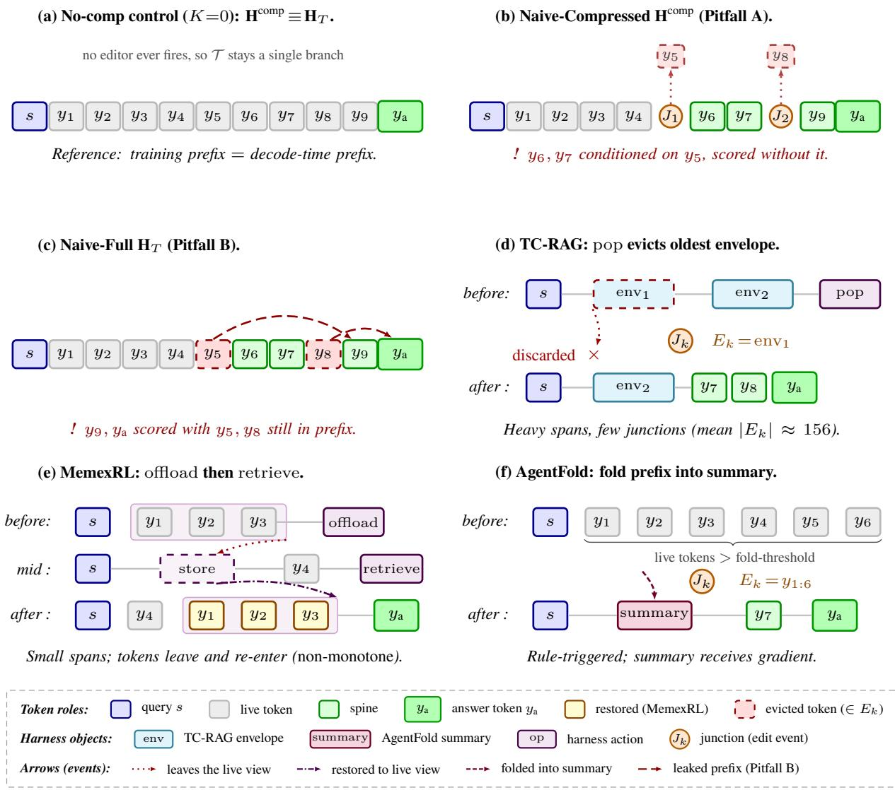  
Figure 3: Six cases on the shared token-node vocabulary of Fig. 1, whose running example and subscripts these panels reuse; $J _ { 3 }$ falls inside the abridged tail $y _ { \mathrm { a } } .$ . Panels split by role, not by row: Part I (a)–(c) are training-input recipes on one rollout, exposing the Pitfall A “too-short” and Pitfall B “too-long” mismatches; Part II (d)–(f) draw one live compression event per harness (before→after; $J _ { k }$ is generic, indices are panel-local). See §E.2 for harness code.

Table 7: Q1: the two pitfalls are real and directionally distinct. Untrained Qwen3-4B, 32 synthetic rollouts per harness. Both pitfalls exhibit the predicted sign on all three white-box harnesses. $\Delta _ { \mathrm { { c o m p } } } { \mathrm { { . } } }$ : TC-RAG/AgentFold evict most aggressively (larger $| \Delta | ) ;$ MemexRL exposes the most leaves $( n _ { \mathrm { c o m p } } { = } 4 0 0 0 )$ because its two-step ofload delay keeps each evicted span alive for two physical steps. $n _ { \mathrm { f u l l } }$ is identical across harnesses (3072) because all three evict before the answer turn. Figure 1 plots the underlying distributions.
<table><tr><td rowspan="2">Harness</td><td colspan="3"> $\Delta _ { \mathrm { { c o m p } } }$  (Naive-Comp vs. teacher)</td><td colspan="3"> $\Delta _ { \mathrm { f u l l } }$  (Naive-Full-leak vs. current view)</td></tr><tr><td>n</td><td>mean</td><td> $\mathrm { f r a c . } < 0$ </td><td>n</td><td>mean</td><td>frac. &gt; 0</td></tr><tr><td>MemexRL</td><td>4000</td><td>-1.62</td><td>0.60</td><td>3072</td><td>+0.68</td><td>0.56</td></tr><tr><td>TC-RAG</td><td>928</td><td>-3.96</td><td>0.78</td><td>3072</td><td>+0.24</td><td>0.71</td></tr><tr><td>AgentFold</td><td>928</td><td>-3.81</td><td>0.75</td><td>3072</td><td>+0.34</td><td>0.55</td></tr><tr><td>Predicted</td><td></td><td>&lt; 0 (under)</td><td>→1</td><td></td><td>&gt; 0 (over)</td><td>→ 1</td></tr></table>

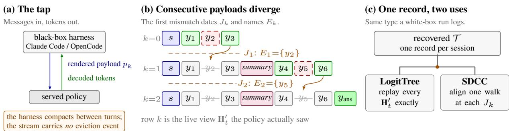

Figure 4: Recovering the trajectory tree from a black-box harness. (a) At the model boundary the only observable is one (rendered payload, decoded tokens) pair per turn: the harness compacts its own context between turns and puts no eviction even on the wire. (b) Consecutive payloads are laid on a single column grid in the token vocabulary of Figure 1, whose colour key applies here unchanged; the one addition is the purple slot, text the harness wrote for itself, as in Figure 3. What turn k decoded (green) reappears as carried context (grey) in the next payload except where the harness dropped $\mathrm { i t , }$ and a dropped slot leaves no box at all. The first position at which two consecutive payloads disagree therefore dates the junction $J _ { k }$ and names the evicted set $E _ { k }$ (orange band and arrow), so both are recovered from the message stream alone, with no span-level log and no cooperation from the harness. (c) Each row of (b) is a live view $\mathbf { H } _ { t } ^ { \prime } .$ , so the recovered T has the same type as the tree a white-box harness logs, and the LogitTree and SDCC loss hooks consume it unchanged (§E.2).

Table 8: Method inputs from the single adapter record. CC\_TOKENS = compressed walk, UN\_TOKENS = union.
<table><tr><td>Method</td><td>Student input</td><td>Teacher forwards?</td><td>Extra bookkeeping</td></tr><tr><td>Naive-Compressed</td><td>Hcomp</td><td>no</td><td></td></tr><tr><td>Naive-Full</td><td> $\mathbf { H } _ { T }$ </td><td>no</td><td></td></tr><tr><td>LogitTree (ours)</td><td>per-segment slices</td><td>no</td><td>K segment boundaries</td></tr><tr><td>4D mask (ours)</td><td> $\mathbf { H } _ { T }$ </td><td>no</td><td>4D attn + hole-free posids</td></tr><tr><td>SDCC (ours)</td><td>Hcomp</td><td>K (no-grad)</td><td>K reconstructed teacher prefixes</td></tr></table>

a diagnostic, it certifies conditioning fidelity of the training forward, not end-task correctness; the eficacy verdict is delivered by (4). The residual gap Naive-Compressed incurs is now precisely identified: a token emitted at turn k was sampled under the turn-k view, which still contained material that a later eviction removed; re-forwarding the final compressed walk therefore conditions turn-k tokens on a history under which they were never sampled. LogitTree (K-forward on exact per-turn prompt token ids) and the 4D mask (one packed forward realizing the same conditioning) eliminate this gap by construction, and their observed logdif indeed returns to (or within noise of) the no-compression baseline in every cell of Table 1. SDCC deliberately keeps the cheap Naive-Compressed forward (and thus shares its elevated diagnostic on mismatched batches) and closes the gap through the training-KL objective (3); its progress is read of K ${ \it \Omega } _ { - \mathrm { S D C C } } = \mathrm { K L } ( \pi _ { \mathrm { t r a i n } } ( \cdot | H ^ { \mathrm { c o m p } } ) \| \pi _ { \mathrm { t e a c h e r } } ( \cdot | H ^ { \mathrm { c t x } } ) )$ (the training loss itself, §5.1) plus downstream EM (4). We therefore read the matrix as: logdif ranks conditioning fidelity of the training forward (LogitTree = 4D = baseline ≪ Naive-Compressed, by construction for the two exact walks), while SDCC-KL and EM rank end-task correction quality.

## F.5 Training curves

This subsection plots the training dynamics behind the grand matrix. The white-box curves come from the 4B RL runs on the pooled training corpus, one curve per method×harness cell; the editor-free control enters this subsection only as a numeric reference in the text. Figure 6 additionally reports reward traces from the Claude Code and OpenCode black-box runs. The curves diagnose optimization behaviour and are not themselves results: Table 1 remains the sole source of final numbers.

Reward. Figure 5 shows all fifteen white-box cells rising over the windows it draws, by between 0.07 and 0.39 from first drawn point to peak, with the per-iteration signal noisy enough that these curves cannot separate methods by eye. We deliberately draw no “best” marker: the logged windows difer in length across cells, and the rescaled axis aligns their endpoints rather than removing that diference, so any endpoint contrast would in part reflect unequal training length rather than method. Note also that rollout/rewards is a post-normalization quantity, not a reward: its per-cell median lies between $- 7 . 5 \times 1 0 ^ { - 3 } \ \mathrm { a n d } \ - - 1 . 0 \stackrel { \cdot } { \times } \ 1 0 ^ { - 8 }$ , i.e. centred on zero rather than on any reward level, so it appears nowhere in this figure.

Figure 6 separately reports the black-box reward traces for Claude Code and OpenCode over their first 40 optimizer steps. These panels use their native step grids rather than the white-box normalized-progress axis. Their noisy, short windows and overlapping variability bands make them descriptive training traces, not a reward-based method

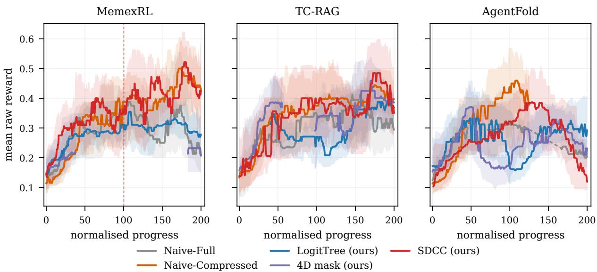  
Figure 5: Mean raw reward over training, by harness. The axis is normalised progress: each cell’s iterations are rescaled by $x \ : = \ : 2 0 0 \mathrm { i t e r / i t e r _ { m a x } }$ , with $\mathrm { i t e r } _ { \operatorname* { m a x } }$ that cell’s last logged iteration, so iteration 0 sits at $x \ = \ 0$ One x-unit is therefore a diferent number of iterations in each curve. Thick lines are a centred rolling median of rollout/raw\_reward over a ±15-iteration window, taken on the true iteration grid before the rescale; the band is that window’s interquartile range.

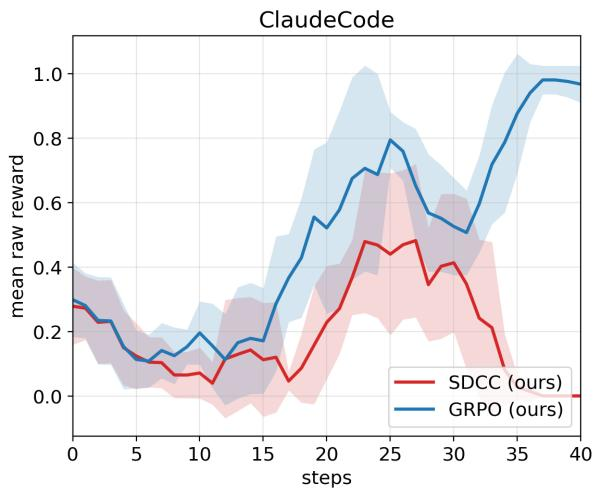  
(a) Claude Code

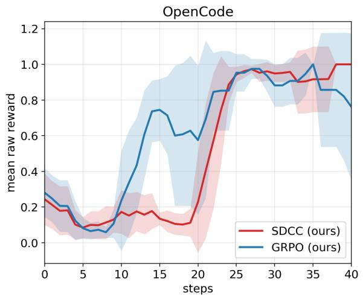  
(b) OpenCode  
Figure 6: Black-box training reward in the first 40 steps. Mean raw reward for SDCC (red) and the GRPO baseline (blue); shaded bands show the variability recorded by the training runs.

ranking.

Conditioning drift. Section F.4 states what logdif certifies; this paragraph states how we measure it. Every number below is a pooled median over steady steps, defined by one rule applied uniformly to every cell: within each launch we discard the first 20 optimizer steps and retain only launches with at least 10 steps remaining. The discard is necessary because the statistic reads more than an order of magnitude high until the trainer and the rollou engine have re-aligned; conditioning on the within-launch step index removes most but not all of that, and we report the residual rather than claim it away.

Training length is a second confound, and it is the one that decides the ordering. Because the editor-free contro covers iterations up to 58, a median taken over each cell’s own window would compare cells trained for diferent lengths. We therefore fix the comparison window in advance to the window the control covers — steady steps at iteration $\leq 5 8 ,$ , against the control’s median there (0.0138, n=448). Ten of the fifteen cells sit on the floor at 0.93– 1.04× the control; Naive-Full’s two eviction-heavy cells sit just above it, both at 1.19×; and three cells are elevated: Naive-Compressed×AgentFold 2.17×, Naive-Compressed×TC-RAG 2.69× and SDCC×AgentFold 4.51×. That is the ordering the main text predicts — the two eviction-heavy harnesses separate Naive-Compressed from the floor and MemexRL does not (0.99×) — and SDCC is elevated by construction, since it keeps the cheap compressed forward and corrects through its KL term. Restricting to the eleven cells that cover the window to within a single iteration leaves the floor band at 0.94–1.04× and moves no cell across a group boundary.

Table 9: Q2: 5-method comparison, Qwen3-4B / MemexRL. Drift from the live-compression MemexRL cell; Search-R1 drift from the editor-free control (numerical floor). EM columns are seven-bench macro-EM under the agentic-eval protocol (§F.1); † rows are grand-matrix same-source runs (cross-harness EM in Table 1).
<table><tr><td>Method</td><td>EM↑</td><td>Drift ↓</td><td>Cost (× base)</td></tr><tr><td>Search-R1 (no-comp.)</td><td>23.0†</td><td>0.0135</td><td>1.05</td></tr><tr><td>Naive-Compressed</td><td>28.9†</td><td>0.0237</td><td>1.00</td></tr><tr><td>Naive-Full</td><td>32.1†</td><td>0.0163</td><td>1.05</td></tr><tr><td>LogitTree (ours)</td><td>45.9†</td><td>0.0133</td><td>4.20</td></tr><tr><td>4D mask (ours)</td><td>33.4†</td><td>0.0140</td><td>1.35</td></tr><tr><td>SDCC (ours)</td><td>43.1†</td><td>0.0165</td><td>1.55</td></tr></table>

On the cold-start MemexRL cells — where compression barely fires — all five methods stay within 0.0115–0.0151 over their full windows (Naive-Compressed 0.0133), bracketing the control’s 0.0138, exactly as the eviction-density argument of Section F.6 requires. One caution on reading these numbers against the rest of the paper: a median over per-iteration medians, a median pooled over a cell’s steady steps, and the drift column of Table 1 are three diferent estimators of the same quantity, none numerically interchangeable with another. Only the pooled form is used here.

## F.6 SDCC training dynamics and eviction-density profile

Q2 headline 5-method table. Table 9 provides the 5-method drift/EM comparison on the low-eviction MemexRL anchor cell at 4B; the drift column is measured under the live-compression protocol, and the three daggered EM rows (Search-R1, Naive-Compressed, Naive-Full) are populated from the same seven-bench agentic runs that supply Table 1. The three ours rows (LogitTree/4D/SDCC) already show the drift ordering; cross-harness EM support appears in Table 1: on the eviction-heavy harnesses, 4D matches or exceeds Naive-Compressed EM (ahead 34.2 vs. 33.2 on AgentFold, ahead 37.2 vs. 36.7 on TC-RAG) while its drift stays at the no-compression floor (0.017–0.021 vs. Naive-Compressed’s 0.054–0.058), so ours does not trade EM for drift consistency. MemexRL is the cold-start regime (8/256 sessions evict), so Naive-Comp drift here is at the floor of the eviction-density scaling reported in Table 1 (main text).

Selectivity of the SDCC regularizer under live compression. Figure 7 tracks the on-line evolution of the SDCC regularizer on the AgentFold cell — the eviction-heavy editor (length-triggered fold at 3,000 tokens; compression ratio 0.06–0.15), and hence the cell in which the KL contract has the most work to do. Four regularities emerge.

(i) The KL fires sparsely and precisely. KLSDCC is non-zero on slightly over half of the logged optimizer steps and exactly zero elsewhere, and the non-zero steps are exactly those whose batches contain live folds. Conditioning on the gate separates the diagnostic by a factor of 5.6 in median: steps with ${ \mathrm { K L } } _ { \mathrm { S D C C } } > 0$ have median logdif 0.081 (IQR 0.058–0.125), whereas steps with ${ \mathrm { K L } } _ { \mathrm { S D C C } } = 0$ sit at the no-compression baseline, median 0.015 (IQR 0.014–0.017). The regularizer engages at mismatched positions and only at mismatched positions — the per-leaf gating of §5 operating as designed.

(ii) The contract stays armed for the duration of the run rather than saturating or dying: the diverging-leaf set is non-empty on a majority of micro-batches throughout, so the KL term never becomes structurally inert.

(iii) The SDCC KL residual does not grow over the run, while $\mathrm { K L } _ { \mathrm { r e f } }$ against the reference model grows smoothly from 0.002 to ≈ 0.03: the policy moves but does not detach from the reference, and no run-away is observed without an entropy bonus.

(iv) Mean raw reward rises over the same window in which the training-KL residual does not grow — the trainingtime consistency signal and the eval-time task signal are not in tension — which motivates the head-to-head against Naive-Compressed in Table 9: absent SDCC’s regularizer, the same policy optimizes against physical logits it never trains on. The load-bearing part of that comparison is structural rather than numerical: the two arms share the same policy-loss code path modulo the KL term, i.e. Naive-Compressed = SDCC at λ = 0 (§6.4). Magnitudes here come from one editor and are not ofered as cross-method efect sizes.

This cell is cold-start: the untrained 4B policy triggers evictions in only a fraction of sessions, so the KL magnitudes are small in absolute terms. The point established here is not the magnitude but the selectivity $- \varepsilon _ { \mathrm { K I } }$ is confined to exactly the diverging leaves, so the $\mathcal { O } ( \sqrt { \varepsilon _ { \mathrm { K L } } } )$ bound of §5.2 is non-vacuous from the first steps of training. Figure 7 plots the co-evolving signals: (a) the sparse KL spike train; (b) the diverging-leaf activity and the efective KL weight; (c) logdif spiking on eviction batches and returning to baseline elsewhere, with reward drifting up.

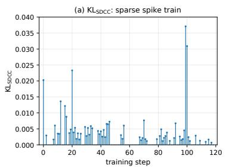

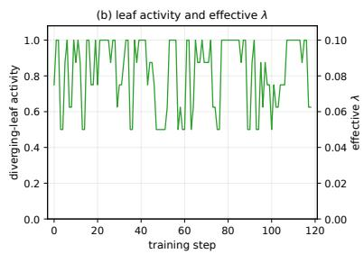

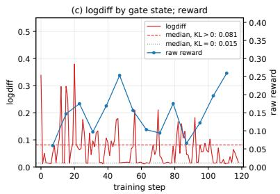  
Figure 7: SDCC dynamics on Qwen3-4B × AgentFold under live compression. (a) ${ \mathrm { K L } } _ { \mathrm { S D C C } }$ is a sparse spike train, non-zero on slightly over half of the logged optimizer steps and exactly zero elsewhere. (b) Diverging-leaf activity and the efective KL weight λ. (c) logdif rises on eviction batches (median 0.081) and sits at the no compression baseline otherwise (median 0.015); mean reward drifts upward.

Per-method mechanism activation under live compression. Table 11 reports, for each method, the run-mean of the quantity that its own corrective mechanism controls, per white-box editor. This is not an outcome (EM) table: it establishes that each mechanism engages at 4B scale under live, model-triggered compression, and quantifies how strongly. Two things stand out.

(i) For every editor, each corrective method’s own channel is non-zero: LogitTree splits each rollout into $\bar { K } = 3 . 2 -$ 4.1 segments, the 4D packer activates on 1.2–1.4 sub-samples per micro-batch, and SDCC’s leaf gate is armed on a large majority of micro-batches. The Naive rows have no such channel by construction.

(ii) SDCC’s KL magnitude tracks the editor’s eviction density: $\approx 1 0 ^ { - 5 }$ on MemexRL (8/256 sessions evict at cold start), $1 . 1 \times 1 0 ^ { - 4 }$ on $\mathrm { T C } { \mathrm { - R A G } }$ , and $2 . 9 \times 1 0 ^ { - 3 }$ on AgentFold (132/960 sessions fold; compression ratio 0.10). The correction therefore scales precisely with how much the editor actually rewrites — consistent with the perleaf gating derivation of §5.

Persistence of Pitfall A under training. A natural hope is that the naive-compressed drift will self-correct as GRPO adapts the policy to the compressed prefixes. The AgentFold cell gives no sign of that correction: over the logged window the per-third mean of logdif moves 0.069→0.045→0.064, and the count of eviction-heavy steps (logdif> 0.05) does not fall — the mismatch neither shrinks nor is absorbed, because its source (folds keep firing on new rollouts) remains stationary. On the same cell, LogitTree’s logdif stays pinned at 0.013–0.015 in every third: the exact correction removes the drift at its source rather than asking the optimizer to absorb it. This window is early-training and therefore low-eviction; at the argmax-reward iteration of the full run the same Naive-Compressed × AgentFold cell reads 0.366 (Table 1). The persistence claim is thus made at the conservative end of the density range.

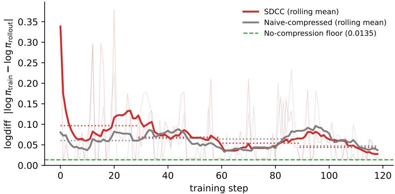  
Figure 8: SDCC’s conditioning gap decreases over the logged training window; Naive-Compressed’s does not. Per-step logdif on Qwen3-4B × AgentFold under live compression. SDCC (red) trends toward the no-compression floor (green dashed, 0.0135); Naive-Compressed (grey) drifts without directional trend; LogitTree stays pinned at 0.013–0.015.

SDCC’s logdif decreases over the logged window. SDCC shares Naive-Compressed’s inexpensive student forward, so both begin with an elevated diagnostic — but only SDCC includes a mechanism that should shrink it. Figure 8 tests this on the same eviction-heavy AgentFold cell: SDCC’s mean logdif falls by 55% from the start to the end of the logged window and does so monotonically across successive quarters, whereas Naive-Compressed’s shows no comparable directional trend. SDCC starts 60% above Naive-Compressed (its leaf-gated KL initially perturbs exactly the mismatched positions) and ends below it, still descending toward the no-compression floor of 0.0135 at the end of the logged window. This is one editor at one scale; it is the qualitative counterpart of the ordering predicted in the main text — LogitTree/4D own the floor by construction, SDCC approaches it by optimization, and Naive-Compressed has no route there at all — and not a trend estimate across seeds.

Table 10: Live eviction-density profile per editor. Trigger and density statistics; drift from the Naive-Compressed cell; KL from the SDCC cell (mean $\times 1 0 ^ { - 3 } )$ . Both diagnostics scale monotonically with eviction density.
<table><tr><td>Editor</td><td>Trigger</td><td>eviction density sess. w/ evict ratio</td><td>Naive-Comp mean drift</td><td>SDCC KL  $\times 1 0 ^ { - 3 }$ </td></tr><tr><td>MemexRL TC-RAG AgentFold</td><td>model tool (memory_offload) model tool (pop) length fold (3k tokens)</td><td>8/256 0.012 17/320 0.024 132/960 0.104</td><td>0.024 0.039 0.059</td><td>0.01 0.11 2.86</td></tr></table>

Table 11: Per-method mechanism activation under live compression. Run-mean signature channels per whitebox editor. seg = LogitTree segments per rollout; pack = 4D packed sub-samples per micro-batch; KL = SDCC leaf-gated KL $( \times 1 0 ^ { - 3 } ) ;$ act = fraction of micro-batches with a non-empty diverging-leaf set. — = channel not applicable to that method.
<table><tr><td>Method</td><td>Channel</td><td>MemexRL</td><td>TC-RAG</td><td>AgentFold</td></tr><tr><td>Naive-Full Naive-Compressed</td><td></td><td></td><td></td><td></td></tr><tr><td>LogitTree (ours, K-forward)</td><td>seg</td><td>4.10</td><td>3.90</td><td>3.23</td></tr><tr><td>4D mask (ours, packed)</td><td>pack</td><td>1.44</td><td>1.28</td><td>1.16</td></tr><tr><td>SDCC (ours)</td><td>KL / act</td><td>0.01 / 0.99</td><td>0.11 / 0.87</td><td>2.86 / 0.82</td></tr></table>

Compression frequency and depth. The depth column of Table 1 and its companion factor freq $= \mathrm { P r } [ c _ { i } > 0 ]$ are both measured per episode over each cell’s full training run; their product is the single compression rate a onenumber summary would report. We keep freq out of the main table because it is not one quantity across columns: AgentFold folds on a length threshold, so its freq counts episodes that outgrow 3k rendered tokens, whereas TC-RAG and MemexRL evict only when the policy emits memory\_ofload or pop, so there freq counts a policy decision and not a length — comparable down a column but not across. depth has one meaning everywhere. Across the fifteen trained cells freq varies by more than an order of magnitude while depth varies by under 2×, so the product is close to a monotone rescaling of frequency and inherits its harness-dependence, whereas the two factors reported apart show what it hid: whichever editor fires removes about three fifths of the rendered context. Since depth conditions on the episodes that evict, it is N/A, not 0, for the no-compression control.

Eviction-density profile across editors. The three white-box editors span two orders of magnitude in live eviction density (Table 10): MemexRL and TC-RAG are model-triggered (the policy must decide to call memory\_ofload / pop), so from a cold start the untrained 4B model rarely invokes them, whereas AgentFold is length-triggered and fires on every long rollout, folding physical contexts of up to 121k tokens into ≤ 5.2k-token logical views. The low-density cells serve as in-run negative controls: as eviction density falls, Naive-Compressed’s drift and SDCC’s KL both collapse toward the no-compression baseline — confirming that the pitfall is compression-driven, not an artifact of harness dispatch.

## G Implementation note: branch-replicated packing vs. the physical-union view

The main text (§4.2, Eq. 7) presents the 4D mask as a per-row visibility schedule over the physical union $\mathbf { H } _ { T } ,$ , in which each token appears once and diferent queries see diferent subsets of the same hidden states. Our implementation instead follows LogitTree’s branch decomposition: it materializes one copy of each shared-trunk token per branch, so that every copy carries a hidden state computed from its branch-local causal prefix alone. The copies are then packed into a single sequence with a block-diagonal attention mask that prevents cross-branch interaction; position ids restart per branch.

Under dense softmax attention and the five conditions of Proposition 4, the two constructions produce identical per-target logits and gradients: the physical-union view is the row-wise characterization of what the block-packed execution computes. We retain the physical-union formulation in the main text because it gives a compact, closedform mask definition (Eq. 7) and a direct proof path (§C.2); the branch-replicated form is what the training loop executes.

The token budget in Table 6 reports L (the physical union length) as a lower bound; the actual packed length is $\begin{array} { r } { N _ { \mathrm { p a c k e d } } = \sum _ { \pi } \ell _ { \pi } \geq L } \end{array}$ due to trunk replication, and Table 1’s “max tok.” column reflects the true packed input size.