# One-Layer Transformer Provably Learns Multiclass One-Nearest Neighbor in Context

Skanda Athreya∗ James B. Conant High School Hofman Estates, IL

Yutong Wang† Illinois Institute of Technology Chicago, IL

## Abstract

We extend recent work establishing an equivalence between one-layer transformers and nearest-neighbor classifiers in the binary setting to the multiclass case. By leveraging the simplex encoding, we show that one-layer transformers with an argmax classification head behave identically to a one-nearest-neighbor classifier in the multiclass setting. This closes a gap left by prior work, whose multiclass result relied on a non-standard rounding-based approach rather than the typical argmax head used in practice.

Code: https://github.com/skandaka/onenn-multiclass

## 1 Introduction

Transformers have become the dominant architecture in large language models and other applications such as computer vision. Understanding the theoretical properties of transformers is therefore of considerable importance. A growing body of work studies theoretical properties of transformers, e.g., in the framework of in-context learning (Bai et al., 2023), and their connection to classical machine learning models such as nearest neighbors (Li et al., 2024).

Li et al. (2024) showed that one-layer transformers, under appropriate conditions, behave identically to a one-nearest-neighbor classifier. Their work is, however, limited to the binary classification setting. While they do provide a result with respect to a task resembling multiclass classification (Li et al., 2024, Corollary 1), the result is for a rounding-based approach that departs from the more standard argmax classification head used in practice.

In this work, we close this gap by leveraging the simplex encoding (Mroueh et al., 2012). We show that one-layer transformers with an argmax head are equivalent to one-nearest-neighbor classifiers in the multiclass setting. This is a natural and important extension, since the primary application of transformers (i.e., next-token prediction) is inherently a multiclass classification problem, and the argmax head is the standard mechanism for producing predictions.

## 2 Related works

## 2.1 Theory for transformers’ generalization

In-context learning (ICL) is the ability of a trained transformer to solve a new task from a handful of input/output examples placed in its prompt, without any updates to its weights (Bai et al., 2023).

Understanding how and why this behavior emerges from ordinary training is a central open problem in transformer theory, and a growing amount of work has aimed to investigate it in controlled settings.

One influential line of work casts ICL as implicitly running a learning algorithm on the in-context examples: e.g., Zhang et al. (2024) proves that the behavior of a single-layer attention model trained on linear-regression prompts provably converges to a predictor with provable in-distribution and distribution shift guarantees. In a similar vein, the one-nearest neighbor (Li et al., 2024) and our work show that transformers can implicitly act like a one-nearest neighbor algorithm.

## 2.2 Simplex encoding

Representing K classes as vectors is an important algorithmic design choice which decides how to convert a classifier’s real-valued output to a discrete decision. The simplex encoding assigns each class a vertex of a regular simplex, so that distinct classes are equidistant and symmetric.

Mroueh et al. (2012) introduced this coding for multiclass learning and analyzed its geometric properties. Later, Pouliot (2018) established equivalences between simplex-based methods and other multi-category support vector machine formulations (Lee et al., 2004). The simplex encoding has also been applied fruitfully in representation learning (Papyan et al., 2020).

## 2.3 Nearest neighbor algorithms

The nearest-neighbor algorithm is one of the oldest and most well-studied methods in classification. Cover and Hart (1967) established foundational results on its convergence properties, showing that the risk of the one-nearest-neighbor classifier is bounded above by twice the Bayes risk as the number of samples tends to infinity. Subsequent work established consistency and finite-sample rates for the k-nearest-neighbor rule under margin and smoothness conditions: Chaudhuri and Dasgupta (2014) gives distribution-dependent, finite-sample rates in metric spaces and shows that under the Tsybakov margin condition the nearest-neighbor rate matches known lower bounds for nonparametric classification, and Efremenko et al. (2020) construct a Bayes-consistent classifier that keeps fast query time while attaining rates comparable to minimax. The margin event that controls our distribution-shift result (Section 4.1) plays a role akin to classical margin conditions, where performance is controlled precisely when queries are unlikely to fall close to a boundary between classes.

A separate line of work connects nearest-neighbor and kernel methods to attention. Tsai et al. (2019) formulate attention as a kernel smoother over the inputs, with the kernel scores given by input similarities. This perspective supports the equivalence between attention and the nearestneighbor rule that we study.

Beyond its role in classical statistics, the nearest-neighbor rule has re-emerged as an important component of modern language models. Khandelwal et al. (2020) introduced kNN-LM which is an “interpolation” of transformers and k-nearest neighbor algorithms. Xu et al. (2023) analyzed why the retrieval-like component in kNN-LM helps generalization. These results indicate that nearestneighbor is a fruitful avenue to understanding transformer-based language models.

## 3 Setup and assumptions

Throughout this work, let N be the number of labeled examples in a prompt (the context length) and K the number of classes, both integers. Let $[ N ] : = \{ 1 , \dots , N \}$ . Moreover, let d be the dimension of the input token.

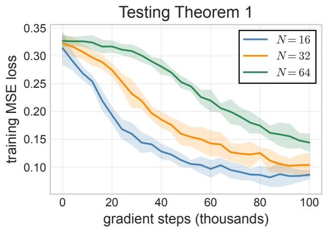

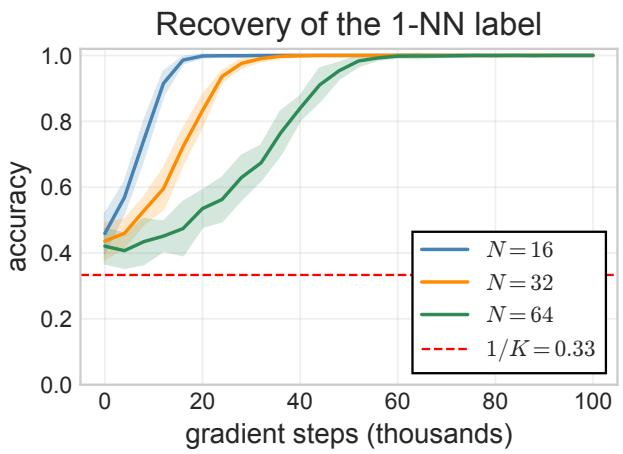  
Figure 1: Convergence (Theorem 1). Training loss (left) decreases and separated-test argmax accuracy (right) approaches 1, faster for smaller context length N, matching the predicted dependence on N. Bands are ±2 standard deviations over 8 seeds. See Section 5 for experimental details.

## 3.1 Problem Setup

An in-context learning instance consists of a prompt of N labeled examples $\{ ( \mathbf { x } _ { i } , c _ { i } ) \} _ { i \in [ N ] }$ and a query $\mathbf { x } _ { N + 1 }$ , where each $\mathbf { x } _ { i } \in \mathcal { S } ^ { d - 1 }$ (the unit sphere in $\mathbb { R } ^ { d } )$ and each class label $c _ { i } \in [ K ]$ . The prompt $\{ ( \mathbf { x } _ { i } , c _ { i } ) \} _ { i \in [ N ] }$ and the query $\mathbf { x } _ { N + 1 }$ are known to the learner, while the label $c _ { N + 1 }$ of the query is hidden from the learner. The objective is to predict $c N { \pm } 1$

Throughout we reserve y for the binary {+1, −1} label encoding used by Li et al. (2024) and write c for a multiclass label in [K]. For the given prompt, we define the index of the nearest neighbor to the query by

$$
i ^ { * } : = \underset { j \in [ N ] } { \arg \operatorname* { m i n } } \| \mathbf { x } _ { N + 1 } - \mathbf { x } _ { j } \| _ { 2 } .
$$

Thus, the one-nearest-neighbor (1-NN) predictor for the prompt is $c _ { i ^ { * } }$ .

Simplex encoding. To represent K classes as vectors, we use the simplex encoding (Mroueh et al., 2012), implemented as centered one-hot vectors:

$$
\begin{array} { r } { \mathbf { u } _ { c } : = \mathbf { e } _ { c } - \frac { 1 } { K } \mathbf { 1 } _ { K } \in \mathbb { R } ^ { K } , \qquad c \in [ K ] , } \end{array}\tag{1}
$$

where $\mathbf { e } _ { c }$ is the c-th one-hot vector and $\mathbf { 1 } _ { K }$ is the all-ones vector. The vectors $\{ \mathbf { u } _ { c } \} _ { c \in [ K ] }$ are the vertices of a regular simplex centered at the origin and satisfy:

• (zero mean) $\begin{array} { r } { \sum _ { c \in [ K ] } \mathbf { u } _ { c } = \mathbf { 0 } _ { K } . } \end{array}$

• (constant norm) $\begin{array} { r } { \| \mathbf { u } _ { c } \| _ { 2 } ^ { 2 } = \frac { K - 1 } { K } } \end{array}$ for each $c \in [ K ]$ , and

• (constant inner product) $\langle { \bf u } _ { c } , { \bf u } _ { c ^ { \prime } } \rangle = - { \textstyle \frac { 1 } { \cal K } } \mathrm { ~ f o r ~ } c \neq c ^ { \prime } .$

Consequently, the $\mathbf { u } _ { c } ^ { \phantom { \dagger } } \mathbf { s }$ are equidistant with distance

$$
\| \mathbf { u } _ { c } - \mathbf { u } _ { c ^ { \prime } } \| _ { 2 } = \sqrt { 2 } .
$$

These three properties are the only structural facts about the encoding that the convergence proof uses, and they act as the multiclass counterparts of the $\{ + 1 , - 1 \}$ label encoding used in the binary case in (Li et al., 2024).

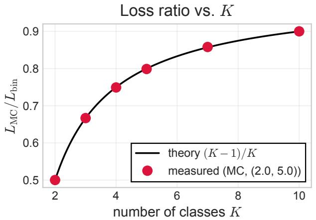

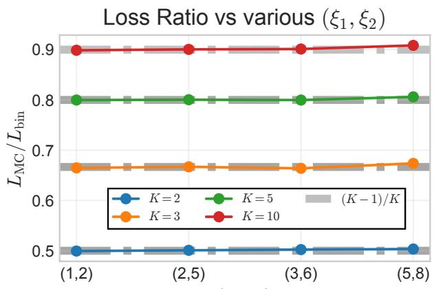  
(»1; »2)  
Figure 2: Scaling identity (Lemma 2). The measured ratio $L _ { \mathrm { M C } } / L _ { \mathrm { b i n } }$ , estimated by sampling directly from the expected-version of the loss definitions, matches $( K - 1 ) / K$ as a function of K (left) and is constant in $\left( \xi _ { 1 } , \xi _ { 2 } \right) \ \mathrm { ( r i g h t ) }$

Prompt Embedding. Following (Li et al., 2024), we embed the prompt and query as the following matrix

$$
\mathbf { H } = \left( \mathbf { x } _ { 1 } \quad \cdot \cdot \cdot \quad \mathbf { x } _ { N } \quad \mathbf { x } _ { N + 1 } \right) \in \mathbb { R } ^ { ( d + K + 1 ) \times ( N + 1 ) }\tag{2}
$$

Note that the second row of H, representing the labels, consists of columns that are K-dimensional vectors, in contrast to that of (Li et al., 2024, Eq. (2.1)). Denote the columns of H by $\mathbf { h } _ { 1 } , \ldots , \mathbf { h } _ { N + 1 }$ so that $\mathbf { h } _ { j } = [ \mathbf { x } _ { j } ; \mathbf { u } _ { c _ { j } } ; 0 ]$ for $j \in [ N ]$ and h $\mathbf { \Phi } _ { N + 1 } = [ \mathbf { x } _ { N + 1 } ; \mathbf { 0 } _ { K } ; 1 ]$ . We note that the query’s label is ${ \bf 0 } _ { K }$ since its label is unknown to the learner.

Model. The one-layer softmax attention model has a single weight matrix $\mathbf { W } \in \mathbb { R } ^ { ( d + K + 1 ) \times ( d + K + 1 ) }$ as parameter. The model takes H as input and outputs

$$
\mathbf { H } _ { \mathbf { W } } : = \mathbf { H } \cdot \mathrm { s o f t m a x } ( \mathbf { H } ^ { \top } \mathbf { W } \mathbf { H } ) ,\tag{3}
$$

where the softmax is applied column-wise. Compared with (Li et al., 2024, Eq. (2.2)), which writes the attention score as $\mathbf { H } ^ { \top } \mathbf { W } _ { K } ^ { \top } \mathbf { W } _ { Q } .$ H with separate key and query matrices before merging them into a single matrix, we parametrize the model directly by the merged matrix W, playing the role of $\mathbf { W } _ { K } ^ { \top } \mathbf { W } _ { Q } \colon$ the model depends on the key and query matrices only through this product, and analyzing the merged matrix is the standard reduction in this line of work (Li et al., 2024; Zhang et al., 2024).

As in (Li et al., 2024), the value matrix is frozen to the identity, so each output token is a convex combination of the input tokens. The prediction is the K-dimensional vector obtained by taking the (d + 1)-st to $( d + K )$ -th rows of the last column of H :

$$
\begin{array} { l } { { \displaystyle \ell { \bf W } \big ( { \bf x } _ { N + 1 } \big ) = \big [ { \bf H } _ { { \bf W } } \big ] _ { d + 1 : d + K , N + 1 } } \ ~ } \\ { { \displaystyle ~ = \sum _ { j = 1 } ^ { N } q _ { j } ( { \bf x } , { \bf W } ) { \bf u } _ { c _ { j } } \in \mathbb { R } ^ { K } } , } \end{array}\tag{4}
$$

where $\mathbf { x } : = ( \mathbf { x } _ { 1 } , \ldots , \mathbf { x } _ { N + 1 } )$ collects the prompt inputs and the query, and the attention weights are

$$
q _ { j } ( \mathbf { x } , \mathbf { W } ) = \frac { \exp ( \mathbf { h } _ { j } ^ { \top } \mathbf { W } \mathbf { h } _ { N + 1 } ) } { \sum _ { l = 1 } ^ { N + 1 } \exp ( \mathbf { h } _ { l } ^ { \top } \mathbf { W } \mathbf { h } _ { N + 1 } ) } .\tag{5}
$$

The predicted class is produced by the standard argmax head

$$
\hat { c } _ { \mathbf { W } } ( \mathbf { x } _ { N + 1 } ) : = \underset { k \in [ K ] } { \arg \operatorname* { m a x } } [ \ell _ { \mathbf { W } } ( \mathbf { x } _ { N + 1 } ) ] _ { k } .\tag{6}
$$

## 3.2 Assumptions on training distribution

Assumption 1 (Training distribution). The inputs $\{ \mathbf { x } _ { i } \} _ { i \in [ N + 1 ] }$ are sampled i.i.d. from the uniform distribution on $S ^ { d - 1 }$ , and the class labels $c _ { i }$ are sampled uniformly from $[ K ]$ , independently across tokens and of the inputs. We write $P ^ { \mathrm { t r a i n } }$ for the resulting joint law of the instance $( \{ ( \mathbf { x } _ { i } , c _ { i } ) \} _ { i \in [ N ] } , \mathbf { x } _ { N + 1 } )$

Note that the following hold:

1. $\mathbb { E } [ { \mathbf { u } } _ { c _ { i } } \mid { \mathbf { x } } _ { 1 : N + 1 } ] = { \mathbf { 0 } } _ { K }$

2. $\mathbb { E } [ { \mathbf { u } } _ { c _ { i } } { \mathbf { u } } _ { c _ { j } } ^ { \top } \mid { \mathbf { x } } _ { 1 : N + 1 } ] = { \mathbf { 0 } } _ { K \times K } f o r i \neq j$ , and

3. the law of $\mathbf { x } _ { 1 : N + 1 }$ is invariant under $\mathbf { x } _ { 1 : N + 1 } \mapsto - \mathbf { x } _ { 1 : N + 1 }$

Expectations. An expectation $\mathbb { E } [ \cdot ]$ or probability $\mathbb { P } ( \cdot )$ written without a subscript is always taken with respect to the training distribution $P ^ { \mathrm { t r a i n } }$ of Assumption 1. Every other law carries an explicit subscript, as in (7) and Theorem 2.

Remark 1. Assumption 1 is the multiclass counterpart of the training distribution of (Li et al., 2024, Assumption 1), adopted for the same reasons. Because the labels are independent of the inputs, the prompt contains no parametric relationship between x and c that the model could exploit instead. The only way to reduce the loss is to retrieve the label of the nearest context example.

The task is nonetheless nontrivial: each prompt induces a geometrically complicated partition of the sphere. Moreover, the resulting objective is nonconvex (we show this in Lemma 5). Moreover, the analysis uses Assumption 1 only through properties 1,2, and 3, which decouple the label codes from the attention dynamics and force the of-diagonal gradient blocks to vanish.

Assumption 2 (Initialization). For a parameter $\sigma > 0$ , gradient descent is initialized at

$$
\mathbf { W } ^ { 0 } = \left( \begin{array} { c c } { \mathbf { 0 } _ { ( d + K ) \times ( d + K ) } } & { \mathbf { 0 } _ { d + K } } \\ { \mathbf { 0 } _ { d + K } ^ { \top } } & { - \sigma } \end{array} \right) \in \mathbb { R } ^ { ( d + K + 1 ) \times ( d + K + 1 ) } ,
$$

that $i s ,$ every entry vanishes except the final diagonal entry, which equals $- \sigma$ and suppresses the query’s self-attention.

The initialization will be exploited as follows. First, the entry $- \sigma$ plays the role of the masking used in practical self-attention training, by suppressing the query’s attention to its own token, whose label slot is ${ \bf 0 } _ { K }$ , so that attention concentrates on the labeled context examples. (Li et al., 2024) motivate the same initialization this way, with $\sigma$ playing the role of a mask value that is efectively set to infinity in practice.

Second, it is similar to Trockman and Kolter (2023), who observe that in pretrained transformers the merged key–query product has a dominant positive diagonal, approximately a scaled identity, and show that imposing this structure at initialization improves trainability. Gradient descent started at $\mathbf { W } ^ { 0 }$ remains on the “diagonal family” diag $\{ \xi _ { 1 } ^ { t } \mathbf { I } _ { d } , \mathbf { 0 } _ { K \times K } , - \xi _ { 2 } ^ { t } \}$ with $\xi _ { 1 } ^ { t }$ increasing, as shown in the appendix, so the trained key–query block remains a multiple of the identity throughout training.

Training. We train W with gradient descent on the expected (population) mean-squared error between the logits and the simplex code of the 1-NN label,

$$
\begin{array} { r } { L ( \mathbf { W } ) = \frac { 1 } { 2 } \mathbb { E } _ { P ^ { \mathrm { t r a i n } } } \big [ \| \ell _ { \mathbf { W } } ( \mathbf { x } _ { N + 1 } ) - \mathbf { u } _ { c _ { i ^ { * } } } \| _ { 2 } ^ { 2 } \big ] , } \end{array}\tag{7}
$$

initialized according to Assumption 2.

## 4 Main results

This section presents our main theoretical results. Omitted proofs are all included in the appendix. The analysis reduces the dynamics to a two-parameter family of weight matrices, which Assumption 2 initializes and which gradient descent provably preserves.

Lemma 1 (Two-parameter reduction). Under Assumptions 1 and 2 there exist real sequences $\{ \xi _ { 1 } ^ { t } \} _ { t \geq 0 }$ and $\{ \xi _ { 2 } ^ { t } \} _ { t \geq 0 }$ with $\mathbf { W } ^ { t } \ = \ \mathrm { d i a g } \{ \xi _ { 1 } ^ { t } \mathbf { I } _ { d } , \mathbf { 0 } _ { K \times K } , - \xi _ { 2 } ^ { t } \}$ for all $t ~ \geq ~ 0$ . Moreover the blocks $\mathbf { W } _ { 1 2 } , \mathbf { W } _ { 2 2 } , \mathbf { W } _ { 3 2 }$ , which multiply the query’s zero label block, have identically vanishing gradient, so the loss does not depend on them at any point of the parameter space.

Write $L _ { \mathrm { M C } } ( \xi _ { 1 } , \xi _ { 2 } ) : = L ( \mathbf { W } )$ for the loss (7) restricted to this 2-parameter space. Next, we briefly recall the binary case from (Li et al., 2024). Let $L _ { \mathrm { b i n } } ( \xi _ { 1 } , \xi _ { 2 } )$ be the binary objective from (Li et al., 2024, Eq. 2.5), which we recall below.

For the binary case, the prompt and query are the same as in Assumption 1. The simplex codes $\mathbf { u } _ { c _ { j } }$ are however replaced by scalar labels $y _ { j } \in \{ \pm 1 \}$ drawn uniformly and independently of the inputs, the logit $\begin{array} { r } { \ell _ { \mathbf { W } } ( \mathbf { x } _ { N + 1 } ) = \sum _ { j = 1 } ^ { N } q _ { j } ( \mathbf { x } , \mathbf { W } ) y _ { j } } \end{array}$ is a scalar, and the target is $y _ { i ^ { * } }$ , so that

$$
\begin{array} { r } { L _ { \mathrm { b i n } } ( \xi _ { 1 } , \xi _ { 2 } ) = \frac { 1 } { 2 } \mathbb { E } \big [ \big ( \ell _ { \mathbf { W } } ( \mathbf { x } _ { N + 1 } ) - y _ { i ^ { * } } \big ) ^ { 2 } \big ] . } \end{array}\tag{8}
$$

The attention weights $q _ { j }$ are identical in the two models, because by Lemma 1 they depend on the inputs only through their inner products and not on any label.

Now, the two losses are related by the identity:

Lemma 2 (Scaling identity). On the two-parameter family, $\begin{array} { r } { L _ { \mathrm { M C } } ( \xi _ { 1 } , \xi _ { 2 } ) = \frac { K - 1 } { K } L _ { \mathrm { b i n } } ( \xi _ { 1 } , \xi _ { 2 } ) } \end{array}$ . Consequently $\begin{array} { r } { \partial _ { \xi _ { m } } L _ { \mathrm { M C } } = \frac { K - 1 } { K } \partial _ { \xi _ { m } } L _ { \mathrm { b i n } } } \end{array}$ for m ∈ {1, 2}.

Every increment bound in the convergence analysis is therefore the binary bound scaled by $\frac { K - 1 } { K }$ . The factor rescales the growth of $( \xi _ { 1 } , \xi _ { 2 } )$ but cancels in the ratio that controls the trajectory.

Theorem 1 (Convergence). Suppose Assumptions 1 and 2 hold with $N \geq O ( { \sqrt { d } } \log d )$ and

$$
\begin{array} { c c } { { \sigma > 2 \operatorname* { m a x } \Big \{ \log ( N d ) , - \log \big ( 1 - ( N \sqrt { d } ) ^ { - 1 / d } \big ) , } } \\ { { { } } } \\ { { C _ { d } \big ( 1 - \frac { 1 } { 2 N } \big ) \Big \} , } } \end{array}
$$

where $C _ { d } = \mathrm { p o l y } ( d )$ . These are the conditions of (Li et al., 2024, Theorem 1), which we inherit unchanged.1 Then gradient descent on (7) satisfies

$$
L ( \mathbf { W } ^ { t } ) \leq O \bigg ( \frac { K - 1 } { K } \cdot \frac { \mathrm { p o l y } ( N , d ) } { \log t } \bigg ) ,
$$

so ${ \cal L } ( { \bf W } ^ { t } )$ converges to 0 as $t \to \infty$

## 4.1 Behavior Under Distribution Shift and the Argmax Head

For $\delta > 0$ define the event

$$
A _ { \delta } : = \{ \| \mathbf { x } _ { j } - \mathbf { x } _ { N + 1 } \| _ { 2 } ^ { 2 } \geq \| \mathbf { x } _ { i ^ { * } } - \mathbf { x } _ { N + 1 } \| _ { 2 } ^ { 2 } + \delta ,
$$

$$
{ \mathrm { f o r ~ a l l ~ } } j \neq i ^ { * } { \mathrm { ~ w i t h ~ } } c _ { j } \neq c _ { i ^ { * } } { \mathrm { ~ } } \} .\tag{9}
$$

which captures the set of instances with large margin.

Theorem 2 (Distribution shift). Let $P ^ { \mathrm { t e s t } }$ be any distribution over instances $( \{ ( \mathbf { x } _ { i } , c _ { i } ) \} _ { i \in [ N ] } , \mathbf { x } _ { N + 1 } )$ supported on $S ^ { d - 1 }$ with labels in $[ K ] . \ A f t e r \ T$ steps of gradient descent,

$$
\mathbb { E } _ { P ^ { \mathrm { t e s t } } } \big [ \| \ell _ { \mathbf { W } ^ { T } } ( \mathbf { x } _ { N + 1 } ) - \mathbf { u } _ { c _ { i ^ { * } } } \| _ { 2 } ^ { 2 } \big ]
$$

$$
\leq O \Bigl ( \frac { K - 1 } { K } \operatorname * { i n f } _ { \delta > 0 } \left\{ N ^ { 2 } T ^ { - \mathrm { p o l y } ( N , d ) \delta } + P ^ { \mathrm { t e s t } } ( A _ { \delta } ^ { c } ) \right\} \Bigr ) .
$$

Remark 2 (Training vs. test distributions). Here $P ^ { \mathrm { t e s t } }$ is a distribution over the entire instance $( \{ ( \mathbf { x } _ { i } , c _ { i } ) \} _ { i \in [ N ] } , \mathbf { x } _ { N + 1 } )$ . Beyond the stated “supported on $S ^ { d - 1 \ " }$ conditions, no independence is assumed between inputs and labels, or across tokens, and no relation to $P ^ { \mathrm { t r a i n } }$ is assumed. This mirrors (Li et al., 2024, Assumption 3). The label boundedness required there holds automatically here since $\| \mathbf { u } _ { c } \| _ { 2 } \leq 1$

A guarantee under an arbitrary $P ^ { \mathrm { t e s t } }$ is possible because the underlying estimate is pointwise rather than distributional: training on $P ^ { \mathrm { t r a i n } }$ produces the fixed parameters $\mathbf { W } ^ { T } \ = \ \mathrm { d i a g } \{ \xi _ { 1 } ^ { T } \mathbf { I } _ { d } , \mathbf { 0 } _ { K \times K } , - \xi _ { 2 } ^ { T } \}$ , and on the event $A _ { \delta }$ the deviation $\| { \ell _ { \mathbf { W } ^ { T } } ( { \bf { x } } _ { N + 1 } ) } - { \bf { u } } _ { c _ { i ^ { * } } } \| _ { 2 }$ admits a deterministic bound, decaying in $\xi _ { 1 } ^ { T } \delta$ and $\xi _ { 2 } ^ { T } .$ , which holds for every prompt–query configuration on the sphere (the pointwise bound is derived in the appendix). The test distribution enters only through $P ^ { \mathrm { t e s t } } ( A _ { \delta } ^ { c } )$ , the probability that the query falls within $\delta$ of a 1-NN decision boundary.

Corollary 1 (Argmax classification). Under the setting of Theorem ${ \mathcal { Q } } ,$

$$
P ^ { \mathrm { t e s t } } ( \hat { c } _ { \mathbf { W } ^ { T } } ( \mathbf { x } _ { N + 1 } ) \neq c _ { i ^ { * } } )
$$

$$
\leq O \biggl ( \operatorname* { i n f } _ { \delta > 0 } \left\{ N ^ { 2 } T ^ { - \mathrm { p o l y } ( N , d ) \delta } + P ^ { \mathrm { t e s t } } ( A _ { \delta } ^ { c } ) \right\} \biggr ) .
$$

Moreover, if $P ^ { \mathrm { t e s t } } ( A _ { \delta ^ { * } } ) = 1$ for some $\delta ^ { * } > 0$ , then $\hat { c } _ { \mathbf { W } ^ { T } } ( \mathbf { x } _ { N + 1 } ) = c _ { i ^ { * } }$ almost surely once log $T \geq$ $O ( \log ( K N ) / ( \mathrm { p o l y } ( N , d ) \delta ^ { * } ) )$

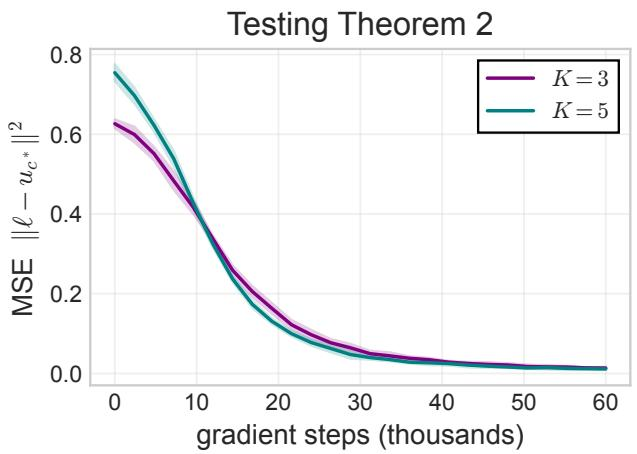

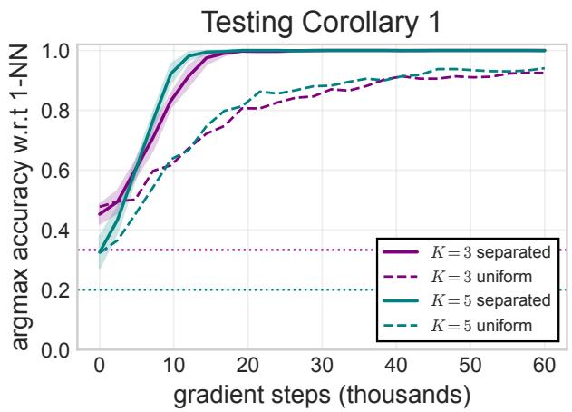  
Figure 3: Distribution shift (Theorem 2) and argmax classification (Corollary 1). On the separated test distribution the logit MSE $\lVert \boldsymbol { \ell } - \mathbf { u } _ { c _ { i ^ { * } } } \rVert _ { 2 } ^ { 2 } \to 0$ (left) and the argmax matches the 1-NN label (right). The uniform-data accuracy is shown for contrast.

## 5 Experiments

We validate the theory with six experiments. Complete configurations and code to reproduce all experimental results are available at https://github.com/skandaka/onenn-multiclass. Compute environment is listed in Section D.

Protocol. All experiments use the one-layer attention model of (3) with the score $\mathbf { H } ^ { \top } \mathbf { W } \mathbf { H }$ , the centered one-hot vector encoding (1), and the loss (7). Training data follows Assumption 1 (inputs i.i.d. uniform on $S ^ { d - 1 }$ , labels uniform on $[ K ] )$ , and W is initialized as in Assumption 2. We run stochastic gradient descent on minibatch estimates of (7) with analytical gradients, which we verify against finite diferences in double precision to relative error $\approx 1 0 ^ { - 1 0 }$ . Training runs in PyTorch (Paszke et al., 2019).

The theory analyzes gradient descent on the population objective (7). The minibatch updates are a stochastic approximation of the population gradient. (Li et al., 2024) likewise validate their theory with stochastic gradient descent, in a less restrictive setting still with random initialization whereas we retain the initialization of Assumption 2. Unless stated otherwise, $d = 8 , N = 1 6$ $\sigma = 3 . 0$ , learning rate $\eta = 0 . 0 5$ , and batch size 128.

Additionally, we evaluate on a well-separated test distribution, extending the construction of (Li et al., 2024, Appendix B) to K classes, which places the query strictly closer to examples of a single class than to all others, so that $P ^ { \mathrm { t e s t } } ( A _ { \delta ^ { * } } ) = 1$ for a fixed margin $\delta ^ { * } > 0$ , matching the setting of Theorem 2 and Corollary 1.

Scaling identity (Figure 2). We test Lemma 2 directly. The identity is an exact identity between two population expectations that admit no closed form, so we verify it by estimating both sides directly from their definitions. For fixed $( \xi _ { 1 } , \xi _ { 2 } )$ , we sample prompts and queries from Assumption 1, estimate $L _ { \mathrm { M C } }$ and $L _ { \mathrm { b i n } }$ on this sample, and plot their ratio.

At $( \xi _ { 1 } , \xi _ { 2 } ) = ( 2 . 0 , 5 . 0 )$ the measured ratio traces $( K - 1 ) / K$ over $K \in \{ 2 , 3 , 4 , 5 , 7 , 1 0 \}$ (80000 samples per point, left), and it is constant over the grid $( \xi _ { 1 } , \xi _ { 2 } ) \in \{ ( 1 , 2 ) , ( 2 , 5 ) , ( 3 , 6 ) , ( 5 , 8 ) \}$ for $K \in \{ 2 , 3 , 5 , 1 0 \}$ (40000 samples per point, right), with deviations within error tolerance confirming Lemma 2.

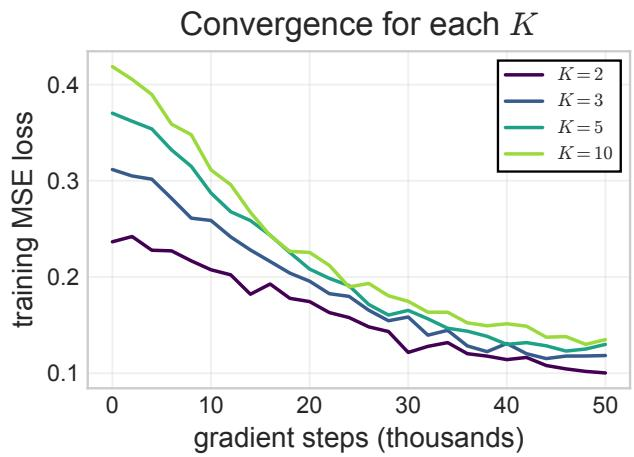

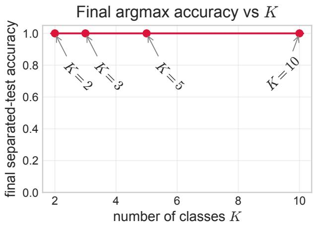

Figure 4: Convergence holds for every $K \in \{ 2 , 3 , 5 , 1 0 \}$ (left), with final separated-test accuracy 1 across K (right).  
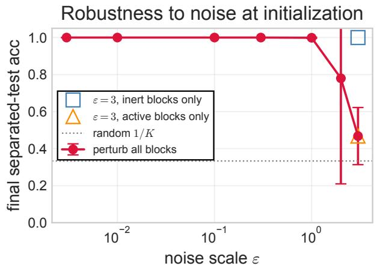

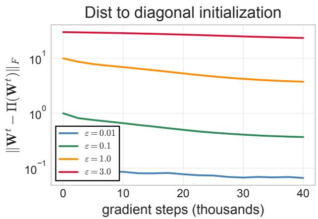  
Figure 5: Perturbed initialization. Left: final separated-test argmax accuracy against the noise scale ε, with the two block-restricted ablations at $\varepsilon = 3$ . Right: distance from the two-parameter family of Lemma 1 over training, for the blocks that enter the attention scores.

Convergence (Figure 1). We train with $K = 3$ and context lengths $N \in \{ 1 6 , 3 2 , 6 4 \}$ for $1 0 ^ { 5 }$ steps and 8 random seeds. The training loss decreases towards zero at the slow logarithmic rate of Theorem 1, more slowly for larger N, consistent with the poly(N, d) dependence of the bound (left). Argmax accuracy on the separated test distribution rises from the random-guess baseline $1 / K \approx 0 . 3 3$ to 1 (right). Bands show ±2 standard deviations over the seeds.

Distribution shift and the argmax head (Figure 3). For $K \in \{ 3 , 5 \}$ we train for $6 \times 1 0 ^ { 4 }$ steps and 6 random seeds, and evaluate on the separated distribution, which difers from the training distribution but satisfies the margin condition. The logit error $\| \boldsymbol { \ell } - \mathbf { u } _ { c _ { i ^ { * } } } \| _ { 2 } ^ { 2 }$ decays toward zero (left) and argmax accuracy reaches 1 (right), as Theorem 2 and Corollary 1 predict.

On uniform test data, on the other hand, accuracy plateaus below 1: a constant fraction of queries falls near a 1-NN decision boundary, so $P ^ { \mathrm { t e s t } } ( A _ { \delta } ^ { c } )$ does not vanish for any fixed δ and the second term of the bound in Theorem 2 remains. We note that the plateau is as predicted by the

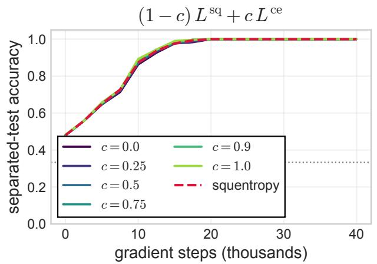

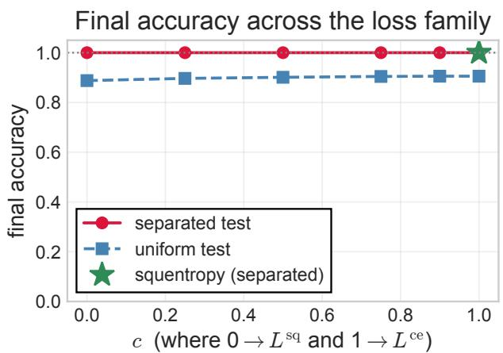  
Figure 6: Loss function. Left: separated-test argmax accuracy over training for $( 1 - c ) L ^ { \mathrm { s q } } + c L ^ { \mathrm { c e } }$ and for squentropy. Right: final accuracy on the separated and uniform test distributions across the family.

theory.

Dependence on the number of classes (Figure 4). We vary $K \in \{ 2 , 3 , 5 , 1 0 \} .$ , training for $5 \times 1 0 ^ { 4 }$ steps and 4 random seeds. Convergence holds for every K: the prefactor $\textstyle { \frac { { \dot { K } } - 1 } { K } }$ shifts the loss curves but leaves the logarithmic rate unchanged (left), and the final separated-test accuracy is 1 for every K (right). The guarantees of Theorem 1 and Corollary 1 are therefore uniform in the number of classes.

Dependence on the diagonal initialization (Figure 5). Assumption 2 prescribes an exactly diagonal $\mathbf { W } ^ { 0 }$ , which has precedent in the mimetic initialization of (Trockman and Kolter, 2023). We test how far the 1-NN phenomenon depends on it by adding i.i.d. $\mathcal { N } ( 0 , \varepsilon ^ { 2 } )$ noise to every entry of $\mathbf { W } ^ { 0 }$ and sweeping ε, training for $4 \times 1 0 ^ { 4 }$ steps and 3 random seeds at each value.

Alongside accuracy we track the distance from the two-parameter family of Lemma 1, that is $\| \mathbf { W } ^ { t } - \Pi ( \mathbf { W } ^ { t } ) \| _ { F }$ where Π projects onto diag $\{ \xi _ { 1 } \mathbf { I } _ { d } , \mathbf { 0 } _ { K \times K } , - \xi _ { 2 } \}$ (Figure 5 right).

The separated-test argmax accuracy is 1.000 for every $\varepsilon \leq 1 . 0$ , degrades at $\varepsilon = 2 . 0 \ ( 0 . 7 8 \pm 0 . 2 8 )$ and fails at $\varepsilon = 3 . 0 \ ( 0 . 4 4 \pm 0 . 0 7 )$ , so the guarantee survives perturbations up to roughly the scale σ of the mask entry itself.

We observe first that, wherever the result survives, the distance to the family contracts over training, to about a third of its initial value $( 1 . 0 5 6  0 . 3 4 3$ at $\varepsilon = 0 . 1$ and $1 0 . 5 5 8  3 . 4 4 9$ at $\varepsilon = 1 . 0 )$ ; where it fails, the contraction weakens to $0 . 7 9 \ ( 3 1 . 6 7 3  2 5 . 1 4 5$ at $\varepsilon = 3 . 0 )$ . Lemma 1 states that the family is invariant under gradient descent, and this indicates that it is also locally attracting: the trajectory returns to the diagonal structure rather than merely remaining on it. Moreover, failing to return to the diagonal structure seems to imply failing to learn the 1-NN rule.

Second, we observe that the component of the perturbation lying in $\mathbf { W } _ { 1 2 } , \mathbf { W } _ { 2 2 } , \mathbf { W } _ { 3 2 }$ is unchanged to three decimal places throughout training $( 5 . 4 0 0  5 . 4 0 0$ at $\varepsilon = 1 . 0 )$ , as the identically zero gradients established in Lemma 1 require. Consistently, noise of magnitude $\varepsilon = 3 . 0$ confined to those blocks leaves the accuracy at 1.000, while the same magnitude confined to the remaining blocks reproduces the failure (0.44).

Dependence on the loss function (Figure 6). The analysis thus far (and also in (Li et al., 2024)) is specific to the square loss: Lemma 2 is an identity between coordinatewise expansions of (7) and has no cross-entropy analogue. We test whether the one-nearest-neighbor phenomenon extends to “convex-combination” losses of the form

$$
( 1 - c ) L ^ { \mathrm { s q } } + c L ^ { \mathrm { c e } } ,
$$

interpolating from the square loss at $c = 0$ to cross entropy at $c = 1$ . We also test against the “squentropy” loss of (Hui et al., 2023),

$$
L ^ { \mathrm { s q e n } } = L ^ { \mathrm { c e } } + \frac { 1 } { K - 1 } \sum _ { k \neq c _ { i ^ { * } } } \left[ \ell \right] _ { k } ^ { 2 } ,
$$

Unlike the convex-combination losses above, the squentropy loss has no tunable parameter. Both families are trained for $4 \times 1 0 ^ { 4 }$ steps and 3 random seeds, using the same hyperparameters as in the square-loss experiments.

The separated-test argmax accuracy is 1.000 for every $c > 0$ and for squentropy, and 0.999±0.002 at $c = 0$ , so the recovery of the 1-NN label does not depend on the choice of loss. On uniform test data the accuracy increases mildly and monotonically with c, from 0.908 at $c = 0$ to $0 . 9 2 4$ at $c = 1$ with squentropy at 0.916.

Recall that the square-loss gradient $\approx 0$ when $\ell \approx \mathbf { u } _ { c _ { i ^ { * } } }$ , whereas the cross-entropy gradient never vanishes. Training under cross entropy therefore continues to boost attention on the nearest neighbor, reducing the near-boundary errors seen in the uniform-data plateau.

Taken together, our result shows that the one-nearest-neighbor phenomenon is robust to changing the loss function. While our theory covers the square loss only, an interesting line of future work will analyze the cross entropy.

## 6 Discussion, Limitations, and Future Work

We have rigorously shown the equivalence between a one-layer softmax attention model and the one-nearest-neighbor rule, extending the binary setting result by Li et al. (2024). We show that the convergence rate, the conditions on σ and N, and the distribution-shift guarantee all carry over without K-dependence.

We discuss several limitations in and future directions of this work. The analysis exploits the onelayer architecture and the special diagonal initialization of Assumption 2. While these restrictions have precedent in the literature (e.g., in (Trockman and Kolter, 2023)) an interesting avenue of future research is to remove these restrictions.

Our experiments show the one-nearest-neighbor phenomenon persists after switching the loss function from square loss to squentropy. It will be interesting to develop a rigorous theory to explain this phenomenon. The scaling identity is specific to the square loss and has no cross-entropy analogue, though the empirical behavior does not depend on that choice.

Finally, the guarantee concerns recovery of the 1-NN rule for a single head. Extending the argument to multiple heads is a natural next step.

## References

Yu Bai, Fan Chen, Huan Wang, Caiming Xiong, and Song Mei. Transformers as statisticians: Provable in-context learning with in-context algorithm selection. Advances in neural information processing systems, 36:57125–57211, 2023.

Kamalika Chaudhuri and Sanjoy Dasgupta. Rates of convergence for nearest neighbor classification. In Advances in Neural Information Processing Systems (NeurIPS), volume 27, 2014.

Thomas Cover and Peter Hart. Nearest neighbor pattern classification. IEEE transactions on information theory, 13(1):21–27, 1967.

Klim Efremenko, Aryeh Kontorovich, and Moshe Noivirt. Fast and Bayes-consistent nearest neighbors. In International Conference on Artificial Intelligence and Statistics (AISTATS), pages 1276–1286. PMLR, 2020.

Like Hui, Mikhail Belkin, and Stephen Wright. Cut your losses with squentropy. In Proceedings of the 40th International Conference on Machine Learning, pages 14114–14131. PMLR, 2023.

Urvashi Khandelwal, Omer Levy, Dan Jurafsky, Luke Zettlemoyer, and Mike Lewis. Generalization through memorization: Nearest neighbor language models. In International Conference on Learning Representations (ICLR), 2020.

Yoonkyung Lee, Yi Lin, and Grace Wahba. Multicategory support vector machines: Theory and application to the classification of microarray data and satellite radiance data. Journal of the American Statistical Association, 99(465):67–81, 2004.

Zihao Li, Yuan Cao, Cheng Gao, Yihan He, Han Liu, Jason M. Klusowski, Jianqing Fan, and Mengdi Wang. One-layer transformer provably learns one-nearest neighbor in context. In Advances in Neural Information Processing Systems, volume 37, pages 82166–82204, 2024.

Youssef Mroueh, Tomaso Poggio, Lorenzo Rosasco, and Jean-Jacques Slotine. Multiclass learning with simplex coding. Advances in Neural Information Processing Systems, 25, 2012.

Vardan Papyan, XY Han, and David L Donoho. Prevalence of neural collapse during the terminal phase of deep learning training. Proceedings of the National Academy of Sciences, 117(40):24652– 24663, 2020.

Adam Paszke, Sam Gross, Francisco Massa, Adam Lerer, James Bradbury, Gregory Chanan, Trevor Killeen, Zeming Lin, Natalia Gimelshein, Luca Antiga, Alban Desmaison, Andreas Kopf, Edward Yang, Zachary DeVito, Martin Raison, Alykhan Tejani, Sasank Chilamkurthy, Benoit Steiner, Lu Fang, Junjie Bai, and Soumith Chintala. Pytorch: An imperative style, high-performance deep learning library. In Advances in Neural Information Processing Systems, volume 32, 2019.

Guillaume Pouliot. Equivalence of multicategory SVM and simplex cone SVM: Fast computations and statistical theory. In International conference on machine learning, pages 4133–4140. PMLR, 2018.

Asher Trockman and J. Zico Kolter. Mimetic initialization of self-attention layers. In International Conference on Machine Learning (ICML), pages 34456–34468. PMLR, 2023.

Yao-Hung Hubert Tsai, Shaojie Bai, Makoto Yamada, Louis-Philippe Morency, and Ruslan Salakhutdinov. Transformer dissection: An unified understanding for transformer’s attention via the lens of kernel. In Proceedings of the 2019 Conference on Empirical Methods in Natural Language Processing and the 9th International Joint Conference on Natural Language Processing (EMNLP-IJCNLP), pages 4344–4353, 2019.

Frank F. Xu, Uri Alon, and Graham Neubig. Why do nearest neighbor language models work? In International Conference on Machine Learning (ICML), pages 38325–38341. PMLR, 2023.

Ruiqi Zhang, Spencer Frei, and Peter L. Bartlett. Trained transformers learn linear models incontext. Journal of Machine Learning Research, 25(49):1–55, 2024.

## A Proof of the Convergence Theorem

We prove Theorem 1 as follows.

Lemma 3 (Properties of the simplex code). Under Assumption 1, the simplex codes $\mathbf { u } _ { c _ { i } }$ defined in (1) satisfy

$$
\begin{array} { r } { \left( i \right) ~ \mathbb { E } [ \mathbf { u } _ { c _ { i } } \mid \mathbf { x } _ { 1 : N + 1 } ] = \mathbf { 0 } _ { K } , } \\ { ( i i ) ~ \mathbb { E } [ \mathbf { u } _ { c _ { i } } \mathbf { u } _ { c _ { j } } ^ { \top } \mid \mathbf { x } _ { 1 : N + 1 } ] = \mathbf { 0 } _ { K \times K } ~ f o r ~ i \neq j , } \\ { ( i i i ) ~ \| \mathbf { u } _ { c _ { i } } \| _ { 2 } ^ { 2 } = \frac { K - 1 } { K } . ~ } \end{array}
$$

Proof. For (i), the labels are independent of the inputs and the K classes are equally likely, so $\begin{array} { r } { \mathbb { E } [ { \bf { u } } _ { c _ { i } } \ \vert \ { \bf { x } } _ { 1 : N + 1 } ] = \mathbb { E } [ { \bf { u } } _ { c _ { i } } ] = \frac { 1 } { K } \sum _ { c = 1 } ^ { K } ( { \bf e } _ { c } - \frac { 1 } { K } { \bf { 1 } } _ { K } ) = \frac { 1 } { K } { \bf { 1 } } _ { K } - \frac { 1 } { K } { \bf { 1 } } _ { K } \equiv { \bf { 0 } } _ { K } . \mathrm { ~ F ~ o ~ r ~ a l ~ s ~ } } \end{array}$ or (ii), ci and $c _ { j }$ are independent for $i \neq j$ and both are independent of $\mathbf { x } _ { 1 : N + 1 } , \mathbf { s o } \ \hat { \mathbb { E } } [ \mathbf { u } _ { c _ { i } } \mathbf { u } _ { c _ { j } } ^ { \top } \mid \mathbf { x } _ { 1 : N + 1 } ] = \mathbb { E } [ \mathbf { u } _ { c _ { i } } ] \mathbb { E } [ \mathbf { u } _ { c _ { j } } ] ^ { \top } =$ $\mathbf { 0 } _ { K \times K }$ by (i). For (iii), for any class $^ { c , }$

$$
\begin{array} { r l } & { \| \mathbf { u } _ { c } \| _ { 2 } ^ { 2 } = \| \mathbf { e } _ { c } - \frac { 1 } { K } \mathbf { 1 } _ { K } \| _ { 2 } ^ { 2 } } \\ & { \qquad = \| \mathbf { e } _ { c } \| _ { 2 } ^ { 2 } - \frac { 2 } { K } \left. \mathbf { e } _ { c } , \mathbf { 1 } _ { K } \right. + \frac { 1 } { K ^ { 2 } } \| \mathbf { 1 } _ { K } \| _ { 2 } ^ { 2 } } \\ & { \qquad = 1 - \frac { 2 } { K } + \frac { 1 } { K } = \frac { K - 1 } { K } , } \end{array}
$$

which is independent of $c .$

## A.1 Closed-Form Gradient

Lemma 4 (Closed-form gradient). Under Assumptions 1 and ${ \mathcal { Q } } ,$ for all $t \geq 0$

$$
\begin{array} { r l } & { \nabla _ { { \mathbf { W } } _ { 1 1 } } L ( { \mathbf { W } } ^ { t } ) = \mathbb { E } \Big [ \displaystyle \sum _ { i = 1 } ^ { N } g _ { i } ^ { t } \big ( \left. \mathbf { x } _ { i } , \mathbf { x } _ { N + 1 } \right. \big ) \mathbf { x } _ { i } \mathbf { x } _ { N + 1 } ^ { \top } } \\ & { \qquad + \ : g _ { i ^ { * } } ^ { t } \big ( \left. \mathbf { x } _ { i ^ { * } } , \mathbf { x } _ { N + 1 } \right. \big ) \mathbf { x } _ { i ^ { * } } \mathbf { x } _ { N + 1 } ^ { \top } \Big ] , } \end{array}\tag{10}
$$

for scalar-valued functions $\{ g _ { i } ^ { t } \} _ { i \in [ N ] } \cup \{ g _ { i ^ { * } } ^ { t } \}$ of one real variable, and $\nabla _ { \mathbf { W } _ { i j } } L ( \mathbf { W } ^ { t } ) = \mathbf { 0 }$ for every block (i, j) except (1, 1) and (3, 3).

Proof. We induct on t. The form holds at $t = 0$ by Assumption 2. Assume it holds at step $t \geq 0$ so that Wt = diag $\{ \xi _ { 1 } ^ { t } \mathbf { I } _ { d } , \mathbf { 0 } _ { K \times K } , - \xi _ { 2 } ^ { t } \}$ . Using $\| \mathbf { x } _ { N + 1 } \| _ { 2 } = 1$ , the score h⊤ $\mathbf { \dot { W } } ^ { t } \mathbf { h } _ { N + 1 }$ of (3) reduces to $\xi _ { 1 } ^ { t } \left. { \bf x } _ { j } , { \bf x } _ { N + 1 } \right.$ for $j \in [ N ]$ and to $\xi _ { 1 } ^ { t } - \xi _ { 2 } ^ { t }$ for the query, so the attention weights take the scalar form

$$
q _ { j } = \frac { \exp \left( \xi _ { 1 } ^ { t } \left. \mathbf { x } _ { j } , \mathbf { x } _ { N + 1 } \right. \right) } { \sum _ { l = 1 } ^ { N } \exp \left( \xi _ { 1 } ^ { t } \left. \mathbf { x } _ { l } , \mathbf { x } _ { N + 1 } \right. \right) + \exp ( \xi _ { 1 } ^ { t } - \xi _ { 2 } ^ { t } ) }\tag{11}
$$

for $j \in [ N ]$ , with $\exp ( \xi _ { 1 } ^ { t } - \xi _ { 2 } ^ { t } )$ in the numerator for $j = N + 1$ . Below we abbreviate $q _ { j } = q _ { j } ( \mathbf { x } , \mathbf { W } ^ { t } )$ This is the multiclass counterpart of (Li et al., 2024, Eq. (C.9)).

The consequence used repeatedly below is that no label code appears in (11): each $q _ { j }$ is a measurable function of $\mathbf { x } _ { 1 : N + 1 }$ alone. Hence for any function Φ of the labels and any $j , j ^ { \prime } \in [ N ]$ 2

$$
\mathbb { E } \big [ q _ { j } q _ { j ^ { \prime } } \Phi ( c _ { 1 : N } ) \big ] = \mathbb { E } \big [ q _ { j } q _ { j ^ { \prime } } \mathbb { E } \big [ \Phi ( c _ { 1 : N } ) \mid \mathbf { x } _ { 1 : N + 1 } \big ] \big ] ,\tag{12}
$$

by the tower property: the weights may be taken outside the inner expectation, which is then evaluated by Lemma 3. This step is the only place where the independence of the labels from the inputs in Assumption 1 is used.

Partition W conformally with $\mathbf { h } _ { j } = [ \mathbf { x } _ { j } ; \mathbf { u } _ { c _ { j } } ; z _ { j } ]$

$$
\mathbf { W } = \left[ \begin{array} { l l l } { \mathbf { W } _ { 1 1 } } & { \mathbf { W } _ { 1 2 } } & { \mathbf { W } _ { 1 3 } } \\ { \mathbf { W } _ { 2 1 } } & { \mathbf { W } _ { 2 2 } } & { \mathbf { W } _ { 2 3 } } \\ { \mathbf { W } _ { 3 1 } } & { \mathbf { W } _ { 3 2 } } & { \mathbf { W } _ { 3 3 } } \end{array} \right] ,
$$

with $\mathbf { W } _ { 1 1 } \in \mathbb { R } ^ { d \times d }$ $\mathbf { W } _ { 2 2 } \in \mathbb { R } ^ { K \times K }$ ${ \bf W } _ { 3 3 } \in \mathbb { R }$ , and $z _ { j } = 0$ for $j \in [ N ] , z _ { N + 1 } = 1$ . Since ${ \mathbf { h } } _ { N + 1 } =$ $\left[ { \bf { x } } _ { N + 1 } ;     \mathbf { 0 } _ { K } ; 1 \right]$ , the score expands as

$$
\begin{array} { r } { \mathbf { h } _ { j } ^ { \top } \mathbf { W } \mathbf { h } _ { N + 1 } = \mathbf { x } _ { j } ^ { \top } \left( \mathbf { W } _ { 1 1 } \mathbf { x } _ { N + 1 } + \mathbf { W } _ { 1 3 } \right) } \\ { + \mathbf { u } _ { c _ { j } } ^ { \top } \left( \mathbf { W } _ { 2 1 } \mathbf { x } _ { N + 1 } + \mathbf { W } _ { 2 3 } \right) } \\ { + z _ { j } ( \mathbf { W } _ { 3 1 } \mathbf { x } _ { N + 1 } + \mathbf { W } _ { 3 3 } ) . } \end{array}\tag{13}
$$

We treat the blocks in three groups.

(i) The blocks $\mathbf { W } _ { 1 2 } , \mathbf { W } _ { 2 2 } , \mathbf { W } _ { 3 2 }$ . These do not occur in (13): they multiply the second block of h $N { + 1 }$ , which is ${ \bf 0 } _ { K }$ . Every score, hence every attention weight, hence L, is therefore constant in these blocks, and $\nabla _ { \mathbf { W } _ { 1 2 } } L = \nabla _ { \mathbf { W } _ { 2 2 } } L = \nabla _ { \mathbf { W } _ { 3 2 } } L = \mathbf { 0 }$ identically — not merely at the initialization. This is the multiclass form of the observation that the label-to-output column does not influence the prediction (Li et al., 2024, Section 2.2).

(ii) The blocks $\mathbf { W } _ { 2 1 } , \mathbf { W } _ { 1 3 } , \mathbf { W } _ { 2 3 }$ . By (13) these enter every score linearly, so by the chain rule each gradient is an expectation of the form $\mathbb { E } [ \sum _ { l } \gamma _ { l } \mathbf { u } _ { c _ { l } } ^ { \otimes m } \left( \cdot \right) ]$ with weights $\gamma _ { l }$ built from the $q _ { j }$ and the residual $\ell - \mathbf { u } _ { c _ { i ^ { * } } }$ , and with $m \le 3 ;$ this is the counterpart of (Li et al., 2024, Eqs. (C.4)– (C.6)). Applying (12) and Lemma 3 term by term: a monomial containing a code $\mathbf { u } _ { c _ { l } }$ whose label appears exactly once has conditional expectation $\mathbb { E } [ { \mathbf { u } } _ { c _ { l } } \ | \ { \mathbf { x } } _ { 1 : N + 1 } ] = { \mathbf { 0 } } _ { K }$ by Lemma $3 ( \mathrm { i } ) ;$ a monomial containing $\mathbf { u } _ { c _ { l } } \mathbf { u } _ { c _ { l } } ^ { \top }$ reduces to the constant $\textstyle { \frac { K - 1 } { K } }$ by Lemma 3(iii), leaving a residual factor that is again linear in a single code and so has zero mean; and a monomial containing two distinct codes has conditional expectation $\mathbf { 0 } _ { K \times K }$ by Lemma 3(ii). Hence $\nabla { \bf w } _ { 2 1 } L = \nabla { \bf w } _ { 1 3 } L = \nabla { \bf w } _ { 2 3 } L = { \bf 0 }$

(iii) The block $\mathbf { W } _ { 3 1 }$ . By (13) it appears only in the term $z _ { j } \mathbf { W } _ { 3 1 } \mathbf { x } _ { N + 1 }$ , that is, only in the query’s own score, contributing $\mathbf { x } _ { N + 1 } ^ { \top }$ to the gradient. Under the induction hypothesis the weights $q _ { j }$ are given by (11) and are therefore even in $\mathbf { x } _ { 1 : N + 1 }$ , while $\mathbf { x } _ { N + 1 } ^ { \top }$ is odd; since the input law is invariant under $\mathbf { x } _ { 1 : N + 1 } \mapsto - \mathbf { x } _ { 1 : N + 1 }$ (Assumption 1, property 3), the expectation vanishes. This argument uses no label structure and is identical to the binary case. The indicator block $\mathbf { W } _ { 3 3 }$ has a partial derivative of 1 with respect to the query’s self-attention score, guaranteeing a non-zero update during gradient descent:

$$
\begin{array} { r l } & { \frac { 1 } { \eta } \big ( \xi _ { 2 } ^ { t + 1 } - \xi _ { 2 } ^ { t } \big ) = - \partial _ { \xi _ { 2 } } L ( \mathbf { W } ^ { t } ) \ = \ \nabla _ { \mathbf { W } _ { 3 3 } } L ( \mathbf { W } ^ { t } ) } \\ & { \qquad = \frac { K - 1 } { K } \mathbb { E } \Big [ q _ { N + 1 } \Big ( q _ { i ^ { * } } - \sum _ { j = 1 } ^ { N } q _ { j } ^ { 2 } \Big ) \Big ] . } \end{array}\tag{14}
$$

Expanding $\nabla _ { \mathbf { W } _ { 1 1 } } L$ and using Lemma 3 to discard the label terms leaves (10), in which the inputs enter only through inner products. By (Li et al., 2024, Lemma 7) (rotational invariance of the uniform distribution on $S ^ { d - 1 } )$ , such a gradient is a scalar multiple of the identity, $\nabla _ { \mathbf { W } _ { 1 1 } } L ( \mathbf { W } ^ { t } ) =$ $a _ { t } \mathbf { I } _ { d }$ . With $\mathbf { W } _ { 1 1 } ^ { 0 } = \mathbf { 0 }$ this gives $\mathbf { W } _ { 1 1 } ^ { t + 1 } = \xi _ { 1 } ^ { t + 1 } \mathbf { I } _ { d } .$ completing the induction. □

## A.2 Two-Dimensional Reduction

Proof of Lemma 1. The claim is the diagonal form established in the induction of Lemma $4 ;$ it remains to be seen why the $K \times K$ label block does not contribute free parameters. At initialization ${ \bf W } _ { 2 2 } ^ { 0 } = { \bf 0 } _ { K \times K }$ by Assumption 2. By the structural-zero argument above, $\mathbf { W } _ { 2 2 }$ multiplies the query’s (zero) label rows in every score, so $\nabla { \bf w } _ { 2 2 } L = { \bf 0 }$ at every step; a block that starts at zero and receives a zero gradient stays at zero. Thus, although the ambient dimension grows from $( d + 2 ) ^ { 2 }$ to $( d + K + 1 ) ^ { 2 }$ , the trajectory explored by gradient descent is governed by the two scalars $\xi _ { 1 } ^ { t }$ and $\xi _ { 2 } ^ { t }$ , exactly as in the binary case. □

## A.3 The Scaling Identity

We now prove Lemma 2.

Proof of Lemma 2. By (7) and (4), expanding the squared norm over coordinates,

$$
L _ { \mathrm { M C } } ( \xi _ { 1 } , \xi _ { 2 } ) = \frac { 1 } { 2 } \sum _ { m = 1 } ^ { K } \mathbb { E } \left[ \Big ( \sum _ { j = 1 } ^ { N } q _ { j } \left[ \mathbf { u } _ { c _ { j } } \right] _ { m } - \left[ \mathbf { u } _ { c _ { i } * } \right] _ { m } \Big ) ^ { 2 } \right] ,
$$

with the input-only weights $q _ { j } ~ = ~ q _ { j } ( \mathbf { x } , \mathbf { W } )$ of (11). Expanding the square gives a quadratic term, a cross term, and a constant; we sum each over m using Lemma 3. The quadratic term is $\begin{array} { r } { \sum _ { j , j ^ { \prime } } q _ { j } q _ { j ^ { \prime } } \sum _ { m = 1 } ^ { K } \mathbb { E } [ [ { \bf u } _ { c _ { j } } ] _ { m } [ { \bf u } _ { c _ { j ^ { \prime } } } ] _ { m } ] ~ = ~ \frac { K - 1 } { K } \sum _ { j } q _ { j } ^ { 2 } } \end{array}$ , since $\begin{array} { r } { \sum _ { m } \mathbb { E } [ [ \mathbf { u } _ { c _ { j } } ] _ { m } ^ { 2 } ] ~ = ~ \| \mathbf { u } _ { c _ { j } } \| _ { 2 } ^ { 2 } ~ = ~ \frac { K - 1 } { K } } \end{array}$ by Lemma 3(iii) while distinct tokens are uncorrelated by Lemma $3 ( \mathrm { i i } )$ . The cross term $\begin{array} { r } { \sum _ { j } q _ { j } \sum _ { m } \mathbb { E } [ [ \mathbf { u } _ { c _ { j } } ] _ { m } [ \mathbf { u } _ { c _ { i } * } ] _ { m } ] } \end{array}$ contributes only through $j \ = \ i ^ { * }$ , giving $\textstyle { \frac { K - 1 } { K } } q _ { i ^ { * } }$ in expectation. The constant term is $\begin{array} { r } { \mathbb { E } [ \| \mathbf { \dot { u } } _ { c _ { i ^ { * } } } \| _ { 2 } ^ { 2 } ] = \frac { K - 1 } { K } } \end{array}$ . Each is exactly $\frac { K - 1 } { K }$ times the corresponding term of the binary-analog loss, in which $y \in \{ \pm 1 \}$ gives $\mathbb { E } [ y ^ { 2 } ] = \dot { 1 }$ and $\mathbb { E } [ y _ { j } y _ { j ^ { \prime } } ] = 0$ for $j \neq j ^ { \prime }$ . Therefore $\begin{array} { r } { L _ { \mathrm { M C } } = \frac { K - 1 } { K } L _ { \mathrm { b i n } } . } \end{array}$ , and diferentiating gives the gradient identity. □

Lemma 5 (Nonconvexity). The reduced loss $L _ { \mathrm { M C } } ( \xi _ { 1 } , \xi _ { 2 } )$ is nonconvex.

Proof. By Lemma 2, $\begin{array} { r } { L _ { \mathrm { M C } } ~ = ~ \frac { K - 1 } { K } L _ { \mathrm { b i n } } } \end{array}$ with $\textstyle { \frac { K - 1 } { K } } > 0$ . The original binary reduced loss $L _ { \mathrm { b i n } }$ is nonconvex (Li et al., 2024, Appendix E), and a positive scalar multiple of a nonconvex function is nonconvex; this is why L is nonconvex, and why the trajectory analysis below is needed.

## A.4 Evolution of the Two Parameters

Each bound below is the binary estimate of (Li et al., 2024) multiplied by $\frac { K - 1 } { K }$ via Lemma 2. The constants $c _ { 1 } , \ldots , c _ { 4 } , c _ { 1 } ^ { \prime } , c _ { 2 } ^ { \prime } , C _ { d } .$ , and $a _ { N , d } = ( 2 N \sqrt { d } ) ^ { - 2 / ( d - 3 ) }$ are inherited unchanged from the sphere geometry estimates (Li et al., 2024, Lemmas 17–20), which have no labels.

Lemma 6 (Increment bounds for $\xi _ { 1 } )$ . For $\xi _ { 1 } ^ { t } \ge 0$ , there exist constants $c _ { 1 } , c _ { 2 } , c _ { 3 } , c _ { 4 } > 0$ such that

$$
\begin{array} { r } { \frac { d } { \eta } \big ( \xi _ { 1 } ^ { t + 1 } - \xi _ { 1 } ^ { t } \big ) \geq \frac { K - 1 } { K } \big ( c _ { 1 } e ^ { - 6 \xi _ { 1 } ^ { t } } - c _ { 2 } e ^ { 2 \xi _ { 1 } ^ { t } - \xi _ { 2 } ^ { t } } \big ) , } \end{array}
$$

$$
\begin{array} { r } { \frac { d } \eta \big ( \xi _ { 1 } ^ { t + 1 } - \xi _ { 1 } ^ { t } \big ) \le \frac { K - 1 } { K } \big ( c _ { 3 } e ^ { \mathrm { p o l y } ( N , d ) \xi _ { 1 } ^ { t } } - c _ { 4 } e ^ { 2 ( \xi _ { 1 } ^ { t } - \xi _ { 2 } ^ { t } ) } \big ) . } \end{array}
$$

Proof. By Lemma 1 the $\xi _ { 1 }$ update is $\xi _ { 1 } ^ { t + 1 } - \xi _ { 1 } ^ { t } = - \eta \partial _ { \xi _ { 1 } } L _ { \mathrm { M C } } ( \xi _ { 1 } ^ { t } , \xi _ { 2 } ^ { t } )$ , and from Lemma 2 we have $\begin{array} { r } { \partial _ { \xi _ { 1 } } L _ { \mathrm { M C } } = \frac { K - 1 } { K } \partial _ { \xi _ { 1 } } L _ { \mathrm { b i n } } } \end{array}$ . Applying (Li et al., 2024, Lemma 4) to the binary gradient gives both inequalities. □

Lemma 7 (Increment bounds for $\xi _ { 2 } )$ . For $\xi _ { 1 } ^ { t } \ge 0$ , there exist constants $c _ { 1 } ^ { \prime } , c _ { 2 } ^ { \prime } > 0$ such that

$$
\begin{array} { r l } & { \frac { 1 } { \eta } \bigl ( \xi _ { 2 } ^ { t + 1 } - \xi _ { 2 } ^ { t } \bigr ) \geq \frac { K - 1 } { K } c _ { 1 } ^ { \prime } e ^ { - \mathrm { p o l y } ( N , d ) \xi _ { 2 } ^ { t } } , } \\ & { \frac { 1 } { \eta } \bigl ( \xi _ { 2 } ^ { t + 1 } - \xi _ { 2 } ^ { t } \bigr ) \leq \frac { K - 1 } { K } c _ { 2 } ^ { \prime } e ^ { - \mathrm { p o l y } ( N , d ) \xi _ { 2 } ^ { t } } . } \end{array}
$$

Proof. The $\xi _ { 2 }$ update is $\xi _ { 2 } ^ { t + 1 } - \xi _ { 2 } ^ { t } = - \eta \partial _ { \xi _ { 2 } } L _ { \mathrm { M C } }$ , with $\begin{array} { r } { \partial _ { \xi _ { 2 } } L _ { \mathrm { M C } } = \frac { K - 1 } { K } \partial _ { \xi _ { 2 } } L _ { \mathrm { b i n } } } \end{array}$ by Lemma 2, and (Li et al., 2024, Lemma 5) bounds the binary gradient. In particular the parameter updates follow the recurrence relation $b _ { t + 1 } - b _ { t } \geq C e$ −αbt with $C , \alpha > 0$ , so $\xi _ { 2 } ^ { t } = \Omega \big ( \mathrm { p o l y } ( N , d ) \log t \big )$ and $\xi _ { 2 } ^ { t } \to \infty$ Note that the factor $\textstyle { \frac { K - 1 } { K } }$ , like the step size $\eta ,$ is absorbed into $C$ and therefore contributes only an additive $\textstyle { \frac { 1 } { \alpha } } \log ( \alpha C )$ to $\xi _ { 2 } ^ { t } ;$ since $\textstyle { \frac { K - 1 } { K } } \in [ { \frac { 1 } { 2 } } , 1 )$ , this ofset is bounded uniformly in K and does not afect the rate. □

Lemma 8 (Combined lower bound). For all $t \geq 0$

$$
\begin{array} { r } { \frac { 1 } { \eta } \big ( d ( \xi _ { 1 } ^ { t + 1 } - \xi _ { 1 } ^ { t } ) + 2 ( \xi _ { 2 } ^ { t + 1 } - \xi _ { 2 } ^ { t } ) \big ) \geq \frac { K - 1 } { K } \big ( 1 - \frac { 1 } { 2 N } \big ) C _ { d } e ^ { - 6 \xi _ { 1 } ^ { t } } . } \end{array}
$$

Proof. The left-hand side equals $\begin{array} { r } { \frac { K - 1 } { K } \big ( d \partial _ { \xi _ { 1 } } L _ { \mathrm { b i n } } + 2 \partial _ { \xi _ { 2 } } L _ { \mathrm { b i n } } \big ) } \end{array}$ by Lemma 2, to which (Li et al., 2024, Lemma 8) applies. The binary estimate uses only $\left. \mathbf { x } _ { i ^ { * } } , \mathbf { x } _ { N + 1 } \right. \geq \left. \mathbf { x } _ { j } , \mathbf { x } _ { N + 1 } \right.$ and the constant $C _ { d }$ from (Li et al., 2024, Lemma 17), both unchanged by K. □

Lemma 9 (Sharp upper bound for the $\xi _ { 1 }$ increment). For $\xi _ { 1 } ^ { t } \ge 0$ and $N \geq O ( { \sqrt { d } } \log d )$

$$
\begin{array} { r } { \frac { 1 } { \eta } \big ( \xi _ { 1 } ^ { t + 1 } - \xi _ { 1 } ^ { t } \big ) \le \frac { K - 1 } { K } \left( \frac { 2 N } { d } e ^ { - \frac { 4 } { ( N + 1 ) ^ { 2 } } \xi _ { 1 } ^ { t } } - \frac { a _ { N , d } } { d N ^ { 3 } e } e ^ { 2 ( \xi _ { 1 } ^ { t } - \xi _ { 2 } ^ { t } ) } \right) . } \end{array}
$$

Proof. Apply Lemma 2 to (Li et al., 2024, Lemma $9 )$ ; the constant $\boldsymbol { a } _ { N , d }$ comes from the sphere tail bound (Li et al., 2024, Lemma 19) and is unchanged. □

Lemma 10 (Refined lower bound for the $\xi _ { 1 }$ increment). For $\xi _ { 1 } ^ { t } \ge 0$

$$
\begin{array} { r } { \frac { d } { \eta } \big ( \xi _ { 1 } ^ { t + 1 } - \xi _ { 1 } ^ { t } \big ) \geq \frac { K - 1 } { K } \big [ \big ( 1 - \frac { 1 } { 2 N } \big ) C _ { d } e ^ { - 6 \xi _ { 1 } ^ { t } } - 2 e ^ { 2 \xi _ { 1 } ^ { t } - 2 \xi _ { 2 } ^ { t } } \big ] . } \end{array}
$$

Proof. Combine d times Lemma 8 with 2 times the upper bound of Lemma $9 ;$ the common factor $\textstyle { \frac { K - 1 } { K } }$ factors out. □

Lemma 11 (Sharp lower bound for the $\xi _ { 2 }$ increment). For $\xi _ { 1 } ^ { t } \ge 0$

$$
\begin{array} { r } { \frac { 1 } \eta \left( \xi _ { 2 } ^ { t + 1 } - \xi _ { 2 } ^ { t } \right) \geq \frac { K - 1 } { K } \cdot \frac { 1 } { ( N + 1 ) ^ { 3 } e } e ^ { 2 a _ { N , d } \xi _ { 1 } ^ { t } - 2 \xi _ { 2 } ^ { t } } . } \end{array}
$$

Proof. The binary proof bounds $\begin{array} { r } { \frac { 1 } { \eta } ( \xi _ { 2 } ^ { t + 1 } - \xi _ { 2 } ^ { t } ) \geq \mathbb { E } [ q _ { i ^ { * } } ( \mathbf { x } , \mathbf { W } ^ { t } ) q _ { N + 1 } ^ { 2 } ( \mathbf { x } , \mathbf { W } ^ { t } ) ] } \end{array}$ ; by Lemma 2 the multiclass quantity acquires $\textstyle { \frac { K - 1 } { K } }$ . The remaining estimates — the concentration bound $1 - \left. \mathbf { x } _ { i ^ { * } } , \mathbf { x } _ { N + 1 } \right. \geq$ $a _ { N , d } .$ , which holds with probability at least $\frac { 1 } { e }$ by (Li et al., 2024, Lemma 19), and $q _ { i ^ { * } } ^ { 3 } \geq ( N + 1 ) ^ { - 3 }$ — involve only geometry and are unchanged. □

## A.5 Ratio Bound and Growth Rates

Lemma 12 (Ratio bound). $\begin{array} { r } { I f \sigma = \xi _ { 2 } ^ { 0 } \ge 3 \log \big ( \frac { 2 N ^ { 4 } d } { a _ { N , d } } \big ) } \end{array}$ and $\xi _ { 1 } ^ { t } \geq 0$ for all t, then $\xi _ { 1 } ^ { t } \le \frac { 7 } { 1 5 } \xi _ { 2 } ^ { t }$ for all $t \geq 0$

Proof. By Lemma 9, the increment $\xi _ { 1 } ^ { t + 1 } - \xi _ { 1 } ^ { t }$ is nonpositive once

$$
\begin{array} { r } { \frac { K - 1 } { K } \cdot \frac { 2 N } { d } e ^ { - \frac { 4 } { ( N + 1 ) ^ { 2 } } \xi _ { 1 } ^ { t } } < \frac { K - 1 } { K } \cdot \frac { a _ { N , d } } { d N ^ { 3 } e } e ^ { 2 ( \xi _ { 1 } ^ { t } - \xi _ { 2 } ^ { t } ) } . } \end{array}
$$

The factor $\textstyle { \frac { K - 1 } { K } } > 0$ cancels from both sides, so the resulting condition on $( \xi _ { 1 } ^ { t } , \xi _ { 2 } ^ { t } )$ is exactly the threshold comparison of the binary analysis: no label code enters ${ \mathrm { i t } } ,$ and it involves only the two scalars and the sphere constant $\boldsymbol { a } _ { N , d } .$ . Under the stated bound on $\sigma ,$ (Li et al., 2024, Lemma 12) shows that the condition is met whenever $\begin{array} { r } { \frac { 1 5 } { 7 } \xi _ { 1 } ^ { t } \geq \xi _ { 2 } ^ { t } , \mathrm { s o } \ \xi _ { 1 } ^ { t + 1 } - \xi _ { 1 } ^ { t } \leq 0 } \end{array}$ there. Hence $\xi _ { 1 } ^ { t }$ cannot grow past $\frac { 7 } { 1 5 } \xi _ { 2 } ^ { t } ;$ ; since $\xi _ { 2 } ^ { t }$ does not decrease by Lemma 11, the bound holds for all t. Only $\xi _ { 1 } ^ { t } \leq c \xi _ { 2 } ^ { t }$ for some constant $\begin{array} { l } { c < { \frac { 1 } { 2 } } } \end{array}$ is used downstream, in Theorem 1 and Theorem 2. □

Lemma 13 (Growth rates). With σ and N as in Theorem 1, $\xi _ { 1 } ^ { t } , \xi _ { 2 } ^ { t } = \Omega ( \mathrm { p o l y } ( N , d )$ log t, with $\begin{array} { r } { \xi _ { 1 } ^ { t } \le \frac { 7 } { 1 5 } \xi _ { 2 } ^ { t } } \end{array}$ for all $t \geq 0$

Proof. For $\xi _ { 2 }$ , Lemmas 7 and 11 bound the increment between two exponentially decaying rates, $\begin{array} { r } { \frac { K - 1 } { K } ^ { \bullet } \cdot \frac { \eta } { ( N + 1 ) ^ { 3 } e } e ^ { - 2 \xi _ { 2 } ^ { t } } \le \xi _ { 2 } ^ { t + 1 } - \xi _ { 2 } ^ { t } \le \frac { K - 1 } { K } \eta e ^ { - \xi _ { 2 } ^ { t } / 1 5 } } \end{array}$ ; comparison with the corresponding continuous flow gives $\xi _ { 2 } ^ { t } = \Omega ( \mathrm { p o l y } ( N , d )$ log t, the factors $\textstyle { \frac { K - 1 } { K } }$ and η contributing only a bounded additive ofset. For $\xi _ { 1 }$ , Lemma 10 gives $\xi _ { 1 } ^ { t + 1 } - \xi _ { 1 } ^ { t } \geq 0$ while $\begin{array} { r } { 8 \xi _ { 1 } ^ { t } \le 2 \xi _ { 2 } ^ { t } + \log \big ( \frac { C _ { d } ( 1 - \frac { 1 } { 2 N } ) } { 2 } \big ) } \end{array}$ . This condition holds through an initial phase because $\xi _ { 2 } ^ { 0 } = \sigma$ is large and $\xi _ { 2 } ^ { t }$ increases. During that phase $\xi _ { 1 } ^ { t }$ grows logarithmically, and the upper bound of Lemma 9 caps it at $O ( \mathrm { p o l y } ( N , d ) \log t )$ . Hence $\xi _ { 1 } ^ { t } = \Omega \big ( \mathrm { p o l y } ( N , d )$ log t. The bound $\begin{array} { r } { \xi _ { 1 } ^ { t } \le \frac { 7 } { 1 5 } \xi _ { 2 } ^ { t } } \end{array}$ is Lemma 12. □

Proof of Theorem 1. By Lemma 2 applied to the binary loss bound (Li et al., 2024, Lemma 14), the multiclass loss obeys

$$
\begin{array} { r } { \mathbb { E } \Big [ \| \ell _ { \mathbf { W } ^ { t } } - \mathbf { u } _ { c _ { i ^ { * } } } \| _ { 2 } ^ { 2 } \Big ] \leq \frac { K - 1 } { K } O \left( \frac { N ^ { 3 } k _ { d } ^ { 2 } } { \xi _ { 1 } ^ { t } } \right) + \frac { K - 1 } { K } e ^ { 2 \xi _ { 1 } ^ { t } - \xi _ { 2 } ^ { t } } . } \end{array}
$$

Substituting the growth rates of Lemma 13, the first term is $O ( { \frac { K - 1 } { K } } \cdot \mathrm { p o l y } ( N , d ) / \log t )$ , and since $\begin{array} { r } { \xi _ { 1 } ^ { t } \le \frac { 7 } { 1 5 } \xi _ { 2 } ^ { t } } \end{array}$ by Lemma 12 gives $\begin{array} { r } { 2 \xi _ { 1 } ^ { t } - \xi _ { 2 } ^ { t } \leq - \frac { 1 } { 1 5 } \xi _ { 2 } ^ { t } = O ( - \log t ) } \end{array}$ , the second term decays as $O ( t ^ { - 1 / 1 5 } )$ Both vanish as $t \to \infty$ , which is the bound of Theorem 1. □

## B Distribution Shift and Argmax Classification

We prove Theorem 2 and Corollary 1. Throughout, $\boldsymbol { \ell } : = \ell _ { \mathbf { W } ^ { T } } ( \mathbf { x } _ { N + 1 } )$ and $q _ { j } : = q _ { j } ( \mathbf { x } , \mathbf { W } ^ { T } )$ . By the convergence analysis, $\mathbf { W } ^ { T }$ is diagonal with x-block $\xi _ { 1 } ^ { T } \mathbf { I } _ { d }$ and indicator entry $- \xi _ { 2 } ^ { T }$ , so the attention weights depend on the inputs only through inner products:

$$
q _ { j } = \frac { \exp ( \xi _ { 1 } ^ { T } \left. \mathbf { x } _ { j } , \mathbf { x } _ { N + 1 } \right. ) } { \sum _ { l = 1 } ^ { N } \exp ( \xi _ { 1 } ^ { T } \left. \mathbf { x } _ { l } , \mathbf { x } _ { N + 1 } \right. ) + \exp ( \xi _ { 1 } ^ { T } - \xi _ { 2 } ^ { T } ) }\tag{15}
$$

for $j \in [ N ]$

Proof of Theorem 2. Since the query contributes ${ \bf 0 } _ { K }$ to (4), we have $\begin{array} { r } { \ell = \sum _ { j = 1 } ^ { N } q _ { j } \mathbf { u } _ { c _ { j } } } \end{array}$ and $\textstyle \sum _ { j = 1 } ^ { N } q _ { j } =$ $1 - q _ { N + 1 }$ . Writing the target as $\mathbf { u } _ { c _ { i ^ { * } } } = \left( 1 - q _ { N + 1 } \right) \mathbf { u } _ { c _ { i ^ { * } } } + q _ { N + 1 } \mathbf { u } _ { c _ { i } }$ ∗ and grouping,

$$
\begin{array} { l } { \displaystyle \ell - \mathbf { u } _ { c _ { i ^ { * } } } = \sum _ { j = 1 } ^ { N } q _ { j } \big ( \mathbf { u } _ { c _ { j } } - \mathbf { u } _ { c _ { i ^ { * } } } \big ) - q _ { N + 1 } \mathbf { u } _ { c _ { i ^ { * } } } } \\ { = \displaystyle \sum _ { j \in [ N ] } q _ { j } \big ( \mathbf { u } _ { c _ { j } } - \mathbf { u } _ { c _ { i ^ { * } } } \big ) - q _ { N + 1 } \mathbf { u } _ { c _ { i ^ { * } } } , } \\ { \displaystyle c _ { j } \neq c _ { i ^ { * } } } \end{array}\tag{16}
$$

where the terms with $c _ { j } = c _ { i ^ { * } }$ cancel because $\mathbf { u } _ { c _ { j } } = \mathbf { u } _ { c _ { i ^ { * } } }$ . Taking norms in (16) and using $\parallel \mathbf { u } _ { c _ { j } } - { }$ $\mathbf { u } _ { c _ { i ^ { * } } } \Vdash = \sqrt { 2 }$ and $\| \mathbf { u } _ { c _ { i ^ { * } } } \| _ { 2 } = \sqrt { ( K - 1 ) / K } \le 1$

$$
\| \ell - \mathbf { u } _ { c _ { i ^ { * } } } \| _ { 2 } \leq \sqrt { 2 } \sum _ { \begin{array} { l } { j \in [ N ] } \\ { c _ { j } \neq c _ { i ^ { * } } } \end{array} } q _ { j } + q _ { N + 1 } .\tag{17}
$$

On the event $A _ { \delta }$ of $( 9 )$ , every j with $c _ { j } \neq c _ { i } ,$ ∗ satisfies $\| \mathbf { x } _ { j } - \mathbf { x } _ { N + 1 } \| _ { 2 } ^ { 2 } \geq \| \mathbf { x } _ { i ^ { * } } - \mathbf { x } _ { N + 1 } \| _ { 2 } ^ { 2 } + \delta$ . Since $\| \mathbf { x } _ { a } - \mathbf { x } _ { N + 1 } \| _ { 2 } ^ { 2 } = 2 - 2 \left. \mathbf { x } _ { a } , \mathbf { x } _ { N + 1 } \right.$ on the sphere, this is equivalent to $\begin{array} { r } { \left. { \bf x } _ { j } , { \bf x } _ { N + 1 } \right. \le \left. { \bf x } _ { i ^ { * } } , { \bf x } _ { N + 1 } \right. - \frac { \delta } { 2 } } \end{array}$ Hence, from (15) and $q _ { i ^ { * } } \leq 1$ ，

$$
\begin{array} { r l } { \displaystyle \sum _ { j \in [ N ] } q _ { j } \le \sum _ { j \in [ N ] } \frac { q _ { j } } { q _ { i ^ { * } } } } & { } \\ { \displaystyle c _ { j } \ne c _ { i ^ { * } } } & { \quad \le _ { j \ne c _ { i ^ { * } } } } \\ & { = \displaystyle \sum _ { j \in [ N ] } \exp \bigl ( \xi _ { 1 } ^ { T } \bigl ( \langle \mathbf { x } _ { j } , \mathbf { x } _ { N + 1 } \rangle - \langle \mathbf { x } _ { i ^ { * } } , \mathbf { x } _ { N + 1 } \rangle \bigr ) \bigr ) } \\ & { \quad \le _ { j } \ne c _ { i ^ { * } } } \\ & { \le N \exp \bigl ( - \frac { 1 } { 2 } \xi _ { 1 } ^ { T } \delta \bigr ) . } \end{array}\tag{18}
$$

For the self-attention weight, $q _ { N + 1 } / q _ { i ^ { * } } = \exp ( \xi _ { 1 } ^ { T } ( 1 - \langle \mathbf { x } _ { i ^ { * } } , \mathbf { x } _ { N + 1 } \rangle ) - \xi _ { 2 } ^ { T } ) \leq \exp ( 2 \xi _ { 1 } ^ { T } - \xi _ { 2 } ^ { T } )$ , and by the convergence analysis $\begin{array} { r } { \xi _ { 1 } ^ { T } \le \frac { 7 } { 1 5 } \xi _ { 2 } ^ { T } } \end{array}$ , so $2 \xi _ { 1 } ^ { T } - \xi _ { 2 } ^ { T } \leq - { \textstyle \frac { 1 } { 1 5 } } \xi _ { 2 } ^ { T }$ and

$$
\begin{array} { r } { q _ { N + 1 } \leq \exp \bigl ( - \frac { 1 } { 1 5 } \xi _ { 2 } ^ { T } \bigr ) . } \end{array}\tag{19}
$$

Combining (17), (18), and (19),

$$
\begin{array} { r } { \| \ell - \mathbf { u } _ { c _ { i ^ { * } } } \| _ { 2 } \leq \sqrt { 2 } N \exp \big ( - \frac { 1 } { 2 } \xi _ { 1 } ^ { T } \delta \big ) + \exp \big ( - \frac { 1 } { 1 5 } \xi _ { 2 } ^ { T } \big ) } \end{array}\tag{20}
$$

uniformly on $A _ { \delta }$ . By Lemma 13, $\xi _ { 1 } ^ { T } , \xi _ { 2 } ^ { T } = \Omega ( \mathrm { p o l y } ( N , d )$ log $T )$ , so both terms are $O ( N T ^ { - \mathrm { p o l y } ( N , d ) \delta } )$ It remains to take expectations. Splitting on $A _ { \delta }$ and its complement, and using $\| \boldsymbol { \ell } - \mathbf { u } _ { c _ { i ^ { * } } } \| _ { 2 } ^ { 2 } \leq$ $( \sqrt { 2 } + 1 ) ^ { 2 } \cdot \frac { K - 1 } { K }$ as a hard uniform bound on $A _ { \delta } ^ { c }$ (every $q _ { j } \leq 1$ and $\begin{array} { r } { \| \mathbf { u } _ { c } \| _ { 2 } ^ { 2 } = \frac { K - 1 } { K } ) } \end{array}$ ,

$$
\begin{array} { r l } & { \mathbb { E } _ { P ^ { \mathrm { t e s t } } } \left[ \| \ell - \mathbf { u } _ { c _ { i ^ { * } } } \| _ { 2 } ^ { 2 } \right] } \\ & { \ = \mathbb { E } _ { P ^ { \mathrm { t e s t } } } \left[ \| \ell - \mathbf { u } _ { c _ { i ^ { * } } } \| _ { 2 } ^ { 2 } \mathbf { 1 } \{ A _ { \delta } \} \right] + \mathbb { E } _ { P ^ { \mathrm { t e s t } } } \left[ \| \ell - \mathbf { u } _ { c _ { i ^ { * } } } \| _ { 2 } ^ { 2 } \mathbf { 1 } \{ A _ { \delta } ^ { c } \} \right] } \\ & { \ \leq O ( N ^ { 2 } T ^ { - \mathrm { p o l y } ( N , d ) \delta } ) + O ( \frac { K - 1 } { K } ) P ^ { \mathrm { t e s t } } ( A _ { \delta } ^ { c } ) . } \end{array}
$$

Since $\textstyle { \frac { K - 1 } { K } } \geq { \frac { 1 } { 2 } }$ for every $K \geq 2$ , the first term also carries the factor $\textstyle { \frac { K - 1 } { K } }$ after absorbing the $\sqrt { 2 }$ constants and a further factor of two. Taking the infimum over $\delta > 0$ gives the claim. □

Lemma 14 (Argmax margin). For any $\ell \in \mathbb { R } ^ { K }$ and any class $c \in [ K ] , \ i f \ \| \ell - \mathbf { u } _ { c } \| _ { 2 } < \frac { 1 } { 2 }$ then arg $\mathrm { m a x } _ { k \in [ K ] } [ \pmb { \ell } ] _ { k } = c$

Proof. Because $\| \cdot \| _ { \infty } \leq \| \cdot \| _ { 2 }$ , the hypothesis gives $\begin{array} { r } { | [ \ell ] _ { k } - [ \mathbf { u } _ { c } ] _ { k } | < \frac { 1 } { 2 } } \end{array}$ for every coordinate k. The code $\mathbf { u } _ { c }$ has entry $\begin{array} { r } { [ \mathbf { u } _ { c } ] _ { c } = \frac { K - 1 } { K } } \end{array}$ and $\begin{array} { r } { [ \mathbf { u } _ { c } ] _ { k } = - \frac { 1 } { K } } \end{array}$ for $k \neq c ,$ so

$$
\begin{array} { r } { [ \ell ] _ { c } > \frac { K - 1 } { K } - \frac 1 2 , \qquad [ \ell ] _ { k } < - \frac 1 { K } + \frac 1 2 \quad ( k \neq c ) . } \end{array}
$$

Subtracting, for every $k \neq c ,$

$$
\begin{array} { c } { { [ \ell ] _ { c } - [ \ell ] _ { k } > \left( \frac { K - 1 } { K } - \frac 1 2 \right) - \left( - \frac 1 K + \frac 1 2 \right) } } \\ { { = \frac { K - 1 } { K } + \frac 1 K - 1 = 0 . } } \end{array}
$$

Thus $[ \ell ] _ { c }$ strictly exceeds every other coordinate, so the argmax is $c .$

Proof of Corollary 1. Taking the contrapositive of Lemma 14 with $c = c _ { i ^ { * } }$

$$
\begin{array} { r } { \big \{ \hat { c } _ { \mathbf { W } ^ { T } } ( \mathbf { x } _ { N + 1 } ) \neq c _ { i ^ { * } } \big \} \subseteq \big \{ \| \ell - \mathbf { u } _ { c _ { i ^ { * } } } \| _ { 2 } \geq \frac { 1 } { 2 } \big \} . } \end{array}
$$

By Markov’s inequality,

$$
\begin{array} { r l } & { P ^ { \mathrm { t e s t } } \bigl ( \hat { c } _ { \mathbf { W } ^ { T } } ( \mathbf { x } _ { N + 1 } ) \neq c _ { i ^ { * } } \bigr ) } \\ & { \quad \leq P ^ { \mathrm { t e s t } } \bigl ( \| \ell - \mathbf { u } _ { c _ { i ^ { * } } } \| _ { 2 } ^ { 2 } \geq \frac { 1 } { 4 } \bigr ) } \\ & { \quad \leq 4 \mathbb { E } _ { P ^ { \mathrm { t e s t } } } \bigl [ \| \ell - \mathbf { u } _ { c _ { i ^ { * } } } \| _ { 2 } ^ { 2 } \bigr ] . } \end{array}
$$

Applying Theorem 2 and noting $\textstyle { \frac { K - 1 } { K } } \leq 1$ bounds the right-hand side by $O \big ( \operatorname* { i n f } _ { \delta > 0 } \{ N ^ { 2 } T ^ { - \mathrm { p o l y } ( N , d ) \delta } +$ $P ^ { \mathrm { t e s t } } ( A _ { \delta } ^ { c } ) \} )$ , which is the first claim.

For the second claim, suppose $P ^ { \mathrm { t e s t } } ( A _ { \delta ^ { * } } ) = 1$ . Then (20) holds almost surely, so $\| \boldsymbol { \ell } - \mathbf { u } _ { c _ { i ^ { * } } } \| _ { 2 } \leq$ $\begin{array} { r } { \sqrt { 2 } N \exp ( - \frac { 1 } { 2 } \xi _ { 1 } ^ { T } \delta ^ { * } ) + \exp ( - \frac { \hat { 1 } } { 1 5 } \xi _ { 2 } ^ { T } ) = O \big ( N T ^ { - } \mathrm { p o l y } ( N , d ) \delta ^ { * } \big ) } \end{array}$ almost surely. By Lemma 14, the argmax is correct as soon as this bound falls below ${ \frac { 1 } { 2 } } .$ , i.e. once log $T \geq O ( \log ( K N ) / ( \mathrm { p o l y } ( N , d ) \delta ^ { * } ) )$ . □

## C Auxiliary Sphere-Geometry Results

The convergence proof has several facts about the uniform distribution on $S ^ { d - 1 }$ . None of them involve the labels, so they are identical to their counterparts in the binary analysis. We state them here for completeness and refer to (Li et al., 2024) for the proofs, which are unchanged.

Lemma 15 (Rotational invariance: (Li et al., 2024, Lemmas 6–7)). If $\{ \mathbf { x } _ { i } \} _ { i \in [ N + 1 ] }$ are i.i.d. uniform on $S ^ { d - 1 }$ , then their joint law is invariant under any orthogonal matrix U. Consequently, if W is diagonal with $x \mathrm { - } b l o c k \ \xi _ { 1 } \mathbf { I } _ { d } $ , the gradient $\nabla _ { \mathbf { W } _ { 1 1 } } L ( \mathbf { W } )$ is a scalar multiple of $\mathbf { I } _ { d }$

Lemma 16 (Inner-product density: (Li et al., 2024, Lemma 17)). Let $\boldsymbol { \tau } = \langle \mathbf { x } , \mathbf { x } ^ { \prime } \rangle$ for a fixed unit vector x and a uniform $\mathbf { x } ^ { \prime } \in \mathcal { S } ^ { d - 1 }$ . Then τ has density $f _ { \tau } ( t ) = k _ { d } ( 1 - t ^ { 2 } ) ^ { \frac { d - 3 } { 2 } }$ on $[ - 1 , 1 ]$ , where $k _ { d } : = \frac { 2 \Gamma ( \frac { d } { 2 } ) } { \sqrt { \pi } \Gamma ( \frac { d - 1 } { 2 } ) }$

Lemma 17 (Expected nearest-neighbor alignment: (Li et al., 2024, Lemma 18)). If $N \geq$ $O ( { \sqrt { d } } \log d )$ , then $\mathbb { E } [ \left. \mathbf { x } _ { i ^ { * } } , \mathbf { x } _ { N + 1 } \right. ] \geq \frac { 2 } { ( N + 1 ) ^ { 2 } }$ , where $\mathbf { x } _ { i ^ { * } } = \arg \operatorname* { m a x } _ { i \in [ N ] } \left. \mathbf { x } _ { i } , \mathbf { x } _ { N + 1 } \right.$

Lemma 18 (Concentration of the nearest-neighbor alignment: (Li et al., 2024, Lemma 19)). With ${ \bf x } _ { i ^ { * } }$ as above and $k _ { d }$ as in Lemma ${ 1 6 } ,$

$$
\begin{array} { r } { \mathbb { P } \Big ( \langle \mathbf { x } _ { i ^ { * } } , \mathbf { x } _ { N + 1 } \rangle \leq 1 - ( 2 N k _ { d } ) ^ { - 2 / ( d - 3 ) } \Big ) \geq \frac { 1 } { e } . } \end{array}
$$

Equivalently, with the constant $a _ { N , d } = ( 2 N \sqrt { d } ) ^ { - 2 / ( d - 3 ) }$ used in Lemmas 9 and 11, the gap satisfies $1 - \left. \mathbf { x } _ { i ^ { * } } , \mathbf { x } _ { N + 1 } \right. \geq a _ { N , d }$ with probability at least $\scriptstyle { \frac { 1 } { e } } ,$ that $i s , \ a _ { N , d }$ lower bounds the separation of the nearest neighbor from the query with constant probability. Note $k _ { d } = \Theta ( \sqrt { d } )$ , so the two forms agree up to constants.

Lemma 19 (Order-statistic gap: (Li et al., 2024, Lemma 20)). Let $\left. \mathbf { x } _ { i ^ { * } } , \mathbf { x } _ { N + 1 } \right.$ and $\left. \mathbf { x } _ { ( 2 ) } , \mathbf { x } _ { N + 1 } \right.$ be the largest and second-largest of $\{ \langle \mathbf { x } _ { i } , \mathbf { x } _ { N + 1 } \rangle \} _ { i \in [ N ] }$ . Then, for $\xi > 0$

$$
\begin{array} { r l } { \mathbb { E } \Big [ \exp \big ( \xi \big ( \mathbf { \big \langle x _ { ( 2 ) } , x _ { N + 1 } \big \rangle } - \big \langle \mathbf { x } _ { i ^ { * } } , \mathbf { x } _ { N + 1 } \big \rangle \big ) \big ) \Big ] } & { } \\ { = O \bigg ( \frac { N ^ { 2 } k _ { d } ^ { 2 } } { \xi } \bigg ) \quad a n d } & { = \Omega \bigg ( \frac { 1 } { \xi } \bigg ) . } \end{array}
$$

## D Compute Environment

All experiments were conducted on a single workstation running Linux (kernel 6.8.0-58-generic) with glibc 2.39. The system was equipped with a 16-core (32-thread) CPU, 128 GB of RAM, and one NVIDIA RTX 5000 Ada Generation GPU.