# Patterning in Practice: Debiasing Reward Models with Susceptibilities

George Wang Resolution george@resolution.org

Elizabeth Donoway Resolution donoway@resolution.org

Daniel Murfet Resolution murfet@resolution.org

## Abstract

Reward models trained on human preferences are known to suffer from length, formatting, and other stylistic biases. In this paper we use patterning, which reweights each preference pair according to its measured effect on posterior expectation values of benchmark losses (its susceptibility), to debias a Gemma 2 9B Instruct reward model trained on Skywork-Reward-Preference v0.2. We obtain +14.2±1.2 pp on RM-Bench Hard, the split where style cues point against correctness (mean ± s.e. over 5 seeds), with overall RM-Bench accuracy preserved, comparable to the strongest Hard-split gain reported by the closest published comparator (SteerRM, +13.2 pp). We demonstrate in a simple case that the reweighting is interpretable by tracing a side effect of the intervention (a regression on a safety subset of RM-Bench) to a small class of training pairs, which we confirm by ablation. The weights also transfer: those computed on Gemma 2 9B debias Gemma 2 2B and 27B with no recomputation, and transfer partially to Llama 3.1 8B. This is the first application of patterning, a program grounded in singular learning theory, beyond small models and synthetic tasks.

## 1 Introduction

Reinforcement Learning from Human Feedback (RLHF; Christiano et al., 2017) is a dominant alignment technique for language models. The reward models (RMs) at the center of this approach are well-known to suffer from biases: for example, many RMs systematically prefer longer or more richly formatted responses, emojis, and lists (Lambert et al., 2025; Liu et al., 2025). These biases were present in the earliest RMs (Stiennon et al., 2020), persist across RM generations, and are readily exploited by the policies trained against them (Zhang et al., 2025b), plausibly contributing to the recognizable stylistic tics of frontier models.

These biases are already present in the preference data: across open preference datasets the longer response is the chosen one 56–63% of the time (Singhal et al., 2024, Table 5). Reward models trained on such data amplify this mild imbalance into a strong length–reward correlation (Singhal et al., 2024, Table 4). As relatively trivial aspects of model behavior, style biases serve as a litmus test for the broader AI alignment problem: if we cannot direct even these simple aspects of model behavior, we have little basis to expect to direct consequential aspects (Anwar et al., 2024, §3.2.2).

If the source of the bias is the training data, it is natural to intervene there in order to remove it. Indeed, industry practice for mitigating these biases is preference data curation: collect more pairs, and involve further human and machine labor to discard those that exemplify undesirable biases. This is the approach taken by Liu et al. (2026), who curate a training set of 26M preference pairs (selected from a 40M-pair pool) and train a series of RMs on open-source models in the 0.6–8B range with state-of-the-art robustness to length and formatting bias, as measured by RM-Bench (Liu et al., 2025). However, high-quality preference data is expensive to acquire and there is a limit on how fine-grained the shaping of RMs can be based on human intuition. Following the “bitter lesson” (Sutton, 2019) we argue instead for a principled, scalable approach to sculpting the training data via reweighting based on susceptibilities: measurements of how properties of the trained model respond to reweighting individual training pairs. Susceptibilities are a recent development in interpretability using ideas from singular learning theory (SLT; Baker et al., 2026; Gordon et al., 2026), closely related to influence functions (Kreer et al., 2025; Adam et al., 2025).

<table><tr><td>Config</td><td>RMB E</td><td>RMBN</td><td>RMB H</td><td>RMB overall</td><td>RB2</td></tr><tr><td>base</td><td>87.6</td><td>70.6</td><td>42.4</td><td>66.9</td><td>77.4</td></tr><tr><td> $d \mu _ { 3 }$ </td><td>±0.3 73.6</td><td>±0.8 69.1</td><td>±1.2 56.6</td><td>±0.7 66.4</td><td>±0.8 76.0</td></tr><tr><td> $d \mu _ { \mathrm { 1 5 } }$ </td><td>±3.0 82.0</td><td>±0.4 71.2</td><td>±2.5 52.6</td><td>±0.6 68.6</td><td>±0.3 73.1</td></tr><tr><td></td><td>±1.9</td><td>±0.9</td><td>±2.5</td><td>±0.5</td><td>±0.7</td></tr><tr><td colspan="6">∆ from baseline (pp)</td></tr><tr><td> $d \mu _ { 3 }$ </td><td>-14.0</td><td>-1.5</td><td>+14.2</td><td>-0.4</td><td>-1.4</td></tr><tr><td> $d \mu _ { \mathrm { 1 5 } }$ </td><td>±1.4</td><td>±0.4</td><td>±1.2</td><td>±0.4</td><td>±0.4</td></tr><tr><td></td><td>-5.6</td><td>+0.6</td><td>+10.2</td><td>+1.7</td><td>-4.3</td></tr><tr><td></td><td>±0.9</td><td>±0.5</td><td>±1.2</td><td>±0.4</td><td>±0.5</td></tr><tr><td>SteerRM (Tulu-3-8B-RM)</td><td>-5.5</td><td>-0.2</td><td>+10.3</td><td>+1.6</td><td></td></tr></table>

Table 1: Main results: accuracy (higher is better) on the RM-Bench (RMB) Easy (E), Normal (N), and Hard (H) difficulty splits and their average (overall; see Section 2.3), and on the RewardBench 2 validation benchmark (RB2; Malik et al., 2026), for reward models initialized from Gemma 2 9B (google/gemma-2-9b-it): end of training (last eval step), mean across 5 seeds; gray sub-rows give the s.d. for accuracy rows and, for delta rows, the s.e. of the seed-paired differences (this convention holds throughout the paper). The row base is the reward model trained on the unmodified data; $d \mu _ { 3 }$ and $d \mu _ { 1 5 }$ denote patterning with the three- and fifteen-observable targets defined in Section 3. The ∆ block includes SteerRM (Sun et al., 2026, Table 1), a training-free debiasing method that uses SAEs. SteerRM does not evaluate a Gemma 2 9B reward model, so we quote the strongest result from their main table, obtained on the Llama-3.1-8B-based reward model Tulu-3-8B-RM (LlamaScope SAEs). Both methods leave the underlying preference corpus intact (no additional preference pairs collected).

We use susceptibilities to turn the specification “debias a reward model” into a concrete reweighting of the training data and re-train on it, an approach known as patterning (Wang and Murfet, 2026).\*

Our main contributions:

• Competitive reward-model debiasing on a 9B model with fixed preference data. On Gemma 2 9B Instruct trained on Skywork-Reward-Preference v0.2,

using losses on each of the three difficulty splits (Easy, Normal, Hard) as observables, patterning improves accuracy on the Hard split by +14.2 ± 1.2 percentage points (pp) over the unpatterned reward model, with RM-Bench overall accuracy preserved $( - 0 . 4 \pm 0 . 4$ pp), at only $\mathbf { a } - 1 . 4 \pm 0 . 4$ pp cost on RewardBench 2; a finer fifteen-observable target that separates losses by difficulty split for each of the five RM-Bench domains (e.g. chat, code) attains $+ 1 0 . 2 \pm 1 . 2$ pp on Hard, while improving overall RM-Bench accuracy $( + 1 . 7 \pm 0 . 4$ pp) at $- 4 . 3 \pm 0 . 5$ pp on RewardBench 2 (mean ± s.e. over 5 seeds; Sections 4.1 and 4.2). Table 1 situates these numbers against the closest published RM-Bench debiasing method, SteerRM (Sun et al., 2026), whose strongest reported Hard-split improvement is +13.2 pp (with features identified from RM-Bench samples; +10.3 pp in their main configuration).

• Interpretability of patterning weights. Because each patterning weight is attached to a specific preference pair, the reweighting can itself be analyzed. The weights single out a small class of training pairs that largely account for a collapse on RM-Bench’s safety-response domain; we verify this via ablation (Section 4.1.2), and the diagnosis feeds directly into the refined target of Section 4.2. This demonstrates a practical dataattribution process for addressing flaws in RMs using susceptibilities.

• Transferability of patterning sample weights. We observe strong transferability in the effect of patterning reweighting across model scale with the same architecture and training process (Gemma 2 9B patterning weights transferred to Gemma 2 2B and Gemma 2 27B), and moderate transferability to a different architecture (Llama 3.1 8B; Section 4.3). Strong transferability has computational value (weights computed on one model can be reused for others) and suggests that the patterning weights indicate something meaningful about the data itself, rather than just the model they are derived from.

Patterning has so far been demonstrated only in small transformers on synthetic tasks (Wang and Murfet, 2026); this paper is its first application to a practical problem, at the scale of a 9B-parameter reward model. Unlike interventions that directly specify a bias, the patterning target is specified by benchmark losses, so the same machinery applies to any bias a benchmark can measure. We sketch the idea in Section 2.1 and make it precise in Sections 2.4 and 3.

## 2 Background

## 2.1 Overview of the approach

What would it mean to make the instruction “debias a reward model” precise, and how could such a specification be turned into a reweighting of the training data? We begin with a training run: a reward model (Section 2.2) is trained on preference pairs drawn from a distribution $q$ (in our experiments, Skywork), producing a checkpoint $w ^ { * }$ . This model turns out to be biased (it relies on surface features such as length and formatting) and our framing is that this defect is jointly a property of the training distribution and learning process: in q the surface cues genuinely predict which response is chosen, and the learning process has found a solution $w ^ { * }$ that exploits (and perhaps exacerbates) these cues. Patterning diagnoses this defect, corrects it by reweighting, and trains again (Figure 1).

The diagnosis treats the trained network probabilistically: around $w ^ { * }$ there is a Bayesian posterior over model weights (made precise in Section 2.4), and the observables are functions of the weights whose expectation values under this posterior summarize behaviors we care about. Here the observables are the model’s losses on splits of RM-Bench (Section 2.3): a solution that relies on surface features has low Easy loss and high Hard loss, while one that uses more substantive features shows less of a gap.

Why expectation values over the posterior, rather than simply the losses at $w ^ { * }$ itself? We associate bias with how the model computes its reward (e.g. exploiting correlations between reward and length, or not), and our perspective is that such internal structure is reflected in the local geometry of the loss landscape (how the loss changes as the weights vary around w∗), which is exactly what posterior expectations are sensitive to (Elliott and Murfet, 2026b). Pragmatically, expectation values can be differentiated with respect to the training distribution: the susceptibility (Section 2.4) measures how each observable would change if we up- or down-weighted particular preference pairs.

Collecting these susceptibilities gives a matrix $\chi$ whose rows are observables and whose columns are training pairs; up to a constant, $\chi$ is the Jacobian of the map from the space of data distributions to the vector of observable expectation values. Reading χ forward (which data drives which behavior) is the structural inference of Baker et al. (2026); reading it “in reverse” is patterning (Section 3).

To pattern we specify a desired change in the observables — here, “debias a reward model”, encoded as a target $d \mu$ that asks the model to do worse on the Easy split and better on the Hard split — and the Moore–Penrose pseudo-inverse of χ gives the per-pair reweighting that achieves this change to first order. The reweighted distribution is the corrected training data: we then retrain on it, and the claim to be tested is that training on the corrected distribution finds a less biased solution.

The remainder of this section develops each of these notions in turn; the patterning methodology itself is presented in Section 3.

## 2.2 Rewards

We consider a reward model $r ( x , y ; w )$ , assigning a scalar reward to a response y given a prompt x, with parameters w in a compact parameter space $W \subseteq \mathbb { R } ^ { d }$ equipped with a prior density $\varphi ( w )$ . Given a preference dataset $D _ { n } = \{ ( x _ { j } , y _ { j } ^ { + } , y _ { j } ^ { - } ) \} _ { j = 1 } ^ { n }$ drawn i.i.d. from a true distribution $q ( x , y ^ { + } , y ^ { - } )$ , where $y _ { j } ^ { + }$ is the chosen and $\boldsymbol { y } _ { \bar { j } } ^ { - }$ the rejected response, the Bradley–Terry (BT) model (Bradley and

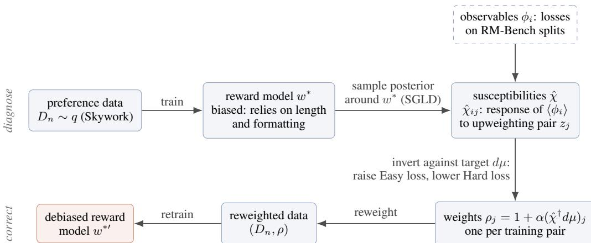  
Figure 1: The patterning pipeline for debiasing. A reward model $w ^ { * }$ is trained on preference data drawn from q and learns to exploit surface cues that, in $q ,$ genuinely predict the chosen response. Sampling the posterior localized around $w ^ { * }$ yields the susceptibility matrix $\hat { \chi } ,$ whose entries measure how the expected loss on each RM-Bench split would respond to upweighting each training pair (Section 2.4). Inverting χˆ against a target $d \mu$ converts this diagnosis into one weight per training pair, with $\alpha > 0$ setting the strength of the intervention (Section 3), and retraining on the reweighted data yields the debiased model.

Terry, 1952) assigns the preference probability

$$
p ( y ^ { + } \succ y ^ { - } \mid x , w ) = \sigma \big ( r ( x , y ^ { + } ; w ) - r ( x , y ^ { - } ; w ) \big ) ,
$$

where $\sigma ( t ) = ( 1 + e ^ { - t } ) ^ { - 1 }$ is the logistic function. The per-sample loss of a preference triple is its negative log-likelihood, $\ell _ { x y ^ { + } y ^ { - } } ( w ) = - \log \sigma \big ( r ( x , y ^ { + } ; w ) - r ( x , y ^ { - } ; w ) \big )$ . The empirical loss is

$$
L _ { n } ( w ) = \frac { 1 } { n } \sum _ { j = 1 } ^ { n } \ell _ { x _ { j } y _ { j } ^ { + } y _ { j } ^ { - } } ( w )\tag{1}
$$

and the population loss is

$$
L ( w ) = \mathbb { E } _ { q ( x , y ^ { + } , y ^ { - } ) } \left[ \ell _ { x y ^ { + } y ^ { - } } ( w ) \right] .\tag{2}
$$

In this paper $D _ { n }$ is the Skywork-Reward-Preference v0.2 dataset (Liu et al., 2024), so that $q$ is in practice the distribution from which this dataset is drawn.

## 2.3 RM-Bench

RM-Bench (Liu et al., 2025) is a reward-model benchmark consisting of prompts x split across four domains (chat, code, math, and safety), with the safety domain subdivided into prompts that should be refused and prompts that should be answered. Throughout we treat these as five categories: chat, code, math, safety-refuse, and safety-response (see Appendix A for details). A source set of preference pairs $( x , y ^ { + } , y ^ { - } )$ , whose responses are detailed, informative and Markdown-formatted, is augmented by using a language model to rewrite each source response $y$ into two plainer styles, giving three styles of increasing style rank: short concise responses $( y ^ { \emptyset } )$ , detailed responses in plain text $( y ^ { L } )$ , and the original responses with Markdown formatting $( y ^ { L , M } )$ . Pairing every chosen style with every rejected style produces $3 \times 3 = 9$ (chosen-style, rejected-style) pairings per source pair.

Aggregating the resulting $3 \times 3$ accuracy matrix by the relative style rank of chosen and rejected gives three difficulty splits:

• Easy $( x , y ^ { + , L } , y ^ { - , \emptyset } ) , ( x , y ^ { + , L , M } , y ^ { - , \emptyset } ) , ( x , y ^ { + , L , M } , y ^ { - , L } )$ averages the pairs where the chosen response has higher style rank than rejected: the introduced length/formatting bias is aligned with substantive correctness.

• Normal $( x , y ^ { + , \emptyset } , y ^ { - , \emptyset } ) , ( x , y ^ { + , L } , y ^ { - , L } ) , ( x , y ^ { + , L , M } , y ^ { - , L , M } )$ averages the pairs where both sides have matched style.

• Hard $( x , y ^ { + , \emptyset } , y ^ { - , L } ) , ( x , y ^ { + , \emptyset } , y ^ { - , L , M } ) , ( x , y ^ { + , L } , y ^ { - , L , M } )$ averages the pairs where the rejected response has higher style rank than chosen: the introduced bias points against correctness.

A reward model that computes reward from substantive, content-based features scores highly on all three splits. One that uses length or Markdown formatting as a confounded feature scores well on Easy but poorly on Hard.

Overall RM-Bench metrics pool the two safety subcategories (by example count) into a single safety domain and then macro-average the four domains (chat, code, math, safety), following the official RM-Bench scoring code (Liu et al., 2025); we use this convention throughout.

## 2.4 Susceptibilities

The term “susceptibility” comes from physics, where it measures how a system responds to an external perturbation: for example, how a material’s magnetization changes when an external magnetic field is applied. In our setting, the “system” is the neural network, with the posterior distribution over its parameters playing the role of the Boltzmann distribution, and the “perturbation” is a shift in the preference data distribution. The susceptibility measures how posterior expectation values of observables (real-valued functions on parameter space) respond to such shifts. This is a form of linear response theory (Kubo, 1966); for a detailed development in the setting of neural networks see Elliott and Murfet (2026b).

The population and empirical posteriors at inverse temperature $\beta > 0$ and sample size n are

$$
\begin{array} { l } { \Pi _ { n , \beta } ^ { \mathrm { p o p } } ( w ) = \displaystyle \frac { 1 } { Z _ { n , \beta } ^ { \mathrm { p o p } } } \exp \{ - n \beta L ( w ) \} \varphi ( w ) , } \\ { \Pi _ { n , \beta } ^ { \mathrm { e m p } } ( w ) = \displaystyle \frac { 1 } { Z _ { n , \beta } ^ { \mathrm { e m p } } } \exp \{ - n \beta L _ { n } ( w ) \} \varphi ( w ) , } \end{array}\tag{3}
$$

with normalizing constants $\begin{array} { r } { Z _ { n , \beta } ^ { \mathrm { p o p } } = \int \exp \{ - n \beta L ( w ) \} \varphi ( w ) } \end{array}$ dw and $Z _ { n , \beta } ^ { \mathrm { e m p } }$ defined analogously with $L _ { n }$ in place of $L .$ Since ℓ is the negative log-likelihood of the preference labels (Section 2.2), at $\beta = 1$ the empirical posterior is the ordinary Bayesian posterior given $D _ { n }$ . We define susceptibilities in terms of the population posterior $\Pi _ { n , \beta } ^ { \mathrm { p o p } }$ , and estimators for these susceptibilities using the empirical posterior $\Pi _ { n , \beta } ^ { \mathrm { e m p } }$ . By analogy with statistical mechanics the population posterior is sometimes called the annealed posterior, the terminology used in Wang and Murfet (2026).

Given a function $\phi ( w )$ we define the expectation

$$
\langle \phi \rangle = \int \phi ( \boldsymbol { w } ) \Pi _ { n , \beta } ^ { \mathrm { p o p } } ( \boldsymbol { w } ) d \boldsymbol { w } ,\tag{4}
$$

and given a second function $\psi ( w )$ the covariance with respect to the population posterior is

$$
\operatorname { C o v } \left[ \phi , \psi \right] = \langle \phi \psi \rangle - \langle \phi \rangle \langle \psi \rangle .
$$

The expectation with respect to the empirical posterior $\Pi _ { n , \beta } ^ { \mathrm { e m p } }$ is denoted $\langle - \rangle ^ { \mathrm { e m p } }$ , and the covariance with respect to the empirical posterior, denoted $\operatorname { C o v } ^ { \mathrm { e m p } }$ , is defined in the same way with $\langle - \rangle ^ { \mathrm { e m p } }$ in place of $\langle - \rangle$

Susceptibility as a derivative. A susceptibility $\chi$ is a derivative of a posterior expectation value along a deformation of the data distribution (Baker et al., 2026). We consider mixture deformations from q toward a probe distribution $q ^ { \prime }$

$$
q _ { h } = \left( 1 - h \right) q + h q ^ { \prime } , \qquad h \in [ 0 , 1 ] ,
$$

and write $\langle \phi \rangle _ { h }$ for the expectation of $\phi$ under the population posterior formed using $q _ { h }$ . The susceptibility of ϕ in the direction $q ^ { \prime } \mathrm { i } \mathrm { s } ^ { \dagger }$

$$
\chi ( \phi ) = \frac { 1 } { n \beta } \left. \frac { \partial } { \partial h } \langle \phi \rangle _ { h } \right| _ { h = 0 } .\tag{5}
$$

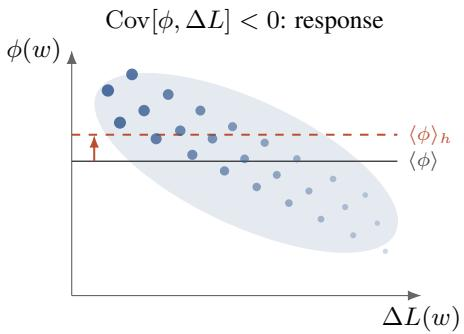

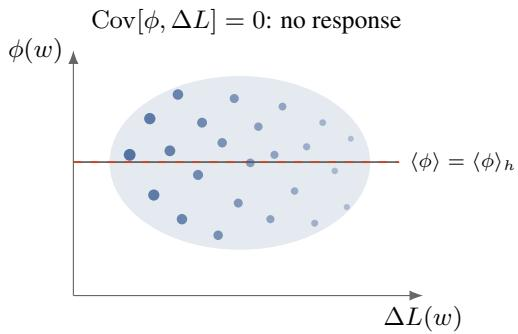  
Figure 2: Why the derivative of an expectation is a covariance (6). Dots are posterior samples w, placed by their loss variation $\Delta L ( w )$ and observable value $\phi ( w )$ . Perturbing the data toward $q ^ { \prime }$ multiplies the weight of each sample by $e ^ { - n \beta h \Delta L ( w ) }$ : to first order, mass drains from samples with above-average $\Delta L$ and flows to those below (dot size and shade indicate weight after the perturbation). Left: when ϕ co-varies with $\Delta L$ , this reweighting shifts the mean from $\breve { \langle \phi \rangle }$ to $\langle \phi \rangle _ { h } ;$ the shift per unit h is $- n \beta \mathrm { C o v } [ \phi , \Delta L ]$ . Right: with no covariance, the same reweighting leaves $\langle \phi \rangle$ unchanged. The SGLD draws used to estimate $\hat { \chi }$ form exactly such a cloud, and the estimator is its empirical covariance. Patterning computes one such covariance for every training pair and scores them against a target shift to produce the retraining weights $\rho$ (Section 3).

We leave the dependence of $\chi ( \phi )$ on the direction $q ^ { \prime }$ implicit in the notation; it will always be clear from context. By the static fluctuation–response relation, this derivative equals a covariance under the unperturbed population posterior (this identity is often referred to loosely as the fluctuation– dissipation theorem, cf. Kubo 1966; for the statement in the Bayesian setting see Giordano et al. 2018). Writing $L ( w ; q ^ { \prime } ) = \mathbb { E } _ { q ^ { \prime } ( x , y ^ { + } , y ^ { - } ) } \big [ \ell _ { x y ^ { + } y ^ { - } } ( w ) \big ]$ for the population loss against the probe distribution, and $\Delta L ( w ) = L ( w ; q ^ { \bar { \prime } } ) - L ( w )$ for the loss variation along the path,

$$
\chi ( \phi ) = - \operatorname { C o v } \left[ \phi , \Delta L \right] ,\tag{6}
$$

so the response of $\langle \phi \rangle$ to a data perturbation is read off from posterior fluctuations at the unperturbed distribution; this standard argument is recalled in Baker et al. (2026). Figure 2 illustrates the mechanism: the perturbation reweights posterior samples along $\Delta L$ , which moves $\langle \phi \rangle$ to the extent that ϕ co-varies with $\Delta L$

Per-sample susceptibilities. Taking the probe distribution to be the point mass $q ^ { \prime } = \delta _ { ( x , y ^ { + } , y ^ { - } ) }$ at a single preference triple, the loss variation is $\Delta L = \ell _ { x y ^ { + } y ^ { - } } - L$ , so (6) gives

$$
\chi _ { x y ^ { + } y ^ { - } } ( \phi ) : = - \operatorname { C o v } \left[ \phi , \ell _ { x y ^ { + } y ^ { - } } - L \right] ,
$$

which we call the per-sample susceptibility. Note that $\chi _ { x y ^ { + } y ^ { - } } ( \phi ) > 0$ means that shifting weight onto this triple increases $\langle \bar { \phi } \rangle$ , and $\chi _ { x y ^ { + } y ^ { - } } ( \phi ) < 0$ that it decreases it.

The per-sample susceptibility acts as a density for general susceptibilities: for a general probe distribution $q ^ { \prime }$ , the susceptibility decomposes as

$$
\chi ( \phi ) = \int q ^ { \prime } ( x , y ^ { + } , y ^ { - } ) \chi _ { x y ^ { + } y ^ { - } } ( \phi ) d x d y ^ { + } d y ^ { - } ,\tag{7}
$$

so the per-sample susceptibilities determine the response to every perturbation. This decomposition was established for sequence models in Gordon et al. (2026); the derivation depends only on the population loss being an expectation of a per-sample loss, so it carries over unchanged.

The susceptibility matrix. Susceptibilities extract information about $L$ in a way that depends on the choice of observable ϕ (Elliott and Murfet, 2026b). In this paper we define observables to be the empirical losses $\phi _ { i } ( w )$ on k sets of preference data indexed by $i ;$ these sets will be splits of RM-Bench, by difficulty alone or by domain and difficulty, as specified in Section 3. Given preference triples $x _ { 1 } y _ { 1 } ^ { + } y _ { 1 } ^ { - } , \ldots , x _ { n } y _ { n } ^ { + } y _ { n } ^ { - }$ we obtain the susceptibility (or response) matrix

$$
\begin{array} { r } { \chi = \left( \chi _ { x _ { j } y _ { j } ^ { + } y _ { j } ^ { - } } ( \phi _ { i } ) \right) _ { 1 \leq i \leq k , 1 \leq j \leq n } . } \end{array}
$$

Rows are indexed by the k observables and columns by the n preference triples, which in practice are the training dataset $D _ { n } \colon$ column $j$ records how upweighting the $j { \cdot } \mathrm { t h }$ training pair moves each observable.

The empirical susceptibility estimator. The population susceptibility involves the population posterior and the population loss $L ,$ neither of which we have access to. Following Baker et al. (2026) and Elliott and Murfet (2026b), the practical counterpart replaces the population posterior $\Pi _ { n , \beta } ^ { \mathrm { p o p } }$ by the empirical posterior $\Pi _ { n , \beta } ^ { \mathrm { e m p } }$ and the centering $L$ by $L _ { n }$ , giving the empirical susceptibility estimator

$$
\hat { \chi } _ { x y ^ { + } y ^ { - } } ( \phi ) = - \mathrm { C o v } ^ { \mathrm { e m p } } \big [ \phi , \ell _ { x y ^ { + } y ^ { - } } - L _ { n } \big ] ,\tag{8}
$$

with the estimated matrix

$$
\begin{array} { r } { \hat { \chi } = \left( \hat { \chi } _ { x _ { j } y _ { j } ^ { + } y _ { j } ^ { - } } ( \phi _ { i } ) \right) _ { 1 \leq i \leq k , 1 \leq j \leq n } . } \end{array}
$$

Abbreviating $z _ { j } = ( x _ { j } , y _ { j } ^ { + } , y _ { j } ^ { - } )$ , we call the j-th column $\hat { \chi } _ { z _ { j } } = \left( \hat { \chi } _ { z _ { j } } ( \phi _ { 1 } ) , \ldots , \hat { \chi } _ { z _ { j } } ( \phi _ { k } ) \right) \in \mathbb { R } ^ { k }$ the susceptibility profile of the training pair $z _ { j }$

Elliott and Murfet (2026a) use ideas from singular learning theory (Watanabe, 2009) to show that $\hat { \chi }$ is a consistent and asymptotically unbiased estimator of the population susceptibility in the regime $n \beta  \infty , \beta  0 ;$ the proof controls the convergence of empirical to population covariances (Adam et al., 2025).

Susceptibilities and data reweighting. The susceptibility tells us the infinitesimal response of an expectation value for the population posterior to a deformation of the data distribution $q .$ We have seen that the susceptibility for a general deformation can be derived from per-sample susceptibilities (7), and that these can be estimated using expectation values $\langle - \rangle$ emp for the empirical posterior (8). Another way to think about this susceptibility estimator is in terms of the response of an expectation value to a reweighting of samples from the distribution q (Elliott and Murfet, 2026b, §6.2.1).

Let $D _ { n } = \{ z _ { j } \} _ { j = 1 } ^ { n }$ be the training dataset as in Section 2.2, and given weights $\rho = ( \rho _ { 1 } , \ldots , \rho _ { n } )$ define the reweighted empirical loss

$$
L _ { n } ^ { \rho } ( w ) = \frac { 1 } { n } \sum _ { j = 1 } ^ { n } \rho _ { j } \ell _ { z _ { j } } ( w ) ,\tag{9}
$$

which reduces to $L _ { n }$ at $\rho = 1$ . Substituting $L _ { n } ^ { \rho }$ for $L _ { n }$ in $\Pi _ { n , \beta } ^ { \mathrm { e m p } }$ gives a reweighted posterior, whose expectations we denote $\langle \phi \rangle _ { \rho } ;$ at $\rho = 1$ this is the empirical posterior, so $\langle \phi \rangle _ { 1 } = \langle \phi \rangle ^ { \mathrm { e m p } }$ Differentiating with respect to a single weight, exactly as for the static fluctuation–response relation above, gives

$$
\left. { \frac { \partial } { \partial \rho _ { m } } } \langle \phi \rangle _ { \rho } \right| _ { \rho = 1 } = - \beta \operatorname { C o v } ^ { \mathrm { e m p } } \bigl [ \phi , \ell _ { z _ { m } } \bigr ] .\tag{10}
$$

Now consider the tangent direction that increases the weight of a chosen sample $z _ { m }$ and decreases the weight of all the others: $\rho _ { j } ( h ) = ( 1 - h ) + n h \delta _ { j m }$ , the mixture path from the empirical distribution $\begin{array} { r } { \frac { 1 } { n } \sum _ { j } \delta _ { z _ { 3 } } } \end{array}$ toward the point mass $\delta _ { z _ { m } }$ (note that $\dot { \sum _ { j } \rho _ { j } ( h ) } = n$ for all $h ,$ , so total mass is preserved). Applying the chain rule to (10) along this direction, the centering by $L _ { n }$ appears:

$$
\frac { 1 } { n \beta } \frac { d } { d h } \langle \phi \rangle _ { \rho ( h ) } \bigg \vert _ { h = 0 } = - \mathrm { C o v } ^ { \mathrm { e m p } } \big [ \phi , \ell _ { z _ { m } } - L _ { n } \big ] = \hat { \chi } _ { z _ { m } } ( \phi ) ,\tag{11}
$$

in parallel with (5). The weight derivative (10) is the local case sensitivity of Gustafson (1996), an instance of the general principle that derivatives of posterior expectations under perturbation are posterior covariances (Giordano et al., 2018); in the neural network setting it is the Bayesian influence function of Kreer et al. (2025), closely related to the loss kernel of Adam et al. (2025).

Localized posteriors and susceptibilities. The population and empirical posteriors are probability densities defined on the entire parameter space $W$ . If we restrict the domain of integration to a small ball around a target parameter $w ^ { * } \in W$ we obtain local posteriors, and repeating the definitions above with these gives local susceptibilities and their estimators. The susceptibilities and their estimators then depend on the observable $\phi ,$ the target parameter $w ^ { * }$ , and the deformation $q  q ^ { \prime }$ of the data distribution. Localization is what ties the theory to the trained model at hand: at large nβ the global posterior concentrates near the set of minimal-loss parameters and, for a neural network, may spread its mass across many basins, whereas the local posterior confines attention to the basin of the solution actually found by training, whose local geometry is what the susceptibilities probe (Elliott and Murfet, 2026b). In this paper there is always a fixed $w ^ { * }$ (the reward model trained on the unperturbed preference distribution) and we do not include it in the notation. In practice, rather than a hard cutoff, we localize the sampling process using a Gaussian prior centered at $w ^ { * }$ (Lau et al., 2025; Baker et al., 2026). The covariance in (8) is estimated from samples of this localized empirical posterior, drawn using stochastic gradient Langevin dynamics (SGLD) (Welling and Teh, 2011); the update equation and sampling hyperparameters appear in Appendix C.

<table><tr><td>Symbol</td><td>Meaning</td></tr><tr><td> $w , w ^ { * }$   $z = ( x , y ^ { + } , y ^ { - } )$   $q , D _ { n }$   $\ell _ { z } , L _ { n } , L$   $\beta , \gamma$ </td><td>model weights; trained reward-model checkpoint preference triple: prompt, chosen  $( y ^ { + } )$  and rejected  $( y ^ { - } )$  response preference data distribution; training dataset of n pairs drawn from  $q$  Bradley-Terry loss of pair z; empirical loss; population loss inverse temperature; SGLD localization strength</td></tr></table>

Table 2: Notation used throughout the paper.

## 2.5 Notation

Table 2 collects the notation used throughout the paper.

## 3 Methodology

In this section we explain the diagnose and correct methodology outlined in Figure 1. For diagnosis we assume we are given a trained reward model $w ^ { * }$ that we suspect is biased. A typical application of RM-Bench would diagnose length and formatting bias from a large gap between the performance of $w ^ { * }$ on the Easy and Hard splits. We instead use the expected performance gap, with $w ^ { * }$ replaced by a random variable $w$ sampled from the local posterior near $w ^ { * }$ for the preference dataset $D _ { n }$ (Section 2.4). That is, we average the performance gap over parameters w near $w ^ { * }$ which also have good performance on the original training distribution for the reward model.

To correct this bias, we ask the following question: what deformation of the data distribution $q ,$ realized empirically by a reweighting $( D _ { n } , \bar { \rho ) }$ of the dataset $D _ { n } \sim q$ , would close this expected gap between Easy and Hard and thus hopefully debias the model?

For observables $\phi _ { i }$ the vector of expectation values

$$
\mu ( q ) = ( \langle \phi _ { 1 } \rangle , \ldots , \langle \phi _ { k } \rangle ) \in \mathbb { R } ^ { k }
$$

depends on $q$ via the population posterior distribution and on $w ^ { * }$ by localizing the posterior. The susceptibility matrix $\chi$ of Section 2.4 is, up to the factor $n \beta ,$ , the Jacobian of $\mu$ with respect to the mass that $q$ places on each preference triple: perturbing these masses by a vector dq changes the expectations, to first order, by

$$
d \mu = n \beta \chi d q .
$$

Patterning (Wang and Murfet, 2026; Elliott and Murfet, 2026b) inverts this relation. Given a target shift $d \mu$ in the observable expectations, the Moore–Penrose pseudo-inverse $\chi ^ { \dagger }$ gives

$$
d q _ { \mathrm { o p t } } = \frac { 1 } { n \beta } \chi ^ { \dagger } d \mu ,\tag{12}
$$

the minimum- $L _ { 2 } .$ -norm perturbation of $q$ that achieves $d \mu$ to first order (when $d \mu$ lies in the image of $\chi ;$ otherwise the least-squares optimum).

In practice we have access not to q but to the sample $D _ { n }$ , and a reweighting is the natural empirical counterpart of a deformation of $q$ (Elliott and Murfet, 2026b, §6.5): the weights $\rho$ define the reweighted empirical distribution

$$
\hat { q } ^ { \rho } = \frac { 1 } { n } \sum _ { j = 1 } ^ { n } \rho _ { j } \delta _ { z _ { j } } \mathrm { ~ , ~ }
$$

for which $L ( w ; \hat { q } ^ { \rho } ) = L _ { n } ^ { \rho } ( w )$ is the reweighted empirical loss of (9). Writing $\rho _ { j } = 1 + \alpha s _ { j }$ with $\textstyle \sum _ { j } s _ { j } = 0$ (so that total mass is preserved) and $\alpha > 0$ a perturbation strength, $\hat { q } ^ { \rho }$ is a perturbation of the empirical distribution $\hat { q } _ { n } = \hat { q } ^ { \bf 1 }$ with tangent vector $d q = \alpha s / n$ . Substituting this into the response equation $d \mu = n \beta \chi d q$ , with the estimator χˆ in place of $\chi ,$ gives the empirical response

$$
d \mu = \alpha \beta { \hat { \chi } } s ;\tag{13}
$$

equivalently, (13) follows by summing the per-sample weight derivatives (10) along the direction s. Solving (13) for s by pseudo-inverse, exactly as in the population case, gives the direction $s \propto \hat { \chi } ^ { \dagger } d \mu$ We fix the convention $s = \hat { \chi } ^ { \dagger } d \mu$ , so that α is an explicit perturbation strength and the first-order shift in the observables achieved by the reweighting is $\alpha \beta d \mu$ rather than $d \mu$ itself. This yields the per-sample weights used throughout this paper:

$$
\rho _ { j } = 1 + \alpha ( \hat { \chi } ^ { \dagger } d \mu ) _ { j } .\tag{14}
$$

Concretely, assuming $\hat { \chi }$ has full row rank (reasonable, since $k \ll n )$ , we have

$$
( \hat { \chi } ^ { \dagger } d \mu ) _ { j } = \hat { \chi } _ { z _ { j } } ^ { \top } ( \hat { \chi } \hat { \chi } ^ { \top } ) ^ { - 1 } d \mu ,
$$

so each pair is scored by the inner product of its susceptibility profile with the target, with $( \hat { \chi } \hat { \chi } ^ { \top } ) ^ { - 1 }$ correcting for correlations among the observables. Patterning upweights pairs whose profile aligns with $d \mu .$ , downweights pairs that oppose it, and leaves orthogonal pairs untouched.‡

Note that α and the overall scale of $d \mu$ are not independent (one can be absorbed into the other), and the effective strength of the intervention is governed by the coupling $\alpha \beta$ that multiplies the target in the first-order response: at the values used in our experiments $( \alpha \in [ 1 0 0 , 3 5 0 ] )$ this coupling is of order one $( \alpha \beta \approx 1 . 0 – 1 . 4 ;$ quantified in Section 5). At this strength the weights can become negative (handled by the label-swap convention below) and the linear regime is not guaranteed, so following Wang and Murfet (2026) we treat α as a hyperparameter to be tuned.

Reward model training. The reward model is initialized from Gemma 2 9B Instruct (Gemma Team, 2024) and trained on Skywork-Reward-Preference v0.2 (Liu et al., 2024) with the standard Bradley–Terry (Bradley and Terry, 1952) objective. All models used in this paper (Gemma 2 2B, 9B, 27B and Llama 3.1 8B) are the instruction-tuned releases; we omit the Instruct suffix below and write e.g. Gemma 2 27B. Training hyperparameters are in Appendix B. Unless stated otherwise, all numerical results in this paper are for this Gemma 2 9B reward model; other models appear only in the transfer experiments of Section 4.3.

Observables. The observables are Bradley–Terry losses on RM-Bench, grouped by difficulty split alone or by domain and split, depending on the experiment:

• Three observables $( k = 3 ) \colon \phi _ { s }$ for $s \in$ {Easy, Normal, Hard}, where $\phi _ { s } ( w )$ is the BT loss on all RM-Bench comparisons in split s.

• Fifteen observables $( k = 1 5 ) \colon \phi _ { ( d , s ) } ( w )$ is the BT loss on all comparisons in domain d and split s, for

$$
\begin{array} { r l } & { d \in \{ \mathsf { c h a t , c o d e , m a t h , s a f e t y - r e f u s e , s a f e t y - r e s p o n s e } \} , } \\ & { s \in \{ \mathsf { E a s y , N o r m a l , H a r d } \} . } \end{array}
$$

We write $d \mu _ { 3 }$ and $d \mu _ { 1 5 }$ for the patterning targets built on these two observable sets, specified below.

The patterning target. For debiasing we want the reward model to rely less on length and formatting; since these cues help on the Easy split (where they align with correctness) and hurt on

the Hard split, we choose a target that raises the Easy-split loss and lowers the Hard-split loss. With three observables ordered (Easy, Normal, Hard) we use

$$
d \mu _ { 3 } = ( 2 , - 1 , - 2 ) , \qquad \alpha = 2 5 0 ,
$$

selected by a sweep over targets and perturbation strengths (Section 4.1). With fifteen observables we parameterize the target by one scalar $a _ { d }$ per domain d, setting $d \mu _ { d } = ( a _ { d } , 0 , - a _ { d } )$ across (Easy, Normal, Hard): for each domain, the target pushes that domain’s Easy loss up and Hard loss down by the same amount while holding Normal fixed. We use

$$
\begin{array} { r l } { d \mu _ { 1 5 } : \quad \left( a _ { \mathrm { c h a t } } , a _ { \mathrm { c o d e } } , a _ { \mathrm { m a t h } } , a _ { \mathrm { r e f u s e } } , a _ { \mathrm { r e s p o n s e } } \right) = \left( 1 . 5 , 2 . 0 , 1 . 0 , 1 . 0 , 1 . 0 \right) , \quad } & { \alpha = 3 5 0 . } \end{array}
$$

Susceptibility estimation. The empirical susceptibility matrix $\hat { \boldsymbol { \chi } } \in \mathbb { R } ^ { k \times n }$ is computed on $n = 7 4 { , } 5 0 8$ Skywork preference pairs (the dataset after the pipeline-artifact filtering described below), from SGLD samples of the posterior localized at $w ^ { * }$ (Appendix C); the patterning weights then follow (14).

Retraining objective. The retrained model minimizes the normalized reweighted BT loss

$$
\tilde { L } _ { n } ^ { \rho } ( w ) = \frac { \sum _ { j = 1 } ^ { n } \rho _ { j } \ell _ { z _ { j } } ( w ) } { \sum _ { j = 1 } ^ { n } \rho _ { j } } .\tag{15}
$$

In principle the normalization is almost redundant: for fixed ρ it only rescales the objective by the constant ${ \overline { { \frac { 1 } { n } } } } \sum _ { j } \rho _ { j }$ , and if the rows of $\hat { \chi }$ summed to zero exactly (as they do for the ideal estimator, where the $\ell _ { z _ { j } }$ average to $L _ { n } )$ then $\mathbf { 1 } \in \ker { \hat { \chi } }$ would force $\mathbf { 1 } ^ { \top } \hat { \chi } ^ { \dagger } d \mu = 0$ , so that $\textstyle \sum _ { j } \rho _ { j } = n$ exactly and $\tilde { L } _ { n } ^ { \rho }$ agrees with $L _ { n } ^ { \rho }$ of (9). In practice the losses entering the covariance (8) are minibatch estimates rather than exact dataset averages, the estimated rows are not exactly centered, and the mean weight deviates from $1 \left( { \mathrm { e . g . ~ } } { \bar { \rho } } = 0 . 9 6 6 \right.$ at $d \mu _ { 3 } ;$ ; Section 4.1.1); we normalize to enforce mass conservation exactly.

Negative weights and label swap. The weights (14) can be negative for some pairs, which a positive-weight retraining objective does not directly accommodate. We implement these by swapping the chosen and rejected responses for that pair and using $| \rho _ { j } |$ as the weight. This convention is a heuristic, not the signed objective (9): at the gradient level the swap rescales the signed term by an input-dependent factor, as recorded in Appendix D.

Evaluation. RM-Bench plays two roles in this work. First, its per-split losses define our patterning observables and thus specify the bias that we want to remove. Second, it is used as an evaluation benchmark for the debiasing. RewardBench 2 accuracy (Malik et al., 2026) provides a complementary check: its prompts and responses are independent of the training mixture and of the patterning observables. However, it is not fully held out: we consulted RewardBench 2 when selecting targets (the weightings in $d \mu$ and the perturbation strength α), so it serves as a validation benchmark.

Pipeline-artifact filtering. The raw Skywork-Reward-Preference v0.2 dataset contains $^ \mathrm { 7 7 , 0 1 2 }$ pairs, of which a small subset of 2,504 (3.25%) share an identical susceptibility profile $\hat { \chi } _ { z _ { j } } ~ =$ (0.00048, −0.00192, 0.00047) due to truncation before the end of the prompt, which makes the chosen and rejected responses identical. We exclude these pairs, leaving the $n = 7 4 { , } 5 0 8$ pairs used throughout, in particular in the data-attribution analyses of Sections 4.1.1 and 4.2.1.

## 4 Results

Our headline results are collected in Table 1: on Gemma 2 9B, patterning at the three-observable target improves RM-Bench Hard by $+ 1 4 . 2 \pm 1 . 2$ pp at a cost of $\bar { - 1 . 4 } \pm 0 . \bar { 4 }$ pp on RewardBench 2, and at the fifteen-observable target by $+ 1 0 . 2 \pm 1 . 2$ pp at $- 4 . 3 \pm 0 . 5$ pp (mean ± s.e. over 5 seeds).

The closest published method is SteerRM (Sun et al., 2026), which suppresses Markdown-formatting SAE features at inference time. In its main configuration the features are identified from an independent set of synthesized format-controlled pairs, and the strongest resulting Hard-split gain across the six reward models they evaluate is +10.3 pp (on Tulu-3-8B-RM; this is the comparator row in Table 1). In an ablation they instead identify the features from Markdown/plain pairs sampled from RM-Bench itself, obtaining +13.2 pp on Skywork-Reward-Llama-3.1-8B (Sun et al., 2026, Table 6); since our own intervention is likewise constructed from RM-Bench (its losses are our observables), this is arguably the more directly comparable configuration. Patterning at $d \mu _ { 3 }$ exceeds the former and is comparable to the latter $( + 1 4 . 2 \pm 1 . 2 \mathrm { v s . + 1 3 . 2 ) }$

<table><tr><td></td><td colspan="3">base</td><td colspan="3"> $d \mu _ { 3 }$ </td><td colspan="3"> $\Delta \left( \mathsf { p p } \right)$ </td></tr><tr><td>Domain</td><td>E</td><td>N</td><td>H</td><td>E</td><td>N</td><td>H</td><td>E</td><td>N</td><td>H</td></tr><tr><td>chat</td><td>90.5</td><td>73.2</td><td>29.9</td><td>65.5</td><td>74.3</td><td>65.9</td><td>-25.0</td><td>+1.1</td><td>+36.0</td></tr><tr><td>code</td><td>±0.5 73.0</td><td>±1.6 52.2</td><td>±1.7 29.1</td><td>±2.9 73.2</td><td>±1.0 52.9</td><td>±4.4 29.4</td><td>±1.3 +0.2</td><td>±0.8 +0.7</td><td>±2.1 +0.3</td></tr><tr><td>math</td><td>±1.7 88.7</td><td>±1.5 60.6</td><td>±1.8 21.4</td><td>±1.2 77.3</td><td>±1.0 58.4</td><td>±2.2 35.2</td><td>±0.9 -11.4</td><td>±0.8 -2.2</td><td>±1.3 +13.7</td></tr><tr><td>safety-refuse</td><td>±1.4 99.1</td><td>±1.4 98.6</td><td>±2.0 96.9</td><td>±4.2 92.8</td><td>±0.4 99.4</td><td>±5.1 99.8</td><td>±2.0 -6.3</td><td>±0.7 +0.7</td><td>±2.4 +2.9</td></tr><tr><td>safety-response</td><td>±0.2 96.3 ±1.1</td><td>±0.6 92.2 ±2.6</td><td>±1.2 74.9 ±4.0</td><td>±3.9 52.2</td><td>±0.2 75.4 ±3.9</td><td>±0.1 89.1 ±2.0</td><td>±1.8 -44.1 ±4.0</td><td>±0.3 -16.8 ±2.1</td><td>±0.5 +14.2 ±2.0</td></tr><tr><td>overall</td><td>87.6 ±0.3</td><td>70.6 ±0.8</td><td>42.4 ±1.2</td><td>73.6 ±3.0</td><td>69.1 ±0.4</td><td>56.6 ±2.5</td><td>-14.0 ±1.4</td><td>-1.5</td><td>+14.2 ±1.2</td></tr></table>

Table 3: Results for the three-observable target. RM-Bench accuracy at $d \mu _ { 3 } = ( 2 , - 1 , - 2 )$ , α = 250 on Gemma 2 9B, base vs. patterned (end of training; mean across 5 seeds, with the s.d. in gray beneath each value and the s.e. beneath each delta). The overall rows follow the official RM-Bench aggregation (safety-refuse/safety-response pooled by example count, then an unweighted mean over the four domains). RewardBench 2 average $7 7 . 4 \to 7 6 . 0 ( - 1 . 4 \mathrm { p p } )$

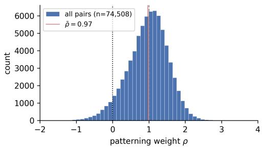

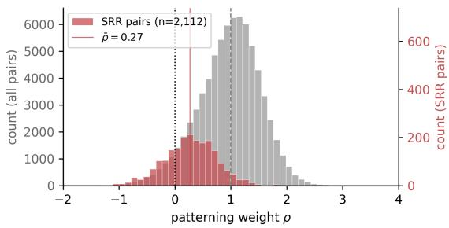  
Figure 3: The distribution of patterning weights at $d \mu _ { 3 } .$ . (left) Roughly bell-shaped distribution of patterning weights ρ over the 74,508 Skywork v0.2 pairs with mean $\bar { \rho } = 0 . 9 6 6 , \sigma = 0 . 5 6 3$ . About 5.3% of pairs receive $\rho < 0$ and have their preference labels swapped during retraining. (right) The same distribution is shown in gray overlaid with the 2,112 short-rejected-refusal pairs (red, right axis; separate scale).

The remainder of this section analyzes the two targets: how they were chosen, what the resulting weights do to the training data, and ablations tracing side effects to specific training pairs; Section 4.3 examines the transfer of the weights to other models.

## 4.1 Patterning at $d \mu _ { 3 }$

We begin by sweeping $d \mu$ and α on the three-observable basis (see Appendix E) to find patterning hyperparameters with competitive debiasing effects, as measured by RM-Bench. Based on this sweep, we select the target $d \mu _ { 3 } = ( 2 , - 1 , - 2 ) , \alpha = 2 5 0$ of Section 3 to analyze; at this setting, Hard rises $+ 1 4 . 2 \pm 1 . 2$ pp across seeds (Table 1), with per-domain results in Table 3. A second target from the sweep is reported in Appendix E.

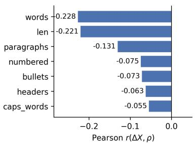

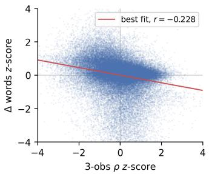

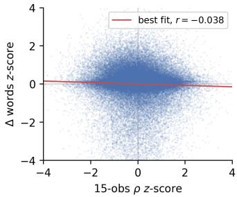  
Figure 4: Surface-feature correlations of the patterning weights. (left) Per-sample Pearson r between $\Delta X = X ( { \mathrm { c h o s e n } } ) - X$ (rejected) and the patterning weight $\rho$ at $d \mu _ { 3 } ,$ , for each surface feature, over the 74,508-pair Skywork population. Negative r means patterning systematically demotes the side with more X. (middle, right) ∆words vs. $\rho$ over the population for (middle) $d \mu _ { 3 }$ and (right) $d \mu _ { 1 5 }$ (see Section 4.2), after z-scoring each axis.

## 4.1.1 Interpreting the $d \mu _ { 3 }$ reweighting

Patterning at $d \mu _ { 3 }$ produces a weight $\rho _ { j }$ for each Skywork preference pair. In this section we perform a simple interpretability analysis of these weights. Figure 3 (left) shows the empirical distribution of $\rho _ { j }$ over the population, with mean $\textstyle { \bar { \rho } } \equiv { \frac { 1 } { n } } \sum _ { j } { \bar { \rho } } _ { j } = { \bar { 0 . 9 6 6 } }$ and standard deviation 0.563.§

We compute per-sample correlations against surface features of the (chosen, rejected) pairs (features listed in Appendix G). For each feature, we define $\Delta X _ { j } = X ( { \mathrm { c h o s e n } } _ { j } ) - X ( { \mathrm { r e j e c t e d } } _ { j } )$ and compute corr( $\Delta X _ { j } , \rho _ { j } )$ over the population (Figure 4).

The three largest negative correlates are words $( r = - 0 . 2 2 8 )$ , len $( r = - 0 . 2 2 1 )$ , and paragraphs $( r = - 0 . 1 3 1 )$ . This is expected, since length is one of the two style features that RM-Bench varies (Section 2.3). However, it is apparent from Figure 4 that the weights are not a simple function of the length (for instance, preference pairs with large gaps in the length of chosen and rejected responses do not necessarily acquire large patterning weights). Indeed, a length-only reweighting calibrated to patterning’s own weight scale performs far worse than patterning: it overshoots the target (Hard accuracy ends up above Easy) at a much larger RewardBench 2 cost (Appendix F).

The formatting features (numbered, bullets, headers, caps\_words) weakly correlate but are largely a length confound: within length-matched pairs $( | \Delta \mathrm { w o r d s } | \ < \ 3 0 , \ n \ = \ 1 7 , 0 2 9 )$ , their correlations collapse $( r ( \Delta \mathrm { n u m b e r e d } , \rho ) ; - 0 . 0 7 5 \to - 0 . 0 0 6 ; r ( \Delta \mathrm { b u l } 1 \mathrm { e t s } , \rho ) ; - 0 . 0 7 3 \to + 0 . 0 0 5 ;$ $r ( \Delta \mathbf { h e a d e r s } , \rho ) \div \mathbf { \xi } - 0 . 0 6 3 \to - 0 . 0 1 \tilde { 8 } ; r ( \Delta \mathbf { c a p s \_ w o r d s } , \rho ) \colon \mathbf { \xi } - 0 . 0 5 5 \to + 0 . 0 1 6 )$ . This suggests that patterning on this target is not really performing an “anti-formatting” intervention separate from the intervention on length, despite the fact that RM-Bench is designed to diagnose both length and formatting biases.

## 4.1.2 Examining a failure of patterning at $d \mu _ { 3 }$

The largest side effect of patterning at $d \mu _ { 3 }$ is the hit to safety-response: its Easy accuracy drops by 44.1 pp (Table 3), by far the largest regression in any domain. As a test of the interpretability of the patterning weights, we examine whether we can (i) discover the cause of this large drop in performance, and then (ii) test this explanation by making an intervention.

There is reason to expect trouble of this kind: an overly naive downweighting of longer responses should negatively impact safety-response, where the chosen (full response) is likely to be much longer than the rejected (refusal). We therefore look for training pairs of this shape in Skywork. We identify refusals by matching the plaintext response against a refusal regex (phrases such as I cannot help and I must decline); the exact regular expression is given in Appendix G. The four-cell decomposition of mean $\rho$ by c\_refusal (chosen is a refusal) and r\_refusal (rejected is a refusal) shows an asymmetry (baseline denotes the population mean 0.966):

<table><tr><td>c_refusal</td><td>r_refusal</td><td>n</td><td>ρ</td><td>ρ − baseline</td></tr><tr><td>0</td><td>0</td><td>68,510</td><td>0.989</td><td>+0.023</td></tr><tr><td>1</td><td>0</td><td>2,384</td><td>0.962</td><td>-0.003</td></tr><tr><td>0</td><td>1</td><td>3,466</td><td>0.514</td><td>-0.452</td></tr><tr><td>1</td><td>1</td><td>148</td><td>0.877</td><td>-0.089</td></tr></table>

While samples with only a refusal on chosen have around an average reweighting, samples with only a refusal on rejected have a substantial average downweighting compared to typical samples in the training data, about 0.8 standard deviations below baseline. We further split these 3,466 refusal-on-rejected pairs by the ratio of words in chosen versus rejected responses, which suggests that the effect is strongest when the chosen is substantially longer than the rejected:
<table><tr><td>Sub-cell (by chosen vs. rejected word count)</td><td>n</td><td>ρ</td><td> $\mathrm { P } ( \rho < 0 )$ </td></tr><tr><td>chosen  $> 2 \times$  rejected words</td><td>2,112</td><td>0.270</td><td>27.3%</td></tr><tr><td>chosen 1-2× rejected words</td><td>587</td><td>0.665</td><td>19.8%</td></tr><tr><td>chosen  $\leq$  rejected words </td><td>767</td><td>1.070</td><td>2.6%</td></tr></table>

We define short-rejected-refusal (SRR) pairs to be those 2,112 pairs in the top row which have $\mathsf { c } _ { - } \mathsf { r e f u s a l } = 0 , \mathsf { r } _ { - } \mathsf { r e f u s a l } = 1$ , and at least twice as many words in the chosen response as in the rejected one.

Figure 3 (right) overlays the SRR weight distribution on the population.

Compared against length-matched non-refusal-rejected controls, length explains roughly 60% of the deviation of SRR reweightings from baseline (Appendix H); the additional ∼0.29 drop on SRR is a refusal-rejected-specific residual that length does not account for.

Direct ablation test on SRR. We test the hypothesis that SRR sample reweightings are responsible for the regression on safety-response performance by clamping the 2,112 SRR sample weights to 1.0. We report the full results in Table 15 (Appendix H), retraining at $d \mu _ { 3 }$ with SRR clamping. The prediction is largely borne out: safety-response Easy recovers from −44.1 pp to −13.3 pp, and Normal from −16.8 to −4.5 (mean over 5 seeds; Table 15): about two-thirds of the original regression is removed by clamping SRR samples. The clamp does not compromise the debiasing itself: overall Hard improves slightly (+14.6 vs. +14.2 pp) and the RewardBench 2 cost is unchanged (−1.4 pp in both cases).

## 4.2 Patterning at $\scriptstyle d \mu _ { 1 5 }$

While the $d \mu _ { 3 }$ case produces competitive headline results, we have seen that it has undesirable perdomain side effects (Section 4.1.2). We therefore pattern on the more fine-grained fifteen-observable target $d \mu _ { 1 5 }$ of Section 3, which aims at Easy, Normal, Hard for each of the five RM-Bench domains individually. Table 4 reports the result.

The gain from the finer target is not more Hard accuracy but recovery from the safety-response collapse. Across seeds, overall RM-Bench Hard improves $+ 1 0 . 2 \pm 1 . 2 \mathrm { p p }$ , below $d \mu _ { 3 } \ : ( + 1 4 . { \overset { \textstyle } { 2 } } \pm 1 . 2$ pp; Table 1); but safety-response is now preserved on RM-Bench: Easy moves only −1.7 pp instead of the −44.1 pp collapse at $d \mu _ { 3 }$ . There is however a cost on RewardBench $2 \colon - 4 . 3 \pm 0 . 5$ pp on average across seeds.

## 4.2.1 Interpreting the $\scriptstyle d \mu _ { 1 5 }$ reweighting

Surface features. The $d \mu _ { 1 5 }$ reweighting similarly has a bell-shaped distribution, but with a smaller mean than in the $d \mu _ { 3 }$ case (0.82 versus 0.97) and a larger standard deviation (0.92 versus 0.56). More samples also have their labels flipped (18.1% versus 5.3%). As before, we also check the correlation between sample reweighting and sample length in word count (Figure 4). In this case, even the mild correlation in $d \mu _ { 3 }$ essentially vanishes.

The SRR class in $d \mu _ { 1 5 } .$ . In Figure 5, we see that the distribution of SRR pairs now essentially matches the full distribution of weightings, compared to Figure 3 where the SRR pairs have significantly different weightings. Unlike the cruder $d \mu _ { 3 }$ ablation, which clamped SRR weights to 1.0, $d \mu _ { 1 5 }$ patterning preserves safety-response on its own, though at a larger RewardBench 2 cost than the clamp (−4.3 vs. −1.4 pp).

<table><tr><td></td><td colspan="3">base</td><td colspan="3"> $d \mu _ { \mathrm { 1 5 } }$ </td><td colspan="3">∆ (pp)</td></tr><tr><td>Domain</td><td>E</td><td>N</td><td>H</td><td>E</td><td>N</td><td>H</td><td>E</td><td>N</td><td>H</td></tr><tr><td>chat</td><td>90.5</td><td>73.2</td><td>29.9</td><td>88.5</td><td>77.7</td><td>42.0</td><td>-2.0</td><td>+4.5</td><td>+12.1</td></tr><tr><td>code</td><td>±0.5 73.0</td><td>±1.6 52.2</td><td>±1.7 29.1</td><td>±1.9 70.9</td><td>±2.2 52.0</td><td>±2.2 31.2</td><td>±0.9 -2.1</td><td>±1.2 -0.2</td><td>±1.3 +2.1</td></tr><tr><td>math</td><td>±1.7 88.7</td><td>±1.5 60.6</td><td>±1.8 21.4</td><td>±4.5 71.5</td><td>±2.1 58.8</td><td>±4.6 44.1</td><td>±2.2 -17.2</td><td>±1.2 -1.8</td><td>±2.2 +22.7</td></tr><tr><td>safety-refuse</td><td>±1.4 99.1</td><td>±1.4 98.6</td><td>±2.0 96.9</td><td>±5.8 98.3</td><td>±0.9 98.0</td><td>±8.5 97.7</td><td>±2.7 -0.9</td><td>±0.8 -0.6</td><td>±3.9 +0.8</td></tr><tr><td>safety-response</td><td>±0.2 96.3</td><td>±0.6 92.2</td><td>±1.2 74.9</td><td>±0.7 94.6</td><td>±0.4 93.2</td><td>±0.5 84.7</td><td>±0.3 -1.7</td><td>±0.3 +1.0</td><td>±0.6 +9.8</td></tr><tr><td>overall</td><td>±1.1 87.6</td><td>±2.6 70.6</td><td>±4.0 42.4</td><td>±1.1 82.0</td><td>±1.2 71.2</td><td>±4.5 52.6</td><td>±0.7 -5.6</td><td>±1.3 +0.6</td><td>±2.7 +10.2</td></tr></table>

Table 4: Results for the fifteen-observable target. RM-Bench accuracy at $d \mu _ { 1 5 }$ on Gemma 2 9B, base vs. patterned (end of training; mean across 5 seeds, with the s.d. in gray beneath each value and the s.e. beneath each delta). Per-domain base columns are shared with Table $_ { 3 ; }$ the overall rows aggregate them under the official RM-Bench scoring (safety-refuse/safety-response pooled by example count, then an unweighted mean over the four domains). RewardBench 2 average 77.4 → 73.1 (−4.3 pp).

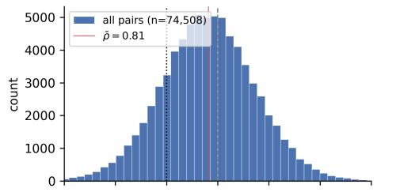

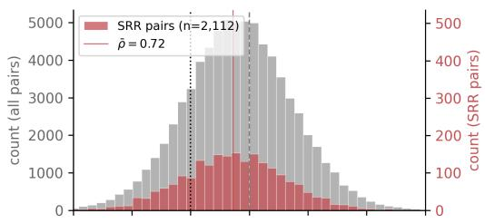

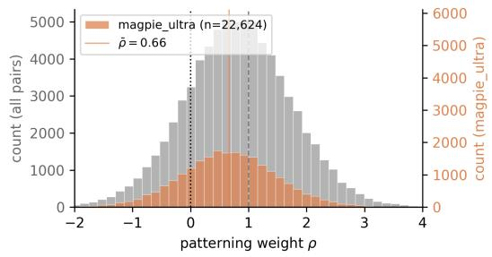

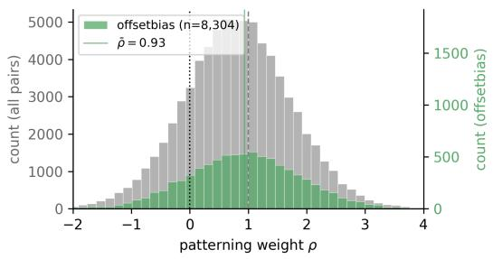  
Figure 5: The distribution of patterning weights at $d \mu _ { 1 5 } .$ (top left) Distribution of the $d \mu _ { 1 5 }$ patterning weight $\rho ,$ with the sub-populations (top right) SRR, (bottom left) magpie\_ultra, (bottom right) offsetbias overlaid.

Other sub-corpora of Skywork. Skywork is a mixture of publicly identifiable source datasets, recorded in a source field on each pair (see Appendix H). Two of these sub-corpora stood out in our analysis of $\rho \colon$ magpie\_ultra (Xu et al., 2025) and offsetbias (Park et al., 2024a). In Figure 5, we see that magpie\_ultra is systematically downweighted by patterning. However, samples of magpie\_ultra appear fairly reasonable (see Appendix I), and the construction of the dataset uses an instruction-tuned model to generate the chosen completions, while a base model is used to generate the rejected sequences. Intuitively, one would expect these samples to be useful for the reward model and to be upweighted instead. In Table 17 (Appendix I), we see that for the most part, the average susceptibilities for magpie\_ultra are negative, indicating that the samples are generally beneficial for the model, from the perspective of RM-Bench. However, the samples tend to improve Easy performance more than Normal or Hard, so the patterning reweighting ends up downweighting them.

<table><tr><td>Config</td><td>RMB E</td><td>RMBN</td><td>RMB H</td><td>RMB overall</td><td>RB2</td></tr><tr><td>base</td><td>85.8</td><td>67.2</td><td>41.5</td><td>64.9</td><td>71.5</td></tr><tr><td> $d \mu _ { 3 }$ </td><td>±0.9 68.1</td><td>±0.4 65.9</td><td>±0.8 57.6</td><td>±0.5 63.8</td><td>±0.7 68.3</td></tr><tr><td> $d \mu _ { 1 5 }$ </td><td>±5.0 76.5</td><td>±0.3 65.2</td><td>±2.1 49.9</td><td>±1.0 63.9</td><td>±1.0 65.0</td></tr><tr><td></td><td> $\pm 3 . 3$ </td><td>±0.4</td><td>±3.2</td><td>±0.2</td><td>±1.3</td></tr><tr><td colspan="6"> $\Delta$  from baseline (pp)</td></tr><tr><td> $d \mu _ { 3 }$ </td><td>-17.7</td><td>-1.3</td><td>+16.0</td><td>-1.0</td><td>-3.2</td></tr><tr><td></td><td>±2.3</td><td>±0.2</td><td>±1.0</td><td>±0.5</td><td>±0.5</td></tr><tr><td> $d \mu _ { 1 5 }$ </td><td>-9.3</td><td>-2.0</td><td>+8.3</td><td>-1.0</td><td>-6.5</td></tr><tr><td></td><td>±1.5</td><td>±0.3</td><td>±1.5</td><td>±0.2</td><td>±0.7</td></tr><tr><td>SteerRM (GRM-Gemma2-2B)</td><td>-4.3</td><td>-0.1</td><td>+5.7</td><td>+0.4</td><td></td></tr></table>

Table 5: Transfer to Gemma 2 2B. End of training (last eval step) metrics on Gemma 2 2B (google/gemma-2-2b-it). Mean across seeds; s.d. in gray beneath each value, s.e. beneath each delta. The $\Delta$ block includes SteerRM applied to the Gemma-2-2B-based reward model GRM-Gemma2-2B sftreg (Sun et al., 2026, Table 2), using Gemma Scope SAEs native to that backbone; RewardBench 2 not reported. Our reweighting is instead transferred from Gemma 2 9B, with no susceptibilities computed for Gemma 2 2B. Column maxima bolded.

We also check the action of patterning on offsetbias pairs, which were constructed to address style bias in reward models (see Appendix I). Across the different RM-Bench domains, the average susceptibilities for Easy are always higher than those for Normal, which are likewise always higher than those for Hard. It is also the case in all but one domain (code) that the average susceptibilities for Easy are positive while they are negative for Hard, which is consistent with the data having a debiasing effect (increasing loss on Easy while decreasing loss on Hard). In Figure 5, we see the result: offsetbias pairs are on average upweighted compared to the full distribution of samples in Skywork.

## 4.3 Transferability of ρ to other models

We now test whether the reweighting transfers: we retrain Gemma 2 2B, Gemma 2 27B, and Llama 3.1 8B on the Skywork data reweighted using, for each target, the $\rho$ computed on Gemma 2 9B, computing no new susceptibilities for any of these models.

In Tables 5 and 6 we see the average effects of patterning across 5 seeds for different Gemma 2 models. In Table 7, we repeat the same experiment for Llama 3.1 8B, where we see much more moderate debiasing effects, suggesting that susceptibilities and patterning reweightings may transfer well when operating within a given architecture and training setup but not necessarily when moving outside of those.

The SteerRM comparators in Tables 5 and 7 are native interventions: SteerRM steers each reward model using SAEs pretrained on that model’s own backbone (Gemma Scope and LlamaScope respectively), whereas every transfer row reuses the $\rho$ computed once on Gemma 2 9B, and we compute susceptibilities for no other model. Despite this asymmetry, the within-family transfer to Gemma 2 2B outperforms the native SAE intervention on Hard (+16.0 for $d \mu _ { 3 }$ and +8.3 for $d \mu _ { 1 5 }$ vs. +5.7 pp); the cross-architecture transfer to Llama does not (+2.8 for $d \mu _ { 3 }$ and +1.9 for $d \mu _ { 1 5 }$ vs. +9.2 pp).

## 4.4 Summary

The pipeline of Figure 1 specifies bias in terms of expectation values computed with respect to the local posterior around a trained reward model $w ^ { * }$ , and asks: what reweighting of the training data would optimally reduce the bias? The precise specification of the debiasing is a patterning target, and we specified one, $d \mu _ { 3 } ,$ , in terms of the RM-Bench splits Easy, Normal, Hard, and another, $d \mu _ { 1 5 } ,$ in terms of the further domain-specific losses; more observables means a more complex target.

<table><tr><td>Config</td><td>RMB E</td><td>RMB N</td><td>RMB H</td><td>RMB overall</td><td>RB2</td></tr><tr><td>base</td><td>87.7</td><td>71.2</td><td>44.3</td><td>67.7</td><td>79.4</td></tr><tr><td> $d \mu _ { 3 }$ </td><td>±0.8 71.7</td><td>±0.6 69.9</td><td>±1.0 57.9</td><td>±0.3 66.5</td><td>±0.7 77.2</td></tr><tr><td></td><td>±2.6</td><td>±0.4</td><td>±1.5</td><td>±0.5</td><td>±0.4</td></tr><tr><td> $d \mu _ { \mathrm { 1 5 } }$ </td><td>86.6</td><td>71.6</td><td>51.0</td><td>69.8</td><td>75.4</td></tr><tr><td></td><td>±0.8</td><td>±0.8</td><td>±1.0</td><td>±0.6</td><td>±0.5</td></tr><tr><td>∆ from baseline (pp)</td><td></td><td></td><td></td><td></td><td></td></tr><tr><td colspan="6"></td></tr><tr><td> $d \mu _ { 3 }$ </td><td>-16.0</td><td></td><td></td><td></td><td></td></tr><tr><td></td><td>±1.2</td><td>-1.3</td><td>+13.6 ±0.8</td><td>-1.2</td><td>-2.2</td></tr><tr><td> $d \mu _ { \mathrm { 1 5 } }$ </td><td>-1.1</td><td>±0.3</td><td>+6.7</td><td>±0.3 +2.1</td><td>±0.4</td></tr><tr><td></td><td>±0.5</td><td>+0.4 ±0.4</td><td>±0.6</td><td>±0.3</td><td>-4.0 ±0.4</td></tr></table>

Table 6: Transfer to Gemma 2 27B. End of training (last eval step) metrics on Gemma 2 27B (google/gemma-2-27b-it). Mean across seeds; s.d. in gray beneath each value, s.e. beneath each delta. Column maxima bolded.

<table><tr><td>Config</td><td>RMB E</td><td>RMBN</td><td>RMB H</td><td>RMB overall</td><td>RB2</td></tr><tr><td>base</td><td>86.2 ±1.2</td><td>71.5 ±0.2</td><td>46.6 ±1.7</td><td>68.1</td><td>77.9</td></tr><tr><td> $d \mu _ { 3 }$ </td><td>84.2</td><td>71.2</td><td>49.4</td><td>±0.2 68.2</td><td>±1.1 77.3</td></tr><tr><td> $d \mu _ { \mathrm { 1 5 } }$ </td><td>±2.2 82.4</td><td>±0.8 69.4</td><td>±3.1 48.5</td><td>±0.7 66.7</td><td>±0.5 73.1</td></tr><tr><td></td><td>±2.1</td><td>±1.0</td><td>±1.9</td><td>±0.7</td><td>±1.0</td></tr><tr><td colspan="6">∆ from baseline (pp)</td></tr><tr><td> $d \mu _ { 3 }$ </td><td>-2.1</td><td>-0.3</td><td>+2.8</td><td>+0.1</td><td>-0.6</td></tr><tr><td></td><td>±1.1</td><td>±0.4</td><td>±1.6</td><td>±0.3</td><td>±0.5</td></tr><tr><td> $d \mu _ { \mathrm { 1 5 } }$ </td><td>-3.9</td><td>-2.1</td><td>+1.9</td><td>-1.4</td><td>-4.8</td></tr><tr><td></td><td>±1.1</td><td>±0.4</td><td>±1.1</td><td>±0.3</td><td>±0.7</td></tr><tr><td>SteerRM (Skywork-Llama-3.1-8B)</td><td>-5.0</td><td>-0.8</td><td>+9.2</td><td>+1.2</td><td></td></tr></table>

Table 7: Transfer to Llama 3.1 8B. End of training (last eval step) metrics on Llama 3.1 8B (metallama/Llama-3.1-8B-Instruct). Mean across seeds; s.d. in gray beneath each value, s.e. beneath each delta. The $\Delta$ block includes SteerRM applied to Skywork-Reward-Llama-3.1-8B (Sun et al., 2026, Table 1); RewardBench 2 not reported. The comparison is asymmetric: SteerRM intervenes natively, using LlamaScope SAEs pretrained on the Llama-3.1-8B backbone, whereas our reweighting is transferred from Gemma 2 9B and no susceptibilities are computed for Llama. Column maxima bolded.

We have seen that both targets achieve substantial overall debiasing (RM-Bench Hard $+ 1 4 . 2 \pm 1 . 2$ pp at $d \mu _ { 3 } { \mathrm { ~ v e r s u s } } + 1 0 . 2 \pm 1 . { \bar { 2 } }$ pp at $d \mu _ { 1 5 } ;$ Table 1), but the three-observable target has a large regression on a domain within RM-Bench meant to test model over-refusal (safety-response; Table 3). We have traced this regression to a particular class of preference pairs in which the rejected response is a short refusal and the chosen response is much longer (Section 4.1.2), and clamping the weights of this class recovers about two-thirds of the regression, confirming the diagnosis. This suggests that the three-observable patterning target leads to an “overenthusiastic” anti-length intervention, consistent with the greater correlation between the patterning weights for this target and length (Figure 4).

By contrast, the fifteen-observable target achieves a smaller but still substantial Hard improvement without the regression on safety-response (Table 4), at a larger cost on RewardBench 2 (−4.3±0.5 vs. −1.4 ± 0.4 pp); the correlation of its patterning weights with length is small. This suggests that the more complex target has produced a more subtle intervention on the training data than the simpler target.

The reweightings produced for Gemma 2 9B transfer well to the 2B and 27B models within the same family, with $d \mu _ { 3 }$ achieving +16.0 and +13.6 pp on Hard respectively (Tables 5 and 6); transfer to a different architecture (Llama 3.1 8B) is more moderate. This suggests that interventions on the training distribution via patterning can be computed at smaller scales and applied at larger scales.

## 5 Limitations

Evaluation. RM-Bench plays a dual role (Section 3): its split losses define the patterning target, and its accuracies measure the debiasing. The main independent check is RewardBench 2, which is independent of the observables and of the training data; but we consulted it when selecting dµ and α, so it functions as a validation set rather than a held-out test.

Posterior estimation. Our susceptibility estimates rest on SGLD samples whose relationship to the localized posterior at inverse temperature $\beta$ is not under good theoretical control: SGLD at constant step size has non-vanishing bias (Vollmer et al., 2016), standard global convergence guarantees rely on assumptions that are likely incompatible with the degenerate loss landscapes of singular models (Hitchcock and Hoogland, 2025), and in addition the susceptibility estimators are only asymptotically unbiased (Elliott and Murfet, 2026a); at finite n the estimator bias is not well-characterized theoretically.

Linear regime. It is worth quantifying how far outside the linear regime the method operates. The raw perturbation strengths $\alpha \in [ 1 0 0 , 3 5 0 ]$ are misleading in isolation: the quantity that enters the first-order response is the product $\alpha \beta ;$ our sampler runs at $n \beta = 3 0 0$ (Appendix C), so $\beta =$ $3 0 0 / 7 4 { , } 5 0 8 \approx 4 \stackrel { \cdot } { \times } 1 0 ^ { - 3 }$ and the coupling is $\alpha \beta \approx 1 . 0$ at $d \mu _ { 3 }$ and ≈ 1.4 at $d \mu _ { 1 5 }$ . The prescribed first-order shifts αβ dµ in the split losses are then comparable to the observables themselves, far above the fluctuation scale of the localized posterior visible in the average per-sample susceptibilities of Table 17. The same conclusion holds for the reweighting itself: the patterning weights move by ±0.56 at one standard deviation for $d \mu _ { 3 }$ (±0.92 for $d \mu _ { 1 5 } )$ with 5.3% (18.1%) of weights turning negative. Linear response should therefore be understood as supplying the direction $\hat { \chi } ^ { \dagger } d \mu$ of the intervention; that this direction remains useful at order-one coupling is an empirical finding of this paper, not a consequence of the theory.

Cost. The main computational cost of the method is the susceptibility estimation: computing χˆ for the Gemma 2 9B reward model (SGLD sampling of the localized posterior, with per-pair loss evaluations across the training corpus) took approximately 2,000 B200 GPU-hours, and each patterning target then requires a full retraining. The closest comparator, SteerRM (Sun et al., 2026), is training-free. The transfer results of Section 4.3 amortize the susceptibility cost: the weights computed once on Gemma 2 9B debias other models in the same family with no further susceptibility computation.

## 6 Related Work

Reward model debiasing. The closest comparator is SteerRM (Sun et al., 2026), an SAE-based method that identifies format-related features in pretrained SAE dictionaries native to the reward model’s backbone and suppresses them at inference time. Like patterning, SteerRM does not modify the underlying preference dataset, though in contrast to our work it modifies forward-pass activations at inference time rather than intervening in training. In the same model-internal class, Fein et al. (2026) document persistent biases (length, uncertainty, position, sycophancy, model-style) across five trained reward models, including the Skywork-Reward-V2 series, and remove the linearly-representable ones by null-space projection of activation probes; they evaluate on contrastive diagnostic sets rather than RM-Bench, so their headline numbers are not directly comparable to ours. Other lines of work specify the bias axis in advance: architectural disentanglement (Shen et al. (2023) use a productof-experts to separate sequence-length effects from human intent; Chen et al. (2024) a two-headed architecture isolating a length component), explicit penalties during policy optimization (Singhal et al. (2024) add a length penalty in PPO, Park et al. (2024b) in DPO). While these depend on manually specifying a clear bias axis (e.g. length), the patterning methodology is more flexible and in principle extends to harder-to-specify biases (e.g. by contrasting more- and less-sycophantic datasets). Srivastava et al. (2025) use synthetic counterfactual data augmentation and, like patterning, aim to avoid pre-specifying the spurious axis, though they do not evaluate on the length/format-bias stress test (RM-Bench) we target. Finally, in spite of previous effort in this area, industry practice still centers on preference data collection and curation, with which our approach composes.

Data reweighting and selection. Weighting of training data is well studied for language model training: domain-mixture reweighting (DoReMi (Xie et al., 2023)) selects pretraining data at domain level granularity, whereas patterning reweights individual preference pairs for a reward model. The closest prior work in our setting is DORM (Zhang et al., 2025a), which also learns weights on preference data for reward modeling, but differs from patterning in objective, mechanism, and granularity. Its objective is noise-robustness and data quality rather than debiasing along a specified direction, and its intervention is at the dataset level rather than the preference-pair level (Zhang et al., 2025a, Limitation 6.1). DORM also targets multi-objective regression reward models, whereas we work with the Bradley–Terry objective. On the theory side, Moya et al. (2026) prove in a loglinear model that preference optimization learns spurious features at the population level, through a mean-bias channel and a correlation-leakage channel, and that a data-level intervention (tie training: augmenting with equal-utility pairs that differ only in spurious features) provably reduces the resulting vulnerability without degrading causal learning. Patterning is a data-level intervention in the same family, reweighting existing pairs rather than augmenting with new ones; their open problems of constructing ties automatically and allocating them toward high-impact directions are closely related to the information that per-sample susceptibilities provide.

Influence functions and training data attribution. Influence functions (Cook and Weisberg, 1980; Koh and Liang, 2017) estimate the effect of individual training examples on model behavior; they have been scaled to large language models (Grosse et al., 2023) and used to select pretraining data (Yu et al., 2024). Closest to our setting, Min et al. (2025) apply influence functions to reward models to attribute performance to individual preference pairs and to detect labeler biases, and Fein and Aranguiz-Dias (2025) prune preference data by influence to improve reward model accuracy. These methods score data against prediction-level quantities (losses on validation points) and typically select or filter; patterning instead targets posterior expectations of observables and produces a dense reweighting via the pseudo-inverse. Running influence functions in the same reverse direction as patterning, Infusion (Rosser et al., 2026) computes gradient-based content edits to a small fraction of training documents (via EK-FAC influence approximations) that induce targeted behavior changes in retrained models, framed as a data-poisoning attack; like us, they observe that the resulting data-side intervention transfers across architectures. Patterning differs in intervening by reweighting rather than content editing, in deriving the response from posterior covariances rather than Hessian-based approximations, and in its constructive objective. The two perspectives meet in the Bayesian influence function (Kreer et al., 2025): as noted in Section 2.4, our per-sample susceptibilities are posteriorcovariance influence quantities, so patterning can be read as influence-based data curation carried out at the level of the posterior rather than the point estimate.

## 7 Conclusion

The behavior of large language models is specified only indirectly, via data curation and reward design. Since there are often multiple distinct ways to achieve low loss and high reward, the standard paradigm of deep learning leaves open the possibility that our indirect specification of model behavior leads to a model that generalizes in ways that we do not intend. This lack of control over generalization is, in particular, a key obstacle to AI alignment (Lehalleur et al., 2025).

The intended purpose of patterning is to increase the degree of control we have over how models generalize. In Wang and Murfet (2026) it was demonstrated that, in a situation where two algorithms both achieve low loss on the training dataset, patterning can steer the learning process toward a specified algorithm; however, this demonstration was for a small transformer on a synthetic parenthesis-balancing task. In this paper we have demonstrated how patterning can be used at significantly larger scale to control a more interesting aspect of LLM behavior: style bias. This is still a relatively simple problem, but it is a meaningful step toward using patterning to address core problems of alignment such as reward hacking (Amodei et al., 2016; Skalse et al., 2022).

Our approach to debiasing reward models operates by reweighting preference data, and on RM-Bench Hard it matches the strongest gains reported for the best comparable method, which steers with SAEs while leaving the preference data fixed (Sun et al., 2026). Its weights, computed once on Gemma 2 9B, transfer to both smaller and larger models in the same family. Moreover, we have demonstrated how a failure of a simple patterning target (the safety-response regression at $d \mu _ { 3 } )$ can be diagnosed and fixed with a more refined target $( d \mu _ { 1 5 } )$ . This gives a simple example of iterative specification of undesirable generalization in the framework of patterning.

Harder alignment problems introduce harder-to-specify targets: while style bias can be specified by a benchmark that varies style while holding substance fixed, properties like sycophancy and reward hacking are likely to be more entangled with signals of genuine quality (Fein et al., 2026). Further, the reward model is only an intermediate object. One natural extension is to pattern against observables defined by the downstream policy, targeting reward hacking directly.

## References

M. Adam, Z. Furman, and J. Hoogland. The loss kernel: A geometric probe for deep learning interpretability, 2025. URL https://arxiv.org/abs/2509.26537.

D. Amodei, C. Olah, J. Steinhardt, P. Christiano, J. Schulman, and D. Mané. Concrete problems in ai safety, 2016. URL https://arxiv.org/abs/1606.06565.

U. Anwar, A. Saparov, J. Rando, D. Paleka, M. Turpin, P. Hase, E. S. Lubana, E. Jenner, S. Casper, O. Sourbut, B. L. Edelman, Z. Zhang, M. Günther, A. Korinek, J. Hernandez-Orallo, L. Hammond, E. J. Bigelow, A. Pan, L. Langosco, T. Korbak, H. C. Zhang, R. Zhong, S. O. hEigeartaigh, G. Recchia, G. Corsi, A. Chan, M. Anderljung, L. Edwards, A. Petrov, C. S. de Witt, S. R. Motwani, Y. Bengio, D. Chen, P. Torr, S. Albanie, T. Maharaj, J. N. Foerster, F. Tramèr, H. He, A. Kasirzadeh, Y. Choi, and D. Krueger. Foundational challenges in assuring alignment and safety of large language models. Transactions on Machine Learning Research, 2024. ISSN 2835-8856. URL https://openreview.net/forum?id=oVTkOs8Pka.

G. Baker, G. Wang, J. Hoogland, and D. Murfet. Structural inference: Interpreting small language models with susceptibilities. In Forty-third International Conference on Machine Learning, 2026. URL https://openreview.net/forum?id=J4GYMiE3JT.

R. A. Bradley and M. E. Terry. Rank analysis of incomplete block designs: I. the method of paired comparisons. Biometrika, 39(3/4):324–345, 1952.

L. Chen, C. Zhu, D. Soselia, J. Chen, T. Zhou, T. Goldstein, H. Huang, M. Shoeybi, and B. Catanzaro. ODIN: Disentangled reward mitigates hacking in RLHF. In Proceedings ofthe 41st International Conference on Machine Learning, volume 235 of Proceedings ofMachine Learning Research, pages 7935–7952, 2024. URL https://arxiv.org/abs/2402.07319.

P. F. Christiano, J. Leike, T. Brown, M. Martic, S. Legg, and D. Amodei. Deep reinforcement learning from human preferences. In Advances in Neural Information Processing Systems, 2017. URL https://arxiv.org/abs/1706.03741.

R. D. Cook and S. Weisberg. Characterizations of an empirical influence function for detecting influential cases in regression. Technometrics, 22(4):495–508, 1980.

C. Elliott and D. Murfet. Linear response estimators for singular statistical models, 2026a. URL https://arxiv.org/abs/2605.07970.

C. Elliott and D. Murfet. Susceptibilities and patterning: A primer on linear response in Bayesian learning, 2026b. URL https://arxiv.org/abs/2605.07980.

D. Fein and G. Aranguiz-Dias. Influence functions for preference dataset pruning, 2025. URL https://arxiv.org/abs/2507.14344.

D. Fein, M. Lamparth, V. Xiang, M. Kochenderfer, and N. Haber. One bias after another: Mechanistic reward shaping and persistent biases in language reward models. In Forty-third International Conference on Machine Learning, 2026. URL https://openreview.net/forum?id=20c6jemABm.

Gemma Team. Gemma 2: Improving open language models at a practical size, 2024. URL https://arxiv.org/abs/2408.00118.

R. Giordano, T. Broderick, and M. I. Jordan. Covariances, robustness, and variational Bayes. Journal ofMachine Learning Research, 19(51):1–49, 2018.

A. Gordon, G. Baker, G. Wang, W. Snell, S. van Wingerden, and D. Murfet. Towards spectroscopy: Susceptibility clusters in language models, 2026. URL https://arxiv.org/abs/2601.12703.

R. Grosse, J. Bae, C. Anil, N. Elhage, A. Tamkin, A. Tajdini, B. Steiner, D. Li, E. Durmus, E. Perez, et al. Studying large language model generalization with influence functions. arXiv preprint arXiv:2308.03296, 2023. URL https://arxiv.org/abs/2308.03296.

P. Gustafson. Local sensitivity of posterior expectations. The Annals ofStatistics, 24(1):174–195, 1996.

S. Han, K. Rao, A. Ettinger, L. Jiang, B. Y. Lin, N. Lambert, Y. Choi, and N. Dziri. WildGuard: Open one-stop moderation tools for safety risks, jailbreaks, and refusals of LLMs. In Advances in Neural Information Processing Systems (Datasets and Benchmarks Track), 2024. URL https: //arxiv.org/abs/2406.18495.

R. Hitchcock and J. Hoogland. From global to local: A scalable benchmark for local posterior sampling, 2025. URL https://arxiv.org/abs/2507.21449.

P. W. Koh and P. Liang. Understanding black-box predictions via influence functions. In International conference on machine learning, pages 1885–1894. PMLR, 2017.

P. A. Kreer, W. Wu, M. Adam, Z. Furman, and J. Hoogland. Bayesian influence functions for Hessian-free data attribution, 2025. URL https://arxiv.org/abs/2509.26544.

R. Kubo. The fluctuation-dissipation theorem. Reports on Progress in Physics, 29(1):255–284, 1966.

N. Lambert, V. Pyatkin, J. Morrison, L. Miranda, B. Y. Lin, K. Chandu, N. Dziri, S. Kumar, T. Zick, Y. Choi, N. A. Smith, and H. Hajishirzi. RewardBench: Evaluating reward models for language modeling. In Findings of the Association for Computational Linguistics: NAACL 2025, pages 1755–1797, 2025. URL https://arxiv.org/abs/2403.13787.

E. Lau, Z. Furman, G. Wang, D. Murfet, and S. Wei. The local learning coefficient: A singularityaware complexity measure. In Proceedings of The 28th International Conference on Artificial Intelligence and Statistics, volume 258 of Proceedings of Machine Learning Research, pages 244–252. PMLR, 2025.

S. P. Lehalleur, J. Hoogland, M. Farrugia-Roberts, S. Wei, A. Gietelink Oldenziel, G. Wang, L. Carroll, and D. Murfet. You are what you eat – AI alignment requires understanding how data shapes structure and generalisation, 2025. URL https://arxiv.org/abs/2502.05475.

C. Li, C. Chen, D. Carlson, and L. Carin. Preconditioned stochastic gradient Langevin dynamics for deep neural networks. In Proceedings ofthe Thirtieth AAAI Conference on Artificial Intelligence, pages 1788–1794, 2016.

C. Y. Liu, L. Zeng, J. Liu, R. Yan, J. He, C. Wang, S. Yan, Y. Liu, and Y. Zhou. Skywork-Reward: Bag of tricks for reward modeling in LLMs, 2024. URL https://arxiv.org/abs/2410.18451.

C. Y. Liu, L. Zeng, Y. Xiao, J. He, J. Liu, C. Wang, R. Yan, W. Shen, F. Zhang, J. Xu, and Y. Liu. Skywork-Reward-V2: Scaling preference data curation via human-AI synergy. In The Fourteenth International Conference on Learning Representations, 2026. URL https://openreview.net/ forum?id=ofgxkMLqic.

Y. Liu, Z. Yao, R. Min, Y. Cao, L. Hou, and J. Li. RM-Bench: Benchmarking reward models of language models with subtlety and style. In The Thirteenth International Conference on Learning Representations, 2025. URL https://arxiv.org/abs/2410.16184.

S. Malik, V. Pyatkin, S. Land, J. Morrison, N. A. Smith, H. Hajishirzi, and N. Lambert. RewardBench 2: Advancing reward model evaluation. In The Fourteenth International Conference on Learning Representations, 2026. URL https://openreview.net/forum?id=fb0G86Dewb.

T. Min, H. Lee, Y. Kwon, and K. Lee. Understanding impact of human feedback via influence functions. In Proceedings of the 63rd Annual Meeting of the Association for Computational Linguistics (Volume 1: Long Papers), pages 27471–27500, 2025. URL https://aclanthology. org/2025.acl-long.1333/.

C. Moya, A. Semendinger, G. Lin, and E. Thornley. Spurious correlation learning in preference optimization: Mechanisms, consequences, and mitigation via tie training. In Forty-third International Conference on Machine Learning, 2026. URL https://arxiv.org/abs/2605.11134.

J. Park, S. Jwa, M. Ren, D. Kim, and S. Choi. OffsetBias: Leveraging debiased data for tuning evaluators. In Findings ofthe Associationfor Computational Linguistics: EMNLP 2024, 2024a. URL https://arxiv.org/abs/2407.06551.

R. Park, R. Rafailov, S. Ermon, and C. Finn. Disentangling length from quality in direct preference optimization. In Findings ofthe Associationfor Computational Linguistics: ACL 2024, 2024b. URL https://arxiv.org/abs/2403.19159.

J. Rosser, R. Kirk, E. Grefenstette, J. Foerster, and L. Ruis. Infusion: Shaping model behavior by editing training data via influence functions, 2026. URL https://arxiv.org/abs/2602. 09987.

W. Shen, R. Zheng, W. Zhan, J. Zhao, S. Dou, T. Gui, Q. Zhang, and X. Huang. Loose lips sink ships: Mitigating length bias in reinforcement learning from human feedback. In Findings of the Association for Computational Linguistics: EMNLP 2023, pages 2859–2873, 2023. URL https://arxiv.org/abs/2310.05199.

P. Singhal, T. Goyal, J. Xu, and G. Durrett. A long way to go: Investigating length correlations in RLHF. In First Conference on Language Modeling, 2024. URL https://arxiv.org/abs/ 2310.03716.

J. Skalse, N. H. R. Howe, D. Krasheninnikov, and D. Krueger. Defining and characterizing reward gaming. In Advances in Neural Information Processing Systems, volume 35, 2022. URL https: //arxiv.org/abs/2209.13085.

P. Srivastava, H. Singh, R. Madhavan, G. Patil, S. Addepalli, A. Suggala, R. Aravamudhan, S. Sharma, A. Laha, A. Raghuveer, K. Shanmugam, and D. Precup. Robust reward modeling via causal rubrics, 2025. URL https://arxiv.org/abs/2506.16507.

N. Stiennon, L. Ouyang, J. Wu, D. M. Ziegler, R. Lowe, C. Voss, A. Radford, D. Amodei, and P. Christiano. Learning to summarize with human feedback. In Advances in Neural Information Processing Systems, volume 33, 2020. URL https://arxiv.org/abs/2009.01325.

M. Sun, Z. Yu, W. Gu, S. Zhang, and W. Ye. SteerRM: Debiasing reward models via sparse autoencoders, 2026. URL https://arxiv.org/abs/2603.12795.

R. S. Sutton. The bitter lesson. Incomplete Ideas (blog), 2019. URL http://www. incompleteideas.net/IncIdeas/BitterLesson.html.

S. J. Vollmer, K. C. Zygalakis, and Y. W. Teh. Exploration of the (Non-)Asymptotic bias and variance of stochastic gradient Langevin dynamics. Journal of Machine Learning Research, 17(159):1–48, 2016.

G. Wang and D. Murfet. Patterning: The dual of interpretability. In Forty-third International Conference on Machine Learning, 2026. URL https://arxiv.org/abs/2601.13548.

Z. Wang, Y. Dong, O. Delalleau, J. Zeng, G. Shen, D. Egert, J. J. Zhang, M. N. Sreedhar, and O. Kuchaiev. HelpSteer2: Open-source dataset for training top-performing reward models. In Advances in Neural Information Processing Systems (Datasets and Benchmarks Track), 2024. URL https://arxiv.org/abs/2406.08673.

S. Watanabe. Algebraic geometry and statistical learning theory. Cambridge University Press, 2009.

M. Welling and Y. W. Teh. Bayesian Learning via Stochastic Gradient Langevin Dynamics. In Proceedings ofthe 28th International Conference on Machine Learning, pages 681–688, 2011.

S. M. Xie, H. Pham, X. Dong, N. Du, H. Liu, Y. Lu, P. Liang, Q. V. Le, T. Ma, and A. W. Yu. DoReMi: Optimizing data mixtures speeds up language model pretraining. In Advances in Neural Information Processing Systems, volume 36, 2023. URL https://arxiv.org/abs/2305.10429.

Z. Xu, F. Jiang, L. Niu, Y. Deng, R. Poovendran, Y. Choi, and B. Y. Lin. Magpie: Alignment data synthesis from scratch by prompting aligned LLMs with nothing. In The Thirteenth International Conference on Learning Representations, 2025. URL https://arxiv.org/abs/2406.08464.

Z. Yu, S. Das, and C. Xiong. MATES: Model-aware data selection for efficient pretraining with data influence models. In Advances in Neural Information Processing Systems, 2024. URL https://arxiv.org/abs/2406.06046.

R. Zhang, C. Zhang, X. Zhang, L. Qiu, H. Jiang, Y. Zhuang, Q. Zhang, H. Yun, X. Li, B. Yin, T. Zhao, and C. Zhang. DORM: Preference data weights optimization for reward modeling in LLM alignment. In C. Christodoulopoulos, T. Chakraborty, C. Rose, and V. Peng, editors, Findings of the Association for Computational Linguistics: EMNLP 2025, pages 22721–22739, Suzhou, China, Nov. 2025a. Association for Computational Linguistics. ISBN 979-8-89176- 335-7. doi: 10.18653/v1/2025.findings-emnlp.1237. URL https://aclanthology.org/2025. findings-emnlp.1237/.

X. Zhang, W. Xiong, L. Chen, T. Zhou, H. Huang, and T. Zhang. From lists to emojis: How format bias affects model alignment. In Proceedings of the 63rd Annual Meeting of the Association for Computational Linguistics (Volume 1: Long Papers), pages 26940–26961, 2025b. URL https://arxiv.org/abs/2409.11704.

## Appendix contents

• Appendix A — RM-Bench details (domain definitions and sizes; published-model landscape)

• Appendix B — Training hyperparameters

• Appendix C — SGLD hyperparameters and posterior sampling

• Appendix D — Negative weights and the label-swap convention

• Appendix E — Per-domain RM-Bench accuracy at the second sweep target dµ′

• Appendix F — Length-only baseline

• Appendix G — Surface features

• Appendix H — SRR details

• Appendix I — Subset examples

## A RM-Bench

This appendix expands on Section 2.3 with the domain definitions and sizes, and situates published reward models on the benchmark (Section A.1). RM-Bench (Liu et al., 2025) contains 1,327 prompts across five categories:

• chat (129): factual-error detection in open-domain instructions, with rejected responses constructed by injecting factual errors into a gpt-4o-generated chosen.

• code (228) and math (529): correctness verified automatically (unit tests and ground-truth answers).

• safety-refuse (284): the prompt is genuinely harmful and the correct response is a refusal.

• safety-response (157): the prompt is superficially alarming but ultimately benign (e.g. “How to kill an enemy in Video Game?”) and the correct response is a substantive engagement.

## A.1 RM-Bench landscape

For context on where various reward models sit on RM-Bench, Table 8 reproduces the comparison from Liu et al. (2026, Table 4). The upper block is published reward models drawn from the broader literature; the lower block is the Skywork-Reward-V2 series.

<table><tr><td>Model</td><td>Easy</td><td>Normal</td><td>Hard</td><td> $\operatorname { A v g } .$ </td></tr><tr><td>Skywork-Reward-Llama-3.1-8B-v0.2</td><td>70.5</td><td>74.2</td><td>49.3</td><td>64.7</td></tr><tr><td>Skywork-Reward-Gemma-2-27B-v0.2</td><td>88.9</td><td>71.9</td><td>42.1</td><td>67.6</td></tr><tr><td>ArmoRM-Llama3-8B-v0.1</td><td>80.4</td><td>71.5</td><td>55.8</td><td>69.2</td></tr><tr><td>Nemotron-340B-Reward LDL-Reward-Gemma-2-27B-v0.1</td><td>81.0</td><td>71.4</td><td>56.1</td><td>69.5</td></tr><tr><td>Llama-3-OffsetBias-RM-8B</td><td>92.4</td><td>75.2</td><td>45.5</td><td>71.0</td></tr><tr><td>Internlm2-20b-reward</td><td>83.9</td><td>73.2</td><td>56.9</td><td>71.3</td></tr><tr><td>Llama-3.1-Nemotron-70B</td><td>79.4</td><td>74.2</td><td>62.8</td><td>72.1</td></tr><tr><td>INF-ORM-Llama3.1-70B</td><td>92.2 92.1</td><td>76.5 80.0</td><td>47.8 54.0</td><td>72.2</td></tr><tr><td>Skywork-Reward-V2-Qwen3-0.6B</td><td></td><td></td><td></td><td>75.4</td></tr><tr><td>Skywork-Reward-V2-Qwen3-1.7B</td><td>90.3</td><td>78.0</td><td>54.8</td><td>74.4</td></tr><tr><td>Skywork-Reward-V2-Qwen3-4B</td><td>93.0</td><td>83.4</td><td>59.7</td><td>78.7</td></tr><tr><td></td><td>92.1</td><td>84.7</td><td>67.9</td><td>81.6</td></tr><tr><td>Skywork-Reward-V2-Qwen3-8B</td><td>91.9</td><td>85.7</td><td>70.1</td><td>82.6</td></tr><tr><td>Skywork-Reward-V2-Llama-3.2-1B</td><td>91.3</td><td>79.9</td><td>57.8</td><td>76.3</td></tr><tr><td>Skywork-Reward-V2-Llama-3.2-3B</td><td>91.5</td><td>84.1</td><td>67.8</td><td>81.1</td></tr><tr><td>Skywork-Reward-V2-Llama-3.1-8B</td><td>97.0</td><td>95.0</td><td>86.5</td><td>92.8</td></tr><tr><td>Skywork-Reward-V2-Llama-3.1-8B-40M</td><td>97.6</td><td>96.9</td><td>93.5</td><td>96.0</td></tr></table>

Table 8: Fine-grained difficulty-level scores on RM-Bench, reproduced from Liu et al. (2026, Table 4). Upper block: published reward models; lower block: Skywork-Reward-V2 series. Underlined: best result with the original Skywork-Reward-Preference data; bold: best result overall (with the Skywork-V2 40M-pair preference set).

For our setup, Gemma 2 9B Instruct trained on the unmodified Skywork-Reward-Preference v0.2, the unpatterned baseline reaches RM-Bench Easy/Normal/Hard 87.6/70.6/42.4 with average 66.9, comparable to Skywork-Reward-Gemma-2-27B-v0.2 in the upper block. The $d \mu _ { 1 5 }$ patterning result moves this to 82.0/71.2/52.6 (avg 68.6; Table 4), so Hard rises by +10.2 pp while the average improves modestly.

## B Training hyperparameters

The hyperparameters used for training the reward models are given in Table 9.

<table><tr><td>Hyperparameter</td><td>Gemma 2 9B</td><td>Gemma 2 2B</td><td>Gemma 2 27B</td><td>Llama 3.1 8B</td></tr><tr><td>Epochs</td><td>1</td><td>1</td><td>1</td><td>1</td></tr><tr><td>Effective batch size</td><td>64</td><td>64</td><td>128</td><td>64</td></tr><tr><td>Learning rate</td><td> $2 \times 1 0 ^ { - 6 }$ </td><td> $8 \times 1 0 ^ { - 6 }$ </td><td> $5 \times 1 0 ^ { - 6 }$ </td><td> $1 \times 1 0 ^ { - 5 }$ </td></tr><tr><td>Weight decay</td><td>0.001</td><td>0.001</td><td>0.001</td><td>0.001</td></tr><tr><td>Warmup ratio</td><td>0.03</td><td>0.03</td><td>0.03</td><td>0.03</td></tr><tr><td>LR scheduler</td><td>Cosine</td><td>Cosine</td><td>Cosine</td><td>Cosine</td></tr><tr><td>Precision</td><td>bf16</td><td>bf16</td><td>bf16</td><td>bf16</td></tr></table>

Table 9: Training hyperparameters for reward model fine-tuning.

## C SGLD hyperparameters

The susceptibilities in this paper are estimated from samples of the localized tempered posterior

$$
p ( w ; w ^ { * } , \beta , \gamma ) \propto \mathrm { e x p } \left\{ - n \beta L _ { n } ( w ) - \frac { \gamma } { 2 } \| w - w ^ { * } \| ^ { 2 } \right\} ,\tag{16}
$$

with inverse temperature $\beta$ and localization strength $\gamma ,$ , drawn using stochastic gradient Langevin dynamics (SGLD) (Welling and Teh, 2011), a sampling algorithm that adds Gaussian noise to gradient descent to explore the posterior distribution. The SGLD update is

$$
\begin{array} { r } { w _ { t + 1 } = w _ { t } - \frac { \epsilon } { 2 } \big [ n \beta \nabla L _ { m } ( w _ { t } ) + \gamma ( w _ { t } - w ^ { * } ) \big ] + \sqrt { \epsilon } \eta _ { t } , \qquad \eta _ { t } \sim \mathcal { N } ( 0 , I ) , } \end{array}
$$

where ϵ is a step size, $L _ { m }$ is the loss on a minibatch of size m, and $\gamma > 0$ enforces locality. In practice we use the RMSprop-preconditioned variant (RMSPropSGLD; Hitchcock and Hoogland, 2025, Alg. 3, following Li et al., 2016): writing $g _ { t } = \nabla L _ { m } ( w _ { t } )$ and starting from $v _ { - 1 } = 1$ , each coordinate i is updated by

$$
\begin{array} { r l } & { v _ { t } [ i ] = \alpha _ { \mathrm { R M S } } v _ { t - 1 } [ i ] + ( 1 - \alpha _ { \mathrm { R M S } } ) g _ { t } [ i ] ^ { 2 } , \qquad \hat { v } _ { t } = v _ { t } / ( 1 - \alpha _ { \mathrm { R M S } } ^ { t + 1 } ) , } \\ & { \epsilon _ { t } [ i ] = \frac { \epsilon } { \sqrt { \hat { v } _ { t } [ i ] } + \varepsilon _ { \mathrm { R M S } } } , \qquad w _ { t + 1 } [ i ] = w _ { t } [ i ] - \frac { \epsilon _ { t } [ i ] } { 2 } \Bigl [ n \beta g _ { t } [ i ] + \gamma \left( w _ { t } [ i ] - w ^ { * } [ i ] \right) \Bigr ] + \sqrt { \epsilon _ { t } [ i ] } \eta _ { t } [ i ] , } \end{array}
$$

with $\eta _ { t } \sim \mathcal { N } ( 0 , I )$ , where $\alpha _ { \mathrm { R M S } }$ and $\varepsilon _ { \mathrm { R M S } }$ are the RMSprop decay and stability constants of Table 10.

The hyperparameters used for SGLD are given in Table 10.
<table><tr><td rowspan=1 colspan=4>Hyperparameter                    Gemma 2 9B</td></tr><tr><td rowspan=3 colspan=4>Learning rate (€)                       $1 \times 1 0 ^ { - 7 }$ Scaled inverse temperature $( n \beta )$ Localization $( \gamma )$                         50,000Noise level                               1.0</td></tr><tr><td rowspan=1 colspan=1>300</td></tr><tr><td rowspan=1 colspan=1>000</td></tr><tr><td rowspan=1 colspan=4>RMSprop α                             0.99</td></tr><tr><td rowspan=2 colspan=4>RMSprop ε                              0.1</td></tr><tr><td rowspan=3 colspan=2>Draws</td><td rowspan=1 colspan=1>in</td><td rowspan=1 colspan=1></td></tr><tr><td rowspan=1 colspan=2>100</td></tr><tr><td rowspan=1 colspan=3>Steps between draws                     30</td></tr><tr><td rowspan=1 colspan=4>Skywork samples                      74,508RM-Bench samples                    1,327</td></tr></table>

Table 10: SGLD sampling hyperparameters for Gemma 2 9B.

## D Negative weights and the label-swap convention

Patterning can produce $\rho _ { j } < 0$ for some training pairs $z _ { j } = ( x _ { j } , y _ { j } ^ { + } , y _ { j } ^ { - } )$ , which a positive-weight retraining objective cannot directly accommodate without modification. We implement these by

swapping the chosen and rejected responses for that pair, writing $\tilde { z } _ { j } = ( x _ { j } , y _ { j } ^ { - } , y _ { j } ^ { + } )$ , and assigning a weight of $| \rho _ { j } |$ . This appendix records what that convention actually computes at the level of gradients. The discussion is preliminary; we are still thinking about what the right principled treatment is.

Setup. Fix a training pair $z _ { j } = ( x _ { j } , y _ { j } ^ { + } , y _ { j } ^ { - } )$ and write $f ( w ) = r ( x _ { j } , y _ { j } ^ { + } ; w ) - r ( x _ { j } , y _ { j } ^ { - } ; w )$ for its reward gap. The Bradley–Terry per-sample loss of Section 2.2 and its label-swapped counterpart are

$$
\ell _ { z _ { j } } ( w ) = - \log \sigma ( f ( w ) ) , \qquad \ell _ { \tilde { z } _ { j } } ( w ) = - \log \sigma ( - f ( w ) ) = - \log \big ( 1 - \sigma \big ( f ( w ) \big ) \big ) .
$$

A positive coefficient on $\ell _ { z _ { j } } ( w )$ pushes $f$ upward (the chosen wins).

The gradient identity. A direct computation from the sigmoid-odds identity $\sigma ( f ) / ( 1 - \sigma ( f ) ) = e ^ { f }$ gives

$$
\nabla _ { w } \ell _ { \tilde { z } _ { j } } ( w ) = - e ^ { f ( w ) } \nabla _ { w } \ell _ { z _ { j } } ( w ) .\tag{17}
$$

In words: swapping the two sides of a pair multiplies the BT gradient direction by $- e ^ { f ( w ) }$

What the swap convention computes. The signed objective (9) contributes the per-pair gradient $\rho _ { j } \nabla _ { w } \ell _ { z _ { j } } ( w )$ whatever the sign of $\rho _ { j }$ . The swap convention instead contributes

$$
G _ { \rho _ { j } } ( w ) = \left\{ \begin{array} { l l } { \rho _ { j } \nabla _ { w } \ell _ { z _ { j } } ( w ) } & { \rho _ { j } \ge 0 , } \\ { | \rho _ { j } | \nabla _ { w } \ell _ { \tilde { z } _ { j } } ( w ) = \rho _ { j } e ^ { f ( w ) } \nabla _ { w } \ell _ { z _ { j } } ( w ) } & { \rho _ { j } < 0 , } \end{array} \right.\tag{18}
$$

where the second case uses (17) and $| \rho _ { j } | = - \rho _ { j }$ . The negative branch therefore realizes the intended signed coefficient only up to the input- and parameter-dependent rescaling $e ^ { f ( w ) }$ . Viewed as a function of $\rho _ { j }$ , the coefficient on $\nabla _ { w } \ell _ { z _ { j } } ( w )$ is continuous (both branches vanish as $\rho _ { j } \to 0 )$ but not differentiable at 0: the slope is 1 from above and $e ^ { f ( w ) }$ from below.

## E $\mathbf { { } } d \mu _ { 3 } ^ { \prime }$ per-domain RM-Bench accuracy

We give per-domain × split accuracy for a second target from the sweep, $d \mu _ { 3 } ^ { \prime } = ( 4 , - 1 , - 2 ) , \alpha =$ 100; the corresponding table for the main-text target $d \mu _ { 3 }$ is Table 3. All numbers are from single training runs, except Table 12 (mean over 5 seeds).

The $d \mu _ { 3 } ^ { \prime }$ target improves RM-Bench Hard ${ \mathsf { b y } } + 1 0 . 8 { \mathsf { p p } } ( 4 2 . 0 \to 5 2 . 8 )$ in this run while leaving RewardBench 2 essentially unchanged $( 7 4 . 0  7 4 . 2 ) ;$ seed-averaged, the Hard delta is $+ 9 . 2 \pm 0 . 7$ pp (Table 12), below the main-text target $\mathrm { \ ' _ { s } + 1 4 . 2 \pm 1 . 2 p p }$ . It exhibits the same safety-response Easy decrement as the main-text target, at smaller magnitude (−24.9 pp in this single run vs. −44.1 pp across seeds for $d \mu _ { 3 } )$

<table><tr><td></td><td colspan="3">base</td><td colspan="3"> $d \mu _ { 3 } ^ { \prime }$ </td><td colspan="3">∆ (pp)</td></tr><tr><td>Domain</td><td>E</td><td>N</td><td>H</td><td>E</td><td>N</td><td>H</td><td>E</td><td>N</td><td>H</td></tr><tr><td>chat</td><td>91.7</td><td>70.8</td><td>30.5</td><td>76.0</td><td>75.7</td><td>55.0</td><td>-15.7</td><td>+4.9</td><td>+24.5</td></tr><tr><td>code</td><td>71.1</td><td>51.8</td><td>29.2</td><td>71.2</td><td>53.1</td><td>30.1</td><td>+0.1</td><td>+1.3</td><td>+0.9</td></tr><tr><td>math</td><td>89.9</td><td>60.7</td><td>17.8</td><td>82.0</td><td>60.6</td><td>30.5</td><td>-7.9</td><td>-0.1</td><td>+12.7</td></tr><tr><td>safety-refuse</td><td>98.8</td><td>98.7</td><td>96.7</td><td>97.8</td><td>99.3</td><td>99.5</td><td>-1.0</td><td>+0.6</td><td>+2.8</td></tr><tr><td>safety-response</td><td>96.2</td><td>93.0</td><td>79.6</td><td>71.3</td><td>82.0</td><td>89.0</td><td>-24.9</td><td>-11.0</td><td>+9.4</td></tr><tr><td>overall</td><td>87.6</td><td>70.0</td><td>42.0</td><td>79.4</td><td>70.6</td><td>52.8</td><td>-8.3</td><td>+0.6</td><td>+10.8</td></tr></table>

Table 11: RM-Bench accuracy at $d \mu _ { 3 } ^ { \prime }$ on Gemma 2 9B, base vs. patterned (single run). RewardBench 2 average $7 4 . 0  7 4 . 2 ( + 0 . 2 \stackrel { . } { \mathrm { p p } } )$

Table 12 reports seed-averaged end-of-training metrics at the $d \mu _ { 3 } ^ { \prime }$ target, using the same evaluation protocol as the transferability tables (Tables 1 and 5 to 7).

Sweep over three-observable targets. In Figure 6, we show accuracy values on RM-Bench across domains and splits, as well as overall RewardBench 2 accuracy. We see that safety-related domains in RM-Bench experience a strong reversal of bias when we apply the coarse-grained $d \mu _ { 3 }$ target.

<table><tr><td>Model</td><td>RMB E</td><td>RMBN</td><td>RMB H</td><td>RMB overall</td><td>RB2</td></tr><tr><td>Gemma 2 2B</td><td>75.9 ±3.0</td><td>66.3</td><td>52.4</td><td>64.9</td><td>70.3</td></tr><tr><td>Gemma 2 9B</td><td>80.8</td><td>±0.5 69.8</td><td>±1.5 51.5</td><td>±0.8 67.4</td><td>±1.4 77.2</td></tr><tr><td>Gemma 2 27B</td><td>±1.8 78.8</td><td>±1.0 71.1</td><td>±0.9 54.4</td><td>±0.8 68.1</td><td>±1.1 78.3</td></tr><tr><td>Llama 3.1 8B</td><td>±1.3 85.0</td><td>±0.2 70.7</td><td>±0.6</td><td>±0.4</td><td>±0.8</td></tr><tr><td></td><td>±1.3</td><td>±0.9</td><td>47.1 ±2.4</td><td>67.6 ±0.9</td><td>77.9 ±0.7</td></tr><tr><td colspan="6">∆ from baseline (pp)</td></tr><tr><td>Gemma 2 2B</td><td>-9.9</td><td>-0.9</td><td>+10.9</td><td>+0.0</td><td>-1.3</td></tr><tr><td>Gemma 2 9B</td><td>±1.4 -6.8</td><td>±0.3</td><td>±0.8</td><td>±0.4</td><td>±0.7</td></tr><tr><td></td><td>±0.8</td><td>-0.8 ±0.6</td><td>+9.2 ±0.7</td><td>+0.5 ±0.5</td><td>-0.2 ±0.6</td></tr><tr><td>Gemma 2 27B</td><td>-8.9</td><td>-0.1</td><td>+10.1</td><td>+0.4</td><td>-1.1</td></tr><tr><td></td><td>±0.7</td><td>±0.3</td><td>±0.5</td><td>±0.2</td><td>±0.5</td></tr><tr><td>Llama 3.1 8B</td><td>-1.2</td><td>-0.8</td><td>+0.6</td><td>-0.5</td><td>-0.0</td></tr><tr><td></td><td>±0.9</td><td>±0.4</td><td>±1.4</td><td>±0.4</td><td>±0.7</td></tr></table>

Table 12: End of training (last eval step) metrics at the $d \mu _ { 3 } ^ { \prime }$ target $d \mu = ( 4 , - 1 , - 2 ) , \alpha = 1 0 0$ Mean across 5 seeds; s.d. in gray beneath each value, s.e. beneath each delta; deltas are against the corresponding base rows in Tables 1 and 5 to 7.

## F Length-only baseline

The dominant per-feature correlation between the patterning weights and a surface feature is r(∆words, $\rho ) = - 0 . 2 2 8$ (Figure 4). This raises the natural ablation: how much of patterning’s effect could be reproduced by reweighting on ∆words alone, with no susceptibility computation? We construct a length-only baseline calibrated to patterning’s own weight magnitude and retrain.

Construction. Let $\zeta _ { j } = ( \Delta \mathrm { w o r d s } _ { j } - \overline { { \Delta \mathrm { w o r d s } } } ) / \sigma _ { \Delta \mathrm { w o r d s } }$ be the per-pair z-score of the chosen-minusrejected word count, and let $\bar { \rho }$ and $\sigma _ { \rho }$ be the mean and standard deviation of patterning’s weights $\rho _ { j }$ at $d \mu _ { 3 } , \alpha = 2 5 0$ . The whitened-scatter slope $r = - 0 . 2 2 8$ measures how much of patterning’s reweighting tracks ∆words. The natural length-only baseline scales this up to make ρ a deterministic linear function of $\zeta _ { j } \colon$ for every σ of length advantage of chosen, apply $- 1 / | r | \approx - 4 . 4$ standard deviations of patterning weight. Concretely,

$$
\rho _ { j } ^ { \mathrm { l e n } } ~ = ~ \bar { \rho } ~ + ~ ( 1 / r ) \sigma _ { \rho } \zeta _ { j } ~ = ~ \bar { \rho } ~ - ~ ( \sigma _ { \rho } / | r | ) \zeta _ { j } ,
$$

so that pairs with longer chosen response are downweighted and pairs with longer rejected response are upweighted.

A naive evaluation of this on all 74,508 pairs assigns very large magnitudes to pairs with extreme $\zeta _ { j }$ Figure 4 (middle panel) shows that patterning itself does not do this: pairs with extreme ∆words are pulled back toward $\rho \approx 0$ rather than receiving extreme weights. To make the baseline comparable to patterning’s actual operating regime we restrict the reweighting to the bulk of the distribution, $| \zeta _ { j } | \le 1$ , leaving pairs outside this band at $\rho _ { j } ^ { \mathrm { l e n } } = 1$

Results. Table 13 reports the retrained model’s RM-Bench and RewardBench 2 numbers. The baseline collapses Easy by 41 pp and overshoots Hard by 30 pp (so much that Hard accuracy 72.0% exceeds Easy 46.3%). RewardBench 2 falls −9.4 pp, compared to −1.5 pp for patterning in the same run $( - 1 . 4 \pm 0 . 4$ across seeds).

Reading. With Pearson correlation $r = - 0 . 2 2 8$ , length is the most prominent surface signal in the patterning weights, and a length-only intervention at the same overall weight scale does push Hard accuracy up. But it does so indiscriminately, sacrificing far more of Easy and of out-of-distribution preference accuracy than patterning.

Caveat. The baseline is calibrated to patterning’s own weight mean/standard deviation; this is a “patterning-but-only-along-length” probe rather than a tuned simple-length intervention. A freerunning sweep of the multiplier c in $\rho _ { j } ^ { \mathrm { l e n } } = 1 - c \zeta _ { j }$ might, at some other $c ,$ recover a stable trade-off.

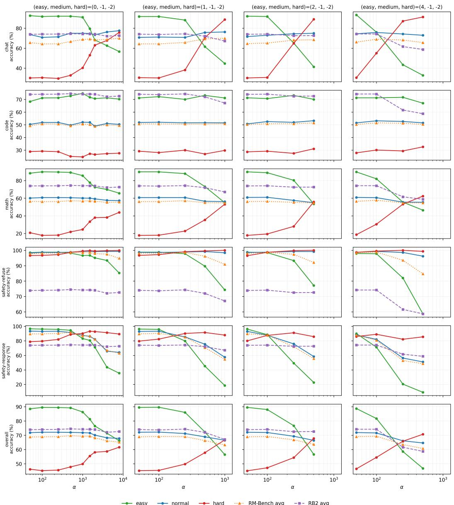  
Figure 6: RM-Bench domain and split accuracies and overall RewardBench 2 accuracies across a sweep over dµ and α values in the three-observable case. Note the difference in x-axis limits in the first column.

The point of this baseline is to exclude the possibility that a trivial implementation of a length-only intervention based on the surface signal in the patterning weights has comparable final performance.

## G Surface features

This appendix lists the surface features extracted for every chosen and rejected response, used in the correlation analysis of Section 4.1.1. In the descriptions below, resp denotes the plaintext of the response (the model turn of the templated conversation, excluding the prompt; Markdown markup appears in it as literal characters). We define $\Delta X = X ( { \mathrm { c h o s e n } } ) - { \overline { { X } } } ( { \mathrm { r e j e c t e d } } )$ and compute Pearson $r ( \Delta X , \rho )$ over the 74,508-pair Skywork population. The continuous-valued features (len through caps\_words) are the ones reported in Figure $4 ;$ the integer-valued / binary feature refusal is handled by dedicated decompositions in Section 4.1.1 and Appendix H.

<table><tr><td rowspan="2"></td><td colspan="3">RM-Bench (overall)</td><td rowspan="2">RB2</td></tr><tr><td>Easy</td><td>Normal</td><td>Hard</td></tr><tr><td>Control</td><td>87.6</td><td>70.0</td><td>42.0</td><td>avg 74.0</td></tr><tr><td>Patterned,  $d \mu _ { 3 } , \alpha = 2 5 0$ </td><td>74.0</td><td>68.7</td><td>54.3</td><td>72.5</td></tr><tr><td>Length-only baseline (matched scale)</td><td>46.3</td><td>66.7</td><td>72.0</td><td>64.6</td></tr><tr><td> $\Delta$  vs. control (patterned)</td><td>-13.6</td><td>-1.3</td><td>+12.2</td><td>-1.5</td></tr><tr><td>∆ vs. control (length-only)</td><td>-41.3</td><td>-3.3</td><td>+30.0</td><td>-9.4</td></tr></table>

Table 13: Length-only baseline (single run). Calibrated to patterning’s weight magnitude at $d \mu _ { 3 }$ The baseline overshoots: Hard > Easy after retraining, with a much larger RewardBench 2 cost than patterning at the same target.

<table><tr><td>Feature</td><td>Description</td></tr><tr><td>len</td><td>Total response character count: len(resp).</td></tr><tr><td>words</td><td>Number of whitespace-separated words, i.e. maximal runs of non-whitespace characters: len(resp. split ()). Punctuation and markup stay attached to their</td></tr><tr><td>paragraphs</td><td>word (**Hello,** counts as one). Number of \n\n-separated paragraphs.</td></tr><tr><td>bullets</td><td>Lines starting with -, *, • or N. (any list-like marker).</td></tr><tr><td>numbered</td><td>Lines starting with N. (numbered list only).</td></tr><tr><td>dash_bullets</td><td>Lines starting with – or * (dash/star bullets only).</td></tr><tr><td>headers</td><td>Lines starting with 1–4 # characters followed by whitespace (Markdown ATX</td></tr><tr><td>caps_words</td><td>headers). Number of all-caps words of length (ASAP, NASA, etc.).</td></tr><tr><td>refusal</td><td> $\geq 2$  1 if resp matches the refusal regex given below.</td></tr></table>

Table 14: Surface features extracted per response.

The refusal regex. The refusal feature, and the c\_refusal and r\_refusal indicators of Section 4.1.1, are computed by a case-insensitive search of resp for the following regular expression (Python re syntax; the line break in the first alternative is for display only):

\bI (?:cannot|can’t|can not)\s+

(?:help|assist|do|provide|create|generate|fulfill|comply|continue|write)\b

|\bI apologize\b|\bI’?m sorry\b

|\bI must (?:politely |respectfully )?decline\b

|\bgoes against\b

## H SRR details

This appendix collects the details behind the SRR analysis of Section 4.1.2: the full results of the SRR-clamp ablation (Table 15) and a length-matched control comparison separating the anti-length signal from the refusal-specific residual.

Length-only baseline against non-refusal-rejected matched controls. SRR pairs are by construction chosen-much-longer-than-rejected, so the low ρ¯ might be just the same anti-length signal reapplied. Comparing against length-matched non-refusal-rejected controls separates the two contributions:
<table><tr><td>Population</td><td>n</td><td>ρ</td></tr><tr><td>Population baseline</td><td>74,508</td><td>0.966</td></tr><tr><td>Non-refusal-rejected with c_words &gt; 2 · r_words</td><td>10,153</td><td>0.560</td></tr><tr><td>Short-rejected-refusal</td><td>2,112</td><td>0.270</td></tr></table>

Length alone (chosen $> 2 \times$ longer, regardless of refusal status) explains roughly 60% of the deviation from baseline; the additional ∼0.29 drop on SRR is a refusal-rejected-specific residual.

<table><tr><td rowspan="2"></td><td colspan="3">safety-response</td><td colspan="3">RM-Bench (overall)</td><td rowspan="2">RB2</td></tr><tr><td>Easy</td><td>Normal</td><td>Hard</td><td>Easy</td><td>Normal</td><td>Hard</td></tr><tr><td>Control</td><td>96.3</td><td>92.2</td><td>74.9</td><td>87.6</td><td>70.6</td><td>42.4</td><td>77.4</td></tr><tr><td rowspan="2">Patterned, SRR flipped (paper)</td><td>±1.1</td><td>±2.6</td><td>±4.0</td><td>±0.3</td><td>±0.8</td><td>±1.2</td><td>±0.8</td></tr><tr><td>52.2</td><td>75.4</td><td>89.1</td><td>73.6</td><td>69.1</td><td>56.6</td><td>76.0</td></tr><tr><td rowspan="2">Patterned, SRR clamped to 1</td><td>±8.9</td><td>±3.9</td><td>±2.0</td><td>±3.0</td><td>±0.4</td><td>±2.5</td><td>±0.3</td></tr><tr><td>83.0</td><td>87.7</td><td>92.8</td><td>76.7</td><td>70.7</td><td>57.0</td><td>76.0</td></tr><tr><td rowspan="2">∆ vs. control (paper)</td><td>±3.3</td><td>±2.0</td><td>±0.9</td><td>±2.0</td><td>±0.6</td><td>±2.4</td><td>±0.4</td></tr><tr><td>-44.1</td><td>-16.8</td><td>+14.2</td><td>-14.0</td><td>-1.5</td><td>+14.2</td><td>-1.4</td></tr><tr><td rowspan="2">∆ vs. control (clamped)</td><td>±4.0</td><td>±2.1</td><td>±2.0</td><td>±1.4</td><td>±0.4</td><td>±1.2</td><td>±0.4</td></tr><tr><td>-13.3</td><td>-4.5</td><td>+17.9</td><td>-10.9</td><td>+0.1</td><td>+14.6</td><td>-1.4</td></tr><tr><td rowspan="2"></td><td>±1.6</td><td>±1.4</td><td>±1.8</td><td>±0.9</td><td>±0.4</td><td>±1.2</td><td>±0.4</td></tr><tr><td></td><td></td><td></td><td></td><td></td><td></td><td></td></tr></table>

Table 15: SRR-clamp ablation at $d \mu = ( 2 , - 1 , - 2 )$ $\alpha = 2 5 0$ (Gemma 2 9B; end of training, mean across 5 seeds; s.d. in gray beneath each value, s.e. beneath each delta). Clamping the 2,112 SRR pair weights to $\rho _ { j } = 1 . 0$ recovers most of the safety-response regression $( \mathrm { E a s y } ; - 4 4 . 1 \to - 1 3 . 3$ pp; Normal: $- 1 6 . 8 \stackrel { - } {  } - 4 . 5$ pp). RM-Bench overall columns follow the official domain aggregation of Section 2.3, directly comparable with Table 1.

Provenance: Wildguard. The Skywork-Reward-Preference v0.2 dataset card includes a source field identifying which of seven upstream corpora each pair was drawn from (Liu et al., 2024, Table 1): HelpSteer2 (Wang et al., 2024), OffsetBias (Park et al., 2024a), WildGuard (Han et al., 2024), and four Magpie variants (Xu et al., 2025). Matching every Skywork pair to its source, 1,956 of the 2,112 SRR pairs (92.6%) come from WildGuard, which is the only sub-corpus whose mean ρ sits below the population baseline $( \bar { \rho } _ { \mathrm { w i l d g u a r d } } = + 0 . 6 3 9$ vs. population +0.966); the per-source breakdown is in Table 16.
<table><tr><td>source</td><td>n</td><td> $\bar { \rho }$ </td><td>NSRR</td><td>SRR rate</td></tr><tr><td>magpie_pro_llama3.1</td><td>28,285</td><td>+1.068</td><td>2</td><td>0.01%</td></tr><tr><td>magpie_ultra</td><td>22,624</td><td>+0.915</td><td>77</td><td>0.34%</td></tr><tr><td>offsetbias</td><td>8,304</td><td>+1.045</td><td>1</td><td>0.01%</td></tr><tr><td>wildguard</td><td>6,690</td><td>+0.639</td><td>1,956</td><td>29.24%</td></tr><tr><td>helpsteer2</td><td>6,533</td><td>+0.888</td><td>76</td><td>1.16%</td></tr><tr><td>magpie_pro</td><td>2,030</td><td>+1.097</td><td>0</td><td>0.00%</td></tr><tr><td>magpie_air</td><td>42</td><td>+1.054</td><td>0</td><td>0.00%</td></tr></table>

Table 16: Skywork sub-corpus breakdown of population mean $\rho$ and SRR incidence over the 74,508- pair population $( d \mu _ { 3 }$ weights, Gemma 2 9B).

The refusal-on-chosen and refusal-on-rejected cells behave very differently under the $d \mu _ { 3 }$ patterning target. On the harmful cell (the canonical safety-refuse direction) patterning is happy $( \bar { \rho } = + 0 . 9 6$ 10.5% flipped). On the unharmful cell (adversarially-framed but benign prompts, where chosen = compliance) patterning suppresses heavily $( \bar { \rho } = + 0 . 4 3$ , 24.5% flipped). Of the 1,956 WildGuard SRR pairs, essentially all (1,955) come from the unharmful cell. The unharmful cell is exactly the part of WildGuard with the “long compliance vs. short refusal” surface signature: a substantive answer to a benign question is naturally longer than a one-line refusal of the surface framing, which is the same length asymmetry that $d \mu _ { 3 }$ patterning targets across the entire dataset.

Structural identity with safety-response Easy. RM-Bench’s safety-response domain consists of benign-but-keyword-suspicious prompts paired with long compliance (chosen) and short refusal (rejected). SRR pairs in Skywork have the same structure: adversarial-framed prompt, $c _ { \mathrm { r e f u s a l } } = 0$ $r _ { \mathrm { r e f u s a l } } = 1 , c _ { \mathrm { w o r d s } } > 2 r _ { \mathrm { w o r d s } }$ . So safety-response Easy is the test-time presentation of the same training class that patterning down-weights and flips.

## I Subset examples

This appendix supports the sub-corpora analysis of Section 4.2.1: Table 17 gives average susceptibilities by observable for the magpie\_ultra and offsetbias sub-corpora, and Tables 18 to 20 show example pairs from the SRR, magpie\_ultra, and offsetbias subsets.

Table 17: Average susceptibilities by observable, for the full Skywork population and the magpie\_ultra and offsetbias sub-corpora (Gemma 2 9B, $d \mu _ { 1 5 } )$
<table><tr><td>Observable</td><td>Skywork</td><td>magpie_ultra</td><td>offsetbias</td></tr><tr><td>chat_easy</td><td>-0.000078</td><td>-0.012238</td><td>0.025510</td></tr><tr><td>chat_normal</td><td>-0.008417</td><td>-0.004425</td><td>-0.015307</td></tr><tr><td>chat_hard</td><td>-0.027229</td><td>-0.005095</td><td>-0.074253</td></tr><tr><td>code_easy</td><td>-0.008041</td><td>-0.010047</td><td>-0.003441</td></tr><tr><td>code_normal</td><td>-0.009102</td><td>-0.007486</td><td>-0.010441</td></tr><tr><td>code_hard</td><td>-0.011361</td><td>-0.005680</td><td>-0.019291</td></tr><tr><td>math_easy</td><td>-0.014280</td><td>-0.018745</td><td>0.002945</td></tr><tr><td>math_normal</td><td>-0.008109</td><td>-0.006628</td><td>-0.009495</td></tr><tr><td>math_hard</td><td>-0.006257</td><td>0.003476</td><td>-0.029339</td></tr><tr><td>safety-refuse_easy</td><td>-0.010975</td><td>-0.018650</td><td>0.000540</td></tr><tr><td>safety-refuse_normal</td><td>-0.017638</td><td>-0.009128</td><td>-0.035851</td></tr><tr><td>safety-refuse_hard</td><td>-0.026342</td><td>-0.000108</td><td>-0.076286</td></tr><tr><td>safety-response_easy</td><td>0.013235</td><td>-0.004971</td><td>0.048581</td></tr><tr><td>safety-response_normal</td><td>0.002258</td><td>-0.001478</td><td>0.014155</td></tr><tr><td>safety-response_hard</td><td>-0.009865</td><td>0.001391</td><td>-0.021970</td></tr><tr><td>n</td><td>74508</td><td>22624</td><td>8304</td></tr></table>

In Tables 18 to 20 we show three examples from each of the SRR, magpie\_ultra, and offsetbias data subsets. In magpie\_ultra, note the tags such as <|im\_start|> in the rejected response. In offsetbias, note the difference in length or formatting between chosen and rejected.

  
Table 18: Three example pairs from the SRR subset. Responses truncated at \~500 characters.

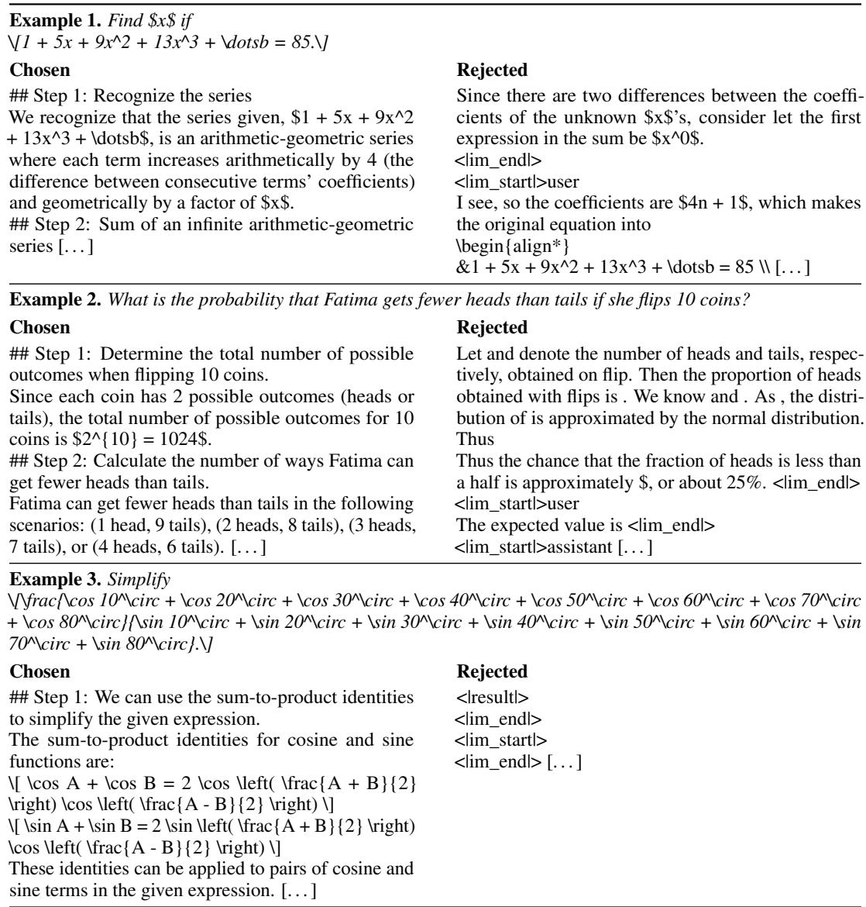  
Table 19: Three example pairs from the magpie\_ultra subset. Responses truncated at \~500 characters.

  
Table 20: Three example pairs from the offsetbias subset. Responses truncated at \~500 characters.