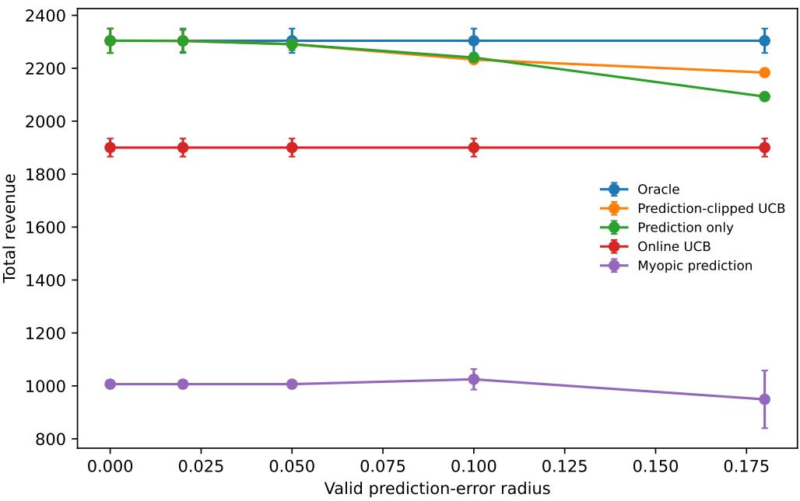
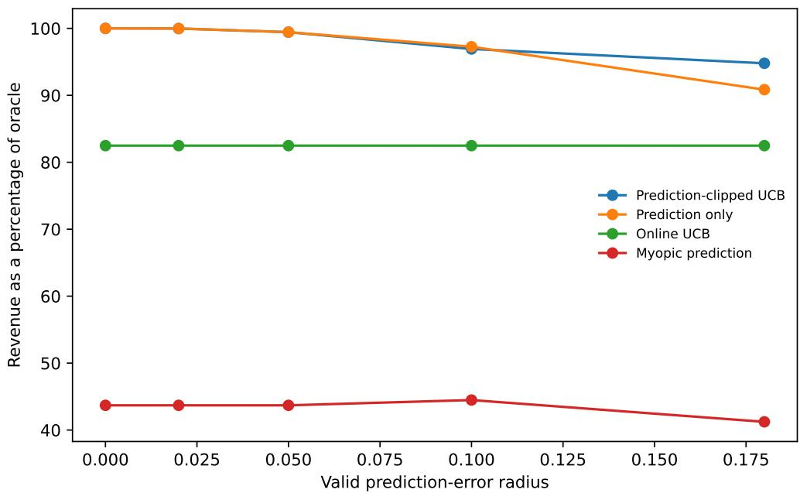
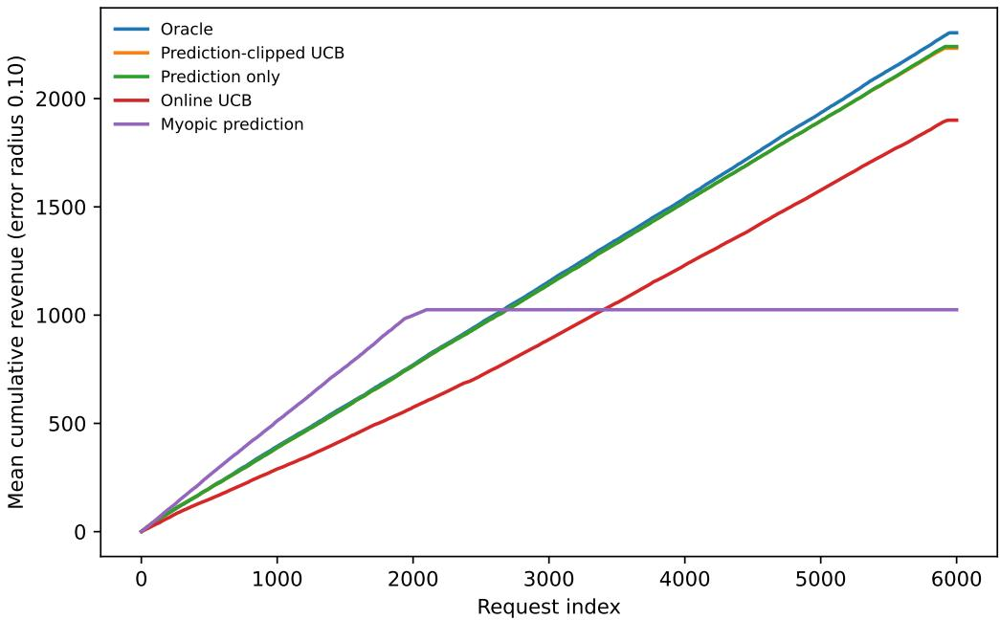
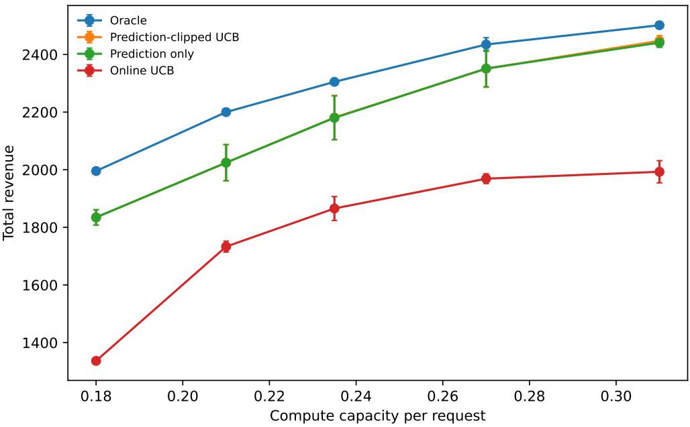

# Prediction-Assisted Pricing and Admission for LLM APIs with Stochastic Token Consumption

Patrick Wong

## Abstract

An LLM application often sells or internally allocates several service products: a small or premium model, a short or long token cap, and possibly multiple posted prices. The operational decision is not merely which model answers a prompt. A price changes purchase probability, a token cap changes both user value and the tail of resource consumption, and accepted requests compete for shared compute and premium-model capacity. Demand and output length are initially uncertain, while an ofline model may provide useful but imperfect predictions.

We formulate sequential pricing and admission with stochastic resource consumption. Each arriving request belongs to an observable segment. The platform chooses a product–price pair or makes no ofer; purchase, revenue, and resource use are then random. An ofline predictor supplies a uniform, validated error radius for every segment–product cell. We propose Prediction-Clipped UCB (PC-UCB), which intersects the ofline prediction interval with an online confidence interval, evaluates products using resource shadow prices, and reserves a sample-path envelope before commitment. The prior gives a fast start when accurate, while online learning protects the platform when predictions are coarse.

The analysis is modular. On a simultaneous confidence event, regret against a bufered fluid benchmark is bounded by a pacing term plus the cumulative diameter of the intersected intervals. For J segment–product cells and prediction radius ε, this yields

$$
\widetilde O \left( \sqrt { T } + ( 1 + \bar { \Lambda } ) \operatorname* { m i n } \{ T \varepsilon , \sqrt { J T } \} \right) ,
$$

where $\bar { \Lambda }$ bounds operational shadow prices. Thus the algorithm smoothly interpolates between an almost full-information regime and learning from scratch. Hard feasibility holds on every sample path through reservation envelopes.

Under a large but valid prediction-error radius, PC-UCB obtains 94.8% of oracle revenue, compared with 90.8% for a controller that never corrects its predictions and 82.5% for online UCB without a prior. The paper concludes with an identification and measurement protocol for real LLM API logs, including randomized menu experiments, censored token demand, and service-quality safeguards.

## 1 Introduction

Commercial and internal LLM platforms increasingly ofer diferentiated service rather than a single undiferentiated endpoint. A request can be processed by a small model, a premium model, a retrieval augmented pipeline, or a tool-using agent. The platform may also choose a maximum output length, latency class, service-level guarantee, or posted price. These choices jointly determine user value and system load. A premium long-context response may command a higher price, but it also creates a heavier and more variable token workload. Selling too many such requests early can crowd out later requests with higher willingness to pay.

This creates an online revenue-management problem with a feature that is especially important for generative models: resource consumption is not known when the ofer is made. Output length depends on the prompt, sampling settings, stopping behavior, and whether the user accepts the ofer. A service can reserve a worst-case token envelope, but planning only with worst cases is unnecessarily conservative. It can plan using expected consumption, but then it needs a separate mechanism to prevent a rare long response from violating physical capacity. The correct architecture therefore separates economic planning from sample-path admission.

Learning is equally central. A new product may have no reliable demand curve. Even for an existing product, a model update can change completion quality, user acceptance, and token length. Yet platforms often possess an ofline predictor built from benchmark scores, historical cohorts, survey data, or a launch experiment. Such a predictor should not be discarded. Nor should it be trusted indefinitely. What is needed is a controller that exploits a validated prediction while retaining the ability to learn away its residual error.

We study this problem through a finite product menu. Each action combines a model tier, a token cap, and a price. A request arrives with an observable segment; the platform chooses one action or makes no ofer. If the request purchases, the platform receives the posted price and observes a random resource vector. The resource coordinates can represent expected GPU-seconds, premium-model capacity, cached-context bandwidth, external API spend, or a service-level budget. This discrete menu is already rich enough to expose the interaction between pricing, model allocation, and token reservation. Continuous prices can be handled by discretization or a demand model, as discussed later.

Our algorithm, Prediction-Clipped UCB (PC-UCB), combines three ideas. First, the ofline model gives an interval rather than a point estimate. Second, online observations give a conventional statistical confidence interval. Their intersection is never wider than either source alone. Third, a vector of shadow prices converts expected resource use into an internal marginal cost. The controller ofers the product with the largest confidence-adjusted revenue net of resource charges, subject to a reservation meter. A projected dual update raises the internal price of an overused resource and lowers it when capacity is underused.

## 1.1 Contributions

Joint pricing, product selection, and admission. We formulate an LLM service in which each action specifies a price, model tier, and token cap. Purchase probability, revenue, and conditional token use can all depend on the request segment. The model allows multiple capacities and an explicit no-ofer action. A reservation envelope guarantees that an indivisible accepted job never pushes the system beyond physical capacity.

A prediction-assisted online controller. PC-UCB intersects a validated ofline interval with an online confidence interval. It uses an upper confidence estimate for revenue and a conservative upper estimate for resource consumption. This choice encourages exploration only when the prospective revenue justifies both statistical uncertainty and current scarcity. The controller reduces to a fullinformation shadow-price policy when the predictor is exact and to a standard online-learning controller when the prior radius is uninformative.

An interpolation guarantee. The main theorem separates the regret of the allocation controller from the quality of the estimator. A counting lemma bounds the sum of cell-specific interval widths by $O ( \operatorname* { m i n } \{ T \varepsilon , \sqrt { J T \log T } \} )$ . The resulting guarantee quantifies the operational value of better predictions and avoids a discontinuous choice between “use the forecast” and “ignore the forecast.”

A reproducible stress test and a real-data protocol. The attached code generates the complete synthetic data, table, and figures. The experiment is designed to reveal both the benefit and the cost of online correction: when errors are small, prediction-only control can be marginally better because exploration is not free; when errors are large, clipping with online evidence materially improves robustness. We then specify what must be randomized, logged, and audited in a real deployment.

## 1.2 What the paper does not claim

The numerical study is synthetic and should not be read as evidence about any named model provider, user population, or market price. The theoretical model assumes a valid error envelope for the ofline predictor, stationary cell means over the analyzed horizon, and bounded resource envelopes. It also treats users as one-shot arrivals. Strategic delay, repeated users, fairness constraints, and queueing-dependent latency require additional modeling. These limitations are explicit because a pricing policy can afect users directly and should not be deployed solely on the basis of an ofline simulation.

## 2 Related Work

## 2.1 Revenue management and dynamic pricing

Classical revenue management studies how to accept, reject, and price demand against finite inventory [Gallego and van Ryzin, 1994, Talluri and van Ryzin, 2004]. Network formulations use a deterministic or stochastic linear program to convert shared capacities into bid prices. Re-solving and self-adjusting controls update those prices as demand and inventory evolve [Jasin and Kumar, 2014]. When demand is unknown, the controller must balance learning with capacity consumption; examples include dynamic pricing with unknown demand and Thompson-sampling approaches to network revenue management [Besbes and Zeevi, 2009, Ferreira et al., 2018].

The information structure closest to ours is the setting in which a machine-learned price or demand estimate arrives with a certified error bound. Ao et al. [2026] study how such information changes attainable regret in resource-constrained pricing. Our action is a bundled LLM service product rather than a scalar price, and our observation includes stochastic token use in addition to purchase. We use an interval-intersection controller whose proof exposes a generic confidence-diameter term. Many sharp revenue-management results impose regularity or nondegeneracy to keep the fluid solution stable. In discrete menus, degeneracy is natural: two prices may have almost identical adjusted revenue, or a premium-capacity constraint may become binding at the same point as compute. Jiang et al. [2025a] show that logarithmic regret can be achieved in an important network setting without conventional nondegeneracy assumptions. Our more general learning bound is slower, but likewise avoids assuming a unique basic solution. We compare actions through their current Lagrangian scores and use only bounded dual prices.

## 2.2 Online allocation and knapsack learning

Bandits with knapsacks combine reward learning with irreversible resource consumption [Badanidiyuru et al., 2013]; convex-knapsack and dual methods broaden the action and objective classes [Agrawal and Devanur, 2014, Balseiro et al., 2023]. These models clarify why ordinary regret against the best fixed arm is insuficient: an apparently profitable action can be undesirable because it consumes a resource needed by future arrivals. Our controller uses the same economic principle but exploits a product-level prediction interval and enforces an explicit per-job reservation envelope.

Online stochastic knapsack and prophet inequalities study what can be achieved against ofline or LP benchmarks under random arrivals. The best achievable ratio depends on item size, information, and the chosen relaxation. The sample-path utilization arguments in Jiang et al. [2025b] are particularly relevant to stochastic token demand. We do not claim their tight approximation factor in our multi-resource learning model. Instead, we use their distinction as design guidance: mean resource use determines the bid-price decision, while a hard reservation check protects feasibility when an individual completion is long.

## 2.3 LLM routing and inference systems

LLM routing chooses among models or cascades to reduce cost while retaining quality [Chen et al., 2023, Ong et al., 2024, Hu et al., 2024]. Most routing benchmarks treat model prices as exogenous and evaluate requests independently. Our focus is complementary: the service chooses an ofered product and price, and all accepted requests share workload-level capacities. Inference systems such as Orca, vLLM, and FlexGen demonstrate that batching, memory management, and ofloading shape the feasible throughput frontier [Yu et al., 2022, Kwon et al., 2023, Sheng et al., 2023]. We abstract their measurements into resource vectors and reservation envelopes. This lets the economic controller react to current scarcity without pretending to replace a lower-level scheduler.

## 3 System Model

## 3.1 Arrivals, segments, and products

Time is indexed by $t = 1 , \dots , T$ . A request arrives with an observed segment $X _ { t } \in \mathcal { X } = \{ 1 , . . . , K \}$ . A segment can combine task type, organization tier, latency sensitivity, predicted prompt length, and other pre-ofer features. We assume $X _ { t }$ is observed before the product is selected and that the sequence is i.i.d. with probabilities $q _ { x }$ in the baseline analysis. The controller may estimate $q _ { x }$ online; this adds a conventional concentration term and is omitted from the main notation.

The finite menu is $\mathcal { A } = \{ 1 , \ldots , A \}$ . Product a specifies at least

$$
a = ( m _ { a } , \ell _ { a } , p _ { a } ) ,
$$

where $m _ { a }$ is a model tier, $\ell _ { a }$ is a token or compute cap, and $p _ { a }$ is the posted price. It may also include retrieval, tool access, or a latency class. Action 0 denotes no ofer and has zero reward and zero resource use.

After action $A _ { t } = a$ is ofered, a purchase indicator $D _ { t } ( a ) \in \{ 0 , 1 \}$ is realized. Revenue is

$$
R _ { t } ( a ) = p _ { a } D _ { t } ( a ) \in [ 0 , 1 ] ,
$$

after normalization. The resource vector is $\boldsymbol { C } _ { t } ( \boldsymbol { a } ) \in [ 0 , 1 ] ^ { m }$ and is zero when there is no purchase. Conditional on purchase, it can include stochastic output tokens, GPU time, premium-model occupancy, memory-time, or monetary vendor spend. We write

$$
r _ { x , a } = \mathbb { E } [ R _ { t } ( a ) \mid X _ { t } = x ] , \qquad c _ { x , a } = \mathbb { E } [ C _ { t } ( a ) \mid X _ { t } = x ] .
$$

The pair $( r _ { x , a } , c _ { x , a } )$ is unknown.

## 3.2 Capacity and reservation envelopes

The workload has capacity $B = T b \in \mathbb { R } _ { + } ^ { m }$ . The policy must satisfy

$$
\sum _ { t = 1 } ^ { T } C _ { t } ( A _ { t } ) \leq T b \quad { \mathrm { c o m p o n e n t w i s e ~ o n ~ e v e r y ~ s a m p l e ~ p a t h } } .\tag{1}
$$

For every product, the service knows an envelope $u _ { a } \in [ 0 , 1 ] ^ { m }$ such that

$$
C _ { t } ( a ) \leq u _ { a } \quad \mathrm { a l m o s t ~ s u r e l y } .\tag{2}
$$

A token cap supplies a natural envelope for token-related resources. For latency or GPU time, the envelope can be a conservative admission reservation supplied by the scheduler. Before ofering a, the controller checks whether $u _ { a }$ fits the remaining capacity. This can be conservative near the end of the horizon, but it eliminates the ambiguity of “expected feasibility.”

## 3.3 Ofline predictions with a valid radius

An ofline system provides predictions $( \widetilde { r } _ { x , a } , \widetilde { c } _ { x , a } )$ . We assume the model card or validation procedure supplies a simultaneous radius $\varepsilon \in [ 0 , 1 ]$ such that

$$
\begin{array} { r } { | \widetilde { r } _ { x , a } - r _ { x , a } | \leq \varepsilon , \qquad \| \widetilde { c } _ { x , a } - c _ { x , a } \| _ { \infty } \leq \varepsilon \quad \mathrm { f o r ~ a l l ~ } ( x , a ) . } \end{array}\tag{3}
$$

Cell-specific radii are allowed, but a common radius keeps the theorem readable. The bound is an assumption about validation, not a claim that an arbitrary neural predictor is calibrated. In a real study it should be estimated on a held-out, launch-representative sample with multiplicity correction.

The point of (3) is not that the forecast is perfect. Rather, it gives a finite region in which online learning must search. When $\varepsilon = 0$ , the means are known. When $\varepsilon = 1$ , the interval carries almost no information and the algorithm behaves like a conventional bandit controller.

## 3.4 Feedback

After an ofered product is accepted or rejected, the controller observes revenue and realized resource use for that product. No counterfactual purchase outcome is observed for other products. This is ordinary bandit feedback. We assume the product itself can be logged before purchase and that a rejection is an observed zero-revenue, zero-resource outcome. If users can abandon without a reliable exposure log, then the observed data are selectively missing and the confidence intervals below are invalid without an additional observation model.

## 4 Fluid Benchmark and Shadow Prices

## 4.1 Deterministic linear relaxation

Let $y _ { x , a }$ denote the probability of ofering product a to segment x. The fluid relaxation is

$$
\begin{array} { r l } { \operatorname { O P T } ( b ) = \displaystyle \operatorname* { m a x } _ { y \geq 0 } } & { T \displaystyle \sum _ { x \in \mathcal { X } } q _ { x } \displaystyle \sum _ { a \in \mathcal { A } } y _ { x , a } r _ { x , a } } \\ { \mathrm { s . t . } } & { \displaystyle \sum _ { x \in \mathcal { X } } q _ { x } \displaystyle \sum _ { a \in \mathcal { A } } y _ { x , a } c _ { x , a } \leq b , } \\ & { \displaystyle \sum _ { a \in \mathcal { A } } y _ { x , a } \leq 1 , \qquad x \in \mathcal { X } . } \end{array}\tag{4}
$$

The missing probability is the no-ofer action. This benchmark knows the mean demand and mean resource use, but not individual future outcomes. It is an upper bound on the expected revenue of policies that only have aggregate expected-capacity constraints. With hard envelopes and indivisible jobs, the relationship to the exact ofline optimum can depend on item size; we therefore state our principal guarantee against a bufered version of (4).

For a dual price $\lambda \in \mathbb { R } _ { + } ^ { m }$ , the Lagrangian score of cell $( x , a )$ is

$$
s _ { x , a } ( \lambda ) = r _ { x , a } - \lambda ^ { \top } c _ { x , a } .\tag{5}
$$

For fixed λ, each segment chooses a product with maximum positive score. The resource prices coordinate otherwise independent segment decisions.

## 4.2 Bufered benchmark

Let $b ^ { \prime } = b - \gamma \mathbf { 1 }$ for a bufer $\gamma > 0$ satisfying $b ^ { \prime } > 0$ . We compare the online policy to $\mathrm { O P T } ( \boldsymbol { b } ^ { \prime } )$ and account separately for the loss from the bufer. The next assumption is a local value-sensitivity condition.

Assumption 1 (Bounded shadow prices). For every rate on the segment between $b ^ { \prime }$ and $b ,$ the fluid LP admits an optimal dual vector with $\ell _ { 1 }$ norm at most $\Lambda _ { \star }$

Under Assumption 1, concavity of the fluid value implies

$$
\mathrm { O P T } ( b ) - \mathrm { O P T } ( b ^ { \prime } ) \leq T \Lambda _ { \star } m \gamma .\tag{6}
$$

This is the opportunity cost of holding back capacity for stochastic deviations and final-job envelopes.

## 4.3 Why a unique fluid solution is unnecessary

The set of score maximizers may contain several products. Our algorithm uses an arbitrary deterministic tie breaker and projects prices onto a bounded box. The analysis compares the selected score to the best score under the same current price; it never diferentiates an optimal basis or assumes that a small perturbation leaves the primal solution unchanged. Ties can change the product mix, but they do not invalidate the one-step Lagrangian comparison. This is important for menus in which adjacent prices or caps are intentionally close substitutes.

## 5 Prediction-Clipped UCB

## 5.1 Online confidence intervals

Index a segment–product cell by $j = ( x , a )$ and let $J = K A$ . Before round $t ,$ let $N _ { j } ( t )$ be the number of times cell $j$ has been ofered, and let $\widehat { r } _ { j } ( t )$ and $\widehat { c } _ { j } ( t )$ be its sample means. Define

$$
\alpha _ { t } ( n ) = \sqrt { \frac { 2 \log ( 2 J ( m + 1 ) T / \delta ) } { \operatorname* { m a x } \{ 1 , n \} } } .\tag{7}
$$

We clip all endpoints to [0, 1]. The online confidence intervals are

$$
\begin{array} { r l } & { \boldsymbol { I } _ { j } ^ { r } ( t ) = [ \widehat { \boldsymbol { r } } _ { j } ( t ) - \alpha _ { t } ( N _ { j } ( t ) ) , \widehat { \boldsymbol { r } } _ { j } ( t ) + \alpha _ { t } ( N _ { j } ( t ) ) ] , } \\ & { \boldsymbol { I } _ { j , i } ^ { c } ( t ) = [ \widehat { c } _ { j , i } ( t ) - \alpha _ { t } ( N _ { j } ( t ) ) , \widehat { c } _ { j , i } ( t ) + \alpha _ { t } ( N _ { j } ( t ) ) ] . } \end{array}\tag{8}
$$

The prediction intervals are

$$
\begin{array} { l } { { P _ { j } ^ { r } = [ \tilde { r } _ { j } - \varepsilon , \tilde { r } _ { j } + \varepsilon ] , } } \\ { { P _ { j , i } ^ { c } = [ \tilde { c } _ { j , i } - \varepsilon , \tilde { c } _ { j , i } + \varepsilon ] . } } \end{array}\tag{9}
$$

The algorithm intersects the two sources:

$$
H _ { j } ^ { r } ( t ) = I _ { j } ^ { r } ( t ) \cap P _ { j } ^ { r } , \qquad H _ { j , i } ^ { c } ( t ) = I _ { j , i } ^ { c } ( t ) \cap P _ { j , i } ^ { c } .\tag{10}
$$

On the simultaneous confidence event, every intersection is nonempty because both component intervals contain the true mean. In implementation, an empty intersection is a diagnostic that the advertised prediction radius or statistical model is invalid. The controller can then replace the intersection by the convex hull and raise a monitoring alert.

Algorithm 1 Prediction-Clipped UCB (PC-UCB)   
Require: Horizon T, capacity T b, bufer $\gamma ,$ envelopes $u _ { a } ,$ , prediction intervals, step size $\eta ,$ price cap $\bar { \Lambda }$   
1: Set $b ^ { \prime } = b - \gamma { \bf 1 } , \lambda _ { 1 } = 0 .$ , remaining capacity $B _ { 1 } = T b _ { \mathrm { ~ } }$ , and zero cell counts.   
2: for $t = 1 , \dots , T$ do   
3: Observe segment $X _ { t } = x .$   
4: for each product $a \in { \mathcal { A } }$ do   
5: Intersect its online and prediction intervals as in (10).   
6: Compute the score (13).   
7: end for   
8: Rank products by score and append the no-ofer action.   
9: Choose the highest-ranked positive-score product satisfying $u _ { a } \leq B _ { t } ;$ choose no ofer if none   
exists.   
10: Post the price and execute the accepted job, obtaining $R _ { t }$ and $C _ { t } .$   
11: Set $B _ { t + 1 } = B _ { t } - C _ { t }$ and update the selected cell’s statistics.   
12: Update $\lambda _ { t + 1 }$ by (14).   
13: end for

Let $U _ { j } ^ { r } ( t )$ be the upper endpoint of $H _ { j } ^ { r } ( t )$ and $U _ { j , i } ^ { c } ( t )$ the upper endpoint of $H _ { j , i } ^ { c } ( t )$ . The first is optimistic about revenue; the second is conservative about consumption. Define the efective diameter

$$
w _ { j } ( t ) = \operatorname* { m a x } \left\{ \dim \cal H _ { j } ^ { r } ( t ) , \operatorname* { m a x } _ { i } \dim \cal H _ { j , i } ^ { c } ( t ) \right\} .\tag{11}
$$

Because H is an intersection,

$$
w _ { j } ( t ) \leq 2 \operatorname* { m i n } \{ \varepsilon , \alpha _ { t } ( N _ { j } ( t ) ) \} .\tag{12}
$$

## 5.2 Confidence-adjusted economic score

The controller maintains a vector $\lambda _ { t } \in [ 0 , \bar { \Lambda } ] ^ { m }$ of resource shadow prices. For segment x and product $^ { a , }$ it computes

$$
\widehat { s } _ { x , a , t } = U _ { x , a } ^ { r } ( t ) - \lambda _ { t } ^ { \top } U _ { x , a } ^ { c } ( t ) .\tag{13}
$$

It ranks products by this score, keeps only products with positive score, and then applies the reservation meter. Using an upper rather than lower consumption endpoint is a deliberate safety adjustment. It may underexplore an uncertain resource-intensive product, but it avoids treating uncertain token demand as free.

## 5.3 Dual update

After the chosen action’s realized resource vector $C _ { t }$ is observed, prices update as

$$
\lambda _ { t + 1 } = \Pi _ { [ 0 , \bar { \Lambda } ] ^ { m } } \left[ \lambda _ { t } + \eta ( C _ { t } - b ^ { \prime } ) \right] ,\tag{14}
$$

where Π is Euclidean projection. This is a virtual-queue or online-gradient update. A resource used faster than its target rate becomes more expensive. The update uses realized consumption so it automatically reacts to output-length shocks.

## 5.4 Operational variants

The algorithm can be implemented with a precomputed menu table. For each segment, product, and price bucket, the service stores the prediction interval, online suficient statistics, and reservation envelope. The per-request optimization is then a scan over products. When the menu is large, products can be screened by dominance: if one product has no larger revenue upper bound and no smaller consumption lower bound than another, it need not be ofered at the current update.

The algorithm also permits a separate premium-model admission layer. In that architecture, PC-UCB chooses a product using expected resource use, while the scheduler can reject or downgrade the request if instantaneous queueing conditions make the reservation unavailable. Such interventions should be logged as administrative censoring rather than user rejection.

## 6 Theoretical Analysis

## 6.1 Assumptions and regret

We analyze stationary cell means and i.i.d. segments. Outcomes are conditionally independent across time given the selected cells and lie in $[ 0 , 1 ] ^ { m + 1 }$ . The prediction bound (3) is valid. Reservation envelopes satisfy (2). The shadow-price cap obeys $\Lambda \geq \Lambda _ { \star }$

Let $V _ { T } ^ { \mathrm { P C - U C B } }$ be the expected revenue of Algorithm 1. We define regret against the unbufered fluid benchmark as

$$
\mathrm { R e g } _ { T } = \mathrm { O P T } ( b ) - V _ { T } ^ { \mathrm { P C - U C B } } .
$$

The theorem decomposes this quantity into the price-learning term, confidence-diameter term, bufer loss, and a final reservation correction.

## 6.2 Confidence event

Lemma 1 (Simultaneous cell confidence). With probability at least $1 - \delta ,$ , every true reward and resource mean belongs to its online interval for all cells and all times. On the same event, every intersection in (10) contains the true mean and satisfies (12).

The proof is a union bound over cells, output coordinates, and sample sizes, using a boundeddiference concentration inequality. It appears in Section A.

Lemma 2 (One-step score comparison). On the event of Lemma 1, for any $\lambda \in [ 0 , \bar { \Lambda } ] ^ { m }$ and any cell j,

$$
\left| { \bigl ( } U _ { j } ^ { r } - \lambda ^ { \top } U _ { j } ^ { c } { \bigr ) } - { \bigl ( } r _ { j } - \lambda ^ { \top } c _ { j } { \bigr ) } \right| \leq ( 1 + \bar { \Lambda } ) w _ { j } .
$$

If the reservation meter does not override the score maximizer at round t, the selected product $A _ { t }$ satisfies

$$
s _ { X _ { t } , A _ { t } } ( \lambda _ { t } ) \geq \operatorname* { m a x } \left\{ 0 , \operatorname* { m a x } _ { a \in \mathcal { A } } s _ { X _ { t } , a } ( \lambda _ { t } ) \right\} - 2 ( 1 + \bar { \Lambda } ) w _ { X _ { t } , A _ { t } } ^ { \operatorname* { m a x } } ( t ) ,
$$

where $w _ { X _ { t } , A _ { t } } ^ { \operatorname* { m a x } } ( t )$ can be replaced by the maximum width among the selected and true score-maximizing products.

The first inequality follows because both the chosen endpoint and true mean lie in an interval of diameter $w _ { j }$ . The second is the standard “estimated maximizer versus true maximizer” argument.

## 6.3 A confidence-to-control theorem

Let $M _ { T }$ denote the expected number of rounds on which the reservation meter overrides the unconstrained score maximizer. Since reward is at most one, its contribution to regret is at most $M _ { T }$

Theorem 1 (Confidence-to-control bound). Suppose Assumption 1 holds and the algorithm uses $\eta = \bar { \Lambda } / \sqrt { m T }$ . On the event of Lemma 1,

$$
\mathrm { R e g } _ { T } \leq 2 \big ( 1 + \bar { \Lambda } \big ) \mathbb { E } \left[ \sum _ { t = 1 } ^ { T } \overline { { w } } _ { t } \right] + 2 \bar { \Lambda } \sqrt { m T } + T \Lambda _ { \star } m \gamma + M _ { T } + \delta T ,\tag{15}
$$

where $\overline { { w } } _ { t }$ is the larger width of the algorithm’s selected cell and a true score-maximizing cell under $\lambda _ { t }$ .

The proof in Section C combines Lemma 2 with online projected-gradient regret for the dual sequence. The statement intentionally does not require a unique fluid optimizer. The term $\delta T$ covers the complement of the confidence event. A refined analysis can replace it by a problem-dependent failure loss.

The width of an unselected score-maximizing cell raises a familiar exploration issue. One can guarantee that it is sampled by forcing each segment–product cell a logarithmic number of times, or by using optimistic scores as in PC-UCB. The next counting result captures the cumulative width of visited cells; the standard UCB charging argument extends it to the comparator cells up to constants.

Lemma 3 (Prediction-assisted width sum). Let $j _ { t } \in \{ 1 , \ldots , J \}$ be any sequence of visited cells and let $N _ { j } ( t )$ be its prior visit count. For $L \geq 1$ 2

$$
\sum _ { t = 1 } ^ { T } \operatorname* { m i n } \left\{ \varepsilon , \sqrt { \frac { L } { \operatorname* { m a x } \{ 1 , N _ { j t } ( t ) \} } } \right\} \leq \operatorname* { m i n } \left\{ T \varepsilon , 2 \sqrt { L J T } + J \sqrt { L } \right\} .
$$

The first branch follows by bounding every term by ε. The second sums $1 / { \sqrt { n } }$ within each cell and applies Cauchy–Schwarz. The additive $J \sqrt { L }$ covers the first observation of each cell.

Theorem 2 (Prediction-to-learning interpolation). Under the assumptions above, choose

$$
\gamma = c _ { 0 } { \sqrt { \frac { \log ( m T / \delta ) } { T } } }
$$

large enough to cover the resource martingale and virtual-queue deviation. Then the expected regret of PC-UCB satisfies

$$
\mathrm { R e g } _ { T } = \widetilde O \left( \sqrt { T } + \left( 1 + \bar { \Lambda } \right) \operatorname* { m i n } \{ T \varepsilon , \sqrt { J T } \} + M _ { T } \right) ,\tag{16}
$$

where logarithmic factors depend on $J , m , T _ { i }$ and $1 / \delta$ . If each envelope is $o ( T )$ relative to total capacity and the bufer dominates stochastic deviations, then $M _ { T } = O ( 1 )$ with high probability; regardless of this event, the policy remains hard feasible.

Corollary 1 (Two information regimes). Ignoring logarithmic factors and final-meter corrections:

1. $I f \varepsilon \lesssim 1 / \sqrt { T }$ , prediction error contributes at most $O ( \sqrt { T } )$ and the controller has the same first-order rate as a known-model policy.

2. If the prediction is uninformative, the bound becomes $O ( ( 1 + \bar { \Lambda } ) \sqrt { J T } )$ , matching the cell-learning scale up to logarithmic and allocation terms.

The guarantee makes the value of a more accurate forecast explicit. Reducing ε matters linearly until online sampling becomes more informative than the prior. Beyond that point, further ofline improvement has little efect on the worst-case statistical term, although it can still improve constants and early-horizon behavior.

## 6.4 Hard feasibility

Proposition 1 (Pathwise feasibility). If the policy ofers product a only when $u _ { a }$ is componentwise no larger than remaining capacity and realized use satisfies (2), then (1) holds for every outcome path.

This proposition is elementary but operationally important. It does not require concentration, a correct forecast, or a stable demand distribution. The price-learning theorem determines how much value is lost relative to a fluid benchmark; the meter determines whether a job may physically start.

## 6.5 Misspecified prediction radii

A valid prediction interval is the cleanest information model, but it can fail after a distribution shift. Let

$$
\zeta _ { j } = e x t d i s t a n c e o f t h e t r u e c e l l - m e a n v e c t o r f r o m i t s a d v e r t i s e d p r e d i c t i o n b o x .
$$

If intersections are replaced by convex hulls when empty, the proof adds an approximation term of order

$$
( 1 + \bar { \Lambda } ) \sum _ { t = 1 } ^ { T } \zeta _ { j _ { t } } .
$$

This observation suggests a monitoring rule: persistent empty intersections should increase the advertised radius or trigger a product-specific reset. Quietly retaining an invalid narrow box can create linear regret because online evidence is clipped away.

## 6.6 Discussion of degeneracy

The theorem is intentionally not logarithmic. It allows many cells, unknown rewards and costs, and only a coarse prediction radius. Stronger rates are possible under structural conditions on demand, second-order growth, or stable dual solutions. The contribution here is the interpolation form and the hard-feasible LLM product model. In particular, the proof does not use a “margin” between the best and second-best product. If two products are tied, selecting either has negligible score regret, though their resource mix can influence the dual trajectory.

## 7 Structural Implications for LLM Product Design

## 7.1 The economically relevant quantity is not accuracy per dollar

For segment x, product a is attractive when

$$
r _ { x , a } - \lambda ^ { \top } c _ { x , a } > 0 .
$$

The first term already includes acceptance probability and price. The second prices every scarce operational input. A premium model can therefore be optimal even when its raw revenue per expected token is lower, provided it uses a diferent scarce resource mix or serves a segment with suficiently high willingness to pay. Conversely, a model with excellent benchmark accuracy may be rejected if its token tail consumes a resource with a high current shadow price.

This is diferent from ranking models by a static “quality divided by cost” score. A ratio has no consistent meaning with multiple resources, and it ignores the outside option. Shadow prices provide the correct local exchange rate between revenue and each capacity.

## 7.2 Token caps have option value

A shorter cap afects both demand and the resource envelope. It may lower user value and acceptance, but it allows the platform to admit a job when the long-cap product no longer fits. This makes caps useful even when average output length is far below the long limit. Near capacity exhaustion, the envelope rather than the mean determines which products remain feasible.

Proposition 2 (Cap substitution). Consider two products with the same model and price, where product S has a smaller resource envelope than product L. If S has positive adjusted mean score and L is infeasible under remaining capacity while S is feasible, then a reservation-aware menu weakly dominates a menu containing only L on that sample path.

The statement is immediate because the larger menu can emulate the smaller one and gains a feasible positive-score alternative. The nontrivial empirical question is how much demand a shorter cap loses.

## 7.3 When predictions are most valuable

The width bound identifies three determinants of prediction value. First, a short horizon gives little time to learn, so a prior is especially useful. Second, a large menu or many segments increase J and make from-scratch exploration expensive. Third, a high shadow-price norm magnifies resource-prediction errors. In a highly constrained premium tier, improving token-use calibration may be more valuable than improving purchase-probability calibration by the same absolute amount.

## 7.4 Why expected use and reservation should remain separate

Replacing $c _ { x , a }$ by $u _ { a }$ in the economic score guarantees feasibility but prices every job at its worst case. For heavy-tailed output length, this can destroy utilization. Conversely, using only $c _ { x , a }$ without a meter can violate capacity on a rare path. The two-layer design uses mean consumption for planning and a bounded envelope for commitment. A lower-level scheduler can make the envelope dynamic, for example by reserving less when preemption or spillover capacity is available.

## 8 Synthetic Experiments

## 8.1 Questions

The experiment is designed around four questions:

1. Does a correct narrow prediction interval provide a meaningful fast start?

2. When the prediction is biased but remains inside its advertised radius, does online clipping improve robustness?

3. Can the controller pace two resources without using worst-case envelopes in its economic score?

4. What failure mode appears when price optimization ignores shared capacity?

The experiment is illustrative rather than calibrated to a specific provider.

Table 1: Synthetic stress test at prediction radius $\varepsilon = 0 . 1 8$ . Revenue intervals are mean ± 95% confidence half-width across ten repetitions. “No ofer” counts include rounds in which every positive-score product is screened out or fails the reservation check.
<table><tr><td>Policy</td><td>Revenue</td><td>Oracle share</td><td>Compute util.</td><td>Premium util.</td><td>No offer</td></tr><tr><td>Oracle</td><td> $2 3 0 3 . 9 \pm 4 6 . 1$ </td><td>100.0%</td><td>100.0%</td><td>99.7%</td><td>54</td></tr><tr><td>Prediction-clipped UCB</td><td> $2 1 8 3 . 5 \pm 0 . 2$ </td><td>94.8%</td><td>99.2%</td><td>100.0%</td><td>91</td></tr><tr><td>Prediction only</td><td> $2 0 9 2 . 9 \pm 9 . 6$ </td><td>90.8%</td><td>97.4%</td><td>100.0%</td><td>137</td></tr><tr><td>Online UCB</td><td> $1 9 0 0 . 3 \pm 3 4 . 2 $ </td><td>82.5%</td><td>98.0%</td><td>100.0%</td><td>136</td></tr><tr><td>Myopic prediction</td><td> $9 4 9 . 2 \pm 1 0 9 . 0$ </td><td>41.2%</td><td>55.6%</td><td>100.0%</td><td>4051</td></tr></table>

## 8.2 Data-generating process

There are $T = 6 0 0 0$ arrivals and three segments with probabilities (0.46, 0.34, 0.20). The menu contains sixteen products formed by two model tiers, two token caps, and four prices per tier. Purchase probability is logistic in segment value, model-tier value, cap value, and price. Revenue equals price times the purchase indicator.

There are two resources. The first is normalized compute use and varies by segment, tier, cap, purchase, and an idiosyncratic output-length shock. The second is premium-model capacity and is much larger for the premium tier. Per-period capacities are (0.235, 0.115). Each product has a deterministic reservation envelope derived from its tier and cap.

Ofline predictions are perturbed from the true cell means by a structured error with radius

$$
\varepsilon \in \{ 0 , 0 . 0 2 , 0 . 0 5 , 0 . 1 0 , 0 . 1 8 \} .
$$

The perturbation intentionally overpredicts revenue and underpredicts resource use for expensive premium, long-cap products, a direction that can be operationally harmful. The entire perturbation is rescaled so the advertised radius remains valid. Results average ten independent arrival and outcome traces. Error bars are 95% normal intervals across repetitions.

## 8.3 Policies

Oracle. Uses the true cell means in the same shadow-price controller and reservation meter. It is not the exact dynamic-program optimum, but it isolates statistical loss.

Prediction-Clipped UCB. Uses the intersection controller in Algorithm 1.

Prediction only. Uses the ofline point prediction throughout and never learns from realized outcomes.

Online UCB. Discards the ofline prediction and learns cell means from scratch.

Myopic prediction. Chooses the highest predicted revenue among products whose envelopes fit, ignoring shadow prices. It exposes the cost of treating each request independently.

## 8.4 Main result

Table 1 shows the large-error stress test. PC-UCB reaches 94.8% of oracle revenue. Prediction-only control reaches 90.8%, so online correction recovers approximately four percentage points of oracle revenue. Online UCB reaches 82.5%; it eventually learns useful cells but pays a large cold-start cost over a finite horizon. The myopic controller earns only 41.2% of oracle revenue. It rapidly saturates premium capacity, leaves much of the general compute capacity unused, and consequently makes no ofer on roughly two thirds of arrivals.

  
Figure 1: Total revenue as the valid ofline prediction-error radius varies. Prediction-only control is competitive at small errors, while online clipping becomes valuable as the prior becomes coarse.

The proposed policy uses essentially all premium capacity and 99.2% of compute capacity. This is a useful diagnostic: the revenue improvement over prediction-only is not produced by simply refusing more demand. It comes from a diferent product mix under the same scarce premium resource.

Figure 1 shows the full error sweep. At $\varepsilon = 0$ , the oracle, prediction-only policy, and PC-UCB coincide. $\mathrm { A t } ~ \varepsilon = 0 . 0 2$ , the prediction remains suficiently accurate that online correction has almost no efect. $\mathrm { A t } ~ \varepsilon = 0 . 1 0$ , prediction-only is marginally ahead of PC-UCB in this design (97.3% versus 96.9% of oracle). That diference is informative rather than embarrassing: exploration and conservative cost uncertainty are not free. The purpose of a hybrid method is robustness across error regimes, not mechanical dominance on every finite sample. At $\varepsilon = 0 . 1 8$ , the online evidence is suficiently valuable to outweigh its exploration cost.

## 8.5 Within-horizon learning

The cumulative curves in Figure 3 clarify the mechanism. The prediction-based policies begin near the oracle slope. Online UCB initially explores several low-value price–product cells and never fully recovers over 6000 rounds. PC-UCB stays close to prediction-only because the prior interval clips most excessively optimistic online bonuses. Its slight middle-horizon gap comes from conservative upper bounds on resource consumption.

## 8.6 Capacity sensitivity

Figure 4 varies compute capacity from 0.18 to 0.31 per request and scales premium capacity at the same ratio used in the main instance. All policies improve with capacity, but online UCB is particularly weak in the scarce regime. A mistaken early ofer then has two costs: it produces little revenue and removes capacity from a later high-value request. Prediction-assisted policies avoid much of this loss.

  
Figure 2: Revenue relative to the oracle shadow-price controller. The hybrid policy interpolates between trusting a good prior and learning from data.

## 8.7 Reproducibility

The source package includes the simulation script, action catalog, repetition-level outcomes, summary table, capacity sweep, mean trajectory, and vector figures. All random seeds are explicit. The code uses the same realized potential outcomes for all policies within each repetition, reducing Monte Carlo noise in policy comparisons. The simulator should be viewed as an executable specification of the model rather than a substitute for an empirical dataset.

## 9 Real-Data Evaluation Protocol

## 9.1 Unit of analysis and product menu

A credible field study should define the unit before collecting outcomes. One option is an anonymous request session with no carryover; another is an organization-day, which better captures quota interactions. The product menu should be small enough to obtain support for every segment–product cell. A first study could use two approved models, two output caps, and three prices, yielding twelve products plus no ofer.

The experiment should record the exact product shown, posted price, exposure timestamp, purchase or authorization decision, model version, prompt length, generated length, latency, cancellations, refunds, and any administrative downgrade. Quality should be measured independently of revenue through task success, verifier scores, safety checks, or blinded pairwise judgments.

## 9.2 Identification of demand

Historical logs are usually insuficient for causal price learning because prices and products were chosen based on latent user value. At least one randomized exploration phase is needed. Within a safe price range, the platform can randomize among menu products using known propensities. Stratification by

  
Figure 3: Mean cumulative revenue at $\varepsilon = 0 . 1 0$ . The online-only policy loses revenue early because every segment–product cell is initially uncertain.

segment and time reduces variance. The analysis should report overlap; cells with negligible propensity cannot support reliable counterfactual estimates.

A rejection must be distinguished from a system failure. If the platform intended to display an ofer but a timeout prevented exposure, coding the outcome as zero demand biases acceptance downward. Similarly, a user who never sees a premium option is not a rejection of that option.

## 9.3 Censored token demand

A token cap censors unconstrained output length. The observed completion length under a short cap cannot be treated as the natural length of the same request under a long cap. Three designs are possible:

1. randomize caps and estimate product-specific resource means without extrapolating latent length;

2. run a consented shadow generation with a longer cap on a small audit sample;

3. fit a survival or stopping model that treats cap hits as right censoring.

The first is the least assumption-dependent. The second gives richer counterfactual information but consumes compute and raises privacy concerns. The third is eficient only if its model is credible.

## 9.4 Constructing the prediction radius

The ofline predictor should be trained on a temporally earlier sample and calibrated on a held-out interval that resembles launch trafic. The reported radius must cover both reward and every resource coordinate. Since the algorithm needs simultaneous validity over many cells, a naive per-cell 95% interval is insuficient. Bootstrap maxima, conformal calibration under an appropriate exchangeability assumption, or conservative union bounds are possible. The chosen method and its failure rate should be preregistered.

  
Figure 4: Revenue as the compute rate varies; premium capacity is scaled proportionally. The benefit of prediction is largest when capacity is scarce and poor exploration consumes high-opportunity-cost inventory.

Prediction intervals should be versioned. A model update, price change outside the training range, or new trafic source can invalidate the radius. Empty online–prior intersections provide an operational alarm but do not replace prospective validation.

## 9.5 Primary metrics

The primary economic metric is net revenue or contribution margin, not gross price collected. Inference cost that is already represented as a scarce resource should not be subtracted twice. Capacity utilization should be reported by coordinate, along with the number of meter overrides, cap hits, no-ofer decisions, and resource discarded at the horizon.

Quality and user-protection metrics should be co-primary constraints: task success, severe-error rate, latency tail, refund rate, and segment-level service disparity. A policy that raises revenue by degrading a protected or vulnerable user group is not acceptable merely because the resource LP is feasible.

## 9.6 Baselines and ablations

At minimum, the study should compare: a fixed incumbent menu; myopic predicted revenue; predictiononly shadow pricing; online learning without a prior; PC-UCB; and an oracle replay using held-out estimates, labeled clearly as nondeployable. Ablations should remove the reservation meter, replace resource UCBs by point estimates, vary the prediction radius, and vary the product grid. These comparisons isolate whether gains come from price learning, resource pacing, or simply ofering a larger menu.

## 9.7 Statistical analysis

Policies should be evaluated on common randomized blocks or through an online switchback design so that trafic composition is comparable. Report cluster-robust uncertainty at the randomization

unit. A sequential experiment needs always-valid inference or a prespecified stopping rule. Because capacity creates interference across requests, standard independent-request standard errors can be anti-conservative; organization-day or server-pool-day blocks may be more appropriate.

## 10 Extensions

## 10.1 Continuous prices

A continuous price can be handled in three ways. The simplest is a fine grid, with approximation error controlled by smoothness of the demand curve. A second uses a parametric purchase model and optimizes the resulting one-dimensional adjusted revenue for each model–cap pair. A third uses a contextual pricing bandit. In all cases, the resource shadow price enters as an additive cost in the objective. The prediction-assisted interval idea applies to the demand-model parameters or directly to adjusted revenue.

## 10.2 Nonstationary demand and model versions

If cell means drift, one can replace full-history statistics by a rolling window or discounting and add a drift allowance to the online intervals. The prior itself may be version-specific. A practical controller should reset cells afected by a model release while retaining information about unchanged prices and segments. The resulting bound would add a variation-dependent term analogous to nonstationary bandit analyses [Besbes et al., 2015].

## 10.3 Repeated and strategic users

A repeated user may delay purchase in anticipation of a discount, split a long task across low-cap products, or learn which segment label produces a lower price. These efects violate the one-shot demand model. Remedies include commitment to a pricing schedule, organization-level quotas, and incentive-compatible menu design. Personalized prices also raise legal and fairness issues that are outside the present theorem.

## 10.4 Queueing-dependent value

When user value depends on realized latency, demand and resource use are coupled through congestion. One extension adds queue state to the segment and lets shadow prices respond to both cumulative capacity and current backlog. Another separates a slower economic price controller from a fast scheduler that maps the sold service level to a feasible model and batch. Stability then requires queueing analysis in addition to finite-horizon regret.

## 10.5 Risk and service-level constraints

Expected resource constraints do not directly control tail latency or the probability of emergency throttling. Chance constraints, conditional value at risk, or explicit tail-resource coordinates can be included. The reservation envelope already gives a hard upper bound per job, but a useful service-level guarantee may require controlling the joint distribution of many jobs rather than only their sum.

## 11 Conclusion

This paper studies an LLM service as a joint pricing and resource-allocation system. Each ofer combines a model tier, token cap, and price; accepted requests consume stochastic resources. Prediction-Clipped

UCB uses a validated ofline interval, online observations, resource shadow prices, and a pathwise reservation meter. The regret analysis shows a smooth transition between trusting an accurate prediction and learning from scratch, while feasibility holds regardless of forecast quality.

The framework suggests a concrete empirical agenda. Build a randomized panel over a small product menu, measure purchase and token use jointly, calibrate simultaneous prediction intervals, and evaluate policies at the workload level rather than request by request. The synthetic results indicate why this matters: ignoring capacity can be disastrous, learning from scratch can be slow, and a prediction that is good but not perfect should be corrected rather than either worshiped or discarded.

## A Proof of the Simultaneous Confidence Lemma

Fix a cell $j$ and reward coordinate. Conditional on the times at which the cell is selected, its observations are bounded independent draws with mean $r _ { j }$ . For any sample size $n \geq 1$ , Hoefding’s inequality gives

$$
\mathbb { P } \left( | \widehat { r } _ { j , n } - r _ { j } | > \sqrt { \frac { \log ( 2 J ( m + 1 ) T / \delta ) } { 2 n } } \right) \le \frac { \delta } { J ( m + 1 ) T } .
$$

The radius in $( 7 )$ is larger by a constant factor. Apply the same argument to each resource coordinate, then take a union bound over J cells, $m + 1$ coordinates, and at most T sample sizes. This establishes simultaneous inclusion with probability at least $1 - \delta$

By assumption, the prediction interval also contains the true mean. Therefore the intersection of the online and prediction intervals is nonempty and contains the true mean. The intersection’s diameter is no larger than the diameter of either interval, giving

$$
\dim { H _ { j } } \leq \operatorname* { m i n } \{ 2 \varepsilon , 2 \alpha _ { t } ( N _ { j } ( t ) ) \} .
$$

Taking the maximum over output coordinates proves Lemma 1.

## B Proof of the Score Comparison

For any cell $j ,$ both $U _ { j } ^ { r }$ and $r _ { j }$ belong to $H _ { j } ^ { r }$ , so $| U _ { j } ^ { r } - r _ { j } | \le w _ { j }$ . Likewise, $| U _ { j , i } ^ { c } - c _ { j , i } | \le w _ { j }$ for each resource. Hence

$$
\begin{array} { r l } & { \left| ( U _ { j } ^ { r } - \lambda ^ { \top } U _ { j } ^ { c } ) - ( r _ { j } - \lambda ^ { \top } c _ { j } ) \right| \leq | U _ { j } ^ { r } - r _ { j } | + \displaystyle \sum _ { i = 1 } ^ { m } \lambda _ { i } | U _ { j , i } ^ { c } - c _ { j , i } | } \\ & { \qquad \leq ( 1 + \| \lambda \| _ { 1 } ) w _ { j } } \\ & { \qquad \leq ( 1 + \bar { \Lambda } ) w _ { j } , } \end{array}
$$

where the last line uses the convention that $\bar { \Lambda }$ bounds the $\ell _ { 1 }$ norm of the projected price vector. If $\bar { \Lambda }$ is implemented as a coordinatewise cap, replace it by mΛ¯ throughout.

Let $a ^ { \star }$ maximize the true score and $\widehat { a }$ maximize the estimated score. Then

$$
\begin{array} { r l } & { s _ { x , \widehat { a } } ( \lambda ) \geq \widehat { s } _ { x , \widehat { a } } ( \lambda ) - ( 1 + \bar { \Lambda } ) w _ { x , \widehat { a } } } \\ & { \qquad \geq \widehat { s } _ { x , a ^ { \star } } ( \lambda ) - ( 1 + \bar { \Lambda } ) w _ { x , \widehat { a } } } \\ & { \qquad \geq s _ { x , a ^ { \star } } ( \lambda ) - ( 1 + \bar { \Lambda } ) ( w _ { x , \widehat { a } } + w _ { x , a ^ { \star } } ) . } \end{array}
$$

Bounding both widths by their maximum proves the claim. The no-ofer action adds the comparison with zero.

## C Proof of the Confidence-to-Control Theorem

We give the main steps to make the benchmark and error terms transparent. Let $a _ { t } ^ { \star } ( \lambda _ { t } )$ be a true-score maximizer for segment $X _ { t }$ at price $\lambda _ { t } .$ including the no-ofer action. Ignoring meter overrides for the moment, Lemma 2 gives

$$
\begin{array} { r } { r _ { X _ { t } , A _ { t } } - \lambda _ { t } ^ { \top } c _ { X _ { t } , A _ { t } } \geq r _ { X _ { t } , a _ { t } ^ { \star } } - \lambda _ { t } ^ { \top } c _ { X _ { t } , a _ { t } ^ { \star } } - 2 ( 1 + \bar { \Lambda } ) \overline { { w } } _ { t } . } \end{array}\tag{17}
$$

Take conditional expectations. For any feasible fluid decision y at rate $b ^ { \prime }$ , the segmentwise maximization implies

$$
\mathbb { E } [ r _ { X _ { t } , a _ { t } ^ { \star } } - \lambda _ { t } ^ { \top } c _ { X _ { t } , a _ { t } ^ { \star } } \mid \mathcal { F } _ { t - 1 } ] \geq \frac { \mathrm { O P T } ( b ^ { \prime } ) } { T } - \lambda _ { t } ^ { \top } b ^ { \prime } .\tag{18}
$$

Combining (17)–(18) and rearranging yields

$$
\frac { \mathrm { O P T } ( b ^ { \prime } ) } { T } - \mathbb { E } [ r _ { X _ { t } , A _ { t } } ] \leq \mathbb { E } [ \lambda _ { t } ^ { \top } ( c _ { X _ { t } , A _ { t } } - b ^ { \prime } ) ] + 2 ( 1 + \bar { \Lambda } ) \mathbb { E } [ \overline { { w } } _ { t } ] .\tag{19}
$$

Projected online gradient descent applied to the linear losses $\ell _ { t } ( \lambda ) = \lambda ^ { \top } ( C _ { t } - b ^ { \prime } )$ gives, for comparator $0 ,$

$$
\sum _ { t = 1 } ^ { T } \lambda _ { t } ^ { \top } ( C _ { t } - b ^ { \prime } ) \leq \frac { \| \lambda _ { 1 } \| _ { 2 } ^ { 2 } } { 2 \eta } + \frac { \eta } { 2 } \sum _ { t = 1 } ^ { T } \| C _ { t } - b ^ { \prime } \| _ { 2 } ^ { 2 } \leq \frac { \bar { \Lambda } ^ { 2 } } { 2 \eta } + \frac { \eta m T } { 2 } ,\tag{20}
$$

up to the choice of projection diameter. With $\eta = \bar { \Lambda } / \sqrt { m T }$ , the right-hand side is at most a constant times $\bar { \Lambda } \sqrt { m T }$

Sum (19), substitute (20), and add one unit for each meter override. This bounds regret against $\mathrm { O P T } ( { \boldsymbol { b } } ^ { \prime } )$ . Add the bufer sensitivity term (6) and $\delta T$ for the complement of the confidence event. Adjusting constants for the projection geometry gives (15).

A full treatment of stochastic versus mean resource use adds a martingale term $\textstyle \sum _ { t } \lambda _ { t } ^ { \top } ( C _ { t } -$ $c _ { X _ { t } , A _ { t } } )$ . Because prices and resources are bounded, Freedman’s inequality controls this term at $O ( \bar { \Lambda } \sqrt { m T \log ( 1 / \delta ) } )$ , which is absorbed by the displayed pacing order and the chosen bufer.

## D Proof of the Width-Sum Lemma

The bound $T \varepsilon$ is immediate. For the sampling branch, let $N _ { j }$ be the total number of visits to cell $j .$ Within cell $j ,$

$$
\sum _ { n = 1 } ^ { N _ { j } } \frac { 1 } { \sqrt { \operatorname* { m a x } \{ 1 , n - 1 \} } } \leq 1 + 2 \sqrt { N _ { j } } .
$$

Multiplying by $\sqrt { L }$ and summing over cells gives

$$
{ \sqrt { L } } \sum _ { j = 1 } ^ { J } ( 1 + 2 { \sqrt { N _ { j } } } ) \leq J { \sqrt { L } } + 2 { \sqrt { L J \sum _ { j } N _ { j } } } = J { \sqrt { L } } + 2 { \sqrt { L J T } } ,
$$

where Cauchy–Schwarz is used in the second inequality. Taking the smaller of the prediction and sampling branches proves Lemma 3.

## E Reservation Overrides and Bufer Choice

The reservation meter can override the score maximizer even when cumulative realized consumption is below total capacity, because the next envelope may not fit. Let $u _ { \mathrm { m a x } , i } = \mathrm { m a x } _ { a } u _ { a , i }$ . If, for every resource i, the preterminal policy leaves at least $u _ { \mathrm { m a x } , i }$ capacity until the last $O ( 1 )$ rounds, then the number of overrides is bounded by that terminal window. A suficient high-probability condition is that the bufered target leaves

$$
T \gamma \gtrsim \sqrt { T \log ( m / \delta ) } + \operatorname* { m a x } _ { i } u _ { \mathrm { m a x } , i } + Q _ { T } ,
$$

where $Q _ { T }$ bounds the virtual queue generated by the dual update. The first term covers stochastic deviation of realized use from its conditional mean; the second reserves space for one indivisible job; and the third covers tracking error in the pacing controller.

This is intentionally a suficient rather than tight condition. In the implementation, the meter simply works regardless of the chosen bufer. A small bufer may increase late downgrades or no-ofer actions but cannot violate capacity.

## F Additional Product-Menu Structure

Suppose products a and $a ^ { \prime }$ are ofered to the same segment and satisfy

$$
U _ { x , a } ^ { r } \leq U _ { x , a ^ { \prime } } ^ { r } , \qquad U _ { x , a } ^ { c } \geq U _ { x , a ^ { \prime } } ^ { c }
$$

componentwise. Then a is weakly dominated for every nonnegative price vector and can be removed from the scan. This screening rule uses confidence endpoints. It is safe on the confidence event and can substantially reduce a large discretized menu.

Adjacent prices need not be ordered by revenue because acceptance changes. Nor do larger caps necessarily dominate smaller caps: the larger cap can increase both purchase probability and resource use. The controller should therefore screen on estimated revenue and the full resource vector rather than on product attributes alone.

## G Complete Synthetic Design

## G.1 Menu

The small-model prices are (0.24, 0.36, 0.48, 0.60) and the premium-model prices are (0.38, 0.54, 0.70, 0.86). For each tier, cap 0 is short and cap 1 is long. The compute envelope equals a tier factor times a cap factor; the premium envelope is near zero for the small tier and 0.58 for the premium tier.

## G.2 Purchase probability

Segment base values are (0.43, 0.56, 0.68). The premium tier adds 0.19. The short cap subtracts 0.035 and the long cap adds 0.075. For product price p, purchase probability is

$$
\sigma \left( \frac { v _ { x , a } - p } { 0 . 1 0 5 } \right) , \qquad \sigma ( z ) = \frac { 1 } { 1 + e ^ { - z } } .
$$

This creates meaningful but overlapping price choices across segments.

## G.3 Resource use

Conditional expected compute equals a segment-length term plus a cap adjustment, multiplied by a model-tier factor and clipped below the product envelope. Realized compute adds a mean-zero Gaussian shock and is then clipped to the envelope. Conditional premium use is 0.035 for the small tier and 0.43 for the premium tier, again with a bounded shock. Both resources are zero after a rejection.

## G.4 Prediction error

A seeded random tensor is augmented by a structured stress direction that increases with premium tier, long cap, and high price. In that direction, predicted revenue is biased upward while compute and premium use are biased downward. The tensor is normalized by its maximum absolute coordinate and multiplied by ε, guaranteeing the advertised sup-norm error bound.

## G.5 Implementation

Each policy sees the same segment sequence and potential-outcome tensor within a repetition. The score includes a deterministic perturbation of order 10−13 to break exact ties without afecting reported values. The dual step is 0.045 and prices are projected to [0, 10] coordinatewise. Confidence bonuses use a union-bound logarithm over segments, products, output coordinates, and horizon.

## H Deployment Checklist

Before a field deployment, the following questions should have explicit answers.

1. Menu validity: Are all model–cap–price products technically and legally permissible for every eligible segment?

2. Exposure logging: Can the system distinguish a displayed ofer, user rejection, network failure, and administrative downgrade?

3. Resource envelope: Is each envelope an enforceable scheduler reservation rather than an empirical percentile mislabeled as a maximum?

4. Prediction coverage: Was the simultaneous radius validated on trafic representative of the launch horizon?

5. Counterfactual support: Is there randomized probability on every product that the policy may later consider?

6. Token censoring: Are cap hits logged and treated as censored demand rather than natural stopping?

7. Quality floor: Which task-success, safety, and latency constraints can block an economically attractive product?

8. Fairness review: Which segment features are prohibited from influencing price or service level?

9. Failure mode: What happens when online and prediction intervals are persistently disjoint?

10. Rollback: Can the system return immediately to a fixed safe menu if utilization, quality, or user complaints breach a threshold?

## References

Shipra Agrawal and Nikhil R. Devanur. Bandits with concave rewards and convex knapsacks. In Proceedings of the 15th ACM Conference on Economics and Computation, pages 989–1006, 2014.

Ruicheng Ao, Jiashuo Jiang, and David Simchi-Levi. Learning to price with resource constraints: From full information to machine-learned prices. Advances in Neural Information Processing Systems, 38: 91243–91281, 2026.

Ashwinkumar Badanidiyuru, Robert Kleinberg, and Aleksandrs Slivkins. Bandits with knapsacks. In Proceedings of the 54th Annual IEEE Symposium on Foundations of Computer Science, pages 207–216, 2013.

Santiago R. Balseiro, Haihao Lu, and Vahab Mirrokni. The best of many worlds: Dual mirror descent for online allocation problems. Operations Research, 71(1):101–119, 2023.

Omar Besbes and Assaf Zeevi. Dynamic pricing without knowing the demand function: Risk bounds and near-optimal algorithms. Operations Research, 57(6):1407–1420, 2009.

Omar Besbes, Yonatan Gur, and Assaf Zeevi. Non-stationary stochastic optimization. Operations Research, 63(5):1227–1244, 2015.

Lingjiao Chen, Matei Zaharia, and James Zou. FrugalGPT: How to use large language models while reducing cost and improving performance. arXiv preprint arXiv:2305.05176, 2023.

Kris Johnson Ferreira, David Simchi-Levi, and He Wang. Online network revenue management using thompson sampling. Operations Research, 66(6):1586–1602, 2018.

Guillermo Gallego and Garrett van Ryzin. Optimal dynamic pricing of inventories with stochastic demand over finite horizons. Management Science, 40(8):999–1020, 1994.

Qitian Jason Hu, Jacob Bieker, Xiuyu Li, Nan Jiang, Benjamin Keigwin, Gaurav Ranganath, Kurt Keutzer, and Shriyash Kaustubh Upadhyay. RouterBench: A benchmark for multi-LLM routing systems. arXiv preprint arXiv:2403.12031, 2024.

Stefan Jasin and Sunil Kumar. Reoptimization and self-adjusting price control for network revenue management. Operations Research, 62(3):588–603, 2014.

Jiashuo Jiang, Will Ma, and Jiawei Zhang. Degeneracy is ok: Logarithmic regret for network revenue management with indiscrete distributions. Operations Research, 73(6):3405–3420, 2025a.

Jiashuo Jiang, Will Ma, and Jiawei Zhang. Tight guarantees for multiunit prophet inequalities and online stochastic knapsack. Operations Research, 73(3):1703–1721, 2025b.

Woosuk Kwon, Zhuohan Li, Siyuan Zhuang, Ying Sheng, Lianmin Zheng, Cody Hao Yu, Joseph E. Gonzalez, Hao Zhang, and Ion Stoica. Eficient memory management for large language model serving with PagedAttention. Proceedings of the 29th Symposium on Operating Systems Principles, pages 611–626, 2023.

Isaac Ong, Amjad Almahairi, Vincent Wu, Wei-Lin Chiang, Tianhao Wu, Joseph E. Gonzalez, M. Waleed Kadous, and Ion Stoica. RouteLLM: Learning to route LLMs with preference data. arXiv preprint arXiv:2406.18665, 2024.

Ying Sheng, Lianmin Zheng, Binhang Yuan, Zhuohan Li, Max Ryabinin, Beidi Chen, Percy Liang, Christopher Ré, Ion Stoica, and Ce Zhang. FlexGen: High-throughput generative inference of large language models with a single GPU. Proceedings of the 40th International Conference on Machine Learning, 202:31094–31116, 2023.

Kalyan T. Talluri and Garrett J. van Ryzin. The theory and practice of revenue management. Springer International Series in Operations Research and Management Science, 68, 2004.

Gyeong-In Yu, Joo Seong Jeong, Geon-Woo Kim, Soojeong Kim, and Byung-Gon Chun. Orca: A distributed serving system for transformer-based generative models. Proceedings of the 16th USENIX Symposium on Operating Systems Design and Implementation, pages 521–538, 2022.