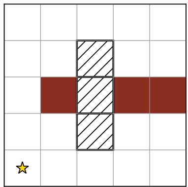
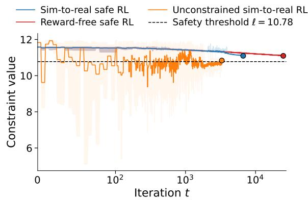
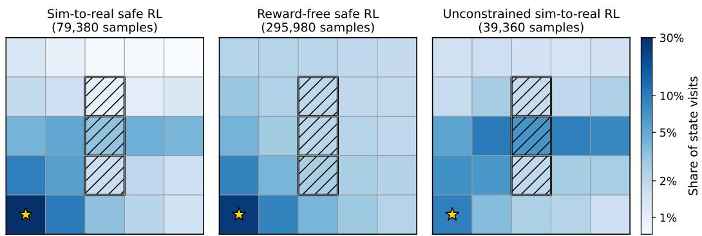
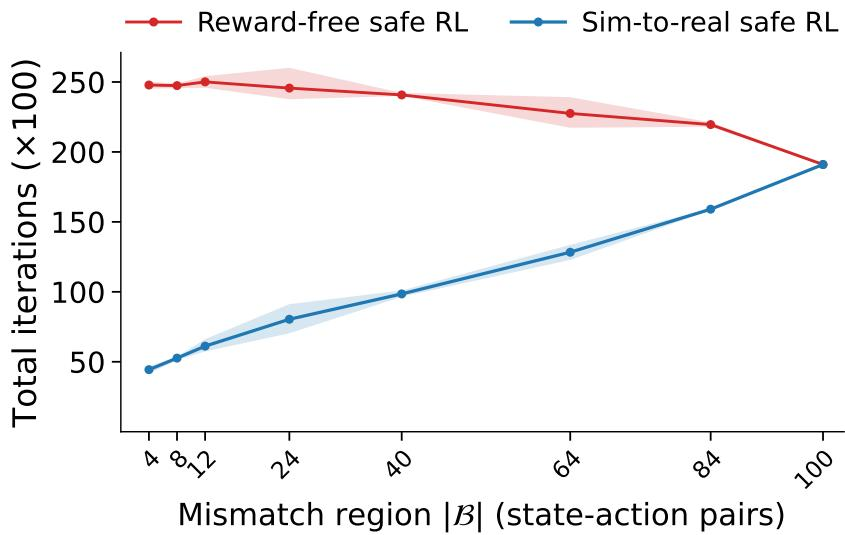
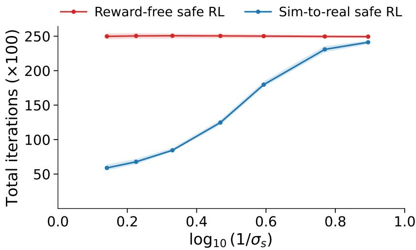
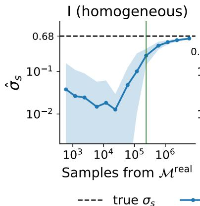
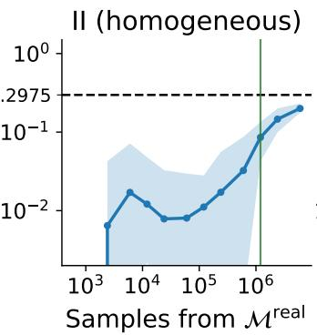
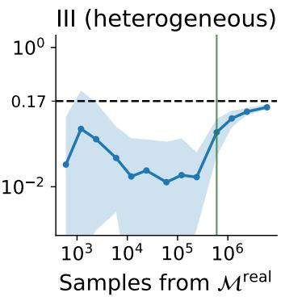

# Provably Safe Sim-to-Real Transfer

Tingting Ni SYCAMORE, EPFL tingting.ni@epfl.ch

Maryam Kamgarpour SYCAMORE, EPFL maryam.kamgarpour@epfl.ch

## Abstract

To mitigate the sample complexity of real-world reinforcement learning (RL), a common practice is to first train a policy in a simulator, where samples are cheap, and then deploy the learned policy in the real world with the hope that it generalizes effectively. Such direct sim-to-real transfer is not guaranteed to succeed: simulator-trained policies can be suboptimal in the real world due to sim-to-real mismatch. Correcting this mismatch requires collecting data from the real system, but in many applications, such as robotics and healthcare, this data-collection process is itself subject to safety constraints. This gives rise to the problem of safe sim-to-real transfer: how can an agent exploit an imperfect simulator while ensuring safe real-world data collection and learning a near-optimal feasible policy for the target system? We address this problem by formulating safe sim-to-real transfer within the framework of reward-free safe RL. We design a computationally efficient algorithm that exploits simulator information to provably reduce real-world interaction while ensuring safe exploration and enabling the computation of a near-optimal feasible policy for any potential reward function. Our real-world sample complexity bound characterizes the benefit of using the simulator in terms of the sim-to-real mismatch.

## 1 Introduction

Over the last decade, reinforcement learning (RL) has achieved remarkable success in domains ranging from games and robotics to the natural sciences [Mnih et al., 2013, Silver et al., 2016, Ouyang et al., 2022, Lee et al., 2020, Degrave et al., 2022]. Despite this progress, deploying RL in real world remains challenging due to two central obstacles: sample complexity and safety. Learning directly on the target system can require many interactions, each of which may be costly and subject to safety requirements, such as collision avoidance in robotics [Haddadin et al., 2009] or compliance with operational constraints in healthcare [Kyrarini et al., 2021].

A common way to reduce costly real-world interaction is to use a simulator. In robotics and control, simulators are often constructed from physical models, system knowledge, or prior calibration, and can provide many cheap interactions. However, the real world is difficult to model perfectly, leading to simto-real mismatch [Tan et al., 2018, Peng et al., 2018]. Consequently, policies optimized in simulation may be suboptimal in the real world. In safety-critical applications, this mismatch is even more problematic: a policy that appears safe in simulation may violate safety constraints after deployment. This motivates safe sim-to-real transfer, where the goal is to exploit cheap simulator access while ensuring that the deployed policy is both near-optimal and feasible on the real system. To incorporate safety requirements, we model environments as constrained Markov decision processes (CMDPs), allowing the agent to learn policies that maximize reward while satisfying safety constraints.

One approach to addressing sim-to-real mismatch is to enlarge the set of environments considered during simulation training. This is often done by assuming a distribution over simulated CMDPs and training policies that are robust across this distribution. For example, As et al. [2026] consider domain randomization for simulated CMDPs and optimize policies under worst-case constraints, while Zhang et al. [2024] study distributionally robust constrained RL. These methods can be viewed as one-shot transfer: the agent learns a policy in simulation that can be safely deployed on the real system. However, they may be conservative: the learned policies are designed to be safe in the real world, but their performance may be suboptimal because they optimize for worst-case or distributional performance rather than performance on the specific real system [Ye et al., 2023]. To reduce this conservatism, one can collect real-world data to fine tune the policy learned in simulation. This data-collection process must itself ensure constraint satisfaction, a requirement commonly referred to as safe exploration [Koller et al., 2018].

This gives rise to safe meta RL, which trains agents over a distribution of simulated CMDPs. When deployed on a real system assumed to be drawn from the same distribution, these agents can fine tune using relatively few real-world interactions while ensuring safe exploration [Ni and Kamgarpour, 2026, Xu and Zhu, 2026]. Among these works, Ni and Kamgarpour [2026] prove that learning a near-optimal policy while ensuring safe exploration requires only $\tilde { \mathcal { O } } ( \varepsilon ^ { - 2 } C ( \mathcal { D } ) ,$ ) real-world samples, with a matching lower bound. Here, C(D) measures the complexity of the environment distribution D. This quantity can be small when D is concentrated on a low-dimensional family of environments, such as tasks described by a few latent parameters, but it can still suffer from the curse of dimensionality when D spreads broadly across the environment space, such as uniform distribution.

Moreover, both one-shot transfer methods and safe meta RL rely on an important coverage assumption: the real system must be drawn from, or at least well covered by, the prescribed family or distribution of simulated CMDPs. This assumption may fail when the simulator is biased. For example, a robot may be trained with randomized friction or actuator parameters in simulation, while the real system exhibits unmodeled delays or contact effects. To handle settings without this coverage assumption, recent sim-to-real RL methods use the simulator to guide real-world data collection, either to correct simulator mismatch [Qu et al., 2025, Wu et al., 2026] or to learn an optimal policy in the real world [Wagenmaker et al., 2024]. However, they are developed for unconstrained settings. Directly applying them in safety-critical systems may lead to unsafe real-world interaction, which is unacceptable in applications such as autonomous driving, surgical robotics, and power-grid control.

Online safe RL methods can ensure safe exploration in the real world. Prior model-based [Yu et al., 2025, Bura et al., 2022, Liu et al., 2021] and model-free [Ni and Kamgarpour, 2025b] methods provide high probability guarantees for learning a near-optimal policy under safe exploration, but they typically assume a single prespecified reward. In practice, reward functions are often iteratively engineered or vary across deployments [Jin et al., 2020, Ménard et al., 2021]; for example, in autonomous driving, different rewards may encode different target locations. Collecting new realworld data for each reward is therefore highly sample inefficient. This motivates reward-free safe RL [Miryoosefi and Jin, 2022, Huang et al., 2023], where the agent explores the environment without a prespecified reward, and later uses the learned information for planning under arbitrary reward functions. Specifically, after data collection, the agent should be able to compute a near-optimal feasible policy for any given reward without further real-world interaction. However, Miryoosefi and Jin [2022] do not ensure safe exploration during data collection, while Huang et al. [2023] ensure safe exploration but require solving a constrained nonconvex optimization problem to compute exploration policies, which is intractable in general.1 Moreover, these works are fully online and do not leverage simulators, which can be sample inefficient especially when simulator information is available.

This motivates safe sim-to-real transfer without a simulator coverage assumption: how can an agent leverage a simulator to reduce real-world interaction while ensuring safe exploration and reward-free planning in the real system? We summarize our contributions below:

1. We formulate safe sim-to-real transfer as a reward-free safe RL problem, where the agent uses a simulator and limited real-world interaction under safe exploration guarantees to support accurate reward-free planning. We propose a computationally efficient algorithm that identifies reliable simulator regions, uses certified simulator transitions to reduce real-world interaction, and correct sim-to-real mismatch with collected real-world data.

2. For our algorithm, we provide high-probability guarantees for safe real-world exploration and accurate reward-free planning; see Theorem 4.1. The sample-complexity bound characterizes the benefit of simulator access through the size of the mismatch region and the separation gap. When the sim-to-real mismatch is large, our framework recovers the fully online setting of Huang et al. [2023] and improves upon its sample-complexity bound. Additional comparisons with prior work are provided in Table 2.

3. We validate our theoretical results in a safety-critical gridworld environment. Our experiments show that the benefit of using the simulator is larger when the sim-to-real mismatch is smaller.

## 2 Problem setting

We first review background on constrained Markov decision processes (CMDPs), then formally state the safe sim-to-real transfer problem and its underlying assumptions.

Notation. Let N and R denote the sets of natural numbers and real numbers, respectively. For a set $x ,$ $\Delta ( \mathcal { X } )$ denotes the probability measure over $x ,$ , and $| \mathcal { X } |$ denotes its cardinality. For any $p , q \in \Delta ( \mathcal { X } )$ their total variation distance is defined as $\begin{array} { r } { \Vert p - q \Vert _ { \mathrm { T V } } : = \frac { 1 } { 2 } \sum _ { x \in \mathcal { X } } | p ( x ) - q ( x ) | } \end{array}$ . For any integer m, we set $[ m ] : = \{ 1 , \dots , m \}$ . For any scalar $z \in \mathbb { R }$ , we denote its positive part by $[ z ] _ { + } : = \operatorname* { m a x } \{ z , 0 \}$ Logical conjunction and disjunction are denoted by ∧ and $\vee ,$ , respectively.

## 2.1 Constrained Markov Decision Processes

We consider a CMDP defined by a tuple $\mathcal { M } = ( \mathcal { S } , \mathcal { A } , H , P , s _ { 1 } , \mathcal { F } , c )$ , where $s$ and $\mathcal { A }$ are finite state and action spaces, and H is the horizon. The transition dynamics are given by ${ \cal P } : = \{ { \cal P } _ { h } \} _ { h = 1 } ^ { H } ,$ where $P _ { h } ( s ^ { \prime } | s , a )$ denotes the probability of transitioning from state s to state $s ^ { \prime }$ after taking action a at timestep $h \in [ H ]$ Without loss of generality, each iteration starts from a fixed initial state $s _ { 1 } \in \mathcal S . ^ { 2 }$ In addition, the CMDP may be equipped with a class of deterministic utility functions3 $\begin{array} { r } { \mathcal { F } : =  f =  f _ { h }  _ { h = 1 } ^ { H } \big | f _ { h } : \mathcal { S } \times \mathcal { A }  [ 0 , 1 ] , \mathcal { \hat { \forall } } \hat { h } \in [ H ]  } \end{array}$ . Each $f \in { \mathcal { F } }$ measures the performance of a policy, which we introduce next. Among these utility functions, the constraint function $c \in { \mathcal { F } }$ encodes the safety requirement.

A Markov policy $\pi = \{ \pi _ { h } \} _ { h = 1 } ^ { H }$ is a collection of mappings $\pi _ { h } : S \to \Delta ( { \mathcal { A } } )$ , and we let Π denote the set of all such policies. Given a utility function $\bar { f } \in \bar { \mathcal { F } }$ , the agent interacts with M as follows. Starting from the initial state $s _ { 1 }$ , at each timestep $h ,$ it selects an action $a _ { h } \sim \pi _ { h } ( \cdot \mid s _ { h } )$ , receives utility $f _ { h } ( s _ { h } , a _ { h } )$ , and transitions to the next state $s _ { h + 1 } \sim P _ { h } ( \cdot \mid s _ { h } , a _ { h } )$ . To measure the cumulative utility collected by π under dynamics $P _ { \mathrm { { : } } }$ , we define the state-action value function for each timestep $h$ and $f \in { \mathcal { F } }$ as $\begin{array} { r } { Q _ { f , h } ^ { P , \pi } ( s , a ) = \mathbb { E } _ { P , \pi } [ \sum _ { h ^ { \prime } = h } ^ { H } f _ { h ^ { \prime } } ( s _ { h ^ { \prime } } , a _ { h ^ { \prime } } ) \mid ( s _ { h } , a _ { h } ) = ( s , a ) ] } \end{array}$ , and the corresponding state value function as $\begin{array} { r } { V _ { f , h } ^ { P , \pi } ( s ) = \mathbb { E } _ { P , \pi } [ \sum _ { h ^ { \prime } = h } ^ { H } f _ { h ^ { \prime } } ( s _ { h ^ { \prime } } , a _ { h ^ { \prime } } ) \mid s _ { h } = s ] } \end{array}$ . We call a policy π feasible in M if its constraint value satisfies $V _ { c , 1 } ^ { P , \pi } ( s _ { 1 } ) \geq \ell ,$ , where $\ell \in [ 0 , H ]$ is a prescribed safety threshold. The set of feasible policies is defined as $\Pi _ { \mathrm { f e a s } } ^ { P } : = \{ \pi \in \Pi \mid V _ { c , 1 } ^ { P , \pi } ( s _ { 1 } ) \geq \ell \}$ . And we call π strictly feasible if $V _ { c , 1 } ^ { P , \pi } ( s _ { 1 } ) > \ell .$

## 2.2 Safe sim-to-real transfer

In safe sim-to-real transfer, the agent has full access to a simulator during learning but is ultimately deployed in the real world. The goal is to exploit cheap simulator access so that the learned policies are feasible and near-optimal in the real world. However, two challenges remain.

First, the simulator is only an approximation of the real world, and this mismatch may cause a policy that is feasible or optimal in simulation to become unsafe or suboptimal in the real world. Thus, simulator access alone is not sufficient: the agent must collect some real-world data to learn or correct for this mismatch. Second, the task objective may vary across deployments, such as when the agent must reach different target locations. We therefore allow the reward function to range over a family $\mathcal { F }$ of possible reward functions. In contrast, we assume a common constraint function $c ,$ since the simulator is intended to model the same physical system in which the learned policy will ultimately operate. Consequently, safety specifications, such as collision avoidance in autonomous driving or joint limits in robotic manipulation, are determined by the underlying real system and remain unchanged across simulation and deployment. However, collecting new real-world data for every reward function would be highly sample inefficient.

These considerations motivate a hybrid, reward-free safe RL formulation. In online RL, the agent learns only through interactions with the real world. By contrast, hybrid RL [Song et $\mathrm { a l . , } 2 0 2 3 ,$ Xie et al., 2021] allows the agent to leverage both simulator information and real-world interactions, making it well suited for correcting sim-to-real mismatch with limited real-world data. To accommodate varying reward functions under safety constraints, we further adopt the reward-free safe RL perspective [Miryoosefi and Jin, 2022, Huang et al., 2023]: the agent first learns a real-world dynamics model, which can then be used to compute near-optimal feasible policies for any reward function in $\mathcal { F }$ . Combining these two perspectives, we formulate the learning problem as follows.

During learning, the agent can interact with the real world $\mathcal { M } ^ { \mathrm { r e a l } } = ( \mathcal { S } , \mathcal { A } , H , P ^ { \mathrm { r e a l } } , s _ { 1 } , \mathcal { F } , c )$ by rolling out policies. A rollout of policy π generates a trajectory $\tau ^ { \pi } = \{ s _ { h } , a _ { h } , s _ { h + 1 } \} _ { h = 1 } ^ { H } .$ , where $a _ { h } \sim \pi _ { h } ( \cdot \mid s _ { h } )$ and $s _ { h + 1 } \sim P _ { h } ^ { \mathrm { r e a l } } ( \cdot \mid s _ { h } , a _ { h } )$ . The agent also has full knowledge of the simulator $\mathcal { M } ^ { \mathrm { s i m } } = ( \mathcal { S } , \mathcal { A } , H , P ^ { \mathrm { s i m } } , s _ { 1 } , \mathcal { F } , c )$ , which differs from $\mathcal { M } ^ { \mathrm { r e a l } }$ only in its transition dynamics.

Since data collection occurs in the real world, where constraint violations such as collisions in autonomous navigation are not permitted, every policy deployed in $\mathcal { M } ^ { \mathrm { r e a l } }$ must satisfy the safety constraint. We formalize this requirement as safe exploration.

Definition 2.1 (Safe exploration). An algorithm that produces a sequence of policies $\{ \pi ^ { t } \} _ { t = 1 } ^ { T }$ ensures safe exploration in $\mathcal { M } ^ { \mathrm { r e a l } } \ i f \pi ^ { t }$ isfeasible in $\mathcal { M } ^ { \mathrm { r e a l } }$ for every $t \in [ T ]$

Objective. Design an algorithm that ensures safe exploration in $\mathcal { M } ^ { \mathrm { r e a l } }$ during data collection and, for any rewardfunction $r \in \mathcal { F }$ , computes withoutfurther real-world interaction a policy π satisfying

(Near-optimality) $V _ { r , 1 } ^ { { P ^ { \mathrm { r e a l } } } , \pi ^ { \star } } ( s _ { 1 } ) - V _ { r , 1 } ^ { { P ^ { \mathrm { r e a l } } } , \pi } ( s _ { 1 } ) \le \epsilon$ and (Feasibility) $\pi \in \Pi _ { \mathrm { f e a s } } ^ { P ^ { \mathrm { r e a l } } }$

(1)

where $\pi ^ { \star } \in \arg \operatorname* { m a x } _ { \pi \in \Pi _ { \mathrm { f e a s } } ^ { P ^ { \mathrm { r e a l } } } } V _ { r , 1 } ^ { P ^ { \mathrm { r e a l } } , \pi } \big ( s _ { 1 } \big )$

We say that the algorithm achieves ϵ-planning accuracy if the above condition holds for all $r \in \mathcal { F }$ The efficiency of the algorithm is measured by the number of state-action pairs sampled from real world, which we refer to as the sample complexity.

## 2.3 Assumptions

To achieve this objective, we make two assumptions, both of which we will discuss in our experimental setup (see Section 5). The first is a standard Slater-type condition in safe RL [Bura et al., 2022, Yu et al., 2025, Ni and Kamgarpour, 2025b]: safe exploration requires a baseline policy that is strictly feasible in $\mathcal { M } ^ { \mathrm { r e a l } }$

Assumption 2.2 (Slater’s condition). There exist a known constant $\xi > 0$ and a known policy $\pi ^ { 0 } \in \Pi$ such that $V _ { c , 1 } ^ { P ^ { \mathrm { r e a l } } , \pi ^ { 0 } } ( s _ { 1 } ) \geq \ell + \xi .$

The strict margin serves two purposes. Algorithmically, it provides a safety buffer that allows the agent to introduce exploratory behavior while maintaining feasibility. Statistically, it is required for finite-sample safety certification: if the baseline policy were only exactly feasible, that $\mathbf { i s } , \mathbf { i f } \xi = 0$ then estimation error arising from estimating its constraint value using rollouts of $\pi ^ { \mathrm { { 0 } } }$ in $\mathcal { M } ^ { \mathrm { r e a l } }$ could make it impossible to reliably distinguish the baseline policy from an infeasible one.

Next, we adopt an assumption commonly used in hierarchical RL [Chua et al., 2023], meta RL [Chen et al., 2022, Mutti and Tamar, 2024, Brunskill and Li, 2013], and hybrid RL [Qu et al., 2025] to characterize the difference between two MDPs. In our setting, this difference corresponds to the mismatch between $\mathcal { M } ^ { \mathrm { r e a l } }$ and $\mathcal { M } ^ { \mathrm { s i m } }$ . The assumption requires this mismatch in transition dynamics to be statistically identifiable: for each time-state-action triple, the real-world and simulator transition kernels are either identical or well separated. We formalize this condition as follows.

Assumption $2 . 3 \ : ( \sigma _ { s }$ -separable shift). There exists a known constant $\sigma _ { s } \in ( 0 , 1 ]$ such that, for every $( h , s , a ) \in [ H ] \times \mathcal { S } \times \bar { \mathcal { A } }$

$$
\begin{array} { r } { P _ { h } ^ { \mathrm { r e a l } } ( \cdot  { | } s , a ) \neq P _ { h } ^ { \mathrm { s i m } } ( \cdot  { | } s , a ) \Longrightarrow \left\| P _ { h } ^ { \mathrm { r e a l } } ( \cdot  { | } s , a ) - P _ { h } ^ { \mathrm { s i m } } ( \cdot  { | } s , a ) \right\| _ { \mathrm { T V } } \geq \sigma _ { s } . } \end{array}
$$

This separation condition ensures that mismatch $( h , s , a )$ triples can be distinguished from nonmismatch ones using finitely many real-world samples, where $\sigma _ { s }$ quantifies the magnitude of the mismatch in total variation distance. Without prior knowledge of $\sigma _ { s } .$ , simulator knowledge may not be reliably exploitable. Indeed, Cheung and Lyu [2024] show that, in multi-armed bandits with access to a mismatch simulator $\mathcal { M } ^ { \mathrm { s i m } }$ , no hybrid method can be guaranteed to outperform an online method without prior knowledge of $\sigma _ { s }$ . Since multi-armed bandits are a special case of MDPs with horizon $H = 1$ , this suggests that such prior shift information is also necessary in our setting.

Under Assumption 2.3, we define the mismatch region as the set of $( h , s , a )$ triples at which the real-world and simulator transition kernels differ.

Definition 2.4 (Mismatch region). The mismatch region B is defined as

$$
\begin{array} { r } { \mathcal { B } = \left\{ ( h , s , a ) \in [ H ] \times \mathcal { S } \times \mathcal { A } : P _ { h } ^ { \mathrm { r e a l } } ( \cdot \vert s , a ) \neq P _ { h } ^ { \mathrm { s i m } } ( \cdot \vert s , a ) \right\} . } \end{array}
$$

When the simulator accurately models the real world, the mismatch region B is small.

## 3 Algorithm Design

In this section, we present our algorithm for safe sim-to-real transfer. The algorithm exploits simulator knowledge to reduce real-world interactions while ensuring safe exploration and ϵ-accurate planning for any reward $r \in \mathcal { F }$ . Our approach is inspired by the algorithm of Huang et al. [2023], referred to as RF-RL, which achieves the guarantees in Objective in the online RL setting. Directly applying RF-RL in our setting presents two challenges. First, RF-RL learns solely through interactions with $\mathcal { M } ^ { \mathrm { r e a l } }$ and therefore cannot exploit simulator knowledge to reduce real-world sample complexity. Second, inspired by the unconstrained reward-free RL approach of Ménard et al. [2021], they compute the exploration policy by solving a constrained non-convex optimization problem, which is generally intractable.

Our algorithm, presented in Algorithm 1, addresses these challenges by three components. First, it maintains confidence bounds around the empirical transition model constructed from real-world data and uses them to shrink the estimated mismatch region, which is initialized as the entire time-state-action space. Second, it constructs a hybrid model that uses empirical real-world transitions on the estimated mismatch region and simulator transitions elsewhere. Compared with the online RL setting in Huang et al. [2023], it improves sample efficiency by avoiding the need to relearn transition dynamics in the non-mismatch region. Third, it efficiently computes a safe exploration policy that visits the parts of the estimated mismatch region where real-world transition uncertainty can affect reward-free planning. Our algorithm is summarized below.

Estimating the mismatch region. We start by initializing the estimated mismatch region as the entire time-state-action space, $\hat { B } ^ { 0 } = \left[ H \right] \times \mathcal { S } \times \mathcal { A }$ , as in Line 1 of Algorithm 1. In Line 3, the algorithm iteratively shrinks this region by removing triples estimated to be non-mismatch. At the beginning of each iteration t, given the trajectories $\{ \tau ^ { i } \} _ { i = 1 } ^ { t - 1 }$ collected from $\mathcal { M } ^ { \mathrm { r e a l } }$ during previous iterations, we define the visitation counts for each $( h , s , \bar { a } ) \stackrel { \cdot } { \in } [ H ] \times \mathcal { S } \times \mathcal { A }$ as

$$
n _ { h } ^ { t } ( s , a ) : = \sum _ { i = 1 } ^ { t - 1 } \mathbf { 1 } _ { \{ ( s _ { h } ^ { i } , a _ { h } ^ { i } ) = ( s , a ) \} } , ~ n _ { h } ^ { t } ( s , a , s ^ { \prime } ) : = \sum _ { i = 1 } ^ { t - 1 } \mathbf { 1 } _ { \{ ( s _ { h } ^ { i } , a _ { h } ^ { i } , s _ { h + 1 } ^ { i } ) = ( s , a , s ^ { \prime } ) \} } .
$$

The empirical transition model estimated from real-world data is defined as

$$
\hat { P } _ { h } ^ { t , \mathrm { r e a l } } ( s ^ { \prime } \mid s , a ) : = \mathbf { 1 } _ { \{ n _ { h } ^ { t } ( s , a ) > 0 \} } \frac { n _ { h } ^ { t } ( s , a , s ^ { \prime } ) } { n _ { h } ^ { t } ( s , a ) } + \mathbf { 1 } _ { \{ n _ { h } ^ { t } ( s , a ) = 0 \} } \frac { 1 } { | S | } .\tag{2}
$$

As shown in Lemma C.1, its statistical uncertainty is quantified by the confidence bound

$$
\rho _ { h } ^ { t } ( s , a ) = \operatorname* { m i n } \left\{ 1 , \sqrt { \beta ( n _ { h } ^ { t } ( s , a ) , \delta ) / ( 2 n _ { h } ^ { t } ( s , a ) \vee 1 ) } \right\} ,
$$

where $\beta ( n , \delta ) : = \log ( 2 | S | | A | H / \delta ) + | S | \log ( 8 e ( n + 1 ) )$

A triple $( h , s , a )$ is classified as a non-mismatch triple only when its empirical real-world transition model $\hat { P } _ { h } ^ { t , \mathrm { r e a l } } ( \cdot \mid s , a )$ is sufficiently close to the simulator transition model $P _ { h } ^ { \mathrm { s i m } } ( \cdot \mid s , a )$ , after

Algorithm 1 Sim-to-real safe RL   
Require: A strictly feasible baseline policy $\pi ^ { 0 }$ with margin $\xi ,$ safety threshold $\ell ,$ mismatch parameter   
$\sigma _ { s } ,$ accuracy $\varepsilon ,$ simulator information $\mathcal { M } ^ { \mathrm { s i m } }$ , and access to $\dot { \mathcal { M } } ^ { \mathrm { r e a l } }$   
1: Initialize $n _ { h } ^ { 0 } ( s , a ) \gets 0$ for all $( h , s , a ) \in [ H ] \times S \times A .$ and initialize $\hat { B } ^ { 0 } \gets [ H ] \times \mathcal { S } \times \mathcal { A }$   
2: for $t = 1 , \ddot { 2 } , \ldots$ do   
3: Construct $\hat { B } ^ { t }$ as in Equations (3) and (4) // Estimating the mismatch region   
4: Construct ${ \hat { P } } ^ { t }$ as in Equations (2) and (5) // Constructing the hybrid model   
5: if $V _ { c , 1 } ^ { \hat { P } ^ { t } , \pi ^ { 0 } } ( s _ { 1 } ) < \ell + \bar { \xi } / 2$ then   
6: $\pi ^ { t }  \pi ^ { 0 }$   
7: else   
8: $\bar { \pi } ^ { t } \in$ arg max $\hat { \pi } \in \Pi _ { \mathrm { f e a s } } ^ { \hat { P } ^ { t } }  &  V _ { b , 1 } ^ { \hat { P } ^ { t } , \pi } \big ( s _ { 1 } \big ) .$   
$\Delta ^ { t } \gets \operatorname* { m i n } \left\{ H , 3 e \sqrt { H V _ { b , 1 } ^ { \hat { P } ^ { t } , \bar { \pi } ^ { t } } ( s _ { 1 } ) } + H V _ { b , 1 } ^ { \hat { P } ^ { t } , \bar { \pi } ^ { t } } ( s _ { 1 } ) \right\}$ Computing safe   
9:   
exploration policy   
10: if $\Delta ^ { t } \leq \varepsilon / 2$ then   
11: break the for loop   
12: end if   
13: $\pi ^ { t }  \alpha ^ { t } \bar { \pi } ^ { t } + ( 1 - \alpha ^ { t } ) \pi ^ { 0 }$ , where $\alpha ^ { t }$ is defined in Equation (9)   
14: end if   
15: Roll out $\pi ^ { t }$ in $\mathcal { M } ^ { \mathrm { r e a l } }$ and observe $\tau ^ { t } : = \{ ( s _ { h } ^ { t } , a _ { h } ^ { t } , s _ { h + 1 } ^ { t } ) \} _ { h = 1 } ^ { H }$   
16: end for   
17: return ${ \hat { P } } ^ { t }$ and $\pi ^ { \mathrm { o u t } } \in$ arg maxπ∈Π $\left\{ V _ { r , 1 } ^ { \hat { P } ^ { t } , \pi } ( s _ { 1 } ) : V _ { c , 1 } ^ { \hat { P } ^ { t } , \pi } ( s _ { 1 } ) \geq \ell + \varepsilon / 2 \right\}$ for any $r \in \mathcal { F }$

accounting for confidence bound $\rho _ { h } ^ { t } ( s , a )$ of $\hat { P } _ { h } ^ { t , \mathrm { r e a l } } ( \cdot \mid s , a )$ . Specifically, define

$$
\begin{array} { r } { \mathcal { G } ^ { t } : = \Bigl \{ ( h , s , a ) \in \hat { \mathcal { B } } ^ { t - 1 } : \Big \| \hat { P } _ { h } ^ { t , \mathrm { r e a l } } ( \cdot \vert s , a ) , P _ { h } ^ { \mathrm { s i m } } ( \cdot \vert s , a ) \Big \| _ { \mathrm { T V } } + \rho _ { h } ^ { t } ( s , a ) \leq \sigma _ { s } / 2 \Bigr \} . } \end{array}\tag{3}
$$

The threshold $\sigma _ { s } / 2$ is chosen using Assumption 2.3: every mismatch triple is at least $\sigma _ { s }$ away from the simulator in total variation distance and therefore cannot belong to $\mathcal { G } ^ { t }$ . We then update the estimated mismatch region as

$$
\begin{array} { r } { \hat { B } ^ { t } : = \hat { B } ^ { t - 1 } \setminus \mathcal { G } ^ { t } . } \end{array}\tag{4}
$$

Lemma C.3 shows that, with high probability, no mismatch triple is removed. In particular, ${ \hat { B } } ^ { t }$ is monotonically decreasing in t and satisfies $B \subseteq { \hat { B } } ^ { t }$ for every iteration t.

Constructing the hybrid model. Given the estimated mismatch region ${ \hat { B } } ^ { t }$ , we construct the hybrid model, as in Line 4 of Algorithm 1,

$$
\hat { P } _ { h } ^ { t } ( \cdot \mid s , a ) : = \mathbf { 1 } _ { \{ ( h , s , a ) \in \hat { \mathcal { B } } ^ { t } \} } \hat { P } _ { h } ^ { t , \mathrm { r e a l } } ( \cdot \mid s , a ) + \mathbf { 1 } _ { \{ ( h , s , a ) \notin \hat { \mathcal { B } } ^ { t } \} } P _ { h } ^ { \mathrm { s i m } } ( \cdot \mid s , a ) .\tag{5}
$$

Thus, the algorithm uses empirical real-world transition estimates on triples that may still be mismatch and reuses simulator transition dynamics elsewhere.

Computing safe exploration policy. Given the hybrid model ${ \hat { P } } ^ { t }$ , we seek a safe policy that visits the parts of the estimated mismatch region where real-world transition uncertainty can affect reward free planning. Since reward-free planning error is captured by the value estimation error $e _ { f , 1 } ^ { t , \pi } ( s _ { 1 } ) : =$ $\vert V _ { f , 1 } ^ { P ^ { \mathrm { r e a l } } , \pi } ( s _ { 1 } ) - V _ { f , 1 } ^ { \hat { P } ^ { t } , \pi } ( s _ { 1 } ) \vert$ for any policy π and utility function $f \in { \mathcal { F } }$ , the ideal exploration objective is

$$
\operatorname* { m a x } _ { f \in \mathcal { F } , \pi \in \Pi _ { \mathrm { f e a s } } ^ { P ^ { \mathrm { r e a l } } } } e _ { f , 1 } ^ { t , \pi } ( s _ { 1 } )\tag{6}
$$

Solving this problem would yield a safe policy that collects real-world data in the regions most relevant to reducing the value estimation error. And the algorithm could then use these data to refine the hybrid model. However, this problem depends on the unknown real-world transition model and therefore cannot be optimized directly. Instead, we introduce the following lemma, which gives a computable certificate that upper-bounds this value estimation error $e _ { f , 1 } ^ { t , \pi } ( s _ { 1 } )$

Lemma 3.1. With probability at least $1 - \delta , f o r$ every iteration t, policy π, and utility function $f \in { \mathcal { F } } ,$

$$
e _ { f , 1 } ^ { t , \pi } ( s _ { 1 } ) \leq \operatorname* { m i n } \left\{ 3 e \sqrt { H V _ { b , 1 } ^ { \hat { P } ^ { t } , \pi } ( s _ { 1 } ) } + H V _ { b , 1 } ^ { \hat { P } ^ { t } , \pi } ( s _ { 1 } ) , H \right\} .
$$

Here, for every $h \in [ H ] , s \in { \mathcal { S } } ,$ , and $\pi \in \Pi ,$

$$
V _ { b , h } ^ { \hat { P } ^ { t } , \pi } ( s ) : = \mathbb { E } _ { \hat { P } ^ { t } , \pi } \left[ \sum _ { h ^ { \prime } = h } ^ { H } ( 1 + 1 / H ) ^ { h ^ { \prime } - h } b _ { h ^ { \prime } } ^ { t } ( s _ { h ^ { \prime } } , a _ { h ^ { \prime } } ) \mid s _ { h } = s \right] ,
$$

and for every $h \in [ H ] , s \in S ,$ , and $a \in { \mathcal { A } } ,$

$$
b _ { h } ^ { t } ( s , a ) : = \mathbf { 1 } _ { \{ ( h , s , a ) \in \hat { \mathcal { B } } ^ { t } \} } \operatorname* { m i n } \left\{ \frac { 1 1 H \beta ( n _ { h } ^ { t } ( s , a ) , \delta ) } { n _ { h } ^ { t } ( s , a ) \vee 1 } , 1 \right\} .
$$

The proof of Lemma 3.1 is provided in Appendix C.3. The bonus $b _ { h } ^ { t } ( s , a )$ is inspired by Ménard et al. [2021]: it is large when the empirical model $\hat { P } _ { h } ^ { t } ( \cdot \mid s , a )$ has high uncertainty over $( h , s , a )$ Unlike Ménard et al. [2021], our bonus is restricted to the estimated mismatch region and is zero outside it, since triples outside this region have been certified as non-mismatch with high probability and therefore introduce no real-world transition-estimation error. Consequently, $V _ { b , 1 } ^ { \hat { P } ^ { t } , \pi } ( s _ { 1 } )$ , which accumulates these bonuses along trajectories under π, upper bounds the value-estimation error. 4 As more real-world data are collected, $b _ { h } ^ { t } ( s , a )$ decreases, and so does $V _ { b , 1 } ^ { \hat { P } ^ { t } , \pi } ( s _ { 1 } )$

Lemma 3.1 shows that $V _ { b , 1 } ^ { \hat { P } ^ { t } , \pi } ( s _ { 1 } )$ is a computable upper bound on the unknown value-estimation error $e _ { f , 1 } ^ { t , \pi } ( s _ { 1 } )$ , uniformly over all policies $\pi \in \Pi$ and utility functions $f \in { \mathcal { F } }$ . Therefore, we approximate Problem (6) by replacing its objective $e _ { f , 1 } ^ { t , \pi } ( s _ { 1 } )$ with $V _ { b , 1 } ^ { \hat { P } ^ { t } , \pi } ( s _ { 1 } )$ , and its real-world feasible set $\Pi _ { \mathrm { f e a s } } ^ { P ^ { \mathrm { r e a l } } }$ with the hybrid-model feasible set $\Pi _ { \mathrm { f e a s } } ^ { \hat { P } ^ { t } }$ . This gives the following computable optimization problem:

$$
\bar { \pi } ^ { t } \in \arg \operatorname* { m a x } _ { \pi \in \Pi _ { \mathrm { f e a s } } ^ { \hat { P } ^ { t } } } V _ { b , 1 } ^ { \hat { P } ^ { t } , \pi } ( s _ { 1 } ) .\tag{7}
$$

This is a standard CMDP defined by the hybrid model ${ \hat { P } } ^ { t }$ , with reward given by the bonus function $b ^ { t }$ and constraint given by c. It can be solved efficiently using existing CMDP solvers, such as constrained policy optimization [Achiam et al., 2017], or exactly via linear programming in the occupancy-measure formulation [Altman, 2021].

Before solving (7), Algorithm 1 checks whether the feasible set $\Pi _ { \mathrm { f e a s } } ^ { \hat { P } ^ { t } }$ is empty. Line 5 verifies whether the hybrid model ${ \hat { P } } ^ { t }$ gives sufficient safety margin for the strictly feasible baseline policy $\pi ^ { 0 }$ If not, Line 6 uses $\pi ^ { 0 }$ as the safe exploration policy. Otherwise, Line 8 solves (7) to obtain $\bar { \pi } ^ { t }$ , the empirically feasible policy with the largest value estimation error. Its estimation error is bounded by

$$
\Delta ^ { t } : = \operatorname* { m i n } \left\{ H , 3 e \sqrt { H V _ { b , 1 } ^ { \hat { P } ^ { t } , \bar { \pi } ^ { t } } ( s _ { 1 } ) } + H V _ { b , 1 } ^ { \hat { P } ^ { t } , \bar { \pi } ^ { t } } ( s _ { 1 } ) \right\} .\tag{8}
$$

$\Delta ^ { t }$ is used in two places. First, it serves as the stopping criterion: when $\Delta ^ { t } \leq \varepsilon / 2$ , Algorithm 1 terminates at Line 11, since the hybrid model is accurate enough for reward-free planning under the tightened constraint in Line 17, as formalized by Lemma C.6. Second, it bounds the possible constraint violation of $\bar { \pi } ^ { t }$ in $\mathcal { M } ^ { \mathrm { r e a l } }$ , since $\bar { \pi } ^ { t }$ is guaranteed to be feasible only under the hybrid model. Indeed,

$$
V _ { c , 1 } ^ { P ^ { \mathrm { r e a l } } , \bar { \pi } ^ { t } } ( s _ { 1 } ) \geq V _ { c , 1 } ^ { \hat { P } ^ { t } , \bar { \pi } ^ { t } } ( s _ { 1 } ) - \Delta ^ { t } \geq \ell - \Delta ^ { t } .
$$

Thus, $\bar { \pi } ^ { t }$ violates the safety constraint in $\mathcal { M } ^ { \mathrm { r e a l } }$ by at most $\Delta ^ { t }$

To offset this possible violation and ensure safe exploration, the algorithm mixes $\bar { \pi } ^ { t }$ with the strictly feasible baseline policy $\pi ^ { 0 }$ . We use the following notion of a mixture policy.

Definition 3.2 (Mixture policy). A mixture policy is defined as $\textstyle \pi : = \sum _ { k = 1 } ^ { K } d _ { k } \pi _ { k }$ , where $\{ \pi _ { k } \} _ { k = 1 } ^ { K } \subset$ Π and $\{ d _ { k } \} _ { k = 1 } ^ { K } \in \Delta ( K )$ . It is implemented by sampling an index $i \sim \{ d _ { k } \} _ { k = 1 } ^ { K }$ once at the beginning and then executing the corresponding policy πi for all timesteps.

Specifically, Line 13 of Algorithm 1 defines the exploration policy as

$$
\pi ^ { t } : = \alpha ^ { t } \bar { \pi } ^ { t } + ( 1 - \alpha ^ { t } ) \pi ^ { 0 } , \alpha ^ { t } : = \xi / ( \xi + \left( \ell + \Delta ^ { t } - V _ { c , 1 } ^ { \hat { P } ^ { t } , \bar { \pi } ^ { t } } ( s _ { 1 } ) \right) _ { + } ) .\tag{9}
$$

Here, $\alpha ^ { t }$ is chosen so that the strict feasibility margin of $\pi ^ { 0 }$ compensates for the possible real-world constraint violation of $\bar { \pi } ^ { t }$

## 4 Theoretical Guarantees

In this section, we formalize the theoretical guarantees of our algorithm, including the real-world sample complexity required for safe exploration and ϵ-accurate planning. The main result is stated below. Theorem 4.1. Let Assumptions 2.2 and $2 . 3$ hold. For $\epsilon \in ( 0 , H ]$ and $\delta \in ( 0 , 1 )$ , set $\varepsilon = \xi \epsilon / ( 2 H )$ . Then, with probability at least 1 − δ, Algorithm 1 requires at most

$$
\tilde { \mathcal { O } } \Big ( \operatorname* { m a x } \{ \underbrace { H ^ { \theta } | S | } _ { \langle i \rangle } | \mathcal { B } | , \underbrace { H ^ { \theta } | S | } _ { \langle i \rangle } \big ( H | \mathcal { S } | | A | - | \mathcal { B } | \big ) \log ^ { 2 } \sigma _ { s } { } ^ { - 1 } \Big \} \Big )
$$

samples from $\mathcal { M } ^ { \mathrm { r e a l } }$ and guarantees the following:

1. Safe exploration. Every executed policy isfeasible in $\mathcal { M } ^ { \mathrm { r e a l } }$

2. Planning accuracy. For any $r \in { \mathcal { F } } ,$ , the output policy $\pi ^ { \mathrm { { o u t } } }$ isfeasible and ϵ-optimalfor the true CMDP defined by max π∈ΠP real feas $V _ { r , 1 } ^ { P ^ { \mathrm { r e a l } } , \pi } ( s _ { 1 } )$

The sample complexity of Algorithm 1 reflects two statistically different tasks. Term (i) is the cost of learning the real dynamics on the mismatch region B, and it scales linearly with |B|. Term (ii) is the cost of certifying the remaining triples as non-mismatch triples; it scales linearly with $H | S | | A | - | B |$ and polynomial with log $\sigma _ { s } ^ { - 1 }$ . Thus, larger separation makes non-mismatch triples easier to identify. Overall, the bound shows that Algorithm 1 adaptively balances using the simulator with learning the real dynamics, paying the real-dynamics learning cost primarily on the mismatch region.

The RF-RL algorithm of Huang et al. [2023] uses $\widetilde { \mathcal { O } } \bigl ( | | A | | S | ^ { 2 } H ^ { 8 } / ( \epsilon ^ { 2 } \xi ^ { 4 } ) \bigr )$ samples from $\mathcal { M } ^ { \mathrm { r e a l } }$ to obtain same guarantees as in Theorem 4.1, but in the online setting.5 By comparison, our algorithm improves on this benchmark in two ways. First, it is computationally efficient: whereas Huang et al. [2023] compute their exploration policy by solving a constrained non-convex program, we replace this step with a standard CMDP problem. Second, our algorithm recovers the online setting as a special case by taking $\begin{array} { r } { B = [ H ] \times \mathbf { \bar { \mathcal { S } } } \times \mathbf { \mathcal { A } } } \end{array}$ , so that every triple is treated as a mismatch triple and the simulator is never used. In this worst-case regime, and when $\epsilon \leq$ min{1, ξ}, our sample complexity improves over Huang et al. [2023] by a factor of $H / \xi ^ { 2 }$ , showing that part of the gain comes from the algorithmic design itself. The improvement is even larger when the simulator is accurate on most triples, $| B | \ll { \breve { H } } | S | | A |$ , and the mismatch is well-seperated, $\sigma _ { s } \gg 0$ . In this case, real-world interaction is concentrated on the small region where the simulator differs substantially from the real world, yielding a total saving of order $\widetilde { \mathcal { O } } ( H ^ { 2 } | S | | \mathcal { A } | / ( \xi ^ { 2 } | B | ) )$ ). Thus, our algorithm preserves safe exploration while using real-world samples only where simulator knowledge is insufficient.

Proof sketch. The full proof of Theorem 4.1 is given in Appendix C.4. The proof has three main ingredients. First, the estimated mismatch region is reliable. Lemma C.3 guarantees that no mismatch triple from B is removed, while Lemma C.4 guarantees that every non-mismatch triple is removed after $\widetilde { \mathcal { O } } ( | S | / \sigma _ { s } ^ { 2 } )$ samples. Thus, real-world learning eventually concentrates on the true mismatch region, while identifying the non-mismatch triples incurs only finite sample complexity. Second, Lemma 3.1 shows that the uncertainty certificate $\Delta ^ { t }$ defined in (8) upper-bounds both the planning error and the possible constraint violation when transferring a policy from the hybrid model to $\mathcal { M } ^ { \mathrm { r e a l } }$ . The algorithm uses this bound, together with the Slater margin of the baseline policy $\pi ^ { 0 }$ , to construct a mixture policy that guarantees safe exploration in $\mathcal { M } ^ { \mathrm { r e a l } }$ . Finally, the algorithm terminates once $\Delta ^ { t } \leq \varepsilon / 2$ . At this point, Lemma C.6 implies that the hybrid model is accurate enough for reward-free planning. Next, we bound the number of iterations until termination by counting how often each triple can contribute to the uncertainty certificate. Mismatch triples may need to be learned accurately, giving a learning cost proportional to |B|. Non-mismatch triples contribute only until they are identified and removed, giving an identification cost proportional to $H | S | | A | - | B |$ . These two terms give final sample complexity bound in Theorem 4.1.

  
(a) Gridworld instance: red cells are the (b) Constraint values of deployed policies for three algorithms over mismatch region B, hatched cells are un- iterations. Markers denote termination points. Shaded regions safe, and the star marks the initial state s . indicate the min–max range across 10 seeds.

## 5 Computational experiment

We evaluate our algorithm on a $5 \times 5$ gridworld with horizon $H = 1 2$ , adapted from Sutton et al. [1998]. We compare against two baselines: (i) Reward-free safe RL, which treats all state-action pairs as mismatch triples and does not exploit simulator information, thereby isolating the benefit of simulator access; and (ii) Unconstrained sim-to-real RL, which exploits simulator information without enforcing safety, allowing us to quantify the cost of safe exploration. Both baselines are modifications of Algorithm 1 and are described in Appendix B.

Experiment setup We consider a CMDP with stationary dynamics, i.e., $P _ { h } = P$ for all $h \in [ H ]$ (a special case of our setting). The agent starts in the bottom-left corner (star in Figure 1a) and has four actions: up, right, down, and $l e f t$ . With probability 0.85, the intended action is executed; otherwise, the agent moves uniformly to a neighboring cell. The environment contains a central unsafe wall formed by three cells (hatched cells in Figure 1a). The constraint function is defined as $c ( s , a ) = \mathbf { 1 } _ { \left\{ s { \mathrm { ~ i s ~ s a f e } } \right\} } , \mathbf { s o } V _ { c , 1 } ^ { P ^ { \mathrm { r e a l } } , \pi } ( s _ { 1 } ) \geq \ell$ limits the expected number of unsafe visits to at most $H - \ell .$ The simulator $P ^ { \mathrm { s i m } }$ corresponds to the nominal gridworld, while the real environment introduces three windy cells near the unsafe wall (red cells in Figure 1a). In these cells the transition kernel is overridden by the wind: with probability 0.8 the agent is pushed to the cell opposite the chosen direction (e.g., up sends it downward) instead of to the intended neighbor, while the remaining probability mass is distributed uniformly among neighboring cells. Because these windy cells are located adjacent to the unsafe wall, the resulting model mismatch is safety-critical: a policy optimized in the simulator expects to move away from the wall, but is instead pushed toward it.

Safety versus sample complexity. Table 1 and Figure 1b summarize the performance of all methods. All methods achieve accurate planning, but differ substantially in safety and sample complexity. The unconstrained sim-to-real baseline is the most sample-efficient, but violates the safety constraint in 68.5% of learning iterations. At the other extreme, the reward-free safe RL baseline guarantees safety throughout learning but requires 7.5× as many samples from $\mathcal { M } ^ { \mathrm { r e a l } }$ compared with unconstrained sim-to-real baseline. Our method strikes a favorable balance: it maintains safe exploration while using only 2× more samples than the unconstrained baseline. These results show that simulator information can be exploited safely to substantially reduce real-world interaction without sacrificing planning accuracy. Figure 2 provides further insight into how these gains arise by visualizing the state visitation distribution of each algorithm. Sim-to-real safe RL concentrates its exploration on the mismatch region, while the reward-free safe RL baseline spreads visits almost uniformly across the grid, re-learning dynamics that the simulator already models correctly. Meanwhile, sim-to-real safe RL spends less time visiting the unsafe region compared with the unconstrained baseline.

Table 1: Performance comparison over 10 seeds. Planning accuracy is defined in (1) and is reported as mean ± standard deviation over 20 random reward functions per seed. Unsafe iterations denote the fraction of learning iterations in which the constraint is violated.
<table><tr><td>Algorithm</td><td>Samples from  $\mathcal { M } ^ { \mathrm { r e a l } }$ </td><td>Planning accuracy</td><td>Unsafe iterations</td></tr><tr><td>Sim-to-real safe RL</td><td> $7 7 , 9 5 8 \pm 1 , 3 3 4$ </td><td> $0 . 0 0 0 \pm 0 . 0 0 0$ </td><td>0.0%</td></tr><tr><td>Reward-free safe RL</td><td> $2 9 6 , 9 1 0 \pm 1 , 4 8 4$ </td><td> $0 . 0 0 0 \pm 0 . 0 0 0$ </td><td>0.0%</td></tr><tr><td>Unconstrained sim-to-real RL</td><td> $3 9 , 3 4 2 \pm 1 4 0$ </td><td> $0 . 0 0 0 \pm 0 . 0 0 0$ </td><td>68.5%</td></tr></table>

  
Figure 2: State visitation of the three algorithms. Each panel is normalized by the algorithm’s total number of samples, reported in the panel title, so the plots show the share of visits falling in each cell and compare where real-world interaction is spent. The color scale is shared across panels and logarithmic. We use a logarithmic scale because $s _ { 1 }$ accounts for 10–29% of visits simply by being visited once per iteration by construction, which would otherwise dominate the rest of the grid on a linear scale.

Assumption verification. For Assumption $2 . 2 , \pi ^ { 0 }$ can be obtained in practice either from expert demonstrations via behavior cloning [Torabi et al., 2018] or from a known safe controller. The margin ξ can then be estimated by rolling out $\pi ^ { 0 }$ in $\bar { \mathcal { M } } ^ { \mathrm { { r e a l } } }$ . In our experiments, we manually construct $\pi ^ { 0 }$ using the gridworld structure. For Assumption 2.3, σ can be specified using domain knowledge or estimated from independent data [Brunskill and Li, 2013]. We further provide a practical estimation procedure in Algorithm 4. Proposition B.1 shows that the resulting estimate is conservative, i.e., $\hat { \sigma } _ { s } \le \sigma _ { s } ,$ when all mismatch triples are covered; otherwise, it gives a lower bound over the detected mismatch region. Appendix B.4.2 studies the sample complexity of estimating $\sigma _ { s } ,$ showing that smaller values of $\sigma _ { s }$ require more samples for accurate estimation. Experiments in Appendix B.4.3 shows that misspecifying $\hat { \sigma } _ { s }$ affects sample complexity and planning accuracy, but not safe exploration. Underestimating $\sigma _ { s }$ preserves planning accuracy but increases sample complexity; when $\hat { \sigma } _ { s } = 0 .$ , the algorithm degenerates to reward-free safe RL. Overestimating $\sigma _ { s }$ can reduce sample complexity, but may remove true mismatch triples from ${ \hat { B } } ^ { t } ;$ in our experiments, planning failures appear when $\hat { \sigma } _ { s }$ is as large as $2 . 5 \sigma _ { s } .$ , as the returned policy is not feasible in $\mathcal { M } ^ { \mathrm { r e a l } }$ Implementation details and additional ablation results on |B| and $\sigma _ { s }$ are provided in Appendix B.

## 6 Conclusion and future work

We proposed a computationally efficient algorithm for safe sim-to-real transfer that uses simulator to guide real-world data collection under safe exploration, identifies sim-to-real mismatch, and correct it using the collected data. Our analysis shows that the algorithm guarantees safe exploration and supports ϵ-accurate planning with high probability. The sample-complexity bound characterizes the benefit of simulator access: when the mismatch region is small and well separated, the required number of real-world samples scales with the size of the mismatch region rather than the full state-action-time space. Experiments in a gridworld illustrate the benefit of exploiting simulator information for safe exploration and reward-free planning.

Limitations and future work. This work considers tabular CMDPs. Extending it to continuous settings, such as linear CMDPs, is an important future direction. It would also be useful to relax the separability condition and study more general forms of simulator bias. Another direction is to further improve sample efficiency. Replacing the computable certificate $V _ { b , 1 } ^ { \hat { P } ^ { t } , \pi }$ with the tighter certificate from Lemma C.5 could improve sample complexity by a factor of $H _ { \cdot }$ , but doing so would require an efficient way to exploit problem structure in the resulting non-convex optimization problem.

## References

Joshua Achiam, David Held, Aviv Tamar, and Pieter Abbeel. Constrained policy optimization. In International conference on machine learning, pages 22–31. Pmlr, 2017.

Eitan Altman. Constrained Markov decision processes. Routledge, 2021.

Yarden As, Chengrui Ray Qu, Benjamin Unger, Dongho Kang, Max van der Hart, Laixi Shi, Stelian Coros, Adam Wierman, and Andreas Krause. Spidr: A simple approach for zero-shot safety in sim-to-real transfer. Advances in Neural Information Processing Systems, 38:90882–90924, 2026.

Emma Brunskill and Lihong Li. Sample complexity of multi-task reinforcement learning. In Proceedings of the Twenty-Ninth Conference on Uncertainty in Artificial Intelligence, UAI’13, page 122–131, Arlington, Virginia, USA, 2013. AUAI Press.

Archana Bura, Aria HasanzadeZonuzy, Dileep Kalathil, Srinivas Shakkottai, and Jean-Francois Chamberland. Dope: Doubly optimistic and pessimistic exploration for safe reinforcement learning. Advances in neural information processing systems, 35:1047–1059, 2022.

Xiaoyu Chen, Jiachen Hu, Chi Jin, Lihong Li, and Liwei Wang. Understanding domain randomization for sim-to-real transfer. In International Conference on Learning Representations, 2022.

Wang Chi Cheung and Lixing Lyu. Leveraging (Biased) information: Multi-armed bandits with offline data. In Ruslan Salakhutdinov, Zico Kolter, Katherine Heller, Adrian Weller, Nuria Oliver, Jonathan Scarlett, and Felix Berkenkamp, editors, Proceedings of the 41st International Conference on Machine Learning, volume 235 of Proceedings ofMachine Learning Research, pages 8286–8309. PMLR, 21–27 Jul 2024.

Kurtland Chua, Qi Lei, and Jason Lee. Provable hierarchy-based meta-reinforcement learning. In International Conference on Artificial Intelligence and Statistics, pages 10918–10967. PMLR, 2023.

Christoph Dann, Tor Lattimore, and Emma Brunskill. Unifying PAC and regret: Uniform PAC bounds for episodic reinforcement learning. Advances in Neural Information Processing Systems, 30, 2017.

Jonas Degrave, Federico Felici, Jonas Buchli, Michael Neunert, Brendan Tracey, Francesco Carpanese, Timo Ewalds, Roland Hafner, Abbas Abdolmaleki, Diego de Las Casas, et al. Magnetic control of tokamak plasmas through deep reinforcement learning. Nature, 602(7897):414–419, 2022.

Claude-Nicolas Fiechter. Efficient reinforcement learning. In Proceedings of the seventh annual conference on Computational learning theory, pages 88–97, 1994.

Sami Haddadin, Alin Albu-Schäffer, and Gerd Hirzinger. Requirements for safe robots: Measurements, analysis and new insights. The International Journal of Robotics Research, 28(11-12): 1507–1527, 2009.

Ruiquan Huang, Jing Yang, and Yingbin Liang. Safe exploration incurs nearly no additional sample complexity for reward-free RL. In The Eleventh International Conference on Learning Representations, 2023.

Chi Jin, Akshay Krishnamurthy, Max Simchowitz, and Tiancheng Yu. Reward-free exploration for reinforcement learning. In International conference on machine learning, pages 4870–4879. PMLR, 2020.

Anders Jonsson, Emilie Kaufmann, Pierre Ménard, Omar Darwiche Domingues, Edouard Leurent, and Michal Valko. Planning in Markov decision processes with gap-dependent sample complexity. Advances in Neural Information Processing Systems, 33:1253–1263, 2020.

Torsten Koller, Felix Berkenkamp, Matteo Turchetta, and Andreas Krause. Learning-based model predictive control for safe exploration. In 2018 IEEE conference on decision and control (CDC), pages 6059–6066. IEEE, 2018.

Maria Kyrarini, Fotios Lygerakis, Akilesh Rajavenkatanarayanan, Christos Sevastopoulos, Harish Ram Nambiappan, Kodur Krishna Chaitanya, Ashwin Ramesh Babu, Joanne Mathew, and Fillia Makedon. A survey of robots in healthcare. Technologies, 9(1):8, 2021.

Joonho Lee, Jemin Hwangbo, Lorenz Wellhausen, Vladlen Koltun, and Marco Hutter. Learning quadrupedal locomotion over challenging terrain. Science robotics, 5(47):eabc5986, 2020.

Xin Liu, Bin Li, Pengyi Shi, and Lei Ying. An efficient pessimistic-optimistic algorithm for stochastic linear bandits with general constraints. Advances in Neural Information Processing Systems, 34: 24075–24086, 2021.

Pierre Ménard, Omar Darwiche Domingues, Anders Jonsson, Emilie Kaufmann, Edouard Leurent, and Michal Valko. Fast active learning for pure exploration in reinforcement learning. In International Conference on Machine Learning, pages 7599–7608. PMLR, 2021.

Sobhan Miryoosefi and Chi Jin. A simple reward-free approach to constrained reinforcement learning. In International conference on machine learning, pages 15666–15698. PMLR, 2022.

Volodymyr Mnih, Koray Kavukcuoglu, David Silver, Alex Graves, Ioannis Antonoglou, Daan Wierstra, and Martin Riedmiller. Playing atari with deep reinforcement learning. arXiv preprint arXiv:1312.5602, 2013.

Mirco Mutti and Aviv Tamar. Test-time regret minimization in meta reinforcement learning. In Ruslan Salakhutdinov, Zico Kolter, Katherine Heller, Adrian Weller, Nuria Oliver, Jonathan Scarlett, and Felix Berkenkamp, editors, Proceedings of the 41st International Conference on Machine Learning, volume 235 of Proceedings of Machine Learning Research, pages 37016–37040. PMLR, 21–27 Jul 2024.

Tingting Ni and Maryam Kamgarpour. A learning-based approach to stochastic optimal control under reach-avoid constraint. In Proceedings of the 28th ACM International Conference on Hybrid Systems: Computation and Control, pages 1–8, 2025a.

Tingting Ni and Maryam Kamgarpour. A safe exploration approach to constrained markov decision processes. In Yingzhen Li, Stephan Mandt, Shipra Agrawal, and Emtiyaz Khan, editors, Proceedings ofThe 28th International Conference on Artificial Intelligence and Statistics, volume 258 of Proceedings of Machine Learning Research, pages 3592–3600. PMLR, 03–05 May 2025b.

Tingting Ni and Maryam Kamgarpour. Constrained meta reinforcement learning with provable test-time safety. In Forty-third International Conference on Machine Learning, 2026.

Long Ouyang, Jeffrey Wu, Xu Jiang, Diogo Almeida, Carroll Wainwright, Pamela Mishkin, Chong Zhang, Sandhini Agarwal, Katarina Slama, Alex Ray, et al. Training language models to follow instructions with human feedback. Advances in neural information processing systems, 35:27730– 27744, 2022.

Xue Bin Peng, Marcin Andrychowicz, Wojciech Zaremba, and Pieter Abbeel. Sim-to-real transfer of robotic control with dynamics randomization. In 2018 IEEE international conference on robotics and automation (ICRA), pages 3803–3810. IEEE, 2018.

Chengrui Qu, Laixi Shi, Kishan Panaganti, Pengcheng You, and Adam Wierman. Hybrid transfer reinforcement learning: Provable sample efficiency from shifted-dynamics data. In Yingzhen Li, Stephan Mandt, Shipra Agrawal, and Emtiyaz Khan, editors, Proceedings ofThe 28th International Conference on Artificial Intelligence and Statistics, volume 258 of Proceedings of Machine Learning Research, pages 1054–1062. PMLR, 03–05 May 2025.

David Silver, Aja Huang, Chris J Maddison, Arthur Guez, Laurent Sifre, George Van Den Driessche, Julian Schrittwieser, Ioannis Antonoglou, Veda Panneershelvam, Marc Lanctot, et al. Mastering the game of go with deep neural networks and tree search. nature, 529(7587):484–489, 2016.

Yuda Song, Yifei Zhou, Ayush Sekhari, Drew Bagnell, Akshay Krishnamurthy, and Wen Sun. Hybrid RL: Using both offline and online data can make RL efficient. In The Eleventh International Conference on Learning Representations, 2023.

Richard S Sutton, Andrew G Barto, and Andrew Barto. Reinforcement learning: An introduction, volume 1. MIT press Cambridge, 1998.

Jie Tan, Tingnan Zhang, Erwin Coumans, Atil Iscen, Yunfei Bai, Danijar Hafner, Steven Bohez, and Vincent Vanhoucke. Sim-to-real: Learning agile locomotion for quadruped robots. arXiv preprint arXiv:1804.10332, 2018.

Faraz Torabi, Garrett Warnell, and Peter Stone. Behavioral cloning from observation. In Proceedings of the 27th International Joint Conference on Artificial Intelligence, IJCAI’18, page 4950–4957. AAAI Press, 2018. ISBN 9780999241127.

Andrew Wagenmaker, Kevin Huang, Liyiming Ke, Kevin Jamieson, and Abhishek Gupta. Overcoming the sim-to-real gap: Leveraging simulation to learn to explore for real-world rl. Advances in Neural Information Processing Systems, 37:78715–78765, 2024.

Zheshun Wu, Renjie Zheng, Jinhang Zuo, Zenglin Xu, and Fang Kong. A unified algorithmic framework for hybrid reinforcement learning in tabular mdps with shifted transition dynamics. arXiv preprint arXiv:2607.25207, 2026.

Tengyang Xie, Nan Jiang, Huan Wang, Caiming Xiong, and Yu Bai. Policy finetuning: Bridging sample-efficient offline and online reinforcement learning. Advances in neural information processing systems, 34:27395–27407, 2021.

Siyuan Xu and Minghui Zhu. Efficient safe meta-reinforcement learning: Provable near-optimality and anytime safety. Advances in Neural Information Processing Systems, 38:31362–31406, 2026.

Haotian Ye, Xiaoyu Chen, Liwei Wang, and Simon Shaolei Du. On the power of pre-training for generalization in rl: provable benefits and hardness. In International Conference on Machine Learning, pages 39770–39800. PMLR, 2023.

Kihyun Yu, Duksang Lee, William Overman, and Dabeen Lee. Improved regret bound for safe reinforcement learning via tighter cost pessimism and reward optimism. In Reinforcement Learning Conference, 2025.

Zhengfei Zhang, Kishan Panaganti, Laixi Shi, Yanan Sui, Adam Wierman, and Yisong Yue. Distributionally robust constrained reinforcement learning under strong duality. In Reinforcement Learning Conference, 2024.

A Comparison with related work 15   
B Experimental details 15   
B.1 Baseline algorithms . 16   
B.2 Sample complexity versus the size of the mismatch region $| B |$ 17   
B.3 Sample complexity versus the value of the separation parameter $\sigma _ { s }$ 17   
B.4 Estimating the separation parameter $\sigma _ { s }$ from real-world data 18   
B.4.1 Algorithm for estimating $\sigma _ { s }$ and its guarantees 19   
B.4.2 Sample complexity of estimating $\sigma _ { s }$ 21   
B.4.3 Effect of misspecifying $\sigma _ { s }$ 21   
C Proofs 22   
C.1 Concentration events 22   
C.2 Analysis of the estimated mismatch region . 24   
C.3 Proof of Lemma 3.1 . 25   
C.4 Proof of Theorem 4.1 30   
D Supporting lemmas 38

## A Comparison with related work

In this section, we compare our setting with the best-known prior work along four directions: (i) sim-to-real, whether the algorithm exploits simulator information despite mismatch with the real world or learns entirely from real-world interaction, corresponding to the fully online setting; (ii) reward-free learning, whether the returned model supports planning for arbitrary reward functions or only the single reward used during learning; (iii) constraints, whether constraints are part of the problem formulation; and (iv) safe exploration, whether the algorithm guarantees that constraints are satisfied during learning. We also compare the total number of state-action pairs sampled from the real world to obtain ϵ-accurate planning, for either a fixed reward or arbitrary rewards depending on the setting of each paper. The results are summarized in Table 2. Our method is the only one in the comparison that simultaneously handles simulator mismatch, constraints, safe real-world exploration, and reward-free planning for arbitrary rewards. To the best of our knowledge, it is the first provable algorithm with all four properties.

Table 2: Comparison with related work.
<table><tr><td>Algorithm</td><td>Sim-to-real</td><td>Reward</td><td>Constraints</td><td>Safe exploration</td><td>Sample complexity</td></tr><tr><td>Ménard et al. [2021]</td><td>X</td><td>any</td><td>X</td><td>X</td><td> $\widetilde { \mathcal { O } } \left( \frac { H ^ { 4 } | \boldsymbol { S } | | \boldsymbol { A } | } { \epsilon ^ { 2 } } \right)$ </td></tr><tr><td>Miryoosefi and Jin [2022]</td><td>X</td><td>any</td><td>√</td><td>X</td><td> $\begin{array} { r } { \widetilde { \mathcal { O } } \left( \frac { H ^ { 4 } | \mathcal { S } | | \mathcal { A } | } { \epsilon ^ { 2 } } \right) } \end{array}$ </td></tr><tr><td>Huang et al. [2023]</td><td>X</td><td>any</td><td>V</td><td>√</td><td> $\widetilde { \mathcal { O } } \left( \frac { | \mathcal { A } | | \boldsymbol { S } | ^ { 2 } H ^ { 8 } } { \epsilon ^ { 2 } \xi ^ { 4 } } \right)$ </td></tr><tr><td>Yu et al. [2025]</td><td>X</td><td>fixed</td><td>√</td><td>√</td><td> $\widetilde { \cal O } \left( \frac { | { \cal A } | | { \cal S } | ^ { 2 } H ^ { 6 } } { \epsilon ^ { 2 } \xi ^ { 2 } } \right)$ </td></tr><tr><td>Ni and Kamgarpour [2025a]</td><td>X</td><td>fixed</td><td>√</td><td>√</td><td> $\mathcal { \tilde { O } } \big ( \frac { 1 } { \operatorname* { m i n } \{ \epsilon ^ { 6 } , \xi ^ { 6 } \} } \bigg )$ </td></tr><tr><td>Wagenmaker et al. [2024]</td><td>√</td><td>fixed</td><td>X</td><td>×</td><td> $\widetilde { \mathcal { O } } \left( \frac { H ^ { 1 6 } } { \epsilon ^ { 8 } } \right)$ </td></tr><tr><td>Qu et al. [2025]</td><td>√</td><td>fixed</td><td>X</td><td>X</td><td> $\widetilde { \mathcal { O } } \biggl ( \operatorname* { m i n } \biggl \{ \frac { H ^ { 4 } | \mathcal { A } | | \mathcal { S } | } { \epsilon ^ { 2 } } , \frac { H ^ { 3 } | \mathcal { B } | } { \epsilon ^ { 2 } } + \frac { H ^ { 3 } | \mathcal { S } | ^ { 2 } | \mathcal { A } | } { \sigma _ { s } ^ { 2 } \sigma _ { r } ^ { 2 } } \biggr \} \biggr )$ </td></tr><tr><td>Wu et al. [2026]</td><td>√</td><td>fixed</td><td>X</td><td>X</td><td> $\widetilde { \mathcal { O } } \left( \frac { H ^ { 4 } | \mathcal { A } | | \mathcal { S } | } { \epsilon ^ { 2 } } \right)$ </td></tr><tr><td>Algorithm 1 (ours)</td><td>√</td><td>any</td><td>√</td><td>√</td><td> $\mathcal { \widetilde { O } } \left( \frac { | S | H ^ { 6 } \left( | \boldsymbol { B } | + ( H | \boldsymbol { S } | | \boldsymbol { A } | - | \boldsymbol { B } | ) \log ^ { 2 } \frac { 1 } { \sigma _ { s } } \right) } { \xi ^ { 2 } \epsilon \operatorname* { m i n } \left\{ 1 , \epsilon , \xi \right\} } \right)$ </td></tr></table>

Remark. Both Qu et al. [2025], Wu et al. [2026] studyfinite-horizon MDPs with stationary transition dynamics. In Table 2, we report all bounds in terms ofthe number ofstate-action pairs sampledfrom the real environment and in our non-stationary finite-horizon setting. Thus, when a prior result is statedfor stationary transitions and counts online iterations, we multiply by H to convert iterations to state-action samples and replace SA by HSA to accountfor time-dependent transition kernels.

Moreover, Qu et al. [2025] assume $\sigma _ { r } .$ -reachability: there exists a known constant $\sigma _ { r } \in ( 0 , 1 ]$ such that,for every $( h , s , a ) \in [ H ] \times S \times A$

$$
\operatorname* { m a x } _ { \pi \in \Pi } { d _ { h } ^ { P ^ { \mathrm { r e a l } } , \pi } ( s , a ) } \ge \sigma _ { r } ,
$$

where $d _ { h } ^ { P ^ { \mathrm { r e a l } } , \pi } ( s , a )$ is the probability of visiting $( s , a )$ at timestep h under policy π. As shown in Table 2, their sample complexity depends polynomially on $1 / \sigma _ { r } .$ . In contrast, our analysis does not require this reachability assumption and therefore has no dependence on $\sigma _ { r }$

## B Experimental details

Computational resources. All experiments were conducted on a single desktop machine equipped with an AMD Ryzen 9 9950X3D CPU (16 cores) and 128 GB RAM. No GPU was used. All planning subproblems were formulated as linear programs over the occupancy-measure polytope and solved using the HiGHS solver through SciPy. In our largest instance, each linear program contained $H | \mathcal { \tilde { S } } | | \mathcal { A } | = 1 2 0 0$ decision variables.

Stationary adaptation. Here, we describe how we adapt Algorithm 1 to the stationary setting, where the transition dynamics are time-independent. In this case, visitation counts are aggregated across timesteps:

$$
n ^ { t } ( s , a ) = \sum _ { i = 1 } ^ { t - 1 } \sum _ { h = 1 } ^ { H } \mathbf { 1 } _ { \{ ( s _ { h } ^ { i } , a _ { h } ^ { i } ) = ( s , a ) \} } , \ n ^ { t } ( s , a , s ^ { \prime } ) = \sum _ { i = 1 } ^ { t - 1 } \sum _ { h = 1 } ^ { H } \mathbf { 1 } _ { \{ ( s _ { h } ^ { i } , a _ { h } ^ { i } , s _ { h + 1 } ^ { i } ) = ( s , a , s ^ { \prime } ) \} } .
$$

The empirical model is

$$
\hat { P } ^ { t } ( s ^ { \prime } \mid s , a ) = \mathbf { 1 } _ { \{ n ^ { t } ( s , a ) > 0 \} } \frac { n ^ { t } ( s , a , s ^ { \prime } ) } { n ^ { t } ( s , a ) } + \mathbf { 1 } _ { \{ n ^ { t } ( s , a ) = 0 \} } \frac { 1 } { | S | } ,
$$

The mismatch region and the exploration bonuses are indexed by $( s , a )$ instead of $( h , s , a )$ , and each trajectory contributes H samples to the aggregated counts.

## B.1 Baseline algorithms

In this section, we describe two baseline algorithms: a reward-free safe RL algorithm and an unconstrained sim-to-real RL algorithm. Both are modifications of Algorithm 1 and are designed to isolate the benefits of simulator access and safe exploration, respectively.

Reward-free safe RL setting. To adapt Algorithm 1 to the reward-free safe RL setting, we treat all state-action pairs as mismatch triples, $\mathrm { i . e . , ~ } \boldsymbol { B } = [ H ] \times \boldsymbol { S } \times \boldsymbol { A }$ . In this case, the algorithm does not exploit simulator information and reduces to an online reward-free safe RL algorithm. Correspondingly, we define the empirical model ${ \hat { P } } ^ { t }$ and the bonus $b ^ { t }$ as

$$
\begin{array} { r l } & { \hat { P } _ { h } ^ { t } ( s ^ { \prime } \mid s , a ) : = \mathbf { 1 } _ { \{ n _ { h } ^ { t } ( s , a ) > 0 \} } n _ { h } ^ { t } ( s , a , s ^ { \prime } ) / n _ { h } ^ { t } ( s , a ) + \mathbf { 1 } _ { \{ n _ { h } ^ { t } ( s , a ) = 0 \} } / | S | } \\ & { \qquad b _ { h } ^ { t } ( s , a ) : = \operatorname* { m i n } \left\{ 1 1 H \beta ( n _ { h } ^ { t } ( s , a ) , \delta ) / ( n _ { h } ^ { t } ( s , a ) \vee 1 ) , 1 \right\} . } \end{array}\tag{10}
$$

We present reward-free safe RL algorithm below.

Algorithm 2 Reward-free safe RL   
Require: A strictly feasible baseline policy $\pi ^ { 0 }$ with margin $\xi ,$ safety threshold $\ell ,$ accuracy $\varepsilon ,$ and   
access to $\mathcal { M } ^ { \mathrm { r e a l } }$   
1: Initialize $n _ { h } ^ { 0 } ( s , a ) \gets 0$ for all $( h , s , a ) \in [ H ] \times S \times A .$   
2: for $t = 1 , \cdots$ do   
3: Construct ${ \hat { P } } ^ { t }$ and $b ^ { t }$ from trajectories $\{ \tau ^ { i } \} _ { i = 1 } ^ { t - 1 }$ , as defined in Equation (10).   
4: if $V _ { c , 1 } ^ { \hat { P } ^ { t } , \pi ^ { 0 } } ( s _ { 1 } ) < \ell + \xi / 2$ then   
5: $\pi ^ { t }  \pi ^ { 0 }$   
6: else // Computing safe exploration policy   
7: $\begin{array} { r } { \bar { \pi } ^ { t } \in \arg \operatorname* { m a x } _ { \pi \in \Pi } \Big \{ V _ { b , 1 } ^ { \hat { P } ^ { t } , \pi } \big ( s _ { 1 } \big ) : V _ { c , 1 } ^ { \hat { P } ^ { t } , \pi } \big ( s _ { 1 } \big ) \geq \ell \Big \} } \end{array}$   
8: $\Delta ^ { t } \gets \operatorname* { m i n } \left\{ H , 3 e \sqrt { H V _ { b , 1 } ^ { \hat { P } ^ { t } , \bar { \pi } ^ { t } } ( s _ { 1 } ) } + H V _ { b , 1 } ^ { \hat { P } ^ { t } , \bar { \pi } ^ { t } } ( s _ { 1 } ) \right\}$   
9: if $\Delta ^ { t } \leq \varepsilon / 2$ then   
10: break the for loop   
11: end if   
12: $\pi ^ { t }  \alpha ^ { t } \bar { \pi } ^ { t } + ( 1 - \alpha ^ { t } ) \pi ^ { 0 }$ , where $\alpha ^ { t }$ is defined in Equation (9)   
13: end if   
14: Roll out $\pi ^ { t }$ in $\mathcal { M } ^ { \mathrm { r e a l } }$ and observe $\tau ^ { t } : = \{ ( s _ { h } ^ { t } , a _ { h } ^ { t } , s _ { h + 1 } ^ { t } ) \} _ { h = 1 } ^ { H }$   
15: end for   
16: return ${ \hat { P } } ^ { t }$ and $\pi ^ { \mathrm { o u t } } \in$ arg maxπ∈Π $\left\{ V _ { r , 1 } ^ { \hat { P } ^ { t } , \pi } ( s _ { 1 } ) : V _ { c , 1 } ^ { \hat { P } ^ { t } , \pi } ( s _ { 1 } ) \geq \ell + \varepsilon / 2 \right\}$ for any $r \in \mathcal { F }$

Unconstrained sim-to-real RL setting. To adapt Algorithm 1 to the unconstrained sim-to-real RL setting, we ignore the safety constraint and compute the exploration policy directly by maximizing the bonus value, without enforcing safe exploration. Correspondingly, we choose

$$
\pi ^ { t } \in \arg \operatorname* { m a x } _ { \pi \in \Pi } V _ { b , 1 } ^ { \hat { P } ^ { t } , \pi } ( s _ { 1 } )
$$

as the exploration policy. We present the unconstrained sim-to-real RL algorithm below.

Algorithm 3 Unconstrained sim-to-real RL   
Require: Accuracy ε, simulator information $\mathcal { M } ^ { \mathrm { s i m } }$ , and access to $\mathcal { M } ^ { \mathrm { r e a l } }$   
1: Initialize $n _ { h } ^ { 0 } ( s , a ) \gets 0$ for all $( h , s , a ) \in [ H ] \times S \times A$   
2: for $t = 1 , \ddot { 2 } , \ldots$ do   
3: Construct $\hat { B } ^ { t }$ as in Equations (3) and (4) // Estimating the mismatch region   
4: Construct ${ \hat { P } } ^ { t }$ as in Equations (2) and (5) // Constructing the hybrid model   
5: $\pi ^ { t } \in \arg \operatorname* { m a x } _ { \pi \in \Pi } V _ { b , 1 } ^ { \hat { P } ^ { t } , \pi } ( s _ { 1 } )$ // Computing exploration policy   
6: $\Delta ^ { t } \gets \operatorname* { m i n } \left\{ H , 3 e \sqrt { H V _ { b , 1 } ^ { \hat { P } ^ { t } , \pi ^ { t } } ( s _ { 1 } ) } + H V _ { b , 1 } ^ { \hat { P } ^ { t } , \pi ^ { t } } ( s _ { 1 } ) \right\}$   
7: if $\Delta ^ { t } \leq \varepsilon / 2$ then   
8: break the for loop   
9: end if   
10: Roll out $\pi ^ { t }$ in $\mathcal { M } ^ { \mathrm { r e a l } }$ and observe $\tau ^ { t } : = \{ ( s _ { h } ^ { t } , a _ { h } ^ { t } , s _ { h + 1 } ^ { t } ) \} _ { h = 1 } ^ { H }$ 1   
11: end for   
12: return ${ \hat { P } } ^ { t }$ and $\begin{array} { r } { \pi ^ { \mathrm { o u t } } \in \arg \operatorname* { m a x } _ { \pi \in \Pi } \left\{ V _ { r , 1 } ^ { \hat { P } ^ { t } , \pi } ( s _ { 1 } ) : V _ { c , 1 } ^ { \hat { P } ^ { t } , \pi } ( s _ { 1 } ) \geq \ell + \varepsilon / 2 \right\} \mathrm { f o r ~ a n y } r \in \mathcal { F } } \end{array}$

## B.2 Sample complexity versus the size of the mismatch region |B

In this section, we study how the size of the mismatch region, |B|, affects the sample complexity of Algorithm 1 in achieving safe exploration and accurate planning.

The size of the mismatch region is controlled by the number of windy cells in the gridworld. Since each windy cell affects all four actions, n windy cells correspond to $| B | = 4 n$ mismatch stateaction pairs. We vary the number of windy cells so that $| \mathcal { B } | \in \{ 4 , 8 , 1 2 , \dot { 2 } 4 , 4 0 , 6 4 , 8 4 , 1 0 0 \}$ , out of $\vert S \vert \vert A \vert = 1 0 0$ . The default configuration has three windy cells adjacent to the unsafe wall, yielding $| B | = 1 2$ . Windy cells are selected according to a fixed priority order rather than by uniform sampling. We first rank all regular cells, excluding the three unsafe cells and the initial state, by increasing Manhattan distance to the center of the unsafe wall. Cells at the same distance are ordered randomly using the instance seed. The unsafe cells are appended next, followed by the initial state $s _ { 1 }$ . The first n cells in this ordering are then designated as windy cells. This construction has two important properties. First, mismatch is introduced closest to the unsafe wall first, so the sparse-mismatch regime is safety-critical rather than benign. Second, the construction is incremental: the windy set for a smaller |B| is always contained in the windy set for any larger |B|. Thus, the experiment adds mismatch to a fixed layout instead of redrawing unrelated instances, making the growth in Figure 3 attributable to the size of B.

As shown in Figure 3, the number of iterations required by Algorithm 1 to achieve safe exploration and accurate planning grows approximately linearly with |B|. When the mismatch region covers the entire state-action space, Algorithm 1 no longer exploits simulator information, and the total number of iterations coincides with that of the reward-free safe RL baseline.

## B.3 Sample complexity versus the value of the separation parameter $\sigma _ { s }$

In this section, we study how different values of the separation parameter $\sigma _ { s }$ affect the sample complexity of Algorithm 1 in achieving safe exploration and accurate planning.

To vary value of $\sigma _ { s } .$ , we vary the wind strength $p _ { \mathrm { w i n d } }$ , defined as the probability that the wind reverses the intended move. On a windy cell, the real transition is

$$
P ^ { \mathrm { r e a l } } ( \cdot \mid s , a ) = ( 1 - p _ { \mathrm { w i n d } } ) P ^ { \mathrm { s i m } } ( \cdot \mid s , a ) + p _ { \mathrm { w i n d } } P ^ { \mathrm { s i m } } ( \cdot \mid s , \bar { a } ) ,
$$

where a¯ denotes the action opposite to a. Hence, the total-variation gap from the simulator is

$$
p _ { \mathrm { w i n d } } \left\| P ^ { \mathrm { s i m } } ( \cdot \mid s , \bar { a } ) - P ^ { \mathrm { s i m } } ( \cdot \mid s , a ) \right\| _ { \mathrm { T V } } ,
$$

which scales linearly with $p _ { \mathrm { w i n d } }$ . We vary

$$
p _ { \mathrm { w i n d } } \in \{ 0 . 1 5 , 0 . 2 , 0 . 3 , 0 . 4 , 0 . 5 5 , 0 . 7 , 0 . 8 5 \} ,
$$

  
Figure 3: Total iterations versus the size of the mismatch region, |B|, at fixed $\sigma _ { s } = 0 . 6 8$ , where all runs ensure safe exploration and accurate planning. Shaded regions indicate the min–max range across 10 seeds.

which gives

$$
\sigma _ { s } \in \{ 0 . 1 2 7 5 , 0 . 1 7 , 0 . 2 5 5 , 0 . 3 4 , 0 . 4 6 7 5 , 0 . 5 9 5 , 0 . 7 2 2 5 \} .
$$

As shown in Figure 4, Algorithm 1 requires more iterations when $\sigma _ { s }$ is smaller, because non-mismatch state-action pairs become harder to distinguish from mismatch state-action pairs. When the separation is sufficiently small, the total number of iterations approaches that of the reward-free safe RL baseline.

  
Figure 4: Total iterations versus $\log _ { 1 0 } ( 1 / \sigma _ { s } )$ at fixed |B| = 12, where all runs ensure safe exploration and accurate planning. Shaded regions indicate the min–max range across 10 seeds.

## B.4 Estimating the separation parameter $\sigma _ { s }$ from real-world data

From the design of Algorithm 1, the separation parameter $\sigma _ { s }$ is used only in Line 3 to obtain the estimated mismatch region ${ \hat { B } } ^ { t }$ through the deletion rule $\mathcal { G } ^ { t }$ defined in Equation (3), where it enters through the threshold $\sigma _ { s } / 2 .$ . In practice, $\sigma _ { s }$ is unknown and need to be estimated from data. To this end, in Appendix B.4.1, we describe how we estimate $\sigma _ { s }$ in our experiments and present the estimation procedure in Algorithm 4, together with its theoretical guarantees in Proposition B.1. In Appendix B.4.2, we study the sample complexity of estimating $\sigma _ { s } ,$ , namely the number of samples that Algorithm 4 needed from $\mathcal { M } ^ { \mathrm { r e a l } }$ for computing $\hat { \sigma } _ { s }$ to approach $\sigma _ { s }$ . Finally, in Appendix B.4.3, we study how Algorithm 1 performs when it is run with an estimated separation parameter $\hat { \sigma } _ { s }$ that differs from the true value $\sigma _ { s } .$ . We evaluate its effect on three aspects: sample complexity, safe exploration, and the planning accuracy of the returned policy. For planning accuracy, we check whether the returned policy is both near-optimal and feasible in $\mathcal { M } ^ { \mathrm { r e a l } }$

## B.4.1 Algorithm for estimating $\sigma _ { s }$ and its guarantees

To estimate $\sigma _ { s } .$ , we roll out the strictly feasible baseline policy $\pi ^ { 0 }$ in $\mathcal { M } ^ { \mathrm { r e a l } }$ for N episodes, which ensures safe exploration by Assumption 2.2. We then use the collected trajectories to estimate the separation parameter $\sigma _ { s }$ as follows.

Given the trajectories $\{ \tau ^ { i } \} _ { i = } ^ { N }$ collected from $\mathcal { M } ^ { \mathrm { r e a l } }$ by the policy $\pi ^ { 0 }$ , we define the visitation counts for each $( h , s , a ) \in [ \dot { H } ] \times \overset { } { \mathcal { S } } \times \overset { } { A }$ as

$$
n _ { h } ( s , a ) : = \sum _ { i = 1 } ^ { N } \mathbf { 1 } _ { \{ ( s _ { h } ^ { i } , a _ { h } ^ { i } ) = ( s , a ) \} } , n _ { h } ( s , a , s ^ { \prime } ) : = \sum _ { i = 1 } ^ { N } \mathbf { 1 } _ { \{ ( s _ { h } ^ { i } , a _ { h } ^ { i } , s _ { h + 1 } ^ { i } ) = ( s , a , s ^ { \prime } ) \} } .
$$

The empirical transition model estimated from real-world data is defined as

$$
\hat { P } _ { h } ^ { \mathrm { r e a l } } ( s ^ { \prime } \mid s , a ) : = \mathbf { 1 } _ { \{ n _ { h } ( s , a ) > 0 \} } \frac { n _ { h } ( s , a , s ^ { \prime } ) } { n _ { h } ( s , a ) } + \mathbf { 1 } _ { \{ n _ { h } ( s , a ) = 0 \} } \frac { 1 } { | S | } ,\tag{11}
$$

and its statistical uncertainty is quantified by the confidence bound

$$
\rho _ { h } ( s , a ) = \operatorname* { m i n } \left\{ 1 , \sqrt { \beta ( n _ { h } ( s , a ) , \delta ) / ( 2 n _ { h } ( s , a ) \vee 1 ) } \right\} ,
$$

where $\beta ( n , \delta ) : = \log ( 2 | S | | A | H / \delta ) + | S | \log ( 8 e ( n + 1 ) ) .$

The quantity we estimate is the minimum total variation gap over all $( h , s , a ) \in [ H ] \times S \times A$ . For every $( h , s , a ) \in [ H ] \times S \times A$ , let

$$
g _ { h } ( s , a ) : = \big \| P _ { h } ^ { \mathrm { r e a l } } ( \cdot \mid s , a ) , P _ { h } ^ { \mathrm { s i m } } ( \cdot \mid s , a ) \big \| _ { \mathrm { T V } } ,
$$

so that mismatch region $B ~ = ~ \{ ( h , s , a ) ~ : ~ g _ { h } ( s , a ) ~ > ~ 0 \}$ by Definition 2.4 and $\sigma _ { s } =$ $\mathrm { m i n } _ { ( h , s , a ) \in B } g _ { h } ( s , a )$ is the constant for which Assumption 2.3 holds. Neither B nor the gaps $g _ { h }$ are observable, since $P ^ { \mathrm { r e a l } }$ is unknown.

Then, for each $( h , s , a ) \in [ H ] \times S \times A$ , we compute a lower confidence bound on $g _ { h } ( s , a )$

$$
L _ { h } ( s , a ) : = \Big ( \Big \| \hat { P } _ { h } ^ { \mathrm { r e a l } } ( \cdot \mid s , a ) , P _ { h } ^ { \mathrm { s i m } } ( \cdot \mid s , a ) \Big \| _ { \mathrm { T V } } - \rho _ { h } ( s , a ) \Big ) _ { + } .\tag{12}
$$

Consider

$$
\mathcal { C } : = \{ ( h , s , a ) : n _ { h } ( s , a ) \geq n _ { \operatorname* { m i n } } \mathrm { ~ a n d ~ } L _ { h } ( s , a ) > 0 \} ,\tag{13}
$$

the set of triples that are visited at least $n _ { \mathrm { m i n } }$ times and whose gap is provably positive; as we show below, every such triple is certified to be a mismatch triple. Unvisited triples have $\rho _ { h } ( s , a ) = 1$ and hence $L _ { h } ( s , a ) = 0$ , so they never enter C. Finally, we compute the estimated separation parameter as

$$
\hat { \sigma } _ { s } : = \operatorname* { m i n } \Bigl \{ 1 , \operatorname* { m i n } _ { ( h , s , a ) \in \mathcal { C } } L _ { h } ( s , a ) \Bigr \} , \qquad \mathrm { a n d } \qquad \hat { \sigma } _ { s } : = 0 \mathrm { ~ i f ~ } \mathcal { C } = \emptyset .
$$

The procedure of estimation of $\sigma _ { s }$ is summarized in Algorithm 4.

Algorithm 4 Safe estimation of the separation parameter $\sigma _ { s }$   
Require: Strictly feasible baseline policy $\pi ^ { 0 } { \mathrm { . } }$ , simulator information $\mathcal { M } ^ { \mathrm { s i m } }$ , number of iterations N   
from $\mathcal { M } ^ { \mathrm { r e a l } }$ , confidence level $\delta ,$ coverage requirement $n _ { \mathrm { m i n } } \ge 1$   
1: for $i = 1 , \ldots , N$ do   
2: Roll out $\pi ^ { 0 }$ in $\mathcal { M } ^ { \mathrm { r e a l } }$ and observe $\tau ^ { i } : = \{ ( s _ { h } ^ { i } , a _ { h } ^ { i } , s _ { h + 1 } ^ { i } ) \} _ { h = 1 } ^ { H }$ 1   
3: end for   
4: Compute $\hat { P } ^ { \mathrm { r e a l } }$ as in Equation (11), $L _ { h }$ as in Equation (12) and $\mathcal { C }$ as in Equation (13).   
5: $\mathbf { i f } \mathcal { C } \ne \emptyset$ then   
6: return σˆs ← min{1, min ${ } _ { ( h , s , a ) \in \mathcal { C } } L _ { h } ( s , a ) \}$   
7: else   
8: return $\hat { \sigma } _ { s } \gets 0$   
9: end if

In the following, we characterize the statistical guarantee for $\hat { \sigma } _ { s }$ returned by Algorithm 4.

Proposition B.1. With probability at least $1 - \delta ,$ Algorithm 4 ensures: $( i ) \mathcal { C } \subseteq B ; ( i i )$

$$
\hat { \sigma } _ { s } \leq \operatorname* { m i n } _ { ( h , s , a ) \in \mathcal { C } } \left\| P _ { h } ^ { \mathrm { r e a l } } ( \cdot \vert s , a ) - P _ { h } ^ { \mathrm { s i m } } ( \cdot \vert s , a ) \right\| _ { \mathrm { T V } } = \operatorname* { m i n } _ { ( h , s , a ) \in \mathcal { C } } g _ { h } ( s , a ) ;
$$

and (iii) consequently, if $\cdot _ { B } \subseteq { \mathcal { C } } ,$ , then $\begin{array} { r } { \sigma _ { s } - 2 \operatorname* { m a x } _ { ( h , s , a ) \in { \mathcal { B } } } \rho _ { h } ( s , a ) \le \hat { \sigma } _ { s } \le \sigma _ { s } . } \end{array}$

Proposition B.1 shows that Algorithm 4 provides a conservative estimate of both the mismatch region and the separation parameter: with high probability, every triple in C is a true mismatch triple, and $\hat { \sigma } _ { s }$ lower bounds the smallest simulator-real gap over this set. Consequently, if the collected data are sufficiently rich to identify all mismatch triples, i.e., $\textstyle B \subseteq { \mathcal { C } }$ , then $\hat { \sigma } _ { s } \le \sigma _ { s }$

As shown in Appendix B.4.2, when sufficient data are sampled from $\mathcal { M } ^ { \mathrm { r e a l } }$ , the estimated separation parameter $\hat { \sigma } _ { s }$ approaches the true value $\sigma _ { s }$ with high probability. In this case, ${ \mathcal { C } } = B ,$ and $\hat { \sigma } _ { s }$ is a conservative estimate of $\sigma _ { s } .$ . Furthermore, as shown in Appendix B.4.3 and implied by Theorem 4.1, such a conservative estimate is sufficient for Algorithm 1 to achieve safe exploration and accurate planning, at the cost of increased sample complexity.

Next, we present proof of Proposition B.1.

ProofofProposition B.1. By Lemma D.1, applied to each $( h , s , a )$ at level $\delta / ( 2 | \mathcal { S } | | \mathcal { A } | H )$ , and by a union bound over the $H | S | | { \dot { A } } |$ triples, exactly as in Lemma C.1, with probability at least $1 - \delta ,$

$$
\forall ( h , s , a ) \in [ H ] \times S \times A : \qquad \mathrm { K L } \Big ( \hat { P } _ { h } ^ { \mathrm { r e a l } } ( \cdot \vert s , a ) , P _ { h } ^ { \mathrm { r e a l } } ( \cdot \vert s , a ) \Big ) \leq \frac { \beta ( n _ { h } ( s , a ) , \delta ) } { n _ { h } ( s , a ) \vee 1 } .
$$

Condition on this event. For every triple with $n _ { h } ( s , a ) \geq 1$ , Pinsker’s inequality gives

$$
\begin{array} { r } { \left\| \hat { P } _ { h } ^ { \mathrm { r e a l } } ( \cdot  { | } s , a ) , P _ { h } ^ { \mathrm { r e a l } } ( \cdot  { | } s , a ) \right\| _ { \mathrm { T V } } \leq \rho _ { h } ( s , a ) . } \end{array}
$$

By the triangle inequality,

$$
\Big | \Big | \Big | \hat { P } _ { h } ^ { \mathrm { r e a l } } ( \cdot \mid s , a ) , P _ { h } ^ { \mathrm { s i m } } ( \cdot \mid s , a ) \Big | \Big | _ { \mathrm { T V } } - g _ { h } ( s , a ) \Big | \le \rho _ { h } ( s , a ) .
$$

Consequently,

$$
L _ { h } ( \boldsymbol { s } , \boldsymbol { a } ) = \Big ( \Big \| \hat { P } _ { h } ^ { \mathrm { r e a l } } ( \cdot \mid \boldsymbol { s } , \boldsymbol { a } ) , P _ { h } ^ { \mathrm { s i m } } ( \cdot \mid \boldsymbol { s } , \boldsymbol { a } ) \Big \| _ { \mathrm { T V } } - \rho _ { h } ( \boldsymbol { s } , \boldsymbol { a } ) \Big ) _ { + } \leq g _ { h } ( \boldsymbol { s } , \boldsymbol { a } ) .
$$

Thus, $L _ { h } ( s , a ) > 0$ implies $g _ { h } ( s , a ) > 0 .$ , so every triple in C belongs to B. This proves (i).

For (ii), if ${ \mathcal { C } } = \emptyset .$ , Algorithm 4 returns $\hat { \sigma } _ { s } = 0 .$ . If ${ \mathcal { C } } \neq \emptyset .$ , then

$$
\hat { \sigma } _ { s } = \operatorname* { m i n } \left\{ 1 , \operatorname* { m i n } _ { ( h , s , a ) \in \mathcal { C } } L _ { h } ( s , a ) \right\} \leq \operatorname* { m i n } _ { ( h , s , a ) \in \mathcal { C } } L _ { h } ( s , a ) \leq \operatorname* { m i n } _ { ( h , s , a ) \in \mathcal { C } } g _ { h } ( s , a ) .
$$

For (iii), we assume that $B \neq \varnothing .$ . Indeed, if $B = \varnothing$ , then the simulator is exact, $\sigma _ { s }$ is unconstrained by Assumption 2.3, and part (i) forces ${ \mathcal { C } } = \emptyset$ and $\hat { \sigma } _ { s } = 0$ , so the claim is vacuous. Now suppose that $\boldsymbol { B } \subseteq \mathcal { C }$ and $B \neq \varnothing$ . Since $B \neq \emptyset .$ , this implies ${ \mathcal { C } } \neq \emptyset .$ Together with (i), it gives $\mathcal { C } = B$ . Hence,

$$
\hat { \sigma } _ { s } \le \operatorname* { m i n } _ { ( h , s , a ) \in \mathcal { C } } g _ { h } ( s , a ) = \operatorname* { m i n } _ { ( h , s , a ) \in \mathcal { B } } g _ { h } ( s , a ) = \sigma _ { s } .
$$

Furthermore,

$$
\begin{array} { r } { \Big \| \hat { P } _ { h } ^ { \mathrm { r e a l } } ( \cdot \mid s , a ) , P _ { h } ^ { \mathrm { s i m } } ( \cdot \mid s , a ) \Big \| _ { \mathrm { T V } } \geq g _ { h } ( s , a ) - \rho _ { h } ( s , a ) , } \end{array}
$$

so

$$
L _ { h } ( s , a ) \geq ( g _ { h } ( s , a ) - 2 \rho _ { h } ( s , a ) ) _ { + } \geq g _ { h } ( s , a ) - 2 \rho _ { h } ( s , a ) .
$$

Using ${ \mathcal { C } } = B _ { \mathrm { : } }$

$$
\begin{array} { r l } { \underset { ( h , s , a ) \in \mathcal { C } } { \operatorname* { m i n } } L _ { h } ( s , a ) \geq \underset { ( h , s , a ) \in \mathcal { B } } { \operatorname* { m i n } } \left( g _ { h } ( s , a ) - 2 \rho _ { h } ( s , a ) \right) } & { } \\ { \quad } & { \geq \underset { ( h , s , a ) \in \mathcal { B } } { \operatorname* { m i n } } g _ { h } ( s , a ) - 2 \underset { ( h , s , a ) \in \mathcal { B } } { \operatorname* { m a x } } \rho _ { h } ( s , a ) } \\ { \quad } & { = \sigma _ { s } - 2 \underset { ( h , s , a ) \in \mathcal { B } } { \operatorname* { m a x } } \rho _ { h } ( s , a ) . } \end{array}
$$

Since $\begin{array} { r } { \sigma _ { s } - 2 \operatorname* { m a x } _ { ( h , s , a ) \in \mathcal { B } } \rho _ { h } ( s , a ) \le \sigma _ { s } \le 1 } \end{array}$ , clipping at 1 preserves this lower bound. Therefore,

$$
\sigma _ { s } - 2 \operatorname* { m a x } _ { ( h , s , a ) \in \mathcal { B } } \rho _ { h } ( s , a ) \le \hat { \sigma } _ { s } \le \sigma _ { s } .
$$

## B.4.2 Sample complexity of estimating $\sigma _ { s }$

In this section, we investigate the sample complexity required to obtain a sufficiently accurate estimate $\hat { \sigma } _ { s } .$ . Here, sample complexity refers to the number of samples collected by rolling out the safe baseline policy $\pi ^ { 0 }$ in $\dot { \mathcal { M } } ^ { \mathrm { r e a l } }$

We consider the gridworld example with mismatch region $| B | = 6 4$ , shown in Figure 1a, while varying the profile of the wind strength across the windy cells. Specifically, we consider three instances: (i) a homogeneous instance with $p _ { \mathrm { w i n d } } = 0 . 8$ throughout the mismatch region; (ii) a homogeneous instance with $p _ { \mathrm { w i n d } } = 0 . 3 5$ throughout the mismatch region, since this value yields a small separation parameter $\sigma _ { s }$ , making $\sigma _ { s }$ more sample-demanding to estimate; and (iii) a heterogeneous instance in which $p _ { \mathrm { w i n d } }$ varies from 0.2 to 0.8 across the mismatch region, with values equispaced in this range. In the heterogeneous instance, the windy cells are ordered by increasing distance from the unsafe wall, and the wind strength increases along this order. Thus, the weakest and hardest-to-certify mismatch lies closest to the unsafe wall, making the instance more challenging rather than benign. We summarize the three instances in the table below.

<table><tr><td>Instance</td><td> $p _ { \mathrm { w i n d } }$ </td><td> $\sigma _ { s }$ </td></tr><tr><td>I (homogeneous)</td><td>0.8 everywhere</td><td>0.68</td></tr><tr><td>II (homogeneous)</td><td>0.35 everywhere</td><td>0.2975</td></tr><tr><td>III (heterogeneous)</td><td>0.2 to 0.8, equispaced</td><td>0.17</td></tr></table>

Table 3: Three gridworld instances

As shown in Figure 5, with a sufficient number of samples (more than $3 \times 1 0 ^ { 3 }$ in these experiments), the estimate $\hat { \sigma } _ { s }$ is conservative with respect to the true value $\begin{array} { r } { \sigma _ { s } , \mathrm { i . e . , } \hat { \sigma } _ { s } \le \sigma _ { s } . } \end{array}$ . As the number of samples increases, $\hat { \sigma } _ { s }$ converges to $\sigma _ { s }$ , and the estimated mismatch set $\mathcal { C }$ coincides with the true mismatch region B. Instance I is the easiest to estimate because it has the largest $\sigma _ { s } .$ , whereas Instances II and III are harder because they have smaller separation parameters.

## B.4.3 Effect of misspecifying $\sigma _ { s }$

In this section, we investigate the effect of using an estimated separation parameter $\hat { \sigma } _ { s }$ , instead of the true value $\sigma _ { s } .$ , in Algorithm 1. We consider the same three example as in Table 3. By varying the value of $\hat { \sigma } _ { s }$ used by the algorithm, we study its effect on three aspects of algorithm performance: sample complexity, safe exploration, and the planning accuracy of the returned policy. For planning accuracy, we check whether the returned policy is both near-optimal and feasible in $\mathcal { M } ^ { \mathrm { r e a l } }$

We summarize the results in Table 4. As shown in the table, Algorithm 1 ensures safe exploration for all values of $\hat { \sigma } _ { s }$ , due to its mixture-policy design. However, sample complexity and planning accuracy differ across choices of $\hat { \sigma } _ { s }$ . When $\hat { \sigma } _ { s }$ underestimates $\sigma _ { s } .$ , the algorithm preserves both safe exploration and accurate planning, but requires more samples from the real environment to identify the mismatch triples. This leads to higher sample complexity. The worst case occurs when $\hat { \sigma } _ { s } = 0$ in which case Algorithm 1 degenerates to an online reward-free RL algorithm. On the other hand, when $\hat { \sigma } _ { s }$ overestimates $\sigma _ { s } .$ , the algorithm may require fewer real-environment samples than in the underestimation case, but it can incorrectly remove true mismatch triples from $\hat { B } ^ { t }$ . As a result, the returned transition model may be insufficiently accurate for planning: although the output policy may remain near-optimal for any reward function under the learned model, it may no longer be feasible in $\mathcal { M } ^ { \mathrm { r e a l } }$ . This failure occurs for Instances II and III when $\hat { \sigma } _ { s }$ is 2.5× larger than the true value.

  
Figure 5: Sample complexity of estimating $\sigma _ { s }$ in the three instances. The curves show the mean over 20 seeds, with shaded regions indicating the min–max range.

In summary, underestimating $\sigma _ { s }$ is safe but can increase sample complexity, whereas overestimating $\sigma _ { s }$ may lead to inaccurate planning. Therefore, a conservative estimate of $\sigma _ { s }$ is important for safe learning.

## C Proofs

For simplicity of notation, we introduce the following operators.

Notation For any function $f : { \mathcal { S } }  \mathbb { R }$ , we define $P _ { h } f ( s , a ) : = \mathbb { E } _ { s ^ { \prime } \sim P _ { h } ( \cdot | s , a ) } [ f ( s ^ { \prime } ) ]$ as the expectation operator, and $\begin{array} { r } { \operatorname { V a r } _ { p } ( f ) \triangleq \mathbb { E } _ { s \sim p } \Big [ \big ( f ( s ) - \mathbb { E } _ { s ^ { \prime } \sim p } [ f ( s ^ { \prime } ) ] \big ) ^ { 2 } \Big ] } \end{array}$ as the variance operator. For any function $g : { \mathcal { S } } \times { \mathcal { A } } \to { \mathbb { R } }$ , we define πg $\begin{array} { r } { \ i ( s ) : = \sum _ { a } \pi ( a | s ) g ( s , a ) } \end{array}$ as the policy operator. Unless indicated otherwise, an unadorned $P _ { h }$ abbreviates the real-world kernel $P _ { h } ^ { \mathrm { r e a l } }$

## C.1 Concentration events

Let $d _ { h } ^ { P ^ { \mathrm { r e a l } } , \pi } ( s , a )$ denote the probability of visiting $( s , a )$ at step h under the policy π. Define the cumulative visitation probability

$$
\bar { n } _ { h } ^ { t } ( s , a ) : = \sum _ { i = 1 } ^ { t - 1 } d _ { h } ^ { P ^ { \mathrm { r e a l } } , \pi ^ { i } } ( s , a )
$$

which represents the expected number of visits to $( s , a )$ at step h during the first $t - 1$ iterations of Algorithm 1, and when $t = 1$ we set $\bar { n } _ { h } ^ { 1 } ( s , a ) = 0$

We introduce two favorable events. The event $\mathcal { E }$ ensures that the empirical transition model is close to the true transition model, while ${ \mathcal { E } } ^ { \mathrm { c n t } }$ guarantees that the pseudo-counts are close to their expected values:

$$
\mathcal { E } : = \left\{ \forall t \in \mathbb { N } , \forall h \in [ H ] , \forall ( s , a ) \in \mathcal { S } \times \mathcal { A } : \mathrm { K L } \Big ( \hat { P } _ { h } ^ { t , \mathrm { r e a l } } ( \cdot \lfloor s , a ) , P _ { h } ^ { \mathrm { r e a l } } ( \cdot \lfloor s , a ) \Big ) \leq \frac { \beta ( n _ { h } ^ { t } ( s , a ) , \delta ) } { n _ { h } ^ { t } ( s , a ) } \right\} ,
$$

$$
\begin{array} { r } { \mathcal { E } ^ { \mathrm { c m } } : = \left\{ \forall t \in \mathbb { N } , \forall h \in [ H ] , \forall ( s , a ) \in \mathcal { S } \times \mathcal { A } : n _ { h } ^ { t } ( s , a ) \geq \frac { 1 } { 2 } \bar { n } _ { h } ^ { t } ( s , a ) - \beta ^ { \mathrm { c n t } } ( \delta ) \right\} . } \end{array}
$$

Table 4: Performance of Algorithm 1 with different values of $\hat { \sigma } _ { s } .$ . Samples from $\mathcal { M } ^ { \mathrm { r e a l } }$ : total number of samples required from $\bar { \mathcal { M } } ^ { \mathrm { r e a l } }$ before termination, reported as mean ± standard deviation over 20 seeds. Unsafe iterations: share of seeds for which there exists at least one iteration t such that the deployed policy $\pi ^ { t }$ is infeasible during the execution of Algorithm 1. Pairs of B lost: mean number of mismatch pairs from $\boldsymbol { B }$ incorrectly removed from ${ \hat { B } } ^ { t }$ , averaged over 20 seeds. Runs with false deletion: share of seeds in which at least one pair from $\boldsymbol { B }$ is lost. Output optimality: $V _ { r } ^ { \pi ^ { * } } - V _ { r } ^ { \pi }$ averaged over 10 random reward functions per seed, where π is the output optimal policy for reward r, and $\pi ^ { * }$ is the true optimal policy for reward r. Output feasibility: share of output policies that are feasible in $\mathcal { M } ^ { \mathrm { r e a l } }$ . Rows in bold indicate settings in which the output policy is infeasible in $\mathcal { M }$ real for at least one reward and seed.
<table><tr><td> $\hat { \sigma } _ { s }$ </td><td>Samples from  $\dot { \mathcal { M } } ^ { \mathrm { r e a l } }$ </td><td>Unsafe iterations (share of seeds)</td><td>Pairs of B lost (out of 64)</td><td>Runs with false deletion</td><td>Output optimality</td><td>Output feasibility</td></tr><tr><td colspan="7">I (homogeneous),  $\sigma _ { s } = 0 . 6 8$ </td></tr><tr><td>0.000</td><td> $2 6 9 , 6 5 8 \pm 6 , 7 9 2$ </td><td>0.0%</td><td>0.0</td><td>0%</td><td>0.0003</td><td>100.0%</td></tr><tr><td>0.050</td><td> $2 6 9 , 6 5 8 \pm 6 , 7 9 2$ </td><td>0.0%</td><td>0.0</td><td>0%</td><td>0.0003</td><td>100.0%</td></tr><tr><td>0.100</td><td> $2 6 6 , 6 3 7 \pm 6 , 5 2 0$ </td><td>0.0%</td><td>0.0</td><td>0%</td><td>0.0002</td><td>100.0%</td></tr><tr><td>0.150</td><td> $2 5 2 , 3 7 8 \pm 4 , 0 9 5$ </td><td>0.0%</td><td>0.0</td><td>0%</td><td>0.0003</td><td>100.0%</td></tr><tr><td>0.200</td><td> $2 3 2 , 3 4 4 \pm 3 , 3 4 6$ </td><td>0.0%</td><td>0.0</td><td>0%</td><td>0.0004</td><td>100.0%</td></tr><tr><td>0.250</td><td> $2 0 9 , 7 8 4 \pm 3 , 0 9 2$ </td><td>0.0%</td><td>0.0</td><td>0%</td><td>0.0002</td><td>100.0%</td></tr><tr><td>0.300</td><td> $1 8 4 , 6 6 8 \pm 3 , 8 8 1$ </td><td>0.0%</td><td>0.0</td><td>0%</td><td>0.0003</td><td>100.0%</td></tr><tr><td>0.340</td><td> $1 7 4 , 9 4 8 \pm 3 , 9 4 0$ </td><td>0.0%</td><td>0.0</td><td>0%</td><td>0.0003</td><td>100.0%</td></tr><tr><td>0.400</td><td>166,146 ± 3,843</td><td>0.0%</td><td>0.0</td><td>0%</td><td>0.0002</td><td>100.0%</td></tr><tr><td>0.450</td><td>162,051 ± 4,041</td><td>0.0%</td><td>0.0</td><td>0%</td><td>0.0005</td><td>100.0%</td></tr><tr><td>0.500</td><td> ${ 1 5 8 , 1 7 2 \pm 3 , 6 5 5 }$ </td><td>0.0%</td><td>0.0</td><td>0%</td><td>0.0004</td><td>100.0%</td></tr><tr><td>0.550</td><td> $1 5 5 , 7 8 4 \pm 3 , 6 4 6$ </td><td>0.0%</td><td>0.0</td><td>0%</td><td>0.0003</td><td>100.0%</td></tr><tr><td>0.595</td><td> $1 5 4 , 2 0 3 \pm 3 , 5 4 4$ </td><td>0.0%</td><td>0.0</td><td>0%</td><td>0.0003</td><td>100.0%</td></tr><tr><td>0.620</td><td> $1 5 3 , 3 7 5 \pm 3 , 5 6 1$ </td><td>0.0%</td><td>0.0</td><td>0%</td><td>0.0004</td><td>100.0%</td></tr><tr><td>0.650</td><td> $1 5 2 , 4 6 0 \pm 3 , 4 9 6$ </td><td>0.0%</td><td>0.0</td><td>0%</td><td>0.0003</td><td>100.0%</td></tr><tr><td>0.700</td><td> $^ { 1 5 1 , 4 6 1 \pm 3 , 5 8 1 }$ </td><td>0.0%</td><td>0.0</td><td>0%</td><td>0.0004</td><td>100.0%</td></tr><tr><td>0.750</td><td> $1 5 0 , 5 1 9 \pm 3 , 4 5 1$ </td><td>0.0%</td><td>0.0</td><td>0%</td><td>0.0005</td><td>100.0%</td></tr><tr><td>0.800</td><td> $1 4 9 , 5 6 2 \pm 3 , 3 3 9$ </td><td>0.0%</td><td>0.0</td><td>0%</td><td>0.0004</td><td>100.0%</td></tr><tr><td>0.850</td><td> $1 4 9 , 1 0 6 \pm 3 , 2 6 0$ </td><td>0.0%</td><td>0.0</td><td>0%</td><td>0.0003</td><td>100.0%</td></tr><tr><td>1.000</td><td> $1 4 7 , 8 1 6 \pm 3 , 3 2 6$ </td><td>0.0%</td><td>0.0</td><td>0%</td><td>0.0003</td><td>100.0%</td></tr><tr><td colspan="7">II (homogeneous),  $\sigma _ { s } = 0 . 2 9 7 5$ </td></tr><tr><td>0.000</td><td> $2 9 1 , 4 4 7 \pm 4 , 5 8 6$ </td><td>0.0%</td><td>0.0</td><td>0%</td><td>0.0005</td><td>100.0%</td></tr><tr><td>0.050</td><td> $2 9 1 , 3 2 4 \pm 4 , 5 5 0$ </td><td>0.0%</td><td>0.0</td><td>0%</td><td>0.0005</td><td>100.0%</td></tr><tr><td>0.100</td><td> $2 8 6 , 7 7 0 \pm 3 , 2 9 5$ </td><td>0.0%</td><td>0.0 0.0</td><td>0%</td><td>0.0004</td><td>100.0%</td></tr><tr><td>0.150</td><td> $2 7 7 , 7 4 9 \pm 2 , 7 8 9$ </td><td>0.0%</td><td></td><td>0%</td><td>0.0004</td><td>100.0%</td></tr><tr><td>0.200</td><td> $2 6 2 , 8 5 4 \pm 6 , 6 8 9$ </td><td>0.0%</td><td>0.0</td><td>0%</td><td>0.0005</td><td>100.0%</td></tr><tr><td>0.250</td><td> $2 5 2 , 8 3 4 \pm 8 , 4 5 3$ </td><td>0.0%</td><td>0.0 0.0</td><td>0%</td><td>0.0004</td><td>100.0%</td></tr><tr><td>0.300</td><td> $2 3 5 , 7 3 4 \pm 7 , 0 5 6$ </td><td>0.0%</td><td>0.0</td><td>0%</td><td>0.0004</td><td>100.0%</td></tr><tr><td>0.340</td><td> $2 1 7 , 6 7 7 \pm 8 , 1 8 8$ </td><td>0.0%</td><td>0.0</td><td>0%</td><td>0.0004</td><td>100.0%</td></tr><tr><td>0.400</td><td> $2 0 1 , 9 4 5 \pm 9 , 8 0 7$ </td><td>0.0%</td><td>0.0</td><td>0% 0%</td><td>0.0004</td><td>100.0%</td></tr><tr><td>0.450</td><td> $1 9 3 , 5 1 5 \pm 1 1 , 6 3 8$ </td><td>0.0%</td><td>0.0</td><td>0%</td><td>0.0005</td><td>100.0%</td></tr><tr><td>0.500</td><td> $1 8 7 , 6 8 9 \pm 1 2 , 8 9 3$ </td><td>0.0%</td><td>0.0</td><td></td><td>0.0005</td><td>100.0%</td></tr><tr><td>0.550</td><td> $1 8 2 , 6 0 4 \pm 1 3 , 4 4 1$ </td><td>0.0%</td><td>0.0</td><td>0%</td><td>0.0005</td><td>100.0%</td></tr><tr><td>0.595</td><td> $1 8 0 , 2 6 7 \pm 1 3 , 9 7 4$ </td><td>0.0%</td><td></td><td>0%</td><td>0.0005</td><td>100.0%</td></tr><tr><td>0.620</td><td>178,860 ± 14,514</td><td>0.0%</td><td>0.0</td><td>0%</td><td>0.0004</td><td>100.0%</td></tr><tr><td>0.650</td><td> $1 7 7 , 4 1 4 \pm 1 5 , 0 4 9$ </td><td>0.0%</td><td>0.0</td><td>0%</td><td>0.0004</td><td>100.0%</td></tr><tr><td>0.700</td><td> $1 8 5 , 6 2 8 \pm 1 4 , 7 7 7$ </td><td>0.0%</td><td>1.8 10.0</td><td>90%</td><td>0.0087</td><td>100.0%</td></tr><tr><td>0.750</td><td> $\mathbf { 1 8 6 , 5 8 2 \pm 1 1 , 5 5 8 }$ </td><td>0.0%</td><td></td><td>100%</td><td>0.0559</td><td>98.5%</td></tr><tr><td>0.800</td><td> $\mathbf { 1 7 8 , 0 8 3 \pm 1 4 , 3 2 9 }$ </td><td>0.0%</td><td>31.1</td><td>100%</td><td>0.1089</td><td>92.5%</td></tr><tr><td>0.850 1.000</td><td> $\mathbf { 1 6 2 , 4 4 4 \pm 1 2 , 9 2 3 }$   $\mathbf { 1 0 7 , 9 1 3 \pm 7 , 5 1 7 }$ </td><td>0.0% 0.0%</td><td>46.6 62.7</td><td>100% 100%</td><td>0.1453 0.1601</td><td>90.0% 90.0%</td></tr><tr><td colspan="7"></td></tr><tr><td>III (heterogeneous),</td><td> $2 8 3 , 4 3 7 \pm 6 , 8 0 6$ </td><td> $\sigma _ { s } = 0 . 1 7$  0.0%</td><td>0.0</td><td></td><td>0%</td><td>0.0007</td><td>100.0%</td></tr><tr><td>0.000</td><td> $2 8 3 , 2 8 1 \pm 6 , 6 6 0$ </td><td>0.0%</td><td></td><td>0.0</td><td>0%</td><td>0.0007</td><td>100.0%</td></tr><tr><td>0.050</td><td> $2 7 8 , 7 0 0 \pm 5 , 6 0 5$ </td><td>0.0%</td><td></td><td>0.0</td><td>0%</td><td>0.0007</td><td>100.0%</td></tr><tr><td>0.100</td><td> $2 7 0 , 1 8 9 \pm 5 , 8 7 7$ </td><td>0.0%</td><td></td><td>0.0</td><td>0%</td><td>0.0007</td><td>100.0%</td></tr><tr><td>0.150</td><td> $2 5 5 , 7 6 2 \pm 9 , 4 1 0$ </td><td>0.0%</td><td></td><td>0.0</td><td>0%</td><td>0.0006</td><td>100.0%</td></tr><tr><td>0.200</td><td>242,670 ± 11,522</td><td>0.0%</td><td></td><td>0.0</td><td>0%</td><td>0.0007</td><td>100.0%</td></tr><tr><td>0.250</td><td> $^ { 2 2 3 , 0 3 8 \pm 1 1 , 9 4 2 }$ </td><td>0.0%</td><td></td><td>0.0</td><td>0%</td><td>0.0006</td><td>100.0%</td></tr><tr><td>0.300 0.340</td><td> $2 0 5 , 5 9 0 \pm 1 1 , 7 2 3$ </td><td>0.0%</td><td></td><td>0.0</td><td>0%</td><td>0.0005</td><td>100.0%</td></tr><tr><td>0.400</td><td> $1 9 1 , 3 3 4 \pm 1 1 , 6 9 5$ </td><td>0.0%</td><td></td><td>0.0</td><td>0%</td><td>0.0006</td><td>100.0%</td></tr><tr><td>0.450</td><td>184,200 ± 11,361</td><td>0.0%</td><td></td><td>0.1</td><td>5%</td><td>0.0006</td><td>100.0%</td></tr><tr><td>0.500</td><td>178,368 ± 12,508</td><td>0.0%</td><td></td><td>0.8</td><td>65%</td><td>0.0008</td><td>100.0%</td></tr><tr><td>0.550</td><td>173,556 ± 12,592 168,756 ± 13,252</td><td>0.0% 0.0%</td><td></td><td>2.8 5.7</td><td>100% 100%</td><td>0.0018 0.0031</td><td>100.0% 100.0%</td></tr><tr><td>0.595</td></table>

We next show that, for appropriate choices of the confidence functions $\beta$ and $\beta ^ { \mathrm { c n t } }$ , the events $\mathcal { E }$ and ${ \mathcal { E } } ^ { \mathrm { c n t } }$ hold simultaneously with high probability.

Lemma C.1. With the choices

$$
\beta ( n , \delta ) : = \log ( 2 S A H / \delta ) + S \log ( 8 e ( n + 1 ) ) , \beta ^ { c n t } ( \delta ) : = \log ( 2 S A H / \delta ) ,
$$

it holds that $\operatorname* { P r } ( { \mathcal { E } } \cap { \mathcal { E } } ^ { c n t } ) \geq 1 - \delta$

ProofofLemma C.1. By Lemma D.1, we have $\mathrm { P r } ( \mathcal { E } ) \geq 1 - \delta / 2$ . Similarly, by Lemma D.2, $\mathrm { P r } ( \mathcal { \bar { E } } ^ { \mathrm { c n i } } ) \geq 1 - \delta / 2$ . Applying the union bound yields $\operatorname* { P r } ( { \mathcal { E } } \cap { \mathcal { E } } ^ { \mathrm { c n t } } ) \geq 1 - \delta$ □

Lemma C.2. On the event ${ \mathcal { E } } ^ { c n t }$ , for all $h \in [ H ] , ( s , a ) \in \mathcal { S } \times \mathcal { A }$ and $t \in \mathbb { N } ,$

$$
\begin{array} { r } { \frac { \beta ( n _ { h } ^ { t } ( s , a ) , \delta ) } { n _ { h } ^ { t } ( s , a ) } \wedge 1 \leq 4 \operatorname* { m i n } \Bigl \{ \frac { 1 } { 4 } , \frac { \beta ( \bar { n } _ { h } ^ { t } ( s , a ) , \delta ) } { \bar { n } _ { h } ^ { t } ( s , a ) \vee 1 } \Bigr \} . } \end{array}
$$

Proof of Lemma C.2. By [Ménard et al., 2021, Lemma 10], we have

$$
\frac { \beta ( n _ { h } ^ { t } ( s , a ) , \delta ) } { n _ { h } ^ { t } ( s , a ) } \wedge 1 \leq 4 \frac { \beta ( \bar { n } _ { h } ^ { t } ( s , a ) , \delta ) } { \bar { n } _ { h } ^ { t } ( s , a ) \vee 1 } .
$$

Moreover, since the left-hand side is clipped at 1, it follows that

$$
\frac { \beta ( n _ { h } ^ { t } ( s , a ) , \delta ) } { n _ { h } ^ { t } ( s , a ) } \wedge 1 \leq \operatorname* { m i n } \{ 1 , 4 \frac { \beta ( \bar { n } _ { h } ^ { t } ( s , a ) , \delta ) } { \bar { n } _ { h } ^ { t } ( s , a ) \vee 1 } \} = 4 \operatorname* { m i n } \Bigl \{ \frac { 1 } { 4 } , \frac { \beta ( \bar { n } _ { h } ^ { t } ( s , a ) , \delta ) } { \bar { n } _ { h } ^ { t } ( s , a ) \vee 1 } \Bigr \} .
$$

Next, we establish the guarantees of Algorithms 1, under the events $\mathcal { E }$ and ${ \mathcal { E } } ^ { \mathrm { c n t } }$ , which jointly hold with high probability by Lemma C.1.

## C.2 Analysis of the estimated mismatch region

This section proves the theoretical guarantees for Algorithm 1 on the estimated mismatch region. Lemma C.3 shows that, with high probability, no mismatch triple is removed from $\hat { B } ^ { t }$ during the learning process, while Lemma C.4 shows that every non-mismatch triple is removed once it has been sampled sufficiently often.

Lemma C.3. On the event $\mathcal { E } ,$ ,for every $t \in \mathbb { N } ,$ , thefollowing hold: $( i ) \hat { B } ^ { t } \subseteq \hat { B } ^ { t - 1 }$ ; and $( i i ) B \subseteq { \hat { B } } ^ { t }$

Proof of Lemma C.3. By definition, $\hat { B } ^ { t } = \hat { B } ^ { t - 1 } \setminus \mathcal { G } ^ { t }$ , which immediately implies $\hat { B } ^ { t } \subseteq \hat { B } ^ { t - 1 }$

To establish (ii), fix $( h , s , a ) \in B$ and suppose, towards a contradiction, that $( h , s , a ) \in \mathcal { G } ^ { t }$ for some iteration t. By the definition of $\mathcal { G } ^ { t }$ , we have

$$
\left\| \hat { P } _ { h } ^ { t , \mathrm { r e a l } } ( \cdot  { | } s , a ) , P _ { h } ^ { \mathrm { s i m } } ( \cdot  { | } s , a ) \right\| _ { \mathrm { T V } } + \rho _ { h } ^ { t } ( s , a ) \leq \frac { \sigma _ { s } } { 2 } .
$$

Moreover, on the event $\mathcal { E } _ { : }$ , Pinsker’s inequality yields

$$
\Bigl \| \hat { P } _ { h } ^ { t , \mathrm { r e a l } } ( \cdot   | \ s , a ) , P _ { h } ^ { \mathrm { r e a l } } ( \cdot  { | \ s , a ) } \Bigr \| _ { \mathrm { T V } } \le \sqrt { \frac { 1 } { 2 } \mathrm { K L } \Bigl ( \hat { P } _ { h } ^ { t , \mathrm { r e a l } } ( \cdot  { | \ s , a ) , P _ { h } ^ { \mathrm { r e a l } } ( \cdot  { | \ s , a ) } \Bigr ) } \le \rho _ { h } ^ { t } ( s , a ) . }
$$

Hence, by the triangle inequality,

$$
\begin{array} { r l } & { \quad \left\| P _ { h } ^ { \mathrm { r e a l } } ( \cdot \vert s , a ) , P _ { h } ^ { \mathrm { s i m } } ( \cdot \vert s , a ) \right\| _ { \mathrm { T V } } } \\ & { \leq \left\| P _ { h } ^ { \mathrm { r e a l } } ( \cdot \vert s , a ) , \hat { P } _ { h } ^ { t , \mathrm { r e a l } } ( \cdot \vert s , a ) \right\| _ { \mathrm { T V } } + \left\| \hat { P } _ { h } ^ { t , \mathrm { r e a l } } ( \cdot \vert s , a ) , P _ { h } ^ { \mathrm { s i m } } ( \cdot \vert s , a ) \right\| _ { \mathrm { T V } } } \\ & { \leq \rho _ { h } ^ { t } ( s , a ) + \left\| \hat { P } _ { h } ^ { t , \mathrm { r e a l } } ( \cdot \vert s , a ) , P _ { h } ^ { \mathrm { s i m } } ( \cdot \vert s , a ) \right\| _ { \mathrm { T V } } } \\ & { \leq \frac { \sigma _ { s } } { 2 } . } \end{array}
$$

However, since $( h , s , a ) \in B$ , Assumption 2.3 implies $\begin{array} { r } { \left\| P _ { h } ^ { \mathrm { r e a l } } ( \cdot  { | } \ s , a ) , P _ { h } ^ { \mathrm { s i m } } ( \cdot  { | } \ s , a ) \right\| _ { \mathrm { T V } } \geq \sigma _ { s } . } \end{array}$ which is a contradiction. Therefore, $( h , s , a ) \notin \mathcal { G } ^ { t }$ . Since $B \subseteq { \hat { B } } ^ { 0 }$ by initialization, no element of B is ever removed from ${ \hat { B } } ^ { t }$ , and thus $B \subseteq { \hat { B } } ^ { t }$ for all $t \in \mathbb { N }$ □

Lemma C.4. On the event E, for every $( h , s , a ) \notin$ B and every $t \in \mathbb { N } , i f n _ { h } ^ { t } ( s , a ) \geq n$ , then $( h , s , a ) \notin \hat { B } ^ { t }$ , where

$$
n : = 1 + \frac { 1 6 } { \sigma _ { s } ^ { 2 } } \left( \log ( 2 | \mathcal { S } | | \mathcal { A } | H / \delta ) + | \mathcal { S } | \log ( 8 e ) \right) + \frac { 1 6 | \mathcal { S } | } { \sigma _ { s } ^ { 2 } } \log \left( \operatorname* { m a x } \left\{ \frac { 1 6 | \mathcal { S } | } { \sigma _ { s } ^ { 2 } } , e \right\} \right) .
$$

ProofofLemma C.4. Fix $( h , s , a ) \notin B$ and $t \in \mathbb { N } .$ . Since $( h , s , a ) \notin B$ , we have ${ \cal P } _ { h } ^ { \mathrm { r e a l } } ( \cdot \mid s , a ) =$ $P _ { h } ^ { \mathrm { s i m } } ( \cdot \mid s , a )$ . On the event E, Pinsker’s inequality gives

$$
\begin{array} { r } { \Big \| \hat { P } _ { h } ^ { t , \mathrm { r e a l } } ( \cdot \mid s , a ) , P _ { h } ^ { \mathrm { s i m } } ( \cdot \mid s , a ) \Big \| _ { \mathrm { T V } } = \Big \| \hat { P } _ { h } ^ { t , \mathrm { r e a l } } ( \cdot \mid s , a ) , P _ { h } ^ { \mathrm { r e a l } } ( \cdot \mid s , a ) \Big \| _ { \mathrm { T V } } \leq \rho _ { h } ^ { t } ( s , a ) . } \end{array}
$$

By Algorithm $1 , ( h , s , a ) \in \mathcal { G } ^ { t }$ whenever

$$
\left\| \hat { P } _ { h } ^ { t , \mathrm { r e a l } } ( \cdot  { | } s , a ) , P _ { h } ^ { \mathrm { s i m } } ( \cdot  { | } s , a ) \right\| _ { \mathrm { T V } } + \rho _ { h } ^ { t } ( s , a ) \leq \frac { \sigma _ { s } } { 2 } .
$$

Therefore, it suffices to ensure $2 \rho _ { h } ^ { t } ( s , a ) \leq \sigma _ { s } / 2 .$

Using $\rho _ { h } ^ { t } ( s , a ) = \sqrt { \beta ( n _ { h } ^ { t } ( s , a ) , \delta ) / ( 2 n _ { h } ^ { t } ( s , a ) ) }$ , the condition $2 \rho _ { h } ^ { t } ( s , a ) \leq \sigma _ { s } / 2$ is equivalent to

$$
n _ { h } ^ { t } ( s , a ) \geq \frac { 8 \beta ( n _ { h } ^ { t } ( s , a ) , \delta ) } { \sigma _ { s } ^ { 2 } } .
$$

Now write

$$
\beta ( n , \delta ) = \log ( 2 | S | | A | H / \delta ) + | S | \log ( 8 e ( n + 1 ) ) .
$$

Equivalently,

$$
\beta ( n , \delta ) = \log ( 2 | S | | A | H / \delta ) + | S | \log ( 8 e ) + | S | \log ( n + 1 ) .
$$

Thus Lemma D.6 applies with $\kappa = \sigma _ { s } ^ { 2 } / 8 , b = | S |$ , and $c = \log ( 2 | S | | A | H / \delta ) + | S | \log ( 8 e )$ . It follows that

$$
n _ { h } ^ { t } ( s , a ) \geq n
$$

implies

$$
n _ { h } ^ { t } ( s , a ) \geq \frac { 8 \beta ( n _ { h } ^ { t } ( s , a ) , \delta ) } { \sigma _ { s } ^ { 2 } } .
$$

Hence $2 \rho _ { h } ^ { t } ( s , a ) \leq \sigma _ { s } / 2$ , so the removal test in Equation (3) is satisfied. If $( h , s , a ) \in \hat { B } ^ { t - 1 }$ , this gives $( h , s , a ) \in \mathcal { G } ^ { t }$ and therefore $( h , s , a ) \notin \hat { B } ^ { t } = \hat { B } ^ { t - 1 } \setminus \mathcal { G } ^ { t }$ . Otherwise $( h , s , a ) \notin \hat { B } ^ { t - 1 }$ , and part (i) of Lemma C.3 gives $\hat { B } ^ { t } \subseteq \hat { B } ^ { t - 1 }$ , so again $( h , s , a ) \notin \hat { B } ^ { t }$ □

## C.3 Proof of Lemma 3.1

In this section, we prove a stronger version of Lemma 3.1. We first define $A _ { b , h } ^ { t , \pi }$ recursively by setting $A _ { b , H + 1 } ^ { t , \pi } ( s , a ) : = 0$ , and for $h \in [ H ]$

$$
A _ { b , h } ^ { t , \pi } ( s , a ) = \operatorname* { m i n } \left\{ 1 , \ b _ { h } ^ { t } ( s , a ) + \left( 1 + \frac { 1 } { H } \right) \hat { P } _ { h } ^ { t } \pi _ { h + 1 } A _ { b , h + 1 } ^ { t , \pi } ( s , a ) \right\} .\tag{14}
$$

For the proof analysis, we further define $e _ { f , h } ^ { t , \pi } ( s , a ) : = \big | Q _ { f , h } ^ { \hat { P } ^ { t } , \pi } ( s , a ) - Q _ { f , h } ^ { P ^ { \mathrm { r e a l } } , \pi } ( s , a ) \big |$ , which will be used to bound $e _ { f , h } ^ { t , \pi } ( s )$ , noting that

$$
\begin{array} { r } { e _ { f , h } ^ { t , \pi } ( s ) = \Big | \mathbb { E } _ { a \sim \pi _ { h } ( \cdot | s ) } \Big [ Q _ { f , h } ^ { \hat { P } ^ { t } , \pi } ( s , a ) - Q _ { f , h } ^ { P ^ { \mathrm { r e a l } } , \pi } ( s , a ) \Big ] \Big | \le \mathbb { E } _ { a \sim \pi _ { h } ( \cdot | s ) } e _ { f , h } ^ { t , \pi } ( s , a ) . } \end{array}
$$

Lemma C.5. With probability at least $1 - \delta ,$ , for any iteration t, policy π, function $f \in { \mathcal { F } } _ { : }$ , timestep $h \in [ H ]$ , and state-action pair $( s , a )$

$$
e _ { f , h } ^ { t , \pi } ( s , a ) \leq \operatorname* { m i n } \left. 3 e \sqrt { H A _ { b , h } ^ { t , \pi } ( s , a ) } + H A _ { b , h } ^ { t , \pi } ( s , a ) , H \right. ,
$$

$$
e _ { f , h } ^ { t , \pi } ( s ) \leq \operatorname* { m i n } \left\{ 3 e \sqrt { H \pi _ { h } A _ { b , h } ^ { t , \pi } ( s ) } + H \pi _ { h } A _ { b , h } ^ { t , \pi } ( s ) , H \right\} .
$$

Remark. Lemma C.5 is tighter than Lemma 3.1. In particular, we show by backward induction that

$$
A _ { b , h } ^ { t , \pi } ( s , a ) \leq Q _ { b , h } ^ { \hat { P } ^ { t } , \pi } ( s , a ) , \pi _ { h } A _ { b , h } ^ { t , \pi } ( s ) \leq V _ { b , h } ^ { \hat { P } ^ { t } , \pi } ( s ) .
$$

The claim is immediate at $h = H + 1$ . Suppose it holds at step $h + 1$ . Then, for any $( s , a )$

$$
\begin{array} { r l } & { A _ { b , h } ^ { t , \pi } ( s , a ) = \operatorname* { m i n } \bigg \{ 1 , \ b _ { h } ^ { t } ( s , a ) + \left( 1 + \frac { 1 } { H } \right) \hat { P } _ { h } ^ { t } \pi _ { h + 1 } A _ { b , h + 1 } ^ { t , \pi } ( s , a ) \bigg \} } \\ & { \qquad \quad \le \operatorname* { m i n } \bigg \{ 1 , \ b _ { h } ^ { t } ( s , a ) + \left( 1 + \frac { 1 } { H } \right) \hat { P } _ { h } ^ { t } V _ { b , h + 1 } ^ { \hat { P } ^ { t } , \pi } ( s , a ) \bigg \} } \\ & { \qquad \quad \le b _ { h } ^ { t } ( s , a ) + \left( 1 + \frac { 1 } { H } \right) \hat { P } _ { h } ^ { t } V _ { b , h + 1 } ^ { \hat { P } ^ { t } , \pi } ( s , a ) } \\ & { \qquad = Q _ { b , h } ^ { \hat { P } ^ { t } , \pi } ( s , a ) , } \end{array}
$$

where the first inequality uses the induction hypothesis. Taking expectation over $a \sim \pi _ { h } ( \cdot \mid s )$ yields

$$
\pi _ { h } { \cal A } _ { b , h } ^ { t , \pi } ( s ) \leq \pi _ { h } { \cal Q } _ { b , h } ^ { \hat { \cal P } ^ { t } , \pi } ( s ) = V _ { b , h } ^ { \hat { \cal P } ^ { t } , \pi } ( s ) .
$$

ProofofLemma C.5. By Lemma C.1, the event $\mathcal { E } \cap \mathcal { E } ^ { \mathrm { c n t } }$ holds with probability at least $1 - \delta ,$ and on E Lemma C.3 gives $B \subseteq \hat { B } ^ { t }$ for every t. In the remainder of the analysis, we condition on the event $\mathcal { E } \cap \mathcal { E } ^ { \mathrm { c n t } }$ , on which $B \subseteq { \hat { B } } ^ { t }$ therefore also holds. We fix an iteration t, a policy π, and a function $f \in \mathcal { F }$ . Throughout the proof, we adopt the convention that if $n _ { h } ^ { t } ( s , a ) = 0$ , then $\beta ( n _ { h } ^ { t } ( s , a ) , \bar { \delta } ) / n _ { h } ^ { t } ( s , a ) = \bar { + } \infty$ . Due to the clipping, all recursively defined quantities remain finite.

Step 1: Recursive empirical Bernstein bound. Fix a timestep-state-action tuple $( h , s , a ) \notin \hat { B } ^ { t }$ then by part (ii) of Lemma C.3 together with Definition 2.4,

$$
\hat { P } _ { h } ^ { t } ( \cdot | s , a ) = P _ { h } ^ { \mathrm { r e a l } } ( \cdot | s , a ) .
$$

Hence,

$$
\begin{array} { r } { e _ { f , h } ^ { t , \pi } ( s , a ) \leq \hat { P } _ { h } ^ { t } | V _ { f , h + 1 } ^ { \hat { P } ^ { t } , \pi } - V _ { f , h + 1 } ^ { { P } ^ { \mathrm { r e a l } } , \pi } | ( s , a ) \leq \hat { P } _ { h } ^ { t } \pi _ { h + 1 } e _ { f , h + 1 } ^ { t , \pi } ( s , a ) , } \end{array}
$$

where we use

$$
\begin{array} { r l } & { | V _ { f , h + 1 } ^ { \hat { P } ^ { t } , \pi } ( s ^ { \prime } ) - V _ { f , h + 1 } ^ { P ^ { \mathrm { r e a l } } , \pi } ( s ^ { \prime } ) | = \displaystyle \left| \sum _ { a ^ { \prime } } \pi _ { h + 1 } ( a ^ { \prime } | s ^ { \prime } ) \Big ( Q _ { f , h + 1 } ^ { \hat { P } ^ { t } , \pi } ( s ^ { \prime } , a ^ { \prime } ) - Q _ { f , h + 1 } ^ { P ^ { \mathrm { r e a l } } , \pi } ( s ^ { \prime } , a ^ { \prime } ) \Big ) \right| } \\ & { \qquad \le \displaystyle \sum _ { a ^ { \prime } } \pi _ { h + 1 } ( a ^ { \prime } | s ^ { \prime } ) e _ { f , h + 1 } ^ { t , \pi } ( s ^ { \prime } , a ^ { \prime } ) = \pi _ { h + 1 } e _ { f , h + 1 } ^ { t , \pi } ( s ^ { \prime } ) . } \end{array}\tag{15}
$$

Now consider $( h , s , a ) \in \hat { B } ^ { t }$ , we decompose the estimation error as

$$
\begin{array} { r l } & { \quad e _ { f , h } ^ { t , \pi } ( s , a ) } \\ & { \le \bigl | [ ( \hat { P } _ { h } ^ { t } - P _ { h } ^ { \mathrm { r e a l } } ) V _ { f , h + 1 } ^ { P ^ { \mathrm { r e a l } } , \pi } ] ( s , a ) \bigr | + \hat { P } _ { h } ^ { t } \bigl | V _ { f , h + 1 } ^ { \hat { P } ^ { t } , \pi } - V _ { f , h + 1 } ^ { P ^ { \mathrm { r e a l } } , \pi } \bigr | ( s , a ) } \\ & { \le \sqrt { 2 \mathrm { V a r } _ { P _ { h } ^ { \mathrm { r e a l } } } ( V _ { f , h + 1 } ^ { P ^ { \mathrm { r e a l } } , \pi } ) ( s , a ) } \frac { \beta \bigl ( n _ { h } ^ { t } ( s , a ) , \delta \bigr ) } { n _ { h } ^ { t } ( s , a ) } + \frac { 2 H \beta \bigl ( n _ { h } ^ { t } ( s , a ) , \delta \bigr ) } { 3 n _ { h } ^ { t } ( s , a ) } + \hat { P } _ { h } ^ { t } \bigl | V _ { f , h + 1 } ^ { \hat { P } ^ { t } , \pi } - V _ { f , h + 1 } ^ { P ^ { \mathrm { r e a l } } , \pi } \bigr | ( s , a ) } \end{array}\tag{16}
$$

where the last step follows from Lemma D.3 and $V _ { f , h + 1 } ^ { P ^ { \mathrm { r e a l } } , \pi } \in [ 0 , H ]$

Again, by Lemma D.3 and the fact that $V _ { f , h + 1 } ^ { P ^ { \mathrm { r e a l } } , \pi } \in [ 0 , H ]$ , we have

$$
\begin{array} { r l } & { \mathrm { ~ { \cal ~ V } } \mathrm { a r } _ { P _ { h } ^ { \mathrm { r e a l } } } ( { \cal V } _ { f , h + 1 } ^ { { \cal P } ^ { \mathrm { r e a l } } , \pi } ) ( s , a ) } \\ & { \le 2 \mathrm { V a r } _ { \hat { P } _ { h } ^ { t } } ( { \cal V } _ { f , h + 1 } ^ { { \cal P } ^ { \mathrm { r e a l } } , \pi } ) ( s , a ) + 4 H ^ { 2 } \mathrm { K L } ( \hat { P } _ { h } ^ { t } ( \cdot \vert s , a ) , P _ { h } ^ { \mathrm { r e a l } } ( \cdot \vert s , a ) ) } \end{array}
$$

$$
\begin{array} { r l } & { \le 2 \mathrm { V a r } _ { \hat { P } _ { h } ^ { t } } ( V _ { f , h + 1 } ^ { { P } ^ { \mathrm { r e a l } } , \pi } ) ( s , a ) + 4 H ^ { 2 } \frac { \beta ( n _ { h } ^ { t } ( s , a ) , \delta ) } { n _ { h } ^ { t } ( s , a ) } } \\ & { \le 4 \mathrm { V a r } _ { \hat { P } _ { h } ^ { t } } ( V _ { f , h + 1 } ^ { \hat { P } ^ { t } , \pi } ) ( s , a ) + 4 H \hat { P } _ { h } ^ { t } | V _ { f , h + 1 } ^ { { P } ^ { \mathrm { r e a l } } , \pi } - V _ { f , h + 1 } ^ { \hat { P } ^ { t } , \pi } | ( s , a ) + 4 H ^ { 2 } \frac { \beta ( n _ { h } ^ { t } ( s , a ) , \delta ) } { n _ { h } ^ { t } ( s , a ) } , } \end{array}
$$

Plugging this bound into the first term in Inequality (16) and using ${ \sqrt { x + y + z } } \leq { \sqrt { x } } + { \sqrt { y } } + { \sqrt { z } } ,$ we obtain

$$
\begin{array} { r l } & { \sqrt { 2 \mathrm { V a r } _ { P _ { h } ^ { \mathrm { r e a l } } } ( V _ { f , h + 1 } ^ { \mathrm { p r a l } , \pi } ) ( s , a ) \frac { \beta \left( n _ { h } ^ { t } ( s , a ) , \delta \right) } { n _ { h } ^ { t } ( s , a ) } } } \\ & { \leq \sqrt { 8 \mathrm { V a r } _ { \hat { P } _ { h } ^ { t } } ( V _ { f , h + 1 } ^ { \mathrm { f r } , \pi } ) ( s , a ) \frac { \beta \left( n _ { h } ^ { t } ( s , a ) , \delta \right) } { n _ { h } ^ { t } \left( s , a \right) } } + \sqrt { \frac { 1 } { H } \hat { P } _ { h } ^ { t } | V _ { f , h + 1 } ^ { \mathrm { P r e a l } , \pi } - V _ { f , h + 1 } ^ { \mathrm { f r } , t } | ( s , a ) \cdot 8 H ^ { 2 } \frac { \beta \left( n _ { h } ^ { t } ( s , a ) , \delta \right) } { n _ { h } ^ { t } \left( s , a \right) } } } \\ & { \qquad + 2 \sqrt { 2 } H \frac { \beta \left( n _ { h } ^ { t } ( s , a ) , \delta \right) } { n _ { h } ^ { t } \left( s , a \right) } } \\ & { \leq 3 \sqrt { \mathrm { V a r } _ { \hat { P } _ { h } ^ { t } } ( V _ { f , h + 1 } ^ { \mathrm { f r } , \pi } ) ( s , a ) \frac { \beta \left( n _ { h } ^ { t } ( s , a ) , \delta \right) } { n _ { h } ^ { t } \left( s , a \right) } } + 7 H ^ { 2 } \frac { \beta \left( n _ { h } ^ { t } ( s , a ) , \delta \right) } { n _ { h } ^ { t } \left( s , a \right) } + \frac { 1 } { H } \hat { P } _ { h } ^ { t } | V _ { f , h + 1 } ^ { \mathrm { P r e a l } , \pi } - V _ { f , h + 1 } ^ { \mathrm { f r } , \pi } | ( s , a ) , } \end{array}
$$

where the last step uses the Arithmetic Mean–Geometric Mean inequality ${ \sqrt { x y } } \leq { \frac { 1 } { 2 } } ( x + y )$ on the third term with $\begin{array} { r } { x = \frac { 1 } { H } \hat { P } _ { h } ^ { t } | V _ { f , h + 1 } ^ { { P } ^ { \mathrm { r e a l } } , \pi } - V _ { f , h + 1 } ^ { \hat { P } ^ { t } , \pi } | ( s , a ) } \end{array}$ and $y = 8 H ^ { 2 } \beta ( n _ { h } ^ { t } ( s , a ) , \delta ) / n _ { h } ^ { t } ( s , a )$ . Therefore, Inequality (16) can be bounded as

$$
\begin{array} { r l } & { e _ { f , h } ^ { t , \pi } ( s , a ) \leq 3 \sqrt { \operatorname { V a r } _ { \hat { P } _ { h } ^ { t } } ( V _ { f , h + 1 } ^ { \hat { P } ^ { t } , \pi } ) ( s , a ) \frac { \beta ( n _ { h } ^ { t } ( s , a ) , \delta ) } { n _ { h } ^ { t } ( s , a ) } + 8 H ^ { 2 } \frac { \beta ( n _ { h } ^ { t } ( s , a ) , \delta ) } { n _ { h } ^ { t } ( s , a ) } } } \\ & { \qquad + \left( 1 + \frac { 1 } { H } \right) \hat { P } _ { h } ^ { t } | V _ { f , h + 1 } ^ { \hat { P } ^ { t } , \pi } - V _ { f , h + 1 } ^ { P ^ { \mathrm { r e a l } } , \pi } | ( s , a ) . } \end{array}\tag{17}
$$

We next replace the unclipped square root factor in Inequality (17) by its clipped version. If $H ^ { 2 } \beta ( n _ { h } ^ { t } ( s , \dot { a } ) , \delta ) / { n _ { h } ^ { t } ( s , a ) } \dot { \bar { \le } } 1$ , the term is unchanged. Otherwise, ${ \tilde { H } } ^ { 2 } \beta ( \bar { n } _ { h } ^ { t } ( s , a ) , \bar { \delta } ) / n _ { h } ^ { t } ( s , a ) > 1$ so $\sqrt { H ^ { 2 } \beta ( n _ { h } ^ { t } ( s , a ) , \delta ) / n _ { h } ^ { t } ( s , a ) } \le H ^ { 2 } \beta ( n _ { h } ^ { t } ( s , a ) , \delta ) / n _ { h } ^ { t } ( s , a )$ , and using Var $\cdot _ { \hat { P } _ { h } ^ { t } } ( V _ { f , h + 1 } ^ { \hat { P } ^ { t } , \pi } ) ( s , a ) \leq$ $H ^ { 2 }$ we get

$$
\begin{array} { r } { 3 \sqrt { \left( \frac { \mathrm { V a r } _ { \hat { P } _ { h } ^ { t } } ( V _ { f , h + 1 } ^ { \hat { P } ^ { t } , \pi } ) ( s , a ) } { H ^ { 2 } } \right) \left( \frac { \beta ( n _ { h } ^ { t } ( s , a ) , \delta ) H ^ { 2 } } { n _ { h } ^ { t } ( s , a ) } \right) } \le 3 H ^ { 2 } \frac { \beta \left( n _ { h } ^ { t } ( s , a ) , \delta \right) } { n _ { h } ^ { t } ( s , a ) } . } \end{array}
$$

Therefore, Inequality (17) can be bounded as

$$
\begin{array} { r l } & { e _ { f , h } ^ { t , \pi } ( s , a ) \leq 3 \sqrt { \frac { \operatorname { V a r } _ { \hat { P } _ { h } ^ { t } } ( V _ { f , h + 1 } ^ { \hat { P } ^ { t } , \pi } ) ( s , a ) } { H ^ { 2 } } \sqrt { \frac { \beta ( n _ { h } ^ { t } ( s , a ) , \delta ) H ^ { 2 } } { n _ { h } ^ { t } ( s , a ) } \wedge 1 } + 1 1 H ^ { 2 } \frac { \beta ( n _ { h } ^ { t } ( s , a ) , \delta ) } { n _ { h } ^ { t } ( s , a ) } } } \\ & { \qquad + \left( 1 + \frac { 1 } { H } \right) \hat { P } _ { h } ^ { t } \pi _ { h + 1 } e _ { f , h + 1 } ^ { t , \pi } ( s , a ) , } \end{array}
$$

where the last term uses Inequality (15).

Next, we define the functions B recursively. Let $B _ { f , H + 1 } ^ { t , \pi } ( s , a ) : = 0$ , and for $h \in [ H ]$ define

$$
\begin{array} { r l r } & { } & { B _ { f , h } ^ { t , \pi } ( s , a ) : = \operatorname* { m i n } \Bigg \{ H , \mathbf { 1 } _ { \{ ( h , s , a ) \in \hat { B } ^ { t } \} } \Bigg ( 3 \sqrt { \frac { \mathrm { V a r } _ { \hat { P } _ { h } ^ { t } } ( V _ { f , h + 1 } ^ { \hat { P } ^ { t } , \pi } ) ( s , a ) } { H ^ { 2 } } \sqrt { \frac { \beta ( n _ { h } ^ { t } ( s , a ) , \delta ) H ^ { 2 } } { n _ { h } ^ { t } ( s , a ) } \wedge 1 } } } \\ & { } & { \qquad + \ \frac { 1 1 H ^ { 2 } \beta ( n _ { h } ^ { t } ( s , a ) , \delta ) } { n _ { h } ^ { t } ( s , a ) } \Bigg ) + \bigg ( 1 + \frac { 1 } { H } \bigg ) \hat { P } _ { h } ^ { t } \pi _ { h + 1 } B _ { f , h + 1 } ^ { t , \pi } ( s , a ) \Bigg \} . } \end{array}
$$

Since $e _ { f , h } ^ { t , \pi } ( s , a ) \leq H$ , the recursive bound above implies, by backward induction on $h ,$ that for all $( s , a , h )$

$$
e _ { f , h } ^ { t , \pi } ( s , a ) \leq B _ { f , h } ^ { t , \pi } ( s , a ) .\tag{18}
$$

Step 2: Law of total variance. For all $( s , a )$ , we recursively define C by setting $C _ { f , H + 1 } ^ { t , \pi } ( s , a ) : = 0$ and, for $h < H + 1$

$$
\begin{array} { r l } & { C _ { f , h } ^ { t , \pi } ( s , a ) : = \mathbf { 1 } _ { \left\{ ( h , s , a ) \in \widehat { \mathcal { B } } ^ { t } \right\} } \times 3 \sqrt { \frac { \operatorname { V a r } _ { \hat { P } _ { h } ^ { t } } ( V _ { f , h + 1 } ^ { \hat { P } ^ { t } , \pi } ) ( s , a ) } { H ^ { 2 } } } \left( \frac { \beta \left( n _ { h } ^ { t } ( s , a ) , \delta \right) H ^ { 2 } } { n _ { h } ^ { t } ( s , a ) } \wedge 1 \right) } \\ & { \qquad + \left( 1 + \frac { 1 } { H } \right) \hat { P } _ { h } ^ { t } \pi _ { h + 1 } C _ { f , h + 1 } ^ { t , \pi } ( s , a ) . } \end{array}
$$

We first show by backward induction that, for all $h , s , a ,$

$$
B _ { f , h } ^ { t , \pi } ( s , a ) \leq C _ { f , h } ^ { t , \pi } ( s , a ) + H A _ { b , h } ^ { t , \pi } ( s , a ) ,
$$

where $A _ { b , h } ^ { t , \pi } ( s , a )$ is defined in Equation (14). The claim is trivial for $h = H + 1$ . Suppose the claim holds at step $h + 1$ . By the induction hypothesis, we have

$$
\begin{array} { r l } & { \boldsymbol { B } _ { f , h } ^ { t ; \tau } ( s , a ) } \\ & { \leq \operatorname* { m i n } \{ H , \mathbf { 1 } _ { \{ h , s , a \} \in \mathcal { B } ^ { \varepsilon } } ( 3 \sqrt { \frac { \operatorname* { V a r } _ { \hat { h } } ( V _ { f , h + 1 } ^ { \varepsilon ; \tau } ( s ) , a ) } { H ^ { 2 } } ( \frac { \beta ( n _ { h } ^ { t } ( s , a ) , \delta ) H ^ { 2 } } { n _ { h } ^ { t } ( s , a ) } \wedge 1 ) } + 1 1 H ^ { 2 } \frac { \beta ( n _ { h } ^ { t } ( s , a ) , \delta ) } { n _ { h } ^ { t } ( s , a ) } )  } \\ & { \leq \operatorname* { m i n } \{ H , \mathbf { 1 } _ { \{ h , s , a \} \in \mathcal { B } ^ { \varepsilon } } ( 1 + \frac { 1 } { H } ) \hat { P } _ { h } ^ { t ; \tau } \boldsymbol { a } _ { h + 1 } ^ { \varepsilon ; \tau } ( s , a ) + H ( 1 + \frac { 1 } { H } ) \hat { P } _ { h } ^ { t ; \tau } \boldsymbol { n } _ { h + 1 } \boldsymbol { A } _ { s , h + 1 } ^ { t ; \tau } ( s , a ) \} } \\ & { \qquad + ( 1 + \frac { 1 } { H } ) \hat { P } _ { h } ^ { t ; \tau } \boldsymbol { n } _ { h + 1 } C _ { f , h + 1 } ^ { \varepsilon ; \tau } ( s , a ) + H ( 1 + \frac { 1 } { H } ) \hat { P } _ { h } ^ { t ; \tau } \boldsymbol { n } _ { h + 1 } \boldsymbol { A } _ { s , h + 1 } ^ { t ; \tau } ( s , a ) \} } \\ &  \leq \boldsymbol { C } _ { f , h } ^ { t ; \tau } ( s , a ) + H \operatorname* { m i n } \{ 1 , \mathbf { 1 } _ { \{ h , s , a \} \in \mathcal { B } ^ { \varepsilon } } \frac { 1 1 H \beta ( n _ { h } ^ { t } ( s , a ) , \delta ) } { n _ { h } ^ { t } ( s , a ) } + (  \end{array}
$$

where the second inequality uses min ${ \mathfrak { c } } ( x , y + z ) \leq \operatorname* { m i n } ( x , y ) + z$ , the third inequality uses min $\{ a , b +$ $c \} \leq \operatorname* { m i n } \{ a , \operatorname* { m i n } \{ a , \mathbf { \dot { b } } \} + \mathbf { \dot { c } } \}$ for $c \geq 0$ , and the final equality follows from the definition

$$
\begin{array} { r l r } & { } & { b _ { h } ^ { t } ( s , a ) : = \mathbf { 1 } _ { \{ ( h , s , a ) \in \hat { \mathcal { B } } ^ { t } \} } \operatorname* { m i n } \biggl \{ \frac { 1 1 H \beta \left( n _ { h } ^ { t } ( s , a ) , \delta \right) } { n _ { h } ^ { t } ( s , a ) } , 1 \biggr \} } \\ & { } & { \quad = \operatorname* { m i n } \biggl \{ \mathbf { 1 } _ { \{ ( h , s , a ) \in \hat { \mathcal { B } } ^ { t } \} } \frac { 1 1 H \beta \left( n _ { h } ^ { t } ( s , a ) , \delta \right) } { n _ { h } ^ { t } ( s , a ) } , 1 \biggr \} } \end{array}
$$

together with the recursive definition of $A _ { b , h } ^ { t , \pi } .$

Combining the above with Inequality (18), we have, for all $\pi \in \Pi , h \in [ H ]$ , and $( s , a ) \in S \times A$

$$
\begin{array} { r } { e _ { f , h } ^ { t , \pi } ( s , a ) \le C _ { f , h } ^ { t , \pi } ( s , a ) + H A _ { b , h } ^ { t , \pi } ( s , a ) , } \\ { e _ { f , h } ^ { t , \pi } ( s ) \le \pi _ { h } C _ { f , h } ^ { t , \pi } ( s ) + H \pi _ { h } A _ { b , h } ^ { t , \pi } ( s ) . } \end{array}\tag{19}
$$

It remains to upper-bound $C _ { f , h } ^ { t , \pi }$ by $A _ { b , h } ^ { t , \pi }$ , thereby removing the explicit dependence on the empirical variance of the value function under policy $\pi .$ . We define $d _ { \ell } ^ { \hat { P } ^ { t } , \pi } ( s , a \mid s _ { h } = s ^ { \prime } )$ as the state-action occupancy distribution at step $\ell \in \{ h , \ldots , \dot { H } \}$ induced by policy π and the empirical transition model ${ \hat { P } } ^ { t }$ , conditioned on starting from state $s ^ { \prime }$ at step h. By recursively expanding $C _ { f , h } ^ { t , \pi }$ over the timestep h and applying the Cauchy–Schwarz inequality together with $\begin{array} { r } { \left( 1 + \frac { 1 } { H } \right) ^ { m } \leq e } \end{array}$ for all $m \in \{ 0 , \ldots , H \}$ }, we obtain

$$
\begin{array} { r } { \pi _ { h } C _ { f , h } ^ { t , \pi } ( s ^ { \prime } ) = 3 \displaystyle \sum _ { s , a } \sum _ { \ell = h } ^ { H } \mathbf { 1 } _ { \{ ( \ell , s , a ) \in \hat { \mathcal { B } } ^ { t } \} } d _ { \ell } ^ { \hat { P } ^ { t } , \pi } ( s , a \mid s _ { h } = s ^ { \prime } ) \left( 1 + \frac { 1 } { H } \right) ^ { \ell - h } } \\ { \times \sqrt { \frac { \mathrm { V a r } _ { \hat { P } _ { \ell } ^ { t } } ( V _ { f , \ell + 1 } ^ { \hat { P } ^ { t } , \pi } ) ( s , a ) } { H ^ { 2 } } \left( \frac { H ^ { 2 } \beta ( n _ { \ell } ^ { t } ( s , a ) , \delta ) } { n _ { \ell } ^ { t } ( s , a ) } \wedge 1 \right) } } \end{array}
$$

$$
\begin{array} { r l } & { \le 2 \mathbb { S } \times \displaystyle \frac { 1 } { N } \sum _ { i \in \mathbb { R } _ { n } } ^ { N } \frac { d _ { \xi } ^ { N } ( x _ { i } , x _ { i } ) \ln ( x _ { n } + \varepsilon ^ { \prime } ) \nabla \alpha _ { \xi } ( Y _ { i , \xi + 1 } ^ { N , n } ) [ \varepsilon , \alpha _ { \xi } ) } { H ^ { 2 } } } \\ & { \qquad \le 2 \mathbb { S } \times \displaystyle \frac { 1 } { N } \displaystyle \sum _ { i \le \alpha \le h \le 1 } ^ { N } \frac { d _ { \xi } ^ { N } ( x _ { i } , x _ { i } ) \exp ^ { \hat { { M } } _ { \xi } ^ { n + 1 } } ( x _ { i } , \alpha _ { \xi } ) \left( s , s , \varepsilon ^ { \prime } \right) \left( \frac { H ^ { 2 } \beta ( u _ { \alpha } ^ { \prime } ( s , \varepsilon , u _ { i } ) , \hat { \beta } ) } { \pi _ { h } ^ { \frac { N } { \varepsilon } } ( s , \varepsilon ) } s , 1 \right) } { \left( \sum _ { i \le \alpha \le h \le 1 } ^ { N } \left( \frac { H ^ { 2 } \beta ( u _ { \alpha } ^ { \prime } ( s , \varepsilon , u _ { i } ) , \beta ) } { \pi _ { h } ^ { \frac { N } { \varepsilon } } ( s , \varepsilon ) } s , 1 \right) \right) ^ { 2 } \left( s , u _ { \alpha } ^ { \prime } \right) \left( s , u _ { \alpha } ^ { \prime } \right) \left( s , u _ { \alpha } ^ { \prime } \right) } } \\ & { \le 2 \mathbb { S } \times \displaystyle \sqrt { \frac { 1 } { N ^ { 2 } } \sum _ { i \in \mathbb { R } _ { n } } ^ { N } \left( \left( \frac { \partial } { \partial \varepsilon ^ { \prime } \partial \beta } f _ { ( x _ { i } , \alpha ) \le 1 } ^ { n } - V _ { f _ { i } , \xi } ^ { n , n } \left( s , u _ { \alpha } ^ { \prime } \right) \right) ^ { 2 } \left| s _ { n } - s \right| ^ { 2 } \right) } } \\ &  \qquad \times \displaystyle \sqrt   \end{array}
$$

Here the second-to-last step follows from Lemma D.8 applied to the empirical CMDP with transition model ${ \hat { P } } ^ { t }$ , and the last step uses $\textstyle \sum _ { \ell = h } ^ { H } f _ { \ell } ( s _ { \ell } , a _ { \ell } ) \in [ 0 , H ]$

Step 3: Clipping. For this step, define $\hat { A } ^ { t , \pi }$ recursively by $\hat { A } _ { H + 1 } ^ { t , \pi } ( s , a ) : = 0$ and

$$
\hat { A } _ { h } ^ { t , \pi } ( s , a ) : = \operatorname* { m i n } \left\{ H , \ : \mathbf { 1 } _ { \{ ( h , s , a ) \in \hat { \mathcal { B } } ^ { t } \} } \left( \frac { H ^ { 2 } \beta ( n _ { h } ^ { t } ( s , a ) , \delta ) } { n _ { h } ^ { t } ( s , a ) } \wedge 1 \right) + \hat { P } _ { h } ^ { t } \pi _ { h + 1 } \hat { A } _ { h + 1 } ^ { t , \pi } ( s , a ) \right\} .
$$

Then, by construction,

$$
\sum _ { s , a } \sum _ { \ell = h } ^ { H } \mathbf { 1 } _ { \{ ( \ell , s , a ) \in \widehat { \mathbb { B } } ^ { t } \} } d _ { \ell } ^ { \widehat { P } ^ { t } , \pi } ( s , a \mid s _ { h } = s ^ { \prime } ) \left( \frac { H ^ { 2 } \beta ( n _ { \ell } ^ { t } ( s , a ) , \delta ) } { n _ { \ell } ^ { t } ( s , a ) } \wedge 1 \right) \leq \pi _ { h } \widehat { A } _ { h } ^ { t , \pi } ( s ^ { \prime } ) .
$$

We next show by backward induction that

$$
\hat { A } _ { h } ^ { t , \pi } ( s , a ) \leq H A _ { b , h } ^ { t , \pi } ( s , a ) .
$$

The claim is immediate at $h = H + 1$ . Suppose it holds at step $h + 1$ . Then

$$
\begin{array} { r l } & { \hat { A } _ { h } ^ { t , \pi } ( s , a ) = \operatorname* { m i n } \left\{ H , \mathbf { 1 } _ { \{ ( h , s , a ) \in \hat { B } ^ { \varepsilon } \} } \left( \frac { H ^ { 2 } \beta ( n _ { h } ^ { t } ( s , a ) , \delta ) } { n _ { h } ^ { t } ( s , a ) } \wedge 1 \right) + \hat { P } _ { h } ^ { t } \pi _ { h + 1 } \hat { A } _ { h + 1 } ^ { t , \pi } ( s , a ) \right\} } \\ & { \qquad \le \operatorname* { m i n } \left\{ H , \mathbf { 1 } _ { \{ ( h , s , a ) \in \hat { B } ^ { \varepsilon } \} } \operatorname* { m i n } \left\{ \frac { H ^ { 2 } \beta ( n _ { h } ^ { t } ( s , a ) , \delta ) } { n _ { h } ^ { t } ( s , a ) } , H \right\} + H \hat { P } _ { h } ^ { t } \pi _ { h + 1 } A _ { b , h + 1 } ^ { t , \pi } ( s , a ) \right\} } \\ & { \qquad \le H \operatorname* { m i n } \left\{ 1 , b _ { h } ^ { t } ( s , a ) + \left( 1 + \frac { 1 } { H } \right) \hat { P } _ { h } ^ { t } \pi _ { h + 1 } A _ { b , h + 1 } ^ { t , \pi } ( s , a ) \right\} } \\ & { \qquad = H A _ { b , h } ^ { t , \pi } ( s , a ) , } \end{array}
$$

where we used the induction hypothesis $\hat { A } _ { h + 1 } ^ { t , \pi } \le H A _ { b , h + 1 } ^ { t , \pi }$ and the definition $b _ { h } ^ { t } ( s , a )$ . Consequently,

$$
\pi _ { h } C _ { f , h } ^ { t , \pi } ( s ) \leq 3 e \sqrt { \pi _ { h } \hat { A } _ { h } ^ { t , \pi } ( s ) } \leq 3 e \sqrt { H \pi _ { h } A _ { b , h } ^ { t , \pi } ( s ) } .
$$

Finally, to obtain the action-value bound, we fix $( h , s , a )$ and define a modified policy $\pi ^ { h , s , a }$ which takes action a at state s and time $h ,$ and follows $\pi$ from time $h + 1$ onward. Applying the preceding state-value bound to $\pi ^ { h , s , a }$ thus gives

$$
C _ { f , h } ^ { t , \pi } ( s , a ) = C _ { f , h } ^ { t , \pi ^ { h , s , a } } ( s , a ) = \pi _ { h } ^ { h , s , a } C _ { f , h } ^ { t , \pi ^ { h , s , a } } ( s ) \leq 3 e \sqrt { H \pi _ { h } ^ { h , s , a } A _ { b , h } ^ { t , \pi ^ { h , s , a } } ( s ) } = 3 e \sqrt { H A _ { b , h } ^ { t , \pi } ( s , a ) } .
$$

Plugging these bounds into Inequality (19) yields

$$
\begin{array} { r } { e _ { f , h } ^ { t , \pi } ( s , a ) \leq 3 e \sqrt { H A _ { b , h } ^ { t , \pi } ( s , a ) } + H A _ { b , h } ^ { t , \pi } ( s , a ) , } \\ { e _ { f , h } ^ { t , \pi } ( s ) \leq 3 e \sqrt { H \pi _ { h } A _ { b , h } ^ { t , \pi } ( s ) } + \pi _ { h } H A _ { b , h } ^ { t , \pi } ( s ) . } \end{array}
$$

We further note that, by definition,

$$
e _ { f , h } ^ { t , \pi } ( s , a ) \leq H , e _ { f , h } ^ { t , \pi } ( s ) \leq H .
$$

## C.4 Proof of Theorem 4.1

Before proceeding with the proof of Theorem 4.1, we state the following lemma, which shows that once the estimation error is sufficiently small, solving the empirical CMDP under a slightly tightened safety constraint yields a policy that is feasible and near-optimal for the true CMDP. We then use this lemma to prove Theorem 4.1.

Lemma C.6 (Connection between estimation error and CMDPs). Suppose Assumption 2.2 holds. At iteration $t ,$ assume that there exists a constant $\varepsilon > 0$ such that

$$
\begin{array} { c } { { 3 e \sqrt { H V _ { b , 1 } ^ { \hat { P } ^ { t } , \pi ^ { 0 } } ( s _ { 1 } ) } + H V _ { b , 1 } ^ { \hat { P } ^ { t } , \pi ^ { 0 } } ( s _ { 1 } ) \le \displaystyle \frac { \xi } { 4 } , } } \\ { { \displaystyle \operatorname* { m a x } _ { \pi \in \Pi } \Bigl \{ 3 e \sqrt { H V _ { b , 1 } ^ { \hat { P } ^ { t } , \pi } ( s _ { 1 } ) } + H V _ { b , 1 } ^ { \hat { P } ^ { t } , \pi } ( s _ { 1 } ) : V _ { c , 1 } ^ { \hat { P } ^ { t } , \pi } ( s _ { 1 } ) \ge \ell \Bigr \} \le \varepsilon \le \displaystyle \frac { \xi } { 4 } . } } \end{array}\tag{20}
$$

Then, on the high-probability event of Lemma $3 . l ,$ for any rewardfunction $r \in { \mathcal { F } } ,$ , every optimal solution

$$
\pi ^ { \mathrm { { o u t } } } \in \arg \operatorname* { m a x } _ { \pi \in \Pi } \Bigl \{ V _ { r , 1 } ^ { \hat { P } ^ { t } , \pi } ( s _ { 1 } ) : V _ { c , 1 } ^ { \hat { P } ^ { t } , \pi } ( s _ { 1 } ) \geq \ell + \varepsilon \Bigr \}
$$

isfeasiblefor the true CMDP and satisfies

$$
V _ { r , 1 } ^ { P ^ { \mathrm { r e a l } } , \pi ^ { \star } } ( s _ { 1 } ) - V _ { r , 1 } ^ { P ^ { \mathrm { r e a l } } , \pi ^ { \mathrm { o u t } } } ( s _ { 1 } ) \leq \frac { 2 H \varepsilon } { \xi } + 2 \varepsilon ,
$$

where

$$
\pi ^ { \star } \in \arg \operatorname* { m a x } _ { \pi \in \Pi } \Bigl \{ V _ { r , 1 } ^ { P ^ { \mathrm { r e a l } } , \pi } ( s _ { 1 } ) : V _ { c , 1 } ^ { P ^ { \mathrm { r e a l } } , \pi } ( s _ { 1 } ) \geq \ell \Bigr \} .
$$

In particular, $\pi ^ { \mathrm { { o u t } } }$ is feasible for the true CMDP and is $\mathcal { O } ( H \varepsilon / \xi )$ -optimal.

Proof of Lemma C.6. We work on the high-probability event of Lemma 3.1. On this event, for every policy $\pi \in \Pi$ and every $f \in { \mathcal { F } }$

$$
\left. V _ { f , 1 } ^ { \hat { P } ^ { t } , \pi } ( s _ { 1 } ) - V _ { f , 1 } ^ { P ^ { \mathrm { r e a l } } , \pi } ( s _ { 1 } ) \right. \leq 3 e \sqrt { H V _ { b , 1 } ^ { \hat { P } ^ { t } , \pi } ( s _ { 1 } ) } + H V _ { b , 1 } ^ { \hat { P } ^ { t } , \pi } ( s _ { 1 } ) .
$$

By the assumed upper bound, we have

$$
\operatorname* { m a x } _ { f \in \mathcal { F } } \left. V _ { f , 1 } ^ { \hat { P } ^ { t } , \pi } ( s _ { 1 } ) - V _ { f , 1 } ^ { P ^ { \mathrm { r e a l } } , \pi } ( s _ { 1 } ) \right. \leq \varepsilon , \forall \pi \in \{ \pi \in \Pi \mid V _ { c , 1 } ^ { \hat { P } ^ { t } , \pi } ( s _ { 1 } ) \geq \ell \} .\tag{21}
$$

By the first two conditions in Lemma $\mathrm { C } . 6 ,$ the policy $\pi ^ { 0 }$ satisfies

$$
V _ { c , 1 } ^ { \hat { P } ^ { t } , \pi ^ { 0 } } ( s _ { 1 } ) \ge \ell + \frac { \xi } { 2 } , \ : V _ { c , 1 } ^ { P ^ { \mathrm { r e a l } } , \pi ^ { 0 } } ( s _ { 1 } ) \ge \ell + \xi .\tag{22}
$$

Let $\pi ^ { \star }$ be an optimal feasible policy for the true CMDP:

$$
\pi ^ { \star } \in \arg \operatorname* { m a x } _ { \pi \in \Pi } \left\{ V _ { r , 1 } ^ { P ^ { \mathrm { r e a l } } , \pi } ( s _ { 1 } ) : V _ { c , 1 } ^ { P ^ { \mathrm { r e a l } } , \pi } ( s _ { 1 } ) \geq \ell \right\} .
$$

For each $\lambda \in [ 0 , 1 ]$ , let $\pi ^ { \lambda }$ be the episode-level mixture policy that follows $\pi ^ { 0 }$ with probability λ and follows $\pi ^ { \star }$ with probability $1 - \lambda$ . For every $f \in { \mathcal { F } }$ , we have

$$
V _ { f , 1 } ^ { { P ^ { \mathrm { r e a l } } } , { \pi ^ { \lambda } } } ( s _ { 1 } ) = ( 1 - \lambda ) V _ { f , 1 } ^ { { P ^ { \mathrm { r e a l } } } , { \pi ^ { \star } } } ( s _ { 1 } ) + \lambda V _ { f , 1 } ^ { { P ^ { \mathrm { r e a l } } } , { \pi ^ { 0 } } } ( s _ { 1 } ) ,\tag{23}
$$

and analogously,

$$
V _ { f , 1 } ^ { \hat { P } ^ { t } , \pi ^ { \lambda } } ( s _ { 1 } ) = ( 1 - \lambda ) V _ { f , 1 } ^ { \hat { P } ^ { t } , \pi ^ { \star } } ( s _ { 1 } ) + \lambda V _ { f , 1 } ^ { \hat { P } ^ { t } , \pi ^ { 0 } } ( s _ { 1 } ) .\tag{24}
$$

Although $\pi ^ { \lambda }$ is a mixture policy and therefore may not belong to Π, Inequality (21) still applies whenever $V _ { c , 1 } ^ { \hat { P } ^ { t } , \pi ^ { \lambda } } ( s _ { 1 } ) \geq \ell .$ . To see this, define $g ( x ) : = 3 e \sqrt { H x } + H x$ . By Inequalities (23)–(24) and the triangle inequality,

$$
\begin{array} { r l } & { \underset { f \in \mathcal { F } } { \operatorname* { m a x } } \left| V _ { f , 1 } ^ { \hat { P } ^ { t } , \pi ^ { \lambda } } ( s _ { 1 } ) - V _ { f , 1 } ^ { P ^ { \mathrm { r e a l } } , \pi ^ { \lambda } } ( s _ { 1 } ) \right| } \\ & { \leq ( 1 - \lambda ) g \Big ( V _ { b , 1 } ^ { \hat { P } ^ { t } , \pi ^ { \star } } ( s _ { 1 } ) \Big ) + \lambda g \Big ( V _ { b , 1 } ^ { \hat { P } ^ { t } , \pi ^ { 0 } } ( s _ { 1 } ) \Big ) } \\ & { \leq g \Big ( V _ { b , 1 } ^ { \hat { P } ^ { t } , \pi ^ { \lambda } } ( s _ { 1 } ) \Big ) , } \end{array}
$$

where the first inequality applies Lemma 3.1 to $\pi ^ { \star } , \pi ^ { 0 } \in \Pi$ , and the second uses the concavity of g together with the linearity of $\boldsymbol { V } _ { b , 1 } ^ { \hat { P } ^ { t } , \pi ^ { \lambda } } ( s _ { 1 } )$ in the mixing weight. Moreover, $\pi ^ { \lambda }$ induces the same state-action occupancy measure under ${ \hat { P } } ^ { t }$ as some π˜ ∈ Π. Hence

$$
\begin{array} { r } { V _ { c , 1 } ^ { \hat { P } ^ { t } , \tilde { \pi } } ( s _ { 1 } ) = V _ { c , 1 } ^ { \hat { P } ^ { t } , \pi ^ { \lambda } } ( s _ { 1 } ) \geq \ell , \ V _ { b , 1 } ^ { \hat { P } ^ { t } , \tilde { \pi } } ( s _ { 1 } ) = V _ { b , 1 } ^ { \hat { P } ^ { t } , \pi ^ { \lambda } } ( s _ { 1 } ) , } \end{array}
$$

and therefore

$$
g \Bigl ( V _ { b , 1 } ^ { \hat { P } ^ { t } , \pi ^ { \lambda } } ( s _ { 1 } ) \Bigr ) = g \Bigl ( V _ { b , 1 } ^ { \hat { P } ^ { t } , \tilde { \pi } } ( s _ { 1 } ) \Bigr ) \le \varepsilon
$$

by Inequality (20).

Since $\varepsilon \le \frac { \xi } { 4 }$ , we have

$$
V _ { c , 1 } ^ { \hat { P } ^ { t } , \pi ^ { 0 } } ( s _ { 1 } ) \geq \ell + \frac { \xi } { 2 } \geq \ell + \varepsilon .
$$

Then the set

$$
\Lambda : = \left\{ \lambda \in [ 0 , 1 ] : V _ { c , 1 } ^ { \hat { P } ^ { t } , \pi ^ { \lambda } } ( s _ { 1 } ) \geq \ell + \varepsilon \right\}
$$

is nonempty. Define

$$
\lambda _ { \star } : = \operatorname { i n f } \Lambda .
$$

By the linearity of $\lambda \mapsto V _ { c , 1 } ^ { \hat { P } ^ { t } , \pi ^ { \lambda } } ( s _ { 1 } )$ and the set Λ is closed, we have $\lambda _ { \star } \in \Lambda$ , and therefore

$$
V _ { c , 1 } ^ { \hat { P } ^ { t } , \pi ^ { \lambda _ { \star } } } ( s _ { 1 } ) \geq \ell + \varepsilon .\tag{25}
$$

We next show that $\lambda _ { \star }$ is small. If $\lambda _ { \star } = 0$ , the desired bound is trivial. Suppose $\lambda _ { \star } > 0$ . By the minimality of λ⋆ and the continuity of $\lambda \mapsto V _ { c , 1 } ^ { \hat { P } ^ { t } , \pi ^ { \lambda } } ( s _ { 1 } )$

$$
V _ { c , 1 } ^ { \hat { P } ^ { t } , \pi ^ { \lambda _ { \star } } } ( s _ { 1 } ) = \ell + \varepsilon .
$$

Since $\pi ^ { \lambda _ { \star } }$ is empirically feasible at level ℓ, Inequality (21) gives

$$
V _ { c , 1 } ^ { P ^ { \mathrm { r e a l } } , \pi ^ { \lambda _ { \star } } } ( s _ { 1 } ) \leq V _ { c , 1 } ^ { \hat { P } ^ { t } , \pi ^ { \lambda _ { \star } } } ( s _ { 1 } ) + \varepsilon = \ell + 2 \varepsilon .
$$

On the other hand, by Inequalities (22) and (23), and feasibility of $\pi ^ { \star }$ ,

$$
\begin{array} { r } { V _ { c , 1 } ^ { P ^ { \mathrm { r e a l } } , \pi ^ { \lambda _ { * } } } ( s _ { 1 } ) = ( 1 - \lambda _ { * } ) V _ { c , 1 } ^ { P ^ { \mathrm { r e a l } } , \pi ^ { \star } } ( s _ { 1 } ) + \lambda _ { * } V _ { c , 1 } ^ { P ^ { \mathrm { r e a l } } , \pi ^ { 0 } } ( s _ { 1 } ) \ge ( 1 - \lambda _ { * } ) \ell + \lambda _ { * } ( \ell + \xi ) = \ell + \lambda _ { * } \xi . } \end{array}
$$

Combining the two bounds yields

$$
\ell + \lambda _ { \star } \xi \leq \ell + 2 \varepsilon \Longrightarrow \lambda _ { \star } \leq \frac { 2 \varepsilon } { \xi } .\tag{26}
$$

The same bound also holds when $\lambda _ { \star } = 0$

We now prove feasibility of $\pi ^ { \mathrm { { o u t } } }$ in the true CMDP. Since $\pi ^ { \mathrm { { o u t } } }$ is feasible for the tightened empirical CMDP,

$$
V _ { c , 1 } ^ { \hat { P } ^ { t } , \pi ^ { \mathrm { o u t } } } ( s _ { 1 } ) \geq \ell + \varepsilon .
$$

Thus $\pi ^ { \mathrm { { o u t } } }$ is empirically feasible at level ℓ, and Inequality (21) gives

$$
V _ { c , 1 } ^ { P ^ { \mathrm { r e a l } } , \pi ^ { \mathrm { o u t } } } ( s _ { 1 } ) \geq V _ { c , 1 } ^ { \hat { P } ^ { t } , \pi ^ { \mathrm { o u t } } } ( s _ { 1 } ) - \varepsilon \geq \ell .
$$

Therefore, $\pi ^ { \mathrm { { o u t } } }$ is feasible for the true CMDP.

It remains to prove near-optimality of $\pi ^ { \mathrm { { o u t } } }$ . By Inequality $( 2 5 ) , \pi ^ { \lambda _ { \star } }$ is feasible for the tightened empirical CMDP. Since $\pi ^ { \mathrm { { \bar { o u t } } } }$ is an optimal solution of that problem, and since by the occupancymeasure argument above $\pi ^ { \lambda _ { \star } }$ has the same empirical constraint and reward values as some Markov policy $\tilde { \pi } \in \overline { { \Pi } }$ , which is therefore itself feasible for the tightened empirical CMDP,

$$
V _ { r , 1 } ^ { \hat { P } ^ { t } , \pi ^ { \mathrm { o u t } } } ( s _ { 1 } ) \geq V _ { r , 1 } ^ { \hat { P } ^ { t } , \pi ^ { \lambda \star } } ( s _ { 1 } ) = V _ { r , 1 } ^ { \hat { P } ^ { t } , \tilde { \pi } } ( s _ { 1 } ) .
$$

Both $\pi ^ { \mathrm { { o u t } } }$ and $\pi ^ { \lambda _ { \star } }$ are empirically feasible at level $\ell ,$ so we can apply Inequality (21) to both and get

$$
V _ { r , 1 } ^ { P ^ { \mathrm { r e a l } } , \pi ^ { \mathrm { o u t } } } ( s _ { 1 } ) \geq V _ { r , 1 } ^ { \hat { P } ^ { t } , \pi ^ { \mathrm { o u t } } } ( s _ { 1 } ) - \varepsilon \geq V _ { r , 1 } ^ { \hat { P } ^ { t } , \pi ^ { \lambda \star } } ( s _ { 1 } ) - \varepsilon \geq V _ { r , 1 } ^ { P ^ { \mathrm { r e a l } } , \pi ^ { \lambda \star } } ( s _ { 1 } ) - 2 \varepsilon .\tag{27}
$$

Using the linearity of the episode-level mixture and the non-negativity of rewards,

$$
\begin{array} { r } { V _ { r , 1 } ^ { { P } ^ { \mathrm { r e a l } } , \pi ^ { \lambda _ { * } } } ( s _ { 1 } ) = ( 1 - \lambda _ { * } ) V _ { r , 1 } ^ { { P } ^ { \mathrm { r e a l } } , \pi ^ { \star } } ( s _ { 1 } ) + \lambda _ { * } V _ { r , 1 } ^ { { P } ^ { \mathrm { r e a l } } , \pi ^ { 0 } } ( s _ { 1 } ) \ge ( 1 - \lambda _ { * } ) V _ { r , 1 } ^ { { P } ^ { \mathrm { r e a l } } , \pi ^ { \star } } ( s _ { 1 } ) . } \end{array}
$$

Since $r _ { h } \in [ 0 , 1 ]$ , we have $V _ { r , 1 } ^ { P ^ { \mathrm { r e a l } } , \pi ^ { \star } } ( s _ { 1 } ) \leq H$ . Together with Inequality (26), this implies

$$
V _ { r , 1 } ^ { { P ^ { \mathrm { r e a l } } } , \pi ^ { \star } } ( s _ { 1 } ) - V _ { r , 1 } ^ { { P ^ { \mathrm { r e a l } } } , \pi ^ { \lambda _ { \star } } } ( s _ { 1 } ) \le \lambda _ { \star } V _ { r , 1 } ^ { { P ^ { \mathrm { r e a l } } } , \pi ^ { \star } } ( s _ { 1 } ) \le \lambda _ { \star } H \le \frac { 2 \varepsilon H } { \xi } .
$$

Combining this bound with Inequality (27), we obtain

$$
{ V _ { r , 1 } ^ { P ^ { \mathrm { r e a l } } , \pi ^ { \star } } ( s _ { 1 } ) - V _ { r , 1 } ^ { P ^ { \mathrm { r e a l } } , \pi ^ { \mathrm { o u t } } } ( s _ { 1 } ) \le V _ { r , 1 } ^ { P ^ { \mathrm { r e a l } } , \pi ^ { \star } } ( s _ { 1 } ) - V _ { r , 1 } ^ { P ^ { \mathrm { r e a l } } , \pi ^ { \lambda _ { \star } } } ( s _ { 1 } ) + 2 \varepsilon \le \frac { 2 \varepsilon H } { \xi } + 2 \varepsilon . }
$$

This completes the proof.

Now, we are ready to prove Theorem 4.1.

Proof of Theorem 4.1. In the following, we condition on the high-probability events in Lemmas C.1 and 3.1.

Throughout, we may assume $\epsilon \leq H$ without loss of generality: since $r _ { h } \in [ 0 , 1 ]$ for every $r \in \mathcal { F }$ we have $V _ { r , 1 } ^ { P ^ { \mathrm { r e a l } } , \pi } ( s _ { 1 } ) \in [ 0 , H ]$ for every policy $\pi ,$ so for $\epsilon > H$ the near-optimality requirement in Objective is satisfied by any feasible policy, in particular by $\pi ^ { 0 }$ . Moreover, $c _ { h } \in [ 0 , 1 ]$ gives $V _ { c , 1 } ^ { P ^ { \mathrm { r e a l } } , \pi ^ { 0 } } ( s _ { 1 } ) \leq H$ , so Assumption 2.2 yields $\xi \le H - \ell \le H$ . Consequently, with $\varepsilon = \xi \epsilon / ( 2 H )$ ,

$$
{ \frac { \varepsilon } { 2 } } = { \frac { \xi \epsilon } { 4 H } } \leq { \frac { H } { 4 } } < H \qquad { \mathrm { a n d ~ } } \qquad { \frac { \varepsilon } { 2 } } = { \frac { \xi \epsilon } { 4 H } } \leq { \frac { \xi } { 4 } } .\tag{28}
$$

Safe exploration. If $\begin{array} { r } { V _ { c , 1 } ^ { \hat { P } ^ { t } , \pi ^ { 0 } } ( s _ { 1 } ) < \ell + \frac { \xi } { 2 } } \end{array}$ , we execute the initial safe policy $\pi ^ { 0 }$ . Otherwise, we execute the mixture policy $\pi ^ { t }$ , which satisfies

$$
\begin{array} { r l } & { { V } _ { c , 1 } ^ { P ^ { \mathrm { r e a l } } , \pi ^ { t } } = \alpha ^ { t } V _ { c , 1 } ^ { P ^ { \mathrm { r e a l } } , \overline { { \pi } } ^ { t } } + ( 1 - \alpha ^ { t } ) V _ { c , 1 } ^ { P ^ { \mathrm { r e a l } } , \pi ^ { 0 } } } \\ & { \qquad \overset { ( i ) } { \geq } \alpha ^ { t } \big ( { V } _ { c , 1 } ^ { \hat { P } ^ { t } , \overline { { \pi } } ^ { t } } - \operatorname* { m i n } \{ H , 3 e \sqrt { H V _ { b , 1 } ^ { \hat { P } ^ { t } , \overline { { \pi } } ^ { t } } ( s _ { 1 } ) } + H V _ { b , 1 } ^ { \hat { P } ^ { t } , \overline { { \pi } } ^ { t } } ( s _ { 1 } ) \} \big ) + ( 1 - \alpha ^ { t } ) ( \xi + \ell ) } \\ & { \qquad = \xi + \ell - \alpha ^ { t } \big ( \operatorname* { m i n } \{ H , 3 e \sqrt { H V _ { b , 1 } ^ { \hat { P } ^ { t } , \overline { { \pi } } ^ { t } } ( s _ { 1 } ) } + H V _ { b , 1 } ^ { \hat { P } ^ { t } , \overline { { \pi } } ^ { t } } ( s _ { 1 } ) \} + \ell - { V } _ { c , 1 } ^ { \hat { P } ^ { t } , \overline { { \pi } } ^ { t } } ( s _ { 1 } ) + \xi \big ) } \\ & { \qquad \overset { ( i i ) } { \geq } \ell . } \end{array}
$$

Here, step (i) follows from Assumption 2.2 and Lemma 3.1, while step (ii) uses the definition of $\alpha ^ { t }$ Therefore, safe exploration is ensured.

Optimality. We first establish optimality. If the algorithm terminates at iteration t, the break condition gives $\Delta ^ { t } \leq \varepsilon / 2$ . By the first bound in (28) we have $\varepsilon / 2 \ < \ H$ , so the minimum in $\Delta ^ { t } = \operatorname * { m i n } \{ H , 3 e \sqrt { H V _ { b , 1 } ^ { \hat { P } ^ { t } , \bar { \pi } ^ { t } } ( s _ { 1 } ) } + H V _ { b , 1 } ^ { \hat { P } ^ { t } , \bar { \pi } ^ { t } } ( s _ { 1 } ) \}$ is attained by its second argument, and therefore $3 e \sqrt { H V _ { b , 1 } ^ { \hat { P } ^ { t } , \bar { \pi } ^ { t } } ( s _ { 1 } ) } + H V _ { b , 1 } ^ { \hat { P } ^ { t } , \bar { \pi } ^ { t } } ( s _ { 1 } ) \leq \frac { \xi \epsilon } { 4 H } ,$ where $\bar { \pi } ^ { t } = \arg \operatorname* { m a x } _ { \pi \in \Pi } \left\{ V _ { b , 1 } ^ { \hat { P } ^ { t } , \pi } ( s _ { 1 } ) : V _ { c , 1 } ^ { \hat { P } ^ { t } , \pi } ( s _ { 1 } ) \geq \ell \right\}$

Since $V _ { b , 1 } ^ { \hat { P } ^ { t } , \pi } ( s _ { 1 } ) \geq 0$ for all $\pi \in \Pi$ , the function $x \mapsto 3 e { \sqrt { x } } + x$ is nondecreasing. Therefore,

$$
\operatorname* { m a x } _ { \pi \in \Pi : V _ { \epsilon , 1 } ^ { P ^ { t , \pi } } ( s _ { 1 } ) \geq \ell } \left\{ 3 e \sqrt { H V _ { b , 1 } ^ { P ^ { t , \pi } } ( s _ { 1 } ) } + H V _ { b , 1 } ^ { \hat { P } ^ { t , \pi } } ( s _ { 1 } ) \right\} \leq 3 e \sqrt { H V _ { b , 1 } ^ { \hat { P } ^ { t , \pi } t } ( s _ { 1 } ) } + H V _ { b , 1 } ^ { \hat { P } ^ { t , \pi } t } ( s _ { 1 } ) \leq \frac { \xi \epsilon } { 4 H } .
$$

Hence, the optimal value of

$$
\operatorname* { m a x } _ { \pi \in \Pi } \left\{ 3 e \sqrt { H V _ { b , 1 } ^ { \hat { P } ^ { t } , \pi } ( s _ { 1 } ) } + H V _ { b , 1 } ^ { \hat { P } ^ { t } , \pi } ( s _ { 1 } ) : V _ { c , 1 } ^ { \hat { P } ^ { t } , \pi } ( s _ { 1 } ) \geq \ell \right\}
$$

is upper bounded by $\frac { \xi \epsilon } { 4 H }$ . By Lemma 3.1, we have that the optimal value of

$$
\operatorname* { m a x } _ { \pi : V _ { c , 1 } ^ { \hat { P } ^ { t } , \pi } ( s _ { 1 } ) \geq \ell } e _ { f , 1 } ^ { t , \pi } ( s _ { 1 } )
$$

is also upper bounded by $\frac { \xi \epsilon } { 4 H }$

Moreover, Algorithm 1 terminates only if $\begin{array} { r } { V _ { c , 1 } ^ { \hat { P } ^ { t } , \pi ^ { 0 } } ( s _ { 1 } ) \geq \ell + \frac { \xi } { 2 } } \end{array}$ (see line 5). Thus, $\pi ^ { 0 }$ is empirically feasible at level ℓ, and the bound above applies to $\pi ^ { 0 }$ as well. Line 17 of Algorithm 1 returns

$$
\pi ^ { \mathrm { o u t } } \in \arg \operatorname* { m a x } _ { \pi \in \Pi } \Bigl \{ V _ { r , 1 } ^ { \hat { P } ^ { t } , \pi } ( s _ { 1 } ) : V _ { c , 1 } ^ { \hat { P } ^ { t } , \pi } ( s _ { 1 } ) \geq \ell + \varepsilon / 2 \Bigr \} .
$$

This is exactly the tightened empirical problem in Lemma C.6, with accuracy parameter $\varepsilon / 2 =$ $\xi \epsilon / ( 4 H )$ . Therefore,

$$
{ V _ { r , 1 } ^ { P ^ { \mathrm { r e a l } } , \pi ^ { \star } } ( s _ { 1 } ) - V _ { r , 1 } ^ { P ^ { \mathrm { r e a l } } , \pi ^ { \mathrm { o u t } } } ( s _ { 1 } ) \le \frac { 2 H } { \xi } \cdot \frac { \varepsilon } { 2 } + 2 \cdot \frac { \varepsilon } { 2 } = \frac { \epsilon } { 2 } + \frac { \xi \epsilon } { 2 H } \le \epsilon , }
$$

where the last inequality uses $\xi \le H$

Sample complexity. It remains to upper bound the sample complexity. We fix an iteration t and derive a uniform upper bound on $Q _ { b , h } ^ { \hat { P } ^ { t } , \pi } ( s , a )$ for all $( s , a , h )$ and $\pi \in \Pi$ . By definition,

$$
\begin{array} { r l } & { Q _ { b , h } ^ { \hat { P } ^ { t } , \pi } ( s , a ) \leq \displaystyle \frac { 1 1 H \beta ( n _ { h } ^ { t } ( s , a ) , \delta ) } { n _ { h } ^ { t } ( s , a ) } + \left( 1 + \frac { 1 } { H } \right) \hat { P } _ { h } ^ { t } V _ { b , h + 1 } ^ { \hat { P } ^ { t } , \pi } ( s , a ) } \\ & { = \displaystyle \frac { 1 1 H \beta ( n _ { h } ^ { t } ( s , a ) , \delta ) } { n _ { h } ^ { t } ( s , a ) } + \left( 1 + \frac { 1 } { H } \right) ( \hat { P } _ { h } ^ { t } - P _ { h } ) V _ { b , h + 1 } ^ { \hat { P } ^ { t } , \pi } ( s , a ) + \left( 1 + \frac { 1 } { H } \right) P _ { h } V _ { b , h + 1 } ^ { \hat { P } ^ { t } , \pi } ( s , a ) . } \end{array}\tag{. (29}
$$

For the well definiteness of $Q _ { b , h } ^ { \hat { P } ^ { t } , \pi } ( s , a )$ , we define $V _ { b , H + 1 } ^ { \hat { P } ^ { t } , \pi } ( s ) = 0$ . Applying Lemma D.3 on the above bound with $\begin{array} { r } { V _ { b , h + 1 } ^ { \hat { P } ^ { t } , \pi } ( s ) \leq ( 1 + \frac { 1 } { H } ) ^ { H - 1 } H } \end{array}$ yields:

$$
\begin{array} { r } { ( \hat { P } _ { h } ^ { t } - P _ { h } ) V _ { b , h + 1 } ^ { \hat { P } ^ { t } , \pi } ( s , a ) \le \sqrt { \frac { 2 \mathrm { V a r } _ { P _ { h } } ( V _ { b , h + 1 } ^ { \hat { P } ^ { t } , \pi } ) ( s , a ) \beta ( n _ { h } ^ { t } ( s , a ) , \delta ) } { n _ { h } ^ { t } ( s , a ) } } + \frac { 2 ( 1 + \frac { 1 } { H } ) ^ { H - 1 } H \beta ( n _ { h } ^ { t } ( s , a ) , \delta ) } { 3 n _ { h } ^ { t } ( s , a ) } . } \end{array}\tag{30}
$$

Using $\begin{array} { r } { \mathrm { V a r } _ { P _ { h } } ( V _ { b , h + 1 } ^ { \hat { P } ^ { t } , \pi } ) ( s , a ) \le ( 1 + \frac { 1 } { H } ) ^ { H - 1 } H P _ { h } V _ { b , h + 1 } ^ { \hat { P } ^ { t } , \pi } ( s , a ) } \end{array}$ and ${ \sqrt { x y } } \leq x + y$ for $x , y \geq 0$ , we bound the square-root term as

$$
\sqrt { \frac { 2 \mathrm { V a r } _ { P _ { h } } ( V _ { b , h + 1 } ^ { \hat { P } ^ { t } , \pi } ) ( s , a ) \beta ( n _ { h } ^ { t } ( s , a ) , \delta ) } { n _ { h } ^ { t } ( s , a ) } } \leq \frac { P _ { h } V _ { b , h + 1 } ^ { \hat { P } ^ { t } , \pi } ( s , a ) } { H } + \frac { 2 ( 1 + \frac { 1 } { H } ) ^ { H - 1 } H ^ { 2 } \beta ( n _ { h } ^ { t } ( s , a ) , \delta ) } { n _ { h } ^ { t } ( s , a ) } .
$$

Substituting into Inequality (30) gives

$$
\left( 1 + \frac { 1 } { H } \right) ( \hat { P } _ { h } ^ { t } - P _ { h } ) V _ { b , h + 1 } ^ { \hat { P } ^ { t } , \pi } ( s , a ) \leq \frac { 8 e H ^ { 2 } \beta ( n _ { h } ^ { t } ( s , a ) , \delta ) } { 3 n _ { h } ^ { t } ( s , a ) } + \frac { 2 P _ { h } V _ { b , h + 1 } ^ { \hat { P } ^ { t } , \pi } ( s , a ) } { H } .
$$

Plugging this into Inequality (29) and using $Q _ { b , h } ^ { \hat { P } ^ { t } , \pi } ( s , a ) \leq e H$ , we obtain for all $n _ { h } ^ { t } ( s , a ) \geq 0$

$$
Q _ { b , h } ^ { \hat { P } ^ { t } , \pi } ( s , a ) \leq 7 e H ^ { 2 } \left( \frac { \beta ( n _ { h } ^ { t } ( s , a ) , \delta ) } { n _ { h } ^ { t } ( s , a ) } \wedge 1 \right) + \left( 1 + \frac { 3 } { H } \right) P _ { h } V _ { b , h + 1 } ^ { \hat { P } ^ { t } , \pi } ( s , a ) .\tag{31}
$$

Meanwhile, for $( h , s , a ) \notin \hat { B } ^ { t }$ , we have

$$
Q _ { b , h } ^ { \hat { P } ^ { t , \pi } } ( s , a ) = \left( 1 + \frac { 1 } { H } \right) \hat { P } _ { h } ^ { t } V _ { b , h + 1 } ^ { \hat { P } ^ { t } , \pi } ( s , a ) = \left( 1 + \frac { 1 } { H } \right) P _ { h } ^ { \mathrm { r e a l } } V _ { b , h + 1 } ^ { \hat { P } ^ { t } , \pi } ( s , a ) .
$$

Together with Inequality (31), we have

$$
Q _ { b , h } ^ { \hat { P } ^ { t } , \pi } ( s , a ) \leq 7 e H ^ { 2 } \left( \frac { \beta ( n _ { h } ^ { t } ( s , a ) , \delta ) } { n _ { h } ^ { t } ( s , a ) } \wedge 1 \right) \mathbf { 1 } _ { ( h , s , a ) \in \hat { \mathcal { B } } ^ { t } } + \left( 1 + \frac { 3 } { H } \right) P _ { h } V _ { b , h + 1 } ^ { \hat { P } ^ { t } , \pi } ( s , a ) .
$$

Unrolling the above inequality over timestep h and using $( 1 + 3 / H ) ^ { H } \leq e ^ { 3 }$ yields

$$
V _ { b , 1 } ^ { { \hat { P } } ^ { t } , \pi } ( s _ { 1 } ) \leq 7 H ^ { 2 } e ^ { 4 } \sum _ { ( h , s , a ) \in { \hat { \mathcal { B } } } ^ { t } } d _ { h } ^ { { P } ^ { \mathrm { r e a l } } , \pi } ( s , a ) \left( \frac { \beta ( n _ { h } ^ { t } ( s , a ) , \delta ) } { n _ { h } ^ { t } ( s , a ) } \wedge 1 \right) ,
$$

Applying Lemma C.2 to replace counts by pseudo-counts gives

$$
\begin{array} { r } { V _ { b , 1 } ^ { \hat { P } ^ { t } , \pi } ( s _ { 1 } ) \leq 2 8 H ^ { 2 } e ^ { 4 } \displaystyle \sum _ { ( h , s , a ) \in \hat { \mathcal { B } } ^ { t } } d _ { h } ^ { P ^ { \mathrm { r e a l } } , \pi } ( s , a ) \operatorname* { m i n } \Bigl \{ \frac { 1 } { 4 } , ~ \frac { \beta ( \bar { n } _ { h } ^ { t } ( s , a ) , \delta ) } { \bar { n } _ { h } ^ { t } ( s , a ) \vee 1 } \Bigr \} . } \end{array}\tag{32}
$$

If the algorithm does not terminate before $T ,$ , we divide the iterations into two sets:

$$
\mathcal E _ { \pi ^ { 0 } } : = \{ t \in [ T ] \mid \pi ^ { t } = \pi ^ { 0 } \mathrm { { i s } } \mathrm { { e x e c u t e d i n } \ l i n e { 6 } } \mathrm  { o f } A l g o r i t h m 1 \} ,
$$

and

$\mathcal { E } _ { \mathrm { r e s t } } : = \{ t \in [ T ] \ | \ \pi ^ { t }$ is the mixture policy executed in line 13 of Algorithm 1}.

We bound these two sets separately. The set ${ \mathcal E } _ { \pi ^ { 0 } }$ consists of iterations where the algorithm falls back to the initial safe policy $\pi ^ { 0 }$ , which happens when its empirical safety guarantee for $\pi ^ { 0 }$ is not yet reliable; this part can be controlled using the estimation error of $\pi ^ { 0 }$ . The set ${ \mathcal { E } } _ { \mathrm { r e s t } }$ consists of iterations where the adaptive mixture policy is executed; this part is controlled using the stopping rule together with the growth of pseudo-counts induced by the mixing weight $\alpha ^ { t }$ . Combining these two bounds yields the desired upper bound on T.

Summing Inequality (32) over $t \in { \mathcal { E } } _ { \pi ^ { 0 } }$ gives

$$
\begin{array} { r l } & { \displaystyle \sum _ { t \in \mathcal { E } _ { \pi ^ { 0 } } } V _ { b , 1 } ^ { \hat { P } ^ { t } , \pi ^ { t } } ( s _ { 1 } ) \leq 2 8 H ^ { 2 } e ^ { 4 } \sum _ { t \in \mathcal { E } _ { \pi ^ { 0 } } } \displaystyle \sum _ { ( h , s , a ) \in \hat { B } ^ { t } } d _ { h } ^ { { P } ^ { \mathrm { r e a l } } , \pi ^ { t } } ( s , a ) \operatorname* { m i n } \Bigl \{ \frac { 1 } { 4 } , \frac { \beta ( \bar { n } _ { h } ^ { t } ( s , a ) , \delta ) } { \bar { n } _ { h } ^ { t } ( s , a ) \vee 1 } \Bigr \} } \\ & { \qquad \leq 2 8 H ^ { 2 } e ^ { 4 } \displaystyle \sum _ { t = 1 } ^ { T } \displaystyle \sum _ { ( h , s , a ) \in \hat { B } ^ { t } } ( \bar { n } _ { h } ^ { t + 1 } ( s , a ) - \bar { n } _ { h } ^ { t } ( s , a ) ) \operatorname* { m i n } \Bigl \{ \frac { 1 } { 4 } , \frac { \beta ( \bar { n } _ { h } ^ { t } ( s , a ) , \delta ) } { \bar { n } _ { h } ^ { t } ( s , a ) \vee 1 } \Bigr \} , } \end{array}
$$

where last step uses $d _ { h } ^ { { \cal P } ^ { \mathrm { r e a l } } , \pi ^ { t } } ( s , a ) = \bar { n } _ { h } ^ { t + 1 } ( s , a ) - \bar { n } _ { h } ^ { t } ( s , a )$

For each $( h , s , a ) \in [ H ] \times S \times A$ , define the last iteration at which it remains in $\hat { B } ^ { t - 1 }$

$$
\tau _ { h , s , a } : = \operatorname* { m a x } \left\{ t \in \{ 0 , \ldots , T \} : ( h , s , a ) \in \hat { \mathcal { B } } ^ { t ^ { \prime } - 1 } \mathrm { f o r } \mathrm { e v e r y } t ^ { \prime } \in \{ 1 , \ldots , t \} \right\} .
$$

By fact (i) from Lemma C.3, $( h , s , a ) \in \hat { B } ^ { t }$ implies $t \leq \tau _ { h , s , a }$ . Therefore,

$$
\sum _ { t \in \mathcal { E } _ { \tau } = 0 } V _ { b , 1 } ^ { \hat { \boldsymbol { p } } ^ { t } , \pi ^ { t } } ( s _ { 1 } ) \le 2 8 H ^ { 2 } e ^ { 4 } \sum _ { ( h , s , a ) \in [ H ] \times S \times A } \sum _ { t = 1 } ^ { \tau _ { h , s , a } } ( \bar { n } _ { h } ^ { t + 1 } ( s , a ) - \bar { n } _ { h } ^ { t } ( s , a ) ) \operatorname* { m i n } \Bigl \{ \frac { 1 } { 4 } , \frac { \beta ( \bar { n } _ { h } ^ { t } ( s , a ) , \delta ) } { \bar { n } _ { h } ^ { t } ( s , a ) \vee 1 } \Bigr \} .\tag{33}
$$

Since for any fixed $( h , s , a )$ and apply Lemma D.5, we have

$$
\begin{array} { r } { \displaystyle \sum _ { t = 1 } ^ { \tau _ { h , s , \alpha } } ( \bar { n } _ { h } ^ { t + 1 } - \bar { n } _ { h } ^ { t } ) \operatorname* { m i n } \Bigl \{ \frac { 1 } { 4 } , ~ \frac { \beta ( \bar { n } _ { h } ^ { t } , \delta ) } { \bar { n } _ { h } ^ { t } \nabla 1 } \Bigr \} ~ \le ~ 2 \beta ( \bar { n } _ { h } ^ { \tau _ { h , s , \alpha } + 1 } ( s , a ) , \delta ) \Bigl ( 1 + ( \log \frac { \bar { n } _ { h } ^ { \tau _ { h , s , \alpha } + 1 } ( s , a ) } { 4 \beta ( \bar { n } _ { h } ^ { \tau _ { h , s , \alpha } + 1 } ( s , a ) , \delta ) } ) + \Bigr ) . } \end{array}
$$

If $( h , s , a ) \in B$ , then $\bar { n } _ { h } ^ { \tau _ { h , s , a } + 1 } ( s , a ) \leq T$ , since $\begin{array} { r } { \bar { n } _ { h } ^ { T + 1 } ( s , a ) = \sum _ { i = 1 } ^ { T } d _ { h } ^ { P ^ { \mathrm { r e a l } } , \pi ^ { i } } ( s , a ) \le T } \end{array}$ . Now consider $( h , s , a ) \notin B .$ . If there exists an iteration $\sigma _ { h , s , a }$ such that $n _ { h } ^ { \sigma _ { h , s , a } } ( s , a ) \geq n$ , let $\sigma _ { h , s , a }$ be the first such iteration. Since $n _ { h } ^ { t } ( s , a ) - n _ { h } ^ { t - 1 } ( s , a ) \in \{ 0 , 1 \}$ , we have $n _ { h } ^ { \sigma _ { h , s , a } } ( s , a ) = n$ . By Lemma C.4, $( h , s , a )$ is removed at or before iteration $\sigma _ { h , s , a ; }$ , and thus $\tau _ { h , s , a } \leq \sigma _ { h , s , a }$ . Together with the event ${ \dot { \mathcal { E } } } ^ { \mathrm { c n t } } .$

$$
\bar { n } _ { h } ^ { \tau _ { h } , s , a } ( s , a ) \leq \bar { n } _ { h } ^ { \sigma _ { h } , s , a } ( s , a ) \leq 2 \big ( n _ { h } ^ { \sigma _ { h , s , a } } ( s , a ) + \beta ^ { \mathrm { c n t } } ( \delta ) \big ) = 2 \big ( n + \beta ^ { \mathrm { c n t } } ( \delta ) \big ) .
$$

If no such iteration exists, then $n _ { h } ^ { T } ( s , a ) < n$ . Hence, in either case,

$$
\bar { n } _ { h } ^ { \tau _ { h , s , a } } ( s , a ) \leq 2 \big ( n + \beta ^ { \mathrm { c n t } } ( \delta ) \big ) \leq 4 n ,
$$

where last inequality uses the fact that $\beta ^ { \mathrm { c n t } } ( \delta ) \le n$

Combining these two cases together with Lemma D.5 and the monotonicity of $\varphi ,$ , we obtain

$$
\sum _ { \substack { ( h , s , a ) \in [ H ] \times S \times \mathcal { A } } } \sum _ { t = 1 } ^ { \tau _ { h , s , a } } \big ( \bar { n } _ { h } ^ { t + 1 } ( s , a ) - \bar { n } _ { h } ^ { t } ( s , a ) \big ) \operatorname* { m i n } \Bigl \{ \frac { 1 } { 4 } , \frac { \beta ( \bar { n } _ { h } ^ { t } ( s , a ) , \delta ) } { \bar { n } _ { h } ^ { t } ( s , a ) \vee 1 } \Bigr \} \ \le \ M ,\tag{34}
$$

where

$$
\begin{array} { r } { M : = 2 | \mathcal { B } | \beta ( T , \delta ) \Big ( 1 + \big ( \log \frac { T } { 4 \beta ( T , \delta ) } \big ) _ { + } \Big ) + 2 \big ( H | \mathcal { S } | | \mathcal { A } | - | \mathcal { B } | \big ) \beta \big ( 4 n + 1 , \delta \big ) \Big ( 1 + \big ( \log \frac { 4 n + 1 } { 4 \beta ( 4 n + 1 , \delta ) } \big ) + \Big ) . } \end{array}
$$

Therefore, applying Inequality (34) on Inequality (33) gives

$$
\sum _ { t \in \mathcal { E } _ { \pi ^ { 0 } } } V _ { b , 1 } ^ { \hat { P } ^ { t } , \pi ^ { t } } ( s _ { 1 } ) \leq 2 8 M H ^ { 2 } e ^ { 4 } .\tag{35}
$$

Moreover, by Assumption 2.2 and the definition of ${ \mathcal E } _ { \pi ^ { 0 } }$ , for every $t \in { \mathcal { E } } _ { \pi ^ { 0 } }$

$$
V _ { c , 1 } ^ { { P ^ { \mathrm { r e a l } } } , { \pi ^ { 0 } } } ( s _ { 1 } ) - V _ { c , 1 } ^ { { \hat { P } } ^ { t } , { \pi ^ { 0 } } } ( s _ { 1 } ) \geq ( \ell + \xi ) - \left( \ell + \frac { \xi } { 2 } \right) = \frac { \xi } { 2 } .
$$

Together with Lemma 3.1, this implies

$$
\sum _ { t \in \mathcal { E } _ { \pi ^ { 0 } } } \left( H V _ { b , 1 } ^ { \hat { P } ^ { t } , \pi ^ { t } } ( s _ { 1 } ) + 3 e \sqrt { H V _ { b , 1 } ^ { \hat { P } ^ { t } , \pi ^ { t } } ( s _ { 1 } ) } \right) \geq \sum _ { t \in \mathcal { E } _ { \pi ^ { 0 } } } \left( V _ { c , 1 } ^ { P ^ { \mathrm { r e a l } } , \pi ^ { 0 } } ( s _ { 1 } ) - V _ { c , 1 } ^ { \hat { P } ^ { t } , \pi ^ { 0 } } ( s _ { 1 } ) \right) \geq \frac { \xi | \mathcal { E } _ { \pi ^ { 0 } } | } { 2 } .
$$

Combining this bound with Inequality (35) and applying Cauchy–Schwarz inequality gives

$$
\begin{array} { l } { \displaystyle \frac { \xi | \mathcal { E } _ { \pi ^ { 0 } } | } { 2 } \leq \sum _ { t \in \mathcal { E } _ { \pi ^ { 0 } } } \bigg ( H V _ { b , 1 } ^ { \hat { P } ^ { t } , \pi ^ { t } } ( s _ { 1 } ) + 3 e \sqrt { H V _ { b , 1 } ^ { \hat { P } ^ { t } , \pi ^ { t } } ( s _ { 1 } ) } \bigg ) } \\ { \leq H \sum _ { t \in \mathcal { E } _ { \pi ^ { 0 } } } V _ { b , 1 } ^ { \hat { P } ^ { t } , \pi ^ { t } } ( s _ { 1 } ) + 3 e \sqrt { H | \mathcal { E } _ { \pi ^ { 0 } } | \sum _ { t \in \mathcal { E } _ { \pi ^ { 0 } } } V _ { b , 1 } ^ { \hat { P } ^ { t } , \pi ^ { t } } ( s _ { 1 } ) } } \\ { \leq 2 8 M H ^ { 3 } e ^ { 4 } + 3 e \sqrt { 2 8 M | \mathcal { E } _ { \pi ^ { 0 } } | H ^ { 3 } e ^ { 4 } } } \end{array}
$$

Since $a x ^ { 2 } - b x - c \leq 0$ with $a , b , c > 0$ implies $x \leq { \frac { b + { \sqrt { b ^ { 2 } + 4 a c } } } { 2 a } }$ , solving the above quadratic inequality gives

$$
| { \mathcal { E } } _ { \pi ^ { 0 } } | \leq \frac { 2 8 M \big ( 3 e + \sqrt { 9 e ^ { 2 } + 2 \xi } \big ) ^ { 2 } H ^ { 3 } e ^ { 4 } } { \xi ^ { 2 } } .\tag{36}
$$

For each iteration $t \in \mathcal { E } _ { \mathrm { r e s t } }$ , using Inequality (32), the monotonicity of $\beta ( \cdot , \delta )$ , and Lemma $\mathrm { D } . 5 ,$ , we have

$$
\begin{array} { r l } & { V _ { b , 1 } ^ { \hat { P } ^ { t } , \bar { \pi } ^ { t } } ( s _ { 1 } ) \leq 2 8 H ^ { 2 } e ^ { 4 } \displaystyle \sum _ { ( h , s , a ) \in \hat { \mathcal { B } } ^ { t } } d _ { h } ^ { P ^ { \mathrm { r e a l } } , \bar { \pi } ^ { t } } ( s , a ) \operatorname* { m i n } \Bigl \{ \frac { 1 } { 4 } , \frac { \beta ( \bar { n } _ { h } ^ { t } ( s , a ) , \delta ) } { \bar { n } _ { h } ^ { t } ( s , a ) \vee 1 } \Bigr \} \displaystyle } \end{array}
$$

$$
\leq 2 8 H ^ { 2 } e ^ { 4 } \sum _ { ( h , s , a ) \in \hat { \mathcal { B } } ^ { t } } \frac { \bar { n } _ { h } ^ { t + 1 } ( s , a ) - \bar { n } _ { h } ^ { t } ( s , a ) } { \alpha ^ { t } } \operatorname* { m i n } \biggl \{ \frac { 1 } { 4 } , \frac { \beta ( \bar { n } _ { h } ^ { t } ( s , a ) , \delta ) } { \bar { n } _ { h } ^ { t } ( s , a ) \vee 1 } \biggr \} ,
$$

where last step uses

$$
\begin{array} { r l } & { \bar { n } _ { h } ^ { t + 1 } ( s , a ) - \bar { n } _ { h } ^ { t } ( s , a ) = d _ { h } ^ { { P } ^ { \mathrm { r e a l } } , \pi ^ { t } } ( s , a ) = \alpha ^ { t } d _ { h } ^ { { P } ^ { \mathrm { r e a l } } , \bar { \pi } ^ { t } } ( s , a ) + ( 1 - \alpha ^ { t } ) d _ { h } ^ { { P } ^ { \mathrm { r e a l } } , \pi ^ { 0 } } ( s , a ) } \\ & { \qquad \quad \geq \alpha ^ { t } d _ { h } ^ { { P } ^ { \mathrm { r e a l } } , \bar { \pi } ^ { t } } ( s , a ) . } \end{array}
$$

We further split ${ \mathcal { E } } _ { \mathrm { r e s t } }$ into

$$
\begin{array} { r l } & { \mathcal { E } _ { A } : = \left\{ t \in \mathcal { E } _ { \mathrm { r e s t } } : H V _ { b , 1 } ^ { \hat { P } ^ { t } , \bar { \pi } ^ { t } } ( s _ { 1 } ) + 3 e \sqrt { H V _ { b , 1 } ^ { \hat { P } ^ { t } , \bar { \pi } ^ { t } } ( s _ { 1 } ) } \leq \xi \right\} , } \\ & { \mathcal { E } _ { B } : = \mathcal { E } _ { \mathrm { r e s t } } \setminus \mathcal { E } _ { A } . } \end{array}
$$

For every $t \in { \mathcal { E } } _ { A }$ , by the definition of $\alpha ^ { t }$ and the fact that $V _ { c , 1 } ^ { \hat { P } ^ { t } , \bar { \pi } ^ { t } } ( s _ { 1 } ) \geq \ell$ by construction,

$$
\begin{array} { l } { \alpha ^ { t } \geq \frac { \xi } { \left( \ell + H V _ { b , 1 } ^ { \hat { P } ^ { t } , \bar { \pi } ^ { t } } ( s _ { 1 } ) + 3 e \sqrt { H V _ { b , 1 } ^ { \hat { P } ^ { t } , \bar { \pi } ^ { t } } ( s _ { 1 } ) } - V _ { c , 1 } ^ { \hat { P } ^ { t } , \bar { \pi } ^ { t } } ( s _ { 1 } ) \right) _ { + } + \xi } } \\ { \geq \frac { \xi } { ( \ell + \xi - V _ { c , 1 } ^ { \hat { P } ^ { t } , \bar { \pi } ^ { t } } ( s _ { 1 } ) ) _ { + } + \xi } \geq \frac { 1 } { 2 } . } \end{array}
$$

Therefore,

$$
\begin{array} { r l } & { \displaystyle \sum _ { t \in \mathcal { E } _ { A } } V _ { b , 1 } ^ { \tilde { P } ^ { t } , \tilde { \pi } ^ { t } } ( s _ { 1 } ) \leq 5 6 H ^ { 2 } e ^ { 4 } \sum _ { t \in \mathcal { E } _ { A } } \sum _ { ( h , s , a ) \in \tilde { D } ^ { t } } ( \bar { n } _ { h } ^ { t + 1 } ( s , a ) - \bar { n } _ { h } ^ { t } ( s , a ) ) \operatorname* { m i n } \Bigl \{ \frac { 1 } { 4 } , \frac { \beta ( \bar { n } _ { h } ^ { t } ( s , a ) , \delta ) } { \bar { n } _ { h } ^ { t } ( s , a ) \vee 1 } \Bigr \} } \\ & { \qquad \leq 5 6 H ^ { 2 } e ^ { 4 } \sum _ { t = 1 } ^ { T } \displaystyle \sum _ { ( h , s , a ) \in \tilde { B } ^ { t } } ^ { T } ( \bar { n } _ { h } ^ { t + 1 } ( s , a ) - \bar { n } _ { h } ^ { t } ( s , a ) ) \operatorname* { m i n } \Bigl \{ \frac { 1 } { 4 } , \frac { \beta ( \bar { n } _ { h } ^ { t } ( s , a ) , \delta ) } { \bar { n } _ { h } ^ { t } ( s , a ) \vee 1 } \Bigr \} } \\ & { \qquad \leq 5 6 H ^ { 2 } e ^ { 4 } \sum _ { ( h , s , a ) \in [ H ] \times S \times A } \displaystyle \sum _ { t = 1 } ^ { \tau _ { h , s , a } } ( \bar { n } _ { h } ^ { t + 1 } ( s , a ) - \bar { n } _ { h } ^ { t } ( s , a ) ) \operatorname* { m i n } \Bigl \{ \frac { 1 } { 4 } , \frac { \beta ( \bar { n } _ { h } ^ { t } ( s , a ) , \delta ) } { \bar { n } _ { h } ^ { t } ( s , a ) \vee 1 } \Bigr \} } \\ & { \qquad ( s \in \mathcal { W } H ^ { 2 } e ^ { 4 } , } \end{array}
$$

where the last step follows from Inequality (34).

For any $t \in [ T ]$ , since $\Delta ^ { t } \leq H$ by clipping, we also have

$$
\alpha ^ { t } \geq \frac { \xi } { H + \xi } .
$$

Thus, for any subset $\mathcal { E } ^ { \prime } \subseteq \mathcal { E } _ { \mathrm { r e s t } }$

$$
\sum _ { t \in \mathcal { E } ^ { \prime } } V _ { b , 1 } ^ { \hat { P } ^ { t } , \bar { \pi } ^ { t } } ( s _ { 1 } ) \leq \frac { 2 8 ( H + \xi ) M H ^ { 2 } e ^ { 4 } } { \xi } .
$$

Applying this bound with $\mathcal { E } ^ { \prime }$ is $\mathcal { E } _ { B } , \mathcal { E } _ { \mathrm { r e s t } }$ and using the sharper bound above for $\mathcal { E } _ { A }$ , Cauchy–Schwarz inequality gives

$$
\begin{array} { r l } & { \displaystyle \sum _ { t \in \mathcal { E } _ { \mathrm { r e s t } } } \bigg ( H V _ { b , 1 } ^ { \hat { P } ^ { t } , \bar { \pi } ^ { t } } ( s _ { 1 } ) + 3 e \sqrt { H V _ { b , 1 } ^ { \hat { P } ^ { t } , \bar { \pi } ^ { t } } ( s _ { 1 } ) } \bigg ) } \\ & { \le 3 e \sqrt { H | \mathcal { E } _ { A } | \displaystyle \sum _ { t \in \mathcal { E } _ { A } } V _ { b , 1 } ^ { \hat { P } ^ { t } , \bar { \pi } ^ { t } } ( s _ { 1 } ) } + 3 e \sqrt { H | \mathcal { E } _ { B } | \displaystyle \sum _ { t \in \mathcal { E } _ { B } } V _ { b , 1 } ^ { \hat { P } ^ { t } , \bar { \pi } ^ { t } } ( s _ { 1 } ) } + H \sum _ { t \in \mathcal { E } _ { \mathrm { r e s t } } } V _ { b , 1 } ^ { \hat { P } ^ { t } , \bar { \pi } ^ { t } } ( s _ { 1 } ) } \\ & { \le \sqrt { 5 0 4 M H ^ { 3 } e ^ { 6 } } \left( \sqrt { | \mathcal { E } _ { A } | } + \sqrt { \frac { ( H + \xi ) | \mathcal { E } _ { B } | } { \xi } } \right) + \frac { 2 8 ( H + \xi ) M H ^ { 3 } e ^ { 4 } } { \xi } . } \end{array}\tag{37}
$$

Since the algorithm does not terminate before $T ,$ , the stopping rule implies that for every $t \in \mathcal { E } _ { \mathrm { r e s t } }$

$$
\frac { \xi \epsilon } { 4 H } \leq H V _ { b , 1 } ^ { \hat { P } ^ { t } , \bar { \pi } ^ { t } } ( s _ { 1 } ) + 3 e \sqrt { H V _ { b , 1 } ^ { \hat { P } ^ { t } , \bar { \pi } ^ { t } } ( s _ { 1 } ) } .
$$

Moreover, by the definition of $\mathcal { E } _ { B }$ , for every $t \in { \mathcal { E } } _ { B }$

$$
\xi \leq H V _ { b , 1 } ^ { \hat { P } ^ { t } , \bar { \pi } ^ { t } } ( s _ { 1 } ) + 3 e \sqrt { H V _ { b , 1 } ^ { \hat { P } ^ { t } , \bar { \pi } ^ { t } } ( s _ { 1 } ) } .
$$

Combining these inequalities gives

$$
\frac { \xi \epsilon | { \mathcal E } _ { A } | } { 4 H } + \xi | { \mathcal E } _ { B } | \le \sum _ { t \in { \mathcal E } _ { \mathrm { r e s t } } } \left( H V _ { b , 1 } ^ { \hat { P } ^ { t } , \bar { \pi } ^ { t } } ( s _ { 1 } ) + 3 e \sqrt { H V _ { b , 1 } ^ { \hat { P } ^ { t } , \bar { \pi } ^ { t } } ( s _ { 1 } ) } \right) .
$$

Plugging this into Inequality (37), we obtain

$$
\frac { \xi \epsilon | { \mathcal E } _ { A } | } { 4 H } + \xi | { \mathcal E } _ { B } | \le \sqrt { 5 0 4 M H ^ { 3 } e ^ { 6 } } \left( \sqrt { | { \mathcal E } _ { A } | } + \sqrt { \frac { ( H + \xi ) | { \mathcal E } _ { B } | } { \xi } } \right) + \frac { 2 8 ( H + \xi ) M H ^ { 3 } e ^ { 4 } } { \xi } .
$$

By Lemma D.7 with $\alpha = 2 .$ , we obtain

$$
\begin{array} { r l } & { | \mathcal { E } _ { \mathrm { r e s t } } | = | \mathcal { E } _ { A } | + | \mathcal { E } _ { B } | } \\ & { \quad \le \cfrac { H M } { \xi \epsilon } \Bigg [ 2 0 1 6 e ^ { 6 } H ^ { 3 } \left( \sqrt { \cfrac { 4 H } { \xi \epsilon } } + \sqrt { \cfrac { H + \xi } { \xi ^ { 2 } } } \right) ^ { 2 } + \cfrac { 2 2 4 ( H + \xi ) e ^ { 4 } H ^ { 3 } } { \xi } \Bigg ] } \\ & { \quad \le \cfrac { M H ^ { 4 } e ^ { 4 } } { \xi \epsilon } \bigg ( \cfrac { 1 6 1 2 8 e ^ { 2 } H } { \xi \epsilon } + \cfrac { 4 0 3 2 e ^ { 2 } ( H + \xi ) } { \xi ^ { 2 } } + \cfrac { 2 2 4 ( H + \xi ) } { \xi } \bigg ) . } \end{array}
$$

where the last step uses $( x + y ) ^ { 2 } \leq 2 x ^ { 2 } + 2 y ^ { 2 }$

Combining this with the bound on $| { \mathcal { E } } _ { \pi ^ { 0 } } |$ in (36), we obtain

$$
\begin{array} { r l } & { T = | \mathcal { E } _ { \pi ^ { 0 } } | + | \mathcal { E } _ { \mathrm { r e s t } } | } \\ & { \leq \frac { M H ^ { 4 } e ^ { 4 } } { \xi \epsilon } \biggl ( \frac { 1 6 1 2 8 e ^ { 2 } H } { \xi \epsilon } + \frac { 4 0 3 2 e ^ { 2 } ( H + \xi ) } { \xi ^ { 2 } } + \frac { 2 2 4 ( H + \xi ) } { \xi } \biggr ) + \frac { 2 8 M \bigl ( 3 e + \sqrt { 9 e ^ { 2 } + 2 \xi } \bigr ) ^ { 2 } H ^ { 3 } e ^ { 4 } } { \xi ^ { 2 } } } \\ & { \leq \frac { 4 9 2 8 0 e ^ { 6 } H ^ { 5 } } { \xi ^ { 2 } \epsilon \operatorname* { m i n } \{ 1 , \epsilon , \xi \} } M . \eqno ( 3 8 ) } \end{array}
$$

For simplicity, define $\begin{array} { r } { C : = \frac { 4 9 2 8 0 e ^ { 6 } H ^ { 5 } } { \xi ^ { 2 } \epsilon \operatorname* { m i n } \left\{ 1 , \epsilon , \xi \right\} } } \end{array}$ . We next bound $T$ by splitting $M = M _ { B } ( T ) + M _ { \mathrm { i d } }$ , where

$$
\begin{array} { r l } & { M _ { B } ( T ) : = 2 | \mathcal { B } | \beta ( T , \delta ) \Big ( 1 + \big ( \log \frac { T } { 4 \beta ( T , \delta ) } \big ) _ { + } \Big ) , } \\ & { \quad M _ { \mathrm { i d } } : = 2 \big ( H | S | | A | - | \mathcal { B } | \big ) \beta ( 4 n { + } 1 , \delta ) \Big ( 1 + \big ( \log \frac { 4 n { + } 1 } { 4 \beta ( 4 n { + } 1 , \delta ) } \big ) _ { + } \Big ) . } \end{array}
$$

If $C M _ { \mathrm { i d } } \ge T / 2$ , then

$$
T \leq 2 C M _ { \mathrm { i d } } .
$$

By the definition of $n ,$ we have

$$
T \le \widetilde { \mathcal { O } } \Big ( \frac { H ^ { 5 } | S | \big ( H | S | | A | - | \mathcal { B } | \big ) } { \xi ^ { 2 } \epsilon \operatorname* { m i n } \{ 1 , \epsilon , \xi \} } \log ^ { 2 } \frac { 1 } { \sigma _ { s } } \Big ) .\tag{39}
$$

On the other hand, if $C M _ { \mathrm { i d } } \le T / 2$ , then Inequality (38) gives

$$
T \leq 2 C M _ { B } ( T ) .
$$

Applying Lemma D.4, we have

$$
T \leq \widetilde { \mathcal { O } } \Big ( \frac { H ^ { 5 } | { \cal S } | | { \cal B } | } { \xi ^ { 2 } \epsilon \operatorname* { m i n } \{ 1 , \epsilon , \xi \} } \Big ) .\tag{40}
$$

Combining Inequalities (39) and (40), we obtain

$$
T \le \widetilde { \mathcal { O } } \Bigl ( \operatorname* { m a x } \Bigl \{ \frac { H ^ { 5 } | { \mathcal { S } } | \bigl ( H | { \mathcal { S } } | | A | - | \mathcal { B } | \bigr ) } { \xi ^ { 2 } \epsilon \operatorname* { m i n } \bigl \{ 1 , \epsilon , \xi \bigr \} } \log ^ { 2 } \frac { 1 } { \sigma _ { s } } , \frac { H ^ { 5 } | { \mathcal { S } } | | \mathcal { B } | } { \xi ^ { 2 } \epsilon \operatorname* { m i n } \bigl \{ 1 , \epsilon , \xi \bigr \} } \Bigr \} \Bigr ) .
$$

Since each iteration collects one trajectory of length H, the total number of samples drawn from $\mathcal { M } ^ { \mathrm { r e a l } }$ is at most

$$
H T \le \widetilde { \mathcal { O } } \Bigl ( \operatorname* { m a x } \Bigl \{ \frac { H ^ { 6 } | { \cal S } | \bigl ( H | { \cal S } | | { \cal A } | - | \mathcal { B } | \bigr ) } { \xi ^ { 2 } \epsilon \operatorname* { m i n } \bigl \{ 1 , \epsilon , \xi \bigr \} } \log ^ { 2 } \frac { 1 } { \sigma _ { s } } , \frac { H ^ { 6 } | { \cal S } | | \mathcal { B } | } { \xi ^ { 2 } \epsilon \operatorname* { m i n } \bigl \{ 1 , \epsilon , \xi \bigr \} } \Bigr \} \Bigr ) .
$$

□

## D Supporting lemmas

We first state a deviation inequality for empirical distributions of $\mathrm { i . i . d . }$ categorical samples, which will be used to control the estimation error of empirical transition models. Let $( X _ { t } ) _ { t \in \mathbb { N } }$ be i.i.d. samples from a distribution supported on $[ m ]$ with probability vector $p \in \Delta ( [ m ] )$ ). We denote by ${ \hat { p } } _ { n }$ the empirical distribution, i.e.,

$$
\hat { p } _ { n , k } = \frac { 1 } { n } \sum _ { \ell = 1 } ^ { n } \mathbf { 1 } _ { \{ X _ { \ell } = k \} } , k \in [ m ] .
$$

Lemma D.1 ([Jonsson et al., 2020, Proposition 1]). For all $p \in \Delta ( [ m ] )$ and all $\delta \in ( 0 , 1 )$

$$
\operatorname* { P r } \left( \exists n \in \mathbb { N } , n { \mathrm { K L } } ( { \hat { p } } _ { n } , p ) > \log ( 1 / \delta ) + ( m - 1 ) \log \left( e \left( 1 + { \frac { n } { m - 1 } } \right) \right) \right) \leq \delta .
$$

Next, we state a deviation inequality for adapted Bernoulli random variables, which will be used to control state-action visitation counts. Let $( \mathcal { F } _ { t } ) _ { t \in \mathbb { N } }$ be a filtration and let $( X _ { t } ) _ { t \in \mathbb { N } }$ be Bernoulli random variables such that $X _ { t }$ is $\mathcal { F } _ { t }$ -measurable and

$$
\operatorname* { P r } ( X _ { t } = 1 \mid { \mathcal { F } } _ { t - 1 } ) = P _ { t } ,
$$

where $P _ { t }$ is $\mathcal { F } _ { t - 1 }$ -measurable.

Lemma D.2 ([Dann et al., 2017, Lemma F.4]). For all $\delta > 0$

$$
\operatorname* { P r } \left( \exists n \in \mathbb { N } : \sum _ { t = 1 } ^ { n } X _ { t } < { \frac { 1 } { 2 } } \sum _ { t = 1 } ^ { n } P _ { t } - \log { \frac { 1 } { \delta } } \right) \leq \delta .
$$

Lemma D.3 ([Ménard et al., 2021, Lemmas 10, 11, 12]). Let $p , q \in \Delta ( { \cal S } )$ . For any $\alpha , b > 0$ and any functions $f , g : \mathcal { S } \to [ 0 , b ] , i f \mathrm { K L } ( p , q ) \leq \alpha ,$ , then

$$
\begin{array} { r l } & { \mathrm { V a r } _ { q } ( f ) \leq 2 \mathrm { V a r } _ { p } ( f ) + 4 b ^ { 2 } \alpha , \ \mathrm { V a r } _ { p } ( f ) \leq 2 \mathrm { V a r } _ { q } ( f ) + 4 b ^ { 2 } \alpha , } \\ & { \mathrm { V a r } _ { p } ( f ) \leq 2 \mathrm { V a r } _ { p } ( g ) + 2 b p | f - g | , \ \mathrm { V a r } _ { q } ( f ) \leq \mathrm { V a r } _ { p } ( f ) + 3 b ^ { 2 } \| p - q \| _ { 1 } , } \\ & { | \mathbb { E } _ { p } f - \mathbb { E } _ { q } f | \leq \sqrt { 2 \mathrm { V a r } _ { q } ( f ) \alpha } + \frac { 2 } { 3 } b \alpha , \ | \mathbb { E } _ { q } f - \mathbb { E } _ { p } f | \leq \sqrt { 2 \mathrm { V a r } _ { p } ( f ) \alpha } + \frac { 2 } { 3 } b \alpha . } \end{array}
$$

Lemma D.4 ([Ménard et al., 2021, Lemma 13]). Let C be a non-negative scalar and $A , B , D , E ,$ and α be positive scalars such that $1 \leq B \leq E$ and $\alpha \geq e . \ H f \tau \geq 0$ satisfies

$$
\tau \leq C \sqrt { \tau \big ( A \log ( \alpha \tau ) + B \log ( \alpha \tau ) ^ { 2 } \big ) } + D \left( A \log ( \alpha \tau ) + E \log ( \alpha \tau ) ^ { 2 } \right)
$$

then

$$
\tau \leq C ^ { 2 } \left( A + B \right) C _ { 1 } ^ { 2 } + \left( D + 2 \sqrt { D } C \right) \left( A + E \right) C _ { 1 } ^ { 2 } + 1 ,
$$

where

$$
C _ { 1 } = \frac 8 5 \log \left( 1 1 \alpha ^ { 2 } \left( A + E \right) \left( C + D \right) \right) .
$$

Remark. [Ménard et al., 2021, Lemma 13] is stated for C be positive, but the same proof applies C be non-negative.

Lemma D.5. Let $\beta : [ 0 , \infty )  [ 1 , \infty )$ be nondecreasing. For any $\tau \in \mathbb { N }$ and any sequence $( u _ { t } ) _ { t \in \mathbb { N } }$ with $u _ { t } \in [ 0 , 1 ]$ , define $U _ { 0 } : = 0$ and $\textstyle U _ { t } : = \sum _ { \ell = 1 } ^ { t } u _ { \ell }$ . Then

$$
\begin{array} { r } { \displaystyle \sum _ { t = 0 } ^ { \tau } u _ { t + 1 } \operatorname* { m i n } \Bigl \{ \frac { 1 } { 4 } , \ : \frac { \beta ( U _ { t } ) } { U _ { t } \vee 1 } \Bigr \} \le 2 \beta \big ( U _ { \tau + 1 } \big ) \bigg ( 1 + \big ( \log \frac { U _ { \tau + 1 } } { 4 \beta ( U _ { \tau + 1 } ) } \big ) _ { + } \bigg ) . } \end{array}
$$

ProofofLemma D.5. If $U _ { \tau + 1 } \leq 4 \beta ( U _ { \tau + 1 } )$ , we have

$$
\sum _ { t = 0 } ^ { \tau } u _ { t + 1 } \operatorname* { m i n } \Bigl \{ \frac { 1 } { 4 } , ~ \frac { \beta ( U _ { t } ) } { U _ { t } \vee 1 } \Bigr \} \le \sum _ { t = 0 } ^ { \tau } \frac { u _ { t + 1 } } { 4 } = \frac { U _ { \tau + 1 } } { 4 } \le \beta ( U _ { \tau + 1 } ) ,
$$

which implies the lemma. Hence, assume that $U _ { \tau + 1 } > 4 \beta ( U _ { \tau + 1 } )$ , and let

$$
t _ { 0 } : = \operatorname* { m a x } \{ t \in \{ 0 , \ldots , \tau \} : U _ { t } \leq 4 \beta ( U _ { \tau + 1 } ) \} .
$$

This index is well-defined because $U _ { 0 } = 0 .$

We first bound the part of the sum with $t \leq t _ { 0 }$ by

$$
\sum _ { t = 0 } ^ { t _ { 0 } } u _ { t + 1 } \operatorname* { m i n } \Bigl \{ \frac { 1 } { 4 } , ~ \frac { \beta ( U _ { t } ) } { U _ { t } \vee 1 } \Bigr \} \le \sum _ { t = 0 } ^ { t _ { 0 } } \frac { u _ { t + 1 } } { 4 } = \frac { U _ { t _ { 0 } + 1 } } { 4 } \le \frac { 4 \beta ( U _ { \tau + 1 } ) + 1 } { 4 } \le \beta ( U _ { \tau + 1 } ) + \frac { 1 } { 4 } .
$$

Here we used $U _ { t _ { 0 } + 1 } \leq U _ { t _ { 0 } } + 1 \leq 4 \beta ( U _ { \tau + 1 } ) + 1 .$

We now bound the part of the sum with $t > t _ { 0 }$ . For such $t ,$ we have $U _ { t } > 4 \beta ( U _ { \tau + 1 } )$ . Since $U _ { t } \le U _ { \tau + 1 }$ and $\beta$ is nondecreasing, $\beta ( U _ { t } ) \le \beta ( U _ { \tau + 1 } )$ . Therefore $U _ { t } > 4 \beta ( U _ { t } )$ , so $U _ { t } > 1$ and

$$
\operatorname* { m i n } \biggr \{ \frac { 1 } { 4 } , ~ \frac { \beta ( U _ { t } ) } { U _ { t } \vee 1 } \biggr \} = \frac { \beta ( U _ { t } ) } { U _ { t } } \leq \frac { \beta ( U _ { \tau + 1 } ) } { U _ { t } } .
$$

Also, since $U _ { t + 1 } = U _ { t } + u _ { t + 1 }$ with $u _ { t + 1 } \leq 1$ , and $U _ { t } > 4 \beta ( U _ { \tau + 1 } ) \ge 4$ , we have

$$
\frac { U _ { t + 1 } } { U _ { t } } = 1 + \frac { u _ { t + 1 } } { U _ { t } } \le 1 + \frac { 1 } { U _ { t } } \le 1 + \frac { 1 } { 4 \beta ( U _ { \tau + 1 } ) } \le \frac { 5 } { 4 } .
$$

Applying $- \log ( 1 - v ) \geq v$ with $v = u _ { t + 1 } / U _ { t + 1 } \in [ 0 , 1 )$ gives

$$
\frac { u _ { t + 1 } } { U _ { t + 1 } } \leq \log \frac { U _ { t + 1 } } { U _ { t } } .
$$

Thus,

$$
\begin{array} { r } { \displaystyle \sum _ { t = t _ { 0 } + 1 } ^ { \tau } u _ { t + 1 } \operatorname* { m i n } \Bigl \{ \frac { 1 } { 4 } , ~ \frac { \beta ( U _ { t } ) } { U _ { t } \vee 1 } \Bigr \} \le \beta \bigl ( U _ { \tau + 1 } \bigr ) \displaystyle \sum _ { t = t _ { 0 } + 1 } ^ { \tau } \frac { u _ { t + 1 } } { U _ { t } } \le \frac { 5 } { 4 } \beta \bigl ( U _ { \tau + 1 } \bigr ) \displaystyle \sum _ { t = t _ { 0 } + 1 } ^ { \tau } \log \frac { U _ { t + 1 } } { U _ { t } } } \\ { = \frac { 5 } { 4 } \beta \bigl ( U _ { \tau + 1 } \bigr ) \log \frac { U _ { \tau + 1 } } { U _ { t _ { 0 } + 1 } } \le \frac { 5 } { 4 } \beta \bigl ( U _ { \tau + 1 } \bigr ) \log \frac { U _ { \tau + 1 } } { 4 \beta \bigl ( U _ { \tau + 1 } \bigr ) } . } \end{array}
$$

The last inequality uses $U _ { t _ { 0 } + 1 } > 4 \beta ( U _ { \tau + 1 } )$ , which follows from the definiton of $t _ { 0 }$ and the assumption $U _ { \tau + 1 } > 4 \beta ( \bar { U } _ { \tau + 1 } )$

Combining the bounds for $t \leq t _ { 0 }$ and $t > t _ { 0 }$ , and using $\beta ( U _ { \tau + 1 } ) \ge 1$ , we obtain

$$
\begin{array} { r l r } {  { \sum _ { t = 0 } ^ { \tau } u _ { t + 1 } \operatorname* { m i n } \Bigl \{ \frac { 1 } { 4 } , \frac { \beta ( U _ { t } ) } { U _ { t } \vee 1 } \Bigr \} \le \beta ( U _ { \tau + 1 } ) + \frac { 1 } { 4 } + \frac { 5 } { 4 } \beta ( U _ { \tau + 1 } ) \log \frac { U _ { \tau + 1 } } { 4 \beta ( U _ { \tau + 1 } ) } } } \\ & { } & \\ & { } & { \le 2 \beta ( U _ { \tau + 1 } ) \Bigl ( 1 + ( \log \frac { U _ { \tau + 1 } } { 4 \beta ( U _ { \tau + 1 } ) } ) _ { + } \Bigr ) . \quad } \end{array}
$$

Lemma D.6. Let $c \geq 0$ and $b \geq 1 _ { \mathrm { { } } }$ , and suppose $f : \mathbb { N } \to \mathbb { R } _ { + }$ satisfies $f ( m ) \leq c + b + b \log ( m + 1 )$ for all $m \in \mathbb { N }$ . Then, for any $\kappa > 0$ , define

$$
m ^ { \dagger } : = 1 + \frac { 2 c } { \kappa } + \frac { 2 b } { \kappa } \log \left( \operatorname* { m a x } \left\{ \frac { 2 b } { \kappa } , e \right\} \right) .
$$

Then $m \geq m ^ { \dagger }$ implies $m \geq f ( m ) / \kappa$

Proof. Let $t : = \operatorname* { m a x } \{ 2 b / \kappa , e \}$ . By concavity of the logarithm, for all $z , t > 0$

$$
\log z \leq \log t + { \frac { z - t } { t } } = { \frac { z } { t } } + \log t - 1 .
$$

Applying this with $z = m + 1$ and multiplying by b gives

$$
b \log ( m + 1 ) \leq { \frac { b ( m + 1 ) } { t } } + b \log t - b .
$$

Since $t \geq 2 b / \kappa ,$ we have $b / t \leq \kappa / 2$ , and hence

$$
b \log ( m + 1 ) \leq { \frac { \kappa ( m + 1 ) } { 2 } } + b \log t - b .
$$

By definition of $f ( m )$ , we obtain

$$
f ( m ) \leq c + b + b \log ( m + 1 ) \leq c + { \frac { \kappa ( m + 1 ) } { 2 } } + b \log t .
$$

Therefore, $\kappa m \geq f ( m )$ holds whenever

$$
\kappa m \geq c + \frac { \kappa ( m + 1 ) } { 2 } + b \log t .
$$

The last condition is equivalent to

$$
m \geq 1 + { \frac { 2 c } { \kappa } } + { \frac { 2 b } { \kappa } } \log t = 1 + { \frac { 2 c } { \kappa } } + { \frac { 2 b } { \kappa } } \log \left( \operatorname* { m a x } \left\{ { \frac { 2 b } { \kappa } } , e \right\} \right) = m ^ { \dagger } .
$$

Thus $m \geq m ^ { \dagger }$ implies $\kappa m \geq f ( m )$ , equivalently $m \geq f ( m ) / \kappa$

Lemma D.7. Let $A , B , C , D ,$ E and α be positive scalars with $\alpha > 1 . \ I f m , n \geq 0 \ s a t i s f \}$

$$
A m + B n \leq C \left( { \sqrt { m } } + { \sqrt { D n } } \right) + E ,\tag{41}
$$

then

$$
m + n \leq { \frac { 1 } { A \wedge B } } \left[ { \frac { \alpha ^ { 2 } } { 4 ( \alpha - 1 ) } } C ^ { 2 } \left( { \frac { 1 } { \sqrt { A } } } + \sqrt { \frac { D } { B } } \right) ^ { 2 } + { \frac { \alpha } { \alpha - 1 } } E \right] .
$$

Proof of Lemma $D . 7 .$ Let $Z : = A m + B n$ . Since $m , n \geq 0$ , we have $m \le Z / A$ and $n \leq Z / B _ { \astrosun }$ Hence,

$$
{ \sqrt { m } } + { \sqrt { D n } } \leq { \sqrt { \frac { Z } { A } } } + { \sqrt { \frac { D Z } { B } } } = \left( { \frac { 1 } { \sqrt { A } } } + { \sqrt { \frac { D } { B } } } \right) { \sqrt { Z } } .
$$

Substituting this into Inequality (41) gives

$$
Z \leq C \left( { \frac { 1 } { \sqrt { A } } } + { \sqrt { \frac { D } { B } } } \right) { \sqrt { Z } } + E .
$$

Define $\textstyle a : = C \left( { \frac { 1 } { \sqrt { A } } } + { \sqrt { \frac { D } { B } } } \right)$ . Then $Z \leq a \sqrt { Z } + E$ . By Young’s inequality, for any $\alpha > 1$

$$
a \sqrt { Z } \leq \frac { Z } { \alpha } + \frac { \alpha a ^ { 2 } } { 4 } .
$$

Therefore,

$$
Z \leq { \frac { Z } { \alpha } } + { \frac { \alpha a ^ { 2 } } { 4 } } + E ,
$$

and rearranging yields

$$
Z \leq { \frac { \alpha ^ { 2 } } { 4 ( \alpha - 1 ) } } a ^ { 2 } + { \frac { \alpha } { \alpha - 1 } } E .
$$

Substituting the definition of a and using $Z = A m + B n \geq ( A \land B ) ( m + n )$ proves the Lemma.

Lemma D.8. Given a transition dynamics P, for any policy π, any function $f \in { \mathcal { F } } ,$ , any $h \in [ H ]$ and any state s, we have

$$
\mathbb { E } _ { P } ^ { \pi } \left[ \big ( \sum _ { \ell = h } ^ { H } f _ { \ell } ( s _ { \ell } , a _ { \ell } ) - V _ { f , h } ^ { P , \pi } ( s _ { h } ) \big ) ^ { 2 } \mid s _ { h } = s \right] \geq \sum _ { h ^ { \prime } = h } ^ { H } \sum _ { s ^ { \prime } , a ^ { \prime } } d _ { h ^ { \prime } } ^ { P , \pi } ( s ^ { \prime } , a ^ { \prime } | s _ { h } = s ) \nabla \mathrm { a r } _ { P _ { h ^ { \prime } } } ( V _ { f , h ^ { \prime } + 1 } ^ { P , \pi } ) ( s ^ { \prime } , a ^ { \prime } ) ,\tag{42}
$$

where $d _ { \ell } ^ { P , \pi } ( s , a \mid s _ { h } = s ^ { \prime } )$ is the state-action occupancy distribution at step $\ell \in \{ h , \ldots , H \}$ induced by policy π and the transition model P, conditioned on startingfrom state $s ^ { \prime }$ at step h.

Remark. Note that [Qu et al., 2025, Lemma 15] states a related result with an equality in (42) for stochastic policies. This equality is validfor deterministic policies, as shown in [Ménard et al., 2021, Lemma $7 ] ,$ but it does not hold in generalfor stochastic policies because policy randomness introduces additional variance terms. We prove and use the corresponding inequality, which suffices for our analysis.

Proof of Lemma D.8. First, note that

$$
V _ { f , h } ^ { P , \pi } \big ( s _ { h } \big ) = \mathbb { E } _ { P } ^ { \pi } \left[ \sum _ { \ell = h } ^ { H } f _ { \ell } \big ( s _ { \ell } , a _ { \ell } \big ) \Bigg | s _ { h } \right] .
$$

Hence,

$$
\mathbb { E } _ { P } ^ { \pi } \left[ \left( \sum _ { \ell = h } ^ { H } f _ { \ell } ( s _ { \ell } , a _ { \ell } ) - V _ { f , h } ^ { P , \pi } ( s _ { h } ) \right) ^ { 2 } \Bigg | s _ { h } \right] = \mathrm { V a r } _ { P } ^ { \pi } \left( \sum _ { \ell = h } ^ { H } f _ { \ell } ( s _ { \ell } , a _ { \ell } ) \Bigg | s _ { h } \right) .\tag{43}
$$

For any $t \in \{ h , \ldots , H \}$ , applying the law of total variance with respect to $a _ { t } \sim \pi ^ { t } ( \cdot | s _ { t } )$ gives

$$
\begin{array} { r l } & { \operatorname { V a r } _ { P } ^ { \pi } \displaystyle \left( \sum _ { \ell = t } ^ { H } f _ { \ell } ( s _ { \ell } , a _ { \ell } ) \Bigg | s _ { t } \right) } \\ & { = \mathbb { E } _ { a _ { t } \sim \pi ^ { t } ( \cdot | s _ { t } ) } \left[ \operatorname { V a r } _ { P } ^ { \pi } \left( \sum _ { \ell = t } ^ { H } f _ { \ell } ( s _ { \ell } , a _ { \ell } ) \Bigg | s _ { t } , a _ { t } \right) \right] + \operatorname { V a r } _ { a _ { t } \sim \pi ^ { t } ( \cdot | s _ { t } ) } \left( Q _ { f , t } ^ { P , \pi } ( s _ { t } , a _ { t } ) \right) } \\ & { \geq \mathbb { E } _ { a _ { t } \sim \pi ^ { t } ( \cdot | s _ { t } ) } \left[ \operatorname { V a r } _ { P } ^ { \pi } \left( \sum _ { \ell = t } ^ { H } f _ { \ell } ( s _ { \ell } , a _ { \ell } ) \Bigg | s _ { t } , a _ { t } \right) \right] . } \end{array}\tag{44}
$$

Conditioned on $( s _ { t } , a _ { t } )$ , the term $f _ { t } ( s _ { t } , a _ { t } )$ is deterministic, so

$$
\mathrm { V a r } _ { P } ^ { \pi } \left( \sum _ { \ell = t } ^ { H } f _ { \ell } ( s _ { \ell } , a _ { \ell } ) \Bigg | s _ { t } , a _ { t } \right) = \mathrm { V a r } _ { P } ^ { \pi } \left( \sum _ { \ell = t + 1 } ^ { H } f _ { \ell } ( s _ { \ell } , a _ { \ell } ) \Bigg | s _ { t } , a _ { t } \right) .
$$

Applying the law of total variance again with respect to $s _ { t + 1 } \sim P _ { t } \bigl ( \cdot | s _ { t } , a _ { t } \bigr )$ yields

$$
\begin{array} { r l } & { \mathrm { V a r } _ { P } ^ { \pi } \left( \displaystyle \sum _ { \ell = t + 1 } ^ { H } f _ { \ell } ( s _ { \ell } , a _ { \ell } ) \bigg | s _ { t } , a _ { t } \right) } \\ & { = \mathrm { V a r } _ { P _ { t } } ( V _ { f , t + 1 } ^ { P , \pi } ) ( s _ { t } , a _ { t } ) + P _ { t } \mathrm { V a r } _ { P } ^ { \pi } \left( \displaystyle \sum _ { \ell = t + 1 } ^ { H } f _ { \ell } ( s _ { \ell } , a _ { \ell } ) \bigg | s _ { t + 1 } \right) ( s _ { t } , a _ { t } ) . } \end{array}\tag{45}
$$

Combining Inequalities (44) and (45), we obtain the following lower bound

$$
\begin{array} { r l } & { \displaystyle \mathrm { V a r } _ { P } ^ { \pi } \left( \left. \sum _ { \ell = t } ^ { H } f _ { \ell } ( s _ { \ell } , a _ { \ell } ) \right| s _ { t } \right) } \\ & { \displaystyle \geq \mathbb { E } _ { a _ { t } \sim \pi ^ { t } ( \cdot | s _ { t } ) } \left[ \mathrm { V a r } _ { P _ { i } } ( V _ { f , t + 1 } ^ { P , \pi } ) ( s _ { t } , a _ { t } ) \right] + \mathbb { E } _ { a _ { t } \sim \pi ^ { t } ( \cdot | s _ { t } ) } \left[ P _ { t } \mathrm { V a r } _ { P } ^ { \pi } \left( \left. \sum _ { \ell = t + 1 } ^ { H } f _ { \ell } ( s _ { \ell } , a _ { \ell } ) \right| s _ { t + 1 } \right) ( s _ { t } , a _ { t } ) \right] . } \end{array}
$$

Unrolling this recursion from $t = h$ to H gives

$$
\mathrm { V a r } _ { P } ^ { \pi } \left( \sum _ { \ell = h } ^ { H } f _ { \ell } ( s _ { \ell } , a _ { \ell } ) \Bigg | s _ { h } = s \right) \geq \sum _ { h ^ { \prime } = h } ^ { H } \sum _ { s ^ { \prime } , a ^ { \prime } } d _ { h ^ { \prime } } ^ { P , \pi } ( s ^ { \prime } , a ^ { \prime } \mid s _ { h } = s ) \mathrm { V a r } _ { P _ { h ^ { \prime } } } ( V _ { f , h ^ { \prime } + 1 } ^ { P , \pi } ) ( s ^ { \prime } , a ^ { \prime } ) .
$$

Combining this with Equation (43) proves the lemma.