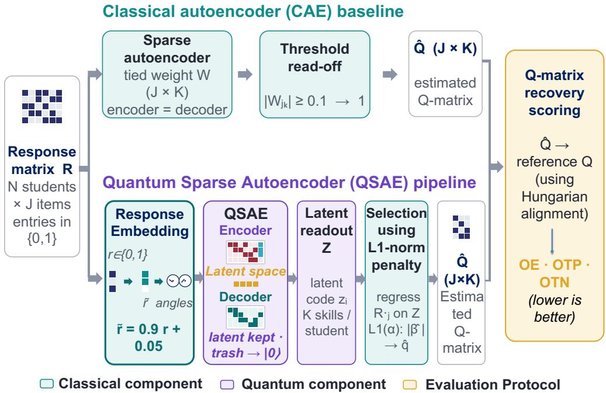
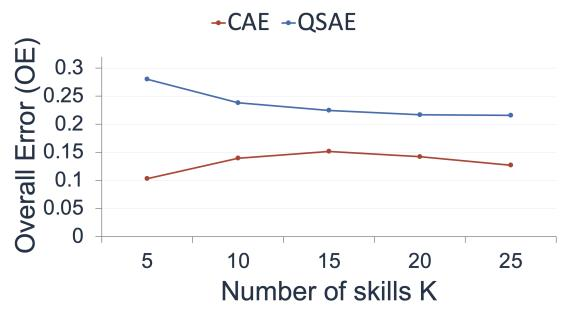
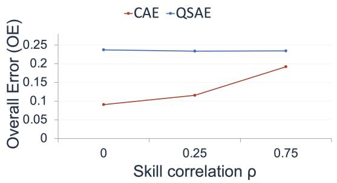
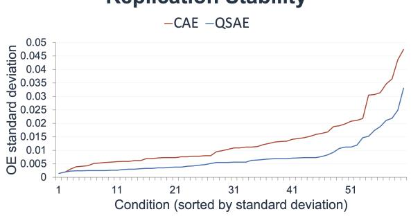
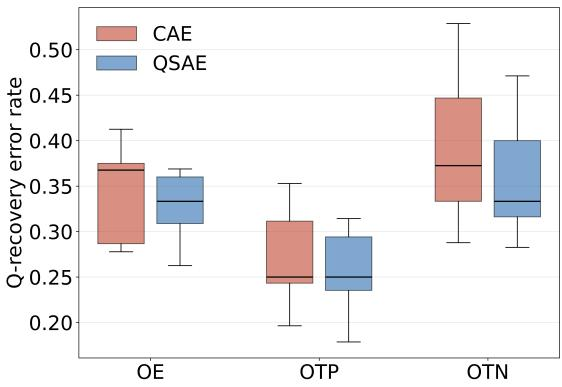

# Quantum Sparse Autoencoders for Q-Matrix Estimation in Cognitive Diagnosis

Arif Hassan Zidan1, Yi Pan2, Bowen Guo3, Xiang Li5, Yu Bao3, Yingfeng Wang4, Tianming Liu2, Wei Zhang1\*

1School of Computer and Cyber Sciences, Augusta University, Augusta, GA, USA

2School of Computing, University of Georgia, Athens, GA, USA

3Department of Graduate Psychology, James Madison University, Harrisonburg, VA, USA

4Department of Computer Science and Engineering, University of Tennessee at Chattanooga, Chattanooga, TN, USA 5Department of Radiology, Massachusetts General Hospital, Harvard Medical School, Boston, MA, USA

## Abstract

Q-matrices play a central role in cognitive diagnosis within educational data mining (EDM), specifying which latent skills each assessment item requires. Data-driven Q-matrix estimation remains challenging when assessments involve many correlated skills and when real response patterns depart from idealized generative assumptions. We introduce a novel quantum sparse autoencoder (QSAE) for Q-matrix estimation, which, to the best of our knowledge, is the first application of quantum machine learning (QML) to cognitive diagnosis. Overall, the QSAE embeds each student’s binary response vector into a quantum circuit using an encoder, compresses it into a sparse latent representation, and maps that representation to the Q-matrix. We benchmark the QSAE against a classical autoencoder (CAE) across 60 simulated datasets and 9 real-world assessment datasets. The results reveal complementary strengths. Although the CAE partially achieves higher average accuracy under several simulation conditions, the QSAE is substantially more stable across replications, exhibiting lower variance in 49 of the 60 conditions. Moreover, on real assessment data, the QSAE outperforms the CAE on 6 of the 9 datasets. These findings suggest that the principal advancement of QML in this setting is not universal accuracy improvement, but enhanced robustness and capability to explore latent-structure complexity in real datasets.

## Introduction

Quantum machine learning (QML) has emerged as an active research frontier at the intersection of quantum computing and artificial intelligence, motivated by the possibility that quantum systems can represent and process information in ways that are difficult to reproduce classically (Cerezo et al. 2022; Jiang et al. 2026). Encoding classical data into an n-qubit quantum state provides access to a 2n-dimensional Hilbert space, creating an exponentially large representation space in which complex structures that are difficult to separate in the original feature space may become more amenable to learning (Havl´ıcek et al. 2019). On currentˇ noisy intermediate-scale quantum (NISQ) devices, much of this potential is explored through hybrid quantum–classical variational algorithms (Cerezo et al. 2021; Pan et al. 2025; Jahin et al. 2025; Pan et al. 2026).

QML is anticipated to be particularly valuable in domains characterized by complex, high-dimensional, and structured observations, such as drug discovery, materials science, and scientific data analysis (Jiang et al. 2026). A recurring challenge in these domains is representation learning: transforming high-dimensional observations into compact latent representations that preserve the information most relevant to downstream inference. Quantum autoencoders (QAEs) provide a natural mechanism for this purpose by using parameterized quantum circuits to compress input states into lower-dimensional latent subsystems (Pan et al. 2025). Importantly, this compression principle is not inherently domain-specific. Whenever observed data are governed by a relatively small number of hidden factors, learning a compact latent representation may provide a useful route to recovering the underlying structure. Educational assessment provides a particularly compelling example of such a setting. Therefore, we adopt this paradigm to investigate whether quantum representation learning can reveal latent structure in educational assessment data.

Traditionally, in educational measurement, diagnostic classification models (DCMs) (Henson, Templin, and Willse 2009; Rupp, Templin, and Henson 2010; Bradshaw 2016; Lin et al. 2025) infer students’ mastery of latent skills, or attributes, from their observed item responses. A fundamental component of a DCM is the Q-matrix (Tatsuoka 1983), a binary matrix in which entry (j, k) indicates whether item j requires attribute k. The Q-matrix therefore defines the item– attribute dependency structure on which subsequent diagnostic inference depends. In practice, however, Q-matrices are commonly specified manually by domain experts, making the process costly, labor-intensive, and potentially subjective (Pongsophon 2026). For example, on a widely used Trends in International Mathematics and Science Study (TIMSS) mathematics assessment, two expert coders agreed on only approximately 89% of Q-matrix entries (Li, Ma, and Xu 2022). These limitations have motivated increasing interest in estimating Q-matrices accurately.

Data-driven Q-matrix estimation nevertheless remains challenging. The search space grows exponentially with the number of items and attributes; the latent attributes are unobserved and identifiable only up to permutation; educational datasets are often modest in size; and correlations among attributes can obscure the true item–attribute relationships (Li, Ma, and Xu 2022; Islam et al. 2025). Conventional approaches can perform well when the assumed generative structure closely matches the data, but their performance may deteriorate when real-world responses deviate from idealized model assumptions. These challenges motivate the exploration of alternative representation learning with different inductive biases.

In this work, we develop an innovative quantum sparse autoencoder (QSAE) to provide an effective alternative for data-driven Q-matrix estimation. We introduce a QSAE framework that first embeds each student’s binary response vector into an eight-qubit quantum circuit using a responseto-quantum-state encoding specifically designed for educational assessment data. A parameterized quantum encoder then compresses the response information into a Kdimensional sparse latent representation intended to capture the underlying skill structure, from which the Q-matrix is subsequently recovered. The imposed sparsity encourages the QSAE to retain the most informative latent features while suppressing noise and spurious variation, potentially improving robustness when applied to real-world response data. The encoder–decoder architecture extends the MolQAE framework (Pan et al. 2025) from molecular representation learning to educational assessment data. To the best of our knowledge, this is the first study to apply a quantum autoencoder to Q-matrix estimation and the first use of quantum representation learning for cognitive diagnosis.

Rather than assuming that the quantum model should universally outperform its classical counterpart, we ask a more informative question: under what data conditions does each representation-learning approach provide an advantage? To answer this question, we benchmark the proposed QSAE against a classical autoencoder (CAE) following the evaluation protocol of (Li, Ma, and Xu 2022; Ramos-Pulido et al. 2025). The comparison covers 60 simulated conditions generated under the Deterministic Inputs, Noisy “And” gate (DINA) model (Najera et al. 2023; Gu and Xu 2019) and´ 9 real-world assessment datasets. Performance is evaluated using standard Q-matrix recovery criteria, including overall error (OE), out-of-true-positive error (OTP), and out-oftrue-negative error (OTN) (Li, Ma, and Xu 2022).

The results reveal a complementary pattern. Under clean simulated conditions, where the data-generating structure is well aligned with the inductive bias of the classical model, the CAE achieves higher average recovery accuracy, consistent with expectations from prior representative work (Li, Ma, and Xu 2022). However, the QSAE exhibits substantially greater stability across replications, producing lower standard deviations in 49 of the 60 simulated conditions. More importantly, across the 9 real datasets, the QSAE outperforms the CAE on 6 datasets. These findings suggest that the primary advantage of the proposed QSAE is not universal superiority under idealized conditions, but rather its robustness to sampling variability and model misspecification in more realistic settings.

Overall, this work makes the following contributions:

• A quantum sparse autoencoder framework for Qmatrix estimation. We introduce, to the best of our knowledge, the first QSAE-based approach to Q-matrix recovery and the first application of quantum representation learning to cognitive diagnosis.

• A systematic quantum–classical benchmark. We conduct a controlled comparison between the proposed QSAE and a classical autoencoder across 60 simulated DINA conditions and 9 real assessment datasets using standard Q-matrix recovery metrics (OE, OTP, and OTN) (Li, Ma, and Xu 2022).

• An empirical characterization of complementary strengths. We show that the CAE achieves stronger recovery accuracy under well-specified simulations, whereas the QSAE provides greater replication stability and stronger performance across real datasets.

## Related Work

Q-matrix estimation. Because manually specifying a Qmatrix is costly, labor-intensive, and potentially error-prone, a substantial body of research has focused on estimating or validating Q-matrices directly from response data. Early data-driven approaches include likelihood-based estimation (Wang, Cai, and Tu 2020) and Bayesian methods that place prior distributions over the Q-matrix and estimate its structure using Markov Chain Monte Carlo (MCMC) sampling (Chung and Johnson 2018; Haertel 1989).

More recently, representation-learning approaches have been introduced for Q-matrix recovery. Investigators (Li, Ma, and Xu 2022) utilized a Restricted Boltzmann Machine (RBM) to estimate large Q-matrices and showed that, under the DINA model, a main-effects formulation can recover the required skill structure. Related studies have explored sparse and constraint-based autoencoders for identifying item–skill relationships in item response theory and cognitive diagnosis settings (Paaßen et al. 2022; Ramos-Pulido et al. 2025). In this work, we adopt the benchmark protocol and the OE, OTP, and OTN recovery metrics introduced by (Li, Ma, and Xu 2022), while using their RBM results as an additional reference point for comparison.

Despite these advances, existing approaches remain entirely classical, and their performance is generally strongest when the assumed model structure is well aligned with the underlying data-generating process. We therefore introduce a quantum representation-learning counterpart and systematically investigate how quantum and classical approaches behave both when this structural assumption is satisfied and when real-world data depart from it.

Quantum representation learning. Quantum autoencoders (QAEs) were introduced for the efficient compression of quantum data, encoding an input state into a smaller latent register while disentangling the complementary “trash” qubits into a fixed reference state (Romero, Olson, and Aspuru-Guzik 2017). Subsequent work has extended QAEs toward classical domain data: MolQAE encodes complete molecular structures directly from their sequential (SMILES) descriptions and reconstructs them with high fidelity under substantial dimensionality reduction (Pan et al. 2025). Our pipeline extends this framework from molecular tokens to student response vectors, adapting its state-preparation and compression method for educational assessment. Additionally, QML has recently reached educational data, and prior work has targeted only predictive datamining tasks rather than psychometric measurement, for example classifying alumni career outcomes with quantumkernel support vector machines (Ramos-Pulido et al. 2025). To our knowledge, no prior work applies quantum models to Q-matrix estimation or, more broadly, to the latent-structure measurement models at the core of cognitive diagnosis.

## Preliminaries

Q-matrix estimation can be viewed as an unsupervised latent-structure recovery problem, closely related to feature extraction and matrix factorization (Chuong, Liu, and Yu 2025). We first introduce the two central objects in cognitive diagnosis: the response matrix, which contains the observed data, and the Q-matrix, which represents the latent item–skill structure to be recovered.

Response matrix. The response matrix is the input data. Consider an assessment administered to N students, each responding to J items. The observed data are represented by a binary response matrix, $R \in \{ 0 , 1 \} ^ { N \times J }$ , where $R _ { i j } = 1$ if student i answers item j correctly and $R _ { i j } = 0$ otherwise. Each row of R therefore represents a student’s response pattern across all assessment items. The response matrix is directly observed, whereas the underlying skills that give rise to these responses remain latent.

Q-matrix. The Q-matrix represents the weight matrix. Each assessment item is assumed to require a subset of K latent skills, also referred to as attributes. The Q-matrix, $Q \in \{ 0 , 1 \} ^ { J \times K }$ , encodes this item–skill dependency structure, where $q _ { j k } = 1$ indicates that item j requires skill k, and $q _ { j k } = 0$ otherwise. Thus, the j-th row of Q specifies the set of skills required by item j.

From a latent-factor perspective, the Q-matrix plays a role analogous to a sparse loading or mixing matrix that links observed items to underlying latent factors. Conventional educational assessment uses Q with the observed responses R to infer each student’s skill-mastery profile. Consequently, accurate specification of Q is essential for valid diagnostic inference.

Data-generating model. For the simulation experiments, response data are generated using the DINA (Deterministic Inputs, Noisy “And” gate) model, a widely used cognitive diagnosis model (Junker and Sijtsma 2001; Li, Ma, and Xu 2022). Under DINA, a student is expected to answer an item correctly only if the student has mastered all skills required by that item, subject to item-specific guessing and slipping parameters. The DINA model therefore induces a well-defined conjunctive relationship between latent skills and observed responses. Importantly, the DINA model is used only to generate controlled simulation data and provide a known ground-truth Q-matrix for evaluation. Neither the proposed QSAE nor the classical baseline is provided with the true Q or explicitly informed of the underlying datagenerating model.

Task formulation. Given only the observed response matrix R, our goal is to recover an estimate $\hat { Q } \in \{ 0 , 1 \} ^ { J \times K }$ of the underlying Q-matrix. This formulation can be interpreted as an unsupervised latent-structure learning problem in which the item–skill relationships must be inferred from response patterns alone.

## Methodology

Figure 1 gives an overview of the two estimators, CAE and QSAE. Both take the binary response matrix as input and produce a Q-matrix estimate scored against the reference; they differ only in how the latent skill structure is learned. In this section, we describe the shared problem setup and then each pipeline in turn.

## Embedding Responses as Quantum States

To process responses on a quantum circuit, each student’s binary response vector must be mapped to the parameters of a quantum state. Following the common angle-encoding strategy, in which classical features set the rotation angles of parameterized single-qubit gates (LaRose and Coyle 2020), we encode a response vector $r _ { i } \in \{ 0 , 1 \} ^ { J }$ into single-qubit rotation angles. Binary values sit at the extremes of the rotation range, where 0 and π produce degenerate (indistinguishable) states and vanishing gradients; feeding raw $0 / \overset { \vartriangle } { 1 }$ values directly is therefore numerically poor, an instance of the broader observation that the choice of data encoding materially affects a quantum model’s trainability (Schuld, Sweke, and Meyer 2021). We instead apply an affine smoothing,

$$
\tilde { r } _ { i j } = 0 . 9 r _ { i j } + 0 . 0 5 ,\tag{1}
$$

which maps $0 \mapsto 0 . 0 5$ and 1 7→ 0.95, keeping every angle strictly inside the usable range and away from the degenerate endpoints while preserving the binary contrast. The smoothed values parameterize the rotation gates that prepare the input state. This response-to-angle embedding is the component we design specifically for educational assessment data; it is the educational-domain counterpart of the molecular state preparation used by MolQAE (Pan et al. 2025).

## QSAE Architecture

Our QSAE is the quantum analogue of a classical autoencoder, which learns a compressed latent representation by training a network to reconstruct its input (Hinton and Salakhutdinov 2006). It follows the encoder-compressiondecoder design of MolQAE (Pan et al. 2025), and is trained as a parameterized quantum circuit, i.e., a machine-learning model (Benedetti et al. 2019). The circuit operates on n qubits, partitioned into a latent register that retains the compressed representation and a set of trash qubits that are driven toward a fixed reference state.

Encoder. The smoothed responses from Eq. (1) set the rotation angles of a parameterized input layer, preparing a data-dependent input state. A trained encoder circuit $U _ { \mathrm { e n c } } ( \theta )$ , built from parameterized single-qubit rotations and entangling gates, transforms this state so that the information needed to reconstruct the input is concentrated in the latent register.

  
Figure 1: Overview of the Q-matrix estimation pipeline. Both estimators take the same binary response matrix $R \in$ $\{ 0 , 1 \} ^ { N \times J }$ as input and produce an estimated Q-matrix $\hat { Q } \in \{ 0 , 1 \} ^ { J \times K }$ , scored against the reference $Q$ under a common protocol. Top (classical baseline, CAE): a sparse tied-weight autoencoder is trained on R, and its weight matrix is thresholded $( | W _ { j k } | \ge 0 . 1 )$ into a binary $\hat { Q } .$ Bottom (quantum pipeline, QSAE): responses are embedded as rotation angles $( \tilde { r } = 0 . 9 r { + } 0 . 0 5 )$ compressed by a quantum autoencoder whose trash qubits are driven to |0⟩, read out as a K-dimensional latent code $z _ { i }$ per student, and turned into $\hat { Q }$ by per-item $L _ { 1 }$ -penalized regression of each response column on the latent readout. Right (evaluation): both estimates are aligned to $Q$ by the Hungarian algorithm and scored with OE, OTP, and OTN (lower is better). Teal blocks are classical components, purple are quantum, and the yellow block is the evaluation protocol.

Compression via trash qubits. Compression is achieved by pushing the trash qubits toward a fixed reference state |0⟩. When the trash qubits are successfully disentangled and reset to |0⟩, all reconstruction-relevant information must reside in the latent register, which therefore forms a compact latent code of the response pattern (Pan et al. 2025).

Sparse representation. The $L _ { 1 }$ norm, $\begin{array} { r } { \| \beta \| _ { 1 } = \sum _ { k } | \beta _ { k } | } \end{array}$ is the standard tool for inducing sparse representations in linear models (Hastie, Tibshirani, and Wainwright 2015). Added to a least-squares objective it yields the LASSO (Tibshirani 1996), which shrinks coefficients and drives the uninformative ones exactly to zero, so the fitted model retains only a small subset of active predictors; efficient solvers make this practical even for high-dimensional, repeatedly solved problems (Liu, $\mathrm { J i } ,$ and Ye 2009). Unlike the $L _ { 2 }$ (ridge) penalty, which shrinks all coefficients smoothly but leaves them non-zero, the $L _ { 1 }$ penalty performs genuine variable selection: it identifies which predictors matter rather than merely how much to down-weight them (Hastie, Tibshirani, and Wainwright 2015). This suits Q-matrix recovery, where each item loads on only a few of the K skills, so the target coefficient vector is sparse and selecting its nonzero entries directly identifies the required skills.

Decoder. A decoder circuit $U _ { \mathrm { d e c } }$ maps the latent register (with the reset trash qubits) back toward the input state. The model is trained to maximize reconstruction fidelity while enforcing the compression constraint, giving the objective

$$
\mathcal { L } = \left( 1 - F _ { \mathrm { r e c o n } } \right) + \lambda _ { \mathrm { t } } D _ { \mathrm { t r a s h } } ,\tag{2}
$$

where $F _ { \mathrm { r e c o n } }$ is the reconstruction fidelity between the input and reconstructed states, $D _ { \mathrm { t r a s h } }$ penalizes deviation of the trash qubits from |0⟩, and $\lambda _ { \mathrm { t } }$ balances the two terms (we use $\lambda _ { \mathrm { t } } = \bar { 0 } . 1 )$ . Training on the response matrix requires no knowledge of the Q-matrix: the QSAE is a purely unsupervised model of the responses, and Q enters only at evaluation.

## Q-matrix Recovery

The trained autoencoder yields, for each student i, a Kdimensional latent readout $\bar { \boldsymbol { z } } _ { i } \in \mathbb { R } ^ { K }$ obtained from the latent register. Stacking these gives a latent matrix $Z ~ \in ~ \mathbb { R } ^ { N \times K }$ whose columns act as data-driven surrogates for the K latent skills. It remains to decide, for each item, which skills it depends on: this is a variable-selection problem.

Sparse per-item selection. The key structural fact is that Q-matrices are sparse: each item loads on only a few skills. (Li, Ma, and Xu 2022) exploit exactly this property, using an $L _ { 1 }$ penalty so that the sparse (non-zero) structure of a learned weight matrix reveals the Q-matrix. We adopt the same principle at the recovery stage. For each item $j ,$ we regress its response column $R _ { \cdot j }$ on the latent skills $Z$ with an $L _ { 1 }$ -penalized (LASSO) model (Liu, Ji, and Ye 2009; Tibshirani 1996),

$$
\hat { \beta } _ { j } = \arg \operatorname* { m i n } _ { \beta \in \mathbb { R } ^ { K } } \left\| R _ { \cdot j } - Z \beta \right\| _ { 2 } ^ { 2 } + \alpha \| \beta \| _ { 1 } ,\tag{3}
$$

where the $L _ { 1 }$ term shrinks the coefficients of irrelevant skills toward zero and retains only the skills that carry signal for item $j .$ The magnitude $| \hat { \beta } _ { j k } |$ scores how strongly item $j$ depends on skill $\bar { k . }$ Recovering the full Q-matrix is thus a collection of J related sparse-regression problems over a shared latent skill representation.

Binarization. The coefficient magnitudes are converted to binary Q-matrix entries by thresholding, as is standard in Q-matrix learning: (Li, Ma, and Xu 2022) recover their Q-matrix by thresholding the magnitudes of the learned weights. We apply the same principle to the LASSO coefficients. A fixed sparsity level is a reasonable prior given that real Q-matrices are sparse and low-order, and it parallels the cutoff used by (Li, Ma, and Xu 2022) and our CAE.

## CAE Baseline

As a classical counterpart, we use a sparse autoencoder with a single tied weight matrix $W ~ \in ~ \overset { \bullet } { \mathbb { R } } { } ^ { J \times K }$ shared by the encoder and decoder, so that $W _ { j k }$ directly represents the strength of the association between item j and skill k. The model is trained to reconstruct the response matrix under an $L _ { 1 }$ penalty on W, which, following the same sparsity principle as above (Li, Ma, and Xu 2022; Tibshirani 1996), drives uninformative item–skill weights toward zero. The Q-matrix is then read off with the threshold of (Li, Ma, and Xu 2022): entries with $| W _ { j k } | \ge 0 . 1$ are set to 1 and the rest to 0. Because its tied-weight, additive structure matches the bilinear item–skill form assumed by additive CDMs, this baseline is a strong and well-motivated point of comparison.

## Evaluation Protocol

We follow the evaluation protocol of (Li, Ma, and Xu 2022).

Column alignment. Because the latent skills are recovered only up to a permutation, the columns of $\cdot \hat { Q }$ do not necessarily correspond to those of the reference Q in order. We resolve this by matching columns with the Hungarian algorithm (Wang, Cai, and Tu 2020), which finds the column permutation minimizing the total disagreement between $\hat { Q }$ and Q before any error is computed.

Evaluation metrics. After alignment, we report three standard Q-recovery error rates, for all of which lower is better. The overall error (OE) is the fraction of all $J \times K$ entries of $\hat { Q }$ that disagree with $Q .$ Because Q-matrices are sparse, OE alone can look small even for a poor estimate that predicts mostly zeros, so we also report two complementary rates that expose the two failure modes separately. The out-of-true-positive error (OTP) is the fraction of true

1-entries that were missed (predicted 0), measuring underspecification (required skills not detected). The out-of-truenegative error (OTN) is the fraction of true 0-entries wrongly predicted as 1, measuring over-specification (spurious skills attached to items). OE, OTP, and OTN are defined as:

$$
\mathrm { O E } = \frac { 1 } { J K } \sum _ { j = 1 } ^ { J } \sum _ { k = 1 } ^ { K } \xi \{ \hat { q } _ { j k } \neq q _ { j k } \} ,\tag{4}
$$

$$
\mathrm { O T P } = \frac { \sum _ { j , k } \mathcal { k } \{ \hat { q } _ { j k } = 0 , \ q _ { j k } = 1 \} } { \sum _ { j , k } \mathcal { k } \{ q _ { j k } = 1 \} } ,\tag{5}
$$

$$
\mathrm { O T N } = \frac { \sum _ { j , k } \mathcal { k } \{ \hat { q } _ { j k } = 1 , \ q _ { j k } = 0 \} } { \sum _ { j , k } \mathcal { k } \{ q _ { j k } = 0 \} } .\tag{6}
$$

Reporting OE, OTP, and OTN together keeps both missed and spurious loadings visible, following standard practice in Q-matrix recovery and validation (de la Torre and Chiu 2016; Li, Ma, and Xu 2022).

## Results

## Experimental Setup

We evaluate both autoencoders on simulated and real data, following the benchmark protocol of (Li, Ma, and Xu 2022). The simulated benchmark spans 60 conditions generated under the DINA model, crossing the number of skills $K \in$ $\{ 5 , 1 0 , 1 5 , 2 0 , 2 5 \}$ , sample size $N \in \{ 2 0 0 0 , 1 0 0 0 0 \}$ , skill correlation $\rho \in \mathsf { \Gamma } \cdot \mathsf { J } 0 , 0 . 2 5 , 0 . 7 5 \bigr \}$ , and guess/slip noise $g =$ $s \in \{ 0 . 1 , 0 . 2 \}$ , with $J = 3 K$ items and 5 independent replications per condition. The real benchmark comprises 9 publicly available assessment datasets with expert-constructed Q-matrices. All estimates are aligned to the reference Qmatrix by the Hungarian algorithm and scored with overall error (OE), out-of-true-positive error (OTP), and out-oftrue-negative error (OTN); for every metric, lower is better. We report means over the 5 replications for simulated conditions, and the per-dataset values for real data.

## Experimental Results Based on Simulated Data

Overall accuracy. Table 1 reports the mean and replication standard deviation of each metric, both overall and broken down by skill correlation ρ. Across all 60 conditions, the classical autoencoder is the more accurate estimator, achieving an overall error of 0.133 against the quantum autoencoder’s 0.235 (bottom row). This is expected: DINA generates a conjunctive, bilinear item–skill structure that coincides with the additive, tied-weight inductive bias of the CAE, and prior work establishes that a main-effects model provably selects the required skills under this generative model (Li, Ma, and Xu 2022). The gap is largest on OTP (missed loadings), where the CAE’s matched structure is most advantageous. The averages, however, hide two trends that reverse this picture as the data becomes more realistic.

The quantum model scales better with more skills. As the number of skills $K$ grows, the quantum autoencoder’s error decreases monotonically, from 0.280 at $K \ = \ 5$ to 0.216 at $K = 2 5$ , whereas the classical autoencoder’s error stays roughly flat between 0.10 and 0.15 (Figure 2).

<table><tr><td></td><td colspan="3">Classical AE (CAE)</td><td colspan="3">Quantum Sparse (QSAE)</td></tr><tr><td>ρ</td><td>OE</td><td>OTP</td><td>OTN</td><td>OE</td><td>OTP</td><td>OTN</td></tr><tr><td>0</td><td> $0 . 0 9 1 \pm 0 . 0 0 9$ </td><td> $0 . 1 4 8 \pm 0 . 0 2 3$ </td><td> $0 . 0 8 3 \pm 0 . 0 1 0$ </td><td> ${ \bf 0 . 2 3 7 \pm 0 . 0 0 7 }$ </td><td> $\mathbf { 0 . 4 5 9 \pm 0 . 0 1 9 }$ </td><td> $\mathbf { 0 . 1 8 8 \pm 0 . 0 0 6 }$ </td></tr><tr><td>0.25</td><td> $0 . 1 1 5 \pm 0 . 0 1 2$ </td><td> ${ \bf 0 . 1 3 6 \pm 0 . 0 2 0 }$ </td><td> $0 . 1 1 4 \pm 0 . 0 1 5$ </td><td> $\mathbf { 0 . 2 3 4 \pm 0 . 0 0 8 }$ </td><td> $0 . 4 4 8 \pm 0 . 0 2 1$ </td><td> $\mathbf { 0 . 1 8 4 \pm 0 . 0 0 6 }$ </td></tr><tr><td>0.75</td><td> $0 . 1 9 2 \pm 0 . 0 1 9$ </td><td> $0 . 2 2 0 \pm 0 . 0 3 6$ </td><td> $0 . 1 9 0 \pm 0 . 0 2 2$ </td><td> ${ \bf 0 . 2 3 5 \pm 0 . 0 0 7 }$ </td><td> $\mathbf { 0 . 4 6 3 \pm 0 . 0 2 0 }$ </td><td> ${ \bf 0 . 1 8 1 \pm 0 . 0 0 5 }$ </td></tr><tr><td>Overall</td><td> $0 . 1 3 3 \pm 0 . 0 1 3$ </td><td> $0 . 1 6 8 \pm 0 . 0 2 6$ </td><td> $0 . 1 2 9 \pm 0 . 0 1 6$ </td><td> ${ \bf 0 . 2 3 5 \pm 0 . 0 0 7 }$ </td><td> $\mathbf { 0 . 4 5 7 \pm 0 . 0 2 0 }$ </td><td> $\mathbf { 0 . 1 8 4 \pm 0 . 0 0 6 }$ </td></tr></table>

Table 1: Simulated DINA results: mean ± replication standard deviation for OE, OTP, and OTN, averaged over K, N, and noise, and broken down by skill correlation $\rho$ (lower is better for all). The CAE attains lower mean error, but the QSAE is the more consistent estimator: within each metric, the smaller replication standard deviation is shown in bold, and the QSAE’s is smaller in almost every cell.

## Overall Error vs. Number of Skills

  
Figure 2: Overall error on simulated DINA data as a function of the number of skills K. The QSAE’s (blue) error decreases as K grows while the CAE’s (red) stays flat, so the quantum–classical gap narrows steadily on larger problems.

The quantum–classical gap therefore narrows steadily as the problem grows, from 0.18 at K = 5 to 0.09 at $K = 2 5$ This is the regime that matters in practice, where assessments routinely probe many skills, and it indicates that the quantum pipeline becomes relatively more competitive precisely as the task becomes harder.

The quantum model is robust to skill correlation. The second trend is more striking. Real skills are correlated, and correlation is the main source of difficulty in Q-matrix recovery. As Table 1 shows, the classical autoencoder degrades sharply as skill correlation rises: its overall error climbs from 0.091 in the independent case $( \rho = 0 )$ to 0.192 under strong correlation $( \rho = 0 . 7 5 )$ , more than doubling. The quantum autoencoder is, by contrast, almost flat across the same range, at 0.237, 0.234, and 0.235 respectively (Figure 3). Under the strong-correlation setting that best reflects real assessments, the two methods are far closer (0.192 vs. 0.235) than the overall averages suggest. The quantum representation appears largely insensitive to a factor that systematically undermines the classical model.

Stability. Beyond mean accuracy, the quantum autoencoder is markedly more stable across replications. In Table 1, the smaller replication standard deviation in each metric is shown in bold, and it falls to the QSAE in almost every cell. Aggregated over conditions, the QSAE’s OE standard deviation is lower than the CAE’s in 49 of the 60 conditions and roughly half as large on average (0.007 vs. 0.013); the same pattern holds for OTN (54/60) and OTP (42/60) (Figure 4). Run-to-run variability directly affects how much a single recovered Q-matrix can be trusted, so lower variance is a practical advantage independent of mean accuracy.

Overall Error vs. Skill Correlation  
  
Figure 3: Overall error on simulated DINA data as a function of skill correlation $\rho .$ The CAE (red) degrades sharply as correlation rises, whereas the QSAE (blue) is nearly flat, indicating that the quantum model is largely insensitive to correlated skills.

## Experimental Results Based on Real Data

On the 9 real assessments the ordering reverses. Table 2 reports per-dataset overall error, and Figure 5 shows the distribution of all three metrics across datasets. Averaged across datasets, the QSAE attains a lower mean OE than the classical autoencoder (0.337 vs. 0.348), and it is also lower on both OTP (0.272 vs. 0.283) and OTN (0.358 vs. 0.391): the quantum model is ahead on all three metrics. The box plot makes the shift visible: the QSAE’s OE and OTN distributions sit lower and tighter than the CAE’s, indicating both better central performance and fewer poor cases. At the level of individual datasets, the quantum autoencoder achieves the lower error on 6 of the 9 datasets, the classical autoencoder on 2, with 1 tie. The reversal is consistent with the simulated findings: real assessments have unknown, non-conjunctive response processes and correlated skills, exactly the conditions under which the classical model’s structural advantage disappears and the quantum model’s robustness is decisive.

<table><tr><td></td><td colspan="3">CAE</td><td colspan="3">QSAE</td></tr><tr><td>Dataset</td><td>OE</td><td>OTP</td><td>OTN</td><td>OE</td><td>OTP</td><td>OTN</td></tr><tr><td>dtmr_fractions</td><td>0.278</td><td>0.257</td><td>0.288</td><td>0.352</td><td>0.314</td><td>0.370</td></tr><tr><td>ecpe</td><td>0.357</td><td>0.243</td><td>0.447</td><td>0.333</td><td>0.243</td><td>0.404</td></tr><tr><td>fraction_subtraction</td><td>0.413</td><td>0.196</td><td>0.529</td><td>0.369</td><td>0.179</td><td>0.471</td></tr><tr><td>hr</td><td>0.371</td><td>0.449</td><td>0.341</td><td>0.360</td><td>0.429</td><td>0.333</td></tr><tr><td>jang</td><td>0.396</td><td>0.312</td><td>0.415</td><td>0.309</td><td>0.279</td><td>0.316</td></tr><tr><td>melab</td><td>0.375</td><td>0.235</td><td>0.478</td><td>0.263</td><td>0.235</td><td>0.283</td></tr><tr><td>pgdina</td><td>0.287</td><td>0.250</td><td>0.311</td><td>0.453</td><td>0.222</td><td>0.400</td></tr><tr><td>rupp_templin_henson</td><td>0.286</td><td>0.250</td><td>0.333</td><td>0.286</td><td>0.250</td><td>0.333</td></tr><tr><td>sda6</td><td>0.368</td><td>0.353</td><td>0.373</td><td>0.309</td><td>0.294</td><td>0.314</td></tr><tr><td>Mean</td><td>0.348</td><td>0.283</td><td>0.391</td><td>0.337</td><td>0.272</td><td>0.358</td></tr></table>

Table 2: Per-dataset Q-recovery errors on the 9 real assessments (lower is better; the better method in each metric shown in bold, ties unbolded). Averaged over datasets, the QSAE attains lower mean OE, OTP, and OTN. The QSAE outperforms the CAE per dataset on 6/9 (OE), 5/9 (OTP), and 6/9 (OTN).

  
Figure 4: Per-condition replication standard deviation of OE, sorted within each method. The QSAE (blue) is more stable than the CAE (red) in 49 of 60 conditions.

When Each Approach Wins. The CAE performs better in the regime for which its inductive bias was built: clean, independent-skill, model-matched data, where its error is lowest. The proposed QSAE overtakes the classical one in every aggregate metric and in two-thirds of individual datasets. The QSAE is thus the more robust estimator: its performance is largely invariant to the factors that degrade the classical model, and this robustness is what makes the QSAE a stronger choice in the realistic regime.

## Conclusion

In this work, we introduced a novel QSAE framework for data-driven Q-matrix estimation in educational data mining. To the best of our knowledge, this is the first application of a QML framework to Q-matrix recovery. Our experiments demonstrate the complementary strengths of quantum and classical representation learning. Across 60 simulated DINA conditions, the CAE generally achieves higher average Qmatrix recovery accuracy when the data closely follow the assumed generative structure. In contrast, the QSAE exhibits greater stability across replications, producing lower standard deviations in 49 of the 60 conditions. More importantly, on 9 real-world assessment datasets, the QSAE outperforms the CAE on 6 datasets. These results suggest that the potential value of the QSAE lies not in universal performance gains under idealized conditions, but in its robustness to sampling variability and the more complex structure encountered in real-world assessment data.

  
Figure 5: Distribution of the three recovery error rates (OE, OTP, OTN) across the 9 real assessment datasets, comparing the classical (CAE, red) and quantum (QSAE, blue) autoencoders; lower is better.

## References

Benedetti, M.; Lloyd, E.; Sack, S.; and Fiorentini, M. 2019. Parameterized Quantum Circuits as Machine Learning Models. Quantum Science and Technology, 4(4): 043001.

Bradshaw, L. 2016. Diagnostic classification models. The Wiley handbook of cognition and assessment: Frameworks, methodologies, and applications, 297–327.

Cerezo, M.; Arrasmith, A.; Babbush, R.; Benjamin, S. C.; Endo, S.; Fujii, K.; McClean, J. R.; Mitarai, K.; Yuan, X.; Cincio, L.; and Coles, P. J. 2021. Variational quantum algorithms. Nature Reviews Physics, 3(9): 625–644.

Cerezo, M.; Verdon, G.; Huang, H.-Y.; Cincio, L.; and Coles, P. J. 2022. Challenges and opportunities in quantum machine learning. Nature Computational Science, 2(9): 567–576.

Chung, M.-t.; and Johnson, M. S. 2018. An MCMC algorithm for estimating the Q-matrix in a Bayesian framework. arXiv preprint arXiv:1802.02286.

Chuong, T. D.; Liu, C.; and Yu, X. 2025. Decomposition for large-scale optimization problems: An overview. Artificial Intelligence Science and Engineering, 1(3): 157–174.

de la Torre, J.; and Chiu, C.-Y. 2016. A General Method of Empirical Q-matrix Validation. Psychometrika, 81(2): 253– 273.

Gu, Y.; and Xu, G. 2019. The Sufficient and Necessary Condition for the Identifiability and Estimability of the DINA Model. Psychometrika, 84(2): 468–483.

Haertel, E. H. 1989. Using Restricted Latent Class Models to Map the Skill Structure of Achievement Items. Journal of Educational Measurement, 26(4): 301–321.

Hastie, T.; Tibshirani, R.; and Wainwright, M. 2015. Statistical Learning with Sparsity: The Lasso and Generalizations. Boca Raton, FL: CRC Press.

Havl´ıcek, V.; Cˇ orcoles, A. D.; Temme, K.; Harrow, A. W.;´ Kandala, A.; Chow, J. M.; and Gambetta, J. M. 2019. Supervised learning with quantum-enhanced feature spaces. Nature, 567(7747): 209–212.

Henson, R. A.; Templin, J. L.; and Willse, J. T. 2009. Defining a family of cognitive diagnosis models using log-linear models with latent variables. Psychometrika, 74(2): 191– 210.

Hinton, G. E.; and Salakhutdinov, R. R. 2006. Reducing the Dimensionality of Data with Neural Networks. Science, 313(5786): 504–507.

Islam, M. M.; Sojib, F. H.; Mihad, M. F. H.; Hasan, M.; and Rahman, M. 2025. The integration of explainable AI in Educational Data Mining for student academic performance prediction and support system. Telematics and Informatics Reports, 18: 100203.

Jahin, A.; Pan, Y.; Wang, Y.; Liu, T.; and Zhang, W. 2025. Quantum-classical hybrid molecular autoencoder for advancing classical decoding. In Proceedings of the AAAI Symposium Series, volume 7, 368–373.

Jiang, H.; Pan, Y.; Chen, J.; Liu, Z.; Sun, L.; Li, Q.; Zhang, L.; Zhu, D.; Wang, X.; Liu, W.; Li, X.; Li, G.; Zhang, W.; Zhao, L.; Yu, X.; Wang, Y.; and Liu, T. 2026. Quantum artificial intelligence: A comprehensive survey. Meta-Radiology, 4: 100205.

Junker, B. W.; and Sijtsma, K. 2001. Cognitive Assessment Models with Few Assumptions, and Connections with Nonparametric Item Response Theory. Applied Psychological Measurement, 25(3): 258–272.

LaRose, R.; and Coyle, B. 2020. Robust Data Encodings for Quantum Classifiers. Physical Review A, 102(3): 032420.

Li, C.; Ma, C.; and Xu, G. 2022. Learning Large Q-matrix by Restricted Boltzmann Machines. Psychometrika, 87(3): 1010–1041.

Lin, Y.; Chen, H.; Xia, W.; Lin, F.; Wang, Z.; and Liu, Y. 2025. A Comprehensive Survey on Deep Learning Techniques in Educational Data Mining: Y. Lin et al. Data Science and Engineering, 10(4): 564–590.

Liu, J.; Ji, S.; and Ye, J. 2009. SLEP: Sparse Learning with Efficient Projections. Arizona State University. Software package for ℓ -regularized (Lasso) and related sparselearning problems.

Najera, P.; Abad, F. J.; Chiu, C.-Y.; and Sorrel, M. A. 2023.´ The restricted DINA model: A comprehensive cognitive diagnostic model for classroom-level assessments. Journal of Educational and Behavioral Statistics, 48(6): 719–749.

Paaßen, B.; Dywel, M.; Fleckenstein, M.; and Pinkwart, N. 2022. Sparse Factor Autoencoders for Item Response Theory. In Proceedings ofthe 15th International Conference on Educational Data Mining (EDM), 17–26.

Pan, Y.; Jiang, H.; Ruan, W.; Zhu, D.; Li, X.; Abate, Y.; Wang, Y.; and Liu, T. 2025. MolQAE: Quantum Autoencoder for Molecular Representation Learning. In 2025 IEEE International Conference on Quantum Artificial Intelligence (QAI), 98–105. Naples, Italy.

Pan, Y.; Tsai, M. H.; Jiang, H.; Chen, J.; You, W.; Zhou, Y.; Zhang, W.; Lyngaas, I.; Wang, Y.; and Liu, T. 2026. Symmetry-Aware Independent Bit-Flip: Identifiability-Guided Distribution Learning for Quantum Noise Simulation. Research Square.

Pongsophon, P. 2026. Beyond Scores in TIMSS 2023: Cross-National Science Mastery Profiles from Cognitive Diagnostic Modeling. Educational Assessment, 31(2): 137– 153.

Ramos-Pulido, S.; Hernandez-Gress, N.; Uehara, G. S.;´ Spanias, A.; and Ceballos-Cancino, H. G. 2025. Implementation of Quantum Machine Learning on Educational Data. In Proceedings of the 17th International Conference on Agents and Artificial Intelligence (ICAART), volume 3, 480–487.

Romero, J.; Olson, J. P.; and Aspuru-Guzik, A. 2017. Quantum autoencoders for efficient compression of quantum data. Quantum Science and Technology, 2(4): 045001.

Rupp, A. A.; Templin, J.; and Henson, R. A. 2010. Diagnostic measurement. Theory, methods, and applications. New York: Guilford.

Schuld, M.; Sweke, R.; and Meyer, J. J. 2021. Effect of Data Encoding on the Expressive Power of Variational Quantum-Machine-Learning Models. Physical Review A, 103(3): 032430.

Tatsuoka, K. K. 1983. Rule space: An approach for dealing with misconceptions based on item response theory. Journal ofeducational measurement, 345–354.

Tibshirani, R. 1996. Regression Shrinkage and Selection via the Lasso. Journal ofthe Royal Statistical Society: Series B (Methodological), 58(1): 267–288.

Wang, D.; Cai, Y.; and Tu, D. 2020. Q-matrix estimation methods for cognitive diagnosis models: Based on partial known Q-matrix. Multivariate Behavioral Research, 1–13.