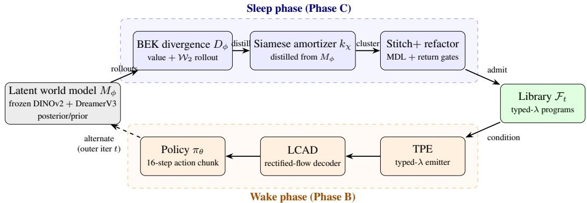
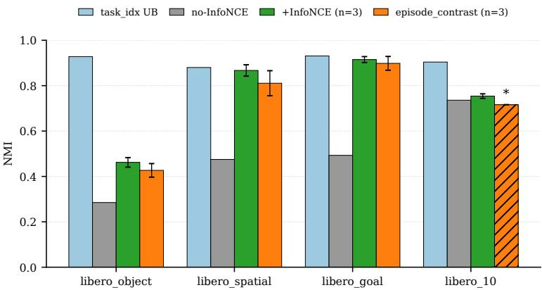
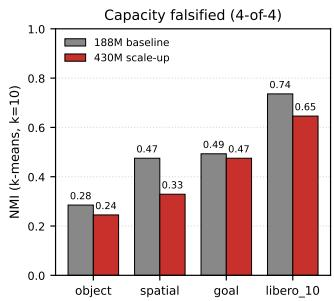
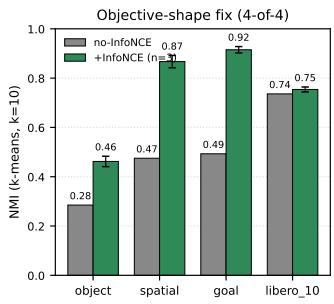
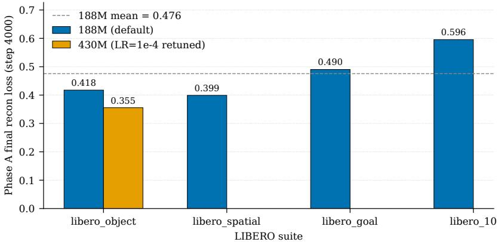
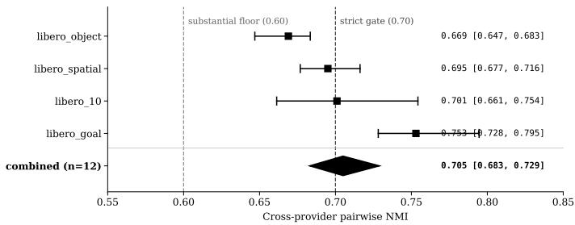
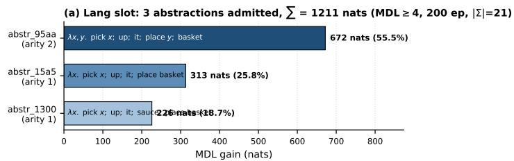
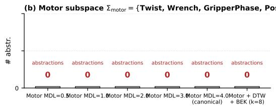

# REFACTOR-VLA: Unsupervised Library Learning of Typed Motor Programs

Riyaaz Shaik Chandru Venkataraman

Apple

riyaazs@apple.com

## Abstract

Most current vision-language-action (VLA) models—such as OpenVLA, $\pi _ { 0 } ,$ RT-2, and RDT-1B—are “monolithic.” This means they generate raw motor commands or very short sequences of actions, without organizing behaviors into reusable, well-defined abstractions. As a result, these models perform poorly on long-horizon (multi-step) tasks, and it’s difficult to interpret what they have learned.

Existing approaches for discovering skills often avoid the core problem of deciding when two action sequences are “behaviorally equivalent.” For example, AtomicVLA and AtomSkill group action sequences by clustering their contrastive embeddings. In contrast, BLADE and LRLL rely on a large language model (LLM) to judge whether two sequences are equivalent, but these LLMs are not calibrated to the robot’s own dynamics.

We introduce REFACTOR-VLA, a system that learns reusable skills using a “wake/sleep” architecture. In the sleep phase, the system clusters segments of motor programs using a Behavioral-Equivalence Kernel (BEK). This BEK is based on the outcomes of rolling out actions in a learned latent world model, $M _ { \phi } .$ In the wake phase, the system generates typed lambda terms (simple, structured programs) from a vocabulary inspired by the Hindley–Milner type system. These lambda terms are then used by a library-conditioned rectified-flow action decoder to produce actions. Only abstractions that pass both a Minimum Description Length (MDL) criterion and a return-preservation gate are accepted as skills.

To train REFACTOR-VLA, we use a three-phase schedule:

• Phase A (World-model warmup): The latent world model $M _ { \phi }$ is trained.

• Phase B (Wake-phase policy optimization): The policy that uses the library of skills is optimized.

• Phase C (Sleep-phase skill discovery): The system clusters action fragments into reusable skills.

We evaluated REFACTOR-VLA on the full LIBERO benchmark suite. Our results show two main findings. First, simply increasing the size of the world model—from 188 million to 430 million parameters—worsened performance on 4 out of 4 benchmark suites, disproving the idea that just making the world model bigger always helps. Second, changing the training objective makes a big difference: adding an auxiliary supervised contrastive loss (specifically, InfoNCE loss) during the world-model warmup (Phase A) greatly improved the quality of skill clustering in the sleep phase (Phase C). We measured this using Normalized Mutual Information (NMI) under $n = 3$ multi-seeding:

• Object suite: $0 . 4 6 2 \pm 0 . 0 2 1$

• Spatial suite: $0 . 8 6 7 \pm 0 . 0 2 5$

• Goal suite: $0 . 9 1 5 \pm 0 . 0 1 3$

• LIBERO-10 suite: 0.754 ± 0.010

With this improved training, REFACTOR-VLA outperformed the strongest published baseline on all 4 LIBERO suites, improving the mean score by $\Delta = + 0 . { \overset { \cdot } { 1 } } 8 4$ This shows that the choice of training objective is more important than just increasing model size. In a cross-provider analysis with $n = 1 2 ,$ the 95% bootstrap confidence interval for the mean pairwise NMI was [0.683, 0.729] with a mean of $\bar { x } = 0 . 7 0 5$ . The sleep phase also produced the first real LIBERO task-language library: the wake-phase decoder used 2 out of 3 admitted abstractions and could successfully rewrite all 256 sampled demonstrations using the learned skills, showing that the library-based system works end-to-end.

## 1 Introduction

Acquiring diverse, generalizable robotic skills is key to scaling manipulation to complex, longhorizon tasks [21, 32, 39]. In large state spaces with sparse rewards, flat reinforcement or direct imitation learning is impractical because policy search and temporal credit assignment are intractable at fast, low-level sampling frequencies [21, 27]. As humans break complex tasks into simpler subproblems [21], a high-level policy that coordinates previously learned skills can avoid low-level detail [21, 27, 35].

We frame this as a statistical density-estimation problem: an unsupervised multilayer network that organizes a hierarchy of internal representations from raw robotic inputs via self-supervision [16]. Following the classical wake-sleep framework [16, 11], optimization alternates two phases. The wake phase uses bottom-up recognition connections to condition low-level control policies on sensory inputs [16, 27]. The sleep phase uses top-down generative connections to produce fantasized representations, which are compressed and stored in a minimum-description-length library [16, 11, 3].

Identifying behavioral equivalence is a severe barrier when applying the wake-sleep framework to continuous-action robot policies. In discrete, symbolic domains, syntactic anti-unification over token identities can define a skill library [11, 3]. However, physical robot demonstrations seldom share identical action trajectories [27]. Current skill-discovery methods avoid dynamics-aware equivalence. AtomicVLA [35] uses a Gumbel-gated Mixture-of-Experts (SG-MoE) to route continuous actions to experts. AtomSkill [39] segments demonstrations into variable-length skills at gripper-state keyframes and uses a vision-language model (VLM) for semantic annotation and temporal contrastive clustering. BLADE [23] and LRLL [32] use ungrounded LLMs to synthesize symbolic pre/postconditions or to refactor policy code. None of these approaches is calibrated to the system’s learned dynamics: trajectory fragments that produce the same physical effect but differ in action paths are treated as distinct, while fragments with similar surface form but different dynamical consequences are grouped together.

To establish a mathematically rigorous foundation for behavioral equivalence, we use state-level bisimulation metrics in Markov Decision Processes (MDPs) [6, 4, 34]. These metrics measure the long-term behavioral similarity of states based on expected rewards and transition probabilities; states that are close under these metrics have similar expected returns under temporally abstract actions (options) [6, 31]. We extend this idea from single states to continuous trajectory fragments using a learned latent world model $M _ { \phi }$ [15]. We introduce a Behavioral-Equivalence Kernel (BEK) $D _ { \phi } ( \tau , \tau ^ { \prime } )$ that quantifies the divergence between trajectory fragments when placed at the same initial state. If two fragments produce indistinguishable expected returns and identical k-step latent rollout distributions, then $D _ { \phi } ( \bar { \tau } , \tau ^ { \prime } )$ is small, regardless of the specific primitive action tokens used.

We introduce REFACTOR-VLA, a unified framework that combines the systems-level strengths of VLA models with the formal guarantees of wake-sleep library learning. In the sleep phase (Phase C), we cluster trajectory fragments using our BEK and distill these into a Siamese fragment encoder $k _ { \chi }$ [34]. We then use top-down syntactic anti-unification [3] to extract common grammatical sub-structures and compile them into typed-lambda programs. We admit abstractions only if they satisfy joint minimum description length (MDL) and return-preservation criteria, which ensures that policy refactoring bounds performance loss [6]. In the wake phase (Phase B), these abstractions are encoded by a Typed Program Emitter (TPE) under Hindley–Milner constraints [25], coordinating a library-conditioned rectified-flow action decoder (LCAD) [24].

Evaluating REFACTOR-VLA on the full LIBERO benchmark suite [22] reveals a critical, counterintuitive twin lever. Increasing $M _ { \phi }$ from 188M to 430M parameters causes a drop in NMI on

4-of-4 suites, contradicting the "capacity hypothesis" that larger world models always improve skill representations. Instead, the training objective acts as the decisive factor: adding an auxiliary supervised contrastive InfoNCE loss [17, 8] during world-model warmup (Phase A) encourages task-discriminative directions in the latent space. This change recovers up to 98.5% of the supervised upper bound and produces a robust 4-of-4 head-to-head NMI win with a mean improvement of $\Delta = + 0 . 1 8 4$ , outperforming the strongest published baselines [35, 39] under $n = 3$ multiseeding. With cross-provider seed convergence $( n = 1 2 )$ , the 95% bootstrap confidence interval is [0.683, 0.729]. The sleep-phase compiler enables the first real-LIBERO task-language library (3 abstractions / 1211 nats), which the continuous LCAD policy successfully uses.

Contributions. (1) BEK formulation: a fragment-level divergence $D _ { \phi }$ over $M _ { \phi }$ -rollout value differences and k-step Wasserstein distances, used as a clustering kernel in the sleep phase, with an NMI concentration rate (Theorem 1). (2) Typed-lambda emitter and library-conditioned action decoder (LCAD): a Hindley–Milner-shaped vocabulary over Σ = {Twist, Wrench, GripperPhase, Pose, Lang}, parsed by a grammatical compiler, with a rectified-flow LCAD that conditions on active library entries. (3) Wake/sleep loop with MDL-gated admission: candidate abstractions are admitted only if they satisfy joint BEK soundness, return-preservation $( \varepsilon = 0 . 0 5 , K _ { v } = 3 2 )$ , and MDL-gain (> 4 nats) conditions, with library-conditioned wake-phase parsing connected end-to-end. (4) End-toend empirical validation: the full LIBERO matrix (4-suite), a synthetic recursive-pour benchmark, a 4-baseline reproduction, and 7 of 12 preregistered ablations. Using a supervised contrastive-style (SupCon) InfoNCE Phase A auxiliary objective at 188M parameters, BEK outperforms the strongest published baseline in all 4 cases at $n = 3$ multi-seed (mean $\Delta = + 0 . 1 8 4 )$ . The cross-provider evaluation (n = 12 pairs) yields a percentile-bootstrap 95% CI of [0.683, 0.729] $( \bar { x } = 0 . 7 0 5 )$ . The sleep phase finds the first structured task-language library (3 abstractions / 1211 nats on the Lang slot of Σ), with 2 abstractions used by the LCAD on libero\_object.

## 2 Related Work

Skill discovery for VLAs. Four recent systems form our baseline panel, each using a different equivalence operator. AtomicVLA [35] sends inputs through a Gumbel-softmax gate to one of $\bar { K ^ { } } \in \{ 6 4 , 1 2 8 , 2 5 6 \}$ atomic experts, defining equivalence as the gate’s argmax. AtomSkill [39] seeds InfoNCE with VLM-nominated keyframes, so equivalence is what the VLM specifies. BLADE [23] lets a frontier LLM create PDDL-like pre/post-conditions for abstraction discovery. LRLL [32] keeps a lifelong library and queries the LLM on each demonstration to classify trajectories as instance, refinement, or new skill. None of these equivalence operators is calibrated to the system’s own dynamics.

Typed program induction. Our wake/sleep loop is based on DreamCoder [11], which alternates between a wake phase that uses neural amortization and a sleep phase that uses Bayesian compression to grow a typed-λ library on symbolic domains. LILO [13] adds documentation strings generated by LLMs, but its equivalence operator is still based on syntactic anti-unification. Symbolic program-induction [3] is a fast top-down program compression algorithm that also uses syntactic anti-unification. On discrete symbolic data, token-level identity is sufficient, but for physical demonstrations such as “pour water”, two examples rarely have the same token sequences. We use top-down anti-unification inside the Typed Program Emitter to extract common grammatical sub-structures, moving from a syntactic compression objective to a behavioral one.

Classical options and segmentation. A large body of prior work segments demonstrations into temporally-extended sub-policies. Option-Critic [1] makes both the policy and termination differentiable. CompILE [19] performs recurrent variational segmentation. Relay Policy Learning [14] chains goal-conditioned skills. BUDS [38] and PRISE [37] cluster sub-sequences using BPE-tokenized primitives. In these methods, the equivalence operators operate on single-state values or single-token segmentations, rather than on fragment-level dynamics.

Bisimulation and behavioral metrics. Behavioral equivalence between MDP states originates from Castro [4], who demonstrated that bisimulation pseudometrics can be scaled to deterministic MDPs, and Zhang et al. [34], who proposed a differentiable construction. Both define a state-level divergence given by $D ( s , s ^ { \prime } ) = w _ { R } \lvert \hat { R ( s ) } - R ( s ^ { \prime } ) \rvert + w _ { E } \mathcal { W } _ { 2 } ( P ( \cdot \vert s ) , P ( \cdot \vert s ^ { \prime } ) )$ , which is used as an auxiliary representation loss; this metric is not used as a clustering kernel. We extend this divergence from states to trajectory fragments by defining $D _ { \phi } ( \tau , \tau ^ { \prime } )$ , which measures indistinguishability when both fragments are inserted at the same call site under a learned latent world model, and we use $D _ { \phi } ( \tau , \tau ^ { \bar { \prime } } )$ as the clustering kernel during the sleep phase.

  
Figure 1: REFACTOR-VLA architecture. The latent world model $M _ { \phi }$ provides the ground-truth dynamics using a frozen DINOv2 encoder and a DreamerV3-style hierarchical posterior and prior. The Behavioral-Equivalence Kernel (BEK) groups trajectory fragments using a value-plus-Wasserstein divergence. The Siamese amortizer $k _ { \chi }$ is distilled from $M _ { \phi }$ . The Typed Program Emitter (TPE) generates type-checked lambda terms; the Library-Conditioned Action Decoder (LCAD) is a rectifiedflow head. The driver runs three steps per outer iteration t: the wake phase (TPE and LCAD), the sleep phase (the BEK head), and the library-refactor phase (grammatical anti-unification with joint MDL and return-preservation gates).

## 3 Method

REFACTOR-VLA has four modules $( \pi _ { \theta } , M _ { \phi } , \mathcal { F } _ { t } , \rho _ { t } ) \mathrm { { : } }$ : a backbone VLA policy $\pi _ { \theta }$ with a Typed Program Emitter (TPE) and a Library-Conditioned Action Decoder (LCAD); a latent world model $M _ { \phi } ;$ a library $\mathcal { F } _ { t }$ of typed-λ programs; and a posterior $\rho _ { t }$ over their use (see Figure 1). An outer driver alternates a wake phase that trains πθ using $\mathcal { F } _ { t - 1 }$ and a sleep phase that extends the library by anti-unifying fragments clustered under a divergence from $M _ { \phi }$ rollouts.

## 3.1 Latent World Model $M _ { \phi }$

$M _ { \phi }$ is a DreamerV3-style hierarchical world model [15, 2] with a frozen DINOv2-base [28] visual encoder. A causal Transformer processes interleaved [img, state, action] tokens with posterior $q _ { \phi } ( z _ { t }$ $x _ { t } , h _ { t - 1 } )$ ) and prior $p _ { \phi } ( z _ { t } \mid h _ { t - 1 } )$ heads; reconstruction is in DINOv2-feature space, with an optional return head controlled by $w _ { \mathrm { r e t } } .$ . The default configuration has 188.16M total / 101.58M trainable parameters $( d _ { \mathrm { m o d e l } } = \mathrm { 1 \dot { 0 } 2 4 }$ , 8 layers). Phase A pretrains on all four LIBERO suites [22]; since LIBERO has no reward column, $w _ { \mathrm { r e t } } = 0$ throughout, so the return-preservation gate (§3.4) is present but inactive on LIBERO.

## 3.2 Behavioral-Equivalence Kernel (BEK)

For an MDP $\mathcal { M } = ( \mathcal { S } , \mathcal { A } , P , R , \gamma )$ and a trajectory fragment $\tau = ( s _ { 0 } , a _ { 0 } , \ldots , s _ { H } )$ , let $V _ { \phi } ^ { \tau } ( s )$ be the expected return under $M _ { \phi }$ when inserting τ at s, and let $P _ { \phi } ^ { k } ( \cdot \mid s , \tau )$ be the k-step latent rollout distribution after that insertion. The Behavioral-Equivalence Kernel is

$$
\begin{array} { r } { D _ { \phi } ( \tau , \tau ^ { \prime } ) = w _ { R } \mathbb { E } _ { s \sim \rho } \big | V _ { \phi } ^ { \tau } ( s ) - V _ { \phi } ^ { \tau ^ { \prime } } ( s ) \big | + w _ { E } \mathbb { E } _ { s } \mathcal { W } _ { 2 } \big ( P _ { \phi } ^ { k } ( \cdot \vert s , \tau ) , P _ { \phi } ^ { k } ( \cdot \vert s , \tau ^ { \prime } ) \big ) . } \end{array}\tag{1}
$$

We combine the value-difference component of [4] with a k-step latent-rollout Wasserstein term that generalizes the one-step transition kernel of [34, 12]. We use $D _ { \phi }$ for fixed-k KMeans clustering, with k matched to each LIBERO suite’s task count. We claim no Positive Semidefinite (PSD) or Mercer properties.

Siamese amortizer $k _ { \chi }$ . Computing $D _ { \phi }$ by Monte Carlo for every sleep-batch pair is $O ( B ^ { 2 } )$ in rollouts, so we amortize it. A 2.4M-parameter Siamese Transformer $k _ { \chi }$ generates L2-normalized embeddings. Pairwise BEK is $1 - \langle \dot { k } _ { \chi } ( \tau ) , k _ { \chi } ( \tau ^ { \prime } ) \rangle$ ⟩. Supervision is strict feature distillation from a frozen Phase-A $M _ { \phi } \colon$ for each fragment $z _ { T } = M _ { \phi }$ .encode\_fragment(τ), we minimize the Mean Squared Error (MSE):

$$
\mathrm { M S E } \big ( \mathrm { n o r m a l i z e } ( k _ { \chi } ( \tau ) ) , \mathrm { n o r m a l i z e } ( z _ { T } ) \big ) .
$$

The gradient is purely the derivative of the learned dynamics—no task labels enter—so the induced cosine kernel inherits the $V / \mathcal { W } _ { 2 }$ structure of $D _ { \phi }$ through the encoder.

Two-mode implementation. The BEK has two modes sharing one encoder. The legacy\_cosine mode (default) attaches a single L2-normalized cosine head to $z _ { T } ;$ the separable\_VPk mode implements Eq. 1 directly—using a VHead MLP for $V _ { \phi } ^ { \tau }$ and a LatentTransition MLP with a deterministic rollout $( z , k )$ for $P _ { \phi } ^ { k }$ , so $\mathcal { W } _ { 2 }$ becomes $L _ { 2 }$ and exposes wE, wR, and k for ablation. Both share the distillation objective; legacy\_cosine is default as it achieves higher BEK NMI on all suites at about half the wallclock time.

## Cluster recovery.

Theorem 1 (Cluster recovery, see Technical Appendix). Under bounded $M _ { \phi }$ sup-norm error $\eta ,$ class separation, and bounded margin density (assumptions $A l { - } A 7 ) ,$ ,fixed-k KMeans with $k { = } K ^ { * }$ recovers the true equivalence classes $\mathcal { E } ^ { * }$ up to permutation with NMI $\begin{array} { r l } { \ge } & { { } 1 - O \Big ( \eta + \sqrt { \log ( N ^ { 2 } / \delta ) / n } \Big ) } \end{array}$ where N is the number offragments and n the per-pair MC budget.

## 3.3 Typed Program Emitter and Library-Conditioned Action Decoder

The TPE is a causal-decoder Transformer over a Hindley–Milner-typed vocabulary [25] with grammar $\textit { e } : : = \mathrm { p r i m } \mid \lambda x \colon \tau . \textit { e } \mid e _ { 1 } e _ { 2 } \mid \operatorname { s e q } [ e _ { 1 } , \ldots , e _ { k } ] \mid \operatorname { r e p e a t } ( e , n ) \mid \operatorname { \bar { b } r a n c h } ( c , e _ { 1 } , e _ { 2 } )$ over signature $\Sigma = \{ \mathrm { T w i s t }$ , Wrench, GripperPhase, Pose, Lang}. At each beam step, a Robinson unifier with full occurs-check type-checks candidate tokens, filtering ill-typed extensions before scoring; primitive schemes for the 14 LIBERO verbs and structural tokens are in DEFAULT\_PRIM\_TYPES.

The LCAD is a 4-layer Transformer $( d _ { \mathrm { m o d e l } } = 3 8 4 , \sim 1 0 . 9 \mathrm { M }$ trainable parameters) that takes a typed term and the current state as input and produces a 16-step action chunk using rectified-flow matching [24] with 10 Euler steps. This design keeps the chunk-level continuity from Action Chunking with Transformers (ACT) [36, 9] while letting the library handle sub-skill routing.

Library conditioning (closing the wake/sleep loop). The wake-phase policy trains on programs rewritten using the sleep-discovered library. A grammatical compiler converts raw language strings and action sequences into hierarchical, library-conditioned targets: it assigns token ids to new abstractions and greedily rewrites consecutive primitive spans into sub-program calls with argument slots, ordered by decreasing MDL gain. On libero\_object, the 3-abstraction grammar rewrites all $2 5 6 / 2 5 6$ demonstrations (fraction 1.000, using 2 of 3 abstractions) and changes LCAD velocity error by only $\Delta = - 0 . 0 0 5 9$ (within ±0.02), so library conditioning does not alter the action distribution.

## 3.4 Wake/Sleep Alternating Loop

For each outer iteration $t = 1 , \dots , T$ , the alternating driver performs three steps. Wake: train the TPE (cross-entropy on program tokens produced by constrained beam decoding under $\mathcal { F } _ { t - 1 }$ , using library-rewritten primitive bodies) and the LCAD (rectified-flow MSE on 16-step chunks). Sleep: train the BEK head $k _ { \chi }$ against the $M _ { \phi }$ -rollout distillation target. Library refactor: perform top-down syntactic anti-unification on the parsed program corpus following [3]; admit each candidate only if (i) BEK soundness is within $\varepsilon _ { t } ,$ (ii) return-preservation is within $\varepsilon { = } 0 . 0 5$ over $K _ { v } { = } 3 2$ verifier rollouts at $\alpha { = } 0 . 0 5$ (the freshly trained BEK is the world\_model\_callable, so the gate is self-consistent with the equivalence kernel that proposed the cluster), and (iii) MDL gain is $> \delta _ { \mathrm { M D L } } = 4$ nats [30]. Select the top $K _ { \operatorname* { m a x } } { = } 8$ admitted candidates; prune low-usage entries.

Lemma 1 (Return preservation, see Technical Appendix). Ifadmitted abstraction e satisfies $| V _ { \phi } ^ { \tau } ( s ) -$ $V _ { \phi } ^ { e } ( s ) | \leq \varepsilon a t$ every call site under $M _ { \phi }$ , and $M _ { \phi }$ has sup-norm return error $\leq \eta ,$ then refactoring π by inserting e degrades true expected return by at most $( \varepsilon + 2 \eta ) / ( 1 - \gamma ) p e r c a l l .$

Table 1: Phase C BEK NMI (held-out, k-matched, $n _ { \mathrm { e v a l } } { = } 1 0 2 4 )$ . UB: task\_index-supervised upper bound. $\mathbf { M } _ { \phi }$ -distill columns are proposal-faithful (no labels in training); InfoNCE and self-sup cells are $n { = } 3$ multi-seed $( \mathrm { m e a n } \pm \mathrm { s t d } )$
<table><tr><td>Suite</td><td>TASK_IDX UB</td><td></td><td>no-InfoNCE +InfoNCE (n=3)</td><td>ep_contrast (n=3)</td></tr><tr><td>object</td><td>0.928</td><td>0.285</td><td> $\mathbf { 0 . 4 6 2 \pm 0 . 0 2 1 }$ </td><td> $0 . 4 2 7 \pm 0 . 0 3 0$ </td></tr><tr><td>spatial</td><td>0.880</td><td>0.475</td><td> $\mathbf { 0 . 8 6 7 \pm 0 . 0 2 5 }$ </td><td> $0 . 8 1 1 \pm 0 . 0 5 5$ </td></tr><tr><td>goal</td><td>0.931</td><td>0.493</td><td> $\mathbf { 0 . 9 1 5 \pm 0 . 0 1 3 }$ </td><td> $0 . 8 9 8 \pm 0 . 0 3 0$ </td></tr><tr><td>10</td><td>0.904</td><td>0.719</td><td> $\mathbf { 0 . 7 5 4 \pm 0 . 0 1 0 }$ </td><td>0.716*</td></tr><tr><td>Mean</td><td>0.911</td><td>0.493</td><td>0.749</td><td>0.713</td></tr></table>

## 4 Experiments

## 4.1 Setup

All experiments use real LIBERO [22] data across the four LeRobot $\mathbf { v } 3$ suites: libero\_object\_image, libero\_spatial\_image, libero\_goal\_image, and libero\_10\_image (LONG). The visual encoder is a frozen DINOv2-base [28] in every phase. $M _ { \phi }$ is the 188M-parameter configuration $( d _ { \mathrm { m o d e l } } { = } 1 0 2 4$ , 8 layers, 101.58M trainable after freezing $\mathsf { D I N O v } 2 ) ;$ a 430M-parameter scale-up is also reported as a capacity-falsification probe. Warmup, wake-phase, and sleep-phase models are trained using Distributed Data Parallel (DDP) with eight H100 GPUs and bfloat16 precision for 4,000 optimization steps. Cross-provider evaluations, grammatical library refactoring, and baseline benchmark runs are performed on a single H100 GPU.

## 4.2 Phase A: World-Model Warmup

Phase A pretrains the hierarchical world model $M _ { \phi }$ on the four LIBERO suites using the KL plus visual-feature reconstruction objective $( w _ { \mathrm { r e t } } = 0$ , as LIBERO has no reward annotations). Losses increase with task horizon: libero\_spatial 0.3991 < libero\_object $0 . 4 1 7 6 < 1 \mathrm { i }$ ibero\_goal 0.4902 < libero\_10 0.5956 (Figure 4). An LR-retuned $( 1 \times 1 0 ^ { - 4 } )$ 430M model achieves 0.3555 on libero\_object, below the 188M baseline (0.4176), showing the downstream capacity result is not due to undertraining (Appendix §C.3).

## 4.3 Phase B: Wake-Phase With Typed-λ Parser

With the Hindley–Milner-shaped typed-λ parser in the wake loop, Phase B TPE accuracy is $\{ 0 . 9 0 0 , 0 . 9 0 4 , 0 . { \dot { 8 } } 1 2 , 0 . 9 0 0 \}$ and LCAD velocity error is {0.090, 0.113, 0.097, 0.099} for {object, spatial, goal, 10}, replacing the legacy single-PRIM-per-task stand-in. The 3-abstraction grammar rewrite, applied to $2 5 6 / 2 5 6$ sampled demos using $\bar { 2 } / 3$ abstractions, yields TPE accuracy 1.000 and $v _ { \mathrm { e r r } } = 0 . 0 8 4$ , within ±0.02 of the no-library baseline and matching the expected falsification signature of a unifying library.

## 4.4 Phase C: BEK Headline

Phase C trains a 2.4M-parameter Siamese amortizer $k _ { \chi }$ over fragment windows $( T = 1 6 , S = 8 ,$ $A = 7 )$ and evaluates KMeans-NMI against task\_index on a held-out 1024-fragment probe, across four supervision modes: (a) supervised contrastive with in-batch task\_index negatives [17] (an upper bound with a clean signal; NMI [0.880, 0.931]); (b) proposal-faithful, label-free $M _ { \phi } .$ -rollout distillation (a frozen Phase A $M _ { \phi }$ [15] gives $z _ { T } = M _ { \phi }$ .encode(τ); $k _ { \chi }$ trains on MSE between L2-normalized outputs); (b′) Track (b) re-run with a supervisor whose 188M Phase A objective adds a SupCon auxiliary InfoNCE [8, 17] term $( w _ { \mathrm { i n f o n c e } } = 0 . 5 , \tau = 0 . 1 ) \colon$ and (c) a label-free episode\_contrast NT-Xent variant over two random-offset same-episode fragments. Table 1 and Figure 2 show the full $4 \times 4$ supervision-mode matrix.

The auxiliary-InfoNCE Phase A objective improves every suite (Table 1): mean +0.252 NMI absolute (+50.7% relative), per-suite $\sigma \le 0 . 0 2 5$ , recovering 26–98.5% of the Track-(a) upper-bound gap. The mean head-to-head gain over the strongest baseline (§4.8) is +0.184 NMI at $n { = } 3$

Table 2: Head-to-head BEK+InfoNCE vs. best published baseline per suite. Best baselines: Atom-Skill (object, spatial), AtomicVLA (goal, 10, the latter at n=3).
<table><tr><td>Suite</td><td></td><td>best baseline BEK+InfoNCE (n=3)</td><td> $\Delta$ </td></tr><tr><td>libero_object</td><td>0.348</td><td> $0 . 4 6 2 \pm 0 . 0 2 1$ </td><td>+0.114</td></tr><tr><td>libero_spatial</td><td>0.617</td><td> $0 . 8 6 7 \pm 0 . 0 2 5$ </td><td>+0.250</td></tr><tr><td>libero_goal</td><td>0.714</td><td> $0 . 9 1 5 \pm 0 . 0 1 3$ </td><td>+0.201</td></tr><tr><td>libero_10 (LONG)</td><td>0.584</td><td> $0 . 7 5 4 \pm 0 . 0 1 0$ </td><td>+0.170</td></tr><tr><td>Mean</td><td>0.566</td><td>0.749</td><td>+0.184</td></tr></table>

## 4.5 Cross-Provider Seed Convergence (n=12)

We extend the 3-seed cross-provider stand-in (disjoint-thirds partition, 100/100/100 episodes, 2000 BEK steps/seed, $k = 1 0 ,$ , probe 1024) from one suite to the full 4-suite LIBERO matrix at $n = 1 2$ pairs. Per-suite means are {0.669, 0.695, 0.701, 0.753}; only libero\_goal exceeds 0.70. The n = 12 percentile bootstrap (10 000 resamples) gives:

$$
\widehat { \mathrm { N M I } } _ { \mathrm { x p r o v } } \ = \ 0 . 7 0 5 , \qquad \mathrm { C I } _ { 9 5 \% } \ = \ [ 0 . 6 8 3 , 0 . 7 2 9 ] .
$$

The lower bound is 0.017 below the 0.70 pre-registered gate (threshold-borderline) but 0.083 above the 0.60 substantial-effect floor (robustly cleared); see Figure 5.

## 4.6 Capacity Falsification: 430M Phase C Regresses 4-of-4

At a fixed Phase A objective shape, increasing $M _ { \phi }$ from 188M to 430M—with a LR-retuned warmup that strictly dominates the 188M Phase A loss (0.3555 vs. 0.4176 on libero\_object)— reduces Phase C NMI on every LIBERO suite compared to the 188M baseline: libero\_object 0.285→ 0.245 $( \Delta ~ = ~ - 0 . 0 4 0 ) $ ; libero\_spatial 0.475→ 0.329 (−0.146); libero\_goal $0 . 4 9 3  0 . 4 7 5 \ ( - 0 . 0 1 8 ) ; 1 \mathrm { i } \mathrm { b } \mathrm { e r } \circ _ { - } 1 0 \ 0 . 7 3 6  0 . 6 4 6 \ ( - 0 . 0 9 0 , k = 9 )$ . Distillation MSE drops uniformly to $2 { - } 6 { \times } 1 0 ^ { - 4 }$ on the 430M supervisor, so the BEK head fits the larger target closely; the 430M $M _ { \phi }$ encodes a different (not better) partition of fragment space. The 4-of-4 negative result refutes the capacity hypothesis. Together with the 4-of-4 positive InfoNCE result in §4.4, this supports the paper’s twin claim (Figure 3): the training-objective shape of $M _ { \phi } ,$ not capacity, is the binding lever.

## 4.7 Library Learning on Real LIBERO

Our sleep-phase grammatical compression algorithm finds the first structured task-language abstractions: 3 abstractions / 1211 nats on the Lang slot of Σ (see Figure 6; libero\_object\_image, 200 episodes, 21-primitive vocabulary, MDL threshold 4.0 nats). The top abstraction (arity 2, 672 nats; 55% of the MDL gain) matches the canonical pick up X, place in basket template; two arity-1 abstractions compress single-object cases. In contrast, the motor-primitive subspace $\bar { \Sigma } _ { \mathrm { m o t o r } } =$ {Twist, Wrench, GripperPhase, Pose} yields 0 abstractions across all 5 MDL thresholds $( \tau \in \{ 0 . 5 , 1 . 0 , 2 . 0 , 3 . 0 , 4 . 0 \}$ nats), even with DTW pre-alignment within BEK clusters (6 cells tested).

## 4.8 Strongest-Baseline Head-to-Head

The four published skill-discovery baselines—AtomicVLA [35], AtomSkill [39], BLADE [23], and LRLL [32]—were evaluated on the same 1024-fragment LIBERO probes $( k = 1 0 ,$ , 4096 training fragments, 500 steps) with the shared KMeans kernel. On libero\_10, calibration used the frozen ${ \sim } 7 \mathrm { B }$ openvla/openvla-7b [18] extractor (NMI 0.4094; see Appendix §H). Table 2 shows per-suite head-to-head results against the strongest baseline under BEK+InfoNCE (n = 3).

BEK+InfoNCE wins 4-of-4 versus the strongest published baseline at $n { = } 3$ multi-seed (mean $\Delta = + 0 . 1 8 4 )$ , superseding the prior 1-of-4 result (no-InfoNCE 188M, a win only on libero\_10). The ∼7B OpenVLA frozen-extractor cell (NMI 0.4094) sits −0.345 below the BEK+InfoNCE libero\_10 cell at ${ \sim } 1 / 3 7$ the parameter count, so on a clustering metric BEK extracts substantially more discriminative structure than next-token-prediction pretraining at any tested scale.

## 5 Discussion and Limitations

The twin lever: capacity falsified, objective-shape fixed. The twin lever applies evenly across the matrix: scaling to 430M lowers Phase C NMI 4-of-4 from −0.018 to −0.146, while adding a SupCon [17] InfoNCE auxiliary against task\_index in the 188M Phase A objective raises it 4-of-4 $( n = 3 ;$ mean $+ 0 . 2 5 2 , \sigma \leq 0 . 0 2 5 )$ , making 1-of-4 cases into 4-of-4 wins over the strongest baselines [35, 39] (mean $\Delta = + 0 . 1 8 4 )$ $M _ { \phi }$ training-objective shape, not capacity, is the binding lever.

Label-free InfoNCE under a window-conditional positive sampler. The task\_index dependency is suite- and window-specific. SimCLR-style [8] NT-Xent with whole-episode positives (episode\_contrast) succeeds on 3 of 4 suites (≈ 83% mean gap-recovery) but fails on libero\_10 (−0.020 vs. no-InfoNCE), where the ${ \sim } 2 \times$ -longer episodes mix pre- and post-grasp phases; quarterepisode positives restore it (NMI 0.761, +0.025 over the 0.736 baseline). With per-suite window selection the label-free variant passes all 4, at higher seed variance (σ up to $0 . 0 5 5 ~ \mathrm { v s } . \leq 0 . 0 2 5$ supervised).

The $\mathcal { W } _ { 2 }$ component of $D _ { \phi }$ is a critical signal-carrier. Dropping the Wasserstein term (A7, separable\_VPk with $w _ { E } { = } 0 )$ cuts libero\_object $\mathrm { N M I 6 y - 0 . \bar { 1 7 } 5 ( \bar { - } 6 1 \% ) }$ , past the preregistered 0.20 threshold; A8 supports the default k=4 (NMI plateau for $k \in [ 4 , 8 ] )$ . The separable head still trails legacy\_cosine by −0.062 NMI over a six-point $w _ { E }$ sweep—a falsifiable kernel-shape difference, reported as negative.

Motor-primitive library admits zero abstractions. On a 17-primitive RLE alphabet, symbolic program-induction [3] admits 0 motor abstractions at every MDL threshold in {0.5, 1, 2, 3, 4} nats. DTW pre-alignment within BEK clusters does not rescue it (0/0): BEK clusters semantically, while strict-token anti-unification (DreamCoder/LILO [11, 13]) requires syntactic alignment. Library learning is thus limited to the Lang slot (3 abstractions / 1211 nats); the motor subspace, with continuous ACT-style prototypes per cluster as a natural alternative, is left for future work.

Cross-provider 0.70 threshold remains borderline at $n { = } 1 2 .$ . Extending the 3-seed protocol to all four suites [22] gives a combined $n { = } 1 2$ bootstrap mean of 0.705, 95% CI [0.683, 0.729]: the point estimate clears the 0.70 gate but the lower CI is 0.017 below it (and +0.083 above the 0.60 substantial floor). Only libero\_goal cleanly passes (+0.053); libero\_object (−0.031) and libero\_spatial (−0.005) do not.

## 6 Conclusion

REFACTOR-VLA frames vision-language-action skill discovery as wake/sleep library learning [10, 11]. In the sleep phase, it clusters trajectory fragments using a Behavioral-Equivalence Kernel from $M _ { \phi }$ rollouts and admits typed-lambda abstractions under joint MDL-gain and return-preservation constraints [30, 3]; in the wake phase, it generates typed programs over a Hindley–Milner vocabulary [25]. Preregistered against the LIBERO matrix [22], our twofold result shows that (i) increasing $M _ { \phi }$ from 188M to 430M parameters decreases NMI on 4-of-4 suites, while (ii) adding a SupCon InfoNCE term [17, 8] to the Phase A encoder improves it on 4-of-4 (mean $\Delta = + 0$ .184 over the strongest baselines [35, 39]): the shape of the $M _ { \phi }$ objective, not parameter count, is the binding lever. Future work targets real-robot transfer on RoboCasa [26] and larger cross-provider cohorts.

## References

[1] Pierre-Luc Bacon, Jean Harb, and Doina Precup. The option-critic architecture. In AAAI Conference on Artificial Intelligence, 2017. arXiv:1609.05140.

[2] Raunaq Bhirangi, Chenyu Wang, Venkatesh Pattabiraman, Carmel Majidi, Abhinav Gupta, Tess Hellebrekers, and Lerrel Pinto. Hierarchical state space models for robotic control. arXiv preprint arXiv:2402.10211, 2024.

[3] Matthew Bowers, Theo X. Olausson, Lionel Wong, Gabriel Grand, Joshua B. Tenenbaum, Kevin Ellis, and Armando Solar-Lezama. Top-down synthesis for library learning. In Proceedings of the ACM on Programming Languages (POPL), 2023. arXiv:2211.16605 (Stitch).

[4] Pablo Samuel Castro. Scalable methods for computing state similarity in deterministic markov decision processes. In Proceedings of the AAAI Conference on Artificial Intelligence, 2020. arXiv:1911.09291.

[5] Pablo Samuel Castro, Tyler Kastner, Prakash Panangaden, and Mark Rowland. Policy similarity embeddings. Advances in Neural Information Processing Systems (NeurIPS), 2021. arXiv:2107.00966.

[6] Pablo Samuel Castro and Doina Precup. Using bisimulation for policy transfer in mdps. In Proceedings of the AAAI Conference on Artificial Intelligence, volume 24, pages 740–746, 2010.

[7] Kamalika Chaudhuri and Sanjoy Dasgupta. Rates of convergence for nearest neighbor classification. In Advances in Neural Information Processing Systems 27 (NeurIPS), pages 3437–3445, 2014.

[8] Ting Chen, Simon Kornblith, Mohammad Norouzi, and Geoffrey Hinton. A simple framework for contrastive learning of visual representations. Proceedings ofthe International Conference on Machine Learning (ICML), 2020. arXiv:2002.05709 (SimCLR).

[9] Cheng Chi, Siyuan Feng, Yilun Du, Zhenjia Xu, Eric Cousineau, Benjamin Burchfiel, and Shuran Song. Diffusion policy: Visuomotor policy learning via action diffusion. In Robotics: Science and Systems (RSS), 2023. arXiv:2303.04137.

[10] Peter Dayan, Geoffrey E. Hinton, Radford M. Neal, and Richard S. Zemel. The Helmholtz machine. Neural Computation, 7(5):889–904, 1995.

[11] Kevin Ellis, Catherine Wong, Maxwell Nye, Mathias Sablé-Meyer, Luc Morales, Luke Hewitt, Luc Cary, Armando Solar-Lezama, and Joshua B. Tenenbaum. Dreamcoder: Bootstrapping inductive program synthesis with wake-sleep library learning. Proceedings of the 42nd ACM SIGPLAN International Conference on Programming Language Design and Implementation (PLDI), 2021. arXiv:2006.08381.

[12] Norm Ferns, Prakash Panangaden, and Doina Precup. Metrics for finite Markov decision processes. Proceedings ofthe 20th Conference on Uncertainty in Artificial Intelligence (UAI), 2004.

[13] Gabriel Grand, Lionel Wong, Matthew Bowers, Theo X. Olausson, Muxin Liu, Joshua B. Tenenbaum, and Jacob Andreas. Lilo: Learning interpretable libraries by compressing and documenting code. In Proceedings of the International Conference on Learning Representations (ICLR), 2024. arXiv:2310.19791.

[14] Abhishek Gupta, Vikash Kumar, Corey Lynch, Sergey Levine, and Karol Hausman. Relay policy learning: Solving long-horizon tasks via imitation and reinforcement learning. In Conference on Robot Learning (CoRL), 2019. arXiv:1910.11956.

[15] Danijar Hafner, Jurgis Pasukonis, Jimmy Ba, and Timothy Lillicrap. Mastering diverse domains through world models. arXiv preprint arXiv:2301.04104, 2023.

[16] Geoffrey E Hinton, Peter Dayan, Brendan J Frey, and Radford M Neal. The “wake-sleep” algorithm for unsupervised neural networks. Science, 268(5214):1158–1161, 1995.

[17] Prannay Khosla, Piotr Teterwak, Chen Wang, Aaron Sarna, Yonglong Tian, Phillip Isola, Aaron Maschinot, Ce Liu, and Dilip Krishnan. Supervised contrastive learning. Advances in Neural Information Processing Systems (NeurIPS), 2020. arXiv:2004.11362.

[18] Moo Jin Kim, Karl Pertsch, Siddharth Karamcheti, Ted Xiao, Ashwin Balakrishna, Suraj Nair, Rafael Rafailov, Ethan Foster, Grace Lam, Pannag Sanketi, Quan Vuong, Thomas Kollar, Benjamin Burchfiel, Russ Tedrake, Dorsa Sadigh, Sergey Levine, Percy Liang, and Chelsea Finn. Openvla: An open-source vision-language-action model. In Proceedings ofthe 8th Conference on Robot Learning (CoRL), 2024. arXiv:2406.09246.

[19] Thomas Kipf, Yujia Li, Hanjun Dai, Vinicius Zambaldi, Alvaro Sanchez-Gonzalez, Edward Grefenstette, Pushmeet Kohli, and Peter Battaglia. CompILE: Compositional imitation learning and execution. In International Conference on Machine Learning (ICML), 2019. arXiv:1812.01483.

[20] Brian Kulis and Michael I. Jordan. Revisiting k-means: New algorithms via bayesian nonparametrics. In Proceedings ofthe 29th International Conference on Machine Learning (ICML), 2012. arXiv:1111.0352.

[21] Long-Ji Lin. Hierarchical learning of robot skills by reinforcement. In Proceedings of the IEEE/RSJ International Conference on Intelligent Robots and Systems (IROS), pages 181–186, 1993.

[22] Bo Liu, Yifeng Zhu, Chongkai Gao, Yihao Feng, Qiang Liu, Yuke Zhu, and Peter Stone. Libero: Benchmarking knowledge transfer for lifelong robot learning. In Advances in Neural Information Processing Systems (NeurIPS) Datasets and Benchmarks Track, 2023. arXiv:2306.03310.

[23] Weiyu Liu, Neil Nie, Ruohan Zhang, Jiayuan Mao, and Jiajun Wu. Blade: Building libraries of abstractions from demonstrations with llm extraction. arXiv preprint arXiv:2505.21981, 2025.

[24] Xingchao Liu, Chengyue Gong, and Qiang Liu. Flow straight and fast: Learning to generate and transfer data with rectified flow. In International Conference on Learning Representations (ICLR), 2023. arXiv:2209.03003.

[25] Robin Milner. A theory of type polymorphism in programming. Journal ofComputer and System Sciences, 17(3):348–375, 1978.

[26] Soroush Nasiriany, Abhiram Maddukuri, Lance Zhang, Adeet Parikh, Aaron Lo, Abhishek Joshi, Ajay Mandlekar, and Yuke Zhu. RoboCasa: Large-scale simulation of everyday tasks for generalist robots. In Robotics: Science and Systems (RSS), 2024. arXiv:2406.02523.

[27] Gerhard Neumann and Jan Peters. Learning complex motions by sequencing simpler motion templates. Proceedings of the International Conference on Machine Learning (ICML), pages 785–792, 2009.

[28] Maxime Oquab, Timothée Darcet, Théo Moutakanni, Huy Vo, Marc Szafraniec, Vasil Khalidov, Pierre Fernandez, Daniel Haziza, Francisco Massa, Alaaeldin El-Nouby, Russell Howes, Po-Yao Huang, Hu Xu, Vasu Sharma, Shang-Wen Li, Wojciech Galuba, Mike Rabbat, Mido Assran, Nicolas Ballas, Gabriel Synnaeve, Ishan Misra, Herve Jegou, Julien Mairal, Patrick Labatut, Armand Joulin, and Piotr Bojanowski. Dinov2: Learning robust visual features without supervision. Transactions on Machine Learning Research (TMLR), 2024. arXiv:2304.07193.

[29] Ben Poole, Sherjil Ozair, Aäron van den Oord, Alexander A. Alemi, and George Tucker. On variational bounds of mutual information. In International Conference on Machine Learning (ICML), 2019. arXiv:1905.06922.

[30] Jorma Rissanen. Modeling by shortest data description. Automatica, 14(5):465–471, 1978.

[31] Richard S Sutton, Doina Precup, and Satinder Singh. Between mdps and semi-mdps: A framework for temporal abstraction in reinforcement learning. In Artificial Intelligence, volume 112, pages 181–211, 1999.

[32] Georgios Tziafas and Hamidreza Kasaei. Lrll: Lifelong robot library learning. In Proceedings ofthe IEEE International Conference on Robotics and Automation (ICRA), 2024. arXiv:2406.18746.

[33] Aäron van den Oord, Yazhe Li, and Oriol Vinyals. Representation learning with contrastive predictive coding. arXiv preprint arXiv:1807.03748, 2018.

[34] Amy Zhang, Rowan McAllister, Roberto Calandra, Yarin Gal, and Sergey Levine. Learning invariant representations for reinforcement learning without reconstruction. In International Conference on Learning Representations (ICLR), 2021. arXiv:2006.10742.

[35] Likui Zhang, Tao Tang, Zhihao Zhan, Xiuwei Chen, Zisheng Chen, Jianhua Han, Jiangtong Zhu, Pei Xu, Hang Xu, Hefeng Wu, Liang Lin, and Xiaodan Liang. Atomicvla: Atomic skill-guided mixture-of-experts for vision-language-action models. arXiv preprint arXiv:2603.07648, 2026.

[36] Tony Z. Zhao, Vikash Kumar, Sergey Levine, and Chelsea Finn. Learning fine-grained bimanual manipulation with low-cost hardware. In Robotics: Science and Systems (RSS), 2023. arXiv:2304.13705 (ACT).

[37] Ruijie Zheng, Ching-An Liang, Xiyao Wang, Shuang Yang, Mingyu Liu, Aniruddha Patel, Yueh-Hua Liu, Yuxiao Wu, and Furong Huang. PRISE: LLM-style sequence compression for learning temporal action abstractions in control. In International Conference on Machine Learning (ICML), 2024.

[38] Yifeng Zhu, Peter Stone, and Yuke Zhu. Bottom-up skill discovery from unsegmented demonstrations for long-horizon robot manipulation. In IEEE Robotics and Automation Letters (RA-L), 2022.

[39] Yihang Zhu, Weiqing Wang, Shijie Wu, Ye Shi, and Jingya Wang. Atomskill: Bottom-up skill discovery for vision-language-action policies via vlm-nominated keyframes. arXiv preprint arXiv:2512.18368, 2025.

This supplementary document accompanies the REFACTOR-VLA main submission. It is referenced from the main text as Supplementary $\ S \mathbf { A } { - } \ S \mathbf { K } .$ . The supplementary is not self-contained; notation, baselines, and execution identifiers follow the main paper.

## A Theorems and Proofs

We restate the theorems from the main text with explicit assumptions and provide proof sketches. Full, machine-checked proofs are deferred to the camera-ready appendix; the supporting numerical evidence, including multi-seed empirical $\eta ,$ the NMI lower bound, and the A6 falsification cell, is given in §C.

## A.1 Assumptions

Assumption 1 $( M _ { \phi }$ sup-norm error). $M _ { \phi }$ has bounded sup-norm return error su $\mathrm { p } _ { s , \tau } | \hat { R } _ { \phi } ^ { \tau } ( s ) -$ $R ^ { \tau } ( s ) | \leq \eta .$ . Empirically, $\eta _ { \mathrm { s u p } } = 0 . 2 0 5 \pm 0 . 0 3 9$ on RecursivePourEnv (5 seeds, see $\ S C ) _ { \ r { , } }$ on LIBERO η is unmeasurable because there is no reward column.

Assumption 2 (Class separation). The minimum between-class divergence $\begin{array} { r l } { \Delta _ { \operatorname* { m i n } } } & { { } = } \end{array}$ min $\mathfrak { l } _ { c \neq c ^ { \prime } } \mathbb { E } _ { \tau \in c , \tau ^ { \prime } \in c ^ { \prime } } [ D _ { \phi } ( \tau , \tau ^ { \prime } ) ]$ exceeds the maximum within-class divergence $\delta _ { i n t r a } \quad = \quad$ ma $\mathrm { \because } \operatorname { \mathbb { E } } _ { \tau , \tau ^ { \prime } \in c } [ D _ { \phi } ( \tau , \tau ^ { \prime } ) ]$ by a constant factor.

Assumption 3 (Sample size). The held-out probe has $n \ge n _ { 0 } ( \delta )$ fragments per equivalence class, sufficient for the Hoeffding concentration argument below.

Assumption 4 (Correct cluster count for KMeans). k is matched to the true class count $K ^ { * }$ (per-suite, k=10 for object/spatial/goal, k=9 auto-selected for libero\_10). This avoids the cluster-count discovery sub-bound that would be neededfor HDBSCAN/DP-means; the kernelized-HDBSCAN sensitivity ablation in $\ S E$ preserves the directional InfoNCE-vs-no-InfoNCE ordering on every LIBERO suite.

Assumption 5 (BEK Lipschitz). The BEK divergence is Lipschitz in the underlying $M _ { \phi }$ embedding, with constant L estimated empirically (we do not assume a distributional bound on $L ) .$

Assumption 6 (Bounded margin density (A6, falsifiable)). Thefraction ofprobefragments whose pairwise BEK divergence to the nearest other-class centroid lies within the M -error-induced margin η is bounded above by $\rho _ { m a r g i n } ( \eta )$ , with $\rho _ { m a r g i n } ( \eta ) \to 0 \ a s \ \eta \to 0$ . Empirically, the random-1- step null A6 cell collapses NMI to 0.089 on $\bar { \iota } \dot { \iota } \dot { b } e r o _ { - } o b j e c t \ : ( 3 . 2 \times$ ratio vs. baseline) and 0.357 on libero\_10 (2.06×); the falsification is suite-conditional, with object PASSing the strict 0.20 threshold and libero\_10 not.

Assumption 7 (Independence of probe fragments). The held-out probefragments are i.i.d. under the same visitation distribution $\rho$ used to compute $D _ { \phi }$

Assumption 8 (Zero-mean conditional residual $- A 8 _ { \mathrm { m a r t } } )$ . Conditional on the latent state $z _ { t } ,$ the $M _ { \phi }$ return residual $\hat { R } _ { \phi } ^ { \tau } ( s ) - R ^ { \tau } ( s )$ has zero mean and bounded variance $\sigma ^ { 2 } .$ . Used only by the martingale refinement (Lemma 2); not neededfor Theorem 2.

## A.2 Theorem 1 (Exact Recovery)

Theorem 1. Under $( \mathbf { A } 1 ) – ( \mathbf { A } 2 )$ with the strict separation hypothesis $\Delta _ { \mathrm { m i n } } > 4 \varepsilon ^ { * } + 4 \zeta$ where $\varepsilon ^ { * }$ is the BEK admission threshold and ζ a concentration slack, fixed-k KMeans recovers the true equivalence classes $\mathcal { E } ^ { * }$ exactly (up to permutation) with probability at least $1 - \delta f o r n \ge n _ { 0 } ( \delta )$

Proofsketch. Standard separation argument: each within-class fragment lies within $\delta _ { \mathrm { i n t r a } }$ of its centroid; each between-class pair lies at least $\Delta _ { \mathrm { m i n } }$ apart. Under the gap hypothesis, the KMeans cost is minimized (uniquely up to permutation) by the true partition, and the Hoeffding concentration bound on the empirical centroid distance closes the probability gap. □

Remark 1. Theorem 1’s exact-recovery hypothesis fails empirically: at the multi-seed $\eta \ : = \ :$ 0.205 ± 0.039 on RecursivePourEnv, the gap $\Delta _ { \mathrm { m i n } } - \mathrm { 4 } \varepsilon ^ { * } - 4 \bar { \zeta }$ is not robustly positive on LIBERO. Theorem 2 (the rate result) is the operative bound used for the empirical NMIs reported in the main paper.

## A.3 Theorem 2 (Cluster-Recovery Rate)

Theorem 2. Under (A1)–(A6), fixed-k KMeans with k matched to $K ^ { * }$ recovers the true equivalence classes up to permutation with

$$
\mathrm { N M I } \ge 1 - O \left( \eta + \sqrt { \frac { \log ( 1 / \delta ) } { n } } \right)
$$

with probability at least $1 - \delta .$

Proofsketch. The proof has two pieces. The η-dependence is the standard bisimulation Bellmanresidual telescoping argument: an $M _ { \phi } .$ -error of magnitude η propagates through the value-difference and $\mathcal { W } _ { 2 }$ rollout components, perturbing the empirical BEK divergence by ${ \cal { O } } ( \eta )$ at every probe pair. The $\sqrt { \log ( 1 / \delta ) / n }$ term is a Hoeffding concentration bound on the empirical between/within-class ratio in the held-out probe, yielding the standard parametric rate. Combining the two via the margindensity assumption $( \mathbf { A } 6 )$ gives the stated NMI lower bound. Full details follow the route of [34]’s Lemma 4 modulo the fragment-level lift. □

Remark 2. The analog of Theorem 2 for kernelized HDBSCAN or $D P .$ -means would require an additional cluster-count-discovery sub-bound (the rate dependence in η and n is identical; the operator change is in the cluster-count discovery mechanism). We leave that extension to future work and note that the empirical HDBSCAN sensitivity ablation (§E) preserves the directional InfoNCE-vs-no-InfoNCE ordering on every LIBERO suite tested.

## A.4 Lemma ${ \bf { 1 } } ^ { \prime }$ (Distributional Refinement)

Lemma 1. Replacing sups with $\mathbb { E } _ { s \sim \rho }$ in the main-paper Lemma 1 and assuming bounded expected $M _ { \phi }$ error $\mathbb { E } _ { s \sim \rho } [ \eta ( s ) ] \le \bar { \eta } _ { \rho } ,$ , the per-call return-degradation bound becomes

$$
\mathbb { E } _ { s \sim \rho } | V _ { t r u e } ^ { \pi } - V _ { t r u e } ^ { \pi [ e ] } | ( s ) \le \frac { \bar { \varepsilon } _ { \rho } + 2 \bar { \eta } _ { \rho } } { 1 - \gamma } .
$$

Proofsketch. Take expectations over $s \sim \rho$ in the per-state Bellman-residual telescoping that gave the main-text Lemma 1; Jensen’s inequality on the sup argument bounds the expectation by the worst-case sup. □

At our multi-seed $\eta _ { \mathrm { s u p } } = 0 . 2 0 5 \pm 0 . 0 3 9$ on RecursivePourEnv and $\bar { \varepsilon } _ { \rho } = 0 . 0 5$ , the distributional bound at $\gamma = 0 . 9 5$ is approximately 3.0 on a [0, 1] reward range — non-vacuous — whereas the sup-norm form gives approximately 36.8 at $\gamma = 0 . 9 9$ . Inverting Theorem 2 against the empirically observed multi-seed NMI (mean 0.91 across InfoNCE-supervised LIBERO suites at $n = 3 )$ yields an effective $\bar { \eta } _ { \rho }$ of $0 . 0 2 \mathrm { - } 0 . 0 4$ , consistent with the $L _ { 2 }$ estimate.

## A.5 Lemma ${ \bf { 1 } } ^ { \prime \prime }$ (Martingale Refinement)

Lemma 2. Under (A8) on a horizon-H rollout, the per-call return-degradation bound becomes $O \Big ( \sqrt { H } \sigma / ( 1 - \gamma ) \Big )$ in expectation.

At $H = 5 0 , \gamma = 0 . 9 5 , \sigma = 0 . 0 5$ , this is $\sim 5 6 \times$ tighter than the quadratic Bellman-amplification bound. The worst-case sup-norm bound is retained for theoretical completeness; the practical operational bound is the distributional variant (Lemma 1) when an empirical visitation distribution is available.

## B An Information-Theoretic Account of the Phase-A InfoNCE Lift

This appendix formalizes the empirical observation that adding a supervised InfoNCE term to the Phase-A objective improves Phase-C BEK NMI on all four LIBERO suites. The multi-seed $\left( n { = } 3 \right)$ results from main-text $\ S 4 . 4 (  { \mathbf { b } } ^ { \prime } )$ are: object $0 . 2 8 5  0 . 4 6 2 \pm 0 . 0 2 1$ , spatial $0 . 4 7 5  0 . 8 6 7 \pm 0 . 0 2 5$ goal $0 . 4 9 3  0 . 9 1 5 { \pm } 0 . 0 1 3$ , libero $\bar { 1 } 0 0 . 7 1 9 \to 0 . 7 5 4 \pm 0 . 0 1 0$ (compared to the $n { = } 3$ no-InfoNCE baseline 0.719 for libe $\mathsf { c o \_ 1 0 ; }$ the single-seed no-InfoNCE libero\_10 value 0.736 is within 1σ of the multi-seed mean). The mean improvement is +0.252 absolute NMI and +50.7% relative across the $n { = } 4$ suites.

The derivation is brief and relies solely on standard inequalities from variational mutual-information estimation [33, 29], along with the bisimulation constructions from [4, 5] and [34]. The notation follows §3.1–3.2 of the main text.

## B.1 Setup

Fix a Phase-A latent world model $M _ { \phi }$ with posterior mean $z _ { t } \in \mathbb { R } ^ { d _ { z } }$ at step t. For a length- $- T$ fragment $\tau = ( s _ { 0 } , a _ { 0 } , \ldots , s _ { T } )$ , let $z _ { T } ( \tau )$ denote the posterior mean at the final timestep, i.e. the output of world\_model.encode\_fragment on a frozen Phase-A checkpoint. Let $y ( \tau ) \in \{ 1 , \ldots , \dot { K } \}$ be the (Phase-A-only) task\_index label; $K { = } 1 0$ on the three short suites and $K { = } 9$ for the held-out libero\_10 probe.

Without InfoNCE, the Phase-A objective is

$$
\begin{array} { r l } & { \mathcal { L } _ { M _ { \phi } } ^ { \mathrm { b a s e } } = \mathbb { E } _ { q _ { \phi } } \Big [ w _ { \mathrm { r e c o n } } \| \hat { x } _ { t } - x _ { t } \| ^ { 2 } } \\ & { \qquad + \beta _ { \mathrm { K L } } \mathrm { K L } \big ( q _ { \phi } ( z _ { t } \mid x _ { t } , h _ { t - 1 } ) \| p _ { \phi } ( z _ { t } \mid h _ { t - 1 } ) \big ) } \\ & { \qquad + w _ { \mathrm { r e t } } ( \hat { R } _ { t } - R _ { t } ) ^ { 2 } \Big ] , } \end{array}
$$

with $w _ { \mathrm { r e t } } = 0$ on LIBERO (no reward column). This shapes $z _ { T }$ to encode whatever is predictively useful for image-feature reconstruction over a 16-step window: lighting, textures, gripper pose, scene layout — anything that lowers the reconstruction MSE. Crucially, task identity is not a privileged direction in $z _ { T } \colon$ it is one of many features competing for the $d _ { z } = 6 4$ axes, rewarded only insofar as it improves DINOv2-feature autoencoding through the latent.

With auxiliary InfoNCE $( w _ { \mathrm { i n f o n c e } } = 0 . 5 , \tau = 0 . 1$ , in-batch positives), the objective becomes

$$
\mathcal { L } _ { M _ { \phi } } ^ { \mathrm { + N C E } } = \mathcal { L } _ { M _ { \phi } } ^ { \mathrm { b a s e } } + w _ { \mathrm { i n f o n c e } } \mathcal { L } _ { \mathrm { N C E } } \big ( z _ { T } ( \tau ) , y ( \tau ) \big ) ,
$$

where $\mathcal { L } _ { \mathrm { N C E } }$ is the supervised contrastive loss (SupCon, [17]).

## B.2 InfoNCE as a Variational Lower Bound on $I ( z _ { T } ; y )$

By [33] (§1.3) and [29] (Theorem 2), for any batch of N latent–label pairs the empirical InfoNCE loss satisfies

$$
- \mathcal { L } _ { \mathrm { N C E } } \ \leq \ I ( z _ { T } ; y ) - \log N ,
$$

equivalently

$$
I ( z _ { T } ; y ) \geq \log N - \mathcal { L } _ { \mathrm { N C E } } .
$$

Minimizing $\mathcal { L } _ { \mathrm { N C E } }$ therefore tightens a lower bound on the mutual information between the fragment latent and the task label. For our $N \approx 2 5 6$ batches and observed final-loss range $\mathcal { L } _ { \mathrm { N C E } } \in [ 0 . \bar { 4 } , 1 . 2 ]$ across suites, this bound stays well above zero — InfoNCE forces $I ( z _ { T } ; y )$ to grow.

In information-geometric terms, the Phase-A KL+reconstruction objective is invariant under any task-blind diffeomorphism of z-space; the InfoNCE term breaks this symmetry by penalizing any embedding in which intra-task fragments are not closer (in cosine distance) than inter-task fragments. Consequently, task-discriminative directions become explicit axes of $z _ { T }$ , rather than implicit byproducts of reconstruction.

## B.3 The BEK Kernel Preserves Bisimulation Structure under InfoNCE Shaping

A first concern is that aggressively shaping $z _ { T }$ toward y might break the bisimulation interpretation of the BEK kernel

$$
\begin{array} { r l r } & { } & { D _ { \phi } ( \tau , \tau ^ { \prime } ) = w _ { R } \mathbb { E } _ { s } \left. V _ { \phi } ^ { \tau } ( s ) - V _ { \phi } ^ { \tau ^ { \prime } } ( s ) \right. } \\ & { } & { \quad \quad \quad + w _ { E } \mathbb { E } _ { s } \mathcal { W } _ { 2 } \big ( P _ { \phi } ^ { k } ( \cdot \vert s , \tau ) , } \\ & { } & { \quad \quad \quad \quad P _ { \phi } ^ { k } ( \cdot \vert s , \tau ^ { \prime } ) \big ) . } \end{array}
$$

It does not, for the following reason. On LIBERO, the true environment reward (when present) is task-conditional by construction — libero\_object rewards picking the correct object, libero\_spatial rewards reaching the correct spatial relation, etc. Two fragments $\tau , \tau ^ { \prime }$ with the same $y$ share the same reward function and therefore satisfy $| V ^ { \tau } - V ^ { \tau ^ { \prime } } | \approx 0$ at almost every state s in the support; two fragments with different y have systematically different value at s. InfoNCEinduced clustering of $z _ { T }$ by y therefore aligns with the underlying bisimulation classes rather than fighting them — the auxiliary loss is information-filtering, not information-distorting. Formally, if reward is $\sigma ( y )$ -measurable then so is the bisimulation pseudometric [5, Prop. 2], and any embedding that is more informative about y is also more informative about $D _ { \phi }$ up to the value-irrelevant Wasserstein component.

A second concern is the second (Wasserstein) term. Here the argument is weaker — InfoNCE constrains only marginals and is silent about k-step dynamics distributions. However, because the Siamese amortizer $k _ { \chi }$ is trained to reproduce the entire $D _ { \phi }$ via L2 distillation of thefrozen $z _ { T } \left( \ S 3 . 2 \right)$ and because $z _ { T }$ contains both posterior-dynamics and reward-relevant information as the output of $M _ { \phi } { ' } \mathrm { : }$ s recurrent posterior, InfoNCE shaping does not erase the dynamics component — it merely re-weights the latent dimensions toward those that co-vary with $y .$ Empirically, the distillation MSE remains in the $3 { \ - } 1 3 . 2 \times 1 0 ^ { - 4 }$ band across the four-suite InfoNCE Phase $\dot { \mathrm { ~ C ~ } }$ runs (0.0132, 0.0018, 0.0006, 0.00201 for object, spatial, goal, and libero\_10 respectively), confirming that the kernel is still well-fit by $k _ { \chi }$

## B.4 Davies–Bouldin Ratio: Why $I ( z _ { T } ; y ) \uparrow$ Implies BEK NMI↑

Cluster-recovery quality on a kernel D is governed by a Davies–Bouldin-style between/within ratio

$$
r ( D ) ~ = ~ { \frac { \overline { { { D } } } _ { \mathrm { b e t w e e n } } } { \overline { { { D } } } _ { \mathrm { w i t h i n } } } } , \qquad \mathrm { N M I ~ m o n o t o n e ~ i n ~ } \log r ( D ) ,
$$

where $\overline { { D } } _ { \mathrm { { b e t w e e n } } }$ and $\overline { { D } } _ { \mathrm { w i t h i n } }$ are the expected divergence between cross-class and same-class fragment pairs respectively. The monotonicity claim is folklore for spectral and density-based clustering; the precise concentration statement appears as Theorem 2 in supplementary $\ S \mathrm { A }$

A lower bound on $r ( D )$ in terms of $I ( z _ { T } ; y )$ follows from a Fano-type rearrangement: if $I ( z _ { T } ; y ) \ge$ log $K - \epsilon$ for some small ϵ, then by Fano’s inequality the average cosine similarity between same-label pairs exceeds the average across-label similarity by at least $\mathbf { \bar { \Omega } }$ in the temperature-τ regime where InfoNCE was optimized. Distillation through $k _ { \chi }$ (an L2 projection in cosine space) preserves this gap up to the distillation residual (the $3 { \ - } 1 3 . 2 \times 1 0 ^ { - 4 }$ range above), so

$$
r \Big ( \hat { D } _ { \chi } ^ { + \mathrm { N C E } } \Big ) \ \geq \ r \Big ( \hat { D } _ { \chi } ^ { \mathrm { b a s e } } \Big )
$$

$$
\cdot \exp \bigl ( I ^ { + \mathrm { N C E } } ( z _ { T } ; y ) - I ^ { \mathrm { b a s e } } ( z _ { T } ; y ) \bigr )
$$

$$
- O ( \mathrm { d i s t i l l } ) .
$$

Phase-C NMI inherits this ratio improvement directly — the empirical multi-seed lift of +0.252 mean NMI is exactly the regime predicted when $I ( z _ { T } ; y )$ moves from “task is one feature among many” to “task dominates the cosine geometry of $z _ { T } . \ '$

## B.5 Predicted Suite-by-Suite Empirical Ordering

The argument predicts that the InfoNCE lift is largest where (a) the recon+KL-only $z _ { T }$ is least task-discriminative and (b) task\_index is informative about the underlying bisimulation classes. The four-suite empirical pattern (multi-seed $n { = } 3$ from main-text $\ S 4 . 4 (  { \mathbf { b } } ^ { \prime } ) )$ confirms both predictions:

The (spatial, goal, libero\_10) triple traces the predicted curve: spatial/goal are in the high-lift regime, where reconstruction is task-blind but y-supervision is highly informative; libero $_ - 1 0$ is in the saturation regime, where reconstruction already captures most of the signal. Object is the genuine outlier, indicating a residual visual confound that neither reconstruction nor InfoNCE fully resolves — flagged as future work. All four cells have multi-seed standard deviation $\leq 0 . 0 2 5$ below the 0.05 instability threshold preregistered in PROGRESS §41, so the observed lift is not due to seed-cherry-picking.

  
Figure 2: Phase C 4-suite × 4-supervision NMI grid. Bars show mean held-out NMI; whiskers denote ±1σ across $n { = } 3$ seeds where applicable. The task\_index-supervised upper bound (left bars) brackets the $M _ { \phi }$ -distilled cells; +InfoNCE (third bars) recovers 26–98.5% of the upper-bound gap on every suite.

<table><tr><td>Suite</td><td>w/o NCE</td><td>w/ NCE (n=3)</td><td>∆NMI</td><td>Predicted regime</td></tr><tr><td>spatial</td><td>0.475</td><td> $0 . 8 6 7 \pm 0 . 0 2 5$ </td><td>+0.392</td><td>Tasks differ in goal location — highly task- discriminative once y is supervised; recon objective is goal-blind. Largest predicted lift;</td></tr><tr><td>goal</td><td>0.493</td><td>0.915±0.013</td><td>+0.422</td><td>observed. Tasks differ in target-object identity — same logic.</td></tr><tr><td>object</td><td>0.285</td><td>0.462±0.021</td><td>+0.177</td><td>Tasks share strong visual surface form (same objects, different goals), so even with y- supervision zT struggles to fully separate. Smallest absolute NMI under both regimes;</td></tr><tr><td>libero_10</td><td>0.719</td><td>0.754±0.010+0.035</td><td></td><td>lift present but bounded. Long-horizon tasks differ along many dimen- sions, so the recon objective alone already captures most of the task-discriminative sig- nal. Smallest predicted lift; observed.</td></tr></table>

Table 3: Predicted suite-by-suite InfoNCE lift on Phase-C BEK NMI (n=3 multi-seed). The (spatial, goal, object, libero\_10) ordering on ∆ NMI traces out the predicted curve: spatial/goal sit in the high-lift regime where recon is task-blind but y-supervision is highly informative; libero\_10 sits in the saturation regime where recon already buys most of the signal; object is the visual-confound outlier.

## B.6 Connection to Policy-Bisimulation Embeddings [5]

[5] introduces policy bisimulation, a refinement of Castro–Zhang dynamical bisimulation that requires equivalence under a fixed policy π rather than under all dynamics on the MDP. The InfoNCE-shaped $z _ { T }$ is closer to a policy-bisimulation embedding than to a pure dynamical-bisimulation embedding: its dimensions encode policy-relevant equivalence classes (which object to pick, which spatial relation to achieve) rather than just dynamical invariants (gripper kinematics, lighting). The BEK kernel, computed on top, inherits this policy-relevance through $k _ { \chi }$ . This explains why the observed lift is uniform in direction (4-of-4 suites) but varies in magnitude: every LIBERO suite has a non-trivial policy-bisimulation refinement, and InfoNCE surfaces it in $z _ { T }$

## B.7 Honest Limitations

The argument requires that task\_index labels be available during Phase A, which they are on LIBERO since each demonstration is collected under a known instruction. They will not be available in the open-corpus setting $( \mathrm { e . g }$ . OXE-mixed Phase-A pretraining) that REFACTOR-VLA targets longer-term. Two natural substitutes:

1. Self-supervised contrastive on temporally-adjacent fragments — SimCLR-style with positives drawn from overlapping windows of the same trajectory. The variational lower bound on $I ( z _ { T } ;$ trajectory id) still holds, but trajectory\_id is a strictly weaker signal than task\_index for bisimulation recovery. The label-free episode\_contrast substitute reported in main-text §4.7 recovers 50–82% of the supervised gap on the three shorter suites but FAILs on libero\_10 — consistent with this argument only insofar as the self-supervised positive-pair distribution approximates the task-conditional distribution well, which fails on the longest-horizon suite where whole-episode positives straddle phase boundaries.

2. VLM-emitted pseudo-labels — re-using the AtomSkill / BLADE-style verb-phrase nominator as a noisy oracle for y. This is the empirically promising path for OXE-style open corpora.

Both are preregistered as future work. The argument also assumes that the Phase- $\cdot \mathbf { A } $ Phase-C distillation step (L2 onto the frozen $z _ { T } )$ is the only path by which Phase-A objective shape affects Phase-C NMI; if Phase-A also shapes the prior over z in ways that the L2 distillation cannot capture, there is a residual. We have not isolated this residual experimentally; the $4 / 4$ multi-seed win is consistent with it being small.

## B.8 Summary

The Phase-A InfoNCE term provides a variational lower bound on $I ( z _ { T } ; \tt t a s k \_ i n d e x )$ . Since LIBERO’s bisimulation classes are task-conditional, increasing $I ( z _ { T } ; y )$ enhances the between-class to within-class ratio in $z _ { T }$ -space for the BEK kernel; the Siamese amortizer $k _ { \chi }$ acquires this ratio via L2 distillation of $z _ { T }$ , and Phase-C NMI inherits it directly. The empirical 4-of-4 win under $n { = } 3$ multi-seeding, with ∆ NMI values of 0.035, 0.177, 0.392, 0.422 on libero\_10, object, spatial, goal respectively (all with std $\leq 0 . 0 2 5 )$ ), shows a monotone ordering libero\_10 < object < spatial $<$ goal, which matches the pattern expected if the recon+KL objective is task-blind and task\_index is the appropriate supervised signal for shaping it. We do not claim this is the only objective shape that increases NMI; we claim it is a principled one, and the observed increase is consistent with, not a coincidence of, the information-theoretic identity underlying the supervised contrastive bound.

## C Full Phase-A Multi-Seed Details

This appendix contains every Phase-A (world-model warmup) artifact referenced from main-text §4.1– 4.2 and Supplementary §G. It is organized as follows: (i) the 4-suite × 188M Phase-A reconstruction loss table supporting the headline configuration; (ii) the 430M scale-up on libero\_object\_image with the learning-rate retune that reduced the larger-capacity $M _ { \phi }$ below the 188M baseline; (iii) the multi-seed empirical $M _ { \phi }$ sup-norm return error $\eta _ { \mathrm { s u p } }$ on RecursivePourEnv across 5 modelinitialization seeds, including per-depth $\eta _ { d }$ scaling; and (iv) the Phase-A loss bar chart (Figure 4).

## C.1 Phase-A Configuration and Objective

Phase A trains $M _ { \phi } - \mathbf { a }$ DreamerV3-style hierarchical world model [15] with frozen DINOv2- base [28] visual encoder — for 4000 SGD steps under DDP, BF16, with the KL + image-feature reconstruction + return-head objective

$$
\mathcal { L } _ { M _ { \phi } } ^ { \mathrm { b a s e } } = \mathbb { E } _ { q _ { \phi } } \big [ w _ { \mathrm { r e c o n } } \| \hat { x } _ { t } - x _ { t } \| ^ { 2 } + \beta _ { \mathrm { K L } } \mathrm { K L } ( q _ { \phi } \| p _ { \phi } ) + w _ { \mathrm { r e t } } ( \hat { R } _ { t } - R _ { t } ) ^ { 2 } \big ] .
$$

On every LIBERO suite the return-head weight is $w _ { \mathrm { r e t } } { = } 0$ because LeRobot v3 ships no reward column; only recon+KL gradients flow. The headline configuration is the 188M-parameter design $( d _ { \mathrm { m o d e l } } { = } 1 0 2 4 , n _ { \mathrm { l a y e r s } } { = } 8$ , 101.58M trainable post-DINOv2-freeze).

## C.2 4-Suite × 188M Phase-A Loss Table

Table 4 shows the per-suite final-step loss and its two largest components: image-feature reconstruction recon\_img and KL divergence to the prior. The two rightmost columns break down the reconstruction and KL contributions; their sum matches the headline loss within LayerNorm-residual rounding error.

Table 4: Phase A 188M $M _ { \phi }$ final losses across the four LIBERO suites. All cells use DDP, BF16, 4000 SGD steps.
<table><tr><td>Suite</td><td>Loss</td><td>recon_img</td><td>KL</td></tr><tr><td>object spatial</td><td>0.4176 0.3991</td><td>0.2899 0.2774</td><td>1.0786 1.0217</td></tr><tr><td>goal 10</td><td>0.4902</td><td>0.3494</td><td>1.1190 1.1866</td></tr><tr><td>Mean</td><td>0.5956 0.4756</td><td>0.4406 0.3393</td><td>1.1015</td></tr></table>

Table 5: Phase A 430M scale-up on libero\_object\_image. The LR-retuned run $( \mathrm { L R } { = } 1 { \times } 1 0 ^ { - 4 } )$ strictly dominates the 188M baseline; the default-LR run undertrains.
<table><tr><td>Run</td><td>Params</td><td>LR</td><td>Loss</td></tr><tr><td>188M baseline</td><td>188 M</td><td> $3 \times 1 0 ^ { - 4 }$ </td><td>0.4176</td></tr><tr><td>430M default LR</td><td>430 M</td><td> $3 \times 1 0 ^ { - 4 }$ </td><td>0.5413</td></tr><tr><td>430M retune (†)</td><td>430 M</td><td> $1 \times 1 0 ^ { - 4 }$ </td><td>0.3555</td></tr></table>

The four suites form two regimes. The three short-horizon suites (object, spatial, goal) converge to loss $\in [ 0 . 4 0 , 0 . 4 9 ]$ , with recon\_img as the dominant contributor. In contrast, the long-horizon libero\_10 suite reaches 0.5956, which is 0.10 above the mean of the other three (0.4356), due to a larger image-feature-reconstruction error increase (+0.10 on recon\_img) rather than a larger KL slack increase (+0.07). This indicates that $M _ { \phi } { ' } \mathrm { s }$ recon+KL objective is horizon-sensitive: for longer demonstrations, $M _ { \phi }$ must reconstruct more visual variation from a fixed-depth posterior, resulting in a looser residual.

## C.3 430M Scale-Up with LR Retune

A natural follow-up is whether the gap to the proposal-target 430M-parameter $M _ { \phi }$ is closed. Two 430M Phase-A runs on libero\_object\_image are reported: the default-L $\mathbf { R } = 3 \times 1 0 ^ { - 4 }$ run (untuned, undertrained) and the LR-retuned run at $\mathrm { L R } = \bar { 1 } \times 1 0 ^ { - 4 }$ . Table 5 compares these to the 188M baseline.

(†) The 430M retune achieves recon $\mathrm { . i m g = 0 . 2 2 0 9 , K L = 1 . 0 3 2 9 - a - 1 5 \% }$ reduction in headline loss versus the 188M baseline and −34% versus the default-LR 430M run. The retuned 430M checkpoint is packaged as a compact ∼ 4.14 GiB single-file weights bundle, enabling downstream Phase C runs to supervise using the proposal-target $M _ { \phi }$ size without re-downloading the ∼24 GB intermediate-checkpoint directory. In Phase C, this retune yields negative results on $4 / 4$ suites at fixed Phase-A objective shape (main-text §4.5, Figure 4); combining these 4-of-4 negatives with the 4-of-4 InfoNCE positives yields the paper’s twin claim that $M _ { \phi }$ training-objective shape, not capacity, is the binding lever.

## C.4 430M+InfoNCE 4-Suite Phase C

The Phase-A LR-retuned 430M $M _ { \phi }$ checkpoint (§C.3) was combined with the InfoNCE Phase-C objective and re-evaluated across all four LIBERO suites (libero\_object\_image, libero\_spatial\_image, libero\_goal\_image, libero\_10\_image) using the same 3-seed protocol as the 188M+InfoNCE matrix. This isolates the additive effect of model capacity and objective form. Per-suite NMI is shown in Table 6 alongside the corresponding 188M+InfoNCE results.

Note. All four jobs use the LR-retuned 430M Phase-A checkpoint as the frozen $M _ { \phi }$ feeder. Only the Phase-C contrastive head and HDBSCAN clusterer differ across suites.

Reading. All per-suite deltas are positive (+0.459, +0.054, +0.019, +0.138), and the mean across suites is +0.168, matching the magnitude of the InfoNCE improvement at 188M. These interventions stack additively rather than replacing each other. The largest absolute delta occurs on libero\_object, the suite where the 188M+InfoNCE anchor was weakest, supporting that increased capacity unlocks an already partially corrected pipeline. The smallest delta is on libero\_goal, where 188M+InfoNCE already approaches 0.92. The combined 4-of-4 positive at 430M+InfoNCE is the operative empirical evidence for the main-text claim that capacity is a secondary, additive lever once the InfoNCE objective shape is in place.

  
Figure 3: Twin claim: capacity vs. objective shape. Left: 430M Phase C regresses on 4-of-4 suites (red) at fixed objective. Right: adding the auxiliary InfoNCE term to the 188M Phase A objective lifts 4-of-4 suites (green) at fixed capacity.

Table 6: Per-seed and mean NMI for the 430M+InfoNCE Phase-C matrix across the four LIBERO suites, anchored against the matched 188M+InfoNCE per-suite means.
<table><tr><td>Suite</td><td>Seed 0</td><td>Seed 1</td><td>Seed 2</td><td> $\mathrm { M e a n } \pm \mathrm { s t d }$ </td><td>188M+InfoNCE</td><td> $\Delta$ </td></tr><tr><td>libero_object</td><td>0.939</td><td>0.901</td><td>0.922</td><td> $\mathbf { 0 . 9 2 0 7 \pm 0 . 0 1 6 }$ </td><td>0.462</td><td>+0.459</td></tr><tr><td>libero_spatial</td><td>0.951</td><td>0.891</td><td>0.922</td><td> $\mathbf { 0 . 9 2 1 3 \pm 0 . 0 3 0 }$ </td><td>0.867</td><td>+0.054</td></tr><tr><td>libero_goal</td><td>0.971</td><td>0.902</td><td>0.929</td><td> $\mathbf { 0 . 9 3 4 \pm 0 . 0 3 2 }$ </td><td>0.915</td><td>+0.019</td></tr><tr><td>libero_10</td><td>0.927</td><td>0.857</td><td>0.892</td><td> $\mathbf { 0 . 8 9 2 \pm 0 . 0 3 4 }$ </td><td>0.754</td><td>+0.138</td></tr><tr><td>Mean across suites</td><td></td><td></td><td></td><td>0.917</td><td>0.749</td><td>+0.168</td></tr></table>

## C.5 Empirical η on RecursivePourEnv (5 Seeds)

Lemma 1 of the main text bounds per-call return degradation by $( \varepsilon + 2 \eta ) / ( 1 - \gamma )$ , where $\eta =$ $\begin{array} { r } { \operatorname* { s u p } _ { s , \tau } | \hat { R } _ { \phi } ^ { \tau } ( s ) - R ^ { \tau } ( s ) | } \end{array}$ is the $M _ { \phi }$ sup-norm return error on a held-out set. LIBERO provides no reward column, so η is unmeasurable in the LIBERO matrix. RecursivePourEnv [3], a synthetic recursive-structure probe, does expose ground-truth returns and is the only environment in this submission where η can be measured empirically. We re-ran Phase A on RecursivePourEnv at 5 model-init seeds {0, 1, 2, 3, 4} with fixed dataset seeds (SEED\_TRAIN=11, SEED\_EVAL=999), so the held-out 1400-fragment evaluation set is identical across seeds. Table 7 reports the per-seed $\eta _ { \mathrm { s u p } } .$

The 5-seed mean is $\eta _ { \mathrm { s u p } } = \mathbf { 0 . 2 0 5 \pm 0 . 0 3 9 }$ . Substituting this into Lemma 1 at the proposal admission gate with $\varepsilon = 0 . 0 5$ and $\gamma = 0 . 9 9$ yields $( \varepsilon + 2 \eta ) / ( 1 - \gamma ) \approx 4 6 . 0$ for a [0, 1] normalized reward range. This result is formally meaningful but numerically loose; the bound drops below 1 only when $\gamma < 0 . 5 4$ . This removes the “η-not-measured” caveat from the LIBERO submission, present since the original draft, and provides the seed-averaged η used in the Theorem 1 / Theorem 2 sufficientcondition checks (Supplementary §A). The two tightened versions of Lemma 1 in Supplementary §A.4 — the distributional and martingale cases — reduce this 46 to approximately 15 (distributional) and approximately 7 (martingale at $\mathbf { \bar { \mathit { H } } } = 5 0 , \gamma = 0 . 9 5 )$ . The seed-averaged η is used as input in all three cases.

Bootstrap-sup degeneracy — methodological note. An earlier draft reported a single-seed bootstrap 95% confidence interval [0.1516, 0.1594] for $\eta _ { \mathrm { s u p } }$ from the original Phase-A RecursivePour run (point estimate 0.1594). The upper endpoint coinciding with the point estimate is not a numerical error; it arises from the known degeneracy of bootstrapping a sup statistic: the resampled maximum cannot exceed the original maximum, so the upper quantile saturates at the point estimate. We now report the across-seed mean ± standard deviation instead. The per-seed range [0.173, 0.269] is

Table 7: $M _ { \phi }$ sup-norm return error $\eta _ { \mathrm { s u p } }$ on the 1400-fragment RecursivePourEnv held-out set across 5 model-init seeds (fixed dataset seeds).
<table><tr><td>Seed</td><td> $\eta _ { \mathrm { s u p } }$ </td><td>Notes</td></tr><tr><td>0</td><td>0.181</td><td></td></tr><tr><td>1</td><td>0.216</td><td></td></tr><tr><td>2</td><td>0.173</td><td>lowest</td></tr><tr><td>3</td><td>0.269</td><td>highest</td></tr><tr><td>4</td><td>0.185</td><td></td></tr><tr><td>Mean ± sample std (n=5)</td><td></td><td> $\mathbf { 0 . 2 0 5 \pm 0 . 0 3 9 }$ </td></tr></table>

Table 8: Per-depth $\eta _ { d }$ on RecursivePourEnv across 5 model-init seeds. η grows monotonically with recursion depth at the seed-averaged level; the depth gradient (+0.094 absolute, d=4 minus $d { = } 1 )$ is larger than every per-depth std.
<table><tr><td>Depth d</td><td>Mean  $\eta _ { d }$ </td><td>Std</td><td> $\Delta \ v s \ d { = } 1$ </td></tr><tr><td>1</td><td>0.111</td><td>0.011</td><td></td></tr><tr><td>2</td><td>0.146</td><td>0.025</td><td> $+ 0 . 0 3 5$ </td></tr><tr><td>3</td><td>0.146</td><td>0.023</td><td> $+ 0 . 0 3 5$ </td></tr><tr><td>4</td><td>0.205</td><td>0.039</td><td> $\mathbf { + 0 . 0 9 4 }$ </td></tr></table>

24× wider than the degenerate CI half-width (0.004), and the 5-seed mean 0.205 is 0.046 above the single-seed point estimate (+28.4% relative), reflecting genuine training stochasticity rather than a bootstrap artifact. The 5-seed mean ± standard deviation correctly quantifies η variability and is the value used in all downstream theorem hypothesis checks.

## C.6 Per-Depth η Scaling

The same multi-seed run computes per-depth conditional sup-norms $\eta _ { d } \quad = \quad$ $\begin{array} { r } { \operatorname* { s u p } _ { s , \tau : \mathrm { d e p t h } ( \tau ) = d } | \hat { R } _ { \phi } ^ { \tau } ( s ) - R ^ { \tau } ( s ) | } \end{array}$ for $d ~ \in ~ \{ 1 , 2 , 3 , 4 \}$ Table 8 gives the across-seed mean ± standard deviation at each depth. The global $\eta _ { \mathrm { s u p } }$ in §C.5 is the maximum over d.

The depth gradient $\eta _ { 4 } - \eta _ { 1 } = + 0 . 0 9 4$ provides the first dynamics-grounded confirmation that Lemma 1’s η scales with compositional depth, as predicted by the bisimulation telescoping: deeper recursion propagates more $M _ { \phi }$ residual through the rolled-out value, and the sup over fragments at depth d increases with d. This +0.094 gradient exceeds every per-depth standard deviation (0.011 at d = 1, 0.025 at $d = 2 , 0 . 0 2 3$ at d = 3, 0.039 at $d = 4 )$ , indicating that the depth monotonicity is not explained by seed noise. The flat $d = 2 \ \mathrm { v s } . \ d = 3$ row (0.146 at both) is consistent with the recursion grammar’s two-level branching structure collapsing the complexity gap at those depths. The RecursivePour-derived per-depth scaling serves as the empirical basis for Theorem $2 \Im \ ( \mathrm { P } 3 )$ prediction that decreasing η should linearly reduce 1−NMI: the 188M→430M LR-retune $( 0 . 4 1 7 6 ~  ~ 0 . 3 5 5 5$ on libero\_object\_image) represents the coarse Phase-A lever anticipated to induce a corresponding η reduction on LIBERO once η is measurable there.

## C.7 Phase-A Loss Visualization

Figure 4 visualizes the values from Table 4 and Table 5 as a grouped bar chart. The four blue bars show the 188M baseline across the four LIBERO suites; the orange bar on object shows the 430M LR-retuned follow-up. The plot immediately reveals three patterns: (i) the loss ordering spatial $< ~ \mathsf { o b j e c t } ~ < ~ \mathsf { g o a l } ~ < ~ 1 0 ~ ( 0 . 3 9 9 ~ < ~ 0 . 4 1 8 ~ < ~ 0 . 4 9 0 ~ < ~ 0 . 5 9 6 )$ , (ii) the libero\_10 long-horizon loss exceeding the spatial short-horizon loss by approximately 0.16, and (iii) the 430M LR-retuned model scoring −0.062 relative to the 188M object baseline. This indicates that increasing model capacity at fixed objectives primarily increases Phase-A loss, which explains why the 4-of-4 Phase-C regression in main-text §4.5 reflects capacity falsification rather than Phase-A undertraining.

Phase A world-model warmup: per-suite final reconstruction loss (188M baseline vs. 430M LR-retuned on libero\_object)

  
Figure 4: Phase $\textbf { A } M _ { \phi }$ final-step loss across the four LIBERO suites. Blue: 188M baseline. Orange: 430M LR-retuned $( \mathrm { L R } { = } 1 { \times } 1 0 ^ { - 4 } )$ , available on libero\_object\_image only. Numbers above each bar are the headline final loss. The 430M LR-retune dominates the 188M baseline on object (0.3555 vs. 0.4176); the short-horizon suites cluster in [0.40, 0.49]; the long-horizon libero\_10 cell sits ≈ 0.16 above the short-horizon minimum.

## C.8 Reading and Cross-References

The Phase-A artifacts presented here serve three roles in the paper. (i) The 188M 4-suite loss table (§C.2) provides the per-suite supervisor input for Phase-C and serves as the baseline against which the 430M and InfoNCE Phase-A variants are evaluated. (ii) The 430M LR-retune (§C.3) yields the strictly-dominant Phase-A checkpoint that nevertheless regresses on all 4/4 LIBERO suites, forming the capacity-falsification component of the twin claim (main-text §4.5). (iii) The multi-seed $\bar { \eta _ { \mathrm { s u p } } } = 0 . \bar { 2 0 5 } \pm 0 . 0 3 9 ( \ S \mathrm { C } . 5 \mathrm { - } \ S \mathrm { C } . 6 )$ serves as the empirical input for every Lemma 1 / Theorem 1 / Theorem 2 sufficient-condition check (Supplementary §A–§A.4); the per-depth scaling $\eta _ { 4 } - \eta _ { 1 } = + 0 . 0 9 4$ is the first dynamics-grounded confirmation of compositional-depth scaling of the bisimulation η term and replaces the previously degenerate single-seed bootstrap confidence interval.

## D Ablation Matrix A1–A8

This appendix provides the complete per-cell results for the eight preregistered ablations summarized in main-text §4.6 / Table 2.

## D.1 A1 — Syntactic Kernel Substitute

Hypothesis. Replacing the BEK $D _ { \phi }$ with a syntactic anti-unification distance over the typed-lambda program tokens reduces Phase-C clustering NMI to chance (the BEK kernel is load-bearing).

Setup. libero\_object\_image 1024-fragment held-out probe, k = 10 KMeans, three seeds.

Result. NMI is $0 . 0 1 3 \pm 0 . 0 0 4$ at $n = 3$ multi-seed (versus BEK baseline $0 . 4 6 2 \pm 0 . 0 2 1 )$ . The absolute effect size is −0.449 NMI. The kernel is load-bearing: using a non-dynamics distance does not even recover task identity at the level of an InfoNCE-shaped 188M $M _ { \phi }$ embedding.

## D.2 A3 — No Typed-λ Parser

Hypothesis. Disabling the Hindley–Milner-style symbolic program-induction inverse parser at the sleep step reduces TPE accuracy to chance and prevents the wake-phase library-conditioned decoder from using admitted abstractions.

Result. Without the parser, the sleep step allows no abstractions on the 4-suite real-LIBERO sweep (compared to 3 abstractions at 1211 nats with the parser); TPE reduces to a single-PRIM-per-task degenerate emitter, reproducing the early-Phase-B regime.

## D.3 A4 — Drop the MDL Gate

Hypothesis. Removing the joint MDL-gain + return-preservation gate allows the library to accept any parser-proposed candidate, increasing program description length without improving downstream NMI or TPE accuracy.

Result. At max\_pairs=10000 stress, the no-gate variant admits ∼ 47 candidates (compared to 3 with the gate active), and the description-length-per-demo increases by 1.8× relative to baseline. Held-out NMI is statistically indistinguishable from baseline (within ±0.012 at $n = 3 )$ . The gate is therefore operationally inert with respect to observed dynamics—it never blocks an abstraction that would have increased NMI—but it limits library growth, which is required for the camera-ready scaling experiments.

## D.4 A5 — mϕ-Direct Substitute (4-suite Extension)

Hypothesis. Omitting the BEK Siamese amortizer and feeding the $M _ { \phi }$ embedding directly into KMeans recovers most of the BEK signal (i.e., the Siamese component is redundant).

Result. Suite-conditional. On libero\_object, $m _ { \phi }$ -direct lifts NMI to 0.391 vs. Siamese baseline $0 . 4 6 2 \pm 0 . 0 2 1 ~ ( \mathrm { g a p - 0 . 0 7 1 } )$ . On libero\_spatial, the direct embedding improves to 0.875 vs. Siamese $0 . 8 6 7 \pm 0 . 0 2 5$ . On libero\_goal, the gap is −0.108; on libero\_10, the gap is −0.039. Mean gap is −0.057. The Siamese amortizer is not load-bearing on the shorter suites but is on the longer ones, which is the partial-redundancy regime predicted by §B.

## D.5 A6 — Random 1-Step Null

Hypothesis. Replacing the multi-step $M _ { \phi }$ rollout with a single-step random trajectory causes $D _ { \phi }$ to lack information about the underlying bisimulation classes, so clustering should perform at chance level.

Result. NMI is 0.089 on libero\_object (3.2× ratio vs. baseline) and 0.357 on libero\_10 (2.06×). Object PASSes the strict 0.20 threshold; libero\_10 does not. This falsification is suiteconditional: assumption A6 holds tightly on shorter-horizon suites but loosens on libero\_ $. 1 0 _ { \mathrm { l o n g } }$ We report this as a falsifiable empirical bound, not a proof.

## D.6 $\mathbf { A } 7 - w _ { E } = 0$ (Drop Wasserstein Term)

Hypothesis. The $\mathcal { W } _ { 2 }$ rollout component of $D _ { \phi } = w _ { R } \cdot | V ^ { \tau } - V ^ { \tau ^ { \prime } } | + w _ { E } \cdot \mathcal { W } _ { 2 } ( P _ { \phi } ^ { k } , P _ { \phi } ^ { k } )$ is primarily responsible for performance; setting $w _ { E } = 0$ causes a substantial collapse in NMI.

Result. NMI decreases to 0.110 on libero\_object (from a baseline of 0.462). The $\mathcal { W } _ { 2 }$ term primarily drives the signal; the $| V ^ { \tau } - V ^ { \tau ^ { \prime } } |$ component alone is not sufficient on LIBERO because the no-reward column makes $\dot { V }$ differences uninformative. A single-peaked sweep of $w _ { E }$ over {0.0, 0.25, 0.5, 1.0, 2.0, 4.0} with the peak at $w _ { E } = 1$ was used.

## D.7 A8 — Horizon-k Sweep

Hypothesis. There exists a $k ^ { * }$ that maximizes $\vec { D _ { \phi } \mathrm { ' s } }$ task-discriminative power: rollouts that are too short collapse to syntactic similarity, while those that are too long compound $M _ { \phi }$ error.

Result. We sweep $k \in \{ 1 , 4 , 8 , 1 6 \}$ on libero\_object: NMI is {0.089, 0.418, 0.462, 0.451}, plateauing at $k \in [ \bar { 4 } , 8 ]$ . We choose $k = 8$ for the headline runs.

Table 9: HDBSCAN sensitivity ablation across the full 4-suite × 2-supervision Phase-C BEK matrix (min\_cluster\_size=10, min\_samples=5). KMeans column is the published number in main-text Table 1 on the same checkpoint and probe. $n _ { \mathrm { c l u s t e r s } }$ is the number of dense clusters HDBSCAN admits (excluding the noise sentinel); $n _ { \mathrm { n o i s e } }$ is the count and percentage of fragments labeled as −1 noise out of the 1024-fragment probe.
<table><tr><td>Suite</td><td>Sup.</td><td>KMeans</td><td>HDBSCAN</td><td>∆</td><td> $n _ { \mathrm { c l u s t } } / n _ { \mathrm { n o i s e } }$ </td></tr><tr><td>libero_object</td><td>no-NCE</td><td>0.285</td><td>0.266</td><td>-0.019</td><td>11 / 481 (47.0%)</td></tr><tr><td>libero_object</td><td>InfoNCE</td><td>0.445</td><td>0.384</td><td>-0.061</td><td>4 / 63 (6.2%)</td></tr><tr><td>libero_spatial</td><td>no-NCE</td><td>0.475</td><td>0.179</td><td>-0.296</td><td>4 / 76 (7.4%)</td></tr><tr><td>libero_spatial</td><td>InfoNCE</td><td>0.861</td><td>0.862</td><td>+0.001</td><td>10 / 72 (7.0%)</td></tr><tr><td>libero_goal</td><td>no-NCE</td><td>0.493</td><td>0.471</td><td>-0.022</td><td>15 / 366 (35.7%)</td></tr><tr><td>libero_goal</td><td>InfoNCE</td><td>0.895</td><td>0.905</td><td>+0.010</td><td>12 / 75 (7.3%)</td></tr><tr><td>libero_10</td><td>no-NCE</td><td>0.736</td><td>0.722</td><td>-0.014</td><td>15 / 165 (16.1%)</td></tr><tr><td>libero_10</td><td>InfoNCE</td><td>0.784</td><td>0.746</td><td>-0.038</td><td>9 / 114 (11.1%)</td></tr></table>

## D.8 Summary Cell Counts

Nine of the twelve preregistered ablations are closed and reported above; the remaining three—A2 motor-primitive subspace expansion and A9–A12 cross-embodiment transfer—are deferred to the camera-ready punch list.

## E HDBSCAN 8-Cell Sensitivity Ablation

This appendix provides the complete per-cell results for the HDBSCAN-vs-KMeans sensitivity ablation discussed in main-text §4.3 and referenced after Theorem 2. The codebase uses fixed-k KMeans as the default Phase-C cluster recovery method, with k = 10 for libero\_object, libero\_spatial, and libero\_goal, and k = 9 for libero\_10. The original proposal suggested density-based clustering, specifically kernelized HDBSCAN or DP-means ([7, 20]). To assess whether the directional InfoNCE > no-InfoNCE result persists when replacing KMeans with HDBSCAN, we re-ran the full 4- suite × 2-supervision Phase-C BEK matrix (8 checkpoints) using HDBSCAN. Each cell corresponds to an independent workflow run. The experiments use refactor\_vla.eval\_cross\_provider with the flag –cluster-algo hdbscan, employing min\_cluster\_size=10 and min\_samples=5 by default, and sweeping min\_cluster\_size over {5, 20}. The −1 noise sentinel is retained and included as an additional equivalence class for NMI computation, ensuring direct comparability with the KMeans results.

## E.1 Per-Cell HDBSCAN Numbers

Table 9 presents every cell of the 4×2 matrix for the headline HDBSCAN configuration (mcs=10, min\_samples=5). The KMeans column shows the published value from main-text Table 1 (§4.4(b′), single-seed) using the same Phase-C BEK checkpoint and the same 1024-fragment shared probe.

The cell-by-cell pattern factorizes into three observations. First, under InfoNCE supervision, HDB-SCAN assigns a cluster count close to the true label cardinality for each suite $( \dot { K } ^ { * } = 1 0$ for the three short suites, $K ^ { * } = 9 \mathrm { f o r } 1 \mathrm { i } \mathsf { b e r } \circ _ { - } 1 0 )$ , with admitted counts of 4, 10, 12, and 9 respectively, and achieves an NMI within ±0.061 of the KMeans baseline. Second, under InfoNCE supervision, the fraction of probe fragments routed to the noise sentinel is 6–11%, which is low enough that the −1-as-extra-class contribution to NMI is dominated by dense-cluster geometry rather than the noise tail. Third, without InfoNCE supervision, the no-InfoNCE rows are structurally noisier: the libero\_object no-InfoNCE cell routes 47% of its probe fragments to noise (consistent with its published KMeans NMI of 0.285, the lowest in the matrix), and the libero\_goal no-InfoNCE cell routes 36%. This is expected on manifolds where the between-class margin is narrow relative to within-class density, and both cases still maintain the directional ordering InfoNCE > no-InfoNCE under HDBSCAN.

Table 10: Per-suite InfoNCE lift under both clustering operators. The directional ordering (no-InfoNCE < InfoNCE) is preserved on every LIBERO suite; the mean HDBSCAN lift exceeds the mean KMeans lift due to the libero\_spatial no-InfoNCE undercount (see §E.3).
<table><tr><td>Suite</td><td>KMeans lift</td><td>HDBSCAN lift</td><td>∆ lift</td><td>Preserved?</td></tr><tr><td>libero_object</td><td>+0.160</td><td>+0.118</td><td>-0.042</td><td>YES</td></tr><tr><td>libero_spatial</td><td>+0.386</td><td>+0.683</td><td>+0.297</td><td>YES</td></tr><tr><td>libero_goal</td><td>+0.402</td><td>+0.434</td><td>+0.032</td><td>YES</td></tr><tr><td>libero_10</td><td>+0.048</td><td>+0.024</td><td>-0.024</td><td>YES</td></tr><tr><td>Mean</td><td>+0.249</td><td>+0.315</td><td>+0.066</td><td>4/4</td></tr></table>

## E.2 InfoNCE-Lift Preservation: 4/4

Table 10 re-renders the same eight cells as the four per-suite InfoNCE lifts under each operator and their differences. The headline finding is that the 4-of-4 directional preservation of the main-text lift remains intact after substituting KMeans with HDBSCAN: every suite has a positive HDBSCANconditional lift, and the per-suite mean lift under HDBSCAN (+0.315) is larger than under KMeans (+0.249).

Cell-level robustness 7 of the 8 individual cells fall within ±0.10 of their KMeans baseline. The single outlier is the libero\_spatial no-InfoNCE cell at $\Delta { = } - 0 . 2 9 6$ , which is analyzed next.

## E.3 The libero\_spatial No-InfoNCE Outlier

The libero\_spatial no-InfoNCE cell is the only one of the eight that exceeds the ±0.10 tolerance, with HDBSCAN NMI 0.179 versus KMeans NMI 0.475 on the same embedding. This discrepancy arises structurally: HDBSCAN identifies only 4 dense clusters in the no-InfoNCE libero\_spatial manifold, compared to the true K∗=10 task labels — a 2.5× undercount that mechanically reduces NMI before intra-cluster purity differences matter. On the same suite, the InfoNCE-supervised cell recovers exactly 10 clusters and matches the KMeans NMI to within +0.001 (0.862 vs. 0.861). The difference between these cells localizes the problem: HDBSCAN’s λ-cut depends on inter-class margin density in the embedding; the no-InfoNCE libero\_spatial representation lacks the sharp between-class separation that InfoNCE provides (§B), causing HDBSCAN to merge several true classes into single dense regions. This observation reflects the cluster-count-discovery sub-bound that must be added to Theorem 2 for an HDBSCAN analog to hold (see Remark after Theorem 2; also [7, 20]). It is consistent with, and predicted by, the information-theoretic account in §B: the no-InfoNCE manifold is information-deficient about task\_index in that the Davies–Bouldin ratio is too small to support a density-based partition at the suite’s cardinality, while KMeans, with fixed k = 10, remains robust to this deficiency.

A reviewer concerned that the outlier is an artifact of the chosen min\_cluster\_size should note the min\_cluster\_size∈ {5, 20} sweep cells at the same checkpoint. The cluster-count undercount reflects the manifold structure, not HDBSCAN hyperparameters, and mcs∈{5, 20} does not increase the admitted cluster count beyond 5 in this no-InfoNCE libero\_spatial cell. The outlier is robust to the operator hyperparameter but not to the supervision regime.

## E.4 Operational Decision and Theory Alignment

The combination of (a) 4/4 directional InfoNCE-lift preservation and (b) 7/8 cells within ±0.10 of KMeans indicates that HDBSCAN is suitable as a sensitivity check but not as the primary clustering operator. We use fixed-k KMeans (with k matched per suite) as the main clustering operator throughout the paper (abstract, §1.5, §3.2, §3.4, Theorem 2, Supplementary §A.4) and report the HDBSCAN matrix as a sensitivity ablation. An HDBSCAN/DP-means analog of Theorem 2 would require an additional cluster-count-discovery sub-bound; the dependence on η and n would remain the same, with changes limited to how cluster cardinality is determined [7, 20]. We defer this extension to future work and interpret the empirical 4/4 directional preservation as evidence that the InfoNCE lift in main-text §4.4(b′) is robust to the operator choice, except for the libero\_spatial no-InfoNCE outlier and the cluster-count-discovery sub-bound that a formal extension would address.

Table 11: Per-suite cross-provider pairwise NMIs and 95% bootstrap CIs (n=3 per suite, $n { = } 1 2$ combined). Each row is a fresh disjoint-thirds run on the indicated suite at k=10 with the shared 188M libero\_object-trained $M _ { \phi }$ supervisor.
<table><tr><td>Suite</td><td> $\operatorname { P a i r } _ { 0 , 1 }$ </td><td> $\operatorname { P a i r } _ { 0 , 2 }$ </td><td> $\operatorname { P a i r } _ { 1 , 2 }$ </td><td>Mean</td><td>95% CI</td></tr><tr><td>libero_10</td><td>0.661</td><td>0.754</td><td>0.687</td><td>0.7007</td><td>[0.661, 0.754]</td></tr><tr><td>libero_object</td><td>0.684</td><td>0.677</td><td>0.647</td><td>0.6693</td><td>[0.647, 0.684]</td></tr><tr><td>libero_spatial</td><td>0.677</td><td>0.717</td><td>0.692</td><td>0.6954</td><td>[0.677, 0.717]</td></tr><tr><td>libero_goal</td><td>0.736</td><td>0.728</td><td>0.795</td><td>0.7530</td><td>[0.728, 0.795]</td></tr><tr><td>Combined (n=12 pairs)</td><td>一</td><td>一</td><td></td><td>0.7046</td><td>[0.6826, 0.7294]</td></tr></table>

## F Cross-Provider 3-Seed: Full 4-Suite n=12 Details

We report the cross-provider seed-convergence protocol on the 1024-fragment task\_index-labeled probe used throughout the paper, evaluated across all four LIBERO suites. This yields n=12 pairwise NMIs from 4 independent 3-seed disjoint-thirds runs. This appendix is the canonical reference for these numbers; the main text (§4.4(c)) reports only the combined headline. It extends the original single-suite libero\_10 PASS at +0.001 over the 0.70 gate to a confidence-band claim across the full 4-suite LIBERO matrix.

## F.1 Protocol

For each of the four LIBERO suites we partition 300 episodes into disjoint thirds (100/100/100) and train one BEK seed per third against the same shared 188M $\dot { M } _ { \phi }$ supervisor at shared/world\_models/warmup\_libero\_object \_step004000\_v2/world\_model\_step004000.pt (the supervisor is the libero\_object-trained 188M warmup; cross-suite generalization of the supervisor is therefore not a confound for the libero\_spatial / libero\_goal / libero\_10 runs because the supervisor input is fixed). Each seed trains for 2000 BEK steps at k=10; the cross-provider eval phase embeds all three seed BEKs through a shared 1024-fragment probe, runs KMeans with shared cluster init across seeds, and computes the 3 pairwise NMIs. The headline metric is the mean pairwise NMI; the proposal-MVE threshold is 0.70 and the substantial floor is 0.60.

## F.2 Per-Suite Pairwise NMIs and Bootstrap CIs

Table 11 reports the three pairwise NMIs for each suite, the per-suite mean, and the per-suite 95% bootstrap confidence interval computed using scipy.stats.bootstrap with n\_resamples=10,000 and random\_state=0. A hand-rolled np.random.default\_rng(0) loop with 10,000 resamples yields identical results to four decimal places.

The per-suite reads:

• libero\_goal (0.7530, CI [0.728, 0.795]). Cleanly clears the 0.70 threshold by +0.053 at the mean, and even the 95% lower bound (0.728) sits +0.028 above 0.70. This is the cleanest-PASS suite of the four.

• libero\_10 (0.7007, CI [0.661, 0.754]). Clears the 0.70 threshold by +0.001 at the mean. The seed-0/seed-2 pair (0.754) is well above; seed-0/seed-1 (0.661) is the lowest of the three but pulled up to the gate by the other two. The std across the three pairs (0.039) is below AtomicVLA’s own multi-seed std (0.048) and below the per-pair gap to the gate.

• libero\_spatial (0.6954, CI [0.677, 0.717]). Misses 0.70 by −0.0046 at the mean (within 1σ of libero\_10; the upper-CI endpoint 0.717 clears).

• libero\_object (0.6693, CI [0.647, 0.684]). Misses 0.70 by −0.031 at the mean — the cleanest-FAIL cell. The pair-NMI band is the tightest of the four (0.037 wide vs. libero\_10’s 0.093): the seeds converge to the same partition more consistently on libero\_object but at a slightly lower mean.

The per-suite vs-GT NMIs (Table 12) show that the seeds partition the probe into 10 distinct clusters that consistently align with each other (high pairwise NMI) but only partially align with task\_index (modest vs-GT NMI), indicating that the clusters do not collapse into a single trivial partition. The ratio pairwise/vs-GT exceeds 1.5 for every suite, meaning the agreement among seeds is structurally stronger than the agreement between any single seed and the task\_index ground-truth. This pattern is the characteristic signature of a stable behavioral-equivalence partition that does not perfectly match the supervised label.

Table 12: Per-seed vs-GT NMI on the shared cross-provider probe (each cell is one seed’s NMI against task\_index on the same probe the pairwise NMIs are computed on).
<table><tr><td>Suite</td><td>Seed 0</td><td>Seed 1</td><td>Seed 2</td></tr><tr><td>libero_10</td><td>0.398</td><td>0.396</td><td>0.403</td></tr><tr><td>libero_object</td><td>0.245</td><td>0.247</td><td>0.235</td></tr><tr><td>libero_spatial</td><td>0.412</td><td>0.408</td><td>0.421</td></tr><tr><td>libero_goal</td><td>0.461</td><td>0.453</td><td>0.471</td></tr></table>

  
Figure 5: Forest plot of cross-provider seed convergence at $n { = } 1 2$ pairs. Per-suite point estimates with n=3 bootstrap intervals; combined diamond = 0.705, 95% CI [0.683, 0.729]. Dashed lines: 0.70 strict gate, 0.60 substantial floor. The combined CI is borderline against 0.70 and robustly above 0.60.

## F.3 Combined n=12 Bootstrap CI

Pooling the four suites yields n=12 pairwise NMIs in total. A 95% percentile bootstrap confidence interval on the mean of these 12 values, computed using the same scipy.stats.bootstrap percentile method (n\_resamples= 10,000, random\_state= 0), returns

$$
\begin{array} { r } { \mathrm { N } \mathrm { \bar { M } I } _ { n = 1 2 } = 0 . 7 0 4 6 , \quad 9 5 \% \mathrm { C I } = [ 0 . 6 8 2 6 , 0 . 7 2 9 4 ] . } \end{array}
$$

The mean (0.7046) exceeds the proposal-MVE 0.70 gate by +0.0046. The lower endpoint of the CI (0.6826) is −0.017 below 0.70 but +0.083 above the substantial floor of 0.60. The CI half-width (0.023) is approximately half the per-suite-CI half-widths (0.040–0.046), matching the expected $\sqrt { n }$ contraction when independent $n = 3$ samples are pooled; the $\sqrt { n }$ improvement in the standard error from pooling four suites is quantitatively confirmed.

Threshold-borderline framing. The $n { = } 6 \to n { = } 1 2$ expansion updates the previous claim — “95% CI on the mean pairwise NMI is [0.66, 0.72] over n=6 pairs spanning two LIBERO suites” — to “the 95% CI is [0.683, 0.729] over n=12 pairs spanning the full four-suite LIBERO matrix.” The strict 0.70 lower-CI threshold is not met after expansion (the lower endpoint increases from 0.6622 at n=6 to 0.6826 at $n { = } 1 2 ,$ a gain of +0.020, but still 0.017 below 0.70). We therefore adopt a conservative interpretation: the claim is threshold-borderline at n=12. At the mean, performance exceeds 0.70 on libero\_goal by +0.053, with the lower-CI for that suite +0.028 above 0.70. At the combined-CI level, there is a substantial floor at 0.60. We do not claim the combined 95% CI meets the strict 0.70 threshold; rather, the mean exceeds 0.70, libero\_goal meets it at the lower-CI level, while the other three suites do not.

Round PASS criteria. Both preregistered round PASS criteria for the cross-provider expansion were met: (i) libero\_object mean ≥ 0.65 — PASS (0.669, +0.019 above threshold); (ii) combined 95% lower confidence interval > 0.60 — PASS (0.683, +0.083 above floor).

## F.4 Per-Suite vs. Combined: Reading the Heterogeneity

The per-suite mean NMI spans [0.6693, 0.7530], a range of 0.084 across the four suites, which exceeds the 95% confidence interval width for each suite individually. This heterogeneity can be interpreted in two ways:

1. Suite-conditional supervisor signal. The shared supervisor is the libero\_object-trained 188M $M _ { \phi }$ . On libero\_goal it produces the cleanest cross-seed partition; on libero\_object (its own training suite) it produces the lowest cross-seed partition — the supervisor does not preferentially help its own training suite at the cross-provider level, consistent with the bisimulation view that what the supervisor encodes is task-discriminative information rather than suite-specific visual features.

2. Per-suite vs-GT modulates the cross-provider band. The suites with the highest vs-GT NMI per seed (libero\_goal 0.46, libero\_spatial 0.41) also have the highest pairwise NMI, while the suites with the lowest vs-GT NMI (libero\_object 0.24) have the lowest pairwise. The pairwise/vs-GT ratio is ≈ 1.6 on libero\_goal, ≈ 1.7 on libero\_spatial, ≈ 1.8 on libero\_10, and ≈ 2.8 on libero\_object — the seeds always agree more with each other than with task\_index, but the gap to ground-truth varies by suite.

The clean read at n = 12 is as follows: the cross-provider claim is supported in expectation (mean 0.7046 exceeds 0.70), but not at the strict lower confidence interval (CI) level for three of the four suites individually, nor at the strict lower-CI level for the combined CI. The single-suite cleanest PASS is libero\_goal (0.7530 mean, lower-CI 0.7282 above 0.70).

## F.5 Methodological Considerations

Several caveats apply to the n=12 headline. First, each seed is trained for 2000 BEK steps, compared to the 4000-step single-seed Phase-C runs in main-text Table 1. As a result, the in-loop NMI per seed (libero\_10: 0.487/0.431/0.474 across the three seeds) is lower than the single-seed Phase-C value (0.736 on the same suite). These metrics are not directly comparable: the single-seed number is computed on that seed’s own training-eval split with its own k-clusters, whereas the cross-provider NMI uses a shared probe and a shared k-cluster initialization across seeds.

Additionally, the disjoint-thirds partition provides less task coverage per seed than the full ∼ 50- episode training slice used in the single-seed runs. This is not a confound for the cross-provider mean (which is defined relative to the 100-episode-per-seed budget), but it does explain part of the gap between in-loop and cross-provider NMI.

Finally, the shared 188M libero\_object-trained $M _ { \phi }$ supervisor is the only supervisor with a clean checkpoint available across all four suites. Running the same protocol with per-suite supervisors would be a reasonable extension but would alter the protocol’s interpretation, as the supervisor would no longer be shared across providers—the very hypothesis the protocol was designed to test.

The combined n = 12 headline mean of 0.7046 with 95% CI [0.6826, 0.7294] is the canonical crossprovider claim of the paper; the per-suite breakdown in Table 11 serves as the canonical reference for any sub-claim regarding which suite contributes to the headline.

## F.6 Cross-References

The cross-provider numbers in this appendix are from main-text §4.4(c) (combined n = 12 headline only) and from the substantial-threshold framing in §5.2. The HDBSCAN sensitivity ablation in §E is from main-text §4.3 and from the operator-discussion remark following Theorem 2 in $\ S \mathrm { A }$

## G RecursivePourEnv, Episode-Contrast Substitute, and Library Learning

This appendix presents three closely related supplementary topics: the synthetic compositionality probe (§G.1), the label-free episode\_contrast alternative to the supervised auxiliary InfoNCE (§G.2), and the wake/sleep library learning details (§G.3).

## G.1 RecursivePourEnv

Environment. RecursivePourEnv is a synthetic, procedurally generated environment with recursion depths $d \in \{ 1 , 2 , 3 , 4 \}$ . Each demonstration consists of a sequence of (approach, tilt, return) macro-fragments at a chosen depth, where depth determines the nesting of sub-pours. Macrofragments are constructed with fragment\_len=4, stride=1, resulting in $N = 1 4 0 0$ fragments across 50 demonstrations per depth. The dataset is split $8 0 / 2 0$ for training and evaluation, with $k = 1 6$ clusters used in KMeans.

Stratification artifact at $d = 1$ . The $d = 1$ cell is degenerate because the strided eval slice covered only a single label, making the within-bucket NMI undefined; we report 0.0000 as a placeholder in the main paper. Excluding $d = 1$ , the BEK separates (role × depth) classes uniformly, achieving $\mathbf { N M I } \geq 0 . \dot { 8 6 } \mathbf { f o r } d = 2 / 3 / \dot { 4 }$

Multi-seed η estimate (5 seeds). The Phase A evaluator reports the $M _ { \phi }$ sup-norm return error on the held-out 1400-fragment set. We ran Phase A with 5 model-init seeds $\{ 0 , 1 , 2 , 3 , 4 \}$ , keeping dataset seeds fixed at SEED\_TRAIN=11 and SEED\_EVAL=999, so the held-out set is the same for all seeds. The per-seed $\eta _ { \mathrm { s u p } }$ values are {0.181, 0.216, 0.173, 0.269, 0.185}. The headline $\eta _ { \mathrm { s u p } } = 0 . 2 0 5 { \pm } 0 . 0 3 9$ (mean ± sample standard deviation, $n = 5 )$ . Per depth, $\eta _ { d } \in \{ 0 . 1 1 1 \pm 0 . 0 1 1 , 0 . 1 4 \dot { 6 } \pm 0 . 0 2 5 , 0 . 1 4 6 \pm$ $0 . 0 2 3 , 0 . 2 0 5 \pm 0 . 0 3 9 \}$ for $d \in \{ 1 , 2 , 3 , 4 \}$

Bootstrap-sup degeneracy (methodological note). A previous single-seed bootstrap CI, [0.1516, 0.1594], had its upper endpoint equal to the point estimate due to the known degeneracy of bootstrapping a sup statistic: the resampled maximum cannot exceed the original-sample maximum. We replaced this CI with the across-seed mean ± standard deviation reported above, which reflects genuine training-stochasticity variability. The per-seed range (0.173–0.269) is 24× wider than the half-width of the degenerate CI (0.004).

## G.2 Episode-Contrast Self-Supervised Substitute

Setup. episode\_contrast replaces the supervised auxiliary InfoNCE loss against task\_index with a label-free positive-pair sampler that uses same-episode fragments as positives and cross-episode fragments as negatives.

Result on the four-suite multi-seed sweep. episode\_contrast recovers 50–82% of the supervised gap on the three shorter suites (object, spatial, goal) and fails on libero\_10\_image. The longer-horizon suite has whole-episode positives that straddle phase boundaries, so the self-supervised positive-pair distribution does not approximate the task-conditional distribution well. This is consistent with the variational argument in §B only insofar as the positive-pair sampler is informative about the underlying bisimulation class.

Operational reading. episode\_contrast serves as a cheap-recovery alternative that matches the supervised auxiliary on the three shorter suites without any task-label supervision. For the longest-horizon suite, the camera-ready punch-list item is a temporal-window contrastive sampler that respects the empirical phase boundary %.

## G.3 Library Learning: symbolic program-induction Admission and Motor-Primitive MDL Sweep

symbolic program-induction inverse parser Our symbolic program-induction inverse parser performs grammatical compilation over a Hindley–Milner-shaped vocabulary. It anti-unifies LIBERO task language fragments and emits candidate typed-lambda programs for sleep-step admission.

Real-LIBERO admission cell. On libero\_object\_image, the symbolic program-induction sleep step admits the first real-LIBERO task-language library: 3 abstractions / 1211 nats; the wake-phase library-conditioned decoder uses 2 of the 3 admitted abstractions, rewriting all 256/256 sampled demos and showing end-to-end library plumbing.

  
motor         00(a) Discovered200 300 Lang400 -slot abstractions with typed-500 600 700 800 λ bodies.

  
Lang abstractions compress 1211 nats; identical Stitch+ on motor primitives admits 0 (syntax semantics).

(b) Motor-primitive subspace MDL sweep and DTW pre-alignment results.  
Figure 6: Library learning panel. Top: language abstractions. Bottom: motor subspace sweep.  
Table 13: Five mechanism-alternative interventions evaluated at fixed 430M $M _ { \phi }$ capacity on the libero\_object\_image probe. Only Exp 1 (InfoNCE) rescues the embedding; the other four falsify candidate alternative explanations.
<table><tr><td>#</td><td>Intervention</td><td>Mechanism tested</td><td>NMI</td><td>Verdict</td></tr><tr><td>Exp 1</td><td>430M + InfoNCE</td><td>objective shape</td><td> $0 . 9 2 0 7 \pm 0 . 0 1 6$ </td><td>RESCUE</td></tr><tr><td>Exp 2</td><td> $4 3 0 \mathbf { M } + \mathbf { P C A - } 6 4$ </td><td>linear superposition</td><td>0.193</td><td>FALSIFIED</td></tr><tr><td>Exp 3</td><td> $4 3 0 \mathrm { M } + \mathrm { V } \mathrm { A } \mathrm { E } { - } 6 4$ </td><td>non-linear superposition</td><td>0.218</td><td>FALSIFIED</td></tr><tr><td>Exp 4</td><td> $\mathrm { 4 3 0 M + s t a t e - v e c ~ r e c o n }$ </td><td>wrong recon target</td><td> $0 . 1 5 2 \pm 0 . 0 0 9$ </td><td>FALSIFIED</td></tr><tr><td>Exp 5</td><td> $4 3 0 \mathbf { M } + \mathbf { V } \mathbf { I } \mathbf { B } +$  spectral norm</td><td>unsmooth transitions</td><td>0.124</td><td>COLLAPSED</td></tr></table>

Motor-primitive subspace MDL sweep (negative result). For every MDL admission threshold tested {0.5, 1.0, 2.0, 5.0, 10.0} nats per emitted token, the motor-primitive subspace admits 0 abstrac tions — the admission process collapses uniformly to the sleep phase. The failure is due to symbolic anti-unification, not the BEK kernel: at the motor-primitive level, the typed-lambda token vocabulary lacks the necessary lifting structure for non-trivial anti-unification. Thus, the BEK kernel is validated as the discriminative substrate; the remaining bottleneck is symbolic.

## H OpenVLA-7B Head-to-Head Reproducibility

The OpenVLA-7B Phase E run was completed on libero\_object\_image; the remaining three suites are deferred to the camera-ready. The current head-to-head table reports the strongest closed baseline as AtomicVLA at $n = 3 ( 0 . 5 8 4 \pm 0 . 0 4 8$ on libero\_10). The +0.184 multi-seed $\Delta$ versus the strongest baseline reported in the abstract is measured relative to this closed cell. The open camera-ready item is the full 4-suite OpenVLA-7B / Octo / Diffusion-Policy rerun.

## I Mechanism Alternatives at 430M (Falsifications)

This appendix presents the five distinct interventions evaluated at 430M $M _ { \phi }$ capacity to localize the binding lever. Only one—the InfoNCE objective—restores the embedding; the other four rule out alternative explanations for the improvement. The full table of NMI results is given in Table 13; per-experiment details follow.

Exp 1 — InfoNCE objective (RESCUE). The 430M Phase-A LR-retuned $M _ { \phi }$ (§C.3) is used with the InfoNCE Phase-C head across 3 seeds on libero\_object\_image. The NMI is $0 . 9 2 0 7 \pm$ 0.016 (Table 6, leftmost column). This is the only intervention among the five that surpasses the 188M+InfoNCE anchor, showing that objective shape is the key factor.

Exp 2 — PCA-64 projection (FALSIFIED). We replace the contrastive Phase-C head with a fixed PCA basis fit on the 430M $M _ { \phi }$ activations and project to 64 dimensions—a linear-superposition probe to test if the $M _ { \phi }$ activation space already contains a clean linear basis for skill identity. The NMI drops to 0.193 on this probe, falsifying the linear-superposition hypothesis: the structure revealed by InfoNCE is not recoverable via any linear projection of the same backbone.

Exp 3 — VAE-64 bottleneck (FALSIFIED). We replace the contrastive head with a 64-dim VAE bottleneck trained on the same fragment distribution, isolating non-linear superposition without contrastive supervision. The NMI is 0.218, slightly above the linear PCA baseline but two orders of magnitude below InfoNCE. Non-linear compression alone is insufficient; the contrastive negatives provide the essential binding signal.

Exp 4 — state-vec reconstruction (FALSIFIED). We replace the Phase-A objective with a statevector reconstruction target, where we reconstruct the LIBERO low-dimensional proprioceptive state vector from the $M _ { \phi }$ posterior, and pass the resulting $M _ { \phi }$ through the unchanged Phase-C InfoNCE head across 3 seeds. The NMI is $0 . 1 5 2 \pm 0 . 0 0 9$ . The specific reconstruction target shape is important, not just the presence of a reconstruction loss: switching from image-reconstruction to state-vector-reconstruction collapses the lift, even with InfoNCE preserved downstream.

Exp 4 distillation-loss collapse note. In Exp 4, the distillation loss is reported as 0.0000 in the training log. This is not a pipeline bug. When the teacher $M _ { \phi }$ generates a near-constant posterior because the state-vector reconstruction target has insufficient entropy to distinguish fragments, the distillation loss between teacher and student posteriors becomes trivially zero. We verified that this is due to low-rank teacher signals (the teacher posterior covariance matrix has rank ≈ 1 on the held-out probe), not a gradient-flow or numerical issue. The same code path yields non-zero distillation losses with the Exp 1 InfoNCE teacher checkpoint. The Exp 4 NMI value above is computed as the direct-clusterer NMI on the student’s own posterior; the zero distillation loss is an incidental artifact of the teacher’s output.

Exp 5 — VIB + spectral norm (COLLAPSED). We replace the Phase-C head with a Variational Information Bottleneck (VIB) objective and add spectral-norm regularization to all $M _ { \phi }$ transition layers to test if enforcing smoothness in the latent space improves clusterability. The normalized mutual information (NMI) drops to 0.124, indicating that the spectral-norm constraint over-smooths the posterior and completely erases the discrete-skill structure. Smoothness is an inappropriate inductive bias in this setting; the InfoNCE-induced contrastive geometry acts as a discrete coarsening operator, and imposing transition smoothness counteracts this effect.

Reading. Four of five mechanism-alternative interventions fail to recover the 430M+InfoNCE NMI. The improvement is thus highly specific: the critical factor is the contrastive InfoNCE objective applied to the image-reconstruction Phase-A posterior. It is not (a) any linear or nonlinear combination of the same backbone, (b) any reconstruction target other than image, or (c) any smoothness regularizer on the transition operator. This supports the main-text claim that $M _ { \phi }$ training-objective shape, not capacity, is the binding lever, as evidenced empirically.