# Rethinking Learnability in Ofline Data-driven Optimization

Chao Qian, Chen-Guang Wang, Rong-Xi Tan, Ke Xue

State Key Laboratory of Novel Software Technology, Nanjing University, Nanjing 210023, China School of Artificial Intelligence, Nanjing University, Nanjing 210023, China

## Abstract

Black-Box Optimization (BBO) has found many successful applications, while traditional algorithms such as evolutionary algorithms and Bayesian optimization are facing challenges on their eficiency as real-world BBO problems are becoming more and more complex. Data-driven optimization has been the most popular paradigm to improve the eficiency of BBO algorithms, by learning from data. Offline data-driven optimization seeks high-quality solutions using only a fixed set of previously evaluated solutions, which has recently attracted a lot of research attention due to its benefit of not requiring additional online evaluations. Many ofline optimization methods have thus been proposed, but a funda mental question that what learnability is suficient for ofline optimization is left unanswered. Previous theoretical studies have shown that the famous Probably Approximately Correct (PAC) learnability is insuficient, as the optimal region may be still poorly learned even though most regions are well learned. In this paper, we propose algorithm-dependent learnability, which requires accuracy only on the optimizer’s trajectory. We prove that its value-query form is suficient for representative discrete optimization settings, including greedy and local search algorithms for submodular maximization, while its first-order analogue is suficient for projected gradient descent on convex minimization. Motivated by algorithm-dependent learnability, we formalize a trajectory-learning framework (trajectory construction, trajectory modeling, and candidate generation) for ofline optimization, and analyze the existing trajectory-based methods under this framework. We further propose a new trajectory-learning method, Uncertainty-aware Gradient-guided Trajectory Learning (UGTL), that constructs locally coherent improvement trajectories (better reflecting plausible search paths), models them with conditional difusion, and selects a diverse candidate set. On five Design-Bench tasks, UGTL achieves the best aggregate mean rank, 3.1/25, among 25 methods. Controlled trajectory analyses and cross-architecture replacements confirm that our trajectory construction plays a significant role in the improvement.

Key words: Ofline data-driven optimization, learnability, PAC learnability, algorithm-dependent learnability, trajectory learning, theoretical analysis, experiments

## 1. Introduction

Black-Box Optimization (BBO) refers to optimizing objective functions where neither analytic expressions nor derivatives of the objective are available. It has various applications in science and engineering, e.g., drug discovery [60], material design [22], biodiversity curve optimization [44], chip design [55, 67], just to name a few. Popular BBO algorithms include evolutionary algorithms [75] and Bayesian optimization [24], which iteratively improve the quality of solutions through nature-inspired operators or Gaussian-process-guided sampling, and only require the evaluation results of objective functions during their running. Though having found many successful applications, their eficiency faces great challenges, as real-world BBO problems are becoming increasingly complex, e.g., the number of variables to be optimized is very large and the objective evaluation may incur a very high computational cost.

BBO algorithms traditionally rely on expert-derived heuristics, e.g., crossover/mutation operators for evolutionary algorithms and acquisition functions for Bayesian optimization. Recently, there has been a growing interest in improving the eficiency of BBO algorithms by learning from previously collected data or accumulated data during the running of algorithms. Many data-driven optimization methods have been developed, e.g., learning surrogate models of objective functions [47, 66], efective search spaces [57, 64], selection of proper algorithms [30, 31], eficient parameter configurations of algorithms [43, 69], advanced components of algorithms [33, 41], and even an entire algorithm in an end-to-end fashion [15, 56].

Among the data-driven optimization methods, ofline data-driven optimization [36, 61], also referred to as optimization from samples [5], has recently attracted substantial attention in the BBO community. Instead of interacting with the objective function online, it aims to infer promising candidate solutions solely from ofline historical evaluations, which are collected from previous attempts, simulations, or deployments, and exist in many real-world scenarios. Thus, ofline optimization can eliminate the need for additional evaluation budgets, which is attractive since acquiring new evaluations may be expensive, time-consuming, or even risky. Meanwhile, without the opportunity of correcting poor decisions through new evaluations, an ofline optimizer must therefore extrapolate from partial observations while avoiding unsupported high-value predictions.

Existing ofline optimization methods address this dificulty from three directions. Forward methods fit a surrogate model from the ofline dataset and then optimize the learned surrogate, using conservatism, regularization, ensembles, invariant representations, ranking, or structural assumptions to control extrapolation [12, 23, 39, 45, 50, 59, 62, 72, 73]. Inverse and conditional generative methods instead model promising designs directly, i.e., learn to generate candidate solutions conditioned on desirable objective values [10, 38, 40, 70, 71]. More recently, trajectory-based methods have learned sequences of improving designs through autoregressive models, policies, difusion models, gradient matching, or probabilistic bridges [11, 16, 32, 46, 74].

For ofline optimization, a fundamental question is: where must the learned object be accurate for optimization to succeed? The famous Probably Approximately Correct (PAC) learnability [63] guarantees that with high probability, a learned surrogate can approximate the objective function well when given a polynomial number of observations. However, prior impossibility results show that there are problem classes (maximum coverage [5], unconstrained submodular minimization [6], and convex minimization [7]) that are PAC learnable and eficiently optimizable yet not optimizable from samples. Intuitively, PAC learnability guarantees average predictive accuracy, while the accuracy around the optimal region can still be bad, leading to that no reasonable approximation is achievable for ofline optimization. We therefore ask a more targeted question: what type of learnability is suficient for ofline optimization?

We answer this question with algorithm-dependent learnability, which localizes the accuracy require ment to the information queried along an optimizer’s trajectory. We formalize a value-query form (in Definition 4) for optimizers driven by function-value comparisons and a first-order analogue (in Definition 5) for optimizers driven by gradients. The value-query condition yields ofline guarantees for size-constrained monotone approximately submodular maximization with greedy algorithms (as shown in Theorem 4) and for unconstrained non-monotone submodular maximization with local search algorithms (as shown in Theorem 5); the first-order condition yields an ofline guarantee for convex minimization with projected gradient descent (as shown in Theorem 6). The common message is that efective ofline optimization may not require globally accurate value prediction; instead, it is suficient to learn accurately along the trajectory that an optimizer will actually visit.

Inspired by the proposed algorithm-dependent learnability, we formalize a trajectory-learning frame work for ofline optimization, comprising three stages: trajectory construction, trajectory modeling, and candidate generation. The trajectory construction concentrates supervision on plausible search paths instead of asking one model to be uniformly accurate over the design space. We analyze existing trajectory-based methods under this framework, and find that their trajectory construction procedures do not follow the search principle of algorithms well. Thus, we propose a new trajectory-learning method by instantiating the framework with Uncertainty-aware Gradient-guided Trajectory Learning (UGTL), which combines uncertainty-aware gradient-guided trajectory construction with conditional difusion and diversity-aware selection. Specifically, UGTL constructs locally coherent improvement trajectories from ofline data, biases their transitions with an uncertainty-aware surrogate gradient, trains a conditional difusion model over complete trajectories, and diversifies the final candidate set through clustering.

Our experiments show that compared with 24 existing ofline optimization methods, UGTL ranks first on average (3.1/25) across five Design-Bench tasks [61], a popular benchmark for ofline optimization. We also empirically verify the superiority of our trajectory construction through trajectory-quality diagnostics and controlled BBOB [21] case studies. Furthermore, it can be transferred to other downstream models and training procedures: replacing the original constructor in BONET’s Transformer pipeline [46], PGS’s ofline-RL pipeline [11], and GTG’s difusion pipeline [74] with our UGTL constructor can improve performance in almost all cases. We also verify the benefit of our candidate selection with clustering, and show that the performance of UGTL is not very sensitive to the main hyperparameters.

The rest of this paper is organized as follows. Section 2 introduces ofline optimization and existing methods. Section 3 reviews previous negative theoretical results of PAC learnability for ofline opti mization and introduces algorithm-dependent learnability followed by its positive theoretical results under three case studies. Section 4 formalizes the trajectory-learning framework for ofline optimization inspired by algorithm-dependent learnability, analyzes existing trajectory-based methods, and proposes a new one. Section 5 presents the experimental results. Final ${ \mathrm { l y } } ,$ Section 6 concludes the paper.

## 2. Ofline Optimization

Ofline optimization [36, 61], also called optimization from samples [5], considers the problem of optimizing an unknown objective function using only a static ofline dataset. Let X denote the search space and $f : \mathcal { X } \to \mathbb { R }$ denote the objective function. In the maximization setting, the goal is to find

$$
\pmb { x } ^ { * } \in \arg \operatorname* { m a x } _ { \pmb { x } \in \mathcal { X } } f ( \pmb { x } ) .
$$

However, the optimizer cannot query f at arbitrary solutions. Instead, it is given only an ofline dataset

$$
D = \{ ( \boldsymbol { x } _ { i } , y _ { i } ) \} _ { i = 1 } ^ { N } , \quad y _ { i } = f ( \boldsymbol { x } _ { i } ) ,
$$

which is usually collected by previous experimen ${ \mathrm { 5 } } ,$ simulations, or deployments. An ofline optimization method takes D as input and returns one or a small batch of candidate solutions for final evaluation. The minimization setting can be handled similarly by replacing maximization with minimization or by considering $- f .$ . The key dificulty is that the high-value region of $f$ may be poorly covered by $D _ { ; }$ and optimizing a learned model can drive the search into out-of-distribution regions where the model is unreliable.

$\mathrm { A }$ common family of methods is the forward approach. These methods first fit a surrogate model $\tilde { f }$ on $D ,$ , and then optimize $\tilde { f }$ by gradient ascent, evolutionary algorithms [75], Bayesian optimiza tion [24], or other optimizers. Because a naively trained surrogate can overestimate values outside the data distribution, recent forward methods introduce conservative regularization, normalized maximum likelihood, robust adaptation, invariant representation learning, co-training or mentoring mechanisms, graphical structures, and ranking-based objectives to improve the alignment between model learning and final optimization performance [12, 23, 39, 50, 59, 62, 72, 73]. Forward methods are simple and broadly applicable, but their success relies critically on whether the learned surrogate is reliable on the solutions visited during optimization.

Another family is the backward or generative approach. Instead of first learning a scoring function and then optimizing it, these methods directly model the distribution of promising solutions, often by learning an inverse mapping from desired objective values to designs or by steering a generative model toward high-value regions. Representative examples include model inversion networks, conditioning by-adaptive-sampling methods, difusion-based inverse models, generative adversarial Bayesian optimization, and distribution-matching methods [10, 38, 40, 70, 71]. This paradigm can naturally generate diverse candidates and is particularly attractive in high-dimensional design spaces, but it still faces the challenge of extrapolating beyond the support of the ofline data when conditioning on unseen high objective values.

A more recent family learns from optimization trajectories. Rather than treating ofline samples as independent design–score pairs, these methods synthesize or infer trajectories that mimic how an online optimizer would improve solutions. For example, BONET constructs monotone trajectories and trains an autoregressive Transformer [46]; PGS formulates ofline optimization as policy-guided search [11]; GTG trains a conditional difusion model on locally improving trajectories [74]; MATCH-OPT uses trajectory-induced gradient matching to regularize surrogate learning [32]; and ROOT learns a probabilistic bridge between low- and high-value distributions [16]. These methods are especially relevant to our study because they implicitly focus learning on the regions traversed by an optimizer, rather than requiring accurate function approximation over the whole search space.

## 3. What Learnability is Suficient for Ofline Optimization?

For ofline optimization where the target function to be optimized is unknown but only sampled data is available, can we solve such problems? A formal framework named optimization from samples was proposed to measure the performance of ofline optimization theoretically [5, 6, 7], which is presented in Definition 1. Note that we have renamed the framework as ofline optimizable for the unification of terminology. We have also omitted constraints that the functions need to satisfy for clearness.

## Definition 1 (Ofline Optimizable [5, 6, 7])

A class F of functions is α-ofline-optimizable over distribution D $i f \forall f \in { \mathcal { F } }$ and $\delta \in ( 0 , 1 )$ , given

a polynomial number of samples $\{ \pmb { x } _ { i } , f ( \pmb { x } _ { i } ) \} _ { i = 1 } ^ { m }$ drawn i.i.d. from the distribution D, there exists an algorithm that returns a solution x˜ such that, for maximization under the multiplicative setting,

$$
\operatorname* { P r } _ { \substack { x _ { 1 } , \ldots , x _ { m } \sim \mathcal { D } } } \left[ f ( \tilde { { \pmb x } } ) \geq \alpha \cdot \operatorname* { m a x } _ { { \pmb x } } f ( { \pmb x } ) \right] \geq 1 - \delta ,\tag{1}
$$

where $\alpha \in ( 0 , 1 ] ,$ and for minimization under the additive setting,

$$
\operatorname* { P r } _ { \substack { x _ { 1 } , \ldots , x _ { m } \sim \mathcal { D } } } \left[ f ( \tilde { { \boldsymbol { x } } } ) - \operatorname* { m i n } _ { \boldsymbol { x } } f ( { \boldsymbol { x } } ) \leq \alpha \right] \geq 1 - \delta ,\tag{2}
$$

where $\alpha \geq 0$

According to Definition 1, a class of functions is α-ofline-optimizable if we can construct an algorithm which, given polynomially many samples, outputs an α-approximate solution with respect to the opti mal function value, with high probability. Then, we face a fundamental question:

What conditions can make a class of functions ofline optimizable?

Such suficient conditions may inspire the design of better ofline optimization algorithms in practice. However, if a function is not optimizable or learnable, it is intuitively hard to achieve the ofline opti mizability. Thus, we are particularly interested in functions that are both learnable and optimizable. That is,

$$
W h e n ~ f u n c t i o n s ~ a r e ~ o p t i m i z a b l e ~ a n d ~ l e a r n a b l e , ~ a r e ~ t h e y ~ o f f i n e ~ o p t i m i z a b l e ~ f o r ~ a n d ~ t h e ?
$$

As the optimizability of functions can be defined by approximation straightforwardly, we focus on the characterization of learnability. That is, we reformulate the above question as

When functions are optimizable, what learnability can make them ofline optimizable?

## 3.1. PAC Learnability is Not Suficient

The most famous notion of learnability is Probably Approximately Correct (PAC) learnability [63], which implies that, given polynomial number of samples, it is possible to learn a function to approximately mimic the function where the samples are drawn. Unfortunately, recent works [5, 6, 7] have shown that PAC learnability is generally insuficient for ofline optimization. Specifically, there are classes of functions (e.g., maximum coverage [5], unconstrained submodular minimization [6], and convex minimization [7]) that are both optimizable and PAC learnable, but for which no reasonable approximation for ofline optimization is achievable.

Balkanski et al. [5] proved that for the problem of maximum coverage which is both optimizable and learnable, no constant factor approximation for ofline optimization is achievable using polynomially many samples drawn from any distribution. As the maximum coverage problem is a special instance of monotone submodular function maximization with a size constraint, it is well known that maximum coverage is optimizable because the greedy algorithm achieves a (1 − 1/e)-approximation ratio [48].

In terms of learnability, it has been proved [3] that coverage functions are $( 1 - \epsilon ) { \mathrm { - P M A C } }$ learnable over any distribution, where $\epsilon > 0$ is any constant. Probably Mostly Approximately Correct (PMAC) learnability as presented in Definition 2 is a generalization of the standard notion of PAC learnability by considering the approximation between the true function value $f ( { \pmb x } )$ and the predicted value $\tilde { f } ( { \pmb x } )$ i.e., requiring that $\beta \cdot \tilde { f } ( { \pmb x } ) \leq f ( { \pmb x } ) \leq \tilde { f } ( { \pmb x } )$ where $\beta \in ( 0 , 1 ]$ . For the standard PAC learnability, $\beta = 1$ Thus, a function is PMAC learnable implies that most of the function values can be approximately learned very well with high probability. Theorem 1 shows that even a multiplicative approximation better than $2 ^ { - \Omega ( { \sqrt { n } } ) }$ cannot be achieved for ofline optimization using polynomially many samples drawn from any distribution.

## Definition 2 (PMAC Learnability [4])

A class F of functions is PMAC learnable on distribution D if there exists a learning algorithm such that $\forall f \in { \mathcal { F } }$ and $\epsilon , \delta > 0$ , when running the learning algorithm on a polynomial number of samples $\{ { \pmb x } _ { i } , f ( { \pmb x } _ { i } ) \} _ { i = 1 } ^ { m }$ drawn i.i.d. from the distribution ${ \mathcal { D } } ,$ the algorithm returns a function ${ \tilde { f } } \colon$

$$
\operatorname* { P r } _ { \substack { x _ { 1 } , \ldots , x _ { m } \sim \mathcal { D } } } \left[ \operatorname* { P r } _ { \substack { x \sim \mathcal { D } } } \left[ \beta \cdot \tilde { f } ( { \pmb x } ) \leq f ( { \pmb x } ) \leq \tilde { f } ( { \pmb x } ) \right] \geq 1 - \epsilon \right] \geq 1 - \delta ,
$$

where $\beta \in ( 0 , 1 ]$ , and m is polynomial in $1 / \epsilon , 1 / \delta$ , and the size of $f \in \mathcal { F } \ ( i . e .$ ., the dimensionality of $\mathbf { \boldsymbol { x } } \in \mathcal { D } )$ .

## Theorem 1 (Theorem 2.2 of [5])

For the problem of maximum coverage under a size constraint that is optimizable with an approximation ratio of $1 - 1 / e$ and PMAC learnable, no algorithm can obtain a multiplicative approximation better than $2 ^ { - \Omega ( { \sqrt { n } } ) }$ , using polynomially many samples drawn from any distribution.

Balkanski and Singer [6] proved that even learnable submodular functions cannot be minimized within any non-trivial approximation when given access to polynomially many samples. Submodular functions can be minimized in polynomial time [26]. Balkanski and Singer [6] constructed a family of submodular functions which is PAC learnable with absolute loss, where the sample complexity $m \in O ( n ^ { 3 } + n ^ { 2 } ( \log ( 2 n / \delta ) ) / \epsilon ^ { 2 } )$ with n being the size of $f .$ As presented in Definition 3, a function is PAC learnable with absolute loss implies that the expectation of the absolute loss between the true function value $f ( { \pmb x } )$ and the predicted value $\tilde { f } ( { \pmb x } )$ , i.e., $\mathbb { E } _ { { \pmb x } \in \mathcal { D } } \left[ \bigg | \tilde { f } ( { \pmb x } ) - f ( { \pmb x } ) \bigg | \right]$ , can be well bounded with high probability. But as shown in Theorem 2, for minimizing this family of submodular functions, despite being minimizable in polynomial time and PAC learnable, no algorithm can obtain an additive approximation better than $1 / 2 - o ( 1 )$ using polynomially many samples drawn from any distribution.

## Definition 3 (PAC Learnability with Absolute Loss [63])

A class $\mathcal { F }$ of functions is PAC learnable on distribution D if there exists a learning algorithm such that $\forall f \in { \mathcal { F } }$ and $\epsilon , \delta > 0$ , when running the learning algorithm on a polynomial number of samples

$\{ { \pmb x } _ { i } , f ( { \pmb x } _ { i } ) \} _ { i = 1 } ^ { m }$ drawn i.i.d. from the distribution D, the algorithm returns a function $\tilde { f } { : }$

$$
\operatorname* { P r } _ { \mathbf { x } _ { 1 } , \ldots , \mathbf { x } _ { m } \sim \mathcal { D } } \left[ \mathbb { E } _ { \mathbf { x } \in \mathcal { D } } \left[ \Big | \tilde { f } ( \mathbf { x } ) - f ( \mathbf { x } ) \Big | \right] \leq \epsilon \right] \geq 1 - \delta ,
$$

where m is polynomial in $1 / \epsilon , 1 / \delta$ , and the size of $f \in { \mathcal { F } } \ ( i . e .$ , the dimensionality of $\mathbf { \boldsymbol { x } } \in \mathcal { D } )$ .

## Theorem 2 (Theorem 8 of [6])

There exists a family of[0, 1]-bounded submodular functions that can be minimized in polynomial time and is PAC learnable, but no algorithm can obtain an additive approximation better than $1 / 2 - o ( 1 )$ for minimizing this family of submodular functions without constraints, using polynomially many samples drawn from any distribution.

Balkanski and Singer [7] also proved that in general, the number of samples required to obtain a nontrivial approximation to the minimum of a convex function is exponential, even when the function is PAC learnable. It is known that convex functions can be eficiently optimized within an arbitrary degree of precision [49]. Balkanski and Singer [7] constructed a class of convex functions which is PAC learnable with the sample complexity $m \in O ( \epsilon ^ { - 4 } \delta ^ { - 1 } ( n + \log ( \delta ^ { - 1 } ) ) )$ . Theorem 3 shows that no algorithm can obtain an additive approximation better than $1 / 2 - o ( 1 )$ for minimizing this class of convex functions, using polynomially many samples drawn from any distribution. Furthermore, they proved that ofline optimizability is impossible even assuming strong convexity and Lipschitz continuity of convex functions.

## Theorem 3 (Theorem 8 of [7])

There exists a class of convex functions $\mathcal { F }$ (where $f : [ 0 , 1 ] ^ { n } \to [ 0 , 1 ]$ for $f \in { \mathcal { F } } )$ that can be eficiently minimized in polynomial time and is PAC learnable, but no algorithm can obtain an additive approximation better than $1 / 2 - o ( 1 )$ for minimizing this class of convex functions, using polynomially many samples drawn from any distribution.

The reason why the above functions are not ofline optimizable using polynomially many samples drawn from any distribution is similar. The studied class of functions is defined based on partitions of the set of all dimensions $\{ 1 , 2 , \ldots , n \}$ , and their optima crucially depend on the partitions. The hardness arises from the fact that some critical parts of the partitions (and thus optimal solutions) cannot be distinguished from polynomially many samples with high probability, while most parts of the partitions can be learned well (and thus the value of almost all solutions can be estimated well), which explains why these functions are learnable but not ofline optimizable.

## 3.2. Algorithm-dependent Learnability

The negative results introduced in Section 3.1 show that no reasonable approximation is guaranteed when optimizing a function that has been learned from data, even if this function is both optimizable and PAC/PMAC learnable. That is, PAC/PMAC learnability is insuficient for ofline optimization, i.e., to obtain reasonable approximation guarantees when optimizing a function that is learned from data. Thus, an interesting question is what learnability can guarantee reasonable approximations for ofline optimization.

There have been some attempts in this direction by making strong assumptions or relaxing the approximation requirement [5, 14, 53]. Balkanski et al. [5] proposed the strong concept of recoverability, which requires a function to be learned everywhere within an approximation of $1 \pm 1 / n ^ { 2 }$ from samples, i.e., the learned function $\tilde { f }$ satisfies that for every solution x, $( 1 - 1 / n ^ { 2 } ) \cdot f ( { \pmb x } ) \leq \tilde { f } ( { \pmb x } ) \leq ( 1 + 1 / n ^ { 2 } ) \cdot f ( { \pmb x } )$ with high probability. Under recoverability, the problem of monotone submodular maximization with a size constraint (and also the specific instance, maximum coverage) is $( 1 - 1 / e - o ( 1 ) )$ )-ofline-optimizable. However, the condition of recoverability is too strong to hold in practice, which is also shown not necessary in [5] since unit demand functions are ofline optimizable but not recoverable.

Chen et al. [14] circumvented the impossibility result of ofline optimization for maximum coverage by proposing a stronger model called optimization from structured samples, where the data samples encode the structural information of the functions, i.e., the samples could reveal the covered elements rather than just the number of covered elements. Under certain assumptions on the sample distribution, they designed an algorithm that achieves a constant approximation for ofline optimization of the maximum coverage problem. However, the applicability of this strong model is limited because often only the values of the functions (rather than the structural information of the functions) are available in practice.

To circumvent the dificulty of ofline optimization, Rosenfeld et al. [53] proposed a new model called distributional optimization from samples by replacing the approximation of the whole search space with that of a sampled subspace and using a distribution-agnostic notion of approximation. The authors established a tight equivalence between this model and PMAC learnability: A function class is distri butional optimization from samples if and only if it is PMAC learnable. However, the approximation concerned in practice is usually with respect to the whole search space rather than a sampled subspace.

In this section, we propose a new learning concept called algorithm-dependent learnability that can provide approximation guarantees when optimizing learned functions. As presented in Definition 4, given an algorithm $\mathcal { A }$ for solving a class $\mathcal { F }$ of functions, it requires that with high probability, the functions can be learned approximately well (i.e., the predicted function value $\tilde { f } ( { \pmb x } )$ is bounded within $( 1 \pm \beta )$ of the true function value $f ( { \pmb x } ) )$ along the trajectories of the algorithm A running on the learned functions. Note that a solution visited by A on the learned function $\tilde { f }$ in $\operatorname { E q . }$ . (3) means that the solution is evaluated during the process of running A on ${ \tilde { f } } .$ Compared to recoverability [5], the proposed algorithm-dependent learnability does not require that functions are learnable everywhere from samples.

Definition 4 (Algorithm-dependent Learnability)

Let A be an algorithm for solving a class F of functions. Then, $\mathcal { F }$ is algorithm-dependent learnable with respect to A on distribution D if there exists a learning algorithm such that $\forall f \in { \mathcal { F } }$ and $\delta > 0$ ， when running the learning algorithm on a polynomial number of samples $\{ \pmb { x } _ { i } , f ( \pmb { x } _ { i } ) \} _ { i = 1 } ^ { m }$ drawn i.i.d. from the distribution $\mathcal { D } ,$ the algorithm returns a function $\tilde { f } { : }$

$\mathrm { P r } _ { \pmb { x } _ { 1 } , \dots , \pmb { x } _ { m } \sim \mathcal { D } }$ h∀x visited by running A on $\tilde { f } : ( 1 - \beta ) \cdot f ( { \pmb x } ) \leq \tilde { f } ( { \pmb x } ) \leq ( 1 + \beta ) \cdot f ( { \pmb x } ) \Big | \geq 1 - \delta ,$ , (3) where $\beta \in [ 0 , 1 )$ , and m is polynomial in $1 / \delta$ and the size of $f \in { \mathcal { F } } \ ( i . e .$ , the dimensionality of $\mathbf { \boldsymbol { x } } \in \mathcal { D } )$

Definition 4 is tailored to algorithms whose decisions depend on function-value comparisons. For a first-order optimizer, the queried gradients, rather than the absolute function values, determine the trajectory. We therefore use the following first-order analogue, which controls gradient accuracy only at the points where the learned function is queried by the optimizer.

Definition 5 (First-order Algorithm-dependent Learnability)

Let A be a first-order algorithm whose trajectory is determined by gradient queries for solving a class $\mathcal { F }$ of functions that are diferentiable on an open neighborhood of a domain X . Then, $\mathcal { F }$ is firstorder algorithm-dependent learnable with respect to A on distribution D if there exists a learning algorithm such that $\forall f \in { \mathcal { F } }$ and $\delta > 0$ , when running the learning algorithm on a polynomial number of samples $\{ { \pmb x } _ { i } , f ( { \pmb x } _ { i } ) \} _ { i = 1 } ^ { m }$ drawn i.i.d. from the distribution D, the algorithm returns a function $\tilde { f }$ that is diferentiable on the open neighborhood of ${ \mathcal { X } } ,$ and satisfies

$\mathrm { P r } _ { \pmb { x } _ { 1 } , \dots , \pmb { x } _ { m } \sim \mathcal { D } }$ h∀x at which A queries a gradient when solving $\tilde { f } : \| \nabla \tilde { f } ( { \pmb x } ) - \nabla f ( { \pmb x } ) \| \le \zeta _ { g } \Big ] \ge 1 - \delta$ where $\zeta _ { g } \geq 0$ , and m is polynomial in $1 / \delta$ and the size of $f \in { \mathcal { F } }$

Next, we show that the value-query condition in Definition 4 is suficient for two discrete settings: monotone approximately submodular maximization with a size constraint by a greedy algorithm (Section 3.2.1) and unconstrained non-monotone submodular maximization by local search (Section 3.2.2). For convex minimization by projected gradient descent (Section 3.2.3), the first-order condition in Definition 5 is suficient. By running an existing optimizer on the learned function ${ \tilde { f } } ,$ algorithm-dependent learnability can transfer the optimizer’s query-wise decision relations from $\tilde { f }$ to the unknown objective $f ,$ then the structural properties of $f ,$ such as approximate submodularity or convexity, convert these local relations into a global approximation guarantee. The three cases instantiate the same principle at the level of the information consumed by each optimizer: reliable values for value-query algorithms and reliable gradients for first-order algorithms.

## 3.2.1. Suficient for Ofline Size-constrained Monotone Approximately Submodular Maximization with Greedy Algorithms

First, we study the problem of monotone approximately submodular maximization with a size constraint, as presented in Definition 7. Given a finite set $V = \{ v _ { 1 } , v _ { 2 } , \ldots , v _ { n } \}$ , we consider the functions $f : 2 ^ { V } $ R defined on subsets of V , where R denotes the set of reals. A set function $f : 2 ^ { V } $ R is monotone if $\forall X \subseteq Y , f ( X ) \leq f ( Y )$ ). We assume without loss of generality that monotone functions are normalized, i.e., $f ( \varnothing ) = 0 ;$ ; thus, we have $\forall X \subseteq V , f ( X ) \geq 0$ . A set function f is submodular [48] if it satisfies the “diminishing returns” property, i.e., $\forall X \subseteq Y \subseteq V$ and $v \not \in Y$

$$
f ( X \cup \{ v \} ) - f ( X ) \geq f ( Y \cup \{ v \} ) - f ( Y ) ;
$$

or equivalently $\forall X \subseteq Y \subseteq V$ ，

$$
f ( Y ) - f ( X ) \leq \sum _ { v \in Y \backslash X } { \big ( } f ( X \cup \{ v \} ) - f ( X ) { \big ) } ,\tag{4}
$$

which implies that the increment in f by adding a set of elements to a set X is not larger than the sum of increments of adding its individual elements to X. For a monotone but not necessarily submodular function $f ,$ the submodularity ratio as presented in Definition 6 was introduced to measure the closeness of f to submodularity, i.e., to what extent f has the submodular property. We can see that the submodularity ratio is defined based on Eq. $( 4 ) \colon \gamma _ { X , l } ( f ) \in [ 0 , 1 ]$ , and $f$ is submodular if and only if $\gamma _ { X , l } ( f ) = 1$ for any X and l. In this paper, we will use $\gamma _ { X , l }$ for short when the meaning of $f$ is clear.

## Definition 6 (Submodularity Ratio [17, 52])

Let $f : 2 ^ { V } \to \mathbb { R }$ be a set function. The submodularity ratio of f with respect to a set $X \subseteq V$ and a parameter $l \geq 1$ is

$$
\gamma _ { X , l } ( f ) = \operatorname* { m i n } _ { \substack { L \subseteq X , S : | S | \leq l , S \cap L = \emptyset } } \frac { \sum _ { v \in S } ( f ( L \cup \{ v \} ) - f ( L ) ) } { f ( L \cup S ) - f ( L ) } .
$$

As presented in Definition 7, the studied problem is to find a subset $X \subseteq V$ maximizing a monotone approximately submodular function f with a size constraint $| X | \leq k$ . It is generally NP-hard, and has many applications, e.g., maximum coverage [18], influence maximization [35], sparse regression [17], unsupervised feature selection [20], and human assisted learning [42]. Note that the objective functions of the first two applications are exactly submodular $( \mathrm { i . e . , } \forall X , l : \gamma _ { X , l } ( f ) = 1 )$ , while those of the last three ones are approximately submodular.

Definition 7 (Monotone Approximately Submodular Function Maximization with a Size Constraint) Given a monotone and approximately submodular function $f : 2 ^ { V } \to \mathbb { R } ^ { + }$ (where $\mathbb { R } ^ { + }$ denotes the set of non-negative reals) and a budget k, the goal is to find a subset $X ^ { * } \subseteq V$ such that

$$
X ^ { * } \in \arg \operatorname* { m a x } _ { X \subseteq V , | X | \leq k } f ( X ) .
$$

It has been shown that the greedy algorithm (presented in Algorithm 1) achieves an approximation ratio of $1 - e ^ { - \gamma _ { X _ { k } , k } }$ , i.e., finds a subset $X _ { k }$ with $f ( X _ { k } ) \geq ( 1 - e ^ { - \gamma _ { X _ { k } , k } } )$ · max $\cdot _ { X \subseteq V : | X | \leq k } f ( X )$ [17]. Furthermore, this approximation ratio has been proved to be optimal [29]. The process of the greedy algorithm is straightforward, which iteratively selects one element with the largest marginal gain on f $( { \mathrm { i . e . , ~ } } v ^ { * } \in { \mathrm { a r g } } \operatorname* { m a x } _ { v \in V \setminus X _ { i } } f ( X _ { i } \cup \{ v \} )$ in lines 3–4 of Algorithm 1) until k elements are selected.

Algorithm 1 Greedy Algorithm [17]   
Input: all elements $\overline { { V = \{ v _ { 1 } , \ldots , v _ { n } \} } }$ , objective function $f ,$ and budget k   
Output: a subset of V with k elements   
Process:   
1: Let $i = 0$ and $X _ { i } = \varnothing ;$   
2: repeat   
3: Let $v ^ { * } \in \arg \operatorname* { m a x } _ { v \in V \setminus X _ { i } } f ( X _ { i } \cup \{ v \} ) ;$   
4: Let $X _ { i + 1 } = X _ { i } \cup \{ v ^ { * } \}$ , and $i = i + 1$   
5: until $i = k$   
6: return $X _ { k }$

Theorem 4 shows that the problem of monotone approximately submodular maximization with a size constraint is α-ofline-optimizable (Definition 1) when the algorithm-dependent learnablity (Definition 4) with respect to the greedy algorithm holds. Note that a solution in Definitions 1 and 4 is represented by a vector x whereas here it is represented by a subset X of $V ;$ there is no inconsistency because a subset X of V can be naturally represented by a Boolean vector $\pmb { x } \in \{ 0 , 1 \} ^ { n }$ , where the i-th bit $x _ { i } = 1$ means that $v _ { i } \in X$ , and $x _ { i } = 0$ means that $v _ { i } \not \in X$ . The approximation ratio $\alpha =$ $\begin{array} { r } { \frac { \frac { 1 - \beta } { 1 + \beta } \frac { \gamma _ { X _ { k } , k } } { k } } { 1 - \frac { 1 - \beta } { 1 + \beta } \left( 1 - \frac { \gamma _ { X _ { k } , k } } { k } \right) } \left( 1 - \left( \frac { 1 - \beta } { 1 + \beta } \right) ^ { k } \left( 1 - \frac { \gamma _ { X _ { k } , k } } { k } \right) ^ { k } \right) } \end{array}$ . When the objective function f is exactly submodular, $\gamma _ { X _ { k } , k } = 1$ , and thus the approximation ratio α is specialized to $\begin{array} { r } { \frac { \frac { 1 - \beta } { 1 + \beta } \frac { 1 } { k } } { 1 - \frac { 1 - \beta } { 1 + \beta } \left( 1 - \frac { 1 } { k } \right) } \left( 1 - \left( \frac { 1 - \beta } { 1 + \beta } \right) ^ { k } \left( 1 - \frac { 1 } { k } \right) ^ { k } \right) } \end{array}$ When β is further set to $1 / n ^ { 2 }$ as in recoverability [5], α becomes $1 - 1 / e - \dot { o ( 1 ) }$ , which is consistent with the result for the specific case, maximum coverage, under the strong learnability concept of re coverability (which requires a function to be learned everywhere within an approximation of $1 \pm 1 / n ^ { 2 }$ from samples) [5]. When $\beta = 0$ , the approximation ratio α recovers that, $\begin{array} { r } { 1 - ( 1 - \frac { \gamma { { X } _ { k } } , k } { k } ) ^ { k } } \end{array}$ , achieved by the greedy algorithm under the value oracle model where each solution can be exactly evaluated [17].

## Theorem 4

If the problem of monotone approximately submodular maximization with a size constraint is algorithm-dependent learnable with respect to the greedy algorithm on distribution ${ \mathcal { D } } ,$ then it is α-ofline-optimizable over D, where

$$
\alpha = \frac { \frac { 1 - \beta } { 1 + \beta } \frac { \gamma x _ { k } , k } { k } } { 1 - \frac { 1 - \beta } { 1 + \beta } \left( 1 - \frac { \gamma x _ { k } , k } { k } \right) } \left( 1 - \left( \frac { 1 - \beta } { 1 + \beta } \right) ^ { k } \left( 1 - \frac { \gamma _ { X _ { k } , k } } { k } \right) ^ { k } \right) .
$$

That is, Eq. (1) holds with this $\alpha$

Proof. By the algorithm-dependent learnability with respect to the greedy algorithm, we know from Definition 4 that there is a learning algorithm which can return a function $\tilde { f }$ with probability $1 - \delta \colon$

∀X visited by running the greedy algorithm on $\tilde { f } : ( 1 - \beta ) \cdot f ( X ) \leq \tilde { f } ( X ) \leq ( 1 + \beta ) \cdot f ( X ) .$ , (5) when getting access to a polynomial number of samples $\{ { \pmb x } _ { i } , f ( { \pmb x } _ { i } ) \} _ { i = 1 } ^ { m }$ drawn i.i.d. from the distribution D. In Eq. (5), $\beta \in [ 0 , 1 )$ , and f denotes the true function.

We consider the greedy algorithm running on the learned function $\tilde { f }$ that satisfies Eq. (5). Let $X ^ { * }$ denote an optimal subset, $\mathrm { i . e . , } f ( X ^ { * } ) = \operatorname* { m a x } _ { X \subseteq V : | X | \leq k } f ( X )$ , and $X _ { i }$ denote the subset after selecting i elements by the greedy algorithm on ${ \tilde { f } } .$ We have

$$
\begin{array} { r l r } { I ( \boldsymbol { X } ^ { * } ) - f ( \boldsymbol { X } _ { i } ) } \\ & { \le f ( \boldsymbol { X } ^ { * } \cup \boldsymbol { X } _ { i } ) - f ( \boldsymbol { X } _ { i } ) } & { \mathrm { [ b y ~ t h e ~ m o n o t o n i c i t y ~ o f ~ } \boldsymbol { Z } \boldsymbol { Z } , } \\ & { \le \frac { 1 } { \gamma _ { \mathcal { X } _ { i } , k _ { \ell } } } \displaystyle \sum _ { \boldsymbol { \phi } \in \boldsymbol { X } ^ { * } \setminus \mathcal { X } _ { i } } ( f ( \boldsymbol { X } _ { i } \cup \{ \boldsymbol { \hat { s } } \} ) - f ( \boldsymbol { X } _ { i } ) ) } & { \mathrm { [ b y ~ D e f i n i t i o n ~ \boldsymbol { \hat { \theta } } ~ a n d ~ } | \boldsymbol { X } ^ { * } | \le k ] } \\ & { \le \frac { 1 } { \gamma _ { \mathcal { X } _ { i } , k _ { \ell } } } \displaystyle \sum _ { \boldsymbol { \phi } \in \boldsymbol { X } ^ { * } \setminus \mathcal { X } _ { i } } ( \frac { 1 } { 1 - \beta } \cdot \hat { f } ( \boldsymbol { X } _ { i } \cup \{ \boldsymbol { \hat { s } } \} ) - f ( \boldsymbol { X } _ { i } ) ) } & { \mathrm { [ b y ~ E q . ~ ( \boldsymbol { \hat { s } } ) ~ a s ~ \boldsymbol { X } _ { i } \cup \{ \boldsymbol { \hat { v } } \} ~ i s ~ v i b e l ~ b y ~ A l g o r i t h ~ 1 ] } } \\ & { \le \frac { 1 } { \gamma _ { \mathcal { X } _ { i } , k _ { \ell } } } \displaystyle \sum _ { \boldsymbol { \phi } \in \boldsymbol { X } ^ { * } \setminus \mathcal { X } _ { i } } ( \frac { 1 } { 1 - \beta } \cdot \hat { f } ( \boldsymbol { X } _ { i + 1 } ) - f ( \boldsymbol { X } _ { i } ) ) } & { \mathrm { [ b y ~ l i n e ~ 3 ~ o f ~ A l g o r i t h ~ 1 ] } } \\ &  \le \frac { k } { \gamma _ { \mathcal { X } _ { i } , k _ { \ell } } } ( \frac { 1 + \beta } { 1 - \beta } \cdot f (  \end{array}\tag{6}
$$

The above equation can be equivalently transformed as

$$
f ( X _ { i + 1 } ) \geq \left( { \frac { 1 - \beta } { 1 + \beta } } \right) \left( \left( 1 - { \frac { \gamma _ { X _ { k } , k } } { k } } \right) f ( X _ { i } ) + { \frac { \gamma _ { X _ { k } , k } } { k } } f ( X ^ { * } ) \right) .
$$

Then, by induction, the returned subset $X _ { k }$ by Algorithm 1 satisfies

$$
f ( X _ { k } ) \geq \frac { \frac { 1 - \beta } { 1 + \beta } \frac { \gamma _ { X _ { k } , k } } { k } } { 1 - \frac { 1 - \beta } { 1 + \beta } \left( 1 - \frac { \gamma _ { X _ { k } , k } } { k } \right) } \left( 1 - \left( \frac { 1 - \beta } { 1 + \beta } \right) ^ { k } \left( 1 - \frac { \gamma _ { X _ { k } , k } } { k } \right) ^ { k } \right) \cdot f ( X ^ { * } ) ,
$$

i.e., Eq. (1) in Definition 1 holds with

$$
\alpha = \frac { \frac { 1 - \beta } { 1 + \beta } \frac { \gamma _ { X _ { k } , k } } { k } } { 1 - \frac { 1 - \beta } { 1 + \beta } \left( 1 - \frac { \gamma _ { X _ { k } , k } } { k } \right) } \left( 1 - { \left( \frac { 1 - \beta } { 1 + \beta } \right) } ^ { k } \left( 1 - \frac { \gamma _ { X _ { k } , k } } { k } \right) ^ { k } \right) .
$$

The proof of Theorem 4 directly follows the proof for the approximation ratio of the greedy algorithm under multiplicative noise [51], because the condition $( 1 - \epsilon ) \cdot f ( X ) \leq F ( X ) \leq ( 1 + \epsilon ) \cdot f ( X )$ satisfied by the noisy objective function $F ( X )$ is similar to $\operatorname { E q . }$ (5) satisfied by the learned function ${ \tilde { f } } ( X )$ under algorithm-dependent learnability. We can find from the upper bound analysis of $f ( X ^ { * } ) - f ( X _ { i } )$ (i.e., Eq. (6)) in the proof of Theorem 4 that the algorithm-dependent learnability allows the utilization of the algorithm behavior on the learned function $\tilde { f }$ (the fourth $\mathit { \Psi } ^ {  } \leq \mathit { \Theta } ^ { \ ' }$ in $\operatorname { E q } .$ . (6)) while almost maintaining the required monotone approximately submodular property (the first three and the last $\mathit { \check { \Psi } } \leq \mathit { \Psi }$ in Eq. (6)).

## 3.2.2. Suficient for Ofline Unconstrained Non-monotone Submodular Maximization with Local Search

Next, we study the problem of non-monotone submodular function maximization without constraints. As presented in Definition 8, it is to find a subset $X \subseteq V$ maximizing a non-monotone and submodular function $f .$ We assume without loss of generality that $f$ is non-negative. This problem has many applications such as the classical NP-hard problem, maximum cut [25].

## Definition 8 (Non-monotone Submodular Function Maximization without Constraints)

Given a non-monotone and submodular function $f : 2 ^ { V } \to \mathbb { R } ^ { + }$ (where $\mathbb { R } ^ { + }$ denotes the set of nonnegative reals), the goal is to find a subset $X ^ { * } \subseteq V$ such that

$$
X ^ { * } \in \arg \operatorname* { m a x } _ { X \subseteq V } f ( X ) .
$$

It has been proved that the local search algorithm can achieve an approximation ratio of $1 / 3 - \epsilon / n \ [ 1 9 ]$ As presented in Algorithm 2, it starts from the best single element (line 1), and repeatedly adds (lines 2–4) or deletes (lines 5–7) one element until the subset cannot be improved by a factor larger than $1 + \epsilon / n ^ { 2 }$ . Finally, it outputs the better one between the found subset X and its complement V \X in line 8.

```latex
Algorithm 2 Local Search Algorithm [19]
Input: all elements $V = \{ v _ { 1 } , \ldots , v _ { n } \}$ , and objective function f
Output: a subset of V
Process:
1: Let $v ^ { \ast } \in$ arg max<sub>v∈V</sub> f(v), and $X = \{ v ^ { * } \}$
2: if $\exists v \in V \setminus X$ such that $\begin{array} { r } { f ( X \cup \{ v \} ) > ( 1 + \frac { \epsilon } { n ^ { 2 } } ) \cdot f ( X ) } \end{array}$ then
3: $X = X \cup \{ v \}$ , and repeat from line 2
4: end if
5: if $\exists v \in X$ such that $\begin{array} { r } { f ( X \setminus \{ v \} ) > ( 1 + \frac { \epsilon } { n ^ { 2 } } ) \cdot f ( X ) } \end{array}$ then
6: X = X \ {v}, and repeat from line 2
7: end if
8: return the better one between X and $V \setminus X$
```

Theorem 5 shows that the problem of non-monotone submodular maximization without constraints is α-ofline-optimizable, when the algorithm-dependent learnability with respect to the local search algorithm is satisfied. The approximation ratio $\begin{array} { r } { \alpha = \frac { 1 - \beta } { 1 + \beta } \cdot \left( 3 + 2 n \left( \frac { 1 + \beta } { 1 - \beta } \left( 1 + \frac { \epsilon } { n ^ { 2 } } \right) - 1 \right) \right) ^ { - 1 } } \end{array}$ . When $\beta = 0$ α becomes $1 / ( 3 + 2 \epsilon / n )$ , which is slightly better than the approximation ratio of $\textstyle { \frac { 1 } { 3 } } - { \frac { \epsilon } { n } }$ achieved by local search under the value oracle model where each solution can be exactly evaluated [19]. In the proof of Theorem 5, we also show that the running time complexity required to achieve the approximation ratio is $\begin{array} { r } { O \left( \frac { n ^ { 3 } } { \epsilon } \log \left( \frac { 1 + \beta } { 1 - \beta } n \right) \right) } \end{array}$ .

## Theorem 5

If the problem of non-monotone submodular maximization without constraints is algorithm-dependent learnable with respect to the local search algorithm on distribution D, then it is α-ofline-optimizable over D, where

$$
\alpha = \frac { 1 - \beta } { 1 + \beta } \cdot \left( 3 + 2 n \left( \frac { 1 + \beta } { 1 - \beta } \left( 1 + \frac { \epsilon } { n ^ { 2 } } \right) - 1 \right) \right) ^ { - 1 } .
$$

That is, $E q . \ ( 1 )$ holds with such an α.

Proof. By the algorithm-dependent learnability with respect to the local search algorithm, we know from Definition 4 that there is a learning algorithm which can return a function $\tilde { f }$ with probability $1 - \delta \colon$

∀X visited by running local search on $\tilde { f } : ( 1 - \beta ) \cdot f ( X ) \leq \tilde { f } ( X ) \leq ( 1 + \beta ) \cdot f ( X ) .$

(7)

when getting access to a polynomial number of samples $\{ { \pmb x } _ { i } , f ( { \pmb x } _ { i } ) \} _ { i = 1 } ^ { m }$ drawn i.i.d. from the distribution D. In Eq. $( 7 ) , \beta \in [ 0 , 1 )$ , and $f$ denotes the true function. Note that a solution visited by local search (i.e., Algorithm 2) actually means that it is evaluated during the process of running Algorithm 2.

We consider the local search algorithm running on the learned function $\tilde { f }$ that satisfies Eq. (7). Let $X _ { \mathrm { l o c a l } }$ denote the local optimal solution obtained after finishing the run of lines 1–7 of Algorithm 2. We first have

$$
\forall S \subseteq X _ { \mathrm { l o c a l } } : f ( S ) \leq \left( n \left( { \frac { 1 + \beta } { 1 - \beta } } \left( 1 + { \frac { \epsilon } { n ^ { 2 } } } \right) - 1 \right) + 1 \right) \cdot f ( X _ { \mathrm { l o c a l } } ) .\tag{8}
$$

We are then to prove Eq. (8). Let $S = S _ { 1 } \subseteq S _ { 2 } \subseteq \cdot \cdot \cdot \subseteq S _ { k } = X _ { \mathrm { l o c a l } }$ , where $S _ { i } \setminus S _ { i - 1 } = \{ e _ { i } \}$ . We have

$$
f ( S _ { i } ) - f ( S _ { i - 1 } )
$$

$$
\geq f ( X _ { \mathrm { l o c a l } } ) - f ( X _ { \mathrm { l o c a l } } \setminus \{ e _ { i } \} )
$$

[by the submodularity of $f ]$

$$
\geq f ( X _ { \mathrm { l o c a l } } ) - { \frac { 1 } { 1 - \beta } } { \tilde { f } } ( X _ { \mathrm { l o c a l } } \setminus \{ e _ { i } \} )
$$

[by Eq. (7) as $X _ { \mathrm { l o c a l } } \setminus \{ e _ { i } \}$ <sup>is</sup> <sup>visited</sup> <sup>by</sup> <sup>Algorithm</sup> <sup>2]</sup> <sub>(9)</sub>

$$
\geq f ( X _ { \mathrm { l o c a l } } ) - \frac { 1 + \epsilon / n ^ { 2 } } { 1 - \beta } \tilde { f } ( X _ { \mathrm { l o c a l } } )
$$

[by lines 5–7 of Algorithm 2 and $X _ { \mathrm { l o c a l } } \mathrm { ' s }$ local optimality]

$$
\geq \left( 1 - { \frac { 1 + \beta } { 1 - \beta } } \left( 1 + { \frac { \epsilon } { n ^ { 2 } } } \right) \right) \cdot f ( X _ { \mathrm { l o c a l } } )
$$

[by Eq. (7) as $X _ { \mathrm { l o c a l } }$ is visited by Algorithm 2]

By summing up $f ( S _ { i } ) - f ( S _ { i - 1 } )$ from $i = 2$ to k, we can get

$$
\begin{array} { r l l } & { f ( X _ { \mathrm { l o c a l } } ) - f ( S ) = \displaystyle \sum _ { i = 2 } ^ { k } \left( f ( S _ { i } ) - f ( S _ { i - 1 } ) \right) \geq ( k - 1 ) \cdot \left( 1 - \frac { 1 + \beta } { 1 - \beta } \left( 1 + \frac { \epsilon } { n ^ { 2 } } \right) \right) \cdot f ( X _ { \mathrm { l o c a l } } ) } \\ & { \geq n \cdot \left( 1 - \frac { 1 + \beta } { 1 - \beta } \left( 1 + \frac { \epsilon } { n ^ { 2 } } \right) \right) \cdot f ( X _ { \mathrm { l o c a l } } ) , } \end{array}
$$

leading to Eq. (8).

Similarly, we can derive

$$
\forall X _ { \mathrm { l o c a l } } \subseteq S : f ( S ) \leq \left( n \left( { \frac { 1 + \beta } { 1 - \beta } } \left( 1 + { \frac { \epsilon } { n ^ { 2 } } } \right) - 1 \right) + 1 \right) f ( X _ { \mathrm { l o c a l } } ) .\tag{10}
$$

Let $X _ { \mathrm { l o c a l } } = S _ { 1 } \subseteq S _ { 2 } \subseteq \cdot \cdot \cdot \subseteq S _ { k } = S$ , where $S _ { i } \setminus S _ { i - 1 } = \{ e _ { i } \}$ . We have

$$
\begin{array} { r l r } { f ( S _ { i } ) - f ( S _ { i - 1 } ) } \\ { \ } & { \leq f ( X _ { \mathrm { l o c a l } } \cup \{ e _ { i } \} ) - f ( X _ { \mathrm { l o c a l } } ) } & { \mathrm { [ b y ~ t h e ~ s u b m o d u l a r i t y ~ o f ~ } f ] } \\ { \ } & { \leq \frac { 1 } { 1 - \beta } \widetilde { f } ( X _ { \mathrm { l o c a l } } \cup \{ e _ { i } \} ) - f ( X _ { \mathrm { l o c a l } } ) } & { \mathrm { [ b y ~ E q . ~ ( 7 ) ~ a s ~ { \cal X } _ { \mathrm { l o c a l } } \cup \{ e _ i \} ~ i s ~ v i s i t e d ~ b y ~ A l g o r i t h m ~ 2 ] } } \\ { \ } & { \leq \frac { 1 + \epsilon / n ^ { 2 } } { 1 - \beta } \widetilde { f } ( X _ { \mathrm { l o c a l } } ) - f ( X _ { \mathrm { l o c a l } } ) } & { \mathrm { [ b y ~ l i n e s ~ 2 - 4 ~ o f ~ A l g o r i t h m ~ 2 ~ a n d ~ { \cal X } _ { \mathrm { l o c a l } } \ ' s ~ l o c a l ~ o p t i m a l i t y ] } } \\ { \ } & { \leq \left( \frac { 1 + \beta } { 1 - \beta } \left( 1 + \frac { \epsilon } { n ^ { 2 } } \right) - 1 \right) \cdot f ( X _ { \mathrm { l o c a l } } ) } & { \mathrm { [ b y ~ E q . ~ ( 7 ) ~ a s ~ { \cal X } _ { \mathrm { l o c a l } } ~ i s ~ v i s t e d ~ b y ~ A l g o r i t h m ~ 2 ] } } \end{array}\tag{11}
$$

By summing up $f ( S _ { i } ) - f ( S _ { i - 1 } )$ from $i = 2$ to k, we can get

$$
\begin{array} { r l r } { f ( S ) - f ( X _ { \mathrm { l o c a l } } ) = \displaystyle \sum _ { i = 2 } ^ { k } \left( f ( S _ { i } ) - f ( S _ { i - 1 } ) \right) \le ( k - 1 ) \cdot \left( \frac { 1 + \beta } { 1 - \beta } \left( 1 + \frac { \epsilon } { n ^ { 2 } } \right) - 1 \right) \cdot f ( X _ { \mathrm { l o c a l } } ) } & { } & \\ { \le n \cdot \left( \frac { 1 + \beta } { 1 - \beta } \left( 1 + \frac { \epsilon } { n ^ { 2 } } \right) - 1 \right) \cdot f ( X _ { \mathrm { l o c a l } } ) , } & { } & \end{array}
$$

leading to Eq. (10).

Let $X ^ { \ast }$ denote an optimal subset, i.e., $f ( X ^ { * } ) = \operatorname* { m a x } _ { X \subseteq V } f ( X )$ . By utilizing Eqs. (8) and (10), we have

$$
\begin{array} { r } { \left( n \left( \displaystyle \frac { 1 + \beta } { 1 - \beta } \left( 1 + \frac { \epsilon } { n ^ { 2 } } \right) - 1 \right) + 1 \right) \cdot f ( X _ { \mathrm { l o c a l } } ) \geq f ( X _ { \mathrm { l o c a l } } \cap X ^ { * } ) ; } \\ { \left( n \left( \displaystyle \frac { 1 + \beta } { 1 - \beta } \left( 1 + \frac { \epsilon } { n ^ { 2 } } \right) - 1 \right) + 1 \right) \cdot f ( X _ { \mathrm { l o c a l } } ) \geq f ( X _ { \mathrm { l o c a l } } \cup X ^ { * } ) , } \end{array}
$$

which leads to

$$
\begin{array} { r l r } { 2 \left( n \left( \frac { 1 + \beta } { 1 - \beta } \left( 1 + \frac { \epsilon } { n ^ { 2 } } \right) - 1 \right) + 1 \right) \cdot f ( X _ { \mathrm { l o c a l } } ) + f ( V \setminus X _ { \mathrm { l o c a l } } ) } \\ & { \geq f ( X _ { \mathrm { l o c a l } } \cap X ^ { * } ) + f ( X _ { \mathrm { l o c a l } } \cup X ^ { * } ) + f ( V \setminus X _ { \mathrm { l o c a l } } ) } \\ & { \geq f ( X _ { \mathrm { l o c a l } } \cap X ^ { * } ) + f ( X ^ { * } \setminus X _ { \mathrm { l o c a l } } ) + f ( V ) } & { \mathrm { [ b y ~ t h e ~ s u b m o d u l a r i t y ~ o f ~ } f ] } \\ & { \geq f ( X _ { \mathrm { l o c a l } } \cap X ^ { * } ) + f ( X ^ { * } \setminus X _ { \mathrm { l o c a l } } ) } & { \mathrm { [ b y ~ t h e ~ n o n - n e g a t i v i t y ~ o f ~ } f ] } \\ & { \geq f ( X ^ { * } ) + f ( \emptyset ) } & { \mathrm { [ b y ~ t h e ~ s u b m o d u l a t i t y ~ o f ~ } f ] } \\ & { \geq f ( X ^ { * } ) } & { \mathrm { [ b y ~ t h e ~ n o n - n e g a t i v i t y ~ o f ~ } f ] } \\ & { \mathrm { [ b y ~ t h e ~ n o n - n e g a t i v i t y ~ o f ~ } f \mathrm { ~ ] } } \end{array}
$$

Then, we can conclude that

$$
\operatorname* { m a x } \{ f ( X _ { \mathrm { l o c a l } } ) , f ( V \setminus X _ { \mathrm { l o c a l } } ) \} \ge \left( 3 + 2 n \left( \frac { 1 + \beta } { 1 - \beta } \left( 1 + \frac { \epsilon } { n ^ { 2 } } \right) - 1 \right) \right) ^ { - 1 } \cdot f ( X ^ { * } ) .
$$

As the local search algorithm in Algorithm 2 returns the better one between $X _ { \mathrm { l o c a l } }$ and $V \setminus X _ { \mathrm { l o c a l } }$ in line 8, the returned subset $\tilde { X }$ satisfies

$$
\begin{array} { r l } & { f ( \tilde { X } ) \geq \displaystyle \frac { 1 } { 1 + \beta } \cdot \tilde { f } ( \tilde { X } ) = \displaystyle \frac { 1 } { 1 + \beta } \cdot \operatorname* { m a x } \{ \tilde { f } ( X _ { \mathrm { l o c a l } } ) , \tilde { f } ( V \setminus X _ { \mathrm { l o c a l } } ) \} } \\ & { \qquad \geq \displaystyle \frac { 1 - \beta } { 1 + \beta } \cdot \operatorname* { m a x } \{ f ( X _ { \mathrm { l o c a l } } ) , f ( V \setminus X _ { \mathrm { l o c a l } } ) \} } \\ & { \qquad \geq \displaystyle \frac { 1 - \beta } { 1 + \beta } \cdot \left( 3 + 2 n \left( \frac { 1 + \beta } { 1 - \beta } \left( 1 + \frac { \epsilon } { n ^ { 2 } } \right) - 1 \right) \right) ^ { - 1 } \cdot f ( X ^ { * } ) , } \end{array}
$$

i.e., Eq. (1) in Definition 1 holds with

$$
\alpha = \frac { 1 - \beta } { 1 + \beta } \cdot \left( 3 + 2 n \left( \frac { 1 + \beta } { 1 - \beta } \left( 1 + \frac { \epsilon } { n ^ { 2 } } \right) - 1 \right) \right) ^ { - 1 } .
$$

Finally, we analyze the time complexity of running the local search algorithm on the learned function ${ \tilde { f } } .$ Assume that the local search algorithm has performed k iterations until finding $X _ { \mathrm { l o c a l } }$ , i.e., the maintained subset has been improved k times by local search. Because the local search algorithm starts from the best single element $\tilde { v } ^ { * } \in \arg \operatorname* { m a x } _ { v \in V } \tilde { f } ( v )$ in line 1 of Algorithm 2, and each improvement improves the $\tilde { f }$ value of the current subset by a factor larger than $1 + \epsilon / n ^ { 2 }$ , we have

$$
\tilde { f } ( X _ { \mathrm { l o c a l } } ) > \Big ( 1 + \frac { \epsilon } { n ^ { 2 } } \Big ) ^ { k } \cdot \tilde { f } ( \tilde { v } ^ { * } ) .\tag{12}
$$

Let $v ^ { \ast } \in$ arg ma $\mathbf { \boldsymbol { x } } _ { v \in V } f ( v )$ denote the best single element for the true function f. We have

$$
\tilde { f } ( \tilde { v } ^ { * } ) \geq \tilde { f } ( v ^ { * } ) \geq ( 1 - \beta ) \cdot f ( v ^ { * } ) ,\tag{13}
$$

where the last inequality holds by Eq. (7) as $v ^ { * }$ is visited by Algorithm 2 during the process of determining the best single element in line 1. Furthermore, we have

$$
\tilde { f } ( X _ { \mathrm { l o c a l } } ) \le ( 1 + \beta ) \cdot f ( X _ { \mathrm { l o c a l } } ) \le ( 1 + \beta ) \cdot n f ( v ^ { * } ) ,\tag{14}
$$

where the first inequality holds by Eq. (7) as $X _ { \mathrm { l o c a l } }$ is visited by Algorithm 2, and the last inequality holds by the submodularity of f and $v ^ { * } \in \arg \operatorname* { m a x } _ { v \in V } f ( v )$ . By combining Eqs. (12), (13) and (14), we have

$$
\left( 1 + { \frac { \epsilon } { n ^ { 2 } } } \right) ^ { k } \cdot ( 1 - \beta ) \cdot f ( v ^ { * } ) \leq ( 1 + \beta ) \cdot n f ( v ^ { * } ) ,
$$

leading to $\begin{array} { r } { k = O \left( \frac { n ^ { 2 } } { \epsilon } \log { \left( \frac { 1 + \beta } { 1 - \beta } n \right) } \right) } \end{array}$ . As each iteration of Algorithm 2 evaluates at most n subsets (by adding a new element to the current subset or deleting an existing element from the current subset), the running time complexity is $\begin{array} { r } { O \left( \frac { n ^ { 3 } } { \epsilon } \log \left( \frac { 1 + \beta } { 1 - \beta } n \right) \right) } \end{array}$ □

The proof of Theorem 5 is adapted from the proof for the approximation ratio of local search under the value oracle model, i.e., Theorem 3.4 in [19], by using Eq. (7) under algorithm-dependent learnability to connect the true submodular function $f$ and the learned function ${ \tilde { f } } .$ That is, the algorithm-dependent learnability allows the utilization of the local search behavior on the learned function $\tilde { f }$ (e.g., the third $\because$ in $\operatorname { E q }$ . (9) and the third $\mathit { \Psi } ^ {  } \leq \mathit { \Theta } ^ { \ ' }$ in $\operatorname { E q }$ . (11)) while maintaining the required submodular property approximately (e.g., the first two and the last $\because$ in Eq. (9) as well as the first two and the last $\mathit { \Psi } ^ {  } \leq \mathit { \Theta } ^ { \ ' }$ in Eq. (11)).

## 3.2.3. Suficient for Ofline Convex Minimization with Projected Gradient Descent

Finally, we study ofline convex minimization. Let $\mathcal { X } \subseteq \mathbb { R } ^ { d }$ be a non-empty closed convex domain with finite diameter $D = \operatorname* { s u p } _ { \pmb { x } , \pmb { y } \in \pmb { \mathcal { X } } } \| \pmb { x } - \pmb { y } \|$ . We consider a real-valued objective $f$ that is convex and continuously diferentiable on an open neighborhood of $x ,$ , with $\| \nabla f ( { \pmb x } ) \| \le G$ for all $\mathbf { \boldsymbol { x } } \in \mathcal { X }$ and some constant $G > 0$ . Requiring diferentiability on a neighborhood makes the ambient gradient well-defined even at boundary points of X. Convex minimization in Definition 9 is a basic model for many machine learning problems [49]. Meanwhile, as shown in Theorem 3, even when a class of convex functions is PAC learnable and can be minimized eficiently with exact function access, PAC learnability alone still cannot guarantee a non-trivial additive approximation in the ofline optimization setting.

## Definition 9 (Convex Minimization)

Given a non-empty closed convex domain $\mathcal { X } \subseteq \mathbb { R } ^ { d }$ with finite diameter D and a real-valued function $f$ that is convex and continuously diferentiable on an open neighborhood of X , the goal is to find

$$
\pmb { x } ^ { * } \in \arg \operatorname* { m i n } _ { \pmb { x } \in \mathcal { X } } f ( \pmb { x } ) .
$$

It is well known that projected gradient descent can achieve an additive approximation guarantee for convex minimization under the first-order oracle model where the exact gradient can be evaluated [49]. As presented in Algorithm 3, starting from an initial solution $\pmb { x } _ { 1 } ~ \in ~ \mathcal { X }$ , the algorithm repeatedly moves along the negative gradient direction and projects the updated solution back to $x ,$ where $\Pi _ { \mathcal { X } }$ denotes the Euclidean projection onto $\mathcal { X } .$ . The algorithm returns the arithmetic mean of its first T iterates. For a convex objective f with $\| \nabla f ( { \pmb x } ) \| \le G$ , setting $\eta ~ = ~ D / ( G { \sqrt { T } } )$ guarantees that $f ( { \bar { x } } _ { T } ) - \operatorname* { m i n } _ { x \in { \mathcal { X } } } f ( x ) \leq D G / { \sqrt { T } }$

Theorem 6 shows that the first-order algorithm-dependent learnability in Definition 5 is suficient for ofline convex minimization. Unlike the two algorithms above which require function value evaluations, projected gradient descent determines its trajectory through gradients. Definition 5 therefore controls precisely the first-order information consumed along that trajectory. The resulting additive error contains the usual optimization term and the trajectory-wise gradient error $\zeta _ { g }$ . When $\zeta _ { g } = 0$ , the bound recovers the standard guarantee $D G / \sqrt { T }$ under exact first-order access.

```latex
Algorithm 3 Projected Gradient Descent [49]
Input: initial solution $\mathbf { x } _ { 1 } \in { \mathcal { X } }$ , objective function $f ,$ step size $\eta ,$ and number of iterations $T \geq 1$
Output: a solution in X
Process:
1: Let t = 1 and ${ \pmb x } _ { 1 } \in { \mathcal { X } } ;$
2: repeat
3: Let $\pmb { x } _ { t + 1 } = \Pi _ { \pmb { \chi } } [ \pmb { x } _ { t } - \eta \nabla f ( \pmb { x } _ { t } ) ]$ , and $t = t + 1$
4: until $t > T$
5: return $\begin{array} { r } { \bar { \mathbf { x } } _ { T } = \frac { 1 } { T } \sum _ { t = 1 } ^ { T } \mathbf { x } _ { t } } \end{array}$
```

## Theorem 6

If the problem of convex minimization (having the uniform gradient bound $\| \nabla f ( { \pmb x } ) \| \le G$ for all $f \in { \mathcal { F } }$ and $\pmb { x } \in \mathcal { X } )$ is first-order algorithm-dependent learnable with respect to the projected gradient descent algorithm (with step size $\begin{array} { r } { \eta = \frac { D } { ( G + \zeta _ { g } ) \sqrt { T } } ) } \end{array}$ on distribution ${ \mathcal { D } } ,$ then it is α-ofline-optimizable over D, where

$$
\alpha = \frac { ( G + \zeta _ { g } ) D } { \sqrt { T } } + \zeta _ { g } D .
$$

That is, Eq. (2) holds with such an $\alpha$

Proof. By the first-order algorithm-dependent learnability with respect to the projected gradient descent algorithm (with step size $\begin{array} { r } { \eta = \frac { D } { ( G + \zeta _ { g } ) \sqrt { T } } ) } \end{array}$ , we know from Definition 5 that there is a learning algorithm which can return a function $\tilde { f }$ with probability $1 - \delta \colon$

$$
\| \nabla \tilde { f } ( \hat { x } _ { t } ) - \nabla f ( \hat { x } _ { t } ) \| \leq \zeta _ { g } , \qquad t = 1 , \ldots , T ,\tag{15}
$$

when getting access to a polynomial number of samples $\{ { \pmb x } _ { i } , f ( { \pmb x } _ { i } ) \} _ { i = 1 } ^ { m }$ drawn i.i.d. from the distribution D. Note that $\hat { \pmb x } _ { 1 } , \dotsc , \hat { \pmb x } _ { T }$ denote the trajectory generated by running the projected gradient descent algorithm (with $\begin{array} { r } { \eta = \frac { D } { ( G + \zeta _ { g } ) \sqrt { T } } ) } \end{array}$ on ${ \tilde { f } } .$

Let $\mathbf { \boldsymbol { x } } ^ { * }$ denote an optimal solution, i.e., $\begin{array} { r } { f ( \pmb { x } ^ { * } ) = \operatorname* { m i n } _ { \pmb { x } \in \mathcal { X } } f ( \pmb { x } ) } \end{array}$ . As $\hat { \mathbf { x } } _ { t }$ denotes the solution after $t - 1$ update steps on ${ \tilde { f } } ,$ we have

$$
\hat { \pmb { x } } _ { t + 1 } = \Pi _ { \mathcal { X } } \left[ \hat { \pmb { x } } _ { t } - \eta \nabla \tilde { f } ( \hat { \pmb { x } } _ { t } ) \right] , \qquad \eta = \frac { D } { ( G + \zeta _ { g } ) \sqrt { T } } .
$$

Because $\pmb { x } ^ { * } \in \mathcal { X } , \Pi _ { \mathcal { X } } ( \pmb { x } ^ { * } ) = \pmb { x } ^ { * }$ . The non-expansiveness of Euclidean projection onto a closed convex set therefore gives

$$
\begin{array} { r l } & { \| \hat { { \boldsymbol x } } _ { t + 1 } - { \boldsymbol x } ^ { * } \| ^ { 2 } = \left\| \Pi _ { \mathcal { X } } \left[ \hat { { \boldsymbol x } } _ { t } - \eta \nabla \tilde { f } ( \hat { { \boldsymbol x } } _ { t } ) \right] - \Pi _ { \mathcal { X } } ( { \boldsymbol x } ^ { * } ) \right\| ^ { 2 } } \\ & { \qquad \leq \left\| \hat { { \boldsymbol x } } _ { t } - \eta \nabla \tilde { f } ( \hat { { \boldsymbol x } } _ { t } ) - { \boldsymbol x } ^ { * } \right\| ^ { 2 } } \\ & { \qquad = \| \hat { { \boldsymbol x } } _ { t } - { \boldsymbol x } ^ { * } \| ^ { 2 } - 2 \eta \langle \nabla \tilde { f } ( \hat { { \boldsymbol x } } _ { t } ) , \hat { { \boldsymbol x } } _ { t } - { \boldsymbol x } ^ { * } \rangle + \eta ^ { 2 } \| \nabla \tilde { f } ( \hat { { \boldsymbol x } } _ { t } ) \| ^ { 2 } . } \end{array}\tag{16}
$$

We then bound the inner product term as

$$
\begin{array} { r l r } {  { \langle \nabla \tilde { f } ( \hat { x } _ { t } ) , \hat { x } _ { t } - x ^ { * } \rangle } } \\ & { = \langle \nabla f ( \hat { x } _ { t } ) , \hat { x } _ { t } - x ^ { * } \rangle + \langle \nabla \tilde { f } ( \hat { x } _ { t } ) - \nabla f ( \hat { x } _ { t } ) , \hat { x } _ { t } - x ^ { * } \rangle } \\ & { \geq f ( \hat { x } _ { t } ) - f ( x ^ { * } ) - \| \nabla \tilde { f } ( \hat { x } _ { t } ) - \nabla f ( \hat { x } _ { t } ) \| \cdot \| \hat { x } _ { t } - x ^ { * } \| \quad \mathrm { [ b y ~ t h e ~ c o n v e x i t y ~ o f ~ } f \mathrm { ~ a n d ~ } C a u c h y - S c h w a r z ] } \\ & { \geq f ( \hat { x } _ { t } ) - f ( x ^ { * } ) - \zeta _ { g } D , \qquad } & { \mathrm { [ b y ~ E q . ~ ( 1 5 ) ~ a n d ~ t h e ~ d e f i n i t i o n ~ o f ~ } D ] } \end{array}\tag{17}
$$

and the gradient norm as

$$
\begin{array} { r l r } & { \| \nabla \tilde { f } ( \hat { { \pmb x } } _ { t } ) \| \leq \| \nabla f ( \hat { { \pmb x } } _ { t } ) \| + \| \nabla \tilde { f } ( \hat { { \pmb x } } _ { t } ) - \nabla f ( \hat { { \pmb x } } _ { t } ) \| } & { \mathrm { [ b y ~ t h e ~ t r i a n g l e ~ i n e q u a l i t y ] } } \\ & { } & { \mathrm { [ b y ~ t h e ~ g r a d i e n t ~ b o u n d ~ o f ~ } f \mathrm { ~ a n d ~ } \mathrm { E q . ~ } ( 1 5 ) ] } \\ & { } & { \mathrm { [ b y ~ t h e ~ g r a d i e n t ~ b o u n d ~ o f ~ } f \mathrm { ~ a n d ~ } \mathrm { E q . ~ } ( 1 5 ) ] } \end{array}\tag{18}
$$

Substituting Eqs. (17) and (18) into Eq. (16) and rearranging, we get

$$
\begin{array} { r } { 2 \eta ( f ( \hat { x } _ { t } ) - f ( x ^ { * } ) ) \leq \| \hat { x } _ { t } - x ^ { * } \| ^ { 2 } - \| \hat { x } _ { t + 1 } - x ^ { * } \| ^ { 2 } + 2 \eta \zeta _ { g } D + \eta ^ { 2 } ( G + \zeta _ { g } ) ^ { 2 } . } \end{array}\tag{19}
$$

Summing Eq. (19) from t = 1 to T gives

$$
\begin{array} { l } { 2 \eta \displaystyle \sum _ { t = 1 } ^ { T } ( f ( \hat { x } _ { t } ) - f ( { \pmb x } ^ { * } ) ) \leq \| \hat { x } _ { 1 } - { \pmb x } ^ { * } \| ^ { 2 } - \| \hat { x } _ { T + 1 } - { \pmb x } ^ { * } \| ^ { 2 } + 2 T \eta \zeta _ { g } D + T \eta ^ { 2 } ( G + \zeta _ { g } ) ^ { 2 } } \\ { \leq D ^ { 2 } + 2 T \eta \zeta _ { g } D + T \eta ^ { 2 } ( G + \zeta _ { g } ) ^ { 2 } , } \end{array}\tag{20}
$$

where the last inequality holds because ${ \hat { \pmb x } } _ { 1 } , { \pmb x } ^ { * } \in { \mathcal { X } }$ and $\| \hat { { \pmb x } } _ { T + 1 } - { \pmb x } ^ { * } \| ^ { 2 } \geq 0 .$ . Let $\textstyle { \bar { \mathbf { x } } } _ { T } = \sum _ { t = 1 } ^ { T } { \hat { \mathbf { x } } } _ { t } / T$ be the solution returned by Algorithm 3. Since $\mathcal { X }$ is convex, ${ \bar { \pmb x } } _ { T } \in { \mathcal { X } }$ . By the convexity of $f ,$ Jensen’s inequality, and Eq. (20), we have

$$
f ( \bar { x } _ { T } ) - f ( { \pmb x } ^ { * } ) \leq \frac { 1 } { T } \sum _ { t = 1 } ^ { T } ( f ( \hat { \pmb x } _ { t } ) - f ( { \pmb x } ^ { * } ) ) \leq \frac { D ^ { 2 } } { 2 \eta T } + \zeta _ { g } D + \frac { \eta ( G + \zeta _ { g } ) ^ { 2 } } { 2 } .\tag{21}
$$

With $\eta = D / ( ( G + \zeta _ { g } ) \sqrt { T } )$ , Eq. (21) implies

$$
f ( \bar { \mathbf { x } } _ { T } ) - f ( \mathbf { x } ^ { * } ) \leq \frac { ( G + \zeta _ { g } ) D } { \sqrt { T } } + \zeta _ { g } D .
$$

Thus, Eq. (2) holds with $\begin{array} { r } { \alpha = \frac { ( G + \zeta _ { g } ) D } { \sqrt { T } } + \zeta _ { g } D } \end{array}$

The proof of Theorem 6 follows the standard analysis of projected gradient descent, using Eq. (15) to connect the learned and true gradients only along the generated trajectory. We can find from the one-step upper-bound analysis in Eqs. (16)–(19) that the first-order algorithm-dependent learnability allows the utilization of the algorithm behavior on the learned function <sup>˜</sup>f (the first $\cdot = \ '$ in Eq. (16)), while retaining the first-order convexity relation of the true function f up to an additive error $\zeta _ { g } D$ (the two $\because$ in Eq. (17)) and the gradient bound of f up to an additive error $\zeta _ { g }$ (the second $\mathit { \Psi } ^ {  } \leq \mathit { \Theta } ^ { \ ' }$ in

Eq. (18)). Finally, the convexity of f converts the average trajectory performance into a guarantee for the returned mean iterate. Together with the two discrete cases in Theorems 4 and 5, this result supports an information-matched view of algorithm-dependent learnability: function values along the generated optimization trajectory must be reliable for value-query optimizers, whereas gradients must be reliable for first-order optimizers.

## 4. Ofline Optimization Inspired by Algorithm-dependent Learnability

The suficiency of algorithm-dependent learnability for the three ofline optimization scenarios proved in Section 3 suggests a practical design principle: an ofline optimizer should preserve the information needed along the search process it will execute, rather than approximate the objective uniformly over the entire search space. First, the required precision is query-local: it is needed only on the points evaluated by the optimizer rather than uniformly over the entire search space. Besides, the method should be information-matched: the learned object should preserve the signal that determines the optimizer’s next decision, such as function values for value-query methods or gradients for first-order methods.

In practice, ofline optimization is given a fixed ofline dataset, while the optimizer-induced query trajectory is unavailable. However, we can construct synthetic trajectories from the fixed ofline dataset as an operational proxy for modeling, which motivates the trajectory-learning framework for ofline optimization, comprising three stages: trajectory construction, trajectory modeling, and candidate generation. We use the framework to analyze existing trajectory-learning-based methods and find that their trajectory-construction rules do not follow optimizers’ decision signal well. Thus, we introduce the concepts of gradient consistency and uncertainty calibration to integrate the optimizers’ decision signal, and propose a new trajectory-learning method by instantiating the framework with Uncertainty-aware Gradient-guided Trajectory Learning (UGTL), which can better learn the local search behavior and thus generate better candidate solutions.

## 4.1. Trajectory-Learning Framework

The analyses in Sections 3.2.1–3.2.3 share one structural feature: the approximation guarantee for ofline data-driven optimization is tied to the optimizer’s trajectory. Motivated by this observation, we introduce a trajectory-learning framework that represents an optimizer’s search behavior through candidate improvement paths constructed from ofline data. The framework comprises three stages: trajectory construction, trajectory modeling, and candidate generation. Specifically, given an ofline dataset D, the trajectory-construction stage produces a trajectory dataset $D _ { \mathrm { t r a j } } = \{ \tau _ { j } \} _ { j = 1 } ^ { N _ { \mathrm { t r a j } } }$ , where each length-H trajectory takes the form $\tau _ { j } = \left( ( \pmb { x } _ { j , 1 } , y _ { j , 1 } ) , \dots , ( \pmb { x } _ { j , H } , y _ { j , H } ) \right)$ . The trajectory-modeling stage learns the transition structure encoded by these paths, while the candidate-generation stage uses the learned behavior to produce candidate designs for evaluation. Algorithm 4 formalizes this three-stage framework.

Algorithm 4 Trajectory-Learning Framework for Ofline Optimization   
Input: Ofline dataset ${ \overline { { D , } } }$ candidate budget $Q$   
Output: Candidate set C with $| C | \le Q$   
Process:   
1: Trajectory construction. Construct $D _ { \mathrm { t r a j } }$ from $D ,$ with each trajectory representing a plausible   
improvement path.   
2: Trajectory modeling. Train a model $M _ { \theta }$ on $D _ { \mathrm { t r a j } }$ to capture the search behavior encoded by   
these paths.   
3: Candidate generation. Use $M _ { \theta }$ , optionally with a proxy model, to generate and select a set C   
of candidate solutions.   
4: return $C$

Together, the three stages specify how trajectory information is extracted from the ofline dataset, rep resented by a learned model, and converted into candidate designs. Trajectory construction determines which empirical search behavior is visible to the learner; trajectory modeling captures that behavior; and candidate generation executes it, typically under a high-value condition. Since later stages can only exploit the supervision supplied by the constructed paths, the stage of trajectory construction is crucial and incoherent trajectories may cause even a capable model to learn unsuitable search dynamics.

We want to emphasize that the connection to the suficient condition, algorithm-dependent learnability, for ofline optimization proved in Section 3 is motivational rather than a formal implication. Algorithmdependent learnability is stated using unknown objective information along optimizer-induced queries whereas a practical method must construct its training trajectories from the ofline dataset D alone. The framework therefore operationalizes the principle of concentrating learning on plausible search processes, without verifying the theoretical conditions rigorously.

## 4.2. Existing Methods under the Framework

In this section, we show that some existing representative ofline optimization methods can be contained under our trajectory-learning framework and analyzed through the same three stages. Table 1 maps each method’s construction rule, learned trajectory representation, and candidate-generation procedure to Algorithm 4.

Table 1: Existing trajectory-related ofline optimization methods viewed through the trajectorylearning lens.
<table><tr><td>Method</td><td>Trajectory construction Trajectory modeling</td><td></td><td>Candidate generation</td></tr><tr><td colspan="4">Generative trajectory learning methods</td></tr><tr><td>BONET [46]</td><td>Monotone sort-sampled paths with regret budgets</td><td>Autoregressive Transformer Rollout under low-regret</td><td>conditioning</td></tr><tr><td>PGS [11]</td><td>Randomized paths from a</td><td>Offline RL policy with a</td><td>Policy-guided gradient</td></tr><tr><td>GTG [74]</td><td>top-percentile subset</td><td>surrogate Random local score-feasible Conditional diffusion over</td><td>search Guided diffusion sampling</td></tr><tr><td></td><td>paths</td><td>trajectories</td><td>with proxy filtering</td></tr><tr><td colspan="4">Trajectory-informed optimization methods</td></tr><tr><td></td><td>MATCH-OPT [32] Monotone binned</td><td>Surrogate with trajectory</td><td>Gradient ascent on the</td></tr><tr><td></td><td>transitions</td><td>gradient matching</td><td>surrogate</td></tr><tr><td>ROOT [16]</td><td>Low/high endpoint pairs</td><td>Probabilistic bridges</td><td>Reverse bridges from top</td></tr><tr><td></td><td>from GP-posterior mean</td><td>between paired endpoints</td><td></td></tr><tr><td></td><td>functions</td><td></td><td>offline designs</td></tr></table>

This formulation provides a taxonomy for these existing methods that some methods directly model complete trajectories, whereas others use trajectory-derived signals as auxiliary supervision or transport paths. Specifically, BONET [46] constructs monotone paths and models them autoregressively; PGS [11] converts randomly sampled transitions from top-p percentile ofline data into policy supervi sion whose actions are defined relative to a surrogate gradient; and GTG [74] fits a difusion model to locally score-feasible paths. These methods instantiate all three stages explicitly. MATCH-OPT [32] uses monotone paths indirectly as gradient-matching supervision, whereas ROOT [16] directly learns stochastic transport bridges between low- and high-value endpoint distributions.

The comparison clearly clarifies what the trajectory-construction stage must provide. Increasing scores alone, as constructed by BONET [46] and PGS [11], do not make a sequence an informative improvement path, since sorting or randomly pairing high-value designs might create long transitions that do not describe how an optimizer moves locally [74]. Restricting transitions to neighborhoods like GTG [74] can improve local coherence, but locality alone does not ensure that successive steps follow a consistent improvement direction. It is expected that useful trajectories should encode both local coherence and directional progress.

In Figure 1, we illustrate this distinction on the negated Branin function over [−5, 10] × [0, 15]. We construct the ofline dataset by uniformly sampling 50,000 points and retaining only the bottom 60% according to their objective values. As shown in Figure 1(a), BONET’s sort-sampled paths and PGS’s randomly assembled paths contain long, spatially incoherent transitions. Figure 1(b) shows that GTG substantially improves locality by restricting transitions to score-feasible neighborhoods. However, because its next points are sampled without explicit directional guidance, the resulting trajectories (shown in pink color) do not consistently form smooth improvement paths toward high-value regions. Figure 1(c) further shows that the geometry of the constructed paths (generated by the same condi tional difusion model and full-trajectory sampler) persists after trajectory modeling, where the GTG trajectories show limited improvement.

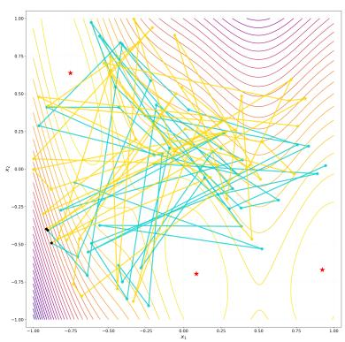  
(a) BONET and PGS constructors

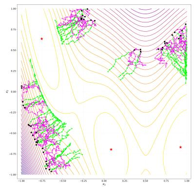  
(b) GTG and UGTL constructors

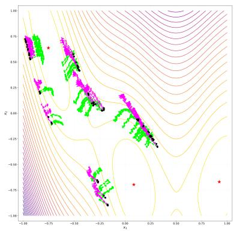  
(c) Generated trajectories  
Figure 1: A motivating example on the negated Branin function. (a) and (b) compare constructed trajectories, and (c) shows trajectories generated by GTG and UGTL with the same conditional difusion model. Black dots and red stars denote starting points and global optima, respectively.

These observations motivate a trajectory constructor that preserves locality while guiding successive transitions toward consistent improvement. We therefore introduce approximate proxy gradients to provide directional guidance and improve trajectory quality, and formulate this design as Uncertainty aware Gradient-guided Trajectory Learning (UGTL). As illustrated by the green trajectories in Fig ure 1(b) and (c), UGTL produces smoother ascent-oriented paths whose structure is retained by the downstream difusion model. In the next subsection, we will introduce UGTL in detail.

## 4.3. A New Ofline Optimization Method: Uncertainty-aware Gradient-guided Trajectory Learning

To provide directional guidance of the trajectory construction procedure, we introduce UGTL, which implements the three stages of Algorithm 4. In trajectory construction, it constructs locally coherent paths using proxy-gradient guidance adjusted by the prediction uncertainty of an ensemble of surrogate models. In trajectory modeling, it learns the retained paths using a terminal-score-conditioned difusion model. In candidate generation, it produces the evaluation batch through guided trajectory sampling and a Cluster-then-Select procedure.

Trajectory construction. Each trajectory $\tau = ( ( \pmb { x } _ { 1 } ^ { \tau } , y _ { 1 } ^ { \tau } ) , \dots , ( \pmb { x } _ { H } ^ { \tau } , y _ { H } ^ { \tau } ) )$ starts from a point sampled uniformly from the bottom ${ p _ { \mathrm { i n i t } } } \%$ of observed scores, leaving scope for improvement. Given the current prefix $\tau _ { 1 : k }$ , we define its best observed score as

$$
b _ { k } = \operatorname* { m a x } _ { 1 \leq h \leq k } y _ { h } ^ { \tau } .
$$

We then construct a score-feasible local neighborhood

$$
S _ { k } = \mathrm { N N } _ { K } ( \pmb { x } _ { k } ^ { \tau } ; \{ ( \pmb { x } _ { j } , y _ { j } ) \in D : \pmb { x } _ { j } \notin \{ \pmb { x } _ { 1 } ^ { \tau } , \dots , \pmb { x } _ { k } ^ { \tau } \} , y _ { j } \geq b _ { k } - \xi \} ) ,\tag{22}
$$

where $\mathrm { N N } _ { K } ( { \pmb x } ; { \pmb S } )$ returns up to K nearest designs to x in the set S. The score constraint $y _ { j } \ge b _ { k } - \xi$ keeps candidate scores close to the best value reached by the current trajectory, while $\xi \ge 0$ allows short non-monotone transitions. If no unvisited design satisfies the score constraint, we use the K highest-scoring unvisited designs as a fallback, breaking score ties by distance to $\pmb { x } _ { k } ^ { \tau }$

Within $S _ { k }$ , we favor transitions aligned with the gradient. For this purpose, we train an ensemble of $M _ { \mathrm { e n s } }$ surrogate models $\{ \tilde { f } _ { \phi _ { m } } \} _ { m = 1 } ^ { M _ { \mathrm { e n s } } }$ on D. The ensemble mean $\mu _ { \phi }$ serves as the proxy score, while the ensemble dispersion $\sigma _ { \phi }$ provides an estimate of predictive uncertainty:

$$
\mu _ { \phi } ( \pmb { x } ) = \frac { 1 } { M _ { \mathrm { e n s } } } \sum _ { m = 1 } ^ { M _ { \mathrm { e n s } } } \tilde { f } _ { \phi _ { m } } ( \pmb { x } ) , \qquad \sigma _ { \phi } ( \pmb { x } ) = \sqrt { \frac { 1 } { M _ { \mathrm { e n s } } } \sum _ { m = 1 } ^ { M _ { \mathrm { e n s } } } \left( \tilde { f } _ { \phi _ { m } } ( \pmb { x } ) - \mu _ { \phi } ( \pmb { x } ) \right) ^ { 2 } } .\tag{23}
$$

We use the gradient of the ensemble mean, $\nabla _ { \pmb { x } } \mu _ { \phi } ( \pmb { x } )$ , as a proxy gradient to provide directional guidance during trajectory construction.

For each $( \pmb { x } _ { j } , y _ { j } ) \in S _ { k }$ , we define the stabilized cosine alignment

$$
a _ { k , j } = \frac { \langle \nabla _ { x } \mu _ { \phi } ( { \pmb x } _ { k } ^ { \tau } ) , { \pmb x } _ { j } - { \pmb x } _ { k } ^ { \tau } \rangle } { \| \nabla _ { { \pmb x } } \mu _ { \phi } ( { \pmb x } _ { k } ^ { \tau } ) \| \| { \pmb x } _ { j } - { \pmb x } _ { k } ^ { \tau } \| + c _ { \mathrm { c o s } } } ,
$$

where $c _ { \mathrm { c o s } } = 1 0 ^ { - 8 }$ provides numerical stability. The next point is sampled according to

$$
\operatorname* { P r } \bigl ( ( \boldsymbol { x } _ { k + 1 } ^ { \tau } , \boldsymbol { y } _ { k + 1 } ^ { \tau } ) = ( \boldsymbol { x } _ { j } , \boldsymbol { y } _ { j } ) \mid \tau _ { 1 : k } \bigr ) = \frac { \exp ( \boldsymbol { a } _ { k , j } / \kappa _ { k } ) } { \sum _ { ( \boldsymbol { x } _ { j ^ { \prime } } , \boldsymbol { y } _ { j ^ { \prime } } ) \in S _ { k } } \exp ( \boldsymbol { a } _ { k , j ^ { \prime } } / \kappa _ { k } ) } .\tag{24}
$$

The temperature $\kappa _ { k }$ is determined by the ensemble uncertainty:

$$
\kappa _ { k } = 1 + \frac { \sigma _ { \phi } ( { \bf x } _ { k } ^ { \tau } ) } { \bar { \sigma } _ { \phi } + c _ { \mathrm { t e m p } } } , \qquad \bar { \sigma } _ { \phi } = \frac { 1 } { N } \sum _ { i = 1 } ^ { N } \sigma _ { \phi } ( { \bf x } _ { i } ) ,
$$

where $c _ { \mathrm { t e m p } } > 0$ . Low predictive uncertainty yields a sharper preference for gradient-aligned transitions, whereas high uncertainty increases the temperature and spreads probability across the feasible neighborhood.

Algorithm 5 UGTL: Uncertainty-aware Gradient-guided Trajectory Construction   
Input: Ofline dataset ${ \overline { { D , } } }$ horizon H, trajectory count $\overline { { N _ { \mathrm { t r a j } } } }$ , initial percentile $p _ { \mathrm { i n i t } }$ , neighborhood size   
$K ,$ score tolerance $\xi ,$ retention ratio $\rho ,$ ensemble size $M _ { \mathrm { e n s } }$   
Output: Trajectory dataset $D _ { \mathrm { t r a j } }$   
1: Train the surrogate ensemble $\{ \tilde { f } _ { \phi _ { m } } \} _ { m = 1 } ^ { M _ { \mathrm { e n s } } }$ on D and compute $\mu _ { \phi } ( \cdot )$ and $\sigma _ { \phi } ( \cdot )$ using Eq. (23);   
2: Initialize $\tau _ { \mathrm { { t r a j } } } \gets \emptyset ;$   
3: for $u = 1 , \ldots , { { N } _ { \mathrm { { t r a j } } } }$ do   
4: Sample $( \pmb { x } _ { 1 } ^ { \tau } , y _ { 1 } ^ { \tau } )$ from the bottom $p _ { \mathrm { i n i t } } \%$ of D and initialize $\tau  ( (  { \mathbf { { x } } } _ { 1 } ^ { \tau } , y _ { 1 } ^ { \tau } ) ) ;$   
5: for $k = 1 , \ldots , H - 1$ do   
6: Construct $S _ { k }$ using Eq. (22);   
7: if $S _ { k } = \emptyset$ then   
8: Use the K highest-scoring unvisited designs   
9: end if   
10: Sample $( \pmb { x } _ { k + 1 } ^ { \tau } , \pmb { y } _ { k + 1 } ^ { \tau } )$ from $S _ { k }$ using Eq. (24);   
11: Append $( \pmb { x } _ { k + 1 } ^ { \tau } , \pmb { y } _ { k + 1 } ^ { \tau } )$ to τ   
12: end for   
13: Add τ to $\mathcal { T } _ { \mathrm { t r a j } }$   
14: end for   
15: Rank the trajectories in $\mathcal { T } _ { \mathrm { t r a j } }$ by $\Delta _ { y } ( \tau ) = y _ { H } ^ { \tau } - y _ { 1 } ^ { \tau }$   
16: Retain the top $\lceil \rho N _ { \mathrm { t r a j } } \rceil$ trajectories as $D _ { \mathrm { t r a j } }$   
17: return $D _ { \mathrm { t r a j } }$   
After constructing $N _ { \mathrm { t r a j } }$ trajectories, we rank them by their endpoint improvement,   
$\Delta _ { y } ( \tau ) = y _ { H } ^ { \tau } - y _ { 1 } ^ { \tau } ,$   
and retain the top $\lceil \rho N _ { \mathrm { t r a j } } \rceil$ trajectories, where $\rho \in ( 0 , 1 ]$ . This filtering removes stagnant paths without   
requiring every transition to be monotone. The retained trajectories form $D _ { \mathrm { t r a j } }$ , and Algorithm 5   
summarizes the complete construction stage.   
Trajectory modeling. For each $\tau \in D _ { \mathrm { t r a j } } .$ , let $\pmb { X } _ { \tau } = [ \pmb { x } _ { 1 } ^ { \tau } , \dots , \pmb { x } _ { H } ^ { \tau } ]$ denote its design sequence and let   
$y _ { \tau } ^ { \mathrm { e n d } } = y _ { H } ^ { \tau }$ denote its terminal score. We model the design sequence conditioned on its terminal score   
using a conditional difusion model $p _ { \theta } ( X _ { \tau } \mid y _ { \tau } ^ { \mathrm { e n d } } )$ . The forward process is   
$q ( { \bf X } _ { \tau } ^ { ( t ) } \mid { \bf X } _ { \tau } ^ { ( 0 ) } ) = \mathcal { N } \Big ( \sqrt { \bar { \alpha } _ { t } } { \bf X } _ { \tau } ^ { ( 0 ) } , ( 1 - \bar { \alpha } _ { t } ) { \cal I } \Big )$   
where $t = 1 , \dots , T _ { \mathrm { d i f f } } , \alpha _ { t } \in ( 0 , 1 )$ is the signal-retention coeficient at difusion step t, and $\begin{array} { r } { \bar { \alpha } _ { t } = \prod _ { s = 1 } ^ { t } \alpha _ { s } } \end{array}$

We train a noise-prediction network $\varepsilon _ { \theta } ( X _ { \tau } ^ { ( t ) } , t , y )$ using classifier-free conditioning:

$$
\begin{array} { r } { \mathcal { L } ( \theta ) = \mathbb { E } _ { \tau , t , \varepsilon } \left[ \left. \varepsilon - \varepsilon _ { \theta } ( X _ { \tau } ^ { ( t ) } , t , y ) \right. ^ { 2 } \right] , } \end{array}
$$

where $\tau$ is sampled from $D _ { \mathrm { t r a j } }$ , t is sampled uniformly from $\{ 1 , \dots , T _ { \mathrm { d i f f } } \}$ , and $\varepsilon \sim \mathcal { N } ( 0 , I )$ . The condition $y$ equals $y _ { \tau } ^ { \mathrm { e n d } }$ with probability $1 - p _ { \mathrm { d r o p } } ;$ otherwise, it is dropped and represented by a dedicated null-conditioning embedding, which enables classifier-free guidance during candidate generation.

Candidate generation. We use the learned difusion model to generate trajectories toward a target terminal score. Let $y _ { \mathrm { t a r } } = \lambda _ { \mathrm { t a r } } \cdot \operatorname* { m a x } _ { ( \pmb { x } , y ) \in D } y$ , where $\lambda _ { \mathrm { t a r } } \geq 1$ controls the target level. Classifier-free guidance with scale $s _ { \mathrm { c f g } }$ computes

$$
\begin{array} { r } { \widehat { \varepsilon } _ { \theta } ( \mathbf { X } ^ { ( t ) } , t , y _ { \mathrm { t a r } } ) = \varepsilon _ { \theta } ( \mathbf { X } ^ { ( t ) } , t , \infty ) + s _ { \mathrm { c f g } } \left( \varepsilon _ { \theta } ( \mathbf { X } ^ { ( t ) } , t , y _ { \mathrm { t a r } } ) - \varepsilon _ { \theta } ( \mathbf { X } ^ { ( t ) } , t , \infty ) \right) . } \end{array}\tag{25}
$$

Each reverse step is

$$
{ \pmb X } ^ { ( t - 1 ) } = \frac { 1 } { \sqrt { \alpha _ { t } } } \left( { \pmb X } ^ { ( t ) } - \frac { 1 - \alpha _ { t } } { \sqrt { 1 - \bar { \alpha } _ { t } } } \widehat { \varepsilon } _ { \theta } ( { \pmb X } ^ { ( t ) } , t , y _ { \mathrm { t a r } } ) \right) + \sigma _ { t } z _ { t } , \qquad z _ { t } \sim \mathcal { N } ( 0 , I ) ,\tag{26}
$$

where $\begin{array} { r } { \sigma _ { t } ^ { 2 } = \frac { 1 - \bar { \alpha } _ { t - 1 } } { 1 - \bar { \alpha } _ { t } } ( 1 - \alpha _ { t } ) } \end{array}$ , and $z _ { 1 } = \mathbf { 0 }$ at the final reverse step.

For each generated trajectory, we sample $\tau ^ { \mathrm { c t x } } \in D _ { \mathrm { t r a j } }$ and use its first $H _ { \mathrm { c t x } } < H$ designs as the context

$$
\boldsymbol { X } _ { \mathrm { c t x } } = [ \pmb { x } _ { 1 } ^ { \tau ^ { \mathrm { c t x } } } , \dots , \pmb { x } _ { H _ { \mathrm { c t x } } } ^ { \tau ^ { \mathrm { c t x } } } ] .
$$

We keep this prefix fixed by overwriting the corresponding positions after each reverse step:

$$
X _ { 1 : H _ { \mathrm { c t x } } } ^ { ( t - 1 ) }  X _ { \mathrm { c t x } } .\tag{27}
$$

This anchors each generated trajectory to an observed prefix while allowing its sufix to move toward the target score.

The generated sufixes form a candidate pool $\mathcal { P } .$ . To improve robustness, instead of directly returning the top-Q proxy-scored designs, we propose Cluster-then-Select, which retains the top $M _ { \mathrm { p o o l } }$ valid candidates under $\mu _ { \phi }$ , where $M _ { \mathrm { p o o l } } \geq Q$ , partitions them into $Q$ clusters, and selects the design with the highest proxy score from each cluster $B _ { q } \mathrm { . }$

$$
\pmb { x } _ { q } ^ { \mathrm { o u t } } = \underset { \pmb { x } \in \mathcal { B } _ { q } } { \arg \operatorname* { m a x } } \mu _ { \phi } ( \pmb { x } ) , \qquad q = 1 , \ldots , Q .
$$

Algorithm 6 summarizes the complete candidate-generation stage, where the resulting candidate set combines high proxy scores with coverage across distinct generated regions.

Algorithm 6 UGTL: Candidate Generation   
Input: Trained difusion model $\varepsilon _ { \boldsymbol { \theta } } ,$ trajectory dataset $D _ { \mathrm { t r a j } }$ , proxy $\mu _ { \phi }$ , context length $H _ { \mathrm { c t x } }$ , candidate   
budget $Q ,$ pre-screening size $M _ { \mathrm { p o o l } }$ , number $N _ { \mathrm { g e n } }$ of generated trajectories, terminal-score multiplier   
$\lambda _ { \mathrm { t a r } }$ , guidance scale $s _ { \mathrm { c f g } } .$ , difusion steps T<sub>dif</sub>   
Output: Candidate set $\{ \pmb { x } _ { 1 } ^ { \mathrm { o u t } } , \ldots , \pmb { x } _ { Q } ^ { \mathrm { o u t } } \}$   
1: Initialize the candidate pool $\mathcal { P }  \emptyset ;$   
2: for $u = 1 , \ldots , N _ { \mathrm { g e n } }$ do   
3: Sample $X ^ { ( T _ { \mathrm { d i f f } } ) } \sim \mathcal { N } ( 0 , I )$ and $\tau ^ { \mathrm { c t x } } \sim D _ { \mathrm { t r a j } } ;$   
4: Set $\begin{array} { r } { \pmb { X } _ { 1 : H _ { \mathrm { c t x } } } ^ { ( T _ { \mathrm { d i f f } } ) }  [ { \pmb x } _ { 1 } ^ { \tau ^ { \mathrm { c t x } } } , \ldots , { \pmb x } _ { H _ { \mathrm { c t x } } } ^ { \tau ^ { \mathrm { c t x } } } ] ; } \end{array}$   
5: for $t = T _ { \mathrm { d i f f } } , \dots , 1$ do   
6: Compute the guided noise using Eq. (25);   
7: Compute $X ^ { ( t - 1 ) }$ using Eq. (26);   
8: Apply context conditioning using Eq. (27)   
9: end for   
10: $\mathcal { P }  \mathcal { P } \cup X _ { H _ { \mathrm { c t x } + 1 } : H } ^ { ( 0 ) }$   
11: end for   
12: Retain the top $M _ { \mathrm { p o o l } }$ valid designs in $\mathcal { P }$ according to $\mu _ { \phi } ;$   
13: Partition them into Q clusters $\{ B _ { 1 } , \ldots , B _ { Q } \}$ using k-means;   
14: for $q = 1 , \ldots , Q$ do   
15: ${ \pmb x } _ { q } ^ { \mathrm { o u t } }  \mathrm { a r g m a x } _ { { \pmb x } \in \mathcal { B } _ { q } } \mu _ { \phi } ( { \pmb x } )$   
16: end for   
17: return $\{ \pmb { x } _ { 1 } ^ { \mathrm { o u t } } , \ldots , \pmb { x } _ { Q } ^ { \mathrm { o u t } } \}$

Comparison with $G T G \ : [ 7 4 ] .$ UGTL adapts GTG’s conditional trajectory difusion for trajectory modeling. However, GTG constructs trajectories by sampling from score-feasible nearest neighbors, which improves locality but does not distinguish these neighbors according to their alignment with an op timization direction. UGTL instead starts from our proposed algorithm-dependent learnability and uses uncertainty-aware proxy-gradient guidance to construct optimizer-like improvement trajectories (yielding more consistent trajectories, as shown in Figure 1), followed by Cluster-then-Select for candidate selection. Thus, compared with GTG, UGTL retains the trajectory-modeling pipeline while introducing diferent procedures for trajectory construction and candidate selection.

## 5. Experiments

In this section, we evaluate the performance of our proposed method UGTL empirically on popular benchmarks, Design-Bench [61] and BBOB [21], for ofline data-driven optimization. To assess UGTL systematically, this section organizes the evaluation into three complementary levels, moving from endto-end efectiveness to trajectory-level behavior and then to component contributions and robustness. First, at the end-to-end level, we examine whether UGTL is competitive with existing ofline optimization methods in terms of final candidate quality. Second, at the trajectory level, we assess whether the proposed trajectory constructor produces locally coherent, improvement-oriented paths and whether these properties are preserved in model-generated trajectories. Finally, at the component level, we test whether the UGTL constructor remains beneficial across diferent downstream models and training procedures, isolate the additional contribution of the diversity-aware Cluster-then-Select strategy, and assess sensitivity to the main hyperparameters.

## 5.1. Experimental Settings

Benchmark and tasks. We benchmark UGTL on five Design-Bench tasks [61], following recent ofline data-driven optimization studies [59, 74]. The continuous tasks include: 1) Ant Morphology [9], which optimizes a 60-dimensional morphology for locomotion; 2) D’Kitty Morphology [1], which optimizes a 56-dimensional robot morphology; and 3) Superconductor [27], which searches an 86-dimensional material representation to maximize critical temperature. The discrete tasks are TF-Bind-8 and TF-Bind-10 [8], which optimize DNA sequences of length 8 and 10 for transcription-factor binding afinity. For each task, we directly use the ofline datasets provided by Design-Bench, which contain 10,004, 10,004, 17,014, 32,898, and 50,000 designs for Ant, D’Kitty, Superconductor, TF-Bind-8, and TF-Bind 10, respectively.

Controlled BBOB case studies. Detailed trajectory analysis requires evaluating every intermediate design. Since the evaluations for Design-Bench tasks are quite expensive, Design-Bench mainly measures final candidate quality. We introduce two cheap analytic BBOB functions [21] as controlled case studies to examine the trajectories produced by diferent methods. Specifically, we use Rastrigin, a multimodal function, and Rosenbrock, a narrow-valley function, with dimensions d ∈ {5, 10, 15, 20}. For each func tion and dimension, we sample 50,000 points uniformly from the native domain $( [ - 5 . 1 2 , 5 . 1 2 ] ^ { d }$ for Rastrigin and [−5, 5]<sup>d</sup> for Rosenbrock), transform the minimization objective into a score in [0, 1] using min–max scaling, and remove the top 40% by score to form an ofline dataset of 30,000 points.

Compared methods. We compare UGTL with five categories of methods, including 24 baselines. The first class consists of baseline optimization methods that maximize a surrogate model, including BOqEI [24, 54], CMA-ES [28], REINFORCE [65], and Gradient Ascent with its mean- and minimumensemble variants. The second category comprises inverse or conditional generative methods, including CbAS [10], MINs [40], and DDOM [38]. The third category is called regularized surrogate methods, including COMs [62], RoMA [72], IOM [50], BDI [13], ICT [73], Tri-Mentoring [12], FGM [39], LTR [59], GABO [71], and DynAMO-Adam [70]. We further compare trajectory-informed methods, MATCH-OPT [32] and ROOT [16], and generative trajectory methods, BONET [46], GTG [74], and PGS [11] Except for ROOT, LTR, GABO, and DynAMO-Adam, the baseline results are taken from [59] under the same Design-Bench protocol. We run ROOT, LTR, GABO, and the Adam variant of DynAMO using their oficial implementations.

Implementation details and hyperparameters. For trajectory construction, we follow the hyperparameters in [74] by setting the trajectory horizon to $H = 6 4$ , the neighborhood size to $K = 2 0$ , the initial percentile to $p _ { \mathrm { i n i t } } = 2 0 \%$ , and the number $N _ { \mathrm { t r a j } }$ of trajectories to 4,000 for continuous tasks and 1,000 for discrete tasks. The score tolerance $\xi = 0 . 0 1$ on D’Kitty and 0.05 on the other tasks. Each surrogate is an independently initialized two-hidden-layer MLP of width 1,024 with LeakyReLU activations trained for 5,000 Adam steps with learning rate $1 0 ^ { - 3 }$ and batch size 128. We set the ensemble size $M _ { \mathrm { e n s } } = 1 0$ , retention ratio $\rho = 0 . 5 ,$ , and uncertainty temperature $c _ { \mathrm { t e m p } } = 0 . 5$

For trajectory modeling, the conditional difusion model is a temporal U-Net [34] with channel multipliers (1, 4, 8), base width 128 on continuous tasks and 32 on discrete tasks, $T _ { \mathrm { d i f f } } = \mathrm { 2 0 0 ~ s t e p s } ,$ , and a cosine noise schedule. The difusion model is trained by Adam [37] using a batch size of 128 and EMA decay of 0.995. Models for continuous tasks are trained for 50,000 steps at a learning rate of $1 0 ^ { - 4 }$ ， while those for discrete tasks are trained for 20,000 steps at $2 \times 1 0 ^ { - 4 }$ . The condition-drop probability $p _ { \mathrm { d r o p } } = 0 . 2 5$ . We report the results of the final checkpoint.

For candidate generation, the classifier-free guidance scale, context length, number of generated trajectories, and pre-screening pool size are $s _ { \mathrm { c f g } } ~ = ~ 1 . 5$ $H _ { \mathrm { c t x } } = 3 2$ $N _ { \mathrm { g e n } } = 1 0 0 0$ , and $M _ { \mathrm { p o o l } } = 2 0 4 8 .$ respectively. $\lambda _ { \mathrm { t a r } }$ is set to 1.5 on TF-Bind-8 and 1.3 otherwise. Cluster-then-Select applies k-means in the normalized difusion representation, using k-means++ initialization [2] with 10 independent starts.

Additionally, in the controlled BBOB comparison, we set H = 64, $K = 5 0$ $N _ { \mathrm { t r a j } } = 1 0 0 0$ $p _ { \mathrm { i n i t } } = 2 0 \%$ ， $\xi = 0 . 0 5$ , and $N _ { \mathrm { g e n } } = 1 0 0 0$ . All experiments are implemented in PyTorch 1.13.1.

Evaluation and metrics. Each method returns $Q = 1 2 8$ candidates. Following the Design-Bench protocol [59, 61], we evaluate the candidates using the ground-truth oracle and report the normalized 100th-percentile score, i.e., the score of the best returned design. A raw score y is normalized as $( y - y _ { \operatorname* { m i n } } ^ { \mathrm { a l l } } ) / ( y _ { \operatorname* { m a x } } ^ { \mathrm { a l l } } - y _ { \operatorname* { m i n } } ^ { \mathrm { a l l } } )$ , where $y _ { \mathrm { m i n } } ^ { \mathrm { a l l } }$ and $y _ { \mathrm { m a x } } ^ { \mathrm { a l l } }$ are the extrema of the full, unobserved benchmark dataset. We report the mean ± standard deviation over eight independent runs.

## 5.2. Main Results on Design-Bench

Table 2 reports the 100th-percentile normalized scores. Among the 25 methods, UGTL achieves the best mean rank of 3.1, followed by LTR [59] with 4.8 and BDI [13] with 5.9. UGTL obtains the highest mean score on Superconductor and TF-Bind-10 and improves over the best observed ofline score, D(best), on all five tasks. Among generative trajectory methods, UGTL achieves the highest mean score on every task compared with BONET [46], GTG [74], and PGS [11]. These results demonstrate the overall efectiveness of UGTL on Design-Bench and also motivate the trajectory-level analyses below.

## 5.3. Trajectory-quality Analysis

The comparison in Section 5.2 measures final candidate quality but does not show how complete trajectories evolve. We therefore complement it with trajectory-level diagnostics and the controlled BBOB case studies described in Section 5.1. The analytically evaluable objectives of BBOB allow us to evaluate every point in both constructed and generated trajectories while keeping the downstream difusion model and sampler fixed.

## 5.3.1. Trajectory-quality Diagnostics

In this subsection, we compare the trajectory quality of BONET [46], PGS [11], GTG [74], and UGTL. On Design-Bench, we evaluate the constructed trajectories; on BBOB, we evaluate both constructed and model-generated trajectories. For the generated BBOB trajectories, all methods use the same conditional difusion model, training schedule, and full-trajectory sampler. We evaluate the final sampled trajectories. For a trajectory τ, we measure cumulative regret and smoothness as

$$
R ( \tau ) = \sum _ { k = 1 } ^ { H } ( 1 - s _ { k } ) , \qquad S ( \tau ) = \frac { 1 } { H - 2 } \sum _ { k = 1 } ^ { H - 2 } \| \pmb { x } _ { k + 2 } - 2 \pmb { x } _ { k + 1 } + \pmb { x } _ { k } \| ^ { 2 } ,
$$

where $s _ { k }$ is the normalized objective value. The regret is small when a trajectory remains in highvalue regions. Since ${ \pmb x } _ { k + 2 } - 2 { \pmb x } _ { k + 1 } + { \pmb x } _ { k } = ( { \pmb x } _ { k + 2 } - { \pmb x } _ { k + 1 } ) - ( { \pmb x } _ { k + 1 } - { \pmb x } _ { k } )$ is the diference between two consecutive displacement vectors, a smaller smoothness value indicates less variation between successive moves and hence a smoother trajectory. Before computing smoothness, we normalize the design coordinates using min–max scaling. We report Design-Bench smoothness only on the three continuous tasks because distances between discrete latent representations are not directly comparable. Each diagnostic is computed over eight independent runs.

Figure 2 summarizes the trajectory diagnostics. UGTL ranks first on Design-Bench regret (1.2/4) and smoothness (1.3/4). On BBOB, it ranks first on constructed-trajectory regret and on both regret and smoothness for generated trajectories, while tying GTG on constructed-trajectory smoothness. These results show that UGTL produces trajectories that remain in high-value regions and change more smoothly between successive moves.

Table 2: 100th-percentile normalized score among $Q = 1 2 8$ candidates on five Design-Bench tasks (mean ± standard deviation over eight runs). Blue and Violet denote the best and runner-up reported means. D(best) is the best score in the ofline dataset. Mean rank is computed across all 25 methods with average ranks for ties.
<table><tr><td>Category</td><td>Method</td><td>Ant</td><td> $\mathrm { D } \mathrm { \ K i t t y }$ </td><td>Superconductor</td><td>TF-Bind-8</td><td>TF-Bind-10</td><td>Mean Rank</td></tr><tr><td></td><td>D(best)</td><td>0.565</td><td>0.884</td><td>0.400</td><td>0.439</td><td>0.467</td><td>/</td></tr><tr><td rowspan="6">Proxy</td><td>BO-qEI</td><td> $0 . 8 1 2 \pm 0 . 0 0 0$ </td><td> $0 . 8 9 6 \pm 0 . 0 0 0$ </td><td> $0 . 3 8 2 \pm 0 . 0 1 3$ </td><td> $0 . 8 0 2 \pm 0 . 0 8 1$ </td><td> $0 . 6 2 8 \pm 0 . 0 3 6$ </td><td>19.4/25</td></tr><tr><td>CMA-ES</td><td> $\mathbf { 1 . 7 1 2 \pm 0 . 7 5 4 }$ </td><td> $0 . 7 2 5 \pm 0 . 0 0 2$ </td><td> $0 . 4 6 3 \pm 0 . 0 4 2$ </td><td> $0 . 9 4 4 \pm 0 . 0 1 7$ </td><td> $0 . 6 4 1 \pm 0 . 0 3 6$ </td><td>12.2/25</td></tr><tr><td>REINFORCE</td><td> $0 . 2 4 8 \pm 0 . 0 3 9$ </td><td> $0 . 5 4 1 \pm 0 . 1 9 6$ </td><td> $0 . 4 7 8 \pm 0 . 0 1 7$ </td><td> $0 . 9 3 5 \pm 0 . 0 4 9$ </td><td> $\mathbf { 0 . 6 7 3 \pm 0 . 0 7 4 }$ </td><td>15.0/25</td></tr><tr><td>Grad. Ascent</td><td> $0 . 2 7 3 \pm 0 . 0 2 3$ </td><td> $0 . 8 5 3 \pm 0 . 0 1 8$ </td><td> $0 . 5 1 0 \pm 0 . 0 2 8$ </td><td> $0 . 9 6 9 \pm 0 . 0 2 1$ </td><td> $0 . 6 4 6 \pm 0 . 0 3 7$ </td><td>12.0/25</td></tr><tr><td>Grad. Ascent Mean</td><td> $0 . 3 0 6 \pm 0 . 0 5 3$ </td><td> $0 . 8 7 5 \pm 0 . 0 2 4$ </td><td> $0 . 5 0 8 \pm 0 . 0 1 9$ </td><td> $\mathbf { 0 . 9 8 5 \pm 0 . 0 0 8 }$ </td><td> $0 . 6 3 3 \pm 0 . 0 3 0$ </td><td>11.8/25</td></tr><tr><td>Grad. Ascent Min</td><td> $0 . 2 8 2 \pm 0 . 0 3 3$ </td><td> $0 . 8 8 4 \pm 0 . 0 1 8$ </td><td> $\mathbf { 0 . 5 1 4 \pm 0 . 0 2 0 }$ </td><td> $\mathbf { 0 . 9 7 9 \pm 0 . 0 1 4 }$ </td><td> $0 . 6 3 2 \pm 0 . 0 2 7$ </td><td>11.6/25</td></tr><tr><td rowspan="3">Inverse/Conditional Generative Modeling</td><td>CbAS</td><td> $0 . 8 4 6 \pm 0 . 0 3 2$ </td><td> $0 . 8 9 6 \pm 0 . 0 0 9$ </td><td> $0 . 4 2 1 \pm 0 . 0 4 9$ </td><td> $0 . 9 2 1 \pm 0 . 0 4 6$ </td><td> $0 . 6 3 0 \pm 0 . 0 3 9$ </td><td>16.7/25</td></tr><tr><td>MINs</td><td> $0 . 9 0 6 \pm 0 . 0 2 4$ </td><td> $0 . 9 3 9 \pm 0 . 0 0 7$ </td><td> $0 . 4 6 4 \pm 0 . 0 2 3$ </td><td> $0 . 9 1 0 \pm 0 . 0 5 1$ </td><td> $0 . 6 3 3 \pm 0 . 0 3 4$ </td><td>14.0/25</td></tr><tr><td>DDOM</td><td> $0 . 9 0 8 \pm 0 . 0 2 4$ </td><td> $0 . 9 3 0 \pm 0 . 0 0 5$ </td><td> $0 . 4 5 2 \pm 0 . 0 2 8$ </td><td> $0 . 9 1 3 \pm 0 . 0 4 7$ </td><td> $0 . 6 1 6 \pm 0 . 0 1 8$ </td><td>15.8/25</td></tr><tr><td rowspan="9">Regularized Surrogate Modeling</td><td>COMs</td><td> $0 . 9 1 6 \pm 0 . 0 2 6$ </td><td> $0 . 9 4 9 \pm 0 . 0 1 6$ </td><td> $0 . 4 6 0 \pm 0 . 0 4 0$ </td><td> $0 . 9 5 3 \pm 0 . 0 3 8$ </td><td> $0 . 6 4 4 \pm 0 . 0 5 2$ </td><td>10.3/25</td></tr><tr><td>RoMA</td><td> $0 . 4 3 0 \pm 0 . 0 4 8$ </td><td> $0 . 7 6 7 \pm 0 . 0 3 1$ </td><td> $0 . 4 9 4 \pm 0 . 0 2 5$ </td><td> $0 . 6 6 5 \pm 0 . 0 0 0$ </td><td> $0 . 5 5 3 \pm 0 . 0 0 0$ </td><td>20.1/25</td></tr><tr><td>IOM</td><td> $0 . 8 8 9 \pm 0 . 0 3 4$ </td><td> $0 . 9 2 8 \pm 0 . 0 0 8$ </td><td> $0 . 4 9 1 \pm 0 . 0 3 4$ </td><td> $0 . 9 2 5 \pm 0 . 0 5 4$ </td><td> $0 . 6 2 8 \pm 0 . 0 3 6$ </td><td>14.1/25</td></tr><tr><td>BDI</td><td> $\mathbf { 0 . 9 6 3 \pm 0 . 0 0 0 }$ </td><td> $0 . 9 4 1 \pm 0 . 0 0 0$ </td><td> $0 . 5 0 8 \pm 0 . 0 1 3$ </td><td> $0 . 9 7 3 \pm 0 . 0 0 0$ </td><td> $0 . 6 5 8 \pm 0 . 0 0 0$ </td><td>5.9/25</td></tr><tr><td>ICT</td><td> $0 . 9 1 5 \pm 0 . 0 2 4$ </td><td> $0 . 9 4 7 \pm 0 . 0 0 9$ </td><td> $0 . 4 9 4 \pm 0 . 0 2 6$ </td><td> $0 . 8 9 7 \pm 0 . 0 5 0$ </td><td> $0 . 6 5 9 \pm 0 . 0 2 4$ </td><td>10.0/25</td></tr><tr><td>Tri-Mentoring</td><td> $0 . 8 9 1 \pm 0 . 0 1 1$ </td><td> $0 . 9 4 7 \pm 0 . 0 0 5$ </td><td> $0 . 5 0 3 \pm 0 . 0 1 3$ </td><td> $0 . 9 5 6 \pm 0 . 0 0 0$ </td><td> $0 . 6 6 2 \pm 0 . 0 1 2$ </td><td>8.0/25</td></tr><tr><td>FGM</td><td> $0 . 9 2 3 \pm 0 . 0 2 3$ </td><td> $0 . 9 4 4 \pm 0 . 0 1 4$ </td><td> $0 . 4 8 1 \pm 0 . 0 2 4$ </td><td> $0 . 8 1 1 \pm 0 . 0 7 9$ </td><td> $0 . 6 1 1 \pm 0 . 0 0 8$ </td><td>14.2/25</td></tr><tr><td>LTR</td><td> $0 . 9 2 0 \pm 0 . 0 2 6$ </td><td> $\mathbf { 0 . 9 5 8 \pm 0 . 0 1 1 }$ </td><td> $0 . 5 0 9 \pm 0 . 0 2 7$ </td><td> $0 . 9 7 7 \pm 0 . 0 0 8$ </td><td> $0 . 6 5 5 \pm 0 . 0 1 3$ </td><td>4.8/25</td></tr><tr><td>GABO</td><td> $0 . 0 3 8 \pm 0 . 0 1 2$ </td><td> $0 . 7 1 9 \pm 0 . 0 0 1$ </td><td> $0 . 3 7 4 \pm 0 . 0 2 0$ </td><td> $0 . 9 2 6 \pm 0 . 0 3 8$ </td><td> $0 . 6 1 9 \pm 0 . 0 4 3$ </td><td>21.1/25</td></tr><tr><td>DynAMO-Adam</td><td> $0 . 1 1 3 \pm 0 . 0 8 5$ </td><td> $0 . 7 8 9 \pm 0 . 0 5 9$ </td><td> $0 . 4 1 3 \pm 0 . 1 0 6$ </td><td> $0 . 7 1 9 \pm 0 . 1 4 2$ </td><td> $0 . 5 5 6 \pm 0 . 0 9 0$ </td><td>23.0/25</td></tr><tr><td rowspan="2">Optimization</td><td>Trajectory-Informed MATCH-OPT</td><td> $0 . 9 3 3 \pm 0 . 0 1 6$ </td><td> $0 . 9 5 2 \pm 0 . 0 0 8$ </td><td> $0 . 5 0 4 \pm 0 . 0 2 1$ </td><td> $0 . 8 2 4 \pm 0 . 0 6 7$ </td><td> $0 . 6 5 5 \pm 0 . 0 5 0$ </td><td>8.7/25</td></tr><tr><td>ROOT</td><td> $0 . 9 5 5 \pm 0 . 0 1 7$ </td><td> $\mathbf { 0 . 9 7 1 \pm 0 . 0 0 5 }$ </td><td> $0 . 4 5 1 \pm 0 . 0 3 2$ </td><td> $0 . 9 7 7 \pm 0 . 0 1 5$ </td><td> $0 . 6 5 3 \pm 0 . 0 3 0$ </td><td>7.1/25</td></tr><tr><td rowspan="4">Generative Trajectory Learning PGS</td><td>BONET</td><td> $0 . 9 2 1 \pm 0 . 0 3 1$ </td><td> $0 . 9 4 9 \pm 0 . 0 1 6$ </td><td> $0 . 3 9 0 \pm 0 . 0 2 2$ </td><td> $0 . 7 9 8 \pm 0 . 1 2 3$ </td><td> $0 . 5 7 5 \pm 0 . 0 3 9$ </td><td>16.5/25</td></tr><tr><td>GTG</td><td> $0 . 8 5 5 \pm 0 . 0 4 4$ </td><td> $0 . 9 4 2 \pm 0 . 0 1 7$ </td><td> $0 . 4 8 0 \pm 0 . 0 5 5$ </td><td> $0 . 9 1 0 \pm 0 . 0 4 0$ </td><td> $0 . 6 1 9 \pm 0 . 0 2 9$ </td><td>15.0/25</td></tr><tr><td>UGTL</td><td> $0 . 7 1 5 \pm 0 . 0 4 6$ </td><td> $0 . 9 5 4 \pm 0 . 0 2 2$   $0 . 9 5 5 \pm 0 . 0 1 3$ </td><td> $0 . 4 4 4 \pm 0 . 0 2 0$   $\mathbf { 0 . 5 3 5 \pm 0 . 0 3 0 }$ </td><td> $0 . 8 8 9 \pm 0 . 0 6 1$   $0 . 9 5 6 \pm 0 . 0 1 3$ </td><td> $0 . 6 3 4 \pm 0 . 0 4 0$   $\mathbf { 0 . 6 7 4 \pm 0 . 0 4 4 }$ </td><td>14.6/25 3.1/25</td></tr><tr><td></td><td> $0 . 9 5 8 \pm 0 . 0 1 2$ </td><td></td><td></td><td></td><td></td><td></td></tr></table>

## 5.3.2. Controlled BBOB Comparison

Figure 3 reports the controlled BBOB results, i.e., the 100th-percentile normalized scores achieved by diferent trajectory construction methods (using the same downstream difusion model and sampler)

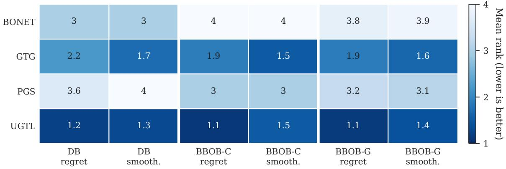  
Figure 2: Mean-rank summary of trajectory quality (lower is better). DB reports constructedtrajectory regret over five Design-Bench tasks and smoothness over its three continuous tasks. BBOB reports regret/smoothness for constructed (C) and generated (G) trajectories over eight function– dimension pairs. Each cell is the task-averaged rank of one method.

in BBOB tasks. UGTL obtains the highest mean on all four Rastrigin tasks and three of the four Rosenbrock tasks. It achieves the best mean rank of $1 . 1 / 4 .$ , compared with 2.3/4 for GTG, 3.0/4 for PGS, and $3 . 6 / 4$ for BONET. Since the downstream difusion model and sampler are shared, the improvement directly demonstrates the efect of the trajectory constructor in this controlled setting.  
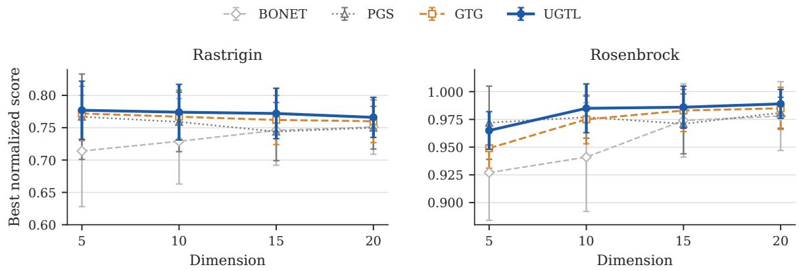  
Figure 3: Controlled BBOB performance as the dimension increases (mean ± standard deviation over eight runs). Each result is the final 100th percentile normalized score achieved by diferent trajectory construction methods, with standard deviation across diferent runs. All methods use the same downstream difusion model and sampler.

## 5.4. Ablation Studies

We first examine whether the UGTL constructor can transfer to other trajectory models and whether Cluster-then-Select improves candidate generation. Then, we study sensitivity to the main hyperpa-

rameters of trajectory construction and candidate generation.

## 5.4.1. Trajectory Construction and Candidate Selection

Trajectory-constructor replacement. We replace the original constructor in BONET’s Transformer pipeline, PGS’s ofline-RL pipeline, and GTG’s difusion pipeline with the UGTL constructor, while leaving their downstream models and training procedures unchanged. Figure 4(a) reports the change from each original pipeline. The replacement improves 13 of the 15 architecture–task pairs and increases the five-task average for all three architectures, with the largest improvement in the ofline-RL pipeline. This transfer shows that the constructed trajectories are useful beyond UGTL’s difusion model.

Candidate selection. Figure 4(b) compares Cluster-then-Select with directly returning the top $Q$ candidates ranked by the proxy. Cluster-then-Select improves the mean score on all five tasks, showing the benefit of distributing the evaluation budget across diferent high-proxy regions.

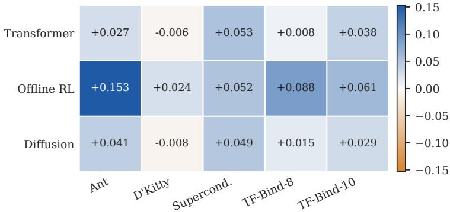  
(a) Gain from replacing the trajectory constructor

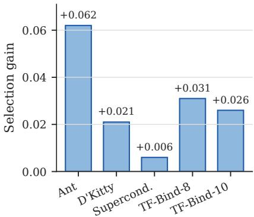  
(b) Gain from Cluster-then-Select  
Figure 4: Module ablations on Design-Bench. (a) Change in normalized score after replacing the native constructor of each downstream architecture with the UGTL constructor. (b) Change from applying Cluster-then-Select to the difusion pipeline. Positive values indicate improvement.

## 5.4.2. Hyperparameter Sensitivity

To better understand the sensitivity of UGTL, we vary one hyperparameter at a time while fixing the others at their main values. The sweeps use $N _ { \mathrm { t r a j } } \in \{ 1 0 0 0 , 2 0 0 0 , 4 0 0 0 \}$ , $H \in \{ 3 2 , 6 4 , 1 2 8 \}$ , $K \in$ {10, 20, 50}, $\xi \in \{ 0 . 0 1 , 0 . 0 5 , 0 . 1 0 \}$ , $p _ { \mathrm { i n i t } } \in \{ 1 0 \% , 2 0 \% , 3 0 \% \}$ , and $\lambda _ { \mathrm { t a r } } \in \{ 1 . 0 , 1 . 3 , 1 . 5 \}$ . The three $M _ { \mathrm { p o o l } }$ settings shown as 1k, 2k, and 4k are 1024, 2048 and 4096, respectively. Figures 5–10 report the change in normalized score from each task’s main setting. Black rings indicate the settings used in the main experiments, while horizontal error bars show ± one standard deviation over eight independent runs.

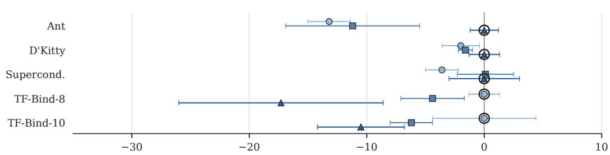  
Change from the main setting (normalized-score points)

Figure 5: Sensitivity to the number $N _ { \mathrm { t r a j } }$ of constructed trajectories. Points show the change from each task’s main setting; black rings identify the main settings. Higher is better.  
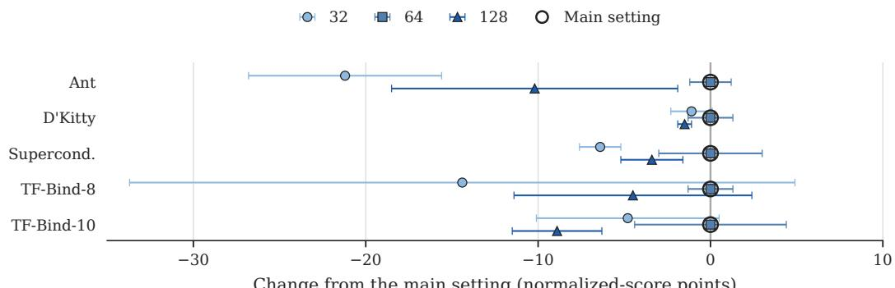  
Change from the main setting (normalized-score points)

Figure 6: Sensitivity to the trajectory horizon H. Points show the change from each task’s main setting; black rings identify the main setting. Higher is better.  
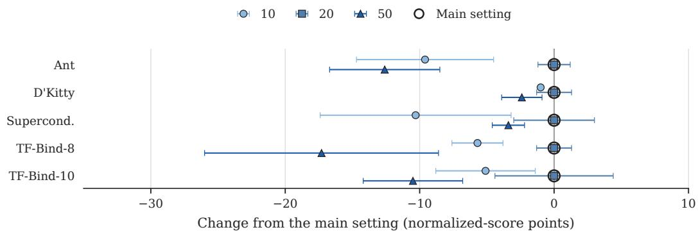  
Figure 7: Sensitivity to the neighborhood size K. Points show the change from each task’s main setting; black rings identify the main setting. Higher is better.

We can observe from Figures 5–10 consistent patterns across tasks. The common settings $H = 6 4 .$ $K = 2 0 , p _ { \mathrm { i n i t } } = 2 0 \%$ , and $M _ { \mathrm { p o o l } } = 2 0 4 8$ obtain the best mean on all five tasks in their respective studies, showing that these hyperparameters can be shared across tasks. The remaining parameters also follow simple choices: for trajectory construction, the three continuous tasks use $N _ { \mathrm { t r a j } } = 4 \small { , } 0 0 0$ and the two discrete tasks use $N _ { \mathrm { t r a j } } = 1 \small { , } 0 0 0$ , while $\xi = 0 . 0 5$ and $\lambda _ { \mathrm { t a r } } = 1 . 3$ work well on four of the five tasks. Overall, UGTL admits a unified configuration for most hyperparameters, with only limited adjustment for the remaining ones, suggesting that extensive per-task tuning is unnecessary.

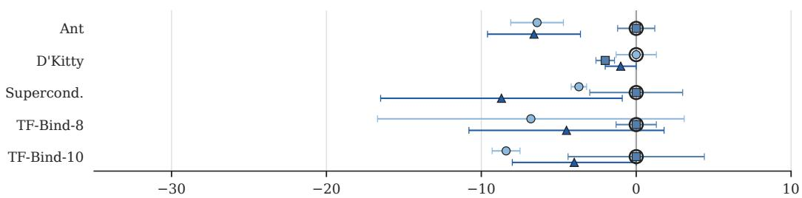  
Change from the main setting (normalized-score points)

Figure 8: Sensitivity to the score-relaxation tolerance ξ. Points show the change from each task’s main setting; black rings identify the main settings. Higher is better.  
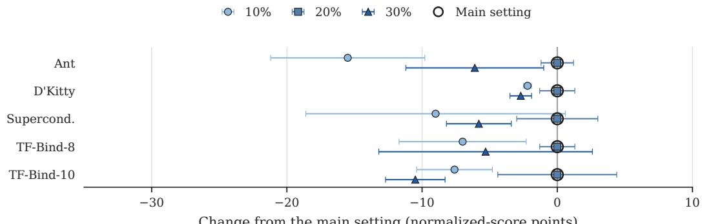  
Change from the main setting (normalized-score points)  
Figure 9: Sensitivity to the initial percentile $p _ { \mathrm { i n i t } }$ . Points show the change from each task’s main setting; black rings identify the main setting. Higher is better.

1.0 1.3 1.5 Main setting  
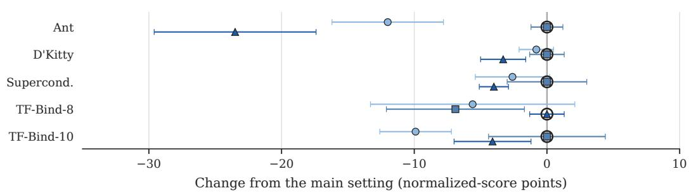  
Figure 10: Sensitivity to the target multiplier $\lambda _ { \mathrm { t a r } }$ . Points show the change from each task’s main setting; black rings identify the main settings. Higher is better.

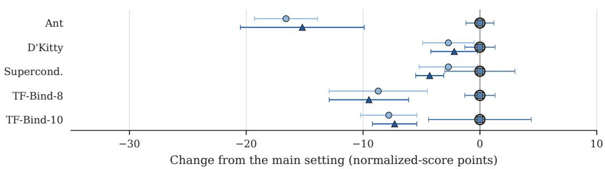  
Figure 11: Sensitivity to the pre-screening pool size $M _ { \mathrm { p o o l } }$ . Points show the change from each task’s main setting; black rings identify the main setting. Higher is better.

## 6. Conclusion

This paper revisits learnability in ofline data-driven optimization from an algorithm-dependent perspective. PAC or PMAC learnability can leave the optimal region unreliable even when average prediction under the sampling distribution is accurate, and thus cannot guarantee good approximations for ofline optimization [5, 6, 7]. Algorithm-dependent learnability instead localizes accuracy to the information queried along an optimizer’s trajectory. Its value-query form yields good approximation guarantees for greedy and local search algorithms on representative submodular optimization problems, while its first-order form yields a good guarantee for projected gradient descent on convex minimization.

Motivated by algorithm-dependent learnability, we develop a trajectory-learning framework (which consists of trajectory construction, trajectory modeling, and candidate generation) and analyze exist ing trajectory-based methods in a unified way. Using this framework, we further propose UGTL, an uncertainty-aware gradient-guided instantiation with conditional difusion and diversity-aware selection. To better reflect the behavior of optimizers, the trajectories are constructed with the guidance of the gradient and prediction uncertainty of an ensemble of surrogate models. UGTL achieves the best mean rank, 3.1/25, among 25 methods on five Design-Bench tasks. Under matched downstream models and samplers, controlled BBOB experiments and cross-architecture replacements show that the constructor substantially shapes the improvement behavior learned by the downstream model; diversity-aware selection further raises the reported mean on all five tasks. Extending the principle of algorithm-dependent learnability to more complex ofline scenarios (e.g., multi-objective [68] and universal [58] ofline optimization) will be interesting future work.

## 7. Acknowledgements

We want to thank Dr. Shen-Huan Lyu from Hohai University for his helpful discussion and proofreading the paper. This work was supported by the National Science and Technology Major Project (2022ZD0116600), the National Science Foundation of China (62276124, 624B2069), the Fundamental Research Funds for the Central Universities (14380020), the Fundamental and Interdisciplinary Disciplines Breakthrough Plan of the Ministry of Education of China (JYB2025XDXM118), and the “111 Center” (B26023). Chao Qian is the corresponding author.

## References

[1] M. Ahn, H. Zhu, K. Hartikainen, H. Ponte, A. Gupta, S. Levine, and V. Kumar. ROBEL: Robotics benchmarks for learning with low-cost robots. In Proceedings of the 4th Conference on Robot Learning (CoRL’20), pages 1300–1313, Virtual, 2020.

[2] D. Arthur and S. Vassilvitskii. k-means++: The advantages of careful seeding. In Proceedings of the 18th Annual ACM-SIAM Symposium on Discrete Algorithms (SODA’07), pages 1027–1035, New Orleans, LA, 2007.

[3] A. Badanidiyuru, S. Dobzinski, H. Fu, R. Kleinberg, N. Nisan, and T. Roughgarden. Sketching valuation functions. In Proceedings of the 23rd Annual ACM-SIAM Symposium on Discrete Algorithms (SODA’12), pages 1025–1035, Kyoto, Japan, 2012.

[4] M.-F. Balcan and N. J. A. Harvey. Learning submodular functions. In Proceedings of the 43rd Annual ACM Symposium on Theory of Computing (STOC’11), pages 793–802, San Jose, CA, 2011.

[5] E. Balkanski, A. Rubinstein, and Y. Singer. The limitations of optimization from samples. Journal of the ACM, 69(3):1–33, 2022.

[6] E. Balkanski and Y. Singer. Minimizing a submodular function from samples. In Advances in Neural Information Processing Systems 30 (NeurIPS’17), pages 814–822, Long Beach, CA, 2017.

[7] E. Balkanski and Y. Singer. The sample complexity of optimizing a convex function. In Proceedings of the 30th Conference on Learning Theory (COLT’17), pages 275–301, Amsterdam, The Netherlands, 2017.

[8] L. A. Barrera, A. Vedenko, J. V. Kurland, J. M. Rogers, S. S. Gisselbrecht, E. J. Rossin, J. C. Woodard, L. Mariani, K. H. Kock, S. Inukai, T. Siggers, L. Shokri, R. Gordˆan, N. Sahni, C. Cot sapas, T. Hao, S. S. Yi, M. Kellis, M. J. Daly, M. Vidal, D. E. Hill, and M. L. Bulyk. Survey

of variation in human transcription factors reveals prevalent DNA binding changes. Science, 351(6280):1450–1454, 2016.

[9] G. Brockman, V. Cheung, L. Pettersson, J. Schneider, J. Schulman, J. Tang, and W. Zaremba. OpenAI Gym. arXiv:1606.01540, 2016.

[10] D. Brookes, H. Park, and J. Listgarten. Conditioning by adaptive sampling for robust design. In Proceedings of the 36th International Conference on Machine Learning (ICML’19), pages 773–782, Long Beach, CA, 2019.

[11] Y. Chemingui, A. Deshwal, T. N. Hoang, and J. R. Doppa. Ofline model-based optimization via policy-guided gradient search. In Proceedings of the 38th AAAI Conference on Artificial Intelligence (AAAI’24), pages 11230–11239, Vancouver, Canada, 2024.

[12] C. Chen, C. Beckham, Z. Liu, X. Liu, and C. Pal. Parallel-mentoring for ofline model-based optimization. In Advances in Neural Information Processing Systems 36 (NeurIPS’23), pages 76619–76636, New Orleans, LA, 2023.

[13] C. Chen, Y. Zhang, J. Fu, X. Liu, and M. Coates. Bidirectional learning for ofline infinitewidth model-based optimization. In Advances in Neural Information Processing Systems 35 (NeurIPS’22), pages 29454–29467, New Orleans, LA, 2022.

[14] W. Chen, X. Sun, J. Zhang, and Z. Zhang. Optimization from structured samples for coverage functions. In Proceedings of the 37th International Conference on Machine Learning (ICML’20), pages 1715–1724, Virtual Event, 2020.

[15] Y. Chen, X. Song, C. Lee, Z. Wang, R. Zhang, D. Dohan, K. Kawakami, G. Kochanski, A. Doucet, M. Ranzato, S. Perel, and N. de Freitas. Towards learning universal hyperparameter optimizers with transformers. In Advances in Neural Information Processing Systems 35 (NeurIPS’22), New Orleans, LA, 2022.

[16] M. C. Dao, T. H. Tran, P. L. Nguyen, T. N. Truong, and T. N. Hoang. ROOT: Rethinking ofline optimization as distributional translation via probabilistic bridge. In Advances in Neural Information Processing Systems 38 (NeurIPS’25), pages 98783–98817, San Diego, CA, 2025.

[17] A. Das and D. Kempe. Submodular meets spectral: Greedy algorithms for subset selection, sparse approximation and dictionary selection. In Proceedings of the 28th International Conference on Machine Learning (ICML’11), pages 1057–1064, Bellevue, WA, 2011.

[18] U. Feige. A threshold of ln n for approximating set cover. Journal of the ACM, 45(4):634–652, 1998.

[19] U. Feige, V. S. Mirrokni, and J. Vondrak. Maximizing non-monotone submodular functions. SIAM Journal on Computing, 40(4):1133–1153, 2011.

[20] C. Feng, C. Qian, and K. Tang. Unsupervised feature selection by Pareto optimization. In Proceedings of the 33rd AAAI Conference on Artificial Intelligence (AAAI’19), pages 3534–3541, Honolulu, HI, 2019.

[21] S. Finck, N. Hansen, R. Ros, and A. Auger. Real-parameter black-box optimization benchmarking 2009: Presentation of the noiseless functions. Technical Report 2009/20, Research Center PPE, 2009.

[22] P. I. Frazier and J. Wang. Bayesian Optimization for Materials Design. Springer, 2016.

[23] J. Fu and S. Levine. Ofline model-based optimization via normalized maximum likelihood estimation. In Proceedings of the 9th International Conference on Learning Representations (ICLR’21), Virtual, 2021.

[24] R. Garnett. Bayesian Optimization. Cambridge University Press, 2023.

[25] M. X. Goemans and D. P. Williamson. Improved approximation algorithms for maximum cut and satisfiability problems using semidefinite programming. Journal of the ACM, 42(6):1115–1145, 1995.

[26] M. Gr¨otschel, L. Lov´asz, and A. Schrijver. Geometric Algorithms and Combinatorial Optimization. Springer, 1988.

[27] K. Hamidieh. A data-driven statistical model for predicting the critical temperature of a superconductor. Computational Materials Science, 154:346–354, 2018.

[28] N. Hansen. The CMA evolution strategy: A tutorial. arXiv:1604.00772, 2016.

[29] C. Harshaw, M. Feldman, J. Ward, and A. Karbasi. Submodular maximization beyond nonnegativity: Guarantees, fast algorithms, and applications. In Proceedings of the 36th International Conference on Machine Learning (ICML’19), pages 2634–2643, Long Beach, CA, 2019.

[30] X. He, H. Shang, and C. Qian. How to train algorithm selection models: Insights from black-box continuous optimization. In Proceedings of the 26th ACM Genetic and Evolutionary Computation Conference (GECCO’25) Companion, pages 1957–1965, M´alaga, Spain, 2025.

[31] X. He, H. Shang, B. Zhang, W. Yang, and C. Qian. Budget-aware algorithm selection for black-box optimization. In Proceedings of the 27th ACM Genetic and Evolutionary Computation Conference (GECCO’26) Companion, pages 521–524, San Jos´e, Costa Rica, 2026.

[32] M. Hoang, A. Fadhel, A. Deshwal, J. R. Doppa, and T. N. Hoang. Learning surrogates for ofline black-box optimization via gradient matching. In Proceedings of the 41st International Conference on Machine Learning (ICML’24), pages 18374–18393, Vienna, Austria, 2024.

[33] B. Hsieh, P. Hsieh, and X. Liu. Reinforced few-shot acquisition function learning for Bayesian optimization. In Advances in Neural Information Processing Systems 34 (NeurIPS’21), pages 7718–7731, Virtual, 2021.

[34] M. Janner, Y. Du, J. Tenenbaum, and S. Levine. Planning with difusion for flexible behavior synthesis. In Proceedings of the 39th International Conference on Machine Learning (ICML’22), pages 9902–9915, Baltimore, MD, 2022.

[35] D. Kempe, J. Kleinberg, and E. Tardos. Maximizing the spread of influence through a social net- <sup>´</sup> work. In Proceedings of the 9th ACM SIGKDD International Conference on Knowledge Discovery and Data Mining (KDD’03), pages 137–146, Washington, DC, 2003.

[36] M. Kim, J. Gu, Y. Yuan, T. Yun, Z. Liu, Y. Bengio, and C. Chen. Ofline model-based optimization: Comprehensive review. Transactions on Machine Learning Research, 2026.

[37] D. P. Kingma and J. Ba. Adam: A method for stochastic optimization. In Proceedings of the 3rd International Conference on Learning Representations (ICLR’15), San Diego, CA, 2015.

[38] S. Krishnamoorthy, S. M. Mashkaria, and A. Grover. Difusion models for black-box optimization. In Proceedings of the 40th International Conference on Machine Learning (ICML’23), pages 17842– 17857, Honolulu, HI, 2023.

[39] J. G. Kuba, M. Uehara, S. Levine, and P. Abbeel. Functional graphical models: Structure enables ofline data-driven optimization. In Proceedings of the 27th International Conference on Artificial Intelligence and Statistics (AISTATS’24), pages 2449–2457, Valencia, Spain, 2024.

[40] A. Kumar and S. Levine. Model inversion networks for model-based optimization. In Advances in Neural Information Processing Systems 33 (NeurIPS’20), pages 5126–5137, Virtual, 2020.

[41] R. T. Lange, T. Schaul, Y. Chen, C. Lu, T. Zahavy, V. Dalibard, and S. Flennerhag. Discovering attention-based genetic algorithms via meta-black-box optimization. In Proceedings of the 25th ACM Conference on Genetic and Evolutionary Computation (GECCO’23), pages 929–937, Lisbon, Portugal, 2023.

[42] D.-X. Liu, X. Mu, and C. Qian. Human assisted learning by evolutionary multi-objective optimization. In Proceedings of the 37th AAAI Conference on Artificial Intelligence (AAAI’23), pages 12453–12461, Washington, DC, 2023.

[43] C. Lu, K. Xue, L. Yuan, Y. Wang, Y. Wang, S. Fu, and C. Qian. Sequential multi-agent dynamic algorithm configuration. In Advances in Neural Information Processing Systems 38 (NeurIPS’25), San Diego, CA, 2025.

[44] Z. Lu, K. Xue, Y. Deng, J. Fan, P. Fang, B. S. Wade, L. Alegret, M. J. Benton, Y. Wu, C. Qian, et al. Complex marine ecological response during the Eocene-Oligocene revealed by global foraminiferal record. Nature Communications, 17(1):3954, 2026.

[45] S.-H. Lyu, R.-X. Tan, K. Xue, Y.-X. He, Y. Huang, Q. Zhang, and C. Qian. On the learnability of ofline model-based optimization: A ranking perspective. arXiv:2603.04000, 2026.

[46] S. M. Mashkaria, S. Krishnamoorthy, and A. Grover. Generative pretraining for black-box optimization. In Proceedings of the 40th International Conference on Machine Learning (ICML’23), pages 24173–24197, Honolulu, HI, 2023.

[47] S. M¨uller, M. Feurer, N. Hollmann, and F. Hutter. PFNs4BO: In-context learning for Bayesian optimization. In Proceedings of the 40th International Conference on Machine Learning (ICML’23), pages 25444–25470, Honolulu, HI, 2023.

[48] G. L. Nemhauser, L. A. Wolsey, and M. L. Fisher. An analysis of approximations for maximizing submodular set functions – I. Mathematical Programming, 14(1):265–294, 1978.

[49] Y. Nesterov. Introductory Lectures on Convex Optimization: A Basic Course. Springer, 2004.

[50] H. Qi, Y. Su, A. Kumar, and S. Levine. Data-driven ofline decision-making via invariant representation learning. In Advances in Neural Information Processing Systems 35 (NeurIPS’22), pages 13226–13237, New Orleans, LA, 2022.

[51] C. Qian, J.-C. Shi, Y. Yu, K. Tang, and Z.-H. Zhou. Subset selection under noise. In Advances in Neural Information Processing Systems 30 (NeurIPS’17), pages 3563–3573, Long Beach, CA, 2017.

[52] C. Qian, Y. Yu, and Z.-H. Zhou. Subset selection by Pareto optimization. In Advances in Neural Information Processing Systems 28 (NeurIPS’15), pages 1765–1773, Montreal, Canada, 2015.

[53] N. Rosenfeld, E. Balkanski, A. Globerson, and Y. Singer. Learning to optimize combinatorial functions. In Proceedings of the 35th International Conference on Machine Learning (ICML’18), pages 4374–4383, Stockholm, Sweden, 2018.

[54] B. Shahriari, K. Swersky, Z. Wang, R. P. Adams, and N. de Freitas. Taking the human out of the loop: A review of Bayesian optimization. Proceedings of the IEEE, 104(1):148–175, 2016.

[55] Y. Shi, K. Xue, L. Song, and C. Qian. Macro placement by wire-mask-guided black-box optimization. In Advances in Neural Information Processing Systems 36 (NeurIPS’23), pages 6825–6843, New Orleans, LA, 2023.

[56] L. Song, C.-X. Gao, K. Xue, C. Wu, D. Li, J. Hao, Z. Zhang, and C. Qian. Reinforced in-context black-box optimization. In Proceedings of the 34th International Joint Conference on Artificial Intelligence (IJCAI’25), pages 8939–8947, Montreal, Canada, 2025.

[57] L. Song, K. Xue, X. Huang, and C. Qian. Monte Carlo tree search based variable selection for high dimensional Bayesian optimization. In Advances in Neural Information Processing Systems 35 (NeurIPS’22), New Orleans, LA, 2022.

[58] R.-X. Tan, M. Chen, K. Xue, Y. Wang, Y. Wang, S. Fu, and C. Qian. Towards universal ofline black-box optimization via learning language model embeddings. In Proceedings of the 42nd International Conference on Machine Learning (ICML’25), pages 58499–58544, Vancouver, Canada, 2025.

[59] R.-X. Tan, K. Xue, S.-H. Lyu, H. Shang, Y. Wang, Y. Wang, S. Fu, and C. Qian. Ofline model based optimization by learning to rank. In Proceedings of the 13th International Conference on Learning Representations (ICLR’25), Singapore, 2025.

[60] K. Terayama, M. Sumita, R. Tamura, and K. Tsuda. Black-box optimization for automated discovery. Accounts of Chemical Research, 54(6):1334–1346, 2021.

[61] B. Trabucco, X. Geng, A. Kumar, and S. Levine. Design-Bench: Benchmarks for data-driven ofline model-based optimization. In Proceedings of the 39th International Conference on Machine Learning (ICML’22), pages 21658–21676, Baltimore, MD, 2022.

[62] B. Trabucco, A. Kumar, X. Geng, and S. Levine. Conservative objective models for efective ofline model-based optimization. In Proceedings of the 38th International Conference on Machine Learning (ICML’21), pages 10358–10368, Virtual, 2021.

[63] L. G. Valiant. A theory of the learnable. Communications of the ACM, 27(11):1134–1142, 1984.

[64] S. Wang, K. Xue, L. Song, X. Huang, and C. Qian. Monte Carlo tree search based space transfer for black box optimization. In Advances in Neural Information Processing Systems 37 (NeurIPS’24), Vancouver, Canada, 2024.

[65] R. J. Williams. Simple statistical gradient-following algorithms for connectionist reinforcement learning. Machine Learning, 8:229–256, 1992.

[66] M. Wistuba and J. Grabocka. Few-shot Bayesian optimization with deep kernel surrogates. In Proceedings of the 9th International Conference on Learning Representations (ICLR’21), Virtual, 2021.

[67] K. Xue, R.-T. Chen, R.-X. Tan, X. Lin, Y. Shi, S. Xu, M. Yuan, and C. Qian. BBOPlace-bench: Benchmarking black-box optimization for chip placement. IEEE Transactions on Evolutionary Computation, 2026.

[68] K. Xue, R.-X. Tan, X. Huang, and C. Qian. Ofline multi-objective optimization. In Proceedings of the 41st International Conference on Machine Learning (ICML’24), pages 55595–55624, Vienna, Austria, 2024.

[69] K. Xue, J. Xu, L. Yuan, M. Li, C. Qian, Z. Zhang, and Y. Yu. Multi-agent dynamic algorithm configuration. In Advances in Neural Information Processing Systems 35 (NeurIPS’22), New Orleans, LA, 2022.

[70] M. S. Yao, J. C. Gee, and O. Bastani. Diversity by design: Leveraging distribution matching for ofline model-based optimization. In Proceedings of the 42nd International Conference on Machine Learning (ICML’25), pages 71687–71738, Vancouver, Canada, 2025.

[71] M. S. Yao, Y. Zeng, H. Bastani, J. R. Gardner, J. C. Gee, and O. Bastani. Generative adversarial model-based optimization via source critic regularization. In Advances in Neural Information Processing Systems 37 (NeurIPS’24), pages 44009–44039, Vancouver, Canada, 2024.

[72] S. Yu, S. Ahn, L. Song, and J. Shin. RoMA: Robust model adaptation for ofline model-based optimization. In Advances in Neural Information Processing Systems 34 (NeurIPS’21), pages 4619–4631, Virtual, 2021.

[73] Y. Yuan, C. Chen, Z. Liu, W. Neiswanger, and X. Liu. Importance-aware co-teaching for ofline model-based optimization. In Advances in Neural Information Processing Systems 36 (NeurIPS’23), pages 55718–55733, New Orleans, LA, 2023.

[74] T. Yun, S. Yun, J. Lee, and J. Park. Guided trajectory generation with difusion models for ofline model-based optimization. In Advances in Neural Information Processing Systems 37 (NeurIPS’24), Vancouver, Canada, 2024.

[75] Z.-H. Zhou, Y. Yu, and C. Qian. Evolutionary Learning: Advances in Theories and Algorithms. Springer, 2019.