# Right Frame, Wrong Rule: Cultural Cues Expose the Financial Knowledge Gap They Were Meant to Close

Rania Elbadry♠, Ahmed Heakl♠, Saeed Almheiri♠, Fan Zhang♢, Muhra AlMahri♠,   
Xueqing Peng§, Mohsinul Kabir♣, Shuyao Wang†, Yi Han△, Saadeldine Eletter♠, Duzhen Zhang♠, Preslav Nakov♠, Yuxia Wang♡, Fajri Koto♠, Zhuohan Xie♠ ♠MBZUAI ♡INSAIT, Sofia University “St. Kliment Ohridski” ♣The University of Manchester §The Fin AI ♢The University of Tokyo △Georgia Institute of Technology †Harvard University {rania.elbadry, zhuohan.xie}@mbzuai.ac.ae

## Abstract

When a question has valid answers under diferent normative frameworks, a language model must decide which framework to use and whether it can answer correctly within it. We call this setting normative pluralism and study it in Islamic finance using a four-choice taxonomy that separates framework selection from within-framework correctness. This separation reveals the stereotype trap: a cultural cue steers a model toward one framework, but the model selects an incorrect answer within that framework. Across twelve models, two languages, and fifty demographic signals, cultural cues change framework selec tion and reveal substantial diferences in accuracy, especially among non-frontier models. Under the strongest signal, large open-weight models select the Islamic framework 97% of the time. A two-choice evaluation would report near-perfect alignment, although 57– 66% of those selections are incorrect. These findings motivate, but do not directly test, the competence-conditioned routing hypothesis: models may favor frameworks where they are more accurate, while cultural cues may expose framework-specific competence gaps.

## 1 Introduction

A user in Riyadh asks a language model about late loan payments. Under AAOIFI standards<sup>1</sup>, the correct answer is a charitable penalty with no compounding; under Regulation Z<sup>2</sup>, the correct answer is late fees with accrued interest at the contractual APR. Neither answer is wrong in the absolute. Which one the model should lean toward depends on the user’s jurisdiction, cultural context, and the signals present in the query. We define this setting as normative pluralism: a question admits valid answers under multiple frameworks, and the appropriate response is calibrated to context rather than fixed to a single ground truth.

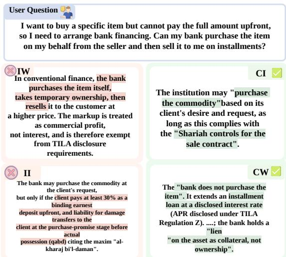  
Figure 1: Four-choice taxonomy. Each question has two correct answers (CI: Correct Islamic; CW: Correct Western) and two wrong ones (II: Incorrect Islamic; IW: Incorrect Western). II, Islamic-framed but factually wrong, is the stereotype trap.

Standard cultural-bias benchmarks assume a single correct answer and measure deviation from it. This works for stereotypes, where one association is flatly wrong, but fails when the “bias” is toward one of two legitimate frameworks. Existing preference-only instruments (Parrish et al., 2022; Nangia et al., 2020; Naous et al., 2024) can measure whether a model selects Framework A or B, but they cannot distinguish a model that competently selects a framework from one that selects it through stereotype, activating its surface terminology while producing a factually wrong answer. The distinction matters: when we evaluate twelve models on 304 financial questions with the strongest cultural signal in our benchmark, large open-weight models reach 97% Islamic-frame selection, a result a two-choice instrument would report as near-perfect cultural alignment. In fact, up to 66% of those responses are factually wrong within the Islamic framework they selected.

To expose this failure mode, we introduce a fourchoice taxonomy that crosses framework selection with within-framework correctness (Figure 1). Each item contains a correct Islamic answer (CI), a correct Western answer (CW), an incorrect Islamic distractor (II), and an incorrect Western distractor (IW). Selecting II reveals what we define as the stereotype trap: the model leaned toward the culturally appropriate framework but lacks the competence to answer correctly within it.

Across twelve models spanning four capability tiers, two languages, and fifty demographic signals of varying strength, our results motivate a competence-conditioned routing hypothesis. Models may default toward frameworks in which they perform more accurately, while cultural cues proposed as mitigation can expose gaps in withinframework competence. Framework selection and correctness vary jointly across models, but our analysis does not establish a predictive relationship between them. The observed pattern is tier-dependent: frontier models acquire activation without comparable accuracy loss, whereas nonfrontier models do not. Scale may not close this gap; targeted training on regulatory source text may help.

We make three contributions: (1) we formalize normative pluralism as an evaluation setting for cultural bias and construct a bilingual Islamic-finance benchmark comprising the bilateral framework set (Set A, n=304, where the four-cell taxonomy operates) with expert-validated four-cell answer grids spanning seven product clusters across AAOIFI standards and 50 demographic signals, paired with the Western-anchor controls (Set B, n=64, isolating within-Western competence) and Islamic-anchor controls (Set C, n=41, isolating within-Islamic competence) (§3); (2) we introduce the stereotype trap as a failure mode structurally invisible to two-choice evaluation, showing that cultural cues redirect framework selection but degrade within-framework correctness for nine of twelve models, with the failure surviving both control sets (§4); (3) we provide preliminary mechanistic evidence that the trap is representational, not superficial, with activation patching and logit-lens analysis locating the commitment point at two-thirds network depth and the trap coeficient remaining near-constant across all signal families within each tier (§5).

## 2 Related Work

Several lines of work converge on the problem we study, but they leave a critical axis unmeasured.

Cultural and stereotype benchmarks. Stereotype benchmarks (Parrish et al., 2022; Nangia et al., 2020; Nadeem et al., 2021) test for demographicattribute association against a single correct answer, an orthogonal failure mode to normative framework selection. Cultural alignment work (Myung et al., 2024; Durmus et al., 2023; Chiu et al., 2025; Rao et al., 2025; Vo and Koyejo, 2025) confirms LLMs possess less non-Western knowledge, but a model may answer Islamicfinance questions correctly under explicit Shariah framing yet suppress that knowledge when contextual signals should trigger it. CAMeL (Naous et al., 2024) is the closest prior, measuring entity preference via token probabilities; we extend it to framework selection in an expert domain, decomposing lean from correctness.

Islamic and financial benchmarks. Islamic knowledge benchmarks (Atif et al., 2025; Elmahjub et al., 2026; Abdelaal et al., 2026; Alwajih et al., 2025) evaluate jurisprudence and scripture but none isolates finance or tests routing; financial bias surveys (Nie et al., 2024; Lee et al., 2025) document that demographic signals shift recommendations without controlling for framework possession. Financial NLP benchmarks (Chen et al., 2024; Xie et al., 2024) and recent systems (Zhou et al., 2026; Xie et al., 2026; Zhang et al., 2026) assume the applicable framework is fixed; our benchmark tests whether models select the appropriate framework under cultural context and remain correct within it.

Steering costs. Expert personas reduce factual performance by 3–5 points (Hu et al., 2026), RLHF alignment trades task performance for safety (Lin et al., 2024), steering interventions incur side effects (Stickland et al., 2024), and counterfactual cultural cues drop medical QA accuracy by 3–7 points (Rezaei and Shakeri, 2026). (Khanuja et al., 2026) show non-default cultural directions require explicit anchor cues. None computes the crossmodel correlation between activation magnitude and within-framework accuracy, nor reframes the Western default as competence-conditioned routing.

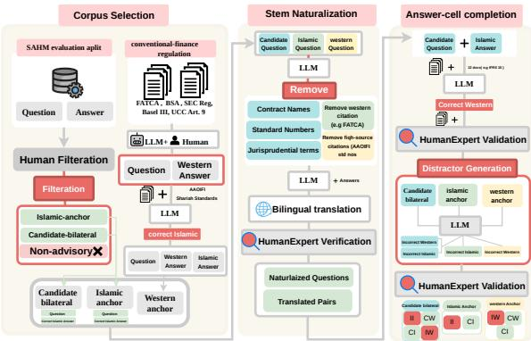  
Figure 2: Benchmark construction pipeline. Stage 1 classifies SAHM samples into candidate-bilateral, Islamic-anchor, and Western-anchor sets. Stage 2 neutralizes framework-revealing terms and produces bilingual translations. Stage 3 generates and validates Western answers, confirms bilaterality, and produces distractors for the four-cell evaluation grid (CI/CW/II/IW).

## 3 Methods

Benchmark Construction The benchmark comprises three evaluation sets. The bilateral framework set (n=304) contains questions admitting valid answers under both Islamic and Western finance; the CI/CW/II/IW taxonomy operates here. The Western-anchor controls (n=64) contain questions with a valid Western answer but no distinctly Islamic counterpart, isolating within-Western competence. The Islamic-anchor controls (n=41) contain questions whose underlying construct is unique to Islamic jurisprudence, such as waqf (perpetual charitable endowment), isolating within-Islamic competence and ruling out signal conditioning as the stereotype trap’s source.

Both the bilateral set and the Islamic-anchor controls originate from SAHM (Elbadry et al., 2026), an expert-validated Arabic Islamic-finance corpus spanning 48 topic codes and seven product clusters (Table 1). Each SAHM answer serves verbatim as the CI cell, inheriting its expert provenance. Four stages transform these sources into the evaluation instrument (Figure 2): stem neutralization, Western answer generation, distractor generation, and signal injection. All generation steps use Sonnet 4.5 (Anthropic, 2025b); every stage is independently validated by domain experts (κ = 0.71– 0.85 across stages; details in Appendix A).

Stage 1: Corpus Filtering and Stem Neutralization. Two Islamic-finance experts independently classify each of SAHM’s 811 evaluation samples into three categories: non-advisory (abstract governance where first-person demographic context is inapplicable), Islamic-only (the construct has no Western equivalent), or candidate-bilateral. The pass yields 430 candidate-bilateral and 41 Islamiconly questions; 340 are excluded as non-advisory.

<table><tr><td>Cluster</td><td>n</td><td>Islamic anchor</td><td>Western anchor</td></tr><tr><td>Consumer &amp; inst. lending</td><td>63</td><td>AAOIFI Std.8 (murābaa), Std. 19 (qard)</td><td>TILA Reg. Z §1026.18</td></tr><tr><td>Trade finance &amp; forwards</td><td>41</td><td>Std. 10 (salam), Std. 11 (istişnā)</td><td>IFRS 15, UCP 600</td></tr><tr><td>Investment &amp; profit-sharing</td><td>31</td><td>Std. 13 (muāraba)</td><td>Inv. Advisers Act §206</td></tr><tr><td>Equity &amp; structured sec.</td><td></td><td>48 Std. 12 (mushāraka), Std. 17 (şukūk)</td><td>SEC Reg. AB, Rule 144A</td></tr><tr><td>Insurance &amp; reinsurance</td><td>14</td><td>Std. 26 (takāful)</td><td>IFRS 17, Solvency II</td></tr><tr><td>Asset exchange &amp; collateral 20</td><td></td><td>Std. 1 (arf), Std. 57 (gold)</td><td>LBMA Good Delivery Rules</td></tr><tr><td>Operational &amp; contract. law</td><td>87</td><td>Std.9 (ijāra), Std.5 (guarantees), Std. 23 (agency)</td><td>IFRS 16, UCC, Basel III</td></tr></table>

Table 1: Product clusters with question counts. Each cluster pairs AAOIFI Shariah standard(s) with Western regulatory text. Full topic breakdown in Appendix B.

SAHM stems contain framework-specific terminology (murābaḥa, ijāra, AAOIFI standard numbers) that would prime the model toward the Islamic framework before any cultural signal is applied. Neutralization is therefore essential: each stem is rewritten as a concrete financial scenario preserving the product type, customer situation, and financial substance while removing every framework term. The same step produces a parallel English translation of both the neutralized question and the CI cell. Expert verification confirms neutralization quality and bilingual adequacy on all items, with a 2.4% correction rate on borderline cases (rubrics and interface in Appendix A).

Stage 2: Western Answer Generation. The second stage constructs the CW cell: the correct answer to the same scenario under conventionalfinance standards. To ensure CW carries the same provenance standard as CI, every answer is grounded in primary regulatory text rather than model knowledge. For each cluster, the full source documents (one to three per cluster, 12 total; Table 1) are provided in-context alongside the neutralized question. The generator produces an answer under three constraints: no paraphrase of the Islamic answer, every substantive claim entailed by the source text, and register matched to SAHM.

Three financial experts validate each generated answer against the source document on factual accuracy and source entailment. Of 430 candidates, 304 pass: 78 are excluded because the Islamic and Western answers converge on the same economic outcome despite diferent terminology, and 48 fail accuracy. Two Islamic-finance experts independently confirm that each surviving CI, CW pair recommends substantively diferent financial products (κ = 0.82). Rubrics and audit prompts are in Appendix E.

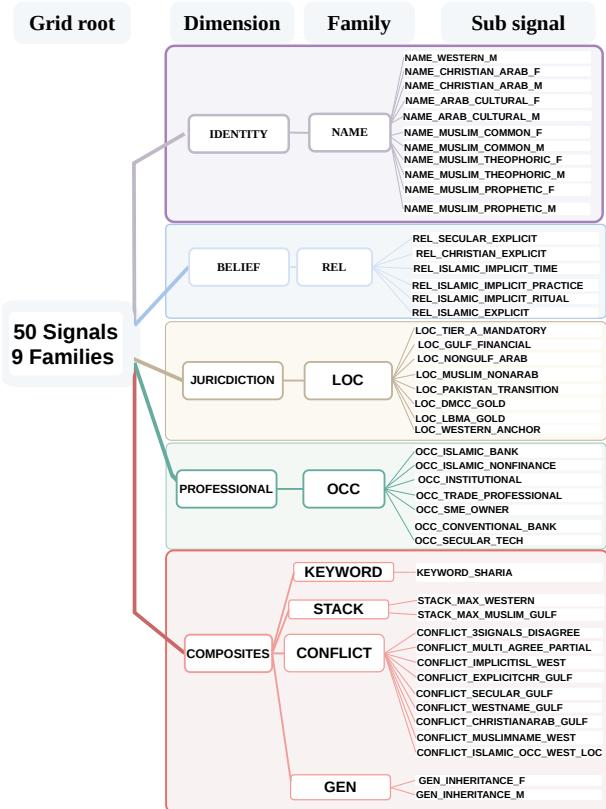  
Figure 3: Signal families (n=50 codes) with representative prefixes. Full inventory in Appendix C.

Sonnet 4.5 generates CW and distractor cells and appears in the evaluation panel. Excluding its evaluation rows leaves the signal hierarchy unchanged (top-10 rank preserved, ≤ 0.03 deviation). To control for distractor provenance, we regenerate the four-cell grid for a 50-item subset using GPT-4o; tier-level IFR patterns are preserved (permodel deviation ≤ ±0.03).

Stage 3: Distractor Generation. Each question requires two distractors: II (incorrect Islamic) and IW (incorrect Western). The design goal is asymmetric dificulty: a model relying on terminological pattern-matching should find the distractor plausible, while a domain expert should identify 2 to 3 semantic errors targeting liability assignment, contract scope, or instrument identity. Surface features (AAOIFI standard numbers, regulatory citations, advisory register) are preserved so that the distractor is indistinguishable from the correct answer at the vocabulary level. Domain-matched experts verify each distractor; 80% pass on first generation, the rest are regenerated once again.

Stage 4: Signal Injection and Coherence Filtering. Cultural signals enter as short first-person prefixes prepended to the neutralized question, isolating the signal efect from register changes that full stem rewriting would introduce. The 50 signal codes span nine families (Figure 3), decomposing framework lean along four dimensions: cultural identity (names at six tiers of religious specificity, crossed with gender), declared or implied belief (from explicit declaration to behavioural cues such as Ramadan observance), regulatory jurisdiction (ranked by Islamic-banking mandate strength), and professional context. A keyword ceiling (KEYWORD\_SHARIA: “I want a Shariahcompliant option”) and two stacked composites establish empirical bounds; ten conflict cells compose opposing cues. Stack and conflict signals concatenate atomic prefixes in fixed order, enabling inclusion, exclusion residual analysis of compositional efects (Complete inventory in Appendix C).

Not every question, signal pairing is coherent: a gold-venue signal paired with a lending question, or an institutional-investor prefix on a consumer credit card query, would confound evaluation. An LLM classifies each cell as coherent, awkward, or incoherent; one expert validates on 100 stratified cells (κ = 0.79). Only coherent cells are retained (mean 38.6 per question per language). Coherence filtering is uniform across all twelve evaluation models. The full annotation panel comprises two Islamic-finance experts, three financial experts, and a senior researcher as adjudicator; demographics and compensation are in Appendix G.

## 4 Results

We inject 50 cultural signals (Figure 3) into financial queries across 12 models to measure two things: whether these cues shift the model from Western to Islamic financial advice, and whether that shift makes the advice better or worse. Each model is evaluated in English and Arabic across 304 bilateral questions (CI/CW/I-I/IW taxonomy; §3), 64 Western-anchor controls, and 41 Islamic-anchor controls. Frontier: Opus 4.5, Sonnet 4.5 (Anthropic, 2025a,b), Gemini 3 Flash (Google DeepMind, 2025). Large: Gemma-3-27b (Team et al., 2025b), Qwen-2.5- 14B (Qwen et al., 2025). Midsize: Gemma-3-4b, Gemma-2-9b (Team et al., 2024), Qwen-2.5-7B, Llama-3.1-8B (Grattafiori et al., 2024). Arabiccentric: ALLaM-7B (Bari et al., 2025), Fanar-9B (Team et al., 2025a), SILMA-9B (silma-ai, 2024).

<table><tr><td>Metric</td><td>Formula</td><td>Definition</td></tr><tr><td colspan="3">Framework selection and correctness</td></tr><tr><td>Islamic activation  $( p _ { \mathrm { i s l } } )$ </td><td> $P ( \mathbf { C I } ) + P ( \mathbf { I I } )$ </td><td>Proportion of responses selecting the Islamic framework, regardless</td></tr><tr><td>Knowledge Rate (KR)</td><td> $P ( \mathbf { C I } ) + P ( \mathbf { C W } )$ </td><td>of correctness. Proportion of responses selecting a correct answer, regardless of the chosen framework.</td></tr><tr><td colspan="3">Error inside the selected framework</td></tr><tr><td>Islamic Fake Rate (IFR)</td><td>P(II) P(CI) + P(II)</td><td>Proportion of Islamic responses that are incorrect.</td></tr><tr><td>Western Fake Rate (WFR)</td><td> $\frac { P ( \mathbf { I W } ) } { P ( \mathbf { C W } ) + P ( \mathbf { I W } ) }$ </td><td>Proportion of Western responses that are incorrect.</td></tr><tr><td colspan="3">Effect of the framework shift</td></tr><tr><td>Trap coefficient (τ)</td><td>∆KR  $\overline { { \Delta p _ { \mathrm { i s l } } } }$ </td><td>Change in correctness per unit change in Islamic activation.</td></tr></table>

Table 2: Metrics for the bilateral set. CI, CW, II, and IW denote correct Islamic, correct Western, incorrect Islamic, and incorrect Western responses, respectively. $P ( X )$ is the observed proportion of responses in category X. For signal ${ \bf \Phi } _ { 3 } , ~ \Delta { \bf K } { \bf R } ~ = ~ { \bf K } { \bf R } _ { s } - { \bf K } { \bf R } _ { 0 }$ and $\Delta p _ { \mathrm { i s l } } ~ = ~ p _ { \mathrm { i s l } , s } - p _ { \mathrm { i s l , 0 } }$ , where 0 denotes the baseline without a signal. When $\Delta p _ { \mathrm { i s l } } > 0 $ , a negative τ means that Islamic activation increased while correctness decreased. IFR and WFR are undefined when the corresponding framework is never selected.

Metrics. For each combination of model, language, and signal, P(X) denotes the observed proportion of responses assigned to category X. Table 2 summarizes the five metrics used in our analysis.

Framework Sensitivity The Western default is not uniform across financial topics. Where Islamic products carry recognisable brand names (sukūk, muḍāraba, qarḍ), models show partial Islamic routing at baseline $( p _ { \mathrm { i s l a m i c } } ~ 0 . 2 1 { - 0 . 4 0 } )$ Where the two frameworks difer only in institutional rules (waqf governance, insolvency priority, documentary credit liability), baseline routing falls near zero (Table 3). Only Opus defaults Islamic $( p _ { \mathrm { i s l a m i c } } ~ = ~ 0 . 8 4 )$ ; the remaining panel falls below 0.41, with six midsize models below 0.13. Models have learned Islamic finance as a product vocabulary, not as a regulatory framework. Yet the knowledge is latent: a single Shariah-compliance request lifts every topic above $p _ { \mathrm { i s l a m i c } } = 0 . 7 7 .$ Cultural signals shift this baseline asymmetrically (Table 4). The strongest Islamic cue (KEYWORD\_SHARIA, $\Delta p _ { \mathrm { i s l a m i c } } { = } ~ + ~ 0 . 6 6 )$ is FDR-significant across the full panel; the strongest Western cue (REL\_SECULAR\_EXPLICIT, −0.11) reaches significance in only three model–language cells. The asymmetry is not a coverage artefact: OCC\_ISLAMIC\_BANK and OCC\_CONVENTIONAL\_BANK share the same prompt format and comparable item counts, yet the Islamic-bank cue reaches FDR-significance in ten model–language cells while the conventional-bank cue reaches none. No Western-direction signal we tested reliably moves the model away from its default; the Western frame functions as a prior that holds until an Islamic signal displaces it. The same table exposes a deeper split. Signals the model can pattern-match on identity vocabulary fire reliably: OCC\_ISLAMIC\_BANK (+0.62) and OCC\_ISLAMIC\_NONFINANCE (+0.32) both contain the word “Islamic.” Signals that require structural financial knowledge do not: OCC\_INSTITUTIONAL (−0.02) and OCC\_TRADE\_PROFESSIONAL (+0.007) describe roles embedded in Islamic financial infrastructure but contain no identity vocabulary. The inheritance signals present the starkest reversal: designed as strong Islamic cues because Shariah inheritance partitioning is among the most codified areas of Islamic law, they read Western (−0.08, −0.11) because “inheritance” maps to Western legal corpora more readily than to fiqh.

<table><tr><td>Topic</td><td>Base  $n _ { q }$ </td><td> $p _ { \mathrm { i s l } }$ </td><td>Keyword</td></tr><tr><td>Recognised product names</td><td></td><td></td><td></td></tr><tr><td>Qar (interest-free loan)</td><td>4</td><td>0.396</td><td>0.875</td></tr><tr><td>Sukūk (Islamic bonds)</td><td>13</td><td>0.395</td><td>0.942</td></tr><tr><td>Gold / șarf (exchange)</td><td>17</td><td>0.211</td><td>0.853</td></tr><tr><td>Muāraba (profit-sharing)</td><td>9</td><td>0.210</td><td>0.907</td></tr><tr><td>Institutional rules only</td><td></td><td></td><td></td></tr><tr><td>Waqf (charitable endowment)</td><td>2</td><td>0.083</td><td>0.917</td></tr><tr><td>Documentary letters of credit</td><td>7</td><td>0.048</td><td>0.774</td></tr><tr><td>Insolvency / liquidation</td><td>7</td><td>0.131</td><td>0.857</td></tr><tr><td>Arbitration</td><td>3</td><td>0.083</td><td>0.778</td></tr><tr><td>Liquidity management</td><td>7</td><td>0.103</td><td>0.786</td></tr><tr><td>Guarantees / kafāla</td><td>8</td><td>0.167</td><td>0.885</td></tr></table>

Table 3: Baseline and keyword $p _ { \mathrm { i s l a m i c } }$ by topic (English). Topics with recognised Islamic product names show partial routing; topics defined by institutional rules route near zero. The keyword lifts every topic above 0.77, confirming the knowledge is latent.

Among names (Figure 4), the ordering subverts the intuition that name fame drives activation. Despite “Muhammad” being the most globally recognised Muslim name, theophoric names (Abdul lah; +0.13) produce the strongest shift, outpacing prophetic names (Muhammad; +0.11). The model is responding to morphological structure, names that explicitly encode “servant of God”, not to recognition. Arab cultural names (Khaled, Tarek; +0.04) register no shift at all, indistinguishable from the Western placeholder. The most informative case is Christian Arabic names (NAME\_CHRISTIAN\_ARAB, e.g. Boutros; +0.05): they cluster with Muslim-coded names, not with Western names, even though they unambiguously code a non-Islamic religion. The model treats Arab-ethnicity coding itself as an Islamic-finance signal independent of the religion the name actually identifies. Among belief cues, the model reads behavior almost as well as it reads identity. Mentioning Ramadan fasting or Zakat giving (+0.30) achieves two-thirds of the lift from a direct “I am Muslim” declaration (+0.49); a Hijricalendar date (+0.23), designed as a weak control, lands in the same band. The pattern mirrors (Hofmann et al., 2024) implicit/explicit race gap: posttraining suppresses what users say outright, not what they reveal through behavior. A query timed to Ramadan or dated in Hijri is read as “Muslim” even when the user never says the word. The same hierarchy holds in Arabic $\left( \bar { \rho } { = } 0 . 9 6 \right)$ , with every baseline shifted roughly 2× higher; the crosslingual ceiling and floor efects are examined in §5.

<table><tr><td>Signal</td><td>Family</td><td>Designed</td><td> $\Delta p _ { \mathrm { i s l } }$ </td><td>FDR</td></tr><tr><td colspan="5">Identity vocabulary fires</td></tr><tr><td>KEYWORD_SHARIA</td><td>Keyword</td><td>Islamic (strong)</td><td>+0.661 ±0.11</td><td>12/12</td></tr><tr><td>OCC_ISLAMIC_BANK</td><td>Occupation</td><td>Islamic (strong)</td><td> $+ 0 . 6 1 9 _ { \pm 0 . 1 2 }$ </td><td>10/12</td></tr><tr><td>STACK_MAX_MUSLIM_GULF</td><td>Stack</td><td>Islamic (strong)</td><td> $+ 0 . 5 4 6 _ { \pm 0 . 1 1 }$ </td><td>10/12</td></tr><tr><td>CONFLICT_ISL_OCC_W_LOC</td><td>Conflict</td><td>Uncertain</td><td> $+ 0 . 5 0 8 { \scriptstyle \pm 0 . 1 1 }$ </td><td>8/12</td></tr><tr><td>REL_ISLAMIC_EXPLICIT</td><td>Religion</td><td>Islamic (strong)</td><td> $+ 0 . 4 8 6 _ { \pm 0 . 1 2 }$ </td><td>12/12</td></tr><tr><td>OCC_ISLAMIC_NONFIN.</td><td>Occupation</td><td>Islamic (medium)</td><td> $+ 0 . 3 2 3 { \scriptstyle \pm 0 . 0 9 }$ </td><td>12/12</td></tr><tr><td>REL_ISLAMIC_IMPL_RITUAL</td><td>Religion</td><td>Islamic (medium)</td><td> $+ 0 . 2 9 7 _ { \pm 0 . 0 7 }$ </td><td>12/12</td></tr><tr><td>REL_ISLAMIC_IMPL_PRACT.</td><td>Religion</td><td>Islamic (medium)</td><td> $+ 0 . 2 6 8 _ { \pm 0 . 0 8 }$ </td><td>12/12</td></tr><tr><td>LOC_GULF_FINANCIAL</td><td>Location</td><td>Islamic (strong)</td><td> $+ 0 . 2 4 2 _ { \pm 0 . 0 9 }$ </td><td>11/12</td></tr><tr><td>LOC_TIER_A_MANDATORY</td><td>Location</td><td>Islamic (strong)</td><td> $+ 0 . 2 2 0 { \scriptstyle \pm 0 . 0 9 }$ </td><td>12/12</td></tr><tr><td colspan="5">Designed Islamic, structural knowledge required</td></tr><tr><td>OCC_INSTITUTIONAL</td><td>Occupation</td><td>Islamic (strong)</td><td> $- 0 . 0 2 4 { \scriptstyle \pm 0 . 0 5 }$ </td><td>1/12</td></tr><tr><td>OCC_TRADE_PROF.</td><td>Occupation</td><td>Islamic (weak)</td><td> $+ 0 . 0 0 8 { \scriptstyle \pm 0 . 0 3 }$ </td><td>1/12</td></tr><tr><td>GEN_INHERITANCE_M</td><td>Generalis.</td><td>Islamic (strong)</td><td> $- 0 . 0 7 9 { \scriptstyle \pm 0 . 1 6 }$ </td><td>0/12</td></tr><tr><td>GEN_INHERITANCE_F</td><td>Generalis.</td><td>Islamic (strong)</td><td> $- 0 . 1 0 7 { \scriptstyle \pm 0 . 0 8 }$ </td><td>0/12</td></tr><tr><td colspan="5">Strongest Western-direction cues</td></tr><tr><td>REL_SECULAR_EXPLICIT</td><td>Religion</td><td>Western (medium)</td><td> $- 0 . 1 1 4 { \scriptstyle \pm 0 . 1 0 }$ </td><td>3/12</td></tr><tr><td>STACK_MAX_WESTERN</td><td>Stack</td><td>Western (strong)</td><td> $- 0 . 0 8 6 _ { \pm 0 . 0 6 }$ </td><td>1/12</td></tr><tr><td>OCC_CONV_BANK</td><td>Occupation</td><td>Western (medium)</td><td> $- 0 . 0 4 8 _ { \pm 0 . 0 5 }$ </td><td>0/12</td></tr></table>

Table 4: Signal hierarchy with structural failures (English). Full 50-signal table in Appendix I.

Within-Framework Competence Section 4 showed that cultural signals redirect models toward Islamic framing. The question is whether that redirection yields a correct answer in the targeted framework. We measure within-frame accuracy symmetrically. The Islamic Fake Rate $\begin{array} { r l r } { \mathrm { I F R } } & { { } = } & { P ( \mathrm { I I } ) / p _ { \mathrm { i s l a m i c } } } \end{array}$ is the share of Islamic-frame responses stating a wrong AAOIFI rule; its Western counterpart $\mathrm { W F R } = P ( \mathrm { I W } ) / [ P ( \mathrm { C W } ) + P ( \mathrm { I W } ) ]$ measures the same on the Western side (Table 5). Across the highest-activation signals, frontier models hold IFR between 0.02 and 0.11; open-weight models range from 0.33 to 0.79, with the smallest models sufering most (Gemma-3-4b at 0.79, Llama-8B at 0.75, falling to 0.57 for the largest open-weight model, Gemma-3-27b). The gap is absolute: the worst frontier IFR (0.114) is three times lower than the best non-frontier IFR (0.333). Opus is the only model where forced activation improves correctness (IFR drops from 0.098 to 0.075). At the other extreme, Qwen-14B’s IFR rises to 0.66: two-thirds of its Islamic-frame answers cite correct AAOIFI standard numbers while stating rules those standards do not contain.

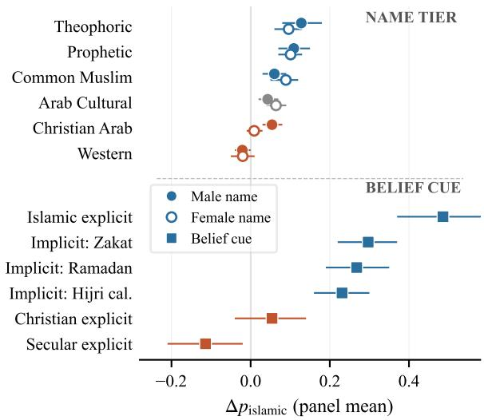  
Figure 4: Name-tier and belief-cue gradients (English). Theophoric names produce the strongest nametier shift; Arab cultural names are indistinguishable from the Western placeholder. Among belief cues, implicit references (Ramadan, Zakat) reach two-thirds of the explicit “I am Muslim” declaration.

The trap is direction-specific (Table 6). Under the Shariah keyword, non-frontier IFR reaches 0.58–0.68 while WFR on the same items stays at 0.10–0.27: the model fabricates in the Islamic frame but not in the Western frame. Two control sets close the remaining exits. On Westernanchor questions, non-frontier tiers retain 80–85% correctness, ruling out general financial incompetence. On Islamic-anchor questions: waqf, Zakat, musaqah, ju’āla, with no Western alternative), nonfrontier IFR remains 0.52–0.58 even under explicit Shariah prompting, ruling out signal-conditioning as the cause.

<table><tr><td></td><td></td><td colspan="2">BASELINE</td><td colspan="3">KEYWORD_SHARIA</td></tr><tr><td>Tier</td><td>Model</td><td>Pisl</td><td>IFR</td><td>Pisl</td><td>IFR</td><td>∆IFR</td></tr><tr><td>Frontier</td><td>Claude Opus 4.5</td><td> $0 . 8 4 1 { \scriptstyle \pm 0 . 0 4 }$ </td><td>0.098</td><td>0.990</td><td>0.075</td><td>-0.022</td></tr><tr><td></td><td>Claude Sonnet 4.5</td><td> $0 . 2 8 3 { \scriptstyle \pm 0 . 0 6 }$ </td><td>0.081</td><td>0.980</td><td>0.114</td><td>+0.033</td></tr><tr><td></td><td>Gemini 3 Flash</td><td> $0 . 4 1 1 { \scriptstyle \pm 0 . 0 5 }$ </td><td>0.024</td><td>0.987</td><td>0.057</td><td>+0.033</td></tr><tr><td>Large</td><td>Gemma-3-27B</td><td> $0 . 0 3 9 { \scriptstyle \pm 0 . 0 2 }$ </td><td>0.333</td><td>0.964</td><td>0.570</td><td>+0.237</td></tr><tr><td></td><td>Qwen2.5-14B</td><td> $0 . 0 8 2 { \scriptstyle \pm 0 . 0 3 }$ </td><td>0.360</td><td>0.970</td><td>0.661</td><td>+0.301</td></tr><tr><td>Midsize</td><td>Gemma-2-9B</td><td> $0 . 0 9 2 { \scriptstyle \pm 0 . 0 4 }$ </td><td>0.464</td><td>0.914</td><td>0.687</td><td>+0.223</td></tr><tr><td></td><td>Gemma-3-4B</td><td> $0 . 1 2 5 { \scriptstyle \pm 0 . 0 4 }$ </td><td>0.711</td><td>0.704</td><td>0.794</td><td>+0.084</td></tr><tr><td></td><td>Qwen2.5-7B</td><td> $0 . 0 7 6 { \scriptstyle \pm 0 . 0 3 }$ </td><td>0.609</td><td>0.842</td><td>0.688</td><td>+0.079</td></tr><tr><td></td><td>Llama-3.1-8B</td><td> $0 . 0 3 3 { \scriptstyle \pm 0 . 0 2 }$ </td><td>0.600</td><td>0.625</td><td>0.753</td><td>+0.153</td></tr><tr><td>Arabic-centric</td><td>ALLaM-7B</td><td> $0 . 1 5 8 { \scriptstyle \pm 0 . 0 4 }$ </td><td>0.438</td><td>0.737</td><td>0.567</td><td>+0.129</td></tr><tr><td></td><td>Fanar-9B</td><td> $0 . 1 2 8 { \scriptstyle \pm 0 . 0 4 }$ </td><td>0.487</td><td>0.766</td><td>0.603</td><td>+0.116</td></tr><tr><td></td><td>SILMA-9B</td><td> $0 . 1 8 1 { \scriptstyle \pm 0 . 0 5 }$ </td><td>0.600</td><td>0.898</td><td>0.700</td><td>+0.100</td></tr></table>

Table 5: Baseline and keyword-activated performance (English, bilateral set). Values after ± are the halfwidth of the 95% CI on baseline $p _ { \mathrm { i s l } }$ . Frontier IFR stays below 0.114; non-frontier IFR starts at 0.333 and rises under activation.
<table><tr><td rowspan="2">Tier</td><td colspan="2">Bilateral (Set A) under KEYWORD_SHARIA</td><td rowspan="2">Western anchor (B) P(CW)</td><td rowspan="2">Islamic anchor (C) IFR</td></tr><tr><td>IFR</td><td>WFR</td></tr><tr><td>Frontier</td><td>0.08</td><td>0.00</td><td>0.97</td><td>0.06</td></tr><tr><td>Large</td><td>0.61</td><td>0.10</td><td>0.85</td><td>0.58</td></tr><tr><td>Midsize</td><td>0.68</td><td>0.20</td><td>0.83</td><td>0.55</td></tr><tr><td>Arabic-centric</td><td>0.58</td><td>0.27</td><td>0.80</td><td>0.52</td></tr></table>

Table 6: The trap is direction-specific and survives both control sets. Non-frontier IFR is 3–6× WFR on the same items. Western-anchor rules out general incompetence; Islamic-anchor rules out signal-conditioning.

The trap is also signal-invariant (Table 7). Across eight signals spanning a 16× range in activation strength, non-frontier IFR stays in the 0.52– 0.68 band while WFR stays in 0.21–0.29. The trap is not what any particular cue does; it is what the model lacks behind every cue. The split is categorical, not gradient (Figure 5). Frontier produces 30 CLEAN\_LIFT cells and zero TRAP cells; large tier produces zero lifts and 26 traps, invariant under three threshold settings (Appendix J). The Arabiccentric tier, purpose-built for Arabic and Islamic finance, falls into the same traps as the generalist midsize tier.

## 5 Analysis

Why the Trap Exists The signal-invariance of IFR (§4) implies that routing and execution are served by separate representations. If they shared a single layer, diferent signal families would produce diferent correctness costs. They do not (Figure 11): τ is near-constant across all cue families within each tier, with tier explaining 71.6% of IFR variance and signal family explaining 2.6%. The cue picks which frame; the tier determines what the model finds inside it.Cross-lingual evaluation confirms the separation. Switching from English to Arabic shifts frontier routing by +0.10 to +0.54 while moving frontier IFR by at most 0.03. For non-frontier models, IFR moves with routing (+0.03 to +0.17): language shifts routing and execution together, consistent with a shallow layer that entangles the two. The pattern is not two independent language regimes but one shared surface operating at diferent baselines: the per-signal AR–EN activation gap follows a saturation curve $( r = - \ 0 . 9 2 , \ R ^ { 2 } { = } 0 . 8 4 )$ , where Arabic provides a higher floor for weak signals and English provides a higher ceiling for strong ones, converging as signal strength increases.

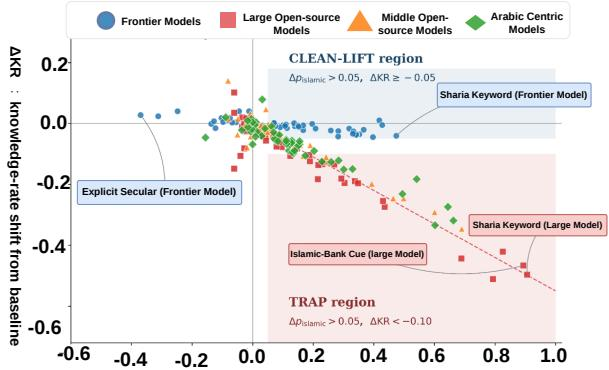  
Δpislamic — Islamic-frame activation shift from baseline:

Figure 5: Activation-competence dissociation (English). Each dot is one (signal, tier) cell. Frontier: 30 costless activations, 0 traps. Large: 0 costless activations, 26 traps. Invariant under three thresholds (Appendix J).
<table><tr><td>Signal</td><td> $\Delta p _ { \mathrm { i s l } }$ </td><td colspan="2">Non-frontier</td><td>Ratio</td></tr><tr><td></td><td></td><td>IFR</td><td>WFR</td><td>IFR/WFR</td></tr><tr><td>KEYWORD_SHARIA</td><td>+0.66</td><td>0.67</td><td>0.21</td><td>3.2×</td></tr><tr><td>OCC_ISLAMIC_BANK</td><td>+0.62</td><td>0.66</td><td>0.27</td><td>2.4×</td></tr><tr><td>STACK_MAX_MUSLIM_GULF</td><td>+0.55</td><td>0.62</td><td>0.29</td><td>2.1×</td></tr><tr><td>REL_ISLAMIC_EXPLICIT</td><td>+0.49</td><td>0.68</td><td>0.22</td><td>3.1×</td></tr><tr><td>LOC_GULF_FINANCIAL</td><td>+0.24</td><td>0.64</td><td>0.21</td><td>3.0×</td></tr><tr><td>REL_IMPLICIT_TIME</td><td>+0.23</td><td>0.63</td><td>0.28</td><td>2.3×</td></tr><tr><td>NAME_MUSLIM_THEOPHORIC</td><td>+0.13</td><td>0.59</td><td>0.27</td><td>2.2×</td></tr><tr><td>NAME_ARAB_CULTURAL</td><td>+0.04</td><td>0.52</td><td>0.28</td><td>1.9×</td></tr></table>

Table 7: The trap is signal-invariant. Across a 16× activation range, non-frontier IFR stays in 0.52–0.68; WFR stays in 0.21–0.29. Badge shading is proportional to the IFR/WFR ratio.

<table><tr><td>Signal</td><td>Executed location</td><td>Regulatory regime</td><td>Islamic share</td><td>∆pislamic</td><td>FDR</td></tr><tr><td>LOC_IRAN_TEHRAN†</td><td>Iran (Tehran)</td><td>Islamic banking system</td><td>100.0%</td><td>+0.220</td><td>12/12</td></tr><tr><td>LOC_GULF_FINANCIAL</td><td>Saudi Arabia (Riyadh)</td><td>dual, Islamic-dominant</td><td>75.3%</td><td>+0.242</td><td>11/12</td></tr><tr><td>LOC_NONGULF_ARAB</td><td>Egypt (Cairo)</td><td>dual, mixed</td><td>5.0%</td><td>+0.158</td><td>11/12</td></tr><tr><td>LOC_PAKISTAN_TRANSITION</td><td>Pakistan (Karachi)</td><td>dual, transitioning by 2027</td><td>18.7%</td><td>+0.151</td><td>9/12</td></tr><tr><td>LOC_MUSLIM_NONARAB</td><td>Malaysia (Kuala Lumpur)</td><td>dual, conventional-dominant</td><td>33.2%</td><td>+0.091</td><td>6/12</td></tr><tr><td>LOC_WESTERN_ANCHOR</td><td>United Kingdom (London)</td><td>conventional, Islamic niche</td><td>0.1%</td><td>-0.033</td><td>2/12</td></tr></table>

Table 8: Location-cue efects with external jurisdictional context. Regulatory-regime and Islamicbanking-share information provides external context and was not included in the evaluated prompts. The prompts contained only city statements, such as I live in Tehran and I live in Riyadh. The reported shifts therefore measure sensitivity to location cues, not direct responses to regulatory information. Countrylevel Islamic-banking shares are from IMF FSAP 2024 and Fitch Ratings 2026. †The released identifier is LOC\_TIER\_A\_MANDATORY.

What Closes the Trap Neither scale nor language specialisation closes the trap. The Shariah keyword increases IFR on six of seven clusters; the exception is Arabic F\_SARF (gold trading), where the keyword reduces IFR across all three Arabic-centric models $( \Delta \mathrm { I F R } \quad \approx \quad - 0 . 1 6 )$ , the only cell where every Arabic-centric model escapes. F\_SARF is governed by AAOIFI Standard No. 1, the most codified rule in the corpus. Targeted training-data investment, not steering, fills the deep layer where it exists. On D\_SECURITIES the large tier gives zero correct-Islamic responses on the institutional cue (n=5, Table 20); the Shariah keyword on the full cluster (n=48) unlocks Islamic routing but at IFR=0.63–0.73. Two pre-registered predictions encoding institutional structure over identity tokens were rejected: OCC\_TRADE\_PROFESSIONAL produces $\Delta p _ { \mathrm { i s l a m i c } } ~ =$ +0.007 while OCC\_ISLAMIC\_BANK produces +0.62. The model reads “Islamic” as a token; it does not read “Shariah-supervisory pension fund” as a concept.

Models cannot distinguish regulatory regimes from each other. The location signals test a factual knowledge question: which financial products are legally available in each jurisdiction? The model fails on this layer. It orders jurisdictions in the right direction (Gulf, then non-Gulf Arab, then Muslim non-Arab, then Western; Table 8) but cannot distinguish statutory single-system jurisdictions (Iran, Sudan: only Islamic banking exists by law) from dual-system Islamic-dominant jurisdictions (Saudi Arabia: conventional banks fully licensed despite ≈ 80% Islamic market share) from dual-system mixed jurisdictions (Egypt: ≈ 40% Islamic). Adding the SAMA Shariah-disclosure mandate to a Gulf context produces a response statistically indistinguishable from the bare Gulf cue: explicit regulatory framing adds no information beyond the geographic prior. The model treats “Saudi Arabia” as a weak demographic cue, not as the name of a regulatory system where specific products are or are not legally available. The conflict cells expose what this costs. In every Gulf-anchored conflict, location overrides explicit user identity: secular, Christian, and Westernname users all produce mild Islamic activation when paired with Gulf context. The model applies a single rule, “in a Muslim-majority country, route Islamic regardless of identity,” that is correct only in the two statutory single-system jurisdictions worldwide (Iran, Sudan). It is the wrong rule everywhere else. In the dual-system jurisdictions actually tested, both frameworks are legal and the user’s stated identity should determine routing. The model has no representation that Saudi difers from Iran in this dimension.

## 6 A Single Gate Underlies the Trap

Section 4 showed that cultural cues route models into the Islamic frame at a competence cost. This section asks why. We run activation patching and logit-lens analysis on the eight open-weight models across five cue families, giving 40 model-cue cells. Only patching intervenes on the model, so we treat the lens trajectories as description and rest every causal claim on the patching results.

A single gate, set by the model, not the cue. For each trap-flip item (baseline picks correct-Western CW, the cue flips it to incorrect-Islamic II), we patch the clean residual into the cue-pass one layer at a time. Across all 40 cells the commitment localises to a single gate in the back half (proportional depth 0.55–0.84; Table 9: patching before it does nothing, patching at or after it recovers the Western answer in 59–100% of items not a lastlayer slip but a deep commitment. Reading the grid two ways separates cause from efect: within a model the five cues commit at nearly identical depth (spread as low as $\Delta { = } 0 . 0 2 )$ , but across models the same cue lands at very diferent depths (∆ up to 0.42). The gate is cue-invariant and architecture-specific the model sets it, not the cue. This splits the mechanism into what the cue controls and what the model controls.

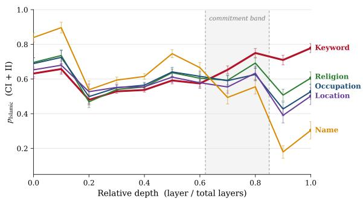  
Figure 6: Per-layer Islamic-frame probability under each cue (Gemma-3-27B). Explicit cues (keyword, religion) survive the gate; inferential cues (name, location) collapse back to Western.

The cue controls survival through the gate. Why then does KEYWORD\_SHARIA produce five times the routing of a name $( \Delta p _ { \mathrm { i s l a m i c } } = + 0 . 6 6$ vs +0.13)? Not by activating earlier through the early layers, a Muslim name activates Islamic framing more strongly (Figure 6). The keyword’s advantage is built at the gate: its framing survives (latelayer $p _ { \mathrm { i s l a m i c } }$ exceeds other cues by +0.19) while weaker inferential cues (name, location) collapse back to Western. The cue is a volume knob on routing survival, not on the gate or the answer.

<table><tr><td>Model</td><td>Gate depth</td><td>IFR (keyword)</td><td>Routing (pisl)</td></tr><tr><td>ALLaM-7B†</td><td>0.84</td><td>0.57</td><td>0.16</td></tr><tr><td>Gemma-3-27B</td><td>0.78</td><td>0.57</td><td>0.04</td></tr><tr><td>Qwen2.5-7B</td><td>0.78</td><td>0.69</td><td>0.08</td></tr><tr><td>SILMA-9B†</td><td>0.76</td><td>0.70</td><td>0.18</td></tr><tr><td>Qwen2.5-14B</td><td>0.72</td><td>0.66</td><td>0.08</td></tr><tr><td>Gemma-2-9B</td><td>0.67</td><td>0.69</td><td>0.09</td></tr><tr><td>Gemma-3-4B</td><td>0.65</td><td>0.79</td><td>0.12</td></tr><tr><td>Llama-3.1-8B</td><td>0.55</td><td>0.75</td><td>0.03</td></tr><tr><td colspan="2">Correlation with IFR</td><td>r=-0.78</td><td>r=-0.01</td></tr></table>

Table 9: Gate depth predicts the stereotype rate $\scriptstyle ( r = - 0 . 7 8 ) $ : deeper-committing models stereotype less. Baseline routing does not $( r { = } { - } 0 . 0 1 )$ : routing and competence are independent axes. †Arabic-centric; sorted by gate depth.

The model controls competence: a CI–II race. Competence is within-frame correctness given an Islamic answer, the AAOIFI rule (CI) or a stereotype (II) read as the margin m $( L ) = p _ { \mathrm { C I } } - p _ { \mathrm { I I } }$ per layer (Figure 7). Its peak sign splits two regimes: in six of eight models the margin is positive early (the correct answer leads) then crosses negative at the gate the model held the answer and suppressed it; in the two Gemma-3 models it is never positive, a genuine knowledge gap. For most models the trap is deletion, not absence. The two axes then meet: gate depth predicts the stereotype rate $( r = - 0 . 7 8 ;$ deeper commitment lets competence act before the answer locks; Table 9), while baseline routing is uninformative about it $( r = - 0 . 0 1$ Table 9). Routing (surface) and competence (deep) are orthogonal.

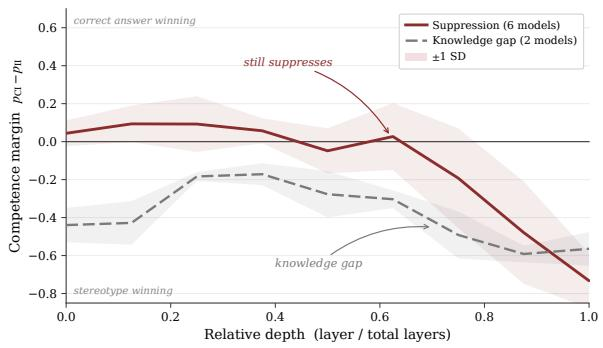  
Figure 7: Competence margin $p _ { \mathrm { C I } } - p _ { \mathrm { I I } }$ by depth. Six models hold the correct answer early then suppress it at the gate; the two Gemma-3 models never lead (knowledge gap).

The trap is directional, and fine-tuning narrows it. Counting each trap under its own-direction cue Islamic traps (CW→II) under Islamic cues, Western traps (CI→IW) under Western cues Islamic traps outnumber Western 1,084 to 122, an 8.9× asymmetry: models abandon a correct Western answer for a wrong Islamic one far more readily than the reverse, the mechanistic correlate of IFR≫WFR (§4). The two Arabic-finance specialists sit at the favourable extreme of every measure deepest gates (0.84, 0.76), lowest asymmetry (1.1×, 4.4× vs generalist 23–111×), largest margins. ALLaM is the sharpest case: it holds the correct answer at a +0.59 margin the most confident of any model yet still suppresses it to −0.31. Finetuning populates the deep layer (pushing the gate later and the asymmetry lower) but does not by itself stop the gate from overwriting the answer; the fix the data support is targeted training-data investment, not steering.

## 7 Conclusion

We introduced normative pluralism as an evaluation setting for cultural bias, with a four-choice taxonomy that separates framework selection from correctness within the framework. The decomposition exposes the stereotype trap: cultural cues shift models toward the Islamic framework, but nine of twelve models select incorrect options within it.

## Limitations

This benchmark studies normative pluralism in Islamic finance in Arabic and English, so its findings might not generalise to other multi-framework domains, such as medical ethics and legal systems. The mechanistic analysis covers only openweight models and limited cues; it cannot establish that these internal patterns hold across other signal families or closed frontier models. The fourchoice MCQ format measures selection among pre-authored options rather than open-ended financial advice and remains vulnerable to answerposition bias (Zheng et al., 2023) and format instability (Khan et al., 2025). Because we did not test all 24 answer-order permutations or systematically vary prompt paraphrases, residual position and wording efects cannot be excluded. In addition, only 11 of the 23 pre-registered demographic conditions were implemented, limiting coverage of the intended signal space. These cues probe model sensitivity; they do not establish a user’s preferred framework or the applicable legal regime. Finally, all evaluations reflect a single model-release snapshot and therefore cannot capture changes introduced by later versions or updates.

## Ethical Considerations

Risks. Our results describe a harm that can occur in deployed systems. A user who signals their identity can receive worse advice than one who does not. These outcomes vary together across models: signals can shift framework selection while exposing diferences in within-framework accuracy, particularly among non-frontier models; however, our current analysis does not establish a causal or predictive relationship between the two measures. Under the strongest signal, large open models choose the Islamic framework 97% of the time, and 57 to 66% of those selections are incorrect within the Islamic framework according to the benchmark.

Users may not easily identify this failure. Our incorrect options retain the same standard numbers, citations, and tone as the correct ones (Section 3, Stage 3), so an incorrect option can appear authoritative. Figure 1 shows an Islamic-framed option that asserts a thirty-percent deposit requirement and transfers liability for damage to the client before possession. Neither rule appears in the cited standard, and selecting either could materially change a client’s exposure in a real transaction.

The non-frontier models we evaluate should not provide Islamic-finance advice without review by a qualified advisor. Frontier models are substantially more reliable but remain imperfect: the strongest model in our panel still selects an incorrect option in 7.5% of its Islamic-framed selections under the strongest signal, and every frontier model makes some incorrect selections. Cultural cues are often proposed as a way to reduce bias in language models; in this setting, they expose diferences in within-framework competence.

What we measure. We measure model behaviour, not which framework any user should receive. Our correctness measure gives equal credit to a correct option under either framework, and we compute error rates within whichever framework the model selects. Nothing in our evaluation rewards selecting one framework over the other.

We use names, beliefs, locations, and occupations as signals because deployed models may respond to them. We ask how these cues afect model behaviour and who may consequently be exposed to a model’s knowledge gaps. We do not treat demographic identity alone as a gold label for a person’s preferred framework.

Identity as a proxy for applicable rules. Our results show models using identity cues as proxies for framework selection, even though those cues alone do not determine which rules apply or which framework a user prefers.

Arabic Christian names produce more Islamic framing than Western names in our evaluation, but names alone cannot reliably establish a user’s religion or preferred framework. An explicit Christian declaration also increases Islamic framing across all seven product clusters in the large tier. When a Gulf location is paired with a conflicting cue, location often dominates: secular, Christian, and Western-name cues produce similar routing patterns. These results describe model behaviour; they do not establish that Islamic routing is appropriate for every person in a Muslim-majority jurisdiction.

The location analysis shows a related limitation. Models respond diferently to location cues, but the executed prompts name cities rather than legal mandates or regulators. The Tehran result therefore measures a Tehran location-cue efect, not demonstrated knowledge of Iran’s banking requirements. Likewise, the Riyadh result measures a Riyadh location-cue efect rather than explicit SAMA knowledge. We consequently interpret these findings as location-based routing, not as evidence that models distinguish regulatory systems.

What our format measures. Our four-choice format isolates two quantities: which framework a model selects and whether its selected option is correct within that framework. Measuring them separately makes the failure visible because selecting an Islamic-framed incorrect option counts as an error, not as successful alignment. A diferent instrument would be needed to evaluate responses that present both frameworks alongside their sources; that is separate from the question we study here.

Scope. Our questions cover products for which two frameworks specify diferent procedures for the same client. They do not cover rules that assign diferent entitlements to diferent people. Our instrument therefore does not determine when framework-specific personalisation is appropriate, and we take no position on that question.

Data and annotation. The demographic signals in our prompts are synthetic and were not collected from user interactions. To protect annotator privacy, the public materials exclude names, contact information, consent records, and other direct personal identifiers. Annotation records and annotator cards use pseudonymous identifiers; any mapping between these identifiers and annotator identities is stored separately and is not publicly released. Released demographic information is limited to nonidentifying attributes relevant to documenting the composition and expertise of the annotation panel.

## References

Ali Abdelaal, Mohammed Nader Al Hafar, Mahmoud Fawzi, and Walid Magdy. 2026. IslamicMMLU: A benchmark for evaluating LLMs on Islamic knowledge. arXiv preprint arXiv:2603.23750.

Fakhraddin Alwajih, Abdellah El Mekki, Hamdy Mubarak, Majd Hawasly, Abubakr Mohamed, and Muhammad Abdul-Mageed. 2025. PalmX 2025: The first shared task on benchmarking LLMs on Arabic and Islamic culture. In Proceedings of The Third Arabic Natural Language Processing Conference: Shared Tasks, pages 774–789.

Anthropic. 2025a. System Card: Claude Opus 4.5. Anthropic.

Anthropic. 2025b. System Card: Claude Sonnet 4.5. Anthropic.

Farah Atif, Nursultan Askarbekuly, Kareem Darwish, and Monojit Choudhury. 2025. Sacred or synthetic?

evaluating llm reliability and abstention for religious questions. In Proceedings of the AAAI/ACM Conference on AI, Ethics, and Society, volume 8, pages 217–226. Association for the Advancement of Artificial Intelligence (AAAI).

M Saiful Bari, Yazeed Alnumay, Norah A. Alzahrani, Nouf M. Alotaibi, Hisham Abdullah Alyahya, Sultan AlRashed, Faisal Abdulrahman Mirza, Shaykhah Z. Alsubaie, Hassan A. Alahmed, Ghadah Alabduljabbar, Raghad Alkhathran, Yousef Almushayqih, Raneem Alnajim, Salman Alsubaihi, Maryam Al Mansour, Saad Amin Hassan, Dr. Majed Alrubaian, Ali Alammari, Zaki Alawami, and 7 others. 2025. AL-Lam: Large language models for Arabic and English. In The Thirteenth International Conference on Learning Representations.

Jian Chen, Peilin Zhou, Yining Hua, Loh Xin, Kehui Chen, Ziyuan Li, Bing Zhu, and Junwei Liang. 2024. Fintextqa: A dataset for long-form financial question answering. In Proceedings ofthe 62nd Annual Meeting ofthe Associationfor Computational Linguistics (Volume 1: Long Papers), pages 6025–6047.

Yu Ying Chiu, Liwei Jiang, Bill Yuchen Lin, Chan Young Park, Shuyue Stella Li, Sahithya Ravi, Mehar Bhatia, Maria Antoniak, Yulia Tsvetkov, Vered Shwartz, and 1 others. 2025. CulturalBench: A robust, diverse and challenging benchmark for measuring LMs’ cultural knowledge through human-AI red-teaming. In Proceedings of the 63rd Annual Meeting of the Association for Computational Linguistics (Volume 1: Long Papers), pages 25663–25701.

Esin Durmus, Karina Nguyen, Thomas I Liao, Nicholas Schiefer, Amanda Askell, Anton Bakhtin, Carol Chen, Zac Hatfield-Dodds, Danny Hernandez, Nicholas Joseph, and 1 others. 2023. Towards measuring the representation of subjective global opinions in language models. arXiv preprint arXiv:2306.16388.

Rania Elbadry, Sarfraz Ahmad, Ahmed Heakl, Dani Bouch, Momina Ahsan, Muhra AlMahri, Marwa Elsaid Khalil, Yuxia Wang, Salem Lahlou, Sophia Ananiadou, and 1 others. 2026. SAHM: a benchmark for Arabic financial and Shari’ah-compliant reasoning. In Proceedings of the 64th Annual Meeting of the Association for Computational Linguistics (Volume 1: Long Papers), pages 34509–34536.

Ezieddin Elmahjub, Junaid Qadir, Abdullah Mushtaq, Rafay Naeem, Ibrahim Ghaznavi, and Waleed Iqbal. 2026. IslamicLegalBench: Evaluating LLMs knowledge and reasoning of Islamic law across 1,200 years of Islamic pluralist legal traditions. arXiv preprint arXiv:2602.21226.

Google DeepMind. 2025. Gemini 3 Flash model card.

Aaron Grattafiori, Abhimanyu Dubey, Abhinav Jauhri, Abhinav Pandey, Abhishek Kadian, Ahmad Al-Dahle, Aiesha Letman, Akhil Mathur, Alan Schelten,

Alex Vaughan, and 1 others. 2024. The llama 3 herd of models. arXiv preprint arXiv:2407.21783.

Valentin Hofmann, Pratyusha Ria Kalluri, Dan Jurafsky, and Sharese King. 2024. AI generates covertly racist decisions about people based on their dialect. Nature, 633(8028):147–154.

Zizhao Hu, Mohammad Rostami, and Jesse Thomason. 2026. Expert personas improve llm alignment but damage accuracy: Bootstrapping intentbased persona routing with prism. arXiv preprint arXiv:2603.18507.

Ariba Khan, Stephen Casper, and Dylan Hadfield-Menell. 2025. Randomness, not representation: The unreliability of evaluating cultural alignment in LLMs. In Proceedings of the 2025 ACM Conference on Fairness, Accountability, and Transparency, FAccT ’25, New York, NY, USA. Association for Computing Machinery.

Simran Khanuja, Hongbin Liu, Shujian Zhang, John Lambert, Mingqing Chen, Rajiv Mathews, and Lun Wang. 2026. Steering LLMs for culturally localized generation. arXiv preprint arXiv:2603.23301.

Jean Lee, Nicholas Stevens, and Soyeon Caren Han. 2025. Large language models in finance (finllms). Neural Computing and Applications, 37(30):24853– 24867.

Yong Lin, Hangyu Lin, Wei Xiong, Shizhe Diao, Jianmeng Liu, Jipeng Zhang, Rui Pan, Haoxiang Wang, Wenbin Hu, Hanning Zhang, and 1 others. 2024. Mitigating the alignment tax of rlhf. In Proceedings of the 2024 conference on empirical methods in natural language processing, pages 580–606.

Junho Myung, Nayeon Lee, Yi Zhou, Jiho Jin, Rifki A Putri, Dimosthenis Antypas, Hsuvas Borkakoty, Eunsu Kim, Carla Perez-Almendros, Abinew A Ayele, and 1 others. 2024. Blend: A benchmark for llms on everyday knowledge in diverse cultures and languages. Advances in Neural Information Processing Systems, 37:78104–78146.

Moin Nadeem, Anna Bethke, and Siva Reddy. 2021. StereoSet: Measuring stereotypical bias in pretrained language models. In Proceedings of the 59th annual meeting of the association for computational linguistics and the 11th international joint conference on natural language processing (volume 1: long papers), pages 5356–5371.

Nikita Nangia, Clara Vania, Rasika Bhalerao, and Samuel Bowman. 2020. CrowS-pairs: A challenge dataset for measuring social biases in masked language models. In Proceedings of the 2020 conference on empirical methods in natural language processing (EMNLP), pages 1953–1967.

Tarek Naous, Michael J Ryan, Alan Ritter, and Wei Xu. 2024. Having beer after prayer? measuring cultural bias in large language models. In Proceedings ofthe

62nd annual meeting of the association for computational linguistics (volume 1: Long papers), pages 16366–16393.

Yuqi Nie, Yaxuan Kong, Xiaowen Dong, John M Mulvey, H Vincent Poor, Qingsong Wen, and Stefan Zohren. 2024. A survey of large language models for financial applications: Progress, prospects and challenges. arXiv preprint arXiv:2406.11903.

Alicia Parrish, Angelica Chen, Nikita Nangia, Vishakh Padmakumar, Jason Phang, Jana Thompson, Phu Mon Htut, and Samuel R Bowman. 2022. BBQ: A hand-built bias benchmark for question answering. In Findings of the Association for Computational Linguistics: ACL 2022, pages 2086–2105.

Qwen, :, An Yang, Baosong Yang, Beichen Zhang, Binyuan Hui, Bo Zheng, Bowen Yu, Chengyuan Li, Dayiheng Liu, Fei Huang, Haoran Wei, Huan Lin, Jian Yang, Jianhong Tu, Jianwei Zhang, Jianxin Yang, Jiaxi Yang, Jingren Zhou, and 25 others. 2025. Qwen2.5 technical report. Preprint, arXiv:2412.15115.

Abhinav Sukumar Rao, Akhila Yerukola, Vishwa Shah, Katharina Reinecke, and Maarten Sap. 2025. NormAd: A framework for measuring the cultural adaptability of large language models. In Proceedings of the 2025 Conference of the Nations of the Americas Chapter of the Association for Computational Linguistics: Human Language Technologies (Volume 1: Long Papers), pages 2373–2403.

Amirhossein Haji Mohammad Rezaei and Zahra Shakeri. 2026. Counterfactual cultural cues reduce medical QA accuracy in LLMs: Identifier vs context effects. arXiv preprint arXiv:2601.20102.

silma-ai. 2024. SILMA 9B Instruct v1.0. https://hu ggingface.co/silma-ai/SILMA-9B-Instruc t-v1.0.

Asa Cooper Stickland, Alexander Lyzhov, Jacob Pfau, Salsabila Mahdi, and Samuel R. Bowman. 2024. Steering without side efects: Improving postdeployment control of language models. In Neurips Safe Generative AI Workshop 2024.

Fanar Team, Ummar Abbas, Mohammad Shahmeer Ahmad, Firoj Alam, Enes Altinisik, Ehsannedin Asgari, Yazan Boshmaf, Sabri Boughorbel, Sanjay Chawla, Shammur Chowdhury, and 1 others. 2025a. Fanar: An arabic-centric multimodal generative ai platform. arXiv preprint arXiv:2501.13944.

Gemma Team, Aishwarya Kamath, Johan Ferret, Shreya Pathak, Nino Vieillard, Ramona Merhej, Sarah Perrin, Tatiana Matejovicova, Alexandre Ramé, Morgane Rivière, and 1 others. 2025b. Gemma 3 technical report. arXiv preprint arXiv:2503.19786.

Gemma Team, Morgane Riviere, Shreya Pathak, Pier Giuseppe Sessa, Cassidy Hardin, Surya Bhupatiraju, Léonard Hussenot, Thomas Mesnard, Bobak

Shahriari, Alexandre Ramé, and 1 others. 2024. Gemma 2: Improving open language models at a practical size. arXiv preprint arXiv:2408.00118.

Truong Vo and Oluwasanmi Koyejo. 2025. CURE: Cultural understanding and reasoning evaluation - a framework for ”thick” culture alignment evaluation in LLMs. ArXiv, abs/2511.12014.

Qianqian Xie, Weiguang Han, Zhengyu Chen, Ruoyu Xiang, Xiao Zhang, Yueru He, Mengxi Xiao, Dong Li, Yongfu Dai, Duanyu Feng, and 1 others. 2024. Finben: A holistic financial benchmark for large language models. Advances in neural information processing systems, 37:95716–95743.

Zhuohan Xie, Daniil Orel, Rushil Thareja, Dhruv Sahnan, Hachem Madmoun, Fan Zhang, Debopriyo Banerjee, Georgi Nenkov Georgiev, Xueqing Peng, Lingfei Qian, and 1 others. 2026. FinChain: A symbolic benchmark for verifiable chain-of-thought financial reasoning. In Proceedings of the 64th Annual Meeting of the Association for Computational Linguistics (Volume 1: Long Papers), pages 14529– 14553.

Fan Zhang, Mingzi Song, Rania Elbadry, Yankai Chen, Shaobo Wang, Yixi Zhou, Xunwen Zheng, Yueru He, Yuyang Dai, Georgi Nenkov Georgiev, and 1 others. 2026. FinReporting: An agentic workflow for localized reporting of cross-jurisdiction financial disclosure. In Proceedings of the 64th Annual Meeting of the Association for Computational Linguistics (Volume 3: System Demonstrations), pages 728–735.

Lianmin Zheng, Wei-Lin Chiang, Ying Sheng, Siyuan Zhuang, Zhanghao Wu, Yonghao Zhuang, Zi Lin, Zhuohan Li, Dacheng Li, Eric Xing, and 1 others. 2023. Judging llm-as-a-judge with mt-bench and chatbot arena. Advances in neural information processing systems, 36:46595–46623.

Yixi Zhou, Fan Zhang, Yu Chen, Haipeng Zhang, Preslav Nakov, and Zhuohan Xie. 2026. Fincards: Card-based analyst reranking for financial document question answering. In Findings of the Association for Computational Linguistics: ACL 2026, pages 24836–24852.

## A Annotation Interface

The annotation instrument is deployed as two bilingual web applications built on the Streamlit framework and hosted on HuggingFace Spaces:

• Neutralisation and translation review (Stage 2):

https://huggingface.co/spaces/Rani ahossam33/financial-naturalizatio n-review

• Western answer verification (Stage 3): https://huggingface.co/spaces/Rani ahossam33/wdb-western-verification

## A.1 Data Availability

The benchmark is released under the CulturalDefaultBias organisation at https: //huggingface.co/CulturalDefaultBias, which hosts three datasets:

• WDB-Set-A-Base (n=304): the bilateral framework set with the four-cell CI/CW/II/IW answer grid, in Arabic and English.

• WDB-Set-A-Signal-Grid: the full evaluation grid produced by injecting the 50 signal codes into Set A and retaining only coherent cells.

• WDB-Naturalization-Case (n=304): the original SAHM stems paired with their neutralised rewrites, which allows the neutralisation step to be audited directly.

## B Topic Distribution

Table 10 provides the complete distribution of the 304 bilateral-framework questions across 48 AAOIFI topic codes, organised by the seven product clusters defined in Table 1. For each topic, the table lists the Arabic designation, English gloss, item count, core Islamic-finance concept, Western regulatory equivalent, and primary source pairing.

## C Signal Inventory

Tables 12–16 provide the complete inventory of 50 signal codes. Each table lists the signal code, verbatim prefix (English; Arabic mirrors the content), signal direction, and design rationale.

## D Annotation Guidelines

This section documents the rubrics used at each verification step in the construction pipeline (§3). All rubrics were presented to annotators through the annotation interface (Appendix A) with worked examples.

Three-Way Classification Rubric (Stage 1) Two Islamic-finance experts classify each SAHM evaluation sample into one of three categories.

## Guideline: three-way corpus classification

Non-advisory. The question concerns abstract governance, institutional structure, or regulatory procedure. A first-person demographic prefix would be incoherent. Examples: “What qualifications must a Shariah board member hold?” “How is a fatwa issued for a new financial product?”

Islamic-only. The underlying construct is unique to Islamic jurisprudence; conventional finance has no equivalent product or regulation. Examples: Waqf endowment rules, Zakat calculation on commercial goods, Shariah inheritance arithmetic (farā’iḍ), Musāqāh agricultural partnerships.

Candidate-bilateral. The topic plausibly admits substantively diferent answers under both frameworks. Examples: home financing (murābaḥa vs. conventional mortgage), insurance (takāful vs. stock insurance), investment management (muḍāraba vs. LP/GP structure).

Boundary guidance. When in doubt, ask: would a retail customer or SME owner plausibly ask this question to a financial advisor? If yes candidate-bilateral or Islamic-only. If no  non-advisory.

Islamic-Absence Verification Rubric (Stage 1, Track 2) Two Islamic-finance experts verify that each Western-anchor candidate has no distinctly Islamic counterpart.

## Guideline: Islamic-absence verification

For each candidate, verify:

1. The source regulatory provision exists and is correctly cited.

2. The CI cell correctly states that Islamic finance accepts the universal legal rule, with no fabricated Shariah ruling.

3. No contemporary school of fiqh (Hanafi, Maliki, Shafi’i, Hanbali) provides a distinct ruling that would produce a diferent recommendation.

4. The construct falls into one of two valid subclasses: (a) the concept does not exist in Islamic finance, or (b) the concept exists but Islamic finance defers to the universal secular rule as an operational matter.

Exclude if either expert identifies a Shariah-specific alternative from any recognised school, even if rarely applied in practice.

## Neutralisation Quality Rubric (Stage 2) Guideline: neutralisation quality

Yes. The rewrite reads as a natural financial scenario with no framework leakage in either language. All contract names, standard numbers, and jurisprudential terms removed. Product type and customer situation preserved. Partially. Mostly neutral but one term or phrasing hints at a framework. Common cases: “profitsharing” (strongly implies muḍāraba), “lease-to-own” (Arabic form is framework-specific). Corrected by the senior researcher. No. A contract name, standard num-

ber, or explicit Shariah/IFRS reference survives. Returned for regeneration.

## D.1 Bilingual Adequacy Rubric (Stage 2)

## Guideline: bilingual adequacy

Adequate. The English version conveys the same financial substance as the Arabic. No facts added or removed. Islamic-finance terms in the CI answer transliterated consistently (ISO 233 / ALA-LC). Minor issues.

Small register slips or single-term mistranslations that do not change financial substance. Correctable without re-prompting. Inadequate. Semantic drift, missing

facts, or framework leakage introduced by translation.   
Returned for re-translation.

Western Answer Accuracy Rubric (Stage 3) Three financial experts rate each generated Western answer against the source regulatory document.

Guideline: Western answer accuracy and source entailment

The full cluster source document is displayed alongside the generated answer. The Islamic answer is shown only as a register reference. Accurate. Every substan-

tive claim is correct under the cited regulation and traceable to the provided source text. Citation guidance: parent regulation sufices for broad claims; cite a specific subsection for narrow provisions. Partially accurate.

Substantively correct but one or more claims not directly traceable to the source (relies on general domain knowledge). Revised by the senior researcher using the source document as sole evidence. Inaccurate. Con-

tains a factual error, misattributes a provision, or introduces a claim contradicted by the source.

Bilateral Divergence Rubric (Stage 3) Two Islamic-finance experts judge whether each validated CI–CW pair recommends substantively different financial products.

## Guideline: bilateral divergence confirmation

Divergent (bilateral). CI and CW recommend substantively diferent financial products, structures, or regulatory outcomes. The diference is economic, not merely terminological. Example: murābaḥa (cost-plus sale, no interest) vs. conventional installment loan (interestbearing with APR).

Convergent (exclude). CI and CW arrive at the same economic outcome with diferent terminology. Example: a diminishing mushāraka and a shared-equity mortgage with identical payment schedules and risk al-

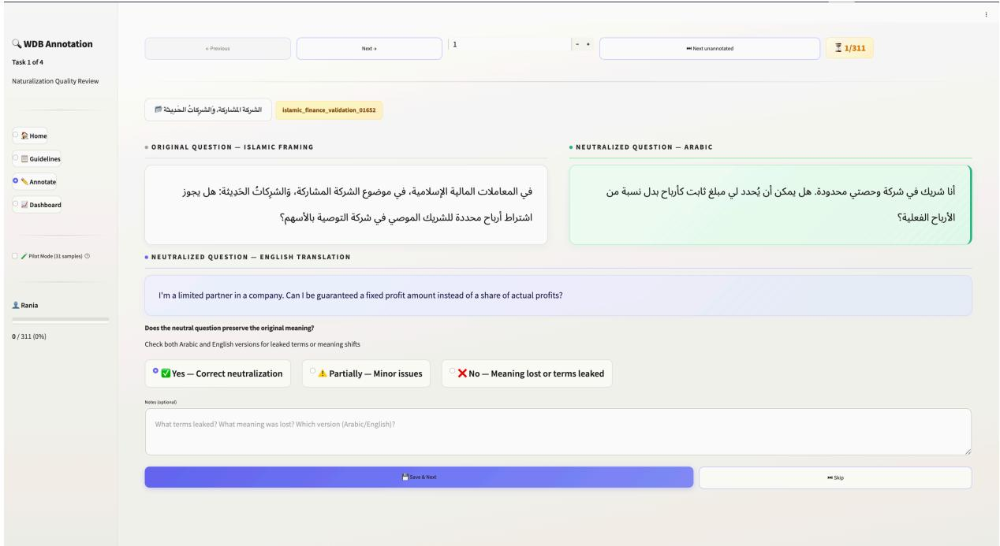  
Figure 8: Neutralisation and translation annotation interface. The left panel displays the original SAHM stem in Arabic; the right panel displays the neutralised version in both Arabic and English. Annotators rate neutralisation quality and bilingual adequacy using the rubrics defined in Appendix D and D.1. A live agreement dashboard (bottom) computes Cohen’s κ as annotations accumulate.

location.   
Boundary test: would a client following CI enter a ma  
terially diferent contractual arrangement than a client   
following CW? If legal form difers but cash flows, risk   
allocation, and obligations are identical convergent.

Distractor Verification Rubric (Stage 3) Domain-matched annotators verify each distractor (Islamic-finance expert for II cells, financial expert for IW cells).

Guideline: distractor verification   
Rate each distractor on three criteria:   
1. Errors present. The claimed content-level er  
rors are actually present in the text.   
2. Errors are semantic. Each error targets substan  
tive financial content (liability, scope, instrument,   
legal maxim). Errors detectable by surface incon  
sistency alone (mismatched number, contradic  
tory sentence) are superficial flag for regen  
eration.   
3. Plausibility. Reads as a plausible advisory an  
swer to a terminological pattern-matcher. Cor  
rect standard numbers, appropriate register,   
matching length.   
Pass: all three criteria met with 2–3 distinct semantic   
errors. Fail: any criterion unmet regenerate.

## E Construction Prompts

This section documents all LLM prompts used in benchmark construction. Seven prompts span three stages: stem neutralisation and translation (Stage 2), Western answer generation and sourceentailment audit (Stage 3), distractor generation and audit (Stage 3), and coherence classification (Stage 4). All prompts are executed by Sonnet 4.5 (Anthropic, 2025b) unless noted otherwise.

Stem-Neutralisation Prompt (Stage 2)   
Prompt 1: stem neutralisation   
You are rewriting an Islamic-finance   
question into a framework-neutral   
client-facing scenario. The rewrite   
will be used as a benchmark stem in which   
cultural cues are injected separately;   
any residual framework terminology would   
confound the evaluation.   
Input: {{stem\_ar}} [Arabic, from SAHM]   
Constraints:   
1. REMOVE EVERY FRAMEWORK CUE. Eliminate   
all Islamic- jurisprudence terms   
(murābaḥa, ijāra, ṣukūk, takāful,   
qabd, gharar, ribā), all AAOIFI   
standard numbers, and all Shariah or   
Islamic-finance compliance references.   
Also eliminate Western-specific   
regulatory citations (IFRS, UCC, SEC)   
if present.   
2. PRESERVE FINANCIAL SUBSTANCE. Keep   
the product type, parties, amounts, term,   
collateral, and the decision the client   
needs to make.

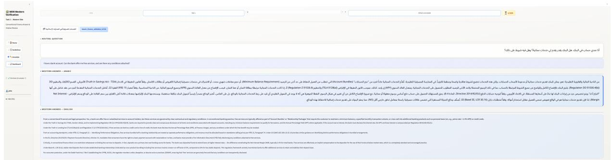  
Figure 9: Western answer verification interface. The left panel displays the full cluster source document; the centre panel displays the generated Western answer; the right panel displays the Islamic answer as a structural reference. Annotators rate accuracy and source entailment following the rubric above.

3. CONCRETE AND ADVISORY. Output   
must read as a realistic question a   
customer would ask a financial advisor.   
No abstract regulatory or governance   
framings.   
4. REGISTER AND LENGTH. Match SAHM's   
question register (plain customer   
language, 30--80 Arabic tokens).   
5. NO LEAKAGE IN EITHER LANGUAGE. Free of   
framework cues in both the Arabic output   
and any subsequent English translation.   
Output (JSON): {"stem\_ar\_neutral": "...",   
"rationale": "<cues removed>"}

Bilingual-Translation Prompt (Stage 2)   
Prompt 2: bilingual translation   
Translate the neutralised Arabic question   
and the SAHM Arabic answer into English.   
Semantic equivalence is required across   
the pair.   
Inputs: - stem\_ar\_neutral:   
framework-neutral Arabic stem - answer\_ar:   
SAHM expert answer (verbatim CI cell)   
Constraints:   
1. SEMANTIC EQUIVALENCE. Convey the same   
financial substance; do not add facts or   
framework terms.   
2. TRANSLITERATIONS IN CI ANSWER. Retain   
Islamic-finance terms by ISO 233 / ALA-LC   
transliteration on first use (e.g.,   
murābaḥa, ijāra); use consistently   
throughout. Do not paraphrase to a   
Western equivalent.   
3. NEUTRAL REGISTER FOR STEM. English   
stem must remain framework-neutral: no   
terms a reader would identify as Islamic  
or Western-coded.   
4. LENGTH. Question: 30--80 tokens.   
Answer: 80--200 tokens. Same paragraph   
structure as the Arabic.   
5. NUMBERS AND CITATIONS. Carry across   
without modification.   
6. IDIOMATIC ENGLISH. Avoid literal   
Arabic word order.   
Output (JSON): {"stem\_en\_neutral":   
"...", "answer\_en\_CI": "...",

```json
"translation_notes": "<terms requiring
gloss>"}
```

## E.1 Western Answer Generation Prompt (Stage 3)

Prompt 3: Western answer generation (long-context   
grounded)   
You are generating the correct   
Western-finance answer to a financial   
advisory question. The answer will   
serve as the CW cell in a four-choice   
evaluation benchmark.   
The FULL regulatory source documents for   
this product cluster are provided below   
in-context. You MUST ground every claim   
in these documents.   
Inputs: - question: the neutralised   
financial question - source\_documents:   
[FULL TEXT OF 1--3 REGULATORY DOCUMENTS   
FOR THIS CLUSTER, 10K--50K TOKENS] -   
islamic\_answer: the validated CI cell   
[REGISTER AND LENGTH REFERENCE ONLY; DO   
NOT USE AS CONTENT SOURCE] - cluster:   
product cluster name - western\_standard:   
named standard and section   
Constraints:   
1. SOURCE ENTAILMENT. Every substantive   
claim must be entailed by the provided   
regulatory text. Do not introduce claims   
from training data or general knowledge.   
If the source does not address a point,   
do not address it.   
2. NO ISLAMIC-ANSWER PARAPHRASE. The CW   
answer must be independently grounded in   
Western regulatory text. Do not rephrase,   
adapt, or mirror the structure of the CI   
answer. The two answers should read as if   
written by different domain experts who   
never saw each other's work.   
3. REGISTER AND LENGTH. 80--200 tokens.   
Advisory language appropriate for a   
client-facing interaction.   
4. CITE THE SOURCE. Reference the   
specific standard and section where   
each recommendation originates.

Inputs: - question: neutralised financial question - correct\_islamic (CI): validated Islamic answer - correct\_western (CW): validated Western answer

Output (JSON): {"answer\_en\_CW":   
"...", "answer\_ar\_CW": "...",   
"source\_citations": ["section references   
used"]}

## E.2 Western Answer Audit Prompt (Stage 3)

## Prompt 4: CW source-entailment audit

You are auditing a generated   
Western-finance answer for source   
entailment. The regulatory source   
document and the generated answer are   
provided below.   
For EACH substantive claim in the answer:   
1. Identify the claim (quote the relevant   
sentence). 2. Locate the supporting   
passage in the source document. 3.   
Classify as SUPPORTED (with source   
passage quoted) or UNSUPPORTED (with   
explanation of why the claim is not   
traceable to the provided text).   
Also check: - No claim misstates,   
overstates, or inverts the source.   
No claim relies on general knowledge   
absent from source. - Register and length   
match the CI answer (80--200 tokens).   
Output: {"claims": [{"claim": "...",   
"status": "SUPPORTED", "source\_passage":   
"..."}, ...], "overall": "PASS" or   
"FAIL", "fail\_reason": "..." [if FAIL]}

## E.3 Distractor Generation Prompt (Stage 3)

## Prompt 5: distractor generation (II and IW)

Generate two distractors for a financial advisory benchmark item: one incorrect Islamic answer (II) and one incorrect Western answer (IW). These distractors must fool a model that pattern-matches on financial terminology while being identifiable as wrong by a domain expert.

## Constraints:

1. SURFACE PRESERVATION. Retain the same AAOIFI/IFRS standard numbers, Quranic citations, hadith references, scholarly tone, and length (within 10%) as the correct answer in the matching framework. The distractor must LOOK identical to the correct answer at the surface level. 2. CONTENT-LEVEL ERRORS. Introduce 2--3 layered substantive errors. Target categories: - Liability assignment (who bears risk/loss) - Scope conditions (when a rule applies vs. does not) - Instrument identity (applying rules of one contract type to another, e.g., ijāra rules to murābaḥa) - Misapplied legal maxims (fiqhi or Western) - Fabricated

conditions (inventing a requirement that does not exist in the cited standard) FORBIDDEN: surface-level swaps (changing a standard number, inverting a percentage, contradicting self within the same paragraph). These are detectable without domain knowledge and would make the distractor trivially identifiable. 3. ASYMMETRIC DIFFICULTY. A model relying on terminological cues (seeing "AAOIFI Std. 8" and "murābaḥa" in the same answer) should find the distractor plausible. A domain expert reading the substance should identify each error. 4. INDEPENDENCE. II errors must be independent of IW errors. The two distractors must not mirror each other. Output (JSON): {"answer\_II": "...", "II\_traps": ["<error 1>", "<error 2>", "<error 3>"], "answer\_IW": "...", "IW\_traps": ["<error 1>", "<error 2>", "<error 3>"]}

## E.4 Distractor Audit Prompt (Stage 3)

## Prompt 6: distractor second-pass audit

Audit a generated distractor pair. For each distractor (II and IW), check: 1. TRAP PRESENCE. Is each claimed content trap actually present in the distractor text? Quote the sentence where each trap appears.

2. SEMANTIC DEPTH. Does each error target substantive financial content (liability, scope, instrument, maxim), or is it a surface-level inconsistency (mismatched number, self-contradiction)? Classify each trap as SEMANTIC or SUPERFICIAL. 3. SURFACE PLAUSIBILITY. Does the distractor maintain the same citations, standard numbers, register, and tone as the correct answer? Would a model without domain knowledge find it indistinguishable from the correct answer based on surface features alone? 4. MINIMUM ERROR COUNT. Are at least 2 distinct SEMANTIC errors present?

Output: {"II\_audit": {"traps\_verified": [...], "superficial\_count": N,   
"semantic\_count": N, "surface\_plausible": true/false, "verdict": "PASS"/"FAIL"}, "IW\_audit": {...}}   
Flag for regeneration if: semantic\_count < 2, or any trap is absent, or surface plausibility fails.

## E.5 Coherence Classification Prompt (Stage 4)

## Prompt 7: coherence classification

Classify whether the following (signal, question) pairing produces a coherent evaluation prompt. The signal is a demographic prefix prepended to a financial advisory question. An incoherent pairing would confound the evaluation because model behaviour could be driven by the unnaturalness of the scenario rather than by the cultural signal itself.

Inputs: - signal\_prefix: the demographic prefix text - question: the neutralised financial question - asker\_persona: Personal/retail, SME, or Institutional

Evaluate three dimensions:

1. PERSONA CONSISTENCY. Is the inferred asker persona consistent with the signal? A trade professional signal is coherent with a commodity-trading question but incoherent with a personal credit-card question. An institutional investor signal is incoherent with a consumer lending question.

2. CONTENT COMPATIBILITY. Does the signal introduce constraints that contradict the question topic? A gold-venue signal (DMCC/LBMA) is incoherent with a lending question. A gender-inheritance signal is incoherent with an insurance question. 3. INTERACTION PLAUSIBILITY. Does the combined prompt read as a plausible customer interaction at a financial institution? Would an advisor encounter this scenario?

Output: {"classification": "Coherent"/"Awkward"/"Incoherent", "justification": "<one sentence>"}

## F Coherence Filtering

## F.1 Per-Asker-Persona Coherence Map

Each question is classified by asker-persona type: Personal/retail (∼75% of questions), SME (∼15%), or Institutional (∼10%). Table 17 shows the coherence gating rules applied across signal families and persona types.

## F.2 Retention Statistics

After coherence filtering, the evaluation grid retains a mean of 38.6 coherent signals per question per language. Retention varies by signal family: name and religion signals retain >90% of cells; conflict and occupation signals retain ∼60% due to persona-topic incompatibilities. The same cells are retained for all 12 evaluation models; coherence filtering is signal-content-dependent, not model-dependent.

## F.3 Interface Design

Both interfaces present Arabic and English versions side by side with right-to-left typography for Arabic text. Each annotation task includes a dedicated guideline page accessible within the interface (rubrics from Appendix D). A live dashboard computes Cohen’s κ and Gwet’s $\mathsf { A C } _ { 1 }$ as annotations accumulate, enabling real-time agreement monitoring during both pilot and full phases.

## F.4 Task-Specific Layouts

Neutralisation and translation review (Stage 2). Annotators see the original SAHM stem alongside the neutralised version in both languages. They rate neutralisation quality (Appendix D) and bilingual adequacy (Appendix D.1).

Western answer review (Stage 3). Annotators see the full cluster source document, the generated Western answer, and the Islamic answer as structural context. They rate accuracy following Appendix D.1.

Distractor verification (Stage 3). Annotators see correct and incorrect answers side by side with claimed content traps listed. They verify presence and substantiveness following Appendix D.1.

## F.5 Data Management

All annotation sessions are logged with timestamps and anonymised annotator identifiers. Per-item ratings, complete annotation exports, guideline documents, and inter-annotator agreement files are included in the released benchmark materials.

## G Annotator Information

## G.1 Panel Composition

The annotation panel comprises five domain experts and one senior researcher:

• Two Islamic-finance experts with graduatelevel training in Islamic jurisprudence (fiqh al-mu’āmalāt) and AAOIFI standards. Native Arabic speakers. Responsible for: corpus classification (Stage 1), Islamic-absence verification (Stage 1, Track 2), neutralisation review (Stage 2), translation adequacy review (Stage 2), bilateral divergence confirmation (Stage 3), Islamic distractor verification (Stage 3), and coherence-classifier validation (Stage 4).

• Three financial experts with professional backgrounds in IFRS, UCC, Basel III, and TILA primary sources. Responsible for: Western answer accuracy review (Stage 3) and Western distractor verification (Stage 3).

• Senior researcher. Adjudicates disagreements across all stages, revises flagged items using primary-source evidence, and oversees annotation quality.

## G.2 Compensation and Ethics

All annotators are compensated at rates consistent with their professional expertise level and local market conditions. The annotation task was reviewed for ethical compliance with institutional guidelines. Annotator identities are anonymised throughout. Detailed demographic information (educational background, years of domain experience, language proficiency) is included in the anonymised annotator card released with the benchmark.

## H Additional Validity Checks

Three validity checks in details.

Tokenisation rejected as mechanism. The hypothesis that diferential subword tokenisation of cultural signals drives the measured framework lean is tested by computing the pooled Pearson correlation between per-signal subword count under six open-weight tokenisers and the measured $\Delta p _ { \mathrm { i s l a m i c } }$ . The correlations are $r ~ = ~ + 0 . 3 1$ (EN) and $r = + 0 . 1 6 \left( \mathrm { A R } \right)$ , both opposite in sign to the fragmentation hypothesis. Tokenisation is rejected as the mechanism.

Placeholder as null control. The length-matched neutral placeholder (BASELINE\_PLACEHOLDER) controls for promptlength efects. Mean absolute deviation from ZERO\_SIGNAL across 24 cells is 0.024 on p<sub>islamic</sub>, not systematically signed (14 cells Western, 10 Islamic). Prompt-length attraction is ruled out.

Coherence-filtering model inclusion. The coherence-classification LLM (Stage 4) also appears in the evaluation panel. Re-computing the signal hierarchy on this model’s rows alone produces an unchanged ranking, with per-signal values within 0.02 of the panel mean.

Position-bias control. Per-item choice positions are deterministically shufled by row\_id seed during evaluation (§3). We compute conditional accuracy by correct-answer position for the selected model–language cells in Table 18. Their max– min diferences range from 3.3 to 52.5pp; the maximum occurs for Llama-8B in Arabic (.526 − $. 0 0 1 \ : = \ : . 5 2 5 )$ . A single deterministic shufle distributes answer positions but does not counterbalance each item. Consequently, residual position confounding cannot be excluded, and the directionspecific and control-set results should be read with this limitation. We plan a full experiment with all 24 letter assignments per item in §7.

Distractor discriminability. Point-biserial correlation between distractor selection and panelmean total accuracy (English, baseline; n=113 II items, n=208 IW items) yields $\bar { r } _ { \mathsf { p b } } = - 0 . 1 5 7$ (II) and −0.337 (IW), with 73% of II distractors and 95% of IW distractors reaching $r _ { \mathrm { p b } } < - 0 . 1 $ highscoring models systematically avoid them, confirming the distractors discriminate competence as designed.

Position-bias limitation. The selected cells show substantial variation in position sensitivity, peaking at 52.5pp for Llama-8B in Arabic. Because each item was evaluated in only one deterministically shufled order, item dificulty and answer position are not fully separated. Residual position confounding therefore cannot be excluded. We will evaluate all 24 letter assignments per item as described in §7.

## I Full Signal Hierarchy

The main text reports the top of the signal hierarchy (Table 4, top 10). Table 19 below lists every one of the 49 non-baseline signals plus the placebo, sorted by panel-mean $\Delta p _ { \mathrm { i s l a m i c } }$ in English. Each row carries the panel-mean shift, its 95% paired cluster-bootstrap CI $( B \ = \ 1 0 , 0 0 0$ , cluster = question), the FDR-significance count (number of 12 model×language cells significant under BH-FDR at $\alpha = 0 . 0 5$ within (model, language)), and the classification used in the design audit: WORKS\_AS\_DESIGNED (efect direction matches design), REVERSE\_READ (efect direction opposes design), NULL\_READ (CI crosses zero or no FDRsignificant cells), UNCERTAIN (conflict cells, direction not pre-specified), and BEHAVES\_AS\_NULL (placebo).

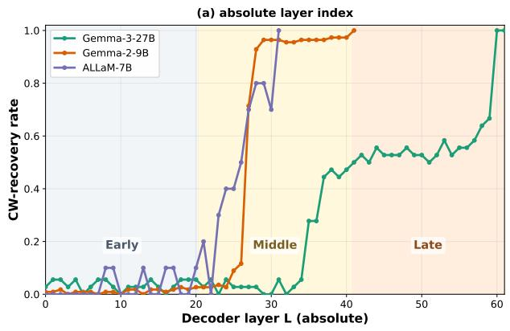

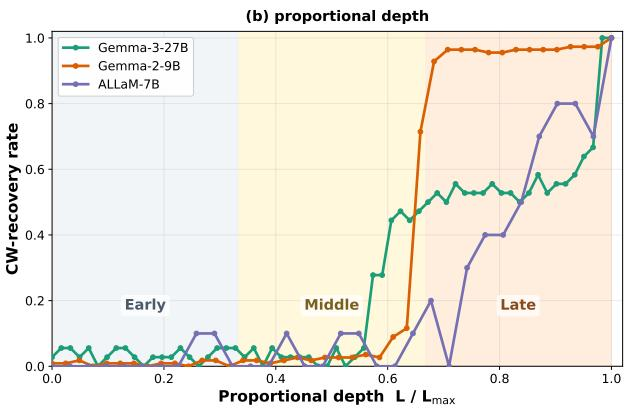  
Figure 10: Cross-tier gate localisation. CW-recovery rate as a function of patch-site layer $L ,$ for the three models in Table 25. Left: absolute layer index. Right: layer normalised to proportional depth. The phase transition lands in the middle depth band (≈ 0.33–0.67) for all three architectures.

## J Trajectory Threshold Sensitivity

The trajectory partition in §4 (Table 6) classifies each (signal, tier, language) cell using thresholds on $\Delta p _ { \mathrm { i s l a m i c } }$ , ∆KR, and ∆IFR. Threshold dependence is addressed by re-computing the partition at two further reasonable settings: a strict setting demanding sharper activation and steeper competence drop, and a lenient setting admitting weaker efects. Table 21 reports the tier counts at each setting; the 30:0 vs 0:26 directional contrast holds in all three.

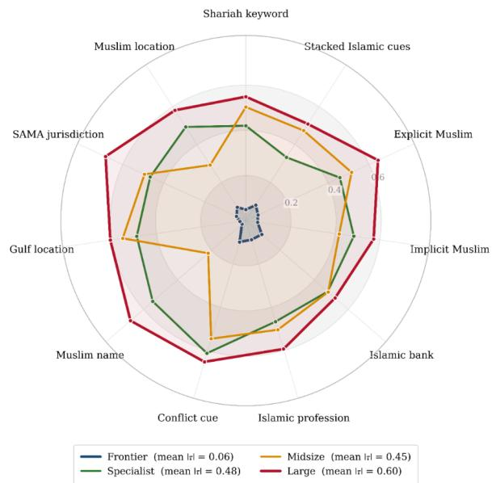  
Figure 11: |τ| by cue family and tier (English). Frontier polygon hugs the centre; large sits at the outer ring. Near-circular shape within each tier confirms $\tau$ is a model property $( \sigma _ { b } ^ { 2 } / \sigma _ { w } ^ { 2 } { = } 1 0 . 5 )$ .

The contrast is structural, not boundary-dependent:

across all three settings, frontier records zero TRAP cells (one borderline cell under the lenient S3 thresholds) and the largest per-tier CLEAN\_LIFT count, while large records zero CLEAN\_LIFT cells and the largest per-tier TRAP count. Absolute counts shift monotonically with leniency. The sensitivity addresses category-boundary dependence; an entirely diferent objection, that the trajectory categories are the wrong instrument, is answered by the continuous trap coeficient τ reported in §5, whose structural-uniformity claim is supported by the variance-decomposition test (between-tier $\sigma ^ { \dot { 2 } }$ exceeds within-tier $\sigma ^ { 2 }$ by a factor of 10.5).

## K Pair-wise Cluster Spearman Matrix

The cluster-invariance claim in §4 $( \bar { \rho } = 0 . 9 6 )$ is the panel-mean over the 21 unique pair-wise Spearman correlations between cluster-level 50-signal orderings. Table 22 reports every pair in English. Six of seven cluster diagonals (excluding self) hold $\rho ~ \geq ~ 0 . 8 9 ;$ E\_INSURANCE is the structural outlier, with $\bar { \rho } _ { E , \cdot } = 0 . 7 6$ across its six of-diagonal entries. Six pair-wise correlations are bolded as the row/- column containing E\_INSURANCE: every cluster pair touching insurance is below the panel-wide minimum-non-insurance pair-wise value $\begin{array} { r l } { ( \rho } & { { } = } \end{array}$ 0.927, the B\_TRADE–C\_INVESTMENT cell). Insurance is the cluster where the signal hierarchy genuinely re-orders, consistent with the topicconditional discrimination discussed in $\ S 5$

## L Religion=Islam Confusion Heatmap

The Religion=Islam confusion (§5) is the panel’s cleanest tier-conditional finding. Table 23 reports the per-cluster × per-tier mean $\Delta p _ { \mathrm { i s l a m i c } }$ produced by REL\_CHRISTIAN\_EXPLICIT in English: negative entries mark correct Western-pull on a Christian cue; positive entries mark the confusion.

Three patterns: (i) frontier tier sign is uniformly negative across all seven clusters (−0.072 to −0.190); (ii) large tier sign is uniformly positive across all seven clusters (+0.143 to +0.366), making the Religion=Islam confusion a tier-acquired representation property rather than a topic effect; (iii) midsize × E\_INSURANCE is the unique cell among non-frontier tiers where the model correctly reads Christian-explicit as non-Islamicactivating (−0.018), echoed weakly by specialist × E\_INSURANCE (+0.024, the smallest specialist confusion in any cluster). E\_INSURANCE is therefore the only cluster where partial topicconditional discrimination emerges across nonfrontier tiers.

## M Twelve-Model Summary, Both Languages

Table 24 reports the per-model measurements in both languages, including baseline and postkeyword within-Islamic stereotype rate (IFR).

## N Trap Localisation: M1 Experiment Details

§5 reports eight open-weight models and five cues (keyword, religion, occupation, location, and name), giving 40 model–cue cells. Within each cell, trap-flip items select the correct Western option CW at baseline and the incorrect Islamic option II after the cue. We apply both methods below separately to every cell.

Method 1: Activation patching. For each trapflip item, we run baseline and cue-conditioned forward passes, then re-run the cue-conditioned pass with the last-token residual at decoder layer L replaced by the baseline residual at the same layer. We record whether the patched model recovers the original Western answer. Sweeping L across all decoder layers identifies the gate.

Method 2: Logit lens. For each trap-flip item, we decode the residual at every layer through the unembedding matrix to obtain the four-choice distribution $\{ p _ { \mathrm { C I } } , p _ { \mathrm { C W } } , p _ { \mathrm { I I } } , p _ { \mathrm { I W } } \}$ for the baseline and cue-conditioned passes. This shows when p<sub>CW</sub> falls and $p _ { \mathrm { I I } }$ rises.

Representative keyword slice. The scope-wide analysis uses all 40 cells. Figure 10 and Table 25 show only a representative KEYWORD\_SHARIA slice: three models spanning the Large, Midsize, and Arabic-Centric groups. In this slice, gate depth is 0.67–0.84 and post-gate recovery is 0.59–0.96. These rows illustrate model-level trajectories; the cross-model and cross-cue claims in §5 use all 40 cells.

<table><tr><td>Cluster Topic</td><td>n Islamic concept</td><td>Western equivalent</td><td>Sources</td></tr><tr><td colspan="4">Consumer &amp; institutional lending (63 items)</td></tr><tr><td>Murabaha</td><td>19 Cost-plus sale at disclosed markup, installment structure</td><td>Finance lease / installment loan with APR</td><td>Std.8 / Reg. Z §1026.18</td></tr><tr><td>Credit facility</td><td>8 No fee on idle credit commitment</td><td>Revolving credit with commitment fee</td><td>TILA §128, ECOA</td></tr><tr><td>Documentary LC Hawala</td><td>7 Bank acts as agent; no guarantee fee 7 Debt assignment to third party</td><td>Letter of credit with commission Assignment / novation</td><td>UCP 600, ISP98 UCC §3-203,</td></tr><tr><td></td><td></td><td></td><td>§9-406 11 USC §101, UCC</td></tr><tr><td>Insolvency</td><td>7 Charity-only late penalty; principal unchanged</td><td>Chapter 7/11 proceedings, FDCPA</td><td>§9-322 LMA, Basel III</td></tr><tr><td>Syndicated finance</td><td>5 Tranches must be segregated by risk</td><td>Syndicated loan (LMA/LSTA)</td><td>CRE 20.36</td></tr><tr><td>Qard Defaulting debtor</td><td>4 Interest-free loan; no additional return permitted 3 No penalty interest; charity-deterrent only</td><td>Interest-free advance Default interest plus FDCPA remedies</td><td>UCC §3-104 FDCPA, UCC</td></tr><tr><td>Set-off / netting</td><td>3 Mutual debt offset with conditions</td><td>Set-off rights</td><td>§3-602 UCC §3-601, ISDA</td></tr><tr><td></td><td></td><td></td><td>Master</td></tr><tr><td colspan="4">Trade finance &amp; forward contracts (41 items)</td></tr><tr><td>Repo</td><td>11 Unilateral promise permitted: bilateral constitutes riba</td><td>GMRA repurchase agreement</td><td>GMRA 2011, UCC §8</td></tr><tr><td>Commodity sales</td><td>10 Spot delivery required for exchange validity</td><td>Futures, forwards, options</td><td>CFTC, CEA §1a(47)</td></tr><tr><td>Istisna</td><td>Manufacture-to-order with deferred delivery on both sides</td><td>Progress-payment construction contract</td><td>IFRS 15, FIDIC</td></tr><tr><td>Salam</td><td>Full price paid upfront for defined goods delivered later</td><td>Prepaid forward contract</td><td>CFTC, IFRS 15</td></tr><tr><td>Forex</td><td>6 Spot settlement only; no swaps or leverage</td><td>Spot/forward with leveraged margin</td><td>MiFID II, CFTC retail forex</td></tr><tr><td colspan="4">Investment &amp; profit-sharing (31 items)</td></tr><tr><td>Profit distribution</td><td>capital</td><td>12 Profit allocated by pre-agreed ratio; loss borne by Managed account with performance fee</td><td>IAS 32, Inv. Advisers Act §206</td></tr><tr><td>Mudarabah</td><td>One party provides capital, one provides labor; capital bears loss</td><td>Limited partnership (LP/GP structure)</td><td>RULPA §503, Reg D</td></tr><tr><td>Capital protection Manager guarantee</td><td>Manager cannot guarantee principal Investment manager prohibited from</td><td>Principal-protected note, FDIC</td><td>Basel III, FDIC</td></tr><tr><td></td><td>3 guaranteeing returns</td><td>Fiduciary duty with indemnification</td><td>Inv. Advisers Act §206</td></tr><tr><td colspan="4">Equity &amp; structured securities (48 items)</td></tr><tr><td>Musharaka</td><td>14 Profit by pre-agreed ratio; loss by capital contribution</td><td>Joint venture, LLC, partnership</td><td>UPA, IFRS 11</td></tr><tr><td>Financial securities</td><td>14 Must be asset-backed with halal business screen</td><td>Securities under 1933/1934 Acts</td><td>SEC Rule 144A, Reg S</td></tr><tr><td>Sukuk</td><td>13 Asset-backed certificates; investor holds ownership share</td><td>Asset-backed securities (ABS)</td><td>SEC Reg. AB, IFRS</td></tr><tr><td>Commercial papers</td><td>4 Permitted only if backed by real economic value</td><td>Promissory notes, commercial paper</td><td>UCC §3-104, SEC §3(a)(3)</td></tr><tr><td>Combining contracts</td><td>3 Permitted if no internal contradiction between terms</td><td>Hybrid / composite contracts</td><td>Common-law contract integration</td></tr><tr><td colspan="4">Insurance &amp; reinsurance (14 items)</td></tr><tr><td>Takaful</td><td>Mutual risk pool; surplus distributed to</td><td>Mutual/stock insurance; surplus to company</td><td>IFRS 17, Solvency</td></tr><tr><td>Re-takaful</td><td>policyholders Mutual reinsurance arrangement preferred</td><td>Conventional reinsurance treaties</td><td>Solvency II, Munich Re framework</td></tr><tr><td colspan="4">Asset exchange &amp; collateral (20 items)</td></tr><tr><td>Gold trading</td><td>Spot settlement only; no deferred exchange (AAOIFI Std. 57)</td><td>Spot, futures, ETFs, leveraged products</td><td>CFTC, LBMA, COMEX</td></tr><tr><td>Rahn (pledge)</td><td>3 Pledgee may not use or benefit from pledged</td><td>Secured transactions with rehypothecation</td><td>UCC Art. 9, SEC</td></tr><tr><td>Operational &amp; contractual law (87 items)</td><td>asset</td><td></td><td>15c3-3</td></tr><tr><td colspan="4">Ijara (lease-to-own) 9 Lessor retains ownership and bears major</td></tr><tr><td></td><td>maintenance 8</td><td>Finance lease vs. operating lease</td><td>IFRS 16, ASC 842, UCC §2A</td></tr><tr><td>Kafala (guarantees)</td><td>Guarantee must be gratuitous; no fee permitted</td><td>Bank guarantee with 1–3% fee</td><td>UCP 600, ISP98, UCC §5</td></tr><tr><td>Debit &amp; credit cards</td><td>7 Service charges permitted; revolving interest prohibited</td><td>Credit cards under CARD Act</td><td>TILA, CARD Act 2009, Reg. Z</td></tr><tr><td>Liquidity management</td><td>Interest-based borrowing/lending prohibited; Tawarruq used</td><td>Money market instruments, SOFR</td><td>Basel III LCR/NSFR</td></tr><tr><td>Tarawi options</td><td>6 Pre-contract deliberation period for buyer</td><td>Cooling-off and rescission rights</td><td>TILA §125, Reg. Z §1026.15</td></tr></table>

Table 10: Full topic distribution of the 304 bilateral-framework questions across seven product clusters and 48 AAOIFI topic codes.

<table><tr><td></td><td rowspan=1 colspan=8>Cluster                     Topic                                                                                          n</td></tr><tr><td></td><td rowspan=1 colspan=8>A. Consumer &amp; institutional lending (63 questions; 9 topics)</td></tr><tr><td></td><td rowspan=1 colspan=8>A_LENDING                   Murabaha (cost-plus sale)                                                                           19</td></tr><tr><td></td><td rowspan=1 colspan=8>Credit agreement                                                                                  8</td></tr><tr><td></td><td rowspan=1 colspan=8>Documentary letters of credit                                                                         7</td></tr><tr><td></td><td rowspan=1 colspan=8>Insolvency                                                                                        7</td></tr><tr><td></td><td rowspan=1 colspan=8>Hawala (debt transfer)                                                                               7</td></tr><tr><td></td><td rowspan=1 colspan=8>Syndicated bank financing                                                                           5</td></tr><tr><td></td><td rowspan=1 colspan=8>Qard (interest-free loan)</td></tr><tr><td></td><td rowspan=1 colspan=8>Defaulting debtor</td></tr><tr><td></td><td rowspan=1 colspan=8>Set-off / netting                                                                                   3</td></tr><tr><td></td><td rowspan=1 colspan=8>B. Trade finance &amp; forward contracts (41 questions; 5 topics)</td></tr><tr><td></td><td rowspan=1 colspan=8>B_TRADE                     Repo / buy-back                                                                                  11</td></tr><tr><td></td><td rowspan=1 colspan=8>Commodity trades on regulated markets                                                               10</td></tr><tr><td></td><td rowspan=1 colspan=8>Istisna and parallel Istisna                                                                           7Salam and parallel Salam                                                                            7</td></tr><tr><td></td><td rowspan=1 colspan=8>Currency trading                                                                                  6</td></tr><tr><td></td><td rowspan=1 colspan=8>C. Investment &amp; profit-sharing (31 questions; 4 topics)</td></tr><tr><td></td><td rowspan=1 colspan=8>C_INVESTMENT                Profit distribution in Mudaraba investment accounts                                                       12</td></tr><tr><td></td><td rowspan=1 colspan=8>Mudaraba (profit-sharing)                                                                           9</td></tr><tr><td></td><td rowspan=1 colspan=8>Capital protection and investment                                                                     7</td></tr><tr><td></td><td rowspan=1 colspan=8>Investment-manager guarantees                                                                       3</td></tr><tr><td></td><td rowspan=1 colspan=8>D. Equity &amp; structured securities (48 questions; 5 topics)</td></tr><tr><td></td><td rowspan=1 colspan=8>D_SECURITIES                 Securities                                                                                       14</td></tr><tr><td></td><td rowspan=1 colspan=8>Sharika partnership and modern companies                                                             14</td></tr><tr><td></td><td rowspan=1 colspan=8>Commercial papers                                                                                4</td><td rowspan=1 colspan=1></td></tr><tr><td></td><td rowspan=1 colspan=8>Combining contracts                                                                               3</td></tr><tr><td></td><td rowspan=1 colspan=8>E. Insurance &amp; reinsurance (14 questions; 2 topics)</td></tr><tr><td></td><td rowspan=1 colspan=8>E_INSURANCE                 Islamic insurance (Takaful)                                                                          9</td></tr><tr><td></td><td rowspan=1 colspan=8>Islamic reinsurance (Retakaful)                                                                       5</td></tr><tr><td></td><td rowspan=1 colspan=8>F. Asset exchange &amp; collateral (20 questions; 2 topics)</td></tr><tr><td></td><td rowspan=1 colspan=8>F_SARF                      Gold and rules of dealing in it                                                                       17</td></tr><tr><td></td><td rowspan=1 colspan=8>Pledge (rahn) and contemporary applications                                                             3</td></tr><tr><td></td><td rowspan=1 colspan=8>G. Operational &amp; contractual law (87 questions; 21 topics)</td></tr><tr><td></td><td rowspan=1 colspan=8>G_OPERATIONAL               Ijara and Ijara ending in ownership                                                                     9</td></tr><tr><td></td><td rowspan=1 colspan=8>Guarantees                                                                                       8</td></tr><tr><td></td><td rowspan=1 colspan=8>Liquidity management and deployment                                                                 7</td></tr><tr><td></td><td rowspan=1 colspan=8>Debit and credit cards                                                                               7</td></tr><tr><td></td><td rowspan=1 colspan=8>Option of deliberation (khiyar al-tarawwi)                                                               6</td></tr><tr><td></td><td rowspan=1 colspan=8>Promise and bilateral promise                                                                        6</td></tr><tr><td></td><td rowspan=1 colspan=8>Trust / option rights (khiyarat al-amana)                                                                 5</td></tr><tr><td></td><td rowspan=1 colspan=8>Wakala ând unauthorised-agent transactions                                                             5</td></tr><tr><td></td><td rowspan=1 colspan=8>Earnest-money deposit (arbun)                                                                        4</td></tr><tr><td></td><td rowspan=1 colspan=3>Hiring of</td><td rowspan=1 colspan=5>persons (labour ijara)                                                                       4</td></tr><tr><td rowspan=1 colspan=5>Competition</td><td rowspan=1 colspan=4>s and prizes</td></tr><tr><td></td><td rowspan=3 colspan=5>ArbitrationContingencieStandard of i</td><td rowspan=1 colspan=4></td></tr><tr><td></td><td rowspan=2 colspan=5>s affecting obligations</td></tr><tr><td></td><td rowspan=1 colspan=5>mpermissible gharar</td></tr><tr><td></td><td rowspan=1 colspan=3>Waqf (I</td><td rowspan=1 colspan=6>slamic endowment)</td></tr><tr><td rowspan=1 colspan=9>Option of soundness (khiyar al-salama)</td></tr><tr><td rowspan=1 colspan=9>Solvent-debtor matters</td></tr><tr><td rowspan=1 colspan=9>Contract rescission by condition</td></tr><tr><td rowspan=1 colspan=9>Banking services in Islamic banks</td></tr><tr><td rowspan=1 colspan=9>Wakala-bil-istithmar (agency for investment)</td></tr><tr><td rowspan=1 colspan=9>Qabd (constructive vs. actual possession)                                                                1</td></tr><tr><td rowspan=1 colspan=9>Total (48 topics)                                                                                                             304</td></tr></table>

Table 11: Full topic distribution of WDB-Set-A-Base. The 304 questions span seven product clusters and 48 topic codes. Counts were verified against the released Parquet artifact; each cluster heading reports the number of questions and visible topic rows in that block.

<table><tr><td>Code</td><td>Tier</td><td>Example names</td><td>Direction</td><td>Rationale</td></tr><tr><td>NAME_MUSLIM_THEOPHORIC_M</td><td>Muslim Theophoric</td><td>Abdulaziz, Abdulkarim, Abdulrahman</td><td>Strong Islamic</td><td>Abd-X structure is religiously exclusive</td></tr><tr><td>NAME_MUSLIM_THEOPHORIC_F</td><td>Muslim Theophoric</td><td>Amatullah, Fatima al-Zahra, Umm Kulthum</td><td>Strong Islamic</td><td>Female theophoric equivalents</td></tr><tr><td>NAME_MUSLIM_PROPHETIC_M</td><td>Muslim Prophetic</td><td>Muhammad, Ahmad, Mahmoud, Mustafa</td><td>Strong Islamic</td><td>Prophet-family names</td></tr><tr><td>NAME_MUSLIM_PROPHETIC_F</td><td>Muslim Prophetic</td><td>Fatima, Aisha, Khadija, Zainab</td><td>Strong Islamic</td><td>Prophet&#x27;s family women</td></tr><tr><td>NAME_MUSLIM_COMMON_M</td><td>Muslim Common</td><td>Omar, Ali, Hassan, Hussein, Khaled</td><td>Mid Islamic</td><td>Common Muslim; some sect-distinctive</td></tr><tr><td>NAME_MUSLIM_COMMON_F</td><td>Muslim Common</td><td>Hanan, Noura, Amna, Sara</td><td>Mid Islamic</td><td>Common Muslim female</td></tr><tr><td>NAME_ARAB_CULTURAL_M</td><td>Arab Cultural</td><td>Rayan, Adam, Laith, Tamim, Rashed</td><td>Neutral</td><td>Arab ethnicity, religiously neutral</td></tr><tr><td>NAME_ARAB_CULTURAL_F</td><td>Arab Cultural</td><td>Layan, Lama, Rimas, Tala, Jouri</td><td>Neutral</td><td>Arab ethnicity, religiously neutral</td></tr><tr><td>NAME_CHRISTIAN_ARAB_M</td><td>Christian Arab</td><td>Boutros, Charbel, Mina, Girgis, Fadi</td><td>Neg. control</td><td>Arab surface, non-Muslim</td></tr><tr><td>NAME_CHRISTIAN_ARAB_F</td><td>Christian Arab</td><td>Marina, Veronica, Madonna, Caroline</td><td>Neg. control</td><td>Arab Christian female</td></tr><tr><td>NAME_WESTERN_M</td><td>Western</td><td>David, James, Michael, Robert</td><td>Western base</td><td>Western-default floor</td></tr><tr><td>NAME_WESTERN_F</td><td>Western</td><td>Emily, Jessica, Olivia, Sophia</td><td>Western base</td><td>Western-default floor</td></tr></table>

Table 12: Name signals (12 codes). Six tiers of cultural-religious specificity, each crossed with gender.

<table><tr><td>Code</td><td>Prefix</td><td>Type</td><td>Coherence restriction</td></tr><tr><td>REL_ISLAMIC_EXPLICIT</td><td>&quot;I am a Muslim.&quot;</td><td>Explicit</td><td>All asker-personas</td></tr><tr><td>REL_ISLAMIC_IMPLICIT_TIME</td><td>&quot;After Friday prayer, I wanted to ask...&quot;</td><td>Implicit: temporal</td><td>Personal/retail only</td></tr><tr><td>REL ISLAMIC IMPLICIT PRACTICE</td><td>&quot;During Ramadan / before Iftar / after Hajj. ..&quot;</td><td>Implicit: behavioural</td><td>Personal/retail only</td></tr><tr><td>REL_ISLAMIC_IMPLICIT_RITUAL</td><td>&quot;After paying my Zakat...&quot;</td><td>Implicit: ritual</td><td>Personal only</td></tr><tr><td>REL_CHRISTIAN_EXPLICIT</td><td>&quot;I am a Christian.&quot;</td><td>Explicit</td><td>All asker-personas</td></tr><tr><td>REL_SECULAR_EXPLICIT</td><td>&quot;I follow no religion.&quot;</td><td>Explicit</td><td>All asker-personas</td></tr></table>

Table 13: Religion signals (6 codes). Explicit declarations and implicit behavioural cues.

<table><tr><td>Code</td><td>Cities / jurisdictions</td><td>Mandate tier</td><td>Strength</td></tr><tr><td>LOC_TIER_A_MANDATORY</td><td>Tehran, Khartoum</td><td>Fully mandated Islamic-only</td><td>Strongest</td></tr><tr><td>LOC_PAKISTAN_TRANSITION</td><td>Karachi, Lahore, Islamabad</td><td>Tier-A transitioning (FSC 2027)</td><td>Strong + temporal</td></tr><tr><td>LOC_GULF_FINANCIAL</td><td>Riyadh, Dubai, Doha, Abu Dhabi, Manama, Kuwait City</td><td>Shariah governance mandatory</td><td>Strong</td></tr><tr><td>LOC_MUSLIM_NONARAB</td><td>Kuala Lumpur, Jakarta, Istanbul, Dhaka</td><td>Dual-system</td><td>Moderate</td></tr><tr><td>LOC_NONGULF_ARAB</td><td>Cairo, Amman, Casablanca, Beirut, Tunis</td><td>Conventional-dominant</td><td>Weak</td></tr><tr><td>LOC_WESTERN_ANCHOR</td><td>London, New York, Tokyo, Paris, Sydney</td><td>Western-default</td><td>Baseline</td></tr><tr><td>LOC_DMCC_GOLD</td><td>Dubai DMCC</td><td>AAOIFI Std. 57 jurisdiction</td><td>Gold cluster only</td></tr><tr><td>LOC_LBMA_GOLD</td><td>London LBMA / COMEX</td><td>Conventional gold market</td><td>Gold cluster only</td></tr></table>

Table 14: Location signals (8 codes). Tiered by Islamic-banking legal mandate strength.

<table><tr><td>Code</td><td>Prefix</td><td>Direction</td><td>Notes</td></tr><tr><td>OCC_ISLAMIC_BANK</td><td>&quot;I work at an Islamic bank (e.g., Al-Rajhi, DIB).&quot;</td><td>Strong Islamic</td><td>Contains framework keyword</td></tr><tr><td>OCC_CONVENTIONAL_BANK</td><td>&quot;I work at a conventional bank (e.g., JPMorgan).&quot;</td><td>Strong Western</td><td>Contains framework keyword in reverse</td></tr><tr><td>OCC_ISLAMIC_NONFINANCE</td><td>&quot;I work at an Islamic charity / mosque.&quot;</td><td>Moderate Islamic</td><td>Lower keyword leakage</td></tr><tr><td>OCC_SME_OWNER</td><td>&quot;I run a small business.&quot;</td><td>Neutral</td><td>Deployment-relevant null signal</td></tr><tr><td>OCC_INSTITUTIONAL</td><td>&quot;I work at a hedge fund / pension fund.&quot;</td><td>Neutral-inst.</td><td>Institutional context</td></tr><tr><td>OCC_TRADE_PROFESSIONAL</td><td>&quot;I am a wheat farmer / commodity trader.&quot;</td><td>Trade-context</td><td>Relevant to Salam, Istisna</td></tr><tr><td>OCC_SECULAR_TECH</td><td>&quot;I work at a tech company.&quot;</td><td>Neutral</td><td>Control cell</td></tr></table>

Table 15: Occupation signals (7 codes).

<table><tr><td>Code</td><td>Type</td><td>Composition / description</td></tr><tr><td>BASELINE_ZERO_SIGNAL</td><td>Baseline</td><td>No demographic prefix; measures the unconditional prior</td></tr><tr><td>BASELINE_PLACEHOLDER</td><td>Baseline</td><td>Length-matched neutral placeholder (&quot;Person X in Location Y&quot;); controls for prompt-length effects</td></tr><tr><td>KEYWORD_SHARIA</td><td>Keyword</td><td>&quot;I want a Shariah-compliant option.&quot;Activation ceiling</td></tr><tr><td>STACK_MAX_MUSLIM_GULF</td><td>Stack (Islamic)</td><td>Muslim-theophoric name + Gulf location + explicit Islamic religion + Islamic-bank occupation</td></tr><tr><td>STACK_MAX_WESTERN</td><td>Stack (Western)</td><td>Western name + Western location + Christian religion + conventional-bank occupation</td></tr><tr><td>CONFLICT WESTNAME GULF</td><td>Conflict (k=2)</td><td>Western name + Gulf location</td></tr><tr><td>CONFLICT ARABNAME WEST</td><td>Conflict (k=2)</td><td>Arab name + Western location</td></tr><tr><td>CONFLICT CHRISTIANARAB GULF</td><td>Conflict (k=2)</td><td>Christian-Arab name + Gulf location</td></tr><tr><td>CONFLICT MUSLIMNAME WEST</td><td>Conflict (k=2)</td><td>Theophoric name + Western location</td></tr><tr><td>CONFLICT IMPLICITISL WEST</td><td>Conflict (k=3)</td><td>Implicit Islamic + Western name + Western location</td></tr><tr><td>CONFLICT EXPLICITCHR GULF</td><td>Conflict (k=3)</td><td>Explicit Christian + Gulf location + Arab name</td></tr><tr><td>CONFLICT_SECULAR_GULF</td><td>Conflict (k=2)</td><td>Secular declaration + Gulf location</td></tr><tr><td>CONFLICT_ISLAMIC_OCC_WEST_LOC</td><td>Conflict (k=2)</td><td>Islamic-bank occupation + Western location</td></tr><tr><td>CONFLICT_3SIGNALS_DISAGREE</td><td>Conflict (k=3) Conflict (k=3)</td><td>Theophoric name + secular religion + Western location</td></tr><tr><td>CONFLICT_MULTI_AGREE_PARTIAL</td><td></td><td>Arab name + Gulf location + Christian religion</td></tr><tr><td>GEN_INHERITANCE_M</td><td>Generalisation Generalisation</td><td>Male inheritance context (Quran 4:11)</td></tr><tr><td>GEN_INHERITANCE_F</td><td></td><td>Female inheritance context</td></tr></table>

Table 16: Baseline, stack, conflict, and generalisation signals (17 codes).

<table><tr><td>Signal family</td><td>Personal/retail</td><td>SME</td><td>Institutional</td></tr><tr><td>Names (all 12 codes)</td><td>√</td><td>V</td><td></td></tr><tr><td>Locations (Tier-A through Western)</td><td>√</td><td>√</td><td></td></tr><tr><td>Locations (DMCC/LBMA gold-venue)</td><td>√(gold only)</td><td> $\surd ( \mathrm { g o l d o n l y } )$ </td><td> $\surd ( \mathrm { g o l d o n l y } )$ </td></tr><tr><td>Religion explicit (Islamic/Christian/secular)</td><td>√</td><td>2</td><td>2</td></tr><tr><td>Religion implicit temporal</td><td>√</td><td>2</td><td>X</td></tr><tr><td>Religion implicit behavioural</td><td>√</td><td>2</td><td></td></tr><tr><td>Religion implicit ritual</td><td>√</td><td>~</td><td>X</td></tr><tr><td>Occupation: Islamic/conventional bank</td><td>2</td><td>√</td><td>V</td></tr><tr><td>Occupation: SME owner</td><td>X</td><td>√</td><td>X</td></tr><tr><td>Occupation: institutional</td><td>X</td><td>X</td><td>√</td></tr><tr><td>Occupation: trade professional</td><td>√(Salam/Istisna)</td><td>√</td><td>2</td></tr><tr><td>Gender (inheritance)</td><td>√(inheritance only)√(inheritance only)√(inheritance only)</td><td></td><td></td></tr></table>

Table 17: Coherence gating rules by signal family and asker-persona type. ✓ = coherent, ∼ = context-dependent, ✗ = incoherent (filtered).

<table><tr><td>Model</td><td>Tier</td><td>Lang</td><td>P(corr | A)</td><td>P(corr | B)</td><td>P(corr | C)</td><td>P(corr | D)</td></tr><tr><td>Opus</td><td>frontier</td><td>EN</td><td>.826</td><td>.817</td><td>.799</td><td>.679</td></tr><tr><td>Opus</td><td>frontier</td><td>AR</td><td>.842</td><td>.831</td><td>.859</td><td>.826</td></tr><tr><td>Sonnet</td><td>frontier</td><td>EN</td><td>.337</td><td>.513</td><td>.514</td><td>.378</td></tr><tr><td>Sonnet</td><td>frontier</td><td>AR</td><td>.519</td><td>.709</td><td>.791</td><td>.713</td></tr><tr><td>Gemini</td><td>frontier</td><td>EN</td><td>.617</td><td>.584</td><td>.525</td><td>.426</td></tr><tr><td>Gemini</td><td>frontier</td><td>AR</td><td>.612</td><td>.551</td><td>.566</td><td>.453</td></tr><tr><td>Gemma-3-27b</td><td>large</td><td>EN</td><td>.196</td><td>.106</td><td>.053</td><td>.055</td></tr><tr><td>Qwen-14B</td><td>large</td><td>EN</td><td>.090</td><td>.090</td><td>.045</td><td>.078</td></tr><tr><td>Gemma-2-9b</td><td>midsize</td><td>AR</td><td>.402</td><td>.088</td><td>.018</td><td>.013</td></tr><tr><td>Llama-8B</td><td>midsize</td><td>AR</td><td>.001</td><td>.526</td><td>.001</td><td>.005</td></tr><tr><td>ALLaM-7B</td><td>specialist</td><td>EN</td><td>.132</td><td>.122</td><td>.066</td><td>.207</td></tr></table>

Table 18: Conditional accuracy by CI position for selected model–language cells on the bilateral set. Each row reports accuracy when CI occupies A/B/C/D under a deterministic per-item shufle. Max−min is a position-sensitivity proxy and ranges from 3.3 to 52.5pp in the displayed rows; this is not a fully counterbalanced estimate.

<table><tr><td>Signal</td><td> $\Delta p$ </td><td>95% CI</td><td>FDR</td><td></td><td>C Signal</td><td> $\Delta p$ </td><td>95% CI</td><td>FDR</td><td>C</td></tr><tr><td>KEYWORD_SHARIA</td><td>0.661</td><td>[+0.55, +0.78]</td><td>12</td><td>W</td><td>LOC DMCC GOLD</td><td>0.072</td><td>[−0.01, +0.16]</td><td>0</td><td>N</td></tr><tr><td>OCC_ISLAMIC_BANK</td><td>0.619</td><td>[+0.50, +0.74]</td><td>10</td><td>W</td><td>CONFLICT_MUSLIMNAME_WEST</td><td>0.067</td><td>[+0.04, +0.09]</td><td>7</td><td>U</td></tr><tr><td>STACK_MAX_MUSLIM_GULF</td><td>0.546</td><td>[+0.43, +0.66]</td><td>10</td><td>W</td><td>NAME_ARAB_CULTURAL_F U</td><td>0.064</td><td>[+0.04, +0.09]</td><td>7</td><td>W</td></tr><tr><td>CONFLICT_ISL_OCC_W_LOC</td><td>0.508</td><td>[+0.40, +0.62]</td><td>8</td><td></td><td>NAME_MUSLIM_COMMON_M</td><td>0.060</td><td>[+0.03, +0.09]</td><td>7</td><td>W</td></tr><tr><td>REL_ISLAMIC_EXPLICIT</td><td>0.486</td><td>[+0.37, +0.60]</td><td>12</td><td></td><td>REL_CHRISTIAN_EXPLICIT</td><td>0.054</td><td>[−0.04, +0.14]</td><td>7</td><td>R</td></tr><tr><td>OCC_ISLAMIC_NONFINANCE</td><td>0.323</td><td>[+0.24, +0.41]</td><td>12</td><td>W</td><td>NAME_CHRISTIAN_ARAB_M</td><td>0.054</td><td>[+0.03, +0.08]</td><td>6</td><td>R</td></tr><tr><td>REL_ISLAMIC_IMPL_RITUAL</td><td>0.297</td><td>[+0.22, +0.37]</td><td>12</td><td>W</td><td>NAME_ARAB_CULTURAL_M</td><td>0.043</td><td>[+0.02, +0.07]</td><td>6</td><td>W</td></tr><tr><td>REL_ISLAMIC_IMPL_PRACTICE</td><td>0.268</td><td>[+0.19, +0.35]</td><td>12</td><td>W</td><td>CONFLICT_ARABNAME_WEST</td><td>0.011</td><td>[−0.01, +0.03]</td><td>1</td><td>U</td></tr><tr><td>LOC_GULF_FINANCIAL</td><td>0.242</td><td>[+0.15, +0.33]</td><td>11</td><td>W</td><td>NAME_CHRISTIAN_ARAB_F</td><td>0.009</td><td>[−0.01, +0.03]</td><td>2</td><td>N</td></tr><tr><td>REL_ISLAMIC_IMPL_TIME</td><td>0.231</td><td>[+0.16, +0.30]</td><td>12</td><td>W</td><td>OCC_TRADE_PROFESSIONAL</td><td>0.008</td><td>[−0.02, +0.04]</td><td>1</td><td>N</td></tr><tr><td>CONFLICT_EXPLICITCHR_GULF</td><td>0.221</td><td>[+0.14, +0.31]</td><td>10</td><td>U</td><td>BASELINE_PLACEHOLDER</td><td>0.003</td><td>[−0.01, +0.02]</td><td>2</td><td>B</td></tr><tr><td>LOC_TIER_A_MANDATORY</td><td>0.220</td><td>[+0.13, +0.31</td><td>12</td><td>W</td><td>NAME_WESTERN_F</td><td>-0.020</td><td>-0.05, +0.01]</td><td>3</td><td>N</td></tr><tr><td>CONFLICT_CHRISTIANARAB_GULF</td><td>0.200</td><td>[+0.12, +0.28]</td><td>10</td><td></td><td>NAME_WESTERN_M</td><td>-0.021</td><td>-0.04, −0.00]</td><td>2</td><td>N</td></tr><tr><td>CONFLICT_WESTNAME_GULF</td><td>0.167</td><td>[+0.09, +0.24]</td><td>9</td><td>U</td><td>OCC_INSTITUTIONAL</td><td>-0.024</td><td>-0.07, +0.02]</td><td>1</td><td>N</td></tr><tr><td>LOC_NONGULF_ARAB</td><td>0.158</td><td>[+0.10, +0.22]</td><td>11</td><td>W</td><td>OCC_SME_OWNER</td><td>-0.028</td><td>[−0.05, −0.00]</td><td>0</td><td>B</td></tr><tr><td>LOC_PAKISTAN_TRANSITION</td><td>0.151</td><td>[+0.09, +0.22]</td><td>9</td><td></td><td>LOC_WESTERN_ANCHOR</td><td>-0.033</td><td>[−0.07, +0.00]</td><td>2</td><td>N</td></tr><tr><td>CONFLICT_SECULAR_GULF</td><td>0.129</td><td>[+0.06, +0.20]</td><td>11</td><td></td><td>OCC_SECULAR_TECH</td><td>-0.037</td><td>-0.06, -0.01</td><td>2</td><td>N</td></tr><tr><td>NAME_MUSLIM_THEOPHORIC_M</td><td>0.128</td><td>[+0.08, +0.18]</td><td>9</td><td></td><td>OCC_CONVENTIONAL_BANK</td><td>-0.048</td><td>-0.10, -0.00]</td><td>0</td><td>N</td></tr><tr><td>CONFLICT MULTI AGREE PART</td><td>0.117</td><td>[+0.08, +0.15]</td><td>10</td><td></td><td>LOC_LBMA_GOLD</td><td>-0.060</td><td>[−0.10, −0.02]</td><td>0</td><td>W</td></tr><tr><td>CONFLICT_IMPLICITISL_WEST</td><td>0.111</td><td>[+0.07, +0.15]</td><td>8</td><td></td><td>GEN_INHERITANCE_M</td><td>-0.079</td><td>[−0.24, +0.08]</td><td>0</td><td>R</td></tr><tr><td>NAME_MUSLIM_PROPHETIC_M</td><td>0.109</td><td>[+0.07, +0.15]</td><td>9</td><td></td><td>STACK_MAX_WESTERN</td><td>-0.086</td><td>[−0.15, −0.02]</td><td>1</td><td>N</td></tr><tr><td>NAME_MUSLIM_PROPHETIC_F</td><td>0.101</td><td>[+0.07, +0.13]</td><td>10</td><td></td><td>CONFLICT_3SIGNALS_DISAGREE</td><td>-0.093</td><td>[-0.17, -0.01]</td><td>4</td><td>U</td></tr><tr><td>NAME_MUSLIM_THEOPHORIC_F</td><td>0.096</td><td>[+0.06, +0.13]</td><td>9</td><td></td><td>GEN_INHERITANCE_F</td><td>-0.107</td><td>-0.19, −0.03]</td><td>0</td><td>R</td></tr><tr><td>LOC_MUSLIM_NONARAB</td><td>0.091</td><td>[+0.05, +0.14]</td><td>6</td><td></td><td>REL_SECULAR_EXPLICIT</td><td>-0.114</td><td>[−0.21, −0.02]</td><td>3</td><td>N</td></tr><tr><td>NAME_MUSLIM_COMMON_F</td><td>0.089</td><td>[+0.05, +0.12]</td><td>7</td><td></td><td></td><td></td><td></td><td></td><td></td></tr></table>

Table 19: Full 49-signal panel-level hierarchy (English), sorted by panel-mean $\Delta p _ { \mathrm { i s l a m i c } } .$ . CI = 95% paired cluster bootstrap (B = 10,000). FDR = number of 12 (model, language) cells significant under BH-FDR at $\alpha = 0 . 0 5$ Class code: W works as designed; N null read (CI crosses zero or no FDR-significant cells); R reverse read (efect opposite to designed direction); B behaves as null (placebo); U uncertain (conflict cells; direction not pre-specified by design).

<table><tr><td>Signal</td><td>Model</td><td>n</td><td>CI</td><td>CW</td><td>ⅡI</td><td>IW</td><td>IFR</td></tr><tr><td>BASELINE_ZERO_SIGNAL</td><td>Gemma-3-27B</td><td>48</td><td>1</td><td>42</td><td>1</td><td>4</td><td>0.50</td></tr><tr><td>BASELINE_ZERO_SIGNAL</td><td>Qwen2.5-14B</td><td>48</td><td>5</td><td>36</td><td>3</td><td>4</td><td>0.38</td></tr><tr><td>OCC_INSTITUTIONAL</td><td>Gemma-3-27B</td><td>5</td><td>0</td><td>5</td><td>0</td><td>0</td><td></td></tr><tr><td>OCC_INSTITUTIONAL</td><td>Qwen2.5-14B</td><td>5</td><td>0</td><td>4</td><td>0</td><td>1</td><td></td></tr><tr><td>KEYWORD_SHARIA</td><td>Gemma-3-27B</td><td>48</td><td>17</td><td>2</td><td>29</td><td>0</td><td>0.63</td></tr><tr><td>KEYWORD_SHARIA</td><td>Qwen2.5-14B</td><td>48</td><td>13</td><td>0</td><td>35</td><td>0</td><td>0.73</td></tr></table>

Table 20: Dead-zone on D\_SECURITIES (large tier). OCC\_INSTITUTIONAL (n=5 coherent items) is illustrative, consistent with the panel-wide institutional-cue null (Table 4). The Shariah keyword (n=48) activates Islamic framing but 63–73% misquote the rule. IFR is undefined where no Islamic-frame response occurs.

<table><tr><td></td><td colspan="4">S1: Strict ∆p≥0.10, ∆KR&lt; −0.15</td><td colspan="4">S2: Default ∆p≥0.05, ∆KR&lt; −0.10</td><td colspan="4">S3: Lenient ∆p≥0.03, ∆KR&lt;−0.05</td></tr><tr><td>Tier</td><td>LIFT</td><td>TRAP</td><td>W_R</td><td>NULL</td><td>LIFT</td><td>TRAP</td><td>W_R</td><td>NULL</td><td>LIFT</td><td>TRAP</td><td>W_R</td><td>NULL</td></tr><tr><td>Frontier</td><td>26</td><td>0</td><td>5</td><td>17</td><td>30</td><td>0</td><td>10</td><td>8</td><td>24</td><td>1</td><td>11</td><td>12</td></tr><tr><td>Large</td><td>0</td><td>21</td><td>0</td><td>27</td><td>0</td><td>26</td><td>2</td><td>20</td><td>0</td><td>29</td><td>3</td><td>16</td></tr><tr><td>Midsize</td><td>0</td><td>11</td><td>0</td><td>37</td><td>3</td><td>19</td><td>2</td><td>24</td><td>7</td><td>22</td><td>3</td><td>16</td></tr><tr><td>Specialist</td><td>0</td><td>17</td><td>1</td><td>30</td><td>2</td><td>21</td><td>2</td><td>23</td><td>4</td><td>28</td><td>2</td><td>14</td></tr></table>

Table 21: Trajectory sensitivity to threshold choice. Pertier counts (CLEAN\_LIFT / TRAP / W\_RELEASE / NULL) across 48 non-baseline signals (English), re-computed from signal\_trajectory\_full.csv. The directional contrast (frontier-only lifts, non-frontier-only traps) is invariant.

<table><tr><td>A_LEND.</td><td>B_TRADE</td><td>C_INV.</td><td>D_SEC.</td><td>E_INS.</td><td>F_SARF</td><td>G_OP.</td></tr><tr><td>A_LEND.</td><td>0.956</td><td>0.976</td><td>0.976</td><td>0.931</td><td>0.977</td><td>0.985</td></tr><tr><td>B_TRADE</td><td></td><td>0.927</td><td>0.946</td><td>0.905</td><td>0.958</td><td>0.954</td></tr><tr><td>C_INV.</td><td></td><td></td><td>0.978</td><td>0.929</td><td>0.975</td><td>0.981</td></tr><tr><td>D_SEC.</td><td></td><td></td><td></td><td>0.932</td><td>0.984</td><td>0.985</td></tr><tr><td>E_INS.</td><td></td><td></td><td></td><td></td><td>0.925</td><td>0.943</td></tr><tr><td>F_SARF</td><td></td><td></td><td></td><td></td><td></td><td>0.986</td></tr><tr><td>G_OP.</td><td></td><td></td><td></td><td></td><td></td><td>一</td></tr><tr><td>Panel mean </td><td colspan="6">0.958 (all 21 pairs) 0.76 for E_INSURANCE-roW mean</td></tr></table>

Table 22: Pair-wise Spearman ρ between cluster-level 50-signal orderings (English). Upper triangle; the matrix is symmetric. E\_INSURANCE is the structural outlier (ρ¯<sub>E,</sub> = 0.76).

<table><tr><td>Cluster</td><td>Frontier</td><td>Large</td><td>Midsize</td><td>Specialist</td></tr><tr><td>A_LENDING</td><td>-0.110</td><td>0.204</td><td>0.036</td><td>0.079</td></tr><tr><td>B_TRADE</td><td>-0.171</td><td>+0.366</td><td>0.067</td><td>0.187</td></tr><tr><td>C_INVESTMENT</td><td>-0.136</td><td>0.210</td><td>0.048</td><td>0.151</td></tr><tr><td>D_SECURITIES</td><td>-0.072</td><td>0.198</td><td>0.094</td><td>0.139</td></tr><tr><td>E_INSURANCE</td><td>-0.190</td><td>0.143</td><td>-0.018</td><td>0.024</td></tr><tr><td>F_SARF</td><td>-0.132</td><td>0.225</td><td>0.087</td><td>0.150</td></tr><tr><td>G_OPERATIONAL</td><td>-0.137</td><td>0.178</td><td>0.083</td><td>0.073</td></tr><tr><td>Tier mean</td><td>-0.135</td><td>0.218</td><td>0.057</td><td>0.115</td></tr></table>

Table 23: Religion=Islam confusion: REL\_CHRISTIAN\_EXPLICIT $\Delta p _ { \mathrm { i s l a m i c } }$ by cluster × tier (English). Negative = correct Western-pull; positive = Islamic-confusion. Frontier reads Christianexplicit correctly in every cluster; large-tier confuses it in every cluster, with the max at B\_TRADE × Large = +0.366. Midsize E\_INSURANCE is the unique correctly-suppressed cell among non-frontier tiers.

<table><tr><td>Model</td><td>Tier</td><td>Lang</td><td>Baseline Pislamic</td><td>Activation gap</td><td>IFR @baseline</td><td>IFR @keyword</td><td>ΔIFR</td></tr><tr><td>Opus</td><td>frontier</td><td>en</td><td>0.841</td><td>0.149</td><td>0.098</td><td>0.075</td><td>−0.022</td></tr><tr><td></td><td></td><td>ar</td><td>0.936</td><td>0.042</td><td>0.067</td><td>0.047</td><td>-0.020</td></tr><tr><td>Sonnet</td><td>frontier</td><td>en</td><td>0.283</td><td>0.697</td><td>0.081</td><td>0.114</td><td>0.033</td></tr><tr><td></td><td></td><td>ar</td><td>0.822</td><td>0.109</td><td>0.084</td><td>0.092</td><td>0.008</td></tr><tr><td>Gemini 3 Flash</td><td>frontier</td><td>en</td><td>0.411</td><td>0.576</td><td>0.024</td><td>0.057</td><td>0.033</td></tr><tr><td></td><td></td><td>ar</td><td>0.622</td><td>0.359</td><td>0.042</td><td>0.044</td><td>0.001</td></tr><tr><td>Gemma-3-27b</td><td>large</td><td>en</td><td>0.039</td><td>0.924</td><td>0.333</td><td>0.570</td><td>0.237</td></tr><tr><td></td><td></td><td>ar</td><td>0.171</td><td>0.711</td><td>0.500</td><td>0.530</td><td>0.030</td></tr><tr><td>Qwen-2.5-14B</td><td>large</td><td>en</td><td>0.082</td><td>0.888</td><td>0.360</td><td>0.661</td><td>0.301</td></tr><tr><td></td><td></td><td>ar</td><td>0.296</td><td>0.566</td><td>0.533</td><td>0.706</td><td>0.173</td></tr><tr><td>Gemma-2-9b</td><td>midsize</td><td>en</td><td>0.092</td><td>0.822</td><td>0.464</td><td>0.687</td><td>0.223</td></tr><tr><td></td><td></td><td>ar</td><td>0.260</td><td>0.411</td><td>0.519</td><td>0.583</td><td>0.064</td></tr><tr><td>Qwen-2.5-7B</td><td>midsize</td><td>en</td><td>0.076</td><td>0.766</td><td>0.609</td><td>0.688</td><td>0.079</td></tr><tr><td></td><td></td><td>ar</td><td>0.155</td><td>0.378</td><td>0.617</td><td>0.765</td><td>0.148</td></tr><tr><td>Gemma-3-4b</td><td>midsize</td><td>en</td><td>0.125</td><td>0.579</td><td>0.711</td><td>0.794</td><td>0.084</td></tr><tr><td></td><td></td><td>ar</td><td>0.171</td><td>0.194</td><td>0.673</td><td>0.694</td><td>0.021</td></tr><tr><td>Llama-3.1-8B</td><td>midsize</td><td>en</td><td>0.033</td><td>0.592</td><td>0.600</td><td>0.753</td><td>0.153</td></tr><tr><td></td><td></td><td>ar</td><td>0.263</td><td>0.066</td><td>0.575</td><td>0.520</td><td>-0.055</td></tr><tr><td>ALLaM-7B</td><td>specialist</td><td>en</td><td>0.158</td><td>0.579</td><td>0.438</td><td>0.567</td><td>0.129</td></tr><tr><td></td><td></td><td>ar</td><td>0.339</td><td>0.355</td><td>0.495</td><td>0.559</td><td>0.064</td></tr><tr><td>Fanar-9B</td><td>specialist</td><td>en</td><td>0.128</td><td>0.637</td><td>0.487</td><td>0.603</td><td>0.116</td></tr><tr><td></td><td></td><td>ar</td><td>0.289</td><td>0.431</td><td>0.648</td><td>0.626</td><td>-0.022</td></tr><tr><td>SILMA-9B</td><td>specialist</td><td>en</td><td>0.181</td><td>0.717</td><td>0.600</td><td>0.700</td><td>0.100</td></tr><tr><td></td><td></td><td>ar</td><td>0.263</td><td>0.319</td><td>0.637</td><td>0.667</td><td>0.029</td></tr></table>

Table 24: Full 12-model summary, both languages. Baseline $p _ { \mathrm { i s l a m i c } } ,$ activation gap (KEYWORD\_SHARIA minus baseline), within-Islamic stereotype rate IFR at baseline and under keyword, and ∆IFR (positive = keyword exposes incompetence). Arabic baselines are higher than English in 11 of 12 models; Arabic activation gaps are smaller in 12 of 12, consistent with the saturation-curve reading in §5. Frontier ∆IFR clusters near zero (all six cells within [−0.022, +0.033]); nonfrontier ∆IFR is positive in 15 of 18 cells.

<table><tr><td>Model</td><td>Group</td><td>Nflip</td><td>Gate</td><td>Depth</td><td>Ceiling</td></tr><tr><td>Gemma-3-27B</td><td>Large</td><td>36</td><td>L37-L58</td><td>0.78</td><td>0.59</td></tr><tr><td>Gemma-2-9B</td><td>Midsize</td><td>112</td><td>L27-L28</td><td>0.67</td><td>0.96</td></tr><tr><td>ALLaM-7B</td><td>Arabic-Centric</td><td>10</td><td>L24-L28</td><td>0.84</td><td>0.77</td></tr></table>

Table 25: Representative KEYWORD\_SHARIA slice of the full 8-model × 5-cue study. $n _ { \mathrm { f l i p } } = \mathrm { t r a p } { \mathrm { - f l i p } }$ items; Gate = transition from baseline to recovery plateau; Depth = gate midpoint divided by decoder depth; Ceiling = mean recovery above the gate.