# SAGE: Subpopulation-Aware Generative Enhancement for Mitigating Spurious Correlations

Yiming Luo1, Rongqiang Zhao1,2∗, Jie Liu1,2

1Harbin Institute of Technology

2State Key Laboratory of Smart Farm Technologies and Systems zhaorq@hit.edu.cn

## Abstract

Spurious correlations pose a significant challenge to the robustness of modern machine learning. The inherent imbalance in dataset distributions often leads traditional Empirical Risk Minimization (ERM) models to rely on majority spurious attributes for classification, resulting in poor performance on minority groups. This problem becomes particularly challenging when the spurious attributes are unavailable. Existing group-label-free methods often upsample minority groups or misclassified real training examples; repeating the same instances can reduce efective diversity and encourage overfitting. To mitigate these spurious correlations from a data-centric perspective in the absence of prior knowledge, we introduce Subpopulation-Aware Generative Enhancement (SAGE), a two-stage generative augmentation framework. Using cluster-derived sub-labels and class labels, we fine-tune a conditional generative model and text encoder, generating targeted synthetic data to fill underrepresented regions in the training set and construct a balanced validation set for last-layer reweighting. We experimentally show that SAGE achieves 89.5%, 85.7%, and 79.1% worst-group accuracy on Waterbirds, CelebA, and MetaShift, respectively, outperforming the best group-label-free baselines by up to 7.7 percentage points.

Code — https://github.com/luoym-lym/SAGE

## Introduction

Deep neural networks have achieved outstanding performance in classification tasks (Krizhevsky, Sutskever, and Hinton 2012; He et al. 2016). However, they often tend to rely on easily accessible shortcut features rather than the truly causal core features (Geirhos et al. 2020). For example, in the task of classifying waterbirds and landbirds, if the majority of waterbirds in the training set appear against water backgrounds while most landbirds appear against land backgrounds, the model will inherently adopt the background (water or land) as its primary basis for classification. Consequently, when such spurious correlations are broken during the testing phase (e.g., encountering a waterbird on land), the model sufers a catastrophic drop in test performance, which is primarily manifested as low worst-group accuracy(WGA). (Beery, Van Horn, and Perona 2018; Sagawa et al. 2020).

To mitigate spurious correlations, existing methods can be broadly divided into two categories. The first category assumes access to spurious group information and improves robustness by modifying the model’s learning objective or reweighting strategy (Sagawa et al. 2020; Kirichenko, Izmailov, and Wilson 2023). The second category avoids group labels and reduces model bias using proxy signals inferred from model behavior, input regions, or discovered concepts (Liu et al. 2021; Nam et al. 2020; Zhang et al. 2022; Noohdani et al. 2024; Asgari et al. 2022; Wu et al. 2023).

Recently, generative models have been increasingly applied to data augmentation across various domains (Azizi et al. 2023; Dunlap et al. 2023; Sun et al. 2026), and a nascent line of work has begun to explore their potential for mitigating spurious correlations. This line of work uses image generation to create additional samples under diferent visual conditions, class-attribute combinations, or debiased prompts (Qraitem, Saenko, and Plummer 2024; Ghosh et al. 2024; Basu et al. 2026; Parast, Azam, and Akhtar 2025). Compared with reusing existing training examples, generated data can provide new visual instances and thus ofers a natural way to expand the available training set.

Taken together, these directions leave a gap in settings where spurious attributes are unobserved and manually curated group-balanced validation sets are unavailable, which more closely matches real-world scenarios than assuming access to group annotations or curated validation data. Although some methods operate under this stricter setting, they are still less competitive in worst-group accuracy. Generative approaches provide additional synthetic training examples, but they often depend on complex external models to discover spurious attributes (e.g., LLMs or segmentation tools), require explicit group annotations to guide generation, or still need a manually curated validation set for model selection. Thus, it remains challenging to mitigate spurious correlations when both spurious group labels and balanced validation data are unavailable.

To overcome these limitations, we propose SAGE (Figure 1), a data-centric generative augmentation framework for settings where spurious attributes and group-balanced val idation data are unavailable. SAGE mitigates spurious correlations without relying on external spurious-attribute discovery tools (e.g., LLMs or segmentation models), manually annotated spurious groups, or curated validation sets. Our key insight is that visually salient spurious cues often structure the feature space of pretrained vision encoders: samples sharing similar shortcut features tend to cluster together even when spurious attributes are unlabeled. We therefore treat cluster assignments as proxies for bias-relevant subpopulations, rather than as ground-truth spurious groups.

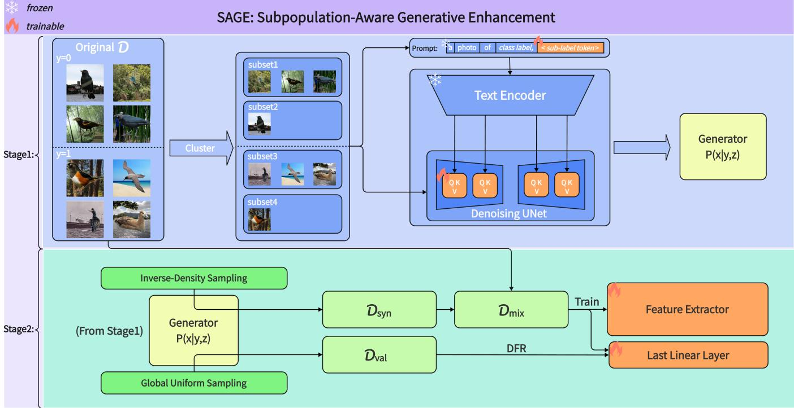  
Figure 1: Overview of SAGE. Stage 1. We cluster semantic features to obtain sub-label tokens, which are combined with class labels to fine-tune a conditional generative model. Stage 2. We use inverse-density sampling to generate targeted synthetic training data for underrepresented regions, and uniform sampling to construct a sub-label-balanced synthetic validation set for last-layer reweighting.

SAGE instantiates this idea in two stages. First, we cluster semantic features and assign each cluster a learnable sublabel token, which is used together with the class label to fine-tune a conditional generative model. Second, we use inverse-density sampling over the discovered sub-labels to generate targeted synthetic data for underrepresented training regions. In parallel, we construct a sub-label-balanced synthetic validation set via uniform sampling. Because true spurious groups are unavailable, this synthetic set serves as a practical proxy for the group-balanced validation data required by Deep Feature Reweighting (DFR), allowing us to retrain only the last classification layer without manual validation-set curation.

We evaluate SAGE on three popular benchmarks: Waterbirds, CelebA, and MetaShift. SAGE achieves 89.5%, 85.7%, and 79.1% worst-group accuracy on these datasets, respectively, outperforming all prior methods that operate without group labels or curated validation data in either training or model selection. It also remains competitive with methods that rely on stronger prior information, such as group labels or manually curated validation sets. Our ablation studies show that targeted training-set augmentation and synthetic validation construction provide complementary benefits. Visualization results on Waterbirds and CelebA further suggest that the learned sub-label tokens capture subpopulation-specific visual factors.

Summary of contributions. We summarize our contribu tions as follows:

• We propose SAGE, a generative augmentation method for mitigating spurious correlations in the practical setting where spurious attributes are unobserved and groupbalanced validation data are unavailable.

• We design a subpopulation-aware data construction strategy that derives sub-labels through semantic feature clustering and couples them with complementary label sampling strategies, enabling targeted generation for underrepresented training regions and sub-label-balanced synthetic validation data.

• We provide ablation and visualization analyses showing the complementary roles oftraining-set augmentation and synthetic validation construction, as well as the ability of learned sub-label tokens to capture subpopulationspecific visual factors that often align with spurious attributes.

## Related Work

Robust Learning for Spurious Correlations. A large body of work mitigates spurious correlations by modifying the training or model-selection procedure. Some methods use spurious group information directly: gDRO (Sagawa et al. 2020) dynamically upweights high-loss groups during training, and DFR (Kirichenko, Izmailov, and Wilson 2023) retrains the last linear layer on a group-balanced validation set. Another line of work avoids training-time group labels and instead relies on proxy signals. JTT (Liu et al. 2021) and LfF (Nam et al. 2020) identify hard or biased examples from model behavior; CnC (Zhang et al. 2022) uses contrastive learning to improve robustness; and DaC (Noohdani et al. 2024) addresses spurious correlations through a decompositional training strategy. More restrictive group-label-free methods include MaskTune (Asgari et al. 2022), which masks the most discriminative regions found by a trained model and fine-tunes on the masked images to force exploration of alternative cues, and DISC (Wu et al. 2023), which discovers unstable human-interpretable concepts across environments and intervenes on the training data to reduce their influence.

Generative Data Augmentation for Spurious Correlations. Difusion models have recently become a powerful tool for controllable image generation (Ho, Jain, and Abbeel 2020; Dhariwal and Nichol 2021; Rombach et al. 2022), motivating their use as synthetic data sources for robust classification (Azizi et al. 2023; Dunlap et al. 2023). For mitigating spurious correlations, existing work has mainly explored how to construct useful synthetic samples for downstream classifiers. One line of work balances synthetic data before real-data training; for example, FFR (Qraitem, Saenko, and Plummer 2024) first pretrains on balanced synthetic images and then fine-tunes on real data to avoid learning artifacts from mixed real-synthetic training. Another line introduces additional guidance to make generation more targeted: ${ \mathrm { A S } } \cdot$ PIRE (Ghosh et al. 2024) uses LLMs and language-guided image editing to identify spurious features from captions, then personalizes a text-to-image model to generate nonspurious images; DDB (Parast, Azam, and Akhtar 2025) combines textual inversion, language-based segmentation, difusion generation, and ERM-based pruning to synthesize samples that break spurious correlations. Closely related to subpopulation-level generation, Clustered DreamBooth (Basu et al. 2026) clusters samples within known groups and fine-tunes DreamBooth models for each cluster to generate group-balanced data. Overall, these methods show the promise of generated data, but deciding what to generate often involves additional machinery, such as language-based attribute discovery, segmentation-assisted localization, groupaware sampling rules, or validation-set-based model selection. In contrast, SAGE derives generation conditions from cluster-derived sub-labels within the target dataset and uses the resulting generator to synthesize both training data and a balanced validation set.

## Method

In this section, we detail our proposed framework following the aforementioned two-stage sequence. The first stage comprises clustering and conditional generator fine-tuning. The second stage encompasses targeted data generation and downstream model training.

## Stage 1: Semantic Clustering and Conditional Generator Fine-Tuning

AP Clustering. In the first stage of our framework, we partition the training data into feature-space subgroups without access to explicit spurious attribute labels. We first map the training images into a latent feature space $\mathcal { Z } = \{ z _ { 1 } , \ldots , z _ { N } \}$ using a pre-trained encoder, and subsequently cluster them using Afinity Propagation (AP) (Frey and Dueck 2007). Unlike standard methods such as K-Means, AP does not require a pre-defined number of clusters; instead, it identifies representative samples (exemplars) through an iterative messagepassing mechanism. The algorithm operates on a similarity matrix defined by the negative squared Euclidean distance, $s ( i , k ) = - \| z _ { i } - \bar { z } _ { k } \| ^ { 2 }$ , where the diagonal elements $s ( k , k )$ serve as prior preferences that implicitly control the resulting number of clusters. AP iteratively exchanges two types of damped messages between data points: responsibility r(i, k), which quantifies the suitability of $z _ { k }$ serving as an exemplar for $z _ { i } ,$ , and availability $a ( i , k )$ , which reflects the accumulated evidence for $z _ { i }$ choosing $z _ { k }$ . Upon convergence, each data point $z _ { i }$ is assigned to the exemplar k that maximizes the sum $r ( i , k ) + a ( i , k )$ . We use these assignments as discrete sub-labels for generative conditioning, treating clusters as proxies for bias-relevant subpopulations rather than as ground-truth spurious groups; alignment with ground-truth attributes is evaluated post hoc in Appendix C.

Fine-Tuning the Difusion Model with LoRA. Conditional difusion models have established themselves as the state-of-the-art paradigm for text-to-image synthesis (Ho, Jain, and Abbeel 2020; Dhariwal and Nichol 2021), achieving unprecedented perceptual quality and semantic fidelity. In this work, we adopt Stable Difusion (SD) (Rombach et al. 2022) as our base generative backbone owing to its robust synthesis capabilities and open-source availability.

To efectively inject the latent sub-labels (discovered in Stage 1) into the generative process via cross-attention mechanisms, the pre-trained SD model must be adapted. Given the prohibitive computational cost of full-parameter fine-tuning, we employ Low-Rank Adaptation (LoRA) (Hu et al. 2022) to eficiently update the UNet backbone. Specifically, prior to training, we register a unique semantic token $\left. t _ { k } \right.$ for each sub-label k within the text encoder’s vocabulary. These novel embeddings are initialized with the semantic prior of the word ‘photo’, serving as a domain-general initialization that ensures the robustness and applicability of our method across arbitrary datasets.

During the fine-tuning phase, we utilize a structured prompt template to guide the learning process:

“a photo of [class label y], [sub-label token $\langle t _ { k } \rangle J ^ { \prime \prime }$

In this template, the [class label] provides the global semantic anchor, while the sub-label token $\left. t _ { k } \right.$ is optimized to capture the fine-grained subpopulation characteristics. These newly added token embeddings are jointly optimized alongside the LoRA parameters, while the remaining weights of the text encoder and UNet are kept frozen.

Concretely, let x be a training image belonging to class y and assigned to the latent cluster $k .$ We map $x$ into the latent space using the frozen VAE encoder, denoted ${ \bf { a s } } ~ z =$ $\mathcal { E } ( x )$ The structured prompt is encoded by τ—where y is inserted as fixed textual class names in the prompt template and only the embedding of $\left. t _ { k } \right.$ is learnable—to yield the conditioning vector $c = \tau ( y , t _ { k } )$ . By introducing trainable LoRA parameters $\Delta \theta$ into the frozen UNet weights $\theta ,$ we formulate the joint optimization objective as the following latent difusion loss:

$$
\begin{array} { r } { \mathcal { L } _ { \mathrm { j o i n t } } = \mathbb { E } _ { z \sim \mathcal { E } ( x ) , \epsilon \sim \mathcal { N } ( 0 , \mathbf { I } ) , t } [ | \big | \epsilon - \epsilon _ { \theta + \Delta \theta } \big ( z _ { t } , t , \tau ( y , t _ { k } ) \big ) | | _ { 2 } ^ { 2 } ] } \end{array}\tag{1}
$$

where $t \sim \mathcal { U } ( 1 , T )$ is the timestep, ϵ is the unscaled Gaussian noise, and $z _ { t }$ is the noisy latent at step t. By minimizing $\mathcal { L } _ { \mathrm { j o i n t } }$ , the network simultaneously learns to manipulate the specific generative trajectories via $\Delta \theta$ and construct the optimized subpopulation embedding $t _ { k }$

## Stage 2: Targeted Data Generation and Downstream Model Training

Two Label Sampling Strategies for Data Generation. With the joint conditional generator optimized in the previous stage, we can synthesize auxiliary samples to augment the original dataset. However, selecting appropriate condition combinations remains a critical challenge to efectively mitigate dataset biases. We employ an inverse-density sampling strategy for the condition labels. Let $N _ { k }$ denote the number of training samples assigned to cluster k and q the number of clusters in that class. If inverse-density weights were normalized only within each class (before token merging), the per-class weight for sub-label $\left. t _ { k } \right.$ would be

$$
P _ { \mathrm { t r a i n } } ( \langle t _ { k } \rangle ) = \frac { N _ { k } ^ { - 1 } } { \sum _ { j = 1 } ^ { q } N _ { j } ^ { - 1 } } .\tag{2}
$$

However, we observe that a naive application of inversedensity sampling reduces generation diversity, which originates from the randomness of the clustering process. Extremely similar samples might be partitioned into multiple distinct groups, resulting in an inflated total sampling probability for these redundant concepts under inverse-density sampling. Therefore, before inverse-density sampling, we merge nearly redundant sub-label tokens within each class. After Stage 1 fine-tuning, we compute pairwise cosine similarities between the learned text-encoder embeddings of sublabel tokens $\left. t _ { k } \right.$ in the same class. Token pairs whose cosine similarity exceeds a threshold are merged transitively, yielding disjoint semantic groups within each class. Let G denote the collection of all merged groups across classes. Because AP clustering and token merging are performed independently within each class label y (Appendix C), cluster counts $N _ { k }$ and merged group sizes $N ( \bar { G } _ { m } )$ are computed within each class, but training-set sampling probabilities are normalized globally over all sub-labels. The global training sampling probability for sub-label $\left. t _ { k } \right.$ belonging to group $G _ { m }$ is formulated as:

$$
P _ { \mathrm { t r a i n } } ( \langle t _ { k } \rangle ) = \frac { 1 } { | G _ { m } | } \cdot \frac { N ( G _ { m } ) ^ { - 1 } } { \sum _ { G ^ { \prime } \in \mathcal { G } } N ( G ^ { \prime } ) ^ { - 1 } }\tag{3}
$$

where $\begin{array} { r } { N ( G _ { m } ) \ = \ \sum _ { i \in G _ { m } } N _ { i } } \end{array}$ denotes the total empirical sample size of the merged group $G _ { m }$ in the original training set, $| G _ { m } |$ represents the number of distinct sub-labels contained within $G _ { m } ,$ , and the sum runs over all merged groups in ${ \mathcal { G } } .$ Because sub-labels only proxy bias-relevant subpopulations, inverse-density sampling upweights empirically rare clusters rather than verified worst-case class-attribute groups; some low-density clusters may reflect non-spurious variation (e.g., pose or lighting). We use global normalization in part to account for potential long-tailed structure; on CelebA, for example, the not-blond class is much larger than the blond class in the standard benchmark split (Sagawa et al. 2020). Conditioning on the sampled $( y , t _ { k } )$ , we synthesize $Q = | \mathcal { D } |$ images in total, forming a synthetic training set $\mathcal { D } _ { \mathrm { s y n } }$ . We then combine $\mathcal { D } _ { \mathrm { s y n } }$ with the original dataset D to construct the mixed training set $\mathcal { D } _ { \operatorname* { m i x } } = \breve { \mathcal { D } } \cup \mathcal { D } _ { \mathrm { s y n } }$

Furthermore, to fully unlock the framework’s potential without manual data curation, we leverage the optimized generator to construct a balanced validation set $\bar { \mathcal { D } } _ { \mathrm { v a l } }$ for Deep Feature Reweighting (DFR) (Kirichenko, Izmailov, and Wilson 2023). Our goal is globally uniform coverage of merged groups: after the same within-class token merging as in training, we assign each merged group the same number of synthetic images (samples-per-token), rather than stochastic sampling over clusters or groups. This yields a deterministic, globally balanced validation set; implementation details are given in Appendix B. By conditioning on the paired class label y and sub-label $\left. t _ { k } \right.$ for each generated image, we obtain $\mathcal { D } _ { \mathrm { v a l } }$ as a practical proxy for the group-balanced validation set required by DFR.

Training the Model and Deep Feature Reweighting. We utilize the newly constructed mixed training set $\mathcal { D } _ { \mathrm { m i x } }$ to train the downstream classifier, which consists of a feature extractor followed by a last linear layer. To strictly isolate the performance gains attributed to our augmentation framework, we adhere to the standard Empirical Risk Minimization (ERM) paradigm without introducing any modifications to the network architecture, objective function, or data sampling heuristics.

After the initial ERM training on $\mathcal { D } _ { \mathrm { m i x } } ,$ we apply Deep Feature Reweighting (DFR) (Kirichenko, Izmailov, and Wilson 2023). DFR is based on the observation that an ERMtrained feature extractor can still encode core features, even when the final classifier relies heavily on spurious cues. In the original DFR setting, the feature extractor is frozen and the last classification layer is retrained from scratch on a small reweighting set that is balanced across spurious groups, typically constructed from group-labeled validation data. In our setting, true spurious groups are unavailable, so we use the synthetic sub-label-balanced set $\mathcal { D } _ { \mathrm { v a l } }$ as a proxy reweighting set. Retraining only the last linear layer on $\mathcal { D } _ { \mathrm { v a l } }$ allows SAGE to approximate the group-balanced DFR procedure without manually curated class-attribute-balanced validation data.

Further implementation details are elaborated in $\mathsf { A p - }$ pendix B.

## Experiment

In this section, we present our detailed experimental setup and results, and conduct ablation studies.

Table 1: Comparison of worst-group accuracy and average accuracy across three datasets. All reported results represent the mean and standard deviation across three independent runs. The Group Info column indicates whether group labels are used, where ✓✓denotes that validation group labels are also utilized during training. The Category column shows the grouping criterion used to categorize the compared methods. The bold and underlined numbers indicate the best results within each group and the global best results, respectively.
<table><tr><td>Category</td><td>Method</td><td>Group Info</td><td colspan="2">Waterbirds</td><td colspan="2">CelebA</td><td colspan="2">MetaShift</td></tr><tr><td></td><td></td><td>train/val</td><td>Worst</td><td>Average</td><td>Worst</td><td>Average</td><td>Worst</td><td>Average</td></tr><tr><td rowspan="2">Labels in train &amp; val</td><td>DFR</td><td> $\pmb { \chi } / \check { \pmb { \ v } } \check { \pmb { \ v } }$ </td><td> ${ \bf 9 2 . 9 { \bf _ { \pm 0 . 2 } } }$ </td><td> ${ \bf 9 3 . 3 _ { \pm 0 . 5 } }$ </td><td> $8 8 . 3 { \scriptstyle \pm 1 . 1 }$ </td><td> $9 1 . 3 { \scriptstyle \pm 0 . 3 }$ </td><td> ${ \bf 7 2 . 8 _ { \pm 0 . 6 } }$ </td><td> ${ \bf 7 7 . 5 { \bf _ { \pm 0 . 6 } } }$ </td></tr><tr><td>gDRO</td><td>√1√</td><td> $\overline { { 8 9 . 9 _ { \pm 0 . 6 } } }$ </td><td> $9 2 . 0 { \scriptstyle \pm 0 . 6 }$ </td><td> ${ \bf 8 8 . 9 _ { \pm 1 . 3 } }$ </td><td> ${ \bf 9 3 . 9 { \bf _ { \pm 0 . 1 } } }$ </td><td></td><td></td></tr><tr><td rowspan="4">Labels in val</td><td>JTT</td><td>X1√</td><td>86.7</td><td>93.3</td><td>81.1</td><td>88.0</td><td> $6 4 . 6 { \scriptstyle \pm 2 . 3 }$ </td><td> $7 4 . 4 { \scriptstyle \pm 0 . 6 }$ </td></tr><tr><td>LfF</td><td>X1√</td><td>78.0</td><td>91.2</td><td>77.2</td><td>85.1</td><td></td><td></td></tr><tr><td>CnC</td><td>x1√</td><td> $8 8 . 5 { \scriptstyle \pm 0 . 3 }$ </td><td> $9 0 . 9 { \scriptstyle \pm 0 . 1 }$ </td><td> $\mathbf { 8 8 . 8 _ { \pm 0 . 9 } }$ </td><td> $8 9 . 9 { \scriptstyle \pm 0 . 5 }$ </td><td></td><td></td></tr><tr><td>DaC</td><td>x1√</td><td> $\mathbf { 9 2 . 3 _ { \pm 0 . 4 } }$ </td><td> ${ \bf 9 5 . 3 _ { \pm 0 . 4 } }$ </td><td> $8 1 . 9 { \scriptstyle \pm 0 . 7 }$ </td><td> ${ \bf 9 1 . 4 { \scriptstyle \pm 1 . 1 } }$ </td><td> ${ \bf 7 8 . 3 _ { \pm 1 . 6 } }$ </td><td> ${ \bf 7 9 . 3 _ { \pm 0 . 1 } }$ </td></tr><tr><td rowspan="6">No group labels</td><td>JTT</td><td>X/X</td><td></td><td></td><td>40.6</td><td>88.0</td><td></td><td></td></tr><tr><td>LfF</td><td>X/X</td><td></td><td></td><td>24.4</td><td>85.1</td><td></td><td></td></tr><tr><td>MaskTune</td><td>XIX</td><td> $8 6 . 4 { \scriptstyle \pm 1 . 9 }$ </td><td> $9 3 . 0 { \scriptstyle \pm 0 . 7 }$ </td><td> $7 8 . 0 { \scriptstyle \pm 1 . 2 }$ </td><td> $9 1 . 3 { \scriptstyle \pm 0 . 1 }$ </td><td> $6 6 . 3 { \scriptstyle \pm 6 . 3 }$ </td><td> $7 3 . 1 { \scriptstyle \pm 2 . 2 }$ </td></tr><tr><td>DISC</td><td>XIX</td><td> $8 8 . 7 _ { \pm 0 . 4 }$ </td><td> ${ \bf 9 3 . 8 _ { \pm 0 . 7 } }$ </td><td></td><td></td><td> $7 3 . 5 { \scriptstyle \pm 1 . 4 }$ </td><td> $7 5 . 5 { \scriptstyle \pm 1 . 1 }$ </td></tr><tr><td>SAGE (ours)</td><td>X/X</td><td> ${ \bf 8 9 . 5 _ { \pm 0 . 1 } }$ </td><td> $9 3 . 5 { \scriptstyle \pm 0 . 1 }$ </td><td> ${ \bf 8 5 . 7 \pm 0 . 3 }$ </td><td> $9 0 . 1 _ { \pm 0 . 2 }$ </td><td> ${ \bf 7 9 . 1 _ { \pm 1 . 8 } }$ </td><td> ${ \bf 8 2 . 3 _ { \pm 0 . 2 } }$ </td></tr><tr><td>Base (ERM)</td><td>XIX</td><td> $7 3 . 2 { \scriptstyle \pm 4 . 2 }$ </td><td> $9 0 . 8 { \scriptstyle \pm 0 . 5 }$ </td><td> $4 4 . 6 _ { \pm 0 . 3 }$ </td><td> ${ \bf 9 5 . 5 { \bf _ { \pm 0 . 2 } } }$ </td><td> $\overline { { 6 4 . 2 _ { \pm 3 . 3 } } }$ </td><td> $\overline { { 7 7 . 4 \pm 1 . 8 } }$ </td></tr></table>

## Experiment setup

Datasets. We evaluate our method on three standard datasets, namely Waterbirds (Welinder et al. 2010; Sagawa et al. 2020), CelebA (Liu et al. 2015) and MetaShift (Liang and Zou 2022). Below, we use $a _ { i } \in { \mathcal { A } }$ and $y _ { i } \in \mathcal { V }$ to represent the spurious attributes and true labels, respectively, illustrating the spurious correlations in each dataset.

Waterbirds (Welinder et al. 2010; Sagawa et al. 2020): For the Waterbirds dataset, Y = {waterbird, landbird} and $A =$ {water background, land background}. 95% of the images have the same bird type Y and background type A.

CelebA (Liu et al. 2015): In this dataset, $\begin{array} { r l } { \mathcal { V } } & { { } = } \end{array}$ {blond hair, not blond hair} and $\mathcal { A } = \{ \mathrm { m a l e } , \mathrm { f e m a l e } \}$ . Only 6% of blond celebrities in the dataset are male.

MetaShift (Liang and Zou 2022): Our setup for this dataset follows (Wu et al. 2023), $\mathcal { V } ~ = ~ \{ \mathrm { d o g } , \mathrm { c a t } \}$ and A = {sofa, bed, bench, bike}. In the training set, "cat" cooccurs with "sofa" and "bed", while $" \mathrm { d o g } "$ co-occurs with "bench" and "bike". This correlation does not exist in the test set.

Basic Models. For a fair comparison, similar to other compared methods, we use a ResNet-50 model (He et al. 2016) pre-trained on ImageNet as the classifier, and training hyperparameters are the same as (Sagawa et al. 2020). In our method, we use CLIP (Radford et al. 2021) as the semantic embedding model for clustering. Furthermore, we employ the Hugging Face implementation of Stable Difusion v1 $. 5 ^ { \mathrm { ~ \ i ~ } }$ as the foundational generative model.

Compared Methods. We conduct our comparison in two parts. The first part covers well-studied non-generative approaches for mitigating spurious correlations, which we categorize into three groups based on their reliance on prior knowledge. The first group leverages explicit group labels during training, represented by gDRO (Sagawa et al. 2020). DFR (Kirichenko, Izmailov, and Wilson 2023) uses group labels only for last-layer reweighting on a group-balanced validation set, not during initial training. The second group, comprising JTT (Liu et al. 2021), LfF (Nam et al. 2020), CnC (Zhang et al. 2022), and DaC (Noohdani et al. 2024), forgoes training-time group labels but still relies on manually curated, group-balanced validation sets for model selection. The third group—MaskTune (Asgari et al. 2022) and DISC (Wu et al. 2023)—operates strictly without any prior knowledge. As SAGE requires no prior annotations or manual curation, it naturally falls into this final group. The second part of our comparison targets generative data augmentation methods, including Clustered DreamBooth (Basu et al. 2026), ASPIRE (Ghosh et al. 2024), and DDB (Parast, Azam, and Akhtar 2025), which share SAGE’s motivation of populating underrepresented data regions through synthetic generation. For more details about all compared methods, see Related Work .

## Results

Compared with non-generative methods We report the performance of all compared baselines, the base ERM, and our proposed SAGE across three datasets. Baseline results for Waterbirds and CelebA are taken from the respective original papers, MetaShift results from (Noohdani et al. 2024), and JTT/LfF results without validation sets from (Asgari et al. 2022).

Table 1 shows that, under the No group labels setting (no group labels in training or validation), SAGE achieves the highest worst-group accuracy on all three benchmarks, exceeding the best baseline in this category by 0.8, 7.7, and 5.6 percentage points on Waterbirds, CelebA, and MetaShift, respectively. SAGE also attains the highest worst-group accuracy among all listed methods on MetaShift.

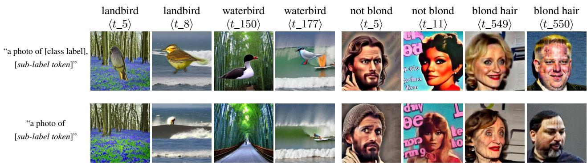  
Figure 2: Visualization of images generated under diferent prompt conditionings across the Waterbirds and CelebA datasets. The top row displays results using the full prompt, whereas the bottom row displays results generated by omitting the class label. This comparison suggests that sub-label tokens provide conditional control over subpopulation-specific visual factors in the generated images.

Table 2: Comparison with generative data augmentation methods on Waterbirds and CelebA. The Group Info column indicates whether a method uses prior group labels to guide generation or a group-balanced validation set for model selection (✓), or operates without either (✗). Within each Group Info category, the best worst-group accuracy is underlined.
<table><tr><td rowspan="2">Method</td><td rowspan="2">Group Info</td><td>Waterbirds</td><td>CelebA</td></tr><tr><td>WGA</td><td>WGA</td></tr><tr><td>ASPIRE + ERM</td><td>x</td><td>78.7±1.3</td><td>50.5±0.8</td></tr><tr><td>SAGE (ours)</td><td>x</td><td>89.5±0.1</td><td>85.7±0.3</td></tr><tr><td>ASPIRE + DFR</td><td>√</td><td>85.3±1.3</td><td>85.5±0.6</td></tr><tr><td>DDB Clustered</td><td>√</td><td>93.0±0.1</td><td>85.8±1.4</td></tr><tr><td>DreamBooth</td><td>√</td><td>88.1±0.9</td><td>84.1±0.6</td></tr></table>

Compared with generative methods For the generative data augmentation comparison, we report results on Waterbirds and CelebA, the two most widely used datasets on which all compared methods have reported results. Table 2 further compares SAGE with existing generative data augmentation methods. Our method not only outperforms ASPIRE+ERM—the only other generative approach without manual group annotations—on both datasets, but also surpasses ASPIRE+DFR despite not using a manually curated validation set. Although SAGE slightly trails DDB, which relies on a complex external segmentation model, the simplicity of our framework and its independence from external models make it a highly valuable solution.

## Ablation Studies

We conduct ablation studies to assess individual components of SAGE, including the behavior revealed by conditional generation under diferent sub-label tokens, the role of the mixed training set in Stage 2, and the utility of the generated validation set for DFR.

Visual Insights from Generated Images In this subsection, we analyze conditional generation under diferent sublabel tokens to examine the subpopulation-specific visual factors captured by the learned tokens.

We use Waterbirds and CelebA for qualitative visualization. Figure 2 shows that changing the sub-label token alters generated images while the class label is fixed in the full prompt, suggesting that the learned tokens encode subpopulation-specific visual variation. On Waterbirds, the illustrated class-token combinations can be interpreted post hoc as landbird/land, landbird/water, waterbird/land, and waterbird/water. Notably, ⟨t\_8⟩ and ⟨t\_150⟩ correspond to visually conflicted clusters with only 25 training samples each; such rare combinations are upweighted by inverse-density sampling, consistent with the goal of reducing background reliance in the downstream classifier.

Efect of the Mixed Training Set To isolate the performance gains brought solely by our data augmentation, we conduct an experiment excluding the final DFR step in Stage 2. We further disentangle the contribution of our fine-tuned generator from generic generative augmentation by introducing a control setting where vanilla Stable Difusion v1.5 generates synthetic data using the standard prompt “a photo of [class label]”. These data are combined with the original dataset D and expanded to the same total size as $\mathcal { D } _ { \mathrm { m i x } }$ forming the standard generation dataset $\mathcal { D } _ { \mathrm { s g } }$ . The results are presented in Table 3.

As shown in Table 3, merely augmenting with generic synthetic data $( \mathcal { D } _ { \mathrm { s g } } )$ provides limited benefit or can even be harmful, whereas $\bar { \mathcal { D } } _ { \operatorname* { m i x } } .$ —built from targeted sub-label sampling into $\mathcal { D } _ { \mathrm { s y n } }$ —achieves substantially larger gains. This confirms that the performance improvement stems from our targeted augmentation of underrepresented subpopulations rather than from generative data augmentation alone. We strictly adopt the same model architecture and hyperparameters as (Sagawa et al. 2020) for the Waterbirds and CelebA dataset, and all experiments in this ablation are conducted using a fixed random seed for fair comparison.

Table 3: Ablation on mixed training set without DFR. Each entry is worst-group accuracy (%) of a ResNet-50 ERM classifier trained on the column dataset. D is the original training set; $\mathcal { D } _ { \mathrm { s g } }$ adds generic Stable Difusion v1.5 augmentation at the same total scale as $\mathcal { D } _ { \mathrm { m i x } }$ (see text above); $\mathcal { D } _ { \operatorname* { m i x } } = \mathcal { D } \cup \mathcal { D } _ { \operatorname { s y n } }$ uses targeted SAGE synthesis. Parentheses give the WGA gain of $\mathcal { D } _ { \mathrm { m i x } }$ over D.
<table><tr><td>Dataset</td><td>D</td><td> $\mathcal { D } _ { \mathrm { s g } }$ </td><td> $\mathcal { D } _ { \mathrm { m i x } }$ </td></tr><tr><td>Waterbirds</td><td>73.2</td><td>70.5</td><td> $7 7 . 5 \ : ( + 4 . 3 )$ </td></tr><tr><td>CelebA</td><td>44.6</td><td>44.1</td><td>49.8 (+5.2)</td></tr><tr><td>MetaShift</td><td>64.2</td><td>65.6</td><td>70.3 (+6.1)</td></tr></table>

Table 4: Evaluation of the generated balanced validation set. We compare our results against the standard DFR performance obtained using the original, manually curated validation set. For each experiment, we report the mean performance across three runs using a fixed set of seeds.
<table><tr><td colspan="4">Waterbirds</td></tr><tr><td>ERM WGA (%)</td><td></td><td colspan="2">73.2</td></tr><tr><td rowspan="3">Samples-per-token Valset Size DFR WGA (%)</td><td>Orig  $\mathcal { D } _ { \mathrm { v a l } }$ </td><td>Gen  $\mathcal { D } _ { \mathrm { v a l } }$ </td><td>16</td></tr><tr><td>532 89.7</td><td>8 312 468 84.1</td><td>12 624 88.6 85.9</td></tr><tr><td>CelebA</td><td></td><td></td></tr><tr><td>ERM WGA (%)</td><td></td><td>44.6</td><td></td></tr><tr><td rowspan="3">Samples-per-token Valset Size DFR WGA (%)</td><td>Orig  $\mathcal { D } _ { \mathrm { v a l } }$ </td><td>Gen</td><td> $\mathcal { D } _ { \mathrm { v a l } }$ </td></tr><tr><td>728</td><td>8 376</td><td>12 16 564 752</td></tr><tr><td>62.8</td><td>80.2 82.6</td><td>79.5</td></tr><tr><td>ERM WGA (%)</td><td>MetaShift</td><td></td><td></td></tr><tr><td></td><td></td><td>64.2</td><td></td></tr><tr><td rowspan="3">Samples-per-token Valset Size DFR WGA (%)</td><td>Orig  $\mathcal { D } _ { \mathrm { v a l } }$ </td><td>Gen</td><td> $\mathcal { D } _ { \mathrm { v a l } }$ </td></tr><tr><td>68</td><td>2 4</td><td>6 132</td></tr><tr><td>69.5</td><td>44 62.6</td><td>88 68.5 73.4</td></tr></table>

Efect of the Synthetic Validation Set We evaluate the balanced validation set generated by our uniform label sampling strategy in this section. For each dataset, we construct three synthetic validation sets $( \mathcal { D } _ { \mathrm { v a l } } )$ of varying sizes by employing three diferent samples-per-token values (after merging). The meaning of the samples-per-token hyperparameter is explained in Appendix B. Specifically, we conduct Deep Feature Reweighting (DFR) on the same ResNet-50 backbone, contrasting the performance of our synthetic $\mathcal { D } _ { \mathrm { v a l } }$ with a ground-truth, manually-picked balanced dataset. To ensure a controlled comparison, we exclude $\mathcal { D } _ { \mathrm { m i x } }$ from this analysis and train the classifier entirely on the original datasets. To ensure consistency, all experiments utilize identical DFR hyperparameters, with the only variation being the size of the validation sets. Results are summarized in Table 4.

Table 4 compares DFR using our synthetic $\mathcal { D } _ { \mathrm { v a l } }$ against manually curated group-balanced validation sets. Overall, synthetic validation is competitive, but the relative performance depends on how spurious factors are structured in each benchmark. Manual validation balances coarse annotated (y, a) groups, yet it does not control finer subpopulation variation within each group—for example, images sharing the same spurious attribute label may still be dominated by a few visual subtypes. Our synthetic set instead balances discovered sub-labels via uniform sampling, providing finer-grained pseudo-balance when clusters align with bias-relevant factors (Appendix C).

On Waterbirds, where spurious attributes are artificially constructed and align cleanly with annotated groups, the manually curated validation set remains strongest (89.7% vs. at most 88.6% with generated validation). On CelebA and MetaShift, which feature more heterogeneous, naturally occurring spurious correlations, synthetic validation can match or exceed manual validation at several scales (up to 82.6% vs. 62.8% on CelebA and 73.4% vs. 69.5% on MetaShift).

Notably, on CelebA, our generated $\mathcal { D } _ { \mathrm { v a l } }$ substantially outperforms the manually curated validation set. We attribute this jointly to finer sub-label balancing beyond coarse (y, a) groups and to the subsampled construction of manual validation (Kirichenko, Izmailov, and Wilson 2023): majority groups are randomly downsampled to match the smallest group, introducing selection variance among retained images. Standard DFR mitigates this via repeated subsampling and $\ell _ { 1 }$ regularization, but we use a single-run setup without these measures for both validation types. Synthetic validation avoids subsampling entirely; together with finer pseudobalance, this helps explain the large gap on CelebA and the gains on MetaShift.

Overall, these results show that our synthetically generated $\mathcal { D } _ { \mathrm { v a l } }$ provides an efective validation set for DFR without relying on manually curated group-balanced data. Across diferent validation sizes and benchmark settings, sub-labelbalanced synthetic validation consistently delivers substantial gains over ERM and remains a practical substitute for manual validation in the group-label-free setting.

## Conclusion

We propose SAGE, a two-stage method designed to mitigate spurious correlations. Driven by a data-centric philosophy, our method actively expands minority samples to force the classifier into learning robust core features, while concurrently synthesizing a highly practical, balanced validation set to further bolster model robustness. We achieve these objectives by utilizing the clustered sub-labels to both fine-tune the conditional generative models and guide the final generation process. Experimental results across three distinct benchmark datasets demonstrate the eficacy of the SAGE framework. Furthermore, because SAGE operates independently of any explicit prior knowledge or specific dataset distribution characteristics, it holds significant potential for generalization to other datasets with subpopulation shifts, and even to broader, general-purpose datasets.

## References

Asgari, S.; Khani, A.; Khani, F.; Gholami, A.; Tran, L.; Mahdavi Amiri, A.; and Hamarneh, G. 2022. Masktune: Mitigating spurious correlations by forcing to explore. Advances in Neural Information Processing Systems, 35: 23284–23296.

Azizi, S.; Kornblith, S.; Saharia, C.; Norouzi, M.; and Fleet, D. J. 2023. Synthetic data from difusion models improves imagenet classification. Transactions on Machine Learning Research.

Basu, A.; Gupta, A.; Bhat, A.; and Radhakrishnan, V. B. 2026. Harnessing difusion-generated synthetic images for fair image classification. In Proceedings of the AAAI Conference on Artificial Intelligence, volume 40, 38205–38213.

Beery, S.; Van Horn, G.; and Perona, P. 2018. Recognition in terra incognita. In Proceedings of the European conference on computer vision (ECCV), 456–473.

Dhariwal, P.; and Nichol, A. 2021. Difusion models beat gans on image synthesis. Advances in neural information processing systems, 34: 8780–8794.

Dunlap, L.; Umino, A.; Zhang, H.; Yang, J.; Gonzalez, J. E.; and Darrell, T. 2023. Diversify your vision datasets with automatic difusion-based augmentation. Advances in neural information processing systems, 36: 79024–79034.

Frey, B. J.; and Dueck, D. 2007. Clustering by passing messages between data points. Science, 315(5814): 972– 976.

Geirhos, R.; Jacobsen, J.-H.; Michaelis, C.; Zemel, R.; Brendel, W.; Bethge, M.; and Wichmann, F. A. 2020. Shortcut learning in deep neural networks. Nature Machine Intelligence, 2(11): 665–673.

Ghosh, S.; Evuru, C. K.; Kumar, S.; Tyagi, U.; Sakshi, S.; Chowdhury, S.; and Manocha, D. 2024. ASPIRE: Language-Guided Data Augmentation for Improving Robustness Against Spurious Correlations. In Ku, L.-W.; Martins, A.; and Srikumar, V., eds., Findings of the Association for Computational Linguistics: ACL 2024, 386–406. Bangkok, Thailand: Association for Computational Linguistics.

He, K.; Zhang, X.; Ren, S.; and Sun, J. 2016. Deep Residual Learning for Image Recognition. In Proceedings ofthe IEEE Conference on Computer Vision and Pattern Recognition (CVPR), 770–778.

Ho, J.; Jain, A.; and Abbeel, P. 2020. Denoising difusion probabilistic models. Advances in neural information processing systems, 33: 6840–6851.

Hu, E. J.; Shen, Y.; Wallis, P.; Allen-Zhu, Z.; Li, Y.; Wang, S.; Wang, L.; and Chen, W. 2022. LoRA: Low-Rank Adaptation

of Large Language Models. In International Conference on Learning Representations.

Kirichenko, P.; Izmailov, P.; and Wilson, A. G. 2023. Last layer re-training is suficient for robustness to spurious correlations. In International Conference on Learning Representations.

Krizhevsky, A.; Sutskever, I.; and Hinton, G. E. 2012. Imagenet classification with deep convolutional neural networks. Advances in neural information processing systems, 25.

Liang, W.; and Zou, J. 2022. MetaShift: A Dataset ofDatasets for Evaluating Contextual Distribution Shifts and Training Conflicts. In International Conference on Learning Representations.

Liu, E. Z.; Haghgoo, B.; Chen, A. S.; Raghunathan, A.; Koh, P. W.; Sagawa, S.; Liang, P.; and Finn, C. 2021. Just train twice: Improving group robustness without training group information. In International Conference on Machine Learning, 6781–6792. PMLR.

Liu, Z.; Luo, P.; Wang, X.; and Tang, X. 2015. Deep learning face attributes in the wild. In Proceedings of the IEEE international conference on computer vision, 3730–3738.

Nam, J.; Cha, H.; Ahn, S.; Lee, J.; and Shin, J. 2020. Learning from Failure: Training Debiased Classifier from Biased Classifier. In Advances in Neural Information Processing Systems, volume 33.

Noohdani, F. H.; Hosseini, P.; Parast, A. Y.; Araghi, H. Y.; and Baghshah, M. S. 2024. Decompose-and-compose: A compositional approach to mitigating spurious correlation. In Proceedings of the IEEE/CVF Conference on Computer Vision and Pattern Recognition, 27662–27671.

Parast, A. Y.; Azam, B.; and Akhtar, N. 2025. DDB: Difusion Driven Balancing to Address Spurious Correlations. In Proceedings of the IEEE/CVF International Conference on Computer Vision, 17526–17535.

Qraitem, M.; Saenko, K.; and Plummer, B. A. 2024. From Fake to Real: Pretraining on Balanced Synthetic Images to Prevent Spurious Correlations in Image Recognition. In Leonardis, A.; Ricci, E.; Roth, S.; Russakovsky, O.; Sattler, T.; and Varol, G., eds., Computer Vision – ECCV 2024, 230–246. Cham: Springer Nature Switzerland. ISBN 978-3- 031-73636-0.

Radford, A.; Kim, J. W.; Hallacy, C.; Ramesh, A.; Goh, G.; Agarwal, S.; Sastry, G.; Askell, A.; Mishkin, P.; Clark, J.; et al. 2021. Learning transferable visual models from natural language supervision. In International conference on machine learning, 8748–8763. PMLR.

Rombach, R.; Blattmann, A.; Lorenz, D.; Esser, P.; and Ommer, B. 2022. High-resolution image synthesis with latent difusion models. In Proceedings of the IEEE/CVF conference on computer vision and pattern recognition, 10684– 10695.

Sagawa, S.; Koh, P. W.; Hashimoto, T. B.; and Liang, P. 2020. Distributionally robust neural networks for group shifts: On the importance of regularization for worst-case generalization. In International Conference on Learning Representations.

Sun, M.; Zhao, R.; Huang, Z.; Ding, S.; and Liu, J. 2026. IT-OSE: Exploring Optimal Sample Size for Industrial Data Augmentation. Preprint, arXiv:2602.15878.

Welinder, P.; Branson, S.; Mita, T.; Wah, C.; Schrof, F.; Belongie, S.; and Perona, P. 2010. Caltech-UCSD birds 200. Technical Report CNS-TR-2010-001, California Institute of Technology.

Wu, S.; Yuksekgonul, M.; Zhang, L.; and Zou, J. 2023. Discover and cure: Concept-aware mitigation of spurious correlation. In International Conference on Machine Learning, 37765–37786. PMLR.

Zhang, M.; Sohoni, N. S.; Zhang, H. R.; Finn, C.; and Ré, C. 2022. Correct-N-Contrast: A Contrastive Approach for Improving Robustness to Spurious Correlations. In International Conference on Machine Learning, 26484–26516. PMLR.

This is the supplementary material of the paper “SAGE: Subpopulation-Aware Generative Enhancement for Mitigating Spurious Correlations”. The content catalog is as follows:

• Appendix A: Dataset Statistics

– Appendix A.1: Dataset Groups and Label Combinations

– Appendix A.2: Group Distributions by Split

• Appendix B: Implementation Details

– Appendix B.1: Hyperparameters

– Appendix B.2: Hardware

• Appendix C: Clustering Analysis

– Appendix C.1: Clustering Hyperparameters

– Appendix C.2: Cluster Statistics

– Appendix C.3: Clustering Strategy for CelebA

• Appendix D: Efectiveness Analysis of DFR with the Generated Validation Set

– Appendix D.1: Feature-Space Construction

– Appendix D.2: Downstream Classification Analysis

## Appendix A: Dataset Statistics

We report group definitions and split-wise (y, a) distributions for the three benchmarks used in the main paper. All counts are computed from the dataset metadata in our experiments. SAGE performs clustering and generative fine-tuning on the training split only (4,795 / 162,770 / 1,024 images on Waterbirds, CelebA, and MetaShift, respectively); benchmark validation splits are not used in the method pipeline, and test samples are held out for final evaluation. Appendix C reports post-hoc clustering purity on the union of training and validation splits (5,994 / 182,637 / 1,105 images) for numerical analysis only. Implementation details and clustering analysis are given in Appendix B and Appendix C, respectively.

## Dataset Groups and Label Combinations

Figure 4 summarizes the four $( y , a )$ groups per benchmark. Each column $\mathcal { G } _ { i }$ shows a square-cropped training example, a short group description, the class label y, and the number of training and validation images. Example images are centercropped and resized to a common square size. The figure is placed at the end of this supplementary material.

## Group Distributions by Split

Tables 5–7 report the number of images in each (y, a) group on the training, validation, and test splits.

Table 5: Waterbirds group distribution by split $( N _ { \mathrm { t r a i n } } =$ 4,795, $N _ { \mathrm { v a l } } = 1 { , } 1 9 9 , N _ { \mathrm { t e s t } } = 5 { , } 7 9 4 )$ . Validation and test splits are approximately group-balanced.
<table><tr><td>Group  $( y , a )$ </td><td>Train</td><td>Val</td><td>Test</td></tr><tr><td>landbird, land background</td><td>3,498</td><td>467</td><td>2,255</td></tr><tr><td>landbird, water background</td><td>184</td><td>466</td><td>2,255</td></tr><tr><td>waterbird, land background</td><td>56</td><td>133</td><td>642</td></tr><tr><td>waterbird, water background</td><td>1,057</td><td>133</td><td>642</td></tr></table>

Table 6: CelebA group distribution by split $( N _ { \mathrm { t r a i n } } ~ =$ 1 $\mathrm { 6 2 , 7 7 0 , } N _ { \mathrm { v a l } } { = } 1 9 , \mathrm { 8 6 7 , } N _ { \mathrm { t e s t } } { = } 1 9 , 9 6 2 ) .$
<table><tr><td>Group  $( y , a )$ </td><td>Train</td><td>Val</td><td>Test</td></tr><tr><td>not blond, female</td><td>71,629</td><td>8,535</td><td>9,767</td></tr><tr><td>not blond, male</td><td>66,874</td><td>8,276</td><td>7,535</td></tr><tr><td>blond, female</td><td>22,880</td><td>2,874</td><td>2,480</td></tr><tr><td>blond, male</td><td>1,387</td><td>182</td><td>180</td></tr></table>

Table 7: MetaShift group distribution by split $( N _ { \mathrm { t r a i n } } =$ $1 , 0 2 4 , N _ { \mathrm { v a l } } = 8 1 , N _ { \mathrm { t e s t } } = 4 6 0 )$ . Shelf background appears only in validation and test.
<table><tr><td>Group  $( y , a )$ </td><td>Train</td><td>Val</td><td>Test</td></tr><tr><td>cat, bed</td><td>348</td><td>0</td><td>0</td></tr><tr><td>cat, sofa</td><td>202</td><td>0</td><td>0</td></tr><tr><td>dog, bench</td><td>124</td><td>0</td><td>0</td></tr><tr><td>dog, bike</td><td>350</td><td>0</td><td>0</td></tr><tr><td>cat, shelf</td><td>0</td><td>34</td><td>201</td></tr><tr><td>dog, shelf</td><td>0</td><td>47</td><td>259</td></tr></table>

## Appendix B: Implementation Details

This appendix supplements Section 3 and Section 4 of the main paper with reproducibility-oriented details. Dataset split sizes and group distributions are given in Appendix A; clustering-specific hyperparameters and post-hoc purity analysis are reported separately in Appendix C.

## Hyperparameters

Unless stated otherwise, we use the same configuration across Waterbirds, CelebA, and MetaShift.

Conditional generator fine-tuning (Stable Difusion v1.5 + LoRA). We fine-tune the Hugging Face Stable Difusion v1.5 checkpoint2 using Low-Rank Adaptation (LoRA) on the UNet, jointly optimizing LoRA weights and newly added sub-label token embeddings. Each cluster k receives a unique token $\left. t _ { k } \right.$ , initialized from the word photo. Training uses the prompt template “a photo of [class label y], [sublabel token $\langle t _ { k } \rangle J ^ { \prime \prime }$ (Eq. 1 in the main paper). Key training hyperparameters are:

• LoRA rank r = 128; LoRA α = 128

• Learning rate: 1e-5; Optimizer: AdamW

• Batch size (per GPU): 4; Training epochs: 100

• Image resolution: 512

• Trainable modules: LoRA on UNet attention layers + sublabel token embeddings

Token similarity merging. After fine-tuning, we merge redundant sub-label tokens within each class (main paper, Stage 2). For class $y ,$ let $\mathbf { e } _ { k }$ denote the learned text-encoder embedding of sub-label token $\left. t _ { k } \right.$ . We compute all pairwise cosine similarities $\cos ( \mathbf { e } _ { i } , \mathbf { e } _ { j } )$ among tokens in that class and take their mean $\bar { s } _ { y } .$ . The merge criterion is not a fixed absolute threshold; instead, two tokens are merged if

$$
\cos ( { \bf e } _ { i } , { \bf e } _ { j } ) > \tau _ { \mathrm { m e r g e } } = \beta \cdot \bar { s } _ { y } ,\tag{4}
$$

where $\beta$ is a dataset-specific multiplier (shared across classes within the same dataset). Merging is applied transitively to form disjoint semantic groups. We set $\beta \stackrel { - } { = } 2 . 5$ on Waterbirds, 4.0 on CelebA, and 4.0 on MetaShift.

Validation-set synthesis $\left( \mathcal { D } _ { \mathrm { v a l } } \right)$ . We empirically observe that when synthesizing a small-scale validation set, relying on purely stochastic probability sampling can introduce substantial variance in the resulting data distribution. Consequently, for validation set construction, we replace stochastic inverse-density sampling with a deterministic samples-pertoken parameter.

## Hardware

Stable Difusion fine-tuning is run on two NVIDIA RTX 4090 GPUs. All other stages—CLIP feature extraction, clustering, synthetic image generation, ResNet-50 training, and DFR—are run on a single NVIDIA RTX 4090 GPU.

## Appendix C: Clustering Analysis

## Clustering Hyperparameters

We apply Afinity Propagation (AP) clustering independently within each class using CLIP embeddings as input features. The AP algorithm has two key hyperparameters: the damping factor $\lambda _ { \mathrm { d a m p } }$ , which controls numerical oscillation during message passing, and the diagonal preference values $s ( k , k )$ set to the mean of all pairwise similarities scaled by a multiplier $\alpha _ { \mathrm { p r e f } } .$ . For Waterbirds and MetaShift, whose training sets are relatively small, we set $\lambda _ { \mathrm { d a m p } } = 0 . 5$ . For CelebA, which contains over 160,000 training samples, we increase the damping to $\lambda _ { \mathrm { d a m p } } = 0 . 8$ to ensure stable convergence. Across all three datasets, we fix $\alpha _ { \mathrm { p r e f } } = 1$ , meaning the preference value equals the mean of all pairwise similarities.

## Cluster Statistics

Ground-truth spurious labels are used only in this post-hoc analysis and are not available to SAGE during training or generation. For purity evaluation, we re-cluster on the union of training and validation splits (Table 8); this is separate from the train-split-only clustering used in the method. For datasets with such labels, we evaluate clustering purity—the extent to which discovered clusters align with spurious attributes. Let $\mathcal { C } = \{ C _ { 1 } , \ldots , C _ { K } \}$ denote the set of discovered clusters and A the set of spurious attributes $( | { \cal A } | = 2$ for

Waterbirds and $\mathrm { C e l e b A } ; | { \mathcal { A } } | = 4$ for MetaShift). For each cluster $C _ { k }$ , its purity is defined as:

$$
\operatorname { P u r i t y } ( C _ { k } ) = \operatorname* { m a x } _ { a \in { \cal A } } \frac { | \{ ( x _ { i } , y _ { i } , a _ { i } ) \in C _ { k } : a _ { i } = a \} | } { | C _ { k } | } .\tag{5}
$$

The overall purity reported in Table 8 is the sample-weighted (micro) average over clusters:

$$
\mathrm { P u r i t y } _ { \mathrm { o v e r a l l } } = \frac { 1 } { \sum _ { k = 1 } ^ { K } | C _ { k } | } \sum _ { k = 1 } ^ { K } | C _ { k } | \operatorname { P u r i t y } ( C _ { k } ) .\tag{6}
$$

Table 8: Number of samples, resulting clusters, and clustering purity for each dataset. Sample counts are the sum of the training and validation splits and are used for clustering analysis only.
<table><tr><td>Dataset</td><td>Samples</td><td>Clusters</td><td>Purity (%)</td></tr><tr><td>Waterbirds</td><td>5,994</td><td>180</td><td>93.66</td></tr><tr><td>CelebA</td><td>182,637</td><td>1,089</td><td>98.17</td></tr><tr><td>MetaShift</td><td>1,105</td><td>113</td><td>72.49</td></tr></table>

As shown in Table 8, purity exceeds 90% on Waterbirds and CelebA, indicating that clusters often align with binary spurious attributes on these datasets. This post-hoc analysis suggests that visually salient spurious cues may also structure CLIP feature similarity, though cluster–group alignment remains imperfect. Ground-truth spurious labels are used here for evaluation only; during training, SAGE relies solely on cluster-derived sub-labels. The purity on MetaShift is comparatively lower (72.49%). We conjecture two contributing factors. First, MetaShift involves four spurious attributes (sofa, bed, bench, bike) rather than two, inherently increasing the dificulty of clean separation. Second, unlike birds and human faces, cats and dogs exhibit pronounced interclass visual diferences beyond the background, which may compete with spurious background cues during clustering. Despite this weaker alignment, SAGE still improves worstgroup accuracy on MetaShift (Table 1), suggesting that augmentation by rare clusters can help even when clusters do not map cleanly to spurious groups.

## Clustering Strategy for CelebA

With over 160,000 training samples, CelebA poses a computational challenge for Afinity Propagation: storing the full $\bar { N } \times N$ similarity matrix is infeasible. We therefore adopt a three-stage strategy.

First, we reduce the dataset to a diverse core set of K = 10,000 samples via Farthest Point Sampling (FPS), which iteratively selects points farthest from the already chosen set, ensuring broad coverage of the feature space. Second, we run AP clustering exclusively on this core set to identify exemplars. Third, we build a Faiss exact nearest-neighbor index over the exemplars and assign every sample in the full dataset to its closest exemplar, thereby recovering cluster labels for all samples.

We repeat this procedure separately for each class (blond / not blond) and ofset cluster indices globally to prevent overlap. The dominant memory cost reduces from storing the $N \times N$ similarity matrix (infeasible at $N \approx 1 . 6 \times 1 0 ^ { 5 } )$ to $O ( N \times D + K ^ { 2 } )$ , where $D$ is the CLIP feature dimension and $\dot { K } \ll N$ . In our experiments, K is simply set to 10,000.

## Appendix D: Efectiveness Analysis of DFR with the Generated Validation Set Feature-Space Construction

Figure 3 analyzes how applying DFR on the generated validation set constructed by SAGE afects downstream classification in the frozen feature space. For each dataset, we use the ERM-trained backbone as a fixed feature extractor. Let $h _ { \theta } ( \cdot )$ denote this backbone after replacing the final classification layer with an identity map, and let $f = h _ { \theta } ( x ) \in \mathbb R ^ { d }$ be the frozen feature of an image x. We construct the twodimensional PCA space separately for each dataset. Specifically, let $\mathcal { D } _ { \mathrm { t e s t } } ^ { \mathrm { v i s } }$ denote the held-out test samples used in the visualization and let $\mathcal { D } _ { \mathrm { v a l } } ^ { \mathrm { D F R } }$ denote the generated validation samples used for DFR. PCA is fit on the union of their frozen features,

$$
\begin{array} { r } { S _ { \mathrm { P C A } } = \{ h _ { \theta } ( \boldsymbol { x } ) : \boldsymbol { x } \in \mathcal { D } _ { \mathrm { t e s t } } ^ { \mathrm { v i s } } \} \cup \{ h _ { \theta } ( \boldsymbol { x } ) : \boldsymbol { x } \in \mathcal { D } _ { \mathrm { v a l } } ^ { \mathrm { D F R } } \} . } \end{array}\tag{7}
$$

If $F = [ f _ { 1 } , \ldots , f _ { n } ] ^ { \intercal }$ stacks these features, we first center them by $\begin{array} { r } { \mu = \frac { 1 } { n } \sum _ { i } f _ { i } } \end{array}$ and compute the empirical covariance matrix

$$
C = \frac { 1 } { n } \sum _ { i = 1 } ^ { n } ( f _ { i } - \mu ) ( f _ { i } - \mu ) ^ { \top } .\tag{8}
$$

The PCA basis is given by the two eigenvectors with the largest eigenvalues, $u _ { 1 }$ and $u _ { 2 }$ , satisfying $C u _ { j } = \lambda _ { j } u _ { j }$ with $\lambda _ { 1 } \geq \lambda _ { 2 } .$ . For any frozen feature $f ,$ its two-dimensional coordinate is then

$$
z = U ^ { \top } ( f - \mu ) , \qquad U = [ u _ { 1 } , u _ { 2 } ] \in \mathbb { R } ^ { d \times 2 } .\tag{9}
$$

We use the same mean $\mu$ and basis $U$ to project both the reweighting samples and the held-out test samples, so the two panels in each row share a common coordinate system. The PCA basis is fit only on $\mathcal { D } _ { \mathrm { t e s t } } ^ { \mathrm { v i s } }$ and the generated validation subset $\mathcal { D } _ { \mathrm { v a l } } ^ { \mathrm { D F R } }$ defined above; any additional generated reweighting samples shown in the left column are transformed afterward using this fixed PCA map. The left column contains the generated reweighting samples used for DFR, while the right column contains samples from the held-out test split. For Waterbirds and CelebA, whose original test splits are large, $\mathcal { D } _ { \mathrm { t e s t } } ^ { \mathrm { v i s } }$ is a balanced subset with 180 images sampled from each $( y , a )$ group. This keeps the visualization readable while preserving the class-attribute structure needed for comparing decision boundaries. Finally, for a binary final linear layer with logits $\boldsymbol { w _ { c } ^ { \intercal } f } + \boldsymbol { b _ { c } } ,$ , the decision boundary in the original feature space is

$$
( w _ { 1 } - w _ { 0 } ) ^ { \top } f + ( b _ { 1 } - b _ { 0 } ) = 0 .\tag{10}
$$

Substituting the PCA-plane approximation $f \approx \mu { + } U z \operatorname { g }$ ives the boundary drawn in Figure 3,

$$
\big ( ( w _ { 1 } - w _ { 0 } ) ^ { \top } U \big ) z + ( w _ { 1 } - w _ { 0 } ) ^ { \top } \mu + ( b _ { 1 } - b _ { 0 } ) = 0 .\tag{11}
$$

This allows us to compare the ERM decision boundary with the decision boundary after DFR while keeping the backbone representation fixed.

## Downstream Classification Analysis

The six panels compare the proxy reweighting set and the held-out test distribution under the same frozen feature representation. Applying DFR with $\mathcal { D } _ { \mathrm { v a l } }$ updates only the last linear layer, which shifts the decision boundary in the projected test feature space. This boundary shift is consistent with the role of $\mathcal { D } _ { \mathrm { v a l } }$ as a more balanced proxy reweighting set: it supplies additional coverage for rare or under-represented classattribute combinations and reduces the dependence of the final classifier on majority-dominated correlations. Together with the quantitative results reported in the main paper, this feature-space analysis supports the conclusion that DFR on the generated validation set improves worst-group accuracy while maintaining competitive average accuracy, i.e., the robustness gain is obtained without a large sacrifice in overall classification performance.

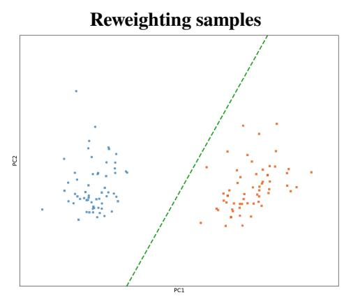

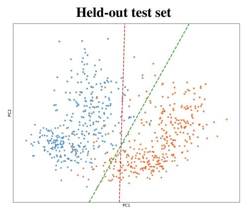

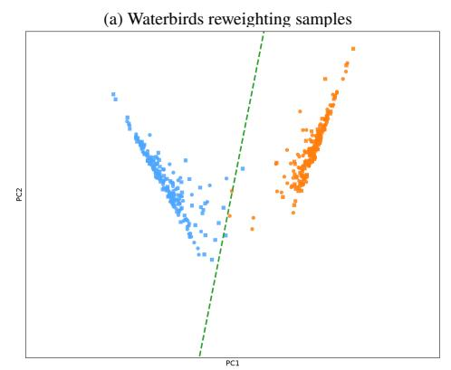

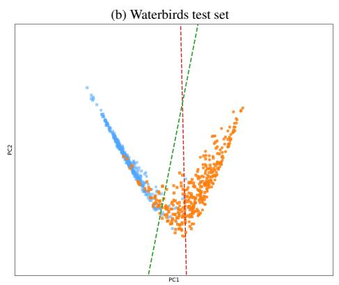

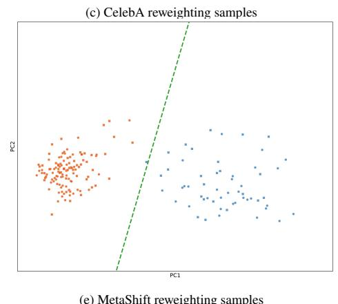

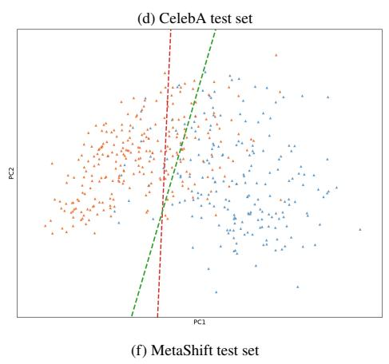  
Figure 3: Decision-boundary visualizations for Waterbirds, CelebA, and MetaShift. Left column: reweighting samples from $\mathcal { D } _ { \mathrm { v a l } }$ with the decision boundary after DFR. Right column: held-out test samples with both the ERM decision boundary and the decision boundary after DFR. Green dashed line: decision boundary after DFR; red dashed line: ERM decision boundary. Blue/orange points denote the two target classes: landbird/waterbird, non-blond/blond, and cat/dog, respectively. Circles/squares denote the available spurious attribute for Waterbirds and CelebA; for MetaShift, they denote merged generated-background groups in the left panel, while test samples are triangles because all come from the held-out shelf background.

Waterbirds dataset  
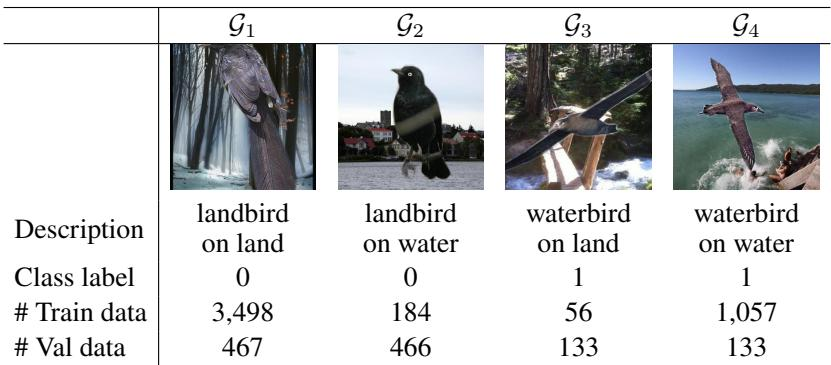  
Target: bird type; Spurious feature: background type; Minority: 2, 3.

CelebA hair color dataset  
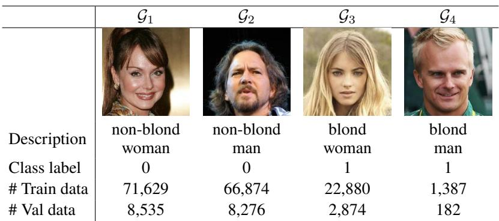  
Target: hair color; Spuriousfeature: gender; Minority: 4.

MetaShift dataset  
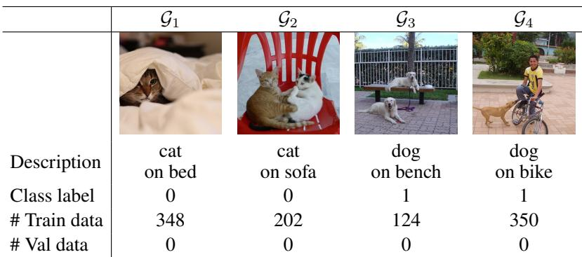  
Target: animal species; Spuriousfeature: background object.  
Figure 4: Overview of the four (y, a) groups for Waterbirds, CelebA, and MetaShift. Class label y follows the standard group-ID convention in each benchmark.